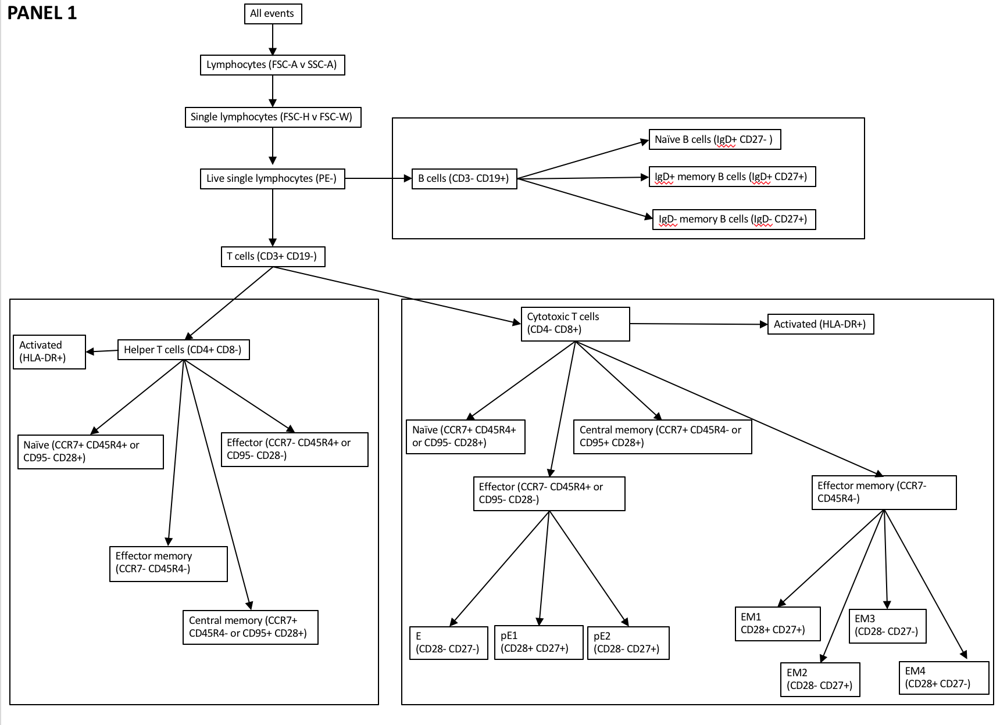
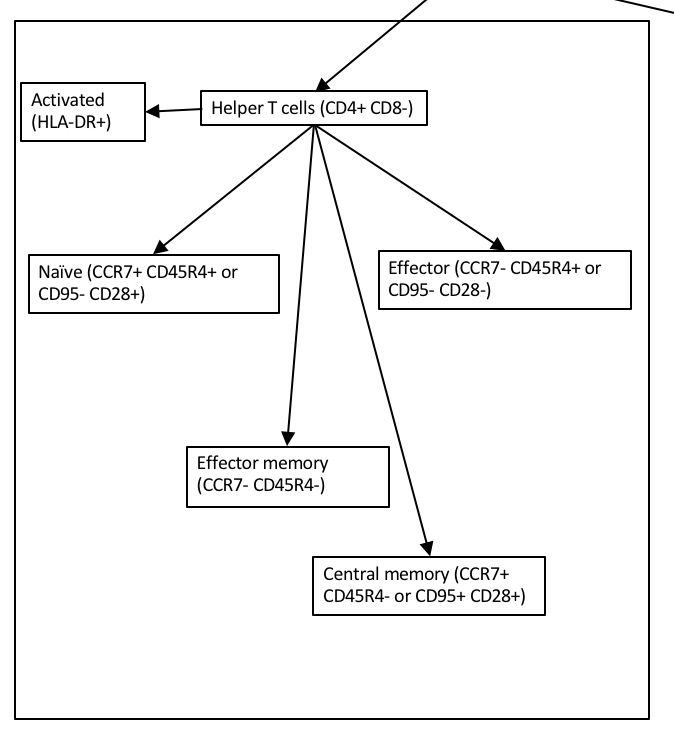

- cytofkit , kinda cool https://bioconductor.org/packages/devel/bioc/vignettes/cytofkit/inst/doc/cytofkit_workflow.html

```{r echo=FALSE,warning=FALSE,message=FALSE }


require(ClusterR)
require(scales)
require(CytoML)
library(reshape2)
library(knitr)


# https://github.com/RGLab/flowWorkspace/issues/231


popsOfInterest = c("effector memory", "central memory", "naive", "effector")


gateKmeansWsp = function(gs,
                         fcsFile,
                         outputDir,
                         min = -20,
                         max = 250,
                         k = 4,
                         num_init = 150,
                         max_iters = 5000,
                         nodesOfInterest = c("Helper Tcells-CD4+", "cytotoxic Tcells-CD8+"),
                         markersToCluster = c("CCR7", "CD45RA", "CD28"),
                         addComp = FALSE) {
  dir.create(outputDir)
  outputRoot = paste0(outputDir, fcsFile)
  clustFile = paste0(outputRoot, ".clusterData")
  
   combo = data.frame(ht = getIndiceMat(gs, nodesOfInterest[1])[, 1],
                       ct = getIndiceMat(gs, nodesOfInterest[1])[, 1])
    combo$MDEF = combo$ct | combo$ht
    
    fullDef=data.frame(MDEF=combo$MDEF)
    allNodes=getNodes(gs,path="auto")
    for(node in allNodes){
      tmp = getIndiceMat(gs, node)[, 1]
      fullDef=cbind(fullDef,tmp)
      
    }
    colnames(fullDef)=allNodes
    subto=5000
    gh <- gs[[1]]
    subdata = getData(gh)[combo$MDEF, ]
    fullDef = fullDef[combo$MDEF, ]
    fullDef=fullDef[1:min(subto,length(fullDef[,1])),]

    channels = colnames(subdata)[grep("Comp", colnames(subdata))]
    
    channelsPlot = c()

      markersToCluster = c("CCR7", "CD45RA", "CD28")
    for (marker in markersToCluster) {
      if (addComp) {
        channelsPlot = c(channelsPlot, c(paste0(
          "Comp-",
          getChannelMarker(frame, marker)$name
        )))
      } else{
        channelsPlot = c(channelsPlot, c(paste0(
          getChannelMarker(frame, marker)$name
        )))
      }
    }
    # markersToCluster= markernames(subdata)[grep("Comp", colnames(subdata))]
  if (!file.exists(clustFile)) {
   
  
    # print(getData(gh))
    
    t = as.data.frame(subdata@exprs)[, channels]
    for (channel in channels) {
      t[, channel] = squish(t[, channel], range = c(min, max))
    }
    clust = center_scale(t[, channels])
    clust =clust[1:min(subto,length(clust[,1])),]

    # colnames(clust) = markersToCluster
    print(paste0("clustering sample ", fcsFile))
    km_rc = KMeans_rcpp(
      clust,
      clusters = k,
      num_init = num_init,
      max_iters = max_iters,
      tol = 1e-06,
      initializer = 'optimal_init',
      # threads = 4,
      verbose = F,
      seed = 42
    )
    
    clust = as.data.frame(clust)
    colnames(clust)=channels

    clust$KMEANS_CLUSTER = km_rc$clusters
        print(paste0("running phenograph for sample ", fcsFile))

    clusterPhenograph = cytof_cluster(xdata = clust, method = "Rphenograph")
    clust$PHENOGRAPH = clusterPhenograph
    
            print(paste0("running tsne for sample ", fcsFile))

            
    tsne <- cytof_dimReduction(data = clust,
                               method = "tsne",
                               out_dim = 2)
    
 cluster_DensVM <- cytof_cluster(xdata = clust,
                                 ydata = tsne, method = "DensVM")
    clust = cbind(clust,tsne)
    
    clust$CLUSTER_DENSVM=cluster_DensVM
    save(clust, file = clustFile)
    
  }else{
   load(clustFile) 
  }
    
    myColor <- rev(RColorBrewer::brewer.pal(11, "Spectral"))

    clust=cbind(clust,fullDef)
    optKN = 16
    o3_t = Optimal_Clusters_KMeans(
      clust[,channels],
      max_clusters = optKN,
      plot_clusters = TRUE,
      criterion = 'distortion_fK',
      tol = 1e-06,
      seed = 42
    )
    
    tsalpha = .5
    tsSize =1
    methods = c("KMEANS_CLUSTER", "PHENOGRAPH","CLUSTER_DENSVM")
    for (method in methods) {
      clust$CURRENT_COLOR=as.factor(clust[,method])
      
      tmp=clust[,c(method,allNodes)]
      tmpM=melt(data = tmp,id.vars=method)
      tmpM=tmpM[which(tmpM$value=="TRUE"),]
      tmpT=table(tmpM[,method],paste0(tmpM$variable,tmpM$value))
      tmpT=as.data.frame.matrix(tmpT)
      kable(tmpT)
      
      # for 
      # # for(channel in )
      #   # pbOrient2= ggplot(clust)+ geom_point(alpha = tsalpha, aes(x = tsne_1,
      #   #              y = tsne_2,
      #   #              colour = expression),size=tsSize)+ scale_fill_gradientn(colours = myColor)
      # 
      pb2 = ggplot(clust) +
        geom_point(
          alpha = tsalpha,
          aes(
            x = tsne_1,
            y = tsne_2,
            colour = CURRENT_COLOR
          ),
          size = tsSize
        ) +
        xlab(paste0("tsne1")) +
        ylab(paste0("tsne2"))  + ggtitle(paste0(method, "\n", samp)) +
        theme(legend.position = "bottom")
      print(pb2)
      
      # + t2
  
  }
}


require(flowCore)
require(cytofkit)
library(ggcyto)
library(ClusterR)
library(gridExtra)
library(grid)
library(scales)
library(cluster)
library(reshape)
library(openCyto)

alpha = 0.05
reCluster = TRUE
runPhenograph = FALSE
inputDir = "/Volumes/Beta2/flow/testNovels/"

wsDir = "/Volumes/Beta2/flow/wsp/"
wsps <-
  list.files(wsDir,
             pattern = "wsp$",
             full = TRUE,
             recursive = TRUE)

print(paste0("Found ", length(wsps), " wsps"))
#
# for (file in wsps) {
#   ws <- openWorkspace(file)
#   s = getSamples(ws)
#   print(length(s$name))
#   s=s[grepl("PANEL 1",s$name),]
#   print(length(s$name))
#
#   for (samp in s$name) {
#     if(runif(1)[1]<.15){
#       command = paste0(
#         "rsync -av \'msi:/scratch.global/lanej/flow/full/fcs/",
#         gsub(" ", "\\\ ", samp, fixed = TRUE),
#         "' ",
#         inputDir
#       )
#       system(command)
#     }
#   }
# }
markersToCluster = c("CCR7", "CD45RA", "CD28")

outputDir = "/Volumes/Beta2/flow/novelResults/"

wsMapFileFile = "/Volumes/Beta2/flow/novelResults/fcsLOCALMAP.manual.txt"
mapper = read.delim(wsMapFileFile,
                    stringsAsFactors = FALSE,
                    sep = "\t")
targets =
  list.files(inputDir,
             pattern = ".fcs$",
             full = FALSE)

for (samp in mapper$FCS) {
  if (file.exists(paste(inputDir, samp, sep = ""))) {
    wsFile = mapper[which(mapper$FCS == samp),]$WSP
    print(wsFile)
    ws <- openWorkspace(wsFile)
    
    print(samp)
    #read the fcs file
    frame = read.FCS(paste(inputDir, samp, sep = ""))
    
    id = samp
    #load the workspace for this file, apply transforms, compensation, and gates
    gs <-
      parseWorkspace(
        ws,
        #WSP file
        path = inputDir,
        #FCS file
        name = 1,
        #sample group
        subset = id[1],
        #load single fcs file
        isNcdf = FALSE,
        #not memory mapped
        compensation = compensation(keyword(frame)$`SPILL`)
      )
    
    
    min = -20
    max = 250
    k = 4
    num_init = 10
    max_iters = 5000
    # nodesOfInterest = c("Helper Tcells-CD4+", "cytotoxic Tcells-CD8+")
    nodesOfInterest = c("Helper Tcells-CD4+")
    
    markersToCluster = c("CCR7", "CD45RA", "CD28")
    addComp = TRUE
    # for (node in nodesOfInterest) {
    print(samp)
    fcsFile = samp
    outputDir = "/Volumes/Beta2/flow/novelResults/"
    gateKmeansWsp(
      gs = gs,
      fcsFile = samp,
      outputDir = "/Volumes/Beta2/flow/novelResults/",
      addComp = TRUE ,
      num_init = 10,
      max_iters = 5000
    )
    
  }
}

```
