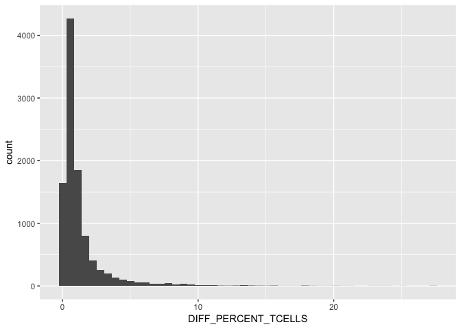
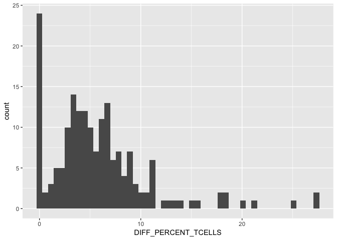
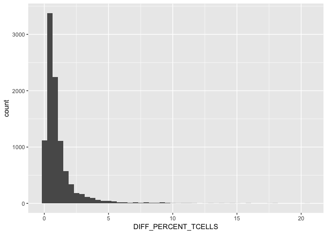

# Cyto T comp
JL  
12/21/2017  

# All samples

<!-- -->

# Manual Cytotoxic gate samples
<!-- -->

#Non Manual Cytotoxic gate samples
<!-- -->

22  control files + one weird file 2016-12-29_PANEL_1_RR_group_one_PBMC_LN_001

180 total unique manual CD8 annotations

