# Insilco LOD
JL  
12/11/2017  


```
## Warning: Using size for a discrete variable is not advised.
```

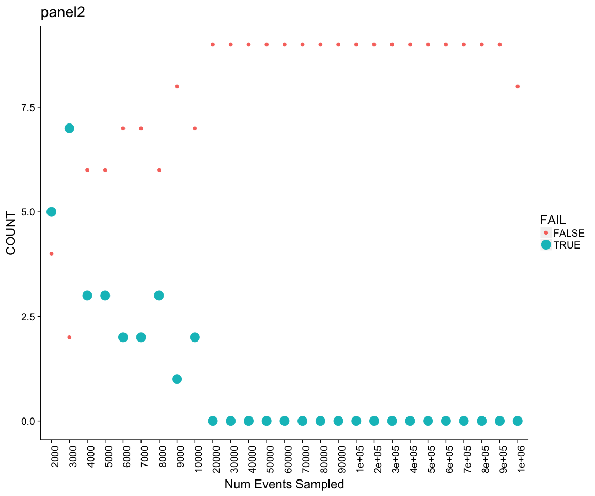<!-- -->

```
## Warning: Using size for a discrete variable is not advised.
```

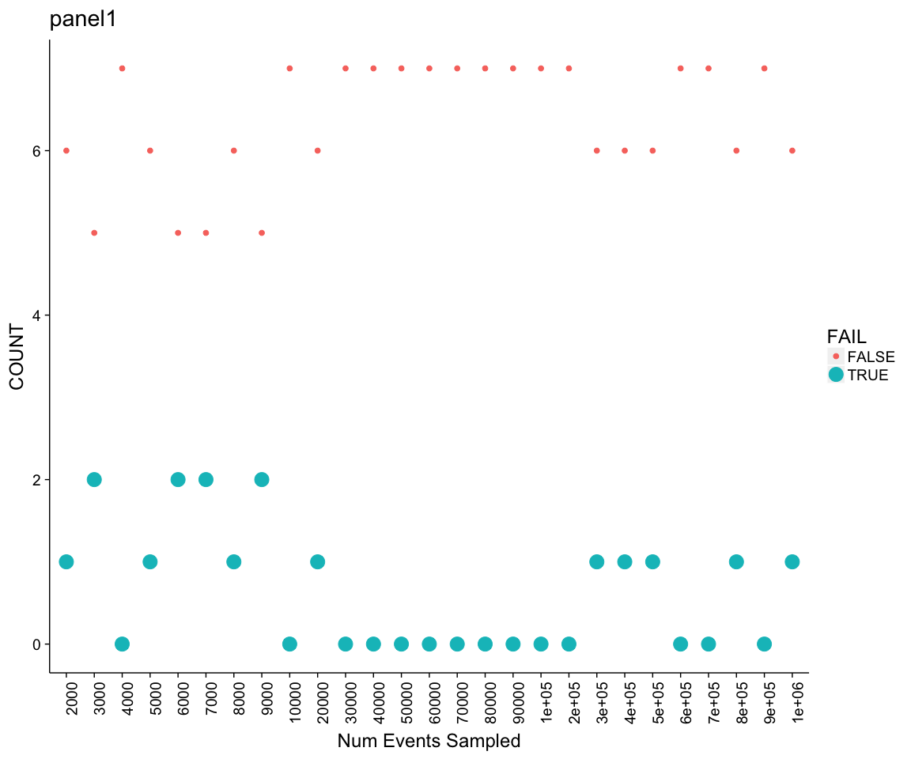<!-- -->

```
## Warning: Using size for a discrete variable is not advised.
```

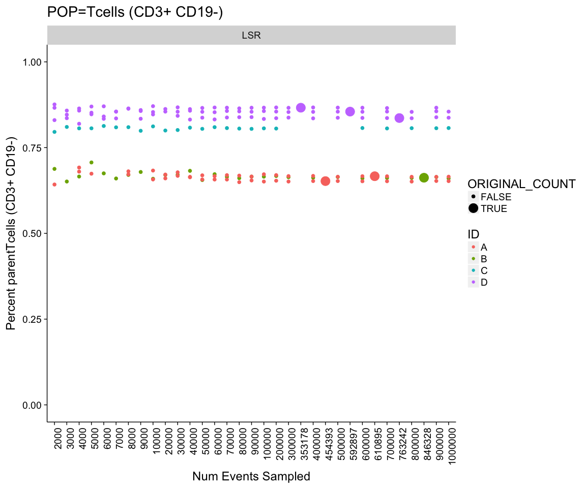<!-- -->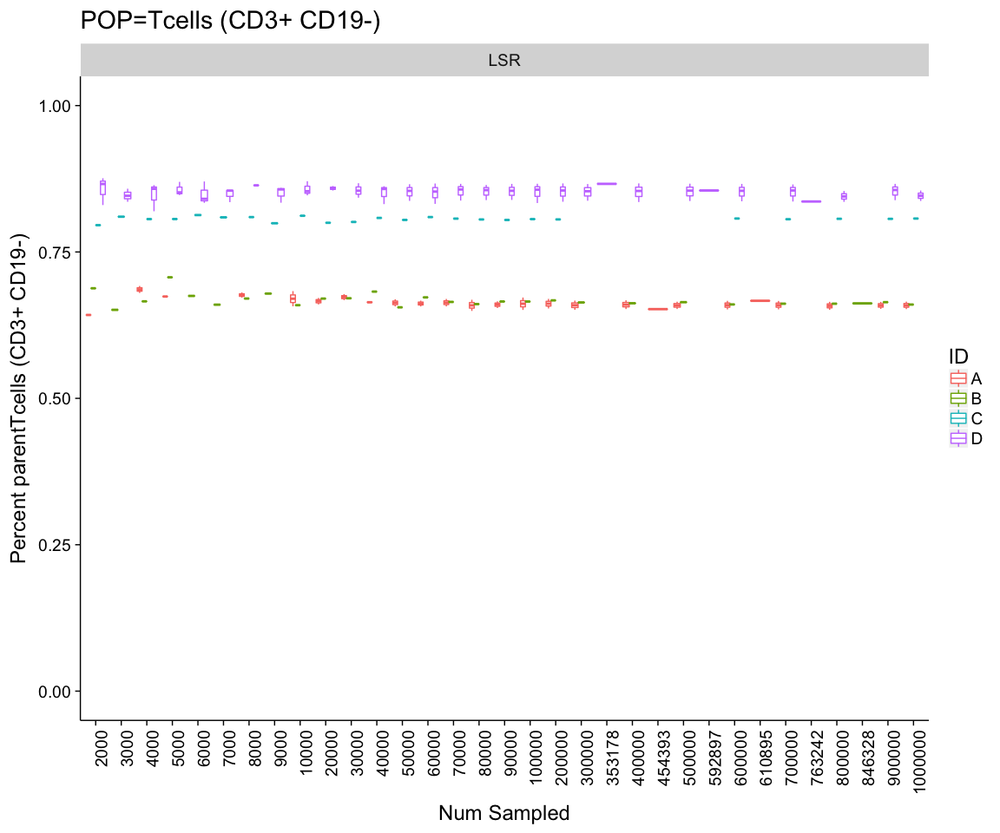<!-- -->

```
## Warning: Using size for a discrete variable is not advised.
```

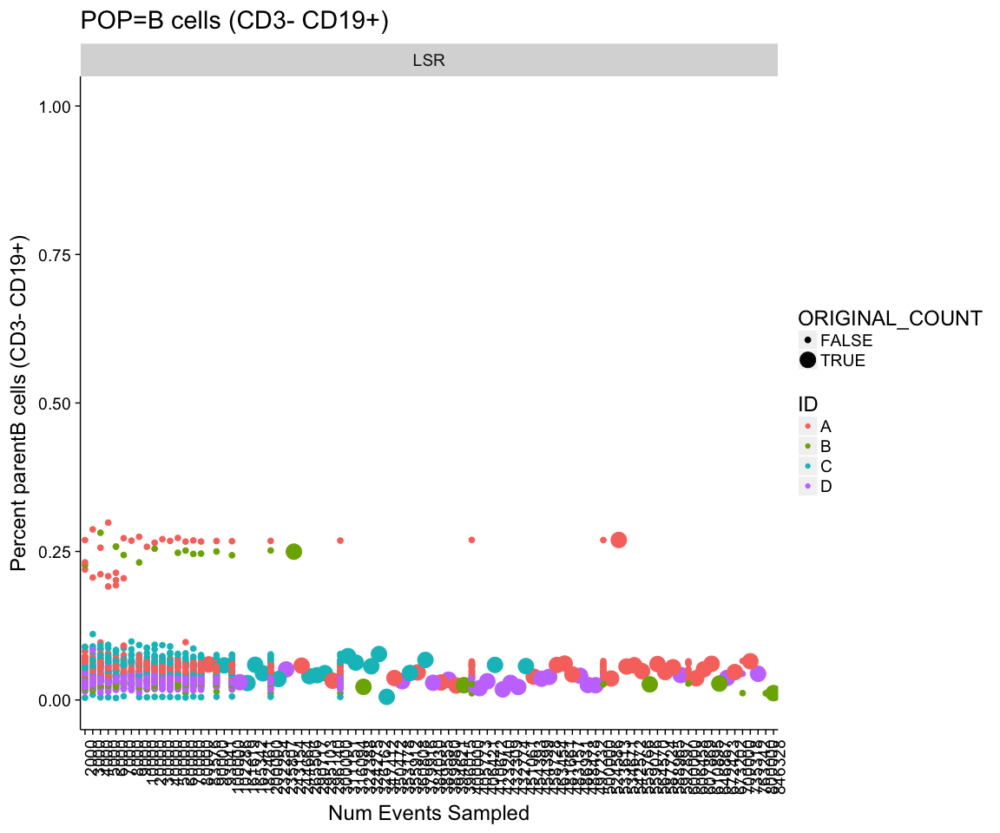<!-- -->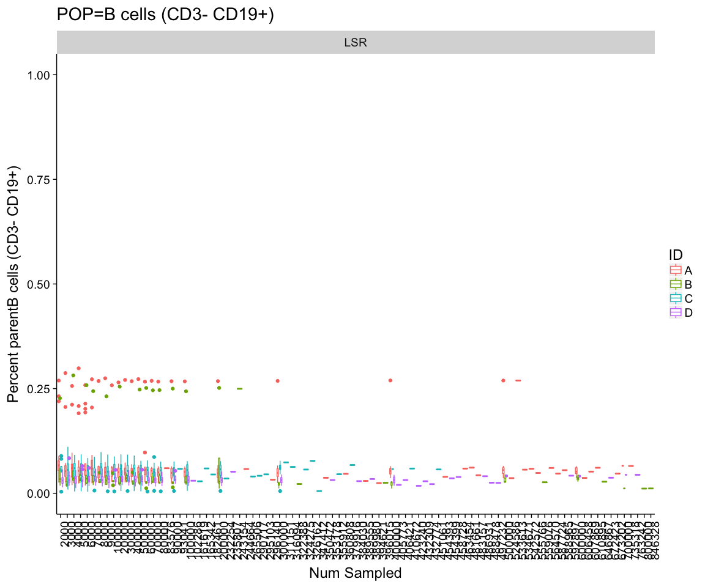<!-- -->

```
## Warning: Using size for a discrete variable is not advised.
```

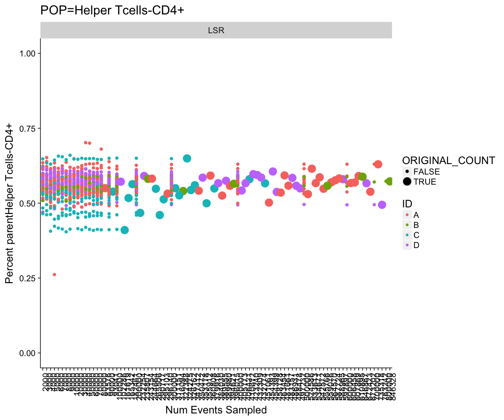<!-- -->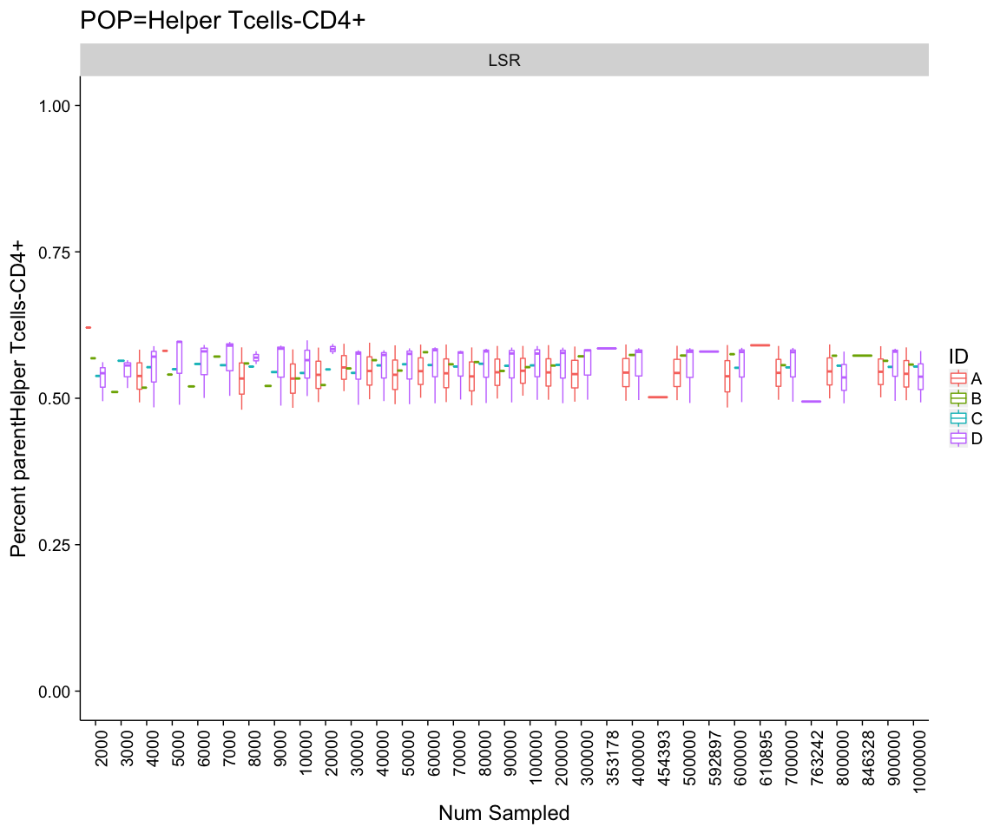<!-- -->

```
## Warning: Using size for a discrete variable is not advised.
```

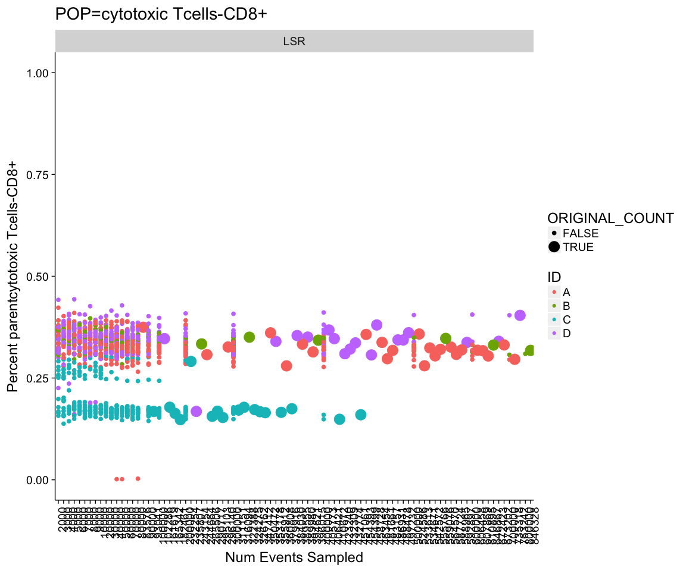<!-- -->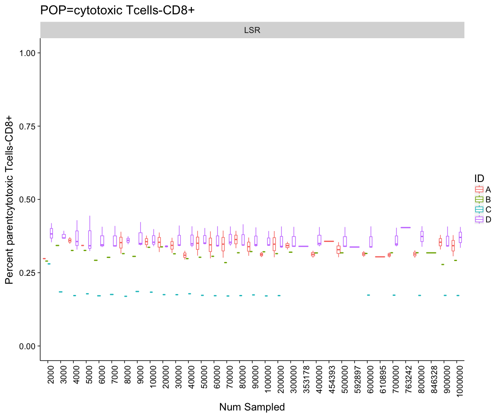<!-- -->

```
## Warning: Using size for a discrete variable is not advised.
```

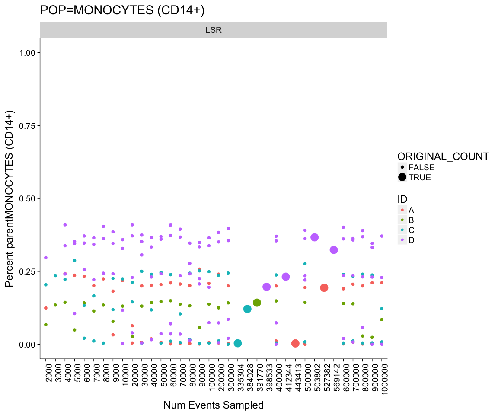<!-- -->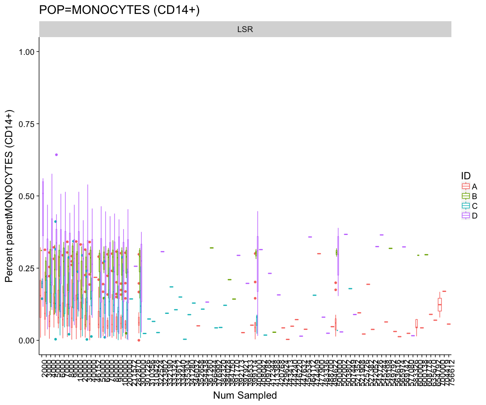<!-- -->
