# Insilco LOD
JL  
12/11/2017  


```
## Warning: Using size for a discrete variable is not advised.
```

<!-- --><!-- -->

```
## Warning: Using size for a discrete variable is not advised.
```

<!-- --><!-- -->

```
## Warning: Using size for a discrete variable is not advised.
```

<!-- --><!-- -->

```
## Warning: Using size for a discrete variable is not advised.
```

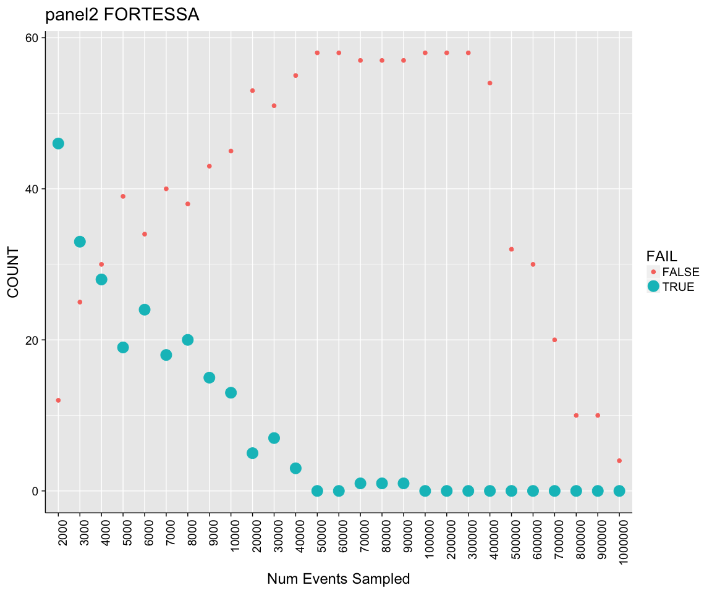<!-- --><!-- -->

```
## Warning: Removed 55 rows containing non-finite values (stat_boxplot).
```

<!-- -->

```
## Warning: Removed 55 rows containing missing values (geom_point).
```

<!-- -->

```
## Warning: Removed 55 rows containing non-finite values (stat_boxplot).
```

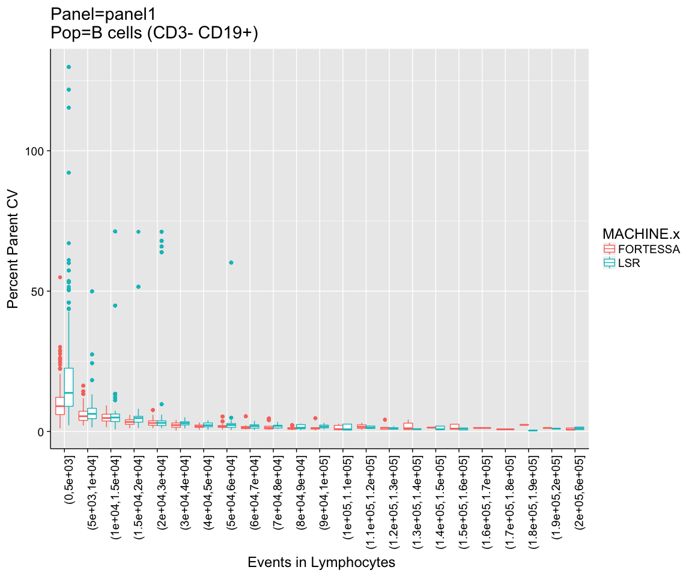<!-- -->

```
## Warning: Removed 55 rows containing non-finite values (stat_boxplot).
```

<!-- -->

```
## Warning: Removed 55 rows containing missing values (geom_point).
```

<!-- -->

```
## Warning: Removed 55 rows containing non-finite values (stat_boxplot).
```

<!-- -->

```
## Warning: Removed 55 rows containing non-finite values (stat_boxplot).
```

<!-- -->

```
## Warning: Removed 55 rows containing missing values (geom_point).
```

<!-- -->

```
## Warning: Removed 55 rows containing non-finite values (stat_boxplot).
```

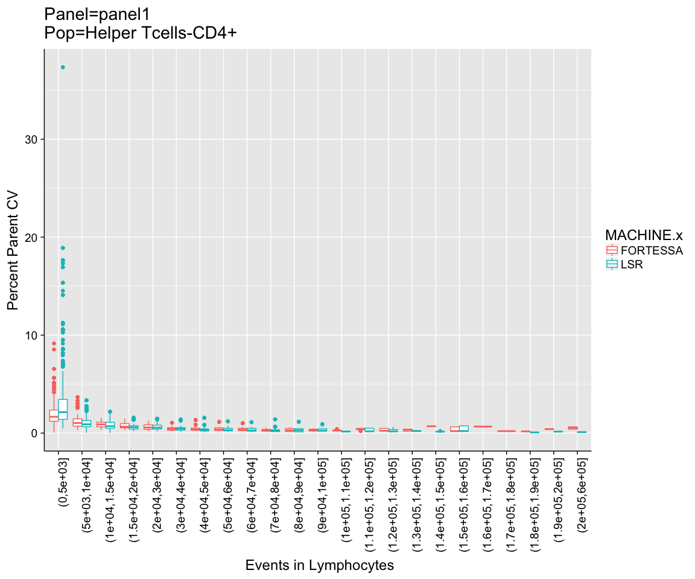<!-- -->

```
## Warning: Removed 65 rows containing non-finite values (stat_boxplot).
```

<!-- -->

```
## Warning: Removed 65 rows containing missing values (geom_point).
```

<!-- -->

```
## Warning: Removed 65 rows containing non-finite values (stat_boxplot).
```

<!-- -->

```
## Warning: Removed 59 rows containing non-finite values (stat_boxplot).
```

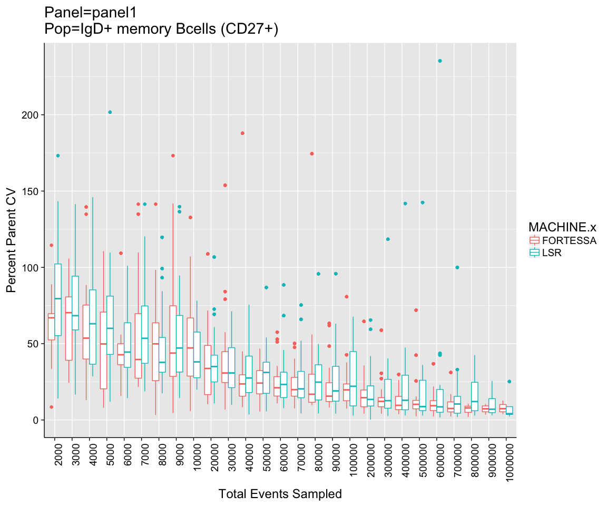<!-- -->

```
## Warning: Removed 59 rows containing missing values (geom_point).
```

<!-- -->

```
## Warning: Removed 59 rows containing non-finite values (stat_boxplot).
```

<!-- -->

```
## Warning: Removed 55 rows containing non-finite values (stat_boxplot).
```

<!-- -->

```
## Warning: Removed 55 rows containing missing values (geom_point).
```

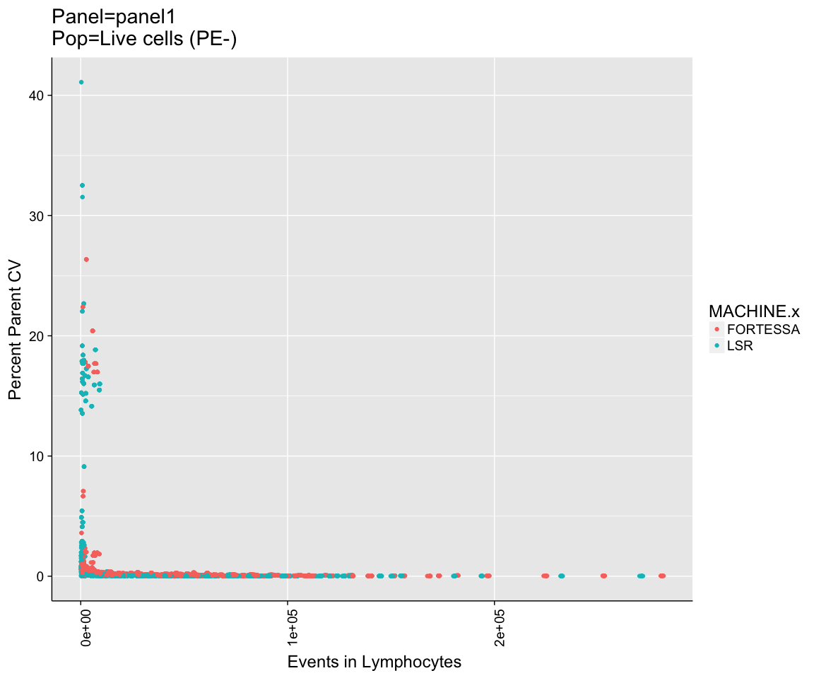<!-- -->

```
## Warning: Removed 55 rows containing non-finite values (stat_boxplot).
```

<!-- -->

```
## Warning: Removed 55 rows containing non-finite values (stat_boxplot).
```

<!-- -->

```
## Warning: Removed 55 rows containing missing values (geom_point).
```

<!-- -->

```
## Warning: Removed 55 rows containing non-finite values (stat_boxplot).
```

<!-- -->

```
## Warning: Removed 55 rows containing non-finite values (stat_boxplot).
```

<!-- -->

```
## Warning: Removed 55 rows containing missing values (geom_point).
```

<!-- -->

```
## Warning: Removed 55 rows containing non-finite values (stat_boxplot).
```

<!-- -->

```
## Warning: Removed 55 rows containing non-finite values (stat_boxplot).
```

<!-- -->

```
## Warning: Removed 55 rows containing missing values (geom_point).
```

<!-- -->

```
## Warning: Removed 55 rows containing non-finite values (stat_boxplot).
```

<!-- -->

```
## Warning: Removed 55 rows containing non-finite values (stat_boxplot).
```

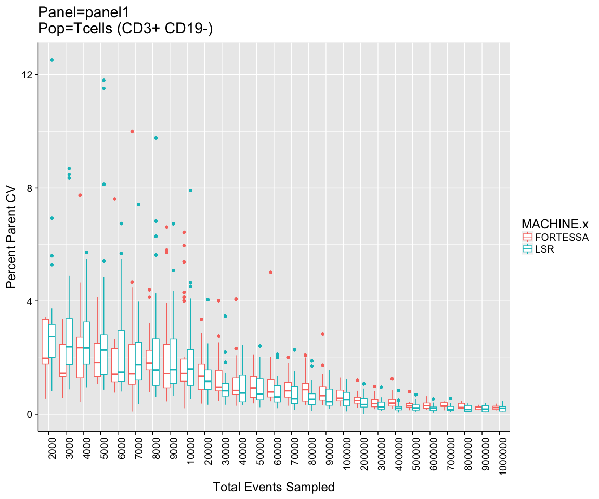<!-- -->

```
## Warning: Removed 55 rows containing missing values (geom_point).
```

<!-- -->

```
## Warning: Removed 55 rows containing non-finite values (stat_boxplot).
```

<!-- -->

```
## Warning: Removed 53 rows containing non-finite values (stat_boxplot).
```

<!-- -->

```
## Warning: Removed 53 rows containing missing values (geom_point).
```

<!-- -->

```
## Warning: Removed 53 rows containing non-finite values (stat_boxplot).
```

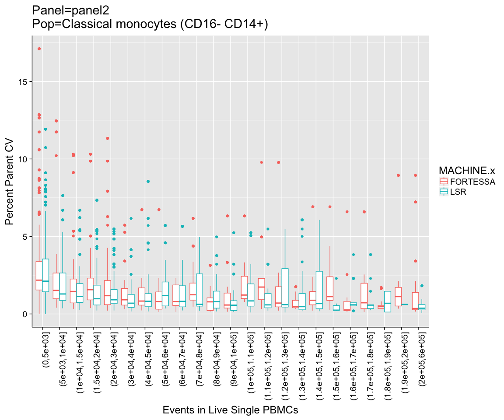<!-- -->

```
## Warning: Removed 51 rows containing non-finite values (stat_boxplot).
```

<!-- -->

```
## Warning: Removed 51 rows containing missing values (geom_point).
```

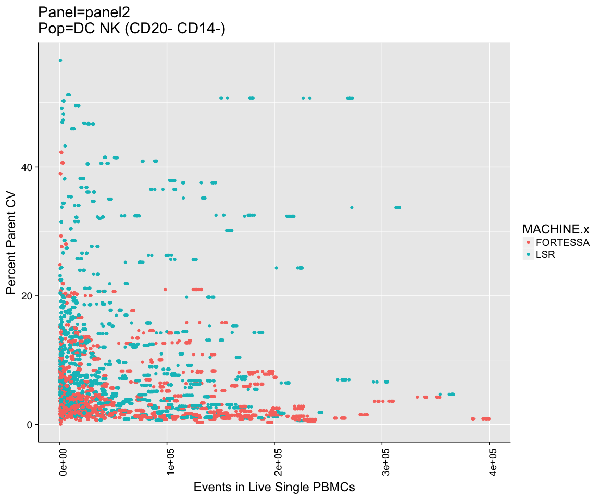<!-- -->

```
## Warning: Removed 51 rows containing non-finite values (stat_boxplot).
```

<!-- -->

```
## Warning: Removed 51 rows containing non-finite values (stat_boxplot).
```

<!-- -->

```
## Warning: Removed 51 rows containing missing values (geom_point).
```

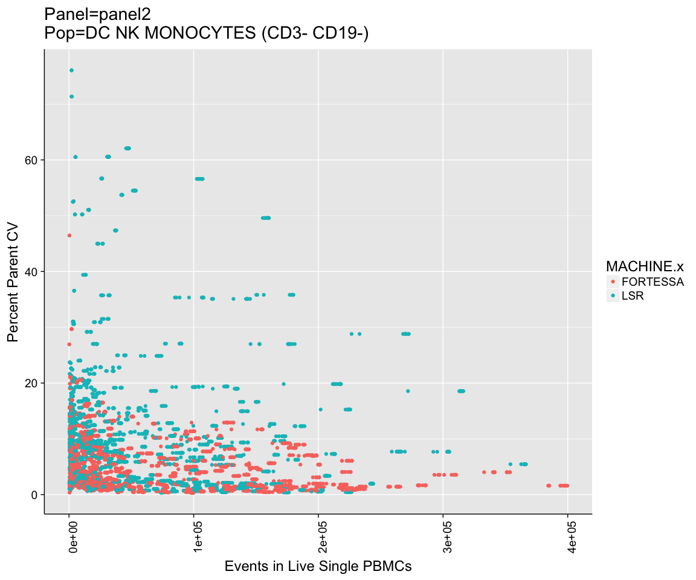<!-- -->

```
## Warning: Removed 51 rows containing non-finite values (stat_boxplot).
```

<!-- -->

```
## Warning: Removed 51 rows containing non-finite values (stat_boxplot).
```

<!-- -->

```
## Warning: Removed 51 rows containing missing values (geom_point).
```

<!-- -->

```
## Warning: Removed 51 rows containing non-finite values (stat_boxplot).
```

<!-- -->

```
## Warning: Removed 51 rows containing non-finite values (stat_boxplot).
```

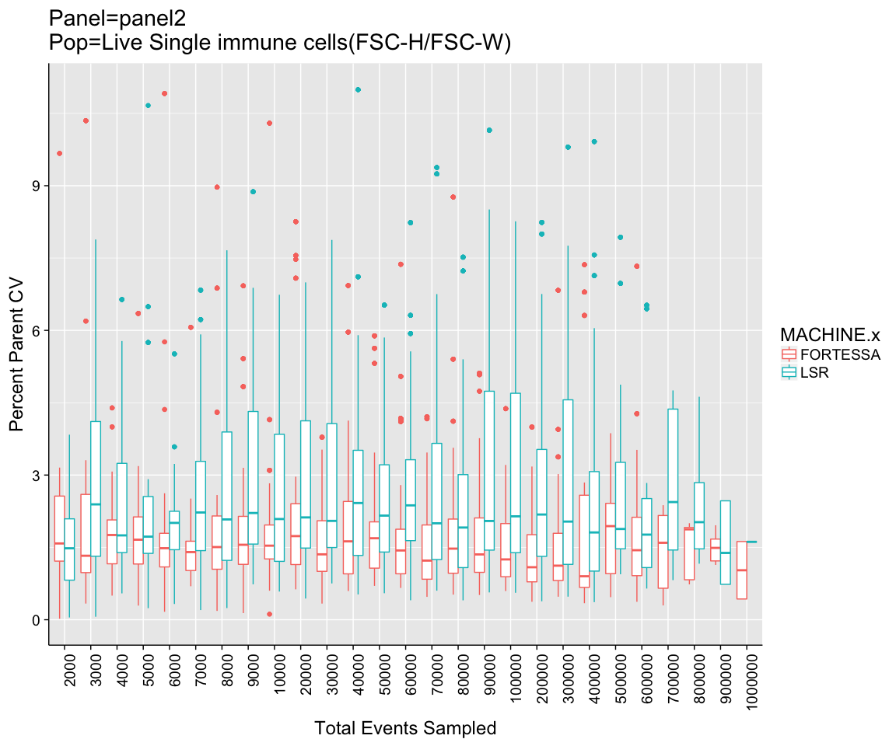<!-- -->

```
## Warning: Removed 51 rows containing missing values (geom_point).
```

<!-- -->

```
## Warning: Removed 51 rows containing non-finite values (stat_boxplot).
```

<!-- -->

```
## Warning: Removed 51 rows containing non-finite values (stat_boxplot).
```

<!-- -->

```
## Warning: Removed 51 rows containing missing values (geom_point).
```

<!-- -->

```
## Warning: Removed 51 rows containing non-finite values (stat_boxplot).
```

<!-- -->

```
## Warning: Removed 51 rows containing non-finite values (stat_boxplot).
```

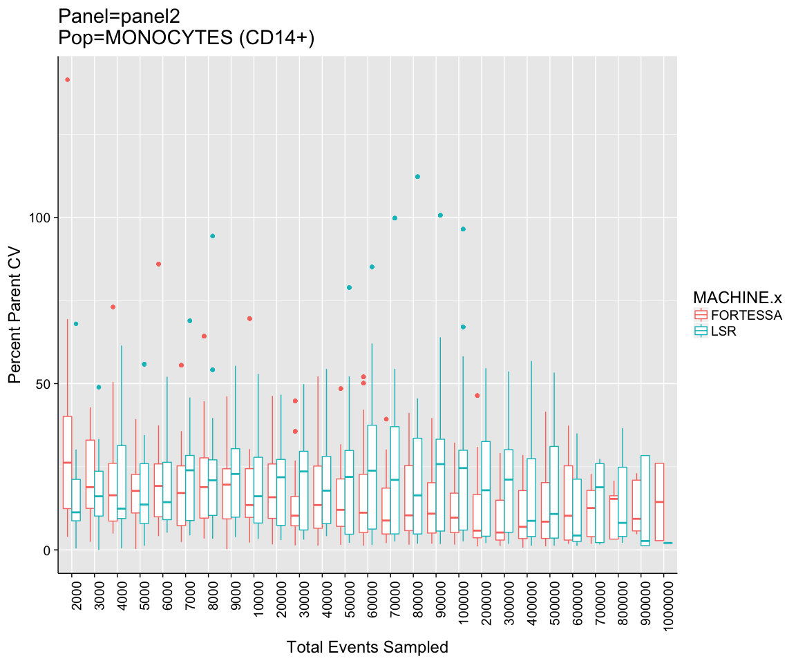<!-- -->

```
## Warning: Removed 51 rows containing missing values (geom_point).
```

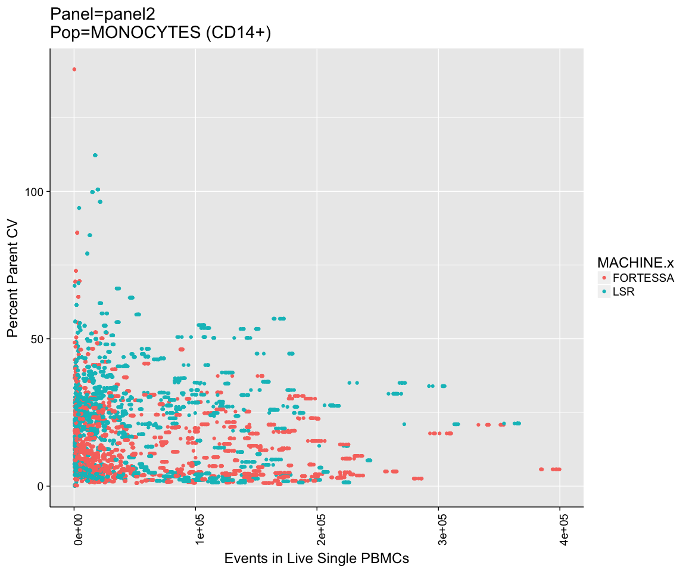<!-- -->

```
## Warning: Removed 51 rows containing non-finite values (stat_boxplot).
```

<!-- -->

```
## Warning: Removed 51 rows containing non-finite values (stat_boxplot).
```

<!-- -->

```
## Warning: Removed 51 rows containing missing values (geom_point).
```

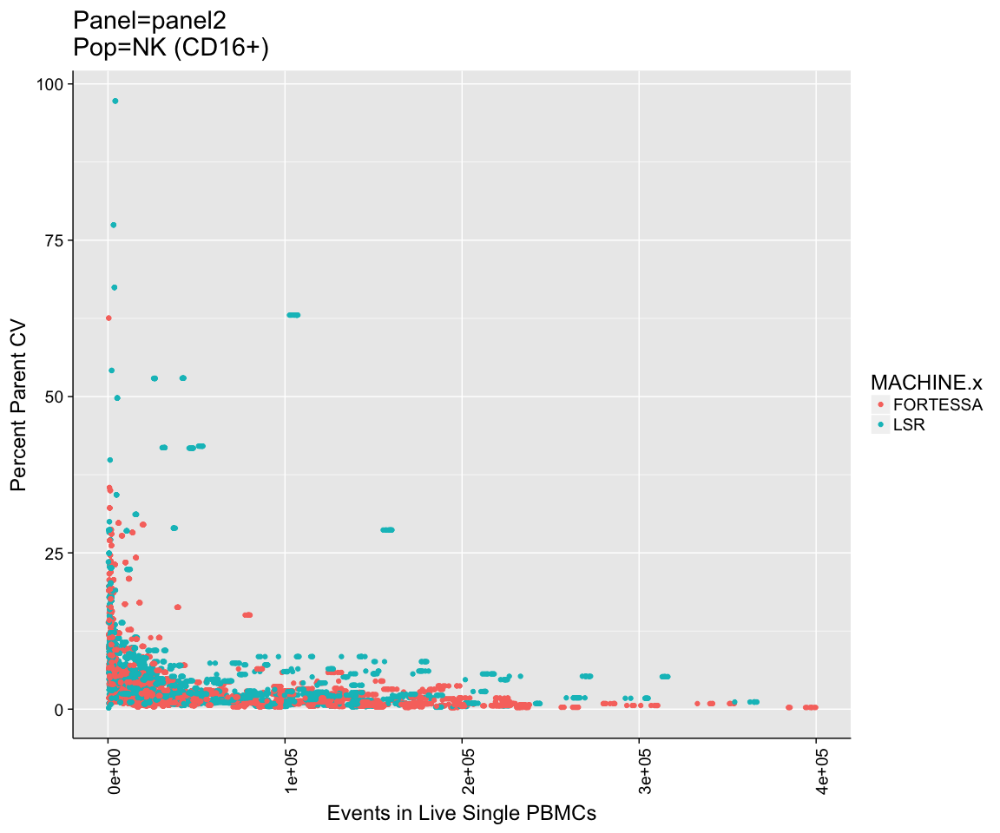<!-- -->

```
## Warning: Removed 51 rows containing non-finite values (stat_boxplot).
```

<!-- -->

```
## Warning: Removed 482 rows containing non-finite values (stat_boxplot).
```

<!-- -->

```
## Warning: Removed 482 rows containing missing values (geom_point).
```

<!-- -->

```
## Warning: Removed 482 rows containing non-finite values (stat_boxplot).
```

<!-- -->

```
## Warning: Removed 51 rows containing non-finite values (stat_boxplot).
```

<!-- -->

```
## Warning: Removed 51 rows containing missing values (geom_point).
```

<!-- -->

```
## Warning: Removed 51 rows containing non-finite values (stat_boxplot).
```

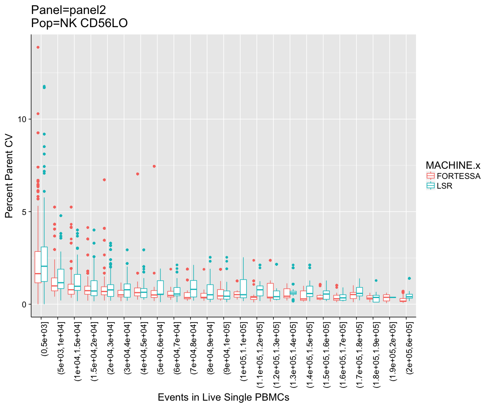<!-- -->

```
## Warning: Removed 80 rows containing non-finite values (stat_boxplot).
```

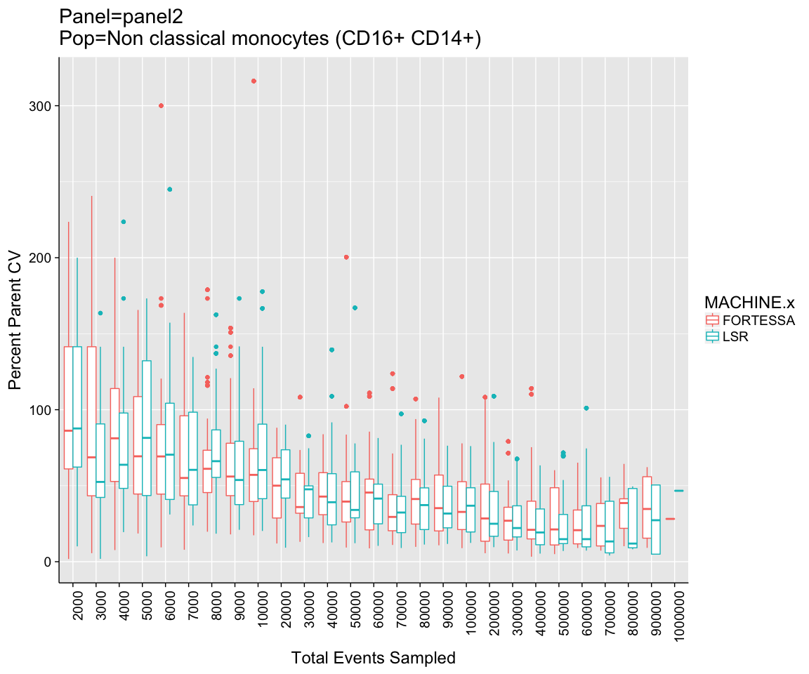<!-- -->

```
## Warning: Removed 80 rows containing missing values (geom_point).
```

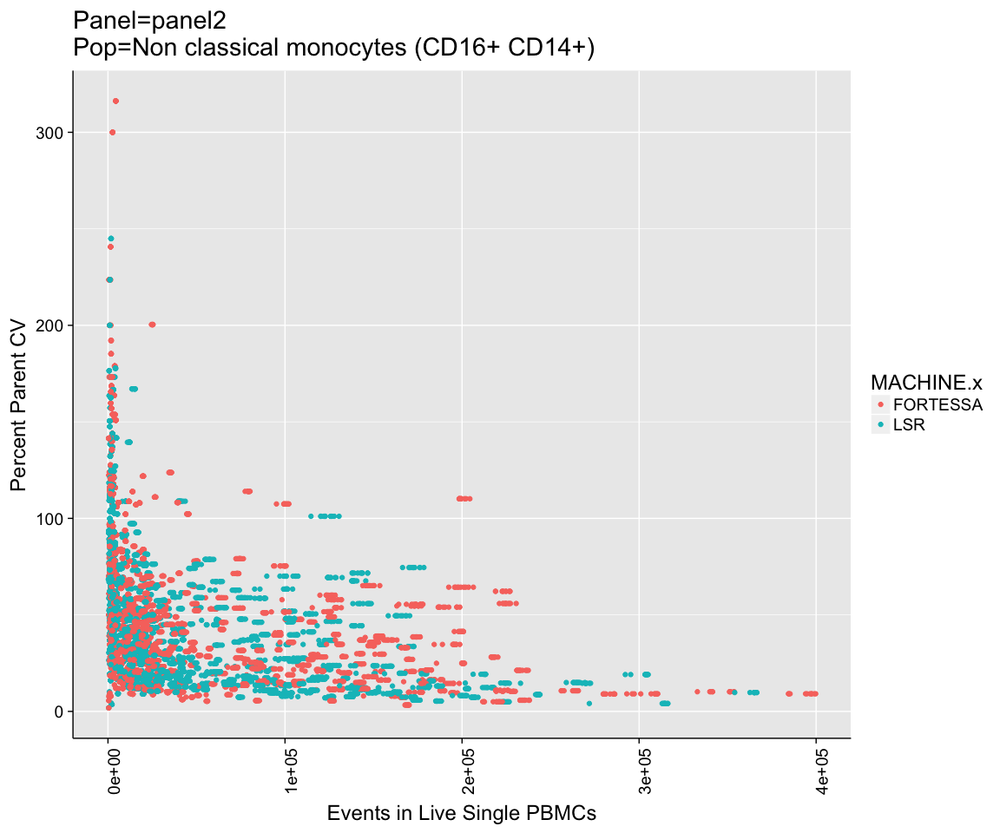<!-- -->

```
## Warning: Removed 80 rows containing non-finite values (stat_boxplot).
```

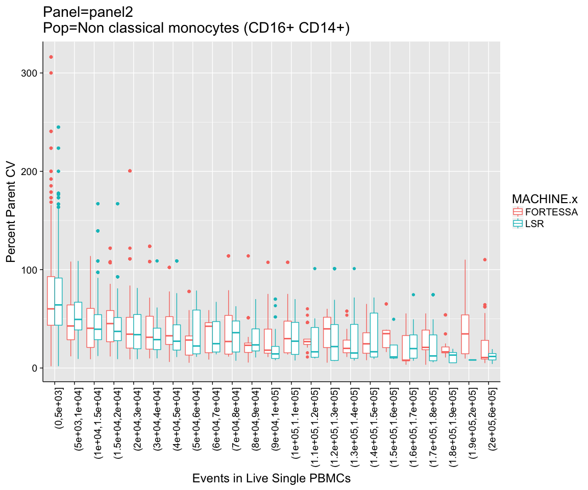<!-- -->
