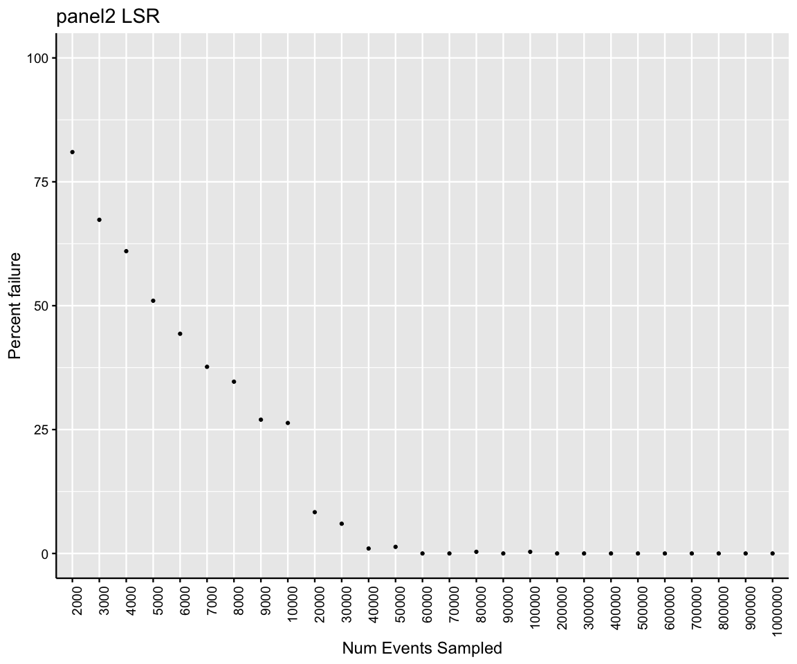

# Notes

Selected 30 LSR and 30 FORTESSA files matched for panel1 and panel2 that:

- had an event count > 700000
- had 0 "bad","abnormal", or "manual" annotatations

Within this set:

- randomly sub-sampled events 10 times per threshold, with requirement that number of events sampled be < %50 of total events


# Notes2

Sample selection

From the full study, sa

Randomly selected 60 samples (30 LSR,30 FORTESSA) matched for panel1 and panel2 that had a starting event count of at least 700000 and we

- had an event count > 700000
- had 0 "bad","abnormal", or "manual" annotatations

Within this set:

- randomly sub-sampled events 10 times per threshold, with requirement that number of events sampled be < %50 of total events


# Failure rate by number of events sampled
<!-- --><!-- --><!-- --><!-- -->

# Population specific variability


- Frequency Parent CV computed within a sample for each event threshold (10 replicates at 2k,10 replicates at 3k, etc)

Plots below - for each population

1. Boxplots of sample CVs at each event threshold (the total events in the .fcs file)
2. Number of events in lymph/pbmc populations vs sample CV
4. Boxplots of sample CVs binned by lymph/pbmc counts - I'm kinda finding this to be the most informative. 
5. Number of events in lymph/pbmc populations vs number of events in current population.
6. Boxplots of sample CVs binned by number of events in current population.


```
## Warning: Removed 55 rows containing non-finite values (stat_boxplot).
```

<!-- -->

```
## Warning: Removed 98 rows containing non-finite values (stat_boxplot).
```

<!-- -->

```
## Warning: Transformation introduced infinite values in continuous y-axis
```

```
## Warning: Removed 100 rows containing non-finite values (stat_boxplot).
```

<!-- -->

```
## Warning: Removed 55 rows containing non-finite values (stat_boxplot).
```

<!-- -->

```
## Warning: Removed 98 rows containing non-finite values (stat_boxplot).
```

<!-- -->

```
## Warning: Removed 98 rows containing non-finite values (stat_boxplot).
```

<!-- -->

```
## Warning: Removed 51 rows containing non-finite values (stat_boxplot).
```

<!-- -->

```
## Warning: Removed 182 rows containing non-finite values (stat_boxplot).
```

<!-- -->

```
## Warning: Transformation introduced infinite values in continuous y-axis
```

```
## Warning: Removed 188 rows containing non-finite values (stat_boxplot).
```

<!-- -->

```
## Warning: Removed 51 rows containing non-finite values (stat_boxplot).
```

<!-- -->

```
## Warning: Removed 182 rows containing non-finite values (stat_boxplot).
```

<!-- -->

```
## Warning: Removed 182 rows containing non-finite values (stat_boxplot).
```

<!-- -->
