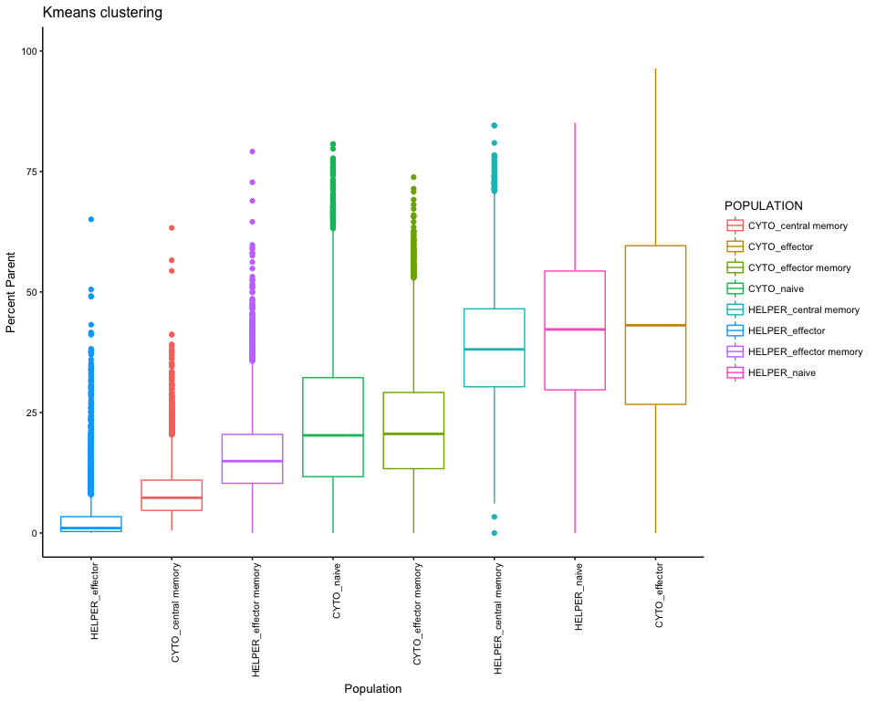
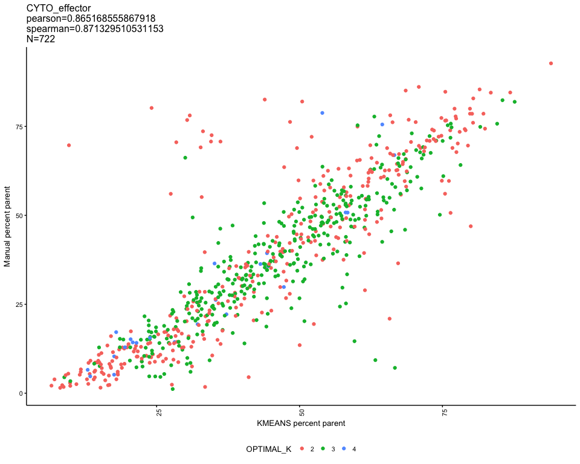
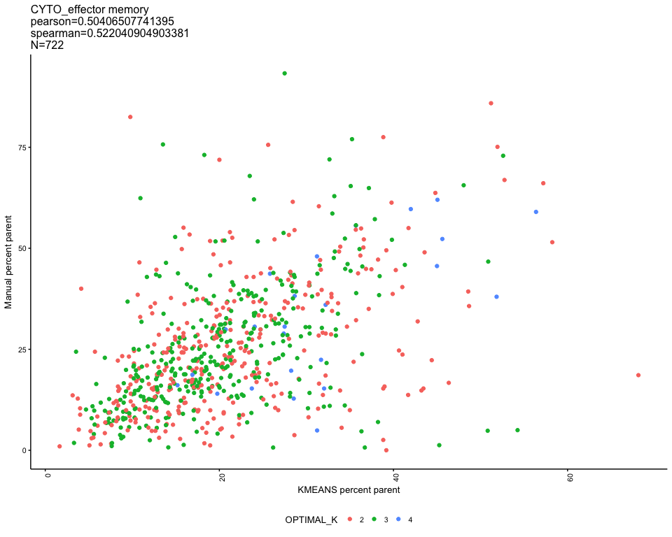

# KmeansEval - full panel1
JL  
2/14/2018  

Comparing global metrics (population median etc) between kmeans and manual

<!-- --><!-- --><!-- --><!-- --><!-- --><!-- --><!-- --><!-- --><!-- --><!-- -->

