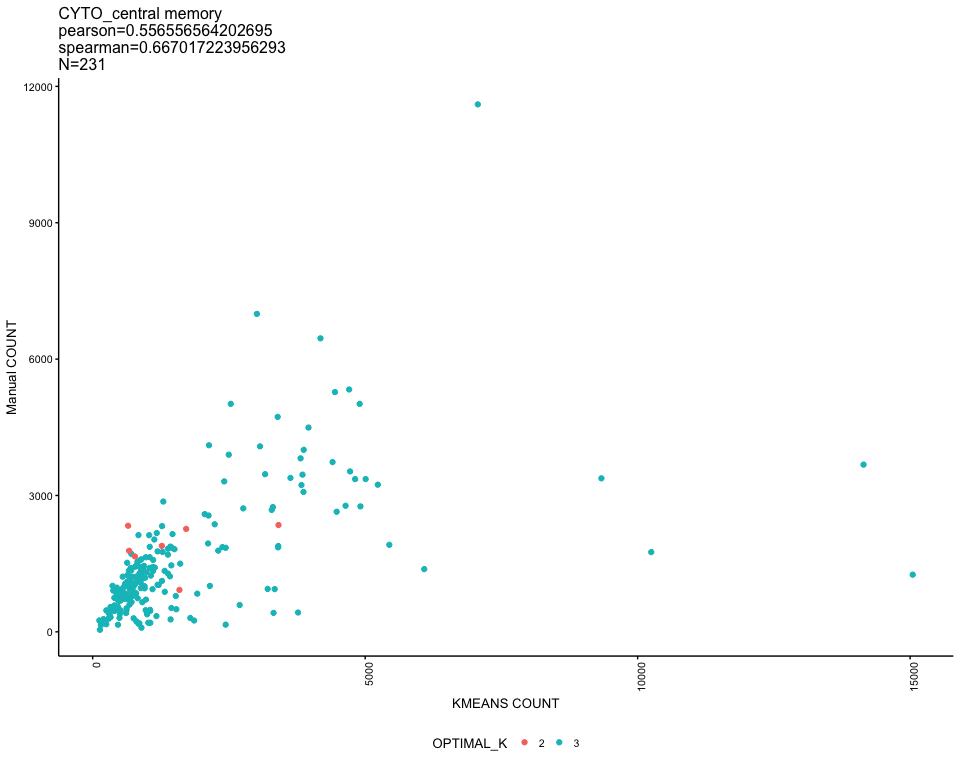
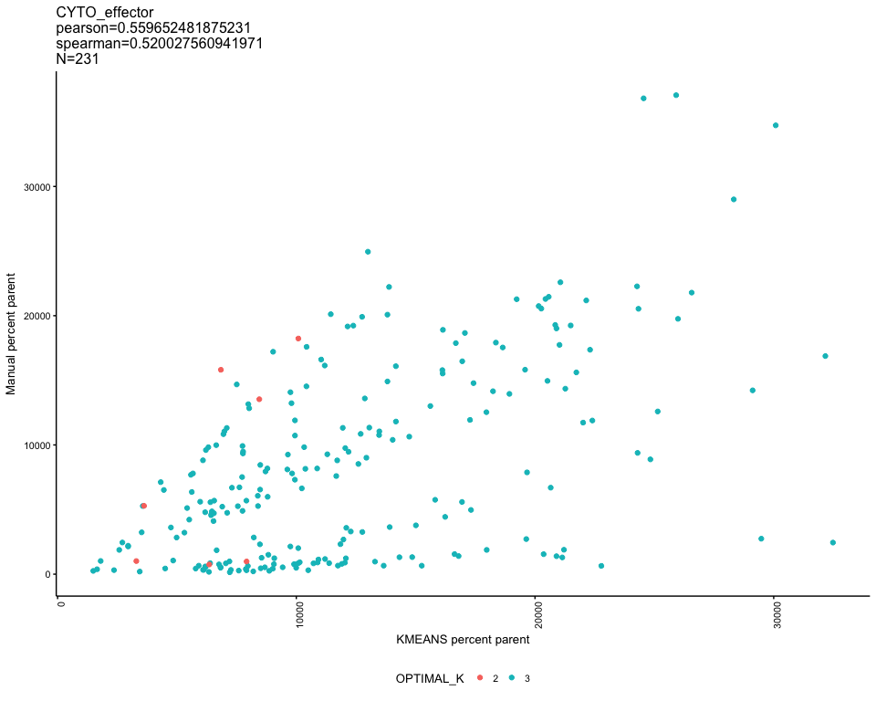
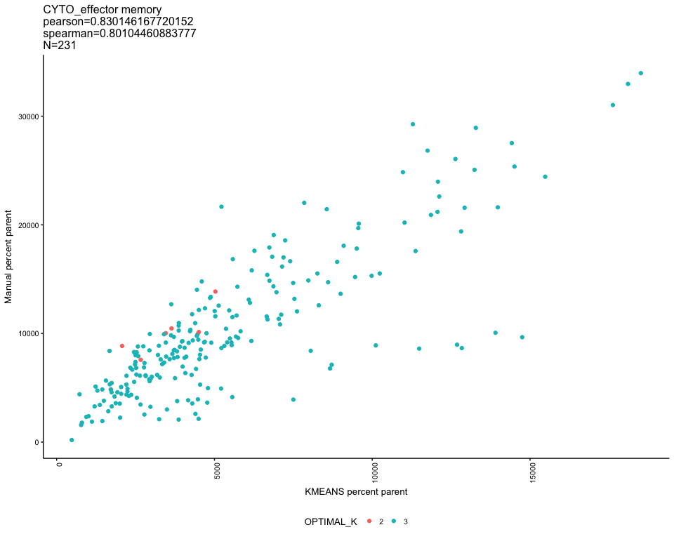
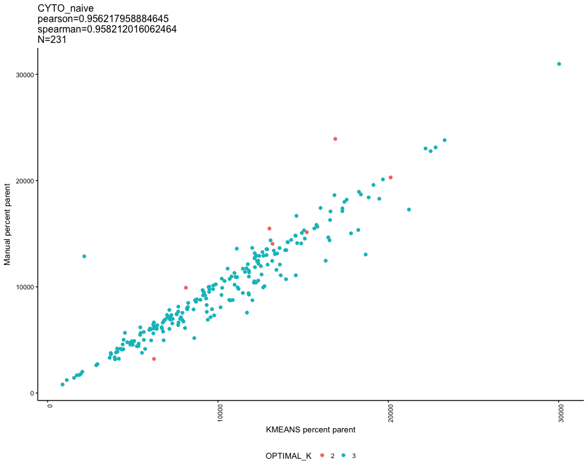
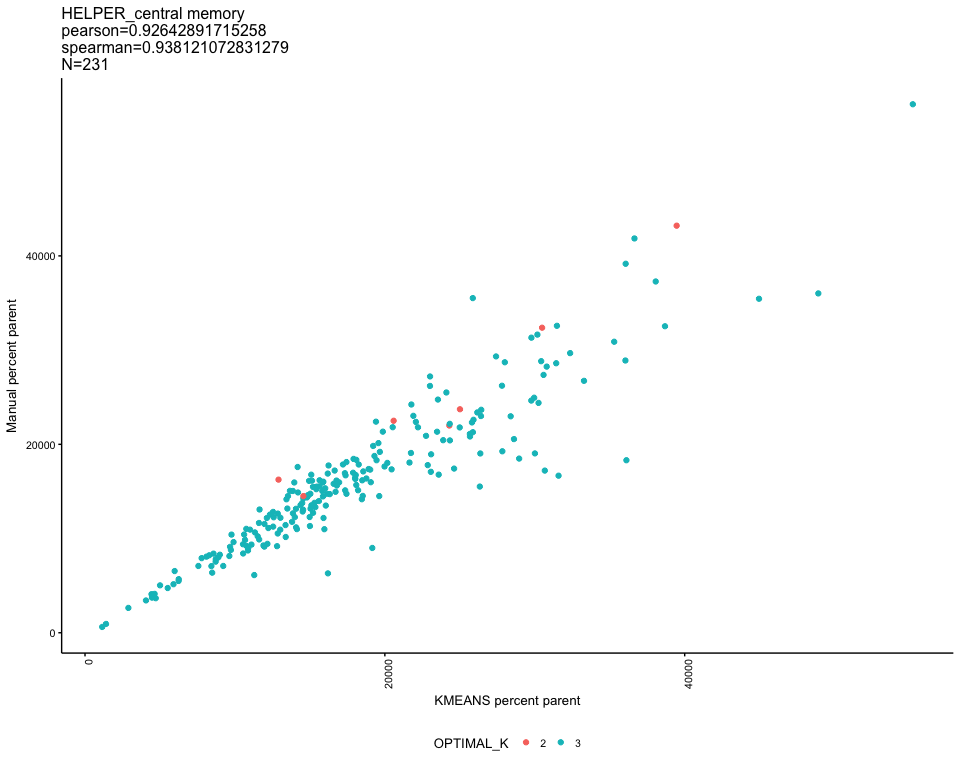
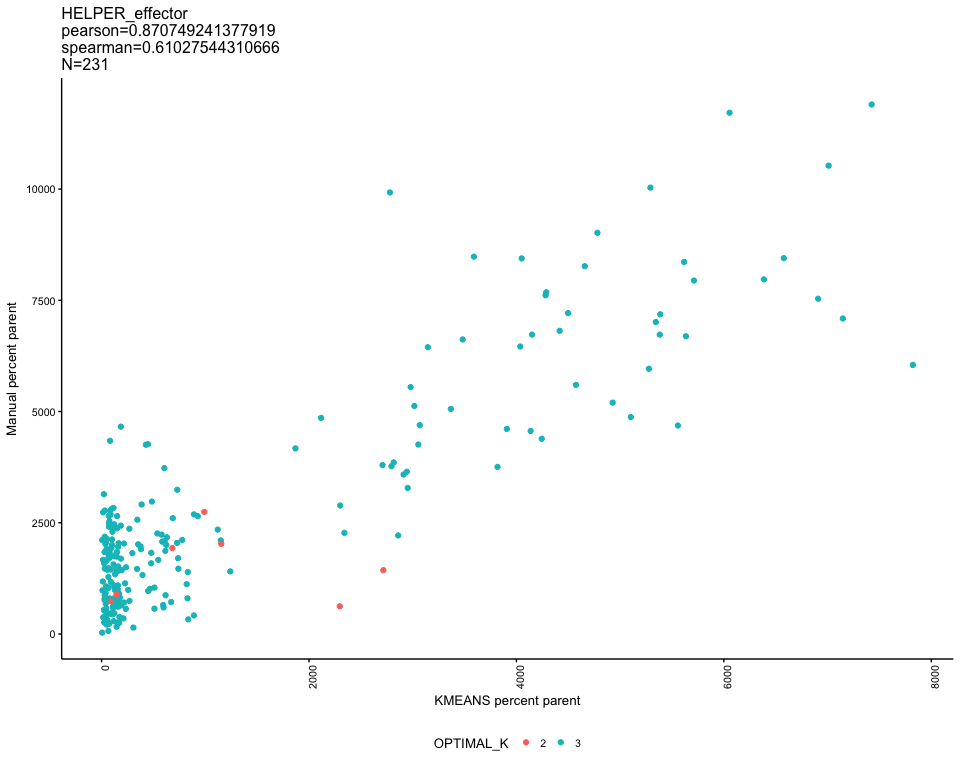
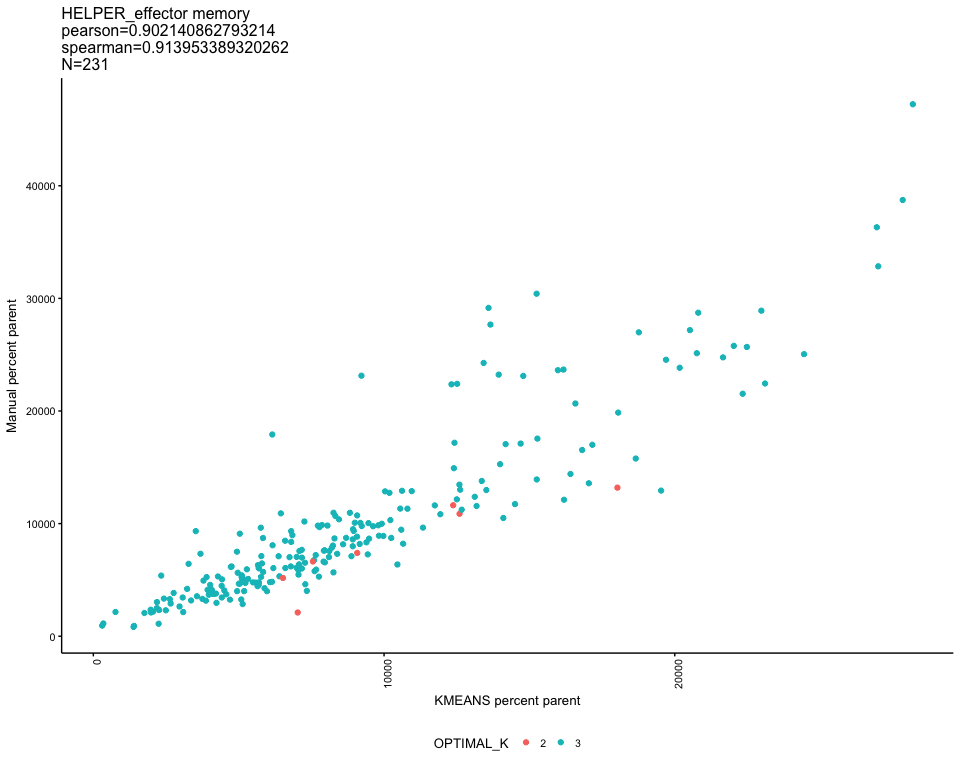
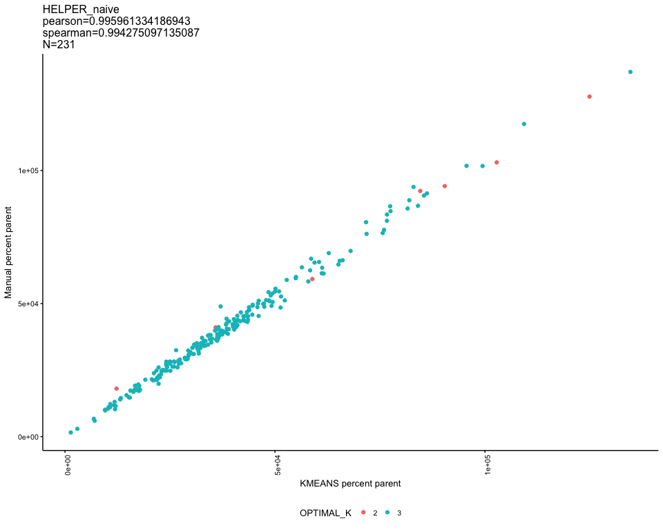

# KmeansEval - manual correlations and control comparisons 
JL  
2/16/2018  

Comparing global metrics (population median etc) between kmeans and manual

<!-- --><!-- --><!-- --><!-- --><!-- --><!-- --><!-- --><!-- -->

