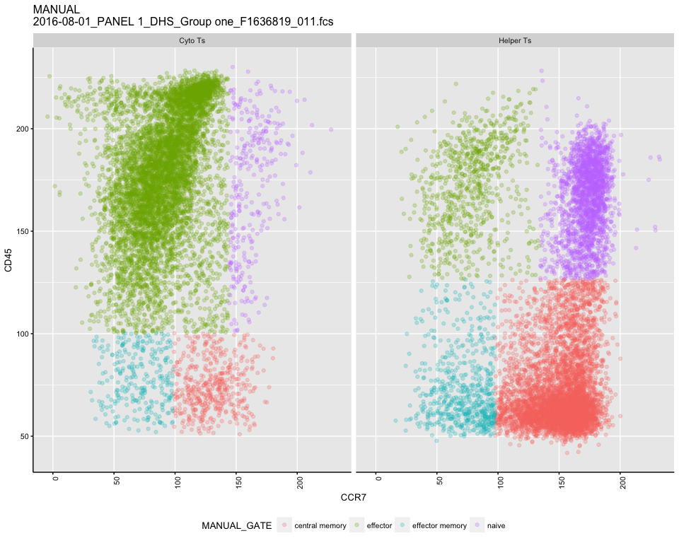
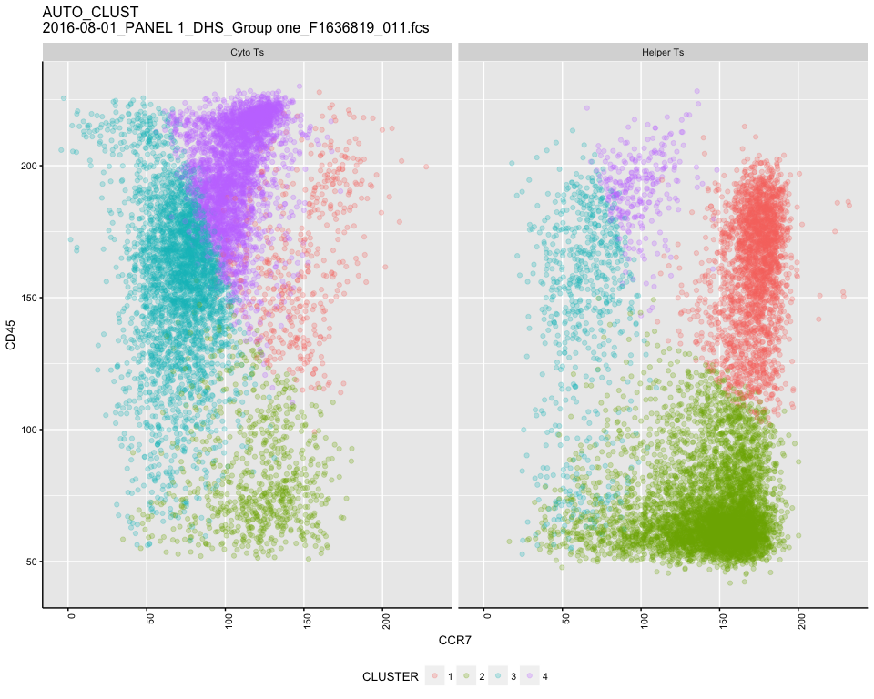
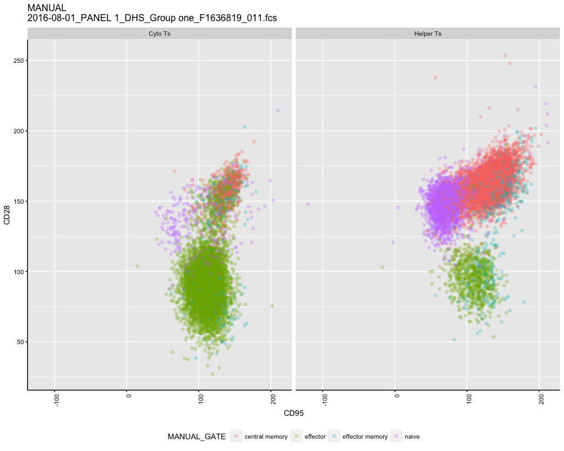
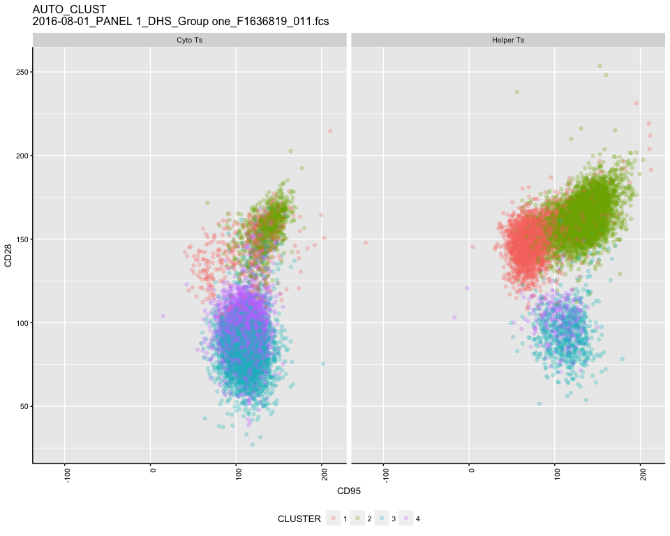
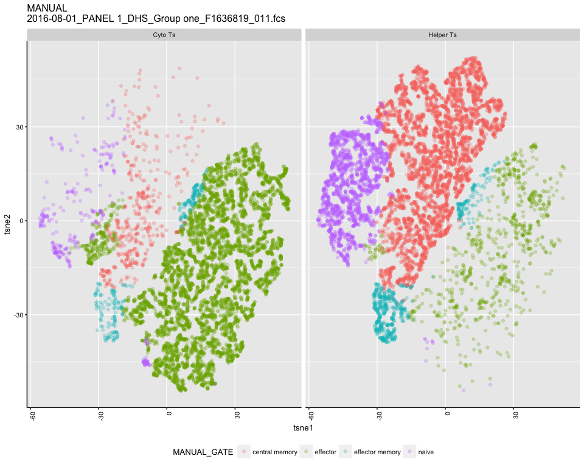
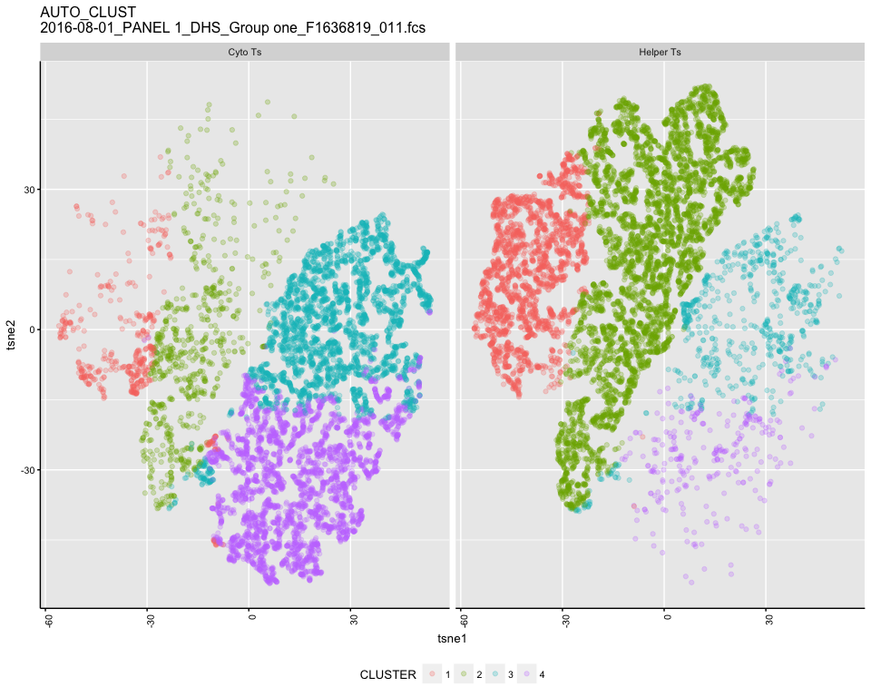

# Test K means
JL  
1/26/2018  


```
## [1] "2016-08-01_PANEL 1_DHS_Group one_F1636819_011.fcs"
## windows version of flowJo workspace recognized.
## version X
## [1] "2016-08-01_PANEL 1_DHS_Group one_F1636819_011.fcs"
## 
##  FALSE   TRUE 
## 825881  16707 
##   Running t-SNE...with seed 42  DONE
```

<!-- --><!-- --><!-- --><!-- --><!-- --><!-- -->
