# Tcell subs
JL  
2/9/2018  


```
## [1] "Found 37 wsps"
```

```
## [1] "loading /Volumes/Beta/data/flow/testTcellSubFCS_BoolResults/2016-08-01_PANEL 1_DHS_Group one_F1631366_002.fcsresults.RData"
## [1] "Plotting 2016-08-01_PANEL 1_DHS_Group one_F1631366_002.fcs"
## [1] "EC_ZF example =  TRUE"
## [1] "Sample number 0"
```

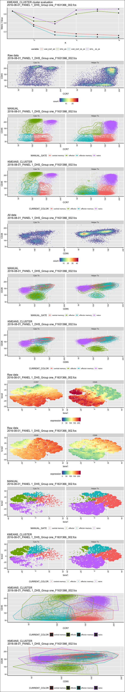<!-- -->

```
## [1] "loading /Volumes/Beta/data/flow/testTcellSubFCS_BoolResults/2016-08-01_PANEL 1_DHS_Group one_F1631377_003.fcsresults.RData"
## [1] "Plotting 2016-08-01_PANEL 1_DHS_Group one_F1631377_003.fcs"
## [1] "EC_ZF example =  TRUE"
## [1] "Sample number 1"
```

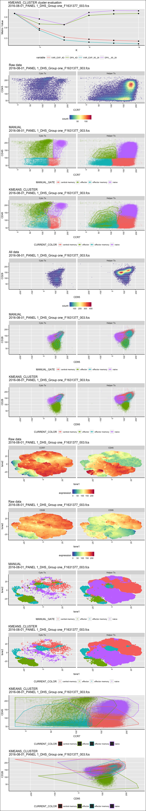<!-- -->

```
## [1] "loading /Volumes/Beta/data/flow/testTcellSubFCS_BoolResults/2016-08-01_PANEL 1_DHS_Group two_F1636830_032.fcsresults.RData"
## [1] "Plotting 2016-08-01_PANEL 1_DHS_Group two_F1636830_032.fcs"
## [1] "EC_ZF example =  TRUE"
## [1] "Sample number 2"
```

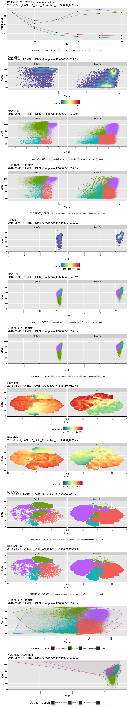<!-- -->

```
## [1] "loading /Volumes/Beta/data/flow/testTcellSubFCS_BoolResults/2016-08-01_PANEL 1_DHS_Group one_F1636775_013.fcsresults.RData"
## [1] "Plotting 2016-08-01_PANEL 1_DHS_Group one_F1636775_013.fcs"
## [1] "EC_ZF example =  TRUE"
## [1] "Sample number 3"
```

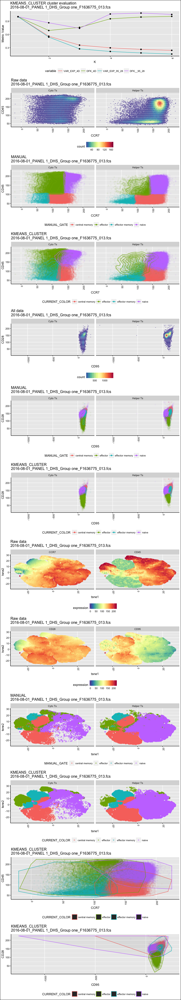<!-- -->

```
## [1] "loading /Volumes/Beta/data/flow/testTcellSubFCS_BoolResults/2016-08-01_PANEL 1_DHS_Group one_F1636847_014.fcsresults.RData"
## [1] "Plotting 2016-08-01_PANEL 1_DHS_Group one_F1636847_014.fcs"
## [1] "EC_ZF example =  TRUE"
## [1] "Sample number 4"
```

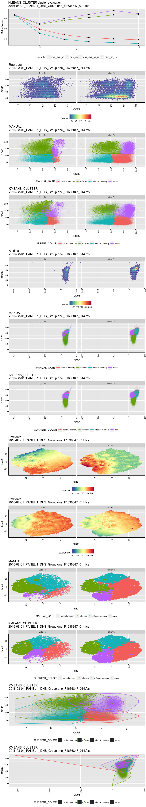<!-- -->

```
## [1] "loading /Volumes/Beta/data/flow/testTcellSubFCS_BoolResults/2016-08-01_PANEL 1_DHS_Group one_F1636851_001.fcsresults.RData"
## [1] "Plotting 2016-08-01_PANEL 1_DHS_Group one_F1636851_001.fcs"
## [1] "EC_ZF example =  TRUE"
## [1] "Sample number 5"
```

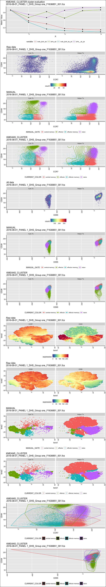<!-- -->

```
## [1] "loading /Volumes/Beta/data/flow/testTcellSubFCS_BoolResults/2016-08-01_PANEL 1_DHS_Group one_F1636533_004.fcsresults.RData"
## [1] "Plotting 2016-08-01_PANEL 1_DHS_Group one_F1636533_004.fcs"
## [1] "EC_ZF example =  TRUE"
## [1] "Sample number 6"
```

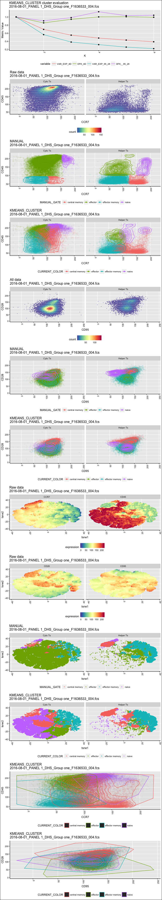<!-- -->

```
## [1] "loading /Volumes/Beta/data/flow/testTcellSubFCS_BoolResults/2016-08-01_PANEL 1_DHS_Group one_F1636850_009.fcsresults.RData"
## [1] "Plotting 2016-08-01_PANEL 1_DHS_Group one_F1636850_009.fcs"
## [1] "EC_ZF example =  TRUE"
## [1] "Sample number 7"
```

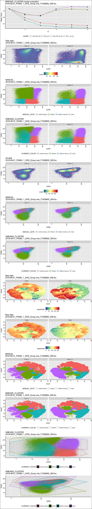<!-- -->

```
## [1] "loading /Volumes/Beta/data/flow/testTcellSubFCS_BoolResults/2016-08-01_PANEL 1_DHS_Group two_F1636774_030.fcsresults.RData"
## [1] "Plotting 2016-08-01_PANEL 1_DHS_Group two_F1636774_030.fcs"
## [1] "EC_ZF example =  TRUE"
## [1] "Sample number 8"
```

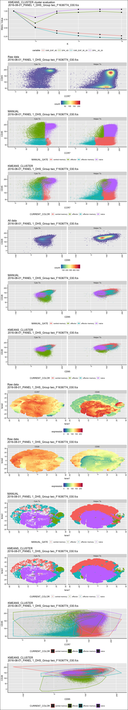<!-- -->

```
## [1] "loading /Volumes/Beta/data/flow/testTcellSubFCS_BoolResults/2016-08-01_PANEL 1_DHS_Group one_F1636819_011.fcsresults.RData"
## [1] "Plotting 2016-08-01_PANEL 1_DHS_Group one_F1636819_011.fcs"
## [1] "EC_ZF example =  TRUE"
## [1] "Sample number 9"
```

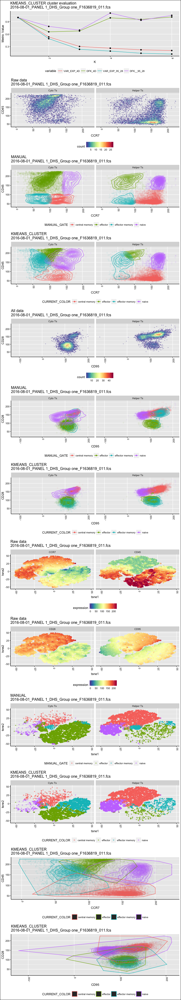<!-- -->

```
## [1] "loading /Volumes/Beta/data/flow/testTcellSubFCS_BoolResults/2016-08-01_PANEL 1_DHS_Group two_F1631147_029.fcsresults.RData"
## [1] "Plotting 2016-08-01_PANEL 1_DHS_Group two_F1631147_029.fcs"
## [1] "EC_ZF example =  TRUE"
## [1] "Sample number 10"
```

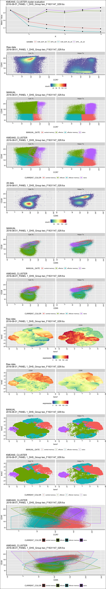<!-- -->

```
## [1] "loading /Volumes/Beta/data/flow/testTcellSubFCS_BoolResults/2016-08-01_PANEL 1_DHS_Group one_F1631107_010.fcsresults.RData"
## [1] "Plotting 2016-08-01_PANEL 1_DHS_Group one_F1631107_010.fcs"
## [1] "EC_ZF example =  TRUE"
## [1] "Sample number 11"
```

<!-- -->

```
## [1] "loading /Volumes/Beta/data/flow/testTcellSubFCS_BoolResults/2016-08-01_PANEL 1_DHS_Group one_F1636818_005.fcsresults.RData"
## [1] "Plotting 2016-08-01_PANEL 1_DHS_Group one_F1636818_005.fcs"
## [1] "EC_ZF example =  TRUE"
## [1] "Sample number 12"
```

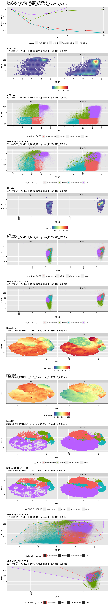<!-- -->

```
## [1] "loading /Volumes/Beta/data/flow/testTcellSubFCS_BoolResults/2016-08-01_PANEL 1_DHS_Group one_F1631332_012.fcsresults.RData"
## [1] "Plotting 2016-08-01_PANEL 1_DHS_Group one_F1631332_012.fcs"
## [1] "EC_ZF example =  TRUE"
## [1] "Sample number 13"
```

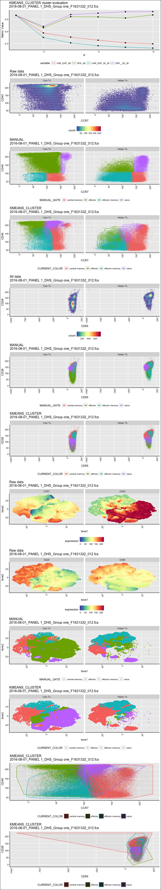<!-- -->

```
## [1] "loading /Volumes/Beta/data/flow/testTcellSubFCS_BoolResults/2016-08-01_PANEL 1_DHS_Group one_F1636790_006.fcsresults.RData"
## [1] "Plotting 2016-08-01_PANEL 1_DHS_Group one_F1636790_006.fcs"
## [1] "EC_ZF example =  TRUE"
## [1] "Sample number 14"
```

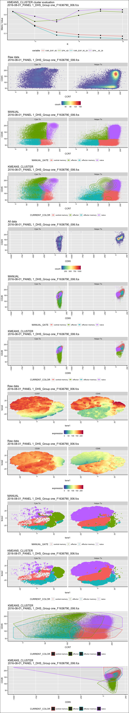<!-- -->

```
## [1] "loading /Volumes/Beta/data/flow/testTcellSubFCS_BoolResults/2016-08-01_PANEL 1_DHS_Group two_F1631383_031.fcsresults.RData"
## [1] "Plotting 2016-08-01_PANEL 1_DHS_Group two_F1631383_031.fcs"
## [1] "EC_ZF example =  TRUE"
## [1] "Sample number 15"
```

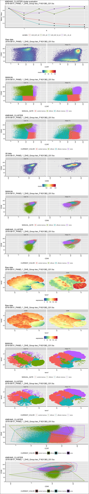<!-- -->

```
## [1] "loading /Volumes/Beta/data/flow/testTcellSubFCS_BoolResults/2016-08-01_PANEL 1_DHS_Group two_F1631374_028.fcsresults.RData"
## [1] "Plotting 2016-08-01_PANEL 1_DHS_Group two_F1631374_028.fcs"
## [1] "EC_ZF example =  TRUE"
## [1] "Sample number 16"
```

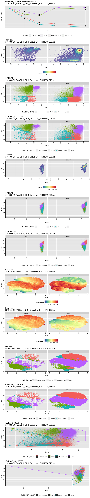<!-- -->

```
## [1] "loading /Volumes/Beta/data/flow/testTcellSubFCS_BoolResults/2016-08-01_PANEL 1_DHS_Group one_F1636826_007.fcsresults.RData"
## [1] "Plotting 2016-08-01_PANEL 1_DHS_Group one_F1636826_007.fcs"
## [1] "EC_ZF example =  TRUE"
## [1] "Sample number 17"
```

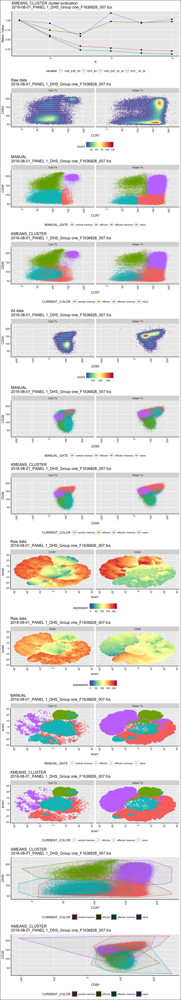<!-- -->

```
## [1] "loading /Volumes/Beta/data/flow/testTcellSubFCS_BoolResults/2016-08-01_PANEL 1_DHS_Group one_F1630927_008.fcsresults.RData"
## [1] "Plotting 2016-08-01_PANEL 1_DHS_Group one_F1630927_008.fcs"
## [1] "EC_ZF example =  TRUE"
## [1] "Sample number 18"
```

```
## [1] "/Volumes/Beta/data/flow/wsp//509_516_Panel 1_DHS.wsp"
## [1] "2016-05-09_PANEL 1_DHS_panel one_F1631929_002.fcs"
## windows version of flowJo workspace recognized.
## version X
## [1] "2016-05-09_PANEL 1_DHS_panel one_F1631929_002.fcs"
## 
##   FALSE    TRUE 
## 2102125   96015 
##   Running FlowSOM...    Building SOM...
##     Meta clustering to 4 clusters...
```

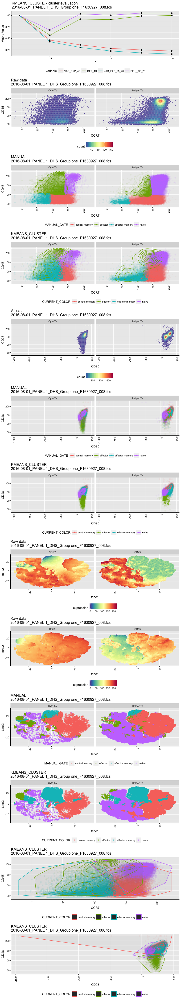<!-- -->

```
##  DONE!
##   Running t-SNE...with seed 42  DONE
## [1] "re-running tsne for /Volumes/Beta/data/flow/testTcellSubFCS_BoolResults/2016-05-09_PANEL 1_DHS_panel one_F1631929_002.fcsresults.RData"
## [1] "re-running tsne for /Volumes/Beta/data/flow/testTcellSubFCS_BoolResults/2016-05-09_PANEL 1_DHS_panel one_F1631929_002.fcsresults.RData"
## [1] "Plotting 2016-05-09_PANEL 1_DHS_panel one_F1631929_002.fcs"
## [1] "EC_ZF example =  FALSE"
## [1] "Sample number 19"
```

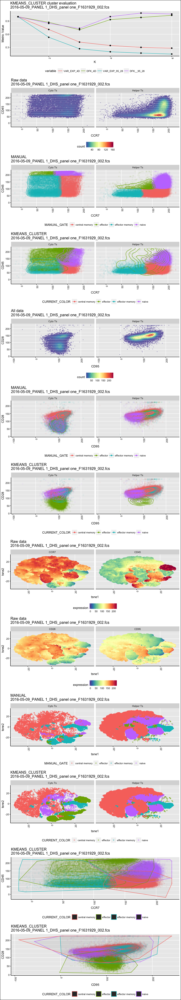<!-- -->
