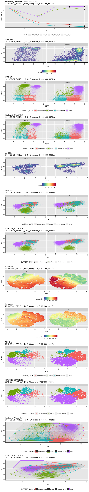
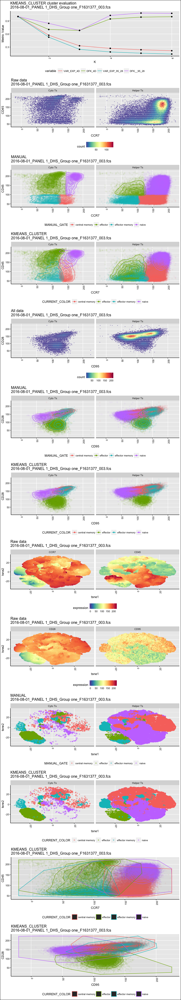
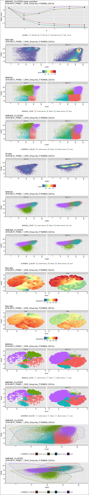
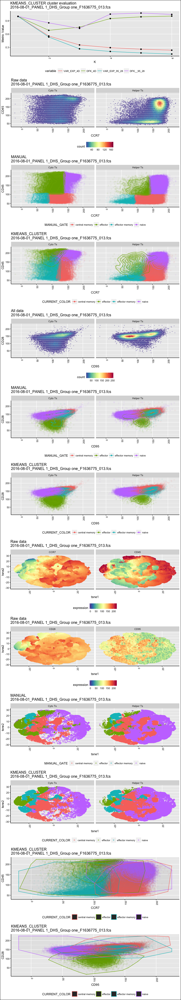
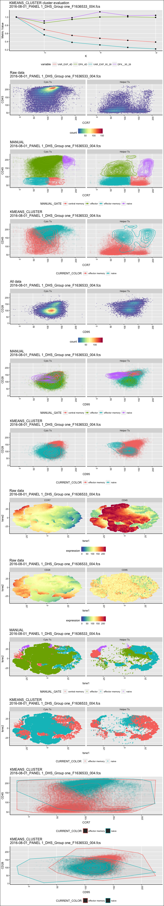
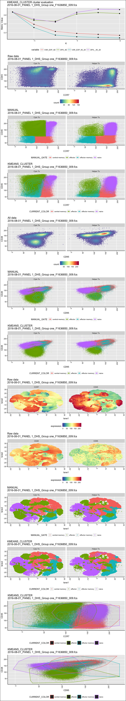
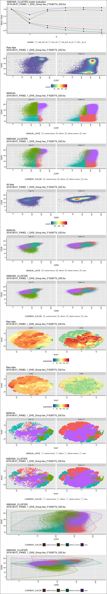
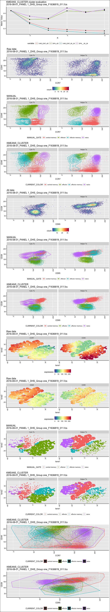

# Tcell subs
JL  
1/30/2018  


```
## [1] "Found 37 wsps"
```

```
## [1] "/Volumes/Beta/data/flow/wsp//801_Panel 1_DHS.wsp"
## [1] "2016-08-01_PANEL 1_DHS_Group one_F1631366_002.fcs"
## windows version of flowJo workspace recognized.
## version X
## [1] "2016-08-01_PANEL 1_DHS_Group one_F1631366_002.fcs"
## 
##  FALSE   TRUE 
## 190183  19910 
##   Running FlowSOM...    Building SOM...
##     Meta clustering to 4 clusters...
```

```
##  DONE!
## [1] "loading  /Volumes/Beta/data/flow/testTcellSubFCS_Results/2016-08-01_PANEL 1_DHS_Group one_F1631366_002.fcsresults.RData for re-clustering"
## [1] "loading  /Volumes/Beta/data/flow/testTcellSubFCS_Results/2016-08-01_PANEL 1_DHS_Group one_F1631366_002.fcsresults.RData for re-clustering"
## [1] "Plotting 2016-08-01_PANEL 1_DHS_Group one_F1631366_002.fcs"
## [1] "EC_ZF example =  TRUE"
## [1] "Sample number 0"
```

```
## [1] "/Volumes/Beta/data/flow/wsp//801_Panel 1_DHS.wsp"
## [1] "2016-08-01_PANEL 1_DHS_Group one_F1631377_003.fcs"
## windows version of flowJo workspace recognized.
## version X
## [1] "2016-08-01_PANEL 1_DHS_Group one_F1631377_003.fcs"
## 
##  FALSE   TRUE 
## 923237  98770 
##   Running FlowSOM...    Building SOM...
##     Meta clustering to 4 clusters...
```

<!-- -->

```
##  DONE!
## [1] "loading  /Volumes/Beta/data/flow/testTcellSubFCS_Results/2016-08-01_PANEL 1_DHS_Group one_F1631377_003.fcsresults.RData for re-clustering"
## [1] "loading  /Volumes/Beta/data/flow/testTcellSubFCS_Results/2016-08-01_PANEL 1_DHS_Group one_F1631377_003.fcsresults.RData for re-clustering"
## [1] "Plotting 2016-08-01_PANEL 1_DHS_Group one_F1631377_003.fcs"
## [1] "EC_ZF example =  TRUE"
## [1] "Sample number 1"
```

```
## [1] "/Volumes/Beta/data/flow/wsp//801_Panel 1_DHS.wsp"
## [1] "2016-08-01_PANEL 1_DHS_Group two_F1636830_032.fcs"
## windows version of flowJo workspace recognized.
## version X
## [1] "2016-08-01_PANEL 1_DHS_Group two_F1636830_032.fcs"
## 
##  FALSE   TRUE 
## 387273  71778 
##   Running FlowSOM...    Building SOM...
##     Meta clustering to 4 clusters...
```

<!-- -->

```
##  DONE!
## [1] "loading  /Volumes/Beta/data/flow/testTcellSubFCS_Results/2016-08-01_PANEL 1_DHS_Group two_F1636830_032.fcsresults.RData for re-clustering"
## [1] "loading  /Volumes/Beta/data/flow/testTcellSubFCS_Results/2016-08-01_PANEL 1_DHS_Group two_F1636830_032.fcsresults.RData for re-clustering"
## [1] "Plotting 2016-08-01_PANEL 1_DHS_Group two_F1636830_032.fcs"
## [1] "EC_ZF example =  TRUE"
## [1] "Sample number 2"
```

```
## [1] "/Volumes/Beta/data/flow/wsp//801_Panel 1_DHS.wsp"
## [1] "2016-08-01_PANEL 1_DHS_Group one_F1636775_013.fcs"
## windows version of flowJo workspace recognized.
## version X
## [1] "2016-08-01_PANEL 1_DHS_Group one_F1636775_013.fcs"
## 
##  FALSE   TRUE 
## 747256 129842 
##   Running FlowSOM...    Building SOM...
##     Meta clustering to 4 clusters...
```

<!-- -->

```
##  DONE!
## [1] "loading  /Volumes/Beta/data/flow/testTcellSubFCS_Results/2016-08-01_PANEL 1_DHS_Group one_F1636775_013.fcsresults.RData for re-clustering"
## [1] "loading  /Volumes/Beta/data/flow/testTcellSubFCS_Results/2016-08-01_PANEL 1_DHS_Group one_F1636775_013.fcsresults.RData for re-clustering"
## [1] "Plotting 2016-08-01_PANEL 1_DHS_Group one_F1636775_013.fcs"
## [1] "EC_ZF example =  TRUE"
## [1] "Sample number 3"
```

```
## [1] "/Volumes/Beta/data/flow/wsp//801_Panel 1_DHS.wsp"
## [1] "2016-08-01_PANEL 1_DHS_Group one_F1636847_014.fcs"
## windows version of flowJo workspace recognized.
## version X
## [1] "2016-08-01_PANEL 1_DHS_Group one_F1636847_014.fcs"
## 
##  FALSE   TRUE 
## 471979  45632 
##   Running FlowSOM...    Building SOM...
##     Meta clustering to 4 clusters...
```

<!-- -->

```
##  DONE!
## [1] "loading  /Volumes/Beta/data/flow/testTcellSubFCS_Results/2016-08-01_PANEL 1_DHS_Group one_F1636847_014.fcsresults.RData for re-clustering"
## [1] "loading  /Volumes/Beta/data/flow/testTcellSubFCS_Results/2016-08-01_PANEL 1_DHS_Group one_F1636847_014.fcsresults.RData for re-clustering"
## [1] "Plotting 2016-08-01_PANEL 1_DHS_Group one_F1636847_014.fcs"
## [1] "EC_ZF example =  TRUE"
## [1] "Sample number 4"
```

```
## [1] "/Volumes/Beta/data/flow/wsp//801_Panel 1_DHS.wsp"
## [1] "2016-08-01_PANEL 1_DHS_Group one_F1636851_001.fcs"
## windows version of flowJo workspace recognized.
## version X
## [1] "2016-08-01_PANEL 1_DHS_Group one_F1636851_001.fcs"
## 
##  FALSE   TRUE 
## 175192  28587 
##   Running FlowSOM...    Building SOM...
##     Meta clustering to 4 clusters...
```

<!-- -->

```
##  DONE!
## [1] "loading  /Volumes/Beta/data/flow/testTcellSubFCS_Results/2016-08-01_PANEL 1_DHS_Group one_F1636851_001.fcsresults.RData for re-clustering"
## [1] "loading  /Volumes/Beta/data/flow/testTcellSubFCS_Results/2016-08-01_PANEL 1_DHS_Group one_F1636851_001.fcsresults.RData for re-clustering"
## [1] "Plotting 2016-08-01_PANEL 1_DHS_Group one_F1636851_001.fcs"
## [1] "EC_ZF example =  TRUE"
## [1] "Sample number 5"
```

```
## [1] "/Volumes/Beta/data/flow/wsp//801_Panel 1_DHS.wsp"
## [1] "2016-08-01_PANEL 1_DHS_Group one_F1636533_004.fcs"
## windows version of flowJo workspace recognized.
## version X
## [1] "2016-08-01_PANEL 1_DHS_Group one_F1636533_004.fcs"
## 
##  FALSE   TRUE 
## 945246  61817 
##   Running FlowSOM...    Building SOM...
##     Meta clustering to 4 clusters...
```

<!-- -->

```
##  DONE!
## [1] "loading  /Volumes/Beta/data/flow/testTcellSubFCS_Results/2016-08-01_PANEL 1_DHS_Group one_F1636533_004.fcsresults.RData for re-clustering"
## [1] "loading  /Volumes/Beta/data/flow/testTcellSubFCS_Results/2016-08-01_PANEL 1_DHS_Group one_F1636533_004.fcsresults.RData for re-clustering"
## [1] "Plotting 2016-08-01_PANEL 1_DHS_Group one_F1636533_004.fcs"
## [1] "EC_ZF example =  TRUE"
## [1] "Sample number 6"
```

```
## [1] "/Volumes/Beta/data/flow/wsp//801_Panel 1_DHS.wsp"
## [1] "2016-08-01_PANEL 1_DHS_Group one_F1636850_009.fcs"
## windows version of flowJo workspace recognized.
## version X
## [1] "2016-08-01_PANEL 1_DHS_Group one_F1636850_009.fcs"
## 
##  FALSE   TRUE 
## 651951 141803 
##   Running FlowSOM...    Building SOM...
##     Meta clustering to 4 clusters...
```

<!-- -->

```
##  DONE!
## [1] "loading  /Volumes/Beta/data/flow/testTcellSubFCS_Results/2016-08-01_PANEL 1_DHS_Group one_F1636850_009.fcsresults.RData for re-clustering"
## [1] "loading  /Volumes/Beta/data/flow/testTcellSubFCS_Results/2016-08-01_PANEL 1_DHS_Group one_F1636850_009.fcsresults.RData for re-clustering"
## [1] "Plotting 2016-08-01_PANEL 1_DHS_Group one_F1636850_009.fcs"
## [1] "EC_ZF example =  TRUE"
## [1] "Sample number 7"
```

```
## [1] "/Volumes/Beta/data/flow/wsp//801_Panel 1_DHS.wsp"
## [1] "2016-08-01_PANEL 1_DHS_Group two_F1636774_030.fcs"
## windows version of flowJo workspace recognized.
## version X
## [1] "2016-08-01_PANEL 1_DHS_Group two_F1636774_030.fcs"
## 
##   FALSE    TRUE 
## 1457319  137416 
##   Running FlowSOM...    Building SOM...
##     Meta clustering to 4 clusters...
```

<!-- -->

```
##  DONE!
## [1] "loading  /Volumes/Beta/data/flow/testTcellSubFCS_Results/2016-08-01_PANEL 1_DHS_Group two_F1636774_030.fcsresults.RData for re-clustering"
## [1] "loading  /Volumes/Beta/data/flow/testTcellSubFCS_Results/2016-08-01_PANEL 1_DHS_Group two_F1636774_030.fcsresults.RData for re-clustering"
## [1] "Plotting 2016-08-01_PANEL 1_DHS_Group two_F1636774_030.fcs"
## [1] "EC_ZF example =  TRUE"
## [1] "Sample number 8"
```

```
## [1] "/Volumes/Beta/data/flow/wsp//801_Panel 1_DHS.wsp"
## [1] "2016-08-01_PANEL 1_DHS_Group one_F1636819_011.fcs"
## windows version of flowJo workspace recognized.
## version X
## [1] "2016-08-01_PANEL 1_DHS_Group one_F1636819_011.fcs"
## 
##  FALSE   TRUE 
## 825881  16707 
##   Running FlowSOM...    Building SOM...
##     Meta clustering to 4 clusters...
```

<!-- -->

```
##  DONE!
## [1] "loading  /Volumes/Beta/data/flow/testTcellSubFCS_Results/2016-08-01_PANEL 1_DHS_Group one_F1636819_011.fcsresults.RData for re-clustering"
## [1] "loading  /Volumes/Beta/data/flow/testTcellSubFCS_Results/2016-08-01_PANEL 1_DHS_Group one_F1636819_011.fcsresults.RData for re-clustering"
## [1] "Plotting 2016-08-01_PANEL 1_DHS_Group one_F1636819_011.fcs"
## [1] "EC_ZF example =  TRUE"
## [1] "Sample number 9"
```

<!-- -->
