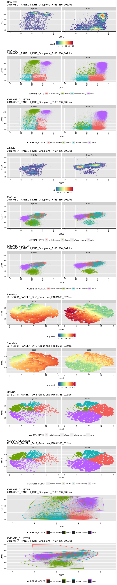
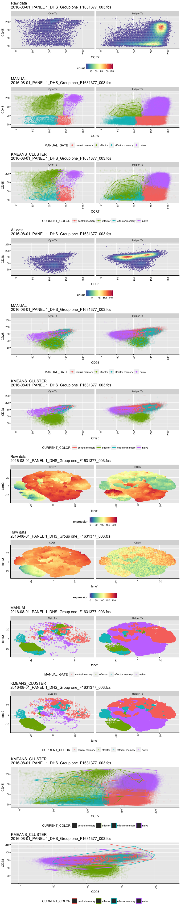
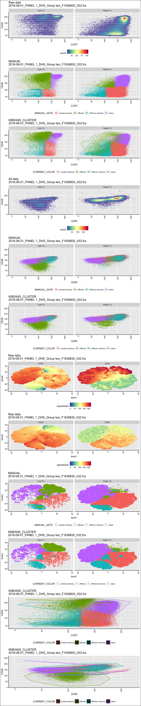
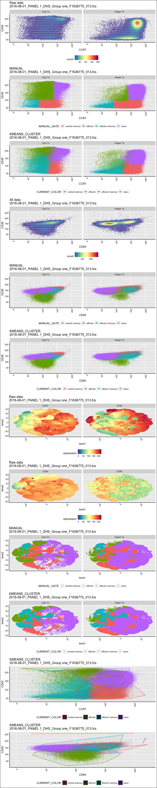
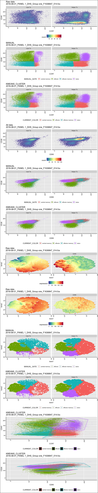
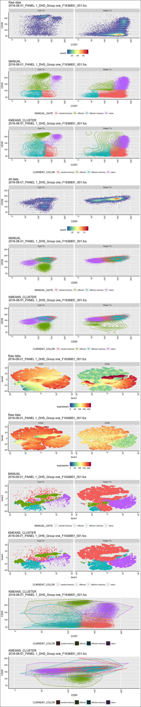
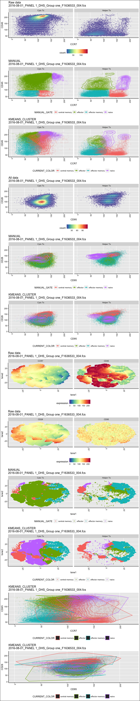
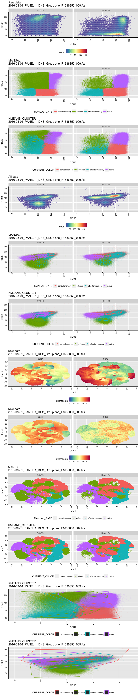
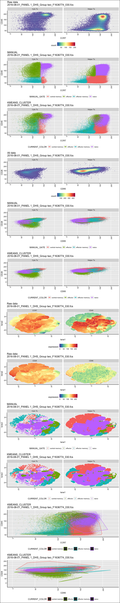
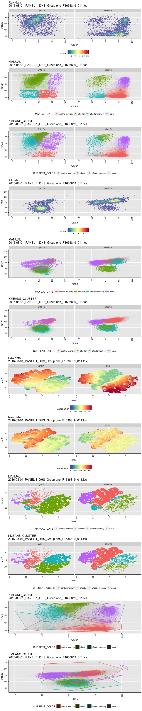

# Tcell subs
JL  
1/30/2018  


```
## [1] "Found 37 wsps"
```

```
## [1] "loading /Volumes/Beta/data/flow/testTcellSubFCS_Results/2016-08-01_PANEL 1_DHS_Group one_F1631366_002.fcsresults.RData"
## [1] "Plotting 2016-08-01_PANEL 1_DHS_Group one_F1631366_002.fcs"
## [1] "EC_ZF example =  TRUE"
## [1] "Sample number 0"
```

<!-- -->

```
## [1] "loading /Volumes/Beta/data/flow/testTcellSubFCS_Results/2016-08-01_PANEL 1_DHS_Group one_F1631377_003.fcsresults.RData"
## [1] "Plotting 2016-08-01_PANEL 1_DHS_Group one_F1631377_003.fcs"
## [1] "EC_ZF example =  TRUE"
## [1] "Sample number 1"
```

<!-- -->

```
## [1] "loading /Volumes/Beta/data/flow/testTcellSubFCS_Results/2016-08-01_PANEL 1_DHS_Group two_F1636830_032.fcsresults.RData"
## [1] "Plotting 2016-08-01_PANEL 1_DHS_Group two_F1636830_032.fcs"
## [1] "EC_ZF example =  TRUE"
## [1] "Sample number 2"
```

<!-- -->

```
## [1] "loading /Volumes/Beta/data/flow/testTcellSubFCS_Results/2016-08-01_PANEL 1_DHS_Group one_F1636775_013.fcsresults.RData"
## [1] "Plotting 2016-08-01_PANEL 1_DHS_Group one_F1636775_013.fcs"
## [1] "EC_ZF example =  TRUE"
## [1] "Sample number 3"
```

<!-- -->

```
## [1] "loading /Volumes/Beta/data/flow/testTcellSubFCS_Results/2016-08-01_PANEL 1_DHS_Group one_F1636847_014.fcsresults.RData"
## [1] "Plotting 2016-08-01_PANEL 1_DHS_Group one_F1636847_014.fcs"
## [1] "EC_ZF example =  TRUE"
## [1] "Sample number 4"
```

<!-- -->

```
## [1] "loading /Volumes/Beta/data/flow/testTcellSubFCS_Results/2016-08-01_PANEL 1_DHS_Group one_F1636851_001.fcsresults.RData"
## [1] "Plotting 2016-08-01_PANEL 1_DHS_Group one_F1636851_001.fcs"
## [1] "EC_ZF example =  TRUE"
## [1] "Sample number 5"
```

<!-- -->

```
## [1] "loading /Volumes/Beta/data/flow/testTcellSubFCS_Results/2016-08-01_PANEL 1_DHS_Group one_F1636533_004.fcsresults.RData"
## [1] "Plotting 2016-08-01_PANEL 1_DHS_Group one_F1636533_004.fcs"
## [1] "EC_ZF example =  TRUE"
## [1] "Sample number 6"
```

<!-- -->

```
## [1] "loading /Volumes/Beta/data/flow/testTcellSubFCS_Results/2016-08-01_PANEL 1_DHS_Group one_F1636850_009.fcsresults.RData"
## [1] "Plotting 2016-08-01_PANEL 1_DHS_Group one_F1636850_009.fcs"
## [1] "EC_ZF example =  TRUE"
## [1] "Sample number 7"
```

<!-- -->

```
## [1] "loading /Volumes/Beta/data/flow/testTcellSubFCS_Results/2016-08-01_PANEL 1_DHS_Group two_F1636774_030.fcsresults.RData"
## [1] "Plotting 2016-08-01_PANEL 1_DHS_Group two_F1636774_030.fcs"
## [1] "EC_ZF example =  TRUE"
## [1] "Sample number 8"
```

<!-- -->

```
## [1] "loading /Volumes/Beta/data/flow/testTcellSubFCS_Results/2016-08-01_PANEL 1_DHS_Group one_F1636819_011.fcsresults.RData"
## [1] "Plotting 2016-08-01_PANEL 1_DHS_Group one_F1636819_011.fcs"
## [1] "EC_ZF example =  TRUE"
## [1] "Sample number 9"
```

<!-- -->
