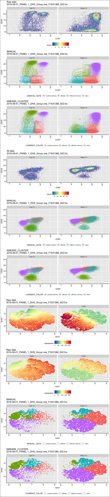
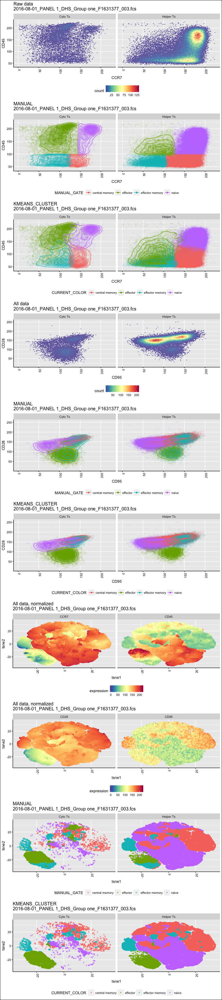
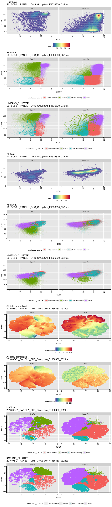

# Tcell subs
JL  
1/30/2018  


```
## [1] "Found 37 wsps"
```

```
## [1] "/Volumes/Beta/data/flow/wsp//801_Panel 1_DHS.wsp"
## [1] "2016-08-01_PANEL 1_DHS_Group one_F1631366_002.fcs"
## windows version of flowJo workspace recognized.
## version X
## [1] "2016-08-01_PANEL 1_DHS_Group one_F1631366_002.fcs"
## 
##  FALSE   TRUE 
## 190183  19910 
##   Running FlowSOM...    Building SOM...
##     Meta clustering to 4 clusters...
```

```
##  DONE!
## [1] "loading  /Volumes/Beta/data/flow/testTcellSubFCS_Results/2016-08-01_PANEL 1_DHS_Group one_F1631366_002.fcsresults.RData for re-clustering"
## [1] "loading  /Volumes/Beta/data/flow/testTcellSubFCS_Results/2016-08-01_PANEL 1_DHS_Group one_F1631366_002.fcsresults.RData for re-clustering"
## [1] "Plotting 2016-08-01_PANEL 1_DHS_Group one_F1631366_002.fcs"
## [1] "EC_ZF example =  TRUE"
## [1] "Sample number 0"
```

```
## [1] "/Volumes/Beta/data/flow/wsp//801_Panel 1_DHS.wsp"
## [1] "2016-08-01_PANEL 1_DHS_Group one_F1631377_003.fcs"
## windows version of flowJo workspace recognized.
## version X
## [1] "2016-08-01_PANEL 1_DHS_Group one_F1631377_003.fcs"
## 
##  FALSE   TRUE 
## 923237  98770 
##   Running FlowSOM...    Building SOM...
##     Meta clustering to 4 clusters...
```

<!-- -->

```
##  DONE!
## [1] "loading  /Volumes/Beta/data/flow/testTcellSubFCS_Results/2016-08-01_PANEL 1_DHS_Group one_F1631377_003.fcsresults.RData for re-clustering"
## [1] "loading  /Volumes/Beta/data/flow/testTcellSubFCS_Results/2016-08-01_PANEL 1_DHS_Group one_F1631377_003.fcsresults.RData for re-clustering"
## [1] "Plotting 2016-08-01_PANEL 1_DHS_Group one_F1631377_003.fcs"
## [1] "EC_ZF example =  TRUE"
## [1] "Sample number 1"
```

```
## [1] "/Volumes/Beta/data/flow/wsp//801_Panel 1_DHS.wsp"
## [1] "2016-08-01_PANEL 1_DHS_Group two_F1636830_032.fcs"
## windows version of flowJo workspace recognized.
## version X
## [1] "2016-08-01_PANEL 1_DHS_Group two_F1636830_032.fcs"
## 
##  FALSE   TRUE 
## 387273  71778 
##   Running FlowSOM...    Building SOM...
##     Meta clustering to 4 clusters...
```

<!-- -->

```
##  DONE!
## [1] "loading  /Volumes/Beta/data/flow/testTcellSubFCS_Results/2016-08-01_PANEL 1_DHS_Group two_F1636830_032.fcsresults.RData for re-clustering"
## [1] "loading  /Volumes/Beta/data/flow/testTcellSubFCS_Results/2016-08-01_PANEL 1_DHS_Group two_F1636830_032.fcsresults.RData for re-clustering"
## [1] "Plotting 2016-08-01_PANEL 1_DHS_Group two_F1636830_032.fcs"
## [1] "EC_ZF example =  TRUE"
## [1] "Sample number 2"
```

<!-- -->
