# Test K means
JL  
1/26/2018  


```
## [1] "/Volumes/Beta/data/flow/wsp//801_Panel 1_DHS.wsp"
## [1] "2016-08-01_PANEL 1_DHS_Group two_F1636830_032.fcs"
## windows version of flowJo workspace recognized.
## version X
## [1] "2016-08-01_PANEL 1_DHS_Group two_F1636830_032.fcs"
## 
##  FALSE   TRUE 
## 387273  71778 
## [1] "loading /Volumes/Beta/data/flow/testTcellSubFCS_Results/2016-08-01_PANEL 1_DHS_Group two_F1636830_032.fcsresults.RData"
```

<!-- --><!-- --><!-- --><!-- --><!-- --><!-- -->

```
## [1] "/Volumes/Beta/data/flow/wsp//801_Panel 1_DHS.wsp"
## [1] "2016-08-01_PANEL 1_DHS_Group one_F1636533_004.fcs"
## windows version of flowJo workspace recognized.
## version X
## [1] "2016-08-01_PANEL 1_DHS_Group one_F1636533_004.fcs"
## 
##  FALSE   TRUE 
## 945246  61817 
## [1] "loading /Volumes/Beta/data/flow/testTcellSubFCS_Results/2016-08-01_PANEL 1_DHS_Group one_F1636533_004.fcsresults.RData"
```

<!-- --><!-- --><!-- --><!-- --><!-- --><!-- -->

```
## [1] "/Volumes/Beta/data/flow/wsp//801_Panel 1_DHS.wsp"
## [1] "2016-08-01_PANEL 1_DHS_Group one_F1636850_009.fcs"
## windows version of flowJo workspace recognized.
## version X
## [1] "2016-08-01_PANEL 1_DHS_Group one_F1636850_009.fcs"
## 
##  FALSE   TRUE 
## 651951 141803 
## [1] "loading /Volumes/Beta/data/flow/testTcellSubFCS_Results/2016-08-01_PANEL 1_DHS_Group one_F1636850_009.fcsresults.RData"
```

<!-- --><!-- --><!-- --><!-- --><!-- -->

```
## [1] "/Volumes/Beta/data/flow/wsp//801_Panel 1_DHS.wsp"
## [1] "2016-08-01_PANEL 1_DHS_Group two_F1636774_030.fcs"
## windows version of flowJo workspace recognized.
## version X
## [1] "2016-08-01_PANEL 1_DHS_Group two_F1636774_030.fcs"
## 
##   FALSE    TRUE 
## 1457319  137416 
##   Running t-SNE...with seed 42  DONE
##   Running FlowSOM...    Building SOM...
##     Meta clustering to 4 clusters...
```

<!-- -->

```
##  DONE!
##   Running PhenoGraph...  Finding nearest neighbors...DONE ~ 3.474 s
##   Compute jaccard coefficient between nearest-neighbor sets...DONE ~ 59.657 s
##   Build undirected graph from the weighted links...DONE ~ 13.124 s
##   Run louvain clustering on the graph ...DONE ~ 15.489 s
##   Return a community class
##   -Modularity value: 0.9027242 
##   -Number of clusters: 43 DONE!
```

<!-- -->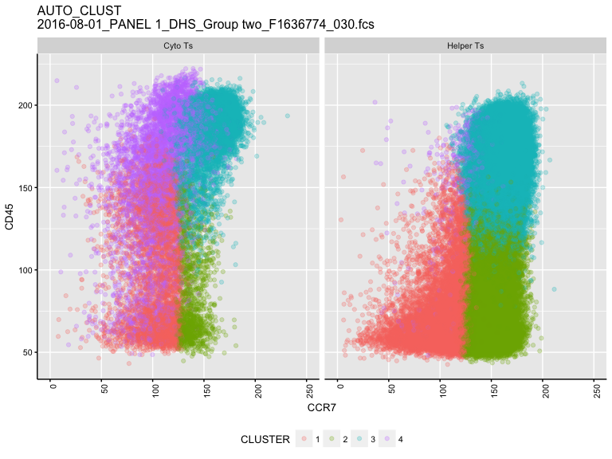<!-- -->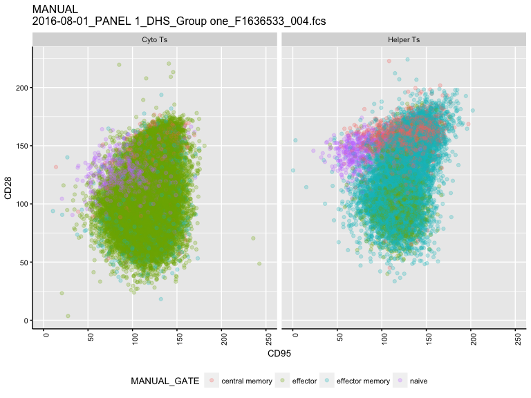<!-- -->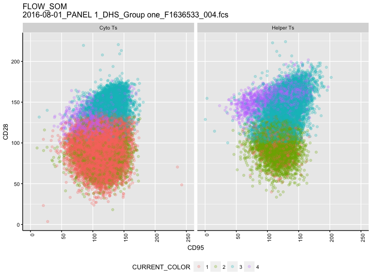<!-- --><!-- -->

```
## [1] "/Volumes/Beta/data/flow/wsp//801_Panel 1_DHS.wsp"
## [1] "2016-08-01_PANEL 1_DHS_Group one_F1636819_011.fcs"
## windows version of flowJo workspace recognized.
## version X
## [1] "2016-08-01_PANEL 1_DHS_Group one_F1636819_011.fcs"
## 
##  FALSE   TRUE 
## 825881  16707 
##   Running t-SNE...with seed 42  DONE
##   Running FlowSOM...    Building SOM...
##     Meta clustering to 4 clusters...
```

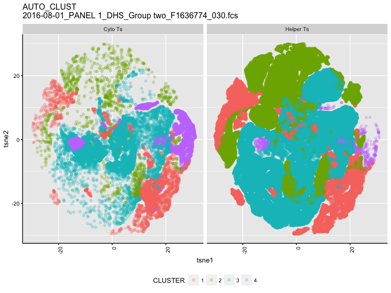<!-- -->

```
##  DONE!
##   Running PhenoGraph...  Finding nearest neighbors...DONE ~ 0.267 s
##   Compute jaccard coefficient between nearest-neighbor sets...DONE ~ 6.928 s
##   Build undirected graph from the weighted links...DONE ~ 1.405 s
##   Run louvain clustering on the graph ...DONE ~ 0.975 s
##   Return a community class
##   -Modularity value: 0.8647375 
##   -Number of clusters: 25 DONE!
```

<!-- -->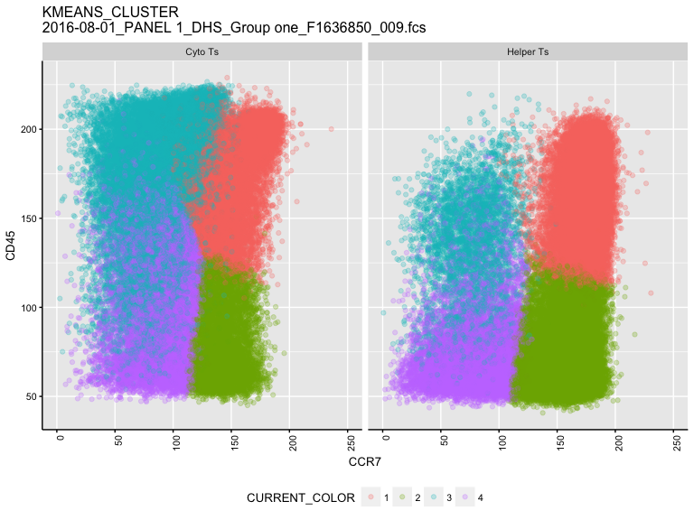<!-- --><!-- --><!-- --><!-- -->

```
## [1] "/Volumes/Beta/data/flow/wsp//801_Panel 1_DHS.wsp"
## [1] "2016-08-01_PANEL 1_DHS_Group one_F1636775_013.fcs"
## windows version of flowJo workspace recognized.
## version X
## [1] "2016-08-01_PANEL 1_DHS_Group one_F1636775_013.fcs"
## 
##  FALSE   TRUE 
## 747256 129842 
##   Running t-SNE...with seed 42  DONE
##   Running FlowSOM...    Building SOM...
##     Meta clustering to 4 clusters...
```

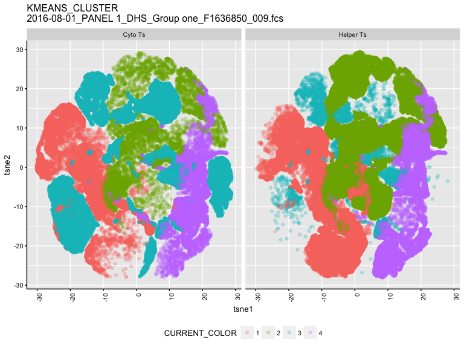<!-- -->

```
##  DONE!
##   Running PhenoGraph...  Finding nearest neighbors...DONE ~ 3.279 s
##   Compute jaccard coefficient between nearest-neighbor sets...DONE ~ 53.394 s
##   Build undirected graph from the weighted links...DONE ~ 11.565 s
##   Run louvain clustering on the graph ...DONE ~ 11.37 s
##   Return a community class
##   -Modularity value: 0.9010742 
##   -Number of clusters: 42 DONE!
```

<!-- -->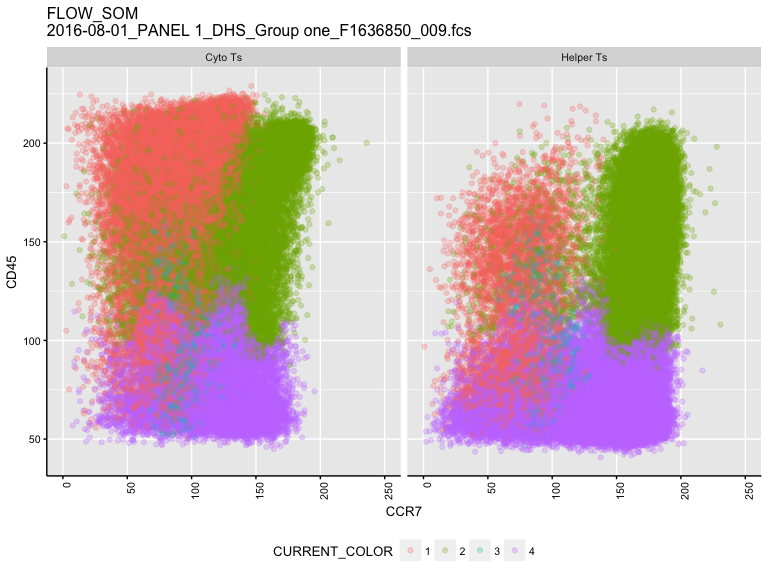<!-- --><!-- -->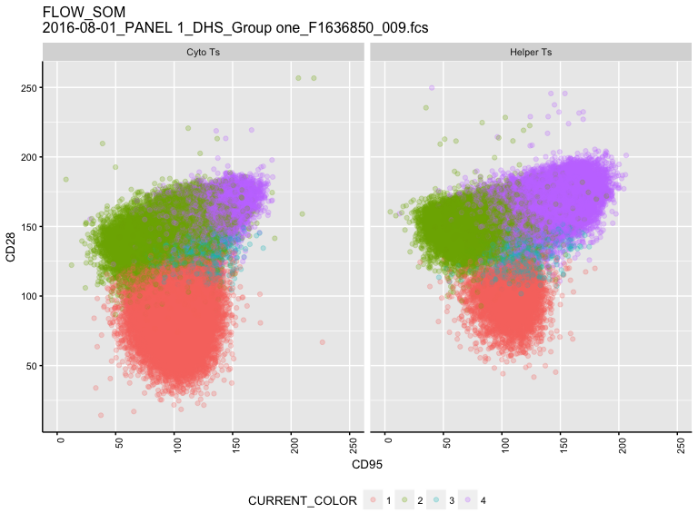<!-- --><!-- -->

```
## [1] "/Volumes/Beta/data/flow/wsp//801_Panel 1_DHS.wsp"
## [1] "2016-08-01_PANEL 1_DHS_Group one_F1631366_002.fcs"
## windows version of flowJo workspace recognized.
## version X
## [1] "2016-08-01_PANEL 1_DHS_Group one_F1631366_002.fcs"
## 
##  FALSE   TRUE 
## 190183  19910 
##   Running t-SNE...with seed 42  DONE
##   Running FlowSOM...    Building SOM...
##     Meta clustering to 4 clusters...
```

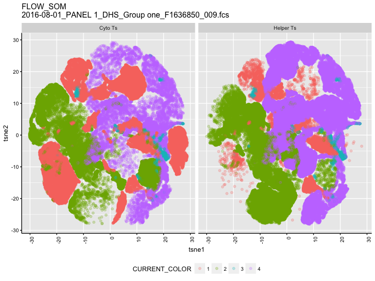<!-- -->

```
##  DONE!
##   Running PhenoGraph...  Finding nearest neighbors...DONE ~ 0.236 s
##   Compute jaccard coefficient between nearest-neighbor sets...DONE ~ 7.589 s
##   Build undirected graph from the weighted links...DONE ~ 1.544 s
##   Run louvain clustering on the graph ...DONE ~ 1.004 s
##   Return a community class
##   -Modularity value: 0.8731042 
##   -Number of clusters: 26 DONE!
```

<!-- -->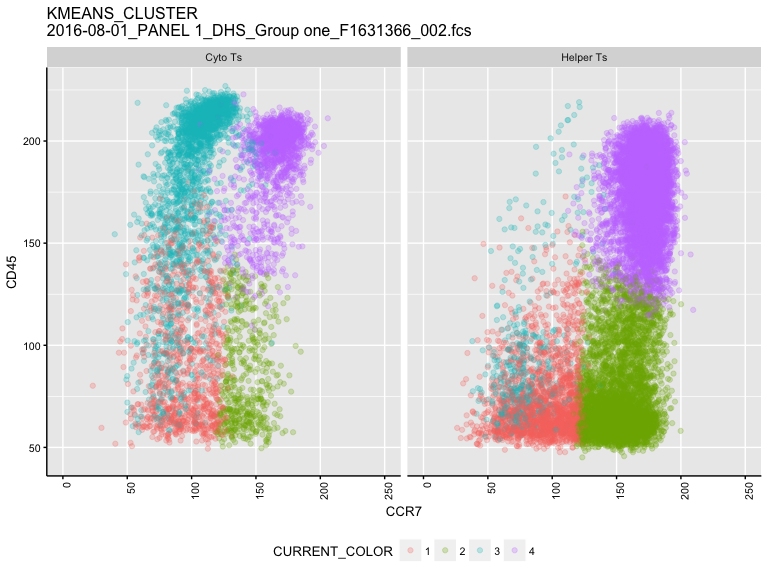<!-- -->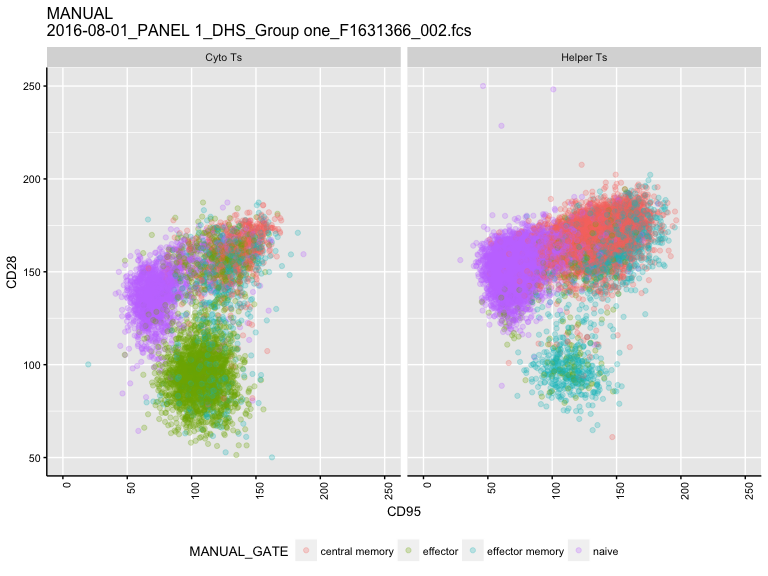<!-- -->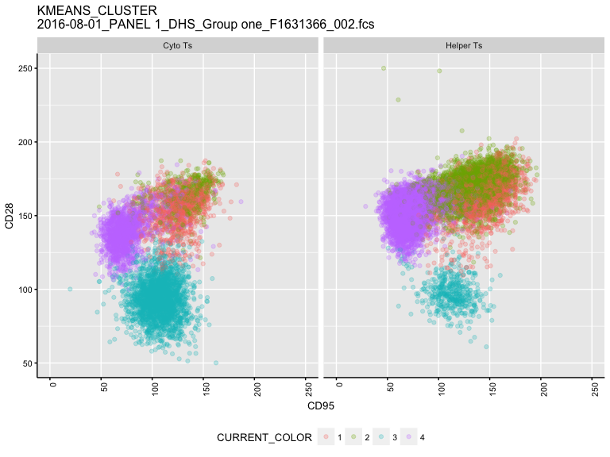<!-- --><!-- -->

```
## [1] "/Volumes/Beta/data/flow/wsp//801_Panel 1_DHS.wsp"
## [1] "2016-08-01_PANEL 1_DHS_Group one_F1636847_014.fcs"
## windows version of flowJo workspace recognized.
## version X
## [1] "2016-08-01_PANEL 1_DHS_Group one_F1636847_014.fcs"
## 
##  FALSE   TRUE 
## 471979  45632 
##   Running t-SNE...with seed 42  DONE
##   Running FlowSOM...    Building SOM...
##     Meta clustering to 4 clusters...
```

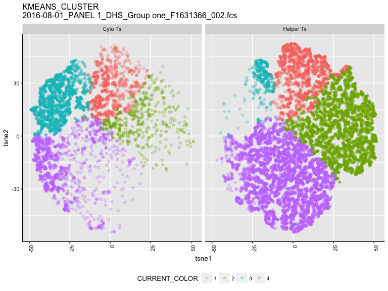<!-- -->

```
##  DONE!
##   Running PhenoGraph...  Finding nearest neighbors...DONE ~ 0.694 s
##   Compute jaccard coefficient between nearest-neighbor sets...DONE ~ 18.389 s
##   Build undirected graph from the weighted links...DONE ~ 3.659 s
##   Run louvain clustering on the graph ...DONE ~ 3.23 s
##   Return a community class
##   -Modularity value: 0.8808189 
##   -Number of clusters: 29 DONE!
```

<!-- -->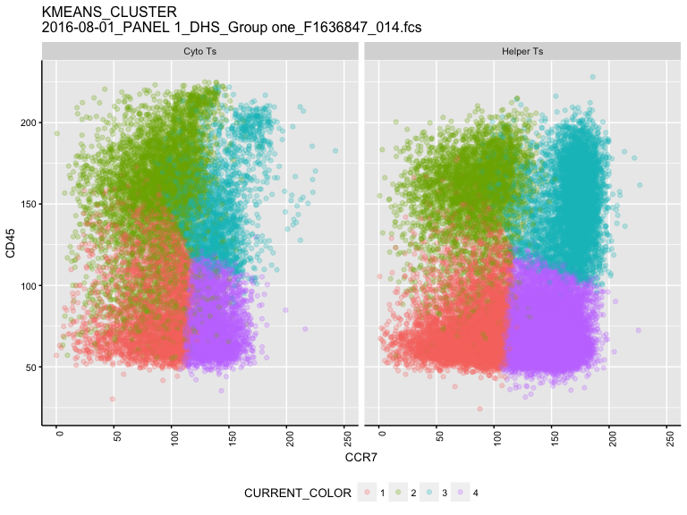<!-- -->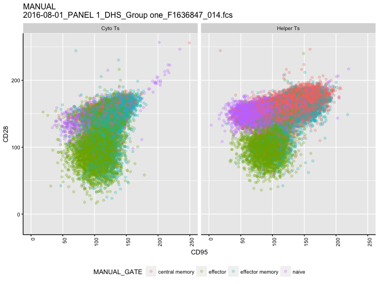<!-- -->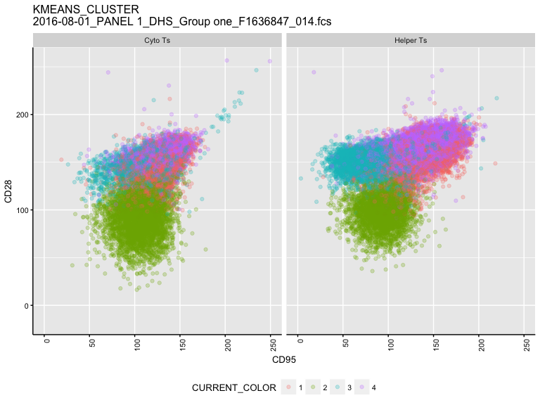<!-- -->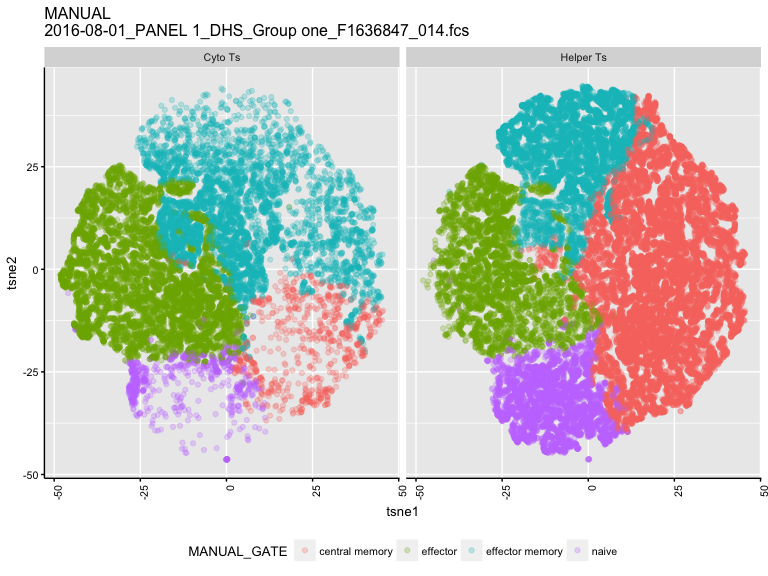<!-- --><!-- -->

```
## [1] "/Volumes/Beta/data/flow/wsp//801_Panel 1_DHS.wsp"
## [1] "2016-08-01_PANEL 1_DHS_Group one_F1631377_003.fcs"
## windows version of flowJo workspace recognized.
## version X
## [1] "2016-08-01_PANEL 1_DHS_Group one_F1631377_003.fcs"
## 
##  FALSE   TRUE 
## 923237  98770 
## [1] "loading /Volumes/Beta/data/flow/testTcellSubFCS_Results/2016-08-01_PANEL 1_DHS_Group one_F1631377_003.fcsresults.RData"
```

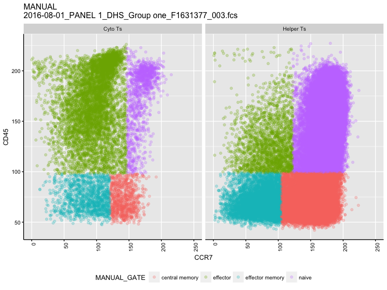<!-- --><!-- -->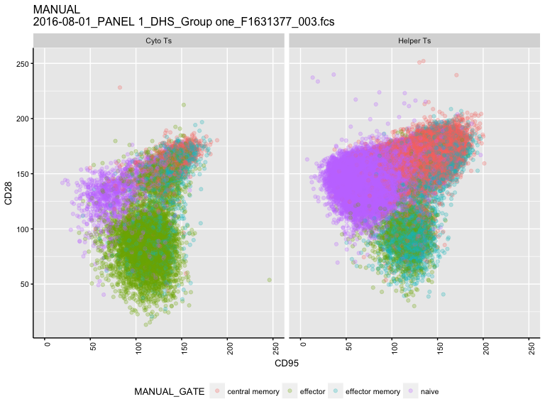<!-- --><!-- --><!-- -->

```
## [1] "/Volumes/Beta/data/flow/wsp//801_Panel 1_DHS.wsp"
## [1] "2016-08-01_PANEL 1_DHS_Group two_F1631147_029.fcs"
## windows version of flowJo workspace recognized.
## version X
## [1] "2016-08-01_PANEL 1_DHS_Group two_F1631147_029.fcs"
## 
##  FALSE   TRUE 
## 427020 135593 
##   Running t-SNE...with seed 42  DONE
##   Running FlowSOM...    Building SOM...
##     Meta clustering to 4 clusters...
```

<!-- -->

```
##  DONE!
##   Running PhenoGraph...  Finding nearest neighbors...DONE ~ 3.471 s
##   Compute jaccard coefficient between nearest-neighbor sets...DONE ~ 56.214 s
##   Build undirected graph from the weighted links...DONE ~ 12.28 s
##   Run louvain clustering on the graph ...DONE ~ 11.225 s
##   Return a community class
##   -Modularity value: 0.9054053 
##   -Number of clusters: 38 DONE!
```

<!-- --><!-- --><!-- --><!-- --><!-- -->

```
## [1] "/Volumes/Beta/data/flow/wsp//801_Panel 1_DHS.wsp"
## [1] "2016-08-01_PANEL 1_DHS_Group one_F1631107_010.fcs"
## windows version of flowJo workspace recognized.
## version X
## [1] "2016-08-01_PANEL 1_DHS_Group one_F1631107_010.fcs"
## 
##   FALSE    TRUE 
## 2237966   74646 
##   Running t-SNE...with seed 42  DONE
##   Running FlowSOM...    Building SOM...
##     Meta clustering to 4 clusters...
```

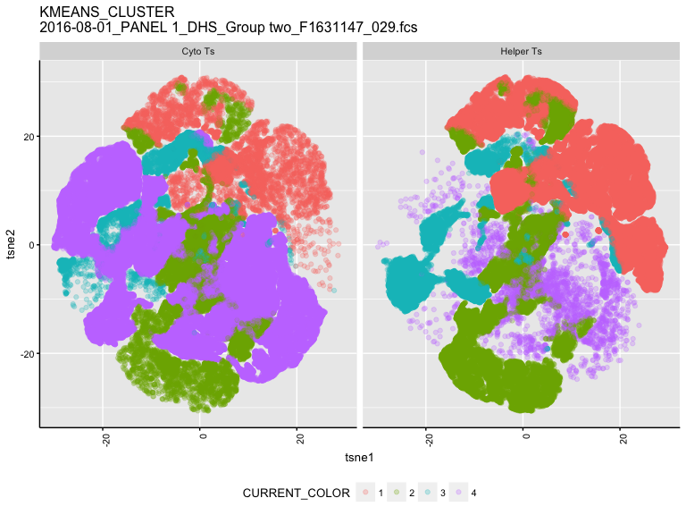<!-- -->

```
##  DONE!
##   Running PhenoGraph...  Finding nearest neighbors...DONE ~ 1.467 s
##   Compute jaccard coefficient between nearest-neighbor sets...DONE ~ 32.68 s
##   Build undirected graph from the weighted links...DONE ~ 6.356 s
##   Run louvain clustering on the graph ...DONE ~ 6.473 s
##   Return a community class
##   -Modularity value: 0.8942902 
##   -Number of clusters: 37 DONE!
```

<!-- -->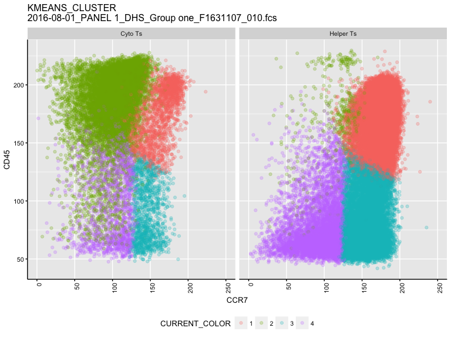<!-- --><!-- --><!-- -->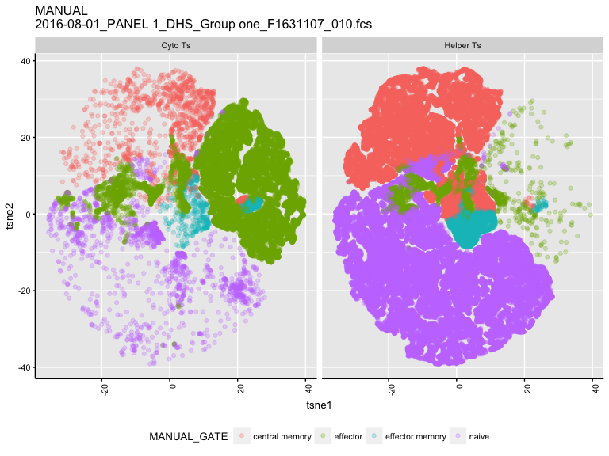<!-- -->

```
## [1] "/Volumes/Beta/data/flow/wsp//801_Panel 1_DHS.wsp"
## [1] "2016-08-01_PANEL 1_DHS_Group one_F1636818_005.fcs"
## windows version of flowJo workspace recognized.
## version X
## [1] "2016-08-01_PANEL 1_DHS_Group one_F1636818_005.fcs"
## 
##   FALSE    TRUE 
## 1140606  100887 
##   Running t-SNE...with seed 42  DONE
##   Running FlowSOM...    Building SOM...
##     Meta clustering to 4 clusters...
```

<!-- -->

```
##  DONE!
##   Running PhenoGraph...  Finding nearest neighbors...DONE ~ 2.286 s
##   Compute jaccard coefficient between nearest-neighbor sets...DONE ~ 41.062 s
##   Build undirected graph from the weighted links...DONE ~ 8.632 s
##   Run louvain clustering on the graph ...DONE ~ 7.87 s
##   Return a community class
##   -Modularity value: 0.8980429 
##   -Number of clusters: 40 DONE!
```

<!-- --><!-- --><!-- -->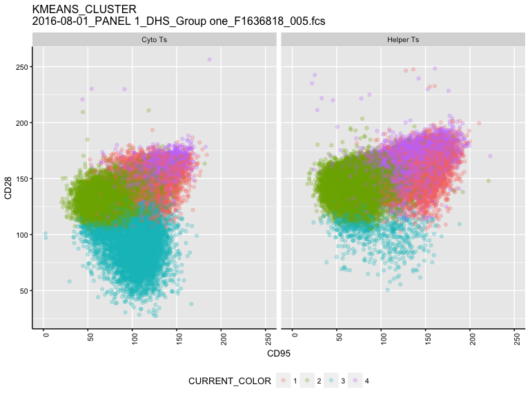<!-- --><!-- -->

```
## [1] "/Volumes/Beta/data/flow/wsp//801_Panel 1_DHS.wsp"
## [1] "2016-08-01_PANEL 1_DHS_Group one_F1631332_012.fcs"
## windows version of flowJo workspace recognized.
## version X
## [1] "2016-08-01_PANEL 1_DHS_Group one_F1631332_012.fcs"
## 
##  FALSE   TRUE 
## 407912  97770 
##   Running t-SNE...with seed 42  DONE
##   Running FlowSOM...    Building SOM...
##     Meta clustering to 4 clusters...
```

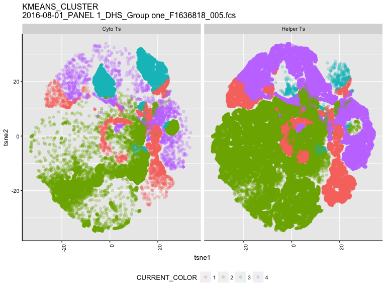<!-- -->

```
##  DONE!
##   Running PhenoGraph...  Finding nearest neighbors...DONE ~ 2.259 s
##   Compute jaccard coefficient between nearest-neighbor sets...DONE ~ 41.941 s
##   Build undirected graph from the weighted links...DONE ~ 8.644 s
##   Run louvain clustering on the graph ...DONE ~ 8.122 s
##   Return a community class
##   -Modularity value: 0.9070073 
##   -Number of clusters: 38 DONE!
```

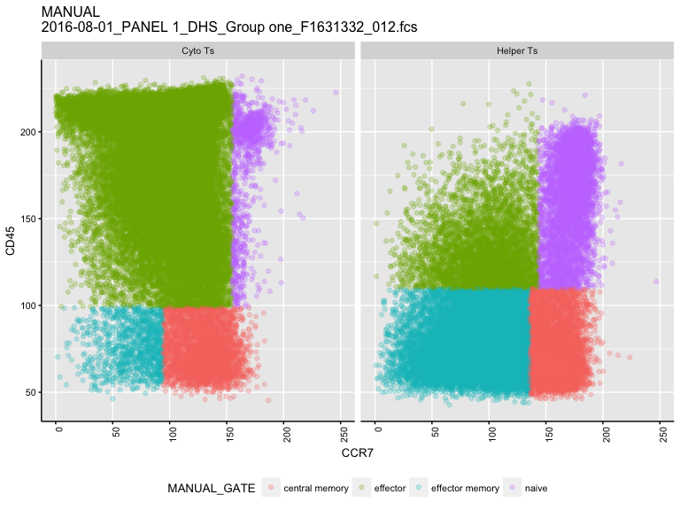<!-- --><!-- -->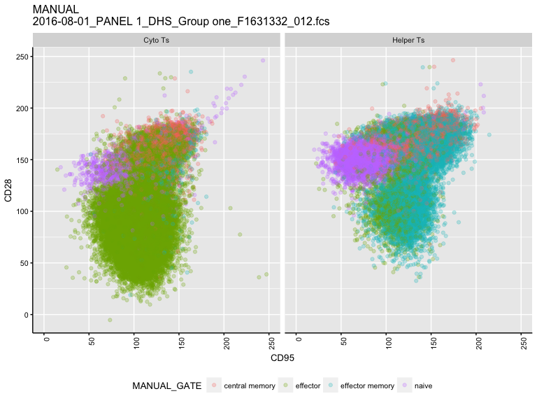<!-- --><!-- -->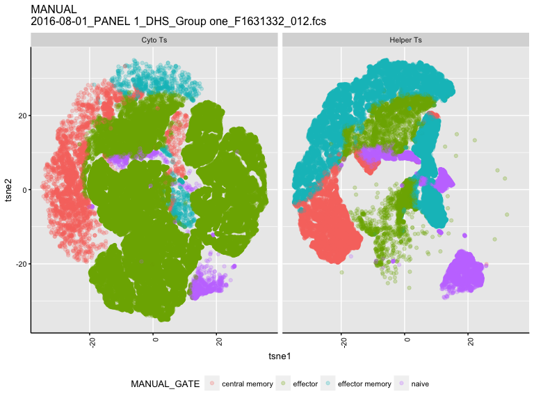<!-- --><!-- -->

```
## [1] "/Volumes/Beta/data/flow/wsp//801_Panel 1_DHS.wsp"
## [1] "2016-08-01_PANEL 1_DHS_Group one_F1636851_001.fcs"
## windows version of flowJo workspace recognized.
## version X
## [1] "2016-08-01_PANEL 1_DHS_Group one_F1636851_001.fcs"
## 
##  FALSE   TRUE 
## 175192  28587 
## [1] "loading /Volumes/Beta/data/flow/testTcellSubFCS_Results/2016-08-01_PANEL 1_DHS_Group one_F1636851_001.fcsresults.RData"
```

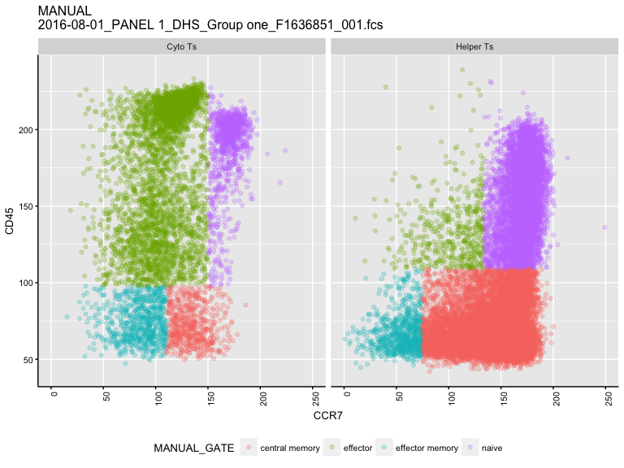<!-- -->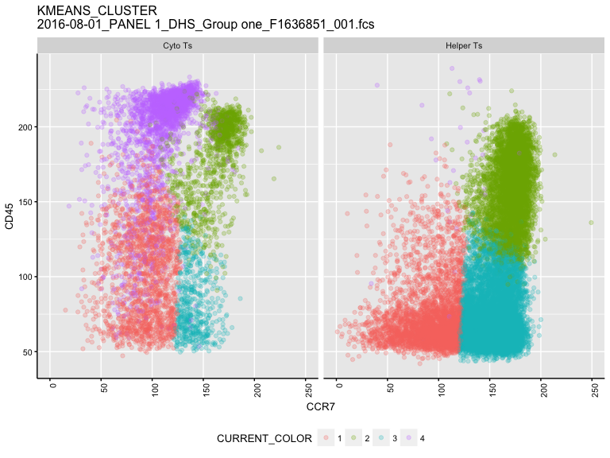<!-- -->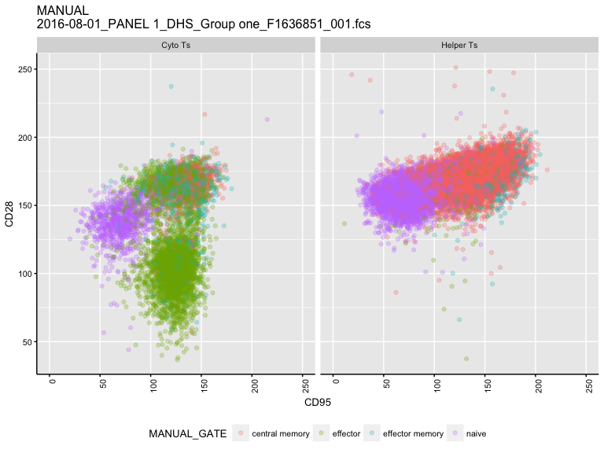<!-- -->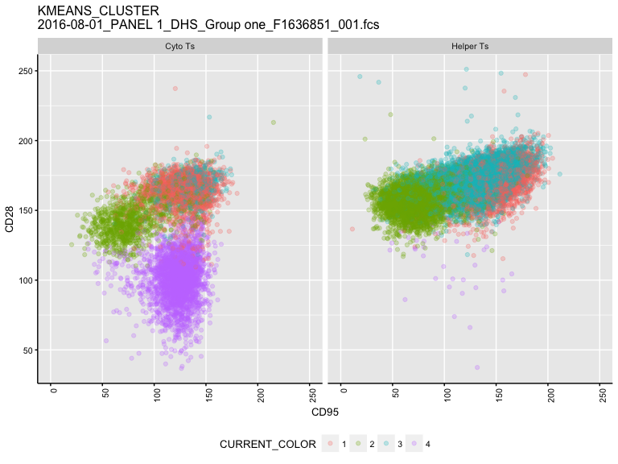<!-- --><!-- -->

```
## [1] "/Volumes/Beta/data/flow/wsp//801_Panel 1_DHS.wsp"
## [1] "2016-08-01_PANEL 1_DHS_Group one_F1636790_006.fcs"
## windows version of flowJo workspace recognized.
## version X
## [1] "2016-08-01_PANEL 1_DHS_Group one_F1636790_006.fcs"
## 
##  FALSE   TRUE 
## 500172 100999 
##   Running t-SNE...with seed 42  DONE
##   Running FlowSOM...    Building SOM...
##     Meta clustering to 4 clusters...
```

<!-- -->

```
##  DONE!
##   Running PhenoGraph...  Finding nearest neighbors...DONE ~ 2.283 s
##   Compute jaccard coefficient between nearest-neighbor sets...DONE ~ 40.37 s
##   Build undirected graph from the weighted links...DONE ~ 8.67 s
##   Run louvain clustering on the graph ...DONE ~ 7.096 s
##   Return a community class
##   -Modularity value: 0.8978346 
##   -Number of clusters: 36 DONE!
```

<!-- -->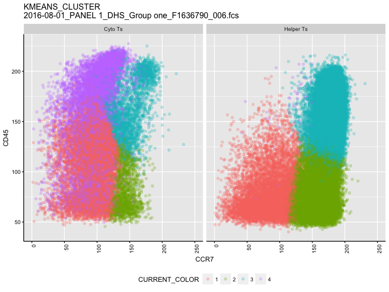<!-- -->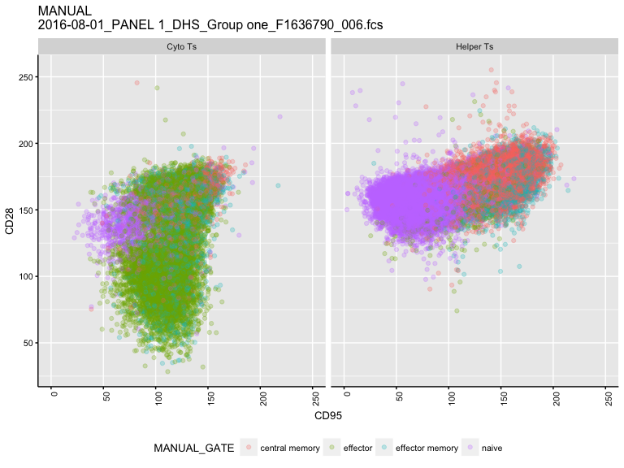<!-- --><!-- -->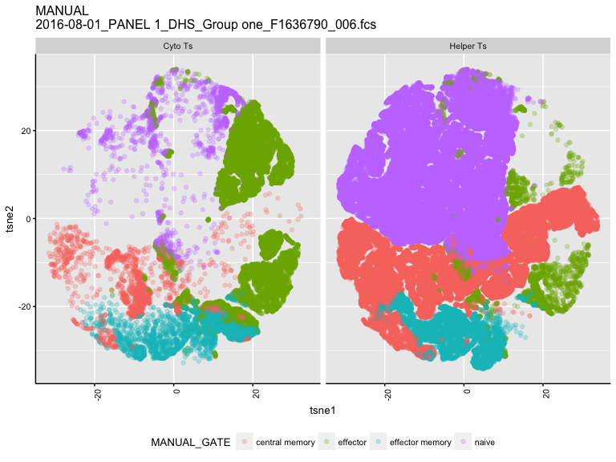<!-- -->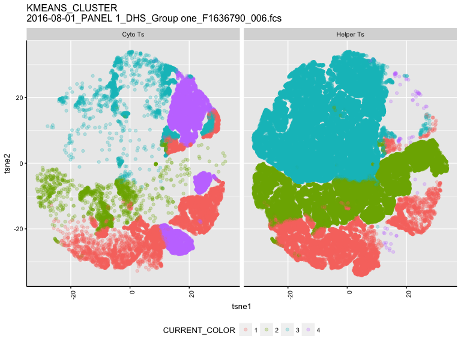<!-- -->
