# Test K means
JL  
1/26/2018  


```
## [1] "/Volumes/Beta/data/flow/wsp//801_Panel 1_DHS.wsp"
## [1] "2016-08-01_PANEL 1_DHS_Group two_F1636830_032.fcs"
## windows version of flowJo workspace recognized.
## version X
## [1] "2016-08-01_PANEL 1_DHS_Group two_F1636830_032.fcs"
## 
##  FALSE   TRUE 
## 387273  71778 
## [1] "loading /Volumes/Beta/data/flow/testTcellSubFCS_Results/2016-08-01_PANEL 1_DHS_Group two_F1636830_032.fcsresults.RData"
```

<!-- -->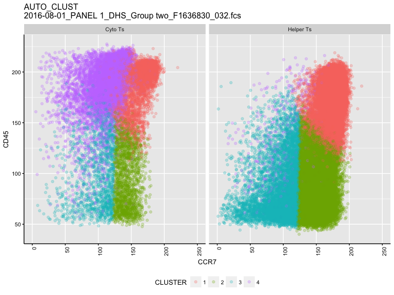<!-- --><!-- -->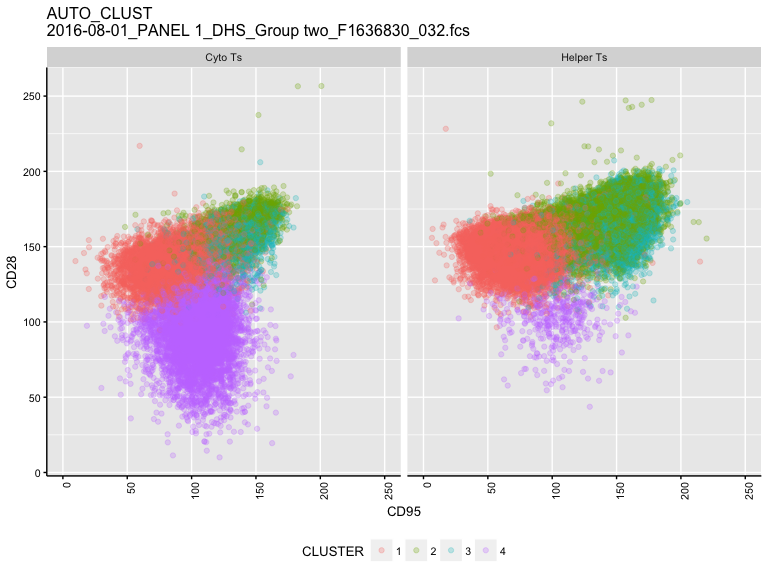<!-- -->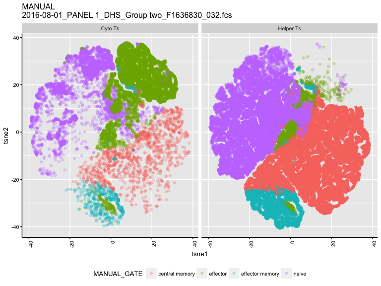<!-- -->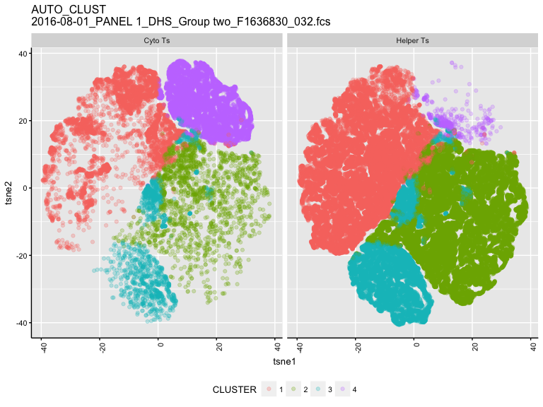<!-- -->

```
## [1] "/Volumes/Beta/data/flow/wsp//801_Panel 1_DHS.wsp"
## [1] "2016-08-01_PANEL 1_DHS_Group one_F1636533_004.fcs"
## windows version of flowJo workspace recognized.
## version X
## [1] "2016-08-01_PANEL 1_DHS_Group one_F1636533_004.fcs"
## 
##  FALSE   TRUE 
## 945246  61817 
## [1] "loading /Volumes/Beta/data/flow/testTcellSubFCS_Results/2016-08-01_PANEL 1_DHS_Group one_F1636533_004.fcsresults.RData"
```

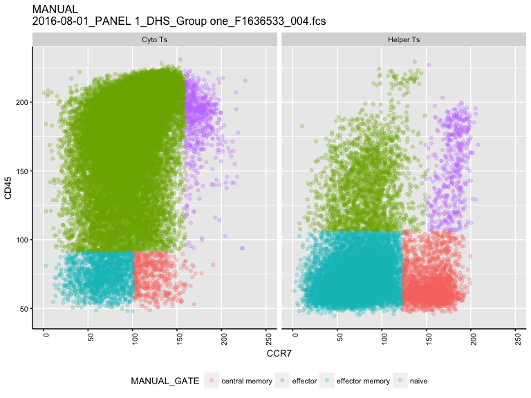<!-- -->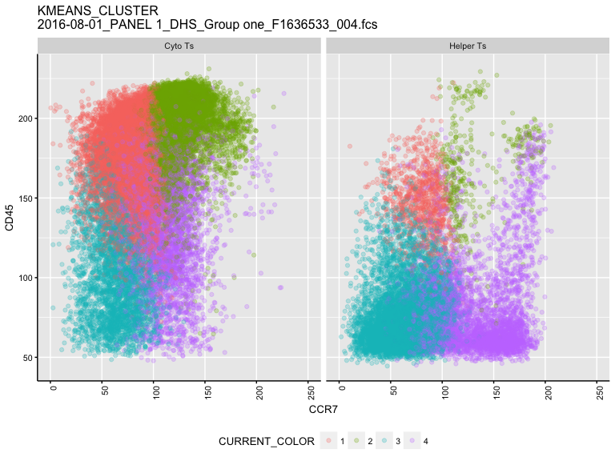<!-- --><!-- --><!-- --><!-- -->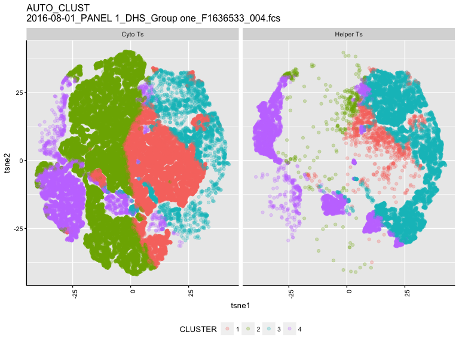<!-- -->

```
## [1] "/Volumes/Beta/data/flow/wsp//801_Panel 1_DHS.wsp"
## [1] "2016-08-01_PANEL 1_DHS_Group one_F1636850_009.fcs"
## windows version of flowJo workspace recognized.
## version X
## [1] "2016-08-01_PANEL 1_DHS_Group one_F1636850_009.fcs"
## 
##  FALSE   TRUE 
## 651951 141803 
## [1] "loading /Volumes/Beta/data/flow/testTcellSubFCS_Results/2016-08-01_PANEL 1_DHS_Group one_F1636850_009.fcsresults.RData"
```

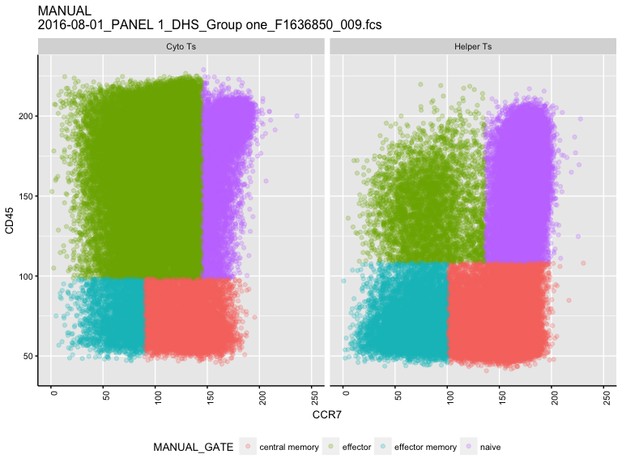<!-- -->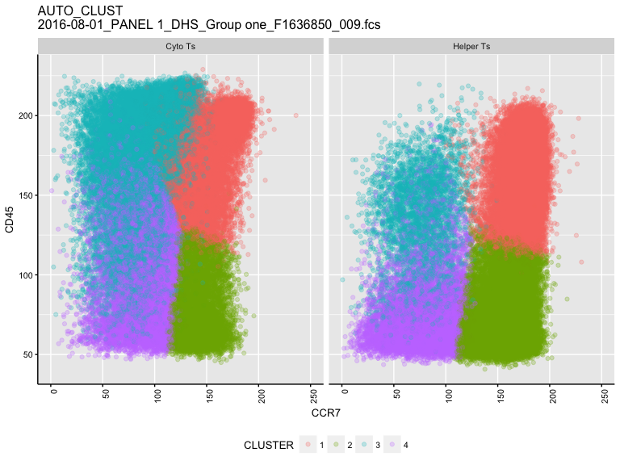<!-- --><!-- -->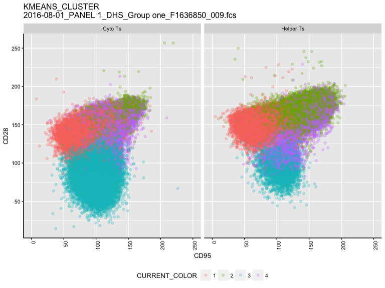<!-- --><!-- -->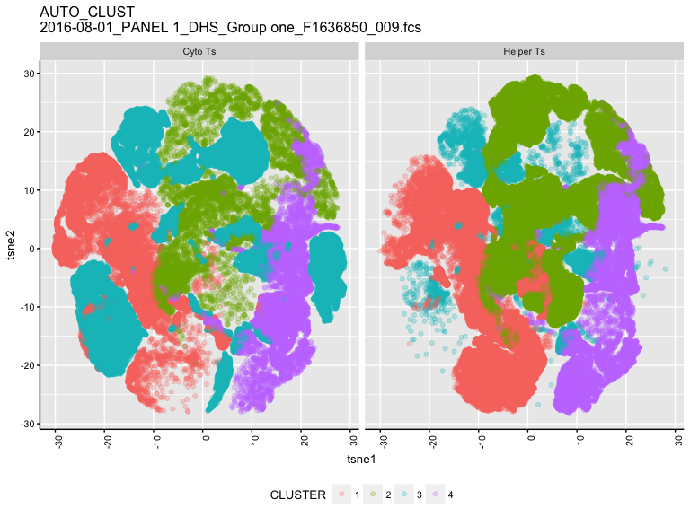<!-- -->
