# Tcell subs
JL  
1/30/2018  


```
## [1] "loading /Volumes/Beta/data/flow/testTcellSubFCS_Results/2016-08-01_PANEL 1_DHS_Group one_F1631366_002.fcsresults.RData"
## [1] "Plotting 2016-08-01_PANEL 1_DHS_Group one_F1631366_002.fcs"
```

<!-- -->

```
## [1] "loading /Volumes/Beta/data/flow/testTcellSubFCS_Results/2016-08-01_PANEL 1_DHS_Group one_F1631377_003.fcsresults.RData"
## [1] "Plotting 2016-08-01_PANEL 1_DHS_Group one_F1631377_003.fcs"
```

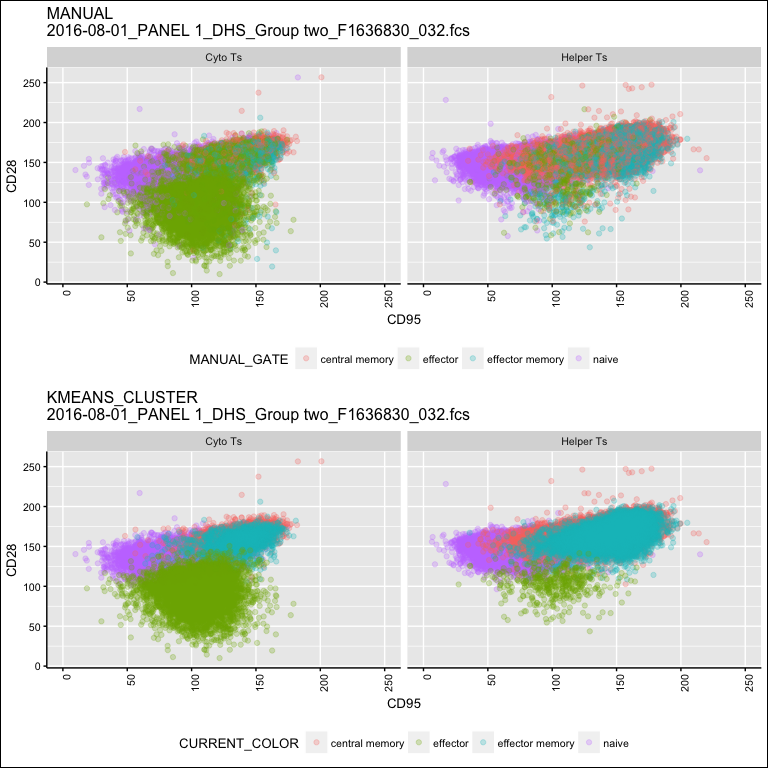<!-- -->

```
## [1] "loading /Volumes/Beta/data/flow/testTcellSubFCS_Results/2016-08-01_PANEL 1_DHS_Group two_F1636830_032.fcsresults.RData"
## [1] "Plotting 2016-08-01_PANEL 1_DHS_Group two_F1636830_032.fcs"
```

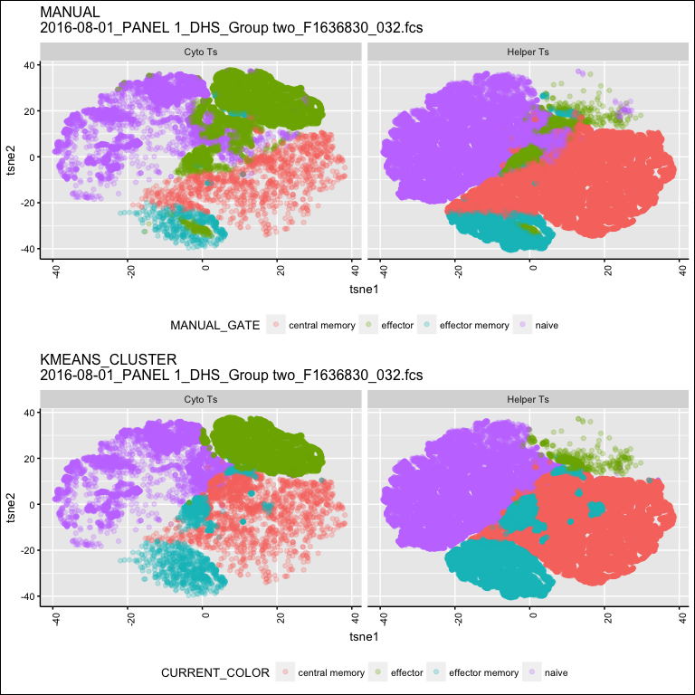<!-- -->

```
## [1] "loading /Volumes/Beta/data/flow/testTcellSubFCS_Results/2016-08-01_PANEL 1_DHS_Group one_F1636775_013.fcsresults.RData"
## [1] "Plotting 2016-08-01_PANEL 1_DHS_Group one_F1636775_013.fcs"
```

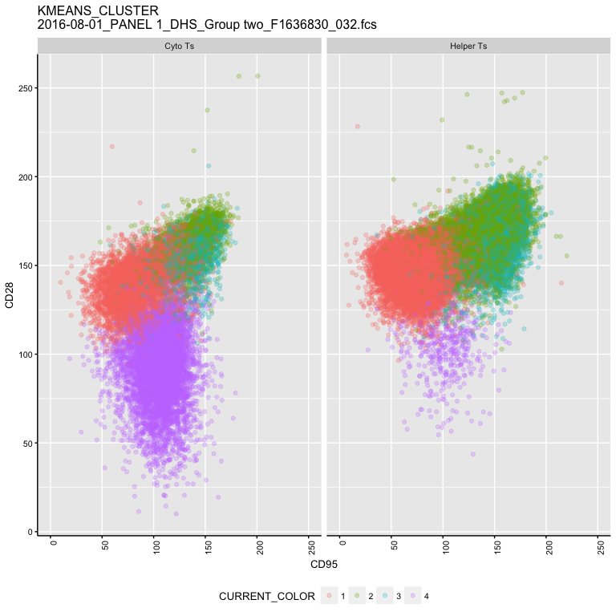<!-- -->

```
## [1] "loading /Volumes/Beta/data/flow/testTcellSubFCS_Results/2016-08-01_PANEL 1_DHS_Group one_F1636847_014.fcsresults.RData"
## [1] "Plotting 2016-08-01_PANEL 1_DHS_Group one_F1636847_014.fcs"
```

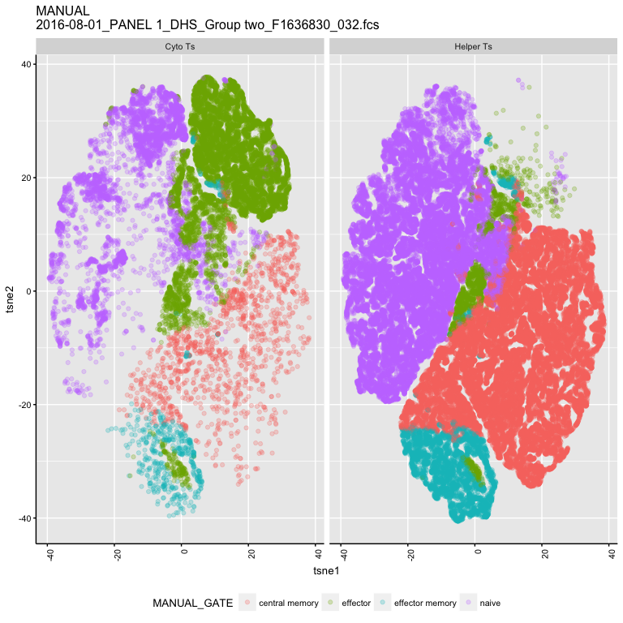<!-- -->

```
## [1] "loading /Volumes/Beta/data/flow/testTcellSubFCS_Results/2016-08-01_PANEL 1_DHS_Group one_F1636851_001.fcsresults.RData"
## [1] "Plotting 2016-08-01_PANEL 1_DHS_Group one_F1636851_001.fcs"
```

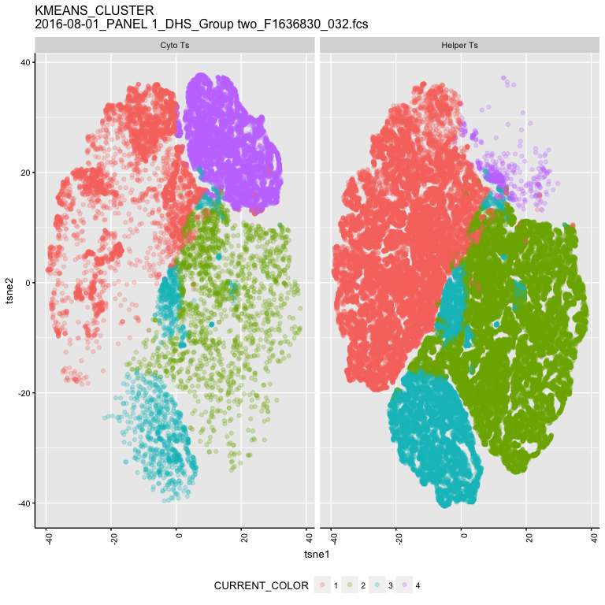<!-- -->

```
## [1] "loading /Volumes/Beta/data/flow/testTcellSubFCS_Results/2016-08-01_PANEL 1_DHS_Group one_F1636533_004.fcsresults.RData"
## [1] "Plotting 2016-08-01_PANEL 1_DHS_Group one_F1636533_004.fcs"
```

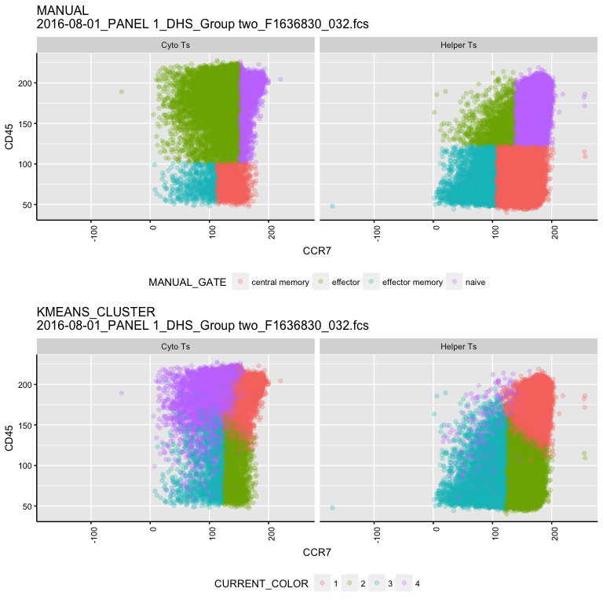<!-- -->

```
## [1] "loading /Volumes/Beta/data/flow/testTcellSubFCS_Results/2016-08-01_PANEL 1_DHS_Group one_F1636850_009.fcsresults.RData"
## [1] "Plotting 2016-08-01_PANEL 1_DHS_Group one_F1636850_009.fcs"
```

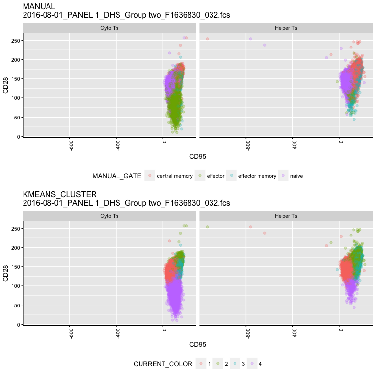<!-- -->

```
## [1] "loading /Volumes/Beta/data/flow/testTcellSubFCS_Results/2016-08-01_PANEL 1_DHS_Group two_F1636774_030.fcsresults.RData"
## [1] "Plotting 2016-08-01_PANEL 1_DHS_Group two_F1636774_030.fcs"
```

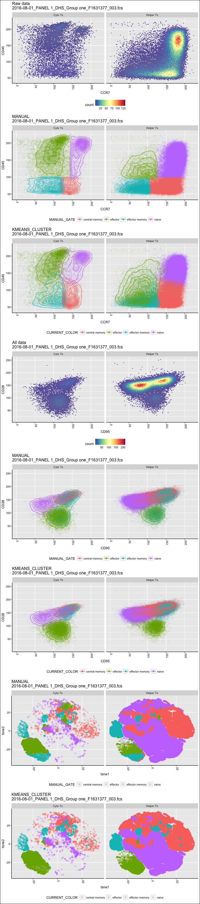<!-- -->

```
## [1] "loading /Volumes/Beta/data/flow/testTcellSubFCS_Results/2016-08-01_PANEL 1_DHS_Group one_F1636819_011.fcsresults.RData"
## [1] "Plotting 2016-08-01_PANEL 1_DHS_Group one_F1636819_011.fcs"
```

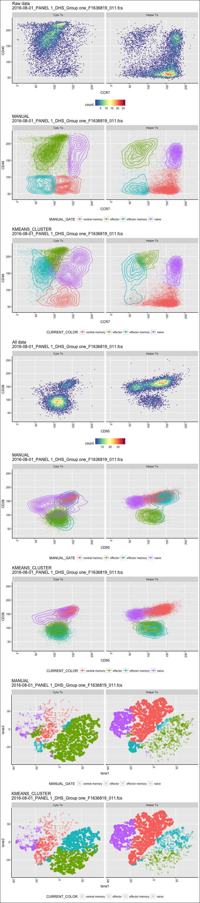<!-- -->

```
## [1] "loading /Volumes/Beta/data/flow/testTcellSubFCS_Results/2016-08-01_PANEL 1_DHS_Group two_F1631147_029.fcsresults.RData"
## [1] "Plotting 2016-08-01_PANEL 1_DHS_Group two_F1631147_029.fcs"
```

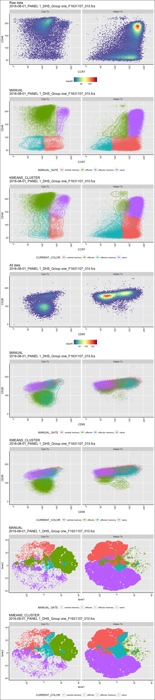<!-- -->

```
## [1] "loading /Volumes/Beta/data/flow/testTcellSubFCS_Results/2016-08-01_PANEL 1_DHS_Group one_F1631107_010.fcsresults.RData"
## [1] "Plotting 2016-08-01_PANEL 1_DHS_Group one_F1631107_010.fcs"
```

<!-- -->

```
## [1] "loading /Volumes/Beta/data/flow/testTcellSubFCS_Results/2016-08-01_PANEL 1_DHS_Group one_F1636818_005.fcsresults.RData"
## [1] "Plotting 2016-08-01_PANEL 1_DHS_Group one_F1636818_005.fcs"
```

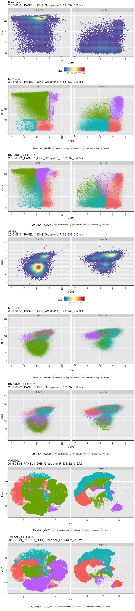<!-- -->

```
## [1] "loading /Volumes/Beta/data/flow/testTcellSubFCS_Results/2016-08-01_PANEL 1_DHS_Group one_F1631332_012.fcsresults.RData"
## [1] "Plotting 2016-08-01_PANEL 1_DHS_Group one_F1631332_012.fcs"
```

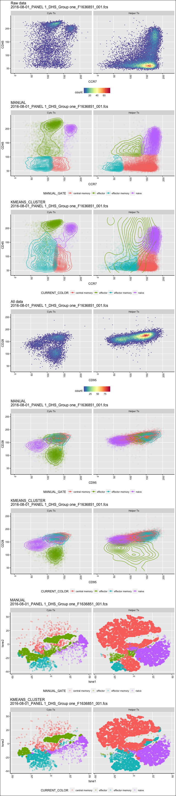<!-- -->

```
## [1] "loading /Volumes/Beta/data/flow/testTcellSubFCS_Results/2016-08-01_PANEL 1_DHS_Group one_F1636790_006.fcsresults.RData"
## [1] "Plotting 2016-08-01_PANEL 1_DHS_Group one_F1636790_006.fcs"
```

```
## [1] "/Volumes/Beta/data/flow/wsp//801_Panel 1_DHS.wsp"
## [1] "2016-08-01_PANEL 1_DHS_Group two_F1631383_031.fcs"
## windows version of flowJo workspace recognized.
## version X
## [1] "2016-08-01_PANEL 1_DHS_Group two_F1631383_031.fcs"
## 
##  FALSE   TRUE 
## 583043 106902 
##   Running t-SNE...with seed 42  DONE
##   Running FlowSOM...    Building SOM...
##     Meta clustering to 4 clusters...
```

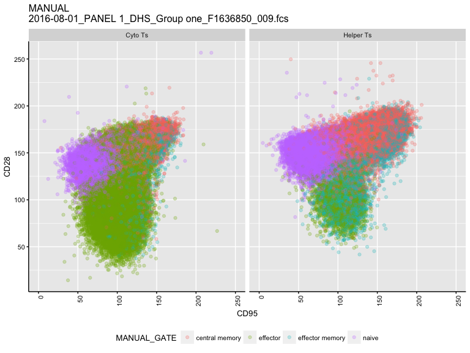<!-- -->

```
##  DONE!
##   Running PhenoGraph...  Finding nearest neighbors...DONE ~ 2.49 s
##   Compute jaccard coefficient between nearest-neighbor sets...DONE ~ 46.849 s
##   Build undirected graph from the weighted links...DONE ~ 9.558 s
##   Run louvain clustering on the graph ...DONE ~ 8.685 s
##   Return a community class
##   -Modularity value: 0.8974957 
##   -Number of clusters: 36 DONE!
## [1] "Plotting 2016-08-01_PANEL 1_DHS_Group two_F1631383_031.fcs"
```

```
## [1] "/Volumes/Beta/data/flow/wsp//801_Panel 1_DHS.wsp"
## [1] "2016-08-01_PANEL 1_DHS_Group two_F1631374_028.fcs"
## windows version of flowJo workspace recognized.
## version X
## [1] "2016-08-01_PANEL 1_DHS_Group two_F1631374_028.fcs"
## 
##   FALSE    TRUE 
## 2518371   47048 
##   Running t-SNE...with seed 42  DONE
##   Running FlowSOM...    Building SOM...
##     Meta clustering to 4 clusters...
```

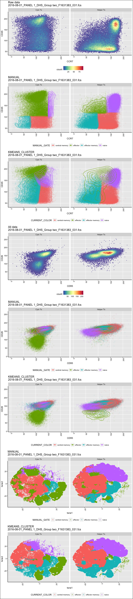<!-- -->

```
##  DONE!
##   Running PhenoGraph...  Finding nearest neighbors...DONE ~ 0.83 s
##   Compute jaccard coefficient between nearest-neighbor sets...DONE ~ 19.624 s
##   Build undirected graph from the weighted links...DONE ~ 3.951 s
##   Run louvain clustering on the graph ...DONE ~ 3.385 s
##   Return a community class
##   -Modularity value: 0.8836434 
##   -Number of clusters: 28 DONE!
## [1] "Plotting 2016-08-01_PANEL 1_DHS_Group two_F1631374_028.fcs"
```

```
## [1] "/Volumes/Beta/data/flow/wsp//801_Panel 1_DHS.wsp"
## [1] "2016-08-01_PANEL 1_DHS_Group one_F1636826_007.fcs"
## windows version of flowJo workspace recognized.
## version X
## [1] "2016-08-01_PANEL 1_DHS_Group one_F1636826_007.fcs"
## 
##   FALSE    TRUE 
## 1222629  123890 
##   Running t-SNE...with seed 42  DONE
##   Running FlowSOM...    Building SOM...
##     Meta clustering to 4 clusters...
```

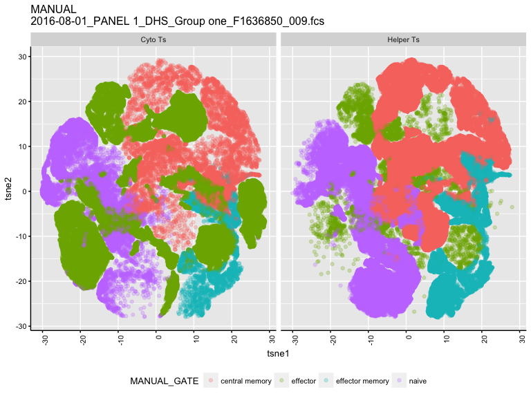<!-- -->

```
##  DONE!
##   Running PhenoGraph...  Finding nearest neighbors...DONE ~ 3.147 s
##   Compute jaccard coefficient between nearest-neighbor sets...DONE ~ 50.577 s
##   Build undirected graph from the weighted links...DONE ~ 11.375 s
##   Run louvain clustering on the graph ...DONE ~ 9.812 s
##   Return a community class
##   -Modularity value: 0.90449 
##   -Number of clusters: 36 DONE!
## [1] "Plotting 2016-08-01_PANEL 1_DHS_Group one_F1636826_007.fcs"
```

```
## [1] "/Volumes/Beta/data/flow/wsp//801_Panel 1_DHS.wsp"
## [1] "2016-08-01_PANEL 1_DHS_Group one_F1630927_008.fcs"
## windows version of flowJo workspace recognized.
## version X
## [1] "2016-08-01_PANEL 1_DHS_Group one_F1630927_008.fcs"
## 
##  FALSE   TRUE 
## 516126  88751 
##   Running t-SNE...with seed 42  DONE
##   Running FlowSOM...    Building SOM...
##     Meta clustering to 4 clusters...
```

<!-- -->

```
##  DONE!
##   Running PhenoGraph...  Finding nearest neighbors...DONE ~ 2.025 s
##   Compute jaccard coefficient between nearest-neighbor sets...DONE ~ 37.393 s
##   Build undirected graph from the weighted links...DONE ~ 7.885 s
##   Run louvain clustering on the graph ...DONE ~ 6.72 s
##   Return a community class
##   -Modularity value: 0.8954303 
##   -Number of clusters: 36 DONE!
## [1] "Plotting 2016-08-01_PANEL 1_DHS_Group one_F1630927_008.fcs"
```

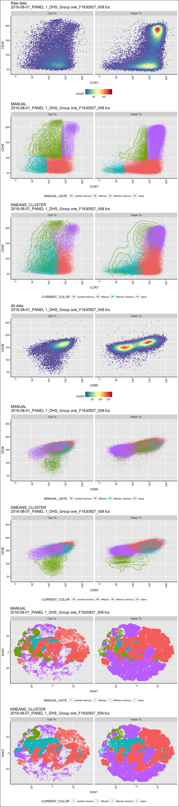<!-- -->
