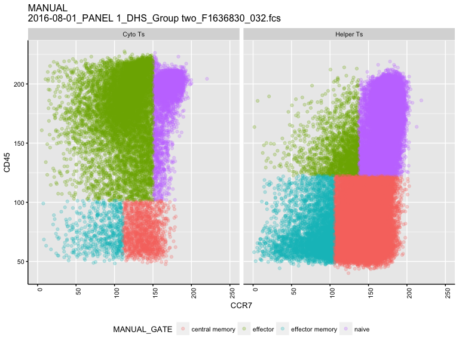
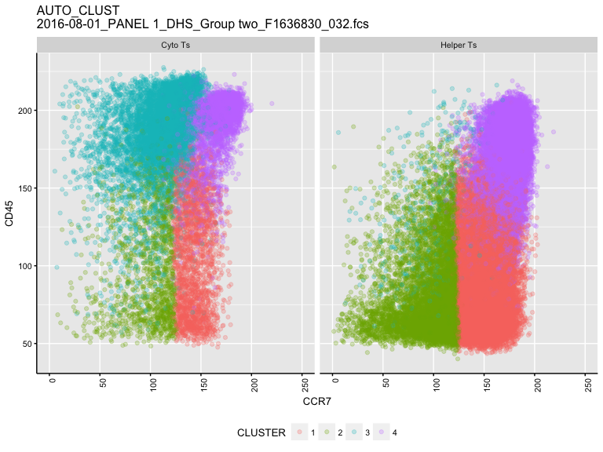
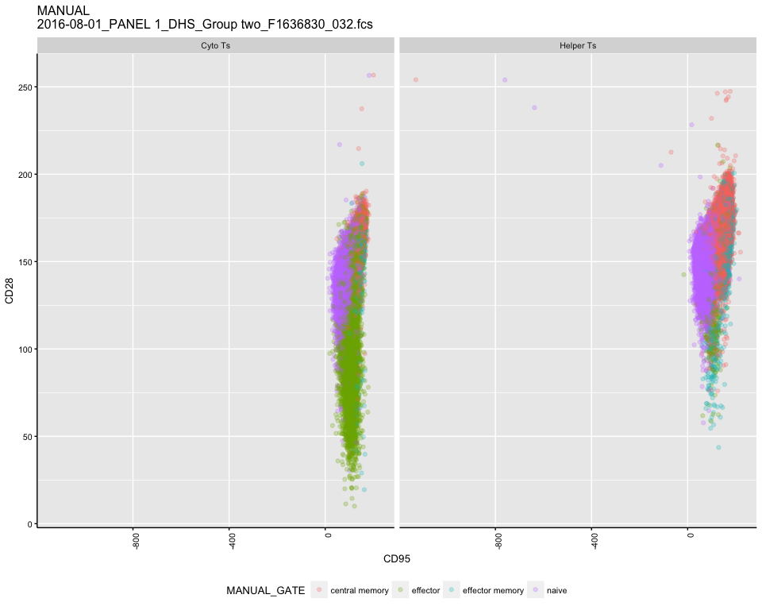
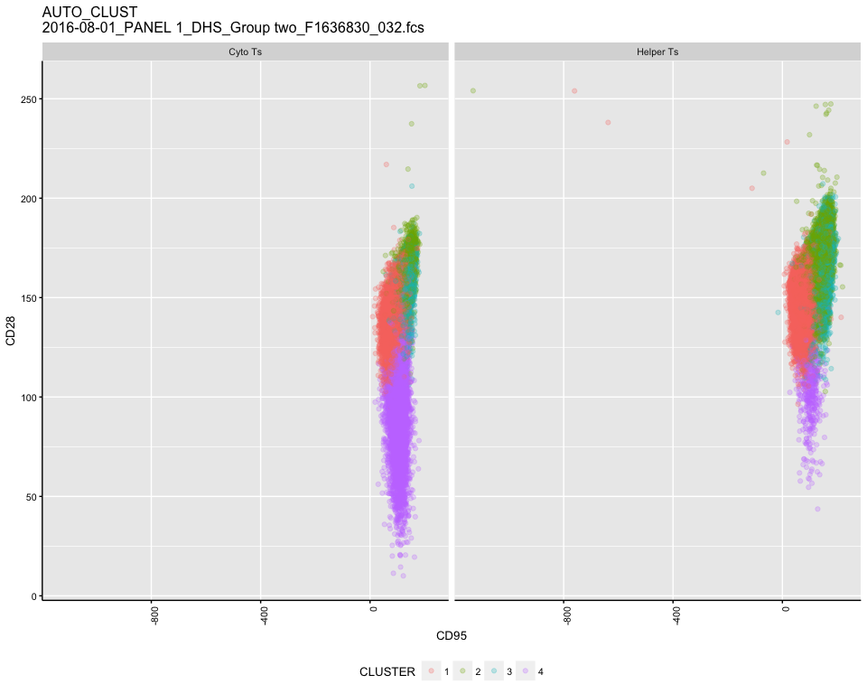
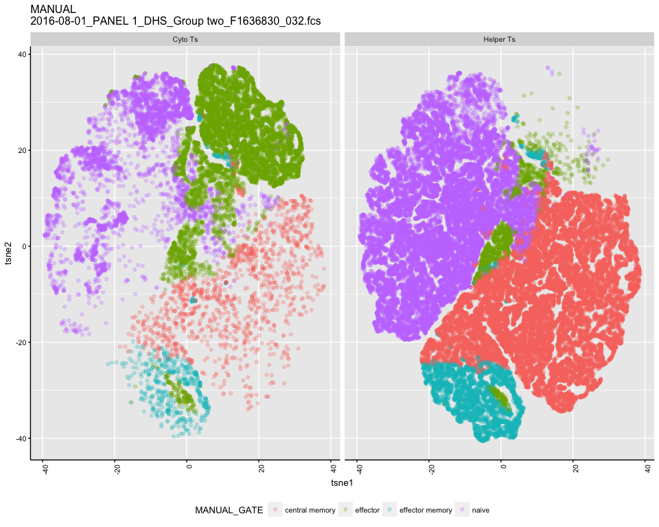
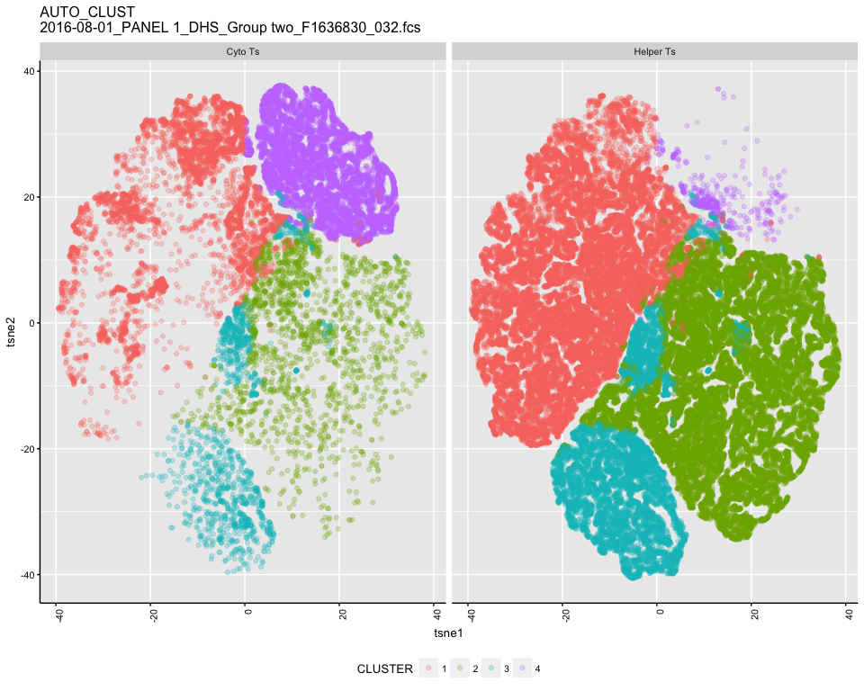

# Test K means
JL  
1/26/2018  


```
## [1] "/Volumes/Beta/data/flow/wsp//801_Panel 1_DHS.wsp"
## [1] "2016-08-01_PANEL 1_DHS_Group two_F1636830_032.fcs"
## windows version of flowJo workspace recognized.
## version X
## [1] "2016-08-01_PANEL 1_DHS_Group two_F1636830_032.fcs"
## 
##  FALSE   TRUE 
## 387273  71778 
##   Running t-SNE...with seed 42  DONE
```

<!-- --><!-- --><!-- --><!-- --><!-- --><!-- -->
