# Tcell subs- manual correl test
JL  
2/9/2018  

NOTES;

- Cyto T central memory under called relative to manual, but not Helper T central memory?


```
## [1] "Found 37 wsps"
```

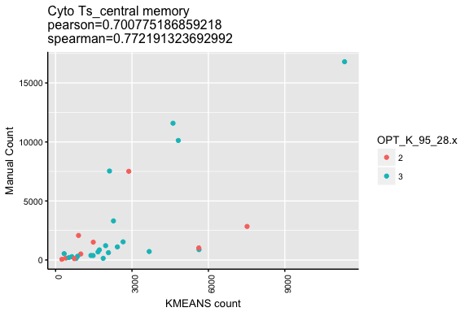<!-- --><!-- -->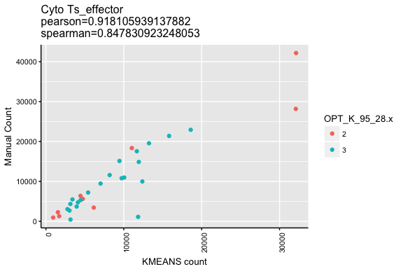<!-- --><!-- -->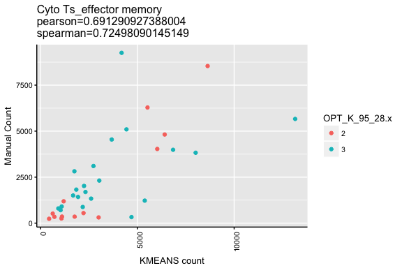<!-- -->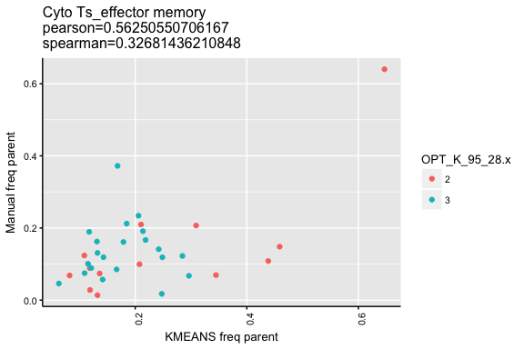<!-- -->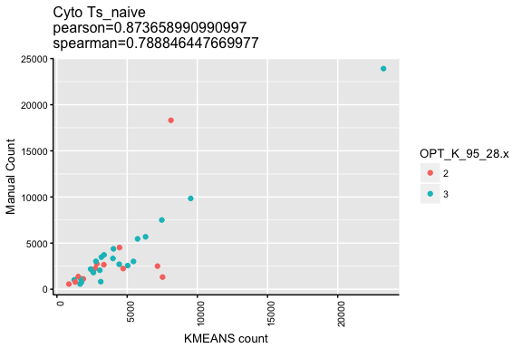<!-- -->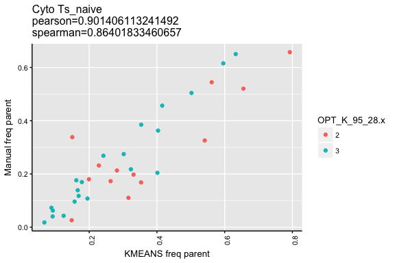<!-- -->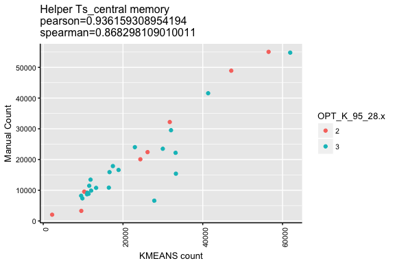<!-- -->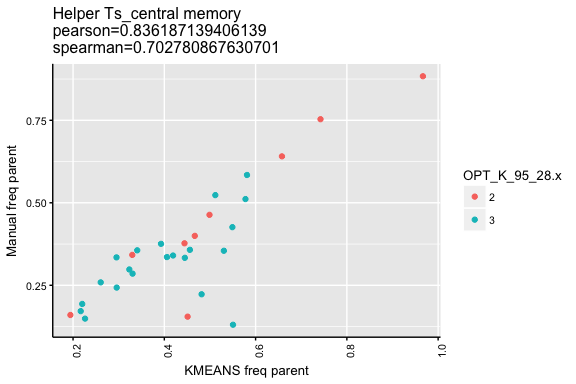<!-- -->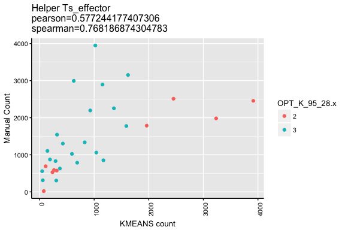<!-- -->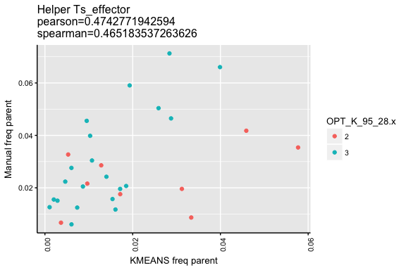<!-- -->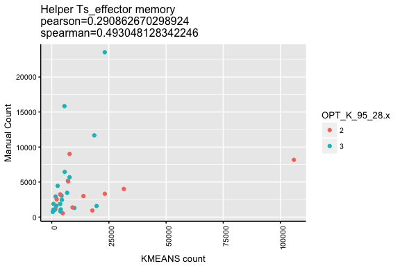<!-- -->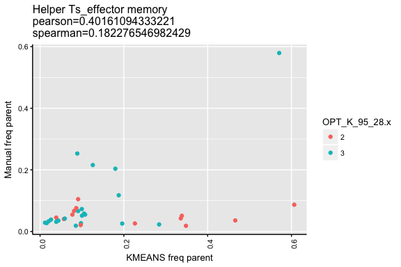<!-- -->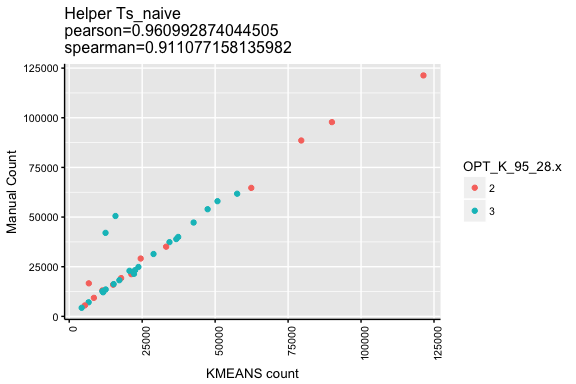<!-- -->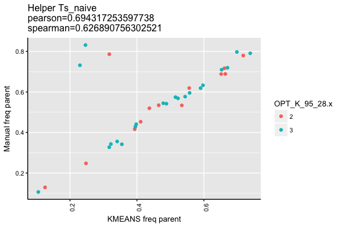<!-- -->
