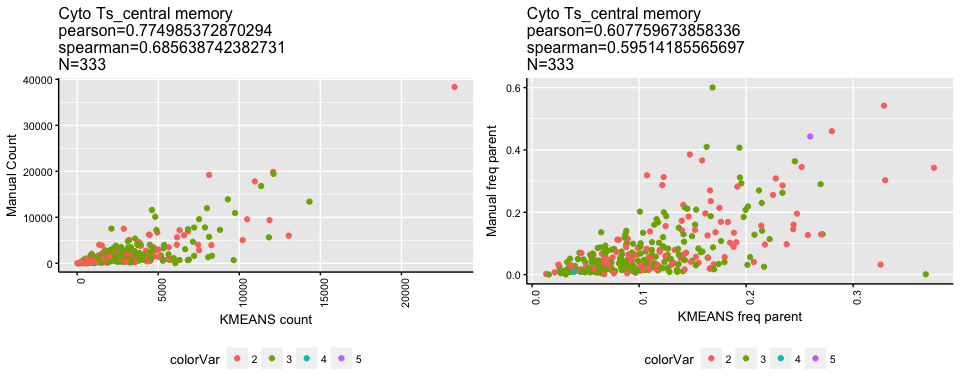
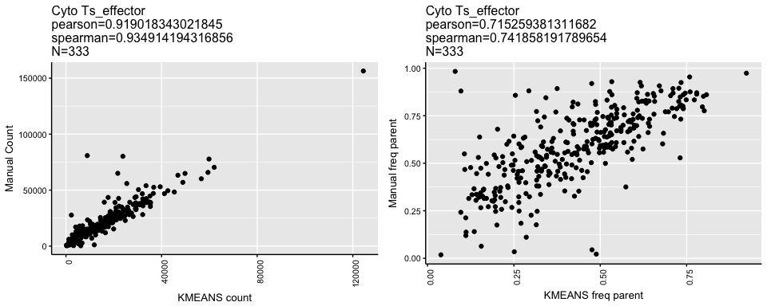
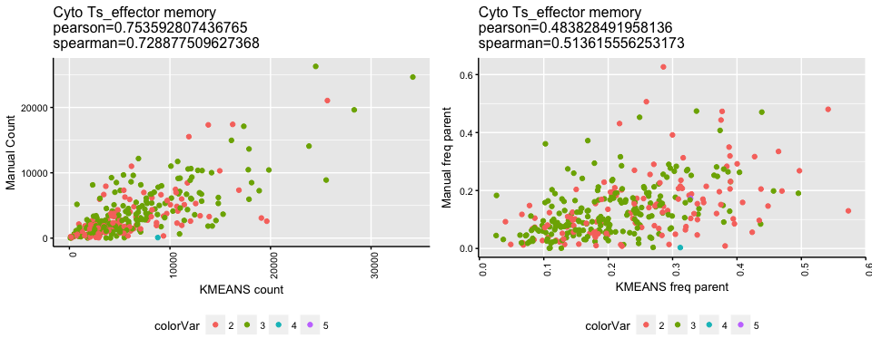
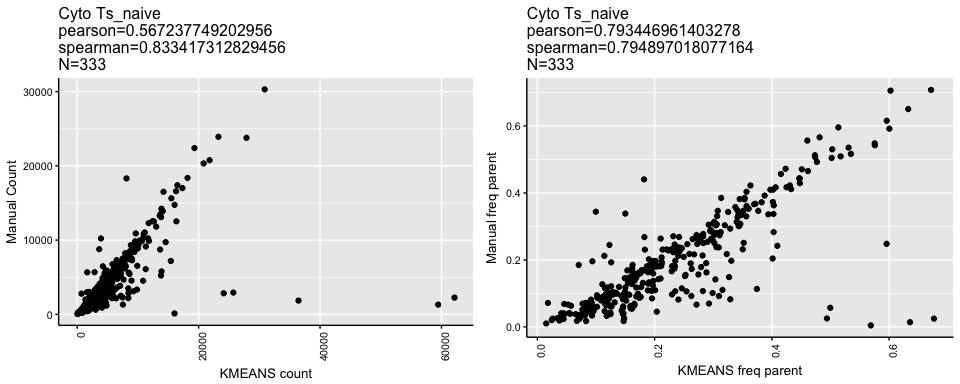
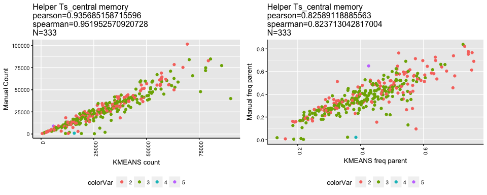
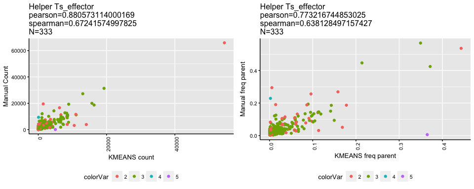
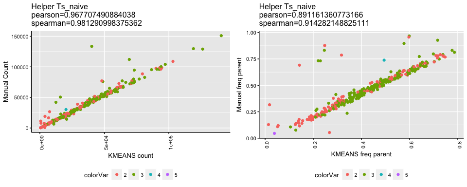

# Tcell subs - larger manual correl test
JL  
2/13/2018  

NOTES:

- Input data to k-means clustering are Helper and Cyto Ts
  - In the results below, input data is filtered to Helper and Cyto T based on the manual .wsp
  - "Final" version will use OC defined Helper and Cyto T (although current results should be similar since OC~Manual correlations are good for Helper and Cyto T)

Summary table of correlations at bottom


```
## [1] "Found 37 wsps"
```

<!-- --><!-- --><!-- --><!-- --><!-- --><!-- --><!-- --><!-- -->

|      |POPULATION                |   PEARSON|  SPEARMAN|   N|METRIC      |
|:-----|:-------------------------|---------:|---------:|---:|:-----------|
|cor   |Cyto Ts_central memory    | 0.7749854| 0.6856387| 333|COUNT       |
|cor1  |Cyto Ts_central memory    | 0.6077597| 0.5951419| 333|FREQ_PARENT |
|cor2  |Cyto Ts_effector          | 0.9190183| 0.9349142| 333|COUNT       |
|cor3  |Cyto Ts_effector          | 0.7152594| 0.7418582| 333|FREQ_PARENT |
|cor4  |Cyto Ts_effector memory   | 0.7535928| 0.7288775| 333|COUNT       |
|cor5  |Cyto Ts_effector memory   | 0.4838285| 0.5136156| 333|FREQ_PARENT |
|cor6  |Cyto Ts_naive             | 0.5672377| 0.8334173| 333|COUNT       |
|cor7  |Cyto Ts_naive             | 0.7934470| 0.7948970| 333|FREQ_PARENT |
|cor8  |Helper Ts_central memory  | 0.9356852| 0.9519526| 333|COUNT       |
|cor9  |Helper Ts_central memory  | 0.8258912| 0.8237130| 333|FREQ_PARENT |
|cor10 |Helper Ts_effector        | 0.8805731| 0.6724157| 333|COUNT       |
|cor11 |Helper Ts_effector        | 0.7732167| 0.6381285| 333|FREQ_PARENT |
|cor12 |Helper Ts_effector memory | 0.6171597| 0.6093448| 333|COUNT       |
|cor13 |Helper Ts_effector memory | 0.5817177| 0.4963066| 333|FREQ_PARENT |
|cor14 |Helper Ts_naive           | 0.9677075| 0.9812910| 333|COUNT       |
|cor15 |Helper Ts_naive           | 0.8911614| 0.9142821| 333|FREQ_PARENT |
