# TrendQC for Populations
JL  
1/16/2018  


# Trends by population

- removed samples that did not match to a Lab ID from the "FLOW ONLY" tab of "HRS sample list.xlsx"
- removed samples where date could not be parsed
- removed samples where EXPERIMENTER could not be parsed
- removed samples that were manually gated


```
## [1] "# Start of new population results"
## [1] "naive.Bcells.(CD27-.IgD+)"
## [1] "n=9408"
## [1] "PLOT TYPE = Machine Time COUNT"
```

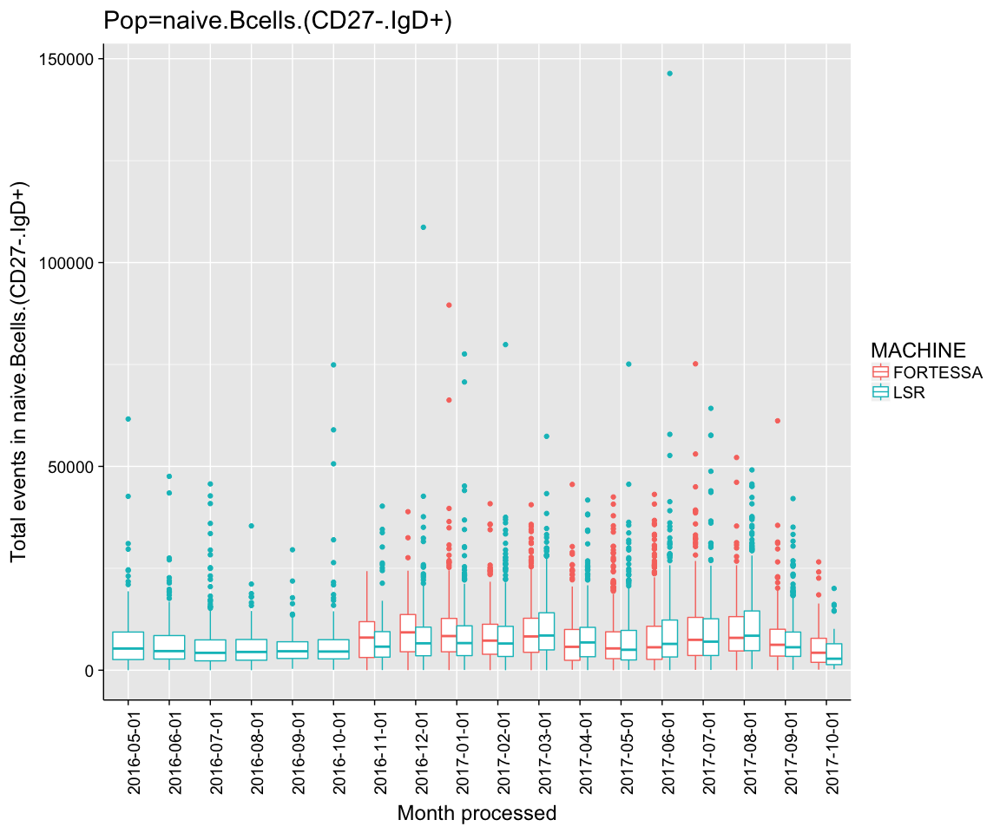<!-- --><!-- -->

```
## [1] "naive.Bcells.(CD27-.IgD+)"
## [1] "n=9408"
## [1] "PLOT TYPE = Machine Time FREQ"
```

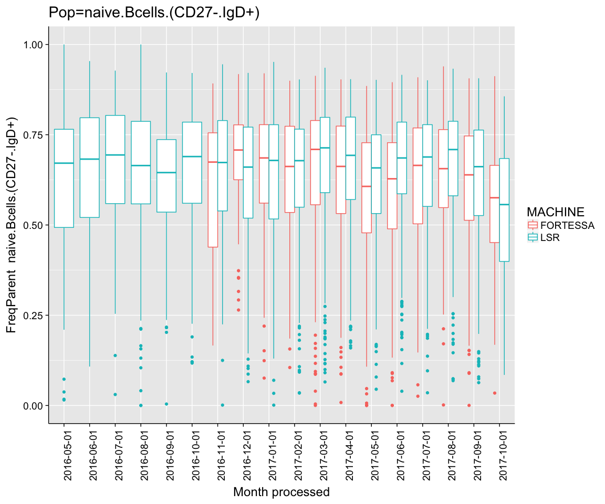<!-- -->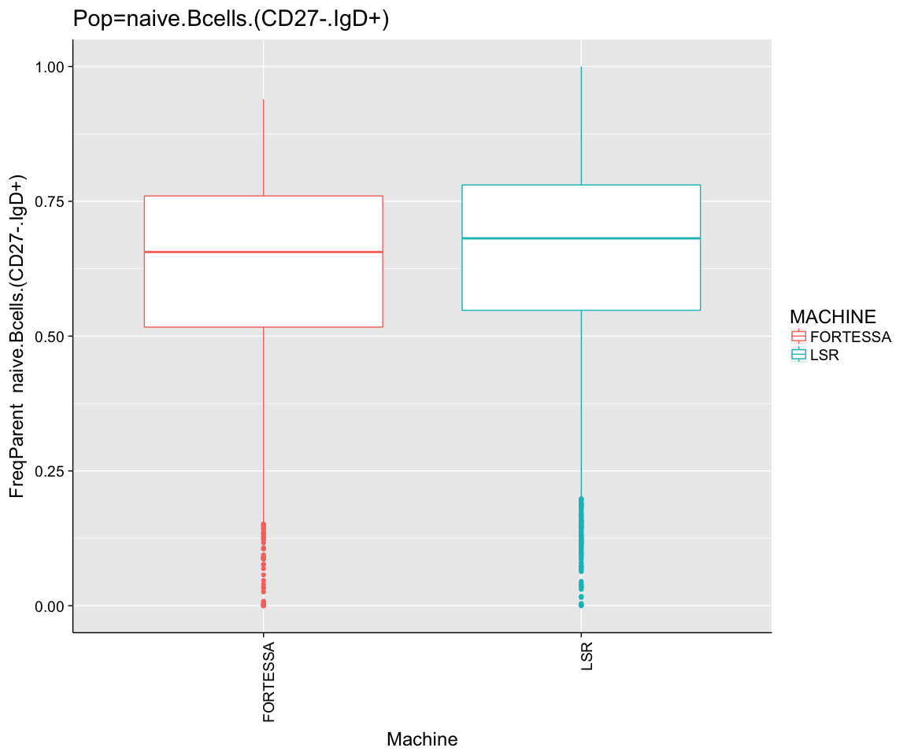<!-- -->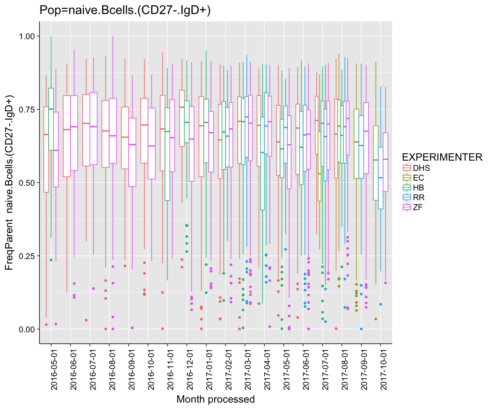<!-- -->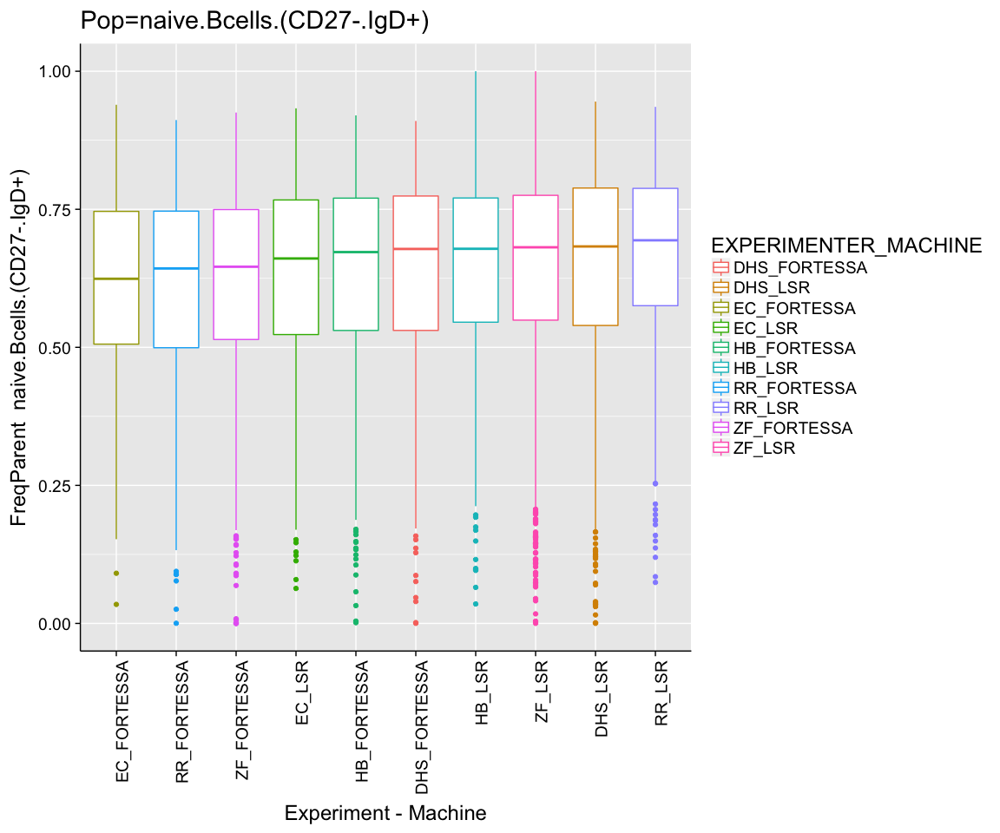<!-- -->

```
## 
## 
## |Var1 |Var2     | Freq|
## |:----|:--------|----:|
## |DHS  |FORTESSA |  731|
## |EC   |FORTESSA |  372|
## |HB   |FORTESSA |  907|
## |RR   |FORTESSA |  574|
## |ZF   |FORTESSA | 1019|
## |DHS  |LSR      | 1575|
## |EC   |LSR      |  421|
## |HB   |LSR      |  501|
## |RR   |LSR      |  755|
## |ZF   |LSR      | 2553|
## [1] "Linear Regression for naive.Bcells.(CD27-.IgD+)"
## 
## Call:
## lm(formula = formula, data = subF)
## 
## Residuals:
##      Min       1Q   Median       3Q      Max 
## -0.65306 -0.10234  0.03326  0.13416  0.35205 
## 
## Coefficients:
##                  Estimate Std. Error t value Pr(>|t|)    
## (Intercept)     9.688e-01  2.883e-01   3.360 0.000783 ***
## DATE_MONTH     -1.989e-05  1.675e-05  -1.188 0.235008    
## MACHINELSR      2.284e-02  3.971e-03   5.750 9.19e-09 ***
## EXPERIMENTEREC -1.446e-02  8.078e-03  -1.790 0.073482 .  
## EXPERIMENTERHB  3.869e-03  6.060e-03   0.638 0.523199    
## EXPERIMENTERRR  6.276e-03  6.409e-03   0.979 0.327470    
## EXPERIMENTERZF -5.257e-03  4.709e-03  -1.116 0.264295    
## ---
## Signif. codes:  0 '***' 0.001 '**' 0.01 '*' 0.05 '.' 0.1 ' ' 1
## 
## Residual standard error: 0.1743 on 9401 degrees of freedom
## Multiple R-squared:  0.005538,	Adjusted R-squared:  0.004903 
## F-statistic: 8.725 on 6 and 9401 DF,  p-value: 1.688e-09
## 
## [1] "Stepwise Linear Regression for naive.Bcells.(CD27-.IgD+)"
## Start:  AIC=-32862.74
## TARGET_FREQ ~ DATE_MONTH + MACHINE + EXPERIMENTER
## 
##                Df Sum of Sq    RSS    AIC
## - DATE_MONTH    1   0.04286 285.69 -32863
## <none>                      285.65 -32863
## - EXPERIMENTER  4   0.29832 285.95 -32861
## - MACHINE       1   1.00470 286.65 -32832
## 
## Step:  AIC=-32863.33
## TARGET_FREQ ~ MACHINE + EXPERIMENTER
## 
##                Df Sum of Sq    RSS    AIC
## <none>                      285.69 -32863
## + DATE_MONTH    1   0.04286 285.65 -32863
## - EXPERIMENTER  4   0.36225 286.05 -32859
## - MACHINE       1   1.20369 286.90 -32826
## Stepwise Model Path 
## Analysis of Deviance Table
## 
## Initial Model:
## TARGET_FREQ ~ DATE_MONTH + MACHINE + EXPERIMENTER
## 
## Final Model:
## TARGET_FREQ ~ MACHINE + EXPERIMENTER
## 
## 
##           Step Df   Deviance Resid. Df Resid. Dev       AIC
## 1                                 9401   285.6491 -32862.74
## 2 - DATE_MONTH  1 0.04285724      9402   285.6920 -32863.33
## [1] "ANOVA of EXPERIMENTER for naive.Bcells.(CD27-.IgD+)"
##   Tukey multiple comparisons of means
##     95% family-wise confidence level
## 
## Fit: aov(formula = formula, data = subF)
## 
## $EXPERIMENTER
##                 diff          lwr          upr     p adj
## EC-DHS -0.0224755594 -0.042094073 -0.002857046 0.0153168
## HB-DHS -0.0047638520 -0.020881866  0.011354162 0.9287569
## RR-DHS  0.0008956491 -0.015517111  0.017308409 0.9998898
## ZF-DHS -0.0053129934 -0.018043655  0.007417668 0.7859854
## HB-EC   0.0177117074 -0.003447220  0.038870635 0.1501405
## RR-EC   0.0233712085  0.001986903  0.044755514 0.0240070
## ZF-EC   0.0171625660 -0.001545175  0.035870307 0.0900059
## RR-HB   0.0056595011 -0.012566657  0.023885659 0.9157643
## ZF-HB  -0.0005491414 -0.015545271  0.014446988 0.9999775
## ZF-RR  -0.0062086426 -0.021521128  0.009103843 0.8033569
## 
## [1] "ANOVA of MACHINE for naive.Bcells.(CD27-.IgD+)"
##               Df Sum Sq Mean Sq F value   Pr(>F)    
## MACHINE        1   1.19  1.1855   38.98 4.46e-10 ***
## Residuals   9406 286.05  0.0304                     
## ---
## Signif. codes:  0 '***' 0.001 '**' 0.01 '*' 0.05 '.' 0.1 ' ' 1
## [1] "# Start of new population results"
## [1] "cytotoxic.Tcells-CD8+"
## [1] "n=9408"
## [1] "PLOT TYPE = Machine Time COUNT"
```

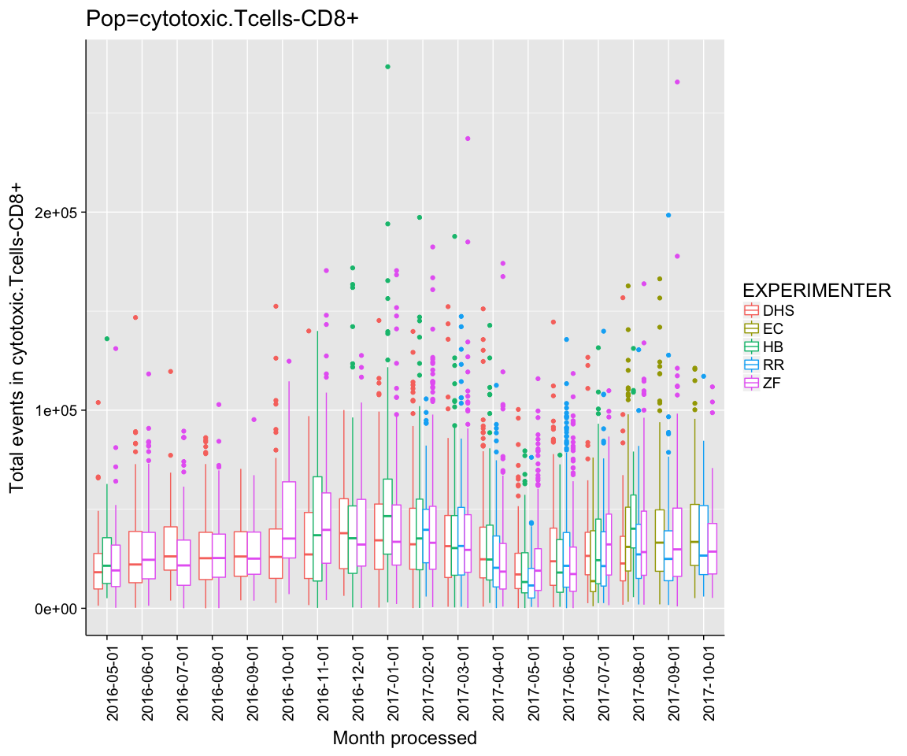<!-- -->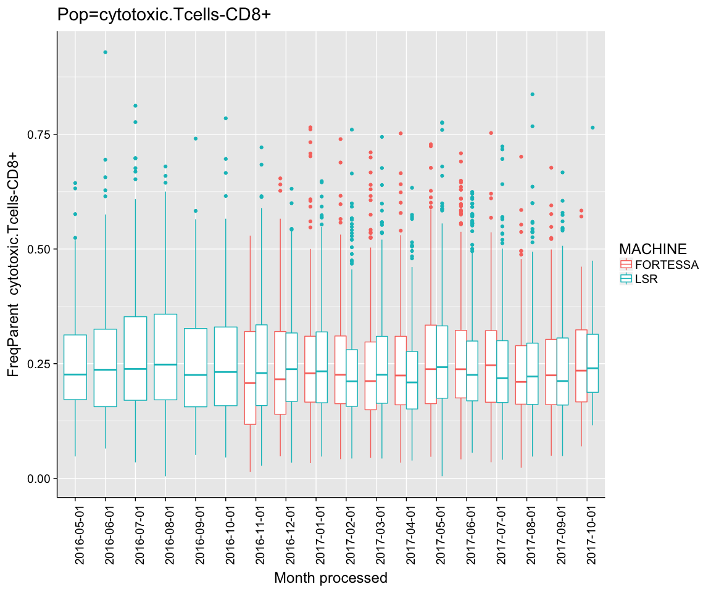<!-- -->

```
## [1] "cytotoxic.Tcells-CD8+"
## [1] "n=9408"
## [1] "PLOT TYPE = Machine Time FREQ"
```

<!-- -->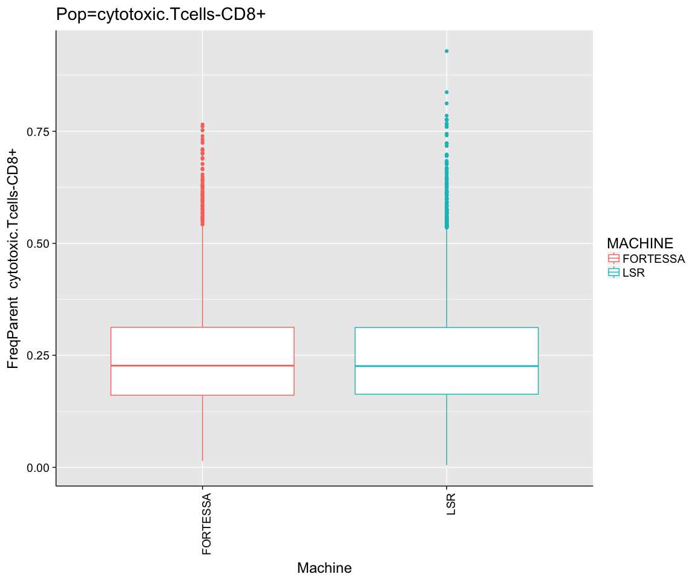<!-- --><!-- -->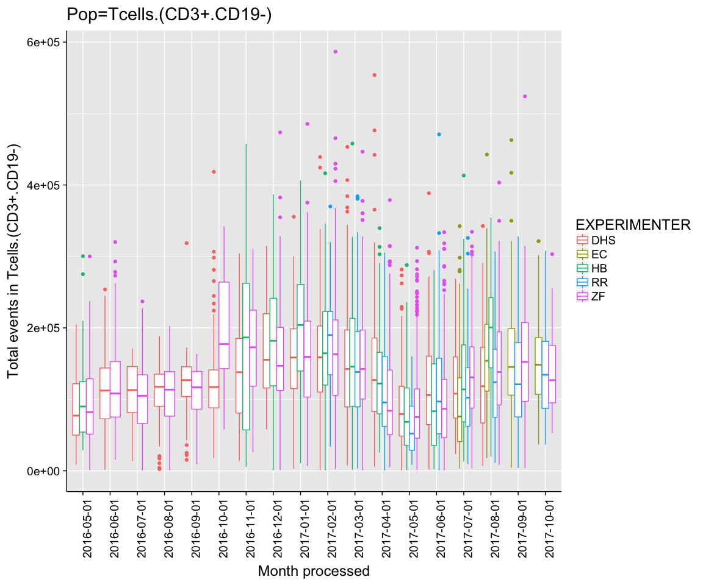<!-- -->

```
## 
## 
## |Var1 |Var2     | Freq|
## |:----|:--------|----:|
## |DHS  |FORTESSA |  731|
## |EC   |FORTESSA |  372|
## |HB   |FORTESSA |  907|
## |RR   |FORTESSA |  574|
## |ZF   |FORTESSA | 1019|
## |DHS  |LSR      | 1575|
## |EC   |LSR      |  421|
## |HB   |LSR      |  501|
## |RR   |LSR      |  755|
## |ZF   |LSR      | 2553|
## [1] "Linear Regression for cytotoxic.Tcells-CD8+"
## 
## Call:
## lm(formula = formula, data = subF)
## 
## Residuals:
##      Min       1Q   Median       3Q      Max 
## -0.24509 -0.08569 -0.02060  0.06459  0.66925 
## 
## Coefficients:
##                  Estimate Std. Error t value Pr(>|t|)    
## (Intercept)     8.052e-01  1.960e-01   4.108 4.03e-05 ***
## DATE_MONTH     -3.250e-05  1.139e-05  -2.855  0.00432 ** 
## MACHINELSR     -2.696e-03  2.700e-03  -0.999  0.31805    
## EXPERIMENTEREC  1.458e-03  5.492e-03   0.265  0.79066    
## EXPERIMENTERHB  1.635e-03  4.120e-03   0.397  0.69150    
## EXPERIMENTERRR  6.448e-03  4.357e-03   1.480  0.13889    
## EXPERIMENTERZF  8.271e-03  3.201e-03   2.584  0.00979 ** 
## ---
## Signif. codes:  0 '***' 0.001 '**' 0.01 '*' 0.05 '.' 0.1 ' ' 1
## 
## Residual standard error: 0.1185 on 9401 degrees of freedom
## Multiple R-squared:  0.001933,	Adjusted R-squared:  0.001296 
## F-statistic: 3.034 on 6 and 9401 DF,  p-value: 0.00577
## 
## [1] "Stepwise Linear Regression for cytotoxic.Tcells-CD8+"
## Start:  AIC=-40124.73
## TARGET_FREQ ~ DATE_MONTH + MACHINE + EXPERIMENTER
## 
##                Df Sum of Sq    RSS    AIC
## - MACHINE       1   0.01400 132.02 -40126
## <none>                      132.01 -40125
## - EXPERIMENTER  4   0.11944 132.13 -40124
## - DATE_MONTH    1   0.11443 132.12 -40119
## 
## Step:  AIC=-40125.73
## TARGET_FREQ ~ DATE_MONTH + EXPERIMENTER
## 
##                Df Sum of Sq    RSS    AIC
## - EXPERIMENTER  4   0.11180 132.13 -40126
## <none>                      132.02 -40126
## + MACHINE       1   0.01400 132.01 -40125
## - DATE_MONTH    1   0.10129 132.12 -40121
## 
## Step:  AIC=-40125.77
## TARGET_FREQ ~ DATE_MONTH
## 
##                Df Sum of Sq    RSS    AIC
## <none>                      132.13 -40126
## + EXPERIMENTER  4  0.111799 132.02 -40126
## + MACHINE       1  0.006361 132.13 -40124
## - DATE_MONTH    1  0.129847 132.26 -40119
## Stepwise Model Path 
## Analysis of Deviance Table
## 
## Initial Model:
## TARGET_FREQ ~ DATE_MONTH + MACHINE + EXPERIMENTER
## 
## Final Model:
## TARGET_FREQ ~ DATE_MONTH
## 
## 
##             Step Df   Deviance Resid. Df Resid. Dev       AIC
## 1                                   9401   132.0089 -40124.73
## 2      - MACHINE  1 0.01400045      9402   132.0229 -40125.73
## 3 - EXPERIMENTER  4 0.11179942      9406   132.1347 -40125.77
## [1] "ANOVA of EXPERIMENTER for cytotoxic.Tcells-CD8+"
##   Tukey multiple comparisons of means
##     95% family-wise confidence level
## 
## Fit: aov(formula = formula, data = subF)
## 
## $EXPERIMENTER
##                 diff           lwr         upr     p adj
## EC-DHS -0.0055543657 -0.0188679565 0.007759225 0.7861987
## HB-DHS  0.0006185016 -0.0103195668 0.011556570 0.9998731
## RR-DHS  0.0022539959 -0.0088840943 0.013392086 0.9817063
## ZF-DHS  0.0069103911 -0.0017289392 0.015549721 0.1864234
## HB-EC   0.0061728673 -0.0081860853 0.020531820 0.7669435
## RR-EC   0.0078083616 -0.0067035381 0.022320261 0.5834058
## ZF-EC   0.0124647568 -0.0002307624 0.025160276 0.0572061
## RR-HB   0.0016354943 -0.0107332111 0.014004200 0.9963869
## ZF-HB   0.0062918895 -0.0038848412 0.016468620 0.4421505
## ZF-RR   0.0046563953 -0.0057350223 0.015047813 0.7382304
## 
## [1] "ANOVA of MACHINE for cytotoxic.Tcells-CD8+"
##               Df Sum Sq  Mean Sq F value Pr(>F)
## MACHINE        1    0.0 0.000528   0.038  0.846
## Residuals   9406  132.3 0.014062               
## [1] "# Start of new population results"
## [1] "Tcells.(CD3+.CD19-)"
## [1] "n=9408"
## [1] "PLOT TYPE = Machine Time COUNT"
```

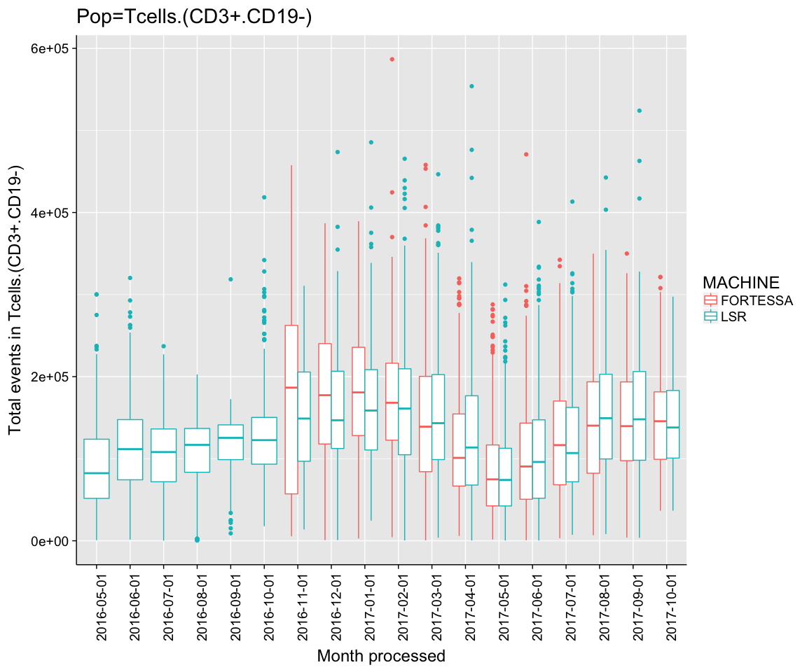<!-- -->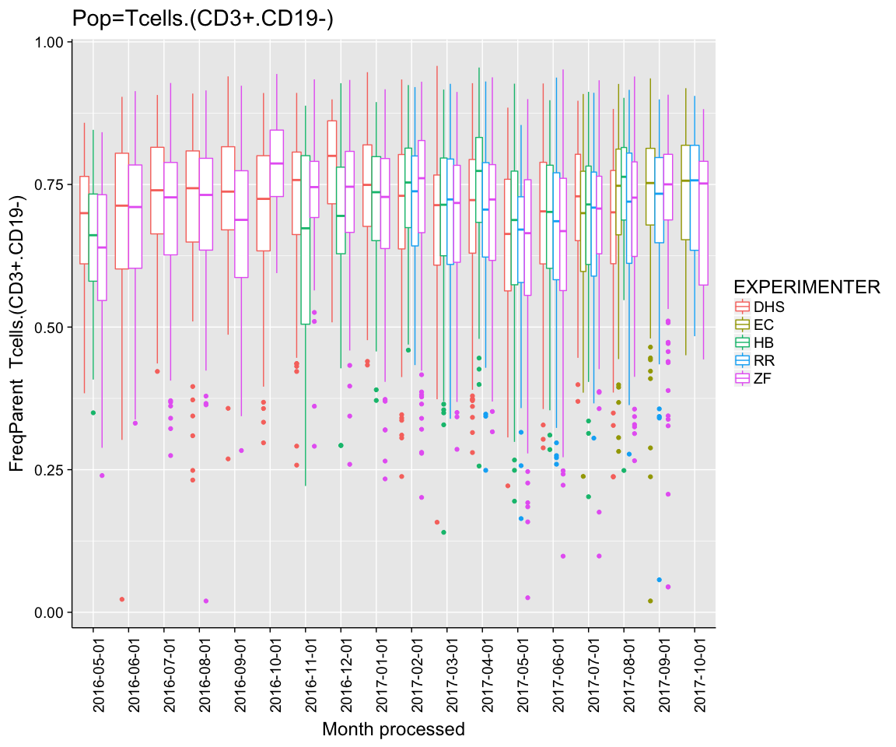<!-- -->

```
## [1] "Tcells.(CD3+.CD19-)"
## [1] "n=9408"
## [1] "PLOT TYPE = Machine Time FREQ"
```

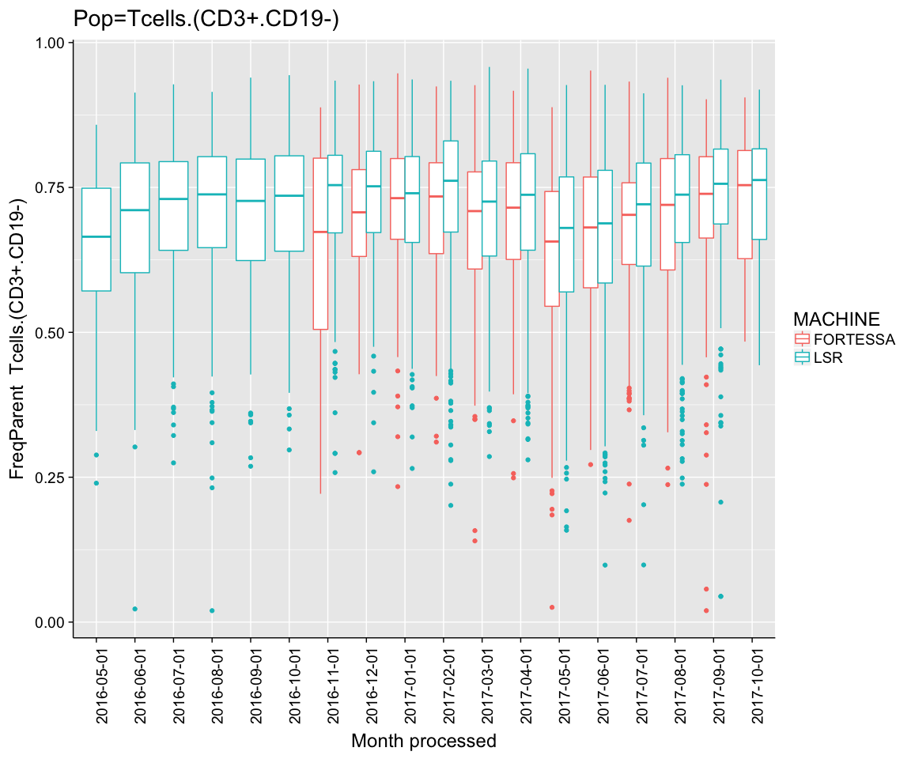<!-- --><!-- --><!-- -->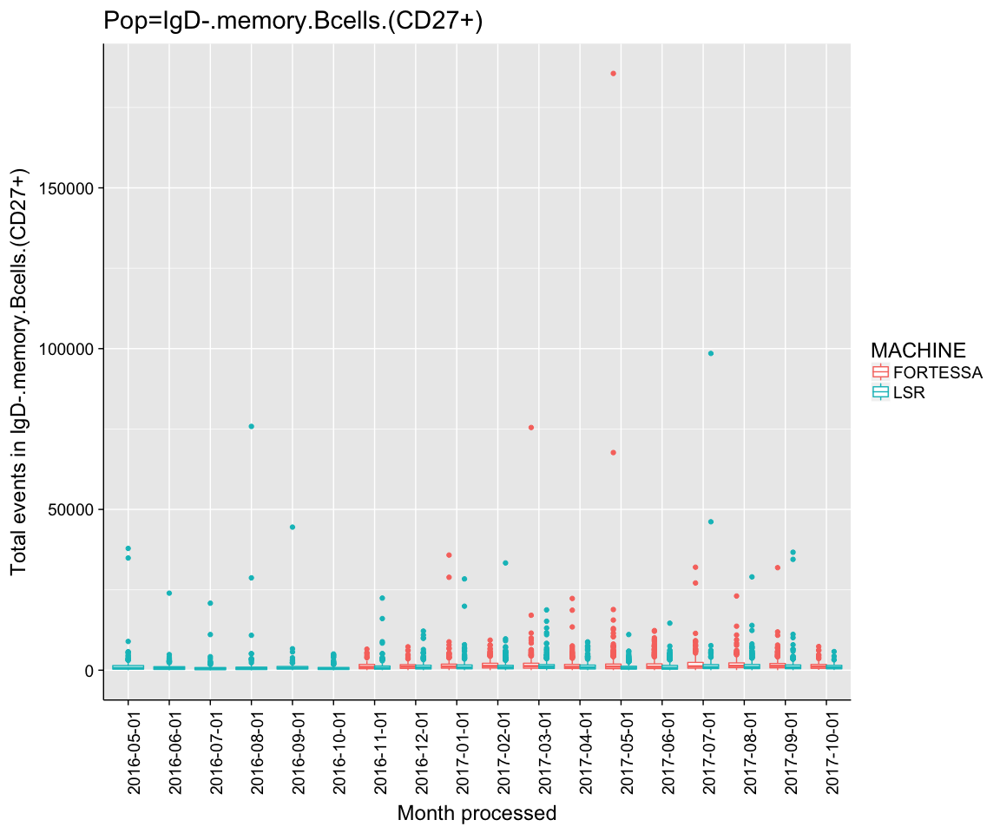<!-- -->

```
## 
## 
## |Var1 |Var2     | Freq|
## |:----|:--------|----:|
## |DHS  |FORTESSA |  731|
## |EC   |FORTESSA |  372|
## |HB   |FORTESSA |  907|
## |RR   |FORTESSA |  574|
## |ZF   |FORTESSA | 1019|
## |DHS  |LSR      | 1575|
## |EC   |LSR      |  421|
## |HB   |LSR      |  501|
## |RR   |LSR      |  755|
## |ZF   |LSR      | 2553|
## [1] "Linear Regression for Tcells.(CD3+.CD19-)"
## 
## Call:
## lm(formula = formula, data = subF)
## 
## Residuals:
##      Min       1Q   Median       3Q      Max 
## -0.69747 -0.07307  0.02298  0.09576  0.27474 
## 
## Coefficients:
##                  Estimate Std. Error t value Pr(>|t|)    
## (Intercept)     9.005e-01  2.149e-01   4.190 2.82e-05 ***
## DATE_MONTH     -1.236e-05  1.248e-05  -0.990  0.32201    
## MACHINELSR      1.893e-02  2.960e-03   6.395 1.68e-10 ***
## EXPERIMENTEREC  3.198e-02  6.022e-03   5.311 1.12e-07 ***
## EXPERIMENTERHB  6.141e-03  4.517e-03   1.359  0.17404    
## EXPERIMENTERRR -9.353e-03  4.777e-03  -1.958  0.05026 .  
## EXPERIMENTERZF -9.493e-03  3.510e-03  -2.704  0.00686 ** 
## ---
## Signif. codes:  0 '***' 0.001 '**' 0.01 '*' 0.05 '.' 0.1 ' ' 1
## 
## Residual standard error: 0.1299 on 9401 degrees of freedom
## Multiple R-squared:  0.0113,	Adjusted R-squared:  0.01066 
## F-statistic:  17.9 on 6 and 9401 DF,  p-value: < 2.2e-16
## 
## [1] "Stepwise Linear Regression for Tcells.(CD3+.CD19-)"
## Start:  AIC=-38390.87
## TARGET_FREQ ~ DATE_MONTH + MACHINE + EXPERIMENTER
## 
##                Df Sum of Sq    RSS    AIC
## - DATE_MONTH    1   0.01656 158.74 -38392
## <none>                      158.72 -38391
## - MACHINE       1   0.69044 159.41 -38352
## - EXPERIMENTER  4   1.17917 159.90 -38329
## 
## Step:  AIC=-38391.89
## TARGET_FREQ ~ MACHINE + EXPERIMENTER
## 
##                Df Sum of Sq    RSS    AIC
## <none>                      158.74 -38392
## + DATE_MONTH    1   0.01656 158.72 -38391
## - MACHINE       1   0.80575 159.55 -38346
## - EXPERIMENTER  4   1.18241 159.92 -38330
## Stepwise Model Path 
## Analysis of Deviance Table
## 
## Initial Model:
## TARGET_FREQ ~ DATE_MONTH + MACHINE + EXPERIMENTER
## 
## Final Model:
## TARGET_FREQ ~ MACHINE + EXPERIMENTER
## 
## 
##           Step Df   Deviance Resid. Df Resid. Dev       AIC
## 1                                 9401   158.7238 -38390.87
## 2 - DATE_MONTH  1 0.01656094      9402   158.7404 -38391.89
## [1] "ANOVA of EXPERIMENTER for Tcells.(CD3+.CD19-)"
##   Tukey multiple comparisons of means
##     95% family-wise confidence level
## 
## Fit: aov(formula = formula, data = subF)
## 
## $EXPERIMENTER
##                 diff          lwr           upr     p adj
## EC-DHS  0.0262752806  0.011645183  0.0409053783 0.0000096
## HB-DHS -0.0007745432 -0.012794216  0.0112451298 0.9997866
## RR-DHS -0.0132419189 -0.025481393 -0.0010024452 0.0262907
## ZF-DHS -0.0093776414 -0.018871267  0.0001159841 0.0547535
## HB-EC  -0.0270498238 -0.042828653 -0.0112709944 0.0000290
## RR-EC  -0.0395171996 -0.055464100 -0.0235702990 0.0000000
## ZF-EC  -0.0356529220 -0.049603830 -0.0217020137 0.0000000
## RR-HB  -0.0124673758 -0.026059153  0.0011244019 0.0900855
## ZF-HB  -0.0086030982 -0.019786149  0.0025799526 0.2205239
## ZF-RR   0.0038642776 -0.007554689  0.0152832445 0.8880081
## 
## [1] "ANOVA of MACHINE for Tcells.(CD3+.CD19-)"
##               Df Sum Sq Mean Sq F value   Pr(>F)    
## MACHINE        1   0.61  0.6144   36.13 1.91e-09 ***
## Residuals   9406 159.92  0.0170                     
## ---
## Signif. codes:  0 '***' 0.001 '**' 0.01 '*' 0.05 '.' 0.1 ' ' 1
## [1] "# Start of new population results"
## [1] "Live.cells.(PE-)"
## [1] "n=9408"
## [1] "PLOT TYPE = Machine Time COUNT"
```

<!-- -->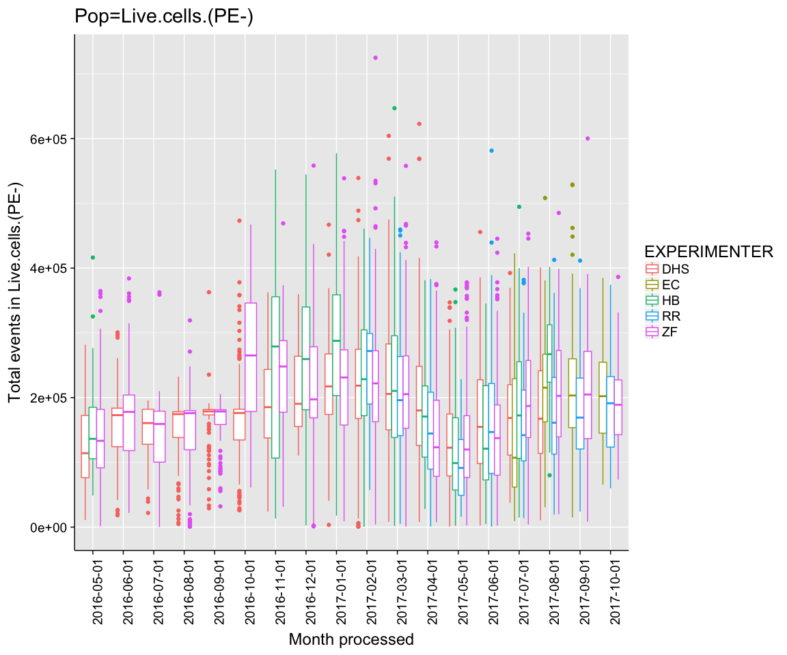<!-- -->

```
## [1] "Live.cells.(PE-)"
## [1] "n=9408"
## [1] "PLOT TYPE = Machine Time FREQ"
## [1] "NA for Freq plot"
## [1] "# Start of new population results"
## [1] "IgD-.memory.Bcells.(CD27+)"
## [1] "n=9408"
## [1] "PLOT TYPE = Machine Time COUNT"
```

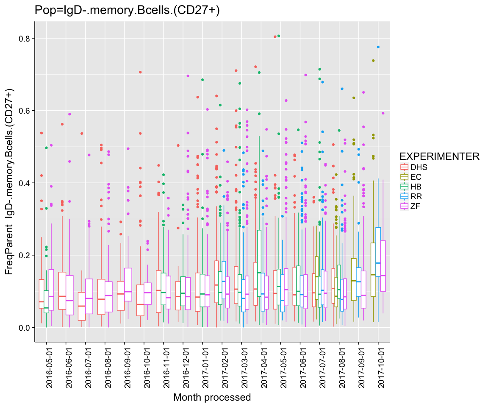<!-- -->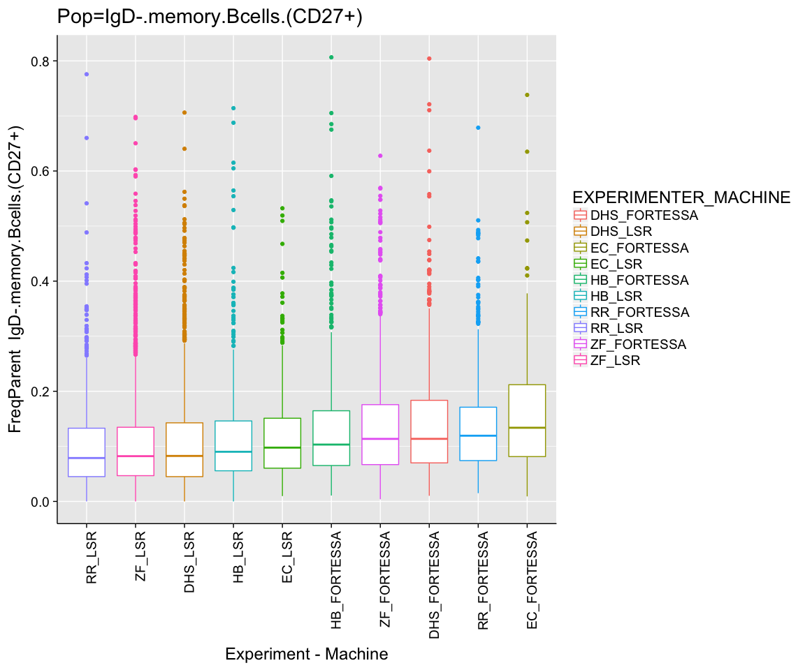<!-- -->

```
## [1] "IgD-.memory.Bcells.(CD27+)"
## [1] "n=9408"
## [1] "PLOT TYPE = Machine Time FREQ"
```

<!-- -->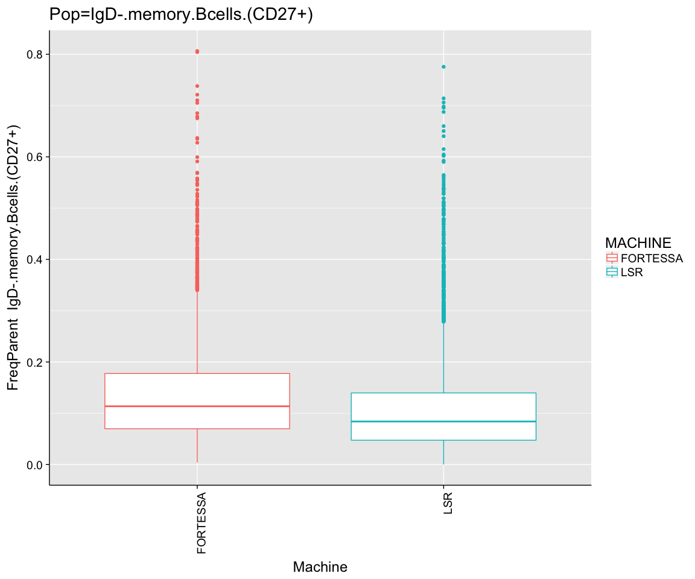<!-- -->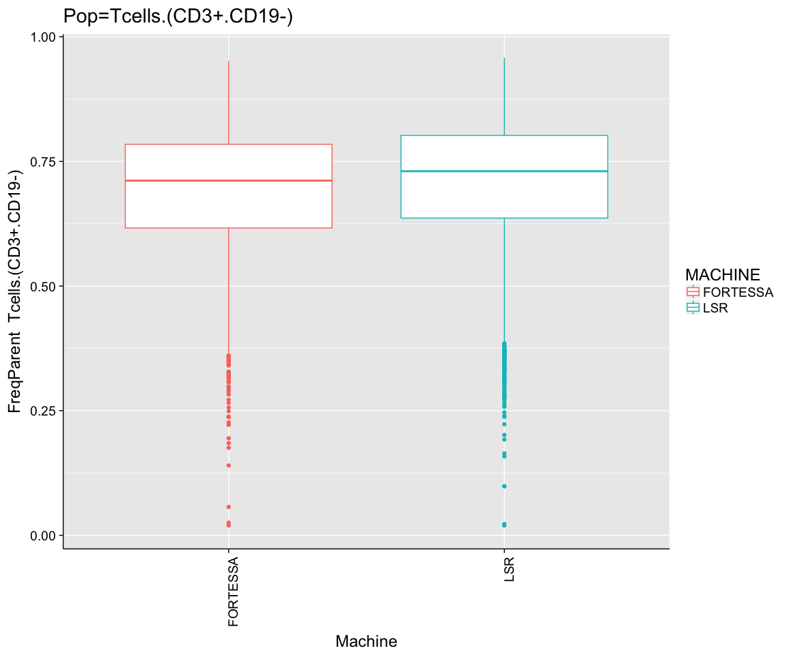<!-- -->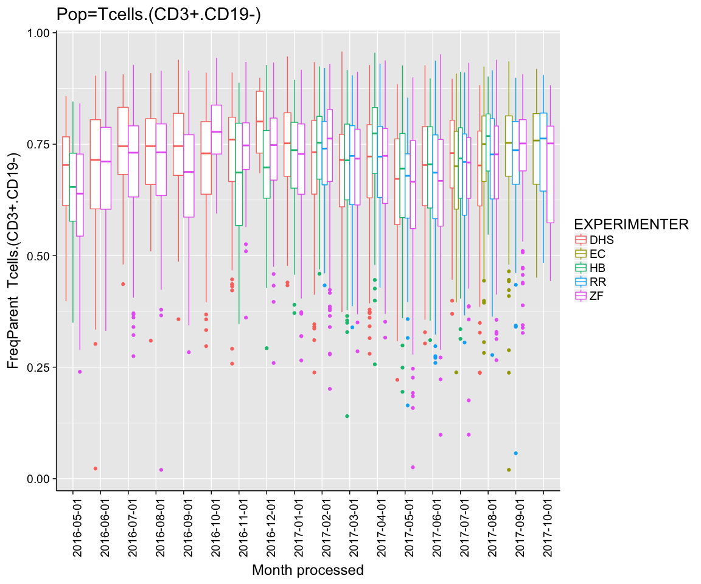<!-- -->

```
## 
## 
## |Var1 |Var2     | Freq|
## |:----|:--------|----:|
## |DHS  |FORTESSA |  731|
## |EC   |FORTESSA |  372|
## |HB   |FORTESSA |  907|
## |RR   |FORTESSA |  574|
## |ZF   |FORTESSA | 1019|
## |DHS  |LSR      | 1575|
## |EC   |LSR      |  421|
## |HB   |LSR      |  501|
## |RR   |LSR      |  755|
## |ZF   |LSR      | 2553|
## [1] "Linear Regression for IgD-.memory.Bcells.(CD27+)"
## 
## Call:
## lm(formula = formula, data = subF)
## 
## Residuals:
##      Min       1Q   Median       3Q      Max 
## -0.13978 -0.06253 -0.02307  0.03374  0.66841 
## 
## Coefficients:
##                  Estimate Std. Error t value Pr(>|t|)    
## (Intercept)    -5.380e-01  1.541e-01  -3.492 0.000482 ***
## DATE_MONTH      3.939e-05  8.949e-06   4.401 1.09e-05 ***
## MACHINELSR     -2.840e-02  2.122e-03 -13.383  < 2e-16 ***
## EXPERIMENTEREC  2.466e-03  4.316e-03   0.571 0.567861    
## EXPERIMENTERHB -4.768e-03  3.238e-03  -1.472 0.140922    
## EXPERIMENTERRR -1.055e-02  3.424e-03  -3.080 0.002075 ** 
## EXPERIMENTERZF -5.582e-03  2.516e-03  -2.218 0.026564 *  
## ---
## Signif. codes:  0 '***' 0.001 '**' 0.01 '*' 0.05 '.' 0.1 ' ' 1
## 
## Residual standard error: 0.09314 on 9401 degrees of freedom
## Multiple R-squared:  0.02975,	Adjusted R-squared:  0.02913 
## F-statistic: 48.03 on 6 and 9401 DF,  p-value: < 2.2e-16
## 
## [1] "Stepwise Linear Regression for IgD-.memory.Bcells.(CD27+)"
## Start:  AIC=-44655.04
## TARGET_FREQ ~ DATE_MONTH + MACHINE + EXPERIMENTER
## 
##                Df Sum of Sq    RSS    AIC
## <none>                      81.559 -44655
## - EXPERIMENTER  4   0.13626 81.696 -44647
## - DATE_MONTH    1   0.16802 81.727 -44638
## - MACHINE       1   1.55383 83.113 -44479
## Stepwise Model Path 
## Analysis of Deviance Table
## 
## Initial Model:
## TARGET_FREQ ~ DATE_MONTH + MACHINE + EXPERIMENTER
## 
## Final Model:
## TARGET_FREQ ~ DATE_MONTH + MACHINE + EXPERIMENTER
## 
## 
##   Step Df Deviance Resid. Df Resid. Dev       AIC
## 1                       9401   81.55938 -44655.04
## [1] "ANOVA of EXPERIMENTER for IgD-.memory.Bcells.(CD27+)"
##   Tukey multiple comparisons of means
##     95% family-wise confidence level
## 
## Fit: aov(formula = formula, data = subF)
## 
## $EXPERIMENTER
##                diff          lwr          upr     p adj
## EC-DHS  0.015779069  0.005182100  0.026376039 0.0004699
## HB-DHS  0.006823318 -0.001882852  0.015529487 0.2039392
## RR-DHS -0.001827190 -0.010692567  0.007038187 0.9804193
## ZF-DHS -0.004937097 -0.011813583  0.001939389 0.2864674
## HB-EC  -0.008955752 -0.020384778  0.002473275 0.2040921
## RR-EC  -0.017606260 -0.029157024 -0.006055495 0.0003119
## ZF-EC  -0.020716166 -0.030821181 -0.010611152 0.0000002
## RR-HB  -0.008650508 -0.018495394  0.001194379 0.1160545
## ZF-HB  -0.011760415 -0.019860596 -0.003660233 0.0007165
## ZF-RR  -0.003109907 -0.011380969  0.005161155 0.8435164
## 
## [1] "ANOVA of MACHINE for IgD-.memory.Bcells.(CD27+)"
##               Df Sum Sq Mean Sq F value Pr(>F)    
## MACHINE        1   2.16  2.1568   247.7 <2e-16 ***
## Residuals   9406  81.90  0.0087                   
## ---
## Signif. codes:  0 '***' 0.001 '**' 0.01 '*' 0.05 '.' 0.1 ' ' 1
## [1] "# Start of new population results"
## [1] "IgD+.memory.Bcells.(CD27+)"
## [1] "n=9408"
## [1] "PLOT TYPE = Machine Time COUNT"
```

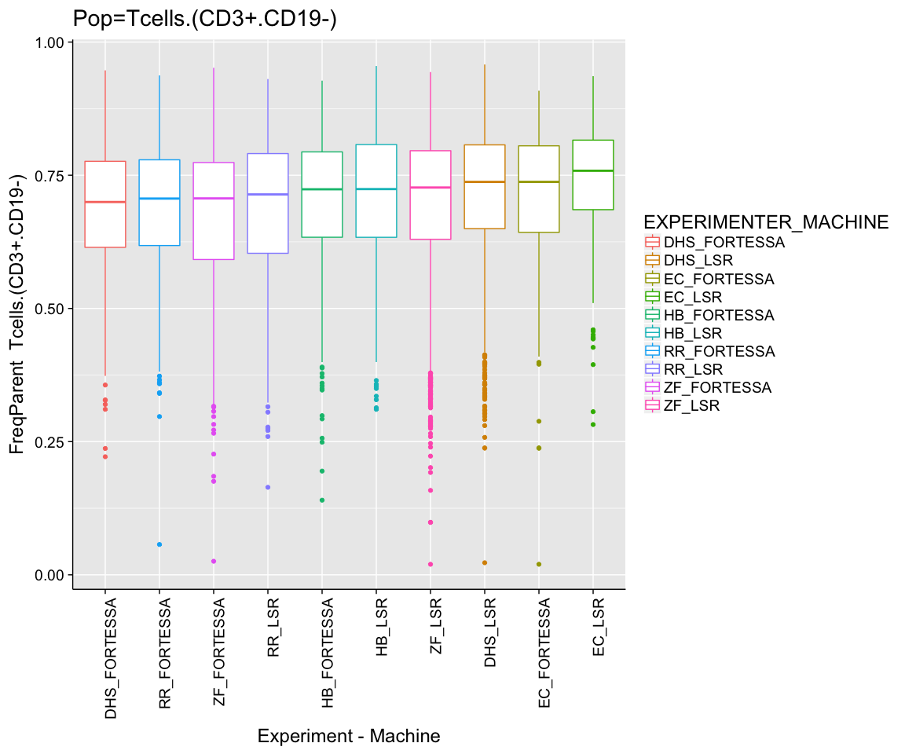<!-- -->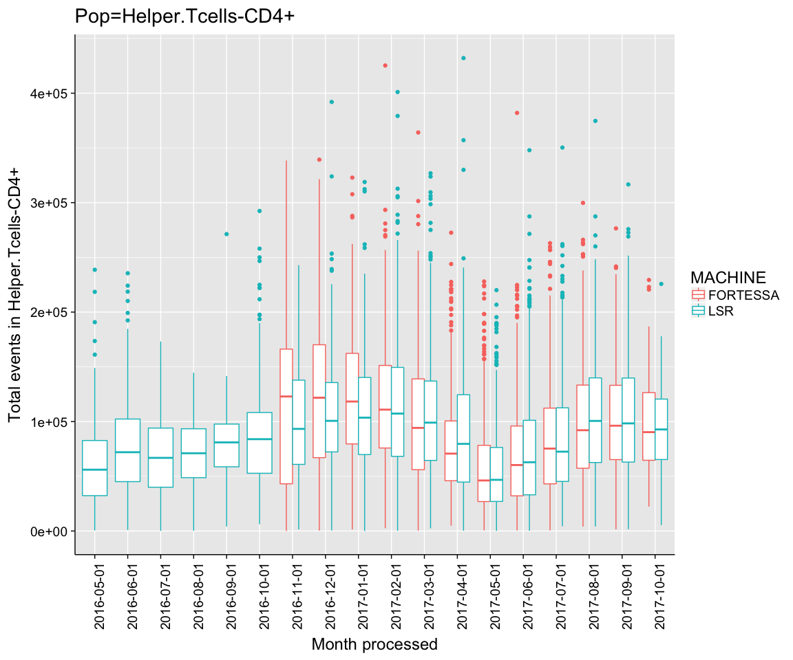<!-- -->

```
## [1] "IgD+.memory.Bcells.(CD27+)"
## [1] "n=9408"
## [1] "PLOT TYPE = Machine Time FREQ"
```

<!-- -->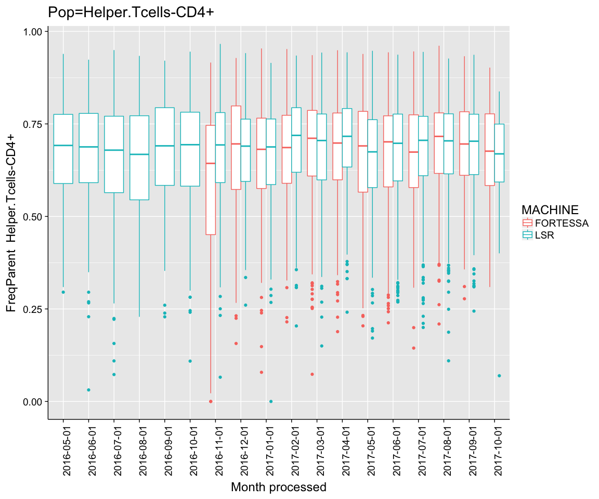<!-- -->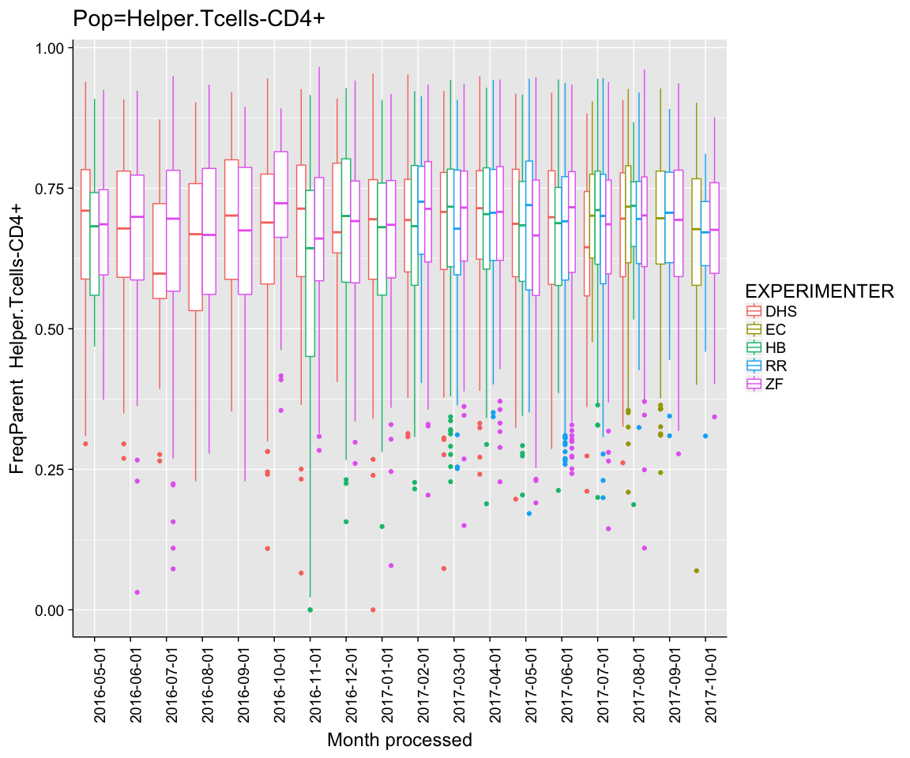<!-- -->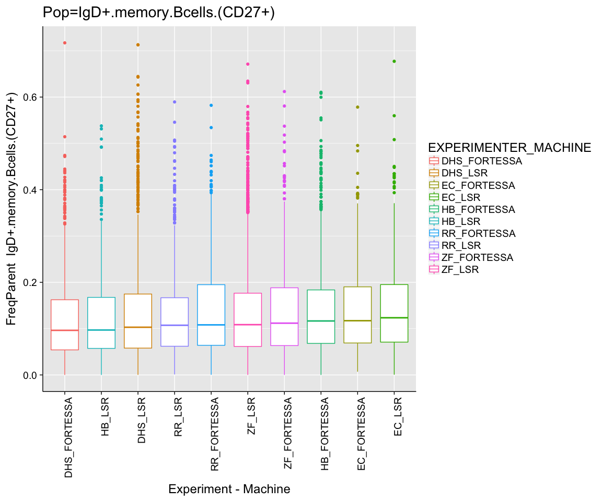<!-- -->

```
## 
## 
## |Var1 |Var2     | Freq|
## |:----|:--------|----:|
## |DHS  |FORTESSA |  731|
## |EC   |FORTESSA |  372|
## |HB   |FORTESSA |  907|
## |RR   |FORTESSA |  574|
## |ZF   |FORTESSA | 1019|
## |DHS  |LSR      | 1575|
## |EC   |LSR      |  421|
## |HB   |LSR      |  501|
## |RR   |LSR      |  755|
## |ZF   |LSR      | 2553|
## [1] "Linear Regression for IgD+.memory.Bcells.(CD27+)"
## 
## Call:
## lm(formula = formula, data = subF)
## 
## Residuals:
##      Min       1Q   Median       3Q      Max 
## -0.14294 -0.07282 -0.02713  0.04301  0.58625 
## 
## Coefficients:
##                  Estimate Std. Error t value Pr(>|t|)  
## (Intercept)    -1.672e-01  1.672e-01  -1.000   0.3174  
## DATE_MONTH      1.734e-05  9.713e-06   1.785   0.0742 .
## MACHINELSR     -1.629e-03  2.303e-03  -0.707   0.4794  
## EXPERIMENTEREC  1.045e-02  4.685e-03   2.231   0.0257 *
## EXPERIMENTERHB  6.534e-03  3.514e-03   1.859   0.0630 .
## EXPERIMENTERRR  3.294e-03  3.717e-03   0.886   0.3755  
## EXPERIMENTERZF  4.531e-03  2.731e-03   1.659   0.0971 .
## ---
## Signif. codes:  0 '***' 0.001 '**' 0.01 '*' 0.05 '.' 0.1 ' ' 1
## 
## Residual standard error: 0.1011 on 9401 degrees of freedom
## Multiple R-squared:  0.002011,	Adjusted R-squared:  0.001374 
## F-statistic: 3.157 on 6 and 9401 DF,  p-value: 0.004289
## 
## [1] "Stepwise Linear Regression for IgD+.memory.Bcells.(CD27+)"
## Start:  AIC=-43114.57
## TARGET_FREQ ~ DATE_MONTH + MACHINE + EXPERIMENTER
## 
##                Df Sum of Sq    RSS    AIC
## - MACHINE       1  0.005113 96.075 -43116
## - EXPERIMENTER  4  0.069841 96.139 -43116
## <none>                      96.069 -43115
## - DATE_MONTH    1  0.032572 96.102 -43113
## 
## Step:  AIC=-43116.07
## TARGET_FREQ ~ DATE_MONTH + EXPERIMENTER
## 
##                Df Sum of Sq    RSS    AIC
## - EXPERIMENTER  4  0.071569 96.146 -43117
## <none>                      96.075 -43116
## + MACHINE       1  0.005113 96.069 -43115
## - DATE_MONTH    1  0.042851 96.117 -43114
## 
## Step:  AIC=-43117.07
## TARGET_FREQ ~ DATE_MONTH
## 
##                Df Sum of Sq    RSS    AIC
## <none>                      96.146 -43117
## + EXPERIMENTER  4  0.071569 96.075 -43116
## + MACHINE       1  0.006841 96.139 -43116
## - DATE_MONTH    1  0.116888 96.263 -43108
## Stepwise Model Path 
## Analysis of Deviance Table
## 
## Initial Model:
## TARGET_FREQ ~ DATE_MONTH + MACHINE + EXPERIMENTER
## 
## Final Model:
## TARGET_FREQ ~ DATE_MONTH
## 
## 
##             Step Df    Deviance Resid. Df Resid. Dev       AIC
## 1                                    9401   96.06943 -43114.57
## 2      - MACHINE  1 0.005113369      9402   96.07454 -43116.07
## 3 - EXPERIMENTER  4 0.071569282      9406   96.14611 -43117.07
## [1] "ANOVA of EXPERIMENTER for IgD+.memory.Bcells.(CD27+)"
##   Tukey multiple comparisons of means
##     95% family-wise confidence level
## 
## Fit: aov(formula = formula, data = subF)
## 
## $EXPERIMENTER
##                 diff          lwr         upr     p adj
## EC-DHS  0.0146592566  0.003303787 0.026014726 0.0039356
## HB-DHS  0.0080802037 -0.001249128 0.017409535 0.1256621
## RR-DHS  0.0058840609 -0.003615874 0.015383995 0.4402473
## ZF-DHS  0.0051597156 -0.002208969 0.012528400 0.3117104
## HB-EC  -0.0065790529 -0.018826136 0.005668030 0.5849623
## RR-EC  -0.0087751957 -0.021152730 0.003602339 0.2991283
## ZF-EC  -0.0094995410 -0.020327843 0.001328761 0.1170896
## RR-HB  -0.0021961428 -0.012745697 0.008353412 0.9796800
## ZF-HB  -0.0029204881 -0.011600457 0.005759481 0.8900923
## ZF-RR  -0.0007243453 -0.009587426 0.008138735 0.9994527
## 
## [1] "ANOVA of MACHINE for IgD+.memory.Bcells.(CD27+)"
##               Df Sum Sq Mean Sq F value Pr(>F)  
## MACHINE        1   0.03 0.03028    2.96 0.0854 .
## Residuals   9406  96.23 0.01023                 
## ---
## Signif. codes:  0 '***' 0.001 '**' 0.01 '*' 0.05 '.' 0.1 ' ' 1
## [1] "# Start of new population results"
## [1] "Helper.Tcells-CD4+"
## [1] "n=9408"
## [1] "PLOT TYPE = Machine Time COUNT"
```

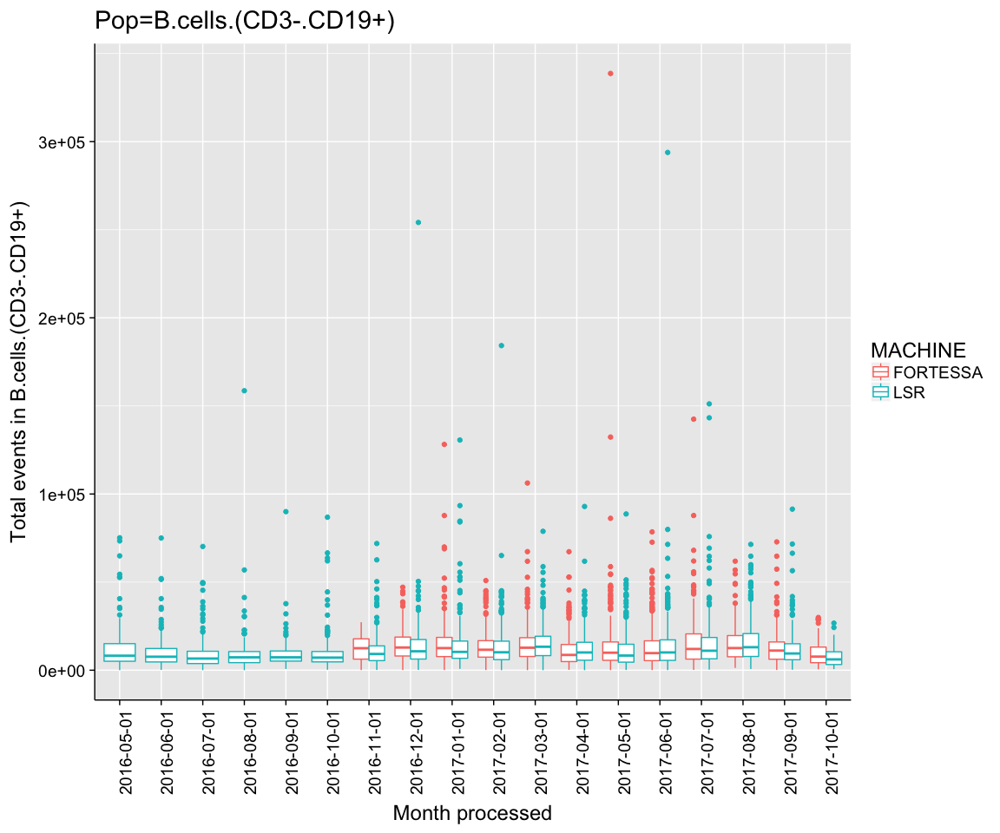<!-- -->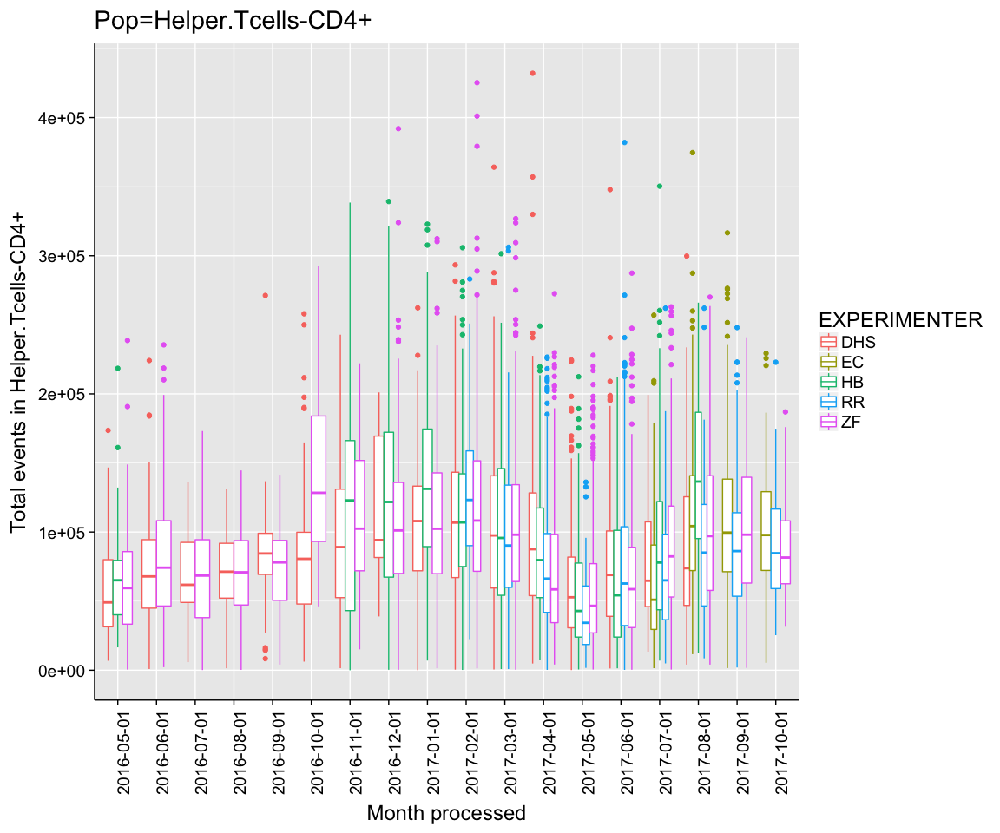<!-- -->

```
## [1] "Helper.Tcells-CD4+"
## [1] "n=9408"
## [1] "PLOT TYPE = Machine Time FREQ"
```

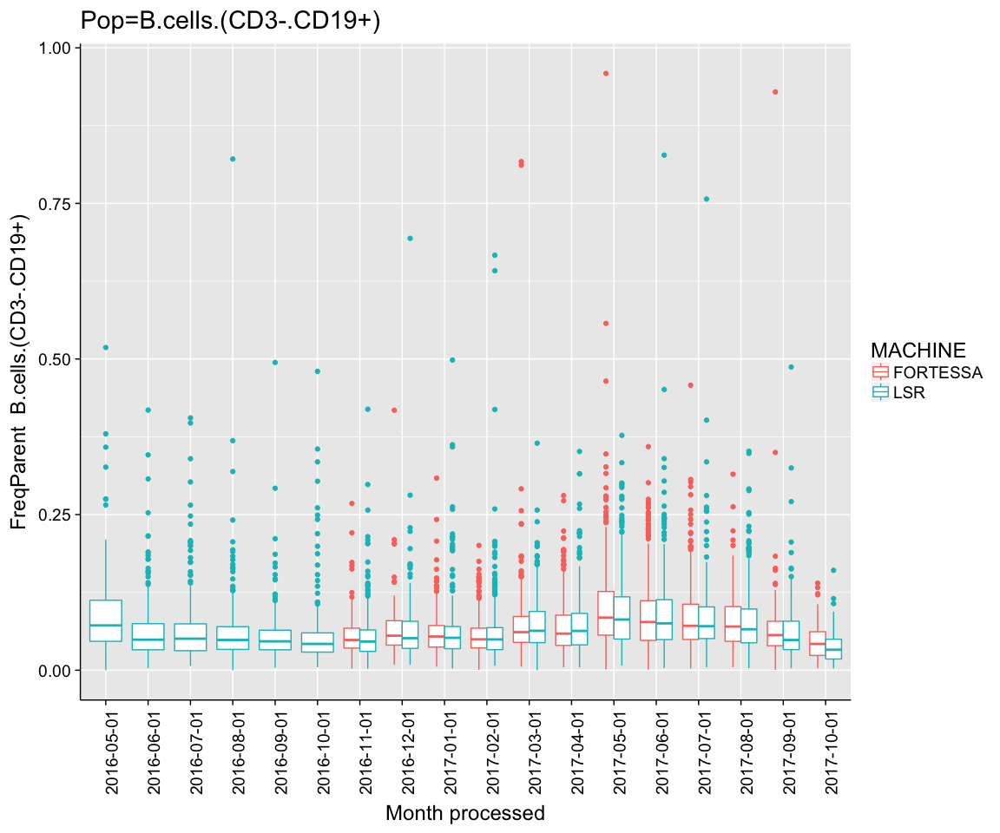<!-- -->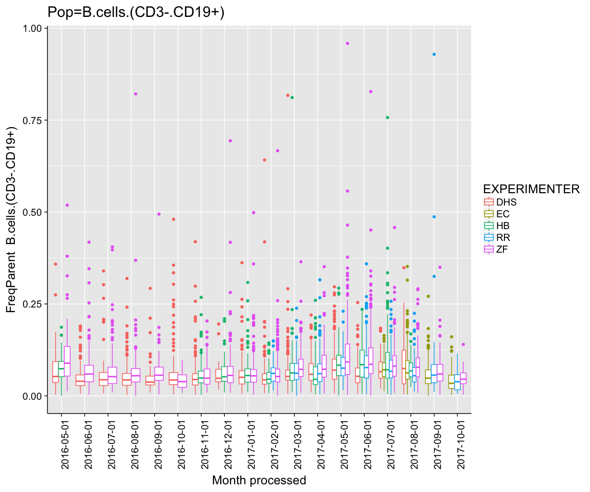<!-- -->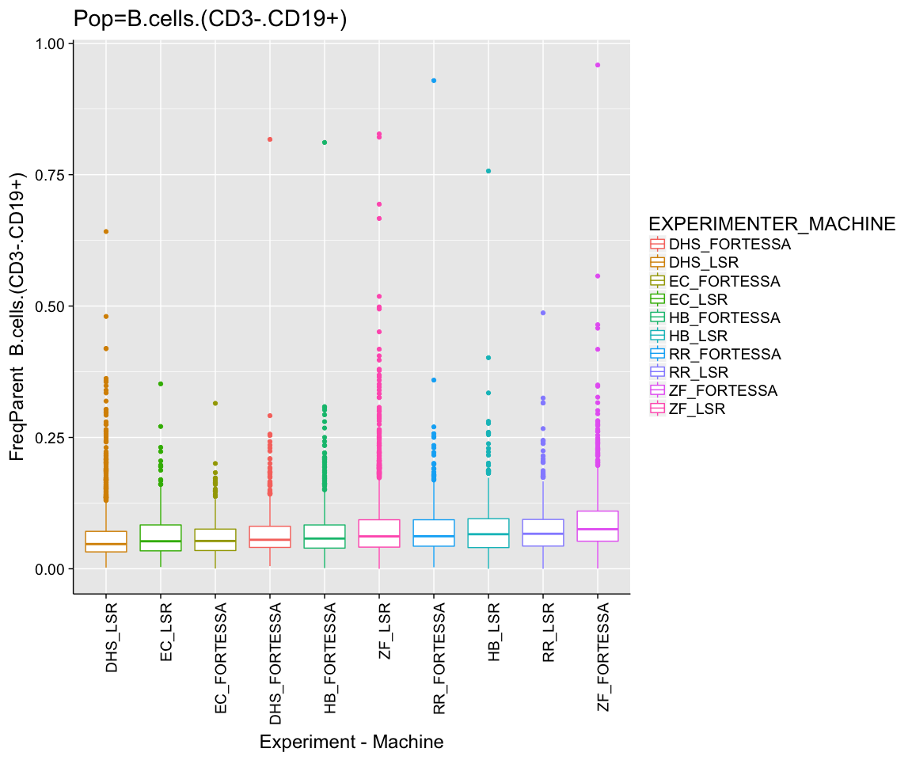<!-- --><!-- -->

```
## 
## 
## |Var1 |Var2     | Freq|
## |:----|:--------|----:|
## |DHS  |FORTESSA |  731|
## |EC   |FORTESSA |  372|
## |HB   |FORTESSA |  907|
## |RR   |FORTESSA |  574|
## |ZF   |FORTESSA | 1019|
## |DHS  |LSR      | 1575|
## |EC   |LSR      |  421|
## |HB   |LSR      |  501|
## |RR   |LSR      |  755|
## |ZF   |LSR      | 2553|
## [1] "Linear Regression for Helper.Tcells-CD4+"
## 
## Call:
## lm(formula = formula, data = subF)
## 
## Residuals:
##      Min       1Q   Median       3Q      Max 
## -0.67557 -0.08388  0.02063  0.10137  0.29332 
## 
## Coefficients:
##                  Estimate Std. Error t value Pr(>|t|)    
## (Intercept)    -1.685e-01  2.316e-01  -0.728  0.46686    
## DATE_MONTH      4.876e-05  1.345e-05   3.625  0.00029 ***
## MACHINELSR      7.053e-03  3.189e-03   2.212  0.02702 *  
## EXPERIMENTEREC  4.046e-03  6.487e-03   0.624  0.53286    
## EXPERIMENTERHB -3.551e-03  4.867e-03  -0.730  0.46566    
## EXPERIMENTERRR -3.436e-03  5.146e-03  -0.668  0.50432    
## EXPERIMENTERZF  2.507e-04  3.782e-03   0.066  0.94715    
## ---
## Signif. codes:  0 '***' 0.001 '**' 0.01 '*' 0.05 '.' 0.1 ' ' 1
## 
## Residual standard error: 0.14 on 9401 degrees of freedom
## Multiple R-squared:  0.002447,	Adjusted R-squared:  0.001811 
## F-statistic: 3.844 on 6 and 9401 DF,  p-value: 0.000783
## 
## [1] "Stepwise Linear Regression for Helper.Tcells-CD4+"
## Start:  AIC=-36989.55
## TARGET_FREQ ~ DATE_MONTH + MACHINE + EXPERIMENTER
## 
##                Df Sum of Sq    RSS    AIC
## - EXPERIMENTER  4  0.042120 184.26 -36995
## <none>                      184.22 -36990
## - MACHINE       1  0.095849 184.31 -36987
## - DATE_MONTH    1  0.257507 184.47 -36978
## 
## Step:  AIC=-36995.4
## TARGET_FREQ ~ DATE_MONTH + MACHINE
## 
##                Df Sum of Sq    RSS    AIC
## <none>                      184.26 -36995
## - MACHINE       1   0.12489 184.38 -36991
## + EXPERIMENTER  4   0.04212 184.22 -36990
## - DATE_MONTH    1   0.37295 184.63 -36978
## Stepwise Model Path 
## Analysis of Deviance Table
## 
## Initial Model:
## TARGET_FREQ ~ DATE_MONTH + MACHINE + EXPERIMENTER
## 
## Final Model:
## TARGET_FREQ ~ DATE_MONTH + MACHINE
## 
## 
##             Step Df Deviance Resid. Df Resid. Dev       AIC
## 1                                 9401   184.2172 -36989.55
## 2 - EXPERIMENTER  4  0.04212      9405   184.2593 -36995.40
## [1] "ANOVA of EXPERIMENTER for Helper.Tcells-CD4+"
##   Tukey multiple comparisons of means
##     95% family-wise confidence level
## 
## Fit: aov(formula = formula, data = subF)
## 
## $EXPERIMENTER
##                 diff          lwr           upr     p adj
## EC-DHS  0.0141071880 -0.001625793  0.0298401689 0.1033109
## HB-DHS -0.0030106051 -0.015936376  0.0099151655 0.9693114
## RR-DHS  0.0025091170 -0.010653024  0.0156712580 0.9853673
## ZF-DHS  0.0023875634 -0.007821735  0.0125968615 0.9688558
## HB-EC  -0.0171177931 -0.034086102 -0.0001494838 0.0467919
## RR-EC  -0.0115980710 -0.028747121  0.0055509795 0.3475664
## ZF-EC  -0.0117196246 -0.026722216  0.0032829667 0.2068172
## RR-HB   0.0055197221 -0.009096666  0.0201361097 0.8413970
## ZF-HB   0.0053981685 -0.006627912  0.0174242485 0.7369863
## ZF-RR  -0.0001215536 -0.012401334  0.0121582270 0.9999999
## 
## [1] "ANOVA of MACHINE for Helper.Tcells-CD4+"
##               Df Sum Sq Mean Sq F value Pr(>F)
## MACHINE        1   0.04 0.03688   1.879   0.17
## Residuals   9406 184.63 0.01963               
## [1] "# Start of new population results"
## [1] "B.cells.(CD3-.CD19+)"
## [1] "n=9408"
## [1] "PLOT TYPE = Machine Time COUNT"
```

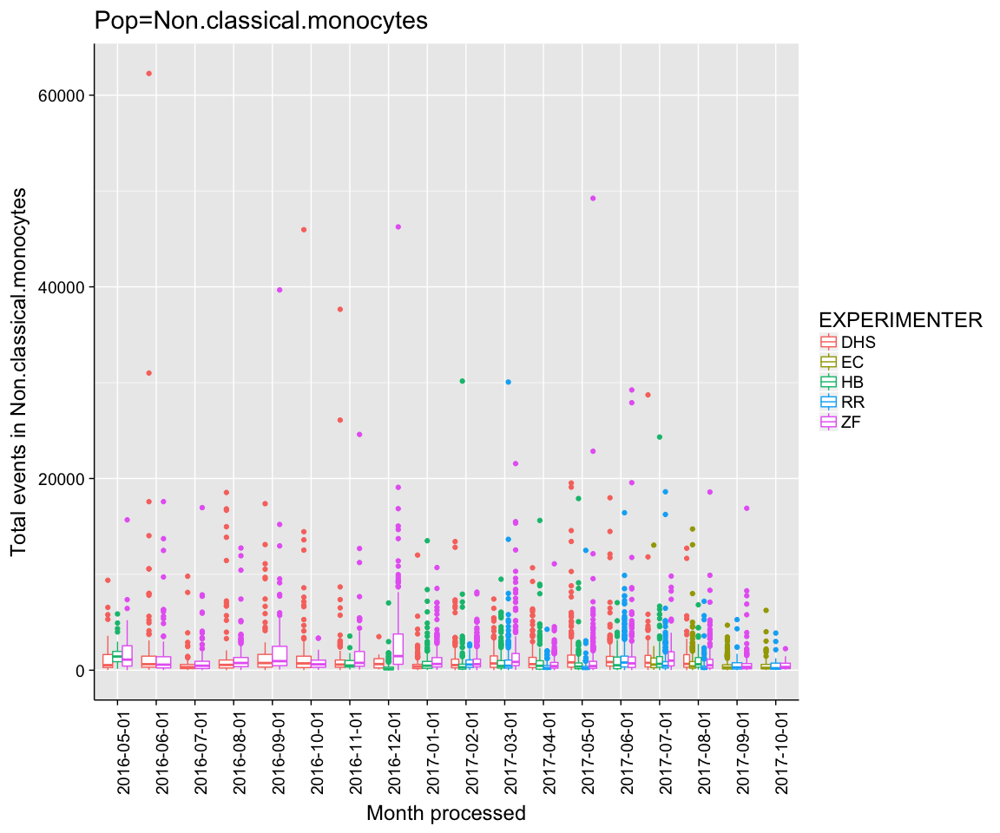<!-- -->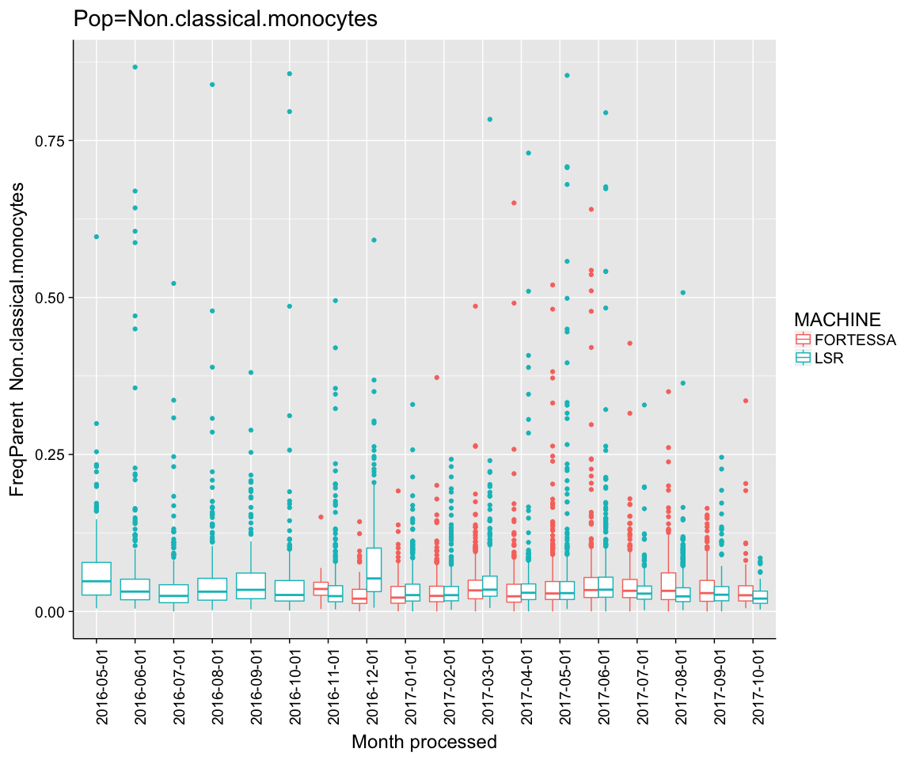<!-- -->

```
## [1] "B.cells.(CD3-.CD19+)"
## [1] "n=9408"
## [1] "PLOT TYPE = Machine Time FREQ"
```

<!-- -->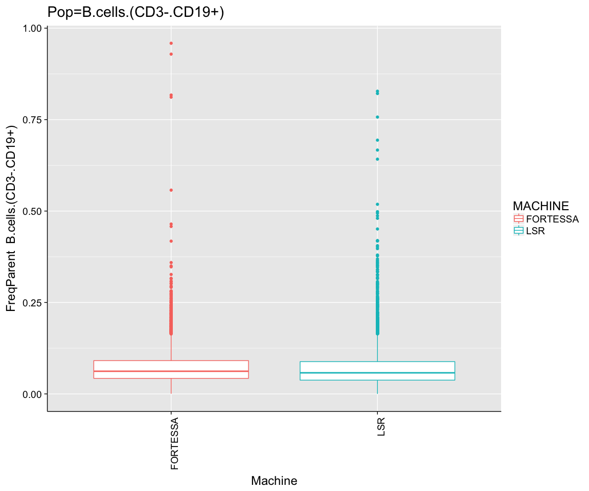<!-- -->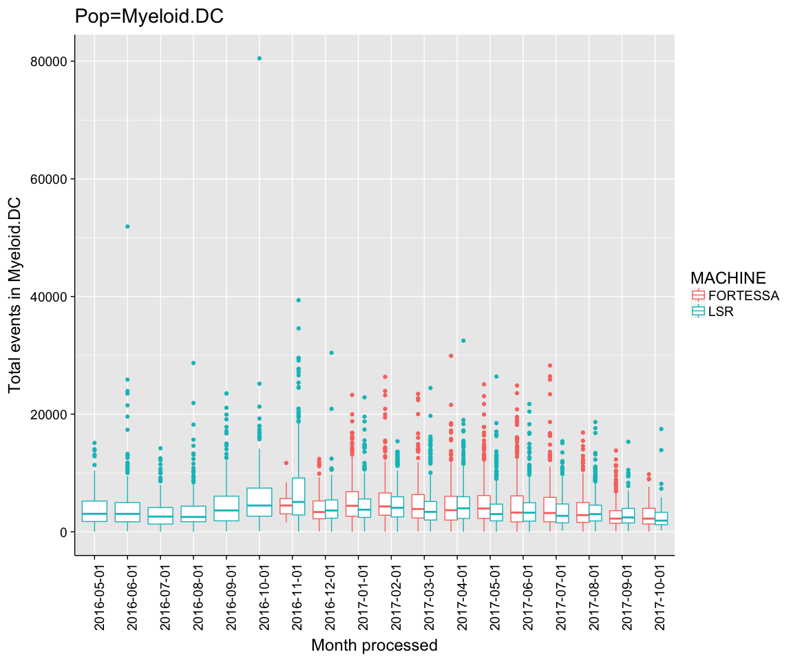<!-- -->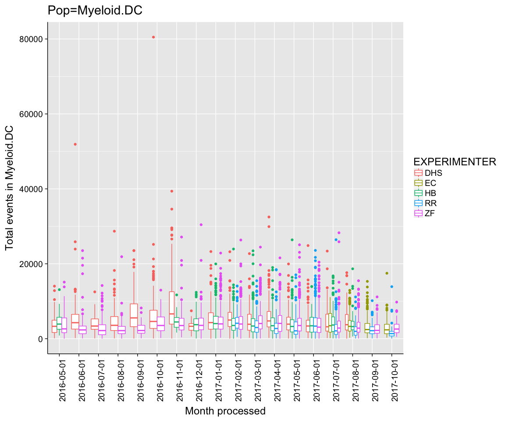<!-- -->

```
## 
## 
## |Var1 |Var2     | Freq|
## |:----|:--------|----:|
## |DHS  |FORTESSA |  731|
## |EC   |FORTESSA |  372|
## |HB   |FORTESSA |  907|
## |RR   |FORTESSA |  574|
## |ZF   |FORTESSA | 1019|
## |DHS  |LSR      | 1575|
## |EC   |LSR      |  421|
## |HB   |LSR      |  501|
## |RR   |LSR      |  755|
## |ZF   |LSR      | 2553|
## [1] "Linear Regression for B.cells.(CD3-.CD19+)"
## 
## Call:
## lm(formula = formula, data = subF)
## 
## Residuals:
##      Min       1Q   Median       3Q      Max 
## -0.08873 -0.03174 -0.01229  0.01590  0.87427 
## 
## Coefficients:
##                  Estimate Std. Error t value Pr(>|t|)    
## (Intercept)    -8.174e-01  9.090e-02  -8.993  < 2e-16 ***
## DATE_MONTH      5.132e-05  5.280e-06   9.719  < 2e-16 ***
## MACHINELSR     -6.682e-04  1.252e-03  -0.534  0.59350    
## EXPERIMENTEREC -1.320e-02  2.547e-03  -5.184 2.22e-07 ***
## EXPERIMENTERHB  5.116e-03  1.910e-03   2.678  0.00742 ** 
## EXPERIMENTERRR  4.642e-03  2.020e-03   2.298  0.02159 *  
## EXPERIMENTERZF  1.484e-02  1.484e-03   9.995  < 2e-16 ***
## ---
## Signif. codes:  0 '***' 0.001 '**' 0.01 '*' 0.05 '.' 0.1 ' ' 1
## 
## Residual standard error: 0.05495 on 9401 degrees of freedom
## Multiple R-squared:  0.02805,	Adjusted R-squared:  0.02742 
## F-statistic: 45.21 on 6 and 9401 DF,  p-value: < 2.2e-16
## 
## [1] "Stepwise Linear Regression for B.cells.(CD3-.CD19+)"
## Start:  AIC=-54584.08
## TARGET_FREQ ~ DATE_MONTH + MACHINE + EXPERIMENTER
## 
##                Df Sum of Sq    RSS    AIC
## - MACHINE       1   0.00086 28.388 -54586
## <none>                      28.387 -54584
## - DATE_MONTH    1   0.28524 28.673 -54492
## - EXPERIMENTER  4   0.61645 29.004 -54390
## 
## Step:  AIC=-54585.8
## TARGET_FREQ ~ DATE_MONTH + EXPERIMENTER
## 
##                Df Sum of Sq    RSS    AIC
## <none>                      28.388 -54586
## + MACHINE       1   0.00086 28.387 -54584
## - DATE_MONTH    1   0.31607 28.704 -54484
## - EXPERIMENTER  4   0.61559 29.004 -54392
## Stepwise Model Path 
## Analysis of Deviance Table
## 
## Initial Model:
## TARGET_FREQ ~ DATE_MONTH + MACHINE + EXPERIMENTER
## 
## Final Model:
## TARGET_FREQ ~ DATE_MONTH + EXPERIMENTER
## 
## 
##        Step Df     Deviance Resid. Df Resid. Dev       AIC
## 1                                9401   28.38748 -54584.08
## 2 - MACHINE  1 0.0008603943      9402   28.38834 -54585.80
## [1] "ANOVA of EXPERIMENTER for B.cells.(CD3-.CD19+)"
##   Tukey multiple comparisons of means
##     95% family-wise confidence level
## 
## Fit: aov(formula = formula, data = subF)
## 
## $EXPERIMENTER
##                diff           lwr         upr     p adj
## EC-DHS -0.001381208 -0.0075867309 0.004824316 0.9739975
## HB-DHS  0.008331977  0.0032336957 0.013430259 0.0000816
## RR-DHS  0.011829698  0.0066381849 0.017021211 0.0000000
## ZF-DHS  0.016830034  0.0128032039 0.020856864 0.0000000
## HB-EC   0.009713185  0.0030204141 0.016405956 0.0007212
## RR-EC   0.013210905  0.0064468451 0.019974966 0.0000010
## ZF-EC   0.018211241  0.0122938041 0.024128679 0.0000000
## RR-HB   0.003497720 -0.0022673876 0.009262828 0.4619989
## ZF-HB   0.008498056  0.0037546374 0.013241475 0.0000103
## ZF-RR   0.005000336  0.0001568506 0.009843821 0.0390517
## 
## [1] "ANOVA of MACHINE for B.cells.(CD3-.CD19+)"
##               Df Sum Sq  Mean Sq F value Pr(>F)  
## MACHINE        1  0.016 0.016049   5.171  0.023 *
## Residuals   9406 29.191 0.003103                 
## ---
## Signif. codes:  0 '***' 0.001 '**' 0.01 '*' 0.05 '.' 0.1 ' ' 1
## [1] "# Start of new population results"
## [1] "Non.classical.monocytes"
## [1] "n=9356"
## [1] "PLOT TYPE = Machine Time COUNT"
```

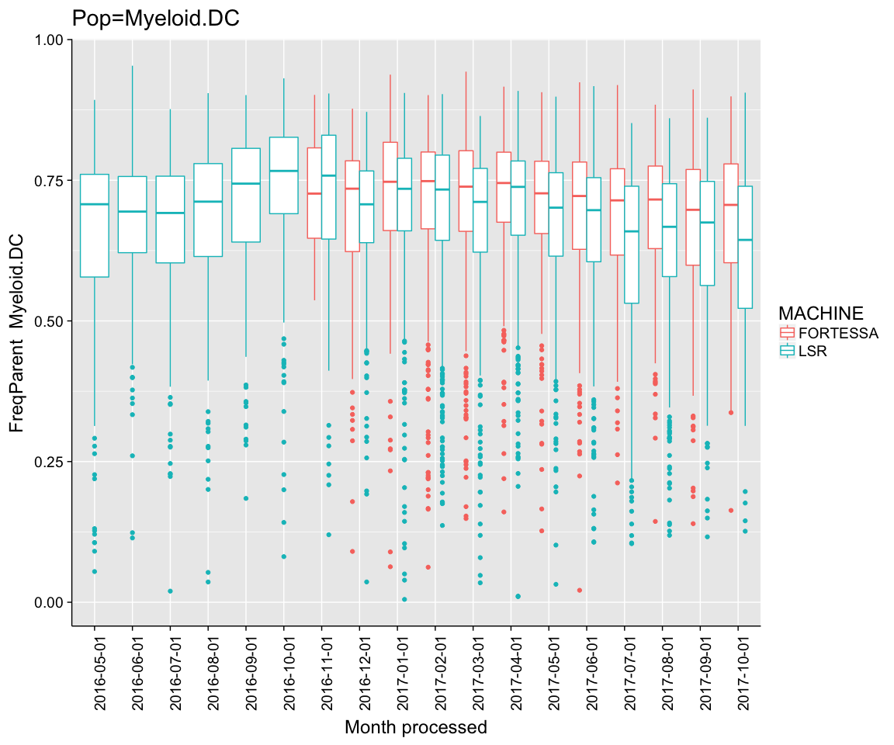<!-- --><!-- -->

```
## [1] "Non.classical.monocytes"
## [1] "n=9356"
## [1] "PLOT TYPE = Machine Time FREQ"
```

<!-- -->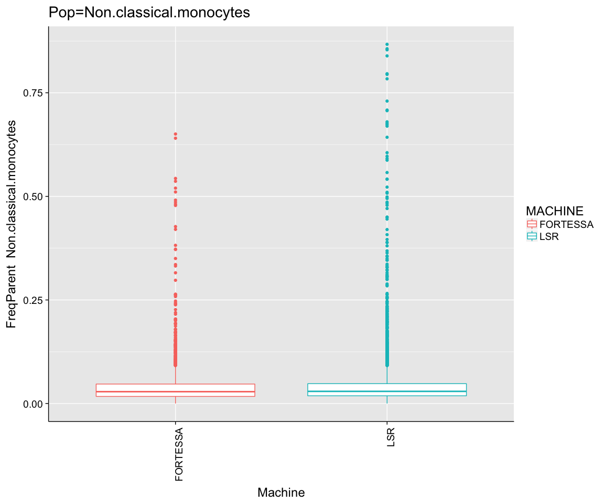<!-- -->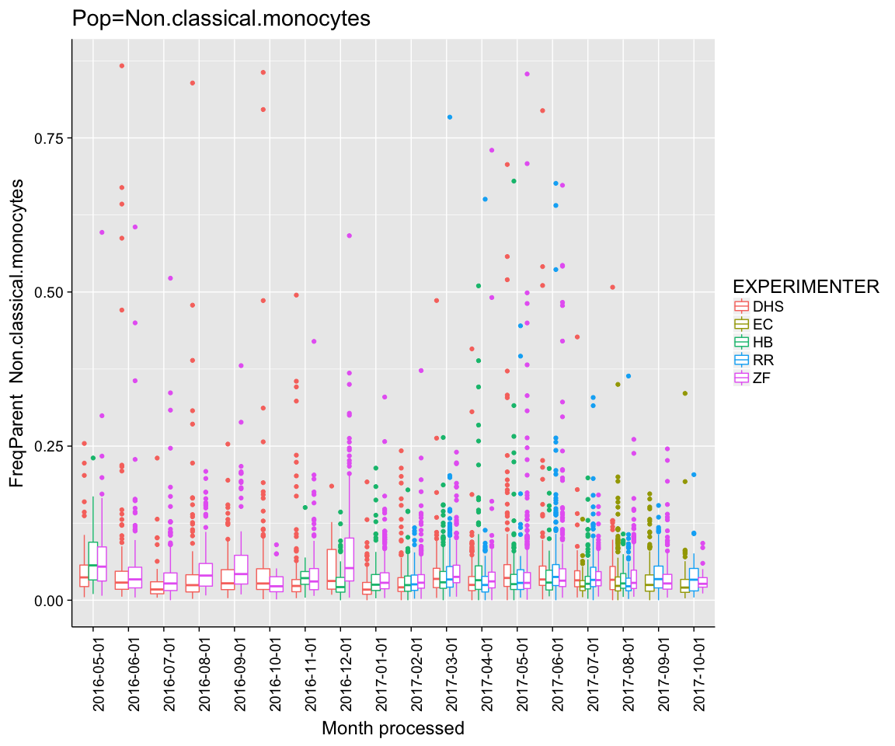<!-- -->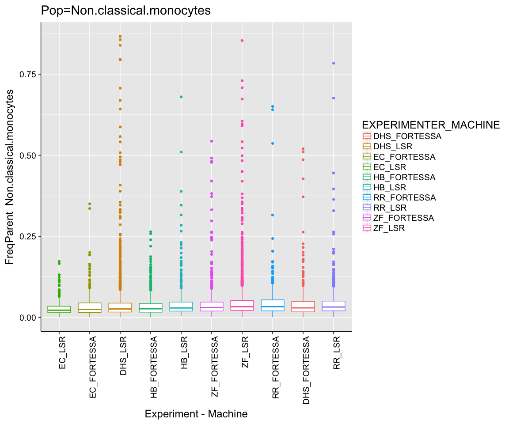<!-- -->

```
## 
## 
## |Var1 |Var2     | Freq|
## |:----|:--------|----:|
## |DHS  |FORTESSA |  705|
## |EC   |FORTESSA |  373|
## |HB   |FORTESSA |  846|
## |RR   |FORTESSA |  581|
## |ZF   |FORTESSA |  989|
## |DHS  |LSR      | 1567|
## |EC   |LSR      |  421|
## |HB   |LSR      |  503|
## |RR   |LSR      |  777|
## |ZF   |LSR      | 2594|
## [1] "Linear Regression for Non.classical.monocytes"
## 
## Call:
## lm(formula = formula, data = subF)
## 
## Residuals:
##      Min       1Q   Median       3Q      Max 
## -0.05207 -0.02459 -0.01307  0.00487  0.81757 
## 
## Coefficients:
##                  Estimate Std. Error t value Pr(>|t|)    
## (Intercept)     4.241e-01  9.249e-02   4.585 4.59e-06 ***
## DATE_MONTH     -2.224e-05  5.372e-06  -4.141 3.49e-05 ***
## MACHINELSR      2.360e-03  1.282e-03   1.840   0.0658 .  
## EXPERIMENTEREC -6.348e-03  2.589e-03  -2.452   0.0142 *  
## EXPERIMENTERHB -3.260e-03  1.972e-03  -1.653   0.0983 .  
## EXPERIMENTERRR  3.486e-03  2.045e-03   1.704   0.0883 .  
## EXPERIMENTERZF  3.333e-03  1.513e-03   2.203   0.0276 *  
## ---
## Signif. codes:  0 '***' 0.001 '**' 0.01 '*' 0.05 '.' 0.1 ' ' 1
## 
## Residual standard error: 0.05582 on 9346 degrees of freedom
##   (3 observations deleted due to missingness)
## Multiple R-squared:  0.008559,	Adjusted R-squared:  0.007923 
## F-statistic: 13.45 on 6 and 9346 DF,  p-value: 3.014e-15
## 
## [1] "Stepwise Linear Regression for Non.classical.monocytes"
## Start:  AIC=-53970.82
## TARGET_FREQ ~ DATE_MONTH + MACHINE + EXPERIMENTER
## 
##                Df Sum of Sq    RSS    AIC
## <none>                      29.123 -53971
## - MACHINE       1  0.010551 29.134 -53969
## - DATE_MONTH    1  0.053425 29.176 -53956
## - EXPERIMENTER  4  0.091775 29.215 -53949
## Stepwise Model Path 
## Analysis of Deviance Table
## 
## Initial Model:
## TARGET_FREQ ~ DATE_MONTH + MACHINE + EXPERIMENTER
## 
## Final Model:
## TARGET_FREQ ~ DATE_MONTH + MACHINE + EXPERIMENTER
## 
## 
##   Step Df Deviance Resid. Df Resid. Dev       AIC
## 1                       9346   29.12295 -53970.82
## [1] "ANOVA of EXPERIMENTER for Non.classical.monocytes"
##   Tukey multiple comparisons of means
##     95% family-wise confidence level
## 
## Fit: aov(formula = formula, data = subF)
## 
## $EXPERIMENTER
##                 diff           lwr           upr     p adj
## EC-DHS -0.0117994049 -0.0180870968 -0.0055117130 0.0000031
## HB-DHS -0.0054177086 -0.0106602930 -0.0001751241 0.0387430
## RR-DHS  0.0001263972 -0.0051064852  0.0053592796 0.9999957
## ZF-DHS  0.0025797715 -0.0015111673  0.0066707103 0.4212702
## HB-EC   0.0063816963 -0.0004395685  0.0132029611 0.0795161
## RR-EC   0.0119258021  0.0051119912  0.0187396131 0.0000180
## ZF-EC   0.0143791764  0.0083974758  0.0203608770 0.0000000
## RR-HB   0.0055441058 -0.0003191393  0.0114073509 0.0741692
## ZF-HB   0.0079974801  0.0031260979  0.0128688623 0.0000743
## ZF-RR   0.0024533743 -0.0024075650  0.0073143136 0.6424964
## 
## [1] "ANOVA of MACHINE for Non.classical.monocytes"
##               Df Sum Sq Mean Sq F value   Pr(>F)    
## MACHINE        1   0.06 0.05977   19.07 1.28e-05 ***
## Residuals   9351  29.32 0.00313                     
## ---
## Signif. codes:  0 '***' 0.001 '**' 0.01 '*' 0.05 '.' 0.1 ' ' 1
## 3 observations deleted due to missingness
## [1] "# Start of new population results"
## [1] "Myeloid.DC"
## [1] "n=9356"
## [1] "PLOT TYPE = Machine Time COUNT"
```

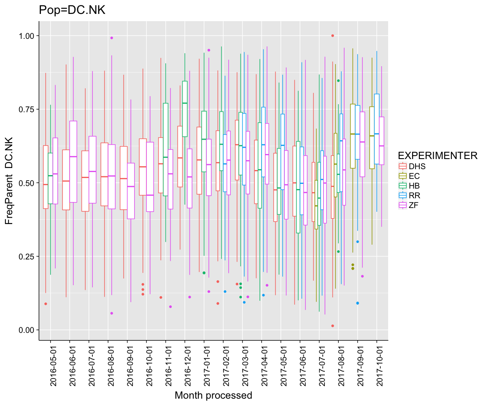<!-- --><!-- -->

```
## [1] "Myeloid.DC"
## [1] "n=9356"
## [1] "PLOT TYPE = Machine Time FREQ"
```

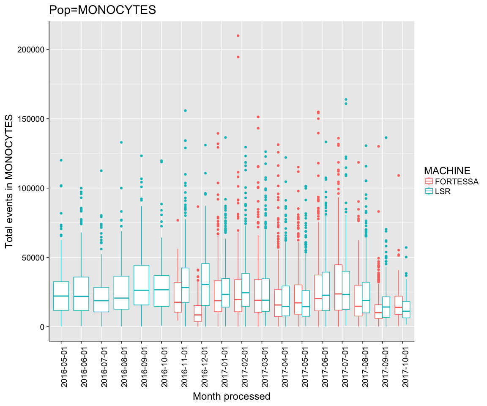<!-- -->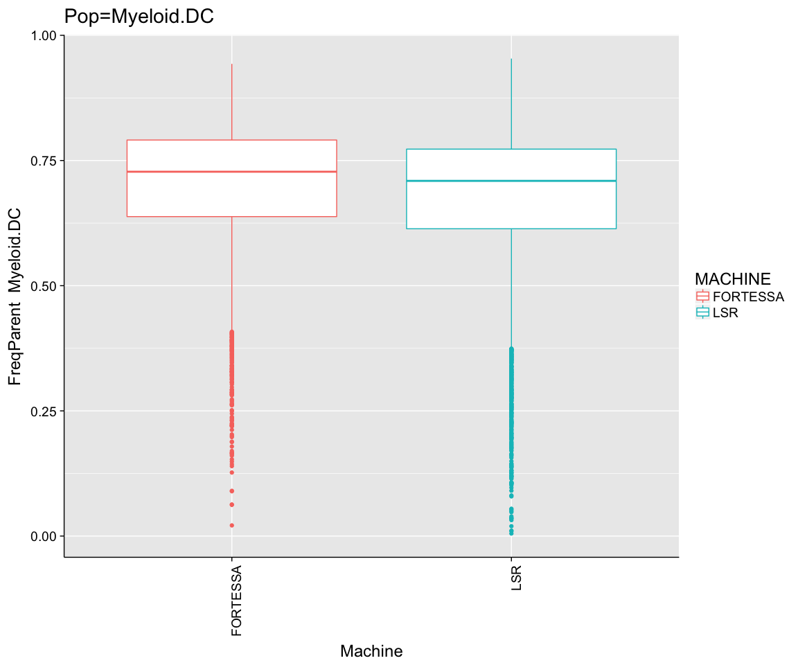<!-- -->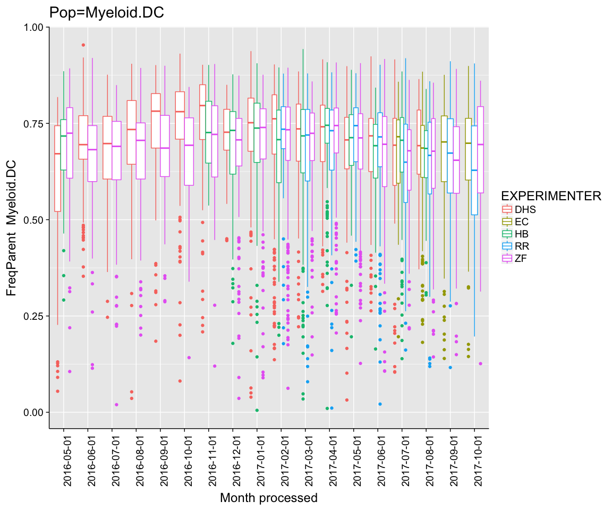<!-- -->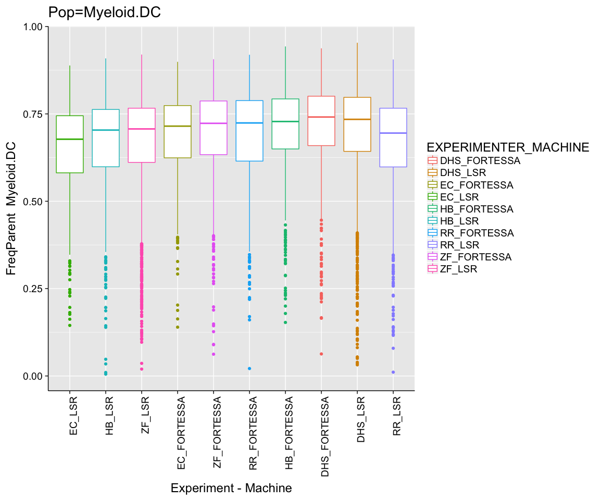<!-- -->

```
## 
## 
## |Var1 |Var2     | Freq|
## |:----|:--------|----:|
## |DHS  |FORTESSA |  705|
## |EC   |FORTESSA |  373|
## |HB   |FORTESSA |  846|
## |RR   |FORTESSA |  581|
## |ZF   |FORTESSA |  989|
## |DHS  |LSR      | 1567|
## |EC   |LSR      |  421|
## |HB   |LSR      |  503|
## |RR   |LSR      |  777|
## |ZF   |LSR      | 2594|
## [1] "Linear Regression for Myeloid.DC"
## 
## Call:
## lm(formula = formula, data = subF)
## 
## Residuals:
##      Min       1Q   Median       3Q      Max 
## -0.66823 -0.05705  0.03455  0.09659  0.25940 
## 
## Coefficients:
##                  Estimate Std. Error t value Pr(>|t|)    
## (Intercept)     2.084e+00  2.328e-01   8.950  < 2e-16 ***
## DATE_MONTH     -7.919e-05  1.352e-05  -5.857 4.87e-09 ***
## MACHINELSR     -3.362e-02  3.227e-03 -10.418  < 2e-16 ***
## EXPERIMENTEREC -2.402e-02  6.517e-03  -3.685 0.000230 ***
## EXPERIMENTERHB -1.928e-02  4.963e-03  -3.884 0.000103 ***
## EXPERIMENTERRR -2.276e-02  5.148e-03  -4.421 9.92e-06 ***
## EXPERIMENTERZF -1.961e-02  3.808e-03  -5.148 2.68e-07 ***
## ---
## Signif. codes:  0 '***' 0.001 '**' 0.01 '*' 0.05 '.' 0.1 ' ' 1
## 
## Residual standard error: 0.1405 on 9345 degrees of freedom
##   (4 observations deleted due to missingness)
## Multiple R-squared:  0.01955,	Adjusted R-squared:  0.01892 
## F-statistic: 31.06 on 6 and 9345 DF,  p-value: < 2.2e-16
## 
## [1] "Stepwise Linear Regression for Myeloid.DC"
## Start:  AIC=-36704
## TARGET_FREQ ~ DATE_MONTH + MACHINE + EXPERIMENTER
## 
##                Df Sum of Sq    RSS    AIC
## <none>                      184.40 -36704
## - EXPERIMENTER  4   0.66628 185.07 -36678
## - DATE_MONTH    1   0.67691 185.08 -36672
## - MACHINE       1   2.14156 186.54 -36598
## Stepwise Model Path 
## Analysis of Deviance Table
## 
## Initial Model:
## TARGET_FREQ ~ DATE_MONTH + MACHINE + EXPERIMENTER
## 
## Final Model:
## TARGET_FREQ ~ DATE_MONTH + MACHINE + EXPERIMENTER
## 
## 
##   Step Df Deviance Resid. Df Resid. Dev    AIC
## 1                       9345   184.4036 -36704
## [1] "ANOVA of EXPERIMENTER for Myeloid.DC"
##   Tukey multiple comparisons of means
##     95% family-wise confidence level
## 
## Fit: aov(formula = formula, data = subF)
## 
## $EXPERIMENTER
##                diff          lwr           upr     p adj
## EC-DHS -0.036712811 -0.052613690 -0.0208119312 0.0000000
## HB-DHS -0.013630496 -0.026888746 -0.0003722454 0.0403783
## RR-DHS -0.029759591 -0.042993309 -0.0165258728 0.0000000
## ZF-DHS -0.023715012 -0.034061349 -0.0133686736 0.0000000
## HB-EC   0.023082315  0.005833073  0.0403315570 0.0024387
## RR-EC   0.006953220 -0.010277173  0.0241836128 0.8061021
## ZF-EC   0.012997799 -0.002128398  0.0281239968 0.1311184
## RR-HB  -0.016129095 -0.030955749 -0.0013024415 0.0250359
## ZF-HB  -0.010084516 -0.022403001  0.0022339692 0.1674095
## ZF-RR   0.006044579 -0.006247498  0.0183366571 0.6650842
## 
## [1] "ANOVA of MACHINE for Myeloid.DC"
##               Df Sum Sq Mean Sq F value Pr(>F)    
## MACHINE        1   1.48   1.477   74.03 <2e-16 ***
## Residuals   9350 186.60   0.020                   
## ---
## Signif. codes:  0 '***' 0.001 '**' 0.01 '*' 0.05 '.' 0.1 ' ' 1
## 4 observations deleted due to missingness
## [1] "# Start of new population results"
## [1] "DC.NK"
## [1] "n=9356"
## [1] "PLOT TYPE = Machine Time COUNT"
```

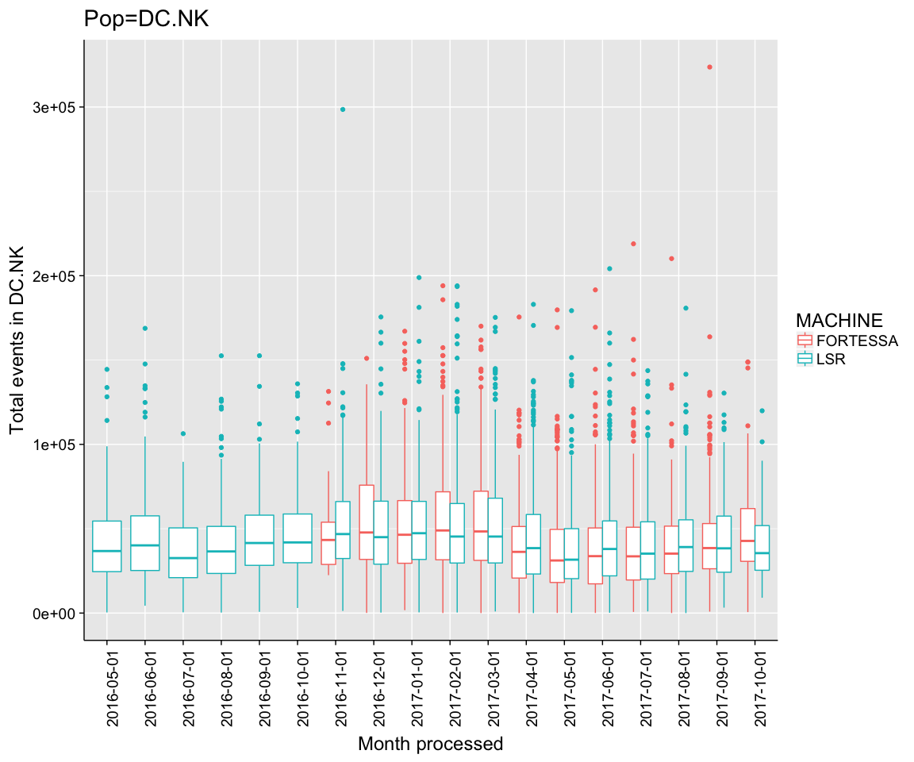<!-- -->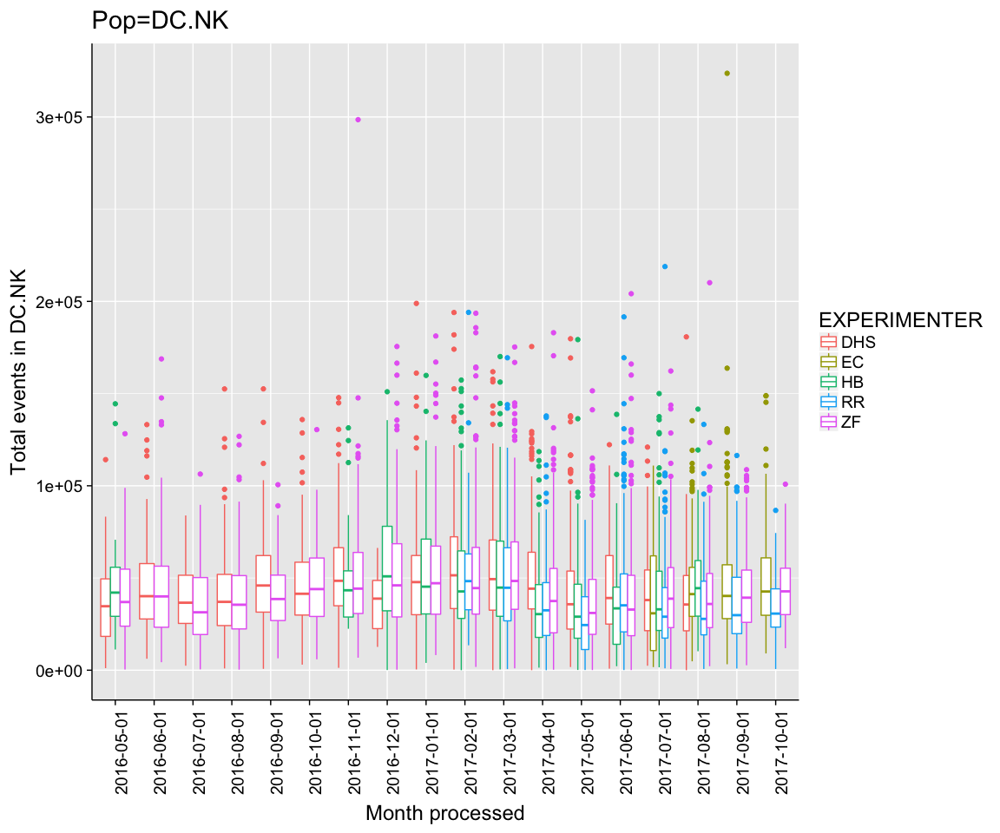<!-- -->

```
## [1] "DC.NK"
## [1] "n=9356"
## [1] "PLOT TYPE = Machine Time FREQ"
```

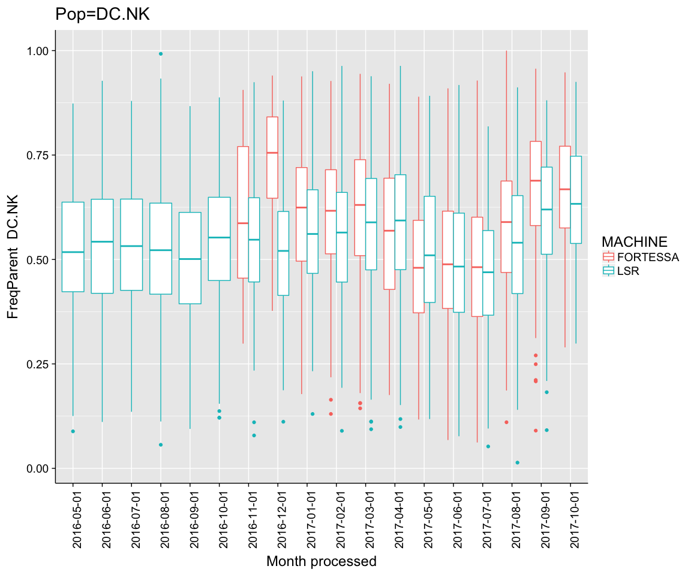<!-- -->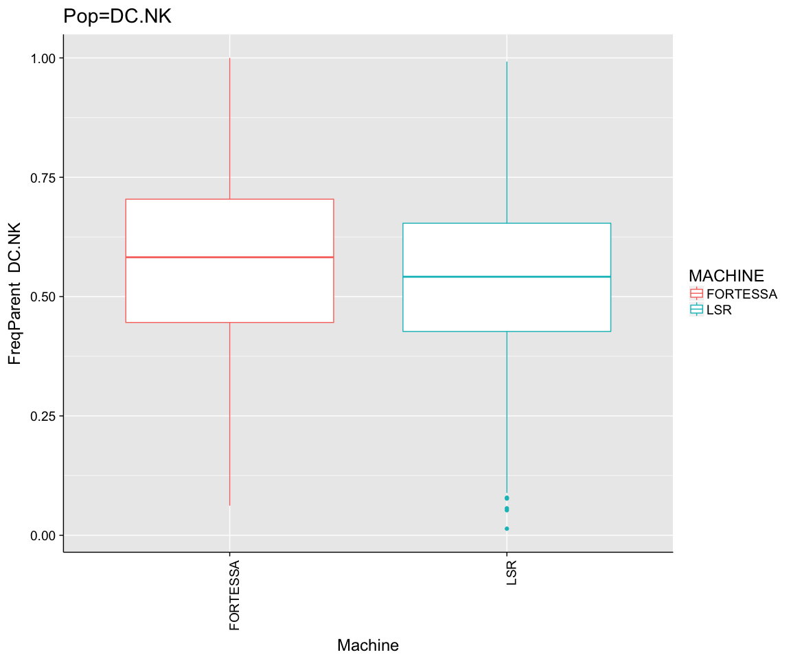<!-- --><!-- -->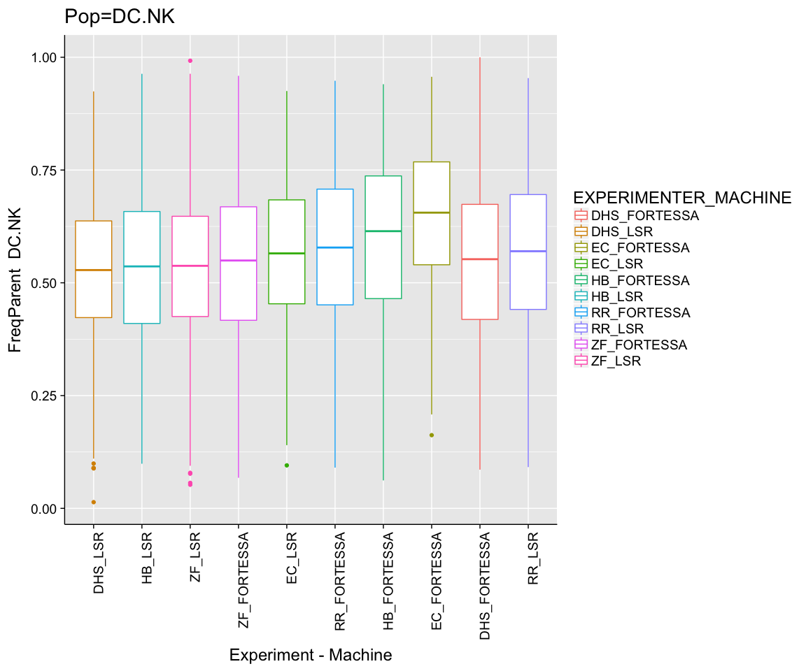<!-- -->

```
## 
## 
## |Var1 |Var2     | Freq|
## |:----|:--------|----:|
## |DHS  |FORTESSA |  705|
## |EC   |FORTESSA |  373|
## |HB   |FORTESSA |  846|
## |RR   |FORTESSA |  581|
## |ZF   |FORTESSA |  989|
## |DHS  |LSR      | 1567|
## |EC   |LSR      |  421|
## |HB   |LSR      |  503|
## |RR   |LSR      |  777|
## |ZF   |LSR      | 2594|
## [1] "Linear Regression for DC.NK"
## 
## Call:
## lm(formula = formula, data = subF)
## 
## Residuals:
##      Min       1Q   Median       3Q      Max 
## -0.51338 -0.11598  0.00488  0.12237  0.46382 
## 
## Coefficients:
##                  Estimate Std. Error t value Pr(>|t|)    
## (Intercept)     2.088e+00  2.714e-01   7.695 1.56e-14 ***
## DATE_MONTH     -8.931e-05  1.576e-05  -5.667 1.50e-08 ***
## MACHINELSR     -3.182e-02  3.762e-03  -8.456  < 2e-16 ***
## EXPERIMENTEREC  8.485e-02  7.597e-03  11.168  < 2e-16 ***
## EXPERIMENTERHB  3.637e-02  5.786e-03   6.286 3.41e-10 ***
## EXPERIMENTERRR  4.280e-02  6.002e-03   7.132 1.06e-12 ***
## EXPERIMENTERZF  8.581e-03  4.440e-03   1.933   0.0533 .  
## ---
## Signif. codes:  0 '***' 0.001 '**' 0.01 '*' 0.05 '.' 0.1 ' ' 1
## 
## Residual standard error: 0.1638 on 9346 degrees of freedom
##   (3 observations deleted due to missingness)
## Multiple R-squared:  0.02654,	Adjusted R-squared:  0.02592 
## F-statistic: 42.47 on 6 and 9346 DF,  p-value: < 2.2e-16
## 
## [1] "Stepwise Linear Regression for DC.NK"
## Start:  AIC=-33835.24
## TARGET_FREQ ~ DATE_MONTH + MACHINE + EXPERIMENTER
## 
##                Df Sum of Sq    RSS    AIC
## <none>                      250.73 -33835
## - DATE_MONTH    1    0.8614 251.59 -33805
## - MACHINE       1    1.9184 252.65 -33766
## - EXPERIMENTER  4    4.3577 255.09 -33682
## Stepwise Model Path 
## Analysis of Deviance Table
## 
## Initial Model:
## TARGET_FREQ ~ DATE_MONTH + MACHINE + EXPERIMENTER
## 
## Final Model:
## TARGET_FREQ ~ DATE_MONTH + MACHINE + EXPERIMENTER
## 
## 
##   Step Df Deviance Resid. Df Resid. Dev       AIC
## 1                       9346   250.7295 -33835.24
## [1] "ANOVA of EXPERIMENTER for DC.NK"
##   Tukey multiple comparisons of means
##     95% family-wise confidence level
## 
## Fit: aov(formula = formula, data = subF)
## 
## $EXPERIMENTER
##                diff          lwr          upr     p adj
## EC-DHS  0.069567513  0.051062276  0.088072750 0.0000000
## HB-DHS  0.040813932  0.025384539  0.056243324 0.0000000
## RR-DHS  0.034203386  0.018802547  0.049604224 0.0000000
## ZF-DHS  0.004165315 -0.007874682  0.016205312 0.8797150
## HB-EC  -0.028753581 -0.048829171 -0.008677992 0.0008914
## RR-EC  -0.035364127 -0.055417779 -0.015310475 0.0000150
## ZF-EC  -0.065402198 -0.083006875 -0.047797521 0.0000000
## RR-HB  -0.006610546 -0.023866598  0.010645506 0.8342594
## ZF-HB  -0.036648617 -0.050985528 -0.022311705 0.0000000
## ZF-RR  -0.030038071 -0.044344247 -0.015731894 0.0000001
## 
## [1] "ANOVA of MACHINE for DC.NK"
##               Df Sum Sq Mean Sq F value Pr(>F)    
## MACHINE        1   2.48  2.4775   90.82 <2e-16 ***
## Residuals   9351 255.09  0.0273                   
## ---
## Signif. codes:  0 '***' 0.001 '**' 0.01 '*' 0.05 '.' 0.1 ' ' 1
## 3 observations deleted due to missingness
## [1] "# Start of new population results"
## [1] "MONOCYTES"
## [1] "n=9356"
## [1] "PLOT TYPE = Machine Time COUNT"
```

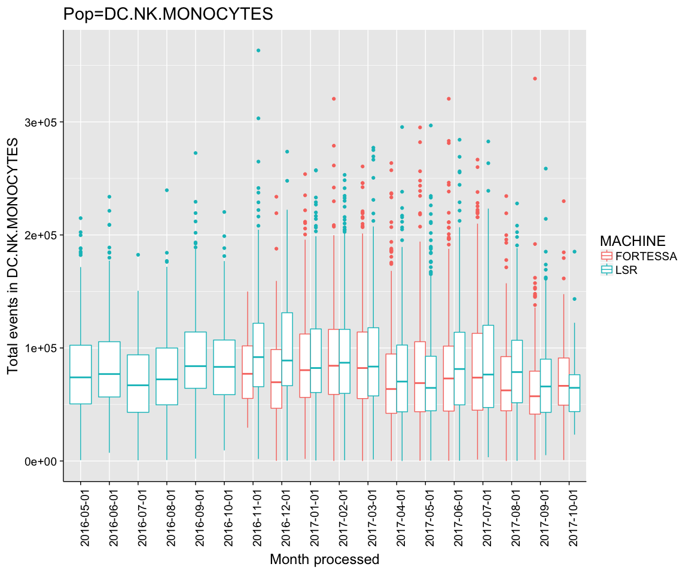<!-- --><!-- -->

```
## [1] "MONOCYTES"
## [1] "n=9356"
## [1] "PLOT TYPE = Machine Time FREQ"
```

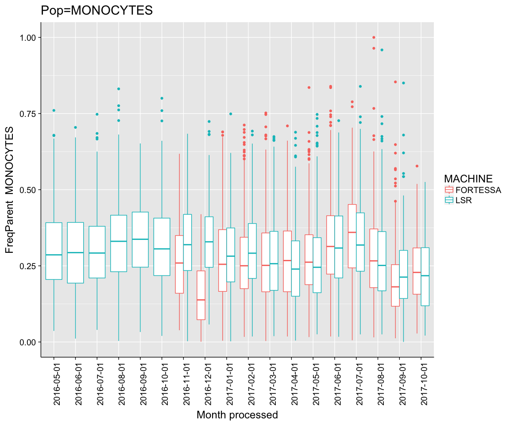<!-- -->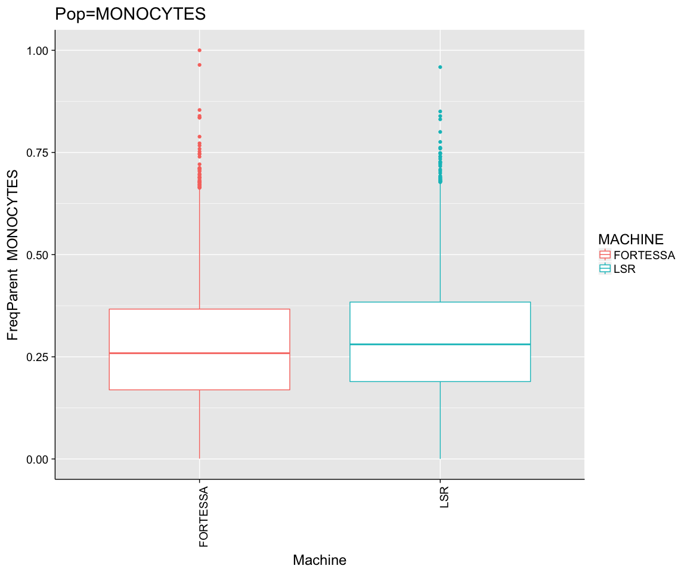<!-- -->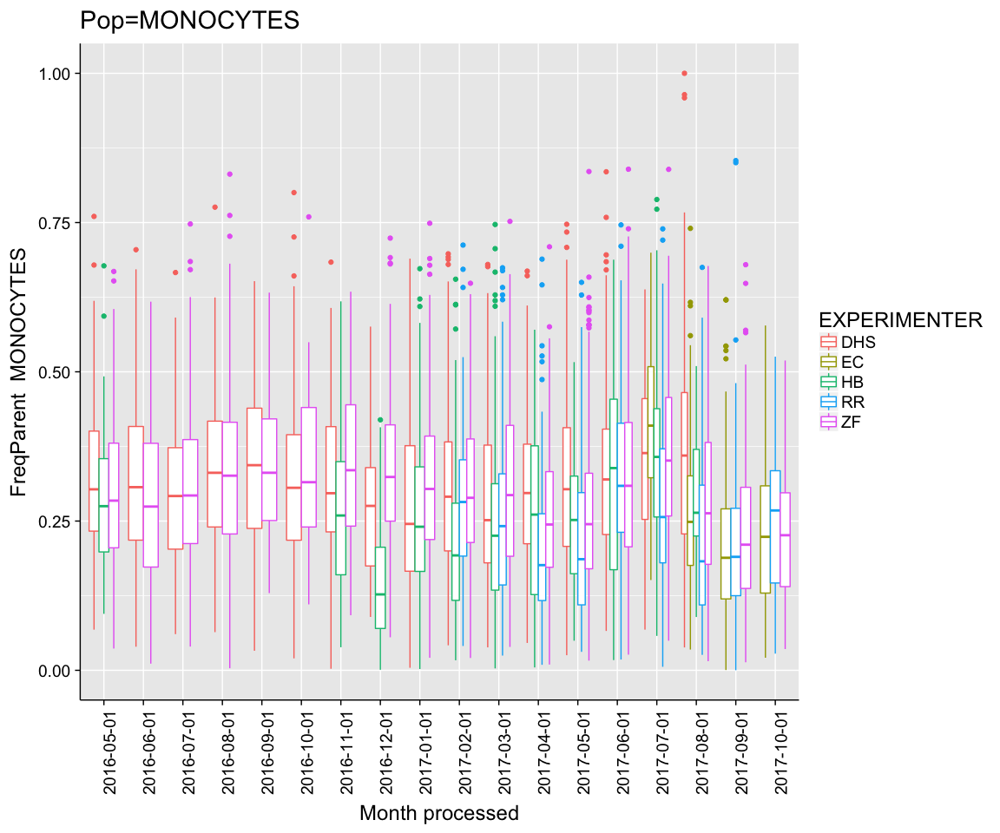<!-- -->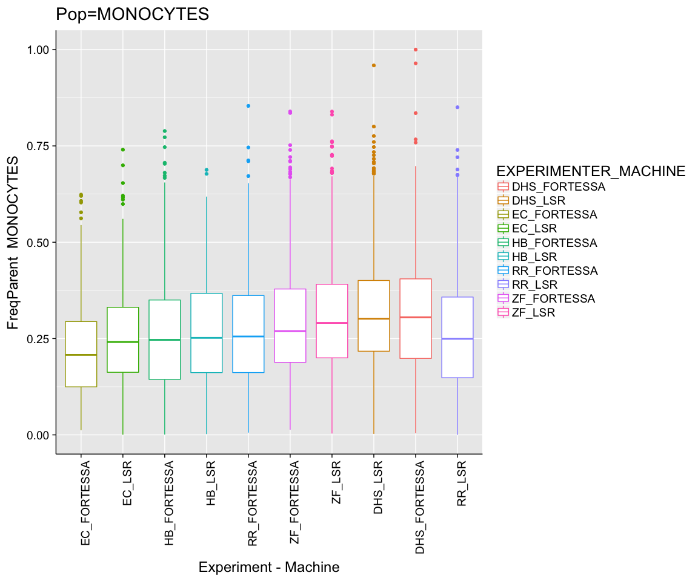<!-- -->

```
## 
## 
## |Var1 |Var2     | Freq|
## |:----|:--------|----:|
## |DHS  |FORTESSA |  705|
## |EC   |FORTESSA |  373|
## |HB   |FORTESSA |  846|
## |RR   |FORTESSA |  581|
## |ZF   |FORTESSA |  989|
## |DHS  |LSR      | 1567|
## |EC   |LSR      |  421|
## |HB   |LSR      |  503|
## |RR   |LSR      |  777|
## |ZF   |LSR      | 2594|
## [1] "Linear Regression for MONOCYTES"
## 
## Call:
## lm(formula = formula, data = subF)
## 
## Residuals:
##      Min       1Q   Median       3Q      Max 
## -0.31431 -0.10437 -0.01319  0.08793  0.69473 
## 
## Coefficients:
##                  Estimate Std. Error t value Pr(>|t|)    
## (Intercept)     5.908e-01  2.309e-01   2.559  0.01051 *  
## DATE_MONTH     -1.643e-05  1.341e-05  -1.225  0.22051    
## MACHINELSR      7.122e-03  3.201e-03   2.225  0.02610 *  
## EXPERIMENTEREC -6.815e-02  6.463e-03 -10.545  < 2e-16 ***
## EXPERIMENTERHB -4.984e-02  4.922e-03 -10.126  < 2e-16 ***
## EXPERIMENTERRR -4.568e-02  5.105e-03  -8.948  < 2e-16 ***
## EXPERIMENTERZF -1.415e-02  3.777e-03  -3.747  0.00018 ***
## ---
## Signif. codes:  0 '***' 0.001 '**' 0.01 '*' 0.05 '.' 0.1 ' ' 1
## 
## Residual standard error: 0.1393 on 9346 degrees of freedom
##   (3 observations deleted due to missingness)
## Multiple R-squared:  0.03008,	Adjusted R-squared:  0.02945 
## F-statistic:  48.3 on 6 and 9346 DF,  p-value: < 2.2e-16
## 
## [1] "Stepwise Linear Regression for MONOCYTES"
## Start:  AIC=-36860.89
## TARGET_FREQ ~ DATE_MONTH + MACHINE + EXPERIMENTER
## 
##                Df Sum of Sq    RSS    AIC
## - DATE_MONTH    1    0.0291 181.46 -36861
## <none>                      181.43 -36861
## - MACHINE       1    0.0961 181.53 -36858
## - EXPERIMENTER  4    3.7338 185.16 -36678
## 
## Step:  AIC=-36861.39
## TARGET_FREQ ~ MACHINE + EXPERIMENTER
## 
##                Df Sum of Sq    RSS    AIC
## <none>                      181.46 -36861
## + DATE_MONTH    1    0.0291 181.43 -36861
## - MACHINE       1    0.1373 181.60 -36856
## - EXPERIMENTER  4    4.8979 186.36 -36620
## Stepwise Model Path 
## Analysis of Deviance Table
## 
## Initial Model:
## TARGET_FREQ ~ DATE_MONTH + MACHINE + EXPERIMENTER
## 
## Final Model:
## TARGET_FREQ ~ MACHINE + EXPERIMENTER
## 
## 
##           Step Df   Deviance Resid. Df Resid. Dev       AIC
## 1                                 9346   181.4316 -36860.89
## 2 - DATE_MONTH  1 0.02914391      9347   181.4607 -36861.39
## [1] "ANOVA of EXPERIMENTER for MONOCYTES"
##   Tukey multiple comparisons of means
##     95% family-wise confidence level
## 
## Fit: aov(formula = formula, data = subF)
## 
## $EXPERIMENTER
##               diff          lwr          upr     p adj
## EC-DHS -0.07303406 -0.088712778 -0.057355336 0.0000000
## HB-DHS -0.05314144 -0.066214122 -0.040068750 0.0000000
## RR-DHS -0.04880055 -0.061849040 -0.035752053 0.0000000
## ZF-DHS -0.01452548 -0.024726467 -0.004324485 0.0009773
## HB-EC   0.01989262  0.002883405  0.036901837 0.0123982
## RR-EC   0.02423351  0.007242881  0.041224140 0.0009523
## ZF-EC   0.05850858  0.043592866  0.073424296 0.0000000
## RR-HB   0.00434089 -0.010279449  0.018961229 0.9276403
## ZF-HB   0.03861596  0.026468888  0.050763032 0.0000000
## ZF-RR   0.03427507  0.022154038  0.046396102 0.0000000
## 
## [1] "ANOVA of MACHINE for MONOCYTES"
##               Df Sum Sq Mean Sq F value   Pr(>F)    
## MACHINE        1    0.7  0.6990   35.07 3.29e-09 ***
## Residuals   9351  186.4  0.0199                     
## ---
## Signif. codes:  0 '***' 0.001 '**' 0.01 '*' 0.05 '.' 0.1 ' ' 1
## 3 observations deleted due to missingness
## [1] "# Start of new population results"
## [1] "NK"
## [1] "n=9356"
## [1] "PLOT TYPE = Machine Time COUNT"
```

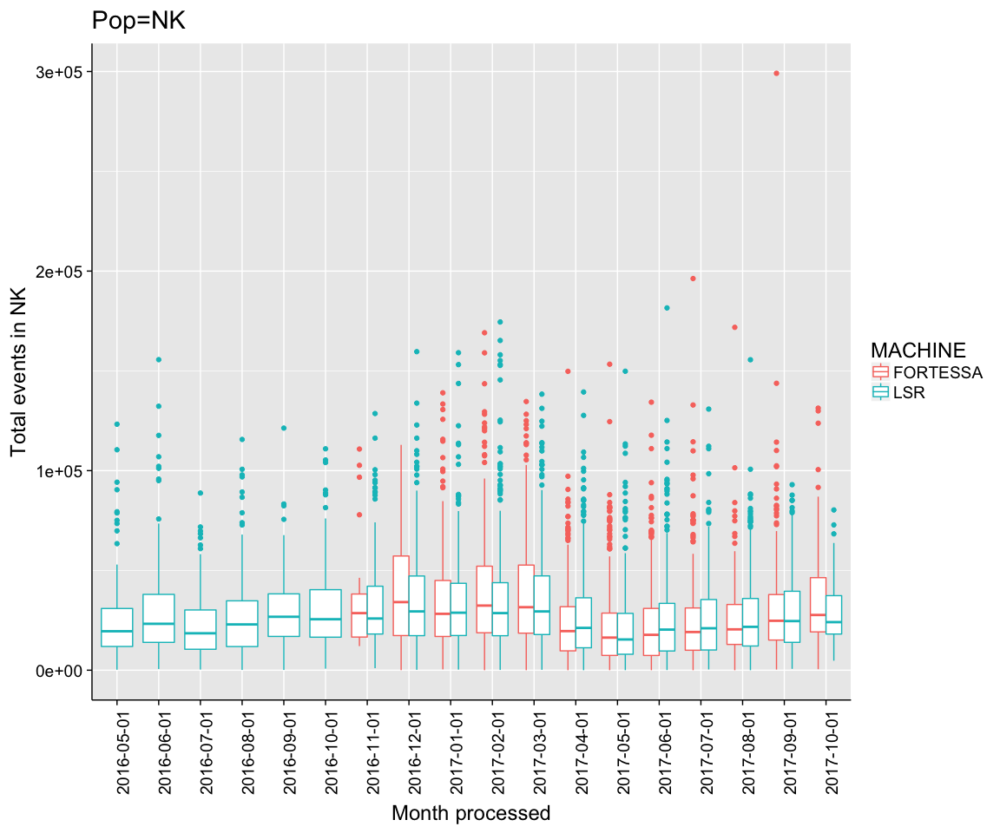<!-- -->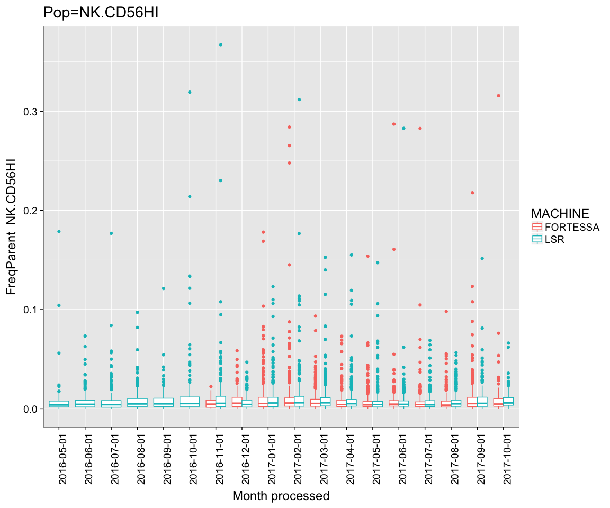<!-- -->

```
## [1] "NK"
## [1] "n=9356"
## [1] "PLOT TYPE = Machine Time FREQ"
```

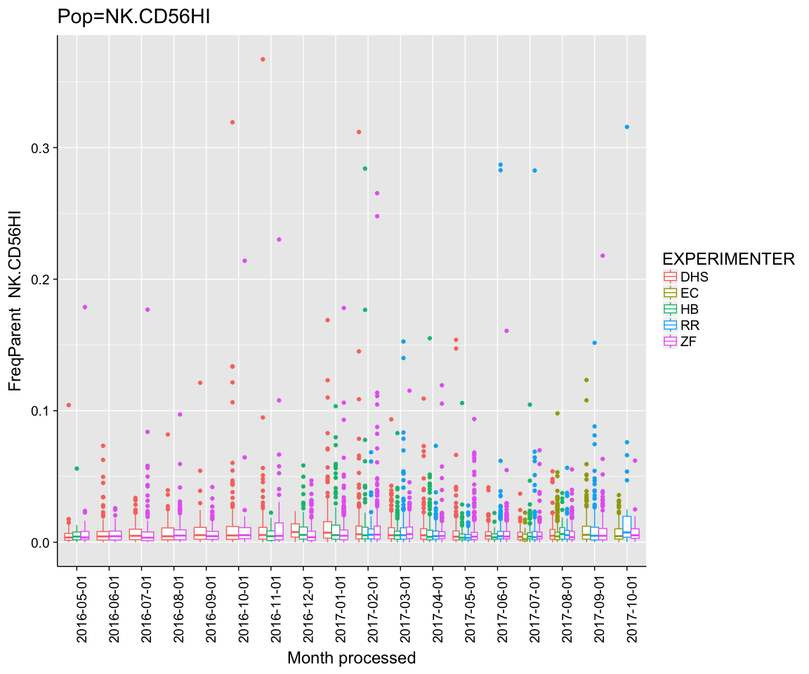<!-- -->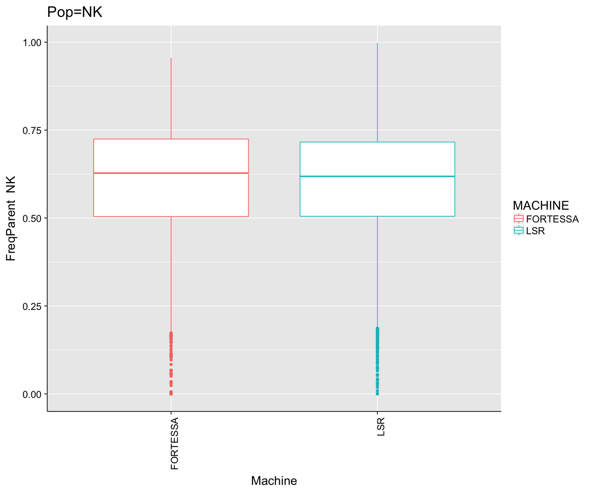<!-- -->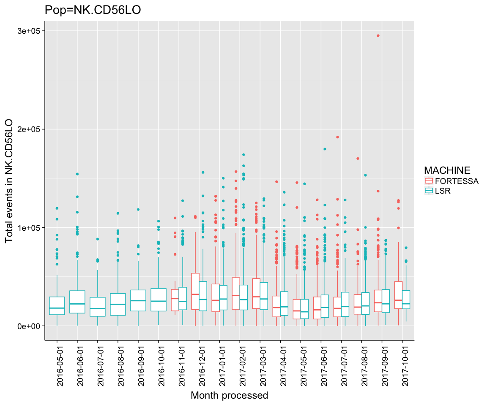<!-- -->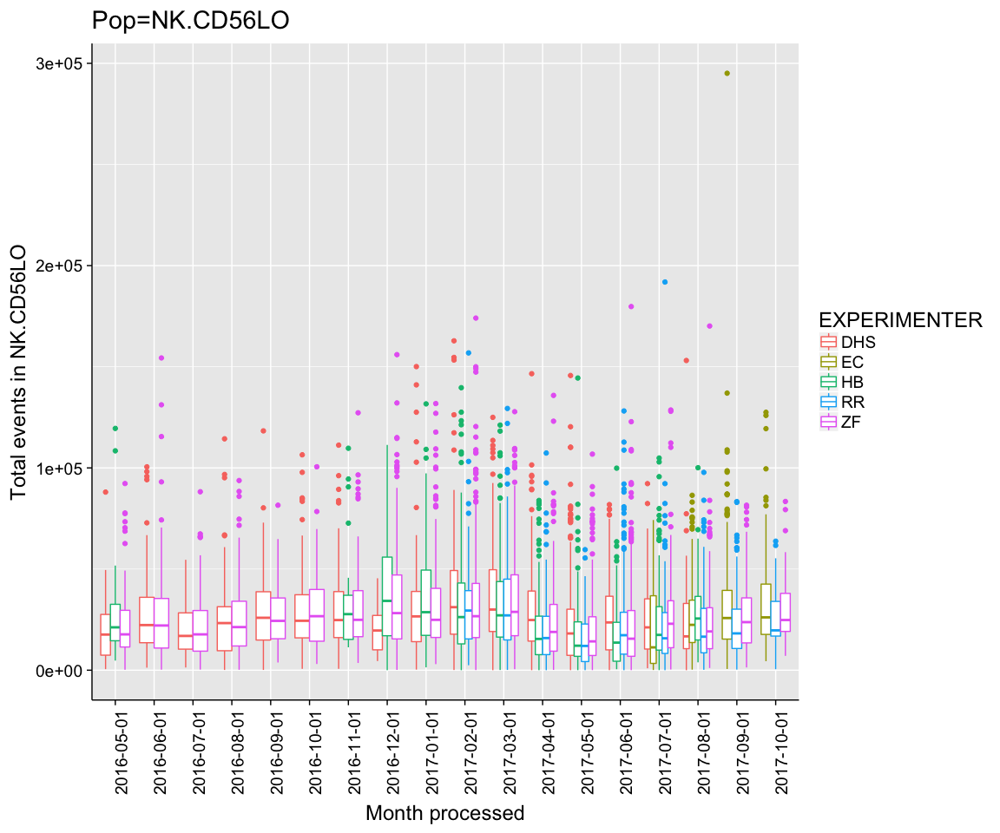<!-- -->

```
## 
## 
## |Var1 |Var2     | Freq|
## |:----|:--------|----:|
## |DHS  |FORTESSA |  705|
## |EC   |FORTESSA |  373|
## |HB   |FORTESSA |  846|
## |RR   |FORTESSA |  581|
## |ZF   |FORTESSA |  989|
## |DHS  |LSR      | 1567|
## |EC   |LSR      |  421|
## |HB   |LSR      |  503|
## |RR   |LSR      |  777|
## |ZF   |LSR      | 2594|
## [1] "Linear Regression for NK"
## 
## Call:
## lm(formula = formula, data = subF)
## 
## Residuals:
##      Min       1Q   Median       3Q      Max 
## -0.60541 -0.09680  0.02125  0.11848  0.40552 
## 
## Coefficients:
##                  Estimate Std. Error t value Pr(>|t|)    
## (Intercept)     2.484e+00  2.666e-01   9.317  < 2e-16 ***
## DATE_MONTH     -1.093e-04  1.548e-05  -7.061 1.77e-12 ***
## MACHINELSR     -1.126e-02  3.696e-03  -3.045  0.00233 ** 
## EXPERIMENTEREC  4.794e-02  7.463e-03   6.423 1.40e-10 ***
## EXPERIMENTERHB  1.019e-02  5.684e-03   1.794  0.07292 .  
## EXPERIMENTERRR -1.622e-03  5.896e-03  -0.275  0.78328    
## EXPERIMENTERZF  8.076e-03  4.361e-03   1.852  0.06408 .  
## ---
## Signif. codes:  0 '***' 0.001 '**' 0.01 '*' 0.05 '.' 0.1 ' ' 1
## 
## Residual standard error: 0.1609 on 9346 degrees of freedom
##   (3 observations deleted due to missingness)
## Multiple R-squared:  0.009012,	Adjusted R-squared:  0.008376 
## F-statistic: 14.17 on 6 and 9346 DF,  p-value: 3.939e-16
## 
## [1] "Stepwise Linear Regression for NK"
## Start:  AIC=-34168.73
## TARGET_FREQ ~ DATE_MONTH + MACHINE + EXPERIMENTER
## 
##                Df Sum of Sq    RSS    AIC
## <none>                      241.95 -34169
## - MACHINE       1   0.24008 242.19 -34161
## - EXPERIMENTER  4   1.35656 243.30 -34124
## - DATE_MONTH    1   1.29071 243.24 -34121
## Stepwise Model Path 
## Analysis of Deviance Table
## 
## Initial Model:
## TARGET_FREQ ~ DATE_MONTH + MACHINE + EXPERIMENTER
## 
## Final Model:
## TARGET_FREQ ~ DATE_MONTH + MACHINE + EXPERIMENTER
## 
## 
##   Step Df Deviance Resid. Df Resid. Dev       AIC
## 1                       9346   241.9469 -34168.73
## [1] "ANOVA of EXPERIMENTER for NK"
##   Tukey multiple comparisons of means
##     95% family-wise confidence level
## 
## Fit: aov(formula = formula, data = subF)
## 
## $EXPERIMENTER
##                diff          lwr           upr     p adj
## EC-DHS  0.024798879  0.006651999  0.0429457595 0.0018132
## HB-DHS  0.006843907 -0.008286693  0.0219745069 0.7313985
## RR-DHS -0.015429191 -0.030531790 -0.0003265921 0.0424370
## ZF-DHS  0.003603776 -0.008203065  0.0154106161 0.9205084
## HB-EC  -0.017954973 -0.037641795  0.0017318498 0.0933148
## RR-EC  -0.040228071 -0.059893381 -0.0205627606 0.0000002
## ZF-EC  -0.021195104 -0.038458864 -0.0039313441 0.0072617
## RR-HB  -0.022273098 -0.039194984 -0.0053512119 0.0030526
## ZF-HB  -0.003240131 -0.017299406  0.0108191438 0.9704707
## ZF-RR   0.019032967  0.005003831  0.0330621024 0.0020118
## 
## [1] "ANOVA of MACHINE for NK"
##               Df Sum Sq Mean Sq F value Pr(>F)
## MACHINE        1   0.05 0.04879   1.869  0.172
## Residuals   9351 244.10 0.02610               
## 3 observations deleted due to missingness
## [1] "# Start of new population results"
## [1] "DC.NK.MONOCYTES"
## [1] "n=9356"
## [1] "PLOT TYPE = Machine Time COUNT"
```

<!-- -->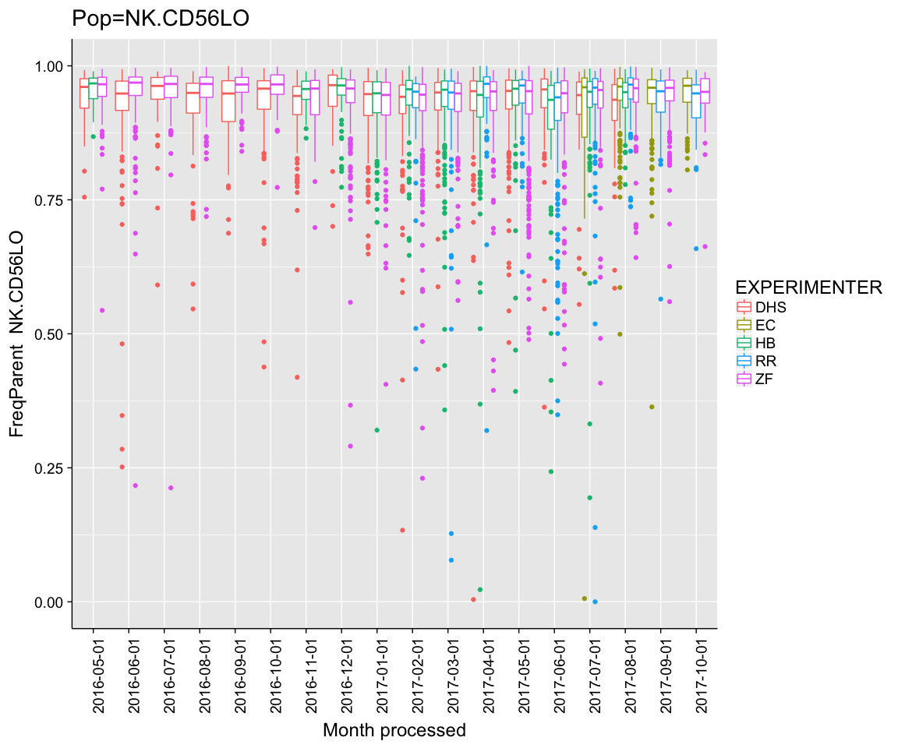<!-- -->

```
## [1] "DC.NK.MONOCYTES"
## [1] "n=9356"
## [1] "PLOT TYPE = Machine Time FREQ"
```

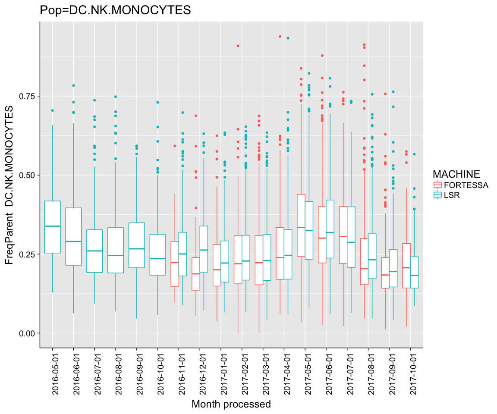<!-- -->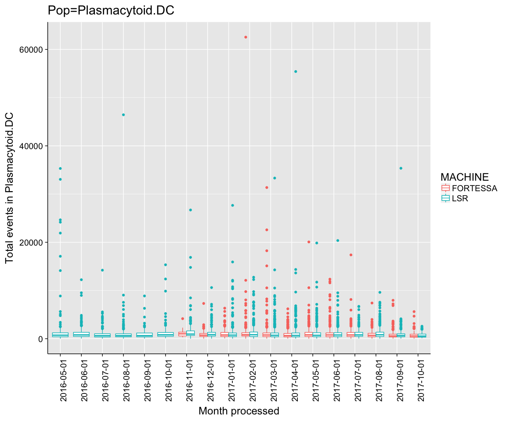<!-- -->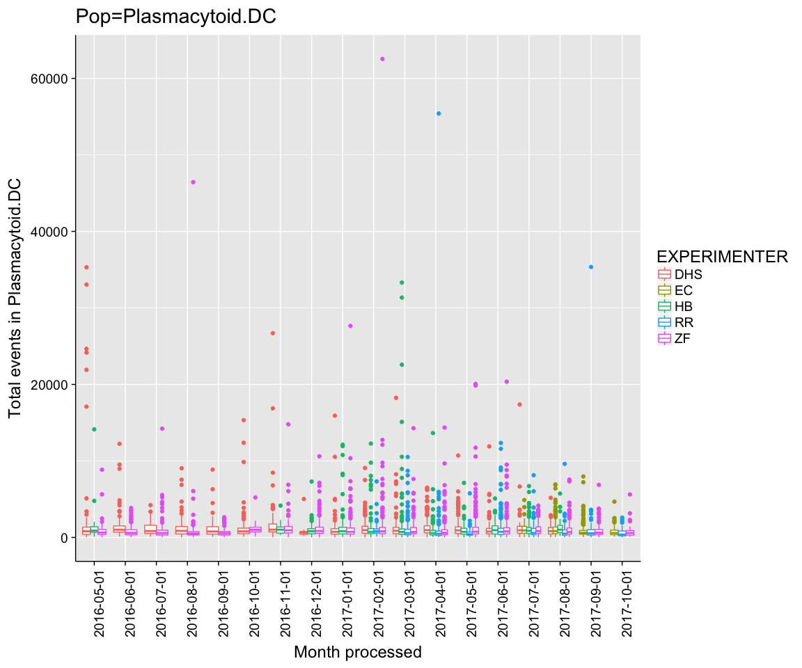<!-- -->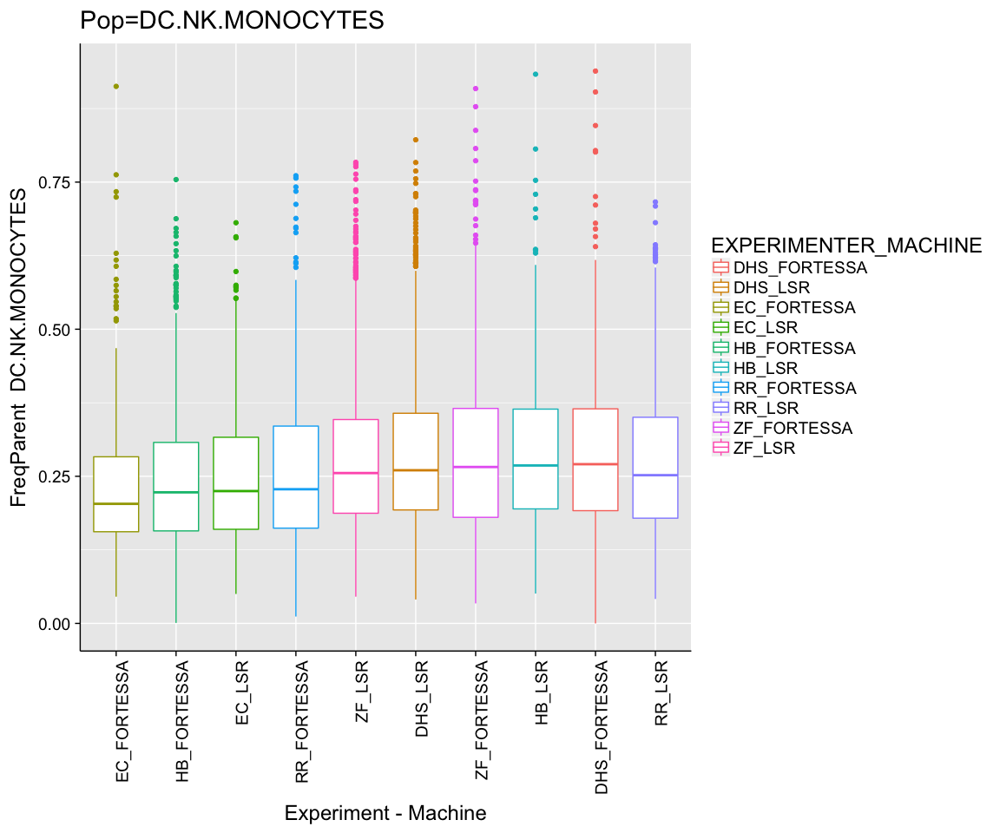<!-- -->

```
## 
## 
## |Var1 |Var2     | Freq|
## |:----|:--------|----:|
## |DHS  |FORTESSA |  705|
## |EC   |FORTESSA |  373|
## |HB   |FORTESSA |  846|
## |RR   |FORTESSA |  581|
## |ZF   |FORTESSA |  989|
## |DHS  |LSR      | 1567|
## |EC   |LSR      |  421|
## |HB   |LSR      |  503|
## |RR   |LSR      |  777|
## |ZF   |LSR      | 2594|
## [1] "Linear Regression for DC.NK.MONOCYTES"
## 
## Call:
## lm(formula = formula, data = subF)
## 
## Residuals:
##      Min       1Q   Median       3Q      Max 
## -0.28408 -0.09352 -0.02409  0.07163  0.67796 
## 
## Coefficients:
##                  Estimate Std. Error t value Pr(>|t|)    
## (Intercept)    -3.700e-01  2.116e-01  -1.748  0.08047 .  
## DATE_MONTH      3.797e-05  1.229e-05   3.089  0.00201 ** 
## MACHINELSR      9.042e-03  2.934e-03   3.082  0.00206 ** 
## EXPERIMENTEREC -5.512e-02  5.924e-03  -9.304  < 2e-16 ***
## EXPERIMENTERHB -2.638e-02  4.511e-03  -5.847 5.17e-09 ***
## EXPERIMENTERRR -2.441e-02  4.680e-03  -5.215 1.87e-07 ***
## EXPERIMENTERZF -9.735e-03  3.462e-03  -2.812  0.00493 ** 
## ---
## Signif. codes:  0 '***' 0.001 '**' 0.01 '*' 0.05 '.' 0.1 ' ' 1
## 
## Residual standard error: 0.1277 on 9347 degrees of freedom
##   (2 observations deleted due to missingness)
## Multiple R-squared:  0.01298,	Adjusted R-squared:  0.01235 
## F-statistic: 20.49 on 6 and 9347 DF,  p-value: < 2.2e-16
## 
## [1] "Stepwise Linear Regression for DC.NK.MONOCYTES"
## Start:  AIC=-38491.75
## TARGET_FREQ ~ DATE_MONTH + MACHINE + EXPERIMENTER
## 
##                Df Sum of Sq    RSS    AIC
## <none>                      152.48 -38492
## - MACHINE       1   0.15497 152.64 -38484
## - DATE_MONTH    1   0.15568 152.64 -38484
## - EXPERIMENTER  4   1.67704 154.16 -38397
## Stepwise Model Path 
## Analysis of Deviance Table
## 
## Initial Model:
## TARGET_FREQ ~ DATE_MONTH + MACHINE + EXPERIMENTER
## 
## Final Model:
## TARGET_FREQ ~ DATE_MONTH + MACHINE + EXPERIMENTER
## 
## 
##   Step Df Deviance Resid. Df Resid. Dev       AIC
## 1                       9347   152.4837 -38491.75
## [1] "ANOVA of EXPERIMENTER for DC.NK.MONOCYTES"
##   Tukey multiple comparisons of means
##     95% family-wise confidence level
## 
## Fit: aov(formula = formula, data = subF)
## 
## $EXPERIMENTER
##                diff          lwr          upr     p adj
## EC-DHS -0.047902860 -0.062279794 -0.033525925 0.0000000
## HB-DHS -0.026843467 -0.038830443 -0.014856492 0.0000000
## RR-DHS -0.020218058 -0.032182846 -0.008253270 0.0000401
## ZF-DHS -0.008006740 -0.017360027  0.001346547 0.1337869
## HB-EC   0.021059392  0.005461543  0.036657242 0.0021537
## RR-EC   0.027684802  0.012103997  0.043265607 0.0000125
## ZF-EC   0.039896120  0.026218060  0.053574179 0.0000000
## RR-HB   0.006625409 -0.006781784  0.020032603 0.6608873
## ZF-HB   0.018836727  0.007697578  0.029975877 0.0000394
## ZF-RR   0.012211318  0.001096048  0.023326588 0.0228958
## 
## [1] "ANOVA of MACHINE for DC.NK.MONOCYTES"
##               Df Sum Sq Mean Sq F value   Pr(>F)    
## MACHINE        1   0.29 0.28599   17.34 3.15e-05 ***
## Residuals   9352 154.20 0.01649                     
## ---
## Signif. codes:  0 '***' 0.001 '**' 0.01 '*' 0.05 '.' 0.1 ' ' 1
## 2 observations deleted due to missingness
## [1] "# Start of new population results"
## [1] "NK.CD56HI"
## [1] "n=9356"
## [1] "PLOT TYPE = Machine Time COUNT"
```

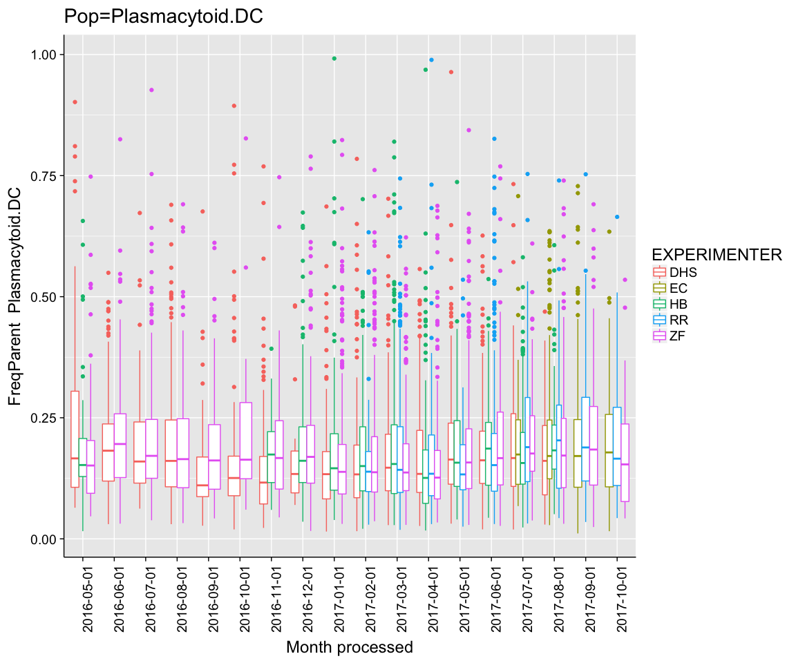<!-- -->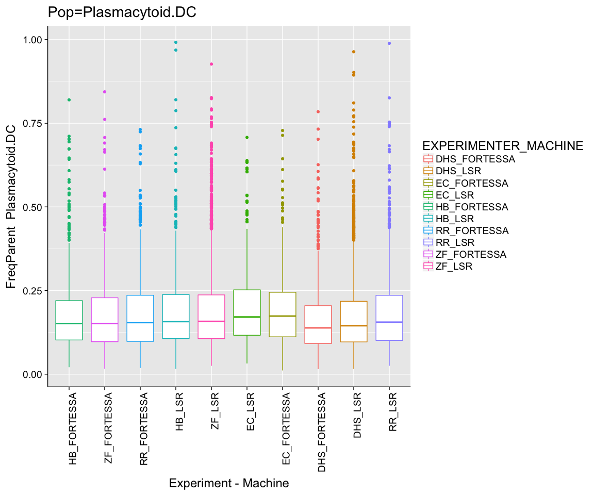<!-- -->

```
## [1] "NK.CD56HI"
## [1] "n=9356"
## [1] "PLOT TYPE = Machine Time FREQ"
```

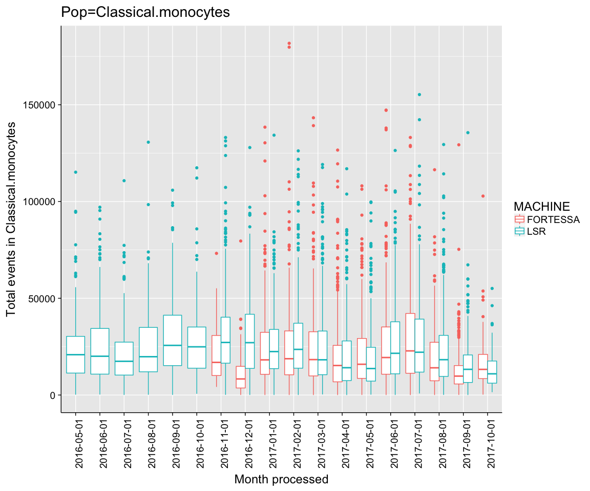<!-- -->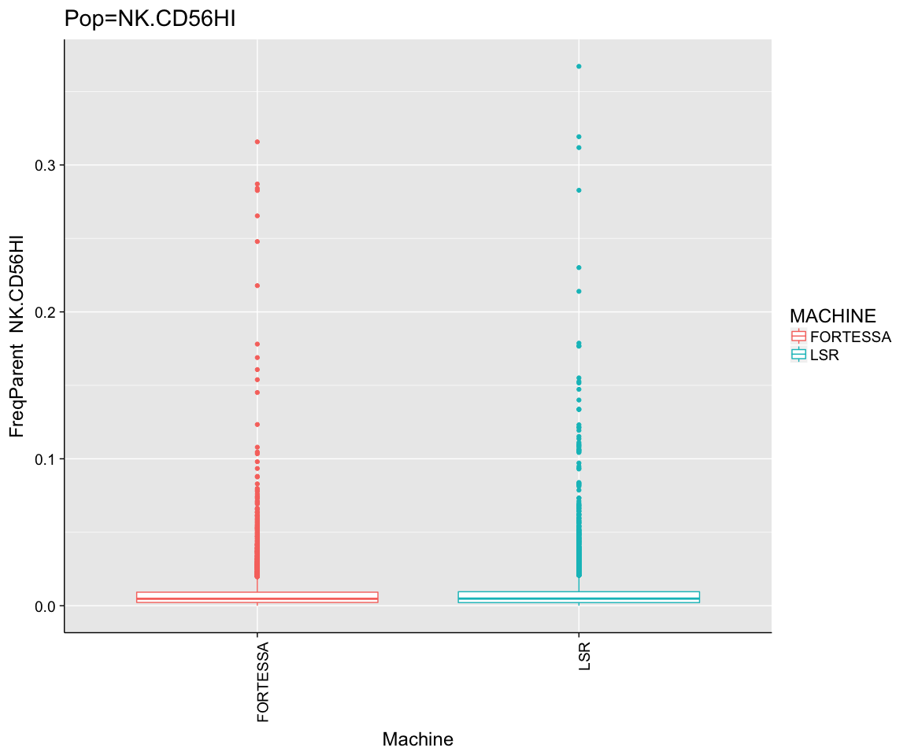<!-- -->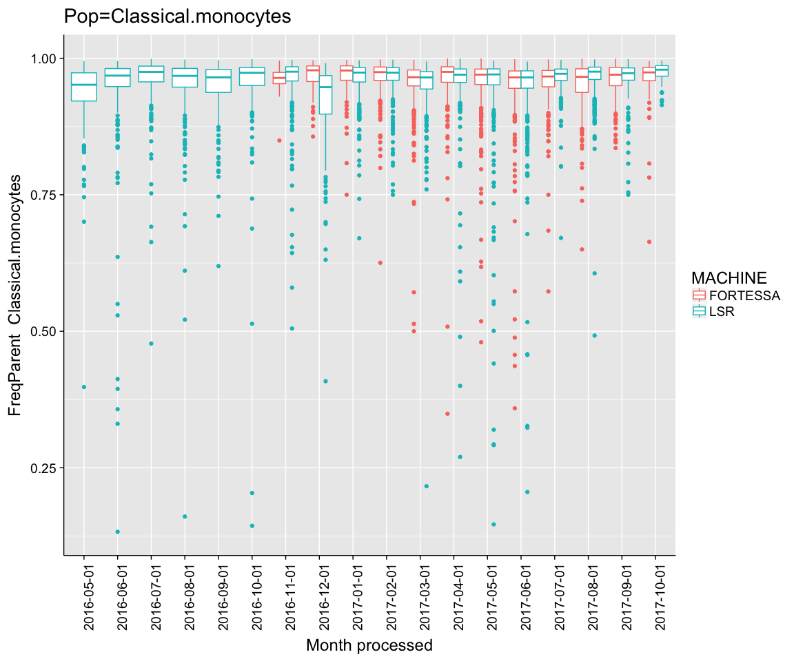<!-- --><!-- -->

```
## 
## 
## |Var1 |Var2     | Freq|
## |:----|:--------|----:|
## |DHS  |FORTESSA |  705|
## |EC   |FORTESSA |  373|
## |HB   |FORTESSA |  846|
## |RR   |FORTESSA |  581|
## |ZF   |FORTESSA |  989|
## |DHS  |LSR      | 1567|
## |EC   |LSR      |  421|
## |HB   |LSR      |  503|
## |RR   |LSR      |  777|
## |ZF   |LSR      | 2594|
## [1] "Linear Regression for NK.CD56HI"
## 
## Call:
## lm(formula = formula, data = subF)
## 
## Residuals:
##      Min       1Q   Median       3Q      Max 
## -0.00980 -0.00631 -0.00367  0.00087  0.35773 
## 
## Coefficients:
##                  Estimate Std. Error t value Pr(>|t|)  
## (Intercept)     4.846e-02  2.657e-02   1.824   0.0682 .
## DATE_MONTH     -2.269e-06  1.543e-06  -1.470   0.1416  
## MACHINELSR     -2.635e-04  3.683e-04  -0.715   0.4744  
## EXPERIMENTEREC -9.534e-04  7.439e-04  -1.282   0.2000  
## EXPERIMENTERHB -1.116e-03  5.665e-04  -1.970   0.0488 *
## EXPERIMENTERRR -2.059e-04  5.878e-04  -0.350   0.7262  
## EXPERIMENTERZF -1.101e-03  4.347e-04  -2.533   0.0113 *
## ---
## Signif. codes:  0 '***' 0.001 '**' 0.01 '*' 0.05 '.' 0.1 ' ' 1
## 
## Residual standard error: 0.01603 on 9342 degrees of freedom
##   (7 observations deleted due to missingness)
## Multiple R-squared:  0.001343,	Adjusted R-squared:  0.0007011 
## F-statistic: 2.093 on 6 and 9342 DF,  p-value: 0.05071
## 
## [1] "Stepwise Linear Regression for NK.CD56HI"
## Start:  AIC=-77277.82
## TARGET_FREQ ~ DATE_MONTH + MACHINE + EXPERIMENTER
## 
##                Df  Sum of Sq    RSS    AIC
## - MACHINE       1 0.00013148 2.4005 -77279
## <none>                       2.4004 -77278
## - DATE_MONTH    1 0.00055527 2.4009 -77278
## - EXPERIMENTER  4 0.00228841 2.4027 -77277
## 
## Step:  AIC=-77279.31
## TARGET_FREQ ~ DATE_MONTH + EXPERIMENTER
## 
##                Df  Sum of Sq    RSS    AIC
## - DATE_MONTH    1 0.00045140 2.4010 -77280
## <none>                       2.4005 -77279
## - EXPERIMENTER  4 0.00227715 2.4028 -77278
## + MACHINE       1 0.00013148 2.4004 -77278
## 
## Step:  AIC=-77279.55
## TARGET_FREQ ~ EXPERIMENTER
## 
##                Df Sum of Sq    RSS    AIC
## <none>                      2.4010 -77280
## + DATE_MONTH    1 4.514e-04 2.4005 -77279
## + MACHINE       1 2.762e-05 2.4009 -77278
## - EXPERIMENTER  4 2.644e-03 2.4036 -77277
## Stepwise Model Path 
## Analysis of Deviance Table
## 
## Initial Model:
## TARGET_FREQ ~ DATE_MONTH + MACHINE + EXPERIMENTER
## 
## Final Model:
## TARGET_FREQ ~ EXPERIMENTER
## 
## 
##           Step Df     Deviance Resid. Df Resid. Dev       AIC
## 1                                   9342   2.400400 -77277.82
## 2    - MACHINE  1 0.0001314842      9343   2.400531 -77279.31
## 3 - DATE_MONTH  1 0.0004514006      9344   2.400982 -77279.55
## [1] "ANOVA of EXPERIMENTER for NK.CD56HI"
##   Tukey multiple comparisons of means
##     95% family-wise confidence level
## 
## Fit: aov(formula = formula, data = subF)
## 
## $EXPERIMENTER
##                 diff           lwr           upr     p adj
## EC-DHS -0.0014292355 -0.0032327391  3.742682e-04 0.1943166
## HB-DHS -0.0011766589 -0.0026805066  3.271888e-04 0.2053982
## RR-DHS -0.0004894642 -0.0019908764  1.011948e-03 0.9009177
## ZF-DHS -0.0011955100 -0.0023691912 -2.182881e-05 0.0434331
## HB-EC   0.0002525765 -0.0017036369  2.208790e-03 0.9967061
## RR-EC   0.0009397713 -0.0010145705  2.894113e-03 0.6837886
## ZF-EC   0.0002337255 -0.0014817164  1.949167e-03 0.9959421
## RR-HB   0.0006871947 -0.0009945853  2.368975e-03 0.7988129
## ZF-HB  -0.0000188511 -0.0014158740  1.378172e-03 0.9999996
## ZF-RR  -0.0007060458 -0.0021004467  6.883550e-04 0.6396343
## 
## [1] "ANOVA of MACHINE for NK.CD56HI"
##               Df Sum Sq   Mean Sq F value Pr(>F)
## MACHINE        1  0.000 5.040e-06    0.02  0.889
## Residuals   9347  2.404 2.571e-04               
## 7 observations deleted due to missingness
## [1] "# Start of new population results"
## [1] "NK.CD56LO"
## [1] "n=9356"
## [1] "PLOT TYPE = Machine Time COUNT"
```

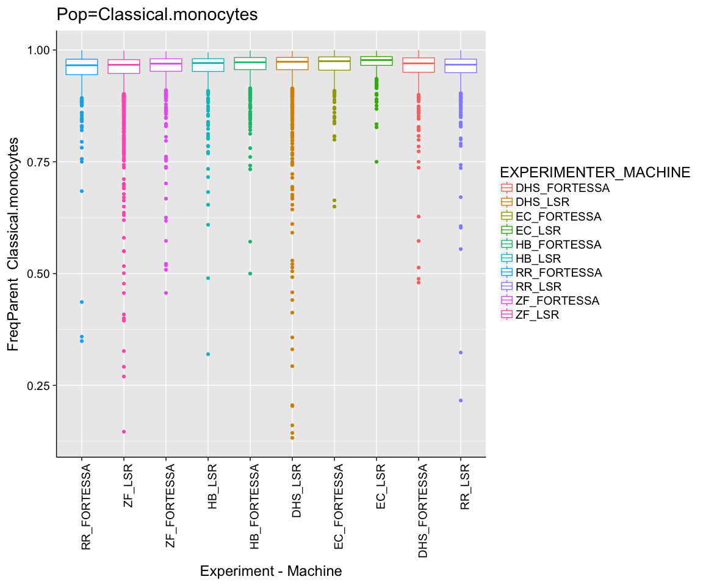<!-- --><!-- -->

```
## [1] "NK.CD56LO"
## [1] "n=9356"
## [1] "PLOT TYPE = Machine Time FREQ"
```

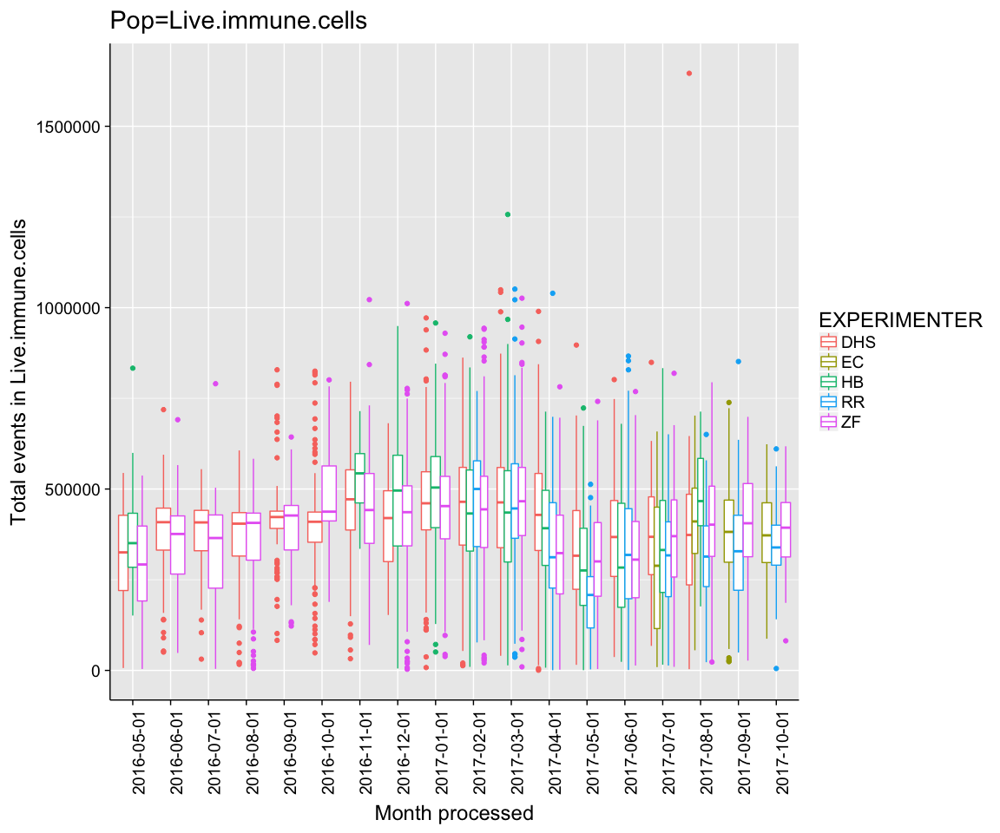<!-- --><!-- --><!-- -->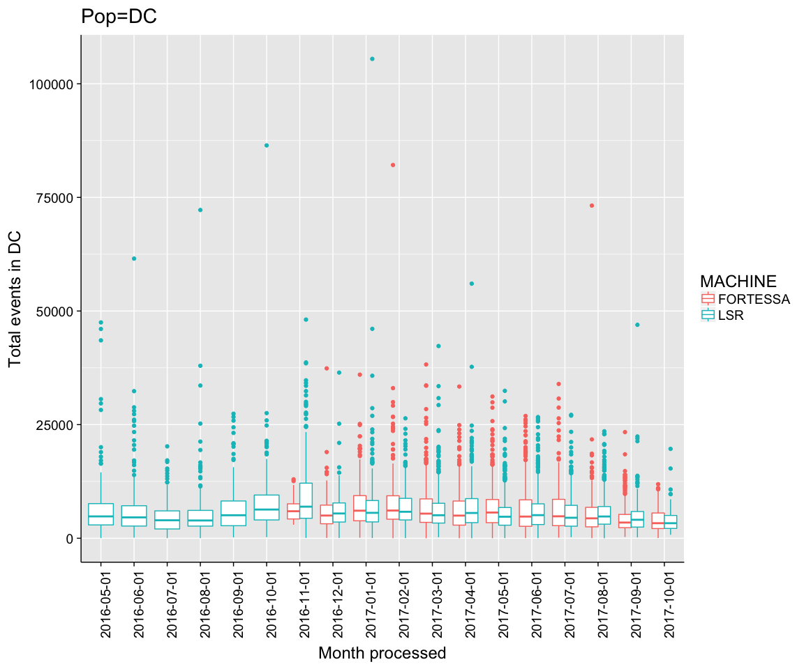<!-- -->

```
## 
## 
## |Var1 |Var2     | Freq|
## |:----|:--------|----:|
## |DHS  |FORTESSA |  705|
## |EC   |FORTESSA |  373|
## |HB   |FORTESSA |  846|
## |RR   |FORTESSA |  581|
## |ZF   |FORTESSA |  989|
## |DHS  |LSR      | 1567|
## |EC   |LSR      |  421|
## |HB   |LSR      |  503|
## |RR   |LSR      |  777|
## |ZF   |LSR      | 2594|
## [1] "Linear Regression for NK.CD56LO"
## 
## Call:
## lm(formula = formula, data = subF)
## 
## Residuals:
##      Min       1Q   Median       3Q      Max 
## -0.94093 -0.01152  0.02128  0.03991  0.07556 
## 
## Coefficients:
##                  Estimate Std. Error t value Pr(>|t|)    
## (Intercept)     1.224e+00  1.268e-01   9.652  < 2e-16 ***
## DATE_MONTH     -1.749e-05  7.366e-06  -2.375  0.01757 *  
## MACHINELSR      6.947e-03  1.758e-03   3.952 7.81e-05 ***
## EXPERIMENTEREC  1.932e-02  3.550e-03   5.442 5.40e-08 ***
## EXPERIMENTERHB  4.689e-03  2.704e-03   1.734  0.08291 .  
## EXPERIMENTERRR  3.782e-03  2.805e-03   1.348  0.17767    
## EXPERIMENTERZF  5.759e-03  2.075e-03   2.775  0.00552 ** 
## ---
## Signif. codes:  0 '***' 0.001 '**' 0.01 '*' 0.05 '.' 0.1 ' ' 1
## 
## Residual standard error: 0.07651 on 9342 degrees of freedom
##   (7 observations deleted due to missingness)
## Multiple R-squared:  0.005738,	Adjusted R-squared:  0.005099 
## F-statistic: 8.986 on 6 and 9342 DF,  p-value: 8.207e-10
## 
## [1] "Stepwise Linear Regression for NK.CD56LO"
## Start:  AIC=-48053.94
## TARGET_FREQ ~ DATE_MONTH + MACHINE + EXPERIMENTER
## 
##                Df Sum of Sq    RSS    AIC
## <none>                      54.681 -48054
## - DATE_MONTH    1  0.033015 54.714 -48050
## - MACHINE       1  0.091413 54.773 -48040
## - EXPERIMENTER  4  0.186301 54.867 -48030
## Stepwise Model Path 
## Analysis of Deviance Table
## 
## Initial Model:
## TARGET_FREQ ~ DATE_MONTH + MACHINE + EXPERIMENTER
## 
## Final Model:
## TARGET_FREQ ~ DATE_MONTH + MACHINE + EXPERIMENTER
## 
## 
##   Step Df Deviance Resid. Df Resid. Dev       AIC
## 1                       9342   54.68111 -48053.94
## [1] "ANOVA of EXPERIMENTER for NK.CD56LO"
##   Tukey multiple comparisons of means
##     95% family-wise confidence level
## 
## Fit: aov(formula = formula, data = subF)
## 
## $EXPERIMENTER
##                 diff           lwr           upr     p adj
## EC-DHS  0.0142105287  0.0055906336  0.0228304237 0.0000681
## HB-DHS  0.0013678142 -0.0058198669  0.0085554954 0.9854625
## RR-DHS  0.0005311845 -0.0066448562  0.0077072251 0.9996301
## ZF-DHS  0.0053294921 -0.0002801492  0.0109391335 0.0718680
## HB-EC  -0.0128427144 -0.0221924900 -0.0034929389 0.0016834
## RR-EC  -0.0136793442 -0.0230201740 -0.0043385144 0.0006218
## ZF-EC  -0.0088810366 -0.0170800376 -0.0006820355 0.0260154
## RR-HB  -0.0008366298 -0.0088747434  0.0072014838 0.9985807
## ZF-HB   0.0039616779 -0.0027154314  0.0106387871 0.4852875
## ZF-RR   0.0047983077 -0.0018662693  0.0114628847 0.2836929
## 
## [1] "ANOVA of MACHINE for NK.CD56LO"
##               Df Sum Sq Mean Sq F value   Pr(>F)    
## MACHINE        1   0.13 0.12891   21.96 2.82e-06 ***
## Residuals   9347  54.87 0.00587                     
## ---
## Signif. codes:  0 '***' 0.001 '**' 0.01 '*' 0.05 '.' 0.1 ' ' 1
## 7 observations deleted due to missingness
## [1] "# Start of new population results"
## [1] "Plasmacytoid.DC"
## [1] "n=9356"
## [1] "PLOT TYPE = Machine Time COUNT"
```

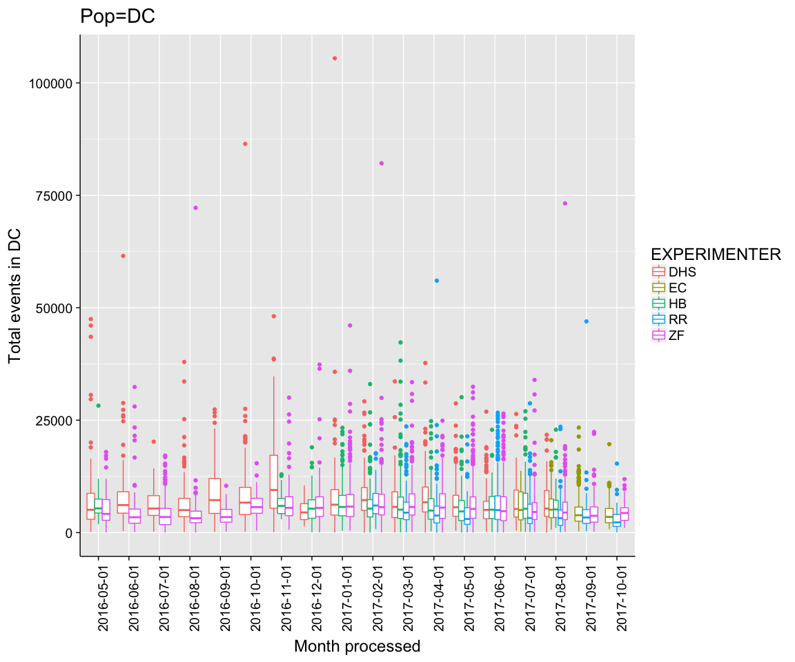<!-- -->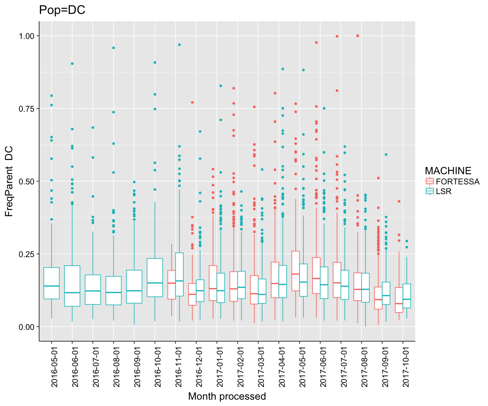<!-- -->

```
## [1] "Plasmacytoid.DC"
## [1] "n=9356"
## [1] "PLOT TYPE = Machine Time FREQ"
```

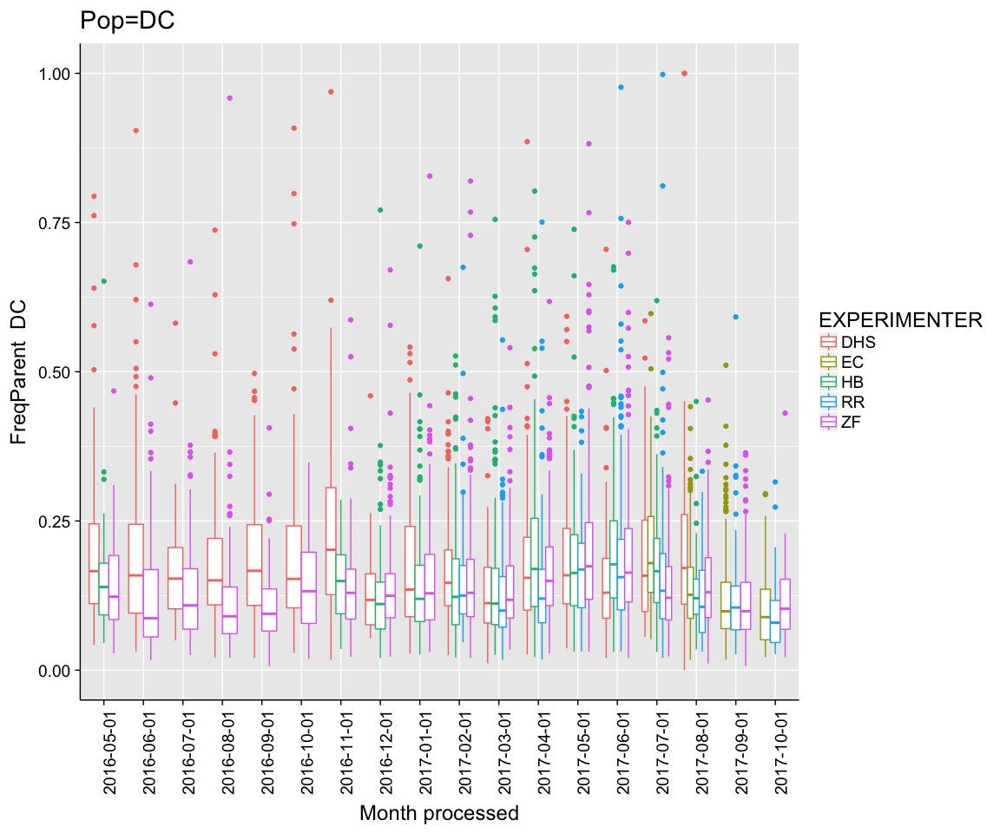<!-- -->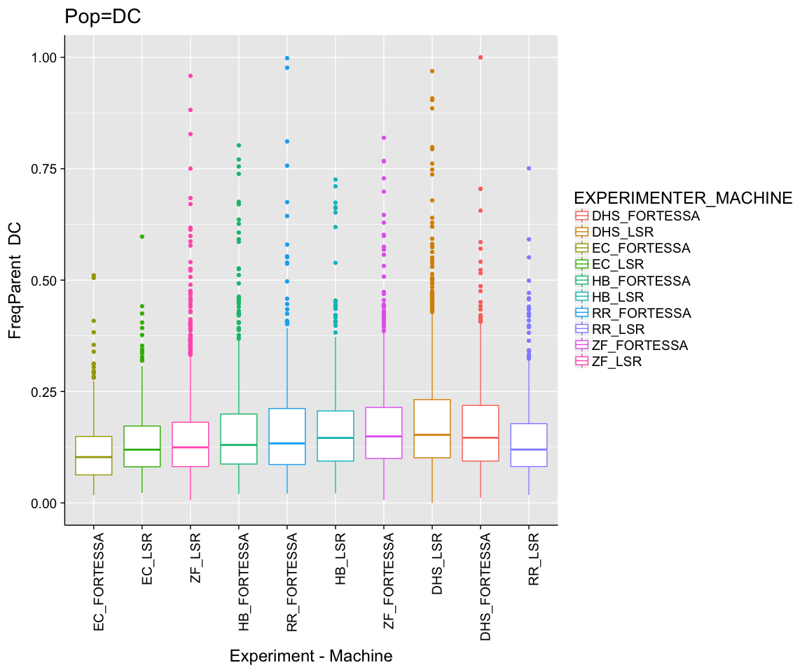<!-- --><!-- --><!-- -->

```
## 
## 
## |Var1 |Var2     | Freq|
## |:----|:--------|----:|
## |DHS  |FORTESSA |  705|
## |EC   |FORTESSA |  373|
## |HB   |FORTESSA |  846|
## |RR   |FORTESSA |  581|
## |ZF   |FORTESSA |  989|
## |DHS  |LSR      | 1567|
## |EC   |LSR      |  421|
## |HB   |LSR      |  503|
## |RR   |LSR      |  777|
## |ZF   |LSR      | 2594|
## [1] "Linear Regression for Plasmacytoid.DC"
## 
## Call:
## lm(formula = formula, data = subF)
## 
## Residuals:
##      Min       1Q   Median       3Q      Max 
## -0.18066 -0.08346 -0.03152  0.04447  0.79902 
## 
## Coefficients:
##                  Estimate Std. Error t value Pr(>|t|)    
## (Intercept)    -2.748e-02  2.022e-01  -0.136 0.891893    
## DATE_MONTH      1.125e-05  1.174e-05   0.958 0.338144    
## MACHINELSR      1.337e-02  2.803e-03   4.770 1.87e-06 ***
## EXPERIMENTEREC  2.347e-02  5.660e-03   4.147 3.40e-05 ***
## EXPERIMENTERHB  1.388e-02  4.310e-03   3.221 0.001281 ** 
## EXPERIMENTERRR  1.481e-02  4.472e-03   3.311 0.000932 ***
## EXPERIMENTERZF  1.203e-02  3.308e-03   3.638 0.000276 ***
## ---
## Signif. codes:  0 '***' 0.001 '**' 0.01 '*' 0.05 '.' 0.1 ' ' 1
## 
## Residual standard error: 0.122 on 9345 degrees of freedom
##   (4 observations deleted due to missingness)
## Multiple R-squared:  0.005568,	Adjusted R-squared:  0.004929 
## F-statistic:  8.72 on 6 and 9345 DF,  p-value: 1.71e-09
## 
## [1] "Stepwise Linear Regression for Plasmacytoid.DC"
## Start:  AIC=-39340.16
## TARGET_FREQ ~ DATE_MONTH + MACHINE + EXPERIMENTER
## 
##                Df Sum of Sq    RSS    AIC
## - DATE_MONTH    1   0.01366 139.12 -39341
## <none>                      139.11 -39340
## - EXPERIMENTER  4   0.35403 139.46 -39324
## - MACHINE       1   0.33864 139.45 -39319
## 
## Step:  AIC=-39341.25
## TARGET_FREQ ~ MACHINE + EXPERIMENTER
## 
##                Df Sum of Sq    RSS    AIC
## <none>                      139.12 -39341
## + DATE_MONTH    1   0.01366 139.11 -39340
## - MACHINE       1   0.32685 139.45 -39321
## - EXPERIMENTER  4   0.50423 139.62 -39315
## Stepwise Model Path 
## Analysis of Deviance Table
## 
## Initial Model:
## TARGET_FREQ ~ DATE_MONTH + MACHINE + EXPERIMENTER
## 
## Final Model:
## TARGET_FREQ ~ MACHINE + EXPERIMENTER
## 
## 
##           Step Df   Deviance Resid. Df Resid. Dev       AIC
## 1                                 9345   139.1071 -39340.16
## 2 - DATE_MONTH  1 0.01365841      9346   139.1208 -39341.25
## [1] "ANOVA of EXPERIMENTER for Plasmacytoid.DC"
##   Tukey multiple comparisons of means
##     95% family-wise confidence level
## 
## Fit: aov(formula = formula, data = subF)
## 
## $EXPERIMENTER
##                diff          lwr         upr     p adj
## EC-DHS  0.023900493  0.010159798 0.037641187 0.0000208
## HB-DHS  0.010355743 -0.001101332 0.021812818 0.0985207
## RR-DHS  0.014783890  0.003348014 0.026219765 0.0038649
## ZF-DHS  0.012908715  0.003967960 0.021849470 0.0007842
## HB-EC  -0.013544749 -0.028450627 0.001361129 0.0954225
## RR-EC  -0.009116603 -0.024006193 0.005772987 0.4523895
## ZF-EC  -0.010991777 -0.024063033 0.002079478 0.1467200
## RR-HB   0.004428146 -0.008384260 0.017240553 0.8800985
## ZF-HB   0.002552972 -0.008092008 0.013197952 0.9658797
## ZF-RR  -0.001875175 -0.012497335 0.008746986 0.9890470
## 
## [1] "ANOVA of MACHINE for Plasmacytoid.DC"
##               Df Sum Sq Mean Sq F value   Pr(>F)    
## MACHINE        1   0.26 0.26096   17.48 2.94e-05 ***
## Residuals   9350 139.62 0.01493                     
## ---
## Signif. codes:  0 '***' 0.001 '**' 0.01 '*' 0.05 '.' 0.1 ' ' 1
## 4 observations deleted due to missingness
## [1] "# Start of new population results"
## [1] "Classical.monocytes"
## [1] "n=9356"
## [1] "PLOT TYPE = Machine Time COUNT"
```

<!-- -->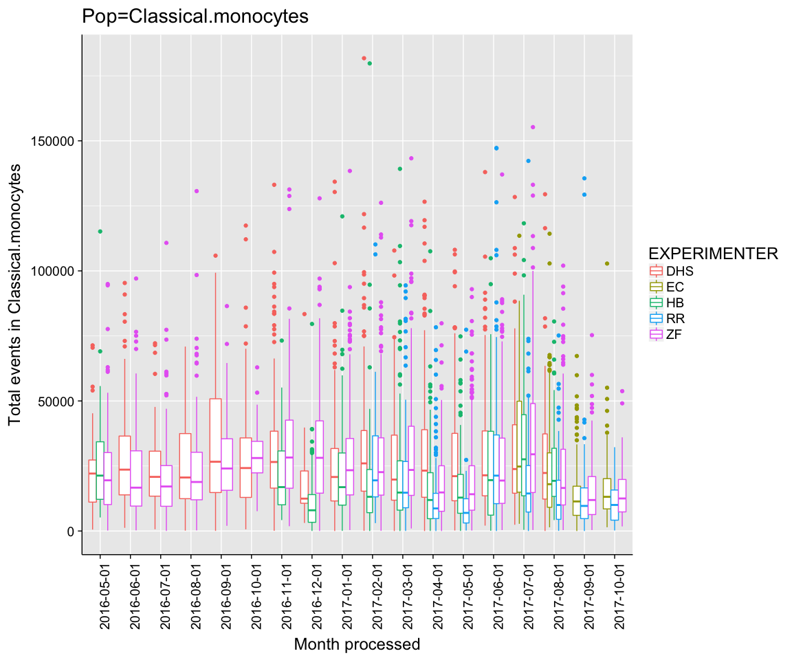<!-- -->

```
## [1] "Classical.monocytes"
## [1] "n=9356"
## [1] "PLOT TYPE = Machine Time FREQ"
```

<!-- -->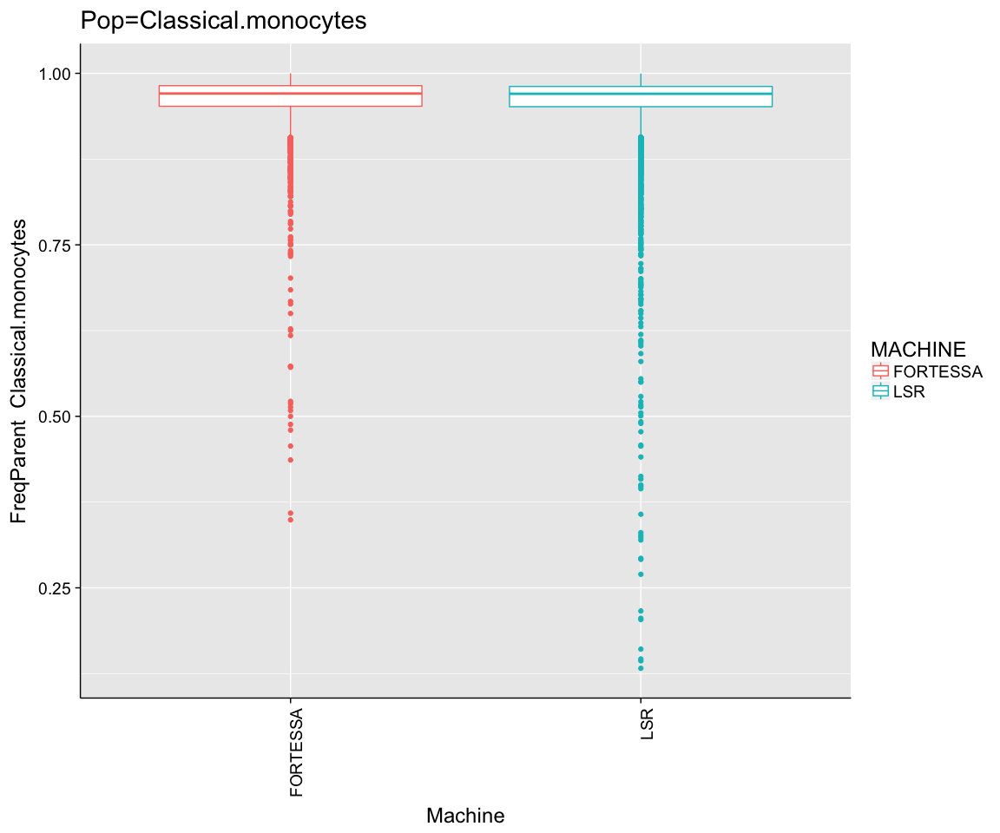<!-- -->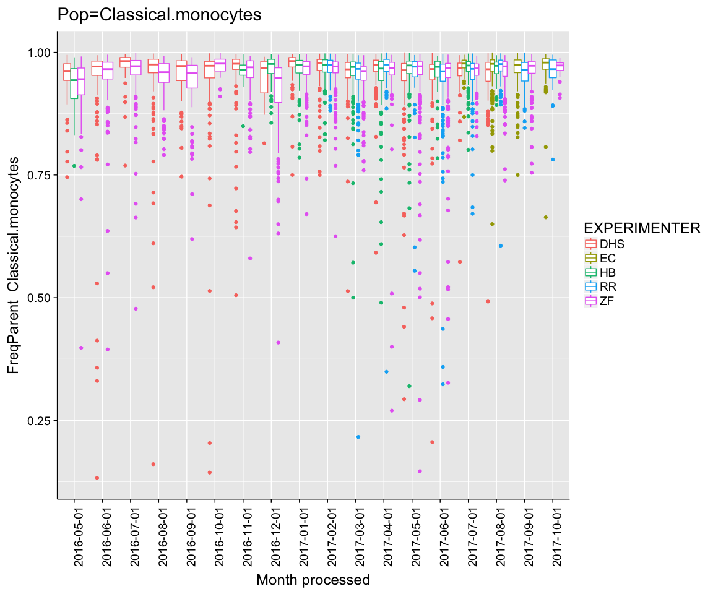<!-- --><!-- -->

```
## 
## 
## |Var1 |Var2     | Freq|
## |:----|:--------|----:|
## |DHS  |FORTESSA |  705|
## |EC   |FORTESSA |  373|
## |HB   |FORTESSA |  846|
## |RR   |FORTESSA |  581|
## |ZF   |FORTESSA |  989|
## |DHS  |LSR      | 1567|
## |EC   |LSR      |  421|
## |HB   |LSR      |  503|
## |RR   |LSR      |  777|
## |ZF   |LSR      | 2594|
## [1] "Linear Regression for Classical.monocytes"
## 
## Call:
## lm(formula = formula, data = subF)
## 
## Residuals:
##      Min       1Q   Median       3Q      Max 
## -0.81731 -0.00458  0.01349  0.02498  0.05157 
## 
## Coefficients:
##                  Estimate Std. Error t value Pr(>|t|)    
## (Intercept)     5.752e-01  9.417e-02   6.108 1.05e-09 ***
## DATE_MONTH      2.223e-05  5.469e-06   4.064 4.86e-05 ***
## MACHINELSR     -1.964e-03  1.306e-03  -1.504   0.1326    
## EXPERIMENTEREC  6.390e-03  2.636e-03   2.424   0.0154 *  
## EXPERIMENTERHB  2.100e-03  2.008e-03   1.046   0.2955    
## EXPERIMENTERRR -4.115e-03  2.083e-03  -1.976   0.0482 *  
## EXPERIMENTERZF -3.317e-03  1.541e-03  -2.153   0.0313 *  
## ---
## Signif. codes:  0 '***' 0.001 '**' 0.01 '*' 0.05 '.' 0.1 ' ' 1
## 
## Residual standard error: 0.05683 on 9346 degrees of freedom
##   (3 observations deleted due to missingness)
## Multiple R-squared:  0.007629,	Adjusted R-squared:  0.006992 
## F-statistic: 11.97 on 6 and 9346 DF,  p-value: 1.933e-13
## 
## [1] "Stepwise Linear Regression for Classical.monocytes"
## Start:  AIC=-53634.41
## TARGET_FREQ ~ DATE_MONTH + MACHINE + EXPERIMENTER
## 
##                Df Sum of Sq    RSS    AIC
## <none>                      30.189 -53634
## - MACHINE       1  0.007306 30.197 -53634
## - DATE_MONTH    1  0.053352 30.243 -53620
## - EXPERIMENTER  4  0.086884 30.276 -53616
## Stepwise Model Path 
## Analysis of Deviance Table
## 
## Initial Model:
## TARGET_FREQ ~ DATE_MONTH + MACHINE + EXPERIMENTER
## 
## Final Model:
## TARGET_FREQ ~ DATE_MONTH + MACHINE + EXPERIMENTER
## 
## 
##   Step Df Deviance Resid. Df Resid. Dev       AIC
## 1                       9346   30.18952 -53634.41
## [1] "ANOVA of EXPERIMENTER for Classical.monocytes"
##   Tukey multiple comparisons of means
##     95% family-wise confidence level
## 
## Fit: aov(formula = formula, data = subF)
## 
## $EXPERIMENTER
##                 diff          lwr           upr     p adj
## EC-DHS  0.0117745141  0.005373670  0.0181753585 0.0000053
## HB-DHS  0.0041312273 -0.001205702  0.0094681567 0.2149294
## RR-DHS -0.0008045795 -0.006131632  0.0045224732 0.9939610
## ZF-DHS -0.0025511539 -0.006715713  0.0016134049 0.4518631
## HB-EC  -0.0076432868 -0.014587306 -0.0006992674 0.0224987
## RR-EC  -0.0125790936 -0.019515525 -0.0056426622 0.0000076
## ZF-EC  -0.0143256680 -0.020415014 -0.0082363215 0.0000000
## RR-HB  -0.0049358068 -0.010904566  0.0010329525 0.1594713
## ZF-HB  -0.0066823812 -0.011641428 -0.0017233342 0.0022136
## ZF-RR  -0.0017465744 -0.006694991  0.0032018417 0.8717320
## 
## [1] "ANOVA of MACHINE for Classical.monocytes"
##               Df Sum Sq Mean Sq F value   Pr(>F)    
## MACHINE        1  0.047 0.04681   14.41 0.000148 ***
## Residuals   9351 30.375 0.00325                     
## ---
## Signif. codes:  0 '***' 0.001 '**' 0.01 '*' 0.05 '.' 0.1 ' ' 1
## 3 observations deleted due to missingness
## [1] "# Start of new population results"
## [1] "Live.immune.cells"
## [1] "n=9356"
## [1] "PLOT TYPE = Machine Time COUNT"
```

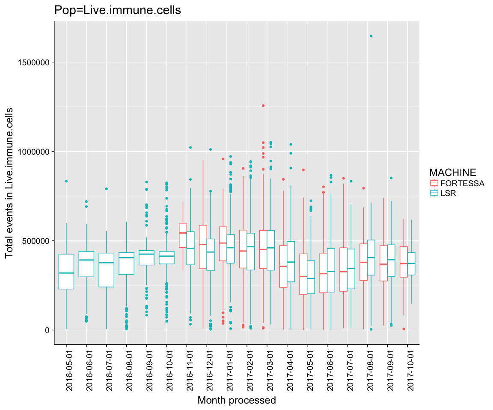<!-- --><!-- -->

```
## [1] "Live.immune.cells"
## [1] "n=9356"
## [1] "PLOT TYPE = Machine Time FREQ"
## [1] "NA for Freq plot"
## [1] "# Start of new population results"
## [1] "Live.Single.PBMCs"
## [1] "n=9356"
## [1] "PLOT TYPE = Machine Time COUNT"
```

<!-- -->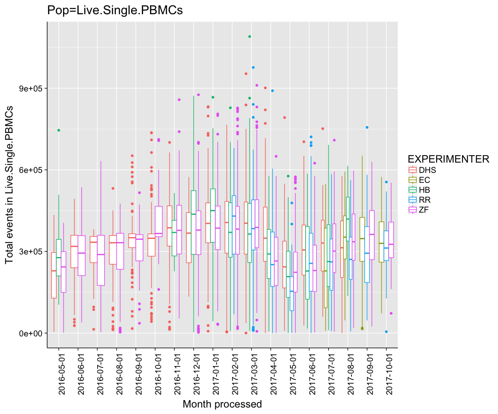<!-- -->

```
## [1] "Live.Single.PBMCs"
## [1] "n=9356"
## [1] "PLOT TYPE = Machine Time FREQ"
## [1] "NA for Freq plot"
## [1] "# Start of new population results"
## [1] "DC"
## [1] "n=9356"
## [1] "PLOT TYPE = Machine Time COUNT"
```

<!-- --><!-- -->

```
## [1] "DC"
## [1] "n=9356"
## [1] "PLOT TYPE = Machine Time FREQ"
```

<!-- -->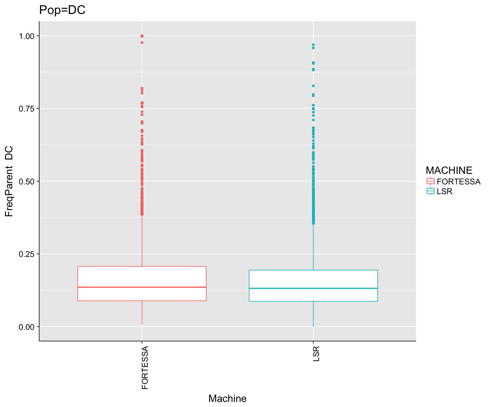<!-- --><!-- --><!-- -->

```
## 
## 
## |Var1 |Var2     | Freq|
## |:----|:--------|----:|
## |DHS  |FORTESSA |  705|
## |EC   |FORTESSA |  373|
## |HB   |FORTESSA |  846|
## |RR   |FORTESSA |  581|
## |ZF   |FORTESSA |  989|
## |DHS  |LSR      | 1567|
## |EC   |LSR      |  421|
## |HB   |LSR      |  503|
## |RR   |LSR      |  777|
## |ZF   |LSR      | 2594|
## [1] "Linear Regression for DC"
## 
## Call:
## lm(formula = formula, data = subF)
## 
## Residuals:
##      Min       1Q   Median       3Q      Max 
## -0.18140 -0.06750 -0.02255  0.04244  0.84416 
## 
## Coefficients:
##                  Estimate Std. Error t value Pr(>|t|)    
## (Intercept)    -2.663e-01  1.670e-01  -1.594  0.11088    
## DATE_MONTH      2.620e-05  9.699e-06   2.701  0.00693 ** 
## MACHINELSR     -7.619e-03  2.315e-03  -3.290  0.00100 ** 
## EXPERIMENTEREC -5.808e-02  4.675e-03 -12.423  < 2e-16 ***
## EXPERIMENTERHB -2.094e-02  3.561e-03  -5.881 4.21e-09 ***
## EXPERIMENTERRR -3.423e-02  3.693e-03  -9.269  < 2e-16 ***
## EXPERIMENTERZF -2.851e-02  2.732e-03 -10.436  < 2e-16 ***
## ---
## Signif. codes:  0 '***' 0.001 '**' 0.01 '*' 0.05 '.' 0.1 ' ' 1
## 
## Residual standard error: 0.1008 on 9346 degrees of freedom
##   (3 observations deleted due to missingness)
## Multiple R-squared:  0.02313,	Adjusted R-squared:  0.0225 
## F-statistic: 36.88 on 6 and 9346 DF,  p-value: < 2.2e-16
## 
## [1] "Stepwise Linear Regression for DC"
## Start:  AIC=-42917.53
## TARGET_FREQ ~ DATE_MONTH + MACHINE + EXPERIMENTER
## 
##                Df Sum of Sq    RSS    AIC
## <none>                      94.947 -42918
## - DATE_MONTH    1   0.07412 95.021 -42912
## - MACHINE       1   0.11000 95.057 -42909
## - EXPERIMENTER  4   1.98191 96.929 -42732
## Stepwise Model Path 
## Analysis of Deviance Table
## 
## Initial Model:
## TARGET_FREQ ~ DATE_MONTH + MACHINE + EXPERIMENTER
## 
## Final Model:
## TARGET_FREQ ~ DATE_MONTH + MACHINE + EXPERIMENTER
## 
## 
##   Step Df Deviance Resid. Df Resid. Dev       AIC
## 1                       9346   94.94687 -42917.53
## [1] "ANOVA of EXPERIMENTER for DC"
##   Tukey multiple comparisons of means
##     95% family-wise confidence level
## 
## Fit: aov(formula = formula, data = subF)
## 
## $EXPERIMENTER
##                diff          lwr          upr     p adj
## EC-DHS -0.050881216 -0.062233177 -0.039529255 0.0000000
## HB-DHS -0.016863607 -0.026328704 -0.007398510 0.0000117
## RR-DHS -0.029702199 -0.039149779 -0.020254618 0.0000000
## ZF-DHS -0.027787911 -0.035173797 -0.020402025 0.0000000
## HB-EC   0.034017609  0.021702322  0.046332896 0.0000000
## RR-EC   0.021179017  0.008877187  0.033480847 0.0000264
## ZF-EC   0.023093305  0.012293788  0.033892821 0.0000001
## RR-HB  -0.012838592 -0.023424246 -0.002252938 0.0083492
## ZF-HB  -0.010924304 -0.019719223 -0.002129385 0.0063346
## ZF-RR   0.001914288 -0.006861777  0.010690353 0.9758562
## 
## [1] "ANOVA of MACHINE for DC"
##               Df Sum Sq Mean Sq F value   Pr(>F)    
## MACHINE        1   0.13 0.13039   12.56 0.000396 ***
## Residuals   9351  97.06 0.01038                     
## ---
## Signif. codes:  0 '***' 0.001 '**' 0.01 '*' 0.05 '.' 0.1 ' ' 1
## 3 observations deleted due to missingness
```

