# TrendQC for Populations
JL  
1/16/2018  


# Trends by population

- removed samples that did not match to a Lab ID from the "FLOW ONLY" tab of "HRS sample list.xlsx"
- removed samples where date could not be parsed
- removed samples where EXPERIMENTER could not be parsed
- removed samples that were manually gated


```
## [1] "# Start of new population results"
## [1] "naive.Bcells.(CD27-.IgD+)"
## [1] "n=9079"
## [1] "PLOT TYPE = Machine Time COUNT OC"
```

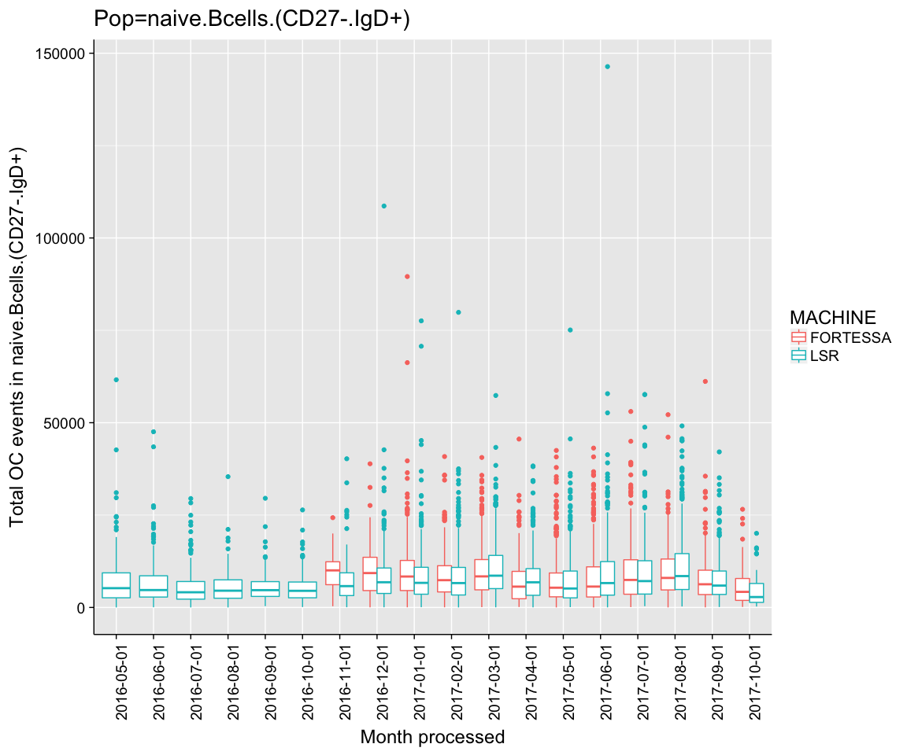<!-- -->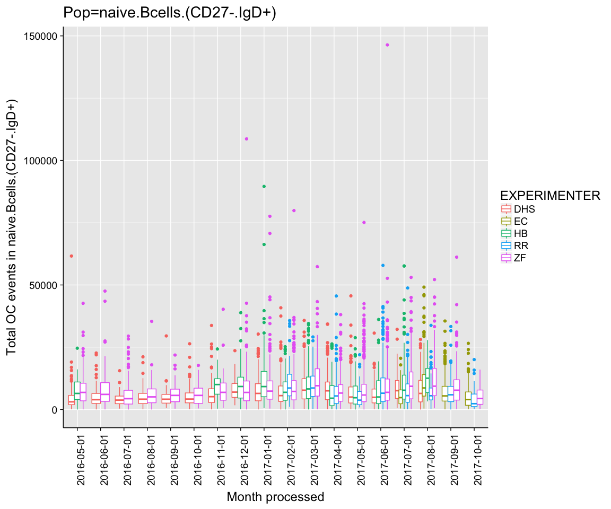<!-- -->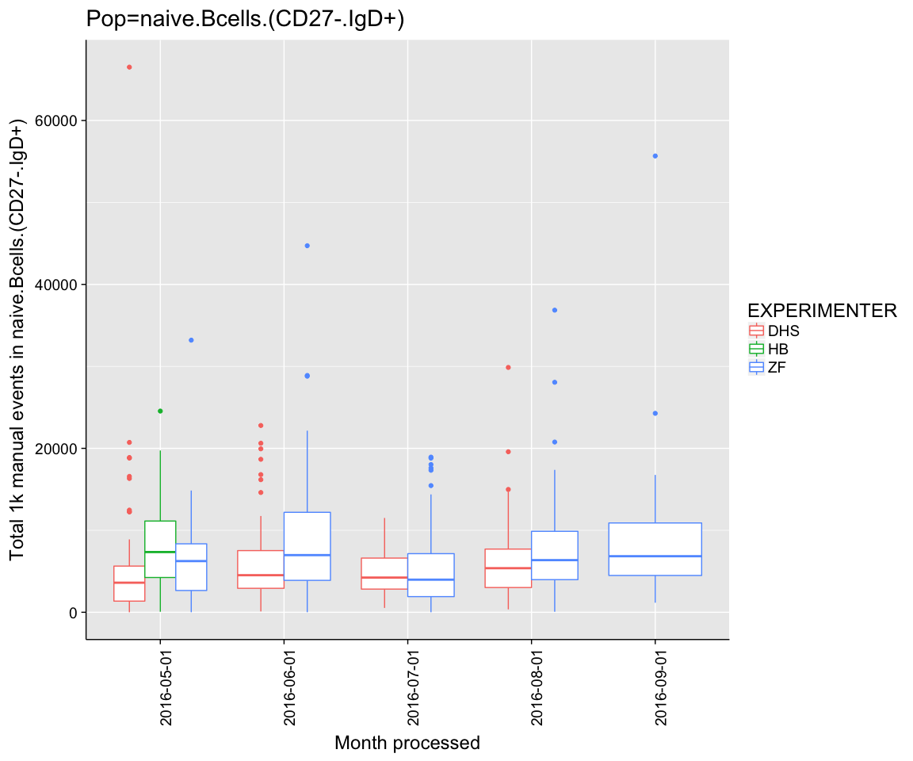<!-- -->

```
## [1] "Correlations between OC and manual for naive.Bcells.(CD27-.IgD+)"
## 
## 	Pearson's product-moment correlation
## 
## data:  merge[, colC] and merge[, coljflowCount]
## t = 47.188, df = 904, p-value < 2.2e-16
## alternative hypothesis: true correlation is not equal to 0
## 95 percent confidence interval:
##  0.8234567 0.8611838
## sample estimates:
##       cor 
## 0.8433564 
## 
## 
## 	Spearman's rank correlation rho
## 
## data:  merge[, colC] and merge[, coljflowCount]
## S = 9635500, p-value < 2.2e-16
## alternative hypothesis: true rho is not equal to 0
## sample estimates:
##       rho 
## 0.9222605
```

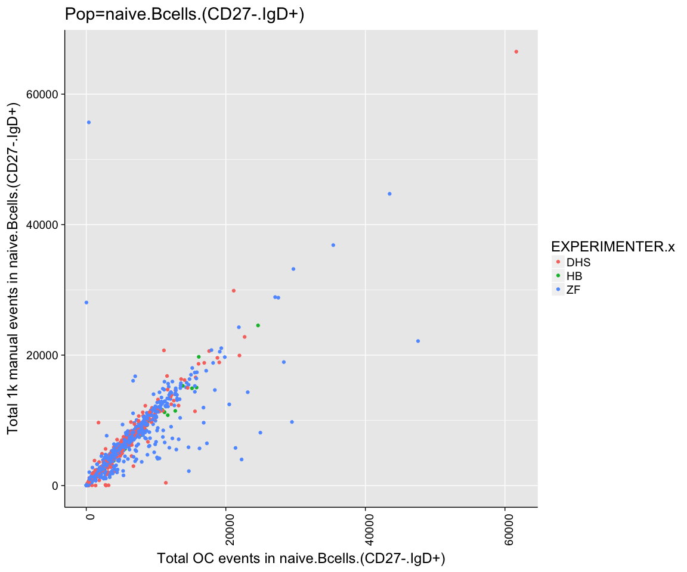<!-- -->

```
## [1] "naive.Bcells.(CD27-.IgD+)"
## [1] "n=9079"
## [1] "PLOT TYPE = Machine Time FREQ"
```

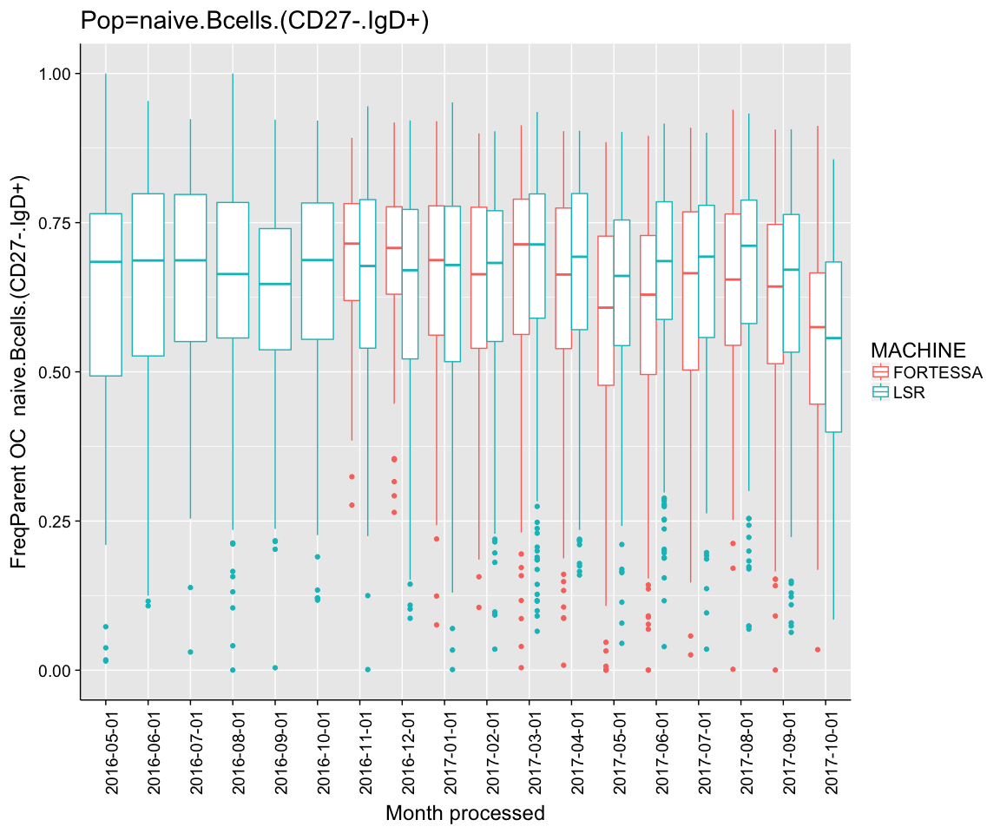<!-- -->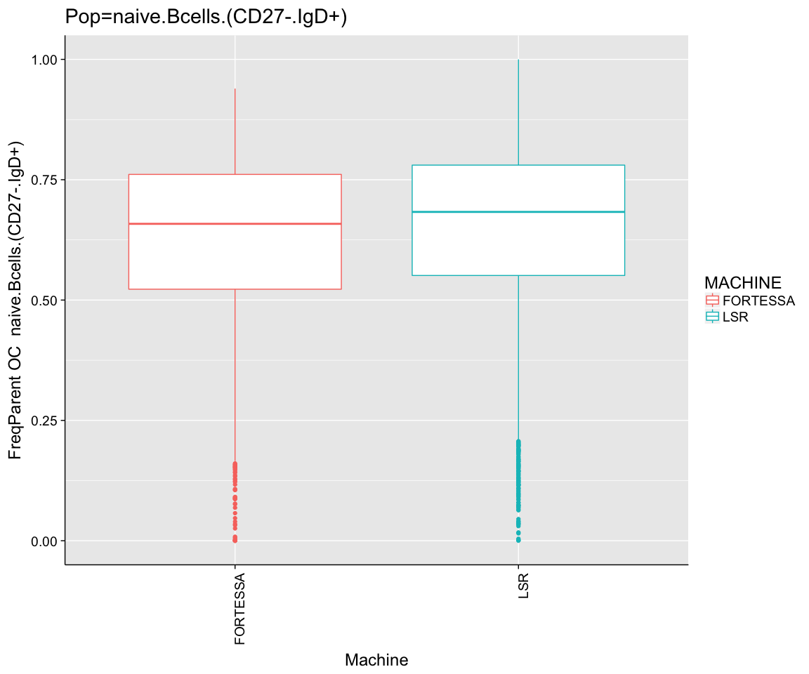<!-- -->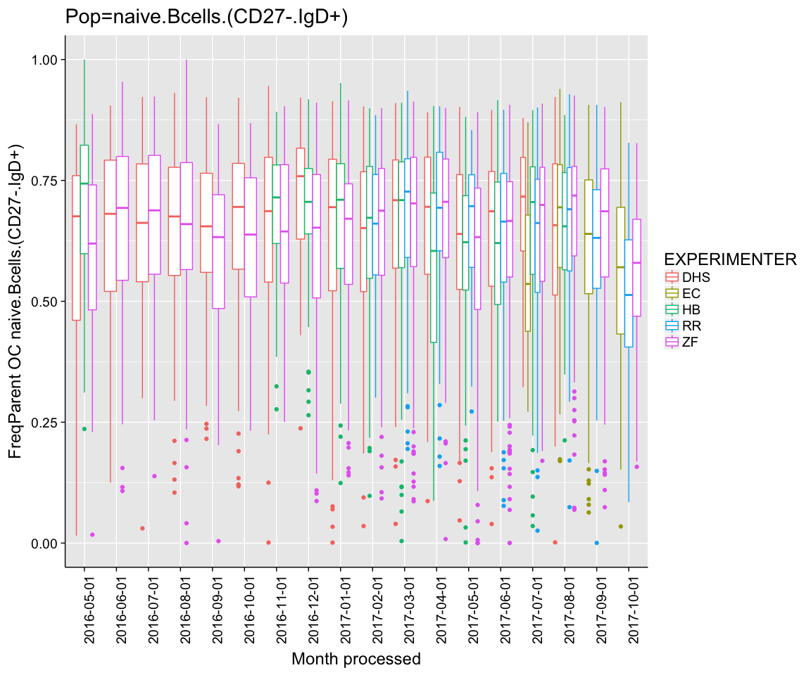<!-- --><!-- -->

```
## 
## 
## |Var1 |Var2     | Freq|
## |:----|:--------|----:|
## |DHS  |FORTESSA |  703|
## |EC   |FORTESSA |  360|
## |HB   |FORTESSA |  848|
## |RR   |FORTESSA |  539|
## |ZF   |FORTESSA |  998|
## |DHS  |LSR      | 1520|
## |EC   |LSR      |  407|
## |HB   |LSR      |  489|
## |RR   |LSR      |  731|
## |ZF   |LSR      | 2484|
## [1] "Linear Regression for naive.Bcells.(CD27-.IgD+)"
## 
## Call:
## lm(formula = formula, data = subF)
## 
## Residuals:
##      Min       1Q   Median       3Q      Max 
## -0.65152 -0.10020  0.03273  0.13220  0.35104 
## 
## Coefficients:
##                  Estimate Std. Error t value Pr(>|t|)    
## (Intercept)     9.842e-01  2.905e-01   3.387 0.000709 ***
## DATE_MONTH     -2.065e-05  1.687e-05  -1.224 0.221012    
## MACHINELSR      2.174e-02  3.998e-03   5.438 5.52e-08 ***
## EXPERIMENTEREC -1.382e-02  8.118e-03  -1.702 0.088708 .  
## EXPERIMENTERHB  7.465e-03  6.120e-03   1.220 0.222628    
## EXPERIMENTERRR  8.604e-03  6.465e-03   1.331 0.183286    
## EXPERIMENTERZF -5.590e-03  4.725e-03  -1.183 0.236839    
## ---
## Signif. codes:  0 '***' 0.001 '**' 0.01 '*' 0.05 '.' 0.1 ' ' 1
## 
## Residual standard error: 0.1722 on 9072 degrees of freedom
## Multiple R-squared:  0.005491,	Adjusted R-squared:  0.004833 
## F-statistic: 8.348 on 6 and 9072 DF,  p-value: 4.782e-09
## 
## [1] "Stepwise Linear Regression for naive.Bcells.(CD27-.IgD+)"
## Start:  AIC=-31934.79
## TARGET_FREQ ~ DATE_MONTH + MACHINE + EXPERIMENTER
## 
##                Df Sum of Sq    RSS    AIC
## - DATE_MONTH    1   0.04442 269.05 -31935
## <none>                      269.01 -31935
## - EXPERIMENTER  4   0.40324 269.41 -31929
## - MACHINE       1   0.87701 269.89 -31907
## 
## Step:  AIC=-31935.29
## TARGET_FREQ ~ MACHINE + EXPERIMENTER
## 
##                Df Sum of Sq    RSS    AIC
## <none>                      269.05 -31935
## + DATE_MONTH    1   0.04442 269.01 -31935
## - EXPERIMENTER  4   0.45454 269.51 -31928
## - MACHINE       1   1.06708 270.12 -31901
## Stepwise Model Path 
## Analysis of Deviance Table
## 
## Initial Model:
## TARGET_FREQ ~ DATE_MONTH + MACHINE + EXPERIMENTER
## 
## Final Model:
## TARGET_FREQ ~ MACHINE + EXPERIMENTER
## 
## 
##           Step Df   Deviance Resid. Df Resid. Dev       AIC
## 1                                 9072   269.0085 -31934.79
## 2 - DATE_MONTH  1 0.04441938      9073   269.0529 -31935.29
## [1] "ANOVA of EXPERIMENTER for naive.Bcells.(CD27-.IgD+)"
##   Tukey multiple comparisons of means
##     95% family-wise confidence level
## 
## Fit: aov(formula = formula, data = subF)
## 
## $EXPERIMENTER
##                 diff           lwr          upr     p adj
## EC-DHS -0.0218613445 -0.0415739033 -0.002148786 0.0209826
## HB-DHS -0.0006895924 -0.0169812166  0.015602032 0.9999599
## RR-DHS  0.0033880691 -0.0131697266  0.019945865 0.9809369
## ZF-DHS -0.0057381948 -0.0185178321  0.007041443 0.7367571
## HB-EC   0.0211717522 -0.0001505602  0.042494065 0.0527032
## RR-EC   0.0252494137  0.0037230441  0.046775783 0.0120229
## ZF-EC   0.0161231498 -0.0026529818  0.034899281 0.1315945
## RR-HB   0.0040776615 -0.0143673008  0.022522624 0.9746358
## ZF-HB  -0.0050486024 -0.0201937390  0.010096534 0.8933801
## ZF-RR  -0.0091262639 -0.0245573606  0.006304833 0.4886156
## 
## [1] "ANOVA of MACHINE for naive.Bcells.(CD27-.IgD+)"
##               Df Sum Sq Mean Sq F value  Pr(>F)    
## MACHINE        1   0.99  0.9863   33.22 8.5e-09 ***
## Residuals   9077 269.51  0.0297                    
## ---
## Signif. codes:  0 '***' 0.001 '**' 0.01 '*' 0.05 '.' 0.1 ' ' 1
## [1] "T-test of MACHINE for naive.Bcells.(CD27-.IgD+)"
## 
## 	Welch Two Sample t-test
## 
## data:  TARGET_FREQ by MACHINE
## t = -5.7357, df = 7174, p-value = 1.011e-08
## alternative hypothesis: true difference in means is not equal to 0
## 95 percent confidence interval:
##  -0.02881604 -0.01413616
## sample estimates:
## mean in group FORTESSA      mean in group LSR 
##              0.6274223              0.6488984 
## 
## [1] "# Start of new population results"
## [1] "cytotoxic.Tcells-CD8+"
## [1] "n=9079"
## [1] "PLOT TYPE = Machine Time COUNT OC"
```

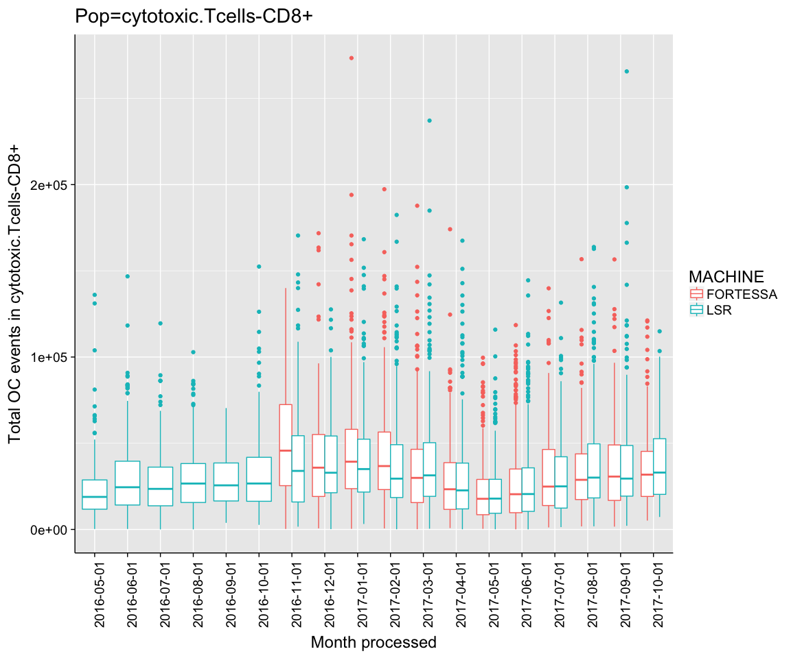<!-- -->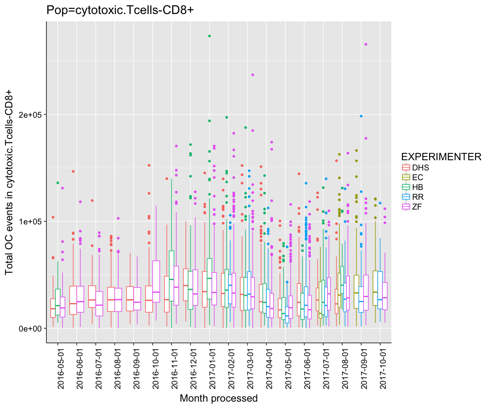<!-- -->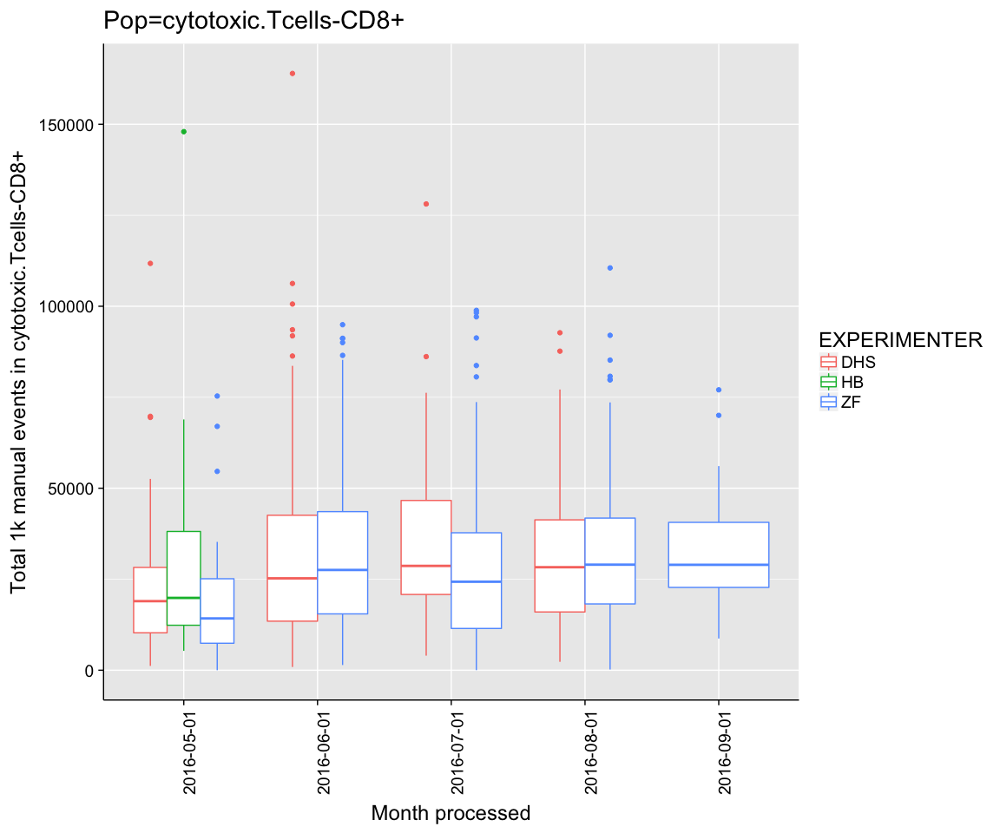<!-- -->

```
## [1] "Correlations between OC and manual for cytotoxic.Tcells-CD8+"
## 
## 	Pearson's product-moment correlation
## 
## data:  merge[, colC] and merge[, coljflowCount]
## t = 292.74, df = 904, p-value < 2.2e-16
## alternative hypothesis: true correlation is not equal to 0
## 95 percent confidence interval:
##  0.9940398 0.9954054
## sample estimates:
##       cor 
## 0.9947668 
## 
## 
## 	Spearman's rank correlation rho
## 
## data:  merge[, colC] and merge[, coljflowCount]
## S = 845340, p-value < 2.2e-16
## alternative hypothesis: true rho is not equal to 0
## sample estimates:
##       rho 
## 0.9931798
```

<!-- -->

```
## [1] "cytotoxic.Tcells-CD8+"
## [1] "n=9079"
## [1] "PLOT TYPE = Machine Time FREQ"
```

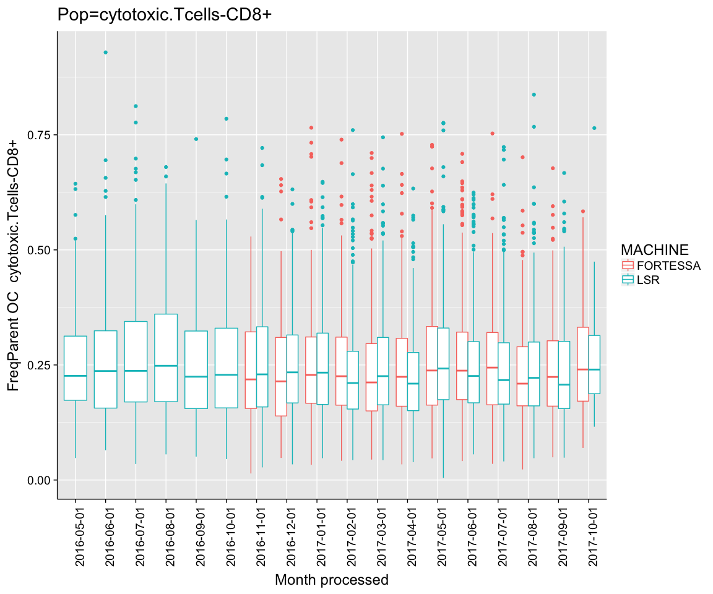<!-- -->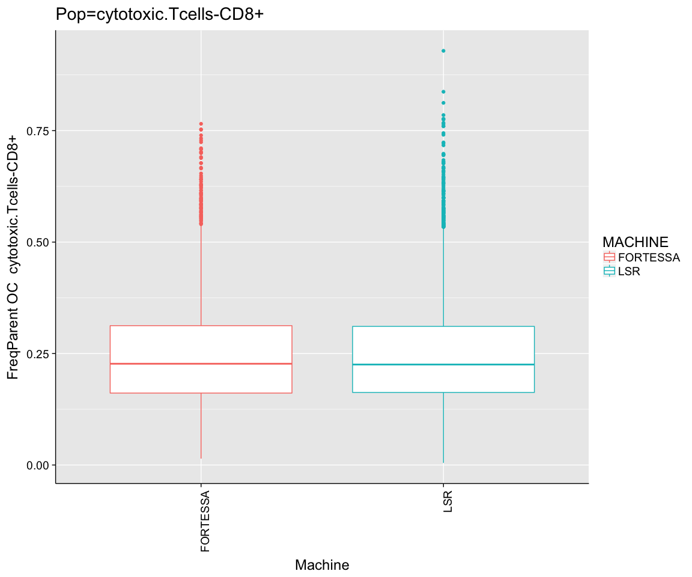<!-- --><!-- -->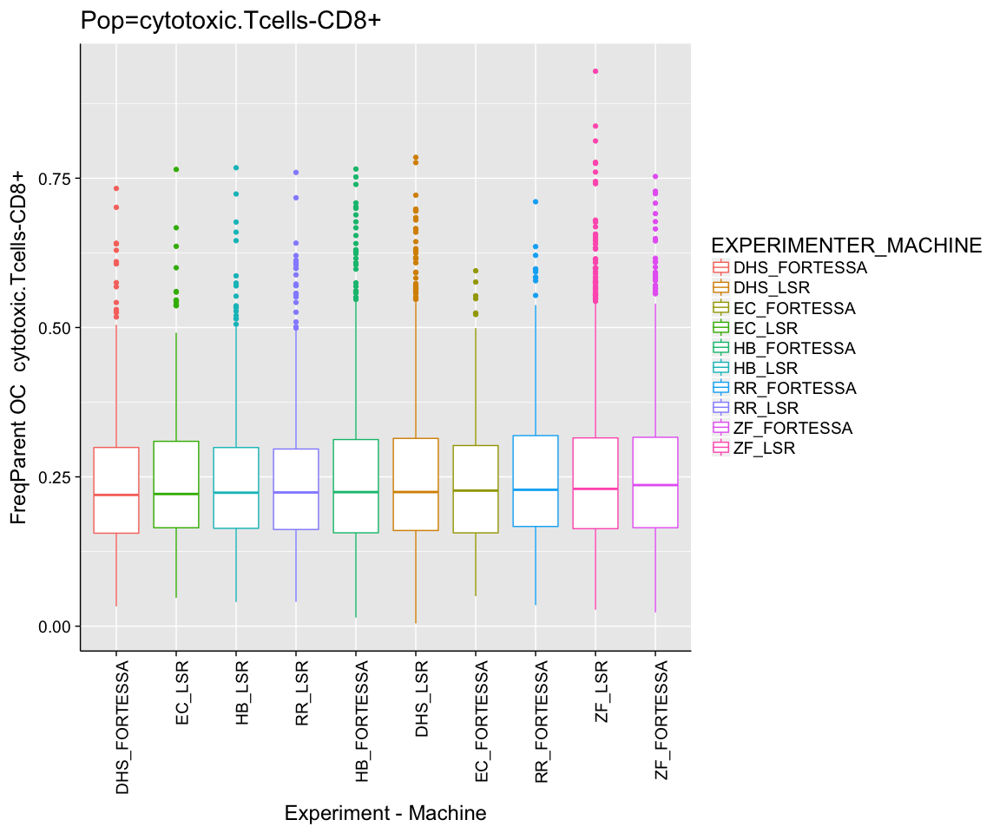<!-- -->

```
## 
## 
## |Var1 |Var2     | Freq|
## |:----|:--------|----:|
## |DHS  |FORTESSA |  703|
## |EC   |FORTESSA |  360|
## |HB   |FORTESSA |  848|
## |RR   |FORTESSA |  539|
## |ZF   |FORTESSA |  998|
## |DHS  |LSR      | 1520|
## |EC   |LSR      |  407|
## |HB   |LSR      |  489|
## |RR   |LSR      |  731|
## |ZF   |LSR      | 2484|
## [1] "Linear Regression for cytotoxic.Tcells-CD8+"
## 
## Call:
## lm(formula = formula, data = subF)
## 
## Residuals:
##      Min       1Q   Median       3Q      Max 
## -0.23815 -0.08556 -0.02092  0.06433  0.66971 
## 
## Coefficients:
##                  Estimate Std. Error t value Pr(>|t|)    
## (Intercept)     8.326e-01  1.991e-01   4.181 2.93e-05 ***
## DATE_MONTH     -3.412e-05  1.157e-05  -2.950  0.00319 ** 
## MACHINELSR     -3.366e-03  2.740e-03  -1.228  0.21938    
## EXPERIMENTEREC  3.655e-03  5.565e-03   0.657  0.51135    
## EXPERIMENTERHB  3.525e-03  4.195e-03   0.840  0.40071    
## EXPERIMENTERRR  5.824e-03  4.431e-03   1.314  0.18876    
## EXPERIMENTERZF  8.566e-03  3.239e-03   2.645  0.00819 ** 
## ---
## Signif. codes:  0 '***' 0.001 '**' 0.01 '*' 0.05 '.' 0.1 ' ' 1
## 
## Residual standard error: 0.118 on 9072 degrees of freedom
## Multiple R-squared:  0.001903,	Adjusted R-squared:  0.001243 
## F-statistic: 2.883 on 6 and 9072 DF,  p-value: 0.008288
## 
## [1] "Stepwise Linear Regression for cytotoxic.Tcells-CD8+"
## Start:  AIC=-38793.32
## TARGET_FREQ ~ DATE_MONTH + MACHINE + EXPERIMENTER
## 
##                Df Sum of Sq    RSS    AIC
## - EXPERIMENTER  4  0.103438 126.49 -38794
## - MACHINE       1  0.021017 126.40 -38794
## <none>                      126.38 -38793
## - DATE_MONTH    1  0.121241 126.50 -38787
## 
## Step:  AIC=-38793.89
## TARGET_FREQ ~ DATE_MONTH + MACHINE
## 
##                Df Sum of Sq    RSS    AIC
## - MACHINE       1  0.014264 126.50 -38795
## <none>                      126.49 -38794
## + EXPERIMENTER  4  0.103438 126.38 -38793
## - DATE_MONTH    1  0.137313 126.62 -38786
## 
## Step:  AIC=-38794.87
## TARGET_FREQ ~ DATE_MONTH
## 
##                Df Sum of Sq    RSS    AIC
## <none>                      126.50 -38795
## + MACHINE       1  0.014264 126.49 -38794
## + EXPERIMENTER  4  0.096685 126.40 -38794
## - DATE_MONTH    1  0.123285 126.62 -38788
## Stepwise Model Path 
## Analysis of Deviance Table
## 
## Initial Model:
## TARGET_FREQ ~ DATE_MONTH + MACHINE + EXPERIMENTER
## 
## Final Model:
## TARGET_FREQ ~ DATE_MONTH
## 
## 
##             Step Df   Deviance Resid. Df Resid. Dev       AIC
## 1                                   9072   126.3827 -38793.32
## 2 - EXPERIMENTER  4 0.10343758      9076   126.4861 -38793.89
## 3      - MACHINE  1 0.01426399      9077   126.5004 -38794.87
## [1] "ANOVA of EXPERIMENTER for cytotoxic.Tcells-CD8+"
##   Tukey multiple comparisons of means
##     95% family-wise confidence level
## 
## Fit: aov(formula = formula, data = subF)
## 
## $EXPERIMENTER
##                diff          lwr         upr     p adj
## EC-DHS -0.003613521 -0.017103810 0.009876769 0.9493784
## HB-DHS  0.002547180 -0.008601993 0.013696353 0.9713926
## RR-DHS  0.001456764 -0.009874563 0.012788092 0.9967606
## ZF-DHS  0.007157432 -0.001588313 0.015903177 0.1676599
## HB-EC   0.006160701 -0.008431223 0.020752626 0.7786893
## RR-EC   0.005070285 -0.009661286 0.019801856 0.8816959
## ZF-EC   0.010770953 -0.002078493 0.023620399 0.1490946
## RR-HB  -0.001090416 -0.013713226 0.011532394 0.9993187
## ZF-HB   0.004610252 -0.005754322 0.014974826 0.7435079
## ZF-RR   0.005700668 -0.004859603 0.016260939 0.5802672
## 
## [1] "ANOVA of MACHINE for cytotoxic.Tcells-CD8+"
##               Df Sum Sq  Mean Sq F value Pr(>F)
## MACHINE        1    0.0 0.000236   0.017  0.897
## Residuals   9077  126.6 0.013950               
## [1] "T-test of MACHINE for cytotoxic.Tcells-CD8+"
## 
## 	Welch Two Sample t-test
## 
## data:  TARGET_FREQ by MACHINE
## t = 0.13007, df = 7295.7, p-value = 0.8965
## alternative hypothesis: true difference in means is not equal to 0
## 95 percent confidence interval:
##  -0.004672884  0.005337083
## sample estimates:
## mean in group FORTESSA      mean in group LSR 
##              0.2476015              0.2472694 
## 
## [1] "# Start of new population results"
## [1] "Tcells.(CD3+.CD19-)"
## [1] "n=9079"
## [1] "PLOT TYPE = Machine Time COUNT OC"
```

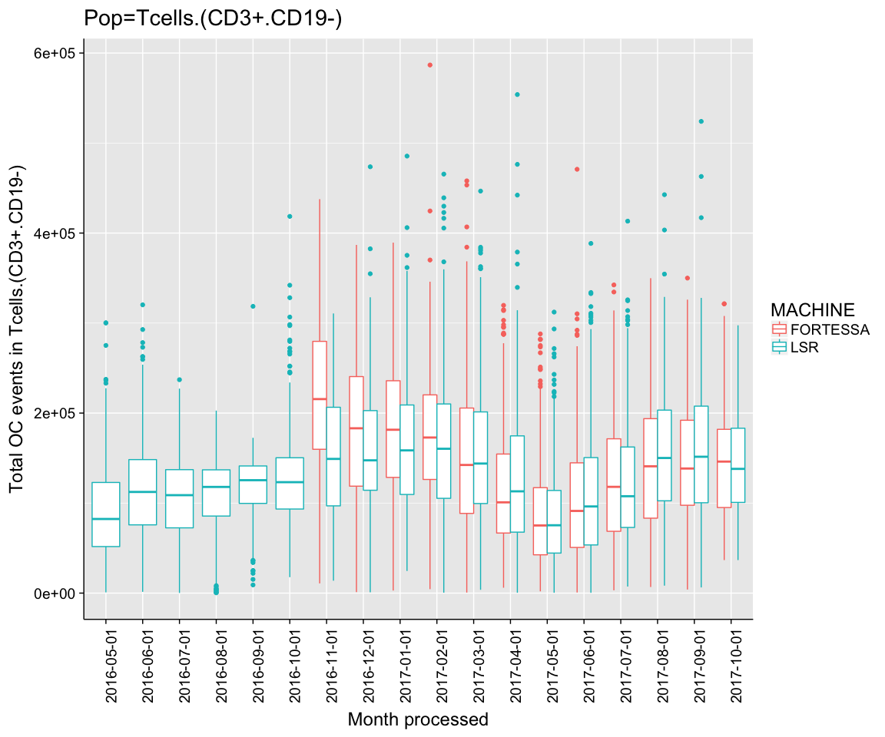<!-- -->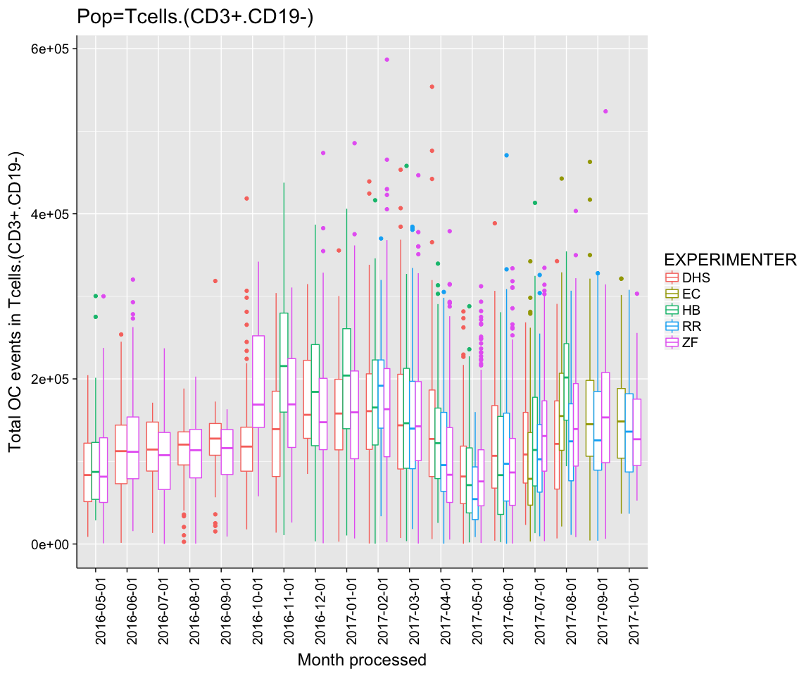<!-- -->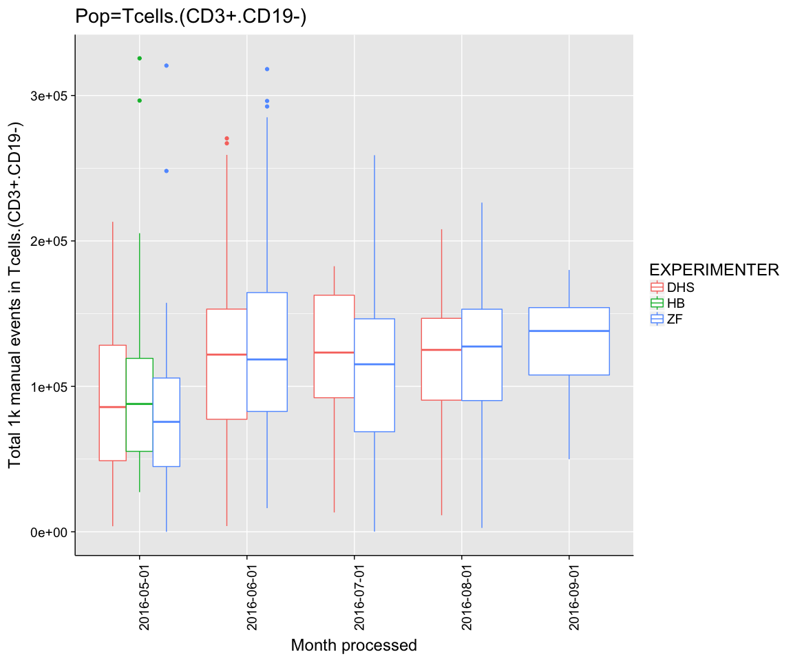<!-- -->

```
## [1] "Correlations between OC and manual for Tcells.(CD3+.CD19-)"
## 
## 	Pearson's product-moment correlation
## 
## data:  merge[, colC] and merge[, coljflowCount]
## t = 442.63, df = 904, p-value < 2.2e-16
## alternative hypothesis: true correlation is not equal to 0
## 95 percent confidence interval:
##  0.9973810 0.9979818
## sample estimates:
##       cor 
## 0.9977009 
## 
## 
## 	Spearman's rank correlation rho
## 
## data:  merge[, colC] and merge[, coljflowCount]
## S = 403610, p-value < 2.2e-16
## alternative hypothesis: true rho is not equal to 0
## sample estimates:
##       rho 
## 0.9967437
```

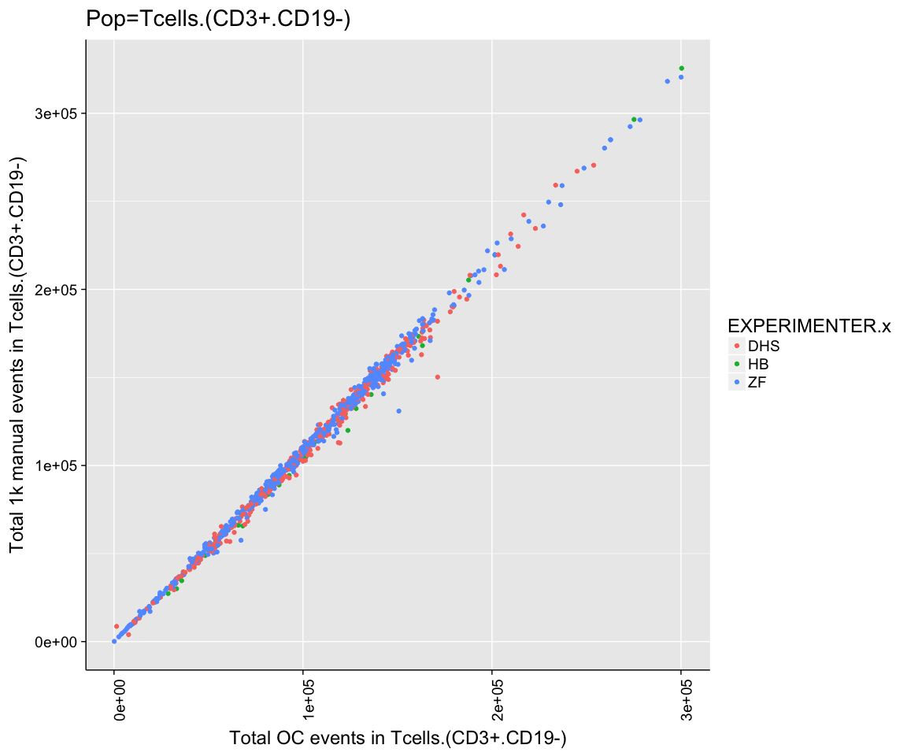<!-- -->

```
## [1] "Tcells.(CD3+.CD19-)"
## [1] "n=9079"
## [1] "PLOT TYPE = Machine Time FREQ"
```

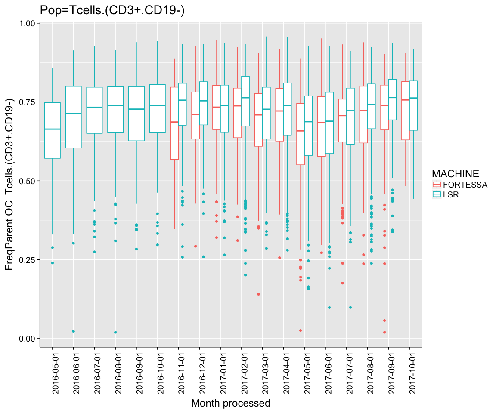<!-- -->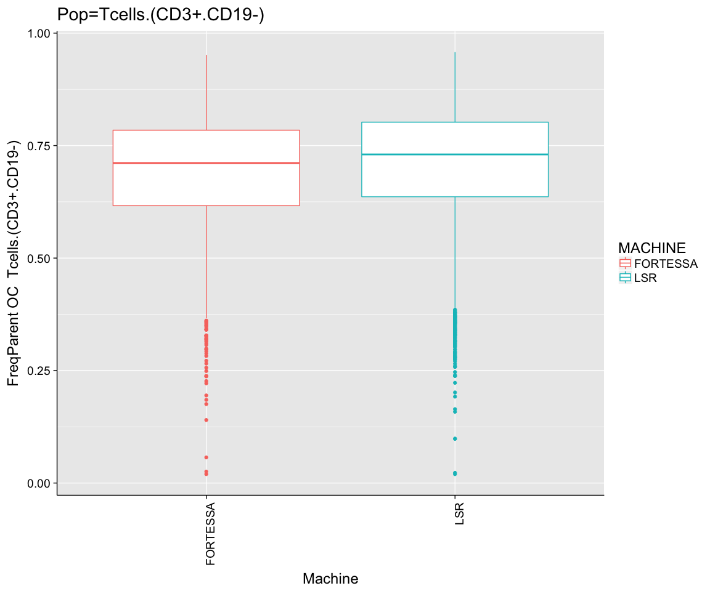<!-- -->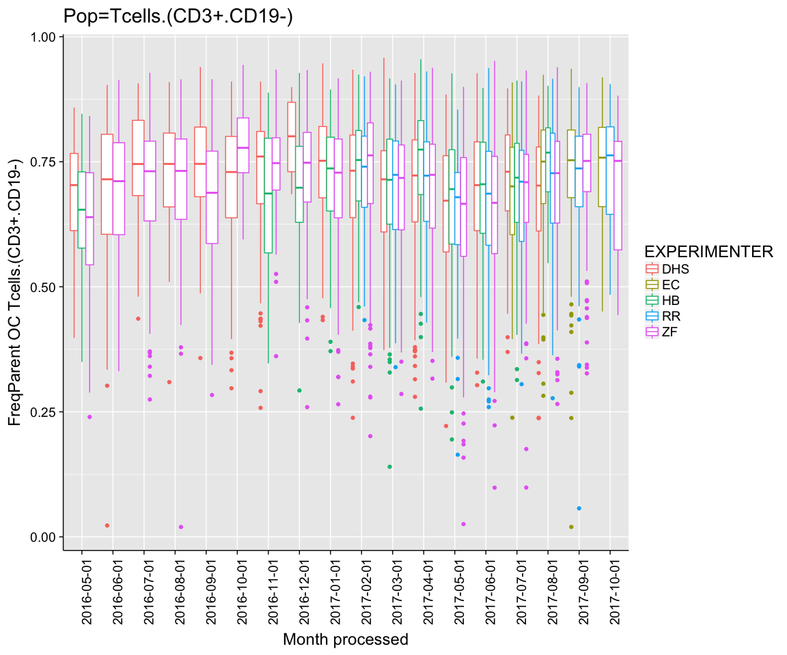<!-- -->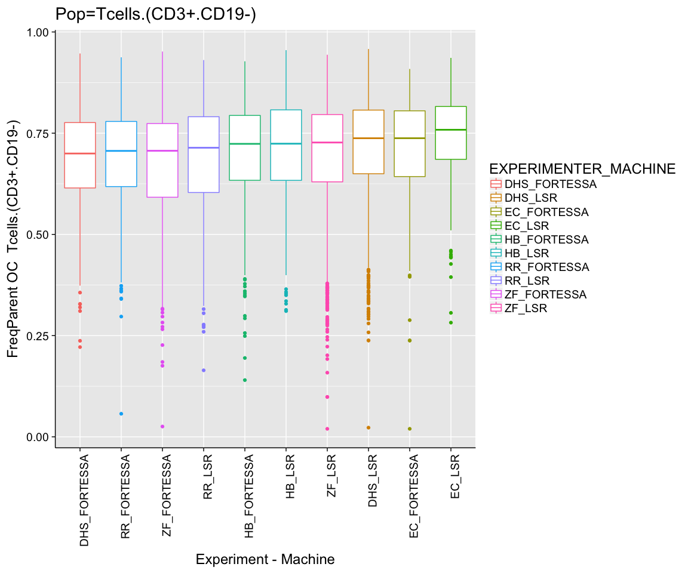<!-- -->

```
## 
## 
## |Var1 |Var2     | Freq|
## |:----|:--------|----:|
## |DHS  |FORTESSA |  703|
## |EC   |FORTESSA |  360|
## |HB   |FORTESSA |  848|
## |RR   |FORTESSA |  539|
## |ZF   |FORTESSA |  998|
## |DHS  |LSR      | 1520|
## |EC   |LSR      |  407|
## |HB   |LSR      |  489|
## |RR   |LSR      |  731|
## |ZF   |LSR      | 2484|
## [1] "Linear Regression for Tcells.(CD3+.CD19-)"
## 
## Call:
## lm(formula = formula, data = subF)
## 
## Residuals:
##      Min       1Q   Median       3Q      Max 
## -0.70008 -0.07236  0.02214  0.09340  0.27335 
## 
## Coefficients:
##                  Estimate Std. Error t value Pr(>|t|)    
## (Intercept)     9.126e-01  2.133e-01   4.280 1.89e-05 ***
## DATE_MONTH     -1.284e-05  1.239e-05  -1.037 0.299735    
## MACHINELSR      1.979e-02  2.934e-03   6.744 1.64e-11 ***
## EXPERIMENTEREC  3.086e-02  5.959e-03   5.180 2.27e-07 ***
## EXPERIMENTERHB  7.802e-03  4.492e-03   1.737 0.082452 .  
## EXPERIMENTERRR -1.055e-02  4.745e-03  -2.223 0.026248 *  
## EXPERIMENTERZF -1.187e-02  3.468e-03  -3.423 0.000623 ***
## ---
## Signif. codes:  0 '***' 0.001 '**' 0.01 '*' 0.05 '.' 0.1 ' ' 1
## 
## Residual standard error: 0.1264 on 9072 degrees of freedom
## Multiple R-squared:  0.0131,	Adjusted R-squared:  0.01245 
## F-statistic: 20.08 on 6 and 9072 DF,  p-value: < 2.2e-16
## 
## [1] "Stepwise Linear Regression for Tcells.(CD3+.CD19-)"
## Start:  AIC=-37551.02
## TARGET_FREQ ~ DATE_MONTH + MACHINE + EXPERIMENTER
## 
##                Df Sum of Sq    RSS    AIC
## - DATE_MONTH    1   0.01718 144.93 -37552
## <none>                      144.91 -37551
## - MACHINE       1   0.72642 145.64 -37508
## - EXPERIMENTER  4   1.29067 146.21 -37479
## 
## Step:  AIC=-37551.94
## TARGET_FREQ ~ MACHINE + EXPERIMENTER
## 
##                Df Sum of Sq    RSS    AIC
## <none>                      144.93 -37552
## + DATE_MONTH    1   0.01718 144.91 -37551
## - MACHINE       1   0.85180 145.78 -37501
## - EXPERIMENTER  4   1.28900 146.22 -37480
## Stepwise Model Path 
## Analysis of Deviance Table
## 
## Initial Model:
## TARGET_FREQ ~ DATE_MONTH + MACHINE + EXPERIMENTER
## 
## Final Model:
## TARGET_FREQ ~ MACHINE + EXPERIMENTER
## 
## 
##           Step Df   Deviance Resid. Df Resid. Dev       AIC
## 1                                 9072   144.9150 -37551.02
## 2 - DATE_MONTH  1 0.01717984      9073   144.9322 -37551.94
## [1] "ANOVA of EXPERIMENTER for Tcells.(CD3+.CD19-)"
##   Tukey multiple comparisons of means
##     95% family-wise confidence level
## 
## Fit: aov(formula = formula, data = subF)
## 
## $EXPERIMENTER
##                 diff          lwr          upr     p adj
## EC-DHS  0.0249039186  0.010422220  0.039385617 0.0000271
## HB-DHS  0.0007381132 -0.011230419  0.012706645 0.9998208
## RR-DHS -0.0144696596 -0.026633733 -0.002305586 0.0103475
## ZF-DHS -0.0117773115 -0.021165786 -0.002388837 0.0056278
## HB-EC  -0.0241658054 -0.039830099 -0.008501512 0.0002506
## RR-EC  -0.0393735781 -0.055187781 -0.023559376 0.0000000
## ZF-EC  -0.0366812301 -0.050474989 -0.022887471 0.0000000
## RR-HB  -0.0152077728 -0.028758240 -0.001657305 0.0187411
## ZF-HB  -0.0125154247 -0.023641697 -0.001389152 0.0183368
## ZF-RR   0.0026923481 -0.008644003  0.014028699 0.9670635
## 
## [1] "ANOVA of MACHINE for Tcells.(CD3+.CD19-)"
##               Df Sum Sq Mean Sq F value   Pr(>F)    
## MACHINE        1   0.62  0.6180   38.36 6.13e-10 ***
## Residuals   9077 146.22  0.0161                     
## ---
## Signif. codes:  0 '***' 0.001 '**' 0.01 '*' 0.05 '.' 0.1 ' ' 1
## [1] "T-test of MACHINE for Tcells.(CD3+.CD19-)"
## 
## 	Welch Two Sample t-test
## 
## data:  TARGET_FREQ by MACHINE
## t = -6.2219, df = 7393.7, p-value = 5.178e-10
## alternative hypothesis: true difference in means is not equal to 0
## 95 percent confidence interval:
##  -0.02235551 -0.01164372
## sample estimates:
## mean in group FORTESSA      mean in group LSR 
##              0.6907194              0.7077190 
## 
## [1] "# Start of new population results"
## [1] "Live.cells.(PE-)"
## [1] "n=9079"
## [1] "PLOT TYPE = Machine Time COUNT OC"
```

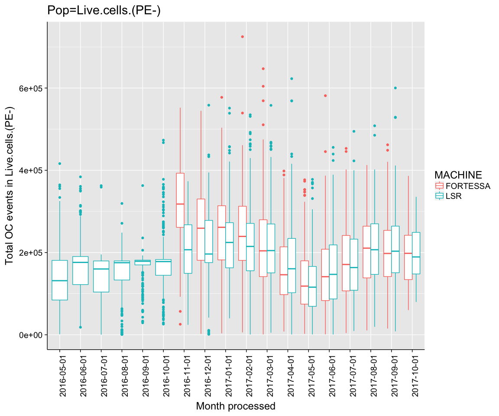<!-- -->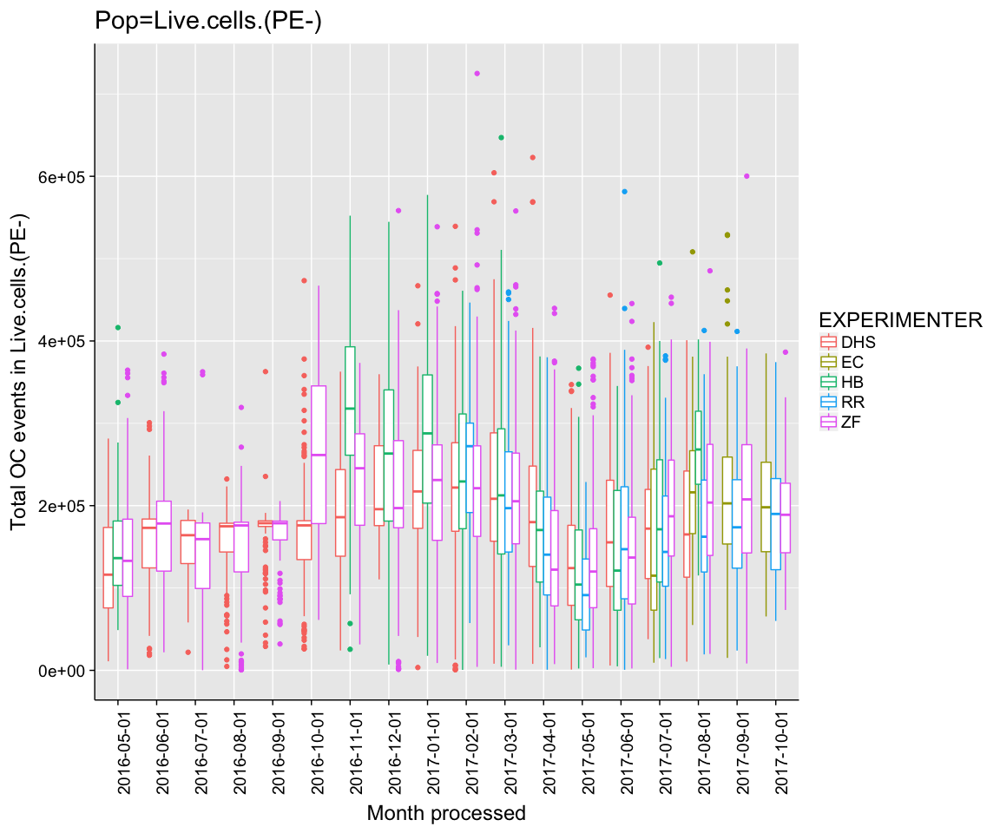<!-- -->

```
## [1] "Live.cells.(PE-)"
## [1] "n=9079"
## [1] "PLOT TYPE = Machine Time FREQ"
## [1] "NA for Freq plot"
## [1] "# Start of new population results"
## [1] "IgD-.memory.Bcells.(CD27+)"
## [1] "n=9079"
## [1] "PLOT TYPE = Machine Time COUNT OC"
```

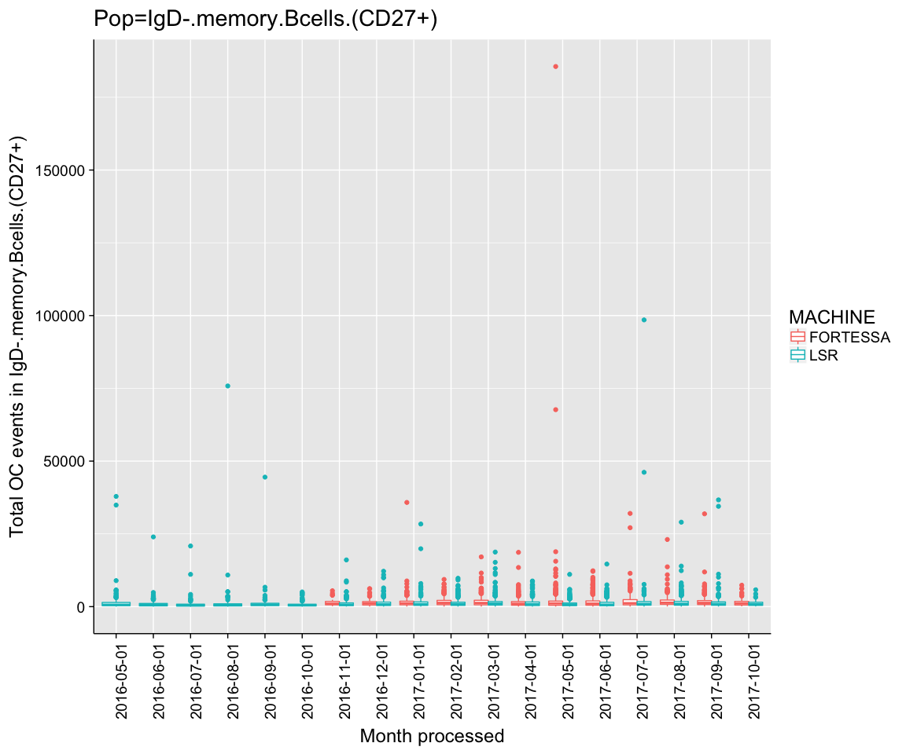<!-- -->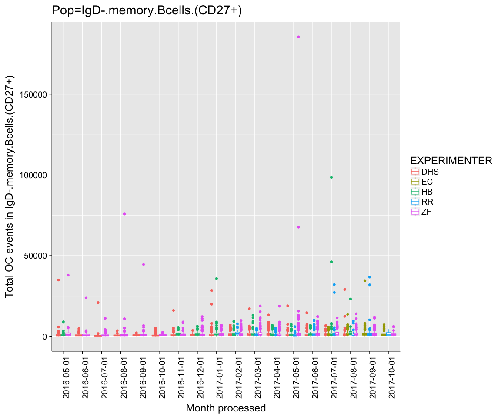<!-- -->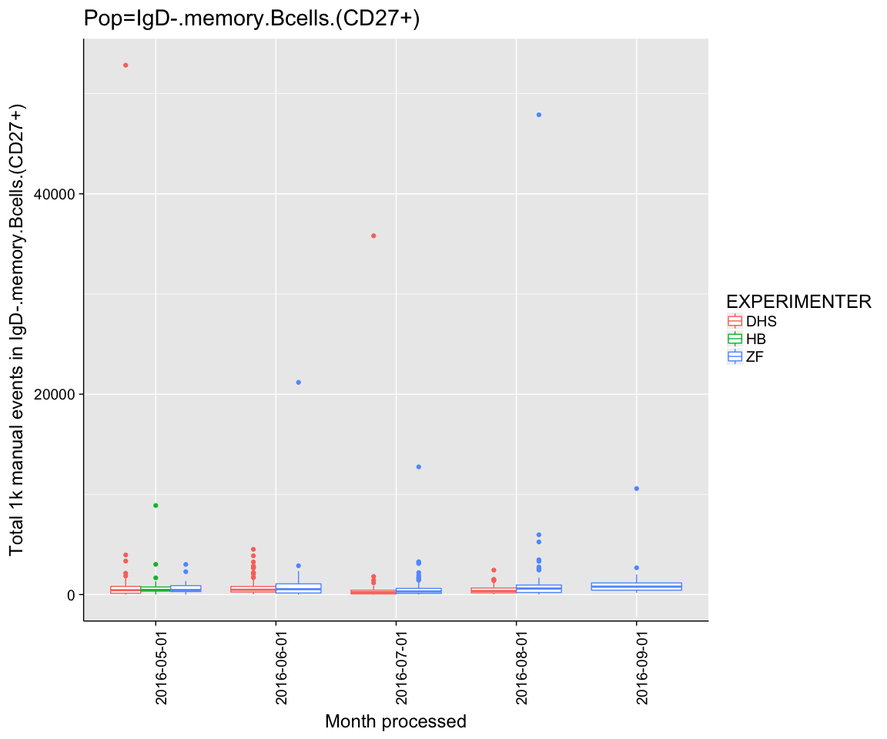<!-- -->

```
## [1] "Correlations between OC and manual for IgD-.memory.Bcells.(CD27+)"
## 
## 	Pearson's product-moment correlation
## 
## data:  merge[, colC] and merge[, coljflowCount]
## t = 51.571, df = 904, p-value < 2.2e-16
## alternative hypothesis: true correlation is not equal to 0
## 95 percent confidence interval:
##  0.8463927 0.8795422
## sample estimates:
##    cor 
## 0.8639 
## 
## 
## 	Spearman's rank correlation rho
## 
## data:  merge[, colC] and merge[, coljflowCount]
## S = 11178000, p-value < 2.2e-16
## alternative hypothesis: true rho is not equal to 0
## sample estimates:
##       rho 
## 0.9098132
```

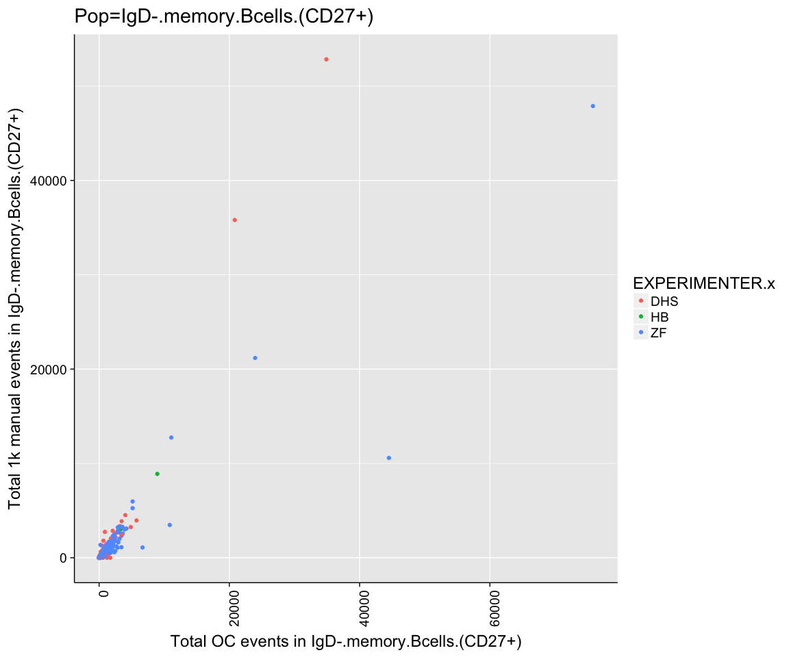<!-- -->

```
## [1] "IgD-.memory.Bcells.(CD27+)"
## [1] "n=9079"
## [1] "PLOT TYPE = Machine Time FREQ"
```

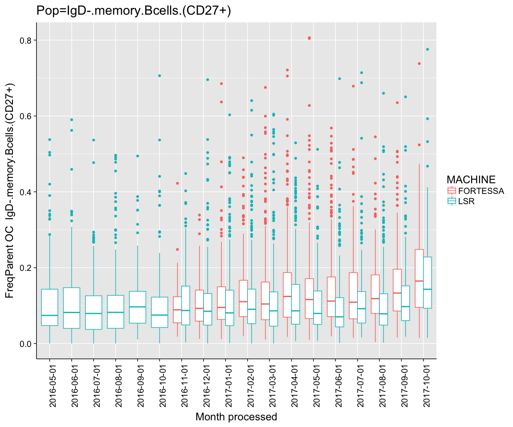<!-- -->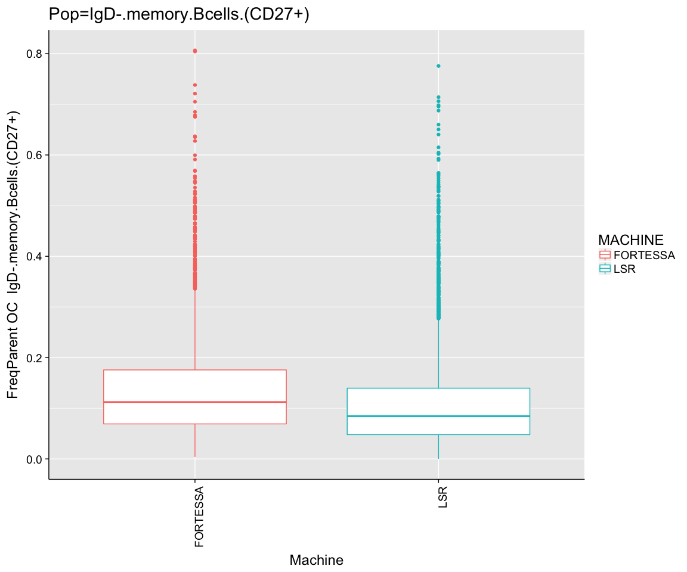<!-- -->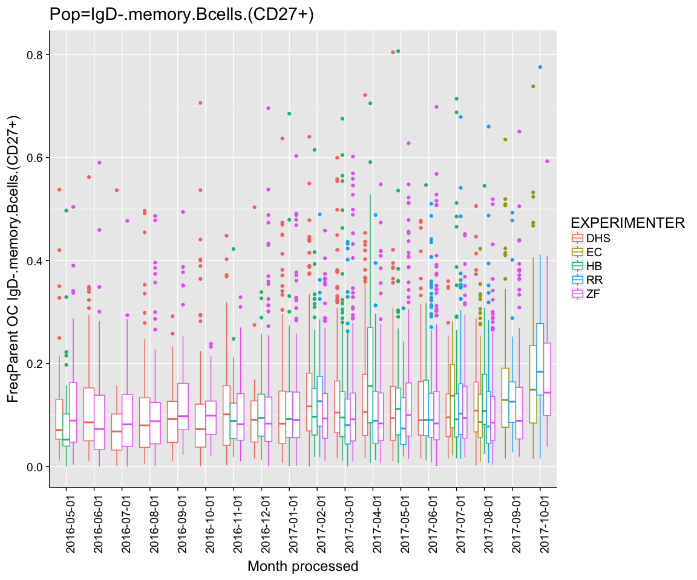<!-- --><!-- -->

```
## 
## 
## |Var1 |Var2     | Freq|
## |:----|:--------|----:|
## |DHS  |FORTESSA |  703|
## |EC   |FORTESSA |  360|
## |HB   |FORTESSA |  848|
## |RR   |FORTESSA |  539|
## |ZF   |FORTESSA |  998|
## |DHS  |LSR      | 1520|
## |EC   |LSR      |  407|
## |HB   |LSR      |  489|
## |RR   |LSR      |  731|
## |ZF   |LSR      | 2484|
## [1] "Linear Regression for IgD-.memory.Bcells.(CD27+)"
## 
## Call:
## lm(formula = formula, data = subF)
## 
## Residuals:
##      Min       1Q   Median       3Q      Max 
## -0.13975 -0.06234 -0.02316  0.03335  0.66984 
## 
## Coefficients:
##                  Estimate Std. Error t value Pr(>|t|)    
## (Intercept)    -5.529e-01  1.565e-01  -3.533 0.000414 ***
## DATE_MONTH      4.018e-05  9.091e-06   4.420    1e-05 ***
## MACHINELSR     -2.666e-02  2.154e-03 -12.379  < 2e-16 ***
## EXPERIMENTEREC  3.548e-03  4.374e-03   0.811 0.417302    
## EXPERIMENTERHB -5.014e-03  3.297e-03  -1.521 0.128384    
## EXPERIMENTERRR -1.184e-02  3.483e-03  -3.399 0.000680 ***
## EXPERIMENTERZF -5.551e-03  2.546e-03  -2.181 0.029237 *  
## ---
## Signif. codes:  0 '***' 0.001 '**' 0.01 '*' 0.05 '.' 0.1 ' ' 1
## 
## Residual standard error: 0.09277 on 9072 degrees of freedom
## Multiple R-squared:  0.0279,	Adjusted R-squared:  0.02725 
## F-statistic: 43.39 on 6 and 9072 DF,  p-value: < 2.2e-16
## 
## [1] "Stepwise Linear Regression for IgD-.memory.Bcells.(CD27+)"
## Start:  AIC=-43166.31
## TARGET_FREQ ~ DATE_MONTH + MACHINE + EXPERIMENTER
## 
##                Df Sum of Sq    RSS    AIC
## <none>                      78.074 -43166
## - EXPERIMENTER  4   0.16623 78.240 -43155
## - DATE_MONTH    1   0.16811 78.242 -43149
## - MACHINE       1   1.31869 79.392 -43016
## Stepwise Model Path 
## Analysis of Deviance Table
## 
## Initial Model:
## TARGET_FREQ ~ DATE_MONTH + MACHINE + EXPERIMENTER
## 
## Final Model:
## TARGET_FREQ ~ DATE_MONTH + MACHINE + EXPERIMENTER
## 
## 
##   Step Df Deviance Resid. Df Resid. Dev       AIC
## 1                       9072    78.0738 -43166.31
## [1] "ANOVA of EXPERIMENTER for IgD-.memory.Bcells.(CD27+)"
##   Tukey multiple comparisons of means
##     95% family-wise confidence level
## 
## Fit: aov(formula = formula, data = subF)
## 
## $EXPERIMENTER
##                diff          lwr           upr     p adj
## EC-DHS  0.016795096  0.006070208  0.0275199845 0.0001896
## HB-DHS  0.005876855 -0.002986827  0.0147405368 0.3683302
## RR-DHS -0.003381406 -0.012389902  0.0056270905 0.8443370
## ZF-DHS -0.004800134 -0.011753072  0.0021528028 0.3262233
## HB-EC  -0.010918241 -0.022518938  0.0006824557 0.0764809
## RR-EC  -0.020176502 -0.031888219 -0.0084647847 0.0000260
## ZF-EC  -0.021595231 -0.031810643 -0.0113798181 0.0000001
## RR-HB  -0.009258261 -0.019293496  0.0007769746 0.0869107
## ZF-HB  -0.010676989 -0.018916909 -0.0024370695 0.0037512
## ZF-RR  -0.001418729 -0.009814229  0.0069767715 0.9907208
## 
## [1] "ANOVA of MACHINE for IgD-.memory.Bcells.(CD27+)"
##               Df Sum Sq Mean Sq F value Pr(>F)    
## MACHINE        1   1.86  1.8645   215.7 <2e-16 ***
## Residuals   9077  78.45  0.0086                   
## ---
## Signif. codes:  0 '***' 0.001 '**' 0.01 '*' 0.05 '.' 0.1 ' ' 1
## [1] "T-test of MACHINE for IgD-.memory.Bcells.(CD27+)"
## 
## 	Welch Two Sample t-test
## 
## data:  TARGET_FREQ by MACHINE
## t = 14.373, df = 6786.2, p-value < 2.2e-16
## alternative hypothesis: true difference in means is not equal to 0
## 95 percent confidence interval:
##  0.02550054 0.03355476
## sample estimates:
## mean in group FORTESSA      mean in group LSR 
##              0.1370574              0.1075298 
## 
## [1] "# Start of new population results"
## [1] "IgD+.memory.Bcells.(CD27+)"
## [1] "n=9079"
## [1] "PLOT TYPE = Machine Time COUNT OC"
```

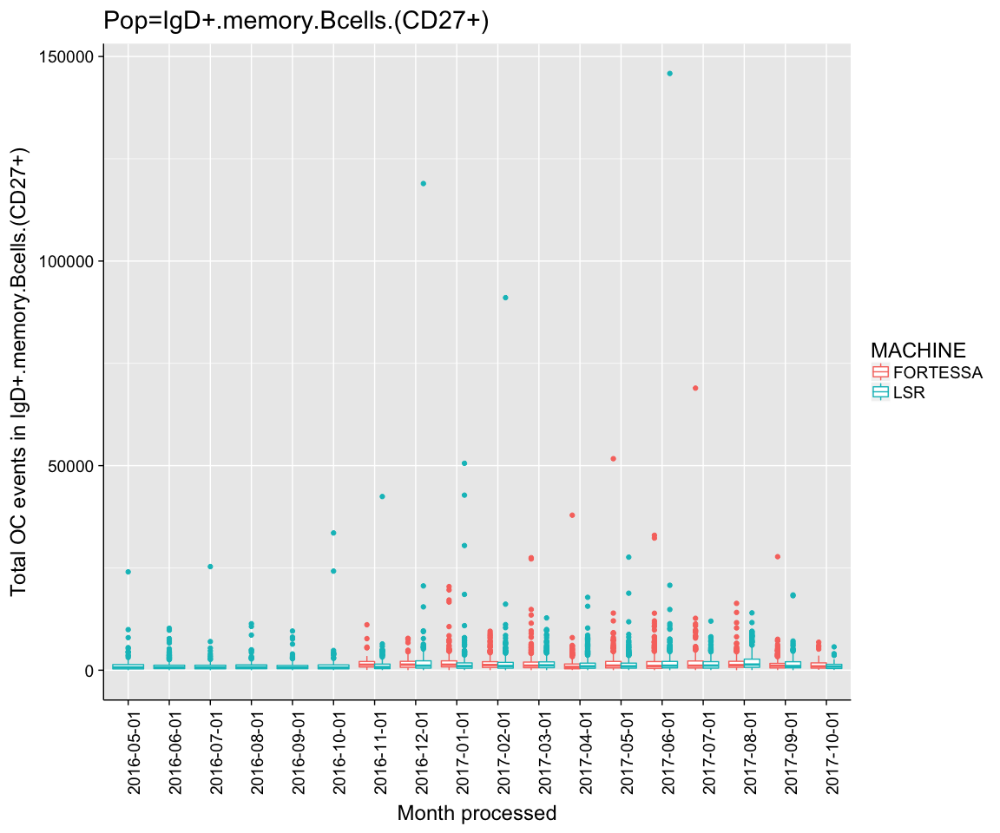<!-- -->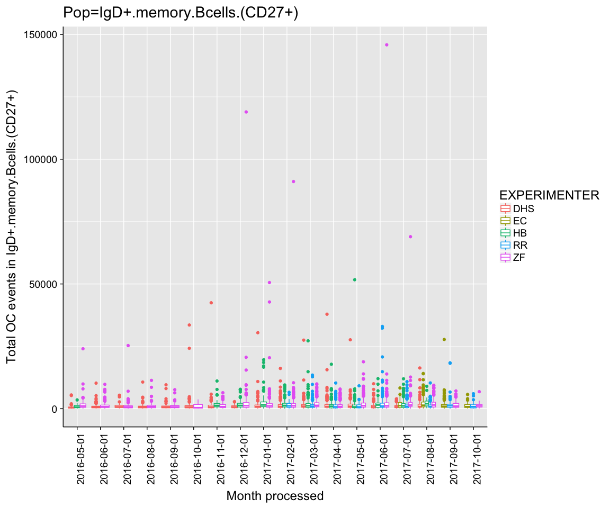<!-- -->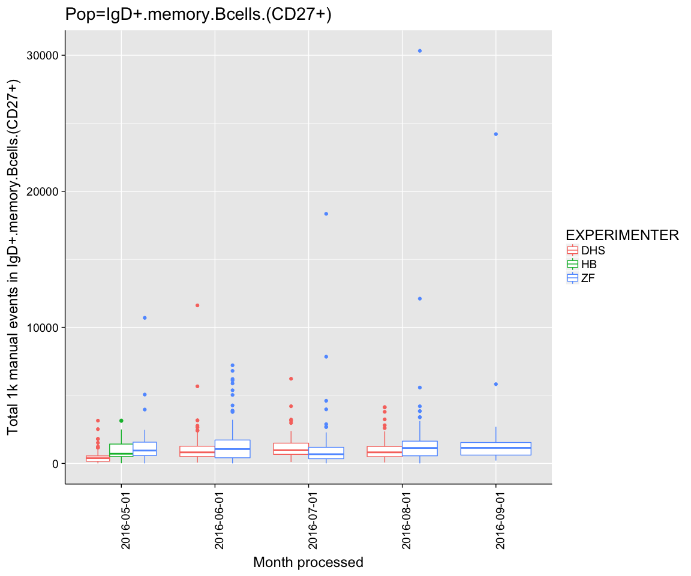<!-- -->

```
## [1] "Correlations between OC and manual for IgD+.memory.Bcells.(CD27+)"
## 
## 	Pearson's product-moment correlation
## 
## data:  merge[, colC] and merge[, coljflowCount]
## t = 23.963, df = 904, p-value < 2.2e-16
## alternative hypothesis: true correlation is not equal to 0
## 95 percent confidence interval:
##  0.5817408 0.6615343
## sample estimates:
##       cor 
## 0.6232571 
## 
## 
## 	Spearman's rank correlation rho
## 
## data:  merge[, colC] and merge[, coljflowCount]
## S = 13732000, p-value < 2.2e-16
## alternative hypothesis: true rho is not equal to 0
## sample estimates:
##       rho 
## 0.8892079
```

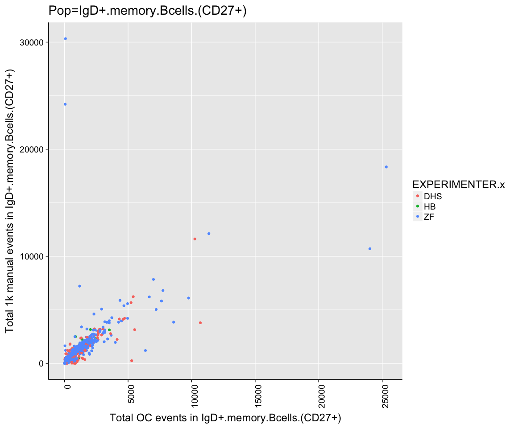<!-- -->

```
## [1] "IgD+.memory.Bcells.(CD27+)"
## [1] "n=9079"
## [1] "PLOT TYPE = Machine Time FREQ"
```

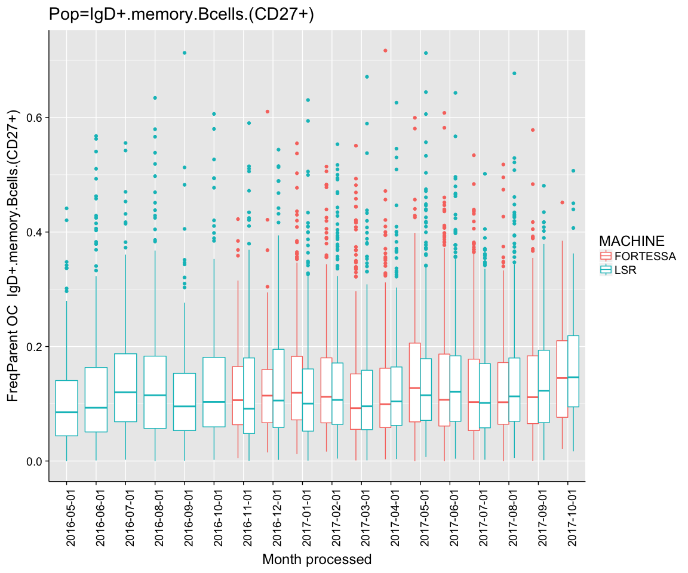<!-- -->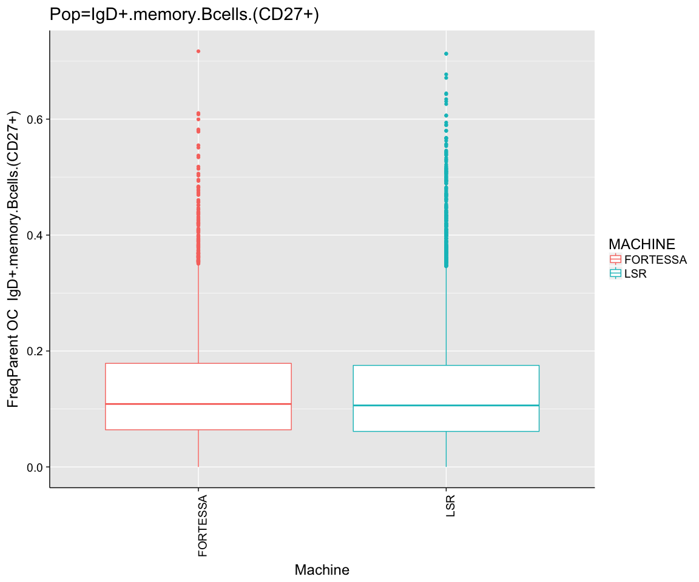<!-- -->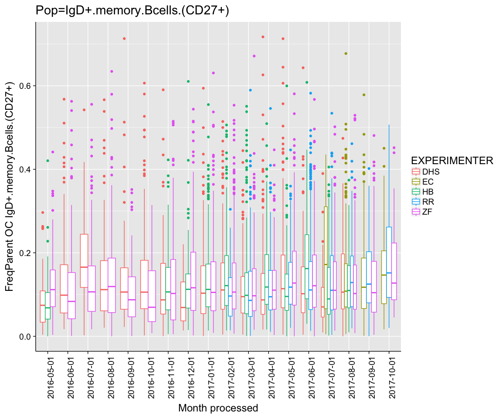<!-- -->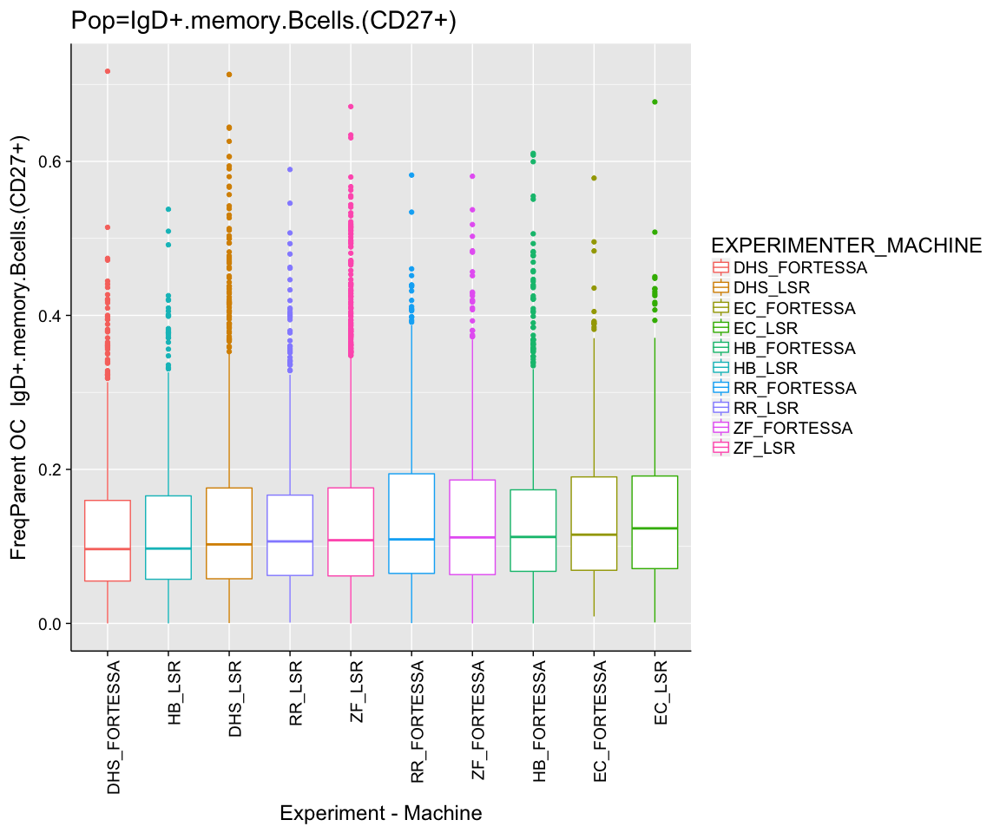<!-- -->

```
## 
## 
## |Var1 |Var2     | Freq|
## |:----|:--------|----:|
## |DHS  |FORTESSA |  703|
## |EC   |FORTESSA |  360|
## |HB   |FORTESSA |  848|
## |RR   |FORTESSA |  539|
## |ZF   |FORTESSA |  998|
## |DHS  |LSR      | 1520|
## |EC   |LSR      |  407|
## |HB   |LSR      |  489|
## |RR   |LSR      |  731|
## |ZF   |LSR      | 2484|
## [1] "Linear Regression for IgD+.memory.Bcells.(CD27+)"
## 
## Call:
## lm(formula = formula, data = subF)
## 
## Residuals:
##      Min       1Q   Median       3Q      Max 
## -0.14227 -0.07181 -0.02639  0.04242  0.58630 
## 
## Coefficients:
##                  Estimate Std. Error t value Pr(>|t|)  
## (Intercept)    -2.346e-01  1.687e-01  -1.391   0.1644  
## DATE_MONTH      2.123e-05  9.797e-06   2.167   0.0303 *
## MACHINELSR     -6.149e-04  2.321e-03  -0.265   0.7911  
## EXPERIMENTEREC  9.085e-03  4.713e-03   1.928   0.0539 .
## EXPERIMENTERHB  2.921e-03  3.553e-03   0.822   0.4110  
## EXPERIMENTERRR  1.969e-03  3.753e-03   0.525   0.5998  
## EXPERIMENTERZF  3.976e-03  2.743e-03   1.449   0.1473  
## ---
## Signif. codes:  0 '***' 0.001 '**' 0.01 '*' 0.05 '.' 0.1 ' ' 1
## 
## Residual standard error: 0.09997 on 9072 degrees of freedom
## Multiple R-squared:  0.001869,	Adjusted R-squared:  0.001209 
## F-statistic: 2.831 on 6 and 9072 DF,  p-value: 0.009378
## 
## [1] "Stepwise Linear Regression for IgD+.memory.Bcells.(CD27+)"
## Start:  AIC=-41808.78
## TARGET_FREQ ~ DATE_MONTH + MACHINE + EXPERIMENTER
## 
##                Df Sum of Sq    RSS    AIC
## - EXPERIMENTER  4  0.046168 90.712 -41812
## - MACHINE       1  0.000701 90.666 -41811
## <none>                      90.666 -41809
## - DATE_MONTH    1  0.046932 90.713 -41806
## 
## Step:  AIC=-41812.16
## TARGET_FREQ ~ DATE_MONTH + MACHINE
## 
##                Df Sum of Sq    RSS    AIC
## - MACHINE       1  0.000171 90.712 -41814
## <none>                      90.712 -41812
## + EXPERIMENTER  4  0.046168 90.666 -41809
## - DATE_MONTH    1  0.111092 90.823 -41803
## 
## Step:  AIC=-41814.14
## TARGET_FREQ ~ DATE_MONTH
## 
##                Df Sum of Sq    RSS    AIC
## <none>                      90.712 -41814
## + MACHINE       1  0.000171 90.712 -41812
## + EXPERIMENTER  4  0.045638 90.666 -41811
## - DATE_MONTH    1  0.123423 90.835 -41804
## Stepwise Model Path 
## Analysis of Deviance Table
## 
## Initial Model:
## TARGET_FREQ ~ DATE_MONTH + MACHINE + EXPERIMENTER
## 
## Final Model:
## TARGET_FREQ ~ DATE_MONTH
## 
## 
##             Step Df     Deviance Resid. Df Resid. Dev       AIC
## 1                                     9072   90.66569 -41808.78
## 2 - EXPERIMENTER  4 0.0461682962      9076   90.71185 -41812.16
## 3      - MACHINE  1 0.0001711449      9077   90.71202 -41814.14
## [1] "ANOVA of EXPERIMENTER for IgD+.memory.Bcells.(CD27+)"
##   Tukey multiple comparisons of means
##     95% family-wise confidence level
## 
## Fit: aov(formula = formula, data = subF)
## 
## $EXPERIMENTER
##                 diff          lwr         upr     p adj
## EC-DHS  0.0140214684  0.002597490 0.025445447 0.0072861
## HB-DHS  0.0043915476 -0.005049904 0.013832999 0.7103108
## RR-DHS  0.0049798346 -0.004615871 0.014575540 0.6173700
## ZF-DHS  0.0047714632 -0.002634694 0.012177620 0.3986170
## HB-EC  -0.0096299208 -0.021986797 0.002726955 0.2089183
## RR-EC  -0.0090416338 -0.021516766 0.003433499 0.2771083
## ZF-EC  -0.0092500052 -0.020131298 0.001631288 0.1387690
## RR-HB   0.0005882870 -0.010101084 0.011277658 0.9998860
## ZF-HB   0.0003799156 -0.008397114 0.009156945 0.9999562
## ZF-RR  -0.0002083714 -0.009151123 0.008734380 0.9999963
## 
## [1] "ANOVA of MACHINE for IgD+.memory.Bcells.(CD27+)"
##               Df Sum Sq Mean Sq F value Pr(>F)
## MACHINE        1   0.01 0.01250   1.249  0.264
## Residuals   9077  90.82 0.01001               
## [1] "T-test of MACHINE for IgD+.memory.Bcells.(CD27+)"
## 
## 	Welch Two Sample t-test
## 
## data:  TARGET_FREQ by MACHINE
## t = 1.1264, df = 7467.9, p-value = 0.26
## alternative hypothesis: true difference in means is not equal to 0
## 95 percent confidence interval:
##  -0.001789842  0.006625580
## sample estimates:
## mean in group FORTESSA      mean in group LSR 
##              0.1354314              0.1330136 
## 
## [1] "# Start of new population results"
## [1] "Helper.Tcells-CD4+"
## [1] "n=9079"
## [1] "PLOT TYPE = Machine Time COUNT OC"
```

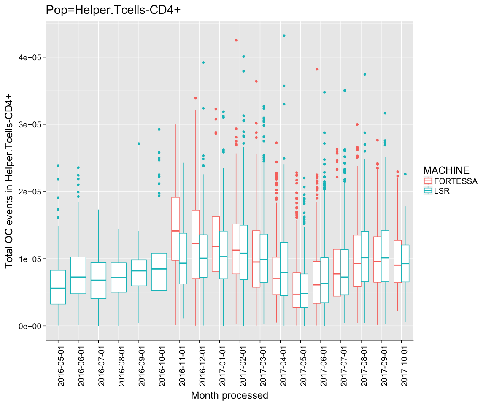<!-- --><!-- -->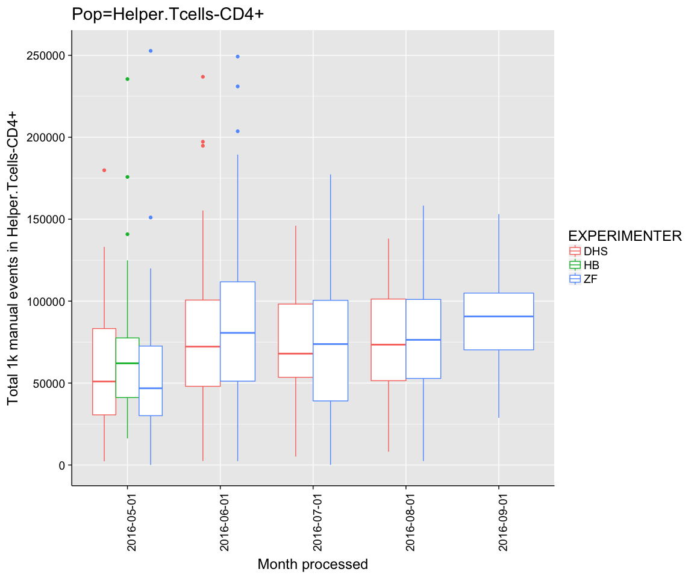<!-- -->

```
## [1] "Correlations between OC and manual for Helper.Tcells-CD4+"
## 
## 	Pearson's product-moment correlation
## 
## data:  merge[, colC] and merge[, coljflowCount]
## t = 512.22, df = 904, p-value < 2.2e-16
## alternative hypothesis: true correlation is not equal to 0
## 95 percent confidence interval:
##  0.9980425 0.9984917
## sample estimates:
##       cor 
## 0.9982817 
## 
## 
## 	Spearman's rank correlation rho
## 
## data:  merge[, colC] and merge[, coljflowCount]
## S = 194570, p-value < 2.2e-16
## alternative hypothesis: true rho is not equal to 0
## sample estimates:
##       rho 
## 0.9984302
```

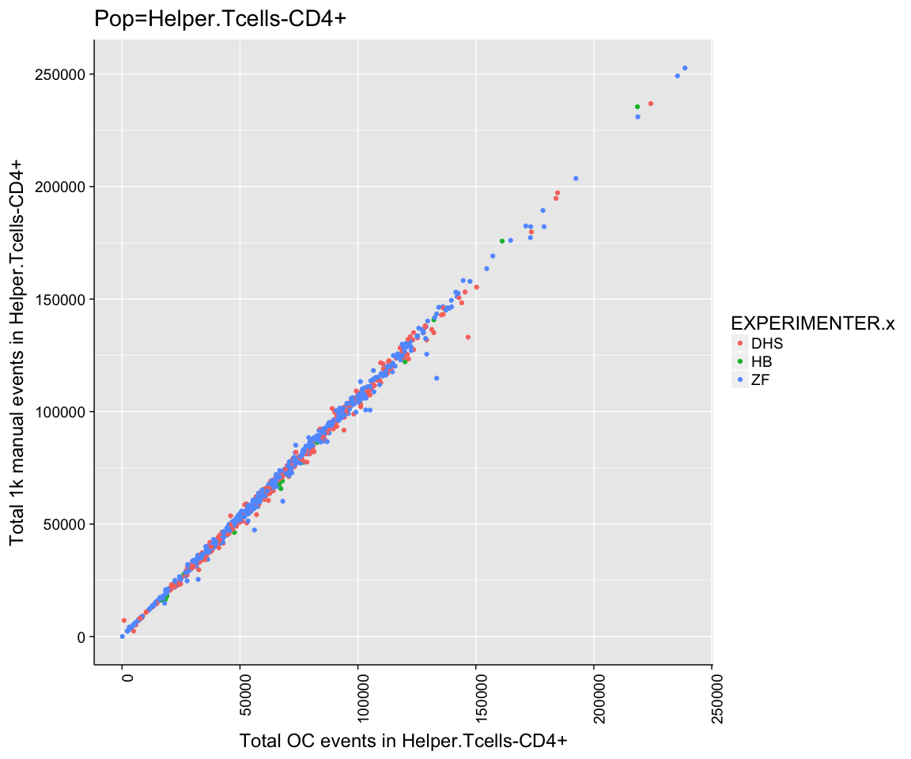<!-- -->

```
## [1] "Helper.Tcells-CD4+"
## [1] "n=9079"
## [1] "PLOT TYPE = Machine Time FREQ"
```

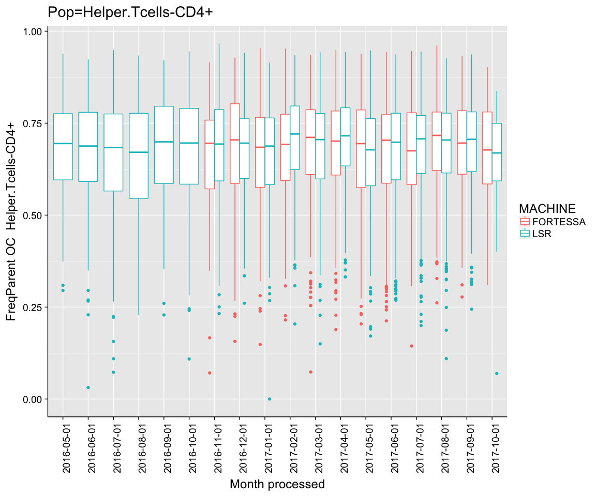<!-- -->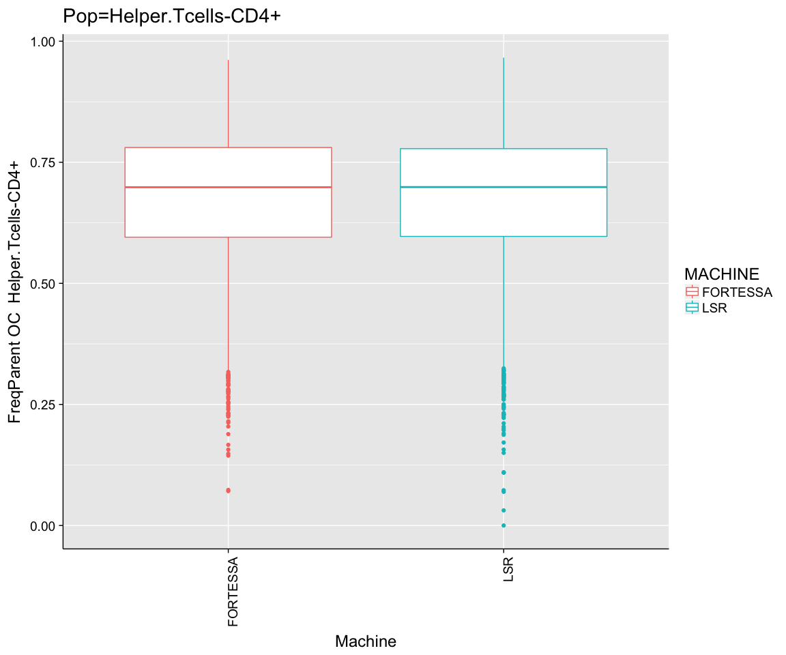<!-- -->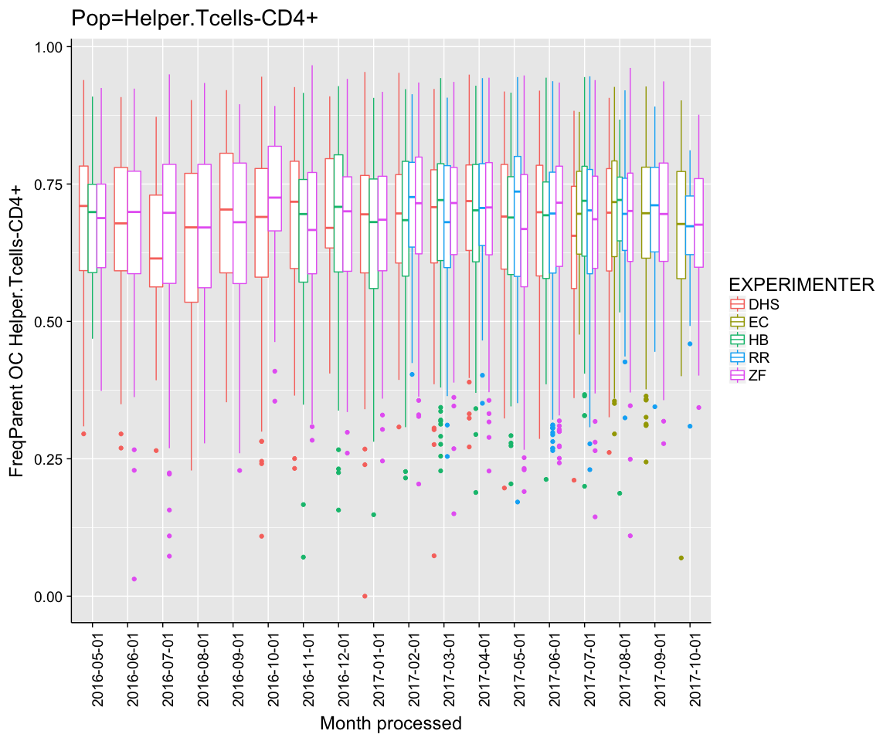<!-- -->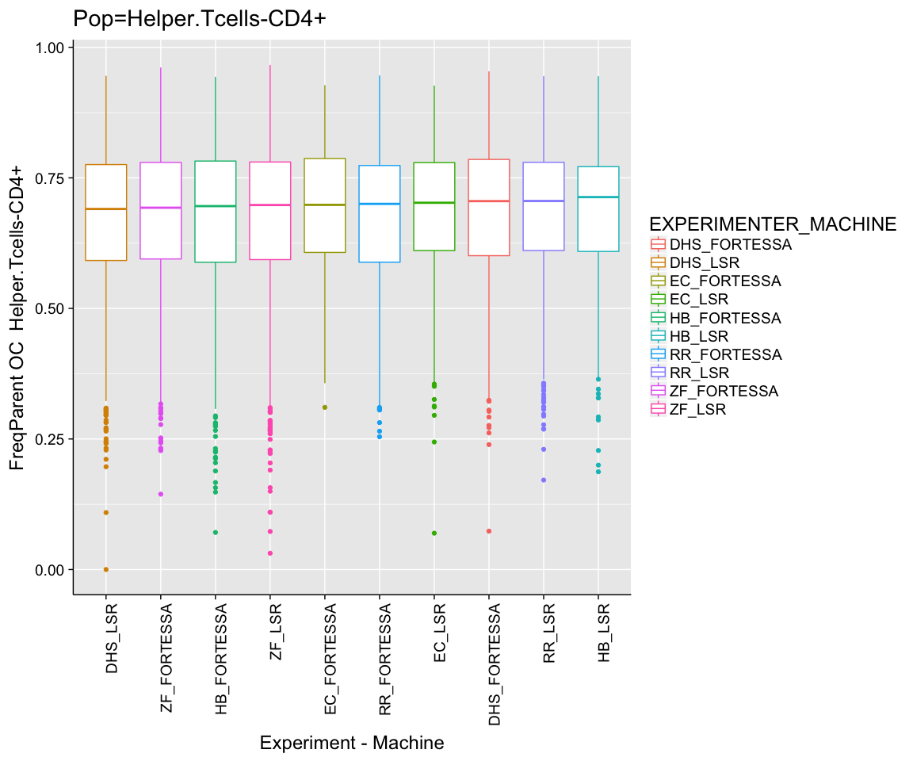<!-- -->

```
## 
## 
## |Var1 |Var2     | Freq|
## |:----|:--------|----:|
## |DHS  |FORTESSA |  703|
## |EC   |FORTESSA |  360|
## |HB   |FORTESSA |  848|
## |RR   |FORTESSA |  539|
## |ZF   |FORTESSA |  998|
## |DHS  |LSR      | 1520|
## |EC   |LSR      |  407|
## |HB   |LSR      |  489|
## |RR   |LSR      |  731|
## |ZF   |LSR      | 2484|
## [1] "Linear Regression for Helper.Tcells-CD4+"
## 
## Call:
## lm(formula = formula, data = subF)
## 
## Residuals:
##      Min       1Q   Median       3Q      Max 
## -0.67778 -0.08244  0.01993  0.09994  0.29133 
## 
## Coefficients:
##                  Estimate Std. Error t value Pr(>|t|)   
## (Intercept)     4.811e-02  2.314e-01   0.208  0.83528   
## DATE_MONTH      3.649e-05  1.344e-05   2.716  0.00663 **
## MACHINELSR      3.229e-03  3.184e-03   1.014  0.31046   
## EXPERIMENTEREC  3.432e-03  6.465e-03   0.531  0.59553   
## EXPERIMENTERHB  6.912e-05  4.874e-03   0.014  0.98868   
## EXPERIMENTERRR -2.009e-03  5.148e-03  -0.390  0.69641   
## EXPERIMENTERZF -7.212e-04  3.763e-03  -0.192  0.84801   
## ---
## Signif. codes:  0 '***' 0.001 '**' 0.01 '*' 0.05 '.' 0.1 ' ' 1
## 
## Residual standard error: 0.1371 on 9072 degrees of freedom
## Multiple R-squared:  0.001295,	Adjusted R-squared:  0.0006345 
## F-statistic: 1.961 on 6 and 9072 DF,  p-value: 0.06759
## 
## [1] "Stepwise Linear Regression for Helper.Tcells-CD4+"
## Start:  AIC=-36070.3
## TARGET_FREQ ~ DATE_MONTH + MACHINE + EXPERIMENTER
## 
##                Df Sum of Sq    RSS    AIC
## - EXPERIMENTER  4  0.014773 170.60 -36078
## - MACHINE       1  0.019346 170.60 -36071
## <none>                      170.59 -36070
## - DATE_MONTH    1  0.138667 170.72 -36065
## 
## Step:  AIC=-36077.52
## TARGET_FREQ ~ DATE_MONTH + MACHINE
## 
##                Df Sum of Sq    RSS    AIC
## - MACHINE       1  0.020136 170.62 -36078
## <none>                      170.60 -36078
## + EXPERIMENTER  4  0.014773 170.59 -36070
## - DATE_MONTH    1  0.206216 170.81 -36069
## 
## Step:  AIC=-36078.45
## TARGET_FREQ ~ DATE_MONTH
## 
##                Df Sum of Sq    RSS    AIC
## <none>                      170.62 -36078
## + MACHINE       1  0.020136 170.60 -36078
## + EXPERIMENTER  4  0.015563 170.60 -36071
## - DATE_MONTH    1  0.186281 170.81 -36071
## Stepwise Model Path 
## Analysis of Deviance Table
## 
## Initial Model:
## TARGET_FREQ ~ DATE_MONTH + MACHINE + EXPERIMENTER
## 
## Final Model:
## TARGET_FREQ ~ DATE_MONTH
## 
## 
##             Step Df   Deviance Resid. Df Resid. Dev       AIC
## 1                                   9072   170.5860 -36070.30
## 2 - EXPERIMENTER  4 0.01477341      9076   170.6007 -36077.52
## 3      - MACHINE  1 0.02013578      9077   170.6209 -36078.45
## [1] "ANOVA of EXPERIMENTER for Helper.Tcells-CD4+"
##   Tukey multiple comparisons of means
##     95% family-wise confidence level
## 
## Fit: aov(formula = formula, data = subF)
## 
## $EXPERIMENTER
##                 diff          lwr         upr     p adj
## EC-DHS  0.0112615108 -0.004410137 0.026933159 0.2855988
## HB-DHS  0.0012330966 -0.011718880 0.014185073 0.9990003
## RR-DHS  0.0027022260 -0.010461359 0.015865811 0.9807076
## ZF-DHS  0.0007738665 -0.009386051 0.010933784 0.9995858
## HB-EC  -0.0100284142 -0.026979830 0.006923001 0.4883050
## RR-EC  -0.0085592848 -0.025672928 0.008554358 0.6504826
## ZF-EC  -0.0104876442 -0.025414825 0.004439536 0.3082727
## RR-HB   0.0014691294 -0.013194769 0.016133028 0.9987782
## ZF-HB  -0.0004592301 -0.012499740 0.011581280 0.9999736
## ZF-RR  -0.0019283594 -0.014196210 0.010339491 0.9929611
## 
## [1] "ANOVA of MACHINE for Helper.Tcells-CD4+"
##               Df Sum Sq  Mean Sq F value Pr(>F)
## MACHINE        1    0.0 0.000201   0.011  0.918
## Residuals   9077  170.8 0.018818               
## [1] "T-test of MACHINE for Helper.Tcells-CD4+"
## 
## 	Welch Two Sample t-test
## 
## data:  TARGET_FREQ by MACHINE
## t = -0.10327, df = 7281.3, p-value = 0.9177
## alternative hypothesis: true difference in means is not equal to 0
## 95 percent confidence interval:
##  -0.006122979  0.005510118
## sample estimates:
## mean in group FORTESSA      mean in group LSR 
##              0.6785599              0.6788663 
## 
## [1] "# Start of new population results"
## [1] "B.cells.(CD3-.CD19+)"
## [1] "n=9079"
## [1] "PLOT TYPE = Machine Time COUNT OC"
```

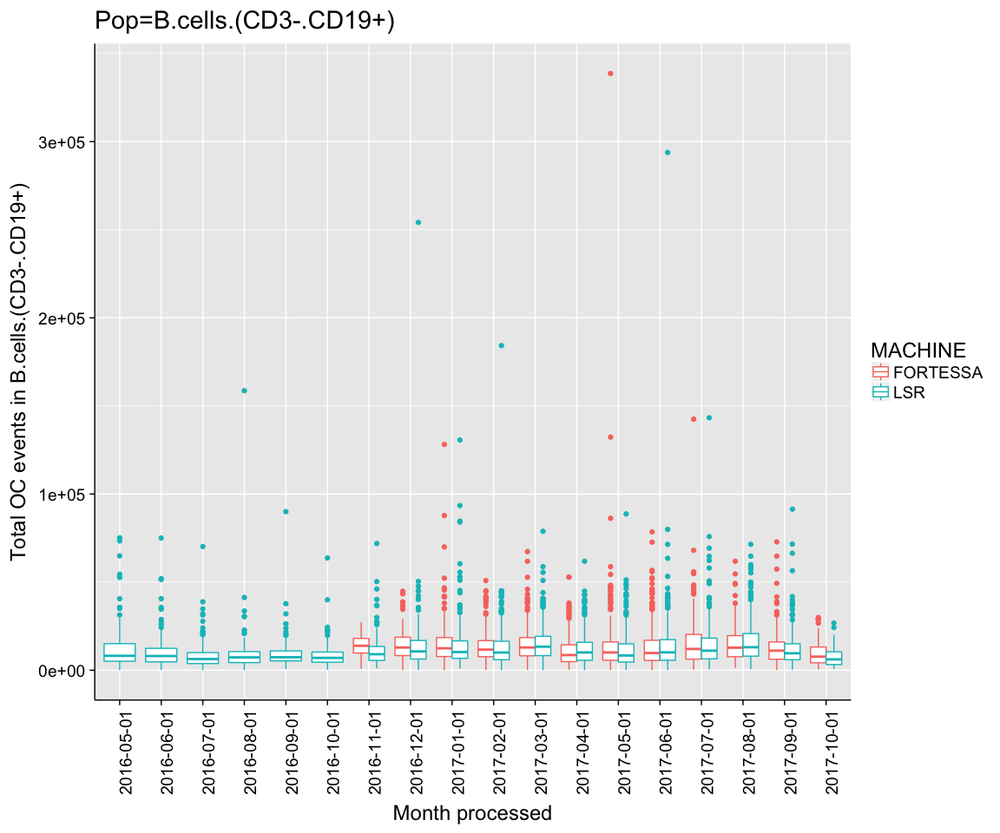<!-- -->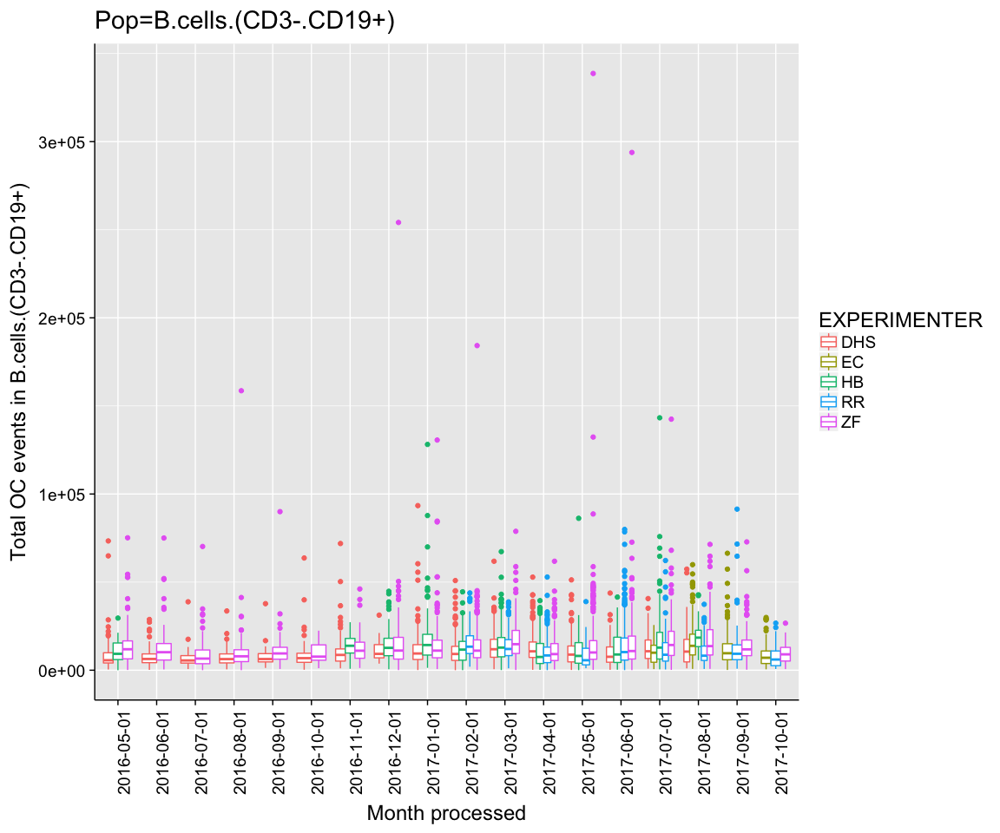<!-- -->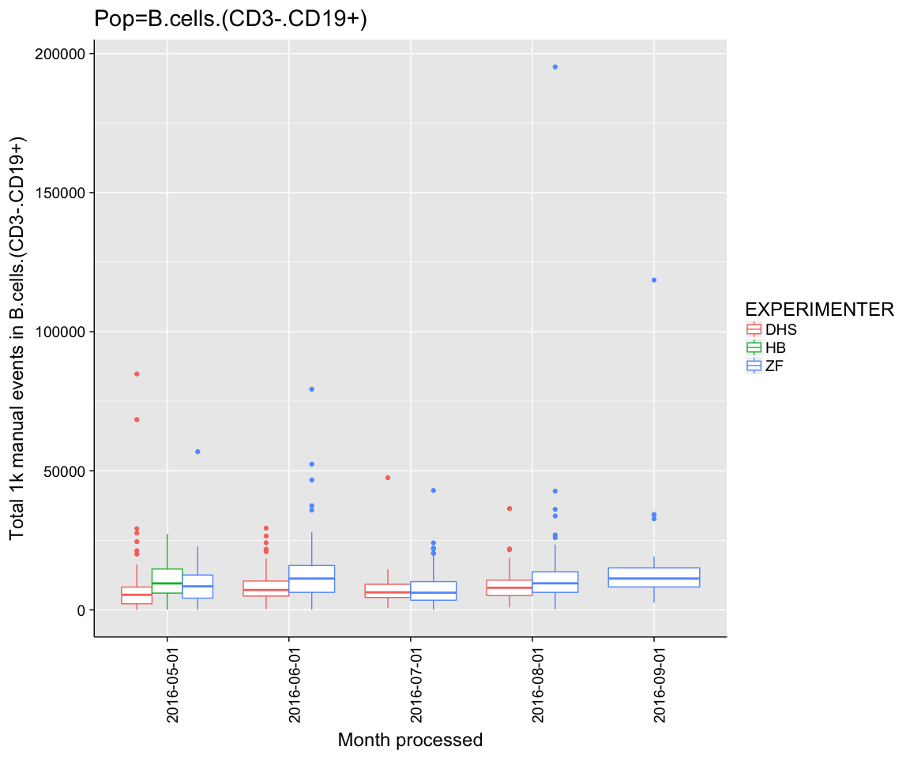<!-- -->

```
## [1] "Correlations between OC and manual for B.cells.(CD3-.CD19+)"
## 
## 	Pearson's product-moment correlation
## 
## data:  merge[, colC] and merge[, coljflowCount]
## t = 95.035, df = 904, p-value < 2.2e-16
## alternative hypothesis: true correlation is not equal to 0
## 95 percent confidence interval:
##  0.9471045 0.9590023
## sample estimates:
##       cor 
## 0.9534228 
## 
## 
## 	Spearman's rank correlation rho
## 
## data:  merge[, colC] and merge[, coljflowCount]
## S = 8223000, p-value < 2.2e-16
## alternative hypothesis: true rho is not equal to 0
## sample estimates:
##       rho 
## 0.9336565
```

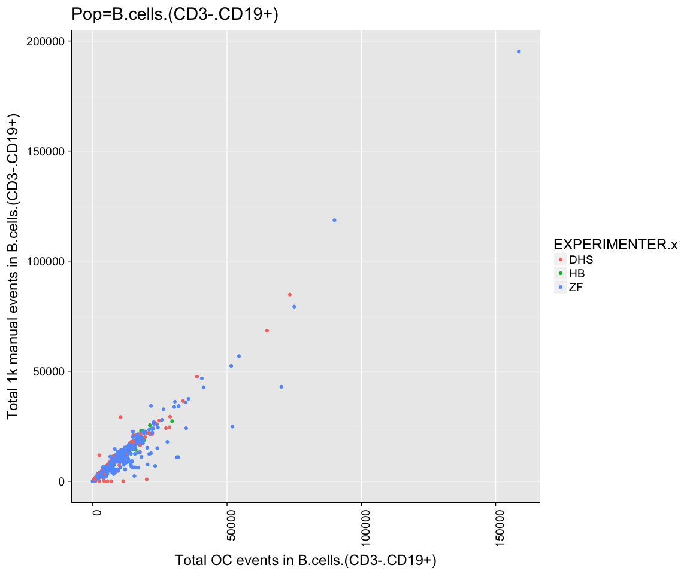<!-- -->

```
## [1] "B.cells.(CD3-.CD19+)"
## [1] "n=9079"
## [1] "PLOT TYPE = Machine Time FREQ"
```

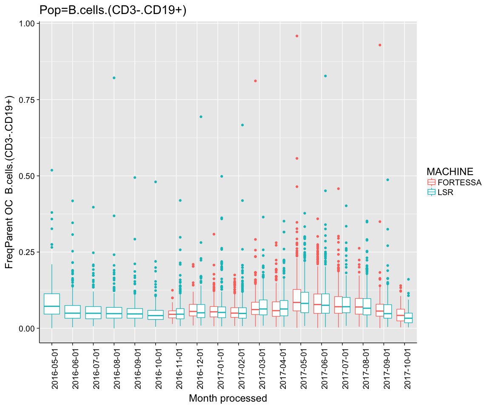<!-- -->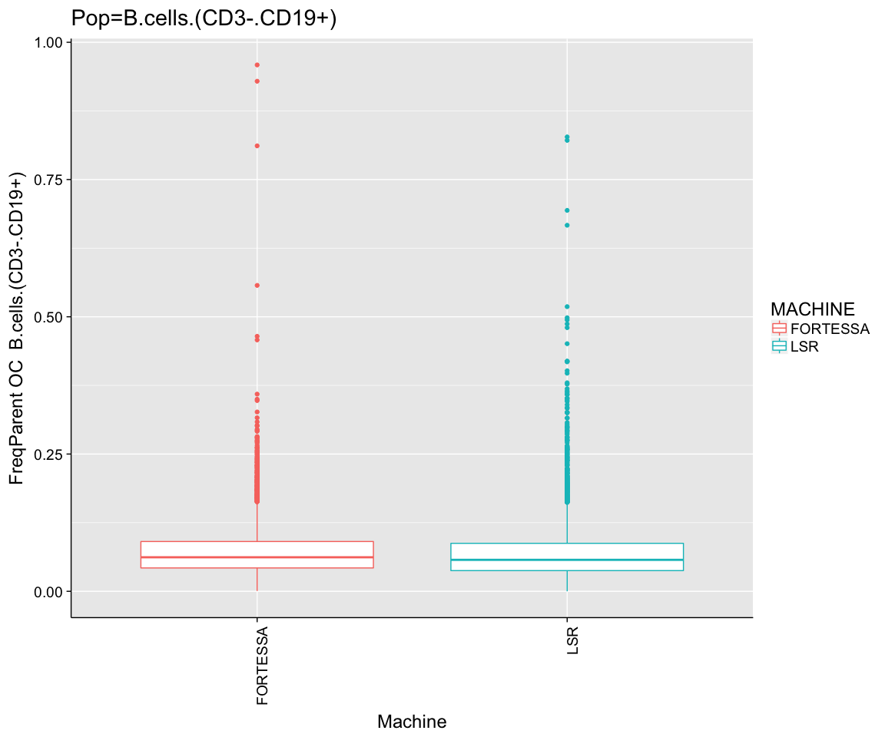<!-- -->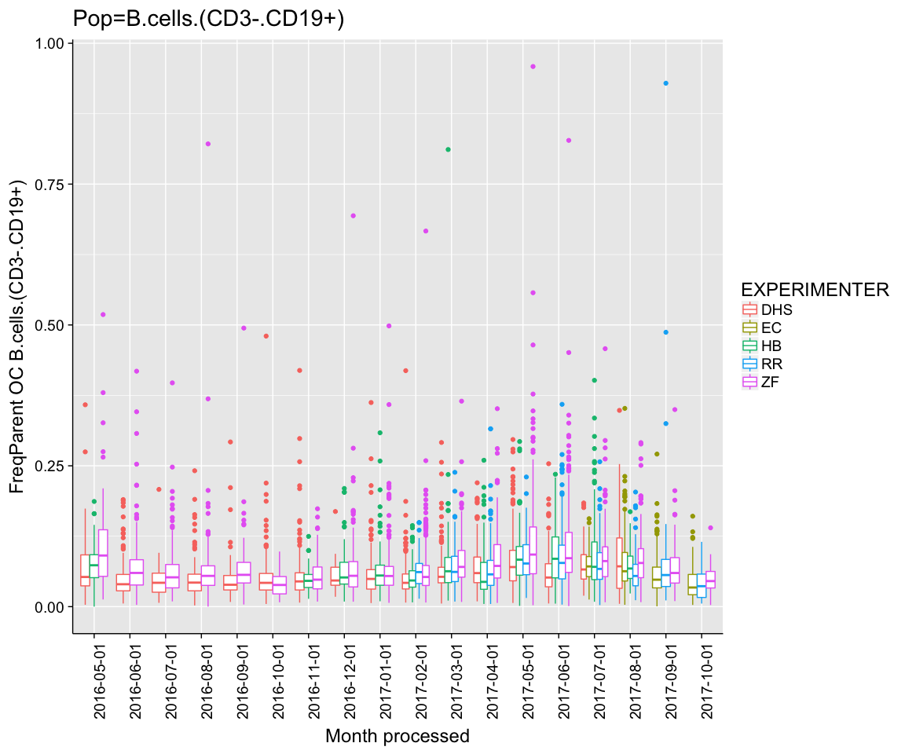<!-- -->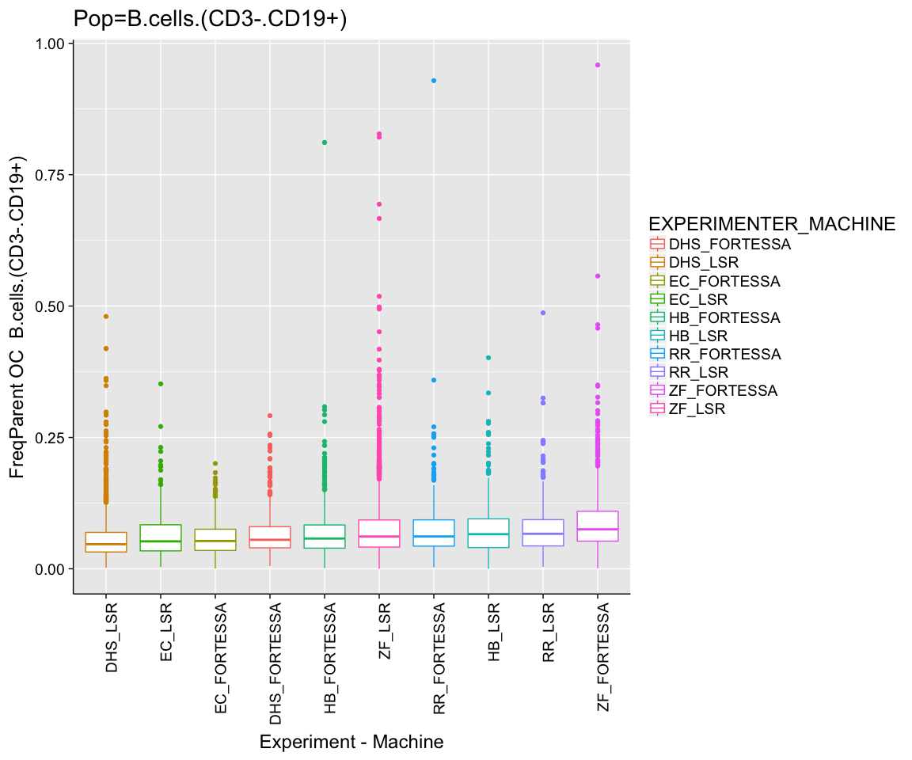<!-- -->

```
## 
## 
## |Var1 |Var2     | Freq|
## |:----|:--------|----:|
## |DHS  |FORTESSA |  703|
## |EC   |FORTESSA |  360|
## |HB   |FORTESSA |  848|
## |RR   |FORTESSA |  539|
## |ZF   |FORTESSA |  998|
## |DHS  |LSR      | 1520|
## |EC   |LSR      |  407|
## |HB   |LSR      |  489|
## |RR   |LSR      |  731|
## |ZF   |LSR      | 2484|
## [1] "Linear Regression for B.cells.(CD3-.CD19+)"
## 
## Call:
## lm(formula = formula, data = subF)
## 
## Residuals:
##      Min       1Q   Median       3Q      Max 
## -0.08970 -0.03071 -0.01149  0.01633  0.87414 
## 
## Coefficients:
##                  Estimate Std. Error t value Pr(>|t|)    
## (Intercept)    -8.961e-01  8.861e-02 -10.113  < 2e-16 ***
## DATE_MONTH      5.575e-05  5.146e-06  10.833  < 2e-16 ***
## MACHINELSR     -5.079e-04  1.219e-03  -0.417 0.676985    
## EXPERIMENTEREC -1.211e-02  2.476e-03  -4.892 1.02e-06 ***
## EXPERIMENTERHB  6.224e-03  1.866e-03   3.335 0.000857 ***
## EXPERIMENTERRR  5.919e-03  1.972e-03   3.002 0.002689 ** 
## EXPERIMENTERZF  1.694e-02  1.441e-03  11.757  < 2e-16 ***
## ---
## Signif. codes:  0 '***' 0.001 '**' 0.01 '*' 0.05 '.' 0.1 ' ' 1
## 
## Residual standard error: 0.05251 on 9072 degrees of freedom
## Multiple R-squared:  0.03641,	Adjusted R-squared:  0.03577 
## F-statistic: 57.13 on 6 and 9072 DF,  p-value: < 2.2e-16
## 
## [1] "Stepwise Linear Regression for B.cells.(CD3-.CD19+)"
## Start:  AIC=-53498.7
## TARGET_FREQ ~ DATE_MONTH + MACHINE + EXPERIMENTER
## 
##                Df Sum of Sq    RSS    AIC
## - MACHINE       1   0.00048 25.019 -53501
## <none>                      25.018 -53499
## - DATE_MONTH    1   0.32365 25.342 -53384
## - EXPERIMENTER  4   0.69644 25.715 -53257
## 
## Step:  AIC=-53500.53
## TARGET_FREQ ~ DATE_MONTH + EXPERIMENTER
## 
##                Df Sum of Sq    RSS    AIC
## <none>                      25.019 -53501
## + MACHINE       1   0.00048 25.018 -53499
## - DATE_MONTH    1   0.35696 25.376 -53374
## - EXPERIMENTER  4   0.69602 25.715 -53259
## Stepwise Model Path 
## Analysis of Deviance Table
## 
## Initial Model:
## TARGET_FREQ ~ DATE_MONTH + MACHINE + EXPERIMENTER
## 
## Final Model:
## TARGET_FREQ ~ DATE_MONTH + EXPERIMENTER
## 
## 
##        Step Df     Deviance Resid. Df Resid. Dev       AIC
## 1                                9072   25.01814 -53498.70
## 2 - MACHINE  1 0.0004786054      9073   25.01862 -53500.53
## [1] "ANOVA of EXPERIMENTER for B.cells.(CD3-.CD19+)"
##   Tukey multiple comparisons of means
##     95% family-wise confidence level
## 
## Fit: aov(formula = formula, data = subF)
## 
## $EXPERIMENTER
##                diff           lwr         upr     p adj
## EC-DHS 0.0006834458 -0.0053584415 0.006725333 0.9980333
## HB-DHS 0.0097330087  0.0047396357 0.014726382 0.0000011
## RR-DHS 0.0137048793  0.0086299249 0.018779834 0.0000000
## ZF-DHS 0.0190650663  0.0151481151 0.022982017 0.0000000
## HB-EC  0.0090495629  0.0025142870 0.015584839 0.0014953
## RR-EC  0.0130214335  0.0064236142 0.019619253 0.0000007
## ZF-EC  0.0183816204  0.0126267474 0.024136493 0.0000000
## RR-HB  0.0039718706 -0.0016814993 0.009625240 0.3083019
## ZF-HB  0.0093320575  0.0046900823 0.013974033 0.0000004
## ZF-RR  0.0053601870  0.0006305652 0.010089809 0.0170475
## 
## [1] "ANOVA of MACHINE for B.cells.(CD3-.CD19+)"
##               Df Sum Sq  Mean Sq F value Pr(>F)  
## MACHINE        1  0.018 0.017863   6.249 0.0124 *
## Residuals   9077 25.946 0.002858                 
## ---
## Signif. codes:  0 '***' 0.001 '**' 0.01 '*' 0.05 '.' 0.1 ' ' 1
## [1] "T-test of MACHINE for B.cells.(CD3-.CD19+)"
## 
## 	Welch Two Sample t-test
## 
## data:  TARGET_FREQ by MACHINE
## t = 2.5052, df = 7337.6, p-value = 0.01226
## alternative hypothesis: true difference in means is not equal to 0
## 95 percent confidence interval:
##  0.0006286479 0.0051516720
## sample estimates:
## mean in group FORTESSA      mean in group LSR 
##             0.07341851             0.07052835 
## 
## [1] "# Start of new population results"
## [1] "Non.classical.monocytes"
## [1] "n=8381"
## [1] "PLOT TYPE = Machine Time COUNT OC"
```

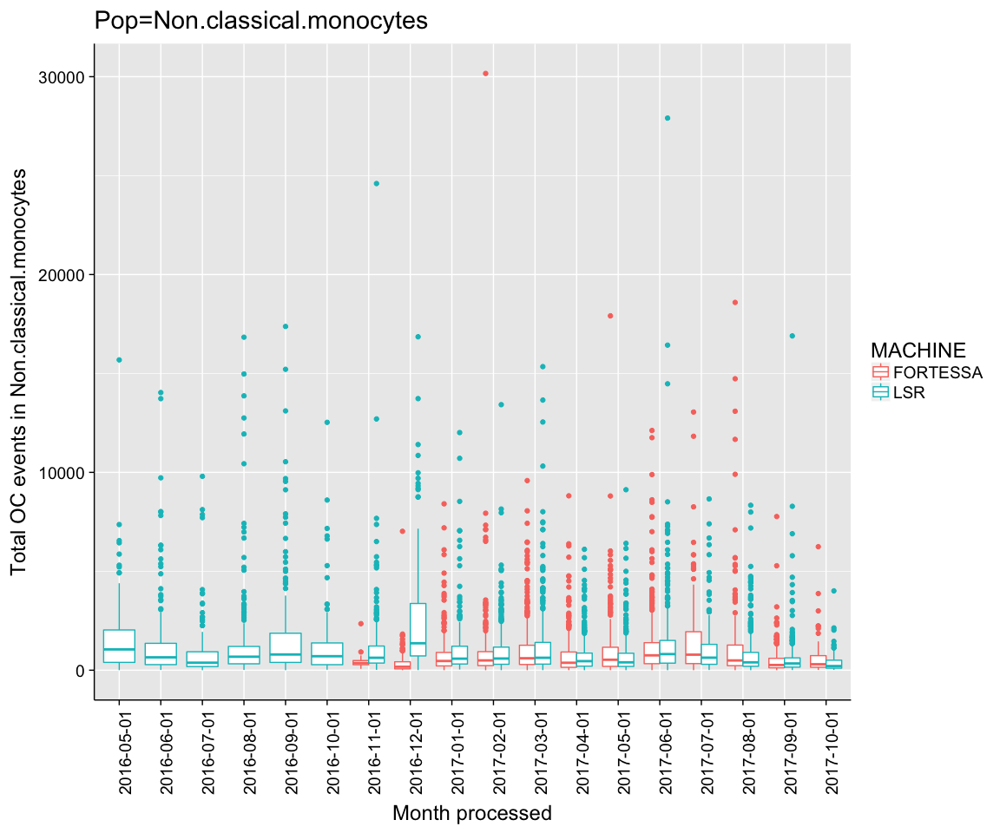<!-- -->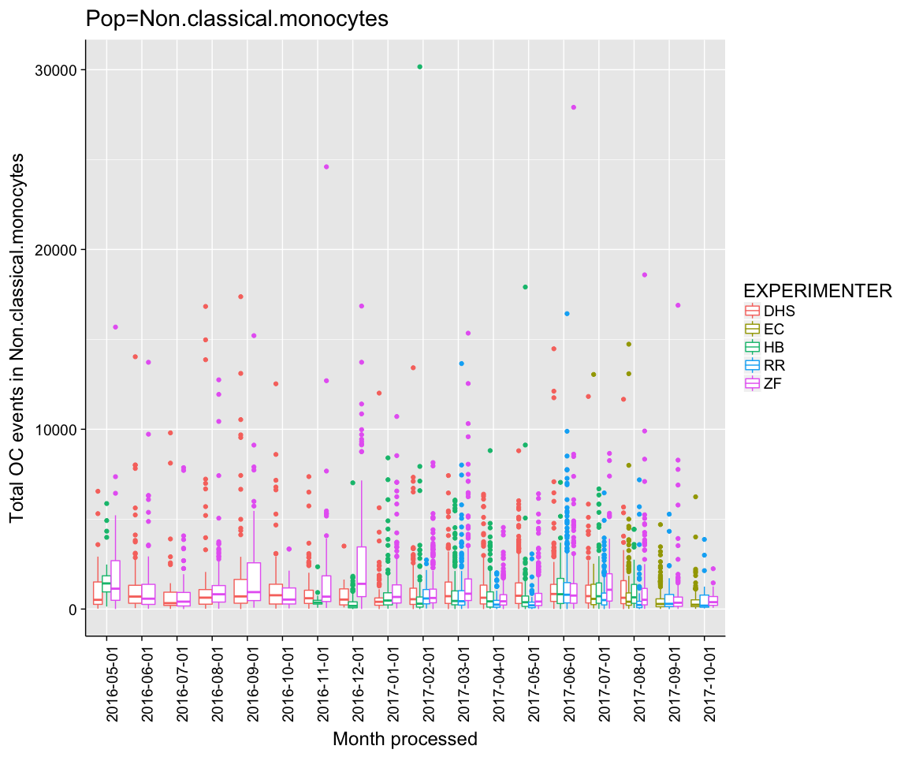<!-- -->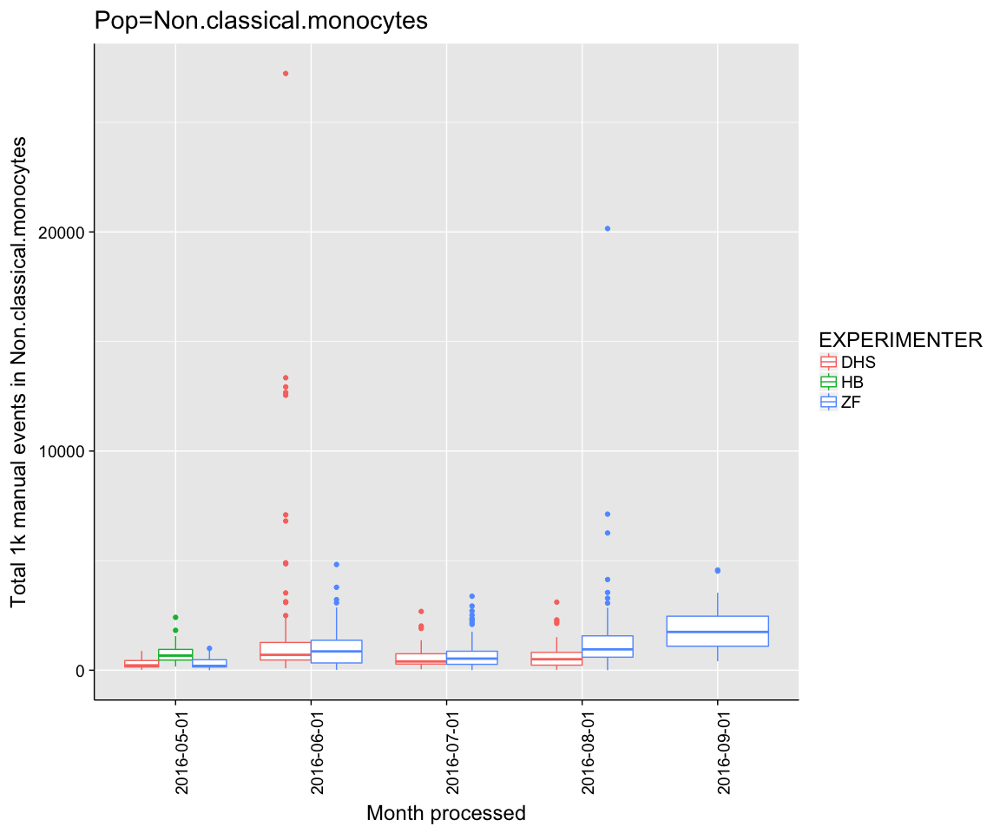<!-- -->

```
## [1] "Correlations between OC and manual for Non.classical.monocytes"
## 
## 	Pearson's product-moment correlation
## 
## data:  merge[, colC] and merge[, coljflowCount]
## t = 3.8727, df = 763, p-value = 0.0001168
## alternative hypothesis: true correlation is not equal to 0
## 95 percent confidence interval:
##  0.06863707 0.20768346
## sample estimates:
##       cor 
## 0.1388445 
## 
## 
## 	Spearman's rank correlation rho
## 
## data:  merge[, colC] and merge[, coljflowCount]
## S = 31786000, p-value < 2.2e-16
## alternative hypothesis: true rho is not equal to 0
## sample estimates:
##       rho 
## 0.5739997
```

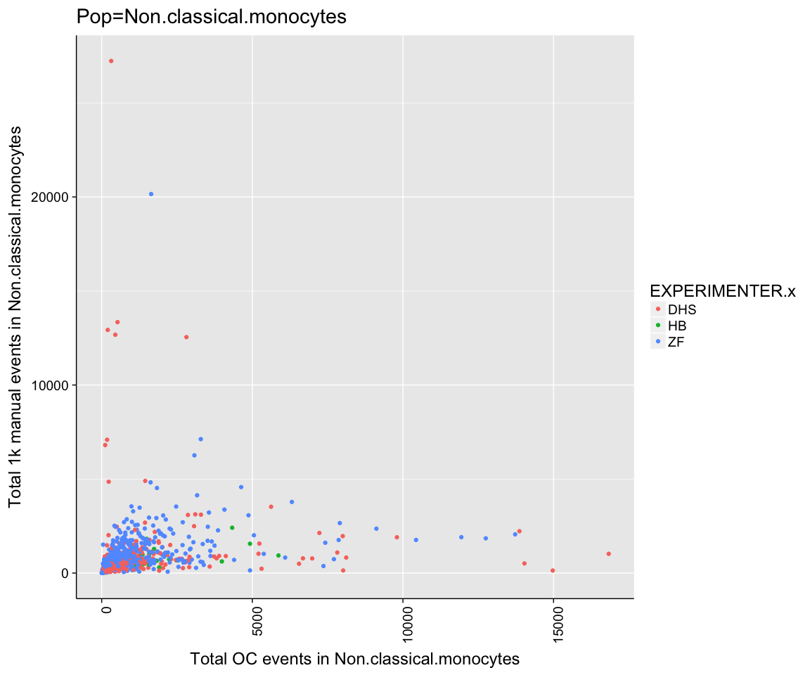<!-- -->

```
## [1] "Non.classical.monocytes"
## [1] "n=8381"
## [1] "PLOT TYPE = Machine Time FREQ"
```

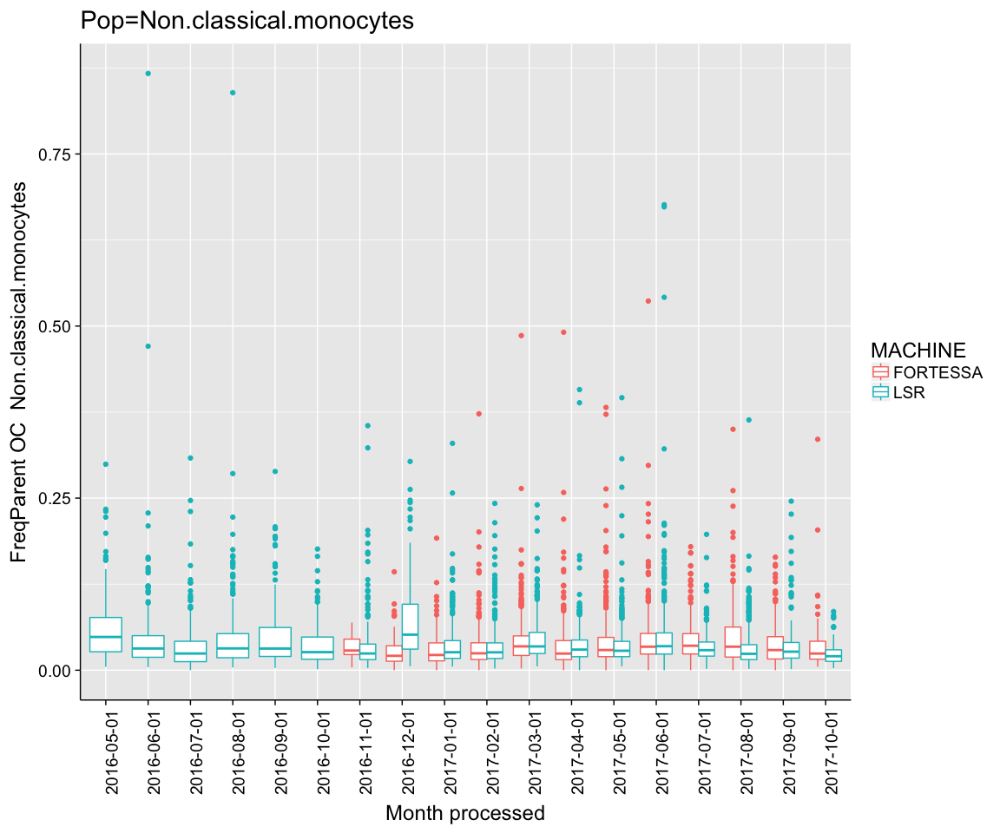<!-- -->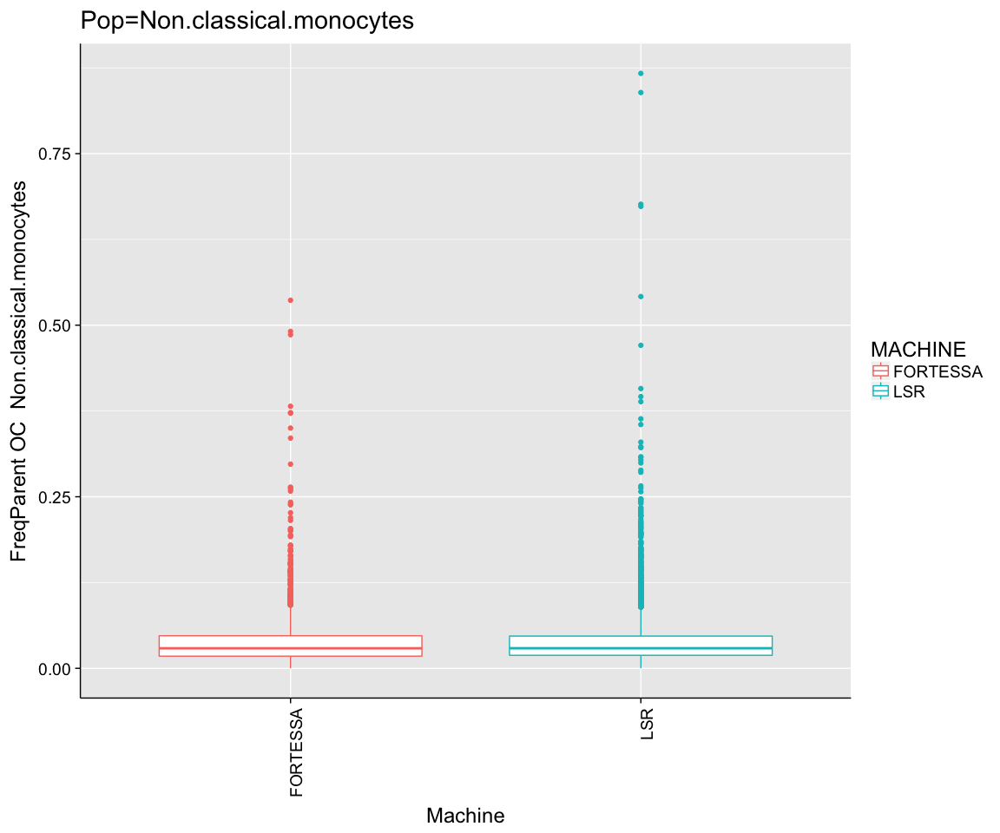<!-- -->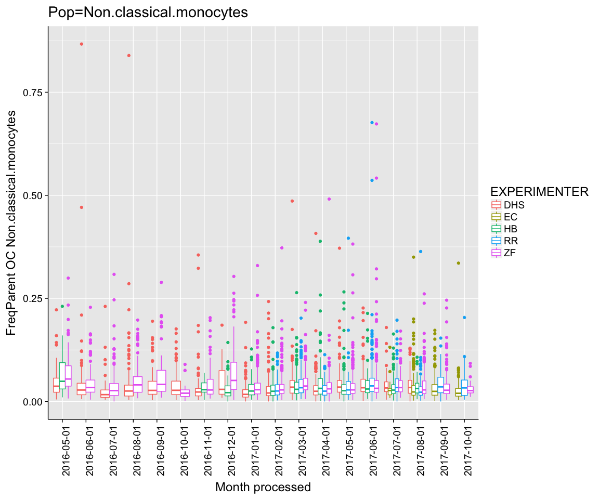<!-- -->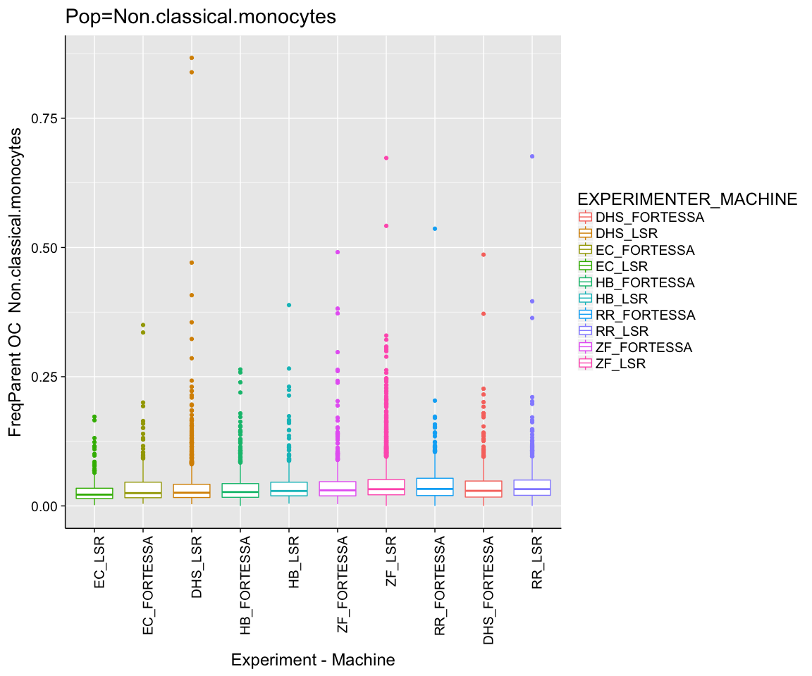<!-- -->

```
## 
## 
## |Var1 |Var2     | Freq|
## |:----|:--------|----:|
## |DHS  |FORTESSA |  668|
## |EC   |FORTESSA |  329|
## |HB   |FORTESSA |  745|
## |RR   |FORTESSA |  528|
## |ZF   |FORTESSA |  903|
## |DHS  |LSR      | 1372|
## |EC   |LSR      |  381|
## |HB   |LSR      |  440|
## |RR   |LSR      |  697|
## |ZF   |LSR      | 2318|
## [1] "Linear Regression for Non.classical.monocytes"
## 
## Call:
## lm(formula = formula, data = subF)
## 
## Residuals:
##      Min       1Q   Median       3Q      Max 
## -0.04761 -0.02109 -0.01023  0.00709  0.82466 
## 
## Coefficients:
##                  Estimate Std. Error t value Pr(>|t|)    
## (Intercept)     3.718e-01  7.205e-02   5.160 2.53e-07 ***
## DATE_MONTH     -1.943e-05  4.184e-06  -4.643 3.49e-06 ***
## MACHINELSR     -8.881e-05  9.761e-04  -0.091    0.928    
## EXPERIMENTEREC -1.336e-03  1.987e-03  -0.673    0.501    
## EXPERIMENTERHB  1.120e-04  1.516e-03   0.074    0.941    
## EXPERIMENTERRR  6.327e-03  1.561e-03   4.053 5.10e-05 ***
## EXPERIMENTERZF  5.878e-03  1.160e-03   5.069 4.09e-07 ***
## ---
## Signif. codes:  0 '***' 0.001 '**' 0.01 '*' 0.05 '.' 0.1 ' ' 1
## 
## Residual standard error: 0.0405 on 8371 degrees of freedom
##   (3 observations deleted due to missingness)
## Multiple R-squared:  0.009652,	Adjusted R-squared:  0.008942 
## F-statistic:  13.6 on 6 and 8371 DF,  p-value: 2.009e-15
## 
## [1] "Stepwise Linear Regression for Non.classical.monocytes"
## Start:  AIC=-53718.84
## TARGET_FREQ ~ DATE_MONTH + MACHINE + EXPERIMENTER
## 
##                Df Sum of Sq    RSS    AIC
## - MACHINE       1  0.000014 13.733 -53721
## <none>                      13.733 -53719
## - DATE_MONTH    1  0.035366 13.768 -53699
## - EXPERIMENTER  4  0.080576 13.814 -53678
## 
## Step:  AIC=-53720.83
## TARGET_FREQ ~ DATE_MONTH + EXPERIMENTER
## 
##                Df Sum of Sq    RSS    AIC
## <none>                      13.733 -53721
## + MACHINE       1  0.000014 13.733 -53719
## - DATE_MONTH    1  0.037639 13.771 -53700
## - EXPERIMENTER  4  0.081473 13.815 -53679
## Stepwise Model Path 
## Analysis of Deviance Table
## 
## Initial Model:
## TARGET_FREQ ~ DATE_MONTH + MACHINE + EXPERIMENTER
## 
## Final Model:
## TARGET_FREQ ~ DATE_MONTH + EXPERIMENTER
## 
## 
##        Step Df     Deviance Resid. Df Resid. Dev       AIC
## 1                                8371   13.73298 -53718.84
## 2 - MACHINE  1 1.358177e-05      8372   13.73300 -53720.83
## [1] "ANOVA of EXPERIMENTER for Non.classical.monocytes"
##   Tukey multiple comparisons of means
##     95% family-wise confidence level
## 
## Fit: aov(formula = formula, data = subF)
## 
## $EXPERIMENTER
##                diff           lwr           upr     p adj
## EC-DHS -0.005680981 -0.0105028641 -0.0008590979 0.0114727
## HB-DHS -0.000994998 -0.0050371111  0.0030471151 0.9625189
## RR-DHS  0.003744247 -0.0002569387  0.0077454336 0.0793908
## ZF-DHS  0.005145884  0.0020140858  0.0082776814 0.0000730
## HB-EC   0.004685983 -0.0005651840  0.0099371501 0.1062456
## RR-EC   0.009425228  0.0042054998  0.0146449571 0.0000084
## ZF-EC   0.010826865  0.0062394651  0.0154142641 0.0000000
## RR-HB   0.004739245  0.0002299562  0.0092485347 0.0337404
## ZF-HB   0.006140882  0.0023815790  0.0099001842 0.0000824
## ZF-RR   0.001401636 -0.0023136253  0.0051168977 0.8418699
## 
## [1] "ANOVA of MACHINE for Non.classical.monocytes"
##               Df Sum Sq  Mean Sq F value Pr(>F)  
## MACHINE        1  0.008 0.008443   5.103 0.0239 *
## Residuals   8376 13.858 0.001655                 
## ---
## Signif. codes:  0 '***' 0.001 '**' 0.01 '*' 0.05 '.' 0.1 ' ' 1
## 3 observations deleted due to missingness
## [1] "T-test of MACHINE for Non.classical.monocytes"
## 
## 	Welch Two Sample t-test
## 
## data:  TARGET_FREQ by MACHINE
## t = -2.3469, df = 7496, p-value = 0.01896
## alternative hypothesis: true difference in means is not equal to 0
## 95 percent confidence interval:
##  -0.0037985081 -0.0003409556
## sample estimates:
## mean in group FORTESSA      mean in group LSR 
##             0.03862871             0.04069844 
## 
## [1] "# Start of new population results"
## [1] "Myeloid.DC"
## [1] "n=8381"
## [1] "PLOT TYPE = Machine Time COUNT OC"
```

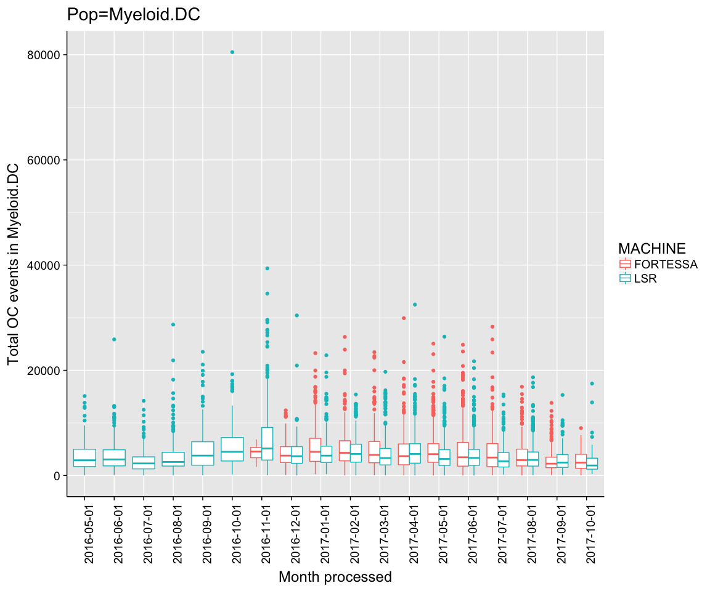<!-- -->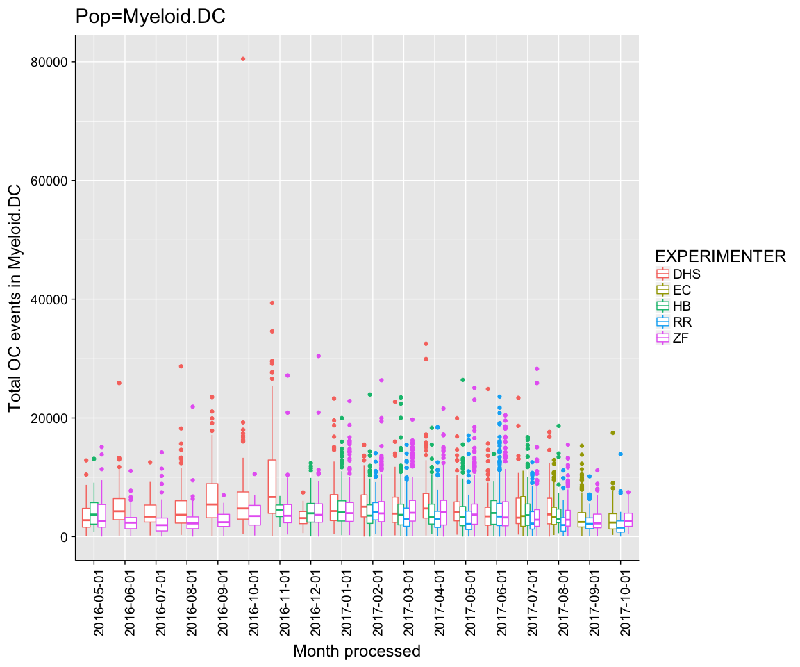<!-- -->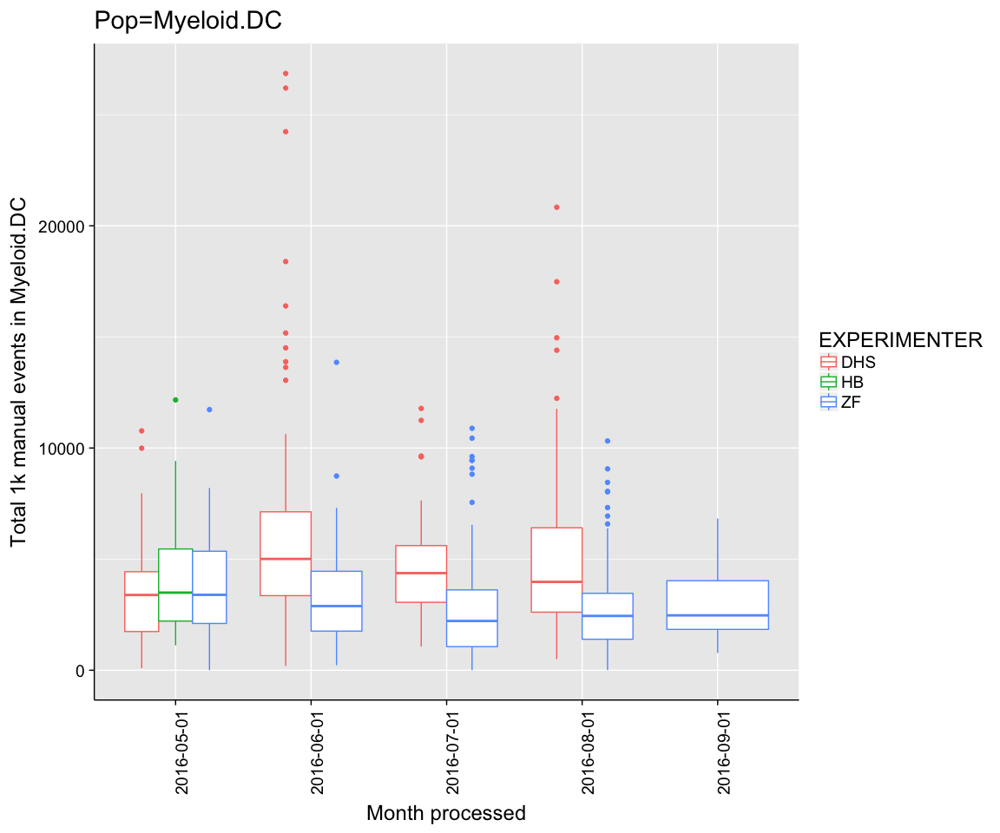<!-- -->

```
## [1] "Correlations between OC and manual for Myeloid.DC"
## 
## 	Pearson's product-moment correlation
## 
## data:  merge[, colC] and merge[, coljflowCount]
## t = 40.064, df = 763, p-value < 2.2e-16
## alternative hypothesis: true correlation is not equal to 0
## 95 percent confidence interval:
##  0.7990358 0.8448681
## sample estimates:
##       cor 
## 0.8232893 
## 
## 
## 	Spearman's rank correlation rho
## 
## data:  merge[, colC] and merge[, coljflowCount]
## S = 9054000, p-value < 2.2e-16
## alternative hypothesis: true rho is not equal to 0
## sample estimates:
##       rho 
## 0.8786583
```

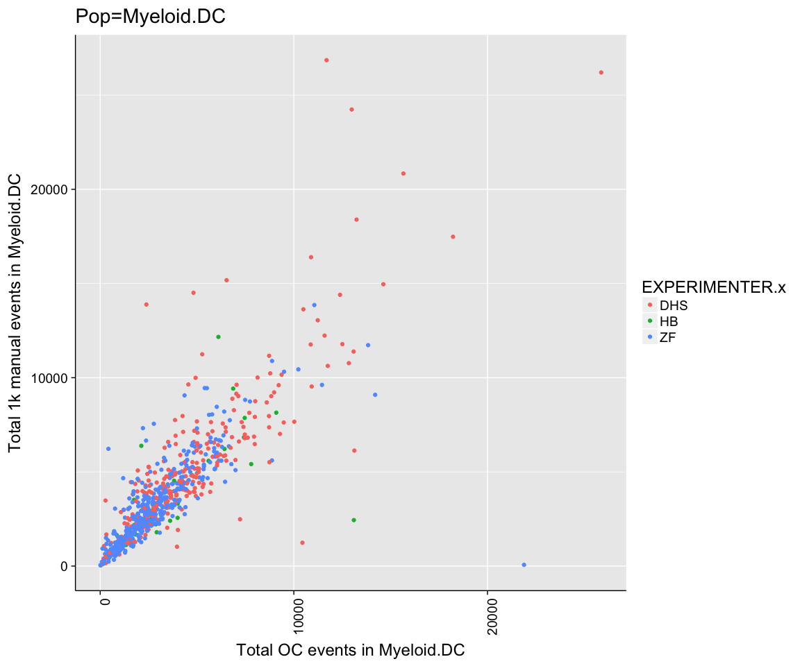<!-- -->

```
## [1] "Myeloid.DC"
## [1] "n=8381"
## [1] "PLOT TYPE = Machine Time FREQ"
```

<!-- -->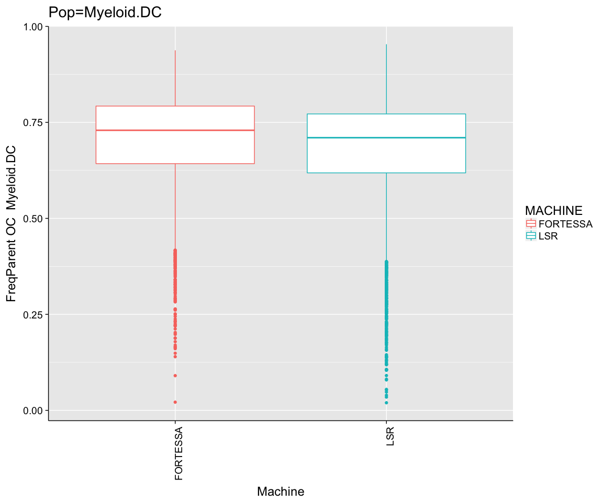<!-- -->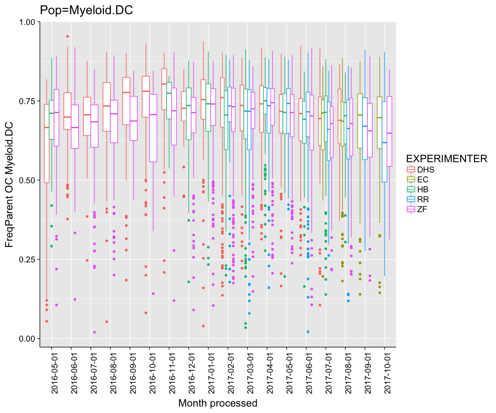<!-- -->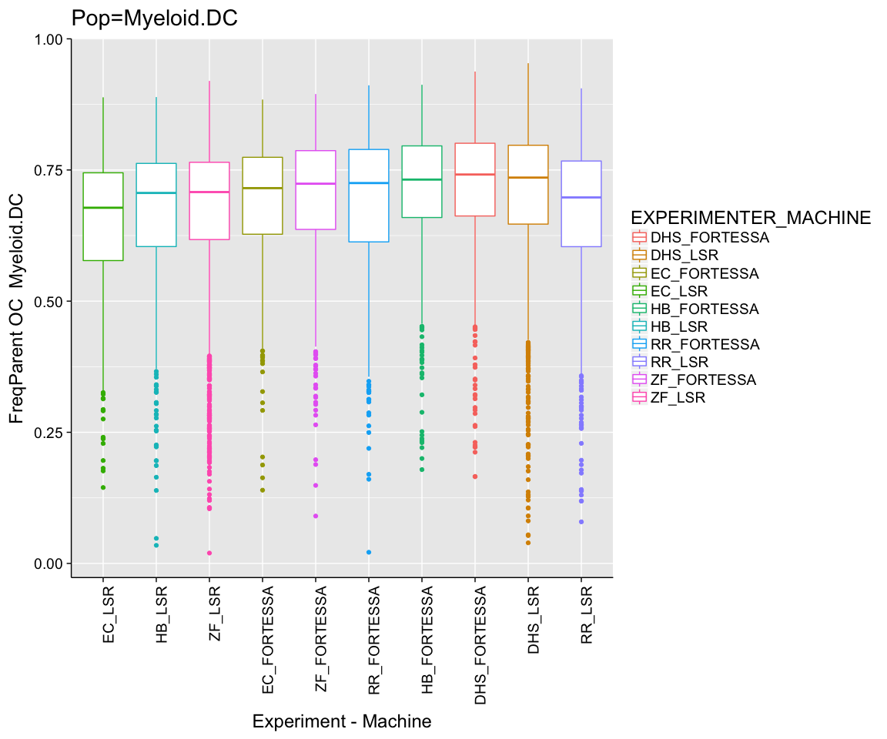<!-- -->

```
## 
## 
## |Var1 |Var2     | Freq|
## |:----|:--------|----:|
## |DHS  |FORTESSA |  668|
## |EC   |FORTESSA |  329|
## |HB   |FORTESSA |  745|
## |RR   |FORTESSA |  528|
## |ZF   |FORTESSA |  903|
## |DHS  |LSR      | 1372|
## |EC   |LSR      |  381|
## |HB   |LSR      |  440|
## |RR   |LSR      |  697|
## |ZF   |LSR      | 2318|
## [1] "Linear Regression for Myeloid.DC"
## 
## Call:
## lm(formula = formula, data = subF)
## 
## Residuals:
##      Min       1Q   Median       3Q      Max 
## -0.66987 -0.05656  0.03294  0.09387  0.25678 
## 
## Coefficients:
##                  Estimate Std. Error t value Pr(>|t|)    
## (Intercept)     2.071e+00  2.421e-01   8.554  < 2e-16 ***
## DATE_MONTH     -7.822e-05  1.406e-05  -5.563 2.74e-08 ***
## MACHINELSR     -3.276e-02  3.280e-03  -9.988  < 2e-16 ***
## EXPERIMENTEREC -2.762e-02  6.676e-03  -4.136 3.56e-05 ***
## EXPERIMENTERHB -1.891e-02  5.093e-03  -3.714 0.000206 ***
## EXPERIMENTERRR -2.531e-02  5.246e-03  -4.824 1.43e-06 ***
## EXPERIMENTERZF -2.187e-02  3.897e-03  -5.611 2.07e-08 ***
## ---
## Signif. codes:  0 '***' 0.001 '**' 0.01 '*' 0.05 '.' 0.1 ' ' 1
## 
## Residual standard error: 0.1361 on 8370 degrees of freedom
##   (4 observations deleted due to missingness)
## Multiple R-squared:  0.02208,	Adjusted R-squared:  0.02138 
## F-statistic: 31.49 on 6 and 8370 DF,  p-value: < 2.2e-16
## 
## [1] "Stepwise Linear Regression for Myeloid.DC"
## Start:  AIC=-33409.55
## TARGET_FREQ ~ DATE_MONTH + MACHINE + EXPERIMENTER
## 
##                Df Sum of Sq    RSS    AIC
## <none>                      154.99 -33410
## - DATE_MONTH    1   0.57295 155.56 -33381
## - EXPERIMENTER  4   0.73020 155.72 -33378
## - MACHINE       1   1.84735 156.83 -33312
## Stepwise Model Path 
## Analysis of Deviance Table
## 
## Initial Model:
## TARGET_FREQ ~ DATE_MONTH + MACHINE + EXPERIMENTER
## 
## Final Model:
## TARGET_FREQ ~ DATE_MONTH + MACHINE + EXPERIMENTER
## 
## 
##   Step Df Deviance Resid. Df Resid. Dev       AIC
## 1                       8370   154.9847 -33409.55
## [1] "ANOVA of EXPERIMENTER for Myeloid.DC"
##   Tukey multiple comparisons of means
##     95% family-wise confidence level
## 
## Fit: aov(formula = formula, data = subF)
## 
## $EXPERIMENTER
##                diff          lwr           upr     p adj
## EC-DHS -0.040695085 -0.056978480 -2.441169e-02 0.0000000
## HB-DHS -0.013602948 -0.027253443  4.754718e-05 0.0513184
## RR-DHS -0.032332549 -0.045844856 -1.882024e-02 0.0000000
## ZF-DHS -0.026331294 -0.036908226 -1.575436e-02 0.0000000
## HB-EC   0.027092137  0.009360184  4.482409e-02 0.0002990
## RR-EC   0.008362536 -0.009263258  2.598833e-02 0.6946678
## ZF-EC   0.014363791 -0.001126776  2.985436e-02 0.0841795
## RR-HB  -0.018729601 -0.033956408 -3.502795e-03 0.0071056
## ZF-HB  -0.012728346 -0.025422625 -3.406731e-05 0.0490037
## ZF-RR   0.006001255 -0.006544307  1.854682e-02 0.6880409
## 
## [1] "ANOVA of MACHINE for Myeloid.DC"
##               Df Sum Sq Mean Sq F value Pr(>F)    
## MACHINE        1   1.34  1.3435    71.6 <2e-16 ***
## Residuals   8375 157.14  0.0188                   
## ---
## Signif. codes:  0 '***' 0.001 '**' 0.01 '*' 0.05 '.' 0.1 ' ' 1
## 4 observations deleted due to missingness
## [1] "T-test of MACHINE for Myeloid.DC"
## 
## 	Welch Two Sample t-test
## 
## data:  TARGET_FREQ by MACHINE
## t = 8.6804, df = 7237.2, p-value < 2.2e-16
## alternative hypothesis: true difference in means is not equal to 0
## 95 percent confidence interval:
##  0.02021393 0.03200697
## sample estimates:
## mean in group FORTESSA      mean in group LSR 
##              0.7015455              0.6754350 
## 
## [1] "# Start of new population results"
## [1] "DC.NK"
## [1] "n=8381"
## [1] "PLOT TYPE = Machine Time COUNT OC"
```

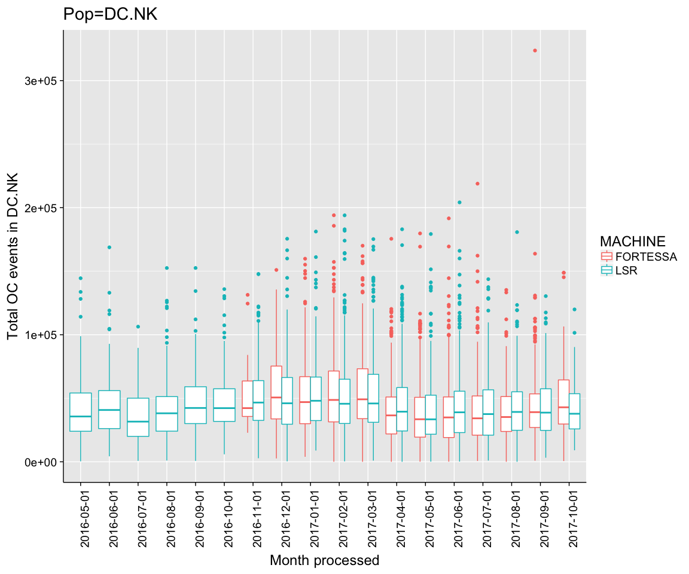<!-- -->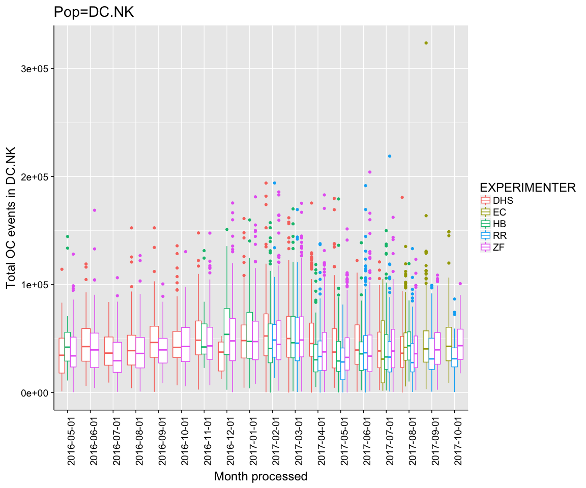<!-- -->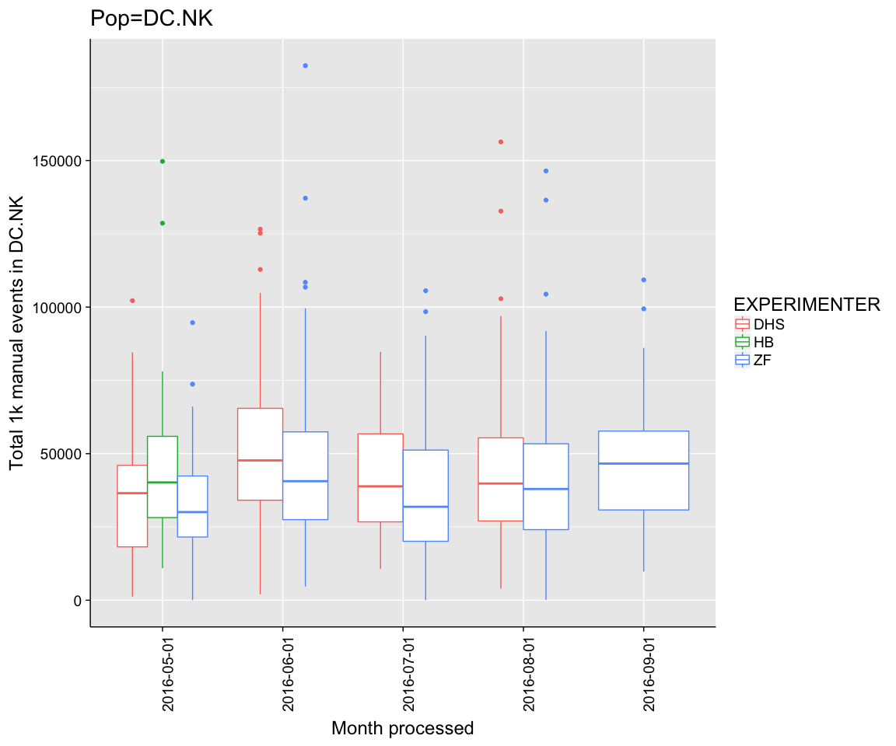<!-- -->

```
## [1] "Correlations between OC and manual for DC.NK"
## 
## 	Pearson's product-moment correlation
## 
## data:  merge[, colC] and merge[, coljflowCount]
## t = 105.48, df = 763, p-value < 2.2e-16
## alternative hypothesis: true correlation is not equal to 0
## 95 percent confidence interval:
##  0.9624955 0.9716366
## sample estimates:
##       cor 
## 0.9673794 
## 
## 
## 	Spearman's rank correlation rho
## 
## data:  merge[, colC] and merge[, coljflowCount]
## S = 3068600, p-value < 2.2e-16
## alternative hypothesis: true rho is not equal to 0
## sample estimates:
##       rho 
## 0.9588748
```

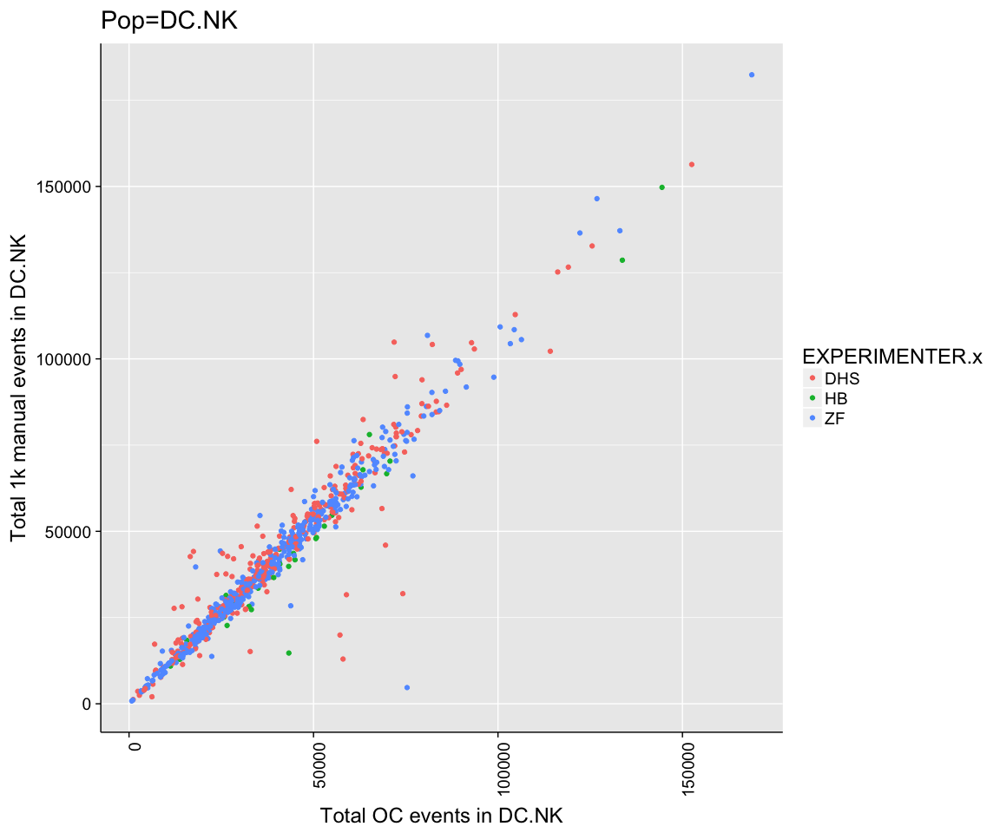<!-- -->

```
## [1] "DC.NK"
## [1] "n=8381"
## [1] "PLOT TYPE = Machine Time FREQ"
```

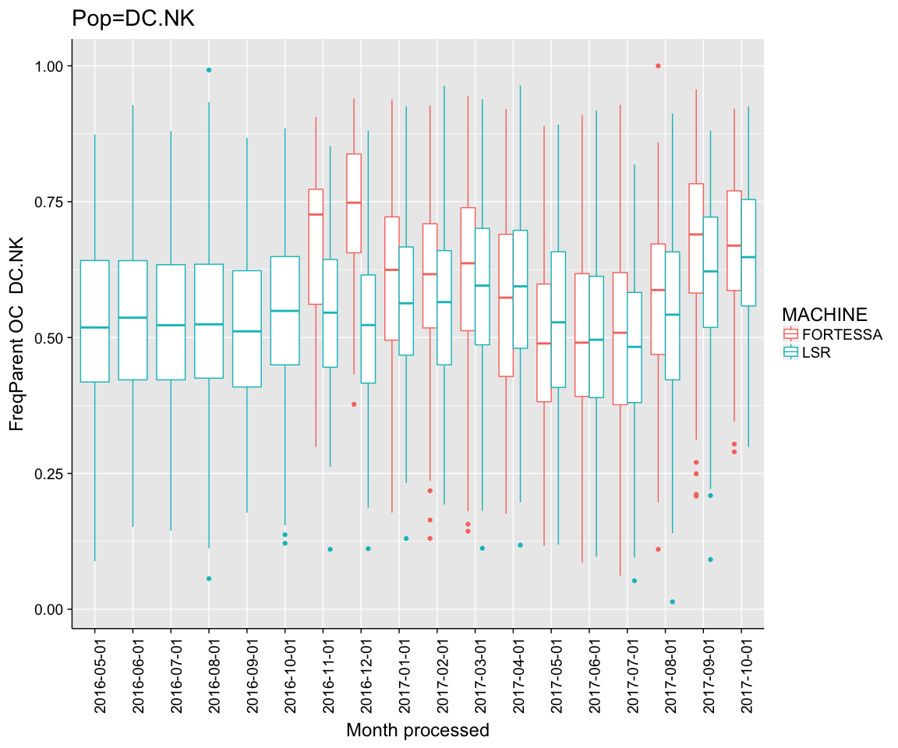<!-- --><!-- -->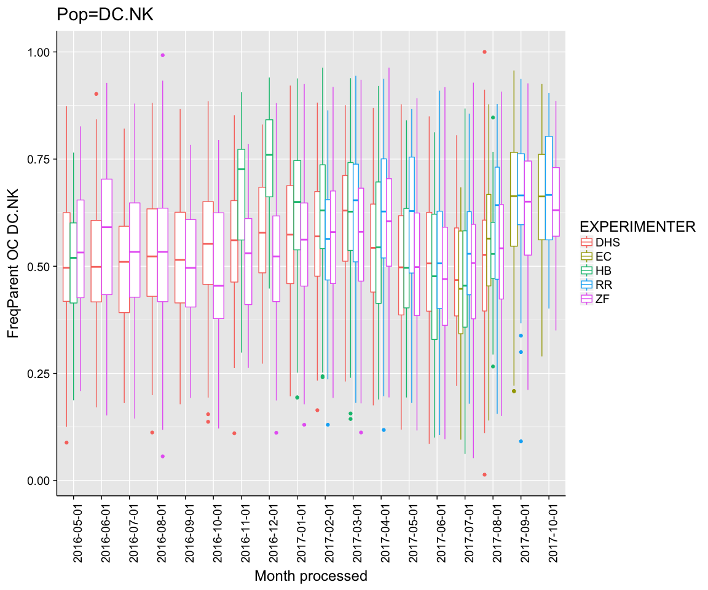<!-- -->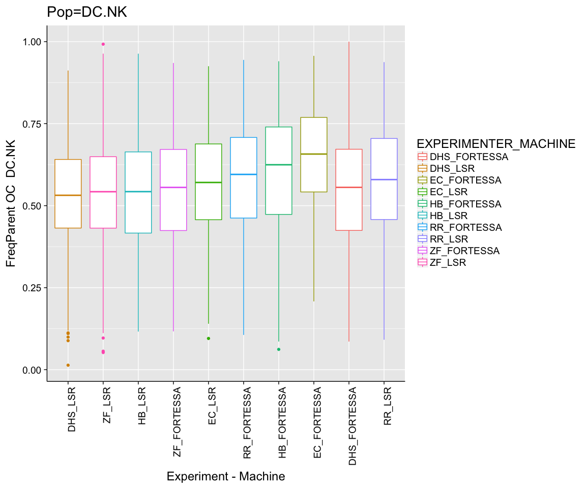<!-- -->

```
## 
## 
## |Var1 |Var2     | Freq|
## |:----|:--------|----:|
## |DHS  |FORTESSA |  668|
## |EC   |FORTESSA |  329|
## |HB   |FORTESSA |  745|
## |RR   |FORTESSA |  528|
## |ZF   |FORTESSA |  903|
## |DHS  |LSR      | 1372|
## |EC   |LSR      |  381|
## |HB   |LSR      |  440|
## |RR   |LSR      |  697|
## |ZF   |LSR      | 2318|
## [1] "Linear Regression for DC.NK"
## 
## Call:
## lm(formula = formula, data = subF)
## 
## Residuals:
##      Min       1Q   Median       3Q      Max 
## -0.51911 -0.11195  0.00576  0.11958  0.45709 
## 
## Coefficients:
##                  Estimate Std. Error t value Pr(>|t|)    
## (Intercept)     1.789e+00  2.847e-01   6.285 3.45e-10 ***
## DATE_MONTH     -7.172e-05  1.653e-05  -4.338 1.46e-05 ***
## MACHINELSR     -2.881e-02  3.857e-03  -7.468 8.93e-14 ***
## EXPERIMENTEREC  8.022e-02  7.851e-03  10.217  < 2e-16 ***
## EXPERIMENTERHB  3.592e-02  5.990e-03   5.997 2.09e-09 ***
## EXPERIMENTERRR  4.400e-02  6.169e-03   7.133 1.06e-12 ***
## EXPERIMENTERZF  7.028e-03  4.582e-03   1.534    0.125    
## ---
## Signif. codes:  0 '***' 0.001 '**' 0.01 '*' 0.05 '.' 0.1 ' ' 1
## 
## Residual standard error: 0.1601 on 8371 degrees of freedom
##   (3 observations deleted due to missingness)
## Multiple R-squared:  0.02636,	Adjusted R-squared:  0.02566 
## F-statistic: 37.77 on 6 and 8371 DF,  p-value: < 2.2e-16
## 
## [1] "Stepwise Linear Regression for DC.NK"
## Start:  AIC=-30694.26
## TARGET_FREQ ~ DATE_MONTH + MACHINE + EXPERIMENTER
## 
##                Df Sum of Sq    RSS    AIC
## <none>                      214.44 -30694
## - DATE_MONTH    1    0.4820 214.92 -30677
## - MACHINE       1    1.4288 215.87 -30641
## - EXPERIMENTER  4    3.7657 218.20 -30556
## Stepwise Model Path 
## Analysis of Deviance Table
## 
## Initial Model:
## TARGET_FREQ ~ DATE_MONTH + MACHINE + EXPERIMENTER
## 
## Final Model:
## TARGET_FREQ ~ DATE_MONTH + MACHINE + EXPERIMENTER
## 
## 
##   Step Df Deviance Resid. Df Resid. Dev       AIC
## 1                       8371   214.4379 -30694.26
## [1] "ANOVA of EXPERIMENTER for DC.NK"
##   Tukey multiple comparisons of means
##     95% family-wise confidence level
## 
## Fit: aov(formula = formula, data = subF)
## 
## $EXPERIMENTER
##                diff          lwr          upr     p adj
## EC-DHS  0.068066709  0.048968752  0.087164666 0.0000000
## HB-DHS  0.040432130  0.024422596  0.056441664 0.0000000
## RR-DHS  0.037446395  0.021598960  0.053293830 0.0000000
## ZF-DHS  0.003002906 -0.009401156  0.015406968 0.9647005
## HB-EC  -0.027634579 -0.048432794 -0.006836364 0.0026888
## RR-EC  -0.030620314 -0.051294011 -0.009946617 0.0005147
## ZF-EC  -0.065063803 -0.083233044 -0.046894562 0.0000000
## RR-HB  -0.002985735 -0.020845606  0.014874136 0.9910930
## ZF-HB  -0.037429224 -0.052318635 -0.022539813 0.0000000
## ZF-RR  -0.034443489 -0.049158467 -0.019728511 0.0000000
## 
## [1] "ANOVA of MACHINE for DC.NK"
##               Df Sum Sq Mean Sq F value Pr(>F)    
## MACHINE        1   1.99  1.9949   76.56 <2e-16 ***
## Residuals   8376 218.25  0.0261                   
## ---
## Signif. codes:  0 '***' 0.001 '**' 0.01 '*' 0.05 '.' 0.1 ' ' 1
## 3 observations deleted due to missingness
## [1] "T-test of MACHINE for DC.NK"
## 
## 	Welch Two Sample t-test
## 
## data:  TARGET_FREQ by MACHINE
## t = 8.5551, df = 6218.9, p-value < 2.2e-16
## alternative hypothesis: true difference in means is not equal to 0
## 95 percent confidence interval:
##  0.02452516 0.03910566
## sample estimates:
## mean in group FORTESSA      mean in group LSR 
##              0.5759788              0.5441634 
## 
## [1] "# Start of new population results"
## [1] "MONOCYTES"
## [1] "n=8381"
## [1] "PLOT TYPE = Machine Time COUNT OC"
```

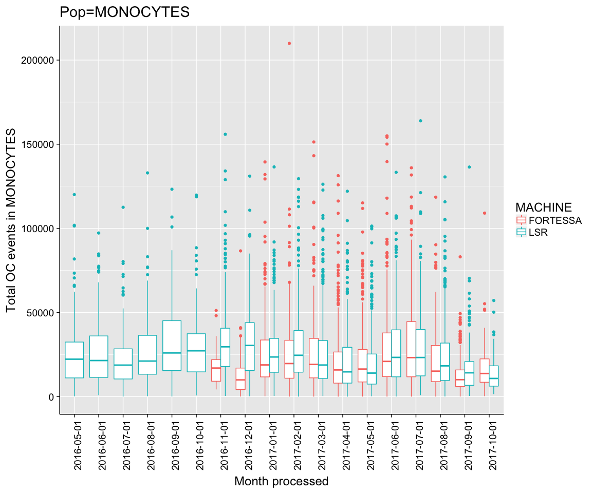<!-- -->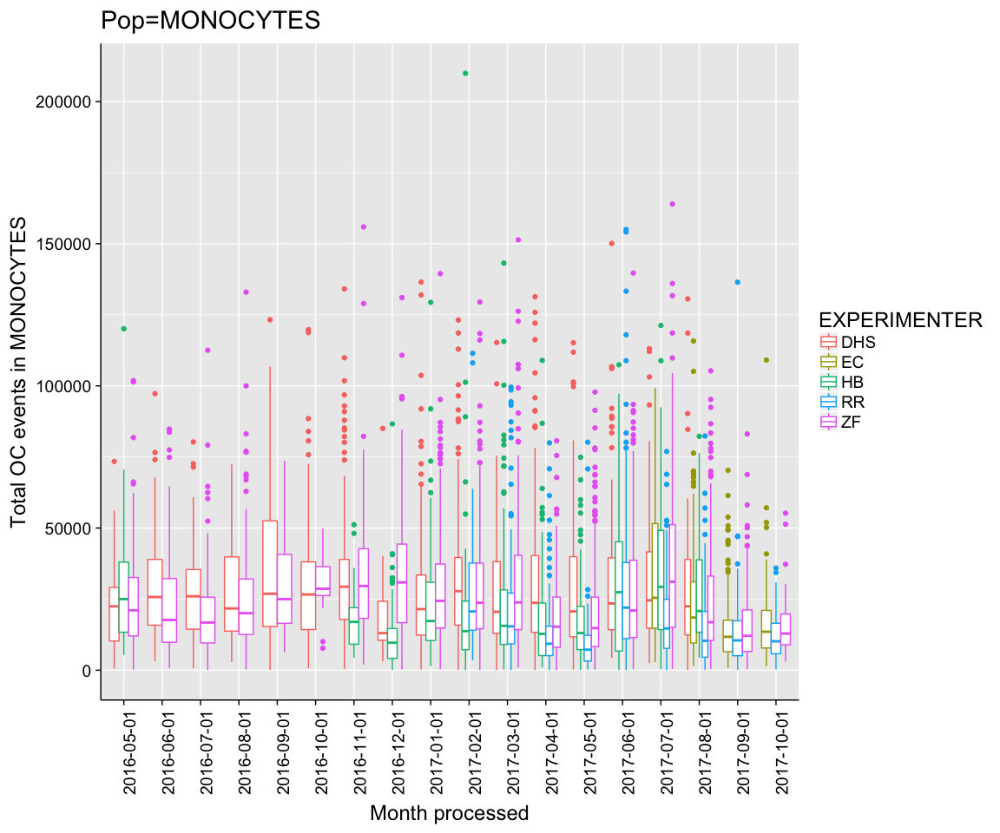<!-- -->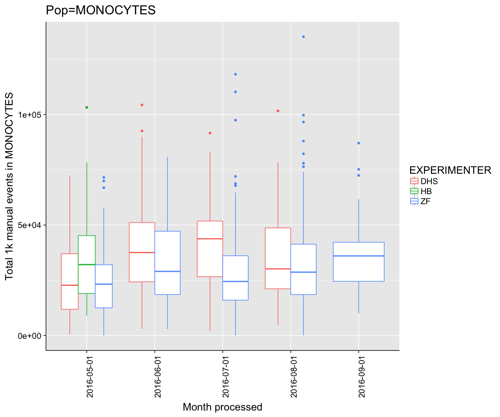<!-- -->

```
## [1] "Correlations between OC and manual for MONOCYTES"
## 
## 	Pearson's product-moment correlation
## 
## data:  merge[, colC] and merge[, coljflowCount]
## t = 58.747, df = 763, p-value < 2.2e-16
## alternative hypothesis: true correlation is not equal to 0
## 95 percent confidence interval:
##  0.8912443 0.9170173
## sample estimates:
##       cor 
## 0.9049574 
## 
## 
## 	Spearman's rank correlation rho
## 
## data:  merge[, colC] and merge[, coljflowCount]
## S = 6793600, p-value < 2.2e-16
## alternative hypothesis: true rho is not equal to 0
## sample estimates:
##       rho 
## 0.9089519
```

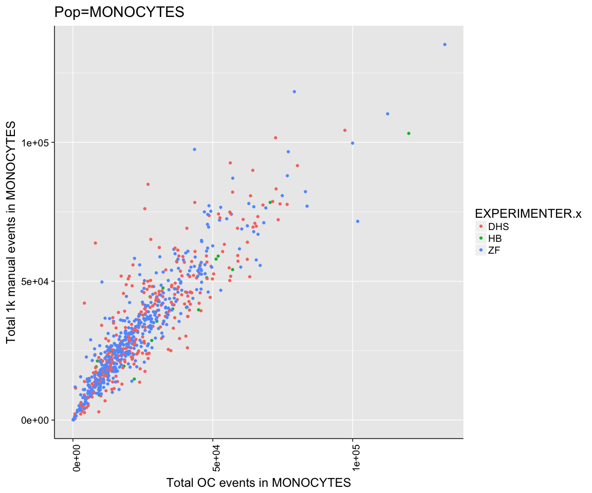<!-- -->

```
## [1] "MONOCYTES"
## [1] "n=8381"
## [1] "PLOT TYPE = Machine Time FREQ"
```

<!-- -->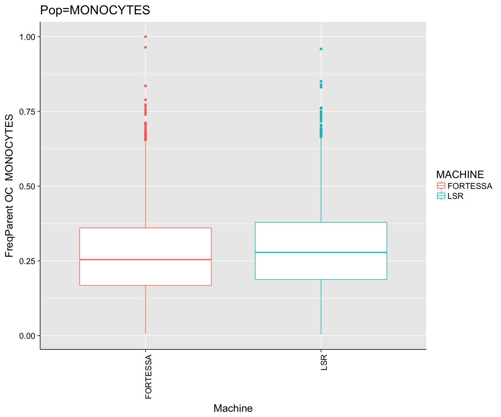<!-- -->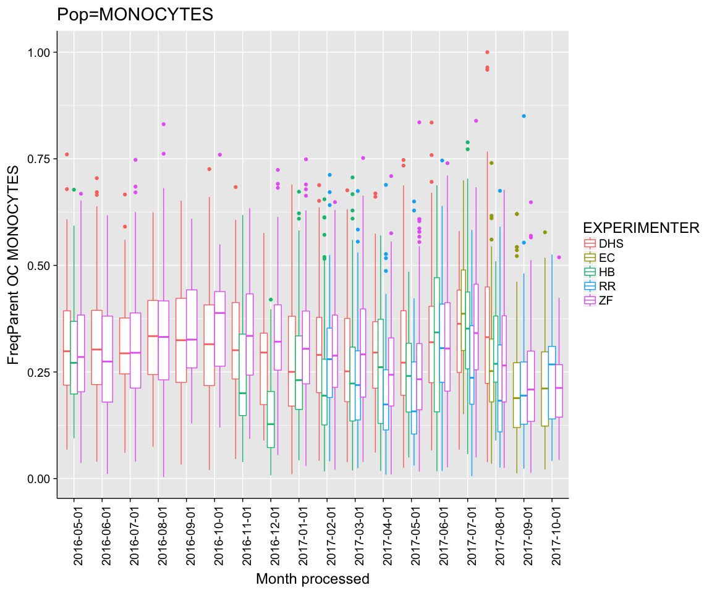<!-- -->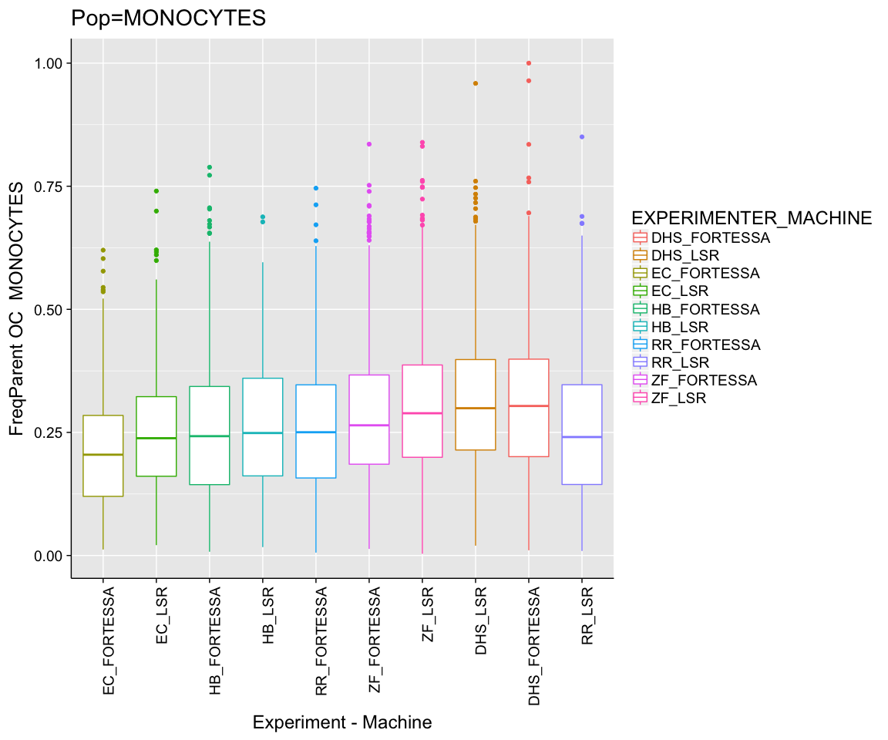<!-- -->

```
## 
## 
## |Var1 |Var2     | Freq|
## |:----|:--------|----:|
## |DHS  |FORTESSA |  668|
## |EC   |FORTESSA |  329|
## |HB   |FORTESSA |  745|
## |RR   |FORTESSA |  528|
## |ZF   |FORTESSA |  903|
## |DHS  |LSR      | 1372|
## |EC   |LSR      |  381|
## |HB   |LSR      |  440|
## |RR   |LSR      |  697|
## |ZF   |LSR      | 2318|
## [1] "Linear Regression for MONOCYTES"
## 
## Call:
## lm(formula = formula, data = subF)
## 
## Residuals:
##      Min       1Q   Median       3Q      Max 
## -0.30179 -0.10191 -0.01327  0.08614  0.70205 
## 
## Coefficients:
##                  Estimate Std. Error t value Pr(>|t|)    
## (Intercept)     9.115e-01  2.418e-01   3.769 0.000165 ***
## DATE_MONTH     -3.530e-05  1.405e-05  -2.514 0.011972 *  
## MACHINELSR      8.167e-03  3.276e-03   2.493 0.012699 *  
## EXPERIMENTEREC -6.508e-02  6.669e-03  -9.759  < 2e-16 ***
## EXPERIMENTERHB -4.750e-02  5.088e-03  -9.335  < 2e-16 ***
## EXPERIMENTERRR -4.870e-02  5.240e-03  -9.294  < 2e-16 ***
## EXPERIMENTERZF -1.375e-02  3.892e-03  -3.533 0.000413 ***
## ---
## Signif. codes:  0 '***' 0.001 '**' 0.01 '*' 0.05 '.' 0.1 ' ' 1
## 
## Residual standard error: 0.136 on 8371 degrees of freedom
##   (3 observations deleted due to missingness)
## Multiple R-squared:  0.03442,	Adjusted R-squared:  0.03373 
## F-statistic: 49.74 on 6 and 8371 DF,  p-value: < 2.2e-16
## 
## [1] "Stepwise Linear Regression for MONOCYTES"
## Start:  AIC=-33428.4
## TARGET_FREQ ~ DATE_MONTH + MACHINE + EXPERIMENTER
## 
##                Df Sum of Sq    RSS    AIC
## <none>                      154.73 -33428
## - MACHINE       1    0.1148 154.84 -33424
## - DATE_MONTH    1    0.1168 154.84 -33424
## - EXPERIMENTER  4    3.2554 157.98 -33262
## Stepwise Model Path 
## Analysis of Deviance Table
## 
## Initial Model:
## TARGET_FREQ ~ DATE_MONTH + MACHINE + EXPERIMENTER
## 
## Final Model:
## TARGET_FREQ ~ DATE_MONTH + MACHINE + EXPERIMENTER
## 
## 
##   Step Df Deviance Resid. Df Resid. Dev      AIC
## 1                       8371   154.7285 -33428.4
## [1] "ANOVA of EXPERIMENTER for MONOCYTES"
##   Tukey multiple comparisons of means
##     95% family-wise confidence level
## 
## Fit: aov(formula = formula, data = subF)
## 
## $EXPERIMENTER
##                diff          lwr          upr     p adj
## EC-DHS -0.074117076 -0.090296632 -0.057937521 0.0000000
## HB-DHS -0.052024087 -0.065587169 -0.038461006 0.0000000
## RR-DHS -0.054266535 -0.067692288 -0.040840782 0.0000000
## ZF-DHS -0.014696709 -0.025205279 -0.004188139 0.0012893
## HB-EC   0.022092989  0.004472996  0.039712982 0.0056604
## RR-EC   0.019850541  0.002336038  0.037365045 0.0170403
## ZF-EC   0.059420368  0.044027609  0.074813126 0.0000000
## RR-HB  -0.002242448 -0.017373112  0.012888216 0.9943843
## ZF-HB   0.037327378  0.024713252  0.049941505 0.0000000
## ZF-RR   0.039569826  0.027103477  0.052036176 0.0000000
## 
## [1] "ANOVA of MACHINE for MONOCYTES"
##               Df Sum Sq Mean Sq F value   Pr(>F)    
## MACHINE        1   0.73  0.7295   38.31 6.33e-10 ***
## Residuals   8376 159.52  0.0190                     
## ---
## Signif. codes:  0 '***' 0.001 '**' 0.01 '*' 0.05 '.' 0.1 ' ' 1
## 3 observations deleted due to missingness
## [1] "T-test of MACHINE for MONOCYTES"
## 
## 	Welch Two Sample t-test
## 
## data:  TARGET_FREQ by MACHINE
## t = -6.1345, df = 6505.2, p-value = 9.047e-10
## alternative hypothesis: true difference in means is not equal to 0
## 95 percent confidence interval:
##  -0.02538778 -0.01309137
## sample estimates:
## mean in group FORTESSA      mean in group LSR 
##              0.2714479              0.2906874 
## 
## [1] "# Start of new population results"
## [1] "NK"
## [1] "n=8381"
## [1] "PLOT TYPE = Machine Time COUNT OC"
```

<!-- -->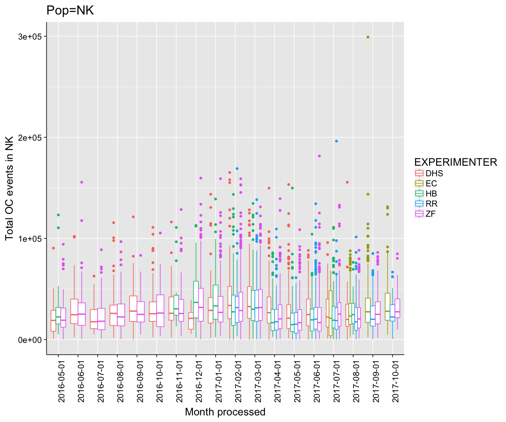<!-- -->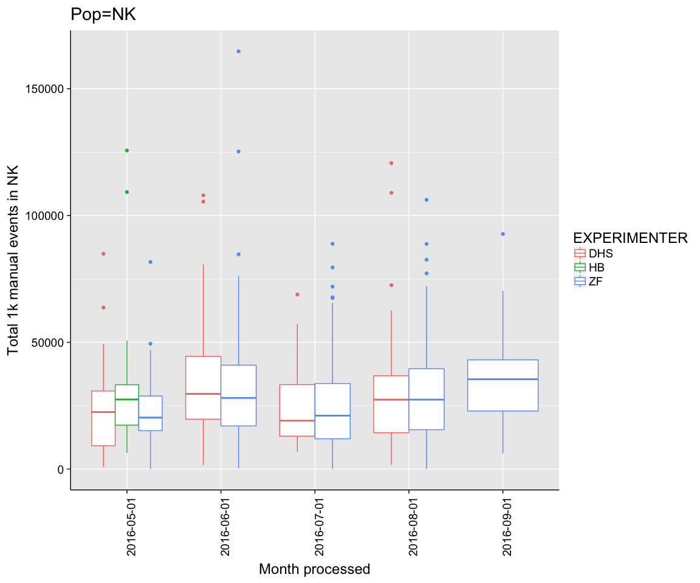<!-- -->

```
## [1] "Correlations between OC and manual for NK"
## 
## 	Pearson's product-moment correlation
## 
## data:  merge[, colC] and merge[, coljflowCount]
## t = 181.83, df = 763, p-value < 2.2e-16
## alternative hypothesis: true correlation is not equal to 0
## 95 percent confidence interval:
##  0.9869381 0.9901516
## sample estimates:
##       cor 
## 0.9886575 
## 
## 
## 	Spearman's rank correlation rho
## 
## data:  merge[, colC] and merge[, coljflowCount]
## S = 1214000, p-value < 2.2e-16
## alternative hypothesis: true rho is not equal to 0
## sample estimates:
##       rho 
## 0.9837303
```

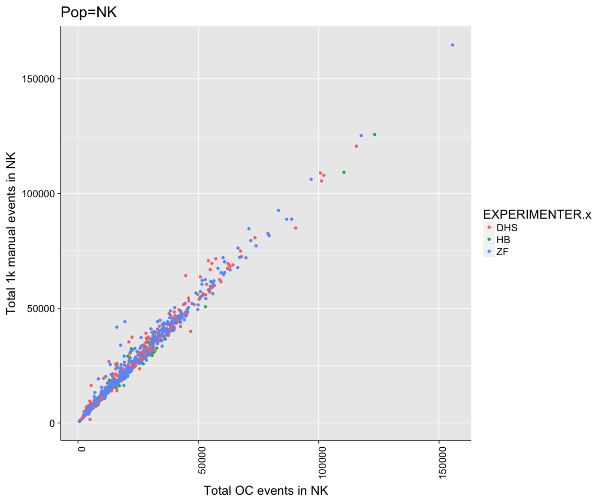<!-- -->

```
## [1] "NK"
## [1] "n=8381"
## [1] "PLOT TYPE = Machine Time FREQ"
```

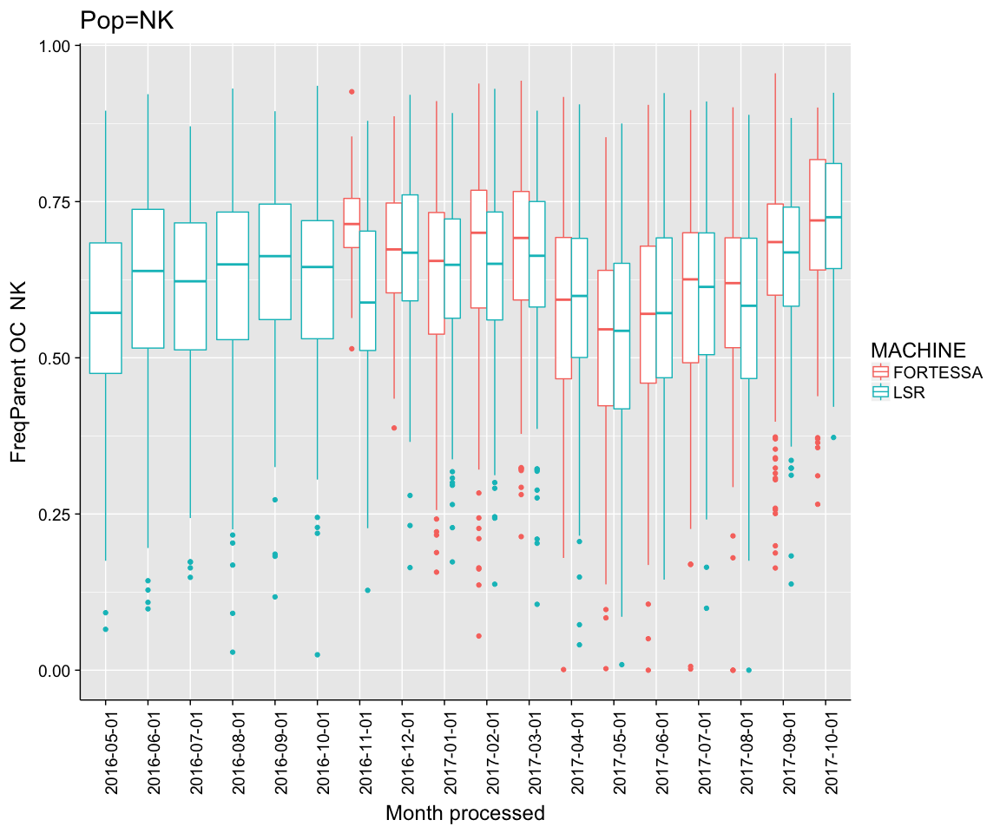<!-- -->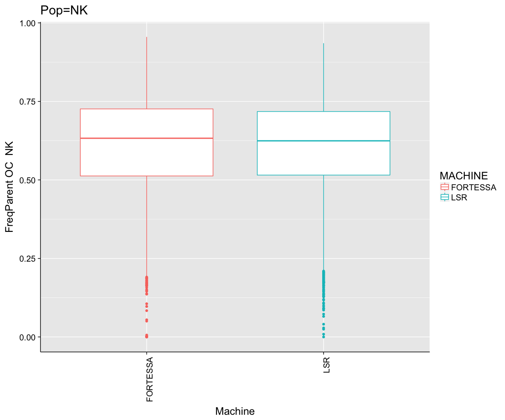<!-- -->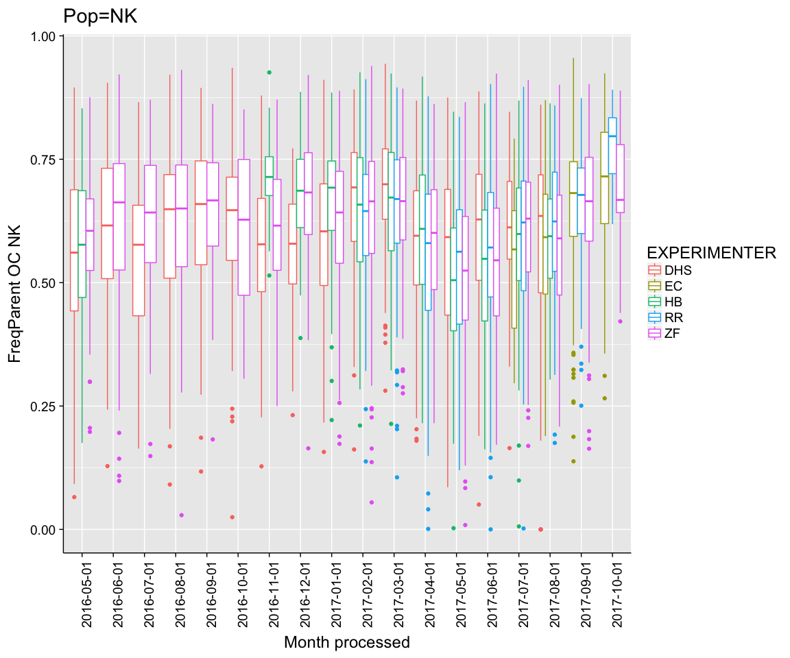<!-- -->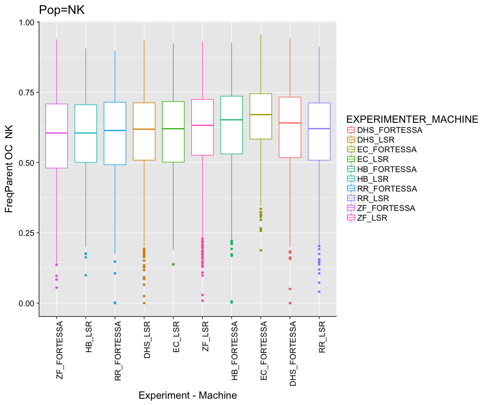<!-- -->

```
## 
## 
## |Var1 |Var2     | Freq|
## |:----|:--------|----:|
## |DHS  |FORTESSA |  668|
## |EC   |FORTESSA |  329|
## |HB   |FORTESSA |  745|
## |RR   |FORTESSA |  528|
## |ZF   |FORTESSA |  903|
## |DHS  |LSR      | 1372|
## |EC   |LSR      |  381|
## |HB   |LSR      |  440|
## |RR   |LSR      |  697|
## |ZF   |LSR      | 2318|
## [1] "Linear Regression for NK"
## 
## Call:
## lm(formula = formula, data = subF)
## 
## Residuals:
##      Min       1Q   Median       3Q      Max 
## -0.61133 -0.09399  0.01928  0.11253  0.33694 
## 
## Coefficients:
##                  Estimate Std. Error t value Pr(>|t|)    
## (Intercept)     2.3648499  0.2703692   8.747  < 2e-16 ***
## DATE_MONTH     -0.0001021  0.0000157  -6.501 8.46e-11 ***
## MACHINELSR     -0.0098266  0.0036629  -2.683  0.00732 ** 
## EXPERIMENTEREC  0.0444268  0.0074557   5.959 2.64e-09 ***
## EXPERIMENTERHB  0.0134297  0.0056882   2.361  0.01825 *  
## EXPERIMENTERRR  0.0061400  0.0058583   1.048  0.29463    
## EXPERIMENTERZF  0.0071803  0.0043515   1.650  0.09896 .  
## ---
## Signif. codes:  0 '***' 0.001 '**' 0.01 '*' 0.05 '.' 0.1 ' ' 1
## 
## Residual standard error: 0.152 on 8371 degrees of freedom
##   (3 observations deleted due to missingness)
## Multiple R-squared:  0.007545,	Adjusted R-squared:  0.006834 
## F-statistic: 10.61 on 6 and 8371 DF,  p-value: 9.078e-12
## 
## [1] "Stepwise Linear Regression for NK"
## Start:  AIC=-31560.33
## TARGET_FREQ ~ DATE_MONTH + MACHINE + EXPERIMENTER
## 
##                Df Sum of Sq    RSS    AIC
## <none>                      193.38 -31560
## - MACHINE       1   0.16626 193.54 -31555
## - EXPERIMENTER  4   0.90744 194.28 -31529
## - DATE_MONTH    1   0.97620 194.35 -31520
## Stepwise Model Path 
## Analysis of Deviance Table
## 
## Initial Model:
## TARGET_FREQ ~ DATE_MONTH + MACHINE + EXPERIMENTER
## 
## Final Model:
## TARGET_FREQ ~ DATE_MONTH + MACHINE + EXPERIMENTER
## 
## 
##   Step Df Deviance Resid. Df Resid. Dev       AIC
## 1                       8371   193.3778 -31560.33
## [1] "ANOVA of EXPERIMENTER for NK"
##   Tukey multiple comparisons of means
##     95% family-wise confidence level
## 
## Fit: aov(formula = formula, data = subF)
## 
## $EXPERIMENTER
##                diff          lwr           upr     p adj
## EC-DHS  0.022879513  0.004763522  4.099550e-02 0.0051837
## HB-DHS  0.010439305 -0.004747061  2.562567e-02 0.3306480
## RR-DHS -0.006452284 -0.021484887  8.580318e-03 0.7679713
## ZF-DHS  0.002899061 -0.008867217  1.466534e-02 0.9623933
## HB-EC  -0.012440208 -0.032169034  7.288618e-03 0.4213301
## RR-EC  -0.029331797 -0.048942508 -9.721086e-03 0.0004353
## ZF-EC  -0.019980452 -0.037215479 -2.745424e-03 0.0135817
## RR-HB  -0.016891589 -0.033833154  4.997466e-05 0.0511147
## ZF-HB  -0.007540244 -0.021664081  6.583593e-03 0.5908734
## ZF-RR   0.009351346 -0.004607027  2.330972e-02 0.3574285
## 
## [1] "ANOVA of MACHINE for NK"
##               Df Sum Sq Mean Sq F value Pr(>F)
## MACHINE        1   0.05 0.04738   2.037  0.154
## Residuals   8376 194.80 0.02326               
## 3 observations deleted due to missingness
## [1] "T-test of MACHINE for NK"
## 
## 	Welch Two Sample t-test
## 
## data:  TARGET_FREQ by MACHINE
## t = 1.4163, df = 6530.7, p-value = 0.1567
## alternative hypothesis: true difference in means is not equal to 0
## 95 percent confidence interval:
##  -0.001883226  0.011689026
## sample estimates:
## mean in group FORTESSA      mean in group LSR 
##              0.6117531              0.6068502 
## 
## [1] "# Start of new population results"
## [1] "DC.NK.MONOCYTES"
## [1] "n=8381"
## [1] "PLOT TYPE = Machine Time COUNT OC"
```

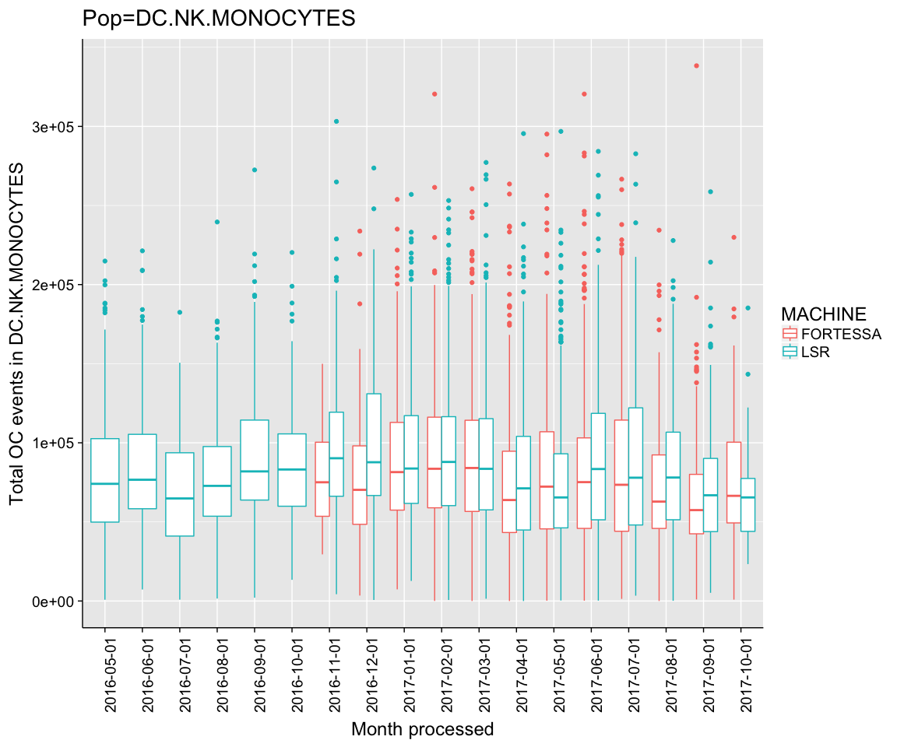<!-- -->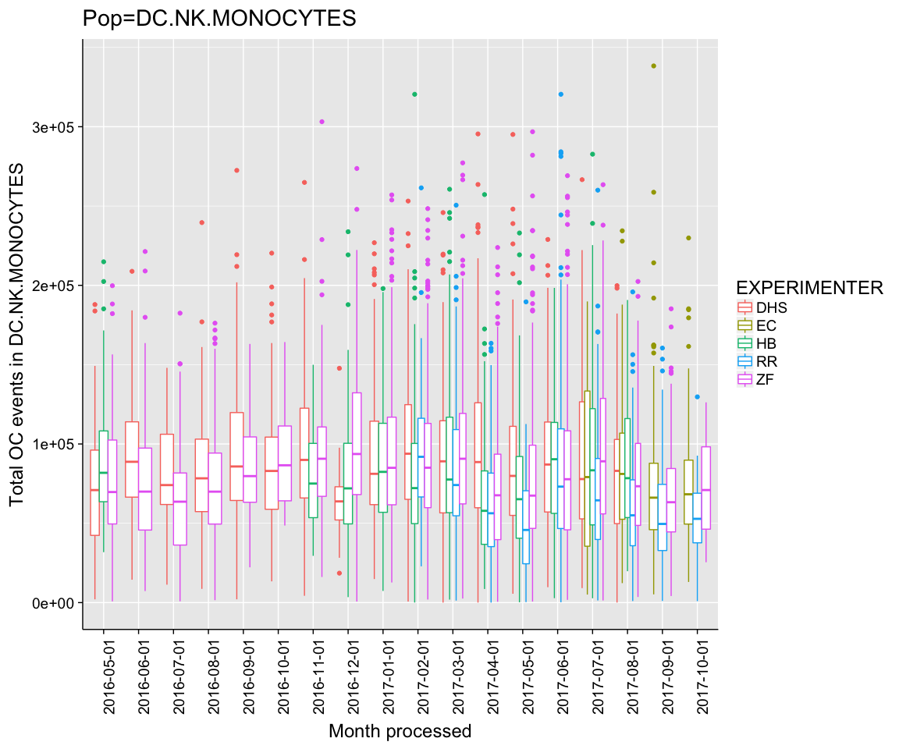<!-- -->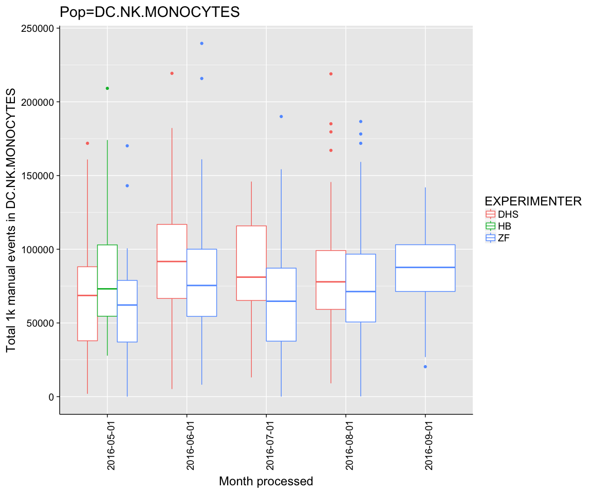<!-- -->

```
## [1] "Correlations between OC and manual for DC.NK.MONOCYTES"
## 
## 	Pearson's product-moment correlation
## 
## data:  merge[, colC] and merge[, coljflowCount]
## t = 111.8, df = 763, p-value < 2.2e-16
## alternative hypothesis: true correlation is not equal to 0
## 95 percent confidence interval:
##  0.9664312 0.9746254
## sample estimates:
##       cor 
## 0.9708103 
## 
## 
## 	Spearman's rank correlation rho
## 
## data:  merge[, colC] and merge[, coljflowCount]
## S = 2393700, p-value < 2.2e-16
## alternative hypothesis: true rho is not equal to 0
## sample estimates:
##       rho 
## 0.9679193
```

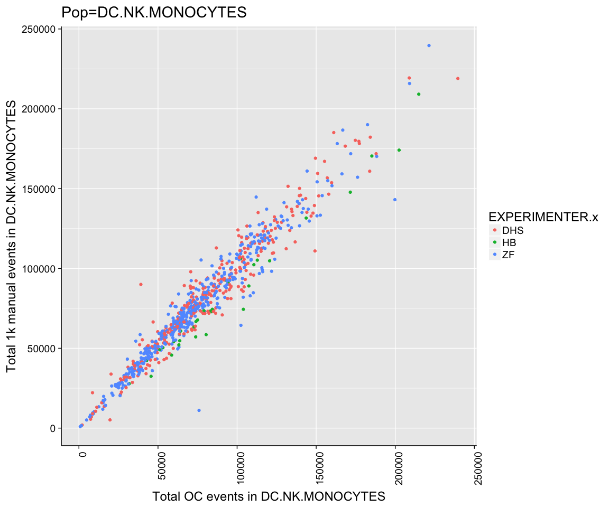<!-- -->

```
## [1] "DC.NK.MONOCYTES"
## [1] "n=8381"
## [1] "PLOT TYPE = Machine Time FREQ"
```

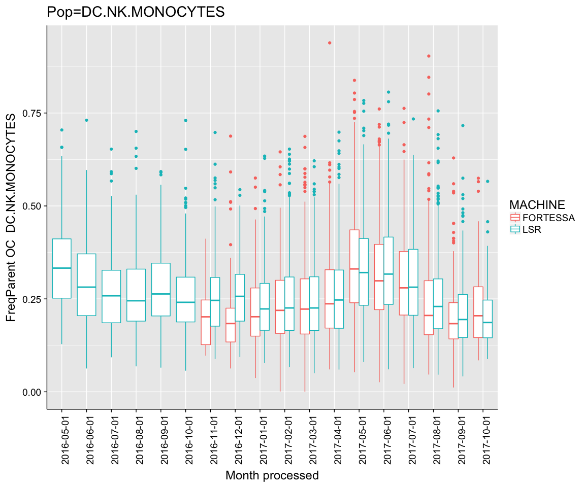<!-- -->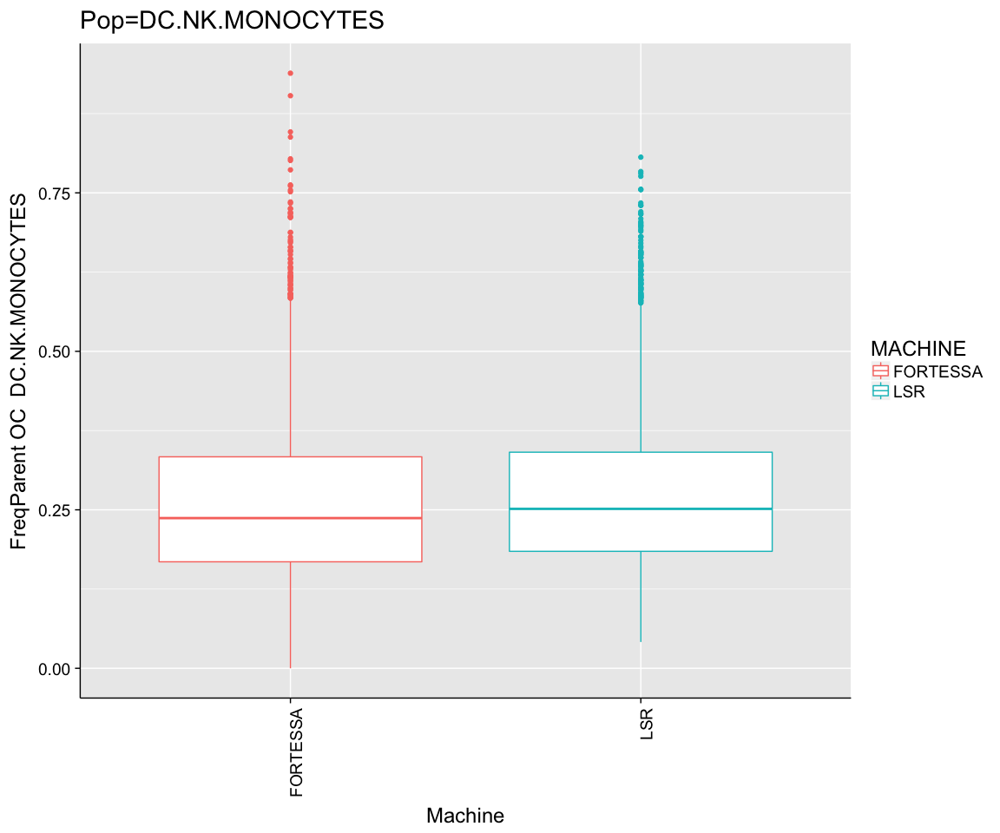<!-- -->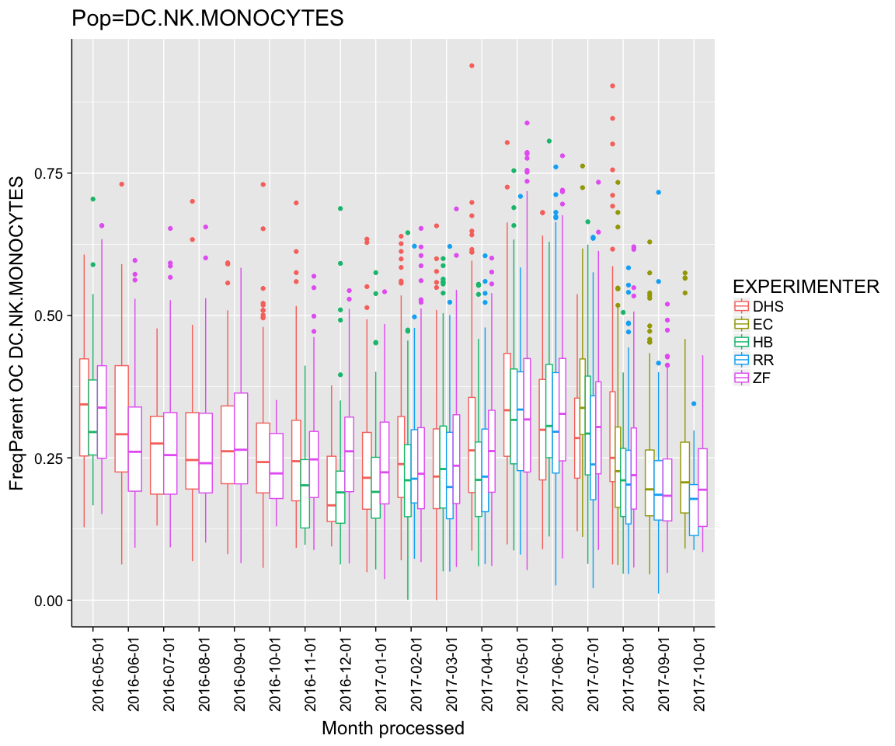<!-- -->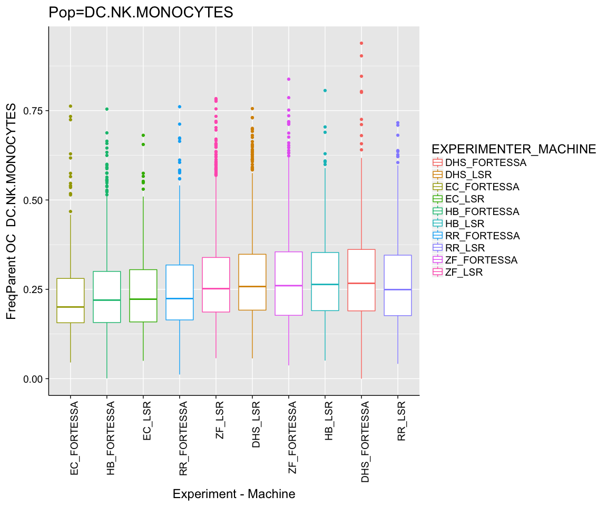<!-- -->

```
## 
## 
## |Var1 |Var2     | Freq|
## |:----|:--------|----:|
## |DHS  |FORTESSA |  668|
## |EC   |FORTESSA |  329|
## |HB   |FORTESSA |  745|
## |RR   |FORTESSA |  528|
## |ZF   |FORTESSA |  903|
## |DHS  |LSR      | 1372|
## |EC   |LSR      |  381|
## |HB   |LSR      |  440|
## |RR   |LSR      |  697|
## |ZF   |LSR      | 2318|
## [1] "Linear Regression for DC.NK.MONOCYTES"
## 
## Call:
## lm(formula = formula, data = subF)
## 
## Residuals:
##      Min       1Q   Median       3Q      Max 
## -0.28125 -0.09001 -0.02334  0.06853  0.65596 
## 
## Coefficients:
##                  Estimate Std. Error t value Pr(>|t|)    
## (Intercept)    -5.494e-01  2.187e-01  -2.512 0.012016 *  
## DATE_MONTH      4.822e-05  1.270e-05   3.797 0.000148 ***
## MACHINELSR      8.936e-03  2.962e-03   3.017 0.002564 ** 
## EXPERIMENTEREC -5.926e-02  6.030e-03  -9.827  < 2e-16 ***
## EXPERIMENTERHB -2.909e-02  4.600e-03  -6.323  2.7e-10 ***
## EXPERIMENTERRR -2.775e-02  4.738e-03  -5.857  4.9e-09 ***
## EXPERIMENTERZF -1.187e-02  3.519e-03  -3.374 0.000744 ***
## ---
## Signif. codes:  0 '***' 0.001 '**' 0.01 '*' 0.05 '.' 0.1 ' ' 1
## 
## Residual standard error: 0.1229 on 8372 degrees of freedom
##   (2 observations deleted due to missingness)
## Multiple R-squared:  0.01543,	Adjusted R-squared:  0.01472 
## F-statistic: 21.86 on 6 and 8372 DF,  p-value: < 2.2e-16
## 
## [1] "Stepwise Linear Regression for DC.NK.MONOCYTES"
## Start:  AIC=-35119.16
## TARGET_FREQ ~ DATE_MONTH + MACHINE + EXPERIMENTER
## 
##                Df Sum of Sq    RSS    AIC
## <none>                      126.53 -35119
## - MACHINE       1   0.13753 126.67 -35112
## - DATE_MONTH    1   0.21787 126.75 -35107
## - EXPERIMENTER  4   1.73996 128.27 -35013
## Stepwise Model Path 
## Analysis of Deviance Table
## 
## Initial Model:
## TARGET_FREQ ~ DATE_MONTH + MACHINE + EXPERIMENTER
## 
## Final Model:
## TARGET_FREQ ~ DATE_MONTH + MACHINE + EXPERIMENTER
## 
## 
##   Step Df Deviance Resid. Df Resid. Dev       AIC
## 1                       8372   126.5304 -35119.16
## [1] "ANOVA of EXPERIMENTER for DC.NK.MONOCYTES"
##   Tukey multiple comparisons of means
##     95% family-wise confidence level
## 
## Fit: aov(formula = formula, data = subF)
## 
## $EXPERIMENTER
##                diff          lwr           upr     p adj
## EC-DHS -0.049660576 -0.064291434 -0.0350297178 0.0000000
## HB-DHS -0.028969180 -0.041233683 -0.0167046771 0.0000000
## RR-DHS -0.022247474 -0.034387774 -0.0101071737 0.0000058
## ZF-DHS -0.009650417 -0.019152288 -0.0001485466 0.0444285
## HB-EC   0.020691396  0.004756968  0.0366258238 0.0036494
## RR-EC   0.027413102  0.011574072  0.0432521313 0.0000234
## ZF-EC   0.040010159  0.026089903  0.0539304140 0.0000000
## RR-HB   0.006721706 -0.006961527  0.0204049391 0.6659470
## ZF-HB   0.019318763  0.007911330  0.0307261956 0.0000382
## ZF-RR   0.012597057  0.001323265  0.0238708490 0.0195470
## 
## [1] "ANOVA of MACHINE for DC.NK.MONOCYTES"
##               Df Sum Sq Mean Sq F value   Pr(>F)    
## MACHINE        1   0.22 0.22365    14.6 0.000134 ***
## Residuals   8377 128.29 0.01531                     
## ---
## Signif. codes:  0 '***' 0.001 '**' 0.01 '*' 0.05 '.' 0.1 ' ' 1
## 2 observations deleted due to missingness
## [1] "T-test of MACHINE for DC.NK.MONOCYTES"
## 
## 	Welch Two Sample t-test
## 
## data:  TARGET_FREQ by MACHINE
## t = -3.7648, df = 6379.5, p-value = 0.0001682
## alternative hypothesis: true difference in means is not equal to 0
## 95 percent confidence interval:
##  -0.016197914 -0.005105314
## sample estimates:
## mean in group FORTESSA      mean in group LSR 
##              0.2629568              0.2736084 
## 
## [1] "# Start of new population results"
## [1] "NK.CD56HI"
## [1] "n=8381"
## [1] "PLOT TYPE = Machine Time COUNT OC"
```

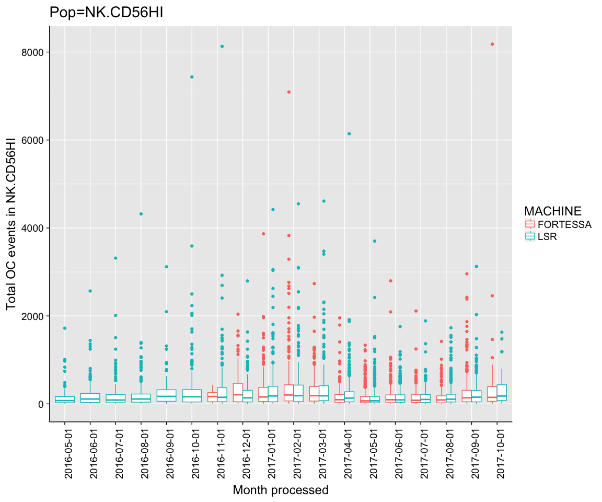<!-- -->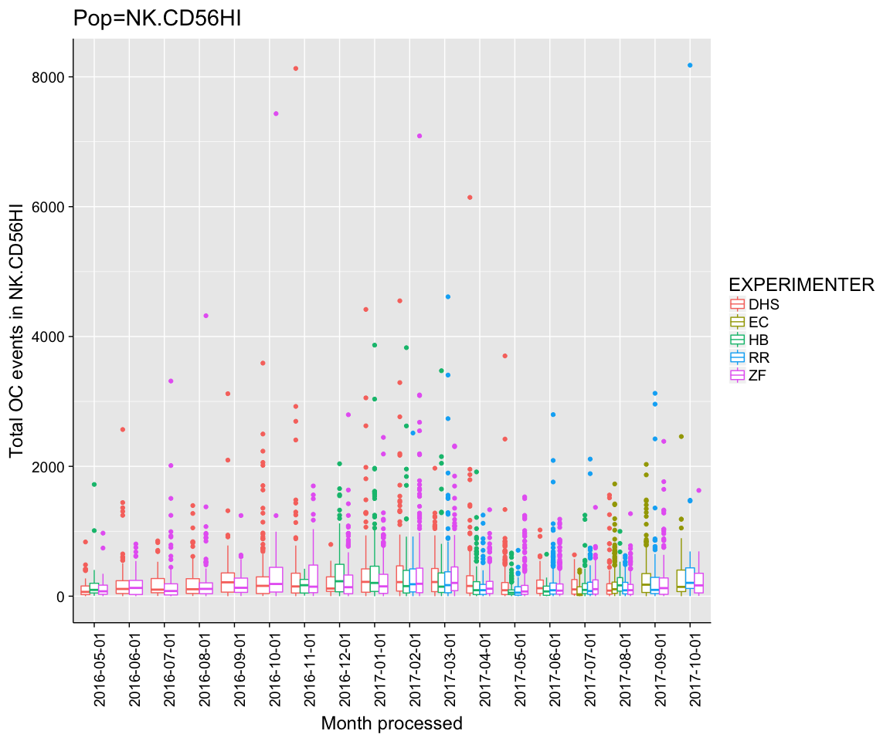<!-- -->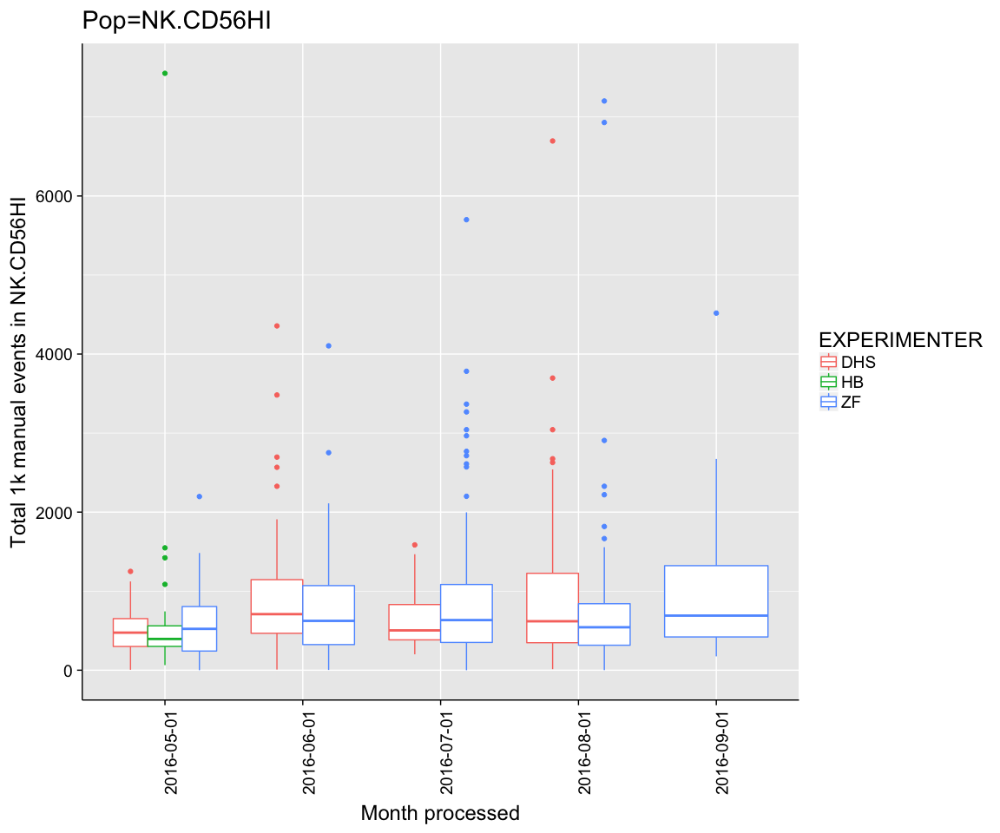<!-- -->

```
## [1] "Correlations between OC and manual for NK.CD56HI"
## 
## 	Pearson's product-moment correlation
## 
## data:  merge[, colC] and merge[, coljflowCount]
## t = 13.233, df = 763, p-value < 2.2e-16
## alternative hypothesis: true correlation is not equal to 0
## 95 percent confidence interval:
##  0.3725683 0.4879804
## sample estimates:
##       cor 
## 0.4320415 
## 
## 
## 	Spearman's rank correlation rho
## 
## data:  merge[, colC] and merge[, coljflowCount]
## S = 47262000, p-value < 2.2e-16
## alternative hypothesis: true rho is not equal to 0
## sample estimates:
##       rho 
## 0.3665909
```

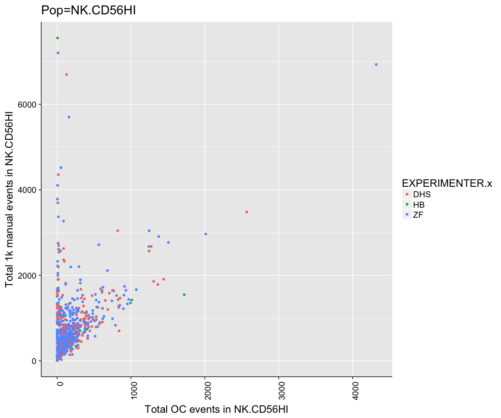<!-- -->

```
## [1] "NK.CD56HI"
## [1] "n=8381"
## [1] "PLOT TYPE = Machine Time FREQ"
```

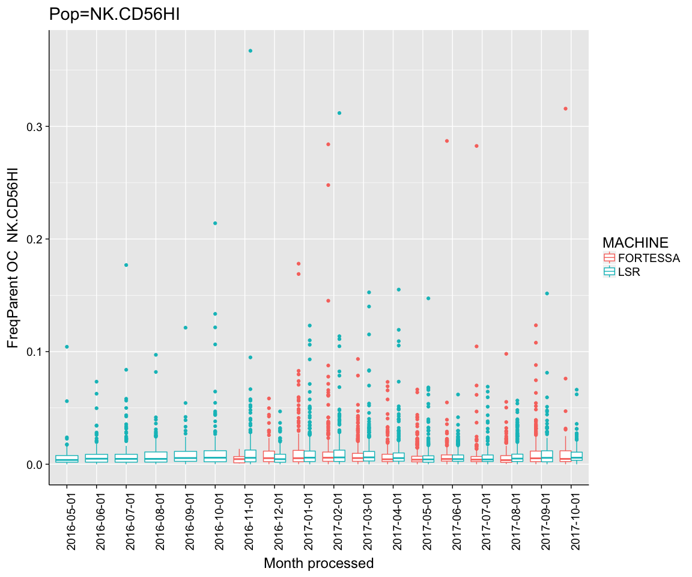<!-- -->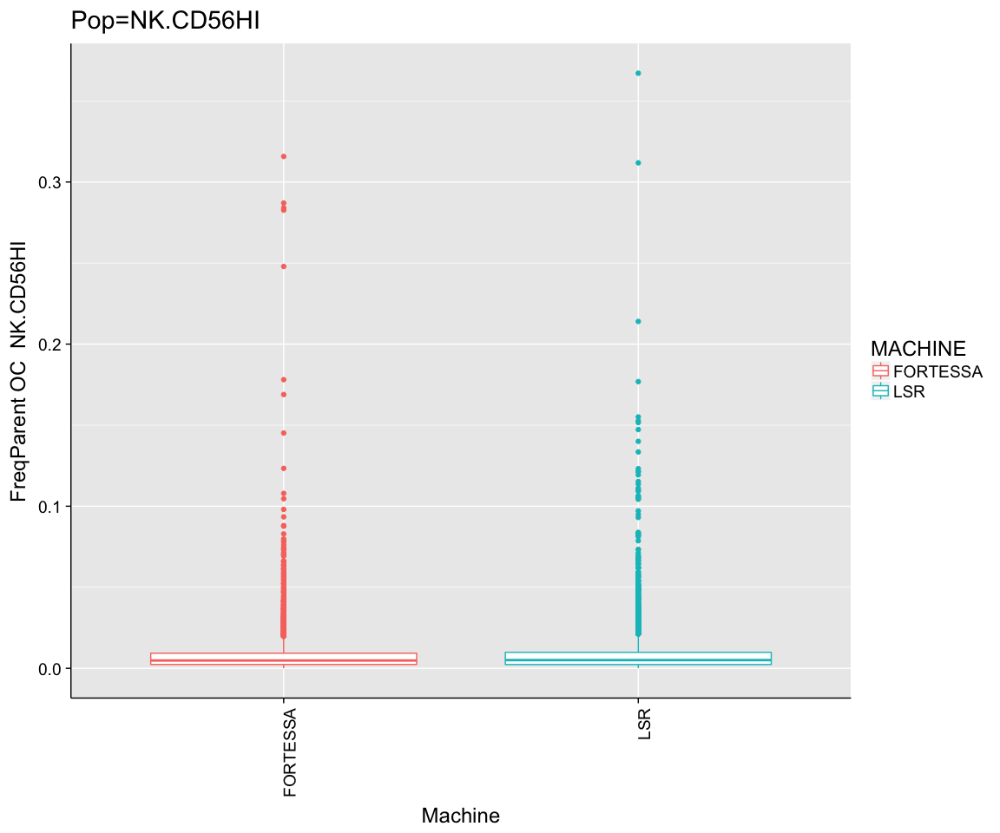<!-- -->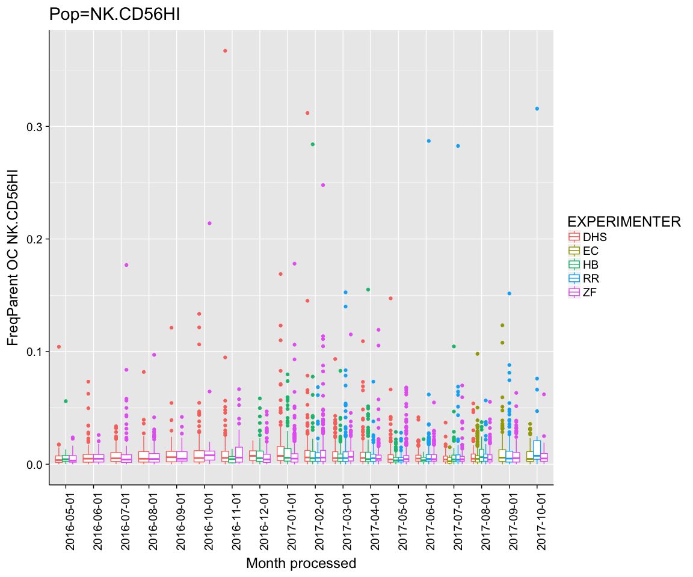<!-- -->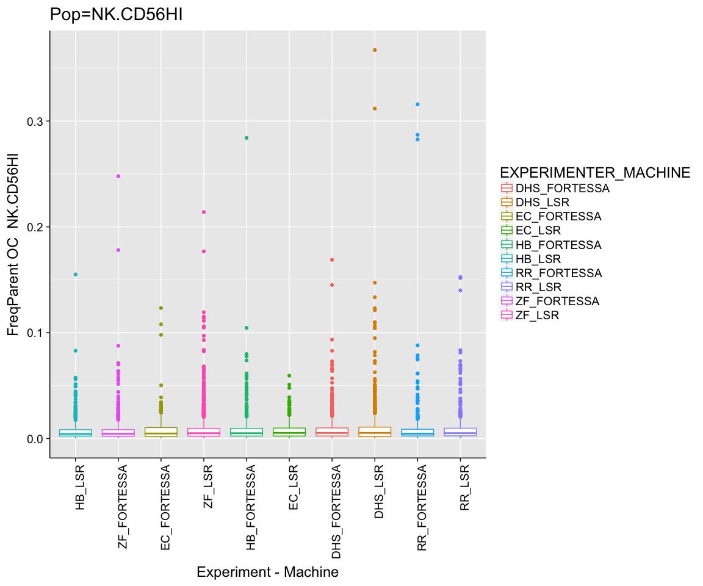<!-- -->

```
## 
## 
## |Var1 |Var2     | Freq|
## |:----|:--------|----:|
## |DHS  |FORTESSA |  668|
## |EC   |FORTESSA |  329|
## |HB   |FORTESSA |  745|
## |RR   |FORTESSA |  528|
## |ZF   |FORTESSA |  903|
## |DHS  |LSR      | 1372|
## |EC   |LSR      |  381|
## |HB   |LSR      |  440|
## |RR   |LSR      |  697|
## |ZF   |LSR      | 2318|
## [1] "Linear Regression for NK.CD56HI"
## 
## Call:
## lm(formula = formula, data = subF)
## 
## Residuals:
##      Min       1Q   Median       3Q      Max 
## -0.01000 -0.00620 -0.00357  0.00111  0.35762 
## 
## Coefficients:
##                  Estimate Std. Error t value Pr(>|t|)   
## (Intercept)     5.688e-02  2.645e-02   2.151  0.03151 * 
## DATE_MONTH     -2.764e-06  1.536e-06  -1.799  0.07198 . 
## MACHINELSR     -1.099e-04  3.582e-04  -0.307  0.75898   
## EXPERIMENTEREC -6.274e-04  7.293e-04  -0.860  0.38963   
## EXPERIMENTERHB -1.021e-03  5.563e-04  -1.836  0.06638 . 
## EXPERIMENTERRR -3.391e-05  5.732e-04  -0.059  0.95283   
## EXPERIMENTERZF -1.145e-03  4.256e-04  -2.691  0.00714 **
## ---
## Signif. codes:  0 '***' 0.001 '**' 0.01 '*' 0.05 '.' 0.1 ' ' 1
## 
## Residual standard error: 0.01486 on 8367 degrees of freedom
##   (7 observations deleted due to missingness)
## Multiple R-squared:  0.001714,	Adjusted R-squared:  0.0009982 
## F-statistic: 2.394 on 6 and 8367 DF,  p-value: 0.02589
## 
## [1] "Stepwise Linear Regression for NK.CD56HI"
## Start:  AIC=-70488.23
## TARGET_FREQ ~ DATE_MONTH + MACHINE + EXPERIMENTER
## 
##                Df  Sum of Sq    RSS    AIC
## - MACHINE       1 0.00002078 1.8473 -70490
## <none>                       1.8473 -70488
## - DATE_MONTH    1 0.00071492 1.8480 -70487
## - EXPERIMENTER  4 0.00227598 1.8495 -70486
## 
## Step:  AIC=-70490.14
## TARGET_FREQ ~ DATE_MONTH + EXPERIMENTER
## 
##                Df  Sum of Sq    RSS    AIC
## <none>                       1.8473 -70490
## - DATE_MONTH    1 0.00070093 1.8480 -70489
## + MACHINE       1 0.00002078 1.8473 -70488
## - EXPERIMENTER  4 0.00227781 1.8496 -70488
## Stepwise Model Path 
## Analysis of Deviance Table
## 
## Initial Model:
## TARGET_FREQ ~ DATE_MONTH + MACHINE + EXPERIMENTER
## 
## Final Model:
## TARGET_FREQ ~ DATE_MONTH + EXPERIMENTER
## 
## 
##        Step Df    Deviance Resid. Df Resid. Dev       AIC
## 1                               8367   1.847263 -70488.23
## 2 - MACHINE  1 2.07846e-05      8368   1.847284 -70490.14
## [1] "ANOVA of EXPERIMENTER for NK.CD56HI"
##   Tukey multiple comparisons of means
##     95% family-wise confidence level
## 
## Fit: aov(formula = formula, data = subF)
## 
## $EXPERIMENTER
##                 diff           lwr           upr     p adj
## EC-DHS -1.232961e-03 -0.0030001187  0.0005341973 0.3153674
## HB-DHS -1.150332e-03 -0.0026318332  0.0003311701 0.2121730
## RR-DHS -3.920065e-04 -0.0018588902  0.0010748773 0.9497886
## ZF-DHS -1.254730e-03 -0.0024027929 -0.0001066670 0.0240089
## HB-EC   8.262912e-05 -0.0018414895  0.0020067477 0.9999576
## RR-EC   8.409542e-04 -0.0010719319  0.0027538403 0.7517350
## ZF-EC  -2.176924e-05 -0.0017026719  0.0016591334 0.9999996
## RR-HB   7.583251e-04 -0.0008942889  0.0024109391 0.7206810
## ZF-HB  -1.043984e-04 -0.0014818720  0.0012730753 0.9995938
## ZF-RR  -8.627235e-04 -0.0022244629  0.0004990160 0.4163351
## 
## [1] "ANOVA of MACHINE for NK.CD56HI"
##               Df Sum Sq   Mean Sq F value Pr(>F)
## MACHINE        1   0.00 1.254e-05   0.057  0.812
## Residuals   8372   1.85 2.210e-04               
## 7 observations deleted due to missingness
## [1] "T-test of MACHINE for NK.CD56HI"
## 
## 	Welch Two Sample t-test
## 
## data:  TARGET_FREQ by MACHINE
## t = -0.23135, df = 6073.6, p-value = 0.8171
## alternative hypothesis: true difference in means is not equal to 0
## 95 percent confidence interval:
##  -0.0007560212  0.0005964143
## sample estimates:
## mean in group FORTESSA      mean in group LSR 
##            0.008482688            0.008562492 
## 
## [1] "# Start of new population results"
## [1] "NK.CD56LO"
## [1] "n=8381"
## [1] "PLOT TYPE = Machine Time COUNT OC"
```

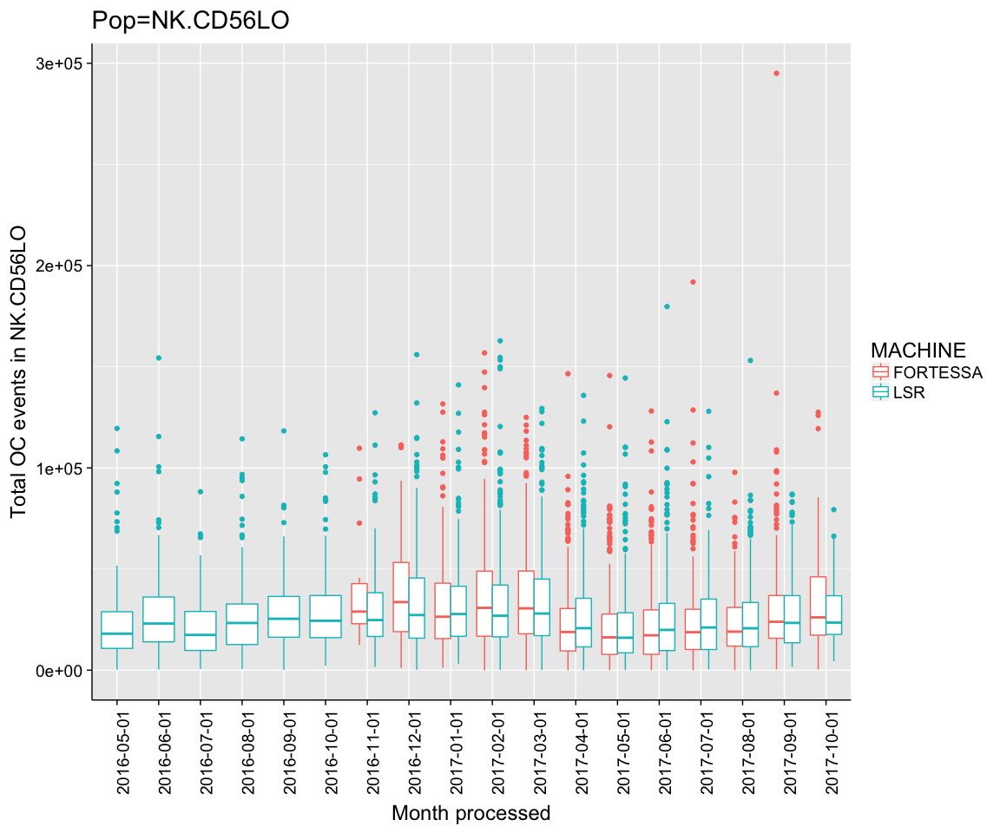<!-- -->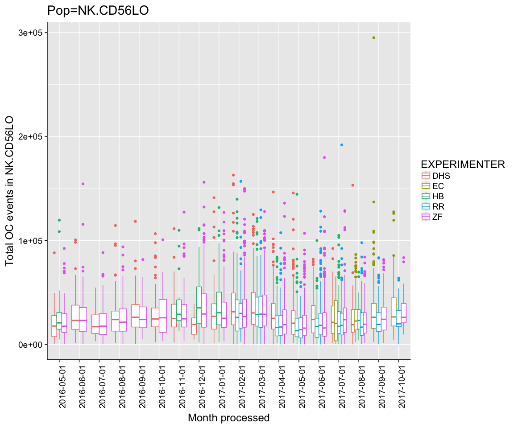<!-- -->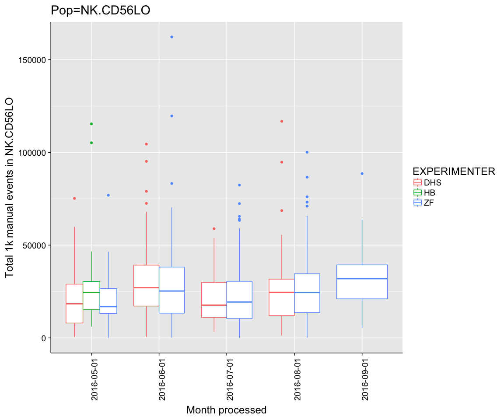<!-- -->

```
## [1] "Correlations between OC and manual for NK.CD56LO"
## 
## 	Pearson's product-moment correlation
## 
## data:  merge[, colC] and merge[, coljflowCount]
## t = 183.14, df = 763, p-value < 2.2e-16
## alternative hypothesis: true correlation is not equal to 0
## 95 percent confidence interval:
##  0.9871208 0.9902896
## sample estimates:
##       cor 
## 0.9888162 
## 
## 
## 	Spearman's rank correlation rho
## 
## data:  merge[, colC] and merge[, coljflowCount]
## S = 1165800, p-value < 2.2e-16
## alternative hypothesis: true rho is not equal to 0
## sample estimates:
##       rho 
## 0.9843763
```

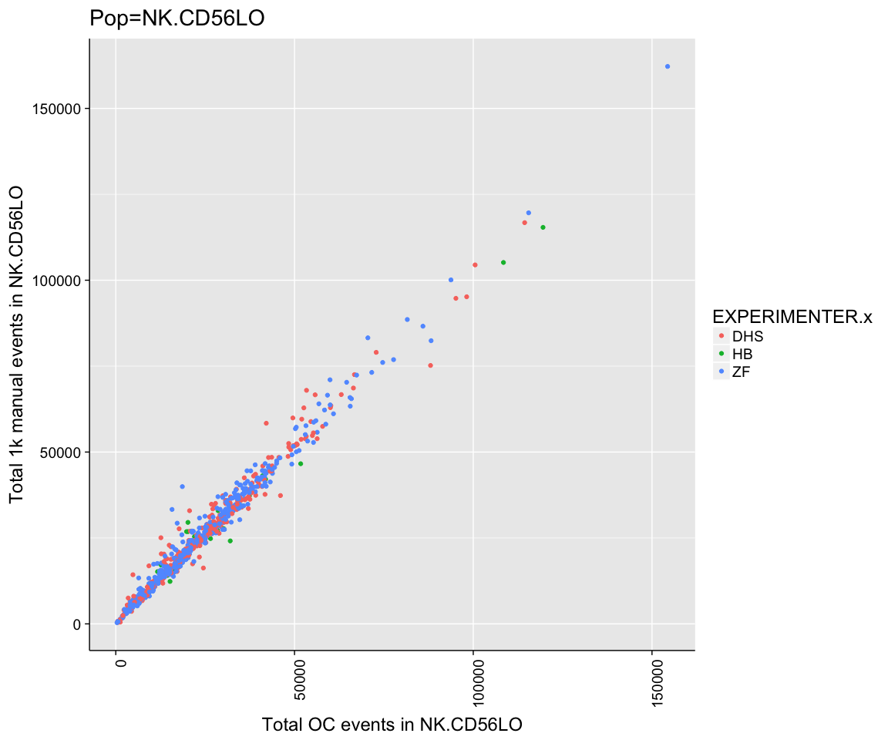<!-- -->

```
## [1] "NK.CD56LO"
## [1] "n=8381"
## [1] "PLOT TYPE = Machine Time FREQ"
```

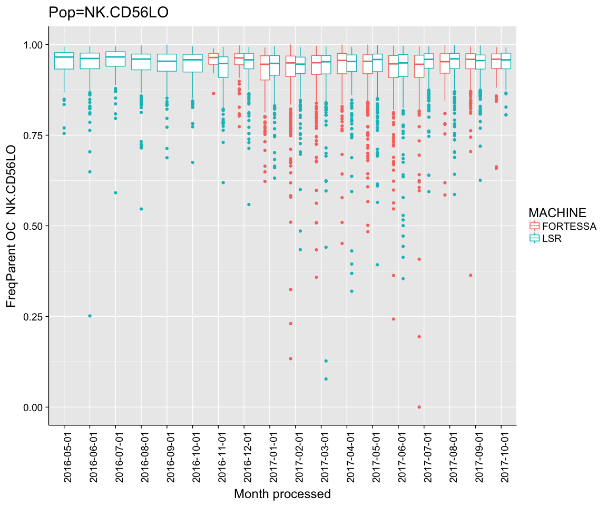<!-- -->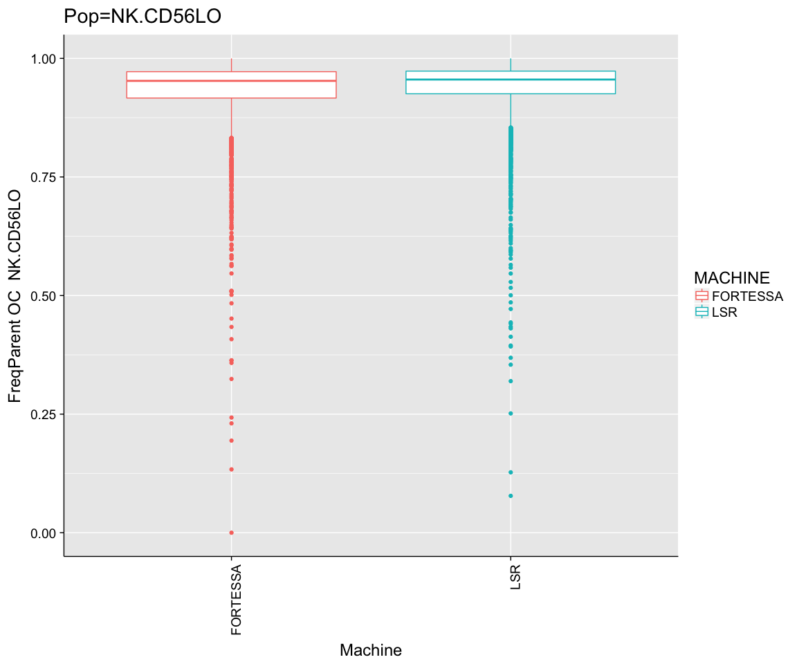<!-- -->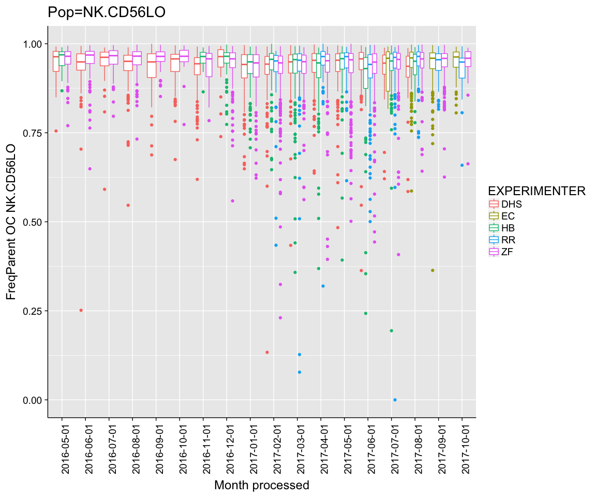<!-- -->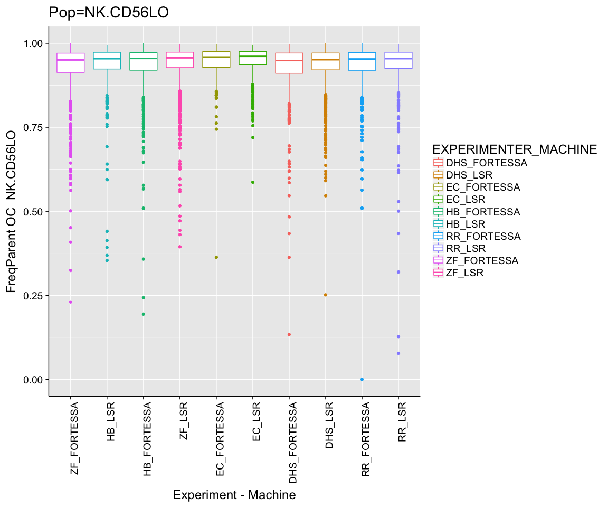<!-- -->

```
## 
## 
## |Var1 |Var2     | Freq|
## |:----|:--------|----:|
## |DHS  |FORTESSA |  668|
## |EC   |FORTESSA |  329|
## |HB   |FORTESSA |  745|
## |RR   |FORTESSA |  528|
## |ZF   |FORTESSA |  903|
## |DHS  |LSR      | 1372|
## |EC   |LSR      |  381|
## |HB   |LSR      |  440|
## |RR   |LSR      |  697|
## |ZF   |LSR      | 2318|
## [1] "Linear Regression for NK.CD56LO"
## 
## Call:
## lm(formula = formula, data = subF)
## 
## Residuals:
##      Min       1Q   Median       3Q      Max 
## -0.92853 -0.01268  0.01870  0.03667  0.07116 
## 
## Coefficients:
##                  Estimate Std. Error t value Pr(>|t|)    
## (Intercept)     1.270e+00  1.198e-01  10.596  < 2e-16 ***
## DATE_MONTH     -1.987e-05  6.958e-06  -2.855  0.00431 ** 
## MACHINELSR      6.785e-03  1.623e-03   4.181 2.93e-05 ***
## EXPERIMENTEREC  1.754e-02  3.304e-03   5.309 1.13e-07 ***
## EXPERIMENTERHB  1.417e-03  2.520e-03   0.562  0.57391    
## EXPERIMENTERRR  3.634e-03  2.597e-03   1.399  0.16177    
## EXPERIMENTERZF  4.005e-03  1.928e-03   2.077  0.03783 *  
## ---
## Signif. codes:  0 '***' 0.001 '**' 0.01 '*' 0.05 '.' 0.1 ' ' 1
## 
## Residual standard error: 0.06732 on 8367 degrees of freedom
##   (7 observations deleted due to missingness)
## Multiple R-squared:  0.006951,	Adjusted R-squared:  0.006239 
## F-statistic:  9.76 on 6 and 8367 DF,  p-value: 9.628e-11
## 
## [1] "Stepwise Linear Regression for NK.CD56LO"
## Start:  AIC=-45184.87
## TARGET_FREQ ~ DATE_MONTH + MACHINE + EXPERIMENTER
## 
##                Df Sum of Sq    RSS    AIC
## <none>                      37.916 -45185
## - DATE_MONTH    1  0.036943 37.953 -45179
## - MACHINE       1  0.079229 37.995 -45169
## - EXPERIMENTER  4  0.137925 38.054 -45162
## Stepwise Model Path 
## Analysis of Deviance Table
## 
## Initial Model:
## TARGET_FREQ ~ DATE_MONTH + MACHINE + EXPERIMENTER
## 
## Final Model:
## TARGET_FREQ ~ DATE_MONTH + MACHINE + EXPERIMENTER
## 
## 
##   Step Df Deviance Resid. Df Resid. Dev       AIC
## 1                       8367   37.91559 -45184.87
## [1] "ANOVA of EXPERIMENTER for NK.CD56LO"
##   Tukey multiple comparisons of means
##     95% family-wise confidence level
## 
## Fit: aov(formula = formula, data = subF)
## 
## $EXPERIMENTER
##                 diff          lwr           upr     p adj
## EC-DHS  0.0121506378  0.004129704  0.0201715716 0.0003484
## HB-DHS -0.0018000974 -0.008524469  0.0049242740 0.9494835
## RR-DHS  0.0002668863 -0.006391136  0.0069249086 0.9999678
## ZF-DHS  0.0035665834 -0.001644347  0.0087775135 0.3351272
## HB-EC  -0.0139507352 -0.022684096 -0.0052173745 0.0001293
## RR-EC  -0.0118837515 -0.020566129 -0.0032013740 0.0017730
## ZF-EC  -0.0085840544 -0.016213485 -0.0009546238 0.0182952
## RR-HB   0.0020669837 -0.005434048  0.0095680150 0.9440844
## ZF-HB   0.0053666808 -0.000885519  0.0116188806 0.1318665
## ZF-RR   0.0032996971 -0.002881087  0.0094804812 0.5908781
## 
## [1] "ANOVA of MACHINE for NK.CD56LO"
##               Df Sum Sq Mean Sq F value  Pr(>F)    
## MACHINE        1   0.13 0.12565   27.64 1.5e-07 ***
## Residuals   8372  38.06 0.00455                    
## ---
## Signif. codes:  0 '***' 0.001 '**' 0.01 '*' 0.05 '.' 0.1 ' ' 1
## 7 observations deleted due to missingness
## [1] "T-test of MACHINE for NK.CD56LO"
## 
## 	Welch Two Sample t-test
## 
## data:  TARGET_FREQ by MACHINE
## t = -5.0157, df = 5719.6, p-value = 5.442e-07
## alternative hypothesis: true difference in means is not equal to 0
## 95 percent confidence interval:
##  -0.011109125 -0.004865514
## sample estimates:
## mean in group FORTESSA      mean in group LSR 
##              0.9301165              0.9381039 
## 
## [1] "# Start of new population results"
## [1] "Plasmacytoid.DC"
## [1] "n=8381"
## [1] "PLOT TYPE = Machine Time COUNT OC"
```

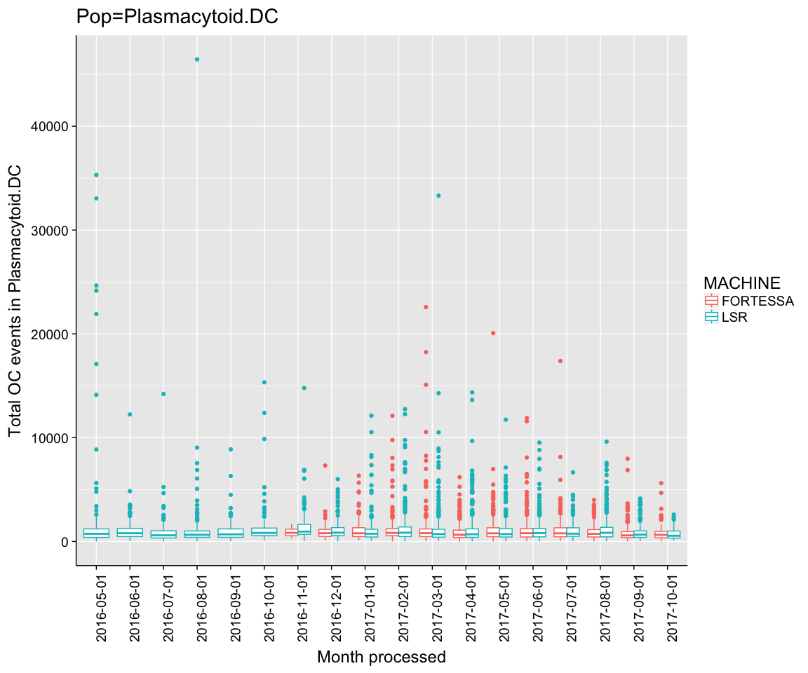<!-- -->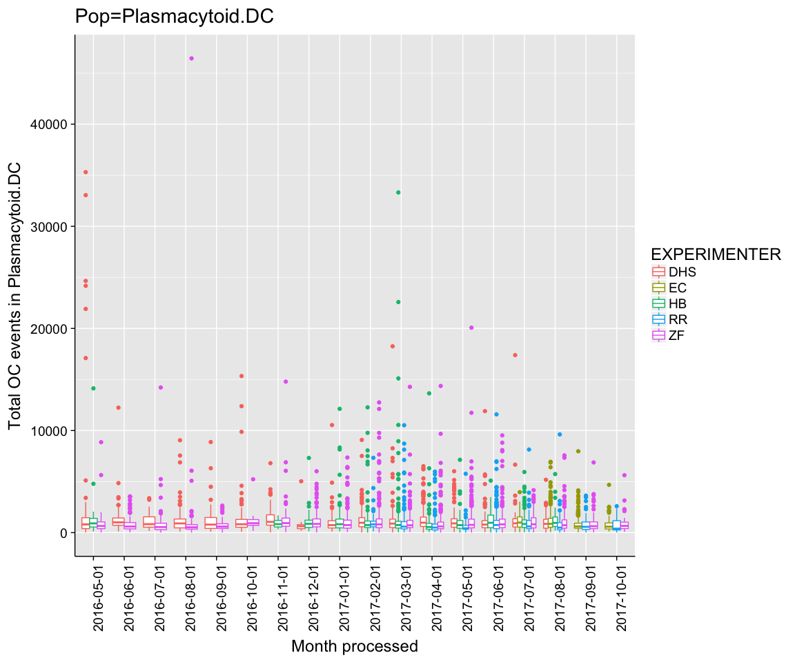<!-- -->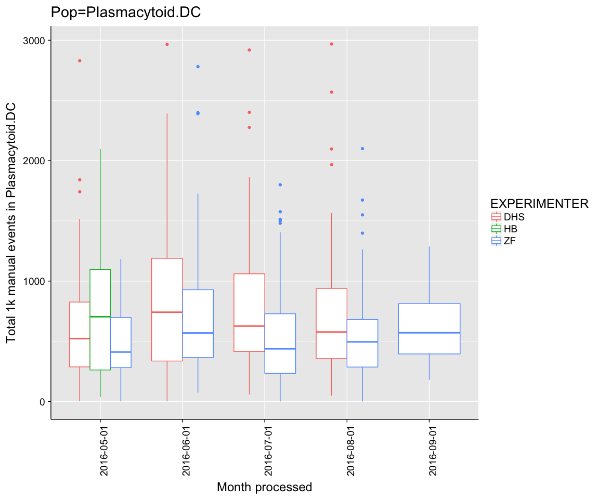<!-- -->

```
## [1] "Correlations between OC and manual for Plasmacytoid.DC"
## 
## 	Pearson's product-moment correlation
## 
## data:  merge[, colC] and merge[, coljflowCount]
## t = 2.2502, df = 763, p-value = 0.02472
## alternative hypothesis: true correlation is not equal to 0
## 95 percent confidence interval:
##  0.01037005 0.15120601
## sample estimates:
##       cor 
## 0.0811933 
## 
## 
## 	Spearman's rank correlation rho
## 
## data:  merge[, colC] and merge[, coljflowCount]
## S = 26078000, p-value < 2.2e-16
## alternative hypothesis: true rho is not equal to 0
## sample estimates:
##       rho 
## 0.6505109
```

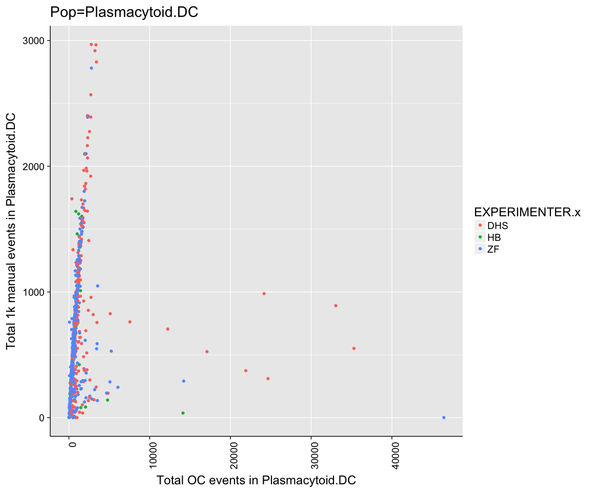<!-- -->

```
## [1] "Plasmacytoid.DC"
## [1] "n=8381"
## [1] "PLOT TYPE = Machine Time FREQ"
```

<!-- -->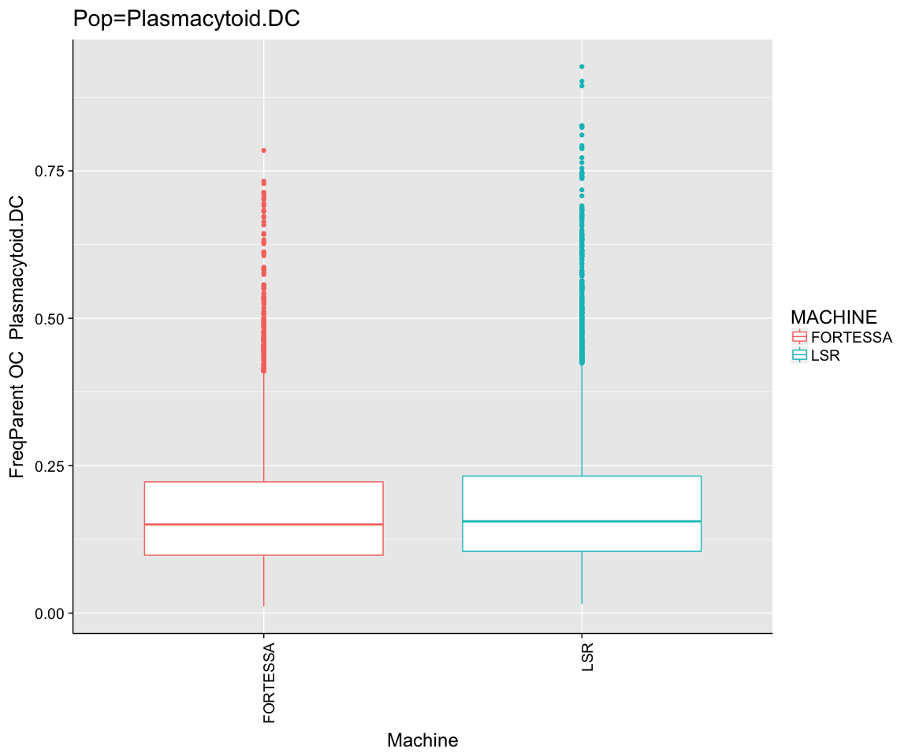<!-- -->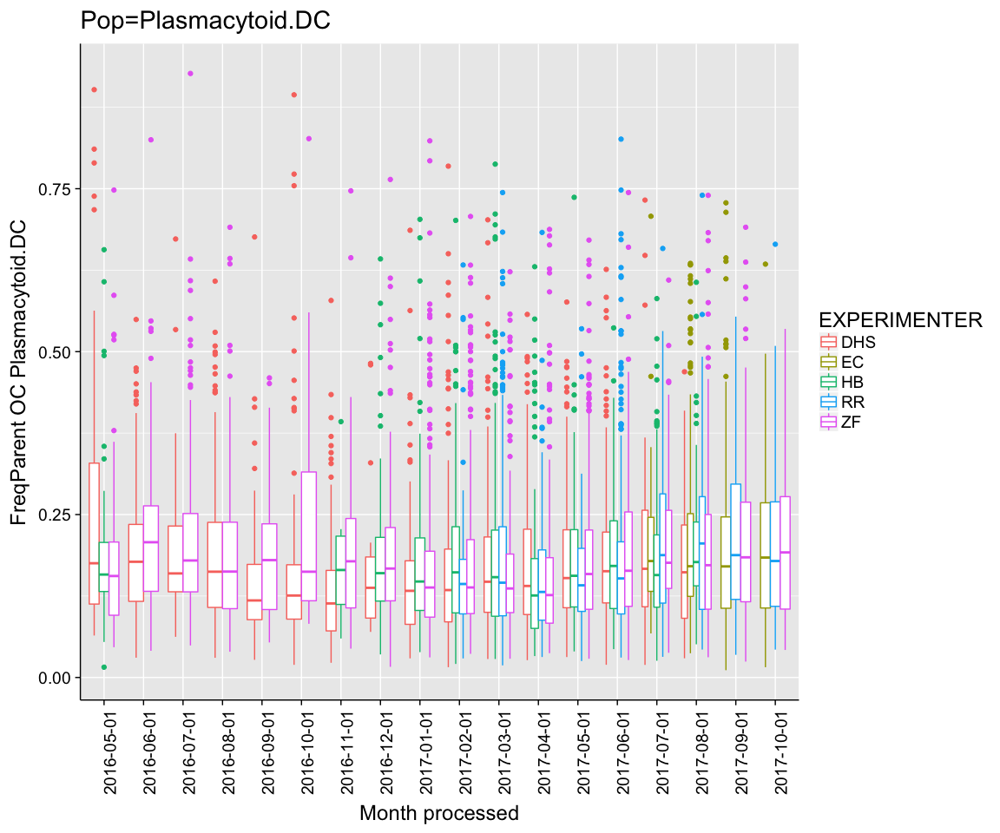<!-- -->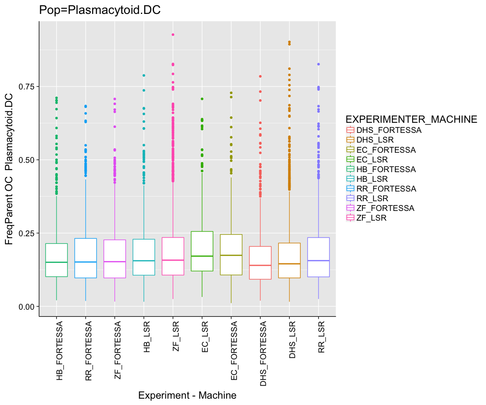<!-- -->

```
## 
## 
## |Var1 |Var2     | Freq|
## |:----|:--------|----:|
## |DHS  |FORTESSA |  668|
## |EC   |FORTESSA |  329|
## |HB   |FORTESSA |  745|
## |RR   |FORTESSA |  528|
## |ZF   |FORTESSA |  903|
## |DHS  |LSR      | 1372|
## |EC   |LSR      |  381|
## |HB   |LSR      |  440|
## |RR   |LSR      |  697|
## |ZF   |LSR      | 2318|
## [1] "Linear Regression for Plasmacytoid.DC"
## 
## Call:
## lm(formula = formula, data = subF)
## 
## Residuals:
##      Min       1Q   Median       3Q      Max 
## -0.18320 -0.08208 -0.03052  0.04394  0.73823 
## 
## Coefficients:
##                  Estimate Std. Error t value Pr(>|t|)    
## (Intercept)    -6.362e-03  2.115e-01  -0.030  0.97601    
## DATE_MONTH      9.928e-06  1.228e-05   0.808  0.41897    
## MACHINELSR      1.299e-02  2.865e-03   4.536 5.82e-06 ***
## EXPERIMENTEREC  2.789e-02  5.832e-03   4.782 1.77e-06 ***
## EXPERIMENTERHB  1.215e-02  4.449e-03   2.730  0.00634 ** 
## EXPERIMENTERRR  1.428e-02  4.583e-03   3.116  0.00184 ** 
## EXPERIMENTERZF  1.337e-02  3.404e-03   3.928 8.64e-05 ***
## ---
## Signif. codes:  0 '***' 0.001 '**' 0.01 '*' 0.05 '.' 0.1 ' ' 1
## 
## Residual standard error: 0.1189 on 8370 degrees of freedom
##   (4 observations deleted due to missingness)
## Multiple R-squared:  0.006779,	Adjusted R-squared:  0.006067 
## F-statistic: 9.522 on 6 and 8370 DF,  p-value: 1.87e-10
## 
## [1] "Stepwise Linear Regression for Plasmacytoid.DC"
## Start:  AIC=-35674.33
## TARGET_FREQ ~ DATE_MONTH + MACHINE + EXPERIMENTER
## 
##                Df Sum of Sq    RSS    AIC
## - DATE_MONTH    1   0.00923 118.28 -35676
## <none>                      118.27 -35674
## - MACHINE       1   0.29069 118.56 -35656
## - EXPERIMENTER  4   0.39249 118.66 -35655
## 
## Step:  AIC=-35675.68
## TARGET_FREQ ~ MACHINE + EXPERIMENTER
## 
##                Df Sum of Sq    RSS    AIC
## <none>                      118.28 -35676
## + DATE_MONTH    1   0.00923 118.27 -35674
## - MACHINE       1   0.28382 118.56 -35658
## - EXPERIMENTER  4   0.54746 118.83 -35645
## Stepwise Model Path 
## Analysis of Deviance Table
## 
## Initial Model:
## TARGET_FREQ ~ DATE_MONTH + MACHINE + EXPERIMENTER
## 
## Final Model:
## TARGET_FREQ ~ MACHINE + EXPERIMENTER
## 
## 
##           Step Df    Deviance Resid. Df Resid. Dev       AIC
## 1                                  8370   118.2698 -35674.33
## 2 - DATE_MONTH  1 0.009230744      8371   118.2791 -35675.68
## [1] "ANOVA of EXPERIMENTER for Plasmacytoid.DC"
##   Tukey multiple comparisons of means
##     95% family-wise confidence level
## 
## Fit: aov(formula = formula, data = subF)
## 
## $EXPERIMENTER
##                 diff          lwr           upr     p adj
## EC-DHS  0.0283415199  0.014191157  0.0424918826 0.0000005
## HB-DHS  0.0088073102 -0.003055047  0.0206696677 0.2536501
## RR-DHS  0.0142483872  0.002506116  0.0259906584 0.0083040
## ZF-DHS  0.0143493114  0.005157897  0.0235407257 0.0002010
## HB-EC  -0.0195342097 -0.034943378 -0.0041250418 0.0049492
## RR-EC  -0.0140931327 -0.029410047  0.0012237815 0.0883780
## ZF-EC  -0.0139922085 -0.027453599 -0.0005308183 0.0369619
## RR-HB   0.0054410770 -0.007791104  0.0186732583 0.7950292
## ZF-HB   0.0055420012 -0.005489399  0.0165734013 0.6465541
## ZF-RR   0.0001009242 -0.010801241  0.0110030890 0.9999999
## 
## [1] "ANOVA of MACHINE for Plasmacytoid.DC"
##               Df Sum Sq Mean Sq F value   Pr(>F)    
## MACHINE        1   0.25 0.25059   17.66 2.67e-05 ***
## Residuals   8375 118.83 0.01419                     
## ---
## Signif. codes:  0 '***' 0.001 '**' 0.01 '*' 0.05 '.' 0.1 ' ' 1
## 4 observations deleted due to missingness
## [1] "T-test of MACHINE for Plasmacytoid.DC"
## 
## 	Welch Two Sample t-test
## 
## data:  TARGET_FREQ by MACHINE
## t = -4.3068, df = 7216.6, p-value = 1.678e-05
## alternative hypothesis: true difference in means is not equal to 0
## 95 percent confidence interval:
##  -0.01640910 -0.00614389
## sample estimates:
## mean in group FORTESSA      mean in group LSR 
##              0.1771431              0.1884196 
## 
## [1] "# Start of new population results"
## [1] "Classical.monocytes"
## [1] "n=8381"
## [1] "PLOT TYPE = Machine Time COUNT OC"
```

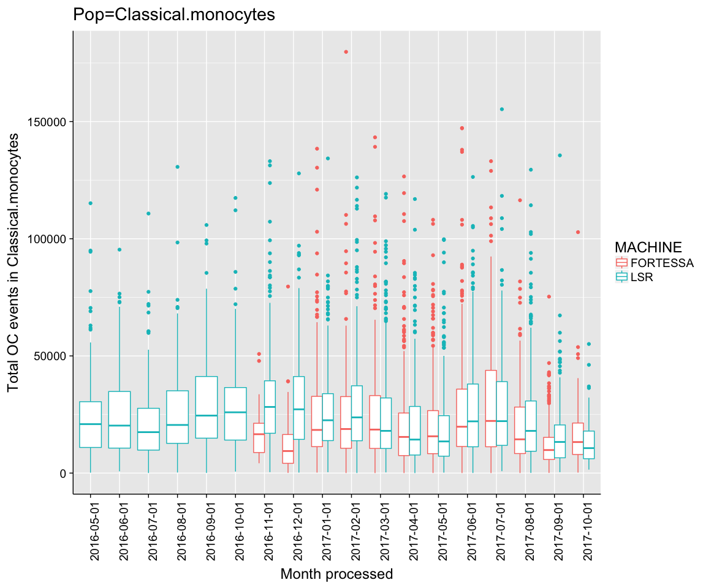<!-- -->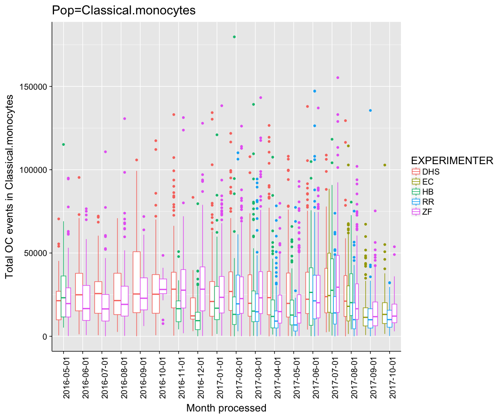<!-- --><!-- -->

```
## [1] "Correlations between OC and manual for Classical.monocytes"
## 
## 	Pearson's product-moment correlation
## 
## data:  merge[, colC] and merge[, coljflowCount]
## t = 64.557, df = 763, p-value < 2.2e-16
## alternative hypothesis: true correlation is not equal to 0
## 95 percent confidence interval:
##  0.9076420 0.9296736
## sample estimates:
##       cor 
## 0.9193757 
## 
## 
## 	Spearman's rank correlation rho
## 
## data:  merge[, colC] and merge[, coljflowCount]
## S = 5696900, p-value < 2.2e-16
## alternative hypothesis: true rho is not equal to 0
## sample estimates:
##       rho 
## 0.9236505
```

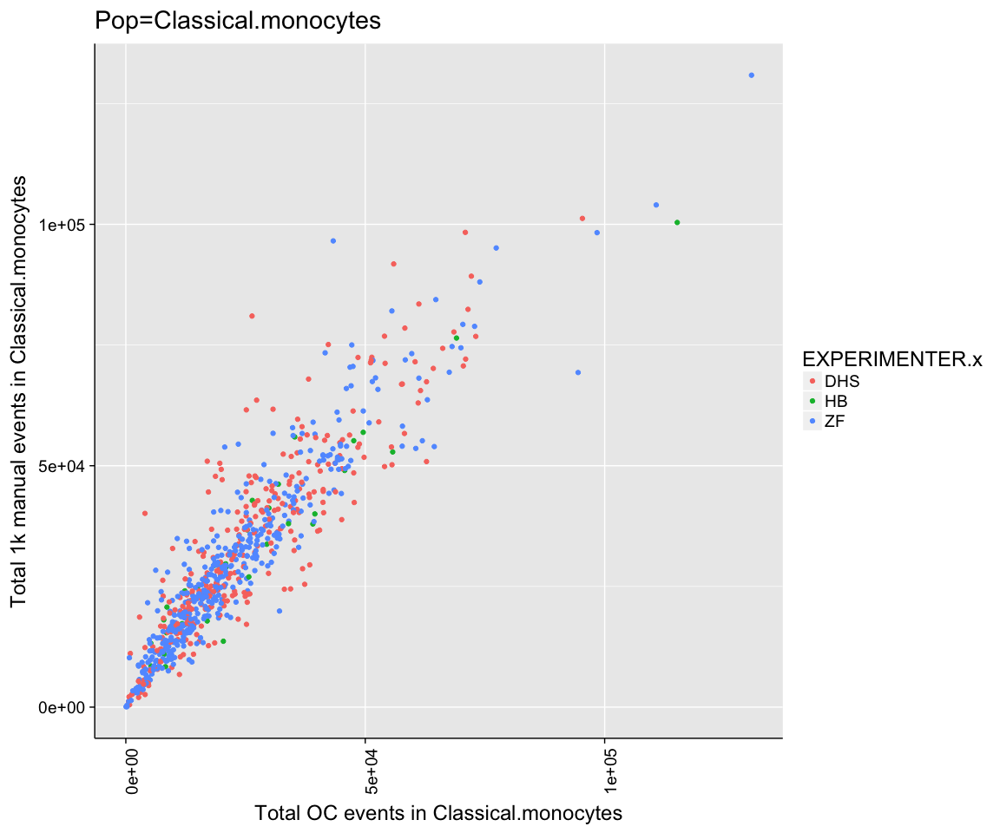<!-- -->

```
## [1] "Classical.monocytes"
## [1] "n=8381"
## [1] "PLOT TYPE = Machine Time FREQ"
```

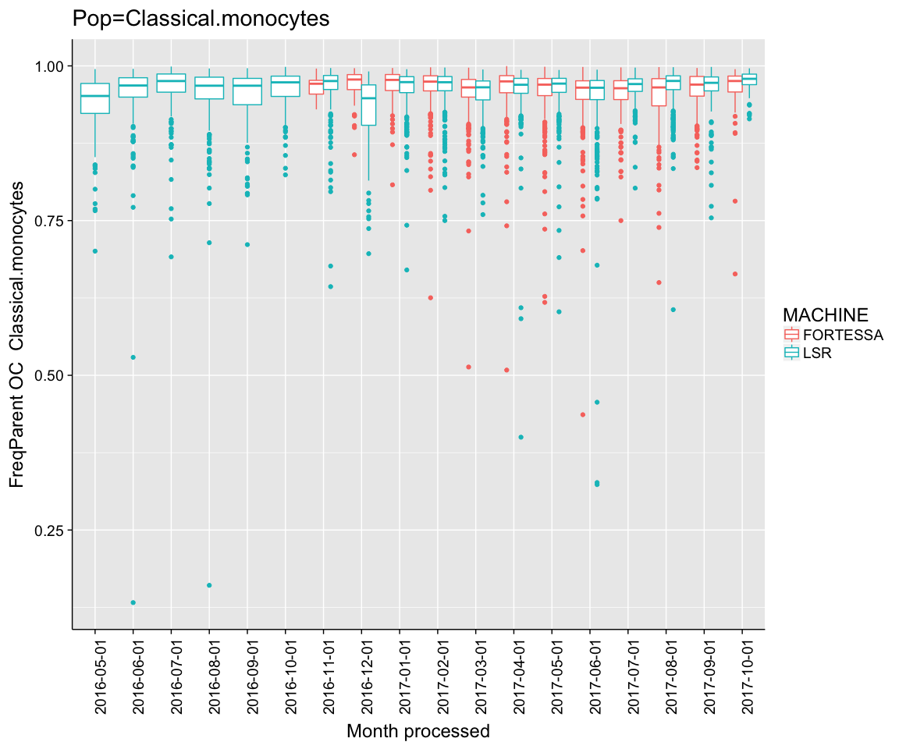<!-- -->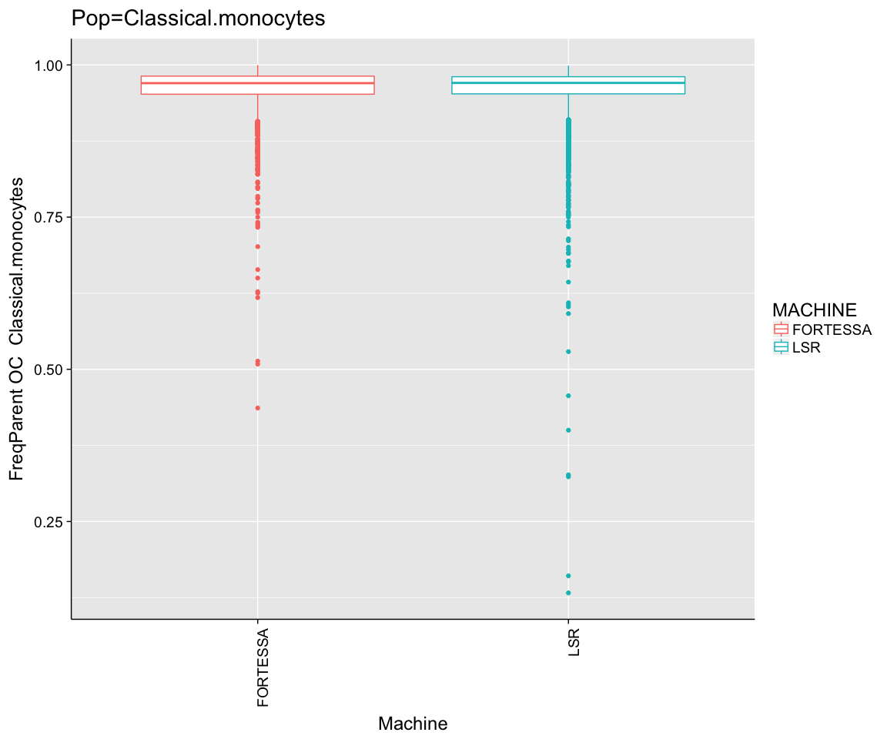<!-- -->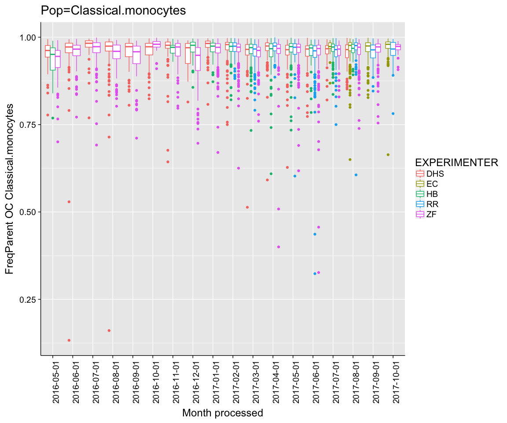<!-- -->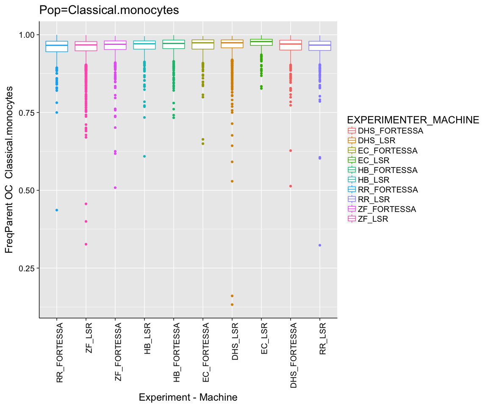<!-- -->

```
## 
## 
## |Var1 |Var2     | Freq|
## |:----|:--------|----:|
## |DHS  |FORTESSA |  668|
## |EC   |FORTESSA |  329|
## |HB   |FORTESSA |  745|
## |RR   |FORTESSA |  528|
## |ZF   |FORTESSA |  903|
## |DHS  |LSR      | 1372|
## |EC   |LSR      |  381|
## |HB   |LSR      |  440|
## |RR   |LSR      |  697|
## |ZF   |LSR      | 2318|
## [1] "Linear Regression for Classical.monocytes"
## 
## Call:
## lm(formula = formula, data = subF)
## 
## Residuals:
##      Min       1Q   Median       3Q      Max 
## -0.82467 -0.00700  0.01042  0.02134  0.04698 
## 
## Coefficients:
##                  Estimate Std. Error t value Pr(>|t|)    
## (Intercept)     6.392e-01  7.347e-02   8.700  < 2e-16 ***
## DATE_MONTH      1.875e-05  4.266e-06   4.395 1.12e-05 ***
## MACHINELSR      3.168e-04  9.953e-04   0.318    0.750    
## EXPERIMENTEREC  1.633e-03  2.026e-03   0.806    0.420    
## EXPERIMENTERHB -4.822e-04  1.546e-03  -0.312    0.755    
## EXPERIMENTERRR -7.053e-03  1.592e-03  -4.431 9.52e-06 ***
## EXPERIMENTERZF -5.987e-03  1.182e-03  -5.064 4.20e-07 ***
## ---
## Signif. codes:  0 '***' 0.001 '**' 0.01 '*' 0.05 '.' 0.1 ' ' 1
## 
## Residual standard error: 0.0413 on 8371 degrees of freedom
##   (3 observations deleted due to missingness)
## Multiple R-squared:  0.009403,	Adjusted R-squared:  0.008693 
## F-statistic: 13.24 on 6 and 8371 DF,  p-value: 5.481e-15
## 
## [1] "Stepwise Linear Regression for Classical.monocytes"
## Start:  AIC=-53392.91
## TARGET_FREQ ~ DATE_MONTH + MACHINE + EXPERIMENTER
## 
##                Df Sum of Sq    RSS    AIC
## - MACHINE       1  0.000173 14.278 -53395
## <none>                      14.278 -53393
## - DATE_MONTH    1  0.032950 14.311 -53376
## - EXPERIMENTER  4  0.088336 14.366 -53349
## 
## Step:  AIC=-53394.81
## TARGET_FREQ ~ DATE_MONTH + EXPERIMENTER
## 
##                Df Sum of Sq    RSS    AIC
## <none>                      14.278 -53395
## + MACHINE       1  0.000173 14.278 -53393
## - DATE_MONTH    1  0.034088 14.312 -53377
## - EXPERIMENTER  4  0.088505 14.366 -53351
## Stepwise Model Path 
## Analysis of Deviance Table
## 
## Initial Model:
## TARGET_FREQ ~ DATE_MONTH + MACHINE + EXPERIMENTER
## 
## Final Model:
## TARGET_FREQ ~ DATE_MONTH + EXPERIMENTER
## 
## 
##        Step Df     Deviance Resid. Df Resid. Dev       AIC
## 1                                8371   14.27776 -53392.91
## 2 - MACHINE  1 0.0001728299      8372   14.27793 -53394.81
## [1] "ANOVA of EXPERIMENTER for Classical.monocytes"
##   Tukey multiple comparisons of means
##     95% family-wise confidence level
## 
## Fit: aov(formula = formula, data = subF)
## 
## $EXPERIMENTER
##                 diff           lwr           upr     p adj
## EC-DHS  0.0057947587  0.0008790045  1.071051e-02 0.0114059
## HB-DHS  0.0005166232 -0.0036041807  4.637427e-03 0.9970620
## RR-DHS -0.0045835304 -0.0086626106 -5.044502e-04 0.0185249
## ZF-DHS -0.0052699299 -0.0084626966 -2.077163e-03 0.0000664
## HB-EC  -0.0052781355 -0.0106315309  7.525984e-05 0.0555014
## RR-EC  -0.0103782891 -0.0156996341 -5.056944e-03 0.0000011
## ZF-EC  -0.0110646886 -0.0157413943 -6.387983e-03 0.0000000
## RR-HB  -0.0051001536 -0.0096972285 -5.030787e-04 0.0209077
## ZF-HB  -0.0057865531 -0.0096190408 -1.954065e-03 0.0003693
## ZF-RR  -0.0006863995 -0.0044739887  3.101190e-03 0.9879043
## 
## [1] "ANOVA of MACHINE for Classical.monocytes"
##               Df Sum Sq  Mean Sq F value Pr(>F)  
## MACHINE        1  0.006 0.005968    3.47 0.0625 .
## Residuals   8376 14.407 0.001720                 
## ---
## Signif. codes:  0 '***' 0.001 '**' 0.01 '*' 0.05 '.' 0.1 ' ' 1
## 3 observations deleted due to missingness
## [1] "T-test of MACHINE for Classical.monocytes"
## 
## 	Welch Two Sample t-test
## 
## data:  TARGET_FREQ by MACHINE
## t = 1.9376, df = 7519.5, p-value = 0.05272
## alternative hypothesis: true difference in means is not equal to 0
## 95 percent confidence interval:
##  -2.041205e-05  3.500760e-03
## sample estimates:
## mean in group FORTESSA      mean in group LSR 
##              0.9604032              0.9586630 
## 
## [1] "# Start of new population results"
## [1] "Live.immune.cells"
## [1] "n=8381"
## [1] "PLOT TYPE = Machine Time COUNT OC"
```

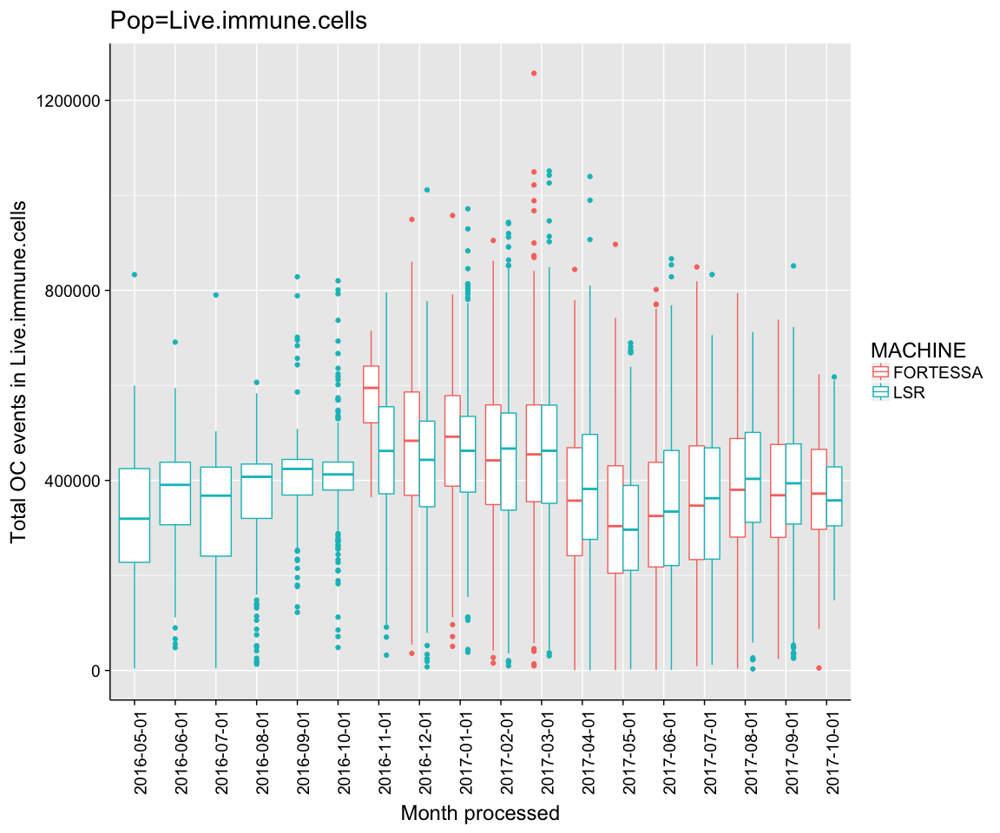<!-- -->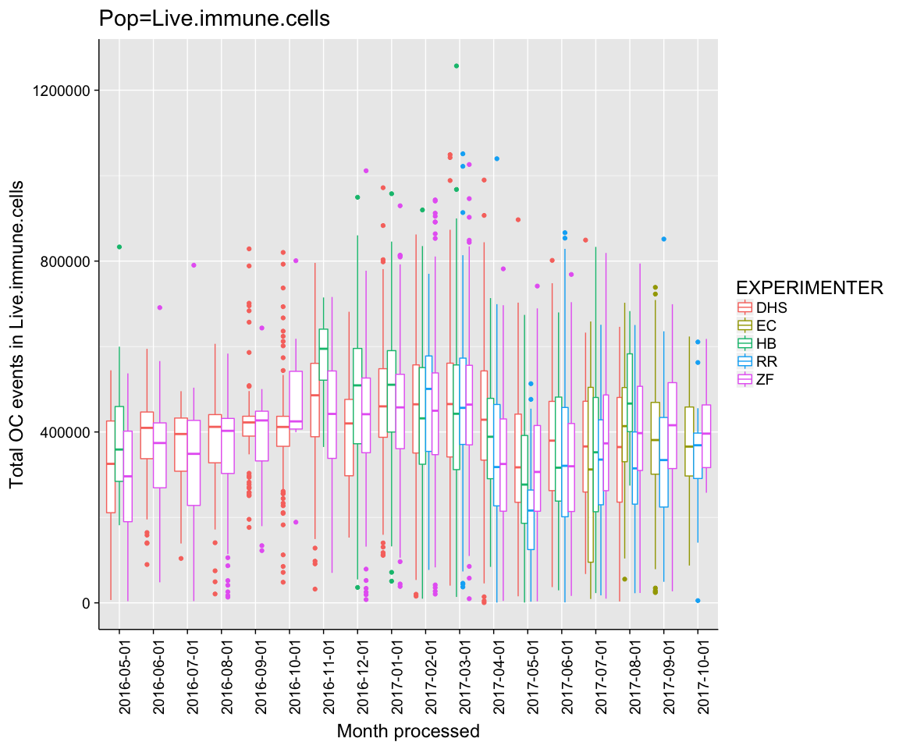<!-- -->

```
## [1] "Live.immune.cells"
## [1] "n=8381"
## [1] "PLOT TYPE = Machine Time FREQ"
## [1] "NA for Freq plot"
## [1] "# Start of new population results"
## [1] "Live.Single.PBMCs"
## [1] "n=8381"
## [1] "PLOT TYPE = Machine Time COUNT OC"
```

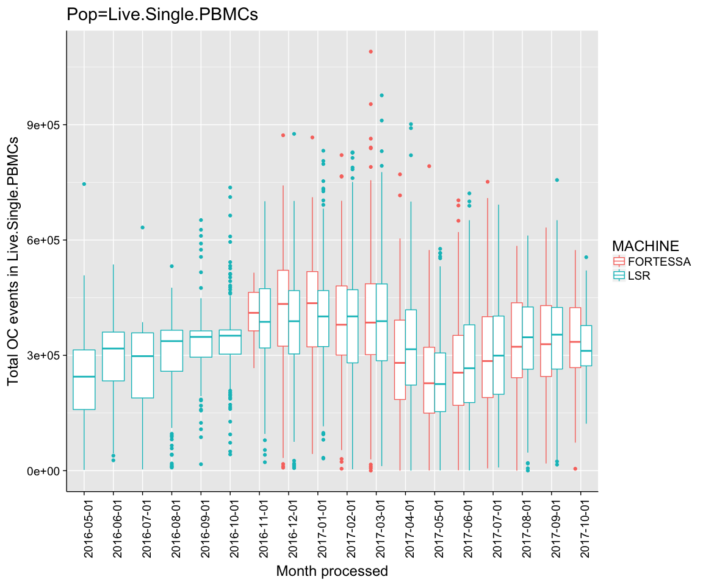<!-- -->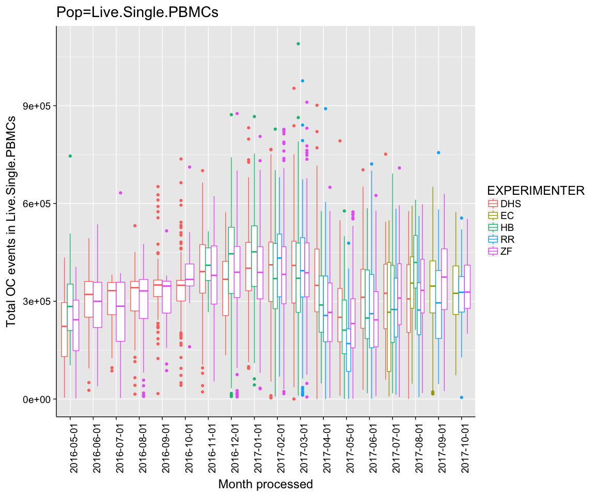<!-- -->

```
## [1] "Live.Single.PBMCs"
## [1] "n=8381"
## [1] "PLOT TYPE = Machine Time FREQ"
## [1] "NA for Freq plot"
## [1] "# Start of new population results"
## [1] "DC"
## [1] "n=8381"
## [1] "PLOT TYPE = Machine Time COUNT OC"
```

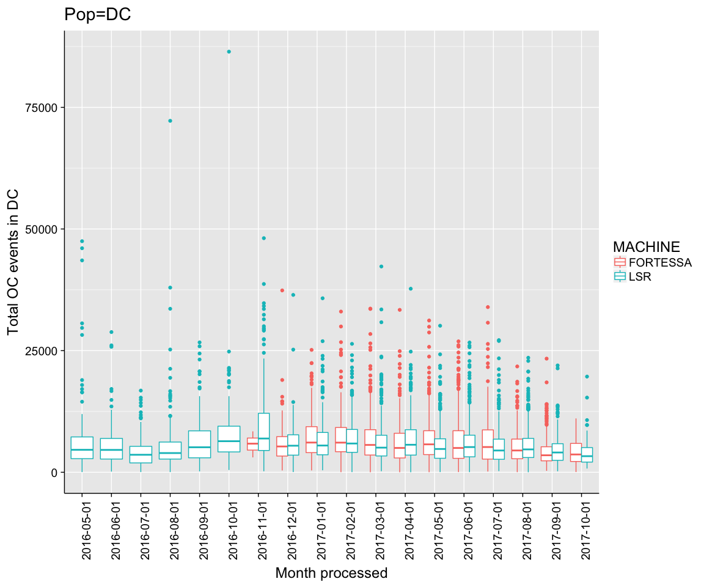<!-- -->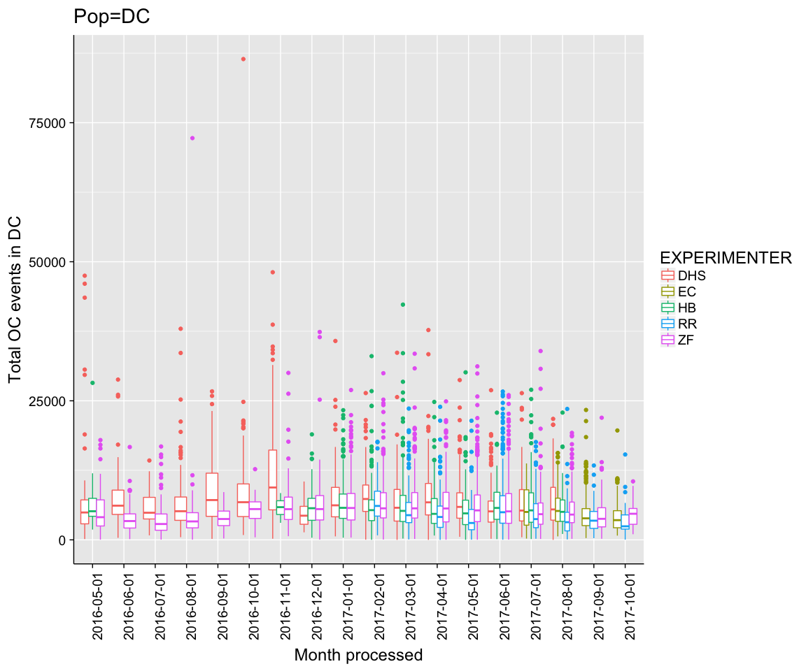<!-- -->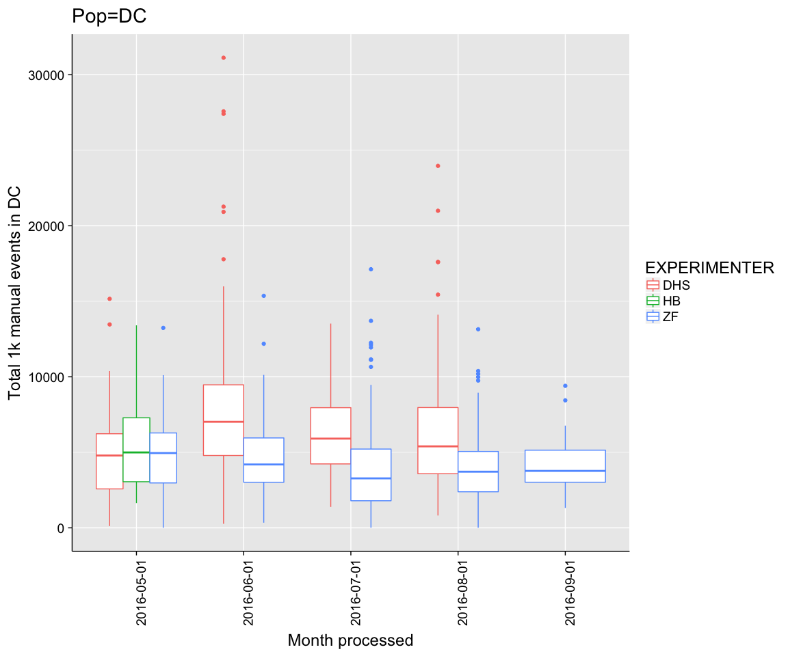<!-- -->

```
## [1] "Correlations between OC and manual for DC"
## 
## 	Pearson's product-moment correlation
## 
## data:  merge[, colC] and merge[, coljflowCount]
## t = 18.851, df = 763, p-value < 2.2e-16
## alternative hypothesis: true correlation is not equal to 0
## 95 percent confidence interval:
##  0.5133265 0.6102001
## sample estimates:
##       cor 
## 0.5636987 
## 
## 
## 	Spearman's rank correlation rho
## 
## data:  merge[, colC] and merge[, coljflowCount]
## S = 8532500, p-value < 2.2e-16
## alternative hypothesis: true rho is not equal to 0
## sample estimates:
##       rho 
## 0.8856482
```

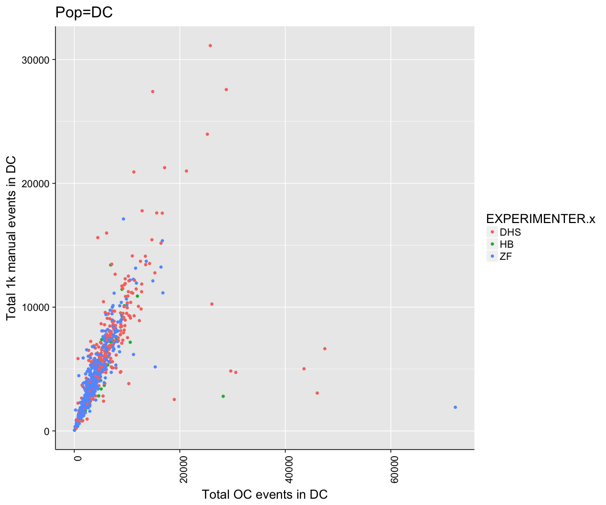<!-- -->

```
## [1] "DC"
## [1] "n=8381"
## [1] "PLOT TYPE = Machine Time FREQ"
```

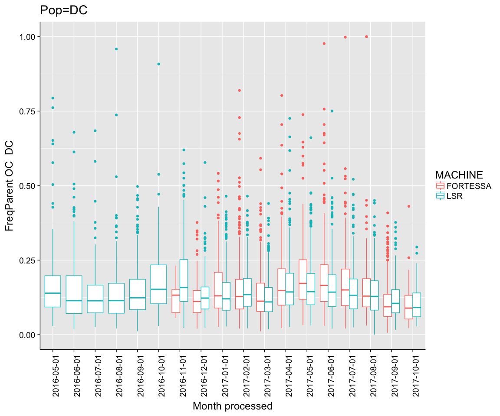<!-- -->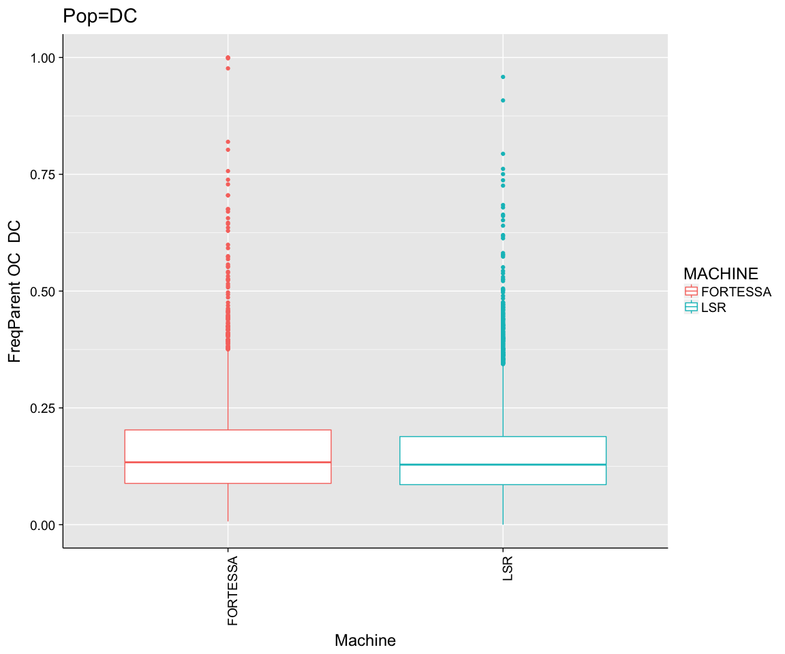<!-- -->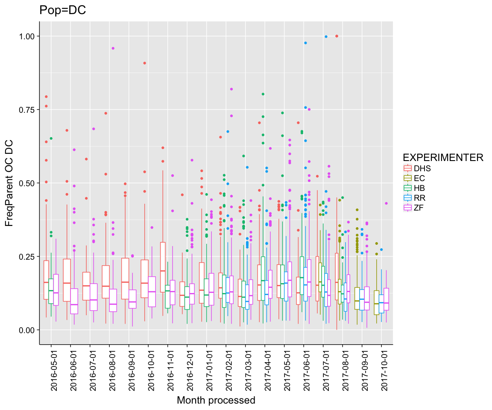<!-- -->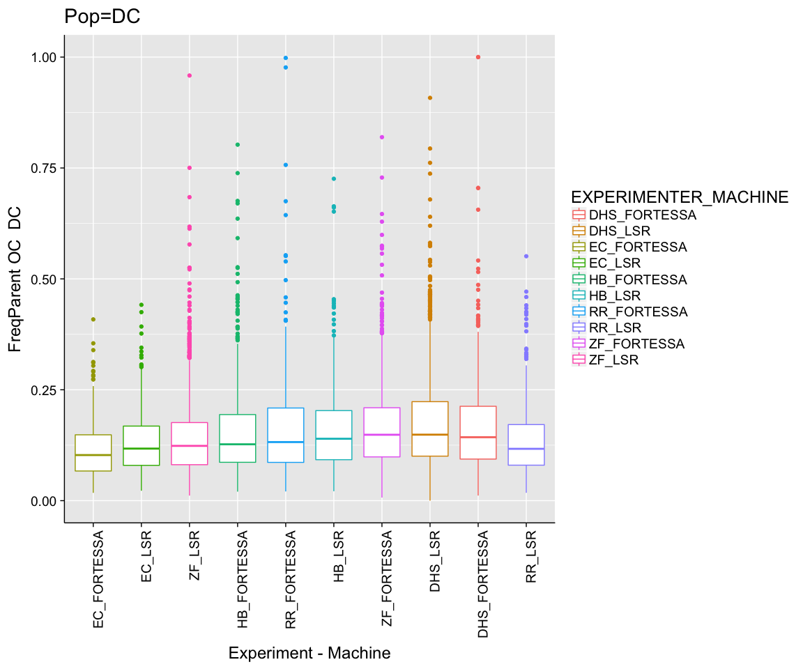<!-- -->

```
## 
## 
## |Var1 |Var2     | Freq|
## |:----|:--------|----:|
## |DHS  |FORTESSA |  668|
## |EC   |FORTESSA |  329|
## |HB   |FORTESSA |  745|
## |RR   |FORTESSA |  528|
## |ZF   |FORTESSA |  903|
## |DHS  |LSR      | 1372|
## |EC   |LSR      |  381|
## |HB   |LSR      |  440|
## |RR   |LSR      |  697|
## |ZF   |LSR      | 2318|
## [1] "Linear Regression for DC"
## 
## Call:
## lm(formula = formula, data = subF)
## 
## Residuals:
##      Min       1Q   Median       3Q      Max 
## -0.17463 -0.06427 -0.02041  0.04169  0.84764 
## 
## Coefficients:
##                  Estimate Std. Error t value Pr(>|t|)    
## (Intercept)    -2.439e-01  1.675e-01  -1.456   0.1454    
## DATE_MONTH      2.461e-05  9.728e-06   2.530   0.0114 *  
## MACHINELSR     -9.139e-03  2.269e-03  -4.027 5.69e-05 ***
## EXPERIMENTEREC -5.455e-02  4.619e-03 -11.810  < 2e-16 ***
## EXPERIMENTERHB -2.020e-02  3.524e-03  -5.731 1.03e-08 ***
## EXPERIMENTERRR -3.251e-02  3.629e-03  -8.958  < 2e-16 ***
## EXPERIMENTERZF -2.584e-02  2.696e-03  -9.583  < 2e-16 ***
## ---
## Signif. codes:  0 '***' 0.001 '**' 0.01 '*' 0.05 '.' 0.1 ' ' 1
## 
## Residual standard error: 0.09416 on 8371 degrees of freedom
##   (3 observations deleted due to missingness)
## Multiple R-squared:  0.02399,	Adjusted R-squared:  0.02329 
## F-statistic:  34.3 on 6 and 8371 DF,  p-value: < 2.2e-16
## 
## [1] "Stepwise Linear Regression for DC"
## Start:  AIC=-39582.57
## TARGET_FREQ ~ DATE_MONTH + MACHINE + EXPERIMENTER
## 
##                Df Sum of Sq    RSS    AIC
## <none>                      74.226 -39583
## - DATE_MONTH    1   0.05675 74.282 -39578
## - MACHINE       1   0.14382 74.369 -39568
## - EXPERIMENTER  4   1.53711 75.763 -39419
## Stepwise Model Path 
## Analysis of Deviance Table
## 
## Initial Model:
## TARGET_FREQ ~ DATE_MONTH + MACHINE + EXPERIMENTER
## 
## Final Model:
## TARGET_FREQ ~ DATE_MONTH + MACHINE + EXPERIMENTER
## 
## 
##   Step Df Deviance Resid. Df Resid. Dev       AIC
## 1                       8371   74.22561 -39582.57
## [1] "ANOVA of EXPERIMENTER for DC"
##   Tukey multiple comparisons of means
##     95% family-wise confidence level
## 
## Fit: aov(formula = formula, data = subF)
## 
## $EXPERIMENTER
##                diff          lwr           upr     p adj
## EC-DHS -0.047785470 -0.059000403 -0.0365705381 0.0000000
## HB-DHS -0.016000733 -0.025402045 -0.0065994213 0.0000342
## RR-DHS -0.028272837 -0.037578958 -0.0189667146 0.0000000
## ZF-DHS -0.025337948 -0.032622011 -0.0180538851 0.0000000
## HB-EC   0.031784738  0.019571359  0.0439981160 0.0000000
## RR-EC   0.019512634  0.007372376  0.0316528918 0.0001144
## ZF-EC   0.022447522  0.011777962  0.0331170832 0.0000001
## RR-HB  -0.012272104 -0.022759992 -0.0017842148 0.0123329
## ZF-HB  -0.009337215 -0.018080755 -0.0005936758 0.0294680
## ZF-RR   0.002934888 -0.005706218  0.0115759952 0.8866651
## 
## [1] "ANOVA of MACHINE for DC"
##               Df Sum Sq Mean Sq F value   Pr(>F)    
## MACHINE        1   0.17 0.16979   18.74 1.51e-05 ***
## Residuals   8376  75.88 0.00906                     
## ---
## Signif. codes:  0 '***' 0.001 '**' 0.01 '*' 0.05 '.' 0.1 ' ' 1
## 3 observations deleted due to missingness
## [1] "T-test of MACHINE for DC"
## 
## 	Welch Two Sample t-test
## 
## data:  TARGET_FREQ by MACHINE
## t = 4.1995, df = 6056.3, p-value = 2.713e-05
## alternative hypothesis: true difference in means is not equal to 0
## 95 percent confidence interval:
##  0.004948977 0.013614586
## sample estimates:
## mean in group FORTESSA      mean in group LSR 
##              0.1581965              0.1489147
```

