# TrendQC
JL  
1/12/2018  


```
## Warning in format.POSIXlt(as.POSIXlt(x), ...): unknown timezone 'zone/tz/
## 2017c.1.0/zoneinfo/America/Chicago'
```

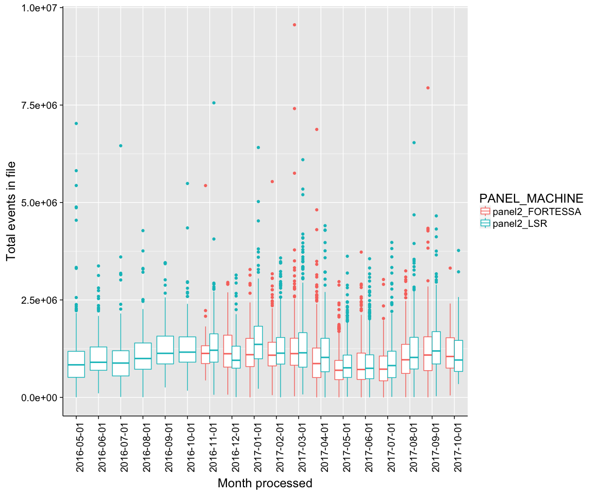<!-- --><!-- -->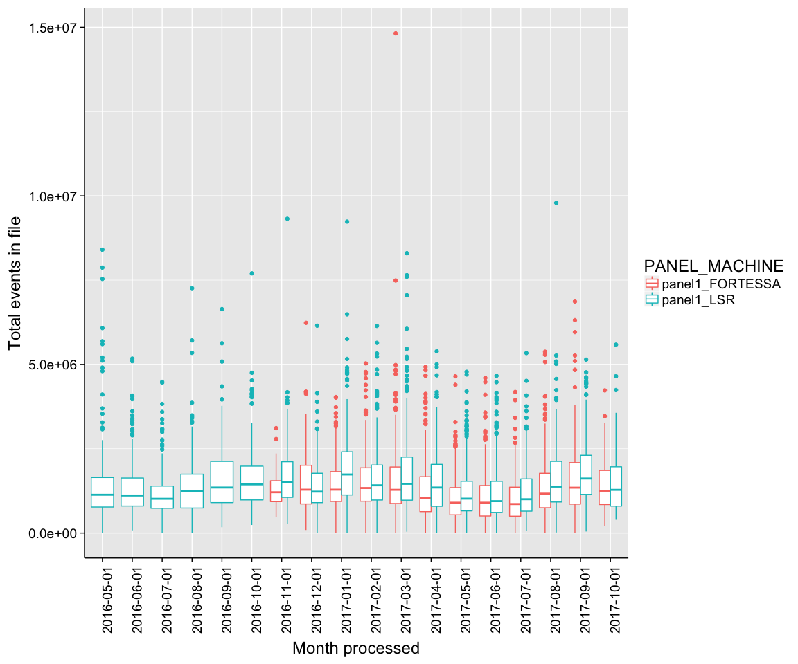<!-- -->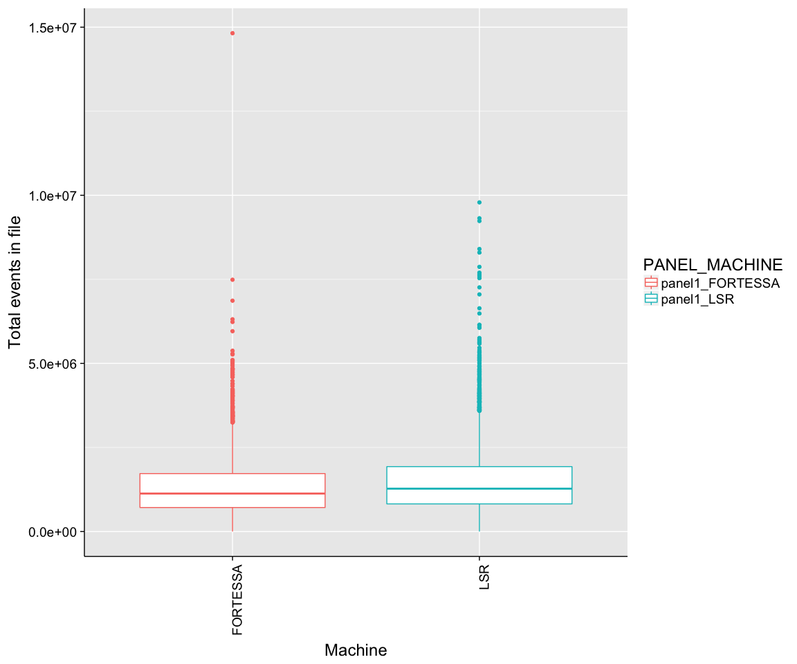<!-- -->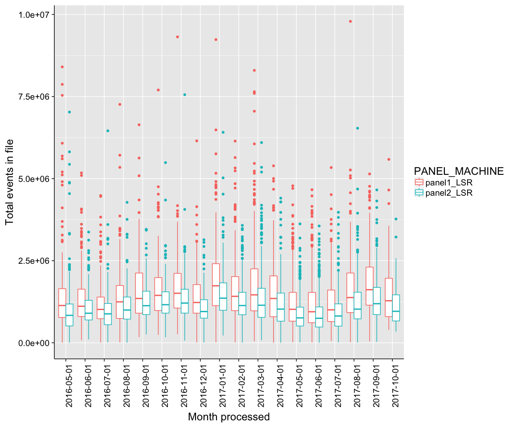<!-- --><!-- -->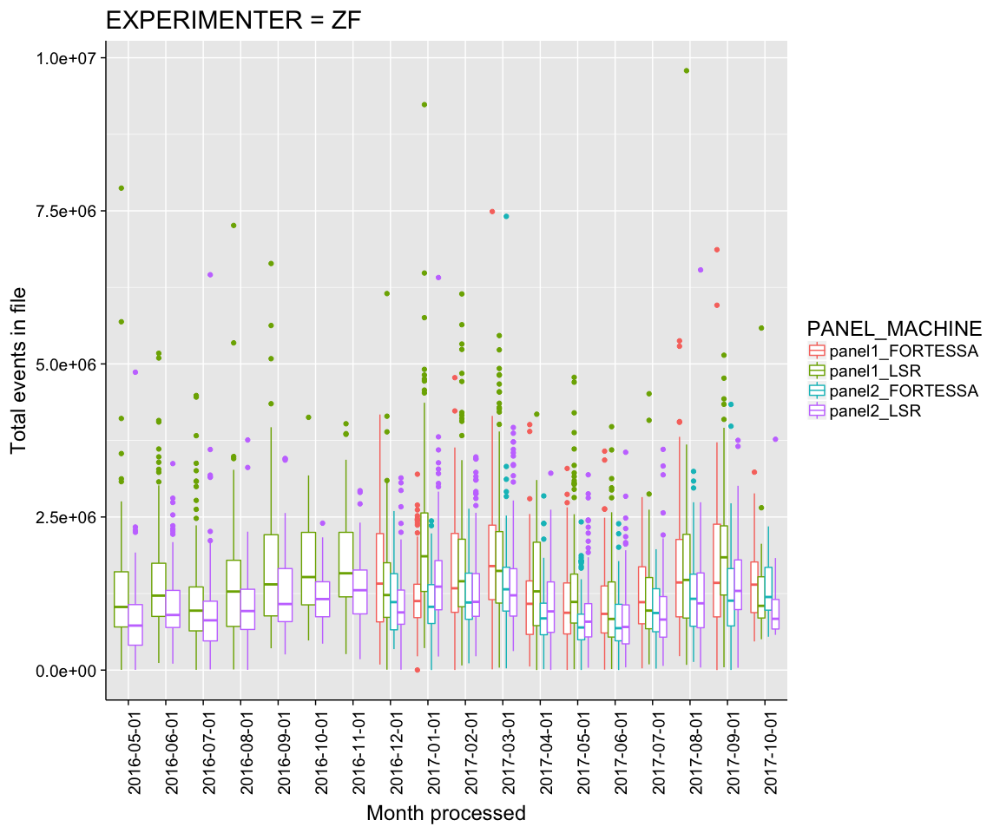<!-- -->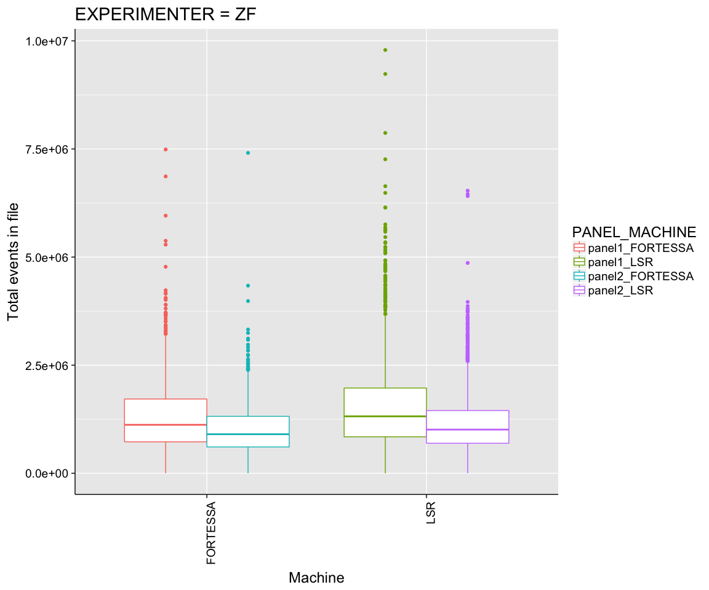<!-- -->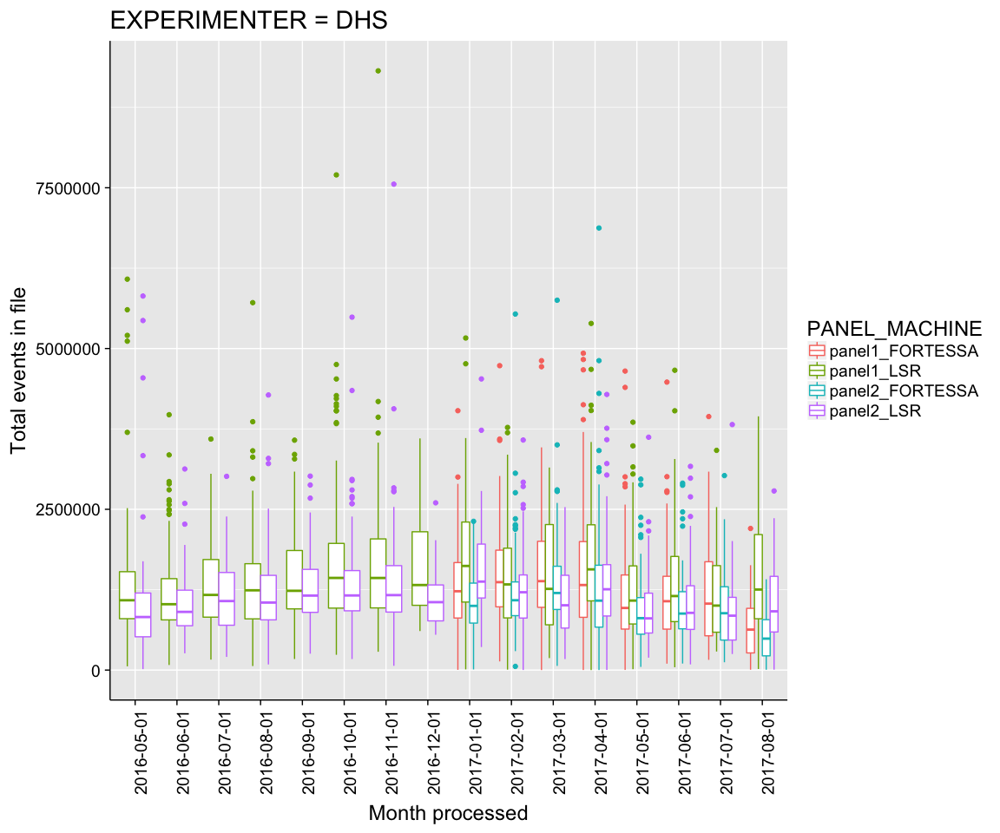<!-- -->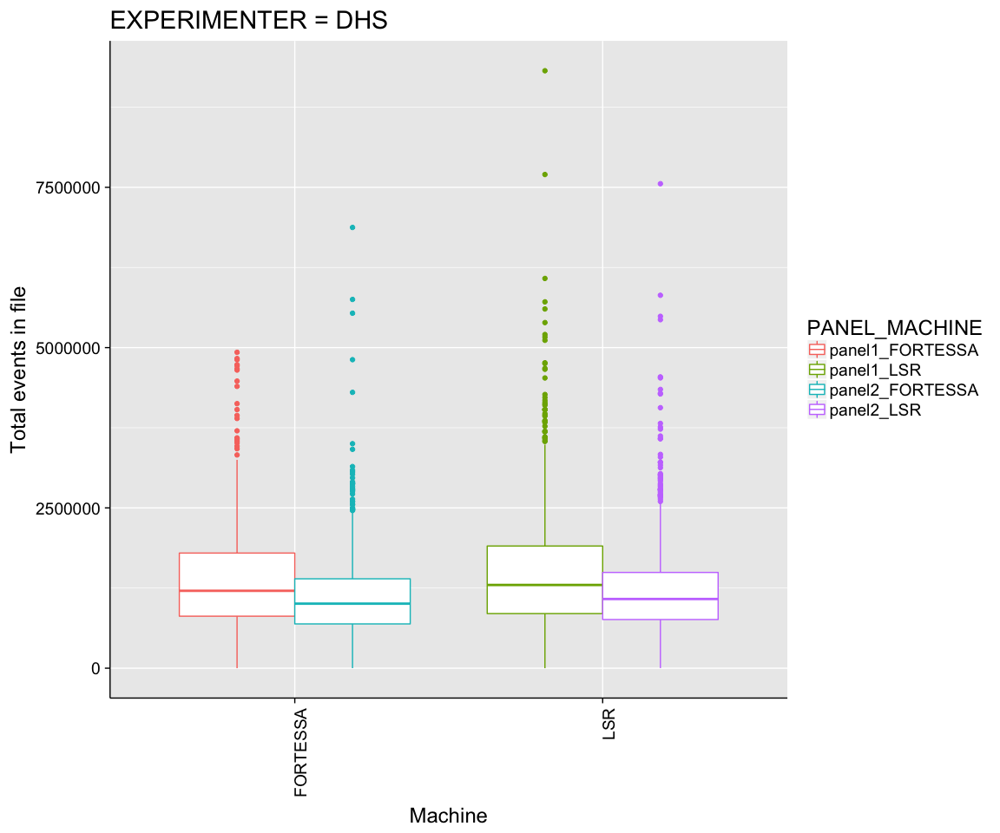<!-- -->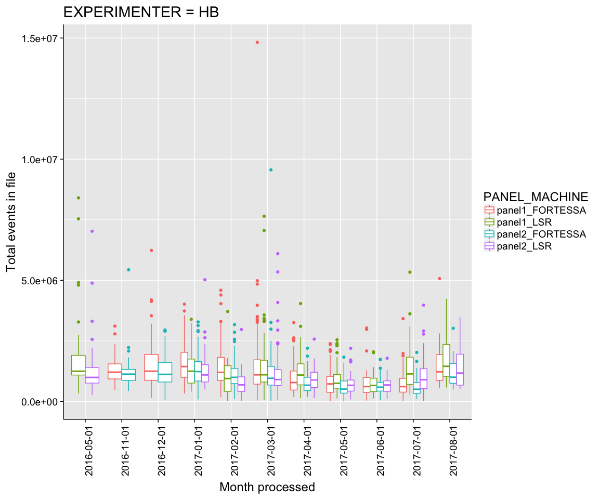<!-- -->

```
## 
## Call:
## lm(formula = formula, data = sub)
## 
## Residuals:
##      Min       1Q   Median       3Q      Max 
## -1243264  -449644  -140314   304730  6376686 
## 
## Coefficients:
##                Estimate Std. Error t value Pr(>|t|)    
## (Intercept)     1179228      17679  66.701  < 2e-16 ***
## EXPERIMENTEREC    75448      38423   1.964   0.0496 *  
## EXPERIMENTERHB  -140856      35880  -3.926 8.74e-05 ***
## EXPERIMENTERRR  -153976      30576  -5.036 4.90e-07 ***
## EXPERIMENTERZF   -47411      22388  -2.118   0.0342 *  
## ---
## Signif. codes:  0 '***' 0.001 '**' 0.01 '*' 0.05 '.' 0.1 ' ' 1
## 
## Residual standard error: 701600 on 5898 degrees of freedom
## Multiple R-squared:  0.007966,	Adjusted R-squared:  0.007293 
## F-statistic: 11.84 on 4 and 5898 DF,  p-value: 1.401e-09
## 
##   Tukey multiple comparisons of means
##     95% family-wise confidence level
## 
## Fit: aov(formula = formula, data = sub)
## 
## $EXPERIMENTER
##              diff         lwr        upr     p adj
## EC-DHS   75447.65  -29394.407  180289.71 0.2840967
## HB-DHS -140855.79 -238758.336  -42953.25 0.0008316
## RR-DHS -153975.54 -237406.477  -70544.60 0.0000049
## ZF-DHS  -47410.92 -108500.453   13678.61 0.2125642
## HB-EC  -216303.45 -342488.056  -90118.84 0.0000293
## RR-EC  -229423.19 -344741.748 -114104.64 0.0000006
## ZF-EC  -122858.58 -223205.866  -22511.29 0.0075028
## RR-HB   -13119.75 -122167.529   95928.04 0.9974964
## ZF-HB    93444.87     371.629  186518.11 0.0485241
## ZF-RR   106564.62   28857.206  184272.03 0.0017265
```

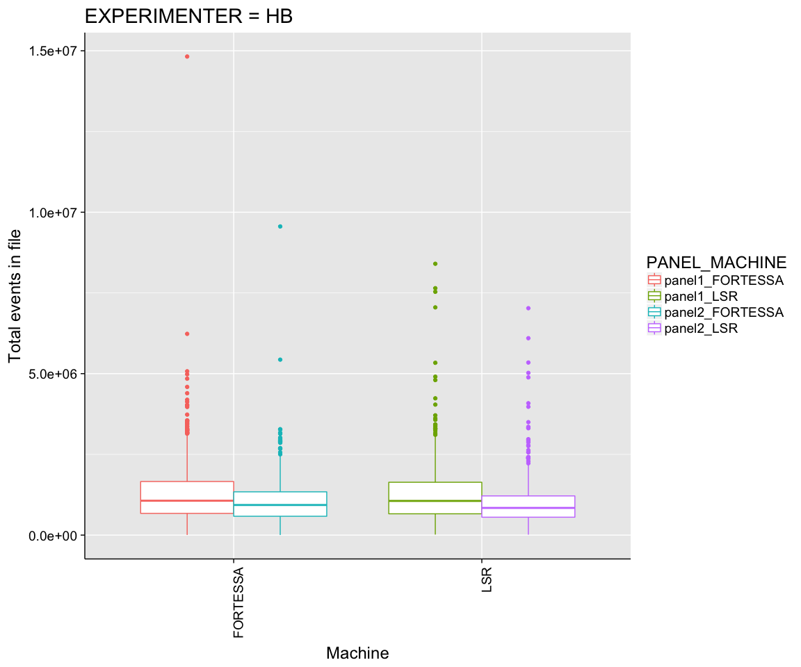<!-- -->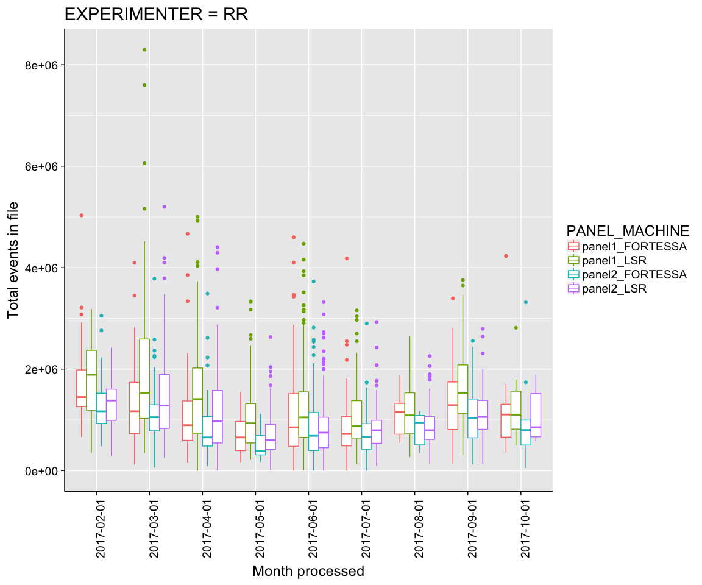<!-- -->

```
## 
## Call:
## lm(formula = formula, data = sub)
## 
## Residuals:
##      Min       1Q   Median       3Q      Max 
## -1651940  -651360  -201963   437919  8272489 
## 
## Coefficients:
##                Estimate Std. Error t value Pr(>|t|)    
## (Intercept)     1463296      24133  60.634  < 2e-16 ***
## EXPERIMENTEREC   243321      52685   4.618 3.95e-06 ***
## EXPERIMENTERHB  -162296      49226  -3.297 0.000983 ***
## EXPERIMENTERRR   -81117      42277  -1.919 0.055069 .  
## EXPERIMENTERZF    53274      30720   1.734 0.082939 .  
## ---
## Signif. codes:  0 '***' 0.001 '**' 0.01 '*' 0.05 '.' 0.1 ' ' 1
## 
## Residual standard error: 963200 on 5853 degrees of freedom
## Multiple R-squared:  0.008964,	Adjusted R-squared:  0.008287 
## F-statistic: 13.24 on 4 and 5853 DF,  p-value: 9.789e-11
## 
##   Tukey multiple comparisons of means
##     95% family-wise confidence level
## 
## Fit: aov(formula = formula, data = sub)
## 
## $EXPERIMENTER
##              diff        lwr        upr     p adj
## EC-DHS  243321.30   99562.56  387080.05 0.0000388
## HB-DHS -162296.51 -296617.27  -27975.75 0.0087160
## RR-DHS  -81116.93 -196474.39   34240.53 0.3073480
## ZF-DHS   53273.46  -30549.03  137095.94 0.4129196
## HB-EC  -405617.81 -578926.96 -232308.67 0.0000000
## RR-EC  -324438.24 -483502.18 -165374.29 0.0000003
## ZF-EC  -190047.84 -327961.60  -52134.09 0.0016088
## RR-HB    81179.58  -69408.69  231767.85 0.5814926
## ZF-HB   215569.97   87524.30  343615.64 0.0000437
## ZF-RR   134390.39   26404.41  242376.37 0.0061962
```

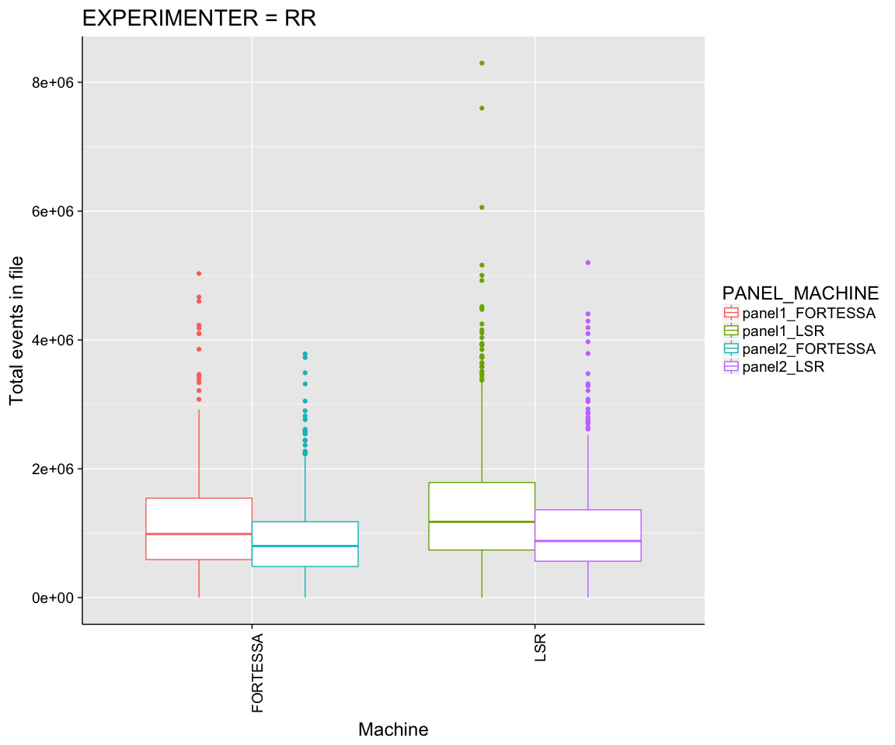<!-- -->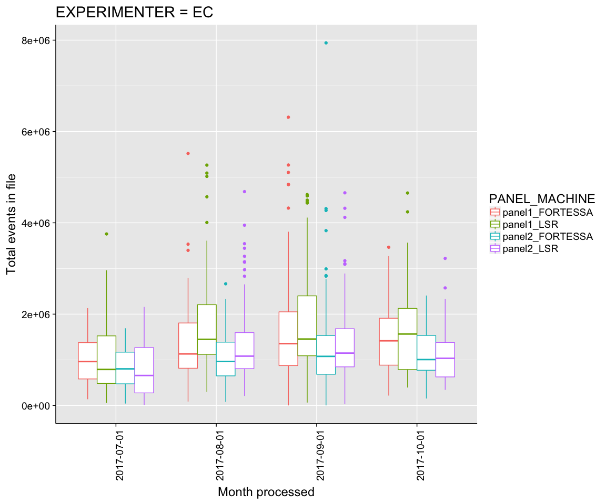<!-- -->

```
## 
## Call:
## lm(formula = formula, data = sub)
## 
## Residuals:
##      Min       1Q   Median       3Q      Max 
## -1161853  -433797  -123506   293480  8546175 
## 
## Coefficients:
##                Estimate Std. Error t value Pr(>|t|)    
## (Intercept)     1133649      24784  45.741  < 2e-16 ***
## EXPERIMENTEREC    29455      42408   0.695 0.487373    
## EXPERIMENTERHB  -121086      33303  -3.636 0.000281 ***
## EXPERIMENTERRR  -251431      36944  -6.806 1.17e-11 ***
## EXPERIMENTERZF  -135205      32527  -4.157 3.30e-05 ***
## ---
## Signif. codes:  0 '***' 0.001 '**' 0.01 '*' 0.05 '.' 0.1 ' ' 1
## 
## Residual standard error: 665500 on 3573 degrees of freedom
## Multiple R-squared:  0.01769,	Adjusted R-squared:  0.01659 
## F-statistic: 16.09 on 4 and 3573 DF,  p-value: 4.628e-13
## 
##   Tukey multiple comparisons of means
##     95% family-wise confidence level
## 
## Fit: aov(formula = formula, data = sub)
## 
## $EXPERIMENTER
##              diff        lwr        upr     p adj
## EC-DHS   29454.87  -86282.77  145192.50 0.9577197
## HB-DHS -121086.03 -211975.28  -30196.79 0.0026020
## RR-DHS -251431.32 -352258.74 -150603.89 0.0000000
## ZF-DHS -135205.14 -223977.14  -46433.14 0.0003189
## HB-EC  -150540.90 -262369.91  -38711.90 0.0022538
## RR-EC  -280886.18 -400932.18 -160840.19 0.0000000
## ZF-EC  -164660.01 -274775.13  -54544.89 0.0004401
## RR-HB  -130345.28 -226660.89  -34029.67 0.0020924
## ZF-HB   -14119.10  -97731.27   69493.06 0.9907329
## ZF-RR   116226.18   21905.93  210546.43 0.0069727
```

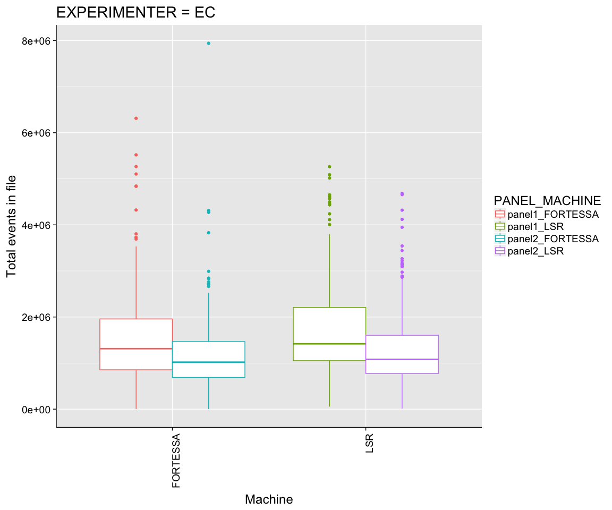<!-- -->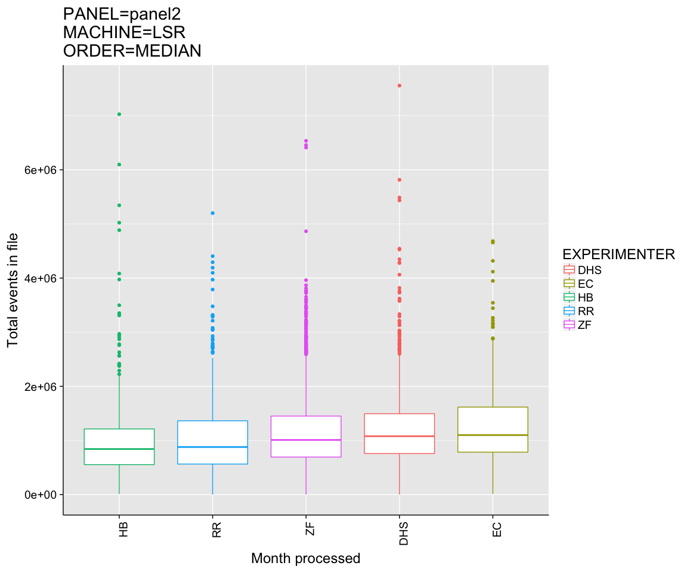<!-- -->

```
## 
## Call:
## lm(formula = formula, data = sub)
## 
## Residuals:
##      Min       1Q   Median       3Q      Max 
## -1499424  -594761  -191962   402760 13546659 
## 
## Coefficients:
##                Estimate Std. Error t value Pr(>|t|)    
## (Intercept)     1390310      32743  42.461  < 2e-16 ***
## EXPERIMENTEREC   110306      56688   1.946  0.05175 .  
## EXPERIMENTERHB  -115314      44140  -2.612  0.00903 ** 
## EXPERIMENTERRR  -239357      49083  -4.877 1.13e-06 ***
## EXPERIMENTERZF   -83623      43034  -1.943  0.05207 .  
## ---
## Signif. codes:  0 '***' 0.001 '**' 0.01 '*' 0.05 '.' 0.1 ' ' 1
## 
## Residual standard error: 894900 on 3656 degrees of freedom
## Multiple R-squared:  0.01171,	Adjusted R-squared:  0.01063 
## F-statistic: 10.83 on 4 and 3656 DF,  p-value: 9.996e-09
## 
##   Tukey multiple comparisons of means
##     95% family-wise confidence level
## 
## Fit: aov(formula = formula, data = sub)
## 
## $EXPERIMENTER
##              diff        lwr         upr     p adj
## EC-DHS  110305.56  -44403.23  265014.363 0.2932467
## HB-DHS -115313.51 -235778.19    5151.166 0.0682958
## RR-DHS -239356.78 -373311.23 -105402.338 0.0000111
## ZF-DHS  -83623.16 -201069.53   33823.211 0.2946228
## HB-EC  -225619.08 -375538.31  -75699.848 0.0003938
## RR-EC  -349662.35 -510621.44 -188703.253 0.0000000
## ZF-EC  -193928.72 -341433.59  -46423.854 0.0031098
## RR-HB  -124043.27 -252436.25    4349.707 0.0640984
## ZF-HB    31690.36  -79370.95  142751.656 0.9368038
## ZF-RR   155733.62   30168.24  281299.014 0.0064620
```

```
## 
## Call:
## lm(formula = formula, data = tc)
## 
## Residuals:
##      Min       1Q   Median       3Q      Max 
## -1579760  -528065  -163775   352182 13545392 
## 
## Coefficients:
##                  Estimate Std. Error t value Pr(>|t|)    
## (Intercept)    4918717.51  956855.00   5.141 2.77e-07 ***
## DATE_MONTH        -205.54      55.57  -3.699 0.000217 ***
## MACHINELSR      109422.96   13216.86   8.279  < 2e-16 ***
## PANELpanel2    -323310.61   11943.22 -27.071  < 2e-16 ***
## EXPERIMENTEREC  171937.41   26844.12   6.405 1.54e-10 ***
## EXPERIMENTERHB -101889.35   20197.87  -5.045 4.59e-07 ***
## EXPERIMENTERRR -138743.93   21138.81  -6.563 5.39e-11 ***
## EXPERIMENTERZF  -22761.22   15658.44  -1.454 0.146072    
## ---
## Signif. codes:  0 '***' 0.001 '**' 0.01 '*' 0.05 '.' 0.1 ' ' 1
## 
## Residual standard error: 823100 on 18992 degrees of freedom
## Multiple R-squared:  0.05131,	Adjusted R-squared:  0.05096 
## F-statistic: 146.8 on 7 and 18992 DF,  p-value: < 2.2e-16
```

```
## Start:  AIC=517599.3
## TOTAL_COUNTS ~ DATE_MONTH + MACHINE + PANEL + EXPERIMENTER
## 
##                Df  Sum of Sq        RSS    AIC
## <none>                       1.2867e+16 517599
## - DATE_MONTH    1 9.2680e+12 1.2876e+16 517611
## - MACHINE       1 4.6436e+13 1.2913e+16 517666
## - EXPERIMENTER  4 1.1376e+14 1.2981e+16 517759
## - PANEL         1 4.9647e+14 1.3363e+16 518317
```

```
## Stepwise Model Path 
## Analysis of Deviance Table
## 
## Initial Model:
## TOTAL_COUNTS ~ DATE_MONTH + MACHINE + PANEL + EXPERIMENTER
## 
## Final Model:
## TOTAL_COUNTS ~ DATE_MONTH + MACHINE + PANEL + EXPERIMENTER
## 
## 
##   Step Df Deviance Resid. Df   Resid. Dev      AIC
## 1                      18992 1.286675e+16 517599.3
```

