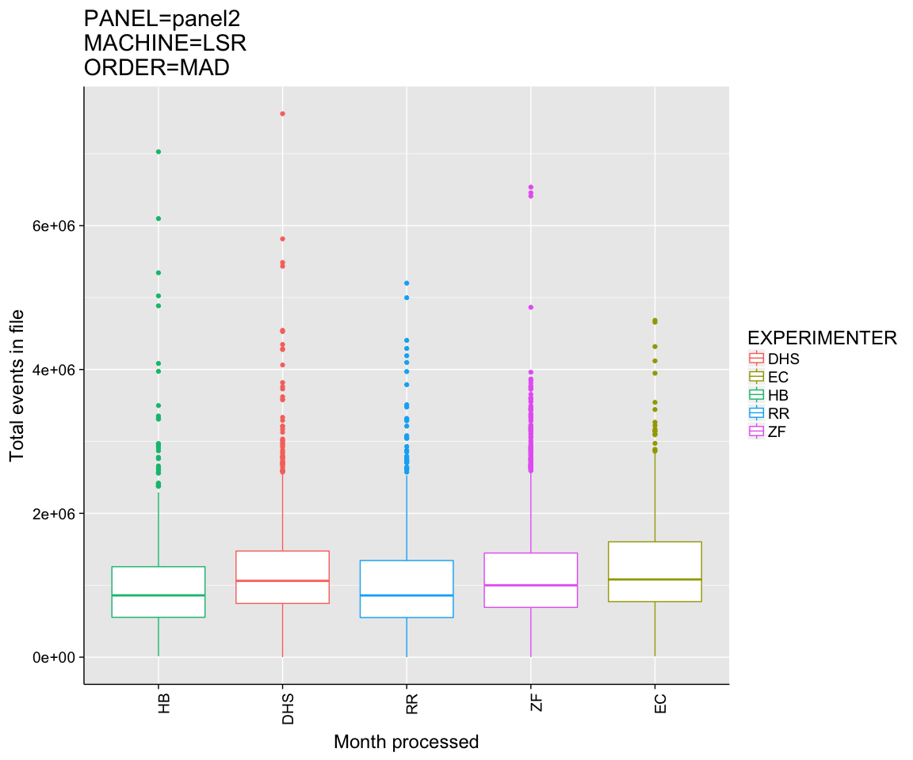
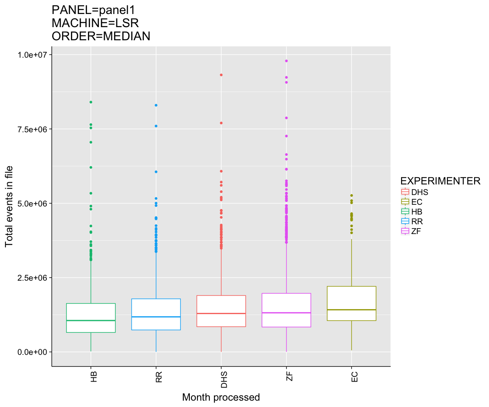
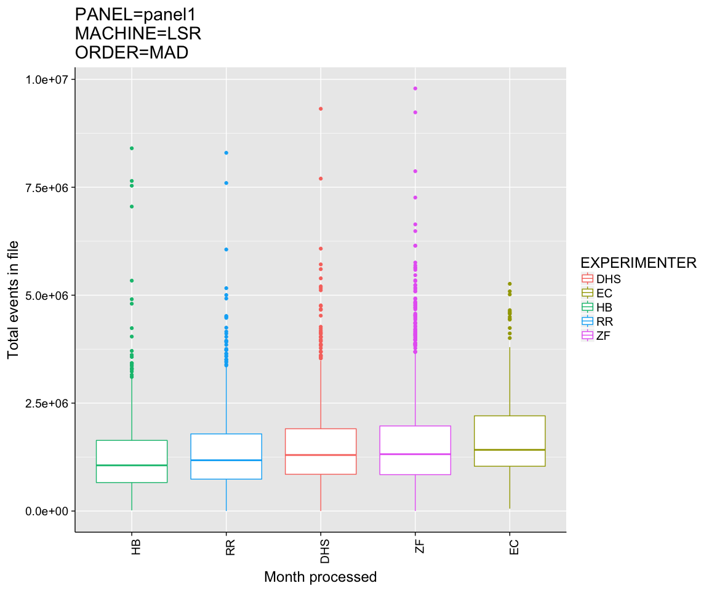
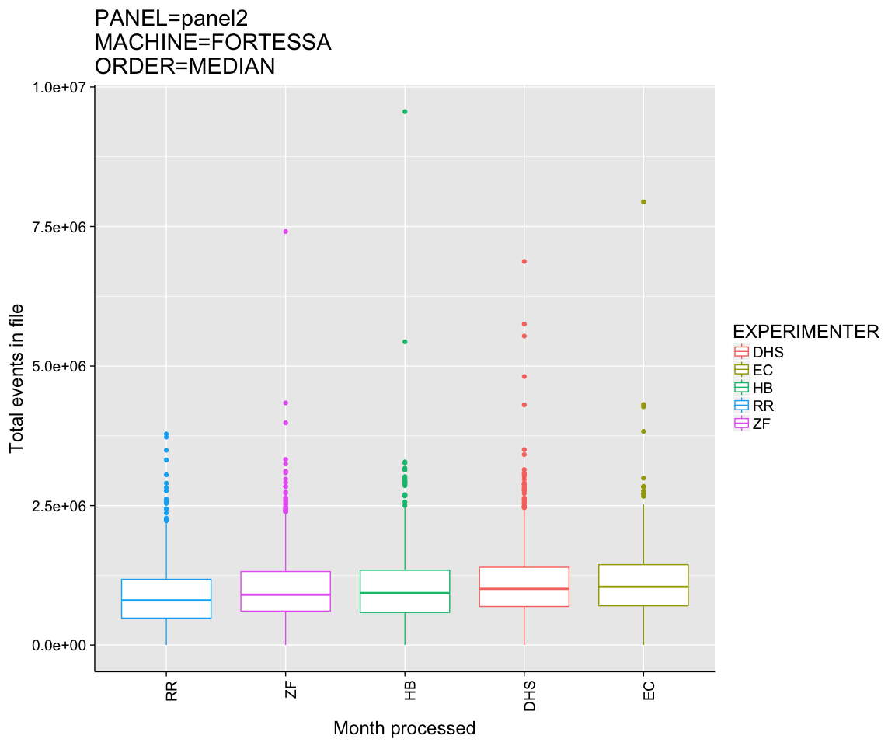
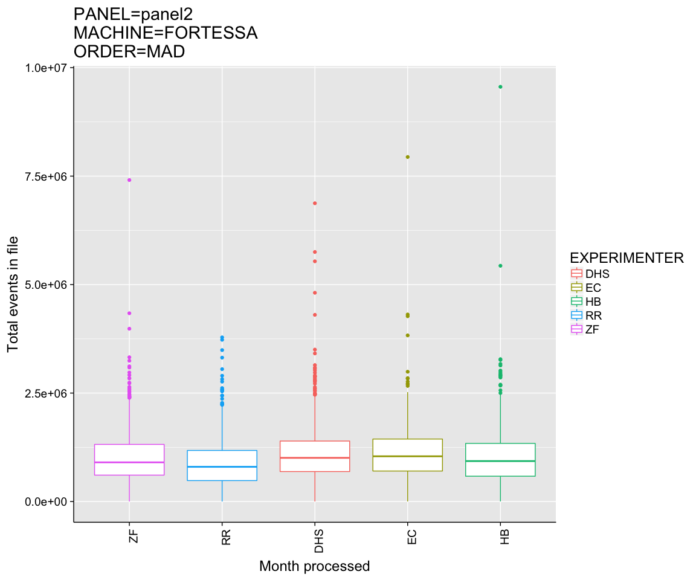
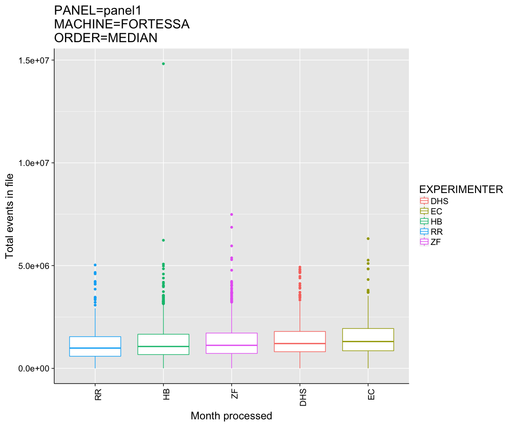
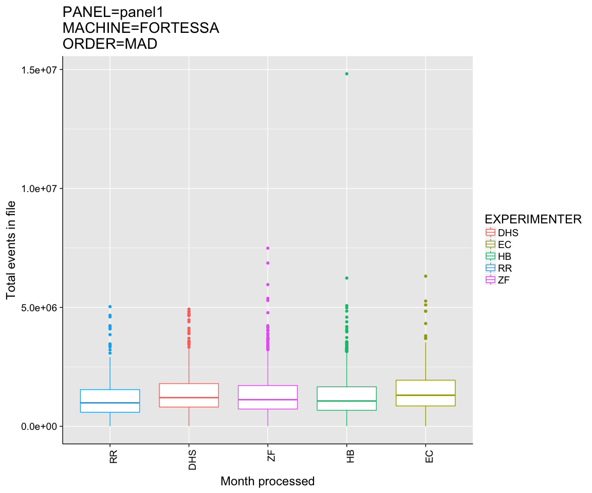

# TrendQC
JL  
1/16/2018  


```
## Warning in format.POSIXlt(as.POSIXlt(x), ...): unknown timezone 'zone/tz/
## 2017c.1.0/zoneinfo/America/Chicago'
```

<!-- --><!-- -->

```
##               Df    Sum Sq   Mean Sq F value   Pr(>F)    
## MACHINE        1 1.937e+13 1.937e+13   39.96 2.72e-10 ***
## Residuals   8503 4.122e+15 4.848e+11                     
## ---
## Signif. codes:  0 '***' 0.001 '**' 0.01 '*' 0.05 '.' 0.1 ' ' 1
```

<!-- --><!-- -->

```
##               Df    Sum Sq   Mean Sq F value Pr(>F)    
## MACHINE        1 6.301e+13 6.301e+13   72.29 <2e-16 ***
## Residuals   9186 8.006e+15 8.716e+11                   
## ---
## Signif. codes:  0 '***' 0.001 '**' 0.01 '*' 0.05 '.' 0.1 ' ' 1
```

<!-- --><!-- --><!-- --><!-- --><!-- --><!-- --><!-- --><!-- --><!-- --><!-- --><!-- --><!-- --><!-- --><!-- -->

```
## 
## Call:
## lm(formula = formula, data = sub)
## 
## Residuals:
##      Min       1Q   Median       3Q      Max 
## -1261658  -453845  -138475   301601  6357787 
## 
## Coefficients:
##                Estimate Std. Error t value Pr(>|t|)    
## (Intercept)     1198127      19036  62.941  < 2e-16 ***
## EXPERIMENTEREC    74943      40841   1.835   0.0666 .  
## EXPERIMENTERHB  -169254      38648  -4.379 1.21e-05 ***
## EXPERIMENTERRR  -160092      32644  -4.904 9.67e-07 ***
## EXPERIMENTERZF   -56614      24014  -2.357   0.0184 *  
## ---
## Signif. codes:  0 '***' 0.001 '**' 0.01 '*' 0.05 '.' 0.1 ' ' 1
## 
## Residual standard error: 707100 on 5244 degrees of freedom
## Multiple R-squared:  0.00917,	Adjusted R-squared:  0.008414 
## F-statistic: 12.13 on 4 and 5244 DF,  p-value: 8.107e-10
## 
##   Tukey multiple comparisons of means
##     95% family-wise confidence level
## 
## Fit: aov(formula = formula, data = sub)
## 
## $EXPERIMENTER
##               diff        lwr         upr     p adj
## EC-DHS   74943.012  -36500.47  186386.498 0.3533945
## HB-DHS -169253.972 -274714.75  -63793.194 0.0001184
## RR-DHS -160091.958 -249169.89  -71014.025 0.0000096
## ZF-DHS  -56613.616 -122142.54    8915.306 0.1273393
## HB-EC  -244196.984 -378902.04 -109491.923 0.0000077
## RR-EC  -235034.970 -357339.33 -112730.612 0.0000016
## ZF-EC  -131556.628 -237940.45  -25172.806 0.0066821
## RR-HB     9162.014 -107716.90  126040.931 0.9995355
## ZF-HB   112640.356   12541.19  212739.520 0.0182766
## ZF-RR   103478.342   20817.92  186138.764 0.0057769
```

<!-- --><!-- -->

```
## 
## Call:
## lm(formula = formula, data = sub)
## 
## Residuals:
##      Min       1Q   Median       3Q      Max 
## -1651892  -652062  -201716   439119  8273649 
## 
## Coefficients:
##                Estimate Std. Error t value Pr(>|t|)    
## (Intercept)     1471852      24445  60.210  < 2e-16 ***
## EXPERIMENTEREC   234717      53335   4.401  1.1e-05 ***
## EXPERIMENTERHB  -174594      49693  -3.513 0.000446 ***
## EXPERIMENTERRR   -88705      42773  -2.074 0.038138 *  
## EXPERIMENTERZF    43558      31072   1.402 0.161020    
## ---
## Signif. codes:  0 '***' 0.001 '**' 0.01 '*' 0.05 '.' 0.1 ' ' 1
## 
## Residual standard error: 958700 on 5677 degrees of freedom
## Multiple R-squared:  0.009044,	Adjusted R-squared:  0.008346 
## F-statistic: 12.95 on 4 and 5677 DF,  p-value: 1.685e-10
## 
##   Tukey multiple comparisons of means
##     95% family-wise confidence level
## 
## Fit: aov(formula = formula, data = sub)
## 
## $EXPERIMENTER
##              diff        lwr        upr     p adj
## EC-DHS  234717.19   89183.91  380250.48 0.0001072
## HB-DHS -174594.41 -310188.66  -39000.15 0.0040724
## RR-DHS  -88705.29 -205418.40   28007.82 0.2315716
## ZF-DHS   43558.01  -41227.25  128343.27 0.6265001
## HB-EC  -409311.60 -584432.52 -234190.68 0.0000000
## RR-EC  -323422.48 -484368.08 -162476.88 0.0000004
## ZF-EC  -191159.18 -330694.40  -51623.97 0.0017523
## RR-HB    85889.12  -66128.48  237906.71 0.5352564
## ZF-HB   218152.42   89017.06  347287.78 0.0000405
## ZF-RR   132263.30   23120.78  241405.82 0.0084328
```

<!-- --><!-- -->

```
## 
## Call:
## lm(formula = formula, data = sub)
## 
## Residuals:
##      Min       1Q   Median       3Q      Max 
## -1171694  -435615  -114476   284109  8521523 
## 
## Coefficients:
##                Estimate Std. Error t value Pr(>|t|)    
## (Intercept)     1132782      25580  44.283  < 2e-16 ***
## EXPERIMENTEREC    40163      44818   0.896  0.37025    
## EXPERIMENTERHB   -95567      34889  -2.739  0.00619 ** 
## EXPERIMENTERRR  -233097      38557  -6.046 1.66e-09 ***
## EXPERIMENTERZF  -109948      33829  -3.250  0.00117 ** 
## ---
## Signif. codes:  0 '***' 0.001 '**' 0.01 '*' 0.05 '.' 0.1 ' ' 1
## 
## Residual standard error: 668500 on 3251 degrees of freedom
## Multiple R-squared:  0.01525,	Adjusted R-squared:  0.01404 
## F-statistic: 12.59 on 4 and 3251 DF,  p-value: 3.66e-10
## 
##   Tukey multiple comparisons of means
##     95% family-wise confidence level
## 
## Fit: aov(formula = formula, data = sub)
## 
## $EXPERIMENTER
##              diff        lwr          upr     p adj
## EC-DHS   40163.30  -82159.80  162486.3996 0.8984189
## HB-DHS  -95566.96 -190789.71    -344.2102 0.0486631
## RR-DHS -233096.98 -338330.35 -127863.6026 0.0000000
## ZF-DHS -109948.29 -202278.46  -17618.1161 0.0102469
## HB-EC  -135730.26 -255235.52  -16225.0060 0.0167102
## RR-EC  -273260.28 -400885.50 -145635.0572 0.0000001
## ZF-EC  -150111.59 -267325.05  -32898.1320 0.0043717
## RR-HB  -137530.02 -239474.26  -35585.7742 0.0021883
## ZF-HB   -14381.33 -102944.45   74181.7921 0.9920150
## ZF-RR   123148.69   23900.93  222396.4444 0.0064304
```

<!-- --><!-- -->

```
## 
## Call:
## lm(formula = formula, data = sub)
## 
## Residuals:
##      Min       1Q   Median       3Q      Max 
## -1491578  -590045  -187301   405555 13545689 
## 
## Coefficients:
##                Estimate Std. Error t value Pr(>|t|)    
## (Intercept)     1375045      32827  41.888  < 2e-16 ***
## EXPERIMENTEREC   117723      56727   2.075   0.0380 *  
## EXPERIMENTERHB   -99079      44540  -2.224   0.0262 *  
## EXPERIMENTERRR  -214806      49512  -4.339 1.48e-05 ***
## EXPERIMENTERZF   -61990      42986  -1.442   0.1494    
## ---
## Signif. codes:  0 '***' 0.001 '**' 0.01 '*' 0.05 '.' 0.1 ' ' 1
## 
## Residual standard error: 880200 on 3501 degrees of freedom
## Multiple R-squared:  0.0105,	Adjusted R-squared:  0.009369 
## F-statistic: 9.287 on 4 and 3501 DF,  p-value: 1.834e-07
## 
##   Tukey multiple comparisons of means
##     95% family-wise confidence level
## 
## Fit: aov(formula = formula, data = sub)
## 
## $EXPERIMENTER
##              diff        lwr        upr     p adj
## EC-DHS  117723.42  -37096.02  272542.87 0.2310360
## HB-DHS  -99079.37 -220638.13   22479.39 0.1708133
## RR-DHS -214805.80 -349932.36  -79679.24 0.0001436
## ZF-DHS  -61990.16 -179307.58   55327.26 0.6003584
## HB-EC  -216802.79 -367442.46  -66163.13 0.0008305
## RR-EC  -332529.22 -494316.01 -170742.44 0.0000002
## ZF-EC  -179713.58 -326952.01  -32475.16 0.0077836
## RR-HB  -115726.43 -246043.10   14590.24 0.1092264
## ZF-HB    37089.21  -74654.36  148832.78 0.8947529
## ZF-RR   152815.64   26446.02  279185.26 0.0086463
```

```
## 
## Call:
## lm(formula = formula, data = tc)
## 
## Residuals:
##      Min       1Q   Median       3Q      Max 
## -1580565  -531424  -161456   354049 13545921 
## 
## Coefficients:
##                  Estimate Std. Error t value Pr(>|t|)    
## (Intercept)    5657004.17 1001669.94   5.648 1.65e-08 ***
## DATE_MONTH        -248.37      58.17  -4.270 1.97e-05 ***
## MACHINELSR      105997.28   13679.30   7.749 9.78e-15 ***
## PANELpanel2    -310217.50   12406.50 -25.004  < 2e-16 ***
## EXPERIMENTEREC  180968.86   27870.59   6.493 8.63e-11 ***
## EXPERIMENTERHB -102842.44   21028.78  -4.891 1.01e-06 ***
## EXPERIMENTERRR -130163.25   21926.04  -5.936 2.97e-09 ***
## EXPERIMENTERZF  -19427.24   16234.04  -1.197    0.231    
## ---
## Signif. codes:  0 '***' 0.001 '**' 0.01 '*' 0.05 '.' 0.1 ' ' 1
## 
## Residual standard error: 824500 on 17685 degrees of freedom
## Multiple R-squared:  0.04881,	Adjusted R-squared:  0.04844 
## F-statistic: 129.6 on 7 and 17685 DF,  p-value: < 2.2e-16
```

```
## Start:  AIC=482054.1
## TOTAL_COUNTS ~ DATE_MONTH + MACHINE + PANEL + EXPERIMENTER
## 
##                Df  Sum of Sq        RSS    AIC
## <none>                       1.2022e+16 482054
## - DATE_MONTH    1 1.2392e+13 1.2034e+16 482070
## - MACHINE       1 4.0815e+13 1.2063e+16 482112
## - EXPERIMENTER  4 1.0645e+14 1.2128e+16 482202
## - PANEL         1 4.2501e+14 1.2447e+16 482667
```

```
## Stepwise Model Path 
## Analysis of Deviance Table
## 
## Initial Model:
## TOTAL_COUNTS ~ DATE_MONTH + MACHINE + PANEL + EXPERIMENTER
## 
## Final Model:
## TOTAL_COUNTS ~ DATE_MONTH + MACHINE + PANEL + EXPERIMENTER
## 
## 
##   Step Df Deviance Resid. Df  Resid. Dev      AIC
## 1                      17685 1.20217e+16 482054.1
```

