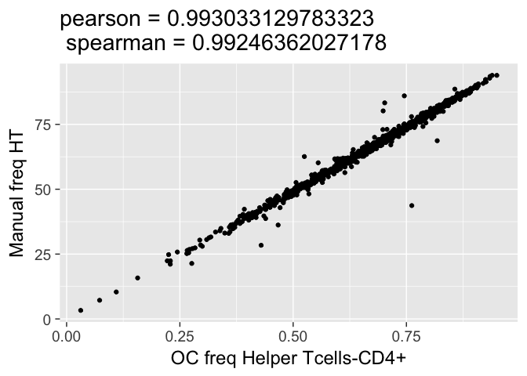
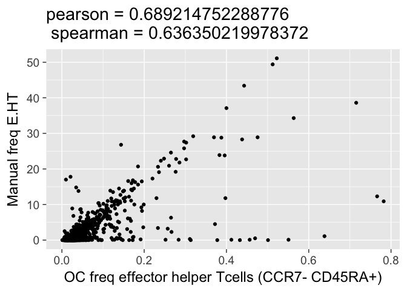
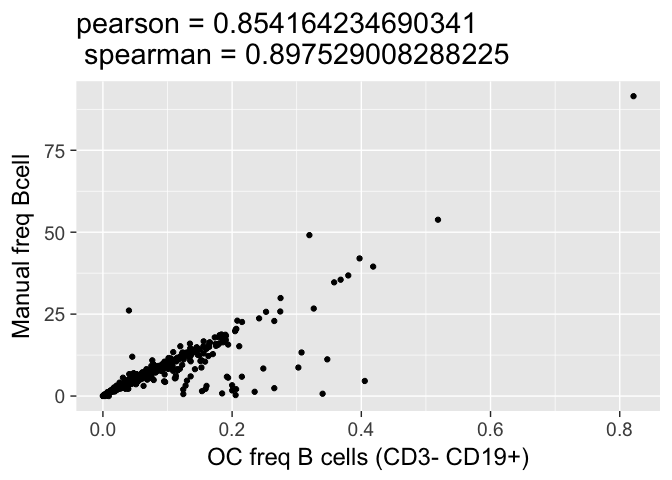
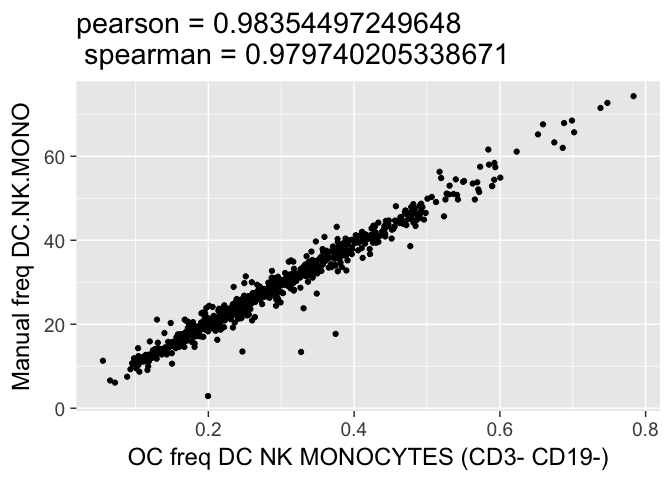
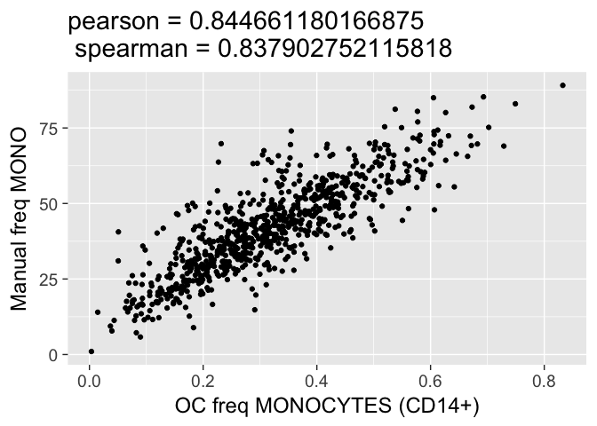

# ManualComps
JL  
12/8/2017  


```
## [1] "Tcells (CD3+ CD19-)" "Tcell"              
## [1] "Tcells (CD3+ CD19-)" "Tcell"
```

<!-- -->

```
## [1] "cytotoxic Tcells-CD8+" "CT"                   
## [1] "cytotoxic Tcells-CD8+" "CT"
```

<!-- -->

```
## [1] "effector cytotoxic Tcells  (CCR7-  CD45RA+)"
## [2] "E.CT"                                       
## [1] "effector cytotoxic Tcells  (CCR7-  CD45RA+)"
## [2] "E.CT"
```

<!-- -->

```
## [1] "effector memory cytotoxic Tcells (CCR7- , CD45RA-)"
## [2] "EM.CT"                                             
## [1] "effector memory cytotoxic Tcells (CCR7- , CD45RA-)"
## [2] "EM.CT"
```

<!-- -->

```
## [1] "Helper Tcells-CD4+" "HT"                
## [1] "Helper Tcells-CD4+" "HT"
```

<!-- -->

```
## [1] "effector memory helper Tcells (CCR7- CD45RA-)"
## [2] "EM.HT"                                        
## [1] "effector memory helper Tcells (CCR7- CD45RA-)"
## [2] "EM.HT"
```

<!-- -->

```
## [1] "B cells (CD3- CD19+)" "Bcell"               
## [1] "B cells (CD3- CD19+)" "Bcell"
```

<!-- -->

```
## [1] "DC NK MONOCYTES (CD3- CD19-)" "DC.NK.MONO"                  
## [1] "DC NK MONOCYTES (CD3- CD19-)" "DC.NK.MONO"
```

<!-- -->

```
## [1] "MONOCYTES (CD14+)" "MONO"             
## [1] "MONOCYTES (CD14+)" "MONO"
```

<!-- -->
