# ManualComps
JL  
1/10/2018  


```
## 
## panel1 
##    100 
## [1] "Bcell"
## [1] "Bcell"
## [1] "100 randomly selected P1-P2 matched samples without abnormal/bad/manual annotations"
## [1] "FREQ"
```

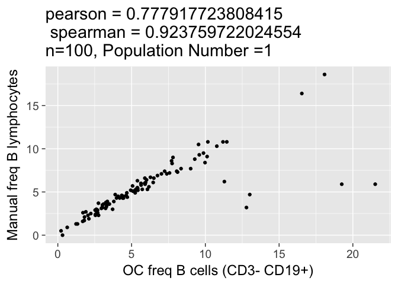<!-- -->

```
## 
## panel1 
##    100 
## [1] "Bcell"
## [1] "Bcell"
## [1] "100 randomly selected P1-P2 matched samples without abnormal/bad/manual annotations"
## [1] "COUNT"
```

<!-- -->

```
## 
## panel1 
##    100 
## [1] "Bcell"
## [1] "Bcell"
## [1] "100 randomly selected P1-P2 matched samples without abnormal/bad/manual annotations"
## [1] "FREQ_PBMC_LYMPH"
```

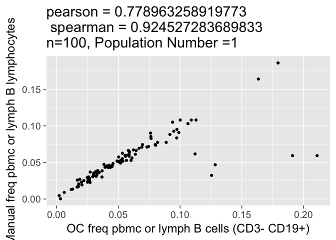<!-- -->

```
## 
## panel1 
##    100 
## [1] "IgD.MemB"
## [1] "IgD.MemB"
## [1] "100 randomly selected P1-P2 matched samples without abnormal/bad/manual annotations"
## [1] "FREQ"
```

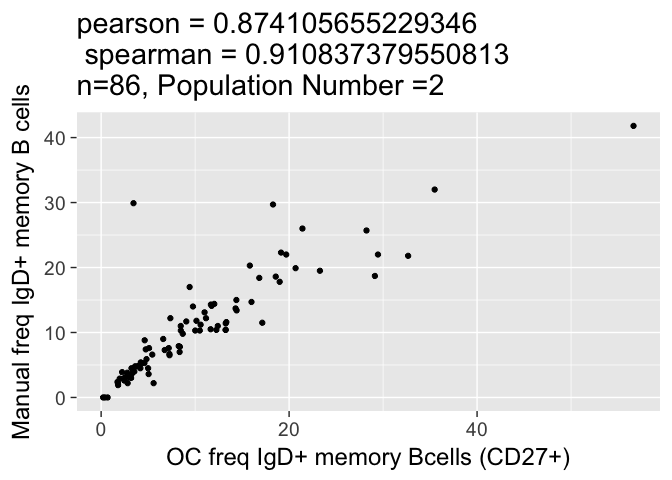<!-- -->

```
## 
## panel1 
##    100 
## [1] "IgD.MemB"
## [1] "IgD.MemB"
## [1] "100 randomly selected P1-P2 matched samples without abnormal/bad/manual annotations"
## [1] "COUNT"
```

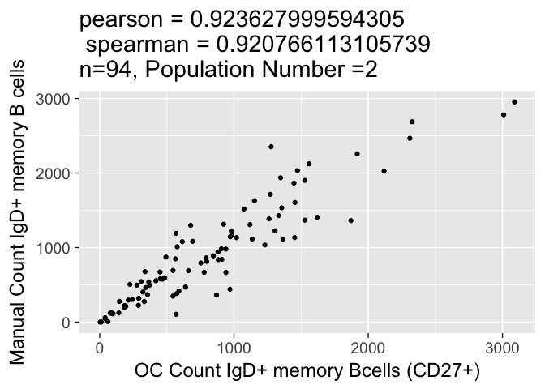<!-- -->

```
## 
## panel1 
##    100 
## [1] "IgD.MemB"
## [1] "IgD.MemB"
## [1] "100 randomly selected P1-P2 matched samples without abnormal/bad/manual annotations"
## [1] "FREQ_PBMC_LYMPH"
```

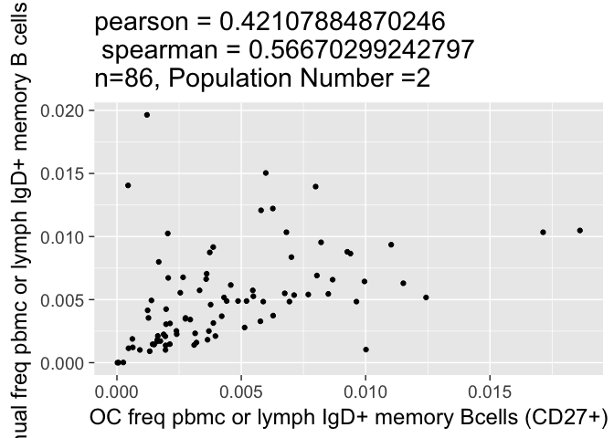<!-- -->

```
## 
## panel1 
##    100 
## [1] "IgD.MemB.1"
## [1] "IgD.MemB.1"
## [1] "100 randomly selected P1-P2 matched samples without abnormal/bad/manual annotations"
## [1] "FREQ"
```

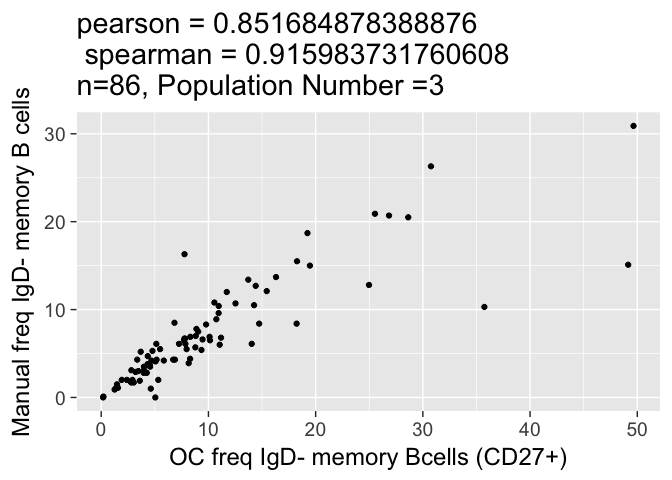<!-- -->

```
## 
## panel1 
##    100 
## [1] "IgD.MemB.1"
## [1] "IgD.MemB.1"
## [1] "100 randomly selected P1-P2 matched samples without abnormal/bad/manual annotations"
## [1] "COUNT"
```

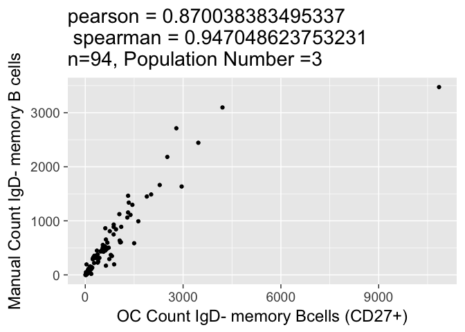<!-- -->

```
## 
## panel1 
##    100 
## [1] "IgD.MemB.1"
## [1] "IgD.MemB.1"
## [1] "100 randomly selected P1-P2 matched samples without abnormal/bad/manual annotations"
## [1] "FREQ_PBMC_LYMPH"
```

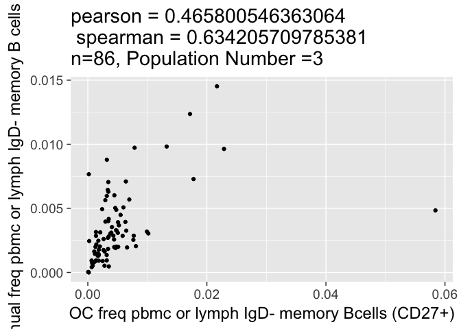<!-- -->

```
## 
## panel1 
##    100 
## [1] "NaiveB"
## [1] "NaiveB"
## [1] "100 randomly selected P1-P2 matched samples without abnormal/bad/manual annotations"
## [1] "FREQ"
```

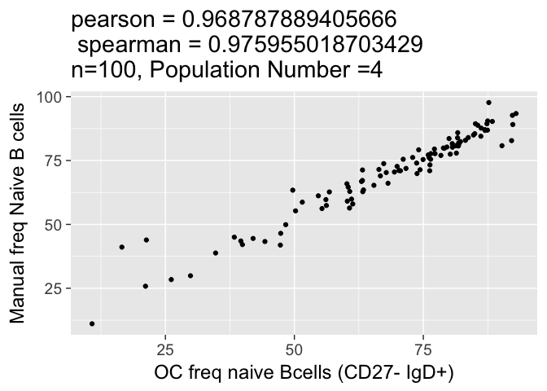<!-- -->

```
## 
## panel1 
##    100 
## [1] "NaiveB"
## [1] "NaiveB"
## [1] "100 randomly selected P1-P2 matched samples without abnormal/bad/manual annotations"
## [1] "COUNT"
```

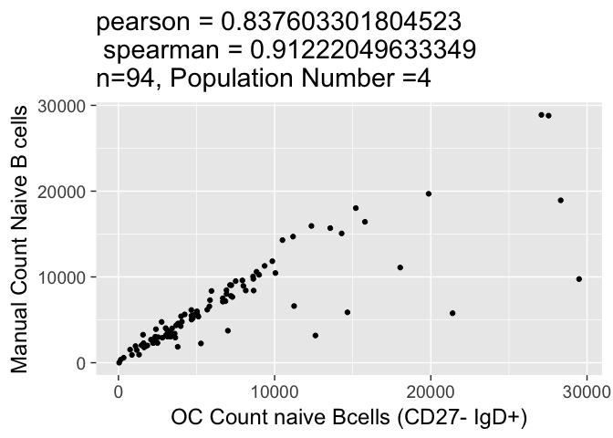<!-- -->

```
## 
## panel1 
##    100 
## [1] "NaiveB"
## [1] "NaiveB"
## [1] "100 randomly selected P1-P2 matched samples without abnormal/bad/manual annotations"
## [1] "FREQ_PBMC_LYMPH"
```

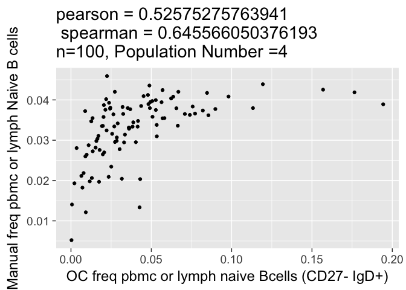<!-- -->

```
## 
## panel1 
##    100 
## [1] "Tcell"
## [1] "Tcell"
## [1] "100 randomly selected P1-P2 matched samples without abnormal/bad/manual annotations"
## [1] "FREQ"
```

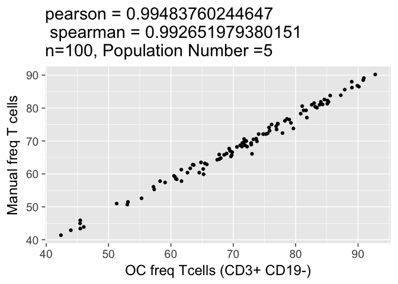<!-- -->

```
## 
## panel1 
##    100 
## [1] "Tcell"
## [1] "Tcell"
## [1] "100 randomly selected P1-P2 matched samples without abnormal/bad/manual annotations"
## [1] "COUNT"
```

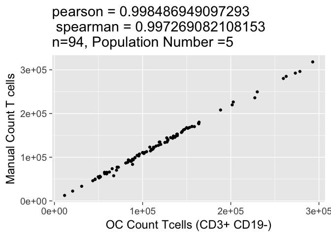<!-- -->

```
## 
## panel1 
##    100 
## [1] "Tcell"
## [1] "Tcell"
## [1] "100 randomly selected P1-P2 matched samples without abnormal/bad/manual annotations"
## [1] "FREQ_PBMC_LYMPH"
```

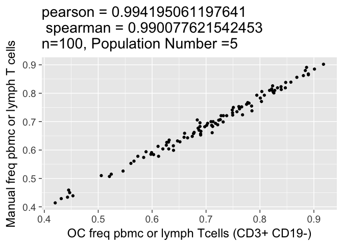<!-- -->

```
## 
## panel1 
##    100 
## [1] "CT"
## [1] "CT"
## [1] "100 randomly selected P1-P2 matched samples without abnormal/bad/manual annotations"
## [1] "FREQ"
```

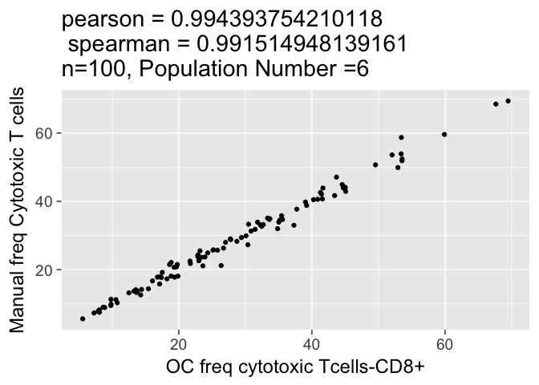<!-- -->

```
## 
## panel1 
##    100 
## [1] "CT"
## [1] "CT"
## [1] "100 randomly selected P1-P2 matched samples without abnormal/bad/manual annotations"
## [1] "COUNT"
```

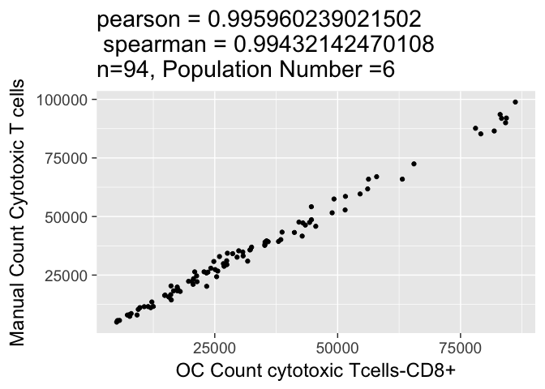<!-- -->

```
## 
## panel1 
##    100 
## [1] "CT"
## [1] "CT"
## [1] "100 randomly selected P1-P2 matched samples without abnormal/bad/manual annotations"
## [1] "FREQ_PBMC_LYMPH"
```

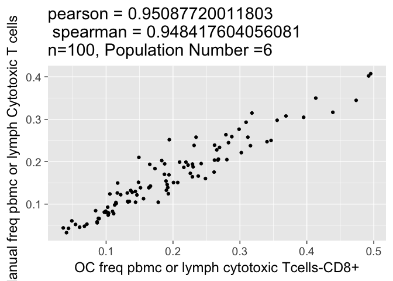<!-- -->

```
## 
## panel1 
##    100 
## [1] "ActCT"
## [1] "ActCT"
## [1] "100 randomly selected P1-P2 matched samples without abnormal/bad/manual annotations"
## [1] "FREQ"
```

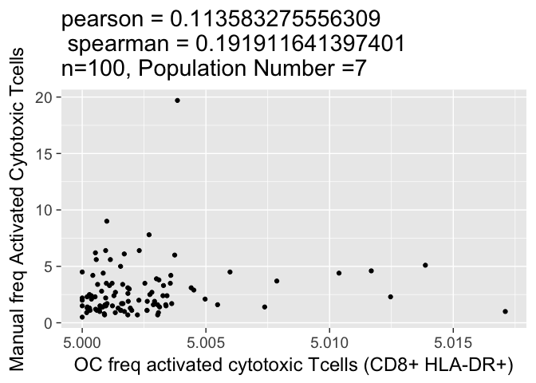<!-- -->

```
## 
## panel1 
##    100 
## [1] "ActCT"
## [1] "ActCT"
## [1] "100 randomly selected P1-P2 matched samples without abnormal/bad/manual annotations"
## [1] "COUNT"
```

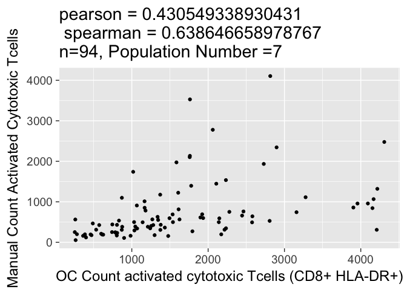<!-- -->

```
## 
## panel1 
##    100 
## 
## panel1 
##    100 
## [1] "CM.CT"
## [1] "CM.CT"
## [1] "100 randomly selected P1-P2 matched samples without abnormal/bad/manual annotations"
## [1] "FREQ"
```

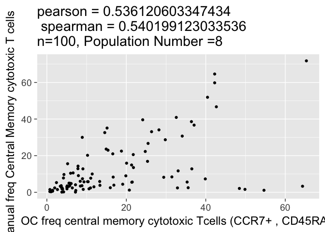<!-- -->

```
## 
## panel1 
##    100 
## [1] "CM.CT"
## 
## panel1 
##    100 
## [1] "E.CT"
## [1] "E.CT"
## [1] "100 randomly selected P1-P2 matched samples without abnormal/bad/manual annotations"
## [1] "FREQ"
```

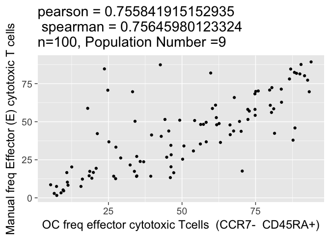<!-- -->

```
## 
## panel1 
##    100 
## [1] "E.CT"
## [1] "E.CT"
## [1] "100 randomly selected P1-P2 matched samples without abnormal/bad/manual annotations"
## [1] "COUNT"
```

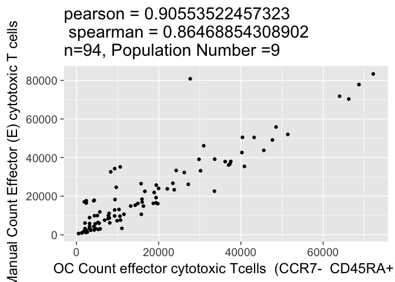<!-- -->

```
## 
## panel1 
##    100 
## 
## panel1 
##    100 
## [1] "pE.CT"
## [1] "pE.CT"
## [1] "100 randomly selected P1-P2 matched samples without abnormal/bad/manual annotations"
## [1] "FREQ"
```

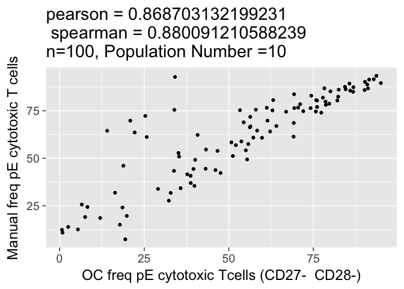<!-- -->

```
## 
## panel1 
##    100 
## [1] "pE.CT"
## [1] "pE.CT"
## [1] "100 randomly selected P1-P2 matched samples without abnormal/bad/manual annotations"
## [1] "COUNT"
```

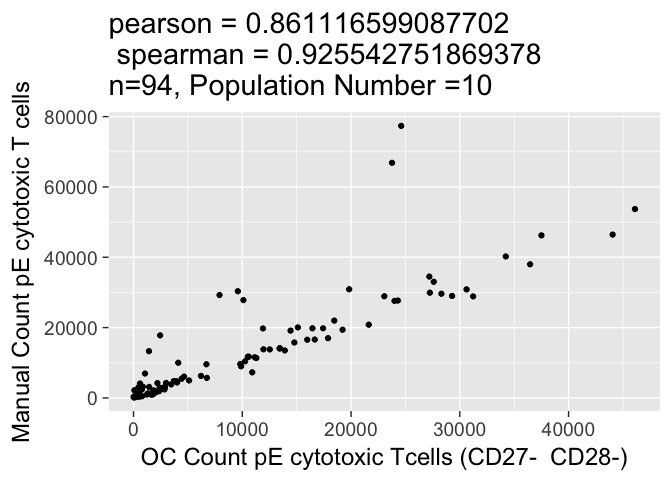<!-- -->

```
## 
## panel1 
##    100 
## 
## panel1 
##    100 
## [1] "pE1.CT"
## [1] "pE1.CT"
## [1] "100 randomly selected P1-P2 matched samples without abnormal/bad/manual annotations"
## [1] "FREQ"
```

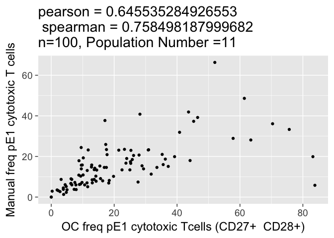<!-- -->

```
## 
## panel1 
##    100 
## [1] "pE1.CT"
## [1] "pE1.CT"
## [1] "100 randomly selected P1-P2 matched samples without abnormal/bad/manual annotations"
## [1] "COUNT"
```

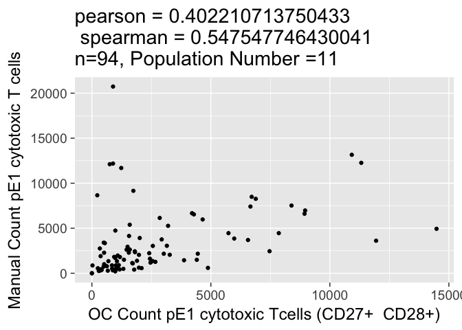<!-- -->

```
## 
## panel1 
##    100 
## 
## panel1 
##    100 
## [1] "pE2.CT"
## [1] "pE2.CT"
## [1] "100 randomly selected P1-P2 matched samples without abnormal/bad/manual annotations"
## [1] "FREQ"
```

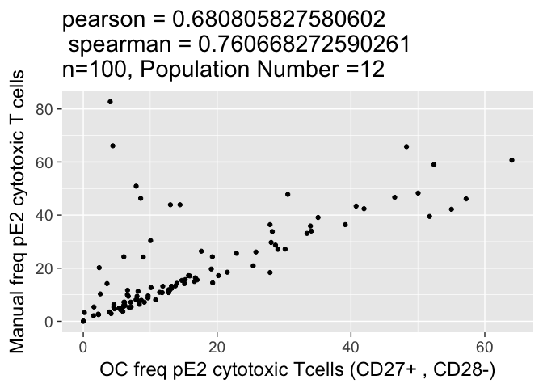<!-- -->

```
## 
## panel1 
##    100 
## [1] "pE2.CT"
## 
## panel1 
##    100 
## [1] "EM.CT"
## [1] "EM.CT"
## [1] "100 randomly selected P1-P2 matched samples without abnormal/bad/manual annotations"
## [1] "FREQ"
```

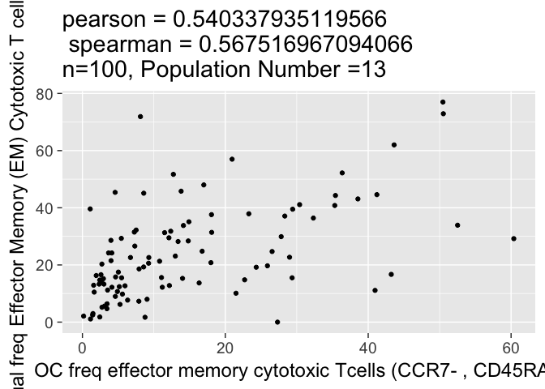<!-- -->

```
## 
## panel1 
##    100 
## [1] "EM.CT"
## 
## panel1 
##    100 
## [1] "EM1.C.T"
## [1] "EM1.C.T"
## [1] "100 randomly selected P1-P2 matched samples without abnormal/bad/manual annotations"
## [1] "FREQ"
```

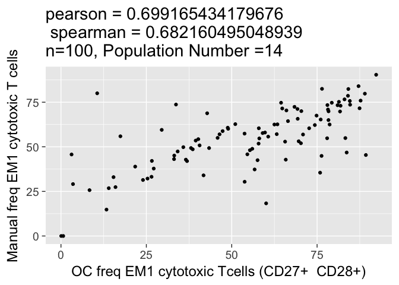<!-- -->

```
## 
## panel1 
##    100 
## [1] "EM1.C.T"
## [1] "EM1.C.T"
## [1] "100 randomly selected P1-P2 matched samples without abnormal/bad/manual annotations"
## [1] "COUNT"
```

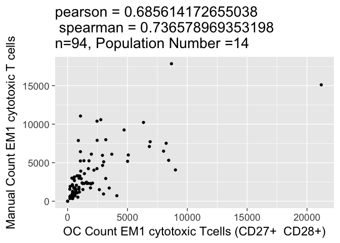<!-- -->

```
## 
## panel1 
##    100 
## 
## panel1 
##    100 
## [1] "EM2.CT"
## [1] "EM2.CT"
## [1] "100 randomly selected P1-P2 matched samples without abnormal/bad/manual annotations"
## [1] "FREQ"
```

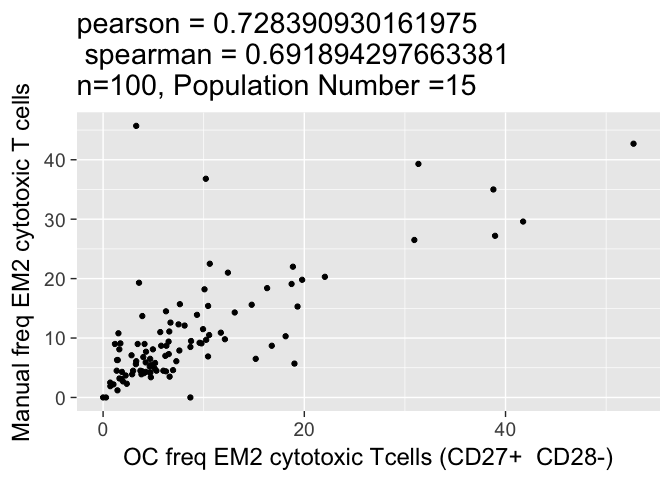<!-- -->

```
## 
## panel1 
##    100 
## [1] "EM2.CT"
## [1] "EM2.CT"
## [1] "100 randomly selected P1-P2 matched samples without abnormal/bad/manual annotations"
## [1] "COUNT"
```

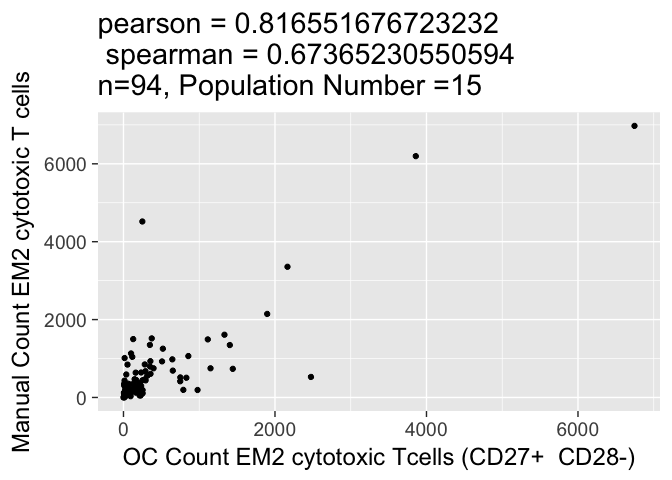<!-- -->

```
## 
## panel1 
##    100 
## 
## panel1 
##    100 
## [1] "EM3.CT"
## [1] "EM3.CT"
## [1] "100 randomly selected P1-P2 matched samples without abnormal/bad/manual annotations"
## [1] "FREQ"
```

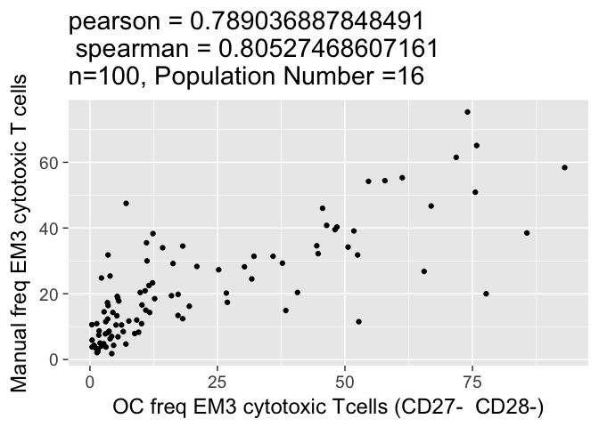<!-- -->

```
## 
## panel1 
##    100 
## [1] "EM3.CT"
## [1] "EM3.CT"
## [1] "100 randomly selected P1-P2 matched samples without abnormal/bad/manual annotations"
## [1] "COUNT"
```

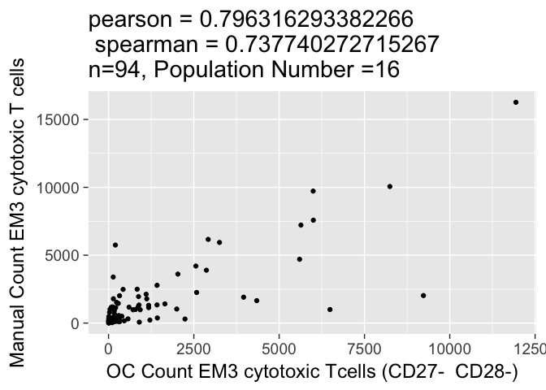<!-- -->

```
## 
## panel1 
##    100 
## 
## panel1 
##    100 
## [1] "EM4.CT"
## [1] "EM4.CT"
## [1] "100 randomly selected P1-P2 matched samples without abnormal/bad/manual annotations"
## [1] "FREQ"
```

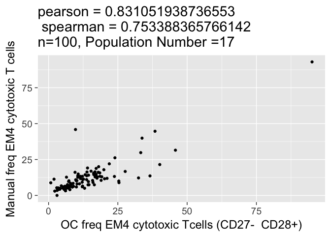<!-- -->

```
## 
## panel1 
##    100 
## [1] "EM4.CT"
## [1] "EM4.CT"
## [1] "100 randomly selected P1-P2 matched samples without abnormal/bad/manual annotations"
## [1] "COUNT"
```

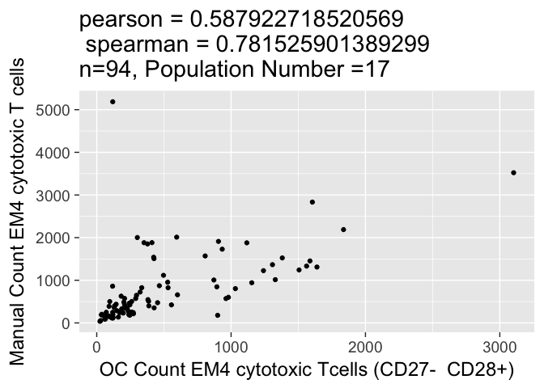<!-- -->

```
## 
## panel1 
##    100 
## 
## panel1 
##    100 
## [1] "N.CT"
## [1] "N.CT"
## [1] "100 randomly selected P1-P2 matched samples without abnormal/bad/manual annotations"
## [1] "FREQ"
```

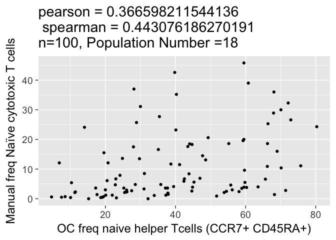<!-- -->

```
## 
## panel1 
##    100 
## [1] "N.CT"
## [1] "N.CT"
## [1] "100 randomly selected P1-P2 matched samples without abnormal/bad/manual annotations"
## [1] "COUNT"
```

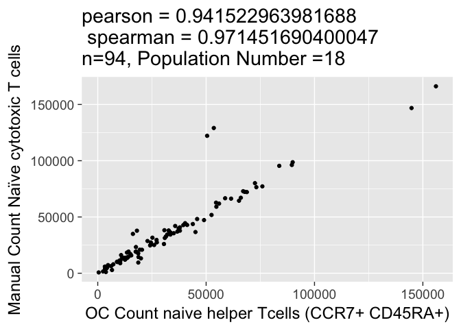<!-- -->

```
## 
## panel1 
##    100 
## 
## panel1 
##    100 
## [1] "HT"
## [1] "HT"
## [1] "100 randomly selected P1-P2 matched samples without abnormal/bad/manual annotations"
## [1] "FREQ"
```

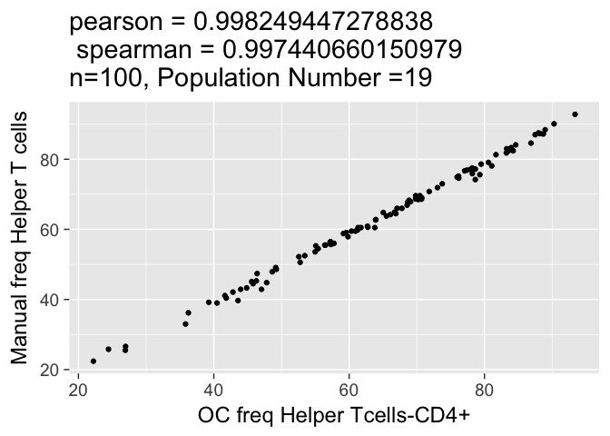<!-- -->

```
## 
## panel1 
##    100 
## [1] "HT"
## [1] "HT"
## [1] "100 randomly selected P1-P2 matched samples without abnormal/bad/manual annotations"
## [1] "COUNT"
```

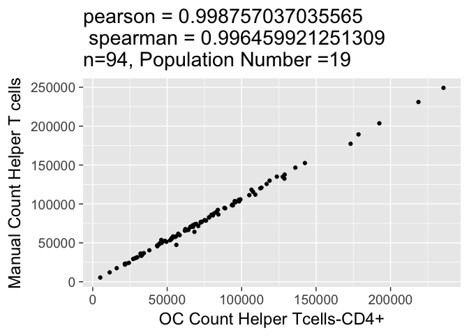<!-- -->

```
## 
## panel1 
##    100 
## [1] "HT"
## [1] "HT"
## [1] "100 randomly selected P1-P2 matched samples without abnormal/bad/manual annotations"
## [1] "FREQ_PBMC_LYMPH"
```

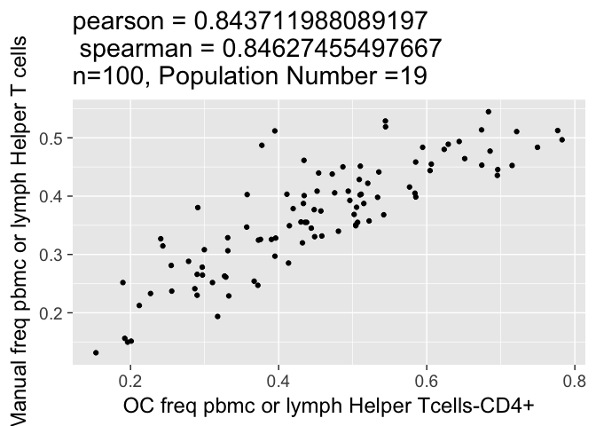<!-- -->

```
## 
## panel1 
##    100 
## [1] "Act.HT"
## [1] "Act.HT"
## [1] "100 randomly selected P1-P2 matched samples without abnormal/bad/manual annotations"
## [1] "FREQ"
```

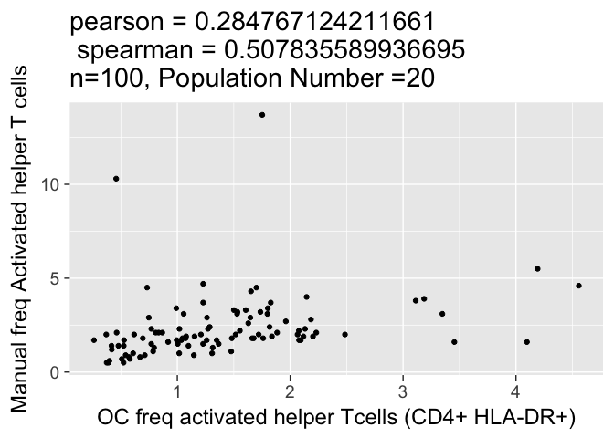<!-- -->

```
## 
## panel1 
##    100 
## [1] "Act.HT"
## [1] "Act.HT"
## [1] "100 randomly selected P1-P2 matched samples without abnormal/bad/manual annotations"
## [1] "COUNT"
```

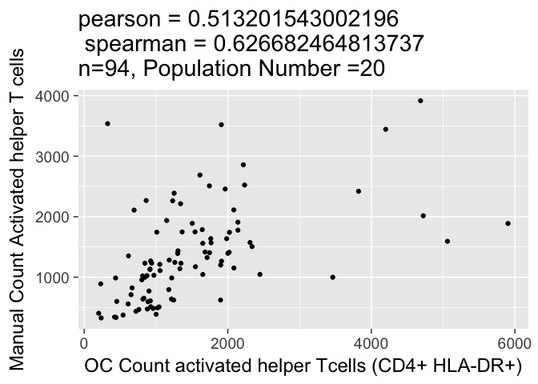<!-- -->

```
## 
## panel1 
##    100 
## 
## panel1 
##    100 
## [1] "CM.HT"
## [1] "CM.HT"
## [1] "100 randomly selected P1-P2 matched samples without abnormal/bad/manual annotations"
## [1] "FREQ"
```

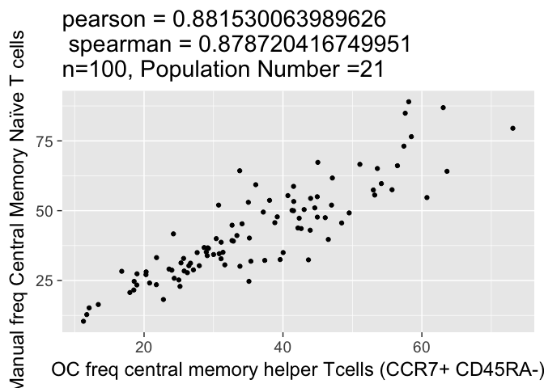<!-- -->

```
## 
## panel1 
##    100 
## [1] "CM.HT"
## [1] "CM.HT"
## [1] "100 randomly selected P1-P2 matched samples without abnormal/bad/manual annotations"
## [1] "COUNT"
```

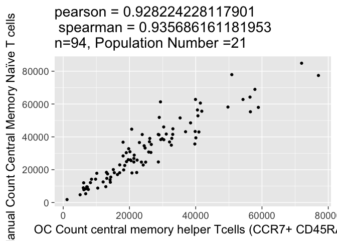<!-- -->

```
## 
## panel1 
##    100 
## 
## panel1 
##    100 
## [1] "E.HT"
## [1] "E.HT"
## [1] "100 randomly selected P1-P2 matched samples without abnormal/bad/manual annotations"
## [1] "FREQ"
```

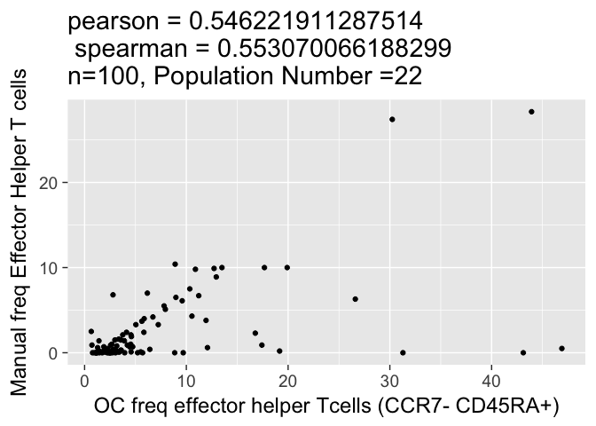<!-- -->

```
## 
## panel1 
##    100 
## [1] "E.HT"
## [1] "E.HT"
## [1] "100 randomly selected P1-P2 matched samples without abnormal/bad/manual annotations"
## [1] "COUNT"
```

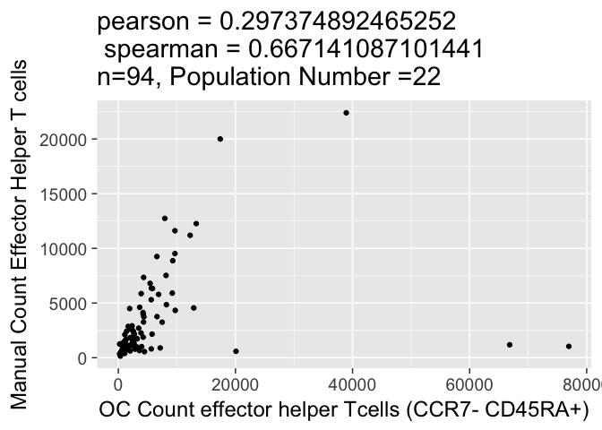<!-- -->

```
## 
## panel1 
##    100 
## 
## panel1 
##    100 
## [1] "EM.HT"
## [1] "EM.HT"
## [1] "100 randomly selected P1-P2 matched samples without abnormal/bad/manual annotations"
## [1] "FREQ"
```

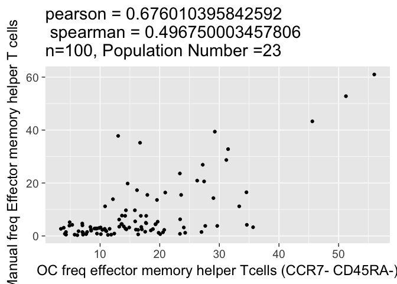<!-- -->

```
## 
## panel1 
##    100 
## [1] "EM.HT"
## [1] "EM.HT"
## [1] "100 randomly selected P1-P2 matched samples without abnormal/bad/manual annotations"
## [1] "COUNT"
```

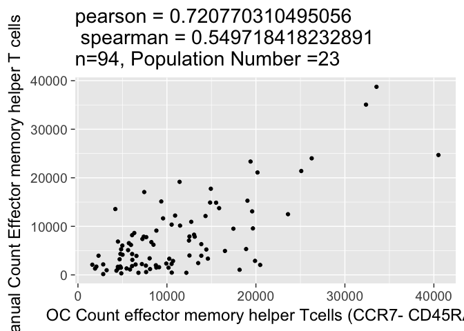<!-- -->

```
## 
## panel1 
##    100 
## 
## panel1 
##    100 
## [1] "N.HT"
## [1] "N.HT"
## [1] "100 randomly selected P1-P2 matched samples without abnormal/bad/manual annotations"
## [1] "FREQ"
```

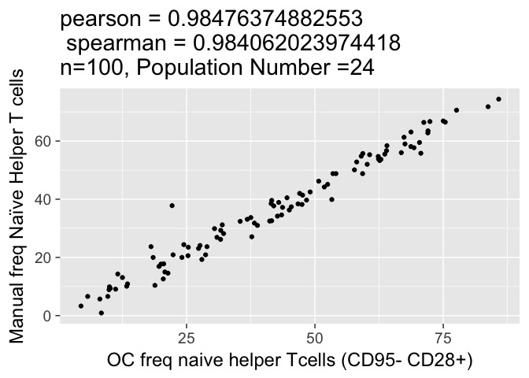<!-- -->

```
## 
## panel1 
##    100 
## [1] "N.HT"
## [1] "N.HT"
## [1] "100 randomly selected P1-P2 matched samples without abnormal/bad/manual annotations"
## [1] "COUNT"
```

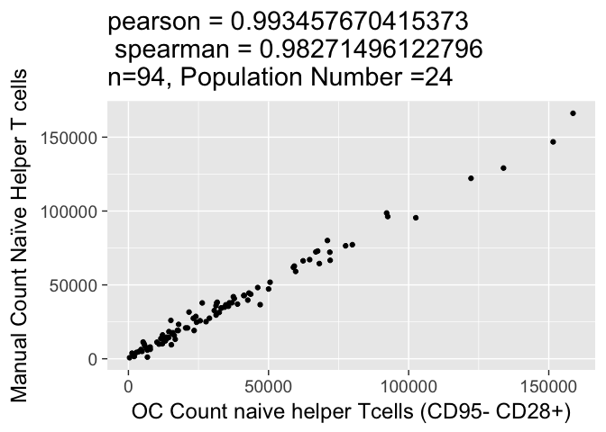<!-- -->

```
## 
## panel1 
##    100 
## 
## panel2 
##    100 
## [1] "DC.NK.MONO"
## [1] "DC.NK.MONO"
## [1] "100 randomly selected P1-P2 matched samples without abnormal/bad/manual annotations"
## [1] "FREQ"
```

<!-- -->

```
## 
## panel2 
##    100 
## [1] "DC.NK.MONO"
## [1] "DC.NK.MONO"
## [1] "100 randomly selected P1-P2 matched samples without abnormal/bad/manual annotations"
## [1] "COUNT"
```

<!-- -->

```
## 
## panel2 
##    100 
## [1] "DC.NK.MONO"
## [1] "DC.NK.MONO"
## [1] "100 randomly selected P1-P2 matched samples without abnormal/bad/manual annotations"
## [1] "FREQ_PBMC_LYMPH"
```

<!-- -->

```
## 
## panel2 
##    100 
## [1] "DC.NK"
## [1] "DC.NK"
## [1] "100 randomly selected P1-P2 matched samples without abnormal/bad/manual annotations"
## [1] "FREQ"
```

<!-- -->

```
## 
## panel2 
##    100 
## [1] "DC.NK"
## [1] "DC.NK"
## [1] "100 randomly selected P1-P2 matched samples without abnormal/bad/manual annotations"
## [1] "COUNT"
```

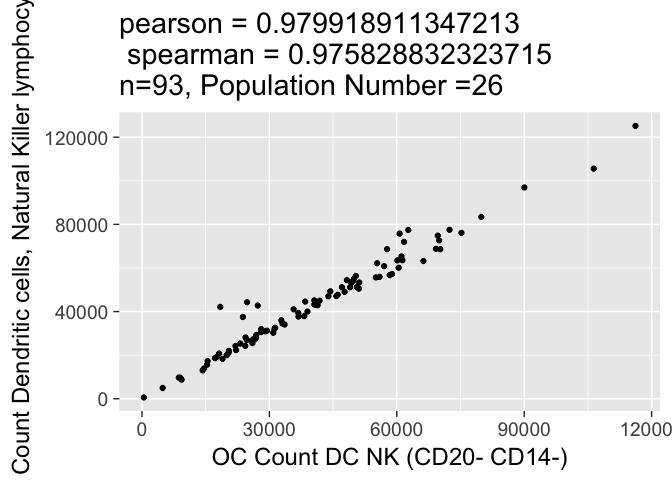<!-- -->

```
## 
## panel2 
##    100 
## [1] "DC.NK"
## [1] "DC.NK"
## [1] "100 randomly selected P1-P2 matched samples without abnormal/bad/manual annotations"
## [1] "FREQ_PBMC_LYMPH"
```

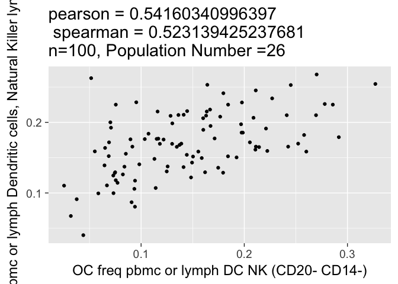<!-- -->

```
## 
## panel2 
##    100 
## [1] "DC"
## [1] "DC"
## [1] "100 randomly selected P1-P2 matched samples without abnormal/bad/manual annotations"
## [1] "FREQ"
```

<!-- -->

```
## 
## panel2 
##    100 
## [1] "DC"
## [1] "DC"
## [1] "100 randomly selected P1-P2 matched samples without abnormal/bad/manual annotations"
## [1] "COUNT"
```

<!-- -->

```
## 
## panel2 
##    100 
## [1] "DC"
## [1] "DC"
## [1] "100 randomly selected P1-P2 matched samples without abnormal/bad/manual annotations"
## [1] "FREQ_PBMC_LYMPH"
```

<!-- -->

```
## 
## panel2 
##    100 
## [1] "DCm"
## [1] "DCm"
## [1] "100 randomly selected P1-P2 matched samples without abnormal/bad/manual annotations"
## [1] "FREQ"
```

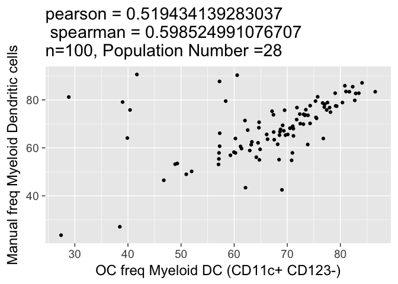<!-- -->

```
## 
## panel2 
##    100 
## [1] "DCm"
## [1] "DCm"
## [1] "100 randomly selected P1-P2 matched samples without abnormal/bad/manual annotations"
## [1] "COUNT"
```

<!-- -->

```
## 
## panel2 
##    100 
## [1] "DCm"
## [1] "DCm"
## [1] "100 randomly selected P1-P2 matched samples without abnormal/bad/manual annotations"
## [1] "FREQ_PBMC_LYMPH"
```

<!-- -->

```
## 
## panel2 
##    100 
## [1] "DCp"
## [1] "DCp"
## [1] "100 randomly selected P1-P2 matched samples without abnormal/bad/manual annotations"
## [1] "FREQ"
```

<!-- -->

```
## 
## panel2 
##    100 
## [1] "DCp"
## [1] "DCp"
## [1] "100 randomly selected P1-P2 matched samples without abnormal/bad/manual annotations"
## [1] "COUNT"
```

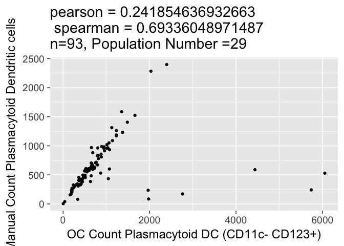<!-- -->

```
## 
## panel2 
##    100 
## [1] "DCp"
## [1] "DCp"
## [1] "100 randomly selected P1-P2 matched samples without abnormal/bad/manual annotations"
## [1] "FREQ_PBMC_LYMPH"
```

<!-- -->

```
## 
## panel2 
##    100 
## [1] "NK"
## [1] "NK"
## [1] "100 randomly selected P1-P2 matched samples without abnormal/bad/manual annotations"
## [1] "FREQ"
```

<!-- -->

```
## 
## panel2 
##    100 
## [1] "NK"
## [1] "NK"
## [1] "100 randomly selected P1-P2 matched samples without abnormal/bad/manual annotations"
## [1] "COUNT"
```

<!-- -->

```
## 
## panel2 
##    100 
## [1] "NK"
## [1] "NK"
## [1] "100 randomly selected P1-P2 matched samples without abnormal/bad/manual annotations"
## [1] "FREQ_PBMC_LYMPH"
```

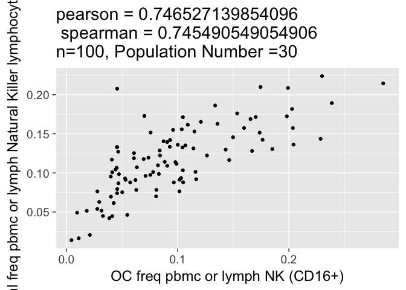<!-- -->

```
## 
## panel2 
##    100 
## [1] "NKHI"
## [1] "NKHI"
## [1] "100 randomly selected P1-P2 matched samples without abnormal/bad/manual annotations"
## [1] "FREQ"
```

<!-- -->

```
## 
## panel2 
##    100 
## [1] "NKHI"
## [1] "NKHI"
## [1] "100 randomly selected P1-P2 matched samples without abnormal/bad/manual annotations"
## [1] "COUNT"
```

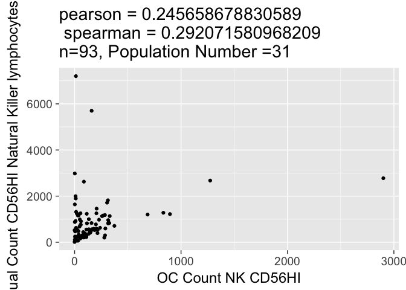<!-- -->

```
## 
## panel2 
##    100 
## [1] "NKHI"
## [1] "NKHI"
## [1] "100 randomly selected P1-P2 matched samples without abnormal/bad/manual annotations"
## [1] "FREQ_PBMC_LYMPH"
```

<!-- -->

```
## 
## panel2 
##    100 
## [1] "NKLO"
## [1] "NKLO"
## [1] "100 randomly selected P1-P2 matched samples without abnormal/bad/manual annotations"
## [1] "FREQ"
```

<!-- -->

```
## 
## panel2 
##    100 
## [1] "NKLO"
## [1] "NKLO"
## [1] "100 randomly selected P1-P2 matched samples without abnormal/bad/manual annotations"
## [1] "COUNT"
```

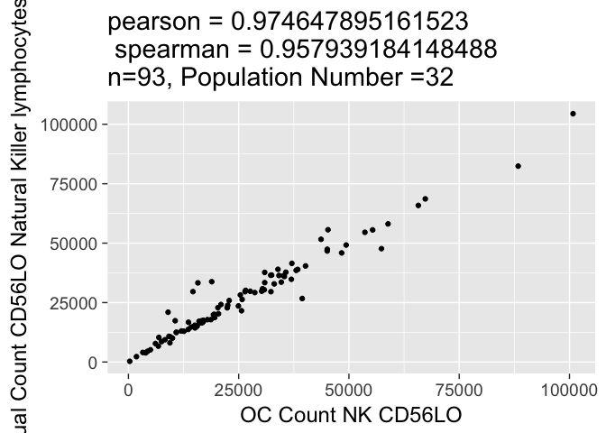<!-- -->

```
## 
## panel2 
##    100 
## [1] "NKLO"
## [1] "NKLO"
## [1] "100 randomly selected P1-P2 matched samples without abnormal/bad/manual annotations"
## [1] "FREQ_PBMC_LYMPH"
```

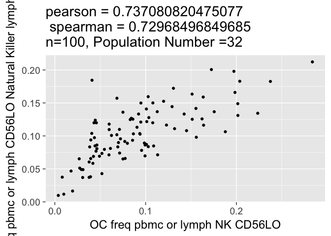<!-- -->

```
## 
## panel2 
##    100 
## [1] "MONO"
## [1] "MONO"
## [1] "100 randomly selected P1-P2 matched samples without abnormal/bad/manual annotations"
## [1] "FREQ"
```

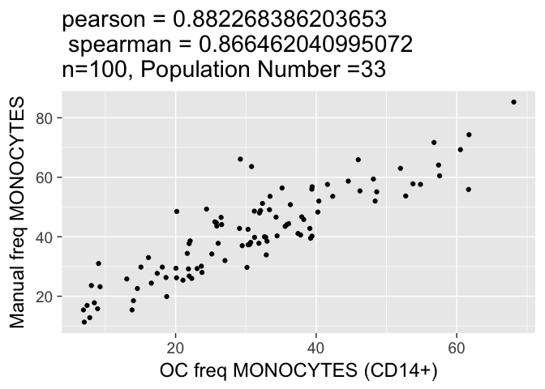<!-- -->

```
## 
## panel2 
##    100 
## [1] "MONO"
## [1] "MONO"
## [1] "100 randomly selected P1-P2 matched samples without abnormal/bad/manual annotations"
## [1] "COUNT"
```

<!-- -->

```
## 
## panel2 
##    100 
## [1] "MONO"
## [1] "MONO"
## [1] "100 randomly selected P1-P2 matched samples without abnormal/bad/manual annotations"
## [1] "FREQ_PBMC_LYMPH"
```

<!-- -->

```
## 
## panel2 
##    100 
## [1] "MONOc"
## [1] "MONOc"
## [1] "100 randomly selected P1-P2 matched samples without abnormal/bad/manual annotations"
## [1] "FREQ"
```

<!-- -->

```
## 
## panel2 
##    100 
## [1] "MONOc"
## [1] "MONOc"
## [1] "100 randomly selected P1-P2 matched samples without abnormal/bad/manual annotations"
## [1] "COUNT"
```

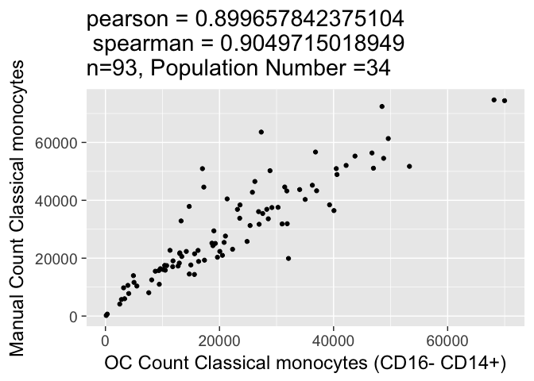<!-- -->

```
## 
## panel2 
##    100 
## [1] "MONOc"
## [1] "MONOc"
## [1] "100 randomly selected P1-P2 matched samples without abnormal/bad/manual annotations"
## [1] "FREQ_PBMC_LYMPH"
```

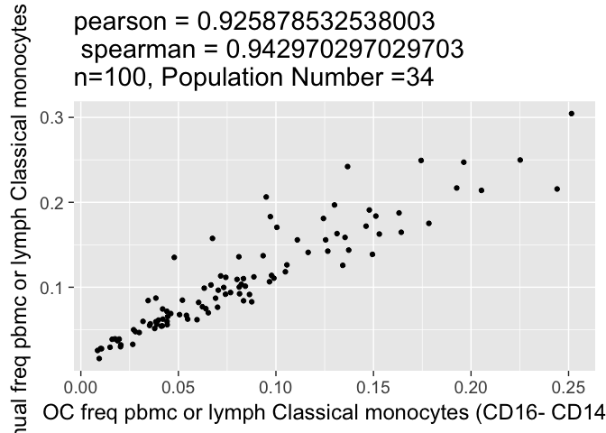<!-- -->

```
## 
## panel2 
##    100 
## [1] "MONOnc"
## [1] "MONOnc"
## [1] "100 randomly selected P1-P2 matched samples without abnormal/bad/manual annotations"
## [1] "FREQ"
```

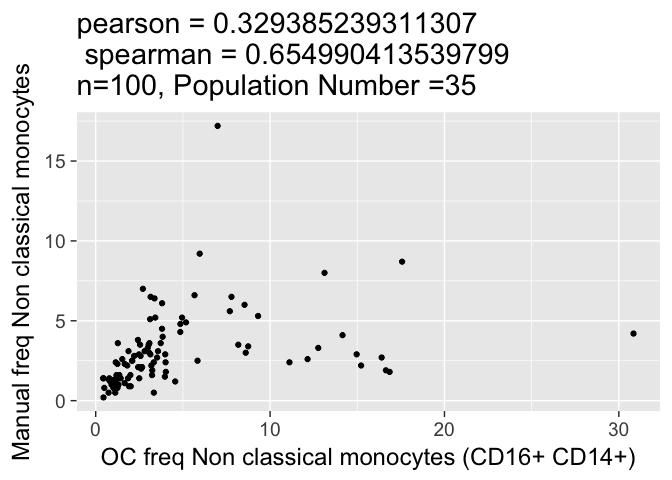<!-- -->

```
## 
## panel2 
##    100 
## [1] "MONOnc"
## [1] "MONOnc"
## [1] "100 randomly selected P1-P2 matched samples without abnormal/bad/manual annotations"
## [1] "COUNT"
```

<!-- -->

```
## 
## panel2 
##    100 
## [1] "MONOnc"
## [1] "MONOnc"
## [1] "100 randomly selected P1-P2 matched samples without abnormal/bad/manual annotations"
## [1] "FREQ_PBMC_LYMPH"
```

<!-- -->

```
## 
## panel1 
##    770 
## [1] "Bcell"
## [1] "Bcell"
## [1] "All P1-P2 matched samples  without abnormal/bad/manual annotations"
## [1] "FREQ"
```

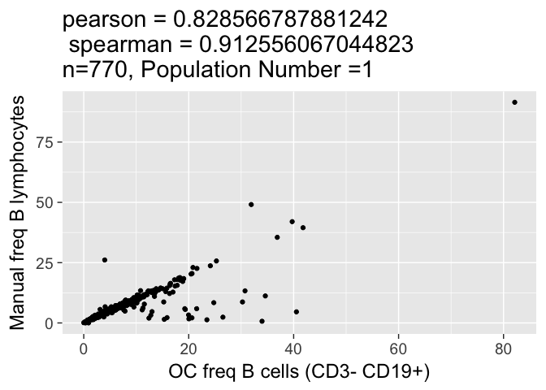<!-- -->

```
## 
## panel1 
##    770 
## [1] "Bcell"
## [1] "Bcell"
## [1] "All P1-P2 matched samples  without abnormal/bad/manual annotations"
## [1] "COUNT"
```

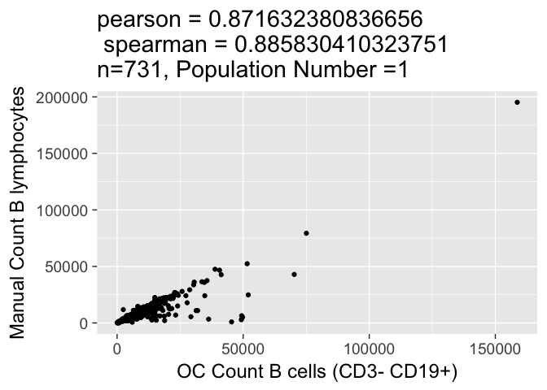<!-- -->

```
## 
## panel1 
##    770 
## [1] "Bcell"
## [1] "Bcell"
## [1] "All P1-P2 matched samples  without abnormal/bad/manual annotations"
## [1] "FREQ_PBMC_LYMPH"
```

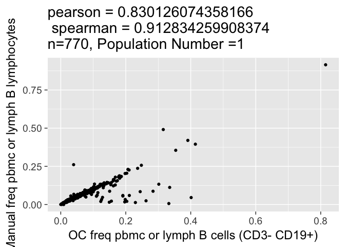<!-- -->

```
## 
## panel1 
##    770 
## [1] "IgD.MemB"
## [1] "IgD.MemB"
## [1] "All P1-P2 matched samples  without abnormal/bad/manual annotations"
## [1] "FREQ"
```

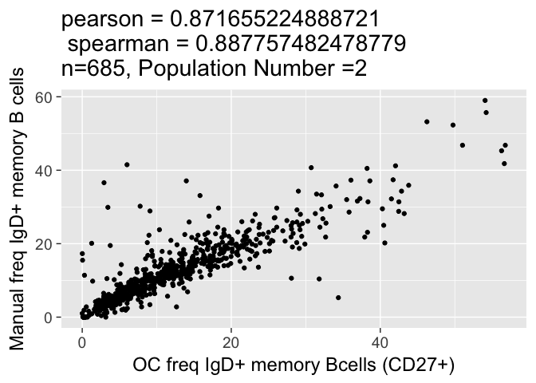<!-- -->

```
## 
## panel1 
##    770 
## [1] "IgD.MemB"
## [1] "IgD.MemB"
## [1] "All P1-P2 matched samples  without abnormal/bad/manual annotations"
## [1] "COUNT"
```

<!-- -->

```
## 
## panel1 
##    770 
## [1] "IgD.MemB"
## [1] "IgD.MemB"
## [1] "All P1-P2 matched samples  without abnormal/bad/manual annotations"
## [1] "FREQ_PBMC_LYMPH"
```

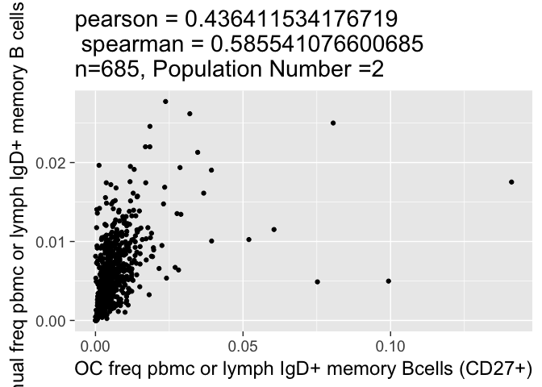<!-- -->

```
## 
## panel1 
##    770 
## [1] "IgD.MemB.1"
## [1] "IgD.MemB.1"
## [1] "All P1-P2 matched samples  without abnormal/bad/manual annotations"
## [1] "FREQ"
```

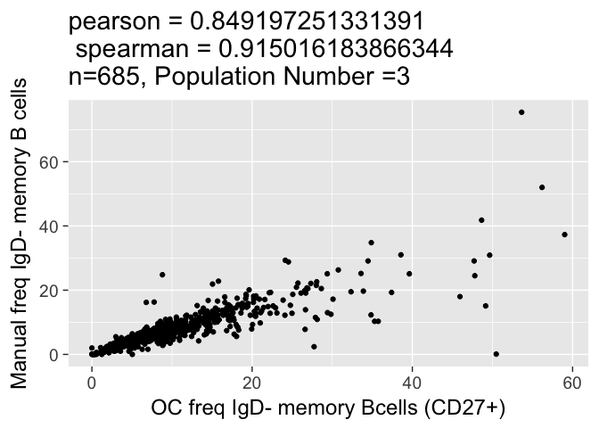<!-- -->

```
## 
## panel1 
##    770 
## [1] "IgD.MemB.1"
## [1] "IgD.MemB.1"
## [1] "All P1-P2 matched samples  without abnormal/bad/manual annotations"
## [1] "COUNT"
```

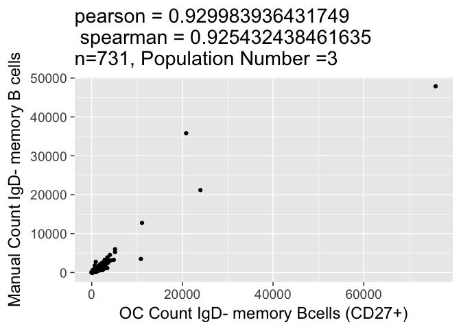<!-- -->

```
## 
## panel1 
##    770 
## [1] "IgD.MemB.1"
## [1] "IgD.MemB.1"
## [1] "All P1-P2 matched samples  without abnormal/bad/manual annotations"
## [1] "FREQ_PBMC_LYMPH"
```

<!-- -->

```
## 
## panel1 
##    770 
## [1] "NaiveB"
## [1] "NaiveB"
## [1] "All P1-P2 matched samples  without abnormal/bad/manual annotations"
## [1] "FREQ"
```

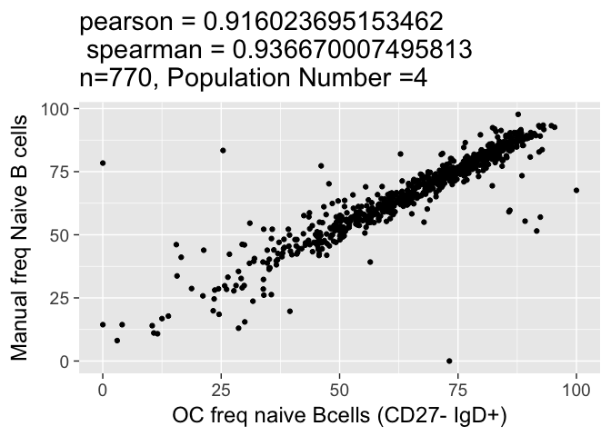<!-- -->

```
## 
## panel1 
##    770 
## [1] "NaiveB"
## [1] "NaiveB"
## [1] "All P1-P2 matched samples  without abnormal/bad/manual annotations"
## [1] "COUNT"
```

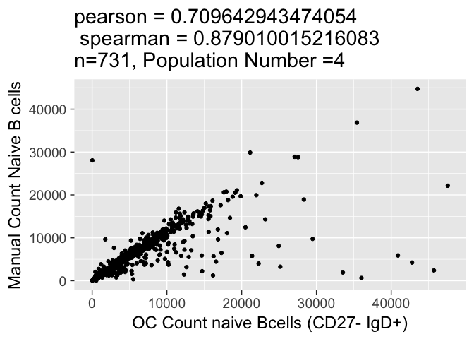<!-- -->

```
## 
## panel1 
##    770 
## [1] "NaiveB"
## [1] "NaiveB"
## [1] "All P1-P2 matched samples  without abnormal/bad/manual annotations"
## [1] "FREQ_PBMC_LYMPH"
```

<!-- -->

```
## 
## panel1 
##    770 
## [1] "Tcell"
## [1] "Tcell"
## [1] "All P1-P2 matched samples  without abnormal/bad/manual annotations"
## [1] "FREQ"
```

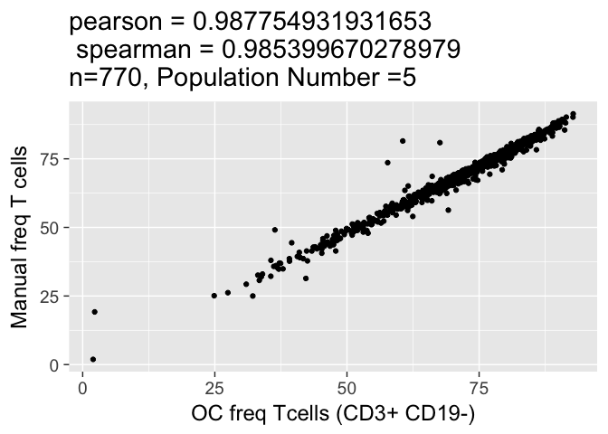<!-- -->

```
## 
## panel1 
##    770 
## [1] "Tcell"
## [1] "Tcell"
## [1] "All P1-P2 matched samples  without abnormal/bad/manual annotations"
## [1] "COUNT"
```

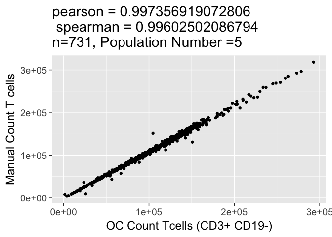<!-- -->

```
## 
## panel1 
##    770 
## [1] "Tcell"
## [1] "Tcell"
## [1] "All P1-P2 matched samples  without abnormal/bad/manual annotations"
## [1] "FREQ_PBMC_LYMPH"
```

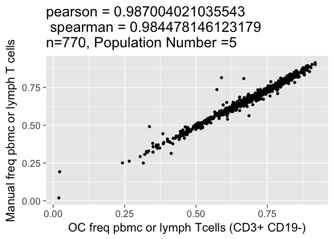<!-- -->

```
## 
## panel1 
##    770 
## [1] "CT"
## [1] "CT"
## [1] "All P1-P2 matched samples  without abnormal/bad/manual annotations"
## [1] "FREQ"
```

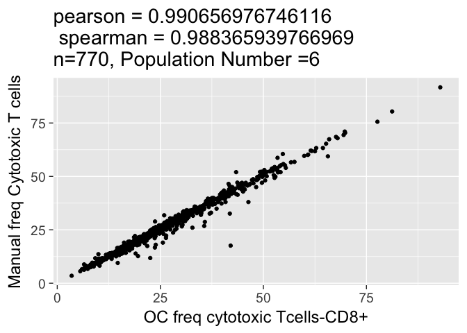<!-- -->

```
## 
## panel1 
##    770 
## [1] "CT"
## [1] "CT"
## [1] "All P1-P2 matched samples  without abnormal/bad/manual annotations"
## [1] "COUNT"
```

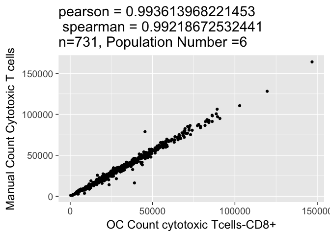<!-- -->

```
## 
## panel1 
##    770 
## [1] "CT"
## [1] "CT"
## [1] "All P1-P2 matched samples  without abnormal/bad/manual annotations"
## [1] "FREQ_PBMC_LYMPH"
```

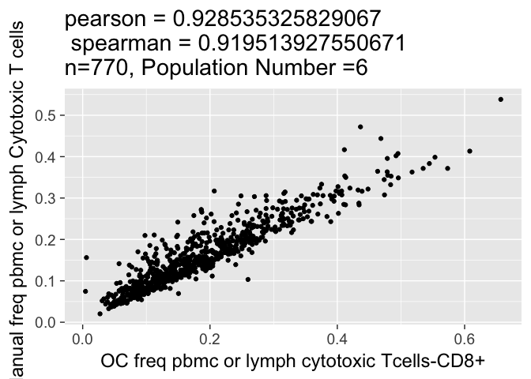<!-- -->

```
## 
## panel1 
##    770 
## [1] "ActCT"
## [1] "ActCT"
## [1] "All P1-P2 matched samples  without abnormal/bad/manual annotations"
## [1] "FREQ"
```

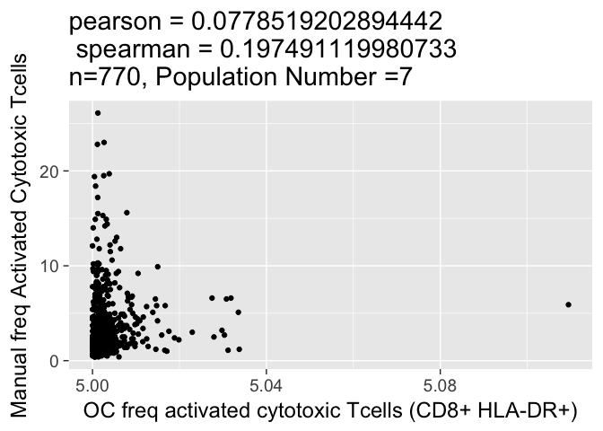<!-- -->

```
## 
## panel1 
##    770 
## [1] "ActCT"
## [1] "ActCT"
## [1] "All P1-P2 matched samples  without abnormal/bad/manual annotations"
## [1] "COUNT"
```

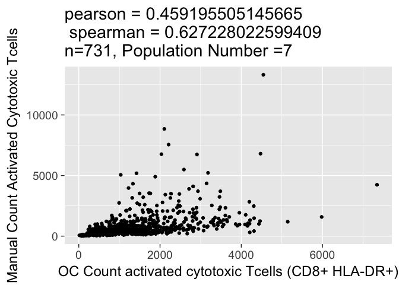<!-- -->

```
## 
## panel1 
##    770 
## 
## panel1 
##    770 
## [1] "CM.CT"
## [1] "CM.CT"
## [1] "All P1-P2 matched samples  without abnormal/bad/manual annotations"
## [1] "FREQ"
```

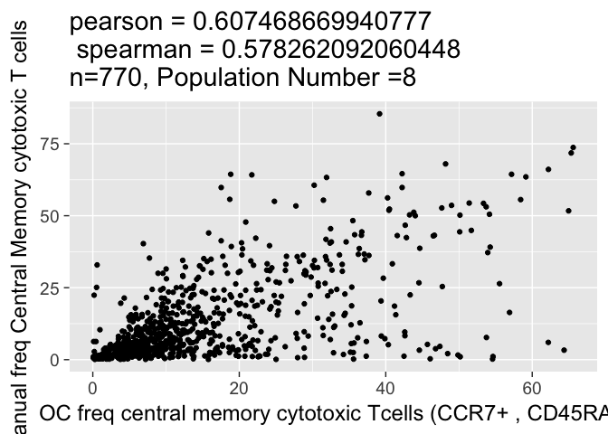<!-- -->

```
## 
## panel1 
##    770 
## [1] "CM.CT"
## 
## panel1 
##    770 
## [1] "E.CT"
## [1] "E.CT"
## [1] "All P1-P2 matched samples  without abnormal/bad/manual annotations"
## [1] "FREQ"
```

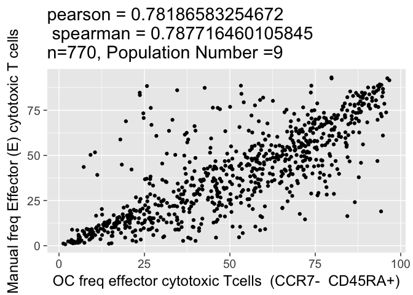<!-- -->

```
## 
## panel1 
##    770 
## [1] "E.CT"
## [1] "E.CT"
## [1] "All P1-P2 matched samples  without abnormal/bad/manual annotations"
## [1] "COUNT"
```

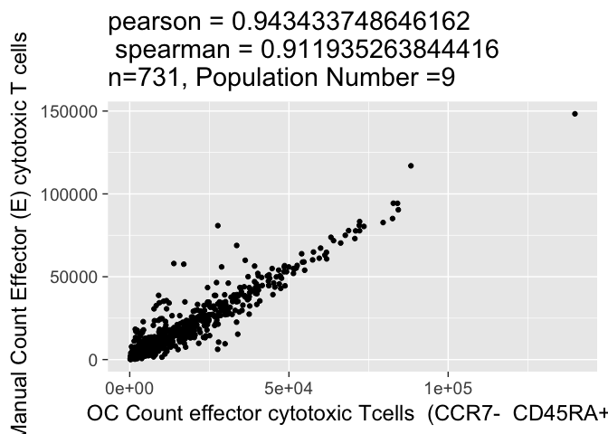<!-- -->

```
## 
## panel1 
##    770 
## 
## panel1 
##    770 
## [1] "pE.CT"
## [1] "pE.CT"
## [1] "All P1-P2 matched samples  without abnormal/bad/manual annotations"
## [1] "FREQ"
```

<!-- -->

```
## 
## panel1 
##    770 
## [1] "pE.CT"
## [1] "pE.CT"
## [1] "All P1-P2 matched samples  without abnormal/bad/manual annotations"
## [1] "COUNT"
```

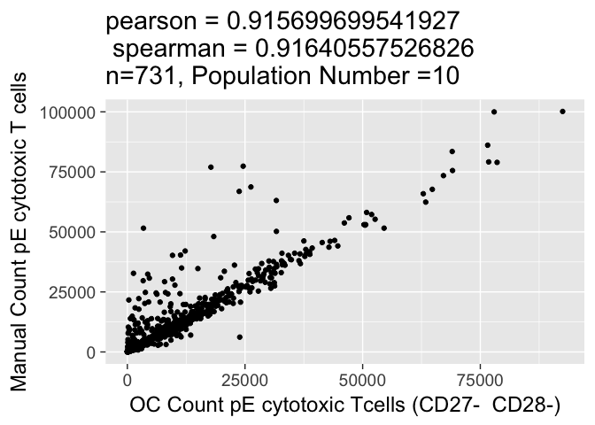<!-- -->

```
## 
## panel1 
##    770 
## 
## panel1 
##    770 
## [1] "pE1.CT"
## [1] "pE1.CT"
## [1] "All P1-P2 matched samples  without abnormal/bad/manual annotations"
## [1] "FREQ"
```

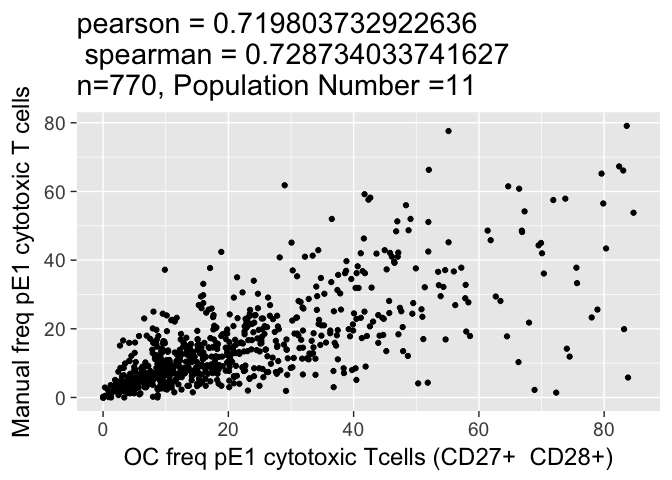<!-- -->

```
## 
## panel1 
##    770 
## [1] "pE1.CT"
## [1] "pE1.CT"
## [1] "All P1-P2 matched samples  without abnormal/bad/manual annotations"
## [1] "COUNT"
```

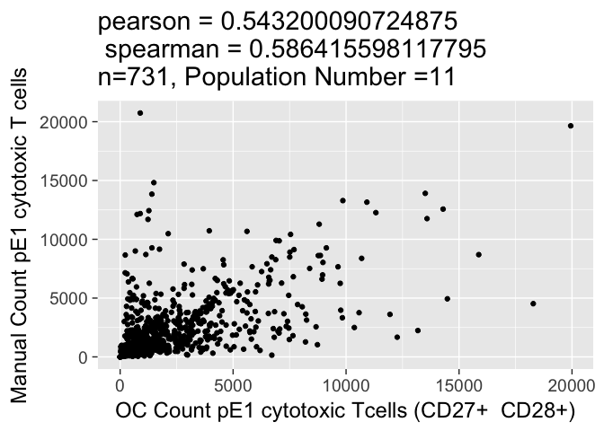<!-- -->

```
## 
## panel1 
##    770 
## 
## panel1 
##    770 
## [1] "pE2.CT"
## [1] "pE2.CT"
## [1] "All P1-P2 matched samples  without abnormal/bad/manual annotations"
## [1] "FREQ"
```

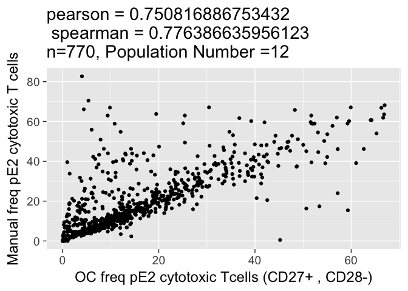<!-- -->

```
## 
## panel1 
##    770 
## [1] "pE2.CT"
## 
## panel1 
##    770 
## [1] "EM.CT"
## [1] "EM.CT"
## [1] "All P1-P2 matched samples  without abnormal/bad/manual annotations"
## [1] "FREQ"
```

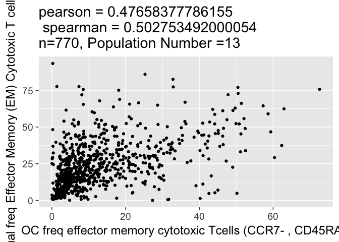<!-- -->

```
## 
## panel1 
##    770 
## [1] "EM.CT"
## 
## panel1 
##    770 
## [1] "EM1.C.T"
## [1] "EM1.C.T"
## [1] "All P1-P2 matched samples  without abnormal/bad/manual annotations"
## [1] "FREQ"
```

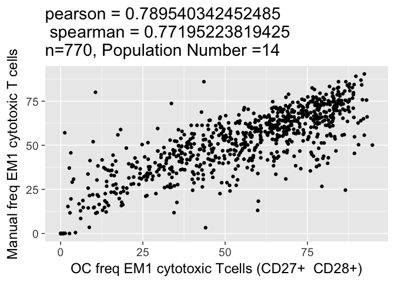<!-- -->

```
## 
## panel1 
##    770 
## [1] "EM1.C.T"
## [1] "EM1.C.T"
## [1] "All P1-P2 matched samples  without abnormal/bad/manual annotations"
## [1] "COUNT"
```

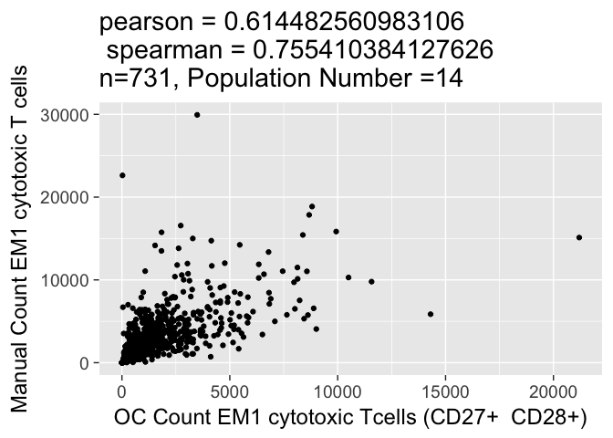<!-- -->

```
## 
## panel1 
##    770 
## 
## panel1 
##    770 
## [1] "EM2.CT"
## [1] "EM2.CT"
## [1] "All P1-P2 matched samples  without abnormal/bad/manual annotations"
## [1] "FREQ"
```

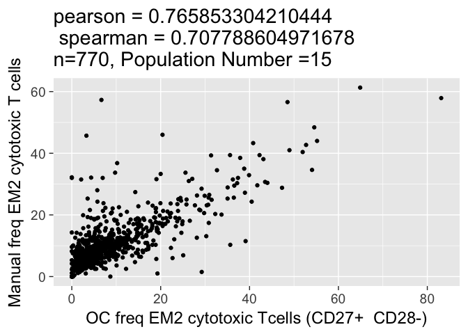<!-- -->

```
## 
## panel1 
##    770 
## [1] "EM2.CT"
## [1] "EM2.CT"
## [1] "All P1-P2 matched samples  without abnormal/bad/manual annotations"
## [1] "COUNT"
```

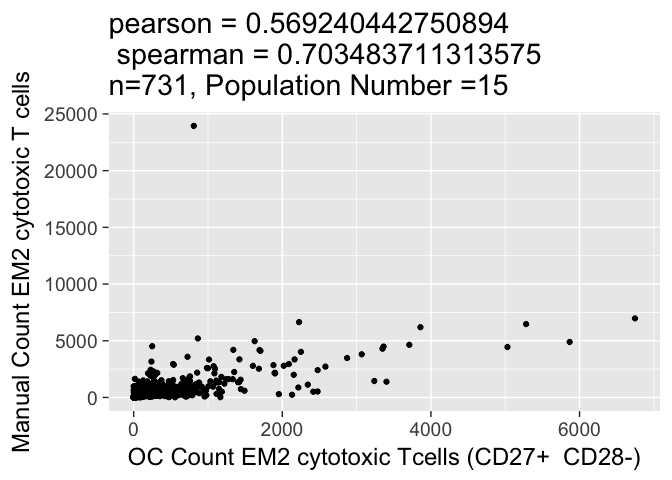<!-- -->

```
## 
## panel1 
##    770 
## 
## panel1 
##    770 
## [1] "EM3.CT"
## [1] "EM3.CT"
## [1] "All P1-P2 matched samples  without abnormal/bad/manual annotations"
## [1] "FREQ"
```

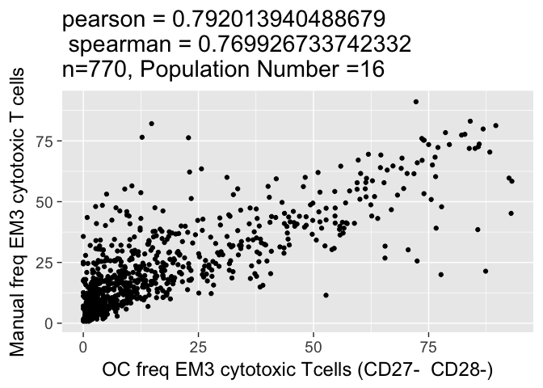<!-- -->

```
## 
## panel1 
##    770 
## [1] "EM3.CT"
## [1] "EM3.CT"
## [1] "All P1-P2 matched samples  without abnormal/bad/manual annotations"
## [1] "COUNT"
```

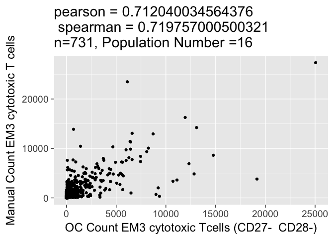<!-- -->

```
## 
## panel1 
##    770 
## 
## panel1 
##    770 
## [1] "EM4.CT"
## [1] "EM4.CT"
## [1] "All P1-P2 matched samples  without abnormal/bad/manual annotations"
## [1] "FREQ"
```

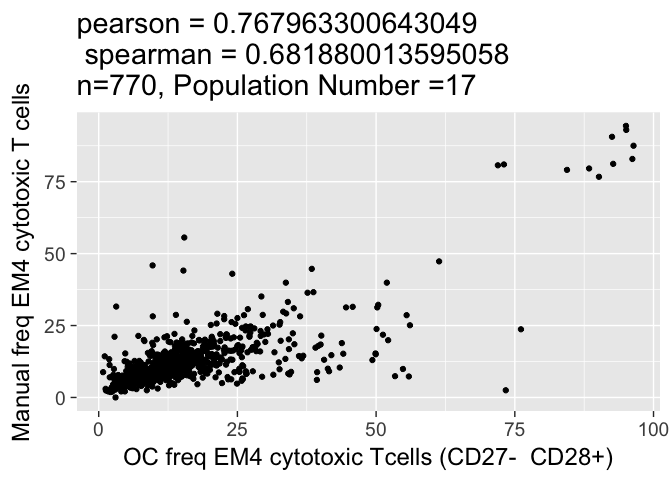<!-- -->

```
## 
## panel1 
##    770 
## [1] "EM4.CT"
## [1] "EM4.CT"
## [1] "All P1-P2 matched samples  without abnormal/bad/manual annotations"
## [1] "COUNT"
```

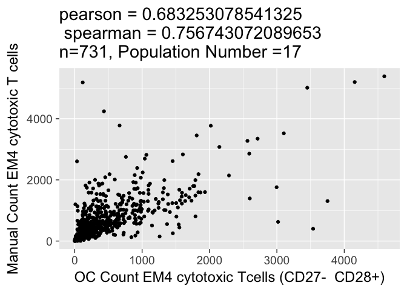<!-- -->

```
## 
## panel1 
##    770 
## 
## panel1 
##    770 
## [1] "N.CT"
## [1] "N.CT"
## [1] "All P1-P2 matched samples  without abnormal/bad/manual annotations"
## [1] "FREQ"
```

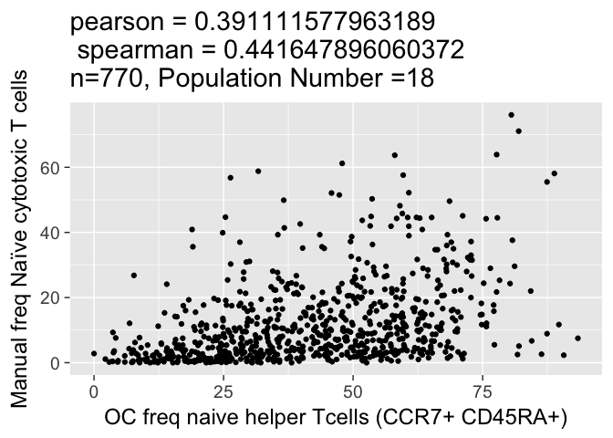<!-- -->

```
## 
## panel1 
##    770 
## [1] "N.CT"
## [1] "N.CT"
## [1] "All P1-P2 matched samples  without abnormal/bad/manual annotations"
## [1] "COUNT"
```

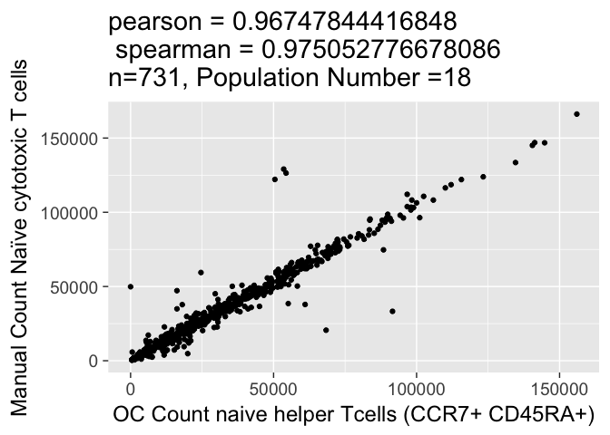<!-- -->

```
## 
## panel1 
##    770 
## 
## panel1 
##    770 
## [1] "HT"
## [1] "HT"
## [1] "All P1-P2 matched samples  without abnormal/bad/manual annotations"
## [1] "FREQ"
```

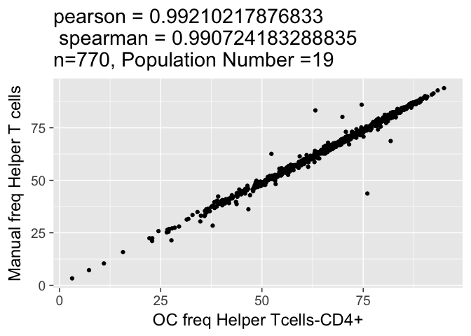<!-- -->

```
## 
## panel1 
##    770 
## [1] "HT"
## [1] "HT"
## [1] "All P1-P2 matched samples  without abnormal/bad/manual annotations"
## [1] "COUNT"
```

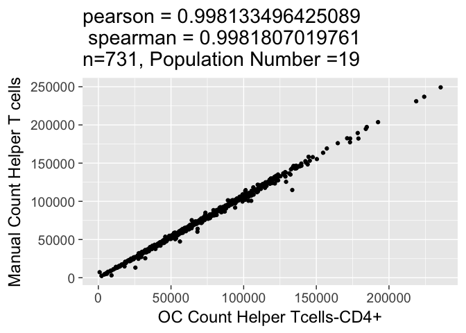<!-- -->

```
## 
## panel1 
##    770 
## [1] "HT"
## [1] "HT"
## [1] "All P1-P2 matched samples  without abnormal/bad/manual annotations"
## [1] "FREQ_PBMC_LYMPH"
```

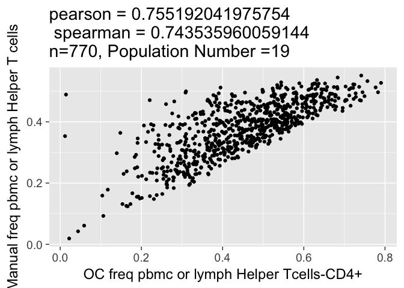<!-- -->

```
## 
## panel1 
##    770 
## [1] "Act.HT"
## [1] "Act.HT"
## [1] "All P1-P2 matched samples  without abnormal/bad/manual annotations"
## [1] "FREQ"
```

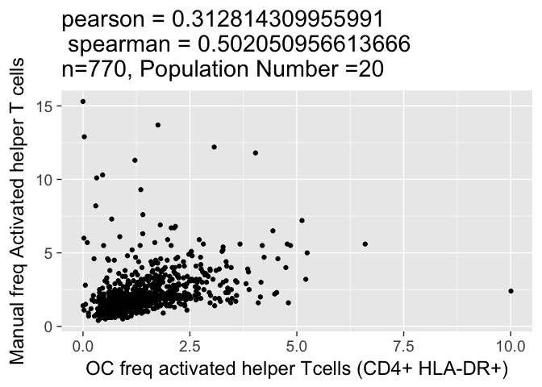<!-- -->

```
## 
## panel1 
##    770 
## [1] "Act.HT"
## [1] "Act.HT"
## [1] "All P1-P2 matched samples  without abnormal/bad/manual annotations"
## [1] "COUNT"
```

<!-- -->

```
## 
## panel1 
##    770 
## 
## panel1 
##    770 
## [1] "CM.HT"
## [1] "CM.HT"
## [1] "All P1-P2 matched samples  without abnormal/bad/manual annotations"
## [1] "FREQ"
```

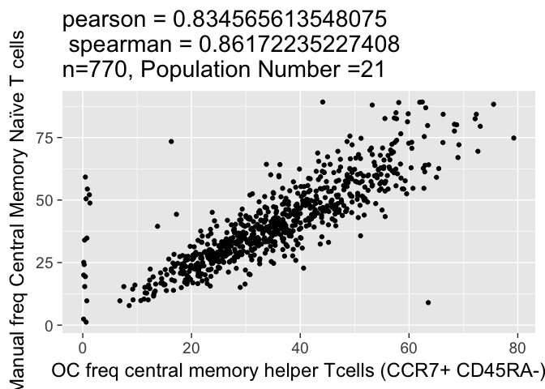<!-- -->

```
## 
## panel1 
##    770 
## [1] "CM.HT"
## [1] "CM.HT"
## [1] "All P1-P2 matched samples  without abnormal/bad/manual annotations"
## [1] "COUNT"
```

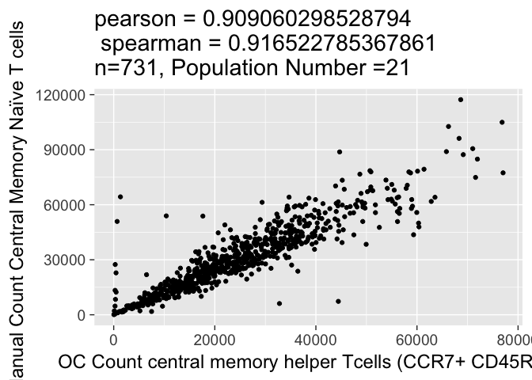<!-- -->

```
## 
## panel1 
##    770 
## 
## panel1 
##    770 
## [1] "E.HT"
## [1] "E.HT"
## [1] "All P1-P2 matched samples  without abnormal/bad/manual annotations"
## [1] "FREQ"
```

<!-- -->

```
## 
## panel1 
##    770 
## [1] "E.HT"
## [1] "E.HT"
## [1] "All P1-P2 matched samples  without abnormal/bad/manual annotations"
## [1] "COUNT"
```

<!-- -->

```
## 
## panel1 
##    770 
## 
## panel1 
##    770 
## [1] "EM.HT"
## [1] "EM.HT"
## [1] "All P1-P2 matched samples  without abnormal/bad/manual annotations"
## [1] "FREQ"
```

<!-- -->

```
## 
## panel1 
##    770 
## [1] "EM.HT"
## [1] "EM.HT"
## [1] "All P1-P2 matched samples  without abnormal/bad/manual annotations"
## [1] "COUNT"
```

<!-- -->

```
## 
## panel1 
##    770 
## 
## panel1 
##    770 
## [1] "N.HT"
## [1] "N.HT"
## [1] "All P1-P2 matched samples  without abnormal/bad/manual annotations"
## [1] "FREQ"
```

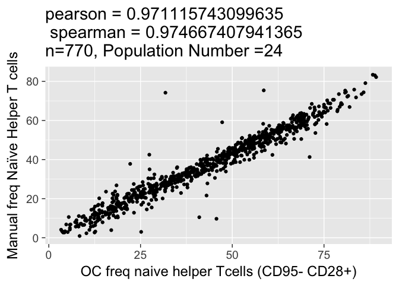<!-- -->

```
## 
## panel1 
##    770 
## [1] "N.HT"
## [1] "N.HT"
## [1] "All P1-P2 matched samples  without abnormal/bad/manual annotations"
## [1] "COUNT"
```

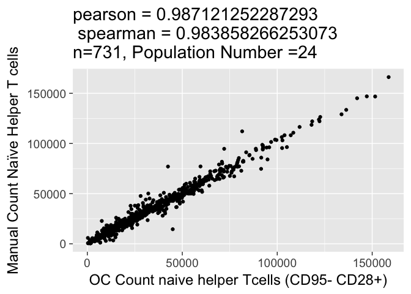<!-- -->

```
## 
## panel1 
##    770 
## 
## panel2 
##    770 
## [1] "DC.NK.MONO"
## [1] "DC.NK.MONO"
## [1] "All P1-P2 matched samples  without abnormal/bad/manual annotations"
## [1] "FREQ"
```

<!-- -->

```
## 
## panel2 
##    770 
## [1] "DC.NK.MONO"
## [1] "DC.NK.MONO"
## [1] "All P1-P2 matched samples  without abnormal/bad/manual annotations"
## [1] "COUNT"
```

<!-- -->

```
## 
## panel2 
##    770 
## [1] "DC.NK.MONO"
## [1] "DC.NK.MONO"
## [1] "All P1-P2 matched samples  without abnormal/bad/manual annotations"
## [1] "FREQ_PBMC_LYMPH"
```

<!-- -->

```
## 
## panel2 
##    770 
## [1] "DC.NK"
## [1] "DC.NK"
## [1] "All P1-P2 matched samples  without abnormal/bad/manual annotations"
## [1] "FREQ"
```

<!-- -->

```
## 
## panel2 
##    770 
## [1] "DC.NK"
## [1] "DC.NK"
## [1] "All P1-P2 matched samples  without abnormal/bad/manual annotations"
## [1] "COUNT"
```

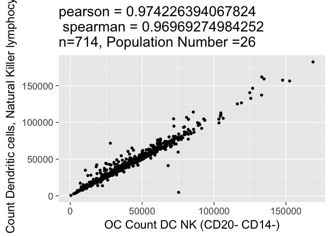<!-- -->

```
## 
## panel2 
##    770 
## [1] "DC.NK"
## [1] "DC.NK"
## [1] "All P1-P2 matched samples  without abnormal/bad/manual annotations"
## [1] "FREQ_PBMC_LYMPH"
```

<!-- -->

```
## 
## panel2 
##    770 
## [1] "DC"
## [1] "DC"
## [1] "All P1-P2 matched samples  without abnormal/bad/manual annotations"
## [1] "FREQ"
```

<!-- -->

```
## 
## panel2 
##    770 
## [1] "DC"
## [1] "DC"
## [1] "All P1-P2 matched samples  without abnormal/bad/manual annotations"
## [1] "COUNT"
```

<!-- -->

```
## 
## panel2 
##    770 
## [1] "DC"
## [1] "DC"
## [1] "All P1-P2 matched samples  without abnormal/bad/manual annotations"
## [1] "FREQ_PBMC_LYMPH"
```

<!-- -->

```
## 
## panel2 
##    770 
## [1] "DCm"
## [1] "DCm"
## [1] "All P1-P2 matched samples  without abnormal/bad/manual annotations"
## [1] "FREQ"
```

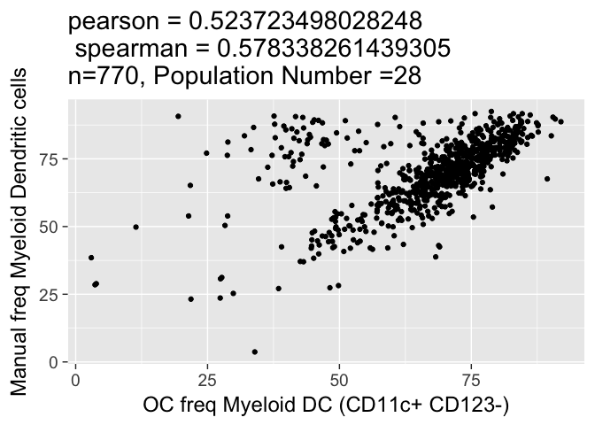<!-- -->

```
## 
## panel2 
##    770 
## [1] "DCm"
## [1] "DCm"
## [1] "All P1-P2 matched samples  without abnormal/bad/manual annotations"
## [1] "COUNT"
```

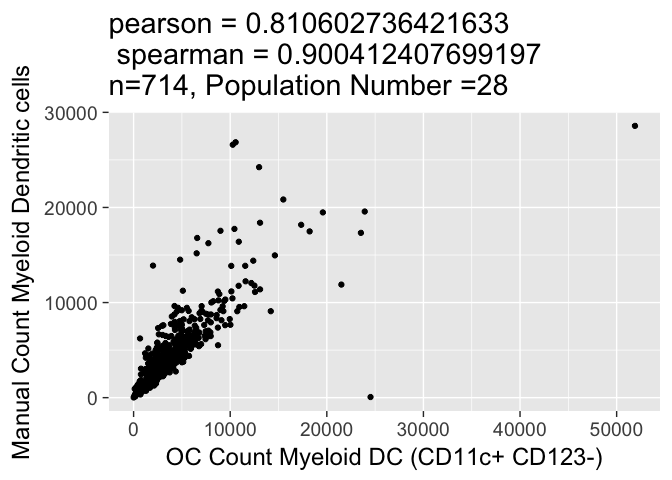<!-- -->

```
## 
## panel2 
##    770 
## [1] "DCm"
## [1] "DCm"
## [1] "All P1-P2 matched samples  without abnormal/bad/manual annotations"
## [1] "FREQ_PBMC_LYMPH"
```

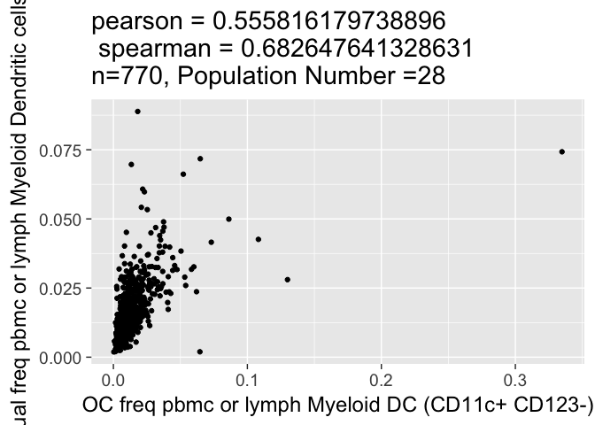<!-- -->

```
## 
## panel2 
##    770 
## [1] "DCp"
## [1] "DCp"
## [1] "All P1-P2 matched samples  without abnormal/bad/manual annotations"
## [1] "FREQ"
```

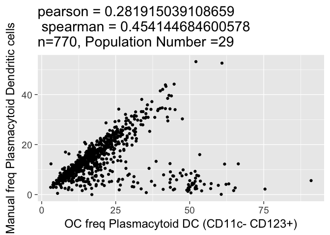<!-- -->

```
## 
## panel2 
##    770 
## [1] "DCp"
## [1] "DCp"
## [1] "All P1-P2 matched samples  without abnormal/bad/manual annotations"
## [1] "COUNT"
```

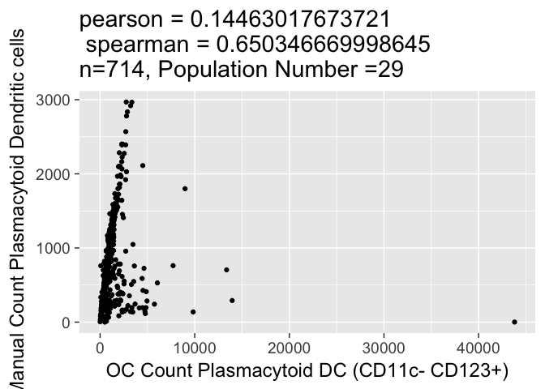<!-- -->

```
## 
## panel2 
##    770 
## [1] "DCp"
## [1] "DCp"
## [1] "All P1-P2 matched samples  without abnormal/bad/manual annotations"
## [1] "FREQ_PBMC_LYMPH"
```

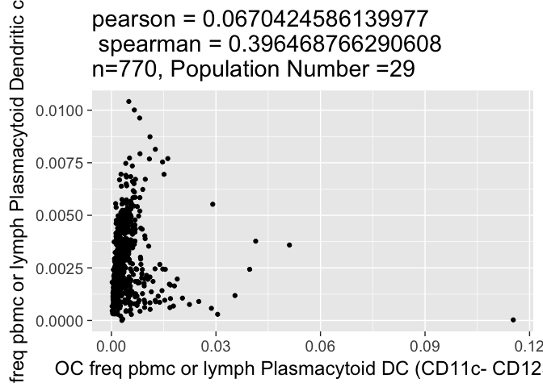<!-- -->

```
## 
## panel2 
##    770 
## [1] "NK"
## [1] "NK"
## [1] "All P1-P2 matched samples  without abnormal/bad/manual annotations"
## [1] "FREQ"
```

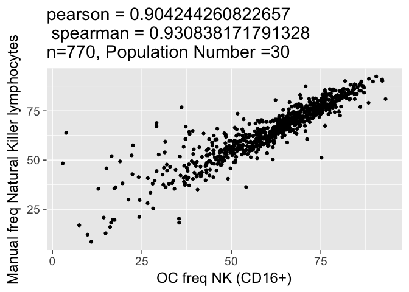<!-- -->

```
## 
## panel2 
##    770 
## [1] "NK"
## [1] "NK"
## [1] "All P1-P2 matched samples  without abnormal/bad/manual annotations"
## [1] "COUNT"
```

<!-- -->

```
## 
## panel2 
##    770 
## [1] "NK"
## [1] "NK"
## [1] "All P1-P2 matched samples  without abnormal/bad/manual annotations"
## [1] "FREQ_PBMC_LYMPH"
```

<!-- -->

```
## 
## panel2 
##    770 
## [1] "NKHI"
## [1] "NKHI"
## [1] "All P1-P2 matched samples  without abnormal/bad/manual annotations"
## [1] "FREQ"
```

<!-- -->

```
## 
## panel2 
##    770 
## [1] "NKHI"
## [1] "NKHI"
## [1] "All P1-P2 matched samples  without abnormal/bad/manual annotations"
## [1] "COUNT"
```

<!-- -->

```
## 
## panel2 
##    770 
## [1] "NKHI"
## [1] "NKHI"
## [1] "All P1-P2 matched samples  without abnormal/bad/manual annotations"
## [1] "FREQ_PBMC_LYMPH"
```

<!-- -->

```
## 
## panel2 
##    770 
## [1] "NKLO"
## [1] "NKLO"
## [1] "All P1-P2 matched samples  without abnormal/bad/manual annotations"
## [1] "FREQ"
```

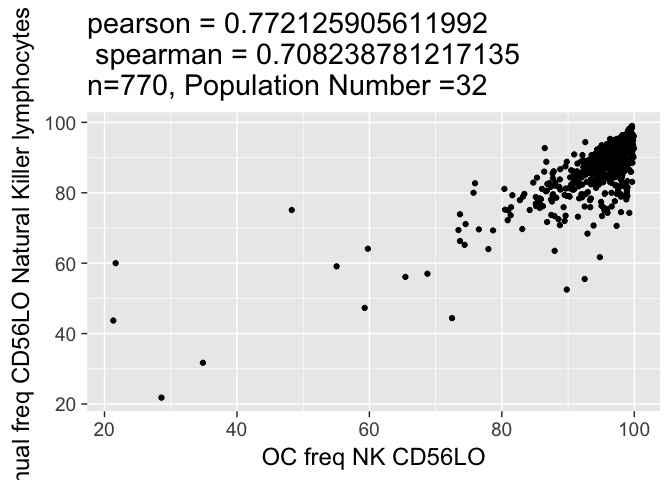<!-- -->

```
## 
## panel2 
##    770 
## [1] "NKLO"
## [1] "NKLO"
## [1] "All P1-P2 matched samples  without abnormal/bad/manual annotations"
## [1] "COUNT"
```

<!-- -->

```
## 
## panel2 
##    770 
## [1] "NKLO"
## [1] "NKLO"
## [1] "All P1-P2 matched samples  without abnormal/bad/manual annotations"
## [1] "FREQ_PBMC_LYMPH"
```

<!-- -->

```
## 
## panel2 
##    770 
## [1] "MONO"
## [1] "MONO"
## [1] "All P1-P2 matched samples  without abnormal/bad/manual annotations"
## [1] "FREQ"
```

<!-- -->

```
## 
## panel2 
##    770 
## [1] "MONO"
## [1] "MONO"
## [1] "All P1-P2 matched samples  without abnormal/bad/manual annotations"
## [1] "COUNT"
```

<!-- -->

```
## 
## panel2 
##    770 
## [1] "MONO"
## [1] "MONO"
## [1] "All P1-P2 matched samples  without abnormal/bad/manual annotations"
## [1] "FREQ_PBMC_LYMPH"
```

<!-- -->

```
## 
## panel2 
##    770 
## [1] "MONOc"
## [1] "MONOc"
## [1] "All P1-P2 matched samples  without abnormal/bad/manual annotations"
## [1] "FREQ"
```

<!-- -->

```
## 
## panel2 
##    770 
## [1] "MONOc"
## [1] "MONOc"
## [1] "All P1-P2 matched samples  without abnormal/bad/manual annotations"
## [1] "COUNT"
```

<!-- -->

```
## 
## panel2 
##    770 
## [1] "MONOc"
## [1] "MONOc"
## [1] "All P1-P2 matched samples  without abnormal/bad/manual annotations"
## [1] "FREQ_PBMC_LYMPH"
```

<!-- -->

```
## 
## panel2 
##    770 
## [1] "MONOnc"
## [1] "MONOnc"
## [1] "All P1-P2 matched samples  without abnormal/bad/manual annotations"
## [1] "FREQ"
```

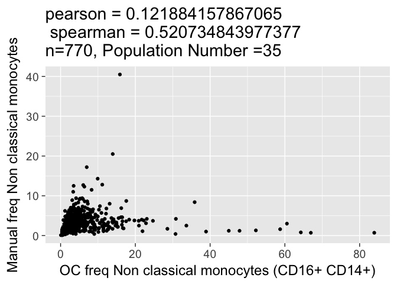<!-- -->

```
## 
## panel2 
##    770 
## [1] "MONOnc"
## [1] "MONOnc"
## [1] "All P1-P2 matched samples  without abnormal/bad/manual annotations"
## [1] "COUNT"
```

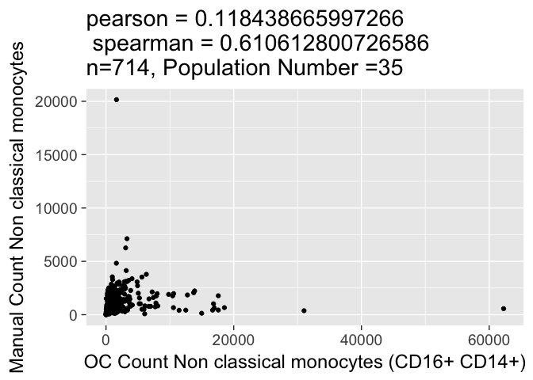<!-- -->

```
## 
## panel2 
##    770 
## [1] "MONOnc"
## [1] "MONOnc"
## [1] "All P1-P2 matched samples  without abnormal/bad/manual annotations"
## [1] "FREQ_PBMC_LYMPH"
```

<!-- -->

```
## 
## panel1 
##   9342 
## [1] "Bcell"
## [1] "Bcell"
## [1] "Samples with less than 10K lymph or 10K PBMC (in OC) are excluded"
## [1] "FREQ"
```

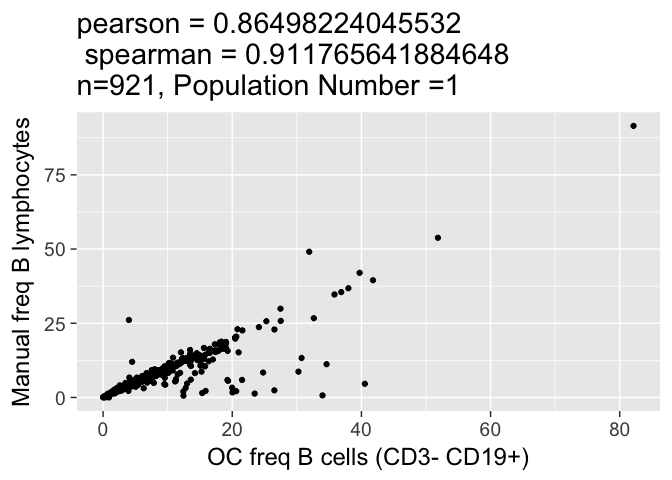<!-- -->

```
## 
## panel1 
##   9342 
## [1] "Bcell"
## [1] "Bcell"
## [1] "Samples with less than 10K lymph or 10K PBMC (in OC) are excluded"
## [1] "COUNT"
```

<!-- -->

```
## 
## panel1 
##   9342 
## [1] "Bcell"
## [1] "Bcell"
## [1] "Samples with less than 10K lymph or 10K PBMC (in OC) are excluded"
## [1] "FREQ_PBMC_LYMPH"
```

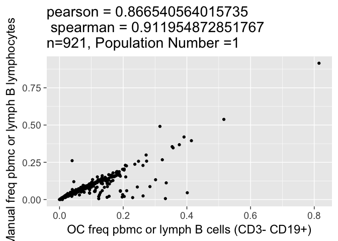<!-- -->

```
## 
## panel1 
##   9342 
## [1] "IgD.MemB"
## [1] "IgD.MemB"
## [1] "Samples with less than 10K lymph or 10K PBMC (in OC) are excluded"
## [1] "FREQ"
```

<!-- -->

```
## 
## panel1 
##   9342 
## [1] "IgD.MemB"
## [1] "IgD.MemB"
## [1] "Samples with less than 10K lymph or 10K PBMC (in OC) are excluded"
## [1] "COUNT"
```

<!-- -->

```
## 
## panel1 
##   9342 
## [1] "IgD.MemB"
## [1] "IgD.MemB"
## [1] "Samples with less than 10K lymph or 10K PBMC (in OC) are excluded"
## [1] "FREQ_PBMC_LYMPH"
```

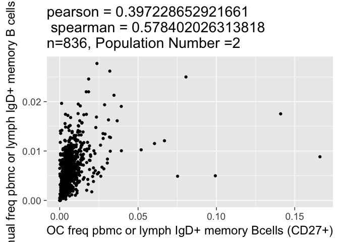<!-- -->

```
## 
## panel1 
##   9342 
## [1] "IgD.MemB.1"
## [1] "IgD.MemB.1"
## [1] "Samples with less than 10K lymph or 10K PBMC (in OC) are excluded"
## [1] "FREQ"
```

<!-- -->

```
## 
## panel1 
##   9342 
## [1] "IgD.MemB.1"
## [1] "IgD.MemB.1"
## [1] "Samples with less than 10K lymph or 10K PBMC (in OC) are excluded"
## [1] "COUNT"
```

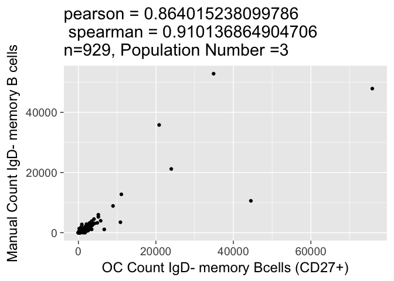<!-- -->

```
## 
## panel1 
##   9342 
## [1] "IgD.MemB.1"
## [1] "IgD.MemB.1"
## [1] "Samples with less than 10K lymph or 10K PBMC (in OC) are excluded"
## [1] "FREQ_PBMC_LYMPH"
```

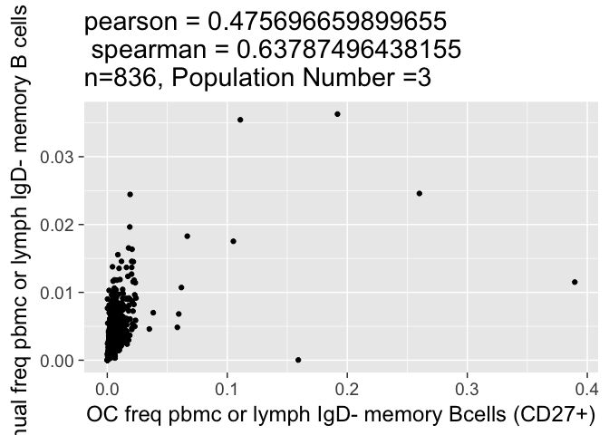<!-- -->

```
## 
## panel1 
##   9342 
## [1] "NaiveB"
## [1] "NaiveB"
## [1] "Samples with less than 10K lymph or 10K PBMC (in OC) are excluded"
## [1] "FREQ"
```

<!-- -->

```
## 
## panel1 
##   9342 
## [1] "NaiveB"
## [1] "NaiveB"
## [1] "Samples with less than 10K lymph or 10K PBMC (in OC) are excluded"
## [1] "COUNT"
```

<!-- -->

```
## 
## panel1 
##   9342 
## [1] "NaiveB"
## [1] "NaiveB"
## [1] "Samples with less than 10K lymph or 10K PBMC (in OC) are excluded"
## [1] "FREQ_PBMC_LYMPH"
```

<!-- -->

```
## 
## panel1 
##   9342 
## [1] "Tcell"
## [1] "Tcell"
## [1] "Samples with less than 10K lymph or 10K PBMC (in OC) are excluded"
## [1] "FREQ"
```

<!-- -->

```
## 
## panel1 
##   9342 
## [1] "Tcell"
## [1] "Tcell"
## [1] "Samples with less than 10K lymph or 10K PBMC (in OC) are excluded"
## [1] "COUNT"
```

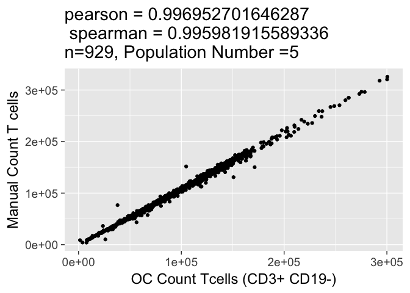<!-- -->

```
## 
## panel1 
##   9342 
## [1] "Tcell"
## [1] "Tcell"
## [1] "Samples with less than 10K lymph or 10K PBMC (in OC) are excluded"
## [1] "FREQ_PBMC_LYMPH"
```

<!-- -->

```
## 
## panel1 
##   9342 
## [1] "CT"
## [1] "CT"
## [1] "Samples with less than 10K lymph or 10K PBMC (in OC) are excluded"
## [1] "FREQ"
```

<!-- -->

```
## 
## panel1 
##   9342 
## [1] "CT"
## [1] "CT"
## [1] "Samples with less than 10K lymph or 10K PBMC (in OC) are excluded"
## [1] "COUNT"
```

<!-- -->

```
## 
## panel1 
##   9342 
## [1] "CT"
## [1] "CT"
## [1] "Samples with less than 10K lymph or 10K PBMC (in OC) are excluded"
## [1] "FREQ_PBMC_LYMPH"
```

<!-- -->

```
## 
## panel1 
##   9342 
## [1] "ActCT"
## [1] "ActCT"
## [1] "Samples with less than 10K lymph or 10K PBMC (in OC) are excluded"
## [1] "FREQ"
```

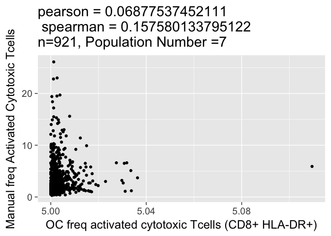<!-- -->

```
## 
## panel1 
##   9342 
## [1] "ActCT"
## [1] "ActCT"
## [1] "Samples with less than 10K lymph or 10K PBMC (in OC) are excluded"
## [1] "COUNT"
```

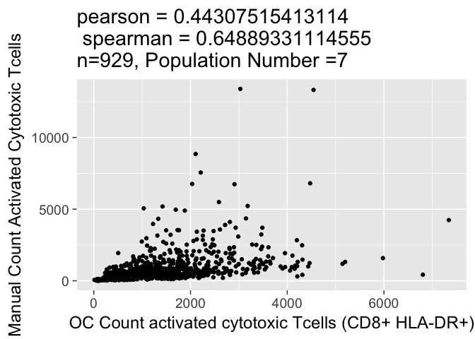<!-- -->

```
## 
## panel1 
##   9342 
## 
## panel1 
##   9342 
## [1] "CM.CT"
## [1] "CM.CT"
## [1] "Samples with less than 10K lymph or 10K PBMC (in OC) are excluded"
## [1] "FREQ"
```

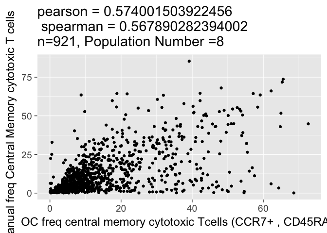<!-- -->

```
## 
## panel1 
##   9342 
## [1] "CM.CT"
## 
## panel1 
##   9342 
## [1] "E.CT"
## [1] "E.CT"
## [1] "Samples with less than 10K lymph or 10K PBMC (in OC) are excluded"
## [1] "FREQ"
```

<!-- -->

```
## 
## panel1 
##   9342 
## [1] "E.CT"
## [1] "E.CT"
## [1] "Samples with less than 10K lymph or 10K PBMC (in OC) are excluded"
## [1] "COUNT"
```

<!-- -->

```
## 
## panel1 
##   9342 
## 
## panel1 
##   9342 
## [1] "pE.CT"
## [1] "pE.CT"
## [1] "Samples with less than 10K lymph or 10K PBMC (in OC) are excluded"
## [1] "FREQ"
```

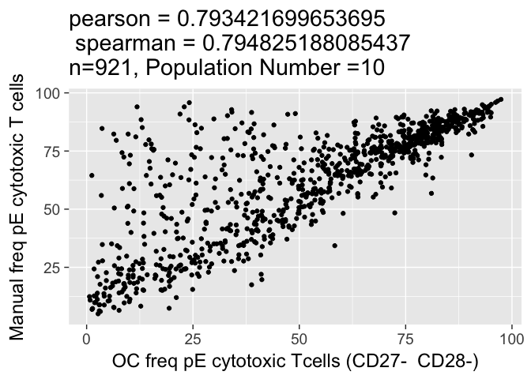<!-- -->

```
## 
## panel1 
##   9342 
## [1] "pE.CT"
## [1] "pE.CT"
## [1] "Samples with less than 10K lymph or 10K PBMC (in OC) are excluded"
## [1] "COUNT"
```

<!-- -->

```
## 
## panel1 
##   9342 
## 
## panel1 
##   9342 
## [1] "pE1.CT"
## [1] "pE1.CT"
## [1] "Samples with less than 10K lymph or 10K PBMC (in OC) are excluded"
## [1] "FREQ"
```

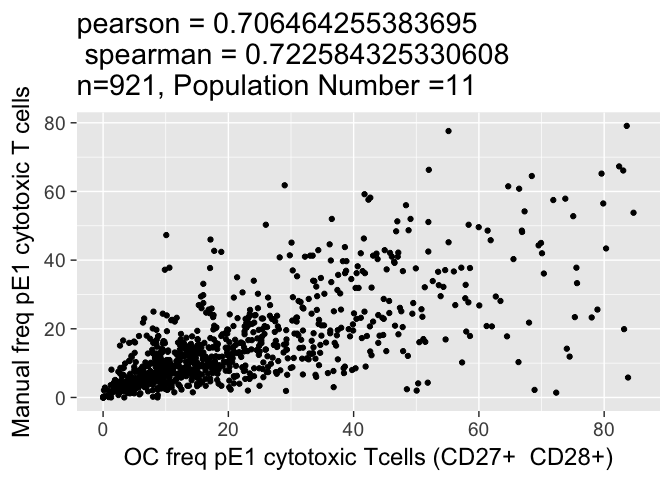<!-- -->

```
## 
## panel1 
##   9342 
## [1] "pE1.CT"
## [1] "pE1.CT"
## [1] "Samples with less than 10K lymph or 10K PBMC (in OC) are excluded"
## [1] "COUNT"
```

<!-- -->

```
## 
## panel1 
##   9342 
## 
## panel1 
##   9342 
## [1] "pE2.CT"
## [1] "pE2.CT"
## [1] "Samples with less than 10K lymph or 10K PBMC (in OC) are excluded"
## [1] "FREQ"
```

<!-- -->

```
## 
## panel1 
##   9342 
## [1] "pE2.CT"
## 
## panel1 
##   9342 
## [1] "EM.CT"
## [1] "EM.CT"
## [1] "Samples with less than 10K lymph or 10K PBMC (in OC) are excluded"
## [1] "FREQ"
```

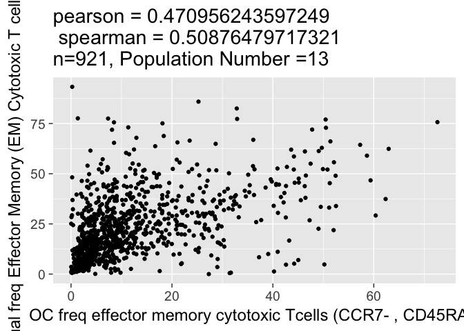<!-- -->

```
## 
## panel1 
##   9342 
## [1] "EM.CT"
## 
## panel1 
##   9342 
## [1] "EM1.C.T"
## [1] "EM1.C.T"
## [1] "Samples with less than 10K lymph or 10K PBMC (in OC) are excluded"
## [1] "FREQ"
```

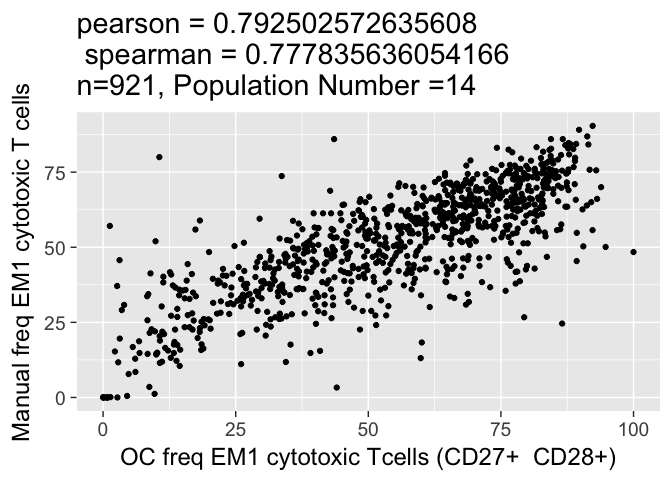<!-- -->

```
## 
## panel1 
##   9342 
## [1] "EM1.C.T"
## [1] "EM1.C.T"
## [1] "Samples with less than 10K lymph or 10K PBMC (in OC) are excluded"
## [1] "COUNT"
```

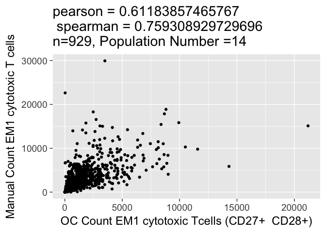<!-- -->

```
## 
## panel1 
##   9342 
## 
## panel1 
##   9342 
## [1] "EM2.CT"
## [1] "EM2.CT"
## [1] "Samples with less than 10K lymph or 10K PBMC (in OC) are excluded"
## [1] "FREQ"
```

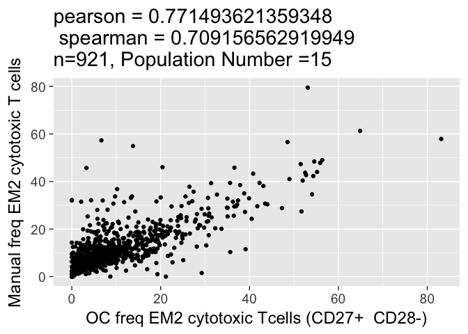<!-- -->

```
## 
## panel1 
##   9342 
## [1] "EM2.CT"
## [1] "EM2.CT"
## [1] "Samples with less than 10K lymph or 10K PBMC (in OC) are excluded"
## [1] "COUNT"
```

<!-- -->

```
## 
## panel1 
##   9342 
## 
## panel1 
##   9342 
## [1] "EM3.CT"
## [1] "EM3.CT"
## [1] "Samples with less than 10K lymph or 10K PBMC (in OC) are excluded"
## [1] "FREQ"
```

<!-- -->

```
## 
## panel1 
##   9342 
## [1] "EM3.CT"
## [1] "EM3.CT"
## [1] "Samples with less than 10K lymph or 10K PBMC (in OC) are excluded"
## [1] "COUNT"
```

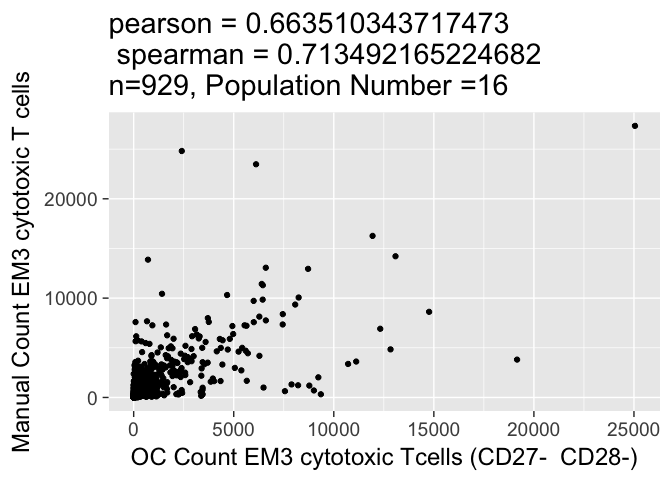<!-- -->

```
## 
## panel1 
##   9342 
## 
## panel1 
##   9342 
## [1] "EM4.CT"
## [1] "EM4.CT"
## [1] "Samples with less than 10K lymph or 10K PBMC (in OC) are excluded"
## [1] "FREQ"
```

<!-- -->

```
## 
## panel1 
##   9342 
## [1] "EM4.CT"
## [1] "EM4.CT"
## [1] "Samples with less than 10K lymph or 10K PBMC (in OC) are excluded"
## [1] "COUNT"
```

<!-- -->

```
## 
## panel1 
##   9342 
## 
## panel1 
##   9342 
## [1] "N.CT"
## [1] "N.CT"
## [1] "Samples with less than 10K lymph or 10K PBMC (in OC) are excluded"
## [1] "FREQ"
```

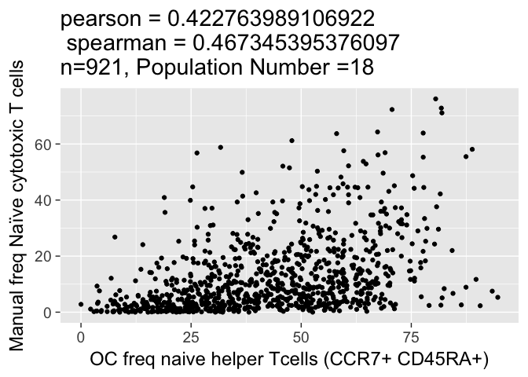<!-- -->

```
## 
## panel1 
##   9342 
## [1] "N.CT"
## [1] "N.CT"
## [1] "Samples with less than 10K lymph or 10K PBMC (in OC) are excluded"
## [1] "COUNT"
```

<!-- -->

```
## 
## panel1 
##   9342 
## 
## panel1 
##   9342 
## [1] "HT"
## [1] "HT"
## [1] "Samples with less than 10K lymph or 10K PBMC (in OC) are excluded"
## [1] "FREQ"
```

<!-- -->

```
## 
## panel1 
##   9342 
## [1] "HT"
## [1] "HT"
## [1] "Samples with less than 10K lymph or 10K PBMC (in OC) are excluded"
## [1] "COUNT"
```

<!-- -->

```
## 
## panel1 
##   9342 
## [1] "HT"
## [1] "HT"
## [1] "Samples with less than 10K lymph or 10K PBMC (in OC) are excluded"
## [1] "FREQ_PBMC_LYMPH"
```

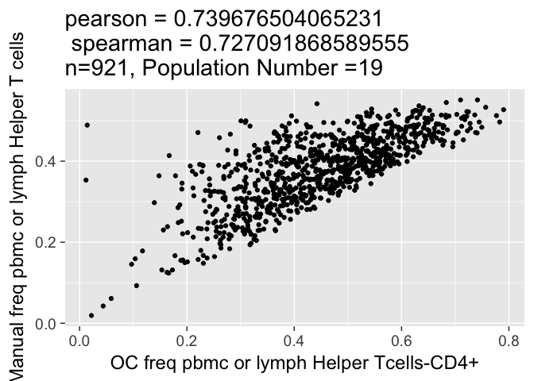<!-- -->

```
## 
## panel1 
##   9342 
## [1] "Act.HT"
## [1] "Act.HT"
## [1] "Samples with less than 10K lymph or 10K PBMC (in OC) are excluded"
## [1] "FREQ"
```

<!-- -->

```
## 
## panel1 
##   9342 
## [1] "Act.HT"
## [1] "Act.HT"
## [1] "Samples with less than 10K lymph or 10K PBMC (in OC) are excluded"
## [1] "COUNT"
```

<!-- -->

```
## 
## panel1 
##   9342 
## 
## panel1 
##   9342 
## [1] "CM.HT"
## [1] "CM.HT"
## [1] "Samples with less than 10K lymph or 10K PBMC (in OC) are excluded"
## [1] "FREQ"
```

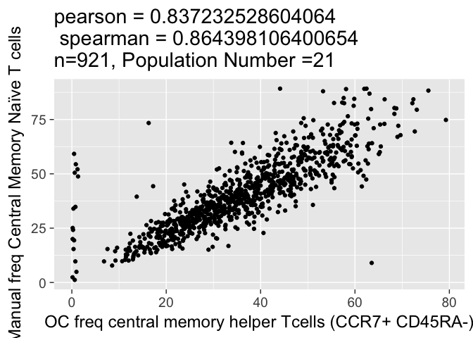<!-- -->

```
## 
## panel1 
##   9342 
## [1] "CM.HT"
## [1] "CM.HT"
## [1] "Samples with less than 10K lymph or 10K PBMC (in OC) are excluded"
## [1] "COUNT"
```

<!-- -->

```
## 
## panel1 
##   9342 
## 
## panel1 
##   9342 
## [1] "E.HT"
## [1] "E.HT"
## [1] "Samples with less than 10K lymph or 10K PBMC (in OC) are excluded"
## [1] "FREQ"
```

<!-- -->

```
## 
## panel1 
##   9342 
## [1] "E.HT"
## [1] "E.HT"
## [1] "Samples with less than 10K lymph or 10K PBMC (in OC) are excluded"
## [1] "COUNT"
```

<!-- -->

```
## 
## panel1 
##   9342 
## 
## panel1 
##   9342 
## [1] "EM.HT"
## [1] "EM.HT"
## [1] "Samples with less than 10K lymph or 10K PBMC (in OC) are excluded"
## [1] "FREQ"
```

<!-- -->

```
## 
## panel1 
##   9342 
## [1] "EM.HT"
## [1] "EM.HT"
## [1] "Samples with less than 10K lymph or 10K PBMC (in OC) are excluded"
## [1] "COUNT"
```

<!-- -->

```
## 
## panel1 
##   9342 
## 
## panel1 
##   9342 
## [1] "N.HT"
## [1] "N.HT"
## [1] "Samples with less than 10K lymph or 10K PBMC (in OC) are excluded"
## [1] "FREQ"
```

<!-- -->

```
## 
## panel1 
##   9342 
## [1] "N.HT"
## [1] "N.HT"
## [1] "Samples with less than 10K lymph or 10K PBMC (in OC) are excluded"
## [1] "COUNT"
```

<!-- -->

```
## 
## panel1 
##   9342 
## 
## panel2 
##   9331 
## [1] "DC.NK.MONO"
## [1] "DC.NK.MONO"
## [1] "Samples with less than 10K lymph or 10K PBMC (in OC) are excluded"
## [1] "FREQ"
```

<!-- -->

```
## 
## panel2 
##   9331 
## [1] "DC.NK.MONO"
## [1] "DC.NK.MONO"
## [1] "Samples with less than 10K lymph or 10K PBMC (in OC) are excluded"
## [1] "COUNT"
```

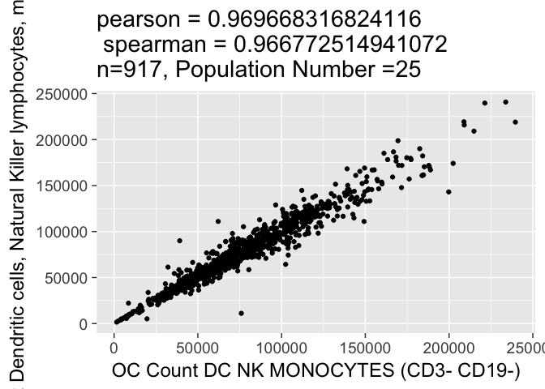<!-- -->

```
## 
## panel2 
##   9331 
## [1] "DC.NK.MONO"
## [1] "DC.NK.MONO"
## [1] "Samples with less than 10K lymph or 10K PBMC (in OC) are excluded"
## [1] "FREQ_PBMC_LYMPH"
```

<!-- -->

```
## 
## panel2 
##   9331 
## [1] "DC.NK"
## [1] "DC.NK"
## [1] "Samples with less than 10K lymph or 10K PBMC (in OC) are excluded"
## [1] "FREQ"
```

<!-- -->

```
## 
## panel2 
##   9331 
## [1] "DC.NK"
## [1] "DC.NK"
## [1] "Samples with less than 10K lymph or 10K PBMC (in OC) are excluded"
## [1] "COUNT"
```

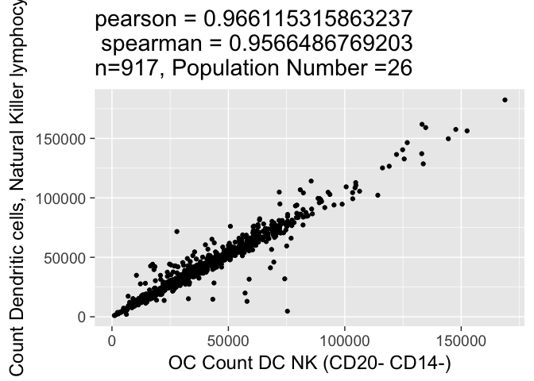<!-- -->

```
## 
## panel2 
##   9331 
## [1] "DC.NK"
## [1] "DC.NK"
## [1] "Samples with less than 10K lymph or 10K PBMC (in OC) are excluded"
## [1] "FREQ_PBMC_LYMPH"
```

<!-- -->

```
## 
## panel2 
##   9331 
## [1] "DC"
## [1] "DC"
## [1] "Samples with less than 10K lymph or 10K PBMC (in OC) are excluded"
## [1] "FREQ"
```

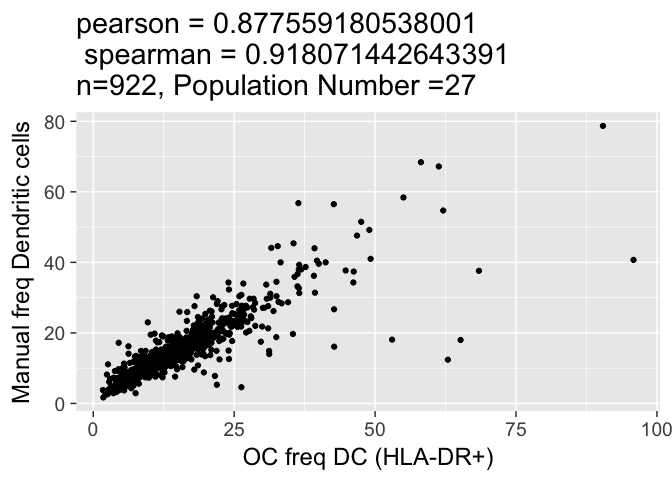<!-- -->

```
## 
## panel2 
##   9331 
## [1] "DC"
## [1] "DC"
## [1] "Samples with less than 10K lymph or 10K PBMC (in OC) are excluded"
## [1] "COUNT"
```

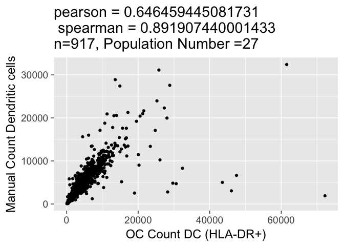<!-- -->

```
## 
## panel2 
##   9331 
## [1] "DC"
## [1] "DC"
## [1] "Samples with less than 10K lymph or 10K PBMC (in OC) are excluded"
## [1] "FREQ_PBMC_LYMPH"
```

<!-- -->

```
## 
## panel2 
##   9331 
## [1] "DCm"
## [1] "DCm"
## [1] "Samples with less than 10K lymph or 10K PBMC (in OC) are excluded"
## [1] "FREQ"
```

<!-- -->

```
## 
## panel2 
##   9331 
## [1] "DCm"
## [1] "DCm"
## [1] "Samples with less than 10K lymph or 10K PBMC (in OC) are excluded"
## [1] "COUNT"
```

<!-- -->

```
## 
## panel2 
##   9331 
## [1] "DCm"
## [1] "DCm"
## [1] "Samples with less than 10K lymph or 10K PBMC (in OC) are excluded"
## [1] "FREQ_PBMC_LYMPH"
```

<!-- -->

```
## 
## panel2 
##   9331 
## [1] "DCp"
## [1] "DCp"
## [1] "Samples with less than 10K lymph or 10K PBMC (in OC) are excluded"
## [1] "FREQ"
```

<!-- -->

```
## 
## panel2 
##   9331 
## [1] "DCp"
## [1] "DCp"
## [1] "Samples with less than 10K lymph or 10K PBMC (in OC) are excluded"
## [1] "COUNT"
```

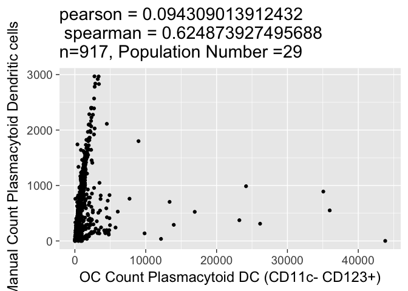<!-- -->

```
## 
## panel2 
##   9331 
## [1] "DCp"
## [1] "DCp"
## [1] "Samples with less than 10K lymph or 10K PBMC (in OC) are excluded"
## [1] "FREQ_PBMC_LYMPH"
```

<!-- -->

```
## 
## panel2 
##   9331 
## [1] "NK"
## [1] "NK"
## [1] "Samples with less than 10K lymph or 10K PBMC (in OC) are excluded"
## [1] "FREQ"
```

<!-- -->

```
## 
## panel2 
##   9331 
## [1] "NK"
## [1] "NK"
## [1] "Samples with less than 10K lymph or 10K PBMC (in OC) are excluded"
## [1] "COUNT"
```

<!-- -->

```
## 
## panel2 
##   9331 
## [1] "NK"
## [1] "NK"
## [1] "Samples with less than 10K lymph or 10K PBMC (in OC) are excluded"
## [1] "FREQ_PBMC_LYMPH"
```

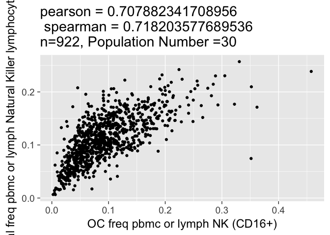<!-- -->

```
## 
## panel2 
##   9331 
## [1] "NKHI"
## [1] "NKHI"
## [1] "Samples with less than 10K lymph or 10K PBMC (in OC) are excluded"
## [1] "FREQ"
```

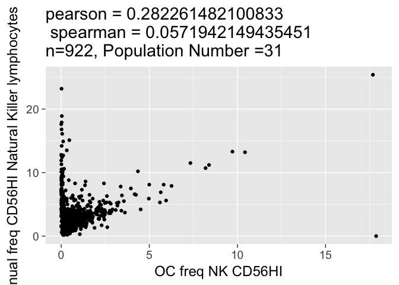<!-- -->

```
## 
## panel2 
##   9331 
## [1] "NKHI"
## [1] "NKHI"
## [1] "Samples with less than 10K lymph or 10K PBMC (in OC) are excluded"
## [1] "COUNT"
```

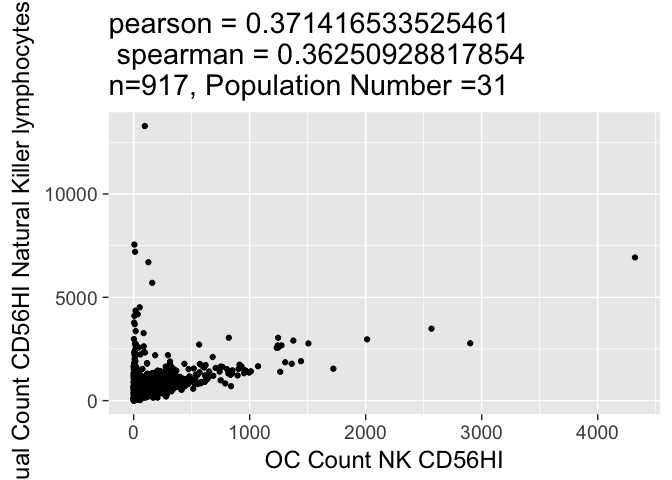<!-- -->

```
## 
## panel2 
##   9331 
## [1] "NKHI"
## [1] "NKHI"
## [1] "Samples with less than 10K lymph or 10K PBMC (in OC) are excluded"
## [1] "FREQ_PBMC_LYMPH"
```

<!-- -->

```
## 
## panel2 
##   9331 
## [1] "NKLO"
## [1] "NKLO"
## [1] "Samples with less than 10K lymph or 10K PBMC (in OC) are excluded"
## [1] "FREQ"
```

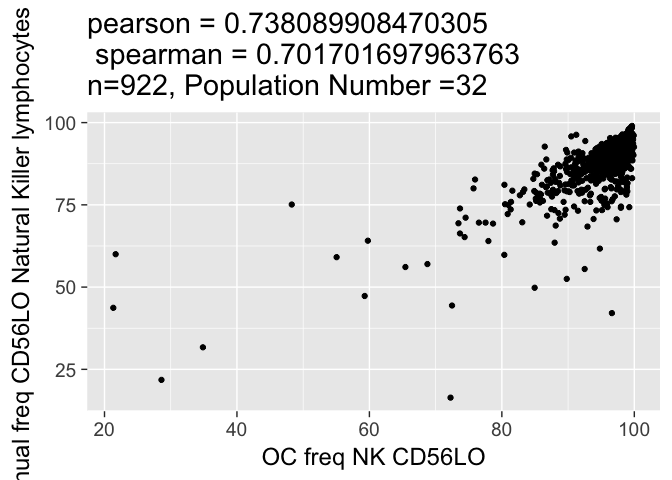<!-- -->

```
## 
## panel2 
##   9331 
## [1] "NKLO"
## [1] "NKLO"
## [1] "Samples with less than 10K lymph or 10K PBMC (in OC) are excluded"
## [1] "COUNT"
```

<!-- -->

```
## 
## panel2 
##   9331 
## [1] "NKLO"
## [1] "NKLO"
## [1] "Samples with less than 10K lymph or 10K PBMC (in OC) are excluded"
## [1] "FREQ_PBMC_LYMPH"
```

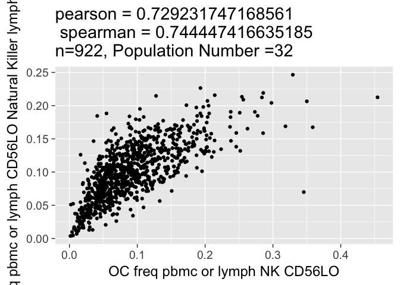<!-- -->

```
## 
## panel2 
##   9331 
## [1] "MONO"
## [1] "MONO"
## [1] "Samples with less than 10K lymph or 10K PBMC (in OC) are excluded"
## [1] "FREQ"
```

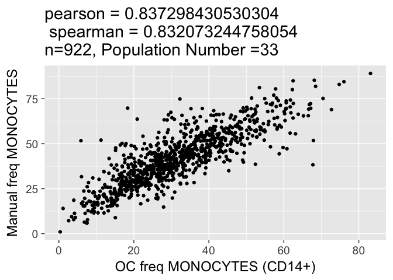<!-- -->

```
## 
## panel2 
##   9331 
## [1] "MONO"
## [1] "MONO"
## [1] "Samples with less than 10K lymph or 10K PBMC (in OC) are excluded"
## [1] "COUNT"
```

<!-- -->

```
## 
## panel2 
##   9331 
## [1] "MONO"
## [1] "MONO"
## [1] "Samples with less than 10K lymph or 10K PBMC (in OC) are excluded"
## [1] "FREQ_PBMC_LYMPH"
```

<!-- -->

```
## 
## panel2 
##   9331 
## [1] "MONOc"
## [1] "MONOc"
## [1] "Samples with less than 10K lymph or 10K PBMC (in OC) are excluded"
## [1] "FREQ"
```

<!-- -->

```
## 
## panel2 
##   9331 
## [1] "MONOc"
## [1] "MONOc"
## [1] "Samples with less than 10K lymph or 10K PBMC (in OC) are excluded"
## [1] "COUNT"
```

<!-- -->

```
## 
## panel2 
##   9331 
## [1] "MONOc"
## [1] "MONOc"
## [1] "Samples with less than 10K lymph or 10K PBMC (in OC) are excluded"
## [1] "FREQ_PBMC_LYMPH"
```

<!-- -->

```
## 
## panel2 
##   9331 
## [1] "MONOnc"
## [1] "MONOnc"
## [1] "Samples with less than 10K lymph or 10K PBMC (in OC) are excluded"
## [1] "FREQ"
```

<!-- -->

```
## 
## panel2 
##   9331 
## [1] "MONOnc"
## [1] "MONOnc"
## [1] "Samples with less than 10K lymph or 10K PBMC (in OC) are excluded"
## [1] "COUNT"
```

<!-- -->

```
## 
## panel2 
##   9331 
## [1] "MONOnc"
## [1] "MONOnc"
## [1] "Samples with less than 10K lymph or 10K PBMC (in OC) are excluded"
## [1] "FREQ_PBMC_LYMPH"
```

<!-- -->

```
## 
## panel1 
##   9269 
## [1] "Bcell"
## [1] "Bcell"
## [1] "Samples with less than 20K lymph or 20K PBMC (in OC) are excluded"
## [1] "FREQ"
```

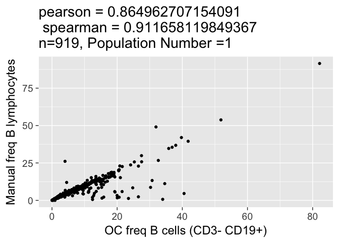<!-- -->

```
## 
## panel1 
##   9269 
## [1] "Bcell"
## [1] "Bcell"
## [1] "Samples with less than 20K lymph or 20K PBMC (in OC) are excluded"
## [1] "COUNT"
```

<!-- -->

```
## 
## panel1 
##   9269 
## [1] "Bcell"
## [1] "Bcell"
## [1] "Samples with less than 20K lymph or 20K PBMC (in OC) are excluded"
## [1] "FREQ_PBMC_LYMPH"
```

<!-- -->

```
## 
## panel1 
##   9269 
## [1] "IgD.MemB"
## [1] "IgD.MemB"
## [1] "Samples with less than 20K lymph or 20K PBMC (in OC) are excluded"
## [1] "FREQ"
```

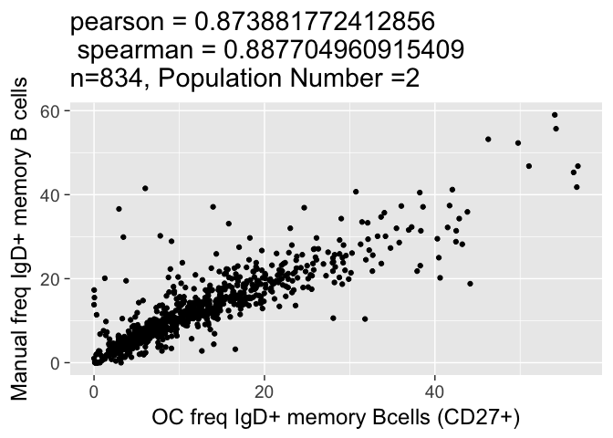<!-- -->

```
## 
## panel1 
##   9269 
## [1] "IgD.MemB"
## [1] "IgD.MemB"
## [1] "Samples with less than 20K lymph or 20K PBMC (in OC) are excluded"
## [1] "COUNT"
```

<!-- -->

```
## 
## panel1 
##   9269 
## [1] "IgD.MemB"
## [1] "IgD.MemB"
## [1] "Samples with less than 20K lymph or 20K PBMC (in OC) are excluded"
## [1] "FREQ_PBMC_LYMPH"
```

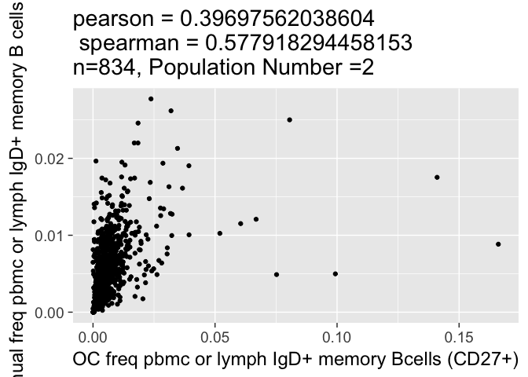<!-- -->

```
## 
## panel1 
##   9269 
## [1] "IgD.MemB.1"
## [1] "IgD.MemB.1"
## [1] "Samples with less than 20K lymph or 20K PBMC (in OC) are excluded"
## [1] "FREQ"
```

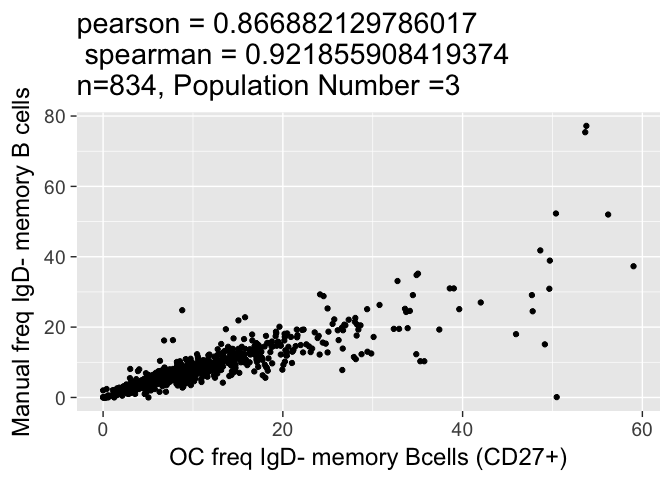<!-- -->

```
## 
## panel1 
##   9269 
## [1] "IgD.MemB.1"
## [1] "IgD.MemB.1"
## [1] "Samples with less than 20K lymph or 20K PBMC (in OC) are excluded"
## [1] "COUNT"
```

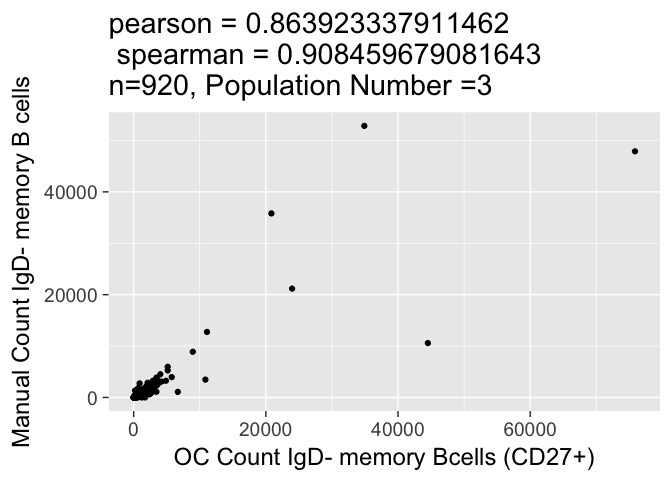<!-- -->

```
## 
## panel1 
##   9269 
## [1] "IgD.MemB.1"
## [1] "IgD.MemB.1"
## [1] "Samples with less than 20K lymph or 20K PBMC (in OC) are excluded"
## [1] "FREQ_PBMC_LYMPH"
```

<!-- -->

```
## 
## panel1 
##   9269 
## [1] "NaiveB"
## [1] "NaiveB"
## [1] "Samples with less than 20K lymph or 20K PBMC (in OC) are excluded"
## [1] "FREQ"
```

<!-- -->

```
## 
## panel1 
##   9269 
## [1] "NaiveB"
## [1] "NaiveB"
## [1] "Samples with less than 20K lymph or 20K PBMC (in OC) are excluded"
## [1] "COUNT"
```

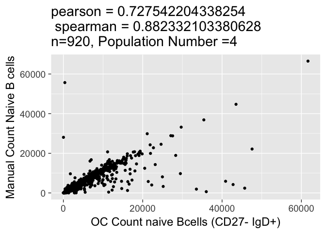<!-- -->

```
## 
## panel1 
##   9269 
## [1] "NaiveB"
## [1] "NaiveB"
## [1] "Samples with less than 20K lymph or 20K PBMC (in OC) are excluded"
## [1] "FREQ_PBMC_LYMPH"
```

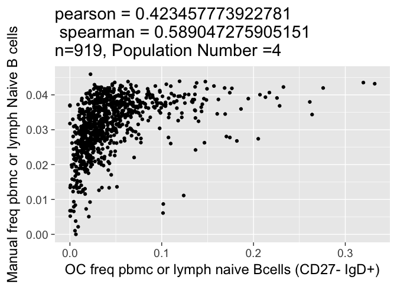<!-- -->

```
## 
## panel1 
##   9269 
## [1] "Tcell"
## [1] "Tcell"
## [1] "Samples with less than 20K lymph or 20K PBMC (in OC) are excluded"
## [1] "FREQ"
```

<!-- -->

```
## 
## panel1 
##   9269 
## [1] "Tcell"
## [1] "Tcell"
## [1] "Samples with less than 20K lymph or 20K PBMC (in OC) are excluded"
## [1] "COUNT"
```

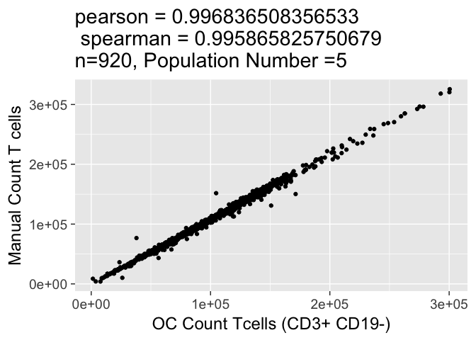<!-- -->

```
## 
## panel1 
##   9269 
## [1] "Tcell"
## [1] "Tcell"
## [1] "Samples with less than 20K lymph or 20K PBMC (in OC) are excluded"
## [1] "FREQ_PBMC_LYMPH"
```

<!-- -->

```
## 
## panel1 
##   9269 
## [1] "CT"
## [1] "CT"
## [1] "Samples with less than 20K lymph or 20K PBMC (in OC) are excluded"
## [1] "FREQ"
```

<!-- -->

```
## 
## panel1 
##   9269 
## [1] "CT"
## [1] "CT"
## [1] "Samples with less than 20K lymph or 20K PBMC (in OC) are excluded"
## [1] "COUNT"
```

<!-- -->

```
## 
## panel1 
##   9269 
## [1] "CT"
## [1] "CT"
## [1] "Samples with less than 20K lymph or 20K PBMC (in OC) are excluded"
## [1] "FREQ_PBMC_LYMPH"
```

<!-- -->

```
## 
## panel1 
##   9269 
## [1] "ActCT"
## [1] "ActCT"
## [1] "Samples with less than 20K lymph or 20K PBMC (in OC) are excluded"
## [1] "FREQ"
```

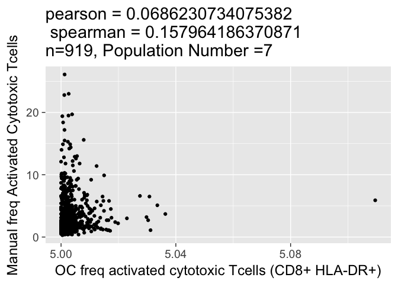<!-- -->

```
## 
## panel1 
##   9269 
## [1] "ActCT"
## [1] "ActCT"
## [1] "Samples with less than 20K lymph or 20K PBMC (in OC) are excluded"
## [1] "COUNT"
```

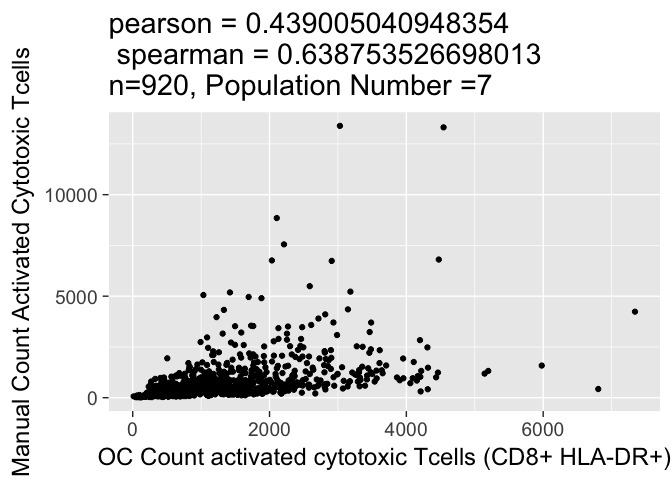<!-- -->

```
## 
## panel1 
##   9269 
## 
## panel1 
##   9269 
## [1] "CM.CT"
## [1] "CM.CT"
## [1] "Samples with less than 20K lymph or 20K PBMC (in OC) are excluded"
## [1] "FREQ"
```

<!-- -->

```
## 
## panel1 
##   9269 
## [1] "CM.CT"
## 
## panel1 
##   9269 
## [1] "E.CT"
## [1] "E.CT"
## [1] "Samples with less than 20K lymph or 20K PBMC (in OC) are excluded"
## [1] "FREQ"
```

<!-- -->

```
## 
## panel1 
##   9269 
## [1] "E.CT"
## [1] "E.CT"
## [1] "Samples with less than 20K lymph or 20K PBMC (in OC) are excluded"
## [1] "COUNT"
```

<!-- -->

```
## 
## panel1 
##   9269 
## 
## panel1 
##   9269 
## [1] "pE.CT"
## [1] "pE.CT"
## [1] "Samples with less than 20K lymph or 20K PBMC (in OC) are excluded"
## [1] "FREQ"
```

<!-- -->

```
## 
## panel1 
##   9269 
## [1] "pE.CT"
## [1] "pE.CT"
## [1] "Samples with less than 20K lymph or 20K PBMC (in OC) are excluded"
## [1] "COUNT"
```

<!-- -->

```
## 
## panel1 
##   9269 
## 
## panel1 
##   9269 
## [1] "pE1.CT"
## [1] "pE1.CT"
## [1] "Samples with less than 20K lymph or 20K PBMC (in OC) are excluded"
## [1] "FREQ"
```

<!-- -->

```
## 
## panel1 
##   9269 
## [1] "pE1.CT"
## [1] "pE1.CT"
## [1] "Samples with less than 20K lymph or 20K PBMC (in OC) are excluded"
## [1] "COUNT"
```

<!-- -->

```
## 
## panel1 
##   9269 
## 
## panel1 
##   9269 
## [1] "pE2.CT"
## [1] "pE2.CT"
## [1] "Samples with less than 20K lymph or 20K PBMC (in OC) are excluded"
## [1] "FREQ"
```

<!-- -->

```
## 
## panel1 
##   9269 
## [1] "pE2.CT"
## 
## panel1 
##   9269 
## [1] "EM.CT"
## [1] "EM.CT"
## [1] "Samples with less than 20K lymph or 20K PBMC (in OC) are excluded"
## [1] "FREQ"
```

<!-- -->

```
## 
## panel1 
##   9269 
## [1] "EM.CT"
## 
## panel1 
##   9269 
## [1] "EM1.C.T"
## [1] "EM1.C.T"
## [1] "Samples with less than 20K lymph or 20K PBMC (in OC) are excluded"
## [1] "FREQ"
```

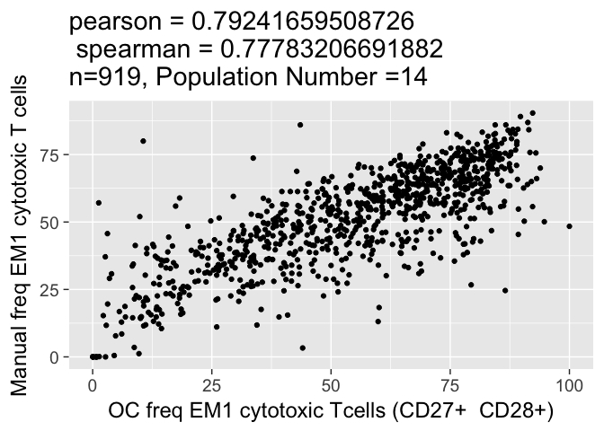<!-- -->

```
## 
## panel1 
##   9269 
## [1] "EM1.C.T"
## [1] "EM1.C.T"
## [1] "Samples with less than 20K lymph or 20K PBMC (in OC) are excluded"
## [1] "COUNT"
```

<!-- -->

```
## 
## panel1 
##   9269 
## 
## panel1 
##   9269 
## [1] "EM2.CT"
## [1] "EM2.CT"
## [1] "Samples with less than 20K lymph or 20K PBMC (in OC) are excluded"
## [1] "FREQ"
```

<!-- -->

```
## 
## panel1 
##   9269 
## [1] "EM2.CT"
## [1] "EM2.CT"
## [1] "Samples with less than 20K lymph or 20K PBMC (in OC) are excluded"
## [1] "COUNT"
```

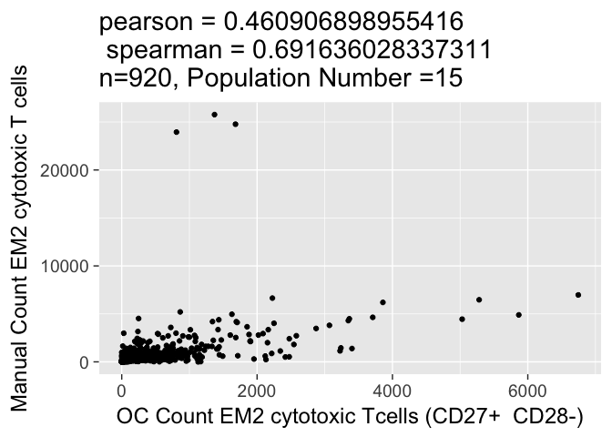<!-- -->

```
## 
## panel1 
##   9269 
## 
## panel1 
##   9269 
## [1] "EM3.CT"
## [1] "EM3.CT"
## [1] "Samples with less than 20K lymph or 20K PBMC (in OC) are excluded"
## [1] "FREQ"
```

<!-- -->

```
## 
## panel1 
##   9269 
## [1] "EM3.CT"
## [1] "EM3.CT"
## [1] "Samples with less than 20K lymph or 20K PBMC (in OC) are excluded"
## [1] "COUNT"
```

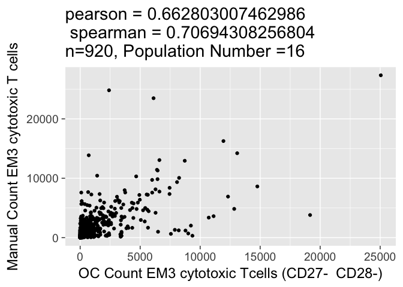<!-- -->

```
## 
## panel1 
##   9269 
## 
## panel1 
##   9269 
## [1] "EM4.CT"
## [1] "EM4.CT"
## [1] "Samples with less than 20K lymph or 20K PBMC (in OC) are excluded"
## [1] "FREQ"
```

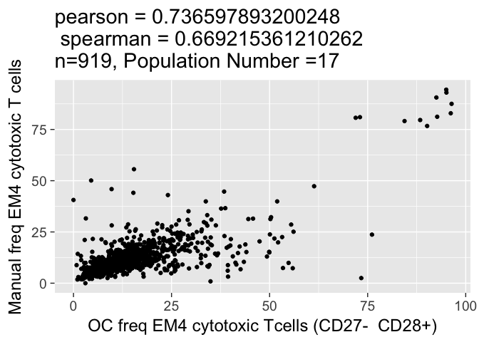<!-- -->

```
## 
## panel1 
##   9269 
## [1] "EM4.CT"
## [1] "EM4.CT"
## [1] "Samples with less than 20K lymph or 20K PBMC (in OC) are excluded"
## [1] "COUNT"
```

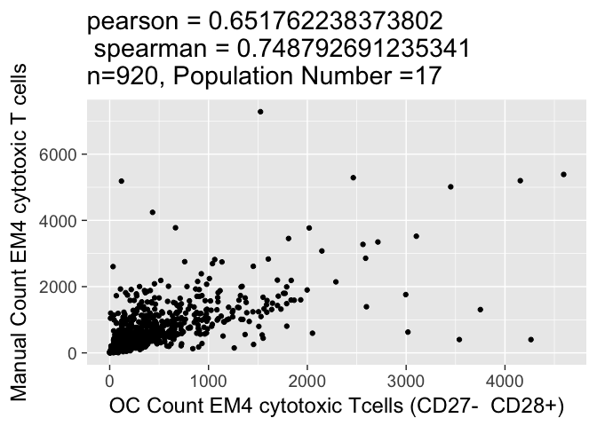<!-- -->

```
## 
## panel1 
##   9269 
## 
## panel1 
##   9269 
## [1] "N.CT"
## [1] "N.CT"
## [1] "Samples with less than 20K lymph or 20K PBMC (in OC) are excluded"
## [1] "FREQ"
```

<!-- -->

```
## 
## panel1 
##   9269 
## [1] "N.CT"
## [1] "N.CT"
## [1] "Samples with less than 20K lymph or 20K PBMC (in OC) are excluded"
## [1] "COUNT"
```

<!-- -->

```
## 
## panel1 
##   9269 
## 
## panel1 
##   9269 
## [1] "HT"
## [1] "HT"
## [1] "Samples with less than 20K lymph or 20K PBMC (in OC) are excluded"
## [1] "FREQ"
```

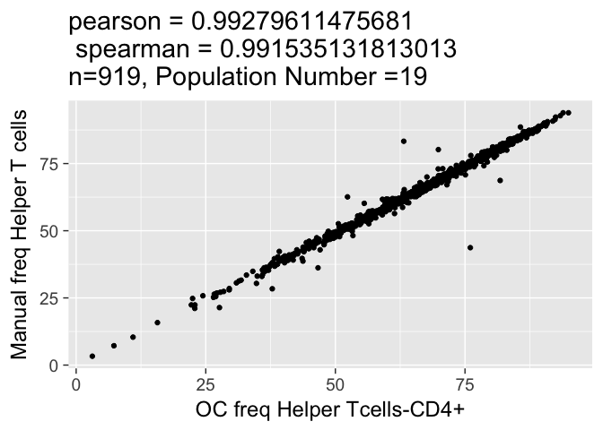<!-- -->

```
## 
## panel1 
##   9269 
## [1] "HT"
## [1] "HT"
## [1] "Samples with less than 20K lymph or 20K PBMC (in OC) are excluded"
## [1] "COUNT"
```

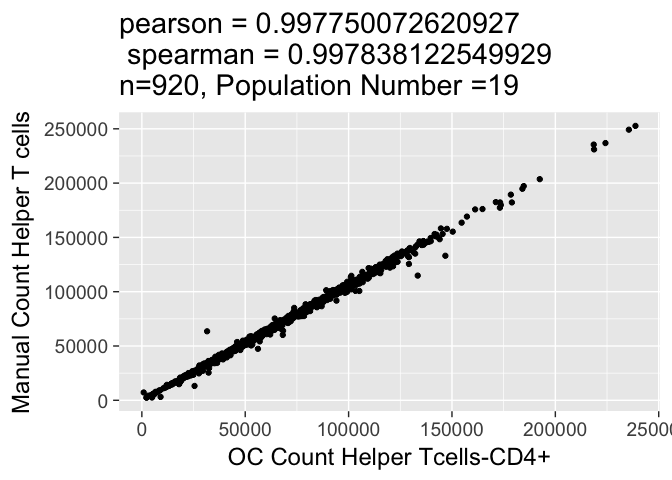<!-- -->

```
## 
## panel1 
##   9269 
## [1] "HT"
## [1] "HT"
## [1] "Samples with less than 20K lymph or 20K PBMC (in OC) are excluded"
## [1] "FREQ_PBMC_LYMPH"
```

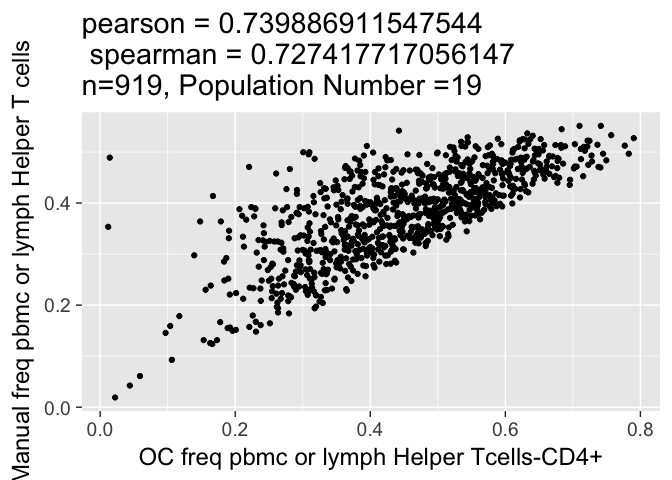<!-- -->

```
## 
## panel1 
##   9269 
## [1] "Act.HT"
## [1] "Act.HT"
## [1] "Samples with less than 20K lymph or 20K PBMC (in OC) are excluded"
## [1] "FREQ"
```

<!-- -->

```
## 
## panel1 
##   9269 
## [1] "Act.HT"
## [1] "Act.HT"
## [1] "Samples with less than 20K lymph or 20K PBMC (in OC) are excluded"
## [1] "COUNT"
```

<!-- -->

```
## 
## panel1 
##   9269 
## 
## panel1 
##   9269 
## [1] "CM.HT"
## [1] "CM.HT"
## [1] "Samples with less than 20K lymph or 20K PBMC (in OC) are excluded"
## [1] "FREQ"
```

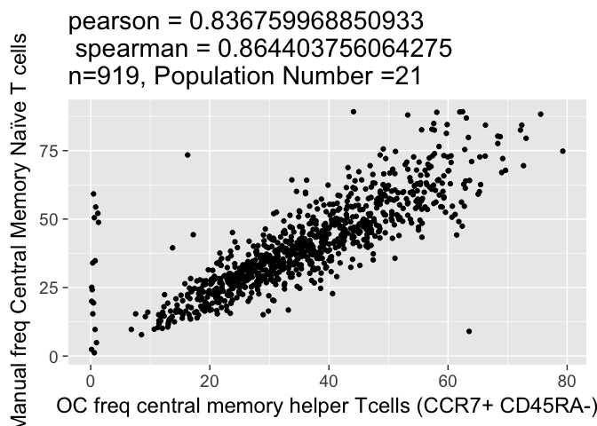<!-- -->

```
## 
## panel1 
##   9269 
## [1] "CM.HT"
## [1] "CM.HT"
## [1] "Samples with less than 20K lymph or 20K PBMC (in OC) are excluded"
## [1] "COUNT"
```

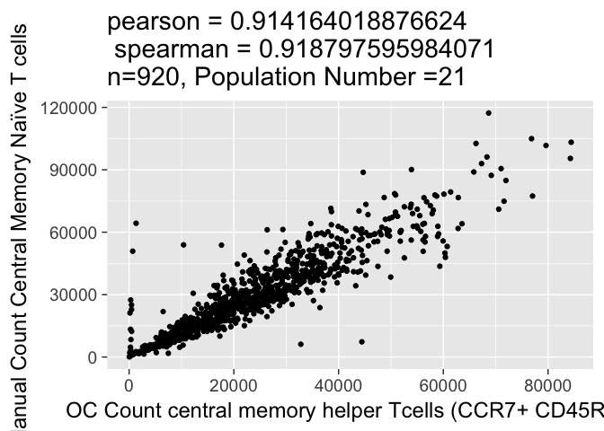<!-- -->

```
## 
## panel1 
##   9269 
## 
## panel1 
##   9269 
## [1] "E.HT"
## [1] "E.HT"
## [1] "Samples with less than 20K lymph or 20K PBMC (in OC) are excluded"
## [1] "FREQ"
```

<!-- -->

```
## 
## panel1 
##   9269 
## [1] "E.HT"
## [1] "E.HT"
## [1] "Samples with less than 20K lymph or 20K PBMC (in OC) are excluded"
## [1] "COUNT"
```

<!-- -->

```
## 
## panel1 
##   9269 
## 
## panel1 
##   9269 
## [1] "EM.HT"
## [1] "EM.HT"
## [1] "Samples with less than 20K lymph or 20K PBMC (in OC) are excluded"
## [1] "FREQ"
```

<!-- -->

```
## 
## panel1 
##   9269 
## [1] "EM.HT"
## [1] "EM.HT"
## [1] "Samples with less than 20K lymph or 20K PBMC (in OC) are excluded"
## [1] "COUNT"
```

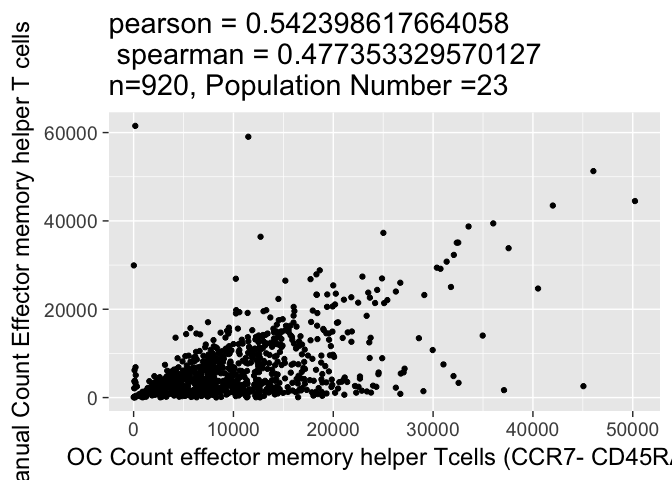<!-- -->

```
## 
## panel1 
##   9269 
## 
## panel1 
##   9269 
## [1] "N.HT"
## [1] "N.HT"
## [1] "Samples with less than 20K lymph or 20K PBMC (in OC) are excluded"
## [1] "FREQ"
```

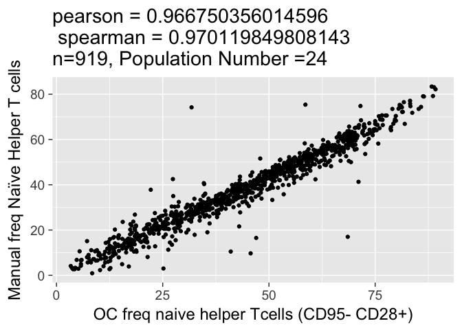<!-- -->

```
## 
## panel1 
##   9269 
## [1] "N.HT"
## [1] "N.HT"
## [1] "Samples with less than 20K lymph or 20K PBMC (in OC) are excluded"
## [1] "COUNT"
```

<!-- -->

```
## 
## panel1 
##   9269 
## 
## panel2 
##   9266 
## [1] "DC.NK.MONO"
## [1] "DC.NK.MONO"
## [1] "Samples with less than 20K lymph or 20K PBMC (in OC) are excluded"
## [1] "FREQ"
```

<!-- -->

```
## 
## panel2 
##   9266 
## [1] "DC.NK.MONO"
## [1] "DC.NK.MONO"
## [1] "Samples with less than 20K lymph or 20K PBMC (in OC) are excluded"
## [1] "COUNT"
```

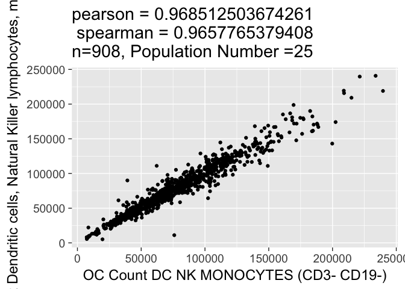<!-- -->

```
## 
## panel2 
##   9266 
## [1] "DC.NK.MONO"
## [1] "DC.NK.MONO"
## [1] "Samples with less than 20K lymph or 20K PBMC (in OC) are excluded"
## [1] "FREQ_PBMC_LYMPH"
```

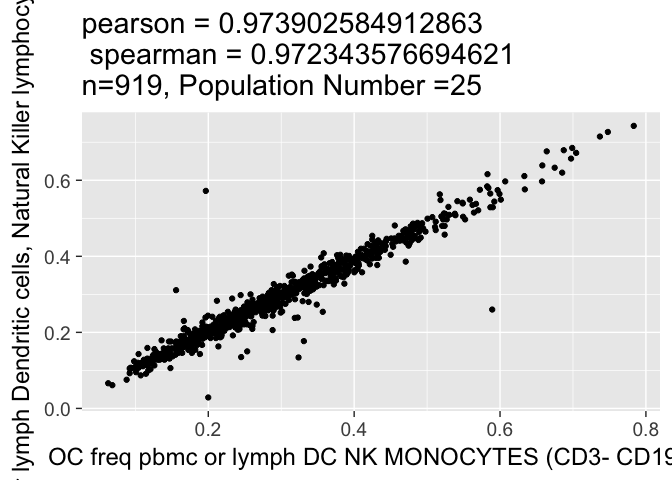<!-- -->

```
## 
## panel2 
##   9266 
## [1] "DC.NK"
## [1] "DC.NK"
## [1] "Samples with less than 20K lymph or 20K PBMC (in OC) are excluded"
## [1] "FREQ"
```

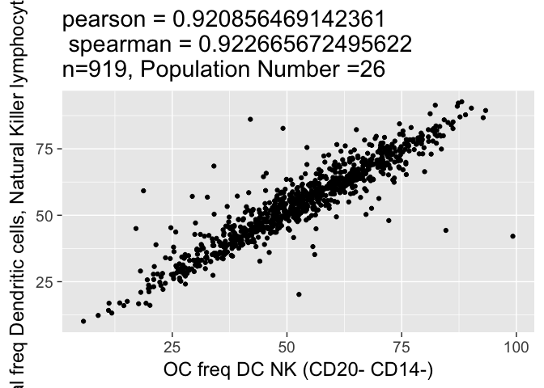<!-- -->

```
## 
## panel2 
##   9266 
## [1] "DC.NK"
## [1] "DC.NK"
## [1] "Samples with less than 20K lymph or 20K PBMC (in OC) are excluded"
## [1] "COUNT"
```

<!-- -->

```
## 
## panel2 
##   9266 
## [1] "DC.NK"
## [1] "DC.NK"
## [1] "Samples with less than 20K lymph or 20K PBMC (in OC) are excluded"
## [1] "FREQ_PBMC_LYMPH"
```

<!-- -->

```
## 
## panel2 
##   9266 
## [1] "DC"
## [1] "DC"
## [1] "Samples with less than 20K lymph or 20K PBMC (in OC) are excluded"
## [1] "FREQ"
```

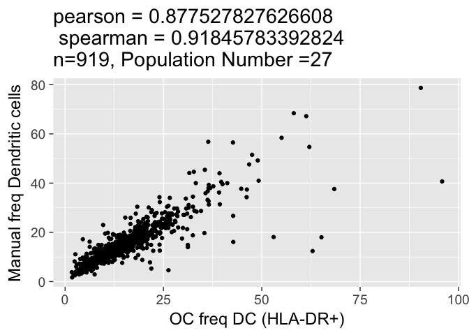<!-- -->

```
## 
## panel2 
##   9266 
## [1] "DC"
## [1] "DC"
## [1] "Samples with less than 20K lymph or 20K PBMC (in OC) are excluded"
## [1] "COUNT"
```

<!-- -->

```
## 
## panel2 
##   9266 
## [1] "DC"
## [1] "DC"
## [1] "Samples with less than 20K lymph or 20K PBMC (in OC) are excluded"
## [1] "FREQ_PBMC_LYMPH"
```

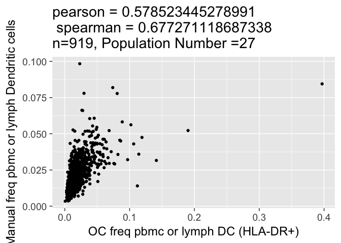<!-- -->

```
## 
## panel2 
##   9266 
## [1] "DCm"
## [1] "DCm"
## [1] "Samples with less than 20K lymph or 20K PBMC (in OC) are excluded"
## [1] "FREQ"
```

<!-- -->

```
## 
## panel2 
##   9266 
## [1] "DCm"
## [1] "DCm"
## [1] "Samples with less than 20K lymph or 20K PBMC (in OC) are excluded"
## [1] "COUNT"
```

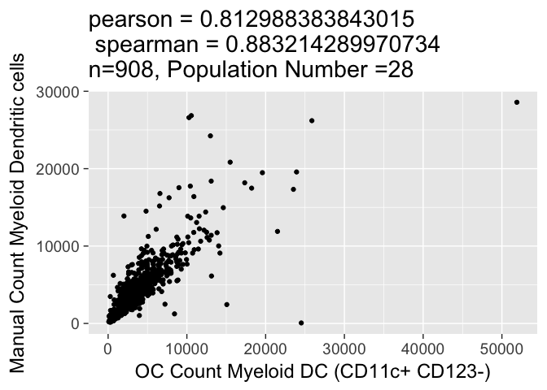<!-- -->

```
## 
## panel2 
##   9266 
## [1] "DCm"
## [1] "DCm"
## [1] "Samples with less than 20K lymph or 20K PBMC (in OC) are excluded"
## [1] "FREQ_PBMC_LYMPH"
```

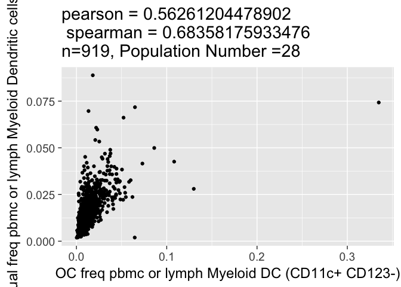<!-- -->

```
## 
## panel2 
##   9266 
## [1] "DCp"
## [1] "DCp"
## [1] "Samples with less than 20K lymph or 20K PBMC (in OC) are excluded"
## [1] "FREQ"
```

<!-- -->

```
## 
## panel2 
##   9266 
## [1] "DCp"
## [1] "DCp"
## [1] "Samples with less than 20K lymph or 20K PBMC (in OC) are excluded"
## [1] "COUNT"
```

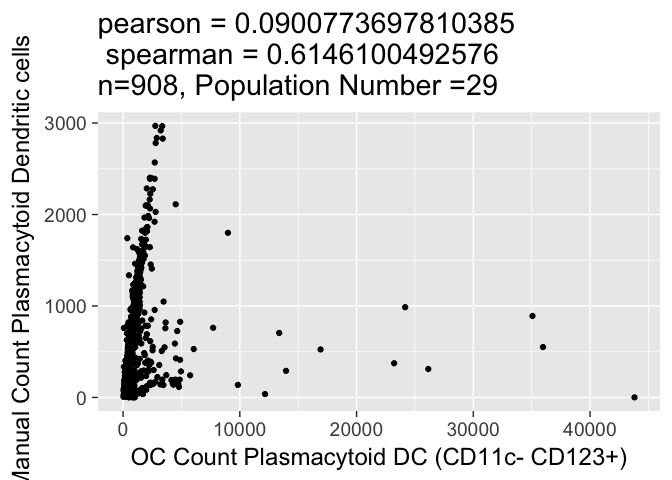<!-- -->

```
## 
## panel2 
##   9266 
## [1] "DCp"
## [1] "DCp"
## [1] "Samples with less than 20K lymph or 20K PBMC (in OC) are excluded"
## [1] "FREQ_PBMC_LYMPH"
```

<!-- -->

```
## 
## panel2 
##   9266 
## [1] "NK"
## [1] "NK"
## [1] "Samples with less than 20K lymph or 20K PBMC (in OC) are excluded"
## [1] "FREQ"
```

<!-- -->

```
## 
## panel2 
##   9266 
## [1] "NK"
## [1] "NK"
## [1] "Samples with less than 20K lymph or 20K PBMC (in OC) are excluded"
## [1] "COUNT"
```

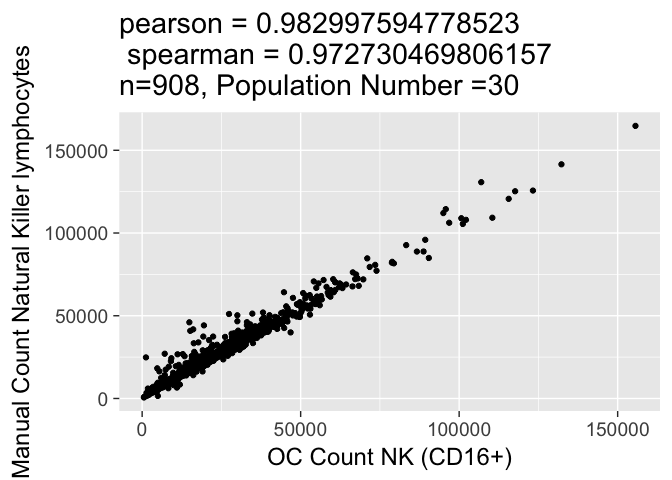<!-- -->

```
## 
## panel2 
##   9266 
## [1] "NK"
## [1] "NK"
## [1] "Samples with less than 20K lymph or 20K PBMC (in OC) are excluded"
## [1] "FREQ_PBMC_LYMPH"
```

<!-- -->

```
## 
## panel2 
##   9266 
## [1] "NKHI"
## [1] "NKHI"
## [1] "Samples with less than 20K lymph or 20K PBMC (in OC) are excluded"
## [1] "FREQ"
```

<!-- -->

```
## 
## panel2 
##   9266 
## [1] "NKHI"
## [1] "NKHI"
## [1] "Samples with less than 20K lymph or 20K PBMC (in OC) are excluded"
## [1] "COUNT"
```

<!-- -->

```
## 
## panel2 
##   9266 
## [1] "NKHI"
## [1] "NKHI"
## [1] "Samples with less than 20K lymph or 20K PBMC (in OC) are excluded"
## [1] "FREQ_PBMC_LYMPH"
```

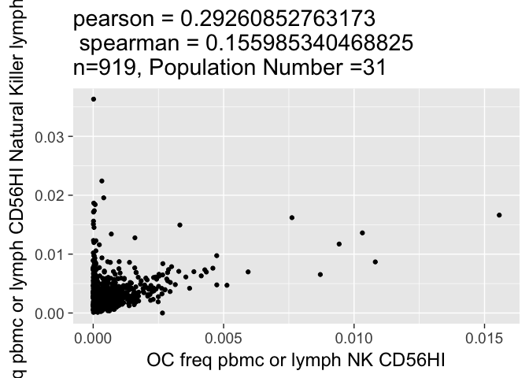<!-- -->

```
## 
## panel2 
##   9266 
## [1] "NKLO"
## [1] "NKLO"
## [1] "Samples with less than 20K lymph or 20K PBMC (in OC) are excluded"
## [1] "FREQ"
```

<!-- -->

```
## 
## panel2 
##   9266 
## [1] "NKLO"
## [1] "NKLO"
## [1] "Samples with less than 20K lymph or 20K PBMC (in OC) are excluded"
## [1] "COUNT"
```

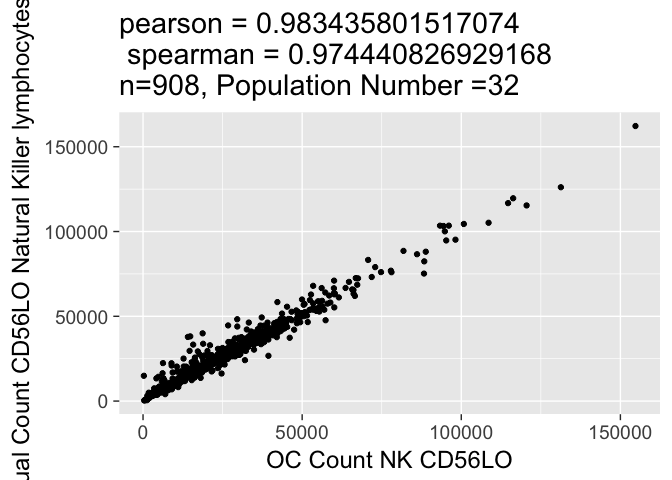<!-- -->

```
## 
## panel2 
##   9266 
## [1] "NKLO"
## [1] "NKLO"
## [1] "Samples with less than 20K lymph or 20K PBMC (in OC) are excluded"
## [1] "FREQ_PBMC_LYMPH"
```

<!-- -->

```
## 
## panel2 
##   9266 
## [1] "MONO"
## [1] "MONO"
## [1] "Samples with less than 20K lymph or 20K PBMC (in OC) are excluded"
## [1] "FREQ"
```

<!-- -->

```
## 
## panel2 
##   9266 
## [1] "MONO"
## [1] "MONO"
## [1] "Samples with less than 20K lymph or 20K PBMC (in OC) are excluded"
## [1] "COUNT"
```

<!-- -->

```
## 
## panel2 
##   9266 
## [1] "MONO"
## [1] "MONO"
## [1] "Samples with less than 20K lymph or 20K PBMC (in OC) are excluded"
## [1] "FREQ_PBMC_LYMPH"
```

<!-- -->

```
## 
## panel2 
##   9266 
## [1] "MONOc"
## [1] "MONOc"
## [1] "Samples with less than 20K lymph or 20K PBMC (in OC) are excluded"
## [1] "FREQ"
```

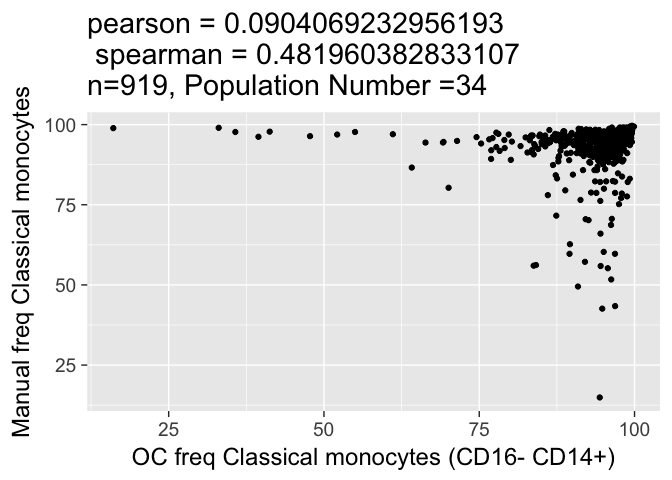<!-- -->

```
## 
## panel2 
##   9266 
## [1] "MONOc"
## [1] "MONOc"
## [1] "Samples with less than 20K lymph or 20K PBMC (in OC) are excluded"
## [1] "COUNT"
```

<!-- -->

```
## 
## panel2 
##   9266 
## [1] "MONOc"
## [1] "MONOc"
## [1] "Samples with less than 20K lymph or 20K PBMC (in OC) are excluded"
## [1] "FREQ_PBMC_LYMPH"
```

<!-- -->

```
## 
## panel2 
##   9266 
## [1] "MONOnc"
## [1] "MONOnc"
## [1] "Samples with less than 20K lymph or 20K PBMC (in OC) are excluded"
## [1] "FREQ"
```

<!-- -->

```
## 
## panel2 
##   9266 
## [1] "MONOnc"
## [1] "MONOnc"
## [1] "Samples with less than 20K lymph or 20K PBMC (in OC) are excluded"
## [1] "COUNT"
```

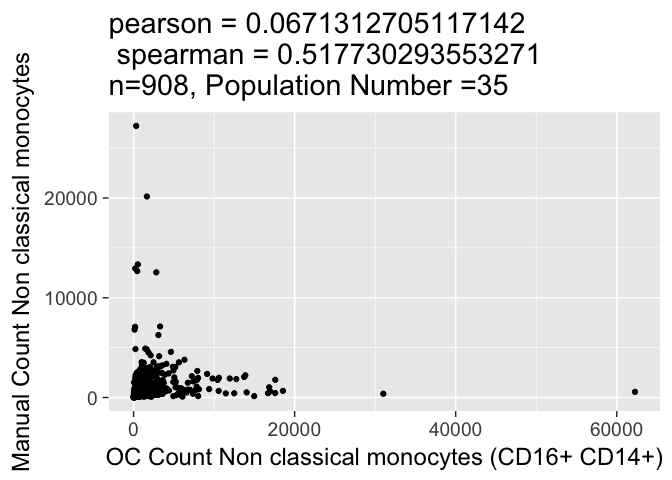<!-- -->

```
## 
## panel2 
##   9266 
## [1] "MONOnc"
## [1] "MONOnc"
## [1] "Samples with less than 20K lymph or 20K PBMC (in OC) are excluded"
## [1] "FREQ_PBMC_LYMPH"
```

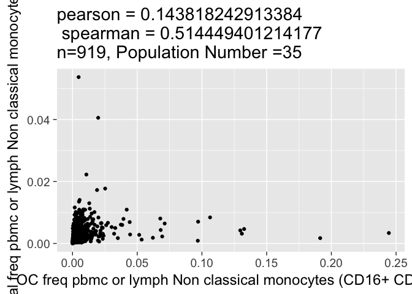<!-- -->

```
## 
## panel1 
##   8876 
## [1] "Bcell"
## [1] "Bcell"
## [1] "Samples with less than 50K lymph or 50K PBMC (in OC) are excluded"
## [1] "FREQ"
```

<!-- -->

```
## 
## panel1 
##   8876 
## [1] "Bcell"
## [1] "Bcell"
## [1] "Samples with less than 50K lymph or 50K PBMC (in OC) are excluded"
## [1] "COUNT"
```

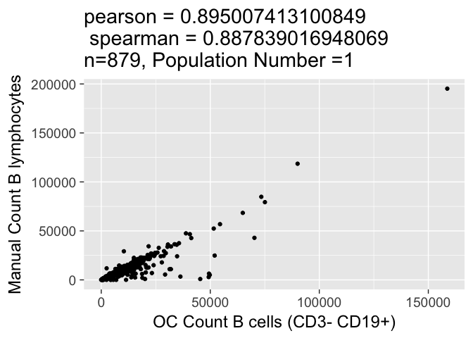<!-- -->

```
## 
## panel1 
##   8876 
## [1] "Bcell"
## [1] "Bcell"
## [1] "Samples with less than 50K lymph or 50K PBMC (in OC) are excluded"
## [1] "FREQ_PBMC_LYMPH"
```

<!-- -->

```
## 
## panel1 
##   8876 
## [1] "IgD.MemB"
## [1] "IgD.MemB"
## [1] "Samples with less than 50K lymph or 50K PBMC (in OC) are excluded"
## [1] "FREQ"
```

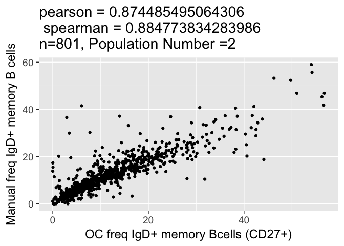<!-- -->

```
## 
## panel1 
##   8876 
## [1] "IgD.MemB"
## [1] "IgD.MemB"
## [1] "Samples with less than 50K lymph or 50K PBMC (in OC) are excluded"
## [1] "COUNT"
```

<!-- -->

```
## 
## panel1 
##   8876 
## [1] "IgD.MemB"
## [1] "IgD.MemB"
## [1] "Samples with less than 50K lymph or 50K PBMC (in OC) are excluded"
## [1] "FREQ_PBMC_LYMPH"
```

<!-- -->

```
## 
## panel1 
##   8876 
## [1] "IgD.MemB.1"
## [1] "IgD.MemB.1"
## [1] "Samples with less than 50K lymph or 50K PBMC (in OC) are excluded"
## [1] "FREQ"
```

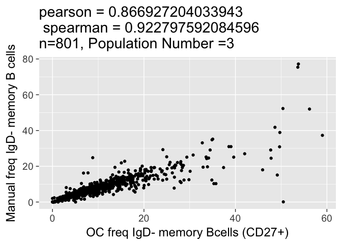<!-- -->

```
## 
## panel1 
##   8876 
## [1] "IgD.MemB.1"
## [1] "IgD.MemB.1"
## [1] "Samples with less than 50K lymph or 50K PBMC (in OC) are excluded"
## [1] "COUNT"
```

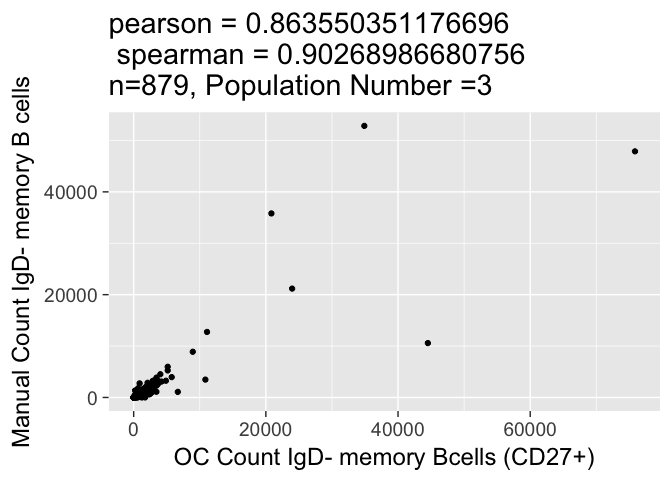<!-- -->

```
## 
## panel1 
##   8876 
## [1] "IgD.MemB.1"
## [1] "IgD.MemB.1"
## [1] "Samples with less than 50K lymph or 50K PBMC (in OC) are excluded"
## [1] "FREQ_PBMC_LYMPH"
```

<!-- -->

```
## 
## panel1 
##   8876 
## [1] "NaiveB"
## [1] "NaiveB"
## [1] "Samples with less than 50K lymph or 50K PBMC (in OC) are excluded"
## [1] "FREQ"
```

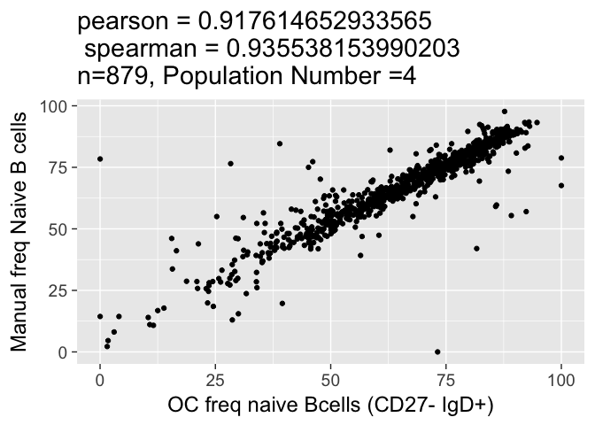<!-- -->

```
## 
## panel1 
##   8876 
## [1] "NaiveB"
## [1] "NaiveB"
## [1] "Samples with less than 50K lymph or 50K PBMC (in OC) are excluded"
## [1] "COUNT"
```

<!-- -->

```
## 
## panel1 
##   8876 
## [1] "NaiveB"
## [1] "NaiveB"
## [1] "Samples with less than 50K lymph or 50K PBMC (in OC) are excluded"
## [1] "FREQ_PBMC_LYMPH"
```

<!-- -->

```
## 
## panel1 
##   8876 
## [1] "Tcell"
## [1] "Tcell"
## [1] "Samples with less than 50K lymph or 50K PBMC (in OC) are excluded"
## [1] "FREQ"
```

<!-- -->

```
## 
## panel1 
##   8876 
## [1] "Tcell"
## [1] "Tcell"
## [1] "Samples with less than 50K lymph or 50K PBMC (in OC) are excluded"
## [1] "COUNT"
```

<!-- -->

```
## 
## panel1 
##   8876 
## [1] "Tcell"
## [1] "Tcell"
## [1] "Samples with less than 50K lymph or 50K PBMC (in OC) are excluded"
## [1] "FREQ_PBMC_LYMPH"
```

<!-- -->

```
## 
## panel1 
##   8876 
## [1] "CT"
## [1] "CT"
## [1] "Samples with less than 50K lymph or 50K PBMC (in OC) are excluded"
## [1] "FREQ"
```

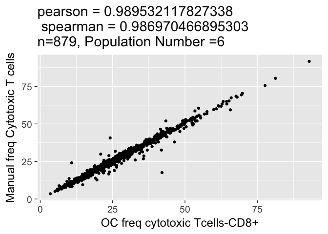<!-- -->

```
## 
## panel1 
##   8876 
## [1] "CT"
## [1] "CT"
## [1] "Samples with less than 50K lymph or 50K PBMC (in OC) are excluded"
## [1] "COUNT"
```

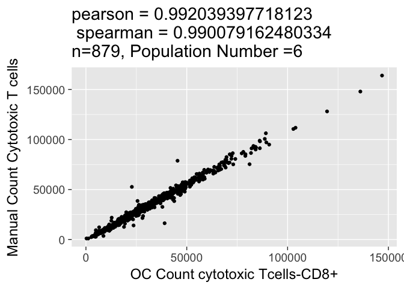<!-- -->

```
## 
## panel1 
##   8876 
## [1] "CT"
## [1] "CT"
## [1] "Samples with less than 50K lymph or 50K PBMC (in OC) are excluded"
## [1] "FREQ_PBMC_LYMPH"
```

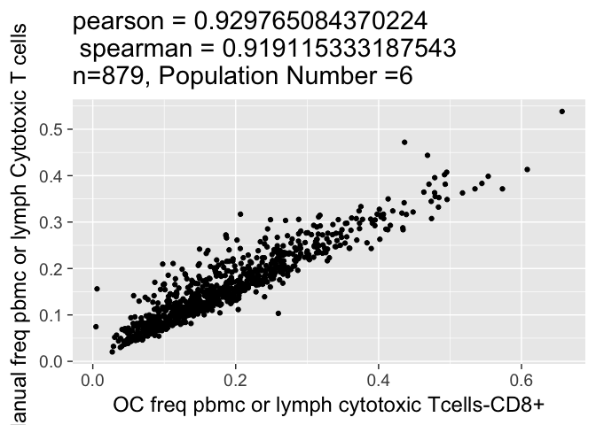<!-- -->

```
## 
## panel1 
##   8876 
## [1] "ActCT"
## [1] "ActCT"
## [1] "Samples with less than 50K lymph or 50K PBMC (in OC) are excluded"
## [1] "FREQ"
```

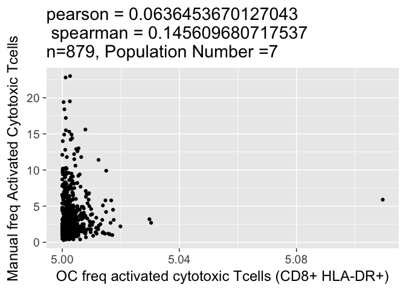<!-- -->

```
## 
## panel1 
##   8876 
## [1] "ActCT"
## [1] "ActCT"
## [1] "Samples with less than 50K lymph or 50K PBMC (in OC) are excluded"
## [1] "COUNT"
```

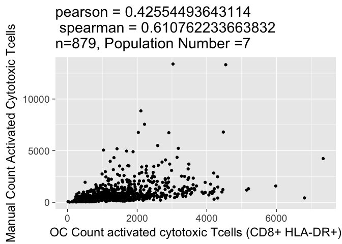<!-- -->

```
## 
## panel1 
##   8876 
## 
## panel1 
##   8876 
## [1] "CM.CT"
## [1] "CM.CT"
## [1] "Samples with less than 50K lymph or 50K PBMC (in OC) are excluded"
## [1] "FREQ"
```

<!-- -->

```
## 
## panel1 
##   8876 
## [1] "CM.CT"
## 
## panel1 
##   8876 
## [1] "E.CT"
## [1] "E.CT"
## [1] "Samples with less than 50K lymph or 50K PBMC (in OC) are excluded"
## [1] "FREQ"
```

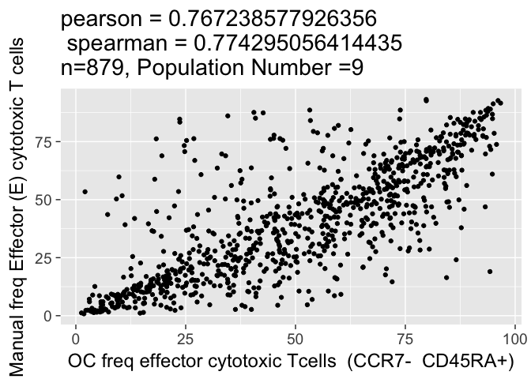<!-- -->

```
## 
## panel1 
##   8876 
## [1] "E.CT"
## [1] "E.CT"
## [1] "Samples with less than 50K lymph or 50K PBMC (in OC) are excluded"
## [1] "COUNT"
```

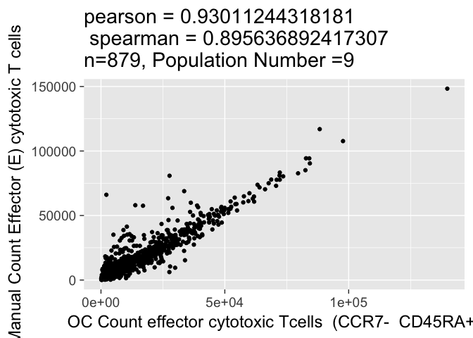<!-- -->

```
## 
## panel1 
##   8876 
## 
## panel1 
##   8876 
## [1] "pE.CT"
## [1] "pE.CT"
## [1] "Samples with less than 50K lymph or 50K PBMC (in OC) are excluded"
## [1] "FREQ"
```

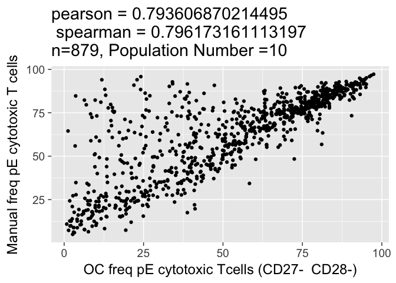<!-- -->

```
## 
## panel1 
##   8876 
## [1] "pE.CT"
## [1] "pE.CT"
## [1] "Samples with less than 50K lymph or 50K PBMC (in OC) are excluded"
## [1] "COUNT"
```

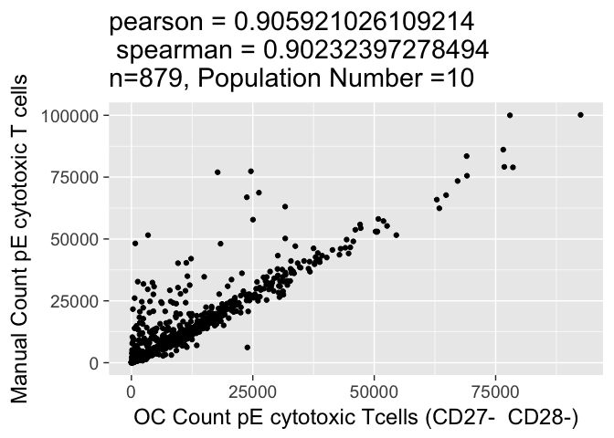<!-- -->

```
## 
## panel1 
##   8876 
## 
## panel1 
##   8876 
## [1] "pE1.CT"
## [1] "pE1.CT"
## [1] "Samples with less than 50K lymph or 50K PBMC (in OC) are excluded"
## [1] "FREQ"
```

<!-- -->

```
## 
## panel1 
##   8876 
## [1] "pE1.CT"
## [1] "pE1.CT"
## [1] "Samples with less than 50K lymph or 50K PBMC (in OC) are excluded"
## [1] "COUNT"
```

<!-- -->

```
## 
## panel1 
##   8876 
## 
## panel1 
##   8876 
## [1] "pE2.CT"
## [1] "pE2.CT"
## [1] "Samples with less than 50K lymph or 50K PBMC (in OC) are excluded"
## [1] "FREQ"
```

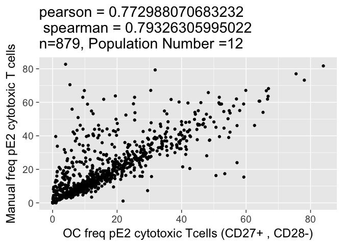<!-- -->

```
## 
## panel1 
##   8876 
## [1] "pE2.CT"
## 
## panel1 
##   8876 
## [1] "EM.CT"
## [1] "EM.CT"
## [1] "Samples with less than 50K lymph or 50K PBMC (in OC) are excluded"
## [1] "FREQ"
```

<!-- -->

```
## 
## panel1 
##   8876 
## [1] "EM.CT"
## 
## panel1 
##   8876 
## [1] "EM1.C.T"
## [1] "EM1.C.T"
## [1] "Samples with less than 50K lymph or 50K PBMC (in OC) are excluded"
## [1] "FREQ"
```

<!-- -->

```
## 
## panel1 
##   8876 
## [1] "EM1.C.T"
## [1] "EM1.C.T"
## [1] "Samples with less than 50K lymph or 50K PBMC (in OC) are excluded"
## [1] "COUNT"
```

<!-- -->

```
## 
## panel1 
##   8876 
## 
## panel1 
##   8876 
## [1] "EM2.CT"
## [1] "EM2.CT"
## [1] "Samples with less than 50K lymph or 50K PBMC (in OC) are excluded"
## [1] "FREQ"
```

<!-- -->

```
## 
## panel1 
##   8876 
## [1] "EM2.CT"
## [1] "EM2.CT"
## [1] "Samples with less than 50K lymph or 50K PBMC (in OC) are excluded"
## [1] "COUNT"
```

<!-- -->

```
## 
## panel1 
##   8876 
## 
## panel1 
##   8876 
## [1] "EM3.CT"
## [1] "EM3.CT"
## [1] "Samples with less than 50K lymph or 50K PBMC (in OC) are excluded"
## [1] "FREQ"
```

<!-- -->

```
## 
## panel1 
##   8876 
## [1] "EM3.CT"
## [1] "EM3.CT"
## [1] "Samples with less than 50K lymph or 50K PBMC (in OC) are excluded"
## [1] "COUNT"
```

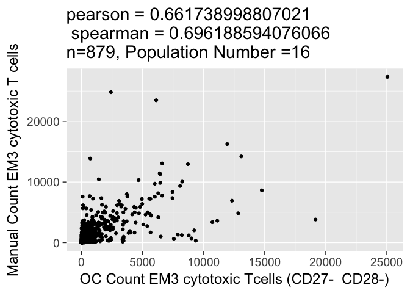<!-- -->

```
## 
## panel1 
##   8876 
## 
## panel1 
##   8876 
## [1] "EM4.CT"
## [1] "EM4.CT"
## [1] "Samples with less than 50K lymph or 50K PBMC (in OC) are excluded"
## [1] "FREQ"
```

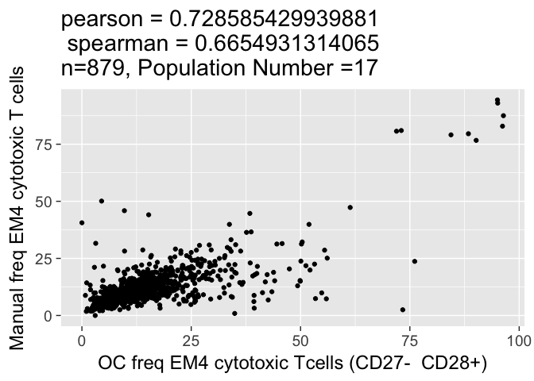<!-- -->

```
## 
## panel1 
##   8876 
## [1] "EM4.CT"
## [1] "EM4.CT"
## [1] "Samples with less than 50K lymph or 50K PBMC (in OC) are excluded"
## [1] "COUNT"
```

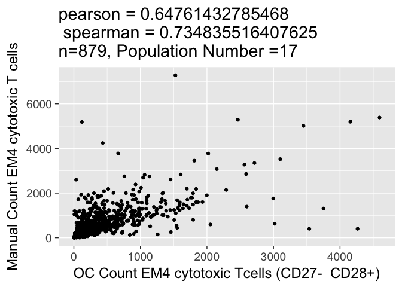<!-- -->

```
## 
## panel1 
##   8876 
## 
## panel1 
##   8876 
## [1] "N.CT"
## [1] "N.CT"
## [1] "Samples with less than 50K lymph or 50K PBMC (in OC) are excluded"
## [1] "FREQ"
```

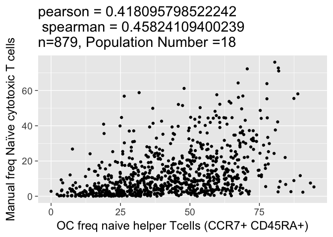<!-- -->

```
## 
## panel1 
##   8876 
## [1] "N.CT"
## [1] "N.CT"
## [1] "Samples with less than 50K lymph or 50K PBMC (in OC) are excluded"
## [1] "COUNT"
```

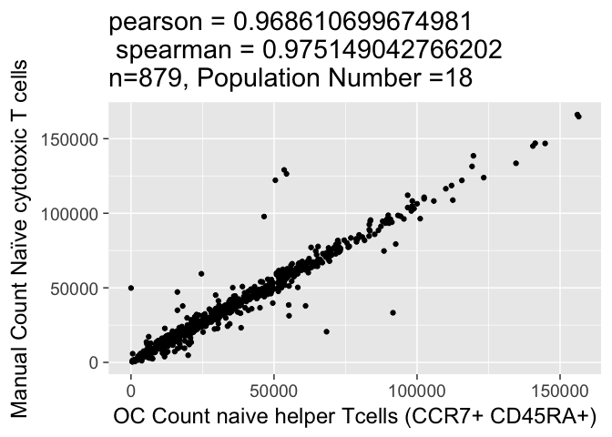<!-- -->

```
## 
## panel1 
##   8876 
## 
## panel1 
##   8876 
## [1] "HT"
## [1] "HT"
## [1] "Samples with less than 50K lymph or 50K PBMC (in OC) are excluded"
## [1] "FREQ"
```

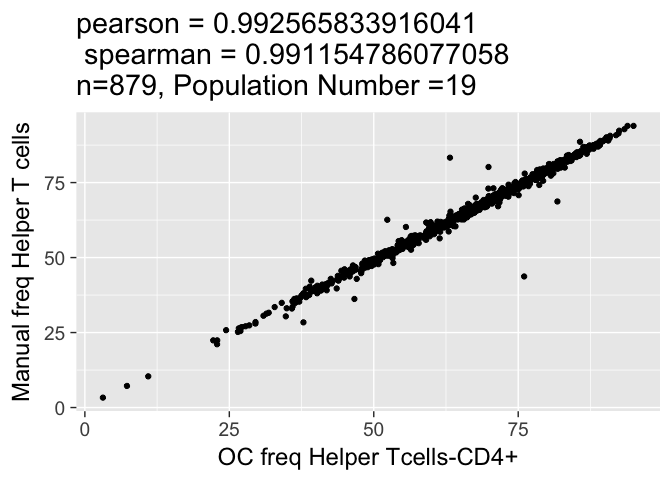<!-- -->

```
## 
## panel1 
##   8876 
## [1] "HT"
## [1] "HT"
## [1] "Samples with less than 50K lymph or 50K PBMC (in OC) are excluded"
## [1] "COUNT"
```

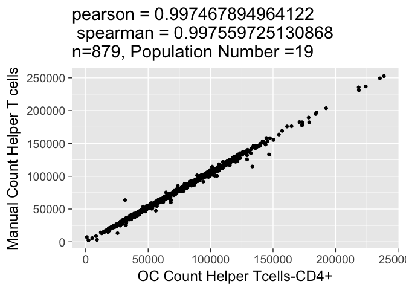<!-- -->

```
## 
## panel1 
##   8876 
## [1] "HT"
## [1] "HT"
## [1] "Samples with less than 50K lymph or 50K PBMC (in OC) are excluded"
## [1] "FREQ_PBMC_LYMPH"
```

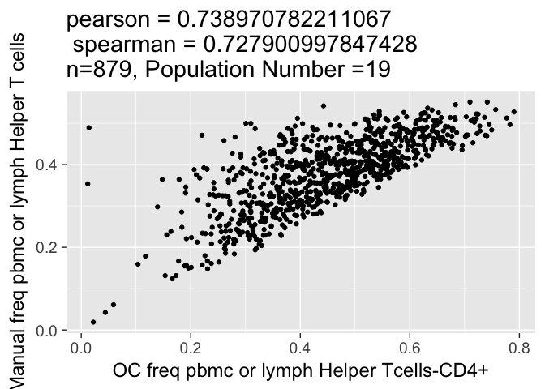<!-- -->

```
## 
## panel1 
##   8876 
## [1] "Act.HT"
## [1] "Act.HT"
## [1] "Samples with less than 50K lymph or 50K PBMC (in OC) are excluded"
## [1] "FREQ"
```

<!-- -->

```
## 
## panel1 
##   8876 
## [1] "Act.HT"
## [1] "Act.HT"
## [1] "Samples with less than 50K lymph or 50K PBMC (in OC) are excluded"
## [1] "COUNT"
```

<!-- -->

```
## 
## panel1 
##   8876 
## 
## panel1 
##   8876 
## [1] "CM.HT"
## [1] "CM.HT"
## [1] "Samples with less than 50K lymph or 50K PBMC (in OC) are excluded"
## [1] "FREQ"
```

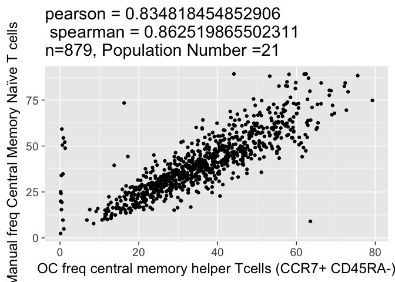<!-- -->

```
## 
## panel1 
##   8876 
## [1] "CM.HT"
## [1] "CM.HT"
## [1] "Samples with less than 50K lymph or 50K PBMC (in OC) are excluded"
## [1] "COUNT"
```

<!-- -->

```
## 
## panel1 
##   8876 
## 
## panel1 
##   8876 
## [1] "E.HT"
## [1] "E.HT"
## [1] "Samples with less than 50K lymph or 50K PBMC (in OC) are excluded"
## [1] "FREQ"
```

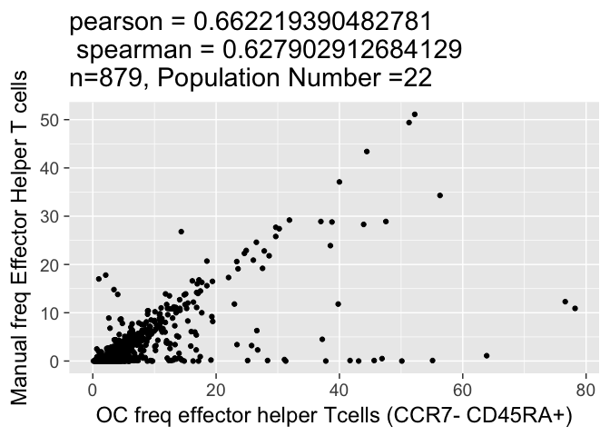<!-- -->

```
## 
## panel1 
##   8876 
## [1] "E.HT"
## [1] "E.HT"
## [1] "Samples with less than 50K lymph or 50K PBMC (in OC) are excluded"
## [1] "COUNT"
```

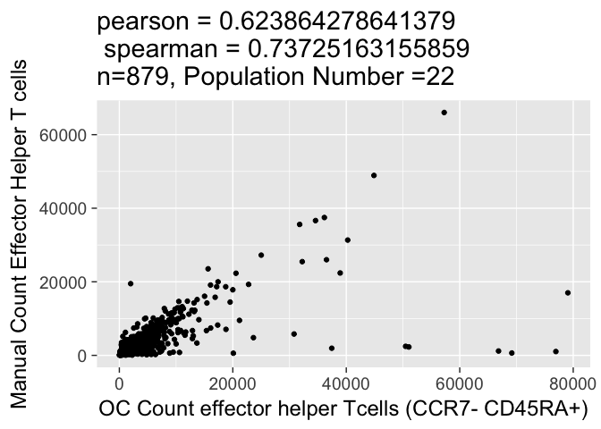<!-- -->

```
## 
## panel1 
##   8876 
## 
## panel1 
##   8876 
## [1] "EM.HT"
## [1] "EM.HT"
## [1] "Samples with less than 50K lymph or 50K PBMC (in OC) are excluded"
## [1] "FREQ"
```

<!-- -->

```
## 
## panel1 
##   8876 
## [1] "EM.HT"
## [1] "EM.HT"
## [1] "Samples with less than 50K lymph or 50K PBMC (in OC) are excluded"
## [1] "COUNT"
```

<!-- -->

```
## 
## panel1 
##   8876 
## 
## panel1 
##   8876 
## [1] "N.HT"
## [1] "N.HT"
## [1] "Samples with less than 50K lymph or 50K PBMC (in OC) are excluded"
## [1] "FREQ"
```

<!-- -->

```
## 
## panel1 
##   8876 
## [1] "N.HT"
## [1] "N.HT"
## [1] "Samples with less than 50K lymph or 50K PBMC (in OC) are excluded"
## [1] "COUNT"
```

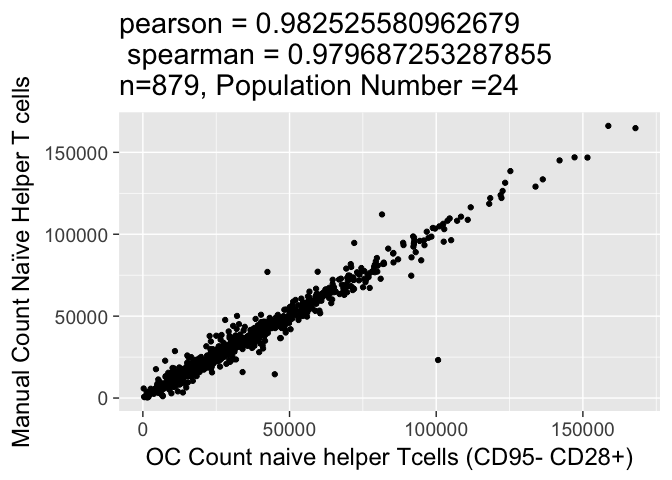<!-- -->

```
## 
## panel1 
##   8876 
## 
## panel2 
##   9127 
## [1] "DC.NK.MONO"
## [1] "DC.NK.MONO"
## [1] "Samples with less than 50K lymph or 50K PBMC (in OC) are excluded"
## [1] "FREQ"
```

<!-- -->

```
## 
## panel2 
##   9127 
## [1] "DC.NK.MONO"
## [1] "DC.NK.MONO"
## [1] "Samples with less than 50K lymph or 50K PBMC (in OC) are excluded"
## [1] "COUNT"
```

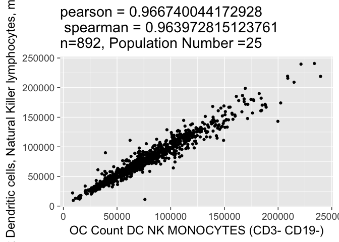<!-- -->

```
## 
## panel2 
##   9127 
## [1] "DC.NK.MONO"
## [1] "DC.NK.MONO"
## [1] "Samples with less than 50K lymph or 50K PBMC (in OC) are excluded"
## [1] "FREQ_PBMC_LYMPH"
```

<!-- -->

```
## 
## panel2 
##   9127 
## [1] "DC.NK"
## [1] "DC.NK"
## [1] "Samples with less than 50K lymph or 50K PBMC (in OC) are excluded"
## [1] "FREQ"
```

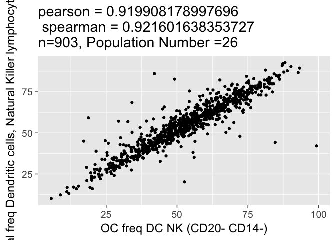<!-- -->

```
## 
## panel2 
##   9127 
## [1] "DC.NK"
## [1] "DC.NK"
## [1] "Samples with less than 50K lymph or 50K PBMC (in OC) are excluded"
## [1] "COUNT"
```

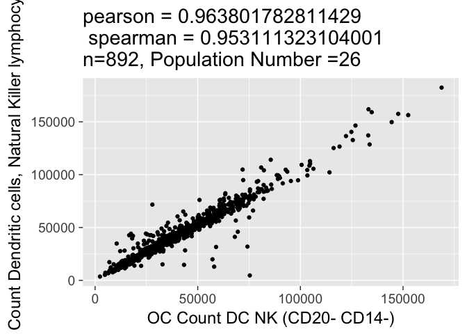<!-- -->

```
## 
## panel2 
##   9127 
## [1] "DC.NK"
## [1] "DC.NK"
## [1] "Samples with less than 50K lymph or 50K PBMC (in OC) are excluded"
## [1] "FREQ_PBMC_LYMPH"
```

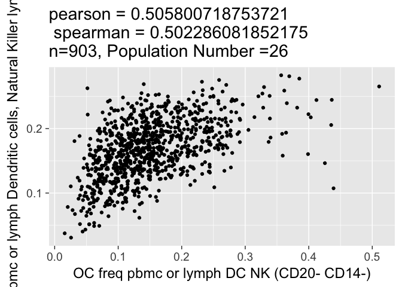<!-- -->

```
## 
## panel2 
##   9127 
## [1] "DC"
## [1] "DC"
## [1] "Samples with less than 50K lymph or 50K PBMC (in OC) are excluded"
## [1] "FREQ"
```

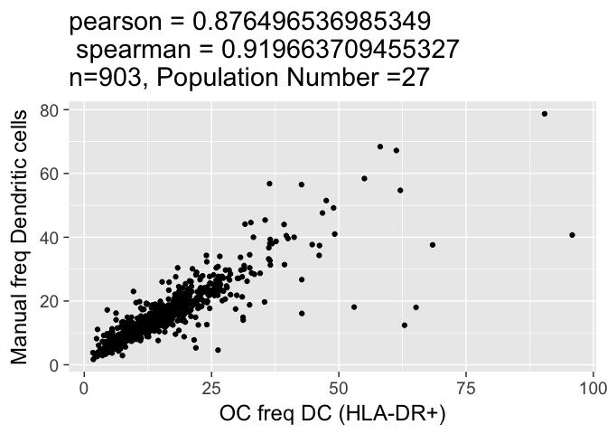<!-- -->

```
## 
## panel2 
##   9127 
## [1] "DC"
## [1] "DC"
## [1] "Samples with less than 50K lymph or 50K PBMC (in OC) are excluded"
## [1] "COUNT"
```

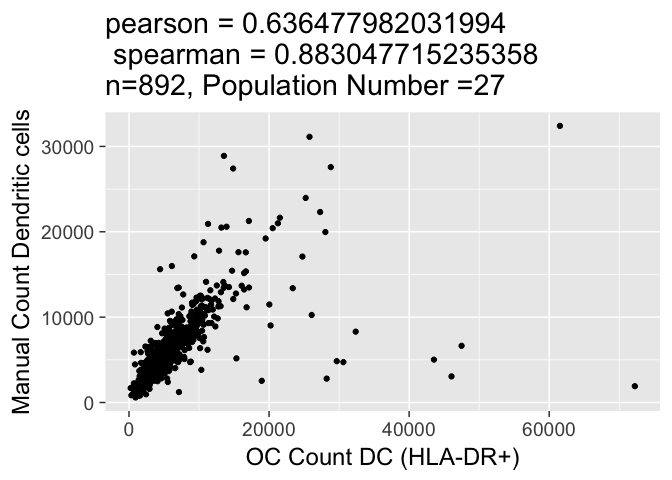<!-- -->

```
## 
## panel2 
##   9127 
## [1] "DC"
## [1] "DC"
## [1] "Samples with less than 50K lymph or 50K PBMC (in OC) are excluded"
## [1] "FREQ_PBMC_LYMPH"
```

<!-- -->

```
## 
## panel2 
##   9127 
## [1] "DCm"
## [1] "DCm"
## [1] "Samples with less than 50K lymph or 50K PBMC (in OC) are excluded"
## [1] "FREQ"
```

<!-- -->

```
## 
## panel2 
##   9127 
## [1] "DCm"
## [1] "DCm"
## [1] "Samples with less than 50K lymph or 50K PBMC (in OC) are excluded"
## [1] "COUNT"
```

<!-- -->

```
## 
## panel2 
##   9127 
## [1] "DCm"
## [1] "DCm"
## [1] "Samples with less than 50K lymph or 50K PBMC (in OC) are excluded"
## [1] "FREQ_PBMC_LYMPH"
```

<!-- -->

```
## 
## panel2 
##   9127 
## [1] "DCp"
## [1] "DCp"
## [1] "Samples with less than 50K lymph or 50K PBMC (in OC) are excluded"
## [1] "FREQ"
```

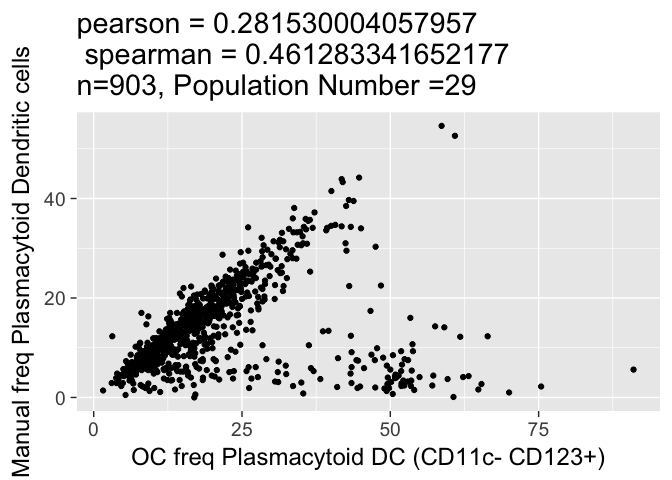<!-- -->

```
## 
## panel2 
##   9127 
## [1] "DCp"
## [1] "DCp"
## [1] "Samples with less than 50K lymph or 50K PBMC (in OC) are excluded"
## [1] "COUNT"
```

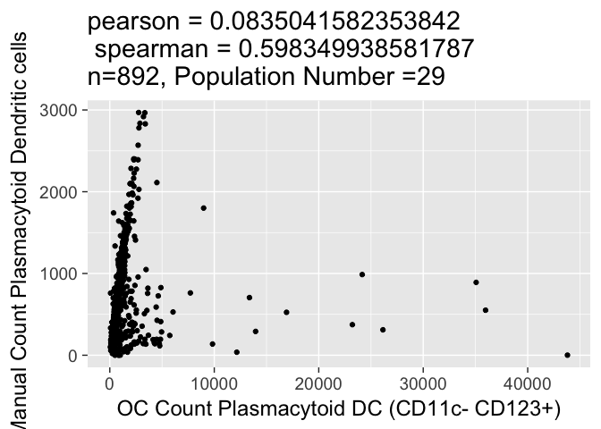<!-- -->

```
## 
## panel2 
##   9127 
## [1] "DCp"
## [1] "DCp"
## [1] "Samples with less than 50K lymph or 50K PBMC (in OC) are excluded"
## [1] "FREQ_PBMC_LYMPH"
```

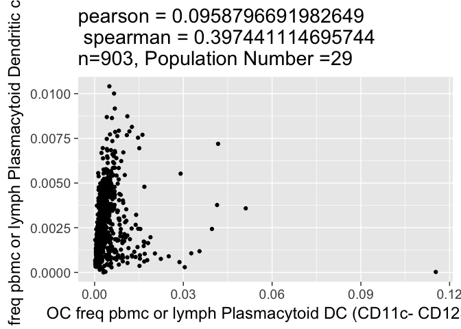<!-- -->

```
## 
## panel2 
##   9127 
## [1] "NK"
## [1] "NK"
## [1] "Samples with less than 50K lymph or 50K PBMC (in OC) are excluded"
## [1] "FREQ"
```

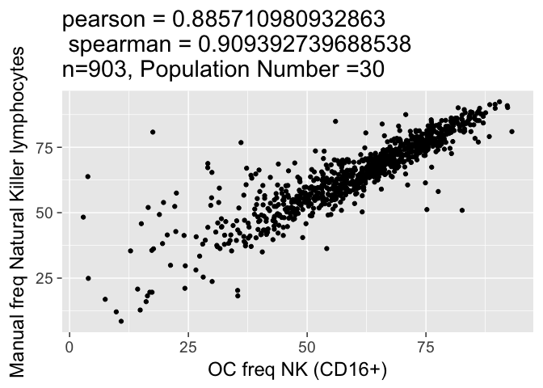<!-- -->

```
## 
## panel2 
##   9127 
## [1] "NK"
## [1] "NK"
## [1] "Samples with less than 50K lymph or 50K PBMC (in OC) are excluded"
## [1] "COUNT"
```

<!-- -->

```
## 
## panel2 
##   9127 
## [1] "NK"
## [1] "NK"
## [1] "Samples with less than 50K lymph or 50K PBMC (in OC) are excluded"
## [1] "FREQ_PBMC_LYMPH"
```

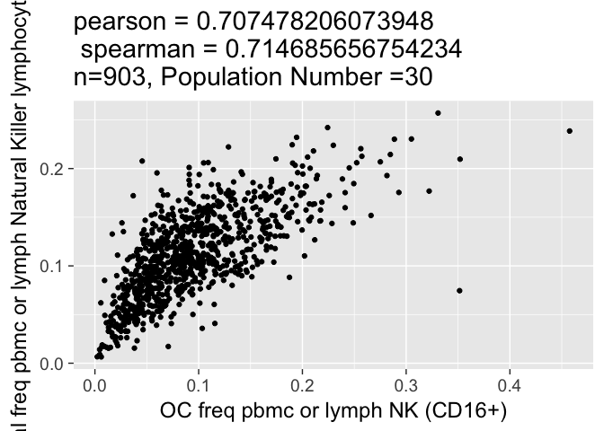<!-- -->

```
## 
## panel2 
##   9127 
## [1] "NKHI"
## [1] "NKHI"
## [1] "Samples with less than 50K lymph or 50K PBMC (in OC) are excluded"
## [1] "FREQ"
```

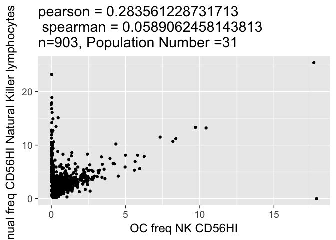<!-- -->

```
## 
## panel2 
##   9127 
## [1] "NKHI"
## [1] "NKHI"
## [1] "Samples with less than 50K lymph or 50K PBMC (in OC) are excluded"
## [1] "COUNT"
```

<!-- -->

```
## 
## panel2 
##   9127 
## [1] "NKHI"
## [1] "NKHI"
## [1] "Samples with less than 50K lymph or 50K PBMC (in OC) are excluded"
## [1] "FREQ_PBMC_LYMPH"
```

<!-- -->

```
## 
## panel2 
##   9127 
## [1] "NKLO"
## [1] "NKLO"
## [1] "Samples with less than 50K lymph or 50K PBMC (in OC) are excluded"
## [1] "FREQ"
```

<!-- -->

```
## 
## panel2 
##   9127 
## [1] "NKLO"
## [1] "NKLO"
## [1] "Samples with less than 50K lymph or 50K PBMC (in OC) are excluded"
## [1] "COUNT"
```

<!-- -->

```
## 
## panel2 
##   9127 
## [1] "NKLO"
## [1] "NKLO"
## [1] "Samples with less than 50K lymph or 50K PBMC (in OC) are excluded"
## [1] "FREQ_PBMC_LYMPH"
```

<!-- -->

```
## 
## panel2 
##   9127 
## [1] "MONO"
## [1] "MONO"
## [1] "Samples with less than 50K lymph or 50K PBMC (in OC) are excluded"
## [1] "FREQ"
```

<!-- -->

```
## 
## panel2 
##   9127 
## [1] "MONO"
## [1] "MONO"
## [1] "Samples with less than 50K lymph or 50K PBMC (in OC) are excluded"
## [1] "COUNT"
```

<!-- -->

```
## 
## panel2 
##   9127 
## [1] "MONO"
## [1] "MONO"
## [1] "Samples with less than 50K lymph or 50K PBMC (in OC) are excluded"
## [1] "FREQ_PBMC_LYMPH"
```

<!-- -->

```
## 
## panel2 
##   9127 
## [1] "MONOc"
## [1] "MONOc"
## [1] "Samples with less than 50K lymph or 50K PBMC (in OC) are excluded"
## [1] "FREQ"
```

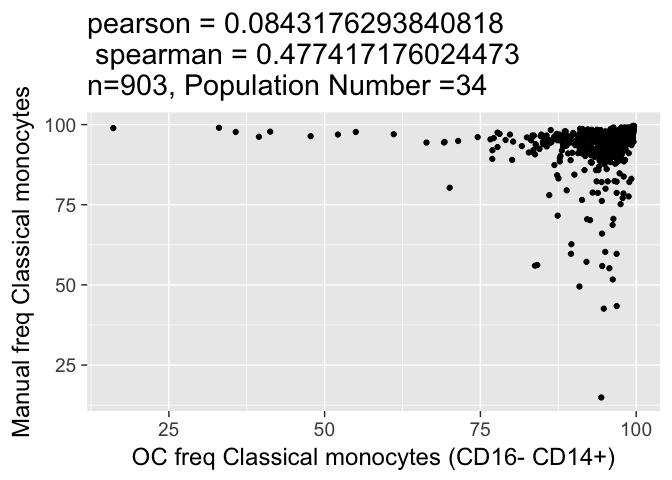<!-- -->

```
## 
## panel2 
##   9127 
## [1] "MONOc"
## [1] "MONOc"
## [1] "Samples with less than 50K lymph or 50K PBMC (in OC) are excluded"
## [1] "COUNT"
```

<!-- -->

```
## 
## panel2 
##   9127 
## [1] "MONOc"
## [1] "MONOc"
## [1] "Samples with less than 50K lymph or 50K PBMC (in OC) are excluded"
## [1] "FREQ_PBMC_LYMPH"
```

<!-- -->

```
## 
## panel2 
##   9127 
## [1] "MONOnc"
## [1] "MONOnc"
## [1] "Samples with less than 50K lymph or 50K PBMC (in OC) are excluded"
## [1] "FREQ"
```

<!-- -->

```
## 
## panel2 
##   9127 
## [1] "MONOnc"
## [1] "MONOnc"
## [1] "Samples with less than 50K lymph or 50K PBMC (in OC) are excluded"
## [1] "COUNT"
```

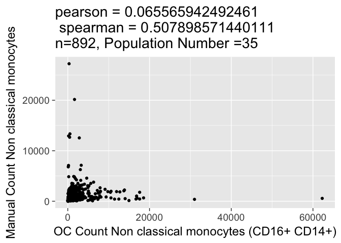<!-- -->

```
## 
## panel2 
##   9127 
## [1] "MONOnc"
## [1] "MONOnc"
## [1] "Samples with less than 50K lymph or 50K PBMC (in OC) are excluded"
## [1] "FREQ_PBMC_LYMPH"
```

<!-- -->

```
## 
## panel1 
##   7648 
## [1] "Bcell"
## [1] "Bcell"
## [1] "Samples with less than 100K lymph or 100K PBMC (in OC) are excluded"
## [1] "FREQ"
```

<!-- -->

```
## 
## panel1 
##   7648 
## [1] "Bcell"
## [1] "Bcell"
## [1] "Samples with less than 100K lymph or 100K PBMC (in OC) are excluded"
## [1] "COUNT"
```

<!-- -->

```
## 
## panel1 
##   7648 
## [1] "Bcell"
## [1] "Bcell"
## [1] "Samples with less than 100K lymph or 100K PBMC (in OC) are excluded"
## [1] "FREQ_PBMC_LYMPH"
```

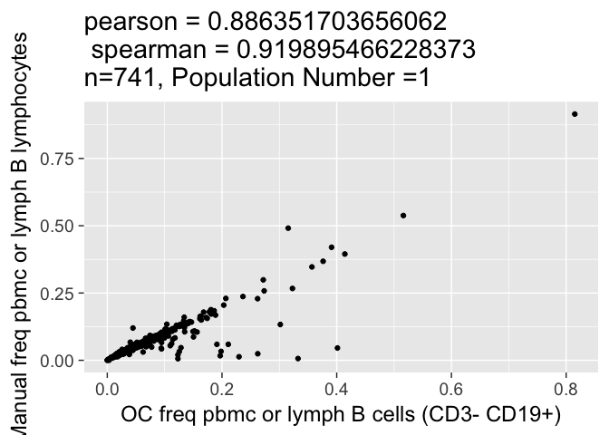<!-- -->

```
## 
## panel1 
##   7648 
## [1] "IgD.MemB"
## [1] "IgD.MemB"
## [1] "Samples with less than 100K lymph or 100K PBMC (in OC) are excluded"
## [1] "FREQ"
```

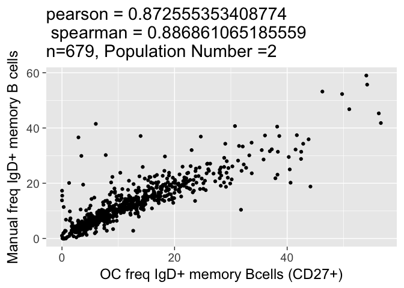<!-- -->

```
## 
## panel1 
##   7648 
## [1] "IgD.MemB"
## [1] "IgD.MemB"
## [1] "Samples with less than 100K lymph or 100K PBMC (in OC) are excluded"
## [1] "COUNT"
```

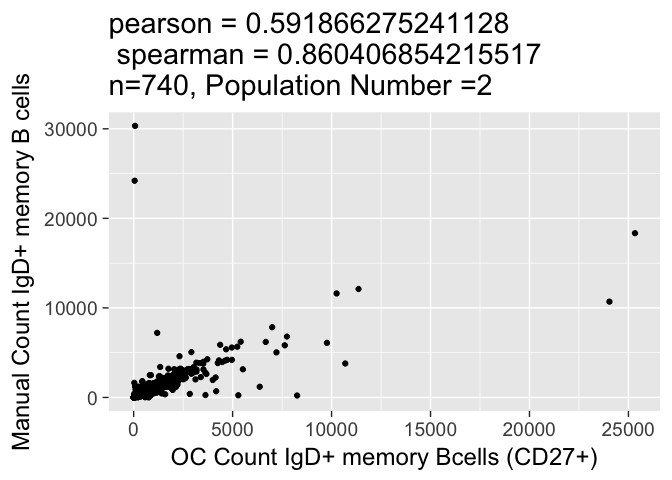<!-- -->

```
## 
## panel1 
##   7648 
## [1] "IgD.MemB"
## [1] "IgD.MemB"
## [1] "Samples with less than 100K lymph or 100K PBMC (in OC) are excluded"
## [1] "FREQ_PBMC_LYMPH"
```

<!-- -->

```
## 
## panel1 
##   7648 
## [1] "IgD.MemB.1"
## [1] "IgD.MemB.1"
## [1] "Samples with less than 100K lymph or 100K PBMC (in OC) are excluded"
## [1] "FREQ"
```

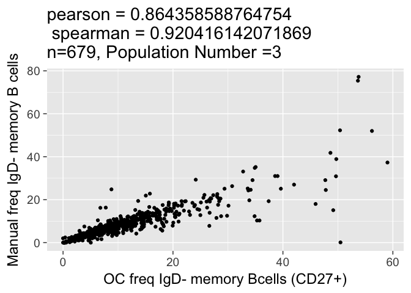<!-- -->

```
## 
## panel1 
##   7648 
## [1] "IgD.MemB.1"
## [1] "IgD.MemB.1"
## [1] "Samples with less than 100K lymph or 100K PBMC (in OC) are excluded"
## [1] "COUNT"
```

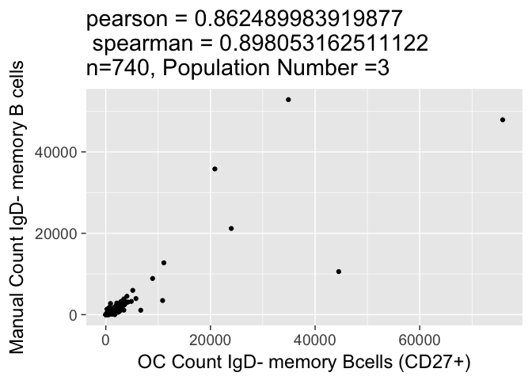<!-- -->

```
## 
## panel1 
##   7648 
## [1] "IgD.MemB.1"
## [1] "IgD.MemB.1"
## [1] "Samples with less than 100K lymph or 100K PBMC (in OC) are excluded"
## [1] "FREQ_PBMC_LYMPH"
```

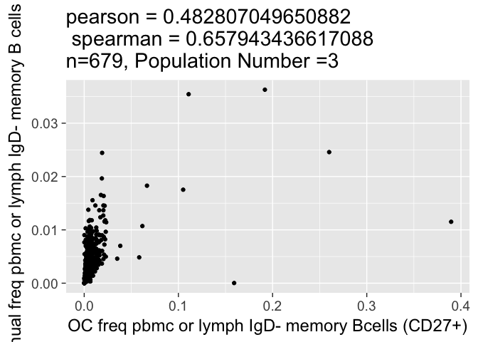<!-- -->

```
## 
## panel1 
##   7648 
## [1] "NaiveB"
## [1] "NaiveB"
## [1] "Samples with less than 100K lymph or 100K PBMC (in OC) are excluded"
## [1] "FREQ"
```

<!-- -->

```
## 
## panel1 
##   7648 
## [1] "NaiveB"
## [1] "NaiveB"
## [1] "Samples with less than 100K lymph or 100K PBMC (in OC) are excluded"
## [1] "COUNT"
```

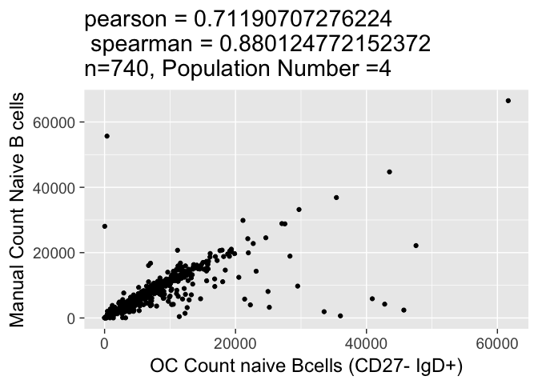<!-- -->

```
## 
## panel1 
##   7648 
## [1] "NaiveB"
## [1] "NaiveB"
## [1] "Samples with less than 100K lymph or 100K PBMC (in OC) are excluded"
## [1] "FREQ_PBMC_LYMPH"
```

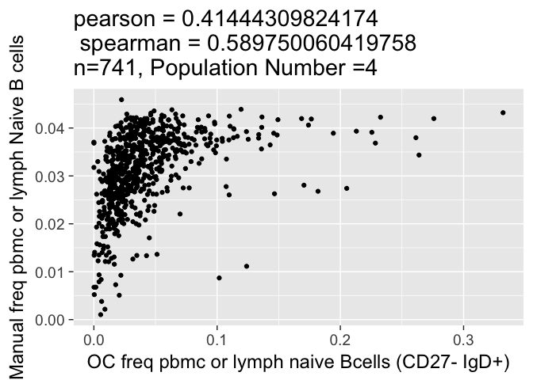<!-- -->

```
## 
## panel1 
##   7648 
## [1] "Tcell"
## [1] "Tcell"
## [1] "Samples with less than 100K lymph or 100K PBMC (in OC) are excluded"
## [1] "FREQ"
```

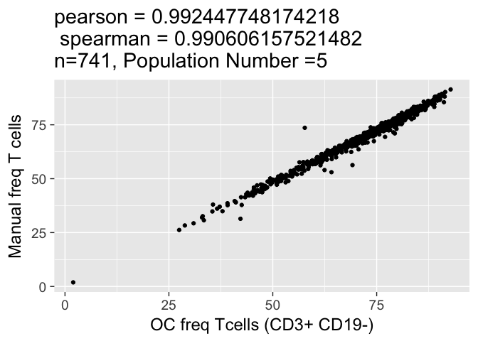<!-- -->

```
## 
## panel1 
##   7648 
## [1] "Tcell"
## [1] "Tcell"
## [1] "Samples with less than 100K lymph or 100K PBMC (in OC) are excluded"
## [1] "COUNT"
```

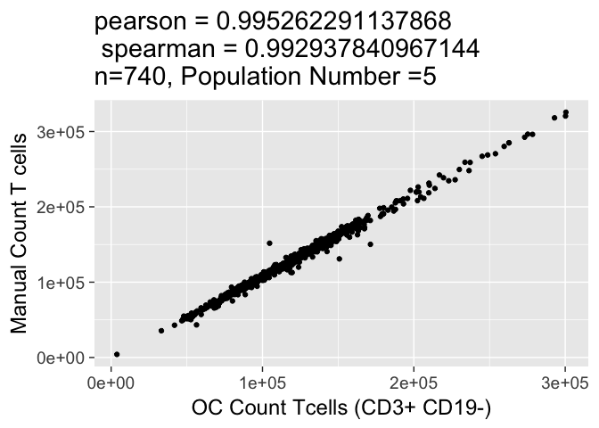<!-- -->

```
## 
## panel1 
##   7648 
## [1] "Tcell"
## [1] "Tcell"
## [1] "Samples with less than 100K lymph or 100K PBMC (in OC) are excluded"
## [1] "FREQ_PBMC_LYMPH"
```

<!-- -->

```
## 
## panel1 
##   7648 
## [1] "CT"
## [1] "CT"
## [1] "Samples with less than 100K lymph or 100K PBMC (in OC) are excluded"
## [1] "FREQ"
```

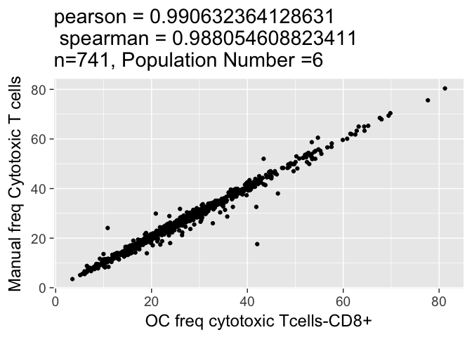<!-- -->

```
## 
## panel1 
##   7648 
## [1] "CT"
## [1] "CT"
## [1] "Samples with less than 100K lymph or 100K PBMC (in OC) are excluded"
## [1] "COUNT"
```

<!-- -->

```
## 
## panel1 
##   7648 
## [1] "CT"
## [1] "CT"
## [1] "Samples with less than 100K lymph or 100K PBMC (in OC) are excluded"
## [1] "FREQ_PBMC_LYMPH"
```

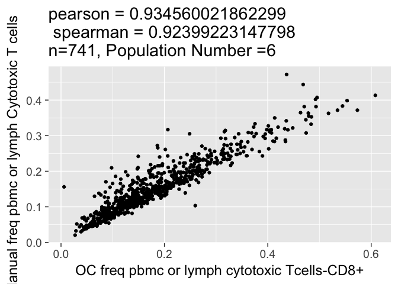<!-- -->

```
## 
## panel1 
##   7648 
## [1] "ActCT"
## [1] "ActCT"
## [1] "Samples with less than 100K lymph or 100K PBMC (in OC) are excluded"
## [1] "FREQ"
```

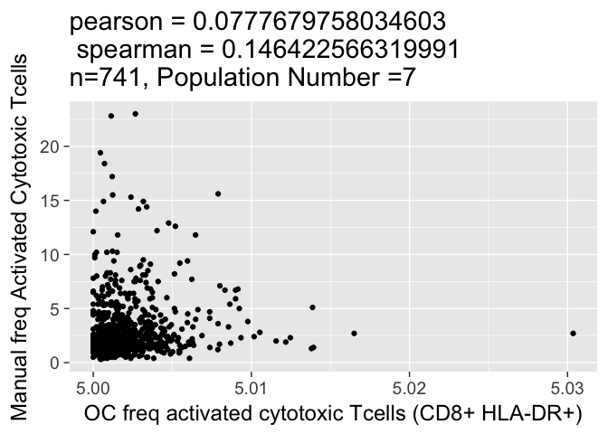<!-- -->

```
## 
## panel1 
##   7648 
## [1] "ActCT"
## [1] "ActCT"
## [1] "Samples with less than 100K lymph or 100K PBMC (in OC) are excluded"
## [1] "COUNT"
```

<!-- -->

```
## 
## panel1 
##   7648 
## 
## panel1 
##   7648 
## [1] "CM.CT"
## [1] "CM.CT"
## [1] "Samples with less than 100K lymph or 100K PBMC (in OC) are excluded"
## [1] "FREQ"
```

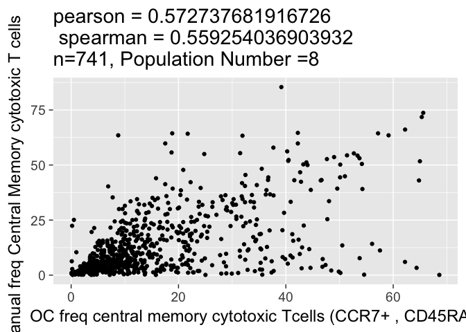<!-- -->

```
## 
## panel1 
##   7648 
## [1] "CM.CT"
## 
## panel1 
##   7648 
## [1] "E.CT"
## [1] "E.CT"
## [1] "Samples with less than 100K lymph or 100K PBMC (in OC) are excluded"
## [1] "FREQ"
```

<!-- -->

```
## 
## panel1 
##   7648 
## [1] "E.CT"
## [1] "E.CT"
## [1] "Samples with less than 100K lymph or 100K PBMC (in OC) are excluded"
## [1] "COUNT"
```

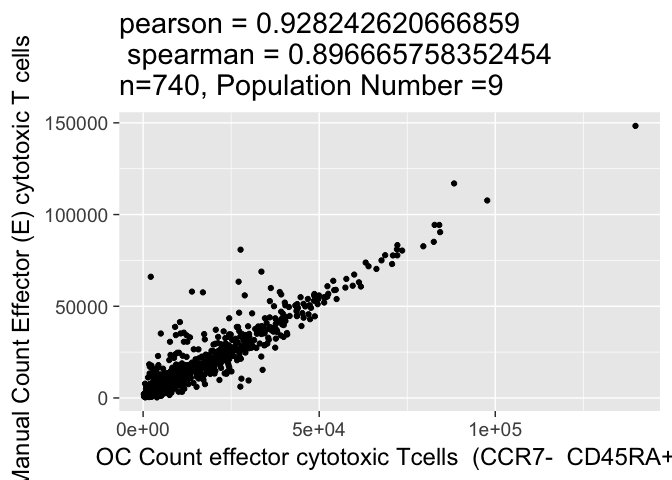<!-- -->

```
## 
## panel1 
##   7648 
## 
## panel1 
##   7648 
## [1] "pE.CT"
## [1] "pE.CT"
## [1] "Samples with less than 100K lymph or 100K PBMC (in OC) are excluded"
## [1] "FREQ"
```

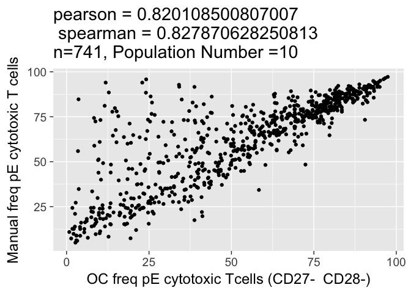<!-- -->

```
## 
## panel1 
##   7648 
## [1] "pE.CT"
## [1] "pE.CT"
## [1] "Samples with less than 100K lymph or 100K PBMC (in OC) are excluded"
## [1] "COUNT"
```

<!-- -->

```
## 
## panel1 
##   7648 
## 
## panel1 
##   7648 
## [1] "pE1.CT"
## [1] "pE1.CT"
## [1] "Samples with less than 100K lymph or 100K PBMC (in OC) are excluded"
## [1] "FREQ"
```

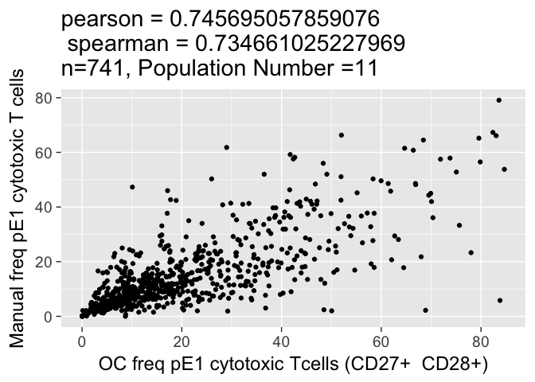<!-- -->

```
## 
## panel1 
##   7648 
## [1] "pE1.CT"
## [1] "pE1.CT"
## [1] "Samples with less than 100K lymph or 100K PBMC (in OC) are excluded"
## [1] "COUNT"
```

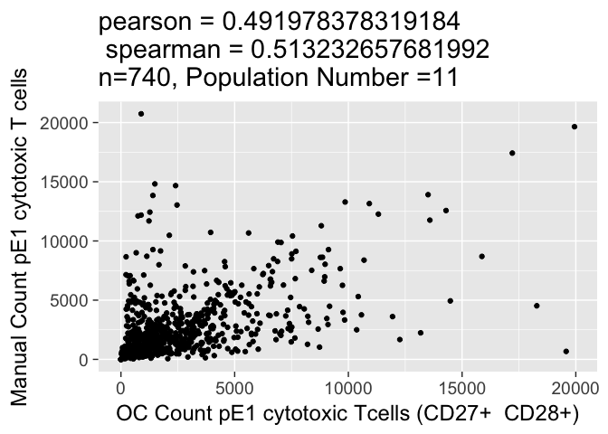<!-- -->

```
## 
## panel1 
##   7648 
## 
## panel1 
##   7648 
## [1] "pE2.CT"
## [1] "pE2.CT"
## [1] "Samples with less than 100K lymph or 100K PBMC (in OC) are excluded"
## [1] "FREQ"
```

<!-- -->

```
## 
## panel1 
##   7648 
## [1] "pE2.CT"
## 
## panel1 
##   7648 
## [1] "EM.CT"
## [1] "EM.CT"
## [1] "Samples with less than 100K lymph or 100K PBMC (in OC) are excluded"
## [1] "FREQ"
```

<!-- -->

```
## 
## panel1 
##   7648 
## [1] "EM.CT"
## 
## panel1 
##   7648 
## [1] "EM1.C.T"
## [1] "EM1.C.T"
## [1] "Samples with less than 100K lymph or 100K PBMC (in OC) are excluded"
## [1] "FREQ"
```

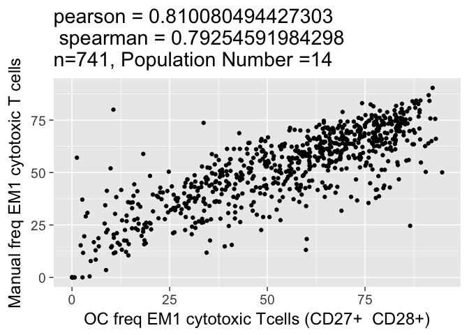<!-- -->

```
## 
## panel1 
##   7648 
## [1] "EM1.C.T"
## [1] "EM1.C.T"
## [1] "Samples with less than 100K lymph or 100K PBMC (in OC) are excluded"
## [1] "COUNT"
```

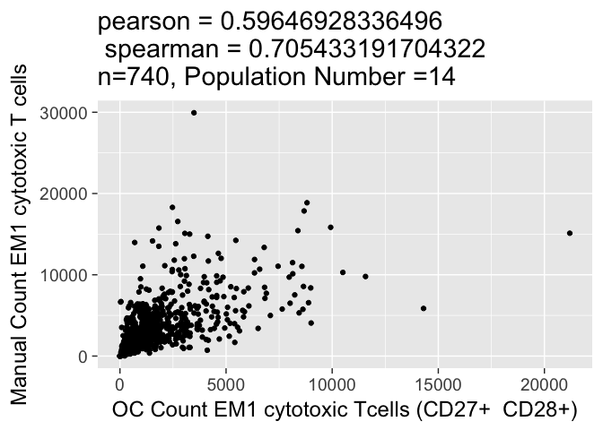<!-- -->

```
## 
## panel1 
##   7648 
## 
## panel1 
##   7648 
## [1] "EM2.CT"
## [1] "EM2.CT"
## [1] "Samples with less than 100K lymph or 100K PBMC (in OC) are excluded"
## [1] "FREQ"
```

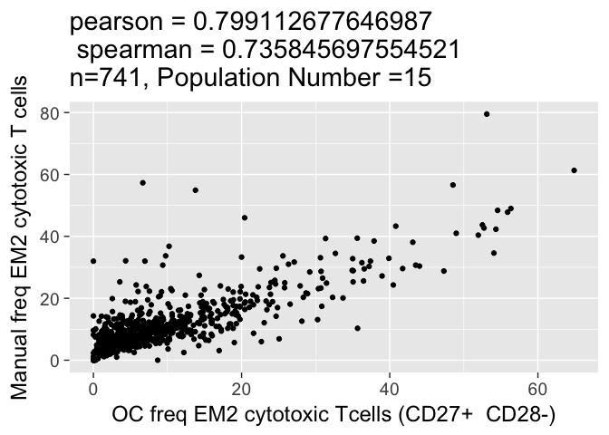<!-- -->

```
## 
## panel1 
##   7648 
## [1] "EM2.CT"
## [1] "EM2.CT"
## [1] "Samples with less than 100K lymph or 100K PBMC (in OC) are excluded"
## [1] "COUNT"
```

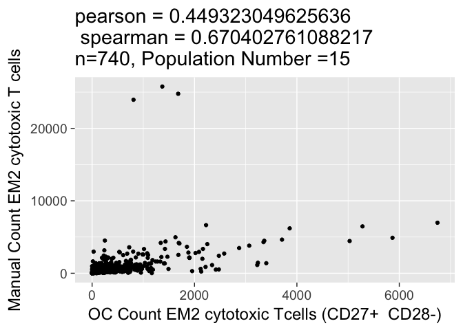<!-- -->

```
## 
## panel1 
##   7648 
## 
## panel1 
##   7648 
## [1] "EM3.CT"
## [1] "EM3.CT"
## [1] "Samples with less than 100K lymph or 100K PBMC (in OC) are excluded"
## [1] "FREQ"
```

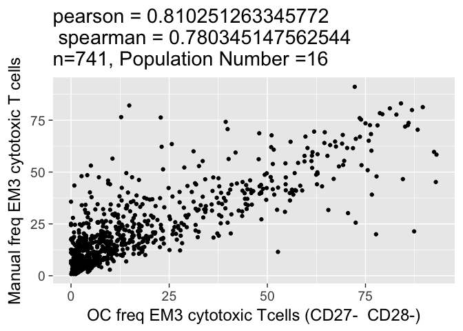<!-- -->

```
## 
## panel1 
##   7648 
## [1] "EM3.CT"
## [1] "EM3.CT"
## [1] "Samples with less than 100K lymph or 100K PBMC (in OC) are excluded"
## [1] "COUNT"
```

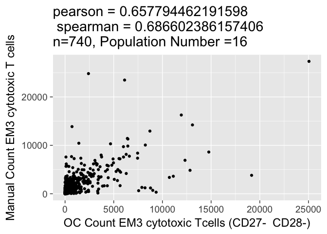<!-- -->

```
## 
## panel1 
##   7648 
## 
## panel1 
##   7648 
## [1] "EM4.CT"
## [1] "EM4.CT"
## [1] "Samples with less than 100K lymph or 100K PBMC (in OC) are excluded"
## [1] "FREQ"
```

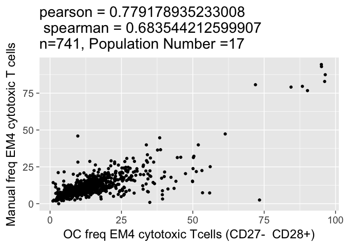<!-- -->

```
## 
## panel1 
##   7648 
## [1] "EM4.CT"
## [1] "EM4.CT"
## [1] "Samples with less than 100K lymph or 100K PBMC (in OC) are excluded"
## [1] "COUNT"
```

<!-- -->

```
## 
## panel1 
##   7648 
## 
## panel1 
##   7648 
## [1] "N.CT"
## [1] "N.CT"
## [1] "Samples with less than 100K lymph or 100K PBMC (in OC) are excluded"
## [1] "FREQ"
```

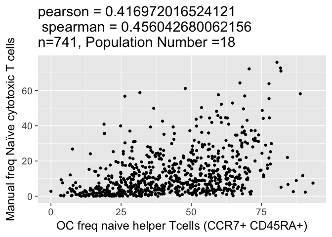<!-- -->

```
## 
## panel1 
##   7648 
## [1] "N.CT"
## [1] "N.CT"
## [1] "Samples with less than 100K lymph or 100K PBMC (in OC) are excluded"
## [1] "COUNT"
```

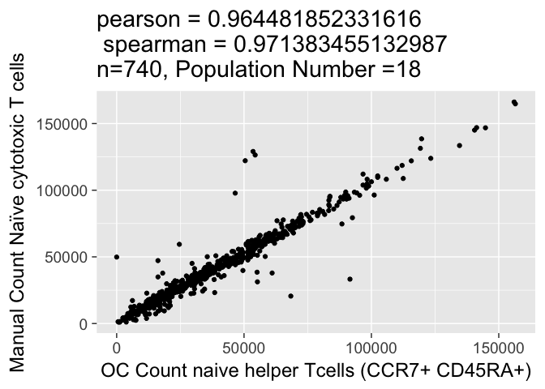<!-- -->

```
## 
## panel1 
##   7648 
## 
## panel1 
##   7648 
## [1] "HT"
## [1] "HT"
## [1] "Samples with less than 100K lymph or 100K PBMC (in OC) are excluded"
## [1] "FREQ"
```

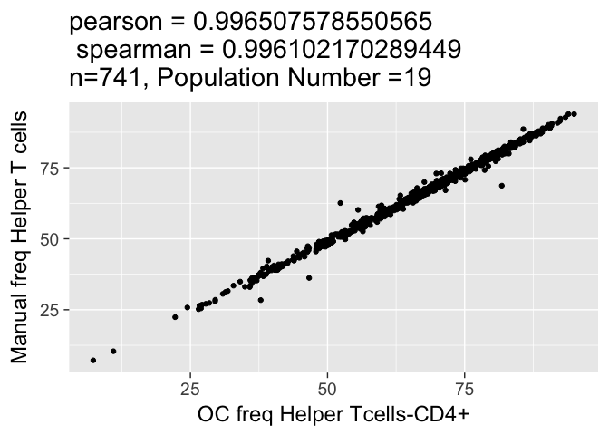<!-- -->

```
## 
## panel1 
##   7648 
## [1] "HT"
## [1] "HT"
## [1] "Samples with less than 100K lymph or 100K PBMC (in OC) are excluded"
## [1] "COUNT"
```

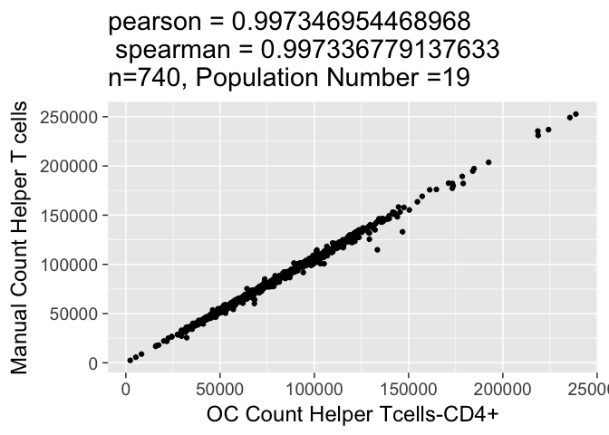<!-- -->

```
## 
## panel1 
##   7648 
## [1] "HT"
## [1] "HT"
## [1] "Samples with less than 100K lymph or 100K PBMC (in OC) are excluded"
## [1] "FREQ_PBMC_LYMPH"
```

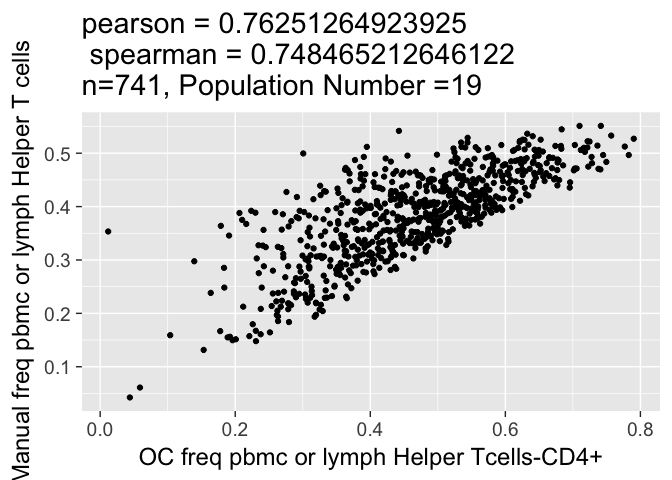<!-- -->

```
## 
## panel1 
##   7648 
## [1] "Act.HT"
## [1] "Act.HT"
## [1] "Samples with less than 100K lymph or 100K PBMC (in OC) are excluded"
## [1] "FREQ"
```

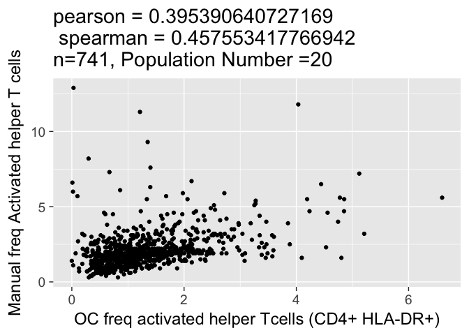<!-- -->

```
## 
## panel1 
##   7648 
## [1] "Act.HT"
## [1] "Act.HT"
## [1] "Samples with less than 100K lymph or 100K PBMC (in OC) are excluded"
## [1] "COUNT"
```

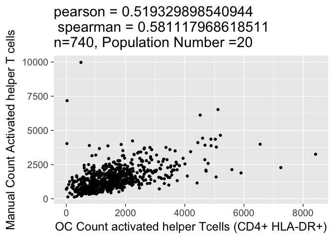<!-- -->

```
## 
## panel1 
##   7648 
## 
## panel1 
##   7648 
## [1] "CM.HT"
## [1] "CM.HT"
## [1] "Samples with less than 100K lymph or 100K PBMC (in OC) are excluded"
## [1] "FREQ"
```

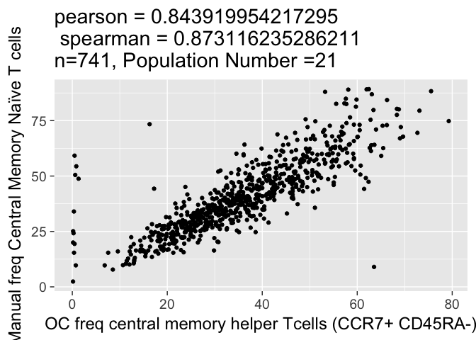<!-- -->

```
## 
## panel1 
##   7648 
## [1] "CM.HT"
## [1] "CM.HT"
## [1] "Samples with less than 100K lymph or 100K PBMC (in OC) are excluded"
## [1] "COUNT"
```

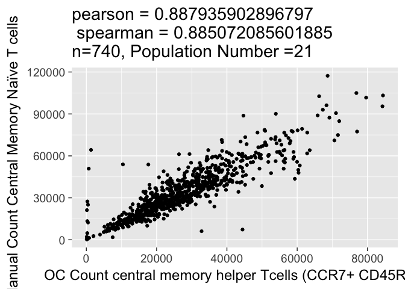<!-- -->

```
## 
## panel1 
##   7648 
## 
## panel1 
##   7648 
## [1] "E.HT"
## [1] "E.HT"
## [1] "Samples with less than 100K lymph or 100K PBMC (in OC) are excluded"
## [1] "FREQ"
```

<!-- -->

```
## 
## panel1 
##   7648 
## [1] "E.HT"
## [1] "E.HT"
## [1] "Samples with less than 100K lymph or 100K PBMC (in OC) are excluded"
## [1] "COUNT"
```

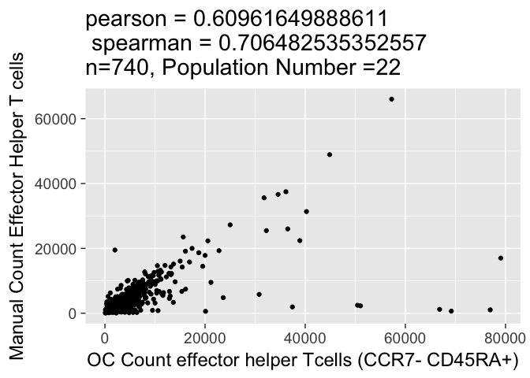<!-- -->

```
## 
## panel1 
##   7648 
## 
## panel1 
##   7648 
## [1] "EM.HT"
## [1] "EM.HT"
## [1] "Samples with less than 100K lymph or 100K PBMC (in OC) are excluded"
## [1] "FREQ"
```

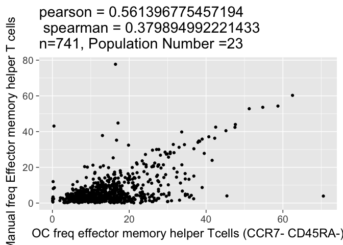<!-- -->

```
## 
## panel1 
##   7648 
## [1] "EM.HT"
## [1] "EM.HT"
## [1] "Samples with less than 100K lymph or 100K PBMC (in OC) are excluded"
## [1] "COUNT"
```

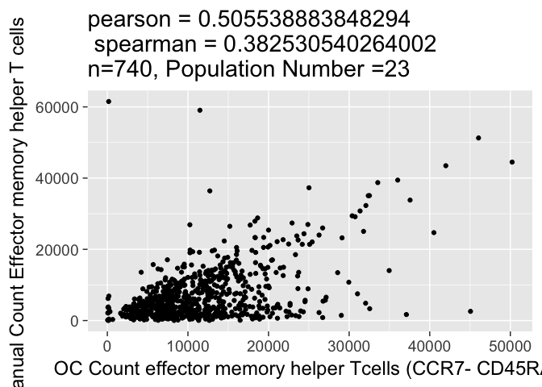<!-- -->

```
## 
## panel1 
##   7648 
## 
## panel1 
##   7648 
## [1] "N.HT"
## [1] "N.HT"
## [1] "Samples with less than 100K lymph or 100K PBMC (in OC) are excluded"
## [1] "FREQ"
```

<!-- -->

```
## 
## panel1 
##   7648 
## [1] "N.HT"
## [1] "N.HT"
## [1] "Samples with less than 100K lymph or 100K PBMC (in OC) are excluded"
## [1] "COUNT"
```

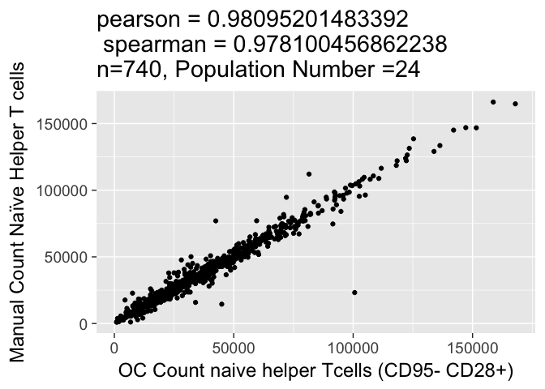<!-- -->

```
## 
## panel1 
##   7648 
## 
## panel2 
##   8756 
## [1] "DC.NK.MONO"
## [1] "DC.NK.MONO"
## [1] "Samples with less than 100K lymph or 100K PBMC (in OC) are excluded"
## [1] "FREQ"
```

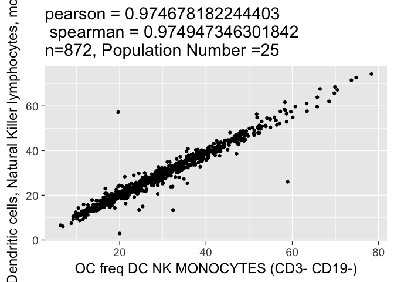<!-- -->

```
## 
## panel2 
##   8756 
## [1] "DC.NK.MONO"
## [1] "DC.NK.MONO"
## [1] "Samples with less than 100K lymph or 100K PBMC (in OC) are excluded"
## [1] "COUNT"
```

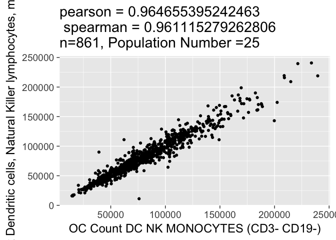<!-- -->

```
## 
## panel2 
##   8756 
## [1] "DC.NK.MONO"
## [1] "DC.NK.MONO"
## [1] "Samples with less than 100K lymph or 100K PBMC (in OC) are excluded"
## [1] "FREQ_PBMC_LYMPH"
```

<!-- -->

```
## 
## panel2 
##   8756 
## [1] "DC.NK"
## [1] "DC.NK"
## [1] "Samples with less than 100K lymph or 100K PBMC (in OC) are excluded"
## [1] "FREQ"
```

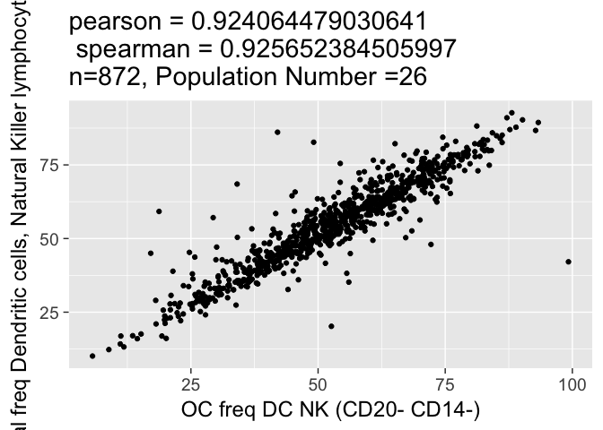<!-- -->

```
## 
## panel2 
##   8756 
## [1] "DC.NK"
## [1] "DC.NK"
## [1] "Samples with less than 100K lymph or 100K PBMC (in OC) are excluded"
## [1] "COUNT"
```

<!-- -->

```
## 
## panel2 
##   8756 
## [1] "DC.NK"
## [1] "DC.NK"
## [1] "Samples with less than 100K lymph or 100K PBMC (in OC) are excluded"
## [1] "FREQ_PBMC_LYMPH"
```

<!-- -->

```
## 
## panel2 
##   8756 
## [1] "DC"
## [1] "DC"
## [1] "Samples with less than 100K lymph or 100K PBMC (in OC) are excluded"
## [1] "FREQ"
```

<!-- -->

```
## 
## panel2 
##   8756 
## [1] "DC"
## [1] "DC"
## [1] "Samples with less than 100K lymph or 100K PBMC (in OC) are excluded"
## [1] "COUNT"
```

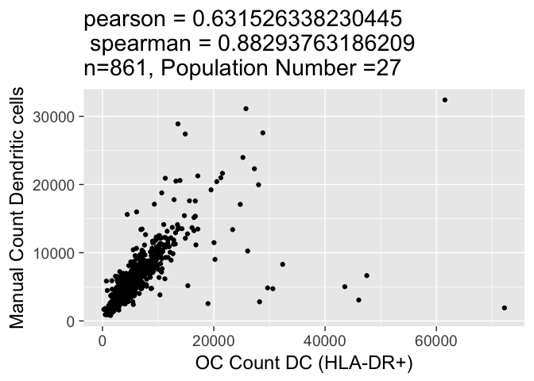<!-- -->

```
## 
## panel2 
##   8756 
## [1] "DC"
## [1] "DC"
## [1] "Samples with less than 100K lymph or 100K PBMC (in OC) are excluded"
## [1] "FREQ_PBMC_LYMPH"
```

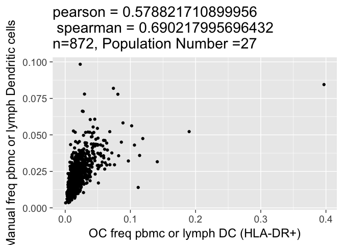<!-- -->

```
## 
## panel2 
##   8756 
## [1] "DCm"
## [1] "DCm"
## [1] "Samples with less than 100K lymph or 100K PBMC (in OC) are excluded"
## [1] "FREQ"
```

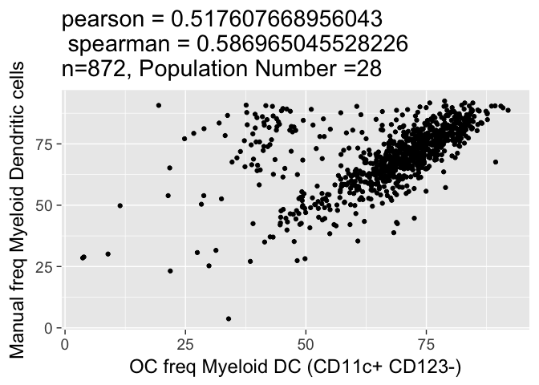<!-- -->

```
## 
## panel2 
##   8756 
## [1] "DCm"
## [1] "DCm"
## [1] "Samples with less than 100K lymph or 100K PBMC (in OC) are excluded"
## [1] "COUNT"
```

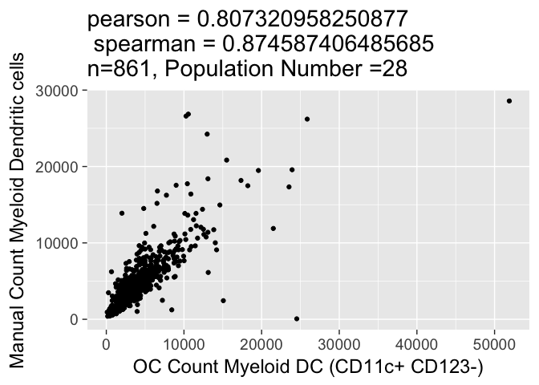<!-- -->

```
## 
## panel2 
##   8756 
## [1] "DCm"
## [1] "DCm"
## [1] "Samples with less than 100K lymph or 100K PBMC (in OC) are excluded"
## [1] "FREQ_PBMC_LYMPH"
```

<!-- -->

```
## 
## panel2 
##   8756 
## [1] "DCp"
## [1] "DCp"
## [1] "Samples with less than 100K lymph or 100K PBMC (in OC) are excluded"
## [1] "FREQ"
```

<!-- -->

```
## 
## panel2 
##   8756 
## [1] "DCp"
## [1] "DCp"
## [1] "Samples with less than 100K lymph or 100K PBMC (in OC) are excluded"
## [1] "COUNT"
```

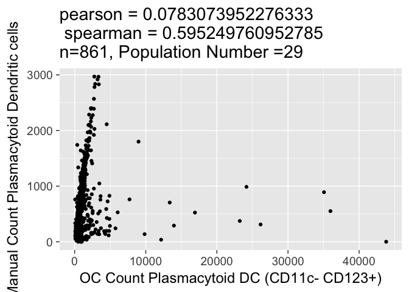<!-- -->

```
## 
## panel2 
##   8756 
## [1] "DCp"
## [1] "DCp"
## [1] "Samples with less than 100K lymph or 100K PBMC (in OC) are excluded"
## [1] "FREQ_PBMC_LYMPH"
```

<!-- -->

```
## 
## panel2 
##   8756 
## [1] "NK"
## [1] "NK"
## [1] "Samples with less than 100K lymph or 100K PBMC (in OC) are excluded"
## [1] "FREQ"
```

<!-- -->

```
## 
## panel2 
##   8756 
## [1] "NK"
## [1] "NK"
## [1] "Samples with less than 100K lymph or 100K PBMC (in OC) are excluded"
## [1] "COUNT"
```

<!-- -->

```
## 
## panel2 
##   8756 
## [1] "NK"
## [1] "NK"
## [1] "Samples with less than 100K lymph or 100K PBMC (in OC) are excluded"
## [1] "FREQ_PBMC_LYMPH"
```

<!-- -->

```
## 
## panel2 
##   8756 
## [1] "NKHI"
## [1] "NKHI"
## [1] "Samples with less than 100K lymph or 100K PBMC (in OC) are excluded"
## [1] "FREQ"
```

<!-- -->

```
## 
## panel2 
##   8756 
## [1] "NKHI"
## [1] "NKHI"
## [1] "Samples with less than 100K lymph or 100K PBMC (in OC) are excluded"
## [1] "COUNT"
```

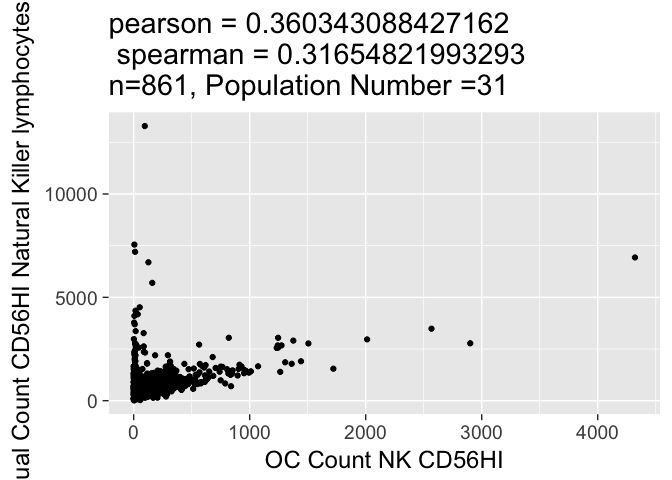<!-- -->

```
## 
## panel2 
##   8756 
## [1] "NKHI"
## [1] "NKHI"
## [1] "Samples with less than 100K lymph or 100K PBMC (in OC) are excluded"
## [1] "FREQ_PBMC_LYMPH"
```

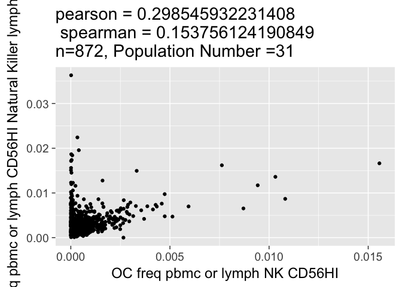<!-- -->

```
## 
## panel2 
##   8756 
## [1] "NKLO"
## [1] "NKLO"
## [1] "Samples with less than 100K lymph or 100K PBMC (in OC) are excluded"
## [1] "FREQ"
```

<!-- -->

```
## 
## panel2 
##   8756 
## [1] "NKLO"
## [1] "NKLO"
## [1] "Samples with less than 100K lymph or 100K PBMC (in OC) are excluded"
## [1] "COUNT"
```

<!-- -->

```
## 
## panel2 
##   8756 
## [1] "NKLO"
## [1] "NKLO"
## [1] "Samples with less than 100K lymph or 100K PBMC (in OC) are excluded"
## [1] "FREQ_PBMC_LYMPH"
```

<!-- -->

```
## 
## panel2 
##   8756 
## [1] "MONO"
## [1] "MONO"
## [1] "Samples with less than 100K lymph or 100K PBMC (in OC) are excluded"
## [1] "FREQ"
```

<!-- -->

```
## 
## panel2 
##   8756 
## [1] "MONO"
## [1] "MONO"
## [1] "Samples with less than 100K lymph or 100K PBMC (in OC) are excluded"
## [1] "COUNT"
```

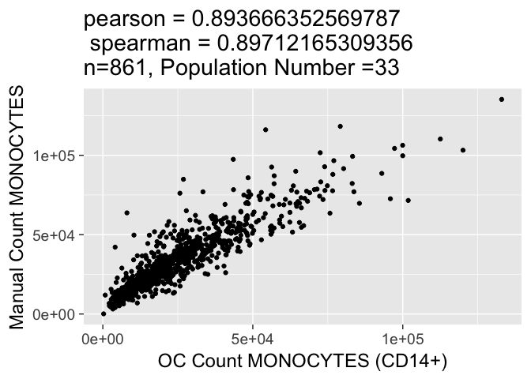<!-- -->

```
## 
## panel2 
##   8756 
## [1] "MONO"
## [1] "MONO"
## [1] "Samples with less than 100K lymph or 100K PBMC (in OC) are excluded"
## [1] "FREQ_PBMC_LYMPH"
```

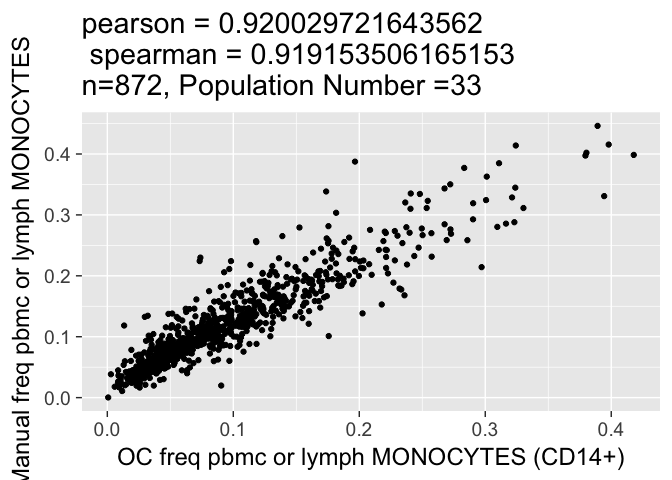<!-- -->

```
## 
## panel2 
##   8756 
## [1] "MONOc"
## [1] "MONOc"
## [1] "Samples with less than 100K lymph or 100K PBMC (in OC) are excluded"
## [1] "FREQ"
```

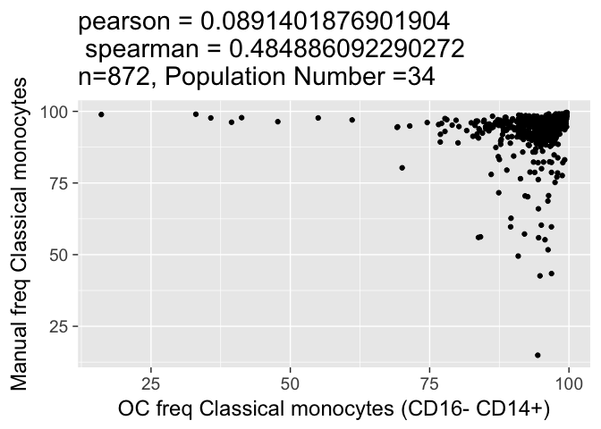<!-- -->

```
## 
## panel2 
##   8756 
## [1] "MONOc"
## [1] "MONOc"
## [1] "Samples with less than 100K lymph or 100K PBMC (in OC) are excluded"
## [1] "COUNT"
```

<!-- -->

```
## 
## panel2 
##   8756 
## [1] "MONOc"
## [1] "MONOc"
## [1] "Samples with less than 100K lymph or 100K PBMC (in OC) are excluded"
## [1] "FREQ_PBMC_LYMPH"
```

<!-- -->

```
## 
## panel2 
##   8756 
## [1] "MONOnc"
## [1] "MONOnc"
## [1] "Samples with less than 100K lymph or 100K PBMC (in OC) are excluded"
## [1] "FREQ"
```

<!-- -->

```
## 
## panel2 
##   8756 
## [1] "MONOnc"
## [1] "MONOnc"
## [1] "Samples with less than 100K lymph or 100K PBMC (in OC) are excluded"
## [1] "COUNT"
```

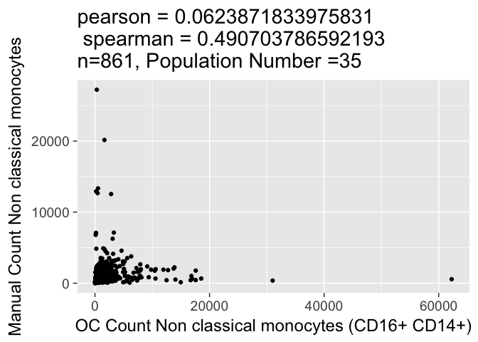<!-- -->

```
## 
## panel2 
##   8756 
## [1] "MONOnc"
## [1] "MONOnc"
## [1] "Samples with less than 100K lymph or 100K PBMC (in OC) are excluded"
## [1] "FREQ_PBMC_LYMPH"
```

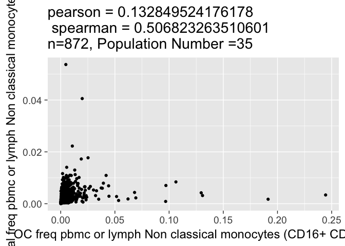<!-- -->

```
## 
## panel1 
##   9442 
## [1] "Bcell"
## [1] "Bcell"
## [1] "All samples"
## [1] "FREQ"
```

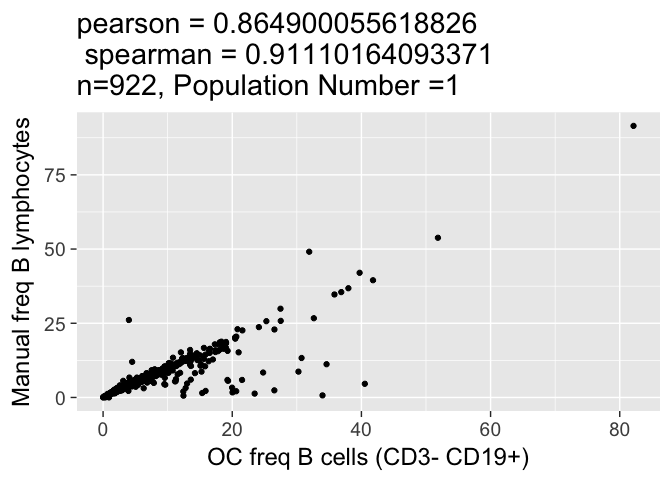<!-- -->

```
## 
## panel1 
##   9442 
## [1] "Bcell"
## [1] "Bcell"
## [1] "All samples"
## [1] "COUNT"
```

<!-- -->

```
## 
## panel1 
##   9442 
## [1] "Bcell"
## [1] "Bcell"
## [1] "All samples"
## [1] "FREQ_PBMC_LYMPH"
```

<!-- -->

```
## 
## panel1 
##   9442 
## [1] "IgD.MemB"
## [1] "IgD.MemB"
## [1] "All samples"
## [1] "FREQ"
```

<!-- -->

```
## 
## panel1 
##   9442 
## [1] "IgD.MemB"
## [1] "IgD.MemB"
## [1] "All samples"
## [1] "COUNT"
```

<!-- -->

```
## 
## panel1 
##   9442 
## [1] "IgD.MemB"
## [1] "IgD.MemB"
## [1] "All samples"
## [1] "FREQ_PBMC_LYMPH"
```

<!-- -->

```
## 
## panel1 
##   9442 
## [1] "IgD.MemB.1"
## [1] "IgD.MemB.1"
## [1] "All samples"
## [1] "FREQ"
```

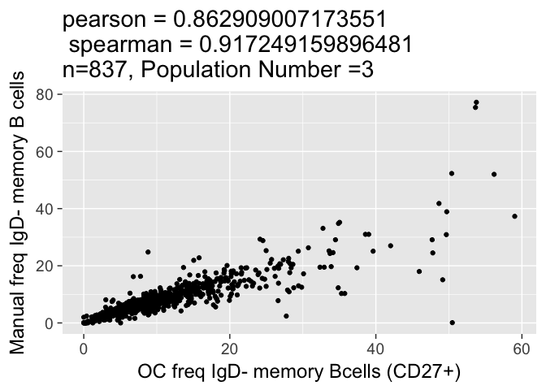<!-- -->

```
## 
## panel1 
##   9442 
## [1] "IgD.MemB.1"
## [1] "IgD.MemB.1"
## [1] "All samples"
## [1] "COUNT"
```

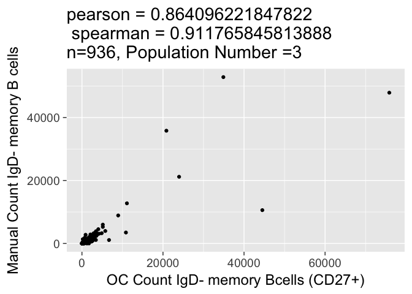<!-- -->

```
## 
## panel1 
##   9442 
## [1] "IgD.MemB.1"
## [1] "IgD.MemB.1"
## [1] "All samples"
## [1] "FREQ_PBMC_LYMPH"
```

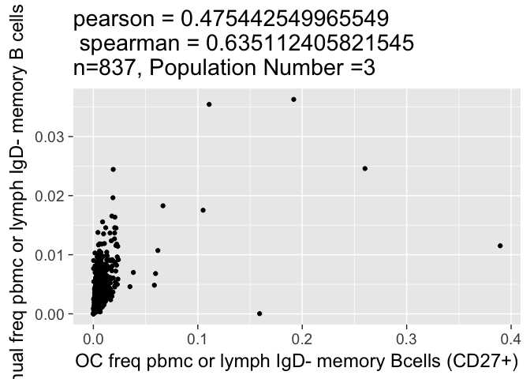<!-- -->

```
## 
## panel1 
##   9442 
## [1] "NaiveB"
## [1] "NaiveB"
## [1] "All samples"
## [1] "FREQ"
```

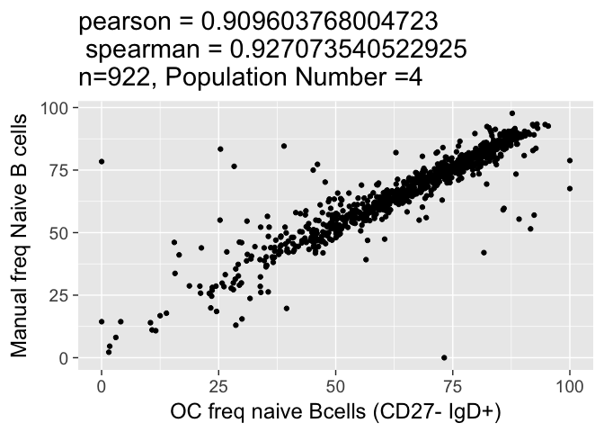<!-- -->

```
## 
## panel1 
##   9442 
## [1] "NaiveB"
## [1] "NaiveB"
## [1] "All samples"
## [1] "COUNT"
```

<!-- -->

```
## 
## panel1 
##   9442 
## [1] "NaiveB"
## [1] "NaiveB"
## [1] "All samples"
## [1] "FREQ_PBMC_LYMPH"
```

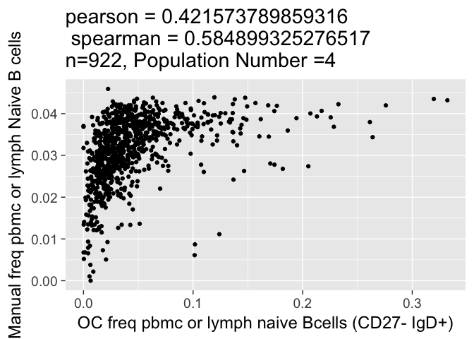<!-- -->

```
## 
## panel1 
##   9442 
## [1] "Tcell"
## [1] "Tcell"
## [1] "All samples"
## [1] "FREQ"
```

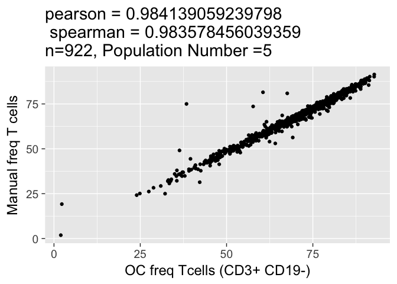<!-- -->

```
## 
## panel1 
##   9442 
## [1] "Tcell"
## [1] "Tcell"
## [1] "All samples"
## [1] "COUNT"
```

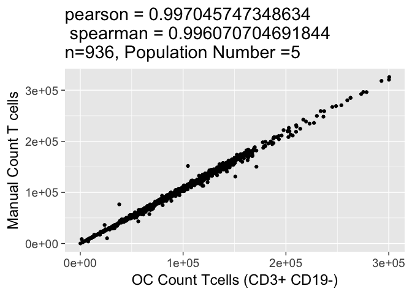<!-- -->

```
## 
## panel1 
##   9442 
## [1] "Tcell"
## [1] "Tcell"
## [1] "All samples"
## [1] "FREQ_PBMC_LYMPH"
```

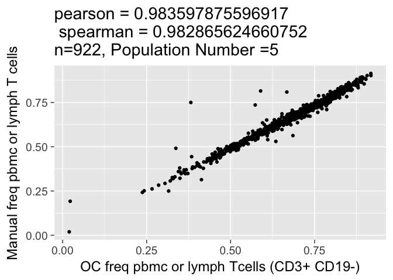<!-- -->

```
## 
## panel1 
##   9442 
## [1] "CT"
## [1] "CT"
## [1] "All samples"
## [1] "FREQ"
```

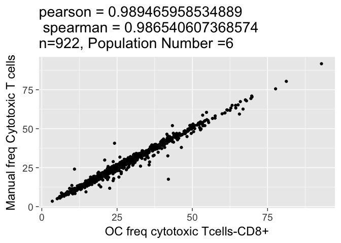<!-- -->

```
## 
## panel1 
##   9442 
## [1] "CT"
## [1] "CT"
## [1] "All samples"
## [1] "COUNT"
```

<!-- -->

```
## 
## panel1 
##   9442 
## [1] "CT"
## [1] "CT"
## [1] "All samples"
## [1] "FREQ_PBMC_LYMPH"
```

<!-- -->

```
## 
## panel1 
##   9442 
## [1] "ActCT"
## [1] "ActCT"
## [1] "All samples"
## [1] "FREQ"
```

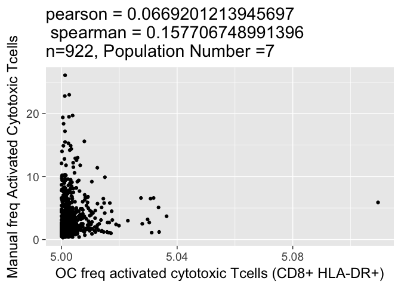<!-- -->

```
## 
## panel1 
##   9442 
## [1] "ActCT"
## [1] "ActCT"
## [1] "All samples"
## [1] "COUNT"
```

<!-- -->

```
## 
## panel1 
##   9442 
## 
## panel1 
##   9442 
## [1] "CM.CT"
## [1] "CM.CT"
## [1] "All samples"
## [1] "FREQ"
```

<!-- -->

```
## 
## panel1 
##   9442 
## [1] "CM.CT"
## 
## panel1 
##   9442 
## [1] "E.CT"
## [1] "E.CT"
## [1] "All samples"
## [1] "FREQ"
```

<!-- -->

```
## 
## panel1 
##   9442 
## [1] "E.CT"
## [1] "E.CT"
## [1] "All samples"
## [1] "COUNT"
```

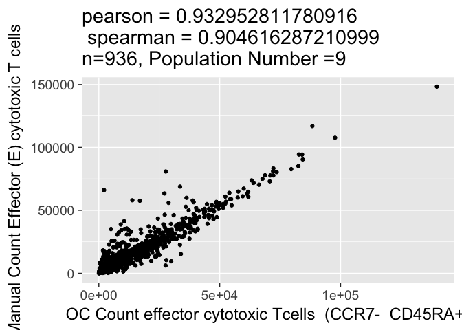<!-- -->

```
## 
## panel1 
##   9442 
## 
## panel1 
##   9442 
## [1] "pE.CT"
## [1] "pE.CT"
## [1] "All samples"
## [1] "FREQ"
```

<!-- -->

```
## 
## panel1 
##   9442 
## [1] "pE.CT"
## [1] "pE.CT"
## [1] "All samples"
## [1] "COUNT"
```

<!-- -->

```
## 
## panel1 
##   9442 
## 
## panel1 
##   9442 
## [1] "pE1.CT"
## [1] "pE1.CT"
## [1] "All samples"
## [1] "FREQ"
```

<!-- -->

```
## 
## panel1 
##   9442 
## [1] "pE1.CT"
## [1] "pE1.CT"
## [1] "All samples"
## [1] "COUNT"
```

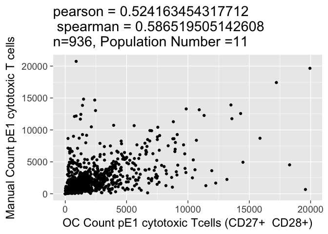<!-- -->

```
## 
## panel1 
##   9442 
## 
## panel1 
##   9442 
## [1] "pE2.CT"
## [1] "pE2.CT"
## [1] "All samples"
## [1] "FREQ"
```

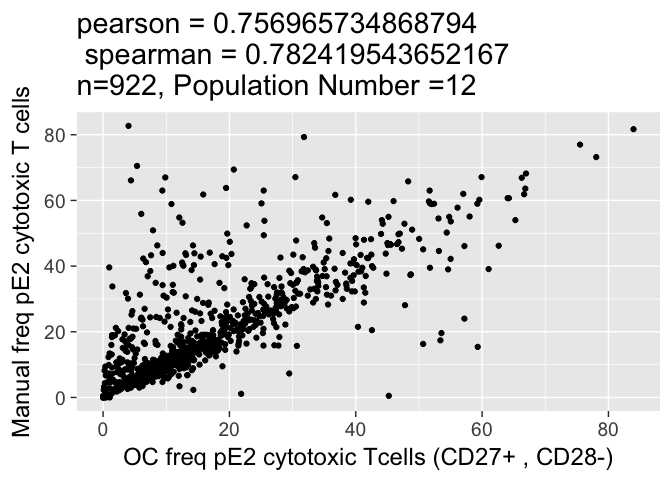<!-- -->

```
## 
## panel1 
##   9442 
## [1] "pE2.CT"
## 
## panel1 
##   9442 
## [1] "EM.CT"
## [1] "EM.CT"
## [1] "All samples"
## [1] "FREQ"
```

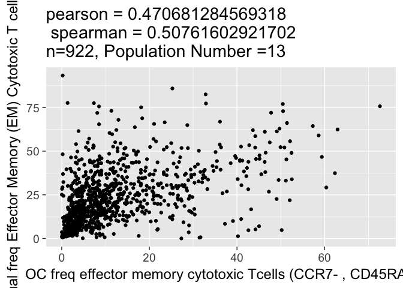<!-- -->

```
## 
## panel1 
##   9442 
## [1] "EM.CT"
## 
## panel1 
##   9442 
## [1] "EM1.C.T"
## [1] "EM1.C.T"
## [1] "All samples"
## [1] "FREQ"
```

<!-- -->

```
## 
## panel1 
##   9442 
## [1] "EM1.C.T"
## [1] "EM1.C.T"
## [1] "All samples"
## [1] "COUNT"
```

<!-- -->

```
## 
## panel1 
##   9442 
## 
## panel1 
##   9442 
## [1] "EM2.CT"
## [1] "EM2.CT"
## [1] "All samples"
## [1] "FREQ"
```

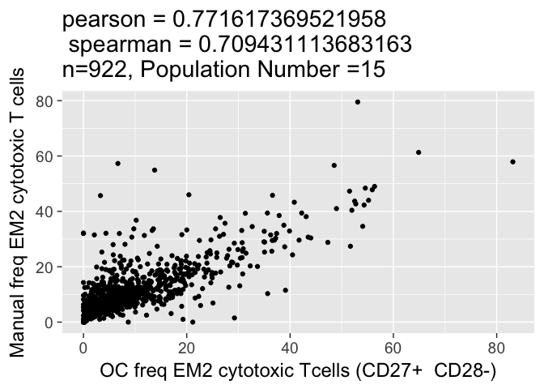<!-- -->

```
## 
## panel1 
##   9442 
## [1] "EM2.CT"
## [1] "EM2.CT"
## [1] "All samples"
## [1] "COUNT"
```

<!-- -->

```
## 
## panel1 
##   9442 
## 
## panel1 
##   9442 
## [1] "EM3.CT"
## [1] "EM3.CT"
## [1] "All samples"
## [1] "FREQ"
```

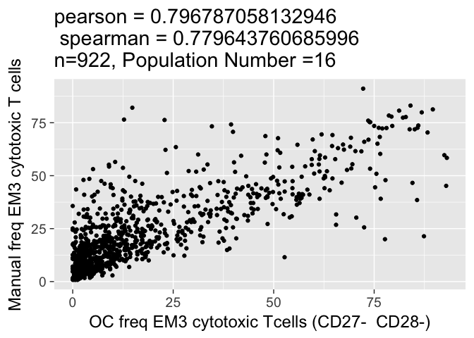<!-- -->

```
## 
## panel1 
##   9442 
## [1] "EM3.CT"
## [1] "EM3.CT"
## [1] "All samples"
## [1] "COUNT"
```

<!-- -->

```
## 
## panel1 
##   9442 
## 
## panel1 
##   9442 
## [1] "EM4.CT"
## [1] "EM4.CT"
## [1] "All samples"
## [1] "FREQ"
```

<!-- -->

```
## 
## panel1 
##   9442 
## [1] "EM4.CT"
## [1] "EM4.CT"
## [1] "All samples"
## [1] "COUNT"
```

<!-- -->

```
## 
## panel1 
##   9442 
## 
## panel1 
##   9442 
## [1] "N.CT"
## [1] "N.CT"
## [1] "All samples"
## [1] "FREQ"
```

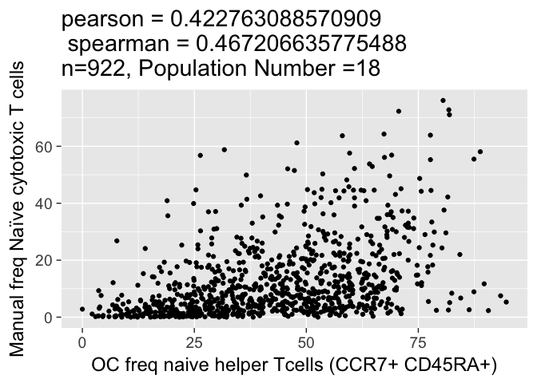<!-- -->

```
## 
## panel1 
##   9442 
## [1] "N.CT"
## [1] "N.CT"
## [1] "All samples"
## [1] "COUNT"
```

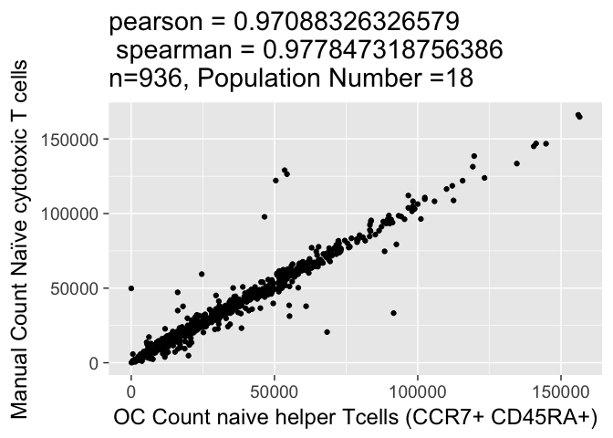<!-- -->

```
## 
## panel1 
##   9442 
## 
## panel1 
##   9442 
## [1] "HT"
## [1] "HT"
## [1] "All samples"
## [1] "FREQ"
```

<!-- -->

```
## 
## panel1 
##   9442 
## [1] "HT"
## [1] "HT"
## [1] "All samples"
## [1] "COUNT"
```

<!-- -->

```
## 
## panel1 
##   9442 
## [1] "HT"
## [1] "HT"
## [1] "All samples"
## [1] "FREQ_PBMC_LYMPH"
```

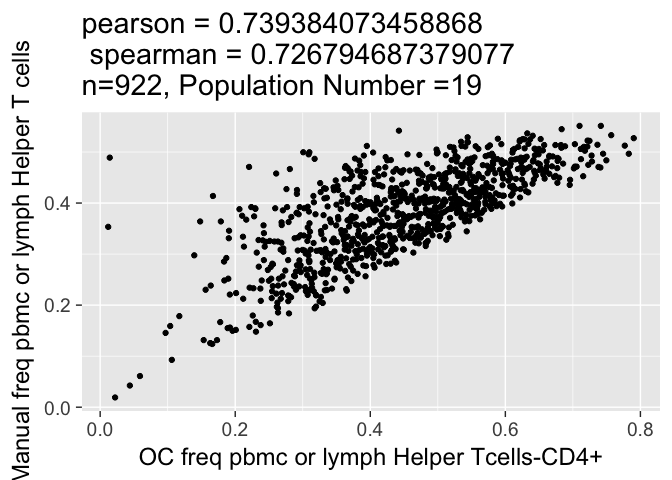<!-- -->

```
## 
## panel1 
##   9442 
## [1] "Act.HT"
## [1] "Act.HT"
## [1] "All samples"
## [1] "FREQ"
```

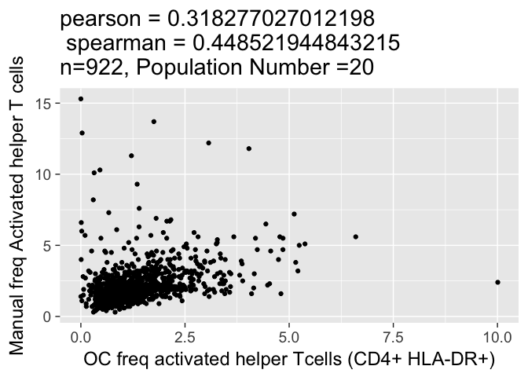<!-- -->

```
## 
## panel1 
##   9442 
## [1] "Act.HT"
## [1] "Act.HT"
## [1] "All samples"
## [1] "COUNT"
```

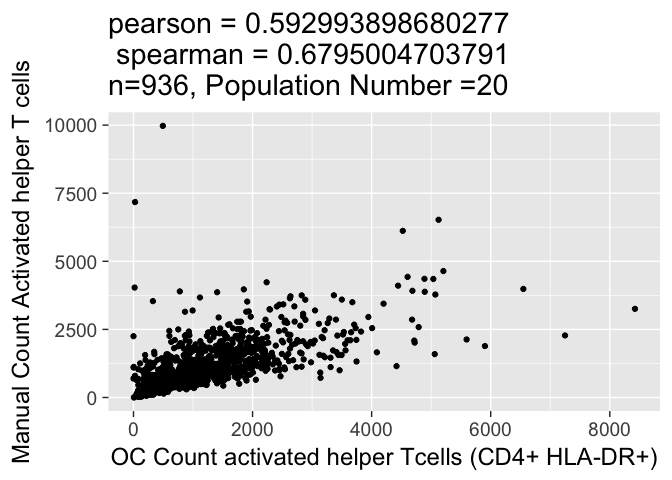<!-- -->

```
## 
## panel1 
##   9442 
## 
## panel1 
##   9442 
## [1] "CM.HT"
## [1] "CM.HT"
## [1] "All samples"
## [1] "FREQ"
```

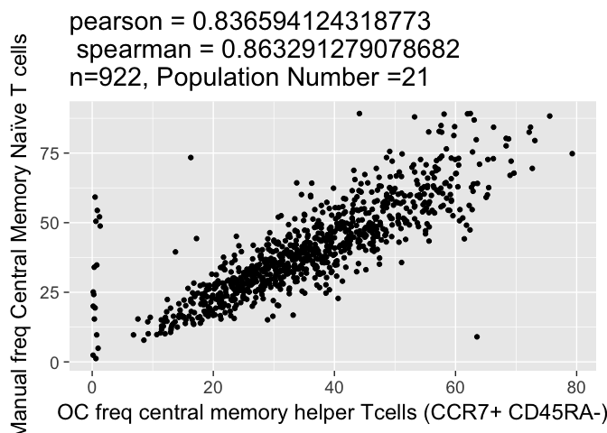<!-- -->

```
## 
## panel1 
##   9442 
## [1] "CM.HT"
## [1] "CM.HT"
## [1] "All samples"
## [1] "COUNT"
```

<!-- -->

```
## 
## panel1 
##   9442 
## 
## panel1 
##   9442 
## [1] "E.HT"
## [1] "E.HT"
## [1] "All samples"
## [1] "FREQ"
```

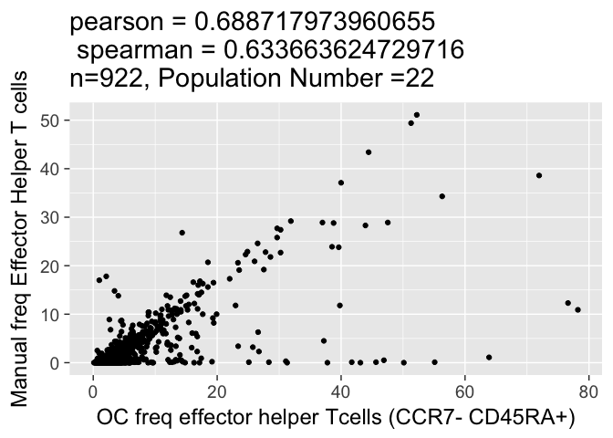<!-- -->

```
## 
## panel1 
##   9442 
## [1] "E.HT"
## [1] "E.HT"
## [1] "All samples"
## [1] "COUNT"
```

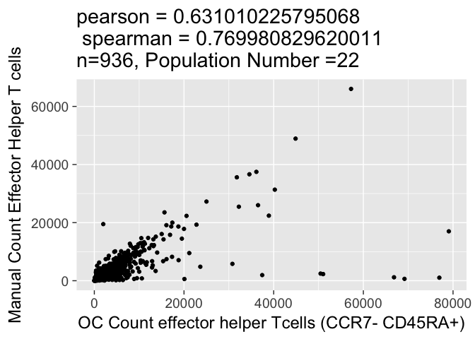<!-- -->

```
## 
## panel1 
##   9442 
## 
## panel1 
##   9442 
## [1] "EM.HT"
## [1] "EM.HT"
## [1] "All samples"
## [1] "FREQ"
```

<!-- -->

```
## 
## panel1 
##   9442 
## [1] "EM.HT"
## [1] "EM.HT"
## [1] "All samples"
## [1] "COUNT"
```

<!-- -->

```
## 
## panel1 
##   9442 
## 
## panel1 
##   9442 
## [1] "N.HT"
## [1] "N.HT"
## [1] "All samples"
## [1] "FREQ"
```

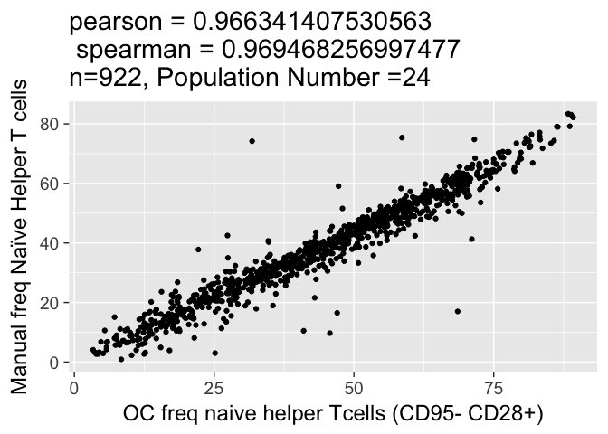<!-- -->

```
## 
## panel1 
##   9442 
## [1] "N.HT"
## [1] "N.HT"
## [1] "All samples"
## [1] "COUNT"
```

<!-- -->

```
## 
## panel1 
##   9442 
## 
## panel2 
##   9390 
## [1] "DC.NK.MONO"
## [1] "DC.NK.MONO"
## [1] "All samples"
## [1] "FREQ"
```

<!-- -->

```
## 
## panel2 
##   9390 
## [1] "DC.NK.MONO"
## [1] "DC.NK.MONO"
## [1] "All samples"
## [1] "COUNT"
```

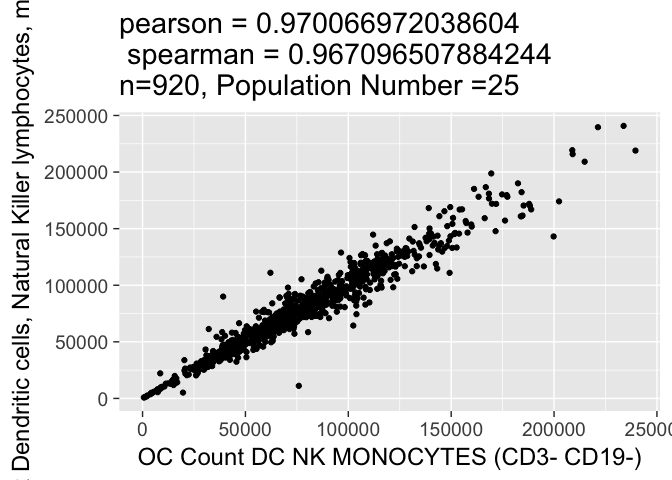<!-- -->

```
## 
## panel2 
##   9390 
## [1] "DC.NK.MONO"
## [1] "DC.NK.MONO"
## [1] "All samples"
## [1] "FREQ_PBMC_LYMPH"
```

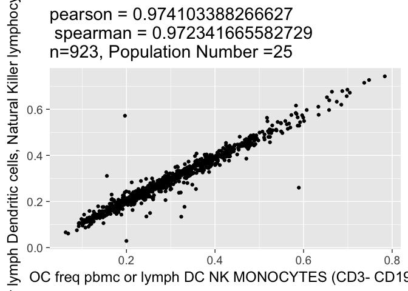<!-- -->

```
## 
## panel2 
##   9390 
## [1] "DC.NK"
## [1] "DC.NK"
## [1] "All samples"
## [1] "FREQ"
```

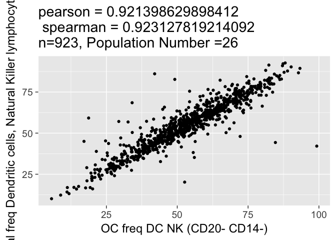<!-- -->

```
## 
## panel2 
##   9390 
## [1] "DC.NK"
## [1] "DC.NK"
## [1] "All samples"
## [1] "COUNT"
```

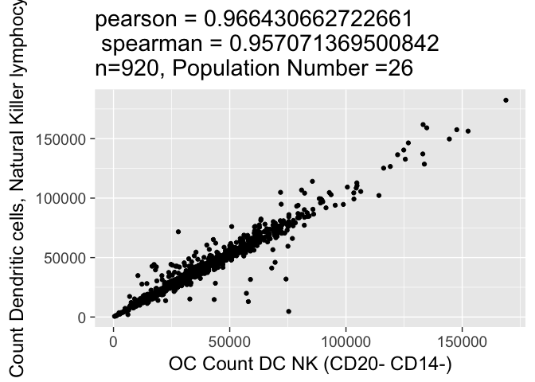<!-- -->

```
## 
## panel2 
##   9390 
## [1] "DC.NK"
## [1] "DC.NK"
## [1] "All samples"
## [1] "FREQ_PBMC_LYMPH"
```

<!-- -->

```
## 
## panel2 
##   9390 
## [1] "DC"
## [1] "DC"
## [1] "All samples"
## [1] "FREQ"
```

<!-- -->

```
## 
## panel2 
##   9390 
## [1] "DC"
## [1] "DC"
## [1] "All samples"
## [1] "COUNT"
```

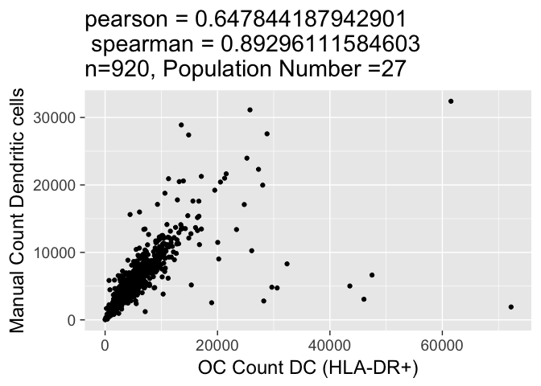<!-- -->

```
## 
## panel2 
##   9390 
## [1] "DC"
## [1] "DC"
## [1] "All samples"
## [1] "FREQ_PBMC_LYMPH"
```

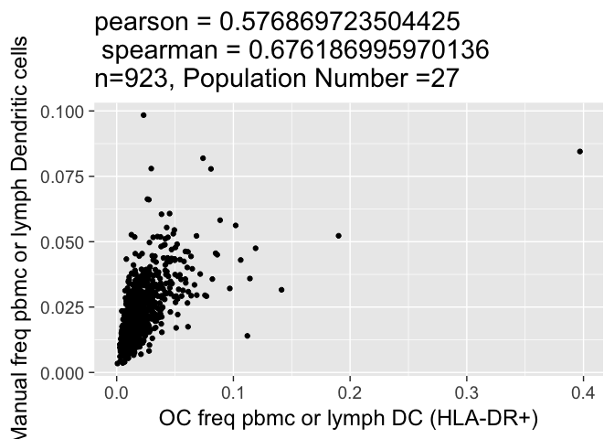<!-- -->

```
## 
## panel2 
##   9386 
## [1] "DCm"
## [1] "DCm"
## [1] "All samples"
## [1] "FREQ"
```

<!-- -->

```
## 
## panel2 
##   9386 
## [1] "DCm"
## [1] "DCm"
## [1] "All samples"
## [1] "COUNT"
```

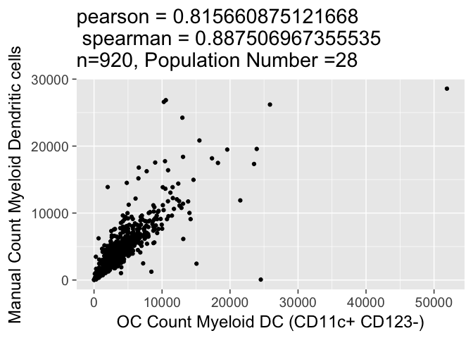<!-- -->

```
## 
## panel2 
##   9386 
## [1] "DCm"
## [1] "DCm"
## [1] "All samples"
## [1] "FREQ_PBMC_LYMPH"
```

<!-- -->

```
## 
## panel2 
##   9386 
## [1] "DCp"
## [1] "DCp"
## [1] "All samples"
## [1] "FREQ"
```

<!-- -->

```
## 
## panel2 
##   9386 
## [1] "DCp"
## [1] "DCp"
## [1] "All samples"
## [1] "COUNT"
```

<!-- -->

```
## 
## panel2 
##   9386 
## [1] "DCp"
## [1] "DCp"
## [1] "All samples"
## [1] "FREQ_PBMC_LYMPH"
```

<!-- -->

```
## 
## panel2 
##   9390 
## [1] "NK"
## [1] "NK"
## [1] "All samples"
## [1] "FREQ"
```

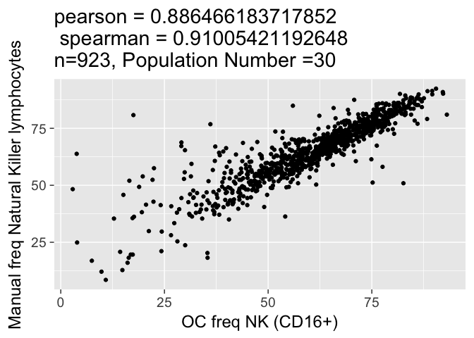<!-- -->

```
## 
## panel2 
##   9390 
## [1] "NK"
## [1] "NK"
## [1] "All samples"
## [1] "COUNT"
```

<!-- -->

```
## 
## panel2 
##   9390 
## [1] "NK"
## [1] "NK"
## [1] "All samples"
## [1] "FREQ_PBMC_LYMPH"
```

<!-- -->

```
## 
## panel2 
##   9390 
## [1] "NKHI"
## [1] "NKHI"
## [1] "All samples"
## [1] "FREQ"
```

<!-- -->

```
## 
## panel2 
##   9390 
## [1] "NKHI"
## [1] "NKHI"
## [1] "All samples"
## [1] "COUNT"
```

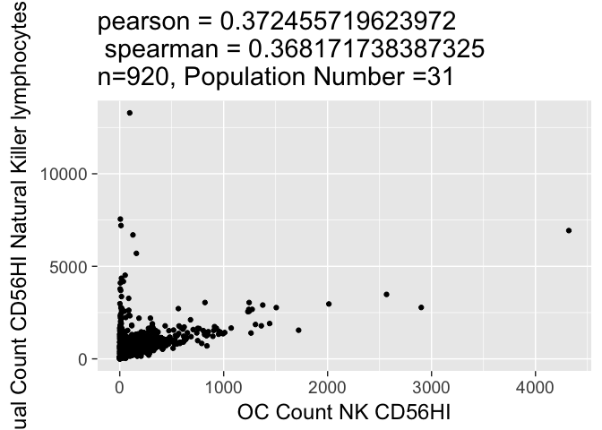<!-- -->

```
## 
## panel2 
##   9390 
## [1] "NKHI"
## [1] "NKHI"
## [1] "All samples"
## [1] "FREQ_PBMC_LYMPH"
```

<!-- -->

```
## 
## panel2 
##   9390 
## [1] "NKLO"
## [1] "NKLO"
## [1] "All samples"
## [1] "FREQ"
```

<!-- -->

```
## 
## panel2 
##   9390 
## [1] "NKLO"
## [1] "NKLO"
## [1] "All samples"
## [1] "COUNT"
```

<!-- -->

```
## 
## panel2 
##   9390 
## [1] "NKLO"
## [1] "NKLO"
## [1] "All samples"
## [1] "FREQ_PBMC_LYMPH"
```

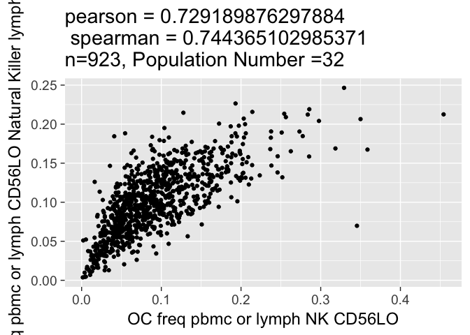<!-- -->

```
## 
## panel2 
##   9390 
## [1] "MONO"
## [1] "MONO"
## [1] "All samples"
## [1] "FREQ"
```

<!-- -->

```
## 
## panel2 
##   9390 
## [1] "MONO"
## [1] "MONO"
## [1] "All samples"
## [1] "COUNT"
```

<!-- -->

```
## 
## panel2 
##   9390 
## [1] "MONO"
## [1] "MONO"
## [1] "All samples"
## [1] "FREQ_PBMC_LYMPH"
```

<!-- -->

```
## 
## panel2 
##   9390 
## [1] "MONOc"
## [1] "MONOc"
## [1] "All samples"
## [1] "FREQ"
```

<!-- -->

```
## 
## panel2 
##   9390 
## [1] "MONOc"
## [1] "MONOc"
## [1] "All samples"
## [1] "COUNT"
```

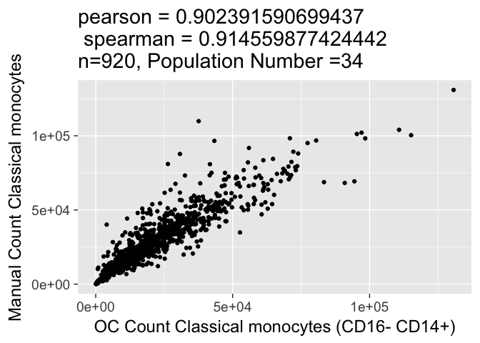<!-- -->

```
## 
## panel2 
##   9390 
## [1] "MONOc"
## [1] "MONOc"
## [1] "All samples"
## [1] "FREQ_PBMC_LYMPH"
```

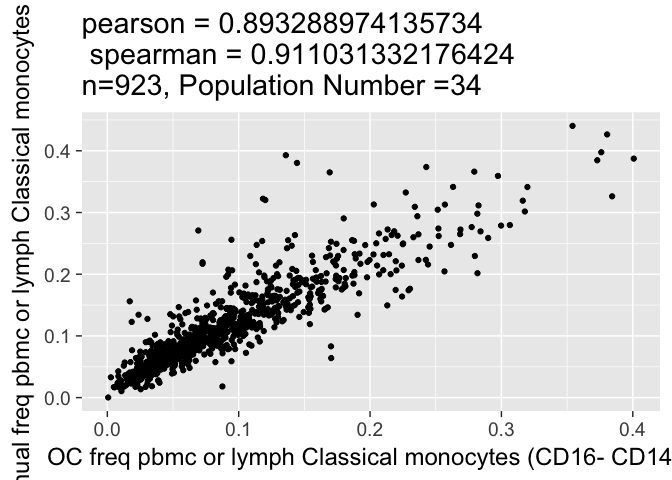<!-- -->

```
## 
## panel2 
##   9390 
## [1] "MONOnc"
## [1] "MONOnc"
## [1] "All samples"
## [1] "FREQ"
```

<!-- -->

```
## 
## panel2 
##   9390 
## [1] "MONOnc"
## [1] "MONOnc"
## [1] "All samples"
## [1] "COUNT"
```

<!-- -->

```
## 
## panel2 
##   9390 
## [1] "MONOnc"
## [1] "MONOnc"
## [1] "All samples"
## [1] "FREQ_PBMC_LYMPH"
```

<!-- -->
