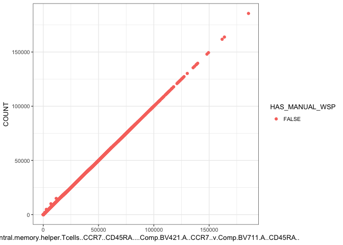
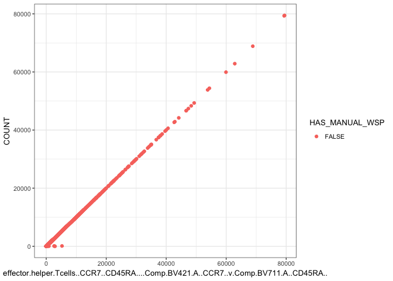
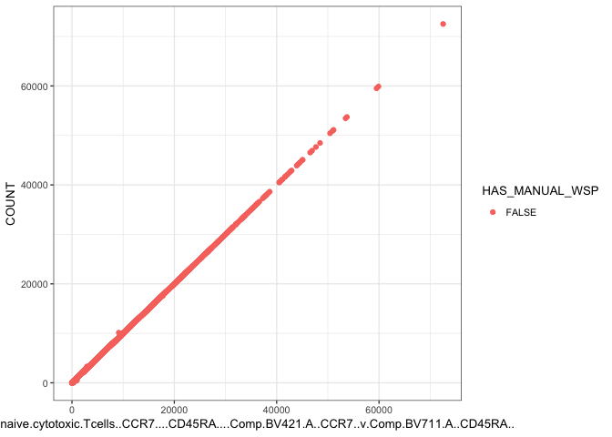
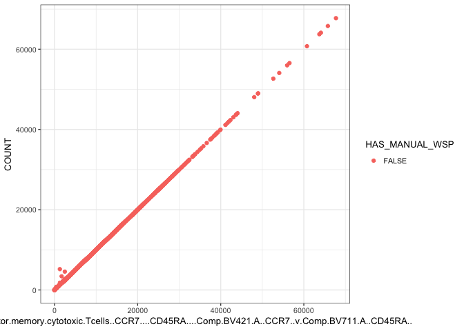

<!-- --><!-- --><!-- --><!-- --><!-- --><!-- --><!-- --><!-- -->

```
## [1] "central.memory.helper.Tcells..CCR7..CD45RA....Comp.BV421.A..CCR7..v.Comp.BV711.A..CD45RA..  HELPER"
##        
##         FALSE TRUE
##   FALSE     0    3
##   TRUE   7159 1880
## [1] "central.memory.helper.Tcells..CCR7..CD45RA....Comp.BV421.A..CCR7..v.Comp.BV711.A..CD45RA..  Cyto"
##        
##         FALSE TRUE
##   FALSE  4170  697
##   TRUE   2989 1186
## [1] "naive.helper.Tcells..CCR7..CD45RA....Comp.BV421.A..CCR7..v.Comp.BV711.A..CD45RA..  HELPER"
##        
##         FALSE TRUE
##   FALSE     0    2
##   TRUE   7159 1881
## [1] "naive.helper.Tcells..CCR7..CD45RA....Comp.BV421.A..CCR7..v.Comp.BV711.A..CD45RA..  Cyto"
##        
##         FALSE TRUE
##   FALSE  4409  975
##   TRUE   2750  908
## [1] "effector.helper.Tcells..CCR7..CD45RA....Comp.BV421.A..CCR7..v.Comp.BV711.A..CD45RA..  HELPER"
##        
##         FALSE TRUE
##   FALSE     0    2
##   TRUE   7159 1881
## [1] "effector.helper.Tcells..CCR7..CD45RA....Comp.BV421.A..CCR7..v.Comp.BV711.A..CD45RA..  Cyto"
##        
##         FALSE TRUE
##   FALSE    56   57
##   TRUE   7103 1826
## [1] "effector.memory.helper.Tcells..CCR7..CD45RA....Comp.BV421.A..CCR7..v.Comp.BV711.A..CD45RA..  HELPER"
##        
##         FALSE TRUE
##   FALSE     0    2
##   TRUE   7159 1881
## [1] "effector.memory.helper.Tcells..CCR7..CD45RA....Comp.BV421.A..CCR7..v.Comp.BV711.A..CD45RA..  Cyto"
##        
##         FALSE TRUE
##   FALSE   838  153
##   TRUE   6321 1730
## [1] "central.memory.cytotoxic.Tcells..CCR7....CD45RA....Comp.BV421.A..CCR7..v.Comp.BV711.A..CD45RA..  HELPER"
##        
##         FALSE TRUE
##   FALSE     0    5
##   TRUE   7159 1878
## [1] "central.memory.cytotoxic.Tcells..CCR7....CD45RA....Comp.BV421.A..CCR7..v.Comp.BV711.A..CD45RA..  Cyto"
##       
##        FALSE TRUE
##   TRUE  7159 1883
## [1] "naive.cytotoxic.Tcells..CCR7....CD45RA....Comp.BV421.A..CCR7..v.Comp.BV711.A..CD45RA..  HELPER"
##        
##         FALSE TRUE
##   FALSE     5    5
##   TRUE   7154 1878
## [1] "naive.cytotoxic.Tcells..CCR7....CD45RA....Comp.BV421.A..CCR7..v.Comp.BV711.A..CD45RA..  Cyto"
##        
##         FALSE TRUE
##   FALSE     0    1
##   TRUE   7159 1882
## [1] "effector.cytotoxic.Tcells...CCR7...CD45RA....Comp.BV421.A..CCR7..v.Comp.BV711.A..CD45RA..  HELPER"
##        
##         FALSE TRUE
##   FALSE    69  157
##   TRUE   7090 1726
## [1] "effector.cytotoxic.Tcells...CCR7...CD45RA....Comp.BV421.A..CCR7..v.Comp.BV711.A..CD45RA..  Cyto"
##        
##         FALSE TRUE
##   FALSE     0    1
##   TRUE   7159 1882
## [1] "effector.memory.cytotoxic.Tcells..CCR7....CD45RA....Comp.BV421.A..CCR7..v.Comp.BV711.A..CD45RA..  HELPER"
##        
##         FALSE TRUE
##   FALSE     2   17
##   TRUE   7157 1866
## [1] "effector.memory.cytotoxic.Tcells..CCR7....CD45RA....Comp.BV421.A..CCR7..v.Comp.BV711.A..CD45RA..  Cyto"
##       
##        FALSE TRUE
##   TRUE  7159 1883
```

