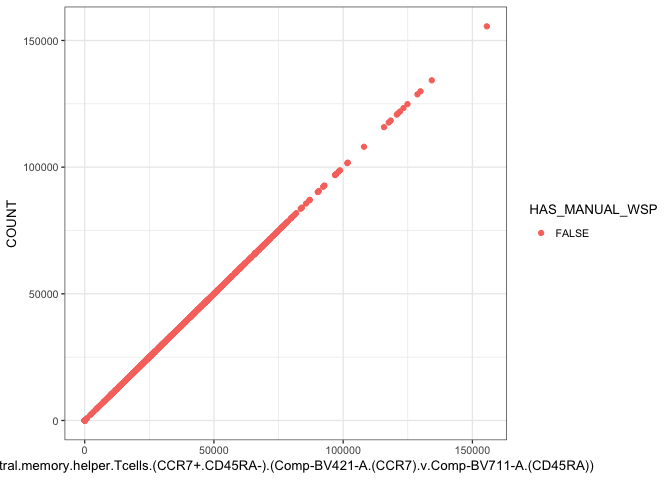<!-- -->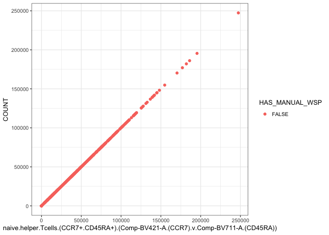<!-- -->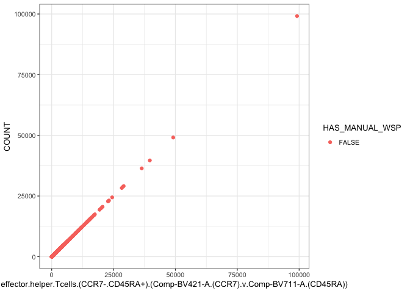<!-- -->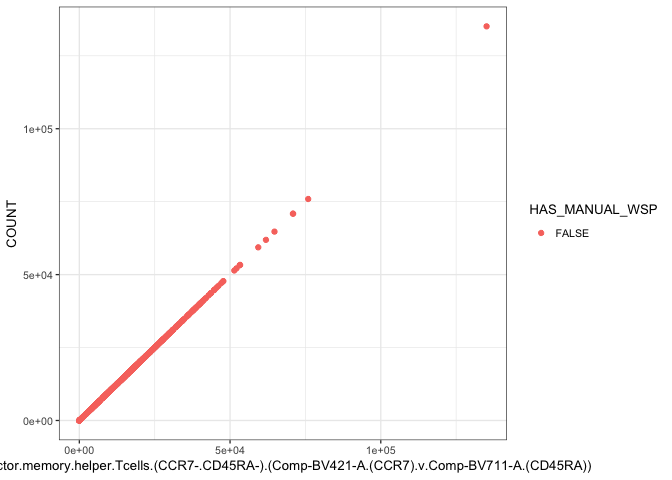<!-- -->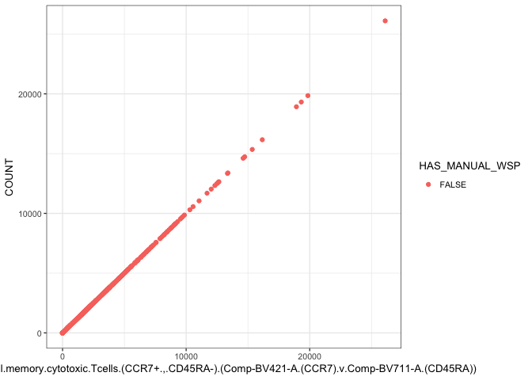<!-- --><!-- -->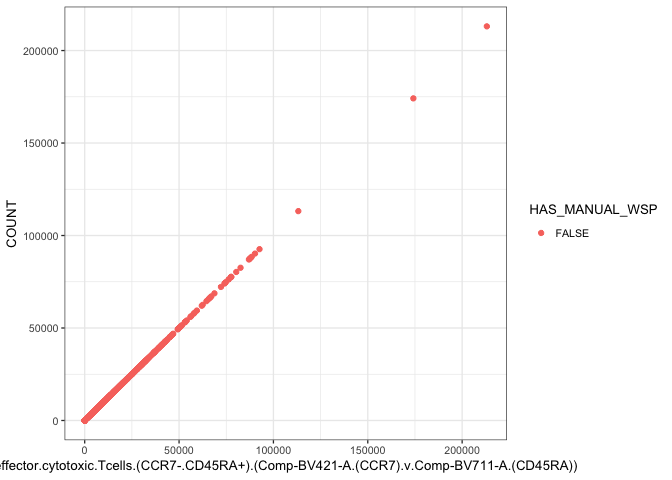<!-- -->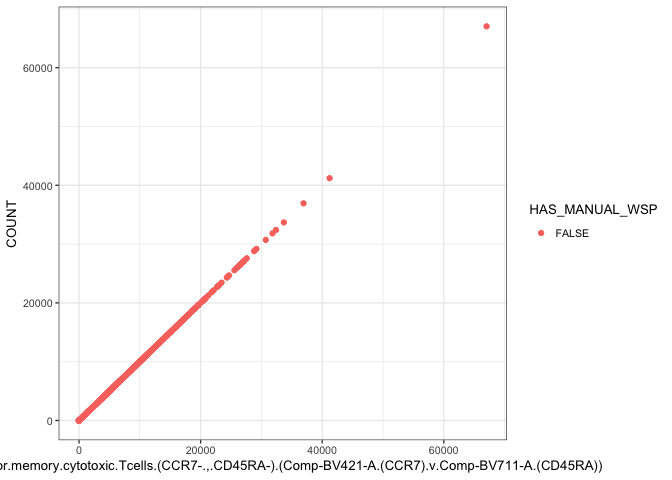<!-- --><!-- -->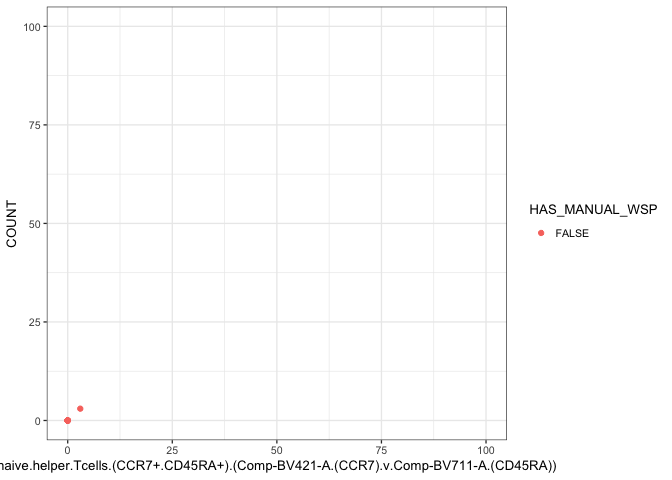<!-- -->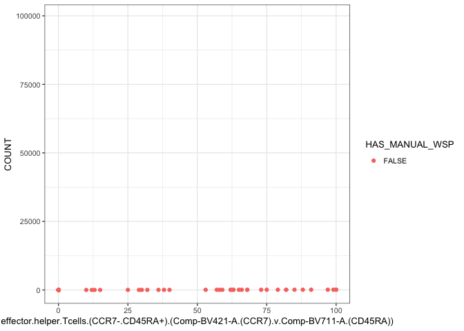<!-- -->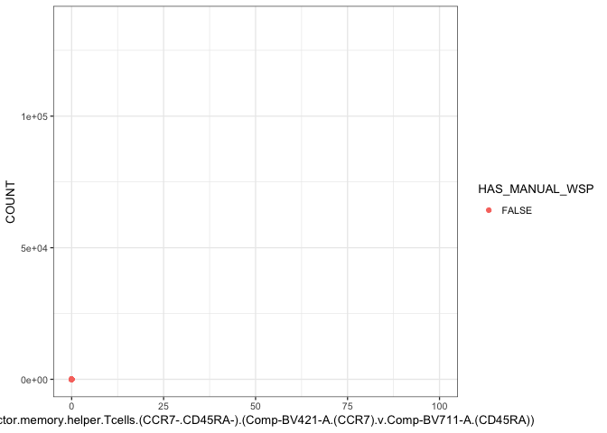<!-- --><!-- -->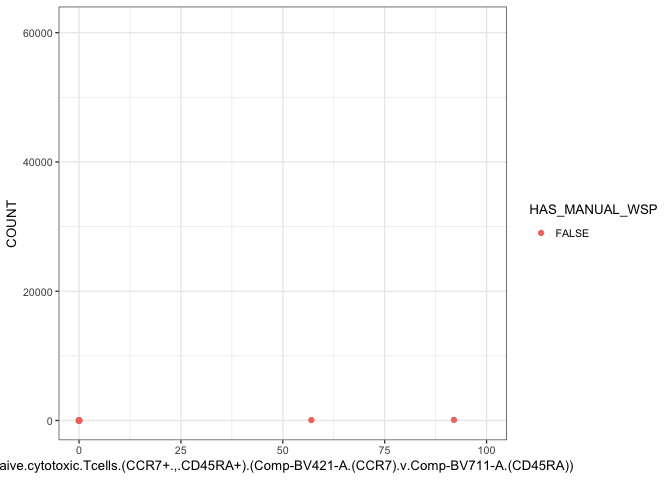<!-- -->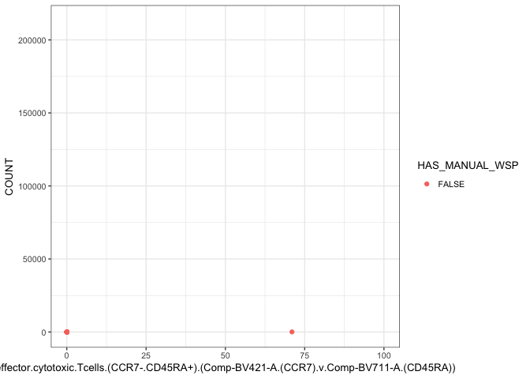<!-- -->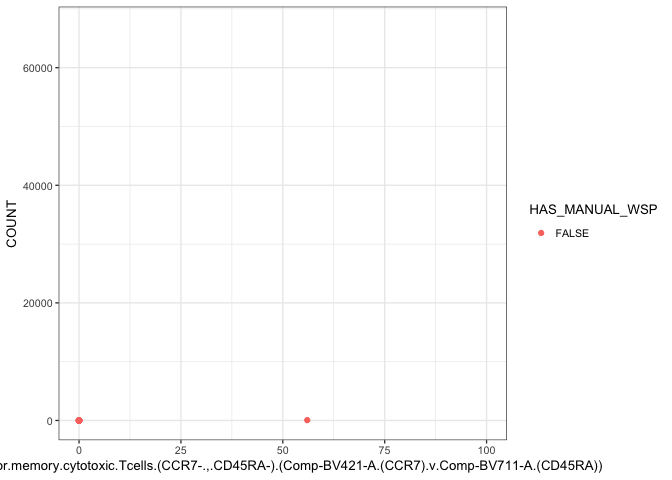<!-- -->


<!--     interest=c("central.memory.helper.Tcells..CCR7..CD45RA....Comp.BV421.A..CCR7..v.Comp.BV711.A..CD45RA..", -->
<!-- "naive.helper.Tcells..CCR7..CD45RA....Comp.BV421.A..CCR7..v.Comp.BV711.A..CD45RA..", -->
<!-- "effector.helper.Tcells..CCR7..CD45RA....Comp.BV421.A..CCR7..v.Comp.BV711.A..CD45RA..", -->
<!-- "effector.memory.helper.Tcells..CCR7..CD45RA....Comp.BV421.A..CCR7..v.Comp.BV711.A..CD45RA..", -->
<!-- "central.memory.cytotoxic.Tcells..CCR7....CD45RA....Comp.BV421.A..CCR7..v.Comp.BV711.A..CD45RA..", -->
<!-- "naive.cytotoxic.Tcells..CCR7....CD45RA....Comp.BV421.A..CCR7..v.Comp.BV711.A..CD45RA..", -->
<!-- "effector.cytotoxic.Tcells...CCR7...CD45RA....Comp.BV421.A..CCR7..v.Comp.BV711.A..CD45RA..", -->
<!-- "effector.memory.cytotoxic.Tcells..CCR7....CD45RA....Comp.BV421.A..CCR7..v.Comp.BV711.A..CD45RA..") -->

<!--     for(inter in interest){ -->
<!--       print(paste(inter," HELPER")) -->
<!--       print(table(counts[,inter]<counts$Helper.Tcells.CD4...Comp.APC.Cy7.A..CD4..v.Comp.BUV396.A..CD8..,counts$HAS_MANUAL_WSP)) -->
<!--     print(paste(inter," Cyto")) -->
<!--      print(table(counts[,inter]<counts$cytotoxic.Tcells.CD8...Comp.APC.Cy7.A..CD4..v.Comp.BUV396.A..CD8..,counts$HAS_MANUAL_WSP)) -->

<!--     } -->


```
## NULL
```

```
## [1] "B.cells.(CD3-.CD19+).(Comp-APC-A.(CD3).v.Comp-PE-Cy7-A.(CD19))"
## [2] "Bcell"
```

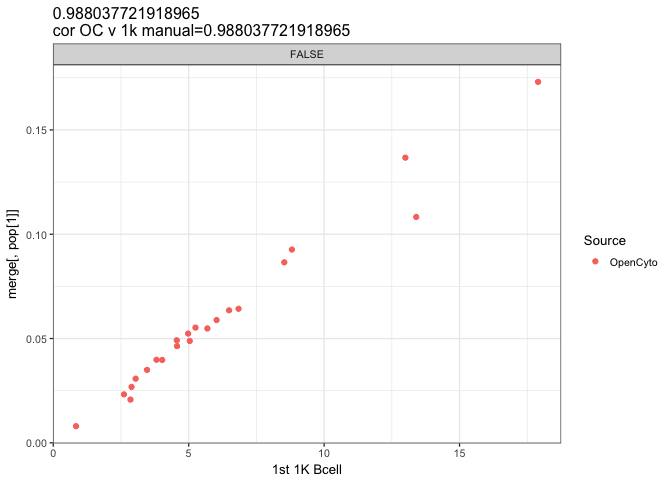<!-- -->

```
## [1] "Tcells.(CD3+.CD19-).(Comp-APC-A.(CD3).v.Comp-PE-Cy7-A.(CD19))"
## [2] "Tcell"
```

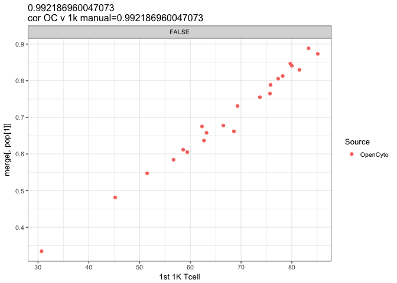<!-- -->

```
## [1] "Helper.Tcells-CD4+.(Comp-APC-Cy7-A.(CD4).v.Comp-BUV396-A.(CD8))"
## [2] "HT"
```

<!-- -->

```
## [1] "cytotoxic.Tcells-CD8+.(Comp-APC-Cy7-A.(CD4).v.Comp-BUV396-A.(CD8))"
## [2] "CT"
```

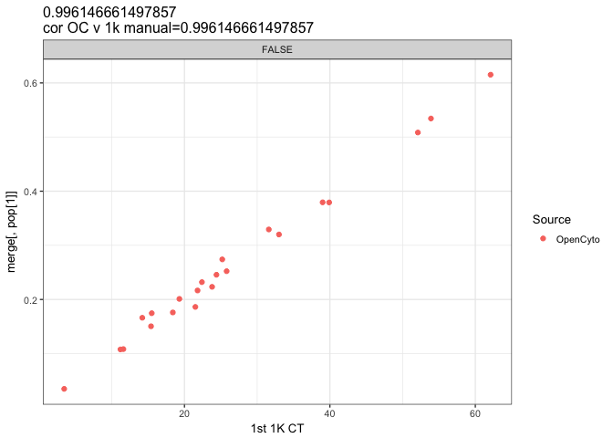<!-- -->

```
## [1] "IgD+.memory.Bcells.(CD27+).(Comp-BUV737-A.(IgD).v.Comp-FITC-A.(CD27))"
## [2] "IgD+MemB"
```

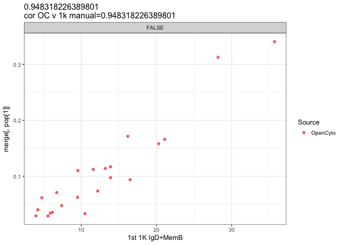<!-- -->

```
## [1] "IgD-.memory.Bcells.(CD27+).(Comp-BUV737-A.(IgD).v.Comp-FITC-A.(CD27))"
## [2] "IgD-MemB"
```

<!-- -->

```
## [1] "naive.Bcells.(CD27-.IgD+).(Comp-BUV737-A.(IgD).v.Comp-FITC-A.(CD27))"
## [2] "NaiveB"
```

<!-- -->

```
## [1] "effector.helper.Tcells.(CCR7-.CD45RA+).(Comp-BV421-A.(CCR7).v.Comp-BV711-A.(CD45RA))"
## [2] "E.HT"
```

<!-- -->

```
## [1] "effector.memory.helper.Tcells.(CCR7-.CD45RA-).(Comp-BV421-A.(CCR7).v.Comp-BV711-A.(CD45RA))"
## [2] "EM.HT"
```

<!-- -->

```
## [1] "central.memory.helper.Tcells.(CCR7+.CD45RA-).(Comp-BV421-A.(CCR7).v.Comp-BV711-A.(CD45RA))"
## [2] "CM.HT"
```

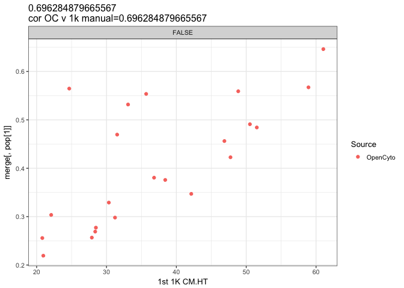<!-- -->

```
## [1] "naive.helper.Tcells.(CCR7+.CD45RA+).(Comp-BV421-A.(CCR7).v.Comp-BV711-A.(CD45RA))"
## [2] "N.HT"
```

<!-- -->

```
## [1] "effector.cytotoxic.Tcells.(CCR7-.CD45RA+).(Comp-BV421-A.(CCR7).v.Comp-BV711-A.(CD45RA))"
## [2] "E.CT"
```

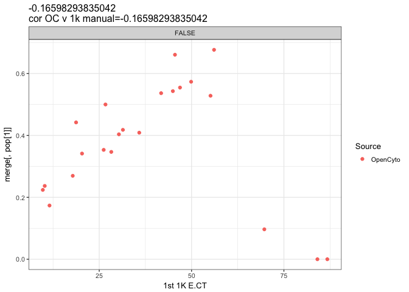<!-- -->

```
## [1] "effector.memory.cytotoxic.Tcells.(CCR7-.,.CD45RA-).(Comp-BV421-A.(CCR7).v.Comp-BV711-A.(CD45RA))"
## [2] "EM.CT"
```

<!-- -->

```
## [1] "central.memory.cytotoxic.Tcells.(CCR7+.,.CD45RA-).(Comp-BV421-A.(CCR7).v.Comp-BV711-A.(CD45RA))"
## [2] "CM.CT"
```

<!-- -->

```
## [1] "naive.cytotoxic.Tcells.(CCR7+.,.CD45RA+).(Comp-BV421-A.(CCR7).v.Comp-BV711-A.(CD45RA))"
## [2] "N.CT"
```

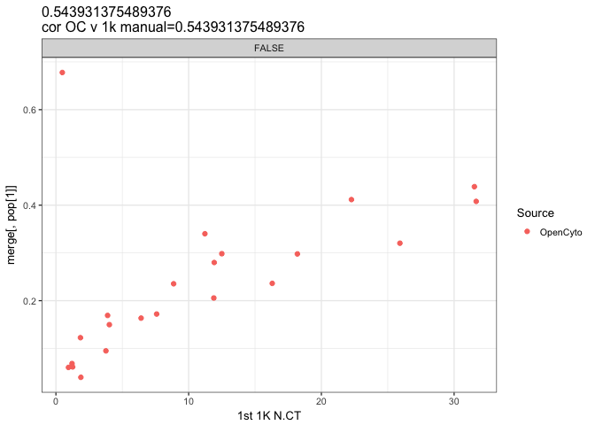<!-- -->

