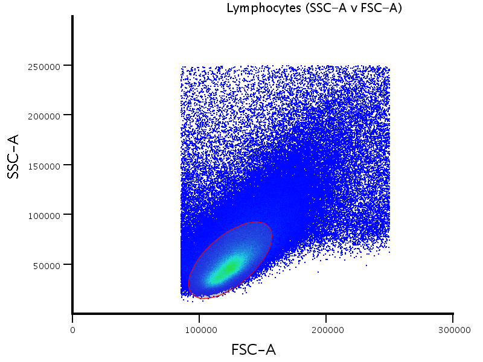

```{r setup, include=FALSE}
library(knitr)

library(ggplot2)
t2 <- theme(
  axis.line = element_line(colour = "black"),
  axis.text = element_text(colour = "black"),
  axis.ticks = element_line(colour = "black"),
  # panel.grid.major.x = element_blank(),
  panel.grid.minor.x = element_blank(),
  # panel.grid.major.y = element_blank(),
  # panel.grid.minor.y = element_blank(),
  panel.border = element_blank(),
  # panel.background = element_blank(),
  # legend.position="none",
  axis.text.x=element_text(angle=90,hjust=1)
)
theme_set(theme_grey(base_size = 18)) 

rand = read.delim("/Volumes/Beta/data/flow/randSeedTest/r25_rand/all.freq.metrics.txt", stringsAsFactors = FALSE)
rand$KEY=paste0(rand$name,rand$Population,rand$Panel,rand$Parent,rand$MACHINE,gsub(".*FULL","",rand$PDF))

reg= read.delim("/Volumes/Beta/data/flow/randSeedTest/r25_42/all.freq.metrics.txt", stringsAsFactors = FALSE)
reg$KEY=paste0(reg$name,reg$Population,reg$Panel,reg$Parent,reg$MACHINE,gsub(".*FULL","",reg$PDF))
table(rand$KEY %in% reg$KEY)

combo=merge(rand,reg,by.x = "KEY",by.y = "KEY",all.x = TRUE)

```


# Correlation of all counts
```{r  echo=FALSE}
cor.test(combo$Count.x,combo$Count.y)
cor.test(combo$Count.x,combo$Count.y,method = "spearman")


pbc = ggplot(combo, aes(
  x = Count.x,
  y = Count.y
  )) +
  geom_point() +
  xlab(paste0("Previous count, n gates=",length(combo$Count.y))) +
  ylab(paste0("Seed 42 count, n gates=",length(combo$Count.x))) + t2
pbc
```


# Correlation of frequency of parent counts

```{r  echo=FALSE}

cor.test(combo$freqParent.x,combo$freqParent.y)
cor.test(combo$freqParent.x,combo$freqParent.y,method = "spearman")
pbf = ggplot(combo, aes(
  x = freqParent.x,
  y = freqParent.y,colour=Panel.x  )) +
  geom_point() +
  xlab(paste0("Previous freq parent, n gates =",length(combo$freqParent.y))) +
  ylab(paste0("Seed 42 freq parent, n gates =",length(combo$freqParent.x))) + t2+xlim(0,1)+ylim(0,1) 
pbf

```


# Correlation of frequency of parent counts (panel2)

```{r  echo=FALSE}
comboP2=combo[which(combo$Panel.x=="panel2"),]
cor.test(comboP2$freqParent.x,comboP2$freqParent.y)
cor.test(comboP2$freqParent.x,comboP2$freqParent.y,method = "spearman")
pbf = ggplot(comboP2, aes(
  x = freqParent.x,
  y = freqParent.y,colour=Panel.x  )) +
  geom_point() +
  xlab(paste0("Previous freq parent, n gates =",length(comboP2$freqParent.y))) +
  ylab(paste0("Seed 42 freq parent, n gates =",length(comboP2$freqParent.x))) + t2+xlim(0,1)+ylim(0,1) 
pbf

```


# Correlation of frequency of parent counts (> 1% difference)

```{r  echo=FALSE}

comboP1=combo
comboP1$DIFF=abs(comboP1$freqParent.x-comboP1$freqParent.y)
comboP1=comboP1[which(comboP1$DIFF>=.01),]

pbf = ggplot(comboP1, aes(
  x = freqParent.x,
  y = freqParent.y,colour= RealAutoParent.x )) +
  geom_point() +
  xlab(paste0("Previous freq parent, n gates =",length(comboP1$freqParent.y))) +
  ylab(paste0("Seed 42 freq parent, n gates =",length(comboP1$freqParent.x))) + t2+xlim(0,1)+ylim(0,1) 
pbf
```

# Example


# Example (really bad outlier)



```{r  echo=FALSE}

kable(comboP1[c("name.x","RealAutoParent.x","Manual.x","freqParent.x","freqParent.y")],format = "markdown")

```
