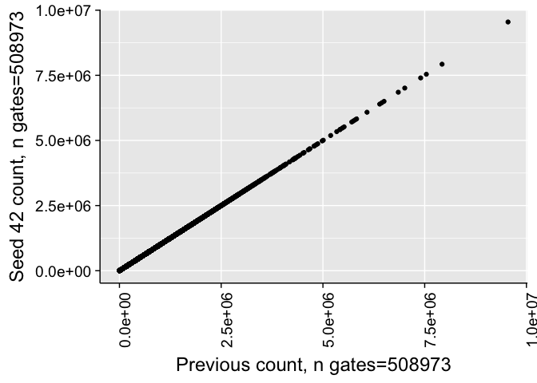
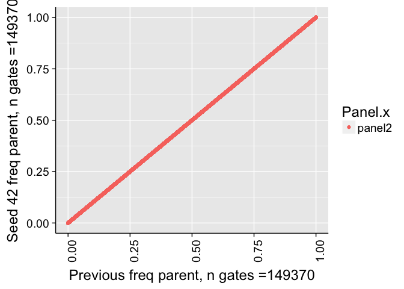

# Validate Seed
JL  
12/18/2017  


# Correlation of all counts

```
## 
## 	Pearson's product-moment correlation
## 
## data:  combo$Count.x and combo$Count.y
## t = 2639600, df = 508970, p-value < 2.2e-16
## alternative hypothesis: true correlation is not equal to 0
## 95 percent confidence interval:
##  1 1
## sample estimates:
## cor 
##   1
```

```
## Warning in cor.test.default(combo$Count.x, combo$Count.y, method =
## "spearman"): Cannot compute exact p-value with ties
```

```
## 
## 	Spearman's rank correlation rho
## 
## data:  combo$Count.x and combo$Count.y
## S = 3.6258e+11, p-value < 2.2e-16
## alternative hypothesis: true rho is not equal to 0
## sample estimates:
##       rho 
## 0.9999835
```

<!-- -->


# Correlation of frequency of parent counts


```
## 
## 	Pearson's product-moment correlation
## 
## data:  combo$freqParent.x and combo$freqParent.y
## t = 161250, df = 489140, p-value < 2.2e-16
## alternative hypothesis: true correlation is not equal to 0
## 95 percent confidence interval:
##  0.9999905 0.9999906
## sample estimates:
##       cor 
## 0.9999906
```

```
## Warning in cor.test.default(combo$freqParent.x, combo$freqParent.y, method
## = "spearman"): Cannot compute exact p-value with ties
```

```
## 
## 	Spearman's rank correlation rho
## 
## data:  combo$freqParent.x and combo$freqParent.y
## S = 3.4024e+11, p-value < 2.2e-16
## alternative hypothesis: true rho is not equal to 0
## sample estimates:
##       rho 
## 0.9999826
```

```
## Warning: Removed 20227 rows containing missing values (geom_point).
```

<!-- -->


# Correlation of frequency of parent counts (panel2)


```
## 
## 	Pearson's product-moment correlation
## 
## data:  comboP2$freqParent.x and comboP2$freqParent.y
## t = 1.7711e+10, df = 139290, p-value < 2.2e-16
## alternative hypothesis: true correlation is not equal to 0
## 95 percent confidence interval:
##  1 1
## sample estimates:
## cor 
##   1
```

```
## Warning in cor.test.default(comboP2$freqParent.x, comboP2$freqParent.y, :
## Cannot compute exact p-value with ties
```

```
## 
## 	Spearman's rank correlation rho
## 
## data:  comboP2$freqParent.x and comboP2$freqParent.y
## S = 0, p-value < 2.2e-16
## alternative hypothesis: true rho is not equal to 0
## sample estimates:
## rho 
##   1
```

```
## Warning: Removed 10074 rows containing missing values (geom_point).
```

<!-- -->


# Correlation of frequency of parent counts (> 1% difference)


```
## Warning: Removed 2 rows containing missing values (geom_point).
```

<!-- -->

# Example


# Example (really bad outlier)


|       |name.x                                                        |RealAutoParent.x |Manual.x                                           | freqParent.x| freqParent.y|
|:------|:-------------------------------------------------------------|:----------------|:--------------------------------------------------|------------:|------------:|
|1406   |2016-05-10_PANEL 1_HB_panel one_F1631918_002.fcs              |Bcells           |naive Bcells (CD27- IgD+)                          |    0.8166376|    0.7782773|
|1447   |2016-05-10_PANEL 1_HB_panel one_F1631927_005.fcs              |lymph            |Single Cells (FSC-H v FSC-W)                       |    0.9720897|    0.9871082|
|2750   |2016-05-12_PANEL 1_HB_panel one_F1632232_002.fcs              |CD8/CCR7-CD45RA+ |pE2 cytotoxic Tcells (CD27+ , CD28-)               |    0.1501247|    0.1369498|
|2751   |2016-05-12_PANEL 1_HB_panel one_F1632232_002.fcs              |CD8/CCR7-CD45RA+ |pE1 cytotoxic Tcells (CD27+  CD28+)                |    0.0323414|    0.0466874|
|3240   |2016-05-13_PANEL 1_ZF_panel one_F1632233_004.fcs              |Tcells           |activated helper Tcells (CD4+ HLA-DR+)             |    0.0304077|    0.0136753|
|21123  |2016-06-16_PANEL 1_ZF_Group one_F1632060_010.fcs              |Tcells           |activated helper Tcells (CD4+ HLA-DR+)             |    0.0286667|    0.0421991|
|23127  |2016-06-21_PANEL 1_DHS_Group one_F1631376_005.fcs             |lymph            |Single Cells (FSC-H v FSC-W)                       |    0.9773589|    0.9939512|
|25315  |2016-06-23_PANEL 1_ZF_Group one_F1632326_002.fcs              |CD8/CCR7-CD45RA+ |pE1 cytotoxic Tcells (CD27+  CD28+)                |    0.8242424|    0.8345324|
|25333  |2016-06-23_PANEL 1_ZF_Group one_F1632326_002.fcs              |CD8/CCR7-CD45RA+ |pE2 cytotoxic Tcells (CD95-CD28-,CD27+ , CD28-)    |    0.1252525|    0.1115108|
|25334  |2016-06-23_PANEL 1_ZF_Group one_F1632326_002.fcs              |CD8/CCR7-CD45RA+ |pE1 cytotoxic Tcells (CD95-CD28-,CD27+  CD28+)     |    0.2262626|    0.2014388|
|28657  |2016-07-07_PANEL 1_ZF_Group one_F1631284_003.fcs              |Bcells           |IgD- memory Bcells (CD27+)                         |    0.0875421|    0.1100000|
|28658  |2016-07-07_PANEL 1_ZF_Group one_F1631284_003.fcs              |Bcells           |naive Bcells (CD27- IgD+)                          |    0.6565657|    0.6033333|
|28659  |2016-07-07_PANEL 1_ZF_Group one_F1631284_003.fcs              |Bcells           |IgD+ memory Bcells (CD27+)                         |    0.1885522|    0.1700000|
|29696  |2016-07-08_PANEL 1_ZF_Group one_F1631270_010.fcs              |CD8/CCR7-CD45RA- |EM1 cytotoxic Tcells (CD27+  CD28+)                |    0.6774194|    0.6875000|
|29712  |2016-07-08_PANEL 1_ZF_Group one_F1631270_010.fcs              |CD8              |effector memory cytotoxic Tcells (CD95- , CD28-)   |    0.6263125|    0.3314917|
|29713  |2016-07-08_PANEL 1_ZF_Group one_F1631270_010.fcs              |CD8              |naive cytotoxic Tcells (CD95- , CD28+)             |    0.2439778|    0.3394721|
|29714  |2016-07-08_PANEL 1_ZF_Group one_F1631270_010.fcs              |CD8              |central memory cytotoxic Tcells (CD95+ , CD28+)    |    0.1278567|    0.3284223|
|29718  |2016-07-08_PANEL 1_ZF_Group one_F1631270_010.fcs              |CD8/CCR7-CD45RA+ |pE1 cytotoxic Tcells (CD95-CD28-,CD27+  CD28+)     |    0.0747012|    0.0158259|
|35298  |2016-07-18_PANEL 1_DHS_Group one_F1631217_003.fcs             |Tcells           |activated helper Tcells (CD4+ HLA-DR+)             |    0.0226157|    0.0123369|
|47654  |2016-08-10_PANEL 1_ZF_Group two_F1636876_028.fcs              |CD8/CCR7-CD45RA- |EM3 cytotoxic Tcells (CD27-  CD28-)                |    0.0769231|    0.1744820|
|47655  |2016-08-10_PANEL 1_ZF_Group two_F1636876_028.fcs              |CD8/CCR7-CD45RA- |EM2 cytotoxic Tcells (CD27+  CD28-)                |    0.0583742|    0.1526718|
|47656  |2016-08-10_PANEL 1_ZF_Group two_F1636876_028.fcs              |CD8/CCR7-CD45RA- |EM4 cytotoxic Tcells (CD27-  CD28+)                |    0.2765957|    0.1788441|
|47657  |2016-08-10_PANEL 1_ZF_Group two_F1636876_028.fcs              |CD8/CCR7-CD45RA- |EM1 cytotoxic Tcells (CD27+  CD28+)                |    0.5881069|    0.4940022|
|53391  |2016-08-19_PANEL 1_ZF_Group one_F1630972_001.fcs              |CD8/CCR7-CD45RA+ |pE cytotoxic Tcells (CD95-CD28-,CD27-  CD28-)      |    0.5370540|    0.5495609|
|54040  |2016-08-29_PANEL 1_DHS_Group one_F1630974_012.fcs             |Tcells           |activated helper Tcells (CD4+ HLA-DR+)             |    0.0020227|    0.0200019|
|54067  |2016-08-29_PANEL 1_DHS_Group one_F1630974_012.fcs             |CD8/CCR7-CD45RA+ |pE cytotoxic Tcells (CD95-CD28-,CD27-  CD28-)      |    1.8320930|    1.8543659|
|61497  |2016-09-15_PANEL 1_ZF_Group two_F1636889_027.fcs              |CD8/CCR7-CD45RA+ |pE1 cytotoxic Tcells (CD95-CD28-,CD27+  CD28+)     |    0.5437666|    0.5602094|
|69454  |2016-10-11_PANEL 1_DHS_Group one_F1636914_007.fcs             |CD8/CCR7-CD45RA- |EM3 cytotoxic Tcells (CD27-  CD28-)                |    0.1281444|    0.1128730|
|69457  |2016-10-11_PANEL 1_DHS_Group one_F1636914_007.fcs             |CD8/CCR7-CD45RA- |EM1 cytotoxic Tcells (CD27+  CD28+)                |    0.6348032|    0.6499928|
|69458  |2016-10-11_PANEL 1_DHS_Group one_F1636914_007.fcs             |CD8/CCR7-CD45RA+ |pE cytotoxic Tcells (CD27-  CD28-)                 |    0.5257619|    0.5017434|
|69460  |2016-10-11_PANEL 1_DHS_Group one_F1636914_007.fcs             |CD8/CCR7-CD45RA+ |pE1 cytotoxic Tcells (CD27+  CD28+)                |    0.1530789|    0.1684556|
|69469  |2016-10-11_PANEL 1_DHS_Group one_F1636914_007.fcs             |CD8              |effector memory cytotoxic Tcells (CCR7- , CD45RA-) |    0.2465434|    0.2359765|
|69470  |2016-10-11_PANEL 1_DHS_Group one_F1636914_007.fcs             |CD8              |effector cytotoxic Tcells  (CCR7-  CD45RA+)        |    0.4644851|    0.4975678|
|69471  |2016-10-11_PANEL 1_DHS_Group one_F1636914_007.fcs             |CD8              |central memory cytotoxic Tcells (CCR7+ , CD45RA-)  |    0.2466163|    0.2234242|
|69476  |2016-10-11_PANEL 1_DHS_Group one_F1636914_007.fcs             |Tcells           |cytotoxic Tcells-CD8+                              |    0.2926587|    0.3140974|
|69477  |2016-10-11_PANEL 1_DHS_Group one_F1636914_007.fcs             |CD8/CCR7-CD45RA+ |pE cytotoxic Tcells (CD95-CD28-,CD27-  CD28-)      |    0.2592680|    0.2284816|
|80171  |2016-11-04_PANEL 1_ZF_Group one_Ctl-C HB_007.fcs              |Bcells           |IgD- memory Bcells (CD27+)                         |    0.0819741|    0.0703812|
|80172  |2016-11-04_PANEL 1_ZF_Group one_Ctl-C HB_007.fcs              |Bcells           |naive Bcells (CD27- IgD+)                          |    0.7820995|    0.8068705|
|80173  |2016-11-04_PANEL 1_ZF_Group one_Ctl-C HB_007.fcs              |Bcells           |IgD+ memory Bcells (CD27+)                         |    0.0397323|    0.0506912|
|100387 |2016-12-02_PANEL 1_ZF_Group one_F1652300_004.fcs              |CD8/CCR7-CD45RA+ |pE1 cytotoxic Tcells (CD95-CD28-,CD27+  CD28+)     |    0.5124594|    0.5256270|
|101707 |2016-12-05_PANEL 1_DHS_Group one_F1635622_003.fcs             |Tcells           |activated helper Tcells (CD4+ HLA-DR+)             |    0.0108123|    0.0227149|
|108963 |2016-12-14_PANEL 1_ZF_Group one_F1636063_007.fcs              |Tcells           |activated helper Tcells (CD4+ HLA-DR+)             |    0.0173835|    0.0294214|
|109148 |2016-12-14_PANEL 1_ZF_Group one_F1636388_003.fcs              |Tcells           |activated helper Tcells (CD4+ HLA-DR+)             |    0.0186793|    0.0020042|
|112686 |2016-12-16_PANEL 1_ZF_Group two_F1636064_026.fcs              |CD4              |effector helper Tcells (CCR7- CD45RA+)             |    0.2768416|    0.2561499|
|112688 |2016-12-16_PANEL 1_ZF_Group two_F1636064_026.fcs              |CD4              |naive helper Tcells (CCR7+ CD45RA+)                |    0.7204603|    0.7411464|
|132576 |2017-01-10_PANEL 1_HB_Group two_F1638428_030.fcs              |CD8/CCR7-CD45RA+ |pE cytotoxic Tcells (CD27-  CD28-)                 |    0.5731213|    0.6671147|
|132578 |2017-01-10_PANEL 1_HB_Group two_F1638428_030.fcs              |CD8/CCR7-CD45RA+ |pE1 cytotoxic Tcells (CD27+  CD28+)                |    0.3062726|    0.2037028|
|132588 |2017-01-10_PANEL 1_HB_Group two_F1638428_030.fcs              |CD8              |effector cytotoxic Tcells  (CCR7-  CD45RA+)        |    0.8785409|    0.7523579|
|132590 |2017-01-10_PANEL 1_HB_Group two_F1638428_030.fcs              |CD8              |naive cytotoxic Tcells (CCR7+ , CD45RA+)           |    0.0000348|    0.1262007|
|132595 |2017-01-10_PANEL 1_HB_Group two_F1638428_030.fcs              |CD8/CCR7-CD45RA+ |pE cytotoxic Tcells (CD95-CD28-,CD27-  CD28-)      |    0.0983522|    0.1149550|
|132597 |2017-01-10_PANEL 1_HB_Group two_F1638428_030.fcs              |CD8/CCR7-CD45RA+ |pE1 cytotoxic Tcells (CD95-CD28-,CD27+  CD28+)     |    0.0889364|    0.1044119|
|156265 |2017-01-31_PANEL 1_DHS_Group one_F1635782_008.fcs             |Tcells           |activated helper Tcells (CD4+ HLA-DR+)             |    0.0337032|    0.0233855|
|171583 |2017-02-09_PANEL 1_ZF_Group two_F1652984_030.fcs              |Tcells           |activated helper Tcells (CD4+ HLA-DR+)             |    0.0413023|    0.0030680|
|182395 |2017-02-16_PANEL 1_RR_Group two_F1635469_033.fcs              |Tcells           |activated helper Tcells (CD4+ HLA-DR+)             |    0.0542977|    0.0718341|
|208680 |2017-03-06_PANEL 1_LSR_ZF_Group two_F1638813_029.fcs          |CD8/CCR7-CD45RA- |EM3 cytotoxic Tcells (CD27-  CD28-)                |    0.2984735|    0.0354239|
|208681 |2017-03-06_PANEL 1_LSR_ZF_Group two_F1638813_029.fcs          |CD8/CCR7-CD45RA- |EM2 cytotoxic Tcells (CD27+  CD28-)                |    0.1230919|    0.0098722|
|208682 |2017-03-06_PANEL 1_LSR_ZF_Group two_F1638813_029.fcs          |CD8/CCR7-CD45RA- |EM4 cytotoxic Tcells (CD27-  CD28+)                |    0.1558948|    0.3222997|
|208683 |2017-03-06_PANEL 1_LSR_ZF_Group two_F1638813_029.fcs          |CD8/CCR7-CD45RA- |EM1 cytotoxic Tcells (CD27+  CD28+)                |    0.4225398|    0.6324042|
|208684 |2017-03-06_PANEL 1_LSR_ZF_Group two_F1638813_029.fcs          |CD8/CCR7-CD45RA+ |pE cytotoxic Tcells (CD27-  CD28-)                 |    0.0890681|    0.7962186|
|208685 |2017-03-06_PANEL 1_LSR_ZF_Group two_F1638813_029.fcs          |CD8/CCR7-CD45RA+ |pE2 cytotoxic Tcells (CD27+ , CD28-)               |    0.0111755|    0.1428909|
|208686 |2017-03-06_PANEL 1_LSR_ZF_Group two_F1638813_029.fcs          |CD8/CCR7-CD45RA+ |pE1 cytotoxic Tcells (CD27+  CD28+)                |    0.1557012|    0.0488540|
|208695 |2017-03-06_PANEL 1_LSR_ZF_Group two_F1638813_029.fcs          |CD8              |effector memory cytotoxic Tcells (CCR7- , CD45RA-) |    0.0733165|    0.0408134|
|208696 |2017-03-06_PANEL 1_LSR_ZF_Group two_F1638813_029.fcs          |CD8              |effector cytotoxic Tcells  (CCR7-  CD45RA+)        |    0.8501524|    0.9038206|
|208697 |2017-03-06_PANEL 1_LSR_ZF_Group two_F1638813_029.fcs          |CD8              |central memory cytotoxic Tcells (CCR7+ , CD45RA-)  |    0.0495285|    0.0273275|
|214629 |2017-03-09_PANEL 1_LSR_ZF_Group two_F1633995_031.fcs          |Tcells           |activated helper Tcells (CD4+ HLA-DR+)             |    0.0078420|    0.0203976|
|220121 |2017-03-14_PANEL 1_LSR_HB_Group one_F1638207_005.fcs          |Bcells           |IgD- memory Bcells (CD27+)                         |    0.0870445|    0.0766931|
|220122 |2017-03-14_PANEL 1_LSR_HB_Group one_F1638207_005.fcs          |Bcells           |naive Bcells (CD27- IgD+)                          |    0.7204717|    0.7344767|
|220123 |2017-03-14_PANEL 1_LSR_HB_Group one_F1638207_005.fcs          |Bcells           |IgD+ memory Bcells (CD27+)                         |    0.1074635|    0.1178540|
|227604 |2017-03-21_PANEL 1_LSR_RR_Group two_F1637984_024.fcs          |Tcells           |activated helper Tcells (CD4+ HLA-DR+)             |    0.0142838|    0.0309121|
|236615 |2017-03-28_PANEL 1_FORTESSA_DHS_group two_F1638054_033.fcs    |Tcells           |activated helper Tcells (CD4+ HLA-DR+)             |    0.0086732|    0.0227339|
|236644 |2017-03-28_PANEL 1_FORTESSA_DHS_group two_F1638054_033.fcs    |CD8/CCR7-CD45RA+ |pE1 cytotoxic Tcells (CD95-CD28-,CD27+  CD28+)     |    1.0423280|    1.0647292|
|249863 |2017-04-05_PANEL 1_LSR_HB_Group two_F1634304_021.fcs          |Bcells           |IgD- memory Bcells (CD27+)                         |    0.4712932|    0.3555862|
|249864 |2017-04-05_PANEL 1_LSR_HB_Group two_F1634304_021.fcs          |Bcells           |naive Bcells (CD27- IgD+)                          |    0.2600334|    0.2888276|
|249865 |2017-04-05_PANEL 1_LSR_HB_Group two_F1634304_021.fcs          |Bcells           |IgD+ memory Bcells (CD27+)                         |    0.1688963|    0.2802759|
|249905 |2017-04-05_PANEL 1_LSR_HB_Group two_F1640500_025.fcs          |lymph            |Single Cells (FSC-H v FSC-W)                       |    0.9838936|    0.9961703|
|253828 |2017-04-07_PANEL 1_LSR_RR_Group two_F1642640_029.fcs          |Tcells           |activated helper Tcells (CD4+ HLA-DR+)             |    0.0150269|    0.0360793|
|259375 |2017-04-12_PANEL 1_LSR_ZF_Group one_F1642850_003.fcs          |Tcells           |activated helper Tcells (CD4+ HLA-DR+)             |    0.0401872|    0.0572928|
|269807 |2017-04-19_PANEL 1_LSR_ZF_Group two_F1642700_028.fcs          |Tcells           |activated helper Tcells (CD4+ HLA-DR+)             |    0.0078129|    0.0283882|
|280452 |2017-04-25_PANEL 1_LSR_DHS_Group two_F1640734_039.fcs         |CD8/CCR7-CD45RA- |EM4 cytotoxic Tcells (CD27-  CD28+)                |    0.0288462|    0.0426540|
|280453 |2017-04-25_PANEL 1_LSR_DHS_Group two_F1640734_039.fcs         |CD8/CCR7-CD45RA- |EM1 cytotoxic Tcells (CD27+  CD28+)                |    0.8333333|    0.8199052|
|288110 |2017-04-28_PANEL 1_LSR_ZF_Group one_F1640462_012.fcs          |Tcells           |activated helper Tcells (CD4+ HLA-DR+)             |    0.0077390|    0.0214853|
|292903 |2017-05-02_PANEL 1_LSR_RR_Group two_F1642000_032.fcs          |CD8/CCR7-CD45RA+ |pE cytotoxic Tcells (CD27-  CD28-)                 |    0.7915062|    0.8359365|
|292905 |2017-05-02_PANEL 1_LSR_RR_Group two_F1642000_032.fcs          |CD8/CCR7-CD45RA+ |pE1 cytotoxic Tcells (CD27+  CD28+)                |    0.1050053|    0.0670998|
|292915 |2017-05-02_PANEL 1_LSR_RR_Group two_F1642000_032.fcs          |CD8              |effector cytotoxic Tcells  (CCR7-  CD45RA+)        |    0.6284185|    0.5902353|
|292917 |2017-05-02_PANEL 1_LSR_RR_Group two_F1642000_032.fcs          |CD8              |naive cytotoxic Tcells (CCR7+ , CD45RA+)           |    0.0252951|    0.0608452|
|294997 |2017-05-03_PANEL 1_LSR_ZF_Group three_F1642032_032.fcs        |CD4              |effector helper Tcells (CCR7- CD45RA+)             |    0.3783998|    0.3680076|
|295997 |2017-05-04_PANEL 1_FORTESSA_ZF_001_group one_A0027_V2_001.fcs |CD4              |effector helper Tcells (CCR7- CD45RA+)             |    0.5293743|    0.5405075|
|296003 |2017-05-04_PANEL 1_FORTESSA_ZF_001_group one_A0027_V2_001.fcs |Tcells           |Helper Tcells-CD4+                                 |    0.6213767|    0.6451692|
|303575 |2017-05-09_PANEL 1_LSR_DHS_Group one_F1641676_003.fcs         |CD8/CCR7-CD45RA- |EM4 cytotoxic Tcells (CD27-  CD28+)                |    0.1012910|    0.0892054|
|303576 |2017-05-09_PANEL 1_LSR_DHS_Group one_F1641676_003.fcs         |CD8/CCR7-CD45RA- |EM1 cytotoxic Tcells (CD27+  CD28+)                |    0.8123138|    0.8373313|
|303588 |2017-05-09_PANEL 1_LSR_DHS_Group one_F1641676_003.fcs         |CD8              |effector memory cytotoxic Tcells (CCR7- , CD45RA-) |    0.1539520|    0.2040379|
|303590 |2017-05-09_PANEL 1_LSR_DHS_Group one_F1641676_003.fcs         |CD8              |central memory cytotoxic Tcells (CCR7+ , CD45RA-)  |    0.1213882|    0.0712756|
|308238 |2017-05-12_PANEL 1_LSR_ZF_Group two_HB_F1638486_034.fcs       |Tcells           |activated helper Tcells (CD4+ HLA-DR+)             |    0.0121777|    0.0344396|
|325361 |2017-05-23_PANEL 1_LSR_DHS_ZF_Group one_DHS_F1635083_005.fcs  |PE-A-            |Tcells (CD3+ CD19-)                                |    0.4049654|    0.4204234|
|334900 |2017-05-31_PANEL 1_LSR_001_Group one_ZF_F1634953_029.fcs      |Tcells           |activated helper Tcells (CD4+ HLA-DR+)             |    0.0412052|    0.0196523|
|337784 |2017-06-01_PANEL 1_LSR_HB_ZF_Group one_ZF_F1634937_032.fcs    |Tcells           |activated helper Tcells (CD4+ HLA-DR+)             |    0.0224933|    0.0068860|
|337791 |2017-06-01_PANEL 1_LSR_HB_ZF_Group one_ZF_F1634937_032.fcs    |CD8/CCR7-CD45RA- |EM1 cytotoxic Tcells (CD27+  CD28+)                |    0.6326531|    0.6470588|
|337794 |2017-06-01_PANEL 1_LSR_HB_ZF_Group one_ZF_F1634937_032.fcs    |CD8/CCR7-CD45RA+ |pE1 cytotoxic Tcells (CD27+  CD28+)                |    0.5683453|    0.5563910|
|337804 |2017-06-01_PANEL 1_LSR_HB_ZF_Group one_ZF_F1634937_032.fcs    |CD8              |effector cytotoxic Tcells  (CCR7-  CD45RA+)        |    0.3657895|    0.3537234|
|358005 |2017-06-12_PANEL 1_LSR_DHS_ZF_Group one_DHS_F1637666_007.fcs  |Tcells           |activated helper Tcells (CD4+ HLA-DR+)             |    0.0121053|    0.0231972|
|358227 |2017-06-12_PANEL 1_LSR_DHS_ZF_Group one_ZF_F1637670_029.fcs   |Tcells           |activated helper Tcells (CD4+ HLA-DR+)             |    0.0295324|    0.0019226|
|358605 |2017-06-12_PANEL 1_LSR_DHS_ZF_Group two_ZF_F1635309_038.fcs   |CD8/CCR7-CD45RA+ |pE cytotoxic Tcells (CD27-  CD28-)                 |    0.5357143|    0.5214008|
|358628 |2017-06-12_PANEL 1_LSR_DHS_ZF_Group two_ZF_F1635309_038.fcs   |Bcells           |naive Bcells (CD27- IgD+)                          |    0.6111111|    0.6239316|
|358632 |2017-06-12_PANEL 1_LSR_DHS_ZF_Group two_ZF_F1635309_038.fcs   |lymph            |Single Cells (FSC-H v FSC-W)                       |    0.9917840|    0.9671630|
|361144 |2017-06-13_PANEL 1_LSR_DHS_Group one_RR_F1637441_033.fcs      |CD8/CCR7-CD45RA- |EM3 cytotoxic Tcells (CD27-  CD28-)                |    0.0463378|    0.0351665|
|361145 |2017-06-13_PANEL 1_LSR_DHS_Group one_RR_F1637441_033.fcs      |CD8/CCR7-CD45RA- |EM2 cytotoxic Tcells (CD27+  CD28-)                |    0.0676383|    0.0538721|
|361147 |2017-06-13_PANEL 1_LSR_DHS_Group one_RR_F1637441_033.fcs      |CD8/CCR7-CD45RA- |EM1 cytotoxic Tcells (CD27+  CD28+)                |    0.7754111|    0.7919940|
|364394 |2017-06-14_PANEL 1_LSR_ZF_RR_Group two_RR_F1632573_043.fcs    |Tcells           |activated helper Tcells (CD4+ HLA-DR+)             |    0.0242395|    0.0396087|
|375359 |2017-06-20_PANEL 1_LSR_DHS_Group one_RR_F1641656_032.fcs      |lymph            |Single Cells (FSC-H v FSC-W)                       |    0.9656329|    0.9777037|
|375546 |2017-06-20_PANEL 1_LSR_DHS_Group two_DHS_F1633349_022.fcs     |Tcells           |activated helper Tcells (CD4+ HLA-DR+)             |    0.0401948|    0.0606783|
|377790 |2017-06-21_PANEL 1_LSR_ZF_RR_Group one_ZF_F1632613_006.fcs    |Tcells           |activated helper Tcells (CD4+ HLA-DR+)             |    0.0209582|    0.0081576|
|378153 |2017-06-21_PANEL 1_LSR_ZF_RR_Group two_RR_F1635236_043.fcs    |Bcells           |IgD- memory Bcells (CD27+)                         |    0.3830417|    0.3138497|
|378154 |2017-06-21_PANEL 1_LSR_ZF_RR_Group two_RR_F1635236_043.fcs    |Bcells           |naive Bcells (CD27- IgD+)                          |    0.2746397|    0.2875055|
|378155 |2017-06-21_PANEL 1_LSR_ZF_RR_Group two_RR_F1635236_043.fcs    |Bcells           |IgD+ memory Bcells (CD27+)                         |    0.2589424|    0.3282883|
|387638 |2017-06-30_PANEL 1_LSR_ZF_Group one_ZF_F1632595_004.fcs       |CD8              |effector memory cytotoxic Tcells (CD95- , CD28-)   |    0.2091779|    0.3024210|
|387639 |2017-06-30_PANEL 1_LSR_ZF_Group one_ZF_F1632595_004.fcs       |CD8              |naive cytotoxic Tcells (CD95- , CD28+)             |    0.3517444|    0.3635303|
|387640 |2017-06-30_PANEL 1_LSR_ZF_Group one_ZF_F1632595_004.fcs       |CD8              |central memory cytotoxic Tcells (CD95+ , CD28+)    |    0.4381735|    0.3329945|
|387644 |2017-06-30_PANEL 1_LSR_ZF_Group one_ZF_F1632595_004.fcs       |CD8/CCR7-CD45RA+ |pE1 cytotoxic Tcells (CD95-CD28-,CD27+  CD28+)     |    0.0489988|    0.1041398|
|392910 |2017-07-07_PANEL 1_LSR_ZF_Group two_ZF_F1637584_009.fcs       |Tcells           |activated helper Tcells (CD4+ HLA-DR+)             |    0.0214963|    0.0050511|
|399258 |2017-07-13_PANEL 1_LSR_ZF_HB_Group two_F1640249_032.fcs       |Tcells           |activated helper Tcells (CD4+ HLA-DR+)             |    0.0061010|    0.0249710|
|408526 |2017-07-24_PANEL 1_LSR_DHS_Group one_DHS_F1640238_004.fcs     |Tcells           |activated helper Tcells (CD4+ HLA-DR+)             |    0.0075257|    0.0209657|
|408709 |2017-07-24_PANEL 1_LSR_DHS_Group three_ZF_F1637625_034.fcs    |lymph            |Single Cells (FSC-H v FSC-W)                       |    0.9809774|    0.9957889|
|421251 |2017-07-31_PANEL 1_LSR_ZF_Group two_ZF_F1632623_019.fcs       |Tcells           |activated helper Tcells (CD4+ HLA-DR+)             |    0.0036169|    0.0214844|
|421286 |2017-07-31_PANEL 1_LSR_ZF_Group two_ZF_F1632623_019.fcs       |lymph            |Single Cells (FSC-H v FSC-W)                       |    0.9871763|    0.9979083|
|447601 |2017-08-22_PANEL 1_LSR_EC_Group one_EC_F1642429_009.fcs       |lymph            |Single Cells (FSC-H v FSC-W)                       |    0.9862613|    0.9969266|
|505492 |2017-10-13_PANEL 1_LSR_EC_Group one_EC_F1631607_001.fcs       |Tcells           |activated helper Tcells (CD4+ HLA-DR+)             |    0.0311338|    0.0207984|
|505527 |2017-10-13_PANEL 1_LSR_EC_Group one_EC_F1631607_001.fcs       |lymph            |Single Cells (FSC-H v FSC-W)                       |    0.9797645|    0.9959975|
