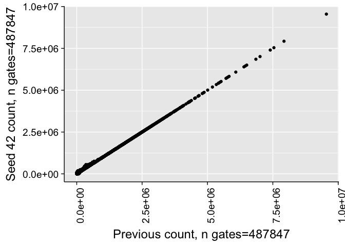
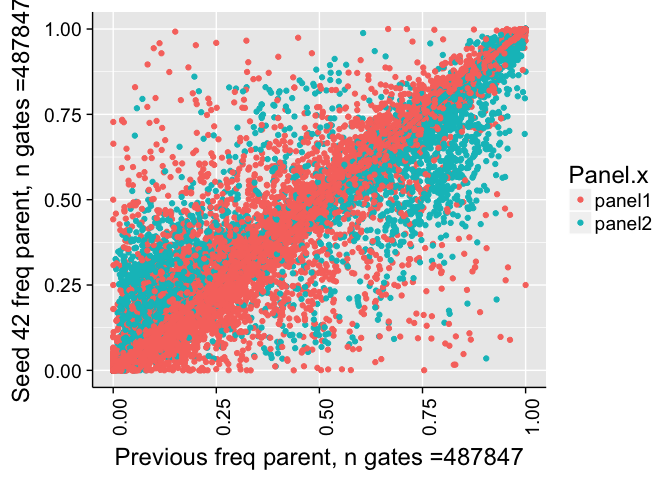
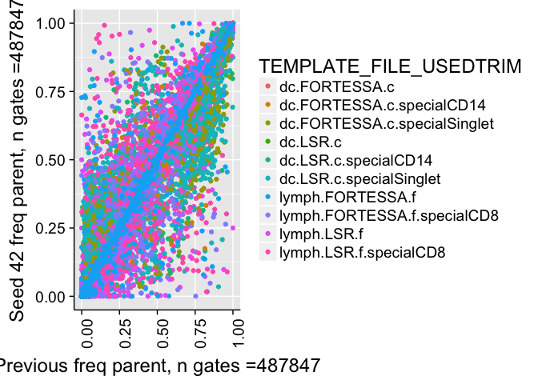
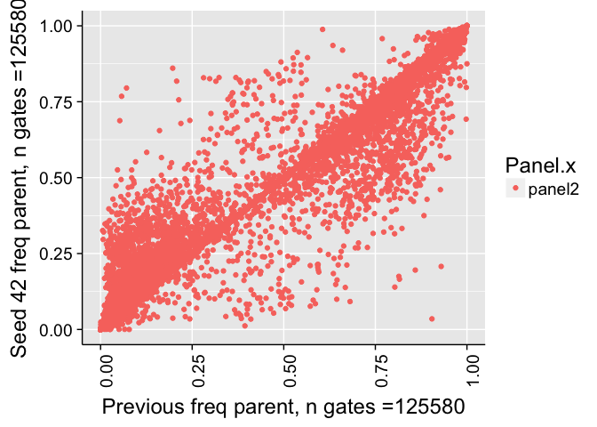
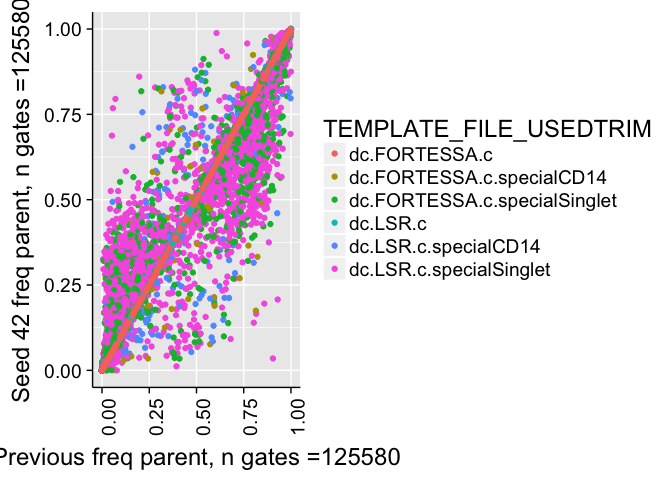
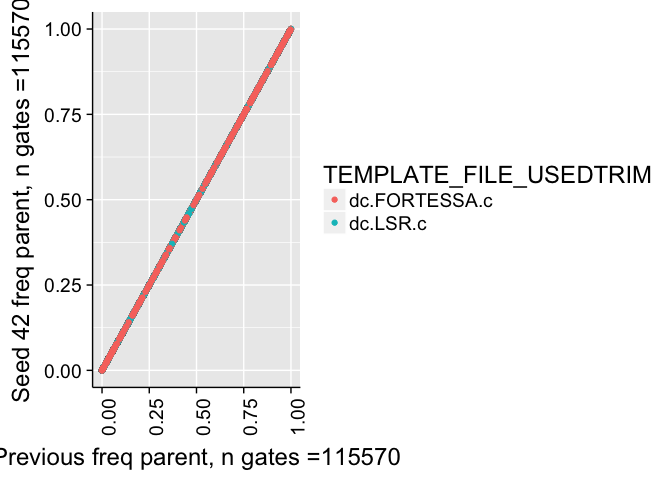
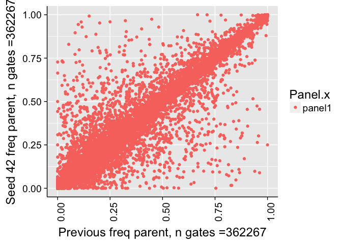
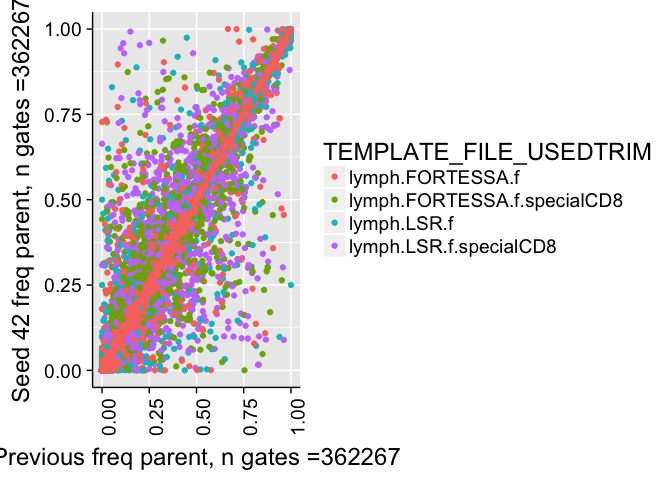
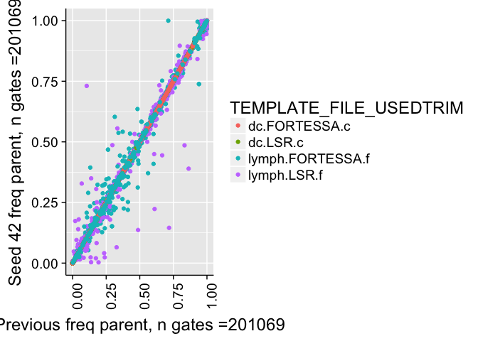
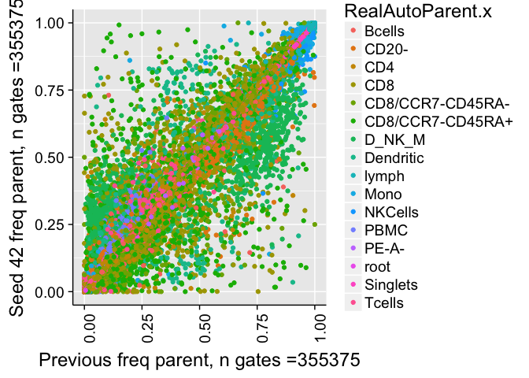

# Validate Seed
JL  
12/18/2017  


# Correlation of all counts

```
## 
## 	Pearson's product-moment correlation
## 
## data:  combo$Count.x and combo$Count.y
## t = 59001, df = 487840, p-value < 2.2e-16
## alternative hypothesis: true correlation is not equal to 0
## 95 percent confidence interval:
##  0.9999295 0.9999303
## sample estimates:
##       cor 
## 0.9999299
```

```
## Warning in cor.test.default(combo$Count.x, combo$Count.y, method =
## "spearman"): Cannot compute exact p-value with ties
```

```
## 
## 	Spearman's rank correlation rho
## 
## data:  combo$Count.x and combo$Count.y
## S = 4.5433e+13, p-value < 2.2e-16
## alternative hypothesis: true rho is not equal to 0
## sample estimates:
##       rho 
## 0.9976521
```

<!-- -->


# Correlation of frequency of parent counts


```
## 
## 	Pearson's product-moment correlation
## 
## data:  combo$freqParent.x and combo$freqParent.y
## t = 9285.3, df = 468950, p-value < 2.2e-16
## alternative hypothesis: true correlation is not equal to 0
## 95 percent confidence interval:
##  0.9972759 0.9973069
## sample estimates:
##       cor 
## 0.9972915
```

```
## Warning in cor.test.default(combo$freqParent.x, combo$freqParent.y, method
## = "spearman"): Cannot compute exact p-value with ties
```

```
## 
## 	Spearman's rank correlation rho
## 
## data:  combo$freqParent.x and combo$freqParent.y
## S = 5.0228e+13, p-value < 2.2e-16
## alternative hypothesis: true rho is not equal to 0
## sample estimates:
##       rho 
## 0.9970778
```

```
## Warning: Removed 19303 rows containing missing values (geom_point).
```

<!-- -->

```
## Warning: Removed 19303 rows containing missing values (geom_point).
```

<!-- -->


# Correlation of frequency of parent counts (panel2)


```
## 
## 	Pearson's product-moment correlation
## 
## data:  comboP2$freqParent.x and comboP2$freqParent.y
## t = 4040.1, df = 116490, p-value < 2.2e-16
## alternative hypothesis: true correlation is not equal to 0
## 95 percent confidence interval:
##  0.9964096 0.9964910
## sample estimates:
##       cor 
## 0.9964506
```

```
## Warning in cor.test.default(comboP2$freqParent.x, comboP2$freqParent.y, :
## Cannot compute exact p-value with ties
```

```
## 
## 	Spearman's rank correlation rho
## 
## data:  comboP2$freqParent.x and comboP2$freqParent.y
## S = 9.4761e+11, p-value < 2.2e-16
## alternative hypothesis: true rho is not equal to 0
## sample estimates:
##       rho 
## 0.9964036
```

```
## Warning: Removed 9086 rows containing missing values (geom_point).
```

<!-- -->

```
## Warning: Removed 9086 rows containing missing values (geom_point).
```

<!-- -->

```
## Warning: Removed 8371 rows containing missing values (geom_point).
```

<!-- -->


# Correlation of frequency of parent counts (panel1)


```
## 
## 	Pearson's product-moment correlation
## 
## data:  comboP2$freqParent.x and comboP2$freqParent.y
## t = 8362.4, df = 352460, p-value < 2.2e-16
## alternative hypothesis: true correlation is not equal to 0
## 95 percent confidence interval:
##  0.9974728 0.9975059
## sample estimates:
##       cor 
## 0.9974894
```

```
## Warning in cor.test.default(comboP2$freqParent.x, comboP2$freqParent.y, :
## Cannot compute exact p-value with ties
```

```
## 
## 	Spearman's rank correlation rho
## 
## data:  comboP2$freqParent.x and comboP2$freqParent.y
## S = 1.8362e+13, p-value < 2.2e-16
## alternative hypothesis: true rho is not equal to 0
## sample estimates:
##       rho 
## 0.9974838
```

```
## Warning: Removed 10217 rows containing missing values (geom_point).
```

<!-- -->

```
## Warning: Removed 10217 rows containing missing values (geom_point).
```

<!-- --><!-- -->


# Correlation of frequency of parent counts (> 1% difference)


```
## Warning: Removed 400 rows containing missing values (geom_point).
```

<!-- -->


