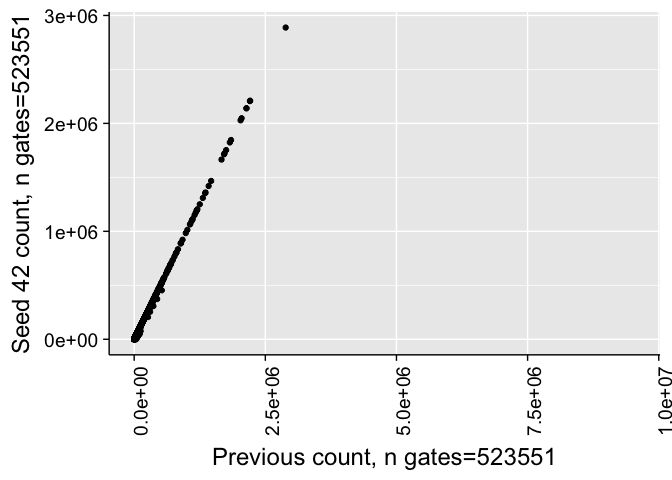
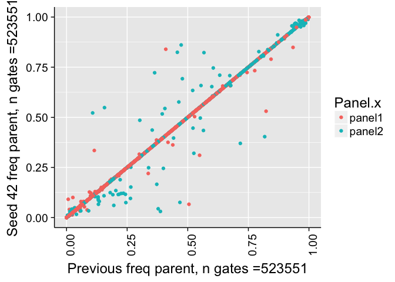
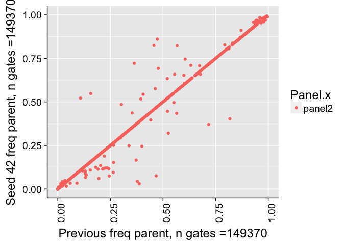
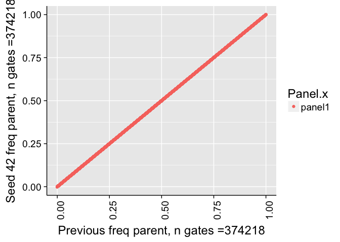
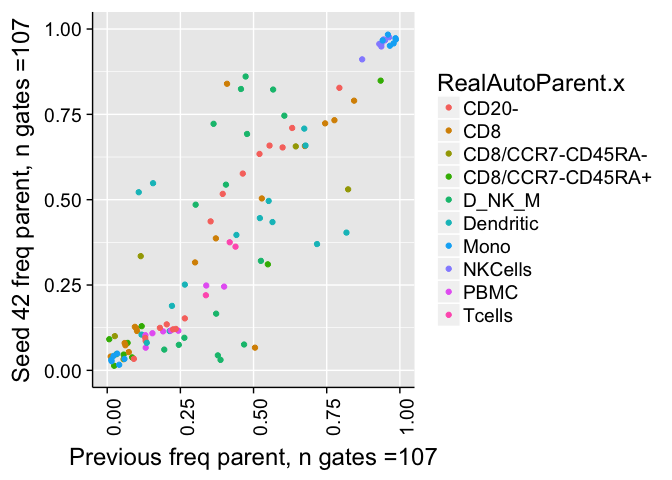

# Validate Seed
JL  
12/18/2017  


# Correlation of all counts

```
## 
## 	Pearson's product-moment correlation
## 
## data:  combo$Count.x and combo$Count.y
## t = 52357, df = 513550, p-value < 2.2e-16
## alternative hypothesis: true correlation is not equal to 0
## 95 percent confidence interval:
##  0.9999058 0.9999069
## sample estimates:
##       cor 
## 0.9999063
```

```
## Warning in cor.test.default(combo$Count.x, combo$Count.y, method =
## "spearman"): Cannot compute exact p-value with ties
```

```
## 
## 	Spearman's rank correlation rho
## 
## data:  combo$Count.x and combo$Count.y
## S = 4.847e+13, p-value < 2.2e-16
## alternative hypothesis: true rho is not equal to 0
## sample estimates:
##       rho 
## 0.9978528
```

```
## Warning: Removed 10029 rows containing missing values (geom_point).
```

<!-- -->


# Correlation of frequency of parent counts


```
## 
## 	Pearson's product-moment correlation
## 
## data:  combo$freqParent.x and combo$freqParent.y
## t = 12484, df = 493350, p-value < 2.2e-16
## alternative hypothesis: true correlation is not equal to 0
## 95 percent confidence interval:
##  0.9984122 0.9984298
## sample estimates:
##      cor 
## 0.998421
```

```
## Warning in cor.test.default(combo$freqParent.x, combo$freqParent.y, method
## = "spearman"): Cannot compute exact p-value with ties
```

```
## 
## 	Spearman's rank correlation rho
## 
## data:  combo$freqParent.x and combo$freqParent.y
## S = 4.5055e+13, p-value < 2.2e-16
## alternative hypothesis: true rho is not equal to 0
## sample estimates:
##       rho 
## 0.9977487
```

```
## Warning: Removed 30637 rows containing missing values (geom_point).
```

<!-- -->


# Correlation of frequency of parent counts (panel2)


```
## 
## 	Pearson's product-moment correlation
## 
## data:  comboP2$freqParent.x and comboP2$freqParent.y
## t = 3437.9, df = 129280, p-value < 2.2e-16
## alternative hypothesis: true correlation is not equal to 0
## 95 percent confidence interval:
##  0.9945162 0.9946341
## sample estimates:
##       cor 
## 0.9945755
```

```
## Warning in cor.test.default(comboP2$freqParent.x, comboP2$freqParent.y, :
## Cannot compute exact p-value with ties
```

```
## 
## 	Spearman's rank correlation rho
## 
## data:  comboP2$freqParent.x and comboP2$freqParent.y
## S = 2.2e+12, p-value < 2.2e-16
## alternative hypothesis: true rho is not equal to 0
## sample estimates:
##       rho 
## 0.9938911
```

```
## Warning: Removed 20080 rows containing missing values (geom_point).
```

<!-- -->


# Correlation of frequency of parent counts (panel1)


```
## 
## 	Pearson's product-moment correlation
## 
## data:  comboP2$freqParent.x and comboP2$freqParent.y
## t = 4.0492e+10, df = 364070, p-value < 2.2e-16
## alternative hypothesis: true correlation is not equal to 0
## 95 percent confidence interval:
##  1 1
## sample estimates:
## cor 
##   1
```

```
## Warning in cor.test.default(comboP2$freqParent.x, comboP2$freqParent.y, :
## Cannot compute exact p-value with ties
```

```
## 
## 	Spearman's rank correlation rho
## 
## data:  comboP2$freqParent.x and comboP2$freqParent.y
## S = 0, p-value < 2.2e-16
## alternative hypothesis: true rho is not equal to 0
## sample estimates:
## rho 
##   1
```

```
## Warning: Removed 10557 rows containing missing values (geom_point).
```

<!-- -->


# Correlation of frequency of parent counts (> 1% difference)

<!-- -->

# Example


# Example (really bad outlier)


|       |name.x                                                                                         |RealAutoParent.x |Manual.x                              | freqParent.x| freqParent.y|
|:------|:----------------------------------------------------------------------------------------------|:----------------|:-------------------------------------|------------:|------------:|
|371    |2016-01-08_PANEL 2_HB_Group one_Ctl-A_002.fcs                                                  |Dendritic        |Plasmacytoid DC (CD11c- CD123+)       |    0.3389213|    0.3234450|
|372    |2016-01-08_PANEL 2_HB_Group one_Ctl-A_002.fcs                                                  |Dendritic        |Myeloid DC (CD11c+ CD123-)            |    0.5289116|    0.5578947|
|377    |2016-01-08_PANEL 2_HB_Group one_Ctl-A_002.fcs                                                  |Mono             |Classical monocytes (CD16- CD14+)     |    0.9729730|    0.9208633|
|379    |2016-01-08_PANEL 2_HB_Group one_Ctl-A_002.fcs                                                  |CD20-            |DC (HLA-DR+)                          |    0.0992214|    0.0776509|
|382    |2016-01-08_PANEL 2_HB_Group one_Ctl-A_002.fcs                                                  |Mono             |Non classical monocytes (CD16+ CD14+) |    0.0270270|    0.0791367|
|401    |2016-01-08_PANEL 2_HB_Group one_Ctl-C_003.fcs                                                  |Dendritic        |Plasmacytoid DC (CD11c- CD123+)       |    0.2981326|    0.1805556|
|402    |2016-01-08_PANEL 2_HB_Group one_Ctl-C_003.fcs                                                  |Dendritic        |Myeloid DC (CD11c+ CD123-)            |    0.3998712|    0.4288194|
|407    |2016-01-08_PANEL 2_HB_Group one_Ctl-C_003.fcs                                                  |Mono             |Classical monocytes (CD16- CD14+)     |    0.9840764|    0.9710145|
|409    |2016-01-08_PANEL 2_HB_Group one_Ctl-C_003.fcs                                                  |CD20-            |DC (HLA-DR+)                          |    0.0894843|    0.0705018|
|410    |2016-01-08_PANEL 2_HB_Group one_Ctl-C_003.fcs                                                  |D_NK_M           |MONOCYTES (CD14+)                     |    0.0155615|    0.0036716|
|411    |2016-01-08_PANEL 2_HB_Group one_Ctl-C_003.fcs                                                  |CD20-            |NK (CD16+)                            |    0.6556612|    0.6847613|
|412    |2016-01-08_PANEL 2_HB_Group one_Ctl-C_003.fcs                                                  |Mono             |Non classical monocytes (CD16+ CD14+) |    0.0159236|    0.0289855|
|416    |2016-01-08_PANEL 2_HB_Group one_Ctl-D_004.fcs                                                  |Dendritic        |Plasmacytoid DC (CD11c- CD123+)       |    0.1124291|    0.4947917|
|417    |2016-01-08_PANEL 2_HB_Group one_Ctl-D_004.fcs                                                  |Dendritic        |Myeloid DC (CD11c+ CD123-)            |    0.8109850|    0.4895833|
|419    |2016-01-08_PANEL 2_HB_Group one_Ctl-D_004.fcs                                                  |NKCells          |NK CD56LO                             |    0.9470995|    0.9364774|
|420    |2016-01-08_PANEL 2_HB_Group one_Ctl-D_004.fcs                                                  |D_NK_M           |DC NK (CD20- CD14-)                   |    0.8942987|    0.5255454|
|422    |2016-01-08_PANEL 2_HB_Group one_Ctl-D_004.fcs                                                  |Mono             |Classical monocytes (CD16- CD14+)     |    0.9881890|    0.6059744|
|424    |2016-01-08_PANEL 2_HB_Group one_Ctl-D_004.fcs                                                  |CD20-            |DC (HLA-DR+)                          |    0.2111280|    0.0204887|
|425    |2016-01-08_PANEL 2_HB_Group one_Ctl-D_004.fcs                                                  |D_NK_M           |MONOCYTES (CD14+)                     |    0.0371002|    0.1971286|
|426    |2016-01-08_PANEL 2_HB_Group one_Ctl-D_004.fcs                                                  |CD20-            |NK (CD16+)                            |    0.6926176|    0.9978658|
|427    |2016-01-08_PANEL 2_HB_Group one_Ctl-D_004.fcs                                                  |Mono             |Non classical monocytes (CD16+ CD14+) |    0.0118110|    0.3940256|
|450    |2016-05-03_P2_HB_panel 2_CTL-A_1715_001.fcs                                                    |D_NK_M           |DC NK (CD20- CD14-)                   |    0.7050725|    0.7226432|
|452    |2016-05-03_P2_HB_panel 2_CTL-A_1715_001.fcs                                                    |Mono             |Classical monocytes (CD16- CD14+)     |    0.8436715|    0.9153140|
|455    |2016-05-03_P2_HB_panel 2_CTL-A_1715_001.fcs                                                    |D_NK_M           |MONOCYTES (CD14+)                     |    0.2328683|    0.2162656|
|457    |2016-05-03_P2_HB_panel 2_CTL-A_1715_001.fcs                                                    |Mono             |Non classical monocytes (CD16+ CD14+) |    0.1563285|    0.0846860|
|465    |2016-05-03_P2_HB_panel 2_CTL-B_1722_002.fcs                                                    |D_NK_M           |DC NK (CD20- CD14-)                   |    0.6132576|    0.6371463|
|467    |2016-05-03_P2_HB_panel 2_CTL-B_1722_002.fcs                                                    |Mono             |Classical monocytes (CD16- CD14+)     |    0.9233174|    0.9798853|
|470    |2016-05-03_P2_HB_panel 2_CTL-B_1722_002.fcs                                                    |D_NK_M           |MONOCYTES (CD14+)                     |    0.3576752|    0.3348862|
|472    |2016-05-03_P2_HB_panel 2_CTL-B_1722_002.fcs                                                    |Mono             |Non classical monocytes (CD16+ CD14+) |    0.0766826|    0.0201147|
|731    |2016-05-05_PANEL 2_HB_panel two_F1631958_002.fcs                                               |NKCells          |NK CD56LO                             |    0.9442845|    0.9259449|
|749    |2016-05-05_PANEL 2_HB_panel two_F1631959_005.fcs                                               |Mono             |Classical monocytes (CD16- CD14+)     |    0.8046688|    0.8314295|
|754    |2016-05-05_PANEL 2_HB_panel two_F1631959_005.fcs                                               |Mono             |Non classical monocytes (CD16+ CD14+) |    0.1953312|    0.1685705|
|761    |2016-05-05_PANEL 2_HB_panel two_F1631960_004.fcs                                               |NKCells          |NK CD56LO                             |    0.9339473|    0.9843959|
|762    |2016-05-05_PANEL 2_HB_panel two_F1631960_004.fcs                                               |D_NK_M           |DC NK (CD20- CD14-)                   |    0.6067951|    0.6248017|
|767    |2016-05-05_PANEL 2_HB_panel two_F1631960_004.fcs                                               |D_NK_M           |MONOCYTES (CD14+)                     |    0.3422889|    0.3684318|
|1016   |2016-05-06_PANEL 2_ZF_panel 2_CTL-A_001.fcs                                                    |Mono             |Classical monocytes (CD16- CD14+)     |    0.8923722|    0.9413238|
|1021   |2016-05-06_PANEL 2_ZF_panel 2_CTL-A_001.fcs                                                    |Mono             |Non classical monocytes (CD16+ CD14+) |    0.1076278|    0.0586762|
|1059   |2016-05-06_PANEL 2_ZF_panel 2_F1631954_003.fcs                                                 |D_NK_M           |DC NK (CD20- CD14-)                   |    0.5135155|    0.5301968|
|1061   |2016-05-06_PANEL 2_ZF_panel 2_F1631954_003.fcs                                                 |Mono             |Classical monocytes (CD16- CD14+)     |    0.9070146|    0.9560922|
|1064   |2016-05-06_PANEL 2_ZF_panel 2_F1631954_003.fcs                                                 |D_NK_M           |MONOCYTES (CD14+)                     |    0.3151234|    0.2982514|
|1066   |2016-05-06_PANEL 2_ZF_panel 2_F1631954_003.fcs                                                 |Mono             |Non classical monocytes (CD16+ CD14+) |    0.0929854|    0.0439078|
|1074   |2016-05-06_PANEL 2_ZF_panel 2_F1631956_004.fcs                                                 |D_NK_M           |DC NK (CD20- CD14-)                   |    0.4726947|    0.4943761|
|1076   |2016-05-06_PANEL 2_ZF_panel 2_F1631956_004.fcs                                                 |Mono             |Classical monocytes (CD16- CD14+)     |    0.8460375|    0.9096944|
|1079   |2016-05-06_PANEL 2_ZF_panel 2_F1631956_004.fcs                                                 |D_NK_M           |MONOCYTES (CD14+)                     |    0.3124078|    0.2860978|
|1081   |2016-05-06_PANEL 2_ZF_panel 2_F1631956_004.fcs                                                 |Mono             |Non classical monocytes (CD16+ CD14+) |    0.1539625|    0.0903056|
|1091   |2016-05-06_PANEL 2_ZF_panel 2_F1631957_002.fcs                                                 |Mono             |Classical monocytes (CD16- CD14+)     |    0.9414843|    0.9515140|
|1096   |2016-05-06_PANEL 2_ZF_panel 2_F1631957_002.fcs                                                 |Mono             |Non classical monocytes (CD16+ CD14+) |    0.0585157|    0.0484860|
|1279   |2016-05-09_PANEL 2_DHS_panel 2_F1631949_004.fcs                                                |Dendritic        |Myeloid DC (CD11c+ CD123-)            |    0.4280924|    0.4060058|
|1282   |2016-05-09_PANEL 2_DHS_panel 2_F1631949_004.fcs                                                |D_NK_M           |DC NK (CD20- CD14-)                   |    0.8422055|    0.8734082|
|1284   |2016-05-09_PANEL 2_DHS_panel 2_F1631949_004.fcs                                                |Mono             |Classical monocytes (CD16- CD14+)     |    0.7393670|    0.9619253|
|1287   |2016-05-09_PANEL 2_DHS_panel 2_F1631949_004.fcs                                                |D_NK_M           |MONOCYTES (CD14+)                     |    0.1027074|    0.0751133|
|1289   |2016-05-09_PANEL 2_DHS_panel 2_F1631949_004.fcs                                                |Mono             |Non classical monocytes (CD16+ CD14+) |    0.2606330|    0.0380747|
|1324   |2016-05-09_PANEL 2_DHS_panel 2_F1631955_005.fcs                                                |Dendritic        |Myeloid DC (CD11c+ CD123-)            |    0.8753188|    0.8183440|
|1327   |2016-05-09_PANEL 2_DHS_panel 2_F1631955_005.fcs                                                |D_NK_M           |DC NK (CD20- CD14-)                   |    0.3998243|    0.4315149|
|1329   |2016-05-09_PANEL 2_DHS_panel 2_F1631955_005.fcs                                                |Mono             |Classical monocytes (CD16- CD14+)     |    0.8604708|    0.9341029|
|1330   |2016-05-09_PANEL 2_DHS_panel 2_F1631955_005.fcs                                                |PBMC             |DC NK MONOCYTES (CD3- CD19-)          |    0.5527983|    0.5379833|
|1332   |2016-05-09_PANEL 2_DHS_panel 2_F1631955_005.fcs                                                |D_NK_M           |MONOCYTES (CD14+)                     |    0.4440358|    0.4073688|
|1333   |2016-05-09_PANEL 2_DHS_panel 2_F1631955_005.fcs                                                |CD20-            |NK (CD16+)                            |    0.4789198|    0.4908502|
|1334   |2016-05-09_PANEL 2_DHS_panel 2_F1631955_005.fcs                                                |Mono             |Non classical monocytes (CD16+ CD14+) |    0.1395292|    0.0658971|
|1745   |2016-05-10_PANEL 2_HB_panel 2_Ctl-D_011.fcs                                                    |Dendritic        |Plasmacytoid DC (CD11c- CD123+)       |    0.1106346|    0.0927026|
|1746   |2016-05-10_PANEL 2_HB_panel 2_Ctl-D_011.fcs                                                    |Dendritic        |Myeloid DC (CD11c+ CD123-)            |    0.8329760|    0.8528643|
|1749   |2016-05-10_PANEL 2_HB_panel 2_Ctl-D_011.fcs                                                    |D_NK_M           |DC NK (CD20- CD14-)                   |    0.4478858|    0.5157979|
|1751   |2016-05-10_PANEL 2_HB_panel 2_Ctl-D_011.fcs                                                    |Mono             |Classical monocytes (CD16- CD14+)     |    0.9468031|    0.9856346|
|1752   |2016-05-10_PANEL 2_HB_panel 2_Ctl-D_011.fcs                                                    |PBMC             |DC NK MONOCYTES (CD3- CD19-)          |    0.1437804|    0.1261079|
|1754   |2016-05-10_PANEL 2_HB_panel 2_Ctl-D_011.fcs                                                    |D_NK_M           |MONOCYTES (CD14+)                     |    0.3685699|    0.3235147|
|1755   |2016-05-10_PANEL 2_HB_panel 2_Ctl-D_011.fcs                                                    |CD20-            |NK (CD16+)                            |    0.6390860|    0.6543722|
|1756   |2016-05-10_PANEL 2_HB_panel 2_Ctl-D_011.fcs                                                    |Mono             |Non classical monocytes (CD16+ CD14+) |    0.0531969|    0.0143654|
|1826   |2016-05-10_PANEL 2_HB_panel 2_F1632180_008.fcs                                                 |Mono             |Classical monocytes (CD16- CD14+)     |    0.9028830|    0.9165158|
|1831   |2016-05-10_PANEL 2_HB_panel 2_F1632180_008.fcs                                                 |Mono             |Non classical monocytes (CD16+ CD14+) |    0.0971170|    0.0834842|
|1865   |2016-05-10_PANEL 2_HB_panel 2_F1632226_001.fcs                                                 |Dendritic        |Plasmacytoid DC (CD11c- CD123+)       |    0.3245806|    0.3105776|
|1866   |2016-05-10_PANEL 2_HB_panel 2_F1632226_001.fcs                                                 |Dendritic        |Myeloid DC (CD11c+ CD123-)            |    0.4412837|    0.4561140|
|2321   |2016-05-11_PANEL 2_ZF_panel 2_Ctl-A_006.fcs                                                    |D_NK_M           |DC NK (CD20- CD14-)                   |    0.6781092|    0.7395669|
|2323   |2016-05-11_PANEL 2_ZF_panel 2_Ctl-A_006.fcs                                                    |Mono             |Classical monocytes (CD16- CD14+)     |    0.7345142|    0.9517911|
|2324   |2016-05-11_PANEL 2_ZF_panel 2_Ctl-A_006.fcs                                                    |PBMC             |DC NK MONOCYTES (CD3- CD19-)          |    0.2447379|    0.2296885|
|2326   |2016-05-11_PANEL 2_ZF_panel 2_Ctl-A_006.fcs                                                    |D_NK_M           |MONOCYTES (CD14+)                     |    0.2549708|    0.1939552|
|2328   |2016-05-11_PANEL 2_ZF_panel 2_Ctl-A_006.fcs                                                    |Mono             |Non classical monocytes (CD16+ CD14+) |    0.2654858|    0.0482089|
|2332   |2016-05-11_PANEL 2_ZF_panel 2_F1631919_009.fcs                                                 |Dendritic        |Plasmacytoid DC (CD11c- CD123+)       |    0.3233682|    0.3782477|
|2333   |2016-05-11_PANEL 2_ZF_panel 2_F1631919_009.fcs                                                 |Dendritic        |Myeloid DC (CD11c+ CD123-)            |    0.5445939|    0.5021148|
|2336   |2016-05-11_PANEL 2_ZF_panel 2_F1631919_009.fcs                                                 |D_NK_M           |DC NK (CD20- CD14-)                   |    0.6200347|    0.6424421|
|2338   |2016-05-11_PANEL 2_ZF_panel 2_F1631919_009.fcs                                                 |Mono             |Classical monocytes (CD16- CD14+)     |    0.8954282|    0.9477855|
|2340   |2016-05-11_PANEL 2_ZF_panel 2_F1631919_009.fcs                                                 |CD20-            |DC (HLA-DR+)                          |    0.0758131|    0.0634197|
|2341   |2016-05-11_PANEL 2_ZF_panel 2_F1631919_009.fcs                                                 |D_NK_M           |MONOCYTES (CD14+)                     |    0.3155799|    0.2951502|
|2343   |2016-05-11_PANEL 2_ZF_panel 2_F1631919_009.fcs                                                 |Mono             |Non classical monocytes (CD16+ CD14+) |    0.1045718|    0.0522145|
|2351   |2016-05-11_PANEL 2_ZF_panel 2_F1631920_007.fcs                                                 |D_NK_M           |DC NK (CD20- CD14-)                   |    0.5345244|    0.5484869|
|2353   |2016-05-11_PANEL 2_ZF_panel 2_F1631920_007.fcs                                                 |Mono             |Classical monocytes (CD16- CD14+)     |    0.8037286|    0.8514521|
|2356   |2016-05-11_PANEL 2_ZF_panel 2_F1631920_007.fcs                                                 |D_NK_M           |MONOCYTES (CD14+)                     |    0.2719364|    0.2575235|
|2358   |2016-05-11_PANEL 2_ZF_panel 2_F1631920_007.fcs                                                 |Mono             |Non classical monocytes (CD16+ CD14+) |    0.1962714|    0.1485479|
|2381   |2016-05-11_PANEL 2_ZF_panel 2_F1631942_011.fcs                                                 |D_NK_M           |DC NK (CD20- CD14-)                   |    0.5787139|    0.6014737|
|2383   |2016-05-11_PANEL 2_ZF_panel 2_F1631942_011.fcs                                                 |Mono             |Classical monocytes (CD16- CD14+)     |    0.9710105|    0.9829997|
|2386   |2016-05-11_PANEL 2_ZF_panel 2_F1631942_011.fcs                                                 |D_NK_M           |MONOCYTES (CD14+)                     |    0.3090482|    0.2628137|
|2388   |2016-05-11_PANEL 2_ZF_panel 2_F1631942_011.fcs                                                 |Mono             |Non classical monocytes (CD16+ CD14+) |    0.0289895|    0.0170003|
|2396   |2016-05-11_PANEL 2_ZF_panel 2_F1632171_003.fcs                                                 |D_NK_M           |DC NK (CD20- CD14-)                   |    0.4859650|    0.5126174|
|2398   |2016-05-11_PANEL 2_ZF_panel 2_F1632171_003.fcs                                                 |Mono             |Classical monocytes (CD16- CD14+)     |    0.8758243|    0.9492634|
|2401   |2016-05-11_PANEL 2_ZF_panel 2_F1632171_003.fcs                                                 |D_NK_M           |MONOCYTES (CD14+)                     |    0.3358031|    0.2517823|
|2403   |2016-05-11_PANEL 2_ZF_panel 2_F1632171_003.fcs                                                 |Mono             |Non classical monocytes (CD16+ CD14+) |    0.1241757|    0.0507366|
|2407   |2016-05-11_PANEL 2_ZF_panel 2_F1632176_004.fcs                                                 |Dendritic        |Plasmacytoid DC (CD11c- CD123+)       |    0.0766139|    0.0664917|
|2413   |2016-05-11_PANEL 2_ZF_panel 2_F1632176_004.fcs                                                 |Mono             |Classical monocytes (CD16- CD14+)     |    0.8834283|    0.9067805|
|2415   |2016-05-11_PANEL 2_ZF_panel 2_F1632176_004.fcs                                                 |CD20-            |DC (HLA-DR+)                          |    0.1226757|    0.1024867|
|2416   |2016-05-11_PANEL 2_ZF_panel 2_F1632176_004.fcs                                                 |D_NK_M           |MONOCYTES (CD14+)                     |    0.3518147|    0.3391225|
|2417   |2016-05-11_PANEL 2_ZF_panel 2_F1632176_004.fcs                                                 |CD20-            |NK (CD16+)                            |    0.5867490|    0.5972861|
|2418   |2016-05-11_PANEL 2_ZF_panel 2_F1632176_004.fcs                                                 |Mono             |Non classical monocytes (CD16+ CD14+) |    0.1165717|    0.0932195|
|2426   |2016-05-11_PANEL 2_ZF_panel 2_F1632184_005.fcs                                                 |D_NK_M           |DC NK (CD20- CD14-)                   |    0.7219615|    0.7336349|
|2428   |2016-05-11_PANEL 2_ZF_panel 2_F1632184_005.fcs                                                 |Mono             |Classical monocytes (CD16- CD14+)     |    0.9041571|    0.9348884|
|2433   |2016-05-11_PANEL 2_ZF_panel 2_F1632184_005.fcs                                                 |Mono             |Non classical monocytes (CD16+ CD14+) |    0.0958429|    0.0651116|
|3074   |2016-05-12_PANEL 2_HB_panel 2_Ctl-C_014.fcs                                                    |Dendritic        |Plasmacytoid DC (CD11c- CD123+)       |    0.1690564|    0.1533715|
|3077   |2016-05-12_PANEL 2_HB_panel 2_Ctl-C_014.fcs                                                    |NKCells          |NK CD56LO                             |    0.9661676|    0.9767745|
|3078   |2016-05-12_PANEL 2_HB_panel 2_Ctl-C_014.fcs                                                    |D_NK_M           |DC NK (CD20- CD14-)                   |    0.5829767|    0.7536196|
|3080   |2016-05-12_PANEL 2_HB_panel 2_Ctl-C_014.fcs                                                    |Mono             |Classical monocytes (CD16- CD14+)     |    0.8265054|    0.9794679|
|3081   |2016-05-12_PANEL 2_HB_panel 2_Ctl-C_014.fcs                                                    |PBMC             |DC NK MONOCYTES (CD3- CD19-)          |    0.1391557|    0.1095199|
|3082   |2016-05-12_PANEL 2_HB_panel 2_Ctl-C_014.fcs                                                    |CD20-            |DC (HLA-DR+)                          |    0.1295073|    0.1055496|
|3083   |2016-05-12_PANEL 2_HB_panel 2_Ctl-C_014.fcs                                                    |D_NK_M           |MONOCYTES (CD14+)                     |    0.2746841|    0.1212270|
|3084   |2016-05-12_PANEL 2_HB_panel 2_Ctl-C_014.fcs                                                    |CD20-            |NK (CD16+)                            |    0.5999050|    0.6429269|
|3085   |2016-05-12_PANEL 2_HB_panel 2_Ctl-C_014.fcs                                                    |Mono             |Non classical monocytes (CD16+ CD14+) |    0.1734946|    0.0205321|
|3095   |2016-05-12_PANEL 2_HB_panel 2_F1631914_001.fcs                                                 |Mono             |Classical monocytes (CD16- CD14+)     |    0.9009108|    0.9178136|
|3100   |2016-05-12_PANEL 2_HB_panel 2_F1631914_001.fcs                                                 |Mono             |Non classical monocytes (CD16+ CD14+) |    0.0990892|    0.0821864|
|3108   |2016-05-12_PANEL 2_HB_panel 2_F1631928_015.fcs                                                 |D_NK_M           |DC NK (CD20- CD14-)                   |    0.6200114|    0.6341249|
|3113   |2016-05-12_PANEL 2_HB_panel 2_F1631928_015.fcs                                                 |D_NK_M           |MONOCYTES (CD14+)                     |    0.3665906|    0.3518030|
|3122   |2016-05-12_PANEL 2_HB_panel 2_F1631932_016.fcs                                                 |NKCells          |NK CD56LO                             |    0.8750000|    1.0000000|
|3123   |2016-05-12_PANEL 2_HB_panel 2_F1631932_016.fcs                                                 |D_NK_M           |DC NK (CD20- CD14-)                   |    0.7832286|    0.8006924|
|3125   |2016-05-12_PANEL 2_HB_panel 2_F1631932_016.fcs                                                 |Mono             |Classical monocytes (CD16- CD14+)     |    0.9040404|    0.8920635|
|3128   |2016-05-12_PANEL 2_HB_panel 2_F1631932_016.fcs                                                 |D_NK_M           |MONOCYTES (CD14+)                     |    0.0956984|    0.0778932|
|3130   |2016-05-12_PANEL 2_HB_panel 2_F1631932_016.fcs                                                 |Mono             |Non classical monocytes (CD16+ CD14+) |    0.0959596|    0.1079365|
|3153   |2016-05-12_PANEL 2_HB_panel 2_F1631940_003.fcs                                                 |D_NK_M           |DC NK (CD20- CD14-)                   |    0.4291657|    0.4470510|
|3155   |2016-05-12_PANEL 2_HB_panel 2_F1631940_003.fcs                                                 |Mono             |Classical monocytes (CD16- CD14+)     |    0.9314760|    0.9558524|
|3158   |2016-05-12_PANEL 2_HB_panel 2_F1631940_003.fcs                                                 |D_NK_M           |MONOCYTES (CD14+)                     |    0.2769816|    0.2565834|
|3159   |2016-05-12_PANEL 2_HB_panel 2_F1631940_003.fcs                                                 |CD20-            |NK (CD16+)                            |    0.4802886|    0.4933900|
|3160   |2016-05-12_PANEL 2_HB_panel 2_F1631940_003.fcs                                                 |Mono             |Non classical monocytes (CD16+ CD14+) |    0.0685240|    0.0441476|
|3183   |2016-05-12_PANEL 2_HB_panel 2_F1632168_010.fcs                                                 |D_NK_M           |DC NK (CD20- CD14-)                   |    0.5252576|    0.5436035|
|3185   |2016-05-12_PANEL 2_HB_panel 2_F1632168_010.fcs                                                 |Mono             |Classical monocytes (CD16- CD14+)     |    0.8887957|    0.9512429|
|3188   |2016-05-12_PANEL 2_HB_panel 2_F1632168_010.fcs                                                 |D_NK_M           |MONOCYTES (CD14+)                     |    0.1787708|    0.1631849|
|3190   |2016-05-12_PANEL 2_HB_panel 2_F1632168_010.fcs                                                 |Mono             |Non classical monocytes (CD16+ CD14+) |    0.1112043|    0.0487571|
|3224   |2016-05-12_PANEL 2_HB_panel 2_F1632220_012.fcs                                                 |Dendritic        |Plasmacytoid DC (CD11c- CD123+)       |    0.1796085|    0.2635336|
|3225   |2016-05-12_PANEL 2_HB_panel 2_F1632220_012.fcs                                                 |Dendritic        |Myeloid DC (CD11c+ CD123-)            |    0.6914417|    0.6210589|
|3228   |2016-05-12_PANEL 2_HB_panel 2_F1632220_012.fcs                                                 |D_NK_M           |DC NK (CD20- CD14-)                   |    0.6180007|    0.1609008|
|3229   |2016-05-12_PANEL 2_HB_panel 2_F1632220_012.fcs                                                 |NKCells          |NK CD56HI                             |    0.0110312|    0.0454422|
|3230   |2016-05-12_PANEL 2_HB_panel 2_F1632220_012.fcs                                                 |Mono             |Classical monocytes (CD16- CD14+)     |    0.8422462|    0.9280630|
|3232   |2016-05-12_PANEL 2_HB_panel 2_F1632220_012.fcs                                                 |CD20-            |DC (HLA-DR+)                          |    0.1423939|    0.1244171|
|3233   |2016-05-12_PANEL 2_HB_panel 2_F1632220_012.fcs                                                 |D_NK_M           |MONOCYTES (CD14+)                     |    0.2900822|    0.1890534|
|3234   |2016-05-12_PANEL 2_HB_panel 2_F1632220_012.fcs                                                 |CD20-            |NK (CD16+)                            |    0.6588702|    0.5456295|
|3235   |2016-05-12_PANEL 2_HB_panel 2_F1632220_012.fcs                                                 |Mono             |Non classical monocytes (CD16+ CD14+) |    0.1577538|    0.0719370|
|3240   |2016-05-12_PANEL 2_HB_panel 2_F1632224_002.fcs                                                 |Dendritic        |Myeloid DC (CD11c+ CD123-)            |    0.7663551|    0.7848546|
|3243   |2016-05-12_PANEL 2_HB_panel 2_F1632224_002.fcs                                                 |D_NK_M           |DC NK (CD20- CD14-)                   |    0.3928925|    0.4140734|
|3246   |2016-05-12_PANEL 2_HB_panel 2_F1632224_002.fcs                                                 |PBMC             |DC NK MONOCYTES (CD3- CD19-)          |    0.4100134|    0.3989633|
|3248   |2016-05-12_PANEL 2_HB_panel 2_F1632224_002.fcs                                                 |D_NK_M           |MONOCYTES (CD14+)                     |    0.3976186|    0.3757196|
|3275   |2016-05-12_PANEL 2_HB_panel 2_F1632232_005.fcs                                                 |Mono             |Classical monocytes (CD16- CD14+)     |    0.8970198|    0.9262836|
|3280   |2016-05-12_PANEL 2_HB_panel 2_F1632232_005.fcs                                                 |Mono             |Non classical monocytes (CD16+ CD14+) |    0.1029802|    0.0737164|
|3303   |2016-05-12_PANEL 2_HB_panel 2_F1632260_008.fcs                                                 |D_NK_M           |DC NK (CD20- CD14-)                   |    0.4599582|    0.5262060|
|3305   |2016-05-12_PANEL 2_HB_panel 2_F1632260_008.fcs                                                 |Mono             |Classical monocytes (CD16- CD14+)     |    0.7084754|    0.9139767|
|3306   |2016-05-12_PANEL 2_HB_panel 2_F1632260_008.fcs                                                 |PBMC             |DC NK MONOCYTES (CD3- CD19-)          |    0.2831595|    0.2533428|
|3308   |2016-05-12_PANEL 2_HB_panel 2_F1632260_008.fcs                                                 |D_NK_M           |MONOCYTES (CD14+)                     |    0.3961080|    0.3227110|
|3310   |2016-05-12_PANEL 2_HB_panel 2_F1632260_008.fcs                                                 |Mono             |Non classical monocytes (CD16+ CD14+) |    0.2915246|    0.0860233|
|3540   |2016-05-13_PANEL 2_ZF_panel 2_Ctl-D_006.fcs                                                    |D_NK_M           |DC NK (CD20- CD14-)                   |    0.5789038|    0.5950778|
|3542   |2016-05-13_PANEL 2_ZF_panel 2_Ctl-D_006.fcs                                                    |Mono             |Classical monocytes (CD16- CD14+)     |    0.9164531|    0.9802490|
|3545   |2016-05-13_PANEL 2_ZF_panel 2_Ctl-D_006.fcs                                                    |D_NK_M           |MONOCYTES (CD14+)                     |    0.2482425|    0.2317490|
|3547   |2016-05-13_PANEL 2_ZF_panel 2_Ctl-D_006.fcs                                                    |Mono             |Non classical monocytes (CD16+ CD14+) |    0.0835469|    0.0197510|
|3555   |2016-05-13_PANEL 2_ZF_panel 2_F1631922_005.fcs                                                 |D_NK_M           |DC NK (CD20- CD14-)                   |    0.5705315|    0.5869631|
|3557   |2016-05-13_PANEL 2_ZF_panel 2_F1631922_005.fcs                                                 |Mono             |Classical monocytes (CD16- CD14+)     |    0.8757245|    0.9245506|
|3560   |2016-05-13_PANEL 2_ZF_panel 2_F1631922_005.fcs                                                 |D_NK_M           |MONOCYTES (CD14+)                     |    0.3533491|    0.3372318|
|3562   |2016-05-13_PANEL 2_ZF_panel 2_F1631922_005.fcs                                                 |Mono             |Non classical monocytes (CD16+ CD14+) |    0.1242755|    0.0754494|
|3570   |2016-05-13_PANEL 2_ZF_panel 2_F1631924_002.fcs                                                 |D_NK_M           |DC NK (CD20- CD14-)                   |    0.6841115|    0.6991232|
|3572   |2016-05-13_PANEL 2_ZF_panel 2_F1631924_002.fcs                                                 |Mono             |Classical monocytes (CD16- CD14+)     |    0.8788423|    0.9429370|
|3575   |2016-05-13_PANEL 2_ZF_panel 2_F1631924_002.fcs                                                 |D_NK_M           |MONOCYTES (CD14+)                     |    0.2313030|    0.2160496|
|3577   |2016-05-13_PANEL 2_ZF_panel 2_F1631924_002.fcs                                                 |Mono             |Non classical monocytes (CD16+ CD14+) |    0.1211577|    0.0570630|
|3585   |2016-05-13_PANEL 2_ZF_panel 2_F1632182_001.fcs                                                 |D_NK_M           |DC NK (CD20- CD14-)                   |    0.4979694|    0.5193937|
|3587   |2016-05-13_PANEL 2_ZF_panel 2_F1632182_001.fcs                                                 |Mono             |Classical monocytes (CD16- CD14+)     |    0.8400012|    0.9088386|
|3590   |2016-05-13_PANEL 2_ZF_panel 2_F1632182_001.fcs                                                 |D_NK_M           |MONOCYTES (CD14+)                     |    0.3429583|    0.3211009|
|3592   |2016-05-13_PANEL 2_ZF_panel 2_F1632182_001.fcs                                                 |Mono             |Non classical monocytes (CD16+ CD14+) |    0.1599988|    0.0911614|
|3615   |2016-05-13_PANEL 2_ZF_panel 2_F1632235_003.fcs                                                 |D_NK_M           |DC NK (CD20- CD14-)                   |    0.5915220|    0.6054772|
|3617   |2016-05-13_PANEL 2_ZF_panel 2_F1632235_003.fcs                                                 |Mono             |Classical monocytes (CD16- CD14+)     |    0.8726133|    0.9132860|
|3620   |2016-05-13_PANEL 2_ZF_panel 2_F1632235_003.fcs                                                 |D_NK_M           |MONOCYTES (CD14+)                     |    0.3677773|    0.3548011|
|3622   |2016-05-13_PANEL 2_ZF_panel 2_F1632235_003.fcs                                                 |Mono             |Non classical monocytes (CD16+ CD14+) |    0.1273867|    0.0867140|
|4222   |2016-05-16_PANEL 2_DHS_panel 2_CTL A_001.fcs                                                   |D_NK_M           |DC NK (CD20- CD14-)                   |    0.7589382|    0.7780390|
|4224   |2016-05-16_PANEL 2_DHS_panel 2_CTL A_001.fcs                                                   |Mono             |Classical monocytes (CD16- CD14+)     |    0.8560192|    0.9365131|
|4227   |2016-05-16_PANEL 2_DHS_panel 2_CTL A_001.fcs                                                   |D_NK_M           |MONOCYTES (CD14+)                     |    0.1501581|    0.1302468|
|4229   |2016-05-16_PANEL 2_DHS_panel 2_CTL A_001.fcs                                                   |Mono             |Non classical monocytes (CD16+ CD14+) |    0.1439808|    0.0634869|
|4237   |2016-05-16_PANEL 2_DHS_panel 2_F1631915_004.fcs                                                |D_NK_M           |DC NK (CD20- CD14-)                   |    0.5459368|    0.5598550|
|4239   |2016-05-16_PANEL 2_DHS_panel 2_F1631915_004.fcs                                                |Mono             |Classical monocytes (CD16- CD14+)     |    0.9236533|    0.9423920|
|4242   |2016-05-16_PANEL 2_DHS_panel 2_F1631915_004.fcs                                                |D_NK_M           |MONOCYTES (CD14+)                     |    0.4046175|    0.3918388|
|4244   |2016-05-16_PANEL 2_DHS_panel 2_F1631915_004.fcs                                                |Mono             |Non classical monocytes (CD16+ CD14+) |    0.0763467|    0.0576080|
|4252   |2016-05-16_PANEL 2_DHS_panel 2_F1631930_003.fcs                                                |D_NK_M           |DC NK (CD20- CD14-)                   |    0.6511092|    0.6658197|
|4254   |2016-05-16_PANEL 2_DHS_panel 2_F1631930_003.fcs                                                |Mono             |Classical monocytes (CD16- CD14+)     |    0.9396944|    0.9628027|
|4257   |2016-05-16_PANEL 2_DHS_panel 2_F1631930_003.fcs                                                |D_NK_M           |MONOCYTES (CD14+)                     |    0.2937341|    0.2793509|
|4259   |2016-05-16_PANEL 2_DHS_panel 2_F1631930_003.fcs                                                |Mono             |Non classical monocytes (CD16+ CD14+) |    0.0603056|    0.0371973|
|4282   |2016-05-16_PANEL 2_DHS_panel 2_F1631938_009.fcs                                                |D_NK_M           |DC NK (CD20- CD14-)                   |    0.6743339|    0.7026884|
|4284   |2016-05-16_PANEL 2_DHS_panel 2_F1631938_009.fcs                                                |Mono             |Classical monocytes (CD16- CD14+)     |    0.8742534|    0.9621133|
|4287   |2016-05-16_PANEL 2_DHS_panel 2_F1631938_009.fcs                                                |D_NK_M           |MONOCYTES (CD14+)                     |    0.2184868|    0.1932268|
|4289   |2016-05-16_PANEL 2_DHS_panel 2_F1631938_009.fcs                                                |Mono             |Non classical monocytes (CD16+ CD14+) |    0.1257466|    0.0378867|
|4314   |2016-05-16_PANEL 2_DHS_panel 2_F1631943_006.fcs                                                |Mono             |Classical monocytes (CD16- CD14+)     |    0.9735478|    0.9848430|
|4319   |2016-05-16_PANEL 2_DHS_panel 2_F1631943_006.fcs                                                |Mono             |Non classical monocytes (CD16+ CD14+) |    0.0264522|    0.0151570|
|4342   |2016-05-16_PANEL 2_DHS_panel 2_F1631947_008.fcs                                                |D_NK_M           |DC NK (CD20- CD14-)                   |    0.4906676|    0.5193512|
|4344   |2016-05-16_PANEL 2_DHS_panel 2_F1631947_008.fcs                                                |Mono             |Classical monocytes (CD16- CD14+)     |    0.8178693|    0.9152474|
|4347   |2016-05-16_PANEL 2_DHS_panel 2_F1631947_008.fcs                                                |D_NK_M           |MONOCYTES (CD14+)                     |    0.4044101|    0.3751015|
|4349   |2016-05-16_PANEL 2_DHS_panel 2_F1631947_008.fcs                                                |Mono             |Non classical monocytes (CD16+ CD14+) |    0.1821307|    0.0847526|
|4359   |2016-05-16_PANEL 2_DHS_panel 2_F1632174_016.fcs                                                |Mono             |Classical monocytes (CD16- CD14+)     |    0.9635133|    0.9757702|
|4363   |2016-05-16_PANEL 2_DHS_panel 2_F1632174_016.fcs                                                |CD20-            |NK (CD16+)                            |    0.5766158|    0.5876436|
|4364   |2016-05-16_PANEL 2_DHS_panel 2_F1632174_016.fcs                                                |Mono             |Non classical monocytes (CD16+ CD14+) |    0.0364867|    0.0242298|
|4387   |2016-05-16_PANEL 2_DHS_panel 2_F1632183_013.fcs                                                |D_NK_M           |DC NK (CD20- CD14-)                   |    0.5679391|    0.5888499|
|4389   |2016-05-16_PANEL 2_DHS_panel 2_F1632183_013.fcs                                                |Mono             |Classical monocytes (CD16- CD14+)     |    0.8030463|    0.8959554|
|4392   |2016-05-16_PANEL 2_DHS_panel 2_F1632183_013.fcs                                                |D_NK_M           |MONOCYTES (CD14+)                     |    0.2064615|    0.1867336|
|4394   |2016-05-16_PANEL 2_DHS_panel 2_F1632183_013.fcs                                                |Mono             |Non classical monocytes (CD16+ CD14+) |    0.1969537|    0.1040446|
|4402   |2016-05-16_PANEL 2_DHS_panel 2_F1632219_014.fcs                                                |D_NK_M           |DC NK (CD20- CD14-)                   |    0.5413407|    0.5633064|
|4404   |2016-05-16_PANEL 2_DHS_panel 2_F1632219_014.fcs                                                |Mono             |Classical monocytes (CD16- CD14+)     |    0.9660491|    0.9865399|
|4407   |2016-05-16_PANEL 2_DHS_panel 2_F1632219_014.fcs                                                |D_NK_M           |MONOCYTES (CD14+)                     |    0.3007322|    0.2845618|
|4409   |2016-05-16_PANEL 2_DHS_panel 2_F1632219_014.fcs                                                |Mono             |Non classical monocytes (CD16+ CD14+) |    0.0339509|    0.0134601|
|5056   |2016-05-17_PANEL 2_DHS_panel 2_Ctl-D_016.fcs                                                   |Mono             |Classical monocytes (CD16- CD14+)     |    0.8734171|    0.8919482|
|5061   |2016-05-17_PANEL 2_DHS_panel 2_Ctl-D_016.fcs                                                   |Mono             |Non classical monocytes (CD16+ CD14+) |    0.1265829|    0.1080518|
|5086   |2016-05-17_PANEL 2_DHS_panel 2_F1631917_003.fcs                                                |Mono             |Classical monocytes (CD16- CD14+)     |    0.9771696|    0.9905413|
|5091   |2016-05-17_PANEL 2_DHS_panel 2_F1631917_003.fcs                                                |Mono             |Non classical monocytes (CD16+ CD14+) |    0.0228304|    0.0094587|
|5116   |2016-05-17_PANEL 2_DHS_panel 2_F1632167_012.fcs                                                |Mono             |Classical monocytes (CD16- CD14+)     |    0.9670480|    0.9797637|
|5121   |2016-05-17_PANEL 2_DHS_panel 2_F1632167_012.fcs                                                |Mono             |Non classical monocytes (CD16+ CD14+) |    0.0329520|    0.0202363|
|5125   |2016-05-17_PANEL 2_DHS_panel 2_F1632170_010.fcs                                                |Dendritic        |Plasmacytoid DC (CD11c- CD123+)       |    0.4390448|    0.5381398|
|5126   |2016-05-17_PANEL 2_DHS_panel 2_F1632170_010.fcs                                                |Dendritic        |Myeloid DC (CD11c+ CD123-)            |    0.4987432|    0.3911943|
|5129   |2016-05-17_PANEL 2_DHS_panel 2_F1632170_010.fcs                                                |D_NK_M           |DC NK (CD20- CD14-)                   |    0.6207819|    0.6425966|
|5131   |2016-05-17_PANEL 2_DHS_panel 2_F1632170_010.fcs                                                |Mono             |Classical monocytes (CD16- CD14+)     |    0.8949450|    0.9655676|
|5134   |2016-05-17_PANEL 2_DHS_panel 2_F1632170_010.fcs                                                |D_NK_M           |MONOCYTES (CD14+)                     |    0.2643556|    0.2433373|
|5136   |2016-05-17_PANEL 2_DHS_panel 2_F1632170_010.fcs                                                |Mono             |Non classical monocytes (CD16+ CD14+) |    0.1050550|    0.0344324|
|5189   |2016-05-17_PANEL 2_DHS_panel 2_F1632218_004.fcs                                                |D_NK_M           |DC NK (CD20- CD14-)                   |    0.5812398|    0.5928104|
|5191   |2016-05-17_PANEL 2_DHS_panel 2_F1632218_004.fcs                                                |Mono             |Classical monocytes (CD16- CD14+)     |    0.9323754|    0.9729576|
|5194   |2016-05-17_PANEL 2_DHS_panel 2_F1632218_004.fcs                                                |D_NK_M           |MONOCYTES (CD14+)                     |    0.2865778|    0.2736408|
|5196   |2016-05-17_PANEL 2_DHS_panel 2_F1632218_004.fcs                                                |Mono             |Non classical monocytes (CD16+ CD14+) |    0.0676246|    0.0270424|
|5206   |2016-05-17_PANEL 2_DHS_panel 2_F1632221_011.fcs                                                |Mono             |Classical monocytes (CD16- CD14+)     |    0.9394838|    0.9755630|
|5209   |2016-05-17_PANEL 2_DHS_panel 2_F1632221_011.fcs                                                |D_NK_M           |MONOCYTES (CD14+)                     |    0.3478499|    0.3366982|
|5211   |2016-05-17_PANEL 2_DHS_panel 2_F1632221_011.fcs                                                |Mono             |Non classical monocytes (CD16+ CD14+) |    0.0605162|    0.0244370|
|5275   |2016-05-17_PANEL 2_DHS_panel 2_F1632261_014.fcs                                                |Dendritic        |Plasmacytoid DC (CD11c- CD123+)       |    0.0969277|    0.0687285|
|5279   |2016-05-17_PANEL 2_DHS_panel 2_F1632261_014.fcs                                                |D_NK_M           |DC NK (CD20- CD14-)                   |    0.8121410|    0.8897374|
|5281   |2016-05-17_PANEL 2_DHS_panel 2_F1632261_014.fcs                                                |Mono             |Classical monocytes (CD16- CD14+)     |    0.9141746|    0.9350282|
|5282   |2016-05-17_PANEL 2_DHS_panel 2_F1632261_014.fcs                                                |PBMC             |DC NK MONOCYTES (CD3- CD19-)          |    0.1727092|    0.1378754|
|5283   |2016-05-17_PANEL 2_DHS_panel 2_F1632261_014.fcs                                                |CD20-            |DC (HLA-DR+)                          |    0.0579663|    0.0361985|
|5284   |2016-05-17_PANEL 2_DHS_panel 2_F1632261_014.fcs                                                |D_NK_M           |MONOCYTES (CD14+)                     |    0.0681198|    0.0293849|
|5285   |2016-05-17_PANEL 2_DHS_panel 2_F1632261_014.fcs                                                |CD20-            |NK (CD16+)                            |    0.5591201|    0.5818821|
|5286   |2016-05-17_PANEL 2_DHS_panel 2_F1632261_014.fcs                                                |Mono             |Non classical monocytes (CD16+ CD14+) |    0.0858254|    0.0649718|
|5888   |2016-05-18_PANEL 2_ZF_panel 2_Ctl-A_016.fcs                                                    |Mono             |Classical monocytes (CD16- CD14+)     |    0.7432598|    0.8805488|
|5893   |2016-05-18_PANEL 2_ZF_panel 2_Ctl-A_016.fcs                                                    |Mono             |Non classical monocytes (CD16+ CD14+) |    0.2567402|    0.1194512|
|5931   |2016-05-18_PANEL 2_ZF_panel 2_F1631988_001.fcs                                                 |D_NK_M           |DC NK (CD20- CD14-)                   |    0.6562468|    0.6683511|
|5933   |2016-05-18_PANEL 2_ZF_panel 2_F1631988_001.fcs                                                 |Mono             |Classical monocytes (CD16- CD14+)     |    0.8156923|    0.8561817|
|5936   |2016-05-18_PANEL 2_ZF_panel 2_F1631988_001.fcs                                                 |D_NK_M           |MONOCYTES (CD14+)                     |    0.2225494|    0.2086185|
|5938   |2016-05-18_PANEL 2_ZF_panel 2_F1631988_001.fcs                                                 |Mono             |Non classical monocytes (CD16+ CD14+) |    0.1843077|    0.1438183|
|5946   |2016-05-18_PANEL 2_ZF_panel 2_F1631990_004.fcs                                                 |D_NK_M           |DC NK (CD20- CD14-)                   |    0.5609942|    0.5955355|
|5948   |2016-05-18_PANEL 2_ZF_panel 2_F1631990_004.fcs                                                 |Mono             |Classical monocytes (CD16- CD14+)     |    0.8339130|    0.9471290|
|5951   |2016-05-18_PANEL 2_ZF_panel 2_F1631990_004.fcs                                                 |D_NK_M           |MONOCYTES (CD14+)                     |    0.3413008|    0.3220908|
|5953   |2016-05-18_PANEL 2_ZF_panel 2_F1631990_004.fcs                                                 |Mono             |Non classical monocytes (CD16+ CD14+) |    0.1660870|    0.0528710|
|5961   |2016-05-18_PANEL 2_ZF_panel 2_F1631991_012.fcs                                                 |D_NK_M           |DC NK (CD20- CD14-)                   |    0.5614651|    0.5840788|
|5963   |2016-05-18_PANEL 2_ZF_panel 2_F1631991_012.fcs                                                 |Mono             |Classical monocytes (CD16- CD14+)     |    0.9341713|    0.9578242|
|5966   |2016-05-18_PANEL 2_ZF_panel 2_F1631991_012.fcs                                                 |D_NK_M           |MONOCYTES (CD14+)                     |    0.3558125|    0.3381665|
|5968   |2016-05-18_PANEL 2_ZF_panel 2_F1631991_012.fcs                                                 |Mono             |Non classical monocytes (CD16+ CD14+) |    0.0658287|    0.0421758|
|5991   |2016-05-18_PANEL 2_ZF_panel 2_F1632002_008.fcs                                                 |D_NK_M           |DC NK (CD20- CD14-)                   |    0.4637430|    0.4798256|
|5993   |2016-05-18_PANEL 2_ZF_panel 2_F1632002_008.fcs                                                 |Mono             |Classical monocytes (CD16- CD14+)     |    0.8836662|    0.9283335|
|5996   |2016-05-18_PANEL 2_ZF_panel 2_F1632002_008.fcs                                                 |D_NK_M           |MONOCYTES (CD14+)                     |    0.3683673|    0.3499176|
|5998   |2016-05-18_PANEL 2_ZF_panel 2_F1632002_008.fcs                                                 |Mono             |Non classical monocytes (CD16+ CD14+) |    0.1163338|    0.0716665|
|6006   |2016-05-18_PANEL 2_ZF_panel 2_F1632164_014.fcs                                                 |D_NK_M           |DC NK (CD20- CD14-)                   |    0.6815482|    0.6946094|
|6008   |2016-05-18_PANEL 2_ZF_panel 2_F1632164_014.fcs                                                 |Mono             |Classical monocytes (CD16- CD14+)     |    0.7292163|    0.7660938|
|6011   |2016-05-18_PANEL 2_ZF_panel 2_F1632164_014.fcs                                                 |D_NK_M           |MONOCYTES (CD14+)                     |    0.2490914|    0.2368551|
|6013   |2016-05-18_PANEL 2_ZF_panel 2_F1632164_014.fcs                                                 |Mono             |Non classical monocytes (CD16+ CD14+) |    0.2707837|    0.2339062|
|6021   |2016-05-18_PANEL 2_ZF_panel 2_F1632193_003.fcs                                                 |D_NK_M           |DC NK (CD20- CD14-)                   |    0.7019256|    0.7179992|
|6023   |2016-05-18_PANEL 2_ZF_panel 2_F1632193_003.fcs                                                 |Mono             |Classical monocytes (CD16- CD14+)     |    0.7650745|    0.8340128|
|6026   |2016-05-18_PANEL 2_ZF_panel 2_F1632193_003.fcs                                                 |D_NK_M           |MONOCYTES (CD14+)                     |    0.2123400|    0.1955986|
|6028   |2016-05-18_PANEL 2_ZF_panel 2_F1632193_003.fcs                                                 |Mono             |Non classical monocytes (CD16+ CD14+) |    0.2349255|    0.1659872|
|6033   |2016-05-18_PANEL 2_ZF_panel 2_F1632197_015.fcs                                                 |Dendritic        |Myeloid DC (CD11c+ CD123-)            |    0.6981132|    0.6775599|
|6036   |2016-05-18_PANEL 2_ZF_panel 2_F1632197_015.fcs                                                 |D_NK_M           |DC NK (CD20- CD14-)                   |    0.4931905|    0.5154217|
|6038   |2016-05-18_PANEL 2_ZF_panel 2_F1632197_015.fcs                                                 |Mono             |Classical monocytes (CD16- CD14+)     |    0.9105546|    0.9696083|
|6040   |2016-05-18_PANEL 2_ZF_panel 2_F1632197_015.fcs                                                 |CD20-            |DC (HLA-DR+)                          |    0.1151528|    0.1301758|
|6041   |2016-05-18_PANEL 2_ZF_panel 2_F1632197_015.fcs                                                 |D_NK_M           |MONOCYTES (CD14+)                     |    0.2898375|    0.2621327|
|6043   |2016-05-18_PANEL 2_ZF_panel 2_F1632197_015.fcs                                                 |Mono             |Non classical monocytes (CD16+ CD14+) |    0.0894454|    0.0303917|
|6051   |2016-05-18_PANEL 2_ZF_panel 2_F1632258_005.fcs                                                 |D_NK_M           |DC NK (CD20- CD14-)                   |    0.6854126|    0.7203788|
|6053   |2016-05-18_PANEL 2_ZF_panel 2_F1632258_005.fcs                                                 |Mono             |Classical monocytes (CD16- CD14+)     |    0.7603250|    0.9286033|
|6056   |2016-05-18_PANEL 2_ZF_panel 2_F1632258_005.fcs                                                 |D_NK_M           |MONOCYTES (CD14+)                     |    0.2038366|    0.1645133|
|6058   |2016-05-18_PANEL 2_ZF_panel 2_F1632258_005.fcs                                                 |Mono             |Non classical monocytes (CD16+ CD14+) |    0.2396750|    0.0713967|
|6080   |2016-05-18_PANEL 2_ZF_panel 2_F1636724_011.fcs                                                 |NKCells          |NK CD56LO                             |    0.9373601|    0.9147584|
|6083   |2016-05-18_PANEL 2_ZF_panel 2_F1636724_011.fcs                                                 |Mono             |Classical monocytes (CD16- CD14+)     |    0.7783441|    0.8008970|
|6086   |2016-05-18_PANEL 2_ZF_panel 2_F1636724_011.fcs                                                 |D_NK_M           |MONOCYTES (CD14+)                     |    0.2713985|    0.2608620|
|6088   |2016-05-18_PANEL 2_ZF_panel 2_F1636724_011.fcs                                                 |Mono             |Non classical monocytes (CD16+ CD14+) |    0.2216559|    0.1991030|
|6096   |2016-05-18_PANEL 2_ZF_panel 2_F1636739_009.fcs                                                 |D_NK_M           |DC NK (CD20- CD14-)                   |    0.5872164|    0.6372741|
|6098   |2016-05-18_PANEL 2_ZF_panel 2_F1636739_009.fcs                                                 |Mono             |Classical monocytes (CD16- CD14+)     |    0.6741916|    0.8276565|
|6099   |2016-05-18_PANEL 2_ZF_panel 2_F1636739_009.fcs                                                 |PBMC             |DC NK MONOCYTES (CD3- CD19-)          |    0.3825897|    0.3609170|
|6101   |2016-05-18_PANEL 2_ZF_panel 2_F1636739_009.fcs                                                 |D_NK_M           |MONOCYTES (CD14+)                     |    0.3383306|    0.2906934|
|6103   |2016-05-18_PANEL 2_ZF_panel 2_F1636739_009.fcs                                                 |Mono             |Non classical monocytes (CD16+ CD14+) |    0.3258084|    0.1723435|
|6113   |2016-05-18_PANEL 2_ZF_panel 2_F1636757_010.fcs                                                 |Mono             |Classical monocytes (CD16- CD14+)     |    0.9561890|    0.9392428|
|6118   |2016-05-18_PANEL 2_ZF_panel 2_F1636757_010.fcs                                                 |Mono             |Non classical monocytes (CD16+ CD14+) |    0.0438110|    0.0607572|
|6868   |2016-05-19_PANEL 2_HB_panel 2_Ctl-D_020.fcs                                                    |Mono             |Classical monocytes (CD16- CD14+)     |    0.8925605|    0.9157598|
|6873   |2016-05-19_PANEL 2_HB_panel 2_Ctl-D_020.fcs                                                    |Mono             |Non classical monocytes (CD16+ CD14+) |    0.1074395|    0.0842402|
|6898   |2016-05-19_PANEL 2_HB_panel 2_F1631968_003.fcs                                                 |Mono             |Classical monocytes (CD16- CD14+)     |    0.9206388|    0.9338780|
|6900   |2016-05-19_PANEL 2_HB_panel 2_F1631968_003.fcs                                                 |CD20-            |DC (HLA-DR+)                          |    0.1048960|    0.0845904|
|6902   |2016-05-19_PANEL 2_HB_panel 2_F1631968_003.fcs                                                 |CD20-            |NK (CD16+)                            |    0.5734072|    0.5914752|
|6903   |2016-05-19_PANEL 2_HB_panel 2_F1631968_003.fcs                                                 |Mono             |Non classical monocytes (CD16+ CD14+) |    0.0793612|    0.0661220|
|6913   |2016-05-19_PANEL 2_HB_panel 2_F1631976_010.fcs                                                 |Mono             |Classical monocytes (CD16- CD14+)     |    0.8511078|    0.8825846|
|6916   |2016-05-19_PANEL 2_HB_panel 2_F1631976_010.fcs                                                 |D_NK_M           |MONOCYTES (CD14+)                     |    0.2159903|    0.2059501|
|6918   |2016-05-19_PANEL 2_HB_panel 2_F1631976_010.fcs                                                 |Mono             |Non classical monocytes (CD16+ CD14+) |    0.1488922|    0.1174154|
|6928   |2016-05-19_PANEL 2_HB_panel 2_F1631981_014.fcs                                                 |Mono             |Classical monocytes (CD16- CD14+)     |    0.8514080|    0.8693446|
|6933   |2016-05-19_PANEL 2_HB_panel 2_F1631981_014.fcs                                                 |Mono             |Non classical monocytes (CD16+ CD14+) |    0.1485920|    0.1306554|
|6941   |2016-05-19_PANEL 2_HB_panel 2_F1631982_013.fcs                                                 |D_NK_M           |DC NK (CD20- CD14-)                   |    0.5790625|    0.6030467|
|6943   |2016-05-19_PANEL 2_HB_panel 2_F1631982_013.fcs                                                 |Mono             |Classical monocytes (CD16- CD14+)     |    0.8686152|    0.9279151|
|6946   |2016-05-19_PANEL 2_HB_panel 2_F1631982_013.fcs                                                 |D_NK_M           |MONOCYTES (CD14+)                     |    0.2366682|    0.2135931|
|6948   |2016-05-19_PANEL 2_HB_panel 2_F1631982_013.fcs                                                 |Mono             |Non classical monocytes (CD16+ CD14+) |    0.1313848|    0.0720849|
|6971   |2016-05-19_PANEL 2_HB_panel 2_F1631999_015.fcs                                                 |D_NK_M           |DC NK (CD20- CD14-)                   |    0.4541844|    0.4729858|
|6973   |2016-05-19_PANEL 2_HB_panel 2_F1631999_015.fcs                                                 |Mono             |Classical monocytes (CD16- CD14+)     |    0.9246517|    0.9521483|
|6976   |2016-05-19_PANEL 2_HB_panel 2_F1631999_015.fcs                                                 |D_NK_M           |MONOCYTES (CD14+)                     |    0.3125423|    0.2959675|
|6978   |2016-05-19_PANEL 2_HB_panel 2_F1631999_015.fcs                                                 |Mono             |Non classical monocytes (CD16+ CD14+) |    0.0753483|    0.0478517|
|7016   |2016-05-19_PANEL 2_HB_panel 2_F1632007_016.fcs                                                 |D_NK_M           |DC NK (CD20- CD14-)                   |    0.6742937|    0.6922773|
|7018   |2016-05-19_PANEL 2_HB_panel 2_F1632007_016.fcs                                                 |Mono             |Classical monocytes (CD16- CD14+)     |    0.7076075|    0.7690616|
|7021   |2016-05-19_PANEL 2_HB_panel 2_F1632007_016.fcs                                                 |D_NK_M           |MONOCYTES (CD14+)                     |    0.1452417|    0.1283982|
|7023   |2016-05-19_PANEL 2_HB_panel 2_F1632007_016.fcs                                                 |Mono             |Non classical monocytes (CD16+ CD14+) |    0.2923925|    0.2309384|
|7033   |2016-05-19_PANEL 2_HB_panel 2_F1632008_018.fcs                                                 |Mono             |Classical monocytes (CD16- CD14+)     |    0.8087695|    0.8397165|
|7038   |2016-05-19_PANEL 2_HB_panel 2_F1632008_018.fcs                                                 |Mono             |Non classical monocytes (CD16+ CD14+) |    0.1912305|    0.1602835|
|7046   |2016-05-19_PANEL 2_HB_panel 2_F1632010_004.fcs                                                 |D_NK_M           |DC NK (CD20- CD14-)                   |    0.4081711|    0.4323993|
|7048   |2016-05-19_PANEL 2_HB_panel 2_F1632010_004.fcs                                                 |Mono             |Classical monocytes (CD16- CD14+)     |    0.9354462|    0.9734877|
|7051   |2016-05-19_PANEL 2_HB_panel 2_F1632010_004.fcs                                                 |D_NK_M           |MONOCYTES (CD14+)                     |    0.2031510|    0.1684436|
|7052   |2016-05-19_PANEL 2_HB_panel 2_F1632010_004.fcs                                                 |CD20-            |NK (CD16+)                            |    0.3834412|    0.4105026|
|7053   |2016-05-19_PANEL 2_HB_panel 2_F1632010_004.fcs                                                 |Mono             |Non classical monocytes (CD16+ CD14+) |    0.0645538|    0.0265123|
|7061   |2016-05-19_PANEL 2_HB_panel 2_F1632163_009.fcs                                                 |D_NK_M           |DC NK (CD20- CD14-)                   |    0.5026723|    0.5313105|
|7063   |2016-05-19_PANEL 2_HB_panel 2_F1632163_009.fcs                                                 |Mono             |Classical monocytes (CD16- CD14+)     |    0.8755447|    0.9315068|
|7064   |2016-05-19_PANEL 2_HB_panel 2_F1632163_009.fcs                                                 |PBMC             |DC NK MONOCYTES (CD3- CD19-)          |    0.3127238|    0.3012798|
|7066   |2016-05-19_PANEL 2_HB_panel 2_F1632163_009.fcs                                                 |D_NK_M           |MONOCYTES (CD14+)                     |    0.2722085|    0.2472062|
|7068   |2016-05-19_PANEL 2_HB_panel 2_F1632163_009.fcs                                                 |Mono             |Non classical monocytes (CD16+ CD14+) |    0.1244553|    0.0684932|
|7073   |2016-05-19_PANEL 2_HB_panel 2_F1632166_007.fcs                                                 |Dendritic        |Myeloid DC (CD11c+ CD123-)            |    0.5920442|    0.5778742|
|7078   |2016-05-19_PANEL 2_HB_panel 2_F1632166_007.fcs                                                 |Mono             |Classical monocytes (CD16- CD14+)     |    0.8662273|    0.8868215|
|7083   |2016-05-19_PANEL 2_HB_panel 2_F1632166_007.fcs                                                 |Mono             |Non classical monocytes (CD16+ CD14+) |    0.1337727|    0.1131785|
|7091   |2016-05-19_PANEL 2_HB_panel 2_F1632177_008.fcs                                                 |D_NK_M           |DC NK (CD20- CD14-)                   |    0.5866916|    0.5997920|
|7093   |2016-05-19_PANEL 2_HB_panel 2_F1632177_008.fcs                                                 |Mono             |Classical monocytes (CD16- CD14+)     |    0.8353816|    0.8871780|
|7096   |2016-05-19_PANEL 2_HB_panel 2_F1632177_008.fcs                                                 |D_NK_M           |MONOCYTES (CD14+)                     |    0.2006515|    0.1852795|
|7098   |2016-05-19_PANEL 2_HB_panel 2_F1632177_008.fcs                                                 |Mono             |Non classical monocytes (CD16+ CD14+) |    0.1646184|    0.1128220|
|7106   |2016-05-19_PANEL 2_HB_panel 2_F1632194_011.fcs                                                 |D_NK_M           |DC NK (CD20- CD14-)                   |    0.4727929|    0.5176273|
|7108   |2016-05-19_PANEL 2_HB_panel 2_F1632194_011.fcs                                                 |Mono             |Classical monocytes (CD16- CD14+)     |    0.8135768|    0.9332501|
|7109   |2016-05-19_PANEL 2_HB_panel 2_F1632194_011.fcs                                                 |PBMC             |DC NK MONOCYTES (CD3- CD19-)          |    0.3050000|    0.2884418|
|7111   |2016-05-19_PANEL 2_HB_panel 2_F1632194_011.fcs                                                 |D_NK_M           |MONOCYTES (CD14+)                     |    0.3293909|    0.2838969|
|7112   |2016-05-19_PANEL 2_HB_panel 2_F1632194_011.fcs                                                 |CD20-            |NK (CD16+)                            |    0.6823834|    0.6962901|
|7113   |2016-05-19_PANEL 2_HB_panel 2_F1632194_011.fcs                                                 |Mono             |Non classical monocytes (CD16+ CD14+) |    0.1864232|    0.0667499|
|7153   |2016-05-19_PANEL 2_HB_panel 2_F1632251_002.fcs                                                 |Mono             |Classical monocytes (CD16- CD14+)     |    0.8270206|    0.8527973|
|7158   |2016-05-19_PANEL 2_HB_panel 2_F1632251_002.fcs                                                 |Mono             |Non classical monocytes (CD16+ CD14+) |    0.1729794|    0.1472027|
|7526   |2016-05-20_PANEL 2_ZF_panel 2_F1631993_003.fcs                                                 |Dendritic        |Myeloid DC (CD11c+ CD123-)            |    0.5202082|    0.4935576|
|7529   |2016-05-20_PANEL 2_ZF_panel 2_F1631993_003.fcs                                                 |D_NK_M           |DC NK (CD20- CD14-)                   |    0.5326455|    0.5754969|
|7531   |2016-05-20_PANEL 2_ZF_panel 2_F1631993_003.fcs                                                 |Mono             |Classical monocytes (CD16- CD14+)     |    0.8106542|    0.9702740|
|7532   |2016-05-20_PANEL 2_ZF_panel 2_F1631993_003.fcs                                                 |PBMC             |DC NK MONOCYTES (CD3- CD19-)          |    0.4222092|    0.4051065|
|7533   |2016-05-20_PANEL 2_ZF_panel 2_F1631993_003.fcs                                                 |CD20-            |DC (HLA-DR+)                          |    0.1573673|    0.1396581|
|7534   |2016-05-20_PANEL 2_ZF_panel 2_F1631993_003.fcs                                                 |D_NK_M           |MONOCYTES (CD14+)                     |    0.4075814|    0.3580531|
|7535   |2016-05-20_PANEL 2_ZF_panel 2_F1631993_003.fcs                                                 |CD20-            |NK (CD16+)                            |    0.6970704|    0.7090873|
|7536   |2016-05-20_PANEL 2_ZF_panel 2_F1631993_003.fcs                                                 |Mono             |Non classical monocytes (CD16+ CD14+) |    0.1893458|    0.0297260|
|7555   |2016-05-20_PANEL 2_ZF_panel 2_F1632006_008.fcs                                                 |Dendritic        |Plasmacytoid DC (CD11c- CD123+)       |    0.1314818|    0.1147241|
|7556   |2016-05-20_PANEL 2_ZF_panel 2_F1632006_008.fcs                                                 |Dendritic        |Myeloid DC (CD11c+ CD123-)            |    0.7388093|    0.7539414|
|7559   |2016-05-20_PANEL 2_ZF_panel 2_F1632006_008.fcs                                                 |D_NK_M           |DC NK (CD20- CD14-)                   |    0.4294844|    0.4484302|
|7561   |2016-05-20_PANEL 2_ZF_panel 2_F1632006_008.fcs                                                 |Mono             |Classical monocytes (CD16- CD14+)     |    0.9378222|    0.9771554|
|7563   |2016-05-20_PANEL 2_ZF_panel 2_F1632006_008.fcs                                                 |CD20-            |DC (HLA-DR+)                          |    0.2243396|    0.2347266|
|7564   |2016-05-20_PANEL 2_ZF_panel 2_F1632006_008.fcs                                                 |D_NK_M           |MONOCYTES (CD14+)                     |    0.3562075|    0.3385637|
|7566   |2016-05-20_PANEL 2_ZF_panel 2_F1632006_008.fcs                                                 |Mono             |Non classical monocytes (CD16+ CD14+) |    0.0621778|    0.0228446|
|7589   |2016-05-20_PANEL 2_ZF_panel 2_F1632203_001.fcs                                                 |D_NK_M           |DC NK (CD20- CD14-)                   |    0.3924039|    0.4078766|
|7591   |2016-05-20_PANEL 2_ZF_panel 2_F1632203_001.fcs                                                 |Mono             |Classical monocytes (CD16- CD14+)     |    0.9614730|    0.9734595|
|7594   |2016-05-20_PANEL 2_ZF_panel 2_F1632203_001.fcs                                                 |D_NK_M           |MONOCYTES (CD14+)                     |    0.5008065|    0.4869949|
|7596   |2016-05-20_PANEL 2_ZF_panel 2_F1632203_001.fcs                                                 |Mono             |Non classical monocytes (CD16+ CD14+) |    0.0385270|    0.0265405|
|7616   |2016-05-20_PANEL 2_ZF_panel 2_F1632217_009.fcs                                                 |Dendritic        |Myeloid DC (CD11c+ CD123-)            |    0.7131648|    0.7248080|
|7619   |2016-05-20_PANEL 2_ZF_panel 2_F1632217_009.fcs                                                 |D_NK_M           |DC NK (CD20- CD14-)                   |    0.3395663|    0.3660861|
|7621   |2016-05-20_PANEL 2_ZF_panel 2_F1632217_009.fcs                                                 |Mono             |Classical monocytes (CD16- CD14+)     |    0.9348545|    0.9793969|
|7622   |2016-05-20_PANEL 2_ZF_panel 2_F1632217_009.fcs                                                 |PBMC             |DC NK MONOCYTES (CD3- CD19-)          |    0.3605795|    0.3482120|
|7624   |2016-05-20_PANEL 2_ZF_panel 2_F1632217_009.fcs                                                 |D_NK_M           |MONOCYTES (CD14+)                     |    0.5552711|    0.5265111|
|7625   |2016-05-20_PANEL 2_ZF_panel 2_F1632217_009.fcs                                                 |CD20-            |NK (CD16+)                            |    0.3873805|    0.4002215|
|7626   |2016-05-20_PANEL 2_ZF_panel 2_F1632217_009.fcs                                                 |Mono             |Non classical monocytes (CD16+ CD14+) |    0.0651455|    0.0206031|
|8189   |2016-05-23_PANEL 2_DHS_panel 2_Ctl-A_016.fcs                                                   |D_NK_M           |DC NK (CD20- CD14-)                   |    0.6342163|    0.7185877|
|8191   |2016-05-23_PANEL 2_DHS_panel 2_Ctl-A_016.fcs                                                   |Mono             |Classical monocytes (CD16- CD14+)     |    0.9265988|    0.9369048|
|8192   |2016-05-23_PANEL 2_DHS_panel 2_Ctl-A_016.fcs                                                   |PBMC             |DC NK MONOCYTES (CD3- CD19-)          |    0.2370859|    0.2117065|
|8194   |2016-05-23_PANEL 2_DHS_panel 2_Ctl-A_016.fcs                                                   |D_NK_M           |MONOCYTES (CD14+)                     |    0.3037528|    0.2180685|
|8195   |2016-05-23_PANEL 2_DHS_panel 2_Ctl-A_016.fcs                                                   |CD20-            |NK (CD16+)                            |    0.7532196|    0.7633671|
|8196   |2016-05-23_PANEL 2_DHS_panel 2_Ctl-A_016.fcs                                                   |Mono             |Non classical monocytes (CD16+ CD14+) |    0.0734012|    0.0630952|
|8234   |2016-05-23_PANEL 2_DHS_panel 2_F1632190_012.fcs                                                |D_NK_M           |DC NK (CD20- CD14-)                   |    0.5240953|    0.5391402|
|8236   |2016-05-23_PANEL 2_DHS_panel 2_F1632190_012.fcs                                                |Mono             |Classical monocytes (CD16- CD14+)     |    0.9541870|    0.9758494|
|8239   |2016-05-23_PANEL 2_DHS_panel 2_F1632190_012.fcs                                                |D_NK_M           |MONOCYTES (CD14+)                     |    0.3196303|    0.3057381|
|8241   |2016-05-23_PANEL 2_DHS_panel 2_F1632190_012.fcs                                                |Mono             |Non classical monocytes (CD16+ CD14+) |    0.0458130|    0.0241506|
|8251   |2016-05-23_PANEL 2_DHS_panel 2_F1632196_015.fcs                                                |Mono             |Classical monocytes (CD16- CD14+)     |    0.9335145|    0.9498733|
|8256   |2016-05-23_PANEL 2_DHS_panel 2_F1632196_015.fcs                                                |Mono             |Non classical monocytes (CD16+ CD14+) |    0.0664855|    0.0501267|
|8278   |2016-05-23_PANEL 2_DHS_panel 2_F1632199_008.fcs                                                |NKCells          |NK CD56LO                             |    0.9444357|    0.9344142|
|8281   |2016-05-23_PANEL 2_DHS_panel 2_F1632199_008.fcs                                                |Mono             |Classical monocytes (CD16- CD14+)     |    0.8429470|    0.8628563|
|8286   |2016-05-23_PANEL 2_DHS_panel 2_F1632199_008.fcs                                                |Mono             |Non classical monocytes (CD16+ CD14+) |    0.1570530|    0.1371437|
|8296   |2016-05-23_PANEL 2_DHS_panel 2_F1632201_007.fcs                                                |Mono             |Classical monocytes (CD16- CD14+)     |    0.9267282|    0.9429601|
|8301   |2016-05-23_PANEL 2_DHS_panel 2_F1632201_007.fcs                                                |Mono             |Non classical monocytes (CD16+ CD14+) |    0.0732718|    0.0570399|
|8305   |2016-05-23_PANEL 2_DHS_panel 2_F1632205_013.fcs                                                |Dendritic        |Plasmacytoid DC (CD11c- CD123+)       |    0.2441090|    0.4665718|
|8306   |2016-05-23_PANEL 2_DHS_panel 2_F1632205_013.fcs                                                |Dendritic        |Myeloid DC (CD11c+ CD123-)            |    0.6480118|    0.4395448|
|8308   |2016-05-23_PANEL 2_DHS_panel 2_F1632205_013.fcs                                                |NKCells          |NK CD56LO                             |    0.9167061|    0.9656131|
|8309   |2016-05-23_PANEL 2_DHS_panel 2_F1632205_013.fcs                                                |D_NK_M           |DC NK (CD20- CD14-)                   |    0.4040782|    0.8464136|
|8311   |2016-05-23_PANEL 2_DHS_panel 2_F1632205_013.fcs                                                |Mono             |Classical monocytes (CD16- CD14+)     |    0.9257851|    0.9751037|
|8312   |2016-05-23_PANEL 2_DHS_panel 2_F1632205_013.fcs                                                |PBMC             |DC NK MONOCYTES (CD3- CD19-)          |    0.3412619|    0.1558281|
|8313   |2016-05-23_PANEL 2_DHS_panel 2_F1632205_013.fcs                                                |CD20-            |DC (HLA-DR+)                          |    0.2703295|    0.0967121|
|8314   |2016-05-23_PANEL 2_DHS_panel 2_F1632205_013.fcs                                                |D_NK_M           |MONOCYTES (CD14+)                     |    0.4866474|    0.1122497|
|8315   |2016-05-23_PANEL 2_DHS_panel 2_F1632205_013.fcs                                                |CD20-            |NK (CD16+)                            |    0.4206231|    0.5440913|
|8316   |2016-05-23_PANEL 2_DHS_panel 2_F1632205_013.fcs                                                |Mono             |Non classical monocytes (CD16+ CD14+) |    0.0742149|    0.0248963|
|8317   |2016-05-23_PANEL 2_DHS_panel 2_F1632205_013.fcs                                                |Singlets         |Live Single PBMCs (SSC-A/FSC-A)       |    0.8515744|    0.8306881|
|8403   |2016-05-23_PANEL 2_DHS_panel 2_F1636501_009.fcs                                                |CD20-            |DC (HLA-DR+)                          |    0.4427209|    0.4274719|
|9208   |2016-05-24_PANEL 2_DHS_panel 2_Ctl-C_011.fcs                                                   |Mono             |Classical monocytes (CD16- CD14+)     |    0.9602851|    0.9775880|
|9213   |2016-05-24_PANEL 2_DHS_panel 2_Ctl-C_011.fcs                                                   |Mono             |Non classical monocytes (CD16+ CD14+) |    0.0397149|    0.0224120|
|9236   |2016-05-24_PANEL 2_DHS_panel 2_F1632209_003.fcs                                                |D_NK_M           |DC NK (CD20- CD14-)                   |    0.7792013|    0.7894927|
|9238   |2016-05-24_PANEL 2_DHS_panel 2_F1632209_003.fcs                                                |Mono             |Classical monocytes (CD16- CD14+)     |    0.9323860|    0.9622275|
|9241   |2016-05-24_PANEL 2_DHS_panel 2_F1632209_003.fcs                                                |D_NK_M           |MONOCYTES (CD14+)                     |    0.1365543|    0.1259043|
|9243   |2016-05-24_PANEL 2_DHS_panel 2_F1632209_003.fcs                                                |Mono             |Non classical monocytes (CD16+ CD14+) |    0.0676140|    0.0377725|
|9251   |2016-05-24_PANEL 2_DHS_panel 2_F1632250_005.fcs                                                |D_NK_M           |DC NK (CD20- CD14-)                   |    0.4138259|    0.4676345|
|9253   |2016-05-24_PANEL 2_DHS_panel 2_F1632250_005.fcs                                                |Mono             |Classical monocytes (CD16- CD14+)     |    0.9720773|    0.9929656|
|9254   |2016-05-24_PANEL 2_DHS_panel 2_F1632250_005.fcs                                                |PBMC             |DC NK MONOCYTES (CD3- CD19-)          |    0.3769318|    0.3512835|
|9256   |2016-05-24_PANEL 2_DHS_panel 2_F1632250_005.fcs                                                |D_NK_M           |MONOCYTES (CD14+)                     |    0.5200815|    0.4569606|
|9258   |2016-05-24_PANEL 2_DHS_panel 2_F1632250_005.fcs                                                |Mono             |Non classical monocytes (CD16+ CD14+) |    0.0279227|    0.0070344|
|9281   |2016-05-24_PANEL 2_DHS_panel 2_F1636490_013.fcs                                                |D_NK_M           |DC NK (CD20- CD14-)                   |    0.5189579|    0.5375726|
|9283   |2016-05-24_PANEL 2_DHS_panel 2_F1636490_013.fcs                                                |Mono             |Classical monocytes (CD16- CD14+)     |    0.8626221|    0.9064651|
|9286   |2016-05-24_PANEL 2_DHS_panel 2_F1636490_013.fcs                                                |D_NK_M           |MONOCYTES (CD14+)                     |    0.2743706|    0.2559771|
|9288   |2016-05-24_PANEL 2_DHS_panel 2_F1636490_013.fcs                                                |Mono             |Non classical monocytes (CD16+ CD14+) |    0.1373779|    0.0935349|
|9292   |2016-05-24_PANEL 2_DHS_panel 2_F1636493_007.fcs                                                |Dendritic        |Plasmacytoid DC (CD11c- CD123+)       |    0.0775483|    0.1602438|
|9293   |2016-05-24_PANEL 2_DHS_panel 2_F1636493_007.fcs                                                |Dendritic        |Myeloid DC (CD11c+ CD123-)            |    0.8538308|    0.7654345|
|9295   |2016-05-24_PANEL 2_DHS_panel 2_F1636493_007.fcs                                                |NKCells          |NK CD56LO                             |    0.9351711|    0.9530090|
|9296   |2016-05-24_PANEL 2_DHS_panel 2_F1636493_007.fcs                                                |D_NK_M           |DC NK (CD20- CD14-)                   |    0.4995395|    0.3989439|
|9298   |2016-05-24_PANEL 2_DHS_panel 2_F1636493_007.fcs                                                |Mono             |Classical monocytes (CD16- CD14+)     |    0.7893700|    0.8939513|
|9299   |2016-05-24_PANEL 2_DHS_panel 2_F1636493_007.fcs                                                |PBMC             |DC NK MONOCYTES (CD3- CD19-)          |    0.4962828|    0.4824216|
|9300   |2016-05-24_PANEL 2_DHS_panel 2_F1636493_007.fcs                                                |CD20-            |DC (HLA-DR+)                          |    0.2049706|    0.0932424|
|9301   |2016-05-24_PANEL 2_DHS_panel 2_F1636493_007.fcs                                                |D_NK_M           |MONOCYTES (CD14+)                     |    0.2180566|    0.1862118|
|9302   |2016-05-24_PANEL 2_DHS_panel 2_F1636493_007.fcs                                                |CD20-            |NK (CD16+)                            |    0.5394510|    0.6199355|
|9303   |2016-05-24_PANEL 2_DHS_panel 2_F1636493_007.fcs                                                |Mono             |Non classical monocytes (CD16+ CD14+) |    0.2106300|    0.1060487|
|9311   |2016-05-24_PANEL 2_DHS_panel 2_F1636497_010.fcs                                                |D_NK_M           |DC NK (CD20- CD14-)                   |    0.3334995|    0.3612578|
|9313   |2016-05-24_PANEL 2_DHS_panel 2_F1636497_010.fcs                                                |Mono             |Classical monocytes (CD16- CD14+)     |    0.8961427|    0.9756385|
|9314   |2016-05-24_PANEL 2_DHS_panel 2_F1636497_010.fcs                                                |PBMC             |DC NK MONOCYTES (CD3- CD19-)          |    0.4148152|    0.3961701|
|9316   |2016-05-24_PANEL 2_DHS_panel 2_F1636497_010.fcs                                                |D_NK_M           |MONOCYTES (CD14+)                     |    0.2810047|    0.2375824|
|9317   |2016-05-24_PANEL 2_DHS_panel 2_F1636497_010.fcs                                                |CD20-            |NK (CD16+)                            |    0.6143837|    0.6264443|
|9318   |2016-05-24_PANEL 2_DHS_panel 2_F1636497_010.fcs                                                |Mono             |Non classical monocytes (CD16+ CD14+) |    0.1038573|    0.0243615|
|9323   |2016-05-24_PANEL 2_DHS_panel 2_F1636499_015.fcs                                                |Dendritic        |Myeloid DC (CD11c+ CD123-)            |    0.3291173|    0.2640110|
|9328   |2016-05-24_PANEL 2_DHS_panel 2_F1636499_015.fcs                                                |Mono             |Classical monocytes (CD16- CD14+)     |    0.9483044|    0.9628767|
|9333   |2016-05-24_PANEL 2_DHS_panel 2_F1636499_015.fcs                                                |Mono             |Non classical monocytes (CD16+ CD14+) |    0.0516956|    0.0371233|
|9337   |2016-05-24_PANEL 2_DHS_panel 2_F1636502_006.fcs                                                |Dendritic        |Plasmacytoid DC (CD11c- CD123+)       |    0.7110871|    0.7614767|
|9338   |2016-05-24_PANEL 2_DHS_panel 2_F1636502_006.fcs                                                |Dendritic        |Myeloid DC (CD11c+ CD123-)            |    0.2052750|    0.1830836|
|9340   |2016-05-24_PANEL 2_DHS_panel 2_F1636502_006.fcs                                                |NKCells          |NK CD56LO                             |    0.8940310|    0.9151292|
|9341   |2016-05-24_PANEL 2_DHS_panel 2_F1636502_006.fcs                                                |D_NK_M           |DC NK (CD20- CD14-)                   |    0.4997444|    0.5586459|
|9344   |2016-05-24_PANEL 2_DHS_panel 2_F1636502_006.fcs                                                |PBMC             |DC NK MONOCYTES (CD3- CD19-)          |    0.5404961|    0.5200825|
|9346   |2016-05-24_PANEL 2_DHS_panel 2_F1636502_006.fcs                                                |D_NK_M           |MONOCYTES (CD14+)                     |    0.2738113|    0.2197525|
|9356   |2016-05-24_PANEL 2_DHS_panel 2_F1636503_008.fcs                                                |D_NK_M           |DC NK (CD20- CD14-)                   |    0.3256867|    0.3376688|
|9359   |2016-05-24_PANEL 2_DHS_panel 2_F1636503_008.fcs                                                |PBMC             |DC NK MONOCYTES (CD3- CD19-)          |    0.4922919|    0.4808732|
|9361   |2016-05-24_PANEL 2_DHS_panel 2_F1636503_008.fcs                                                |D_NK_M           |MONOCYTES (CD14+)                     |    0.2443821|    0.2188914|
|9385   |2016-05-24_PANEL 2_DHS_panel 2_F1636506_009.fcs                                                |NKCells          |NK CD56LO                             |    0.9325328|    0.9224576|
|9398   |2016-05-24_PANEL 2_DHS_panel 2_F1636508_019.fcs                                                |Dendritic        |Myeloid DC (CD11c+ CD123-)            |    0.6668772|    0.6991964|
|9401   |2016-05-24_PANEL 2_DHS_panel 2_F1636508_019.fcs                                                |D_NK_M           |DC NK (CD20- CD14-)                   |    0.4591317|    0.4706294|
|9403   |2016-05-24_PANEL 2_DHS_panel 2_F1636508_019.fcs                                                |Mono             |Classical monocytes (CD16- CD14+)     |    0.9028755|    0.9218072|
|9405   |2016-05-24_PANEL 2_DHS_panel 2_F1636508_019.fcs                                                |CD20-            |DC (HLA-DR+)                          |    0.2246433|    0.2134444|
|9408   |2016-05-24_PANEL 2_DHS_panel 2_F1636508_019.fcs                                                |Mono             |Non classical monocytes (CD16+ CD14+) |    0.0971245|    0.0781928|
|9412   |2016-05-24_PANEL 2_DHS_panel 2_F1636719_016.fcs                                                |Dendritic        |Plasmacytoid DC (CD11c- CD123+)       |    0.1319444|    0.4131218|
|9413   |2016-05-24_PANEL 2_DHS_panel 2_F1636719_016.fcs                                                |Dendritic        |Myeloid DC (CD11c+ CD123-)            |    0.7054739|    0.5212689|
|9415   |2016-05-24_PANEL 2_DHS_panel 2_F1636719_016.fcs                                                |NKCells          |NK CD56LO                             |    0.9686047|    0.9839270|
|9416   |2016-05-24_PANEL 2_DHS_panel 2_F1636719_016.fcs                                                |D_NK_M           |DC NK (CD20- CD14-)                   |    0.2462375|    0.1252823|
|9420   |2016-05-24_PANEL 2_DHS_panel 2_F1636719_016.fcs                                                |CD20-            |DC (HLA-DR+)                          |    0.3431696|    0.1938234|
|9422   |2016-05-24_PANEL 2_DHS_panel 2_F1636719_016.fcs                                                |CD20-            |NK (CD16+)                            |    0.1808369|    0.3216881|
|9433   |2016-05-24_PANEL 2_DHS_panel 2_F1636740_020.fcs                                                |Mono             |Classical monocytes (CD16- CD14+)     |    0.9158290|    0.9347163|
|9438   |2016-05-24_PANEL 2_DHS_panel 2_F1636740_020.fcs                                                |Mono             |Non classical monocytes (CD16+ CD14+) |    0.0841710|    0.0652837|
|9443   |2016-05-24_PANEL 2_DHS_panel 2_F1636747_004.fcs                                                |Dendritic        |Myeloid DC (CD11c+ CD123-)            |    0.0951922|    0.0549095|
|9446   |2016-05-24_PANEL 2_DHS_panel 2_F1636747_004.fcs                                                |D_NK_M           |DC NK (CD20- CD14-)                   |    0.6332260|    0.6504875|
|9448   |2016-05-24_PANEL 2_DHS_panel 2_F1636747_004.fcs                                                |Mono             |Classical monocytes (CD16- CD14+)     |    0.9193205|    0.9483169|
|9451   |2016-05-24_PANEL 2_DHS_panel 2_F1636747_004.fcs                                                |D_NK_M           |MONOCYTES (CD14+)                     |    0.2705897|    0.2518481|
|9453   |2016-05-24_PANEL 2_DHS_panel 2_F1636747_004.fcs                                                |Mono             |Non classical monocytes (CD16+ CD14+) |    0.0806795|    0.0516831|
|9461   |2016-05-24_PANEL 2_DHS_panel 2_F1636748_021.fcs                                                |D_NK_M           |DC NK (CD20- CD14-)                   |    0.2040695|    0.4234441|
|9463   |2016-05-24_PANEL 2_DHS_panel 2_F1636748_021.fcs                                                |Mono             |Classical monocytes (CD16- CD14+)     |    0.8938047|    0.9748964|
|9464   |2016-05-24_PANEL 2_DHS_panel 2_F1636748_021.fcs                                                |PBMC             |DC NK MONOCYTES (CD3- CD19-)          |    0.2974752|    0.1558773|
|9465   |2016-05-24_PANEL 2_DHS_panel 2_F1636748_021.fcs                                                |CD20-            |DC (HLA-DR+)                          |    0.1694656|    0.0421992|
|9466   |2016-05-24_PANEL 2_DHS_panel 2_F1636748_021.fcs                                                |D_NK_M           |MONOCYTES (CD14+)                     |    0.4140069|    0.1047378|
|9467   |2016-05-24_PANEL 2_DHS_panel 2_F1636748_021.fcs                                                |CD20-            |NK (CD16+)                            |    0.6591072|    0.7731493|
|9468   |2016-05-24_PANEL 2_DHS_panel 2_F1636748_021.fcs                                                |Mono             |Non classical monocytes (CD16+ CD14+) |    0.1061953|    0.0251036|
|9469   |2016-05-24_PANEL 2_DHS_panel 2_F1636748_021.fcs                                                |Singlets         |Live Single PBMCs (SSC-A/FSC-A)       |    0.6388236|    0.5888777|
|9488   |2016-05-24_PANEL 2_DHS_panel 2_F1636758_017.fcs                                                |Dendritic        |Myeloid DC (CD11c+ CD123-)            |    0.6983759|    0.7156261|
|9508   |2016-05-24_PANEL 2_DHS_panel 2_F1636860_012.fcs                                                |Mono             |Classical monocytes (CD16- CD14+)     |    0.8292845|    0.8402272|
|9513   |2016-05-24_PANEL 2_DHS_panel 2_F1636860_012.fcs                                                |Mono             |Non classical monocytes (CD16+ CD14+) |    0.1707155|    0.1597728|
|9982   |2016-05-25_PANEL 2 _ZF_panel 2_F1631013_002.fcs                                                |Mono             |Classical monocytes (CD16- CD14+)     |    0.9449077|    0.9634472|
|9987   |2016-05-25_PANEL 2 _ZF_panel 2_F1631013_002.fcs                                                |Mono             |Non classical monocytes (CD16+ CD14+) |    0.0550923|    0.0365528|
|9994   |2016-05-25_PANEL 2 _ZF_panel 2_F1631022_005.fcs                                                |NKCells          |NK CD56LO                             |    0.9148463|    0.9426363|
|10006  |2016-05-25_PANEL 2 _ZF_panel 2_F1631029_004.fcs                                                |Dendritic        |Plasmacytoid DC (CD11c- CD123+)       |    0.0414121|    0.4841954|
|10007  |2016-05-25_PANEL 2 _ZF_panel 2_F1631029_004.fcs                                                |Dendritic        |Myeloid DC (CD11c+ CD123-)            |    0.6252546|    0.4324713|
|10010  |2016-05-25_PANEL 2 _ZF_panel 2_F1631029_004.fcs                                                |D_NK_M           |DC NK (CD20- CD14-)                   |    0.6435694|    0.6545050|
|10021  |2016-05-25_PANEL 2 _ZF_panel 2_F1631045_006.fcs                                                |Dendritic        |Plasmacytoid DC (CD11c- CD123+)       |    0.1406407|    0.1280850|
|10025  |2016-05-25_PANEL 2 _ZF_panel 2_F1631045_006.fcs                                                |D_NK_M           |DC NK (CD20- CD14-)                   |    0.4538518|    0.4684475|
|10027  |2016-05-25_PANEL 2 _ZF_panel 2_F1631045_006.fcs                                                |Mono             |Classical monocytes (CD16- CD14+)     |    0.9516665|    0.9753896|
|10029  |2016-05-25_PANEL 2 _ZF_panel 2_F1631045_006.fcs                                                |CD20-            |DC (HLA-DR+)                          |    0.1046980|    0.1153982|
|10031  |2016-05-25_PANEL 2 _ZF_panel 2_F1631045_006.fcs                                                |CD20-            |NK (CD16+)                            |    0.6105521|    0.2995447|
|10032  |2016-05-25_PANEL 2 _ZF_panel 2_F1631045_006.fcs                                                |Mono             |Non classical monocytes (CD16+ CD14+) |    0.0483335|    0.0246104|
|10057  |2016-05-25_PANEL 2 _ZF_panel 2_F1631340_010.fcs                                                |Mono             |Classical monocytes (CD16- CD14+)     |    0.9295851|    0.9507692|
|10062  |2016-05-25_PANEL 2 _ZF_panel 2_F1631340_010.fcs                                                |Mono             |Non classical monocytes (CD16+ CD14+) |    0.0704149|    0.0492308|
|10085  |2016-05-25_PANEL 2 _ZF_panel 2_F1636466_007.fcs                                                |D_NK_M           |DC NK (CD20- CD14-)                   |    0.5455084|    0.5720457|
|10087  |2016-05-25_PANEL 2 _ZF_panel 2_F1636466_007.fcs                                                |Mono             |Classical monocytes (CD16- CD14+)     |    0.7907051|    0.8740128|
|10090  |2016-05-25_PANEL 2 _ZF_panel 2_F1636466_007.fcs                                                |D_NK_M           |MONOCYTES (CD14+)                     |    0.3309057|    0.3024586|
|10092  |2016-05-25_PANEL 2 _ZF_panel 2_F1636466_007.fcs                                                |Mono             |Non classical monocytes (CD16+ CD14+) |    0.2092949|    0.1259872|
|10096  |2016-05-25_PANEL 2 _ZF_panel 2_F1636733_008.fcs                                                |Dendritic        |Plasmacytoid DC (CD11c- CD123+)       |    0.0429659|    0.0628173|
|10097  |2016-05-25_PANEL 2 _ZF_panel 2_F1636733_008.fcs                                                |Dendritic        |Myeloid DC (CD11c+ CD123-)            |    0.8433587|    0.8299492|
|10100  |2016-05-25_PANEL 2 _ZF_panel 2_F1636733_008.fcs                                                |D_NK_M           |DC NK (CD20- CD14-)                   |    0.5628095|    0.5960151|
|10102  |2016-05-25_PANEL 2 _ZF_panel 2_F1636733_008.fcs                                                |Mono             |Classical monocytes (CD16- CD14+)     |    0.8676578|    0.9212843|
|10104  |2016-05-25_PANEL 2 _ZF_panel 2_F1636733_008.fcs                                                |CD20-            |DC (HLA-DR+)                          |    0.0740424|    0.0282189|
|10105  |2016-05-25_PANEL 2 _ZF_panel 2_F1636733_008.fcs                                                |D_NK_M           |MONOCYTES (CD14+)                     |    0.2952425|    0.2752177|
|10107  |2016-05-25_PANEL 2 _ZF_panel 2_F1636733_008.fcs                                                |Mono             |Non classical monocytes (CD16+ CD14+) |    0.1323422|    0.0787157|
|10887  |2016-05-26_PANEL 2_ZF_panel 2_Ctl-A_021.fcs                                                    |Mono             |Classical monocytes (CD16- CD14+)     |    0.9333109|    0.9597292|
|10892  |2016-05-26_PANEL 2_ZF_panel 2_Ctl-A_021.fcs                                                    |Mono             |Non classical monocytes (CD16+ CD14+) |    0.0666891|    0.0402708|
|10926  |2016-05-26_PANEL 2_ZF_panel 2_F1631032_005.fcs                                                 |Dendritic        |Plasmacytoid DC (CD11c- CD123+)       |    0.5897141|    0.5347722|
|10927  |2016-05-26_PANEL 2_ZF_panel 2_F1631032_005.fcs                                                 |Dendritic        |Myeloid DC (CD11c+ CD123-)            |    0.1451929|    0.0891969|
|10929  |2016-05-26_PANEL 2_ZF_panel 2_F1631032_005.fcs                                                 |NKCells          |NK CD56LO                             |    0.9751729|    0.9858368|
|10930  |2016-05-26_PANEL 2_ZF_panel 2_F1631032_005.fcs                                                 |D_NK_M           |DC NK (CD20- CD14-)                   |    0.7537716|    0.6513438|
|10932  |2016-05-26_PANEL 2_ZF_panel 2_F1631032_005.fcs                                                 |Mono             |Classical monocytes (CD16- CD14+)     |    0.7247278|    0.9202121|
|10934  |2016-05-26_PANEL 2_ZF_panel 2_F1631032_005.fcs                                                 |CD20-            |DC (HLA-DR+)                          |    0.2202172|    0.1805233|
|10935  |2016-05-26_PANEL 2_ZF_panel 2_F1631032_005.fcs                                                 |D_NK_M           |MONOCYTES (CD14+)                     |    0.1515698|    0.1037798|
|10936  |2016-05-26_PANEL 2_ZF_panel 2_F1631032_005.fcs                                                 |CD20-            |NK (CD16+)                            |    0.7016355|    0.7373084|
|10937  |2016-05-26_PANEL 2_ZF_panel 2_F1631032_005.fcs                                                 |Mono             |Non classical monocytes (CD16+ CD14+) |    0.2752722|    0.0797879|
|10941  |2016-05-26_PANEL 2_ZF_panel 2_F1631039_008.fcs                                                 |Dendritic        |Plasmacytoid DC (CD11c- CD123+)       |    0.1005747|    0.0893048|
|10945  |2016-05-26_PANEL 2_ZF_panel 2_F1631039_008.fcs                                                 |D_NK_M           |DC NK (CD20- CD14-)                   |    0.6420864|    0.6824012|
|10947  |2016-05-26_PANEL 2_ZF_panel 2_F1631039_008.fcs                                                 |Mono             |Classical monocytes (CD16- CD14+)     |    0.9056202|    0.9923300|
|10948  |2016-05-26_PANEL 2_ZF_panel 2_F1631039_008.fcs                                                 |PBMC             |DC NK MONOCYTES (CD3- CD19-)          |    0.1869079|    0.1760106|
|10950  |2016-05-26_PANEL 2_ZF_panel 2_F1631039_008.fcs                                                 |D_NK_M           |MONOCYTES (CD14+)                     |    0.2430022|    0.2126140|
|10951  |2016-05-26_PANEL 2_ZF_panel 2_F1631039_008.fcs                                                 |CD20-            |NK (CD16+)                            |    0.6217909|    0.6325647|
|10952  |2016-05-26_PANEL 2_ZF_panel 2_F1631039_008.fcs                                                 |Mono             |Non classical monocytes (CD16+ CD14+) |    0.0943798|    0.0076700|
|10960  |2016-05-26_PANEL 2_ZF_panel 2_F1631058_010.fcs                                                 |D_NK_M           |DC NK (CD20- CD14-)                   |    0.3371621|    0.3548542|
|10962  |2016-05-26_PANEL 2_ZF_panel 2_F1631058_010.fcs                                                 |Mono             |Classical monocytes (CD16- CD14+)     |    0.8866030|    0.9491956|
|10963  |2016-05-26_PANEL 2_ZF_panel 2_F1631058_010.fcs                                                 |PBMC             |DC NK MONOCYTES (CD3- CD19-)          |    0.4337486|    0.4232154|
|10965  |2016-05-26_PANEL 2_ZF_panel 2_F1631058_010.fcs                                                 |D_NK_M           |MONOCYTES (CD14+)                     |    0.5430168|    0.5228663|
|10967  |2016-05-26_PANEL 2_ZF_panel 2_F1631058_010.fcs                                                 |Mono             |Non classical monocytes (CD16+ CD14+) |    0.1133970|    0.0508044|
|10971  |2016-05-26_PANEL 2_ZF_panel 2_F1631062_006.fcs                                                 |Dendritic        |Plasmacytoid DC (CD11c- CD123+)       |    0.6886847|    0.7002328|
|10986  |2016-05-26_PANEL 2_ZF_panel 2_F1631064_001.fcs                                                 |Dendritic        |Plasmacytoid DC (CD11c- CD123+)       |    0.2148504|    0.1713233|
|10987  |2016-05-26_PANEL 2_ZF_panel 2_F1631064_001.fcs                                                 |Dendritic        |Myeloid DC (CD11c+ CD123-)            |    0.5389862|    0.5496362|
|10990  |2016-05-26_PANEL 2_ZF_panel 2_F1631064_001.fcs                                                 |D_NK_M           |DC NK (CD20- CD14-)                   |    0.8196466|    0.8323812|
|10992  |2016-05-26_PANEL 2_ZF_panel 2_F1631064_001.fcs                                                 |Mono             |Classical monocytes (CD16- CD14+)     |    0.9083431|    0.9879144|
|10993  |2016-05-26_PANEL 2_ZF_panel 2_F1631064_001.fcs                                                 |PBMC             |DC NK MONOCYTES (CD3- CD19-)          |    0.5415931|    0.5241045|
|10994  |2016-05-26_PANEL 2_ZF_panel 2_F1631064_001.fcs                                                 |CD20-            |DC (HLA-DR+)                          |    0.2184632|    0.2031798|
|10997  |2016-05-26_PANEL 2_ZF_panel 2_F1631064_001.fcs                                                 |Mono             |Non classical monocytes (CD16+ CD14+) |    0.0916569|    0.0120856|
|11005  |2016-05-26_PANEL 2_ZF_panel 2_F1631120_013.fcs                                                 |D_NK_M           |DC NK (CD20- CD14-)                   |    0.5766953|    0.6158619|
|11007  |2016-05-26_PANEL 2_ZF_panel 2_F1631120_013.fcs                                                 |Mono             |Classical monocytes (CD16- CD14+)     |    0.7944322|    0.9385784|
|11008  |2016-05-26_PANEL 2_ZF_panel 2_F1631120_013.fcs                                                 |PBMC             |DC NK MONOCYTES (CD3- CD19-)          |    0.4162207|    0.4022993|
|11010  |2016-05-26_PANEL 2_ZF_panel 2_F1631120_013.fcs                                                 |D_NK_M           |MONOCYTES (CD14+)                     |    0.2828657|    0.2406904|
|11012  |2016-05-26_PANEL 2_ZF_panel 2_F1631120_013.fcs                                                 |Mono             |Non classical monocytes (CD16+ CD14+) |    0.2055678|    0.0614216|
|11016  |2016-05-26_PANEL 2_ZF_panel 2_F1631129_015.fcs                                                 |Dendritic        |Plasmacytoid DC (CD11c- CD123+)       |    0.1231003|    0.1107433|
|11017  |2016-05-26_PANEL 2_ZF_panel 2_F1631129_015.fcs                                                 |Dendritic        |Myeloid DC (CD11c+ CD123-)            |    0.7654255|    0.7836850|
|11020  |2016-05-26_PANEL 2_ZF_panel 2_F1631129_015.fcs                                                 |D_NK_M           |DC NK (CD20- CD14-)                   |    0.6659438|    0.7038564|
|11022  |2016-05-26_PANEL 2_ZF_panel 2_F1631129_015.fcs                                                 |Mono             |Classical monocytes (CD16- CD14+)     |    0.7779873|    0.8731470|
|11024  |2016-05-26_PANEL 2_ZF_panel 2_F1631129_015.fcs                                                 |CD20-            |DC (HLA-DR+)                          |    0.1030185|    0.1131042|
|11025  |2016-05-26_PANEL 2_ZF_panel 2_F1631129_015.fcs                                                 |D_NK_M           |MONOCYTES (CD14+)                     |    0.2543947|    0.2258941|
|11027  |2016-05-26_PANEL 2_ZF_panel 2_F1631129_015.fcs                                                 |Mono             |Non classical monocytes (CD16+ CD14+) |    0.2220127|    0.1268530|
|11035  |2016-05-26_PANEL 2_ZF_panel 2_F1631131_017.fcs                                                 |D_NK_M           |DC NK (CD20- CD14-)                   |    0.5533794|    0.5995668|
|11037  |2016-05-26_PANEL 2_ZF_panel 2_F1631131_017.fcs                                                 |Mono             |Classical monocytes (CD16- CD14+)     |    0.8001591|    0.9543681|
|11038  |2016-05-26_PANEL 2_ZF_panel 2_F1631131_017.fcs                                                 |PBMC             |DC NK MONOCYTES (CD3- CD19-)          |    0.4441955|    0.4233355|
|11040  |2016-05-26_PANEL 2_ZF_panel 2_F1631131_017.fcs                                                 |D_NK_M           |MONOCYTES (CD14+)                     |    0.3353390|    0.2870864|
|11042  |2016-05-26_PANEL 2_ZF_panel 2_F1631131_017.fcs                                                 |Mono             |Non classical monocytes (CD16+ CD14+) |    0.1998409|    0.0456319|
|11052  |2016-05-26_PANEL 2_ZF_panel 2_F1631132_011.fcs                                                 |Mono             |Classical monocytes (CD16- CD14+)     |    0.8967111|    0.9130065|
|11057  |2016-05-26_PANEL 2_ZF_panel 2_F1631132_011.fcs                                                 |Mono             |Non classical monocytes (CD16+ CD14+) |    0.1032889|    0.0869935|
|11095  |2016-05-26_PANEL 2_ZF_panel 2_F1631354_019.fcs                                                 |D_NK_M           |DC NK (CD20- CD14-)                   |    0.7354067|    0.7529332|
|11097  |2016-05-26_PANEL 2_ZF_panel 2_F1631354_019.fcs                                                 |Mono             |Classical monocytes (CD16- CD14+)     |    0.7673145|    0.8375831|
|11100  |2016-05-26_PANEL 2_ZF_panel 2_F1631354_019.fcs                                                 |D_NK_M           |MONOCYTES (CD14+)                     |    0.1588649|    0.1432753|
|11102  |2016-05-26_PANEL 2_ZF_panel 2_F1631354_019.fcs                                                 |Mono             |Non classical monocytes (CD16+ CD14+) |    0.2326855|    0.1624169|
|11110  |2016-05-26_PANEL 2_ZF_panel 2_F1632192_016.fcs                                                 |D_NK_M           |DC NK (CD20- CD14-)                   |    0.4623653|    0.4952676|
|11112  |2016-05-26_PANEL 2_ZF_panel 2_F1632192_016.fcs                                                 |Mono             |Classical monocytes (CD16- CD14+)     |    0.8741648|    0.9733740|
|11113  |2016-05-26_PANEL 2_ZF_panel 2_F1632192_016.fcs                                                 |PBMC             |DC NK MONOCYTES (CD3- CD19-)          |    0.3216173|    0.3055721|
|11115  |2016-05-26_PANEL 2_ZF_panel 2_F1632192_016.fcs                                                 |D_NK_M           |MONOCYTES (CD14+)                     |    0.4132568|    0.3792752|
|11117  |2016-05-26_PANEL 2_ZF_panel 2_F1632192_016.fcs                                                 |Mono             |Non classical monocytes (CD16+ CD14+) |    0.1258352|    0.0266260|
|11127  |2016-05-26_PANEL 2_ZF_panel 2_F1636465_018.fcs                                                 |Mono             |Classical monocytes (CD16- CD14+)     |    0.9496162|    0.9686569|
|11132  |2016-05-26_PANEL 2_ZF_panel 2_F1636465_018.fcs                                                 |Mono             |Non classical monocytes (CD16+ CD14+) |    0.0503838|    0.0313431|
|11185  |2016-05-26_PANEL 2_ZF_panel 2_F1636737_020.fcs                                                 |D_NK_M           |DC NK (CD20- CD14-)                   |    0.5349578|    0.5557428|
|11187  |2016-05-26_PANEL 2_ZF_panel 2_F1636737_020.fcs                                                 |Mono             |Classical monocytes (CD16- CD14+)     |    0.8949458|    0.9480278|
|11190  |2016-05-26_PANEL 2_ZF_panel 2_F1636737_020.fcs                                                 |D_NK_M           |MONOCYTES (CD14+)                     |    0.1967194|    0.1756652|
|11191  |2016-05-26_PANEL 2_ZF_panel 2_F1636737_020.fcs                                                 |CD20-            |NK (CD16+)                            |    0.5154241|    0.5305440|
|11192  |2016-05-26_PANEL 2_ZF_panel 2_F1636737_020.fcs                                                 |Mono             |Non classical monocytes (CD16+ CD14+) |    0.1050542|    0.0519722|
|11754  |2016-05-27_PANEL 2_ZF_panel 2_Ctl-C_015.fcs                                                    |NKCells          |NK CD56LO                             |    0.9845679|    0.9723839|
|11755  |2016-05-27_PANEL 2_ZF_panel 2_Ctl-C_015.fcs                                                    |D_NK_M           |DC NK (CD20- CD14-)                   |    0.7575987|    0.8256350|
|11757  |2016-05-27_PANEL 2_ZF_panel 2_Ctl-C_015.fcs                                                    |Mono             |Classical monocytes (CD16- CD14+)     |    0.9388112|    0.9597070|
|11759  |2016-05-27_PANEL 2_ZF_panel 2_Ctl-C_015.fcs                                                    |CD20-            |DC (HLA-DR+)                          |    0.0618478|    0.0500198|
|11760  |2016-05-27_PANEL 2_ZF_panel 2_Ctl-C_015.fcs                                                    |D_NK_M           |MONOCYTES (CD14+)                     |    0.1032416|    0.0445187|
|11761  |2016-05-27_PANEL 2_ZF_panel 2_Ctl-C_015.fcs                                                    |CD20-            |NK (CD16+)                            |    0.6484014|    0.6615643|
|11762  |2016-05-27_PANEL 2_ZF_panel 2_Ctl-C_015.fcs                                                    |Mono             |Non classical monocytes (CD16+ CD14+) |    0.0611888|    0.0402930|
|11800  |2016-05-27_PANEL 2_ZF_panel 2_F1631031_005.fcs                                                 |D_NK_M           |DC NK (CD20- CD14-)                   |    0.4315917|    0.4452985|
|11802  |2016-05-27_PANEL 2_ZF_panel 2_F1631031_005.fcs                                                 |Mono             |Classical monocytes (CD16- CD14+)     |    0.9640870|    0.9750169|
|11805  |2016-05-27_PANEL 2_ZF_panel 2_F1631031_005.fcs                                                 |D_NK_M           |MONOCYTES (CD14+)                     |    0.4051264|    0.3930544|
|11807  |2016-05-27_PANEL 2_ZF_panel 2_F1631031_005.fcs                                                 |Mono             |Non classical monocytes (CD16+ CD14+) |    0.0359130|    0.0249831|
|11815  |2016-05-27_PANEL 2_ZF_panel 2_F1631042_001.fcs                                                 |D_NK_M           |DC NK (CD20- CD14-)                   |    0.6975828|    0.7091914|
|11817  |2016-05-27_PANEL 2_ZF_panel 2_F1631042_001.fcs                                                 |Mono             |Classical monocytes (CD16- CD14+)     |    0.8573956|    0.9089275|
|11820  |2016-05-27_PANEL 2_ZF_panel 2_F1631042_001.fcs                                                 |D_NK_M           |MONOCYTES (CD14+)                     |    0.1358066|    0.1224625|
|11822  |2016-05-27_PANEL 2_ZF_panel 2_F1631042_001.fcs                                                 |Mono             |Non classical monocytes (CD16+ CD14+) |    0.1426044|    0.0910725|
|11829  |2016-05-27_PANEL 2_ZF_panel 2_F1631054_011.fcs                                                 |NKCells          |NK CD56LO                             |    0.9549676|    0.9660231|
|11860  |2016-05-27_PANEL 2_ZF_panel 2_F1631061_004.fcs                                                 |D_NK_M           |DC NK (CD20- CD14-)                   |    0.5386231|    0.5637862|
|11862  |2016-05-27_PANEL 2_ZF_panel 2_F1631061_004.fcs                                                 |Mono             |Classical monocytes (CD16- CD14+)     |    0.8418675|    0.9260431|
|11865  |2016-05-27_PANEL 2_ZF_panel 2_F1631061_004.fcs                                                 |D_NK_M           |MONOCYTES (CD14+)                     |    0.3112770|    0.2842246|
|11867  |2016-05-27_PANEL 2_ZF_panel 2_F1631061_004.fcs                                                 |Mono             |Non classical monocytes (CD16+ CD14+) |    0.1581325|    0.0739569|
|11892  |2016-05-27_PANEL 2_ZF_panel 2_F1631137_006.fcs                                                 |Mono             |Classical monocytes (CD16- CD14+)     |    0.9342755|    0.9569931|
|11897  |2016-05-27_PANEL 2_ZF_panel 2_F1631137_006.fcs                                                 |Mono             |Non classical monocytes (CD16+ CD14+) |    0.0657245|    0.0430069|
|11905  |2016-05-27_PANEL 2_ZF_panel 2_F1631348_010.fcs                                                 |D_NK_M           |DC NK (CD20- CD14-)                   |    0.5224779|    0.5338380|
|11907  |2016-05-27_PANEL 2_ZF_panel 2_F1631348_010.fcs                                                 |Mono             |Classical monocytes (CD16- CD14+)     |    0.8741910|    0.8959975|
|11912  |2016-05-27_PANEL 2_ZF_panel 2_F1631348_010.fcs                                                 |Mono             |Non classical monocytes (CD16+ CD14+) |    0.1258090|    0.1040025|
|11922  |2016-05-27_PANEL 2_ZF_panel 2_F1631355_009.fcs                                                 |Mono             |Classical monocytes (CD16- CD14+)     |    0.9020960|    0.9440138|
|11927  |2016-05-27_PANEL 2_ZF_panel 2_F1631355_009.fcs                                                 |Mono             |Non classical monocytes (CD16+ CD14+) |    0.0979040|    0.0559862|
|11935  |2016-05-27_PANEL 2_ZF_panel 2_F1631357_008.fcs                                                 |D_NK_M           |DC NK (CD20- CD14-)                   |    0.6424555|    0.6545964|
|11937  |2016-05-27_PANEL 2_ZF_panel 2_F1631357_008.fcs                                                 |Mono             |Classical monocytes (CD16- CD14+)     |    0.9101076|    0.9503934|
|11940  |2016-05-27_PANEL 2_ZF_panel 2_F1631357_008.fcs                                                 |D_NK_M           |MONOCYTES (CD14+)                     |    0.2098202|    0.1982098|
|11942  |2016-05-27_PANEL 2_ZF_panel 2_F1631357_008.fcs                                                 |Mono             |Non classical monocytes (CD16+ CD14+) |    0.0898924|    0.0496066|
|12350  |2016-05-29_PANEL 2_HB_panel 2_Ctl-A_010.fcs                                                    |D_NK_M           |DC NK (CD20- CD14-)                   |    0.7850912|    0.7973201|
|12352  |2016-05-29_PANEL 2_HB_panel 2_Ctl-A_010.fcs                                                    |Mono             |Classical monocytes (CD16- CD14+)     |    0.8465765|    0.9377682|
|12355  |2016-05-29_PANEL 2_HB_panel 2_Ctl-A_010.fcs                                                    |D_NK_M           |MONOCYTES (CD14+)                     |    0.0533327|    0.0431372|
|12357  |2016-05-29_PANEL 2_HB_panel 2_Ctl-A_010.fcs                                                    |Mono             |Non classical monocytes (CD16+ CD14+) |    0.1534235|    0.0622318|
|12412  |2016-05-29_PANEL 2_HB_panel 2_G_D1_004.fcs                                                     |Mono             |Classical monocytes (CD16- CD14+)     |    0.9180192|    0.9626015|
|12415  |2016-05-29_PANEL 2_HB_panel 2_G_D1_004.fcs                                                     |D_NK_M           |MONOCYTES (CD14+)                     |    0.2889000|    0.2772249|
|12417  |2016-05-29_PANEL 2_HB_panel 2_G_D1_004.fcs                                                     |Mono             |Non classical monocytes (CD16+ CD14+) |    0.0819808|    0.0373985|
|12425  |2016-05-29_PANEL 2_HB_panel 2_G_D2_005.fcs                                                     |D_NK_M           |DC NK (CD20- CD14-)                   |    0.4344495|    0.4502892|
|12427  |2016-05-29_PANEL 2_HB_panel 2_G_D2_005.fcs                                                     |Mono             |Classical monocytes (CD16- CD14+)     |    0.8269144|    0.8825621|
|12430  |2016-05-29_PANEL 2_HB_panel 2_G_D2_005.fcs                                                     |D_NK_M           |MONOCYTES (CD14+)                     |    0.3400079|    0.3199436|
|12432  |2016-05-29_PANEL 2_HB_panel 2_G_D2_005.fcs                                                     |Mono             |Non classical monocytes (CD16+ CD14+) |    0.1730856|    0.1174379|
|12457  |2016-05-29_PANEL 2_HB_panel 2_H_D1_001.fcs                                                     |Mono             |Classical monocytes (CD16- CD14+)     |    0.9219553|    0.8757793|
|12462  |2016-05-29_PANEL 2_HB_panel 2_H_D1_001.fcs                                                     |Mono             |Non classical monocytes (CD16+ CD14+) |    0.0780447|    0.1242207|
|12907  |2016-05-31_PANEL 2_DHS_panel 2_Ctl-C_010.fcs                                                   |D_NK_M           |DC NK (CD20- CD14-)                   |    0.7677467|    0.8126388|
|12909  |2016-05-31_PANEL 2_DHS_panel 2_Ctl-C_010.fcs                                                   |Mono             |Classical monocytes (CD16- CD14+)     |    0.9723214|    0.9846154|
|12911  |2016-05-31_PANEL 2_DHS_panel 2_Ctl-C_010.fcs                                                   |CD20-            |DC (HLA-DR+)                          |    0.0933091|    0.0799238|
|12912  |2016-05-31_PANEL 2_DHS_panel 2_Ctl-C_010.fcs                                                   |D_NK_M           |MONOCYTES (CD14+)                     |    0.1041328|    0.0738293|
|12913  |2016-05-31_PANEL 2_DHS_panel 2_Ctl-C_010.fcs                                                   |CD20-            |NK (CD16+)                            |    0.5941871|    0.6128335|
|12914  |2016-05-31_PANEL 2_DHS_panel 2_Ctl-C_010.fcs                                                   |Mono             |Non classical monocytes (CD16+ CD14+) |    0.0276786|    0.0153846|
|12937  |2016-05-31_PANEL 2_DHS_panel 2_F1631972_001.fcs                                                |D_NK_M           |DC NK (CD20- CD14-)                   |    0.4955905|    0.5087918|
|12939  |2016-05-31_PANEL 2_DHS_panel 2_F1631972_001.fcs                                                |Mono             |Classical monocytes (CD16- CD14+)     |    0.9089420|    0.9444618|
|12942  |2016-05-31_PANEL 2_DHS_panel 2_F1631972_001.fcs                                                |D_NK_M           |MONOCYTES (CD14+)                     |    0.3413215|    0.3264162|
|12944  |2016-05-31_PANEL 2_DHS_panel 2_F1631972_001.fcs                                                |Mono             |Non classical monocytes (CD16+ CD14+) |    0.0910580|    0.0555382|
|12978  |2016-05-31_PANEL 2_DHS_panel 2_F1632004_002.fcs                                                |Dendritic        |Plasmacytoid DC (CD11c- CD123+)       |    0.7100858|    0.6953560|
|12979  |2016-05-31_PANEL 2_DHS_panel 2_F1632004_002.fcs                                                |Dendritic        |Myeloid DC (CD11c+ CD123-)            |    0.2813305|    0.2962416|
|12984  |2016-05-31_PANEL 2_DHS_panel 2_F1632004_002.fcs                                                |Mono             |Classical monocytes (CD16- CD14+)     |    0.9473784|    0.9588165|
|12989  |2016-05-31_PANEL 2_DHS_panel 2_F1632004_002.fcs                                                |Mono             |Non classical monocytes (CD16+ CD14+) |    0.0526216|    0.0411835|
|12993  |2016-05-31_PANEL 2_DHS_panel 2_F1632179_006.fcs                                                |Dendritic        |Plasmacytoid DC (CD11c- CD123+)       |    0.3053473|    0.2931563|
|12994  |2016-05-31_PANEL 2_DHS_panel 2_F1632179_006.fcs                                                |Dendritic        |Myeloid DC (CD11c+ CD123-)            |    0.4122939|    0.4239019|
|13008  |2016-05-31_PANEL 2_DHS_panel 2_F1632215_007.fcs                                                |Dendritic        |Plasmacytoid DC (CD11c- CD123+)       |    0.1971091|    0.1827957|
|13009  |2016-05-31_PANEL 2_DHS_panel 2_F1632215_007.fcs                                                |Dendritic        |Myeloid DC (CD11c+ CD123-)            |    0.5847569|    0.6021505|
|13014  |2016-05-31_PANEL 2_DHS_panel 2_F1632215_007.fcs                                                |Mono             |Classical monocytes (CD16- CD14+)     |    0.9432739|    0.9590444|
|13019  |2016-05-31_PANEL 2_DHS_panel 2_F1632215_007.fcs                                                |Mono             |Non classical monocytes (CD16+ CD14+) |    0.0567261|    0.0409556|
|13029  |2016-05-31_PANEL 2_DHS_panel 2_F1632243_004.fcs                                                |Mono             |Classical monocytes (CD16- CD14+)     |    0.9272131|    0.9394347|
|13034  |2016-05-31_PANEL 2_DHS_panel 2_F1632243_004.fcs                                                |Mono             |Non classical monocytes (CD16+ CD14+) |    0.0727869|    0.0605653|
|13044  |2016-05-31_PANEL 2_DHS_panel 2_F1632259_009.fcs                                                |Mono             |Classical monocytes (CD16- CD14+)     |    0.9685918|    0.9824122|
|13049  |2016-05-31_PANEL 2_DHS_panel 2_F1632259_009.fcs                                                |Mono             |Non classical monocytes (CD16+ CD14+) |    0.0314082|    0.0175878|
|13054  |2016-05-31_PANEL 2_DHS_panel 2_PBMC-A_011.fcs                                                  |Dendritic        |Myeloid DC (CD11c+ CD123-)            |    0.6570122|    0.6945967|
|13479  |2016-06-03_PANEL 2_ZF_Group one_F1631018_002.fcs                                               |D_NK_M           |DC NK (CD20- CD14-)                   |    0.5494964|    0.5606313|
|13480  |2016-06-03_PANEL 2_ZF_Group one_F1631018_002.fcs                                               |NKCells          |NK CD56HI                             |    0.0016390|    0.0174159|
|13481  |2016-06-03_PANEL 2_ZF_Group one_F1631018_002.fcs                                               |Mono             |Classical monocytes (CD16- CD14+)     |    0.9502002|    0.9732515|
|13484  |2016-06-03_PANEL 2_ZF_Group one_F1631018_002.fcs                                               |D_NK_M           |MONOCYTES (CD14+)                     |    0.3226544|    0.3102827|
|13486  |2016-06-03_PANEL 2_ZF_Group one_F1631018_002.fcs                                               |Mono             |Non classical monocytes (CD16+ CD14+) |    0.0497998|    0.0267485|
|13490  |2016-06-03_PANEL 2_ZF_Group one_F1631019-bad_008.fcs                                           |Dendritic        |Plasmacytoid DC (CD11c- CD123+)       |    0.7952070|    0.0708215|
|13491  |2016-06-03_PANEL 2_ZF_Group one_F1631019-bad_008.fcs                                           |Dendritic        |Myeloid DC (CD11c+ CD123-)            |    0.1655773|    0.8158640|
|13493  |2016-06-03_PANEL 2_ZF_Group one_F1631019-bad_008.fcs                                           |NKCells          |NK CD56LO                             |    0.2021053|    0.0751880|
|13494  |2016-06-03_PANEL 2_ZF_Group one_F1631019-bad_008.fcs                                           |D_NK_M           |DC NK (CD20- CD14-)                   |    0.3045744|    0.4357937|
|13496  |2016-06-03_PANEL 2_ZF_Group one_F1631019-bad_008.fcs                                           |Mono             |Classical monocytes (CD16- CD14+)     |    0.9633803|    0.9787986|
|13498  |2016-06-03_PANEL 2_ZF_Group one_F1631019-bad_008.fcs                                           |CD20-            |DC (HLA-DR+)                          |    0.8726236|    0.8190255|
|13499  |2016-06-03_PANEL 2_ZF_Group one_F1631019-bad_008.fcs                                           |D_NK_M           |MONOCYTES (CD14+)                     |    0.4111175|    0.2861476|
|13500  |2016-06-03_PANEL 2_ZF_Group one_F1631019-bad_008.fcs                                           |CD20-            |NK (CD16+)                            |    0.9030418|    0.9257541|
|13501  |2016-06-03_PANEL 2_ZF_Group one_F1631019-bad_008.fcs                                           |Mono             |Non classical monocytes (CD16+ CD14+) |    0.0366197|    0.0212014|
|13502  |2016-06-03_PANEL 2_ZF_Group one_F1631019-bad_008.fcs                                           |Singlets         |Live Single PBMCs (SSC-A/FSC-A)       |    0.7782666|    0.7047773|
|13505  |2016-06-03_PANEL 2_ZF_Group one_F1631053_005.fcs                                               |Dendritic        |Plasmacytoid DC (CD11c- CD123+)       |    0.0714526|    0.0841487|
|13506  |2016-06-03_PANEL 2_ZF_Group one_F1631053_005.fcs                                               |Dendritic        |Myeloid DC (CD11c+ CD123-)            |    0.9197843|    0.6604697|
|13509  |2016-06-03_PANEL 2_ZF_Group one_F1631053_005.fcs                                               |D_NK_M           |DC NK (CD20- CD14-)                   |    0.6111111|    0.7189051|
|13511  |2016-06-03_PANEL 2_ZF_Group one_F1631053_005.fcs                                               |Mono             |Classical monocytes (CD16- CD14+)     |    0.9222754|    0.9890743|
|13512  |2016-06-03_PANEL 2_ZF_Group one_F1631053_005.fcs                                               |PBMC             |DC NK MONOCYTES (CD3- CD19-)          |    0.1738232|    0.1417369|
|13513  |2016-06-03_PANEL 2_ZF_Group one_F1631053_005.fcs                                               |CD20-            |DC (HLA-DR+)                          |    0.1649708|    0.1271619|
|13514  |2016-06-03_PANEL 2_ZF_Group one_F1631053_005.fcs                                               |D_NK_M           |MONOCYTES (CD14+)                     |    0.3195719|    0.2251442|
|13515  |2016-06-03_PANEL 2_ZF_Group one_F1631053_005.fcs                                               |CD20-            |NK (CD16+)                            |    0.6193495|    0.6460122|
|13516  |2016-06-03_PANEL 2_ZF_Group one_F1631053_005.fcs                                               |Mono             |Non classical monocytes (CD16+ CD14+) |    0.0777246|    0.0109257|
|13526  |2016-06-03_PANEL 2_ZF_Group one_F1631067_003.fcs                                               |Mono             |Classical monocytes (CD16- CD14+)     |    0.9662825|    0.9806594|
|13531  |2016-06-03_PANEL 2_ZF_Group one_F1631067_003.fcs                                               |Mono             |Non classical monocytes (CD16+ CD14+) |    0.0337175|    0.0193406|
|13539  |2016-06-03_PANEL 2_ZF_Group one_F1631136_004.fcs                                               |D_NK_M           |DC NK (CD20- CD14-)                   |    0.4815844|    0.5000961|
|13541  |2016-06-03_PANEL 2_ZF_Group one_F1631136_004.fcs                                               |Mono             |Classical monocytes (CD16- CD14+)     |    0.9739703|    0.9931564|
|13546  |2016-06-03_PANEL 2_ZF_Group one_F1631136_004.fcs                                               |Mono             |Non classical monocytes (CD16+ CD14+) |    0.0260297|    0.0068436|
|13565  |2016-06-03_PANEL 2_ZF_Group one_F1636743-bad_006.fcs                                           |Dendritic        |Plasmacytoid DC (CD11c- CD123+)       |    0.4467085|    0.2597598|
|13566  |2016-06-03_PANEL 2_ZF_Group one_F1636743-bad_006.fcs                                           |Dendritic        |Myeloid DC (CD11c+ CD123-)            |    0.5517241|    0.7177177|
|13568  |2016-06-03_PANEL 2_ZF_Group one_F1636743-bad_006.fcs                                           |NKCells          |NK CD56LO                             |    0.1380309|    0.1591760|
|13569  |2016-06-03_PANEL 2_ZF_Group one_F1636743-bad_006.fcs                                           |D_NK_M           |DC NK (CD20- CD14-)                   |    0.3810224|    0.3651282|
|13571  |2016-06-03_PANEL 2_ZF_Group one_F1636743-bad_006.fcs                                           |Mono             |Classical monocytes (CD16- CD14+)     |    0.9444444|    0.9100257|
|13576  |2016-06-03_PANEL 2_ZF_Group one_F1636743-bad_006.fcs                                           |Mono             |Non classical monocytes (CD16+ CD14+) |    0.0555556|    0.0899743|
|13644  |2016-06-03_PANEL 2_ZF_Group two_F1631056_023.fcs                                               |D_NK_M           |DC NK (CD20- CD14-)                   |    0.8515292|    0.8620214|
|13646  |2016-06-03_PANEL 2_ZF_Group two_F1631056_023.fcs                                               |Mono             |Classical monocytes (CD16- CD14+)     |    0.9628165|    0.9754281|
|13651  |2016-06-03_PANEL 2_ZF_Group two_F1631056_023.fcs                                               |Mono             |Non classical monocytes (CD16+ CD14+) |    0.0371835|    0.0245719|
|13674  |2016-06-03_PANEL 2_ZF_Group two_F1631115_030.fcs                                               |D_NK_M           |DC NK (CD20- CD14-)                   |    0.7193856|    0.7379383|
|13676  |2016-06-03_PANEL 2_ZF_Group two_F1631115_030.fcs                                               |Mono             |Classical monocytes (CD16- CD14+)     |    0.9094903|    0.9685112|
|13679  |2016-06-03_PANEL 2_ZF_Group two_F1631115_030.fcs                                               |D_NK_M           |MONOCYTES (CD14+)                     |    0.2566349|    0.2395986|
|13681  |2016-06-03_PANEL 2_ZF_Group two_F1631115_030.fcs                                               |Mono             |Non classical monocytes (CD16+ CD14+) |    0.0905097|    0.0314888|
|13691  |2016-06-03_PANEL 2_ZF_Group two_F1631127_031.fcs                                               |Mono             |Classical monocytes (CD16- CD14+)     |    0.9359623|    0.9668381|
|13696  |2016-06-03_PANEL 2_ZF_Group two_F1631127_031.fcs                                               |Mono             |Non classical monocytes (CD16+ CD14+) |    0.0640377|    0.0331619|
|13700  |2016-06-03_PANEL 2_ZF_Group two_F1631317_026.fcs                                               |Dendritic        |Plasmacytoid DC (CD11c- CD123+)       |    0.2075286|    0.9296467|
|13701  |2016-06-03_PANEL 2_ZF_Group two_F1631317_026.fcs                                               |Dendritic        |Myeloid DC (CD11c+ CD123-)            |    0.7679214|    0.0574238|
|13703  |2016-06-03_PANEL 2_ZF_Group two_F1631317_026.fcs                                               |NKCells          |NK CD56LO                             |    0.6543438|    0.9130435|
|13704  |2016-06-03_PANEL 2_ZF_Group two_F1631317_026.fcs                                               |D_NK_M           |DC NK (CD20- CD14-)                   |    0.1955660|    0.8589822|
|13708  |2016-06-03_PANEL 2_ZF_Group two_F1631317_026.fcs                                               |CD20-            |DC (HLA-DR+)                          |    0.6129615|    0.9045188|
|13709  |2016-06-03_PANEL 2_ZF_Group two_F1631317_026.fcs                                               |D_NK_M           |MONOCYTES (CD14+)                     |    0.5252894|    0.0849880|
|13710  |2016-06-03_PANEL 2_ZF_Group two_F1631317_026.fcs                                               |CD20-            |NK (CD16+)                            |    0.1085474|    0.0252567|
|14489  |2016-06-06_PANEL 2_DHS_Group one_F1631963_001.fcs                                              |D_NK_M           |DC NK (CD20- CD14-)                   |    0.6511671|    0.6630513|
|14494  |2016-06-06_PANEL 2_DHS_Group one_F1631963_001.fcs                                              |D_NK_M           |MONOCYTES (CD14+)                     |    0.1732986|    0.1586820|
|14506  |2016-06-06_PANEL 2_DHS_Group one_F1631969_005.fcs                                              |Mono             |Classical monocytes (CD16- CD14+)     |    0.8823063|    0.8687736|
|14511  |2016-06-06_PANEL 2_DHS_Group one_F1631969_005.fcs                                              |Mono             |Non classical monocytes (CD16+ CD14+) |    0.1176937|    0.1312264|
|14545  |2016-06-06_PANEL 2_DHS_Group one_F1631987_006.fcs                                              |Dendritic        |Plasmacytoid DC (CD11c- CD123+)       |    0.2217573|    0.1996303|
|14546  |2016-06-06_PANEL 2_DHS_Group one_F1631987_006.fcs                                              |Dendritic        |Myeloid DC (CD11c+ CD123-)            |    0.6878661|    0.6987061|
|14549  |2016-06-06_PANEL 2_DHS_Group one_F1631987_006.fcs                                              |D_NK_M           |DC NK (CD20- CD14-)                   |    0.4582359|    0.4701079|
|14551  |2016-06-06_PANEL 2_DHS_Group one_F1631987_006.fcs                                              |Mono             |Classical monocytes (CD16- CD14+)     |    0.9480613|    0.9793144|
|14554  |2016-06-06_PANEL 2_DHS_Group one_F1631987_006.fcs                                              |D_NK_M           |MONOCYTES (CD14+)                     |    0.3668226|    0.3478314|
|14556  |2016-06-06_PANEL 2_DHS_Group one_F1631987_006.fcs                                              |Mono             |Non classical monocytes (CD16+ CD14+) |    0.0519387|    0.0206856|
|14605  |2016-06-06_PANEL 2_DHS_Group one_F1632252_004.fcs                                              |Dendritic        |Plasmacytoid DC (CD11c- CD123+)       |    0.0656534|    0.0498748|
|14606  |2016-06-06_PANEL 2_DHS_Group one_F1632252_004.fcs                                              |Dendritic        |Myeloid DC (CD11c+ CD123-)            |    0.8092687|    0.8289858|
|14609  |2016-06-06_PANEL 2_DHS_Group one_F1632252_004.fcs                                              |D_NK_M           |DC NK (CD20- CD14-)                   |    0.4927372|    0.5260294|
|14611  |2016-06-06_PANEL 2_DHS_Group one_F1632252_004.fcs                                              |Mono             |Classical monocytes (CD16- CD14+)     |    0.9653861|    0.9813235|
|14613  |2016-06-06_PANEL 2_DHS_Group one_F1632252_004.fcs                                              |CD20-            |DC (HLA-DR+)                          |    0.1005235|    0.1207342|
|14614  |2016-06-06_PANEL 2_DHS_Group one_F1632252_004.fcs                                              |D_NK_M           |MONOCYTES (CD14+)                     |    0.4039603|    0.3899381|
|14615  |2016-06-06_PANEL 2_DHS_Group one_F1632252_004.fcs                                              |CD20-            |NK (CD16+)                            |    0.7929545|    0.7825676|
|14616  |2016-06-06_PANEL 2_DHS_Group one_F1632252_004.fcs                                              |Mono             |Non classical monocytes (CD16+ CD14+) |    0.0346139|    0.0186765|
|14624  |2016-06-06_PANEL 2_DHS_Group one_F1632254_008.fcs                                              |D_NK_M           |DC NK (CD20- CD14-)                   |    0.6224765|    0.6352447|
|14626  |2016-06-06_PANEL 2_DHS_Group one_F1632254_008.fcs                                              |Mono             |Classical monocytes (CD16- CD14+)     |    0.8952769|    0.9444279|
|14629  |2016-06-06_PANEL 2_DHS_Group one_F1632254_008.fcs                                              |D_NK_M           |MONOCYTES (CD14+)                     |    0.2844948|    0.2706105|
|14631  |2016-06-06_PANEL 2_DHS_Group one_F1632254_008.fcs                                              |Mono             |Non classical monocytes (CD16+ CD14+) |    0.1047231|    0.0555721|
|14635  |2016-06-06_PANEL 2_DHS_Group two_Ctl-D_032.fcs                                                 |Dendritic        |Plasmacytoid DC (CD11c- CD123+)       |    0.3624079|    0.0823951|
|14636  |2016-06-06_PANEL 2_DHS_Group two_Ctl-D_032.fcs                                                 |Dendritic        |Myeloid DC (CD11c+ CD123-)            |    0.5853808|    0.7415558|
|14638  |2016-06-06_PANEL 2_DHS_Group two_Ctl-D_032.fcs                                                 |NKCells          |NK CD56LO                             |    0.9646425|    0.9776907|
|14639  |2016-06-06_PANEL 2_DHS_Group two_Ctl-D_032.fcs                                                 |D_NK_M           |DC NK (CD20- CD14-)                   |    0.2338698|    0.6372921|
|14642  |2016-06-06_PANEL 2_DHS_Group two_Ctl-D_032.fcs                                                 |PBMC             |DC NK MONOCYTES (CD3- CD19-)          |    0.2339368|    0.1269080|
|14644  |2016-06-06_PANEL 2_DHS_Group two_Ctl-D_032.fcs                                                 |D_NK_M           |MONOCYTES (CD14+)                     |    0.3386977|    0.3141182|
|14645  |2016-06-06_PANEL 2_DHS_Group two_Ctl-D_032.fcs                                                 |CD20-            |NK (CD16+)                            |    0.8094181|    0.7828482|
|14647  |2016-06-06_PANEL 2_DHS_Group two_Ctl-D_032.fcs                                                 |Singlets         |Live Single PBMCs (SSC-A/FSC-A)       |    0.8065360|    0.7952852|
|14656  |2016-06-06_PANEL 2_DHS_Group two_F1631965_027.fcs                                              |Mono             |Classical monocytes (CD16- CD14+)     |    0.9625008|    0.9787495|
|14661  |2016-06-06_PANEL 2_DHS_Group two_F1631965_027.fcs                                              |Mono             |Non classical monocytes (CD16+ CD14+) |    0.0374992|    0.0212505|
|14681  |2016-06-06_PANEL 2_DHS_Group two_F1631973_029.fcs                                              |Dendritic        |Myeloid DC (CD11c+ CD123-)            |    0.8168387|    0.8009381|
|14688  |2016-06-06_PANEL 2_DHS_Group two_F1631973_029.fcs                                              |CD20-            |DC (HLA-DR+)                          |    0.4837682|    0.4711394|
|14701  |2016-06-06_PANEL 2_DHS_Group two_F1631978_025.fcs                                              |Mono             |Classical monocytes (CD16- CD14+)     |    0.9189255|    0.9409666|
|14706  |2016-06-06_PANEL 2_DHS_Group two_F1631978_025.fcs                                              |Mono             |Non classical monocytes (CD16+ CD14+) |    0.0810745|    0.0590334|
|14710  |2016-06-06_PANEL 2_DHS_Group two_F1631986_024.fcs                                              |Dendritic        |Plasmacytoid DC (CD11c- CD123+)       |    0.1304505|    0.4106845|
|14711  |2016-06-06_PANEL 2_DHS_Group two_F1631986_024.fcs                                              |Dendritic        |Myeloid DC (CD11c+ CD123-)            |    0.7696761|    0.4695326|
|14713  |2016-06-06_PANEL 2_DHS_Group two_F1631986_024.fcs                                              |NKCells          |NK CD56LO                             |    0.9346316|    0.9634510|
|14714  |2016-06-06_PANEL 2_DHS_Group two_F1631986_024.fcs                                              |D_NK_M           |DC NK (CD20- CD14-)                   |    0.2537913|    0.4896934|
|14715  |2016-06-06_PANEL 2_DHS_Group two_F1631986_024.fcs                                              |NKCells          |NK CD56HI                             |    0.0152698|    0.0005415|
|14717  |2016-06-06_PANEL 2_DHS_Group two_F1631986_024.fcs                                              |PBMC             |DC NK MONOCYTES (CD3- CD19-)          |    0.2635963|    0.1344442|
|14718  |2016-06-06_PANEL 2_DHS_Group two_F1631986_024.fcs                                              |CD20-            |DC (HLA-DR+)                          |    0.2325787|    0.1267054|
|14719  |2016-06-06_PANEL 2_DHS_Group two_F1631986_024.fcs                                              |D_NK_M           |MONOCYTES (CD14+)                     |    0.5273826|    0.2960690|
|14720  |2016-06-06_PANEL 2_DHS_Group two_F1631986_024.fcs                                              |CD20-            |NK (CD16+)                            |    0.4905319|    0.5859863|
|14733  |2016-06-06_PANEL 2_DHS_Group two_F1632202_028.fcs                                              |CD20-            |DC (HLA-DR+)                          |    0.3781934|    0.3646494|
|14734  |2016-06-06_PANEL 2_DHS_Group two_F1632202_028.fcs                                              |D_NK_M           |MONOCYTES (CD14+)                     |    0.5017963|    0.4902222|
|14735  |2016-06-06_PANEL 2_DHS_Group two_F1632202_028.fcs                                              |CD20-            |NK (CD16+)                            |    0.2670911|    0.2801367|
|14746  |2016-06-06_PANEL 2_DHS_Group two_F1632247_026.fcs                                              |Mono             |Classical monocytes (CD16- CD14+)     |    0.9556645|    0.9802888|
|14751  |2016-06-06_PANEL 2_DHS_Group two_F1632247_026.fcs                                              |Mono             |Non classical monocytes (CD16+ CD14+) |    0.0443355|    0.0197112|
|14759  |2016-06-06_PANEL 2_DHS_Group two_F1632256_030.fcs                                              |D_NK_M           |DC NK (CD20- CD14-)                   |    0.6855692|    0.7069344|
|14761  |2016-06-06_PANEL 2_DHS_Group two_F1632256_030.fcs                                              |Mono             |Classical monocytes (CD16- CD14+)     |    0.9515498|    0.9757624|
|14764  |2016-06-06_PANEL 2_DHS_Group two_F1632256_030.fcs                                              |D_NK_M           |MONOCYTES (CD14+)                     |    0.1691545|    0.1554003|
|14766  |2016-06-06_PANEL 2_DHS_Group two_F1632256_030.fcs                                              |Mono             |Non classical monocytes (CD16+ CD14+) |    0.0484502|    0.0242376|
|15544  |2016-06-07_PANEL 2_DHS_Group one_F1631047_010.fcs                                              |D_NK_M           |DC NK (CD20- CD14-)                   |    0.3479899|    0.3730145|
|15546  |2016-06-07_PANEL 2_DHS_Group one_F1631047_010.fcs                                              |Mono             |Classical monocytes (CD16- CD14+)     |    0.9525568|    0.9871123|
|15549  |2016-06-07_PANEL 2_DHS_Group one_F1631047_010.fcs                                              |D_NK_M           |MONOCYTES (CD14+)                     |    0.4113259|    0.3721328|
|15551  |2016-06-07_PANEL 2_DHS_Group one_F1631047_010.fcs                                              |Mono             |Non classical monocytes (CD16+ CD14+) |    0.0474432|    0.0128877|
|15574  |2016-06-07_PANEL 2_DHS_Group one_F1631313_001.fcs                                              |D_NK_M           |DC NK (CD20- CD14-)                   |    0.3567128|    0.3697114|
|15576  |2016-06-07_PANEL 2_DHS_Group one_F1631313_001.fcs                                              |Mono             |Classical monocytes (CD16- CD14+)     |    0.9630095|    0.9896037|
|15579  |2016-06-07_PANEL 2_DHS_Group one_F1631313_001.fcs                                              |D_NK_M           |MONOCYTES (CD14+)                     |    0.2825660|    0.2529697|
|15581  |2016-06-07_PANEL 2_DHS_Group one_F1631313_001.fcs                                              |Mono             |Non classical monocytes (CD16+ CD14+) |    0.0369905|    0.0103963|
|15619  |2016-06-07_PANEL 2_DHS_Group one_F1631352_005.fcs                                              |D_NK_M           |DC NK (CD20- CD14-)                   |    0.4577663|    0.4775626|
|15621  |2016-06-07_PANEL 2_DHS_Group one_F1631352_005.fcs                                              |Mono             |Classical monocytes (CD16- CD14+)     |    0.9185010|    0.9605254|
|15624  |2016-06-07_PANEL 2_DHS_Group one_F1631352_005.fcs                                              |D_NK_M           |MONOCYTES (CD14+)                     |    0.2130079|    0.1850612|
|15626  |2016-06-07_PANEL 2_DHS_Group one_F1631352_005.fcs                                              |Mono             |Non classical monocytes (CD16+ CD14+) |    0.0814990|    0.0394746|
|15654  |2016-06-07_PANEL 2_DHS_Group one_F1632043_002.fcs                                              |D_NK_M           |MONOCYTES (CD14+)                     |    0.3995875|    0.3893812|
|15676  |2016-06-07_PANEL 2_DHS_Group one_F1632308_009.fcs                                              |Dendritic        |Myeloid DC (CD11c+ CD123-)            |    0.6423295|    0.6311537|
|15679  |2016-06-07_PANEL 2_DHS_Group one_F1632308_009.fcs                                              |D_NK_M           |DC NK (CD20- CD14-)                   |    0.3856104|    0.4089864|
|15681  |2016-06-07_PANEL 2_DHS_Group one_F1632308_009.fcs                                              |Mono             |Classical monocytes (CD16- CD14+)     |    0.9374227|    0.9786902|
|15684  |2016-06-07_PANEL 2_DHS_Group one_F1632308_009.fcs                                              |D_NK_M           |MONOCYTES (CD14+)                     |    0.4971984|    0.4461997|
|15686  |2016-06-07_PANEL 2_DHS_Group one_F1632308_009.fcs                                              |Mono             |Non classical monocytes (CD16+ CD14+) |    0.0625773|    0.0213098|
|15690  |2016-06-07_PANEL 2_DHS_Group two_Ctl-C_032.fcs                                                 |Dendritic        |Plasmacytoid DC (CD11c- CD123+)       |    0.2503618|    0.2082695|
|15691  |2016-06-07_PANEL 2_DHS_Group two_Ctl-C_032.fcs                                                 |Dendritic        |Myeloid DC (CD11c+ CD123-)            |    0.6029908|    0.6271057|
|15694  |2016-06-07_PANEL 2_DHS_Group two_Ctl-C_032.fcs                                                 |D_NK_M           |DC NK (CD20- CD14-)                   |    0.5765511|    0.7812925|
|15696  |2016-06-07_PANEL 2_DHS_Group two_Ctl-C_032.fcs                                                 |Mono             |Classical monocytes (CD16- CD14+)     |    0.9444181|    0.9579694|
|15697  |2016-06-07_PANEL 2_DHS_Group two_Ctl-C_032.fcs                                                 |PBMC             |DC NK MONOCYTES (CD3- CD19-)          |    0.1360455|    0.0997344|
|15698  |2016-06-07_PANEL 2_DHS_Group two_Ctl-C_032.fcs                                                 |CD20-            |DC (HLA-DR+)                          |    0.1182814|    0.0810979|
|15699  |2016-06-07_PANEL 2_DHS_Group two_Ctl-C_032.fcs                                                 |D_NK_M           |MONOCYTES (CD14+)                     |    0.2775841|    0.0888803|
|15700  |2016-06-07_PANEL 2_DHS_Group two_Ctl-C_032.fcs                                                 |CD20-            |NK (CD16+)                            |    0.6250143|    0.6695852|
|15701  |2016-06-07_PANEL 2_DHS_Group two_Ctl-C_032.fcs                                                 |Mono             |Non classical monocytes (CD16+ CD14+) |    0.0555819|    0.0420306|
|15711  |2016-06-07_PANEL 2_DHS_Group two_F1631020_031.fcs                                              |Mono             |Classical monocytes (CD16- CD14+)     |    0.9272504|    0.9484269|
|15714  |2016-06-07_PANEL 2_DHS_Group two_F1631020_031.fcs                                              |D_NK_M           |MONOCYTES (CD14+)                     |    0.6417846|    0.6311700|
|15716  |2016-06-07_PANEL 2_DHS_Group two_F1631020_031.fcs                                              |Mono             |Non classical monocytes (CD16+ CD14+) |    0.0727496|    0.0515731|
|15720  |2016-06-07_PANEL 2_DHS_Group two_F1631035_026.fcs                                              |Dendritic        |Plasmacytoid DC (CD11c- CD123+)       |    0.5492639|    0.5747508|
|15721  |2016-06-07_PANEL 2_DHS_Group two_F1631035_026.fcs                                              |Dendritic        |Myeloid DC (CD11c+ CD123-)            |    0.3772367|    0.3582503|
|15723  |2016-06-07_PANEL 2_DHS_Group two_F1631035_026.fcs                                              |NKCells          |NK CD56LO                             |    0.9421589|    0.9660474|
|15724  |2016-06-07_PANEL 2_DHS_Group two_F1631035_026.fcs                                              |D_NK_M           |DC NK (CD20- CD14-)                   |    0.2013446|    0.4242730|
|15725  |2016-06-07_PANEL 2_DHS_Group two_F1631035_026.fcs                                              |NKCells          |NK CD56HI                             |    0.0073320|    0.0304292|
|15727  |2016-06-07_PANEL 2_DHS_Group two_F1631035_026.fcs                                              |PBMC             |DC NK MONOCYTES (CD3- CD19-)          |    0.3486826|    0.1561153|
|15728  |2016-06-07_PANEL 2_DHS_Group two_F1631035_026.fcs                                              |CD20-            |DC (HLA-DR+)                          |    0.4614098|    0.2961384|
|15729  |2016-06-07_PANEL 2_DHS_Group two_F1631035_026.fcs                                              |D_NK_M           |MONOCYTES (CD14+)                     |    0.6652358|    0.3734869|
|15730  |2016-06-07_PANEL 2_DHS_Group two_F1631035_026.fcs                                              |CD20-            |NK (CD16+)                            |    0.1282855|    0.2559646|
|15732  |2016-06-07_PANEL 2_DHS_Group two_F1631035_026.fcs                                              |Singlets         |Live Single PBMCs (SSC-A/FSC-A)       |    0.6799996|    0.6168921|
|15738  |2016-06-07_PANEL 2_DHS_Group two_F1631038_030.fcs                                              |NKCells          |NK CD56LO                             |    0.9353403|    0.8096288|
|15739  |2016-06-07_PANEL 2_DHS_Group two_F1631038_030.fcs                                              |D_NK_M           |DC NK (CD20- CD14-)                   |    0.2178177|    0.2352216|
|15741  |2016-06-07_PANEL 2_DHS_Group two_F1631038_030.fcs                                              |Mono             |Classical monocytes (CD16- CD14+)     |    0.9582252|    0.3573057|
|15744  |2016-06-07_PANEL 2_DHS_Group two_F1631038_030.fcs                                              |D_NK_M           |MONOCYTES (CD14+)                     |    0.5770203|    0.5453580|
|15745  |2016-06-07_PANEL 2_DHS_Group two_F1631038_030.fcs                                              |CD20-            |NK (CD16+)                            |    0.2251981|    0.8064485|
|15746  |2016-06-07_PANEL 2_DHS_Group two_F1631038_030.fcs                                              |Mono             |Non classical monocytes (CD16+ CD14+) |    0.0417748|    0.6426943|
|15747  |2016-06-07_PANEL 2_DHS_Group two_F1631038_030.fcs                                              |Singlets         |Live Single PBMCs (SSC-A/FSC-A)       |    0.6814167|    0.6672680|
|15754  |2016-06-07_PANEL 2_DHS_Group two_F1631060_028.fcs                                              |D_NK_M           |DC NK (CD20- CD14-)                   |    0.2415225|    0.2528443|
|15756  |2016-06-07_PANEL 2_DHS_Group two_F1631060_028.fcs                                              |Mono             |Classical monocytes (CD16- CD14+)     |    0.2661197|    0.3305091|
|15759  |2016-06-07_PANEL 2_DHS_Group two_F1631060_028.fcs                                              |D_NK_M           |MONOCYTES (CD14+)                     |    0.3763047|    0.5476810|
|15761  |2016-06-07_PANEL 2_DHS_Group two_F1631060_028.fcs                                              |Mono             |Non classical monocytes (CD16+ CD14+) |    0.7338803|    0.6694909|
|15766  |2016-06-07_PANEL 2_DHS_Group two_F1631255_027.fcs                                              |Dendritic        |Myeloid DC (CD11c+ CD123-)            |    0.8256648|    0.8465246|
|15769  |2016-06-07_PANEL 2_DHS_Group two_F1631255_027.fcs                                              |D_NK_M           |DC NK (CD20- CD14-)                   |    0.5404254|    0.5776560|
|15771  |2016-06-07_PANEL 2_DHS_Group two_F1631255_027.fcs                                              |Mono             |Classical monocytes (CD16- CD14+)     |    0.8547125|    0.9708556|
|15772  |2016-06-07_PANEL 2_DHS_Group two_F1631255_027.fcs                                              |PBMC             |DC NK MONOCYTES (CD3- CD19-)          |    0.4902932|    0.4793106|
|15774  |2016-06-07_PANEL 2_DHS_Group two_F1631255_027.fcs                                              |D_NK_M           |MONOCYTES (CD14+)                     |    0.3152043|    0.2745591|
|15776  |2016-06-07_PANEL 2_DHS_Group two_F1631255_027.fcs                                              |Mono             |Non classical monocytes (CD16+ CD14+) |    0.1452875|    0.0291444|
|15780  |2016-06-07_PANEL 2_DHS_Group two_F1631339_025.fcs                                              |Dendritic        |Plasmacytoid DC (CD11c- CD123+)       |    0.3014662|    0.2845497|
|15784  |2016-06-07_PANEL 2_DHS_Group two_F1631339_025.fcs                                              |D_NK_M           |DC NK (CD20- CD14-)                   |    0.5586650|    0.5741999|
|15786  |2016-06-07_PANEL 2_DHS_Group two_F1631339_025.fcs                                              |Mono             |Classical monocytes (CD16- CD14+)     |    0.9296112|    0.9729301|
|15789  |2016-06-07_PANEL 2_DHS_Group two_F1631339_025.fcs                                              |D_NK_M           |MONOCYTES (CD14+)                     |    0.3391595|    0.3244968|
|15791  |2016-06-07_PANEL 2_DHS_Group two_F1631339_025.fcs                                              |Mono             |Non classical monocytes (CD16+ CD14+) |    0.0703888|    0.0270699|
|15801  |2016-06-07_PANEL 2_DHS_Group two_F1631350_024.fcs                                              |Mono             |Classical monocytes (CD16- CD14+)     |    0.8836077|    0.8601537|
|15806  |2016-06-07_PANEL 2_DHS_Group two_F1631350_024.fcs                                              |Mono             |Non classical monocytes (CD16+ CD14+) |    0.1163923|    0.1398463|
|16661  |2016-06-08_PANEL 2_ZF_Group one_F1632025_001.fcs                                               |Mono             |Classical monocytes (CD16- CD14+)     |    0.9467158|    0.9696166|
|16666  |2016-06-08_PANEL 2_ZF_Group one_F1632025_001.fcs                                               |Mono             |Non classical monocytes (CD16+ CD14+) |    0.0532842|    0.0303834|
|16679  |2016-06-08_PANEL 2_ZF_Group one_F1632255_010.fcs                                               |D_NK_M           |MONOCYTES (CD14+)                     |    0.5552669|    0.5088994|
|16704  |2016-06-08_PANEL 2_ZF_Group one_F1632319_008.fcs                                               |D_NK_M           |DC NK (CD20- CD14-)                   |    0.8403601|    0.8771527|
|16706  |2016-06-08_PANEL 2_ZF_Group one_F1632319_008.fcs                                               |Mono             |Classical monocytes (CD16- CD14+)     |    0.6731797|    0.9424113|
|16707  |2016-06-08_PANEL 2_ZF_Group one_F1632319_008.fcs                                               |PBMC             |DC NK MONOCYTES (CD3- CD19-)          |    0.5924822|    0.5823549|
|16709  |2016-06-08_PANEL 2_ZF_Group one_F1632319_008.fcs                                               |D_NK_M           |MONOCYTES (CD14+)                     |    0.1220816|    0.0860288|
|16711  |2016-06-08_PANEL 2_ZF_Group one_F1632319_008.fcs                                               |Mono             |Non classical monocytes (CD16+ CD14+) |    0.3268203|    0.0575887|
|16719  |2016-06-08_PANEL 2_ZF_Group two_Ctl-D_032.fcs                                                  |D_NK_M           |DC NK (CD20- CD14-)                   |    0.5426439|    0.5801609|
|16723  |2016-06-08_PANEL 2_ZF_Group two_Ctl-D_032.fcs                                                  |CD20-            |DC (HLA-DR+)                          |    0.2696782|    0.2576172|
|16724  |2016-06-08_PANEL 2_ZF_Group two_Ctl-D_032.fcs                                                  |D_NK_M           |MONOCYTES (CD14+)                     |    0.2775653|    0.2564431|
|16725  |2016-06-08_PANEL 2_ZF_Group two_Ctl-D_032.fcs                                                  |CD20-            |NK (CD16+)                            |    0.6156916|    0.6274839|
|16775  |2016-06-08_PANEL 2_ZF_Group two_F1631121_023.fcs                                               |Dendritic        |Plasmacytoid DC (CD11c- CD123+)       |    0.1891447|    0.2100404|
|16776  |2016-06-08_PANEL 2_ZF_Group two_F1631121_023.fcs                                               |Dendritic        |Myeloid DC (CD11c+ CD123-)            |    0.7231360|    0.6912868|
|16806  |2016-06-08_PANEL 2_ZF_Group two_F1631356_026.fcs                                               |Dendritic        |Myeloid DC (CD11c+ CD123-)            |    0.7895359|    0.7779060|
|16811  |2016-06-08_PANEL 2_ZF_Group two_F1631356_026.fcs                                               |Mono             |Classical monocytes (CD16- CD14+)     |    0.9311453|    0.9588550|
|16816  |2016-06-08_PANEL 2_ZF_Group two_F1631356_026.fcs                                               |Mono             |Non classical monocytes (CD16+ CD14+) |    0.0688547|    0.0411450|
|16824  |2016-06-08_PANEL 2_ZF_Group two_F1632024_025.fcs                                               |D_NK_M           |DC NK (CD20- CD14-)                   |    0.8021469|    0.8218759|
|16826  |2016-06-08_PANEL 2_ZF_Group two_F1632024_025.fcs                                               |Mono             |Classical monocytes (CD16- CD14+)     |    0.8220655|    0.9383178|
|16829  |2016-06-08_PANEL 2_ZF_Group two_F1632024_025.fcs                                               |D_NK_M           |MONOCYTES (CD14+)                     |    0.1584680|    0.1407108|
|16831  |2016-06-08_PANEL 2_ZF_Group two_F1632024_025.fcs                                               |Mono             |Non classical monocytes (CD16+ CD14+) |    0.1779345|    0.0616822|
|16836  |2016-06-08_PANEL 2_ZF_Group two_F1632264_031.fcs                                               |Dendritic        |Myeloid DC (CD11c+ CD123-)            |    0.7481371|    0.7195964|
|16838  |2016-06-08_PANEL 2_ZF_Group two_F1632264_031.fcs                                               |NKCells          |NK CD56LO                             |    0.8670393|    0.8805509|
|16839  |2016-06-08_PANEL 2_ZF_Group two_F1632264_031.fcs                                               |D_NK_M           |DC NK (CD20- CD14-)                   |    0.2945636|    0.3265471|
|16842  |2016-06-08_PANEL 2_ZF_Group two_F1632264_031.fcs                                               |PBMC             |DC NK MONOCYTES (CD3- CD19-)          |    0.3745966|    0.3310661|
|16843  |2016-06-08_PANEL 2_ZF_Group two_F1632264_031.fcs                                               |CD20-            |DC (HLA-DR+)                          |    0.1962562|    0.1792309|
|16844  |2016-06-08_PANEL 2_ZF_Group two_F1632264_031.fcs                                               |D_NK_M           |MONOCYTES (CD14+)                     |    0.4632837|    0.5242284|
|16845  |2016-06-08_PANEL 2_ZF_Group two_F1632264_031.fcs                                               |CD20-            |NK (CD16+)                            |    0.6628644|    0.6773272|
|16850  |2016-06-08_PANEL 2_ZF_Group two_F1636485_027.fcs                                               |Dendritic        |Plasmacytoid DC (CD11c- CD123+)       |    0.0880023|    0.1002819|
|16851  |2016-06-08_PANEL 2_ZF_Group two_F1636485_027.fcs                                               |Dendritic        |Myeloid DC (CD11c+ CD123-)            |    0.7405207|    0.7281514|
|16854  |2016-06-08_PANEL 2_ZF_Group two_F1636485_027.fcs                                               |D_NK_M           |DC NK (CD20- CD14-)                   |    0.7341914|    0.7530551|
|16856  |2016-06-08_PANEL 2_ZF_Group two_F1636485_027.fcs                                               |Mono             |Classical monocytes (CD16- CD14+)     |    0.9599040|    0.9717802|
|16857  |2016-06-08_PANEL 2_ZF_Group two_F1636485_027.fcs                                               |PBMC             |DC NK MONOCYTES (CD3- CD19-)          |    0.2377800|    0.2268281|
|16858  |2016-06-08_PANEL 2_ZF_Group two_F1636485_027.fcs                                               |CD20-            |DC (HLA-DR+)                          |    0.0727999|    0.0542317|
|16859  |2016-06-08_PANEL 2_ZF_Group two_F1636485_027.fcs                                               |D_NK_M           |MONOCYTES (CD14+)                     |    0.1889774|    0.1643613|
|16861  |2016-06-08_PANEL 2_ZF_Group two_F1636485_027.fcs                                               |Mono             |Non classical monocytes (CD16+ CD14+) |    0.0400960|    0.0282198|
|17611  |2016-06-09_PANEL 2_ZF_Group one_F1631046_001.fcs                                               |Mono             |Classical monocytes (CD16- CD14+)     |    0.9335314|    0.9646578|
|17616  |2016-06-09_PANEL 2_ZF_Group one_F1631046_001.fcs                                               |Mono             |Non classical monocytes (CD16+ CD14+) |    0.0664686|    0.0353422|
|17624  |2016-06-09_PANEL 2_ZF_Group one_F1631048_009.fcs                                               |D_NK_M           |DC NK (CD20- CD14-)                   |    0.4527967|    0.4868543|
|17626  |2016-06-09_PANEL 2_ZF_Group one_F1631048_009.fcs                                               |Mono             |Classical monocytes (CD16- CD14+)     |    0.9357950|    0.9680770|
|17629  |2016-06-09_PANEL 2_ZF_Group one_F1631048_009.fcs                                               |D_NK_M           |MONOCYTES (CD14+)                     |    0.4210085|    0.3909631|
|17630  |2016-06-09_PANEL 2_ZF_Group one_F1631048_009.fcs                                               |CD20-            |NK (CD16+)                            |    0.2331161|    0.2212791|
|17631  |2016-06-09_PANEL 2_ZF_Group one_F1631048_009.fcs                                               |Mono             |Non classical monocytes (CD16+ CD14+) |    0.0642050|    0.0319230|
|17641  |2016-06-09_PANEL 2_ZF_Group one_F1631050_003.fcs                                               |Mono             |Classical monocytes (CD16- CD14+)     |    0.9393750|    0.9558610|
|17646  |2016-06-09_PANEL 2_ZF_Group one_F1631050_003.fcs                                               |Mono             |Non classical monocytes (CD16+ CD14+) |    0.0606250|    0.0441390|
|17654  |2016-06-09_PANEL 2_ZF_Group one_F1631052_006.fcs                                               |D_NK_M           |DC NK (CD20- CD14-)                   |    0.5210854|    0.5363004|
|17656  |2016-06-09_PANEL 2_ZF_Group one_F1631052_006.fcs                                               |Mono             |Classical monocytes (CD16- CD14+)     |    0.9235088|    0.9662227|
|17659  |2016-06-09_PANEL 2_ZF_Group one_F1631052_006.fcs                                               |D_NK_M           |MONOCYTES (CD14+)                     |    0.3572304|    0.3388403|
|17661  |2016-06-09_PANEL 2_ZF_Group one_F1631052_006.fcs                                               |Mono             |Non classical monocytes (CD16+ CD14+) |    0.0764912|    0.0337773|
|17680  |2016-06-09_PANEL 2_ZF_Group one_F1631275_004.fcs                                               |Dendritic        |Plasmacytoid DC (CD11c- CD123+)       |    0.2571536|    0.2414739|
|17695  |2016-06-09_PANEL 2_ZF_Group one_F1631315_008.fcs                                               |Dendritic        |Plasmacytoid DC (CD11c- CD123+)       |    0.5182094|    0.5530063|
|17696  |2016-06-09_PANEL 2_ZF_Group one_F1631315_008.fcs                                               |Dendritic        |Myeloid DC (CD11c+ CD123-)            |    0.4127466|    0.3662975|
|17699  |2016-06-09_PANEL 2_ZF_Group one_F1631315_008.fcs                                               |D_NK_M           |DC NK (CD20- CD14-)                   |    0.7334993|    0.6322347|
|17702  |2016-06-09_PANEL 2_ZF_Group one_F1631315_008.fcs                                               |PBMC             |DC NK MONOCYTES (CD3- CD19-)          |    0.1734423|    0.2002210|
|17704  |2016-06-09_PANEL 2_ZF_Group one_F1631315_008.fcs                                               |D_NK_M           |MONOCYTES (CD14+)                     |    0.1557150|    0.1071496|
|17716  |2016-06-09_PANEL 2_ZF_Group one_F1632288_005.fcs                                               |Mono             |Classical monocytes (CD16- CD14+)     |    0.9598957|    0.9441395|
|17721  |2016-06-09_PANEL 2_ZF_Group one_F1632288_005.fcs                                               |Mono             |Non classical monocytes (CD16+ CD14+) |    0.0401043|    0.0558605|
|17731  |2016-06-09_PANEL 2_ZF_Group one_F1632292_010.fcs                                               |Mono             |Classical monocytes (CD16- CD14+)     |    0.9368376|    0.9093280|
|17736  |2016-06-09_PANEL 2_ZF_Group one_F1632292_010.fcs                                               |Mono             |Non classical monocytes (CD16+ CD14+) |    0.0631624|    0.0906720|
|17744  |2016-06-09_PANEL 2_ZF_Group one_F1632296_002.fcs                                               |D_NK_M           |DC NK (CD20- CD14-)                   |    0.8366462|    0.8635580|
|17748  |2016-06-09_PANEL 2_ZF_Group one_F1632296_002.fcs                                               |CD20-            |DC (HLA-DR+)                          |    0.0503146|    0.0390176|
|17749  |2016-06-09_PANEL 2_ZF_Group one_F1632296_002.fcs                                               |D_NK_M           |MONOCYTES (CD14+)                     |    0.0925049|    0.0715826|
|17756  |2016-06-09_PANEL 2_ZF_Group two_Ctl-C_032.fcs                                                  |Dendritic        |Myeloid DC (CD11c+ CD123-)            |    0.4944444|    0.4675573|
|17759  |2016-06-09_PANEL 2_ZF_Group two_Ctl-C_032.fcs                                                  |D_NK_M           |DC NK (CD20- CD14-)                   |    0.4976778|    0.5315815|
|17761  |2016-06-09_PANEL 2_ZF_Group two_Ctl-C_032.fcs                                                  |Mono             |Classical monocytes (CD16- CD14+)     |    0.9479769|    0.9615385|
|17762  |2016-06-09_PANEL 2_ZF_Group two_Ctl-C_032.fcs                                                  |PBMC             |DC NK MONOCYTES (CD3- CD19-)          |    0.1485256|    0.1353207|
|17763  |2016-06-09_PANEL 2_ZF_Group two_Ctl-C_032.fcs                                                  |CD20-            |DC (HLA-DR+)                          |    0.0779296|    0.0528093|
|17764  |2016-06-09_PANEL 2_ZF_Group two_Ctl-C_032.fcs                                                  |D_NK_M           |MONOCYTES (CD14+)                     |    0.0786928|    0.0181078|
|17765  |2016-06-09_PANEL 2_ZF_Group two_Ctl-C_032.fcs                                                  |CD20-            |NK (CD16+)                            |    0.6294978|    0.6522550|
|17766  |2016-06-09_PANEL 2_ZF_Group two_Ctl-C_032.fcs                                                  |Mono             |Non classical monocytes (CD16+ CD14+) |    0.0520231|    0.0384615|
|17774  |2016-06-09_PANEL 2_ZF_Group two_F1631153_030.fcs                                               |D_NK_M           |DC NK (CD20- CD14-)                   |    0.5106492|    0.5239424|
|17776  |2016-06-09_PANEL 2_ZF_Group two_F1631153_030.fcs                                               |Mono             |Classical monocytes (CD16- CD14+)     |    0.8832769|    0.9254459|
|17779  |2016-06-09_PANEL 2_ZF_Group two_F1631153_030.fcs                                               |D_NK_M           |MONOCYTES (CD14+)                     |    0.3973402|    0.3840105|
|17781  |2016-06-09_PANEL 2_ZF_Group two_F1631153_030.fcs                                               |Mono             |Non classical monocytes (CD16+ CD14+) |    0.1167231|    0.0745541|
|17789  |2016-06-09_PANEL 2_ZF_Group two_F1631189_031.fcs                                               |D_NK_M           |DC NK (CD20- CD14-)                   |    0.5399120|    0.5605885|
|17791  |2016-06-09_PANEL 2_ZF_Group two_F1631189_031.fcs                                               |Mono             |Classical monocytes (CD16- CD14+)     |    0.9452940|    0.9638460|
|17794  |2016-06-09_PANEL 2_ZF_Group two_F1631189_031.fcs                                               |D_NK_M           |MONOCYTES (CD14+)                     |    0.3255978|    0.3070703|
|17796  |2016-06-09_PANEL 2_ZF_Group two_F1631189_031.fcs                                               |Mono             |Non classical monocytes (CD16+ CD14+) |    0.0547060|    0.0361540|
|17800  |2016-06-09_PANEL 2_ZF_Group two_F1631342_027.fcs                                               |Dendritic        |Plasmacytoid DC (CD11c- CD123+)       |    0.1577680|    0.1449067|
|17801  |2016-06-09_PANEL 2_ZF_Group two_F1631342_027.fcs                                               |Dendritic        |Myeloid DC (CD11c+ CD123-)            |    0.7181855|    0.7307508|
|17804  |2016-06-09_PANEL 2_ZF_Group two_F1631342_027.fcs                                               |D_NK_M           |DC NK (CD20- CD14-)                   |    0.4563235|    0.4804445|
|17807  |2016-06-09_PANEL 2_ZF_Group two_F1631342_027.fcs                                               |PBMC             |DC NK MONOCYTES (CD3- CD19-)          |    0.1855886|    0.1745499|
|17809  |2016-06-09_PANEL 2_ZF_Group two_F1631342_027.fcs                                               |D_NK_M           |MONOCYTES (CD14+)                     |    0.2402783|    0.2016091|
|17821  |2016-06-09_PANEL 2_ZF_Group two_F1631353_023.fcs                                               |Mono             |Classical monocytes (CD16- CD14+)     |    0.9505273|    0.9700437|
|17824  |2016-06-09_PANEL 2_ZF_Group two_F1631353_023.fcs                                               |D_NK_M           |MONOCYTES (CD14+)                     |    0.5814313|    0.5694428|
|17826  |2016-06-09_PANEL 2_ZF_Group two_F1631353_023.fcs                                               |Mono             |Non classical monocytes (CD16+ CD14+) |    0.0494727|    0.0299563|
|17830  |2016-06-09_PANEL 2_ZF_Group two_F1631980_026.fcs                                               |Dendritic        |Plasmacytoid DC (CD11c- CD123+)       |    0.2304548|    0.1750292|
|17831  |2016-06-09_PANEL 2_ZF_Group two_F1631980_026.fcs                                               |Dendritic        |Myeloid DC (CD11c+ CD123-)            |    0.6857435|    0.7059510|
|17834  |2016-06-09_PANEL 2_ZF_Group two_F1631980_026.fcs                                               |D_NK_M           |DC NK (CD20- CD14-)                   |    0.5455494|    0.5033701|
|17836  |2016-06-09_PANEL 2_ZF_Group two_F1631980_026.fcs                                               |Mono             |Classical monocytes (CD16- CD14+)     |    0.9683675|    0.9783936|
|17837  |2016-06-09_PANEL 2_ZF_Group two_F1631980_026.fcs                                               |PBMC             |DC NK MONOCYTES (CD3- CD19-)          |    0.2206167|    0.2435556|
|17838  |2016-06-09_PANEL 2_ZF_Group two_F1631980_026.fcs                                               |CD20-            |DC (HLA-DR+)                          |    0.0594056|    0.0289049|
|17839  |2016-06-09_PANEL 2_ZF_Group two_F1631980_026.fcs                                               |D_NK_M           |MONOCYTES (CD14+)                     |    0.2732798|    0.0361454|
|17840  |2016-06-09_PANEL 2_ZF_Group two_F1631980_026.fcs                                               |CD20-            |NK (CD16+)                            |    0.6769875|    0.6985733|
|17841  |2016-06-09_PANEL 2_ZF_Group two_F1631980_026.fcs                                               |Mono             |Non classical monocytes (CD16+ CD14+) |    0.0316325|    0.0216064|
|17864  |2016-06-09_PANEL 2_ZF_Group two_F1632293_024.fcs                                               |D_NK_M           |DC NK (CD20- CD14-)                   |    0.6297242|    0.6471206|
|17869  |2016-06-09_PANEL 2_ZF_Group two_F1632293_024.fcs                                               |D_NK_M           |MONOCYTES (CD14+)                     |    0.2608554|    0.2463220|
|17890  |2016-06-09_PANEL 2_ZF_Group two_F1636746_029.fcs                                               |Dendritic        |Plasmacytoid DC (CD11c- CD123+)       |    0.2468880|    0.2192374|
|17891  |2016-06-09_PANEL 2_ZF_Group two_F1636746_029.fcs                                               |Dendritic        |Myeloid DC (CD11c+ CD123-)            |    0.5726141|    0.5961872|
|17894  |2016-06-09_PANEL 2_ZF_Group two_F1636746_029.fcs                                               |D_NK_M           |DC NK (CD20- CD14-)                   |    0.5916860|    0.5291362|
|17896  |2016-06-09_PANEL 2_ZF_Group two_F1636746_029.fcs                                               |Mono             |Classical monocytes (CD16- CD14+)     |    0.9514822|    0.9646661|
|17897  |2016-06-09_PANEL 2_ZF_Group two_F1636746_029.fcs                                               |PBMC             |DC NK MONOCYTES (CD3- CD19-)          |    0.1100102|    0.1265876|
|17899  |2016-06-09_PANEL 2_ZF_Group two_F1636746_029.fcs                                               |D_NK_M           |MONOCYTES (CD14+)                     |    0.2585656|    0.1832438|
|17901  |2016-06-09_PANEL 2_ZF_Group two_F1636746_029.fcs                                               |Mono             |Non classical monocytes (CD16+ CD14+) |    0.0485178|    0.0353339|
|18294  |2016-06-10_PANEL 2_ZF_Group one_F1631154_003.fcs                                               |D_NK_M           |DC NK (CD20- CD14-)                   |    0.4572257|    0.4764519|
|18296  |2016-06-10_PANEL 2_ZF_Group one_F1631154_003.fcs                                               |Mono             |Classical monocytes (CD16- CD14+)     |    0.9042569|    0.9615115|
|18299  |2016-06-10_PANEL 2_ZF_Group one_F1631154_003.fcs                                               |D_NK_M           |MONOCYTES (CD14+)                     |    0.3862936|    0.3663367|
|18301  |2016-06-10_PANEL 2_ZF_Group one_F1631154_003.fcs                                               |Mono             |Non classical monocytes (CD16+ CD14+) |    0.0957431|    0.0384885|
|18326  |2016-06-10_PANEL 2_ZF_Group one_F1636483_009.fcs                                               |Mono             |Classical monocytes (CD16- CD14+)     |    0.9343102|    0.9628530|
|18329  |2016-06-10_PANEL 2_ZF_Group one_F1636483_009.fcs                                               |D_NK_M           |MONOCYTES (CD14+)                     |    0.2953652|    0.2808289|
|18331  |2016-06-10_PANEL 2_ZF_Group one_F1636483_009.fcs                                               |Mono             |Non classical monocytes (CD16+ CD14+) |    0.0656898|    0.0371470|
|18341  |2016-06-10_PANEL 2_ZF_Group one_F1636488_005.fcs                                               |Mono             |Classical monocytes (CD16- CD14+)     |    0.9628864|    0.9427747|
|18346  |2016-06-10_PANEL 2_ZF_Group one_F1636488_005.fcs                                               |Mono             |Non classical monocytes (CD16+ CD14+) |    0.0371136|    0.0572253|
|18374  |2016-06-10_PANEL 2_ZF_Group one_F1636725_006.fcs                                               |D_NK_M           |MONOCYTES (CD14+)                     |    0.2858974|    0.2745037|
|18384  |2016-06-10_PANEL 2_ZF_Group one_F1636736_004.fcs                                               |D_NK_M           |DC NK (CD20- CD14-)                   |    0.5806707|    0.5911062|
|18395  |2016-06-10_PANEL 2_ZF_Group one_F1636742_008.fcs                                               |Dendritic        |Plasmacytoid DC (CD11c- CD123+)       |    0.1917205|    0.4130711|
|18396  |2016-06-10_PANEL 2_ZF_Group one_F1636742_008.fcs                                               |Dendritic        |Myeloid DC (CD11c+ CD123-)            |    0.6488550|    0.3451777|
|18399  |2016-06-10_PANEL 2_ZF_Group one_F1636742_008.fcs                                               |D_NK_M           |DC NK (CD20- CD14-)                   |    0.4568614|    0.7122308|
|18402  |2016-06-10_PANEL 2_ZF_Group one_F1636742_008.fcs                                               |PBMC             |DC NK MONOCYTES (CD3- CD19-)          |    0.1802378|    0.1099412|
|18403  |2016-06-10_PANEL 2_ZF_Group one_F1636742_008.fcs                                               |CD20-            |DC (HLA-DR+)                          |    0.1086513|    0.0588345|
|18404  |2016-06-10_PANEL 2_ZF_Group one_F1636742_008.fcs                                               |D_NK_M           |MONOCYTES (CD14+)                     |    0.4160546|    0.1672959|
|18405  |2016-06-10_PANEL 2_ZF_Group one_F1636742_008.fcs                                               |CD20-            |NK (CD16+)                            |    0.6091617|    0.6543099|
|18416  |2016-06-10_PANEL 2_ZF_Group one_F1636759_002.fcs                                               |Mono             |Classical monocytes (CD16- CD14+)     |    0.9087346|    0.9286793|
|18421  |2016-06-10_PANEL 2_ZF_Group one_F1636759_002.fcs                                               |Mono             |Non classical monocytes (CD16+ CD14+) |    0.0912654|    0.0713207|
|19169  |2016-06-13_PANEL 2_DHS_Group one_F1636467_010.fcs                                              |D_NK_M           |DC NK (CD20- CD14-)                   |    0.4675806|    0.4855113|
|19171  |2016-06-13_PANEL 2_DHS_Group one_F1636467_010.fcs                                              |Mono             |Classical monocytes (CD16- CD14+)     |    0.8740107|    0.9813126|
|19174  |2016-06-13_PANEL 2_DHS_Group one_F1636467_010.fcs                                              |D_NK_M           |MONOCYTES (CD14+)                     |    0.1745056|    0.1515030|
|19176  |2016-06-13_PANEL 2_DHS_Group one_F1636467_010.fcs                                              |Mono             |Non classical monocytes (CD16+ CD14+) |    0.1259893|    0.0186874|
|19215  |2016-06-13_PANEL 2_DHS_Group one_F1636478_013.fcs                                              |NKCells          |NK CD56HI                             |    0.0002649|    0.0125013|
|19216  |2016-06-13_PANEL 2_DHS_Group one_F1636478_013.fcs                                              |Mono             |Classical monocytes (CD16- CD14+)     |    0.9584420|    0.9713298|
|19221  |2016-06-13_PANEL 2_DHS_Group one_F1636478_013.fcs                                              |Mono             |Non classical monocytes (CD16+ CD14+) |    0.0415580|    0.0286702|
|19231  |2016-06-13_PANEL 2_DHS_Group one_F1636491_001.fcs                                              |Mono             |Classical monocytes (CD16- CD14+)     |    0.9346044|    0.9555045|
|19234  |2016-06-13_PANEL 2_DHS_Group one_F1636491_001.fcs                                              |D_NK_M           |MONOCYTES (CD14+)                     |    0.6824339|    0.6716756|
|19236  |2016-06-13_PANEL 2_DHS_Group one_F1636491_001.fcs                                              |Mono             |Non classical monocytes (CD16+ CD14+) |    0.0653956|    0.0444955|
|19274  |2016-06-13_PANEL 2_DHS_Group one_F1636718_008.fcs                                              |D_NK_M           |DC NK (CD20- CD14-)                   |    0.4650842|    0.5090726|
|19276  |2016-06-13_PANEL 2_DHS_Group one_F1636718_008.fcs                                              |Mono             |Classical monocytes (CD16- CD14+)     |    0.8461326|    0.9752968|
|19277  |2016-06-13_PANEL 2_DHS_Group one_F1636718_008.fcs                                              |PBMC             |DC NK MONOCYTES (CD3- CD19-)          |    0.3440920|    0.3312167|
|19279  |2016-06-13_PANEL 2_DHS_Group one_F1636718_008.fcs                                              |D_NK_M           |MONOCYTES (CD14+)                     |    0.3559216|    0.2977608|
|19281  |2016-06-13_PANEL 2_DHS_Group one_F1636718_008.fcs                                              |Mono             |Non classical monocytes (CD16+ CD14+) |    0.1538674|    0.0247032|
|19289  |2016-06-13_PANEL 2_DHS_Group one_F1636720_002.fcs                                              |D_NK_M           |DC NK (CD20- CD14-)                   |    0.4019401|    0.4201349|
|19291  |2016-06-13_PANEL 2_DHS_Group one_F1636720_002.fcs                                              |Mono             |Classical monocytes (CD16- CD14+)     |    0.8808425|    0.9412689|
|19294  |2016-06-13_PANEL 2_DHS_Group one_F1636720_002.fcs                                              |D_NK_M           |MONOCYTES (CD14+)                     |    0.4941732|    0.4747692|
|19296  |2016-06-13_PANEL 2_DHS_Group one_F1636720_002.fcs                                              |Mono             |Non classical monocytes (CD16+ CD14+) |    0.1191575|    0.0587311|
|19316  |2016-06-13_PANEL 2_DHS_Group one_F1636732_003.fcs                                              |Dendritic        |Myeloid DC (CD11c+ CD123-)            |    0.7334901|    0.6985351|
|19319  |2016-06-13_PANEL 2_DHS_Group one_F1636732_003.fcs                                              |D_NK_M           |DC NK (CD20- CD14-)                   |    0.6671010|    0.7933386|
|19322  |2016-06-13_PANEL 2_DHS_Group one_F1636732_003.fcs                                              |PBMC             |DC NK MONOCYTES (CD3- CD19-)          |    0.1589893|    0.1233578|
|19323  |2016-06-13_PANEL 2_DHS_Group one_F1636732_003.fcs                                              |CD20-            |DC (HLA-DR+)                          |    0.1343922|    0.0864321|
|19324  |2016-06-13_PANEL 2_DHS_Group one_F1636732_003.fcs                                              |D_NK_M           |MONOCYTES (CD14+)                     |    0.1753593|    0.0565424|
|19325  |2016-06-13_PANEL 2_DHS_Group one_F1636732_003.fcs                                              |CD20-            |NK (CD16+)                            |    0.6453929|    0.6985206|
|19334  |2016-06-13_PANEL 2_DHS_Group one_F1636738_012.fcs                                              |D_NK_M           |DC NK (CD20- CD14-)                   |    0.5546068|    0.5682212|
|19339  |2016-06-13_PANEL 2_DHS_Group one_F1636738_012.fcs                                              |D_NK_M           |MONOCYTES (CD14+)                     |    0.3536425|    0.3386224|
|19351  |2016-06-13_PANEL 2_DHS_Group one_F1636745_009.fcs                                              |Mono             |Classical monocytes (CD16- CD14+)     |    0.8627029|    0.9153778|
|19353  |2016-06-13_PANEL 2_DHS_Group one_F1636745_009.fcs                                              |CD20-            |DC (HLA-DR+)                          |    0.2407002|    0.2068999|
|19354  |2016-06-13_PANEL 2_DHS_Group one_F1636745_009.fcs                                              |D_NK_M           |MONOCYTES (CD14+)                     |    0.3596188|    0.3413690|
|19355  |2016-06-13_PANEL 2_DHS_Group one_F1636745_009.fcs                                              |CD20-            |NK (CD16+)                            |    0.6034800|    0.6225785|
|19356  |2016-06-13_PANEL 2_DHS_Group one_F1636745_009.fcs                                              |Mono             |Non classical monocytes (CD16+ CD14+) |    0.1372971|    0.0846222|
|19365  |2016-06-13_PANEL 2_DHS_Group one_F1636755_007.fcs                                              |NKCells          |NK CD56HI                             |    0.0136040|    0.0002063|
|19379  |2016-06-13_PANEL 2_DHS_Group two_Ctl-C_032.fcs                                                 |D_NK_M           |DC NK (CD20- CD14-)                   |    0.6391544|    0.6725095|
|19384  |2016-06-13_PANEL 2_DHS_Group two_Ctl-C_032.fcs                                                 |D_NK_M           |MONOCYTES (CD14+)                     |    0.1210322|    0.0937175|
|19405  |2016-06-13_PANEL 2_DHS_Group two_F1636484_027.fcs                                              |Dendritic        |Plasmacytoid DC (CD11c- CD123+)       |    0.1896104|    0.2119138|
|19406  |2016-06-13_PANEL 2_DHS_Group two_F1636484_027.fcs                                              |Dendritic        |Myeloid DC (CD11c+ CD123-)            |    0.7071429|    0.6878823|
|19426  |2016-06-13_PANEL 2_DHS_Group two_F1636730_030.fcs                                              |Mono             |Classical monocytes (CD16- CD14+)     |    0.8772461|    0.8532166|
|19431  |2016-06-13_PANEL 2_DHS_Group two_F1636730_030.fcs                                              |Mono             |Non classical monocytes (CD16+ CD14+) |    0.1227539|    0.1467834|
|19439  |2016-06-13_PANEL 2_DHS_Group two_F1636735_029.fcs                                              |D_NK_M           |DC NK (CD20- CD14-)                   |    0.4054844|    0.4405192|
|19441  |2016-06-13_PANEL 2_DHS_Group two_F1636735_029.fcs                                              |Mono             |Classical monocytes (CD16- CD14+)     |    0.9067440|    0.9815518|
|19444  |2016-06-13_PANEL 2_DHS_Group two_F1636735_029.fcs                                              |D_NK_M           |MONOCYTES (CD14+)                     |    0.4372423|    0.3948302|
|19446  |2016-06-13_PANEL 2_DHS_Group two_F1636735_029.fcs                                              |Mono             |Non classical monocytes (CD16+ CD14+) |    0.0932560|    0.0184482|
|19456  |2016-06-13_PANEL 2_DHS_Group two_F1636744_028.fcs                                              |Mono             |Classical monocytes (CD16- CD14+)     |    0.8446982|    0.8774130|
|19461  |2016-06-13_PANEL 2_DHS_Group two_F1636744_028.fcs                                              |Mono             |Non classical monocytes (CD16+ CD14+) |    0.1553018|    0.1225870|
|20209  |2016-06-14_PANEL 2_DHS_Group one_F1631014_009.fcs                                              |D_NK_M           |DC NK (CD20- CD14-)                   |    0.4100437|    0.4221005|
|20211  |2016-06-14_PANEL 2_DHS_Group one_F1631014_009.fcs                                              |Mono             |Classical monocytes (CD16- CD14+)     |    0.9141282|    0.9265608|
|20214  |2016-06-14_PANEL 2_DHS_Group one_F1631014_009.fcs                                              |D_NK_M           |MONOCYTES (CD14+)                     |    0.4965880|    0.4848949|
|20216  |2016-06-14_PANEL 2_DHS_Group one_F1631014_009.fcs                                              |Mono             |Non classical monocytes (CD16+ CD14+) |    0.0858718|    0.0734392|
|20224  |2016-06-14_PANEL 2_DHS_Group one_F1631921_004.fcs                                              |D_NK_M           |DC NK (CD20- CD14-)                   |    0.7695563|    0.7858910|
|20226  |2016-06-14_PANEL 2_DHS_Group one_F1631921_004.fcs                                              |Mono             |Classical monocytes (CD16- CD14+)     |    0.9054760|    0.9657275|
|20227  |2016-06-14_PANEL 2_DHS_Group one_F1631921_004.fcs                                              |PBMC             |DC NK MONOCYTES (CD3- CD19-)          |    0.3167816|    0.2981504|
|20229  |2016-06-14_PANEL 2_DHS_Group one_F1631921_004.fcs                                              |D_NK_M           |MONOCYTES (CD14+)                     |    0.1176935|    0.0941260|
|20231  |2016-06-14_PANEL 2_DHS_Group one_F1631921_004.fcs                                              |Mono             |Non classical monocytes (CD16+ CD14+) |    0.0945240|    0.0342725|
|20239  |2016-06-14_PANEL 2_DHS_Group one_F1631970_010.fcs                                              |D_NK_M           |DC NK (CD20- CD14-)                   |    0.4866085|    0.5173574|
|20241  |2016-06-14_PANEL 2_DHS_Group one_F1631970_010.fcs                                              |Mono             |Classical monocytes (CD16- CD14+)     |    0.9364901|    0.9873679|
|20244  |2016-06-14_PANEL 2_DHS_Group one_F1631970_010.fcs                                              |D_NK_M           |MONOCYTES (CD14+)                     |    0.3710536|    0.3474782|
|20245  |2016-06-14_PANEL 2_DHS_Group one_F1631970_010.fcs                                              |CD20-            |NK (CD16+)                            |    0.2777966|    0.2664225|
|20246  |2016-06-14_PANEL 2_DHS_Group one_F1631970_010.fcs                                              |Mono             |Non classical monocytes (CD16+ CD14+) |    0.0635099|    0.0126321|
|20269  |2016-06-14_PANEL 2_DHS_Group one_F1636471_011.fcs                                              |D_NK_M           |DC NK (CD20- CD14-)                   |    0.6042087|    0.6171785|
|20271  |2016-06-14_PANEL 2_DHS_Group one_F1636471_011.fcs                                              |Mono             |Classical monocytes (CD16- CD14+)     |    0.8861270|    0.9482295|
|20274  |2016-06-14_PANEL 2_DHS_Group one_F1636471_011.fcs                                              |D_NK_M           |MONOCYTES (CD14+)                     |    0.2502292|    0.2352316|
|20276  |2016-06-14_PANEL 2_DHS_Group one_F1636471_011.fcs                                              |Mono             |Non classical monocytes (CD16+ CD14+) |    0.1138730|    0.0517705|
|20280  |2016-06-14_PANEL 2_DHS_Group one_F1636492_003.fcs                                              |Dendritic        |Plasmacytoid DC (CD11c- CD123+)       |    0.2026757|    0.1531621|
|20283  |2016-06-14_PANEL 2_DHS_Group one_F1636492_003.fcs                                              |NKCells          |NK CD56LO                             |    0.9441854|    0.9671432|
|20284  |2016-06-14_PANEL 2_DHS_Group one_F1636492_003.fcs                                              |D_NK_M           |DC NK (CD20- CD14-)                   |    0.4226631|    0.7191598|
|20287  |2016-06-14_PANEL 2_DHS_Group one_F1636492_003.fcs                                              |PBMC             |DC NK MONOCYTES (CD3- CD19-)          |    0.1771261|    0.0939320|
|20288  |2016-06-14_PANEL 2_DHS_Group one_F1636492_003.fcs                                              |CD20-            |DC (HLA-DR+)                          |    0.1861157|    0.0948854|
|20289  |2016-06-14_PANEL 2_DHS_Group one_F1636492_003.fcs                                              |D_NK_M           |MONOCYTES (CD14+)                     |    0.4622779|    0.1652338|
|20290  |2016-06-14_PANEL 2_DHS_Group one_F1636492_003.fcs                                              |CD20-            |NK (CD16+)                            |    0.5340048|    0.6263654|
|20295  |2016-06-14_PANEL 2_DHS_Group one_F1636729_005.fcs                                              |Dendritic        |Plasmacytoid DC (CD11c- CD123+)       |    0.3070195|    0.2164109|
|20298  |2016-06-14_PANEL 2_DHS_Group one_F1636729_005.fcs                                              |NKCells          |NK CD56LO                             |    0.9211491|    0.9349194|
|20299  |2016-06-14_PANEL 2_DHS_Group one_F1636729_005.fcs                                              |D_NK_M           |DC NK (CD20- CD14-)                   |    0.4720470|    0.6909898|
|20302  |2016-06-14_PANEL 2_DHS_Group one_F1636729_005.fcs                                              |PBMC             |DC NK MONOCYTES (CD3- CD19-)          |    0.2890429|    0.1889499|
|20303  |2016-06-14_PANEL 2_DHS_Group one_F1636729_005.fcs                                              |CD20-            |DC (HLA-DR+)                          |    0.1957358|    0.0876716|
|20304  |2016-06-14_PANEL 2_DHS_Group one_F1636729_005.fcs                                              |D_NK_M           |MONOCYTES (CD14+)                     |    0.3377342|    0.1182386|
|20305  |2016-06-14_PANEL 2_DHS_Group one_F1636729_005.fcs                                              |CD20-            |NK (CD16+)                            |    0.4728429|    0.5585942|
|20314  |2016-06-14_PANEL 2_DHS_Group one_F1636741_002.fcs                                              |D_NK_M           |DC NK (CD20- CD14-)                   |    0.3391952|    0.3758723|
|20316  |2016-06-14_PANEL 2_DHS_Group one_F1636741_002.fcs                                              |Mono             |Classical monocytes (CD16- CD14+)     |    0.8476870|    0.9683603|
|20317  |2016-06-14_PANEL 2_DHS_Group one_F1636741_002.fcs                                              |PBMC             |DC NK MONOCYTES (CD3- CD19-)          |    0.3175091|    0.2946277|
|20319  |2016-06-14_PANEL 2_DHS_Group one_F1636741_002.fcs                                              |D_NK_M           |MONOCYTES (CD14+)                     |    0.5758342|    0.5360561|
|20321  |2016-06-14_PANEL 2_DHS_Group one_F1636741_002.fcs                                              |Mono             |Non classical monocytes (CD16+ CD14+) |    0.1523130|    0.0316397|
|20361  |2016-06-14_PANEL 2_DHS_Group one_F1636858_012.fcs                                              |Mono             |Classical monocytes (CD16- CD14+)     |    0.9433259|    0.9665036|
|20366  |2016-06-14_PANEL 2_DHS_Group one_F1636858_012.fcs                                              |Mono             |Non classical monocytes (CD16+ CD14+) |    0.0566741|    0.0334964|
|20376  |2016-06-14_PANEL 2_DHS_Group one_F1636862_008.fcs                                              |Mono             |Classical monocytes (CD16- CD14+)     |    0.8915223|    0.9064496|
|20381  |2016-06-14_PANEL 2_DHS_Group one_F1636862_008.fcs                                              |Mono             |Non classical monocytes (CD16+ CD14+) |    0.1084777|    0.0935504|
|20421  |2016-06-14_PANEL 2_DHS_Group two_F1631156_026.fcs                                              |Mono             |Classical monocytes (CD16- CD14+)     |    0.9666559|    0.9787234|
|20422  |2016-06-14_PANEL 2_DHS_Group two_F1631156_026.fcs                                              |PBMC             |DC NK MONOCYTES (CD3- CD19-)          |    0.3227315|    0.2941520|
|20426  |2016-06-14_PANEL 2_DHS_Group two_F1631156_026.fcs                                              |Mono             |Non classical monocytes (CD16+ CD14+) |    0.0333441|    0.0212766|
|20434  |2016-06-14_PANEL 2_DHS_Group two_F1631157_027.fcs                                              |D_NK_M           |DC NK (CD20- CD14-)                   |    0.5863409|    0.6106852|
|20436  |2016-06-14_PANEL 2_DHS_Group two_F1631157_027.fcs                                              |Mono             |Classical monocytes (CD16- CD14+)     |    0.9398508|    0.9822641|
|20439  |2016-06-14_PANEL 2_DHS_Group two_F1631157_027.fcs                                              |D_NK_M           |MONOCYTES (CD14+)                     |    0.2771655|    0.2558098|
|20441  |2016-06-14_PANEL 2_DHS_Group two_F1631157_027.fcs                                              |Mono             |Non classical monocytes (CD16+ CD14+) |    0.0601492|    0.0177359|
|20464  |2016-06-14_PANEL 2_DHS_Group two_F1636476_028.fcs                                              |D_NK_M           |DC NK (CD20- CD14-)                   |    0.6066221|    0.6180587|
|20466  |2016-06-14_PANEL 2_DHS_Group two_F1636476_028.fcs                                              |Mono             |Classical monocytes (CD16- CD14+)     |    0.9336699|    0.9702344|
|20469  |2016-06-14_PANEL 2_DHS_Group two_F1636476_028.fcs                                              |D_NK_M           |MONOCYTES (CD14+)                     |    0.2765635|    0.2636817|
|20471  |2016-06-14_PANEL 2_DHS_Group two_F1636476_028.fcs                                              |Mono             |Non classical monocytes (CD16+ CD14+) |    0.0663301|    0.0297656|
|21264  |2016-06-15_PANEL 2_ZF_Group one_F1632210_004.fcs                                               |D_NK_M           |DC NK (CD20- CD14-)                   |    0.5961294|    0.6371693|
|21266  |2016-06-15_PANEL 2_ZF_Group one_F1632210_004.fcs                                               |Mono             |Classical monocytes (CD16- CD14+)     |    0.7402663|    0.8507456|
|21267  |2016-06-15_PANEL 2_ZF_Group one_F1632210_004.fcs                                               |PBMC             |DC NK MONOCYTES (CD3- CD19-)          |    0.4675712|    0.4570643|
|21269  |2016-06-15_PANEL 2_ZF_Group one_F1632210_004.fcs                                               |D_NK_M           |MONOCYTES (CD14+)                     |    0.2997987|    0.2586487|
|21271  |2016-06-15_PANEL 2_ZF_Group one_F1632210_004.fcs                                               |Mono             |Non classical monocytes (CD16+ CD14+) |    0.2597337|    0.1492544|
|21275  |2016-06-15_PANEL 2_ZF_Group one_F1636463_010.fcs                                               |Dendritic        |Plasmacytoid DC (CD11c- CD123+)       |    0.1511662|    0.1225115|
|21276  |2016-06-15_PANEL 2_ZF_Group one_F1636463_010.fcs                                               |Dendritic        |Myeloid DC (CD11c+ CD123-)            |    0.7322114|    0.7786042|
|21279  |2016-06-15_PANEL 2_ZF_Group one_F1636463_010.fcs                                               |D_NK_M           |DC NK (CD20- CD14-)                   |    0.7241537|    0.7346640|
|21281  |2016-06-15_PANEL 2_ZF_Group one_F1636463_010.fcs                                               |Mono             |Classical monocytes (CD16- CD14+)     |    0.9007020|    0.8562683|
|21283  |2016-06-15_PANEL 2_ZF_Group one_F1636463_010.fcs                                               |CD20-            |DC (HLA-DR+)                          |    0.0630280|    0.0826851|
|21285  |2016-06-15_PANEL 2_ZF_Group one_F1636463_010.fcs                                               |CD20-            |NK (CD16+)                            |    0.6739179|    0.6604862|
|21286  |2016-06-15_PANEL 2_ZF_Group one_F1636463_010.fcs                                               |Mono             |Non classical monocytes (CD16+ CD14+) |    0.0992980|    0.1437317|
|21296  |2016-06-15_PANEL 2_ZF_Group one_F1636473_003.fcs                                               |Mono             |Classical monocytes (CD16- CD14+)     |    0.9783414|    0.9884477|
|21301  |2016-06-15_PANEL 2_ZF_Group one_F1636473_003.fcs                                               |Mono             |Non classical monocytes (CD16+ CD14+) |    0.0216586|    0.0115523|
|21309  |2016-06-15_PANEL 2_ZF_Group one_F1636481_009.fcs                                               |D_NK_M           |DC NK (CD20- CD14-)                   |    0.5500178|    0.5643320|
|21314  |2016-06-15_PANEL 2_ZF_Group one_F1636481_009.fcs                                               |D_NK_M           |MONOCYTES (CD14+)                     |    0.3519448|    0.3393584|
|21320  |2016-06-15_PANEL 2_ZF_Group one_F1636487_007.fcs                                               |Dendritic        |Plasmacytoid DC (CD11c- CD123+)       |    0.2209559|    0.1801325|
|21321  |2016-06-15_PANEL 2_ZF_Group one_F1636487_007.fcs                                               |Dendritic        |Myeloid DC (CD11c+ CD123-)            |    0.6647059|    0.7245033|
|21324  |2016-06-15_PANEL 2_ZF_Group one_F1636487_007.fcs                                               |D_NK_M           |DC NK (CD20- CD14-)                   |    0.7213191|    0.8848411|
|21326  |2016-06-15_PANEL 2_ZF_Group one_F1636487_007.fcs                                               |Mono             |Classical monocytes (CD16- CD14+)     |    0.9659933|    0.9824769|
|21327  |2016-06-15_PANEL 2_ZF_Group one_F1636487_007.fcs                                               |PBMC             |DC NK MONOCYTES (CD3- CD19-)          |    0.2912678|    0.2120746|
|21328  |2016-06-15_PANEL 2_ZF_Group one_F1636487_007.fcs                                               |CD20-            |DC (HLA-DR+)                          |    0.0407582|    0.0147251|
|21329  |2016-06-15_PANEL 2_ZF_Group one_F1636487_007.fcs                                               |D_NK_M           |MONOCYTES (CD14+)                     |    0.2247130|    0.0728782|
|21330  |2016-06-15_PANEL 2_ZF_Group one_F1636487_007.fcs                                               |CD20-            |NK (CD16+)                            |    0.8577059|    0.8799173|
|21331  |2016-06-15_PANEL 2_ZF_Group one_F1636487_007.fcs                                               |Mono             |Non classical monocytes (CD16+ CD14+) |    0.0340067|    0.0175231|
|21356  |2016-06-15_PANEL 2_ZF_Group one_F1636751_008.fcs                                               |Mono             |Classical monocytes (CD16- CD14+)     |    0.9523503|    0.9701561|
|21361  |2016-06-15_PANEL 2_ZF_Group one_F1636751_008.fcs                                               |Mono             |Non classical monocytes (CD16+ CD14+) |    0.0476497|    0.0298439|
|21395  |2016-06-15_PANEL 2_ZF_Group two_Ctl-A_032.fcs                                                  |Dendritic        |Plasmacytoid DC (CD11c- CD123+)       |    0.1012987|    0.0836941|
|21396  |2016-06-15_PANEL 2_ZF_Group two_Ctl-A_032.fcs                                                  |Dendritic        |Myeloid DC (CD11c+ CD123-)            |    0.8012987|    0.8152958|
|21399  |2016-06-15_PANEL 2_ZF_Group two_Ctl-A_032.fcs                                                  |D_NK_M           |DC NK (CD20- CD14-)                   |    0.8052750|    0.8366240|
|21404  |2016-06-15_PANEL 2_ZF_Group two_Ctl-A_032.fcs                                                  |D_NK_M           |MONOCYTES (CD14+)                     |    0.0634878|    0.0383184|
|21410  |2016-06-15_PANEL 2_ZF_Group two_F1631130_027.fcs                                               |Dendritic        |Plasmacytoid DC (CD11c- CD123+)       |    0.0927487|    0.1155184|
|21411  |2016-06-15_PANEL 2_ZF_Group two_F1631130_027.fcs                                               |Dendritic        |Myeloid DC (CD11c+ CD123-)            |    0.7917369|    0.7675713|
|21413  |2016-06-15_PANEL 2_ZF_Group two_F1631130_027.fcs                                               |NKCells          |NK CD56LO                             |    0.9242644|    0.8772961|
|21414  |2016-06-15_PANEL 2_ZF_Group two_F1631130_027.fcs                                               |D_NK_M           |DC NK (CD20- CD14-)                   |    0.5012301|    0.2786408|
|21416  |2016-06-15_PANEL 2_ZF_Group two_F1631130_027.fcs                                               |Mono             |Classical monocytes (CD16- CD14+)     |    0.9537988|    0.8808149|
|21417  |2016-06-15_PANEL 2_ZF_Group two_F1631130_027.fcs                                               |PBMC             |DC NK MONOCYTES (CD3- CD19-)          |    0.0553019|    0.1012772|
|21418  |2016-06-15_PANEL 2_ZF_Group two_F1631130_027.fcs                                               |CD20-            |DC (HLA-DR+)                          |    0.2155972|    0.2420414|
|21419  |2016-06-15_PANEL 2_ZF_Group two_F1631130_027.fcs                                               |D_NK_M           |MONOCYTES (CD14+)                     |    0.3549886|    0.5851598|
|21420  |2016-06-15_PANEL 2_ZF_Group two_F1631130_027.fcs                                               |CD20-            |NK (CD16+)                            |    0.3768406|    0.4584807|
|21421  |2016-06-15_PANEL 2_ZF_Group two_F1631130_027.fcs                                               |Mono             |Non classical monocytes (CD16+ CD14+) |    0.0462012|    0.1191851|
|21429  |2016-06-15_PANEL 2_ZF_Group two_F1631135_028.fcs                                               |D_NK_M           |DC NK (CD20- CD14-)                   |    0.2830099|    0.2962227|
|21431  |2016-06-15_PANEL 2_ZF_Group two_F1631135_028.fcs                                               |Mono             |Classical monocytes (CD16- CD14+)     |    0.9697231|    0.9914937|
|21434  |2016-06-15_PANEL 2_ZF_Group two_F1631135_028.fcs                                               |D_NK_M           |MONOCYTES (CD14+)                     |    0.5354204|    0.5189577|
|21435  |2016-06-15_PANEL 2_ZF_Group two_F1631135_028.fcs                                               |CD20-            |NK (CD16+)                            |    0.3483902|    0.1955631|
|21436  |2016-06-15_PANEL 2_ZF_Group two_F1631135_028.fcs                                               |Mono             |Non classical monocytes (CD16+ CD14+) |    0.0302769|    0.0085063|
|21485  |2016-06-15_PANEL 2_ZF_Group two_F1636479_031.fcs                                               |Dendritic        |Plasmacytoid DC (CD11c- CD123+)       |    0.2221616|    0.2027290|
|21489  |2016-06-15_PANEL 2_ZF_Group two_F1636479_031.fcs                                               |D_NK_M           |DC NK (CD20- CD14-)                   |    0.5030600|    0.6363234|
|21490  |2016-06-15_PANEL 2_ZF_Group two_F1636479_031.fcs                                               |NKCells          |NK CD56HI                             |    0.0146987|    0.0259078|
|21491  |2016-06-15_PANEL 2_ZF_Group two_F1636479_031.fcs                                               |Mono             |Classical monocytes (CD16- CD14+)     |    0.9192523|    0.9660038|
|21492  |2016-06-15_PANEL 2_ZF_Group two_F1636479_031.fcs                                               |PBMC             |DC NK MONOCYTES (CD3- CD19-)          |    0.2703237|    0.1872066|
|21493  |2016-06-15_PANEL 2_ZF_Group two_F1636479_031.fcs                                               |CD20-            |DC (HLA-DR+)                          |    0.1350734|    0.0509282|
|21494  |2016-06-15_PANEL 2_ZF_Group two_F1636479_031.fcs                                               |D_NK_M           |MONOCYTES (CD14+)                     |    0.3908980|    0.1969678|
|21495  |2016-06-15_PANEL 2_ZF_Group two_F1636479_031.fcs                                               |CD20-            |NK (CD16+)                            |    0.4514488|    0.4866475|
|21496  |2016-06-15_PANEL 2_ZF_Group two_F1636479_031.fcs                                               |Mono             |Non classical monocytes (CD16+ CD14+) |    0.0807477|    0.0339962|
|21506  |2016-06-15_PANEL 2_ZF_Group two_F1636749_029.fcs                                               |Mono             |Classical monocytes (CD16- CD14+)     |    0.9419312|    0.9209688|
|21511  |2016-06-15_PANEL 2_ZF_Group two_F1636749_029.fcs                                               |Mono             |Non classical monocytes (CD16+ CD14+) |    0.0580688|    0.0790312|
|21519  |2016-06-15_PANEL 2_ZF_Group two_F1636753_023.fcs                                               |D_NK_M           |DC NK (CD20- CD14-)                   |    0.3853918|    0.3996356|
|21521  |2016-06-15_PANEL 2_ZF_Group two_F1636753_023.fcs                                               |Mono             |Classical monocytes (CD16- CD14+)     |    0.9294118|    0.9492988|
|21526  |2016-06-15_PANEL 2_ZF_Group two_F1636753_023.fcs                                               |Mono             |Non classical monocytes (CD16+ CD14+) |    0.0705882|    0.0507012|
|21536  |2016-06-15_PANEL 2_ZF_Group two_F1636861_026.fcs                                               |Mono             |Classical monocytes (CD16- CD14+)     |    0.8826816|    0.9170768|
|21541  |2016-06-15_PANEL 2_ZF_Group two_F1636861_026.fcs                                               |Mono             |Non classical monocytes (CD16+ CD14+) |    0.1173184|    0.0829232|
|22300  |2016-06-17_PANEL 2_ZF_Group one_F1632023_002.fcs                                               |Dendritic        |Plasmacytoid DC (CD11c- CD123+)       |    0.2685714|    0.2537313|
|22304  |2016-06-17_PANEL 2_ZF_Group one_F1632023_002.fcs                                               |D_NK_M           |DC NK (CD20- CD14-)                   |    0.5733106|    0.6178694|
|22306  |2016-06-17_PANEL 2_ZF_Group one_F1632023_002.fcs                                               |Mono             |Classical monocytes (CD16- CD14+)     |    0.9498189|    0.9904437|
|22307  |2016-06-17_PANEL 2_ZF_Group one_F1632023_002.fcs                                               |PBMC             |DC NK MONOCYTES (CD3- CD19-)          |    0.2016579|    0.1862901|
|22309  |2016-06-17_PANEL 2_ZF_Group one_F1632023_002.fcs                                               |D_NK_M           |MONOCYTES (CD14+)                     |    0.2357892|    0.2013746|
|22310  |2016-06-17_PANEL 2_ZF_Group one_F1632023_002.fcs                                               |CD20-            |NK (CD16+)                            |    0.6738298|    0.6914349|
|22311  |2016-06-17_PANEL 2_ZF_Group one_F1632023_002.fcs                                               |Mono             |Non classical monocytes (CD16+ CD14+) |    0.0501811|    0.0095563|
|22315  |2016-06-17_PANEL 2_ZF_Group one_F1632029_008.fcs                                               |Dendritic        |Plasmacytoid DC (CD11c- CD123+)       |    0.3755286|    0.3863988|
|22319  |2016-06-17_PANEL 2_ZF_Group one_F1632029_008.fcs                                               |D_NK_M           |DC NK (CD20- CD14-)                   |    0.7376807|    0.7586881|
|22322  |2016-06-17_PANEL 2_ZF_Group one_F1632029_008.fcs                                               |PBMC             |DC NK MONOCYTES (CD3- CD19-)          |    0.2123224|    0.2018407|
|22324  |2016-06-17_PANEL 2_ZF_Group one_F1632029_008.fcs                                               |D_NK_M           |MONOCYTES (CD14+)                     |    0.1754796|    0.1564292|
|22330  |2016-06-17_PANEL 2_ZF_Group one_F1632060_010.fcs                                               |Dendritic        |Plasmacytoid DC (CD11c- CD123+)       |    0.5906667|    0.5724421|
|22336  |2016-06-17_PANEL 2_ZF_Group one_F1632060_010.fcs                                               |Mono             |Classical monocytes (CD16- CD14+)     |    0.9311269|    0.9545393|
|22341  |2016-06-17_PANEL 2_ZF_Group one_F1632060_010.fcs                                               |Mono             |Non classical monocytes (CD16+ CD14+) |    0.0688731|    0.0454607|
|22360  |2016-06-17_PANEL 2_ZF_Group one_F1632195_001.fcs                                               |Dendritic        |Plasmacytoid DC (CD11c- CD123+)       |    0.1331719|    0.1696751|
|22361  |2016-06-17_PANEL 2_ZF_Group one_F1632195_001.fcs                                               |Dendritic        |Myeloid DC (CD11c+ CD123-)            |    0.5738499|    0.6498195|
|22366  |2016-06-17_PANEL 2_ZF_Group one_F1632195_001.fcs                                               |Mono             |Classical monocytes (CD16- CD14+)     |    0.7141379|    0.9253497|
|22369  |2016-06-17_PANEL 2_ZF_Group one_F1632195_001.fcs                                               |D_NK_M           |MONOCYTES (CD14+)                     |    0.1757605|    0.1316941|
|22371  |2016-06-17_PANEL 2_ZF_Group one_F1632195_001.fcs                                               |Mono             |Non classical monocytes (CD16+ CD14+) |    0.2858621|    0.0746503|
|22379  |2016-06-17_PANEL 2_ZF_Group one_F1632263_003.fcs                                               |D_NK_M           |DC NK (CD20- CD14-)                   |    0.8775225|    0.8892026|
|22381  |2016-06-17_PANEL 2_ZF_Group one_F1632263_003.fcs                                               |Mono             |Classical monocytes (CD16- CD14+)     |    0.9256308|    0.9642720|
|22386  |2016-06-17_PANEL 2_ZF_Group one_F1632263_003.fcs                                               |Mono             |Non classical monocytes (CD16+ CD14+) |    0.0743692|    0.0357280|
|22390  |2016-06-17_PANEL 2_ZF_Group one_F1632291_004.fcs                                               |Dendritic        |Plasmacytoid DC (CD11c- CD123+)       |    0.2326764|    0.2106179|
|22391  |2016-06-17_PANEL 2_ZF_Group one_F1632291_004.fcs                                               |Dendritic        |Myeloid DC (CD11c+ CD123-)            |    0.4806103|    0.4482158|
|22394  |2016-06-17_PANEL 2_ZF_Group one_F1632291_004.fcs                                               |D_NK_M           |DC NK (CD20- CD14-)                   |    0.8247668|    0.8427391|
|22399  |2016-06-17_PANEL 2_ZF_Group one_F1632291_004.fcs                                               |D_NK_M           |MONOCYTES (CD14+)                     |    0.0910683|    0.0763877|
|22400  |2016-06-17_PANEL 2_ZF_Group one_F1632291_004.fcs                                               |CD20-            |NK (CD16+)                            |    0.6717612|    0.6904481|
|22409  |2016-06-17_PANEL 2_ZF_Group one_F1632301_009.fcs                                               |D_NK_M           |DC NK (CD20- CD14-)                   |    0.2174777|    0.2348992|
|22411  |2016-06-17_PANEL 2_ZF_Group one_F1632301_009.fcs                                               |Mono             |Classical monocytes (CD16- CD14+)     |    0.9032836|    0.9663442|
|22412  |2016-06-17_PANEL 2_ZF_Group one_F1632301_009.fcs                                               |PBMC             |DC NK MONOCYTES (CD3- CD19-)          |    0.2447333|    0.2336341|
|22414  |2016-06-17_PANEL 2_ZF_Group one_F1632301_009.fcs                                               |D_NK_M           |MONOCYTES (CD14+)                     |    0.4182585|    0.3825218|
|22416  |2016-06-17_PANEL 2_ZF_Group one_F1632301_009.fcs                                               |Mono             |Non classical monocytes (CD16+ CD14+) |    0.0967164|    0.0336558|
|22439  |2016-06-17_PANEL 2_ZF_Group two_Ctl-C_032.fcs                                                  |D_NK_M           |DC NK (CD20- CD14-)                   |    0.7058289|    0.6853621|
|22444  |2016-06-17_PANEL 2_ZF_Group two_Ctl-C_032.fcs                                                  |D_NK_M           |MONOCYTES (CD14+)                     |    0.1108251|    0.1289695|
|22454  |2016-06-17_PANEL 2_ZF_Group two_F1631277_024.fcs                                               |D_NK_M           |DC NK (CD20- CD14-)                   |    0.4303623|    0.4405147|
|22469  |2016-06-17_PANEL 2_ZF_Group two_F1631283_025.fcs                                               |D_NK_M           |DC NK (CD20- CD14-)                   |    0.4606943|    0.4850112|
|22471  |2016-06-17_PANEL 2_ZF_Group two_F1631283_025.fcs                                               |Mono             |Classical monocytes (CD16- CD14+)     |    0.9253777|    0.9811321|
|22474  |2016-06-17_PANEL 2_ZF_Group two_F1631283_025.fcs                                               |D_NK_M           |MONOCYTES (CD14+)                     |    0.3421969|    0.3260626|
|22476  |2016-06-17_PANEL 2_ZF_Group two_F1631283_025.fcs                                               |Mono             |Non classical monocytes (CD16+ CD14+) |    0.0746223|    0.0188679|
|22486  |2016-06-17_PANEL 2_ZF_Group two_F1632021_027.fcs                                               |Mono             |Classical monocytes (CD16- CD14+)     |    0.9709707|    0.9889047|
|22489  |2016-06-17_PANEL 2_ZF_Group two_F1632021_027.fcs                                               |D_NK_M           |MONOCYTES (CD14+)                     |    0.2269509|    0.2088824|
|22491  |2016-06-17_PANEL 2_ZF_Group two_F1632021_027.fcs                                               |Mono             |Non classical monocytes (CD16+ CD14+) |    0.0290293|    0.0110953|
|22514  |2016-06-17_PANEL 2_ZF_Group two_F1632059_031.fcs                                               |D_NK_M           |DC NK (CD20- CD14-)                   |    0.4179220|    0.4318175|
|22516  |2016-06-17_PANEL 2_ZF_Group two_F1632059_031.fcs                                               |Mono             |Classical monocytes (CD16- CD14+)     |    0.8432370|    0.8876422|
|22519  |2016-06-17_PANEL 2_ZF_Group two_F1632059_031.fcs                                               |D_NK_M           |MONOCYTES (CD14+)                     |    0.2983275|    0.2835560|
|22521  |2016-06-17_PANEL 2_ZF_Group two_F1632059_031.fcs                                               |Mono             |Non classical monocytes (CD16+ CD14+) |    0.1567630|    0.1123578|
|22529  |2016-06-17_PANEL 2_ZF_Group two_F1632270_029.fcs                                               |D_NK_M           |DC NK (CD20- CD14-)                   |    0.4521245|    0.4756286|
|22531  |2016-06-17_PANEL 2_ZF_Group two_F1632270_029.fcs                                               |Mono             |Classical monocytes (CD16- CD14+)     |    0.8940905|    0.9561614|
|22532  |2016-06-17_PANEL 2_ZF_Group two_F1632270_029.fcs                                               |PBMC             |DC NK MONOCYTES (CD3- CD19-)          |    0.3347840|    0.3246942|
|22534  |2016-06-17_PANEL 2_ZF_Group two_F1632270_029.fcs                                               |D_NK_M           |MONOCYTES (CD14+)                     |    0.4056465|    0.3794777|
|22536  |2016-06-17_PANEL 2_ZF_Group two_F1632270_029.fcs                                               |Mono             |Non classical monocytes (CD16+ CD14+) |    0.1059095|    0.0438386|
|22540  |2016-06-17_PANEL 2_ZF_Group two_F1632302_028.fcs                                               |Dendritic        |Plasmacytoid DC (CD11c- CD123+)       |    0.3462940|    0.2958861|
|22546  |2016-06-17_PANEL 2_ZF_Group two_F1632302_028.fcs                                               |Mono             |Classical monocytes (CD16- CD14+)     |    0.5235435|    0.6413613|
|22548  |2016-06-17_PANEL 2_ZF_Group two_F1632302_028.fcs                                               |CD20-            |DC (HLA-DR+)                          |    0.0660037|    0.0523612|
|22549  |2016-06-17_PANEL 2_ZF_Group two_F1632302_028.fcs                                               |D_NK_M           |MONOCYTES (CD14+)                     |    0.0824776|    0.0260573|
|22551  |2016-06-17_PANEL 2_ZF_Group two_F1632302_028.fcs                                               |Mono             |Non classical monocytes (CD16+ CD14+) |    0.4764565|    0.3586387|
|22574  |2016-06-17_PANEL 2_ZF_Group two_F1632313_023.fcs                                               |D_NK_M           |DC NK (CD20- CD14-)                   |    0.6290996|    0.6849244|
|22576  |2016-06-17_PANEL 2_ZF_Group two_F1632313_023.fcs                                               |Mono             |Classical monocytes (CD16- CD14+)     |    0.6964556|    0.9303084|
|22577  |2016-06-17_PANEL 2_ZF_Group two_F1632313_023.fcs                                               |PBMC             |DC NK MONOCYTES (CD3- CD19-)          |    0.2951526|    0.2734179|
|22579  |2016-06-17_PANEL 2_ZF_Group two_F1632313_023.fcs                                               |D_NK_M           |MONOCYTES (CD14+)                     |    0.2387939|    0.1777743|
|22581  |2016-06-17_PANEL 2_ZF_Group two_F1632313_023.fcs                                               |Mono             |Non classical monocytes (CD16+ CD14+) |    0.3035444|    0.0696916|
|23356  |2016-06-20_PANEL 2_DHS_Group one_F1631278_011.fcs                                              |Dendritic        |Myeloid DC (CD11c+ CD123-)            |    0.7216737|    0.7425554|
|23359  |2016-06-20_PANEL 2_DHS_Group one_F1631278_011.fcs                                              |D_NK_M           |DC NK (CD20- CD14-)                   |    0.5223587|    0.5770959|
|23361  |2016-06-20_PANEL 2_DHS_Group one_F1631278_011.fcs                                              |Mono             |Classical monocytes (CD16- CD14+)     |    0.8135999|    0.9580786|
|23362  |2016-06-20_PANEL 2_DHS_Group one_F1631278_011.fcs                                              |PBMC             |DC NK MONOCYTES (CD3- CD19-)          |    0.4538658|    0.4298961|
|23364  |2016-06-20_PANEL 2_DHS_Group one_F1631278_011.fcs                                              |D_NK_M           |MONOCYTES (CD14+)                     |    0.3490592|    0.2893273|
|23366  |2016-06-20_PANEL 2_DHS_Group one_F1631278_011.fcs                                              |Mono             |Non classical monocytes (CD16+ CD14+) |    0.1864001|    0.0419214|
|23391  |2016-06-20_PANEL 2_DHS_Group one_F1632032_008.fcs                                              |Mono             |Classical monocytes (CD16- CD14+)     |    0.9843442|    0.9668484|
|23394  |2016-06-20_PANEL 2_DHS_Group one_F1632032_008.fcs                                              |D_NK_M           |MONOCYTES (CD14+)                     |    0.6051867|    0.6246924|
|23395  |2016-06-20_PANEL 2_DHS_Group one_F1632032_008.fcs                                              |CD20-            |NK (CD16+)                            |    0.3266386|    0.3098439|
|23396  |2016-06-20_PANEL 2_DHS_Group one_F1632032_008.fcs                                              |Mono             |Non classical monocytes (CD16+ CD14+) |    0.0156558|    0.0331516|
|23400  |2016-06-20_PANEL 2_DHS_Group one_F1632040_003.fcs                                              |Dendritic        |Plasmacytoid DC (CD11c- CD123+)       |    0.2656090|    0.2444362|
|23401  |2016-06-20_PANEL 2_DHS_Group one_F1632040_003.fcs                                              |Dendritic        |Myeloid DC (CD11c+ CD123-)            |    0.6223132|    0.6539318|
|23404  |2016-06-20_PANEL 2_DHS_Group one_F1632040_003.fcs                                              |D_NK_M           |DC NK (CD20- CD14-)                   |    0.7274621|    0.7082114|
|23406  |2016-06-20_PANEL 2_DHS_Group one_F1632040_003.fcs                                              |Mono             |Classical monocytes (CD16- CD14+)     |    0.9761719|    0.9641007|
|23408  |2016-06-20_PANEL 2_DHS_Group one_F1632040_003.fcs                                              |CD20-            |DC (HLA-DR+)                          |    0.0595260|    0.0773734|
|23409  |2016-06-20_PANEL 2_DHS_Group one_F1632040_003.fcs                                              |D_NK_M           |MONOCYTES (CD14+)                     |    0.1422968|    0.1687195|
|23410  |2016-06-20_PANEL 2_DHS_Group one_F1632040_003.fcs                                              |CD20-            |NK (CD16+)                            |    0.7404496|    0.7286190|
|23411  |2016-06-20_PANEL 2_DHS_Group one_F1632040_003.fcs                                              |Mono             |Non classical monocytes (CD16+ CD14+) |    0.0238281|    0.0358993|
|23419  |2016-06-20_PANEL 2_DHS_Group one_F1632050_001.fcs                                              |D_NK_M           |DC NK (CD20- CD14-)                   |    0.5061607|    0.5246103|
|23421  |2016-06-20_PANEL 2_DHS_Group one_F1632050_001.fcs                                              |Mono             |Classical monocytes (CD16- CD14+)     |    0.8535629|    0.9309519|
|23424  |2016-06-20_PANEL 2_DHS_Group one_F1632050_001.fcs                                              |D_NK_M           |MONOCYTES (CD14+)                     |    0.2841374|    0.2602279|
|23426  |2016-06-20_PANEL 2_DHS_Group one_F1632050_001.fcs                                              |Mono             |Non classical monocytes (CD16+ CD14+) |    0.1464371|    0.0690481|
|23434  |2016-06-20_PANEL 2_DHS_Group one_F1632274_007.fcs                                              |D_NK_M           |DC NK (CD20- CD14-)                   |    0.6040003|    0.6249654|
|23439  |2016-06-20_PANEL 2_DHS_Group one_F1632274_007.fcs                                              |D_NK_M           |MONOCYTES (CD14+)                     |    0.2403459|    0.2227071|
|23460  |2016-06-20_PANEL 2_DHS_Group one_F1632306_004.fcs                                              |Dendritic        |Plasmacytoid DC (CD11c- CD123+)       |    0.1300947|    0.1043307|
|23461  |2016-06-20_PANEL 2_DHS_Group one_F1632306_004.fcs                                              |Dendritic        |Myeloid DC (CD11c+ CD123-)            |    0.7719226|    0.7854331|
|23464  |2016-06-20_PANEL 2_DHS_Group one_F1632306_004.fcs                                              |D_NK_M           |DC NK (CD20- CD14-)                   |    0.5665011|    0.6100493|
|23468  |2016-06-20_PANEL 2_DHS_Group one_F1632306_004.fcs                                              |CD20-            |DC (HLA-DR+)                          |    0.1115346|    0.0971923|
|23469  |2016-06-20_PANEL 2_DHS_Group one_F1632306_004.fcs                                              |D_NK_M           |MONOCYTES (CD14+)                     |    0.2542205|    0.2138835|
|23470  |2016-06-20_PANEL 2_DHS_Group one_F1632306_004.fcs                                              |CD20-            |NK (CD16+)                            |    0.6434475|    0.6552351|
|23479  |2016-06-20_PANEL 2_DHS_Group one_F1632307_005.fcs                                              |D_NK_M           |DC NK (CD20- CD14-)                   |    0.9020075|    0.9225624|
|23481  |2016-06-20_PANEL 2_DHS_Group one_F1632307_005.fcs                                              |Mono             |Classical monocytes (CD16- CD14+)     |    0.9168921|    0.9630532|
|23482  |2016-06-20_PANEL 2_DHS_Group one_F1632307_005.fcs                                              |PBMC             |DC NK MONOCYTES (CD3- CD19-)          |    0.2870083|    0.2755130|
|23484  |2016-06-20_PANEL 2_DHS_Group one_F1632307_005.fcs                                              |D_NK_M           |MONOCYTES (CD14+)                     |    0.0395177|    0.0260274|
|23486  |2016-06-20_PANEL 2_DHS_Group one_F1632307_005.fcs                                              |Mono             |Non classical monocytes (CD16+ CD14+) |    0.0831079|    0.0369468|
|23505  |2016-06-20_PANEL 2_DHS_Group one_F1632330_006.fcs                                              |Dendritic        |Plasmacytoid DC (CD11c- CD123+)       |    0.1874507|    0.2021007|
|23509  |2016-06-20_PANEL 2_DHS_Group one_F1632330_006.fcs                                              |D_NK_M           |DC NK (CD20- CD14-)                   |    0.6994005|    0.6645459|
|23514  |2016-06-20_PANEL 2_DHS_Group one_F1632330_006.fcs                                              |D_NK_M           |MONOCYTES (CD14+)                     |    0.1822240|    0.2110872|
|23524  |2016-06-20_PANEL 2_DHS_Group one_F1632334_012.fcs                                              |D_NK_M           |DC NK (CD20- CD14-)                   |    0.6010049|    0.6139325|
|23526  |2016-06-20_PANEL 2_DHS_Group one_F1632334_012.fcs                                              |Mono             |Classical monocytes (CD16- CD14+)     |    0.9343952|    0.9690069|
|23529  |2016-06-20_PANEL 2_DHS_Group one_F1632334_012.fcs                                              |D_NK_M           |MONOCYTES (CD14+)                     |    0.2182919|    0.2044635|
|23531  |2016-06-20_PANEL 2_DHS_Group one_F1632334_012.fcs                                              |Mono             |Non classical monocytes (CD16+ CD14+) |    0.0656048|    0.0309931|
|23539  |2016-06-20_PANEL 2_DHS_Group two_Ctl-A_032.fcs                                                 |D_NK_M           |DC NK (CD20- CD14-)                   |    0.8079849|    0.8275195|
|23541  |2016-06-20_PANEL 2_DHS_Group two_Ctl-A_032.fcs                                                 |Mono             |Classical monocytes (CD16- CD14+)     |    0.9627963|    0.9849795|
|23542  |2016-06-20_PANEL 2_DHS_Group two_Ctl-A_032.fcs                                                 |PBMC             |DC NK MONOCYTES (CD3- CD19-)          |    0.1866043|    0.1760694|
|23544  |2016-06-20_PANEL 2_DHS_Group two_Ctl-A_032.fcs                                                 |D_NK_M           |MONOCYTES (CD14+)                     |    0.0677880|    0.0488765|
|23546  |2016-06-20_PANEL 2_DHS_Group two_Ctl-A_032.fcs                                                 |Mono             |Non classical monocytes (CD16+ CD14+) |    0.0372037|    0.0150205|
|23556  |2016-06-20_PANEL 2_DHS_Group two_F1632022_031.fcs                                              |Mono             |Classical monocytes (CD16- CD14+)     |    0.9689456|    0.9497262|
|23561  |2016-06-20_PANEL 2_DHS_Group two_F1632022_031.fcs                                              |Mono             |Non classical monocytes (CD16+ CD14+) |    0.0310544|    0.0502738|
|23586  |2016-06-20_PANEL 2_DHS_Group two_F1632336_030.fcs                                              |Mono             |Classical monocytes (CD16- CD14+)     |    0.9753861|    0.9869283|
|23591  |2016-06-20_PANEL 2_DHS_Group two_F1632336_030.fcs                                              |Mono             |Non classical monocytes (CD16+ CD14+) |    0.0246139|    0.0130717|
|23599  |2016-06-20_PANEL 2_DHS_Group two_F1632347_027.fcs                                              |D_NK_M           |DC NK (CD20- CD14-)                   |    0.3961530|    0.4065535|
|23601  |2016-06-20_PANEL 2_DHS_Group two_F1632347_027.fcs                                              |Mono             |Classical monocytes (CD16- CD14+)     |    0.9774407|    0.9880104|
|23606  |2016-06-20_PANEL 2_DHS_Group two_F1632347_027.fcs                                              |Mono             |Non classical monocytes (CD16+ CD14+) |    0.0225593|    0.0119896|
|23614  |2016-06-20_PANEL 2_DHS_Group two_F1649318_029.fcs                                              |D_NK_M           |DC NK (CD20- CD14-)                   |    0.4532692|    0.4722805|
|23616  |2016-06-20_PANEL 2_DHS_Group two_F1649318_029.fcs                                              |Mono             |Classical monocytes (CD16- CD14+)     |    0.9346125|    0.9797861|
|23619  |2016-06-20_PANEL 2_DHS_Group two_F1649318_029.fcs                                              |D_NK_M           |MONOCYTES (CD14+)                     |    0.3522373|    0.3300511|
|23621  |2016-06-20_PANEL 2_DHS_Group two_F1649318_029.fcs                                              |Mono             |Non classical monocytes (CD16+ CD14+) |    0.0653875|    0.0202139|
|24369  |2016-06-21_PANEL 2_DHS_Group one_F1631334_002.fcs                                              |D_NK_M           |DC NK (CD20- CD14-)                   |    0.5737914|    0.5980087|
|24371  |2016-06-21_PANEL 2_DHS_Group one_F1631334_002.fcs                                              |Mono             |Classical monocytes (CD16- CD14+)     |    0.8764208|    0.9620354|
|24372  |2016-06-21_PANEL 2_DHS_Group one_F1631334_002.fcs                                              |PBMC             |DC NK MONOCYTES (CD3- CD19-)          |    0.4919651|    0.4812712|
|24374  |2016-06-21_PANEL 2_DHS_Group one_F1631334_002.fcs                                              |D_NK_M           |MONOCYTES (CD14+)                     |    0.3569408|    0.3328555|
|24376  |2016-06-21_PANEL 2_DHS_Group one_F1631334_002.fcs                                              |Mono             |Non classical monocytes (CD16+ CD14+) |    0.1235792|    0.0379646|
|24386  |2016-06-21_PANEL 2_DHS_Group one_F1631376_005.fcs                                              |Mono             |Classical monocytes (CD16- CD14+)     |    0.9199160|    0.9516723|
|24391  |2016-06-21_PANEL 2_DHS_Group one_F1631376_005.fcs                                              |Mono             |Non classical monocytes (CD16+ CD14+) |    0.0800840|    0.0483277|
|24401  |2016-06-21_PANEL 2_DHS_Group one_F1636516_004.fcs                                              |Mono             |Classical monocytes (CD16- CD14+)     |    0.9345309|    0.9175444|
|24406  |2016-06-21_PANEL 2_DHS_Group one_F1636516_004.fcs                                              |Mono             |Non classical monocytes (CD16+ CD14+) |    0.0654691|    0.0824556|
|24410  |2016-06-21_PANEL 2_DHS_Group one_F1636527_003.fcs                                              |Dendritic        |Plasmacytoid DC (CD11c- CD123+)       |    0.2149521|    0.1393521|
|24411  |2016-06-21_PANEL 2_DHS_Group one_F1636527_003.fcs                                              |Dendritic        |Myeloid DC (CD11c+ CD123-)            |    0.7054996|    0.6948364|
|24413  |2016-06-21_PANEL 2_DHS_Group one_F1636527_003.fcs                                              |NKCells          |NK CD56LO                             |    0.8951603|    0.9155410|
|24414  |2016-06-21_PANEL 2_DHS_Group one_F1636527_003.fcs                                              |D_NK_M           |DC NK (CD20- CD14-)                   |    0.4876362|    0.4542922|
|24418  |2016-06-21_PANEL 2_DHS_Group one_F1636527_003.fcs                                              |CD20-            |DC (HLA-DR+)                          |    0.1981176|    0.1655692|
|24420  |2016-06-21_PANEL 2_DHS_Group one_F1636527_003.fcs                                              |CD20-            |NK (CD16+)                            |    0.6166063|    0.6309208|
|24425  |2016-06-21_PANEL 2_DHS_Group one_F1636782_012.fcs                                              |Dendritic        |Plasmacytoid DC (CD11c- CD123+)       |    0.1707775|    0.1237003|
|24426  |2016-06-21_PANEL 2_DHS_Group one_F1636782_012.fcs                                              |Dendritic        |Myeloid DC (CD11c+ CD123-)            |    0.7077754|    0.7525993|
|24429  |2016-06-21_PANEL 2_DHS_Group one_F1636782_012.fcs                                              |D_NK_M           |DC NK (CD20- CD14-)                   |    0.5906669|    0.6282913|
|24431  |2016-06-21_PANEL 2_DHS_Group one_F1636782_012.fcs                                              |Mono             |Classical monocytes (CD16- CD14+)     |    0.9645704|    0.9847302|
|24433  |2016-06-21_PANEL 2_DHS_Group one_F1636782_012.fcs                                              |CD20-            |DC (HLA-DR+)                          |    0.1655132|    0.1536602|
|24434  |2016-06-21_PANEL 2_DHS_Group one_F1636782_012.fcs                                              |D_NK_M           |MONOCYTES (CD14+)                     |    0.3370614|    0.3000283|
|24436  |2016-06-21_PANEL 2_DHS_Group one_F1636782_012.fcs                                              |Mono             |Non classical monocytes (CD16+ CD14+) |    0.0354296|    0.0152698|
|24491  |2016-06-21_PANEL 2_DHS_Group one_F1636799_010.fcs                                              |Mono             |Classical monocytes (CD16- CD14+)     |    0.9721428|    0.9869569|
|24496  |2016-06-21_PANEL 2_DHS_Group one_F1636799_010.fcs                                              |Mono             |Non classical monocytes (CD16+ CD14+) |    0.0278572|    0.0130431|
|24521  |2016-06-21_PANEL 2_DHS_Group one_F1636829_001.fcs                                              |Mono             |Classical monocytes (CD16- CD14+)     |    0.9929498|    0.9657205|
|24526  |2016-06-21_PANEL 2_DHS_Group one_F1636829_001.fcs                                              |Mono             |Non classical monocytes (CD16+ CD14+) |    0.0070502|    0.0342795|
|24531  |2016-06-21_PANEL 2_DHS_Group one_F1636834_007.fcs                                              |Dendritic        |Myeloid DC (CD11c+ CD123-)            |    0.7650442|    0.7477477|
|24545  |2016-06-21_PANEL 2_DHS_Group two_Ctl-C_032.fcs                                                 |Dendritic        |Plasmacytoid DC (CD11c- CD123+)       |    0.2738786|    0.2436149|
|24546  |2016-06-21_PANEL 2_DHS_Group two_Ctl-C_032.fcs                                                 |Dendritic        |Myeloid DC (CD11c+ CD123-)            |    0.5034301|    0.5442043|
|24549  |2016-06-21_PANEL 2_DHS_Group two_Ctl-C_032.fcs                                                 |D_NK_M           |DC NK (CD20- CD14-)                   |    0.6389614|    0.6677599|
|24554  |2016-06-21_PANEL 2_DHS_Group two_Ctl-C_032.fcs                                                 |D_NK_M           |MONOCYTES (CD14+)                     |    0.2044964|    0.1850476|
|24575  |2016-06-21_PANEL 2_DHS_Group two_F1636797_031.fcs                                              |Dendritic        |Plasmacytoid DC (CD11c- CD123+)       |    0.4195509|    0.3919799|
|24579  |2016-06-21_PANEL 2_DHS_Group two_F1636797_031.fcs                                              |D_NK_M           |DC NK (CD20- CD14-)                   |    0.5183997|    0.5470739|
|24581  |2016-06-21_PANEL 2_DHS_Group two_F1636797_031.fcs                                              |Mono             |Classical monocytes (CD16- CD14+)     |    0.8394163|    0.9415280|
|24584  |2016-06-21_PANEL 2_DHS_Group two_F1636797_031.fcs                                              |D_NK_M           |MONOCYTES (CD14+)                     |    0.3447937|    0.3121025|
|24586  |2016-06-21_PANEL 2_DHS_Group two_F1636797_031.fcs                                              |Mono             |Non classical monocytes (CD16+ CD14+) |    0.1605837|    0.0584720|
|24590  |2016-06-21_PANEL 2_DHS_Group two_F1636809_026.fcs                                              |Dendritic        |Plasmacytoid DC (CD11c- CD123+)       |    0.4071931|    0.3604478|
|24591  |2016-06-21_PANEL 2_DHS_Group two_F1636809_026.fcs                                              |Dendritic        |Myeloid DC (CD11c+ CD123-)            |    0.4584539|    0.4686567|
|24594  |2016-06-21_PANEL 2_DHS_Group two_F1636809_026.fcs                                              |D_NK_M           |DC NK (CD20- CD14-)                   |    0.5803807|    0.7844211|
|24596  |2016-06-21_PANEL 2_DHS_Group two_F1636809_026.fcs                                              |Mono             |Classical monocytes (CD16- CD14+)     |    0.8951543|    0.9528176|
|24597  |2016-06-21_PANEL 2_DHS_Group two_F1636809_026.fcs                                              |PBMC             |DC NK MONOCYTES (CD3- CD19-)          |    0.2337065|    0.1660849|
|24598  |2016-06-21_PANEL 2_DHS_Group two_F1636809_026.fcs                                              |CD20-            |DC (HLA-DR+)                          |    0.0497399|    0.0312726|
|24599  |2016-06-21_PANEL 2_DHS_Group two_F1636809_026.fcs                                              |D_NK_M           |MONOCYTES (CD14+)                     |    0.1940689|    0.1098032|
|24600  |2016-06-21_PANEL 2_DHS_Group two_F1636809_026.fcs                                              |CD20-            |NK (CD16+)                            |    0.6771122|    0.7215104|
|24601  |2016-06-21_PANEL 2_DHS_Group two_F1636809_026.fcs                                              |Mono             |Non classical monocytes (CD16+ CD14+) |    0.1048457|    0.0471824|
|24609  |2016-06-21_PANEL 2_DHS_Group two_F1636810_027.fcs                                              |D_NK_M           |DC NK (CD20- CD14-)                   |    0.4663080|    0.4882170|
|24611  |2016-06-21_PANEL 2_DHS_Group two_F1636810_027.fcs                                              |Mono             |Classical monocytes (CD16- CD14+)     |    0.8124762|    0.8779290|
|24614  |2016-06-21_PANEL 2_DHS_Group two_F1636810_027.fcs                                              |D_NK_M           |MONOCYTES (CD14+)                     |    0.4153908|    0.3895580|
|24616  |2016-06-21_PANEL 2_DHS_Group two_F1636810_027.fcs                                              |Mono             |Non classical monocytes (CD16+ CD14+) |    0.1875238|    0.1220710|
|24624  |2016-06-21_PANEL 2_DHS_Group two_F1636825_029.fcs                                              |D_NK_M           |DC NK (CD20- CD14-)                   |    0.4479839|    0.4698615|
|24626  |2016-06-21_PANEL 2_DHS_Group two_F1636825_029.fcs                                              |Mono             |Classical monocytes (CD16- CD14+)     |    0.9590925|    0.9889498|
|24629  |2016-06-21_PANEL 2_DHS_Group two_F1636825_029.fcs                                              |D_NK_M           |MONOCYTES (CD14+)                     |    0.5148519|    0.4949245|
|24631  |2016-06-21_PANEL 2_DHS_Group two_F1636825_029.fcs                                              |Mono             |Non classical monocytes (CD16+ CD14+) |    0.0409075|    0.0110502|
|24639  |2016-06-21_PANEL 2_DHS_Group two_F1636828_025.fcs                                              |D_NK_M           |DC NK (CD20- CD14-)                   |    0.4542913|    0.4691350|
|24641  |2016-06-21_PANEL 2_DHS_Group two_F1636828_025.fcs                                              |Mono             |Classical monocytes (CD16- CD14+)     |    0.9567963|    0.9866834|
|24644  |2016-06-21_PANEL 2_DHS_Group two_F1636828_025.fcs                                              |D_NK_M           |MONOCYTES (CD14+)                     |    0.4632109|    0.4490083|
|24646  |2016-06-21_PANEL 2_DHS_Group two_F1636828_025.fcs                                              |Mono             |Non classical monocytes (CD16+ CD14+) |    0.0432037|    0.0133166|
|25409  |2016-06-22_PANEL 2_ZF_Group one_F1631015_010.fcs                                               |D_NK_M           |DC NK (CD20- CD14-)                   |    0.6439218|    0.6555959|
|25414  |2016-06-22_PANEL 2_ZF_Group one_F1631015_010.fcs                                               |D_NK_M           |MONOCYTES (CD14+)                     |    0.3448562|    0.3332723|
|25435  |2016-06-22_PANEL 2_ZF_Group one_F1631118_005.fcs                                               |Dendritic        |Plasmacytoid DC (CD11c- CD123+)       |    0.2662986|    0.2228739|
|25436  |2016-06-22_PANEL 2_ZF_Group one_F1631118_005.fcs                                               |Dendritic        |Myeloid DC (CD11c+ CD123-)            |    0.6401157|    0.6535400|
|25443  |2016-06-22_PANEL 2_ZF_Group one_F1631118_005.fcs                                               |CD20-            |DC (HLA-DR+)                          |    0.0614014|    0.0757850|
|25450  |2016-06-22_PANEL 2_ZF_Group one_F1632028_001.fcs                                               |Dendritic        |Plasmacytoid DC (CD11c- CD123+)       |    0.2443641|    0.2277368|
|25454  |2016-06-22_PANEL 2_ZF_Group one_F1632028_001.fcs                                               |D_NK_M           |DC NK (CD20- CD14-)                   |    0.4971122|    0.5135968|
|25458  |2016-06-22_PANEL 2_ZF_Group one_F1632028_001.fcs                                               |CD20-            |DC (HLA-DR+)                          |    0.1048349|    0.1168922|
|25459  |2016-06-22_PANEL 2_ZF_Group one_F1632028_001.fcs                                               |D_NK_M           |MONOCYTES (CD14+)                     |    0.4424864|    0.4264243|
|25460  |2016-06-22_PANEL 2_ZF_Group one_F1632028_001.fcs                                               |CD20-            |NK (CD16+)                            |    0.6284503|    0.6389690|
|25475  |2016-06-22_PANEL 2_ZF_Group one_F1632271_004.fcs                                               |CD20-            |NK (CD16+)                            |    0.4889937|    0.5063691|
|25480  |2016-06-22_PANEL 2_ZF_Group one_F1632316_008.fcs                                               |Dendritic        |Plasmacytoid DC (CD11c- CD123+)       |    0.4854505|    0.4718241|
|25481  |2016-06-22_PANEL 2_ZF_Group one_F1632316_008.fcs                                               |Dendritic        |Myeloid DC (CD11c+ CD123-)            |    0.4816777|    0.4949818|
|25484  |2016-06-22_PANEL 2_ZF_Group one_F1632316_008.fcs                                               |D_NK_M           |DC NK (CD20- CD14-)                   |    0.4738467|    0.5159343|
|25486  |2016-06-22_PANEL 2_ZF_Group one_F1632316_008.fcs                                               |Mono             |Classical monocytes (CD16- CD14+)     |    0.9658155|    0.9768099|
|25487  |2016-06-22_PANEL 2_ZF_Group one_F1632316_008.fcs                                               |PBMC             |DC NK MONOCYTES (CD3- CD19-)          |    0.2925932|    0.2819092|
|25488  |2016-06-22_PANEL 2_ZF_Group one_F1632316_008.fcs                                               |CD20-            |DC (HLA-DR+)                          |    0.6366424|    0.6485083|
|25489  |2016-06-22_PANEL 2_ZF_Group one_F1632316_008.fcs                                               |D_NK_M           |MONOCYTES (CD14+)                     |    0.3527788|    0.3746880|
|25491  |2016-06-22_PANEL 2_ZF_Group one_F1632316_008.fcs                                               |Mono             |Non classical monocytes (CD16+ CD14+) |    0.0341845|    0.0231901|
|25495  |2016-06-22_PANEL 2_ZF_Group one_F1632327_007.fcs                                               |Dendritic        |Plasmacytoid DC (CD11c- CD123+)       |    0.2322028|    0.2430929|
|25501  |2016-06-22_PANEL 2_ZF_Group one_F1632327_007.fcs                                               |Mono             |Classical monocytes (CD16- CD14+)     |    0.9634020|    0.9738510|
|25502  |2016-06-22_PANEL 2_ZF_Group one_F1632327_007.fcs                                               |PBMC             |DC NK MONOCYTES (CD3- CD19-)          |    0.3294575|    0.3185659|
|25504  |2016-06-22_PANEL 2_ZF_Group one_F1632327_007.fcs                                               |D_NK_M           |MONOCYTES (CD14+)                     |    0.2416757|    0.2296223|
|25506  |2016-06-22_PANEL 2_ZF_Group one_F1632327_007.fcs                                               |Mono             |Non classical monocytes (CD16+ CD14+) |    0.0365980|    0.0261490|
|25526  |2016-06-22_PANEL 2_ZF_Group one_F1636468_002.fcs                                               |Dendritic        |Myeloid DC (CD11c+ CD123-)            |    0.7246307|    0.7580583|
|25529  |2016-06-22_PANEL 2_ZF_Group one_F1636468_002.fcs                                               |D_NK_M           |DC NK (CD20- CD14-)                   |    0.6159957|    0.6905308|
|25532  |2016-06-22_PANEL 2_ZF_Group one_F1636468_002.fcs                                               |PBMC             |DC NK MONOCYTES (CD3- CD19-)          |    0.1725030|    0.1525488|
|25533  |2016-06-22_PANEL 2_ZF_Group one_F1636468_002.fcs                                               |CD20-            |DC (HLA-DR+)                          |    0.2108946|    0.1401780|
|25534  |2016-06-22_PANEL 2_ZF_Group one_F1636468_002.fcs                                               |D_NK_M           |MONOCYTES (CD14+)                     |    0.2642251|    0.2197767|
|25535  |2016-06-22_PANEL 2_ZF_Group one_F1636468_002.fcs                                               |CD20-            |NK (CD16+)                            |    0.6614143|    0.6735622|
|25544  |2016-06-22_PANEL 2_ZF_Group one_F1649317_003.fcs                                               |D_NK_M           |DC NK (CD20- CD14-)                   |    0.7935384|    0.8328496|
|25546  |2016-06-22_PANEL 2_ZF_Group one_F1649317_003.fcs                                               |Mono             |Classical monocytes (CD16- CD14+)     |    0.9615188|    0.9728659|
|25547  |2016-06-22_PANEL 2_ZF_Group one_F1649317_003.fcs                                               |PBMC             |DC NK MONOCYTES (CD3- CD19-)          |    0.1796663|    0.1681169|
|25548  |2016-06-22_PANEL 2_ZF_Group one_F1649317_003.fcs                                               |CD20-            |DC (HLA-DR+)                          |    0.1127041|    0.1011894|
|25549  |2016-06-22_PANEL 2_ZF_Group one_F1649317_003.fcs                                               |D_NK_M           |MONOCYTES (CD14+)                     |    0.1476319|    0.1107024|
|25551  |2016-06-22_PANEL 2_ZF_Group one_F1649317_003.fcs                                               |Mono             |Non classical monocytes (CD16+ CD14+) |    0.0384812|    0.0271341|
|25555  |2016-06-22_PANEL 2_ZF_Group two_Ctl-D_032.fcs                                                  |Dendritic        |Plasmacytoid DC (CD11c- CD123+)       |    0.3051044|    0.1701813|
|25556  |2016-06-22_PANEL 2_ZF_Group two_Ctl-D_032.fcs                                                  |Dendritic        |Myeloid DC (CD11c+ CD123-)            |    0.6484919|    0.7887532|
|25559  |2016-06-22_PANEL 2_ZF_Group two_Ctl-D_032.fcs                                                  |D_NK_M           |DC NK (CD20- CD14-)                   |    0.5018112|    0.7332020|
|25561  |2016-06-22_PANEL 2_ZF_Group two_Ctl-D_032.fcs                                                  |Mono             |Classical monocytes (CD16- CD14+)     |    0.9369868|    0.9709967|
|25562  |2016-06-22_PANEL 2_ZF_Group two_Ctl-D_032.fcs                                                  |PBMC             |DC NK MONOCYTES (CD3- CD19-)          |    0.1159552|    0.0832668|
|25564  |2016-06-22_PANEL 2_ZF_Group two_Ctl-D_032.fcs                                                  |D_NK_M           |MONOCYTES (CD14+)                     |    0.2981339|    0.0892974|
|25565  |2016-06-22_PANEL 2_ZF_Group two_Ctl-D_032.fcs                                                  |CD20-            |NK (CD16+)                            |    0.7518793|    0.7624876|
|25566  |2016-06-22_PANEL 2_ZF_Group two_Ctl-D_032.fcs                                                  |Mono             |Non classical monocytes (CD16+ CD14+) |    0.0630132|    0.0290033|
|25591  |2016-06-22_PANEL 2_ZF_Group two_F1632041_023.fcs                                               |Mono             |Classical monocytes (CD16- CD14+)     |    0.9246144|    0.9382722|
|25596  |2016-06-22_PANEL 2_ZF_Group two_F1632041_023.fcs                                               |Mono             |Non classical monocytes (CD16+ CD14+) |    0.0753856|    0.0617278|
|25619  |2016-06-22_PANEL 2_ZF_Group two_F1632055_029.fcs                                               |D_NK_M           |DC NK (CD20- CD14-)                   |    0.6815507|    0.6151385|
|25622  |2016-06-22_PANEL 2_ZF_Group two_F1632055_029.fcs                                               |PBMC             |DC NK MONOCYTES (CD3- CD19-)          |    0.3760758|    0.4183958|
|25624  |2016-06-22_PANEL 2_ZF_Group two_F1632055_029.fcs                                               |D_NK_M           |MONOCYTES (CD14+)                     |    0.2146495|    0.1899216|
|25645  |2016-06-22_PANEL 2_ZF_Group two_F1632317_030.fcs                                               |Dendritic        |Plasmacytoid DC (CD11c- CD123+)       |    0.1055334|    0.0884521|
|25646  |2016-06-22_PANEL 2_ZF_Group two_F1632317_030.fcs                                               |Dendritic        |Myeloid DC (CD11c+ CD123-)            |    0.7564176|    0.7444717|
|25649  |2016-06-22_PANEL 2_ZF_Group two_F1632317_030.fcs                                               |D_NK_M           |DC NK (CD20- CD14-)                   |    0.7465075|    0.6878274|
|25652  |2016-06-22_PANEL 2_ZF_Group two_F1632317_030.fcs                                               |PBMC             |DC NK MONOCYTES (CD3- CD19-)          |    0.1675466|    0.1821309|
|25653  |2016-06-22_PANEL 2_ZF_Group two_F1632317_030.fcs                                               |CD20-            |DC (HLA-DR+)                          |    0.0425496|    0.0305892|
|25654  |2016-06-22_PANEL 2_ZF_Group two_F1632317_030.fcs                                               |D_NK_M           |MONOCYTES (CD14+)                     |    0.1754879|    0.0917770|
|26430  |2016-06-23_PANEL 2_ZF_Group one_F1630917_004.fcs                                               |Dendritic        |Plasmacytoid DC (CD11c- CD123+)       |    0.4240207|    0.4006248|
|26431  |2016-06-23_PANEL 2_ZF_Group one_F1630917_004.fcs                                               |Dendritic        |Myeloid DC (CD11c+ CD123-)            |    0.4080930|    0.4318626|
|26434  |2016-06-23_PANEL 2_ZF_Group one_F1630917_004.fcs                                               |D_NK_M           |DC NK (CD20- CD14-)                   |    0.6305688|    0.6056562|
|26436  |2016-06-23_PANEL 2_ZF_Group one_F1630917_004.fcs                                               |Mono             |Classical monocytes (CD16- CD14+)     |    0.8751405|    0.7714661|
|26437  |2016-06-23_PANEL 2_ZF_Group one_F1630917_004.fcs                                               |PBMC             |DC NK MONOCYTES (CD3- CD19-)          |    0.3027069|    0.3127578|
|26439  |2016-06-23_PANEL 2_ZF_Group one_F1630917_004.fcs                                               |D_NK_M           |MONOCYTES (CD14+)                     |    0.2995493|    0.3280766|
|26441  |2016-06-23_PANEL 2_ZF_Group one_F1630917_004.fcs                                               |Mono             |Non classical monocytes (CD16+ CD14+) |    0.1248595|    0.2285339|
|26448  |2016-06-23_PANEL 2_ZF_Group one_F1631318_007.fcs                                               |NKCells          |NK CD56LO                             |    0.9681084|    0.9544984|
|26449  |2016-06-23_PANEL 2_ZF_Group one_F1631318_007.fcs                                               |D_NK_M           |DC NK (CD20- CD14-)                   |    0.6165094|    0.6419783|
|26451  |2016-06-23_PANEL 2_ZF_Group one_F1631318_007.fcs                                               |Mono             |Classical monocytes (CD16- CD14+)     |    0.7755724|    0.9146384|
|26454  |2016-06-23_PANEL 2_ZF_Group one_F1631318_007.fcs                                               |D_NK_M           |MONOCYTES (CD14+)                     |    0.1913707|    0.1613345|
|26456  |2016-06-23_PANEL 2_ZF_Group one_F1631318_007.fcs                                               |Mono             |Non classical monocytes (CD16+ CD14+) |    0.2244276|    0.0853616|
|26481  |2016-06-23_PANEL 2_ZF_Group one_F1632016_010.fcs                                               |Mono             |Classical monocytes (CD16- CD14+)     |    0.9473934|    0.9705751|
|26484  |2016-06-23_PANEL 2_ZF_Group one_F1632016_010.fcs                                               |D_NK_M           |MONOCYTES (CD14+)                     |    0.2338747|    0.2233462|
|26486  |2016-06-23_PANEL 2_ZF_Group one_F1632016_010.fcs                                               |Mono             |Non classical monocytes (CD16+ CD14+) |    0.0526066|    0.0294249|
|26490  |2016-06-23_PANEL 2_ZF_Group one_F1632036_005.fcs                                               |Dendritic        |Plasmacytoid DC (CD11c- CD123+)       |    0.1653333|    0.1856958|
|26491  |2016-06-23_PANEL 2_ZF_Group one_F1632036_005.fcs                                               |Dendritic        |Myeloid DC (CD11c+ CD123-)            |    0.6015238|    0.6587678|
|26494  |2016-06-23_PANEL 2_ZF_Group one_F1632036_005.fcs                                               |D_NK_M           |DC NK (CD20- CD14-)                   |    0.6365545|    0.6002004|
|26496  |2016-06-23_PANEL 2_ZF_Group one_F1632036_005.fcs                                               |Mono             |Classical monocytes (CD16- CD14+)     |    0.9762207|    0.8385586|
|26499  |2016-06-23_PANEL 2_ZF_Group one_F1632036_005.fcs                                               |D_NK_M           |MONOCYTES (CD14+)                     |    0.2124897|    0.2526097|
|26501  |2016-06-23_PANEL 2_ZF_Group one_F1632036_005.fcs                                               |Mono             |Non classical monocytes (CD16+ CD14+) |    0.0237793|    0.1614414|
|26535  |2016-06-23_PANEL 2_ZF_Group one_F1632309_001.fcs                                               |Dendritic        |Plasmacytoid DC (CD11c- CD123+)       |    0.2877478|    0.2042411|
|26536  |2016-06-23_PANEL 2_ZF_Group one_F1632309_001.fcs                                               |Dendritic        |Myeloid DC (CD11c+ CD123-)            |    0.5343162|    0.6194196|
|26538  |2016-06-23_PANEL 2_ZF_Group one_F1632309_001.fcs                                               |NKCells          |NK CD56LO                             |    0.9657936|    0.9776364|
|26539  |2016-06-23_PANEL 2_ZF_Group one_F1632309_001.fcs                                               |D_NK_M           |DC NK (CD20- CD14-)                   |    0.1984808|    0.4052688|
|26541  |2016-06-23_PANEL 2_ZF_Group one_F1632309_001.fcs                                               |Mono             |Classical monocytes (CD16- CD14+)     |    0.9511709|    0.9930483|
|26542  |2016-06-23_PANEL 2_ZF_Group one_F1632309_001.fcs                                               |PBMC             |DC NK MONOCYTES (CD3- CD19-)          |    0.2103518|    0.0992743|
|26543  |2016-06-23_PANEL 2_ZF_Group one_F1632309_001.fcs                                               |CD20-            |DC (HLA-DR+)                          |    0.1322976|    0.0744805|
|26544  |2016-06-23_PANEL 2_ZF_Group one_F1632309_001.fcs                                               |D_NK_M           |MONOCYTES (CD14+)                     |    0.5489728|    0.1938418|
|26545  |2016-06-23_PANEL 2_ZF_Group one_F1632309_001.fcs                                               |CD20-            |NK (CD16+)                            |    0.3440947|    0.4311721|
|26546  |2016-06-23_PANEL 2_ZF_Group one_F1632309_001.fcs                                               |Mono             |Non classical monocytes (CD16+ CD14+) |    0.0488291|    0.0069517|
|26571  |2016-06-23_PANEL 2_ZF_Group one_F1632348_009.fcs                                               |Mono             |Classical monocytes (CD16- CD14+)     |    0.9449595|    0.9716831|
|26574  |2016-06-23_PANEL 2_ZF_Group one_F1632348_009.fcs                                               |D_NK_M           |MONOCYTES (CD14+)                     |    0.2034757|    0.1925474|
|26576  |2016-06-23_PANEL 2_ZF_Group one_F1632348_009.fcs                                               |Mono             |Non classical monocytes (CD16+ CD14+) |    0.0550405|    0.0283169|
|26584  |2016-06-23_PANEL 2_ZF_Group two_F1632013_025.fcs                                               |D_NK_M           |DC NK (CD20- CD14-)                   |    0.3646393|    0.3805596|
|26586  |2016-06-23_PANEL 2_ZF_Group two_F1632013_025.fcs                                               |Mono             |Classical monocytes (CD16- CD14+)     |    0.8542815|    0.9023331|
|26589  |2016-06-23_PANEL 2_ZF_Group two_F1632013_025.fcs                                               |D_NK_M           |MONOCYTES (CD14+)                     |    0.4649792|    0.4460713|
|26591  |2016-06-23_PANEL 2_ZF_Group two_F1632013_025.fcs                                               |Mono             |Non classical monocytes (CD16+ CD14+) |    0.1457185|    0.0976669|
|26596  |2016-06-23_PANEL 2_ZF_Group two_F1632045_023.fcs                                               |Dendritic        |Myeloid DC (CD11c+ CD123-)            |    0.7757129|    0.7911372|
|26601  |2016-06-23_PANEL 2_ZF_Group two_F1632045_023.fcs                                               |Mono             |Classical monocytes (CD16- CD14+)     |    0.8111773|    0.8360172|
|26604  |2016-06-23_PANEL 2_ZF_Group two_F1632045_023.fcs                                               |D_NK_M           |MONOCYTES (CD14+)                     |    0.5605389|    0.5483786|
|26606  |2016-06-23_PANEL 2_ZF_Group two_F1632045_023.fcs                                               |Mono             |Non classical monocytes (CD16+ CD14+) |    0.1888227|    0.1639828|
|26611  |2016-06-23_PANEL 2_ZF_Group two_F1632295_032.fcs                                               |Dendritic        |Myeloid DC (CD11c+ CD123-)            |    0.7721722|    0.7601554|
|26614  |2016-06-23_PANEL 2_ZF_Group two_F1632295_032.fcs                                               |D_NK_M           |DC NK (CD20- CD14-)                   |    0.4109092|    0.4336904|
|26616  |2016-06-23_PANEL 2_ZF_Group two_F1632295_032.fcs                                               |Mono             |Classical monocytes (CD16- CD14+)     |    0.9567299|    0.9793474|
|26617  |2016-06-23_PANEL 2_ZF_Group two_F1632295_032.fcs                                               |PBMC             |DC NK MONOCYTES (CD3- CD19-)          |    0.3099946|    0.2898169|
|26619  |2016-06-23_PANEL 2_ZF_Group two_F1632295_032.fcs                                               |D_NK_M           |MONOCYTES (CD14+)                     |    0.4287168|    0.4041604|
|26621  |2016-06-23_PANEL 2_ZF_Group two_F1632295_032.fcs                                               |Mono             |Non classical monocytes (CD16+ CD14+) |    0.0432701|    0.0206526|
|26646  |2016-06-23_PANEL 2_ZF_Group two_F1632300_031.fcs                                               |Mono             |Classical monocytes (CD16- CD14+)     |    0.9476309|    0.9611763|
|26651  |2016-06-23_PANEL 2_ZF_Group two_F1632300_031.fcs                                               |Mono             |Non classical monocytes (CD16+ CD14+) |    0.0523691|    0.0388237|
|26661  |2016-06-23_PANEL 2_ZF_Group two_F1632314_029.fcs                                               |Mono             |Classical monocytes (CD16- CD14+)     |    0.8692374|    0.8584416|
|26666  |2016-06-23_PANEL 2_ZF_Group two_F1632314_029.fcs                                               |Mono             |Non classical monocytes (CD16+ CD14+) |    0.1307626|    0.1415584|
|26670  |2016-06-23_PANEL 2_ZF_Group two_F1632333_028.fcs                                               |Dendritic        |Plasmacytoid DC (CD11c- CD123+)       |    0.1897207|    0.1553630|
|26674  |2016-06-23_PANEL 2_ZF_Group two_F1632333_028.fcs                                               |D_NK_M           |DC NK (CD20- CD14-)                   |    0.5846245|    0.5695685|
|26676  |2016-06-23_PANEL 2_ZF_Group two_F1632333_028.fcs                                               |Mono             |Classical monocytes (CD16- CD14+)     |    0.9626771|    0.9750318|
|26677  |2016-06-23_PANEL 2_ZF_Group two_F1632333_028.fcs                                               |PBMC             |DC NK MONOCYTES (CD3- CD19-)          |    0.2517368|    0.2617831|
|26678  |2016-06-23_PANEL 2_ZF_Group two_F1632333_028.fcs                                               |CD20-            |DC (HLA-DR+)                          |    0.0836949|    0.0690559|
|26679  |2016-06-23_PANEL 2_ZF_Group two_F1632333_028.fcs                                               |D_NK_M           |MONOCYTES (CD14+)                     |    0.2932526|    0.1294303|
|26680  |2016-06-23_PANEL 2_ZF_Group two_F1632333_028.fcs                                               |CD20-            |NK (CD16+)                            |    0.7520199|    0.7706115|
|26681  |2016-06-23_PANEL 2_ZF_Group two_F1632333_028.fcs                                               |Mono             |Non classical monocytes (CD16+ CD14+) |    0.0373229|    0.0249682|
|26704  |2016-06-23_PANEL 2_ZF_Group two_F1632341_026.fcs                                               |D_NK_M           |DC NK (CD20- CD14-)                   |    0.6453608|    0.6635102|
|26706  |2016-06-23_PANEL 2_ZF_Group two_F1632341_026.fcs                                               |Mono             |Classical monocytes (CD16- CD14+)     |    0.7766486|    0.8376723|
|26709  |2016-06-23_PANEL 2_ZF_Group two_F1632341_026.fcs                                               |D_NK_M           |MONOCYTES (CD14+)                     |    0.2085158|    0.1908981|
|26711  |2016-06-23_PANEL 2_ZF_Group two_F1632341_026.fcs                                               |Mono             |Non classical monocytes (CD16+ CD14+) |    0.2233514|    0.1623277|
|26715  |2016-06-23_PANEL 2_ZF_Group two_F1632354_027.fcs                                               |Dendritic        |Plasmacytoid DC (CD11c- CD123+)       |    0.2698912|    0.3352867|
|26716  |2016-06-23_PANEL 2_ZF_Group two_F1632354_027.fcs                                               |Dendritic        |Myeloid DC (CD11c+ CD123-)            |    0.6179164|    0.5705316|
|26719  |2016-06-23_PANEL 2_ZF_Group two_F1632354_027.fcs                                               |D_NK_M           |DC NK (CD20- CD14-)                   |    0.6860106|    0.7061540|
|26721  |2016-06-23_PANEL 2_ZF_Group two_F1632354_027.fcs                                               |Mono             |Classical monocytes (CD16- CD14+)     |    0.8407327|    0.9685226|
|26722  |2016-06-23_PANEL 2_ZF_Group two_F1632354_027.fcs                                               |PBMC             |DC NK MONOCYTES (CD3- CD19-)          |    0.2476844|    0.2362643|
|26723  |2016-06-23_PANEL 2_ZF_Group two_F1632354_027.fcs                                               |CD20-            |DC (HLA-DR+)                          |    0.0669464|    0.0480713|
|26724  |2016-06-23_PANEL 2_ZF_Group two_F1632354_027.fcs                                               |D_NK_M           |MONOCYTES (CD14+)                     |    0.2066536|    0.1737926|
|26725  |2016-06-23_PANEL 2_ZF_Group two_F1632354_027.fcs                                               |CD20-            |NK (CD16+)                            |    0.7113487|    0.7243294|
|26726  |2016-06-23_PANEL 2_ZF_Group two_F1632354_027.fcs                                               |Mono             |Non classical monocytes (CD16+ CD14+) |    0.1592673|    0.0314774|
|27100  |2016-06-24_PANEL 2_ZF_Group one_F1632017_004.fcs                                               |Dendritic        |Plasmacytoid DC (CD11c- CD123+)       |    0.1679533|    0.0530612|
|27104  |2016-06-24_PANEL 2_ZF_Group one_F1632017_004.fcs                                               |D_NK_M           |DC NK (CD20- CD14-)                   |    0.7357684|    0.7601380|
|27106  |2016-06-24_PANEL 2_ZF_Group one_F1632017_004.fcs                                               |Mono             |Classical monocytes (CD16- CD14+)     |    0.9180502|    0.9531997|
|27109  |2016-06-24_PANEL 2_ZF_Group one_F1632017_004.fcs                                               |D_NK_M           |MONOCYTES (CD14+)                     |    0.1515239|    0.1334196|
|27111  |2016-06-24_PANEL 2_ZF_Group one_F1632017_004.fcs                                               |Mono             |Non classical monocytes (CD16+ CD14+) |    0.0819498|    0.0468003|
|27131  |2016-06-24_PANEL 2_ZF_Group one_F1632062_001.fcs                                               |Dendritic        |Myeloid DC (CD11c+ CD123-)            |    0.7131631|    0.7004707|
|27136  |2016-06-24_PANEL 2_ZF_Group one_F1632062_001.fcs                                               |Mono             |Classical monocytes (CD16- CD14+)     |    0.7837838|    0.9394704|
|27141  |2016-06-24_PANEL 2_ZF_Group one_F1632062_001.fcs                                               |Mono             |Non classical monocytes (CD16+ CD14+) |    0.2162162|    0.0605296|
|27145  |2016-06-24_PANEL 2_ZF_Group one_F1632068_005.fcs                                               |Dendritic        |Plasmacytoid DC (CD11c- CD123+)       |    0.2496474|    0.2390007|
|27149  |2016-06-24_PANEL 2_ZF_Group one_F1632068_005.fcs                                               |D_NK_M           |DC NK (CD20- CD14-)                   |    0.5948278|    0.6077585|
|27181  |2016-06-24_PANEL 2_ZF_Group one_F1632108_003.fcs                                               |Mono             |Classical monocytes (CD16- CD14+)     |    0.9709894|    0.9464286|
|27186  |2016-06-24_PANEL 2_ZF_Group one_F1632108_003.fcs                                               |Mono             |Non classical monocytes (CD16+ CD14+) |    0.0290106|    0.0535714|
|27196  |2016-06-24_PANEL 2_ZF_Group one_F1632322_007.fcs                                               |Mono             |Classical monocytes (CD16- CD14+)     |    0.9293429|    0.9527410|
|27201  |2016-06-24_PANEL 2_ZF_Group one_F1632322_007.fcs                                               |Mono             |Non classical monocytes (CD16+ CD14+) |    0.0706571|    0.0472590|
|27235  |2016-06-24_PANEL 2_ZF_Group one_F1636726_010.fcs                                               |Dendritic        |Plasmacytoid DC (CD11c- CD123+)       |    0.2103333|    0.1624733|
|27236  |2016-06-24_PANEL 2_ZF_Group one_F1636726_010.fcs                                               |Dendritic        |Myeloid DC (CD11c+ CD123-)            |    0.6810000|    0.7172708|
|27239  |2016-06-24_PANEL 2_ZF_Group one_F1636726_010.fcs                                               |D_NK_M           |DC NK (CD20- CD14-)                   |    0.7115286|    0.7340127|
|27243  |2016-06-24_PANEL 2_ZF_Group one_F1636726_010.fcs                                               |CD20-            |DC (HLA-DR+)                          |    0.1275456|    0.1043428|
|27244  |2016-06-24_PANEL 2_ZF_Group one_F1636726_010.fcs                                               |D_NK_M           |MONOCYTES (CD14+)                     |    0.1928487|    0.1704553|
|27245  |2016-06-24_PANEL 2_ZF_Group one_F1636726_010.fcs                                               |CD20-            |NK (CD16+)                            |    0.6300327|    0.6459909|
|27996  |2016-06-27_PANEL 2_DHS_Group one_F1631264_012.fcs                                              |Mono             |Classical monocytes (CD16- CD14+)     |    0.9640744|    0.9742175|
|28001  |2016-06-27_PANEL 2_DHS_Group one_F1631264_012.fcs                                              |Mono             |Non classical monocytes (CD16+ CD14+) |    0.0359256|    0.0257825|
|28035  |2016-06-27_PANEL 2_DHS_Group one_F1631341_006.fcs                                              |Dendritic        |Plasmacytoid DC (CD11c- CD123+)       |    0.5521834|    0.5080220|
|28036  |2016-06-27_PANEL 2_DHS_Group one_F1631341_006.fcs                                              |Dendritic        |Myeloid DC (CD11c+ CD123-)            |    0.4334061|    0.4751487|
|28039  |2016-06-27_PANEL 2_DHS_Group one_F1631341_006.fcs                                              |D_NK_M           |DC NK (CD20- CD14-)                   |    0.6033277|    0.6234387|
|28041  |2016-06-27_PANEL 2_DHS_Group one_F1631341_006.fcs                                              |Mono             |Classical monocytes (CD16- CD14+)     |    0.9154807|    0.9637297|
|28044  |2016-06-27_PANEL 2_DHS_Group one_F1631341_006.fcs                                              |D_NK_M           |MONOCYTES (CD14+)                     |    0.2611667|    0.2369017|
|28046  |2016-06-27_PANEL 2_DHS_Group one_F1631341_006.fcs                                              |Mono             |Non classical monocytes (CD16+ CD14+) |    0.0845193|    0.0362703|
|28056  |2016-06-27_PANEL 2_DHS_Group one_F1632015_008.fcs                                              |Mono             |Classical monocytes (CD16- CD14+)     |    0.9516195|    0.9686787|
|28061  |2016-06-27_PANEL 2_DHS_Group one_F1632015_008.fcs                                              |Mono             |Non classical monocytes (CD16+ CD14+) |    0.0483805|    0.0313213|
|28070  |2016-06-27_PANEL 2_DHS_Group one_F1632034_010.fcs                                              |NKCells          |NK CD56HI                             |    0.0498913|    0.0625975|
|28071  |2016-06-27_PANEL 2_DHS_Group one_F1632034_010.fcs                                              |Mono             |Classical monocytes (CD16- CD14+)     |    0.9524678|    0.9632065|
|28076  |2016-06-27_PANEL 2_DHS_Group one_F1632034_010.fcs                                              |Mono             |Non classical monocytes (CD16+ CD14+) |    0.0475322|    0.0367935|
|28084  |2016-06-27_PANEL 2_DHS_Group one_F1632039_013.fcs                                              |D_NK_M           |DC NK (CD20- CD14-)                   |    0.8322245|    0.8509897|
|28086  |2016-06-27_PANEL 2_DHS_Group one_F1632039_013.fcs                                              |Mono             |Classical monocytes (CD16- CD14+)     |    0.8354758|    0.9775415|
|28087  |2016-06-27_PANEL 2_DHS_Group one_F1632039_013.fcs                                              |PBMC             |DC NK MONOCYTES (CD3- CD19-)          |    0.4458130|    0.4247985|
|28089  |2016-06-27_PANEL 2_DHS_Group one_F1632039_013.fcs                                              |D_NK_M           |MONOCYTES (CD14+)                     |    0.0673242|    0.1141178|
|28090  |2016-06-27_PANEL 2_DHS_Group one_F1632039_013.fcs                                              |CD20-            |NK (CD16+)                            |    0.7738043|    0.7610035|
|28091  |2016-06-27_PANEL 2_DHS_Group one_F1632039_013.fcs                                              |Mono             |Non classical monocytes (CD16+ CD14+) |    0.1645242|    0.0224585|
|28095  |2016-06-27_PANEL 2_DHS_Group one_F1632048_009.fcs                                              |Dendritic        |Plasmacytoid DC (CD11c- CD123+)       |    0.1775413|    0.1535333|
|28096  |2016-06-27_PANEL 2_DHS_Group one_F1632048_009.fcs                                              |Dendritic        |Myeloid DC (CD11c+ CD123-)            |    0.7041493|    0.7225894|
|28099  |2016-06-27_PANEL 2_DHS_Group one_F1632048_009.fcs                                              |D_NK_M           |DC NK (CD20- CD14-)                   |    0.4844730|    0.4995389|
|28101  |2016-06-27_PANEL 2_DHS_Group one_F1632048_009.fcs                                              |Mono             |Classical monocytes (CD16- CD14+)     |    0.9727618|    0.9923732|
|28103  |2016-06-27_PANEL 2_DHS_Group one_F1632048_009.fcs                                              |CD20-            |DC (HLA-DR+)                          |    0.2777754|    0.2657151|
|28106  |2016-06-27_PANEL 2_DHS_Group one_F1632048_009.fcs                                              |Mono             |Non classical monocytes (CD16+ CD14+) |    0.0272382|    0.0076268|
|28116  |2016-06-27_PANEL 2_DHS_Group one_F1632049_002.fcs                                              |Mono             |Classical monocytes (CD16- CD14+)     |    0.9645145|    0.9125494|
|28121  |2016-06-27_PANEL 2_DHS_Group one_F1632049_002.fcs                                              |Mono             |Non classical monocytes (CD16+ CD14+) |    0.0354855|    0.0874506|
|28131  |2016-06-27_PANEL 2_DHS_Group one_F1632061_011.fcs                                              |Mono             |Classical monocytes (CD16- CD14+)     |    0.7686404|    0.7829060|
|28136  |2016-06-27_PANEL 2_DHS_Group one_F1632061_011.fcs                                              |Mono             |Non classical monocytes (CD16+ CD14+) |    0.2313596|    0.2170940|
|28161  |2016-06-27_PANEL 2_DHS_Group one_F1632136_007.fcs                                              |Mono             |Classical monocytes (CD16- CD14+)     |    0.9602127|    0.9800065|
|28166  |2016-06-27_PANEL 2_DHS_Group one_F1632136_007.fcs                                              |Mono             |Non classical monocytes (CD16+ CD14+) |    0.0397873|    0.0199935|
|28189  |2016-06-27_PANEL 2_DHS_Group one_F1632315_004.fcs                                              |D_NK_M           |DC NK (CD20- CD14-)                   |    0.5191966|    0.5326191|
|28194  |2016-06-27_PANEL 2_DHS_Group one_F1632315_004.fcs                                              |D_NK_M           |MONOCYTES (CD14+)                     |    0.3146054|    0.3030179|
|28204  |2016-06-27_PANEL 2_DHS_Group two_Ctl-A_028.fcs                                                 |D_NK_M           |DC NK (CD20- CD14-)                   |    0.8040646|    0.8201266|
|28209  |2016-06-27_PANEL 2_DHS_Group two_Ctl-A_028.fcs                                                 |D_NK_M           |MONOCYTES (CD14+)                     |    0.1118159|    0.0951829|
|28221  |2016-06-27_PANEL 2_DHS_Group two_F1632042_029.fcs                                              |Mono             |Classical monocytes (CD16- CD14+)     |    0.9738644|    0.9875277|
|28226  |2016-06-27_PANEL 2_DHS_Group two_F1632042_029.fcs                                              |Mono             |Non classical monocytes (CD16+ CD14+) |    0.0261356|    0.0124723|
|28281  |2016-06-27_PANEL 2_DHS_Group two_F1636756_030.fcs                                              |Mono             |Classical monocytes (CD16- CD14+)     |    0.9343803|    0.9653111|
|28286  |2016-06-27_PANEL 2_DHS_Group two_F1636756_030.fcs                                              |Mono             |Non classical monocytes (CD16+ CD14+) |    0.0656197|    0.0346889|
|28690  |2016-06-28_PANEL 2_DHS_Group one_F1631287_007.fcs                                              |Dendritic        |Plasmacytoid DC (CD11c- CD123+)       |    0.1589016|    0.1148819|
|28691  |2016-06-28_PANEL 2_DHS_Group one_F1631287_007.fcs                                              |Dendritic        |Myeloid DC (CD11c+ CD123-)            |    0.7972848|    0.8482000|
|28693  |2016-06-28_PANEL 2_DHS_Group one_F1631287_007.fcs                                              |NKCells          |NK CD56LO                             |    0.9423332|    0.9700661|
|28694  |2016-06-28_PANEL 2_DHS_Group one_F1631287_007.fcs                                              |D_NK_M           |DC NK (CD20- CD14-)                   |    0.2363069|    0.4053629|
|28696  |2016-06-28_PANEL 2_DHS_Group one_F1631287_007.fcs                                              |Mono             |Classical monocytes (CD16- CD14+)     |    0.9176489|    0.9926267|
|28698  |2016-06-28_PANEL 2_DHS_Group one_F1631287_007.fcs                                              |CD20-            |DC (HLA-DR+)                          |    0.3344685|    0.2796678|
|28699  |2016-06-28_PANEL 2_DHS_Group one_F1631287_007.fcs                                              |D_NK_M           |MONOCYTES (CD14+)                     |    0.2306858|    0.2115395|
|28700  |2016-06-28_PANEL 2_DHS_Group one_F1631287_007.fcs                                              |CD20-            |NK (CD16+)                            |    0.3883385|    0.4316863|
|28701  |2016-06-28_PANEL 2_DHS_Group one_F1631287_007.fcs                                              |Mono             |Non classical monocytes (CD16+ CD14+) |    0.0823511|    0.0073733|
|28711  |2016-06-28_PANEL 2_DHS_Group one_F1632014_005.fcs                                              |Mono             |Classical monocytes (CD16- CD14+)     |    0.9756473|    0.9604281|
|28716  |2016-06-28_PANEL 2_DHS_Group one_F1632014_005.fcs                                              |Mono             |Non classical monocytes (CD16+ CD14+) |    0.0243527|    0.0395719|
|28736  |2016-06-28_PANEL 2_DHS_Group one_F1632051_010.fcs                                              |Dendritic        |Myeloid DC (CD11c+ CD123-)            |    0.8737084|    0.8911421|
|28751  |2016-06-28_PANEL 2_DHS_Group one_F1632078_006.fcs                                              |Dendritic        |Myeloid DC (CD11c+ CD123-)            |    0.9088412|    0.9210753|
|28771  |2016-06-28_PANEL 2_DHS_Group one_F1632109_002.fcs                                              |Mono             |Classical monocytes (CD16- CD14+)     |    0.9541188|    0.9309424|
|28776  |2016-06-28_PANEL 2_DHS_Group one_F1632109_002.fcs                                              |Mono             |Non classical monocytes (CD16+ CD14+) |    0.0458812|    0.0690576|
|28786  |2016-06-28_PANEL 2_DHS_Group one_F1632111_004.fcs                                              |Mono             |Classical monocytes (CD16- CD14+)     |    0.9210031|    0.9681283|
|28789  |2016-06-28_PANEL 2_DHS_Group one_F1632111_004.fcs                                              |D_NK_M           |MONOCYTES (CD14+)                     |    0.1864167|    0.1712921|
|28791  |2016-06-28_PANEL 2_DHS_Group one_F1632111_004.fcs                                              |Mono             |Non classical monocytes (CD16+ CD14+) |    0.0789969|    0.0318717|
|28801  |2016-06-28_PANEL 2_DHS_Group one_F1632355_003.fcs                                              |Mono             |Classical monocytes (CD16- CD14+)     |    0.9541914|    0.9794910|
|28806  |2016-06-28_PANEL 2_DHS_Group one_F1632355_003.fcs                                              |Mono             |Non classical monocytes (CD16+ CD14+) |    0.0458086|    0.0205090|
|29217  |2016-07-06_PANEL 2_ZF_Group one_Ctl-A_011.fcs                                                  |Dendritic        |Plasmacytoid DC (CD11c- CD123+)       |    0.1445783|    0.1575898|
|29236  |2016-07-06_PANEL 2_ZF_Group one_F1632030_006.fcs                                               |D_NK_M           |DC NK (CD20- CD14-)                   |    0.4800165|    0.4913435|
|29238  |2016-07-06_PANEL 2_ZF_Group one_F1632030_006.fcs                                               |Mono             |Classical monocytes (CD16- CD14+)     |    0.9352607|    0.9690503|
|29241  |2016-07-06_PANEL 2_ZF_Group one_F1632030_006.fcs                                               |D_NK_M           |MONOCYTES (CD14+)                     |    0.2907938|    0.2792386|
|29243  |2016-07-06_PANEL 2_ZF_Group one_F1632030_006.fcs                                               |Mono             |Non classical monocytes (CD16+ CD14+) |    0.0647393|    0.0309497|
|29247  |2016-07-06_PANEL 2_ZF_Group one_F1632030B_007.fcs                                              |Dendritic        |Plasmacytoid DC (CD11c- CD123+)       |    0.1180654|    0.1079084|
|29248  |2016-07-06_PANEL 2_ZF_Group one_F1632030B_007.fcs                                              |Dendritic        |Myeloid DC (CD11c+ CD123-)            |    0.7368421|    0.7472284|
|29251  |2016-07-06_PANEL 2_ZF_Group one_F1632030B_007.fcs                                              |D_NK_M           |DC NK (CD20- CD14-)                   |    0.8175986|    0.8287203|
|29268  |2016-07-06_PANEL 2_ZF_Group one_F1632038_003.fcs                                               |Mono             |Classical monocytes (CD16- CD14+)     |    0.9541412|    0.9752632|
|29273  |2016-07-06_PANEL 2_ZF_Group one_F1632038_003.fcs                                               |Mono             |Non classical monocytes (CD16+ CD14+) |    0.0458588|    0.0247368|
|29281  |2016-07-06_PANEL 2_ZF_Group one_F1632044_004.fcs                                               |D_NK_M           |DC NK (CD20- CD14-)                   |    0.5731527|    0.5873080|
|29283  |2016-07-06_PANEL 2_ZF_Group one_F1632044_004.fcs                                               |Mono             |Classical monocytes (CD16- CD14+)     |    0.9757676|    0.9956119|
|29288  |2016-07-06_PANEL 2_ZF_Group one_F1632044_004.fcs                                               |Mono             |Non classical monocytes (CD16+ CD14+) |    0.0242324|    0.0043881|
|29296  |2016-07-06_PANEL 2_ZF_Group one_F1632057_001.fcs                                               |D_NK_M           |DC NK (CD20- CD14-)                   |    0.3944775|    0.4132740|
|29298  |2016-07-06_PANEL 2_ZF_Group one_F1632057_001.fcs                                               |Mono             |Classical monocytes (CD16- CD14+)     |    0.8503618|    0.9136737|
|29301  |2016-07-06_PANEL 2_ZF_Group one_F1632057_001.fcs                                               |D_NK_M           |MONOCYTES (CD14+)                     |    0.2443087|    0.2210252|
|29303  |2016-07-06_PANEL 2_ZF_Group one_F1632057_001.fcs                                               |Mono             |Non classical monocytes (CD16+ CD14+) |    0.1496382|    0.0863263|
|29370  |2016-07-06_PANEL 2_ZF_Group one_F1632350_008.fcs                                               |NKCells          |NK CD56LO                             |    0.9505410|    0.9610996|
|29371  |2016-07-06_PANEL 2_ZF_Group one_F1632350_008.fcs                                               |D_NK_M           |DC NK (CD20- CD14-)                   |    0.7516563|    0.7622564|
|29373  |2016-07-06_PANEL 2_ZF_Group one_F1632350_008.fcs                                               |Mono             |Classical monocytes (CD16- CD14+)     |    0.9695122|    0.9886914|
|29378  |2016-07-06_PANEL 2_ZF_Group one_F1632350_008.fcs                                               |Mono             |Non classical monocytes (CD16+ CD14+) |    0.0304878|    0.0113086|
|30123  |2016-07-07_PANEL 2_ZF_Group one_F1631284_009.fcs                                               |Dendritic        |Myeloid DC (CD11c+ CD123-)            |    0.6000000|    0.5897436|
|30126  |2016-07-07_PANEL 2_ZF_Group one_F1631284_009.fcs                                               |D_NK_M           |DC NK (CD20- CD14-)                   |    0.8690745|    0.8797170|
|30138  |2016-07-07_PANEL 2_ZF_Group one_F1632103_002.fcs                                               |Dendritic        |Myeloid DC (CD11c+ CD123-)            |    0.6366158|    0.6473020|
|30152  |2016-07-07_PANEL 2_ZF_Group one_F1632117_003.fcs                                               |Dendritic        |Plasmacytoid DC (CD11c- CD123+)       |    0.2571143|    0.2312734|
|30153  |2016-07-07_PANEL 2_ZF_Group one_F1632117_003.fcs                                               |Dendritic        |Myeloid DC (CD11c+ CD123-)            |    0.6714928|    0.7041199|
|30156  |2016-07-07_PANEL 2_ZF_Group one_F1632117_003.fcs                                               |D_NK_M           |DC NK (CD20- CD14-)                   |    0.5388430|    0.5649086|
|30158  |2016-07-07_PANEL 2_ZF_Group one_F1632117_003.fcs                                               |Mono             |Classical monocytes (CD16- CD14+)     |    0.9133544|    0.9962551|
|30161  |2016-07-07_PANEL 2_ZF_Group one_F1632117_003.fcs                                               |D_NK_M           |MONOCYTES (CD14+)                     |    0.2892242|    0.2633826|
|30163  |2016-07-07_PANEL 2_ZF_Group one_F1632117_003.fcs                                               |Mono             |Non classical monocytes (CD16+ CD14+) |    0.0866456|    0.0037449|
|30188  |2016-07-07_PANEL 2_ZF_Group one_F1632346_001.fcs                                               |Mono             |Classical monocytes (CD16- CD14+)     |    0.9725826|    0.9943211|
|30193  |2016-07-07_PANEL 2_ZF_Group one_F1632346_001.fcs                                               |Mono             |Non classical monocytes (CD16+ CD14+) |    0.0274174|    0.0056789|
|30201  |2016-07-07_PANEL 2_ZF_Group one_F1632351_004.fcs                                               |D_NK_M           |DC NK (CD20- CD14-)                   |    0.6074159|    0.6275896|
|30203  |2016-07-07_PANEL 2_ZF_Group one_F1632351_004.fcs                                               |Mono             |Classical monocytes (CD16- CD14+)     |    0.9123348|    0.9889543|
|30206  |2016-07-07_PANEL 2_ZF_Group one_F1632351_004.fcs                                               |D_NK_M           |MONOCYTES (CD14+)                     |    0.2823730|    0.2624540|
|30208  |2016-07-07_PANEL 2_ZF_Group one_F1632351_004.fcs                                               |Mono             |Non classical monocytes (CD16+ CD14+) |    0.0876652|    0.0110457|
|30227  |2016-07-07_PANEL 2_ZF_Group one_F1632359_006.fcs                                               |Dendritic        |Plasmacytoid DC (CD11c- CD123+)       |    0.1835275|    0.1553273|
|30228  |2016-07-07_PANEL 2_ZF_Group one_F1632359_006.fcs                                               |Dendritic        |Myeloid DC (CD11c+ CD123-)            |    0.7300053|    0.7582371|
|30230  |2016-07-07_PANEL 2_ZF_Group one_F1632359_006.fcs                                               |NKCells          |NK CD56LO                             |    0.9589918|    0.9720134|
|30231  |2016-07-07_PANEL 2_ZF_Group one_F1632359_006.fcs                                               |D_NK_M           |DC NK (CD20- CD14-)                   |    0.5243285|    0.7589000|
|30234  |2016-07-07_PANEL 2_ZF_Group one_F1632359_006.fcs                                               |PBMC             |DC NK MONOCYTES (CD3- CD19-)          |    0.2444677|    0.1658907|
|30235  |2016-07-07_PANEL 2_ZF_Group one_F1632359_006.fcs                                               |CD20-            |DC (HLA-DR+)                          |    0.1818882|    0.1288988|
|30236  |2016-07-07_PANEL 2_ZF_Group one_F1632359_006.fcs                                               |D_NK_M           |MONOCYTES (CD14+)                     |    0.3080556|    0.1201314|
|30237  |2016-07-07_PANEL 2_ZF_Group one_F1632359_006.fcs                                               |CD20-            |NK (CD16+)                            |    0.5456166|    0.6089738|
|30246  |2016-07-07_PANEL 2_ZF_Group one_F1632381_007.fcs                                               |D_NK_M           |DC NK (CD20- CD14-)                   |    0.6408988|    0.6516548|
|30248  |2016-07-07_PANEL 2_ZF_Group one_F1632381_007.fcs                                               |Mono             |Classical monocytes (CD16- CD14+)     |    0.9710707|    0.9847393|
|30253  |2016-07-07_PANEL 2_ZF_Group one_F1632381_007.fcs                                               |Mono             |Non classical monocytes (CD16+ CD14+) |    0.0289293|    0.0152607|
|30276  |2016-07-07_PANEL 2_ZF_Group two_F1631273_023.fcs                                               |D_NK_M           |DC NK (CD20- CD14-)                   |    0.5781465|    0.5460986|
|30278  |2016-07-07_PANEL 2_ZF_Group two_F1631273_023.fcs                                               |Mono             |Classical monocytes (CD16- CD14+)     |    0.9842455|    0.8478093|
|30279  |2016-07-07_PANEL 2_ZF_Group two_F1631273_023.fcs                                               |PBMC             |DC NK MONOCYTES (CD3- CD19-)          |    0.2418797|    0.2545237|
|30281  |2016-07-07_PANEL 2_ZF_Group two_F1631273_023.fcs                                               |D_NK_M           |MONOCYTES (CD14+)                     |    0.2917801|    0.3264172|
|30283  |2016-07-07_PANEL 2_ZF_Group two_F1631273_023.fcs                                               |Mono             |Non classical monocytes (CD16+ CD14+) |    0.0157545|    0.1521907|
|30293  |2016-07-07_PANEL 2_ZF_Group two_F1631274_024.fcs                                               |Mono             |Classical monocytes (CD16- CD14+)     |    0.9787561|    0.9931327|
|30298  |2016-07-07_PANEL 2_ZF_Group two_F1631274_024.fcs                                               |Mono             |Non classical monocytes (CD16+ CD14+) |    0.0212439|    0.0068673|
|30306  |2016-07-07_PANEL 2_ZF_Group two_F1632076_032.fcs                                               |D_NK_M           |DC NK (CD20- CD14-)                   |    0.4791451|    0.4950104|
|30308  |2016-07-07_PANEL 2_ZF_Group two_F1632076_032.fcs                                               |Mono             |Classical monocytes (CD16- CD14+)     |    0.8955431|    0.9660016|
|30311  |2016-07-07_PANEL 2_ZF_Group two_F1632076_032.fcs                                               |D_NK_M           |MONOCYTES (CD14+)                     |    0.3117546|    0.2902695|
|30313  |2016-07-07_PANEL 2_ZF_Group two_F1632076_032.fcs                                               |Mono             |Non classical monocytes (CD16+ CD14+) |    0.1044569|    0.0339984|
|30321  |2016-07-07_PANEL 2_ZF_Group two_F1632102_026.fcs                                               |D_NK_M           |DC NK (CD20- CD14-)                   |    0.5402721|    0.5564492|
|30326  |2016-07-07_PANEL 2_ZF_Group two_F1632102_026.fcs                                               |D_NK_M           |MONOCYTES (CD14+)                     |    0.4285442|    0.4129928|
|30338  |2016-07-07_PANEL 2_ZF_Group two_F1632105_025.fcs                                               |Mono             |Classical monocytes (CD16- CD14+)     |    0.9339657|    0.9749569|
|30343  |2016-07-07_PANEL 2_ZF_Group two_F1632105_025.fcs                                               |Mono             |Non classical monocytes (CD16+ CD14+) |    0.0660343|    0.0250431|
|30362  |2016-07-07_PANEL 2_ZF_Group two_F1632343_030.fcs                                               |Dendritic        |Plasmacytoid DC (CD11c- CD123+)       |    0.1821370|    0.1703381|
|30363  |2016-07-07_PANEL 2_ZF_Group two_F1632343_030.fcs                                               |Dendritic        |Myeloid DC (CD11c+ CD123-)            |    0.7398927|    0.7624864|
|30366  |2016-07-07_PANEL 2_ZF_Group two_F1632343_030.fcs                                               |D_NK_M           |DC NK (CD20- CD14-)                   |    0.7050120|    0.7262674|
|30368  |2016-07-07_PANEL 2_ZF_Group two_F1632343_030.fcs                                               |Mono             |Classical monocytes (CD16- CD14+)     |    0.9774416|    0.9899812|
|30371  |2016-07-07_PANEL 2_ZF_Group two_F1632343_030.fcs                                               |D_NK_M           |MONOCYTES (CD14+)                     |    0.1970055|    0.1811274|
|30373  |2016-07-07_PANEL 2_ZF_Group two_F1632343_030.fcs                                               |Mono             |Non classical monocytes (CD16+ CD14+) |    0.0225584|    0.0100188|
|30383  |2016-07-07_PANEL 2_ZF_Group two_F1632358_028.fcs                                               |Mono             |Classical monocytes (CD16- CD14+)     |    0.9911087|    0.9755530|
|30388  |2016-07-07_PANEL 2_ZF_Group two_F1632358_028.fcs                                               |Mono             |Non classical monocytes (CD16+ CD14+) |    0.0088913|    0.0244470|
|31178  |2016-07-08_PANEL 2_ZF_Group one_F1631270_004.fcs                                               |Dendritic        |Myeloid DC (CD11c+ CD123-)            |    0.5471014|    0.5207469|
|31181  |2016-07-08_PANEL 2_ZF_Group one_F1631270_004.fcs                                               |D_NK_M           |DC NK (CD20- CD14-)                   |    0.6576054|    0.8000267|
|31183  |2016-07-08_PANEL 2_ZF_Group one_F1631270_004.fcs                                               |Mono             |Classical monocytes (CD16- CD14+)     |    0.8865443|    0.9280973|
|31184  |2016-07-08_PANEL 2_ZF_Group one_F1631270_004.fcs                                               |PBMC             |DC NK MONOCYTES (CD3- CD19-)          |    0.4769698|    0.4248081|
|31185  |2016-07-08_PANEL 2_ZF_Group one_F1631270_004.fcs                                               |CD20-            |DC (HLA-DR+)                          |    0.0640966|    0.0401734|
|31186  |2016-07-08_PANEL 2_ZF_Group one_F1631270_004.fcs                                               |D_NK_M           |MONOCYTES (CD14+)                     |    0.1857565|    0.0602787|
|31187  |2016-07-08_PANEL 2_ZF_Group one_F1631270_004.fcs                                               |CD20-            |NK (CD16+)                            |    0.7063787|    0.7755459|
|31188  |2016-07-08_PANEL 2_ZF_Group one_F1631270_004.fcs                                               |Mono             |Non classical monocytes (CD16+ CD14+) |    0.1134557|    0.0719027|
|31207  |2016-07-08_PANEL 2_ZF_Group one_F1632338_006.fcs                                               |Dendritic        |Plasmacytoid DC (CD11c- CD123+)       |    0.1012914|    0.1266428|
|31208  |2016-07-08_PANEL 2_ZF_Group one_F1632338_006.fcs                                               |Dendritic        |Myeloid DC (CD11c+ CD123-)            |    0.8240517|    0.7431302|
|31210  |2016-07-08_PANEL 2_ZF_Group one_F1632338_006.fcs                                               |NKCells          |NK CD56LO                             |    0.9055281|    0.9544592|
|31211  |2016-07-08_PANEL 2_ZF_Group one_F1632338_006.fcs                                               |D_NK_M           |DC NK (CD20- CD14-)                   |    0.6657114|    0.7136461|
|31214  |2016-07-08_PANEL 2_ZF_Group one_F1632338_006.fcs                                               |PBMC             |DC NK MONOCYTES (CD3- CD19-)          |    0.1340003|    0.1066070|
|31215  |2016-07-08_PANEL 2_ZF_Group one_F1632338_006.fcs                                               |CD20-            |DC (HLA-DR+)                          |    0.1808099|    0.0761047|
|31216  |2016-07-08_PANEL 2_ZF_Group one_F1632338_006.fcs                                               |D_NK_M           |MONOCYTES (CD14+)                     |    0.1794822|    0.0430212|
|31217  |2016-07-08_PANEL 2_ZF_Group one_F1632338_006.fcs                                               |CD20-            |NK (CD16+)                            |    0.5306093|    0.6229314|
|31228  |2016-07-08_PANEL 2_ZF_Group one_F1632339_003.fcs                                               |Mono             |Classical monocytes (CD16- CD14+)     |    0.9066235|    0.9284357|
|31233  |2016-07-08_PANEL 2_ZF_Group one_F1632339_003.fcs                                               |Mono             |Non classical monocytes (CD16+ CD14+) |    0.0933765|    0.0715643|
|31241  |2016-07-08_PANEL 2_ZF_Group one_F1632342_002.fcs                                               |D_NK_M           |DC NK (CD20- CD14-)                   |    0.4890023|    0.5055371|
|31243  |2016-07-08_PANEL 2_ZF_Group one_F1632342_002.fcs                                               |Mono             |Classical monocytes (CD16- CD14+)     |    0.9309117|    0.9713685|
|31246  |2016-07-08_PANEL 2_ZF_Group one_F1632342_002.fcs                                               |D_NK_M           |MONOCYTES (CD14+)                     |    0.2790513|    0.2634967|
|31248  |2016-07-08_PANEL 2_ZF_Group one_F1632342_002.fcs                                               |Mono             |Non classical monocytes (CD16+ CD14+) |    0.0690883|    0.0286315|
|31271  |2016-07-08_PANEL 2_ZF_Group one_F1632380_007.fcs                                               |D_NK_M           |DC NK (CD20- CD14-)                   |    0.3599204|    0.3960651|
|31273  |2016-07-08_PANEL 2_ZF_Group one_F1632380_007.fcs                                               |Mono             |Classical monocytes (CD16- CD14+)     |    0.7718984|    0.9363209|
|31274  |2016-07-08_PANEL 2_ZF_Group one_F1632380_007.fcs                                               |PBMC             |DC NK MONOCYTES (CD3- CD19-)          |    0.5424165|    0.5269147|
|31276  |2016-07-08_PANEL 2_ZF_Group one_F1632380_007.fcs                                               |D_NK_M           |MONOCYTES (CD14+)                     |    0.3384636|    0.2894700|
|31278  |2016-07-08_PANEL 2_ZF_Group one_F1632380_007.fcs                                               |Mono             |Non classical monocytes (CD16+ CD14+) |    0.2281016|    0.0636791|
|31279  |2016-07-08_PANEL 2_ZF_Group one_F1632380_007.fcs                                               |Singlets         |Live Single PBMCs (SSC-A/FSC-A)       |    0.6043494|    0.5942050|
|31301  |2016-07-08_PANEL 2_ZF_Group two_F1631285_029.fcs                                               |D_NK_M           |DC NK (CD20- CD14-)                   |    0.6936940|    0.7058092|
|31303  |2016-07-08_PANEL 2_ZF_Group two_F1631285_029.fcs                                               |Mono             |Classical monocytes (CD16- CD14+)     |    0.9671685|    0.9876679|
|31304  |2016-07-08_PANEL 2_ZF_Group two_F1631285_029.fcs                                               |PBMC             |DC NK MONOCYTES (CD3- CD19-)          |    0.2894030|    0.2779071|
|31306  |2016-07-08_PANEL 2_ZF_Group two_F1631285_029.fcs                                               |D_NK_M           |MONOCYTES (CD14+)                     |    0.2088517|    0.1969764|
|31308  |2016-07-08_PANEL 2_ZF_Group two_F1631285_029.fcs                                               |Mono             |Non classical monocytes (CD16+ CD14+) |    0.0328315|    0.0123321|
|31312  |2016-07-08_PANEL 2_ZF_Group two_F1632054_031.fcs                                               |Dendritic        |Plasmacytoid DC (CD11c- CD123+)       |    0.3807983|    0.4092141|
|31313  |2016-07-08_PANEL 2_ZF_Group two_F1632054_031.fcs                                               |Dendritic        |Myeloid DC (CD11c+ CD123-)            |    0.4692557|    0.5121951|
|31316  |2016-07-08_PANEL 2_ZF_Group two_F1632054_031.fcs                                               |D_NK_M           |DC NK (CD20- CD14-)                   |    0.2951861|    0.6240370|
|31318  |2016-07-08_PANEL 2_ZF_Group two_F1632054_031.fcs                                               |Mono             |Classical monocytes (CD16- CD14+)     |    0.9411687|    0.9795047|
|31319  |2016-07-08_PANEL 2_ZF_Group two_F1632054_031.fcs                                               |PBMC             |DC NK MONOCYTES (CD3- CD19-)          |    0.4717594|    0.2798861|
|31320  |2016-07-08_PANEL 2_ZF_Group two_F1632054_031.fcs                                               |CD20-            |DC (HLA-DR+)                          |    0.1864066|    0.0911111|
|31321  |2016-07-08_PANEL 2_ZF_Group two_F1632054_031.fcs                                               |D_NK_M           |MONOCYTES (CD14+)                     |    0.4489820|    0.3608629|
|31322  |2016-07-08_PANEL 2_ZF_Group two_F1632054_031.fcs                                               |CD20-            |NK (CD16+)                            |    0.6452845|    0.7795062|
|31323  |2016-07-08_PANEL 2_ZF_Group two_F1632054_031.fcs                                               |Mono             |Non classical monocytes (CD16+ CD14+) |    0.0588313|    0.0204953|
|31324  |2016-07-08_PANEL 2_ZF_Group two_F1632054_031.fcs                                               |Singlets         |Live Single PBMCs (SSC-A/FSC-A)       |    0.4611679|    0.4158387|
|31327  |2016-07-08_PANEL 2_ZF_Group two_F1632131_024.fcs                                               |Dendritic        |Plasmacytoid DC (CD11c- CD123+)       |    0.2123156|    0.1996457|
|31328  |2016-07-08_PANEL 2_ZF_Group two_F1632131_024.fcs                                               |Dendritic        |Myeloid DC (CD11c+ CD123-)            |    0.7177678|    0.7310223|
|31331  |2016-07-08_PANEL 2_ZF_Group two_F1632131_024.fcs                                               |D_NK_M           |DC NK (CD20- CD14-)                   |    0.6783079|    0.7153175|
|31333  |2016-07-08_PANEL 2_ZF_Group two_F1632131_024.fcs                                               |Mono             |Classical monocytes (CD16- CD14+)     |    0.9688805|    0.9857947|
|31334  |2016-07-08_PANEL 2_ZF_Group two_F1632131_024.fcs                                               |PBMC             |DC NK MONOCYTES (CD3- CD19-)          |    0.1579329|    0.1448831|
|31335  |2016-07-08_PANEL 2_ZF_Group two_F1632131_024.fcs                                               |CD20-            |DC (HLA-DR+)                          |    0.1169513|    0.1050086|
|31336  |2016-07-08_PANEL 2_ZF_Group two_F1632131_024.fcs                                               |D_NK_M           |MONOCYTES (CD14+)                     |    0.1787744|    0.1485184|
|31338  |2016-07-08_PANEL 2_ZF_Group two_F1632131_024.fcs                                               |Mono             |Non classical monocytes (CD16+ CD14+) |    0.0311195|    0.0142053|
|31348  |2016-07-08_PANEL 2_ZF_Group two_F1632278_032.fcs                                               |Mono             |Classical monocytes (CD16- CD14+)     |    0.9536294|    0.9798799|
|31351  |2016-07-08_PANEL 2_ZF_Group two_F1632278_032.fcs                                               |D_NK_M           |MONOCYTES (CD14+)                     |    0.6730322|    0.6847477|
|31353  |2016-07-08_PANEL 2_ZF_Group two_F1632278_032.fcs                                               |Mono             |Non classical monocytes (CD16+ CD14+) |    0.0463706|    0.0201201|
|31357  |2016-07-08_PANEL 2_ZF_Group two_F1632284_028.fcs                                               |Dendritic        |Plasmacytoid DC (CD11c- CD123+)       |    0.0919458|    0.6809378|
|31358  |2016-07-08_PANEL 2_ZF_Group two_F1632284_028.fcs                                               |Dendritic        |Myeloid DC (CD11c+ CD123-)            |    0.3984319|    0.2646959|
|31360  |2016-07-08_PANEL 2_ZF_Group two_F1632284_028.fcs                                               |NKCells          |NK CD56LO                             |    0.8680474|    0.8945783|
|31361  |2016-07-08_PANEL 2_ZF_Group two_F1632284_028.fcs                                               |D_NK_M           |DC NK (CD20- CD14-)                   |    0.2686005|    0.4553039|
|31364  |2016-07-08_PANEL 2_ZF_Group two_F1632284_028.fcs                                               |PBMC             |DC NK MONOCYTES (CD3- CD19-)          |    0.1676240|    0.0976598|
|31365  |2016-07-08_PANEL 2_ZF_Group two_F1632284_028.fcs                                               |CD20-            |DC (HLA-DR+)                          |    0.2459677|    0.1926047|
|31366  |2016-07-08_PANEL 2_ZF_Group two_F1632284_028.fcs                                               |D_NK_M           |MONOCYTES (CD14+)                     |    0.6063446|    0.4011025|
|31367  |2016-07-08_PANEL 2_ZF_Group two_F1632284_028.fcs                                               |CD20-            |NK (CD16+)                            |    0.6461547|    0.6952880|
|31432  |2016-07-08_PANEL 2_ZF_Group two_F1649319_027.fcs                                               |Dendritic        |Plasmacytoid DC (CD11c- CD123+)       |    0.1760281|    0.1585575|
|31433  |2016-07-08_PANEL 2_ZF_Group two_F1649319_027.fcs                                               |Dendritic        |Myeloid DC (CD11c+ CD123-)            |    0.6875627|    0.7006297|
|31436  |2016-07-08_PANEL 2_ZF_Group two_F1649319_027.fcs                                               |D_NK_M           |DC NK (CD20- CD14-)                   |    0.3581634|    0.3813945|
|31440  |2016-07-08_PANEL 2_ZF_Group two_F1649319_027.fcs                                               |CD20-            |DC (HLA-DR+)                          |    0.1276814|    0.1171618|
|31441  |2016-07-08_PANEL 2_ZF_Group two_F1649319_027.fcs                                               |D_NK_M           |MONOCYTES (CD14+)                     |    0.4265303|    0.4033149|
|31442  |2016-07-08_PANEL 2_ZF_Group two_F1649319_027.fcs                                               |CD20-            |NK (CD16+)                            |    0.5572133|    0.5752800|
|32217  |2016-07-11_PANEL 2_DHS_Group one_F1632110_013.fcs                                              |Dendritic        |Plasmacytoid DC (CD11c- CD123+)       |    0.4828071|    0.4682203|
|32220  |2016-07-11_PANEL 2_DHS_Group one_F1632110_013.fcs                                              |NKCells          |NK CD56LO                             |    0.7260327|    0.7367505|
|32221  |2016-07-11_PANEL 2_DHS_Group one_F1632110_013.fcs                                              |D_NK_M           |DC NK (CD20- CD14-)                   |    0.6891295|    0.7452001|
|32224  |2016-07-11_PANEL 2_DHS_Group one_F1632110_013.fcs                                              |PBMC             |DC NK MONOCYTES (CD3- CD19-)          |    0.1236163|    0.1118334|
|32225  |2016-07-11_PANEL 2_DHS_Group one_F1632110_013.fcs                                              |CD20-            |DC (HLA-DR+)                          |    0.2468524|    0.2240152|
|32226  |2016-07-11_PANEL 2_DHS_Group one_F1632110_013.fcs                                              |D_NK_M           |MONOCYTES (CD14+)                     |    0.1411921|    0.0789460|
|32227  |2016-07-11_PANEL 2_DHS_Group one_F1632110_013.fcs                                              |CD20-            |NK (CD16+)                            |    0.6500584|    0.6620449|
|32236  |2016-07-11_PANEL 2_DHS_Group one_F1632119_011.fcs                                              |D_NK_M           |DC NK (CD20- CD14-)                   |    0.6008774|    0.6183107|
|32238  |2016-07-11_PANEL 2_DHS_Group one_F1632119_011.fcs                                              |Mono             |Classical monocytes (CD16- CD14+)     |    0.7803044|    0.8684239|
|32241  |2016-07-11_PANEL 2_DHS_Group one_F1632119_011.fcs                                              |D_NK_M           |MONOCYTES (CD14+)                     |    0.2054217|    0.1846408|
|32243  |2016-07-11_PANEL 2_DHS_Group one_F1632119_011.fcs                                              |Mono             |Non classical monocytes (CD16+ CD14+) |    0.2196956|    0.1315761|
|32263  |2016-07-11_PANEL 2_DHS_Group one_F1632143_012.fcs                                              |Dendritic        |Myeloid DC (CD11c+ CD123-)            |    0.3799783|    0.3640950|
|32266  |2016-07-11_PANEL 2_DHS_Group one_F1632143_012.fcs                                              |D_NK_M           |DC NK (CD20- CD14-)                   |    0.5317196|    0.5585714|
|32268  |2016-07-11_PANEL 2_DHS_Group one_F1632143_012.fcs                                              |Mono             |Classical monocytes (CD16- CD14+)     |    0.8427628|    0.9591884|
|32271  |2016-07-11_PANEL 2_DHS_Group one_F1632143_012.fcs                                              |D_NK_M           |MONOCYTES (CD14+)                     |    0.1589210|    0.1475109|
|32273  |2016-07-11_PANEL 2_DHS_Group one_F1632143_012.fcs                                              |Mono             |Non classical monocytes (CD16+ CD14+) |    0.1572372|    0.0408116|
|32283  |2016-07-11_PANEL 2_DHS_Group one_F1632148_003.fcs                                              |Mono             |Classical monocytes (CD16- CD14+)     |    0.9255645|    0.9525249|
|32288  |2016-07-11_PANEL 2_DHS_Group one_F1632148_003.fcs                                              |Mono             |Non classical monocytes (CD16+ CD14+) |    0.0744355|    0.0474751|
|32337  |2016-07-11_PANEL 2_DHS_Group one_F1632382_014.fcs                                              |Dendritic        |Plasmacytoid DC (CD11c- CD123+)       |    0.2251987|    0.0920729|
|32338  |2016-07-11_PANEL 2_DHS_Group one_F1632382_014.fcs                                              |Dendritic        |Myeloid DC (CD11c+ CD123-)            |    0.6685508|    0.2880355|
|32341  |2016-07-11_PANEL 2_DHS_Group one_F1632382_014.fcs                                              |D_NK_M           |DC NK (CD20- CD14-)                   |    0.6182887|    0.6429503|
|32343  |2016-07-11_PANEL 2_DHS_Group one_F1632382_014.fcs                                              |Mono             |Classical monocytes (CD16- CD14+)     |    0.9173188|    0.9845025|
|32344  |2016-07-11_PANEL 2_DHS_Group one_F1632382_014.fcs                                              |PBMC             |DC NK MONOCYTES (CD3- CD19-)          |    0.1626126|    0.1487727|
|32345  |2016-07-11_PANEL 2_DHS_Group one_F1632382_014.fcs                                              |CD20-            |DC (HLA-DR+)                          |    0.3394228|    0.3119816|
|32346  |2016-07-11_PANEL 2_DHS_Group one_F1632382_014.fcs                                              |D_NK_M           |MONOCYTES (CD14+)                     |    0.2021077|    0.1669695|
|32348  |2016-07-11_PANEL 2_DHS_Group one_F1632382_014.fcs                                              |Mono             |Non classical monocytes (CD16+ CD14+) |    0.0826812|    0.0154975|
|32358  |2016-07-11_PANEL 2_DHS_Group one_F1632397_006.fcs                                              |Mono             |Classical monocytes (CD16- CD14+)     |    0.9447310|    0.9719515|
|32363  |2016-07-11_PANEL 2_DHS_Group one_F1632397_006.fcs                                              |Mono             |Non classical monocytes (CD16+ CD14+) |    0.0552690|    0.0280485|
|32371  |2016-07-11_PANEL 2_DHS_Group one_F1632404_005.fcs                                              |D_NK_M           |DC NK (CD20- CD14-)                   |    0.5891513|    0.6468674|
|32373  |2016-07-11_PANEL 2_DHS_Group one_F1632404_005.fcs                                              |Mono             |Classical monocytes (CD16- CD14+)     |    0.7209145|    0.9718128|
|32374  |2016-07-11_PANEL 2_DHS_Group one_F1632404_005.fcs                                              |PBMC             |DC NK MONOCYTES (CD3- CD19-)          |    0.3163395|    0.3000960|
|32376  |2016-07-11_PANEL 2_DHS_Group one_F1632404_005.fcs                                              |D_NK_M           |MONOCYTES (CD14+)                     |    0.2686068|    0.1983993|
|32378  |2016-07-11_PANEL 2_DHS_Group one_F1632404_005.fcs                                              |Mono             |Non classical monocytes (CD16+ CD14+) |    0.2790855|    0.0281872|
|32416  |2016-07-11_PANEL 2_DHS_Group two_F1632125_029.fcs                                              |D_NK_M           |DC NK (CD20- CD14-)                   |    0.5019616|    0.5176413|
|32418  |2016-07-11_PANEL 2_DHS_Group two_F1632125_029.fcs                                              |Mono             |Classical monocytes (CD16- CD14+)     |    0.9376863|    0.9840972|
|32421  |2016-07-11_PANEL 2_DHS_Group two_F1632125_029.fcs                                              |D_NK_M           |MONOCYTES (CD14+)                     |    0.3272381|    0.3092394|
|32423  |2016-07-11_PANEL 2_DHS_Group two_F1632125_029.fcs                                              |Mono             |Non classical monocytes (CD16+ CD14+) |    0.0623137|    0.0159028|
|32427  |2016-07-11_PANEL 2_DHS_Group two_F1632132_030.fcs                                              |Dendritic        |Plasmacytoid DC (CD11c- CD123+)       |    0.0684327|    0.6319703|
|32428  |2016-07-11_PANEL 2_DHS_Group two_F1632132_030.fcs                                              |Dendritic        |Myeloid DC (CD11c+ CD123-)            |    0.7571744|    0.2874845|
|32431  |2016-07-11_PANEL 2_DHS_Group two_F1632132_030.fcs                                              |D_NK_M           |DC NK (CD20- CD14-)                   |    0.7918549|    0.8210843|
|32433  |2016-07-11_PANEL 2_DHS_Group two_F1632132_030.fcs                                              |Mono             |Classical monocytes (CD16- CD14+)     |    0.9399831|    0.9824818|
|32434  |2016-07-11_PANEL 2_DHS_Group two_F1632132_030.fcs                                              |PBMC             |DC NK MONOCYTES (CD3- CD19-)          |    0.1430401|    0.1309560|
|32436  |2016-07-11_PANEL 2_DHS_Group two_F1632132_030.fcs                                              |D_NK_M           |MONOCYTES (CD14+)                     |    0.0921196|    0.0605819|
|32438  |2016-07-11_PANEL 2_DHS_Group two_F1632132_030.fcs                                              |Mono             |Non classical monocytes (CD16+ CD14+) |    0.0600169|    0.0175182|
|32463  |2016-07-11_PANEL 2_DHS_Group two_F1632377_027.fcs                                              |Mono             |Classical monocytes (CD16- CD14+)     |    0.9546658|    0.9869437|
|32466  |2016-07-11_PANEL 2_DHS_Group two_F1632377_027.fcs                                              |D_NK_M           |MONOCYTES (CD14+)                     |    0.3044816|    0.2920946|
|32468  |2016-07-11_PANEL 2_DHS_Group two_F1632377_027.fcs                                              |Mono             |Non classical monocytes (CD16+ CD14+) |    0.0453342|    0.0130563|
|33261  |2016-07-12_PANEL 2_DHS_Group one_F1631198_005.fcs                                              |D_NK_M           |DC NK (CD20- CD14-)                   |    0.5639391|    0.5855255|
|33263  |2016-07-12_PANEL 2_DHS_Group one_F1631198_005.fcs                                              |Mono             |Classical monocytes (CD16- CD14+)     |    0.9122790|    0.9693007|
|33266  |2016-07-12_PANEL 2_DHS_Group one_F1631198_005.fcs                                              |D_NK_M           |MONOCYTES (CD14+)                     |    0.3104700|    0.2908769|
|33268  |2016-07-12_PANEL 2_DHS_Group one_F1631198_005.fcs                                              |Mono             |Non classical monocytes (CD16+ CD14+) |    0.0877210|    0.0306993|
|33278  |2016-07-12_PANEL 2_DHS_Group one_F1631201_006.fcs                                              |Mono             |Classical monocytes (CD16- CD14+)     |    0.9795534|    0.9952661|
|33281  |2016-07-12_PANEL 2_DHS_Group one_F1631201_006.fcs                                              |D_NK_M           |MONOCYTES (CD14+)                     |    0.3146261|    0.3014939|
|33283  |2016-07-12_PANEL 2_DHS_Group one_F1631201_006.fcs                                              |Mono             |Non classical monocytes (CD16+ CD14+) |    0.0204466|    0.0047339|
|33302  |2016-07-12_PANEL 2_DHS_Group one_F1632085_011.fcs                                              |Dendritic        |Plasmacytoid DC (CD11c- CD123+)       |    0.0483085|    0.0623876|
|33303  |2016-07-12_PANEL 2_DHS_Group one_F1632085_011.fcs                                              |Dendritic        |Myeloid DC (CD11c+ CD123-)            |    0.8036638|    0.7936091|
|33306  |2016-07-12_PANEL 2_DHS_Group one_F1632085_011.fcs                                              |D_NK_M           |DC NK (CD20- CD14-)                   |    0.7557730|    0.7307614|
|33311  |2016-07-12_PANEL 2_DHS_Group one_F1632085_011.fcs                                              |D_NK_M           |MONOCYTES (CD14+)                     |    0.0980398|    0.1197455|
|33312  |2016-07-12_PANEL 2_DHS_Group one_F1632085_011.fcs                                              |CD20-            |NK (CD16+)                            |    0.5223899|    0.5041940|
|33336  |2016-07-12_PANEL 2_DHS_Group one_F1632116_003.fcs                                              |D_NK_M           |DC NK (CD20- CD14-)                   |    0.2596534|    0.2482391|
|33341  |2016-07-12_PANEL 2_DHS_Group one_F1632116_003.fcs                                              |D_NK_M           |MONOCYTES (CD14+)                     |    0.5769274|    0.5908743|
|33368  |2016-07-12_PANEL 2_DHS_Group one_F1632142_014.fcs                                              |Mono             |Classical monocytes (CD16- CD14+)     |    0.9545181|    0.9756756|
|33373  |2016-07-12_PANEL 2_DHS_Group one_F1632142_014.fcs                                              |Mono             |Non classical monocytes (CD16+ CD14+) |    0.0454819|    0.0243244|
|33383  |2016-07-12_PANEL 2_DHS_Group one_F1632162_013.fcs                                              |Mono             |Classical monocytes (CD16- CD14+)     |    0.9563410|    0.9814629|
|33386  |2016-07-12_PANEL 2_DHS_Group one_F1632162_013.fcs                                              |D_NK_M           |MONOCYTES (CD14+)                     |    0.3203018|    0.3081010|
|33387  |2016-07-12_PANEL 2_DHS_Group one_F1632162_013.fcs                                              |CD20-            |NK (CD16+)                            |    0.3558116|    0.3378329|
|33388  |2016-07-12_PANEL 2_DHS_Group one_F1632162_013.fcs                                              |Mono             |Non classical monocytes (CD16+ CD14+) |    0.0436590|    0.0185371|
|33411  |2016-07-12_PANEL 2_DHS_Group one_F1632281_015.fcs                                              |D_NK_M           |DC NK (CD20- CD14-)                   |    0.4329478|    0.4510202|
|33416  |2016-07-12_PANEL 2_DHS_Group one_F1632281_015.fcs                                              |D_NK_M           |MONOCYTES (CD14+)                     |    0.3093935|    0.2917704|
|33422  |2016-07-12_PANEL 2_DHS_Group one_F1632394_004.fcs                                              |Dendritic        |Plasmacytoid DC (CD11c- CD123+)       |    0.0411074|    0.4957050|
|33423  |2016-07-12_PANEL 2_DHS_Group one_F1632394_004.fcs                                              |Dendritic        |Myeloid DC (CD11c+ CD123-)            |    0.8169044|    0.4236329|
|33456  |2016-07-12_PANEL 2_DHS_Group two_F1631205_031.fcs                                              |D_NK_M           |DC NK (CD20- CD14-)                   |    0.4127976|    0.4487464|
|33458  |2016-07-12_PANEL 2_DHS_Group two_F1631205_031.fcs                                              |Mono             |Classical monocytes (CD16- CD14+)     |    0.8709856|    0.9761972|
|33459  |2016-07-12_PANEL 2_DHS_Group two_F1631205_031.fcs                                              |PBMC             |DC NK MONOCYTES (CD3- CD19-)          |    0.3306426|    0.3185724|
|33461  |2016-07-12_PANEL 2_DHS_Group two_F1631205_031.fcs                                              |D_NK_M           |MONOCYTES (CD14+)                     |    0.3820659|    0.3393840|
|33463  |2016-07-12_PANEL 2_DHS_Group two_F1631205_031.fcs                                              |Mono             |Non classical monocytes (CD16+ CD14+) |    0.1290144|    0.0238028|
|33464  |2016-07-12_PANEL 2_DHS_Group two_F1631205_031.fcs                                              |Singlets         |Live Single PBMCs (SSC-A/FSC-A)       |    0.3938673|    0.3734197|
|33467  |2016-07-12_PANEL 2_DHS_Group two_F1631236_028.fcs                                              |Dendritic        |Plasmacytoid DC (CD11c- CD123+)       |    0.1391997|    0.3513957|
|33468  |2016-07-12_PANEL 2_DHS_Group two_F1631236_028.fcs                                              |Dendritic        |Myeloid DC (CD11c+ CD123-)            |    0.7269107|    0.5478927|
|33471  |2016-07-12_PANEL 2_DHS_Group two_F1631236_028.fcs                                              |D_NK_M           |DC NK (CD20- CD14-)                   |    0.6595958|    0.5778405|
|33473  |2016-07-12_PANEL 2_DHS_Group two_F1631236_028.fcs                                              |Mono             |Classical monocytes (CD16- CD14+)     |    0.7692475|    0.9072052|
|33475  |2016-07-12_PANEL 2_DHS_Group two_F1631236_028.fcs                                              |CD20-            |DC (HLA-DR+)                          |    0.0909279|    0.0384794|
|33476  |2016-07-12_PANEL 2_DHS_Group two_F1631236_028.fcs                                              |D_NK_M           |MONOCYTES (CD14+)                     |    0.2090447|    0.1660379|
|33477  |2016-07-12_PANEL 2_DHS_Group two_F1631236_028.fcs                                              |CD20-            |NK (CD16+)                            |    0.7767412|    0.8300548|
|33478  |2016-07-12_PANEL 2_DHS_Group two_F1631236_028.fcs                                              |Mono             |Non classical monocytes (CD16+ CD14+) |    0.2307525|    0.0927948|
|33488  |2016-07-12_PANEL 2_DHS_Group two_F1632107_030.fcs                                              |Mono             |Classical monocytes (CD16- CD14+)     |    0.9864385|    0.9740803|
|33493  |2016-07-12_PANEL 2_DHS_Group two_F1632107_030.fcs                                              |Mono             |Non classical monocytes (CD16+ CD14+) |    0.0135615|    0.0259197|
|33503  |2016-07-12_PANEL 2_DHS_Group two_F1632150_032.fcs                                              |Mono             |Classical monocytes (CD16- CD14+)     |    0.7488883|    0.7693303|
|33506  |2016-07-12_PANEL 2_DHS_Group two_F1632150_032.fcs                                              |D_NK_M           |MONOCYTES (CD14+)                     |    0.3869626|    0.3749570|
|33508  |2016-07-12_PANEL 2_DHS_Group two_F1632150_032.fcs                                              |Mono             |Non classical monocytes (CD16+ CD14+) |    0.2511117|    0.2306697|
|33518  |2016-07-12_PANEL 2_DHS_Group two_F1632285_029.fcs                                              |Mono             |Classical monocytes (CD16- CD14+)     |    0.9747558|    0.9851540|
|33523  |2016-07-12_PANEL 2_DHS_Group two_F1632285_029.fcs                                              |Mono             |Non classical monocytes (CD16+ CD14+) |    0.0252442|    0.0148460|
|34267  |2016-07-13_PANEL 2_ZF_Group one_F1631196_024.fcs                                               |Dendritic        |Plasmacytoid DC (CD11c- CD123+)       |    0.1839988|    0.1638608|
|34273  |2016-07-13_PANEL 2_ZF_Group one_F1631196_024.fcs                                               |Mono             |Classical monocytes (CD16- CD14+)     |    0.9624601|    0.9858240|
|34275  |2016-07-13_PANEL 2_ZF_Group one_F1631196_024.fcs                                               |CD20-            |DC (HLA-DR+)                          |    0.0899261|    0.0754989|
|34278  |2016-07-13_PANEL 2_ZF_Group one_F1631196_024.fcs                                               |Mono             |Non classical monocytes (CD16+ CD14+) |    0.0375399|    0.0141760|
|34282  |2016-07-13_PANEL 2_ZF_Group one_F1631209_028.fcs                                               |Dendritic        |Plasmacytoid DC (CD11c- CD123+)       |    0.1321574|    0.5045269|
|34283  |2016-07-13_PANEL 2_ZF_Group one_F1631209_028.fcs                                               |Dendritic        |Myeloid DC (CD11c+ CD123-)            |    0.8493894|    0.4520145|
|34286  |2016-07-13_PANEL 2_ZF_Group one_F1631209_028.fcs                                               |D_NK_M           |DC NK (CD20- CD14-)                   |    0.6885435|    0.8395152|
|34289  |2016-07-13_PANEL 2_ZF_Group one_F1631209_028.fcs                                               |PBMC             |DC NK MONOCYTES (CD3- CD19-)          |    0.2691345|    0.2173734|
|34290  |2016-07-13_PANEL 2_ZF_Group one_F1631209_028.fcs                                               |CD20-            |DC (HLA-DR+)                          |    0.1047559|    0.0700125|
|34291  |2016-07-13_PANEL 2_ZF_Group one_F1631209_028.fcs                                               |D_NK_M           |MONOCYTES (CD14+)                     |    0.2233651|    0.0883112|
|34292  |2016-07-13_PANEL 2_ZF_Group one_F1631209_028.fcs                                               |CD20-            |NK (CD16+)                            |    0.7964153|    0.8256026|
|34303  |2016-07-13_PANEL 2_ZF_Group one_F1632064_023.fcs                                               |Mono             |Classical monocytes (CD16- CD14+)     |    0.9346219|    0.9636528|
|34308  |2016-07-13_PANEL 2_ZF_Group one_F1632064_023.fcs                                               |Mono             |Non classical monocytes (CD16+ CD14+) |    0.0653781|    0.0363472|
|34318  |2016-07-13_PANEL 2_ZF_Group one_F1632122_031.fcs                                               |Mono             |Classical monocytes (CD16- CD14+)     |    0.8929554|    0.9099701|
|34323  |2016-07-13_PANEL 2_ZF_Group one_F1632122_031.fcs                                               |Mono             |Non classical monocytes (CD16+ CD14+) |    0.1070446|    0.0900299|
|34327  |2016-07-13_PANEL 2_ZF_Group one_F1632139_030.fcs                                               |Dendritic        |Plasmacytoid DC (CD11c- CD123+)       |    0.6377608|    0.6483591|
|34328  |2016-07-13_PANEL 2_ZF_Group one_F1632139_030.fcs                                               |Dendritic        |Myeloid DC (CD11c+ CD123-)            |    0.3426215|    0.3323841|
|34333  |2016-07-13_PANEL 2_ZF_Group one_F1632139_030.fcs                                               |Mono             |Classical monocytes (CD16- CD14+)     |    0.9137734|    0.9339080|
|34338  |2016-07-13_PANEL 2_ZF_Group one_F1632139_030.fcs                                               |Mono             |Non classical monocytes (CD16+ CD14+) |    0.0862266|    0.0660920|
|34342  |2016-07-13_PANEL 2_ZF_Group one_F1632154_029.fcs                                               |Dendritic        |Plasmacytoid DC (CD11c- CD123+)       |    0.1641708|    0.1064337|
|34343  |2016-07-13_PANEL 2_ZF_Group one_F1632154_029.fcs                                               |Dendritic        |Myeloid DC (CD11c+ CD123-)            |    0.7326678|    0.7577442|
|34345  |2016-07-13_PANEL 2_ZF_Group one_F1632154_029.fcs                                               |NKCells          |NK CD56LO                             |    0.9660471|    0.9801463|
|34346  |2016-07-13_PANEL 2_ZF_Group one_F1632154_029.fcs                                               |D_NK_M           |DC NK (CD20- CD14-)                   |    0.4855588|    0.8397699|
|34349  |2016-07-13_PANEL 2_ZF_Group one_F1632154_029.fcs                                               |PBMC             |DC NK MONOCYTES (CD3- CD19-)          |    0.2003420|    0.1045186|
|34350  |2016-07-13_PANEL 2_ZF_Group one_F1632154_029.fcs                                               |CD20-            |DC (HLA-DR+)                          |    0.1962449|    0.0879927|
|34351  |2016-07-13_PANEL 2_ZF_Group one_F1632154_029.fcs                                               |D_NK_M           |MONOCYTES (CD14+)                     |    0.3793040|    0.0493016|
|34352  |2016-07-13_PANEL 2_ZF_Group one_F1632154_029.fcs                                               |CD20-            |NK (CD16+)                            |    0.5065034|    0.6019709|
|34361  |2016-07-13_PANEL 2_ZF_Group one_F1632156_025.fcs                                               |D_NK_M           |DC NK (CD20- CD14-)                   |    0.7045008|    0.6875239|
|34363  |2016-07-13_PANEL 2_ZF_Group one_F1632156_025.fcs                                               |Mono             |Classical monocytes (CD16- CD14+)     |    0.9670862|    0.8885479|
|34366  |2016-07-13_PANEL 2_ZF_Group one_F1632156_025.fcs                                               |D_NK_M           |MONOCYTES (CD14+)                     |    0.1925498|    0.2093379|
|34368  |2016-07-13_PANEL 2_ZF_Group one_F1632156_025.fcs                                               |Mono             |Non classical monocytes (CD16+ CD14+) |    0.0329138|    0.1114521|
|34376  |2016-07-13_PANEL 2_ZF_Group one_F1632159_027.fcs                                               |D_NK_M           |DC NK (CD20- CD14-)                   |    0.6325798|    0.6443585|
|34378  |2016-07-13_PANEL 2_ZF_Group one_F1632159_027.fcs                                               |Mono             |Classical monocytes (CD16- CD14+)     |    0.9166819|    0.9669247|
|34381  |2016-07-13_PANEL 2_ZF_Group one_F1632159_027.fcs                                               |D_NK_M           |MONOCYTES (CD14+)                     |    0.2723470|    0.2605986|
|34383  |2016-07-13_PANEL 2_ZF_Group one_F1632159_027.fcs                                               |Mono             |Non classical monocytes (CD16+ CD14+) |    0.0833181|    0.0330753|
|34421  |2016-07-13_PANEL 2_ZF_Group two_Ctl-B_010.fcs                                                  |D_NK_M           |DC NK (CD20- CD14-)                   |    0.5685926|    0.5524770|
|34425  |2016-07-13_PANEL 2_ZF_Group two_Ctl-B_010.fcs                                                  |CD20-            |DC (HLA-DR+)                          |    0.2428031|    0.2200213|
|34427  |2016-07-13_PANEL 2_ZF_Group two_Ctl-B_010.fcs                                                  |CD20-            |NK (CD16+)                            |    0.5555590|    0.5694736|
|34438  |2016-07-13_PANEL 2_ZF_Group two_F1630993_009.fcs                                               |Mono             |Classical monocytes (CD16- CD14+)     |    0.9279125|    0.9518560|
|34443  |2016-07-13_PANEL 2_ZF_Group two_F1630993_009.fcs                                               |Mono             |Non classical monocytes (CD16+ CD14+) |    0.0720875|    0.0481440|
|34453  |2016-07-13_PANEL 2_ZF_Group two_F1631190_006.fcs                                               |Mono             |Classical monocytes (CD16- CD14+)     |    0.9575199|    0.9717302|
|34458  |2016-07-13_PANEL 2_ZF_Group two_F1631190_006.fcs                                               |Mono             |Non classical monocytes (CD16+ CD14+) |    0.0424801|    0.0282698|
|34462  |2016-07-13_PANEL 2_ZF_Group two_F1631195_003.fcs                                               |Dendritic        |Plasmacytoid DC (CD11c- CD123+)       |    0.0876072|    0.1227641|
|34463  |2016-07-13_PANEL 2_ZF_Group two_F1631195_003.fcs                                               |Dendritic        |Myeloid DC (CD11c+ CD123-)            |    0.8485125|    0.5840708|
|34513  |2016-07-13_PANEL 2_ZF_Group two_F1632080_002.fcs                                               |Mono             |Classical monocytes (CD16- CD14+)     |    0.9121618|    0.9330777|
|34518  |2016-07-13_PANEL 2_ZF_Group two_F1632080_002.fcs                                               |Mono             |Non classical monocytes (CD16+ CD14+) |    0.0878382|    0.0669223|
|34537  |2016-07-13_PANEL 2_ZF_Group two_F1632138_005.fcs                                               |Dendritic        |Plasmacytoid DC (CD11c- CD123+)       |    0.1337598|    0.4428844|
|34538  |2016-07-13_PANEL 2_ZF_Group two_F1632138_005.fcs                                               |Dendritic        |Myeloid DC (CD11c+ CD123-)            |    0.8450449|    0.4945559|
|35313  |2016-07-14_PANEL 2_ZF_Group one_F1630932_010.fcs                                               |Mono             |Classical monocytes (CD16- CD14+)     |    0.7950617|    0.8242894|
|35318  |2016-07-14_PANEL 2_ZF_Group one_F1630932_010.fcs                                               |Mono             |Non classical monocytes (CD16+ CD14+) |    0.2049383|    0.1757106|
|35337  |2016-07-14_PANEL 2_ZF_Group one_F1631230_004.fcs                                               |Dendritic        |Plasmacytoid DC (CD11c- CD123+)       |    0.2000000|    0.2142857|
|35338  |2016-07-14_PANEL 2_ZF_Group one_F1631230_004.fcs                                               |Dendritic        |Myeloid DC (CD11c+ CD123-)            |    0.6000000|    0.5714286|
|35358  |2016-07-14_PANEL 2_ZF_Group one_F1632066_001.fcs                                               |Mono             |Classical monocytes (CD16- CD14+)     |    0.8247427|    0.9948617|
|35362  |2016-07-14_PANEL 2_ZF_Group one_F1632066_001.fcs                                               |CD20-            |NK (CD16+)                            |    0.5049934|    0.1653707|
|35363  |2016-07-14_PANEL 2_ZF_Group one_F1632066_001.fcs                                               |Mono             |Non classical monocytes (CD16+ CD14+) |    0.1752573|    0.0051383|
|35367  |2016-07-14_PANEL 2_ZF_Group one_F1632070_003.fcs                                               |Dendritic        |Plasmacytoid DC (CD11c- CD123+)       |    0.1743290|    0.1846822|
|35368  |2016-07-14_PANEL 2_ZF_Group one_F1632070_003.fcs                                               |Dendritic        |Myeloid DC (CD11c+ CD123-)            |    0.6530815|    0.6694203|
|35371  |2016-07-14_PANEL 2_ZF_Group one_F1632070_003.fcs                                               |D_NK_M           |DC NK (CD20- CD14-)                   |    0.7975701|    0.8081242|
|35373  |2016-07-14_PANEL 2_ZF_Group one_F1632070_003.fcs                                               |Mono             |Classical monocytes (CD16- CD14+)     |    0.9093051|    0.9354476|
|35378  |2016-07-14_PANEL 2_ZF_Group one_F1632070_003.fcs                                               |Mono             |Non classical monocytes (CD16+ CD14+) |    0.0906949|    0.0645524|
|35446  |2016-07-14_PANEL 2_ZF_Group one_F1632160_008.fcs                                               |D_NK_M           |DC NK (CD20- CD14-)                   |    0.5401726|    0.5551662|
|35448  |2016-07-14_PANEL 2_ZF_Group one_F1632160_008.fcs                                               |Mono             |Classical monocytes (CD16- CD14+)     |    0.9577404|    0.9732136|
|35451  |2016-07-14_PANEL 2_ZF_Group one_F1632160_008.fcs                                               |D_NK_M           |MONOCYTES (CD14+)                     |    0.3619111|    0.3474231|
|35453  |2016-07-14_PANEL 2_ZF_Group one_F1632160_008.fcs                                               |Mono             |Non classical monocytes (CD16+ CD14+) |    0.0422596|    0.0267864|
|35461  |2016-07-14_PANEL 2_ZF_Group two_F1630990_027.fcs                                               |D_NK_M           |DC NK (CD20- CD14-)                   |    0.4438983|    0.4764562|
|35463  |2016-07-14_PANEL 2_ZF_Group two_F1630990_027.fcs                                               |Mono             |Classical monocytes (CD16- CD14+)     |    0.8535221|    0.9683579|
|35464  |2016-07-14_PANEL 2_ZF_Group two_F1630990_027.fcs                                               |PBMC             |DC NK MONOCYTES (CD3- CD19-)          |    0.3487388|    0.3309148|
|35466  |2016-07-14_PANEL 2_ZF_Group two_F1630990_027.fcs                                               |D_NK_M           |MONOCYTES (CD14+)                     |    0.4255078|    0.3904840|
|35468  |2016-07-14_PANEL 2_ZF_Group two_F1630990_027.fcs                                               |Mono             |Non classical monocytes (CD16+ CD14+) |    0.1464779|    0.0316421|
|35481  |2016-07-14_PANEL 2_ZF_Group two_F1631192_023.fcs                                               |D_NK_M           |MONOCYTES (CD14+)                     |    0.1398561|    0.1675216|
|35490  |2016-07-14_PANEL 2_ZF_Group two_F1631211_031.fcs                                               |NKCells          |NK CD56LO                             |    0.9748753|    0.9898180|
|35493  |2016-07-14_PANEL 2_ZF_Group two_F1631211_031.fcs                                               |Mono             |Classical monocytes (CD16- CD14+)     |    0.9575652|    0.9680680|
|35498  |2016-07-14_PANEL 2_ZF_Group two_F1631211_031.fcs                                               |Mono             |Non classical monocytes (CD16+ CD14+) |    0.0424348|    0.0319320|
|35502  |2016-07-14_PANEL 2_ZF_Group two_F1631227_030.fcs                                               |Dendritic        |Plasmacytoid DC (CD11c- CD123+)       |    0.2656904|    0.3416422|
|35503  |2016-07-14_PANEL 2_ZF_Group two_F1631227_030.fcs                                               |Dendritic        |Myeloid DC (CD11c+ CD123-)            |    0.5836820|    0.4853372|
|35506  |2016-07-14_PANEL 2_ZF_Group two_F1631227_030.fcs                                               |D_NK_M           |DC NK (CD20- CD14-)                   |    0.4436913|    0.4300875|
|35510  |2016-07-14_PANEL 2_ZF_Group two_F1631227_030.fcs                                               |CD20-            |DC (HLA-DR+)                          |    0.0936154|    0.0693971|
|35512  |2016-07-14_PANEL 2_ZF_Group two_F1631227_030.fcs                                               |CD20-            |NK (CD16+)                            |    0.4789953|    0.4939710|
|35532  |2016-07-14_PANEL 2_ZF_Group two_F1632146_029.fcs                                               |Dendritic        |Plasmacytoid DC (CD11c- CD123+)       |    0.4110048|    0.4260509|
|35536  |2016-07-14_PANEL 2_ZF_Group two_F1632146_029.fcs                                               |D_NK_M           |DC NK (CD20- CD14-)                   |    0.5931974|    0.6038572|
|35538  |2016-07-14_PANEL 2_ZF_Group two_F1632146_029.fcs                                               |Mono             |Classical monocytes (CD16- CD14+)     |    0.9554813|    0.9688220|
|35543  |2016-07-14_PANEL 2_ZF_Group two_F1632146_029.fcs                                               |Mono             |Non classical monocytes (CD16+ CD14+) |    0.0445187|    0.0311780|
|35553  |2016-07-14_PANEL 2_ZF_Group two_F1632273_032.fcs                                               |Mono             |Classical monocytes (CD16- CD14+)     |    0.9546279|    0.9662297|
|35558  |2016-07-14_PANEL 2_ZF_Group two_F1632273_032.fcs                                               |Mono             |Non classical monocytes (CD16+ CD14+) |    0.0453721|    0.0337703|
|35568  |2016-07-14_PANEL 2_ZF_Group two_F1632403_026.fcs                                               |Mono             |Classical monocytes (CD16- CD14+)     |    0.9772377|    0.9607014|
|35573  |2016-07-14_PANEL 2_ZF_Group two_F1632403_026.fcs                                               |Mono             |Non classical monocytes (CD16+ CD14+) |    0.0227623|    0.0392986|
|35977  |2016-07-15_PANEL 2_ZF_Group one_F1630931_001.fcs                                               |Dendritic        |Plasmacytoid DC (CD11c- CD123+)       |    0.1914894|    0.1672637|
|35978  |2016-07-15_PANEL 2_ZF_Group one_F1630931_001.fcs                                               |Dendritic        |Myeloid DC (CD11c+ CD123-)            |    0.6537051|    0.6742904|
|35981  |2016-07-15_PANEL 2_ZF_Group one_F1630931_001.fcs                                               |D_NK_M           |DC NK (CD20- CD14-)                   |    0.6102610|    0.6412938|
|35985  |2016-07-15_PANEL 2_ZF_Group one_F1630931_001.fcs                                               |CD20-            |DC (HLA-DR+)                          |    0.1435946|    0.1333162|
|35986  |2016-07-15_PANEL 2_ZF_Group one_F1630931_001.fcs                                               |D_NK_M           |MONOCYTES (CD14+)                     |    0.2478891|    0.2183193|
|35987  |2016-07-15_PANEL 2_ZF_Group one_F1630931_001.fcs                                               |CD20-            |NK (CD16+)                            |    0.4565248|    0.4671026|
|35996  |2016-07-15_PANEL 2_ZF_Group one_F1631207_005.fcs                                               |D_NK_M           |DC NK (CD20- CD14-)                   |    0.6178631|    0.6281921|
|35998  |2016-07-15_PANEL 2_ZF_Group one_F1631207_005.fcs                                               |Mono             |Classical monocytes (CD16- CD14+)     |    0.8784621|    0.9182174|
|36001  |2016-07-15_PANEL 2_ZF_Group one_F1631207_005.fcs                                               |D_NK_M           |MONOCYTES (CD14+)                     |    0.3051600|    0.2947699|
|36003  |2016-07-15_PANEL 2_ZF_Group one_F1631207_005.fcs                                               |Mono             |Non classical monocytes (CD16+ CD14+) |    0.1215379|    0.0817826|
|36013  |2016-07-15_PANEL 2_ZF_Group one_F1631213_008.fcs                                               |Mono             |Classical monocytes (CD16- CD14+)     |    0.9802091|    0.9675610|
|36018  |2016-07-15_PANEL 2_ZF_Group one_F1631213_008.fcs                                               |Mono             |Non classical monocytes (CD16+ CD14+) |    0.0197909|    0.0324390|
|36026  |2016-07-15_PANEL 2_ZF_Group one_F1631297_002.fcs                                               |D_NK_M           |DC NK (CD20- CD14-)                   |    0.5025453|    0.5163008|
|36028  |2016-07-15_PANEL 2_ZF_Group one_F1631297_002.fcs                                               |Mono             |Classical monocytes (CD16- CD14+)     |    0.9335770|    0.9739790|
|36031  |2016-07-15_PANEL 2_ZF_Group one_F1631297_002.fcs                                               |D_NK_M           |MONOCYTES (CD14+)                     |    0.3579058|    0.3430974|
|36033  |2016-07-15_PANEL 2_ZF_Group one_F1631297_002.fcs                                               |Mono             |Non classical monocytes (CD16+ CD14+) |    0.0664230|    0.0260210|
|36041  |2016-07-15_PANEL 2_ZF_Group one_F1631309_003.fcs                                               |D_NK_M           |DC NK (CD20- CD14-)                   |    0.6742078|    0.7032706|
|36043  |2016-07-15_PANEL 2_ZF_Group one_F1631309_003.fcs                                               |Mono             |Classical monocytes (CD16- CD14+)     |    0.8391929|    0.9738077|
|36046  |2016-07-15_PANEL 2_ZF_Group one_F1631309_003.fcs                                               |D_NK_M           |MONOCYTES (CD14+)                     |    0.1908814|    0.1615744|
|36048  |2016-07-15_PANEL 2_ZF_Group one_F1631309_003.fcs                                               |Mono             |Non classical monocytes (CD16+ CD14+) |    0.1608071|    0.0261923|
|36056  |2016-07-15_PANEL 2_ZF_Group one_F1632086_004.fcs                                               |D_NK_M           |DC NK (CD20- CD14-)                   |    0.5913978|    0.6067239|
|36058  |2016-07-15_PANEL 2_ZF_Group one_F1632086_004.fcs                                               |Mono             |Classical monocytes (CD16- CD14+)     |    0.9148642|    0.9713982|
|36061  |2016-07-15_PANEL 2_ZF_Group one_F1632086_004.fcs                                               |D_NK_M           |MONOCYTES (CD14+)                     |    0.2535505|    0.2371456|
|36063  |2016-07-15_PANEL 2_ZF_Group one_F1632086_004.fcs                                               |Mono             |Non classical monocytes (CD16+ CD14+) |    0.0851358|    0.0286018|
|36083  |2016-07-15_PANEL 2_ZF_Group one_F1632311_007.fcs                                               |Dendritic        |Myeloid DC (CD11c+ CD123-)            |    0.6860987|    0.7044604|
|36097  |2016-07-15_PANEL 2_ZF_Group one_F1632389_010.fcs                                               |Dendritic        |Plasmacytoid DC (CD11c- CD123+)       |    0.1829574|    0.4357262|
|36098  |2016-07-15_PANEL 2_ZF_Group one_F1632389_010.fcs                                               |Dendritic        |Myeloid DC (CD11c+ CD123-)            |    0.6198830|    0.3923205|
|36101  |2016-07-15_PANEL 2_ZF_Group one_F1632389_010.fcs                                               |D_NK_M           |DC NK (CD20- CD14-)                   |    0.5705389|    0.8331501|
|36104  |2016-07-15_PANEL 2_ZF_Group one_F1632389_010.fcs                                               |PBMC             |DC NK MONOCYTES (CD3- CD19-)          |    0.2016614|    0.1387106|
|36105  |2016-07-15_PANEL 2_ZF_Group one_F1632389_010.fcs                                               |CD20-            |DC (HLA-DR+)                          |    0.0622206|    0.0343720|
|36106  |2016-07-15_PANEL 2_ZF_Group one_F1632389_010.fcs                                               |D_NK_M           |MONOCYTES (CD14+)                     |    0.2710638|    0.0422145|
|36107  |2016-07-15_PANEL 2_ZF_Group one_F1632389_010.fcs                                               |CD20-            |NK (CD16+)                            |    0.5403368|    0.5895450|
|36882  |2016-07-18_PANEL 2_DHS_Group one_F1631208_005.fcs                                              |Dendritic        |Plasmacytoid DC (CD11c- CD123+)       |    0.1519432|    0.1409863|
|36883  |2016-07-18_PANEL 2_DHS_Group one_F1631208_005.fcs                                              |Dendritic        |Myeloid DC (CD11c+ CD123-)            |    0.8219483|    0.8325506|
|36886  |2016-07-18_PANEL 2_DHS_Group one_F1631208_005.fcs                                              |D_NK_M           |DC NK (CD20- CD14-)                   |    0.6047716|    0.6223327|
|36888  |2016-07-18_PANEL 2_DHS_Group one_F1631208_005.fcs                                              |Mono             |Classical monocytes (CD16- CD14+)     |    0.8949437|    0.9492225|
|36889  |2016-07-18_PANEL 2_DHS_Group one_F1631208_005.fcs                                              |PBMC             |DC NK MONOCYTES (CD3- CD19-)          |    0.4030421|    0.3893209|
|36891  |2016-07-18_PANEL 2_DHS_Group one_F1631208_005.fcs                                              |D_NK_M           |MONOCYTES (CD14+)                     |    0.2599974|    0.2436089|
|36893  |2016-07-18_PANEL 2_DHS_Group one_F1631208_005.fcs                                              |Mono             |Non classical monocytes (CD16+ CD14+) |    0.1050563|    0.0507775|
|36927  |2016-07-18_PANEL 2_DHS_Group one_F1631235_013.fcs                                              |Dendritic        |Plasmacytoid DC (CD11c- CD123+)       |    0.3142857|    0.2830629|
|36928  |2016-07-18_PANEL 2_DHS_Group one_F1631235_013.fcs                                              |Dendritic        |Myeloid DC (CD11c+ CD123-)            |    0.5659295|    0.5881307|
|36931  |2016-07-18_PANEL 2_DHS_Group one_F1631235_013.fcs                                              |D_NK_M           |DC NK (CD20- CD14-)                   |    0.5208150|    0.5321603|
|36943  |2016-07-18_PANEL 2_DHS_Group one_F1631237_002.fcs                                              |Dendritic        |Myeloid DC (CD11c+ CD123-)            |    0.8660644|    0.8763927|
|36946  |2016-07-18_PANEL 2_DHS_Group one_F1631237_002.fcs                                              |D_NK_M           |DC NK (CD20- CD14-)                   |    0.3693436|    0.3903735|
|36948  |2016-07-18_PANEL 2_DHS_Group one_F1631237_002.fcs                                              |Mono             |Classical monocytes (CD16- CD14+)     |    0.9295464|    0.9921101|
|36949  |2016-07-18_PANEL 2_DHS_Group one_F1631237_002.fcs                                              |PBMC             |DC NK MONOCYTES (CD3- CD19-)          |    0.2439276|    0.2299747|
|36951  |2016-07-18_PANEL 2_DHS_Group one_F1631237_002.fcs                                              |D_NK_M           |MONOCYTES (CD14+)                     |    0.4023142|    0.3772076|
|36953  |2016-07-18_PANEL 2_DHS_Group one_F1631237_002.fcs                                              |Mono             |Non classical monocytes (CD16+ CD14+) |    0.0704536|    0.0078899|
|36961  |2016-07-18_PANEL 2_DHS_Group one_F1631290_012.fcs                                              |D_NK_M           |DC NK (CD20- CD14-)                   |    0.6357535|    0.6469179|
|36963  |2016-07-18_PANEL 2_DHS_Group one_F1631290_012.fcs                                              |Mono             |Classical monocytes (CD16- CD14+)     |    0.9499129|    0.9795426|
|36966  |2016-07-18_PANEL 2_DHS_Group one_F1631290_012.fcs                                              |D_NK_M           |MONOCYTES (CD14+)                     |    0.1206231|    0.1077330|
|36968  |2016-07-18_PANEL 2_DHS_Group one_F1631290_012.fcs                                              |Mono             |Non classical monocytes (CD16+ CD14+) |    0.0500871|    0.0204574|
|37008  |2016-07-18_PANEL 2_DHS_Group one_F1632115_003.fcs                                              |Mono             |Classical monocytes (CD16- CD14+)     |    0.9557568|    0.9767370|
|37013  |2016-07-18_PANEL 2_DHS_Group one_F1632115_003.fcs                                              |Mono             |Non classical monocytes (CD16+ CD14+) |    0.0442432|    0.0232630|
|37036  |2016-07-18_PANEL 2_DHS_Group one_F1632310_010.fcs                                              |D_NK_M           |DC NK (CD20- CD14-)                   |    0.5067928|    0.5255156|
|37038  |2016-07-18_PANEL 2_DHS_Group one_F1632310_010.fcs                                              |Mono             |Classical monocytes (CD16- CD14+)     |    0.8441221|    0.8985021|
|37041  |2016-07-18_PANEL 2_DHS_Group one_F1632310_010.fcs                                              |D_NK_M           |MONOCYTES (CD14+)                     |    0.3687495|    0.3463388|
|37043  |2016-07-18_PANEL 2_DHS_Group one_F1632310_010.fcs                                              |Mono             |Non classical monocytes (CD16+ CD14+) |    0.1558779|    0.1014979|
|37077  |2016-07-18_PANEL 2_DHS_Group two_Ctl-D_031.fcs                                                 |Dendritic        |Plasmacytoid DC (CD11c- CD123+)       |    0.1562182|    0.0783431|
|37078  |2016-07-18_PANEL 2_DHS_Group two_Ctl-D_031.fcs                                                 |Dendritic        |Myeloid DC (CD11c+ CD123-)            |    0.6960352|    0.7730752|
|37081  |2016-07-18_PANEL 2_DHS_Group two_Ctl-D_031.fcs                                                 |D_NK_M           |DC NK (CD20- CD14-)                   |    0.3743441|    0.6285543|
|37084  |2016-07-18_PANEL 2_DHS_Group two_Ctl-D_031.fcs                                                 |PBMC             |DC NK MONOCYTES (CD3- CD19-)          |    0.1917468|    0.1189841|
|37085  |2016-07-18_PANEL 2_DHS_Group two_Ctl-D_031.fcs                                                 |CD20-            |DC (HLA-DR+)                          |    0.1988678|    0.1625796|
|37086  |2016-07-18_PANEL 2_DHS_Group two_Ctl-D_031.fcs                                                 |D_NK_M           |MONOCYTES (CD14+)                     |    0.2615792|    0.3069384|
|37087  |2016-07-18_PANEL 2_DHS_Group two_Ctl-D_031.fcs                                                 |CD20-            |NK (CD16+)                            |    0.6593436|    0.7016324|
|37126  |2016-07-18_PANEL 2_DHS_Group two_F1631293_027.fcs                                              |D_NK_M           |DC NK (CD20- CD14-)                   |    0.5658245|    0.5988809|
|37128  |2016-07-18_PANEL 2_DHS_Group two_F1631293_027.fcs                                              |Mono             |Classical monocytes (CD16- CD14+)     |    0.8365594|    0.9636261|
|37129  |2016-07-18_PANEL 2_DHS_Group two_F1631293_027.fcs                                              |PBMC             |DC NK MONOCYTES (CD3- CD19-)          |    0.4471826|    0.4344933|
|37131  |2016-07-18_PANEL 2_DHS_Group two_F1631293_027.fcs                                              |D_NK_M           |MONOCYTES (CD14+)                     |    0.3049520|    0.2650766|
|37133  |2016-07-18_PANEL 2_DHS_Group two_F1631293_027.fcs                                              |Mono             |Non classical monocytes (CD16+ CD14+) |    0.1634406|    0.0363739|
|37143  |2016-07-18_PANEL 2_DHS_Group two_F1636786_029.fcs                                              |Mono             |Classical monocytes (CD16- CD14+)     |    0.9258577|    0.9560366|
|37146  |2016-07-18_PANEL 2_DHS_Group two_F1636786_029.fcs                                              |D_NK_M           |MONOCYTES (CD14+)                     |    0.0940883|    0.1665496|
|37148  |2016-07-18_PANEL 2_DHS_Group two_F1636786_029.fcs                                              |Mono             |Non classical monocytes (CD16+ CD14+) |    0.0741423|    0.0439634|
|37911  |2016-07-20_PANEL 2_ZF_Group one_F1630922_010.fcs                                               |D_NK_M           |DC NK (CD20- CD14-)                   |    0.5968768|    0.6221356|
|37913  |2016-07-20_PANEL 2_ZF_Group one_F1630922_010.fcs                                               |Mono             |Classical monocytes (CD16- CD14+)     |    0.8121013|    0.9536610|
|37916  |2016-07-20_PANEL 2_ZF_Group one_F1630922_010.fcs                                               |D_NK_M           |MONOCYTES (CD14+)                     |    0.1644165|    0.1397471|
|37918  |2016-07-20_PANEL 2_ZF_Group one_F1630922_010.fcs                                               |Mono             |Non classical monocytes (CD16+ CD14+) |    0.1878987|    0.0463390|
|37928  |2016-07-20_PANEL 2_ZF_Group one_F1630929_005.fcs                                               |Mono             |Classical monocytes (CD16- CD14+)     |    0.9719653|    0.9601262|
|37933  |2016-07-20_PANEL 2_ZF_Group one_F1630929_005.fcs                                               |Mono             |Non classical monocytes (CD16+ CD14+) |    0.0280347|    0.0398738|
|37941  |2016-07-20_PANEL 2_ZF_Group one_F1630933_009.fcs                                               |D_NK_M           |DC NK (CD20- CD14-)                   |    0.6995069|    0.7099305|
|37943  |2016-07-20_PANEL 2_ZF_Group one_F1630933_009.fcs                                               |Mono             |Classical monocytes (CD16- CD14+)     |    0.8582180|    0.9068846|
|37946  |2016-07-20_PANEL 2_ZF_Group one_F1630933_009.fcs                                               |D_NK_M           |MONOCYTES (CD14+)                     |    0.1764977|    0.1654319|
|37948  |2016-07-20_PANEL 2_ZF_Group one_F1630933_009.fcs                                               |Mono             |Non classical monocytes (CD16+ CD14+) |    0.1417820|    0.0931154|
|37953  |2016-07-20_PANEL 2_ZF_Group one_F1630998_002.fcs                                               |Dendritic        |Myeloid DC (CD11c+ CD123-)            |    0.7524444|    0.7646252|
|37956  |2016-07-20_PANEL 2_ZF_Group one_F1630998_002.fcs                                               |D_NK_M           |DC NK (CD20- CD14-)                   |    0.5035563|    0.5203026|
|37958  |2016-07-20_PANEL 2_ZF_Group one_F1630998_002.fcs                                               |Mono             |Classical monocytes (CD16- CD14+)     |    0.9420968|    0.9950156|
|37961  |2016-07-20_PANEL 2_ZF_Group one_F1630998_002.fcs                                               |D_NK_M           |MONOCYTES (CD14+)                     |    0.3366272|    0.3183531|
|37963  |2016-07-20_PANEL 2_ZF_Group one_F1630998_002.fcs                                               |Mono             |Non classical monocytes (CD16+ CD14+) |    0.0579032|    0.0049844|
|37986  |2016-07-20_PANEL 2_ZF_Group one_F1631215_006.fcs                                               |D_NK_M           |DC NK (CD20- CD14-)                   |    0.5667028|    0.5775221|
|38003  |2016-07-20_PANEL 2_ZF_Group one_F1631222_004.fcs                                               |Mono             |Classical monocytes (CD16- CD14+)     |    0.9716139|    0.9865732|
|38008  |2016-07-20_PANEL 2_ZF_Group one_F1631222_004.fcs                                               |Mono             |Non classical monocytes (CD16+ CD14+) |    0.0283861|    0.0134268|
|38030  |2016-07-20_PANEL 2_ZF_Group one_F1632388_003.fcs                                               |NKCells          |NK CD56LO                             |    0.9057224|    0.9200544|
|38033  |2016-07-20_PANEL 2_ZF_Group one_F1632388_003.fcs                                               |Mono             |Classical monocytes (CD16- CD14+)     |    0.9571783|    0.9763631|
|38038  |2016-07-20_PANEL 2_ZF_Group one_F1632388_003.fcs                                               |Mono             |Non classical monocytes (CD16+ CD14+) |    0.0428217|    0.0236369|
|38046  |2016-07-20_PANEL 2_ZF_Group one_F1636773_008.fcs                                               |D_NK_M           |DC NK (CD20- CD14-)                   |    0.4141987|    0.4269604|
|38048  |2016-07-20_PANEL 2_ZF_Group one_F1636773_008.fcs                                               |Mono             |Classical monocytes (CD16- CD14+)     |    0.9533792|    0.9861544|
|38051  |2016-07-20_PANEL 2_ZF_Group one_F1636773_008.fcs                                               |D_NK_M           |MONOCYTES (CD14+)                     |    0.3691607|    0.3547637|
|38053  |2016-07-20_PANEL 2_ZF_Group one_F1636773_008.fcs                                               |Mono             |Non classical monocytes (CD16+ CD14+) |    0.0466208|    0.0138456|
|38057  |2016-07-20_PANEL 2_ZF_Group two_Ctl-A_032.fcs                                                  |Dendritic        |Plasmacytoid DC (CD11c- CD123+)       |    0.0965665|    0.0832950|
|38058  |2016-07-20_PANEL 2_ZF_Group two_Ctl-A_032.fcs                                                  |Dendritic        |Myeloid DC (CD11c+ CD123-)            |    0.7969957|    0.8099402|
|38061  |2016-07-20_PANEL 2_ZF_Group two_Ctl-A_032.fcs                                                  |D_NK_M           |DC NK (CD20- CD14-)                   |    0.8678657|    0.8827848|
|38066  |2016-07-20_PANEL 2_ZF_Group two_Ctl-A_032.fcs                                                  |D_NK_M           |MONOCYTES (CD14+)                     |    0.0497917|    0.0377583|
|38093  |2016-07-20_PANEL 2_ZF_Group two_F1631204_023.fcs                                               |Mono             |Classical monocytes (CD16- CD14+)     |    0.9140843|    0.8940970|
|38098  |2016-07-20_PANEL 2_ZF_Group two_F1631204_023.fcs                                               |Mono             |Non classical monocytes (CD16+ CD14+) |    0.0859157|    0.1059030|
|38106  |2016-07-20_PANEL 2_ZF_Group two_F1631210_026.fcs                                               |D_NK_M           |DC NK (CD20- CD14-)                   |    0.3597357|    0.3706750|
|38108  |2016-07-20_PANEL 2_ZF_Group two_F1631210_026.fcs                                               |Mono             |Classical monocytes (CD16- CD14+)     |    0.7880223|    0.8165093|
|38111  |2016-07-20_PANEL 2_ZF_Group two_F1631210_026.fcs                                               |D_NK_M           |MONOCYTES (CD14+)                     |    0.4008506|    0.3889408|
|38113  |2016-07-20_PANEL 2_ZF_Group two_F1631210_026.fcs                                               |Mono             |Non classical monocytes (CD16+ CD14+) |    0.2119777|    0.1834907|
|38123  |2016-07-20_PANEL 2_ZF_Group two_F1631214_031.fcs                                               |Mono             |Classical monocytes (CD16- CD14+)     |    0.9684973|    0.9579036|
|38128  |2016-07-20_PANEL 2_ZF_Group two_F1631214_031.fcs                                               |Mono             |Non classical monocytes (CD16+ CD14+) |    0.0315027|    0.0420964|
|38177  |2016-07-20_PANEL 2_ZF_Group two_F1631994_029.fcs                                               |Dendritic        |Plasmacytoid DC (CD11c- CD123+)       |    0.1623165|    0.1054054|
|38178  |2016-07-20_PANEL 2_ZF_Group two_F1631994_029.fcs                                               |Dendritic        |Myeloid DC (CD11c+ CD123-)            |    0.7030995|    0.7358108|
|38180  |2016-07-20_PANEL 2_ZF_Group two_F1631994_029.fcs                                               |NKCells          |NK CD56LO                             |    0.9467372|    0.9589084|
|38181  |2016-07-20_PANEL 2_ZF_Group two_F1631994_029.fcs                                               |D_NK_M           |DC NK (CD20- CD14-)                   |    0.5319506|    0.7166908|
|38183  |2016-07-20_PANEL 2_ZF_Group two_F1631994_029.fcs                                               |Mono             |Classical monocytes (CD16- CD14+)     |    0.9645861|    0.9843444|
|38184  |2016-07-20_PANEL 2_ZF_Group two_F1631994_029.fcs                                               |PBMC             |DC NK MONOCYTES (CD3- CD19-)          |    0.4704785|    0.3781003|
|38185  |2016-07-20_PANEL 2_ZF_Group two_F1631994_029.fcs                                               |CD20-            |DC (HLA-DR+)                          |    0.0708732|    0.0474298|
|38186  |2016-07-20_PANEL 2_ZF_Group two_F1631994_029.fcs                                               |D_NK_M           |MONOCYTES (CD14+)                     |    0.2431348|    0.0704196|
|38187  |2016-07-20_PANEL 2_ZF_Group two_F1631994_029.fcs                                               |CD20-            |NK (CD16+)                            |    0.6940775|    0.7175042|
|38188  |2016-07-20_PANEL 2_ZF_Group two_F1631994_029.fcs                                               |Mono             |Non classical monocytes (CD16+ CD14+) |    0.0354139|    0.0156556|
|38198  |2016-07-20_PANEL 2_ZF_Group two_F1632058_030.fcs                                               |Mono             |Classical monocytes (CD16- CD14+)     |    0.9250130|    0.9524248|
|38203  |2016-07-20_PANEL 2_ZF_Group two_F1632058_030.fcs                                               |Mono             |Non classical monocytes (CD16+ CD14+) |    0.0749870|    0.0475752|
|38963  |2016-07-21_PANEL 2_ZF_Group one_F1630999_005.fcs                                               |Dendritic        |Myeloid DC (CD11c+ CD123-)            |    0.7638484|    0.7500000|
|39043  |2016-07-21_PANEL 2_ZF_Group one_F1631303_006.fcs                                               |Mono             |Classical monocytes (CD16- CD14+)     |    0.9399011|    0.9739103|
|39048  |2016-07-21_PANEL 2_ZF_Group one_F1631303_006.fcs                                               |Mono             |Non classical monocytes (CD16+ CD14+) |    0.0600989|    0.0260897|
|39067  |2016-07-21_PANEL 2_ZF_Group one_F1636522_004.fcs                                               |Dendritic        |Plasmacytoid DC (CD11c- CD123+)       |    0.1400486|    0.1286228|
|39068  |2016-07-21_PANEL 2_ZF_Group one_F1636522_004.fcs                                               |Dendritic        |Myeloid DC (CD11c+ CD123-)            |    0.7883808|    0.7579860|
|39073  |2016-07-21_PANEL 2_ZF_Group one_F1636522_004.fcs                                               |Mono             |Classical monocytes (CD16- CD14+)     |    0.9693664|    0.9854524|
|39078  |2016-07-21_PANEL 2_ZF_Group one_F1636522_004.fcs                                               |Mono             |Non classical monocytes (CD16+ CD14+) |    0.0306336|    0.0145476|
|39101  |2016-07-21_PANEL 2_ZF_Group two_F1630934_024.fcs                                               |D_NK_M           |DC NK (CD20- CD14-)                   |    0.8160419|    0.7855868|
|39131  |2016-07-21_PANEL 2_ZF_Group two_F1630994_030.fcs                                               |D_NK_M           |DC NK (CD20- CD14-)                   |    0.3486951|    0.3609372|
|39136  |2016-07-21_PANEL 2_ZF_Group two_F1630994_030.fcs                                               |D_NK_M           |MONOCYTES (CD14+)                     |    0.4680393|    0.4569618|
|39148  |2016-07-21_PANEL 2_ZF_Group two_F1630996_027.fcs                                               |Mono             |Classical monocytes (CD16- CD14+)     |    0.9644413|    0.9797492|
|39153  |2016-07-21_PANEL 2_ZF_Group two_F1630996_027.fcs                                               |Mono             |Non classical monocytes (CD16+ CD14+) |    0.0355587|    0.0202508|
|39157  |2016-07-21_PANEL 2_ZF_Group two_F1631000_029.fcs                                               |Dendritic        |Plasmacytoid DC (CD11c- CD123+)       |    0.1694333|    0.1492132|
|39161  |2016-07-21_PANEL 2_ZF_Group two_F1631000_029.fcs                                               |D_NK_M           |DC NK (CD20- CD14-)                   |    0.7651198|    0.6799592|
|39163  |2016-07-21_PANEL 2_ZF_Group two_F1631000_029.fcs                                               |Mono             |Classical monocytes (CD16- CD14+)     |    0.9633245|    0.9821749|
|39164  |2016-07-21_PANEL 2_ZF_Group two_F1631000_029.fcs                                               |PBMC             |DC NK MONOCYTES (CD3- CD19-)          |    0.2535067|    0.2821080|
|39166  |2016-07-21_PANEL 2_ZF_Group two_F1631000_029.fcs                                               |D_NK_M           |MONOCYTES (CD14+)                     |    0.1450554|    0.1182146|
|39167  |2016-07-21_PANEL 2_ZF_Group two_F1631000_029.fcs                                               |CD20-            |NK (CD16+)                            |    0.6083625|    0.5944218|
|39168  |2016-07-21_PANEL 2_ZF_Group two_F1631000_029.fcs                                               |Mono             |Non classical monocytes (CD16+ CD14+) |    0.0366755|    0.0178251|
|39188  |2016-07-21_PANEL 2_ZF_Group two_F1631216_032.fcs                                               |Dendritic        |Myeloid DC (CD11c+ CD123-)            |    0.6512739|    0.6100218|
|39191  |2016-07-21_PANEL 2_ZF_Group two_F1631216_032.fcs                                               |D_NK_M           |DC NK (CD20- CD14-)                   |    0.3090977|    0.2040679|
|39193  |2016-07-21_PANEL 2_ZF_Group two_F1631216_032.fcs                                               |Mono             |Classical monocytes (CD16- CD14+)     |    0.9685416|    0.9582367|
|39195  |2016-07-21_PANEL 2_ZF_Group two_F1631216_032.fcs                                               |CD20-            |DC (HLA-DR+)                          |    0.1387692|    0.0756178|
|39197  |2016-07-21_PANEL 2_ZF_Group two_F1631216_032.fcs                                               |CD20-            |NK (CD16+)                            |    0.4414982|    0.5186161|
|39198  |2016-07-21_PANEL 2_ZF_Group two_F1631216_032.fcs                                               |Mono             |Non classical monocytes (CD16+ CD14+) |    0.0314584|    0.0417633|
|39217  |2016-07-21_PANEL 2_ZF_Group two_F1632282_025.fcs                                               |Dendritic        |Plasmacytoid DC (CD11c- CD123+)       |    0.1561731|    0.1131222|
|39218  |2016-07-21_PANEL 2_ZF_Group two_F1632282_025.fcs                                               |Dendritic        |Myeloid DC (CD11c+ CD123-)            |    0.7203640|    0.7462583|
|39221  |2016-07-21_PANEL 2_ZF_Group two_F1632282_025.fcs                                               |D_NK_M           |DC NK (CD20- CD14-)                   |    0.3884243|    0.5915058|
|39224  |2016-07-21_PANEL 2_ZF_Group two_F1632282_025.fcs                                               |PBMC             |DC NK MONOCYTES (CD3- CD19-)          |    0.2582980|    0.1762773|
|39225  |2016-07-21_PANEL 2_ZF_Group two_F1632282_025.fcs                                               |CD20-            |DC (HLA-DR+)                          |    0.1615223|    0.1228618|
|39226  |2016-07-21_PANEL 2_ZF_Group two_F1632282_025.fcs                                               |D_NK_M           |MONOCYTES (CD14+)                     |    0.4103351|    0.2540915|
|39227  |2016-07-21_PANEL 2_ZF_Group two_F1632282_025.fcs                                               |CD20-            |NK (CD16+)                            |    0.5170222|    0.5534126|
|39229  |2016-07-21_PANEL 2_ZF_Group two_F1632282_025.fcs                                               |Singlets         |Live Single PBMCs (SSC-A/FSC-A)       |    0.8566405|    0.8424560|
|39235  |2016-07-21_PANEL 2_ZF_Group two_F1632376_023.fcs                                               |NKCells          |NK CD56LO                             |    0.9645013|    0.9530156|
|39236  |2016-07-21_PANEL 2_ZF_Group two_F1632376_023.fcs                                               |D_NK_M           |DC NK (CD20- CD14-)                   |    0.4680073|    0.5028067|
|39238  |2016-07-21_PANEL 2_ZF_Group two_F1632376_023.fcs                                               |Mono             |Classical monocytes (CD16- CD14+)     |    0.9802598|    0.9907877|
|39239  |2016-07-21_PANEL 2_ZF_Group two_F1632376_023.fcs                                               |PBMC             |DC NK MONOCYTES (CD3- CD19-)          |    0.1274107|    0.1164832|
|39240  |2016-07-21_PANEL 2_ZF_Group two_F1632376_023.fcs                                               |CD20-            |DC (HLA-DR+)                          |    0.1824087|    0.1717357|
|39241  |2016-07-21_PANEL 2_ZF_Group two_F1632376_023.fcs                                               |D_NK_M           |MONOCYTES (CD14+)                     |    0.4016597|    0.3686156|
|39243  |2016-07-21_PANEL 2_ZF_Group two_F1632376_023.fcs                                               |Mono             |Non classical monocytes (CD16+ CD14+) |    0.0197402|    0.0092123|
|39621  |2016-07-22_PANEL 2_ZF_Group one_F1631311_001.fcs                                               |D_NK_M           |DC NK (CD20- CD14-)                   |    0.6711351|    0.7076631|
|39623  |2016-07-22_PANEL 2_ZF_Group one_F1631311_001.fcs                                               |Mono             |Classical monocytes (CD16- CD14+)     |    0.7548449|    0.8947595|
|39624  |2016-07-22_PANEL 2_ZF_Group one_F1631311_001.fcs                                               |PBMC             |DC NK MONOCYTES (CD3- CD19-)          |    0.3798385|    0.3662683|
|39626  |2016-07-22_PANEL 2_ZF_Group one_F1631311_001.fcs                                               |D_NK_M           |MONOCYTES (CD14+)                     |    0.2540770|    0.2207396|
|39628  |2016-07-22_PANEL 2_ZF_Group one_F1631311_001.fcs                                               |Mono             |Non classical monocytes (CD16+ CD14+) |    0.2451551|    0.1052405|
|39632  |2016-07-22_PANEL 2_ZF_Group one_F1636514_008.fcs                                               |Dendritic        |Plasmacytoid DC (CD11c- CD123+)       |    0.4002506|    0.2764098|
|39633  |2016-07-22_PANEL 2_ZF_Group one_F1636514_008.fcs                                               |Dendritic        |Myeloid DC (CD11c+ CD123-)            |    0.5258145|    0.6250993|
|39636  |2016-07-22_PANEL 2_ZF_Group one_F1636514_008.fcs                                               |D_NK_M           |DC NK (CD20- CD14-)                   |    0.3816424|    0.7474053|
|39638  |2016-07-22_PANEL 2_ZF_Group one_F1636514_008.fcs                                               |Mono             |Classical monocytes (CD16- CD14+)     |    0.9508396|    0.9880018|
|39639  |2016-07-22_PANEL 2_ZF_Group one_F1636514_008.fcs                                               |PBMC             |DC NK MONOCYTES (CD3- CD19-)          |    0.1862099|    0.0801414|
|39640  |2016-07-22_PANEL 2_ZF_Group one_F1636514_008.fcs                                               |CD20-            |DC (HLA-DR+)                          |    0.1462396|    0.0662248|
|39641  |2016-07-22_PANEL 2_ZF_Group one_F1636514_008.fcs                                               |D_NK_M           |MONOCYTES (CD14+)                     |    0.4706187|    0.0851942|
|39642  |2016-07-22_PANEL 2_ZF_Group one_F1636514_008.fcs                                               |CD20-            |NK (CD16+)                            |    0.5415628|    0.6903898|
|39643  |2016-07-22_PANEL 2_ZF_Group one_F1636514_008.fcs                                               |Mono             |Non classical monocytes (CD16+ CD14+) |    0.0491604|    0.0119982|
|39651  |2016-07-22_PANEL 2_ZF_Group one_F1636529_010.fcs                                               |D_NK_M           |DC NK (CD20- CD14-)                   |    0.4423248|    0.4612918|
|39655  |2016-07-22_PANEL 2_ZF_Group one_F1636529_010.fcs                                               |CD20-            |DC (HLA-DR+)                          |    0.3357366|    0.3250499|
|39656  |2016-07-22_PANEL 2_ZF_Group one_F1636529_010.fcs                                               |D_NK_M           |MONOCYTES (CD14+)                     |    0.4919987|    0.4765337|
|39662  |2016-07-22_PANEL 2_ZF_Group one_F1636534_002.fcs                                               |Dendritic        |Plasmacytoid DC (CD11c- CD123+)       |    0.2111161|    0.1887160|
|39666  |2016-07-22_PANEL 2_ZF_Group one_F1636534_002.fcs                                               |D_NK_M           |DC NK (CD20- CD14-)                   |    0.6025630|    0.6225114|
|39671  |2016-07-22_PANEL 2_ZF_Group one_F1636534_002.fcs                                               |D_NK_M           |MONOCYTES (CD14+)                     |    0.1980356|    0.1843700|
|39677  |2016-07-22_PANEL 2_ZF_Group one_F1636779_004.fcs                                               |Dendritic        |Plasmacytoid DC (CD11c- CD123+)       |    0.3656613|    0.3532207|
|39681  |2016-07-22_PANEL 2_ZF_Group one_F1636779_004.fcs                                               |D_NK_M           |DC NK (CD20- CD14-)                   |    0.7039960|    0.7591983|
|39683  |2016-07-22_PANEL 2_ZF_Group one_F1636779_004.fcs                                               |Mono             |Classical monocytes (CD16- CD14+)     |    0.7004880|    0.9557055|
|39684  |2016-07-22_PANEL 2_ZF_Group one_F1636779_004.fcs                                               |PBMC             |DC NK MONOCYTES (CD3- CD19-)          |    0.2718862|    0.2545323|
|39686  |2016-07-22_PANEL 2_ZF_Group one_F1636779_004.fcs                                               |D_NK_M           |MONOCYTES (CD14+)                     |    0.2128508|    0.1551288|
|39688  |2016-07-22_PANEL 2_ZF_Group one_F1636779_004.fcs                                               |Mono             |Non classical monocytes (CD16+ CD14+) |    0.2995120|    0.0442945|
|39693  |2016-07-22_PANEL 2_ZF_Group one_F1636788_006.fcs                                               |Dendritic        |Myeloid DC (CD11c+ CD123-)            |    0.8258640|    0.7310761|
|39696  |2016-07-22_PANEL 2_ZF_Group one_F1636788_006.fcs                                               |D_NK_M           |DC NK (CD20- CD14-)                   |    0.5756848|    0.6037039|
|39698  |2016-07-22_PANEL 2_ZF_Group one_F1636788_006.fcs                                               |Mono             |Classical monocytes (CD16- CD14+)     |    0.9643051|    0.9860596|
|39700  |2016-07-22_PANEL 2_ZF_Group one_F1636788_006.fcs                                               |CD20-            |DC (HLA-DR+)                          |    0.1960682|    0.2105165|
|39701  |2016-07-22_PANEL 2_ZF_Group one_F1636788_006.fcs                                               |D_NK_M           |MONOCYTES (CD14+)                     |    0.3164573|    0.3038345|
|39703  |2016-07-22_PANEL 2_ZF_Group one_F1636788_006.fcs                                               |Mono             |Non classical monocytes (CD16+ CD14+) |    0.0356949|    0.0139404|
|39707  |2016-07-22_PANEL 2_ZF_Group one_F1636794_007.fcs                                               |Dendritic        |Plasmacytoid DC (CD11c- CD123+)       |    0.1506954|    0.1896117|
|39708  |2016-07-22_PANEL 2_ZF_Group one_F1636794_007.fcs                                               |Dendritic        |Myeloid DC (CD11c+ CD123-)            |    0.7418556|    0.7007060|
|39711  |2016-07-22_PANEL 2_ZF_Group one_F1636794_007.fcs                                               |D_NK_M           |DC NK (CD20- CD14-)                   |    0.4857936|    0.4722596|
|39715  |2016-07-22_PANEL 2_ZF_Group one_F1636794_007.fcs                                               |CD20-            |DC (HLA-DR+)                          |    0.1082893|    0.0850070|
|39726  |2016-07-22_PANEL 2_ZF_Group one_F1636812_005.fcs                                               |D_NK_M           |DC NK (CD20- CD14-)                   |    0.6613167|    0.6411642|
|39728  |2016-07-22_PANEL 2_ZF_Group one_F1636812_005.fcs                                               |Mono             |Classical monocytes (CD16- CD14+)     |    0.9637212|    0.8907791|
|39731  |2016-07-22_PANEL 2_ZF_Group one_F1636812_005.fcs                                               |D_NK_M           |MONOCYTES (CD14+)                     |    0.2752249|    0.2936729|
|39733  |2016-07-22_PANEL 2_ZF_Group one_F1636812_005.fcs                                               |Mono             |Non classical monocytes (CD16+ CD14+) |    0.0362788|    0.1092209|
|39740  |2016-07-22_PANEL 2_ZF_Group one_F1636853_003.fcs                                               |NKCells          |NK CD56LO                             |    0.9445561|    0.9743305|
|39826  |2016-07-26_PANEL 2_HB-postmaintenance_Group one_Ctl-C_002.fcs                                  |Dendritic        |Plasmacytoid DC (CD11c- CD123+)       |    0.3029862|    0.2895189|
|39830  |2016-07-26_PANEL 2_HB-postmaintenance_Group one_Ctl-C_002.fcs                                  |D_NK_M           |DC NK (CD20- CD14-)                   |    0.8083459|    0.8360987|
|39832  |2016-07-26_PANEL 2_HB-postmaintenance_Group one_Ctl-C_002.fcs                                  |Mono             |Classical monocytes (CD16- CD14+)     |    0.9762376|    0.9623656|
|39834  |2016-07-26_PANEL 2_HB-postmaintenance_Group one_Ctl-C_002.fcs                                  |CD20-            |DC (HLA-DR+)                          |    0.0981696|    0.0852373|
|39835  |2016-07-26_PANEL 2_HB-postmaintenance_Group one_Ctl-C_002.fcs                                  |D_NK_M           |MONOCYTES (CD14+)                     |    0.0291874|    0.0113880|
|39836  |2016-07-26_PANEL 2_HB-postmaintenance_Group one_Ctl-C_002.fcs                                  |CD20-            |NK (CD16+)                            |    0.5950951|    0.6060340|
|39837  |2016-07-26_PANEL 2_HB-postmaintenance_Group one_Ctl-C_002.fcs                                  |Mono             |Non classical monocytes (CD16+ CD14+) |    0.0237624|    0.0376344|
|40630  |2016-07-27_PANEL 2_ZF_Group one_F1631369_009.fcs                                               |D_NK_M           |DC NK (CD20- CD14-)                   |    0.4865961|    0.5148248|
|40632  |2016-07-27_PANEL 2_ZF_Group one_F1631369_009.fcs                                               |Mono             |Classical monocytes (CD16- CD14+)     |    0.8682065|    0.9814662|
|40633  |2016-07-27_PANEL 2_ZF_Group one_F1631369_009.fcs                                               |PBMC             |DC NK MONOCYTES (CD3- CD19-)          |    0.1960172|    0.1837034|
|40635  |2016-07-27_PANEL 2_ZF_Group one_F1631369_009.fcs                                               |D_NK_M           |MONOCYTES (CD14+)                     |    0.2912256|    0.2617790|
|40637  |2016-07-27_PANEL 2_ZF_Group one_F1631369_009.fcs                                               |Mono             |Non classical monocytes (CD16+ CD14+) |    0.1317935|    0.0185338|
|40641  |2016-07-27_PANEL 2_ZF_Group one_F1632277_010.fcs                                               |Dendritic        |Plasmacytoid DC (CD11c- CD123+)       |    0.1623066|    0.1196970|
|40642  |2016-07-27_PANEL 2_ZF_Group one_F1632277_010.fcs                                               |Dendritic        |Myeloid DC (CD11c+ CD123-)            |    0.6925457|    0.7318182|
|40644  |2016-07-27_PANEL 2_ZF_Group one_F1632277_010.fcs                                               |NKCells          |NK CD56LO                             |    0.9643881|    0.9874906|
|40645  |2016-07-27_PANEL 2_ZF_Group one_F1632277_010.fcs                                               |D_NK_M           |DC NK (CD20- CD14-)                   |    0.7402781|    0.8272976|
|40647  |2016-07-27_PANEL 2_ZF_Group one_F1632277_010.fcs                                               |Mono             |Classical monocytes (CD16- CD14+)     |    0.8917426|    0.9716878|
|40648  |2016-07-27_PANEL 2_ZF_Group one_F1632277_010.fcs                                               |PBMC             |DC NK MONOCYTES (CD3- CD19-)          |    0.2411892|    0.2158477|
|40649  |2016-07-27_PANEL 2_ZF_Group one_F1632277_010.fcs                                               |CD20-            |DC (HLA-DR+)                          |    0.0574610|    0.0460412|
|40650  |2016-07-27_PANEL 2_ZF_Group one_F1632277_010.fcs                                               |D_NK_M           |MONOCYTES (CD14+)                     |    0.0931749|    0.0397490|
|40651  |2016-07-27_PANEL 2_ZF_Group one_F1632277_010.fcs                                               |CD20-            |NK (CD16+)                            |    0.7330122|    0.7458668|
|40652  |2016-07-27_PANEL 2_ZF_Group one_F1632277_010.fcs                                               |Mono             |Non classical monocytes (CD16+ CD14+) |    0.1082574|    0.0283122|
|40660  |2016-07-27_PANEL 2_ZF_Group one_F1632369_008.fcs                                               |D_NK_M           |DC NK (CD20- CD14-)                   |    0.7600364|    0.7773833|
|40662  |2016-07-27_PANEL 2_ZF_Group one_F1632369_008.fcs                                               |Mono             |Classical monocytes (CD16- CD14+)     |    0.9356203|    0.9723476|
|40665  |2016-07-27_PANEL 2_ZF_Group one_F1632369_008.fcs                                               |D_NK_M           |MONOCYTES (CD14+)                     |    0.1707454|    0.1486162|
|40667  |2016-07-27_PANEL 2_ZF_Group one_F1632369_008.fcs                                               |Mono             |Non classical monocytes (CD16+ CD14+) |    0.0643797|    0.0276524|
|40690  |2016-07-27_PANEL 2_ZF_Group one_F1632400_006.fcs                                               |D_NK_M           |DC NK (CD20- CD14-)                   |    0.5065877|    0.5172333|
|40707  |2016-07-27_PANEL 2_ZF_Group one_F1636531_001.fcs                                               |Mono             |Classical monocytes (CD16- CD14+)     |    0.9684071|    0.9520837|
|40712  |2016-07-27_PANEL 2_ZF_Group one_F1636531_001.fcs                                               |Mono             |Non classical monocytes (CD16+ CD14+) |    0.0315929|    0.0479163|
|40722  |2016-07-27_PANEL 2_ZF_Group one_F1636532_005.fcs                                               |Mono             |Classical monocytes (CD16- CD14+)     |    0.9086196|    0.9277546|
|40727  |2016-07-27_PANEL 2_ZF_Group one_F1636532_005.fcs                                               |Mono             |Non classical monocytes (CD16+ CD14+) |    0.0913804|    0.0722454|
|40746  |2016-07-27_PANEL 2_ZF_Group two_Ctl-A_032.fcs                                                  |Dendritic        |Plasmacytoid DC (CD11c- CD123+)       |    0.1405139|    0.1198718|
|40750  |2016-07-27_PANEL 2_ZF_Group two_Ctl-A_032.fcs                                                  |D_NK_M           |DC NK (CD20- CD14-)                   |    0.8195240|    0.8468182|
|40755  |2016-07-27_PANEL 2_ZF_Group two_Ctl-A_032.fcs                                                  |D_NK_M           |MONOCYTES (CD14+)                     |    0.0808234|    0.0562343|
|40756  |2016-07-27_PANEL 2_ZF_Group two_Ctl-A_032.fcs                                                  |CD20-            |NK (CD16+)                            |    0.7333995|    0.7441724|
|40765  |2016-07-27_PANEL 2_ZF_Group two_F1631148_027.fcs                                               |D_NK_M           |DC NK (CD20- CD14-)                   |    0.3430386|    0.3646637|
|40767  |2016-07-27_PANEL 2_ZF_Group two_F1631148_027.fcs                                               |Mono             |Classical monocytes (CD16- CD14+)     |    0.8985571|    0.9770609|
|40768  |2016-07-27_PANEL 2_ZF_Group two_F1631148_027.fcs                                               |PBMC             |DC NK MONOCYTES (CD3- CD19-)          |    0.3012418|    0.2884473|
|40770  |2016-07-27_PANEL 2_ZF_Group two_F1631148_027.fcs                                               |D_NK_M           |MONOCYTES (CD14+)                     |    0.4639987|    0.4338719|
|40772  |2016-07-27_PANEL 2_ZF_Group two_F1631148_027.fcs                                               |Mono             |Non classical monocytes (CD16+ CD14+) |    0.1014429|    0.0229391|
|40791  |2016-07-27_PANEL 2_ZF_Group two_F1636515_031.fcs                                               |Dendritic        |Plasmacytoid DC (CD11c- CD123+)       |    0.1321725|    0.0757702|
|40792  |2016-07-27_PANEL 2_ZF_Group two_F1636515_031.fcs                                               |Dendritic        |Myeloid DC (CD11c+ CD123-)            |    0.7378314|    0.7718568|
|40795  |2016-07-27_PANEL 2_ZF_Group two_F1636515_031.fcs                                               |D_NK_M           |DC NK (CD20- CD14-)                   |    0.6497805|    0.9030445|
|40797  |2016-07-27_PANEL 2_ZF_Group two_F1636515_031.fcs                                               |Mono             |Classical monocytes (CD16- CD14+)     |    0.9095905|    0.9573919|
|40798  |2016-07-27_PANEL 2_ZF_Group two_F1636515_031.fcs                                               |PBMC             |DC NK MONOCYTES (CD3- CD19-)          |    0.2536736|    0.1833731|
|40799  |2016-07-27_PANEL 2_ZF_Group two_F1636515_031.fcs                                               |CD20-            |DC (HLA-DR+)                          |    0.0844995|    0.0461426|
|40800  |2016-07-27_PANEL 2_ZF_Group two_F1636515_031.fcs                                               |D_NK_M           |MONOCYTES (CD14+)                     |    0.2055993|    0.0268714|
|40801  |2016-07-27_PANEL 2_ZF_Group two_F1636515_031.fcs                                               |CD20-            |NK (CD16+)                            |    0.5586932|    0.5941486|
|40802  |2016-07-27_PANEL 2_ZF_Group two_F1636515_031.fcs                                               |Mono             |Non classical monocytes (CD16+ CD14+) |    0.0904095|    0.0426081|
|40812  |2016-07-27_PANEL 2_ZF_Group two_F1636520_028.fcs                                               |Mono             |Classical monocytes (CD16- CD14+)     |    0.9280197|    0.8732630|
|40815  |2016-07-27_PANEL 2_ZF_Group two_F1636520_028.fcs                                               |D_NK_M           |MONOCYTES (CD14+)                     |    0.2116580|    0.2282995|
|40817  |2016-07-27_PANEL 2_ZF_Group two_F1636520_028.fcs                                               |Mono             |Non classical monocytes (CD16+ CD14+) |    0.0719803|    0.1267370|
|40825  |2016-07-27_PANEL 2_ZF_Group two_F1636521_023.fcs                                               |D_NK_M           |DC NK (CD20- CD14-)                   |    0.7178286|    0.7351161|
|40827  |2016-07-27_PANEL 2_ZF_Group two_F1636521_023.fcs                                               |Mono             |Classical monocytes (CD16- CD14+)     |    0.9108206|    0.9493450|
|40830  |2016-07-27_PANEL 2_ZF_Group two_F1636521_023.fcs                                               |D_NK_M           |MONOCYTES (CD14+)                     |    0.1993418|    0.1889127|
|40832  |2016-07-27_PANEL 2_ZF_Group two_F1636521_023.fcs                                               |Mono             |Non classical monocytes (CD16+ CD14+) |    0.0891794|    0.0506550|
|40842  |2016-07-27_PANEL 2_ZF_Group two_F1636785_029.fcs                                               |Mono             |Classical monocytes (CD16- CD14+)     |    0.9063099|    0.9377947|
|40847  |2016-07-27_PANEL 2_ZF_Group two_F1636785_029.fcs                                               |Mono             |Non classical monocytes (CD16+ CD14+) |    0.0936901|    0.0622053|
|40855  |2016-07-27_PANEL 2_ZF_Group two_F1636806_024.fcs                                               |D_NK_M           |DC NK (CD20- CD14-)                   |    0.5696234|    0.5521887|
|40857  |2016-07-27_PANEL 2_ZF_Group two_F1636806_024.fcs                                               |Mono             |Classical monocytes (CD16- CD14+)     |    0.9623101|    0.8847247|
|40860  |2016-07-27_PANEL 2_ZF_Group two_F1636806_024.fcs                                               |D_NK_M           |MONOCYTES (CD14+)                     |    0.3064786|    0.3276874|
|40862  |2016-07-27_PANEL 2_ZF_Group two_F1636806_024.fcs                                               |Mono             |Non classical monocytes (CD16+ CD14+) |    0.0376899|    0.1152753|
|40876  |2016-07-27_PANEL 2_ZF_Group two_F1636821_025.fcs                                               |CD20-            |NK (CD16+)                            |    0.5709139|    0.5839156|
|41640  |2016-07-29_PANEL 2_ZF_Group one_F1631100_007.fcs                                               |D_NK_M           |DC NK (CD20- CD14-)                   |    0.5297753|    0.5758552|
|41642  |2016-07-29_PANEL 2_ZF_Group one_F1631100_007.fcs                                               |Mono             |Classical monocytes (CD16- CD14+)     |    0.7823583|    0.9371558|
|41643  |2016-07-29_PANEL 2_ZF_Group one_F1631100_007.fcs                                               |PBMC             |DC NK MONOCYTES (CD3- CD19-)          |    0.4303585|    0.4162601|
|41645  |2016-07-29_PANEL 2_ZF_Group one_F1631100_007.fcs                                               |D_NK_M           |MONOCYTES (CD14+)                     |    0.3460694|    0.2953831|
|41647  |2016-07-29_PANEL 2_ZF_Group one_F1631100_007.fcs                                               |Mono             |Non classical monocytes (CD16+ CD14+) |    0.2176417|    0.0628442|
|41711  |2016-07-29_PANEL 2_ZF_Group one_F1636542_004.fcs                                               |Dendritic        |Plasmacytoid DC (CD11c- CD123+)       |    0.0961003|    0.1167748|
|41712  |2016-07-29_PANEL 2_ZF_Group one_F1636542_004.fcs                                               |Dendritic        |Myeloid DC (CD11c+ CD123-)            |    0.7729805|    0.7367933|
|41715  |2016-07-29_PANEL 2_ZF_Group one_F1636542_004.fcs                                               |D_NK_M           |DC NK (CD20- CD14-)                   |    0.5342318|    0.5560424|
|41717  |2016-07-29_PANEL 2_ZF_Group one_F1636542_004.fcs                                               |Mono             |Classical monocytes (CD16- CD14+)     |    0.8319111|    0.9725014|
|41718  |2016-07-29_PANEL 2_ZF_Group one_F1636542_004.fcs                                               |PBMC             |DC NK MONOCYTES (CD3- CD19-)          |    0.4132432|    0.4016492|
|41719  |2016-07-29_PANEL 2_ZF_Group one_F1636542_004.fcs                                               |CD20-            |DC (HLA-DR+)                          |    0.1032128|    0.0809756|
|41720  |2016-07-29_PANEL 2_ZF_Group one_F1636542_004.fcs                                               |D_NK_M           |MONOCYTES (CD14+)                     |    0.3419729|    0.2989484|
|41721  |2016-07-29_PANEL 2_ZF_Group one_F1636542_004.fcs                                               |CD20-            |NK (CD16+)                            |    0.7690649|    0.7890432|
|41722  |2016-07-29_PANEL 2_ZF_Group one_F1636542_004.fcs                                               |Mono             |Non classical monocytes (CD16+ CD14+) |    0.1680889|    0.0274986|
|41726  |2016-07-29_PANEL 2_ZF_Group one_F1636783_009.fcs                                               |Dendritic        |Plasmacytoid DC (CD11c- CD123+)       |    0.1923077|    0.1346154|
|41727  |2016-07-29_PANEL 2_ZF_Group one_F1636783_009.fcs                                               |Dendritic        |Myeloid DC (CD11c+ CD123-)            |    0.7142857|    0.6891026|
|41732  |2016-07-29_PANEL 2_ZF_Group one_F1636783_009.fcs                                               |Mono             |Classical monocytes (CD16- CD14+)     |    0.9449454|    0.9761313|
|41734  |2016-07-29_PANEL 2_ZF_Group one_F1636783_009.fcs                                               |CD20-            |DC (HLA-DR+)                          |    0.0548358|    0.0941176|
|41735  |2016-07-29_PANEL 2_ZF_Group one_F1636783_009.fcs                                               |D_NK_M           |MONOCYTES (CD14+)                     |    0.4755134|    0.4628308|
|41737  |2016-07-29_PANEL 2_ZF_Group one_F1636783_009.fcs                                               |Mono             |Non classical monocytes (CD16+ CD14+) |    0.0550546|    0.0238687|
|41756  |2016-07-29_PANEL 2_ZF_Group one_F1636814_008.fcs                                               |Dendritic        |Plasmacytoid DC (CD11c- CD123+)       |    0.2203390|    0.1406571|
|41757  |2016-07-29_PANEL 2_ZF_Group one_F1636814_008.fcs                                               |Dendritic        |Myeloid DC (CD11c+ CD123-)            |    0.6551499|    0.6889117|
|41760  |2016-07-29_PANEL 2_ZF_Group one_F1636814_008.fcs                                               |D_NK_M           |DC NK (CD20- CD14-)                   |    0.6318741|    0.6928207|
|41763  |2016-07-29_PANEL 2_ZF_Group one_F1636814_008.fcs                                               |PBMC             |DC NK MONOCYTES (CD3- CD19-)          |    0.2217377|    0.2092643|
|41764  |2016-07-29_PANEL 2_ZF_Group one_F1636814_008.fcs                                               |CD20-            |DC (HLA-DR+)                          |    0.0523549|    0.0348517|
|41765  |2016-07-29_PANEL 2_ZF_Group one_F1636814_008.fcs                                               |D_NK_M           |MONOCYTES (CD14+)                     |    0.2791891|    0.0803461|
|41766  |2016-07-29_PANEL 2_ZF_Group one_F1636814_008.fcs                                               |CD20-            |NK (CD16+)                            |    0.8705461|    0.8911511|
|41777  |2016-07-29_PANEL 2_ZF_Group one_F1636837_005.fcs                                               |Mono             |Classical monocytes (CD16- CD14+)     |    0.9067543|    0.9184302|
|41782  |2016-07-29_PANEL 2_ZF_Group one_F1636837_005.fcs                                               |Mono             |Non classical monocytes (CD16+ CD14+) |    0.0932457|    0.0815698|
|41790  |2016-07-29_PANEL 2_ZF_Group two_F1631111_028.fcs                                               |D_NK_M           |DC NK (CD20- CD14-)                   |    0.4280899|    0.4701027|
|41792  |2016-07-29_PANEL 2_ZF_Group two_F1631111_028.fcs                                               |Mono             |Classical monocytes (CD16- CD14+)     |    0.9484418|    0.9331034|
|41793  |2016-07-29_PANEL 2_ZF_Group two_F1631111_028.fcs                                               |PBMC             |DC NK MONOCYTES (CD3- CD19-)          |    0.3831986|    0.3465641|
|41795  |2016-07-29_PANEL 2_ZF_Group two_F1631111_028.fcs                                               |D_NK_M           |MONOCYTES (CD14+)                     |    0.3260113|    0.3617239|
|41797  |2016-07-29_PANEL 2_ZF_Group two_F1631111_028.fcs                                               |Mono             |Non classical monocytes (CD16+ CD14+) |    0.0515582|    0.0668966|
|41805  |2016-07-29_PANEL 2_ZF_Group two_F1631330_030.fcs                                               |D_NK_M           |DC NK (CD20- CD14-)                   |    0.7496815|    0.7663707|
|41807  |2016-07-29_PANEL 2_ZF_Group two_F1631330_030.fcs                                               |Mono             |Classical monocytes (CD16- CD14+)     |    0.9695778|    0.9808825|
|41810  |2016-07-29_PANEL 2_ZF_Group two_F1631330_030.fcs                                               |D_NK_M           |MONOCYTES (CD14+)                     |    0.1529774|    0.1370769|
|41812  |2016-07-29_PANEL 2_ZF_Group two_F1631330_030.fcs                                               |Mono             |Non classical monocytes (CD16+ CD14+) |    0.0304222|    0.0191175|
|41861  |2016-07-29_PANEL 2_ZF_Group two_F1636823_025.fcs                                               |Dendritic        |Plasmacytoid DC (CD11c- CD123+)       |    0.3060870|    0.2869955|
|41862  |2016-07-29_PANEL 2_ZF_Group two_F1636823_025.fcs                                               |Dendritic        |Myeloid DC (CD11c+ CD123-)            |    0.5634783|    0.5754858|
|41865  |2016-07-29_PANEL 2_ZF_Group two_F1636823_025.fcs                                               |D_NK_M           |DC NK (CD20- CD14-)                   |    0.4953323|    0.6673168|
|41866  |2016-07-29_PANEL 2_ZF_Group two_F1636823_025.fcs                                               |NKCells          |NK CD56HI                             |    0.0420364|    0.0007635|
|41868  |2016-07-29_PANEL 2_ZF_Group two_F1636823_025.fcs                                               |PBMC             |DC NK MONOCYTES (CD3- CD19-)          |    0.1940478|    0.1436804|
|41870  |2016-07-29_PANEL 2_ZF_Group two_F1636823_025.fcs                                               |D_NK_M           |MONOCYTES (CD14+)                     |    0.1294091|    0.1910277|
|41880  |2016-07-29_PANEL 2_ZF_Group two_F1636833_029.fcs                                               |D_NK_M           |DC NK (CD20- CD14-)                   |    0.6518526|    0.6404997|
|41891  |2016-07-29_PANEL 2_ZF_Group two_F1636856_031.fcs                                               |Dendritic        |Plasmacytoid DC (CD11c- CD123+)       |    0.1247515|    0.1137566|
|41892  |2016-07-29_PANEL 2_ZF_Group two_F1636856_031.fcs                                               |Dendritic        |Myeloid DC (CD11c+ CD123-)            |    0.7097416|    0.7486772|
|41895  |2016-07-29_PANEL 2_ZF_Group two_F1636856_031.fcs                                               |D_NK_M           |DC NK (CD20- CD14-)                   |    0.5303833|    0.8106597|
|41898  |2016-07-29_PANEL 2_ZF_Group two_F1636856_031.fcs                                               |PBMC             |DC NK MONOCYTES (CD3- CD19-)          |    0.2878502|    0.1970759|
|41899  |2016-07-29_PANEL 2_ZF_Group two_F1636856_031.fcs                                               |CD20-            |DC (HLA-DR+)                          |    0.0550554|    0.0114317|
|41900  |2016-07-29_PANEL 2_ZF_Group two_F1636856_031.fcs                                               |D_NK_M           |MONOCYTES (CD14+)                     |    0.3405512|    0.0679105|
|41901  |2016-07-29_PANEL 2_ZF_Group two_F1636856_031.fcs                                               |CD20-            |NK (CD16+)                            |    0.5900944|    0.6225428|
|41907  |2016-07-29_PANEL 2_ZF_Group two_F1636859_027.fcs                                               |Dendritic        |Myeloid DC (CD11c+ CD123-)            |    0.6074766|    0.6181818|
|41912  |2016-07-29_PANEL 2_ZF_Group two_F1636859_027.fcs                                               |Mono             |Classical monocytes (CD16- CD14+)     |    0.9003945|    0.8875969|
|41917  |2016-07-29_PANEL 2_ZF_Group two_F1636859_027.fcs                                               |Mono             |Non classical monocytes (CD16+ CD14+) |    0.0996055|    0.1124031|
|42661  |2016-08-01_PANEL 2_DHS_Group one_F1630927_009.fcs                                              |Dendritic        |Plasmacytoid DC (CD11c- CD123+)       |    0.3542309|    0.3257081|
|42662  |2016-08-01_PANEL 2_DHS_Group one_F1630927_009.fcs                                              |Dendritic        |Myeloid DC (CD11c+ CD123-)            |    0.5097636|    0.4596950|
|42665  |2016-08-01_PANEL 2_DHS_Group one_F1630927_009.fcs                                              |D_NK_M           |DC NK (CD20- CD14-)                   |    0.4015128|    0.7317494|
|42668  |2016-08-01_PANEL 2_DHS_Group one_F1630927_009.fcs                                              |PBMC             |DC NK MONOCYTES (CD3- CD19-)          |    0.1879479|    0.0971465|
|42669  |2016-08-01_PANEL 2_DHS_Group one_F1630927_009.fcs                                              |CD20-            |DC (HLA-DR+)                          |    0.1200642|    0.0460681|
|42670  |2016-08-01_PANEL 2_DHS_Group one_F1630927_009.fcs                                              |D_NK_M           |MONOCYTES (CD14+)                     |    0.4456739|    0.1006169|
|42671  |2016-08-01_PANEL 2_DHS_Group one_F1630927_009.fcs                                              |CD20-            |NK (CD16+)                            |    0.4177772|    0.4730767|
|42682  |2016-08-01_PANEL 2_DHS_Group one_F1631107_003.fcs                                              |Mono             |Classical monocytes (CD16- CD14+)     |    0.9463842|    0.9615869|
|42687  |2016-08-01_PANEL 2_DHS_Group one_F1631107_003.fcs                                              |Mono             |Non classical monocytes (CD16+ CD14+) |    0.0536158|    0.0384131|
|42691  |2016-08-01_PANEL 2_DHS_Group one_F1631332_011.fcs                                              |Dendritic        |Plasmacytoid DC (CD11c- CD123+)       |    0.4943343|    0.5239634|
|42692  |2016-08-01_PANEL 2_DHS_Group one_F1631332_011.fcs                                              |Dendritic        |Myeloid DC (CD11c+ CD123-)            |    0.4405099|    0.4114163|
|42695  |2016-08-01_PANEL 2_DHS_Group one_F1631332_011.fcs                                              |D_NK_M           |DC NK (CD20- CD14-)                   |    0.7157839|    0.7020432|
|42700  |2016-08-01_PANEL 2_DHS_Group one_F1631332_011.fcs                                              |D_NK_M           |MONOCYTES (CD14+)                     |    0.1453970|    0.1645738|
|42757  |2016-08-01_PANEL 2_DHS_Group one_F1636775_012.fcs                                              |Mono             |Classical monocytes (CD16- CD14+)     |    0.9656680|    0.9889857|
|42760  |2016-08-01_PANEL 2_DHS_Group one_F1636775_012.fcs                                              |D_NK_M           |MONOCYTES (CD14+)                     |    0.4498938|    0.4382662|
|42762  |2016-08-01_PANEL 2_DHS_Group one_F1636775_012.fcs                                              |Mono             |Non classical monocytes (CD16+ CD14+) |    0.0343320|    0.0110143|
|42770  |2016-08-01_PANEL 2_DHS_Group one_F1636790_010.fcs                                              |D_NK_M           |DC NK (CD20- CD14-)                   |    0.7613081|    0.7882443|
|42772  |2016-08-01_PANEL 2_DHS_Group one_F1636790_010.fcs                                              |Mono             |Classical monocytes (CD16- CD14+)     |    0.9024608|    0.9541885|
|42774  |2016-08-01_PANEL 2_DHS_Group one_F1636790_010.fcs                                              |CD20-            |DC (HLA-DR+)                          |    0.1153545|    0.1050641|
|42775  |2016-08-01_PANEL 2_DHS_Group one_F1636790_010.fcs                                              |D_NK_M           |MONOCYTES (CD14+)                     |    0.1448245|    0.1198578|
|42777  |2016-08-01_PANEL 2_DHS_Group one_F1636790_010.fcs                                              |Mono             |Non classical monocytes (CD16+ CD14+) |    0.0975392|    0.0458115|
|42781  |2016-08-01_PANEL 2_DHS_Group one_F1636818_014.fcs                                              |Dendritic        |Plasmacytoid DC (CD11c- CD123+)       |    0.4918991|    0.5043947|
|42782  |2016-08-01_PANEL 2_DHS_Group one_F1636818_014.fcs                                              |Dendritic        |Myeloid DC (CD11c+ CD123-)            |    0.3928512|    0.3735517|
|42789  |2016-08-01_PANEL 2_DHS_Group one_F1636818_014.fcs                                              |CD20-            |DC (HLA-DR+)                          |    0.1792247|    0.1544061|
|42802  |2016-08-01_PANEL 2_DHS_Group one_F1636819_006.fcs                                              |Mono             |Classical monocytes (CD16- CD14+)     |    0.5047676|    0.5212882|
|42807  |2016-08-01_PANEL 2_DHS_Group one_F1636819_006.fcs                                              |Mono             |Non classical monocytes (CD16+ CD14+) |    0.4952324|    0.4787118|
|42815  |2016-08-01_PANEL 2_DHS_Group one_F1636826_013.fcs                                              |D_NK_M           |DC NK (CD20- CD14-)                   |    0.4247433|    0.4375584|
|42817  |2016-08-01_PANEL 2_DHS_Group one_F1636826_013.fcs                                              |Mono             |Classical monocytes (CD16- CD14+)     |    0.9615655|    0.9916895|
|42820  |2016-08-01_PANEL 2_DHS_Group one_F1636826_013.fcs                                              |D_NK_M           |MONOCYTES (CD14+)                     |    0.3774760|    0.3662113|
|42822  |2016-08-01_PANEL 2_DHS_Group one_F1636826_013.fcs                                              |Mono             |Non classical monocytes (CD16+ CD14+) |    0.0384345|    0.0083105|
|42826  |2016-08-01_PANEL 2_DHS_Group one_F1636847_007.fcs                                              |Dendritic        |Plasmacytoid DC (CD11c- CD123+)       |    0.0689749|    0.1837529|
|42827  |2016-08-01_PANEL 2_DHS_Group one_F1636847_007.fcs                                              |Dendritic        |Myeloid DC (CD11c+ CD123-)            |    0.6682116|    0.5215103|
|42829  |2016-08-01_PANEL 2_DHS_Group one_F1636847_007.fcs                                              |NKCells          |NK CD56LO                             |    0.9853801|    0.9741050|
|42830  |2016-08-01_PANEL 2_DHS_Group one_F1636847_007.fcs                                              |D_NK_M           |DC NK (CD20- CD14-)                   |    0.8283702|    0.6276558|
|42833  |2016-08-01_PANEL 2_DHS_Group one_F1636847_007.fcs                                              |PBMC             |DC NK MONOCYTES (CD3- CD19-)          |    0.2513298|    0.3133265|
|42834  |2016-08-01_PANEL 2_DHS_Group one_F1636847_007.fcs                                              |CD20-            |DC (HLA-DR+)                          |    0.0849605|    0.0959301|
|42835  |2016-08-01_PANEL 2_DHS_Group one_F1636847_007.fcs                                              |D_NK_M           |MONOCYTES (CD14+)                     |    0.0939215|    0.2651492|
|42836  |2016-08-01_PANEL 2_DHS_Group one_F1636847_007.fcs                                              |CD20-            |NK (CD16+)                            |    0.6654159|    0.6383413|
|42838  |2016-08-01_PANEL 2_DHS_Group one_F1636847_007.fcs                                              |Singlets         |Live Single PBMCs (SSC-A/FSC-A)       |    0.8428435|    0.8576258|
|42871  |2016-08-01_PANEL 2_DHS_Group two_Ctl-A_032.fcs                                                 |Dendritic        |Plasmacytoid DC (CD11c- CD123+)       |    0.0998093|    0.1133429|
|42872  |2016-08-01_PANEL 2_DHS_Group two_Ctl-A_032.fcs                                                 |Dendritic        |Myeloid DC (CD11c+ CD123-)            |    0.8340750|    0.8185079|
|42875  |2016-08-01_PANEL 2_DHS_Group two_Ctl-A_032.fcs                                                 |D_NK_M           |DC NK (CD20- CD14-)                   |    0.8644872|    0.8494074|
|42886  |2016-08-01_PANEL 2_DHS_Group two_F1631147_030.fcs                                              |Dendritic        |Plasmacytoid DC (CD11c- CD123+)       |    0.2102848|    0.4347211|
|42887  |2016-08-01_PANEL 2_DHS_Group two_F1631147_030.fcs                                              |Dendritic        |Myeloid DC (CD11c+ CD123-)            |    0.7784362|    0.4694826|
|42890  |2016-08-01_PANEL 2_DHS_Group two_F1631147_030.fcs                                              |D_NK_M           |DC NK (CD20- CD14-)                   |    0.6608129|    0.6882338|
|42895  |2016-08-01_PANEL 2_DHS_Group two_F1631147_030.fcs                                              |D_NK_M           |MONOCYTES (CD14+)                     |    0.2961306|    0.2664440|
|42935  |2016-08-01_PANEL 2_DHS_Group two_F1636774_028.fcs                                              |D_NK_M           |DC NK (CD20- CD14-)                   |    0.6011777|    0.6224567|
|42937  |2016-08-01_PANEL 2_DHS_Group two_F1636774_028.fcs                                              |Mono             |Classical monocytes (CD16- CD14+)     |    0.9178241|    0.9819894|
|42942  |2016-08-01_PANEL 2_DHS_Group two_F1636774_028.fcs                                              |Mono             |Non classical monocytes (CD16+ CD14+) |    0.0821759|    0.0180106|
|43707  |2016-08-02_PANEL 2_DHS_Group one_F1631138_007.fcs                                              |Mono             |Classical monocytes (CD16- CD14+)     |    0.9372665|    0.9634556|
|43712  |2016-08-02_PANEL 2_DHS_Group one_F1631138_007.fcs                                              |Mono             |Non classical monocytes (CD16+ CD14+) |    0.0627335|    0.0365444|
|43720  |2016-08-02_PANEL 2_DHS_Group one_F1631337_001.fcs                                              |D_NK_M           |DC NK (CD20- CD14-)                   |    0.6736776|    0.6462257|
|43722  |2016-08-02_PANEL 2_DHS_Group one_F1631337_001.fcs                                              |Mono             |Classical monocytes (CD16- CD14+)     |    0.9390224|    0.8335634|
|43725  |2016-08-02_PANEL 2_DHS_Group one_F1631337_001.fcs                                              |D_NK_M           |MONOCYTES (CD14+)                     |    0.2741424|    0.3015533|
|43727  |2016-08-02_PANEL 2_DHS_Group one_F1631337_001.fcs                                              |Mono             |Non classical monocytes (CD16+ CD14+) |    0.0609776|    0.1664366|
|43735  |2016-08-02_PANEL 2_DHS_Group one_F1632365_008.fcs                                              |D_NK_M           |DC NK (CD20- CD14-)                   |    0.6511022|    0.6650141|
|43737  |2016-08-02_PANEL 2_DHS_Group one_F1632365_008.fcs                                              |Mono             |Classical monocytes (CD16- CD14+)     |    0.9182009|    0.9745548|
|43740  |2016-08-02_PANEL 2_DHS_Group one_F1632365_008.fcs                                              |D_NK_M           |MONOCYTES (CD14+)                     |    0.2465452|    0.2305952|
|43742  |2016-08-02_PANEL 2_DHS_Group one_F1632365_008.fcs                                              |Mono             |Non classical monocytes (CD16+ CD14+) |    0.0817991|    0.0254452|
|43752  |2016-08-02_PANEL 2_DHS_Group one_F1636524_009.fcs                                              |Mono             |Classical monocytes (CD16- CD14+)     |    0.9741177|    0.9845937|
|43757  |2016-08-02_PANEL 2_DHS_Group one_F1636524_009.fcs                                              |Mono             |Non classical monocytes (CD16+ CD14+) |    0.0258823|    0.0154063|
|43762  |2016-08-02_PANEL 2_DHS_Group one_F1636526_011.fcs                                              |Dendritic        |Myeloid DC (CD11c+ CD123-)            |    0.6590164|    0.6699267|
|43780  |2016-08-02_PANEL 2_DHS_Group one_F1636536_005.fcs                                              |D_NK_M           |DC NK (CD20- CD14-)                   |    0.6838557|    0.7050122|
|43782  |2016-08-02_PANEL 2_DHS_Group one_F1636536_005.fcs                                              |Mono             |Classical monocytes (CD16- CD14+)     |    0.7500653|    0.8448028|
|43785  |2016-08-02_PANEL 2_DHS_Group one_F1636536_005.fcs                                              |D_NK_M           |MONOCYTES (CD14+)                     |    0.1398527|    0.1242645|
|43787  |2016-08-02_PANEL 2_DHS_Group one_F1636536_005.fcs                                              |Mono             |Non classical monocytes (CD16+ CD14+) |    0.2499347|    0.1551972|
|43821  |2016-08-02_PANEL 2_DHS_Group one_F1636815_002.fcs                                              |Dendritic        |Plasmacytoid DC (CD11c- CD123+)       |    0.4898517|    0.1182979|
|43822  |2016-08-02_PANEL 2_DHS_Group one_F1636815_002.fcs                                              |Dendritic        |Myeloid DC (CD11c+ CD123-)            |    0.4571858|    0.8568903|
|43825  |2016-08-02_PANEL 2_DHS_Group one_F1636815_002.fcs                                              |D_NK_M           |DC NK (CD20- CD14-)                   |    0.5732010|    0.5252755|
|43827  |2016-08-02_PANEL 2_DHS_Group one_F1636815_002.fcs                                              |Mono             |Classical monocytes (CD16- CD14+)     |    0.9441887|    0.7774819|
|43828  |2016-08-02_PANEL 2_DHS_Group one_F1636815_002.fcs                                              |PBMC             |DC NK MONOCYTES (CD3- CD19-)          |    0.3773790|    0.4011407|
|43830  |2016-08-02_PANEL 2_DHS_Group one_F1636815_002.fcs                                              |D_NK_M           |MONOCYTES (CD14+)                     |    0.3718679|    0.4186798|
|43832  |2016-08-02_PANEL 2_DHS_Group one_F1636815_002.fcs                                              |Mono             |Non classical monocytes (CD16+ CD14+) |    0.0558113|    0.2225181|
|43837  |2016-08-02_PANEL 2_DHS_Group one_F1636832_012.fcs                                              |Dendritic        |Myeloid DC (CD11c+ CD123-)            |    0.5947581|    0.6116910|
|43840  |2016-08-02_PANEL 2_DHS_Group one_F1636832_012.fcs                                              |D_NK_M           |DC NK (CD20- CD14-)                   |    0.3298118|    0.3413062|
|43842  |2016-08-02_PANEL 2_DHS_Group one_F1636832_012.fcs                                              |Mono             |Classical monocytes (CD16- CD14+)     |    0.9581876|    0.9759651|
|43847  |2016-08-02_PANEL 2_DHS_Group one_F1636832_012.fcs                                              |Mono             |Non classical monocytes (CD16+ CD14+) |    0.0418124|    0.0240349|
|43852  |2016-08-02_PANEL 2_DHS_Group one_F1636843_004.fcs                                              |Dendritic        |Myeloid DC (CD11c+ CD123-)            |    0.4433905|    0.4562640|
|43855  |2016-08-02_PANEL 2_DHS_Group one_F1636843_004.fcs                                              |D_NK_M           |DC NK (CD20- CD14-)                   |    0.5119498|    0.5400128|
|43857  |2016-08-02_PANEL 2_DHS_Group one_F1636843_004.fcs                                              |Mono             |Classical monocytes (CD16- CD14+)     |    0.8711196|    0.9500894|
|43858  |2016-08-02_PANEL 2_DHS_Group one_F1636843_004.fcs                                              |PBMC             |DC NK MONOCYTES (CD3- CD19-)          |    0.1582893|    0.1460565|
|43860  |2016-08-02_PANEL 2_DHS_Group one_F1636843_004.fcs                                              |D_NK_M           |MONOCYTES (CD14+)                     |    0.3080785|    0.2861650|
|43861  |2016-08-02_PANEL 2_DHS_Group one_F1636843_004.fcs                                              |CD20-            |NK (CD16+)                            |    0.5921548|    0.6182694|
|43862  |2016-08-02_PANEL 2_DHS_Group one_F1636843_004.fcs                                              |Mono             |Non classical monocytes (CD16+ CD14+) |    0.1288804|    0.0499106|
|43867  |2016-08-02_PANEL 2_DHS_Group one_F1636849_010.fcs                                              |Dendritic        |Myeloid DC (CD11c+ CD123-)            |    0.6720618|    0.6872839|
|43872  |2016-08-02_PANEL 2_DHS_Group one_F1636849_010.fcs                                              |Mono             |Classical monocytes (CD16- CD14+)     |    0.9426912|    0.9791518|
|43875  |2016-08-02_PANEL 2_DHS_Group one_F1636849_010.fcs                                              |D_NK_M           |MONOCYTES (CD14+)                     |    0.6167798|    0.6052144|
|43877  |2016-08-02_PANEL 2_DHS_Group one_F1636849_010.fcs                                              |Mono             |Non classical monocytes (CD16+ CD14+) |    0.0573088|    0.0208482|
|43887  |2016-08-02_PANEL 2_DHS_Group two_F1631080_029.fcs                                              |Mono             |Classical monocytes (CD16- CD14+)     |    0.9481834|    0.9782984|
|43892  |2016-08-02_PANEL 2_DHS_Group two_F1631080_029.fcs                                              |Mono             |Non classical monocytes (CD16+ CD14+) |    0.0518166|    0.0217016|
|43930  |2016-08-02_PANEL 2_DHS_Group two_F1631145_028.fcs                                              |D_NK_M           |DC NK (CD20- CD14-)                   |    0.5119490|    0.5363372|
|43932  |2016-08-02_PANEL 2_DHS_Group two_F1631145_028.fcs                                              |Mono             |Classical monocytes (CD16- CD14+)     |    0.8897133|    0.9676811|
|43933  |2016-08-02_PANEL 2_DHS_Group two_F1631145_028.fcs                                              |PBMC             |DC NK MONOCYTES (CD3- CD19-)          |    0.4808085|    0.4702643|
|43935  |2016-08-02_PANEL 2_DHS_Group two_F1631145_028.fcs                                              |D_NK_M           |MONOCYTES (CD14+)                     |    0.4177307|    0.3920426|
|43937  |2016-08-02_PANEL 2_DHS_Group two_F1631145_028.fcs                                              |Mono             |Non classical monocytes (CD16+ CD14+) |    0.1102867|    0.0323189|
|43960  |2016-08-02_PANEL 2_DHS_Group two_F1631384_026.fcs                                              |D_NK_M           |DC NK (CD20- CD14-)                   |    0.4754285|    0.5295930|
|43962  |2016-08-02_PANEL 2_DHS_Group two_F1631384_026.fcs                                              |Mono             |Classical monocytes (CD16- CD14+)     |    0.7791826|    0.9483119|
|43963  |2016-08-02_PANEL 2_DHS_Group two_F1631384_026.fcs                                              |PBMC             |DC NK MONOCYTES (CD3- CD19-)          |    0.2604257|    0.2415023|
|43965  |2016-08-02_PANEL 2_DHS_Group two_F1631384_026.fcs                                              |D_NK_M           |MONOCYTES (CD14+)                     |    0.4324193|    0.3585031|
|43967  |2016-08-02_PANEL 2_DHS_Group two_F1631384_026.fcs                                              |Mono             |Non classical monocytes (CD16+ CD14+) |    0.2208174|    0.0516881|
|43991  |2016-08-02_PANEL 2_DHS_Group two_F1636820_032.fcs                                              |NKCells          |NK CD56HI                             |    0.0006630|    0.0160520|
|43995  |2016-08-02_PANEL 2_DHS_Group two_F1636820_032.fcs                                              |D_NK_M           |MONOCYTES (CD14+)                     |    0.5252400|    0.5361251|
|44747  |2016-08-03_PANEL 2_ZF_Group one_F1631092_008.fcs                                               |Mono             |Classical monocytes (CD16- CD14+)     |    0.9454822|    0.9592510|
|44752  |2016-08-03_PANEL 2_ZF_Group one_F1631092_008.fcs                                               |Mono             |Non classical monocytes (CD16+ CD14+) |    0.0545178|    0.0407490|
|44762  |2016-08-03_PANEL 2_ZF_Group one_F1631108_001.fcs                                               |Mono             |Classical monocytes (CD16- CD14+)     |    0.8893824|    0.9183019|
|44767  |2016-08-03_PANEL 2_ZF_Group one_F1631108_001.fcs                                               |Mono             |Non classical monocytes (CD16+ CD14+) |    0.1106176|    0.0816981|
|44777  |2016-08-03_PANEL 2_ZF_Group one_F1631110_007.fcs                                               |Mono             |Classical monocytes (CD16- CD14+)     |    0.9638135|    0.9820019|
|44780  |2016-08-03_PANEL 2_ZF_Group one_F1631110_007.fcs                                               |D_NK_M           |MONOCYTES (CD14+)                     |    0.5330356|    0.5218462|
|44782  |2016-08-03_PANEL 2_ZF_Group one_F1631110_007.fcs                                               |Mono             |Non classical monocytes (CD16+ CD14+) |    0.0361865|    0.0179981|
|44790  |2016-08-03_PANEL 2_ZF_Group one_F1631142_002.fcs                                               |D_NK_M           |DC NK (CD20- CD14-)                   |    0.5301871|    0.5450312|
|44792  |2016-08-03_PANEL 2_ZF_Group one_F1631142_002.fcs                                               |Mono             |Classical monocytes (CD16- CD14+)     |    0.9071629|    0.9380481|
|44795  |2016-08-03_PANEL 2_ZF_Group one_F1631142_002.fcs                                               |D_NK_M           |MONOCYTES (CD14+)                     |    0.4030980|    0.3913206|
|44797  |2016-08-03_PANEL 2_ZF_Group one_F1631142_002.fcs                                               |Mono             |Non classical monocytes (CD16+ CD14+) |    0.0928371|    0.0619519|
|44805  |2016-08-03_PANEL 2_ZF_Group one_F1631280_010.fcs                                               |D_NK_M           |DC NK (CD20- CD14-)                   |    0.5984650|    0.6131301|
|44807  |2016-08-03_PANEL 2_ZF_Group one_F1631280_010.fcs                                               |Mono             |Classical monocytes (CD16- CD14+)     |    0.9403273|    0.9834684|
|44810  |2016-08-03_PANEL 2_ZF_Group one_F1631280_010.fcs                                               |D_NK_M           |MONOCYTES (CD14+)                     |    0.3185660|    0.3059454|
|44812  |2016-08-03_PANEL 2_ZF_Group one_F1631280_010.fcs                                               |Mono             |Non classical monocytes (CD16+ CD14+) |    0.0596727|    0.0165316|
|44831  |2016-08-03_PANEL 2_ZF_Group one_F1631379_009.fcs                                               |Dendritic        |Plasmacytoid DC (CD11c- CD123+)       |    0.2200124|    0.1905889|
|44835  |2016-08-03_PANEL 2_ZF_Group one_F1631379_009.fcs                                               |D_NK_M           |DC NK (CD20- CD14-)                   |    0.6757839|    0.7925707|
|44838  |2016-08-03_PANEL 2_ZF_Group one_F1631379_009.fcs                                               |PBMC             |DC NK MONOCYTES (CD3- CD19-)          |    0.1902264|    0.1646434|
|44839  |2016-08-03_PANEL 2_ZF_Group one_F1631379_009.fcs                                               |CD20-            |DC (HLA-DR+)                          |    0.0790003|    0.0640404|
|44840  |2016-08-03_PANEL 2_ZF_Group one_F1631379_009.fcs                                               |D_NK_M           |MONOCYTES (CD14+)                     |    0.2366422|    0.1279455|
|44841  |2016-08-03_PANEL 2_ZF_Group one_F1631379_009.fcs                                               |CD20-            |NK (CD16+)                            |    0.7457325|    0.7666835|
|44865  |2016-08-03_PANEL 2_ZF_Group one_F1636789_003.fcs                                               |D_NK_M           |DC NK (CD20- CD14-)                   |    0.3994290|    0.4130265|
|44867  |2016-08-03_PANEL 2_ZF_Group one_F1636789_003.fcs                                               |Mono             |Classical monocytes (CD16- CD14+)     |    0.8692144|    0.9107467|
|44870  |2016-08-03_PANEL 2_ZF_Group one_F1636789_003.fcs                                               |D_NK_M           |MONOCYTES (CD14+)                     |    0.4540937|    0.4387511|
|44872  |2016-08-03_PANEL 2_ZF_Group one_F1636789_003.fcs                                               |Mono             |Non classical monocytes (CD16+ CD14+) |    0.1307856|    0.0892533|
|44880  |2016-08-03_PANEL 2_ZF_Group one_F1636805_005.fcs                                               |D_NK_M           |DC NK (CD20- CD14-)                   |    0.4880506|    0.5056738|
|44882  |2016-08-03_PANEL 2_ZF_Group one_F1636805_005.fcs                                               |Mono             |Classical monocytes (CD16- CD14+)     |    0.9772550|    0.9880578|
|44885  |2016-08-03_PANEL 2_ZF_Group one_F1636805_005.fcs                                               |D_NK_M           |MONOCYTES (CD14+)                     |    0.4006410|    0.3840932|
|44887  |2016-08-03_PANEL 2_ZF_Group one_F1636805_005.fcs                                               |Mono             |Non classical monocytes (CD16+ CD14+) |    0.0227450|    0.0119422|
|44895  |2016-08-03_PANEL 2_ZF_Group two_Ctl-C_032.fcs                                                  |D_NK_M           |DC NK (CD20- CD14-)                   |    0.6928662|    0.6768787|
|44927  |2016-08-03_PANEL 2_ZF_Group two_F1631085_030.fcs                                               |Mono             |Classical monocytes (CD16- CD14+)     |    0.9689821|    0.9813066|
|44932  |2016-08-03_PANEL 2_ZF_Group two_F1631085_030.fcs                                               |Mono             |Non classical monocytes (CD16+ CD14+) |    0.0310179|    0.0186934|
|44942  |2016-08-03_PANEL 2_ZF_Group two_F1631105_031.fcs                                               |Mono             |Classical monocytes (CD16- CD14+)     |    0.9131724|    0.8974175|
|44947  |2016-08-03_PANEL 2_ZF_Group two_F1631105_031.fcs                                               |Mono             |Non classical monocytes (CD16+ CD14+) |    0.0868276|    0.1025825|
|44955  |2016-08-03_PANEL 2_ZF_Group two_F1631112_023.fcs                                               |D_NK_M           |DC NK (CD20- CD14-)                   |    0.4863720|    0.5112309|
|44957  |2016-08-03_PANEL 2_ZF_Group two_F1631112_023.fcs                                               |Mono             |Classical monocytes (CD16- CD14+)     |    0.8875203|    0.9548420|
|44960  |2016-08-03_PANEL 2_ZF_Group two_F1631112_023.fcs                                               |D_NK_M           |MONOCYTES (CD14+)                     |    0.4138959|    0.3913979|
|44962  |2016-08-03_PANEL 2_ZF_Group two_F1631112_023.fcs                                               |Mono             |Non classical monocytes (CD16+ CD14+) |    0.1124797|    0.0451580|
|44972  |2016-08-03_PANEL 2_ZF_Group two_F1631219_026.fcs                                               |Mono             |Classical monocytes (CD16- CD14+)     |    0.9745644|    0.9902745|
|44977  |2016-08-03_PANEL 2_ZF_Group two_F1631219_026.fcs                                               |Mono             |Non classical monocytes (CD16+ CD14+) |    0.0254356|    0.0097255|
|44997  |2016-08-03_PANEL 2_ZF_Group two_F1636530_027.fcs                                               |Dendritic        |Myeloid DC (CD11c+ CD123-)            |    0.6518715|    0.6346537|
|45000  |2016-08-03_PANEL 2_ZF_Group two_F1636530_027.fcs                                               |D_NK_M           |DC NK (CD20- CD14-)                   |    0.6564894|    0.6814860|
|45002  |2016-08-03_PANEL 2_ZF_Group two_F1636530_027.fcs                                               |Mono             |Classical monocytes (CD16- CD14+)     |    0.9187915|    0.9770136|
|45003  |2016-08-03_PANEL 2_ZF_Group two_F1636530_027.fcs                                               |PBMC             |DC NK MONOCYTES (CD3- CD19-)          |    0.1946618|    0.1823406|
|45005  |2016-08-03_PANEL 2_ZF_Group two_F1636530_027.fcs                                               |D_NK_M           |MONOCYTES (CD14+)                     |    0.2677917|    0.2472616|
|45007  |2016-08-03_PANEL 2_ZF_Group two_F1636530_027.fcs                                               |Mono             |Non classical monocytes (CD16+ CD14+) |    0.0812085|    0.0229864|
|45015  |2016-08-03_PANEL 2_ZF_Group two_F1636800_029.fcs                                               |D_NK_M           |DC NK (CD20- CD14-)                   |    0.5084989|    0.5273462|
|45017  |2016-08-03_PANEL 2_ZF_Group two_F1636800_029.fcs                                               |Mono             |Classical monocytes (CD16- CD14+)     |    0.7797654|    0.8351387|
|45020  |2016-08-03_PANEL 2_ZF_Group two_F1636800_029.fcs                                               |D_NK_M           |MONOCYTES (CD14+)                     |    0.3872912|    0.3683023|
|45022  |2016-08-03_PANEL 2_ZF_Group two_F1636800_029.fcs                                               |Mono             |Non classical monocytes (CD16+ CD14+) |    0.2202346|    0.1648613|
|45030  |2016-08-03_PANEL 2_ZF_Group two_F1636801_024.fcs                                               |D_NK_M           |DC NK (CD20- CD14-)                   |    0.3627801|    0.3839082|
|45032  |2016-08-03_PANEL 2_ZF_Group two_F1636801_024.fcs                                               |Mono             |Classical monocytes (CD16- CD14+)     |    0.9313001|    0.9880507|
|45033  |2016-08-03_PANEL 2_ZF_Group two_F1636801_024.fcs                                               |PBMC             |DC NK MONOCYTES (CD3- CD19-)          |    0.3971906|    0.3865504|
|45035  |2016-08-03_PANEL 2_ZF_Group two_F1636801_024.fcs                                               |D_NK_M           |MONOCYTES (CD14+)                     |    0.5583204|    0.5376758|
|45037  |2016-08-03_PANEL 2_ZF_Group two_F1636801_024.fcs                                               |Mono             |Non classical monocytes (CD16+ CD14+) |    0.0686999|    0.0119493|
|45796  |2016-08-04_PANEL 2_ZF_Group one_F1631063_010.fcs                                               |Dendritic        |Plasmacytoid DC (CD11c- CD123+)       |    0.3390719|    0.3500398|
|45811  |2016-08-04_PANEL 2_ZF_Group one_F1631094_004.fcs                                               |Dendritic        |Plasmacytoid DC (CD11c- CD123+)       |    0.3934799|    0.3811904|
|45815  |2016-08-04_PANEL 2_ZF_Group one_F1631094_004.fcs                                               |D_NK_M           |DC NK (CD20- CD14-)                   |    0.5658982|    0.7273151|
|45817  |2016-08-04_PANEL 2_ZF_Group one_F1631094_004.fcs                                               |Mono             |Classical monocytes (CD16- CD14+)     |    0.9092120|    0.9809532|
|45818  |2016-08-04_PANEL 2_ZF_Group one_F1631094_004.fcs                                               |PBMC             |DC NK MONOCYTES (CD3- CD19-)          |    0.2855597|    0.2347429|
|45820  |2016-08-04_PANEL 2_ZF_Group one_F1631094_004.fcs                                               |D_NK_M           |MONOCYTES (CD14+)                     |    0.3321798|    0.1746598|
|45821  |2016-08-04_PANEL 2_ZF_Group one_F1631094_004.fcs                                               |CD20-            |NK (CD16+)                            |    0.5900433|    0.6024795|
|45822  |2016-08-04_PANEL 2_ZF_Group one_F1631094_004.fcs                                               |Mono             |Non classical monocytes (CD16+ CD14+) |    0.0907880|    0.0190468|
|45847  |2016-08-04_PANEL 2_ZF_Group one_F1631143_008.fcs                                               |Mono             |Classical monocytes (CD16- CD14+)     |    0.9420106|    0.9585868|
|45852  |2016-08-04_PANEL 2_ZF_Group one_F1631143_008.fcs                                               |Mono             |Non classical monocytes (CD16+ CD14+) |    0.0579894|    0.0414132|
|45860  |2016-08-04_PANEL 2_ZF_Group one_F1631326_009.fcs                                               |D_NK_M           |DC NK (CD20- CD14-)                   |    0.5727800|    0.5842219|
|45862  |2016-08-04_PANEL 2_ZF_Group one_F1631326_009.fcs                                               |Mono             |Classical monocytes (CD16- CD14+)     |    0.9108749|    0.9345514|
|45865  |2016-08-04_PANEL 2_ZF_Group one_F1631326_009.fcs                                               |D_NK_M           |MONOCYTES (CD14+)                     |    0.2468612|    0.2363240|
|45867  |2016-08-04_PANEL 2_ZF_Group one_F1631326_009.fcs                                               |Mono             |Non classical monocytes (CD16+ CD14+) |    0.0891251|    0.0654486|
|45935  |2016-08-04_PANEL 2_ZF_Group two_F1631030_028.fcs                                               |D_NK_M           |DC NK (CD20- CD14-)                   |    0.5295233|    0.5503976|
|45937  |2016-08-04_PANEL 2_ZF_Group two_F1631030_028.fcs                                               |Mono             |Classical monocytes (CD16- CD14+)     |    0.8613852|    0.9132277|
|45940  |2016-08-04_PANEL 2_ZF_Group two_F1631030_028.fcs                                               |D_NK_M           |MONOCYTES (CD14+)                     |    0.3168387|    0.2938330|
|45942  |2016-08-04_PANEL 2_ZF_Group two_F1631030_028.fcs                                               |Mono             |Non classical monocytes (CD16+ CD14+) |    0.1386148|    0.0867723|
|45946  |2016-08-04_PANEL 2_ZF_Group two_F1631071_027.fcs                                               |Dendritic        |Plasmacytoid DC (CD11c- CD123+)       |    0.3101737|    0.2567095|
|45947  |2016-08-04_PANEL 2_ZF_Group two_F1631071_027.fcs                                               |Dendritic        |Myeloid DC (CD11c+ CD123-)            |    0.5736146|    0.6108518|
|45950  |2016-08-04_PANEL 2_ZF_Group two_F1631071_027.fcs                                               |D_NK_M           |DC NK (CD20- CD14-)                   |    0.6047395|    0.8070797|
|45952  |2016-08-04_PANEL 2_ZF_Group two_F1631071_027.fcs                                               |Mono             |Classical monocytes (CD16- CD14+)     |    0.9443582|    0.9665485|
|45953  |2016-08-04_PANEL 2_ZF_Group two_F1631071_027.fcs                                               |PBMC             |DC NK MONOCYTES (CD3- CD19-)          |    0.2272290|    0.1767149|
|45954  |2016-08-04_PANEL 2_ZF_Group two_F1631071_027.fcs                                               |CD20-            |DC (HLA-DR+)                          |    0.0467219|    0.0343742|
|45955  |2016-08-04_PANEL 2_ZF_Group two_F1631071_027.fcs                                               |D_NK_M           |MONOCYTES (CD14+)                     |    0.2709076|    0.1049982|
|45956  |2016-08-04_PANEL 2_ZF_Group two_F1631071_027.fcs                                               |CD20-            |NK (CD16+)                            |    0.4462930|    0.4783106|
|45957  |2016-08-04_PANEL 2_ZF_Group two_F1631071_027.fcs                                               |Mono             |Non classical monocytes (CD16+ CD14+) |    0.0556418|    0.0334515|
|45967  |2016-08-04_PANEL 2_ZF_Group two_F1631079_024.fcs                                               |Mono             |Classical monocytes (CD16- CD14+)     |    0.9565290|    0.9691988|
|45970  |2016-08-04_PANEL 2_ZF_Group two_F1631079_024.fcs                                               |D_NK_M           |MONOCYTES (CD14+)                     |    0.2318523|    0.2206873|
|45972  |2016-08-04_PANEL 2_ZF_Group two_F1631079_024.fcs                                               |Mono             |Non classical monocytes (CD16+ CD14+) |    0.0434710|    0.0308012|
|45982  |2016-08-04_PANEL 2_ZF_Group two_F1631101_023.fcs                                               |Mono             |Classical monocytes (CD16- CD14+)     |    0.8320426|    0.9007958|
|45987  |2016-08-04_PANEL 2_ZF_Group two_F1631101_023.fcs                                               |Mono             |Non classical monocytes (CD16+ CD14+) |    0.1679574|    0.0992042|
|46012  |2016-08-04_PANEL 2_ZF_Group two_F1631324_025.fcs                                               |Mono             |Classical monocytes (CD16- CD14+)     |    0.9227026|    0.9433209|
|46017  |2016-08-04_PANEL 2_ZF_Group two_F1631324_025.fcs                                               |Mono             |Non classical monocytes (CD16+ CD14+) |    0.0772974|    0.0566791|
|46027  |2016-08-04_PANEL 2_ZF_Group two_F1631328_031.fcs                                               |Mono             |Classical monocytes (CD16- CD14+)     |    0.9092785|    0.9405553|
|46030  |2016-08-04_PANEL 2_ZF_Group two_F1631328_031.fcs                                               |D_NK_M           |MONOCYTES (CD14+)                     |    0.4974665|    0.4863199|
|46032  |2016-08-04_PANEL 2_ZF_Group two_F1631328_031.fcs                                               |Mono             |Non classical monocytes (CD16+ CD14+) |    0.0907215|    0.0594447|
|46040  |2016-08-04_PANEL 2_ZF_Group two_F1631370_026.fcs                                               |D_NK_M           |DC NK (CD20- CD14-)                   |    0.5075642|    0.5230940|
|46045  |2016-08-04_PANEL 2_ZF_Group two_F1631370_026.fcs                                               |D_NK_M           |MONOCYTES (CD14+)                     |    0.3577203|    0.3453696|
|46051  |2016-08-04_PANEL 2_ZF_Group two_F1632149_032.fcs                                               |Dendritic        |Plasmacytoid DC (CD11c- CD123+)       |    0.2037344|    0.1848081|
|46052  |2016-08-04_PANEL 2_ZF_Group two_F1632149_032.fcs                                               |Dendritic        |Myeloid DC (CD11c+ CD123-)            |    0.6742739|    0.6875489|
|46055  |2016-08-04_PANEL 2_ZF_Group two_F1632149_032.fcs                                               |D_NK_M           |DC NK (CD20- CD14-)                   |    0.7774072|    0.7563696|
|46060  |2016-08-04_PANEL 2_ZF_Group two_F1632149_032.fcs                                               |D_NK_M           |MONOCYTES (CD14+)                     |    0.1275955|    0.1072329|
|46067  |2016-08-04_PANEL 2_ZF_Group two_F1636813_030.fcs                                               |Dendritic        |Myeloid DC (CD11c+ CD123-)            |    0.7694986|    0.7564370|
|46070  |2016-08-04_PANEL 2_ZF_Group two_F1636813_030.fcs                                               |D_NK_M           |DC NK (CD20- CD14-)                   |    0.5212899|    0.5345988|
|46072  |2016-08-04_PANEL 2_ZF_Group two_F1636813_030.fcs                                               |Mono             |Classical monocytes (CD16- CD14+)     |    0.9121511|    0.9467419|
|46075  |2016-08-04_PANEL 2_ZF_Group two_F1636813_030.fcs                                               |D_NK_M           |MONOCYTES (CD14+)                     |    0.3393046|    0.3260103|
|46077  |2016-08-04_PANEL 2_ZF_Group two_F1636813_030.fcs                                               |Mono             |Non classical monocytes (CD16+ CD14+) |    0.0878489|    0.0532581|
|46851  |2016-08-05_PANEL 2_ZF_Group one_F1631096_003.fcs                                               |Dendritic        |Plasmacytoid DC (CD11c- CD123+)       |    0.1695031|    0.0620032|
|46852  |2016-08-05_PANEL 2_ZF_Group one_F1631096_003.fcs                                               |Dendritic        |Myeloid DC (CD11c+ CD123-)            |    0.7879510|    0.8219396|
|46854  |2016-08-05_PANEL 2_ZF_Group one_F1631096_003.fcs                                               |NKCells          |NK CD56LO                             |    0.8647411|    0.9827515|
|46855  |2016-08-05_PANEL 2_ZF_Group one_F1631096_003.fcs                                               |D_NK_M           |DC NK (CD20- CD14-)                   |    0.1928463|    0.3354361|
|46857  |2016-08-05_PANEL 2_ZF_Group one_F1631096_003.fcs                                               |Mono             |Classical monocytes (CD16- CD14+)     |    0.8604700|    0.1968741|
|46858  |2016-08-05_PANEL 2_ZF_Group one_F1631096_003.fcs                                               |PBMC             |DC NK MONOCYTES (CD3- CD19-)          |    0.2828350|    0.1325635|
|46859  |2016-08-05_PANEL 2_ZF_Group one_F1631096_003.fcs                                               |CD20-            |DC (HLA-DR+)                          |    0.3247485|    0.1075398|
|46860  |2016-08-05_PANEL 2_ZF_Group one_F1631096_003.fcs                                               |D_NK_M           |MONOCYTES (CD14+)                     |    0.5024620|    0.3999541|
|46861  |2016-08-05_PANEL 2_ZF_Group one_F1631096_003.fcs                                               |CD20-            |NK (CD16+)                            |    0.3138057|    0.4163105|
|46862  |2016-08-05_PANEL 2_ZF_Group one_F1631096_003.fcs                                               |Mono             |Non classical monocytes (CD16+ CD14+) |    0.1395300|    0.8031259|
|46866  |2016-08-05_PANEL 2_ZF_Group one_F1631197_006.fcs                                               |Dendritic        |Plasmacytoid DC (CD11c- CD123+)       |    0.4776280|    0.5036946|
|46867  |2016-08-05_PANEL 2_ZF_Group one_F1631197_006.fcs                                               |Dendritic        |Myeloid DC (CD11c+ CD123-)            |    0.3997305|    0.3115764|
|46869  |2016-08-05_PANEL 2_ZF_Group one_F1631197_006.fcs                                               |NKCells          |NK CD56LO                             |    0.9138467|    0.9566105|
|46870  |2016-08-05_PANEL 2_ZF_Group one_F1631197_006.fcs                                               |D_NK_M           |DC NK (CD20- CD14-)                   |    0.4617574|    0.8093510|
|46873  |2016-08-05_PANEL 2_ZF_Group one_F1631197_006.fcs                                               |PBMC             |DC NK MONOCYTES (CD3- CD19-)          |    0.2643408|    0.1375158|
|46874  |2016-08-05_PANEL 2_ZF_Group one_F1631197_006.fcs                                               |CD20-            |DC (HLA-DR+)                          |    0.2381870|    0.0728382|
|46875  |2016-08-05_PANEL 2_ZF_Group one_F1631197_006.fcs                                               |D_NK_M           |MONOCYTES (CD14+)                     |    0.4154808|    0.0723828|
|46876  |2016-08-05_PANEL 2_ZF_Group one_F1631197_006.fcs                                               |CD20-            |NK (CD16+)                            |    0.7019774|    0.8352171|
|46882  |2016-08-05_PANEL 2_ZF_Group one_F1631319_001.fcs                                               |Dendritic        |Myeloid DC (CD11c+ CD123-)            |    0.7968338|    0.8598383|
|46887  |2016-08-05_PANEL 2_ZF_Group one_F1631319_001.fcs                                               |Mono             |Classical monocytes (CD16- CD14+)     |    0.8331984|    0.8230519|
|46892  |2016-08-05_PANEL 2_ZF_Group one_F1631319_001.fcs                                               |Mono             |Non classical monocytes (CD16+ CD14+) |    0.1668016|    0.1769481|
|46956  |2016-08-05_PANEL 2_ZF_Group one_F1636870_009.fcs                                               |Dendritic        |Plasmacytoid DC (CD11c- CD123+)       |    0.1019332|    0.1412429|
|46957  |2016-08-05_PANEL 2_ZF_Group one_F1636870_009.fcs                                               |Dendritic        |Myeloid DC (CD11c+ CD123-)            |    0.8373086|    0.8220339|
|46959  |2016-08-05_PANEL 2_ZF_Group one_F1636870_009.fcs                                               |NKCells          |NK CD56LO                             |    0.9438481|    0.9772639|
|46960  |2016-08-05_PANEL 2_ZF_Group one_F1636870_009.fcs                                               |D_NK_M           |DC NK (CD20- CD14-)                   |    0.6485232|    0.9126174|
|46962  |2016-08-05_PANEL 2_ZF_Group one_F1636870_009.fcs                                               |Mono             |Classical monocytes (CD16- CD14+)     |    0.9279466|    0.9482927|
|46963  |2016-08-05_PANEL 2_ZF_Group one_F1636870_009.fcs                                               |PBMC             |DC NK MONOCYTES (CD3- CD19-)          |    0.1560975|    0.1012902|
|46964  |2016-08-05_PANEL 2_ZF_Group one_F1636870_009.fcs                                               |CD20-            |DC (HLA-DR+)                          |    0.1173369|    0.0369096|
|46965  |2016-08-05_PANEL 2_ZF_Group one_F1636870_009.fcs                                               |D_NK_M           |MONOCYTES (CD14+)                     |    0.2489779|    0.0325108|
|46966  |2016-08-05_PANEL 2_ZF_Group one_F1636870_009.fcs                                               |CD20-            |NK (CD16+)                            |    0.8315510|    0.8911827|
|46967  |2016-08-05_PANEL 2_ZF_Group one_F1636870_009.fcs                                               |Mono             |Non classical monocytes (CD16+ CD14+) |    0.0720534|    0.0517073|
|46975  |2016-08-05_PANEL 2_ZF_Group two_F1630935_024.fcs                                               |D_NK_M           |DC NK (CD20- CD14-)                   |    0.5261176|    0.5518275|
|46977  |2016-08-05_PANEL 2_ZF_Group two_F1630935_024.fcs                                               |Mono             |Classical monocytes (CD16- CD14+)     |    0.8506012|    0.9600372|
|46980  |2016-08-05_PANEL 2_ZF_Group two_F1630935_024.fcs                                               |D_NK_M           |MONOCYTES (CD14+)                     |    0.3018452|    0.2731979|
|46982  |2016-08-05_PANEL 2_ZF_Group two_F1630935_024.fcs                                               |Mono             |Non classical monocytes (CD16+ CD14+) |    0.1493988|    0.0399628|
|46992  |2016-08-05_PANEL 2_ZF_Group two_F1631068_023.fcs                                               |Mono             |Classical monocytes (CD16- CD14+)     |    0.9170417|    0.9271938|
|46997  |2016-08-05_PANEL 2_ZF_Group two_F1631068_023.fcs                                               |Mono             |Non classical monocytes (CD16+ CD14+) |    0.0829583|    0.0728062|
|47005  |2016-08-05_PANEL 2_ZF_Group two_F1631081_025.fcs                                               |D_NK_M           |DC NK (CD20- CD14-)                   |    0.5716985|    0.5916469|
|47007  |2016-08-05_PANEL 2_ZF_Group two_F1631081_025.fcs                                               |Mono             |Classical monocytes (CD16- CD14+)     |    0.8948700|    0.9714648|
|47010  |2016-08-05_PANEL 2_ZF_Group two_F1631081_025.fcs                                               |D_NK_M           |MONOCYTES (CD14+)                     |    0.3055615|    0.2855914|
|47012  |2016-08-05_PANEL 2_ZF_Group two_F1631081_025.fcs                                               |Mono             |Non classical monocytes (CD16+ CD14+) |    0.1051300|    0.0285352|
|47017  |2016-08-05_PANEL 2_ZF_Group two_F1631087_026.fcs                                               |Dendritic        |Myeloid DC (CD11c+ CD123-)            |    0.2334588|    0.2173267|
|47046  |2016-08-05_PANEL 2_ZF_Group two_F1631322_027.fcs                                               |Dendritic        |Plasmacytoid DC (CD11c- CD123+)       |    0.3457399|    0.3571765|
|47047  |2016-08-05_PANEL 2_ZF_Group two_F1631322_027.fcs                                               |Dendritic        |Myeloid DC (CD11c+ CD123-)            |    0.4721973|    0.4607059|
|47050  |2016-08-05_PANEL 2_ZF_Group two_F1631322_027.fcs                                               |D_NK_M           |DC NK (CD20- CD14-)                   |    0.5454795|    0.6051313|
|47052  |2016-08-05_PANEL 2_ZF_Group two_F1631322_027.fcs                                               |Mono             |Classical monocytes (CD16- CD14+)     |    0.7542321|    0.9589680|
|47053  |2016-08-05_PANEL 2_ZF_Group two_F1631322_027.fcs                                               |PBMC             |DC NK MONOCYTES (CD3- CD19-)          |    0.2576429|    0.2395862|
|47055  |2016-08-05_PANEL 2_ZF_Group two_F1631322_027.fcs                                               |D_NK_M           |MONOCYTES (CD14+)                     |    0.3605102|    0.2993714|
|47057  |2016-08-05_PANEL 2_ZF_Group two_F1631322_027.fcs                                               |Mono             |Non classical monocytes (CD16+ CD14+) |    0.2457679|    0.0410320|
|47067  |2016-08-05_PANEL 2_ZF_Group two_F1636659_028.fcs                                               |Mono             |Classical monocytes (CD16- CD14+)     |    0.9593437|    0.9734126|
|47072  |2016-08-05_PANEL 2_ZF_Group two_F1636659_028.fcs                                               |Mono             |Non classical monocytes (CD16+ CD14+) |    0.0406563|    0.0265874|
|47080  |2016-08-05_PANEL 2_ZF_Group two_F1636803_030.fcs                                               |D_NK_M           |DC NK (CD20- CD14-)                   |    0.4935582|    0.5076854|
|47082  |2016-08-05_PANEL 2_ZF_Group two_F1636803_030.fcs                                               |Mono             |Classical monocytes (CD16- CD14+)     |    0.9481534|    0.9742372|
|47085  |2016-08-05_PANEL 2_ZF_Group two_F1636803_030.fcs                                               |D_NK_M           |MONOCYTES (CD14+)                     |    0.3939352|    0.3823061|
|47087  |2016-08-05_PANEL 2_ZF_Group two_F1636803_030.fcs                                               |Mono             |Non classical monocytes (CD16+ CD14+) |    0.0518466|    0.0257628|
|47865  |2016-08-09_PANEL 2_DHS_Group one_F1630962_011.fcs                                              |D_NK_M           |DC NK (CD20- CD14-)                   |    0.6047498|    0.6558805|
|47867  |2016-08-09_PANEL 2_DHS_Group one_F1630962_011.fcs                                              |Mono             |Classical monocytes (CD16- CD14+)     |    0.7298424|    0.9572854|
|47868  |2016-08-09_PANEL 2_DHS_Group one_F1630962_011.fcs                                              |PBMC             |DC NK MONOCYTES (CD3- CD19-)          |    0.3808038|    0.3605334|
|47870  |2016-08-09_PANEL 2_DHS_Group one_F1630962_011.fcs                                              |D_NK_M           |MONOCYTES (CD14+)                     |    0.2833821|    0.2302971|
|47872  |2016-08-09_PANEL 2_DHS_Group one_F1630962_011.fcs                                              |Mono             |Non classical monocytes (CD16+ CD14+) |    0.2701576|    0.0427146|
|47882  |2016-08-09_PANEL 2_DHS_Group one_F1631072_008.fcs                                              |Mono             |Classical monocytes (CD16- CD14+)     |    0.9620975|    0.9838784|
|47887  |2016-08-09_PANEL 2_DHS_Group one_F1631072_008.fcs                                              |Mono             |Non classical monocytes (CD16+ CD14+) |    0.0379025|    0.0161216|
|47891  |2016-08-09_PANEL 2_DHS_Group one_F1631076_010.fcs                                              |Dendritic        |Plasmacytoid DC (CD11c- CD123+)       |    0.1770998|    0.1191794|
|47892  |2016-08-09_PANEL 2_DHS_Group one_F1631076_010.fcs                                              |Dendritic        |Myeloid DC (CD11c+ CD123-)            |    0.7182185|    0.7606643|
|47894  |2016-08-09_PANEL 2_DHS_Group one_F1631076_010.fcs                                              |NKCells          |NK CD56LO                             |    0.9711025|    0.9811347|
|47895  |2016-08-09_PANEL 2_DHS_Group one_F1631076_010.fcs                                              |D_NK_M           |DC NK (CD20- CD14-)                   |    0.7080125|    0.8224425|
|47897  |2016-08-09_PANEL 2_DHS_Group one_F1631076_010.fcs                                              |Mono             |Classical monocytes (CD16- CD14+)     |    0.8953846|    0.9703455|
|47898  |2016-08-09_PANEL 2_DHS_Group one_F1631076_010.fcs                                              |PBMC             |DC NK MONOCYTES (CD3- CD19-)          |    0.1995324|    0.1650351|
|47899  |2016-08-09_PANEL 2_DHS_Group one_F1631076_010.fcs                                              |CD20-            |DC (HLA-DR+)                          |    0.1111609|    0.0662139|
|47900  |2016-08-09_PANEL 2_DHS_Group one_F1631076_010.fcs                                              |D_NK_M           |MONOCYTES (CD14+)                     |    0.1659490|    0.0580037|
|47901  |2016-08-09_PANEL 2_DHS_Group one_F1631076_010.fcs                                              |CD20-            |NK (CD16+)                            |    0.7669188|    0.7885942|
|47902  |2016-08-09_PANEL 2_DHS_Group one_F1631076_010.fcs                                              |Mono             |Non classical monocytes (CD16+ CD14+) |    0.1046154|    0.0296545|
|47966  |2016-08-09_PANEL 2_DHS_Group one_F1631097_003.fcs                                              |Dendritic        |Plasmacytoid DC (CD11c- CD123+)       |    0.1924892|    0.1162073|
|47970  |2016-08-09_PANEL 2_DHS_Group one_F1631097_003.fcs                                              |D_NK_M           |DC NK (CD20- CD14-)                   |    0.6870680|    0.7023596|
|47972  |2016-08-09_PANEL 2_DHS_Group one_F1631097_003.fcs                                              |Mono             |Classical monocytes (CD16- CD14+)     |    0.8050501|    0.9411490|
|47975  |2016-08-09_PANEL 2_DHS_Group one_F1631097_003.fcs                                              |D_NK_M           |MONOCYTES (CD14+)                     |    0.1094923|    0.0909142|
|47977  |2016-08-09_PANEL 2_DHS_Group one_F1631097_003.fcs                                              |Mono             |Non classical monocytes (CD16+ CD14+) |    0.1949499|    0.0588510|
|48000  |2016-08-09_PANEL 2_DHS_Group one_F1631323_007.fcs                                              |D_NK_M           |DC NK (CD20- CD14-)                   |    0.8143507|    0.8494689|
|48001  |2016-08-09_PANEL 2_DHS_Group one_F1631323_007.fcs                                              |NKCells          |NK CD56HI                             |    0.0003238|    0.0351060|
|48004  |2016-08-09_PANEL 2_DHS_Group one_F1631323_007.fcs                                              |CD20-            |DC (HLA-DR+)                          |    0.1112657|    0.0989658|
|48005  |2016-08-09_PANEL 2_DHS_Group one_F1631323_007.fcs                                              |D_NK_M           |MONOCYTES (CD14+)                     |    0.0754570|    0.0582538|
|48017  |2016-08-09_PANEL 2_DHS_Group one_F1631336_002.fcs                                              |Mono             |Classical monocytes (CD16- CD14+)     |    0.9742723|    0.9544021|
|48022  |2016-08-09_PANEL 2_DHS_Group one_F1631336_002.fcs                                              |Mono             |Non classical monocytes (CD16+ CD14+) |    0.0257277|    0.0455979|
|48030  |2016-08-09_PANEL 2_DHS_Group one_F1631378_009.fcs                                              |D_NK_M           |DC NK (CD20- CD14-)                   |    0.5789061|    0.5686200|
|48032  |2016-08-09_PANEL 2_DHS_Group one_F1631378_009.fcs                                              |Mono             |Classical monocytes (CD16- CD14+)     |    0.8784388|    0.8344290|
|48035  |2016-08-09_PANEL 2_DHS_Group one_F1631378_009.fcs                                              |D_NK_M           |MONOCYTES (CD14+)                     |    0.3016517|    0.3133479|
|48037  |2016-08-09_PANEL 2_DHS_Group one_F1631378_009.fcs                                              |Mono             |Non classical monocytes (CD16+ CD14+) |    0.1215612|    0.1655710|
|48041  |2016-08-09_PANEL 2_DHS_Group one_F1631380_005.fcs                                              |Dendritic        |Plasmacytoid DC (CD11c- CD123+)       |    0.4404831|    0.5402895|
|48042  |2016-08-09_PANEL 2_DHS_Group one_F1631380_005.fcs                                              |Dendritic        |Myeloid DC (CD11c+ CD123-)            |    0.5032145|    0.4168260|
|48044  |2016-08-09_PANEL 2_DHS_Group one_F1631380_005.fcs                                              |NKCells          |NK CD56LO                             |    0.9405189|    0.8980231|
|48045  |2016-08-09_PANEL 2_DHS_Group one_F1631380_005.fcs                                              |D_NK_M           |DC NK (CD20- CD14-)                   |    0.8609128|    0.4202908|
|48047  |2016-08-09_PANEL 2_DHS_Group one_F1631380_005.fcs                                              |Mono             |Classical monocytes (CD16- CD14+)     |    0.9345992|    0.9847731|
|48049  |2016-08-09_PANEL 2_DHS_Group one_F1631380_005.fcs                                              |CD20-            |DC (HLA-DR+)                          |    0.1289698|    0.1985466|
|48051  |2016-08-09_PANEL 2_DHS_Group one_F1631380_005.fcs                                              |CD20-            |NK (CD16+)                            |    0.8046985|    0.8833451|
|48052  |2016-08-09_PANEL 2_DHS_Group one_F1631380_005.fcs                                              |Mono             |Non classical monocytes (CD16+ CD14+) |    0.0654008|    0.0152269|
|48057  |2016-08-09_PANEL 2_DHS_Group one_F1631406_001.fcs                                              |Dendritic        |Myeloid DC (CD11c+ CD123-)            |    0.8083312|    0.8206184|
|48062  |2016-08-09_PANEL 2_DHS_Group one_F1631406_001.fcs                                              |Mono             |Classical monocytes (CD16- CD14+)     |    0.9586771|    0.9778594|
|48067  |2016-08-09_PANEL 2_DHS_Group one_F1631406_001.fcs                                              |Mono             |Non classical monocytes (CD16+ CD14+) |    0.0413229|    0.0221406|
|48071  |2016-08-09_PANEL 2_DHS_Group one_F1636763_006.fcs                                              |Dendritic        |Plasmacytoid DC (CD11c- CD123+)       |    0.3066053|    0.2453663|
|48072  |2016-08-09_PANEL 2_DHS_Group one_F1636763_006.fcs                                              |Dendritic        |Myeloid DC (CD11c+ CD123-)            |    0.5990799|    0.6222418|
|48075  |2016-08-09_PANEL 2_DHS_Group one_F1636763_006.fcs                                              |D_NK_M           |DC NK (CD20- CD14-)                   |    0.6148103|    0.8057903|
|48078  |2016-08-09_PANEL 2_DHS_Group one_F1636763_006.fcs                                              |PBMC             |DC NK MONOCYTES (CD3- CD19-)          |    0.2649334|    0.2022358|
|48079  |2016-08-09_PANEL 2_DHS_Group one_F1636763_006.fcs                                              |CD20-            |DC (HLA-DR+)                          |    0.0671892|    0.0277682|
|48080  |2016-08-09_PANEL 2_DHS_Group one_F1636763_006.fcs                                              |D_NK_M           |MONOCYTES (CD14+)                     |    0.2705898|    0.0699502|
|48081  |2016-08-09_PANEL 2_DHS_Group one_F1636763_006.fcs                                              |CD20-            |NK (CD16+)                            |    0.8315301|    0.8666732|
|48086  |2016-08-09_PANEL 2_DHS_Group two_Ctl-A_032.fcs                                                 |Dendritic        |Plasmacytoid DC (CD11c- CD123+)       |    0.0990323|    0.0602410|
|48087  |2016-08-09_PANEL 2_DHS_Group two_Ctl-A_032.fcs                                                 |Dendritic        |Myeloid DC (CD11c+ CD123-)            |    0.8103226|    0.8330465|
|48089  |2016-08-09_PANEL 2_DHS_Group two_Ctl-A_032.fcs                                                 |NKCells          |NK CD56LO                             |    0.9455090|    0.9556260|
|48090  |2016-08-09_PANEL 2_DHS_Group two_Ctl-A_032.fcs                                                 |D_NK_M           |DC NK (CD20- CD14-)                   |    0.8363081|    0.9030842|
|48093  |2016-08-09_PANEL 2_DHS_Group two_Ctl-A_032.fcs                                                 |PBMC             |DC NK MONOCYTES (CD3- CD19-)          |    0.1573857|    0.1425240|
|48094  |2016-08-09_PANEL 2_DHS_Group two_Ctl-A_032.fcs                                                 |CD20-            |DC (HLA-DR+)                          |    0.1257811|    0.0990876|
|48095  |2016-08-09_PANEL 2_DHS_Group two_Ctl-A_032.fcs                                                 |D_NK_M           |MONOCYTES (CD14+)                     |    0.0859857|    0.0266066|
|48096  |2016-08-09_PANEL 2_DHS_Group two_Ctl-A_032.fcs                                                 |CD20-            |NK (CD16+)                            |    0.7580135|    0.7802081|
|48107  |2016-08-09_PANEL 2_DHS_Group two_F1631238_031.fcs                                              |Mono             |Classical monocytes (CD16- CD14+)     |    0.9521999|    0.9706814|
|48112  |2016-08-09_PANEL 2_DHS_Group two_F1631238_031.fcs                                              |Mono             |Non classical monocytes (CD16+ CD14+) |    0.0478001|    0.0293186|
|48116  |2016-08-09_PANEL 2_DHS_Group two_F1631335_030.fcs                                              |Dendritic        |Plasmacytoid DC (CD11c- CD123+)       |    0.1135620|    0.0398556|
|48117  |2016-08-09_PANEL 2_DHS_Group two_F1631335_030.fcs                                              |Dendritic        |Myeloid DC (CD11c+ CD123-)            |    0.8579764|    0.8392239|
|48120  |2016-08-09_PANEL 2_DHS_Group two_F1631335_030.fcs                                              |D_NK_M           |DC NK (CD20- CD14-)                   |    0.4840361|    0.5169871|
|48122  |2016-08-09_PANEL 2_DHS_Group two_F1631335_030.fcs                                              |Mono             |Classical monocytes (CD16- CD14+)     |    0.8807769|    0.9901158|
|48124  |2016-08-09_PANEL 2_DHS_Group two_F1631335_030.fcs                                              |CD20-            |DC (HLA-DR+)                          |    0.4105515|    0.4001324|
|48125  |2016-08-09_PANEL 2_DHS_Group two_F1631335_030.fcs                                              |D_NK_M           |MONOCYTES (CD14+)                     |    0.3261503|    0.2927323|
|48127  |2016-08-09_PANEL 2_DHS_Group two_F1631335_030.fcs                                              |Mono             |Non classical monocytes (CD16+ CD14+) |    0.1192231|    0.0098842|
|48892  |2016-08-10_PANEL 2_ZF_Group one_F1631024_028.fcs                                               |Mono             |Classical monocytes (CD16- CD14+)     |    0.9670330|    0.9354803|
|48897  |2016-08-10_PANEL 2_ZF_Group one_F1631024_028.fcs                                               |Mono             |Non classical monocytes (CD16+ CD14+) |    0.0329670|    0.0645197|
|48901  |2016-08-10_PANEL 2_ZF_Group one_F1631066_024.fcs                                               |Dendritic        |Plasmacytoid DC (CD11c- CD123+)       |    0.2335151|    0.1914548|
|48902  |2016-08-10_PANEL 2_ZF_Group one_F1631066_024.fcs                                               |Dendritic        |Myeloid DC (CD11c+ CD123-)            |    0.5785821|    0.6122228|
|48905  |2016-08-10_PANEL 2_ZF_Group one_F1631066_024.fcs                                               |D_NK_M           |DC NK (CD20- CD14-)                   |    0.7465888|    0.7647898|
|48910  |2016-08-10_PANEL 2_ZF_Group one_F1631066_024.fcs                                               |D_NK_M           |MONOCYTES (CD14+)                     |    0.1202804|    0.1054781|
|48935  |2016-08-10_PANEL 2_ZF_Group one_F1631073_025.fcs                                               |D_NK_M           |DC NK (CD20- CD14-)                   |    0.7041294|    0.6853716|
|48937  |2016-08-10_PANEL 2_ZF_Group one_F1631073_025.fcs                                               |Mono             |Classical monocytes (CD16- CD14+)     |    0.9852510|    0.9740371|
|48940  |2016-08-10_PANEL 2_ZF_Group one_F1631073_025.fcs                                               |D_NK_M           |MONOCYTES (CD14+)                     |    0.1717872|    0.1835569|
|48942  |2016-08-10_PANEL 2_ZF_Group one_F1631073_025.fcs                                               |Mono             |Non classical monocytes (CD16+ CD14+) |    0.0147490|    0.0259629|
|48992  |2016-08-10_PANEL 2_ZF_Group one_F1636656_029.fcs                                               |Dendritic        |Myeloid DC (CD11c+ CD123-)            |    0.8135641|    0.8435103|
|48997  |2016-08-10_PANEL 2_ZF_Group one_F1636656_029.fcs                                               |Mono             |Classical monocytes (CD16- CD14+)     |    0.9219269|    0.9626515|
|49002  |2016-08-10_PANEL 2_ZF_Group one_F1636656_029.fcs                                               |Mono             |Non classical monocytes (CD16+ CD14+) |    0.0780731|    0.0373485|
|49012  |2016-08-10_PANEL 2_ZF_Group one_F1636770_026.fcs                                               |Mono             |Classical monocytes (CD16- CD14+)     |    0.9113645|    0.8246522|
|49017  |2016-08-10_PANEL 2_ZF_Group one_F1636770_026.fcs                                               |Mono             |Non classical monocytes (CD16+ CD14+) |    0.0886355|    0.1753478|
|49027  |2016-08-10_PANEL 2_ZF_Group one_F1636871_032.fcs                                               |Mono             |Classical monocytes (CD16- CD14+)     |    0.9652820|    0.9416063|
|49032  |2016-08-10_PANEL 2_ZF_Group one_F1636871_032.fcs                                               |Mono             |Non classical monocytes (CD16+ CD14+) |    0.0347180|    0.0583937|
|49036  |2016-08-10_PANEL 2_ZF_Group two_Ctl-B_010.fcs                                                  |Dendritic        |Plasmacytoid DC (CD11c- CD123+)       |    0.1332592|    0.0954027|
|49037  |2016-08-10_PANEL 2_ZF_Group two_Ctl-B_010.fcs                                                  |Dendritic        |Myeloid DC (CD11c+ CD123-)            |    0.7911372|    0.8199101|
|49039  |2016-08-10_PANEL 2_ZF_Group two_Ctl-B_010.fcs                                                  |NKCells          |NK CD56LO                             |    0.9492688|    0.9665088|
|49040  |2016-08-10_PANEL 2_ZF_Group two_Ctl-B_010.fcs                                                  |D_NK_M           |DC NK (CD20- CD14-)                   |    0.5791973|    0.7897684|
|49042  |2016-08-10_PANEL 2_ZF_Group two_Ctl-B_010.fcs                                                  |Mono             |Classical monocytes (CD16- CD14+)     |    0.9307642|    0.9478403|
|49043  |2016-08-10_PANEL 2_ZF_Group two_Ctl-B_010.fcs                                                  |PBMC             |DC NK MONOCYTES (CD3- CD19-)          |    0.2906755|    0.2079240|
|49044  |2016-08-10_PANEL 2_ZF_Group two_Ctl-B_010.fcs                                                  |CD20-            |DC (HLA-DR+)                          |    0.1536209|    0.0837337|
|49045  |2016-08-10_PANEL 2_ZF_Group two_Ctl-B_010.fcs                                                  |D_NK_M           |MONOCYTES (CD14+)                     |    0.2831119|    0.0280476|
|49046  |2016-08-10_PANEL 2_ZF_Group two_Ctl-B_010.fcs                                                  |CD20-            |NK (CD16+)                            |    0.5906207|    0.6905065|
|49047  |2016-08-10_PANEL 2_ZF_Group two_Ctl-B_010.fcs                                                  |Mono             |Non classical monocytes (CD16+ CD14+) |    0.0692358|    0.0521597|
|49070  |2016-08-10_PANEL 2_ZF_Group two_F1631075_001.fcs                                               |D_NK_M           |DC NK (CD20- CD14-)                   |    0.6477526|    0.6677607|
|49072  |2016-08-10_PANEL 2_ZF_Group two_F1631075_001.fcs                                               |Mono             |Classical monocytes (CD16- CD14+)     |    0.8117200|    0.8888736|
|49075  |2016-08-10_PANEL 2_ZF_Group two_F1631075_001.fcs                                               |D_NK_M           |MONOCYTES (CD14+)                     |    0.2385761|    0.2193400|
|49077  |2016-08-10_PANEL 2_ZF_Group two_F1631075_001.fcs                                               |Mono             |Non classical monocytes (CD16+ CD14+) |    0.1882800|    0.1111264|
|49085  |2016-08-10_PANEL 2_ZF_Group two_F1631091_002.fcs                                               |D_NK_M           |DC NK (CD20- CD14-)                   |    0.7087615|    0.7202738|
|49111  |2016-08-10_PANEL 2_ZF_Group two_F1631409_007.fcs                                               |Dendritic        |Plasmacytoid DC (CD11c- CD123+)       |    0.2303423|    0.2001916|
|49115  |2016-08-10_PANEL 2_ZF_Group two_F1631409_007.fcs                                               |D_NK_M           |DC NK (CD20- CD14-)                   |    0.6024759|    0.6262842|
|49117  |2016-08-10_PANEL 2_ZF_Group two_F1631409_007.fcs                                               |Mono             |Classical monocytes (CD16- CD14+)     |    0.9647200|    0.9787853|
|49118  |2016-08-10_PANEL 2_ZF_Group two_F1631409_007.fcs                                               |PBMC             |DC NK MONOCYTES (CD3- CD19-)          |    0.2672733|    0.2536634|
|49120  |2016-08-10_PANEL 2_ZF_Group two_F1631409_007.fcs                                               |D_NK_M           |MONOCYTES (CD14+)                     |    0.2724559|    0.2514422|
|49122  |2016-08-10_PANEL 2_ZF_Group two_F1631409_007.fcs                                               |Mono             |Non classical monocytes (CD16+ CD14+) |    0.0352800|    0.0212147|
|49132  |2016-08-10_PANEL 2_ZF_Group two_F1632084_006.fcs                                               |Mono             |Classical monocytes (CD16- CD14+)     |    0.9059197|    0.9306360|
|49137  |2016-08-10_PANEL 2_ZF_Group two_F1632084_006.fcs                                               |Mono             |Non classical monocytes (CD16+ CD14+) |    0.0940803|    0.0693640|
|49141  |2016-08-10_PANEL 2_ZF_Group two_F1636653_003.fcs                                               |Dendritic        |Plasmacytoid DC (CD11c- CD123+)       |    0.5087355|    0.4972409|
|49142  |2016-08-10_PANEL 2_ZF_Group two_F1636653_003.fcs                                               |Dendritic        |Myeloid DC (CD11c+ CD123-)            |    0.4391350|    0.4492826|
|49145  |2016-08-10_PANEL 2_ZF_Group two_F1636653_003.fcs                                               |D_NK_M           |DC NK (CD20- CD14-)                   |    0.5061193|    0.5698131|
|49147  |2016-08-10_PANEL 2_ZF_Group two_F1636653_003.fcs                                               |Mono             |Classical monocytes (CD16- CD14+)     |    0.7504476|    0.9509920|
|49148  |2016-08-10_PANEL 2_ZF_Group two_F1636653_003.fcs                                               |PBMC             |DC NK MONOCYTES (CD3- CD19-)          |    0.3171938|    0.2921421|
|49150  |2016-08-10_PANEL 2_ZF_Group two_F1636653_003.fcs                                               |D_NK_M           |MONOCYTES (CD14+)                     |    0.4243873|    0.3631102|
|49152  |2016-08-10_PANEL 2_ZF_Group two_F1636653_003.fcs                                               |Mono             |Non classical monocytes (CD16+ CD14+) |    0.2495524|    0.0490080|
|49162  |2016-08-10_PANEL 2_ZF_Group two_F1636876_005.fcs                                               |Mono             |Classical monocytes (CD16- CD14+)     |    0.9670066|    0.9880588|
|49167  |2016-08-10_PANEL 2_ZF_Group two_F1636876_005.fcs                                               |Mono             |Non classical monocytes (CD16+ CD14+) |    0.0329934|    0.0119412|
|49560  |2016-08-11_PANEL 2_ZF_Group one_F1630939_007.fcs                                               |D_NK_M           |DC NK (CD20- CD14-)                   |    0.7898770|    0.7736803|
|49562  |2016-08-11_PANEL 2_ZF_Group one_F1630939_007.fcs                                               |Mono             |Classical monocytes (CD16- CD14+)     |    0.9680375|    0.8618252|
|49565  |2016-08-11_PANEL 2_ZF_Group one_F1630939_007.fcs                                               |D_NK_M           |MONOCYTES (CD14+)                     |    0.1060553|    0.1209553|
|49567  |2016-08-11_PANEL 2_ZF_Group one_F1630939_007.fcs                                               |Mono             |Non classical monocytes (CD16+ CD14+) |    0.0319625|    0.1381748|
|49577  |2016-08-11_PANEL 2_ZF_Group one_F1631128_001.fcs                                               |Mono             |Classical monocytes (CD16- CD14+)     |    0.9437867|    0.9761428|
|49582  |2016-08-11_PANEL 2_ZF_Group one_F1631128_001.fcs                                               |Mono             |Non classical monocytes (CD16+ CD14+) |    0.0562133|    0.0238572|
|49607  |2016-08-11_PANEL 2_ZF_Group one_F1631221_002.fcs                                               |Mono             |Classical monocytes (CD16- CD14+)     |    0.9410853|    0.9605830|
|49612  |2016-08-11_PANEL 2_ZF_Group one_F1631221_002.fcs                                               |Mono             |Non classical monocytes (CD16+ CD14+) |    0.0589147|    0.0394170|
|49620  |2016-08-11_PANEL 2_ZF_Group one_F1631365_008.fcs                                               |D_NK_M           |DC NK (CD20- CD14-)                   |    0.3678249|    0.3848703|
|49622  |2016-08-11_PANEL 2_ZF_Group one_F1631365_008.fcs                                               |Mono             |Classical monocytes (CD16- CD14+)     |    0.8706191|    0.9448532|
|49625  |2016-08-11_PANEL 2_ZF_Group one_F1631365_008.fcs                                               |D_NK_M           |MONOCYTES (CD14+)                     |    0.3967235|    0.3723971|
|49627  |2016-08-11_PANEL 2_ZF_Group one_F1631365_008.fcs                                               |Mono             |Non classical monocytes (CD16+ CD14+) |    0.1293809|    0.0551468|
|49632  |2016-08-11_PANEL 2_ZF_Group one_F1631391_009.fcs                                               |Dendritic        |Myeloid DC (CD11c+ CD123-)            |    0.6887659|    0.7018878|
|49635  |2016-08-11_PANEL 2_ZF_Group one_F1631391_009.fcs                                               |D_NK_M           |DC NK (CD20- CD14-)                   |    0.5993645|    0.5888274|
|49637  |2016-08-11_PANEL 2_ZF_Group one_F1631391_009.fcs                                               |Mono             |Classical monocytes (CD16- CD14+)     |    0.9365816|    0.8894398|
|49640  |2016-08-11_PANEL 2_ZF_Group one_F1631391_009.fcs                                               |D_NK_M           |MONOCYTES (CD14+)                     |    0.2803838|    0.2908047|
|49642  |2016-08-11_PANEL 2_ZF_Group one_F1631391_009.fcs                                               |Mono             |Non classical monocytes (CD16+ CD14+) |    0.0634184|    0.1105602|
|49652  |2016-08-11_PANEL 2_ZF_Group one_F1632141_005.fcs                                               |Mono             |Classical monocytes (CD16- CD14+)     |    0.9606995|    0.9768509|
|49657  |2016-08-11_PANEL 2_ZF_Group one_F1632141_005.fcs                                               |Mono             |Non classical monocytes (CD16+ CD14+) |    0.0393005|    0.0231491|
|49667  |2016-08-11_PANEL 2_ZF_Group one_F1636541_003.fcs                                               |Mono             |Classical monocytes (CD16- CD14+)     |    0.9038634|    0.9221425|
|49672  |2016-08-11_PANEL 2_ZF_Group one_F1636541_003.fcs                                               |Mono             |Non classical monocytes (CD16+ CD14+) |    0.0961366|    0.0778575|
|49680  |2016-08-11_PANEL 2_ZF_Group one_F1636648_010.fcs                                               |D_NK_M           |DC NK (CD20- CD14-)                   |    0.4515305|    0.4670984|
|49682  |2016-08-11_PANEL 2_ZF_Group one_F1636648_010.fcs                                               |Mono             |Classical monocytes (CD16- CD14+)     |    0.9221117|    0.9788424|
|49685  |2016-08-11_PANEL 2_ZF_Group one_F1636648_010.fcs                                               |D_NK_M           |MONOCYTES (CD14+)                     |    0.4224715|    0.4051500|
|49687  |2016-08-11_PANEL 2_ZF_Group one_F1636648_010.fcs                                               |Mono             |Non classical monocytes (CD16+ CD14+) |    0.0778883|    0.0211576|
|50393  |2016-08-12_PANEL 2_ZF_Group one_F1630995_008.fcs                                               |Mono             |Classical monocytes (CD16- CD14+)     |    0.9165613|    0.9022882|
|50398  |2016-08-12_PANEL 2_ZF_Group one_F1630995_008.fcs                                               |Mono             |Non classical monocytes (CD16+ CD14+) |    0.0834387|    0.0977118|
|50402  |2016-08-12_PANEL 2_ZF_Group one_F1631203_004.fcs                                               |Dendritic        |Plasmacytoid DC (CD11c- CD123+)       |    0.2232704|    0.2847749|
|50403  |2016-08-12_PANEL 2_ZF_Group one_F1631203_004.fcs                                               |Dendritic        |Myeloid DC (CD11c+ CD123-)            |    0.5872642|    0.5715731|
|50406  |2016-08-12_PANEL 2_ZF_Group one_F1631203_004.fcs                                               |D_NK_M           |DC NK (CD20- CD14-)                   |    0.7998094|    0.5953409|
|50408  |2016-08-12_PANEL 2_ZF_Group one_F1631203_004.fcs                                               |Mono             |Classical monocytes (CD16- CD14+)     |    0.9759573|    0.9865454|
|50409  |2016-08-12_PANEL 2_ZF_Group one_F1631203_004.fcs                                               |PBMC             |DC NK MONOCYTES (CD3- CD19-)          |    0.1483212|    0.1977111|
|50410  |2016-08-12_PANEL 2_ZF_Group one_F1631203_004.fcs                                               |CD20-            |DC (HLA-DR+)                          |    0.0721784|    0.1062618|
|50411  |2016-08-12_PANEL 2_ZF_Group one_F1631203_004.fcs                                               |D_NK_M           |MONOCYTES (CD14+)                     |    0.0509667|    0.2497200|
|50412  |2016-08-12_PANEL 2_ZF_Group one_F1631203_004.fcs                                               |CD20-            |NK (CD16+)                            |    0.5838393|    0.5342112|
|50413  |2016-08-12_PANEL 2_ZF_Group one_F1631203_004.fcs                                               |Mono             |Non classical monocytes (CD16+ CD14+) |    0.0240427|    0.0134546|
|50414  |2016-08-12_PANEL 2_ZF_Group one_F1631203_004.fcs                                               |Singlets         |Live Single PBMCs (SSC-A/FSC-A)       |    0.8263808|    0.8399126|
|50418  |2016-08-12_PANEL 2_ZF_Group one_F1631385_005.fcs                                               |Dendritic        |Myeloid DC (CD11c+ CD123-)            |    0.7442693|    0.7259358|
|50421  |2016-08-12_PANEL 2_ZF_Group one_F1631385_005.fcs                                               |D_NK_M           |DC NK (CD20- CD14-)                   |    0.7828321|    0.7937283|
|50423  |2016-08-12_PANEL 2_ZF_Group one_F1631385_005.fcs                                               |Mono             |Classical monocytes (CD16- CD14+)     |    0.9465343|    0.9567120|
|50426  |2016-08-12_PANEL 2_ZF_Group one_F1631385_005.fcs                                               |D_NK_M           |MONOCYTES (CD14+)                     |    0.1520221|    0.1381626|
|50428  |2016-08-12_PANEL 2_ZF_Group one_F1631385_005.fcs                                               |Mono             |Non classical monocytes (CD16+ CD14+) |    0.0534657|    0.0432880|
|50453  |2016-08-12_PANEL 2_ZF_Group one_F1636546_003.fcs                                               |Mono             |Classical monocytes (CD16- CD14+)     |    0.8973654|    0.9176794|
|50458  |2016-08-12_PANEL 2_ZF_Group one_F1636546_003.fcs                                               |Mono             |Non classical monocytes (CD16+ CD14+) |    0.1026346|    0.0823206|
|50478  |2016-08-12_PANEL 2_ZF_Group one_F1636560_002.fcs                                               |Dendritic        |Myeloid DC (CD11c+ CD123-)            |    0.5866802|    0.6023589|
|50480  |2016-08-12_PANEL 2_ZF_Group one_F1636560_002.fcs                                               |NKCells          |NK CD56LO                             |    0.9557239|    0.9445526|
|50481  |2016-08-12_PANEL 2_ZF_Group one_F1636560_002.fcs                                               |D_NK_M           |DC NK (CD20- CD14-)                   |    0.6187695|    0.5617714|
|50483  |2016-08-12_PANEL 2_ZF_Group one_F1636560_002.fcs                                               |Mono             |Classical monocytes (CD16- CD14+)     |    0.9177305|    0.9300732|
|50484  |2016-08-12_PANEL 2_ZF_Group one_F1636560_002.fcs                                               |PBMC             |DC NK MONOCYTES (CD3- CD19-)          |    0.1141428|    0.1260642|
|50485  |2016-08-12_PANEL 2_ZF_Group one_F1636560_002.fcs                                               |CD20-            |DC (HLA-DR+)                          |    0.0761046|    0.0902319|
|50486  |2016-08-12_PANEL 2_ZF_Group one_F1636560_002.fcs                                               |D_NK_M           |MONOCYTES (CD14+)                     |    0.0506344|    0.0903831|
|50488  |2016-08-12_PANEL 2_ZF_Group one_F1636560_002.fcs                                               |Mono             |Non classical monocytes (CD16+ CD14+) |    0.0822695|    0.0699268|
|50532  |2016-08-12_PANEL 2_ZF_Group two_F1630973_030.fcs                                               |CD20-            |NK (CD16+)                            |    0.6912752|    0.7013423|
|50538  |2016-08-12_PANEL 2_ZF_Group two_F1631005_028.fcs                                               |Dendritic        |Myeloid DC (CD11c+ CD123-)            |    0.3650386|    0.3782609|
|50568  |2016-08-12_PANEL 2_ZF_Group two_F1631109_026.fcs                                               |Dendritic        |Myeloid DC (CD11c+ CD123-)            |    0.7214984|    0.7103110|
|50582  |2016-08-12_PANEL 2_ZF_Group two_F1631258_032.fcs                                               |Dendritic        |Plasmacytoid DC (CD11c- CD123+)       |    0.3157895|    0.2068966|
|50583  |2016-08-12_PANEL 2_ZF_Group two_F1631258_032.fcs                                               |Dendritic        |Myeloid DC (CD11c+ CD123-)            |    0.3333333|    0.6206897|
|50586  |2016-08-12_PANEL 2_ZF_Group two_F1631258_032.fcs                                               |D_NK_M           |DC NK (CD20- CD14-)                   |    0.3826531|    0.4396096|
|50590  |2016-08-12_PANEL 2_ZF_Group two_F1631258_032.fcs                                               |CD20-            |DC (HLA-DR+)                          |    0.0506667|    0.0268270|
|50591  |2016-08-12_PANEL 2_ZF_Group two_F1631258_032.fcs                                               |D_NK_M           |MONOCYTES (CD14+)                     |    0.4894558|    0.1427410|
|50592  |2016-08-12_PANEL 2_ZF_Group two_F1631258_032.fcs                                               |CD20-            |NK (CD16+)                            |    0.7591111|    0.7927845|
|50597  |2016-08-12_PANEL 2_ZF_Group two_F1631307_029.fcs                                               |Dendritic        |Plasmacytoid DC (CD11c- CD123+)       |    0.4293420|    0.3548387|
|50598  |2016-08-12_PANEL 2_ZF_Group two_F1631307_029.fcs                                               |Dendritic        |Myeloid DC (CD11c+ CD123-)            |    0.5339806|    0.3387097|
|50601  |2016-08-12_PANEL 2_ZF_Group two_F1631307_029.fcs                                               |D_NK_M           |DC NK (CD20- CD14-)                   |    0.7390462|    0.4819277|
|50604  |2016-08-12_PANEL 2_ZF_Group two_F1631307_029.fcs                                               |PBMC             |DC NK MONOCYTES (CD3- CD19-)          |    0.3485488|    0.2244191|
|50605  |2016-08-12_PANEL 2_ZF_Group two_F1631307_029.fcs                                               |CD20-            |DC (HLA-DR+)                          |    0.6072715|    0.0484375|
|50606  |2016-08-12_PANEL 2_ZF_Group two_F1631307_029.fcs                                               |D_NK_M           |MONOCYTES (CD14+)                     |    0.1592835|    0.2289157|
|50607  |2016-08-12_PANEL 2_ZF_Group two_F1631307_029.fcs                                               |CD20-            |NK (CD16+)                            |    0.2944645|    0.7179688|
|51358  |2016-08-15_PANEL 2_DHS_Group one_F1630919_009.fcs                                              |Mono             |Classical monocytes (CD16- CD14+)     |    0.9574382|    0.9706436|
|51363  |2016-08-15_PANEL 2_DHS_Group one_F1630919_009.fcs                                              |Mono             |Non classical monocytes (CD16+ CD14+) |    0.0425618|    0.0293564|
|51397  |2016-08-15_PANEL 2_DHS_Group one_F1630987_012.fcs                                              |Dendritic        |Plasmacytoid DC (CD11c- CD123+)       |    0.0699588|    0.0814999|
|51398  |2016-08-15_PANEL 2_DHS_Group one_F1630987_012.fcs                                              |Dendritic        |Myeloid DC (CD11c+ CD123-)            |    0.8236332|    0.8343990|
|51401  |2016-08-15_PANEL 2_DHS_Group one_F1630987_012.fcs                                              |D_NK_M           |DC NK (CD20- CD14-)                   |    0.7869207|    0.5775967|
|51404  |2016-08-15_PANEL 2_DHS_Group one_F1630987_012.fcs                                              |PBMC             |DC NK MONOCYTES (CD3- CD19-)          |    0.1294924|    0.2014575|
|51405  |2016-08-15_PANEL 2_DHS_Group one_F1630987_012.fcs                                              |CD20-            |DC (HLA-DR+)                          |    0.1040176|    0.2206466|
|51406  |2016-08-15_PANEL 2_DHS_Group one_F1630987_012.fcs                                              |D_NK_M           |MONOCYTES (CD14+)                     |    0.1190029|    0.3112983|
|51407  |2016-08-15_PANEL 2_DHS_Group one_F1630987_012.fcs                                              |CD20-            |NK (CD16+)                            |    0.5924601|    0.4829978|
|51503  |2016-08-15_PANEL 2_DHS_Group one_F1631408_008.fcs                                              |Dendritic        |Myeloid DC (CD11c+ CD123-)            |    0.6693260|    0.6959799|
|51508  |2016-08-15_PANEL 2_DHS_Group one_F1631408_008.fcs                                              |Mono             |Classical monocytes (CD16- CD14+)     |    0.9268409|    0.9661818|
|51513  |2016-08-15_PANEL 2_DHS_Group one_F1631408_008.fcs                                              |Mono             |Non classical monocytes (CD16+ CD14+) |    0.0731591|    0.0338182|
|51523  |2016-08-15_PANEL 2_DHS_Group one_F1632395_004.fcs                                              |Mono             |Classical monocytes (CD16- CD14+)     |    0.9663564|    0.9828844|
|51528  |2016-08-15_PANEL 2_DHS_Group one_F1632395_004.fcs                                              |Mono             |Non classical monocytes (CD16+ CD14+) |    0.0336436|    0.0171156|
|51532  |2016-08-15_PANEL 2_DHS_Group one_F1636844_011.fcs                                              |Dendritic        |Plasmacytoid DC (CD11c- CD123+)       |    0.6747506|    0.6640505|
|51553  |2016-08-15_PANEL 2_DHS_Group one_F1636885_013.fcs                                              |Mono             |Classical monocytes (CD16- CD14+)     |    0.9622468|    0.9752554|
|51558  |2016-08-15_PANEL 2_DHS_Group one_F1636885_013.fcs                                              |Mono             |Non classical monocytes (CD16+ CD14+) |    0.0377532|    0.0247446|
|51562  |2016-08-15_PANEL 2_DHS_Group two_Ctl-C_032.fcs                                                 |Dendritic        |Plasmacytoid DC (CD11c- CD123+)       |    0.1717752|    0.1885593|
|51563  |2016-08-15_PANEL 2_DHS_Group two_Ctl-C_032.fcs                                                 |Dendritic        |Myeloid DC (CD11c+ CD123-)            |    0.6424010|    0.6610169|
|51566  |2016-08-15_PANEL 2_DHS_Group two_Ctl-C_032.fcs                                                 |D_NK_M           |DC NK (CD20- CD14-)                   |    0.7699728|    0.8598273|
|51569  |2016-08-15_PANEL 2_DHS_Group two_Ctl-C_032.fcs                                                 |PBMC             |DC NK MONOCYTES (CD3- CD19-)          |    0.0888433|    0.0773173|
|51570  |2016-08-15_PANEL 2_DHS_Group two_Ctl-C_032.fcs                                                 |CD20-            |DC (HLA-DR+)                          |    0.1083962|    0.0696988|
|51571  |2016-08-15_PANEL 2_DHS_Group two_Ctl-C_032.fcs                                                 |D_NK_M           |MONOCYTES (CD14+)                     |    0.1480573|    0.0653885|
|51577  |2016-08-15_PANEL 2_DHS_Group two_F1630946_028.fcs                                              |Dendritic        |Plasmacytoid DC (CD11c- CD123+)       |    0.0831498|    0.0629104|
|51585  |2016-08-15_PANEL 2_DHS_Group two_F1630946_028.fcs                                              |CD20-            |DC (HLA-DR+)                          |    0.1461844|    0.1304072|
|51587  |2016-08-15_PANEL 2_DHS_Group two_F1630946_028.fcs                                              |CD20-            |NK (CD16+)                            |    0.6990716|    0.7136346|
|51607  |2016-08-15_PANEL 2_DHS_Group two_F1631169_029.fcs                                              |Dendritic        |Plasmacytoid DC (CD11c- CD123+)       |    0.1522564|    0.1719880|
|51608  |2016-08-15_PANEL 2_DHS_Group two_F1631169_029.fcs                                              |Dendritic        |Myeloid DC (CD11c+ CD123-)            |    0.7716154|    0.7531627|
|51611  |2016-08-15_PANEL 2_DHS_Group two_F1631169_029.fcs                                              |D_NK_M           |DC NK (CD20- CD14-)                   |    0.7354881|    0.7466619|
|51613  |2016-08-15_PANEL 2_DHS_Group two_F1631169_029.fcs                                              |Mono             |Classical monocytes (CD16- CD14+)     |    0.8264821|    0.9230824|
|51615  |2016-08-15_PANEL 2_DHS_Group two_F1631169_029.fcs                                              |CD20-            |DC (HLA-DR+)                          |    0.1029297|    0.0916937|
|51616  |2016-08-15_PANEL 2_DHS_Group two_F1631169_029.fcs                                              |D_NK_M           |MONOCYTES (CD14+)                     |    0.1623591|    0.1455792|
|51618  |2016-08-15_PANEL 2_DHS_Group two_F1631169_029.fcs                                              |Mono             |Non classical monocytes (CD16+ CD14+) |    0.1735179|    0.0769176|
|51622  |2016-08-15_PANEL 2_DHS_Group two_F1631175_030.fcs                                              |Dendritic        |Plasmacytoid DC (CD11c- CD123+)       |    0.1519664|    0.1388242|
|51623  |2016-08-15_PANEL 2_DHS_Group two_F1631175_030.fcs                                              |Dendritic        |Myeloid DC (CD11c+ CD123-)            |    0.6739213|    0.7142026|
|51626  |2016-08-15_PANEL 2_DHS_Group two_F1631175_030.fcs                                              |D_NK_M           |DC NK (CD20- CD14-)                   |    0.5252090|    0.4973389|
|51630  |2016-08-15_PANEL 2_DHS_Group two_F1631175_030.fcs                                              |CD20-            |DC (HLA-DR+)                          |    0.0910260|    0.1131380|
|51631  |2016-08-15_PANEL 2_DHS_Group two_F1631175_030.fcs                                              |D_NK_M           |MONOCYTES (CD14+)                     |    0.1532803|    0.3685253|
|51632  |2016-08-15_PANEL 2_DHS_Group two_F1631175_030.fcs                                              |CD20-            |NK (CD16+)                            |    0.6872306|    0.6543299|
|52413  |2016-08-16_PANEL 2_DHS_Group one_F1630961_011.fcs                                              |Mono             |Classical monocytes (CD16- CD14+)     |    0.9446352|    0.9735866|
|52418  |2016-08-16_PANEL 2_DHS_Group one_F1630961_011.fcs                                              |Mono             |Non classical monocytes (CD16+ CD14+) |    0.0553648|    0.0264134|
|52428  |2016-08-16_PANEL 2_DHS_Group one_F1630981_009.fcs                                              |Mono             |Classical monocytes (CD16- CD14+)     |    0.8389160|    0.8609918|
|52433  |2016-08-16_PANEL 2_DHS_Group one_F1630981_009.fcs                                              |Mono             |Non classical monocytes (CD16+ CD14+) |    0.1610840|    0.1390082|
|52443  |2016-08-16_PANEL 2_DHS_Group one_F1631082_012.fcs                                              |Mono             |Classical monocytes (CD16- CD14+)     |    0.9469658|    0.9605302|
|52448  |2016-08-16_PANEL 2_DHS_Group one_F1631082_012.fcs                                              |Mono             |Non classical monocytes (CD16+ CD14+) |    0.0530342|    0.0394698|
|52455  |2016-08-16_PANEL 2_DHS_Group one_F1631233_006.fcs                                              |NKCells          |NK CD56LO                             |    0.5282656|    0.5504712|
|52473  |2016-08-16_PANEL 2_DHS_Group one_F1631241_004.fcs                                              |Mono             |Classical monocytes (CD16- CD14+)     |    0.9689279|    0.9825604|
|52478  |2016-08-16_PANEL 2_DHS_Group one_F1631241_004.fcs                                              |Mono             |Non classical monocytes (CD16+ CD14+) |    0.0310721|    0.0174396|
|52502  |2016-08-16_PANEL 2_DHS_Group one_F1631247_002.fcs                                              |NKCells          |NK CD56HI                             |    0.0018229|    0.0141034|
|52516  |2016-08-16_PANEL 2_DHS_Group one_F1632081_007.fcs                                              |D_NK_M           |DC NK (CD20- CD14-)                   |    0.4910331|    0.5055541|
|52518  |2016-08-16_PANEL 2_DHS_Group one_F1632081_007.fcs                                              |Mono             |Classical monocytes (CD16- CD14+)     |    0.9793045|    0.9893184|
|52521  |2016-08-16_PANEL 2_DHS_Group one_F1632081_007.fcs                                              |D_NK_M           |MONOCYTES (CD14+)                     |    0.4224384|    0.4091383|
|52523  |2016-08-16_PANEL 2_DHS_Group one_F1632081_007.fcs                                              |Mono             |Non classical monocytes (CD16+ CD14+) |    0.0206955|    0.0106816|
|52548  |2016-08-16_PANEL 2_DHS_Group one_F1632323_008.fcs                                              |Mono             |Classical monocytes (CD16- CD14+)     |    0.9119249|    0.9646223|
|52551  |2016-08-16_PANEL 2_DHS_Group one_F1632323_008.fcs                                              |D_NK_M           |MONOCYTES (CD14+)                     |    0.3983263|    0.3821701|
|52553  |2016-08-16_PANEL 2_DHS_Group one_F1632323_008.fcs                                              |Mono             |Non classical monocytes (CD16+ CD14+) |    0.0880751|    0.0353777|
|52561  |2016-08-16_PANEL 2_DHS_Group one_F1636765_003.fcs                                              |D_NK_M           |DC NK (CD20- CD14-)                   |    0.4912701|    0.4699375|
|52563  |2016-08-16_PANEL 2_DHS_Group one_F1636765_003.fcs                                              |Mono             |Classical monocytes (CD16- CD14+)     |    0.9524244|    0.8765722|
|52564  |2016-08-16_PANEL 2_DHS_Group one_F1636765_003.fcs                                              |PBMC             |DC NK MONOCYTES (CD3- CD19-)          |    0.3930251|    0.4048905|
|52566  |2016-08-16_PANEL 2_DHS_Group one_F1636765_003.fcs                                              |D_NK_M           |MONOCYTES (CD14+)                     |    0.3797431|    0.4028046|
|52568  |2016-08-16_PANEL 2_DHS_Group one_F1636765_003.fcs                                              |Mono             |Non classical monocytes (CD16+ CD14+) |    0.0475756|    0.1234278|
|52591  |2016-08-16_PANEL 2_DHS_Group two_F1631150_025.fcs                                              |D_NK_M           |DC NK (CD20- CD14-)                   |    0.5201573|    0.5362147|
|52593  |2016-08-16_PANEL 2_DHS_Group two_F1631150_025.fcs                                              |Mono             |Classical monocytes (CD16- CD14+)     |    0.8852593|    0.9736959|
|52596  |2016-08-16_PANEL 2_DHS_Group two_F1631150_025.fcs                                              |D_NK_M           |MONOCYTES (CD14+)                     |    0.2368923|    0.2149928|
|52598  |2016-08-16_PANEL 2_DHS_Group two_F1631150_025.fcs                                              |Mono             |Non classical monocytes (CD16+ CD14+) |    0.1147407|    0.0263041|
|52636  |2016-08-16_PANEL 2_DHS_Group two_F1631331_029.fcs                                              |D_NK_M           |DC NK (CD20- CD14-)                   |    0.6724143|    0.6366558|
|52638  |2016-08-16_PANEL 2_DHS_Group two_F1631331_029.fcs                                              |Mono             |Classical monocytes (CD16- CD14+)     |    0.8530410|    0.7142712|
|52639  |2016-08-16_PANEL 2_DHS_Group two_F1631331_029.fcs                                              |PBMC             |DC NK MONOCYTES (CD3- CD19-)          |    0.6230297|    0.6333247|
|52641  |2016-08-16_PANEL 2_DHS_Group two_F1631331_029.fcs                                              |D_NK_M           |MONOCYTES (CD14+)                     |    0.2067825|    0.2459542|
|52643  |2016-08-16_PANEL 2_DHS_Group two_F1631331_029.fcs                                              |Mono             |Non classical monocytes (CD16+ CD14+) |    0.1469590|    0.2857288|
|52647  |2016-08-16_PANEL 2_DHS_Group two_F1632075_030.fcs                                              |Dendritic        |Plasmacytoid DC (CD11c- CD123+)       |    0.1189822|    0.1301928|
|52668  |2016-08-16_PANEL 2_DHS_Group two_F1636540_026.fcs                                              |Mono             |Classical monocytes (CD16- CD14+)     |    0.9391094|    0.9826840|
|52671  |2016-08-16_PANEL 2_DHS_Group two_F1636540_026.fcs                                              |D_NK_M           |MONOCYTES (CD14+)                     |    0.2029719|    0.1902680|
|52673  |2016-08-16_PANEL 2_DHS_Group two_F1636540_026.fcs                                              |Mono             |Non classical monocytes (CD16+ CD14+) |    0.0608906|    0.0173160|
|53466  |2016-08-17_PANEL 2_ZF_Group one_F1631171_002.fcs                                               |D_NK_M           |DC NK (CD20- CD14-)                   |    0.3665498|    0.3803858|
|53468  |2016-08-17_PANEL 2_ZF_Group one_F1631171_002.fcs                                               |Mono             |Classical monocytes (CD16- CD14+)     |    0.9534699|    0.9776055|
|53471  |2016-08-17_PANEL 2_ZF_Group one_F1631171_002.fcs                                               |D_NK_M           |MONOCYTES (CD14+)                     |    0.4254197|    0.4143962|
|53473  |2016-08-17_PANEL 2_ZF_Group one_F1631171_002.fcs                                               |Mono             |Non classical monocytes (CD16+ CD14+) |    0.0465301|    0.0223945|
|53481  |2016-08-17_PANEL 2_ZF_Group one_F1631252_010.fcs                                               |D_NK_M           |DC NK (CD20- CD14-)                   |    0.4356387|    0.4583447|
|53483  |2016-08-17_PANEL 2_ZF_Group one_F1631252_010.fcs                                               |Mono             |Classical monocytes (CD16- CD14+)     |    0.9167179|    0.9612353|
|53486  |2016-08-17_PANEL 2_ZF_Group one_F1631252_010.fcs                                               |D_NK_M           |MONOCYTES (CD14+)                     |    0.3781514|    0.3548658|
|53488  |2016-08-17_PANEL 2_ZF_Group one_F1631252_010.fcs                                               |Mono             |Non classical monocytes (CD16+ CD14+) |    0.0832821|    0.0387647|
|53498  |2016-08-17_PANEL 2_ZF_Group one_F1631257_006.fcs                                               |Mono             |Classical monocytes (CD16- CD14+)     |    0.9614855|    0.9740004|
|53503  |2016-08-17_PANEL 2_ZF_Group one_F1631257_006.fcs                                               |Mono             |Non classical monocytes (CD16+ CD14+) |    0.0385145|    0.0259996|
|53511  |2016-08-17_PANEL 2_ZF_Group one_F1631368_003.fcs                                               |D_NK_M           |DC NK (CD20- CD14-)                   |    0.3902238|    0.4112064|
|53513  |2016-08-17_PANEL 2_ZF_Group one_F1631368_003.fcs                                               |Mono             |Classical monocytes (CD16- CD14+)     |    0.8814909|    0.9596514|
|53516  |2016-08-17_PANEL 2_ZF_Group one_F1631368_003.fcs                                               |D_NK_M           |MONOCYTES (CD14+)                     |    0.4165798|    0.3901130|
|53518  |2016-08-17_PANEL 2_ZF_Group one_F1631368_003.fcs                                               |Mono             |Non classical monocytes (CD16+ CD14+) |    0.1185091|    0.0403486|
|53522  |2016-08-17_PANEL 2_ZF_Group one_F1632120_001.fcs                                               |Dendritic        |Plasmacytoid DC (CD11c- CD123+)       |    0.2296015|    0.2154073|
|53523  |2016-08-17_PANEL 2_ZF_Group one_F1632120_001.fcs                                               |Dendritic        |Myeloid DC (CD11c+ CD123-)            |    0.6010436|    0.6138371|
|53528  |2016-08-17_PANEL 2_ZF_Group one_F1632120_001.fcs                                               |Mono             |Classical monocytes (CD16- CD14+)     |    0.9790383|    0.9921970|
|53531  |2016-08-17_PANEL 2_ZF_Group one_F1632120_001.fcs                                               |D_NK_M           |MONOCYTES (CD14+)                     |    0.6931027|    0.6811535|
|53533  |2016-08-17_PANEL 2_ZF_Group one_F1632120_001.fcs                                               |Mono             |Non classical monocytes (CD16+ CD14+) |    0.0209617|    0.0078030|
|53541  |2016-08-17_PANEL 2_ZF_Group one_F1632124_009.fcs                                               |D_NK_M           |DC NK (CD20- CD14-)                   |    0.4435764|    0.4681697|
|53543  |2016-08-17_PANEL 2_ZF_Group one_F1632124_009.fcs                                               |Mono             |Classical monocytes (CD16- CD14+)     |    0.8153084|    0.8818375|
|53544  |2016-08-17_PANEL 2_ZF_Group one_F1632124_009.fcs                                               |PBMC             |DC NK MONOCYTES (CD3- CD19-)          |    0.3798544|    0.3687698|
|53546  |2016-08-17_PANEL 2_ZF_Group one_F1632124_009.fcs                                               |D_NK_M           |MONOCYTES (CD14+)                     |    0.3854450|    0.3572746|
|53548  |2016-08-17_PANEL 2_ZF_Group one_F1632124_009.fcs                                               |Mono             |Non classical monocytes (CD16+ CD14+) |    0.1846916|    0.1181625|
|53553  |2016-08-17_PANEL 2_ZF_Group one_F1632392_007.fcs                                               |Dendritic        |Myeloid DC (CD11c+ CD123-)            |    0.7552870|    0.7412080|
|53571  |2016-08-17_PANEL 2_ZF_Group one_F1636562_004.fcs                                               |D_NK_M           |DC NK (CD20- CD14-)                   |    0.4742908|    0.4849668|
|53573  |2016-08-17_PANEL 2_ZF_Group one_F1636562_004.fcs                                               |Mono             |Classical monocytes (CD16- CD14+)     |    0.8647055|    0.8970730|
|53576  |2016-08-17_PANEL 2_ZF_Group one_F1636562_004.fcs                                               |D_NK_M           |MONOCYTES (CD14+)                     |    0.3735920|    0.3608241|
|53578  |2016-08-17_PANEL 2_ZF_Group one_F1636562_004.fcs                                               |Mono             |Non classical monocytes (CD16+ CD14+) |    0.1352945|    0.1029270|
|53582  |2016-08-17_PANEL 2_ZF_Group two_Ctl-A_032.fcs                                                  |Dendritic        |Plasmacytoid DC (CD11c- CD123+)       |    0.0793713|    0.5210573|
|53583  |2016-08-17_PANEL 2_ZF_Group two_Ctl-A_032.fcs                                                  |Dendritic        |Myeloid DC (CD11c+ CD123-)            |    0.8192534|    0.4198029|
|53586  |2016-08-17_PANEL 2_ZF_Group two_Ctl-A_032.fcs                                                  |D_NK_M           |DC NK (CD20- CD14-)                   |    0.8477469|    0.9254479|
|53587  |2016-08-17_PANEL 2_ZF_Group two_Ctl-A_032.fcs                                                  |NKCells          |NK CD56HI                             |    0.0031027|    0.0132263|
|53588  |2016-08-17_PANEL 2_ZF_Group two_Ctl-A_032.fcs                                                  |Mono             |Classical monocytes (CD16- CD14+)     |    0.9262036|    0.9614561|
|53589  |2016-08-17_PANEL 2_ZF_Group two_Ctl-A_032.fcs                                                  |PBMC             |DC NK MONOCYTES (CD3- CD19-)          |    0.1396175|    0.1266632|
|53591  |2016-08-17_PANEL 2_ZF_Group two_Ctl-A_032.fcs                                                  |D_NK_M           |MONOCYTES (CD14+)                     |    0.0610941|    0.0127158|
|53592  |2016-08-17_PANEL 2_ZF_Group two_Ctl-A_032.fcs                                                  |CD20-            |NK (CD16+)                            |    0.7699505|    0.7808050|
|53593  |2016-08-17_PANEL 2_ZF_Group two_Ctl-A_032.fcs                                                  |Mono             |Non classical monocytes (CD16+ CD14+) |    0.0737964|    0.0385439|
|53613  |2016-08-17_PANEL 2_ZF_Group two_F1630952_027.fcs                                               |Dendritic        |Myeloid DC (CD11c+ CD123-)            |    0.6613721|    0.6750172|
|53616  |2016-08-17_PANEL 2_ZF_Group two_F1630952_027.fcs                                               |D_NK_M           |DC NK (CD20- CD14-)                   |    0.2760770|    0.3034980|
|53618  |2016-08-17_PANEL 2_ZF_Group two_F1630952_027.fcs                                               |Mono             |Classical monocytes (CD16- CD14+)     |    0.8756354|    0.9491741|
|53619  |2016-08-17_PANEL 2_ZF_Group two_F1630952_027.fcs                                               |PBMC             |DC NK MONOCYTES (CD3- CD19-)          |    0.2361757|    0.2219512|
|53621  |2016-08-17_PANEL 2_ZF_Group two_F1630952_027.fcs                                               |D_NK_M           |MONOCYTES (CD14+)                     |    0.5607803|    0.5391466|
|53623  |2016-08-17_PANEL 2_ZF_Group two_F1630952_027.fcs                                               |Mono             |Non classical monocytes (CD16+ CD14+) |    0.1243646|    0.0508259|
|53627  |2016-08-17_PANEL 2_ZF_Group two_F1630975_024.fcs                                               |Dendritic        |Plasmacytoid DC (CD11c- CD123+)       |    0.2027278|    0.0915395|
|53628  |2016-08-17_PANEL 2_ZF_Group two_F1630975_024.fcs                                               |Dendritic        |Myeloid DC (CD11c+ CD123-)            |    0.6528208|    0.4951456|
|53630  |2016-08-17_PANEL 2_ZF_Group two_F1630975_024.fcs                                               |NKCells          |NK CD56LO                             |    0.9790037|    0.9916940|
|53631  |2016-08-17_PANEL 2_ZF_Group two_F1630975_024.fcs                                               |D_NK_M           |DC NK (CD20- CD14-)                   |    0.4541507|    0.7836696|
|53633  |2016-08-17_PANEL 2_ZF_Group two_F1630975_024.fcs                                               |Mono             |Classical monocytes (CD16- CD14+)     |    0.9514534|    0.9661447|
|53634  |2016-08-17_PANEL 2_ZF_Group two_F1630975_024.fcs                                               |PBMC             |DC NK MONOCYTES (CD3- CD19-)          |    0.1771085|    0.1021706|
|53635  |2016-08-17_PANEL 2_ZF_Group two_F1630975_024.fcs                                               |CD20-            |DC (HLA-DR+)                          |    0.0775071|    0.0396633|
|53636  |2016-08-17_PANEL 2_ZF_Group two_F1630975_024.fcs                                               |D_NK_M           |MONOCYTES (CD14+)                     |    0.4324372|    0.1018710|
|53637  |2016-08-17_PANEL 2_ZF_Group two_F1630975_024.fcs                                               |CD20-            |NK (CD16+)                            |    0.7186104|    0.8212675|
|53638  |2016-08-17_PANEL 2_ZF_Group two_F1630975_024.fcs                                               |Mono             |Non classical monocytes (CD16+ CD14+) |    0.0485466|    0.0338553|
|53657  |2016-08-17_PANEL 2_ZF_Group two_F1630982_023.fcs                                               |Dendritic        |Plasmacytoid DC (CD11c- CD123+)       |    0.1735663|    0.1559311|
|53658  |2016-08-17_PANEL 2_ZF_Group two_F1630982_023.fcs                                               |Dendritic        |Myeloid DC (CD11c+ CD123-)            |    0.7250285|    0.7450226|
|53661  |2016-08-17_PANEL 2_ZF_Group two_F1630982_023.fcs                                               |D_NK_M           |DC NK (CD20- CD14-)                   |    0.3752011|    0.4217384|
|53663  |2016-08-17_PANEL 2_ZF_Group two_F1630982_023.fcs                                               |Mono             |Classical monocytes (CD16- CD14+)     |    0.8600273|    0.9666776|
|53664  |2016-08-17_PANEL 2_ZF_Group two_F1630982_023.fcs                                               |PBMC             |DC NK MONOCYTES (CD3- CD19-)          |    0.3257661|    0.3088192|
|53665  |2016-08-17_PANEL 2_ZF_Group two_F1630982_023.fcs                                               |CD20-            |DC (HLA-DR+)                          |    0.1261529|    0.1423807|
|53666  |2016-08-17_PANEL 2_ZF_Group two_F1630982_023.fcs                                               |D_NK_M           |MONOCYTES (CD14+)                     |    0.4999146|    0.4594728|
|53667  |2016-08-17_PANEL 2_ZF_Group two_F1630982_023.fcs                                               |CD20-            |NK (CD16+)                            |    0.5320653|    0.5219991|
|53668  |2016-08-17_PANEL 2_ZF_Group two_F1630982_023.fcs                                               |Mono             |Non classical monocytes (CD16+ CD14+) |    0.1399727|    0.0333224|
|53693  |2016-08-17_PANEL 2_ZF_Group two_F1631181_030.fcs                                               |Mono             |Classical monocytes (CD16- CD14+)     |    0.7742063|    0.8025462|
|53698  |2016-08-17_PANEL 2_ZF_Group two_F1631181_030.fcs                                               |Mono             |Non classical monocytes (CD16+ CD14+) |    0.2257937|    0.1974538|
|53708  |2016-08-17_PANEL 2_ZF_Group two_F1631183_029.fcs                                               |Mono             |Classical monocytes (CD16- CD14+)     |    0.9518657|    0.9619302|
|53713  |2016-08-17_PANEL 2_ZF_Group two_F1631183_029.fcs                                               |Mono             |Non classical monocytes (CD16+ CD14+) |    0.0481343|    0.0380698|
|53717  |2016-08-17_PANEL 2_ZF_Group two_F1636863_025.fcs                                               |Dendritic        |Plasmacytoid DC (CD11c- CD123+)       |    0.1763130|    0.1594621|
|53721  |2016-08-17_PANEL 2_ZF_Group two_F1636863_025.fcs                                               |D_NK_M           |DC NK (CD20- CD14-)                   |    0.4301103|    0.3764862|
|53724  |2016-08-17_PANEL 2_ZF_Group two_F1636863_025.fcs                                               |PBMC             |DC NK MONOCYTES (CD3- CD19-)          |    0.1038802|    0.1207425|
|53725  |2016-08-17_PANEL 2_ZF_Group two_F1636863_025.fcs                                               |CD20-            |DC (HLA-DR+)                          |    0.1123420|    0.1247678|
|53726  |2016-08-17_PANEL 2_ZF_Group two_F1636863_025.fcs                                               |D_NK_M           |MONOCYTES (CD14+)                     |    0.3403853|    0.2803736|
|54476  |2016-08-18_PANEL 2_ZF_Group one_F1630942_008.fcs                                               |D_NK_M           |DC NK (CD20- CD14-)                   |    0.5581315|    0.5686990|
|54478  |2016-08-18_PANEL 2_ZF_Group one_F1630942_008.fcs                                               |Mono             |Classical monocytes (CD16- CD14+)     |    0.9305934|    0.9520806|
|54481  |2016-08-18_PANEL 2_ZF_Group one_F1630942_008.fcs                                               |D_NK_M           |MONOCYTES (CD14+)                     |    0.2573259|    0.2472892|
|54483  |2016-08-18_PANEL 2_ZF_Group one_F1630942_008.fcs                                               |Mono             |Non classical monocytes (CD16+ CD14+) |    0.0694066|    0.0479194|
|54493  |2016-08-18_PANEL 2_ZF_Group one_F1630944_001.fcs                                               |Mono             |Classical monocytes (CD16- CD14+)     |    0.9366490|    0.9495913|
|54498  |2016-08-18_PANEL 2_ZF_Group one_F1630944_001.fcs                                               |Mono             |Non classical monocytes (CD16+ CD14+) |    0.0633510|    0.0504087|
|54506  |2016-08-18_PANEL 2_ZF_Group one_F1630959_005.fcs                                               |D_NK_M           |DC NK (CD20- CD14-)                   |    0.5525802|    0.5974821|
|54508  |2016-08-18_PANEL 2_ZF_Group one_F1630959_005.fcs                                               |Mono             |Classical monocytes (CD16- CD14+)     |    0.8063767|    0.9589461|
|54509  |2016-08-18_PANEL 2_ZF_Group one_F1630959_005.fcs                                               |PBMC             |DC NK MONOCYTES (CD3- CD19-)          |    0.3843966|    0.3648020|
|54511  |2016-08-18_PANEL 2_ZF_Group one_F1630959_005.fcs                                               |D_NK_M           |MONOCYTES (CD14+)                     |    0.3145395|    0.2694660|
|54513  |2016-08-18_PANEL 2_ZF_Group one_F1630959_005.fcs                                               |Mono             |Non classical monocytes (CD16+ CD14+) |    0.1936233|    0.0410539|
|54533  |2016-08-18_PANEL 2_ZF_Group one_F1631398_007.fcs                                               |Dendritic        |Myeloid DC (CD11c+ CD123-)            |    0.3241534|    0.2745655|
|54540  |2016-08-18_PANEL 2_ZF_Group one_F1631398_007.fcs                                               |CD20-            |DC (HLA-DR+)                          |    0.2440445|    0.2275853|
|54541  |2016-08-18_PANEL 2_ZF_Group one_F1631398_007.fcs                                               |D_NK_M           |MONOCYTES (CD14+)                     |    0.2419584|    0.2281285|
|54542  |2016-08-18_PANEL 2_ZF_Group one_F1631398_007.fcs                                               |CD20-            |NK (CD16+)                            |    0.6519553|    0.6677611|
|54551  |2016-08-18_PANEL 2_ZF_Group one_F1631402_004.fcs                                               |D_NK_M           |DC NK (CD20- CD14-)                   |    0.5760177|    0.5900159|
|54553  |2016-08-18_PANEL 2_ZF_Group one_F1631402_004.fcs                                               |Mono             |Classical monocytes (CD16- CD14+)     |    0.9270455|    0.9514571|
|54556  |2016-08-18_PANEL 2_ZF_Group one_F1631402_004.fcs                                               |D_NK_M           |MONOCYTES (CD14+)                     |    0.3164573|    0.3052485|
|54558  |2016-08-18_PANEL 2_ZF_Group one_F1631402_004.fcs                                               |Mono             |Non classical monocytes (CD16+ CD14+) |    0.0729545|    0.0485429|
|54562  |2016-08-18_PANEL 2_ZF_Group one_F1632268_010.fcs                                               |Dendritic        |Plasmacytoid DC (CD11c- CD123+)       |    0.2448867|    0.2880000|
|54563  |2016-08-18_PANEL 2_ZF_Group one_F1632268_010.fcs                                               |Dendritic        |Myeloid DC (CD11c+ CD123-)            |    0.5843007|    0.5616667|
|54570  |2016-08-18_PANEL 2_ZF_Group one_F1632268_010.fcs                                               |CD20-            |DC (HLA-DR+)                          |    0.1918854|    0.1717426|
|54581  |2016-08-18_PANEL 2_ZF_Group one_F1636557_006.fcs                                               |D_NK_M           |DC NK (CD20- CD14-)                   |    0.4477578|    0.4792678|
|54583  |2016-08-18_PANEL 2_ZF_Group one_F1636557_006.fcs                                               |Mono             |Classical monocytes (CD16- CD14+)     |    0.8081059|    0.9093015|
|54584  |2016-08-18_PANEL 2_ZF_Group one_F1636557_006.fcs                                               |PBMC             |DC NK MONOCYTES (CD3- CD19-)          |    0.3887110|    0.3746980|
|54586  |2016-08-18_PANEL 2_ZF_Group one_F1636557_006.fcs                                               |D_NK_M           |MONOCYTES (CD14+)                     |    0.3857588|    0.3461613|
|54588  |2016-08-18_PANEL 2_ZF_Group one_F1636557_006.fcs                                               |Mono             |Non classical monocytes (CD16+ CD14+) |    0.1918941|    0.0906985|
|54598  |2016-08-18_PANEL 2_ZF_Group one_F1636655_003.fcs                                               |Mono             |Classical monocytes (CD16- CD14+)     |    0.9656732|    0.9786248|
|54603  |2016-08-18_PANEL 2_ZF_Group one_F1636655_003.fcs                                               |Mono             |Non classical monocytes (CD16+ CD14+) |    0.0343268|    0.0213752|
|54631  |2016-08-18_PANEL 2_ZF_Group two_F1630950_030.fcs                                               |D_NK_M           |MONOCYTES (CD14+)                     |    0.4232162|    0.4131636|
|54656  |2016-08-18_PANEL 2_ZF_Group two_F1631239_028.fcs                                               |D_NK_M           |DC NK (CD20- CD14-)                   |    0.6588282|    0.6801587|
|54658  |2016-08-18_PANEL 2_ZF_Group two_F1631239_028.fcs                                               |Mono             |Classical monocytes (CD16- CD14+)     |    0.8706016|    0.9658411|
|54661  |2016-08-18_PANEL 2_ZF_Group two_F1631239_028.fcs                                               |D_NK_M           |MONOCYTES (CD14+)                     |    0.2590520|    0.2375353|
|54663  |2016-08-18_PANEL 2_ZF_Group two_F1631239_028.fcs                                               |Mono             |Non classical monocytes (CD16+ CD14+) |    0.1293984|    0.0341589|
|54668  |2016-08-18_PANEL 2_ZF_Group two_F1631243_027.fcs                                               |Dendritic        |Myeloid DC (CD11c+ CD123-)            |    0.8114986|    0.8223938|
|54671  |2016-08-18_PANEL 2_ZF_Group two_F1631243_027.fcs                                               |D_NK_M           |DC NK (CD20- CD14-)                   |    0.2997083|    0.3386909|
|54673  |2016-08-18_PANEL 2_ZF_Group two_F1631243_027.fcs                                               |Mono             |Classical monocytes (CD16- CD14+)     |    0.7920330|    0.8413341|
|54674  |2016-08-18_PANEL 2_ZF_Group two_F1631243_027.fcs                                               |PBMC             |DC NK MONOCYTES (CD3- CD19-)          |    0.1789887|    0.1623116|
|54676  |2016-08-18_PANEL 2_ZF_Group two_F1631243_027.fcs                                               |D_NK_M           |MONOCYTES (CD14+)                     |    0.2316917|    0.1834288|
|54678  |2016-08-18_PANEL 2_ZF_Group two_F1631243_027.fcs                                               |Mono             |Non classical monocytes (CD16+ CD14+) |    0.2079670|    0.1586659|
|54697  |2016-08-18_PANEL 2_ZF_Group two_F1631250_032.fcs                                               |Dendritic        |Plasmacytoid DC (CD11c- CD123+)       |    0.0929170|    0.1352240|
|54698  |2016-08-18_PANEL 2_ZF_Group two_F1631250_032.fcs                                               |Dendritic        |Myeloid DC (CD11c+ CD123-)            |    0.8558010|    0.7813399|
|54701  |2016-08-18_PANEL 2_ZF_Group two_F1631250_032.fcs                                               |D_NK_M           |DC NK (CD20- CD14-)                   |    0.4283285|    0.3939687|
|54703  |2016-08-18_PANEL 2_ZF_Group two_F1631250_032.fcs                                               |Mono             |Classical monocytes (CD16- CD14+)     |    0.7422002|    0.7909868|
|54704  |2016-08-18_PANEL 2_ZF_Group two_F1631250_032.fcs                                               |PBMC             |DC NK MONOCYTES (CD3- CD19-)          |    0.5655959|    0.5520956|
|54705  |2016-08-18_PANEL 2_ZF_Group two_F1631250_032.fcs                                               |CD20-            |DC (HLA-DR+)                          |    0.2564119|    0.2390685|
|54706  |2016-08-18_PANEL 2_ZF_Group two_F1631250_032.fcs                                               |D_NK_M           |MONOCYTES (CD14+)                     |    0.5505089|    0.5884175|
|54708  |2016-08-18_PANEL 2_ZF_Group two_F1631250_032.fcs                                               |Mono             |Non classical monocytes (CD16+ CD14+) |    0.2577998|    0.2090132|
|54709  |2016-08-18_PANEL 2_ZF_Group two_F1631250_032.fcs                                               |Singlets         |Live Single PBMCs (SSC-A/FSC-A)       |    0.2536826|    0.1995215|
|54716  |2016-08-18_PANEL 2_ZF_Group two_F1631395_024.fcs                                               |D_NK_M           |DC NK (CD20- CD14-)                   |    0.5428648|    0.5205847|
|54718  |2016-08-18_PANEL 2_ZF_Group two_F1631395_024.fcs                                               |Mono             |Classical monocytes (CD16- CD14+)     |    0.9543942|    0.8639895|
|54721  |2016-08-18_PANEL 2_ZF_Group two_F1631395_024.fcs                                               |D_NK_M           |MONOCYTES (CD14+)                     |    0.3258233|    0.3515925|
|54723  |2016-08-18_PANEL 2_ZF_Group two_F1631395_024.fcs                                               |Mono             |Non classical monocytes (CD16+ CD14+) |    0.0456058|    0.1360105|
|54731  |2016-08-18_PANEL 2_ZF_Group two_F1631401_029.fcs                                               |D_NK_M           |DC NK (CD20- CD14-)                   |    0.6496889|    0.6750685|
|54733  |2016-08-18_PANEL 2_ZF_Group two_F1631401_029.fcs                                               |Mono             |Classical monocytes (CD16- CD14+)     |    0.8889041|    0.9629304|
|54736  |2016-08-18_PANEL 2_ZF_Group two_F1631401_029.fcs                                               |D_NK_M           |MONOCYTES (CD14+)                     |    0.2354695|    0.2144791|
|54738  |2016-08-18_PANEL 2_ZF_Group two_F1631401_029.fcs                                               |Mono             |Non classical monocytes (CD16+ CD14+) |    0.1110959|    0.0370696|
|54748  |2016-08-18_PANEL 2_ZF_Group two_F1632118_023.fcs                                               |Mono             |Classical monocytes (CD16- CD14+)     |    0.9216704|    0.9346786|
|54753  |2016-08-18_PANEL 2_ZF_Group two_F1632118_023.fcs                                               |Mono             |Non classical monocytes (CD16+ CD14+) |    0.0783296|    0.0653214|
|54757  |2016-08-18_PANEL 2_ZF_Group two_F1632283_026.fcs                                               |Dendritic        |Plasmacytoid DC (CD11c- CD123+)       |    0.1519081|    0.1625053|
|54758  |2016-08-18_PANEL 2_ZF_Group two_F1632283_026.fcs                                               |Dendritic        |Myeloid DC (CD11c+ CD123-)            |    0.6402371|    0.6758358|
|54763  |2016-08-18_PANEL 2_ZF_Group two_F1632283_026.fcs                                               |Mono             |Classical monocytes (CD16- CD14+)     |    0.9164353|    0.9509989|
|54765  |2016-08-18_PANEL 2_ZF_Group two_F1632283_026.fcs                                               |CD20-            |DC (HLA-DR+)                          |    0.1210314|    0.1071024|
|54766  |2016-08-18_PANEL 2_ZF_Group two_F1632283_026.fcs                                               |D_NK_M           |MONOCYTES (CD14+)                     |    0.5109324|    0.4974354|
|54768  |2016-08-18_PANEL 2_ZF_Group two_F1632283_026.fcs                                               |Mono             |Non classical monocytes (CD16+ CD14+) |    0.0835647|    0.0490011|
|55148  |2016-08-19_PANEL 2_ZF_Group one_F1630943_008.fcs                                               |Mono             |Classical monocytes (CD16- CD14+)     |    0.9202318|    0.9472909|
|55153  |2016-08-19_PANEL 2_ZF_Group one_F1630943_008.fcs                                               |Mono             |Non classical monocytes (CD16+ CD14+) |    0.0797682|    0.0527091|
|55161  |2016-08-19_PANEL 2_ZF_Group one_F1630972_001.fcs                                               |D_NK_M           |DC NK (CD20- CD14-)                   |    0.4503369|    0.4794628|
|55163  |2016-08-19_PANEL 2_ZF_Group one_F1630972_001.fcs                                               |Mono             |Classical monocytes (CD16- CD14+)     |    0.8892588|    0.9686168|
|55164  |2016-08-19_PANEL 2_ZF_Group one_F1630972_001.fcs                                               |PBMC             |DC NK MONOCYTES (CD3- CD19-)          |    0.3353582|    0.3242495|
|55166  |2016-08-19_PANEL 2_ZF_Group one_F1630972_001.fcs                                               |D_NK_M           |MONOCYTES (CD14+)                     |    0.2928419|    0.2579525|
|55167  |2016-08-19_PANEL 2_ZF_Group one_F1630972_001.fcs                                               |CD20-            |NK (CD16+)                            |    0.3024996|    0.2906983|
|55168  |2016-08-19_PANEL 2_ZF_Group one_F1630972_001.fcs                                               |Mono             |Non classical monocytes (CD16+ CD14+) |    0.1107412|    0.0313832|
|55187  |2016-08-19_PANEL 2_ZF_Group one_F1631008_006.fcs                                               |Dendritic        |Plasmacytoid DC (CD11c- CD123+)       |    0.0637860|    0.0298873|
|55188  |2016-08-19_PANEL 2_ZF_Group one_F1631008_006.fcs                                               |Dendritic        |Myeloid DC (CD11c+ CD123-)            |    0.8016975|    0.8138168|
|55191  |2016-08-19_PANEL 2_ZF_Group one_F1631008_006.fcs                                               |D_NK_M           |DC NK (CD20- CD14-)                   |    0.5433084|    0.7007524|
|55193  |2016-08-19_PANEL 2_ZF_Group one_F1631008_006.fcs                                               |Mono             |Classical monocytes (CD16- CD14+)     |    0.9821046|    0.9926662|
|55194  |2016-08-19_PANEL 2_ZF_Group one_F1631008_006.fcs                                               |PBMC             |DC NK MONOCYTES (CD3- CD19-)          |    0.2748835|    0.2116447|
|55195  |2016-08-19_PANEL 2_ZF_Group one_F1631008_006.fcs                                               |CD20-            |DC (HLA-DR+)                          |    0.0699834|    0.0433085|
|55196  |2016-08-19_PANEL 2_ZF_Group one_F1631008_006.fcs                                               |D_NK_M           |MONOCYTES (CD14+)                     |    0.3333529|    0.0912389|
|55197  |2016-08-19_PANEL 2_ZF_Group one_F1631008_006.fcs                                               |CD20-            |NK (CD16+)                            |    0.7654079|    0.7941732|
|55198  |2016-08-19_PANEL 2_ZF_Group one_F1631008_006.fcs                                               |Mono             |Non classical monocytes (CD16+ CD14+) |    0.0178954|    0.0073338|
|55208  |2016-08-19_PANEL 2_ZF_Group one_F1631012_010.fcs                                               |Mono             |Classical monocytes (CD16- CD14+)     |    0.8355485|    0.8503466|
|55213  |2016-08-19_PANEL 2_ZF_Group one_F1631012_010.fcs                                               |Mono             |Non classical monocytes (CD16+ CD14+) |    0.1644515|    0.1496534|
|55223  |2016-08-19_PANEL 2_ZF_Group one_F1631070_002.fcs                                               |Mono             |Classical monocytes (CD16- CD14+)     |    0.9535462|    0.9389076|
|55228  |2016-08-19_PANEL 2_ZF_Group one_F1631070_002.fcs                                               |Mono             |Non classical monocytes (CD16+ CD14+) |    0.0464538|    0.0610924|
|55236  |2016-08-19_PANEL 2_ZF_Group one_F1631173_009.fcs                                               |D_NK_M           |DC NK (CD20- CD14-)                   |    0.5983721|    0.6096741|
|55266  |2016-08-19_PANEL 2_ZF_Group one_F1632151_003.fcs                                               |D_NK_M           |DC NK (CD20- CD14-)                   |    0.3494471|    0.3671658|
|55268  |2016-08-19_PANEL 2_ZF_Group one_F1632151_003.fcs                                               |Mono             |Classical monocytes (CD16- CD14+)     |    0.8901500|    0.9575328|
|55271  |2016-08-19_PANEL 2_ZF_Group one_F1632151_003.fcs                                               |D_NK_M           |MONOCYTES (CD14+)                     |    0.3981478|    0.3704751|
|55272  |2016-08-19_PANEL 2_ZF_Group one_F1632151_003.fcs                                               |CD20-            |NK (CD16+)                            |    0.5206231|    0.5312689|
|55273  |2016-08-19_PANEL 2_ZF_Group one_F1632151_003.fcs                                               |Mono             |Non classical monocytes (CD16+ CD14+) |    0.1098500|    0.0424672|
|55283  |2016-08-19_PANEL 2_ZF_Group one_F1636549_005.fcs                                               |Mono             |Classical monocytes (CD16- CD14+)     |    0.9480976|    0.9586031|
|55288  |2016-08-19_PANEL 2_ZF_Group one_F1636549_005.fcs                                               |Mono             |Non classical monocytes (CD16+ CD14+) |    0.0519024|    0.0413969|
|55403  |2016-08-26_PANEL 2_HB-app setting reset_Group one_Ctl-C_002.fcs                                |Dendritic        |Plasmacytoid DC (CD11c- CD123+)       |    0.2697258|    0.2955975|
|55404  |2016-08-26_PANEL 2_HB-app setting reset_Group one_Ctl-C_002.fcs                                |Dendritic        |Myeloid DC (CD11c+ CD123-)            |    0.5097929|    0.5220126|
|55418  |2016-08-26_PANEL 2_HB-app setting reset_Group one_Ctl-D_003.fcs                                |Dendritic        |Plasmacytoid DC (CD11c- CD123+)       |    0.2519265|    0.2100457|
|55419  |2016-08-26_PANEL 2_HB-app setting reset_Group one_Ctl-D_003.fcs                                |Dendritic        |Myeloid DC (CD11c+ CD123-)            |    0.6686426|    0.6812785|
|55421  |2016-08-26_PANEL 2_HB-app setting reset_Group one_Ctl-D_003.fcs                                |NKCells          |NK CD56LO                             |    0.9279646|    0.9526335|
|55422  |2016-08-26_PANEL 2_HB-app setting reset_Group one_Ctl-D_003.fcs                                |D_NK_M           |DC NK (CD20- CD14-)                   |    0.5343480|    0.5892731|
|55424  |2016-08-26_PANEL 2_HB-app setting reset_Group one_Ctl-D_003.fcs                                |Mono             |Classical monocytes (CD16- CD14+)     |    0.9506173|    0.9835488|
|55425  |2016-08-26_PANEL 2_HB-app setting reset_Group one_Ctl-D_003.fcs                                |PBMC             |DC NK MONOCYTES (CD3- CD19-)          |    0.1070017|    0.0931486|
|55426  |2016-08-26_PANEL 2_HB-app setting reset_Group one_Ctl-D_003.fcs                                |CD20-            |DC (HLA-DR+)                          |    0.1425915|    0.1011828|
|55427  |2016-08-26_PANEL 2_HB-app setting reset_Group one_Ctl-D_003.fcs                                |D_NK_M           |MONOCYTES (CD14+)                     |    0.2670611|    0.0463381|
|55428  |2016-08-26_PANEL 2_HB-app setting reset_Group one_Ctl-D_003.fcs                                |CD20-            |NK (CD16+)                            |    0.7263122|    0.7666790|
|55429  |2016-08-26_PANEL 2_HB-app setting reset_Group one_Ctl-D_003.fcs                                |Mono             |Non classical monocytes (CD16+ CD14+) |    0.0493827|    0.0164512|
|55433  |2016-08-26_PANEL 2_HB-app setting reset_Group one_PBMC-A_001.fcs                               |Dendritic        |Plasmacytoid DC (CD11c- CD123+)       |    0.1804439|    0.2458182|
|55434  |2016-08-26_PANEL 2_HB-app setting reset_Group one_PBMC-A_001.fcs                               |Dendritic        |Myeloid DC (CD11c+ CD123-)            |    0.6976520|    0.7105455|
|55437  |2016-08-26_PANEL 2_HB-app setting reset_Group one_PBMC-A_001.fcs                               |D_NK_M           |DC NK (CD20- CD14-)                   |    0.6156484|    0.7122830|
|55439  |2016-08-26_PANEL 2_HB-app setting reset_Group one_PBMC-A_001.fcs                               |Mono             |Classical monocytes (CD16- CD14+)     |    0.9158493|    0.9474818|
|55440  |2016-08-26_PANEL 2_HB-app setting reset_Group one_PBMC-A_001.fcs                               |PBMC             |DC NK MONOCYTES (CD3- CD19-)          |    0.1638365|    0.1439867|
|55442  |2016-08-26_PANEL 2_HB-app setting reset_Group one_PBMC-A_001.fcs                               |D_NK_M           |MONOCYTES (CD14+)                     |    0.2597505|    0.1751901|
|55444  |2016-08-26_PANEL 2_HB-app setting reset_Group one_PBMC-A_001.fcs                               |Mono             |Non classical monocytes (CD16+ CD14+) |    0.0841507|    0.0525182|
|56188  |2016-08-29_PANEL 2_DHS_Group one_F1630947_010.fcs                                              |Dendritic        |Plasmacytoid DC (CD11c- CD123+)       |    0.3300368|    0.0767691|
|56189  |2016-08-29_PANEL 2_DHS_Group one_F1630947_010.fcs                                              |Dendritic        |Myeloid DC (CD11c+ CD123-)            |    0.6534039|    0.8153538|
|56192  |2016-08-29_PANEL 2_DHS_Group one_F1630947_010.fcs                                              |D_NK_M           |DC NK (CD20- CD14-)                   |    0.6014571|    0.5255202|
|56195  |2016-08-29_PANEL 2_DHS_Group one_F1630947_010.fcs                                              |PBMC             |DC NK MONOCYTES (CD3- CD19-)          |    0.1926460|    0.2183818|
|56196  |2016-08-29_PANEL 2_DHS_Group one_F1630947_010.fcs                                              |CD20-            |DC (HLA-DR+)                          |    0.1147441|    0.1418032|
|56197  |2016-08-29_PANEL 2_DHS_Group one_F1630947_010.fcs                                              |D_NK_M           |MONOCYTES (CD14+)                     |    0.2669757|    0.3308615|
|56198  |2016-08-29_PANEL 2_DHS_Group one_F1630947_010.fcs                                              |CD20-            |NK (CD16+)                            |    0.5858074|    0.5603766|
|56207  |2016-08-29_PANEL 2_DHS_Group one_F1630953_011.fcs                                              |D_NK_M           |DC NK (CD20- CD14-)                   |    0.6465950|    0.5205652|
|56210  |2016-08-29_PANEL 2_DHS_Group one_F1630953_011.fcs                                              |PBMC             |DC NK MONOCYTES (CD3- CD19-)          |    0.0980074|    0.1232616|
|56211  |2016-08-29_PANEL 2_DHS_Group one_F1630953_011.fcs                                              |CD20-            |DC (HLA-DR+)                          |    0.1859842|    0.2189082|
|56212  |2016-08-29_PANEL 2_DHS_Group one_F1630953_011.fcs                                              |D_NK_M           |MONOCYTES (CD14+)                     |    0.2585918|    0.3457884|
|56213  |2016-08-29_PANEL 2_DHS_Group one_F1630953_011.fcs                                              |CD20-            |NK (CD16+)                            |    0.5617044|    0.5407395|
|56224  |2016-08-29_PANEL 2_DHS_Group one_F1630971_003.fcs                                              |Mono             |Classical monocytes (CD16- CD14+)     |    0.9497265|    0.9603261|
|56229  |2016-08-29_PANEL 2_DHS_Group one_F1630971_003.fcs                                              |Mono             |Non classical monocytes (CD16+ CD14+) |    0.0502735|    0.0396739|
|56237  |2016-08-29_PANEL 2_DHS_Group one_F1630974_008.fcs                                              |D_NK_M           |DC NK (CD20- CD14-)                   |    0.4115189|    0.4279905|
|56239  |2016-08-29_PANEL 2_DHS_Group one_F1630974_008.fcs                                              |Mono             |Classical monocytes (CD16- CD14+)     |    0.7635207|    0.9205866|
|56240  |2016-08-29_PANEL 2_DHS_Group one_F1630974_008.fcs                                              |PBMC             |DC NK MONOCYTES (CD3- CD19-)          |    0.2555858|    0.2450608|
|56242  |2016-08-29_PANEL 2_DHS_Group one_F1630974_008.fcs                                              |D_NK_M           |MONOCYTES (CD14+)                     |    0.1830883|    0.1506717|
|56244  |2016-08-29_PANEL 2_DHS_Group one_F1630974_008.fcs                                              |Mono             |Non classical monocytes (CD16+ CD14+) |    0.2364793|    0.0794134|
|56252  |2016-08-29_PANEL 2_DHS_Group one_F1630980_014.fcs                                              |D_NK_M           |DC NK (CD20- CD14-)                   |    0.6903353|    0.7067514|
|56257  |2016-08-29_PANEL 2_DHS_Group one_F1630980_014.fcs                                              |D_NK_M           |MONOCYTES (CD14+)                     |    0.1717975|    0.1556858|
|56269  |2016-08-29_PANEL 2_DHS_Group one_F1631179_001.fcs                                              |Mono             |Classical monocytes (CD16- CD14+)     |    0.8503146|    0.8854462|
|56272  |2016-08-29_PANEL 2_DHS_Group one_F1631179_001.fcs                                              |D_NK_M           |MONOCYTES (CD14+)                     |    0.4601039|    0.4489743|
|56274  |2016-08-29_PANEL 2_DHS_Group one_F1631179_001.fcs                                              |Mono             |Non classical monocytes (CD16+ CD14+) |    0.1496854|    0.1145538|
|56293  |2016-08-29_PANEL 2_DHS_Group one_F1631389_006.fcs                                              |Dendritic        |Plasmacytoid DC (CD11c- CD123+)       |    0.1591781|    0.1463912|
|56294  |2016-08-29_PANEL 2_DHS_Group one_F1631389_006.fcs                                              |Dendritic        |Myeloid DC (CD11c+ CD123-)            |    0.8164384|    0.8288708|
|56297  |2016-08-29_PANEL 2_DHS_Group one_F1631389_006.fcs                                              |D_NK_M           |DC NK (CD20- CD14-)                   |    0.3586909|    0.3702950|
|56302  |2016-08-29_PANEL 2_DHS_Group one_F1631389_006.fcs                                              |D_NK_M           |MONOCYTES (CD14+)                     |    0.4051843|    0.3938199|
|56327  |2016-08-29_PANEL 2_DHS_Group one_F1631397_013.fcs                                              |D_NK_M           |DC NK (CD20- CD14-)                   |    0.2859958|    0.2710605|
|56329  |2016-08-29_PANEL 2_DHS_Group one_F1631397_013.fcs                                              |Mono             |Classical monocytes (CD16- CD14+)     |    0.9563087|    0.9234382|
|56332  |2016-08-29_PANEL 2_DHS_Group one_F1631397_013.fcs                                              |D_NK_M           |MONOCYTES (CD14+)                     |    0.3789785|    0.3895557|
|56334  |2016-08-29_PANEL 2_DHS_Group one_F1631397_013.fcs                                              |Mono             |Non classical monocytes (CD16+ CD14+) |    0.0436913|    0.0765618|
|56342  |2016-08-29_PANEL 2_DHS_Group one_F1636576_004.fcs                                              |D_NK_M           |DC NK (CD20- CD14-)                   |    0.8042702|    0.8181143|
|56344  |2016-08-29_PANEL 2_DHS_Group one_F1636576_004.fcs                                              |Mono             |Classical monocytes (CD16- CD14+)     |    0.9312037|    0.9863658|
|56347  |2016-08-29_PANEL 2_DHS_Group one_F1636576_004.fcs                                              |D_NK_M           |MONOCYTES (CD14+)                     |    0.1062445|    0.0947081|
|56349  |2016-08-29_PANEL 2_DHS_Group one_F1636576_004.fcs                                              |Mono             |Non classical monocytes (CD16+ CD14+) |    0.0687963|    0.0136342|
|56359  |2016-08-29_PANEL 2_DHS_Group one_F1636592_009.fcs                                              |Mono             |Classical monocytes (CD16- CD14+)     |    0.8410951|    0.8739488|
|56364  |2016-08-29_PANEL 2_DHS_Group one_F1636592_009.fcs                                              |Mono             |Non classical monocytes (CD16+ CD14+) |    0.1589049|    0.1260512|
|56368  |2016-08-29_PANEL 2_DHS_Group one_F1636866_002.fcs                                              |Dendritic        |Plasmacytoid DC (CD11c- CD123+)       |    0.2956634|    0.3244953|
|56369  |2016-08-29_PANEL 2_DHS_Group one_F1636866_002.fcs                                              |Dendritic        |Myeloid DC (CD11c+ CD123-)            |    0.6684790|    0.6561238|
|56372  |2016-08-29_PANEL 2_DHS_Group one_F1636866_002.fcs                                              |D_NK_M           |DC NK (CD20- CD14-)                   |    0.5635879|    0.6026251|
|56374  |2016-08-29_PANEL 2_DHS_Group one_F1636866_002.fcs                                              |Mono             |Classical monocytes (CD16- CD14+)     |    0.7989236|    0.9523328|
|56375  |2016-08-29_PANEL 2_DHS_Group one_F1636866_002.fcs                                              |PBMC             |DC NK MONOCYTES (CD3- CD19-)          |    0.2438654|    0.2293019|
|56377  |2016-08-29_PANEL 2_DHS_Group one_F1636866_002.fcs                                              |D_NK_M           |MONOCYTES (CD14+)                     |    0.2695150|    0.2218002|
|56379  |2016-08-29_PANEL 2_DHS_Group one_F1636866_002.fcs                                              |Mono             |Non classical monocytes (CD16+ CD14+) |    0.2010764|    0.0476672|
|56398  |2016-08-29_PANEL 2_DHS_Group one_F1636880_005.fcs                                              |Dendritic        |Plasmacytoid DC (CD11c- CD123+)       |    0.1025569|    0.0834627|
|56402  |2016-08-29_PANEL 2_DHS_Group one_F1636880_005.fcs                                              |D_NK_M           |DC NK (CD20- CD14-)                   |    0.7166536|    0.7987274|
|56404  |2016-08-29_PANEL 2_DHS_Group one_F1636880_005.fcs                                              |Mono             |Classical monocytes (CD16- CD14+)     |    0.9329454|    0.9700187|
|56405  |2016-08-29_PANEL 2_DHS_Group one_F1636880_005.fcs                                              |PBMC             |DC NK MONOCYTES (CD3- CD19-)          |    0.2046415|    0.1818398|
|56406  |2016-08-29_PANEL 2_DHS_Group one_F1636880_005.fcs                                              |CD20-            |DC (HLA-DR+)                          |    0.0695810|    0.0526208|
|56407  |2016-08-29_PANEL 2_DHS_Group one_F1636880_005.fcs                                              |D_NK_M           |MONOCYTES (CD14+)                     |    0.2070700|    0.1398597|
|56408  |2016-08-29_PANEL 2_DHS_Group one_F1636880_005.fcs                                              |CD20-            |NK (CD16+)                            |    0.7745801|    0.7887813|
|56409  |2016-08-29_PANEL 2_DHS_Group one_F1636880_005.fcs                                              |Mono             |Non classical monocytes (CD16+ CD14+) |    0.0670546|    0.0299813|
|56419  |2016-08-29_PANEL 2_DHS_Group one_F1636887_007.fcs                                              |Mono             |Classical monocytes (CD16- CD14+)     |    0.9165427|    0.9651367|
|56420  |2016-08-29_PANEL 2_DHS_Group one_F1636887_007.fcs                                              |PBMC             |DC NK MONOCYTES (CD3- CD19-)          |    0.4217961|    0.4047785|
|56422  |2016-08-29_PANEL 2_DHS_Group one_F1636887_007.fcs                                              |D_NK_M           |MONOCYTES (CD14+)                     |    0.0896332|    0.0746214|
|56424  |2016-08-29_PANEL 2_DHS_Group one_F1636887_007.fcs                                              |Mono             |Non classical monocytes (CD16+ CD14+) |    0.0834573|    0.0348633|
|56429  |2016-08-29_PANEL 2_DHS_Group two_F1630965_032.fcs                                              |Dendritic        |Myeloid DC (CD11c+ CD123-)            |    0.4286401|    0.4054601|
|56431  |2016-08-29_PANEL 2_DHS_Group two_F1630965_032.fcs                                              |NKCells          |NK CD56LO                             |    0.9638725|    0.9743282|
|56432  |2016-08-29_PANEL 2_DHS_Group two_F1630965_032.fcs                                              |D_NK_M           |DC NK (CD20- CD14-)                   |    0.3642940|    0.6504470|
|56434  |2016-08-29_PANEL 2_DHS_Group two_F1630965_032.fcs                                              |Mono             |Classical monocytes (CD16- CD14+)     |    0.9522490|    0.9774775|
|56435  |2016-08-29_PANEL 2_DHS_Group two_F1630965_032.fcs                                              |PBMC             |DC NK MONOCYTES (CD3- CD19-)          |    0.2069594|    0.1227766|
|56436  |2016-08-29_PANEL 2_DHS_Group two_F1630965_032.fcs                                              |CD20-            |DC (HLA-DR+)                          |    0.1486429|    0.1142340|
|56437  |2016-08-29_PANEL 2_DHS_Group two_F1630965_032.fcs                                              |D_NK_M           |MONOCYTES (CD14+)                     |    0.5585538|    0.2890987|
|56438  |2016-08-29_PANEL 2_DHS_Group two_F1630965_032.fcs                                              |CD20-            |NK (CD16+)                            |    0.7315357|    0.7693759|
|56439  |2016-08-29_PANEL 2_DHS_Group two_F1630965_032.fcs                                              |Mono             |Non classical monocytes (CD16+ CD14+) |    0.0477510|    0.0225225|
|56440  |2016-08-29_PANEL 2_DHS_Group two_F1630965_032.fcs                                              |Singlets         |Live Single PBMCs (SSC-A/FSC-A)       |    0.9115346|    0.8999477|
|56449  |2016-08-29_PANEL 2_DHS_Group two_F1632074_031.fcs                                              |Mono             |Classical monocytes (CD16- CD14+)     |    0.9180773|    0.9562197|
|56452  |2016-08-29_PANEL 2_DHS_Group two_F1632074_031.fcs                                              |D_NK_M           |MONOCYTES (CD14+)                     |    0.5246496|    0.5120319|
|56454  |2016-08-29_PANEL 2_DHS_Group two_F1632074_031.fcs                                              |Mono             |Non classical monocytes (CD16+ CD14+) |    0.0819227|    0.0437803|
|56462  |2016-08-29_PANEL 2_DHS_Group two_F1636548_029.fcs                                              |D_NK_M           |DC NK (CD20- CD14-)                   |    0.6359921|    0.6691392|
|56464  |2016-08-29_PANEL 2_DHS_Group two_F1636548_029.fcs                                              |Mono             |Classical monocytes (CD16- CD14+)     |    0.7805870|    0.8885197|
|56467  |2016-08-29_PANEL 2_DHS_Group two_F1636548_029.fcs                                              |D_NK_M           |MONOCYTES (CD14+)                     |    0.2926777|    0.2588497|
|56469  |2016-08-29_PANEL 2_DHS_Group two_F1636548_029.fcs                                              |Mono             |Non classical monocytes (CD16+ CD14+) |    0.2194130|    0.1114803|
|57228  |2016-08-30_PANEL 2_DHS_Group one_F1630966_008.fcs                                              |Dendritic        |Plasmacytoid DC (CD11c- CD123+)       |    0.6546185|    0.5894309|
|57229  |2016-08-30_PANEL 2_DHS_Group one_F1630966_008.fcs                                              |Dendritic        |Myeloid DC (CD11c+ CD123-)            |    0.2730924|    0.2926829|
|57234  |2016-08-30_PANEL 2_DHS_Group one_F1630966_008.fcs                                              |Mono             |Classical monocytes (CD16- CD14+)     |    0.9696386|    0.9811974|
|57239  |2016-08-30_PANEL 2_DHS_Group one_F1630966_008.fcs                                              |Mono             |Non classical monocytes (CD16+ CD14+) |    0.0303614|    0.0188026|
|57258  |2016-08-30_PANEL 2_DHS_Group one_F1631007_004.fcs                                              |Dendritic        |Plasmacytoid DC (CD11c- CD123+)       |    0.2206476|    0.0562126|
|57259  |2016-08-30_PANEL 2_DHS_Group one_F1631007_004.fcs                                              |Dendritic        |Myeloid DC (CD11c+ CD123-)            |    0.7548888|    0.8284363|
|57261  |2016-08-30_PANEL 2_DHS_Group one_F1631007_004.fcs                                              |NKCells          |NK CD56LO                             |    0.9566164|    0.9367874|
|57262  |2016-08-30_PANEL 2_DHS_Group one_F1631007_004.fcs                                              |D_NK_M           |DC NK (CD20- CD14-)                   |    0.7199258|    0.5701100|
|57265  |2016-08-30_PANEL 2_DHS_Group one_F1631007_004.fcs                                              |PBMC             |DC NK MONOCYTES (CD3- CD19-)          |    0.1707508|    0.2173514|
|57266  |2016-08-30_PANEL 2_DHS_Group one_F1631007_004.fcs                                              |CD20-            |DC (HLA-DR+)                          |    0.2073886|    0.2437374|
|57267  |2016-08-30_PANEL 2_DHS_Group one_F1631007_004.fcs                                              |D_NK_M           |MONOCYTES (CD14+)                     |    0.1853095|    0.2922996|
|57268  |2016-08-30_PANEL 2_DHS_Group one_F1631007_004.fcs                                              |CD20-            |NK (CD16+)                            |    0.6259749|    0.6041543|
|57273  |2016-08-30_PANEL 2_DHS_Group one_F1631009_006.fcs                                              |Dendritic        |Plasmacytoid DC (CD11c- CD123+)       |    0.2533983|    0.1948470|
|57274  |2016-08-30_PANEL 2_DHS_Group one_F1631009_006.fcs                                              |Dendritic        |Myeloid DC (CD11c+ CD123-)            |    0.5586048|    0.5964573|
|57276  |2016-08-30_PANEL 2_DHS_Group one_F1631009_006.fcs                                              |NKCells          |NK CD56LO                             |    0.9419703|    0.9570637|
|57277  |2016-08-30_PANEL 2_DHS_Group one_F1631009_006.fcs                                              |D_NK_M           |DC NK (CD20- CD14-)                   |    0.4309220|    0.6479359|
|57280  |2016-08-30_PANEL 2_DHS_Group one_F1631009_006.fcs                                              |PBMC             |DC NK MONOCYTES (CD3- CD19-)          |    0.2184581|    0.1543897|
|57281  |2016-08-30_PANEL 2_DHS_Group one_F1631009_006.fcs                                              |CD20-            |DC (HLA-DR+)                          |    0.1446807|    0.1206997|
|57282  |2016-08-30_PANEL 2_DHS_Group one_F1631009_006.fcs                                              |D_NK_M           |MONOCYTES (CD14+)                     |    0.2773514|    0.0949550|
|57288  |2016-08-30_PANEL 2_DHS_Group one_F1631103_013.fcs                                              |Dendritic        |Plasmacytoid DC (CD11c- CD123+)       |    0.6855346|    0.4660494|
|57289  |2016-08-30_PANEL 2_DHS_Group one_F1631103_013.fcs                                              |Dendritic        |Myeloid DC (CD11c+ CD123-)            |    0.2955975|    0.5154321|
|57295  |2016-08-30_PANEL 2_DHS_Group one_F1631103_013.fcs                                              |PBMC             |DC NK MONOCYTES (CD3- CD19-)          |    0.2625590|    0.2842263|
|57322  |2016-08-30_PANEL 2_DHS_Group one_F1631245_001.fcs                                              |D_NK_M           |DC NK (CD20- CD14-)                   |    0.6909165|    0.7019959|
|57324  |2016-08-30_PANEL 2_DHS_Group one_F1631245_001.fcs                                              |Mono             |Classical monocytes (CD16- CD14+)     |    0.9293036|    0.9759510|
|57327  |2016-08-30_PANEL 2_DHS_Group one_F1631245_001.fcs                                              |D_NK_M           |MONOCYTES (CD14+)                     |    0.2378260|    0.2278175|
|57329  |2016-08-30_PANEL 2_DHS_Group one_F1631245_001.fcs                                              |Mono             |Non classical monocytes (CD16+ CD14+) |    0.0706964|    0.0240490|
|57351  |2016-08-30_PANEL 2_DHS_Group one_F1636538_011.fcs                                              |NKCells          |NK CD56LO                             |    0.8090452|    0.8796550|
|57354  |2016-08-30_PANEL 2_DHS_Group one_F1636538_011.fcs                                              |Mono             |Classical monocytes (CD16- CD14+)     |    0.4282697|    0.9906472|
|57358  |2016-08-30_PANEL 2_DHS_Group one_F1636538_011.fcs                                              |CD20-            |NK (CD16+)                            |    0.7782792|    0.2765410|
|57359  |2016-08-30_PANEL 2_DHS_Group one_F1636538_011.fcs                                              |Mono             |Non classical monocytes (CD16+ CD14+) |    0.5717303|    0.0093528|
|57363  |2016-08-30_PANEL 2_DHS_Group one_F1636539_016.fcs                                              |Dendritic        |Plasmacytoid DC (CD11c- CD123+)       |    0.1718198|    0.1919515|
|57393  |2016-08-30_PANEL 2_DHS_Group one_F1636651_012.fcs                                              |Dendritic        |Plasmacytoid DC (CD11c- CD123+)       |    0.4882434|    0.4256016|
|57394  |2016-08-30_PANEL 2_DHS_Group one_F1636651_012.fcs                                              |Dendritic        |Myeloid DC (CD11c+ CD123-)            |    0.5040111|    0.5645735|
|57402  |2016-08-30_PANEL 2_DHS_Group one_F1636651_012.fcs                                              |D_NK_M           |MONOCYTES (CD14+)                     |    0.4634853|    0.4514621|
|57412  |2016-08-30_PANEL 2_DHS_Group one_F1636658_014.fcs                                              |D_NK_M           |DC NK (CD20- CD14-)                   |    0.4558153|    0.4673113|
|57414  |2016-08-30_PANEL 2_DHS_Group one_F1636658_014.fcs                                              |Mono             |Classical monocytes (CD16- CD14+)     |    0.8083581|    0.8642846|
|57417  |2016-08-30_PANEL 2_DHS_Group one_F1636658_014.fcs                                              |D_NK_M           |MONOCYTES (CD14+)                     |    0.3500051|    0.3344077|
|57419  |2016-08-30_PANEL 2_DHS_Group one_F1636658_014.fcs                                              |Mono             |Non classical monocytes (CD16+ CD14+) |    0.1916419|    0.1357154|
|57424  |2016-08-30_PANEL 2_DHS_Group one_F1636764_005.fcs                                              |Dendritic        |Myeloid DC (CD11c+ CD123-)            |    0.8259574|    0.8078717|
|57427  |2016-08-30_PANEL 2_DHS_Group one_F1636764_005.fcs                                              |D_NK_M           |DC NK (CD20- CD14-)                   |    0.3679250|    0.3790452|
|57429  |2016-08-30_PANEL 2_DHS_Group one_F1636764_005.fcs                                              |Mono             |Classical monocytes (CD16- CD14+)     |    0.9755654|    0.9912762|
|57432  |2016-08-30_PANEL 2_DHS_Group one_F1636764_005.fcs                                              |D_NK_M           |MONOCYTES (CD14+)                     |    0.2769673|    0.2631309|
|57434  |2016-08-30_PANEL 2_DHS_Group one_F1636764_005.fcs                                              |Mono             |Non classical monocytes (CD16+ CD14+) |    0.0244346|    0.0087238|
|57444  |2016-08-30_PANEL 2_DHS_Group one_F1636873_010.fcs                                              |Mono             |Classical monocytes (CD16- CD14+)     |    0.9843395|    0.9959512|
|57449  |2016-08-30_PANEL 2_DHS_Group one_F1636873_010.fcs                                              |Mono             |Non classical monocytes (CD16+ CD14+) |    0.0156605|    0.0040488|
|57453  |2016-08-30_PANEL 2_DHS_Group one_F1636893_015.fcs                                              |Dendritic        |Plasmacytoid DC (CD11c- CD123+)       |    0.3250848|    0.3574324|
|57454  |2016-08-30_PANEL 2_DHS_Group one_F1636893_015.fcs                                              |Dendritic        |Myeloid DC (CD11c+ CD123-)            |    0.5364199|    0.4945946|
|57459  |2016-08-30_PANEL 2_DHS_Group one_F1636893_015.fcs                                              |Mono             |Classical monocytes (CD16- CD14+)     |    0.9211952|    0.9813856|
|57461  |2016-08-30_PANEL 2_DHS_Group one_F1636893_015.fcs                                              |CD20-            |DC (HLA-DR+)                          |    0.1140133|    0.1032414|
|57462  |2016-08-30_PANEL 2_DHS_Group one_F1636893_015.fcs                                              |D_NK_M           |MONOCYTES (CD14+)                     |    0.3896499|    0.3690783|
|57463  |2016-08-30_PANEL 2_DHS_Group one_F1636893_015.fcs                                              |CD20-            |NK (CD16+)                            |    0.7013265|    0.7125285|
|57464  |2016-08-30_PANEL 2_DHS_Group one_F1636893_015.fcs                                              |Mono             |Non classical monocytes (CD16+ CD14+) |    0.0788048|    0.0186144|
|57468  |2016-08-30_PANEL 2_DHS_Group two_Ctl-A_032.fcs                                                 |Dendritic        |Plasmacytoid DC (CD11c- CD123+)       |    0.0941956|    0.1227197|
|57476  |2016-08-30_PANEL 2_DHS_Group two_Ctl-A_032.fcs                                                 |CD20-            |DC (HLA-DR+)                          |    0.1189242|    0.0903506|
|57487  |2016-08-30_PANEL 2_DHS_Group two_F1631407_031.fcs                                              |D_NK_M           |DC NK (CD20- CD14-)                   |    0.6174677|    0.6396829|
|57489  |2016-08-30_PANEL 2_DHS_Group two_F1631407_031.fcs                                              |Mono             |Classical monocytes (CD16- CD14+)     |    0.9452216|    0.9617227|
|57492  |2016-08-30_PANEL 2_DHS_Group two_F1631407_031.fcs                                              |D_NK_M           |MONOCYTES (CD14+)                     |    0.2433186|    0.2253062|
|57494  |2016-08-30_PANEL 2_DHS_Group two_F1631407_031.fcs                                              |Mono             |Non classical monocytes (CD16+ CD14+) |    0.0547784|    0.0382773|
|57513  |2016-08-30_PANEL 2_DHS_Group two_F1636884_030.fcs                                              |Dendritic        |Plasmacytoid DC (CD11c- CD123+)       |    0.5960693|    0.5259309|
|57514  |2016-08-30_PANEL 2_DHS_Group two_F1636884_030.fcs                                              |Dendritic        |Myeloid DC (CD11c+ CD123-)            |    0.3894811|    0.4582582|
|57517  |2016-08-30_PANEL 2_DHS_Group two_F1636884_030.fcs                                              |D_NK_M           |DC NK (CD20- CD14-)                   |    0.5710081|    0.5817936|
|57519  |2016-08-30_PANEL 2_DHS_Group two_F1636884_030.fcs                                              |Mono             |Classical monocytes (CD16- CD14+)     |    0.9597740|    0.9723205|
|57524  |2016-08-30_PANEL 2_DHS_Group two_F1636884_030.fcs                                              |Mono             |Non classical monocytes (CD16+ CD14+) |    0.0402260|    0.0276795|
|57928  |2016-08-31_PANEL 2_ZF_Group one_F1636601_010.fcs                                               |Dendritic        |Plasmacytoid DC (CD11c- CD123+)       |    0.0833333|    0.3977857|
|57929  |2016-08-31_PANEL 2_ZF_Group one_F1636601_010.fcs                                               |Dendritic        |Myeloid DC (CD11c+ CD123-)            |    0.8289665|    0.2811388|
|57932  |2016-08-31_PANEL 2_ZF_Group one_F1636601_010.fcs                                               |D_NK_M           |DC NK (CD20- CD14-)                   |    0.6936061|    0.8858021|
|57934  |2016-08-31_PANEL 2_ZF_Group one_F1636601_010.fcs                                               |Mono             |Classical monocytes (CD16- CD14+)     |    0.9527912|    0.9646643|
|57935  |2016-08-31_PANEL 2_ZF_Group one_F1636601_010.fcs                                               |PBMC             |DC NK MONOCYTES (CD3- CD19-)          |    0.2180438|    0.1573724|
|57937  |2016-08-31_PANEL 2_ZF_Group one_F1636601_010.fcs                                               |D_NK_M           |MONOCYTES (CD14+)                     |    0.2222628|    0.0557592|
|57938  |2016-08-31_PANEL 2_ZF_Group one_F1636601_010.fcs                                               |CD20-            |NK (CD16+)                            |    0.7849775|    0.8330887|
|57939  |2016-08-31_PANEL 2_ZF_Group one_F1636601_010.fcs                                               |Mono             |Non classical monocytes (CD16+ CD14+) |    0.0472088|    0.0353357|
|57964  |2016-08-31_PANEL 2_ZF_Group one_F1636626_009.fcs                                               |Mono             |Classical monocytes (CD16- CD14+)     |    0.9922588|    0.9775021|
|57969  |2016-08-31_PANEL 2_ZF_Group one_F1636626_009.fcs                                               |Mono             |Non classical monocytes (CD16+ CD14+) |    0.0077412|    0.0224979|
|57974  |2016-08-31_PANEL 2_ZF_Group one_F1636646_008.fcs                                               |Dendritic        |Myeloid DC (CD11c+ CD123-)            |    0.3529412|    0.2666667|
|57976  |2016-08-31_PANEL 2_ZF_Group one_F1636646_008.fcs                                               |NKCells          |NK CD56LO                             |    0.9647239|    0.9825949|
|57977  |2016-08-31_PANEL 2_ZF_Group one_F1636646_008.fcs                                               |D_NK_M           |DC NK (CD20- CD14-)                   |    0.6218289|    0.6550162|
|58751  |2016-09-06_PANEL 2_DHS_Group one_F1630938_003.fcs                                              |Dendritic        |Plasmacytoid DC (CD11c- CD123+)       |    0.4257636|    0.3490954|
|58752  |2016-09-06_PANEL 2_DHS_Group one_F1630938_003.fcs                                              |Dendritic        |Myeloid DC (CD11c+ CD123-)            |    0.5000000|    0.5422492|
|58754  |2016-09-06_PANEL 2_DHS_Group one_F1630938_003.fcs                                              |NKCells          |NK CD56LO                             |    0.9426441|    0.9743044|
|58755  |2016-09-06_PANEL 2_DHS_Group one_F1630938_003.fcs                                              |D_NK_M           |DC NK (CD20- CD14-)                   |    0.5146515|    0.7951727|
|58757  |2016-09-06_PANEL 2_DHS_Group one_F1630938_003.fcs                                              |Mono             |Classical monocytes (CD16- CD14+)     |    0.9745363|    0.9894172|
|58758  |2016-09-06_PANEL 2_DHS_Group one_F1630938_003.fcs                                              |PBMC             |DC NK MONOCYTES (CD3- CD19-)          |    0.3254489|    0.2001024|
|58759  |2016-09-06_PANEL 2_DHS_Group one_F1630938_003.fcs                                              |CD20-            |DC (HLA-DR+)                          |    0.3534420|    0.2188871|
|58760  |2016-09-06_PANEL 2_DHS_Group one_F1630938_003.fcs                                              |D_NK_M           |MONOCYTES (CD14+)                     |    0.3510139|    0.1234188|
|58761  |2016-09-06_PANEL 2_DHS_Group one_F1630938_003.fcs                                              |CD20-            |NK (CD16+)                            |    0.5138683|    0.6129649|
|58762  |2016-09-06_PANEL 2_DHS_Group one_F1630938_003.fcs                                              |Mono             |Non classical monocytes (CD16+ CD14+) |    0.0254637|    0.0105828|
|58763  |2016-09-06_PANEL 2_DHS_Group one_F1630938_003.fcs                                              |Singlets         |Live Single PBMCs (SSC-A/FSC-A)       |    0.8420840|    0.8317288|
|58772  |2016-09-06_PANEL 2_DHS_Group one_F1630963_016.fcs                                              |Mono             |Classical monocytes (CD16- CD14+)     |    0.9101226|    0.9371792|
|58777  |2016-09-06_PANEL 2_DHS_Group one_F1630963_016.fcs                                              |Mono             |Non classical monocytes (CD16+ CD14+) |    0.0898774|    0.0628208|
|58802  |2016-09-06_PANEL 2_DHS_Group one_F1631167_010.fcs                                              |Mono             |Classical monocytes (CD16- CD14+)     |    0.8852411|    0.9192904|
|58807  |2016-09-06_PANEL 2_DHS_Group one_F1631167_010.fcs                                              |Mono             |Non classical monocytes (CD16+ CD14+) |    0.1147589|    0.0807096|
|58815  |2016-09-06_PANEL 2_DHS_Group one_F1631176_001.fcs                                              |D_NK_M           |DC NK (CD20- CD14-)                   |    0.3046935|    0.3182510|
|58817  |2016-09-06_PANEL 2_DHS_Group one_F1631176_001.fcs                                              |Mono             |Classical monocytes (CD16- CD14+)     |    0.9275058|    0.9827689|
|58820  |2016-09-06_PANEL 2_DHS_Group one_F1631176_001.fcs                                              |D_NK_M           |MONOCYTES (CD14+)                     |    0.5906167|    0.5738483|
|58822  |2016-09-06_PANEL 2_DHS_Group one_F1631176_001.fcs                                              |Mono             |Non classical monocytes (CD16+ CD14+) |    0.0724942|    0.0172311|
|58845  |2016-09-06_PANEL 2_DHS_Group one_F1631346_007.fcs                                              |D_NK_M           |DC NK (CD20- CD14-)                   |    0.4263351|    0.4085423|
|58847  |2016-09-06_PANEL 2_DHS_Group one_F1631346_007.fcs                                              |Mono             |Classical monocytes (CD16- CD14+)     |    0.9507374|    0.9009939|
|58848  |2016-09-06_PANEL 2_DHS_Group one_F1631346_007.fcs                                              |PBMC             |DC NK MONOCYTES (CD3- CD19-)          |    0.4418189|    0.4524009|
|58852  |2016-09-06_PANEL 2_DHS_Group one_F1631346_007.fcs                                              |Mono             |Non classical monocytes (CD16+ CD14+) |    0.0492626|    0.0990061|
|58862  |2016-09-06_PANEL 2_DHS_Group one_F1631394_006.fcs                                              |Mono             |Classical monocytes (CD16- CD14+)     |    0.9465864|    0.9235604|
|58867  |2016-09-06_PANEL 2_DHS_Group one_F1631394_006.fcs                                              |Mono             |Non classical monocytes (CD16+ CD14+) |    0.0534136|    0.0764396|
|58892  |2016-09-06_PANEL 2_DHS_Group one_F1636553_004.fcs                                              |Mono             |Classical monocytes (CD16- CD14+)     |    0.9545410|    0.9723976|
|58897  |2016-09-06_PANEL 2_DHS_Group one_F1636553_004.fcs                                              |Mono             |Non classical monocytes (CD16+ CD14+) |    0.0454590|    0.0276024|
|58950  |2016-09-06_PANEL 2_DHS_Group one_F1636597_005.fcs                                              |D_NK_M           |DC NK (CD20- CD14-)                   |    0.4669714|    0.5122749|
|58952  |2016-09-06_PANEL 2_DHS_Group one_F1636597_005.fcs                                              |Mono             |Classical monocytes (CD16- CD14+)     |    0.8155455|    0.9529670|
|58953  |2016-09-06_PANEL 2_DHS_Group one_F1636597_005.fcs                                              |PBMC             |DC NK MONOCYTES (CD3- CD19-)          |    0.2465494|    0.2272400|
|58954  |2016-09-06_PANEL 2_DHS_Group one_F1636597_005.fcs                                              |CD20-            |DC (HLA-DR+)                          |    0.4445879|    0.4274665|
|58955  |2016-09-06_PANEL 2_DHS_Group one_F1636597_005.fcs                                              |D_NK_M           |MONOCYTES (CD14+)                     |    0.4173134|    0.3708185|
|58957  |2016-09-06_PANEL 2_DHS_Group one_F1636597_005.fcs                                              |Mono             |Non classical monocytes (CD16+ CD14+) |    0.1844545|    0.0470330|
|58980  |2016-09-06_PANEL 2_DHS_Group one_F1636649_009.fcs                                              |D_NK_M           |DC NK (CD20- CD14-)                   |    0.6505571|    0.6808308|
|58982  |2016-09-06_PANEL 2_DHS_Group one_F1636649_009.fcs                                              |Mono             |Classical monocytes (CD16- CD14+)     |    0.7453272|    0.8740434|
|58983  |2016-09-06_PANEL 2_DHS_Group one_F1636649_009.fcs                                              |PBMC             |DC NK MONOCYTES (CD3- CD19-)          |    0.2705351|    0.2604588|
|58985  |2016-09-06_PANEL 2_DHS_Group one_F1636649_009.fcs                                              |D_NK_M           |MONOCYTES (CD14+)                     |    0.2667966|    0.2376954|
|58987  |2016-09-06_PANEL 2_DHS_Group one_F1636649_009.fcs                                              |Mono             |Non classical monocytes (CD16+ CD14+) |    0.2546728|    0.1259566|
|59022  |2016-09-06_PANEL 2_DHS_Group two_F1631256_030.fcs                                              |Dendritic        |Myeloid DC (CD11c+ CD123-)            |    0.8022215|    0.7883247|
|59025  |2016-09-06_PANEL 2_DHS_Group two_F1631256_030.fcs                                              |D_NK_M           |DC NK (CD20- CD14-)                   |    0.5409998|    0.5294004|
|59029  |2016-09-06_PANEL 2_DHS_Group two_F1631256_030.fcs                                              |CD20-            |DC (HLA-DR+)                          |    0.2245497|    0.2015069|
|59031  |2016-09-06_PANEL 2_DHS_Group two_F1631256_030.fcs                                              |CD20-            |NK (CD16+)                            |    0.6569515|    0.6731559|
|59040  |2016-09-06_PANEL 2_DHS_Group two_F1636436_031.fcs                                              |D_NK_M           |DC NK (CD20- CD14-)                   |    0.7480589|    0.7704395|
|59042  |2016-09-06_PANEL 2_DHS_Group two_F1636436_031.fcs                                              |Mono             |Classical monocytes (CD16- CD14+)     |    0.8466270|    0.9424924|
|59045  |2016-09-06_PANEL 2_DHS_Group two_F1636436_031.fcs                                              |D_NK_M           |MONOCYTES (CD14+)                     |    0.1703051|    0.1487431|
|59047  |2016-09-06_PANEL 2_DHS_Group two_F1636436_031.fcs                                              |Mono             |Non classical monocytes (CD16+ CD14+) |    0.1533730|    0.0575076|
|59795  |2016-09-08_PANEL 2_ZF_Group one_F1631003_004.fcs                                               |D_NK_M           |DC NK (CD20- CD14-)                   |    0.5160922|    0.5297557|
|59797  |2016-09-08_PANEL 2_ZF_Group one_F1631003_004.fcs                                               |Mono             |Classical monocytes (CD16- CD14+)     |    0.8693165|    0.9105328|
|59800  |2016-09-08_PANEL 2_ZF_Group one_F1631003_004.fcs                                               |D_NK_M           |MONOCYTES (CD14+)                     |    0.3597695|    0.3461683|
|59802  |2016-09-08_PANEL 2_ZF_Group one_F1631003_004.fcs                                               |Mono             |Non classical monocytes (CD16+ CD14+) |    0.1306835|    0.0894672|
|59837  |2016-09-08_PANEL 2_ZF_Group one_F1636586_008.fcs                                               |Dendritic        |Myeloid DC (CD11c+ CD123-)            |    0.6235231|    0.6097983|
|59840  |2016-09-08_PANEL 2_ZF_Group one_F1636586_008.fcs                                               |D_NK_M           |DC NK (CD20- CD14-)                   |    0.7251651|    0.7753064|
|59842  |2016-09-08_PANEL 2_ZF_Group one_F1636586_008.fcs                                               |Mono             |Classical monocytes (CD16- CD14+)     |    0.8720970|    0.9478492|
|59843  |2016-09-08_PANEL 2_ZF_Group one_F1636586_008.fcs                                               |PBMC             |DC NK MONOCYTES (CD3- CD19-)          |    0.4007799|    0.3755252|
|59847  |2016-09-08_PANEL 2_ZF_Group one_F1636586_008.fcs                                               |Mono             |Non classical monocytes (CD16+ CD14+) |    0.1279030|    0.0521508|
|59852  |2016-09-08_PANEL 2_ZF_Group one_F1636635_009.fcs                                               |Dendritic        |Myeloid DC (CD11c+ CD123-)            |    0.7329137|    0.7543516|
|59859  |2016-09-08_PANEL 2_ZF_Group one_F1636635_009.fcs                                               |CD20-            |DC (HLA-DR+)                          |    0.1168354|    0.1364670|
|59861  |2016-09-08_PANEL 2_ZF_Group one_F1636635_009.fcs                                               |CD20-            |NK (CD16+)                            |    0.6912409|    0.6776514|
|59900  |2016-09-08_PANEL 2_ZF_Group one_F1636838_005.fcs                                               |D_NK_M           |DC NK (CD20- CD14-)                   |    0.5036130|    0.4848032|
|59902  |2016-09-08_PANEL 2_ZF_Group one_F1636838_005.fcs                                               |Mono             |Classical monocytes (CD16- CD14+)     |    0.9789679|    0.9154334|
|59905  |2016-09-08_PANEL 2_ZF_Group one_F1636838_005.fcs                                               |D_NK_M           |MONOCYTES (CD14+)                     |    0.3208730|    0.3419349|
|59907  |2016-09-08_PANEL 2_ZF_Group one_F1636838_005.fcs                                               |Mono             |Non classical monocytes (CD16+ CD14+) |    0.0210321|    0.0845666|
|59911  |2016-09-08_PANEL 2_ZF_Group one_F1636896_003.fcs                                               |Dendritic        |Plasmacytoid DC (CD11c- CD123+)       |    0.1967762|    0.1623888|
|59912  |2016-09-08_PANEL 2_ZF_Group one_F1636896_003.fcs                                               |Dendritic        |Myeloid DC (CD11c+ CD123-)            |    0.6128345|    0.5771283|
|59917  |2016-09-08_PANEL 2_ZF_Group one_F1636896_003.fcs                                               |Mono             |Classical monocytes (CD16- CD14+)     |    0.9334094|    0.9803107|
|59919  |2016-09-08_PANEL 2_ZF_Group one_F1636896_003.fcs                                               |CD20-            |DC (HLA-DR+)                          |    0.0562080|    0.0678027|
|59922  |2016-09-08_PANEL 2_ZF_Group one_F1636896_003.fcs                                               |Mono             |Non classical monocytes (CD16+ CD14+) |    0.0665906|    0.0196893|
|59930  |2016-09-08_PANEL 2_ZF_Group one_F1636898_006.fcs                                               |D_NK_M           |DC NK (CD20- CD14-)                   |    0.5113972|    0.5362224|
|59932  |2016-09-08_PANEL 2_ZF_Group one_F1636898_006.fcs                                               |Mono             |Classical monocytes (CD16- CD14+)     |    0.8915400|    0.9661199|
|59935  |2016-09-08_PANEL 2_ZF_Group one_F1636898_006.fcs                                               |D_NK_M           |MONOCYTES (CD14+)                     |    0.3082031|    0.2829643|
|59937  |2016-09-08_PANEL 2_ZF_Group one_F1636898_006.fcs                                               |Mono             |Non classical monocytes (CD16+ CD14+) |    0.1084600|    0.0338801|
|59965  |2016-09-08_PANEL 2_ZF_Group two_F1631011_027.fcs                                               |D_NK_M           |MONOCYTES (CD14+)                     |    0.2661550|    0.2811715|
|60007  |2016-09-08_PANEL 2_ZF_Group two_F1632152_029.fcs                                               |Mono             |Classical monocytes (CD16- CD14+)     |    0.9432550|    0.9805810|
|60010  |2016-09-08_PANEL 2_ZF_Group two_F1632152_029.fcs                                               |D_NK_M           |MONOCYTES (CD14+)                     |    0.1429689|    0.1329684|
|60012  |2016-09-08_PANEL 2_ZF_Group two_F1632152_029.fcs                                               |Mono             |Non classical monocytes (CD16+ CD14+) |    0.0567450|    0.0194190|
|60022  |2016-09-08_PANEL 2_ZF_Group two_F1632299_031.fcs                                               |Mono             |Classical monocytes (CD16- CD14+)     |    0.9276036|    0.9556762|
|60027  |2016-09-08_PANEL 2_ZF_Group two_F1632299_031.fcs                                               |Mono             |Non classical monocytes (CD16+ CD14+) |    0.0723964|    0.0443238|
|60031  |2016-09-08_PANEL 2_ZF_Group two_F1636575_025.fcs                                               |Dendritic        |Plasmacytoid DC (CD11c- CD123+)       |    0.1616924|    0.1475300|
|60032  |2016-09-08_PANEL 2_ZF_Group two_F1636575_025.fcs                                               |Dendritic        |Myeloid DC (CD11c+ CD123-)            |    0.7275281|    0.7384846|
|60037  |2016-09-08_PANEL 2_ZF_Group two_F1636575_025.fcs                                               |Mono             |Classical monocytes (CD16- CD14+)     |    0.9263204|    0.9395478|
|60039  |2016-09-08_PANEL 2_ZF_Group two_F1636575_025.fcs                                               |CD20-            |DC (HLA-DR+)                          |    0.1150219|    0.1271269|
|60042  |2016-09-08_PANEL 2_ZF_Group two_F1636575_025.fcs                                               |Mono             |Non classical monocytes (CD16+ CD14+) |    0.0736796|    0.0604522|
|60067  |2016-09-08_PANEL 2_ZF_Group two_F1636600_026.fcs                                               |Mono             |Classical monocytes (CD16- CD14+)     |    0.9429634|    0.9592108|
|60072  |2016-09-08_PANEL 2_ZF_Group two_F1636600_026.fcs                                               |Mono             |Non classical monocytes (CD16+ CD14+) |    0.0570366|    0.0407892|
|60865  |2016-09-09_PANEL 2_ZF_Group one_F1636579_002.fcs                                               |D_NK_M           |DC NK (CD20- CD14-)                   |    0.5243238|    0.5416032|
|60867  |2016-09-09_PANEL 2_ZF_Group one_F1636579_002.fcs                                               |Mono             |Classical monocytes (CD16- CD14+)     |    0.9204843|    0.9761050|
|60870  |2016-09-09_PANEL 2_ZF_Group one_F1636579_002.fcs                                               |D_NK_M           |MONOCYTES (CD14+)                     |    0.3141490|    0.2971781|
|60872  |2016-09-09_PANEL 2_ZF_Group one_F1636579_002.fcs                                               |Mono             |Non classical monocytes (CD16+ CD14+) |    0.0795157|    0.0238950|
|60897  |2016-09-09_PANEL 2_ZF_Group one_F1636593_001.fcs                                               |Mono             |Classical monocytes (CD16- CD14+)     |    0.9602609|    0.9758297|
|60898  |2016-09-09_PANEL 2_ZF_Group one_F1636593_001.fcs                                               |PBMC             |DC NK MONOCYTES (CD3- CD19-)          |    0.2353297|    0.2215025|
|60902  |2016-09-09_PANEL 2_ZF_Group one_F1636593_001.fcs                                               |Mono             |Non classical monocytes (CD16+ CD14+) |    0.0397391|    0.0241703|
|60927  |2016-09-09_PANEL 2_ZF_Group one_F1636617_007.fcs                                               |Mono             |Classical monocytes (CD16- CD14+)     |    0.9191982|    0.9359138|
|60932  |2016-09-09_PANEL 2_ZF_Group one_F1636617_007.fcs                                               |Mono             |Non classical monocytes (CD16+ CD14+) |    0.0808018|    0.0640862|
|60936  |2016-09-09_PANEL 2_ZF_Group one_F1636621_010.fcs                                               |Dendritic        |Plasmacytoid DC (CD11c- CD123+)       |    0.2112182|    0.2312373|
|60937  |2016-09-09_PANEL 2_ZF_Group one_F1636621_010.fcs                                               |Dendritic        |Myeloid DC (CD11c+ CD123-)            |    0.6824423|    0.6629479|
|60939  |2016-09-09_PANEL 2_ZF_Group one_F1636621_010.fcs                                               |NKCells          |NK CD56LO                             |    0.9602440|    0.9760000|
|60940  |2016-09-09_PANEL 2_ZF_Group one_F1636621_010.fcs                                               |D_NK_M           |DC NK (CD20- CD14-)                   |    0.4682625|    0.4569824|
|60944  |2016-09-09_PANEL 2_ZF_Group one_F1636621_010.fcs                                               |CD20-            |DC (HLA-DR+)                          |    0.1407773|    0.1244740|
|60951  |2016-09-09_PANEL 2_ZF_Group one_F1636629_005.fcs                                               |Dendritic        |Plasmacytoid DC (CD11c- CD123+)       |    0.2678571|    0.3749374|
|60952  |2016-09-09_PANEL 2_ZF_Group one_F1636629_005.fcs                                               |Dendritic        |Myeloid DC (CD11c+ CD123-)            |    0.7154539|    0.5391290|
|60985  |2016-09-09_PANEL 2_ZF_Group two_F1631301_031.fcs                                               |D_NK_M           |DC NK (CD20- CD14-)                   |    0.4549195|    0.4673005|
|60987  |2016-09-09_PANEL 2_ZF_Group two_F1631301_031.fcs                                               |Mono             |Classical monocytes (CD16- CD14+)     |    0.7504945|    0.7916096|
|60990  |2016-09-09_PANEL 2_ZF_Group two_F1631301_031.fcs                                               |D_NK_M           |MONOCYTES (CD14+)                     |    0.3510175|    0.3381602|
|60992  |2016-09-09_PANEL 2_ZF_Group two_F1631301_031.fcs                                               |Mono             |Non classical monocytes (CD16+ CD14+) |    0.2495055|    0.2083904|
|61002  |2016-09-09_PANEL 2_ZF_Group two_F1632113_025.fcs                                               |Mono             |Classical monocytes (CD16- CD14+)     |    0.9551398|    0.9724881|
|61007  |2016-09-09_PANEL 2_ZF_Group two_F1632113_025.fcs                                               |Mono             |Non classical monocytes (CD16+ CD14+) |    0.0448602|    0.0275119|
|61017  |2016-09-09_PANEL 2_ZF_Group two_F1632402_028.fcs                                               |Mono             |Classical monocytes (CD16- CD14+)     |    0.9635593|    0.9763760|
|61022  |2016-09-09_PANEL 2_ZF_Group two_F1632402_028.fcs                                               |Mono             |Non classical monocytes (CD16+ CD14+) |    0.0364407|    0.0236240|
|61027  |2016-09-09_PANEL 2_ZF_Group two_F1636603_030.fcs                                               |Dendritic        |Myeloid DC (CD11c+ CD123-)            |    0.6989121|    0.7188302|
|61032  |2016-09-09_PANEL 2_ZF_Group two_F1636603_030.fcs                                               |Mono             |Classical monocytes (CD16- CD14+)     |    0.9568913|    0.8066129|
|61034  |2016-09-09_PANEL 2_ZF_Group two_F1636603_030.fcs                                               |CD20-            |DC (HLA-DR+)                          |    0.1213568|    0.1361535|
|61035  |2016-09-09_PANEL 2_ZF_Group two_F1636603_030.fcs                                               |D_NK_M           |MONOCYTES (CD14+)                     |    0.1179305|    0.1385990|
|61036  |2016-09-09_PANEL 2_ZF_Group two_F1636603_030.fcs                                               |CD20-            |NK (CD16+)                            |    0.7308622|    0.7205454|
|61037  |2016-09-09_PANEL 2_ZF_Group two_F1636603_030.fcs                                               |Mono             |Non classical monocytes (CD16+ CD14+) |    0.0431087|    0.1933871|
|61045  |2016-09-09_PANEL 2_ZF_Group two_F1636610_027.fcs                                               |D_NK_M           |DC NK (CD20- CD14-)                   |    0.6184247|    0.6408358|
|61047  |2016-09-09_PANEL 2_ZF_Group two_F1636610_027.fcs                                               |Mono             |Classical monocytes (CD16- CD14+)     |    0.6924828|    0.7943527|
|61050  |2016-09-09_PANEL 2_ZF_Group two_F1636610_027.fcs                                               |D_NK_M           |MONOCYTES (CD14+)                     |    0.1860994|    0.1618999|
|61052  |2016-09-09_PANEL 2_ZF_Group two_F1636610_027.fcs                                               |Mono             |Non classical monocytes (CD16+ CD14+) |    0.3075172|    0.2056473|
|61062  |2016-09-09_PANEL 2_ZF_Group two_F1636613_032.fcs                                               |Mono             |Classical monocytes (CD16- CD14+)     |    0.9458421|    0.9284535|
|61067  |2016-09-09_PANEL 2_ZF_Group two_F1636613_032.fcs                                               |Mono             |Non classical monocytes (CD16+ CD14+) |    0.0541579|    0.0715465|
|61077  |2016-09-09_PANEL 2_ZF_Group two_F1636641_023.fcs                                               |Mono             |Classical monocytes (CD16- CD14+)     |    0.9413454|    0.9677111|
|61082  |2016-09-09_PANEL 2_ZF_Group two_F1636641_023.fcs                                               |Mono             |Non classical monocytes (CD16+ CD14+) |    0.0586546|    0.0322889|
|61101  |2016-09-09_PANEL 2_ZF_Group two_F1636909_029.fcs                                               |Dendritic        |Plasmacytoid DC (CD11c- CD123+)       |    0.4105114|    0.3788265|
|61122  |2016-09-09_PANEL 2_ZF_Group two_F1637138_024.fcs                                               |Mono             |Classical monocytes (CD16- CD14+)     |    0.7707650|    0.7937613|
|61127  |2016-09-09_PANEL 2_ZF_Group two_F1637138_024.fcs                                               |Mono             |Non classical monocytes (CD16+ CD14+) |    0.2292350|    0.2062387|
|61892  |2016-09-13_PANEL 2_DHS_Group one_F1631411_006.fcs                                              |Mono             |Classical monocytes (CD16- CD14+)     |    0.9371695|    0.9619134|
|61897  |2016-09-13_PANEL 2_DHS_Group one_F1631411_006.fcs                                              |Mono             |Non classical monocytes (CD16+ CD14+) |    0.0628305|    0.0380866|
|61907  |2016-09-13_PANEL 2_DHS_Group one_F1632065_002.fcs                                              |Mono             |Classical monocytes (CD16- CD14+)     |    0.9140565|    0.8754547|
|61912  |2016-09-13_PANEL 2_DHS_Group one_F1632065_002.fcs                                              |Mono             |Non classical monocytes (CD16+ CD14+) |    0.0859435|    0.1245453|
|61950  |2016-09-13_PANEL 2_DHS_Group one_F1636596_001.fcs                                              |D_NK_M           |DC NK (CD20- CD14-)                   |    0.4144722|    0.4328039|
|61952  |2016-09-13_PANEL 2_DHS_Group one_F1636596_001.fcs                                              |Mono             |Classical monocytes (CD16- CD14+)     |    0.8681528|    0.9359739|
|61955  |2016-09-13_PANEL 2_DHS_Group one_F1636596_001.fcs                                              |D_NK_M           |MONOCYTES (CD14+)                     |    0.4239900|    0.4021260|
|61957  |2016-09-13_PANEL 2_DHS_Group one_F1636596_001.fcs                                              |Mono             |Non classical monocytes (CD16+ CD14+) |    0.1318472|    0.0640261|
|61996  |2016-09-13_PANEL 2_DHS_Group one_F1636612_009.fcs                                              |NKCells          |NK CD56HI                             |    0.1069021|    0.1212261|
|62040  |2016-09-13_PANEL 2_DHS_Group one_F1636634_015.fcs                                              |D_NK_M           |DC NK (CD20- CD14-)                   |    0.8101027|    0.8316046|
|62042  |2016-09-13_PANEL 2_DHS_Group one_F1636634_015.fcs                                              |Mono             |Classical monocytes (CD16- CD14+)     |    0.9426230|    0.9649022|
|62045  |2016-09-13_PANEL 2_DHS_Group one_F1636634_015.fcs                                              |D_NK_M           |MONOCYTES (CD14+)                     |    0.1298359|    0.1112819|
|62047  |2016-09-13_PANEL 2_DHS_Group one_F1636634_015.fcs                                              |Mono             |Non classical monocytes (CD16+ CD14+) |    0.0573770|    0.0350978|
|62087  |2016-09-13_PANEL 2_DHS_Group one_F1636654_007.fcs                                              |Mono             |Classical monocytes (CD16- CD14+)     |    0.9586207|    0.9694096|
|62092  |2016-09-13_PANEL 2_DHS_Group one_F1636654_007.fcs                                              |Mono             |Non classical monocytes (CD16+ CD14+) |    0.0413793|    0.0305904|
|62096  |2016-09-13_PANEL 2_DHS_Group one_F1636888_003.fcs                                              |Dendritic        |Plasmacytoid DC (CD11c- CD123+)       |    0.1010749|    0.1181102|
|62102  |2016-09-13_PANEL 2_DHS_Group one_F1636888_003.fcs                                              |Mono             |Classical monocytes (CD16- CD14+)     |    0.9648900|    0.9790131|
|62104  |2016-09-13_PANEL 2_DHS_Group one_F1636888_003.fcs                                              |CD20-            |DC (HLA-DR+)                          |    0.1560356|    0.1232544|
|62106  |2016-09-13_PANEL 2_DHS_Group one_F1636888_003.fcs                                              |CD20-            |NK (CD16+)                            |    0.6236670|    0.6457918|
|62107  |2016-09-13_PANEL 2_DHS_Group one_F1636888_003.fcs                                              |Mono             |Non classical monocytes (CD16+ CD14+) |    0.0351100|    0.0209869|
|62111  |2016-09-13_PANEL 2_DHS_Group two_Ctl-D_032.fcs                                                 |Dendritic        |Plasmacytoid DC (CD11c- CD123+)       |    0.1896863|    0.1278502|
|62115  |2016-09-13_PANEL 2_DHS_Group two_Ctl-D_032.fcs                                                 |D_NK_M           |DC NK (CD20- CD14-)                   |    0.4913937|    0.7137412|
|62117  |2016-09-13_PANEL 2_DHS_Group two_Ctl-D_032.fcs                                                 |Mono             |Classical monocytes (CD16- CD14+)     |    0.9649843|    0.9858586|
|62118  |2016-09-13_PANEL 2_DHS_Group two_Ctl-D_032.fcs                                                 |PBMC             |DC NK MONOCYTES (CD3- CD19-)          |    0.1056646|    0.0649791|
|62119  |2016-09-13_PANEL 2_DHS_Group two_Ctl-D_032.fcs                                                 |CD20-            |DC (HLA-DR+)                          |    0.1618892|    0.0851654|
|62120  |2016-09-13_PANEL 2_DHS_Group two_Ctl-D_032.fcs                                                 |D_NK_M           |MONOCYTES (CD14+)                     |    0.2375925|    0.0245025|
|62121  |2016-09-13_PANEL 2_DHS_Group two_Ctl-D_032.fcs                                                 |CD20-            |NK (CD16+)                            |    0.7316831|    0.8045634|
|62122  |2016-09-13_PANEL 2_DHS_Group two_Ctl-D_032.fcs                                                 |Mono             |Non classical monocytes (CD16+ CD14+) |    0.0350157|    0.0141414|
|62145  |2016-09-13_PANEL 2_DHS_Group two_F1636661_029.fcs                                              |D_NK_M           |DC NK (CD20- CD14-)                   |    0.3978978|    0.4132117|
|62147  |2016-09-13_PANEL 2_DHS_Group two_F1636661_029.fcs                                              |Mono             |Classical monocytes (CD16- CD14+)     |    0.9035784|    0.9830276|
|62150  |2016-09-13_PANEL 2_DHS_Group two_F1636661_029.fcs                                              |D_NK_M           |MONOCYTES (CD14+)                     |    0.3812786|    0.3593122|
|62152  |2016-09-13_PANEL 2_DHS_Group two_F1636661_029.fcs                                              |Mono             |Non classical monocytes (CD16+ CD14+) |    0.0964216|    0.0169724|
|62156  |2016-09-13_PANEL 2_DHS_Group two_F1636892_030.fcs                                              |Dendritic        |Plasmacytoid DC (CD11c- CD123+)       |    0.2510034|    0.2617628|
|62160  |2016-09-13_PANEL 2_DHS_Group two_F1636892_030.fcs                                              |D_NK_M           |DC NK (CD20- CD14-)                   |    0.4486555|    0.4606916|
|62162  |2016-09-13_PANEL 2_DHS_Group two_F1636892_030.fcs                                              |Mono             |Classical monocytes (CD16- CD14+)     |    0.9322878|    0.9724527|
|62165  |2016-09-13_PANEL 2_DHS_Group two_F1636892_030.fcs                                              |D_NK_M           |MONOCYTES (CD14+)                     |    0.3837637|    0.3694902|
|62167  |2016-09-13_PANEL 2_DHS_Group two_F1636892_030.fcs                                              |Mono             |Non classical monocytes (CD16+ CD14+) |    0.0677122|    0.0275473|
|62575  |2016-09-14_PANEL 2_ZF_Group one_F1631253_003.fcs                                               |D_NK_M           |DC NK (CD20- CD14-)                   |    0.3817649|    0.3970564|
|62577  |2016-09-14_PANEL 2_ZF_Group one_F1631253_003.fcs                                               |Mono             |Classical monocytes (CD16- CD14+)     |    0.9720483|    0.9843926|
|62580  |2016-09-14_PANEL 2_ZF_Group one_F1631253_003.fcs                                               |D_NK_M           |MONOCYTES (CD14+)                     |    0.5429509|    0.5309549|
|62582  |2016-09-14_PANEL 2_ZF_Group one_F1631253_003.fcs                                               |Mono             |Non classical monocytes (CD16+ CD14+) |    0.0279517|    0.0156074|
|62586  |2016-09-14_PANEL 2_ZF_Group one_F1636599_006.fcs                                               |Dendritic        |Plasmacytoid DC (CD11c- CD123+)       |    0.1006584|    0.1152815|
|62587  |2016-09-14_PANEL 2_ZF_Group one_F1636599_006.fcs                                               |Dendritic        |Myeloid DC (CD11c+ CD123-)            |    0.8045738|    0.8331615|
|62594  |2016-09-14_PANEL 2_ZF_Group one_F1636599_006.fcs                                               |CD20-            |DC (HLA-DR+)                          |    0.0870142|    0.0735321|
|62605  |2016-09-14_PANEL 2_ZF_Group one_F1636607_009.fcs                                               |D_NK_M           |DC NK (CD20- CD14-)                   |    0.3921340|    0.4103498|
|62607  |2016-09-14_PANEL 2_ZF_Group one_F1636607_009.fcs                                               |Mono             |Classical monocytes (CD16- CD14+)     |    0.8671337|    0.9404709|
|62610  |2016-09-14_PANEL 2_ZF_Group one_F1636607_009.fcs                                               |D_NK_M           |MONOCYTES (CD14+)                     |    0.4967788|    0.4756962|
|62612  |2016-09-14_PANEL 2_ZF_Group one_F1636607_009.fcs                                               |Mono             |Non classical monocytes (CD16+ CD14+) |    0.1328663|    0.0595291|
|62622  |2016-09-14_PANEL 2_ZF_Group one_F1636662_004.fcs                                               |Mono             |Classical monocytes (CD16- CD14+)     |    0.9311962|    0.9426649|
|62627  |2016-09-14_PANEL 2_ZF_Group one_F1636662_004.fcs                                               |Mono             |Non classical monocytes (CD16+ CD14+) |    0.0688038|    0.0573351|
|62637  |2016-09-14_PANEL 2_ZF_Group one_F1636679_008.fcs                                               |Mono             |Classical monocytes (CD16- CD14+)     |    0.7878701|    0.8089793|
|62642  |2016-09-14_PANEL 2_ZF_Group one_F1636679_008.fcs                                               |Mono             |Non classical monocytes (CD16+ CD14+) |    0.2121299|    0.1910207|
|62650  |2016-09-14_PANEL 2_ZF_Group one_F1636768_001.fcs                                               |D_NK_M           |DC NK (CD20- CD14-)                   |    0.5841507|    0.6220334|
|62652  |2016-09-14_PANEL 2_ZF_Group one_F1636768_001.fcs                                               |Mono             |Classical monocytes (CD16- CD14+)     |    0.8410512|    0.9852988|
|62653  |2016-09-14_PANEL 2_ZF_Group one_F1636768_001.fcs                                               |PBMC             |DC NK MONOCYTES (CD3- CD19-)          |    0.2208084|    0.2066717|
|62655  |2016-09-14_PANEL 2_ZF_Group one_F1636768_001.fcs                                               |D_NK_M           |MONOCYTES (CD14+)                     |    0.3203776|    0.2812837|
|62657  |2016-09-14_PANEL 2_ZF_Group one_F1636768_001.fcs                                               |Mono             |Non classical monocytes (CD16+ CD14+) |    0.1589488|    0.0147012|
|62665  |2016-09-14_PANEL 2_ZF_Group one_F1636808_002.fcs                                               |D_NK_M           |DC NK (CD20- CD14-)                   |    0.5148434|    0.5533002|
|62667  |2016-09-14_PANEL 2_ZF_Group one_F1636808_002.fcs                                               |Mono             |Classical monocytes (CD16- CD14+)     |    0.8380766|    0.9629526|
|62670  |2016-09-14_PANEL 2_ZF_Group one_F1636808_002.fcs                                               |D_NK_M           |MONOCYTES (CD14+)                     |    0.4143296|    0.3792844|
|62672  |2016-09-14_PANEL 2_ZF_Group one_F1636808_002.fcs                                               |Mono             |Non classical monocytes (CD16+ CD14+) |    0.1619234|    0.0370474|
|62677  |2016-09-14_PANEL 2_ZF_Group one_F1636895_007.fcs                                               |Dendritic        |Myeloid DC (CD11c+ CD123-)            |    0.7966328|    0.7838266|
|62682  |2016-09-14_PANEL 2_ZF_Group one_F1636895_007.fcs                                               |Mono             |Classical monocytes (CD16- CD14+)     |    0.9336229|    0.9622326|
|62687  |2016-09-14_PANEL 2_ZF_Group one_F1636895_007.fcs                                               |Mono             |Non classical monocytes (CD16+ CD14+) |    0.0663771|    0.0377674|
|63398  |2016-09-15_PANEL 2_ZF_Group one_F1631004_010.fcs                                               |D_NK_M           |DC NK (CD20- CD14-)                   |    0.4376272|    0.4478598|
|63400  |2016-09-15_PANEL 2_ZF_Group one_F1631004_010.fcs                                               |Mono             |Classical monocytes (CD16- CD14+)     |    0.8912100|    0.9147113|
|63403  |2016-09-15_PANEL 2_ZF_Group one_F1631004_010.fcs                                               |D_NK_M           |MONOCYTES (CD14+)                     |    0.3763209|    0.3645234|
|63405  |2016-09-15_PANEL 2_ZF_Group one_F1631004_010.fcs                                               |Mono             |Non classical monocytes (CD16+ CD14+) |    0.1087900|    0.0852887|
|63415  |2016-09-15_PANEL 2_ZF_Group one_F1631392_009.fcs                                               |Mono             |Classical monocytes (CD16- CD14+)     |    0.9563132|    0.9437976|
|63420  |2016-09-15_PANEL 2_ZF_Group one_F1631392_009.fcs                                               |Mono             |Non classical monocytes (CD16+ CD14+) |    0.0436868|    0.0562024|
|63430  |2016-09-15_PANEL 2_ZF_Group one_F1632262_005.fcs                                               |Mono             |Classical monocytes (CD16- CD14+)     |    0.9520337|    0.9684761|
|63435  |2016-09-15_PANEL 2_ZF_Group one_F1632262_005.fcs                                               |Mono             |Non classical monocytes (CD16+ CD14+) |    0.0479663|    0.0315239|
|63443  |2016-09-15_PANEL 2_ZF_Group one_F1636518_006.fcs                                               |D_NK_M           |DC NK (CD20- CD14-)                   |    0.2675658|    0.2925568|
|63445  |2016-09-15_PANEL 2_ZF_Group one_F1636518_006.fcs                                               |Mono             |Classical monocytes (CD16- CD14+)     |    0.9181775|    0.9860140|
|63446  |2016-09-15_PANEL 2_ZF_Group one_F1636518_006.fcs                                               |PBMC             |DC NK MONOCYTES (CD3- CD19-)          |    0.4313059|    0.4152924|
|63448  |2016-09-15_PANEL 2_ZF_Group one_F1636518_006.fcs                                               |D_NK_M           |MONOCYTES (CD14+)                     |    0.4329516|    0.3946143|
|63449  |2016-09-15_PANEL 2_ZF_Group one_F1636518_006.fcs                                               |CD20-            |NK (CD16+)                            |    0.4230102|    0.4517232|
|63450  |2016-09-15_PANEL 2_ZF_Group one_F1636518_006.fcs                                               |Mono             |Non classical monocytes (CD16+ CD14+) |    0.0818225|    0.0139860|
|63458  |2016-09-15_PANEL 2_ZF_Group one_F1636545_007.fcs                                               |D_NK_M           |DC NK (CD20- CD14-)                   |    0.5610047|    0.6274869|
|63460  |2016-09-15_PANEL 2_ZF_Group one_F1636545_007.fcs                                               |Mono             |Classical monocytes (CD16- CD14+)     |    0.7311375|    0.9484932|
|63461  |2016-09-15_PANEL 2_ZF_Group one_F1636545_007.fcs                                               |PBMC             |DC NK MONOCYTES (CD3- CD19-)          |    0.3649593|    0.3457415|
|63463  |2016-09-15_PANEL 2_ZF_Group one_F1636545_007.fcs                                               |D_NK_M           |MONOCYTES (CD14+)                     |    0.3347693|    0.2693488|
|63465  |2016-09-15_PANEL 2_ZF_Group one_F1636545_007.fcs                                               |Mono             |Non classical monocytes (CD16+ CD14+) |    0.2688625|    0.0515068|
|63484  |2016-09-15_PANEL 2_ZF_Group one_F1636606_004.fcs                                               |Dendritic        |Plasmacytoid DC (CD11c- CD123+)       |    0.2963400|    0.3223947|
|63485  |2016-09-15_PANEL 2_ZF_Group one_F1636606_004.fcs                                               |Dendritic        |Myeloid DC (CD11c+ CD123-)            |    0.5800866|    0.5534368|
|63490  |2016-09-15_PANEL 2_ZF_Group one_F1636606_004.fcs                                               |Mono             |Classical monocytes (CD16- CD14+)     |    0.9392077|    0.9621575|
|63495  |2016-09-15_PANEL 2_ZF_Group one_F1636606_004.fcs                                               |Mono             |Non classical monocytes (CD16+ CD14+) |    0.0607923|    0.0378425|
|63518  |2016-09-15_PANEL 2_ZF_Group one_F1636875_003.fcs                                               |D_NK_M           |DC NK (CD20- CD14-)                   |    0.6121106|    0.6248914|
|63520  |2016-09-15_PANEL 2_ZF_Group one_F1636875_003.fcs                                               |Mono             |Classical monocytes (CD16- CD14+)     |    0.9395050|    0.9576849|
|63523  |2016-09-15_PANEL 2_ZF_Group one_F1636875_003.fcs                                               |D_NK_M           |MONOCYTES (CD14+)                     |    0.2363623|    0.2242866|
|63525  |2016-09-15_PANEL 2_ZF_Group one_F1636875_003.fcs                                               |Mono             |Non classical monocytes (CD16+ CD14+) |    0.0604950|    0.0423151|
|63548  |2016-09-15_PANEL 2_ZF_Group two_F1636416_025.fcs                                               |D_NK_M           |DC NK (CD20- CD14-)                   |    0.5247956|    0.5489880|
|63550  |2016-09-15_PANEL 2_ZF_Group two_F1636416_025.fcs                                               |Mono             |Classical monocytes (CD16- CD14+)     |    0.7320115|    0.8173700|
|63553  |2016-09-15_PANEL 2_ZF_Group two_F1636416_025.fcs                                               |D_NK_M           |MONOCYTES (CD14+)                     |    0.3189569|    0.2939037|
|63555  |2016-09-15_PANEL 2_ZF_Group two_F1636416_025.fcs                                               |Mono             |Non classical monocytes (CD16+ CD14+) |    0.2679885|    0.1826300|
|63563  |2016-09-15_PANEL 2_ZF_Group two_F1636564_024.fcs                                               |D_NK_M           |DC NK (CD20- CD14-)                   |    0.5395739|    0.5501706|
|63565  |2016-09-15_PANEL 2_ZF_Group two_F1636564_024.fcs                                               |Mono             |Classical monocytes (CD16- CD14+)     |    0.8800924|    0.9116349|
|63568  |2016-09-15_PANEL 2_ZF_Group two_F1636564_024.fcs                                               |D_NK_M           |MONOCYTES (CD14+)                     |    0.3031986|    0.2930500|
|63570  |2016-09-15_PANEL 2_ZF_Group two_F1636564_024.fcs                                               |Mono             |Non classical monocytes (CD16+ CD14+) |    0.1199076|    0.0883651|
|63595  |2016-09-15_PANEL 2_ZF_Group two_F1636622_032.fcs                                               |Mono             |Classical monocytes (CD16- CD14+)     |    0.5903451|    0.6100432|
|63600  |2016-09-15_PANEL 2_ZF_Group two_F1636622_032.fcs                                               |Mono             |Non classical monocytes (CD16+ CD14+) |    0.4096549|    0.3899568|
|63605  |2016-09-15_PANEL 2_ZF_Group two_F1636623_030.fcs                                               |Dendritic        |Myeloid DC (CD11c+ CD123-)            |    0.4994457|    0.4879781|
|63610  |2016-09-15_PANEL 2_ZF_Group two_F1636623_030.fcs                                               |Mono             |Classical monocytes (CD16- CD14+)     |    0.7691454|    0.7828729|
|63615  |2016-09-15_PANEL 2_ZF_Group two_F1636623_030.fcs                                               |Mono             |Non classical monocytes (CD16+ CD14+) |    0.2308546|    0.2171271|
|63623  |2016-09-15_PANEL 2_ZF_Group two_F1636643_027.fcs                                               |D_NK_M           |DC NK (CD20- CD14-)                   |    0.5329421|    0.4710936|
|63628  |2016-09-15_PANEL 2_ZF_Group two_F1636643_027.fcs                                               |D_NK_M           |MONOCYTES (CD14+)                     |    0.1715301|    0.2003786|
|63638  |2016-09-15_PANEL 2_ZF_Group two_F1636889_026.fcs                                               |D_NK_M           |DC NK (CD20- CD14-)                   |    0.3341880|    0.3472570|
|63640  |2016-09-15_PANEL 2_ZF_Group two_F1636889_026.fcs                                               |Mono             |Classical monocytes (CD16- CD14+)     |    0.8055884|    0.8478994|
|63643  |2016-09-15_PANEL 2_ZF_Group two_F1636889_026.fcs                                               |D_NK_M           |MONOCYTES (CD14+)                     |    0.5007088|    0.4868214|
|63645  |2016-09-15_PANEL 2_ZF_Group two_F1636889_026.fcs                                               |Mono             |Non classical monocytes (CD16+ CD14+) |    0.1944116|    0.1521006|
|63655  |2016-09-15_PANEL 2_ZF_Group two_F1636906_029.fcs                                               |Mono             |Classical monocytes (CD16- CD14+)     |    0.9209466|    0.9534393|
|63660  |2016-09-15_PANEL 2_ZF_Group two_F1636906_029.fcs                                               |Mono             |Non classical monocytes (CD16+ CD14+) |    0.0790534|    0.0465607|
|63683  |2016-09-15_PANEL 2_ZF_Group two_F1637199_028.fcs                                               |D_NK_M           |DC NK (CD20- CD14-)                   |    0.3808833|    0.4032591|
|63685  |2016-09-15_PANEL 2_ZF_Group two_F1637199_028.fcs                                               |Mono             |Classical monocytes (CD16- CD14+)     |    0.9131309|    0.9787487|
|63686  |2016-09-15_PANEL 2_ZF_Group two_F1637199_028.fcs                                               |PBMC             |DC NK MONOCYTES (CD3- CD19-)          |    0.1822066|    0.1718718|
|63688  |2016-09-15_PANEL 2_ZF_Group two_F1637199_028.fcs                                               |D_NK_M           |MONOCYTES (CD14+)                     |    0.4460555|    0.4206589|
|63690  |2016-09-15_PANEL 2_ZF_Group two_F1637199_028.fcs                                               |Mono             |Non classical monocytes (CD16+ CD14+) |    0.0868691|    0.0212513|
|64435  |2016-09-16_PANEL 2_ZF_Group one_F1631102_010.fcs                                               |Dendritic        |Myeloid DC (CD11c+ CD123-)            |    0.4638070|    0.4829721|
|64440  |2016-09-16_PANEL 2_ZF_Group one_F1631102_010.fcs                                               |Mono             |Classical monocytes (CD16- CD14+)     |    0.9336786|    0.9087679|
|64445  |2016-09-16_PANEL 2_ZF_Group one_F1631102_010.fcs                                               |Mono             |Non classical monocytes (CD16+ CD14+) |    0.0663214|    0.0912321|
|64455  |2016-09-16_PANEL 2_ZF_Group one_F1636563_005.fcs                                               |Mono             |Classical monocytes (CD16- CD14+)     |    0.9690241|    0.9796577|
|64460  |2016-09-16_PANEL 2_ZF_Group one_F1636563_005.fcs                                               |Mono             |Non classical monocytes (CD16+ CD14+) |    0.0309759|    0.0203423|
|64464  |2016-09-16_PANEL 2_ZF_Group one_F1636569_003.fcs                                               |Dendritic        |Plasmacytoid DC (CD11c- CD123+)       |    0.1659159|    0.1551331|
|64500  |2016-09-16_PANEL 2_ZF_Group one_F1636608_002.fcs                                               |Mono             |Classical monocytes (CD16- CD14+)     |    0.9046705|    0.9213057|
|64505  |2016-09-16_PANEL 2_ZF_Group one_F1636608_002.fcs                                               |Mono             |Non classical monocytes (CD16+ CD14+) |    0.0953295|    0.0786943|
|64518  |2016-09-16_PANEL 2_ZF_Group one_F1636631_001.fcs                                               |D_NK_M           |MONOCYTES (CD14+)                     |    0.4703434|    0.4597127|
|64530  |2016-09-16_PANEL 2_ZF_Group one_F1636636_008.fcs                                               |Mono             |Classical monocytes (CD16- CD14+)     |    0.7949038|    0.8192757|
|64533  |2016-09-16_PANEL 2_ZF_Group one_F1636636_008.fcs                                               |D_NK_M           |MONOCYTES (CD14+)                     |    0.3457817|    0.3343854|
|64535  |2016-09-16_PANEL 2_ZF_Group one_F1636636_008.fcs                                               |Mono             |Non classical monocytes (CD16+ CD14+) |    0.2050962|    0.1807243|
|64560  |2016-09-16_PANEL 2_ZF_Group one_F1636798_007.fcs                                               |Mono             |Classical monocytes (CD16- CD14+)     |    0.8941609|    0.9277499|
|64565  |2016-09-16_PANEL 2_ZF_Group one_F1636798_007.fcs                                               |Mono             |Non classical monocytes (CD16+ CD14+) |    0.1058391|    0.0722501|
|64569  |2016-09-16_PANEL 2_ZF_Group one_F1636905_004.fcs                                               |Dendritic        |Plasmacytoid DC (CD11c- CD123+)       |    0.0715532|    0.1076321|
|64570  |2016-09-16_PANEL 2_ZF_Group one_F1636905_004.fcs                                               |Dendritic        |Myeloid DC (CD11c+ CD123-)            |    0.8289703|    0.8649706|
|64573  |2016-09-16_PANEL 2_ZF_Group one_F1636905_004.fcs                                               |D_NK_M           |DC NK (CD20- CD14-)                   |    0.3327394|    0.3434789|
|64575  |2016-09-16_PANEL 2_ZF_Group one_F1636905_004.fcs                                               |Mono             |Classical monocytes (CD16- CD14+)     |    0.9101806|    0.9387386|
|64578  |2016-09-16_PANEL 2_ZF_Group one_F1636905_004.fcs                                               |D_NK_M           |MONOCYTES (CD14+)                     |    0.3492824|    0.3387280|
|64580  |2016-09-16_PANEL 2_ZF_Group one_F1636905_004.fcs                                               |Mono             |Non classical monocytes (CD16+ CD14+) |    0.0898194|    0.0612614|
|64618  |2016-09-16_PANEL 2_ZF_Group two_F1636581_032.fcs                                               |D_NK_M           |DC NK (CD20- CD14-)                   |    0.4764655|    0.4876774|
|64620  |2016-09-16_PANEL 2_ZF_Group two_F1636581_032.fcs                                               |Mono             |Classical monocytes (CD16- CD14+)     |    0.9521107|    0.9624030|
|64623  |2016-09-16_PANEL 2_ZF_Group two_F1636581_032.fcs                                               |D_NK_M           |MONOCYTES (CD14+)                     |    0.3522948|    0.3411087|
|64625  |2016-09-16_PANEL 2_ZF_Group two_F1636581_032.fcs                                               |Mono             |Non classical monocytes (CD16+ CD14+) |    0.0478893|    0.0375970|
|64635  |2016-09-16_PANEL 2_ZF_Group two_F1636614_026.fcs                                               |Mono             |Classical monocytes (CD16- CD14+)     |    0.9431669|    0.9551033|
|64640  |2016-09-16_PANEL 2_ZF_Group two_F1636614_026.fcs                                               |Mono             |Non classical monocytes (CD16+ CD14+) |    0.0568331|    0.0448967|
|64650  |2016-09-16_PANEL 2_ZF_Group two_F1636618_025.fcs                                               |Mono             |Classical monocytes (CD16- CD14+)     |    0.9287374|    0.9528986|
|64655  |2016-09-16_PANEL 2_ZF_Group two_F1636618_025.fcs                                               |Mono             |Non classical monocytes (CD16+ CD14+) |    0.0712626|    0.0471014|
|64678  |2016-09-16_PANEL 2_ZF_Group two_F1636632_030.fcs                                               |D_NK_M           |DC NK (CD20- CD14-)                   |    0.4545633|    0.4849203|
|64680  |2016-09-16_PANEL 2_ZF_Group two_F1636632_030.fcs                                               |Mono             |Classical monocytes (CD16- CD14+)     |    0.7856614|    0.8882280|
|64681  |2016-09-16_PANEL 2_ZF_Group two_F1636632_030.fcs                                               |PBMC             |DC NK MONOCYTES (CD3- CD19-)          |    0.3347497|    0.3204685|
|64683  |2016-09-16_PANEL 2_ZF_Group two_F1636632_030.fcs                                               |D_NK_M           |MONOCYTES (CD14+)                     |    0.4076701|    0.3764934|
|64685  |2016-09-16_PANEL 2_ZF_Group two_F1636632_030.fcs                                               |Mono             |Non classical monocytes (CD16+ CD14+) |    0.2143386|    0.1117720|
|64689  |2016-09-16_PANEL 2_ZF_Group two_F1636670_029.fcs                                               |Dendritic        |Plasmacytoid DC (CD11c- CD123+)       |    0.0600316|    0.0442930|
|64690  |2016-09-16_PANEL 2_ZF_Group two_F1636670_029.fcs                                               |Dendritic        |Myeloid DC (CD11c+ CD123-)            |    0.7733017|    0.8015332|
|64695  |2016-09-16_PANEL 2_ZF_Group two_F1636670_029.fcs                                               |Mono             |Classical monocytes (CD16- CD14+)     |    0.9377081|    0.9482723|
|64700  |2016-09-16_PANEL 2_ZF_Group two_F1636670_029.fcs                                               |Mono             |Non classical monocytes (CD16+ CD14+) |    0.0622919|    0.0517277|
|64710  |2016-09-16_PANEL 2_ZF_Group two_F1636675_024.fcs                                               |Mono             |Classical monocytes (CD16- CD14+)     |    0.9496100|    0.9736183|
|64713  |2016-09-16_PANEL 2_ZF_Group two_F1636675_024.fcs                                               |D_NK_M           |MONOCYTES (CD14+)                     |    0.4785855|    0.4685801|
|64715  |2016-09-16_PANEL 2_ZF_Group two_F1636675_024.fcs                                               |Mono             |Non classical monocytes (CD16+ CD14+) |    0.0503900|    0.0263817|
|64719  |2016-09-16_PANEL 2_ZF_Group two_F1636890_031.fcs                                               |Dendritic        |Plasmacytoid DC (CD11c- CD123+)       |    0.1114408|    0.1014118|
|64723  |2016-09-16_PANEL 2_ZF_Group two_F1636890_031.fcs                                               |D_NK_M           |DC NK (CD20- CD14-)                   |    0.3803796|    0.5922779|
|64725  |2016-09-16_PANEL 2_ZF_Group two_F1636890_031.fcs                                               |Mono             |Classical monocytes (CD16- CD14+)     |    0.8341426|    0.9236377|
|64726  |2016-09-16_PANEL 2_ZF_Group two_F1636890_031.fcs                                               |PBMC             |DC NK MONOCYTES (CD3- CD19-)          |    0.3439624|    0.2517923|
|64727  |2016-09-16_PANEL 2_ZF_Group two_F1636890_031.fcs                                               |CD20-            |DC (HLA-DR+)                          |    0.1042488|    0.0858829|
|64728  |2016-09-16_PANEL 2_ZF_Group two_F1636890_031.fcs                                               |D_NK_M           |MONOCYTES (CD14+)                     |    0.4224895|    0.2216225|
|64729  |2016-09-16_PANEL 2_ZF_Group two_F1636890_031.fcs                                               |CD20-            |NK (CD16+)                            |    0.5591510|    0.6090005|
|64730  |2016-09-16_PANEL 2_ZF_Group two_F1636890_031.fcs                                               |Mono             |Non classical monocytes (CD16+ CD14+) |    0.1658574|    0.0763623|
|64731  |2016-09-16_PANEL 2_ZF_Group two_F1636890_031.fcs                                               |Singlets         |Live Single PBMCs (SSC-A/FSC-A)       |    0.7950914|    0.7672666|
|65493  |2016-09-19_PANEL 2_DHS_Group one_F1630968_003.fcs                                              |D_NK_M           |DC NK (CD20- CD14-)                   |    0.3170807|    0.3010218|
|65495  |2016-09-19_PANEL 2_DHS_Group one_F1630968_003.fcs                                              |Mono             |Classical monocytes (CD16- CD14+)     |    0.9791479|    0.9303496|
|65496  |2016-09-19_PANEL 2_DHS_Group one_F1630968_003.fcs                                              |PBMC             |DC NK MONOCYTES (CD3- CD19-)          |    0.3303061|    0.3416886|
|65498  |2016-09-19_PANEL 2_DHS_Group one_F1630968_003.fcs                                              |D_NK_M           |MONOCYTES (CD14+)                     |    0.5066869|    0.5286455|
|65500  |2016-09-19_PANEL 2_DHS_Group one_F1630968_003.fcs                                              |Mono             |Non classical monocytes (CD16+ CD14+) |    0.0208521|    0.0696504|
|65505  |2016-09-19_PANEL 2_DHS_Group one_F1632401_013.fcs                                              |Dendritic        |Myeloid DC (CD11c+ CD123-)            |    0.7235953|    0.7348458|
|65508  |2016-09-19_PANEL 2_DHS_Group one_F1632401_013.fcs                                              |D_NK_M           |DC NK (CD20- CD14-)                   |    0.5010487|    0.5296738|
|65510  |2016-09-19_PANEL 2_DHS_Group one_F1632401_013.fcs                                              |Mono             |Classical monocytes (CD16- CD14+)     |    0.9503664|    0.9889085|
|65511  |2016-09-19_PANEL 2_DHS_Group one_F1632401_013.fcs                                              |PBMC             |DC NK MONOCYTES (CD3- CD19-)          |    0.2317824|    0.2206386|
|65513  |2016-09-19_PANEL 2_DHS_Group one_F1632401_013.fcs                                              |D_NK_M           |MONOCYTES (CD14+)                     |    0.3175093|    0.2882897|
|65515  |2016-09-19_PANEL 2_DHS_Group one_F1632401_013.fcs                                              |Mono             |Non classical monocytes (CD16+ CD14+) |    0.0496336|    0.0110915|
|65525  |2016-09-19_PANEL 2_DHS_Group one_F1636556_015.fcs                                              |Mono             |Classical monocytes (CD16- CD14+)     |    0.9601839|    0.9770949|
|65530  |2016-09-19_PANEL 2_DHS_Group one_F1636556_015.fcs                                              |Mono             |Non classical monocytes (CD16+ CD14+) |    0.0398161|    0.0229051|
|65553  |2016-09-19_PANEL 2_DHS_Group one_F1636615_008.fcs                                              |D_NK_M           |DC NK (CD20- CD14-)                   |    0.6676761|    0.6843782|
|65555  |2016-09-19_PANEL 2_DHS_Group one_F1636615_008.fcs                                              |Mono             |Classical monocytes (CD16- CD14+)     |    0.7767630|    0.8451547|
|65558  |2016-09-19_PANEL 2_DHS_Group one_F1636615_008.fcs                                              |D_NK_M           |MONOCYTES (CD14+)                     |    0.2138787|    0.1975038|
|65560  |2016-09-19_PANEL 2_DHS_Group one_F1636615_008.fcs                                              |Mono             |Non classical monocytes (CD16+ CD14+) |    0.2232370|    0.1548453|
|65583  |2016-09-19_PANEL 2_DHS_Group one_F1636698_009.fcs                                              |D_NK_M           |DC NK (CD20- CD14-)                   |    0.5254552|    0.5139746|
|65585  |2016-09-19_PANEL 2_DHS_Group one_F1636698_009.fcs                                              |Mono             |Classical monocytes (CD16- CD14+)     |    0.8887813|    0.8496637|
|65588  |2016-09-19_PANEL 2_DHS_Group one_F1636698_009.fcs                                              |D_NK_M           |MONOCYTES (CD14+)                     |    0.3670713|    0.3796582|
|65590  |2016-09-19_PANEL 2_DHS_Group one_F1636698_009.fcs                                              |Mono             |Non classical monocytes (CD16+ CD14+) |    0.1112187|    0.1503363|
|65594  |2016-09-19_PANEL 2_DHS_Group one_F1636839_005.fcs                                              |Dendritic        |Plasmacytoid DC (CD11c- CD123+)       |    0.0680348|    0.1731338|
|65600  |2016-09-19_PANEL 2_DHS_Group one_F1636839_005.fcs                                              |Mono             |Classical monocytes (CD16- CD14+)     |    0.9495356|    0.9222266|
|65605  |2016-09-19_PANEL 2_DHS_Group one_F1636839_005.fcs                                              |Mono             |Non classical monocytes (CD16+ CD14+) |    0.0504644|    0.0777734|
|65625  |2016-09-19_PANEL 2_DHS_Group one_F1636867_016.fcs                                              |Dendritic        |Myeloid DC (CD11c+ CD123-)            |    0.7202922|    0.7817922|
|65627  |2016-09-19_PANEL 2_DHS_Group one_F1636867_016.fcs                                              |NKCells          |NK CD56LO                             |    0.8945510|    0.7760632|
|65630  |2016-09-19_PANEL 2_DHS_Group one_F1636867_016.fcs                                              |Mono             |Classical monocytes (CD16- CD14+)     |    0.9891243|    0.7467168|
|65634  |2016-09-19_PANEL 2_DHS_Group one_F1636867_016.fcs                                              |CD20-            |NK (CD16+)                            |    0.1339099|    0.3613491|
|65635  |2016-09-19_PANEL 2_DHS_Group one_F1636867_016.fcs                                              |Mono             |Non classical monocytes (CD16+ CD14+) |    0.0108757|    0.2532832|
|65643  |2016-09-19_PANEL 2_DHS_Group one_F1636902_014.fcs                                              |D_NK_M           |DC NK (CD20- CD14-)                   |    0.4955984|    0.5764326|
|65646  |2016-09-19_PANEL 2_DHS_Group one_F1636902_014.fcs                                              |PBMC             |DC NK MONOCYTES (CD3- CD19-)          |    0.3748350|    0.3203882|
|65648  |2016-09-19_PANEL 2_DHS_Group one_F1636902_014.fcs                                              |D_NK_M           |MONOCYTES (CD14+)                     |    0.3206081|    0.3687314|
|65669  |2016-09-19_PANEL 2_DHS_Group one_F1636912_012.fcs                                              |Dendritic        |Plasmacytoid DC (CD11c- CD123+)       |    0.2461783|    0.2325027|
|65673  |2016-09-19_PANEL 2_DHS_Group one_F1636912_012.fcs                                              |D_NK_M           |DC NK (CD20- CD14-)                   |    0.7266019|    0.7829503|
|65675  |2016-09-19_PANEL 2_DHS_Group one_F1636912_012.fcs                                              |Mono             |Classical monocytes (CD16- CD14+)     |    0.9665597|    0.9870040|
|65676  |2016-09-19_PANEL 2_DHS_Group one_F1636912_012.fcs                                              |PBMC             |DC NK MONOCYTES (CD3- CD19-)          |    0.2991071|    0.2786335|
|65677  |2016-09-19_PANEL 2_DHS_Group one_F1636912_012.fcs                                              |CD20-            |DC (HLA-DR+)                          |    0.0885806|    0.0739236|
|65678  |2016-09-19_PANEL 2_DHS_Group one_F1636912_012.fcs                                              |D_NK_M           |MONOCYTES (CD14+)                     |    0.1301830|    0.0767012|
|65679  |2016-09-19_PANEL 2_DHS_Group one_F1636912_012.fcs                                              |CD20-            |NK (CD16+)                            |    0.7084275|    0.7206805|
|65680  |2016-09-19_PANEL 2_DHS_Group one_F1636912_012.fcs                                              |Mono             |Non classical monocytes (CD16+ CD14+) |    0.0334403|    0.0129960|
|65688  |2016-09-19_PANEL 2_DHS_Group one_F1636932_007.fcs                                              |D_NK_M           |DC NK (CD20- CD14-)                   |    0.3517062|    0.3644599|
|65693  |2016-09-19_PANEL 2_DHS_Group one_F1636932_007.fcs                                              |D_NK_M           |MONOCYTES (CD14+)                     |    0.4351963|    0.4226082|
|65703  |2016-09-19_PANEL 2_DHS_Group one_F1636937_006.fcs                                              |D_NK_M           |DC NK (CD20- CD14-)                   |    0.6461507|    0.6603214|
|65705  |2016-09-19_PANEL 2_DHS_Group one_F1636937_006.fcs                                              |Mono             |Classical monocytes (CD16- CD14+)     |    0.9268175|    0.9778833|
|65708  |2016-09-19_PANEL 2_DHS_Group one_F1636937_006.fcs                                              |D_NK_M           |MONOCYTES (CD14+)                     |    0.2353056|    0.2214173|
|65710  |2016-09-19_PANEL 2_DHS_Group one_F1636937_006.fcs                                              |Mono             |Non classical monocytes (CD16+ CD14+) |    0.0731825|    0.0221167|
|65718  |2016-09-19_PANEL 2_DHS_Group two_Ctl-C_031.fcs                                                 |D_NK_M           |DC NK (CD20- CD14-)                   |    0.8190909|    0.8041418|
|65723  |2016-09-19_PANEL 2_DHS_Group two_Ctl-C_031.fcs                                                 |D_NK_M           |MONOCYTES (CD14+)                     |    0.0321581|    0.0431688|
|65729  |2016-09-19_PANEL 2_DHS_Group two_F1637197_029.fcs                                              |Dendritic        |Plasmacytoid DC (CD11c- CD123+)       |    0.2300067|    0.2194740|
|65730  |2016-09-19_PANEL 2_DHS_Group two_F1637197_029.fcs                                              |Dendritic        |Myeloid DC (CD11c+ CD123-)            |    0.7531518|    0.7634177|
|65735  |2016-09-19_PANEL 2_DHS_Group two_F1637197_029.fcs                                              |Mono             |Classical monocytes (CD16- CD14+)     |    0.9537114|    0.9865948|
|65740  |2016-09-19_PANEL 2_DHS_Group two_F1637197_029.fcs                                              |Mono             |Non classical monocytes (CD16+ CD14+) |    0.0462886|    0.0134052|
|65766  |2016-09-19_PANEL 2_DHS_Group two_F1637211_032.fcs                                              |PBMC             |DC NK MONOCYTES (CD3- CD19-)          |    0.4154112|    0.4351277|
|65768  |2016-09-19_PANEL 2_DHS_Group two_F1637211_032.fcs                                              |D_NK_M           |MONOCYTES (CD14+)                     |    0.6334927|    0.6099583|
|66387  |2016-09-20_PANEL 2_DHS_Group one_F1636668_001.fcs                                              |Mono             |Classical monocytes (CD16- CD14+)     |    0.9765026|    0.9600429|
|66392  |2016-09-20_PANEL 2_DHS_Group one_F1636668_001.fcs                                              |Mono             |Non classical monocytes (CD16+ CD14+) |    0.0234974|    0.0399571|
|66411  |2016-09-20_PANEL 2_DHS_Group one_F1636680_004.fcs                                              |Dendritic        |Plasmacytoid DC (CD11c- CD123+)       |    0.4747222|    0.4399510|
|66412  |2016-09-20_PANEL 2_DHS_Group one_F1636680_004.fcs                                              |Dendritic        |Myeloid DC (CD11c+ CD123-)            |    0.4607850|    0.4723584|
|66414  |2016-09-20_PANEL 2_DHS_Group one_F1636680_004.fcs                                              |NKCells          |NK CD56LO                             |    0.8350599|    0.9218905|
|66415  |2016-09-20_PANEL 2_DHS_Group one_F1636680_004.fcs                                              |D_NK_M           |DC NK (CD20- CD14-)                   |    0.4789762|    0.7258464|
|66417  |2016-09-20_PANEL 2_DHS_Group one_F1636680_004.fcs                                              |Mono             |Classical monocytes (CD16- CD14+)     |    0.8688682|    0.9614504|
|66418  |2016-09-20_PANEL 2_DHS_Group one_F1636680_004.fcs                                              |PBMC             |DC NK MONOCYTES (CD3- CD19-)          |    0.2678013|    0.1678827|
|66419  |2016-09-20_PANEL 2_DHS_Group one_F1636680_004.fcs                                              |CD20-            |DC (HLA-DR+)                          |    0.3197604|    0.1912600|
|66420  |2016-09-20_PANEL 2_DHS_Group one_F1636680_004.fcs                                              |D_NK_M           |MONOCYTES (CD14+)                     |    0.3454529|    0.1569157|
|66421  |2016-09-20_PANEL 2_DHS_Group one_F1636680_004.fcs                                              |CD20-            |NK (CD16+)                            |    0.5479083|    0.6044846|
|66422  |2016-09-20_PANEL 2_DHS_Group one_F1636680_004.fcs                                              |Mono             |Non classical monocytes (CD16+ CD14+) |    0.1311318|    0.0385496|
|66423  |2016-09-20_PANEL 2_DHS_Group one_F1636680_004.fcs                                              |Singlets         |Live Single PBMCs (SSC-A/FSC-A)       |    0.8531862|    0.8334025|
|66442  |2016-09-20_PANEL 2_DHS_Group one_F1636923_003.fcs                                              |Dendritic        |Myeloid DC (CD11c+ CD123-)            |    0.8439057|    0.6189386|
|66445  |2016-09-20_PANEL 2_DHS_Group one_F1636923_003.fcs                                              |D_NK_M           |DC NK (CD20- CD14-)                   |    0.5749403|    0.5984915|
|66447  |2016-09-20_PANEL 2_DHS_Group one_F1636923_003.fcs                                              |Mono             |Classical monocytes (CD16- CD14+)     |    0.9098477|    0.9768298|
|66448  |2016-09-20_PANEL 2_DHS_Group one_F1636923_003.fcs                                              |PBMC             |DC NK MONOCYTES (CD3- CD19-)          |    0.1933560|    0.1801962|
|66450  |2016-09-20_PANEL 2_DHS_Group one_F1636923_003.fcs                                              |D_NK_M           |MONOCYTES (CD14+)                     |    0.3239795|    0.2987811|
|66452  |2016-09-20_PANEL 2_DHS_Group one_F1636923_003.fcs                                              |Mono             |Non classical monocytes (CD16+ CD14+) |    0.0901523|    0.0231702|
|66462  |2016-09-20_PANEL 2_DHS_Group one_F1636931_005.fcs                                              |Mono             |Classical monocytes (CD16- CD14+)     |    0.8573630|    0.8771946|
|66467  |2016-09-20_PANEL 2_DHS_Group one_F1636931_005.fcs                                              |Mono             |Non classical monocytes (CD16+ CD14+) |    0.1426370|    0.1228054|
|66490  |2016-09-20_PANEL 2_DHS_Group one_F1636934_009.fcs                                              |D_NK_M           |DC NK (CD20- CD14-)                   |    0.3993191|    0.4263609|
|66492  |2016-09-20_PANEL 2_DHS_Group one_F1636934_009.fcs                                              |Mono             |Classical monocytes (CD16- CD14+)     |    0.8182460|    0.9173400|
|66493  |2016-09-20_PANEL 2_DHS_Group one_F1636934_009.fcs                                              |PBMC             |DC NK MONOCYTES (CD3- CD19-)          |    0.3263436|    0.3115779|
|66495  |2016-09-20_PANEL 2_DHS_Group one_F1636934_009.fcs                                              |D_NK_M           |MONOCYTES (CD14+)                     |    0.4720408|    0.4390856|
|66497  |2016-09-20_PANEL 2_DHS_Group one_F1636934_009.fcs                                              |Mono             |Non classical monocytes (CD16+ CD14+) |    0.1817540|    0.0826600|
|66505  |2016-09-20_PANEL 2_DHS_Group one_F1637189_014.fcs                                              |D_NK_M           |DC NK (CD20- CD14-)                   |    0.4254676|    0.4086598|
|66507  |2016-09-20_PANEL 2_DHS_Group one_F1637189_014.fcs                                              |Mono             |Classical monocytes (CD16- CD14+)     |    0.9206293|    0.8053832|
|66508  |2016-09-20_PANEL 2_DHS_Group one_F1637189_014.fcs                                              |PBMC             |DC NK MONOCYTES (CD3- CD19-)          |    0.3719224|    0.3899056|
|66509  |2016-09-20_PANEL 2_DHS_Group one_F1637189_014.fcs                                              |CD20-            |DC (HLA-DR+)                          |    0.2001155|    0.2239699|
|66510  |2016-09-20_PANEL 2_DHS_Group one_F1637189_014.fcs                                              |D_NK_M           |MONOCYTES (CD14+)                     |    0.4191856|    0.4586451|
|66512  |2016-09-20_PANEL 2_DHS_Group one_F1637189_014.fcs                                              |Mono             |Non classical monocytes (CD16+ CD14+) |    0.0793707|    0.1946168|
|66522  |2016-09-20_PANEL 2_DHS_Group one_F1637194_008.fcs                                              |Mono             |Classical monocytes (CD16- CD14+)     |    0.8837509|    0.9227205|
|66525  |2016-09-20_PANEL 2_DHS_Group one_F1637194_008.fcs                                              |D_NK_M           |MONOCYTES (CD14+)                     |    0.2222622|    0.2122216|
|66527  |2016-09-20_PANEL 2_DHS_Group one_F1637194_008.fcs                                              |Mono             |Non classical monocytes (CD16+ CD14+) |    0.1162491|    0.0772795|
|66550  |2016-09-20_PANEL 2_DHS_Group one_F1637209_015.fcs                                              |D_NK_M           |DC NK (CD20- CD14-)                   |    0.4725195|    0.4850293|
|66552  |2016-09-20_PANEL 2_DHS_Group one_F1637209_015.fcs                                              |Mono             |Classical monocytes (CD16- CD14+)     |    0.9244920|    0.9644734|
|66555  |2016-09-20_PANEL 2_DHS_Group one_F1637209_015.fcs                                              |D_NK_M           |MONOCYTES (CD14+)                     |    0.4103526|    0.3966321|
|66557  |2016-09-20_PANEL 2_DHS_Group one_F1637209_015.fcs                                              |Mono             |Non classical monocytes (CD16+ CD14+) |    0.0755080|    0.0355266|
|66591  |2016-09-20_PANEL 2_DHS_Group one_F1637258_012.fcs                                              |Dendritic        |Plasmacytoid DC (CD11c- CD123+)       |    0.2483463|    0.2203024|
|66592  |2016-09-20_PANEL 2_DHS_Group one_F1637258_012.fcs                                              |Dendritic        |Myeloid DC (CD11c+ CD123-)            |    0.6568411|    0.6777058|
|66594  |2016-09-20_PANEL 2_DHS_Group one_F1637258_012.fcs                                              |NKCells          |NK CD56LO                             |    0.9719728|    0.9838905|
|66595  |2016-09-20_PANEL 2_DHS_Group one_F1637258_012.fcs                                              |D_NK_M           |DC NK (CD20- CD14-)                   |    0.4508726|    0.6266519|
|66598  |2016-09-20_PANEL 2_DHS_Group one_F1637258_012.fcs                                              |PBMC             |DC NK MONOCYTES (CD3- CD19-)          |    0.1887717|    0.1220878|
|66599  |2016-09-20_PANEL 2_DHS_Group one_F1637258_012.fcs                                              |CD20-            |DC (HLA-DR+)                          |    0.2742957|    0.1639454|
|66600  |2016-09-20_PANEL 2_DHS_Group one_F1637258_012.fcs                                              |D_NK_M           |MONOCYTES (CD14+)                     |    0.3946266|    0.1977071|
|66601  |2016-09-20_PANEL 2_DHS_Group one_F1637258_012.fcs                                              |CD20-            |NK (CD16+)                            |    0.5531116|    0.6496439|
|66612  |2016-09-20_PANEL 2_DHS_Group two_F1636766_031.fcs                                              |Mono             |Classical monocytes (CD16- CD14+)     |    0.9450800|    0.9808005|
|66615  |2016-09-20_PANEL 2_DHS_Group two_F1636766_031.fcs                                              |D_NK_M           |MONOCYTES (CD14+)                     |    0.3650765|    0.3513243|
|66617  |2016-09-20_PANEL 2_DHS_Group two_F1636766_031.fcs                                              |Mono             |Non classical monocytes (CD16+ CD14+) |    0.0549200|    0.0191995|
|66625  |2016-09-20_PANEL 2_DHS_Group two_F1637217_029.fcs                                              |D_NK_M           |DC NK (CD20- CD14-)                   |    0.2760139|    0.2523363|
|66627  |2016-09-20_PANEL 2_DHS_Group two_F1637217_029.fcs                                              |Mono             |Classical monocytes (CD16- CD14+)     |    0.9498966|    0.8589893|
|66628  |2016-09-20_PANEL 2_DHS_Group two_F1637217_029.fcs                                              |PBMC             |DC NK MONOCYTES (CD3- CD19-)          |    0.4791569|    0.4985163|
|66630  |2016-09-20_PANEL 2_DHS_Group two_F1637217_029.fcs                                              |D_NK_M           |MONOCYTES (CD14+)                     |    0.6087757|    0.6373881|
|66632  |2016-09-20_PANEL 2_DHS_Group two_F1637217_029.fcs                                              |Mono             |Non classical monocytes (CD16+ CD14+) |    0.0501034|    0.1410107|
|67072  |2016-09-26_PANEL 2_DHS_Group one_F1636510_005.fcs                                              |Mono             |Classical monocytes (CD16- CD14+)     |    0.9830054|    0.9951554|
|67077  |2016-09-26_PANEL 2_DHS_Group one_F1636510_005.fcs                                              |Mono             |Non classical monocytes (CD16+ CD14+) |    0.0169946|    0.0048446|
|67117  |2016-09-26_PANEL 2_DHS_Group one_F1636927_008.fcs                                              |Mono             |Classical monocytes (CD16- CD14+)     |    0.9465789|    0.9580166|
|67122  |2016-09-26_PANEL 2_DHS_Group one_F1636927_008.fcs                                              |Mono             |Non classical monocytes (CD16+ CD14+) |    0.0534211|    0.0419834|
|67145  |2016-09-26_PANEL 2_DHS_Group one_F1637195_001.fcs                                              |D_NK_M           |DC NK (CD20- CD14-)                   |    0.3574519|    0.3676098|
|67147  |2016-09-26_PANEL 2_DHS_Group one_F1637195_001.fcs                                              |Mono             |Classical monocytes (CD16- CD14+)     |    0.9750029|    0.9857019|
|67150  |2016-09-26_PANEL 2_DHS_Group one_F1637195_001.fcs                                              |D_NK_M           |MONOCYTES (CD14+)                     |    0.4055170|    0.3915385|
|67152  |2016-09-26_PANEL 2_DHS_Group one_F1637195_001.fcs                                              |Mono             |Non classical monocytes (CD16+ CD14+) |    0.0249971|    0.0142981|
|67930  |2016-09-27_PANEL 2_DHS_Group one_F1631162_011.fcs                                              |D_NK_M           |DC NK (CD20- CD14-)                   |    0.5581827|    0.5872249|
|67932  |2016-09-27_PANEL 2_DHS_Group one_F1631162_011.fcs                                              |Mono             |Classical monocytes (CD16- CD14+)     |    0.8789981|    0.9374271|
|67935  |2016-09-27_PANEL 2_DHS_Group one_F1631162_011.fcs                                              |D_NK_M           |MONOCYTES (CD14+)                     |    0.3466471|    0.3172923|
|67937  |2016-09-27_PANEL 2_DHS_Group one_F1631162_011.fcs                                              |Mono             |Non classical monocytes (CD16+ CD14+) |    0.1210019|    0.0625729|
|67962  |2016-09-27_PANEL 2_DHS_Group one_F1636665_016.fcs                                              |Mono             |Classical monocytes (CD16- CD14+)     |    0.9432019|    0.9600865|
|67967  |2016-09-27_PANEL 2_DHS_Group one_F1636665_016.fcs                                              |Mono             |Non classical monocytes (CD16+ CD14+) |    0.0567981|    0.0399135|
|68002  |2016-09-27_PANEL 2_DHS_Group one_F1636925_013.fcs                                              |Dendritic        |Myeloid DC (CD11c+ CD123-)            |    0.8198154|    0.8347803|
|68005  |2016-09-27_PANEL 2_DHS_Group one_F1636925_013.fcs                                              |D_NK_M           |DC NK (CD20- CD14-)                   |    0.5940628|    0.6158629|
|68007  |2016-09-27_PANEL 2_DHS_Group one_F1636925_013.fcs                                              |Mono             |Classical monocytes (CD16- CD14+)     |    0.8852821|    0.9166023|
|68008  |2016-09-27_PANEL 2_DHS_Group one_F1636925_013.fcs                                              |PBMC             |DC NK MONOCYTES (CD3- CD19-)          |    0.2580645|    0.2443643|
|68010  |2016-09-27_PANEL 2_DHS_Group one_F1636925_013.fcs                                              |D_NK_M           |MONOCYTES (CD14+)                     |    0.2238498|    0.2100617|
|68012  |2016-09-27_PANEL 2_DHS_Group one_F1636925_013.fcs                                              |Mono             |Non classical monocytes (CD16+ CD14+) |    0.1147179|    0.0833977|
|68037  |2016-09-27_PANEL 2_DHS_Group one_F1637196_008.fcs                                              |Mono             |Classical monocytes (CD16- CD14+)     |    0.9602620|    0.9813937|
|68042  |2016-09-27_PANEL 2_DHS_Group one_F1637196_008.fcs                                              |Mono             |Non classical monocytes (CD16+ CD14+) |    0.0397380|    0.0186063|
|68091  |2016-09-27_PANEL 2_DHS_Group one_F1637248_006.fcs                                              |Dendritic        |Plasmacytoid DC (CD11c- CD123+)       |    0.1509258|    0.0885329|
|68092  |2016-09-27_PANEL 2_DHS_Group one_F1637248_006.fcs                                              |Dendritic        |Myeloid DC (CD11c+ CD123-)            |    0.7845029|    0.6408094|
|68094  |2016-09-27_PANEL 2_DHS_Group one_F1637248_006.fcs                                              |NKCells          |NK CD56LO                             |    0.9688568|    0.9864305|
|68095  |2016-09-27_PANEL 2_DHS_Group one_F1637248_006.fcs                                              |D_NK_M           |DC NK (CD20- CD14-)                   |    0.5971070|    0.8671935|
|68097  |2016-09-27_PANEL 2_DHS_Group one_F1637248_006.fcs                                              |Mono             |Classical monocytes (CD16- CD14+)     |    0.9651773|    0.9805945|
|68098  |2016-09-27_PANEL 2_DHS_Group one_F1637248_006.fcs                                              |PBMC             |DC NK MONOCYTES (CD3- CD19-)          |    0.3594900|    0.2655129|
|68099  |2016-09-27_PANEL 2_DHS_Group one_F1637248_006.fcs                                              |CD20-            |DC (HLA-DR+)                          |    0.0882636|    0.0384647|
|68100  |2016-09-27_PANEL 2_DHS_Group one_F1637248_006.fcs                                              |D_NK_M           |MONOCYTES (CD14+)                     |    0.3435727|    0.1021783|
|68101  |2016-09-27_PANEL 2_DHS_Group one_F1637248_006.fcs                                              |CD20-            |NK (CD16+)                            |    0.8360800|    0.8771628|
|68102  |2016-09-27_PANEL 2_DHS_Group one_F1637248_006.fcs                                              |Mono             |Non classical monocytes (CD16+ CD14+) |    0.0348227|    0.0194055|
|68106  |2016-09-27_PANEL 2_DHS_Group one_F1637250_002.fcs                                              |Dendritic        |Plasmacytoid DC (CD11c- CD123+)       |    0.2925926|    0.2375979|
|68107  |2016-09-27_PANEL 2_DHS_Group one_F1637250_002.fcs                                              |Dendritic        |Myeloid DC (CD11c+ CD123-)            |    0.5570370|    0.3568320|
|68110  |2016-09-27_PANEL 2_DHS_Group one_F1637250_002.fcs                                              |D_NK_M           |DC NK (CD20- CD14-)                   |    0.4866155|    0.7003756|
|68113  |2016-09-27_PANEL 2_DHS_Group one_F1637250_002.fcs                                              |PBMC             |DC NK MONOCYTES (CD3- CD19-)          |    0.1550248|    0.1103929|
|68115  |2016-09-27_PANEL 2_DHS_Group one_F1637250_002.fcs                                              |D_NK_M           |MONOCYTES (CD14+)                     |    0.4409033|    0.2476275|
|68116  |2016-09-27_PANEL 2_DHS_Group one_F1637250_002.fcs                                              |CD20-            |NK (CD16+)                            |    0.6727142|    0.6955069|
|68137  |2016-09-27_PANEL 2_DHS_Group one_F1637252_007.fcs                                              |Dendritic        |Myeloid DC (CD11c+ CD123-)            |    0.7085913|    0.7192442|
|68142  |2016-09-27_PANEL 2_DHS_Group one_F1637252_007.fcs                                              |Mono             |Classical monocytes (CD16- CD14+)     |    0.9649349|    0.9750995|
|68147  |2016-09-27_PANEL 2_DHS_Group one_F1637252_007.fcs                                              |Mono             |Non classical monocytes (CD16+ CD14+) |    0.0350651|    0.0249005|
|68157  |2016-09-27_PANEL 2_DHS_Group one_F1637253_004.fcs                                              |Mono             |Classical monocytes (CD16- CD14+)     |    0.8821659|    0.9023496|
|68162  |2016-09-27_PANEL 2_DHS_Group one_F1637253_004.fcs                                              |Mono             |Non classical monocytes (CD16+ CD14+) |    0.1178341|    0.0976504|
|68166  |2016-09-27_PANEL 2_DHS_Group two_Ctl-C_032.fcs                                                 |Dendritic        |Plasmacytoid DC (CD11c- CD123+)       |    0.2498845|    0.2178318|
|68167  |2016-09-27_PANEL 2_DHS_Group two_Ctl-C_032.fcs                                                 |Dendritic        |Myeloid DC (CD11c+ CD123-)            |    0.6549654|    0.6180344|
|68169  |2016-09-27_PANEL 2_DHS_Group two_Ctl-C_032.fcs                                                 |NKCells          |NK CD56LO                             |    0.9738899|    0.9860684|
|68170  |2016-09-27_PANEL 2_DHS_Group two_Ctl-C_032.fcs                                                 |D_NK_M           |DC NK (CD20- CD14-)                   |    0.6243514|    0.8455142|
|68172  |2016-09-27_PANEL 2_DHS_Group two_Ctl-C_032.fcs                                                 |Mono             |Classical monocytes (CD16- CD14+)     |    0.9575538|    0.9683426|
|68173  |2016-09-27_PANEL 2_DHS_Group two_Ctl-C_032.fcs                                                 |PBMC             |DC NK MONOCYTES (CD3- CD19-)          |    0.1299101|    0.0915335|
|68174  |2016-09-27_PANEL 2_DHS_Group two_Ctl-C_032.fcs                                                 |CD20-            |DC (HLA-DR+)                          |    0.1160858|    0.0584750|
|68175  |2016-09-27_PANEL 2_DHS_Group two_Ctl-C_032.fcs                                                 |D_NK_M           |MONOCYTES (CD14+)                     |    0.2397643|    0.0268998|
|68176  |2016-09-27_PANEL 2_DHS_Group two_Ctl-C_032.fcs                                                 |CD20-            |NK (CD16+)                            |    0.6242895|    0.6931690|
|68177  |2016-09-27_PANEL 2_DHS_Group two_Ctl-C_032.fcs                                                 |Mono             |Non classical monocytes (CD16+ CD14+) |    0.0424462|    0.0316574|
|68185  |2016-09-27_PANEL 2_DHS_Group two_F1631298_029.fcs                                              |D_NK_M           |DC NK (CD20- CD14-)                   |    0.5557393|    0.5680057|
|68187  |2016-09-27_PANEL 2_DHS_Group two_F1631298_029.fcs                                              |Mono             |Classical monocytes (CD16- CD14+)     |    0.9559284|    0.9685231|
|68192  |2016-09-27_PANEL 2_DHS_Group two_F1631298_029.fcs                                              |Mono             |Non classical monocytes (CD16+ CD14+) |    0.0440716|    0.0314769|
|68196  |2016-09-27_PANEL 2_DHS_Group two_F1636921_031.fcs                                              |Dendritic        |Plasmacytoid DC (CD11c- CD123+)       |    0.2161125|    0.2292769|
|68197  |2016-09-27_PANEL 2_DHS_Group two_F1636921_031.fcs                                              |Dendritic        |Myeloid DC (CD11c+ CD123-)            |    0.6118926|    0.5308642|
|68200  |2016-09-27_PANEL 2_DHS_Group two_F1636921_031.fcs                                              |D_NK_M           |DC NK (CD20- CD14-)                   |    0.5031412|    0.7386840|
|68203  |2016-09-27_PANEL 2_DHS_Group two_F1636921_031.fcs                                              |PBMC             |DC NK MONOCYTES (CD3- CD19-)          |    0.1804279|    0.1207953|
|68204  |2016-09-27_PANEL 2_DHS_Group two_F1636921_031.fcs                                              |CD20-            |DC (HLA-DR+)                          |    0.0505920|    0.0204737|
|68205  |2016-09-27_PANEL 2_DHS_Group two_F1636921_031.fcs                                              |D_NK_M           |MONOCYTES (CD14+)                     |    0.4260441|    0.1916460|
|68206  |2016-09-27_PANEL 2_DHS_Group two_F1636921_031.fcs                                              |CD20-            |NK (CD16+)                            |    0.8475448|    0.8946342|
|69032  |2016-10-03_PANEL 2_DHS_Group one_F1636647_007.fcs                                              |Mono             |Classical monocytes (CD16- CD14+)     |    0.9313308|    0.9200826|
|69037  |2016-10-03_PANEL 2_DHS_Group one_F1636647_007.fcs                                              |Mono             |Non classical monocytes (CD16+ CD14+) |    0.0686692|    0.0799174|
|69045  |2016-10-03_PANEL 2_DHS_Group one_F1636683_003.fcs                                              |D_NK_M           |DC NK (CD20- CD14-)                   |    0.6721287|    0.6844177|
|69050  |2016-10-03_PANEL 2_DHS_Group one_F1636683_003.fcs                                              |D_NK_M           |MONOCYTES (CD14+)                     |    0.2262809|    0.2143297|
|69056  |2016-10-03_PANEL 2_DHS_Group one_F1636692_011.fcs                                              |Dendritic        |Plasmacytoid DC (CD11c- CD123+)       |    0.0550344|    0.0437383|
|69059  |2016-10-03_PANEL 2_DHS_Group one_F1636692_011.fcs                                              |NKCells          |NK CD56LO                             |    0.8118187|    0.8885388|
|69060  |2016-10-03_PANEL 2_DHS_Group one_F1636692_011.fcs                                              |D_NK_M           |DC NK (CD20- CD14-)                   |    0.3318914|    0.6490315|
|69062  |2016-10-03_PANEL 2_DHS_Group one_F1636692_011.fcs                                              |Mono             |Classical monocytes (CD16- CD14+)     |    0.8501854|    0.9763158|
|69063  |2016-10-03_PANEL 2_DHS_Group one_F1636692_011.fcs                                              |PBMC             |DC NK MONOCYTES (CD3- CD19-)          |    0.3434466|    0.1691813|
|69064  |2016-10-03_PANEL 2_DHS_Group one_F1636692_011.fcs                                              |CD20-            |DC (HLA-DR+)                          |    0.3316592|    0.2077079|
|69065  |2016-10-03_PANEL 2_DHS_Group one_F1636692_011.fcs                                              |D_NK_M           |MONOCYTES (CD14+)                     |    0.5088958|    0.1137803|
|69066  |2016-10-03_PANEL 2_DHS_Group one_F1636692_011.fcs                                              |CD20-            |NK (CD16+)                            |    0.5821002|    0.6644664|
|69067  |2016-10-03_PANEL 2_DHS_Group one_F1636692_011.fcs                                              |Mono             |Non classical monocytes (CD16+ CD14+) |    0.1498146|    0.0236842|
|69068  |2016-10-03_PANEL 2_DHS_Group one_F1636692_011.fcs                                              |Singlets         |Live Single PBMCs (SSC-A/FSC-A)       |    0.9057808|    0.8942061|
|69075  |2016-10-03_PANEL 2_DHS_Group one_F1636706_014.fcs                                              |D_NK_M           |DC NK (CD20- CD14-)                   |    0.5806575|    0.5934935|
|69077  |2016-10-03_PANEL 2_DHS_Group one_F1636706_014.fcs                                              |Mono             |Classical monocytes (CD16- CD14+)     |    0.8692179|    0.9202725|
|69080  |2016-10-03_PANEL 2_DHS_Group one_F1636706_014.fcs                                              |D_NK_M           |MONOCYTES (CD14+)                     |    0.2790932|    0.2644955|
|69082  |2016-10-03_PANEL 2_DHS_Group one_F1636706_014.fcs                                              |Mono             |Non classical monocytes (CD16+ CD14+) |    0.1307821|    0.0797275|
|69087  |2016-10-03_PANEL 2_DHS_Group one_F1636916_012.fcs                                              |Dendritic        |Myeloid DC (CD11c+ CD123-)            |    0.8720939|    0.8467896|
|69089  |2016-10-03_PANEL 2_DHS_Group one_F1636916_012.fcs                                              |NKCells          |NK CD56LO                             |    0.9449190|    0.9596642|
|69090  |2016-10-03_PANEL 2_DHS_Group one_F1636916_012.fcs                                              |D_NK_M           |DC NK (CD20- CD14-)                   |    0.5955905|    0.7624869|
|69093  |2016-10-03_PANEL 2_DHS_Group one_F1636916_012.fcs                                              |PBMC             |DC NK MONOCYTES (CD3- CD19-)          |    0.3401876|    0.2756715|
|69094  |2016-10-03_PANEL 2_DHS_Group one_F1636916_012.fcs                                              |CD20-            |DC (HLA-DR+)                          |    0.1828061|    0.1394648|
|69095  |2016-10-03_PANEL 2_DHS_Group one_F1636916_012.fcs                                              |D_NK_M           |MONOCYTES (CD14+)                     |    0.2490456|    0.1289196|
|69096  |2016-10-03_PANEL 2_DHS_Group one_F1636916_012.fcs                                              |CD20-            |NK (CD16+)                            |    0.7308784|    0.7744595|
|69098  |2016-10-03_PANEL 2_DHS_Group one_F1636916_012.fcs                                              |Singlets         |Live Single PBMCs (SSC-A/FSC-A)       |    0.8831458|    0.8720189|
|69165  |2016-10-03_PANEL 2_DHS_Group one_F1637201_010.fcs                                              |D_NK_M           |DC NK (CD20- CD14-)                   |    0.5747169|    0.5637906|
|69169  |2016-10-03_PANEL 2_DHS_Group one_F1637201_010.fcs                                              |CD20-            |DC (HLA-DR+)                          |    0.3004711|    0.2834345|
|69171  |2016-10-03_PANEL 2_DHS_Group one_F1637201_010.fcs                                              |CD20-            |NK (CD16+)                            |    0.6090242|    0.6244332|
|69192  |2016-10-03_PANEL 2_DHS_Group one_F1637256_009.fcs                                              |Dendritic        |Myeloid DC (CD11c+ CD123-)            |    0.8031698|    0.8269413|
|69195  |2016-10-03_PANEL 2_DHS_Group one_F1637256_009.fcs                                              |D_NK_M           |DC NK (CD20- CD14-)                   |    0.4464016|    0.4709339|
|69196  |2016-10-03_PANEL 2_DHS_Group one_F1637256_009.fcs                                              |NKCells          |NK CD56HI                             |    0.0008048|    0.0198702|
|69197  |2016-10-03_PANEL 2_DHS_Group one_F1637256_009.fcs                                              |Mono             |Classical monocytes (CD16- CD14+)     |    0.8638326|    0.9277997|
|69198  |2016-10-03_PANEL 2_DHS_Group one_F1637256_009.fcs                                              |PBMC             |DC NK MONOCYTES (CD3- CD19-)          |    0.3252161|    0.3135353|
|69200  |2016-10-03_PANEL 2_DHS_Group one_F1637256_009.fcs                                              |D_NK_M           |MONOCYTES (CD14+)                     |    0.4100067|    0.3831327|
|69202  |2016-10-03_PANEL 2_DHS_Group one_F1637256_009.fcs                                              |Mono             |Non classical monocytes (CD16+ CD14+) |    0.1361674|    0.0722003|
|69225  |2016-10-03_PANEL 2_DHS_Group two_F1631146_029.fcs                                              |D_NK_M           |DC NK (CD20- CD14-)                   |    0.6245159|    0.6490145|
|69227  |2016-10-03_PANEL 2_DHS_Group two_F1631146_029.fcs                                              |Mono             |Classical monocytes (CD16- CD14+)     |    0.8870751|    0.9635890|
|69228  |2016-10-03_PANEL 2_DHS_Group two_F1631146_029.fcs                                              |PBMC             |DC NK MONOCYTES (CD3- CD19-)          |    0.3709549|    0.3584004|
|69230  |2016-10-03_PANEL 2_DHS_Group two_F1631146_029.fcs                                              |D_NK_M           |MONOCYTES (CD14+)                     |    0.2643924|    0.2413724|
|69232  |2016-10-03_PANEL 2_DHS_Group two_F1631146_029.fcs                                              |Mono             |Non classical monocytes (CD16+ CD14+) |    0.1129249|    0.0364110|
|69236  |2016-10-03_PANEL 2_DHS_Group two_F1636701_031.fcs                                              |Dendritic        |Plasmacytoid DC (CD11c- CD123+)       |    0.1687083|    0.1837655|
|69237  |2016-10-03_PANEL 2_DHS_Group two_F1636701_031.fcs                                              |Dendritic        |Myeloid DC (CD11c+ CD123-)            |    0.4212216|    0.3900789|
|69240  |2016-10-03_PANEL 2_DHS_Group two_F1636701_031.fcs                                              |D_NK_M           |DC NK (CD20- CD14-)                   |    0.5563966|    0.6190768|
|69242  |2016-10-03_PANEL 2_DHS_Group two_F1636701_031.fcs                                              |Mono             |Classical monocytes (CD16- CD14+)     |    0.7878695|    0.9656205|
|69243  |2016-10-03_PANEL 2_DHS_Group two_F1636701_031.fcs                                              |PBMC             |DC NK MONOCYTES (CD3- CD19-)          |    0.2947885|    0.2714409|
|69244  |2016-10-03_PANEL 2_DHS_Group two_F1636701_031.fcs                                              |CD20-            |DC (HLA-DR+)                          |    0.1883523|    0.1753224|
|69245  |2016-10-03_PANEL 2_DHS_Group two_F1636701_031.fcs                                              |D_NK_M           |MONOCYTES (CD14+)                     |    0.3465339|    0.2963076|
|69247  |2016-10-03_PANEL 2_DHS_Group two_F1636701_031.fcs                                              |Mono             |Non classical monocytes (CD16+ CD14+) |    0.2121305|    0.0343795|
|70012  |2016-10-04_PANEL 2_DHS_Group one_F1636443_003.fcs                                              |Mono             |Classical monocytes (CD16- CD14+)     |    0.9460886|    0.9684162|
|70017  |2016-10-04_PANEL 2_DHS_Group one_F1636443_003.fcs                                              |Mono             |Non classical monocytes (CD16+ CD14+) |    0.0539114|    0.0315838|
|70021  |2016-10-04_PANEL 2_DHS_Group one_F1636444_005.fcs                                              |Dendritic        |Plasmacytoid DC (CD11c- CD123+)       |    0.1835616|    0.1553531|
|70024  |2016-10-04_PANEL 2_DHS_Group one_F1636444_005.fcs                                              |NKCells          |NK CD56LO                             |    0.9588605|    0.9703010|
|70025  |2016-10-04_PANEL 2_DHS_Group one_F1636444_005.fcs                                              |D_NK_M           |DC NK (CD20- CD14-)                   |    0.5824406|    0.7509355|
|70028  |2016-10-04_PANEL 2_DHS_Group one_F1636444_005.fcs                                              |PBMC             |DC NK MONOCYTES (CD3- CD19-)          |    0.1987359|    0.1548938|
|70029  |2016-10-04_PANEL 2_DHS_Group one_F1636444_005.fcs                                              |CD20-            |DC (HLA-DR+)                          |    0.1559163|    0.1182523|
|70030  |2016-10-04_PANEL 2_DHS_Group one_F1636444_005.fcs                                              |D_NK_M           |MONOCYTES (CD14+)                     |    0.3341383|    0.1888060|
|70031  |2016-10-04_PANEL 2_DHS_Group one_F1636444_005.fcs                                              |CD20-            |NK (CD16+)                            |    0.7109581|    0.7446396|
|70042  |2016-10-04_PANEL 2_DHS_Group one_F1636445_009.fcs                                              |Mono             |Classical monocytes (CD16- CD14+)     |    0.9784651|    0.9633024|
|70047  |2016-10-04_PANEL 2_DHS_Group one_F1636445_009.fcs                                              |Mono             |Non classical monocytes (CD16+ CD14+) |    0.0215349|    0.0366976|
|70072  |2016-10-04_PANEL 2_DHS_Group one_F1636697_004.fcs                                              |Mono             |Classical monocytes (CD16- CD14+)     |    0.9702471|    0.9834191|
|70073  |2016-10-04_PANEL 2_DHS_Group one_F1636697_004.fcs                                              |PBMC             |DC NK MONOCYTES (CD3- CD19-)          |    0.3156297|    0.2976085|
|70076  |2016-10-04_PANEL 2_DHS_Group one_F1636697_004.fcs                                              |CD20-            |NK (CD16+)                            |    0.8438766|    0.8286416|
|70077  |2016-10-04_PANEL 2_DHS_Group one_F1636697_004.fcs                                              |Mono             |Non classical monocytes (CD16+ CD14+) |    0.0297529|    0.0165809|
|70085  |2016-10-04_PANEL 2_DHS_Group one_F1636699_002.fcs                                              |D_NK_M           |DC NK (CD20- CD14-)                   |    0.4149425|    0.4336105|
|70087  |2016-10-04_PANEL 2_DHS_Group one_F1636699_002.fcs                                              |Mono             |Classical monocytes (CD16- CD14+)     |    0.9428639|    0.9841825|
|70090  |2016-10-04_PANEL 2_DHS_Group one_F1636699_002.fcs                                              |D_NK_M           |MONOCYTES (CD14+)                     |    0.4571471|    0.4357289|
|70092  |2016-10-04_PANEL 2_DHS_Group one_F1636699_002.fcs                                              |Mono             |Non classical monocytes (CD16+ CD14+) |    0.0571361|    0.0158175|
|70102  |2016-10-04_PANEL 2_DHS_Group one_F1636771_006.fcs                                              |Mono             |Classical monocytes (CD16- CD14+)     |    0.9676530|    0.9571677|
|70107  |2016-10-04_PANEL 2_DHS_Group one_F1636771_006.fcs                                              |Mono             |Non classical monocytes (CD16+ CD14+) |    0.0323470|    0.0428323|
|70130  |2016-10-04_PANEL 2_DHS_Group one_F1636928_012.fcs                                              |D_NK_M           |DC NK (CD20- CD14-)                   |    0.5280087|    0.5145303|
|70132  |2016-10-04_PANEL 2_DHS_Group one_F1636928_012.fcs                                              |Mono             |Classical monocytes (CD16- CD14+)     |    0.9537777|    0.8958754|
|70135  |2016-10-04_PANEL 2_DHS_Group one_F1636928_012.fcs                                              |D_NK_M           |MONOCYTES (CD14+)                     |    0.3038173|    0.3192147|
|70137  |2016-10-04_PANEL 2_DHS_Group one_F1636928_012.fcs                                              |Mono             |Non classical monocytes (CD16+ CD14+) |    0.0462223|    0.1041246|
|70147  |2016-10-04_PANEL 2_DHS_Group one_F1637187_011.fcs                                              |Mono             |Classical monocytes (CD16- CD14+)     |    0.9370480|    0.9250203|
|70152  |2016-10-04_PANEL 2_DHS_Group one_F1637187_011.fcs                                              |Mono             |Non classical monocytes (CD16+ CD14+) |    0.0629520|    0.0749797|
|70175  |2016-10-04_PANEL 2_DHS_Group one_F1637246_007.fcs                                              |D_NK_M           |DC NK (CD20- CD14-)                   |    0.4224458|    0.4480895|
|70177  |2016-10-04_PANEL 2_DHS_Group one_F1637246_007.fcs                                              |Mono             |Classical monocytes (CD16- CD14+)     |    0.8018619|    0.9006773|
|70178  |2016-10-04_PANEL 2_DHS_Group one_F1637246_007.fcs                                              |PBMC             |DC NK MONOCYTES (CD3- CD19-)          |    0.4232332|    0.4100249|
|70180  |2016-10-04_PANEL 2_DHS_Group one_F1637246_007.fcs                                              |D_NK_M           |MONOCYTES (CD14+)                     |    0.3561659|    0.3227907|
|70182  |2016-10-04_PANEL 2_DHS_Group one_F1637246_007.fcs                                              |Mono             |Non classical monocytes (CD16+ CD14+) |    0.1981381|    0.0993227|
|70222  |2016-10-04_PANEL 2_DHS_Group two_F1636703_029.fcs                                              |Mono             |Classical monocytes (CD16- CD14+)     |    0.8925895|    0.8553803|
|70227  |2016-10-04_PANEL 2_DHS_Group two_F1636703_029.fcs                                              |Mono             |Non classical monocytes (CD16+ CD14+) |    0.1074105|    0.1446197|
|70231  |2016-10-04_PANEL 2_DHS_Group two_F1636711_032.fcs                                              |Dendritic        |Plasmacytoid DC (CD11c- CD123+)       |    0.1041935|    0.0700389|
|70235  |2016-10-04_PANEL 2_DHS_Group two_F1636711_032.fcs                                              |D_NK_M           |DC NK (CD20- CD14-)                   |    0.4910765|    0.7584065|
|70236  |2016-10-04_PANEL 2_DHS_Group two_F1636711_032.fcs                                              |NKCells          |NK CD56HI                             |    0.0140311|    0.0241878|
|70238  |2016-10-04_PANEL 2_DHS_Group two_F1636711_032.fcs                                              |PBMC             |DC NK MONOCYTES (CD3- CD19-)          |    0.1949117|    0.1224702|
|70239  |2016-10-04_PANEL 2_DHS_Group two_F1636711_032.fcs                                              |CD20-            |DC (HLA-DR+)                          |    0.0910774|    0.0521898|
|70240  |2016-10-04_PANEL 2_DHS_Group two_F1636711_032.fcs                                              |D_NK_M           |MONOCYTES (CD14+)                     |    0.4246224|    0.1628164|
|70241  |2016-10-04_PANEL 2_DHS_Group two_F1636711_032.fcs                                              |CD20-            |NK (CD16+)                            |    0.6658636|    0.7136330|
|70249  |2016-10-04_PANEL 2_DHS_Group two_F1636827_028.fcs                                              |NKCells          |NK CD56LO                             |    0.9308857|    0.9506709|
|70250  |2016-10-04_PANEL 2_DHS_Group two_F1636827_028.fcs                                              |D_NK_M           |DC NK (CD20- CD14-)                   |    0.6421043|    0.6613088|
|70255  |2016-10-04_PANEL 2_DHS_Group two_F1636827_028.fcs                                              |D_NK_M           |MONOCYTES (CD14+)                     |    0.2327730|    0.2181285|
|70280  |2016-10-04_PANEL 2_DHS_Group two_F1637200_026.fcs                                              |D_NK_M           |DC NK (CD20- CD14-)                   |    0.3737587|    0.3873647|
|70282  |2016-10-04_PANEL 2_DHS_Group two_F1637200_026.fcs                                              |Mono             |Classical monocytes (CD16- CD14+)     |    0.7975407|    0.8345872|
|70285  |2016-10-04_PANEL 2_DHS_Group two_F1637200_026.fcs                                              |D_NK_M           |MONOCYTES (CD14+)                     |    0.5438328|    0.5293316|
|70287  |2016-10-04_PANEL 2_DHS_Group two_F1637200_026.fcs                                              |Mono             |Non classical monocytes (CD16+ CD14+) |    0.2024593|    0.1654128|
|70384  |2016-10-05_PANEL 2_ZF_Group one_Ctl-A_001.fcs                                                  |D_NK_M           |DC NK (CD20- CD14-)                   |    0.7231108|    0.7393673|
|70399  |2016-10-05_PANEL 2_ZF_Group one_Ctl-C_002.fcs                                                  |D_NK_M           |DC NK (CD20- CD14-)                   |    0.6298622|    0.6400155|
|71156  |2016-10-10_PANEL 2_DHS_Group one_F1636420_004.fcs                                              |Mono             |Classical monocytes (CD16- CD14+)     |    0.9392163|    0.9049076|
|71161  |2016-10-10_PANEL 2_DHS_Group one_F1636420_004.fcs                                              |Mono             |Non classical monocytes (CD16+ CD14+) |    0.0607837|    0.0950924|
|71184  |2016-10-10_PANEL 2_DHS_Group one_F1636507_011.fcs                                              |D_NK_M           |DC NK (CD20- CD14-)                   |    0.5416729|    0.5312788|
|71186  |2016-10-10_PANEL 2_DHS_Group one_F1636507_011.fcs                                              |Mono             |Classical monocytes (CD16- CD14+)     |    0.9545971|    0.9170351|
|71189  |2016-10-10_PANEL 2_DHS_Group one_F1636507_011.fcs                                              |D_NK_M           |MONOCYTES (CD14+)                     |    0.3180221|    0.3295935|
|71191  |2016-10-10_PANEL 2_DHS_Group one_F1636507_011.fcs                                              |Mono             |Non classical monocytes (CD16+ CD14+) |    0.0454029|    0.0829649|
|71231  |2016-10-10_PANEL 2_DHS_Group one_F1636694_002.fcs                                              |Mono             |Classical monocytes (CD16- CD14+)     |    0.9071393|    0.8933765|
|71236  |2016-10-10_PANEL 2_DHS_Group one_F1636694_002.fcs                                              |Mono             |Non classical monocytes (CD16+ CD14+) |    0.0928607|    0.1066235|
|71240  |2016-10-10_PANEL 2_DHS_Group one_F1636709_014.fcs                                              |Dendritic        |Plasmacytoid DC (CD11c- CD123+)       |    0.1224425|    0.0490499|
|71241  |2016-10-10_PANEL 2_DHS_Group one_F1636709_014.fcs                                              |Dendritic        |Myeloid DC (CD11c+ CD123-)            |    0.8504362|    0.8686048|
|71244  |2016-10-10_PANEL 2_DHS_Group one_F1636709_014.fcs                                              |D_NK_M           |DC NK (CD20- CD14-)                   |    0.5027554|    0.5290242|
|71246  |2016-10-10_PANEL 2_DHS_Group one_F1636709_014.fcs                                              |Mono             |Classical monocytes (CD16- CD14+)     |    0.8350910|    0.9201313|
|71249  |2016-10-10_PANEL 2_DHS_Group one_F1636709_014.fcs                                              |D_NK_M           |MONOCYTES (CD14+)                     |    0.3192564|    0.2893374|
|71251  |2016-10-10_PANEL 2_DHS_Group one_F1636709_014.fcs                                              |Mono             |Non classical monocytes (CD16+ CD14+) |    0.1649090|    0.0798687|
|71274  |2016-10-10_PANEL 2_DHS_Group one_F1636891_009.fcs                                              |D_NK_M           |DC NK (CD20- CD14-)                   |    0.3991697|    0.3715819|
|71276  |2016-10-10_PANEL 2_DHS_Group one_F1636891_009.fcs                                              |Mono             |Classical monocytes (CD16- CD14+)     |    0.9565856|    0.8713863|
|71277  |2016-10-10_PANEL 2_DHS_Group one_F1636891_009.fcs                                              |PBMC             |DC NK MONOCYTES (CD3- CD19-)          |    0.4904648|    0.5091521|
|71279  |2016-10-10_PANEL 2_DHS_Group one_F1636891_009.fcs                                              |D_NK_M           |MONOCYTES (CD14+)                     |    0.3842162|    0.4236257|
|71281  |2016-10-10_PANEL 2_DHS_Group one_F1636891_009.fcs                                              |Mono             |Non classical monocytes (CD16+ CD14+) |    0.0434144|    0.1286137|
|71289  |2016-10-10_PANEL 2_DHS_Group one_F1636900_008.fcs                                              |D_NK_M           |DC NK (CD20- CD14-)                   |    0.6673998|    0.6826706|
|71294  |2016-10-10_PANEL 2_DHS_Group one_F1636900_008.fcs                                              |D_NK_M           |MONOCYTES (CD14+)                     |    0.1752693|    0.1625028|
|71306  |2016-10-10_PANEL 2_DHS_Group one_F1636935_012.fcs                                              |Mono             |Classical monocytes (CD16- CD14+)     |    0.9691054|    0.9914718|
|71309  |2016-10-10_PANEL 2_DHS_Group one_F1636935_012.fcs                                              |D_NK_M           |MONOCYTES (CD14+)                     |    0.5157617|    0.5031411|
|71311  |2016-10-10_PANEL 2_DHS_Group one_F1636935_012.fcs                                              |Mono             |Non classical monocytes (CD16+ CD14+) |    0.0308946|    0.0085282|
|71319  |2016-10-10_PANEL 2_DHS_Group one_F1637172_013.fcs                                              |D_NK_M           |DC NK (CD20- CD14-)                   |    0.3594685|    0.3743691|
|71321  |2016-10-10_PANEL 2_DHS_Group one_F1637172_013.fcs                                              |Mono             |Classical monocytes (CD16- CD14+)     |    0.9032621|    0.9619437|
|71324  |2016-10-10_PANEL 2_DHS_Group one_F1637172_013.fcs                                              |D_NK_M           |MONOCYTES (CD14+)                     |    0.4265582|    0.4073437|
|71326  |2016-10-10_PANEL 2_DHS_Group one_F1637172_013.fcs                                              |Mono             |Non classical monocytes (CD16+ CD14+) |    0.0967379|    0.0380563|
|71330  |2016-10-10_PANEL 2_DHS_Group one_F1637224_005.fcs                                              |Dendritic        |Plasmacytoid DC (CD11c- CD123+)       |    0.2419585|    0.2177419|
|71331  |2016-10-10_PANEL 2_DHS_Group one_F1637224_005.fcs                                              |Dendritic        |Myeloid DC (CD11c+ CD123-)            |    0.6290207|    0.5679724|
|71334  |2016-10-10_PANEL 2_DHS_Group one_F1637224_005.fcs                                              |D_NK_M           |DC NK (CD20- CD14-)                   |    0.5621841|    0.8850988|
|71337  |2016-10-10_PANEL 2_DHS_Group one_F1637224_005.fcs                                              |PBMC             |DC NK MONOCYTES (CD3- CD19-)          |    0.2041482|    0.1244523|
|71338  |2016-10-10_PANEL 2_DHS_Group one_F1637224_005.fcs                                              |CD20-            |DC (HLA-DR+)                          |    0.0788613|    0.0291393|
|71339  |2016-10-10_PANEL 2_DHS_Group one_F1637224_005.fcs                                              |D_NK_M           |MONOCYTES (CD14+)                     |    0.2898068|    0.0200267|
|71340  |2016-10-10_PANEL 2_DHS_Group one_F1637224_005.fcs                                              |CD20-            |NK (CD16+)                            |    0.7908117|    0.8557137|
|71345  |2016-10-10_PANEL 2_DHS_Group one_F1637247_006.fcs                                              |Dendritic        |Plasmacytoid DC (CD11c- CD123+)       |    0.1284330|    0.1497585|
|71346  |2016-10-10_PANEL 2_DHS_Group one_F1637247_006.fcs                                              |Dendritic        |Myeloid DC (CD11c+ CD123-)            |    0.7512116|    0.7207729|
|71349  |2016-10-10_PANEL 2_DHS_Group one_F1637247_006.fcs                                              |D_NK_M           |DC NK (CD20- CD14-)                   |    0.5976994|    0.5817003|
|71353  |2016-10-10_PANEL 2_DHS_Group one_F1637247_006.fcs                                              |CD20-            |DC (HLA-DR+)                          |    0.1567485|    0.1356665|
|71355  |2016-10-10_PANEL 2_DHS_Group one_F1637247_006.fcs                                              |CD20-            |NK (CD16+)                            |    0.5849582|    0.6028313|
|71360  |2016-10-10_PANEL 2_DHS_Group two_Ctl-C_032.fcs                                                 |Dendritic        |Plasmacytoid DC (CD11c- CD123+)       |    0.2471698|    0.2293930|
|71361  |2016-10-10_PANEL 2_DHS_Group two_Ctl-C_032.fcs                                                 |Dendritic        |Myeloid DC (CD11c+ CD123-)            |    0.5792453|    0.5936102|
|71364  |2016-10-10_PANEL 2_DHS_Group two_Ctl-C_032.fcs                                                 |D_NK_M           |DC NK (CD20- CD14-)                   |    0.6994965|    0.7578861|
|71369  |2016-10-10_PANEL 2_DHS_Group two_Ctl-C_032.fcs                                                 |D_NK_M           |MONOCYTES (CD14+)                     |    0.1398241|    0.1079476|
|71379  |2016-10-10_PANEL 2_DHS_Group two_F1636427_030.fcs                                              |D_NK_M           |DC NK (CD20- CD14-)                   |    0.4673049|    0.4791059|
|71381  |2016-10-10_PANEL 2_DHS_Group two_F1636427_030.fcs                                              |Mono             |Classical monocytes (CD16- CD14+)     |    0.8761282|    0.9197495|
|71384  |2016-10-10_PANEL 2_DHS_Group two_F1636427_030.fcs                                              |D_NK_M           |MONOCYTES (CD14+)                     |    0.4350330|    0.4222403|
|71386  |2016-10-10_PANEL 2_DHS_Group two_F1636427_030.fcs                                              |Mono             |Non classical monocytes (CD16+ CD14+) |    0.1238718|    0.0802505|
|71394  |2016-10-10_PANEL 2_DHS_Group two_F1636446_028.fcs                                              |D_NK_M           |DC NK (CD20- CD14-)                   |    0.6086246|    0.6195984|
|71409  |2016-10-10_PANEL 2_DHS_Group two_F1636448_027.fcs                                              |D_NK_M           |DC NK (CD20- CD14-)                   |    0.5567936|    0.5671361|
|71411  |2016-10-10_PANEL 2_DHS_Group two_F1636448_027.fcs                                              |Mono             |Classical monocytes (CD16- CD14+)     |    0.9385122|    0.9654262|
|71414  |2016-10-10_PANEL 2_DHS_Group two_F1636448_027.fcs                                              |D_NK_M           |MONOCYTES (CD14+)                     |    0.3717195|    0.3613641|
|71416  |2016-10-10_PANEL 2_DHS_Group two_F1636448_027.fcs                                              |Mono             |Non classical monocytes (CD16+ CD14+) |    0.0614878|    0.0345738|
|71420  |2016-10-10_PANEL 2_DHS_Group two_F1636691_029.fcs                                              |Dendritic        |Plasmacytoid DC (CD11c- CD123+)       |    0.5208333|    0.5523013|
|71421  |2016-10-10_PANEL 2_DHS_Group two_F1636691_029.fcs                                              |Dendritic        |Myeloid DC (CD11c+ CD123-)            |    0.2750000|    0.2259414|
|71441  |2016-10-10_PANEL 2_DHS_Group two_F1637183_031.fcs                                              |Mono             |Classical monocytes (CD16- CD14+)     |    0.9572687|    0.9690105|
|71446  |2016-10-10_PANEL 2_DHS_Group two_F1637183_031.fcs                                              |Mono             |Non classical monocytes (CD16+ CD14+) |    0.0427313|    0.0309895|
|71820  |2016-10-11_PANEL 2_DHS_Group one_F1636447_003.fcs                                              |Dendritic        |Plasmacytoid DC (CD11c- CD123+)       |    0.1949686|    0.1297468|
|71821  |2016-10-11_PANEL 2_DHS_Group one_F1636447_003.fcs                                              |Dendritic        |Myeloid DC (CD11c+ CD123-)            |    0.6893082|    0.7231013|
|71823  |2016-10-11_PANEL 2_DHS_Group one_F1636447_003.fcs                                              |NKCells          |NK CD56LO                             |    0.9776556|    0.9890369|
|71824  |2016-10-11_PANEL 2_DHS_Group one_F1636447_003.fcs                                              |D_NK_M           |DC NK (CD20- CD14-)                   |    0.4773017|    0.8592870|
|71827  |2016-10-11_PANEL 2_DHS_Group one_F1636447_003.fcs                                              |PBMC             |DC NK MONOCYTES (CD3- CD19-)          |    0.3246443|    0.1852337|
|71828  |2016-10-11_PANEL 2_DHS_Group one_F1636447_003.fcs                                              |CD20-            |DC (HLA-DR+)                          |    0.0737870|    0.0180083|
|71829  |2016-10-11_PANEL 2_DHS_Group one_F1636447_003.fcs                                              |D_NK_M           |MONOCYTES (CD14+)                     |    0.4437443|    0.0755350|
|71830  |2016-10-11_PANEL 2_DHS_Group one_F1636447_003.fcs                                              |CD20-            |NK (CD16+)                            |    0.7892197|    0.8343069|
|71839  |2016-10-11_PANEL 2_DHS_Group one_F1636456_002.fcs                                              |D_NK_M           |DC NK (CD20- CD14-)                   |    0.4057389|    0.4465732|
|71841  |2016-10-11_PANEL 2_DHS_Group one_F1636456_002.fcs                                              |Mono             |Classical monocytes (CD16- CD14+)     |    0.8473029|    0.9768328|
|71842  |2016-10-11_PANEL 2_DHS_Group one_F1636456_002.fcs                                              |PBMC             |DC NK MONOCYTES (CD3- CD19-)          |    0.3537918|    0.3362797|
|71844  |2016-10-11_PANEL 2_DHS_Group one_F1636456_002.fcs                                              |D_NK_M           |MONOCYTES (CD14+)                     |    0.4920130|    0.4453732|
|71846  |2016-10-11_PANEL 2_DHS_Group one_F1636456_002.fcs                                              |Mono             |Non classical monocytes (CD16+ CD14+) |    0.1526971|    0.0231672|
|71869  |2016-10-11_PANEL 2_DHS_Group one_F1636702_001.fcs                                              |D_NK_M           |DC NK (CD20- CD14-)                   |    0.3523643|    0.3957814|
|71871  |2016-10-11_PANEL 2_DHS_Group one_F1636702_001.fcs                                              |Mono             |Classical monocytes (CD16- CD14+)     |    0.8455226|    0.9810049|
|71872  |2016-10-11_PANEL 2_DHS_Group one_F1636702_001.fcs                                              |PBMC             |DC NK MONOCYTES (CD3- CD19-)          |    0.3496601|    0.3257566|
|71874  |2016-10-11_PANEL 2_DHS_Group one_F1636702_001.fcs                                              |D_NK_M           |MONOCYTES (CD14+)                     |    0.5612897|    0.5140448|
|71876  |2016-10-11_PANEL 2_DHS_Group one_F1636702_001.fcs                                              |Mono             |Non classical monocytes (CD16+ CD14+) |    0.1544774|    0.0189951|
|71895  |2016-10-11_PANEL 2_DHS_Group one_F1636914_007.fcs                                              |Dendritic        |Plasmacytoid DC (CD11c- CD123+)       |    0.1153910|    0.0706740|
|71896  |2016-10-11_PANEL 2_DHS_Group one_F1636914_007.fcs                                              |Dendritic        |Myeloid DC (CD11c+ CD123-)            |    0.7748874|    0.8102004|
|71898  |2016-10-11_PANEL 2_DHS_Group one_F1636914_007.fcs                                              |NKCells          |NK CD56LO                             |    0.9650759|    0.9766818|
|71899  |2016-10-11_PANEL 2_DHS_Group one_F1636914_007.fcs                                              |D_NK_M           |DC NK (CD20- CD14-)                   |    0.5680199|    0.7922891|
|71901  |2016-10-11_PANEL 2_DHS_Group one_F1636914_007.fcs                                              |Mono             |Classical monocytes (CD16- CD14+)     |    0.8854864|    0.9696930|
|71902  |2016-10-11_PANEL 2_DHS_Group one_F1636914_007.fcs                                              |PBMC             |DC NK MONOCYTES (CD3- CD19-)          |    0.3828604|    0.2876422|
|71903  |2016-10-11_PANEL 2_DHS_Group one_F1636914_007.fcs                                              |CD20-            |DC (HLA-DR+)                          |    0.0982133|    0.0520162|
|71904  |2016-10-11_PANEL 2_DHS_Group one_F1636914_007.fcs                                              |D_NK_M           |MONOCYTES (CD14+)                     |    0.3253456|    0.1139370|
|71905  |2016-10-11_PANEL 2_DHS_Group one_F1636914_007.fcs                                              |CD20-            |NK (CD16+)                            |    0.7638918|    0.8053324|
|71906  |2016-10-11_PANEL 2_DHS_Group one_F1636914_007.fcs                                              |Mono             |Non classical monocytes (CD16+ CD14+) |    0.1145136|    0.0303070|
|71910  |2016-10-11_PANEL 2_DHS_Group one_F1636919_005.fcs                                              |Dendritic        |Plasmacytoid DC (CD11c- CD123+)       |    0.4038292|    0.1945541|
|71911  |2016-10-11_PANEL 2_DHS_Group one_F1636919_005.fcs                                              |Dendritic        |Myeloid DC (CD11c+ CD123-)            |    0.4683099|    0.6053670|
|71913  |2016-10-11_PANEL 2_DHS_Group one_F1636919_005.fcs                                              |NKCells          |NK CD56LO                             |    0.9764929|    0.9868352|
|71914  |2016-10-11_PANEL 2_DHS_Group one_F1636919_005.fcs                                              |D_NK_M           |DC NK (CD20- CD14-)                   |    0.4093249|    0.6618752|
|71917  |2016-10-11_PANEL 2_DHS_Group one_F1636919_005.fcs                                              |PBMC             |DC NK MONOCYTES (CD3- CD19-)          |    0.2333996|    0.1453352|
|71918  |2016-10-11_PANEL 2_DHS_Group one_F1636919_005.fcs                                              |CD20-            |DC (HLA-DR+)                          |    0.1231770|    0.0783938|
|71919  |2016-10-11_PANEL 2_DHS_Group one_F1636919_005.fcs                                              |D_NK_M           |MONOCYTES (CD14+)                     |    0.4455195|    0.1635440|
|71920  |2016-10-11_PANEL 2_DHS_Group one_F1636919_005.fcs                                              |CD20-            |NK (CD16+)                            |    0.6423150|    0.7073382|
|71931  |2016-10-11_PANEL 2_DHS_Group one_F1637255_004.fcs                                              |Mono             |Classical monocytes (CD16- CD14+)     |    0.9829294|    0.9630673|
|71936  |2016-10-11_PANEL 2_DHS_Group one_F1637255_004.fcs                                              |Mono             |Non classical monocytes (CD16+ CD14+) |    0.0170706|    0.0369327|
|71944  |2016-10-11_PANEL 2_DHS_Group one_F1637282_010.fcs                                              |D_NK_M           |DC NK (CD20- CD14-)                   |    0.5730110|    0.5562512|
|71946  |2016-10-11_PANEL 2_DHS_Group one_F1637282_010.fcs                                              |Mono             |Classical monocytes (CD16- CD14+)     |    0.9560169|    0.8995509|
|71949  |2016-10-11_PANEL 2_DHS_Group one_F1637282_010.fcs                                              |D_NK_M           |MONOCYTES (CD14+)                     |    0.3677118|    0.3844410|
|71951  |2016-10-11_PANEL 2_DHS_Group one_F1637282_010.fcs                                              |Mono             |Non classical monocytes (CD16+ CD14+) |    0.0439831|    0.1004491|
|73116  |2016-10-17_PANEL 2_DHS_Group one_F1636428_005.fcs                                              |Mono             |Classical monocytes (CD16- CD14+)     |    0.9747207|    0.9633096|
|73121  |2016-10-17_PANEL 2_DHS_Group one_F1636428_005.fcs                                              |Mono             |Non classical monocytes (CD16+ CD14+) |    0.0252793|    0.0366904|
|73129  |2016-10-17_PANEL 2_DHS_Group one_F1636435_014.fcs                                              |D_NK_M           |DC NK (CD20- CD14-)                   |    0.5395358|    0.5525251|
|73131  |2016-10-17_PANEL 2_DHS_Group one_F1636435_014.fcs                                              |Mono             |Classical monocytes (CD16- CD14+)     |    0.9560226|    0.9800049|
|73136  |2016-10-17_PANEL 2_DHS_Group one_F1636435_014.fcs                                              |Mono             |Non classical monocytes (CD16+ CD14+) |    0.0439774|    0.0199951|
|73146  |2016-10-17_PANEL 2_DHS_Group one_F1636440_003.fcs                                              |Mono             |Classical monocytes (CD16- CD14+)     |    0.9702750|    0.9879659|
|73151  |2016-10-17_PANEL 2_DHS_Group one_F1636440_003.fcs                                              |Mono             |Non classical monocytes (CD16+ CD14+) |    0.0297250|    0.0120341|
|73158  |2016-10-17_PANEL 2_DHS_Group one_F1636450_008.fcs                                              |NKCells          |NK CD56LO                             |    0.9810633|    0.9670603|
|73161  |2016-10-17_PANEL 2_DHS_Group one_F1636450_008.fcs                                              |Mono             |Classical monocytes (CD16- CD14+)     |    0.9429330|    0.9764613|
|73166  |2016-10-17_PANEL 2_DHS_Group one_F1636450_008.fcs                                              |Mono             |Non classical monocytes (CD16+ CD14+) |    0.0570670|    0.0235387|
|73176  |2016-10-17_PANEL 2_DHS_Group one_F1636455_016.fcs                                              |Mono             |Classical monocytes (CD16- CD14+)     |    0.9629482|    0.9773900|
|73181  |2016-10-17_PANEL 2_DHS_Group one_F1636455_016.fcs                                              |Mono             |Non classical monocytes (CD16+ CD14+) |    0.0370518|    0.0226100|
|73189  |2016-10-17_PANEL 2_DHS_Group one_F1636459_002.fcs                                              |D_NK_M           |DC NK (CD20- CD14-)                   |    0.5820947|    0.5948274|
|73191  |2016-10-17_PANEL 2_DHS_Group one_F1636459_002.fcs                                              |Mono             |Classical monocytes (CD16- CD14+)     |    0.9716773|    0.9901542|
|73196  |2016-10-17_PANEL 2_DHS_Group one_F1636459_002.fcs                                              |Mono             |Non classical monocytes (CD16+ CD14+) |    0.0283227|    0.0098458|
|73204  |2016-10-17_PANEL 2_DHS_Group one_F1636708_013.fcs                                              |D_NK_M           |DC NK (CD20- CD14-)                   |    0.7040806|    0.7228937|
|73206  |2016-10-17_PANEL 2_DHS_Group one_F1636708_013.fcs                                              |Mono             |Classical monocytes (CD16- CD14+)     |    0.8367410|    0.9179863|
|73209  |2016-10-17_PANEL 2_DHS_Group one_F1636708_013.fcs                                              |D_NK_M           |MONOCYTES (CD14+)                     |    0.2037770|    0.1839405|
|73211  |2016-10-17_PANEL 2_DHS_Group one_F1636708_013.fcs                                              |Mono             |Non classical monocytes (CD16+ CD14+) |    0.1632590|    0.0820137|
|73221  |2016-10-17_PANEL 2_DHS_Group one_F1637165_012.fcs                                              |Mono             |Classical monocytes (CD16- CD14+)     |    0.8749681|    0.8855781|
|73226  |2016-10-17_PANEL 2_DHS_Group one_F1637165_012.fcs                                              |Mono             |Non classical monocytes (CD16+ CD14+) |    0.1250319|    0.1144219|
|73245  |2016-10-17_PANEL 2_DHS_Group one_F1637181_010.fcs                                              |Dendritic        |Plasmacytoid DC (CD11c- CD123+)       |    0.6471320|    0.1036670|
|73246  |2016-10-17_PANEL 2_DHS_Group one_F1637181_010.fcs                                              |Dendritic        |Myeloid DC (CD11c+ CD123-)            |    0.2672865|    0.8587408|
|73253  |2016-10-17_PANEL 2_DHS_Group one_F1637181_010.fcs                                              |CD20-            |DC (HLA-DR+)                          |    0.1889818|    0.1068388|
|73260  |2016-10-17_PANEL 2_DHS_Group one_F1637191_011.fcs                                              |Dendritic        |Plasmacytoid DC (CD11c- CD123+)       |    0.1605150|    0.4449378|
|73261  |2016-10-17_PANEL 2_DHS_Group one_F1637191_011.fcs                                              |Dendritic        |Myeloid DC (CD11c+ CD123-)            |    0.7542918|    0.4698046|
|73263  |2016-10-17_PANEL 2_DHS_Group one_F1637191_011.fcs                                              |NKCells          |NK CD56LO                             |    0.9581335|    0.9960377|
|73264  |2016-10-17_PANEL 2_DHS_Group one_F1637191_011.fcs                                              |D_NK_M           |DC NK (CD20- CD14-)                   |    0.2800034|    0.7120543|
|73267  |2016-10-17_PANEL 2_DHS_Group one_F1637191_011.fcs                                              |PBMC             |DC NK MONOCYTES (CD3- CD19-)          |    0.1748911|    0.0568589|
|73268  |2016-10-17_PANEL 2_DHS_Group one_F1637191_011.fcs                                              |CD20-            |DC (HLA-DR+)                          |    0.2821506|    0.0984094|
|73269  |2016-10-17_PANEL 2_DHS_Group one_F1637191_011.fcs                                              |D_NK_M           |MONOCYTES (CD14+)                     |    0.5565144|    0.0934097|
|73270  |2016-10-17_PANEL 2_DHS_Group one_F1637191_011.fcs                                              |CD20-            |NK (CD16+)                            |    0.3282877|    0.4632057|
|73281  |2016-10-17_PANEL 2_DHS_Group one_F1637203_001.fcs                                              |Mono             |Classical monocytes (CD16- CD14+)     |    0.9518148|    0.9324444|
|73286  |2016-10-17_PANEL 2_DHS_Group one_F1637203_001.fcs                                              |Mono             |Non classical monocytes (CD16+ CD14+) |    0.0481852|    0.0675556|
|73293  |2016-10-17_PANEL 2_DHS_Group one_F1637218_004.fcs                                              |NKCells          |NK CD56LO                             |    0.9059140|    0.8867925|
|73320  |2016-10-17_PANEL 2_DHS_Group two_Ctl-D_042.fcs                                                 |Dendritic        |Plasmacytoid DC (CD11c- CD123+)       |    0.1273511|    0.0867347|
|73321  |2016-10-17_PANEL 2_DHS_Group two_Ctl-D_042.fcs                                                 |Dendritic        |Myeloid DC (CD11c+ CD123-)            |    0.8119122|    0.8330904|
|73323  |2016-10-17_PANEL 2_DHS_Group two_Ctl-D_042.fcs                                                 |NKCells          |NK CD56LO                             |    0.9226474|    0.9526860|
|73324  |2016-10-17_PANEL 2_DHS_Group two_Ctl-D_042.fcs                                                 |D_NK_M           |DC NK (CD20- CD14-)                   |    0.6359751|    0.8580012|
|73326  |2016-10-17_PANEL 2_DHS_Group two_Ctl-D_042.fcs                                                 |Mono             |Classical monocytes (CD16- CD14+)     |    0.9593982|    0.9735450|
|73327  |2016-10-17_PANEL 2_DHS_Group two_Ctl-D_042.fcs                                                 |PBMC             |DC NK MONOCYTES (CD3- CD19-)          |    0.0831553|    0.0543344|
|73328  |2016-10-17_PANEL 2_DHS_Group two_Ctl-D_042.fcs                                                 |CD20-            |DC (HLA-DR+)                          |    0.1905473|    0.1216204|
|73329  |2016-10-17_PANEL 2_DHS_Group two_Ctl-D_042.fcs                                                 |D_NK_M           |MONOCYTES (CD14+)                     |    0.2304003|    0.0143748|
|73330  |2016-10-17_PANEL 2_DHS_Group two_Ctl-D_042.fcs                                                 |CD20-            |NK (CD16+)                            |    0.7355335|    0.7887599|
|73331  |2016-10-17_PANEL 2_DHS_Group two_Ctl-D_042.fcs                                                 |Mono             |Non classical monocytes (CD16+ CD14+) |    0.0406018|    0.0264550|
|73339  |2016-10-17_PANEL 2_DHS_Group two_F1631163_034.fcs                                              |D_NK_M           |DC NK (CD20- CD14-)                   |    0.7935614|    0.8161205|
|73341  |2016-10-17_PANEL 2_DHS_Group two_F1631163_034.fcs                                              |Mono             |Classical monocytes (CD16- CD14+)     |    0.9149528|    0.9701116|
|73342  |2016-10-17_PANEL 2_DHS_Group two_F1631163_034.fcs                                              |PBMC             |DC NK MONOCYTES (CD3- CD19-)          |    0.2789534|    0.2616614|
|73344  |2016-10-17_PANEL 2_DHS_Group two_F1631163_034.fcs                                              |D_NK_M           |MONOCYTES (CD14+)                     |    0.0757306|    0.0554427|
|73346  |2016-10-17_PANEL 2_DHS_Group two_F1631163_034.fcs                                              |Mono             |Non classical monocytes (CD16+ CD14+) |    0.0850472|    0.0298884|
|73354  |2016-10-17_PANEL 2_DHS_Group two_F1631191_031.fcs                                              |D_NK_M           |DC NK (CD20- CD14-)                   |    0.7120703|    0.7255405|
|73356  |2016-10-17_PANEL 2_DHS_Group two_F1631191_031.fcs                                              |Mono             |Classical monocytes (CD16- CD14+)     |    0.8976344|    0.9436506|
|73359  |2016-10-17_PANEL 2_DHS_Group two_F1631191_031.fcs                                              |D_NK_M           |MONOCYTES (CD14+)                     |    0.2087609|    0.1960463|
|73361  |2016-10-17_PANEL 2_DHS_Group two_F1631191_031.fcs                                              |Mono             |Non classical monocytes (CD16+ CD14+) |    0.1023656|    0.0563494|
|73369  |2016-10-17_PANEL 2_DHS_Group two_F1636433_039.fcs                                              |D_NK_M           |DC NK (CD20- CD14-)                   |    0.5609348|    0.5768817|
|73371  |2016-10-17_PANEL 2_DHS_Group two_F1636433_039.fcs                                              |Mono             |Classical monocytes (CD16- CD14+)     |    0.9516578|    0.9729081|
|73374  |2016-10-17_PANEL 2_DHS_Group two_F1636433_039.fcs                                              |D_NK_M           |MONOCYTES (CD14+)                     |    0.1975006|    0.1858008|
|73376  |2016-10-17_PANEL 2_DHS_Group two_F1636433_039.fcs                                              |Mono             |Non classical monocytes (CD16+ CD14+) |    0.0483422|    0.0270919|
|73384  |2016-10-17_PANEL 2_DHS_Group two_F1636461_032.fcs                                              |D_NK_M           |DC NK (CD20- CD14-)                   |    0.6993733|    0.7160751|
|73386  |2016-10-17_PANEL 2_DHS_Group two_F1636461_032.fcs                                              |Mono             |Classical monocytes (CD16- CD14+)     |    0.8113612|    0.8844146|
|73389  |2016-10-17_PANEL 2_DHS_Group two_F1636461_032.fcs                                              |D_NK_M           |MONOCYTES (CD14+)                     |    0.2041611|    0.1870766|
|73391  |2016-10-17_PANEL 2_DHS_Group two_F1636461_032.fcs                                              |Mono             |Non classical monocytes (CD16+ CD14+) |    0.1886388|    0.1155854|
|73399  |2016-10-17_PANEL 2_DHS_Group two_F1636688_038.fcs                                              |D_NK_M           |DC NK (CD20- CD14-)                   |    0.6793821|    0.6987015|
|73401  |2016-10-17_PANEL 2_DHS_Group two_F1636688_038.fcs                                              |Mono             |Classical monocytes (CD16- CD14+)     |    0.9430285|    0.9770768|
|73402  |2016-10-17_PANEL 2_DHS_Group two_F1636688_038.fcs                                              |PBMC             |DC NK MONOCYTES (CD3- CD19-)          |    0.2304477|    0.2152069|
|73404  |2016-10-17_PANEL 2_DHS_Group two_F1636688_038.fcs                                              |D_NK_M           |MONOCYTES (CD14+)                     |    0.2135425|    0.1939879|
|73406  |2016-10-17_PANEL 2_DHS_Group two_F1636688_038.fcs                                              |Mono             |Non classical monocytes (CD16+ CD14+) |    0.0569715|    0.0229232|
|73429  |2016-10-17_PANEL 2_DHS_Group two_F1636707_033.fcs                                              |D_NK_M           |DC NK (CD20- CD14-)                   |    0.7568635|    0.7681098|
|73431  |2016-10-17_PANEL 2_DHS_Group two_F1636707_033.fcs                                              |Mono             |Classical monocytes (CD16- CD14+)     |    0.9474429|    0.9631454|
|73436  |2016-10-17_PANEL 2_DHS_Group two_F1636707_033.fcs                                              |Mono             |Non classical monocytes (CD16+ CD14+) |    0.0525571|    0.0368546|
|73440  |2016-10-17_PANEL 2_DHS_Group two_F1636882_030.fcs                                              |Dendritic        |Plasmacytoid DC (CD11c- CD123+)       |    0.1249570|    0.0978565|
|73441  |2016-10-17_PANEL 2_DHS_Group two_F1636882_030.fcs                                              |Dendritic        |Myeloid DC (CD11c+ CD123-)            |    0.7721170|    0.7520969|
|73443  |2016-10-17_PANEL 2_DHS_Group two_F1636882_030.fcs                                              |NKCells          |NK CD56LO                             |    0.9445743|    0.9633843|
|73444  |2016-10-17_PANEL 2_DHS_Group two_F1636882_030.fcs                                              |D_NK_M           |DC NK (CD20- CD14-)                   |    0.2979879|    0.5940552|
|73446  |2016-10-17_PANEL 2_DHS_Group two_F1636882_030.fcs                                              |Mono             |Classical monocytes (CD16- CD14+)     |    0.9585578|    0.9804909|
|73447  |2016-10-17_PANEL 2_DHS_Group two_F1636882_030.fcs                                              |PBMC             |DC NK MONOCYTES (CD3- CD19-)          |    0.2859487|    0.1333258|
|73448  |2016-10-17_PANEL 2_DHS_Group two_F1636882_030.fcs                                              |CD20-            |DC (HLA-DR+)                          |    0.3729140|    0.1917441|
|73449  |2016-10-17_PANEL 2_DHS_Group two_F1636882_030.fcs                                              |D_NK_M           |MONOCYTES (CD14+)                     |    0.4827481|    0.1686837|
|73450  |2016-10-17_PANEL 2_DHS_Group two_F1636882_030.fcs                                              |CD20-            |NK (CD16+)                            |    0.3844673|    0.5026805|
|73451  |2016-10-17_PANEL 2_DHS_Group two_F1636882_030.fcs                                              |Mono             |Non classical monocytes (CD16+ CD14+) |    0.0414422|    0.0195091|
|73452  |2016-10-17_PANEL 2_DHS_Group two_F1636882_030.fcs                                              |Singlets         |Live Single PBMCs (SSC-A/FSC-A)       |    0.7755909|    0.7447062|
|73493  |2016-10-17_PANEL 2_DHS_Group two_F1637164_036.fcs                                              |CD20-            |DC (HLA-DR+)                          |    0.3442776|    0.3336693|
|73500  |2016-10-17_PANEL 2_DHS_Group two_F1637178_035.fcs                                              |Dendritic        |Plasmacytoid DC (CD11c- CD123+)       |    0.0486874|    0.0994666|
|73501  |2016-10-17_PANEL 2_DHS_Group two_F1637178_035.fcs                                              |Dendritic        |Myeloid DC (CD11c+ CD123-)            |    0.8814103|    0.8495450|
|74271  |2016-10-18_PANEL 2_DHS_Group one_F1631161_013.fcs                                              |Dendritic        |Myeloid DC (CD11c+ CD123-)            |    0.7616610|    0.7832890|
|74274  |2016-10-18_PANEL 2_DHS_Group one_F1631161_013.fcs                                              |D_NK_M           |DC NK (CD20- CD14-)                   |    0.4289365|    0.4632300|
|74276  |2016-10-18_PANEL 2_DHS_Group one_F1631161_013.fcs                                              |Mono             |Classical monocytes (CD16- CD14+)     |    0.8615864|    0.9661780|
|74277  |2016-10-18_PANEL 2_DHS_Group one_F1631161_013.fcs                                              |PBMC             |DC NK MONOCYTES (CD3- CD19-)          |    0.3022678|    0.2889910|
|74279  |2016-10-18_PANEL 2_DHS_Group one_F1631161_013.fcs                                              |D_NK_M           |MONOCYTES (CD14+)                     |    0.3716420|    0.3286243|
|74281  |2016-10-18_PANEL 2_DHS_Group one_F1631161_013.fcs                                              |Mono             |Non classical monocytes (CD16+ CD14+) |    0.1384136|    0.0338220|
|74285  |2016-10-18_PANEL 2_DHS_Group one_F1636421_002.fcs                                              |Dendritic        |Plasmacytoid DC (CD11c- CD123+)       |    0.1306981|    0.1729434|
|74286  |2016-10-18_PANEL 2_DHS_Group one_F1636421_002.fcs                                              |Dendritic        |Myeloid DC (CD11c+ CD123-)            |    0.6478589|    0.7279575|
|74293  |2016-10-18_PANEL 2_DHS_Group one_F1636421_002.fcs                                              |CD20-            |DC (HLA-DR+)                          |    0.2285943|    0.1662044|
|74315  |2016-10-18_PANEL 2_DHS_Group one_F1636429_012.fcs                                              |Dendritic        |Plasmacytoid DC (CD11c- CD123+)       |    0.3918807|    0.4560165|
|74316  |2016-10-18_PANEL 2_DHS_Group one_F1636429_012.fcs                                              |Dendritic        |Myeloid DC (CD11c+ CD123-)            |    0.5459818|    0.4683731|
|74319  |2016-10-18_PANEL 2_DHS_Group one_F1636429_012.fcs                                              |D_NK_M           |DC NK (CD20- CD14-)                   |    0.4582843|    0.6277067|
|74322  |2016-10-18_PANEL 2_DHS_Group one_F1636429_012.fcs                                              |PBMC             |DC NK MONOCYTES (CD3- CD19-)          |    0.1799765|    0.1309846|
|74323  |2016-10-18_PANEL 2_DHS_Group one_F1636429_012.fcs                                              |CD20-            |DC (HLA-DR+)                          |    0.1610085|    0.1223939|
|74324  |2016-10-18_PANEL 2_DHS_Group one_F1636429_012.fcs                                              |D_NK_M           |MONOCYTES (CD14+)                     |    0.3728355|    0.2299851|
|74325  |2016-10-18_PANEL 2_DHS_Group one_F1636429_012.fcs                                              |CD20-            |NK (CD16+)                            |    0.5944774|    0.6319902|
|74345  |2016-10-18_PANEL 2_DHS_Group one_F1636431_014.fcs                                              |Dendritic        |Plasmacytoid DC (CD11c- CD123+)       |    0.2665782|    0.2249135|
|74346  |2016-10-18_PANEL 2_DHS_Group one_F1636431_014.fcs                                              |Dendritic        |Myeloid DC (CD11c+ CD123-)            |    0.6180371|    0.6782007|
|74349  |2016-10-18_PANEL 2_DHS_Group one_F1636431_014.fcs                                              |D_NK_M           |DC NK (CD20- CD14-)                   |    0.4597218|    0.5955708|
|74352  |2016-10-18_PANEL 2_DHS_Group one_F1636431_014.fcs                                              |PBMC             |DC NK MONOCYTES (CD3- CD19-)          |    0.1216600|    0.0937019|
|74366  |2016-10-18_PANEL 2_DHS_Group one_F1636441_006.fcs                                              |Mono             |Classical monocytes (CD16- CD14+)     |    0.9691535|    0.9826060|
|74371  |2016-10-18_PANEL 2_DHS_Group one_F1636441_006.fcs                                              |Mono             |Non classical monocytes (CD16+ CD14+) |    0.0308465|    0.0173940|
|74393  |2016-10-18_PANEL 2_DHS_Group one_F1636462_007.fcs                                              |NKCells          |NK CD56LO                             |    0.9446139|    0.9213590|
|74394  |2016-10-18_PANEL 2_DHS_Group one_F1636462_007.fcs                                              |D_NK_M           |DC NK (CD20- CD14-)                   |    0.4363533|    0.4533471|
|74396  |2016-10-18_PANEL 2_DHS_Group one_F1636462_007.fcs                                              |Mono             |Classical monocytes (CD16- CD14+)     |    0.9495679|    0.9799837|
|74399  |2016-10-18_PANEL 2_DHS_Group one_F1636462_007.fcs                                              |D_NK_M           |MONOCYTES (CD14+)                     |    0.2662821|    0.2444659|
|74401  |2016-10-18_PANEL 2_DHS_Group one_F1636462_007.fcs                                              |Mono             |Non classical monocytes (CD16+ CD14+) |    0.0504321|    0.0200163|
|74421  |2016-10-18_PANEL 2_DHS_Group one_F1636674_001.fcs                                              |Dendritic        |Myeloid DC (CD11c+ CD123-)            |    0.7323115|    0.7484493|
|74439  |2016-10-18_PANEL 2_DHS_Group one_F1637013_005.fcs                                              |D_NK_M           |DC NK (CD20- CD14-)                   |    0.6753677|    0.6597114|
|74441  |2016-10-18_PANEL 2_DHS_Group one_F1637013_005.fcs                                              |Mono             |Classical monocytes (CD16- CD14+)     |    0.9617834|    0.9006288|
|74444  |2016-10-18_PANEL 2_DHS_Group one_F1637013_005.fcs                                              |D_NK_M           |MONOCYTES (CD14+)                     |    0.2113426|    0.2273984|
|74446  |2016-10-18_PANEL 2_DHS_Group one_F1637013_005.fcs                                              |Mono             |Non classical monocytes (CD16+ CD14+) |    0.0382166|    0.0993712|
|74456  |2016-10-18_PANEL 2_DHS_Group one_F1637167_009.fcs                                              |Mono             |Classical monocytes (CD16- CD14+)     |    0.9419645|    0.9539890|
|74461  |2016-10-18_PANEL 2_DHS_Group one_F1637167_009.fcs                                              |Mono             |Non classical monocytes (CD16+ CD14+) |    0.0580355|    0.0460110|
|74514  |2016-10-18_PANEL 2_DHS_Group two_F1637017_029.fcs                                              |D_NK_M           |DC NK (CD20- CD14-)                   |    0.5033546|    0.5228165|
|74516  |2016-10-18_PANEL 2_DHS_Group two_F1637017_029.fcs                                              |Mono             |Classical monocytes (CD16- CD14+)     |    0.9256381|    0.9802902|
|74519  |2016-10-18_PANEL 2_DHS_Group two_F1637017_029.fcs                                              |D_NK_M           |MONOCYTES (CD14+)                     |    0.3941046|    0.3740015|
|74521  |2016-10-18_PANEL 2_DHS_Group two_F1637017_029.fcs                                              |Mono             |Non classical monocytes (CD16+ CD14+) |    0.0743619|    0.0197098|
|74526  |2016-10-18_PANEL 2_DHS_Group two_F1637166_032.fcs                                              |Dendritic        |Myeloid DC (CD11c+ CD123-)            |    0.8357282|    0.8467978|
|74529  |2016-10-18_PANEL 2_DHS_Group two_F1637166_032.fcs                                              |D_NK_M           |DC NK (CD20- CD14-)                   |    0.5671444|    0.5464336|
|74534  |2016-10-18_PANEL 2_DHS_Group two_F1637166_032.fcs                                              |D_NK_M           |MONOCYTES (CD14+)                     |    0.2649947|    0.2211711|
|74541  |2016-10-18_PANEL 2_DHS_Group two_F1637314_028.fcs                                              |Dendritic        |Myeloid DC (CD11c+ CD123-)            |    0.6994673|    0.7153543|
|74544  |2016-10-18_PANEL 2_DHS_Group two_F1637314_028.fcs                                              |D_NK_M           |DC NK (CD20- CD14-)                   |    0.5254357|    0.5885443|
|74545  |2016-10-18_PANEL 2_DHS_Group two_F1637314_028.fcs                                              |NKCells          |NK CD56HI                             |    0.0004528|    0.0469099|
|74547  |2016-10-18_PANEL 2_DHS_Group two_F1637314_028.fcs                                              |PBMC             |DC NK MONOCYTES (CD3- CD19-)          |    0.1292466|    0.1111179|
|74548  |2016-10-18_PANEL 2_DHS_Group two_F1637314_028.fcs                                              |CD20-            |DC (HLA-DR+)                          |    0.1023675|    0.0875349|
|74549  |2016-10-18_PANEL 2_DHS_Group two_F1637314_028.fcs                                              |D_NK_M           |MONOCYTES (CD14+)                     |    0.3513637|    0.2901041|
|74550  |2016-10-18_PANEL 2_DHS_Group two_F1637314_028.fcs                                              |CD20-            |NK (CD16+)                            |    0.6376556|    0.6479650|
|74559  |2016-10-18_PANEL 2_DHS_Group two_F1637315_030.fcs                                              |D_NK_M           |DC NK (CD20- CD14-)                   |    0.5679670|    0.6056918|
|74561  |2016-10-18_PANEL 2_DHS_Group two_F1637315_030.fcs                                              |Mono             |Classical monocytes (CD16- CD14+)     |    0.8168311|    0.9548625|
|74564  |2016-10-18_PANEL 2_DHS_Group two_F1637315_030.fcs                                              |D_NK_M           |MONOCYTES (CD14+)                     |    0.2900138|    0.2453130|
|74566  |2016-10-18_PANEL 2_DHS_Group two_F1637315_030.fcs                                              |Mono             |Non classical monocytes (CD16+ CD14+) |    0.1831689|    0.0451375|
|74796  |2016-10-20_PANEL 2_ZF_Group one_Ctl-A_006.fcs                                                  |D_NK_M           |DC NK (CD20- CD14-)                   |    0.6418692|    0.7792849|
|74799  |2016-10-20_PANEL 2_ZF_Group one_Ctl-A_006.fcs                                                  |PBMC             |DC NK MONOCYTES (CD3- CD19-)          |    0.1831356|    0.1501333|
|74801  |2016-10-20_PANEL 2_ZF_Group one_Ctl-A_006.fcs                                                  |D_NK_M           |MONOCYTES (CD14+)                     |    0.0580994|    0.0696945|
|74811  |2016-10-20_PANEL 2_ZF_Group one_F1636439_004.fcs                                               |D_NK_M           |DC NK (CD20- CD14-)                   |    0.6387608|    0.6488190|
|74813  |2016-10-20_PANEL 2_ZF_Group one_F1636439_004.fcs                                               |Mono             |Classical monocytes (CD16- CD14+)     |    0.9737609|    0.9853604|
|74818  |2016-10-20_PANEL 2_ZF_Group one_F1636439_004.fcs                                               |Mono             |Non classical monocytes (CD16+ CD14+) |    0.0262391|    0.0146396|
|74828  |2016-10-20_PANEL 2_ZF_Group one_F1636442_002.fcs                                               |Mono             |Classical monocytes (CD16- CD14+)     |    0.9455689|    0.9753996|
|74831  |2016-10-20_PANEL 2_ZF_Group one_F1636442_002.fcs                                               |D_NK_M           |MONOCYTES (CD14+)                     |    0.4225849|    0.4096548|
|74833  |2016-10-20_PANEL 2_ZF_Group one_F1636442_002.fcs                                               |Mono             |Non classical monocytes (CD16+ CD14+) |    0.0544311|    0.0246004|
|74843  |2016-10-20_PANEL 2_ZF_Group one_F1636486_003.fcs                                               |Mono             |Classical monocytes (CD16- CD14+)     |    0.9527658|    0.9769672|
|74848  |2016-10-20_PANEL 2_ZF_Group one_F1636486_003.fcs                                               |Mono             |Non classical monocytes (CD16+ CD14+) |    0.0472342|    0.0230328|
|74856  |2016-10-20_PANEL 2_ZF_Group one_F1637027_005.fcs                                               |D_NK_M           |DC NK (CD20- CD14-)                   |    0.5971137|    0.6120610|
|74858  |2016-10-20_PANEL 2_ZF_Group one_F1637027_005.fcs                                               |Mono             |Classical monocytes (CD16- CD14+)     |    0.8950917|    0.9248758|
|74861  |2016-10-20_PANEL 2_ZF_Group one_F1637027_005.fcs                                               |D_NK_M           |MONOCYTES (CD14+)                     |    0.2909560|    0.2781231|
|74863  |2016-10-20_PANEL 2_ZF_Group one_F1637027_005.fcs                                               |Mono             |Non classical monocytes (CD16+ CD14+) |    0.1049083|    0.0751242|
|74871  |2016-10-20_PANEL 2_ZF_Group one_F1637190_001.fcs                                               |D_NK_M           |DC NK (CD20- CD14-)                   |    0.4490531|    0.4600236|
|74873  |2016-10-20_PANEL 2_ZF_Group one_F1637190_001.fcs                                               |Mono             |Classical monocytes (CD16- CD14+)     |    0.9824026|    0.9931063|
|74878  |2016-10-20_PANEL 2_ZF_Group one_F1637190_001.fcs                                               |Mono             |Non classical monocytes (CD16+ CD14+) |    0.0175974|    0.0068937|
|75641  |2016-10-24_PANEL 2_DHS_Group one_F1636424_003.fcs                                              |D_NK_M           |DC NK (CD20- CD14-)                   |    0.7323181|    0.7453138|
|75658  |2016-10-24_PANEL 2_DHS_Group one_F1636438_012.fcs                                              |Mono             |Classical monocytes (CD16- CD14+)     |    0.7924831|    0.8239214|
|75663  |2016-10-24_PANEL 2_DHS_Group one_F1636438_012.fcs                                              |Mono             |Non classical monocytes (CD16+ CD14+) |    0.2075169|    0.1760786|
|75686  |2016-10-24_PANEL 2_DHS_Group one_F1636511_008.fcs                                              |D_NK_M           |DC NK (CD20- CD14-)                   |    0.7781153|    0.7999012|
|75688  |2016-10-24_PANEL 2_DHS_Group one_F1636511_008.fcs                                              |Mono             |Classical monocytes (CD16- CD14+)     |    0.7781814|    0.9585912|
|75691  |2016-10-24_PANEL 2_DHS_Group one_F1636511_008.fcs                                              |D_NK_M           |MONOCYTES (CD14+)                     |    0.1237400|    0.0957595|
|75693  |2016-10-24_PANEL 2_DHS_Group one_F1636511_008.fcs                                              |Mono             |Non classical monocytes (CD16+ CD14+) |    0.2218186|    0.0414088|
|75701  |2016-10-24_PANEL 2_DHS_Group one_F1636712_014.fcs                                              |D_NK_M           |DC NK (CD20- CD14-)                   |    0.5279713|    0.5150952|
|75703  |2016-10-24_PANEL 2_DHS_Group one_F1636712_014.fcs                                              |Mono             |Classical monocytes (CD16- CD14+)     |    0.9519922|    0.9095439|
|75706  |2016-10-24_PANEL 2_DHS_Group one_F1636712_014.fcs                                              |D_NK_M           |MONOCYTES (CD14+)                     |    0.2142171|    0.2269271|
|75708  |2016-10-24_PANEL 2_DHS_Group one_F1636712_014.fcs                                              |Mono             |Non classical monocytes (CD16+ CD14+) |    0.0480078|    0.0904561|
|75733  |2016-10-24_PANEL 2_DHS_Group one_F1637169_004.fcs                                              |Mono             |Classical monocytes (CD16- CD14+)     |    0.9897591|    0.9794820|
|75738  |2016-10-24_PANEL 2_DHS_Group one_F1637169_004.fcs                                              |Mono             |Non classical monocytes (CD16+ CD14+) |    0.0102409|    0.0205180|
|75751  |2016-10-24_PANEL 2_DHS_Group one_F1637176_007.fcs                                              |D_NK_M           |MONOCYTES (CD14+)                     |    0.2842564|    0.2946829|
|75763  |2016-10-24_PANEL 2_DHS_Group one_F1637177_001.fcs                                              |Mono             |Classical monocytes (CD16- CD14+)     |    0.9651507|    0.9809656|
|75768  |2016-10-24_PANEL 2_DHS_Group one_F1637177_001.fcs                                              |Mono             |Non classical monocytes (CD16+ CD14+) |    0.0348493|    0.0190344|
|75778  |2016-10-24_PANEL 2_DHS_Group one_F1637287_010.fcs                                              |Mono             |Classical monocytes (CD16- CD14+)     |    0.9881387|    0.9776747|
|75783  |2016-10-24_PANEL 2_DHS_Group one_F1637287_010.fcs                                              |Mono             |Non classical monocytes (CD16+ CD14+) |    0.0118613|    0.0223253|
|75802  |2016-10-24_PANEL 2_DHS_Group one_F1637313_006.fcs                                              |Dendritic        |Plasmacytoid DC (CD11c- CD123+)       |    0.0753900|    0.1141205|
|75805  |2016-10-24_PANEL 2_DHS_Group one_F1637313_006.fcs                                              |NKCells          |NK CD56LO                             |    0.9062479|    0.9393883|
|75806  |2016-10-24_PANEL 2_DHS_Group one_F1637313_006.fcs                                              |D_NK_M           |DC NK (CD20- CD14-)                   |    0.5666157|    0.7606009|
|75808  |2016-10-24_PANEL 2_DHS_Group one_F1637313_006.fcs                                              |Mono             |Classical monocytes (CD16- CD14+)     |    0.8445222|    0.9784268|
|75809  |2016-10-24_PANEL 2_DHS_Group one_F1637313_006.fcs                                              |PBMC             |DC NK MONOCYTES (CD3- CD19-)          |    0.4687193|    0.3376042|
|75810  |2016-10-24_PANEL 2_DHS_Group one_F1637313_006.fcs                                              |CD20-            |DC (HLA-DR+)                          |    0.4257254|    0.2601171|
|75811  |2016-10-24_PANEL 2_DHS_Group one_F1637313_006.fcs                                              |D_NK_M           |MONOCYTES (CD14+)                     |    0.2053041|    0.0771941|
|75812  |2016-10-24_PANEL 2_DHS_Group one_F1637313_006.fcs                                              |CD20-            |NK (CD16+)                            |    0.4662737|    0.5565915|
|75813  |2016-10-24_PANEL 2_DHS_Group one_F1637313_006.fcs                                              |Mono             |Non classical monocytes (CD16+ CD14+) |    0.1554778|    0.0215732|
|75814  |2016-10-24_PANEL 2_DHS_Group one_F1637313_006.fcs                                              |Singlets         |Live Single PBMCs (SSC-A/FSC-A)       |    0.8904813|    0.8781470|
|75853  |2016-10-24_PANEL 2_DHS_Group two_F1637180_030.fcs                                              |Mono             |Classical monocytes (CD16- CD14+)     |    0.9606103|    0.9839040|
|75856  |2016-10-24_PANEL 2_DHS_Group two_F1637180_030.fcs                                              |D_NK_M           |MONOCYTES (CD14+)                     |    0.4408650|    0.4283206|
|75858  |2016-10-24_PANEL 2_DHS_Group two_F1637180_030.fcs                                              |Mono             |Non classical monocytes (CD16+ CD14+) |    0.0393897|    0.0160960|
|75866  |2016-10-24_PANEL 2_DHS_Group two_F1637215_029.fcs                                              |D_NK_M           |DC NK (CD20- CD14-)                   |    0.6730293|    0.6908353|
|75868  |2016-10-24_PANEL 2_DHS_Group two_F1637215_029.fcs                                              |Mono             |Classical monocytes (CD16- CD14+)     |    0.9618452|    0.9812985|
|75871  |2016-10-24_PANEL 2_DHS_Group two_F1637215_029.fcs                                              |D_NK_M           |MONOCYTES (CD14+)                     |    0.2485135|    0.2333882|
|75873  |2016-10-24_PANEL 2_DHS_Group two_F1637215_029.fcs                                              |Mono             |Non classical monocytes (CD16+ CD14+) |    0.0381548|    0.0187015|
|75878  |2016-10-24_PANEL 2_DHS_Group two_F1637220_031.fcs                                              |Dendritic        |Myeloid DC (CD11c+ CD123-)            |    0.6238920|    0.7859587|
|75880  |2016-10-24_PANEL 2_DHS_Group two_F1637220_031.fcs                                              |NKCells          |NK CD56LO                             |    0.9237643|    0.9484830|
|75881  |2016-10-24_PANEL 2_DHS_Group two_F1637220_031.fcs                                              |D_NK_M           |DC NK (CD20- CD14-)                   |    0.5263129|    0.7359205|
|75884  |2016-10-24_PANEL 2_DHS_Group two_F1637220_031.fcs                                              |PBMC             |DC NK MONOCYTES (CD3- CD19-)          |    0.1672877|    0.1049625|
|75885  |2016-10-24_PANEL 2_DHS_Group two_F1637220_031.fcs                                              |CD20-            |DC (HLA-DR+)                          |    0.4146258|    0.3132690|
|75886  |2016-10-24_PANEL 2_DHS_Group two_F1637220_031.fcs                                              |D_NK_M           |MONOCYTES (CD14+)                     |    0.3486215|    0.1298628|
|75887  |2016-10-24_PANEL 2_DHS_Group two_F1637220_031.fcs                                              |CD20-            |NK (CD16+)                            |    0.3690104|    0.4210932|
|75893  |2016-10-24_PANEL 2_DHS_Group two_F1637318_027.fcs                                              |Dendritic        |Myeloid DC (CD11c+ CD123-)            |    0.2572248|    0.2680122|
|75896  |2016-10-24_PANEL 2_DHS_Group two_F1637318_027.fcs                                              |D_NK_M           |DC NK (CD20- CD14-)                   |    0.7650179|    0.7861894|
|75898  |2016-10-24_PANEL 2_DHS_Group two_F1637318_027.fcs                                              |Mono             |Classical monocytes (CD16- CD14+)     |    0.8963037|    0.9346972|
|75903  |2016-10-24_PANEL 2_DHS_Group two_F1637318_027.fcs                                              |Mono             |Non classical monocytes (CD16+ CD14+) |    0.1036963|    0.0653028|
|75911  |2016-10-24_PANEL 2_DHS_Group two_F1637333_028.fcs                                              |D_NK_M           |DC NK (CD20- CD14-)                   |    0.5545127|    0.5935408|
|75913  |2016-10-24_PANEL 2_DHS_Group two_F1637333_028.fcs                                              |Mono             |Classical monocytes (CD16- CD14+)     |    0.7643434|    0.8959557|
|75914  |2016-10-24_PANEL 2_DHS_Group two_F1637333_028.fcs                                              |PBMC             |DC NK MONOCYTES (CD3- CD19-)          |    0.3634996|    0.3452666|
|75916  |2016-10-24_PANEL 2_DHS_Group two_F1637333_028.fcs                                              |D_NK_M           |MONOCYTES (CD14+)                     |    0.3240849|    0.2867173|
|75918  |2016-10-24_PANEL 2_DHS_Group two_F1637333_028.fcs                                              |Mono             |Non classical monocytes (CD16+ CD14+) |    0.2356566|    0.1040443|
|76329  |2016-10-25_PANEL 2_ZF_Group one_Ctl-D_011.fcs                                                  |Dendritic        |Plasmacytoid DC (CD11c- CD123+)       |    0.1258134|    0.1620991|
|76330  |2016-10-25_PANEL 2_ZF_Group one_Ctl-D_011.fcs                                                  |Dendritic        |Myeloid DC (CD11c+ CD123-)            |    0.7451193|    0.7673469|
|76332  |2016-10-25_PANEL 2_ZF_Group one_Ctl-D_011.fcs                                                  |NKCells          |NK CD56LO                             |    0.8712959|    0.9443738|
|76333  |2016-10-25_PANEL 2_ZF_Group one_Ctl-D_011.fcs                                                  |D_NK_M           |DC NK (CD20- CD14-)                   |    0.4521343|    0.8618131|
|76335  |2016-10-25_PANEL 2_ZF_Group one_Ctl-D_011.fcs                                                  |Mono             |Classical monocytes (CD16- CD14+)     |    0.9677449|    0.9790123|
|76336  |2016-10-25_PANEL 2_ZF_Group one_Ctl-D_011.fcs                                                  |PBMC             |DC NK MONOCYTES (CD3- CD19-)          |    0.1767920|    0.0833887|
|76337  |2016-10-25_PANEL 2_ZF_Group one_Ctl-D_011.fcs                                                  |CD20-            |DC (HLA-DR+)                          |    0.2519470|    0.0984218|
|76338  |2016-10-25_PANEL 2_ZF_Group one_Ctl-D_011.fcs                                                  |D_NK_M           |MONOCYTES (CD14+)                     |    0.4481601|    0.0801227|
|76339  |2016-10-25_PANEL 2_ZF_Group one_Ctl-D_011.fcs                                                  |CD20-            |NK (CD16+)                            |    0.6670310|    0.7675753|
|76340  |2016-10-25_PANEL 2_ZF_Group one_Ctl-D_011.fcs                                                  |Mono             |Non classical monocytes (CD16+ CD14+) |    0.0322551|    0.0209877|
|76378  |2016-10-25_PANEL 2_ZF_Group one_F1636986_008.fcs                                               |D_NK_M           |DC NK (CD20- CD14-)                   |    0.6462747|    0.6756558|
|76380  |2016-10-25_PANEL 2_ZF_Group one_F1636986_008.fcs                                               |Mono             |Classical monocytes (CD16- CD14+)     |    0.8572292|    0.9483177|
|76383  |2016-10-25_PANEL 2_ZF_Group one_F1636986_008.fcs                                               |D_NK_M           |MONOCYTES (CD14+)                     |    0.2843735|    0.2616452|
|76385  |2016-10-25_PANEL 2_ZF_Group one_F1636986_008.fcs                                               |Mono             |Non classical monocytes (CD16+ CD14+) |    0.1427708|    0.0516823|
|76395  |2016-10-25_PANEL 2_ZF_Group one_F1636987_003.fcs                                               |Mono             |Classical monocytes (CD16- CD14+)     |    0.9215398|    0.9543326|
|76400  |2016-10-25_PANEL 2_ZF_Group one_F1636987_003.fcs                                               |Mono             |Non classical monocytes (CD16+ CD14+) |    0.0784602|    0.0456674|
|76408  |2016-10-25_PANEL 2_ZF_Group one_F1637035_007.fcs                                               |D_NK_M           |DC NK (CD20- CD14-)                   |    0.5701372|    0.5992175|
|76410  |2016-10-25_PANEL 2_ZF_Group one_F1637035_007.fcs                                               |Mono             |Classical monocytes (CD16- CD14+)     |    0.9155719|    0.9766863|
|76413  |2016-10-25_PANEL 2_ZF_Group one_F1637035_007.fcs                                               |D_NK_M           |MONOCYTES (CD14+)                     |    0.2994493|    0.1888038|
|76415  |2016-10-25_PANEL 2_ZF_Group one_F1637035_007.fcs                                               |Mono             |Non classical monocytes (CD16+ CD14+) |    0.0844281|    0.0233137|
|76437  |2016-10-25_PANEL 2_ZF_Group one_F1637281_006.fcs                                               |NKCells          |NK CD56LO                             |    0.9624571|    0.9744842|
|76438  |2016-10-25_PANEL 2_ZF_Group one_F1637281_006.fcs                                               |D_NK_M           |DC NK (CD20- CD14-)                   |    0.4671828|    0.4543278|
|76440  |2016-10-25_PANEL 2_ZF_Group one_F1637281_006.fcs                                               |Mono             |Classical monocytes (CD16- CD14+)     |    0.9685212|    0.9246208|
|76443  |2016-10-25_PANEL 2_ZF_Group one_F1637281_006.fcs                                               |D_NK_M           |MONOCYTES (CD14+)                     |    0.4291499|    0.4435787|
|76445  |2016-10-25_PANEL 2_ZF_Group one_F1637281_006.fcs                                               |Mono             |Non classical monocytes (CD16+ CD14+) |    0.0314788|    0.0753792|
|76455  |2016-10-25_PANEL 2_ZF_Group one_F1637283_004.fcs                                               |Mono             |Classical monocytes (CD16- CD14+)     |    0.9243199|    0.9493771|
|76460  |2016-10-25_PANEL 2_ZF_Group one_F1637283_004.fcs                                               |Mono             |Non classical monocytes (CD16+ CD14+) |    0.0756801|    0.0506229|
|76465  |2016-10-25_PANEL 2_ZF_Group one_F1637327_002.fcs                                               |Dendritic        |Myeloid DC (CD11c+ CD123-)            |    0.6144242|    0.6296979|
|77497  |2016-10-27_PANEL 2_DHS_Group one_F1636687_012.fcs                                              |D_NK_M           |DC NK (CD20- CD14-)                   |    0.5712021|    0.5819129|
|77499  |2016-10-27_PANEL 2_DHS_Group one_F1636687_012.fcs                                              |Mono             |Classical monocytes (CD16- CD14+)     |    0.8704232|    0.9052659|
|77502  |2016-10-27_PANEL 2_DHS_Group one_F1636687_012.fcs                                              |D_NK_M           |MONOCYTES (CD14+)                     |    0.3487832|    0.3383050|
|77504  |2016-10-27_PANEL 2_DHS_Group one_F1636687_012.fcs                                              |Mono             |Non classical monocytes (CD16+ CD14+) |    0.1295768|    0.0947341|
|77508  |2016-10-27_PANEL 2_DHS_Group one_F1637016_005.fcs                                              |Dendritic        |Plasmacytoid DC (CD11c- CD123+)       |    0.1749460|    0.1421788|
|77509  |2016-10-27_PANEL 2_DHS_Group one_F1637016_005.fcs                                              |Dendritic        |Myeloid DC (CD11c+ CD123-)            |    0.7609237|    0.7858085|
|77512  |2016-10-27_PANEL 2_DHS_Group one_F1637016_005.fcs                                              |D_NK_M           |DC NK (CD20- CD14-)                   |    0.6671190|    0.7494736|
|77515  |2016-10-27_PANEL 2_DHS_Group one_F1637016_005.fcs                                              |PBMC             |DC NK MONOCYTES (CD3- CD19-)          |    0.2632457|    0.2254629|
|77516  |2016-10-27_PANEL 2_DHS_Group one_F1637016_005.fcs                                              |CD20-            |DC (HLA-DR+)                          |    0.0755719|    0.0549030|
|77517  |2016-10-27_PANEL 2_DHS_Group one_F1637016_005.fcs                                              |D_NK_M           |MONOCYTES (CD14+)                     |    0.2277951|    0.1633236|
|77518  |2016-10-27_PANEL 2_DHS_Group one_F1637016_005.fcs                                              |CD20-            |NK (CD16+)                            |    0.8130980|    0.8294689|
|77527  |2016-10-27_PANEL 2_DHS_Group one_F1637029_008.fcs                                              |D_NK_M           |DC NK (CD20- CD14-)                   |    0.5368294|    0.5538216|
|77529  |2016-10-27_PANEL 2_DHS_Group one_F1637029_008.fcs                                              |Mono             |Classical monocytes (CD16- CD14+)     |    0.8626994|    0.9246685|
|77532  |2016-10-27_PANEL 2_DHS_Group one_F1637029_008.fcs                                              |D_NK_M           |MONOCYTES (CD14+)                     |    0.2893995|    0.2724513|
|77534  |2016-10-27_PANEL 2_DHS_Group one_F1637029_008.fcs                                              |Mono             |Non classical monocytes (CD16+ CD14+) |    0.1373006|    0.0753315|
|77617  |2016-10-27_PANEL 2_DHS_Group one_F1637296_011.fcs                                              |D_NK_M           |DC NK (CD20- CD14-)                   |    0.6449759|    0.6691802|
|77622  |2016-10-27_PANEL 2_DHS_Group one_F1637296_011.fcs                                              |D_NK_M           |MONOCYTES (CD14+)                     |    0.1683225|    0.1449156|
|77649  |2016-10-27_PANEL 2_DHS_Group one_F1637301_014.fcs                                              |Mono             |Classical monocytes (CD16- CD14+)     |    0.9428014|    0.9691656|
|77654  |2016-10-27_PANEL 2_DHS_Group one_F1637301_014.fcs                                              |Mono             |Non classical monocytes (CD16+ CD14+) |    0.0571986|    0.0308344|
|77662  |2016-10-27_PANEL 2_DHS_Group one_F1637312_006.fcs                                              |D_NK_M           |DC NK (CD20- CD14-)                   |    0.6924920|    0.7041973|
|77664  |2016-10-27_PANEL 2_DHS_Group one_F1637312_006.fcs                                              |Mono             |Classical monocytes (CD16- CD14+)     |    0.8977341|    0.9539374|
|77665  |2016-10-27_PANEL 2_DHS_Group one_F1637312_006.fcs                                              |PBMC             |DC NK MONOCYTES (CD3- CD19-)          |    0.2280260|    0.2176508|
|77667  |2016-10-27_PANEL 2_DHS_Group one_F1637312_006.fcs                                              |D_NK_M           |MONOCYTES (CD14+)                     |    0.2008790|    0.1876359|
|77669  |2016-10-27_PANEL 2_DHS_Group one_F1637312_006.fcs                                              |Mono             |Non classical monocytes (CD16+ CD14+) |    0.1022659|    0.0460626|
|77688  |2016-10-27_PANEL 2_DHS_Group one_F1637322_003.fcs                                              |Dendritic        |Plasmacytoid DC (CD11c- CD123+)       |    0.1941618|    0.1406877|
|77689  |2016-10-27_PANEL 2_DHS_Group one_F1637322_003.fcs                                              |Dendritic        |Myeloid DC (CD11c+ CD123-)            |    0.7427691|    0.7896848|
|77692  |2016-10-27_PANEL 2_DHS_Group one_F1637322_003.fcs                                              |D_NK_M           |DC NK (CD20- CD14-)                   |    0.5293367|    0.7450188|
|77695  |2016-10-27_PANEL 2_DHS_Group one_F1637322_003.fcs                                              |PBMC             |DC NK MONOCYTES (CD3- CD19-)          |    0.2386802|    0.1687098|
|77696  |2016-10-27_PANEL 2_DHS_Group one_F1637322_003.fcs                                              |CD20-            |DC (HLA-DR+)                          |    0.1276254|    0.0671490|
|77697  |2016-10-27_PANEL 2_DHS_Group one_F1637322_003.fcs                                              |D_NK_M           |MONOCYTES (CD14+)                     |    0.3790708|    0.1831656|
|77698  |2016-10-27_PANEL 2_DHS_Group one_F1637322_003.fcs                                              |CD20-            |NK (CD16+)                            |    0.7395540|    0.8137145|
|77739  |2016-10-27_PANEL 2_DHS_Group two_F1631248_036.fcs                                              |Mono             |Classical monocytes (CD16- CD14+)     |    0.8641399|    0.9071601|
|77744  |2016-10-27_PANEL 2_DHS_Group two_F1631248_036.fcs                                              |Mono             |Non classical monocytes (CD16+ CD14+) |    0.1358601|    0.0928399|
|77754  |2016-10-27_PANEL 2_DHS_Group two_F1637014_034.fcs                                              |Mono             |Classical monocytes (CD16- CD14+)     |    0.9083953|    0.9530146|
|77759  |2016-10-27_PANEL 2_DHS_Group two_F1637014_034.fcs                                              |Mono             |Non classical monocytes (CD16+ CD14+) |    0.0916047|    0.0469854|
|77767  |2016-10-27_PANEL 2_DHS_Group two_F1637038_028.fcs                                              |D_NK_M           |DC NK (CD20- CD14-)                   |    0.6119200|    0.6291342|
|77769  |2016-10-27_PANEL 2_DHS_Group two_F1637038_028.fcs                                              |Mono             |Classical monocytes (CD16- CD14+)     |    0.8818357|    0.9489563|
|77772  |2016-10-27_PANEL 2_DHS_Group two_F1637038_028.fcs                                              |D_NK_M           |MONOCYTES (CD14+)                     |    0.3079942|    0.2903206|
|77774  |2016-10-27_PANEL 2_DHS_Group two_F1637038_028.fcs                                              |Mono             |Non classical monocytes (CD16+ CD14+) |    0.1181643|    0.0510437|
|77812  |2016-10-27_PANEL 2_DHS_Group two_F1637304_037.fcs                                              |D_NK_M           |DC NK (CD20- CD14-)                   |    0.5031527|    0.5498783|
|77814  |2016-10-27_PANEL 2_DHS_Group two_F1637304_037.fcs                                              |Mono             |Classical monocytes (CD16- CD14+)     |    0.8098572|    0.9506177|
|77815  |2016-10-27_PANEL 2_DHS_Group two_F1637304_037.fcs                                              |PBMC             |DC NK MONOCYTES (CD3- CD19-)          |    0.3203855|    0.3022136|
|77817  |2016-10-27_PANEL 2_DHS_Group two_F1637304_037.fcs                                              |D_NK_M           |MONOCYTES (CD14+)                     |    0.3766480|    0.3276083|
|77819  |2016-10-27_PANEL 2_DHS_Group two_F1637304_037.fcs                                              |Mono             |Non classical monocytes (CD16+ CD14+) |    0.1901428|    0.0493823|
|77842  |2016-10-27_PANEL 2_DHS_Group two_F1637307_027.fcs                                              |D_NK_M           |DC NK (CD20- CD14-)                   |    0.5738691|    0.5934128|
|77844  |2016-10-27_PANEL 2_DHS_Group two_F1637307_027.fcs                                              |Mono             |Classical monocytes (CD16- CD14+)     |    0.9036046|    0.9495079|
|77847  |2016-10-27_PANEL 2_DHS_Group two_F1637307_027.fcs                                              |D_NK_M           |MONOCYTES (CD14+)                     |    0.3341041|    0.3150765|
|77849  |2016-10-27_PANEL 2_DHS_Group two_F1637307_027.fcs                                              |Mono             |Non classical monocytes (CD16+ CD14+) |    0.0963954|    0.0504921|
|77859  |2016-10-27_PANEL 2_DHS_Group two_F1637308_039.fcs                                              |Mono             |Classical monocytes (CD16- CD14+)     |    0.9382862|    0.9535331|
|77864  |2016-10-27_PANEL 2_DHS_Group two_F1637308_039.fcs                                              |Mono             |Non classical monocytes (CD16+ CD14+) |    0.0617138|    0.0464669|
|77902  |2016-10-27_PANEL 2_DHS_Group two_F1637331_033.fcs                                              |D_NK_M           |DC NK (CD20- CD14-)                   |    0.3914762|    0.4258078|
|77904  |2016-10-27_PANEL 2_DHS_Group two_F1637331_033.fcs                                              |Mono             |Classical monocytes (CD16- CD14+)     |    0.8572507|    0.9734253|
|77905  |2016-10-27_PANEL 2_DHS_Group two_F1637331_033.fcs                                              |PBMC             |DC NK MONOCYTES (CD3- CD19-)          |    0.2606196|    0.2433469|
|77907  |2016-10-27_PANEL 2_DHS_Group two_F1637331_033.fcs                                              |D_NK_M           |MONOCYTES (CD14+)                     |    0.4980989|    0.4628771|
|77909  |2016-10-27_PANEL 2_DHS_Group two_F1637331_033.fcs                                              |Mono             |Non classical monocytes (CD16+ CD14+) |    0.1427493|    0.0265747|
|78487  |2016-10-28_PANEL 2_ZF_Group one_F1636598_008.fcs                                               |D_NK_M           |DC NK (CD20- CD14-)                   |    0.4373193|    0.4494699|
|78504  |2016-10-28_PANEL 2_ZF_Group one_F1636938_003.fcs                                               |Mono             |Classical monocytes (CD16- CD14+)     |    0.9819301|    0.9922528|
|78509  |2016-10-28_PANEL 2_ZF_Group one_F1636938_003.fcs                                               |Mono             |Non classical monocytes (CD16+ CD14+) |    0.0180699|    0.0077472|
|78547  |2016-10-28_PANEL 2_ZF_Group one_F1636975_012.fcs                                               |D_NK_M           |DC NK (CD20- CD14-)                   |    0.7639505|    0.7943001|
|78549  |2016-10-28_PANEL 2_ZF_Group one_F1636975_012.fcs                                               |Mono             |Classical monocytes (CD16- CD14+)     |    0.8710768|    0.9773885|
|78552  |2016-10-28_PANEL 2_ZF_Group one_F1636975_012.fcs                                               |D_NK_M           |MONOCYTES (CD14+)                     |    0.1717863|    0.1529385|
|78554  |2016-10-28_PANEL 2_ZF_Group one_F1636975_012.fcs                                               |Mono             |Non classical monocytes (CD16+ CD14+) |    0.1289232|    0.0226115|
|78573  |2016-10-28_PANEL 2_ZF_Group one_F1637004_013.fcs                                               |Dendritic        |Plasmacytoid DC (CD11c- CD123+)       |    0.2819183|    0.2609297|
|78577  |2016-10-28_PANEL 2_ZF_Group one_F1637004_013.fcs                                               |D_NK_M           |DC NK (CD20- CD14-)                   |    0.4155542|    0.7099952|
|78580  |2016-10-28_PANEL 2_ZF_Group one_F1637004_013.fcs                                               |PBMC             |DC NK MONOCYTES (CD3- CD19-)          |    0.1762202|    0.0923410|
|78581  |2016-10-28_PANEL 2_ZF_Group one_F1637004_013.fcs                                               |CD20-            |DC (HLA-DR+)                          |    0.2806884|    0.1643848|
|78582  |2016-10-28_PANEL 2_ZF_Group one_F1637004_013.fcs                                               |D_NK_M           |MONOCYTES (CD14+)                     |    0.4423295|    0.1559503|
|78583  |2016-10-28_PANEL 2_ZF_Group one_F1637004_013.fcs                                               |CD20-            |NK (CD16+)                            |    0.5250309|    0.6429839|
|78624  |2016-10-28_PANEL 2_ZF_Group one_F1637229_009.fcs                                               |Mono             |Classical monocytes (CD16- CD14+)     |    0.9540691|    0.9798349|
|78629  |2016-10-28_PANEL 2_ZF_Group one_F1637229_009.fcs                                               |Mono             |Non classical monocytes (CD16+ CD14+) |    0.0459309|    0.0201651|
|78639  |2016-10-28_PANEL 2_ZF_Group one_F1637261_004.fcs                                               |Mono             |Classical monocytes (CD16- CD14+)     |    0.8945306|    0.9099760|
|78644  |2016-10-28_PANEL 2_ZF_Group one_F1637261_004.fcs                                               |Mono             |Non classical monocytes (CD16+ CD14+) |    0.1054694|    0.0900240|
|78666  |2016-10-28_PANEL 2_ZF_Group one_F1637285_001.fcs                                               |NKCells          |NK CD56LO                             |    0.9556096|    0.9718912|
|78667  |2016-10-28_PANEL 2_ZF_Group one_F1637285_001.fcs                                               |D_NK_M           |DC NK (CD20- CD14-)                   |    0.6547639|    0.6729925|
|78669  |2016-10-28_PANEL 2_ZF_Group one_F1637285_001.fcs                                               |Mono             |Classical monocytes (CD16- CD14+)     |    0.8861336|    0.9727066|
|78672  |2016-10-28_PANEL 2_ZF_Group one_F1637285_001.fcs                                               |D_NK_M           |MONOCYTES (CD14+)                     |    0.1837811|    0.1640635|
|78674  |2016-10-28_PANEL 2_ZF_Group one_F1637285_001.fcs                                               |Mono             |Non classical monocytes (CD16+ CD14+) |    0.1138664|    0.0272934|
|79711  |2016-10-31_PANEL 2_DHS_Group one_F1636868_001.fcs                                              |D_NK_M           |DC NK (CD20- CD14-)                   |    0.3212246|    0.3056412|
|79713  |2016-10-31_PANEL 2_DHS_Group one_F1636868_001.fcs                                              |Mono             |Classical monocytes (CD16- CD14+)     |    0.9712999|    0.9400113|
|79716  |2016-10-31_PANEL 2_DHS_Group one_F1636868_001.fcs                                              |D_NK_M           |MONOCYTES (CD14+)                     |    0.6286770|    0.6432977|
|79718  |2016-10-31_PANEL 2_DHS_Group one_F1636868_001.fcs                                              |Mono             |Non classical monocytes (CD16+ CD14+) |    0.0287001|    0.0599887|
|79722  |2016-10-31_PANEL 2_DHS_Group one_F1636942_012.fcs                                              |Dendritic        |Plasmacytoid DC (CD11c- CD123+)       |    0.1162834|    0.0680020|
|79752  |2016-10-31_PANEL 2_DHS_Group one_F1636953_011.fcs                                              |Dendritic        |Plasmacytoid DC (CD11c- CD123+)       |    0.0963945|    0.0625638|
|79753  |2016-10-31_PANEL 2_DHS_Group one_F1636953_011.fcs                                              |Dendritic        |Myeloid DC (CD11c+ CD123-)            |    0.8033701|    0.7874872|
|79755  |2016-10-31_PANEL 2_DHS_Group one_F1636953_011.fcs                                              |NKCells          |NK CD56LO                             |    0.9475967|    0.9804770|
|79756  |2016-10-31_PANEL 2_DHS_Group one_F1636953_011.fcs                                              |D_NK_M           |DC NK (CD20- CD14-)                   |    0.5245111|    0.7639836|
|79759  |2016-10-31_PANEL 2_DHS_Group one_F1636953_011.fcs                                              |PBMC             |DC NK MONOCYTES (CD3- CD19-)          |    0.3706951|    0.2625624|
|79760  |2016-10-31_PANEL 2_DHS_Group one_F1636953_011.fcs                                              |CD20-            |DC (HLA-DR+)                          |    0.1216868|    0.0516608|
|79761  |2016-10-31_PANEL 2_DHS_Group one_F1636953_011.fcs                                              |D_NK_M           |MONOCYTES (CD14+)                     |    0.3066752|    0.0604568|
|79762  |2016-10-31_PANEL 2_DHS_Group one_F1636953_011.fcs                                              |CD20-            |NK (CD16+)                            |    0.6257727|    0.6658118|
|79767  |2016-10-31_PANEL 2_DHS_Group one_F1636966_004.fcs                                              |Dendritic        |Plasmacytoid DC (CD11c- CD123+)       |    0.1914361|    0.1589628|
|79768  |2016-10-31_PANEL 2_DHS_Group one_F1636966_004.fcs                                              |Dendritic        |Myeloid DC (CD11c+ CD123-)            |    0.7330662|    0.7132657|
|79770  |2016-10-31_PANEL 2_DHS_Group one_F1636966_004.fcs                                              |NKCells          |NK CD56LO                             |    0.9798329|    0.9922697|
|79771  |2016-10-31_PANEL 2_DHS_Group one_F1636966_004.fcs                                              |D_NK_M           |DC NK (CD20- CD14-)                   |    0.6627108|    0.9048398|
|79774  |2016-10-31_PANEL 2_DHS_Group one_F1636966_004.fcs                                              |PBMC             |DC NK MONOCYTES (CD3- CD19-)          |    0.3141529|    0.2208703|
|79775  |2016-10-31_PANEL 2_DHS_Group one_F1636966_004.fcs                                              |CD20-            |DC (HLA-DR+)                          |    0.1028987|    0.0418502|
|79776  |2016-10-31_PANEL 2_DHS_Group one_F1636966_004.fcs                                              |D_NK_M           |MONOCYTES (CD14+)                     |    0.2789072|    0.0546171|
|79777  |2016-10-31_PANEL 2_DHS_Group one_F1636966_004.fcs                                              |CD20-            |NK (CD16+)                            |    0.7646741|    0.8015853|
|79801  |2016-10-31_PANEL 2_DHS_Group one_F1636973_008.fcs                                              |D_NK_M           |DC NK (CD20- CD14-)                   |    0.5312834|    0.5802331|
|79803  |2016-10-31_PANEL 2_DHS_Group one_F1636973_008.fcs                                              |Mono             |Classical monocytes (CD16- CD14+)     |    0.8040199|    0.9674820|
|79804  |2016-10-31_PANEL 2_DHS_Group one_F1636973_008.fcs                                              |PBMC             |DC NK MONOCYTES (CD3- CD19-)          |    0.3312626|    0.3110396|
|79806  |2016-10-31_PANEL 2_DHS_Group one_F1636973_008.fcs                                              |D_NK_M           |MONOCYTES (CD14+)                     |    0.3595007|    0.3138101|
|79808  |2016-10-31_PANEL 2_DHS_Group one_F1636973_008.fcs                                              |Mono             |Non classical monocytes (CD16+ CD14+) |    0.1959801|    0.0325180|
|79816  |2016-10-31_PANEL 2_DHS_Group one_F1636985_003.fcs                                              |D_NK_M           |DC NK (CD20- CD14-)                   |    0.4778246|    0.4878631|
|79818  |2016-10-31_PANEL 2_DHS_Group one_F1636985_003.fcs                                              |Mono             |Classical monocytes (CD16- CD14+)     |    0.8946559|    0.9347611|
|79821  |2016-10-31_PANEL 2_DHS_Group one_F1636985_003.fcs                                              |D_NK_M           |MONOCYTES (CD14+)                     |    0.3815738|    0.3706280|
|79823  |2016-10-31_PANEL 2_DHS_Group one_F1636985_003.fcs                                              |Mono             |Non classical monocytes (CD16+ CD14+) |    0.1053441|    0.0652389|
|79842  |2016-10-31_PANEL 2_DHS_Group one_F1637012_010.fcs                                              |Dendritic        |Plasmacytoid DC (CD11c- CD123+)       |    0.1255515|    0.0791506|
|79843  |2016-10-31_PANEL 2_DHS_Group one_F1637012_010.fcs                                              |Dendritic        |Myeloid DC (CD11c+ CD123-)            |    0.7529081|    0.7722008|
|79845  |2016-10-31_PANEL 2_DHS_Group one_F1637012_010.fcs                                              |NKCells          |NK CD56LO                             |    0.9591176|    0.9872018|
|79846  |2016-10-31_PANEL 2_DHS_Group one_F1637012_010.fcs                                              |D_NK_M           |DC NK (CD20- CD14-)                   |    0.3905747|    0.4715337|
|79848  |2016-10-31_PANEL 2_DHS_Group one_F1637012_010.fcs                                              |Mono             |Classical monocytes (CD16- CD14+)     |    0.8092714|    0.9792453|
|79849  |2016-10-31_PANEL 2_DHS_Group one_F1637012_010.fcs                                              |PBMC             |DC NK MONOCYTES (CD3- CD19-)          |    0.1566644|    0.1060261|
|79850  |2016-10-31_PANEL 2_DHS_Group one_F1637012_010.fcs                                              |CD20-            |DC (HLA-DR+)                          |    0.1036892|    0.0644439|
|79851  |2016-10-31_PANEL 2_DHS_Group one_F1637012_010.fcs                                              |D_NK_M           |MONOCYTES (CD14+)                     |    0.2789402|    0.1088200|
|79852  |2016-10-31_PANEL 2_DHS_Group one_F1637012_010.fcs                                              |CD20-            |NK (CD16+)                            |    0.5392006|    0.5006220|
|79853  |2016-10-31_PANEL 2_DHS_Group one_F1637012_010.fcs                                              |Mono             |Non classical monocytes (CD16+ CD14+) |    0.1907286|    0.0207547|
|79887  |2016-10-31_PANEL 2_DHS_Group two_Ctl-D_039.fcs                                                 |Dendritic        |Plasmacytoid DC (CD11c- CD123+)       |    0.0431680|    0.0871693|
|79888  |2016-10-31_PANEL 2_DHS_Group two_Ctl-D_039.fcs                                                 |Dendritic        |Myeloid DC (CD11c+ CD123-)            |    0.9155369|    0.8932584|
|79890  |2016-10-31_PANEL 2_DHS_Group two_Ctl-D_039.fcs                                                 |NKCells          |NK CD56LO                             |    0.9137608|    0.9551833|
|79891  |2016-10-31_PANEL 2_DHS_Group two_Ctl-D_039.fcs                                                 |D_NK_M           |DC NK (CD20- CD14-)                   |    0.5975088|    0.7786020|
|79894  |2016-10-31_PANEL 2_DHS_Group two_Ctl-D_039.fcs                                                 |PBMC             |DC NK MONOCYTES (CD3- CD19-)          |    0.1329025|    0.0815688|
|79895  |2016-10-31_PANEL 2_DHS_Group two_Ctl-D_039.fcs                                                 |CD20-            |DC (HLA-DR+)                          |    0.3954850|    0.2615538|
|79896  |2016-10-31_PANEL 2_DHS_Group two_Ctl-D_039.fcs                                                 |D_NK_M           |MONOCYTES (CD14+)                     |    0.2807554|    0.0159433|
|79897  |2016-10-31_PANEL 2_DHS_Group two_Ctl-D_039.fcs                                                 |CD20-            |NK (CD16+)                            |    0.5452205|    0.6451628|
|79902  |2016-10-31_PANEL 2_DHS_Group two_F1636449_033.fcs                                              |Dendritic        |Plasmacytoid DC (CD11c- CD123+)       |    0.1443167|    0.6807855|
|79903  |2016-10-31_PANEL 2_DHS_Group two_F1636449_033.fcs                                              |Dendritic        |Myeloid DC (CD11c+ CD123-)            |    0.8267348|    0.3088179|
|79906  |2016-10-31_PANEL 2_DHS_Group two_F1636449_033.fcs                                              |D_NK_M           |DC NK (CD20- CD14-)                   |    0.8880053|    0.9160665|
|79911  |2016-10-31_PANEL 2_DHS_Group two_F1636449_033.fcs                                              |D_NK_M           |MONOCYTES (CD14+)                     |    0.0547824|    0.0277772|
|79923  |2016-10-31_PANEL 2_DHS_Group two_F1636452_026.fcs                                              |Mono             |Classical monocytes (CD16- CD14+)     |    0.9384780|    0.9610664|
|79928  |2016-10-31_PANEL 2_DHS_Group two_F1636452_026.fcs                                              |Mono             |Non classical monocytes (CD16+ CD14+) |    0.0615220|    0.0389336|
|79932  |2016-10-31_PANEL 2_DHS_Group two_F1636454_030.fcs                                              |Dendritic        |Plasmacytoid DC (CD11c- CD123+)       |    0.1510258|    0.1779505|
|79933  |2016-10-31_PANEL 2_DHS_Group two_F1636454_030.fcs                                              |Dendritic        |Myeloid DC (CD11c+ CD123-)            |    0.7098792|    0.6938024|
|79936  |2016-10-31_PANEL 2_DHS_Group two_F1636454_030.fcs                                              |D_NK_M           |DC NK (CD20- CD14-)                   |    0.4885104|    0.6072567|
|79939  |2016-10-31_PANEL 2_DHS_Group two_F1636454_030.fcs                                              |PBMC             |DC NK MONOCYTES (CD3- CD19-)          |    0.2203971|    0.1794896|
|79940  |2016-10-31_PANEL 2_DHS_Group two_F1636454_030.fcs                                              |CD20-            |DC (HLA-DR+)                          |    0.1659664|    0.1276735|
|79941  |2016-10-31_PANEL 2_DHS_Group two_F1636454_030.fcs                                              |D_NK_M           |MONOCYTES (CD14+)                     |    0.3466121|    0.2600422|
|79942  |2016-10-31_PANEL 2_DHS_Group two_F1636454_030.fcs                                              |CD20-            |NK (CD16+)                            |    0.6607747|    0.6904395|
|79951  |2016-10-31_PANEL 2_DHS_Group two_F1636547_029.fcs                                              |D_NK_M           |DC NK (CD20- CD14-)                   |    0.7365653|    0.7472849|
|79953  |2016-10-31_PANEL 2_DHS_Group two_F1636547_029.fcs                                              |Mono             |Classical monocytes (CD16- CD14+)     |    0.9146675|    0.9377236|
|79958  |2016-10-31_PANEL 2_DHS_Group two_F1636547_029.fcs                                              |Mono             |Non classical monocytes (CD16+ CD14+) |    0.0853325|    0.0622764|
|79963  |2016-10-31_PANEL 2_DHS_Group two_F1636627_027.fcs                                              |Dendritic        |Myeloid DC (CD11c+ CD123-)            |    0.8446303|    0.8557718|
|79966  |2016-10-31_PANEL 2_DHS_Group two_F1636627_027.fcs                                              |D_NK_M           |DC NK (CD20- CD14-)                   |    0.6360501|    0.6466124|
|79968  |2016-10-31_PANEL 2_DHS_Group two_F1636627_027.fcs                                              |Mono             |Classical monocytes (CD16- CD14+)     |    0.9767382|    0.9909575|
|79973  |2016-10-31_PANEL 2_DHS_Group two_F1636627_027.fcs                                              |Mono             |Non classical monocytes (CD16+ CD14+) |    0.0232618|    0.0090425|
|79980  |2016-10-31_PANEL 2_DHS_Group two_F1636642_028.fcs                                              |NKCells          |NK CD56LO                             |    0.9211796|    0.7056129|
|79981  |2016-10-31_PANEL 2_DHS_Group two_F1636642_028.fcs                                              |D_NK_M           |DC NK (CD20- CD14-)                   |    0.4677228|    0.4859440|
|79983  |2016-10-31_PANEL 2_DHS_Group two_F1636642_028.fcs                                              |Mono             |Classical monocytes (CD16- CD14+)     |    0.9325257|    0.1437034|
|79986  |2016-10-31_PANEL 2_DHS_Group two_F1636642_028.fcs                                              |D_NK_M           |MONOCYTES (CD14+)                     |    0.4224566|    0.4060944|
|79987  |2016-10-31_PANEL 2_DHS_Group two_F1636642_028.fcs                                              |CD20-            |NK (CD16+)                            |    0.1686209|    0.6082510|
|79988  |2016-10-31_PANEL 2_DHS_Group two_F1636642_028.fcs                                              |Mono             |Non classical monocytes (CD16+ CD14+) |    0.0674743|    0.8562966|
|80013  |2016-10-31_PANEL 2_DHS_Group two_F1636959_036.fcs                                              |Mono             |Classical monocytes (CD16- CD14+)     |    0.9035754|    0.9263456|
|80018  |2016-10-31_PANEL 2_DHS_Group two_F1636959_036.fcs                                              |Mono             |Non classical monocytes (CD16+ CD14+) |    0.0964246|    0.0736544|
|80058  |2016-10-31_PANEL 2_DHS_Group two_F1637033_031.fcs                                              |Mono             |Classical monocytes (CD16- CD14+)     |    0.9656866|    0.9783484|
|80063  |2016-10-31_PANEL 2_DHS_Group two_F1637033_031.fcs                                              |Mono             |Non classical monocytes (CD16+ CD14+) |    0.0343134|    0.0216516|
|80067  |2016-10-31_PANEL 2_DHS_Group two_F1637034_032.fcs                                              |Dendritic        |Plasmacytoid DC (CD11c- CD123+)       |    0.0965943|    0.6544309|
|80068  |2016-10-31_PANEL 2_DHS_Group two_F1637034_032.fcs                                              |Dendritic        |Myeloid DC (CD11c+ CD123-)            |    0.7395345|    0.3270679|
|80071  |2016-10-31_PANEL 2_DHS_Group two_F1637034_032.fcs                                              |D_NK_M           |DC NK (CD20- CD14-)                   |    0.7262794|    0.7607104|
|80073  |2016-10-31_PANEL 2_DHS_Group two_F1637034_032.fcs                                              |Mono             |Classical monocytes (CD16- CD14+)     |    0.7656775|    0.9336723|
|80076  |2016-10-31_PANEL 2_DHS_Group two_F1637034_032.fcs                                              |D_NK_M           |MONOCYTES (CD14+)                     |    0.1863834|    0.1533012|
|80078  |2016-10-31_PANEL 2_DHS_Group two_F1637034_032.fcs                                              |Mono             |Non classical monocytes (CD16+ CD14+) |    0.2343225|    0.0663277|
|80082  |2016-10-31_PANEL 2_DHS_Group two_F1637276_037.fcs                                              |Dendritic        |Plasmacytoid DC (CD11c- CD123+)       |    0.1069995|    0.1231377|
|80083  |2016-10-31_PANEL 2_DHS_Group two_F1637276_037.fcs                                              |Dendritic        |Myeloid DC (CD11c+ CD123-)            |    0.7674987|    0.7808293|
|80086  |2016-10-31_PANEL 2_DHS_Group two_F1637276_037.fcs                                              |D_NK_M           |DC NK (CD20- CD14-)                   |    0.6023710|    0.6249498|
|80088  |2016-10-31_PANEL 2_DHS_Group two_F1637276_037.fcs                                              |Mono             |Classical monocytes (CD16- CD14+)     |    0.8542657|    0.9460095|
|80091  |2016-10-31_PANEL 2_DHS_Group two_F1637276_037.fcs                                              |D_NK_M           |MONOCYTES (CD14+)                     |    0.2411809|    0.2170084|
|80093  |2016-10-31_PANEL 2_DHS_Group two_F1637276_037.fcs                                              |Mono             |Non classical monocytes (CD16+ CD14+) |    0.1457343|    0.0539905|
|80097  |2016-11_02_PANEL 2_ZF_Group one_Ctl-A_015.fcs                                                  |Dendritic        |Plasmacytoid DC (CD11c- CD123+)       |    0.0812183|    0.0682594|
|80098  |2016-11_02_PANEL 2_ZF_Group one_Ctl-A_015.fcs                                                  |Dendritic        |Myeloid DC (CD11c+ CD123-)            |    0.8540609|    0.8395904|
|80100  |2016-11_02_PANEL 2_ZF_Group one_Ctl-A_015.fcs                                                  |NKCells          |NK CD56LO                             |    0.9258413|    0.9445452|
|80101  |2016-11_02_PANEL 2_ZF_Group one_Ctl-A_015.fcs                                                  |D_NK_M           |DC NK (CD20- CD14-)                   |    0.7165579|    0.8486818|
|80104  |2016-11_02_PANEL 2_ZF_Group one_Ctl-A_015.fcs                                                  |PBMC             |DC NK MONOCYTES (CD3- CD19-)          |    0.1936246|    0.1583451|
|80105  |2016-11_02_PANEL 2_ZF_Group one_Ctl-A_015.fcs                                                  |CD20-            |DC (HLA-DR+)                          |    0.0385698|    0.0155851|
|80106  |2016-11_02_PANEL 2_ZF_Group one_Ctl-A_015.fcs                                                  |D_NK_M           |MONOCYTES (CD14+)                     |    0.1459736|    0.0241965|
|80107  |2016-11_02_PANEL 2_ZF_Group one_Ctl-A_015.fcs                                                  |CD20-            |NK (CD16+)                            |    0.7177749|    0.7625532|
|80187  |2016-11_02_PANEL 2_ZF_Group one_F1637026_005.fcs                                               |Dendritic        |Plasmacytoid DC (CD11c- CD123+)       |    0.1778599|    0.2514567|
|80188  |2016-11_02_PANEL 2_ZF_Group one_F1637026_005.fcs                                               |Dendritic        |Myeloid DC (CD11c+ CD123-)            |    0.7509756|    0.6229445|
|80190  |2016-11_02_PANEL 2_ZF_Group one_F1637026_005.fcs                                               |NKCells          |NK CD56LO                             |    0.9297893|    0.9636892|
|80191  |2016-11_02_PANEL 2_ZF_Group one_F1637026_005.fcs                                               |D_NK_M           |DC NK (CD20- CD14-)                   |    0.5679089|    0.7906054|
|80193  |2016-11_02_PANEL 2_ZF_Group one_F1637026_005.fcs                                               |Mono             |Classical monocytes (CD16- CD14+)     |    0.9619831|    0.9751346|
|80194  |2016-11_02_PANEL 2_ZF_Group one_F1637026_005.fcs                                               |PBMC             |DC NK MONOCYTES (CD3- CD19-)          |    0.4186162|    0.3251799|
|80195  |2016-11_02_PANEL 2_ZF_Group one_F1637026_005.fcs                                               |CD20-            |DC (HLA-DR+)                          |    0.1009004|    0.0872675|
|80196  |2016-11_02_PANEL 2_ZF_Group one_F1637026_005.fcs                                               |D_NK_M           |MONOCYTES (CD14+)                     |    0.3598720|    0.1609566|
|80197  |2016-11_02_PANEL 2_ZF_Group one_F1637026_005.fcs                                               |CD20-            |NK (CD16+)                            |    0.7316886|    0.7618025|
|80198  |2016-11_02_PANEL 2_ZF_Group one_F1637026_005.fcs                                               |Mono             |Non classical monocytes (CD16+ CD14+) |    0.0380169|    0.0248654|
|80199  |2016-11_02_PANEL 2_ZF_Group one_F1637026_005.fcs                                               |Singlets         |Live Single PBMCs (SSC-A/FSC-A)       |    0.9311328|    0.9202364|
|80223  |2016-11_02_PANEL 2_ZF_Group one_F1637174_004.fcs                                               |Mono             |Classical monocytes (CD16- CD14+)     |    0.9149798|    0.9313567|
|80228  |2016-11_02_PANEL 2_ZF_Group one_F1637174_004.fcs                                               |Mono             |Non classical monocytes (CD16+ CD14+) |    0.0850202|    0.0686433|
|80266  |2016-11_02_PANEL 2_ZF_Group one_F1637270_002.fcs                                               |D_NK_M           |DC NK (CD20- CD14-)                   |    0.7934583|    0.7796905|
|80268  |2016-11_02_PANEL 2_ZF_Group one_F1637270_002.fcs                                               |Mono             |Classical monocytes (CD16- CD14+)     |    0.9535592|    0.8702645|
|80271  |2016-11_02_PANEL 2_ZF_Group one_F1637270_002.fcs                                               |D_NK_M           |MONOCYTES (CD14+)                     |    0.1427798|    0.1556526|
|80273  |2016-11_02_PANEL 2_ZF_Group one_F1637270_002.fcs                                               |Mono             |Non classical monocytes (CD16+ CD14+) |    0.0464408|    0.1297355|
|80281  |2016-11_02_PANEL 2_ZF_Group one_F1637290_011.fcs                                               |D_NK_M           |DC NK (CD20- CD14-)                   |    0.7610585|    0.7487448|
|80283  |2016-11_02_PANEL 2_ZF_Group one_F1637290_011.fcs                                               |Mono             |Classical monocytes (CD16- CD14+)     |    0.9327198|    0.8683836|
|80286  |2016-11_02_PANEL 2_ZF_Group one_F1637290_011.fcs                                               |D_NK_M           |MONOCYTES (CD14+)                     |    0.1656199|    0.1778297|
|80288  |2016-11_02_PANEL 2_ZF_Group one_F1637290_011.fcs                                               |Mono             |Non classical monocytes (CD16+ CD14+) |    0.0672802|    0.1316164|
|80293  |2016-11_02_PANEL 2_ZF_Group one_F1637977_013.fcs                                               |Dendritic        |Myeloid DC (CD11c+ CD123-)            |    0.5625000|    0.6433566|
|80296  |2016-11_02_PANEL 2_ZF_Group one_F1637977_013.fcs                                               |D_NK_M           |DC NK (CD20- CD14-)                   |    0.5537263|    0.7439676|
|80299  |2016-11_02_PANEL 2_ZF_Group one_F1637977_013.fcs                                               |PBMC             |DC NK MONOCYTES (CD3- CD19-)          |    0.1323972|    0.0915218|
|80300  |2016-11_02_PANEL 2_ZF_Group one_F1637977_013.fcs                                               |CD20-            |DC (HLA-DR+)                          |    0.0222902|    0.0112166|
|80301  |2016-11_02_PANEL 2_ZF_Group one_F1637977_013.fcs                                               |D_NK_M           |MONOCYTES (CD14+)                     |    0.2977102|    0.0742275|
|80302  |2016-11_02_PANEL 2_ZF_Group one_F1637977_013.fcs                                               |CD20-            |NK (CD16+)                            |    0.8563371|    0.8941878|
|81251  |2016-11-01_PANEL 2_DHS_Group one_F1631218_001.fcs                                              |D_NK_M           |DC NK (CD20- CD14-)                   |    0.5776744|    0.5948722|
|81253  |2016-11-01_PANEL 2_DHS_Group one_F1631218_001.fcs                                              |Mono             |Classical monocytes (CD16- CD14+)     |    0.8118380|    0.8852616|
|81256  |2016-11-01_PANEL 2_DHS_Group one_F1631218_001.fcs                                              |D_NK_M           |MONOCYTES (CD14+)                     |    0.2872933|    0.2669982|
|81258  |2016-11-01_PANEL 2_DHS_Group one_F1631218_001.fcs                                              |Mono             |Non classical monocytes (CD16+ CD14+) |    0.1881620|    0.1147384|
|81285  |2016-11-01_PANEL 2_DHS_Group one_F1636944_008.fcs                                              |CD20-            |DC (HLA-DR+)                          |    0.1395249|    0.1263723|
|81298  |2016-11-01_PANEL 2_DHS_Group one_F1636967_003.fcs                                              |Mono             |Classical monocytes (CD16- CD14+)     |    0.9430425|    0.9534628|
|81303  |2016-11-01_PANEL 2_DHS_Group one_F1636967_003.fcs                                              |Mono             |Non classical monocytes (CD16+ CD14+) |    0.0569575|    0.0465372|
|81307  |2016-11-01_PANEL 2_DHS_Group one_F1636976_014.fcs                                              |Dendritic        |Plasmacytoid DC (CD11c- CD123+)       |    0.0659009|    0.0792203|
|81310  |2016-11-01_PANEL 2_DHS_Group one_F1636976_014.fcs                                              |NKCells          |NK CD56LO                             |    0.9477406|    0.9646688|
|81311  |2016-11-01_PANEL 2_DHS_Group one_F1636976_014.fcs                                              |D_NK_M           |DC NK (CD20- CD14-)                   |    0.6334846|    0.4928881|
|81314  |2016-11-01_PANEL 2_DHS_Group one_F1636976_014.fcs                                              |PBMC             |DC NK MONOCYTES (CD3- CD19-)          |    0.1593182|    0.2004886|
|81315  |2016-11-01_PANEL 2_DHS_Group one_F1636976_014.fcs                                              |CD20-            |DC (HLA-DR+)                          |    0.1279649|    0.1415133|
|81316  |2016-11-01_PANEL 2_DHS_Group one_F1636976_014.fcs                                              |D_NK_M           |MONOCYTES (CD14+)                     |    0.1958450|    0.3173229|
|81317  |2016-11-01_PANEL 2_DHS_Group one_F1636976_014.fcs                                              |CD20-            |NK (CD16+)                            |    0.7041834|    0.6891588|
|81322  |2016-11-01_PANEL 2_DHS_Group one_F1636981_013.fcs                                              |Dendritic        |Plasmacytoid DC (CD11c- CD123+)       |    0.4430380|    0.4545455|
|81323  |2016-11-01_PANEL 2_DHS_Group one_F1636981_013.fcs                                              |Dendritic        |Myeloid DC (CD11c+ CD123-)            |    0.4303797|    0.4155844|
|81329  |2016-11-01_PANEL 2_DHS_Group one_F1636981_013.fcs                                              |PBMC             |DC NK MONOCYTES (CD3- CD19-)          |    0.1183512|    0.1397393|
|81386  |2016-11-01_PANEL 2_DHS_Group one_F1637009_004.fcs                                              |D_NK_M           |DC NK (CD20- CD14-)                   |    0.5974781|    0.6101727|
|81388  |2016-11-01_PANEL 2_DHS_Group one_F1637009_004.fcs                                              |Mono             |Classical monocytes (CD16- CD14+)     |    0.9601697|    0.9813401|
|81391  |2016-11-01_PANEL 2_DHS_Group one_F1637009_004.fcs                                              |D_NK_M           |MONOCYTES (CD14+)                     |    0.2995610|    0.2883094|
|81393  |2016-11-01_PANEL 2_DHS_Group one_F1637009_004.fcs                                              |Mono             |Non classical monocytes (CD16+ CD14+) |    0.0398303|    0.0186599|
|81431  |2016-11-01_PANEL 2_DHS_Group one_F1637273_007.fcs                                              |D_NK_M           |DC NK (CD20- CD14-)                   |    0.5235372|    0.5571255|
|81433  |2016-11-01_PANEL 2_DHS_Group one_F1637273_007.fcs                                              |Mono             |Classical monocytes (CD16- CD14+)     |    0.8676531|    0.9768886|
|81434  |2016-11-01_PANEL 2_DHS_Group one_F1637273_007.fcs                                              |PBMC             |DC NK MONOCYTES (CD3- CD19-)          |    0.2712120|    0.2594320|
|81436  |2016-11-01_PANEL 2_DHS_Group one_F1637273_007.fcs                                              |D_NK_M           |MONOCYTES (CD14+)                     |    0.3358424|    0.3024484|
|81438  |2016-11-01_PANEL 2_DHS_Group one_F1637273_007.fcs                                              |Mono             |Non classical monocytes (CD16+ CD14+) |    0.1323469|    0.0231114|
|81443  |2016-11-01_PANEL 2_DHS_Group one_F1637323_009.fcs                                              |Dendritic        |Myeloid DC (CD11c+ CD123-)            |    0.6706740|    0.6868167|
|81446  |2016-11-01_PANEL 2_DHS_Group one_F1637323_009.fcs                                              |D_NK_M           |DC NK (CD20- CD14-)                   |    0.6879536|    0.7004323|
|81448  |2016-11-01_PANEL 2_DHS_Group one_F1637323_009.fcs                                              |Mono             |Classical monocytes (CD16- CD14+)     |    0.8692381|    0.9357265|
|81451  |2016-11-01_PANEL 2_DHS_Group one_F1637323_009.fcs                                              |D_NK_M           |MONOCYTES (CD14+)                     |    0.1795806|    0.1674998|
|81453  |2016-11-01_PANEL 2_DHS_Group one_F1637323_009.fcs                                              |Mono             |Non classical monocytes (CD16+ CD14+) |    0.1307619|    0.0642735|
|81523  |2016-11-01_PANEL 2_DHS_Group two_F1637024_033.fcs                                              |Mono             |Classical monocytes (CD16- CD14+)     |    0.9416212|    0.9598870|
|81528  |2016-11-01_PANEL 2_DHS_Group two_F1637024_033.fcs                                              |Mono             |Non classical monocytes (CD16+ CD14+) |    0.0583788|    0.0401130|
|81547  |2016-11-01_PANEL 2_DHS_Group two_F1637259_030.fcs                                              |Dendritic        |Plasmacytoid DC (CD11c- CD123+)       |    0.0953757|    0.0660920|
|81548  |2016-11-01_PANEL 2_DHS_Group two_F1637259_030.fcs                                              |Dendritic        |Myeloid DC (CD11c+ CD123-)            |    0.8352601|    0.8625479|
|81551  |2016-11-01_PANEL 2_DHS_Group two_F1637259_030.fcs                                              |D_NK_M           |DC NK (CD20- CD14-)                   |    0.6615652|    0.7347021|
|81554  |2016-11-01_PANEL 2_DHS_Group two_F1637259_030.fcs                                              |PBMC             |DC NK MONOCYTES (CD3- CD19-)          |    0.1446513|    0.1298362|
|81555  |2016-11-01_PANEL 2_DHS_Group two_F1637259_030.fcs                                              |CD20-            |DC (HLA-DR+)                          |    0.1077498|    0.0951860|
|81556  |2016-11-01_PANEL 2_DHS_Group two_F1637259_030.fcs                                              |D_NK_M           |MONOCYTES (CD14+)                     |    0.1855961|    0.1153833|
|81562  |2016-11-01_PANEL 2_DHS_Group two_F1637291_031.fcs                                              |Dendritic        |Plasmacytoid DC (CD11c- CD123+)       |    0.2089041|    0.1256039|
|81563  |2016-11-01_PANEL 2_DHS_Group two_F1637291_031.fcs                                              |Dendritic        |Myeloid DC (CD11c+ CD123-)            |    0.2739726|    0.2222222|
|81566  |2016-11-01_PANEL 2_DHS_Group two_F1637291_031.fcs                                              |D_NK_M           |DC NK (CD20- CD14-)                   |    0.5776775|    0.6577478|
|81569  |2016-11-01_PANEL 2_DHS_Group two_F1637291_031.fcs                                              |PBMC             |DC NK MONOCYTES (CD3- CD19-)          |    0.2117285|    0.1957908|
|81570  |2016-11-01_PANEL 2_DHS_Group two_F1637291_031.fcs                                              |CD20-            |DC (HLA-DR+)                          |    0.0991511|    0.0732225|
|81571  |2016-11-01_PANEL 2_DHS_Group two_F1637291_031.fcs                                              |D_NK_M           |MONOCYTES (CD14+)                     |    0.1969400|    0.0944625|
|81572  |2016-11-01_PANEL 2_DHS_Group two_F1637291_031.fcs                                              |CD20-            |NK (CD16+)                            |    0.6675722|    0.6957906|
|81581  |2016-11-01_PANEL 2_DHS_Group two_F1637330_035.fcs                                              |D_NK_M           |DC NK (CD20- CD14-)                   |    0.7535705|    0.7797549|
|81583  |2016-11-01_PANEL 2_DHS_Group two_F1637330_035.fcs                                              |Mono             |Classical monocytes (CD16- CD14+)     |    0.6944595|    0.8155682|
|81586  |2016-11-01_PANEL 2_DHS_Group two_F1637330_035.fcs                                              |D_NK_M           |MONOCYTES (CD14+)                     |    0.1854250|    0.1602068|
|81588  |2016-11-01_PANEL 2_DHS_Group two_F1637330_035.fcs                                              |Mono             |Non classical monocytes (CD16+ CD14+) |    0.3055405|    0.1844318|
|81598  |2016-11-01_PANEL 2_DHS_Group two_F1637920_037.fcs                                              |Mono             |Classical monocytes (CD16- CD14+)     |    0.9663165|    0.9774261|
|81603  |2016-11-01_PANEL 2_DHS_Group two_F1637920_037.fcs                                              |Mono             |Non classical monocytes (CD16+ CD14+) |    0.0336835|    0.0225739|
|81607  |2016-11-01_PANEL 2_DHS_Group two_F1637994_036.fcs                                              |Dendritic        |Plasmacytoid DC (CD11c- CD123+)       |    0.1489577|    0.4596658|
|81608  |2016-11-01_PANEL 2_DHS_Group two_F1637994_036.fcs                                              |Dendritic        |Myeloid DC (CD11c+ CD123-)            |    0.8312083|    0.4635857|
|81611  |2016-11-01_PANEL 2_DHS_Group two_F1637994_036.fcs                                              |D_NK_M           |DC NK (CD20- CD14-)                   |    0.6203754|    0.6446191|
|81613  |2016-11-01_PANEL 2_DHS_Group two_F1637994_036.fcs                                              |Mono             |Classical monocytes (CD16- CD14+)     |    0.9739196|    0.9909856|
|81616  |2016-11-01_PANEL 2_DHS_Group two_F1637994_036.fcs                                              |D_NK_M           |MONOCYTES (CD14+)                     |    0.2485322|    0.2253959|
|81618  |2016-11-01_PANEL 2_DHS_Group two_F1637994_036.fcs                                              |Mono             |Non classical monocytes (CD16+ CD14+) |    0.0260804|    0.0090144|
|81623  |2016-11-01_PANEL 2_DHS_Group two_F1638205_038.fcs                                              |Dendritic        |Myeloid DC (CD11c+ CD123-)            |    0.7900225|    0.8466052|
|81625  |2016-11-01_PANEL 2_DHS_Group two_F1638205_038.fcs                                              |NKCells          |NK CD56LO                             |    0.9485714|    0.9800425|
|81626  |2016-11-01_PANEL 2_DHS_Group two_F1638205_038.fcs                                              |D_NK_M           |DC NK (CD20- CD14-)                   |    0.4778051|    0.6981368|
|81627  |2016-11-01_PANEL 2_DHS_Group two_F1638205_038.fcs                                              |NKCells          |NK CD56HI                             |    0.0024107|    0.0206043|
|81629  |2016-11-01_PANEL 2_DHS_Group two_F1638205_038.fcs                                              |PBMC             |DC NK MONOCYTES (CD3- CD19-)          |    0.1139692|    0.0698611|
|81630  |2016-11-01_PANEL 2_DHS_Group two_F1638205_038.fcs                                              |CD20-            |DC (HLA-DR+)                          |    0.1844554|    0.0761716|
|81631  |2016-11-01_PANEL 2_DHS_Group two_F1638205_038.fcs                                              |D_NK_M           |MONOCYTES (CD14+)                     |    0.3475172|    0.0122136|
|81632  |2016-11-01_PANEL 2_DHS_Group two_F1638205_038.fcs                                              |CD20-            |NK (CD16+)                            |    0.5822719|    0.6910356|
|82418  |2016-11-03_PANEL 2_ZF_Group one_Ctl-A_001.fcs                                                  |D_NK_M           |DC NK (CD20- CD14-)                   |    0.7207986|    0.7378785|
|82423  |2016-11-03_PANEL 2_ZF_Group one_Ctl-A_001.fcs                                                  |D_NK_M           |MONOCYTES (CD14+)                     |    0.0569725|    0.0432218|
|82435  |2016-11-03_PANEL 2_ZF_Group one_Ctl-B_002.fcs                                                  |Mono             |Classical monocytes (CD16- CD14+)     |    0.9349832|    0.9574422|
|82440  |2016-11-03_PANEL 2_ZF_Group one_Ctl-B_002.fcs                                                  |Mono             |Non classical monocytes (CD16+ CD14+) |    0.0650168|    0.0425578|
|82444  |2016-11-03_PANEL 2_ZF_Group one_Ctl-C_003.fcs                                                  |Dendritic        |Plasmacytoid DC (CD11c- CD123+)       |    0.2733415|    0.2580288|
|82445  |2016-11-03_PANEL 2_ZF_Group one_Ctl-C_003.fcs                                                  |Dendritic        |Myeloid DC (CD11c+ CD123-)            |    0.5841523|    0.6035437|
|82448  |2016-11-03_PANEL 2_ZF_Group one_Ctl-C_003.fcs                                                  |D_NK_M           |DC NK (CD20- CD14-)                   |    0.7337872|    0.6878411|
|82453  |2016-11-03_PANEL 2_ZF_Group one_Ctl-C_003.fcs                                                  |D_NK_M           |MONOCYTES (CD14+)                     |    0.1033356|    0.1499036|
|82454  |2016-11-03_PANEL 2_ZF_Group one_Ctl-C_003.fcs                                                  |CD20-            |NK (CD16+)                            |    0.6199518|    0.6073858|
|82459  |2016-11-03_PANEL 2_ZF_Group one_Ctl-D_004.fcs                                                  |Dendritic        |Plasmacytoid DC (CD11c- CD123+)       |    0.1644411|    0.1305530|
|82460  |2016-11-03_PANEL 2_ZF_Group one_Ctl-D_004.fcs                                                  |Dendritic        |Myeloid DC (CD11c+ CD123-)            |    0.7722552|    0.7941976|
|82462  |2016-11-03_PANEL 2_ZF_Group one_Ctl-D_004.fcs                                                  |NKCells          |NK CD56LO                             |    0.9094434|    0.9413990|
|82463  |2016-11-03_PANEL 2_ZF_Group one_Ctl-D_004.fcs                                                  |D_NK_M           |DC NK (CD20- CD14-)                   |    0.5339307|    0.7921035|
|82465  |2016-11-03_PANEL 2_ZF_Group one_Ctl-D_004.fcs                                                  |Mono             |Classical monocytes (CD16- CD14+)     |    0.9535721|    0.9730640|
|82466  |2016-11-03_PANEL 2_ZF_Group one_Ctl-D_004.fcs                                                  |PBMC             |DC NK MONOCYTES (CD3- CD19-)          |    0.1035994|    0.0642342|
|82467  |2016-11-03_PANEL 2_ZF_Group one_Ctl-D_004.fcs                                                  |CD20-            |DC (HLA-DR+)                          |    0.2175129|    0.1364255|
|82468  |2016-11-03_PANEL 2_ZF_Group one_Ctl-D_004.fcs                                                  |D_NK_M           |MONOCYTES (CD14+)                     |    0.3030930|    0.0290977|
|82469  |2016-11-03_PANEL 2_ZF_Group one_Ctl-D_004.fcs                                                  |CD20-            |NK (CD16+)                            |    0.7074010|    0.7682746|
|82470  |2016-11-03_PANEL 2_ZF_Group one_Ctl-D_004.fcs                                                  |Mono             |Non classical monocytes (CD16+ CD14+) |    0.0464279|    0.0269360|
|83015  |2016-11-04_PANEL 2_HB-ctl_P2_Ctl-A-ZF_005.fcs                                                  |Dendritic        |Myeloid DC (CD11c+ CD123-)            |    0.8485406|    0.8349975|
|83041  |2016-11-04_PANEL 2_HB-ctl_P2_Ctl-B-ZF_006.fcs                                                  |Mono             |Classical monocytes (CD16- CD14+)     |    0.9263337|    0.9365472|
|83048  |2016-11-04_PANEL 2_HB-ctl_P2_Ctl-B-ZF_006.fcs                                                  |Mono             |Non classical monocytes (CD16+ CD14+) |    0.0736663|    0.0634528|
|83053  |2016-11-04_PANEL 2_HB-ctl_P2_Ctl-C-HB_003.fcs                                                  |NKCells          |NK CD56LO                             |    0.9736795|    0.9635334|
|83054  |2016-11-04_PANEL 2_HB-ctl_P2_Ctl-C-HB_003.fcs                                                  |D_NK_M           |DC NK (CD20- CD14-)                   |    0.8844649|    0.7374990|
|83057  |2016-11-04_PANEL 2_HB-ctl_P2_Ctl-C-HB_003.fcs                                                  |PBMC             |DC NK MONOCYTES (CD3- CD19-)          |    0.0780558|    0.0992778|
|83058  |2016-11-04_PANEL 2_HB-ctl_P2_Ctl-C-HB_003.fcs                                                  |CD20-            |DC (HLA-DR+)                          |    0.1053407|    0.1631191|
|83059  |2016-11-04_PANEL 2_HB-ctl_P2_Ctl-C-HB_003.fcs                                                  |Dendritic        |Plasmacytoid DC (CD11c- CD123+)       |    0.2357374|    0.2469764|
|83060  |2016-11-04_PANEL 2_HB-ctl_P2_Ctl-C-HB_003.fcs                                                  |Dendritic        |Myeloid DC (CD11c+ CD123-)            |    0.6071044|    0.6409930|
|83061  |2016-11-04_PANEL 2_HB-ctl_P2_Ctl-C-HB_003.fcs                                                  |D_NK_M           |MONOCYTES (CD14+)                     |    0.0215625|    0.1647140|
|83062  |2016-11-04_PANEL 2_HB-ctl_P2_Ctl-C-HB_003.fcs                                                  |CD20-            |NK (CD16+)                            |    0.6289829|    0.5865435|
|83098  |2016-11-04_PANEL 2_HB-ctl_P2_Ctl-D-ZF_008.fcs                                                  |NKCells          |NK CD56LO                             |    0.9151706|    0.9606661|
|83099  |2016-11-04_PANEL 2_HB-ctl_P2_Ctl-D-ZF_008.fcs                                                  |D_NK_M           |DC NK (CD20- CD14-)                   |    0.6389256|    0.8373853|
|83101  |2016-11-04_PANEL 2_HB-ctl_P2_Ctl-D-ZF_008.fcs                                                  |Mono             |Classical monocytes (CD16- CD14+)     |    0.9344722|    0.9596774|
|83102  |2016-11-04_PANEL 2_HB-ctl_P2_Ctl-D-ZF_008.fcs                                                  |PBMC             |DC NK MONOCYTES (CD3- CD19-)          |    0.0932368|    0.0634964|
|83103  |2016-11-04_PANEL 2_HB-ctl_P2_Ctl-D-ZF_008.fcs                                                  |CD20-            |DC (HLA-DR+)                          |    0.2486313|    0.1190218|
|83104  |2016-11-04_PANEL 2_HB-ctl_P2_Ctl-D-ZF_008.fcs                                                  |Dendritic        |Plasmacytoid DC (CD11c- CD123+)       |    0.1724138|    0.1933198|
|83105  |2016-11-04_PANEL 2_HB-ctl_P2_Ctl-D-ZF_008.fcs                                                  |Dendritic        |Myeloid DC (CD11c+ CD123-)            |    0.7652680|    0.7510121|
|83106  |2016-11-04_PANEL 2_HB-ctl_P2_Ctl-D-ZF_008.fcs                                                  |D_NK_M           |MONOCYTES (CD14+)                     |    0.2588437|    0.0375265|
|83107  |2016-11-04_PANEL 2_HB-ctl_P2_Ctl-D-ZF_008.fcs                                                  |CD20-            |NK (CD16+)                            |    0.6904245|    0.7595470|
|83108  |2016-11-04_PANEL 2_HB-ctl_P2_Ctl-D-ZF_008.fcs                                                  |Mono             |Non classical monocytes (CD16+ CD14+) |    0.0655278|    0.0403226|
|83163  |2016-11-04_PANEL 2_ZF_Group one_Ctl-B ZF_002.fcs                                               |Mono             |Classical monocytes (CD16- CD14+)     |    0.9571061|    0.9682847|
|83168  |2016-11-04_PANEL 2_ZF_Group one_Ctl-B ZF_002.fcs                                               |Mono             |Non classical monocytes (CD16+ CD14+) |    0.0428939|    0.0317153|
|83176  |2016-11-04_PANEL 2_ZF_Group one_Ctl-C HB_007.fcs                                               |D_NK_M           |DC NK (CD20- CD14-)                   |    0.8174987|    0.8024321|
|83181  |2016-11-04_PANEL 2_ZF_Group one_Ctl-C HB_007.fcs                                               |D_NK_M           |MONOCYTES (CD14+)                     |    0.0481716|    0.0642075|
|83202  |2016-11-04_PANEL 2_ZF_Group one_Ctl-D HB_008.fcs                                               |Dendritic        |Plasmacytoid DC (CD11c- CD123+)       |    0.2125883|    0.0722733|
|83203  |2016-11-04_PANEL 2_ZF_Group one_Ctl-D HB_008.fcs                                               |Dendritic        |Myeloid DC (CD11c+ CD123-)            |    0.7360308|    0.8685940|
|83205  |2016-11-04_PANEL 2_ZF_Group one_Ctl-D HB_008.fcs                                               |NKCells          |NK CD56LO                             |    0.9182616|    0.9510579|
|83206  |2016-11-04_PANEL 2_ZF_Group one_Ctl-D HB_008.fcs                                               |D_NK_M           |DC NK (CD20- CD14-)                   |    0.4464088|    0.8015118|
|83208  |2016-11-04_PANEL 2_ZF_Group one_Ctl-D HB_008.fcs                                               |Mono             |Classical monocytes (CD16- CD14+)     |    0.9536636|    0.9767442|
|83209  |2016-11-04_PANEL 2_ZF_Group one_Ctl-D HB_008.fcs                                               |PBMC             |DC NK MONOCYTES (CD3- CD19-)          |    0.1204757|    0.0613006|
|83210  |2016-11-04_PANEL 2_ZF_Group one_Ctl-D HB_008.fcs                                               |CD20-            |DC (HLA-DR+)                          |    0.2141089|    0.1237398|
|83211  |2016-11-04_PANEL 2_ZF_Group one_Ctl-D HB_008.fcs                                               |D_NK_M           |MONOCYTES (CD14+)                     |    0.3259055|    0.0056041|
|83212  |2016-11-04_PANEL 2_ZF_Group one_Ctl-D HB_008.fcs                                               |CD20-            |NK (CD16+)                            |    0.6897690|    0.7608130|
|83213  |2016-11-04_PANEL 2_ZF_Group one_Ctl-D HB_008.fcs                                               |Mono             |Non classical monocytes (CD16+ CD14+) |    0.0463364|    0.0232558|
|83217  |2016-11-04_PANEL 2_ZF_Group one_Ctl-D ZF_004.fcs                                               |Dendritic        |Plasmacytoid DC (CD11c- CD123+)       |    0.1756345|    0.2956259|
|83218  |2016-11-04_PANEL 2_ZF_Group one_Ctl-D ZF_004.fcs                                               |Dendritic        |Myeloid DC (CD11c+ CD123-)            |    0.7375635|    0.6048265|
|83220  |2016-11-04_PANEL 2_ZF_Group one_Ctl-D ZF_004.fcs                                               |NKCells          |NK CD56LO                             |    0.9185485|    0.9414506|
|83221  |2016-11-04_PANEL 2_ZF_Group one_Ctl-D ZF_004.fcs                                               |D_NK_M           |DC NK (CD20- CD14-)                   |    0.5114386|    0.6395812|
|83224  |2016-11-04_PANEL 2_ZF_Group one_Ctl-D ZF_004.fcs                                               |PBMC             |DC NK MONOCYTES (CD3- CD19-)          |    0.1108554|    0.0801322|
|83225  |2016-11-04_PANEL 2_ZF_Group one_Ctl-D ZF_004.fcs                                               |CD20-            |DC (HLA-DR+)                          |    0.2468362|    0.0960452|
|83226  |2016-11-04_PANEL 2_ZF_Group one_Ctl-D ZF_004.fcs                                               |D_NK_M           |MONOCYTES (CD14+)                     |    0.3110541|    0.1126656|
|83227  |2016-11-04_PANEL 2_ZF_Group one_Ctl-D ZF_004.fcs                                               |CD20-            |NK (CD16+)                            |    0.6491668|    0.7150514|
|84009  |2016-11-07_PANEL 2_ZF_Group one_Ctl-D_015.fcs                                                  |Dendritic        |Plasmacytoid DC (CD11c- CD123+)       |    0.3182035|    0.2502966|
|84010  |2016-11-07_PANEL 2_ZF_Group one_Ctl-D_015.fcs                                                  |Dendritic        |Myeloid DC (CD11c+ CD123-)            |    0.6282848|    0.6892052|
|84013  |2016-11-07_PANEL 2_ZF_Group one_Ctl-D_015.fcs                                                  |D_NK_M           |DC NK (CD20- CD14-)                   |    0.4847885|    0.6161502|
|84015  |2016-11-07_PANEL 2_ZF_Group one_Ctl-D_015.fcs                                                  |Mono             |Classical monocytes (CD16- CD14+)     |    0.9509518|    0.9742710|
|84016  |2016-11-07_PANEL 2_ZF_Group one_Ctl-D_015.fcs                                                  |PBMC             |DC NK MONOCYTES (CD3- CD19-)          |    0.1178722|    0.0878210|
|84017  |2016-11-07_PANEL 2_ZF_Group one_Ctl-D_015.fcs                                                  |CD20-            |DC (HLA-DR+)                          |    0.1054993|    0.0939067|
|84018  |2016-11-07_PANEL 2_ZF_Group one_Ctl-D_015.fcs                                                  |D_NK_M           |MONOCYTES (CD14+)                     |    0.1758669|    0.0200076|
|84019  |2016-11-07_PANEL 2_ZF_Group one_Ctl-D_015.fcs                                                  |CD20-            |NK (CD16+)                            |    0.6597611|    0.7086443|
|84020  |2016-11-07_PANEL 2_ZF_Group one_Ctl-D_015.fcs                                                  |Mono             |Non classical monocytes (CD16+ CD14+) |    0.0490482|    0.0257290|
|84024  |2016-11-07_PANEL 2_ZF_Group one_F1636958_007.fcs                                               |Dendritic        |Plasmacytoid DC (CD11c- CD123+)       |    0.1277778|    0.1158433|
|84025  |2016-11-07_PANEL 2_ZF_Group one_F1636958_007.fcs                                               |Dendritic        |Myeloid DC (CD11c+ CD123-)            |    0.8125000|    0.8236797|
|84028  |2016-11-07_PANEL 2_ZF_Group one_F1636958_007.fcs                                               |D_NK_M           |DC NK (CD20- CD14-)                   |    0.5860287|    0.6203417|
|84029  |2016-11-07_PANEL 2_ZF_Group one_F1636958_007.fcs                                               |NKCells          |NK CD56HI                             |    0.0003186|    0.0177049|
|84030  |2016-11-07_PANEL 2_ZF_Group one_F1636958_007.fcs                                               |Mono             |Classical monocytes (CD16- CD14+)     |    0.9540117|    0.9659864|
|84031  |2016-11-07_PANEL 2_ZF_Group one_F1636958_007.fcs                                               |PBMC             |DC NK MONOCYTES (CD3- CD19-)          |    0.1475644|    0.1356077|
|84032  |2016-11-07_PANEL 2_ZF_Group one_F1636958_007.fcs                                               |CD20-            |DC (HLA-DR+)                          |    0.1365576|    0.1171540|
|84033  |2016-11-07_PANEL 2_ZF_Group one_F1636958_007.fcs                                               |D_NK_M           |MONOCYTES (CD14+)                     |    0.1703901|    0.1182989|
|84034  |2016-11-07_PANEL 2_ZF_Group one_F1636958_007.fcs                                               |CD20-            |NK (CD16+)                            |    0.5952584|    0.6087217|
|84035  |2016-11-07_PANEL 2_ZF_Group one_F1636958_007.fcs                                               |Mono             |Non classical monocytes (CD16+ CD14+) |    0.0459883|    0.0340136|
|84054  |2016-11-07_PANEL 2_ZF_Group one_F1636978_005.fcs                                               |Dendritic        |Plasmacytoid DC (CD11c- CD123+)       |    0.2144763|    0.2324047|
|84055  |2016-11-07_PANEL 2_ZF_Group one_F1636978_005.fcs                                               |Dendritic        |Myeloid DC (CD11c+ CD123-)            |    0.6890149|    0.6660557|
|84057  |2016-11-07_PANEL 2_ZF_Group one_F1636978_005.fcs                                               |NKCells          |NK CD56LO                             |    0.9810240|    0.9936411|
|84060  |2016-11-07_PANEL 2_ZF_Group one_F1636978_005.fcs                                               |Mono             |Classical monocytes (CD16- CD14+)     |    0.9415959|    0.9720700|
|84065  |2016-11-07_PANEL 2_ZF_Group one_F1636978_005.fcs                                               |Mono             |Non classical monocytes (CD16+ CD14+) |    0.0584041|    0.0279300|
|84129  |2016-11-07_PANEL 2_ZF_Group one_F1637001_002.fcs                                               |Dendritic        |Plasmacytoid DC (CD11c- CD123+)       |    0.0880301|    0.0705515|
|84132  |2016-11-07_PANEL 2_ZF_Group one_F1637001_002.fcs                                               |NKCells          |NK CD56LO                             |    0.8944735|    0.9532374|
|84133  |2016-11-07_PANEL 2_ZF_Group one_F1637001_002.fcs                                               |D_NK_M           |DC NK (CD20- CD14-)                   |    0.4964730|    0.6423775|
|84136  |2016-11-07_PANEL 2_ZF_Group one_F1637001_002.fcs                                               |PBMC             |DC NK MONOCYTES (CD3- CD19-)          |    0.1365011|    0.0955363|
|84137  |2016-11-07_PANEL 2_ZF_Group one_F1637001_002.fcs                                               |CD20-            |DC (HLA-DR+)                          |    0.2852822|    0.2272942|
|84138  |2016-11-07_PANEL 2_ZF_Group one_F1637001_002.fcs                                               |D_NK_M           |MONOCYTES (CD14+)                     |    0.3428046|    0.1971497|
|84139  |2016-11-07_PANEL 2_ZF_Group one_F1637001_002.fcs                                               |CD20-            |NK (CD16+)                            |    0.5249940|    0.5786187|
|84165  |2016-11-07_PANEL 2_ZF_Group one_F1637222_014.fcs                                               |Mono             |Classical monocytes (CD16- CD14+)     |    0.9647032|    0.9804971|
|84170  |2016-11-07_PANEL 2_ZF_Group one_F1637222_014.fcs                                               |Mono             |Non classical monocytes (CD16+ CD14+) |    0.0352968|    0.0195029|
|84193  |2016-11-07_PANEL 2_ZF_Group one_F1637269_011.fcs                                               |D_NK_M           |DC NK (CD20- CD14-)                   |    0.5045146|    0.5192436|
|84195  |2016-11-07_PANEL 2_ZF_Group one_F1637269_011.fcs                                               |Mono             |Classical monocytes (CD16- CD14+)     |    0.9319689|    0.9557592|
|84198  |2016-11-07_PANEL 2_ZF_Group one_F1637269_011.fcs                                               |D_NK_M           |MONOCYTES (CD14+)                     |    0.4416269|    0.4289560|
|84200  |2016-11-07_PANEL 2_ZF_Group one_F1637269_011.fcs                                               |Mono             |Non classical monocytes (CD16+ CD14+) |    0.0680311|    0.0442408|
|84204  |2016-11-07_PANEL 2_ZF_Group one_F1637275_004.fcs                                               |Dendritic        |Plasmacytoid DC (CD11c- CD123+)       |    0.4302611|    0.3169231|
|84205  |2016-11-07_PANEL 2_ZF_Group one_F1637275_004.fcs                                               |Dendritic        |Myeloid DC (CD11c+ CD123-)            |    0.4474448|    0.5246154|
|84208  |2016-11-07_PANEL 2_ZF_Group one_F1637275_004.fcs                                               |D_NK_M           |DC NK (CD20- CD14-)                   |    0.5208947|    0.7871077|
|84209  |2016-11-07_PANEL 2_ZF_Group one_F1637275_004.fcs                                               |NKCells          |NK CD56HI                             |    0.0285207|    0.0439156|
|84211  |2016-11-07_PANEL 2_ZF_Group one_F1637275_004.fcs                                               |PBMC             |DC NK MONOCYTES (CD3- CD19-)          |    0.1206366|    0.0732228|
|84212  |2016-11-07_PANEL 2_ZF_Group one_F1637275_004.fcs                                               |CD20-            |DC (HLA-DR+)                          |    0.1279335|    0.0647862|
|84213  |2016-11-07_PANEL 2_ZF_Group one_F1637275_004.fcs                                               |D_NK_M           |MONOCYTES (CD14+)                     |    0.3383451|    0.0621862|
|84214  |2016-11-07_PANEL 2_ZF_Group one_F1637275_004.fcs                                               |CD20-            |NK (CD16+)                            |    0.6266488|    0.7035782|
|84638  |2016-11-08_PANEL 2_ ZF_Group one_F1636979_007.fcs                                              |D_NK_M           |DC NK (CD20- CD14-)                   |    0.7763500|    0.7604207|
|84640  |2016-11-08_PANEL 2_ ZF_Group one_F1636979_007.fcs                                              |Mono             |Classical monocytes (CD16- CD14+)     |    0.9253420|    0.8282958|
|84645  |2016-11-08_PANEL 2_ ZF_Group one_F1636979_007.fcs                                              |Mono             |Non classical monocytes (CD16+ CD14+) |    0.0746580|    0.1717042|
|84653  |2016-11-08_PANEL 2_ ZF_Group one_F1637010_010.fcs                                              |D_NK_M           |DC NK (CD20- CD14-)                   |    0.5027321|    0.5165950|
|84658  |2016-11-08_PANEL 2_ ZF_Group one_F1637010_010.fcs                                              |D_NK_M           |MONOCYTES (CD14+)                     |    0.3072533|    0.2921653|
|84664  |2016-11-08_PANEL 2_ ZF_Group one_F1637228_005.fcs                                              |Dendritic        |Plasmacytoid DC (CD11c- CD123+)       |    0.1333045|    0.0611392|
|84665  |2016-11-08_PANEL 2_ ZF_Group one_F1637228_005.fcs                                              |Dendritic        |Myeloid DC (CD11c+ CD123-)            |    0.8074394|    0.8543808|
|84670  |2016-11-08_PANEL 2_ ZF_Group one_F1637228_005.fcs                                              |Mono             |Classical monocytes (CD16- CD14+)     |    0.8863079|    0.9044185|
|84675  |2016-11-08_PANEL 2_ ZF_Group one_F1637228_005.fcs                                              |Mono             |Non classical monocytes (CD16+ CD14+) |    0.1136921|    0.0955815|
|84683  |2016-11-08_PANEL 2_ ZF_Group one_F1637233_009.fcs                                              |D_NK_M           |DC NK (CD20- CD14-)                   |    0.2993037|    0.3139379|
|84685  |2016-11-08_PANEL 2_ ZF_Group one_F1637233_009.fcs                                              |Mono             |Classical monocytes (CD16- CD14+)     |    0.9283422|    0.9755486|
|84688  |2016-11-08_PANEL 2_ ZF_Group one_F1637233_009.fcs                                              |D_NK_M           |MONOCYTES (CD14+)                     |    0.5899654|    0.5720135|
|84690  |2016-11-08_PANEL 2_ ZF_Group one_F1637233_009.fcs                                              |Mono             |Non classical monocytes (CD16+ CD14+) |    0.0716578|    0.0244514|
|84728  |2016-11-08_PANEL 2_ ZF_Group one_F1637337_001.fcs                                              |D_NK_M           |DC NK (CD20- CD14-)                   |    0.6793793|    0.6929379|
|84730  |2016-11-08_PANEL 2_ ZF_Group one_F1637337_001.fcs                                              |Mono             |Classical monocytes (CD16- CD14+)     |    0.9212504|    0.9744335|
|84733  |2016-11-08_PANEL 2_ ZF_Group one_F1637337_001.fcs                                              |D_NK_M           |MONOCYTES (CD14+)                     |    0.2569298|    0.2426450|
|84735  |2016-11-08_PANEL 2_ ZF_Group one_F1637337_001.fcs                                              |Mono             |Non classical monocytes (CD16+ CD14+) |    0.0787496|    0.0255665|
|84867  |2016-11-09_PANEL 2_HB_P2_HRS034-D0_001.fcs                                                     |D_NK_M           |DC NK (CD20- CD14-)                   |    0.8128742|    0.8379311|
|84869  |2016-11-09_PANEL 2_HB_P2_HRS034-D0_001.fcs                                                     |Mono             |Classical monocytes (CD16- CD14+)     |    0.9614974|    0.9782589|
|84871  |2016-11-09_PANEL 2_HB_P2_HRS034-D0_001.fcs                                                     |CD20-            |DC (HLA-DR+)                          |    0.1063512|    0.0945715|
|84872  |2016-11-09_PANEL 2_HB_P2_HRS034-D0_001.fcs                                                     |Dendritic        |Plasmacytoid DC (CD11c- CD123+)       |    0.1430464|    0.1281123|
|84873  |2016-11-09_PANEL 2_HB_P2_HRS034-D0_001.fcs                                                     |Dendritic        |Myeloid DC (CD11c+ CD123-)            |    0.7825477|    0.7969217|
|84874  |2016-11-09_PANEL 2_HB_P2_HRS034-D0_001.fcs                                                     |D_NK_M           |MONOCYTES (CD14+)                     |    0.1009383|    0.0811815|
|84876  |2016-11-09_PANEL 2_HB_P2_HRS034-D0_001.fcs                                                     |Mono             |Non classical monocytes (CD16+ CD14+) |    0.0385026|    0.0217411|
|84882  |2016-11-09_PANEL 2_HB_P2_HRS034-D24_002.fcs                                                    |D_NK_M           |DC NK (CD20- CD14-)                   |    0.6803236|    0.6688428|
|84887  |2016-11-09_PANEL 2_HB_P2_HRS034-D24_002.fcs                                                    |Dendritic        |Plasmacytoid DC (CD11c- CD123+)       |    0.1452255|    0.1563136|
|84911  |2016-11-09_PANEL 2_HB_P2_HRS034-D72_004.fcs                                                    |NKCells          |NK CD56LO                             |    0.4500000|    0.4347826|
|84912  |2016-11-09_PANEL 2_HB_P2_HRS034-D72_004.fcs                                                    |D_NK_M           |DC NK (CD20- CD14-)                   |    0.2735354|    0.6754875|
|84915  |2016-11-09_PANEL 2_HB_P2_HRS034-D72_004.fcs                                                    |PBMC             |DC NK MONOCYTES (CD3- CD19-)          |    0.1781344|    0.2001812|
|84916  |2016-11-09_PANEL 2_HB_P2_HRS034-D72_004.fcs                                                    |CD20-            |DC (HLA-DR+)                          |    0.5036928|    0.8103093|
|84917  |2016-11-09_PANEL 2_HB_P2_HRS034-D72_004.fcs                                                    |Dendritic        |Plasmacytoid DC (CD11c- CD123+)       |    0.4017595|    0.0890585|
|84918  |2016-11-09_PANEL 2_HB_P2_HRS034-D72_004.fcs                                                    |Dendritic        |Myeloid DC (CD11c+ CD123-)            |    0.5043988|    0.8581425|
|84919  |2016-11-09_PANEL 2_HB_P2_HRS034-D72_004.fcs                                                    |D_NK_M           |MONOCYTES (CD14+)                     |    0.2642424|    0.3105850|
|84920  |2016-11-09_PANEL 2_HB_P2_HRS034-D72_004.fcs                                                    |CD20-            |NK (CD16+)                            |    0.0590842|    0.0237113|
|84927  |2016-11-09_PANEL 2_HB_P2_HRS035-D0_005.fcs                                                     |D_NK_M           |DC NK (CD20- CD14-)                   |    0.7082285|    0.7374883|
|84929  |2016-11-09_PANEL 2_HB_P2_HRS035-D0_005.fcs                                                     |Mono             |Classical monocytes (CD16- CD14+)     |    0.9146487|    0.9697573|
|84930  |2016-11-09_PANEL 2_HB_P2_HRS035-D0_005.fcs                                                     |PBMC             |DC NK MONOCYTES (CD3- CD19-)          |    0.1595332|    0.1487399|
|84931  |2016-11-09_PANEL 2_HB_P2_HRS035-D0_005.fcs                                                     |CD20-            |DC (HLA-DR+)                          |    0.1299796|    0.1134845|
|84933  |2016-11-09_PANEL 2_HB_P2_HRS035-D0_005.fcs                                                     |Dendritic        |Myeloid DC (CD11c+ CD123-)            |    0.6033083|    0.5889984|
|84934  |2016-11-09_PANEL 2_HB_P2_HRS035-D0_005.fcs                                                     |D_NK_M           |MONOCYTES (CD14+)                     |    0.2464485|    0.2098758|
|84935  |2016-11-09_PANEL 2_HB_P2_HRS035-D0_005.fcs                                                     |CD20-            |NK (CD16+)                            |    0.7665496|    0.7775324|
|84936  |2016-11-09_PANEL 2_HB_P2_HRS035-D0_005.fcs                                                     |Mono             |Non classical monocytes (CD16+ CD14+) |    0.0853513|    0.0302427|
|84956  |2016-11-09_PANEL 2_HB_P2_HRS035-D48_007.fcs                                                    |NKCells          |NK CD56LO                             |    0.1245307|    0.1372549|
|84961  |2016-11-09_PANEL 2_HB_P2_HRS035-D48_007.fcs                                                    |CD20-            |DC (HLA-DR+)                          |    0.2982825|    0.3099665|
|84965  |2016-11-09_PANEL 2_HB_P2_HRS035-D48_007.fcs                                                    |CD20-            |NK (CD16+)                            |    0.2800561|    0.2465601|
|84971  |2016-11-09_PANEL 2_HB_P2_HRS035-D72_008.fcs                                                    |NKCells          |NK CD56LO                             |    0.3577107|    0.3964602|
|84972  |2016-11-09_PANEL 2_HB_P2_HRS035-D72_008.fcs                                                    |D_NK_M           |DC NK (CD20- CD14-)                   |    0.4706388|    0.4326164|
|84976  |2016-11-09_PANEL 2_HB_P2_HRS035-D72_008.fcs                                                    |CD20-            |DC (HLA-DR+)                          |    0.2878880|    0.3058527|
|84979  |2016-11-09_PANEL 2_HB_P2_HRS035-D72_008.fcs                                                    |D_NK_M           |MONOCYTES (CD14+)                     |    0.2348897|    0.2684454|
|84980  |2016-11-09_PANEL 2_HB_P2_HRS035-D72_008.fcs                                                    |CD20-            |NK (CD16+)                            |    0.3828363|    0.3555695|
|85540  |2016-11-10_PANEL 2_ZF_Group one_F1632362_008.fcs                                               |Dendritic        |Plasmacytoid DC (CD11c- CD123+)       |    0.2343206|    0.1959578|
|85541  |2016-11-10_PANEL 2_ZF_Group one_F1632362_008.fcs                                               |Dendritic        |Myeloid DC (CD11c+ CD123-)            |    0.6588269|    0.6858524|
|85544  |2016-11-10_PANEL 2_ZF_Group one_F1632362_008.fcs                                               |D_NK_M           |DC NK (CD20- CD14-)                   |    0.5820317|    0.6606564|
|85546  |2016-11-10_PANEL 2_ZF_Group one_F1632362_008.fcs                                               |Mono             |Classical monocytes (CD16- CD14+)     |    0.9379263|    0.9786808|
|85547  |2016-11-10_PANEL 2_ZF_Group one_F1632362_008.fcs                                               |PBMC             |DC NK MONOCYTES (CD3- CD19-)          |    0.0882596|    0.0707229|
|85548  |2016-11-10_PANEL 2_ZF_Group one_F1632362_008.fcs                                               |CD20-            |DC (HLA-DR+)                          |    0.1604622|    0.1227616|
|85549  |2016-11-10_PANEL 2_ZF_Group one_F1632362_008.fcs                                               |D_NK_M           |MONOCYTES (CD14+)                     |    0.2743519|    0.1955600|
|85550  |2016-11-10_PANEL 2_ZF_Group one_F1632362_008.fcs                                               |CD20-            |NK (CD16+)                            |    0.6219541|    0.6606796|
|85551  |2016-11-10_PANEL 2_ZF_Group one_F1632362_008.fcs                                               |Mono             |Non classical monocytes (CD16+ CD14+) |    0.0620737|    0.0213192|
|85561  |2016-11-10_PANEL 2_ZF_Group one_F1636946_001.fcs                                               |Mono             |Classical monocytes (CD16- CD14+)     |    0.7824851|    0.7967720|
|85566  |2016-11-10_PANEL 2_ZF_Group one_F1636946_001.fcs                                               |Mono             |Non classical monocytes (CD16+ CD14+) |    0.2175149|    0.2032280|
|85570  |2016-11-10_PANEL 2_ZF_Group one_F1637031_002.fcs                                               |Dendritic        |Plasmacytoid DC (CD11c- CD123+)       |    0.4481807|    0.4727552|
|85571  |2016-11-10_PANEL 2_ZF_Group one_F1637031_002.fcs                                               |Dendritic        |Myeloid DC (CD11c+ CD123-)            |    0.4678393|    0.4033001|
|85573  |2016-11-10_PANEL 2_ZF_Group one_F1637031_002.fcs                                               |NKCells          |NK CD56LO                             |    0.9454494|    0.9744495|
|85574  |2016-11-10_PANEL 2_ZF_Group one_F1637031_002.fcs                                               |D_NK_M           |DC NK (CD20- CD14-)                   |    0.4534672|    0.6535342|
|85577  |2016-11-10_PANEL 2_ZF_Group one_F1637031_002.fcs                                               |PBMC             |DC NK MONOCYTES (CD3- CD19-)          |    0.3046765|    0.2025289|
|85578  |2016-11-10_PANEL 2_ZF_Group one_F1637031_002.fcs                                               |CD20-            |DC (HLA-DR+)                          |    0.1258737|    0.0689637|
|85579  |2016-11-10_PANEL 2_ZF_Group one_F1637031_002.fcs                                               |D_NK_M           |MONOCYTES (CD14+)                     |    0.4684679|    0.2750904|
|85580  |2016-11-10_PANEL 2_ZF_Group one_F1637031_002.fcs                                               |CD20-            |NK (CD16+)                            |    0.7727371|    0.8099397|
|85589  |2016-11-10_PANEL 2_ZF_Group one_F1652370_010.fcs                                               |D_NK_M           |DC NK (CD20- CD14-)                   |    0.7132547|    0.6947040|
|85591  |2016-11-10_PANEL 2_ZF_Group one_F1652370_010.fcs                                               |Mono             |Classical monocytes (CD16- CD14+)     |    0.8834328|    0.8033501|
|85594  |2016-11-10_PANEL 2_ZF_Group one_F1652370_010.fcs                                               |D_NK_M           |MONOCYTES (CD14+)                     |    0.2046134|    0.2230117|
|85596  |2016-11-10_PANEL 2_ZF_Group one_F1652370_010.fcs                                               |Mono             |Non classical monocytes (CD16+ CD14+) |    0.1165672|    0.1966499|
|85619  |2016-11-10_PANEL 2_ZF_Group one_F1652386_007.fcs                                               |D_NK_M           |DC NK (CD20- CD14-)                   |    0.2612748|    0.2790355|
|85621  |2016-11-10_PANEL 2_ZF_Group one_F1652386_007.fcs                                               |Mono             |Classical monocytes (CD16- CD14+)     |    0.8893203|    0.9598787|
|85622  |2016-11-10_PANEL 2_ZF_Group one_F1652386_007.fcs                                               |PBMC             |DC NK MONOCYTES (CD3- CD19-)          |    0.3827352|    0.3677311|
|85624  |2016-11-10_PANEL 2_ZF_Group one_F1652386_007.fcs                                               |D_NK_M           |MONOCYTES (CD14+)                     |    0.5854021|    0.5635113|
|85626  |2016-11-10_PANEL 2_ZF_Group one_F1652386_007.fcs                                               |Mono             |Non classical monocytes (CD16+ CD14+) |    0.1106797|    0.0401213|
|85649  |2016-11-10_PANEL 2_ZF_Group one_F1652458_009.fcs                                               |D_NK_M           |DC NK (CD20- CD14-)                   |    0.4651331|    0.5121971|
|85651  |2016-11-10_PANEL 2_ZF_Group one_F1652458_009.fcs                                               |Mono             |Classical monocytes (CD16- CD14+)     |    0.8474430|    0.9733448|
|85652  |2016-11-10_PANEL 2_ZF_Group one_F1652458_009.fcs                                               |PBMC             |DC NK MONOCYTES (CD3- CD19-)          |    0.1798951|    0.1618268|
|85654  |2016-11-10_PANEL 2_ZF_Group one_F1652458_009.fcs                                               |D_NK_M           |MONOCYTES (CD14+)                     |    0.3852865|    0.3366821|
|85656  |2016-11-10_PANEL 2_ZF_Group one_F1652458_009.fcs                                               |Mono             |Non classical monocytes (CD16+ CD14+) |    0.1525570|    0.0266552|
|85664  |2016-11-10_PANEL 2_ZF_Group one_F1652465_005.fcs                                               |D_NK_M           |DC NK (CD20- CD14-)                   |    0.6344868|    0.6815168|
|85666  |2016-11-10_PANEL 2_ZF_Group one_F1652465_005.fcs                                               |Mono             |Classical monocytes (CD16- CD14+)     |    0.8290434|    0.9643241|
|85667  |2016-11-10_PANEL 2_ZF_Group one_F1652465_005.fcs                                               |PBMC             |DC NK MONOCYTES (CD3- CD19-)          |    0.3123151|    0.2963271|
|85669  |2016-11-10_PANEL 2_ZF_Group one_F1652465_005.fcs                                               |D_NK_M           |MONOCYTES (CD14+)                     |    0.3234163|    0.2737766|
|85671  |2016-11-10_PANEL 2_ZF_Group one_F1652465_005.fcs                                               |Mono             |Non classical monocytes (CD16+ CD14+) |    0.1709566|    0.0356759|
|85690  |2016-11-10_PANEL 2_ZF_Group two_Ctl-B_027.fcs                                                  |Dendritic        |Plasmacytoid DC (CD11c- CD123+)       |    0.1066519|    0.0433903|
|85691  |2016-11-10_PANEL 2_ZF_Group two_Ctl-B_027.fcs                                                  |Dendritic        |Myeloid DC (CD11c+ CD123-)            |    0.8122239|    0.8794964|
|85694  |2016-11-10_PANEL 2_ZF_Group two_Ctl-B_027.fcs                                                  |D_NK_M           |DC NK (CD20- CD14-)                   |    0.4786206|    0.7889847|
|85696  |2016-11-10_PANEL 2_ZF_Group two_Ctl-B_027.fcs                                                  |Mono             |Classical monocytes (CD16- CD14+)     |    0.9111212|    0.9514880|
|85697  |2016-11-10_PANEL 2_ZF_Group two_Ctl-B_027.fcs                                                  |PBMC             |DC NK MONOCYTES (CD3- CD19-)          |    0.3371116|    0.2102443|
|85698  |2016-11-10_PANEL 2_ZF_Group two_Ctl-B_027.fcs                                                  |CD20-            |DC (HLA-DR+)                          |    0.1834020|    0.1182413|
|85699  |2016-11-10_PANEL 2_ZF_Group two_Ctl-B_027.fcs                                                  |D_NK_M           |MONOCYTES (CD14+)                     |    0.3574545|    0.0514482|
|85700  |2016-11-10_PANEL 2_ZF_Group two_Ctl-B_027.fcs                                                  |CD20-            |NK (CD16+)                            |    0.6132307|    0.7142060|
|85701  |2016-11-10_PANEL 2_ZF_Group two_Ctl-B_027.fcs                                                  |Mono             |Non classical monocytes (CD16+ CD14+) |    0.0888788|    0.0485120|
|85705  |2016-11-10_PANEL 2_ZF_Group two_F1635599_025.fcs                                               |Dendritic        |Plasmacytoid DC (CD11c- CD123+)       |    0.2439285|    0.1646707|
|85706  |2016-11-10_PANEL 2_ZF_Group two_F1635599_025.fcs                                               |Dendritic        |Myeloid DC (CD11c+ CD123-)            |    0.6590805|    0.7536356|
|85708  |2016-11-10_PANEL 2_ZF_Group two_F1635599_025.fcs                                               |NKCells          |NK CD56LO                             |    0.9450476|    0.9776374|
|85709  |2016-11-10_PANEL 2_ZF_Group two_F1635599_025.fcs                                               |D_NK_M           |DC NK (CD20- CD14-)                   |    0.4068767|    0.6786806|
|85710  |2016-11-10_PANEL 2_ZF_Group two_F1635599_025.fcs                                               |NKCells          |NK CD56HI                             |    0.0524564|    0.0784766|
|85712  |2016-11-10_PANEL 2_ZF_Group two_F1635599_025.fcs                                               |PBMC             |DC NK MONOCYTES (CD3- CD19-)          |    0.1994562|    0.1065373|
|85713  |2016-11-10_PANEL 2_ZF_Group two_F1635599_025.fcs                                               |CD20-            |DC (HLA-DR+)                          |    0.1582548|    0.0741704|
|85714  |2016-11-10_PANEL 2_ZF_Group two_F1635599_025.fcs                                               |D_NK_M           |MONOCYTES (CD14+)                     |    0.4964741|    0.2304827|
|85715  |2016-11-10_PANEL 2_ZF_Group two_F1635599_025.fcs                                               |CD20-            |NK (CD16+)                            |    0.5810732|    0.6880274|
|85720  |2016-11-10_PANEL 2_ZF_Group two_F1637266_024.fcs                                               |Dendritic        |Plasmacytoid DC (CD11c- CD123+)       |    0.0626098|    0.0859539|
|85721  |2016-11-10_PANEL 2_ZF_Group two_F1637266_024.fcs                                               |Dendritic        |Myeloid DC (CD11c+ CD123-)            |    0.8600862|    0.8879904|
|85723  |2016-11-10_PANEL 2_ZF_Group two_F1637266_024.fcs                                               |NKCells          |NK CD56LO                             |    0.9165232|    0.9500212|
|85724  |2016-11-10_PANEL 2_ZF_Group two_F1637266_024.fcs                                               |D_NK_M           |DC NK (CD20- CD14-)                   |    0.5931161|    0.8609771|
|85725  |2016-11-10_PANEL 2_ZF_Group two_F1637266_024.fcs                                               |NKCells          |NK CD56HI                             |    0.0103270|    0.0228946|
|85727  |2016-11-10_PANEL 2_ZF_Group two_F1637266_024.fcs                                               |PBMC             |DC NK MONOCYTES (CD3- CD19-)          |    0.2725993|    0.1752226|
|85728  |2016-11-10_PANEL 2_ZF_Group two_F1637266_024.fcs                                               |CD20-            |DC (HLA-DR+)                          |    0.1575610|    0.1045070|
|85729  |2016-11-10_PANEL 2_ZF_Group two_F1637266_024.fcs                                               |D_NK_M           |MONOCYTES (CD14+)                     |    0.2964013|    0.0678811|
|85730  |2016-11-10_PANEL 2_ZF_Group two_F1637266_024.fcs                                               |CD20-            |NK (CD16+)                            |    0.7018144|    0.7395931|
|85741  |2016-11-10_PANEL 2_ZF_Group two_F1637274_026.fcs                                               |Mono             |Classical monocytes (CD16- CD14+)     |    0.8743271|    0.9087302|
|85744  |2016-11-10_PANEL 2_ZF_Group two_F1637274_026.fcs                                               |D_NK_M           |MONOCYTES (CD14+)                     |    0.3722696|    0.3603614|
|85746  |2016-11-10_PANEL 2_ZF_Group two_F1637274_026.fcs                                               |Mono             |Non classical monocytes (CD16+ CD14+) |    0.1256729|    0.0912698|
|85754  |2016-11-10_PANEL 2_ZF_Group two_F1652361_023.fcs                                               |D_NK_M           |DC NK (CD20- CD14-)                   |    0.4818441|    0.4968355|
|85759  |2016-11-10_PANEL 2_ZF_Group two_F1652361_023.fcs                                               |D_NK_M           |MONOCYTES (CD14+)                     |    0.2824875|    0.2687164|
|86354  |2016-11-11_PANEL 2_ZF_Group one_F1637237_008.fcs                                               |D_NK_M           |DC NK (CD20- CD14-)                   |    0.5384570|    0.5521215|
|86356  |2016-11-11_PANEL 2_ZF_Group one_F1637237_008.fcs                                               |Mono             |Classical monocytes (CD16- CD14+)     |    0.8556679|    0.8937724|
|86359  |2016-11-11_PANEL 2_ZF_Group one_F1637237_008.fcs                                               |D_NK_M           |MONOCYTES (CD14+)                     |    0.3823411|    0.3681380|
|86361  |2016-11-11_PANEL 2_ZF_Group one_F1637237_008.fcs                                               |Mono             |Non classical monocytes (CD16+ CD14+) |    0.1443321|    0.1062276|
|86395  |2016-11-11_PANEL 2_ZF_Group one_F1652360_007.fcs                                               |Dendritic        |Plasmacytoid DC (CD11c- CD123+)       |    0.3858785|    0.3607038|
|86396  |2016-11-11_PANEL 2_ZF_Group one_F1652360_007.fcs                                               |Dendritic        |Myeloid DC (CD11c+ CD123-)            |    0.5026976|    0.5166178|
|86399  |2016-11-11_PANEL 2_ZF_Group one_F1652360_007.fcs                                               |D_NK_M           |DC NK (CD20- CD14-)                   |    0.4291346|    0.4624529|
|86401  |2016-11-11_PANEL 2_ZF_Group one_F1652360_007.fcs                                               |Mono             |Classical monocytes (CD16- CD14+)     |    0.9089591|    0.9789411|
|86402  |2016-11-11_PANEL 2_ZF_Group one_F1652360_007.fcs                                               |PBMC             |DC NK MONOCYTES (CD3- CD19-)          |    0.2320312|    0.2212853|
|86404  |2016-11-11_PANEL 2_ZF_Group one_F1652360_007.fcs                                               |D_NK_M           |MONOCYTES (CD14+)                     |    0.4869080|    0.4505262|
|86406  |2016-11-11_PANEL 2_ZF_Group one_F1652360_007.fcs                                               |Mono             |Non classical monocytes (CD16+ CD14+) |    0.0910409|    0.0210589|
|86407  |2016-11-11_PANEL 2_ZF_Group one_F1652360_007.fcs                                               |Singlets         |Live Single PBMCs (SSC-A/FSC-A)       |    0.5452027|    0.5307011|
|86456  |2016-11-11_PANEL 2_ZF_Group one_F1652904_009.fcs                                               |Dendritic        |Myeloid DC (CD11c+ CD123-)            |    0.7587812|    0.7474323|
|86462  |2016-11-11_PANEL 2_ZF_Group one_F1652904_009.fcs                                               |PBMC             |DC NK MONOCYTES (CD3- CD19-)          |    0.3113414|    0.2961185|
|86474  |2016-11-11_PANEL 2_ZF_Group two_F1632411_025.fcs                                               |D_NK_M           |DC NK (CD20- CD14-)                   |    0.3889922|    0.3995249|
|86476  |2016-11-11_PANEL 2_ZF_Group two_F1632411_025.fcs                                               |Mono             |Classical monocytes (CD16- CD14+)     |    0.8714459|    0.9123022|
|86479  |2016-11-11_PANEL 2_ZF_Group two_F1632411_025.fcs                                               |D_NK_M           |MONOCYTES (CD14+)                     |    0.4160747|    0.4038696|
|86481  |2016-11-11_PANEL 2_ZF_Group two_F1632411_025.fcs                                               |Mono             |Non classical monocytes (CD16+ CD14+) |    0.1285541|    0.0876978|
|86489  |2016-11-11_PANEL 2_ZF_Group two_F1636554_024.fcs                                               |D_NK_M           |DC NK (CD20- CD14-)                   |    0.3889334|    0.4106020|
|86491  |2016-11-11_PANEL 2_ZF_Group two_F1636554_024.fcs                                               |Mono             |Classical monocytes (CD16- CD14+)     |    0.9497029|    0.9869804|
|86494  |2016-11-11_PANEL 2_ZF_Group two_F1636554_024.fcs                                               |D_NK_M           |MONOCYTES (CD14+)                     |    0.4993990|    0.4790645|
|86496  |2016-11-11_PANEL 2_ZF_Group two_F1636554_024.fcs                                               |Mono             |Non classical monocytes (CD16+ CD14+) |    0.0502971|    0.0130196|
|86506  |2016-11-11_PANEL 2_ZF_Group two_F1652365_026.fcs                                               |Mono             |Classical monocytes (CD16- CD14+)     |    0.9314063|    0.9732190|
|86509  |2016-11-11_PANEL 2_ZF_Group two_F1652365_026.fcs                                               |D_NK_M           |MONOCYTES (CD14+)                     |    0.3099129|    0.2979654|
|86511  |2016-11-11_PANEL 2_ZF_Group two_F1652365_026.fcs                                               |Mono             |Non classical monocytes (CD16+ CD14+) |    0.0685937|    0.0267810|
|86515  |2016-11-11_PANEL 2_ZF_Group two_F1652452_023.fcs                                               |Dendritic        |Plasmacytoid DC (CD11c- CD123+)       |    0.4240373|    0.4124039|
|86516  |2016-11-11_PANEL 2_ZF_Group two_F1652452_023.fcs                                               |Dendritic        |Myeloid DC (CD11c+ CD123-)            |    0.4000000|    0.4220400|
|86523  |2016-11-11_PANEL 2_ZF_Group two_F1652452_023.fcs                                               |CD20-            |DC (HLA-DR+)                          |    0.1451435|    0.1612770|
|87704  |2016-11-14_PANEL 2_DHS_Group one_F1635603_007.fcs                                              |D_NK_M           |DC NK (CD20- CD14-)                   |    0.5367633|    0.5501251|
|87706  |2016-11-14_PANEL 2_DHS_Group one_F1635603_007.fcs                                              |Mono             |Classical monocytes (CD16- CD14+)     |    0.8926901|    0.9161732|
|87709  |2016-11-14_PANEL 2_DHS_Group one_F1635603_007.fcs                                              |D_NK_M           |MONOCYTES (CD14+)                     |    0.4499715|    0.4366750|
|87711  |2016-11-14_PANEL 2_DHS_Group one_F1635603_007.fcs                                              |Mono             |Non classical monocytes (CD16+ CD14+) |    0.1073099|    0.0838268|
|87856  |2016-11-14_PANEL 2_DHS_Group one_F1652908_012.fcs                                              |Mono             |Classical monocytes (CD16- CD14+)     |    0.9722414|    0.9617225|
|87859  |2016-11-14_PANEL 2_DHS_Group one_F1652908_012.fcs                                              |D_NK_M           |MONOCYTES (CD14+)                     |    0.4470168|    0.0025684|
|87861  |2016-11-14_PANEL 2_DHS_Group one_F1652908_012.fcs                                              |Mono             |Non classical monocytes (CD16+ CD14+) |    0.0277586|    0.0382775|
|87871  |2016-11-14_PANEL 2_DHS_Group two_Ctl-D_040.fcs                                                 |Mono             |Classical monocytes (CD16- CD14+)     |    0.6666667|    0.8000000|
|87876  |2016-11-14_PANEL 2_DHS_Group two_Ctl-D_040.fcs                                                 |Mono             |Non classical monocytes (CD16+ CD14+) |    0.3333333|    0.2000000|
|87899  |2016-11-14_PANEL 2_DHS_Group two_F1636413_038.fcs                                              |D_NK_M           |DC NK (CD20- CD14-)                   |    0.6811013|    0.6973907|
|87901  |2016-11-14_PANEL 2_DHS_Group two_F1636413_038.fcs                                              |Mono             |Classical monocytes (CD16- CD14+)     |    0.8918507|    0.9635908|
|87904  |2016-11-14_PANEL 2_DHS_Group two_F1636413_038.fcs                                              |D_NK_M           |MONOCYTES (CD14+)                     |    0.1284464|    0.0977990|
|87906  |2016-11-14_PANEL 2_DHS_Group two_F1636413_038.fcs                                              |Mono             |Non classical monocytes (CD16+ CD14+) |    0.1081493|    0.0364092|
|87970  |2016-11-14_PANEL 2_DHS_Group two_F1637277_037.fcs                                              |Dendritic        |Plasmacytoid DC (CD11c- CD123+)       |    0.0520030|    0.0323320|
|87991  |2016-11-14_PANEL 2_DHS_Group two_F1652326_032.fcs                                              |Mono             |Classical monocytes (CD16- CD14+)     |    0.8794023|    0.8967566|
|87996  |2016-11-14_PANEL 2_DHS_Group two_F1652326_032.fcs                                              |Mono             |Non classical monocytes (CD16+ CD14+) |    0.1205977|    0.1032434|
|88006  |2016-11-14_PANEL 2_DHS_Group two_F1652350_029.fcs                                              |Mono             |Classical monocytes (CD16- CD14+)     |    0.9477785|    0.9736057|
|88011  |2016-11-14_PANEL 2_DHS_Group two_F1652350_029.fcs                                              |Mono             |Non classical monocytes (CD16+ CD14+) |    0.0522215|    0.0263943|
|88048  |2016-11-14_PANEL 2_DHS_Group two_F1652380_035.fcs                                              |NKCells          |NK CD56LO                             |    0.3965870|    0.4381188|
|89524  |2016-11-15_PANEL 2_DHS 2_Group two_Ctl-C_011.fcs                                               |Mono             |Classical monocytes (CD16- CD14+)     |    0.6818182|    0.6666667|
|89529  |2016-11-15_PANEL 2_DHS 2_Group two_Ctl-C_011.fcs                                               |Mono             |Non classical monocytes (CD16+ CD14+) |    0.3181818|    0.3333333|
|89549  |2016-11-15_PANEL 2_DHS 2_Group two_F1637175_007.fcs                                            |Dendritic        |Myeloid DC (CD11c+ CD123-)            |    0.8708129|    0.8825262|
|89552  |2016-11-15_PANEL 2_DHS 2_Group two_F1637175_007.fcs                                            |D_NK_M           |DC NK (CD20- CD14-)                   |    0.3625163|    0.3869605|
|89554  |2016-11-15_PANEL 2_DHS 2_Group two_F1637175_007.fcs                                            |Mono             |Classical monocytes (CD16- CD14+)     |    0.9267601|    0.9744321|
|89557  |2016-11-15_PANEL 2_DHS 2_Group two_F1637175_007.fcs                                            |D_NK_M           |MONOCYTES (CD14+)                     |    0.4811310|    0.4623449|
|89559  |2016-11-15_PANEL 2_DHS 2_Group two_F1637175_007.fcs                                            |Mono             |Non classical monocytes (CD16+ CD14+) |    0.0732399|    0.0255679|
|89582  |2016-11-15_PANEL 2_DHS 2_Group two_F1652329_005.fcs                                            |D_NK_M           |DC NK (CD20- CD14-)                   |    0.5119217|    0.5227578|
|89584  |2016-11-15_PANEL 2_DHS 2_Group two_F1652329_005.fcs                                            |Mono             |Classical monocytes (CD16- CD14+)     |    0.9651088|    0.9901306|
|89589  |2016-11-15_PANEL 2_DHS 2_Group two_F1652329_005.fcs                                            |Mono             |Non classical monocytes (CD16+ CD14+) |    0.0348912|    0.0098694|
|89597  |2016-11-15_PANEL 2_DHS 2_Group two_F1652348_009.fcs                                            |D_NK_M           |DC NK (CD20- CD14-)                   |    0.5599309|    0.5350062|
|89599  |2016-11-15_PANEL 2_DHS 2_Group two_F1652348_009.fcs                                            |Mono             |Classical monocytes (CD16- CD14+)     |    0.9296197|    0.8310564|
|89602  |2016-11-15_PANEL 2_DHS 2_Group two_F1652348_009.fcs                                            |D_NK_M           |MONOCYTES (CD14+)                     |    0.2672095|    0.2893878|
|89604  |2016-11-15_PANEL 2_DHS 2_Group two_F1652348_009.fcs                                            |Mono             |Non classical monocytes (CD16+ CD14+) |    0.0703803|    0.1689436|
|89629  |2016-11-15_PANEL 2_DHS 2_Group two_F1652374_010.fcs                                            |Mono             |Classical monocytes (CD16- CD14+)     |    0.9615466|    0.9831688|
|89634  |2016-11-15_PANEL 2_DHS 2_Group two_F1652374_010.fcs                                            |Mono             |Non classical monocytes (CD16+ CD14+) |    0.0384534|    0.0168312|
|89714  |2016-11-15_PANEL 2_DHS_Group one_F1636984_011.fcs                                              |Dendritic        |Myeloid DC (CD11c+ CD123-)            |    0.5206462|    0.5352155|
|89717  |2016-11-15_PANEL 2_DHS_Group one_F1636984_011.fcs                                              |D_NK_M           |DC NK (CD20- CD14-)                   |    0.6880374|    0.7031617|
|89747  |2016-11-15_PANEL 2_DHS_Group one_F1652354_007.fcs                                              |D_NK_M           |DC NK (CD20- CD14-)                   |    0.6160607|    0.6288423|
|89762  |2016-11-15_PANEL 2_DHS_Group one_F1652363_012.fcs                                              |D_NK_M           |DC NK (CD20- CD14-)                   |    0.5876149|    0.6094991|
|89764  |2016-11-15_PANEL 2_DHS_Group one_F1652363_012.fcs                                              |Mono             |Classical monocytes (CD16- CD14+)     |    0.9034508|    0.9686282|
|89767  |2016-11-15_PANEL 2_DHS_Group one_F1652363_012.fcs                                              |D_NK_M           |MONOCYTES (CD14+)                     |    0.3071053|    0.2843199|
|89769  |2016-11-15_PANEL 2_DHS_Group one_F1652363_012.fcs                                              |Mono             |Non classical monocytes (CD16+ CD14+) |    0.0965492|    0.0313718|
|89806  |2016-11-15_PANEL 2_DHS_Group one_F1652381_002.fcs                                              |NKCells          |NK CD56LO                             |    0.8896554|    0.9040590|
|89807  |2016-11-15_PANEL 2_DHS_Group one_F1652381_002.fcs                                              |D_NK_M           |DC NK (CD20- CD14-)                   |    0.5315554|    0.5669872|
|89809  |2016-11-15_PANEL 2_DHS_Group one_F1652381_002.fcs                                              |Mono             |Classical monocytes (CD16- CD14+)     |    0.8784000|    0.9881356|
|89810  |2016-11-15_PANEL 2_DHS_Group one_F1652381_002.fcs                                              |PBMC             |DC NK MONOCYTES (CD3- CD19-)          |    0.2513291|    0.2325982|
|89811  |2016-11-15_PANEL 2_DHS_Group one_F1652381_002.fcs                                              |CD20-            |DC (HLA-DR+)                          |    0.4248013|    0.3980350|
|89812  |2016-11-15_PANEL 2_DHS_Group one_F1652381_002.fcs                                              |D_NK_M           |MONOCYTES (CD14+)                     |    0.3692273|    0.3385946|
|89814  |2016-11-15_PANEL 2_DHS_Group one_F1652381_002.fcs                                              |Mono             |Non classical monocytes (CD16+ CD14+) |    0.1216000|    0.0118644|
|89833  |2016-11-15_PANEL 2_DHS_Group one_F1652419_006.fcs                                              |Dendritic        |Plasmacytoid DC (CD11c- CD123+)       |    0.1017231|    0.1132912|
|89834  |2016-11-15_PANEL 2_DHS_Group one_F1652419_006.fcs                                              |Dendritic        |Myeloid DC (CD11c+ CD123-)            |    0.8327645|    0.5386453|
|89839  |2016-11-15_PANEL 2_DHS_Group one_F1652419_006.fcs                                              |Mono             |Classical monocytes (CD16- CD14+)     |    0.9698438|    0.9846477|
|89844  |2016-11-15_PANEL 2_DHS_Group one_F1652419_006.fcs                                              |Mono             |Non classical monocytes (CD16+ CD14+) |    0.0301562|    0.0153523|
|89852  |2016-11-15_PANEL 2_DHS_Group one_F1652467_004.fcs                                              |D_NK_M           |DC NK (CD20- CD14-)                   |    0.7133211|    0.7255497|
|89854  |2016-11-15_PANEL 2_DHS_Group one_F1652467_004.fcs                                              |Mono             |Classical monocytes (CD16- CD14+)     |    0.8727674|    0.9202660|
|89857  |2016-11-15_PANEL 2_DHS_Group one_F1652467_004.fcs                                              |D_NK_M           |MONOCYTES (CD14+)                     |    0.1569084|    0.1463608|
|89859  |2016-11-15_PANEL 2_DHS_Group one_F1652467_004.fcs                                              |Mono             |Non classical monocytes (CD16+ CD14+) |    0.1272326|    0.0797340|
|89893  |2016-11-15_PANEL 2_DHS_Group two_F1637268_027.fcs                                              |Dendritic        |Plasmacytoid DC (CD11c- CD123+)       |    0.7916667|    0.0405405|
|89894  |2016-11-15_PANEL 2_DHS_Group two_F1637268_027.fcs                                              |Dendritic        |Myeloid DC (CD11c+ CD123-)            |    0.2083333|    0.6216216|
|89912  |2016-11-15_PANEL 2_DHS_Group two_F1652367_029.fcs                                              |D_NK_M           |DC NK (CD20- CD14-)                   |    0.6363374|    0.6535426|
|89914  |2016-11-15_PANEL 2_DHS_Group two_F1652367_029.fcs                                              |Mono             |Classical monocytes (CD16- CD14+)     |    0.9269537|    0.9759340|
|89917  |2016-11-15_PANEL 2_DHS_Group two_F1652367_029.fcs                                              |D_NK_M           |MONOCYTES (CD14+)                     |    0.2477004|    0.2333066|
|89919  |2016-11-15_PANEL 2_DHS_Group two_F1652367_029.fcs                                              |Mono             |Non classical monocytes (CD16+ CD14+) |    0.0730463|    0.0240660|
|89929  |2016-11-15_PANEL 2_DHS_Group two_F1652728_028.fcs                                              |Mono             |Classical monocytes (CD16- CD14+)     |    0.9575729|    0.9771876|
|89934  |2016-11-15_PANEL 2_DHS_Group two_F1652728_028.fcs                                              |Mono             |Non classical monocytes (CD16+ CD14+) |    0.0424271|    0.0228124|
|90015  |2016-11-15-PANEL 2_HB_HRS_F1652334_005.fcs                                                     |D_NK_M           |DC NK (CD20- CD14-)                   |    0.5678007|    0.5816689|
|90022  |2016-11-15-PANEL 2_HB_HRS_F1652334_005.fcs                                                     |D_NK_M           |MONOCYTES (CD14+)                     |    0.1911441|    0.1748818|
|90032  |2016-11-15-PANEL 2_HB_HRS_F1652339_007.fcs                                                     |Mono             |Classical monocytes (CD16- CD14+)     |    0.9749655|    0.9531041|
|90039  |2016-11-15-PANEL 2_HB_HRS_F1652339_007.fcs                                                     |Mono             |Non classical monocytes (CD16+ CD14+) |    0.0250345|    0.0468959|
|91412  |2016-11-17_PANEL 2_ZF_Group one_F1637226_002.fcs                                               |Mono             |Classical monocytes (CD16- CD14+)     |    0.9517578|    0.9642692|
|91417  |2016-11-17_PANEL 2_ZF_Group one_F1637226_002.fcs                                               |Mono             |Non classical monocytes (CD16+ CD14+) |    0.0482422|    0.0357308|
|91425  |2016-11-17_PANEL 2_ZF_Group one_F1652325_001.fcs                                               |D_NK_M           |DC NK (CD20- CD14-)                   |    0.6458685|    0.6561458|
|91427  |2016-11-17_PANEL 2_ZF_Group one_F1652325_001.fcs                                               |Mono             |Classical monocytes (CD16- CD14+)     |    0.7167291|    0.8243081|
|91430  |2016-11-17_PANEL 2_ZF_Group one_F1652325_001.fcs                                               |D_NK_M           |MONOCYTES (CD14+)                     |    0.2442845|    0.2148627|
|91432  |2016-11-17_PANEL 2_ZF_Group one_F1652325_001.fcs                                               |Mono             |Non classical monocytes (CD16+ CD14+) |    0.2832709|    0.1756919|
|91452  |2016-11-17_PANEL 2_ZF_Group one_F1652346_009.fcs                                               |Dendritic        |Myeloid DC (CD11c+ CD123-)            |    0.8390055|    0.7621216|
|91455  |2016-11-17_PANEL 2_ZF_Group one_F1652346_009.fcs                                               |D_NK_M           |DC NK (CD20- CD14-)                   |    0.3730022|    0.3977845|
|91457  |2016-11-17_PANEL 2_ZF_Group one_F1652346_009.fcs                                               |Mono             |Classical monocytes (CD16- CD14+)     |    0.8638700|    0.9669285|
|91458  |2016-11-17_PANEL 2_ZF_Group one_F1652346_009.fcs                                               |PBMC             |DC NK MONOCYTES (CD3- CD19-)          |    0.2914787|    0.2776481|
|91460  |2016-11-17_PANEL 2_ZF_Group one_F1652346_009.fcs                                               |D_NK_M           |MONOCYTES (CD14+)                     |    0.4963701|    0.4658505|
|91462  |2016-11-17_PANEL 2_ZF_Group one_F1652346_009.fcs                                               |Mono             |Non classical monocytes (CD16+ CD14+) |    0.1361300|    0.0330715|
|91487  |2016-11-17_PANEL 2_ZF_Group one_F1652900_007.fcs                                               |Mono             |Classical monocytes (CD16- CD14+)     |    0.9296153|    0.9195609|
|91492  |2016-11-17_PANEL 2_ZF_Group one_F1652900_007.fcs                                               |Mono             |Non classical monocytes (CD16+ CD14+) |    0.0703847|    0.0804391|
|91526  |2016-11-17_PANEL 2_ZF_Group two_F1637028_024.fcs                                               |Dendritic        |Plasmacytoid DC (CD11c- CD123+)       |    0.1147257|    0.1615615|
|91527  |2016-11-17_PANEL 2_ZF_Group two_F1637028_024.fcs                                               |Dendritic        |Myeloid DC (CD11c+ CD123-)            |    0.7596728|    0.6999573|
|91530  |2016-11-17_PANEL 2_ZF_Group two_F1637028_024.fcs                                               |D_NK_M           |DC NK (CD20- CD14-)                   |    0.5825057|    0.8219307|
|91532  |2016-11-17_PANEL 2_ZF_Group two_F1637028_024.fcs                                               |Mono             |Classical monocytes (CD16- CD14+)     |    0.8827677|    0.9896961|
|91533  |2016-11-17_PANEL 2_ZF_Group two_F1637028_024.fcs                                               |PBMC             |DC NK MONOCYTES (CD3- CD19-)          |    0.1838830|    0.4234342|
|91534  |2016-11-17_PANEL 2_ZF_Group two_F1637028_024.fcs                                               |CD20-            |DC (HLA-DR+)                          |    0.1109201|    0.0235100|
|91535  |2016-11-17_PANEL 2_ZF_Group two_F1637028_024.fcs                                               |D_NK_M           |MONOCYTES (CD14+)                     |    0.2460776|    0.0996600|
|91536  |2016-11-17_PANEL 2_ZF_Group two_F1637028_024.fcs                                               |CD20-            |NK (CD16+)                            |    0.5736354|    0.1540793|
|91537  |2016-11-17_PANEL 2_ZF_Group two_F1637028_024.fcs                                               |Mono             |Non classical monocytes (CD16+ CD14+) |    0.1172323|    0.0103039|
|91545  |2016-11-17_PANEL 2_ZF_Group two_F1637260_026.fcs                                               |D_NK_M           |DC NK (CD20- CD14-)                   |    0.4249547|    0.4381452|
|91547  |2016-11-17_PANEL 2_ZF_Group two_F1637260_026.fcs                                               |Mono             |Classical monocytes (CD16- CD14+)     |    0.8399705|    0.8839511|
|91550  |2016-11-17_PANEL 2_ZF_Group two_F1637260_026.fcs                                               |D_NK_M           |MONOCYTES (CD14+)                     |    0.4585858|    0.4437941|
|91552  |2016-11-17_PANEL 2_ZF_Group two_F1637260_026.fcs                                               |Mono             |Non classical monocytes (CD16+ CD14+) |    0.1600295|    0.1160489|
|91562  |2016-11-17_PANEL 2_ZF_Group two_F1652335_025.fcs                                               |Mono             |Classical monocytes (CD16- CD14+)     |    0.9774125|    0.9922410|
|91567  |2016-11-17_PANEL 2_ZF_Group two_F1652335_025.fcs                                               |Mono             |Non classical monocytes (CD16+ CD14+) |    0.0225875|    0.0077590|
|92046  |2016-11-18_PANEL 2_HB_HRS-P2-group1_Ctl-D_HB_012.fcs                                           |NKCells          |NK CD56LO                             |    0.9290620|    0.9449572|
|92047  |2016-11-18_PANEL 2_HB_HRS-P2-group1_Ctl-D_HB_012.fcs                                           |D_NK_M           |DC NK (CD20- CD14-)                   |    0.7030387|    0.8216150|
|92049  |2016-11-18_PANEL 2_HB_HRS-P2-group1_Ctl-D_HB_012.fcs                                           |Mono             |Classical monocytes (CD16- CD14+)     |    0.9549430|    0.9771167|
|92050  |2016-11-18_PANEL 2_HB_HRS-P2-group1_Ctl-D_HB_012.fcs                                           |PBMC             |DC NK MONOCYTES (CD3- CD19-)          |    0.0997662|    0.0814049|
|92051  |2016-11-18_PANEL 2_HB_HRS-P2-group1_Ctl-D_HB_012.fcs                                           |CD20-            |DC (HLA-DR+)                          |    0.1963312|    0.1528039|
|92054  |2016-11-18_PANEL 2_HB_HRS-P2-group1_Ctl-D_HB_012.fcs                                           |D_NK_M           |MONOCYTES (CD14+)                     |    0.1590172|    0.0465537|
|92055  |2016-11-18_PANEL 2_HB_HRS-P2-group1_Ctl-D_HB_012.fcs                                           |CD20-            |NK (CD16+)                            |    0.7419819|    0.7726418|
|92056  |2016-11-18_PANEL 2_HB_HRS-P2-group1_Ctl-D_HB_012.fcs                                           |Mono             |Non classical monocytes (CD16+ CD14+) |    0.0450570|    0.0228833|
|92077  |2016-11-18_PANEL 2_HB_HRS-P2-group1_F1635601_002.fcs                                           |D_NK_M           |DC NK (CD20- CD14-)                   |    0.5610606|    0.5952143|
|92082  |2016-11-18_PANEL 2_HB_HRS-P2-group1_F1635601_002.fcs                                           |Dendritic        |Plasmacytoid DC (CD11c- CD123+)       |    0.2562434|    0.2102115|
|92083  |2016-11-18_PANEL 2_HB_HRS-P2-group1_F1635601_002.fcs                                           |Dendritic        |Myeloid DC (CD11c+ CD123-)            |    0.6665658|    0.7145150|
|92092  |2016-11-18_PANEL 2_HB_HRS-P2-group1_F1635650_004.fcs                                           |D_NK_M           |DC NK (CD20- CD14-)                   |    0.8091958|    0.7969495|
|92094  |2016-11-18_PANEL 2_HB_HRS-P2-group1_F1635650_004.fcs                                           |Mono             |Classical monocytes (CD16- CD14+)     |    0.8355473|    0.7613444|
|92099  |2016-11-18_PANEL 2_HB_HRS-P2-group1_F1635650_004.fcs                                           |D_NK_M           |MONOCYTES (CD14+)                     |    0.1418708|    0.1551637|
|92101  |2016-11-18_PANEL 2_HB_HRS-P2-group1_F1635650_004.fcs                                           |Mono             |Non classical monocytes (CD16+ CD14+) |    0.1644527|    0.2386556|
|92139  |2016-11-18_PANEL 2_HB_HRS-P2-group1_F1637324_003.fcs                                           |Mono             |Classical monocytes (CD16- CD14+)     |    0.9766245|    0.9622854|
|92146  |2016-11-18_PANEL 2_HB_HRS-P2-group1_F1637324_003.fcs                                           |Mono             |Non classical monocytes (CD16+ CD14+) |    0.0233755|    0.0377146|
|92152  |2016-11-18_PANEL 2_HB_HRS-P2-group1_F1652469_001.fcs                                           |D_NK_M           |DC NK (CD20- CD14-)                   |    0.7839842|    0.7639513|
|92156  |2016-11-18_PANEL 2_HB_HRS-P2-group1_F1652469_001.fcs                                           |CD20-            |DC (HLA-DR+)                          |    0.1124202|    0.0878925|
|92157  |2016-11-18_PANEL 2_HB_HRS-P2-group1_F1652469_001.fcs                                           |Dendritic        |Plasmacytoid DC (CD11c- CD123+)       |    0.1711790|    0.2090180|
|92158  |2016-11-18_PANEL 2_HB_HRS-P2-group1_F1652469_001.fcs                                           |Dendritic        |Myeloid DC (CD11c+ CD123-)            |    0.7441048|    0.7233473|
|92160  |2016-11-18_PANEL 2_HB_HRS-P2-group1_F1652469_001.fcs                                           |CD20-            |NK (CD16+)                            |    0.5911635|    0.6037951|
|92197  |2016-11-18_PANEL 2_HB_HRS-P2-group1_F1652906_007.fcs                                           |D_NK_M           |DC NK (CD20- CD14-)                   |    0.7353547|    0.7462773|
|92219  |2016-11-18_PANEL 2_HB_HRS-P2-group1_F1652909_010.fcs                                           |D_NK_M           |MONOCYTES (CD14+)                     |    0.2503350|    0.2394349|
|93714  |2016-11-22_PANEL 2_DHS_Group one_F1637278_006.fcs                                              |Dendritic        |Myeloid DC (CD11c+ CD123-)            |    0.8819256|    0.8958472|
|93719  |2016-11-22_PANEL 2_DHS_Group one_F1637278_006.fcs                                              |Mono             |Classical monocytes (CD16- CD14+)     |    0.4831730|    0.4966702|
|93724  |2016-11-22_PANEL 2_DHS_Group one_F1637278_006.fcs                                              |Mono             |Non classical monocytes (CD16+ CD14+) |    0.5168270|    0.5033298|
|93734  |2016-11-22_PANEL 2_DHS_Group one_F1637311_007.fcs                                              |Mono             |Classical monocytes (CD16- CD14+)     |    0.9760274|    0.9861042|
|93739  |2016-11-22_PANEL 2_DHS_Group one_F1637311_007.fcs                                              |Mono             |Non classical monocytes (CD16+ CD14+) |    0.0239726|    0.0138958|
|93762  |2016-11-22_PANEL 2_DHS_Group one_F1652442_010.fcs                                              |D_NK_M           |DC NK (CD20- CD14-)                   |    0.5595719|    0.5696970|
|93767  |2016-11-22_PANEL 2_DHS_Group one_F1652442_010.fcs                                              |D_NK_M           |MONOCYTES (CD14+)                     |    0.2954578|    0.2851184|
|93779  |2016-11-22_PANEL 2_DHS_Group one_F1652883_009.fcs                                              |Mono             |Classical monocytes (CD16- CD14+)     |    0.9590126|    0.9698363|
|93784  |2016-11-22_PANEL 2_DHS_Group one_F1652883_009.fcs                                              |Mono             |Non classical monocytes (CD16+ CD14+) |    0.0409874|    0.0301637|
|93794  |2016-11-22_PANEL 2_DHS_Group one_F1652888_004.fcs                                              |Mono             |Classical monocytes (CD16- CD14+)     |    0.9618051|    0.9438799|
|93799  |2016-11-22_PANEL 2_DHS_Group one_F1652888_004.fcs                                              |Mono             |Non classical monocytes (CD16+ CD14+) |    0.0381949|    0.0561201|
|93833  |2016-11-22_PANEL 2_DHS_Group one_F1652891_002.fcs                                              |Dendritic        |Plasmacytoid DC (CD11c- CD123+)       |    0.1123208|    0.0655514|
|93834  |2016-11-22_PANEL 2_DHS_Group one_F1652891_002.fcs                                              |Dendritic        |Myeloid DC (CD11c+ CD123-)            |    0.7790759|    0.8439741|
|93837  |2016-11-22_PANEL 2_DHS_Group one_F1652891_002.fcs                                              |D_NK_M           |DC NK (CD20- CD14-)                   |    0.6373894|    0.8523685|
|93840  |2016-11-22_PANEL 2_DHS_Group one_F1652891_002.fcs                                              |PBMC             |DC NK MONOCYTES (CD3- CD19-)          |    0.2824358|    0.2110980|
|93841  |2016-11-22_PANEL 2_DHS_Group one_F1652891_002.fcs                                              |CD20-            |DC (HLA-DR+)                          |    0.1158377|    0.0508834|
|93842  |2016-11-22_PANEL 2_DHS_Group one_F1652891_002.fcs                                              |D_NK_M           |MONOCYTES (CD14+)                     |    0.2268534|    0.0459627|
|93843  |2016-11-22_PANEL 2_DHS_Group one_F1652891_002.fcs                                              |CD20-            |NK (CD16+)                            |    0.6801237|    0.7312857|
|93869  |2016-11-22_PANEL 2_DHS_Group one_F1652911_001.fcs                                              |Mono             |Classical monocytes (CD16- CD14+)     |    0.9766532|    0.9950230|
|93874  |2016-11-22_PANEL 2_DHS_Group one_F1652911_001.fcs                                              |Mono             |Non classical monocytes (CD16+ CD14+) |    0.0233468|    0.0049770|
|93878  |2016-11-22_PANEL 2_DHS_Group two_Ctl-A_039.fcs                                                 |Dendritic        |Plasmacytoid DC (CD11c- CD123+)       |    0.0373216|    0.5569196|
|93879  |2016-11-22_PANEL 2_DHS_Group two_Ctl-A_039.fcs                                                 |Dendritic        |Myeloid DC (CD11c+ CD123-)            |    0.7508233|    0.3906250|
|93881  |2016-11-22_PANEL 2_DHS_Group two_Ctl-A_039.fcs                                                 |NKCells          |NK CD56LO                             |    0.8493655|    0.8816051|
|93882  |2016-11-22_PANEL 2_DHS_Group two_Ctl-A_039.fcs                                                 |D_NK_M           |DC NK (CD20- CD14-)                   |    0.5701182|    0.8227242|
|93884  |2016-11-22_PANEL 2_DHS_Group two_Ctl-A_039.fcs                                                 |Mono             |Classical monocytes (CD16- CD14+)     |    0.9493151|    0.9632184|
|93885  |2016-11-22_PANEL 2_DHS_Group two_Ctl-A_039.fcs                                                 |PBMC             |DC NK MONOCYTES (CD3- CD19-)          |    0.1354337|    0.0894705|
|93886  |2016-11-22_PANEL 2_DHS_Group two_Ctl-A_039.fcs                                                 |CD20-            |DC (HLA-DR+)                          |    0.1320481|    0.1490849|
|93887  |2016-11-22_PANEL 2_DHS_Group two_Ctl-A_039.fcs                                                 |D_NK_M           |MONOCYTES (CD14+)                     |    0.3619536|    0.1190965|
|93888  |2016-11-22_PANEL 2_DHS_Group two_Ctl-A_039.fcs                                                 |CD20-            |NK (CD16+)                            |    0.7880852|    0.8376040|
|93889  |2016-11-22_PANEL 2_DHS_Group two_Ctl-A_039.fcs                                                 |Mono             |Non classical monocytes (CD16+ CD14+) |    0.0506849|    0.0367816|
|93899  |2016-11-22_PANEL 2_DHS_Group two_F1635589_030.fcs                                              |Mono             |Classical monocytes (CD16- CD14+)     |    0.9454384|    0.9745803|
|93904  |2016-11-22_PANEL 2_DHS_Group two_F1635589_030.fcs                                              |Mono             |Non classical monocytes (CD16+ CD14+) |    0.0545616|    0.0254197|
|93909  |2016-11-22_PANEL 2_DHS_Group two_F1635591_040.fcs                                              |Dendritic        |Myeloid DC (CD11c+ CD123-)            |    0.8063988|    0.7676482|
|93914  |2016-11-22_PANEL 2_DHS_Group two_F1635591_040.fcs                                              |Mono             |Classical monocytes (CD16- CD14+)     |    0.9567016|    0.9753996|
|93919  |2016-11-22_PANEL 2_DHS_Group two_F1635591_040.fcs                                              |Mono             |Non classical monocytes (CD16+ CD14+) |    0.0432984|    0.0246004|
|93929  |2016-11-22_PANEL 2_DHS_Group two_F1635605_032.fcs                                              |Mono             |Classical monocytes (CD16- CD14+)     |    0.9299887|    0.9653624|
|93934  |2016-11-22_PANEL 2_DHS_Group two_F1635605_032.fcs                                              |Mono             |Non classical monocytes (CD16+ CD14+) |    0.0700113|    0.0346376|
|93953  |2016-11-22_PANEL 2_DHS_Group two_F1635624_038.fcs                                              |Dendritic        |Plasmacytoid DC (CD11c- CD123+)       |    0.1915709|    0.0990023|
|93954  |2016-11-22_PANEL 2_DHS_Group two_F1635624_038.fcs                                              |Dendritic        |Myeloid DC (CD11c+ CD123-)            |    0.7296722|    0.8023791|
|93957  |2016-11-22_PANEL 2_DHS_Group two_F1635624_038.fcs                                              |D_NK_M           |DC NK (CD20- CD14-)                   |    0.3806983|    0.6258057|
|93960  |2016-11-22_PANEL 2_DHS_Group two_F1635624_038.fcs                                              |PBMC             |DC NK MONOCYTES (CD3- CD19-)          |    0.2455917|    0.1525040|
|93961  |2016-11-22_PANEL 2_DHS_Group two_F1635624_038.fcs                                              |CD20-            |DC (HLA-DR+)                          |    0.1182333|    0.0735327|
|93962  |2016-11-22_PANEL 2_DHS_Group two_F1635624_038.fcs                                              |D_NK_M           |MONOCYTES (CD14+)                     |    0.4400042|    0.1580583|
|93963  |2016-11-22_PANEL 2_DHS_Group two_F1635624_038.fcs                                              |CD20-            |NK (CD16+)                            |    0.6702403|    0.7412528|
|93978  |2016-11-22_PANEL 2_DHS_Group two_F1635630_037.fcs                                              |CD20-            |NK (CD16+)                            |    0.5316564|    0.5424936|
|93989  |2016-11-22_PANEL 2_DHS_Group two_F1635633_036.fcs                                              |Mono             |Classical monocytes (CD16- CD14+)     |    0.9806358|    0.9607487|
|93994  |2016-11-22_PANEL 2_DHS_Group two_F1635633_036.fcs                                              |Mono             |Non classical monocytes (CD16+ CD14+) |    0.0193642|    0.0392513|
|94049  |2016-11-22_PANEL 2_DHS_Group two_F1652896_027.fcs                                              |Mono             |Classical monocytes (CD16- CD14+)     |    0.9641135|    0.9368022|
|94054  |2016-11-22_PANEL 2_DHS_Group two_F1652896_027.fcs                                              |Mono             |Non classical monocytes (CD16+ CD14+) |    0.0358865|    0.0631978|
|94089  |2016-11-22_PANEL 2_HB_HRS P2-GROUP1_Ctl-A-DHS_011.fcs                                          |NKCells          |NK CD56LO                             |    0.8473061|    0.8662042|
|94090  |2016-11-22_PANEL 2_HB_HRS P2-GROUP1_Ctl-A-DHS_011.fcs                                          |D_NK_M           |DC NK (CD20- CD14-)                   |    0.7561195|    0.8423300|
|94093  |2016-11-22_PANEL 2_HB_HRS P2-GROUP1_Ctl-A-DHS_011.fcs                                          |PBMC             |DC NK MONOCYTES (CD3- CD19-)          |    0.1159337|    0.1037631|
|94094  |2016-11-22_PANEL 2_HB_HRS P2-GROUP1_Ctl-A-DHS_011.fcs                                          |CD20-            |DC (HLA-DR+)                          |    0.2083416|    0.1938755|
|94095  |2016-11-22_PANEL 2_HB_HRS P2-GROUP1_Ctl-A-DHS_011.fcs                                          |Dendritic        |Plasmacytoid DC (CD11c- CD123+)       |    0.4480458|    0.6788703|
|94096  |2016-11-22_PANEL 2_HB_HRS P2-GROUP1_Ctl-A-DHS_011.fcs                                          |Dendritic        |Myeloid DC (CD11c+ CD123-)            |    0.5214490|    0.2876569|
|94097  |2016-11-22_PANEL 2_HB_HRS P2-GROUP1_Ctl-A-DHS_011.fcs                                          |D_NK_M           |MONOCYTES (CD14+)                     |    0.1814086|    0.1047147|
|94105  |2016-11-22_PANEL 2_HB_HRS P2-GROUP1_Ctl-C_010.fcs                                              |D_NK_M           |DC NK (CD20- CD14-)                   |    0.7755972|    0.7593767|
|94110  |2016-11-22_PANEL 2_HB_HRS P2-GROUP1_Ctl-C_010.fcs                                              |Dendritic        |Plasmacytoid DC (CD11c- CD123+)       |    0.2960152|    0.2855868|
|94111  |2016-11-22_PANEL 2_HB_HRS P2-GROUP1_Ctl-C_010.fcs                                              |Dendritic        |Myeloid DC (CD11c+ CD123-)            |    0.6019924|    0.6157965|
|94112  |2016-11-22_PANEL 2_HB_HRS P2-GROUP1_Ctl-C_010.fcs                                              |D_NK_M           |MONOCYTES (CD14+)                     |    0.0636641|    0.0763843|
|94135  |2016-11-22_PANEL 2_HB_HRS P2-GROUP1_F1635597_009.fcs                                           |D_NK_M           |DC NK (CD20- CD14-)                   |    0.7093996|    0.7196116|
|94150  |2016-11-22_PANEL 2_HB_HRS P2-GROUP1_F1635600_004.fcs                                           |D_NK_M           |DC NK (CD20- CD14-)                   |    0.7956955|    0.8065439|
|94152  |2016-11-22_PANEL 2_HB_HRS P2-GROUP1_F1635600_004.fcs                                           |Mono             |Classical monocytes (CD16- CD14+)     |    0.9530946|    0.9640366|
|94159  |2016-11-22_PANEL 2_HB_HRS P2-GROUP1_F1635600_004.fcs                                           |Mono             |Non classical monocytes (CD16+ CD14+) |    0.0469054|    0.0359634|
|94171  |2016-11-22_PANEL 2_HB_HRS P2-GROUP1_F1635616_005.fcs                                           |Dendritic        |Myeloid DC (CD11c+ CD123-)            |    0.7710954|    0.7484022|
|94182  |2016-11-22_PANEL 2_HB_HRS P2-GROUP1_F1635634_008.fcs                                           |Mono             |Classical monocytes (CD16- CD14+)     |    0.9626915|    0.9736515|
|94186  |2016-11-22_PANEL 2_HB_HRS P2-GROUP1_F1635634_008.fcs                                           |Dendritic        |Myeloid DC (CD11c+ CD123-)            |    0.7054461|    0.6933503|
|94189  |2016-11-22_PANEL 2_HB_HRS P2-GROUP1_F1635634_008.fcs                                           |Mono             |Non classical monocytes (CD16+ CD14+) |    0.0373085|    0.0263485|
|94212  |2016-11-22_PANEL 2_HB_HRS P2-GROUP1_F1652358_001.fcs                                           |Mono             |Classical monocytes (CD16- CD14+)     |    0.9130398|    0.9564708|
|94214  |2016-11-22_PANEL 2_HB_HRS P2-GROUP1_F1652358_001.fcs                                           |CD20-            |DC (HLA-DR+)                          |    0.1490228|    0.1364578|
|94215  |2016-11-22_PANEL 2_HB_HRS P2-GROUP1_F1652358_001.fcs                                           |Dendritic        |Plasmacytoid DC (CD11c- CD123+)       |    0.1224271|    0.1354371|
|94216  |2016-11-22_PANEL 2_HB_HRS P2-GROUP1_F1652358_001.fcs                                           |Dendritic        |Myeloid DC (CD11c+ CD123-)            |    0.8168184|    0.7994883|
|94219  |2016-11-22_PANEL 2_HB_HRS P2-GROUP1_F1652358_001.fcs                                           |Mono             |Non classical monocytes (CD16+ CD14+) |    0.0869602|    0.0435292|
|95550  |2016-11-23_PANEL 2_HB_HRS-P2-GROUP1_F1631170_006.fcs                                           |D_NK_M           |DC NK (CD20- CD14-)                   |    0.7794372|    0.7517489|
|95625  |2016-11-23_PANEL 2_HB_HRS-P2-GROUP1_F1635901_008.fcs                                           |D_NK_M           |DC NK (CD20- CD14-)                   |    0.7911604|    0.8141460|
|95627  |2016-11-23_PANEL 2_HB_HRS-P2-GROUP1_F1635901_008.fcs                                           |Mono             |Classical monocytes (CD16- CD14+)     |    0.9433185|    0.9812200|
|95632  |2016-11-23_PANEL 2_HB_HRS-P2-GROUP1_F1635901_008.fcs                                           |D_NK_M           |MONOCYTES (CD14+)                     |    0.1054176|    0.0869285|
|95634  |2016-11-23_PANEL 2_HB_HRS-P2-GROUP1_F1635901_008.fcs                                           |Mono             |Non classical monocytes (CD16+ CD14+) |    0.0566815|    0.0187800|
|95684  |2016-11-23_PANEL 2_HB_HRS-P2-GROUP1_F1652915_003.fcs                                           |NKCells          |NK CD56LO                             |    0.9487197|    0.8305542|
|95685  |2016-11-23_PANEL 2_HB_HRS-P2-GROUP1_F1652915_003.fcs                                           |D_NK_M           |DC NK (CD20- CD14-)                   |    0.7955196|    0.4896223|
|95687  |2016-11-23_PANEL 2_HB_HRS-P2-GROUP1_F1652915_003.fcs                                           |Mono             |Classical monocytes (CD16- CD14+)     |    0.9619835|    0.9432336|
|95688  |2016-11-23_PANEL 2_HB_HRS-P2-GROUP1_F1652915_003.fcs                                           |PBMC             |DC NK MONOCYTES (CD3- CD19-)          |    0.0964343|    0.2048152|
|95689  |2016-11-23_PANEL 2_HB_HRS-P2-GROUP1_F1652915_003.fcs                                           |CD20-            |DC (HLA-DR+)                          |    0.3410998|    0.5093078|
|95690  |2016-11-23_PANEL 2_HB_HRS-P2-GROUP1_F1652915_003.fcs                                           |Dendritic        |Plasmacytoid DC (CD11c- CD123+)       |    0.0327760|    0.0588378|
|95691  |2016-11-23_PANEL 2_HB_HRS-P2-GROUP1_F1652915_003.fcs                                           |Dendritic        |Myeloid DC (CD11c+ CD123-)            |    0.9277028|    0.8997488|
|95692  |2016-11-23_PANEL 2_HB_HRS-P2-GROUP1_F1652915_003.fcs                                           |D_NK_M           |MONOCYTES (CD14+)                     |    0.1247712|    0.4256179|
|95693  |2016-11-23_PANEL 2_HB_HRS-P2-GROUP1_F1652915_003.fcs                                           |CD20-            |NK (CD16+)                            |    0.4644674|    0.3675858|
|95694  |2016-11-23_PANEL 2_HB_HRS-P2-GROUP1_F1652915_003.fcs                                           |Mono             |Non classical monocytes (CD16+ CD14+) |    0.0380165|    0.0567664|
|95695  |2016-11-23_PANEL 2_HB_HRS-P2-GROUP1_F1652915_003.fcs                                           |Singlets         |Live Single PBMCs (SSC-A/FSC-A)       |    0.6770979|    0.7065251|
|95730  |2016-11-23_PANEL 2_HB_HRS-P2-GROUP2_F1635644_030.fcs                                           |D_NK_M           |DC NK (CD20- CD14-)                   |    0.8429171|    0.8305244|
|95790  |2016-11-23_PANEL 2_HB_HRS-P2-GROUP2_F1635896_025.fcs                                           |D_NK_M           |DC NK (CD20- CD14-)                   |    0.5979575|    0.6134345|
|95797  |2016-11-23_PANEL 2_HB_HRS-P2-GROUP2_F1635896_025.fcs                                           |D_NK_M           |MONOCYTES (CD14+)                     |    0.3161772|    0.3020557|
|95820  |2016-11-23_PANEL 2_HB_HRS-P2-GROUP2_F1635909_026.fcs                                           |D_NK_M           |DC NK (CD20- CD14-)                   |    0.7609453|    0.7750602|
|95827  |2016-11-23_PANEL 2_HB_HRS-P2-GROUP2_F1635909_026.fcs                                           |D_NK_M           |MONOCYTES (CD14+)                     |    0.1578650|    0.1458665|
|95848  |2016-11-23_PANEL 2_ZF_Group one_F1630960_005.fcs                                               |Dendritic        |Plasmacytoid DC (CD11c- CD123+)       |    0.2690848|    0.2581075|
|95852  |2016-11-23_PANEL 2_ZF_Group one_F1630960_005.fcs                                               |D_NK_M           |DC NK (CD20- CD14-)                   |    0.6369453|    0.6567943|
|95854  |2016-11-23_PANEL 2_ZF_Group one_F1630960_005.fcs                                               |Mono             |Classical monocytes (CD16- CD14+)     |    0.9260936|    0.9769201|
|95857  |2016-11-23_PANEL 2_ZF_Group one_F1630960_005.fcs                                               |D_NK_M           |MONOCYTES (CD14+)                     |    0.2419442|    0.2209584|
|95859  |2016-11-23_PANEL 2_ZF_Group one_F1630960_005.fcs                                               |Mono             |Non classical monocytes (CD16+ CD14+) |    0.0739064|    0.0230799|
|95867  |2016-11-23_PANEL 2_ZF_Group one_F1635618_001.fcs                                               |D_NK_M           |DC NK (CD20- CD14-)                   |    0.5033032|    0.5382895|
|95869  |2016-11-23_PANEL 2_ZF_Group one_F1635618_001.fcs                                               |Mono             |Classical monocytes (CD16- CD14+)     |    0.8513610|    0.9777778|
|95872  |2016-11-23_PANEL 2_ZF_Group one_F1635618_001.fcs                                               |D_NK_M           |MONOCYTES (CD14+)                     |    0.3704180|    0.3302440|
|95874  |2016-11-23_PANEL 2_ZF_Group one_F1635618_001.fcs                                               |Mono             |Non classical monocytes (CD16+ CD14+) |    0.1486390|    0.0222222|
|95884  |2016-11-23_PANEL 2_ZF_Group one_F1635623_004.fcs                                               |Mono             |Classical monocytes (CD16- CD14+)     |    0.9271317|    0.9429953|
|95889  |2016-11-23_PANEL 2_ZF_Group one_F1635623_004.fcs                                               |Mono             |Non classical monocytes (CD16+ CD14+) |    0.0728683|    0.0570047|
|95894  |2016-11-23_PANEL 2_ZF_Group one_F1635626_009.fcs                                               |Dendritic        |Myeloid DC (CD11c+ CD123-)            |    0.7812983|    0.8107612|
|95941  |2016-11-23_PANEL 2_ZF_Group one_F1636664_010.fcs                                               |NKCells          |NK CD56LO                             |    0.9727010|    0.9831356|
|95959  |2016-11-23_PANEL 2_ZF_Group one_F1636685_006.fcs                                               |Mono             |Classical monocytes (CD16- CD14+)     |    0.9720194|    0.9821558|
|95964  |2016-11-23_PANEL 2_ZF_Group one_F1636685_006.fcs                                               |Mono             |Non classical monocytes (CD16+ CD14+) |    0.0279806|    0.0178442|
|95974  |2016-11-23_PANEL 2_ZF_Group one_F1636962_003.fcs                                               |Mono             |Classical monocytes (CD16- CD14+)     |    0.9637946|    0.9433274|
|95979  |2016-11-23_PANEL 2_ZF_Group one_F1636962_003.fcs                                               |Mono             |Non classical monocytes (CD16+ CD14+) |    0.0362054|    0.0566726|
|95998  |2016-11-23_PANEL 2_ZF_Group two_Ctl-D_027.fcs                                                  |Dendritic        |Plasmacytoid DC (CD11c- CD123+)       |    0.2050275|    0.2543950|
|95999  |2016-11-23_PANEL 2_ZF_Group two_Ctl-D_027.fcs                                                  |Dendritic        |Myeloid DC (CD11c+ CD123-)            |    0.6826394|    0.6411582|
|96002  |2016-11-23_PANEL 2_ZF_Group two_Ctl-D_027.fcs                                                  |D_NK_M           |DC NK (CD20- CD14-)                   |    0.5828074|    0.5617008|
|96006  |2016-11-23_PANEL 2_ZF_Group two_Ctl-D_027.fcs                                                  |CD20-            |DC (HLA-DR+)                          |    0.1612413|    0.1314216|
|96008  |2016-11-23_PANEL 2_ZF_Group two_Ctl-D_027.fcs                                                  |CD20-            |NK (CD16+)                            |    0.7108930|    0.7403506|
|96043  |2016-11-23_PANEL 2_ZF_Group two_F1635640_026.fcs                                               |Dendritic        |Plasmacytoid DC (CD11c- CD123+)       |    0.1215338|    0.0681889|
|96044  |2016-11-23_PANEL 2_ZF_Group two_F1635640_026.fcs                                               |Dendritic        |Myeloid DC (CD11c+ CD123-)            |    0.7087625|    0.7316234|
|96046  |2016-11-23_PANEL 2_ZF_Group two_F1635640_026.fcs                                               |NKCells          |NK CD56LO                             |    0.9519740|    0.9737373|
|96047  |2016-11-23_PANEL 2_ZF_Group two_F1635640_026.fcs                                               |D_NK_M           |DC NK (CD20- CD14-)                   |    0.4015795|    0.5817741|
|96050  |2016-11-23_PANEL 2_ZF_Group two_F1635640_026.fcs                                               |PBMC             |DC NK MONOCYTES (CD3- CD19-)          |    0.2594895|    0.1805901|
|96051  |2016-11-23_PANEL 2_ZF_Group two_F1635640_026.fcs                                               |CD20-            |DC (HLA-DR+)                          |    0.1027415|    0.0579608|
|96052  |2016-11-23_PANEL 2_ZF_Group two_F1635640_026.fcs                                               |D_NK_M           |MONOCYTES (CD14+)                     |    0.5080445|    0.3261259|
|96053  |2016-11-23_PANEL 2_ZF_Group two_F1635640_026.fcs                                               |CD20-            |NK (CD16+)                            |    0.6362615|    0.7013670|
|96821  |2016-11-24_PANEL 2_HB_HRS_P2-GROUP1_F1635632_026.fcs                                           |Dendritic        |Myeloid DC (CD11c+ CD123-)            |    0.6155225|    0.6265301|
|96835  |2016-11-24_PANEL 2_HB_HRS_P2-GROUP1_F1635639_030.fcs                                           |Dendritic        |Plasmacytoid DC (CD11c- CD123+)       |    0.2287988|    0.2532416|
|96836  |2016-11-24_PANEL 2_HB_HRS_P2-GROUP1_F1635639_030.fcs                                           |Dendritic        |Myeloid DC (CD11c+ CD123-)            |    0.6351654|    0.6176237|
|96907  |2016-11-24_PANEL 2_HB_HRS_P2-GROUP1_F1635905_023.fcs                                           |Mono             |Classical monocytes (CD16- CD14+)     |    0.9540717|    0.9380106|
|96914  |2016-11-24_PANEL 2_HB_HRS_P2-GROUP1_F1635905_023.fcs                                           |Mono             |Non classical monocytes (CD16+ CD14+) |    0.0459283|    0.0619894|
|96920  |2016-11-24_PANEL 2_HB_HRS_P2-GROUP1_F1636970_024.fcs                                           |D_NK_M           |DC NK (CD20- CD14-)                   |    0.5791225|    0.6060721|
|96935  |2016-11-24_PANEL 2_HB_HRS_P2-GROUP1_F1652309_028.fcs                                           |D_NK_M           |DC NK (CD20- CD14-)                   |    0.7365097|    0.7507584|
|96942  |2016-11-24_PANEL 2_HB_HRS_P2-GROUP1_F1652309_028.fcs                                           |D_NK_M           |MONOCYTES (CD14+)                     |    0.1761894|    0.1647730|
|96994  |2016-11-24_PANEL 2_HB_HRS_P2-GROUP2_F1635637_008.fcs                                           |NKCells          |NK CD56LO                             |    0.9459220|    0.9749513|
|96995  |2016-11-24_PANEL 2_HB_HRS_P2-GROUP2_F1635637_008.fcs                                           |D_NK_M           |DC NK (CD20- CD14-)                   |    0.5409738|    0.7995015|
|96998  |2016-11-24_PANEL 2_HB_HRS_P2-GROUP2_F1635637_008.fcs                                           |PBMC             |DC NK MONOCYTES (CD3- CD19-)          |    0.1494938|    0.0854674|
|96999  |2016-11-24_PANEL 2_HB_HRS_P2-GROUP2_F1635637_008.fcs                                           |CD20-            |DC (HLA-DR+)                          |    0.2681650|    0.1266887|
|97000  |2016-11-24_PANEL 2_HB_HRS_P2-GROUP2_F1635637_008.fcs                                           |Dendritic        |Plasmacytoid DC (CD11c- CD123+)       |    0.1952451|    0.0973154|
|97001  |2016-11-24_PANEL 2_HB_HRS_P2-GROUP2_F1635637_008.fcs                                           |Dendritic        |Myeloid DC (CD11c+ CD123-)            |    0.6955771|    0.7457122|
|97002  |2016-11-24_PANEL 2_HB_HRS_P2-GROUP2_F1635637_008.fcs                                           |D_NK_M           |MONOCYTES (CD14+)                     |    0.3423187|    0.0713018|
|97003  |2016-11-24_PANEL 2_HB_HRS_P2-GROUP2_F1635637_008.fcs                                           |CD20-            |NK (CD16+)                            |    0.5624733|    0.6788852|
|97005  |2016-11-24_PANEL 2_HB_HRS_P2-GROUP2_F1635637_008.fcs                                           |Singlets         |Live Single PBMCs (SSC-A/FSC-A)       |    0.6379247|    0.6174681|
|97010  |2016-11-24_PANEL 2_HB_HRS_P2-GROUP2_F1635649_003.fcs                                           |D_NK_M           |DC NK (CD20- CD14-)                   |    0.4419153|    0.4603833|
|97012  |2016-11-24_PANEL 2_HB_HRS_P2-GROUP2_F1635649_003.fcs                                           |Mono             |Classical monocytes (CD16- CD14+)     |    0.8457594|    0.9345615|
|97017  |2016-11-24_PANEL 2_HB_HRS_P2-GROUP2_F1635649_003.fcs                                           |D_NK_M           |MONOCYTES (CD14+)                     |    0.3971801|    0.3711863|
|97019  |2016-11-24_PANEL 2_HB_HRS_P2-GROUP2_F1635649_003.fcs                                           |Mono             |Non classical monocytes (CD16+ CD14+) |    0.1542406|    0.0654385|
|97040  |2016-11-24_PANEL 2_HB_HRS_P2-GROUP2_F1635874_007.fcs                                           |D_NK_M           |DC NK (CD20- CD14-)                   |    0.7848770|    0.7703992|
|97045  |2016-11-24_PANEL 2_HB_HRS_P2-GROUP2_F1635874_007.fcs                                           |Dendritic        |Plasmacytoid DC (CD11c- CD123+)       |    0.3763544|    0.3925660|
|97046  |2016-11-24_PANEL 2_HB_HRS_P2-GROUP2_F1635874_007.fcs                                           |Dendritic        |Myeloid DC (CD11c+ CD123-)            |    0.5484385|    0.5366808|
|97047  |2016-11-24_PANEL 2_HB_HRS_P2-GROUP2_F1635874_007.fcs                                           |D_NK_M           |MONOCYTES (CD14+)                     |    0.1525410|    0.1633733|
|97055  |2016-11-24_PANEL 2_HB_HRS_P2-GROUP2_F1635887_010.fcs                                           |D_NK_M           |DC NK (CD20- CD14-)                   |    0.5353042|    0.5727874|
|97058  |2016-11-24_PANEL 2_HB_HRS_P2-GROUP2_F1635887_010.fcs                                           |PBMC             |DC NK MONOCYTES (CD3- CD19-)          |    0.1141037|    0.1036893|
|97059  |2016-11-24_PANEL 2_HB_HRS_P2-GROUP2_F1635887_010.fcs                                           |CD20-            |DC (HLA-DR+)                          |    0.1722461|    0.1509568|
|97061  |2016-11-24_PANEL 2_HB_HRS_P2-GROUP2_F1635887_010.fcs                                           |Dendritic        |Myeloid DC (CD11c+ CD123-)            |    0.7636285|    0.7807753|
|97062  |2016-11-24_PANEL 2_HB_HRS_P2-GROUP2_F1635887_010.fcs                                           |D_NK_M           |MONOCYTES (CD14+)                     |    0.3798228|    0.3418109|
|97063  |2016-11-24_PANEL 2_HB_HRS_P2-GROUP2_F1635887_010.fcs                                           |CD20-            |NK (CD16+)                            |    0.4918349|    0.5144710|
|97070  |2016-11-24_PANEL 2_HB_HRS_P2-GROUP2_F1635895_006.fcs                                           |D_NK_M           |DC NK (CD20- CD14-)                   |    0.3336777|    0.3180871|
|97072  |2016-11-24_PANEL 2_HB_HRS_P2-GROUP2_F1635895_006.fcs                                           |Mono             |Classical monocytes (CD16- CD14+)     |    0.9535899|    0.9011410|
|97077  |2016-11-24_PANEL 2_HB_HRS_P2-GROUP2_F1635895_006.fcs                                           |D_NK_M           |MONOCYTES (CD14+)                     |    0.5322703|    0.5500826|
|97079  |2016-11-24_PANEL 2_HB_HRS_P2-GROUP2_F1635895_006.fcs                                           |Mono             |Non classical monocytes (CD16+ CD14+) |    0.0464101|    0.0988590|
|97100  |2016-11-24_PANEL 2_HB_HRS_P2-GROUP2_F1652720_005.fcs                                           |D_NK_M           |DC NK (CD20- CD14-)                   |    0.5704279|    0.5917667|
|97104  |2016-11-24_PANEL 2_HB_HRS_P2-GROUP2_F1652720_005.fcs                                           |CD20-            |DC (HLA-DR+)                          |    0.1521586|    0.1392019|
|97107  |2016-11-24_PANEL 2_HB_HRS_P2-GROUP2_F1652720_005.fcs                                           |D_NK_M           |MONOCYTES (CD14+)                     |    0.2830503|    0.2624767|
|97108  |2016-11-24_PANEL 2_HB_HRS_P2-GROUP2_F1652720_005.fcs                                           |CD20-            |NK (CD16+)                            |    0.7154801|    0.7271113|
|98153  |2016-11-28_PANEL 2_DHS_Group one_F1635615_009.fcs                                              |D_NK_M           |DC NK (CD20- CD14-)                   |    0.3246480|    0.3088520|
|98155  |2016-11-28_PANEL 2_DHS_Group one_F1635615_009.fcs                                              |Mono             |Classical monocytes (CD16- CD14+)     |    0.9886829|    0.9510344|
|98158  |2016-11-28_PANEL 2_DHS_Group one_F1635615_009.fcs                                              |D_NK_M           |MONOCYTES (CD14+)                     |    0.5651002|    0.5798394|
|98160  |2016-11-28_PANEL 2_DHS_Group one_F1635615_009.fcs                                              |Mono             |Non classical monocytes (CD16+ CD14+) |    0.0113171|    0.0489656|
|98168  |2016-11-28_PANEL 2_DHS_Group one_F1635620_005.fcs                                              |D_NK_M           |DC NK (CD20- CD14-)                   |    0.4584768|    0.4931151|
|98170  |2016-11-28_PANEL 2_DHS_Group one_F1635620_005.fcs                                              |Mono             |Classical monocytes (CD16- CD14+)     |    0.8587165|    0.9620033|
|98171  |2016-11-28_PANEL 2_DHS_Group one_F1635620_005.fcs                                              |PBMC             |DC NK MONOCYTES (CD3- CD19-)          |    0.1867952|    0.1701878|
|98173  |2016-11-28_PANEL 2_DHS_Group one_F1635620_005.fcs                                              |D_NK_M           |MONOCYTES (CD14+)                     |    0.4349905|    0.3985710|
|98175  |2016-11-28_PANEL 2_DHS_Group one_F1635620_005.fcs                                              |Mono             |Non classical monocytes (CD16+ CD14+) |    0.1412835|    0.0379967|
|98198  |2016-11-28_PANEL 2_DHS_Group one_F1635838_007.fcs                                              |D_NK_M           |DC NK (CD20- CD14-)                   |    0.3153190|    0.3013102|
|98200  |2016-11-28_PANEL 2_DHS_Group one_F1635838_007.fcs                                              |Mono             |Classical monocytes (CD16- CD14+)     |    0.9700859|    0.9189501|
|98203  |2016-11-28_PANEL 2_DHS_Group one_F1635838_007.fcs                                              |D_NK_M           |MONOCYTES (CD14+)                     |    0.5931607|    0.6069853|
|98205  |2016-11-28_PANEL 2_DHS_Group one_F1635838_007.fcs                                              |Mono             |Non classical monocytes (CD16+ CD14+) |    0.0299141|    0.0810499|
|98228  |2016-11-28_PANEL 2_DHS_Group one_F1635853_002.fcs                                              |D_NK_M           |DC NK (CD20- CD14-)                   |    0.4752674|    0.4510010|
|98230  |2016-11-28_PANEL 2_DHS_Group one_F1635853_002.fcs                                              |Mono             |Classical monocytes (CD16- CD14+)     |    0.9776316|    0.8952060|
|98231  |2016-11-28_PANEL 2_DHS_Group one_F1635853_002.fcs                                              |PBMC             |DC NK MONOCYTES (CD3- CD19-)          |    0.2459866|    0.2560152|
|98233  |2016-11-28_PANEL 2_DHS_Group one_F1635853_002.fcs                                              |D_NK_M           |MONOCYTES (CD14+)                     |    0.3903906|    0.4183408|
|98235  |2016-11-28_PANEL 2_DHS_Group one_F1635853_002.fcs                                              |Mono             |Non classical monocytes (CD16+ CD14+) |    0.0223684|    0.1047940|
|98243  |2016-11-28_PANEL 2_DHS_Group one_F1635854_001.fcs                                              |D_NK_M           |DC NK (CD20- CD14-)                   |    0.6002170|    0.5860548|
|98245  |2016-11-28_PANEL 2_DHS_Group one_F1635854_001.fcs                                              |Mono             |Classical monocytes (CD16- CD14+)     |    0.6539109|    0.6173300|
|98248  |2016-11-28_PANEL 2_DHS_Group one_F1635854_001.fcs                                              |D_NK_M           |MONOCYTES (CD14+)                     |    0.3122521|    0.3248290|
|98250  |2016-11-28_PANEL 2_DHS_Group one_F1635854_001.fcs                                              |Mono             |Non classical monocytes (CD16+ CD14+) |    0.3460891|    0.3826700|
|98275  |2016-11-28_PANEL 2_DHS_Group one_F1635868_014.fcs                                              |Mono             |Classical monocytes (CD16- CD14+)     |    0.9597972|    0.9755470|
|98280  |2016-11-28_PANEL 2_DHS_Group one_F1635868_014.fcs                                              |Mono             |Non classical monocytes (CD16+ CD14+) |    0.0402028|    0.0244530|
|98305  |2016-11-28_PANEL 2_DHS_Group one_F1635906_006.fcs                                              |Mono             |Classical monocytes (CD16- CD14+)     |    0.8781858|    0.7977418|
|98310  |2016-11-28_PANEL 2_DHS_Group one_F1635906_006.fcs                                              |Mono             |Non classical monocytes (CD16+ CD14+) |    0.1218142|    0.2022582|
|98333  |2016-11-28_PANEL 2_DHS_Group one_F1636924_010.fcs                                              |D_NK_M           |DC NK (CD20- CD14-)                   |    0.4171555|    0.4736875|
|98335  |2016-11-28_PANEL 2_DHS_Group one_F1636924_010.fcs                                              |Mono             |Classical monocytes (CD16- CD14+)     |    0.7749283|    0.9529891|
|98336  |2016-11-28_PANEL 2_DHS_Group one_F1636924_010.fcs                                              |PBMC             |DC NK MONOCYTES (CD3- CD19-)          |    0.1684751|    0.1455551|
|98337  |2016-11-28_PANEL 2_DHS_Group one_F1636924_010.fcs                                              |CD20-            |DC (HLA-DR+)                          |    0.2750482|    0.2520133|
|98338  |2016-11-28_PANEL 2_DHS_Group one_F1636924_010.fcs                                              |D_NK_M           |MONOCYTES (CD14+)                     |    0.3955874|    0.3243107|
|98339  |2016-11-28_PANEL 2_DHS_Group one_F1636924_010.fcs                                              |CD20-            |NK (CD16+)                            |    0.5539271|    0.5759734|
|98340  |2016-11-28_PANEL 2_DHS_Group one_F1636924_010.fcs                                              |Mono             |Non classical monocytes (CD16+ CD14+) |    0.2250717|    0.0470109|
|98365  |2016-11-28_PANEL 2_DHS_Group two_Ctl-D_040.fcs                                                 |Mono             |Classical monocytes (CD16- CD14+)     |    0.9681515|    0.9295122|
|98368  |2016-11-28_PANEL 2_DHS_Group two_Ctl-D_040.fcs                                                 |D_NK_M           |MONOCYTES (CD14+)                     |    0.2935009|    0.3052280|
|98370  |2016-11-28_PANEL 2_DHS_Group two_Ctl-D_040.fcs                                                 |Mono             |Non classical monocytes (CD16+ CD14+) |    0.0318485|    0.0704878|
|98410  |2016-11-28_PANEL 2_DHS_Group two_F1635839_032.fcs                                              |Mono             |Classical monocytes (CD16- CD14+)     |    0.9258770|    0.9561044|
|98415  |2016-11-28_PANEL 2_DHS_Group two_F1635839_032.fcs                                              |Mono             |Non classical monocytes (CD16+ CD14+) |    0.0741230|    0.0438956|
|98434  |2016-11-28_PANEL 2_DHS_Group two_F1635858_033.fcs                                              |Dendritic        |Plasmacytoid DC (CD11c- CD123+)       |    0.1546149|    0.1391714|
|98435  |2016-11-28_PANEL 2_DHS_Group two_F1635858_033.fcs                                              |Dendritic        |Myeloid DC (CD11c+ CD123-)            |    0.7554476|    0.7655367|
|98437  |2016-11-28_PANEL 2_DHS_Group two_F1635858_033.fcs                                              |NKCells          |NK CD56LO                             |    0.9477705|    0.9639104|
|98438  |2016-11-28_PANEL 2_DHS_Group two_F1635858_033.fcs                                              |D_NK_M           |DC NK (CD20- CD14-)                   |    0.5287413|    0.6966179|
|98441  |2016-11-28_PANEL 2_DHS_Group two_F1635858_033.fcs                                              |PBMC             |DC NK MONOCYTES (CD3- CD19-)          |    0.2151570|    0.1628284|
|98442  |2016-11-28_PANEL 2_DHS_Group two_F1635858_033.fcs                                              |CD20-            |DC (HLA-DR+)                          |    0.1762993|    0.1420394|
|98443  |2016-11-28_PANEL 2_DHS_Group two_F1635858_033.fcs                                              |D_NK_M           |MONOCYTES (CD14+)                     |    0.3131202|    0.1370726|
|98444  |2016-11-28_PANEL 2_DHS_Group two_F1635858_033.fcs                                              |CD20-            |NK (CD16+)                            |    0.5092493|    0.5447785|
|98495  |2016-11-28_PANEL 2_DHS_Group two_F1636571_027.fcs                                              |Dendritic        |Myeloid DC (CD11c+ CD123-)            |    0.7707147|    0.7814355|
|98500  |2016-11-28_PANEL 2_DHS_Group two_F1636571_027.fcs                                              |Mono             |Classical monocytes (CD16- CD14+)     |    0.9667922|    0.9772506|
|98505  |2016-11-28_PANEL 2_DHS_Group two_F1636571_027.fcs                                              |Mono             |Non classical monocytes (CD16+ CD14+) |    0.0332078|    0.0227494|
|98524  |2016-11-28_PANEL 2_DHS_Group two_F1636901_039.fcs                                              |Dendritic        |Plasmacytoid DC (CD11c- CD123+)       |    0.1068049|    0.1633100|
|98525  |2016-11-28_PANEL 2_DHS_Group two_F1636901_039.fcs                                              |Dendritic        |Myeloid DC (CD11c+ CD123-)            |    0.7113565|    0.6123030|
|98528  |2016-11-28_PANEL 2_DHS_Group two_F1636901_039.fcs                                              |D_NK_M           |DC NK (CD20- CD14-)                   |    0.7086478|    0.7223928|
|99833  |2016-11-29_PANEL 2_ZF_Group one_Ctl-A_016.fcs                                                  |Mono             |Classical monocytes (CD16- CD14+)     |    0.9310443|    0.9424849|
|99838  |2016-11-29_PANEL 2_ZF_Group one_Ctl-A_016.fcs                                                  |Mono             |Non classical monocytes (CD16+ CD14+) |    0.0689557|    0.0575151|
|99842  |2016-11-29_PANEL 2_ZF_Group one_F1635843_015.fcs                                               |Dendritic        |Plasmacytoid DC (CD11c- CD123+)       |    0.2952978|    0.2842220|
|99851  |2016-11-29_PANEL 2_ZF_Group one_F1635843_015.fcs                                               |D_NK_M           |MONOCYTES (CD14+)                     |    0.2927223|    0.2783703|
|99861  |2016-11-29_PANEL 2_ZF_Group one_F1635857_004.fcs                                               |D_NK_M           |DC NK (CD20- CD14-)                   |    0.5196200|    0.5670870|
|99863  |2016-11-29_PANEL 2_ZF_Group one_F1635857_004.fcs                                               |Mono             |Classical monocytes (CD16- CD14+)     |    0.6171043|    0.7968383|
|99864  |2016-11-29_PANEL 2_ZF_Group one_F1635857_004.fcs                                               |PBMC             |DC NK MONOCYTES (CD3- CD19-)          |    0.3504123|    0.3318864|
|99866  |2016-11-29_PANEL 2_ZF_Group one_F1635857_004.fcs                                               |D_NK_M           |MONOCYTES (CD14+)                     |    0.2858626|    0.2305427|
|99868  |2016-11-29_PANEL 2_ZF_Group one_F1635857_004.fcs                                               |Mono             |Non classical monocytes (CD16+ CD14+) |    0.3828957|    0.2031617|
|99917  |2016-11-29_PANEL 2_ZF_Group one_F1635904_001.fcs                                               |Dendritic        |Plasmacytoid DC (CD11c- CD123+)       |    0.5303323|    0.5143516|
|99918  |2016-11-29_PANEL 2_ZF_Group one_F1635904_001.fcs                                               |Dendritic        |Myeloid DC (CD11c+ CD123-)            |    0.4088099|    0.4202807|
|99921  |2016-11-29_PANEL 2_ZF_Group one_F1635904_001.fcs                                               |D_NK_M           |DC NK (CD20- CD14-)                   |    0.5049976|    0.5260328|
|99923  |2016-11-29_PANEL 2_ZF_Group one_F1635904_001.fcs                                               |Mono             |Classical monocytes (CD16- CD14+)     |    0.9188475|    0.9708783|
|99926  |2016-11-29_PANEL 2_ZF_Group one_F1635904_001.fcs                                               |D_NK_M           |MONOCYTES (CD14+)                     |    0.2106850|    0.1876653|
|99928  |2016-11-29_PANEL 2_ZF_Group one_F1635904_001.fcs                                               |Mono             |Non classical monocytes (CD16+ CD14+) |    0.0811525|    0.0291217|
|99938  |2016-11-29_PANEL 2_ZF_Group one_F1636558_013.fcs                                               |Mono             |Classical monocytes (CD16- CD14+)     |    0.9511542|    0.9735178|
|99943  |2016-11-29_PANEL 2_ZF_Group one_F1636558_013.fcs                                               |Mono             |Non classical monocytes (CD16+ CD14+) |    0.0488458|    0.0264822|
|99947  |2016-11-29_PANEL 2_ZF_Group one_F1636578_007.fcs                                               |Dendritic        |Plasmacytoid DC (CD11c- CD123+)       |    0.1473387|    0.1611180|
|99948  |2016-11-29_PANEL 2_ZF_Group one_F1636578_007.fcs                                               |Dendritic        |Myeloid DC (CD11c+ CD123-)            |    0.7400423|    0.7262639|
|99951  |2016-11-29_PANEL 2_ZF_Group one_F1636578_007.fcs                                               |D_NK_M           |DC NK (CD20- CD14-)                   |    0.7768264|    0.7657463|
|99953  |2016-11-29_PANEL 2_ZF_Group one_F1636578_007.fcs                                               |Mono             |Classical monocytes (CD16- CD14+)     |    0.9183643|    0.9367234|
|99954  |2016-11-29_PANEL 2_ZF_Group one_F1636578_007.fcs                                               |PBMC             |DC NK MONOCYTES (CD3- CD19-)          |    0.3855922|    0.3683126|
|99958  |2016-11-29_PANEL 2_ZF_Group one_F1636578_007.fcs                                               |Mono             |Non classical monocytes (CD16+ CD14+) |    0.0816357|    0.0632766|
|99966  |2016-11-29_PANEL 2_ZF_Group one_F1636644_003.fcs                                               |D_NK_M           |DC NK (CD20- CD14-)                   |    0.4017652|    0.4256024|
|99968  |2016-11-29_PANEL 2_ZF_Group one_F1636644_003.fcs                                               |Mono             |Classical monocytes (CD16- CD14+)     |    0.8849335|    0.9943112|
|99971  |2016-11-29_PANEL 2_ZF_Group one_F1636644_003.fcs                                               |D_NK_M           |MONOCYTES (CD14+)                     |    0.2879267|    0.2486994|
|99973  |2016-11-29_PANEL 2_ZF_Group one_F1636644_003.fcs                                               |Mono             |Non classical monocytes (CD16+ CD14+) |    0.1150665|    0.0056888|
|99980  |2016-11-29_PANEL 2_ZF_Group one_F1636666_010.fcs                                               |NKCells          |NK CD56LO                             |    0.9608986|    0.7610447|
|99981  |2016-11-29_PANEL 2_ZF_Group one_F1636666_010.fcs                                               |D_NK_M           |DC NK (CD20- CD14-)                   |    0.6036089|    0.6598992|
|99983  |2016-11-29_PANEL 2_ZF_Group one_F1636666_010.fcs                                               |Mono             |Classical monocytes (CD16- CD14+)     |    0.7399583|    0.9260716|
|99984  |2016-11-29_PANEL 2_ZF_Group one_F1636666_010.fcs                                               |PBMC             |DC NK MONOCYTES (CD3- CD19-)          |    0.4822333|    0.4593269|
|99986  |2016-11-29_PANEL 2_ZF_Group one_F1636666_010.fcs                                               |D_NK_M           |MONOCYTES (CD14+)                     |    0.2942467|    0.2391185|
|99988  |2016-11-29_PANEL 2_ZF_Group one_F1636666_010.fcs                                               |Mono             |Non classical monocytes (CD16+ CD14+) |    0.2600417|    0.0739284|
|100013 |2016-11-29_PANEL 2_ZF_Group one_F1636940_006.fcs                                               |Mono             |Classical monocytes (CD16- CD14+)     |    0.9671348|    0.9561089|
|100018 |2016-11-29_PANEL 2_ZF_Group one_F1636940_006.fcs                                               |Mono             |Non classical monocytes (CD16+ CD14+) |    0.0328652|    0.0438911|
|100022 |2016-11-29_PANEL 2_ZF_Group one_F1637232_009.fcs                                               |Dendritic        |Plasmacytoid DC (CD11c- CD123+)       |    0.1882138|    0.0922285|
|100023 |2016-11-29_PANEL 2_ZF_Group one_F1637232_009.fcs                                               |Dendritic        |Myeloid DC (CD11c+ CD123-)            |    0.6687985|    0.7214419|
|100026 |2016-11-29_PANEL 2_ZF_Group one_F1637232_009.fcs                                               |D_NK_M           |DC NK (CD20- CD14-)                   |    0.2941660|    0.5778915|
|100028 |2016-11-29_PANEL 2_ZF_Group one_F1637232_009.fcs                                               |Mono             |Classical monocytes (CD16- CD14+)     |    0.8880823|    0.9893843|
|100029 |2016-11-29_PANEL 2_ZF_Group one_F1637232_009.fcs                                               |PBMC             |DC NK MONOCYTES (CD3- CD19-)          |    0.2428172|    0.1231141|
|100030 |2016-11-29_PANEL 2_ZF_Group one_F1637232_009.fcs                                               |CD20-            |DC (HLA-DR+)                          |    0.1474124|    0.0922320|
|100031 |2016-11-29_PANEL 2_ZF_Group one_F1637232_009.fcs                                               |D_NK_M           |MONOCYTES (CD14+)                     |    0.5649069|    0.2468122|
|100032 |2016-11-29_PANEL 2_ZF_Group one_F1637232_009.fcs                                               |CD20-            |NK (CD16+)                            |    0.5619044|    0.6530938|
|100033 |2016-11-29_PANEL 2_ZF_Group one_F1637232_009.fcs                                               |Mono             |Non classical monocytes (CD16+ CD14+) |    0.1119177|    0.0106157|
|100043 |2016-11-29_PANEL 2_ZF_Group one_F1652454_012.fcs                                               |Mono             |Classical monocytes (CD16- CD14+)     |    0.9525635|    0.9792733|
|100048 |2016-11-29_PANEL 2_ZF_Group one_F1652454_012.fcs                                               |Mono             |Non classical monocytes (CD16+ CD14+) |    0.0474365|    0.0207267|
|101209 |2016-11-30_PANEL 2_DHS_ZF_Group one_DHS_F1635655_015.fcs                                       |D_NK_M           |DC NK (CD20- CD14-)                   |    0.6001379|    0.6310872|
|101212 |2016-11-30_PANEL 2_DHS_ZF_Group one_DHS_F1635655_015.fcs                                       |PBMC             |DC NK MONOCYTES (CD3- CD19-)          |    0.1818631|    0.1698175|
|101213 |2016-11-30_PANEL 2_DHS_ZF_Group one_DHS_F1635655_015.fcs                                       |CD20-            |DC (HLA-DR+)                          |    0.1678574|    0.1416265|
|101216 |2016-11-30_PANEL 2_DHS_ZF_Group one_DHS_F1635655_015.fcs                                       |D_NK_M           |MONOCYTES (CD14+)                     |    0.2891156|    0.2767078|
|101217 |2016-11-30_PANEL 2_DHS_ZF_Group one_DHS_F1635655_015.fcs                                       |CD20-            |NK (CD16+)                            |    0.6096805|    0.6245075|
|101238 |2016-11-30_PANEL 2_DHS_ZF_Group one_DHS_F1637236_004.fcs                                       |NKCells          |NK CD56LO                             |    0.9220260|    0.9633508|
|101239 |2016-11-30_PANEL 2_DHS_ZF_Group one_DHS_F1637236_004.fcs                                       |D_NK_M           |DC NK (CD20- CD14-)                   |    0.5245212|    0.7961062|
|101242 |2016-11-30_PANEL 2_DHS_ZF_Group one_DHS_F1637236_004.fcs                                       |PBMC             |DC NK MONOCYTES (CD3- CD19-)          |    0.2284298|    0.1392774|
|101243 |2016-11-30_PANEL 2_DHS_ZF_Group one_DHS_F1637236_004.fcs                                       |CD20-            |DC (HLA-DR+)                          |    0.2596663|    0.1383738|
|101244 |2016-11-30_PANEL 2_DHS_ZF_Group one_DHS_F1637236_004.fcs                                       |Dendritic        |Plasmacytoid DC (CD11c- CD123+)       |    0.2367071|    0.1253061|
|101245 |2016-11-30_PANEL 2_DHS_ZF_Group one_DHS_F1637236_004.fcs                                       |Dendritic        |Myeloid DC (CD11c+ CD123-)            |    0.6400420|    0.7063946|
|101246 |2016-11-30_PANEL 2_DHS_ZF_Group one_DHS_F1637236_004.fcs                                       |D_NK_M           |MONOCYTES (CD14+)                     |    0.3611632|    0.0973157|
|101247 |2016-11-30_PANEL 2_DHS_ZF_Group one_DHS_F1637236_004.fcs                                       |CD20-            |NK (CD16+)                            |    0.6061556|    0.7047838|
|101256 |2016-11-30_PANEL 2_DHS_ZF_Group one_DHS_F1652303_014.fcs                                       |Mono             |Classical monocytes (CD16- CD14+)     |    0.9065747|    0.9296826|
|101263 |2016-11-30_PANEL 2_DHS_ZF_Group one_DHS_F1652303_014.fcs                                       |Mono             |Non classical monocytes (CD16+ CD14+) |    0.0934253|    0.0703174|
|101328 |2016-11-30_PANEL 2_DHS_ZF_Group one_DHS_F1652708_009.fcs                                       |NKCells          |NK CD56LO                             |    0.9902782|    0.9705136|
|101329 |2016-11-30_PANEL 2_DHS_ZF_Group one_DHS_F1652708_009.fcs                                       |D_NK_M           |DC NK (CD20- CD14-)                   |    0.8324814|    0.6126671|
|101331 |2016-11-30_PANEL 2_DHS_ZF_Group one_DHS_F1652708_009.fcs                                       |Mono             |Classical monocytes (CD16- CD14+)     |    0.9888529|    0.9619442|
|101332 |2016-11-30_PANEL 2_DHS_ZF_Group one_DHS_F1652708_009.fcs                                       |PBMC             |DC NK MONOCYTES (CD3- CD19-)          |    0.2884602|    0.3859706|
|101333 |2016-11-30_PANEL 2_DHS_ZF_Group one_DHS_F1652708_009.fcs                                       |CD20-            |DC (HLA-DR+)                          |    0.1029045|    0.2029230|
|101334 |2016-11-30_PANEL 2_DHS_ZF_Group one_DHS_F1652708_009.fcs                                       |Dendritic        |Plasmacytoid DC (CD11c- CD123+)       |    0.0834561|    0.1668605|
|101335 |2016-11-30_PANEL 2_DHS_ZF_Group one_DHS_F1652708_009.fcs                                       |Dendritic        |Myeloid DC (CD11c+ CD123-)            |    0.8325616|    0.7782500|
|101336 |2016-11-30_PANEL 2_DHS_ZF_Group one_DHS_F1652708_009.fcs                                       |D_NK_M           |MONOCYTES (CD14+)                     |    0.0501447|    0.2672966|
|101337 |2016-11-30_PANEL 2_DHS_ZF_Group one_DHS_F1652708_009.fcs                                       |CD20-            |NK (CD16+)                            |    0.6661504|    0.6009441|
|101338 |2016-11-30_PANEL 2_DHS_ZF_Group one_DHS_F1652708_009.fcs                                       |Mono             |Non classical monocytes (CD16+ CD14+) |    0.0111471|    0.0380558|
|101374 |2016-11-30_PANEL 2_DHS_ZF_Group one_DHS_F1652725_007.fcs                                       |D_NK_M           |DC NK (CD20- CD14-)                   |    0.6098884|    0.5913043|
|101376 |2016-11-30_PANEL 2_DHS_ZF_Group one_DHS_F1652725_007.fcs                                       |Mono             |Classical monocytes (CD16- CD14+)     |    0.9279502|    0.8379121|
|101383 |2016-11-30_PANEL 2_DHS_ZF_Group one_DHS_F1652725_007.fcs                                       |Mono             |Non classical monocytes (CD16+ CD14+) |    0.0720498|    0.1620879|
|101448 |2016-11-30_PANEL 2_DHS_ZF_Group two_ZF_F1652432_035.fcs                                        |NKCells          |NK CD56LO                             |    0.7452830|    0.8167702|
|101464 |2016-11-30_PANEL 2_DHS_ZF_Group two_ZF_F1652433_034.fcs                                        |D_NK_M           |DC NK (CD20- CD14-)                   |    0.2959815|    0.2816820|
|101466 |2016-11-30_PANEL 2_DHS_ZF_Group two_ZF_F1652433_034.fcs                                        |Mono             |Classical monocytes (CD16- CD14+)     |    0.9932133|    0.9580250|
|101469 |2016-11-30_PANEL 2_DHS_ZF_Group two_ZF_F1652433_034.fcs                                        |Dendritic        |Plasmacytoid DC (CD11c- CD123+)       |    0.4036105|    0.3817872|
|101470 |2016-11-30_PANEL 2_DHS_ZF_Group two_ZF_F1652433_034.fcs                                        |Dendritic        |Myeloid DC (CD11c+ CD123-)            |    0.5850470|    0.6080614|
|101471 |2016-11-30_PANEL 2_DHS_ZF_Group two_ZF_F1652433_034.fcs                                        |D_NK_M           |MONOCYTES (CD14+)                     |    0.6254059|    0.6382400|
|101473 |2016-11-30_PANEL 2_DHS_ZF_Group two_ZF_F1652433_034.fcs                                        |Mono             |Non classical monocytes (CD16+ CD14+) |    0.0067867|    0.0419750|
|101495 |2016-11-30_PANEL 2_DHS_ZF_Group two_ZF_F1652437_037.fcs                                        |NKCells          |NK CD56HI                             |    0.0640722|    0.0774908|
|101496 |2016-11-30_PANEL 2_DHS_ZF_Group two_ZF_F1652437_037.fcs                                        |Mono             |Classical monocytes (CD16- CD14+)     |    0.9344048|    0.9522825|
|101497 |2016-11-30_PANEL 2_DHS_ZF_Group two_ZF_F1652437_037.fcs                                        |PBMC             |DC NK MONOCYTES (CD3- CD19-)          |    0.4157681|    0.4022123|
|101498 |2016-11-30_PANEL 2_DHS_ZF_Group two_ZF_F1652437_037.fcs                                        |CD20-            |DC (HLA-DR+)                          |    0.1218651|    0.1017562|
|101501 |2016-11-30_PANEL 2_DHS_ZF_Group two_ZF_F1652437_037.fcs                                        |D_NK_M           |MONOCYTES (CD14+)                     |    0.2120301|    0.1940671|
|101503 |2016-11-30_PANEL 2_DHS_ZF_Group two_ZF_F1652437_037.fcs                                        |Mono             |Non classical monocytes (CD16+ CD14+) |    0.0655952|    0.0477175|
|101509 |2016-11-30_PANEL 2_DHS_ZF_Group two_ZF_F1652443_032.fcs                                        |D_NK_M           |DC NK (CD20- CD14-)                   |    0.6424153|    0.6228459|
|101511 |2016-11-30_PANEL 2_DHS_ZF_Group two_ZF_F1652443_032.fcs                                        |Mono             |Classical monocytes (CD16- CD14+)     |    0.9107292|    0.8278918|
|101514 |2016-11-30_PANEL 2_DHS_ZF_Group two_ZF_F1652443_032.fcs                                        |Dendritic        |Plasmacytoid DC (CD11c- CD123+)       |    0.0893792|    0.1002287|
|101516 |2016-11-30_PANEL 2_DHS_ZF_Group two_ZF_F1652443_032.fcs                                        |D_NK_M           |MONOCYTES (CD14+)                     |    0.2333183|    0.2533948|
|101518 |2016-11-30_PANEL 2_DHS_ZF_Group two_ZF_F1652443_032.fcs                                        |Mono             |Non classical monocytes (CD16+ CD14+) |    0.0892708|    0.1721082|
|101526 |2016-11-30_PANEL 2_DHS_ZF_Group two_ZF_F1652446_036.fcs                                        |Mono             |Classical monocytes (CD16- CD14+)     |    0.9654730|    0.9813533|
|101533 |2016-11-30_PANEL 2_DHS_ZF_Group two_ZF_F1652446_036.fcs                                        |Mono             |Non classical monocytes (CD16+ CD14+) |    0.0345270|    0.0186467|
|101560 |2016-11-30_PANEL 2_DHS_ZF_Group two_ZF_F1652716_030.fcs                                        |Dendritic        |Myeloid DC (CD11c+ CD123-)            |    0.8345776|    0.7945042|
|101584 |2016-11-30_PANEL 2_DHS_ZF_Group two_ZF_F1652724_031.fcs                                        |D_NK_M           |DC NK (CD20- CD14-)                   |    0.6294273|    0.6429470|
|101586 |2016-11-30_PANEL 2_DHS_ZF_Group two_ZF_F1652724_031.fcs                                        |Mono             |Classical monocytes (CD16- CD14+)     |    0.9743138|    0.9910872|
|101590 |2016-11-30_PANEL 2_DHS_ZF_Group two_ZF_F1652724_031.fcs                                        |Dendritic        |Myeloid DC (CD11c+ CD123-)            |    0.7275550|    0.7384530|
|101591 |2016-11-30_PANEL 2_DHS_ZF_Group two_ZF_F1652724_031.fcs                                        |D_NK_M           |MONOCYTES (CD14+)                     |    0.2561703|    0.2427055|
|101593 |2016-11-30_PANEL 2_DHS_ZF_Group two_ZF_F1652724_031.fcs                                        |Mono             |Non classical monocytes (CD16+ CD14+) |    0.0256862|    0.0089128|
|101601 |2016-11-30_PANEL 2_DHS_ZF_Group two_ZF_F1652875_040.fcs                                        |Mono             |Classical monocytes (CD16- CD14+)     |    0.9043403|    0.9600794|
|101608 |2016-11-30_PANEL 2_DHS_ZF_Group two_ZF_F1652875_040.fcs                                        |Mono             |Non classical monocytes (CD16+ CD14+) |    0.0956597|    0.0399206|
|101616 |2016-11-30_PANEL 2_DHS_ZF_Group two_ZF_F1652880_029.fcs                                        |Mono             |Classical monocytes (CD16- CD14+)     |    0.9523107|    0.9772833|
|101623 |2016-11-30_PANEL 2_DHS_ZF_Group two_ZF_F1652880_029.fcs                                        |Mono             |Non classical monocytes (CD16+ CD14+) |    0.0476893|    0.0227167|
|101628 |2016-12_19_PANEL 2_ZF_Group one_F1631088_003.fcs                                               |NKCells          |NK CD56LO                             |    0.9070061|    0.9194189|
|101633 |2016-12_19_PANEL 2_ZF_Group one_F1631088_003.fcs                                               |CD20-            |DC (HLA-DR+)                          |    0.1591702|    0.1308552|
|101635 |2016-12_19_PANEL 2_ZF_Group one_F1631088_003.fcs                                               |Dendritic        |Myeloid DC (CD11c+ CD123-)            |    0.7786297|    0.7610849|
|101636 |2016-12_19_PANEL 2_ZF_Group one_F1631088_003.fcs                                               |D_NK_M           |MONOCYTES (CD14+)                     |    0.2681836|    0.2557995|
|101691 |2016-12_19_PANEL 2_ZF_Group one_F1636405_007.fcs                                               |Mono             |Classical monocytes (CD16- CD14+)     |    0.9336648|    0.9643942|
|101698 |2016-12_19_PANEL 2_ZF_Group one_F1636405_007.fcs                                               |Mono             |Non classical monocytes (CD16+ CD14+) |    0.0663352|    0.0356058|
|101734 |2016-12_19_PANEL 2_ZF_Group two_F1635964_022.fcs                                               |D_NK_M           |DC NK (CD20- CD14-)                   |    0.6478295|    0.6687516|
|101739 |2016-12_19_PANEL 2_ZF_Group two_F1635964_022.fcs                                               |Dendritic        |Plasmacytoid DC (CD11c- CD123+)       |    0.2108335|    0.1888587|
|101740 |2016-12_19_PANEL 2_ZF_Group two_F1635964_022.fcs                                               |Dendritic        |Myeloid DC (CD11c+ CD123-)            |    0.7310297|    0.7551630|
|101741 |2016-12_19_PANEL 2_ZF_Group two_F1635964_022.fcs                                               |D_NK_M           |MONOCYTES (CD14+)                     |    0.2634910|    0.2454276|
|101742 |2016-12_19_PANEL 2_ZF_Group two_F1635964_022.fcs                                               |CD20-            |NK (CD16+)                            |    0.7034347|    0.7165344|
|101779 |2016-12_19_PANEL 2_ZF_Group two_F1637374_024.fcs                                               |D_NK_M           |DC NK (CD20- CD14-)                   |    0.7942547|    0.8793124|
|101782 |2016-12_19_PANEL 2_ZF_Group two_F1637374_024.fcs                                               |PBMC             |DC NK MONOCYTES (CD3- CD19-)          |    0.5389813|    0.5116709|
|101785 |2016-12_19_PANEL 2_ZF_Group two_F1637374_024.fcs                                               |Dendritic        |Myeloid DC (CD11c+ CD123-)            |    0.1044722|    0.0903278|
|101786 |2016-12_19_PANEL 2_ZF_Group two_F1637374_024.fcs                                               |D_NK_M           |MONOCYTES (CD14+)                     |    0.1320414|    0.0553116|
|101809 |2016-12_19_PANEL 2_ZF_Group two_F1637378_026.fcs                                               |D_NK_M           |DC NK (CD20- CD14-)                   |    0.7720659|    0.7825290|
|101814 |2016-12_19_PANEL 2_ZF_Group two_F1637378_026.fcs                                               |Dendritic        |Plasmacytoid DC (CD11c- CD123+)       |    0.1330119|    0.1189968|
|101815 |2016-12_19_PANEL 2_ZF_Group two_F1637378_026.fcs                                               |Dendritic        |Myeloid DC (CD11c+ CD123-)            |    0.6781055|    0.7059765|
|101817 |2016-12_19_PANEL 2_ZF_Group two_F1637378_026.fcs                                               |CD20-            |NK (CD16+)                            |    0.7596726|    0.7482030|
|101824 |2016-12_19_PANEL 2_ZF_Group two_F1637395_020.fcs                                               |D_NK_M           |DC NK (CD20- CD14-)                   |    0.7651897|    0.7773049|
|102398 |2016-12-01_PANEL 2_HB_group one_F1635617_007.fcs                                               |CD20-            |DC (HLA-DR+)                          |    0.1561662|    0.1438331|
|102399 |2016-12-01_PANEL 2_HB_group one_F1635617_007.fcs                                               |Dendritic        |Plasmacytoid DC (CD11c- CD123+)       |    0.1814304|    0.1678356|
|102402 |2016-12-01_PANEL 2_HB_group one_F1635617_007.fcs                                               |CD20-            |NK (CD16+)                            |    0.6579851|    0.6686371|
|102439 |2016-12-01_PANEL 2_HB_group one_F1636700_003.fcs                                               |D_NK_M           |DC NK (CD20- CD14-)                   |    0.8427796|    0.7114487|
|102442 |2016-12-01_PANEL 2_HB_group one_F1636700_003.fcs                                               |PBMC             |DC NK MONOCYTES (CD3- CD19-)          |    0.1210378|    0.1441847|
|102443 |2016-12-01_PANEL 2_HB_group one_F1636700_003.fcs                                               |CD20-            |DC (HLA-DR+)                          |    0.0783751|    0.1099867|
|102444 |2016-12-01_PANEL 2_HB_group one_F1636700_003.fcs                                               |Dendritic        |Plasmacytoid DC (CD11c- CD123+)       |    0.1487904|    0.1805576|
|102446 |2016-12-01_PANEL 2_HB_group one_F1636700_003.fcs                                               |D_NK_M           |MONOCYTES (CD14+)                     |    0.0691640|    0.1691363|
|102447 |2016-12-01_PANEL 2_HB_group one_F1636700_003.fcs                                               |CD20-            |NK (CD16+)                            |    0.6545689|    0.6369471|
|102456 |2016-12-01_PANEL 2_HB_group one_F1636965_004.fcs                                               |Mono             |Classical monocytes (CD16- CD14+)     |    0.8742452|    0.8951525|
|102463 |2016-12-01_PANEL 2_HB_group one_F1636965_004.fcs                                               |Mono             |Non classical monocytes (CD16+ CD14+) |    0.1257548|    0.1048475|
|102516 |2016-12-01_PANEL 2_HB_group one_F1652721_010.fcs                                               |Mono             |Classical monocytes (CD16- CD14+)     |    0.9306001|    0.9908060|
|102521 |2016-12-01_PANEL 2_HB_group one_F1652721_010.fcs                                               |D_NK_M           |MONOCYTES (CD14+)                     |    0.3611938|    0.3432783|
|102523 |2016-12-01_PANEL 2_HB_group one_F1652721_010.fcs                                               |Mono             |Non classical monocytes (CD16+ CD14+) |    0.0693999|    0.0091940|
|102543 |2016-12-01_PANEL 2_HB_group two_F1635840_026.fcs                                               |NKCells          |NK CD56LO                             |    0.9146161|    0.9262248|
|102544 |2016-12-01_PANEL 2_HB_group two_F1635840_026.fcs                                               |D_NK_M           |DC NK (CD20- CD14-)                   |    0.6493666|    0.5903526|
|102548 |2016-12-01_PANEL 2_HB_group two_F1635840_026.fcs                                               |CD20-            |DC (HLA-DR+)                          |    0.2339901|    0.2012008|
|102549 |2016-12-01_PANEL 2_HB_group two_F1635840_026.fcs                                               |Dendritic        |Plasmacytoid DC (CD11c- CD123+)       |    0.0735706|    0.1003239|
|102550 |2016-12-01_PANEL 2_HB_group two_F1635840_026.fcs                                               |Dendritic        |Myeloid DC (CD11c+ CD123-)            |    0.8736200|    0.8466673|
|102551 |2016-12-01_PANEL 2_HB_group two_F1635840_026.fcs                                               |D_NK_M           |MONOCYTES (CD14+)                     |    0.2810701|    0.2923954|
|102552 |2016-12-01_PANEL 2_HB_group two_F1635840_026.fcs                                               |CD20-            |NK (CD16+)                            |    0.6001080|    0.6192254|
|102559 |2016-12-01_PANEL 2_HB_group two_F1635863_025.fcs                                               |D_NK_M           |DC NK (CD20- CD14-)                   |    0.6518973|    0.6663323|
|102566 |2016-12-01_PANEL 2_HB_group two_F1635863_025.fcs                                               |D_NK_M           |MONOCYTES (CD14+)                     |    0.2628563|    0.2526297|
|102589 |2016-12-01_PANEL 2_HB_group two_F1652431_023.fcs                                               |D_NK_M           |DC NK (CD20- CD14-)                   |    0.7040509|    0.7216670|
|102596 |2016-12-01_PANEL 2_HB_group two_F1652431_023.fcs                                               |D_NK_M           |MONOCYTES (CD14+)                     |    0.2390273|    0.2231480|
|103818 |2016-12-02_PANEL 2_HB_group one_F1635654_002.fcs                                               |D_NK_M           |DC NK (CD20- CD14-)                   |    0.8178472|    0.7602630|
|103822 |2016-12-02_PANEL 2_HB_group one_F1635654_002.fcs                                               |CD20-            |DC (HLA-DR+)                          |    0.0804197|    0.0913757|
|103823 |2016-12-02_PANEL 2_HB_group one_F1635654_002.fcs                                               |Dendritic        |Plasmacytoid DC (CD11c- CD123+)       |    0.1566981|    0.1778399|
|103824 |2016-12-02_PANEL 2_HB_group one_F1635654_002.fcs                                               |Dendritic        |Myeloid DC (CD11c+ CD123-)            |    0.7411682|    0.7302917|
|103825 |2016-12-02_PANEL 2_HB_group one_F1635654_002.fcs                                               |D_NK_M           |MONOCYTES (CD14+)                     |    0.0962755|    0.1371712|
|103848 |2016-12-02_PANEL 2_HB_group one_F1652275_007.fcs                                               |D_NK_M           |DC NK (CD20- CD14-)                   |    0.5290567|    0.5726736|
|103850 |2016-12-02_PANEL 2_HB_group one_F1652275_007.fcs                                               |Mono             |Classical monocytes (CD16- CD14+)     |    0.8242307|    0.9718799|
|103851 |2016-12-02_PANEL 2_HB_group one_F1652275_007.fcs                                               |PBMC             |DC NK MONOCYTES (CD3- CD19-)          |    0.3416819|    0.3183653|
|103852 |2016-12-02_PANEL 2_HB_group one_F1652275_007.fcs                                               |CD20-            |DC (HLA-DR+)                          |    0.1956157|    0.1840724|
|103855 |2016-12-02_PANEL 2_HB_group one_F1652275_007.fcs                                               |D_NK_M           |MONOCYTES (CD14+)                     |    0.3424809|    0.2912714|
|103857 |2016-12-02_PANEL 2_HB_group one_F1652275_007.fcs                                               |Mono             |Non classical monocytes (CD16+ CD14+) |    0.1757693|    0.0281201|
|103863 |2016-12-02_PANEL 2_HB_group one_F1652304_005.fcs                                               |D_NK_M           |DC NK (CD20- CD14-)                   |    0.6807060|    0.7085457|
|103868 |2016-12-02_PANEL 2_HB_group one_F1652304_005.fcs                                               |Dendritic        |Plasmacytoid DC (CD11c- CD123+)       |    0.1127657|    0.0957341|
|103869 |2016-12-02_PANEL 2_HB_group one_F1652304_005.fcs                                               |Dendritic        |Myeloid DC (CD11c+ CD123-)            |    0.8081164|    0.8193204|
|103870 |2016-12-02_PANEL 2_HB_group one_F1652304_005.fcs                                               |D_NK_M           |MONOCYTES (CD14+)                     |    0.2446013|    0.2195875|
|103908 |2016-12-02_PANEL 2_HB_group one_F1652709_008.fcs                                               |D_NK_M           |DC NK (CD20- CD14-)                   |    0.7460932|    0.7663154|
|103910 |2016-12-02_PANEL 2_HB_group one_F1652709_008.fcs                                               |Mono             |Classical monocytes (CD16- CD14+)     |    0.8848355|    0.9817502|
|103915 |2016-12-02_PANEL 2_HB_group one_F1652709_008.fcs                                               |D_NK_M           |MONOCYTES (CD14+)                     |    0.1749681|    0.1553405|
|103917 |2016-12-02_PANEL 2_HB_group one_F1652709_008.fcs                                               |Mono             |Non classical monocytes (CD16+ CD14+) |    0.1151645|    0.0182498|
|103925 |2016-12-02_PANEL 2_HB_group one_F1652714_010.fcs                                               |Mono             |Classical monocytes (CD16- CD14+)     |    0.9752313|    0.9886942|
|103932 |2016-12-02_PANEL 2_HB_group one_F1652714_010.fcs                                               |Mono             |Non classical monocytes (CD16+ CD14+) |    0.0247687|    0.0113058|
|103942 |2016-12-02_PANEL 2_HB_group one_F1652715_009.fcs                                               |CD20-            |DC (HLA-DR+)                          |    0.4090184|    0.3977708|
|103953 |2016-12-02_PANEL 2_HB_group two_Ctl-D_028.fcs                                                  |D_NK_M           |DC NK (CD20- CD14-)                   |    0.6570348|    0.6916267|
|103955 |2016-12-02_PANEL 2_HB_group two_Ctl-D_028.fcs                                                  |Mono             |Classical monocytes (CD16- CD14+)     |    0.9428220|    0.9532456|
|103957 |2016-12-02_PANEL 2_HB_group two_Ctl-D_028.fcs                                                  |CD20-            |DC (HLA-DR+)                          |    0.1290260|    0.1182292|
|103958 |2016-12-02_PANEL 2_HB_group two_Ctl-D_028.fcs                                                  |Dendritic        |Plasmacytoid DC (CD11c- CD123+)       |    0.1814536|    0.1707589|
|103960 |2016-12-02_PANEL 2_HB_group two_Ctl-D_028.fcs                                                  |D_NK_M           |MONOCYTES (CD14+)                     |    0.1382314|    0.1005248|
|103962 |2016-12-02_PANEL 2_HB_group two_Ctl-D_028.fcs                                                  |Mono             |Non classical monocytes (CD16+ CD14+) |    0.0571780|    0.0467544|
|103968 |2016-12-02_PANEL 2_HB_group two_F1652426_024.fcs                                               |D_NK_M           |DC NK (CD20- CD14-)                   |    0.9435881|    0.9054117|
|103973 |2016-12-02_PANEL 2_HB_group two_F1652426_024.fcs                                               |Dendritic        |Plasmacytoid DC (CD11c- CD123+)       |    0.2587783|    0.2713147|
|103974 |2016-12-02_PANEL 2_HB_group two_F1652426_024.fcs                                               |Dendritic        |Myeloid DC (CD11c+ CD123-)            |    0.5627706|    0.5792829|
|103975 |2016-12-02_PANEL 2_HB_group two_F1652426_024.fcs                                               |D_NK_M           |MONOCYTES (CD14+)                     |    0.0228657|    0.0512528|
|104028 |2016-12-02_PANEL 2_HB_group two_F1652894_025.fcs                                               |D_NK_M           |DC NK (CD20- CD14-)                   |    0.6230305|    0.4428714|
|104031 |2016-12-02_PANEL 2_HB_group two_F1652894_025.fcs                                               |PBMC             |DC NK MONOCYTES (CD3- CD19-)          |    0.1383148|    0.1790364|
|104032 |2016-12-02_PANEL 2_HB_group two_F1652894_025.fcs                                               |CD20-            |DC (HLA-DR+)                          |    0.1461613|    0.1359212|
|104033 |2016-12-02_PANEL 2_HB_group two_F1652894_025.fcs                                               |Dendritic        |Plasmacytoid DC (CD11c- CD123+)       |    0.0969031|    0.1363837|
|104034 |2016-12-02_PANEL 2_HB_group two_F1652894_025.fcs                                               |Dendritic        |Myeloid DC (CD11c+ CD123-)            |    0.7372627|    0.6805924|
|104035 |2016-12-02_PANEL 2_HB_group two_F1652894_025.fcs                                               |D_NK_M           |MONOCYTES (CD14+)                     |    0.2848877|    0.3934801|
|104036 |2016-12-02_PANEL 2_HB_group two_F1652894_025.fcs                                               |CD20-            |NK (CD16+)                            |    0.6129428|    0.6245644|
|104047 |2016-12-02_PANEL 2_ZF_Group one_Ctl-C_016.fcs                                                  |Mono             |Classical monocytes (CD16- CD14+)     |    0.9491881|    0.9301156|
|104052 |2016-12-02_PANEL 2_ZF_Group one_Ctl-C_016.fcs                                                  |Mono             |Non classical monocytes (CD16+ CD14+) |    0.0508119|    0.0698844|
|104057 |2016-12-02_PANEL 2_ZF_Group one_F1630941_003.fcs                                               |Dendritic        |Myeloid DC (CD11c+ CD123-)            |    0.8339788|    0.8452632|
|104077 |2016-12-02_PANEL 2_ZF_Group one_F1630984_008.fcs                                               |Mono             |Classical monocytes (CD16- CD14+)     |    0.8308338|    0.8433987|
|104082 |2016-12-02_PANEL 2_ZF_Group one_F1630984_008.fcs                                               |Mono             |Non classical monocytes (CD16+ CD14+) |    0.1691662|    0.1566013|
|104105 |2016-12-02_PANEL 2_ZF_Group one_F1635658_010.fcs                                               |D_NK_M           |DC NK (CD20- CD14-)                   |    0.5463058|    0.5664049|
|104107 |2016-12-02_PANEL 2_ZF_Group one_F1635658_010.fcs                                               |Mono             |Classical monocytes (CD16- CD14+)     |    0.7923789|    0.9185089|
|104110 |2016-12-02_PANEL 2_ZF_Group one_F1635658_010.fcs                                               |D_NK_M           |MONOCYTES (CD14+)                     |    0.1113251|    0.0909499|
|104112 |2016-12-02_PANEL 2_ZF_Group one_F1635658_010.fcs                                               |Mono             |Non classical monocytes (CD16+ CD14+) |    0.2076211|    0.0814911|
|104120 |2016-12-02_PANEL 2_ZF_Group one_F1637208_001.fcs                                               |D_NK_M           |DC NK (CD20- CD14-)                   |    0.6032395|    0.6327379|
|104122 |2016-12-02_PANEL 2_ZF_Group one_F1637208_001.fcs                                               |Mono             |Classical monocytes (CD16- CD14+)     |    0.7811045|    0.8911014|
|104125 |2016-12-02_PANEL 2_ZF_Group one_F1637208_001.fcs                                               |D_NK_M           |MONOCYTES (CD14+)                     |    0.2927084|    0.2648365|
|104127 |2016-12-02_PANEL 2_ZF_Group one_F1637208_001.fcs                                               |Mono             |Non classical monocytes (CD16+ CD14+) |    0.2188955|    0.1088986|
|104135 |2016-12-02_PANEL 2_ZF_Group one_F1652268_007.fcs                                               |D_NK_M           |DC NK (CD20- CD14-)                   |    0.3679371|    0.4128041|
|104137 |2016-12-02_PANEL 2_ZF_Group one_F1652268_007.fcs                                               |Mono             |Classical monocytes (CD16- CD14+)     |    0.8436825|    0.9845439|
|104138 |2016-12-02_PANEL 2_ZF_Group one_F1652268_007.fcs                                               |PBMC             |DC NK MONOCYTES (CD3- CD19-)          |    0.3024813|    0.2766257|
|104140 |2016-12-02_PANEL 2_ZF_Group one_F1652268_007.fcs                                               |D_NK_M           |MONOCYTES (CD14+)                     |    0.4657290|    0.4091334|
|104141 |2016-12-02_PANEL 2_ZF_Group one_F1652268_007.fcs                                               |CD20-            |NK (CD16+)                            |    0.5932021|    0.6075745|
|104142 |2016-12-02_PANEL 2_ZF_Group one_F1652268_007.fcs                                               |Mono             |Non classical monocytes (CD16+ CD14+) |    0.1563175|    0.0154561|
|104150 |2016-12-02_PANEL 2_ZF_Group one_F1652280_005.fcs                                               |D_NK_M           |DC NK (CD20- CD14-)                   |    0.5192804|    0.5316922|
|104152 |2016-12-02_PANEL 2_ZF_Group one_F1652280_005.fcs                                               |Mono             |Classical monocytes (CD16- CD14+)     |    0.9744731|    0.9873726|
|104153 |2016-12-02_PANEL 2_ZF_Group one_F1652280_005.fcs                                               |PBMC             |DC NK MONOCYTES (CD3- CD19-)          |    0.5692378|    0.5590621|
|104155 |2016-12-02_PANEL 2_ZF_Group one_F1652280_005.fcs                                               |D_NK_M           |MONOCYTES (CD14+)                     |    0.3914923|    0.3790181|
|104157 |2016-12-02_PANEL 2_ZF_Group one_F1652280_005.fcs                                               |Mono             |Non classical monocytes (CD16+ CD14+) |    0.0255269|    0.0126274|
|104161 |2016-12-02_PANEL 2_ZF_Group one_F1652281_014.fcs                                               |Dendritic        |Plasmacytoid DC (CD11c- CD123+)       |    0.2547690|    0.2306992|
|104162 |2016-12-02_PANEL 2_ZF_Group one_F1652281_014.fcs                                               |Dendritic        |Myeloid DC (CD11c+ CD123-)            |    0.6699873|    0.6895484|
|104167 |2016-12-02_PANEL 2_ZF_Group one_F1652281_014.fcs                                               |Mono             |Classical monocytes (CD16- CD14+)     |    0.8458674|    0.7812310|
|104169 |2016-12-02_PANEL 2_ZF_Group one_F1652281_014.fcs                                               |CD20-            |DC (HLA-DR+)                          |    0.1108162|    0.1260992|
|104171 |2016-12-02_PANEL 2_ZF_Group one_F1652281_014.fcs                                               |CD20-            |NK (CD16+)                            |    0.7181445|    0.7066103|
|104172 |2016-12-02_PANEL 2_ZF_Group one_F1652281_014.fcs                                               |Mono             |Non classical monocytes (CD16+ CD14+) |    0.1541326|    0.2187690|
|104195 |2016-12-02_PANEL 2_ZF_Group one_F1652292_011.fcs                                               |D_NK_M           |DC NK (CD20- CD14-)                   |    0.4908188|    0.5522746|
|104198 |2016-12-02_PANEL 2_ZF_Group one_F1652292_011.fcs                                               |PBMC             |DC NK MONOCYTES (CD3- CD19-)          |    0.1798269|    0.1593095|
|104200 |2016-12-02_PANEL 2_ZF_Group one_F1652292_011.fcs                                               |D_NK_M           |MONOCYTES (CD14+)                     |    0.2320563|    0.2475109|
|104210 |2016-12-02_PANEL 2_ZF_Group one_F1652294_013.fcs                                               |D_NK_M           |DC NK (CD20- CD14-)                   |    0.5531206|    0.5674697|
|104212 |2016-12-02_PANEL 2_ZF_Group one_F1652294_013.fcs                                               |Mono             |Classical monocytes (CD16- CD14+)     |    0.9351858|    0.9778389|
|104215 |2016-12-02_PANEL 2_ZF_Group one_F1652294_013.fcs                                               |D_NK_M           |MONOCYTES (CD14+)                     |    0.3213298|    0.3078479|
|104217 |2016-12-02_PANEL 2_ZF_Group one_F1652294_013.fcs                                               |Mono             |Non classical monocytes (CD16+ CD14+) |    0.0648142|    0.0221611|
|104240 |2016-12-02_PANEL 2_ZF_Group one_F1652308_006.fcs                                               |D_NK_M           |DC NK (CD20- CD14-)                   |    0.5523479|    0.5626017|
|104242 |2016-12-02_PANEL 2_ZF_Group one_F1652308_006.fcs                                               |Mono             |Classical monocytes (CD16- CD14+)     |    0.8683212|    0.9124626|
|104245 |2016-12-02_PANEL 2_ZF_Group one_F1652308_006.fcs                                               |D_NK_M           |MONOCYTES (CD14+)                     |    0.2985851|    0.2873670|
|104247 |2016-12-02_PANEL 2_ZF_Group one_F1652308_006.fcs                                               |Mono             |Non classical monocytes (CD16+ CD14+) |    0.1316788|    0.0875374|
|104255 |2016-12-02_PANEL 2_ZF_Group one_F1652422_015.fcs                                               |D_NK_M           |DC NK (CD20- CD14-)                   |    0.4102846|    0.4453849|
|104256 |2016-12-02_PANEL 2_ZF_Group one_F1652422_015.fcs                                               |NKCells          |NK CD56HI                             |    0.0005268|    0.0139688|
|104257 |2016-12-02_PANEL 2_ZF_Group one_F1652422_015.fcs                                               |Mono             |Classical monocytes (CD16- CD14+)     |    0.8342832|    0.9579750|
|104258 |2016-12-02_PANEL 2_ZF_Group one_F1652422_015.fcs                                               |PBMC             |DC NK MONOCYTES (CD3- CD19-)          |    0.2243015|    0.2084491|
|104260 |2016-12-02_PANEL 2_ZF_Group one_F1652422_015.fcs                                               |D_NK_M           |MONOCYTES (CD14+)                     |    0.3585043|    0.3126301|
|104262 |2016-12-02_PANEL 2_ZF_Group one_F1652422_015.fcs                                               |Mono             |Non classical monocytes (CD16+ CD14+) |    0.1657168|    0.0420250|
|104267 |2016-12-02_PANEL 2_ZF_Group one_F1652712_009.fcs                                               |Dendritic        |Myeloid DC (CD11c+ CD123-)            |    0.8416041|    0.8278906|
|104270 |2016-12-02_PANEL 2_ZF_Group one_F1652712_009.fcs                                               |D_NK_M           |DC NK (CD20- CD14-)                   |    0.3354168|    0.3149609|
|104272 |2016-12-02_PANEL 2_ZF_Group one_F1652712_009.fcs                                               |Mono             |Classical monocytes (CD16- CD14+)     |    0.7517220|    0.7652651|
|104274 |2016-12-02_PANEL 2_ZF_Group one_F1652712_009.fcs                                               |CD20-            |DC (HLA-DR+)                          |    0.1390204|    0.1241916|
|104277 |2016-12-02_PANEL 2_ZF_Group one_F1652712_009.fcs                                               |Mono             |Non classical monocytes (CD16+ CD14+) |    0.2482780|    0.2347349|
|104879 |2016-12-03_PANEL 2_ZF_Group one_F1631187_001.fcs                                               |Mono             |Classical monocytes (CD16- CD14+)     |    0.8840529|    0.9028886|
|104884 |2016-12-03_PANEL 2_ZF_Group one_F1631187_001.fcs                                               |Mono             |Non classical monocytes (CD16+ CD14+) |    0.1159471|    0.0971114|
|104892 |2016-12-03_PANEL 2_ZF_Group one_F1635860_003.fcs                                               |D_NK_M           |DC NK (CD20- CD14-)                   |    0.4566491|    0.4799886|
|104894 |2016-12-03_PANEL 2_ZF_Group one_F1635860_003.fcs                                               |Mono             |Classical monocytes (CD16- CD14+)     |    0.9210495|    0.9556691|
|104895 |2016-12-03_PANEL 2_ZF_Group one_F1635860_003.fcs                                               |PBMC             |DC NK MONOCYTES (CD3- CD19-)          |    0.2337950|    0.2236822|
|104897 |2016-12-03_PANEL 2_ZF_Group one_F1635860_003.fcs                                               |D_NK_M           |MONOCYTES (CD14+)                     |    0.4527110|    0.4291220|
|104899 |2016-12-03_PANEL 2_ZF_Group one_F1635860_003.fcs                                               |Mono             |Non classical monocytes (CD16+ CD14+) |    0.0789505|    0.0443309|
|104903 |2016-12-03_PANEL 2_ZF_Group one_F1652279_004.fcs                                               |Dendritic        |Plasmacytoid DC (CD11c- CD123+)       |    0.2988156|    0.2832244|
|104904 |2016-12-03_PANEL 2_ZF_Group one_F1652279_004.fcs                                               |Dendritic        |Myeloid DC (CD11c+ CD123-)            |    0.5928934|    0.5751634|
|104907 |2016-12-03_PANEL 2_ZF_Group one_F1652279_004.fcs                                               |D_NK_M           |DC NK (CD20- CD14-)                   |    0.6500735|    0.8007420|
|104908 |2016-12-03_PANEL 2_ZF_Group one_F1652279_004.fcs                                               |NKCells          |NK CD56HI                             |    0.0719377|    0.0903323|
|104909 |2016-12-03_PANEL 2_ZF_Group one_F1652279_004.fcs                                               |Mono             |Classical monocytes (CD16- CD14+)     |    0.9462777|    0.9677256|
|104910 |2016-12-03_PANEL 2_ZF_Group one_F1652279_004.fcs                                               |PBMC             |DC NK MONOCYTES (CD3- CD19-)          |    0.2017269|    0.1574609|
|104911 |2016-12-03_PANEL 2_ZF_Group one_F1652279_004.fcs                                               |CD20-            |DC (HLA-DR+)                          |    0.0674858|    0.0354422|
|104912 |2016-12-03_PANEL 2_ZF_Group one_F1652279_004.fcs                                               |D_NK_M           |MONOCYTES (CD14+)                     |    0.2636400|    0.1219703|
|104913 |2016-12-03_PANEL 2_ZF_Group one_F1652279_004.fcs                                               |CD20-            |NK (CD16+)                            |    0.6600132|    0.7017914|
|104914 |2016-12-03_PANEL 2_ZF_Group one_F1652279_004.fcs                                               |Mono             |Non classical monocytes (CD16+ CD14+) |    0.0537223|    0.0322744|
|104922 |2016-12-03_PANEL 2_ZF_Group one_F1652282_008.fcs                                               |D_NK_M           |DC NK (CD20- CD14-)                   |    0.6019066|    0.6436392|
|104924 |2016-12-03_PANEL 2_ZF_Group one_F1652282_008.fcs                                               |Mono             |Classical monocytes (CD16- CD14+)     |    0.8198527|    0.9272268|
|104925 |2016-12-03_PANEL 2_ZF_Group one_F1652282_008.fcs                                               |PBMC             |DC NK MONOCYTES (CD3- CD19-)          |    0.3175721|    0.3043664|
|104927 |2016-12-03_PANEL 2_ZF_Group one_F1652282_008.fcs                                               |D_NK_M           |MONOCYTES (CD14+)                     |    0.3115629|    0.2720413|
|104929 |2016-12-03_PANEL 2_ZF_Group one_F1652282_008.fcs                                               |Mono             |Non classical monocytes (CD16+ CD14+) |    0.1801473|    0.0727732|
|104948 |2016-12-03_PANEL 2_ZF_Group one_F1652296_007.fcs                                               |Dendritic        |Plasmacytoid DC (CD11c- CD123+)       |    0.1507157|    0.0825159|
|104949 |2016-12-03_PANEL 2_ZF_Group one_F1652296_007.fcs                                               |Dendritic        |Myeloid DC (CD11c+ CD123-)            |    0.7111984|    0.7380265|
|104951 |2016-12-03_PANEL 2_ZF_Group one_F1652296_007.fcs                                               |NKCells          |NK CD56LO                             |    0.9458512|    0.9974976|
|104952 |2016-12-03_PANEL 2_ZF_Group one_F1652296_007.fcs                                               |D_NK_M           |DC NK (CD20- CD14-)                   |    0.5167804|    0.8116292|
|104954 |2016-12-03_PANEL 2_ZF_Group one_F1652296_007.fcs                                               |Mono             |Classical monocytes (CD16- CD14+)     |    0.7819123|    0.9770138|
|104955 |2016-12-03_PANEL 2_ZF_Group one_F1652296_007.fcs                                               |PBMC             |DC NK MONOCYTES (CD3- CD19-)          |    0.3897281|    0.2733540|
|104956 |2016-12-03_PANEL 2_ZF_Group one_F1652296_007.fcs                                               |CD20-            |DC (HLA-DR+)                          |    0.0563400|    0.0312179|
|104957 |2016-12-03_PANEL 2_ZF_Group one_F1652296_007.fcs                                               |D_NK_M           |MONOCYTES (CD14+)                     |    0.3948519|    0.0718745|
|104958 |2016-12-03_PANEL 2_ZF_Group one_F1652296_007.fcs                                               |CD20-            |NK (CD16+)                            |    0.7986749|    0.8350296|
|104959 |2016-12-03_PANEL 2_ZF_Group one_F1652296_007.fcs                                               |Mono             |Non classical monocytes (CD16+ CD14+) |    0.2180877|    0.0229862|
|104969 |2016-12-03_PANEL 2_ZF_Group one_F1652298_006.fcs                                               |Mono             |Classical monocytes (CD16- CD14+)     |    0.9666905|    0.9786054|
|104974 |2016-12-03_PANEL 2_ZF_Group one_F1652298_006.fcs                                               |Mono             |Non classical monocytes (CD16+ CD14+) |    0.0333095|    0.0213946|
|104984 |2016-12-03_PANEL 2_ZF_Group one_F1652307_002.fcs                                               |Mono             |Classical monocytes (CD16- CD14+)     |    0.9532716|    0.9649352|
|104989 |2016-12-03_PANEL 2_ZF_Group one_F1652307_002.fcs                                               |Mono             |Non classical monocytes (CD16+ CD14+) |    0.0467284|    0.0350648|
|104993 |2016-12-03_PANEL 2_ZF_Group two_Ctl-D_028.fcs                                                  |Dendritic        |Plasmacytoid DC (CD11c- CD123+)       |    0.2040105|    0.1803178|
|104994 |2016-12-03_PANEL 2_ZF_Group two_Ctl-D_028.fcs                                                  |Dendritic        |Myeloid DC (CD11c+ CD123-)            |    0.6791630|    0.7041565|
|104997 |2016-12-03_PANEL 2_ZF_Group two_Ctl-D_028.fcs                                                  |D_NK_M           |DC NK (CD20- CD14-)                   |    0.4968929|    0.6332702|
|104999 |2016-12-03_PANEL 2_ZF_Group two_Ctl-D_028.fcs                                                  |Mono             |Classical monocytes (CD16- CD14+)     |    0.9448385|    0.9724576|
|105000 |2016-12-03_PANEL 2_ZF_Group two_Ctl-D_028.fcs                                                  |PBMC             |DC NK MONOCYTES (CD3- CD19-)          |    0.1042090|    0.0796493|
|105001 |2016-12-03_PANEL 2_ZF_Group two_Ctl-D_028.fcs                                                  |CD20-            |DC (HLA-DR+)                          |    0.1427327|    0.1086610|
|105002 |2016-12-03_PANEL 2_ZF_Group two_Ctl-D_028.fcs                                                  |D_NK_M           |MONOCYTES (CD14+)                     |    0.2353996|    0.0595584|
|105003 |2016-12-03_PANEL 2_ZF_Group two_Ctl-D_028.fcs                                                  |CD20-            |NK (CD16+)                            |    0.7012195|    0.7207758|
|105004 |2016-12-03_PANEL 2_ZF_Group two_Ctl-D_028.fcs                                                  |Mono             |Non classical monocytes (CD16+ CD14+) |    0.0551615|    0.0275424|
|105027 |2016-12-03_PANEL 2_ZF_Group two_F1652239_025.fcs                                               |D_NK_M           |DC NK (CD20- CD14-)                   |    0.5218053|    0.6151884|
|105030 |2016-12-03_PANEL 2_ZF_Group two_F1652239_025.fcs                                               |PBMC             |DC NK MONOCYTES (CD3- CD19-)          |    0.1082540|    0.0914718|
|105032 |2016-12-03_PANEL 2_ZF_Group two_F1652239_025.fcs                                               |D_NK_M           |MONOCYTES (CD14+)                     |    0.3771938|    0.2841977|
|105033 |2016-12-03_PANEL 2_ZF_Group two_F1652239_025.fcs                                               |CD20-            |NK (CD16+)                            |    0.7284688|    0.7405283|
|105072 |2016-12-03_PANEL 2_ZF_Group two_F1652286_023.fcs                                               |D_NK_M           |DC NK (CD20- CD14-)                   |    0.3620786|    0.4028756|
|105074 |2016-12-03_PANEL 2_ZF_Group two_F1652286_023.fcs                                               |Mono             |Classical monocytes (CD16- CD14+)     |    0.8451601|    0.9797861|
|105075 |2016-12-03_PANEL 2_ZF_Group two_F1652286_023.fcs                                               |PBMC             |DC NK MONOCYTES (CD3- CD19-)          |    0.2342598|    0.2151469|
|105077 |2016-12-03_PANEL 2_ZF_Group two_F1652286_023.fcs                                               |D_NK_M           |MONOCYTES (CD14+)                     |    0.5466933|    0.5030768|
|105079 |2016-12-03_PANEL 2_ZF_Group two_F1652286_023.fcs                                               |Mono             |Non classical monocytes (CD16+ CD14+) |    0.1548399|    0.0202139|
|105104 |2016-12-03_PANEL 2_ZF_Group two_F1652809_027.fcs                                               |Mono             |Classical monocytes (CD16- CD14+)     |    0.8810309|    0.8946215|
|105109 |2016-12-03_PANEL 2_ZF_Group two_F1652809_027.fcs                                               |Mono             |Non classical monocytes (CD16+ CD14+) |    0.1189691|    0.1053785|
|106155 |2016-12-05_PANEL 2_DHS_Group one_F1635622_003.fcs                                              |Mono             |Classical monocytes (CD16- CD14+)     |    0.9704528|    0.9412669|
|106160 |2016-12-05_PANEL 2_DHS_Group one_F1635622_003.fcs                                              |Mono             |Non classical monocytes (CD16+ CD14+) |    0.0295472|    0.0587331|
|106170 |2016-12-05_PANEL 2_DHS_Group one_F1652212_012.fcs                                              |Mono             |Classical monocytes (CD16- CD14+)     |    0.8415808|    0.8837351|
|106175 |2016-12-05_PANEL 2_DHS_Group one_F1652212_012.fcs                                              |Mono             |Non classical monocytes (CD16+ CD14+) |    0.1584192|    0.1162649|
|106230 |2016-12-05_PANEL 2_DHS_Group one_F1652273_004.fcs                                              |Mono             |Classical monocytes (CD16- CD14+)     |    0.9301189|    0.9416170|
|106235 |2016-12-05_PANEL 2_DHS_Group one_F1652273_004.fcs                                              |Mono             |Non classical monocytes (CD16+ CD14+) |    0.0698811|    0.0583830|
|106239 |2016-12-05_PANEL 2_DHS_Group one_F1652278_008.fcs                                              |Dendritic        |Plasmacytoid DC (CD11c- CD123+)       |    0.1529605|    0.1385281|
|106240 |2016-12-05_PANEL 2_DHS_Group one_F1652278_008.fcs                                              |Dendritic        |Myeloid DC (CD11c+ CD123-)            |    0.7171053|    0.6089466|
|106245 |2016-12-05_PANEL 2_DHS_Group one_F1652278_008.fcs                                              |Mono             |Classical monocytes (CD16- CD14+)     |    0.8798911|    0.9479495|
|106250 |2016-12-05_PANEL 2_DHS_Group one_F1652278_008.fcs                                              |Mono             |Non classical monocytes (CD16+ CD14+) |    0.1201089|    0.0520505|
|106258 |2016-12-05_PANEL 2_DHS_Group one_F1652285_010.fcs                                              |D_NK_M           |DC NK (CD20- CD14-)                   |    0.4326537|    0.4591654|
|106260 |2016-12-05_PANEL 2_DHS_Group one_F1652285_010.fcs                                              |Mono             |Classical monocytes (CD16- CD14+)     |    0.9016696|    0.9792032|
|106263 |2016-12-05_PANEL 2_DHS_Group one_F1652285_010.fcs                                              |D_NK_M           |MONOCYTES (CD14+)                     |    0.4329944|    0.4091888|
|106265 |2016-12-05_PANEL 2_DHS_Group one_F1652285_010.fcs                                              |Mono             |Non classical monocytes (CD16+ CD14+) |    0.0983304|    0.0207968|
|106273 |2016-12-05_PANEL 2_DHS_Group one_F1652287_011.fcs                                              |D_NK_M           |DC NK (CD20- CD14-)                   |    0.3989309|    0.4183142|
|106275 |2016-12-05_PANEL 2_DHS_Group one_F1652287_011.fcs                                              |Mono             |Classical monocytes (CD16- CD14+)     |    0.8919055|    0.9495011|
|106278 |2016-12-05_PANEL 2_DHS_Group one_F1652287_011.fcs                                              |D_NK_M           |MONOCYTES (CD14+)                     |    0.4553410|    0.4377160|
|106280 |2016-12-05_PANEL 2_DHS_Group one_F1652287_011.fcs                                              |Mono             |Non classical monocytes (CD16+ CD14+) |    0.1080945|    0.0504989|
|106284 |2016-12-05_PANEL 2_DHS_Group one_F1652299_006.fcs                                              |Dendritic        |Plasmacytoid DC (CD11c- CD123+)       |    0.2572296|    0.1675864|
|106285 |2016-12-05_PANEL 2_DHS_Group one_F1652299_006.fcs                                              |Dendritic        |Myeloid DC (CD11c+ CD123-)            |    0.6366832|    0.6918385|
|106287 |2016-12-05_PANEL 2_DHS_Group one_F1652299_006.fcs                                              |NKCells          |NK CD56LO                             |    0.9333218|    0.9518057|
|106288 |2016-12-05_PANEL 2_DHS_Group one_F1652299_006.fcs                                              |D_NK_M           |DC NK (CD20- CD14-)                   |    0.5376488|    0.7316369|
|106290 |2016-12-05_PANEL 2_DHS_Group one_F1652299_006.fcs                                              |Mono             |Classical monocytes (CD16- CD14+)     |    0.9527265|    0.9797252|
|106291 |2016-12-05_PANEL 2_DHS_Group one_F1652299_006.fcs                                              |PBMC             |DC NK MONOCYTES (CD3- CD19-)          |    0.1948977|    0.1371062|
|106292 |2016-12-05_PANEL 2_DHS_Group one_F1652299_006.fcs                                              |CD20-            |DC (HLA-DR+)                          |    0.1312627|    0.0828122|
|106293 |2016-12-05_PANEL 2_DHS_Group one_F1652299_006.fcs                                              |D_NK_M           |MONOCYTES (CD14+)                     |    0.3713693|    0.1857424|
|106294 |2016-12-05_PANEL 2_DHS_Group one_F1652299_006.fcs                                              |CD20-            |NK (CD16+)                            |    0.7252899|    0.7585867|
|106295 |2016-12-05_PANEL 2_DHS_Group one_F1652299_006.fcs                                              |Mono             |Non classical monocytes (CD16+ CD14+) |    0.0472735|    0.0202748|
|106303 |2016-12-05_PANEL 2_DHS_Group one_F1652314_002.fcs                                              |D_NK_M           |DC NK (CD20- CD14-)                   |    0.6459814|    0.6665713|
|106305 |2016-12-05_PANEL 2_DHS_Group one_F1652314_002.fcs                                              |Mono             |Classical monocytes (CD16- CD14+)     |    0.9143357|    0.9712526|
|106308 |2016-12-05_PANEL 2_DHS_Group one_F1652314_002.fcs                                              |D_NK_M           |MONOCYTES (CD14+)                     |    0.1563696|    0.1393818|
|106310 |2016-12-05_PANEL 2_DHS_Group one_F1652314_002.fcs                                              |Mono             |Non classical monocytes (CD16+ CD14+) |    0.0856643|    0.0287474|
|106320 |2016-12-05_PANEL 2_DHS_Group one_F1652318_014.fcs                                              |Mono             |Classical monocytes (CD16- CD14+)     |    0.9471935|    0.9635641|
|106325 |2016-12-05_PANEL 2_DHS_Group one_F1652318_014.fcs                                              |Mono             |Non classical monocytes (CD16+ CD14+) |    0.0528065|    0.0364359|
|106330 |2016-12-05_PANEL 2_DHS_Group one_F1652435_009.fcs                                              |Dendritic        |Myeloid DC (CD11c+ CD123-)            |    0.7372636|    0.7559847|
|106333 |2016-12-05_PANEL 2_DHS_Group one_F1652435_009.fcs                                              |D_NK_M           |DC NK (CD20- CD14-)                   |    0.7690161|    0.7969300|
|106335 |2016-12-05_PANEL 2_DHS_Group one_F1652435_009.fcs                                              |Mono             |Classical monocytes (CD16- CD14+)     |    0.7322445|    0.8876712|
|106337 |2016-12-05_PANEL 2_DHS_Group one_F1652435_009.fcs                                              |CD20-            |DC (HLA-DR+)                          |    0.1152903|    0.1035994|
|106338 |2016-12-05_PANEL 2_DHS_Group one_F1652435_009.fcs                                              |D_NK_M           |MONOCYTES (CD14+)                     |    0.1311602|    0.1058041|
|106340 |2016-12-05_PANEL 2_DHS_Group one_F1652435_009.fcs                                              |Mono             |Non classical monocytes (CD16+ CD14+) |    0.2677555|    0.1123288|
|106350 |2016-12-05_PANEL 2_DHS_Group one_F1652711_001.fcs                                              |Mono             |Classical monocytes (CD16- CD14+)     |    0.9108347|    0.9216420|
|106355 |2016-12-05_PANEL 2_DHS_Group one_F1652711_001.fcs                                              |Mono             |Non classical monocytes (CD16+ CD14+) |    0.0891653|    0.0783580|
|106365 |2016-12-05_PANEL 2_DHS_Group two_Ctl-C_032.fcs                                                 |Mono             |Classical monocytes (CD16- CD14+)     |    0.9711311|    0.9607662|
|106370 |2016-12-05_PANEL 2_DHS_Group two_Ctl-C_032.fcs                                                 |Mono             |Non classical monocytes (CD16+ CD14+) |    0.0288689|    0.0392338|
|106395 |2016-12-05_PANEL 2_DHS_Group two_F1636326_038.fcs                                              |Mono             |Classical monocytes (CD16- CD14+)     |    0.8545814|    0.9125481|
|106400 |2016-12-05_PANEL 2_DHS_Group two_F1636326_038.fcs                                              |Mono             |Non classical monocytes (CD16+ CD14+) |    0.1454186|    0.0874519|
|106408 |2016-12-05_PANEL 2_DHS_Group two_F1636995_035.fcs                                              |D_NK_M           |DC NK (CD20- CD14-)                   |    0.7666956|    0.7775103|
|106410 |2016-12-05_PANEL 2_DHS_Group two_F1636995_035.fcs                                              |Mono             |Classical monocytes (CD16- CD14+)     |    0.8407295|    0.8642549|
|106415 |2016-12-05_PANEL 2_DHS_Group two_F1636995_035.fcs                                              |Mono             |Non classical monocytes (CD16+ CD14+) |    0.1592705|    0.1357451|
|106419 |2016-12-05_PANEL 2_DHS_Group two_F1652233_039.fcs                                              |Dendritic        |Plasmacytoid DC (CD11c- CD123+)       |    0.1379630|    0.1082827|
|106420 |2016-12-05_PANEL 2_DHS_Group two_F1652233_039.fcs                                              |Dendritic        |Myeloid DC (CD11c+ CD123-)            |    0.6726852|    0.6037234|
|106423 |2016-12-05_PANEL 2_DHS_Group two_F1652233_039.fcs                                              |D_NK_M           |DC NK (CD20- CD14-)                   |    0.5124745|    0.5233375|
|106425 |2016-12-05_PANEL 2_DHS_Group two_F1652233_039.fcs                                              |Mono             |Classical monocytes (CD16- CD14+)     |    0.9451499|    0.9644557|
|106428 |2016-12-05_PANEL 2_DHS_Group two_F1652233_039.fcs                                              |D_NK_M           |MONOCYTES (CD14+)                     |    0.4195772|    0.4093324|
|106430 |2016-12-05_PANEL 2_DHS_Group two_F1652233_039.fcs                                              |Mono             |Non classical monocytes (CD16+ CD14+) |    0.0548501|    0.0355443|
|106438 |2016-12-05_PANEL 2_DHS_Group two_F1652249_028.fcs                                              |D_NK_M           |DC NK (CD20- CD14-)                   |    0.6163048|    0.6644366|
|106440 |2016-12-05_PANEL 2_DHS_Group two_F1652249_028.fcs                                              |Mono             |Classical monocytes (CD16- CD14+)     |    0.7045776|    0.8983022|
|106441 |2016-12-05_PANEL 2_DHS_Group two_F1652249_028.fcs                                              |PBMC             |DC NK MONOCYTES (CD3- CD19-)          |    0.3370865|    0.3249180|
|106443 |2016-12-05_PANEL 2_DHS_Group two_F1652249_028.fcs                                              |D_NK_M           |MONOCYTES (CD14+)                     |    0.2679251|    0.2191946|
|106445 |2016-12-05_PANEL 2_DHS_Group two_F1652249_028.fcs                                              |Mono             |Non classical monocytes (CD16+ CD14+) |    0.2954224|    0.1016978|
|106449 |2016-12-05_PANEL 2_DHS_Group two_F1652250_029.fcs                                              |Dendritic        |Plasmacytoid DC (CD11c- CD123+)       |    0.0645514|    0.0518777|
|106450 |2016-12-05_PANEL 2_DHS_Group two_F1652250_029.fcs                                              |Dendritic        |Myeloid DC (CD11c+ CD123-)            |    0.8682713|    0.8571429|
|106452 |2016-12-05_PANEL 2_DHS_Group two_F1652250_029.fcs                                              |NKCells          |NK CD56LO                             |    0.9565112|    0.9672233|
|106453 |2016-12-05_PANEL 2_DHS_Group two_F1652250_029.fcs                                              |D_NK_M           |DC NK (CD20- CD14-)                   |    0.5764953|    0.7512465|
|106455 |2016-12-05_PANEL 2_DHS_Group two_F1652250_029.fcs                                              |Mono             |Classical monocytes (CD16- CD14+)     |    0.8615733|    0.9519181|
|106456 |2016-12-05_PANEL 2_DHS_Group two_F1652250_029.fcs                                              |PBMC             |DC NK MONOCYTES (CD3- CD19-)          |    0.2108681|    0.1563816|
|106457 |2016-12-05_PANEL 2_DHS_Group two_F1652250_029.fcs                                              |CD20-            |DC (HLA-DR+)                          |    0.0987212|    0.0642058|
|106458 |2016-12-05_PANEL 2_DHS_Group two_F1652250_029.fcs                                              |D_NK_M           |MONOCYTES (CD14+)                     |    0.3136154|    0.1440869|
|106459 |2016-12-05_PANEL 2_DHS_Group two_F1652250_029.fcs                                              |CD20-            |NK (CD16+)                            |    0.7997278|    0.8395227|
|106460 |2016-12-05_PANEL 2_DHS_Group two_F1652250_029.fcs                                              |Mono             |Non classical monocytes (CD16+ CD14+) |    0.1384267|    0.0480819|
|106464 |2016-12-05_PANEL 2_DHS_Group two_F1652254_040.fcs                                              |Dendritic        |Plasmacytoid DC (CD11c- CD123+)       |    0.1326437|    0.0570000|
|106465 |2016-12-05_PANEL 2_DHS_Group two_F1652254_040.fcs                                              |Dendritic        |Myeloid DC (CD11c+ CD123-)            |    0.7313660|    0.7650000|
|106467 |2016-12-05_PANEL 2_DHS_Group two_F1652254_040.fcs                                              |NKCells          |NK CD56LO                             |    0.9549803|    0.9650384|
|106468 |2016-12-05_PANEL 2_DHS_Group two_F1652254_040.fcs                                              |D_NK_M           |DC NK (CD20- CD14-)                   |    0.7773994|    0.8962983|
|106471 |2016-12-05_PANEL 2_DHS_Group two_F1652254_040.fcs                                              |PBMC             |DC NK MONOCYTES (CD3- CD19-)          |    0.1216718|    0.1023802|
|106472 |2016-12-05_PANEL 2_DHS_Group two_F1652254_040.fcs                                              |CD20-            |DC (HLA-DR+)                          |    0.0663518|    0.0437264|
|106473 |2016-12-05_PANEL 2_DHS_Group two_F1652254_040.fcs                                              |D_NK_M           |MONOCYTES (CD14+)                     |    0.1671584|    0.0640003|
|106474 |2016-12-05_PANEL 2_DHS_Group two_F1652254_040.fcs                                              |CD20-            |NK (CD16+)                            |    0.7954339|    0.8060736|
|106479 |2016-12-05_PANEL 2_DHS_Group two_F1652262_027.fcs                                              |Dendritic        |Plasmacytoid DC (CD11c- CD123+)       |    0.0431156|    0.1744409|
|106480 |2016-12-05_PANEL 2_DHS_Group two_F1652262_027.fcs                                              |Dendritic        |Myeloid DC (CD11c+ CD123-)            |    0.7129648|    0.8054313|
|106483 |2016-12-05_PANEL 2_DHS_Group two_F1652262_027.fcs                                              |D_NK_M           |DC NK (CD20- CD14-)                   |    0.5549207|    0.5694954|
|106485 |2016-12-05_PANEL 2_DHS_Group two_F1652262_027.fcs                                              |Mono             |Classical monocytes (CD16- CD14+)     |    0.9312790|    0.9517178|
|106490 |2016-12-05_PANEL 2_DHS_Group two_F1652262_027.fcs                                              |Mono             |Non classical monocytes (CD16+ CD14+) |    0.0687210|    0.0482822|
|106513 |2016-12-05_PANEL 2_DHS_Group two_F1652293_031.fcs                                              |D_NK_M           |DC NK (CD20- CD14-)                   |    0.4040450|    0.4268609|
|106515 |2016-12-05_PANEL 2_DHS_Group two_F1652293_031.fcs                                              |Mono             |Classical monocytes (CD16- CD14+)     |    0.8703217|    0.9433367|
|106516 |2016-12-05_PANEL 2_DHS_Group two_F1652293_031.fcs                                              |PBMC             |DC NK MONOCYTES (CD3- CD19-)          |    0.3380055|    0.3255356|
|106518 |2016-12-05_PANEL 2_DHS_Group two_F1652293_031.fcs                                              |D_NK_M           |MONOCYTES (CD14+)                     |    0.4367659|    0.4115968|
|106520 |2016-12-05_PANEL 2_DHS_Group two_F1652293_031.fcs                                              |Mono             |Non classical monocytes (CD16+ CD14+) |    0.1296783|    0.0566633|
|106530 |2016-12-05_PANEL 2_DHS_Group two_F1652295_036.fcs                                              |Mono             |Classical monocytes (CD16- CD14+)     |    0.8227941|    0.8446828|
|106535 |2016-12-05_PANEL 2_DHS_Group two_F1652295_036.fcs                                              |Mono             |Non classical monocytes (CD16+ CD14+) |    0.1772059|    0.1553172|
|106543 |2016-12-05_PANEL 2_DHS_Group two_F1652425_034.fcs                                              |D_NK_M           |DC NK (CD20- CD14-)                   |    0.6013393|    0.6165011|
|106545 |2016-12-05_PANEL 2_DHS_Group two_F1652425_034.fcs                                              |Mono             |Classical monocytes (CD16- CD14+)     |    0.9027715|    0.9603416|
|106548 |2016-12-05_PANEL 2_DHS_Group two_F1652425_034.fcs                                              |D_NK_M           |MONOCYTES (CD14+)                     |    0.3040864|    0.2881101|
|106550 |2016-12-05_PANEL 2_DHS_Group two_F1652425_034.fcs                                              |Mono             |Non classical monocytes (CD16+ CD14+) |    0.0972285|    0.0396584|
|106555 |2016-12-05_PANEL 2_DHS_Group two_F1652778_030.fcs                                              |Dendritic        |Myeloid DC (CD11c+ CD123-)            |    0.6350053|    0.6244076|
|106558 |2016-12-05_PANEL 2_DHS_Group two_F1652778_030.fcs                                              |D_NK_M           |DC NK (CD20- CD14-)                   |    0.6281358|    0.6478008|
|106560 |2016-12-05_PANEL 2_DHS_Group two_F1652778_030.fcs                                              |Mono             |Classical monocytes (CD16- CD14+)     |    0.6988165|    0.7294935|
|106563 |2016-12-05_PANEL 2_DHS_Group two_F1652778_030.fcs                                              |D_NK_M           |MONOCYTES (CD14+)                     |    0.2626349|    0.2439883|
|106565 |2016-12-05_PANEL 2_DHS_Group two_F1652778_030.fcs                                              |Mono             |Non classical monocytes (CD16+ CD14+) |    0.3011835|    0.2705065|
|107719 |2016-12-08_PANEL 2_ZF_Group one_F1635851_008.fcs                                               |NKCells          |NK CD56LO                             |    0.9827682|    0.9580260|
|107731 |2016-12-08_PANEL 2_ZF_Group one_F1636306_007.fcs                                               |Dendritic        |Plasmacytoid DC (CD11c- CD123+)       |    0.1364903|    0.0718888|
|107732 |2016-12-08_PANEL 2_ZF_Group one_F1636306_007.fcs                                               |Dendritic        |Myeloid DC (CD11c+ CD123-)            |    0.7572888|    0.8012886|
|107735 |2016-12-08_PANEL 2_ZF_Group one_F1636306_007.fcs                                               |D_NK_M           |DC NK (CD20- CD14-)                   |    0.5387471|    0.6832983|
|107737 |2016-12-08_PANEL 2_ZF_Group one_F1636306_007.fcs                                               |Mono             |Classical monocytes (CD16- CD14+)     |    0.9329891|    0.9752811|
|107738 |2016-12-08_PANEL 2_ZF_Group one_F1636306_007.fcs                                               |PBMC             |DC NK MONOCYTES (CD3- CD19-)          |    0.1321356|    0.0924793|
|107739 |2016-12-08_PANEL 2_ZF_Group one_F1636306_007.fcs                                               |CD20-            |DC (HLA-DR+)                          |    0.1354172|    0.0916721|
|107740 |2016-12-08_PANEL 2_ZF_Group one_F1636306_007.fcs                                               |D_NK_M           |MONOCYTES (CD14+)                     |    0.3568390|    0.2096689|
|107741 |2016-12-08_PANEL 2_ZF_Group one_F1636306_007.fcs                                               |CD20-            |NK (CD16+)                            |    0.6230197|    0.6745314|
|107742 |2016-12-08_PANEL 2_ZF_Group one_F1636306_007.fcs                                               |Mono             |Non classical monocytes (CD16+ CD14+) |    0.0670109|    0.0247189|
|107761 |2016-12-08_PANEL 2_ZF_Group one_F1652263_002.fcs                                               |Dendritic        |Plasmacytoid DC (CD11c- CD123+)       |    0.0786143|    0.0673429|
|107762 |2016-12-08_PANEL 2_ZF_Group one_F1652263_002.fcs                                               |Dendritic        |Myeloid DC (CD11c+ CD123-)            |    0.7111925|    0.6159482|
|107765 |2016-12-08_PANEL 2_ZF_Group one_F1652263_002.fcs                                               |D_NK_M           |DC NK (CD20- CD14-)                   |    0.7738271|    0.7895790|
|107767 |2016-12-08_PANEL 2_ZF_Group one_F1652263_002.fcs                                               |Mono             |Classical monocytes (CD16- CD14+)     |    0.9452062|    0.9719141|
|107770 |2016-12-08_PANEL 2_ZF_Group one_F1652263_002.fcs                                               |D_NK_M           |MONOCYTES (CD14+)                     |    0.1909284|    0.1761340|
|107772 |2016-12-08_PANEL 2_ZF_Group one_F1652263_002.fcs                                               |Mono             |Non classical monocytes (CD16+ CD14+) |    0.0547938|    0.0280859|
|107781 |2016-12-08_PANEL 2_ZF_Group one_F1652291_003.fcs                                               |NKCells          |NK CD56HI                             |    0.0006405|    0.0187635|
|107782 |2016-12-08_PANEL 2_ZF_Group one_F1652291_003.fcs                                               |Mono             |Classical monocytes (CD16- CD14+)     |    0.9234913|    0.9338855|
|107787 |2016-12-08_PANEL 2_ZF_Group one_F1652291_003.fcs                                               |Mono             |Non classical monocytes (CD16+ CD14+) |    0.0765087|    0.0661145|
|107795 |2016-12-08_PANEL 2_ZF_Group one_F1652445_005.fcs                                               |D_NK_M           |DC NK (CD20- CD14-)                   |    0.8228771|    0.8403333|
|107797 |2016-12-08_PANEL 2_ZF_Group one_F1652445_005.fcs                                               |Mono             |Classical monocytes (CD16- CD14+)     |    0.9068694|    0.9200496|
|107802 |2016-12-08_PANEL 2_ZF_Group one_F1652445_005.fcs                                               |Mono             |Non classical monocytes (CD16+ CD14+) |    0.0931306|    0.0799504|
|107825 |2016-12-08_PANEL 2_ZF_Group one_F1652717_006.fcs                                               |D_NK_M           |DC NK (CD20- CD14-)                   |    0.5908880|    0.6250738|
|107827 |2016-12-08_PANEL 2_ZF_Group one_F1652717_006.fcs                                               |Mono             |Classical monocytes (CD16- CD14+)     |    0.8541603|    0.9443321|
|107828 |2016-12-08_PANEL 2_ZF_Group one_F1652717_006.fcs                                               |PBMC             |DC NK MONOCYTES (CD3- CD19-)          |    0.3808271|    0.3706829|
|107830 |2016-12-08_PANEL 2_ZF_Group one_F1652717_006.fcs                                               |D_NK_M           |MONOCYTES (CD14+)                     |    0.3513072|    0.3193639|
|107832 |2016-12-08_PANEL 2_ZF_Group one_F1652717_006.fcs                                               |Mono             |Non classical monocytes (CD16+ CD14+) |    0.1458397|    0.0556679|
|107837 |2016-12-08_PANEL 2_ZF_Group two_Ctl-C_027.fcs                                                  |Dendritic        |Myeloid DC (CD11c+ CD123-)            |    0.7051282|    0.6928571|
|107839 |2016-12-08_PANEL 2_ZF_Group two_Ctl-C_027.fcs                                                  |NKCells          |NK CD56LO                             |    0.9541570|    0.9789392|
|107851 |2016-12-08_PANEL 2_ZF_Group two_F1636140_022.fcs                                               |Dendritic        |Plasmacytoid DC (CD11c- CD123+)       |    0.1649446|    0.1360373|
|107852 |2016-12-08_PANEL 2_ZF_Group two_F1636140_022.fcs                                               |Dendritic        |Myeloid DC (CD11c+ CD123-)            |    0.7298893|    0.7451543|
|107854 |2016-12-08_PANEL 2_ZF_Group two_F1636140_022.fcs                                               |NKCells          |NK CD56LO                             |    0.9762315|    0.9892652|
|107855 |2016-12-08_PANEL 2_ZF_Group two_F1636140_022.fcs                                               |D_NK_M           |DC NK (CD20- CD14-)                   |    0.4602127|    0.7036770|
|107857 |2016-12-08_PANEL 2_ZF_Group two_F1636140_022.fcs                                               |Mono             |Classical monocytes (CD16- CD14+)     |    0.8317136|    0.9663654|
|107858 |2016-12-08_PANEL 2_ZF_Group two_F1636140_022.fcs                                               |PBMC             |DC NK MONOCYTES (CD3- CD19-)          |    0.2220637|    0.1478766|
|107859 |2016-12-08_PANEL 2_ZF_Group two_F1636140_022.fcs                                               |CD20-            |DC (HLA-DR+)                          |    0.1453265|    0.1119842|
|107860 |2016-12-08_PANEL 2_ZF_Group two_F1636140_022.fcs                                               |D_NK_M           |MONOCYTES (CD14+)                     |    0.4359447|    0.1908924|
|107861 |2016-12-08_PANEL 2_ZF_Group two_F1636140_022.fcs                                               |CD20-            |NK (CD16+)                            |    0.6121767|    0.6646301|
|107862 |2016-12-08_PANEL 2_ZF_Group two_F1636140_022.fcs                                               |Mono             |Non classical monocytes (CD16+ CD14+) |    0.1682864|    0.0336346|
|107863 |2016-12-08_PANEL 2_ZF_Group two_F1636140_022.fcs                                               |Singlets         |Live Single PBMCs (SSC-A/FSC-A)       |    0.9185882|    0.9084966|
|107867 |2016-12-08_PANEL 2_ZF_Group two_F1636337_025.fcs                                               |Dendritic        |Myeloid DC (CD11c+ CD123-)            |    0.7939794|    0.7833511|
|107872 |2016-12-08_PANEL 2_ZF_Group two_F1636337_025.fcs                                               |Mono             |Classical monocytes (CD16- CD14+)     |    0.9486816|    0.9672306|
|107874 |2016-12-08_PANEL 2_ZF_Group two_F1636337_025.fcs                                               |CD20-            |DC (HLA-DR+)                          |    0.0991212|    0.0866870|
|107877 |2016-12-08_PANEL 2_ZF_Group two_F1636337_025.fcs                                               |Mono             |Non classical monocytes (CD16+ CD14+) |    0.0513184|    0.0327694|
|107884 |2016-12-08_PANEL 2_ZF_Group two_F1636852_024.fcs                                               |NKCells          |NK CD56LO                             |    0.9285783|    0.9434450|
|107885 |2016-12-08_PANEL 2_ZF_Group two_F1636852_024.fcs                                               |D_NK_M           |DC NK (CD20- CD14-)                   |    0.5930591|    0.6126774|
|107887 |2016-12-08_PANEL 2_ZF_Group two_F1636852_024.fcs                                               |Mono             |Classical monocytes (CD16- CD14+)     |    0.8668250|    0.9411992|
|107890 |2016-12-08_PANEL 2_ZF_Group two_F1636852_024.fcs                                               |D_NK_M           |MONOCYTES (CD14+)                     |    0.2732694|    0.2536157|
|107892 |2016-12-08_PANEL 2_ZF_Group two_F1636852_024.fcs                                               |Mono             |Non classical monocytes (CD16+ CD14+) |    0.1331750|    0.0588008|
|107902 |2016-12-08_PANEL 2_ZF_Group two_F1636957_026.fcs                                               |Mono             |Classical monocytes (CD16- CD14+)     |    0.8552420|    0.8682257|
|107907 |2016-12-08_PANEL 2_ZF_Group two_F1636957_026.fcs                                               |Mono             |Non classical monocytes (CD16+ CD14+) |    0.1447580|    0.1317743|
|107915 |2016-12-08_PANEL 2_ZF_Group two_F1652206_023.fcs                                               |D_NK_M           |DC NK (CD20- CD14-)                   |    0.7834598|    0.8197066|
|107917 |2016-12-08_PANEL 2_ZF_Group two_F1652206_023.fcs                                               |Mono             |Classical monocytes (CD16- CD14+)     |    0.6896607|    0.8731976|
|107920 |2016-12-08_PANEL 2_ZF_Group two_F1652206_023.fcs                                               |D_NK_M           |MONOCYTES (CD14+)                     |    0.1544866|    0.1199696|
|107922 |2016-12-08_PANEL 2_ZF_Group two_F1652206_023.fcs                                               |Mono             |Non classical monocytes (CD16+ CD14+) |    0.3103393|    0.1268024|
|109142 |2016-12-09_PANEL 2_HB_group one_F1636080_001.fcs                                               |D_NK_M           |DC NK (CD20- CD14-)                   |    0.5931103|    0.6209839|
|109143 |2016-12-09_PANEL 2_HB_group one_F1636080_001.fcs                                               |NKCells          |NK CD56HI                             |    0.0001244|    0.0400156|
|109144 |2016-12-09_PANEL 2_HB_group one_F1636080_001.fcs                                               |Mono             |Classical monocytes (CD16- CD14+)     |    0.9293519|    0.9546397|
|109147 |2016-12-09_PANEL 2_HB_group one_F1636080_001.fcs                                               |Dendritic        |Plasmacytoid DC (CD11c- CD123+)       |    0.1630570|    0.1509272|
|109149 |2016-12-09_PANEL 2_HB_group one_F1636080_001.fcs                                               |D_NK_M           |MONOCYTES (CD14+)                     |    0.2963307|    0.2645908|
|109151 |2016-12-09_PANEL 2_HB_group one_F1636080_001.fcs                                               |Mono             |Non classical monocytes (CD16+ CD14+) |    0.0706481|    0.0453603|
|109157 |2016-12-09_PANEL 2_HB_group one_F1636108_008.fcs                                               |D_NK_M           |DC NK (CD20- CD14-)                   |    0.7280169|    0.7590458|
|109160 |2016-12-09_PANEL 2_HB_group one_F1636108_008.fcs                                               |PBMC             |DC NK MONOCYTES (CD3- CD19-)          |    0.0903780|    0.0770566|
|109161 |2016-12-09_PANEL 2_HB_group one_F1636108_008.fcs                                               |CD20-            |DC (HLA-DR+)                          |    0.1256403|    0.0977918|
|109162 |2016-12-09_PANEL 2_HB_group one_F1636108_008.fcs                                               |Dendritic        |Plasmacytoid DC (CD11c- CD123+)       |    0.3463066|    0.3269614|
|109164 |2016-12-09_PANEL 2_HB_group one_F1636108_008.fcs                                               |D_NK_M           |MONOCYTES (CD14+)                     |    0.1738794|    0.1412144|
|109165 |2016-12-09_PANEL 2_HB_group one_F1636108_008.fcs                                               |CD20-            |NK (CD16+)                            |    0.6707804|    0.6950578|
|109177 |2016-12-09_PANEL 2_HB_group one_F1636169_009.fcs                                               |Dendritic        |Plasmacytoid DC (CD11c- CD123+)       |    0.1852953|    0.1971390|
|109178 |2016-12-09_PANEL 2_HB_group one_F1636169_009.fcs                                               |Dendritic        |Myeloid DC (CD11c+ CD123-)            |    0.7193817|    0.7054090|
|109189 |2016-12-09_PANEL 2_HB_group one_F1636406_010.fcs                                               |Mono             |Classical monocytes (CD16- CD14+)     |    0.9614992|    0.9761761|
|109191 |2016-12-09_PANEL 2_HB_group one_F1636406_010.fcs                                               |CD20-            |DC (HLA-DR+)                          |    0.0759311|    0.0655284|
|109192 |2016-12-09_PANEL 2_HB_group one_F1636406_010.fcs                                               |Dendritic        |Plasmacytoid DC (CD11c- CD123+)       |    0.2100548|    0.2323164|
|109193 |2016-12-09_PANEL 2_HB_group one_F1636406_010.fcs                                               |Dendritic        |Myeloid DC (CD11c+ CD123-)            |    0.7230347|    0.7084746|
|109194 |2016-12-09_PANEL 2_HB_group one_F1636406_010.fcs                                               |D_NK_M           |MONOCYTES (CD14+)                     |    0.1136517|    0.1034077|
|109196 |2016-12-09_PANEL 2_HB_group one_F1636406_010.fcs                                               |Mono             |Non classical monocytes (CD16+ CD14+) |    0.0385008|    0.0238239|
|109201 |2016-12-09_PANEL 2_HB_group one_F1652236_002.fcs                                               |NKCells          |NK CD56LO                             |    0.9953085|    0.9508777|
|109232 |2016-12-09_PANEL 2_HB_group one_F1652247_003.fcs                                               |D_NK_M           |DC NK (CD20- CD14-)                   |    0.6643441|    0.6923826|
|109236 |2016-12-09_PANEL 2_HB_group one_F1652247_003.fcs                                               |CD20-            |DC (HLA-DR+)                          |    0.1015616|    0.0850478|
|109238 |2016-12-09_PANEL 2_HB_group one_F1652247_003.fcs                                               |Dendritic        |Myeloid DC (CD11c+ CD123-)            |    0.7320711|    0.7587870|
|109239 |2016-12-09_PANEL 2_HB_group one_F1652247_003.fcs                                               |D_NK_M           |MONOCYTES (CD14+)                     |    0.2185964|    0.1919159|
|109247 |2016-12-09_PANEL 2_HB_group one_F1652265_007.fcs                                               |D_NK_M           |DC NK (CD20- CD14-)                   |    0.5915409|    0.6134759|
|109251 |2016-12-09_PANEL 2_HB_group one_F1652265_007.fcs                                               |CD20-            |DC (HLA-DR+)                          |    0.1623318|    0.1480093|
|109252 |2016-12-09_PANEL 2_HB_group one_F1652265_007.fcs                                               |Dendritic        |Plasmacytoid DC (CD11c- CD123+)       |    0.1858955|    0.1584017|
|109253 |2016-12-09_PANEL 2_HB_group one_F1652265_007.fcs                                               |Dendritic        |Myeloid DC (CD11c+ CD123-)            |    0.7457470|    0.7734570|
|109254 |2016-12-09_PANEL 2_HB_group one_F1652265_007.fcs                                               |D_NK_M           |MONOCYTES (CD14+)                     |    0.2038731|    0.1877227|
|109264 |2016-12-09_PANEL 2_HB_group one_F1652270_006.fcs                                               |Mono             |Classical monocytes (CD16- CD14+)     |    0.8973705|    0.8541289|
|109271 |2016-12-09_PANEL 2_HB_group one_F1652270_006.fcs                                               |Mono             |Non classical monocytes (CD16+ CD14+) |    0.1026295|    0.1458711|
|109306 |2016-12-09_PANEL 2_HB_group two_F1636392_026.fcs                                               |NKCells          |NK CD56LO                             |    0.9050475|    0.8890450|
|109307 |2016-12-09_PANEL 2_HB_group two_F1636392_026.fcs                                               |D_NK_M           |DC NK (CD20- CD14-)                   |    0.5463860|    0.3805237|
|109310 |2016-12-09_PANEL 2_HB_group two_F1636392_026.fcs                                               |PBMC             |DC NK MONOCYTES (CD3- CD19-)          |    0.1970041|    0.2653711|
|109311 |2016-12-09_PANEL 2_HB_group two_F1636392_026.fcs                                               |CD20-            |DC (HLA-DR+)                          |    0.2413428|    0.2551655|
|109314 |2016-12-09_PANEL 2_HB_group two_F1636392_026.fcs                                               |D_NK_M           |MONOCYTES (CD14+)                     |    0.3476293|    0.4802093|
|109342 |2016-12-09_PANEL 2_HB_group two_F1652242_027.fcs                                               |Dendritic        |Plasmacytoid DC (CD11c- CD123+)       |    0.4006897|    0.3811892|
|109343 |2016-12-09_PANEL 2_HB_group two_F1652242_027.fcs                                               |Dendritic        |Myeloid DC (CD11c+ CD123-)            |    0.4852874|    0.5068108|
|109369 |2016-12-09_PANEL 2_ZF_Group one_F1635859_005.fcs                                               |D_NK_M           |DC NK (CD20- CD14-)                   |    0.5445228|    0.5655628|
|109371 |2016-12-09_PANEL 2_ZF_Group one_F1635859_005.fcs                                               |Mono             |Classical monocytes (CD16- CD14+)     |    0.8679611|    0.9664895|
|109374 |2016-12-09_PANEL 2_ZF_Group one_F1635859_005.fcs                                               |D_NK_M           |MONOCYTES (CD14+)                     |    0.3119105|    0.2892901|
|109376 |2016-12-09_PANEL 2_ZF_Group one_F1635859_005.fcs                                               |Mono             |Non classical monocytes (CD16+ CD14+) |    0.1320389|    0.0335105|
|109383 |2016-12-09_PANEL 2_ZF_Group one_F1635890_004.fcs                                               |NKCells          |NK CD56LO                             |    0.9516242|    0.9655258|
|109384 |2016-12-09_PANEL 2_ZF_Group one_F1635890_004.fcs                                               |D_NK_M           |DC NK (CD20- CD14-)                   |    0.4200959|    0.4334968|
|109386 |2016-12-09_PANEL 2_ZF_Group one_F1635890_004.fcs                                               |Mono             |Classical monocytes (CD16- CD14+)     |    0.8455169|    0.8736390|
|109389 |2016-12-09_PANEL 2_ZF_Group one_F1635890_004.fcs                                               |D_NK_M           |MONOCYTES (CD14+)                     |    0.4710618|    0.4577518|
|109391 |2016-12-09_PANEL 2_ZF_Group one_F1635890_004.fcs                                               |Mono             |Non classical monocytes (CD16+ CD14+) |    0.1544831|    0.1263610|
|109416 |2016-12-09_PANEL 2_ZF_Group one_F1636087_009.fcs                                               |Mono             |Classical monocytes (CD16- CD14+)     |    0.7613089|    0.7725067|
|109421 |2016-12-09_PANEL 2_ZF_Group one_F1636087_009.fcs                                               |Mono             |Non classical monocytes (CD16+ CD14+) |    0.2386911|    0.2274933|
|109431 |2016-12-09_PANEL 2_ZF_Group one_F1636397_008.fcs                                               |Mono             |Classical monocytes (CD16- CD14+)     |    0.9356633|    0.9120481|
|109436 |2016-12-09_PANEL 2_ZF_Group one_F1636397_008.fcs                                               |Mono             |Non classical monocytes (CD16+ CD14+) |    0.0643367|    0.0879519|
|109455 |2016-12-09_PANEL 2_ZF_Group one_F1636407_003.fcs                                               |Dendritic        |Plasmacytoid DC (CD11c- CD123+)       |    0.2961631|    0.2769102|
|109456 |2016-12-09_PANEL 2_ZF_Group one_F1636407_003.fcs                                               |Dendritic        |Myeloid DC (CD11c+ CD123-)            |    0.5542566|    0.5800335|
|109474 |2016-12-09_PANEL 2_ZF_Group one_F1636561_002.fcs                                               |D_NK_M           |DC NK (CD20- CD14-)                   |    0.6242665|    0.6369610|
|109476 |2016-12-09_PANEL 2_ZF_Group one_F1636561_002.fcs                                               |Mono             |Classical monocytes (CD16- CD14+)     |    0.9357705|    0.9790683|
|109479 |2016-12-09_PANEL 2_ZF_Group one_F1636561_002.fcs                                               |D_NK_M           |MONOCYTES (CD14+)                     |    0.2939381|    0.2810510|
|109481 |2016-12-09_PANEL 2_ZF_Group one_F1636561_002.fcs                                               |Mono             |Non classical monocytes (CD16+ CD14+) |    0.0642295|    0.0209317|
|109489 |2016-12-09_PANEL 2_ZF_Group one_F1637254_001.fcs                                               |D_NK_M           |DC NK (CD20- CD14-)                   |    0.5104084|    0.4989110|
|109491 |2016-12-09_PANEL 2_ZF_Group one_F1637254_001.fcs                                               |Mono             |Classical monocytes (CD16- CD14+)     |    0.9323657|    0.8828540|
|109494 |2016-12-09_PANEL 2_ZF_Group one_F1637254_001.fcs                                               |D_NK_M           |MONOCYTES (CD14+)                     |    0.3926797|    0.4059394|
|109496 |2016-12-09_PANEL 2_ZF_Group one_F1637254_001.fcs                                               |Mono             |Non classical monocytes (CD16+ CD14+) |    0.0676343|    0.1171460|
|109504 |2016-12-09_PANEL 2_ZF_Group one_F1652260_010.fcs                                               |D_NK_M           |DC NK (CD20- CD14-)                   |    0.6012545|    0.6142376|
|109506 |2016-12-09_PANEL 2_ZF_Group one_F1652260_010.fcs                                               |Mono             |Classical monocytes (CD16- CD14+)     |    0.9247649|    0.9730738|
|109509 |2016-12-09_PANEL 2_ZF_Group one_F1652260_010.fcs                                               |D_NK_M           |MONOCYTES (CD14+)                     |    0.2143817|    0.2033714|
|109511 |2016-12-09_PANEL 2_ZF_Group one_F1652260_010.fcs                                               |Mono             |Non classical monocytes (CD16+ CD14+) |    0.0752351|    0.0269262|
|109515 |2016-12-09_PANEL 2_ZF_Group two_Ctl-D_028.fcs                                                  |Dendritic        |Plasmacytoid DC (CD11c- CD123+)       |    0.2621879|    0.1107383|
|109516 |2016-12-09_PANEL 2_ZF_Group two_Ctl-D_028.fcs                                                  |Dendritic        |Myeloid DC (CD11c+ CD123-)            |    0.6379310|    0.7852349|
|109518 |2016-12-09_PANEL 2_ZF_Group two_Ctl-D_028.fcs                                                  |NKCells          |NK CD56LO                             |    0.9083126|    0.9459297|
|109519 |2016-12-09_PANEL 2_ZF_Group two_Ctl-D_028.fcs                                                  |D_NK_M           |DC NK (CD20- CD14-)                   |    0.4924071|    0.7844340|
|109521 |2016-12-09_PANEL 2_ZF_Group two_Ctl-D_028.fcs                                                  |Mono             |Classical monocytes (CD16- CD14+)     |    0.9526783|    0.9781421|
|109522 |2016-12-09_PANEL 2_ZF_Group two_Ctl-D_028.fcs                                                  |PBMC             |DC NK MONOCYTES (CD3- CD19-)          |    0.1290376|    0.0716119|
|109523 |2016-12-09_PANEL 2_ZF_Group two_Ctl-D_028.fcs                                                  |CD20-            |DC (HLA-DR+)                          |    0.1206340|    0.1309430|
|109524 |2016-12-09_PANEL 2_ZF_Group two_Ctl-D_028.fcs                                                  |D_NK_M           |MONOCYTES (CD14+)                     |    0.3223972|    0.0252309|
|109525 |2016-12-09_PANEL 2_ZF_Group two_Ctl-D_028.fcs                                                  |CD20-            |NK (CD16+)                            |    0.6617658|    0.7297654|
|109526 |2016-12-09_PANEL 2_ZF_Group two_Ctl-D_028.fcs                                                  |Mono             |Non classical monocytes (CD16+ CD14+) |    0.0473217|    0.0218579|
|109534 |2016-12-09_PANEL 2_ZF_Group two_F1636107_026.fcs                                               |D_NK_M           |DC NK (CD20- CD14-)                   |    0.3448915|    0.3637521|
|109536 |2016-12-09_PANEL 2_ZF_Group two_F1636107_026.fcs                                               |Mono             |Classical monocytes (CD16- CD14+)     |    0.9152708|    0.9676148|
|109539 |2016-12-09_PANEL 2_ZF_Group two_F1636107_026.fcs                                               |D_NK_M           |MONOCYTES (CD14+)                     |    0.5069461|    0.4860552|
|109541 |2016-12-09_PANEL 2_ZF_Group two_F1636107_026.fcs                                               |Mono             |Non classical monocytes (CD16+ CD14+) |    0.0847292|    0.0323852|
|109551 |2016-12-09_PANEL 2_ZF_Group two_F1636137_024.fcs                                               |Mono             |Classical monocytes (CD16- CD14+)     |    0.8829213|    0.8643061|
|109556 |2016-12-09_PANEL 2_ZF_Group two_F1636137_024.fcs                                               |Mono             |Non classical monocytes (CD16+ CD14+) |    0.1170787|    0.1356939|
|109566 |2016-12-09_PANEL 2_ZF_Group two_F1636146_025.fcs                                               |Mono             |Classical monocytes (CD16- CD14+)     |    0.8282327|    0.8712901|
|109571 |2016-12-09_PANEL 2_ZF_Group two_F1636146_025.fcs                                               |Mono             |Non classical monocytes (CD16+ CD14+) |    0.1717673|    0.1287099|
|109596 |2016-12-09_PANEL 2_ZF_Group two_F1652255_023.fcs                                               |Mono             |Classical monocytes (CD16- CD14+)     |    0.9747381|    0.9860642|
|109601 |2016-12-09_PANEL 2_ZF_Group two_F1652255_023.fcs                                               |Mono             |Non classical monocytes (CD16+ CD14+) |    0.0252619|    0.0139358|
|110647 |2016-12-12_PANEL 2_DHS_Group one_F1636085_014.fcs                                              |Mono             |Classical monocytes (CD16- CD14+)     |    0.9744822|    0.9324557|
|110652 |2016-12-12_PANEL 2_DHS_Group one_F1636085_014.fcs                                              |Mono             |Non classical monocytes (CD16+ CD14+) |    0.0255178|    0.0675443|
|110657 |2016-12-12_PANEL 2_DHS_Group one_F1636090_012.fcs                                              |Dendritic        |Myeloid DC (CD11c+ CD123-)            |    0.7390325|    0.7529982|
|110660 |2016-12-12_PANEL 2_DHS_Group one_F1636090_012.fcs                                              |D_NK_M           |DC NK (CD20- CD14-)                   |    0.4651581|    0.4802154|
|110662 |2016-12-12_PANEL 2_DHS_Group one_F1636090_012.fcs                                              |Mono             |Classical monocytes (CD16- CD14+)     |    0.8443224|    0.8869220|
|110665 |2016-12-12_PANEL 2_DHS_Group one_F1636090_012.fcs                                              |D_NK_M           |MONOCYTES (CD14+)                     |    0.4008606|    0.3867807|
|110667 |2016-12-12_PANEL 2_DHS_Group one_F1636090_012.fcs                                              |Mono             |Non classical monocytes (CD16+ CD14+) |    0.1556776|    0.1130780|
|110692 |2016-12-12_PANEL 2_DHS_Group one_F1636096_003.fcs                                              |Mono             |Classical monocytes (CD16- CD14+)     |    0.9803146|    0.9467430|
|110697 |2016-12-12_PANEL 2_DHS_Group one_F1636096_003.fcs                                              |Mono             |Non classical monocytes (CD16+ CD14+) |    0.0196854|    0.0532570|
|110707 |2016-12-12_PANEL 2_DHS_Group one_F1636104_010.fcs                                              |Mono             |Classical monocytes (CD16- CD14+)     |    0.9720456|    0.9470156|
|110711 |2016-12-12_PANEL 2_DHS_Group one_F1636104_010.fcs                                              |CD20-            |NK (CD16+)                            |    0.6919930|    0.7021277|
|110712 |2016-12-12_PANEL 2_DHS_Group one_F1636104_010.fcs                                              |Mono             |Non classical monocytes (CD16+ CD14+) |    0.0279544|    0.0529844|
|110732 |2016-12-12_PANEL 2_DHS_Group one_F1636150_008.fcs                                              |Dendritic        |Myeloid DC (CD11c+ CD123-)            |    0.7511482|    0.7409249|
|110734 |2016-12-12_PANEL 2_DHS_Group one_F1636150_008.fcs                                              |NKCells          |NK CD56LO                             |    0.9784776|    0.9893156|
|110795 |2016-12-12_PANEL 2_DHS_Group one_F1636400_001.fcs                                              |D_NK_M           |DC NK (CD20- CD14-)                   |    0.6162162|    0.6751163|
|110797 |2016-12-12_PANEL 2_DHS_Group one_F1636400_001.fcs                                              |Mono             |Classical monocytes (CD16- CD14+)     |    0.6973862|    0.9555132|
|110798 |2016-12-12_PANEL 2_DHS_Group one_F1636400_001.fcs                                              |PBMC             |DC NK MONOCYTES (CD3- CD19-)          |    0.2559811|    0.2358666|
|110800 |2016-12-12_PANEL 2_DHS_Group one_F1636400_001.fcs                                              |D_NK_M           |MONOCYTES (CD14+)                     |    0.2851455|    0.2212847|
|110802 |2016-12-12_PANEL 2_DHS_Group one_F1636400_001.fcs                                              |Mono             |Non classical monocytes (CD16+ CD14+) |    0.3026138|    0.0444868|
|110807 |2016-12-12_PANEL 2_DHS_Group one_F1637023_005.fcs                                              |Dendritic        |Myeloid DC (CD11c+ CD123-)            |    0.7600712|    0.7761898|
|110810 |2016-12-12_PANEL 2_DHS_Group one_F1637023_005.fcs                                              |D_NK_M           |DC NK (CD20- CD14-)                   |    0.5258580|    0.5706100|
|110812 |2016-12-12_PANEL 2_DHS_Group one_F1637023_005.fcs                                              |Mono             |Classical monocytes (CD16- CD14+)     |    0.8192934|    0.9237277|
|110813 |2016-12-12_PANEL 2_DHS_Group one_F1637023_005.fcs                                              |PBMC             |DC NK MONOCYTES (CD3- CD19-)          |    0.3973615|    0.3769532|
|110815 |2016-12-12_PANEL 2_DHS_Group one_F1637023_005.fcs                                              |D_NK_M           |MONOCYTES (CD14+)                     |    0.3844911|    0.3464402|
|110817 |2016-12-12_PANEL 2_DHS_Group one_F1637023_005.fcs                                              |Mono             |Non classical monocytes (CD16+ CD14+) |    0.1807066|    0.0762723|
|110872 |2016-12-12_PANEL 2_DHS_Group two_F1636056_036.fcs                                              |Mono             |Classical monocytes (CD16- CD14+)     |    0.9648216|    0.9814280|
|110877 |2016-12-12_PANEL 2_DHS_Group two_F1636056_036.fcs                                              |Mono             |Non classical monocytes (CD16+ CD14+) |    0.0351784|    0.0185720|
|110881 |2016-12-12_PANEL 2_DHS_Group two_F1636078_038.fcs                                              |Dendritic        |Plasmacytoid DC (CD11c- CD123+)       |    0.4360543|    0.4141645|
|110882 |2016-12-12_PANEL 2_DHS_Group two_F1636078_038.fcs                                              |Dendritic        |Myeloid DC (CD11c+ CD123-)            |    0.4891398|    0.5018660|
|110884 |2016-12-12_PANEL 2_DHS_Group two_F1636078_038.fcs                                              |NKCells          |NK CD56LO                             |    0.9854005|    0.9703382|
|110885 |2016-12-12_PANEL 2_DHS_Group two_F1636078_038.fcs                                              |D_NK_M           |DC NK (CD20- CD14-)                   |    0.8879874|    0.9150413|
|110887 |2016-12-12_PANEL 2_DHS_Group two_F1636078_038.fcs                                              |Mono             |Classical monocytes (CD16- CD14+)     |    0.6822273|    0.9596008|
|110890 |2016-12-12_PANEL 2_DHS_Group two_F1636078_038.fcs                                              |D_NK_M           |MONOCYTES (CD14+)                     |    0.0694747|    0.0456236|
|110892 |2016-12-12_PANEL 2_DHS_Group two_F1636078_038.fcs                                              |Mono             |Non classical monocytes (CD16+ CD14+) |    0.3177727|    0.0403992|
|110896 |2016-12-12_PANEL 2_DHS_Group two_F1636089_034.fcs                                              |Dendritic        |Plasmacytoid DC (CD11c- CD123+)       |    0.1385975|    0.1041821|
|110897 |2016-12-12_PANEL 2_DHS_Group two_F1636089_034.fcs                                              |Dendritic        |Myeloid DC (CD11c+ CD123-)            |    0.7393705|    0.7228409|
|110900 |2016-12-12_PANEL 2_DHS_Group two_F1636089_034.fcs                                              |D_NK_M           |DC NK (CD20- CD14-)                   |    0.4361232|    0.5117581|
|110902 |2016-12-12_PANEL 2_DHS_Group two_F1636089_034.fcs                                              |Mono             |Classical monocytes (CD16- CD14+)     |    0.9609701|    0.9945699|
|110903 |2016-12-12_PANEL 2_DHS_Group two_F1636089_034.fcs                                              |PBMC             |DC NK MONOCYTES (CD3- CD19-)          |    0.1714547|    0.1414400|
|110904 |2016-12-12_PANEL 2_DHS_Group two_F1636089_034.fcs                                              |CD20-            |DC (HLA-DR+)                          |    0.1841523|    0.1159840|
|110905 |2016-12-12_PANEL 2_DHS_Group two_F1636089_034.fcs                                              |D_NK_M           |MONOCYTES (CD14+)                     |    0.4351808|    0.1541840|
|110906 |2016-12-12_PANEL 2_DHS_Group two_F1636089_034.fcs                                              |CD20-            |NK (CD16+)                            |    0.5584310|    0.6130421|
|110907 |2016-12-12_PANEL 2_DHS_Group two_F1636089_034.fcs                                              |Mono             |Non classical monocytes (CD16+ CD14+) |    0.0390299|    0.0054301|
|110915 |2016-12-12_PANEL 2_DHS_Group two_F1636091_035.fcs                                              |D_NK_M           |DC NK (CD20- CD14-)                   |    0.6763020|    0.7208312|
|110917 |2016-12-12_PANEL 2_DHS_Group two_F1636091_035.fcs                                              |Mono             |Classical monocytes (CD16- CD14+)     |    0.6862270|    0.8588257|
|110918 |2016-12-12_PANEL 2_DHS_Group two_F1636091_035.fcs                                              |PBMC             |DC NK MONOCYTES (CD3- CD19-)          |    0.3766829|    0.3657470|
|110920 |2016-12-12_PANEL 2_DHS_Group two_F1636091_035.fcs                                              |D_NK_M           |MONOCYTES (CD14+)                     |    0.2491018|    0.2056153|
|110922 |2016-12-12_PANEL 2_DHS_Group two_F1636091_035.fcs                                              |Mono             |Non classical monocytes (CD16+ CD14+) |    0.3137730|    0.1411743|
|110930 |2016-12-12_PANEL 2_DHS_Group two_F1636094_031.fcs                                              |D_NK_M           |DC NK (CD20- CD14-)                   |    0.4934954|    0.5045969|
|110932 |2016-12-12_PANEL 2_DHS_Group two_F1636094_031.fcs                                              |Mono             |Classical monocytes (CD16- CD14+)     |    0.9603205|    0.9887434|
|110935 |2016-12-12_PANEL 2_DHS_Group two_F1636094_031.fcs                                              |D_NK_M           |MONOCYTES (CD14+)                     |    0.3648872|    0.3540658|
|110937 |2016-12-12_PANEL 2_DHS_Group two_F1636094_031.fcs                                              |Mono             |Non classical monocytes (CD16+ CD14+) |    0.0396795|    0.0112566|
|110941 |2016-12-12_PANEL 2_DHS_Group two_F1636106_032.fcs                                              |Dendritic        |Plasmacytoid DC (CD11c- CD123+)       |    0.0818297|    0.4753864|
|110942 |2016-12-12_PANEL 2_DHS_Group two_F1636106_032.fcs                                              |Dendritic        |Myeloid DC (CD11c+ CD123-)            |    0.8076923|    0.4727705|
|110944 |2016-12-12_PANEL 2_DHS_Group two_F1636106_032.fcs                                              |NKCells          |NK CD56LO                             |    0.9455873|    0.9716064|
|110945 |2016-12-12_PANEL 2_DHS_Group two_F1636106_032.fcs                                              |D_NK_M           |DC NK (CD20- CD14-)                   |    0.4278151|    0.6312648|
|110946 |2016-12-12_PANEL 2_DHS_Group two_F1636106_032.fcs                                              |NKCells          |NK CD56HI                             |    0.3538553|    0.3729232|
|110947 |2016-12-12_PANEL 2_DHS_Group two_F1636106_032.fcs                                              |Mono             |Classical monocytes (CD16- CD14+)     |    0.9283363|    0.9775219|
|110948 |2016-12-12_PANEL 2_DHS_Group two_F1636106_032.fcs                                              |PBMC             |DC NK MONOCYTES (CD3- CD19-)          |    0.2449804|    0.1667648|
|110949 |2016-12-12_PANEL 2_DHS_Group two_F1636106_032.fcs                                              |CD20-            |DC (HLA-DR+)                          |    0.1879462|    0.1424892|
|110950 |2016-12-12_PANEL 2_DHS_Group two_F1636106_032.fcs                                              |D_NK_M           |MONOCYTES (CD14+)                     |    0.4135996|    0.1950844|
|110951 |2016-12-12_PANEL 2_DHS_Group two_F1636106_032.fcs                                              |CD20-            |NK (CD16+)                            |    0.6030164|    0.6587713|
|110952 |2016-12-12_PANEL 2_DHS_Group two_F1636106_032.fcs                                              |Mono             |Non classical monocytes (CD16+ CD14+) |    0.0716637|    0.0224781|
|110956 |2016-12-12_PANEL 2_DHS_Group two_F1636111_040.fcs                                              |Dendritic        |Plasmacytoid DC (CD11c- CD123+)       |    0.0725181|    0.0838852|
|110960 |2016-12-12_PANEL 2_DHS_Group two_F1636111_040.fcs                                              |D_NK_M           |DC NK (CD20- CD14-)                   |    0.8874547|    0.8615176|
|110965 |2016-12-12_PANEL 2_DHS_Group two_F1636111_040.fcs                                              |D_NK_M           |MONOCYTES (CD14+)                     |    0.0410959|    0.0578372|
|110975 |2016-12-12_PANEL 2_DHS_Group two_F1636112_027.fcs                                              |D_NK_M           |DC NK (CD20- CD14-)                   |    0.6110080|    0.6294721|
|110977 |2016-12-12_PANEL 2_DHS_Group two_F1636112_027.fcs                                              |Mono             |Classical monocytes (CD16- CD14+)     |    0.8841724|    0.9625436|
|110980 |2016-12-12_PANEL 2_DHS_Group two_F1636112_027.fcs                                              |D_NK_M           |MONOCYTES (CD14+)                     |    0.2686290|    0.2513135|
|110982 |2016-12-12_PANEL 2_DHS_Group two_F1636112_027.fcs                                              |Mono             |Non classical monocytes (CD16+ CD14+) |    0.1158276|    0.0374564|
|111002 |2016-12-12_PANEL 2_DHS_Group two_F1636393_037.fcs                                              |Dendritic        |Myeloid DC (CD11c+ CD123-)            |    0.6973848|    0.7195696|
|111005 |2016-12-12_PANEL 2_DHS_Group two_F1636393_037.fcs                                              |D_NK_M           |DC NK (CD20- CD14-)                   |    0.4291972|    0.4429956|
|111007 |2016-12-12_PANEL 2_DHS_Group two_F1636393_037.fcs                                              |Mono             |Classical monocytes (CD16- CD14+)     |    0.9639593|    0.9890295|
|111010 |2016-12-12_PANEL 2_DHS_Group two_F1636393_037.fcs                                              |D_NK_M           |MONOCYTES (CD14+)                     |    0.4149885|    0.4030841|
|111012 |2016-12-12_PANEL 2_DHS_Group two_F1636393_037.fcs                                              |Mono             |Non classical monocytes (CD16+ CD14+) |    0.0360407|    0.0109705|
|111020 |2016-12-12_PANEL 2_DHS_Group two_F1636402_033.fcs                                              |D_NK_M           |DC NK (CD20- CD14-)                   |    0.7749442|    0.6340175|
|111023 |2016-12-12_PANEL 2_DHS_Group two_F1636402_033.fcs                                              |PBMC             |DC NK MONOCYTES (CD3- CD19-)          |    0.1030825|    0.1293370|
|111024 |2016-12-12_PANEL 2_DHS_Group two_F1636402_033.fcs                                              |CD20-            |DC (HLA-DR+)                          |    0.1335324|    0.1807484|
|111025 |2016-12-12_PANEL 2_DHS_Group two_F1636402_033.fcs                                              |D_NK_M           |MONOCYTES (CD14+)                     |    0.1354206|    0.2642887|
|111026 |2016-12-12_PANEL 2_DHS_Group two_F1636402_033.fcs                                              |CD20-            |NK (CD16+)                            |    0.6311159|    0.5867885|
|111031 |2016-12-12_PANEL 2_DHS_Group two_F1636404_029.fcs                                              |Dendritic        |Plasmacytoid DC (CD11c- CD123+)       |    0.3325547|    0.1718127|
|111032 |2016-12-12_PANEL 2_DHS_Group two_F1636404_029.fcs                                              |Dendritic        |Myeloid DC (CD11c+ CD123-)            |    0.5633893|    0.6757968|
|111035 |2016-12-12_PANEL 2_DHS_Group two_F1636404_029.fcs                                              |D_NK_M           |DC NK (CD20- CD14-)                   |    0.5394647|    0.7834117|
|111037 |2016-12-12_PANEL 2_DHS_Group two_F1636404_029.fcs                                              |Mono             |Classical monocytes (CD16- CD14+)     |    0.9829240|    0.9930754|
|111038 |2016-12-12_PANEL 2_DHS_Group two_F1636404_029.fcs                                              |PBMC             |DC NK MONOCYTES (CD3- CD19-)          |    0.2716870|    0.1849203|
|111039 |2016-12-12_PANEL 2_DHS_Group two_F1636404_029.fcs                                              |CD20-            |DC (HLA-DR+)                          |    0.1530039|    0.0767203|
|111040 |2016-12-12_PANEL 2_DHS_Group two_F1636404_029.fcs                                              |D_NK_M           |MONOCYTES (CD14+)                     |    0.3325796|    0.0734832|
|111041 |2016-12-12_PANEL 2_DHS_Group two_F1636404_029.fcs                                              |CD20-            |NK (CD16+)                            |    0.6630926|    0.7368662|
|111042 |2016-12-12_PANEL 2_DHS_Group two_F1636404_029.fcs                                              |Mono             |Non classical monocytes (CD16+ CD14+) |    0.0170760|    0.0069246|
|111050 |2016-12-12_PANEL 2_DHS_Group two_F1636793_028.fcs                                              |D_NK_M           |DC NK (CD20- CD14-)                   |    0.4557141|    0.4793726|
|111052 |2016-12-12_PANEL 2_DHS_Group two_F1636793_028.fcs                                              |Mono             |Classical monocytes (CD16- CD14+)     |    0.9481678|    0.9934165|
|111055 |2016-12-12_PANEL 2_DHS_Group two_F1636793_028.fcs                                              |D_NK_M           |MONOCYTES (CD14+)                     |    0.4462181|    0.4244015|
|111057 |2016-12-12_PANEL 2_DHS_Group two_F1636793_028.fcs                                              |Mono             |Non classical monocytes (CD16+ CD14+) |    0.0518322|    0.0065835|
|112101 |2016-12-13_PANEL 2_DHS_Group one_F1635661_007.fcs                                              |D_NK_M           |DC NK (CD20- CD14-)                   |    0.4597909|    0.4860872|
|112103 |2016-12-13_PANEL 2_DHS_Group one_F1635661_007.fcs                                              |Mono             |Classical monocytes (CD16- CD14+)     |    0.8543401|    0.9460651|
|112104 |2016-12-13_PANEL 2_DHS_Group one_F1635661_007.fcs                                              |PBMC             |DC NK MONOCYTES (CD3- CD19-)          |    0.3075243|    0.2947532|
|112106 |2016-12-13_PANEL 2_DHS_Group one_F1635661_007.fcs                                              |D_NK_M           |MONOCYTES (CD14+)                     |    0.3638976|    0.3369897|
|112108 |2016-12-13_PANEL 2_DHS_Group one_F1635661_007.fcs                                              |Mono             |Non classical monocytes (CD16+ CD14+) |    0.1456599|    0.0539349|
|112118 |2016-12-13_PANEL 2_DHS_Group one_F1636067_006.fcs                                              |Mono             |Classical monocytes (CD16- CD14+)     |    0.8014403|    0.8147189|
|112123 |2016-12-13_PANEL 2_DHS_Group one_F1636067_006.fcs                                              |Mono             |Non classical monocytes (CD16+ CD14+) |    0.1985597|    0.1852811|
|112133 |2016-12-13_PANEL 2_DHS_Group one_F1636070_003.fcs                                              |Mono             |Classical monocytes (CD16- CD14+)     |    0.8618602|    0.8770074|
|112138 |2016-12-13_PANEL 2_DHS_Group one_F1636070_003.fcs                                              |Mono             |Non classical monocytes (CD16+ CD14+) |    0.1381398|    0.1229926|
|112142 |2016-12-13_PANEL 2_DHS_Group one_F1636071_009.fcs                                              |Dendritic        |Plasmacytoid DC (CD11c- CD123+)       |    0.1142456|    0.1399378|
|112143 |2016-12-13_PANEL 2_DHS_Group one_F1636071_009.fcs                                              |Dendritic        |Myeloid DC (CD11c+ CD123-)            |    0.7794686|    0.7571450|
|112146 |2016-12-13_PANEL 2_DHS_Group one_F1636071_009.fcs                                              |D_NK_M           |DC NK (CD20- CD14-)                   |    0.5795147|    0.5583225|
|112148 |2016-12-13_PANEL 2_DHS_Group one_F1636071_009.fcs                                              |Mono             |Classical monocytes (CD16- CD14+)     |    0.9729079|    0.9862925|
|112150 |2016-12-13_PANEL 2_DHS_Group one_F1636071_009.fcs                                              |CD20-            |DC (HLA-DR+)                          |    0.2375233|    0.1982911|
|112152 |2016-12-13_PANEL 2_DHS_Group one_F1636071_009.fcs                                              |CD20-            |NK (CD16+)                            |    0.5670198|    0.5911440|
|112153 |2016-12-13_PANEL 2_DHS_Group one_F1636071_009.fcs                                              |Mono             |Non classical monocytes (CD16+ CD14+) |    0.0270921|    0.0137075|
|112158 |2016-12-13_PANEL 2_DHS_Group one_F1636073_010.fcs                                              |Dendritic        |Myeloid DC (CD11c+ CD123-)            |    0.7361538|    0.7214010|
|112160 |2016-12-13_PANEL 2_DHS_Group one_F1636073_010.fcs                                              |NKCells          |NK CD56LO                             |    0.9690816|    0.9909868|
|112161 |2016-12-13_PANEL 2_DHS_Group one_F1636073_010.fcs                                              |D_NK_M           |DC NK (CD20- CD14-)                   |    0.5396762|    0.6965292|
|112164 |2016-12-13_PANEL 2_DHS_Group one_F1636073_010.fcs                                              |PBMC             |DC NK MONOCYTES (CD3- CD19-)          |    0.1343533|    0.1048406|
|112165 |2016-12-13_PANEL 2_DHS_Group one_F1636073_010.fcs                                              |CD20-            |DC (HLA-DR+)                          |    0.0900651|    0.0743022|
|112166 |2016-12-13_PANEL 2_DHS_Group one_F1636073_010.fcs                                              |D_NK_M           |MONOCYTES (CD14+)                     |    0.2865012|    0.1659377|
|112167 |2016-12-13_PANEL 2_DHS_Group one_F1636073_010.fcs                                              |CD20-            |NK (CD16+)                            |    0.5811048|    0.6119189|
|112221 |2016-12-13_PANEL 2_DHS_Group one_F1636122_011.fcs                                              |D_NK_M           |DC NK (CD20- CD14-)                   |    0.5432143|    0.5707044|
|112223 |2016-12-13_PANEL 2_DHS_Group one_F1636122_011.fcs                                              |Mono             |Classical monocytes (CD16- CD14+)     |    0.8433714|    0.9683457|
|112226 |2016-12-13_PANEL 2_DHS_Group one_F1636122_011.fcs                                              |D_NK_M           |MONOCYTES (CD14+)                     |    0.3008993|    0.2666615|
|112228 |2016-12-13_PANEL 2_DHS_Group one_F1636122_011.fcs                                              |Mono             |Non classical monocytes (CD16+ CD14+) |    0.1566286|    0.0316543|
|112253 |2016-12-13_PANEL 2_DHS_Group one_F1636152_004.fcs                                              |Mono             |Classical monocytes (CD16- CD14+)     |    0.9041343|    0.9285174|
|112258 |2016-12-13_PANEL 2_DHS_Group one_F1636152_004.fcs                                              |Mono             |Non classical monocytes (CD16+ CD14+) |    0.0958657|    0.0714826|
|112296 |2016-12-13_PANEL 2_DHS_Group one_F1652306_001.fcs                                              |D_NK_M           |DC NK (CD20- CD14-)                   |    0.4171787|    0.4280809|
|112298 |2016-12-13_PANEL 2_DHS_Group one_F1652306_001.fcs                                              |Mono             |Classical monocytes (CD16- CD14+)     |    0.8783893|    0.9216731|
|112301 |2016-12-13_PANEL 2_DHS_Group one_F1652306_001.fcs                                              |D_NK_M           |MONOCYTES (CD14+)                     |    0.4401606|    0.4280579|
|112303 |2016-12-13_PANEL 2_DHS_Group one_F1652306_001.fcs                                              |Mono             |Non classical monocytes (CD16+ CD14+) |    0.1216107|    0.0783269|
|112326 |2016-12-13_PANEL 2_DHS_Group two_F1636048_030.fcs                                              |D_NK_M           |DC NK (CD20- CD14-)                   |    0.7059557|    0.7431460|
|112328 |2016-12-13_PANEL 2_DHS_Group two_F1636048_030.fcs                                              |Mono             |Classical monocytes (CD16- CD14+)     |    0.7688792|    0.9064391|
|112329 |2016-12-13_PANEL 2_DHS_Group two_F1636048_030.fcs                                              |PBMC             |DC NK MONOCYTES (CD3- CD19-)          |    0.3139673|    0.2985237|
|112331 |2016-12-13_PANEL 2_DHS_Group two_F1636048_030.fcs                                              |D_NK_M           |MONOCYTES (CD14+)                     |    0.2165556|    0.1852093|
|112333 |2016-12-13_PANEL 2_DHS_Group two_F1636048_030.fcs                                              |Mono             |Non classical monocytes (CD16+ CD14+) |    0.2311208|    0.0935609|
|112343 |2016-12-13_PANEL 2_DHS_Group two_F1636052_027.fcs                                              |Mono             |Classical monocytes (CD16- CD14+)     |    0.8995779|    0.9138594|
|112348 |2016-12-13_PANEL 2_DHS_Group two_F1636052_027.fcs                                              |Mono             |Non classical monocytes (CD16+ CD14+) |    0.1004221|    0.0861406|
|112358 |2016-12-13_PANEL 2_DHS_Group two_F1636075_038.fcs                                              |Mono             |Classical monocytes (CD16- CD14+)     |    0.9315396|    0.8993098|
|112363 |2016-12-13_PANEL 2_DHS_Group two_F1636075_038.fcs                                              |Mono             |Non classical monocytes (CD16+ CD14+) |    0.0684604|    0.1006902|
|112371 |2016-12-13_PANEL 2_DHS_Group two_F1636083_029.fcs                                              |D_NK_M           |DC NK (CD20- CD14-)                   |    0.6664765|    0.6802607|
|112373 |2016-12-13_PANEL 2_DHS_Group two_F1636083_029.fcs                                              |Mono             |Classical monocytes (CD16- CD14+)     |    0.9297994|    0.9720916|
|112378 |2016-12-13_PANEL 2_DHS_Group two_F1636083_029.fcs                                              |Mono             |Non classical monocytes (CD16+ CD14+) |    0.0702006|    0.0279084|
|112416 |2016-12-13_PANEL 2_DHS_Group two_F1636141_032.fcs                                              |D_NK_M           |DC NK (CD20- CD14-)                   |    0.7084978|    0.7198803|
|112418 |2016-12-13_PANEL 2_DHS_Group two_F1636141_032.fcs                                              |Mono             |Classical monocytes (CD16- CD14+)     |    0.8922399|    0.9795575|
|112421 |2016-12-13_PANEL 2_DHS_Group two_F1636141_032.fcs                                              |D_NK_M           |MONOCYTES (CD14+)                     |    0.1599362|    0.1471041|
|112423 |2016-12-13_PANEL 2_DHS_Group two_F1636141_032.fcs                                              |Mono             |Non classical monocytes (CD16+ CD14+) |    0.1077601|    0.0204425|
|112431 |2016-12-13_PANEL 2_DHS_Group two_F1636149_036.fcs                                              |D_NK_M           |DC NK (CD20- CD14-)                   |    0.6870908|    0.7158667|
|112433 |2016-12-13_PANEL 2_DHS_Group two_F1636149_036.fcs                                              |Mono             |Classical monocytes (CD16- CD14+)     |    0.7949751|    0.9116184|
|112436 |2016-12-13_PANEL 2_DHS_Group two_F1636149_036.fcs                                              |D_NK_M           |MONOCYTES (CD14+)                     |    0.1993225|    0.1740185|
|112438 |2016-12-13_PANEL 2_DHS_Group two_F1636149_036.fcs                                              |Mono             |Non classical monocytes (CD16+ CD14+) |    0.2050249|    0.0883816|
|112463 |2016-12-13_PANEL 2_DHS_Group two_F1636872_028.fcs                                              |Mono             |Classical monocytes (CD16- CD14+)     |    0.9509397|    0.9668382|
|112468 |2016-12-13_PANEL 2_DHS_Group two_F1636872_028.fcs                                              |Mono             |Non classical monocytes (CD16+ CD14+) |    0.0490603|    0.0331618|
|112476 |2016-12-13_PANEL 2_DHS_Group two_F1652238_040.fcs                                              |D_NK_M           |DC NK (CD20- CD14-)                   |    0.4308402|    0.4436484|
|112478 |2016-12-13_PANEL 2_DHS_Group two_F1652238_040.fcs                                              |Mono             |Classical monocytes (CD16- CD14+)     |    0.9539312|    0.9896558|
|112481 |2016-12-13_PANEL 2_DHS_Group two_F1652238_040.fcs                                              |D_NK_M           |MONOCYTES (CD14+)                     |    0.3413177|    0.3287709|
|112483 |2016-12-13_PANEL 2_DHS_Group two_F1652238_040.fcs                                              |Mono             |Non classical monocytes (CD16+ CD14+) |    0.0460688|    0.0103442|
|112487 |2016-12-13_PANEL 2_DHS_Group two_F1652246_037.fcs                                              |Dendritic        |Plasmacytoid DC (CD11c- CD123+)       |    0.1900648|    0.0719772|
|112488 |2016-12-13_PANEL 2_DHS_Group two_F1652246_037.fcs                                              |Dendritic        |Myeloid DC (CD11c+ CD123-)            |    0.7828174|    0.8172043|
|112491 |2016-12-13_PANEL 2_DHS_Group two_F1652246_037.fcs                                              |D_NK_M           |DC NK (CD20- CD14-)                   |    0.7026738|    0.5288610|
|112493 |2016-12-13_PANEL 2_DHS_Group two_F1652246_037.fcs                                              |Mono             |Classical monocytes (CD16- CD14+)     |    0.9859313|    0.9499760|
|112494 |2016-12-13_PANEL 2_DHS_Group two_F1652246_037.fcs                                              |PBMC             |DC NK MONOCYTES (CD3- CD19-)          |    0.1136162|    0.1478376|
|112495 |2016-12-13_PANEL 2_DHS_Group two_F1652246_037.fcs                                              |CD20-            |DC (HLA-DR+)                          |    0.2184077|    0.2298381|
|112496 |2016-12-13_PANEL 2_DHS_Group two_F1652246_037.fcs                                              |D_NK_M           |MONOCYTES (CD14+)                     |    0.1963391|    0.3337957|
|112497 |2016-12-13_PANEL 2_DHS_Group two_F1652246_037.fcs                                              |CD20-            |NK (CD16+)                            |    0.4746580|    0.4547334|
|112498 |2016-12-13_PANEL 2_DHS_Group two_F1652246_037.fcs                                              |Mono             |Non classical monocytes (CD16+ CD14+) |    0.0140687|    0.0500240|
|113288 |2016-12-14_PANEL 2_TORI_P2_P2-FMO CD19_003.fcs                                                 |NKCells          |NK CD56LO                             |    0.9393789|    0.9511134|
|113289 |2016-12-14_PANEL 2_TORI_P2_P2-FMO CD19_003.fcs                                                 |D_NK_M           |DC NK (CD20- CD14-)                   |    0.3944115|    0.4425692|
|113292 |2016-12-14_PANEL 2_TORI_P2_P2-FMO CD19_003.fcs                                                 |PBMC             |DC NK MONOCYTES (CD3- CD19-)          |    0.2314852|    0.2001576|
|113293 |2016-12-14_PANEL 2_TORI_P2_P2-FMO CD19_003.fcs                                                 |CD20-            |DC (HLA-DR+)                          |    0.2055172|    0.1607600|
|113295 |2016-12-14_PANEL 2_TORI_P2_P2-FMO CD19_003.fcs                                                 |Dendritic        |Myeloid DC (CD11c+ CD123-)            |    0.7577791|    0.7267393|
|113296 |2016-12-14_PANEL 2_TORI_P2_P2-FMO CD19_003.fcs                                                 |D_NK_M           |MONOCYTES (CD14+)                     |    0.1606825|    0.0499165|
|113297 |2016-12-14_PANEL 2_TORI_P2_P2-FMO CD19_003.fcs                                                 |CD20-            |NK (CD16+)                            |    0.5047022|    0.5264789|
|113321 |2016-12-14_PANEL 2_ZF_Group one_F1636068_002.fcs                                               |D_NK_M           |DC NK (CD20- CD14-)                   |    0.8461748|    0.8805316|
|113323 |2016-12-14_PANEL 2_ZF_Group one_F1636068_002.fcs                                               |Mono             |Classical monocytes (CD16- CD14+)     |    0.6366024|    0.9480667|
|113326 |2016-12-14_PANEL 2_ZF_Group one_F1636068_002.fcs                                               |D_NK_M           |MONOCYTES (CD14+)                     |    0.0918229|    0.0595552|
|113328 |2016-12-14_PANEL 2_ZF_Group one_F1636068_002.fcs                                               |Mono             |Non classical monocytes (CD16+ CD14+) |    0.3633976|    0.0519333|
|113351 |2016-12-14_PANEL 2_ZF_Group one_F1636077_008.fcs                                               |D_NK_M           |DC NK (CD20- CD14-)                   |    0.5061391|    0.5254828|
|113353 |2016-12-14_PANEL 2_ZF_Group one_F1636077_008.fcs                                               |Mono             |Classical monocytes (CD16- CD14+)     |    0.9087621|    0.9491756|
|113356 |2016-12-14_PANEL 2_ZF_Group one_F1636077_008.fcs                                               |D_NK_M           |MONOCYTES (CD14+)                     |    0.3616850|    0.3466164|
|113358 |2016-12-14_PANEL 2_ZF_Group one_F1636077_008.fcs                                               |Mono             |Non classical monocytes (CD16+ CD14+) |    0.0912379|    0.0508244|
|113362 |2016-12-14_PANEL 2_ZF_Group one_F1636128_010.fcs                                               |Dendritic        |Plasmacytoid DC (CD11c- CD123+)       |    0.1421778|    0.1591507|
|113363 |2016-12-14_PANEL 2_ZF_Group one_F1636128_010.fcs                                               |Dendritic        |Myeloid DC (CD11c+ CD123-)            |    0.7597084|    0.7350620|
|113370 |2016-12-14_PANEL 2_ZF_Group one_F1636128_010.fcs                                               |CD20-            |DC (HLA-DR+)                          |    0.2635008|    0.2340369|
|113372 |2016-12-14_PANEL 2_ZF_Group one_F1636128_010.fcs                                               |CD20-            |NK (CD16+)                            |    0.4592574|    0.4738786|
|113392 |2016-12-14_PANEL 2_ZF_Group one_F1636388_003.fcs                                               |Dendritic        |Plasmacytoid DC (CD11c- CD123+)       |    0.3485260|    0.3326526|
|113393 |2016-12-14_PANEL 2_ZF_Group one_F1636388_003.fcs                                               |Dendritic        |Myeloid DC (CD11c+ CD123-)            |    0.2960752|    0.2464261|
|113396 |2016-12-14_PANEL 2_ZF_Group one_F1636388_003.fcs                                               |D_NK_M           |DC NK (CD20- CD14-)                   |    0.8572981|    0.9209195|
|113399 |2016-12-14_PANEL 2_ZF_Group one_F1636388_003.fcs                                               |PBMC             |DC NK MONOCYTES (CD3- CD19-)          |    0.2083524|    0.1981835|
|113400 |2016-12-14_PANEL 2_ZF_Group one_F1636388_003.fcs                                               |CD20-            |DC (HLA-DR+)                          |    0.0604289|    0.0504176|
|113401 |2016-12-14_PANEL 2_ZF_Group one_F1636388_003.fcs                                               |D_NK_M           |MONOCYTES (CD14+)                     |    0.0704608|    0.0235998|
|113402 |2016-12-14_PANEL 2_ZF_Group one_F1636388_003.fcs                                               |CD20-            |NK (CD16+)                            |    0.8254896|    0.8487473|
|113413 |2016-12-14_PANEL 2_ZF_Group one_F1636930_006.fcs                                               |Mono             |Classical monocytes (CD16- CD14+)     |    0.9604664|    0.9758744|
|113418 |2016-12-14_PANEL 2_ZF_Group one_F1636930_006.fcs                                               |Mono             |Non classical monocytes (CD16+ CD14+) |    0.0395336|    0.0241256|
|113423 |2016-12-14_PANEL 2_ZF_Group one_F1637297_005.fcs                                               |Dendritic        |Myeloid DC (CD11c+ CD123-)            |    0.6782609|    0.6950426|
|113428 |2016-12-14_PANEL 2_ZF_Group one_F1637297_005.fcs                                               |Mono             |Classical monocytes (CD16- CD14+)     |    0.9644702|    0.9510412|
|113433 |2016-12-14_PANEL 2_ZF_Group one_F1637297_005.fcs                                               |Mono             |Non classical monocytes (CD16+ CD14+) |    0.0355298|    0.0489588|
|113441 |2016-12-14_PANEL 2_ZF_Group one_F1652272_004.fcs                                               |D_NK_M           |DC NK (CD20- CD14-)                   |    0.6063863|    0.6222539|
|113443 |2016-12-14_PANEL 2_ZF_Group one_F1652272_004.fcs                                               |Mono             |Classical monocytes (CD16- CD14+)     |    0.8454782|    0.8992619|
|113446 |2016-12-14_PANEL 2_ZF_Group one_F1652272_004.fcs                                               |D_NK_M           |MONOCYTES (CD14+)                     |    0.3179455|    0.3022732|
|113448 |2016-12-14_PANEL 2_ZF_Group one_F1652272_004.fcs                                               |Mono             |Non classical monocytes (CD16+ CD14+) |    0.1545218|    0.1007381|
|113456 |2016-12-14_PANEL 2_ZF_Group two_Ctl-B_028.fcs                                                  |D_NK_M           |DC NK (CD20- CD14-)                   |    0.6037399|    0.5923839|
|113458 |2016-12-14_PANEL 2_ZF_Group two_Ctl-B_028.fcs                                                  |Mono             |Classical monocytes (CD16- CD14+)     |    0.9256519|    0.8731252|
|113461 |2016-12-14_PANEL 2_ZF_Group two_Ctl-B_028.fcs                                                  |D_NK_M           |MONOCYTES (CD14+)                     |    0.2569829|    0.2702992|
|113463 |2016-12-14_PANEL 2_ZF_Group two_Ctl-B_028.fcs                                                  |Mono             |Non classical monocytes (CD16+ CD14+) |    0.0743481|    0.1268748|
|113486 |2016-12-14_PANEL 2_ZF_Group two_F1636044_025.fcs                                               |D_NK_M           |DC NK (CD20- CD14-)                   |    0.4757715|    0.4961168|
|113488 |2016-12-14_PANEL 2_ZF_Group two_F1636044_025.fcs                                               |Mono             |Classical monocytes (CD16- CD14+)     |    0.9015105|    0.9847624|
|113491 |2016-12-14_PANEL 2_ZF_Group two_F1636044_025.fcs                                               |D_NK_M           |MONOCYTES (CD14+)                     |    0.2829403|    0.2578942|
|113493 |2016-12-14_PANEL 2_ZF_Group two_F1636044_025.fcs                                               |Mono             |Non classical monocytes (CD16+ CD14+) |    0.0984895|    0.0152376|
|113503 |2016-12-14_PANEL 2_ZF_Group two_F1636049_023.fcs                                               |Mono             |Classical monocytes (CD16- CD14+)     |    0.9329228|    0.9497908|
|113508 |2016-12-14_PANEL 2_ZF_Group two_F1636049_023.fcs                                               |Mono             |Non classical monocytes (CD16+ CD14+) |    0.0670772|    0.0502092|
|113516 |2016-12-14_PANEL 2_ZF_Group two_F1636055_024.fcs                                               |D_NK_M           |DC NK (CD20- CD14-)                   |    0.5176525|    0.5558903|
|113518 |2016-12-14_PANEL 2_ZF_Group two_F1636055_024.fcs                                               |Mono             |Classical monocytes (CD16- CD14+)     |    0.8137178|    0.9508544|
|113519 |2016-12-14_PANEL 2_ZF_Group two_F1636055_024.fcs                                               |PBMC             |DC NK MONOCYTES (CD3- CD19-)          |    0.2577825|    0.2422930|
|113521 |2016-12-14_PANEL 2_ZF_Group two_F1636055_024.fcs                                               |D_NK_M           |MONOCYTES (CD14+)                     |    0.3313938|    0.2917803|
|113523 |2016-12-14_PANEL 2_ZF_Group two_F1636055_024.fcs                                               |Mono             |Non classical monocytes (CD16+ CD14+) |    0.1862822|    0.0491456|
|114878 |2016-12-15_PANEL 2_HB_group one_F1635869_005.fcs                                               |Mono             |Classical monocytes (CD16- CD14+)     |    0.9687968|    0.9553358|
|114885 |2016-12-15_PANEL 2_HB_group one_F1635869_005.fcs                                               |Mono             |Non classical monocytes (CD16+ CD14+) |    0.0312032|    0.0446642|
|114893 |2016-12-15_PANEL 2_HB_group one_F1635987_010.fcs                                               |Mono             |Classical monocytes (CD16- CD14+)     |    0.9488070|    0.9199391|
|114900 |2016-12-15_PANEL 2_HB_group one_F1635987_010.fcs                                               |Mono             |Non classical monocytes (CD16+ CD14+) |    0.0511930|    0.0800609|
|114906 |2016-12-15_PANEL 2_HB_group one_F1636054_004.fcs                                               |D_NK_M           |DC NK (CD20- CD14-)                   |    0.5174440|    0.5636518|
|114908 |2016-12-15_PANEL 2_HB_group one_F1636054_004.fcs                                               |Mono             |Classical monocytes (CD16- CD14+)     |    0.8685626|    0.9514923|
|114909 |2016-12-15_PANEL 2_HB_group one_F1636054_004.fcs                                               |PBMC             |DC NK MONOCYTES (CD3- CD19-)          |    0.2353047|    0.2144841|
|114910 |2016-12-15_PANEL 2_HB_group one_F1636054_004.fcs                                               |CD20-            |DC (HLA-DR+)                          |    0.1265812|    0.1105303|
|114911 |2016-12-15_PANEL 2_HB_group one_F1636054_004.fcs                                               |Dendritic        |Plasmacytoid DC (CD11c- CD123+)       |    0.2089240|    0.1954156|
|114913 |2016-12-15_PANEL 2_HB_group one_F1636054_004.fcs                                               |D_NK_M           |MONOCYTES (CD14+)                     |    0.3762634|    0.3264432|
|114914 |2016-12-15_PANEL 2_HB_group one_F1636054_004.fcs                                               |CD20-            |NK (CD16+)                            |    0.5760722|    0.5877684|
|114915 |2016-12-15_PANEL 2_HB_group one_F1636054_004.fcs                                               |Mono             |Non classical monocytes (CD16+ CD14+) |    0.1314374|    0.0485077|
|114941 |2016-12-15_PANEL 2_HB_group one_F1636135_006.fcs                                               |Dendritic        |Plasmacytoid DC (CD11c- CD123+)       |    0.1572088|    0.1698974|
|114951 |2016-12-15_PANEL 2_HB_group one_F1636142_002.fcs                                               |D_NK_M           |DC NK (CD20- CD14-)                   |    0.6563832|    0.6809969|
|114953 |2016-12-15_PANEL 2_HB_group one_F1636142_002.fcs                                               |Mono             |Classical monocytes (CD16- CD14+)     |    0.9351484|    0.9730024|
|114958 |2016-12-15_PANEL 2_HB_group one_F1636142_002.fcs                                               |D_NK_M           |MONOCYTES (CD14+)                     |    0.1930415|    0.1718648|
|114960 |2016-12-15_PANEL 2_HB_group one_F1636142_002.fcs                                               |Mono             |Non classical monocytes (CD16+ CD14+) |    0.0648516|    0.0269976|
|114983 |2016-12-15_PANEL 2_HB_group one_F1636319_009.fcs                                               |Mono             |Classical monocytes (CD16- CD14+)     |    0.8988160|    0.9208722|
|114988 |2016-12-15_PANEL 2_HB_group one_F1636319_009.fcs                                               |D_NK_M           |MONOCYTES (CD14+)                     |    0.3161347|    0.3047369|
|114990 |2016-12-15_PANEL 2_HB_group one_F1636319_009.fcs                                               |Mono             |Non classical monocytes (CD16+ CD14+) |    0.1011840|    0.0791278|
|114995 |2016-12-15_PANEL 2_HB_group one_F1637257_001.fcs                                               |NKCells          |NK CD56LO                             |    0.8346835|    0.9258254|
|114996 |2016-12-15_PANEL 2_HB_group one_F1637257_001.fcs                                               |D_NK_M           |DC NK (CD20- CD14-)                   |    0.4480005|    0.7666251|
|114998 |2016-12-15_PANEL 2_HB_group one_F1637257_001.fcs                                               |Mono             |Classical monocytes (CD16- CD14+)     |    0.9904601|    0.9791667|
|114999 |2016-12-15_PANEL 2_HB_group one_F1637257_001.fcs                                               |PBMC             |DC NK MONOCYTES (CD3- CD19-)          |    0.0832570|    0.0381827|
|115000 |2016-12-15_PANEL 2_HB_group one_F1637257_001.fcs                                               |CD20-            |DC (HLA-DR+)                          |    0.3437881|    0.1574902|
|115001 |2016-12-15_PANEL 2_HB_group one_F1637257_001.fcs                                               |Dendritic        |Plasmacytoid DC (CD11c- CD123+)       |    0.1148595|    0.4178571|
|115002 |2016-12-15_PANEL 2_HB_group one_F1637257_001.fcs                                               |Dendritic        |Myeloid DC (CD11c+ CD123-)            |    0.8586243|    0.5063492|
|115003 |2016-12-15_PANEL 2_HB_group one_F1637257_001.fcs                                               |D_NK_M           |MONOCYTES (CD14+)                     |    0.4196151|    0.1103871|
|115004 |2016-12-15_PANEL 2_HB_group one_F1637257_001.fcs                                               |CD20-            |NK (CD16+)                            |    0.4790830|    0.5754640|
|115005 |2016-12-15_PANEL 2_HB_group one_F1637257_001.fcs                                               |Mono             |Non classical monocytes (CD16+ CD14+) |    0.0095399|    0.0208333|
|115010 |2016-12-15_PANEL 2_HB_group one_F1652208_003.fcs                                               |NKCells          |NK CD56LO                             |    0.9345640|    0.9456087|
|115011 |2016-12-15_PANEL 2_HB_group one_F1652208_003.fcs                                               |D_NK_M           |DC NK (CD20- CD14-)                   |    0.7575536|    0.6838078|
|115015 |2016-12-15_PANEL 2_HB_group one_F1652208_003.fcs                                               |CD20-            |DC (HLA-DR+)                          |    0.2281828|    0.1487535|
|115016 |2016-12-15_PANEL 2_HB_group one_F1652208_003.fcs                                               |Dendritic        |Plasmacytoid DC (CD11c- CD123+)       |    0.0642276|    0.1088388|
|115017 |2016-12-15_PANEL 2_HB_group one_F1652208_003.fcs                                               |Dendritic        |Myeloid DC (CD11c+ CD123-)            |    0.8651121|    0.8010399|
|115019 |2016-12-15_PANEL 2_HB_group one_F1652208_003.fcs                                               |CD20-            |NK (CD16+)                            |    0.5839316|    0.6322927|
|115131 |2016-12-15_PANEL 2_HB_group two_F1636193_024.fcs                                               |D_NK_M           |DC NK (CD20- CD14-)                   |    0.7006576|    0.7442509|
|115135 |2016-12-15_PANEL 2_HB_group two_F1636193_024.fcs                                               |CD20-            |DC (HLA-DR+)                          |    0.1403086|    0.1254935|
|115138 |2016-12-15_PANEL 2_HB_group two_F1636193_024.fcs                                               |D_NK_M           |MONOCYTES (CD14+)                     |    0.2217834|    0.1877013|
|115161 |2016-12-15_PANEL 2_HB_group two_F1649321_031.fcs                                               |D_NK_M           |DC NK (CD20- CD14-)                   |    0.4956217|    0.4734328|
|115163 |2016-12-15_PANEL 2_HB_group two_F1649321_031.fcs                                               |Mono             |Classical monocytes (CD16- CD14+)     |    0.9850818|    0.9107832|
|115170 |2016-12-15_PANEL 2_HB_group two_F1649321_031.fcs                                               |Mono             |Non classical monocytes (CD16+ CD14+) |    0.0149182|    0.0892168|
|115195 |2016-12-15_PANEL 2_ZF_Group one_F1635979_009.fcs                                               |Mono             |Classical monocytes (CD16- CD14+)     |    0.8675817|    0.8784553|
|115200 |2016-12-15_PANEL 2_ZF_Group one_F1635979_009.fcs                                               |Mono             |Non classical monocytes (CD16+ CD14+) |    0.1324183|    0.1215447|
|115240 |2016-12-15_PANEL 2_ZF_Group one_F1636051_004.fcs                                               |Mono             |Classical monocytes (CD16- CD14+)     |    0.9196049|    0.9303826|
|115245 |2016-12-15_PANEL 2_ZF_Group one_F1636051_004.fcs                                               |Mono             |Non classical monocytes (CD16+ CD14+) |    0.0803951|    0.0696174|
|115255 |2016-12-15_PANEL 2_ZF_Group one_F1636139_007.fcs                                               |Mono             |Classical monocytes (CD16- CD14+)     |    0.9608146|    0.9227137|
|115260 |2016-12-15_PANEL 2_ZF_Group one_F1636139_007.fcs                                               |Mono             |Non classical monocytes (CD16+ CD14+) |    0.0391854|    0.0772863|
|115313 |2016-12-15_PANEL 2_ZF_Group one_F1652332_001.fcs                                               |D_NK_M           |DC NK (CD20- CD14-)                   |    0.8098273|    0.8443028|
|115315 |2016-12-15_PANEL 2_ZF_Group one_F1652332_001.fcs                                               |Mono             |Classical monocytes (CD16- CD14+)     |    0.7066028|    0.8977542|
|115316 |2016-12-15_PANEL 2_ZF_Group one_F1652332_001.fcs                                               |PBMC             |DC NK MONOCYTES (CD3- CD19-)          |    0.3763203|    0.3657845|
|115318 |2016-12-15_PANEL 2_ZF_Group one_F1652332_001.fcs                                               |D_NK_M           |MONOCYTES (CD14+)                     |    0.1400072|    0.1100660|
|115320 |2016-12-15_PANEL 2_ZF_Group one_F1652332_001.fcs                                               |Mono             |Non classical monocytes (CD16+ CD14+) |    0.2933972|    0.1022458|
|115358 |2016-12-15_PANEL 2_ZF_Group two_F1636041_023.fcs                                               |D_NK_M           |DC NK (CD20- CD14-)                   |    0.6981703|    0.7270833|
|115360 |2016-12-15_PANEL 2_ZF_Group two_F1636041_023.fcs                                               |Mono             |Classical monocytes (CD16- CD14+)     |    0.8488897|    0.9660607|
|115363 |2016-12-15_PANEL 2_ZF_Group two_F1636041_023.fcs                                               |D_NK_M           |MONOCYTES (CD14+)                     |    0.2353668|    0.2046600|
|115365 |2016-12-15_PANEL 2_ZF_Group two_F1636041_023.fcs                                               |Mono             |Non classical monocytes (CD16+ CD14+) |    0.1511103|    0.0339393|
|115375 |2016-12-15_PANEL 2_ZF_Group two_F1636144_026.fcs                                               |Mono             |Classical monocytes (CD16- CD14+)     |    0.9570289|    0.9682925|
|115380 |2016-12-15_PANEL 2_ZF_Group two_F1636144_026.fcs                                               |Mono             |Non classical monocytes (CD16+ CD14+) |    0.0429711|    0.0317075|
|115403 |2016-12-15_PANEL 2_ZF_Group two_F1652893_027.fcs                                               |D_NK_M           |DC NK (CD20- CD14-)                   |    0.5271353|    0.5786437|
|115405 |2016-12-15_PANEL 2_ZF_Group two_F1652893_027.fcs                                               |Mono             |Classical monocytes (CD16- CD14+)     |    0.7972883|    0.9522583|
|115406 |2016-12-15_PANEL 2_ZF_Group two_F1652893_027.fcs                                               |PBMC             |DC NK MONOCYTES (CD3- CD19-)          |    0.3317369|    0.3133747|
|115408 |2016-12-15_PANEL 2_ZF_Group two_F1652893_027.fcs                                               |D_NK_M           |MONOCYTES (CD14+)                     |    0.3980859|    0.3453119|
|115410 |2016-12-15_PANEL 2_ZF_Group two_F1652893_027.fcs                                               |Mono             |Non classical monocytes (CD16+ CD14+) |    0.2027117|    0.0477417|
|116748 |2016-12-16_PANEL 2_HB_group one_F1631086_006.fcs                                               |D_NK_M           |DC NK (CD20- CD14-)                   |    0.9279056|    0.9017344|
|116753 |2016-12-16_PANEL 2_HB_group one_F1631086_006.fcs                                               |Dendritic        |Plasmacytoid DC (CD11c- CD123+)       |    0.1348456|    0.1466972|
|116754 |2016-12-16_PANEL 2_HB_group one_F1631086_006.fcs                                               |Dendritic        |Myeloid DC (CD11c+ CD123-)            |    0.7759924|    0.4566772|
|116755 |2016-12-16_PANEL 2_HB_group one_F1631086_006.fcs                                               |D_NK_M           |MONOCYTES (CD14+)                     |    0.0211099|    0.0396522|
|116763 |2016-12-16_PANEL 2_HB_group one_F1636234_003.fcs                                               |D_NK_M           |DC NK (CD20- CD14-)                   |    0.8406873|    0.9158099|
|116766 |2016-12-16_PANEL 2_HB_group one_F1636234_003.fcs                                               |PBMC             |DC NK MONOCYTES (CD3- CD19-)          |    0.1648860|    0.1501076|
|116767 |2016-12-16_PANEL 2_HB_group one_F1636234_003.fcs                                               |CD20-            |DC (HLA-DR+)                          |    0.0739146|    0.0549542|
|116769 |2016-12-16_PANEL 2_HB_group one_F1636234_003.fcs                                               |Dendritic        |Myeloid DC (CD11c+ CD123-)            |    0.5619227|    0.5204800|
|116770 |2016-12-16_PANEL 2_HB_group one_F1636234_003.fcs                                               |D_NK_M           |MONOCYTES (CD14+)                     |    0.1207759|    0.0532031|
|116771 |2016-12-16_PANEL 2_HB_group one_F1636234_003.fcs                                               |CD20-            |NK (CD16+)                            |    0.8163211|    0.8324420|
|116795 |2016-12-16_PANEL 2_HB_group one_F1636289_004.fcs                                               |Mono             |Classical monocytes (CD16- CD14+)     |    0.9398226|    0.9759601|
|116796 |2016-12-16_PANEL 2_HB_group one_F1636289_004.fcs                                               |PBMC             |DC NK MONOCYTES (CD3- CD19-)          |    0.2396988|    0.2284460|
|116802 |2016-12-16_PANEL 2_HB_group one_F1636289_004.fcs                                               |Mono             |Non classical monocytes (CD16+ CD14+) |    0.0601774|    0.0240399|
|116932 |2016-12-16_PANEL 2_HB_group two_F1636217_026.fcs                                               |CD20-            |DC (HLA-DR+)                          |    0.1177162|    0.1068317|
|116933 |2016-12-16_PANEL 2_HB_group two_F1636217_026.fcs                                               |Dendritic        |Plasmacytoid DC (CD11c- CD123+)       |    0.1986245|    0.2091808|
|116934 |2016-12-16_PANEL 2_HB_group two_F1636217_026.fcs                                               |Dendritic        |Myeloid DC (CD11c+ CD123-)            |    0.7393155|    0.7290539|
|116973 |2016-12-16_PANEL 2_HB_group two_F1637343_024.fcs                                               |D_NK_M           |DC NK (CD20- CD14-)                   |    0.6865107|    0.6741041|
|117018 |2016-12-16_PANEL 2_HB_group two_F1637382_031.fcs                                               |D_NK_M           |DC NK (CD20- CD14-)                   |    0.8125346|    0.9020880|
|117021 |2016-12-16_PANEL 2_HB_group two_F1637382_031.fcs                                               |PBMC             |DC NK MONOCYTES (CD3- CD19-)          |    0.3243901|    0.2946507|
|117022 |2016-12-16_PANEL 2_HB_group two_F1637382_031.fcs                                               |CD20-            |DC (HLA-DR+)                          |    0.1172757|    0.0883879|
|117023 |2016-12-16_PANEL 2_HB_group two_F1637382_031.fcs                                               |Dendritic        |Plasmacytoid DC (CD11c- CD123+)       |    0.1248987|    0.0906189|
|117025 |2016-12-16_PANEL 2_HB_group two_F1637382_031.fcs                                               |D_NK_M           |MONOCYTES (CD14+)                     |    0.1464762|    0.0659151|
|117026 |2016-12-16_PANEL 2_HB_group two_F1637382_031.fcs                                               |CD20-            |NK (CD16+)                            |    0.6963303|    0.7277551|
|117050 |2016-12-16_PANEL 2_ZF_Group one_F1636061_008.fcs                                               |D_NK_M           |DC NK (CD20- CD14-)                   |    0.5168627|    0.5347634|
|117052 |2016-12-16_PANEL 2_ZF_Group one_F1636061_008.fcs                                               |Mono             |Classical monocytes (CD16- CD14+)     |    0.9445182|    0.9833131|
|117055 |2016-12-16_PANEL 2_ZF_Group one_F1636061_008.fcs                                               |D_NK_M           |MONOCYTES (CD14+)                     |    0.2657808|    0.2460558|
|117056 |2016-12-16_PANEL 2_ZF_Group one_F1636061_008.fcs                                               |CD20-            |NK (CD16+)                            |    0.6808482|    0.6916705|
|117057 |2016-12-16_PANEL 2_ZF_Group one_F1636061_008.fcs                                               |Mono             |Non classical monocytes (CD16+ CD14+) |    0.0554818|    0.0166869|
|117067 |2016-12-16_PANEL 2_ZF_Group one_F1636102_010.fcs                                               |Mono             |Classical monocytes (CD16- CD14+)     |    0.8986683|    0.9097233|
|117072 |2016-12-16_PANEL 2_ZF_Group one_F1636102_010.fcs                                               |Mono             |Non classical monocytes (CD16+ CD14+) |    0.1013317|    0.0902767|
|117080 |2016-12-16_PANEL 2_ZF_Group one_F1636120_002.fcs                                               |D_NK_M           |DC NK (CD20- CD14-)                   |    0.5175293|    0.4995112|
|117082 |2016-12-16_PANEL 2_ZF_Group one_F1636120_002.fcs                                               |Mono             |Classical monocytes (CD16- CD14+)     |    0.8643301|    0.8181818|
|117085 |2016-12-16_PANEL 2_ZF_Group one_F1636120_002.fcs                                               |D_NK_M           |MONOCYTES (CD14+)                     |    0.3812606|    0.4004348|
|117087 |2016-12-16_PANEL 2_ZF_Group one_F1636120_002.fcs                                               |Mono             |Non classical monocytes (CD16+ CD14+) |    0.1356699|    0.1818182|
|117125 |2016-12-16_PANEL 2_ZF_Group one_F1636192_001.fcs                                               |D_NK_M           |DC NK (CD20- CD14-)                   |    0.5481544|    0.5863218|
|117127 |2016-12-16_PANEL 2_ZF_Group one_F1636192_001.fcs                                               |Mono             |Classical monocytes (CD16- CD14+)     |    0.7806993|    0.9138103|
|117128 |2016-12-16_PANEL 2_ZF_Group one_F1636192_001.fcs                                               |PBMC             |DC NK MONOCYTES (CD3- CD19-)          |    0.1710503|    0.1587695|
|117130 |2016-12-16_PANEL 2_ZF_Group one_F1636192_001.fcs                                               |D_NK_M           |MONOCYTES (CD14+)                     |    0.3328419|    0.2926599|
|117132 |2016-12-16_PANEL 2_ZF_Group one_F1636192_001.fcs                                               |Mono             |Non classical monocytes (CD16+ CD14+) |    0.2193007|    0.0861897|
|117141 |2016-12-16_PANEL 2_ZF_Group one_F1636304_006.fcs                                               |NKCells          |NK CD56HI                             |    0.3901825|    0.0004528|
|117155 |2016-12-16_PANEL 2_ZF_Group one_F1636332_009.fcs                                               |D_NK_M           |DC NK (CD20- CD14-)                   |    0.6145547|    0.6649406|
|117157 |2016-12-16_PANEL 2_ZF_Group one_F1636332_009.fcs                                               |Mono             |Classical monocytes (CD16- CD14+)     |    0.6921599|    0.9043244|
|117158 |2016-12-16_PANEL 2_ZF_Group one_F1636332_009.fcs                                               |PBMC             |DC NK MONOCYTES (CD3- CD19-)          |    0.3849010|    0.3668022|
|117160 |2016-12-16_PANEL 2_ZF_Group one_F1636332_009.fcs                                               |D_NK_M           |MONOCYTES (CD14+)                     |    0.2073710|    0.1489284|
|117162 |2016-12-16_PANEL 2_ZF_Group one_F1636332_009.fcs                                               |Mono             |Non classical monocytes (CD16+ CD14+) |    0.3078401|    0.0956756|
|117172 |2016-12-16_PANEL 2_ZF_Group one_F1636437_005.fcs                                               |Mono             |Classical monocytes (CD16- CD14+)     |    0.9222294|    0.9049331|
|117177 |2016-12-16_PANEL 2_ZF_Group one_F1636437_005.fcs                                               |Mono             |Non classical monocytes (CD16+ CD14+) |    0.0777706|    0.0950669|
|117200 |2016-12-16_PANEL 2_ZF_Group two_F1635908_023.fcs                                               |D_NK_M           |DC NK (CD20- CD14-)                   |    0.5897151|    0.6005968|
|117202 |2016-12-16_PANEL 2_ZF_Group two_F1635908_023.fcs                                               |Mono             |Classical monocytes (CD16- CD14+)     |    0.8092847|    0.8377390|
|117205 |2016-12-16_PANEL 2_ZF_Group two_F1635908_023.fcs                                               |D_NK_M           |MONOCYTES (CD14+)                     |    0.3189733|    0.3080525|
|117207 |2016-12-16_PANEL 2_ZF_Group two_F1635908_023.fcs                                               |Mono             |Non classical monocytes (CD16+ CD14+) |    0.1907153|    0.1622610|
|117216 |2016-12-16_PANEL 2_ZF_Group two_F1636045_026.fcs                                               |NKCells          |NK CD56HI                             |    0.0001373|    0.0232558|
|117217 |2016-12-16_PANEL 2_ZF_Group two_F1636045_026.fcs                                               |Mono             |Classical monocytes (CD16- CD14+)     |    0.9336024|    0.9595650|
|117222 |2016-12-16_PANEL 2_ZF_Group two_F1636045_026.fcs                                               |Mono             |Non classical monocytes (CD16+ CD14+) |    0.0663976|    0.0404350|
|117230 |2016-12-16_PANEL 2_ZF_Group two_F1636064_025.fcs                                               |D_NK_M           |DC NK (CD20- CD14-)                   |    0.5748256|    0.5908212|
|117232 |2016-12-16_PANEL 2_ZF_Group two_F1636064_025.fcs                                               |Mono             |Classical monocytes (CD16- CD14+)     |    0.8878259|    0.9502745|
|117235 |2016-12-16_PANEL 2_ZF_Group two_F1636064_025.fcs                                               |D_NK_M           |MONOCYTES (CD14+)                     |    0.3341868|    0.3175666|
|117237 |2016-12-16_PANEL 2_ZF_Group two_F1636064_025.fcs                                               |Mono             |Non classical monocytes (CD16+ CD14+) |    0.1121741|    0.0497255|
|117275 |2016-12-16_PANEL 2_ZF_Group two_F1636136_028.fcs                                               |D_NK_M           |DC NK (CD20- CD14-)                   |    0.6109563|    0.6246003|
|117277 |2016-12-16_PANEL 2_ZF_Group two_F1636136_028.fcs                                               |Mono             |Classical monocytes (CD16- CD14+)     |    0.9178142|    0.9342622|
|117280 |2016-12-16_PANEL 2_ZF_Group two_F1636136_028.fcs                                               |D_NK_M           |MONOCYTES (CD14+)                     |    0.3109262|    0.2986406|
|117282 |2016-12-16_PANEL 2_ZF_Group two_F1636136_028.fcs                                               |Mono             |Non classical monocytes (CD16+ CD14+) |    0.0821858|    0.0657378|
|118476 |2016-12-19_PANEL 2_ZF_Group one_F1635941_001.fcs                                               |Mono             |Classical monocytes (CD16- CD14+)     |    0.9526564|    0.9741890|
|118481 |2016-12-19_PANEL 2_ZF_Group one_F1635941_001.fcs                                               |Mono             |Non classical monocytes (CD16+ CD14+) |    0.0473436|    0.0258110|
|118489 |2016-12-19_PANEL 2_ZF_Group one_F1635951_003.fcs                                               |D_NK_M           |DC NK (CD20- CD14-)                   |    0.4731856|    0.4551574|
|118491 |2016-12-19_PANEL 2_ZF_Group one_F1635951_003.fcs                                               |Mono             |Classical monocytes (CD16- CD14+)     |    0.9235935|    0.8476840|
|118494 |2016-12-19_PANEL 2_ZF_Group one_F1635951_003.fcs                                               |D_NK_M           |MONOCYTES (CD14+)                     |    0.2962201|    0.3172061|
|118496 |2016-12-19_PANEL 2_ZF_Group one_F1635951_003.fcs                                               |Mono             |Non classical monocytes (CD16+ CD14+) |    0.0764065|    0.1523160|
|118521 |2016-12-19_PANEL 2_ZF_Group one_F1636210_005.fcs                                               |Mono             |Classical monocytes (CD16- CD14+)     |    0.8869372|    0.8978350|
|118526 |2016-12-19_PANEL 2_ZF_Group one_F1636210_005.fcs                                               |Mono             |Non classical monocytes (CD16+ CD14+) |    0.1130628|    0.1021650|
|118534 |2016-12-19_PANEL 2_ZF_Group one_F1636213_008.fcs                                               |D_NK_M           |DC NK (CD20- CD14-)                   |    0.6121427|    0.6239055|
|118536 |2016-12-19_PANEL 2_ZF_Group one_F1636213_008.fcs                                               |Mono             |Classical monocytes (CD16- CD14+)     |    0.8604575|    0.8969058|
|118539 |2016-12-19_PANEL 2_ZF_Group one_F1636213_008.fcs                                               |D_NK_M           |MONOCYTES (CD14+)                     |    0.2912044|    0.2793841|
|118541 |2016-12-19_PANEL 2_ZF_Group one_F1636213_008.fcs                                               |Mono             |Non classical monocytes (CD16+ CD14+) |    0.1395425|    0.1030942|
|118554 |2016-12-19_PANEL 2_ZF_Group one_F1636225_004.fcs                                               |D_NK_M           |MONOCYTES (CD14+)                     |    0.3299313|    0.3198438|
|118575 |2016-12-19_PANEL 2_ZF_Group one_F1637132_006.fcs                                               |Dendritic        |Plasmacytoid DC (CD11c- CD123+)       |    0.2353012|    0.2179935|
|118576 |2016-12-19_PANEL 2_ZF_Group one_F1637132_006.fcs                                               |Dendritic        |Myeloid DC (CD11c+ CD123-)            |    0.6101654|    0.7547874|
|118596 |2016-12-19_PANEL 2_ZF_Group one_F1637373_002.fcs                                               |Mono             |Classical monocytes (CD16- CD14+)     |    0.8569487|    0.8867396|
|118601 |2016-12-19_PANEL 2_ZF_Group one_F1637373_002.fcs                                               |Mono             |Non classical monocytes (CD16+ CD14+) |    0.1430513|    0.1132604|
|118624 |2016-12-19_PANEL 2_ZF_Group two_F1635944_023.fcs                                               |D_NK_M           |DC NK (CD20- CD14-)                   |    0.6154296|    0.6498883|
|118626 |2016-12-19_PANEL 2_ZF_Group two_F1635944_023.fcs                                               |Mono             |Classical monocytes (CD16- CD14+)     |    0.7503912|    0.9196189|
|118629 |2016-12-19_PANEL 2_ZF_Group two_F1635944_023.fcs                                               |D_NK_M           |MONOCYTES (CD14+)                     |    0.2463446|    0.2211693|
|118631 |2016-12-19_PANEL 2_ZF_Group two_F1635944_023.fcs                                               |Mono             |Non classical monocytes (CD16+ CD14+) |    0.2496088|    0.0803811|
|118639 |2016-12-19_PANEL 2_ZF_Group two_F1636201_027.fcs                                               |D_NK_M           |DC NK (CD20- CD14-)                   |    0.6410307|    0.6556359|
|118641 |2016-12-19_PANEL 2_ZF_Group two_F1636201_027.fcs                                               |Mono             |Classical monocytes (CD16- CD14+)     |    0.8403392|    0.8955369|
|118644 |2016-12-19_PANEL 2_ZF_Group two_F1636201_027.fcs                                               |D_NK_M           |MONOCYTES (CD14+)                     |    0.2738839|    0.2602257|
|118646 |2016-12-19_PANEL 2_ZF_Group two_F1636201_027.fcs                                               |Mono             |Non classical monocytes (CD16+ CD14+) |    0.1596608|    0.1044631|
|118656 |2016-12-19_PANEL 2_ZF_Group two_F1636229_026.fcs                                               |Mono             |Classical monocytes (CD16- CD14+)     |    0.9177156|    0.9312449|
|118661 |2016-12-19_PANEL 2_ZF_Group two_F1636229_026.fcs                                               |Mono             |Non classical monocytes (CD16+ CD14+) |    0.0822844|    0.0687551|
|118671 |2016-12-19_PANEL 2_ZF_Group two_F1636230_029.fcs                                               |Mono             |Classical monocytes (CD16- CD14+)     |    0.9183796|    0.9556777|
|118674 |2016-12-19_PANEL 2_ZF_Group two_F1636230_029.fcs                                               |D_NK_M           |MONOCYTES (CD14+)                     |    0.3728412|    0.3619170|
|118676 |2016-12-19_PANEL 2_ZF_Group two_F1636230_029.fcs                                               |Mono             |Non classical monocytes (CD16+ CD14+) |    0.0816204|    0.0443223|
|118695 |2016-12-19_PANEL 2_ZF_Group two_F1636331_022.fcs                                               |Dendritic        |Plasmacytoid DC (CD11c- CD123+)       |    0.0922959|    0.0588535|
|118699 |2016-12-19_PANEL 2_ZF_Group two_F1636331_022.fcs                                               |D_NK_M           |DC NK (CD20- CD14-)                   |    0.4620136|    0.7145058|
|118701 |2016-12-19_PANEL 2_ZF_Group two_F1636331_022.fcs                                               |Mono             |Classical monocytes (CD16- CD14+)     |    0.8947069|    0.9589222|
|118702 |2016-12-19_PANEL 2_ZF_Group two_F1636331_022.fcs                                               |PBMC             |DC NK MONOCYTES (CD3- CD19-)          |    0.6026206|    0.4985687|
|118703 |2016-12-19_PANEL 2_ZF_Group two_F1636331_022.fcs                                               |CD20-            |DC (HLA-DR+)                          |    0.1660883|    0.1494899|
|118704 |2016-12-19_PANEL 2_ZF_Group two_F1636331_022.fcs                                               |D_NK_M           |MONOCYTES (CD14+)                     |    0.3806898|    0.1888279|
|118705 |2016-12-19_PANEL 2_ZF_Group two_F1636331_022.fcs                                               |CD20-            |NK (CD16+)                            |    0.5198216|    0.5830312|
|118706 |2016-12-19_PANEL 2_ZF_Group two_F1636331_022.fcs                                               |Mono             |Non classical monocytes (CD16+ CD14+) |    0.1052931|    0.0410778|
|118707 |2016-12-19_PANEL 2_ZF_Group two_F1636331_022.fcs                                               |Singlets         |Live Single PBMCs (SSC-A/FSC-A)       |    0.9028917|    0.8775755|
|118716 |2016-12-19_PANEL 2_ZF_Group two_F1637137_024.fcs                                               |Mono             |Classical monocytes (CD16- CD14+)     |    0.8986602|    0.9375054|
|118719 |2016-12-19_PANEL 2_ZF_Group two_F1637137_024.fcs                                               |D_NK_M           |MONOCYTES (CD14+)                     |    0.2372487|    0.2226226|
|118721 |2016-12-19_PANEL 2_ZF_Group two_F1637137_024.fcs                                               |Mono             |Non classical monocytes (CD16+ CD14+) |    0.1013398|    0.0624946|
|118729 |2016-12-19_PANEL 2_ZF_Group two_F1637391_028.fcs                                               |D_NK_M           |DC NK (CD20- CD14-)                   |    0.3177261|    0.3292435|
|118731 |2016-12-19_PANEL 2_ZF_Group two_F1637391_028.fcs                                               |Mono             |Classical monocytes (CD16- CD14+)     |    0.9220872|    0.9674070|
|118734 |2016-12-19_PANEL 2_ZF_Group two_F1637391_028.fcs                                               |D_NK_M           |MONOCYTES (CD14+)                     |    0.4252471|    0.4088243|
|118736 |2016-12-19_PANEL 2_ZF_Group two_F1637391_028.fcs                                               |Mono             |Non classical monocytes (CD16+ CD14+) |    0.0779128|    0.0325930|
|120282 |2016-12-20_PANEL 2_HB_group one_F1636211_009.fcs                                               |D_NK_M           |DC NK (CD20- CD14-)                   |    0.5898490|    0.6033288|
|120299 |2016-12-20_PANEL 2_HB_group one_F1636218_008.fcs                                               |Mono             |Classical monocytes (CD16- CD14+)     |    0.9684778|    0.8567390|
|120306 |2016-12-20_PANEL 2_HB_group one_F1636218_008.fcs                                               |Mono             |Non classical monocytes (CD16+ CD14+) |    0.0315222|    0.1432610|
|120312 |2016-12-20_PANEL 2_HB_group one_F1636324_002.fcs                                               |D_NK_M           |DC NK (CD20- CD14-)                   |    0.8659220|    0.8541960|
|120329 |2016-12-20_PANEL 2_HB_group one_F1636357_006.fcs                                               |Mono             |Classical monocytes (CD16- CD14+)     |    0.8871692|    0.9380300|
|120336 |2016-12-20_PANEL 2_HB_group one_F1636357_006.fcs                                               |Mono             |Non classical monocytes (CD16+ CD14+) |    0.1128308|    0.0619700|
|120357 |2016-12-20_PANEL 2_HB_group one_F1637392_001.fcs                                               |D_NK_M           |DC NK (CD20- CD14-)                   |    0.8737627|    0.8596719|
|120359 |2016-12-20_PANEL 2_HB_group one_F1637392_001.fcs                                               |Mono             |Classical monocytes (CD16- CD14+)     |    0.9767559|    0.9524332|
|120361 |2016-12-20_PANEL 2_HB_group one_F1637392_001.fcs                                               |CD20-            |DC (HLA-DR+)                          |    0.1178301|    0.1374557|
|120365 |2016-12-20_PANEL 2_HB_group one_F1637392_001.fcs                                               |CD20-            |NK (CD16+)                            |    0.6661348|    0.6536735|
|120366 |2016-12-20_PANEL 2_HB_group one_F1637392_001.fcs                                               |Mono             |Non classical monocytes (CD16+ CD14+) |    0.0232441|    0.0475668|
|120434 |2016-12-20_PANEL 2_HB_group two_F1636198_025.fcs                                               |Mono             |Classical monocytes (CD16- CD14+)     |    0.9280000|    0.9541667|
|120441 |2016-12-20_PANEL 2_HB_group two_F1636198_025.fcs                                               |Mono             |Non classical monocytes (CD16+ CD14+) |    0.0720000|    0.0458333|
|120449 |2016-12-20_PANEL 2_HB_group two_F1636202_026.fcs                                               |Mono             |Classical monocytes (CD16- CD14+)     |    0.9309463|    0.9417989|
|120456 |2016-12-20_PANEL 2_HB_group two_F1636202_026.fcs                                               |Mono             |Non classical monocytes (CD16+ CD14+) |    0.0690537|    0.0582011|
|120535 |2016-12-20_PANEL 2_ZF_Group one_F1635946_004.fcs                                               |Dendritic        |Plasmacytoid DC (CD11c- CD123+)       |    0.5864427|    0.5998775|
|120550 |2016-12-20_PANEL 2_ZF_Group one_F1635953_002.fcs                                               |Dendritic        |Plasmacytoid DC (CD11c- CD123+)       |    0.2651703|    0.2512121|
|120551 |2016-12-20_PANEL 2_ZF_Group one_F1635953_002.fcs                                               |Dendritic        |Myeloid DC (CD11c+ CD123-)            |    0.5216718|    0.4460606|
|120553 |2016-12-20_PANEL 2_ZF_Group one_F1635953_002.fcs                                               |NKCells          |NK CD56LO                             |    0.9633788|    0.9758721|
|120554 |2016-12-20_PANEL 2_ZF_Group one_F1635953_002.fcs                                               |D_NK_M           |DC NK (CD20- CD14-)                   |    0.3021508|    0.4853023|
|120556 |2016-12-20_PANEL 2_ZF_Group one_F1635953_002.fcs                                               |Mono             |Classical monocytes (CD16- CD14+)     |    0.9592081|    0.9836339|
|120557 |2016-12-20_PANEL 2_ZF_Group one_F1635953_002.fcs                                               |PBMC             |DC NK MONOCYTES (CD3- CD19-)          |    0.3994703|    0.2453729|
|120558 |2016-12-20_PANEL 2_ZF_Group one_F1635953_002.fcs                                               |CD20-            |DC (HLA-DR+)                          |    0.2033813|    0.1346939|
|120559 |2016-12-20_PANEL 2_ZF_Group one_F1635953_002.fcs                                               |D_NK_M           |MONOCYTES (CD14+)                     |    0.5251658|    0.3207353|
|120560 |2016-12-20_PANEL 2_ZF_Group one_F1635953_002.fcs                                               |CD20-            |NK (CD16+)                            |    0.3533356|    0.4364490|
|120561 |2016-12-20_PANEL 2_ZF_Group one_F1635953_002.fcs                                               |Mono             |Non classical monocytes (CD16+ CD14+) |    0.0407919|    0.0163661|
|120586 |2016-12-20_PANEL 2_ZF_Group one_F1636215_001.fcs                                               |Mono             |Classical monocytes (CD16- CD14+)     |    0.7801245|    0.7971514|
|120591 |2016-12-20_PANEL 2_ZF_Group one_F1636215_001.fcs                                               |Mono             |Non classical monocytes (CD16+ CD14+) |    0.2198755|    0.2028486|
|120599 |2016-12-20_PANEL 2_ZF_Group one_F1636226_007.fcs                                               |D_NK_M           |DC NK (CD20- CD14-)                   |    0.4602683|    0.4714041|
|120602 |2016-12-20_PANEL 2_ZF_Group one_F1636226_007.fcs                                               |PBMC             |DC NK MONOCYTES (CD3- CD19-)          |    0.6557311|    0.6309175|
|120619 |2016-12-20_PANEL 2_ZF_Group one_F1636227_008.fcs                                               |D_NK_M           |MONOCYTES (CD14+)                     |    0.4800969|    0.4653639|
|120640 |2016-12-20_PANEL 2_ZF_Group one_F1636309_003.fcs                                               |Dendritic        |Plasmacytoid DC (CD11c- CD123+)       |    0.1544989|    0.1341503|
|120643 |2016-12-20_PANEL 2_ZF_Group one_F1636309_003.fcs                                               |NKCells          |NK CD56LO                             |    0.9706607|    0.9843930|
|120644 |2016-12-20_PANEL 2_ZF_Group one_F1636309_003.fcs                                               |D_NK_M           |DC NK (CD20- CD14-)                   |    0.3209920|    0.5044250|
|120646 |2016-12-20_PANEL 2_ZF_Group one_F1636309_003.fcs                                               |Mono             |Classical monocytes (CD16- CD14+)     |    0.9200440|    0.9891006|
|120647 |2016-12-20_PANEL 2_ZF_Group one_F1636309_003.fcs                                               |PBMC             |DC NK MONOCYTES (CD3- CD19-)          |    0.2203575|    0.1309124|
|120648 |2016-12-20_PANEL 2_ZF_Group one_F1636309_003.fcs                                               |CD20-            |DC (HLA-DR+)                          |    0.2220800|    0.1373887|
|120649 |2016-12-20_PANEL 2_ZF_Group one_F1636309_003.fcs                                               |D_NK_M           |MONOCYTES (CD14+)                     |    0.5496981|    0.3424217|
|120650 |2016-12-20_PANEL 2_ZF_Group one_F1636309_003.fcs                                               |CD20-            |NK (CD16+)                            |    0.4617244|    0.5393647|
|120651 |2016-12-20_PANEL 2_ZF_Group one_F1636309_003.fcs                                               |Mono             |Non classical monocytes (CD16+ CD14+) |    0.0799560|    0.0108994|
|120659 |2016-12-20_PANEL 2_ZF_Group one_F1636359_006.fcs                                               |D_NK_M           |DC NK (CD20- CD14-)                   |    0.5310918|    0.5629734|
|120661 |2016-12-20_PANEL 2_ZF_Group one_F1636359_006.fcs                                               |Mono             |Classical monocytes (CD16- CD14+)     |    0.8037521|    0.8884666|
|120662 |2016-12-20_PANEL 2_ZF_Group one_F1636359_006.fcs                                               |PBMC             |DC NK MONOCYTES (CD3- CD19-)          |    0.2010493|    0.1901885|
|120664 |2016-12-20_PANEL 2_ZF_Group one_F1636359_006.fcs                                               |D_NK_M           |MONOCYTES (CD14+)                     |    0.2782095|    0.2480905|
|120666 |2016-12-20_PANEL 2_ZF_Group one_F1636359_006.fcs                                               |Mono             |Non classical monocytes (CD16+ CD14+) |    0.1962479|    0.1115334|
|120688 |2016-12-20_PANEL 2_ZF_Group two_F1635939_024.fcs                                               |NKCells          |NK CD56LO                             |    0.9669996|    0.9492509|
|120700 |2016-12-20_PANEL 2_ZF_Group two_F1635950_031.fcs                                               |Dendritic        |Plasmacytoid DC (CD11c- CD123+)       |    0.1618062|    0.1168558|
|120701 |2016-12-20_PANEL 2_ZF_Group two_F1635950_031.fcs                                               |Dendritic        |Myeloid DC (CD11c+ CD123-)            |    0.7507056|    0.7761750|
|120704 |2016-12-20_PANEL 2_ZF_Group two_F1635950_031.fcs                                               |D_NK_M           |DC NK (CD20- CD14-)                   |    0.4904307|    0.5091515|
|120706 |2016-12-20_PANEL 2_ZF_Group two_F1635950_031.fcs                                               |Mono             |Classical monocytes (CD16- CD14+)     |    0.8628426|    0.9360385|
|120709 |2016-12-20_PANEL 2_ZF_Group two_F1635950_031.fcs                                               |D_NK_M           |MONOCYTES (CD14+)                     |    0.3433015|    0.3244636|
|120711 |2016-12-20_PANEL 2_ZF_Group two_F1635950_031.fcs                                               |Mono             |Non classical monocytes (CD16+ CD14+) |    0.1371574|    0.0639615|
|120719 |2016-12-20_PANEL 2_ZF_Group two_F1636163_029.fcs                                               |D_NK_M           |DC NK (CD20- CD14-)                   |    0.3640533|    0.3760232|
|120721 |2016-12-20_PANEL 2_ZF_Group two_F1636163_029.fcs                                               |Mono             |Classical monocytes (CD16- CD14+)     |    0.8841810|    0.9276961|
|120724 |2016-12-20_PANEL 2_ZF_Group two_F1636163_029.fcs                                               |D_NK_M           |MONOCYTES (CD14+)                     |    0.5533463|    0.5412276|
|120726 |2016-12-20_PANEL 2_ZF_Group two_F1636163_029.fcs                                               |Mono             |Non classical monocytes (CD16+ CD14+) |    0.1158190|    0.0723039|
|120736 |2016-12-20_PANEL 2_ZF_Group two_F1636206_032.fcs                                               |Mono             |Classical monocytes (CD16- CD14+)     |    0.9458242|    0.9599100|
|120741 |2016-12-20_PANEL 2_ZF_Group two_F1636206_032.fcs                                               |Mono             |Non classical monocytes (CD16+ CD14+) |    0.0541758|    0.0400900|
|120751 |2016-12-20_PANEL 2_ZF_Group two_F1636314_023.fcs                                               |Mono             |Classical monocytes (CD16- CD14+)     |    0.9439398|    0.9147346|
|120756 |2016-12-20_PANEL 2_ZF_Group two_F1636314_023.fcs                                               |Mono             |Non classical monocytes (CD16+ CD14+) |    0.0560602|    0.0852654|
|120766 |2016-12-20_PANEL 2_ZF_Group two_F1637372_025.fcs                                               |Mono             |Classical monocytes (CD16- CD14+)     |    0.8700985|    0.8819758|
|120771 |2016-12-20_PANEL 2_ZF_Group two_F1637372_025.fcs                                               |Mono             |Non classical monocytes (CD16+ CD14+) |    0.1299015|    0.1180242|
|120793 |2016-12-20_PANEL 2_ZF_Group two_F1637393_026.fcs                                               |NKCells          |NK CD56LO                             |    0.9632646|    0.9735136|
|120809 |2016-12-20_PANEL 2_ZF_Group two_F1652375_027.fcs                                               |D_NK_M           |DC NK (CD20- CD14-)                   |    0.5201624|    0.4994398|
|120811 |2016-12-20_PANEL 2_ZF_Group two_F1652375_027.fcs                                               |Mono             |Classical monocytes (CD16- CD14+)     |    0.9565405|    0.8800472|
|120814 |2016-12-20_PANEL 2_ZF_Group two_F1652375_027.fcs                                               |D_NK_M           |MONOCYTES (CD14+)                     |    0.3488162|    0.3712700|
|120816 |2016-12-20_PANEL 2_ZF_Group two_F1652375_027.fcs                                               |Mono             |Non classical monocytes (CD16+ CD14+) |    0.0434595|    0.1199528|
|121493 |2016-12-21_PANEL 2_ZF_Group one_F1636197_007.fcs                                               |Mono             |Classical monocytes (CD16- CD14+)     |    0.9491331|    0.9593151|
|121498 |2016-12-21_PANEL 2_ZF_Group one_F1636197_007.fcs                                               |Mono             |Non classical monocytes (CD16+ CD14+) |    0.0508669|    0.0406849|
|121502 |2016-12-21_PANEL 2_ZF_Group one_F1636199_004.fcs                                               |Dendritic        |Plasmacytoid DC (CD11c- CD123+)       |    0.1346684|    0.1216741|
|121503 |2016-12-21_PANEL 2_ZF_Group one_F1636199_004.fcs                                               |Dendritic        |Myeloid DC (CD11c+ CD123-)            |    0.7388521|    0.7519401|
|121505 |2016-12-21_PANEL 2_ZF_Group one_F1636199_004.fcs                                               |NKCells          |NK CD56LO                             |    0.9019030|    0.8900499|
|121506 |2016-12-21_PANEL 2_ZF_Group one_F1636199_004.fcs                                               |D_NK_M           |DC NK (CD20- CD14-)                   |    0.4430641|    0.4297000|
|121508 |2016-12-21_PANEL 2_ZF_Group one_F1636199_004.fcs                                               |Mono             |Classical monocytes (CD16- CD14+)     |    0.8741440|    0.8996515|
|121509 |2016-12-21_PANEL 2_ZF_Group one_F1636199_004.fcs                                               |PBMC             |DC NK MONOCYTES (CD3- CD19-)          |    0.2469186|    0.2670847|
|121510 |2016-12-21_PANEL 2_ZF_Group one_F1636199_004.fcs                                               |CD20-            |DC (HLA-DR+)                          |    0.3258223|    0.3401688|
|121513 |2016-12-21_PANEL 2_ZF_Group one_F1636199_004.fcs                                               |Mono             |Non classical monocytes (CD16+ CD14+) |    0.1258560|    0.1003485|
|121551 |2016-12-21_PANEL 2_ZF_Group one_F1636221_009.fcs                                               |D_NK_M           |DC NK (CD20- CD14-)                   |    0.5181445|    0.5402233|
|121553 |2016-12-21_PANEL 2_ZF_Group one_F1636221_009.fcs                                               |Mono             |Classical monocytes (CD16- CD14+)     |    0.8813804|    0.9541635|
|121556 |2016-12-21_PANEL 2_ZF_Group one_F1636221_009.fcs                                               |D_NK_M           |MONOCYTES (CD14+)                     |    0.3164411|    0.2922807|
|121558 |2016-12-21_PANEL 2_ZF_Group one_F1636221_009.fcs                                               |Mono             |Non classical monocytes (CD16+ CD14+) |    0.1186196|    0.0458365|
|121626 |2016-12-21_PANEL 2_ZF_Group one_F1649323_006.fcs                                               |D_NK_M           |DC NK (CD20- CD14-)                   |    0.7753460|    0.7865202|
|121628 |2016-12-21_PANEL 2_ZF_Group one_F1649323_006.fcs                                               |Mono             |Classical monocytes (CD16- CD14+)     |    0.9333866|    0.9802838|
|121633 |2016-12-21_PANEL 2_ZF_Group one_F1649323_006.fcs                                               |Mono             |Non classical monocytes (CD16+ CD14+) |    0.0666134|    0.0197162|
|122806 |2016-12-22_PANEL 2_HB_group one_F1635972_005.fcs                                               |Dendritic        |Plasmacytoid DC (CD11c- CD123+)       |    0.3320296|    0.3428703|
|122848 |2016-12-22_PANEL 2_HB_group one_F1636308_008.fcs                                               |Mono             |Classical monocytes (CD16- CD14+)     |    0.9583333|    0.9072165|
|122853 |2016-12-22_PANEL 2_HB_group one_F1636308_008.fcs                                               |D_NK_M           |MONOCYTES (CD14+)                     |    0.0403079|    0.0135072|
|122855 |2016-12-22_PANEL 2_HB_group one_F1636308_008.fcs                                               |Mono             |Non classical monocytes (CD16+ CD14+) |    0.0416667|    0.0927835|
|122865 |2016-12-22_PANEL 2_HB_group one_F1636512_006.fcs                                               |CD20-            |DC (HLA-DR+)                          |    0.2154090|    0.1935033|
|122869 |2016-12-22_PANEL 2_HB_group one_F1636512_006.fcs                                               |CD20-            |NK (CD16+)                            |    0.6426066|    0.6564210|
|122871 |2016-12-22_PANEL 2_HB_group one_F1636512_006.fcs                                               |Singlets         |Live Single PBMCs (SSC-A/FSC-A)       |    0.5655952|    0.5765182|
|122921 |2016-12-22_PANEL 2_HB_group two_Ctl-A_027.fcs                                                  |D_NK_M           |DC NK (CD20- CD14-)                   |    0.8114876|    0.8295833|
|122928 |2016-12-22_PANEL 2_HB_group two_Ctl-A_027.fcs                                                  |D_NK_M           |MONOCYTES (CD14+)                     |    0.0843301|    0.0718527|
|122936 |2016-12-22_PANEL 2_HB_group two_F1636311_024.fcs                                               |D_NK_M           |DC NK (CD20- CD14-)                   |    0.5157276|    0.5265025|
|122938 |2016-12-22_PANEL 2_HB_group two_F1636311_024.fcs                                               |Mono             |Classical monocytes (CD16- CD14+)     |    0.9174135|    0.9662044|
|122943 |2016-12-22_PANEL 2_HB_group two_F1636311_024.fcs                                               |D_NK_M           |MONOCYTES (CD14+)                     |    0.3033028|    0.2913080|
|122945 |2016-12-22_PANEL 2_HB_group two_F1636311_024.fcs                                               |Mono             |Non classical monocytes (CD16+ CD14+) |    0.0825865|    0.0337956|
|122953 |2016-12-22_PANEL 2_HB_group two_F1637043_023.fcs                                               |Mono             |Classical monocytes (CD16- CD14+)     |    0.8955129|    0.9780360|
|122955 |2016-12-22_PANEL 2_HB_group two_F1637043_023.fcs                                               |CD20-            |DC (HLA-DR+)                          |    0.1312162|    0.1170807|
|122956 |2016-12-22_PANEL 2_HB_group two_F1637043_023.fcs                                               |Dendritic        |Plasmacytoid DC (CD11c- CD123+)       |    0.1745336|    0.1919206|
|122957 |2016-12-22_PANEL 2_HB_group two_F1637043_023.fcs                                               |Dendritic        |Myeloid DC (CD11c+ CD123-)            |    0.7330662|    0.7124784|
|122958 |2016-12-22_PANEL 2_HB_group two_F1637043_023.fcs                                               |D_NK_M           |MONOCYTES (CD14+)                     |    0.1886186|    0.1744386|
|122960 |2016-12-22_PANEL 2_HB_group two_F1637043_023.fcs                                               |Mono             |Non classical monocytes (CD16+ CD14+) |    0.1044871|    0.0219640|
|122966 |2016-12-22_PANEL 2_HB_group two_F1637055_026.fcs                                               |D_NK_M           |DC NK (CD20- CD14-)                   |    0.6166952|    0.6325918|
|122968 |2016-12-22_PANEL 2_HB_group two_F1637055_026.fcs                                               |Mono             |Classical monocytes (CD16- CD14+)     |    0.9136737|    0.9900326|
|122972 |2016-12-22_PANEL 2_HB_group two_F1637055_026.fcs                                               |Dendritic        |Myeloid DC (CD11c+ CD123-)            |    0.6709434|    0.6823912|
|122973 |2016-12-22_PANEL 2_HB_group two_F1637055_026.fcs                                               |D_NK_M           |MONOCYTES (CD14+)                     |    0.1803736|    0.1627921|
|122975 |2016-12-22_PANEL 2_HB_group two_F1637055_026.fcs                                               |Mono             |Non classical monocytes (CD16+ CD14+) |    0.0863263|    0.0099674|
|122983 |2016-12-22_PANEL 2_HB_group two_F1637185_025.fcs                                               |Mono             |Classical monocytes (CD16- CD14+)     |    0.9116605|    0.9567722|
|122990 |2016-12-22_PANEL 2_HB_group two_F1637185_025.fcs                                               |Mono             |Non classical monocytes (CD16+ CD14+) |    0.0883395|    0.0432278|
|122994 |2016-12-22_PANEL 2_ZF_Group one_F1635923_002.fcs                                               |Dendritic        |Plasmacytoid DC (CD11c- CD123+)       |    0.3420088|    0.3031437|
|122995 |2016-12-22_PANEL 2_ZF_Group one_F1635923_002.fcs                                               |Dendritic        |Myeloid DC (CD11c+ CD123-)            |    0.6455279|    0.6833832|
|123000 |2016-12-22_PANEL 2_ZF_Group one_F1635923_002.fcs                                               |Mono             |Classical monocytes (CD16- CD14+)     |    0.9205750|    0.9352389|
|123005 |2016-12-22_PANEL 2_ZF_Group one_F1635923_002.fcs                                               |Mono             |Non classical monocytes (CD16+ CD14+) |    0.0794250|    0.0647611|
|123009 |2016-12-22_PANEL 2_ZF_Group one_F1635971_005.fcs                                               |Dendritic        |Plasmacytoid DC (CD11c- CD123+)       |    0.1212308|    0.1007026|
|123013 |2016-12-22_PANEL 2_ZF_Group one_F1635971_005.fcs                                               |D_NK_M           |DC NK (CD20- CD14-)                   |    0.7016670|    0.7545526|
|123015 |2016-12-22_PANEL 2_ZF_Group one_F1635971_005.fcs                                               |Mono             |Classical monocytes (CD16- CD14+)     |    0.7061074|    0.9324306|
|123016 |2016-12-22_PANEL 2_ZF_Group one_F1635971_005.fcs                                               |PBMC             |DC NK MONOCYTES (CD3- CD19-)          |    0.2980432|    0.2824011|
|123018 |2016-12-22_PANEL 2_ZF_Group one_F1635971_005.fcs                                               |D_NK_M           |MONOCYTES (CD14+)                     |    0.2047129|    0.1561938|
|123020 |2016-12-22_PANEL 2_ZF_Group one_F1635971_005.fcs                                               |Mono             |Non classical monocytes (CD16+ CD14+) |    0.2938926|    0.0675694|
|123024 |2016-12-22_PANEL 2_ZF_Group one_F1635974_004.fcs                                               |Dendritic        |Plasmacytoid DC (CD11c- CD123+)       |    0.1761258|    0.1559934|
|123025 |2016-12-22_PANEL 2_ZF_Group one_F1635974_004.fcs                                               |Dendritic        |Myeloid DC (CD11c+ CD123-)            |    0.6576188|    0.6692939|
|123028 |2016-12-22_PANEL 2_ZF_Group one_F1635974_004.fcs                                               |D_NK_M           |DC NK (CD20- CD14-)                   |    0.7293062|    0.7433416|
|123030 |2016-12-22_PANEL 2_ZF_Group one_F1635974_004.fcs                                               |Mono             |Classical monocytes (CD16- CD14+)     |    0.9622826|    0.9809327|
|123033 |2016-12-22_PANEL 2_ZF_Group one_F1635974_004.fcs                                               |D_NK_M           |MONOCYTES (CD14+)                     |    0.1918300|    0.1816613|
|123035 |2016-12-22_PANEL 2_ZF_Group one_F1635974_004.fcs                                               |Mono             |Non classical monocytes (CD16+ CD14+) |    0.0377174|    0.0190673|
|123120 |2016-12-22_PANEL 2_ZF_Group one_F1636352_016.fcs                                               |Mono             |Classical monocytes (CD16- CD14+)     |    0.9075849|    0.9192861|
|123125 |2016-12-22_PANEL 2_ZF_Group one_F1636352_016.fcs                                               |Mono             |Non classical monocytes (CD16+ CD14+) |    0.0924151|    0.0807139|
|123135 |2016-12-22_PANEL 2_ZF_Group one_F1636353_013.fcs                                               |Mono             |Classical monocytes (CD16- CD14+)     |    0.8860702|    0.9253557|
|123138 |2016-12-22_PANEL 2_ZF_Group one_F1636353_013.fcs                                               |D_NK_M           |MONOCYTES (CD14+)                     |    0.2710168|    0.2593096|
|123140 |2016-12-22_PANEL 2_ZF_Group one_F1636353_013.fcs                                               |Mono             |Non classical monocytes (CD16+ CD14+) |    0.1139298|    0.0746443|
|123145 |2016-12-22_PANEL 2_ZF_Group one_F1636358_012.fcs                                               |Dendritic        |Myeloid DC (CD11c+ CD123-)            |    0.4159685|    0.3989749|
|123180 |2016-12-22_PANEL 2_ZF_Group one_F1637100_001.fcs                                               |Mono             |Classical monocytes (CD16- CD14+)     |    0.8356906|    0.8504166|
|123185 |2016-12-22_PANEL 2_ZF_Group one_F1637100_001.fcs                                               |Mono             |Non classical monocytes (CD16+ CD14+) |    0.1643094|    0.1495834|
|123195 |2016-12-22_PANEL 2_ZF_Group one_F1637102_011.fcs                                               |Mono             |Classical monocytes (CD16- CD14+)     |    0.8610451|    0.8810087|
|123200 |2016-12-22_PANEL 2_ZF_Group one_F1637102_011.fcs                                               |Mono             |Non classical monocytes (CD16+ CD14+) |    0.1389549|    0.1189913|
|123210 |2016-12-22_PANEL 2_ZF_Group one_F1637182_007.fcs                                               |Mono             |Classical monocytes (CD16- CD14+)     |    0.6876867|    0.7372521|
|123215 |2016-12-22_PANEL 2_ZF_Group one_F1637182_007.fcs                                               |Mono             |Non classical monocytes (CD16+ CD14+) |    0.3123133|    0.2627479|
|124903 |2016-12-27_PANEL 2_HB_group one_F1635955_002.fcs                                               |Mono             |Classical monocytes (CD16- CD14+)     |    0.9717337|    0.9820524|
|124910 |2016-12-27_PANEL 2_HB_group one_F1635955_002.fcs                                               |Mono             |Non classical monocytes (CD16+ CD14+) |    0.0282663|    0.0179476|
|124916 |2016-12-27_PANEL 2_HB_group one_F1635960_005.fcs                                               |D_NK_M           |DC NK (CD20- CD14-)                   |    0.8003108|    0.8169192|
|124918 |2016-12-27_PANEL 2_HB_group one_F1635960_005.fcs                                               |Mono             |Classical monocytes (CD16- CD14+)     |    0.9710145|    0.9558410|
|124925 |2016-12-27_PANEL 2_HB_group one_F1635960_005.fcs                                               |Mono             |Non classical monocytes (CD16+ CD14+) |    0.0289855|    0.0441590|
|124931 |2016-12-27_PANEL 2_HB_group one_F1636288_009.fcs                                               |D_NK_M           |DC NK (CD20- CD14-)                   |    0.8596055|    0.8705911|
|124933 |2016-12-27_PANEL 2_HB_group one_F1636288_009.fcs                                               |Mono             |Classical monocytes (CD16- CD14+)     |    0.9578560|    0.9842306|
|124940 |2016-12-27_PANEL 2_HB_group one_F1636288_009.fcs                                               |Mono             |Non classical monocytes (CD16+ CD14+) |    0.0421440|    0.0157694|
|124991 |2016-12-27_PANEL 2_HB_group one_F1636340_007.fcs                                               |D_NK_M           |DC NK (CD20- CD14-)                   |    0.6671278|    0.7098319|
|124995 |2016-12-27_PANEL 2_HB_group one_F1636340_007.fcs                                               |CD20-            |DC (HLA-DR+)                          |    0.1345089|    0.1610146|
|124996 |2016-12-27_PANEL 2_HB_group one_F1636340_007.fcs                                               |Dendritic        |Plasmacytoid DC (CD11c- CD123+)       |    0.0963255|    0.0696911|
|124997 |2016-12-27_PANEL 2_HB_group one_F1636340_007.fcs                                               |Dendritic        |Myeloid DC (CD11c+ CD123-)            |    0.7606352|    0.7900579|
|124999 |2016-12-27_PANEL 2_HB_group one_F1636340_007.fcs                                               |CD20-            |NK (CD16+)                            |    0.7245272|    0.7007709|
|125008 |2016-12-27_PANEL 2_HB_group one_F1636341_003.fcs                                               |Mono             |Classical monocytes (CD16- CD14+)     |    0.9704335|    0.9854045|
|125015 |2016-12-27_PANEL 2_HB_group one_F1636341_003.fcs                                               |Mono             |Non classical monocytes (CD16+ CD14+) |    0.0295665|    0.0145955|
|125088 |2016-12-27_PANEL 2_HB_group two_F1636276_024.fcs                                               |D_NK_M           |MONOCYTES (CD14+)                     |    0.2302208|    0.2182119|
|125096 |2016-12-27_PANEL 2_HB_group two_F1636310_029.fcs                                               |D_NK_M           |DC NK (CD20- CD14-)                   |    0.8152644|    0.8377874|
|125100 |2016-12-27_PANEL 2_HB_group two_F1636310_029.fcs                                               |CD20-            |DC (HLA-DR+)                          |    0.1497625|    0.1370130|
|125101 |2016-12-27_PANEL 2_HB_group two_F1636310_029.fcs                                               |Dendritic        |Plasmacytoid DC (CD11c- CD123+)       |    0.1361868|    0.1111366|
|125102 |2016-12-27_PANEL 2_HB_group two_F1636310_029.fcs                                               |Dendritic        |Myeloid DC (CD11c+ CD123-)            |    0.7928016|    0.8189734|
|125103 |2016-12-27_PANEL 2_HB_group two_F1636310_029.fcs                                               |D_NK_M           |MONOCYTES (CD14+)                     |    0.1029740|    0.0852491|
|125128 |2016-12-27_PANEL 2_HB_group two_F1637048_026.fcs                                               |Mono             |Classical monocytes (CD16- CD14+)     |    0.9517999|    0.9644371|
|125135 |2016-12-27_PANEL 2_HB_group two_F1637048_026.fcs                                               |Mono             |Non classical monocytes (CD16+ CD14+) |    0.0482001|    0.0355629|
|125203 |2016-12-27_PANEL 2_ZF_Group one_F1635948_003.fcs                                               |D_NK_M           |DC NK (CD20- CD14-)                   |    0.5961030|    0.6148426|
|125205 |2016-12-27_PANEL 2_ZF_Group one_F1635948_003.fcs                                               |Mono             |Classical monocytes (CD16- CD14+)     |    0.7787481|    0.8256128|
|125208 |2016-12-27_PANEL 2_ZF_Group one_F1635948_003.fcs                                               |D_NK_M           |MONOCYTES (CD14+)                     |    0.2990253|    0.2812648|
|125210 |2016-12-27_PANEL 2_ZF_Group one_F1635948_003.fcs                                               |Mono             |Non classical monocytes (CD16+ CD14+) |    0.2212519|    0.1743872|
|125220 |2016-12-27_PANEL 2_ZF_Group one_F1636165_012.fcs                                               |Mono             |Classical monocytes (CD16- CD14+)     |    0.8463058|    0.8648033|
|125225 |2016-12-27_PANEL 2_ZF_Group one_F1636165_012.fcs                                               |Mono             |Non classical monocytes (CD16+ CD14+) |    0.1536942|    0.1351967|
|125235 |2016-12-27_PANEL 2_ZF_Group one_F1636325_011.fcs                                               |Mono             |Classical monocytes (CD16- CD14+)     |    0.9290089|    0.9399884|
|125240 |2016-12-27_PANEL 2_ZF_Group one_F1636325_011.fcs                                               |Mono             |Non classical monocytes (CD16+ CD14+) |    0.0709911|    0.0600116|
|125293 |2016-12-27_PANEL 2_ZF_Group one_F1637134_002.fcs                                               |D_NK_M           |DC NK (CD20- CD14-)                   |    0.5243898|    0.5357597|
|125295 |2016-12-27_PANEL 2_ZF_Group one_F1637134_002.fcs                                               |Mono             |Classical monocytes (CD16- CD14+)     |    0.9483253|    0.9638440|
|125298 |2016-12-27_PANEL 2_ZF_Group one_F1637134_002.fcs                                               |D_NK_M           |MONOCYTES (CD14+)                     |    0.3968347|    0.3867331|
|125300 |2016-12-27_PANEL 2_ZF_Group one_F1637134_002.fcs                                               |Mono             |Non classical monocytes (CD16+ CD14+) |    0.0516747|    0.0361560|
|125368 |2016-12-27_PANEL 2_ZF_Group two_Ctl-D_040.fcs                                                  |D_NK_M           |DC NK (CD20- CD14-)                   |    0.3237907|    0.3479115|
|125370 |2016-12-27_PANEL 2_ZF_Group two_Ctl-D_040.fcs                                                  |Mono             |Classical monocytes (CD16- CD14+)     |    0.8256875|    0.9346657|
|125373 |2016-12-27_PANEL 2_ZF_Group two_Ctl-D_040.fcs                                                  |D_NK_M           |MONOCYTES (CD14+)                     |    0.3007765|    0.2575043|
|125375 |2016-12-27_PANEL 2_ZF_Group two_Ctl-D_040.fcs                                                  |Mono             |Non classical monocytes (CD16+ CD14+) |    0.1743125|    0.0653343|
|125409 |2016-12-27_PANEL 2_ZF_Group two_F1637144_035.fcs                                               |Dendritic        |Plasmacytoid DC (CD11c- CD123+)       |    0.2142857|    0.5937500|
|125410 |2016-12-27_PANEL 2_ZF_Group two_F1637144_035.fcs                                               |Dendritic        |Myeloid DC (CD11c+ CD123-)            |    0.2857143|    0.1875000|
|125412 |2016-12-27_PANEL 2_ZF_Group two_F1637144_035.fcs                                               |NKCells          |NK CD56LO                             |    0.9335793|    0.9438202|
|125413 |2016-12-27_PANEL 2_ZF_Group two_F1637144_035.fcs                                               |D_NK_M           |DC NK (CD20- CD14-)                   |    0.5720721|    0.6423488|
|125415 |2016-12-27_PANEL 2_ZF_Group two_F1637144_035.fcs                                               |Mono             |Classical monocytes (CD16- CD14+)     |    0.9282511|    0.9701493|
|125416 |2016-12-27_PANEL 2_ZF_Group two_F1637144_035.fcs                                               |PBMC             |DC NK MONOCYTES (CD3- CD19-)          |    0.1007412|    0.0871318|
|125417 |2016-12-27_PANEL 2_ZF_Group two_F1637144_035.fcs                                               |CD20-            |DC (HLA-DR+)                          |    0.1102362|    0.0886427|
|125418 |2016-12-27_PANEL 2_ZF_Group two_F1637144_035.fcs                                               |D_NK_M           |MONOCYTES (CD14+)                     |    0.3348348|    0.1192171|
|125419 |2016-12-27_PANEL 2_ZF_Group two_F1637144_035.fcs                                               |CD20-            |NK (CD16+)                            |    0.7112861|    0.7396122|
|125420 |2016-12-27_PANEL 2_ZF_Group two_F1637144_035.fcs                                               |Mono             |Non classical monocytes (CD16+ CD14+) |    0.0717489|    0.0298507|
|125421 |2016-12-27_PANEL 2_ZF_Group two_F1637144_035.fcs                                               |Singlets         |Live Single PBMCs (SSC-A/FSC-A)       |    0.8707850|    0.8853809|
|125428 |2016-12-27_PANEL 2_ZF_Group two_F1637410_032.fcs                                               |D_NK_M           |DC NK (CD20- CD14-)                   |    0.6189340|    0.6310379|
|125430 |2016-12-27_PANEL 2_ZF_Group two_F1637410_032.fcs                                               |Mono             |Classical monocytes (CD16- CD14+)     |    0.7733338|    0.8061401|
|125433 |2016-12-27_PANEL 2_ZF_Group two_F1637410_032.fcs                                               |D_NK_M           |MONOCYTES (CD14+)                     |    0.2691531|    0.2566576|
|125435 |2016-12-27_PANEL 2_ZF_Group two_F1637410_032.fcs                                               |Mono             |Non classical monocytes (CD16+ CD14+) |    0.2266662|    0.1938599|
|125445 |2016-12-27_PANEL 2_ZF_Group two_F1638534_030.fcs                                               |Mono             |Classical monocytes (CD16- CD14+)     |    0.9185475|    0.9294544|
|125450 |2016-12-27_PANEL 2_ZF_Group two_F1638534_030.fcs                                               |Mono             |Non classical monocytes (CD16+ CD14+) |    0.0814525|    0.0705456|
|125490 |2016-12-27_PANEL 2_ZF_Group two_F1652568_028.fcs                                               |Mono             |Classical monocytes (CD16- CD14+)     |    0.7777929|    0.7945299|
|125495 |2016-12-27_PANEL 2_ZF_Group two_F1652568_028.fcs                                               |Mono             |Non classical monocytes (CD16+ CD14+) |    0.2222071|    0.2054701|
|125504 |2016-12-27_PANEL 2_ZF_Group two_F1652576_027.fcs                                               |NKCells          |NK CD56HI                             |    0.0167698|    0.0006324|
|125505 |2016-12-27_PANEL 2_ZF_Group two_F1652576_027.fcs                                               |Mono             |Classical monocytes (CD16- CD14+)     |    0.8694058|    0.8858042|
|125510 |2016-12-27_PANEL 2_ZF_Group two_F1652576_027.fcs                                               |Mono             |Non classical monocytes (CD16+ CD14+) |    0.1305942|    0.1141958|
|125518 |2016-12-27_PANEL 2_ZF_Group two_F1652614_029.fcs                                               |D_NK_M           |DC NK (CD20- CD14-)                   |    0.6941041|    0.7064365|
|125520 |2016-12-27_PANEL 2_ZF_Group two_F1652614_029.fcs                                               |Mono             |Classical monocytes (CD16- CD14+)     |    0.8247202|    0.8564509|
|125523 |2016-12-27_PANEL 2_ZF_Group two_F1652614_029.fcs                                               |D_NK_M           |MONOCYTES (CD14+)                     |    0.2397911|    0.2289800|
|125525 |2016-12-27_PANEL 2_ZF_Group two_F1652614_029.fcs                                               |Mono             |Non classical monocytes (CD16+ CD14+) |    0.1752798|    0.1435491|
|125563 |2016-12-27_PANEL 2_ZF_Group two_F1652737_036.fcs                                               |D_NK_M           |DC NK (CD20- CD14-)                   |    0.3264623|    0.3521699|
|125565 |2016-12-27_PANEL 2_ZF_Group two_F1652737_036.fcs                                               |Mono             |Classical monocytes (CD16- CD14+)     |    0.8883902|    0.9579448|
|125566 |2016-12-27_PANEL 2_ZF_Group two_F1652737_036.fcs                                               |PBMC             |DC NK MONOCYTES (CD3- CD19-)          |    0.2209016|    0.2052728|
|125568 |2016-12-27_PANEL 2_ZF_Group two_F1652737_036.fcs                                               |D_NK_M           |MONOCYTES (CD14+)                     |    0.5374175|    0.5090902|
|125570 |2016-12-27_PANEL 2_ZF_Group two_F1652737_036.fcs                                               |Mono             |Non classical monocytes (CD16+ CD14+) |    0.1116098|    0.0420552|
|126553 |2016-12-29_PANEL 2_HB_group one_F1636312_002.fcs                                               |D_NK_M           |DC NK (CD20- CD14-)                   |    0.7904290|    0.8039108|
|126560 |2016-12-29_PANEL 2_HB_group one_F1636312_002.fcs                                               |D_NK_M           |MONOCYTES (CD14+)                     |    0.1274392|    0.1163822|
|126568 |2016-12-29_PANEL 2_HB_group one_F1636342_010.fcs                                               |D_NK_M           |DC NK (CD20- CD14-)                   |    0.6406953|    0.6559546|
|126569 |2016-12-29_PANEL 2_HB_group one_F1636342_010.fcs                                               |NKCells          |NK CD56HI                             |    0.0013991|    0.0204286|
|126570 |2016-12-29_PANEL 2_HB_group one_F1636342_010.fcs                                               |Mono             |Classical monocytes (CD16- CD14+)     |    0.9411496|    0.9851159|
|126575 |2016-12-29_PANEL 2_HB_group one_F1636342_010.fcs                                               |D_NK_M           |MONOCYTES (CD14+)                     |    0.2111473|    0.1967420|
|126577 |2016-12-29_PANEL 2_HB_group one_F1636342_010.fcs                                               |Mono             |Non classical monocytes (CD16+ CD14+) |    0.0588504|    0.0148841|
|126588 |2016-12-29_PANEL 2_HB_group one_F1636346_001.fcs                                               |Dendritic        |Plasmacytoid DC (CD11c- CD123+)       |    0.1732620|    0.1837894|
|126589 |2016-12-29_PANEL 2_HB_group one_F1636346_001.fcs                                               |Dendritic        |Myeloid DC (CD11c+ CD123-)            |    0.7593583|    0.7490965|
|126658 |2016-12-29_PANEL 2_HB_group one_F1637353_005.fcs                                               |D_NK_M           |DC NK (CD20- CD14-)                   |    0.5630793|    0.5477926|
|126660 |2016-12-29_PANEL 2_HB_group one_F1637353_005.fcs                                               |Mono             |Classical monocytes (CD16- CD14+)     |    0.9647033|    0.8647434|
|126665 |2016-12-29_PANEL 2_HB_group one_F1637353_005.fcs                                               |D_NK_M           |MONOCYTES (CD14+)                     |    0.1853151|    0.2058777|
|126667 |2016-12-29_PANEL 2_HB_group one_F1637353_005.fcs                                               |Mono             |Non classical monocytes (CD16+ CD14+) |    0.0352967|    0.1352566|
|126737 |2016-12-29_PANEL 2_ZF_Group one_F1635925_008.fcs                                               |Mono             |Classical monocytes (CD16- CD14+)     |    0.8867830|    0.9175031|
|126742 |2016-12-29_PANEL 2_ZF_Group one_F1635925_008.fcs                                               |Mono             |Non classical monocytes (CD16+ CD14+) |    0.1132170|    0.0824969|
|126776 |2016-12-29_PANEL 2_ZF_Group one_F1636103_004.fcs                                               |Dendritic        |Plasmacytoid DC (CD11c- CD123+)       |    0.0997976|    0.0571483|
|126777 |2016-12-29_PANEL 2_ZF_Group one_F1636103_004.fcs                                               |Dendritic        |Myeloid DC (CD11c+ CD123-)            |    0.7981781|    0.8491017|
|126780 |2016-12-29_PANEL 2_ZF_Group one_F1636103_004.fcs                                               |D_NK_M           |DC NK (CD20- CD14-)                   |    0.6704387|    0.7786713|
|126784 |2016-12-29_PANEL 2_ZF_Group one_F1636103_004.fcs                                               |CD20-            |DC (HLA-DR+)                          |    0.0583897|    0.1077441|
|126786 |2016-12-29_PANEL 2_ZF_Group one_F1636103_004.fcs                                               |CD20-            |NK (CD16+)                            |    0.8022198|    0.7681813|
|126812 |2016-12-29_PANEL 2_ZF_Group one_F1636305_015.fcs                                               |Mono             |Classical monocytes (CD16- CD14+)     |    0.9310835|    0.9449771|
|126817 |2016-12-29_PANEL 2_ZF_Group one_F1636305_015.fcs                                               |Mono             |Non classical monocytes (CD16+ CD14+) |    0.0689165|    0.0550229|
|126855 |2016-12-29_PANEL 2_ZF_Group one_F1637088_012.fcs                                               |D_NK_M           |DC NK (CD20- CD14-)                   |    0.5751887|    0.5858554|
|126857 |2016-12-29_PANEL 2_ZF_Group one_F1637088_012.fcs                                               |Mono             |Classical monocytes (CD16- CD14+)     |    0.8738852|    0.9230897|
|126860 |2016-12-29_PANEL 2_ZF_Group one_F1637088_012.fcs                                               |D_NK_M           |MONOCYTES (CD14+)                     |    0.2530283|    0.2408447|
|126862 |2016-12-29_PANEL 2_ZF_Group one_F1637088_012.fcs                                               |Mono             |Non classical monocytes (CD16+ CD14+) |    0.1261148|    0.0769103|
|126902 |2016-12-29_PANEL 2_ZF_Group one_F1637342_016.fcs                                               |Mono             |Classical monocytes (CD16- CD14+)     |    0.8681586|    0.8911435|
|126907 |2016-12-29_PANEL 2_ZF_Group one_F1637342_016.fcs                                               |Mono             |Non classical monocytes (CD16+ CD14+) |    0.1318414|    0.1088565|
|128275 |2016-12-30_PANEL 2_HB_group one_F1635959_010.fcs                                               |D_NK_M           |DC NK (CD20- CD14-)                   |    0.8560572|    0.8719064|
|128280 |2016-12-30_PANEL 2_HB_group one_F1635959_010.fcs                                               |Dendritic        |Plasmacytoid DC (CD11c- CD123+)       |    0.3257840|    0.3104172|
|128282 |2016-12-30_PANEL 2_HB_group one_F1635959_010.fcs                                               |D_NK_M           |MONOCYTES (CD14+)                     |    0.0932854|    0.0804158|
|128305 |2016-12-30_PANEL 2_HB_group one_F1636303_006.fcs                                               |D_NK_M           |DC NK (CD20- CD14-)                   |    0.8364257|    0.8518177|
|128311 |2016-12-30_PANEL 2_HB_group one_F1636303_006.fcs                                               |Dendritic        |Myeloid DC (CD11c+ CD123-)            |    0.4249098|    0.3967662|
|128312 |2016-12-30_PANEL 2_HB_group one_F1636303_006.fcs                                               |D_NK_M           |MONOCYTES (CD14+)                     |    0.1051943|    0.0903339|
|128322 |2016-12-30_PANEL 2_HB_group one_F1636410_001.fcs                                               |Mono             |Classical monocytes (CD16- CD14+)     |    0.9315017|    0.9036935|
|128329 |2016-12-30_PANEL 2_HB_group one_F1636410_001.fcs                                               |Mono             |Non classical monocytes (CD16+ CD14+) |    0.0684983|    0.0963065|
|128350 |2016-12-30_PANEL 2_HB_group one_F1637041_007.fcs                                               |D_NK_M           |DC NK (CD20- CD14-)                   |    0.6745250|    0.7196418|
|128352 |2016-12-30_PANEL 2_HB_group one_F1637041_007.fcs                                               |Mono             |Classical monocytes (CD16- CD14+)     |    0.7586884|    0.9446539|
|128353 |2016-12-30_PANEL 2_HB_group one_F1637041_007.fcs                                               |PBMC             |DC NK MONOCYTES (CD3- CD19-)          |    0.2321905|    0.2213713|
|128357 |2016-12-30_PANEL 2_HB_group one_F1637041_007.fcs                                               |D_NK_M           |MONOCYTES (CD14+)                     |    0.2675403|    0.2232525|
|128359 |2016-12-30_PANEL 2_HB_group one_F1637041_007.fcs                                               |Mono             |Non classical monocytes (CD16+ CD14+) |    0.2413116|    0.0553461|
|128380 |2016-12-30_PANEL 2_HB_group one_F1637136_002.fcs                                               |D_NK_M           |DC NK (CD20- CD14-)                   |    0.7899012|    0.8045306|
|128387 |2016-12-30_PANEL 2_HB_group one_F1637136_002.fcs                                               |D_NK_M           |MONOCYTES (CD14+)                     |    0.1624876|    0.1488986|
|128395 |2016-12-30_PANEL 2_HB_group one_F1637386_004.fcs                                               |D_NK_M           |DC NK (CD20- CD14-)                   |    0.7923350|    0.8124279|
|128399 |2016-12-30_PANEL 2_HB_group one_F1637386_004.fcs                                               |CD20-            |DC (HLA-DR+)                          |    0.1828430|    0.1678463|
|128400 |2016-12-30_PANEL 2_HB_group one_F1637386_004.fcs                                               |Dendritic        |Plasmacytoid DC (CD11c- CD123+)       |    0.3150786|    0.3028911|
|128402 |2016-12-30_PANEL 2_HB_group one_F1637386_004.fcs                                               |D_NK_M           |MONOCYTES (CD14+)                     |    0.1665180|    0.1467528|
|128403 |2016-12-30_PANEL 2_HB_group one_F1637386_004.fcs                                               |CD20-            |NK (CD16+)                            |    0.6898406|    0.7013069|
|128442 |2016-12-30_PANEL 2_HB_group two_F1635651_029.fcs                                               |Mono             |Classical monocytes (CD16- CD14+)     |    0.9467164|    0.9572115|
|128449 |2016-12-30_PANEL 2_HB_group two_F1635651_029.fcs                                               |Mono             |Non classical monocytes (CD16+ CD14+) |    0.0532836|    0.0427885|
|128470 |2016-12-30_PANEL 2_HB_group two_F1635934_023.fcs                                               |D_NK_M           |DC NK (CD20- CD14-)                   |    0.8479805|    0.8655512|
|128472 |2016-12-30_PANEL 2_HB_group two_F1635934_023.fcs                                               |Mono             |Classical monocytes (CD16- CD14+)     |    0.9681951|    0.9802399|
|128477 |2016-12-30_PANEL 2_HB_group two_F1635934_023.fcs                                               |D_NK_M           |MONOCYTES (CD14+)                     |    0.0945624|    0.0814742|
|128479 |2016-12-30_PANEL 2_HB_group two_F1635934_023.fcs                                               |Mono             |Non classical monocytes (CD16+ CD14+) |    0.0318049|    0.0197601|
|128485 |2016-12-30_PANEL 2_HB_group two_F1636015_028.fcs                                               |D_NK_M           |DC NK (CD20- CD14-)                   |    0.7085227|    0.7324468|
|128489 |2016-12-30_PANEL 2_HB_group two_F1636015_028.fcs                                               |CD20-            |DC (HLA-DR+)                          |    0.2018609|    0.1871314|
|128492 |2016-12-30_PANEL 2_HB_group two_F1636015_028.fcs                                               |D_NK_M           |MONOCYTES (CD14+)                     |    0.2338194|    0.2125319|
|128502 |2016-12-30_PANEL 2_HB_group two_F1636017_030.fcs                                               |Mono             |Classical monocytes (CD16- CD14+)     |    0.9694742|    0.9836295|
|128509 |2016-12-30_PANEL 2_HB_group two_F1636017_030.fcs                                               |Mono             |Non classical monocytes (CD16+ CD14+) |    0.0305258|    0.0163705|
|128530 |2016-12-30_PANEL 2_HB_group two_F1636025_025.fcs                                               |D_NK_M           |DC NK (CD20- CD14-)                   |    0.8968310|    0.9143656|
|128531 |2016-12-30_PANEL 2_HB_group two_F1636025_025.fcs                                               |NKCells          |NK CD56HI                             |    0.0013389|    0.0122903|
|128534 |2016-12-30_PANEL 2_HB_group two_F1636025_025.fcs                                               |CD20-            |DC (HLA-DR+)                          |    0.0757144|    0.0591299|
|128535 |2016-12-30_PANEL 2_HB_group two_F1636025_025.fcs                                               |Dendritic        |Plasmacytoid DC (CD11c- CD123+)       |    0.1273108|    0.1411929|
|128537 |2016-12-30_PANEL 2_HB_group two_F1636025_025.fcs                                               |D_NK_M           |MONOCYTES (CD14+)                     |    0.0454739|    0.0316689|
|128559 |2016-12-30_PANEL 2_HB_group two_F1637385_031.fcs                                               |NKCells          |NK CD56LO                             |    0.7887692|    0.8028570|
|128560 |2016-12-30_PANEL 2_HB_group two_F1637385_031.fcs                                               |D_NK_M           |DC NK (CD20- CD14-)                   |    0.6764178|    0.6918849|
|128564 |2016-12-30_PANEL 2_HB_group two_F1637385_031.fcs                                               |CD20-            |DC (HLA-DR+)                          |    0.3627191|    0.3486981|
|128567 |2016-12-30_PANEL 2_HB_group two_F1637385_031.fcs                                               |D_NK_M           |MONOCYTES (CD14+)                     |    0.2499852|    0.2348847|
|128579 |2016-12-30_PANEL 2_ZF_Group one_F1635913_016.fcs                                               |Mono             |Classical monocytes (CD16- CD14+)     |    0.7776264|    0.7914410|
|128584 |2016-12-30_PANEL 2_ZF_Group one_F1635913_016.fcs                                               |Mono             |Non classical monocytes (CD16+ CD14+) |    0.2223736|    0.2085590|
|128607 |2016-12-30_PANEL 2_ZF_Group one_F1635926_008.fcs                                               |D_NK_M           |DC NK (CD20- CD14-)                   |    0.5430962|    0.5535646|
|128609 |2016-12-30_PANEL 2_ZF_Group one_F1635926_008.fcs                                               |Mono             |Classical monocytes (CD16- CD14+)     |    0.9113778|    0.9474406|
|128612 |2016-12-30_PANEL 2_ZF_Group one_F1635926_008.fcs                                               |D_NK_M           |MONOCYTES (CD14+)                     |    0.2741682|    0.2629555|
|128614 |2016-12-30_PANEL 2_ZF_Group one_F1635926_008.fcs                                               |Mono             |Non classical monocytes (CD16+ CD14+) |    0.0886222|    0.0525594|
|128622 |2016-12-30_PANEL 2_ZF_Group one_F1635932_007.fcs                                               |D_NK_M           |DC NK (CD20- CD14-)                   |    0.7041550|    0.7197027|
|128624 |2016-12-30_PANEL 2_ZF_Group one_F1635932_007.fcs                                               |Mono             |Classical monocytes (CD16- CD14+)     |    0.7272672|    0.7826097|
|128627 |2016-12-30_PANEL 2_ZF_Group one_F1635932_007.fcs                                               |D_NK_M           |MONOCYTES (CD14+)                     |    0.2146549|    0.2007927|
|128629 |2016-12-30_PANEL 2_ZF_Group one_F1635932_007.fcs                                               |Mono             |Non classical monocytes (CD16+ CD14+) |    0.2727328|    0.2173903|
|128637 |2016-12-30_PANEL 2_ZF_Group one_F1635956_015.fcs                                               |D_NK_M           |DC NK (CD20- CD14-)                   |    0.5483511|    0.5647053|
|128639 |2016-12-30_PANEL 2_ZF_Group one_F1635956_015.fcs                                               |Mono             |Classical monocytes (CD16- CD14+)     |    0.9402210|    0.9693570|
|128642 |2016-12-30_PANEL 2_ZF_Group one_F1635956_015.fcs                                               |D_NK_M           |MONOCYTES (CD14+)                     |    0.3497615|    0.3346455|
|128644 |2016-12-30_PANEL 2_ZF_Group one_F1635956_015.fcs                                               |Mono             |Non classical monocytes (CD16+ CD14+) |    0.0597790|    0.0306430|
|128759 |2016-12-30_PANEL 2_ZF_Group one_F1636390_001.fcs                                               |Mono             |Classical monocytes (CD16- CD14+)     |    0.7460888|    0.7563172|
|128764 |2016-12-30_PANEL 2_ZF_Group one_F1636390_001.fcs                                               |Mono             |Non classical monocytes (CD16+ CD14+) |    0.2539112|    0.2436828|
|128789 |2016-12-30_PANEL 2_ZF_Group one_F1637347_006.fcs                                               |Mono             |Classical monocytes (CD16- CD14+)     |    0.8807342|    0.8920332|
|128794 |2016-12-30_PANEL 2_ZF_Group one_F1637347_006.fcs                                               |Mono             |Non classical monocytes (CD16+ CD14+) |    0.1192658|    0.1079668|
|128814 |2017_02_08_PANEL 2_ZF_group one_F1652662_006.fcs                                               |NKCells          |NK CD56LO                             |    0.9087572|    0.9207745|
|128815 |2017_02_08_PANEL 2_ZF_group one_F1652662_006.fcs                                               |D_NK_M           |DC NK (CD20- CD14-)                   |    0.5598105|    0.7281498|
|128818 |2017_02_08_PANEL 2_ZF_group one_F1652662_006.fcs                                               |PBMC             |DC NK MONOCYTES (CD3- CD19-)          |    0.1541285|    0.1207386|
|128819 |2017_02_08_PANEL 2_ZF_group one_F1652662_006.fcs                                               |CD20-            |DC (HLA-DR+)                          |    0.1487496|    0.1323767|
|128820 |2017_02_08_PANEL 2_ZF_group one_F1652662_006.fcs                                               |Dendritic        |Plasmacytoid DC (CD11c- CD123+)       |    0.0869220|    0.0683287|
|128821 |2017_02_08_PANEL 2_ZF_group one_F1652662_006.fcs                                               |Dendritic        |Myeloid DC (CD11c+ CD123-)            |    0.7783251|    0.7963066|
|128822 |2017_02_08_PANEL 2_ZF_group one_F1652662_006.fcs                                               |D_NK_M           |MONOCYTES (CD14+)                     |    0.3074948|    0.1836484|
|128830 |2017_02_08_PANEL 2_ZF_group one_F1652943_005.fcs                                               |D_NK_M           |DC NK (CD20- CD14-)                   |    0.6380307|    0.6487344|
|128831 |2017_02_08_PANEL 2_ZF_group one_F1652943_005.fcs                                               |NKCells          |NK CD56HI                             |    0.0004674|    0.0372639|
|128862 |2017_02_08_PANEL 2_ZF_group one_F1652991_014.fcs                                               |Mono             |Classical monocytes (CD16- CD14+)     |    0.9360156|    0.9824700|
|128869 |2017_02_08_PANEL 2_ZF_group one_F1652991_014.fcs                                               |Mono             |Non classical monocytes (CD16+ CD14+) |    0.0639844|    0.0175300|
|128907 |2017_02_08_PANEL 2_ZF_group one_F1653014_012.fcs                                               |Mono             |Classical monocytes (CD16- CD14+)     |    0.9081314|    0.9195265|
|128914 |2017_02_08_PANEL 2_ZF_group one_F1653014_012.fcs                                               |Mono             |Non classical monocytes (CD16+ CD14+) |    0.0918686|    0.0804735|
|128956 |2017_02_08_PANEL 2_ZF_group one_F1653077_010.fcs                                               |Dendritic        |Myeloid DC (CD11c+ CD123-)            |    0.6526888|    0.6420816|
|128967 |2017_02_08_PANEL 2_ZF_group one_F1653089_009.fcs                                               |Mono             |Classical monocytes (CD16- CD14+)     |    0.9335201|    0.9768918|
|128971 |2017_02_08_PANEL 2_ZF_group one_F1653089_009.fcs                                               |Dendritic        |Myeloid DC (CD11c+ CD123-)            |    0.6747083|    0.7010297|
|128974 |2017_02_08_PANEL 2_ZF_group one_F1653089_009.fcs                                               |Mono             |Non classical monocytes (CD16+ CD14+) |    0.0664799|    0.0231082|
|128994 |2017_02_08_PANEL 2_ZF_group one_F1653097_013.fcs                                               |NKCells          |NK CD56LO                             |    0.8600055|    0.8963634|
|128995 |2017_02_08_PANEL 2_ZF_group one_F1653097_013.fcs                                               |D_NK_M           |DC NK (CD20- CD14-)                   |    0.3677915|    0.5231118|
|128997 |2017_02_08_PANEL 2_ZF_group one_F1653097_013.fcs                                               |Mono             |Classical monocytes (CD16- CD14+)     |    0.9623720|    0.9752325|
|128998 |2017_02_08_PANEL 2_ZF_group one_F1653097_013.fcs                                               |PBMC             |DC NK MONOCYTES (CD3- CD19-)          |    0.1376979|    0.0978097|
|128999 |2017_02_08_PANEL 2_ZF_group one_F1653097_013.fcs                                               |CD20-            |DC (HLA-DR+)                          |    0.2829331|    0.2713736|
|129000 |2017_02_08_PANEL 2_ZF_group one_F1653097_013.fcs                                               |Dendritic        |Plasmacytoid DC (CD11c- CD123+)       |    0.1553358|    0.1124353|
|129002 |2017_02_08_PANEL 2_ZF_group one_F1653097_013.fcs                                               |D_NK_M           |MONOCYTES (CD14+)                     |    0.4500922|    0.3260870|
|129004 |2017_02_08_PANEL 2_ZF_group one_F1653097_013.fcs                                               |Mono             |Non classical monocytes (CD16+ CD14+) |    0.0376280|    0.0247675|
|129010 |2017_02_08_PANEL 2_ZF_group one_F1653104_003.fcs                                               |D_NK_M           |DC NK (CD20- CD14-)                   |    0.4822212|    0.5006618|
|129017 |2017_02_08_PANEL 2_ZF_group one_F1653104_003.fcs                                               |D_NK_M           |MONOCYTES (CD14+)                     |    0.3161553|    0.2980434|
|129018 |2017_02_08_PANEL 2_ZF_group one_F1653104_003.fcs                                               |CD20-            |NK (CD16+)                            |    0.6399767|    0.6504831|
|129025 |2017_02_08_PANEL 2_ZF_group two_F1652813_028.fcs                                               |D_NK_M           |DC NK (CD20- CD14-)                   |    0.5533890|    0.5675875|
|129032 |2017_02_08_PANEL 2_ZF_group two_F1652813_028.fcs                                               |D_NK_M           |MONOCYTES (CD14+)                     |    0.3759054|    0.3631716|
|129042 |2017_02_08_PANEL 2_ZF_group two_F1652990_029.fcs                                               |Mono             |Classical monocytes (CD16- CD14+)     |    0.9514269|    0.9625925|
|129049 |2017_02_08_PANEL 2_ZF_group two_F1652990_029.fcs                                               |Mono             |Non classical monocytes (CD16+ CD14+) |    0.0485731|    0.0374075|
|129087 |2017_02_08_PANEL 2_ZF_group two_F1653085_031.fcs                                               |Mono             |Classical monocytes (CD16- CD14+)     |    0.9200158|    0.9350030|
|129094 |2017_02_08_PANEL 2_ZF_group two_F1653085_031.fcs                                               |Mono             |Non classical monocytes (CD16+ CD14+) |    0.0799842|    0.0649970|
|129100 |2017_02_08_PANEL 2_ZF_group two_F1653103_027.fcs                                               |D_NK_M           |DC NK (CD20- CD14-)                   |    0.6804990|    0.7144005|
|129102 |2017_02_08_PANEL 2_ZF_group two_F1653103_027.fcs                                               |Mono             |Classical monocytes (CD16- CD14+)     |    0.8796395|    0.9643638|
|129103 |2017_02_08_PANEL 2_ZF_group two_F1653103_027.fcs                                               |PBMC             |DC NK MONOCYTES (CD3- CD19-)          |    0.3242923|    0.3091901|
|129107 |2017_02_08_PANEL 2_ZF_group two_F1653103_027.fcs                                               |D_NK_M           |MONOCYTES (CD14+)                     |    0.2519261|    0.2196086|
|129109 |2017_02_08_PANEL 2_ZF_group two_F1653103_027.fcs                                               |Mono             |Non classical monocytes (CD16+ CD14+) |    0.1203605|    0.0356362|
|129980 |2017-01-04_PANEL 2_DHS_Group one_F1635935_002.fcs                                              |NKCells          |NK CD56LO                             |    0.9182867|    0.9430104|
|129981 |2017-01-04_PANEL 2_DHS_Group one_F1635935_002.fcs                                              |D_NK_M           |DC NK (CD20- CD14-)                   |    0.5530453|    0.5690069|
|129985 |2017-01-04_PANEL 2_DHS_Group one_F1635935_002.fcs                                              |CD20-            |DC (HLA-DR+)                          |    0.2650177|    0.2531759|
|129986 |2017-01-04_PANEL 2_DHS_Group one_F1635935_002.fcs                                              |Dendritic        |Plasmacytoid DC (CD11c- CD123+)       |    0.1492929|    0.1347691|
|129988 |2017-01-04_PANEL 2_DHS_Group one_F1635935_002.fcs                                              |D_NK_M           |MONOCYTES (CD14+)                     |    0.2361946|    0.2242124|
|129989 |2017-01-04_PANEL 2_DHS_Group one_F1635935_002.fcs                                              |CD20-            |NK (CD16+)                            |    0.3249813|    0.3353569|
|129998 |2017-01-04_PANEL 2_DHS_Group one_F1635936_006.fcs                                              |Mono             |Classical monocytes (CD16- CD14+)     |    0.9274350|    0.9432558|
|130002 |2017-01-04_PANEL 2_DHS_Group one_F1635936_006.fcs                                              |Dendritic        |Myeloid DC (CD11c+ CD123-)            |    0.7162060|    0.7284203|
|130005 |2017-01-04_PANEL 2_DHS_Group one_F1635936_006.fcs                                              |Mono             |Non classical monocytes (CD16+ CD14+) |    0.0725650|    0.0567442|
|130026 |2017-01-04_PANEL 2_DHS_Group one_F1635988_008.fcs                                              |D_NK_M           |DC NK (CD20- CD14-)                   |    0.5762175|    0.6011620|
|130029 |2017-01-04_PANEL 2_DHS_Group one_F1635988_008.fcs                                              |PBMC             |DC NK MONOCYTES (CD3- CD19-)          |    0.1458384|    0.1350243|
|130031 |2017-01-04_PANEL 2_DHS_Group one_F1635988_008.fcs                                              |Dendritic        |Plasmacytoid DC (CD11c- CD123+)       |    0.0846172|    0.0707237|
|130032 |2017-01-04_PANEL 2_DHS_Group one_F1635988_008.fcs                                              |Dendritic        |Myeloid DC (CD11c+ CD123-)            |    0.8165442|    0.8281250|
|130033 |2017-01-04_PANEL 2_DHS_Group one_F1635988_008.fcs                                              |D_NK_M           |MONOCYTES (CD14+)                     |    0.1838872|    0.1559557|
|130073 |2017-01-04_PANEL 2_DHS_Group one_F1636175_010.fcs                                              |Mono             |Classical monocytes (CD16- CD14+)     |    0.9051586|    0.9497089|
|130077 |2017-01-04_PANEL 2_DHS_Group one_F1636175_010.fcs                                              |Dendritic        |Myeloid DC (CD11c+ CD123-)            |    0.6794994|    0.6976705|
|130080 |2017-01-04_PANEL 2_DHS_Group one_F1636175_010.fcs                                              |Mono             |Non classical monocytes (CD16+ CD14+) |    0.0948414|    0.0502911|
|130092 |2017-01-04_PANEL 2_DHS_Group one_F1637349_007.fcs                                              |Dendritic        |Myeloid DC (CD11c+ CD123-)            |    0.7018959|    0.6892430|
|130101 |2017-01-04_PANEL 2_DHS_Group one_F1652288_003.fcs                                              |D_NK_M           |DC NK (CD20- CD14-)                   |    0.6004229|    0.6110559|
|130103 |2017-01-04_PANEL 2_DHS_Group one_F1652288_003.fcs                                              |Mono             |Classical monocytes (CD16- CD14+)     |    0.9239605|    0.9649292|
|130107 |2017-01-04_PANEL 2_DHS_Group one_F1652288_003.fcs                                              |Dendritic        |Myeloid DC (CD11c+ CD123-)            |    0.8077290|    0.8227190|
|130110 |2017-01-04_PANEL 2_DHS_Group one_F1652288_003.fcs                                              |Mono             |Non classical monocytes (CD16+ CD14+) |    0.0760395|    0.0350708|
|130130 |2017-01-04_PANEL 2_DHS_Group one_F1652841_001.fcs                                              |NKCells          |NK CD56LO                             |    0.9741341|    0.9852778|
|130131 |2017-01-04_PANEL 2_DHS_Group one_F1652841_001.fcs                                              |D_NK_M           |DC NK (CD20- CD14-)                   |    0.6544201|    0.8033194|
|130134 |2017-01-04_PANEL 2_DHS_Group one_F1652841_001.fcs                                              |PBMC             |DC NK MONOCYTES (CD3- CD19-)          |    0.1885335|    0.1477379|
|130135 |2017-01-04_PANEL 2_DHS_Group one_F1652841_001.fcs                                              |CD20-            |DC (HLA-DR+)                          |    0.1235196|    0.0702138|
|130136 |2017-01-04_PANEL 2_DHS_Group one_F1652841_001.fcs                                              |Dendritic        |Plasmacytoid DC (CD11c- CD123+)       |    0.2349358|    0.2027828|
|130137 |2017-01-04_PANEL 2_DHS_Group one_F1652841_001.fcs                                              |Dendritic        |Myeloid DC (CD11c+ CD123-)            |    0.7152695|    0.7374388|
|130138 |2017-01-04_PANEL 2_DHS_Group one_F1652841_001.fcs                                              |D_NK_M           |MONOCYTES (CD14+)                     |    0.2371700|    0.1118636|
|130139 |2017-01-04_PANEL 2_DHS_Group one_F1652841_001.fcs                                              |CD20-            |NK (CD16+)                            |    0.7032487|    0.7508413|
|130151 |2017-01-04_PANEL 2_DHS_Group two_F1635922_029.fcs                                              |Dendritic        |Plasmacytoid DC (CD11c- CD123+)       |    0.0598291|    0.4732143|
|130152 |2017-01-04_PANEL 2_DHS_Group two_F1635922_029.fcs                                              |Dendritic        |Myeloid DC (CD11c+ CD123-)            |    0.4871795|    0.0803571|
|130176 |2017-01-04_PANEL 2_DHS_Group two_F1636021_028.fcs                                              |D_NK_M           |DC NK (CD20- CD14-)                   |    0.8777271|    0.8883392|
|130181 |2017-01-04_PANEL 2_DHS_Group two_F1636021_028.fcs                                              |Dendritic        |Plasmacytoid DC (CD11c- CD123+)       |    0.2227074|    0.2032000|
|130182 |2017-01-04_PANEL 2_DHS_Group two_F1636021_028.fcs                                              |Dendritic        |Myeloid DC (CD11c+ CD123-)            |    0.6754003|    0.6992000|
|130206 |2017-01-04_PANEL 2_DHS_Group two_F1636034_035.fcs                                              |D_NK_M           |DC NK (CD20- CD14-)                   |    0.6680234|    0.6954034|
|130221 |2017-01-04_PANEL 2_DHS_Group two_F1636174_034.fcs                                              |D_NK_M           |DC NK (CD20- CD14-)                   |    0.8313192|    0.8465811|
|130227 |2017-01-04_PANEL 2_DHS_Group two_F1636174_034.fcs                                              |Dendritic        |Myeloid DC (CD11c+ CD123-)            |    0.8222443|    0.8340865|
|130251 |2017-01-04_PANEL 2_DHS_Group two_F1637092_026.fcs                                              |D_NK_M           |DC NK (CD20- CD14-)                   |    0.8812641|    0.8915529|
|130266 |2017-01-04_PANEL 2_DHS_Group two_F1637359_025.fcs                                              |D_NK_M           |DC NK (CD20- CD14-)                   |    0.8223400|    0.8332576|
|130296 |2017-01-04_PANEL 2_DHS_Group two_F1652842_036.fcs                                              |D_NK_M           |DC NK (CD20- CD14-)                   |    0.6777761|    0.6881502|
|131346 |2017-01-05_PANEL 2_ZF_Group one_F1635885_010.fcs                                               |NKCells          |NK CD56LO                             |    0.8480000|    0.8318677|
|131347 |2017-01-05_PANEL 2_ZF_Group one_F1635885_010.fcs                                               |D_NK_M           |DC NK (CD20- CD14-)                   |    0.3603182|    0.4062610|
|131351 |2017-01-05_PANEL 2_ZF_Group one_F1635885_010.fcs                                               |CD20-            |DC (HLA-DR+)                          |    0.2614202|    0.3266470|
|131352 |2017-01-05_PANEL 2_ZF_Group one_F1635885_010.fcs                                               |Dendritic        |Plasmacytoid DC (CD11c- CD123+)       |    0.0931234|    0.0663258|
|131355 |2017-01-05_PANEL 2_ZF_Group one_F1635885_010.fcs                                               |CD20-            |NK (CD16+)                            |    0.6090482|    0.5643369|
|131377 |2017-01-05_PANEL 2_ZF_Group one_F1635989_012.fcs                                               |D_NK_M           |DC NK (CD20- CD14-)                   |    0.6244179|    0.6368478|
|131384 |2017-01-05_PANEL 2_ZF_Group one_F1635989_012.fcs                                               |D_NK_M           |MONOCYTES (CD14+)                     |    0.2500167|    0.2383726|
|131466 |2017-01-05_PANEL 2_ZF_Group one_F1636360_011.fcs                                               |NKCells          |NK CD56LO                             |    0.9412538|    0.9601961|
|131467 |2017-01-05_PANEL 2_ZF_Group one_F1636360_011.fcs                                               |D_NK_M           |DC NK (CD20- CD14-)                   |    0.6155893|    0.7610815|
|131470 |2017-01-05_PANEL 2_ZF_Group one_F1636360_011.fcs                                               |PBMC             |DC NK MONOCYTES (CD3- CD19-)          |    0.1988759|    0.1592543|
|131471 |2017-01-05_PANEL 2_ZF_Group one_F1636360_011.fcs                                               |CD20-            |DC (HLA-DR+)                          |    0.2388696|    0.1899390|
|131473 |2017-01-05_PANEL 2_ZF_Group one_F1636360_011.fcs                                               |Dendritic        |Myeloid DC (CD11c+ CD123-)            |    0.8583001|    0.8408427|
|131474 |2017-01-05_PANEL 2_ZF_Group one_F1636360_011.fcs                                               |D_NK_M           |MONOCYTES (CD14+)                     |    0.3203647|    0.1719686|
|131475 |2017-01-05_PANEL 2_ZF_Group one_F1636360_011.fcs                                               |CD20-            |NK (CD16+)                            |    0.3325791|    0.3497486|
|131499 |2017-01-05_PANEL 2_ZF_Group one_F1637212_008.fcs                                               |Mono             |Classical monocytes (CD16- CD14+)     |    0.9427707|    0.9254967|
|131506 |2017-01-05_PANEL 2_ZF_Group one_F1637212_008.fcs                                               |Mono             |Non classical monocytes (CD16+ CD14+) |    0.0572293|    0.0745033|
|131527 |2017-01-05_PANEL 2_ZF_Group one_F1638682_014.fcs                                               |D_NK_M           |DC NK (CD20- CD14-)                   |    0.7014639|    0.7194286|
|131534 |2017-01-05_PANEL 2_ZF_Group one_F1638682_014.fcs                                               |D_NK_M           |MONOCYTES (CD14+)                     |    0.2021732|    0.1832497|
|131601 |2017-01-05_PANEL 2_ZF_Group two_F1636004_037.fcs                                               |NKCells          |NK CD56LO                             |    0.7048271|    0.7338301|
|131602 |2017-01-05_PANEL 2_ZF_Group two_F1636004_037.fcs                                               |D_NK_M           |DC NK (CD20- CD14-)                   |    0.5793771|    0.7572730|
|131604 |2017-01-05_PANEL 2_ZF_Group two_F1636004_037.fcs                                               |Mono             |Classical monocytes (CD16- CD14+)     |    0.9284312|    0.9428809|
|131605 |2017-01-05_PANEL 2_ZF_Group two_F1636004_037.fcs                                               |PBMC             |DC NK MONOCYTES (CD3- CD19-)          |    0.2098082|    0.1567121|
|131606 |2017-01-05_PANEL 2_ZF_Group two_F1636004_037.fcs                                               |CD20-            |DC (HLA-DR+)                          |    0.3336248|    0.2730667|
|131608 |2017-01-05_PANEL 2_ZF_Group two_F1636004_037.fcs                                               |Dendritic        |Myeloid DC (CD11c+ CD123-)            |    0.8637708|    0.8470070|
|131609 |2017-01-05_PANEL 2_ZF_Group two_F1636004_037.fcs                                               |D_NK_M           |MONOCYTES (CD14+)                     |    0.3318254|    0.1637240|
|131610 |2017-01-05_PANEL 2_ZF_Group two_F1636004_037.fcs                                               |CD20-            |NK (CD16+)                            |    0.7277656|    0.7701350|
|131611 |2017-01-05_PANEL 2_ZF_Group two_F1636004_037.fcs                                               |Mono             |Non classical monocytes (CD16+ CD14+) |    0.0715688|    0.0571191|
|131617 |2017-01-05_PANEL 2_ZF_Group two_F1636009_027.fcs                                               |D_NK_M           |DC NK (CD20- CD14-)                   |    0.4562338|    0.4949353|
|131619 |2017-01-05_PANEL 2_ZF_Group two_F1636009_027.fcs                                               |Mono             |Classical monocytes (CD16- CD14+)     |    0.8473030|    0.9736294|
|131620 |2017-01-05_PANEL 2_ZF_Group two_F1636009_027.fcs                                               |PBMC             |DC NK MONOCYTES (CD3- CD19-)          |    0.3614984|    0.3450536|
|131624 |2017-01-05_PANEL 2_ZF_Group two_F1636009_027.fcs                                               |D_NK_M           |MONOCYTES (CD14+)                     |    0.4356663|    0.4120135|
|131626 |2017-01-05_PANEL 2_ZF_Group two_F1636009_027.fcs                                               |Mono             |Non classical monocytes (CD16+ CD14+) |    0.1526970|    0.0263706|
|131661 |2017-01-05_PANEL 2_ZF_Group two_F1636032_030.fcs                                               |NKCells          |NK CD56LO                             |    0.8769914|    0.9666786|
|131662 |2017-01-05_PANEL 2_ZF_Group two_F1636032_030.fcs                                               |D_NK_M           |DC NK (CD20- CD14-)                   |    0.1960521|    0.5942860|
|131665 |2017-01-05_PANEL 2_ZF_Group two_F1636032_030.fcs                                               |PBMC             |DC NK MONOCYTES (CD3- CD19-)          |    0.2431239|    0.0843041|
|131666 |2017-01-05_PANEL 2_ZF_Group two_F1636032_030.fcs                                               |CD20-            |DC (HLA-DR+)                          |    0.2508382|    0.1576541|
|131667 |2017-01-05_PANEL 2_ZF_Group two_F1636032_030.fcs                                               |Dendritic        |Plasmacytoid DC (CD11c- CD123+)       |    0.0962369|    0.3787947|
|131668 |2017-01-05_PANEL 2_ZF_Group two_F1636032_030.fcs                                               |Dendritic        |Myeloid DC (CD11c+ CD123-)            |    0.8223319|    0.5613956|
|131669 |2017-01-05_PANEL 2_ZF_Group two_F1636032_030.fcs                                               |D_NK_M           |MONOCYTES (CD14+)                     |    0.6785017|    0.2192223|
|131670 |2017-01-05_PANEL 2_ZF_Group two_F1636032_030.fcs                                               |CD20-            |NK (CD16+)                            |    0.5342240|    0.5981142|
|131672 |2017-01-05_PANEL 2_ZF_Group two_F1636032_030.fcs                                               |Singlets         |Live Single PBMCs (SSC-A/FSC-A)       |    0.9327437|    0.9223753|
|131692 |2017-01-05_PANEL 2_ZF_Group two_F1636238_038.fcs                                               |D_NK_M           |DC NK (CD20- CD14-)                   |    0.6248218|    0.6378598|
|131699 |2017-01-05_PANEL 2_ZF_Group two_F1636238_038.fcs                                               |D_NK_M           |MONOCYTES (CD14+)                     |    0.3199097|    0.3098379|
|131742 |2017-01-05_PANEL 2_ZF_Group two_F1638679_032.fcs                                               |Dendritic        |Plasmacytoid DC (CD11c- CD123+)       |    0.1434540|    0.1326531|
|132507 |2017-01-06_PANEL 2_HB_group one_F1635990_005.fcs                                               |D_NK_M           |DC NK (CD20- CD14-)                   |    0.6527802|    0.6885001|
|132511 |2017-01-06_PANEL 2_HB_group one_F1635990_005.fcs                                               |CD20-            |DC (HLA-DR+)                          |    0.1944229|    0.1822623|
|132513 |2017-01-06_PANEL 2_HB_group one_F1635990_005.fcs                                               |Dendritic        |Myeloid DC (CD11c+ CD123-)            |    0.8583608|    0.8742268|
|132514 |2017-01-06_PANEL 2_HB_group one_F1635990_005.fcs                                               |D_NK_M           |MONOCYTES (CD14+)                     |    0.2606374|    0.2178768|
|132515 |2017-01-06_PANEL 2_HB_group one_F1635990_005.fcs                                               |CD20-            |NK (CD16+)                            |    0.6757747|    0.6861504|
|132539 |2017-01-06_PANEL 2_HB_group one_F1635994_002.fcs                                               |Mono             |Classical monocytes (CD16- CD14+)     |    0.9412072|    0.9553343|
|132543 |2017-01-06_PANEL 2_HB_group one_F1635994_002.fcs                                               |Dendritic        |Myeloid DC (CD11c+ CD123-)            |    0.7167389|    0.6849781|
|132546 |2017-01-06_PANEL 2_HB_group one_F1635994_002.fcs                                               |Mono             |Non classical monocytes (CD16+ CD14+) |    0.0587928|    0.0446657|
|132581 |2017-01-06_PANEL 2_HB_group one_F1636162_008.fcs                                               |NKCells          |NK CD56LO                             |    0.9474377|    0.9747292|
|132582 |2017-01-06_PANEL 2_HB_group one_F1636162_008.fcs                                               |D_NK_M           |DC NK (CD20- CD14-)                   |    0.5774003|    0.8276287|
|132583 |2017-01-06_PANEL 2_HB_group one_F1636162_008.fcs                                               |NKCells          |NK CD56HI                             |    0.0383668|    0.0555598|
|132585 |2017-01-06_PANEL 2_HB_group one_F1636162_008.fcs                                               |PBMC             |DC NK MONOCYTES (CD3- CD19-)          |    0.1931976|    0.1344856|
|132586 |2017-01-06_PANEL 2_HB_group one_F1636162_008.fcs                                               |CD20-            |DC (HLA-DR+)                          |    0.0759516|    0.0422974|
|132587 |2017-01-06_PANEL 2_HB_group one_F1636162_008.fcs                                               |Dendritic        |Plasmacytoid DC (CD11c- CD123+)       |    0.1321731|    0.1094112|
|132588 |2017-01-06_PANEL 2_HB_group one_F1636162_008.fcs                                               |Dendritic        |Myeloid DC (CD11c+ CD123-)            |    0.7975071|    0.7728326|
|132589 |2017-01-06_PANEL 2_HB_group one_F1636162_008.fcs                                               |D_NK_M           |MONOCYTES (CD14+)                     |    0.3543839|    0.1219144|
|132590 |2017-01-06_PANEL 2_HB_group one_F1636162_008.fcs                                               |CD20-            |NK (CD16+)                            |    0.7323473|    0.7658836|
|132629 |2017-01-06_PANEL 2_HB_group one_F1638541_007.fcs                                               |Mono             |Classical monocytes (CD16- CD14+)     |    0.9691812|    0.9371901|
|132636 |2017-01-06_PANEL 2_HB_group one_F1638541_007.fcs                                               |Mono             |Non classical monocytes (CD16+ CD14+) |    0.0308188|    0.0628099|
|132656 |2017-01-06_PANEL 2_HB_group two_Ctl-D_032.fcs                                                  |NKCells          |NK CD56LO                             |    0.9175793|    0.9277011|
|132657 |2017-01-06_PANEL 2_HB_group two_Ctl-D_032.fcs                                                  |D_NK_M           |DC NK (CD20- CD14-)                   |    0.6645786|    0.7745407|
|132659 |2017-01-06_PANEL 2_HB_group two_Ctl-D_032.fcs                                                  |Mono             |Classical monocytes (CD16- CD14+)     |    0.9670330|    0.9848485|
|132660 |2017-01-06_PANEL 2_HB_group two_Ctl-D_032.fcs                                                  |PBMC             |DC NK MONOCYTES (CD3- CD19-)          |    0.0919935|    0.0767379|
|132661 |2017-01-06_PANEL 2_HB_group two_Ctl-D_032.fcs                                                  |CD20-            |DC (HLA-DR+)                          |    0.2187223|    0.0932735|
|132662 |2017-01-06_PANEL 2_HB_group two_Ctl-D_032.fcs                                                  |Dendritic        |Plasmacytoid DC (CD11c- CD123+)       |    0.1108656|    0.1435059|
|132664 |2017-01-06_PANEL 2_HB_group two_Ctl-D_032.fcs                                                  |D_NK_M           |MONOCYTES (CD14+)                     |    0.1315451|    0.0389764|
|132665 |2017-01-06_PANEL 2_HB_group two_Ctl-D_032.fcs                                                  |CD20-            |NK (CD16+)                            |    0.7135261|    0.7300068|
|132666 |2017-01-06_PANEL 2_HB_group two_Ctl-D_032.fcs                                                  |Mono             |Non classical monocytes (CD16+ CD14+) |    0.0329670|    0.0151515|
|132687 |2017-01-06_PANEL 2_HB_group two_F1636172_031.fcs                                               |D_NK_M           |DC NK (CD20- CD14-)                   |    0.8052870|    0.8279722|
|132691 |2017-01-06_PANEL 2_HB_group two_F1636172_031.fcs                                               |CD20-            |DC (HLA-DR+)                          |    0.0744144|    0.0635915|
|132693 |2017-01-06_PANEL 2_HB_group two_F1636172_031.fcs                                               |Dendritic        |Myeloid DC (CD11c+ CD123-)            |    0.7423649|    0.7618286|
|132694 |2017-01-06_PANEL 2_HB_group two_F1636172_031.fcs                                               |D_NK_M           |MONOCYTES (CD14+)                     |    0.1231816|    0.1066168|
|132717 |2017-01-06_PANEL 2_HB_group two_F1636255_030.fcs                                               |D_NK_M           |DC NK (CD20- CD14-)                   |    0.5897712|    0.5749667|
|132724 |2017-01-06_PANEL 2_HB_group two_F1636255_030.fcs                                               |D_NK_M           |MONOCYTES (CD14+)                     |    0.3146370|    0.3279098|
|132747 |2017-01-06_PANEL 2_HB_group two_F1636265_024.fcs                                               |D_NK_M           |DC NK (CD20- CD14-)                   |    0.5561387|    0.5371126|
|132751 |2017-01-06_PANEL 2_HB_group two_F1636265_024.fcs                                               |CD20-            |DC (HLA-DR+)                          |    0.1887261|    0.1738800|
|132752 |2017-01-06_PANEL 2_HB_group two_F1636265_024.fcs                                               |Dendritic        |Plasmacytoid DC (CD11c- CD123+)       |    0.1973684|    0.2139738|
|132753 |2017-01-06_PANEL 2_HB_group two_F1636265_024.fcs                                               |Dendritic        |Myeloid DC (CD11c+ CD123-)            |    0.7605263|    0.7467249|
|132761 |2017-01-06_PANEL 2_HB_group two_F1638588_028.fcs                                               |NKCells          |NK CD56LO                             |    0.9452373|    0.9651069|
|132762 |2017-01-06_PANEL 2_HB_group two_F1638588_028.fcs                                               |D_NK_M           |DC NK (CD20- CD14-)                   |    0.8027189|    0.7926250|
|132777 |2017-01-06_PANEL 2_HB_group two_F1638686_023.fcs                                               |D_NK_M           |DC NK (CD20- CD14-)                   |    0.6107402|    0.6339805|
|132781 |2017-01-06_PANEL 2_HB_group two_F1638686_023.fcs                                               |CD20-            |DC (HLA-DR+)                          |    0.2865728|    0.2573569|
|132782 |2017-01-06_PANEL 2_HB_group two_F1638686_023.fcs                                               |Dendritic        |Plasmacytoid DC (CD11c- CD123+)       |    0.1528501|    0.1338040|
|132783 |2017-01-06_PANEL 2_HB_group two_F1638686_023.fcs                                               |Dendritic        |Myeloid DC (CD11c+ CD123-)            |    0.7949331|    0.8155674|
|132785 |2017-01-06_PANEL 2_HB_group two_F1638686_023.fcs                                               |CD20-            |NK (CD16+)                            |    0.4491994|    0.4798351|
|134563 |2017-01-09_PANEL 2_DHS_Group Four_ZF_F1636161_043.fcs                                          |Mono             |Classical monocytes (CD16- CD14+)     |    0.9666799|    0.9803861|
|134570 |2017-01-09_PANEL 2_DHS_Group Four_ZF_F1636161_043.fcs                                          |Mono             |Non classical monocytes (CD16+ CD14+) |    0.0333201|    0.0196139|
|134591 |2017-01-09_PANEL 2_DHS_Group Four_ZF_F1636280_047.fcs                                          |D_NK_M           |DC NK (CD20- CD14-)                   |    0.6202985|    0.6527028|
|134593 |2017-01-09_PANEL 2_DHS_Group Four_ZF_F1636280_047.fcs                                          |Mono             |Classical monocytes (CD16- CD14+)     |    0.8372832|    0.9783846|
|134597 |2017-01-09_PANEL 2_DHS_Group Four_ZF_F1636280_047.fcs                                          |Dendritic        |Myeloid DC (CD11c+ CD123-)            |    0.8182067|    0.8296015|
|134598 |2017-01-09_PANEL 2_DHS_Group Four_ZF_F1636280_047.fcs                                          |D_NK_M           |MONOCYTES (CD14+)                     |    0.2115347|    0.1720667|
|134600 |2017-01-09_PANEL 2_DHS_Group Four_ZF_F1636280_047.fcs                                          |Mono             |Non classical monocytes (CD16+ CD14+) |    0.1627168|    0.0216154|
|134620 |2017-01-09_PANEL 2_DHS_Group Four_ZF_F1638423_045.fcs                                          |NKCells          |NK CD56LO                             |    0.9112434|    0.9685371|
|134621 |2017-01-09_PANEL 2_DHS_Group Four_ZF_F1638423_045.fcs                                          |D_NK_M           |DC NK (CD20- CD14-)                   |    0.6247059|    0.8727909|
|134624 |2017-01-09_PANEL 2_DHS_Group Four_ZF_F1638423_045.fcs                                          |PBMC             |DC NK MONOCYTES (CD3- CD19-)          |    0.1728987|    0.1087583|
|134625 |2017-01-09_PANEL 2_DHS_Group Four_ZF_F1638423_045.fcs                                          |CD20-            |DC (HLA-DR+)                          |    0.2354300|    0.1287806|
|134626 |2017-01-09_PANEL 2_DHS_Group Four_ZF_F1638423_045.fcs                                          |Dendritic        |Plasmacytoid DC (CD11c- CD123+)       |    0.1383319|    0.6679852|
|134627 |2017-01-09_PANEL 2_DHS_Group Four_ZF_F1638423_045.fcs                                          |Dendritic        |Myeloid DC (CD11c+ CD123-)            |    0.4866681|    0.2662546|
|134628 |2017-01-09_PANEL 2_DHS_Group Four_ZF_F1638423_045.fcs                                          |D_NK_M           |MONOCYTES (CD14+)                     |    0.2972392|    0.0628265|
|134629 |2017-01-09_PANEL 2_DHS_Group Four_ZF_F1638423_045.fcs                                          |CD20-            |NK (CD16+)                            |    0.5694915|    0.6354664|
|134651 |2017-01-09_PANEL 2_DHS_Group Four_ZF_F1652290_050.fcs                                          |D_NK_M           |DC NK (CD20- CD14-)                   |    0.4625742|    0.4743240|
|134653 |2017-01-09_PANEL 2_DHS_Group Four_ZF_F1652290_050.fcs                                          |Mono             |Classical monocytes (CD16- CD14+)     |    0.9606609|    0.9790506|
|134660 |2017-01-09_PANEL 2_DHS_Group Four_ZF_F1652290_050.fcs                                          |Mono             |Non classical monocytes (CD16+ CD14+) |    0.0393391|    0.0209494|
|134668 |2017-01-09_PANEL 2_DHS_Group Four_ZF_F1652313_046.fcs                                          |Mono             |Classical monocytes (CD16- CD14+)     |    0.9703536|    0.9856437|
|134675 |2017-01-09_PANEL 2_DHS_Group Four_ZF_F1652313_046.fcs                                          |Mono             |Non classical monocytes (CD16+ CD14+) |    0.0296464|    0.0143563|
|134696 |2017-01-09_PANEL 2_DHS_Group one_F1636177_008.fcs                                              |D_NK_M           |DC NK (CD20- CD14-)                   |    0.6991493|    0.6879563|
|134698 |2017-01-09_PANEL 2_DHS_Group one_F1636177_008.fcs                                              |Mono             |Classical monocytes (CD16- CD14+)     |    0.9653198|    0.9064729|
|134703 |2017-01-09_PANEL 2_DHS_Group one_F1636177_008.fcs                                              |D_NK_M           |MONOCYTES (CD14+)                     |    0.2007332|    0.1897070|
|134705 |2017-01-09_PANEL 2_DHS_Group one_F1636177_008.fcs                                              |Mono             |Non classical monocytes (CD16+ CD14+) |    0.0346802|    0.0935271|
|134725 |2017-01-09_PANEL 2_DHS_Group one_F1636278_007.fcs                                              |NKCells          |NK CD56LO                             |    0.9378364|    0.9692963|
|134726 |2017-01-09_PANEL 2_DHS_Group one_F1636278_007.fcs                                              |D_NK_M           |DC NK (CD20- CD14-)                   |    0.3767518|    0.6979147|
|134727 |2017-01-09_PANEL 2_DHS_Group one_F1636278_007.fcs                                              |NKCells          |NK CD56HI                             |    0.0477216|    0.0591392|
|134729 |2017-01-09_PANEL 2_DHS_Group one_F1636278_007.fcs                                              |PBMC             |DC NK MONOCYTES (CD3- CD19-)          |    0.2035682|    0.1030756|
|134730 |2017-01-09_PANEL 2_DHS_Group one_F1636278_007.fcs                                              |CD20-            |DC (HLA-DR+)                          |    0.2136806|    0.1221862|
|134731 |2017-01-09_PANEL 2_DHS_Group one_F1636278_007.fcs                                              |Dendritic        |Plasmacytoid DC (CD11c- CD123+)       |    0.1087574|    0.0312586|
|134732 |2017-01-09_PANEL 2_DHS_Group one_F1636278_007.fcs                                              |Dendritic        |Myeloid DC (CD11c+ CD123-)            |    0.7796450|    0.9034578|
|134733 |2017-01-09_PANEL 2_DHS_Group one_F1636278_007.fcs                                              |D_NK_M           |MONOCYTES (CD14+)                     |    0.4840468|    0.1898707|
|134734 |2017-01-09_PANEL 2_DHS_Group one_F1636278_007.fcs                                              |CD20-            |NK (CD16+)                            |    0.5638134|    0.6109646|
|134741 |2017-01-09_PANEL 2_DHS_Group one_F1636285_001.fcs                                              |D_NK_M           |DC NK (CD20- CD14-)                   |    0.5170717|    0.5038625|
|134743 |2017-01-09_PANEL 2_DHS_Group one_F1636285_001.fcs                                              |Mono             |Classical monocytes (CD16- CD14+)     |    0.9798368|    0.9274981|
|134748 |2017-01-09_PANEL 2_DHS_Group one_F1636285_001.fcs                                              |D_NK_M           |MONOCYTES (CD14+)                     |    0.3992247|    0.4127719|
|134750 |2017-01-09_PANEL 2_DHS_Group one_F1636285_001.fcs                                              |Mono             |Non classical monocytes (CD16+ CD14+) |    0.0201632|    0.0725019|
|134771 |2017-01-09_PANEL 2_DHS_Group one_F1636412_004.fcs                                              |D_NK_M           |DC NK (CD20- CD14-)                   |    0.6299148|    0.6579096|
|134773 |2017-01-09_PANEL 2_DHS_Group one_F1636412_004.fcs                                              |Mono             |Classical monocytes (CD16- CD14+)     |    0.9188869|    0.9930597|
|134778 |2017-01-09_PANEL 2_DHS_Group one_F1636412_004.fcs                                              |D_NK_M           |MONOCYTES (CD14+)                     |    0.2189554|    0.1908896|
|134780 |2017-01-09_PANEL 2_DHS_Group one_F1636412_004.fcs                                              |Mono             |Non classical monocytes (CD16+ CD14+) |    0.0811131|    0.0069403|
|134790 |2017-01-09_PANEL 2_DHS_Group one_F1637362_010.fcs                                              |CD20-            |DC (HLA-DR+)                          |    0.3392345|    0.3281140|
|134794 |2017-01-09_PANEL 2_DHS_Group one_F1637362_010.fcs                                              |CD20-            |NK (CD16+)                            |    0.4064079|    0.4165459|
|134809 |2017-01-09_PANEL 2_DHS_Group one_F1638421_006.fcs                                              |CD20-            |NK (CD16+)                            |    0.3893707|    0.3647604|
|134906 |2017-01-09_PANEL 2_DHS_Group Three_ZF_F1636286_040.fcs                                         |D_NK_M           |DC NK (CD20- CD14-)                   |    0.5511648|    0.5378201|
|134908 |2017-01-09_PANEL 2_DHS_Group Three_ZF_F1636286_040.fcs                                         |Mono             |Classical monocytes (CD16- CD14+)     |    0.9726024|    0.9248647|
|134913 |2017-01-09_PANEL 2_DHS_Group Three_ZF_F1636286_040.fcs                                         |D_NK_M           |MONOCYTES (CD14+)                     |    0.3690384|    0.3825379|
|134915 |2017-01-09_PANEL 2_DHS_Group Three_ZF_F1636286_040.fcs                                         |Mono             |Non classical monocytes (CD16+ CD14+) |    0.0273976|    0.0751353|
|134938 |2017-01-09_PANEL 2_DHS_Group Three_ZF_F1638505_041.fcs                                         |Mono             |Classical monocytes (CD16- CD14+)     |    0.9659431|    0.9509889|
|134945 |2017-01-09_PANEL 2_DHS_Group Three_ZF_F1638505_041.fcs                                         |Mono             |Non classical monocytes (CD16+ CD14+) |    0.0340569|    0.0490111|
|134966 |2017-01-09_PANEL 2_DHS_Group two_Ctl-C_032.fcs                                                 |D_NK_M           |DC NK (CD20- CD14-)                   |    0.5987916|    0.5799093|
|134968 |2017-01-09_PANEL 2_DHS_Group two_Ctl-C_032.fcs                                                 |Mono             |Classical monocytes (CD16- CD14+)     |    0.9812741|    0.9622577|
|134970 |2017-01-09_PANEL 2_DHS_Group two_Ctl-C_032.fcs                                                 |CD20-            |DC (HLA-DR+)                          |    0.1506004|    0.1682547|
|134971 |2017-01-09_PANEL 2_DHS_Group two_Ctl-C_032.fcs                                                 |Dendritic        |Plasmacytoid DC (CD11c- CD123+)       |    0.1899225|    0.1781220|
|134972 |2017-01-09_PANEL 2_DHS_Group two_Ctl-C_032.fcs                                                 |Dendritic        |Myeloid DC (CD11c+ CD123-)            |    0.7004430|    0.6679574|
|134973 |2017-01-09_PANEL 2_DHS_Group two_Ctl-C_032.fcs                                                 |D_NK_M           |MONOCYTES (CD14+)                     |    0.2586508|    0.2777935|
|134975 |2017-01-09_PANEL 2_DHS_Group two_Ctl-C_032.fcs                                                 |Mono             |Non classical monocytes (CD16+ CD14+) |    0.0187259|    0.0377423|
|134998 |2017-01-09_PANEL 2_DHS_Group two_F1636171_031.fcs                                              |Mono             |Classical monocytes (CD16- CD14+)     |    0.9343694|    0.9487918|
|135005 |2017-01-09_PANEL 2_DHS_Group two_F1636171_031.fcs                                              |Mono             |Non classical monocytes (CD16+ CD14+) |    0.0656306|    0.0512082|
|135026 |2017-01-09_PANEL 2_DHS_Group two_F1638500_029.fcs                                              |D_NK_M           |DC NK (CD20- CD14-)                   |    0.7144744|    0.7382660|
|135028 |2017-01-09_PANEL 2_DHS_Group two_F1638500_029.fcs                                              |Mono             |Classical monocytes (CD16- CD14+)     |    0.8381057|    0.9419726|
|135033 |2017-01-09_PANEL 2_DHS_Group two_F1638500_029.fcs                                              |D_NK_M           |MONOCYTES (CD14+)                     |    0.2325991|    0.2090300|
|135035 |2017-01-09_PANEL 2_DHS_Group two_F1638500_029.fcs                                              |Mono             |Non classical monocytes (CD16+ CD14+) |    0.1618943|    0.0580274|
|135056 |2017-01-09_PANEL 2_DHS_Group two_F1638678_030.fcs                                              |D_NK_M           |DC NK (CD20- CD14-)                   |    0.6253979|    0.6666967|
|135058 |2017-01-09_PANEL 2_DHS_Group two_F1638678_030.fcs                                              |Mono             |Classical monocytes (CD16- CD14+)     |    0.7984538|    0.9505647|
|135063 |2017-01-09_PANEL 2_DHS_Group two_F1638678_030.fcs                                              |D_NK_M           |MONOCYTES (CD14+)                     |    0.3050548|    0.2663365|
|135065 |2017-01-09_PANEL 2_DHS_Group two_F1638678_030.fcs                                              |Mono             |Non classical monocytes (CD16+ CD14+) |    0.2015462|    0.0494353|
|135071 |2017-01-09_PANEL 2_DHS_Group two_F1638681_023.fcs                                              |D_NK_M           |DC NK (CD20- CD14-)                   |    0.6880673|    0.7171395|
|135073 |2017-01-09_PANEL 2_DHS_Group two_F1638681_023.fcs                                              |Mono             |Classical monocytes (CD16- CD14+)     |    0.7928893|    0.9245166|
|135078 |2017-01-09_PANEL 2_DHS_Group two_F1638681_023.fcs                                              |D_NK_M           |MONOCYTES (CD14+)                     |    0.2492884|    0.2193136|
|135080 |2017-01-09_PANEL 2_DHS_Group two_F1638681_023.fcs                                              |Mono             |Non classical monocytes (CD16+ CD14+) |    0.2071107|    0.0754834|
|135086 |2017-01-09_PANEL 2_DHS_Group two_F1638712_025.fcs                                              |D_NK_M           |DC NK (CD20- CD14-)                   |    0.5007887|    0.5149460|
|135088 |2017-01-09_PANEL 2_DHS_Group two_F1638712_025.fcs                                              |Mono             |Classical monocytes (CD16- CD14+)     |    0.9132513|    0.9551995|
|135093 |2017-01-09_PANEL 2_DHS_Group two_F1638712_025.fcs                                              |D_NK_M           |MONOCYTES (CD14+)                     |    0.4106759|    0.3960424|
|135095 |2017-01-09_PANEL 2_DHS_Group two_F1638712_025.fcs                                              |Mono             |Non classical monocytes (CD16+ CD14+) |    0.0867487|    0.0448005|
|135101 |2017-01-09_PANEL 2_DHS_Group two_F1638754_028.fcs                                              |D_NK_M           |DC NK (CD20- CD14-)                   |    0.5353683|    0.7914085|
|135103 |2017-01-09_PANEL 2_DHS_Group two_F1638754_028.fcs                                              |Mono             |Classical monocytes (CD16- CD14+)     |    0.9459591|    0.9880588|
|135104 |2017-01-09_PANEL 2_DHS_Group two_F1638754_028.fcs                                              |PBMC             |DC NK MONOCYTES (CD3- CD19-)          |    0.2293054|    0.1577240|
|135105 |2017-01-09_PANEL 2_DHS_Group two_F1638754_028.fcs                                              |CD20-            |DC (HLA-DR+)                          |    0.1161962|    0.0618235|
|135106 |2017-01-09_PANEL 2_DHS_Group two_F1638754_028.fcs                                              |Dendritic        |Plasmacytoid DC (CD11c- CD123+)       |    0.1740830|    0.1445623|
|135107 |2017-01-09_PANEL 2_DHS_Group two_F1638754_028.fcs                                              |Dendritic        |Myeloid DC (CD11c+ CD123-)            |    0.7074564|    0.7287798|
|135108 |2017-01-09_PANEL 2_DHS_Group two_F1638754_028.fcs                                              |D_NK_M           |MONOCYTES (CD14+)                     |    0.3464445|    0.1059667|
|135109 |2017-01-09_PANEL 2_DHS_Group two_F1638754_028.fcs                                              |CD20-            |NK (CD16+)                            |    0.6880240|    0.7324533|
|135110 |2017-01-09_PANEL 2_DHS_Group two_F1638754_028.fcs                                              |Mono             |Non classical monocytes (CD16+ CD14+) |    0.0540409|    0.0119412|
|135114 |2017-01-09_PANEL 2_HB_panel2_2017-01-08_Group one_Ctl-A_001.fcs                                |Dendritic        |Plasmacytoid DC (CD11c- CD123+)       |    0.0556537|    0.3475177|
|135115 |2017-01-09_PANEL 2_HB_panel2_2017-01-08_Group one_Ctl-A_001.fcs                                |Dendritic        |Myeloid DC (CD11c+ CD123-)            |    0.7994700|    0.5359676|
|135118 |2017-01-09_PANEL 2_HB_panel2_2017-01-08_Group one_Ctl-A_001.fcs                                |D_NK_M           |DC NK (CD20- CD14-)                   |    0.7419153|    0.7635779|
|135122 |2017-01-09_PANEL 2_HB_panel2_2017-01-08_Group one_Ctl-A_001.fcs                                |CD20-            |DC (HLA-DR+)                          |    0.1591676|    0.1432719|
|135129 |2017-01-09_PANEL 2_HB_panel2_2017-01-08_Group one_Ctl-A_DHS_002.fcs                            |Dendritic        |Plasmacytoid DC (CD11c- CD123+)       |    0.1551471|    0.1341131|
|135130 |2017-01-09_PANEL 2_HB_panel2_2017-01-08_Group one_Ctl-A_DHS_002.fcs                            |Dendritic        |Myeloid DC (CD11c+ CD123-)            |    0.8297794|    0.8508772|
|135133 |2017-01-09_PANEL 2_HB_panel2_2017-01-08_Group one_Ctl-A_DHS_002.fcs                            |D_NK_M           |DC NK (CD20- CD14-)                   |    0.7232505|    0.7362805|
|135175 |2017-01-09_PANEL 2_HB_panel2_2017-01-08_Group one_Ctl-B_HB_006.fcs                             |Dendritic        |Myeloid DC (CD11c+ CD123-)            |    0.7820003|    0.7533281|
|135189 |2017-01-09_PANEL 2_HB_panel2_2017-01-08_Group one_Ctl-D_002.fcs                                |Dendritic        |Plasmacytoid DC (CD11c- CD123+)       |    0.1270802|    0.1064639|
|135190 |2017-01-09_PANEL 2_HB_panel2_2017-01-08_Group one_Ctl-D_002.fcs                                |Dendritic        |Myeloid DC (CD11c+ CD123-)            |    0.8229955|    0.8346008|
|135192 |2017-01-09_PANEL 2_HB_panel2_2017-01-08_Group one_Ctl-D_002.fcs                                |NKCells          |NK CD56LO                             |    0.9039078|    0.9251517|
|135193 |2017-01-09_PANEL 2_HB_panel2_2017-01-08_Group one_Ctl-D_002.fcs                                |D_NK_M           |DC NK (CD20- CD14-)                   |    0.6347804|    0.7841727|
|135195 |2017-01-09_PANEL 2_HB_panel2_2017-01-08_Group one_Ctl-D_002.fcs                                |Mono             |Classical monocytes (CD16- CD14+)     |    0.9720457|    0.9883721|
|135196 |2017-01-09_PANEL 2_HB_panel2_2017-01-08_Group one_Ctl-D_002.fcs                                |PBMC             |DC NK MONOCYTES (CD3- CD19-)          |    0.0846527|    0.0640891|
|135197 |2017-01-09_PANEL 2_HB_panel2_2017-01-08_Group one_Ctl-D_002.fcs                                |CD20-            |DC (HLA-DR+)                          |    0.2628231|    0.2297947|
|135198 |2017-01-09_PANEL 2_HB_panel2_2017-01-08_Group one_Ctl-D_002.fcs                                |D_NK_M           |MONOCYTES (CD14+)                     |    0.1986371|    0.0589243|
|135199 |2017-01-09_PANEL 2_HB_panel2_2017-01-08_Group one_Ctl-D_002.fcs                                |CD20-            |NK (CD16+)                            |    0.6206759|    0.6478812|
|135200 |2017-01-09_PANEL 2_HB_panel2_2017-01-08_Group one_Ctl-D_002.fcs                                |Mono             |Non classical monocytes (CD16+ CD14+) |    0.0279543|    0.0116279|
|135204 |2017-01-09_PANEL 2_HB_panel2_2017-01-08_Group one_Ctl-D_DHS_004.fcs                            |Dendritic        |Plasmacytoid DC (CD11c- CD123+)       |    0.0922747|    0.1149660|
|135205 |2017-01-09_PANEL 2_HB_panel2_2017-01-08_Group one_Ctl-D_DHS_004.fcs                            |Dendritic        |Myeloid DC (CD11c+ CD123-)            |    0.8572961|    0.8329932|
|135207 |2017-01-09_PANEL 2_HB_panel2_2017-01-08_Group one_Ctl-D_DHS_004.fcs                            |NKCells          |NK CD56LO                             |    0.9457182|    0.9074627|
|135208 |2017-01-09_PANEL 2_HB_panel2_2017-01-08_Group one_Ctl-D_DHS_004.fcs                            |D_NK_M           |DC NK (CD20- CD14-)                   |    0.8265224|    0.6422979|
|135211 |2017-01-09_PANEL 2_HB_panel2_2017-01-08_Group one_Ctl-D_DHS_004.fcs                            |PBMC             |DC NK MONOCYTES (CD3- CD19-)          |    0.0610197|    0.0857171|
|135212 |2017-01-09_PANEL 2_HB_panel2_2017-01-08_Group one_Ctl-D_DHS_004.fcs                            |CD20-            |DC (HLA-DR+)                          |    0.1807077|    0.2523605|
|135213 |2017-01-09_PANEL 2_HB_panel2_2017-01-08_Group one_Ctl-D_DHS_004.fcs                            |D_NK_M           |MONOCYTES (CD14+)                     |    0.1632212|    0.1898225|
|135214 |2017-01-09_PANEL 2_HB_panel2_2017-01-08_Group one_Ctl-D_DHS_004.fcs                            |CD20-            |NK (CD16+)                            |    0.7018905|    0.6613734|
|137012 |2017-01-10_PANEL 2_DHS_Group one_F1635612_009.fcs                                              |D_NK_M           |DC NK (CD20- CD14-)                   |    0.3285515|    0.3408212|
|137014 |2017-01-10_PANEL 2_DHS_Group one_F1635612_009.fcs                                              |Mono             |Classical monocytes (CD16- CD14+)     |    0.8768448|    0.9341397|
|137021 |2017-01-10_PANEL 2_DHS_Group one_F1635612_009.fcs                                              |Mono             |Non classical monocytes (CD16+ CD14+) |    0.1231552|    0.0658603|
|137029 |2017-01-10_PANEL 2_DHS_Group one_F1635998_011.fcs                                              |Mono             |Classical monocytes (CD16- CD14+)     |    0.9545693|    0.9778197|
|137036 |2017-01-10_PANEL 2_DHS_Group one_F1635998_011.fcs                                              |Mono             |Non classical monocytes (CD16+ CD14+) |    0.0454307|    0.0221803|
|137044 |2017-01-10_PANEL 2_DHS_Group one_F1636264_014.fcs                                              |Mono             |Classical monocytes (CD16- CD14+)     |    0.9390208|    0.9844728|
|137049 |2017-01-10_PANEL 2_DHS_Group one_F1636264_014.fcs                                              |D_NK_M           |MONOCYTES (CD14+)                     |    0.2147279|    0.2034524|
|137051 |2017-01-10_PANEL 2_DHS_Group one_F1636264_014.fcs                                              |Mono             |Non classical monocytes (CD16+ CD14+) |    0.0609792|    0.0155272|
|137057 |2017-01-10_PANEL 2_DHS_Group one_F1636274_005.fcs                                              |D_NK_M           |DC NK (CD20- CD14-)                   |    0.6002239|    0.6132971|
|137062 |2017-01-10_PANEL 2_DHS_Group one_F1636274_005.fcs                                              |Dendritic        |Plasmacytoid DC (CD11c- CD123+)       |    0.1317682|    0.1205956|
|137063 |2017-01-10_PANEL 2_DHS_Group one_F1636274_005.fcs                                              |Dendritic        |Myeloid DC (CD11c+ CD123-)            |    0.8287860|    0.8406456|
|137064 |2017-01-10_PANEL 2_DHS_Group one_F1636274_005.fcs                                              |D_NK_M           |MONOCYTES (CD14+)                     |    0.1053194|    0.0933568|
|137086 |2017-01-10_PANEL 2_DHS_Group one_F1638509_002.fcs                                              |NKCells          |NK CD56LO                             |    0.9142202|    0.9471764|
|137087 |2017-01-10_PANEL 2_DHS_Group one_F1638509_002.fcs                                              |D_NK_M           |DC NK (CD20- CD14-)                   |    0.2843284|    0.4355681|
|137090 |2017-01-10_PANEL 2_DHS_Group one_F1638509_002.fcs                                              |PBMC             |DC NK MONOCYTES (CD3- CD19-)          |    0.2543423|    0.1656818|
|137091 |2017-01-10_PANEL 2_DHS_Group one_F1638509_002.fcs                                              |CD20-            |DC (HLA-DR+)                          |    0.3807011|    0.3114307|
|137092 |2017-01-10_PANEL 2_DHS_Group one_F1638509_002.fcs                                              |Dendritic        |Plasmacytoid DC (CD11c- CD123+)       |    0.0993225|    0.0350577|
|137093 |2017-01-10_PANEL 2_DHS_Group one_F1638509_002.fcs                                              |Dendritic        |Myeloid DC (CD11c+ CD123-)            |    0.8795812|    0.8627619|
|137094 |2017-01-10_PANEL 2_DHS_Group one_F1638509_002.fcs                                              |D_NK_M           |MONOCYTES (CD14+)                     |    0.3909224|    0.3058053|
|137095 |2017-01-10_PANEL 2_DHS_Group one_F1638509_002.fcs                                              |CD20-            |NK (CD16+)                            |    0.3833978|    0.4196791|
|137097 |2017-01-10_PANEL 2_DHS_Group one_F1638509_002.fcs                                              |Singlets         |Live Single PBMCs (SSC-A/FSC-A)       |    0.8947249|    0.8822774|
|137149 |2017-01-10_PANEL 2_DHS_Group one_F1638577_012.fcs                                              |Mono             |Classical monocytes (CD16- CD14+)     |    0.9763711|    0.9477899|
|137155 |2017-01-10_PANEL 2_DHS_Group one_F1638577_012.fcs                                              |CD20-            |NK (CD16+)                            |    0.5320336|    0.5486886|
|137156 |2017-01-10_PANEL 2_DHS_Group one_F1638577_012.fcs                                              |Mono             |Non classical monocytes (CD16+ CD14+) |    0.0236289|    0.0522101|
|137254 |2017-01-10_PANEL 2_DHS_Group two_F1636030_031.fcs                                              |Mono             |Classical monocytes (CD16- CD14+)     |    0.9300693|    0.9590699|
|137261 |2017-01-10_PANEL 2_DHS_Group two_F1636030_031.fcs                                              |Mono             |Non classical monocytes (CD16+ CD14+) |    0.0699307|    0.0409301|
|137267 |2017-01-10_PANEL 2_DHS_Group two_F1636270_030.fcs                                              |D_NK_M           |DC NK (CD20- CD14-)                   |    0.8140399|    0.8734436|
|137270 |2017-01-10_PANEL 2_DHS_Group two_F1636270_030.fcs                                              |PBMC             |DC NK MONOCYTES (CD3- CD19-)          |    0.2378534|    0.2182761|
|137272 |2017-01-10_PANEL 2_DHS_Group two_F1636270_030.fcs                                              |Dendritic        |Plasmacytoid DC (CD11c- CD123+)       |    0.3304086|    0.3485997|
|137273 |2017-01-10_PANEL 2_DHS_Group two_F1636270_030.fcs                                              |Dendritic        |Myeloid DC (CD11c+ CD123-)            |    0.6015903|    0.5812191|
|137274 |2017-01-10_PANEL 2_DHS_Group two_F1636270_030.fcs                                              |D_NK_M           |MONOCYTES (CD14+)                     |    0.1375923|    0.0894378|
|137284 |2017-01-10_PANEL 2_DHS_Group two_F1636275_033.fcs                                              |Mono             |Classical monocytes (CD16- CD14+)     |    0.9666475|    0.9781012|
|137291 |2017-01-10_PANEL 2_DHS_Group two_F1636275_033.fcs                                              |Mono             |Non classical monocytes (CD16+ CD14+) |    0.0333525|    0.0218988|
|137297 |2017-01-10_PANEL 2_DHS_Group two_F1638573_028.fcs                                              |D_NK_M           |DC NK (CD20- CD14-)                   |    0.2711785|    0.2590902|
|137299 |2017-01-10_PANEL 2_DHS_Group two_F1638573_028.fcs                                              |Mono             |Classical monocytes (CD16- CD14+)     |    0.9874460|    0.9767861|
|137300 |2017-01-10_PANEL 2_DHS_Group two_F1638573_028.fcs                                              |PBMC             |DC NK MONOCYTES (CD3- CD19-)          |    0.4929905|    0.5046507|
|137304 |2017-01-10_PANEL 2_DHS_Group two_F1638573_028.fcs                                              |D_NK_M           |MONOCYTES (CD14+)                     |    0.6895705|    0.7013144|
|137306 |2017-01-10_PANEL 2_DHS_Group two_F1638573_028.fcs                                              |Mono             |Non classical monocytes (CD16+ CD14+) |    0.0125540|    0.0232139|
|137311 |2017-01-10_PANEL 2_DHS_Group two_F1652828_027.fcs                                              |NKCells          |NK CD56LO                             |    0.9851178|    0.9967636|
|137312 |2017-01-10_PANEL 2_DHS_Group two_F1652828_027.fcs                                              |D_NK_M           |DC NK (CD20- CD14-)                   |    0.8029634|    0.9808903|
|137315 |2017-01-10_PANEL 2_DHS_Group two_F1652828_027.fcs                                              |PBMC             |DC NK MONOCYTES (CD3- CD19-)          |    0.3385641|    0.2902866|
|137316 |2017-01-10_PANEL 2_DHS_Group two_F1652828_027.fcs                                              |CD20-            |DC (HLA-DR+)                          |    0.0327309|    0.0082779|
|137318 |2017-01-10_PANEL 2_DHS_Group two_F1652828_027.fcs                                              |Dendritic        |Myeloid DC (CD11c+ CD123-)            |    0.7177498|    0.6331967|
|137319 |2017-01-10_PANEL 2_DHS_Group two_F1652828_027.fcs                                              |D_NK_M           |MONOCYTES (CD14+)                     |    0.1683650|    0.0107237|
|137320 |2017-01-10_PANEL 2_DHS_Group two_F1652828_027.fcs                                              |CD20-            |NK (CD16+)                            |    0.9108788|    0.9277209|
|137325 |2017-01-10_PANEL 2_HB_Group one_F1635992_007.fcs                                               |Dendritic        |Plasmacytoid DC (CD11c- CD123+)       |    0.2046224|    0.1915982|
|137326 |2017-01-10_PANEL 2_HB_Group one_F1635992_007.fcs                                               |Dendritic        |Myeloid DC (CD11c+ CD123-)            |    0.7054891|    0.7252486|
|137329 |2017-01-10_PANEL 2_HB_Group one_F1635992_007.fcs                                               |D_NK_M           |DC NK (CD20- CD14-)                   |    0.3646805|    0.3931486|
|137333 |2017-01-10_PANEL 2_HB_Group one_F1635992_007.fcs                                               |CD20-            |DC (HLA-DR+)                          |    0.3759037|    0.4045710|
|137344 |2017-01-10_PANEL 2_HB_Group one_F1636000_004.fcs                                               |D_NK_M           |DC NK (CD20- CD14-)                   |    0.5954140|    0.7627403|
|137347 |2017-01-10_PANEL 2_HB_Group one_F1636000_004.fcs                                               |PBMC             |DC NK MONOCYTES (CD3- CD19-)          |    0.1263932|    0.0961800|
|137348 |2017-01-10_PANEL 2_HB_Group one_F1636000_004.fcs                                               |CD20-            |DC (HLA-DR+)                          |    0.1300687|    0.0900663|
|137349 |2017-01-10_PANEL 2_HB_Group one_F1636000_004.fcs                                               |D_NK_M           |MONOCYTES (CD14+)                     |    0.2752107|    0.1475631|
|137350 |2017-01-10_PANEL 2_HB_Group one_F1636000_004.fcs                                               |CD20-            |NK (CD16+)                            |    0.6122990|    0.6434551|
|137359 |2017-01-10_PANEL 2_HB_Group one_F1636024_006.fcs                                               |D_NK_M           |DC NK (CD20- CD14-)                   |    0.6900121|    0.7089460|
|137360 |2017-01-10_PANEL 2_HB_Group one_F1636024_006.fcs                                               |NKCells          |NK CD56HI                             |    0.0007492|    0.0267028|
|137362 |2017-01-10_PANEL 2_HB_Group one_F1636024_006.fcs                                               |PBMC             |DC NK MONOCYTES (CD3- CD19-)          |    0.2733758|    0.2628524|
|137364 |2017-01-10_PANEL 2_HB_Group one_F1636024_006.fcs                                               |D_NK_M           |MONOCYTES (CD14+)                     |    0.2381567|    0.2212883|
|137386 |2017-01-10_PANEL 2_HB_Group one_F1636260_009.fcs                                               |Dendritic        |Myeloid DC (CD11c+ CD123-)            |    0.8100173|    0.8250549|
|137389 |2017-01-10_PANEL 2_HB_Group one_F1636260_009.fcs                                               |D_NK_M           |DC NK (CD20- CD14-)                   |    0.5313984|    0.5502783|
|137393 |2017-01-10_PANEL 2_HB_Group one_F1636260_009.fcs                                               |CD20-            |DC (HLA-DR+)                          |    0.1664402|    0.1856673|
|137395 |2017-01-10_PANEL 2_HB_Group one_F1636260_009.fcs                                               |CD20-            |NK (CD16+)                            |    0.4766372|    0.4655695|
|137419 |2017-01-10_PANEL 2_HB_Group one_F1638435_010.fcs                                               |D_NK_M           |DC NK (CD20- CD14-)                   |    0.7320380|    0.7433252|
|137505 |2017-01-10_PANEL 2_HB_Group Three_ZF_F1636283_033.fcs                                          |Dendritic        |Plasmacytoid DC (CD11c- CD123+)       |    0.1911495|    0.1683440|
|137506 |2017-01-10_PANEL 2_HB_Group Three_ZF_F1636283_033.fcs                                          |Dendritic        |Myeloid DC (CD11c+ CD123-)            |    0.7020162|    0.7284995|
|137515 |2017-01-10_PANEL 2_HB_Group Three_ZF_F1636283_033.fcs                                          |CD20-            |NK (CD16+)                            |    0.3189777|    0.3074194|
|137535 |2017-01-10_PANEL 2_HB_Group Three_ZF_F1638575_035.fcs                                          |Dendritic        |Plasmacytoid DC (CD11c- CD123+)       |    0.0838446|    0.0701119|
|137538 |2017-01-10_PANEL 2_HB_Group Three_ZF_F1638575_035.fcs                                          |NKCells          |NK CD56LO                             |    0.8788178|    0.8978470|
|137539 |2017-01-10_PANEL 2_HB_Group Three_ZF_F1638575_035.fcs                                          |D_NK_M           |DC NK (CD20- CD14-)                   |    0.6141225|    0.8220087|
|137542 |2017-01-10_PANEL 2_HB_Group Three_ZF_F1638575_035.fcs                                          |PBMC             |DC NK MONOCYTES (CD3- CD19-)          |    0.1998904|    0.1490176|
|137543 |2017-01-10_PANEL 2_HB_Group Three_ZF_F1638575_035.fcs                                          |CD20-            |DC (HLA-DR+)                          |    0.1708993|    0.1277329|
|137544 |2017-01-10_PANEL 2_HB_Group Three_ZF_F1638575_035.fcs                                          |D_NK_M           |MONOCYTES (CD14+)                     |    0.2647557|    0.0521877|
|137545 |2017-01-10_PANEL 2_HB_Group Three_ZF_F1638575_035.fcs                                          |CD20-            |NK (CD16+)                            |    0.6674821|    0.7264548|
|137555 |2017-01-10_PANEL 2_HB_Group Three_ZF_F1638672_039.fcs                                          |NKCells          |NK CD56HI                             |    0.0002012|    0.0513774|
|137599 |2017-01-10_PANEL 2_HB_Group two_F1635809_030.fcs                                               |D_NK_M           |DC NK (CD20- CD14-)                   |    0.6853546|    0.6962762|
|137601 |2017-01-10_PANEL 2_HB_Group two_F1635809_030.fcs                                               |Mono             |Classical monocytes (CD16- CD14+)     |    0.9137931|    0.8250000|
|137606 |2017-01-10_PANEL 2_HB_Group two_F1635809_030.fcs                                               |Mono             |Non classical monocytes (CD16+ CD14+) |    0.0862069|    0.1750000|
|137655 |2017-01-10_PANEL 2_HB_Group two_F1638501_031.fcs                                               |Dendritic        |Plasmacytoid DC (CD11c- CD123+)       |    0.1355212|    0.1188980|
|137656 |2017-01-10_PANEL 2_HB_Group two_F1638501_031.fcs                                               |Dendritic        |Myeloid DC (CD11c+ CD123-)            |    0.6922780|    0.4828420|
|137658 |2017-01-10_PANEL 2_HB_Group two_F1638501_031.fcs                                               |NKCells          |NK CD56LO                             |    0.9691594|    0.9813326|
|137659 |2017-01-10_PANEL 2_HB_Group two_F1638501_031.fcs                                               |D_NK_M           |DC NK (CD20- CD14-)                   |    0.7661997|    0.9018152|
|137662 |2017-01-10_PANEL 2_HB_Group two_F1638501_031.fcs                                               |PBMC             |DC NK MONOCYTES (CD3- CD19-)          |    0.1943235|    0.1637280|
|137663 |2017-01-10_PANEL 2_HB_Group two_F1638501_031.fcs                                               |CD20-            |DC (HLA-DR+)                          |    0.0652294|    0.0549418|
|137664 |2017-01-10_PANEL 2_HB_Group two_F1638501_031.fcs                                               |D_NK_M           |MONOCYTES (CD14+)                     |    0.1668017|    0.0541453|
|137665 |2017-01-10_PANEL 2_HB_Group two_F1638501_031.fcs                                               |CD20-            |NK (CD16+)                            |    0.7112779|    0.7397100|
|137716 |2017-01-10_PANEL 2_HB_Group two_F1638597_026.fcs                                               |Dendritic        |Myeloid DC (CD11c+ CD123-)            |    0.6896610|    0.7011689|
|137719 |2017-01-10_PANEL 2_HB_Group two_F1638597_026.fcs                                               |D_NK_M           |DC NK (CD20- CD14-)                   |    0.7588194|    0.7744820|
|137721 |2017-01-10_PANEL 2_HB_Group two_F1638597_026.fcs                                               |Mono             |Classical monocytes (CD16- CD14+)     |    0.9634589|    0.9755749|
|137724 |2017-01-10_PANEL 2_HB_Group two_F1638597_026.fcs                                               |D_NK_M           |MONOCYTES (CD14+)                     |    0.1495640|    0.1388269|
|137726 |2017-01-10_PANEL 2_HB_Group two_F1638597_026.fcs                                               |Mono             |Non classical monocytes (CD16+ CD14+) |    0.0365411|    0.0244251|
|138351 |2017-01-11_PANEL 2_ZF_Group one_F1636159_006.fcs                                               |Mono             |Classical monocytes (CD16- CD14+)     |    0.9500637|    0.9621090|
|138356 |2017-01-11_PANEL 2_ZF_Group one_F1636159_006.fcs                                               |Mono             |Non classical monocytes (CD16+ CD14+) |    0.0499363|    0.0378910|
|138360 |2017-01-11_PANEL 2_ZF_Group one_F1636261_010.fcs                                               |Dendritic        |Plasmacytoid DC (CD11c- CD123+)       |    0.0734112|    0.0581525|
|138361 |2017-01-11_PANEL 2_ZF_Group one_F1636261_010.fcs                                               |Dendritic        |Myeloid DC (CD11c+ CD123-)            |    0.8078890|    0.7918753|
|138364 |2017-01-11_PANEL 2_ZF_Group one_F1636261_010.fcs                                               |D_NK_M           |DC NK (CD20- CD14-)                   |    0.4979392|    0.4869556|
|138368 |2017-01-11_PANEL 2_ZF_Group one_F1636261_010.fcs                                               |CD20-            |DC (HLA-DR+)                          |    0.0781504|    0.1059708|
|138370 |2017-01-11_PANEL 2_ZF_Group one_F1636261_010.fcs                                               |CD20-            |NK (CD16+)                            |    0.5590695|    0.5734041|
|138378 |2017-01-11_PANEL 2_ZF_Group one_F1636277_005.fcs                                               |NKCells          |NK CD56LO                             |    0.9796311|    0.9941480|
|138379 |2017-01-11_PANEL 2_ZF_Group one_F1636277_005.fcs                                               |D_NK_M           |DC NK (CD20- CD14-)                   |    0.6408615|    0.6967270|
|138381 |2017-01-11_PANEL 2_ZF_Group one_F1636277_005.fcs                                               |Mono             |Classical monocytes (CD16- CD14+)     |    0.7354578|    0.9700527|
|138382 |2017-01-11_PANEL 2_ZF_Group one_F1636277_005.fcs                                               |PBMC             |DC NK MONOCYTES (CD3- CD19-)          |    0.4018142|    0.3815321|
|138384 |2017-01-11_PANEL 2_ZF_Group one_F1636277_005.fcs                                               |D_NK_M           |MONOCYTES (CD14+)                     |    0.2282426|    0.1694356|
|138386 |2017-01-11_PANEL 2_ZF_Group one_F1636277_005.fcs                                               |Mono             |Non classical monocytes (CD16+ CD14+) |    0.2645422|    0.0299473|
|138393 |2017-01-11_PANEL 2_ZF_Group one_F1638426_012.fcs                                               |NKCells          |NK CD56LO                             |    0.9585772|    0.9821826|
|138425 |2017-01-11_PANEL 2_ZF_Group one_F1638496_003.fcs                                               |NKCells          |NK CD56HI                             |    0.0004869|    0.0189096|
|138450 |2017-01-11_PANEL 2_ZF_Group one_F1638565_009.fcs                                               |Dendritic        |Plasmacytoid DC (CD11c- CD123+)       |    0.3195446|    0.3299535|
|138451 |2017-01-11_PANEL 2_ZF_Group one_F1638565_009.fcs                                               |Dendritic        |Myeloid DC (CD11c+ CD123-)            |    0.5715370|    0.5564005|
|138454 |2017-01-11_PANEL 2_ZF_Group one_F1638565_009.fcs                                               |D_NK_M           |DC NK (CD20- CD14-)                   |    0.4976917|    0.5237759|
|138457 |2017-01-11_PANEL 2_ZF_Group one_F1638565_009.fcs                                               |PBMC             |DC NK MONOCYTES (CD3- CD19-)          |    0.2369181|    0.2234286|
|138459 |2017-01-11_PANEL 2_ZF_Group one_F1638565_009.fcs                                               |D_NK_M           |MONOCYTES (CD14+)                     |    0.3821087|    0.3598832|
|138465 |2017-01-11_PANEL 2_ZF_Group one_F1638587_001.fcs                                               |Dendritic        |Plasmacytoid DC (CD11c- CD123+)       |    0.1647299|    0.1521156|
|138466 |2017-01-11_PANEL 2_ZF_Group one_F1638587_001.fcs                                               |Dendritic        |Myeloid DC (CD11c+ CD123-)            |    0.8116208|    0.8237358|
|138469 |2017-01-11_PANEL 2_ZF_Group one_F1638587_001.fcs                                               |D_NK_M           |DC NK (CD20- CD14-)                   |    0.4376917|    0.4791774|
|138471 |2017-01-11_PANEL 2_ZF_Group one_F1638587_001.fcs                                               |Mono             |Classical monocytes (CD16- CD14+)     |    0.7726376|    0.8975660|
|138472 |2017-01-11_PANEL 2_ZF_Group one_F1638587_001.fcs                                               |PBMC             |DC NK MONOCYTES (CD3- CD19-)          |    0.3712576|    0.3516330|
|138474 |2017-01-11_PANEL 2_ZF_Group one_F1638587_001.fcs                                               |D_NK_M           |MONOCYTES (CD14+)                     |    0.3961007|    0.3737282|
|138476 |2017-01-11_PANEL 2_ZF_Group one_F1638587_001.fcs                                               |Mono             |Non classical monocytes (CD16+ CD14+) |    0.2273624|    0.1024340|
|138484 |2017-01-11_PANEL 2_ZF_Group one_F1638671_011.fcs                                               |D_NK_M           |DC NK (CD20- CD14-)                   |    0.5026686|    0.5370460|
|138486 |2017-01-11_PANEL 2_ZF_Group one_F1638671_011.fcs                                               |Mono             |Classical monocytes (CD16- CD14+)     |    0.7602123|    0.9011003|
|138489 |2017-01-11_PANEL 2_ZF_Group one_F1638671_011.fcs                                               |D_NK_M           |MONOCYTES (CD14+)                     |    0.3329660|    0.2943998|
|138491 |2017-01-11_PANEL 2_ZF_Group one_F1638671_011.fcs                                               |Mono             |Non classical monocytes (CD16+ CD14+) |    0.2397877|    0.0988997|
|140214 |2017-01-12_PANEL 2_HB_group one_F1635533_008.fcs                                               |D_NK_M           |DC NK (CD20- CD14-)                   |    0.6318300|    0.6431814|
|140215 |2017-01-12_PANEL 2_HB_group one_F1635533_008.fcs                                               |NKCells          |NK CD56HI                             |    0.0018479|    0.0153459|
|140216 |2017-01-12_PANEL 2_HB_group one_F1635533_008.fcs                                               |Mono             |Classical monocytes (CD16- CD14+)     |    0.9352867|    0.9716519|
|140221 |2017-01-12_PANEL 2_HB_group one_F1635533_008.fcs                                               |D_NK_M           |MONOCYTES (CD14+)                     |    0.2522932|    0.2410804|
|140223 |2017-01-12_PANEL 2_HB_group one_F1635533_008.fcs                                               |Mono             |Non classical monocytes (CD16+ CD14+) |    0.0647133|    0.0283481|
|140276 |2017-01-12_PANEL 2_HB_group one_F1638540_003.fcs                                               |Mono             |Classical monocytes (CD16- CD14+)     |    0.9350758|    0.9689022|
|140283 |2017-01-12_PANEL 2_HB_group one_F1638540_003.fcs                                               |Mono             |Non classical monocytes (CD16+ CD14+) |    0.0649242|    0.0310978|
|140289 |2017-01-12_PANEL 2_HB_group one_F1638549_006.fcs                                               |D_NK_M           |DC NK (CD20- CD14-)                   |    0.6890931|    0.7035364|
|140291 |2017-01-12_PANEL 2_HB_group one_F1638549_006.fcs                                               |Mono             |Classical monocytes (CD16- CD14+)     |    0.9165075|    0.9789648|
|140298 |2017-01-12_PANEL 2_HB_group one_F1638549_006.fcs                                               |Mono             |Non classical monocytes (CD16+ CD14+) |    0.0834925|    0.0210352|
|140304 |2017-01-12_PANEL 2_HB_group one_F1638571_007.fcs                                               |D_NK_M           |DC NK (CD20- CD14-)                   |    0.7989619|    0.8329178|
|140306 |2017-01-12_PANEL 2_HB_group one_F1638571_007.fcs                                               |Mono             |Classical monocytes (CD16- CD14+)     |    0.9671901|    0.9802726|
|140308 |2017-01-12_PANEL 2_HB_group one_F1638571_007.fcs                                               |CD20-            |DC (HLA-DR+)                          |    0.1565491|    0.1377362|
|140311 |2017-01-12_PANEL 2_HB_group one_F1638571_007.fcs                                               |D_NK_M           |MONOCYTES (CD14+)                     |    0.0995144|    0.0868915|
|140312 |2017-01-12_PANEL 2_HB_group one_F1638571_007.fcs                                               |CD20-            |NK (CD16+)                            |    0.6259169|    0.6372685|
|140313 |2017-01-12_PANEL 2_HB_group one_F1638571_007.fcs                                               |Mono             |Non classical monocytes (CD16+ CD14+) |    0.0328099|    0.0197274|
|140319 |2017-01-12_PANEL 2_HB_group one_F1638572_001.fcs                                               |D_NK_M           |DC NK (CD20- CD14-)                   |    0.7355704|    0.7462449|
|140336 |2017-01-12_PANEL 2_HB_group one_F1638574_009.fcs                                               |Mono             |Classical monocytes (CD16- CD14+)     |    0.9348068|    0.9665913|
|140343 |2017-01-12_PANEL 2_HB_group one_F1638574_009.fcs                                               |Mono             |Non classical monocytes (CD16+ CD14+) |    0.0651932|    0.0334087|
|140351 |2017-01-12_PANEL 2_HB_group one_F1638680_004.fcs                                               |Mono             |Classical monocytes (CD16- CD14+)     |    0.9517422|    0.9618972|
|140358 |2017-01-12_PANEL 2_HB_group one_F1638680_004.fcs                                               |Mono             |Non classical monocytes (CD16+ CD14+) |    0.0482578|    0.0381028|
|140366 |2017-01-12_PANEL 2_HB_group three_F1636954_034.fcs                                             |Mono             |Classical monocytes (CD16- CD14+)     |    0.9406000|    0.9712795|
|140371 |2017-01-12_PANEL 2_HB_group three_F1636954_034.fcs                                             |D_NK_M           |MONOCYTES (CD14+)                     |    0.3333841|    0.3231203|
|140373 |2017-01-12_PANEL 2_HB_group three_F1636954_034.fcs                                             |Mono             |Non classical monocytes (CD16+ CD14+) |    0.0594000|    0.0287205|
|140381 |2017-01-12_PANEL 2_HB_group three_F1637045_039.fcs                                             |Mono             |Classical monocytes (CD16- CD14+)     |    0.8677372|    0.8929883|
|140388 |2017-01-12_PANEL 2_HB_group three_F1637045_039.fcs                                             |Mono             |Non classical monocytes (CD16+ CD14+) |    0.1322628|    0.1070117|
|140411 |2017-01-12_PANEL 2_HB_group three_F1638551_041.fcs                                             |Mono             |Classical monocytes (CD16- CD14+)     |    0.9829307|    0.9933713|
|140418 |2017-01-12_PANEL 2_HB_group three_F1638551_041.fcs                                             |Mono             |Non classical monocytes (CD16+ CD14+) |    0.0170693|    0.0066287|
|140424 |2017-01-12_PANEL 2_HB_group three_F1638580_042.fcs                                             |D_NK_M           |DC NK (CD20- CD14-)                   |    0.5661639|    0.5952276|
|140428 |2017-01-12_PANEL 2_HB_group three_F1638580_042.fcs                                             |CD20-            |DC (HLA-DR+)                          |    0.1316531|    0.1714675|
|140429 |2017-01-12_PANEL 2_HB_group three_F1638580_042.fcs                                             |Dendritic        |Plasmacytoid DC (CD11c- CD123+)       |    0.0874118|    0.0638228|
|140430 |2017-01-12_PANEL 2_HB_group three_F1638580_042.fcs                                             |Dendritic        |Myeloid DC (CD11c+ CD123-)            |    0.7855679|    0.8252315|
|140432 |2017-01-12_PANEL 2_HB_group three_F1638580_042.fcs                                             |CD20-            |NK (CD16+)                            |    0.8338528|    0.8014856|
|140441 |2017-01-12_PANEL 2_HB_group three_F1638674_036.fcs                                             |Mono             |Classical monocytes (CD16- CD14+)     |    0.9521665|    0.9339701|
|140448 |2017-01-12_PANEL 2_HB_group three_F1638674_036.fcs                                             |Mono             |Non classical monocytes (CD16+ CD14+) |    0.0478335|    0.0660299|
|140456 |2017-01-12_PANEL 2_HB_group three_F1638724_038.fcs                                             |Mono             |Classical monocytes (CD16- CD14+)     |    0.9591325|    0.9757682|
|140463 |2017-01-12_PANEL 2_HB_group three_F1638724_038.fcs                                             |Mono             |Non classical monocytes (CD16+ CD14+) |    0.0408675|    0.0242318|
|140471 |2017-01-12_PANEL 2_HB_group three_F1652555_040.fcs                                             |Mono             |Classical monocytes (CD16- CD14+)     |    0.9623697|    0.9910036|
|140478 |2017-01-12_PANEL 2_HB_group three_F1652555_040.fcs                                             |Mono             |Non classical monocytes (CD16+ CD14+) |    0.0376303|    0.0089964|
|140499 |2017-01-12_PANEL 2_HB_group three_F1652830_035.fcs                                             |D_NK_M           |DC NK (CD20- CD14-)                   |    0.4876516|    0.6614346|
|140502 |2017-01-12_PANEL 2_HB_group three_F1652830_035.fcs                                             |PBMC             |DC NK MONOCYTES (CD3- CD19-)          |    0.3832472|    0.3170388|
|140503 |2017-01-12_PANEL 2_HB_group three_F1652830_035.fcs                                             |CD20-            |DC (HLA-DR+)                          |    0.1721652|    0.1278381|
|140504 |2017-01-12_PANEL 2_HB_group three_F1652830_035.fcs                                             |Dendritic        |Plasmacytoid DC (CD11c- CD123+)       |    0.2865482|    0.2764406|
|140505 |2017-01-12_PANEL 2_HB_group three_F1652830_035.fcs                                             |Dendritic        |Myeloid DC (CD11c+ CD123-)            |    0.5802030|    0.5955507|
|140506 |2017-01-12_PANEL 2_HB_group three_F1652830_035.fcs                                             |D_NK_M           |MONOCYTES (CD14+)                     |    0.1161116|    0.1883249|
|140509 |2017-01-12_PANEL 2_HB_group three_F1652830_035.fcs                                             |Singlets         |Live Single PBMCs (SSC-A/FSC-A)       |    0.4375719|    0.4171741|
|140516 |2017-01-12_PANEL 2_HB_group two_F1635535_024.fcs                                               |Mono             |Classical monocytes (CD16- CD14+)     |    0.9157516|    0.9417978|
|140523 |2017-01-12_PANEL 2_HB_group two_F1635535_024.fcs                                               |Mono             |Non classical monocytes (CD16+ CD14+) |    0.0842484|    0.0582022|
|140529 |2017-01-12_PANEL 2_HB_group two_F1635962_025.fcs                                               |D_NK_M           |DC NK (CD20- CD14-)                   |    0.8530520|    0.9259655|
|140532 |2017-01-12_PANEL 2_HB_group two_F1635962_025.fcs                                               |PBMC             |DC NK MONOCYTES (CD3- CD19-)          |    0.1732104|    0.1557838|
|140533 |2017-01-12_PANEL 2_HB_group two_F1635962_025.fcs                                               |CD20-            |DC (HLA-DR+)                          |    0.0606811|    0.0399834|
|140534 |2017-01-12_PANEL 2_HB_group two_F1635962_025.fcs                                               |Dendritic        |Plasmacytoid DC (CD11c- CD123+)       |    0.2560000|    0.1793126|
|140535 |2017-01-12_PANEL 2_HB_group two_F1635962_025.fcs                                               |Dendritic        |Myeloid DC (CD11c+ CD123-)            |    0.5942000|    0.6634241|
|140536 |2017-01-12_PANEL 2_HB_group two_F1635962_025.fcs                                               |D_NK_M           |MONOCYTES (CD14+)                     |    0.0681733|    0.0194240|
|140537 |2017-01-12_PANEL 2_HB_group two_F1635962_025.fcs                                               |CD20-            |NK (CD16+)                            |    0.8184907|    0.8347379|
|140544 |2017-01-12_PANEL 2_HB_group two_F1636240_030.fcs                                               |D_NK_M           |DC NK (CD20- CD14-)                   |    0.6246805|    0.6469283|
|140546 |2017-01-12_PANEL 2_HB_group two_F1636240_030.fcs                                               |Mono             |Classical monocytes (CD16- CD14+)     |    0.9681561|    0.9796264|
|140551 |2017-01-12_PANEL 2_HB_group two_F1636240_030.fcs                                               |D_NK_M           |MONOCYTES (CD14+)                     |    0.2678042|    0.2467127|
|140553 |2017-01-12_PANEL 2_HB_group two_F1636240_030.fcs                                               |Mono             |Non classical monocytes (CD16+ CD14+) |    0.0318439|    0.0203736|
|140561 |2017-01-12_PANEL 2_HB_group two_F1638542_029.fcs                                               |Mono             |Classical monocytes (CD16- CD14+)     |    0.9405804|    0.9649975|
|140568 |2017-01-12_PANEL 2_HB_group two_F1638542_029.fcs                                               |Mono             |Non classical monocytes (CD16+ CD14+) |    0.0594196|    0.0350025|
|140621 |2017-01-12_PANEL 2_HB_group two_F1638579_023.fcs                                               |Mono             |Classical monocytes (CD16- CD14+)     |    0.9629157|    0.9822883|
|140628 |2017-01-12_PANEL 2_HB_group two_F1638579_023.fcs                                               |Mono             |Non classical monocytes (CD16+ CD14+) |    0.0370843|    0.0177117|
|140637 |2017-01-12_PANEL 2_HB_group two_F1638684_026.fcs                                               |PBMC             |DC NK MONOCYTES (CD3- CD19-)          |    0.2211052|    0.2002113|
|140642 |2017-01-12_PANEL 2_HB_group two_F1638684_026.fcs                                               |CD20-            |NK (CD16+)                            |    0.8271742|    0.8106080|
|140677 |2017-01-12_PANEL 2_ZF_Group one_F1635947_008.fcs                                               |Dendritic        |Plasmacytoid DC (CD11c- CD123+)       |    0.2113821|    0.2008068|
|140681 |2017-01-12_PANEL 2_ZF_Group one_F1635947_008.fcs                                               |D_NK_M           |DC NK (CD20- CD14-)                   |    0.5690413|    0.5876273|
|140686 |2017-01-12_PANEL 2_ZF_Group one_F1635947_008.fcs                                               |D_NK_M           |MONOCYTES (CD14+)                     |    0.2937512|    0.2766711|
|140696 |2017-01-12_PANEL 2_ZF_Group one_F1635963_004.fcs                                               |D_NK_M           |DC NK (CD20- CD14-)                   |    0.5192147|    0.5312727|
|140698 |2017-01-12_PANEL 2_ZF_Group one_F1635963_004.fcs                                               |Mono             |Classical monocytes (CD16- CD14+)     |    0.9164946|    0.9543098|
|140701 |2017-01-12_PANEL 2_ZF_Group one_F1635963_004.fcs                                               |D_NK_M           |MONOCYTES (CD14+)                     |    0.3154834|    0.3037813|
|140703 |2017-01-12_PANEL 2_ZF_Group one_F1635963_004.fcs                                               |Mono             |Non classical monocytes (CD16+ CD14+) |    0.0835054|    0.0456902|
|140707 |2017-01-12_PANEL 2_ZF_Group one_F1635965_003.fcs                                               |Dendritic        |Plasmacytoid DC (CD11c- CD123+)       |    0.1020093|    0.0460048|
|140711 |2017-01-12_PANEL 2_ZF_Group one_F1635965_003.fcs                                               |D_NK_M           |DC NK (CD20- CD14-)                   |    0.6303315|    0.9174098|
|140713 |2017-01-12_PANEL 2_ZF_Group one_F1635965_003.fcs                                               |Mono             |Classical monocytes (CD16- CD14+)     |    0.9781139|    0.9646697|
|140714 |2017-01-12_PANEL 2_ZF_Group one_F1635965_003.fcs                                               |PBMC             |DC NK MONOCYTES (CD3- CD19-)          |    0.1495366|    0.0974493|
|140715 |2017-01-12_PANEL 2_ZF_Group one_F1635965_003.fcs                                               |CD20-            |DC (HLA-DR+)                          |    0.0482692|    0.0361678|
|140716 |2017-01-12_PANEL 2_ZF_Group one_F1635965_003.fcs                                               |D_NK_M           |MONOCYTES (CD14+)                     |    0.2922173|    0.0523018|
|140717 |2017-01-12_PANEL 2_ZF_Group one_F1635965_003.fcs                                               |CD20-            |NK (CD16+)                            |    0.8538496|    0.8723181|
|140718 |2017-01-12_PANEL 2_ZF_Group one_F1635965_003.fcs                                               |Mono             |Non classical monocytes (CD16+ CD14+) |    0.0218861|    0.0353303|
|140722 |2017-01-12_PANEL 2_ZF_Group one_F1637371_009.fcs                                               |Dendritic        |Plasmacytoid DC (CD11c- CD123+)       |    0.1010410|    0.1298701|
|140723 |2017-01-12_PANEL 2_ZF_Group one_F1637371_009.fcs                                               |Dendritic        |Myeloid DC (CD11c+ CD123-)            |    0.8432333|    0.7679654|
|140725 |2017-01-12_PANEL 2_ZF_Group one_F1637371_009.fcs                                               |NKCells          |NK CD56LO                             |    0.9321073|    0.9508766|
|140726 |2017-01-12_PANEL 2_ZF_Group one_F1637371_009.fcs                                               |D_NK_M           |DC NK (CD20- CD14-)                   |    0.6532435|    0.6283925|
|140730 |2017-01-12_PANEL 2_ZF_Group one_F1637371_009.fcs                                               |CD20-            |DC (HLA-DR+)                          |    0.1666667|    0.1279070|
|140732 |2017-01-12_PANEL 2_ZF_Group one_F1637371_009.fcs                                               |CD20-            |NK (CD16+)                            |    0.5937947|    0.6064230|
|140741 |2017-01-12_PANEL 2_ZF_Group one_F1638553_010.fcs                                               |D_NK_M           |DC NK (CD20- CD14-)                   |    0.6222240|    0.6371035|
|140746 |2017-01-12_PANEL 2_ZF_Group one_F1638553_010.fcs                                               |D_NK_M           |MONOCYTES (CD14+)                     |    0.2356390|    0.2220285|
|140771 |2017-01-12_PANEL 2_ZF_Group one_F1638585_002.fcs                                               |D_NK_M           |DC NK (CD20- CD14-)                   |    0.5041240|    0.5175655|
|140773 |2017-01-12_PANEL 2_ZF_Group one_F1638585_002.fcs                                               |Mono             |Classical monocytes (CD16- CD14+)     |    0.9093834|    0.9407302|
|140776 |2017-01-12_PANEL 2_ZF_Group one_F1638585_002.fcs                                               |D_NK_M           |MONOCYTES (CD14+)                     |    0.4008390|    0.3875542|
|140778 |2017-01-12_PANEL 2_ZF_Group one_F1638585_002.fcs                                               |Mono             |Non classical monocytes (CD16+ CD14+) |    0.0906166|    0.0592698|
|140801 |2017-01-12_PANEL 2_ZF_Group one_F1652570_006.fcs                                               |D_NK_M           |DC NK (CD20- CD14-)                   |    0.4674217|    0.4905305|
|140802 |2017-01-12_PANEL 2_ZF_Group one_F1652570_006.fcs                                               |NKCells          |NK CD56HI                             |    0.0018727|    0.0166183|
|140803 |2017-01-12_PANEL 2_ZF_Group one_F1652570_006.fcs                                               |Mono             |Classical monocytes (CD16- CD14+)     |    0.9662127|    0.9808837|
|140804 |2017-01-12_PANEL 2_ZF_Group one_F1652570_006.fcs                                               |PBMC             |DC NK MONOCYTES (CD3- CD19-)          |    0.2871868|    0.2671059|
|140806 |2017-01-12_PANEL 2_ZF_Group one_F1652570_006.fcs                                               |D_NK_M           |MONOCYTES (CD14+)                     |    0.4005687|    0.3777340|
|140808 |2017-01-12_PANEL 2_ZF_Group one_F1652570_006.fcs                                               |Mono             |Non classical monocytes (CD16+ CD14+) |    0.0337873|    0.0191163|
|140816 |2017-01-12_PANEL 2_ZF_Group two_Ctl-A_028.fcs                                                  |D_NK_M           |DC NK (CD20- CD14-)                   |    0.7996933|    0.7880279|
|140822 |2017-01-12_PANEL 2_ZF_Group two_Ctl-A_028.fcs                                                  |CD20-            |NK (CD16+)                            |    0.7090628|    0.7218659|
|140831 |2017-01-12_PANEL 2_ZF_Group two_F1635872_025.fcs                                               |D_NK_M           |DC NK (CD20- CD14-)                   |    0.4221317|    0.4597686|
|140833 |2017-01-12_PANEL 2_ZF_Group two_F1635872_025.fcs                                               |Mono             |Classical monocytes (CD16- CD14+)     |    0.8380606|    0.9634406|
|140834 |2017-01-12_PANEL 2_ZF_Group two_F1635872_025.fcs                                               |PBMC             |DC NK MONOCYTES (CD3- CD19-)          |    0.2114213|    0.1964753|
|140836 |2017-01-12_PANEL 2_ZF_Group two_F1635872_025.fcs                                               |D_NK_M           |MONOCYTES (CD14+)                     |    0.3614266|    0.3161123|
|140838 |2017-01-12_PANEL 2_ZF_Group two_F1635872_025.fcs                                               |Mono             |Non classical monocytes (CD16+ CD14+) |    0.1619394|    0.0365594|
|140843 |2017-01-12_PANEL 2_ZF_Group two_F1636239_027.fcs                                               |Dendritic        |Myeloid DC (CD11c+ CD123-)            |    0.5316456|    0.5208333|
|140846 |2017-01-12_PANEL 2_ZF_Group two_F1636239_027.fcs                                               |D_NK_M           |DC NK (CD20- CD14-)                   |    0.6549605|    0.6668673|
|140851 |2017-01-12_PANEL 2_ZF_Group two_F1636239_027.fcs                                               |D_NK_M           |MONOCYTES (CD14+)                     |    0.2341065|    0.2224330|
|140878 |2017-01-12_PANEL 2_ZF_Group two_F1638562_024.fcs                                               |Mono             |Classical monocytes (CD16- CD14+)     |    0.9602638|    0.9791723|
|140883 |2017-01-12_PANEL 2_ZF_Group two_F1638562_024.fcs                                               |Mono             |Non classical monocytes (CD16+ CD14+) |    0.0397362|    0.0208277|
|140888 |2017-01-12_PANEL 2_ZF_Group two_F1638669_026.fcs                                               |Dendritic        |Myeloid DC (CD11c+ CD123-)            |    0.7537563|    0.7423687|
|140891 |2017-01-12_PANEL 2_ZF_Group two_F1638669_026.fcs                                               |D_NK_M           |DC NK (CD20- CD14-)                   |    0.4460088|    0.5592587|
|140894 |2017-01-12_PANEL 2_ZF_Group two_F1638669_026.fcs                                               |PBMC             |DC NK MONOCYTES (CD3- CD19-)          |    0.1047658|    0.0804360|
|140895 |2017-01-12_PANEL 2_ZF_Group two_F1638669_026.fcs                                               |CD20-            |DC (HLA-DR+)                          |    0.0603131|    0.0463944|
|140896 |2017-01-12_PANEL 2_ZF_Group two_F1638669_026.fcs                                               |D_NK_M           |MONOCYTES (CD14+)                     |    0.4256877|    0.3074291|
|142251 |2017-01-13_PANEL 2_HB_group one_F1636269_002.fcs                                               |D_NK_M           |DC NK (CD20- CD14-)                   |    0.8748157|    0.8864307|
|142280 |2017-01-13_PANEL 2_HB_group one_F1638544_003.fcs                                               |NKCells          |NK CD56LO                             |    0.9083572|    0.9246252|
|142281 |2017-01-13_PANEL 2_HB_group one_F1638544_003.fcs                                               |D_NK_M           |DC NK (CD20- CD14-)                   |    0.7082332|    0.8747644|
|142283 |2017-01-13_PANEL 2_HB_group one_F1638544_003.fcs                                               |Mono             |Classical monocytes (CD16- CD14+)     |    0.9650632|    0.9874890|
|142284 |2017-01-13_PANEL 2_HB_group one_F1638544_003.fcs                                               |PBMC             |DC NK MONOCYTES (CD3- CD19-)          |    0.1575156|    0.1249313|
|142285 |2017-01-13_PANEL 2_HB_group one_F1638544_003.fcs                                               |CD20-            |DC (HLA-DR+)                          |    0.0905242|    0.0485221|
|142286 |2017-01-13_PANEL 2_HB_group one_F1638544_003.fcs                                               |Dendritic        |Plasmacytoid DC (CD11c- CD123+)       |    0.1595859|    0.1222707|
|142288 |2017-01-13_PANEL 2_HB_group one_F1638544_003.fcs                                               |D_NK_M           |MONOCYTES (CD14+)                     |    0.2155462|    0.0703716|
|142289 |2017-01-13_PANEL 2_HB_group one_F1638544_003.fcs                                               |CD20-            |NK (CD16+)                            |    0.7908345|    0.8316206|
|142290 |2017-01-13_PANEL 2_HB_group one_F1638544_003.fcs                                               |Mono             |Non classical monocytes (CD16+ CD14+) |    0.0349368|    0.0125110|
|142313 |2017-01-13_PANEL 2_HB_group one_F1638705_001.fcs                                               |Mono             |Classical monocytes (CD16- CD14+)     |    0.9623815|    0.9762906|
|142315 |2017-01-13_PANEL 2_HB_group one_F1638705_001.fcs                                               |CD20-            |DC (HLA-DR+)                          |    0.0913551|    0.1544640|
|142316 |2017-01-13_PANEL 2_HB_group one_F1638705_001.fcs                                               |Dendritic        |Plasmacytoid DC (CD11c- CD123+)       |    0.1514550|    0.0859494|
|142317 |2017-01-13_PANEL 2_HB_group one_F1638705_001.fcs                                               |Dendritic        |Myeloid DC (CD11c+ CD123-)            |    0.7998677|    0.8684400|
|142320 |2017-01-13_PANEL 2_HB_group one_F1638705_001.fcs                                               |Mono             |Non classical monocytes (CD16+ CD14+) |    0.0376185|    0.0237094|
|142341 |2017-01-13_PANEL 2_HB_group one_F1652581_005.fcs                                               |D_NK_M           |DC NK (CD20- CD14-)                   |    0.4847034|    0.4731223|
|142358 |2017-01-13_PANEL 2_HB_group one_F1652600_009.fcs                                               |Mono             |Classical monocytes (CD16- CD14+)     |    0.9572076|    0.9744639|
|142365 |2017-01-13_PANEL 2_HB_group one_F1652600_009.fcs                                               |Mono             |Non classical monocytes (CD16+ CD14+) |    0.0427924|    0.0255361|
|142386 |2017-01-13_PANEL 2_HB_group two_F1635802_028.fcs                                               |D_NK_M           |DC NK (CD20- CD14-)                   |    0.7092978|    0.7250413|
|142387 |2017-01-13_PANEL 2_HB_group two_F1635802_028.fcs                                               |NKCells          |NK CD56HI                             |    0.0015734|    0.0216577|
|142400 |2017-01-13_PANEL 2_HB_group two_F1636267_031.fcs                                               |NKCells          |NK CD56LO                             |    0.9496263|    0.9697255|
|142401 |2017-01-13_PANEL 2_HB_group two_F1636267_031.fcs                                               |D_NK_M           |DC NK (CD20- CD14-)                   |    0.3489618|    0.6640634|
|142404 |2017-01-13_PANEL 2_HB_group two_F1636267_031.fcs                                               |PBMC             |DC NK MONOCYTES (CD3- CD19-)          |    0.1107525|    0.0527907|
|142405 |2017-01-13_PANEL 2_HB_group two_F1636267_031.fcs                                               |CD20-            |DC (HLA-DR+)                          |    0.1893022|    0.1055108|
|142406 |2017-01-13_PANEL 2_HB_group two_F1636267_031.fcs                                               |Dendritic        |Plasmacytoid DC (CD11c- CD123+)       |    0.1614984|    0.1433121|
|142407 |2017-01-13_PANEL 2_HB_group two_F1636267_031.fcs                                               |Dendritic        |Myeloid DC (CD11c+ CD123-)            |    0.7154552|    0.6576433|
|142408 |2017-01-13_PANEL 2_HB_group two_F1636267_031.fcs                                               |D_NK_M           |MONOCYTES (CD14+)                     |    0.5426165|    0.2383874|
|142409 |2017-01-13_PANEL 2_HB_group two_F1636267_031.fcs                                               |CD20-            |NK (CD16+)                            |    0.5090166|    0.5938060|
|142415 |2017-01-13_PANEL 2_HB_group two_F1638424_030.fcs                                               |NKCells          |NK CD56LO                             |    0.8517136|    0.9001989|
|142416 |2017-01-13_PANEL 2_HB_group two_F1638424_030.fcs                                               |D_NK_M           |DC NK (CD20- CD14-)                   |    0.7015120|    0.9605329|
|142419 |2017-01-13_PANEL 2_HB_group two_F1638424_030.fcs                                               |PBMC             |DC NK MONOCYTES (CD3- CD19-)          |    0.1797489|    0.1205015|
|142420 |2017-01-13_PANEL 2_HB_group two_F1638424_030.fcs                                               |CD20-            |DC (HLA-DR+)                          |    0.1477324|    0.0591124|
|142421 |2017-01-13_PANEL 2_HB_group two_F1638424_030.fcs                                               |Dendritic        |Plasmacytoid DC (CD11c- CD123+)       |    0.1036329|    0.0539107|
|142422 |2017-01-13_PANEL 2_HB_group two_F1638424_030.fcs                                               |Dendritic        |Myeloid DC (CD11c+ CD123-)            |    0.8025763|    0.7693327|
|142423 |2017-01-13_PANEL 2_HB_group two_F1638424_030.fcs                                               |D_NK_M           |MONOCYTES (CD14+)                     |    0.2512975|    0.0146527|
|142424 |2017-01-13_PANEL 2_HB_group two_F1638424_030.fcs                                               |CD20-            |NK (CD16+)                            |    0.8248124|    0.8799467|
|142431 |2017-01-13_PANEL 2_HB_group two_F1638499_024.fcs                                               |D_NK_M           |DC NK (CD20- CD14-)                   |    0.7116120|    0.7227553|
|142478 |2017-01-13_PANEL 2_HB_group two_F1638555_026.fcs                                               |Mono             |Classical monocytes (CD16- CD14+)     |    0.9227074|    0.9412587|
|142485 |2017-01-13_PANEL 2_HB_group two_F1638555_026.fcs                                               |Mono             |Non classical monocytes (CD16+ CD14+) |    0.0772926|    0.0587413|
|142496 |2017-01-13_PANEL 2_HB_group two_F1638676_029.fcs                                               |Dendritic        |Plasmacytoid DC (CD11c- CD123+)       |    0.2359588|    0.2496413|
|142497 |2017-01-13_PANEL 2_HB_group two_F1638676_029.fcs                                               |Dendritic        |Myeloid DC (CD11c+ CD123-)            |    0.5982054|    0.6158537|
|142508 |2017-01-13_PANEL 2_HB_group two_F1638688_027.fcs                                               |Mono             |Classical monocytes (CD16- CD14+)     |    0.9421618|    0.9574880|
|142515 |2017-01-13_PANEL 2_HB_group two_F1638688_027.fcs                                               |Mono             |Non classical monocytes (CD16+ CD14+) |    0.0578382|    0.0425120|
|142523 |2017-01-13_PANEL 2_HB_group two_F1652844_032.fcs                                               |Mono             |Classical monocytes (CD16- CD14+)     |    0.9080336|    0.9572879|
|142530 |2017-01-13_PANEL 2_HB_group two_F1652844_032.fcs                                               |Mono             |Non classical monocytes (CD16+ CD14+) |    0.0919664|    0.0427121|
|142609 |2017-01-13_PANEL 2_ZF_Group one_F1638547_009.fcs                                               |Dendritic        |Plasmacytoid DC (CD11c- CD123+)       |    0.1618505|    0.1201068|
|142610 |2017-01-13_PANEL 2_ZF_Group one_F1638547_009.fcs                                               |Dendritic        |Myeloid DC (CD11c+ CD123-)            |    0.7326352|    0.7495552|
|142613 |2017-01-13_PANEL 2_ZF_Group one_F1638547_009.fcs                                               |D_NK_M           |DC NK (CD20- CD14-)                   |    0.6137864|    0.7935699|
|142616 |2017-01-13_PANEL 2_ZF_Group one_F1638547_009.fcs                                               |PBMC             |DC NK MONOCYTES (CD3- CD19-)          |    0.3282869|    0.2606370|
|142617 |2017-01-13_PANEL 2_ZF_Group one_F1638547_009.fcs                                               |CD20-            |DC (HLA-DR+)                          |    0.0698467|    0.0452993|
|142618 |2017-01-13_PANEL 2_ZF_Group one_F1638547_009.fcs                                               |D_NK_M           |MONOCYTES (CD14+)                     |    0.2933227|    0.0284083|
|142619 |2017-01-13_PANEL 2_ZF_Group one_F1638547_009.fcs                                               |CD20-            |NK (CD16+)                            |    0.8059681|    0.8251403|
|142703 |2017-01-13_PANEL 2_ZF_Group two_F1638526_025.fcs                                               |D_NK_M           |DC NK (CD20- CD14-)                   |    0.3848719|    0.4075142|
|142705 |2017-01-13_PANEL 2_ZF_Group two_F1638526_025.fcs                                               |Mono             |Classical monocytes (CD16- CD14+)     |    0.8564526|    0.9192573|
|142708 |2017-01-13_PANEL 2_ZF_Group two_F1638526_025.fcs                                               |D_NK_M           |MONOCYTES (CD14+)                     |    0.4272174|    0.4018418|
|142710 |2017-01-13_PANEL 2_ZF_Group two_F1638526_025.fcs                                               |Mono             |Non classical monocytes (CD16+ CD14+) |    0.1435474|    0.0807427|
|142730 |2017-01-13_PANEL 2_ZF_Group two_F1638583_024.fcs                                               |Dendritic        |Myeloid DC (CD11c+ CD123-)            |    0.7545683|    0.7647059|
|142745 |2017-01-13_PANEL 2_ZF_Group two_F1638727_026.fcs                                               |Dendritic        |Myeloid DC (CD11c+ CD123-)            |    0.8599651|    0.8433420|
|144108 |2017-01-17_PANEL 2_HB_group one_F1635916_010.fcs                                               |D_NK_M           |DC NK (CD20- CD14-)                   |    0.8262654|    0.7391383|
|144111 |2017-01-17_PANEL 2_HB_group one_F1635916_010.fcs                                               |PBMC             |DC NK MONOCYTES (CD3- CD19-)          |    0.1410339|    0.1517230|
|144113 |2017-01-17_PANEL 2_HB_group one_F1635916_010.fcs                                               |Dendritic        |Plasmacytoid DC (CD11c- CD123+)       |    0.3532899|    0.3740845|
|144115 |2017-01-17_PANEL 2_HB_group one_F1635916_010.fcs                                               |D_NK_M           |MONOCYTES (CD14+)                     |    0.1118231|    0.1982808|
|144123 |2017-01-17_PANEL 2_HB_group one_F1636494_003.fcs                                               |D_NK_M           |DC NK (CD20- CD14-)                   |    0.6890157|    0.7003265|
|144127 |2017-01-17_PANEL 2_HB_group one_F1636494_003.fcs                                               |CD20-            |DC (HLA-DR+)                          |    0.1137842|    0.0954318|
|144131 |2017-01-17_PANEL 2_HB_group one_F1636494_003.fcs                                               |CD20-            |NK (CD16+)                            |    0.6902879|    0.7078022|
|144153 |2017-01-17_PANEL 2_HB_group one_F1637398_007.fcs                                               |D_NK_M           |DC NK (CD20- CD14-)                   |    0.6875951|    0.7150709|
|144154 |2017-01-17_PANEL 2_HB_group one_F1637398_007.fcs                                               |NKCells          |NK CD56HI                             |    0.0005214|    0.0105845|
|144155 |2017-01-17_PANEL 2_HB_group one_F1637398_007.fcs                                               |Mono             |Classical monocytes (CD16- CD14+)     |    0.8756038|    0.9732713|
|144160 |2017-01-17_PANEL 2_HB_group one_F1637398_007.fcs                                               |D_NK_M           |MONOCYTES (CD14+)                     |    0.2261975|    0.2033784|
|144162 |2017-01-17_PANEL 2_HB_group one_F1637398_007.fcs                                               |Mono             |Non classical monocytes (CD16+ CD14+) |    0.1243962|    0.0267287|
|144213 |2017-01-17_PANEL 2_HB_group one_F1652556_005.fcs                                               |D_NK_M           |DC NK (CD20- CD14-)                   |    0.5006434|    0.5125835|
|144220 |2017-01-17_PANEL 2_HB_group one_F1652556_005.fcs                                               |D_NK_M           |MONOCYTES (CD14+)                     |    0.3554298|    0.3454279|
|144248 |2017-01-17_PANEL 2_HB_group one_F1652642_008.fcs                                               |Dendritic        |Plasmacytoid DC (CD11c- CD123+)       |    0.1952345|    0.2074328|
|144249 |2017-01-17_PANEL 2_HB_group one_F1652642_008.fcs                                               |Dendritic        |Myeloid DC (CD11c+ CD123-)            |    0.7459974|    0.7339659|
|144266 |2017-01-17_PANEL 2_HB_group two_F1635530_026.fcs                                               |CD20-            |NK (CD16+)                            |    0.5829480|    0.5933294|
|144275 |2017-01-17_PANEL 2_HB_group two_F1638536_024.fcs                                               |Mono             |Classical monocytes (CD16- CD14+)     |    0.9584992|    0.9801867|
|144276 |2017-01-17_PANEL 2_HB_group two_F1638536_024.fcs                                               |PBMC             |DC NK MONOCYTES (CD3- CD19-)          |    0.1365986|    0.1250874|
|144277 |2017-01-17_PANEL 2_HB_group two_F1638536_024.fcs                                               |CD20-            |DC (HLA-DR+)                          |    0.2007269|    0.1764274|
|144280 |2017-01-17_PANEL 2_HB_group two_F1638536_024.fcs                                               |D_NK_M           |MONOCYTES (CD14+)                     |    0.2946191|    0.2842260|
|144281 |2017-01-17_PANEL 2_HB_group two_F1638536_024.fcs                                               |CD20-            |NK (CD16+)                            |    0.6249920|    0.6387282|
|144282 |2017-01-17_PANEL 2_HB_group two_F1638536_024.fcs                                               |Mono             |Non classical monocytes (CD16+ CD14+) |    0.0415008|    0.0198133|
|144302 |2017-01-17_PANEL 2_HB_group two_F1638730_027.fcs                                               |NKCells          |NK CD56LO                             |    0.9333509|    0.9487845|
|144303 |2017-01-17_PANEL 2_HB_group two_F1638730_027.fcs                                               |D_NK_M           |DC NK (CD20- CD14-)                   |    0.7872227|    0.8017494|
|144305 |2017-01-17_PANEL 2_HB_group two_F1638730_027.fcs                                               |Mono             |Classical monocytes (CD16- CD14+)     |    0.9542777|    0.9737768|
|144306 |2017-01-17_PANEL 2_HB_group two_F1638730_027.fcs                                               |PBMC             |DC NK MONOCYTES (CD3- CD19-)          |    0.1928516|    0.1812919|
|144307 |2017-01-17_PANEL 2_HB_group two_F1638730_027.fcs                                               |CD20-            |DC (HLA-DR+)                          |    0.1507481|    0.1165854|
|144308 |2017-01-17_PANEL 2_HB_group two_F1638730_027.fcs                                               |Dendritic        |Plasmacytoid DC (CD11c- CD123+)       |    0.1156800|    0.1003816|
|144310 |2017-01-17_PANEL 2_HB_group two_F1638730_027.fcs                                               |D_NK_M           |MONOCYTES (CD14+)                     |    0.1594778|    0.1366181|
|144311 |2017-01-17_PANEL 2_HB_group two_F1638730_027.fcs                                               |CD20-            |NK (CD16+)                            |    0.7416459|    0.7671000|
|144312 |2017-01-17_PANEL 2_HB_group two_F1638730_027.fcs                                               |Mono             |Non classical monocytes (CD16+ CD14+) |    0.0457223|    0.0262232|
|144362 |2017-01-17_PANEL 2_ZF_Group one_F1638433_006.fcs                                               |Dendritic        |Myeloid DC (CD11c+ CD123-)            |    0.7046626|    0.7561935|
|144364 |2017-01-17_PANEL 2_ZF_Group one_F1638433_006.fcs                                               |NKCells          |NK CD56LO                             |    0.8905077|    0.9126885|
|144365 |2017-01-17_PANEL 2_ZF_Group one_F1638433_006.fcs                                               |D_NK_M           |DC NK (CD20- CD14-)                   |    0.6459794|    0.6975203|
|144367 |2017-01-17_PANEL 2_ZF_Group one_F1638433_006.fcs                                               |Mono             |Classical monocytes (CD16- CD14+)     |    0.9109039|    0.9781453|
|144368 |2017-01-17_PANEL 2_ZF_Group one_F1638433_006.fcs                                               |PBMC             |DC NK MONOCYTES (CD3- CD19-)          |    0.1290649|    0.1086824|
|144369 |2017-01-17_PANEL 2_ZF_Group one_F1638433_006.fcs                                               |CD20-            |DC (HLA-DR+)                          |    0.2304909|    0.2158812|
|144370 |2017-01-17_PANEL 2_ZF_Group one_F1638433_006.fcs                                               |D_NK_M           |MONOCYTES (CD14+)                     |    0.2300366|    0.1857582|
|144372 |2017-01-17_PANEL 2_ZF_Group one_F1638433_006.fcs                                               |Mono             |Non classical monocytes (CD16+ CD14+) |    0.0890961|    0.0218547|
|144377 |2017-01-17_PANEL 2_ZF_Group one_F1638504_002.fcs                                               |Dendritic        |Myeloid DC (CD11c+ CD123-)            |    0.6037379|    0.4895876|
|144380 |2017-01-17_PANEL 2_ZF_Group one_F1638504_002.fcs                                               |D_NK_M           |DC NK (CD20- CD14-)                   |    0.5979126|    0.8235071|
|144383 |2017-01-17_PANEL 2_ZF_Group one_F1638504_002.fcs                                               |PBMC             |DC NK MONOCYTES (CD3- CD19-)          |    0.1142530|    0.0777224|
|144384 |2017-01-17_PANEL 2_ZF_Group one_F1638504_002.fcs                                               |CD20-            |DC (HLA-DR+)                          |    0.0846162|    0.0564494|
|144385 |2017-01-17_PANEL 2_ZF_Group one_F1638504_002.fcs                                               |D_NK_M           |MONOCYTES (CD14+)                     |    0.3087290|    0.0905243|
|144386 |2017-01-17_PANEL 2_ZF_Group one_F1638504_002.fcs                                               |CD20-            |NK (CD16+)                            |    0.7777400|    0.8294302|
|144425 |2017-01-17_PANEL 2_ZF_Group one_F1638677_001.fcs                                               |D_NK_M           |DC NK (CD20- CD14-)                   |    0.4542959|    0.4735444|
|144427 |2017-01-17_PANEL 2_ZF_Group one_F1638677_001.fcs                                               |Mono             |Classical monocytes (CD16- CD14+)     |    0.8867452|    0.9682504|
|144430 |2017-01-17_PANEL 2_ZF_Group one_F1638677_001.fcs                                               |D_NK_M           |MONOCYTES (CD14+)                     |    0.4542540|    0.4336806|
|144432 |2017-01-17_PANEL 2_ZF_Group one_F1638677_001.fcs                                               |Mono             |Non classical monocytes (CD16+ CD14+) |    0.1132548|    0.0317496|
|144436 |2017-01-17_PANEL 2_ZF_Group one_F1652580_010.fcs                                               |Dendritic        |Plasmacytoid DC (CD11c- CD123+)       |    0.6233883|    0.4888951|
|144437 |2017-01-17_PANEL 2_ZF_Group one_F1652580_010.fcs                                               |Dendritic        |Myeloid DC (CD11c+ CD123-)            |    0.2851574|    0.3995003|
|144451 |2017-01-17_PANEL 2_ZF_Group one_F1652645_003.fcs                                               |Dendritic        |Plasmacytoid DC (CD11c- CD123+)       |    0.5150732|    0.4154275|
|144452 |2017-01-17_PANEL 2_ZF_Group one_F1652645_003.fcs                                               |Dendritic        |Myeloid DC (CD11c+ CD123-)            |    0.3772610|    0.4126394|
|144455 |2017-01-17_PANEL 2_ZF_Group one_F1652645_003.fcs                                               |D_NK_M           |DC NK (CD20- CD14-)                   |    0.7329592|    0.8686362|
|144457 |2017-01-17_PANEL 2_ZF_Group one_F1652645_003.fcs                                               |Mono             |Classical monocytes (CD16- CD14+)     |    0.9655667|    0.9793233|
|144458 |2017-01-17_PANEL 2_ZF_Group one_F1652645_003.fcs                                               |PBMC             |DC NK MONOCYTES (CD3- CD19-)          |    0.1864899|    0.1526355|
|144459 |2017-01-17_PANEL 2_ZF_Group one_F1652645_003.fcs                                               |CD20-            |DC (HLA-DR+)                          |    0.0686393|    0.0346884|
|144460 |2017-01-17_PANEL 2_ZF_Group one_F1652645_003.fcs                                               |D_NK_M           |MONOCYTES (CD14+)                     |    0.1812194|    0.0297956|
|144461 |2017-01-17_PANEL 2_ZF_Group one_F1652645_003.fcs                                               |CD20-            |NK (CD16+)                            |    0.6996364|    0.7292627|
|144462 |2017-01-17_PANEL 2_ZF_Group one_F1652645_003.fcs                                               |Mono             |Non classical monocytes (CD16+ CD14+) |    0.0344333|    0.0206767|
|144467 |2017-01-17_PANEL 2_ZF_Group one_F1652660_005.fcs                                               |Dendritic        |Myeloid DC (CD11c+ CD123-)            |    0.7806886|    0.7922078|
|144469 |2017-01-17_PANEL 2_ZF_Group one_F1652660_005.fcs                                               |NKCells          |NK CD56LO                             |    0.8775700|    0.8964581|
|144470 |2017-01-17_PANEL 2_ZF_Group one_F1652660_005.fcs                                               |D_NK_M           |DC NK (CD20- CD14-)                   |    0.5057930|    0.6853905|
|144473 |2017-01-17_PANEL 2_ZF_Group one_F1652660_005.fcs                                               |PBMC             |DC NK MONOCYTES (CD3- CD19-)          |    0.1231330|    0.0779059|
|144474 |2017-01-17_PANEL 2_ZF_Group one_F1652660_005.fcs                                               |CD20-            |DC (HLA-DR+)                          |    0.1866052|    0.0880232|
|144475 |2017-01-17_PANEL 2_ZF_Group one_F1652660_005.fcs                                               |D_NK_M           |MONOCYTES (CD14+)                     |    0.3468386|    0.1524229|
|144476 |2017-01-17_PANEL 2_ZF_Group one_F1652660_005.fcs                                               |CD20-            |NK (CD16+)                            |    0.6012291|    0.6802673|
|144482 |2017-01-17_PANEL 2_ZF_Group two_Ctl-C_028.fcs                                                  |Dendritic        |Myeloid DC (CD11c+ CD123-)            |    0.6262626|    0.6161049|
|144485 |2017-01-17_PANEL 2_ZF_Group two_Ctl-C_028.fcs                                                  |D_NK_M           |DC NK (CD20- CD14-)                   |    0.7488889|    0.7700315|
|144490 |2017-01-17_PANEL 2_ZF_Group two_Ctl-C_028.fcs                                                  |D_NK_M           |MONOCYTES (CD14+)                     |    0.0841830|    0.0702643|
|144532 |2017-01-17_PANEL 2_ZF_Group two_F1638528_026.fcs                                               |Mono             |Classical monocytes (CD16- CD14+)     |    0.9248165|    0.9676000|
|144535 |2017-01-17_PANEL 2_ZF_Group two_F1638528_026.fcs                                               |D_NK_M           |MONOCYTES (CD14+)                     |    0.7606504|    0.7488604|
|144537 |2017-01-17_PANEL 2_ZF_Group two_F1638528_026.fcs                                               |Mono             |Non classical monocytes (CD16+ CD14+) |    0.0751835|    0.0324000|
|144556 |2017-01-17_PANEL 2_ZF_Group two_F1638732_025.fcs                                               |Dendritic        |Plasmacytoid DC (CD11c- CD123+)       |    0.3863777|    0.3722620|
|144560 |2017-01-17_PANEL 2_ZF_Group two_F1638732_025.fcs                                               |D_NK_M           |DC NK (CD20- CD14-)                   |    0.8539118|    0.8666583|
|144562 |2017-01-17_PANEL 2_ZF_Group two_F1638732_025.fcs                                               |Mono             |Classical monocytes (CD16- CD14+)     |    0.8547582|    0.8879210|
|144567 |2017-01-17_PANEL 2_ZF_Group two_F1638732_025.fcs                                               |Mono             |Non classical monocytes (CD16+ CD14+) |    0.1452418|    0.1120790|
|144586 |2017-01-17_PANEL 2_ZF_Group two_HB_F1638708_030.fcs                                            |Dendritic        |Plasmacytoid DC (CD11c- CD123+)       |    0.1753771|    0.1934953|
|144587 |2017-01-17_PANEL 2_ZF_Group two_HB_F1638708_030.fcs                                            |Dendritic        |Myeloid DC (CD11c+ CD123-)            |    0.7186952|    0.6965830|
|144601 |2017-01-17_PANEL 2_ZF_Group two_HB_F1638718_031.fcs                                            |Dendritic        |Plasmacytoid DC (CD11c- CD123+)       |    0.1412639|    0.9860114|
|144602 |2017-01-17_PANEL 2_ZF_Group two_HB_F1638718_031.fcs                                            |Dendritic        |Myeloid DC (CD11c+ CD123-)            |    0.6728625|    0.0109516|
|144605 |2017-01-17_PANEL 2_ZF_Group two_HB_F1638718_031.fcs                                            |D_NK_M           |DC NK (CD20- CD14-)                   |    0.6720554|    0.9420317|
|144607 |2017-01-17_PANEL 2_ZF_Group two_HB_F1638718_031.fcs                                            |Mono             |Classical monocytes (CD16- CD14+)     |    0.7832817|    0.8066465|
|144608 |2017-01-17_PANEL 2_ZF_Group two_HB_F1638718_031.fcs                                            |PBMC             |DC NK MONOCYTES (CD3- CD19-)          |    0.0645053|    0.1511833|
|144609 |2017-01-17_PANEL 2_ZF_Group two_HB_F1638718_031.fcs                                            |CD20-            |DC (HLA-DR+)                          |    0.0577749|    0.7105676|
|144610 |2017-01-17_PANEL 2_ZF_Group two_HB_F1638718_031.fcs                                            |D_NK_M           |MONOCYTES (CD14+)                     |    0.0466224|    0.0203906|
|144611 |2017-01-17_PANEL 2_ZF_Group two_HB_F1638718_031.fcs                                            |CD20-            |NK (CD16+)                            |    0.6522766|    0.2017395|
|144612 |2017-01-17_PANEL 2_ZF_Group two_HB_F1638718_031.fcs                                            |Mono             |Non classical monocytes (CD16+ CD14+) |    0.2167183|    0.1933535|
|144635 |2017-01-17_PANEL 2_ZF_Group two_HB_F1652669_029.fcs                                            |D_NK_M           |DC NK (CD20- CD14-)                   |    0.3548105|    0.3706932|
|144637 |2017-01-17_PANEL 2_ZF_Group two_HB_F1652669_029.fcs                                            |Mono             |Classical monocytes (CD16- CD14+)     |    0.9654077|    0.9793455|
|144638 |2017-01-17_PANEL 2_ZF_Group two_HB_F1652669_029.fcs                                            |PBMC             |DC NK MONOCYTES (CD3- CD19-)          |    0.3158829|    0.3051313|
|144640 |2017-01-17_PANEL 2_ZF_Group two_HB_F1652669_029.fcs                                            |D_NK_M           |MONOCYTES (CD14+)                     |    0.5055329|    0.4890457|
|144642 |2017-01-17_PANEL 2_ZF_Group two_HB_F1652669_029.fcs                                            |Mono             |Non classical monocytes (CD16+ CD14+) |    0.0345923|    0.0206545|
|145390 |2017-01-18_PANEL 2_ZF_Group one_F1635527_001.fcs                                               |D_NK_M           |DC NK (CD20- CD14-)                   |    0.3692585|    0.3808425|
|145435 |2017-01-18_PANEL 2_ZF_Group one_F1638590_005.fcs                                               |D_NK_M           |DC NK (CD20- CD14-)                   |    0.7540533|    0.7642580|
|145440 |2017-01-18_PANEL 2_ZF_Group one_F1638590_005.fcs                                               |D_NK_M           |MONOCYTES (CD14+)                     |    0.1417788|    0.1304089|
|145491 |2017-01-18_PANEL 2_ZF_Group one_F1652625_007.fcs                                               |Dendritic        |Plasmacytoid DC (CD11c- CD123+)       |    0.1575214|    0.1340757|
|145492 |2017-01-18_PANEL 2_ZF_Group one_F1652625_007.fcs                                               |Dendritic        |Myeloid DC (CD11c+ CD123-)            |    0.7666136|    0.7853007|
|145494 |2017-01-18_PANEL 2_ZF_Group one_F1652625_007.fcs                                               |NKCells          |NK CD56LO                             |    0.9064516|    0.9708183|
|145495 |2017-01-18_PANEL 2_ZF_Group one_F1652625_007.fcs                                               |D_NK_M           |DC NK (CD20- CD14-)                   |    0.4651769|    0.7786046|
|145498 |2017-01-18_PANEL 2_ZF_Group one_F1652625_007.fcs                                               |PBMC             |DC NK MONOCYTES (CD3- CD19-)          |    0.1550642|    0.0787473|
|145499 |2017-01-18_PANEL 2_ZF_Group one_F1652625_007.fcs                                               |CD20-            |DC (HLA-DR+)                          |    0.2223904|    0.0962115|
|145500 |2017-01-18_PANEL 2_ZF_Group one_F1652625_007.fcs                                               |D_NK_M           |MONOCYTES (CD14+)                     |    0.4405386|    0.1326371|
|145501 |2017-01-18_PANEL 2_ZF_Group one_F1652625_007.fcs                                               |CD20-            |NK (CD16+)                            |    0.6088608|    0.7122654|
|145582 |2017-01-18_PANEL 2_ZF_Group two_F1638691_024.fcs                                               |Dendritic        |Myeloid DC (CD11c+ CD123-)            |    0.5665493|    0.5222312|
|145584 |2017-01-18_PANEL 2_ZF_Group two_F1638691_024.fcs                                               |NKCells          |NK CD56LO                             |    0.9395316|    0.9593578|
|145585 |2017-01-18_PANEL 2_ZF_Group two_F1638691_024.fcs                                               |D_NK_M           |DC NK (CD20- CD14-)                   |    0.4854793|    0.6048723|
|145587 |2017-01-18_PANEL 2_ZF_Group two_F1638691_024.fcs                                               |Mono             |Classical monocytes (CD16- CD14+)     |    0.9718641|    0.9552716|
|145588 |2017-01-18_PANEL 2_ZF_Group two_F1638691_024.fcs                                               |PBMC             |DC NK MONOCYTES (CD3- CD19-)          |    0.1897423|    0.1429282|
|145589 |2017-01-18_PANEL 2_ZF_Group two_F1638691_024.fcs                                               |CD20-            |DC (HLA-DR+)                          |    0.2198728|    0.1336575|
|145590 |2017-01-18_PANEL 2_ZF_Group two_F1638691_024.fcs                                               |D_NK_M           |MONOCYTES (CD14+)                     |    0.2129975|    0.0357989|
|145591 |2017-01-18_PANEL 2_ZF_Group two_F1638691_024.fcs                                               |CD20-            |NK (CD16+)                            |    0.4599047|    0.5064560|
|145592 |2017-01-18_PANEL 2_ZF_Group two_F1638691_024.fcs                                               |Mono             |Non classical monocytes (CD16+ CD14+) |    0.0281359|    0.0447284|
|145596 |2017-01-18_PANEL 2_ZF_Group two_F1638694_027.fcs                                               |Dendritic        |Plasmacytoid DC (CD11c- CD123+)       |    0.0685474|    0.4641244|
|145597 |2017-01-18_PANEL 2_ZF_Group two_F1638694_027.fcs                                               |Dendritic        |Myeloid DC (CD11c+ CD123-)            |    0.8393263|    0.4851982|
|145599 |2017-01-18_PANEL 2_ZF_Group two_F1638694_027.fcs                                               |NKCells          |NK CD56LO                             |    0.7498207|    0.9184112|
|145600 |2017-01-18_PANEL 2_ZF_Group two_F1638694_027.fcs                                               |D_NK_M           |DC NK (CD20- CD14-)                   |    0.5513724|    0.7875329|
|145602 |2017-01-18_PANEL 2_ZF_Group two_F1638694_027.fcs                                               |Mono             |Classical monocytes (CD16- CD14+)     |    0.9574147|    0.9347222|
|145603 |2017-01-18_PANEL 2_ZF_Group two_F1638694_027.fcs                                               |PBMC             |DC NK MONOCYTES (CD3- CD19-)          |    0.3335300|    0.1716445|
|145604 |2017-01-18_PANEL 2_ZF_Group two_F1638694_027.fcs                                               |CD20-            |DC (HLA-DR+)                          |    0.3284106|    0.0979217|
|145605 |2017-01-18_PANEL 2_ZF_Group two_F1638694_027.fcs                                               |D_NK_M           |MONOCYTES (CD14+)                     |    0.3333638|    0.0278595|
|145606 |2017-01-18_PANEL 2_ZF_Group two_F1638694_027.fcs                                               |CD20-            |NK (CD16+)                            |    0.6555214|    0.8003243|
|145607 |2017-01-18_PANEL 2_ZF_Group two_F1638694_027.fcs                                               |Mono             |Non classical monocytes (CD16+ CD14+) |    0.0425853|    0.0652778|
|145675 |2017-01-18_PANEL 2_ZF_Group two_F1652641_029.fcs                                               |D_NK_M           |DC NK (CD20- CD14-)                   |    0.4799331|    0.4908806|
|145680 |2017-01-18_PANEL 2_ZF_Group two_F1652641_029.fcs                                               |D_NK_M           |MONOCYTES (CD14+)                     |    0.3806192|    0.3692656|
|147168 |2017-01-19_PANEL 2_HB_group one_F1635866_010.fcs                                               |D_NK_M           |DC NK (CD20- CD14-)                   |    0.5461566|    0.5263829|
|147170 |2017-01-19_PANEL 2_HB_group one_F1635866_010.fcs                                               |Mono             |Classical monocytes (CD16- CD14+)     |    0.9888894|    0.9695022|
|147175 |2017-01-19_PANEL 2_HB_group one_F1635866_010.fcs                                               |D_NK_M           |MONOCYTES (CD14+)                     |    0.3515876|    0.3688707|
|147177 |2017-01-19_PANEL 2_HB_group one_F1635866_010.fcs                                               |Mono             |Non classical monocytes (CD16+ CD14+) |    0.0111106|    0.0304978|
|147185 |2017-01-19_PANEL 2_HB_group one_F1636020_004.fcs                                               |Mono             |Classical monocytes (CD16- CD14+)     |    0.9599364|    0.9851225|
|147192 |2017-01-19_PANEL 2_HB_group one_F1636020_004.fcs                                               |Mono             |Non classical monocytes (CD16+ CD14+) |    0.0400636|    0.0148775|
|147198 |2017-01-19_PANEL 2_HB_group one_F1636248_003.fcs                                               |D_NK_M           |DC NK (CD20- CD14-)                   |    0.8101387|    0.8251691|
|147200 |2017-01-19_PANEL 2_HB_group one_F1636248_003.fcs                                               |Mono             |Classical monocytes (CD16- CD14+)     |    0.9483106|    0.9583763|
|147203 |2017-01-19_PANEL 2_HB_group one_F1636248_003.fcs                                               |Dendritic        |Plasmacytoid DC (CD11c- CD123+)       |    0.0996355|    0.0869443|
|147204 |2017-01-19_PANEL 2_HB_group one_F1636248_003.fcs                                               |Dendritic        |Myeloid DC (CD11c+ CD123-)            |    0.7370595|    0.7473270|
|147207 |2017-01-19_PANEL 2_HB_group one_F1636248_003.fcs                                               |Mono             |Non classical monocytes (CD16+ CD14+) |    0.0516894|    0.0416237|
|147215 |2017-01-19_PANEL 2_HB_group one_F1638633_001.fcs                                               |Mono             |Classical monocytes (CD16- CD14+)     |    0.9661255|    0.9523487|
|147222 |2017-01-19_PANEL 2_HB_group one_F1638633_001.fcs                                               |Mono             |Non classical monocytes (CD16+ CD14+) |    0.0338745|    0.0476513|
|147230 |2017-01-19_PANEL 2_HB_group one_F1638738_009.fcs                                               |Mono             |Classical monocytes (CD16- CD14+)     |    0.9462374|    0.9621243|
|147237 |2017-01-19_PANEL 2_HB_group one_F1638738_009.fcs                                               |Mono             |Non classical monocytes (CD16+ CD14+) |    0.0537626|    0.0378757|
|147292 |2017-01-19_PANEL 2_HB_group one_F1652829_007.fcs                                               |CD20-            |DC (HLA-DR+)                          |    0.0505284|    0.0624552|
|147293 |2017-01-19_PANEL 2_HB_group one_F1652829_007.fcs                                               |Dendritic        |Plasmacytoid DC (CD11c- CD123+)       |    0.1784475|    0.1426415|
|147294 |2017-01-19_PANEL 2_HB_group one_F1652829_007.fcs                                               |Dendritic        |Myeloid DC (CD11c+ CD123-)            |    0.5662100|    0.5166792|
|147303 |2017-01-19_PANEL 2_HB_group one_F1652834_005.fcs                                               |D_NK_M           |DC NK (CD20- CD14-)                   |    0.6708328|    0.6871674|
|147305 |2017-01-19_PANEL 2_HB_group one_F1652834_005.fcs                                               |Mono             |Classical monocytes (CD16- CD14+)     |    0.8771492|    0.9740288|
|147308 |2017-01-19_PANEL 2_HB_group one_F1652834_005.fcs                                               |Dendritic        |Plasmacytoid DC (CD11c- CD123+)       |    0.1906044|    0.2030670|
|147309 |2017-01-19_PANEL 2_HB_group one_F1652834_005.fcs                                               |Dendritic        |Myeloid DC (CD11c+ CD123-)            |    0.6261946|    0.5977401|
|147310 |2017-01-19_PANEL 2_HB_group one_F1652834_005.fcs                                               |D_NK_M           |MONOCYTES (CD14+)                     |    0.2336199|    0.2091182|
|147312 |2017-01-19_PANEL 2_HB_group one_F1652834_005.fcs                                               |Mono             |Non classical monocytes (CD16+ CD14+) |    0.1228508|    0.0259712|
|147318 |2017-01-19_PANEL 2_HB_group two_Ctl-A_023.fcs                                                  |D_NK_M           |DC NK (CD20- CD14-)                   |    0.8339143|    0.8520106|
|147325 |2017-01-19_PANEL 2_HB_group two_Ctl-A_023.fcs                                                  |D_NK_M           |MONOCYTES (CD14+)                     |    0.0896829|    0.0749164|
|147337 |2017-01-19_PANEL 2_HB_group two_F1635532_025.fcs                                               |CD20-            |DC (HLA-DR+)                          |    0.2153695|    0.1179592|
|147338 |2017-01-19_PANEL 2_HB_group two_F1635532_025.fcs                                               |Dendritic        |Plasmacytoid DC (CD11c- CD123+)       |    0.0838142|    0.1228374|
|147348 |2017-01-19_PANEL 2_HB_group two_F1636387_024.fcs                                               |D_NK_M           |DC NK (CD20- CD14-)                   |    0.7468918|    0.7640055|
|147355 |2017-01-19_PANEL 2_HB_group two_F1636387_024.fcs                                               |D_NK_M           |MONOCYTES (CD14+)                     |    0.1575251|    0.1450159|
|147363 |2017-01-19_PANEL 2_HB_group two_F1638427_027.fcs                                               |D_NK_M           |DC NK (CD20- CD14-)                   |    0.8799872|    0.8463936|
|147367 |2017-01-19_PANEL 2_HB_group two_F1638427_027.fcs                                               |CD20-            |DC (HLA-DR+)                          |    0.0753990|    0.0595449|
|147368 |2017-01-19_PANEL 2_HB_group two_F1638427_027.fcs                                               |Dendritic        |Plasmacytoid DC (CD11c- CD123+)       |    0.0974143|    0.1256320|
|147369 |2017-01-19_PANEL 2_HB_group two_F1638427_027.fcs                                               |Dendritic        |Myeloid DC (CD11c+ CD123-)            |    0.8206554|    0.7810191|
|147370 |2017-01-19_PANEL 2_HB_group two_F1638427_027.fcs                                               |D_NK_M           |MONOCYTES (CD14+)                     |    0.0912564|    0.1056191|
|147371 |2017-01-19_PANEL 2_HB_group two_F1638427_027.fcs                                               |CD20-            |NK (CD16+)                            |    0.8526365|    0.8709281|
|147378 |2017-01-19_PANEL 2_HB_group two_F1652548_026.fcs                                               |D_NK_M           |DC NK (CD20- CD14-)                   |    0.5479302|    0.5606555|
|147385 |2017-01-19_PANEL 2_HB_group two_F1652548_026.fcs                                               |D_NK_M           |MONOCYTES (CD14+)                     |    0.3344214|    0.3223610|
|147391 |2017-01-19_PANEL 2_ZF_Group one_F1638632_002.fcs                                               |Dendritic        |Plasmacytoid DC (CD11c- CD123+)       |    0.2311275|    0.1058514|
|147392 |2017-01-19_PANEL 2_ZF_Group one_F1638632_002.fcs                                               |Dendritic        |Myeloid DC (CD11c+ CD123-)            |    0.6738793|    0.7739974|
|147394 |2017-01-19_PANEL 2_ZF_Group one_F1638632_002.fcs                                               |NKCells          |NK CD56LO                             |    0.9707449|    0.9814841|
|147395 |2017-01-19_PANEL 2_ZF_Group one_F1638632_002.fcs                                               |D_NK_M           |DC NK (CD20- CD14-)                   |    0.5524049|    0.7750423|
|147397 |2017-01-19_PANEL 2_ZF_Group one_F1638632_002.fcs                                               |Mono             |Classical monocytes (CD16- CD14+)     |    0.9739288|    0.9860512|
|147398 |2017-01-19_PANEL 2_ZF_Group one_F1638632_002.fcs                                               |PBMC             |DC NK MONOCYTES (CD3- CD19-)          |    0.2153618|    0.1500716|
|147399 |2017-01-19_PANEL 2_ZF_Group one_F1638632_002.fcs                                               |CD20-            |DC (HLA-DR+)                          |    0.1787870|    0.1217774|
|147400 |2017-01-19_PANEL 2_ZF_Group one_F1638632_002.fcs                                               |D_NK_M           |MONOCYTES (CD14+)                     |    0.3227281|    0.1223375|
|147401 |2017-01-19_PANEL 2_ZF_Group one_F1638632_002.fcs                                               |CD20-            |NK (CD16+)                            |    0.5212338|    0.5718575|
|147402 |2017-01-19_PANEL 2_ZF_Group one_F1638632_002.fcs                                               |Mono             |Non classical monocytes (CD16+ CD14+) |    0.0260712|    0.0139488|
|147407 |2017-01-19_PANEL 2_ZF_Group one_F1638635_010.fcs                                               |Dendritic        |Myeloid DC (CD11c+ CD123-)            |    0.6489575|    0.7269690|
|147527 |2017-01-19_PANEL 2_ZF_Group one_F1653107_007.fcs                                               |Dendritic        |Myeloid DC (CD11c+ CD123-)            |    0.7942022|    0.7788380|
|147530 |2017-01-19_PANEL 2_ZF_Group one_F1653107_007.fcs                                               |D_NK_M           |DC NK (CD20- CD14-)                   |    0.5919743|    0.5775023|
|147534 |2017-01-19_PANEL 2_ZF_Group one_F1653107_007.fcs                                               |CD20-            |DC (HLA-DR+)                          |    0.2205935|    0.2044876|
|147536 |2017-01-19_PANEL 2_ZF_Group one_F1653107_007.fcs                                               |CD20-            |NK (CD16+)                            |    0.6773132|    0.6878854|
|147562 |2017-01-19_PANEL 2_ZF_Group two_F1637404_029.fcs                                               |Mono             |Classical monocytes (CD16- CD14+)     |    0.9232298|    0.9448270|
|147567 |2017-01-19_PANEL 2_ZF_Group two_F1637404_029.fcs                                               |Mono             |Non classical monocytes (CD16+ CD14+) |    0.0767702|    0.0551730|
|147571 |2017-01-19_PANEL 2_ZF_Group two_F1638740_024.fcs                                               |Dendritic        |Plasmacytoid DC (CD11c- CD123+)       |    0.3667205|    0.2285535|
|147572 |2017-01-19_PANEL 2_ZF_Group two_F1638740_024.fcs                                               |Dendritic        |Myeloid DC (CD11c+ CD123-)            |    0.4974299|    0.5648090|
|147574 |2017-01-19_PANEL 2_ZF_Group two_F1638740_024.fcs                                               |NKCells          |NK CD56LO                             |    0.9738305|    0.9891434|
|147575 |2017-01-19_PANEL 2_ZF_Group two_F1638740_024.fcs                                               |D_NK_M           |DC NK (CD20- CD14-)                   |    0.4622657|    0.8065996|
|147578 |2017-01-19_PANEL 2_ZF_Group two_F1638740_024.fcs                                               |PBMC             |DC NK MONOCYTES (CD3- CD19-)          |    0.2569457|    0.1421451|
|147579 |2017-01-19_PANEL 2_ZF_Group two_F1638740_024.fcs                                               |CD20-            |DC (HLA-DR+)                          |    0.1428272|    0.0409099|
|147580 |2017-01-19_PANEL 2_ZF_Group two_F1638740_024.fcs                                               |D_NK_M           |MONOCYTES (CD14+)                     |    0.4398957|    0.1201314|
|147581 |2017-01-19_PANEL 2_ZF_Group two_F1638740_024.fcs                                               |CD20-            |NK (CD16+)                            |    0.6228054|    0.7291032|
|147590 |2017-01-19_PANEL 2_ZF_Group two_F1652301_025.fcs                                               |D_NK_M           |DC NK (CD20- CD14-)                   |    0.5654069|    0.5756331|
|147631 |2017-01-19_PANEL 2_ZF_Group two_F1652597_032.fcs                                               |Dendritic        |Plasmacytoid DC (CD11c- CD123+)       |    0.1125852|    0.0860399|
|147632 |2017-01-19_PANEL 2_ZF_Group two_F1652597_032.fcs                                               |Dendritic        |Myeloid DC (CD11c+ CD123-)            |    0.7353890|    0.7769231|
|147635 |2017-01-19_PANEL 2_ZF_Group two_F1652597_032.fcs                                               |D_NK_M           |DC NK (CD20- CD14-)                   |    0.6863264|    0.7099301|
|147639 |2017-01-19_PANEL 2_ZF_Group two_F1652597_032.fcs                                               |CD20-            |DC (HLA-DR+)                          |    0.0667608|    0.0829180|
|147641 |2017-01-19_PANEL 2_ZF_Group two_F1652597_032.fcs                                               |CD20-            |NK (CD16+)                            |    0.7157938|    0.7055350|
|147682 |2017-01-19_PANEL 2_ZF_Group two_F1652978_031.fcs                                               |Mono             |Classical monocytes (CD16- CD14+)     |    0.9444079|    0.9610112|
|147687 |2017-01-19_PANEL 2_ZF_Group two_F1652978_031.fcs                                               |Mono             |Non classical monocytes (CD16+ CD14+) |    0.0555921|    0.0389888|
|147695 |2017-01-19_PANEL 2_ZF_Group two_HB_F1637110_035.fcs                                            |D_NK_M           |DC NK (CD20- CD14-)                   |    0.6655488|    0.6763842|
|147725 |2017-01-19_PANEL 2_ZF_Group two_HB_F1638604_034.fcs                                            |D_NK_M           |DC NK (CD20- CD14-)                   |    0.7045844|    0.7181103|
|147730 |2017-01-19_PANEL 2_ZF_Group two_HB_F1638604_034.fcs                                            |D_NK_M           |MONOCYTES (CD14+)                     |    0.2061452|    0.1952899|
|147740 |2017-01-19_PANEL 2_ZF_Group two_HB_F1638615_033.fcs                                            |D_NK_M           |DC NK (CD20- CD14-)                   |    0.5405534|    0.5291314|
|147742 |2017-01-19_PANEL 2_ZF_Group two_HB_F1638615_033.fcs                                            |Mono             |Classical monocytes (CD16- CD14+)     |    0.7856486|    0.7537516|
|147745 |2017-01-19_PANEL 2_ZF_Group two_HB_F1638615_033.fcs                                            |D_NK_M           |MONOCYTES (CD14+)                     |    0.3195004|    0.3317758|
|147747 |2017-01-19_PANEL 2_ZF_Group two_HB_F1638615_033.fcs                                            |Mono             |Non classical monocytes (CD16+ CD14+) |    0.2143514|    0.2462484|
|147755 |2017-01-19_PANEL 2_ZF_Group two_HB_F1652595_037.fcs                                            |D_NK_M           |DC NK (CD20- CD14-)                   |    0.4888926|    0.5191149|
|147757 |2017-01-19_PANEL 2_ZF_Group two_HB_F1652595_037.fcs                                            |Mono             |Classical monocytes (CD16- CD14+)     |    0.9095865|    0.9801840|
|147758 |2017-01-19_PANEL 2_ZF_Group two_HB_F1652595_037.fcs                                            |PBMC             |DC NK MONOCYTES (CD3- CD19-)          |    0.2843033|    0.2703852|
|147760 |2017-01-19_PANEL 2_ZF_Group two_HB_F1652595_037.fcs                                            |D_NK_M           |MONOCYTES (CD14+)                     |    0.3080274|    0.2787463|
|147762 |2017-01-19_PANEL 2_ZF_Group two_HB_F1652595_037.fcs                                            |Mono             |Non classical monocytes (CD16+ CD14+) |    0.0904135|    0.0198160|
|149247 |2017-01-20_PANEL 2_HB_group one_F1635762_006.fcs                                               |NKCells          |NK CD56LO                             |    0.9502407|    0.9888309|
|149248 |2017-01-20_PANEL 2_HB_group one_F1635762_006.fcs                                               |D_NK_M           |DC NK (CD20- CD14-)                   |    0.6329054|    0.8752857|
|149249 |2017-01-20_PANEL 2_HB_group one_F1635762_006.fcs                                               |NKCells          |NK CD56HI                             |    0.0004054|    0.0260425|
|149250 |2017-01-20_PANEL 2_HB_group one_F1635762_006.fcs                                               |Mono             |Classical monocytes (CD16- CD14+)     |    0.9572777|    0.9814066|
|149251 |2017-01-20_PANEL 2_HB_group one_F1635762_006.fcs                                               |PBMC             |DC NK MONOCYTES (CD3- CD19-)          |    0.1635735|    0.1096246|
|149252 |2017-01-20_PANEL 2_HB_group one_F1635762_006.fcs                                               |CD20-            |DC (HLA-DR+)                          |    0.1239876|    0.0423797|
|149253 |2017-01-20_PANEL 2_HB_group one_F1635762_006.fcs                                               |Dendritic        |Plasmacytoid DC (CD11c- CD123+)       |    0.1194883|    0.0767773|
|149254 |2017-01-20_PANEL 2_HB_group one_F1635762_006.fcs                                               |Dendritic        |Myeloid DC (CD11c+ CD123-)            |    0.8048449|    0.7364929|
|149255 |2017-01-20_PANEL 2_HB_group one_F1635762_006.fcs                                               |D_NK_M           |MONOCYTES (CD14+)                     |    0.2579722|    0.0434935|
|149256 |2017-01-20_PANEL 2_HB_group one_F1635762_006.fcs                                               |CD20-            |NK (CD16+)                            |    0.6660030|    0.7157146|
|149257 |2017-01-20_PANEL 2_HB_group one_F1635762_006.fcs                                               |Mono             |Non classical monocytes (CD16+ CD14+) |    0.0427223|    0.0185934|
|149263 |2017-01-20_PANEL 2_HB_group one_F1637086_008.fcs                                               |D_NK_M           |DC NK (CD20- CD14-)                   |    0.8245975|    0.9546685|
|149266 |2017-01-20_PANEL 2_HB_group one_F1637086_008.fcs                                               |PBMC             |DC NK MONOCYTES (CD3- CD19-)          |    0.2547057|    0.2189772|
|149267 |2017-01-20_PANEL 2_HB_group one_F1637086_008.fcs                                               |CD20-            |DC (HLA-DR+)                          |    0.0418969|    0.0130911|
|149268 |2017-01-20_PANEL 2_HB_group one_F1637086_008.fcs                                               |Dendritic        |Plasmacytoid DC (CD11c- CD123+)       |    0.1946160|    0.1284635|
|149269 |2017-01-20_PANEL 2_HB_group one_F1637086_008.fcs                                               |Dendritic        |Myeloid DC (CD11c+ CD123-)            |    0.7186960|    0.7439127|
|149270 |2017-01-20_PANEL 2_HB_group one_F1637086_008.fcs                                               |D_NK_M           |MONOCYTES (CD14+)                     |    0.1355046|    0.0218787|
|149271 |2017-01-20_PANEL 2_HB_group one_F1637086_008.fcs                                               |CD20-            |NK (CD16+)                            |    0.8357339|    0.8597573|
|149325 |2017-01-20_PANEL 2_HB_group one_F1638618_002.fcs                                               |Mono             |Classical monocytes (CD16- CD14+)     |    0.9717501|    0.9414700|
|149332 |2017-01-20_PANEL 2_HB_group one_F1638618_002.fcs                                               |Mono             |Non classical monocytes (CD16+ CD14+) |    0.0282499|    0.0585300|
|149367 |2017-01-20_PANEL 2_HB_group one_F1652632_009.fcs                                               |NKCells          |NK CD56LO                             |    0.8205470|    0.8323338|
|149368 |2017-01-20_PANEL 2_HB_group one_F1652632_009.fcs                                               |D_NK_M           |DC NK (CD20- CD14-)                   |    0.3653774|    0.3887406|
|149370 |2017-01-20_PANEL 2_HB_group one_F1652632_009.fcs                                               |Mono             |Classical monocytes (CD16- CD14+)     |    0.8891915|    0.9610639|
|149371 |2017-01-20_PANEL 2_HB_group one_F1652632_009.fcs                                               |PBMC             |DC NK MONOCYTES (CD3- CD19-)          |    0.2553865|    0.2412667|
|149372 |2017-01-20_PANEL 2_HB_group one_F1652632_009.fcs                                               |CD20-            |DC (HLA-DR+)                          |    0.3550991|    0.3418815|
|149375 |2017-01-20_PANEL 2_HB_group one_F1652632_009.fcs                                               |D_NK_M           |MONOCYTES (CD14+)                     |    0.4846444|    0.4555546|
|149377 |2017-01-20_PANEL 2_HB_group one_F1652632_009.fcs                                               |Mono             |Non classical monocytes (CD16+ CD14+) |    0.1108085|    0.0389361|
|149382 |2017-01-20_PANEL 2_HB_group one_F1652671_003.fcs                                               |NKCells          |NK CD56LO                             |    0.7521590|    0.9259687|
|149383 |2017-01-20_PANEL 2_HB_group one_F1652671_003.fcs                                               |D_NK_M           |DC NK (CD20- CD14-)                   |    0.3207852|    0.7728966|
|149385 |2017-01-20_PANEL 2_HB_group one_F1652671_003.fcs                                               |Mono             |Classical monocytes (CD16- CD14+)     |    0.9472654|    0.9306609|
|149386 |2017-01-20_PANEL 2_HB_group one_F1652671_003.fcs                                               |PBMC             |DC NK MONOCYTES (CD3- CD19-)          |    0.3074946|    0.0974629|
|149387 |2017-01-20_PANEL 2_HB_group one_F1652671_003.fcs                                               |CD20-            |DC (HLA-DR+)                          |    0.4610469|    0.1378157|
|149388 |2017-01-20_PANEL 2_HB_group one_F1652671_003.fcs                                               |Dendritic        |Plasmacytoid DC (CD11c- CD123+)       |    0.1369383|    0.0679832|
|149389 |2017-01-20_PANEL 2_HB_group one_F1652671_003.fcs                                               |Dendritic        |Myeloid DC (CD11c+ CD123-)            |    0.8109673|    0.8229200|
|149390 |2017-01-20_PANEL 2_HB_group one_F1652671_003.fcs                                               |D_NK_M           |MONOCYTES (CD14+)                     |    0.5522239|    0.0954828|
|149391 |2017-01-20_PANEL 2_HB_group one_F1652671_003.fcs                                               |CD20-            |NK (CD16+)                            |    0.3957582|    0.5791470|
|149392 |2017-01-20_PANEL 2_HB_group one_F1652671_003.fcs                                               |Mono             |Non classical monocytes (CD16+ CD14+) |    0.0527346|    0.0693391|
|149415 |2017-01-20_PANEL 2_HB_group two_F1635924_024.fcs                                               |Mono             |Classical monocytes (CD16- CD14+)     |    0.8881946|    0.9216757|
|149422 |2017-01-20_PANEL 2_HB_group two_F1635924_024.fcs                                               |Mono             |Non classical monocytes (CD16+ CD14+) |    0.1118054|    0.0783243|
|149430 |2017-01-20_PANEL 2_HB_group two_F1637071_031.fcs                                               |Mono             |Classical monocytes (CD16- CD14+)     |    0.9405365|    0.9545905|
|149434 |2017-01-20_PANEL 2_HB_group two_F1637071_031.fcs                                               |Dendritic        |Myeloid DC (CD11c+ CD123-)            |    0.6360590|    0.6081828|
|149437 |2017-01-20_PANEL 2_HB_group two_F1637071_031.fcs                                               |Mono             |Non classical monocytes (CD16+ CD14+) |    0.0594635|    0.0454095|
|149457 |2017-01-20_PANEL 2_HB_group two_F1637406_032.fcs                                               |NKCells          |NK CD56LO                             |    0.8613088|    0.9039758|
|149458 |2017-01-20_PANEL 2_HB_group two_F1637406_032.fcs                                               |D_NK_M           |DC NK (CD20- CD14-)                   |    0.6824873|    0.6538496|
|149459 |2017-01-20_PANEL 2_HB_group two_F1637406_032.fcs                                               |NKCells          |NK CD56HI                             |    0.0006123|    0.0175864|
|149462 |2017-01-20_PANEL 2_HB_group two_F1637406_032.fcs                                               |CD20-            |DC (HLA-DR+)                          |    0.2293179|    0.1761709|
|149463 |2017-01-20_PANEL 2_HB_group two_F1637406_032.fcs                                               |Dendritic        |Plasmacytoid DC (CD11c- CD123+)       |    0.1026915|    0.1431556|
|149464 |2017-01-20_PANEL 2_HB_group two_F1637406_032.fcs                                               |Dendritic        |Myeloid DC (CD11c+ CD123-)            |    0.8404955|    0.6379329|
|149465 |2017-01-20_PANEL 2_HB_group two_F1637406_032.fcs                                               |D_NK_M           |MONOCYTES (CD14+)                     |    0.2587899|    0.2480717|
|149466 |2017-01-20_PANEL 2_HB_group two_F1637406_032.fcs                                               |CD20-            |NK (CD16+)                            |    0.6872699|    0.7181265|
|149488 |2017-01-20_PANEL 2_HB_group two_F1652582_027.fcs                                               |D_NK_M           |DC NK (CD20- CD14-)                   |    0.7133228|    0.7279572|
|149495 |2017-01-20_PANEL 2_HB_group two_F1652582_027.fcs                                               |D_NK_M           |MONOCYTES (CD14+)                     |    0.2206675|    0.2065009|
|149503 |2017-01-20_PANEL 2_HB_group two_F1652598_028.fcs                                               |D_NK_M           |DC NK (CD20- CD14-)                   |    0.5285842|    0.5118487|
|149505 |2017-01-20_PANEL 2_HB_group two_F1652598_028.fcs                                               |Mono             |Classical monocytes (CD16- CD14+)     |    0.9422111|    0.8726622|
|149512 |2017-01-20_PANEL 2_HB_group two_F1652598_028.fcs                                               |Mono             |Non classical monocytes (CD16+ CD14+) |    0.0577889|    0.1273378|
|149533 |2017-01-20_PANEL 2_HB_group two_F1652612_029.fcs                                               |D_NK_M           |DC NK (CD20- CD14-)                   |    0.5329445|    0.5192638|
|149535 |2017-01-20_PANEL 2_HB_group two_F1652612_029.fcs                                               |Mono             |Classical monocytes (CD16- CD14+)     |    0.9657420|    0.9215825|
|149540 |2017-01-20_PANEL 2_HB_group two_F1652612_029.fcs                                               |D_NK_M           |MONOCYTES (CD14+)                     |    0.4078912|    0.4218062|
|149542 |2017-01-20_PANEL 2_HB_group two_F1652612_029.fcs                                               |Mono             |Non classical monocytes (CD16+ CD14+) |    0.0342580|    0.0784175|
|149546 |2017-01-20_PANEL 2_ZF_Group one_F1635897_008.fcs                                               |Dendritic        |Plasmacytoid DC (CD11c- CD123+)       |    0.2346154|    0.2160194|
|149550 |2017-01-20_PANEL 2_ZF_Group one_F1635897_008.fcs                                               |D_NK_M           |DC NK (CD20- CD14-)                   |    0.9073575|    0.9250572|
|149552 |2017-01-20_PANEL 2_ZF_Group one_F1635897_008.fcs                                               |Mono             |Classical monocytes (CD16- CD14+)     |    0.9092527|    0.8963855|
|149557 |2017-01-20_PANEL 2_ZF_Group one_F1635897_008.fcs                                               |Mono             |Non classical monocytes (CD16+ CD14+) |    0.0907473|    0.1036145|
|149640 |2017-01-20_PANEL 2_ZF_Group one_F1638636_002.fcs                                               |D_NK_M           |DC NK (CD20- CD14-)                   |    0.5913867|    0.5626087|
|149642 |2017-01-20_PANEL 2_ZF_Group one_F1638636_002.fcs                                               |Mono             |Classical monocytes (CD16- CD14+)     |    0.9744803|    0.8877189|
|149645 |2017-01-20_PANEL 2_ZF_Group one_F1638636_002.fcs                                               |D_NK_M           |MONOCYTES (CD14+)                     |    0.2785464|    0.3071570|
|149647 |2017-01-20_PANEL 2_ZF_Group one_F1638636_002.fcs                                               |Mono             |Non classical monocytes (CD16+ CD14+) |    0.0255197|    0.1122811|
|149652 |2017-01-20_PANEL 2_ZF_Group one_F1638741_010.fcs                                               |Dendritic        |Myeloid DC (CD11c+ CD123-)            |    0.7566238|    0.7180227|
|149655 |2017-01-20_PANEL 2_ZF_Group one_F1638741_010.fcs                                               |D_NK_M           |DC NK (CD20- CD14-)                   |    0.5312004|    0.5690511|
|149657 |2017-01-20_PANEL 2_ZF_Group one_F1638741_010.fcs                                               |Mono             |Classical monocytes (CD16- CD14+)     |    0.8603320|    0.9475246|
|149660 |2017-01-20_PANEL 2_ZF_Group one_F1638741_010.fcs                                               |D_NK_M           |MONOCYTES (CD14+)                     |    0.3183558|    0.2763050|
|149662 |2017-01-20_PANEL 2_ZF_Group one_F1638741_010.fcs                                               |Mono             |Non classical monocytes (CD16+ CD14+) |    0.1396680|    0.0524754|
|149667 |2017-01-20_PANEL 2_ZF_Group one_F1652554_006.fcs                                               |Dendritic        |Myeloid DC (CD11c+ CD123-)            |    0.8048718|    0.7928375|
|149670 |2017-01-20_PANEL 2_ZF_Group one_F1652554_006.fcs                                               |D_NK_M           |DC NK (CD20- CD14-)                   |    0.5831881|    0.5995556|
|149675 |2017-01-20_PANEL 2_ZF_Group one_F1652554_006.fcs                                               |D_NK_M           |MONOCYTES (CD14+)                     |    0.3372061|    0.3226139|
|149687 |2017-01-20_PANEL 2_ZF_Group one_F1652566_007.fcs                                               |Mono             |Classical monocytes (CD16- CD14+)     |    0.9453780|    0.9667560|
|149688 |2017-01-20_PANEL 2_ZF_Group one_F1652566_007.fcs                                               |PBMC             |DC NK MONOCYTES (CD3- CD19-)          |    0.2978801|    0.2847462|
|149691 |2017-01-20_PANEL 2_ZF_Group one_F1652566_007.fcs                                               |CD20-            |NK (CD16+)                            |    0.7706044|    0.7599118|
|149692 |2017-01-20_PANEL 2_ZF_Group one_F1652566_007.fcs                                               |Mono             |Non classical monocytes (CD16+ CD14+) |    0.0546220|    0.0332440|
|149700 |2017-01-20_PANEL 2_ZF_Group two_F1636179_032.fcs                                               |D_NK_M           |DC NK (CD20- CD14-)                   |    0.5916001|    0.6017080|
|149714 |2017-01-20_PANEL 2_ZF_Group two_F1636184_031.fcs                                               |NKCells          |NK CD56LO                             |    0.7322961|    0.7496674|
|149718 |2017-01-20_PANEL 2_ZF_Group two_F1636184_031.fcs                                               |PBMC             |DC NK MONOCYTES (CD3- CD19-)          |    0.3661396|    0.3828962|
|149721 |2017-01-20_PANEL 2_ZF_Group two_F1636184_031.fcs                                               |CD20-            |NK (CD16+)                            |    0.7161358|    0.7324373|
|149726 |2017-01-20_PANEL 2_ZF_Group two_F1637141_030.fcs                                               |Dendritic        |Plasmacytoid DC (CD11c- CD123+)       |    0.5215875|    0.5111544|
|149727 |2017-01-20_PANEL 2_ZF_Group two_F1637141_030.fcs                                               |Dendritic        |Myeloid DC (CD11c+ CD123-)            |    0.3711340|    0.3824126|
|149730 |2017-01-20_PANEL 2_ZF_Group two_F1637141_030.fcs                                               |D_NK_M           |DC NK (CD20- CD14-)                   |    0.5575750|    0.5755640|
|149732 |2017-01-20_PANEL 2_ZF_Group two_F1637141_030.fcs                                               |Mono             |Classical monocytes (CD16- CD14+)     |    0.9218325|    0.9706047|
|149735 |2017-01-20_PANEL 2_ZF_Group two_F1637141_030.fcs                                               |D_NK_M           |MONOCYTES (CD14+)                     |    0.2726560|    0.2552122|
|149737 |2017-01-20_PANEL 2_ZF_Group two_F1637141_030.fcs                                               |Mono             |Non classical monocytes (CD16+ CD14+) |    0.0781675|    0.0293953|
|149745 |2017-01-20_PANEL 2_ZF_Group two_F1638624_023.fcs                                               |D_NK_M           |DC NK (CD20- CD14-)                   |    0.6448306|    0.6242308|
|149747 |2017-01-20_PANEL 2_ZF_Group two_F1638624_023.fcs                                               |Mono             |Classical monocytes (CD16- CD14+)     |    0.9604377|    0.9056999|
|149750 |2017-01-20_PANEL 2_ZF_Group two_F1638624_023.fcs                                               |D_NK_M           |MONOCYTES (CD14+)                     |    0.2601380|    0.2792086|
|149752 |2017-01-20_PANEL 2_ZF_Group two_F1638624_023.fcs                                               |Mono             |Non classical monocytes (CD16+ CD14+) |    0.0395623|    0.0943001|
|149760 |2017-01-20_PANEL 2_ZF_Group two_F1638628_025.fcs                                               |D_NK_M           |DC NK (CD20- CD14-)                   |    0.5194027|    0.5414180|
|149762 |2017-01-20_PANEL 2_ZF_Group two_F1638628_025.fcs                                               |Mono             |Classical monocytes (CD16- CD14+)     |    0.9595722|    0.9732899|
|149763 |2017-01-20_PANEL 2_ZF_Group two_F1638628_025.fcs                                               |PBMC             |DC NK MONOCYTES (CD3- CD19-)          |    0.2491204|    0.2377288|
|149765 |2017-01-20_PANEL 2_ZF_Group two_F1638628_025.fcs                                               |D_NK_M           |MONOCYTES (CD14+)                     |    0.3721888|    0.3516887|
|149767 |2017-01-20_PANEL 2_ZF_Group two_F1638628_025.fcs                                               |Mono             |Non classical monocytes (CD16+ CD14+) |    0.0404278|    0.0267101|
|149786 |2017-01-20_PANEL 2_ZF_Group two_F1652609_024.fcs                                               |Dendritic        |Plasmacytoid DC (CD11c- CD123+)       |    0.2224682|    0.2327924|
|149787 |2017-01-20_PANEL 2_ZF_Group two_F1652609_024.fcs                                               |Dendritic        |Myeloid DC (CD11c+ CD123-)            |    0.7612064|    0.7501399|
|149822 |2017-01-20_PANEL 2_ZF_Group two_F1652638_027.fcs                                               |Mono             |Classical monocytes (CD16- CD14+)     |    0.9232048|    0.9450794|
|149827 |2017-01-20_PANEL 2_ZF_Group two_F1652638_027.fcs                                               |Mono             |Non classical monocytes (CD16+ CD14+) |    0.0767952|    0.0549206|
|149831 |2017-01-20_PANEL 2_ZF_Group two_F1653044_026.fcs                                               |Dendritic        |Plasmacytoid DC (CD11c- CD123+)       |    0.1572115|    0.1689546|
|149832 |2017-01-20_PANEL 2_ZF_Group two_F1653044_026.fcs                                               |Dendritic        |Myeloid DC (CD11c+ CD123-)            |    0.7471154|    0.7349525|
|149837 |2017-01-20_PANEL 2_ZF_Group two_F1653044_026.fcs                                               |Mono             |Classical monocytes (CD16- CD14+)     |    0.9633281|    0.9743924|
|149842 |2017-01-20_PANEL 2_ZF_Group two_F1653044_026.fcs                                               |Mono             |Non classical monocytes (CD16+ CD14+) |    0.0366719|    0.0256076|
|149880 |2017-01-23_PANEL 2_DHS_Group one_F1637104_014.fcs                                              |D_NK_M           |DC NK (CD20- CD14-)                   |    0.5152491|    0.5282397|
|149882 |2017-01-23_PANEL 2_DHS_Group one_F1637104_014.fcs                                              |Mono             |Classical monocytes (CD16- CD14+)     |    0.9434965|    0.9802302|
|149887 |2017-01-23_PANEL 2_DHS_Group one_F1637104_014.fcs                                              |Mono             |Non classical monocytes (CD16+ CD14+) |    0.0565035|    0.0197698|
|149912 |2017-01-23_PANEL 2_DHS_Group one_F1638605_013.fcs                                              |Mono             |Classical monocytes (CD16- CD14+)     |    0.9622134|    0.9752810|
|149917 |2017-01-23_PANEL 2_DHS_Group one_F1638605_013.fcs                                              |Mono             |Non classical monocytes (CD16+ CD14+) |    0.0377866|    0.0247190|
|149925 |2017-01-23_PANEL 2_DHS_Group one_F1638622_003.fcs                                              |D_NK_M           |DC NK (CD20- CD14-)                   |    0.5972129|    0.6132092|
|149927 |2017-01-23_PANEL 2_DHS_Group one_F1638622_003.fcs                                              |Mono             |Classical monocytes (CD16- CD14+)     |    0.9684581|    0.9812703|
|149932 |2017-01-23_PANEL 2_DHS_Group one_F1638622_003.fcs                                              |Mono             |Non classical monocytes (CD16+ CD14+) |    0.0315419|    0.0187297|
|150026 |2017-01-23_PANEL 2_DHS_Group one_F1652619_008.fcs                                              |Dendritic        |Plasmacytoid DC (CD11c- CD123+)       |    0.5050813|    0.3789809|
|150027 |2017-01-23_PANEL 2_DHS_Group one_F1652619_008.fcs                                              |Dendritic        |Myeloid DC (CD11c+ CD123-)            |    0.4441057|    0.5859873|
|150030 |2017-01-23_PANEL 2_DHS_Group one_F1652619_008.fcs                                              |D_NK_M           |DC NK (CD20- CD14-)                   |    0.2892559|    0.4783121|
|150033 |2017-01-23_PANEL 2_DHS_Group one_F1652619_008.fcs                                              |PBMC             |DC NK MONOCYTES (CD3- CD19-)          |    0.1655889|    0.0943761|
|150034 |2017-01-23_PANEL 2_DHS_Group one_F1652619_008.fcs                                              |CD20-            |DC (HLA-DR+)                          |    0.0660935|    0.0249345|
|150035 |2017-01-23_PANEL 2_DHS_Group one_F1652619_008.fcs                                              |D_NK_M           |MONOCYTES (CD14+)                     |    0.4095395|    0.1334701|
|150036 |2017-01-23_PANEL 2_DHS_Group one_F1652619_008.fcs                                              |CD20-            |NK (CD16+)                            |    0.8238850|    0.8790598|
|150075 |2017-01-23_PANEL 2_DHS_Group two_F1636116_031.fcs                                              |D_NK_M           |DC NK (CD20- CD14-)                   |    0.5068276|    0.5168582|
|150077 |2017-01-23_PANEL 2_DHS_Group two_F1636116_031.fcs                                              |Mono             |Classical monocytes (CD16- CD14+)     |    0.9658669|    0.9860791|
|150080 |2017-01-23_PANEL 2_DHS_Group two_F1636116_031.fcs                                              |D_NK_M           |MONOCYTES (CD14+)                     |    0.3304814|    0.3198171|
|150082 |2017-01-23_PANEL 2_DHS_Group two_F1636116_031.fcs                                              |Mono             |Non classical monocytes (CD16+ CD14+) |    0.0341331|    0.0139209|
|150086 |2017-01-23_PANEL 2_DHS_Group two_F1637083_038.fcs                                              |Dendritic        |Plasmacytoid DC (CD11c- CD123+)       |    0.0682317|    0.0957494|
|150087 |2017-01-23_PANEL 2_DHS_Group two_F1637083_038.fcs                                              |Dendritic        |Myeloid DC (CD11c+ CD123-)            |    0.8468627|    0.8149888|
|150101 |2017-01-23_PANEL 2_DHS_Group two_F1637146_029.fcs                                              |Dendritic        |Plasmacytoid DC (CD11c- CD123+)       |    0.0898777|    0.1000333|
|150102 |2017-01-23_PANEL 2_DHS_Group two_F1637146_029.fcs                                              |Dendritic        |Myeloid DC (CD11c+ CD123-)            |    0.8041127|    0.7212404|
|150104 |2017-01-23_PANEL 2_DHS_Group two_F1637146_029.fcs                                              |NKCells          |NK CD56LO                             |    0.9369872|    0.9562849|
|150105 |2017-01-23_PANEL 2_DHS_Group two_F1637146_029.fcs                                              |D_NK_M           |DC NK (CD20- CD14-)                   |    0.5607841|    0.7815835|
|150108 |2017-01-23_PANEL 2_DHS_Group two_F1637146_029.fcs                                              |PBMC             |DC NK MONOCYTES (CD3- CD19-)          |    0.2104213|    0.1485877|
|150109 |2017-01-23_PANEL 2_DHS_Group two_F1637146_029.fcs                                              |CD20-            |DC (HLA-DR+)                          |    0.1198657|    0.0698693|
|150110 |2017-01-23_PANEL 2_DHS_Group two_F1637146_029.fcs                                              |D_NK_M           |MONOCYTES (CD14+)                     |    0.2897998|    0.1051022|
|150111 |2017-01-23_PANEL 2_DHS_Group two_F1637146_029.fcs                                              |CD20-            |NK (CD16+)                            |    0.6707252|    0.7056124|
|150132 |2017-01-23_PANEL 2_DHS_Group two_F1638437_028.fcs                                              |Dendritic        |Myeloid DC (CD11c+ CD123-)            |    0.7988794|    0.7827414|
|150134 |2017-01-23_PANEL 2_DHS_Group two_F1638437_028.fcs                                              |NKCells          |NK CD56LO                             |    0.9388814|    0.9663971|
|150135 |2017-01-23_PANEL 2_DHS_Group two_F1638437_028.fcs                                              |D_NK_M           |DC NK (CD20- CD14-)                   |    0.6700173|    0.7995292|
|150138 |2017-01-23_PANEL 2_DHS_Group two_F1638437_028.fcs                                              |PBMC             |DC NK MONOCYTES (CD3- CD19-)          |    0.2211213|    0.1758159|
|150139 |2017-01-23_PANEL 2_DHS_Group two_F1638437_028.fcs                                              |CD20-            |DC (HLA-DR+)                          |    0.1348792|    0.0651047|
|150140 |2017-01-23_PANEL 2_DHS_Group two_F1638437_028.fcs                                              |D_NK_M           |MONOCYTES (CD14+)                     |    0.2243447|    0.0860089|
|150141 |2017-01-23_PANEL 2_DHS_Group two_F1638437_028.fcs                                              |CD20-            |NK (CD16+)                            |    0.6569490|    0.7058547|
|150177 |2017-01-23_PANEL 2_DHS_Group two_F1638715_034.fcs                                              |Dendritic        |Myeloid DC (CD11c+ CD123-)            |    0.7861635|    0.6430496|
|150179 |2017-01-23_PANEL 2_DHS_Group two_F1638715_034.fcs                                              |NKCells          |NK CD56LO                             |    0.6578186|    0.6690669|
|150184 |2017-01-23_PANEL 2_DHS_Group two_F1638715_034.fcs                                              |CD20-            |DC (HLA-DR+)                          |    0.3403516|    0.3270417|
|150195 |2017-01-23_PANEL 2_DHS_Group two_F1638745_035.fcs                                              |D_NK_M           |DC NK (CD20- CD14-)                   |    0.6933125|    0.7035420|
|150252 |2017-01-23_PANEL 2_DHS_Group two_F1652673_036.fcs                                              |Dendritic        |Myeloid DC (CD11c+ CD123-)            |    0.8014154|    0.8124566|
|150255 |2017-01-23_PANEL 2_DHS_Group two_F1652673_036.fcs                                              |D_NK_M           |DC NK (CD20- CD14-)                   |    0.5640508|    0.5832279|
|150257 |2017-01-23_PANEL 2_DHS_Group two_F1652673_036.fcs                                              |Mono             |Classical monocytes (CD16- CD14+)     |    0.9677175|    0.9857904|
|150260 |2017-01-23_PANEL 2_DHS_Group two_F1652673_036.fcs                                              |D_NK_M           |MONOCYTES (CD14+)                     |    0.2678945|    0.2502479|
|150262 |2017-01-23_PANEL 2_DHS_Group two_F1652673_036.fcs                                              |Mono             |Non classical monocytes (CD16+ CD14+) |    0.0322825|    0.0142096|
|151699 |2017-01-24_PANEL 2_DHS_Group one_F1637160_003.fcs                                              |D_NK_M           |DC NK (CD20- CD14-)                   |    0.5355922|    0.5634755|
|151701 |2017-01-24_PANEL 2_DHS_Group one_F1637160_003.fcs                                              |Mono             |Classical monocytes (CD16- CD14+)     |    0.8715888|    0.9648165|
|151702 |2017-01-24_PANEL 2_DHS_Group one_F1637160_003.fcs                                              |PBMC             |DC NK MONOCYTES (CD3- CD19-)          |    0.2340694|    0.2212764|
|151704 |2017-01-24_PANEL 2_DHS_Group one_F1637160_003.fcs                                              |D_NK_M           |MONOCYTES (CD14+)                     |    0.2688069|    0.2410537|
|151706 |2017-01-24_PANEL 2_DHS_Group one_F1637160_003.fcs                                              |Mono             |Non classical monocytes (CD16+ CD14+) |    0.1284112|    0.0351835|
|151710 |2017-01-24_PANEL 2_DHS_Group one_F1638586_010.fcs                                              |Dendritic        |Plasmacytoid DC (CD11c- CD123+)       |    0.1817417|    0.1656364|
|151711 |2017-01-24_PANEL 2_DHS_Group one_F1638586_010.fcs                                              |Dendritic        |Myeloid DC (CD11c+ CD123-)            |    0.7416912|    0.7576478|
|151714 |2017-01-24_PANEL 2_DHS_Group one_F1638586_010.fcs                                              |D_NK_M           |DC NK (CD20- CD14-)                   |    0.5386712|    0.5736844|
|151716 |2017-01-24_PANEL 2_DHS_Group one_F1638586_010.fcs                                              |Mono             |Classical monocytes (CD16- CD14+)     |    0.9799278|    0.9933615|
|151717 |2017-01-24_PANEL 2_DHS_Group one_F1638586_010.fcs                                              |PBMC             |DC NK MONOCYTES (CD3- CD19-)          |    0.1914504|    0.1762897|
|151719 |2017-01-24_PANEL 2_DHS_Group one_F1638586_010.fcs                                              |D_NK_M           |MONOCYTES (CD14+)                     |    0.2615435|    0.2368642|
|151721 |2017-01-24_PANEL 2_DHS_Group one_F1638586_010.fcs                                              |Mono             |Non classical monocytes (CD16+ CD14+) |    0.0200722|    0.0066385|
|151729 |2017-01-24_PANEL 2_DHS_Group one_F1638600_009.fcs                                              |D_NK_M           |DC NK (CD20- CD14-)                   |    0.3337290|    0.3060937|
|151731 |2017-01-24_PANEL 2_DHS_Group one_F1638600_009.fcs                                              |Mono             |Classical monocytes (CD16- CD14+)     |    0.9700701|    0.8692752|
|151732 |2017-01-24_PANEL 2_DHS_Group one_F1638600_009.fcs                                              |PBMC             |DC NK MONOCYTES (CD3- CD19-)          |    0.3859327|    0.4056594|
|151734 |2017-01-24_PANEL 2_DHS_Group one_F1638600_009.fcs                                              |D_NK_M           |MONOCYTES (CD14+)                     |    0.5533983|    0.5839078|
|151736 |2017-01-24_PANEL 2_DHS_Group one_F1638600_009.fcs                                              |Mono             |Non classical monocytes (CD16+ CD14+) |    0.0299299|    0.1307248|
|151770 |2017-01-24_PANEL 2_DHS_Group one_F1638609_006.fcs                                              |Dendritic        |Plasmacytoid DC (CD11c- CD123+)       |    0.2465994|    0.1256584|
|151771 |2017-01-24_PANEL 2_DHS_Group one_F1638609_006.fcs                                              |Dendritic        |Myeloid DC (CD11c+ CD123-)            |    0.6601580|    0.7637321|
|151773 |2017-01-24_PANEL 2_DHS_Group one_F1638609_006.fcs                                              |NKCells          |NK CD56LO                             |    0.9550521|    0.9810037|
|151774 |2017-01-24_PANEL 2_DHS_Group one_F1638609_006.fcs                                              |D_NK_M           |DC NK (CD20- CD14-)                   |    0.5468001|    0.8492863|
|151777 |2017-01-24_PANEL 2_DHS_Group one_F1638609_006.fcs                                              |PBMC             |DC NK MONOCYTES (CD3- CD19-)          |    0.1552220|    0.0899185|
|151778 |2017-01-24_PANEL 2_DHS_Group one_F1638609_006.fcs                                              |CD20-            |DC (HLA-DR+)                          |    0.1629895|    0.0587845|
|151779 |2017-01-24_PANEL 2_DHS_Group one_F1638609_006.fcs                                              |D_NK_M           |MONOCYTES (CD14+)                     |    0.3326946|    0.0608189|
|151780 |2017-01-24_PANEL 2_DHS_Group one_F1638609_006.fcs                                              |CD20-            |NK (CD16+)                            |    0.5934919|    0.6566260|
|151804 |2017-01-24_PANEL 2_DHS_Group one_F1652588_001.fcs                                              |D_NK_M           |DC NK (CD20- CD14-)                   |    0.7566102|    0.7694384|
|151806 |2017-01-24_PANEL 2_DHS_Group one_F1652588_001.fcs                                              |Mono             |Classical monocytes (CD16- CD14+)     |    0.9004535|    0.9627680|
|151809 |2017-01-24_PANEL 2_DHS_Group one_F1652588_001.fcs                                              |D_NK_M           |MONOCYTES (CD14+)                     |    0.1664632|    0.1548857|
|151811 |2017-01-24_PANEL 2_DHS_Group one_F1652588_001.fcs                                              |Mono             |Non classical monocytes (CD16+ CD14+) |    0.0995465|    0.0372320|
|151815 |2017-01-24_PANEL 2_DHS_Group three_ZF_F1635975_029.fcs                                         |Dendritic        |Plasmacytoid DC (CD11c- CD123+)       |    0.1609357|    0.1832620|
|151816 |2017-01-24_PANEL 2_DHS_Group three_ZF_F1635975_029.fcs                                         |Dendritic        |Myeloid DC (CD11c+ CD123-)            |    0.7393784|    0.7125059|
|151819 |2017-01-24_PANEL 2_DHS_Group three_ZF_F1635975_029.fcs                                         |D_NK_M           |DC NK (CD20- CD14-)                   |    0.4742519|    0.4603036|
|151823 |2017-01-24_PANEL 2_DHS_Group three_ZF_F1635975_029.fcs                                         |CD20-            |DC (HLA-DR+)                          |    0.2203001|    0.1981233|
|151825 |2017-01-24_PANEL 2_DHS_Group three_ZF_F1635975_029.fcs                                         |CD20-            |NK (CD16+)                            |    0.5568140|    0.5705538|
|151845 |2017-01-24_PANEL 2_DHS_Group three_ZF_F1636380_030.fcs                                         |Dendritic        |Plasmacytoid DC (CD11c- CD123+)       |    0.0643329|    0.0507958|
|151848 |2017-01-24_PANEL 2_DHS_Group three_ZF_F1636380_030.fcs                                         |NKCells          |NK CD56LO                             |    0.8600006|    0.9105637|
|151849 |2017-01-24_PANEL 2_DHS_Group three_ZF_F1636380_030.fcs                                         |D_NK_M           |DC NK (CD20- CD14-)                   |    0.3738917|    0.5014208|
|151852 |2017-01-24_PANEL 2_DHS_Group three_ZF_F1636380_030.fcs                                         |PBMC             |DC NK MONOCYTES (CD3- CD19-)          |    0.2917491|    0.2240738|
|151853 |2017-01-24_PANEL 2_DHS_Group three_ZF_F1636380_030.fcs                                         |CD20-            |DC (HLA-DR+)                          |    0.3623377|    0.3208198|
|151854 |2017-01-24_PANEL 2_DHS_Group three_ZF_F1636380_030.fcs                                         |D_NK_M           |MONOCYTES (CD14+)                     |    0.4380887|    0.3118581|
|151875 |2017-01-24_PANEL 2_DHS_Group three_ZF_F1637161_033.fcs                                         |Dendritic        |Plasmacytoid DC (CD11c- CD123+)       |    0.1743883|    0.1296867|
|151878 |2017-01-24_PANEL 2_DHS_Group three_ZF_F1637161_033.fcs                                         |NKCells          |NK CD56LO                             |    0.9456191|    0.9607398|
|151879 |2017-01-24_PANEL 2_DHS_Group three_ZF_F1637161_033.fcs                                         |D_NK_M           |DC NK (CD20- CD14-)                   |    0.5993476|    0.8147654|
|151882 |2017-01-24_PANEL 2_DHS_Group three_ZF_F1637161_033.fcs                                         |PBMC             |DC NK MONOCYTES (CD3- CD19-)          |    0.3257177|    0.2357674|
|151883 |2017-01-24_PANEL 2_DHS_Group three_ZF_F1637161_033.fcs                                         |CD20-            |DC (HLA-DR+)                          |    0.0866559|    0.0337678|
|151884 |2017-01-24_PANEL 2_DHS_Group three_ZF_F1637161_033.fcs                                         |D_NK_M           |MONOCYTES (CD14+)                     |    0.2693186|    0.0638363|
|151885 |2017-01-24_PANEL 2_DHS_Group three_ZF_F1637161_033.fcs                                         |CD20-            |NK (CD16+)                            |    0.7791306|    0.8092996|
|151905 |2017-01-24_PANEL 2_DHS_Group two_F1636273_026.fcs                                              |Dendritic        |Plasmacytoid DC (CD11c- CD123+)       |    0.4859339|    0.2447154|
|151906 |2017-01-24_PANEL 2_DHS_Group two_F1636273_026.fcs                                              |Dendritic        |Myeloid DC (CD11c+ CD123-)            |    0.4313160|    0.7372629|
|151935 |2017-01-24_PANEL 2_DHS_Group two_F1638613_027.fcs                                              |Dendritic        |Plasmacytoid DC (CD11c- CD123+)       |    0.1335219|    0.4656665|
|151936 |2017-01-24_PANEL 2_DHS_Group two_F1638613_027.fcs                                              |Dendritic        |Myeloid DC (CD11c+ CD123-)            |    0.6083451|    0.4143104|
|151938 |2017-01-24_PANEL 2_DHS_Group two_F1638613_027.fcs                                              |NKCells          |NK CD56LO                             |    0.9403872|    0.9717113|
|151939 |2017-01-24_PANEL 2_DHS_Group two_F1638613_027.fcs                                              |D_NK_M           |DC NK (CD20- CD14-)                   |    0.4762712|    0.7878618|
|151942 |2017-01-24_PANEL 2_DHS_Group two_F1638613_027.fcs                                              |PBMC             |DC NK MONOCYTES (CD3- CD19-)          |    0.2183163|    0.1110010|
|151943 |2017-01-24_PANEL 2_DHS_Group two_F1638613_027.fcs                                              |CD20-            |DC (HLA-DR+)                          |    0.1906585|    0.0686717|
|151944 |2017-01-24_PANEL 2_DHS_Group two_F1638613_027.fcs                                              |D_NK_M           |MONOCYTES (CD14+)                     |    0.4434555|    0.1346508|
|151945 |2017-01-24_PANEL 2_DHS_Group two_F1638613_027.fcs                                              |CD20-            |NK (CD16+)                            |    0.6532280|    0.7648201|
|151997 |2017-01-24_PANEL 2_ZF_group one_F1637408_003.fcs                                               |D_NK_M           |DC NK (CD20- CD14-)                   |    0.3061822|    0.2921712|
|152003 |2017-01-24_PANEL 2_ZF_group one_F1637408_003.fcs                                               |Dendritic        |Myeloid DC (CD11c+ CD123-)            |    0.8852459|    0.6624379|
|152012 |2017-01-24_PANEL 2_ZF_group one_F1638554_001.fcs                                               |D_NK_M           |DC NK (CD20- CD14-)                   |    0.5409417|    0.5658306|
|152016 |2017-01-24_PANEL 2_ZF_group one_F1638554_001.fcs                                               |CD20-            |DC (HLA-DR+)                          |    0.1623807|    0.1455900|
|152017 |2017-01-24_PANEL 2_ZF_group one_F1638554_001.fcs                                               |Dendritic        |Plasmacytoid DC (CD11c- CD123+)       |    0.2648305|    0.2425774|
|152018 |2017-01-24_PANEL 2_ZF_group one_F1638554_001.fcs                                               |Dendritic        |Myeloid DC (CD11c+ CD123-)            |    0.5715042|    0.5887555|
|152019 |2017-01-24_PANEL 2_ZF_group one_F1638554_001.fcs                                               |D_NK_M           |MONOCYTES (CD14+)                     |    0.3291151|    0.3023002|
|152027 |2017-01-24_PANEL 2_ZF_group one_F1638610_010.fcs                                               |D_NK_M           |DC NK (CD20- CD14-)                   |    0.6068974|    0.6190121|
|152057 |2017-01-24_PANEL 2_ZF_group one_F1652584_006.fcs                                               |D_NK_M           |DC NK (CD20- CD14-)                   |    0.4474275|    0.4652529|
|152059 |2017-01-24_PANEL 2_ZF_group one_F1652584_006.fcs                                               |Mono             |Classical monocytes (CD16- CD14+)     |    0.9670600|    0.9876042|
|152063 |2017-01-24_PANEL 2_ZF_group one_F1652584_006.fcs                                               |Dendritic        |Myeloid DC (CD11c+ CD123-)            |    0.7129809|    0.7295253|
|152064 |2017-01-24_PANEL 2_ZF_group one_F1652584_006.fcs                                               |D_NK_M           |MONOCYTES (CD14+)                     |    0.3794600|    0.3590562|
|152066 |2017-01-24_PANEL 2_ZF_group one_F1652584_006.fcs                                               |Mono             |Non classical monocytes (CD16+ CD14+) |    0.0329400|    0.0123958|
|152074 |2017-01-24_PANEL 2_ZF_group one_F1652592_002.fcs                                               |Mono             |Classical monocytes (CD16- CD14+)     |    0.9514833|    0.9776184|
|152081 |2017-01-24_PANEL 2_ZF_group one_F1652592_002.fcs                                               |Mono             |Non classical monocytes (CD16+ CD14+) |    0.0485167|    0.0223816|
|152147 |2017-01-24_PANEL 2_ZF_group two_F1637140_025.fcs                                               |D_NK_M           |DC NK (CD20- CD14-)                   |    0.5696511|    0.5841753|
|152154 |2017-01-24_PANEL 2_ZF_group two_F1637140_025.fcs                                               |D_NK_M           |MONOCYTES (CD14+)                     |    0.2463416|    0.2329784|
|152164 |2017-01-24_PANEL 2_ZF_group two_F1652658_024.fcs                                               |Mono             |Classical monocytes (CD16- CD14+)     |    0.9718848|    0.9848720|
|152171 |2017-01-24_PANEL 2_ZF_group two_F1652658_024.fcs                                               |Mono             |Non classical monocytes (CD16+ CD14+) |    0.0281152|    0.0151280|
|153212 |2017-01-25_PANEL 2_ZF_group one_F1635526_011.fcs                                               |NKCells          |NK CD56LO                             |    0.9846486|    0.9681858|
|153213 |2017-01-25_PANEL 2_ZF_group one_F1635526_011.fcs                                               |D_NK_M           |DC NK (CD20- CD14-)                   |    0.6988799|    0.7200408|
|153215 |2017-01-25_PANEL 2_ZF_group one_F1635526_011.fcs                                               |Mono             |Classical monocytes (CD16- CD14+)     |    0.8946606|    0.9522363|
|153220 |2017-01-25_PANEL 2_ZF_group one_F1635526_011.fcs                                               |D_NK_M           |MONOCYTES (CD14+)                     |    0.2465637|    0.2266404|
|153222 |2017-01-25_PANEL 2_ZF_group one_F1635526_011.fcs                                               |Mono             |Non classical monocytes (CD16+ CD14+) |    0.1053394|    0.0477637|
|153232 |2017-01-25_PANEL 2_ZF_Group one_F1635969_008.fcs                                               |Mono             |Classical monocytes (CD16- CD14+)     |    0.9471310|    0.9666196|
|153237 |2017-01-25_PANEL 2_ZF_Group one_F1635969_008.fcs                                               |Mono             |Non classical monocytes (CD16+ CD14+) |    0.0528690|    0.0333804|
|153257 |2017-01-25_PANEL 2_ZF_group one_F1636243_005.fcs                                               |NKCells          |NK CD56LO                             |    0.9188285|    0.9746881|
|153258 |2017-01-25_PANEL 2_ZF_group one_F1636243_005.fcs                                               |D_NK_M           |DC NK (CD20- CD14-)                   |    0.2358782|    0.5250846|
|153259 |2017-01-25_PANEL 2_ZF_group one_F1636243_005.fcs                                               |NKCells          |NK CD56HI                             |    0.0209205|    0.0482734|
|153261 |2017-01-25_PANEL 2_ZF_group one_F1636243_005.fcs                                               |PBMC             |DC NK MONOCYTES (CD3- CD19-)          |    0.2513352|    0.1064623|
|153262 |2017-01-25_PANEL 2_ZF_group one_F1636243_005.fcs                                               |CD20-            |DC (HLA-DR+)                          |    0.2161731|    0.1235071|
|153263 |2017-01-25_PANEL 2_ZF_group one_F1636243_005.fcs                                               |Dendritic        |Plasmacytoid DC (CD11c- CD123+)       |    0.1629772|    0.6454336|
|153264 |2017-01-25_PANEL 2_ZF_group one_F1636243_005.fcs                                               |Dendritic        |Myeloid DC (CD11c+ CD123-)            |    0.8257940|    0.2977744|
|153265 |2017-01-25_PANEL 2_ZF_group one_F1636243_005.fcs                                               |D_NK_M           |MONOCYTES (CD14+)                     |    0.6897381|    0.3999602|
|153266 |2017-01-25_PANEL 2_ZF_group one_F1636243_005.fcs                                               |CD20-            |NK (CD16+)                            |    0.4143838|    0.5242654|
|153288 |2017-01-25_PANEL 2_ZF_group one_F1636372_012.fcs                                               |D_NK_M           |DC NK (CD20- CD14-)                   |    0.4409018|    0.4516739|
|153290 |2017-01-25_PANEL 2_ZF_group one_F1636372_012.fcs                                               |Mono             |Classical monocytes (CD16- CD14+)     |    0.9303789|    0.9563543|
|153295 |2017-01-25_PANEL 2_ZF_group one_F1636372_012.fcs                                               |D_NK_M           |MONOCYTES (CD14+)                     |    0.4900021|    0.4789762|
|153297 |2017-01-25_PANEL 2_ZF_group one_F1636372_012.fcs                                               |Mono             |Non classical monocytes (CD16+ CD14+) |    0.0696211|    0.0436457|
|153309 |2017-01-25_PANEL 2_ZF_group one_F1636375_001.fcs                                               |Dendritic        |Myeloid DC (CD11c+ CD123-)            |    0.8226116|    0.8330479|
|153324 |2017-01-25_PANEL 2_ZF_group one_F1636382_008.fcs                                               |Dendritic        |Myeloid DC (CD11c+ CD123-)            |    0.7434411|    0.7605083|
|153427 |2017-01-25_PANEL 2_ZF_Group one_F1637114_013.fcs                                               |Mono             |Classical monocytes (CD16- CD14+)     |    0.9826499|    0.9712287|
|153432 |2017-01-25_PANEL 2_ZF_Group one_F1637114_013.fcs                                               |Mono             |Non classical monocytes (CD16+ CD14+) |    0.0173501|    0.0287713|
|153453 |2017-01-25_PANEL 2_ZF_group one_F1637150_002.fcs                                               |D_NK_M           |DC NK (CD20- CD14-)                   |    0.6822842|    0.7187383|
|153455 |2017-01-25_PANEL 2_ZF_group one_F1637150_002.fcs                                               |Mono             |Classical monocytes (CD16- CD14+)     |    0.9222307|    0.9359618|
|153456 |2017-01-25_PANEL 2_ZF_group one_F1637150_002.fcs                                               |PBMC             |DC NK MONOCYTES (CD3- CD19-)          |    0.1493519|    0.1338948|
|153457 |2017-01-25_PANEL 2_ZF_group one_F1637150_002.fcs                                               |CD20-            |DC (HLA-DR+)                          |    0.1507095|    0.1392257|
|153459 |2017-01-25_PANEL 2_ZF_group one_F1637150_002.fcs                                               |Dendritic        |Myeloid DC (CD11c+ CD123-)            |    0.8071500|    0.8246294|
|153460 |2017-01-25_PANEL 2_ZF_group one_F1637150_002.fcs                                               |D_NK_M           |MONOCYTES (CD14+)                     |    0.2542526|    0.2210238|
|153461 |2017-01-25_PANEL 2_ZF_group one_F1637150_002.fcs                                               |CD20-            |NK (CD16+)                            |    0.6522656|    0.6639951|
|153462 |2017-01-25_PANEL 2_ZF_group one_F1637150_002.fcs                                               |Mono             |Non classical monocytes (CD16+ CD14+) |    0.0777693|    0.0640382|
|153575 |2017-01-25_PANEL 2_ZF_Group one_F1638687_004.fcs                                               |D_NK_M           |DC NK (CD20- CD14-)                   |    0.4332461|    0.4451390|
|153588 |2017-01-25_PANEL 2_ZF_group one_F1652629_006.fcs                                               |D_NK_M           |DC NK (CD20- CD14-)                   |    0.6185970|    0.6325537|
|153590 |2017-01-25_PANEL 2_ZF_group one_F1652629_006.fcs                                               |Mono             |Classical monocytes (CD16- CD14+)     |    0.9134342|    0.9863606|
|153595 |2017-01-25_PANEL 2_ZF_group one_F1652629_006.fcs                                               |D_NK_M           |MONOCYTES (CD14+)                     |    0.1256039|    0.1098811|
|153597 |2017-01-25_PANEL 2_ZF_group one_F1652629_006.fcs                                               |Mono             |Non classical monocytes (CD16+ CD14+) |    0.0865658|    0.0136394|
|153617 |2017-01-25_PANEL 2_ZF_Group two_F1637116_028.fcs                                               |Dendritic        |Myeloid DC (CD11c+ CD123-)            |    0.6956078|    0.7058824|
|153620 |2017-01-25_PANEL 2_ZF_Group two_F1637116_028.fcs                                               |D_NK_M           |DC NK (CD20- CD14-)                   |    0.5026155|    0.5279674|
|153625 |2017-01-25_PANEL 2_ZF_Group two_F1637116_028.fcs                                               |D_NK_M           |MONOCYTES (CD14+)                     |    0.3797297|    0.3605423|
|155779 |2017-01-26_PANEL 2_HB_group one_Ctl-C_010.fcs                                                  |D_NK_M           |DC NK (CD20- CD14-)                   |    0.7414777|    0.8300381|
|155781 |2017-01-26_PANEL 2_HB_group one_Ctl-C_010.fcs                                                  |Mono             |Classical monocytes (CD16- CD14+)     |    0.9467668|    0.9757576|
|155782 |2017-01-26_PANEL 2_HB_group one_Ctl-C_010.fcs                                                  |PBMC             |DC NK MONOCYTES (CD3- CD19-)          |    0.1038297|    0.0897473|
|155783 |2017-01-26_PANEL 2_HB_group one_Ctl-C_010.fcs                                                  |CD20-            |DC (HLA-DR+)                          |    0.1119114|    0.0813374|
|155784 |2017-01-26_PANEL 2_HB_group one_Ctl-C_010.fcs                                                  |Dendritic        |Plasmacytoid DC (CD11c- CD123+)       |    0.2482530|    0.2326706|
|155785 |2017-01-26_PANEL 2_HB_group one_Ctl-C_010.fcs                                                  |Dendritic        |Myeloid DC (CD11c+ CD123-)            |    0.5719014|    0.5437937|
|155786 |2017-01-26_PANEL 2_HB_group one_Ctl-C_010.fcs                                                  |D_NK_M           |MONOCYTES (CD14+)                     |    0.0934477|    0.0239434|
|155787 |2017-01-26_PANEL 2_HB_group one_Ctl-C_010.fcs                                                  |CD20-            |NK (CD16+)                            |    0.6611788|    0.6896416|
|155788 |2017-01-26_PANEL 2_HB_group one_Ctl-C_010.fcs                                                  |Mono             |Non classical monocytes (CD16+ CD14+) |    0.0532332|    0.0242424|
|155824 |2017-01-26_PANEL 2_HB_group one_F1635553_007.fcs                                               |D_NK_M           |DC NK (CD20- CD14-)                   |    0.7225461|    0.7468353|
|155826 |2017-01-26_PANEL 2_HB_group one_F1635553_007.fcs                                               |Mono             |Classical monocytes (CD16- CD14+)     |    0.8409959|    0.9521347|
|155831 |2017-01-26_PANEL 2_HB_group one_F1635553_007.fcs                                               |D_NK_M           |MONOCYTES (CD14+)                     |    0.2204909|    0.1959217|
|155833 |2017-01-26_PANEL 2_HB_group one_F1635553_007.fcs                                               |Mono             |Non classical monocytes (CD16+ CD14+) |    0.1590041|    0.0478653|
|155854 |2017-01-26_PANEL 2_HB_group one_F1637067_003.fcs                                               |D_NK_M           |DC NK (CD20- CD14-)                   |    0.7248982|    0.7367081|
|155861 |2017-01-26_PANEL 2_HB_group one_F1637067_003.fcs                                               |D_NK_M           |MONOCYTES (CD14+)                     |    0.2054493|    0.1943070|
|155884 |2017-01-26_PANEL 2_HB_group one_F1637075_004.fcs                                               |D_NK_M           |DC NK (CD20- CD14-)                   |    0.7252270|    0.6976524|
|155891 |2017-01-26_PANEL 2_HB_group one_F1637075_004.fcs                                               |D_NK_M           |MONOCYTES (CD14+)                     |    0.1741372|    0.1967644|
|155892 |2017-01-26_PANEL 2_HB_group one_F1637075_004.fcs                                               |CD20-            |NK (CD16+)                            |    0.7010752|    0.6905883|
|155899 |2017-01-26_PANEL 2_HB_group one_F1637142_002.fcs                                               |D_NK_M           |DC NK (CD20- CD14-)                   |    0.6574035|    0.6707365|
|155901 |2017-01-26_PANEL 2_HB_group one_F1637142_002.fcs                                               |Mono             |Classical monocytes (CD16- CD14+)     |    0.9225229|    0.9797741|
|155906 |2017-01-26_PANEL 2_HB_group one_F1637142_002.fcs                                               |D_NK_M           |MONOCYTES (CD14+)                     |    0.2009619|    0.1883308|
|155908 |2017-01-26_PANEL 2_HB_group one_F1637142_002.fcs                                               |Mono             |Non classical monocytes (CD16+ CD14+) |    0.0774771|    0.0202259|
|156006 |2017-01-26_PANEL 2_ZF_Group one_F1636377_010.fcs                                               |D_NK_M           |DC NK (CD20- CD14-)                   |    0.5328798|    0.5514852|
|156011 |2017-01-26_PANEL 2_ZF_Group one_F1636377_010.fcs                                               |D_NK_M           |MONOCYTES (CD14+)                     |    0.3264495|    0.3071068|
|156033 |2017-01-26_PANEL 2_ZF_Group one_F1637244_004.fcs                                               |Dendritic        |Myeloid DC (CD11c+ CD123-)            |    0.6398261|    0.6574498|
|156068 |2017-01-26_PANEL 2_ZF_Group one_F1638625_006.fcs                                               |Mono             |Classical monocytes (CD16- CD14+)     |    0.9220487|    0.8925310|
|156071 |2017-01-26_PANEL 2_ZF_Group one_F1638625_006.fcs                                               |D_NK_M           |MONOCYTES (CD14+)                     |    0.5195037|    0.5297029|
|156073 |2017-01-26_PANEL 2_ZF_Group one_F1638625_006.fcs                                               |Mono             |Non classical monocytes (CD16+ CD14+) |    0.0779513|    0.1074690|
|156096 |2017-01-26_PANEL 2_ZF_Group two_F1635677_023.fcs                                               |D_NK_M           |DC NK (CD20- CD14-)                   |    0.6673446|    0.6782166|
|156101 |2017-01-26_PANEL 2_ZF_Group two_F1635677_023.fcs                                               |D_NK_M           |MONOCYTES (CD14+)                     |    0.1743232|    0.1632029|
|156128 |2017-01-26_PANEL 2_ZF_Group two_F1636374_025.fcs                                               |Mono             |Classical monocytes (CD16- CD14+)     |    0.9379296|    0.9494739|
|156133 |2017-01-26_PANEL 2_ZF_Group two_F1636374_025.fcs                                               |Mono             |Non classical monocytes (CD16+ CD14+) |    0.0620704|    0.0505261|
|156141 |2017-01-26_PANEL 2_ZF_Group two_F1637148_031.fcs                                               |D_NK_M           |DC NK (CD20- CD14-)                   |    0.4875461|    0.5023802|
|156143 |2017-01-26_PANEL 2_ZF_Group two_F1637148_031.fcs                                               |Mono             |Classical monocytes (CD16- CD14+)     |    0.9457968|    0.9733932|
|156146 |2017-01-26_PANEL 2_ZF_Group two_F1637148_031.fcs                                               |D_NK_M           |MONOCYTES (CD14+)                     |    0.2596646|    0.2420421|
|156148 |2017-01-26_PANEL 2_ZF_Group two_F1637148_031.fcs                                               |Mono             |Non classical monocytes (CD16+ CD14+) |    0.0542032|    0.0266068|
|156158 |2017-01-26_PANEL 2_ZF_Group two_F1637157_026.fcs                                               |Mono             |Classical monocytes (CD16- CD14+)     |    0.9293967|    0.9501721|
|156161 |2017-01-26_PANEL 2_ZF_Group two_F1637157_026.fcs                                               |D_NK_M           |MONOCYTES (CD14+)                     |    0.3165335|    0.2965374|
|156163 |2017-01-26_PANEL 2_ZF_Group two_F1637157_026.fcs                                               |Mono             |Non classical monocytes (CD16+ CD14+) |    0.0706033|    0.0498279|
|157726 |2017-01-27_PANEL 2_HB_group one_F1635769_004.fcs                                               |Mono             |Classical monocytes (CD16- CD14+)     |    0.9704859|    0.9855742|
|157730 |2017-01-27_PANEL 2_HB_group one_F1635769_004.fcs                                               |Dendritic        |Myeloid DC (CD11c+ CD123-)            |    0.7383315|    0.7510597|
|157733 |2017-01-27_PANEL 2_HB_group one_F1635769_004.fcs                                               |Mono             |Non classical monocytes (CD16+ CD14+) |    0.0295141|    0.0144258|
|157756 |2017-01-27_PANEL 2_HB_group one_F1637082_009.fcs                                               |Mono             |Classical monocytes (CD16- CD14+)     |    0.9735917|    0.9568543|
|157757 |2017-01-27_PANEL 2_HB_group one_F1637082_009.fcs                                               |PBMC             |DC NK MONOCYTES (CD3- CD19-)          |    0.1835408|    0.1605098|
|157758 |2017-01-27_PANEL 2_HB_group one_F1637082_009.fcs                                               |CD20-            |DC (HLA-DR+)                          |    0.0365785|    0.0263293|
|157759 |2017-01-27_PANEL 2_HB_group one_F1637082_009.fcs                                               |Dendritic        |Plasmacytoid DC (CD11c- CD123+)       |    0.1002037|    0.1476903|
|157760 |2017-01-27_PANEL 2_HB_group one_F1637082_009.fcs                                               |Dendritic        |Myeloid DC (CD11c+ CD123-)            |    0.4814664|    0.6226415|
|157761 |2017-01-27_PANEL 2_HB_group one_F1637082_009.fcs                                               |D_NK_M           |MONOCYTES (CD14+)                     |    0.1587421|    0.1854022|
|157762 |2017-01-27_PANEL 2_HB_group one_F1637082_009.fcs                                               |CD20-            |NK (CD16+)                            |    0.8743072|    0.8600795|
|157763 |2017-01-27_PANEL 2_HB_group one_F1637082_009.fcs                                               |Mono             |Non classical monocytes (CD16+ CD14+) |    0.0264083|    0.0431457|
|157768 |2017-01-27_PANEL 2_HB_group one_F1637121_006.fcs                                               |NKCells          |NK CD56LO                             |    0.9739012|    0.9849035|
|157769 |2017-01-27_PANEL 2_HB_group one_F1637121_006.fcs                                               |D_NK_M           |DC NK (CD20- CD14-)                   |    0.7052630|    0.7545566|
|157771 |2017-01-27_PANEL 2_HB_group one_F1637121_006.fcs                                               |Mono             |Classical monocytes (CD16- CD14+)     |    0.9257226|    0.9646057|
|157772 |2017-01-27_PANEL 2_HB_group one_F1637121_006.fcs                                               |PBMC             |DC NK MONOCYTES (CD3- CD19-)          |    0.1190593|    0.1089285|
|157773 |2017-01-27_PANEL 2_HB_group one_F1637121_006.fcs                                               |CD20-            |DC (HLA-DR+)                          |    0.0749423|    0.0625184|
|157776 |2017-01-27_PANEL 2_HB_group one_F1637121_006.fcs                                               |D_NK_M           |MONOCYTES (CD14+)                     |    0.1849816|    0.1545840|
|157777 |2017-01-27_PANEL 2_HB_group one_F1637121_006.fcs                                               |CD20-            |NK (CD16+)                            |    0.7602651|    0.7745122|
|157778 |2017-01-27_PANEL 2_HB_group one_F1637121_006.fcs                                               |Mono             |Non classical monocytes (CD16+ CD14+) |    0.0742774|    0.0353943|
|157799 |2017-01-27_PANEL 2_HB_group one_F1637369_003.fcs                                               |D_NK_M           |DC NK (CD20- CD14-)                   |    0.8347143|    0.8063751|
|157804 |2017-01-27_PANEL 2_HB_group one_F1637369_003.fcs                                               |Dendritic        |Plasmacytoid DC (CD11c- CD123+)       |    0.3186475|    0.3397683|
|157805 |2017-01-27_PANEL 2_HB_group one_F1637369_003.fcs                                               |Dendritic        |Myeloid DC (CD11c+ CD123-)            |    0.5788934|    0.5588803|
|157806 |2017-01-27_PANEL 2_HB_group one_F1637369_003.fcs                                               |D_NK_M           |MONOCYTES (CD14+)                     |    0.0890109|    0.1092161|
|157814 |2017-01-27_PANEL 2_HB_group one_F1637400_002.fcs                                               |D_NK_M           |DC NK (CD20- CD14-)                   |    0.2768352|    0.2923047|
|157817 |2017-01-27_PANEL 2_HB_group one_F1637400_002.fcs                                               |PBMC             |DC NK MONOCYTES (CD3- CD19-)          |    0.3750994|    0.3593268|
|157819 |2017-01-27_PANEL 2_HB_group one_F1637400_002.fcs                                               |Dendritic        |Plasmacytoid DC (CD11c- CD123+)       |    0.3389831|    0.3193717|
|157820 |2017-01-27_PANEL 2_HB_group one_F1637400_002.fcs                                               |Dendritic        |Myeloid DC (CD11c+ CD123-)            |    0.6222760|    0.6387435|
|157821 |2017-01-27_PANEL 2_HB_group one_F1637400_002.fcs                                               |D_NK_M           |MONOCYTES (CD14+)                     |    0.6354424|    0.6220286|
|157822 |2017-01-27_PANEL 2_HB_group one_F1637400_002.fcs                                               |CD20-            |NK (CD16+)                            |    0.5745903|    0.5942569|
|157829 |2017-01-27_PANEL 2_HB_group one_F1652690_008.fcs                                               |D_NK_M           |DC NK (CD20- CD14-)                   |    0.7654273|    0.7778038|
|157836 |2017-01-27_PANEL 2_HB_group one_F1652690_008.fcs                                               |D_NK_M           |MONOCYTES (CD14+)                     |    0.1578902|    0.1380634|
|157843 |2017-01-27_PANEL 2_HB_group one_F1653112_007.fcs                                               |NKCells          |NK CD56LO                             |    0.9751235|    0.9882320|
|157844 |2017-01-27_PANEL 2_HB_group one_F1653112_007.fcs                                               |D_NK_M           |DC NK (CD20- CD14-)                   |    0.7525230|    0.8912792|
|157846 |2017-01-27_PANEL 2_HB_group one_F1653112_007.fcs                                               |Mono             |Classical monocytes (CD16- CD14+)     |    0.9261074|    0.9770850|
|157847 |2017-01-27_PANEL 2_HB_group one_F1653112_007.fcs                                               |PBMC             |DC NK MONOCYTES (CD3- CD19-)          |    0.2891862|    0.2463371|
|157848 |2017-01-27_PANEL 2_HB_group one_F1653112_007.fcs                                               |CD20-            |DC (HLA-DR+)                          |    0.0645063|    0.0332907|
|157849 |2017-01-27_PANEL 2_HB_group one_F1653112_007.fcs                                               |Dendritic        |Plasmacytoid DC (CD11c- CD123+)       |    0.1746629|    0.1379759|
|157850 |2017-01-27_PANEL 2_HB_group one_F1653112_007.fcs                                               |Dendritic        |Myeloid DC (CD11c+ CD123-)            |    0.7522734|    0.7722096|
|157851 |2017-01-27_PANEL 2_HB_group one_F1653112_007.fcs                                               |D_NK_M           |MONOCYTES (CD14+)                     |    0.1615039|    0.0362371|
|157852 |2017-01-27_PANEL 2_HB_group one_F1653112_007.fcs                                               |CD20-            |NK (CD16+)                            |    0.8167870|    0.8432422|
|157853 |2017-01-27_PANEL 2_HB_group one_F1653112_007.fcs                                               |Mono             |Non classical monocytes (CD16+ CD14+) |    0.0738926|    0.0229150|
|157861 |2017-01-27_PANEL 2_HB_group two_F1637106_032.fcs                                               |Mono             |Classical monocytes (CD16- CD14+)     |    0.9571942|    0.9813571|
|157867 |2017-01-27_PANEL 2_HB_group two_F1637106_032.fcs                                               |CD20-            |NK (CD16+)                            |    0.2403068|    0.2215591|
|157868 |2017-01-27_PANEL 2_HB_group two_F1637106_032.fcs                                               |Mono             |Non classical monocytes (CD16+ CD14+) |    0.0428058|    0.0186429|
|157919 |2017-01-27_PANEL 2_HB_group two_F1637153_027.fcs                                               |D_NK_M           |DC NK (CD20- CD14-)                   |    0.6176481|    0.6286599|
|157921 |2017-01-27_PANEL 2_HB_group two_F1637153_027.fcs                                               |Mono             |Classical monocytes (CD16- CD14+)     |    0.9375461|    0.9551217|
|157928 |2017-01-27_PANEL 2_HB_group two_F1637153_027.fcs                                               |Mono             |Non classical monocytes (CD16+ CD14+) |    0.0624539|    0.0448783|
|157966 |2017-01-27_PANEL 2_HB_group two_F1638670_031.fcs                                               |Mono             |Classical monocytes (CD16- CD14+)     |    0.9788035|    0.9671451|
|157973 |2017-01-27_PANEL 2_HB_group two_F1638670_031.fcs                                               |Mono             |Non classical monocytes (CD16+ CD14+) |    0.0211965|    0.0328549|
|157979 |2017-01-27_PANEL 2_HB_group two_F1652785_029.fcs                                               |D_NK_M           |DC NK (CD20- CD14-)                   |    0.7810028|    0.7679621|
|157981 |2017-01-27_PANEL 2_HB_group two_F1652785_029.fcs                                               |Mono             |Classical monocytes (CD16- CD14+)     |    0.9658781|    0.9881997|
|157983 |2017-01-27_PANEL 2_HB_group two_F1652785_029.fcs                                               |CD20-            |DC (HLA-DR+)                          |    0.1364521|    0.0997638|
|157984 |2017-01-27_PANEL 2_HB_group two_F1652785_029.fcs                                               |Dendritic        |Plasmacytoid DC (CD11c- CD123+)       |    0.1018519|    0.1250302|
|157985 |2017-01-27_PANEL 2_HB_group two_F1652785_029.fcs                                               |Dendritic        |Myeloid DC (CD11c+ CD123-)            |    0.8470971|    0.8256825|
|157987 |2017-01-27_PANEL 2_HB_group two_F1652785_029.fcs                                               |CD20-            |NK (CD16+)                            |    0.7180695|    0.7389366|
|157988 |2017-01-27_PANEL 2_HB_group two_F1652785_029.fcs                                               |Mono             |Non classical monocytes (CD16+ CD14+) |    0.0341219|    0.0118003|
|157996 |2017-01-27_PANEL 2_HB_group two_F1652792_026.fcs                                               |Mono             |Classical monocytes (CD16- CD14+)     |    0.9586781|    0.9756787|
|158003 |2017-01-27_PANEL 2_HB_group two_F1652792_026.fcs                                               |Mono             |Non classical monocytes (CD16+ CD14+) |    0.0413219|    0.0243213|
|158011 |2017-01-27_PANEL 2_ZF_Group one_F1635561_010.fcs                                               |D_NK_M           |DC NK (CD20- CD14-)                   |    0.5760558|    0.6246933|
|158013 |2017-01-27_PANEL 2_ZF_Group one_F1635561_010.fcs                                               |Mono             |Classical monocytes (CD16- CD14+)     |    0.8224904|    0.9782233|
|158014 |2017-01-27_PANEL 2_ZF_Group one_F1635561_010.fcs                                               |PBMC             |DC NK MONOCYTES (CD3- CD19-)          |    0.2305604|    0.2156550|
|158016 |2017-01-27_PANEL 2_ZF_Group one_F1635561_010.fcs                                               |D_NK_M           |MONOCYTES (CD14+)                     |    0.2877399|    0.2400634|
|158018 |2017-01-27_PANEL 2_ZF_Group one_F1635561_010.fcs                                               |Mono             |Non classical monocytes (CD16+ CD14+) |    0.1775096|    0.0217767|
|158022 |2017-01-27_PANEL 2_ZF_Group one_F1636113_009.fcs                                               |Dendritic        |Plasmacytoid DC (CD11c- CD123+)       |    0.5810497|    0.4220515|
|158023 |2017-01-27_PANEL 2_ZF_Group one_F1636113_009.fcs                                               |Dendritic        |Myeloid DC (CD11c+ CD123-)            |    0.3065490|    0.4667872|
|158026 |2017-01-27_PANEL 2_ZF_Group one_F1636113_009.fcs                                               |D_NK_M           |DC NK (CD20- CD14-)                   |    0.7801706|    0.7676218|
|158028 |2017-01-27_PANEL 2_ZF_Group one_F1636113_009.fcs                                               |Mono             |Classical monocytes (CD16- CD14+)     |    0.9462151|    0.8938572|
|158033 |2017-01-27_PANEL 2_ZF_Group one_F1636113_009.fcs                                               |Mono             |Non classical monocytes (CD16+ CD14+) |    0.0537849|    0.1061428|
|158056 |2017-01-27_PANEL 2_ZF_Group one_F1636367_008.fcs                                               |D_NK_M           |DC NK (CD20- CD14-)                   |    0.5093366|    0.5405195|
|158058 |2017-01-27_PANEL 2_ZF_Group one_F1636367_008.fcs                                               |Mono             |Classical monocytes (CD16- CD14+)     |    0.8418123|    0.9505565|
|158059 |2017-01-27_PANEL 2_ZF_Group one_F1636367_008.fcs                                               |PBMC             |DC NK MONOCYTES (CD3- CD19-)          |    0.4246725|    0.4130209|
|158061 |2017-01-27_PANEL 2_ZF_Group one_F1636367_008.fcs                                               |D_NK_M           |MONOCYTES (CD14+)                     |    0.3774918|    0.3426736|
|158063 |2017-01-27_PANEL 2_ZF_Group one_F1636367_008.fcs                                               |Mono             |Non classical monocytes (CD16+ CD14+) |    0.1581877|    0.0494435|
|158071 |2017-01-27_PANEL 2_ZF_Group one_F1637064_005.fcs                                               |D_NK_M           |DC NK (CD20- CD14-)                   |    0.4719429|    0.4948468|
|158073 |2017-01-27_PANEL 2_ZF_Group one_F1637064_005.fcs                                               |Mono             |Classical monocytes (CD16- CD14+)     |    0.8749219|    0.9450321|
|158076 |2017-01-27_PANEL 2_ZF_Group one_F1637064_005.fcs                                               |D_NK_M           |MONOCYTES (CD14+)                     |    0.3668758|    0.3428545|
|158078 |2017-01-27_PANEL 2_ZF_Group one_F1637064_005.fcs                                               |Mono             |Non classical monocytes (CD16+ CD14+) |    0.1250781|    0.0549679|
|158083 |2017-01-27_PANEL 2_ZF_Group one_F1637068_004.fcs                                               |Dendritic        |Myeloid DC (CD11c+ CD123-)            |    0.8645940|    0.7838158|
|158097 |2017-01-27_PANEL 2_ZF_Group one_F1637084_007.fcs                                               |Dendritic        |Plasmacytoid DC (CD11c- CD123+)       |    0.1928539|    0.1703297|
|158101 |2017-01-27_PANEL 2_ZF_Group one_F1637084_007.fcs                                               |D_NK_M           |DC NK (CD20- CD14-)                   |    0.5409710|    0.5916360|
|158104 |2017-01-27_PANEL 2_ZF_Group one_F1637084_007.fcs                                               |PBMC             |DC NK MONOCYTES (CD3- CD19-)          |    0.1202978|    0.1076264|
|158106 |2017-01-27_PANEL 2_ZF_Group one_F1637084_007.fcs                                               |D_NK_M           |MONOCYTES (CD14+)                     |    0.3607751|    0.3177867|
|158116 |2017-01-27_PANEL 2_ZF_Group one_F1637368_006.fcs                                               |D_NK_M           |DC NK (CD20- CD14-)                   |    0.5363979|    0.5610748|
|158131 |2017-01-27_PANEL 2_ZF_Group one_F1652552_001.fcs                                               |D_NK_M           |DC NK (CD20- CD14-)                   |    0.5104493|    0.4998143|
|158133 |2017-01-27_PANEL 2_ZF_Group one_F1652552_001.fcs                                               |Mono             |Classical monocytes (CD16- CD14+)     |    0.9854335|    0.9522372|
|158138 |2017-01-27_PANEL 2_ZF_Group one_F1652552_001.fcs                                               |Mono             |Non classical monocytes (CD16+ CD14+) |    0.0145665|    0.0477628|
|158161 |2017-01-27_PANEL 2_ZF_Group two_F1636118_023.fcs                                               |D_NK_M           |DC NK (CD20- CD14-)                   |    0.3684409|    0.3832709|
|158163 |2017-01-27_PANEL 2_ZF_Group two_F1636118_023.fcs                                               |Mono             |Classical monocytes (CD16- CD14+)     |    0.8735442|    0.9509750|
|158166 |2017-01-27_PANEL 2_ZF_Group two_F1636118_023.fcs                                               |D_NK_M           |MONOCYTES (CD14+)                     |    0.3139514|    0.2989604|
|158167 |2017-01-27_PANEL 2_ZF_Group two_F1636118_023.fcs                                               |CD20-            |NK (CD16+)                            |    0.6435107|    0.6539861|
|158168 |2017-01-27_PANEL 2_ZF_Group two_F1636118_023.fcs                                               |Mono             |Non classical monocytes (CD16+ CD14+) |    0.1264558|    0.0490250|
|158176 |2017-01-27_PANEL 2_ZF_Group two_F1636373_030.fcs                                               |D_NK_M           |DC NK (CD20- CD14-)                   |    0.2801827|    0.2915703|
|158178 |2017-01-27_PANEL 2_ZF_Group two_F1636373_030.fcs                                               |Mono             |Classical monocytes (CD16- CD14+)     |    0.9203331|    0.9623973|
|158181 |2017-01-27_PANEL 2_ZF_Group two_F1636373_030.fcs                                               |D_NK_M           |MONOCYTES (CD14+)                     |    0.5068861|    0.4916107|
|158183 |2017-01-27_PANEL 2_ZF_Group two_F1636373_030.fcs                                               |Mono             |Non classical monocytes (CD16+ CD14+) |    0.0796669|    0.0376027|
|158188 |2017-01-27_PANEL 2_ZF_Group two_F1636384_032.fcs                                               |Dendritic        |Myeloid DC (CD11c+ CD123-)            |    0.7781033|    0.7890924|
|158191 |2017-01-27_PANEL 2_ZF_Group two_F1636384_032.fcs                                               |D_NK_M           |DC NK (CD20- CD14-)                   |    0.4626083|    0.5219803|
|158193 |2017-01-27_PANEL 2_ZF_Group two_F1636384_032.fcs                                               |Mono             |Classical monocytes (CD16- CD14+)     |    0.7145094|    0.9358846|
|158194 |2017-01-27_PANEL 2_ZF_Group two_F1636384_032.fcs                                               |PBMC             |DC NK MONOCYTES (CD3- CD19-)          |    0.2064266|    0.1840975|
|158196 |2017-01-27_PANEL 2_ZF_Group two_F1636384_032.fcs                                               |D_NK_M           |MONOCYTES (CD14+)                     |    0.3711193|    0.3054573|
|158198 |2017-01-27_PANEL 2_ZF_Group two_F1636384_032.fcs                                               |Mono             |Non classical monocytes (CD16+ CD14+) |    0.2854906|    0.0641154|
|158247 |2017-01-27_PANEL 2_ZF_Group two_F1637080_028.fcs                                               |Dendritic        |Plasmacytoid DC (CD11c- CD123+)       |    0.1499099|    0.1683205|
|158248 |2017-01-27_PANEL 2_ZF_Group two_F1637080_028.fcs                                               |Dendritic        |Myeloid DC (CD11c+ CD123-)            |    0.7181982|    0.6822859|
|158251 |2017-01-27_PANEL 2_ZF_Group two_F1637080_028.fcs                                               |D_NK_M           |DC NK (CD20- CD14-)                   |    0.7476747|    0.6874252|
|158253 |2017-01-27_PANEL 2_ZF_Group two_F1637080_028.fcs                                               |Mono             |Classical monocytes (CD16- CD14+)     |    0.9739312|    0.6702885|
|158254 |2017-01-27_PANEL 2_ZF_Group two_F1637080_028.fcs                                               |PBMC             |DC NK MONOCYTES (CD3- CD19-)          |    0.2286570|    0.2472379|
|158256 |2017-01-27_PANEL 2_ZF_Group two_F1637080_028.fcs                                               |D_NK_M           |MONOCYTES (CD14+)                     |    0.1271237|    0.1845392|
|158258 |2017-01-27_PANEL 2_ZF_Group two_F1637080_028.fcs                                               |Mono             |Non classical monocytes (CD16+ CD14+) |    0.0260688|    0.3297115|
|158266 |2017-01-27_PANEL 2_ZF_Group two_F1637085_027.fcs                                               |D_NK_M           |DC NK (CD20- CD14-)                   |    0.3914879|    0.4226531|
|158268 |2017-01-27_PANEL 2_ZF_Group two_F1637085_027.fcs                                               |Mono             |Classical monocytes (CD16- CD14+)     |    0.8231245|    0.9212923|
|158269 |2017-01-27_PANEL 2_ZF_Group two_F1637085_027.fcs                                               |PBMC             |DC NK MONOCYTES (CD3- CD19-)          |    0.2632884|    0.2492792|
|158271 |2017-01-27_PANEL 2_ZF_Group two_F1637085_027.fcs                                               |D_NK_M           |MONOCYTES (CD14+)                     |    0.4814726|    0.4481815|
|158273 |2017-01-27_PANEL 2_ZF_Group two_F1637085_027.fcs                                               |Mono             |Non classical monocytes (CD16+ CD14+) |    0.1768755|    0.0787077|
|160013 |2017-01-30_PANEL 2_DHS_Group one_F1635816_013.fcs                                              |D_NK_M           |DC NK (CD20- CD14-)                   |    0.5252970|    0.5356011|
|160018 |2017-01-30_PANEL 2_DHS_Group one_F1635816_013.fcs                                              |D_NK_M           |MONOCYTES (CD14+)                     |    0.3320548|    0.3219947|
|160028 |2017-01-30_PANEL 2_DHS_Group one_F1635825_008.fcs                                              |D_NK_M           |DC NK (CD20- CD14-)                   |    0.4800056|    0.4676536|
|160030 |2017-01-30_PANEL 2_DHS_Group one_F1635825_008.fcs                                              |Mono             |Classical monocytes (CD16- CD14+)     |    0.9827475|    0.9283454|
|160033 |2017-01-30_PANEL 2_DHS_Group one_F1635825_008.fcs                                              |D_NK_M           |MONOCYTES (CD14+)                     |    0.3635504|    0.3809190|
|160035 |2017-01-30_PANEL 2_DHS_Group one_F1635825_008.fcs                                              |Mono             |Non classical monocytes (CD16+ CD14+) |    0.0172525|    0.0716546|
|160039 |2017-01-30_PANEL 2_DHS_Group one_F1636185_004.fcs                                              |Dendritic        |Plasmacytoid DC (CD11c- CD123+)       |    0.0754735|    0.1109589|
|160042 |2017-01-30_PANEL 2_DHS_Group one_F1636185_004.fcs                                              |NKCells          |NK CD56LO                             |    0.9404255|    0.9759403|
|160043 |2017-01-30_PANEL 2_DHS_Group one_F1636185_004.fcs                                              |D_NK_M           |DC NK (CD20- CD14-)                   |    0.2984468|    0.5437704|
|160045 |2017-01-30_PANEL 2_DHS_Group one_F1636185_004.fcs                                              |Mono             |Classical monocytes (CD16- CD14+)     |    0.9961471|    0.9840637|
|160046 |2017-01-30_PANEL 2_DHS_Group one_F1636185_004.fcs                                              |PBMC             |DC NK MONOCYTES (CD3- CD19-)          |    0.1677902|    0.0736019|
|160047 |2017-01-30_PANEL 2_DHS_Group one_F1636185_004.fcs                                              |CD20-            |DC (HLA-DR+)                          |    0.4487813|    0.3165263|
|160048 |2017-01-30_PANEL 2_DHS_Group one_F1636185_004.fcs                                              |D_NK_M           |MONOCYTES (CD14+)                     |    0.3762490|    0.0929974|
|160049 |2017-01-30_PANEL 2_DHS_Group one_F1636185_004.fcs                                              |CD20-            |NK (CD16+)                            |    0.1324920|    0.2239841|
|160050 |2017-01-30_PANEL 2_DHS_Group one_F1636185_004.fcs                                              |Mono             |Non classical monocytes (CD16+ CD14+) |    0.0038529|    0.0159363|
|160060 |2017-01-30_PANEL 2_DHS_Group one_F1636381_009.fcs                                              |Mono             |Classical monocytes (CD16- CD14+)     |    0.9633519|    0.9890513|
|160065 |2017-01-30_PANEL 2_DHS_Group one_F1636381_009.fcs                                              |Mono             |Non classical monocytes (CD16+ CD14+) |    0.0366481|    0.0109487|
|160070 |2017-01-30_PANEL 2_DHS_Group one_F1636391_005.fcs                                              |Dendritic        |Myeloid DC (CD11c+ CD123-)            |    0.7536765|    0.6941718|
|160073 |2017-01-30_PANEL 2_DHS_Group one_F1636391_005.fcs                                              |D_NK_M           |DC NK (CD20- CD14-)                   |    0.6226090|    0.8368767|
|160076 |2017-01-30_PANEL 2_DHS_Group one_F1636391_005.fcs                                              |PBMC             |DC NK MONOCYTES (CD3- CD19-)          |    0.2025028|    0.1449963|
|160077 |2017-01-30_PANEL 2_DHS_Group one_F1636391_005.fcs                                              |CD20-            |DC (HLA-DR+)                          |    0.0926847|    0.0524158|
|160078 |2017-01-30_PANEL 2_DHS_Group one_F1636391_005.fcs                                              |D_NK_M           |MONOCYTES (CD14+)                     |    0.3014138|    0.1042547|
|160079 |2017-01-30_PANEL 2_DHS_Group one_F1636391_005.fcs                                              |CD20-            |NK (CD16+)                            |    0.6828956|    0.7480344|
|160084 |2017-01-30_PANEL 2_DHS_Group one_F1637108_011.fcs                                              |Dendritic        |Plasmacytoid DC (CD11c- CD123+)       |    0.1258121|    0.1045071|
|160085 |2017-01-30_PANEL 2_DHS_Group one_F1637108_011.fcs                                              |Dendritic        |Myeloid DC (CD11c+ CD123-)            |    0.7799824|    0.7926917|
|160090 |2017-01-30_PANEL 2_DHS_Group one_F1637108_011.fcs                                              |Mono             |Classical monocytes (CD16- CD14+)     |    0.9784891|    0.9886142|
|160095 |2017-01-30_PANEL 2_DHS_Group one_F1637108_011.fcs                                              |Mono             |Non classical monocytes (CD16+ CD14+) |    0.0215109|    0.0113858|
|160114 |2017-01-30_PANEL 2_DHS_Group one_F1637367_014.fcs                                              |Dendritic        |Plasmacytoid DC (CD11c- CD123+)       |    0.1132399|    0.0566963|
|160115 |2017-01-30_PANEL 2_DHS_Group one_F1637367_014.fcs                                              |Dendritic        |Myeloid DC (CD11c+ CD123-)            |    0.8609662|    0.9009140|
|160117 |2017-01-30_PANEL 2_DHS_Group one_F1637367_014.fcs                                              |NKCells          |NK CD56LO                             |    0.8348917|    0.9490984|
|160118 |2017-01-30_PANEL 2_DHS_Group one_F1637367_014.fcs                                              |D_NK_M           |DC NK (CD20- CD14-)                   |    0.2721989|    0.7489311|
|160119 |2017-01-30_PANEL 2_DHS_Group one_F1637367_014.fcs                                              |NKCells          |NK CD56HI                             |    0.0214916|    0.0461766|
|160121 |2017-01-30_PANEL 2_DHS_Group one_F1637367_014.fcs                                              |PBMC             |DC NK MONOCYTES (CD3- CD19-)          |    0.2233684|    0.1467649|
|160122 |2017-01-30_PANEL 2_DHS_Group one_F1637367_014.fcs                                              |CD20-            |DC (HLA-DR+)                          |    0.4016769|    0.1403760|
|160123 |2017-01-30_PANEL 2_DHS_Group one_F1637367_014.fcs                                              |D_NK_M           |MONOCYTES (CD14+)                     |    0.3401203|    0.1256041|
|160124 |2017-01-30_PANEL 2_DHS_Group one_F1637367_014.fcs                                              |CD20-            |NK (CD16+)                            |    0.6757598|    0.7280808|
|160145 |2017-01-30_PANEL 2_DHS_Group one_F1638668_007.fcs                                              |Dendritic        |Myeloid DC (CD11c+ CD123-)            |    0.7605072|    0.7732387|
|160148 |2017-01-30_PANEL 2_DHS_Group one_F1638668_007.fcs                                              |D_NK_M           |DC NK (CD20- CD14-)                   |    0.6659255|    0.6786888|
|160159 |2017-01-30_PANEL 2_DHS_Group one_F1638742_015.fcs                                              |Dendritic        |Plasmacytoid DC (CD11c- CD123+)       |    0.1809331|    0.1685722|
|160165 |2017-01-30_PANEL 2_DHS_Group one_F1638742_015.fcs                                              |Mono             |Classical monocytes (CD16- CD14+)     |    0.9265656|    0.9638496|
|160167 |2017-01-30_PANEL 2_DHS_Group one_F1638742_015.fcs                                              |CD20-            |DC (HLA-DR+)                          |    0.5407166|    0.5303354|
|160170 |2017-01-30_PANEL 2_DHS_Group one_F1638742_015.fcs                                              |Mono             |Non classical monocytes (CD16+ CD14+) |    0.0734344|    0.0361504|
|160195 |2017-01-30_PANEL 2_DHS_Group one_F1652575_010.fcs                                              |Mono             |Classical monocytes (CD16- CD14+)     |    0.9643415|    0.9848274|
|160200 |2017-01-30_PANEL 2_DHS_Group one_F1652575_010.fcs                                              |Mono             |Non classical monocytes (CD16+ CD14+) |    0.0356585|    0.0151726|
|160223 |2017-01-30_PANEL 2_DHS_Group one_F1652689_012.fcs                                              |D_NK_M           |DC NK (CD20- CD14-)                   |    0.7872558|    0.7742757|
|160228 |2017-01-30_PANEL 2_DHS_Group one_F1652689_012.fcs                                              |D_NK_M           |MONOCYTES (CD14+)                     |    0.1546815|    0.1671136|
|160243 |2017-01-30_PANEL 2_DHS_Group one_F1653144_006.fcs                                              |D_NK_M           |MONOCYTES (CD14+)                     |    0.3277213|    0.3120251|
|160249 |2017-01-30_PANEL 2_DHS_Group two_Ctl-C_038.fcs                                                 |Dendritic        |Plasmacytoid DC (CD11c- CD123+)       |    0.1567038|    0.0779459|
|160252 |2017-01-30_PANEL 2_DHS_Group two_Ctl-C_038.fcs                                                 |NKCells          |NK CD56LO                             |    0.9556118|    0.9751477|
|160253 |2017-01-30_PANEL 2_DHS_Group two_Ctl-C_038.fcs                                                 |D_NK_M           |DC NK (CD20- CD14-)                   |    0.6649342|    0.8216838|
|160256 |2017-01-30_PANEL 2_DHS_Group two_Ctl-C_038.fcs                                                 |PBMC             |DC NK MONOCYTES (CD3- CD19-)          |    0.1306651|    0.1009748|
|160257 |2017-01-30_PANEL 2_DHS_Group two_Ctl-C_038.fcs                                                 |CD20-            |DC (HLA-DR+)                          |    0.2571652|    0.2061437|
|160258 |2017-01-30_PANEL 2_DHS_Group two_Ctl-C_038.fcs                                                 |D_NK_M           |MONOCYTES (CD14+)                     |    0.2121160|    0.0611215|
|160259 |2017-01-30_PANEL 2_DHS_Group two_Ctl-C_038.fcs                                                 |CD20-            |NK (CD16+)                            |    0.5145909|    0.5438563|
|160310 |2017-01-30_PANEL 2_DHS_Group two_F1637111_031.fcs                                              |Dendritic        |Myeloid DC (CD11c+ CD123-)            |    0.7656545|    0.6700396|
|160312 |2017-01-30_PANEL 2_DHS_Group two_F1637111_031.fcs                                              |NKCells          |NK CD56LO                             |    0.8706670|    0.9334132|
|160313 |2017-01-30_PANEL 2_DHS_Group two_F1637111_031.fcs                                              |D_NK_M           |DC NK (CD20- CD14-)                   |    0.4613571|    0.7147202|
|160316 |2017-01-30_PANEL 2_DHS_Group two_F1637111_031.fcs                                              |PBMC             |DC NK MONOCYTES (CD3- CD19-)          |    0.1611395|    0.0905042|
|160317 |2017-01-30_PANEL 2_DHS_Group two_F1637111_031.fcs                                              |CD20-            |DC (HLA-DR+)                          |    0.3366588|    0.2057758|
|160318 |2017-01-30_PANEL 2_DHS_Group two_F1637111_031.fcs                                              |D_NK_M           |MONOCYTES (CD14+)                     |    0.4259181|    0.1561307|
|160319 |2017-01-30_PANEL 2_DHS_Group two_F1637111_031.fcs                                              |CD20-            |NK (CD16+)                            |    0.5634011|    0.6424045|
|160324 |2017-01-30_PANEL 2_DHS_Group two_F1637115_033.fcs                                              |Dendritic        |Plasmacytoid DC (CD11c- CD123+)       |    0.4798328|    0.4512720|
|160327 |2017-01-30_PANEL 2_DHS_Group two_F1637115_033.fcs                                              |NKCells          |NK CD56LO                             |    0.9493302|    0.9677267|
|160328 |2017-01-30_PANEL 2_DHS_Group two_F1637115_033.fcs                                              |D_NK_M           |DC NK (CD20- CD14-)                   |    0.5750768|    0.7654920|
|160331 |2017-01-30_PANEL 2_DHS_Group two_F1637115_033.fcs                                              |PBMC             |DC NK MONOCYTES (CD3- CD19-)          |    0.1561557|    0.1150724|
|160332 |2017-01-30_PANEL 2_DHS_Group two_F1637115_033.fcs                                              |CD20-            |DC (HLA-DR+)                          |    0.1246256|    0.0722936|
|160333 |2017-01-30_PANEL 2_DHS_Group two_F1637115_033.fcs                                              |D_NK_M           |MONOCYTES (CD14+)                     |    0.3244065|    0.1318201|
|160334 |2017-01-30_PANEL 2_DHS_Group two_F1637115_033.fcs                                              |CD20-            |NK (CD16+)                            |    0.7504623|    0.7811669|
|160340 |2017-01-30_PANEL 2_DHS_Group two_F1637365_032.fcs                                              |Dendritic        |Myeloid DC (CD11c+ CD123-)            |    0.8091603|    0.7250000|
|160343 |2017-01-30_PANEL 2_DHS_Group two_F1637365_032.fcs                                              |D_NK_M           |DC NK (CD20- CD14-)                   |    0.6319272|    0.9118943|
|160345 |2017-01-30_PANEL 2_DHS_Group two_F1637365_032.fcs                                              |Mono             |Classical monocytes (CD16- CD14+)     |    0.9829932|    1.0000000|
|160346 |2017-01-30_PANEL 2_DHS_Group two_F1637365_032.fcs                                              |PBMC             |DC NK MONOCYTES (CD3- CD19-)          |    0.1629819|    0.0658257|
|160347 |2017-01-30_PANEL 2_DHS_Group two_F1637365_032.fcs                                              |CD20-            |DC (HLA-DR+)                          |    0.1714660|    0.0966184|
|160348 |2017-01-30_PANEL 2_DHS_Group two_F1637365_032.fcs                                              |D_NK_M           |MONOCYTES (CD14+)                     |    0.2431762|    0.0726872|
|160350 |2017-01-30_PANEL 2_DHS_Group two_F1637365_032.fcs                                              |Mono             |Non classical monocytes (CD16+ CD14+) |    0.0170068|    0.0000000|
|160354 |2017-01-30_PANEL 2_DHS_Group two_F1637411_030.fcs                                              |Dendritic        |Plasmacytoid DC (CD11c- CD123+)       |    0.1683920|    0.1879511|
|160355 |2017-01-30_PANEL 2_DHS_Group two_F1637411_030.fcs                                              |Dendritic        |Myeloid DC (CD11c+ CD123-)            |    0.7391304|    0.7872607|
|160358 |2017-01-30_PANEL 2_DHS_Group two_F1637411_030.fcs                                              |D_NK_M           |DC NK (CD20- CD14-)                   |    0.5936258|    0.8164327|
|160361 |2017-01-30_PANEL 2_DHS_Group two_F1637411_030.fcs                                              |PBMC             |DC NK MONOCYTES (CD3- CD19-)          |    0.3183441|    0.2345011|
|160362 |2017-01-30_PANEL 2_DHS_Group two_F1637411_030.fcs                                              |CD20-            |DC (HLA-DR+)                          |    0.1004061|    0.0510230|
|160363 |2017-01-30_PANEL 2_DHS_Group two_F1637411_030.fcs                                              |D_NK_M           |MONOCYTES (CD14+)                     |    0.3265900|    0.0969336|
|160364 |2017-01-30_PANEL 2_DHS_Group two_F1637411_030.fcs                                              |CD20-            |NK (CD16+)                            |    0.7314883|    0.7874868|
|160373 |2017-01-30_PANEL 2_DHS_Group two_F1652640_034.fcs                                              |D_NK_M           |DC NK (CD20- CD14-)                   |    0.6522237|    0.6683720|
|160378 |2017-01-30_PANEL 2_DHS_Group two_F1652640_034.fcs                                              |D_NK_M           |MONOCYTES (CD14+)                     |    0.2976185|    0.2815084|
|160385 |2017-01-30_PANEL 2_DHS_Group two_F1652784_035.fcs                                              |Dendritic        |Myeloid DC (CD11c+ CD123-)            |    0.8600122|    0.8486375|
|160388 |2017-01-30_PANEL 2_DHS_Group two_F1652784_035.fcs                                              |D_NK_M           |DC NK (CD20- CD14-)                   |    0.5779537|    0.6643705|
|160390 |2017-01-30_PANEL 2_DHS_Group two_F1652784_035.fcs                                              |Mono             |Classical monocytes (CD16- CD14+)     |    0.9663243|    0.9805193|
|160391 |2017-01-30_PANEL 2_DHS_Group two_F1652784_035.fcs                                              |PBMC             |DC NK MONOCYTES (CD3- CD19-)          |    0.2455136|    0.3378596|
|160392 |2017-01-30_PANEL 2_DHS_Group two_F1652784_035.fcs                                              |CD20-            |DC (HLA-DR+)                          |    0.1798019|    0.1316045|
|160393 |2017-01-30_PANEL 2_DHS_Group two_F1652784_035.fcs                                              |D_NK_M           |MONOCYTES (CD14+)                     |    0.3017583|    0.2304868|
|160394 |2017-01-30_PANEL 2_DHS_Group two_F1652784_035.fcs                                              |CD20-            |NK (CD16+)                            |    0.7170007|    0.8083752|
|160395 |2017-01-30_PANEL 2_DHS_Group two_F1652784_035.fcs                                              |Mono             |Non classical monocytes (CD16+ CD14+) |    0.0336757|    0.0194807|
|160400 |2017-01-30_PANEL 2_ZF_group one_F1635463_005.fcs                                               |NKCells          |NK CD56LO                             |    0.9569710|    0.9333274|
|160401 |2017-01-30_PANEL 2_ZF_group one_F1635463_005.fcs                                               |D_NK_M           |DC NK (CD20- CD14-)                   |    0.7794706|    0.6970260|
|160404 |2017-01-30_PANEL 2_ZF_group one_F1635463_005.fcs                                               |PBMC             |DC NK MONOCYTES (CD3- CD19-)          |    0.1544311|    0.1730229|
|160405 |2017-01-30_PANEL 2_ZF_group one_F1635463_005.fcs                                               |CD20-            |DC (HLA-DR+)                          |    0.1127418|    0.1351545|
|160406 |2017-01-30_PANEL 2_ZF_group one_F1635463_005.fcs                                               |Dendritic        |Plasmacytoid DC (CD11c- CD123+)       |    0.4585799|    0.0630414|
|160407 |2017-01-30_PANEL 2_ZF_group one_F1635463_005.fcs                                               |Dendritic        |Myeloid DC (CD11c+ CD123-)            |    0.4331361|    0.8493744|
|160408 |2017-01-30_PANEL 2_ZF_group one_F1635463_005.fcs                                               |D_NK_M           |MONOCYTES (CD14+)                     |    0.1355624|    0.2069997|
|160409 |2017-01-30_PANEL 2_ZF_group one_F1635463_005.fcs                                               |CD20-            |NK (CD16+)                            |    0.7488326|    0.7355447|
|160448 |2017-01-30_PANEL 2_ZF_group one_F1635828_007.fcs                                               |Mono             |Classical monocytes (CD16- CD14+)     |    0.9422298|    0.9232369|
|160455 |2017-01-30_PANEL 2_ZF_group one_F1635828_007.fcs                                               |Mono             |Non classical monocytes (CD16+ CD14+) |    0.0577702|    0.0767631|
|160460 |2017-01-30_PANEL 2_ZF_group one_F1638513_009.fcs                                               |NKCells          |NK CD56LO                             |    0.9732990|    0.9869768|
|160461 |2017-01-30_PANEL 2_ZF_group one_F1638513_009.fcs                                               |D_NK_M           |DC NK (CD20- CD14-)                   |    0.5618017|    0.7782292|
|160464 |2017-01-30_PANEL 2_ZF_group one_F1638513_009.fcs                                               |PBMC             |DC NK MONOCYTES (CD3- CD19-)          |    0.3546182|    0.2590373|
|160465 |2017-01-30_PANEL 2_ZF_group one_F1638513_009.fcs                                               |CD20-            |DC (HLA-DR+)                          |    0.0695734|    0.0332101|
|160466 |2017-01-30_PANEL 2_ZF_group one_F1638513_009.fcs                                               |Dendritic        |Plasmacytoid DC (CD11c- CD123+)       |    0.3417493|    0.3013100|
|160468 |2017-01-30_PANEL 2_ZF_group one_F1638513_009.fcs                                               |D_NK_M           |MONOCYTES (CD14+)                     |    0.3603426|    0.1625190|
|160469 |2017-01-30_PANEL 2_ZF_group one_F1638513_009.fcs                                               |CD20-            |NK (CD16+)                            |    0.6813676|    0.7293887|
|160506 |2017-01-30_PANEL 2_ZF_group one_F1652753_010.fcs                                               |D_NK_M           |DC NK (CD20- CD14-)                   |    0.5597844|    0.5916116|
|160508 |2017-01-30_PANEL 2_ZF_group one_F1652753_010.fcs                                               |Mono             |Classical monocytes (CD16- CD14+)     |    0.9423020|    0.9837811|
|160509 |2017-01-30_PANEL 2_ZF_group one_F1652753_010.fcs                                               |PBMC             |DC NK MONOCYTES (CD3- CD19-)          |    0.2337395|    0.2216300|
|160513 |2017-01-30_PANEL 2_ZF_group one_F1652753_010.fcs                                               |D_NK_M           |MONOCYTES (CD14+)                     |    0.3557173|    0.3270476|
|160515 |2017-01-30_PANEL 2_ZF_group one_F1652753_010.fcs                                               |Mono             |Non classical monocytes (CD16+ CD14+) |    0.0576980|    0.0162189|
|160521 |2017-01-30_PANEL 2_ZF_group one_F1652770_001.fcs                                               |D_NK_M           |DC NK (CD20- CD14-)                   |    0.5799725|    0.5917936|
|160523 |2017-01-30_PANEL 2_ZF_group one_F1652770_001.fcs                                               |Mono             |Classical monocytes (CD16- CD14+)     |    0.9133258|    0.9531347|
|160530 |2017-01-30_PANEL 2_ZF_group one_F1652770_001.fcs                                               |Mono             |Non classical monocytes (CD16+ CD14+) |    0.0866742|    0.0468653|
|160536 |2017-01-30_PANEL 2_ZF_group one_F1653180_006.fcs                                               |D_NK_M           |DC NK (CD20- CD14-)                   |    0.6203109|    0.6430711|
|160541 |2017-01-30_PANEL 2_ZF_group one_F1653180_006.fcs                                               |Dendritic        |Plasmacytoid DC (CD11c- CD123+)       |    0.1371214|    0.1259305|
|160542 |2017-01-30_PANEL 2_ZF_group one_F1653180_006.fcs                                               |Dendritic        |Myeloid DC (CD11c+ CD123-)            |    0.7535427|    0.7638027|
|160543 |2017-01-30_PANEL 2_ZF_group one_F1653180_006.fcs                                               |D_NK_M           |MONOCYTES (CD14+)                     |    0.3125615|    0.2921898|
|160544 |2017-01-30_PANEL 2_ZF_group one_F1653180_006.fcs                                               |CD20-            |NK (CD16+)                            |    0.6427704|    0.6551165|
|160641 |2017-01-30_PANEL 2_ZF_group two_F1635551_028.fcs                                               |D_NK_M           |DC NK (CD20- CD14-)                   |    0.7673808|    0.7950320|
|160643 |2017-01-30_PANEL 2_ZF_group two_F1635551_028.fcs                                               |Mono             |Classical monocytes (CD16- CD14+)     |    0.8107331|    0.9343951|
|160648 |2017-01-30_PANEL 2_ZF_group two_F1635551_028.fcs                                               |D_NK_M           |MONOCYTES (CD14+)                     |    0.1897755|    0.1635271|
|160650 |2017-01-30_PANEL 2_ZF_group two_F1635551_028.fcs                                               |Mono             |Non classical monocytes (CD16+ CD14+) |    0.1892669|    0.0656049|
|160656 |2017-01-30_PANEL 2_ZF_group two_F1635584_024.fcs                                               |D_NK_M           |DC NK (CD20- CD14-)                   |    0.4807991|    0.4966403|
|160658 |2017-01-30_PANEL 2_ZF_group two_F1635584_024.fcs                                               |Mono             |Classical monocytes (CD16- CD14+)     |    0.9008084|    0.9561474|
|160663 |2017-01-30_PANEL 2_ZF_group two_F1635584_024.fcs                                               |D_NK_M           |MONOCYTES (CD14+)                     |    0.3742304|    0.3567721|
|160665 |2017-01-30_PANEL 2_ZF_group two_F1635584_024.fcs                                               |Mono             |Non classical monocytes (CD16+ CD14+) |    0.0991916|    0.0438526|
|160673 |2017-01-30_PANEL 2_ZF_group two_F1635827_023.fcs                                               |Mono             |Classical monocytes (CD16- CD14+)     |    0.9868200|    0.9487171|
|160680 |2017-01-30_PANEL 2_ZF_group two_F1635827_023.fcs                                               |Mono             |Non classical monocytes (CD16+ CD14+) |    0.0131800|    0.0512829|
|160685 |2017-01-30_PANEL 2_ZF_group two_F1635830_026.fcs                                               |NKCells          |NK CD56LO                             |    0.8005540|    0.8666400|
|160686 |2017-01-30_PANEL 2_ZF_group two_F1635830_026.fcs                                               |D_NK_M           |DC NK (CD20- CD14-)                   |    0.1777696|    0.2831472|
|160687 |2017-01-30_PANEL 2_ZF_group two_F1635830_026.fcs                                               |NKCells          |NK CD56HI                             |    0.1780768|    0.2292751|
|160689 |2017-01-30_PANEL 2_ZF_group two_F1635830_026.fcs                                               |PBMC             |DC NK MONOCYTES (CD3- CD19-)          |    0.1609705|    0.0954417|
|160690 |2017-01-30_PANEL 2_ZF_group two_F1635830_026.fcs                                               |CD20-            |DC (HLA-DR+)                          |    0.4430978|    0.3932521|
|160691 |2017-01-30_PANEL 2_ZF_group two_F1635830_026.fcs                                               |Dendritic        |Plasmacytoid DC (CD11c- CD123+)       |    0.3089442|    0.3279599|
|160692 |2017-01-30_PANEL 2_ZF_group two_F1635830_026.fcs                                               |Dendritic        |Myeloid DC (CD11c+ CD123-)            |    0.6144694|    0.5959162|
|160693 |2017-01-30_PANEL 2_ZF_group two_F1635830_026.fcs                                               |D_NK_M           |MONOCYTES (CD14+)                     |    0.6634097|    0.5105903|
|160694 |2017-01-30_PANEL 2_ZF_group two_F1635830_026.fcs                                               |CD20-            |NK (CD16+)                            |    0.3062659|    0.3517645|
|160716 |2017-01-30_PANEL 2_ZF_group two_F1638461_025.fcs                                               |D_NK_M           |DC NK (CD20- CD14-)                   |    0.6997281|    0.7186600|
|160718 |2017-01-30_PANEL 2_ZF_group two_F1638461_025.fcs                                               |Mono             |Classical monocytes (CD16- CD14+)     |    0.9055364|    0.9817193|
|160723 |2017-01-30_PANEL 2_ZF_group two_F1638461_025.fcs                                               |D_NK_M           |MONOCYTES (CD14+)                     |    0.2096668|    0.1902400|
|160725 |2017-01-30_PANEL 2_ZF_group two_F1638461_025.fcs                                               |Mono             |Non classical monocytes (CD16+ CD14+) |    0.0944636|    0.0182807|
|160738 |2017-01-30_PANEL 2_ZF_group two_F1652749_029.fcs                                               |D_NK_M           |MONOCYTES (CD14+)                     |    0.4529036|    0.4629250|
|162600 |2017-01-31_PANEL 2_DHS_Group one_F1635415_013.fcs                                              |Mono             |Classical monocytes (CD16- CD14+)     |    0.9400165|    0.9613197|
|162605 |2017-01-31_PANEL 2_DHS_Group one_F1635415_013.fcs                                              |Mono             |Non classical monocytes (CD16+ CD14+) |    0.0599835|    0.0386803|
|162804 |2017-01-31_PANEL 2_DHS_Group one_F1652862_012.fcs                                              |Dendritic        |Plasmacytoid DC (CD11c- CD123+)       |    0.2340169|    0.2184655|
|162805 |2017-01-31_PANEL 2_DHS_Group one_F1652862_012.fcs                                              |Dendritic        |Myeloid DC (CD11c+ CD123-)            |    0.6634499|    0.6749025|
|162808 |2017-01-31_PANEL 2_DHS_Group one_F1652862_012.fcs                                              |D_NK_M           |DC NK (CD20- CD14-)                   |    0.7106780|    0.7280259|
|162813 |2017-01-31_PANEL 2_DHS_Group one_F1652862_012.fcs                                              |D_NK_M           |MONOCYTES (CD14+)                     |    0.1399340|    0.1237961|
|162820 |2017-01-31_PANEL 2_DHS_Group one_F1653163_016.fcs                                              |Dendritic        |Myeloid DC (CD11c+ CD123-)            |    0.6408514|    0.6543799|
|162838 |2017-01-31_PANEL 2_DHS_Group two_F1635550_034.fcs                                              |D_NK_M           |DC NK (CD20- CD14-)                   |    0.6800798|    0.6940222|
|162843 |2017-01-31_PANEL 2_DHS_Group two_F1635550_034.fcs                                              |D_NK_M           |MONOCYTES (CD14+)                     |    0.1211224|    0.1089115|
|162924 |2017-01-31_PANEL 2_DHS_Group two_F1637124_030.fcs                                              |Dendritic        |Plasmacytoid DC (CD11c- CD123+)       |    0.1499414|    0.1347999|
|162928 |2017-01-31_PANEL 2_DHS_Group two_F1637124_030.fcs                                              |D_NK_M           |DC NK (CD20- CD14-)                   |    0.6607066|    0.7074195|
|162931 |2017-01-31_PANEL 2_DHS_Group two_F1637124_030.fcs                                              |PBMC             |DC NK MONOCYTES (CD3- CD19-)          |    0.1872525|    0.1736275|
|162932 |2017-01-31_PANEL 2_DHS_Group two_F1637124_030.fcs                                              |CD20-            |DC (HLA-DR+)                          |    0.1111569|    0.0964190|
|162933 |2017-01-31_PANEL 2_DHS_Group two_F1637124_030.fcs                                              |D_NK_M           |MONOCYTES (CD14+)                     |    0.2355826|    0.1922389|
|162934 |2017-01-31_PANEL 2_DHS_Group two_F1637124_030.fcs                                              |CD20-            |NK (CD16+)                            |    0.7967187|    0.8126678|
|162955 |2017-01-31_PANEL 2_DHS_Group two_F1637366_032.fcs                                              |Dendritic        |Myeloid DC (CD11c+ CD123-)            |    0.6544118|    0.6777151|
|162958 |2017-01-31_PANEL 2_DHS_Group two_F1637366_032.fcs                                              |D_NK_M           |DC NK (CD20- CD14-)                   |    0.9033004|    0.8564353|
|162963 |2017-01-31_PANEL 2_DHS_Group two_F1637366_032.fcs                                              |D_NK_M           |MONOCYTES (CD14+)                     |    0.0363663|    0.0771869|
|162969 |2017-01-31_PANEL 2_DHS_Group two_F1638535_035.fcs                                              |Dendritic        |Plasmacytoid DC (CD11c- CD123+)       |    0.0848268|    0.0707420|
|162970 |2017-01-31_PANEL 2_DHS_Group two_F1638535_035.fcs                                              |Dendritic        |Myeloid DC (CD11c+ CD123-)            |    0.7762843|    0.7404844|
|162973 |2017-01-31_PANEL 2_DHS_Group two_F1638535_035.fcs                                              |D_NK_M           |DC NK (CD20- CD14-)                   |    0.6211091|    0.7143366|
|162976 |2017-01-31_PANEL 2_DHS_Group two_F1638535_035.fcs                                              |PBMC             |DC NK MONOCYTES (CD3- CD19-)          |    0.0719796|    0.0592477|
|162977 |2017-01-31_PANEL 2_DHS_Group two_F1638535_035.fcs                                              |CD20-            |DC (HLA-DR+)                          |    0.1720894|    0.1442436|
|162978 |2017-01-31_PANEL 2_DHS_Group two_F1638535_035.fcs                                              |D_NK_M           |MONOCYTES (CD14+)                     |    0.2364397|    0.1415442|
|162979 |2017-01-31_PANEL 2_DHS_Group two_F1638535_035.fcs                                              |CD20-            |NK (CD16+)                            |    0.6111025|    0.6424135|
|163015 |2017-01-31_PANEL 2_DHS_Group two_F1652666_031.fcs                                              |Dendritic        |Myeloid DC (CD11c+ CD123-)            |    0.8015139|    0.8116319|
|163046 |2017-01-31_PANEL 2_HB_group one_F1635427_008.fcs                                               |D_NK_M           |DC NK (CD20- CD14-)                   |    0.6689166|    0.7144195|
|163050 |2017-01-31_PANEL 2_HB_group one_F1635427_008.fcs                                               |CD20-            |DC (HLA-DR+)                          |    0.1684234|    0.1811722|
|163051 |2017-01-31_PANEL 2_HB_group one_F1635427_008.fcs                                               |Dendritic        |Plasmacytoid DC (CD11c- CD123+)       |    0.2661800|    0.2137160|
|163052 |2017-01-31_PANEL 2_HB_group one_F1635427_008.fcs                                               |Dendritic        |Myeloid DC (CD11c+ CD123-)            |    0.6585062|    0.7154839|
|163053 |2017-01-31_PANEL 2_HB_group one_F1635427_008.fcs                                               |D_NK_M           |MONOCYTES (CD14+)                     |    0.1598901|    0.1418004|
|163063 |2017-01-31_PANEL 2_HB_group one_F1635548_005.fcs                                               |Mono             |Classical monocytes (CD16- CD14+)     |    0.9459491|    0.9697348|
|163070 |2017-01-31_PANEL 2_HB_group one_F1635548_005.fcs                                               |Mono             |Non classical monocytes (CD16+ CD14+) |    0.0540509|    0.0302652|
|163076 |2017-01-31_PANEL 2_HB_group one_F1635555_006.fcs                                               |D_NK_M           |DC NK (CD20- CD14-)                   |    0.4922735|    0.5093723|
|163078 |2017-01-31_PANEL 2_HB_group one_F1635555_006.fcs                                               |Mono             |Classical monocytes (CD16- CD14+)     |    0.8712631|    0.9333822|
|163083 |2017-01-31_PANEL 2_HB_group one_F1635555_006.fcs                                               |D_NK_M           |MONOCYTES (CD14+)                     |    0.3612444|    0.3414066|
|163085 |2017-01-31_PANEL 2_HB_group one_F1635555_006.fcs                                               |Mono             |Non classical monocytes (CD16+ CD14+) |    0.1287369|    0.0666178|
|163091 |2017-01-31_PANEL 2_HB_group one_F1635564_002.fcs                                               |D_NK_M           |DC NK (CD20- CD14-)                   |    0.8698928|    0.8860338|
|163095 |2017-01-31_PANEL 2_HB_group one_F1635564_002.fcs                                               |CD20-            |DC (HLA-DR+)                          |    0.0821612|    0.0694943|
|163096 |2017-01-31_PANEL 2_HB_group one_F1635564_002.fcs                                               |Dendritic        |Plasmacytoid DC (CD11c- CD123+)       |    0.1781915|    0.1632970|
|163097 |2017-01-31_PANEL 2_HB_group one_F1635564_002.fcs                                               |Dendritic        |Myeloid DC (CD11c+ CD123-)            |    0.7553191|    0.7655089|
|163098 |2017-01-31_PANEL 2_HB_group one_F1635564_002.fcs                                               |D_NK_M           |MONOCYTES (CD14+)                     |    0.0851375|    0.0714909|
|163099 |2017-01-31_PANEL 2_HB_group one_F1635564_002.fcs                                               |CD20-            |NK (CD16+)                            |    0.8230268|    0.8344601|
|163106 |2017-01-31_PANEL 2_HB_group one_F1635613_004.fcs                                               |D_NK_M           |DC NK (CD20- CD14-)                   |    0.7105063|    0.7463766|
|163110 |2017-01-31_PANEL 2_HB_group one_F1635613_004.fcs                                               |CD20-            |DC (HLA-DR+)                          |    0.0976402|    0.0840488|
|163111 |2017-01-31_PANEL 2_HB_group one_F1635613_004.fcs                                               |Dendritic        |Plasmacytoid DC (CD11c- CD123+)       |    0.3312614|    0.3147742|
|163113 |2017-01-31_PANEL 2_HB_group one_F1635613_004.fcs                                               |D_NK_M           |MONOCYTES (CD14+)                     |    0.1682731|    0.1333847|
|163114 |2017-01-31_PANEL 2_HB_group one_F1635613_004.fcs                                               |CD20-            |NK (CD16+)                            |    0.6616329|    0.6803125|
|163168 |2017-01-31_PANEL 2_HB_group one_F1653120_010.fcs                                               |Mono             |Classical monocytes (CD16- CD14+)     |    0.9357247|    0.9651814|
|163175 |2017-01-31_PANEL 2_HB_group one_F1653120_010.fcs                                               |Mono             |Non classical monocytes (CD16+ CD14+) |    0.0642753|    0.0348186|
|163196 |2017-01-31_PANEL 2_HB_group two_Ctl-A_032.fcs                                                  |D_NK_M           |DC NK (CD20- CD14-)                   |    0.8087609|    0.7984999|
|163226 |2017-01-31_PANEL 2_HB_group two_F1635581_029.fcs                                               |D_NK_M           |DC NK (CD20- CD14-)                   |    0.5799358|    0.5934857|
|163228 |2017-01-31_PANEL 2_HB_group two_F1635581_029.fcs                                               |Mono             |Classical monocytes (CD16- CD14+)     |    0.9729655|    0.9878241|
|163233 |2017-01-31_PANEL 2_HB_group two_F1635581_029.fcs                                               |D_NK_M           |MONOCYTES (CD14+)                     |    0.3012330|    0.2897997|
|163235 |2017-01-31_PANEL 2_HB_group two_F1635581_029.fcs                                               |Mono             |Non classical monocytes (CD16+ CD14+) |    0.0270345|    0.0121759|
|163256 |2017-01-31_PANEL 2_HB_group two_F1635707_026.fcs                                               |D_NK_M           |DC NK (CD20- CD14-)                   |    0.6272588|    0.6162738|
|163286 |2017-01-31_PANEL 2_HB_group two_F1636371_023.fcs                                               |D_NK_M           |DC NK (CD20- CD14-)                   |    0.6651828|    0.7629493|
|163289 |2017-01-31_PANEL 2_HB_group two_F1636371_023.fcs                                               |PBMC             |DC NK MONOCYTES (CD3- CD19-)          |    0.1085066|    0.0939977|
|163290 |2017-01-31_PANEL 2_HB_group two_F1636371_023.fcs                                               |CD20-            |DC (HLA-DR+)                          |    0.1136711|    0.0948144|
|163291 |2017-01-31_PANEL 2_HB_group two_F1636371_023.fcs                                               |Dendritic        |Plasmacytoid DC (CD11c- CD123+)       |    0.3117466|    0.2671569|
|163292 |2017-01-31_PANEL 2_HB_group two_F1636371_023.fcs                                               |Dendritic        |Myeloid DC (CD11c+ CD123-)            |    0.6215307|    0.6537115|
|163293 |2017-01-31_PANEL 2_HB_group two_F1636371_023.fcs                                               |D_NK_M           |MONOCYTES (CD14+)                     |    0.2288288|    0.1595958|
|163294 |2017-01-31_PANEL 2_HB_group two_F1636371_023.fcs                                               |CD20-            |NK (CD16+)                            |    0.7170491|    0.7376336|
|163301 |2017-01-31_PANEL 2_HB_group two_F1652758_031.fcs                                               |D_NK_M           |DC NK (CD20- CD14-)                   |    0.6266330|    0.6442574|
|163303 |2017-01-31_PANEL 2_HB_group two_F1652758_031.fcs                                               |Mono             |Classical monocytes (CD16- CD14+)     |    0.9331195|    0.9786892|
|163308 |2017-01-31_PANEL 2_HB_group two_F1652758_031.fcs                                               |D_NK_M           |MONOCYTES (CD14+)                     |    0.2021614|    0.1897073|
|163310 |2017-01-31_PANEL 2_HB_group two_F1652758_031.fcs                                               |Mono             |Non classical monocytes (CD16+ CD14+) |    0.0668805|    0.0213108|
|163316 |2017-01-31_PANEL 2_HB_group two_F1652854_027.fcs                                               |D_NK_M           |DC NK (CD20- CD14-)                   |    0.5906731|    0.6069016|
|163323 |2017-01-31_PANEL 2_HB_group two_F1652854_027.fcs                                               |D_NK_M           |MONOCYTES (CD14+)                     |    0.2894953|    0.2792754|
|163331 |2017-01-31_PANEL 2_HB_group two_F1653170_025.fcs                                               |D_NK_M           |DC NK (CD20- CD14-)                   |    0.8032219|    0.8147057|
|165283 |2017-02-01_PANEL 2_ZF_Group one_F1635556_005.fcs                                               |Dendritic        |Plasmacytoid DC (CD11c- CD123+)       |    0.1123955|    0.3261380|
|165284 |2017-02-01_PANEL 2_ZF_Group one_F1635556_005.fcs                                               |Dendritic        |Myeloid DC (CD11c+ CD123-)            |    0.8009749|    0.6500860|
|165286 |2017-02-01_PANEL 2_ZF_Group one_F1635556_005.fcs                                               |NKCells          |NK CD56LO                             |    0.8692857|    0.9150437|
|165287 |2017-02-01_PANEL 2_ZF_Group one_F1635556_005.fcs                                               |D_NK_M           |DC NK (CD20- CD14-)                   |    0.3794968|    0.6785685|
|165290 |2017-02-01_PANEL 2_ZF_Group one_F1635556_005.fcs                                               |PBMC             |DC NK MONOCYTES (CD3- CD19-)          |    0.2554533|    0.1487086|
|165292 |2017-02-01_PANEL 2_ZF_Group one_F1635556_005.fcs                                               |D_NK_M           |MONOCYTES (CD14+)                     |    0.2418220|    0.2908959|
|165293 |2017-02-01_PANEL 2_ZF_Group one_F1635556_005.fcs                                               |CD20-            |NK (CD16+)                            |    0.2911410|    0.2587698|
|165322 |2017-02-01_PANEL 2_ZF_group one_F1635574_003.fcs                                               |D_NK_M           |MONOCYTES (CD14+)                     |    0.2490395|    0.2366287|
|165344 |2017-02-01_PANEL 2_ZF_group one_F1635814_014.fcs                                               |NKCells          |NK CD56LO                             |    0.8807181|    0.9243441|
|165345 |2017-02-01_PANEL 2_ZF_group one_F1635814_014.fcs                                               |D_NK_M           |DC NK (CD20- CD14-)                   |    0.5074253|    0.8080146|
|165347 |2017-02-01_PANEL 2_ZF_group one_F1635814_014.fcs                                               |Mono             |Classical monocytes (CD16- CD14+)     |    0.9597617|    0.9762349|
|165348 |2017-02-01_PANEL 2_ZF_group one_F1635814_014.fcs                                               |PBMC             |DC NK MONOCYTES (CD3- CD19-)          |    0.3847793|    0.2985173|
|165349 |2017-02-01_PANEL 2_ZF_group one_F1635814_014.fcs                                               |CD20-            |DC (HLA-DR+)                          |    0.1946178|    0.2130640|
|165350 |2017-02-01_PANEL 2_ZF_group one_F1635814_014.fcs                                               |Dendritic        |Plasmacytoid DC (CD11c- CD123+)       |    0.0503974|    0.3290182|
|165351 |2017-02-01_PANEL 2_ZF_group one_F1635814_014.fcs                                               |Dendritic        |Myeloid DC (CD11c+ CD123-)            |    0.7266980|    0.5205111|
|165352 |2017-02-01_PANEL 2_ZF_group one_F1635814_014.fcs                                               |D_NK_M           |MONOCYTES (CD14+)                     |    0.3637450|    0.1473683|
|165353 |2017-02-01_PANEL 2_ZF_group one_F1635814_014.fcs                                               |CD20-            |NK (CD16+)                            |    0.6197993|    0.5925528|
|165354 |2017-02-01_PANEL 2_ZF_group one_F1635814_014.fcs                                               |Mono             |Non classical monocytes (CD16+ CD14+) |    0.0402383|    0.0237651|
|165355 |2017-02-01_PANEL 2_ZF_group one_F1635814_014.fcs                                               |Singlets         |Live Single PBMCs (SSC-A/FSC-A)       |    0.8540185|    0.8234139|
|165390 |2017-02-01_PANEL 2_ZF_group one_F1636088_004.fcs                                               |D_NK_M           |DC NK (CD20- CD14-)                   |    0.6689355|    0.6901246|
|165392 |2017-02-01_PANEL 2_ZF_group one_F1636088_004.fcs                                               |Mono             |Classical monocytes (CD16- CD14+)     |    0.9695422|    0.9827114|
|165394 |2017-02-01_PANEL 2_ZF_group one_F1636088_004.fcs                                               |CD20-            |DC (HLA-DR+)                          |    0.0821729|    0.0712601|
|165395 |2017-02-01_PANEL 2_ZF_group one_F1636088_004.fcs                                               |Dendritic        |Plasmacytoid DC (CD11c- CD123+)       |    0.1395973|    0.1275222|
|165396 |2017-02-01_PANEL 2_ZF_group one_F1636088_004.fcs                                               |Dendritic        |Myeloid DC (CD11c+ CD123-)            |    0.7617450|    0.7768362|
|165397 |2017-02-01_PANEL 2_ZF_group one_F1636088_004.fcs                                               |D_NK_M           |MONOCYTES (CD14+)                     |    0.2059100|    0.1882591|
|165399 |2017-02-01_PANEL 2_ZF_group one_F1636088_004.fcs                                               |Mono             |Non classical monocytes (CD16+ CD14+) |    0.0304578|    0.0172886|
|165435 |2017-02-01_PANEL 2_ZF_group one_F1638629_009.fcs                                               |D_NK_M           |DC NK (CD20- CD14-)                   |    0.6600486|    0.6721541|
|165440 |2017-02-01_PANEL 2_ZF_group one_F1638629_009.fcs                                               |Dendritic        |Plasmacytoid DC (CD11c- CD123+)       |    0.0739191|    0.1634018|
|165441 |2017-02-01_PANEL 2_ZF_group one_F1638629_009.fcs                                               |Dendritic        |Myeloid DC (CD11c+ CD123-)            |    0.8138075|    0.3031534|
|165471 |2017-02-01_PANEL 2_ZF_group one_F1652202_011.fcs                                               |Dendritic        |Myeloid DC (CD11c+ CD123-)            |    0.6754177|    0.6868242|
|165517 |2017-02-01_PANEL 2_ZF_Group one_F1652615_004.fcs                                               |D_NK_M           |MONOCYTES (CD14+)                     |    0.3303686|    0.3200691|
|165527 |2017-02-01_PANEL 2_ZF_group one_F1652752_013.fcs                                               |Mono             |Classical monocytes (CD16- CD14+)     |    0.9586500|    0.9827019|
|165534 |2017-02-01_PANEL 2_ZF_group one_F1652752_013.fcs                                               |Mono             |Non classical monocytes (CD16+ CD14+) |    0.0413500|    0.0172981|
|165544 |2017-02-01_PANEL 2_ZF_Group one_F1652755_013.fcs                                               |Mono             |Classical monocytes (CD16- CD14+)     |    0.8926307|    0.9396075|
|165549 |2017-02-01_PANEL 2_ZF_Group one_F1652755_013.fcs                                               |Mono             |Non classical monocytes (CD16+ CD14+) |    0.1073693|    0.0603925|
|165555 |2017-02-01_PANEL 2_ZF_group one_F1652759_002.fcs                                               |D_NK_M           |DC NK (CD20- CD14-)                   |    0.5196328|    0.5628480|
|165557 |2017-02-01_PANEL 2_ZF_group one_F1652759_002.fcs                                               |Mono             |Classical monocytes (CD16- CD14+)     |    0.8844358|    0.9540546|
|165558 |2017-02-01_PANEL 2_ZF_group one_F1652759_002.fcs                                               |PBMC             |DC NK MONOCYTES (CD3- CD19-)          |    0.2022585|    0.1868889|
|165559 |2017-02-01_PANEL 2_ZF_group one_F1652759_002.fcs                                               |CD20-            |DC (HLA-DR+)                          |    0.1085585|    0.0833766|
|165560 |2017-02-01_PANEL 2_ZF_group one_F1652759_002.fcs                                               |Dendritic        |Plasmacytoid DC (CD11c- CD123+)       |    0.1897436|    0.1578947|
|165561 |2017-02-01_PANEL 2_ZF_group one_F1652759_002.fcs                                               |Dendritic        |Myeloid DC (CD11c+ CD123-)            |    0.7029060|    0.7607656|
|165562 |2017-02-01_PANEL 2_ZF_group one_F1652759_002.fcs                                               |D_NK_M           |MONOCYTES (CD14+)                     |    0.2766914|    0.2370217|
|165563 |2017-02-01_PANEL 2_ZF_group one_F1652759_002.fcs                                               |CD20-            |NK (CD16+)                            |    0.4921689|    0.5024135|
|165564 |2017-02-01_PANEL 2_ZF_group one_F1652759_002.fcs                                               |Mono             |Non classical monocytes (CD16+ CD14+) |    0.1155642|    0.0459454|
|165664 |2017-02-01_PANEL 2_ZF_Group one_F1652872_010.fcs                                               |Mono             |Classical monocytes (CD16- CD14+)     |    0.9607910|    0.9775679|
|165669 |2017-02-01_PANEL 2_ZF_Group one_F1652872_010.fcs                                               |Mono             |Non classical monocytes (CD16+ CD14+) |    0.0392090|    0.0224321|
|165704 |2017-02-01_PANEL 2_ZF_group one_RR_F1635583_027.fcs                                            |NKCells          |NK CD56LO                             |    0.8132102|    0.8260548|
|165705 |2017-02-01_PANEL 2_ZF_group one_RR_F1635583_027.fcs                                            |D_NK_M           |DC NK (CD20- CD14-)                   |    0.6175566|    0.6344608|
|165709 |2017-02-01_PANEL 2_ZF_group one_RR_F1635583_027.fcs                                            |CD20-            |DC (HLA-DR+)                          |    0.3113455|    0.2944418|
|165710 |2017-02-01_PANEL 2_ZF_group one_RR_F1635583_027.fcs                                            |Dendritic        |Plasmacytoid DC (CD11c- CD123+)       |    0.1373869|    0.1190643|
|165711 |2017-02-01_PANEL 2_ZF_group one_RR_F1635583_027.fcs                                            |Dendritic        |Myeloid DC (CD11c+ CD123-)            |    0.8156954|    0.8346199|
|165712 |2017-02-01_PANEL 2_ZF_group one_RR_F1635583_027.fcs                                            |D_NK_M           |MONOCYTES (CD14+)                     |    0.1991909|    0.1874672|
|165735 |2017-02-01_PANEL 2_ZF_group one_RR_F1652560_029.fcs                                            |D_NK_M           |DC NK (CD20- CD14-)                   |    0.6894384|    0.7079043|
|165742 |2017-02-01_PANEL 2_ZF_group one_RR_F1652560_029.fcs                                            |D_NK_M           |MONOCYTES (CD14+)                     |    0.1817589|    0.1661631|
|166533 |2017-02-02_PANEL 2_ZF_Group one_F1635833_003.fcs                                               |Dendritic        |Plasmacytoid DC (CD11c- CD123+)       |    0.1069318|    0.0934553|
|166534 |2017-02-02_PANEL 2_ZF_Group one_F1635833_003.fcs                                               |Dendritic        |Myeloid DC (CD11c+ CD123-)            |    0.7899875|    0.8031875|
|166537 |2017-02-02_PANEL 2_ZF_Group one_F1635833_003.fcs                                               |D_NK_M           |DC NK (CD20- CD14-)                   |    0.6968930|    0.7215921|
|166539 |2017-02-02_PANEL 2_ZF_Group one_F1635833_003.fcs                                               |Mono             |Classical monocytes (CD16- CD14+)     |    0.8465622|    0.9600640|
|166542 |2017-02-02_PANEL 2_ZF_Group one_F1635833_003.fcs                                               |D_NK_M           |MONOCYTES (CD14+)                     |    0.1363718|    0.1126444|
|166544 |2017-02-02_PANEL 2_ZF_Group one_F1635833_003.fcs                                               |Mono             |Non classical monocytes (CD16+ CD14+) |    0.1534378|    0.0399360|
|166578 |2017-02-02_PANEL 2_ZF_Group one_F1638746_005.fcs                                               |Dendritic        |Plasmacytoid DC (CD11c- CD123+)       |    0.6145661|    0.7252747|
|166579 |2017-02-02_PANEL 2_ZF_Group one_F1638746_005.fcs                                               |Dendritic        |Myeloid DC (CD11c+ CD123-)            |    0.2591629|    0.1250474|
|166581 |2017-02-02_PANEL 2_ZF_Group one_F1638746_005.fcs                                               |NKCells          |NK CD56LO                             |    0.8627232|    0.9070467|
|166582 |2017-02-02_PANEL 2_ZF_Group one_F1638746_005.fcs                                               |D_NK_M           |DC NK (CD20- CD14-)                   |    0.4782805|    0.7052046|
|166585 |2017-02-02_PANEL 2_ZF_Group one_F1638746_005.fcs                                               |PBMC             |DC NK MONOCYTES (CD3- CD19-)          |    0.1151985|    0.0709283|
|166586 |2017-02-02_PANEL 2_ZF_Group one_F1638746_005.fcs                                               |CD20-            |DC (HLA-DR+)                          |    0.2857819|    0.2083037|
|166587 |2017-02-02_PANEL 2_ZF_Group one_F1638746_005.fcs                                               |D_NK_M           |MONOCYTES (CD14+)                     |    0.4511959|    0.2230448|
|166588 |2017-02-02_PANEL 2_ZF_Group one_F1638746_005.fcs                                               |CD20-            |NK (CD16+)                            |    0.4238411|    0.4458126|
|166611 |2017-02-02_PANEL 2_ZF_Group one_F1652751_006.fcs                                               |NKCells          |NK CD56LO                             |    0.9825177|    0.9642303|
|166612 |2017-02-02_PANEL 2_ZF_Group one_F1652751_006.fcs                                               |D_NK_M           |DC NK (CD20- CD14-)                   |    0.5778199|    0.5904391|
|166614 |2017-02-02_PANEL 2_ZF_Group one_F1652751_006.fcs                                               |Mono             |Classical monocytes (CD16- CD14+)     |    0.9540602|    0.9654575|
|166617 |2017-02-02_PANEL 2_ZF_Group one_F1652751_006.fcs                                               |D_NK_M           |MONOCYTES (CD14+)                     |    0.3311221|    0.3192878|
|166619 |2017-02-02_PANEL 2_ZF_Group one_F1652751_006.fcs                                               |Mono             |Non classical monocytes (CD16+ CD14+) |    0.0459398|    0.0345425|
|166656 |2017-02-02_PANEL 2_ZF_Group two_F1635501_026.fcs                                               |NKCells          |NK CD56LO                             |    0.9687071|    0.9568345|
|166672 |2017-02-02_PANEL 2_ZF_Group two_F1635541_029.fcs                                               |D_NK_M           |DC NK (CD20- CD14-)                   |    0.4670371|    0.4823526|
|166677 |2017-02-02_PANEL 2_ZF_Group two_F1635541_029.fcs                                               |D_NK_M           |MONOCYTES (CD14+)                     |    0.3496621|    0.3365640|
|166734 |2017-02-02_PANEL 2_ZF_Group two_F1635835_023.fcs                                               |Mono             |Classical monocytes (CD16- CD14+)     |    0.9096403|    0.9219386|
|166739 |2017-02-02_PANEL 2_ZF_Group two_F1635835_023.fcs                                               |Mono             |Non classical monocytes (CD16+ CD14+) |    0.0903597|    0.0780614|
|166776 |2017-02-02_PANEL 2_ZF_Group two_F1652750_031.fcs                                               |NKCells          |NK CD56LO                             |    0.9206819|    0.9369141|
|166777 |2017-02-02_PANEL 2_ZF_Group two_F1652750_031.fcs                                               |D_NK_M           |DC NK (CD20- CD14-)                   |    0.4302242|    0.4589819|
|166779 |2017-02-02_PANEL 2_ZF_Group two_F1652750_031.fcs                                               |Mono             |Classical monocytes (CD16- CD14+)     |    0.8790070|    0.9718982|
|166780 |2017-02-02_PANEL 2_ZF_Group two_F1652750_031.fcs                                               |PBMC             |DC NK MONOCYTES (CD3- CD19-)          |    0.4037498|    0.3923344|
|166782 |2017-02-02_PANEL 2_ZF_Group two_F1652750_031.fcs                                               |D_NK_M           |MONOCYTES (CD14+)                     |    0.4595677|    0.4316975|
|166784 |2017-02-02_PANEL 2_ZF_Group two_F1652750_031.fcs                                               |Mono             |Non classical monocytes (CD16+ CD14+) |    0.1209930|    0.0281018|
|168277 |2017-02-03_PANEL 2_HB_group one_F1635792_010.fcs                                               |D_NK_M           |MONOCYTES (CD14+)                     |    0.3056281|    0.2914641|
|168285 |2017-02-03_PANEL 2_HB_group one_F1635793_008.fcs                                               |D_NK_M           |DC NK (CD20- CD14-)                   |    0.5416883|    0.5537253|
|168290 |2017-02-03_PANEL 2_HB_group one_F1635793_008.fcs                                               |Dendritic        |Plasmacytoid DC (CD11c- CD123+)       |    0.1185103|    0.1078380|
|168307 |2017-02-03_PANEL 2_HB_group one_F1637119_005.fcs                                               |D_NK_M           |MONOCYTES (CD14+)                     |    0.2108063|    0.1944421|
|168315 |2017-02-03_PANEL 2_HB_group one_F1638479_003.fcs                                               |D_NK_M           |DC NK (CD20- CD14-)                   |    0.3291096|    0.3480387|
|168317 |2017-02-03_PANEL 2_HB_group one_F1638479_003.fcs                                               |Mono             |Classical monocytes (CD16- CD14+)     |    0.9003925|    0.9701057|
|168322 |2017-02-03_PANEL 2_HB_group one_F1638479_003.fcs                                               |D_NK_M           |MONOCYTES (CD14+)                     |    0.5408142|    0.5196399|
|168324 |2017-02-03_PANEL 2_HB_group one_F1638479_003.fcs                                               |Mono             |Non classical monocytes (CD16+ CD14+) |    0.0996075|    0.0298943|
|168345 |2017-02-03_PANEL 2_HB_group one_F1652222_004.fcs                                               |D_NK_M           |DC NK (CD20- CD14-)                   |    0.7807153|    0.7926575|
|168347 |2017-02-03_PANEL 2_HB_group one_F1652222_004.fcs                                               |Mono             |Classical monocytes (CD16- CD14+)     |    0.9634598|    0.9850498|
|168348 |2017-02-03_PANEL 2_HB_group one_F1652222_004.fcs                                               |PBMC             |DC NK MONOCYTES (CD3- CD19-)          |    0.2078272|    0.1973780|
|168354 |2017-02-03_PANEL 2_HB_group one_F1652222_004.fcs                                               |Mono             |Non classical monocytes (CD16+ CD14+) |    0.0365402|    0.0149502|
|168360 |2017-02-03_PANEL 2_HB_group one_F1652757_006.fcs                                               |D_NK_M           |DC NK (CD20- CD14-)                   |    0.7304733|    0.7989482|
|168364 |2017-02-03_PANEL 2_HB_group one_F1652757_006.fcs                                               |CD20-            |DC (HLA-DR+)                          |    0.1360883|    0.0994422|
|168365 |2017-02-03_PANEL 2_HB_group one_F1652757_006.fcs                                               |Dendritic        |Plasmacytoid DC (CD11c- CD123+)       |    0.1651163|    0.1293583|
|168366 |2017-02-03_PANEL 2_HB_group one_F1652757_006.fcs                                               |Dendritic        |Myeloid DC (CD11c+ CD123-)            |    0.6514950|    0.6720566|
|168367 |2017-02-03_PANEL 2_HB_group one_F1652757_006.fcs                                               |D_NK_M           |MONOCYTES (CD14+)                     |    0.1139404|    0.0655586|
|168375 |2017-02-03_PANEL 2_HB_group one_F1652761_009.fcs                                               |D_NK_M           |DC NK (CD20- CD14-)                   |    0.6492129|    0.6628009|
|168382 |2017-02-03_PANEL 2_HB_group one_F1652761_009.fcs                                               |D_NK_M           |MONOCYTES (CD14+)                     |    0.2407626|    0.2302260|
|168390 |2017-02-03_PANEL 2_HB_group one_F1652763_001.fcs                                               |D_NK_M           |DC NK (CD20- CD14-)                   |    0.6937956|    0.6616027|
|168392 |2017-02-03_PANEL 2_HB_group one_F1652763_001.fcs                                               |Mono             |Classical monocytes (CD16- CD14+)     |    0.9563791|    0.8209409|
|168393 |2017-02-03_PANEL 2_HB_group one_F1652763_001.fcs                                               |PBMC             |DC NK MONOCYTES (CD3- CD19-)          |    0.2616999|    0.2719177|
|168397 |2017-02-03_PANEL 2_HB_group one_F1652763_001.fcs                                               |D_NK_M           |MONOCYTES (CD14+)                     |    0.2051002|    0.2412816|
|168399 |2017-02-03_PANEL 2_HB_group one_F1652763_001.fcs                                               |Mono             |Non classical monocytes (CD16+ CD14+) |    0.0436209|    0.1790591|
|168405 |2017-02-03_PANEL 2_HB_group one_F1652764_002.fcs                                               |D_NK_M           |DC NK (CD20- CD14-)                   |    0.8601355|    0.9016293|
|168409 |2017-02-03_PANEL 2_HB_group one_F1652764_002.fcs                                               |CD20-            |DC (HLA-DR+)                          |    0.0715902|    0.0613999|
|168411 |2017-02-03_PANEL 2_HB_group one_F1652764_002.fcs                                               |Dendritic        |Myeloid DC (CD11c+ CD123-)            |    0.8215875|    0.8323438|
|168412 |2017-02-03_PANEL 2_HB_group one_F1652764_002.fcs                                               |D_NK_M           |MONOCYTES (CD14+)                     |    0.0551903|    0.0251679|
|168420 |2017-02-03_PANEL 2_HB_group two_F1635492_027.fcs                                               |D_NK_M           |DC NK (CD20- CD14-)                   |    0.8271260|    0.8459425|
|168422 |2017-02-03_PANEL 2_HB_group two_F1635492_027.fcs                                               |Mono             |Classical monocytes (CD16- CD14+)     |    0.9303681|    0.9413991|
|168425 |2017-02-03_PANEL 2_HB_group two_F1635492_027.fcs                                               |Dendritic        |Plasmacytoid DC (CD11c- CD123+)       |    0.1288912|    0.1169940|
|168427 |2017-02-03_PANEL 2_HB_group two_F1635492_027.fcs                                               |D_NK_M           |MONOCYTES (CD14+)                     |    0.1117395|    0.0975113|
|168429 |2017-02-03_PANEL 2_HB_group two_F1635492_027.fcs                                               |Mono             |Non classical monocytes (CD16+ CD14+) |    0.0696319|    0.0586009|
|168493 |2017-02-03_PANEL 2_ZF_Group one_F1635507_003.fcs                                               |Dendritic        |Plasmacytoid DC (CD11c- CD123+)       |    0.2798165|    0.2695652|
|168494 |2017-02-03_PANEL 2_ZF_Group one_F1635507_003.fcs                                               |Dendritic        |Myeloid DC (CD11c+ CD123-)            |    0.6376147|    0.6521739|
|168497 |2017-02-03_PANEL 2_ZF_Group one_F1635507_003.fcs                                               |D_NK_M           |DC NK (CD20- CD14-)                   |    0.4450937|    0.4297785|
|168502 |2017-02-03_PANEL 2_ZF_Group one_F1635507_003.fcs                                               |D_NK_M           |MONOCYTES (CD14+)                     |    0.4502070|    0.4635762|
|168503 |2017-02-03_PANEL 2_ZF_Group one_F1635507_003.fcs                                               |CD20-            |NK (CD16+)                            |    0.5629103|    0.5478215|
|168508 |2017-02-03_PANEL 2_ZF_Group one_F1635794_010.fcs                                               |Dendritic        |Plasmacytoid DC (CD11c- CD123+)       |    0.1774530|    0.1601664|
|168509 |2017-02-03_PANEL 2_ZF_Group one_F1635794_010.fcs                                               |Dendritic        |Myeloid DC (CD11c+ CD123-)            |    0.6753653|    0.6578263|
|168511 |2017-02-03_PANEL 2_ZF_Group one_F1635794_010.fcs                                               |NKCells          |NK CD56LO                             |    0.9664858|    0.9887961|
|168512 |2017-02-03_PANEL 2_ZF_Group one_F1635794_010.fcs                                               |D_NK_M           |DC NK (CD20- CD14-)                   |    0.6885783|    0.8415023|
|168515 |2017-02-03_PANEL 2_ZF_Group one_F1635794_010.fcs                                               |PBMC             |DC NK MONOCYTES (CD3- CD19-)          |    0.2506526|    0.2105935|
|168516 |2017-02-03_PANEL 2_ZF_Group one_F1635794_010.fcs                                               |CD20-            |DC (HLA-DR+)                          |    0.0506022|    0.0352333|
|168517 |2017-02-03_PANEL 2_ZF_Group one_F1635794_010.fcs                                               |D_NK_M           |MONOCYTES (CD14+)                     |    0.2559073|    0.1162213|
|168518 |2017-02-03_PANEL 2_ZF_Group one_F1635794_010.fcs                                               |CD20-            |NK (CD16+)                            |    0.7854074|    0.8029462|
|168529 |2017-02-03_PANEL 2_ZF_Group one_F1638545_005.fcs                                               |Mono             |Classical monocytes (CD16- CD14+)     |    0.9296383|    0.9513777|
|168534 |2017-02-03_PANEL 2_ZF_Group one_F1638545_005.fcs                                               |Mono             |Non classical monocytes (CD16+ CD14+) |    0.0703617|    0.0486223|
|168553 |2017-02-03_PANEL 2_ZF_Group one_F1652211_009.fcs                                               |Dendritic        |Plasmacytoid DC (CD11c- CD123+)       |    0.1291925|    0.0693721|
|168554 |2017-02-03_PANEL 2_ZF_Group one_F1652211_009.fcs                                               |Dendritic        |Myeloid DC (CD11c+ CD123-)            |    0.7316770|    0.8073507|
|168556 |2017-02-03_PANEL 2_ZF_Group one_F1652211_009.fcs                                               |NKCells          |NK CD56LO                             |    0.9082982|    0.8726558|
|168557 |2017-02-03_PANEL 2_ZF_Group one_F1652211_009.fcs                                               |D_NK_M           |DC NK (CD20- CD14-)                   |    0.1814615|    0.3244816|
|168561 |2017-02-03_PANEL 2_ZF_Group one_F1652211_009.fcs                                               |CD20-            |DC (HLA-DR+)                          |    0.1212989|    0.2850159|
|168563 |2017-02-03_PANEL 2_ZF_Group one_F1652211_009.fcs                                               |CD20-            |NK (CD16+)                            |    0.5184209|    0.4328925|
|168587 |2017-02-03_PANEL 2_ZF_Group one_F1652607_007.fcs                                               |D_NK_M           |DC NK (CD20- CD14-)                   |    0.3606702|    0.3743201|
|168589 |2017-02-03_PANEL 2_ZF_Group one_F1652607_007.fcs                                               |Mono             |Classical monocytes (CD16- CD14+)     |    0.9198223|    0.9656785|
|168592 |2017-02-03_PANEL 2_ZF_Group one_F1652607_007.fcs                                               |D_NK_M           |MONOCYTES (CD14+)                     |    0.5156523|    0.4981704|
|168594 |2017-02-03_PANEL 2_ZF_Group one_F1652607_007.fcs                                               |Mono             |Non classical monocytes (CD16+ CD14+) |    0.0801777|    0.0343215|
|168604 |2017-02-03_PANEL 2_ZF_Group one_F1652798_006.fcs                                               |Mono             |Classical monocytes (CD16- CD14+)     |    0.9505312|    0.9743558|
|168607 |2017-02-03_PANEL 2_ZF_Group one_F1652798_006.fcs                                               |D_NK_M           |MONOCYTES (CD14+)                     |    0.5636109|    0.5519809|
|168609 |2017-02-03_PANEL 2_ZF_Group one_F1652798_006.fcs                                               |Mono             |Non classical monocytes (CD16+ CD14+) |    0.0494688|    0.0256442|
|168673 |2017-02-03_PANEL 2_ZF_Group three HB_F1637155_034.fcs                                          |Dendritic        |Plasmacytoid DC (CD11c- CD123+)       |    0.1276596|    0.1428571|
|168674 |2017-02-03_PANEL 2_ZF_Group three HB_F1637155_034.fcs                                          |Dendritic        |Myeloid DC (CD11c+ CD123-)            |    0.8085106|    0.7959184|
|168677 |2017-02-03_PANEL 2_ZF_Group three HB_F1637155_034.fcs                                          |D_NK_M           |DC NK (CD20- CD14-)                   |    0.8029197|    0.7858268|
|168679 |2017-02-03_PANEL 2_ZF_Group three HB_F1637155_034.fcs                                          |Mono             |Classical monocytes (CD16- CD14+)     |    0.9652174|    0.9548872|
|168682 |2017-02-03_PANEL 2_ZF_Group three HB_F1637155_034.fcs                                          |D_NK_M           |MONOCYTES (CD14+)                     |    0.0932685|    0.1047244|
|168684 |2017-02-03_PANEL 2_ZF_Group three HB_F1637155_034.fcs                                          |Mono             |Non classical monocytes (CD16+ CD14+) |    0.0347826|    0.0451128|
|168692 |2017-02-03_PANEL 2_ZF_Group three HB_F1652706_037.fcs                                          |D_NK_M           |DC NK (CD20- CD14-)                   |    0.6034669|    0.6415746|
|168694 |2017-02-03_PANEL 2_ZF_Group three HB_F1652706_037.fcs                                          |Mono             |Classical monocytes (CD16- CD14+)     |    0.7937752|    0.9252334|
|168697 |2017-02-03_PANEL 2_ZF_Group three HB_F1652706_037.fcs                                          |D_NK_M           |MONOCYTES (CD14+)                     |    0.2325894|    0.1999511|
|168699 |2017-02-03_PANEL 2_ZF_Group three HB_F1652706_037.fcs                                          |Mono             |Non classical monocytes (CD16+ CD14+) |    0.2062248|    0.0747666|
|168722 |2017-02-03_PANEL 2_ZF_Group two_F1636115_023.fcs                                               |D_NK_M           |DC NK (CD20- CD14-)                   |    0.5837136|    0.6285997|
|168724 |2017-02-03_PANEL 2_ZF_Group two_F1636115_023.fcs                                               |Mono             |Classical monocytes (CD16- CD14+)     |    0.7761318|    0.9356285|
|168725 |2017-02-03_PANEL 2_ZF_Group two_F1636115_023.fcs                                               |PBMC             |DC NK MONOCYTES (CD3- CD19-)          |    0.4563650|    0.4367409|
|168727 |2017-02-03_PANEL 2_ZF_Group two_F1636115_023.fcs                                               |D_NK_M           |MONOCYTES (CD14+)                     |    0.3198853|    0.2746824|
|168729 |2017-02-03_PANEL 2_ZF_Group two_F1636115_023.fcs                                               |Mono             |Non classical monocytes (CD16+ CD14+) |    0.2238682|    0.0643715|
|168763 |2017-02-03_PANEL 2_ZF_Group two_F1652765_031.fcs                                               |Dendritic        |Plasmacytoid DC (CD11c- CD123+)       |    0.0644665|    0.0749426|
|168764 |2017-02-03_PANEL 2_ZF_Group two_F1652765_031.fcs                                               |Dendritic        |Myeloid DC (CD11c+ CD123-)            |    0.8268774|    0.8168252|
|168767 |2017-02-03_PANEL 2_ZF_Group two_F1652765_031.fcs                                               |D_NK_M           |DC NK (CD20- CD14-)                   |    0.6992744|    0.6770895|
|168771 |2017-02-03_PANEL 2_ZF_Group two_F1652765_031.fcs                                               |CD20-            |DC (HLA-DR+)                          |    0.1379250|    0.1189738|
|168773 |2017-02-03_PANEL 2_ZF_Group two_F1652765_031.fcs                                               |CD20-            |NK (CD16+)                            |    0.6971667|    0.7089845|
|168797 |2017-02-03_PANEL 2_ZF_Group two_F1652787_027.fcs                                               |D_NK_M           |DC NK (CD20- CD14-)                   |    0.5829984|    0.6016137|
|168801 |2017-02-03_PANEL 2_ZF_Group two_F1652787_027.fcs                                               |CD20-            |DC (HLA-DR+)                          |    0.1701460|    0.1561044|
|168802 |2017-02-03_PANEL 2_ZF_Group two_F1652787_027.fcs                                               |D_NK_M           |MONOCYTES (CD14+)                     |    0.2973700|    0.2785409|
|168803 |2017-02-03_PANEL 2_ZF_Group two_F1652787_027.fcs                                               |CD20-            |NK (CD16+)                            |    0.5705385|    0.5819299|
|168838 |2017-02-03_PANEL 2_ZF_Group two_F1652859_030.fcs                                               |Dendritic        |Plasmacytoid DC (CD11c- CD123+)       |    0.1493363|    0.1669499|
|168839 |2017-02-03_PANEL 2_ZF_Group two_F1652859_030.fcs                                               |Dendritic        |Myeloid DC (CD11c+ CD123-)            |    0.7320796|    0.6928632|
|168842 |2017-02-03_PANEL 2_ZF_Group two_F1652859_030.fcs                                               |D_NK_M           |DC NK (CD20- CD14-)                   |    0.8150910|    0.9097008|
|168845 |2017-02-03_PANEL 2_ZF_Group two_F1652859_030.fcs                                               |PBMC             |DC NK MONOCYTES (CD3- CD19-)          |    0.2464930|    0.2189560|
|168846 |2017-02-03_PANEL 2_ZF_Group two_F1652859_030.fcs                                               |CD20-            |DC (HLA-DR+)                          |    0.0583339|    0.0318517|
|168847 |2017-02-03_PANEL 2_ZF_Group two_F1652859_030.fcs                                               |D_NK_M           |MONOCYTES (CD14+)                     |    0.1065399|    0.0392043|
|168848 |2017-02-03_PANEL 2_ZF_Group two_F1652859_030.fcs                                               |CD20-            |NK (CD16+)                            |    0.8359037|    0.8707124|
|168859 |2017-02-03_PANEL 2_ZF_Group two_F1652874_025.fcs                                               |Mono             |Classical monocytes (CD16- CD14+)     |    0.9074184|    0.9195306|
|168864 |2017-02-03_PANEL 2_ZF_Group two_F1652874_025.fcs                                               |Mono             |Non classical monocytes (CD16+ CD14+) |    0.0925816|    0.0804694|
|170722 |2017-02-06_PANEL 2_DHS_group one_F1636348_004.fcs                                              |Mono             |Classical monocytes (CD16- CD14+)     |    0.9564467|    0.9723069|
|170725 |2017-02-06_PANEL 2_DHS_group one_F1636348_004.fcs                                              |Dendritic        |Plasmacytoid DC (CD11c- CD123+)       |    0.2969253|    0.2820922|
|170726 |2017-02-06_PANEL 2_DHS_group one_F1636348_004.fcs                                              |Dendritic        |Myeloid DC (CD11c+ CD123-)            |    0.6301611|    0.6432786|
|170729 |2017-02-06_PANEL 2_DHS_group one_F1636348_004.fcs                                              |Mono             |Non classical monocytes (CD16+ CD14+) |    0.0435533|    0.0276931|
|170735 |2017-02-06_PANEL 2_DHS_group one_F1638429_006.fcs                                              |D_NK_M           |DC NK (CD20- CD14-)                   |    0.3547863|    0.3790587|
|170737 |2017-02-06_PANEL 2_DHS_group one_F1638429_006.fcs                                              |Mono             |Classical monocytes (CD16- CD14+)     |    0.8031666|    0.8910888|
|170738 |2017-02-06_PANEL 2_DHS_group one_F1638429_006.fcs                                              |PBMC             |DC NK MONOCYTES (CD3- CD19-)          |    0.3389830|    0.3201900|
|170740 |2017-02-06_PANEL 2_DHS_group one_F1638429_006.fcs                                              |Dendritic        |Plasmacytoid DC (CD11c- CD123+)       |    0.4211963|    0.6674126|
|170741 |2017-02-06_PANEL 2_DHS_group one_F1638429_006.fcs                                              |Dendritic        |Myeloid DC (CD11c+ CD123-)            |    0.5380988|    0.2825175|
|170742 |2017-02-06_PANEL 2_DHS_group one_F1638429_006.fcs                                              |D_NK_M           |MONOCYTES (CD14+)                     |    0.5681816|    0.5398284|
|170744 |2017-02-06_PANEL 2_DHS_group one_F1638429_006.fcs                                              |Mono             |Non classical monocytes (CD16+ CD14+) |    0.1968334|    0.1089112|
|170749 |2017-02-06_PANEL 2_DHS_group one_F1638530_002.fcs                                              |NKCells          |NK CD56LO                             |    0.9747609|    0.9936159|
|170750 |2017-02-06_PANEL 2_DHS_group one_F1638530_002.fcs                                              |D_NK_M           |DC NK (CD20- CD14-)                   |    0.7094032|    0.8981744|
|170751 |2017-02-06_PANEL 2_DHS_group one_F1638530_002.fcs                                              |NKCells          |NK CD56HI                             |    0.0163348|    0.0289901|
|170752 |2017-02-06_PANEL 2_DHS_group one_F1638530_002.fcs                                              |Mono             |Classical monocytes (CD16- CD14+)     |    0.9787091|    0.9623699|
|170753 |2017-02-06_PANEL 2_DHS_group one_F1638530_002.fcs                                              |PBMC             |DC NK MONOCYTES (CD3- CD19-)          |    0.1428921|    0.0987121|
|170754 |2017-02-06_PANEL 2_DHS_group one_F1638530_002.fcs                                              |CD20-            |DC (HLA-DR+)                          |    0.0938961|    0.0301716|
|170755 |2017-02-06_PANEL 2_DHS_group one_F1638530_002.fcs                                              |Dendritic        |Plasmacytoid DC (CD11c- CD123+)       |    0.2547341|    0.1666667|
|170756 |2017-02-06_PANEL 2_DHS_group one_F1638530_002.fcs                                              |Dendritic        |Myeloid DC (CD11c+ CD123-)            |    0.6853437|    0.7265469|
|170757 |2017-02-06_PANEL 2_DHS_group one_F1638530_002.fcs                                              |D_NK_M           |MONOCYTES (CD14+)                     |    0.2312956|    0.0675592|
|170758 |2017-02-06_PANEL 2_DHS_group one_F1638530_002.fcs                                              |CD20-            |NK (CD16+)                            |    0.7768657|    0.8631436|
|170759 |2017-02-06_PANEL 2_DHS_group one_F1638530_002.fcs                                              |Mono             |Non classical monocytes (CD16+ CD14+) |    0.0212909|    0.0376301|
|170765 |2017-02-06_PANEL 2_DHS_group one_F1652217_011.fcs                                              |D_NK_M           |DC NK (CD20- CD14-)                   |    0.4958233|    0.5176981|
|170767 |2017-02-06_PANEL 2_DHS_group one_F1652217_011.fcs                                              |Mono             |Classical monocytes (CD16- CD14+)     |    0.8884727|    0.9836760|
|170768 |2017-02-06_PANEL 2_DHS_group one_F1652217_011.fcs                                              |PBMC             |DC NK MONOCYTES (CD3- CD19-)          |    0.3167931|    0.3031372|
|170772 |2017-02-06_PANEL 2_DHS_group one_F1652217_011.fcs                                              |D_NK_M           |MONOCYTES (CD14+)                     |    0.3760421|    0.3530266|
|170774 |2017-02-06_PANEL 2_DHS_group one_F1652217_011.fcs                                              |Mono             |Non classical monocytes (CD16+ CD14+) |    0.1115273|    0.0163240|
|170797 |2017-02-06_PANEL 2_DHS_group one_F1652696_013.fcs                                              |Mono             |Classical monocytes (CD16- CD14+)     |    0.9552868|    0.9688277|
|170804 |2017-02-06_PANEL 2_DHS_group one_F1652696_013.fcs                                              |Mono             |Non classical monocytes (CD16+ CD14+) |    0.0447132|    0.0311723|
|170827 |2017-02-06_PANEL 2_DHS_group one_F1652762_009.fcs                                              |Mono             |Classical monocytes (CD16- CD14+)     |    0.9209919|    0.9425512|
|170834 |2017-02-06_PANEL 2_DHS_group one_F1652762_009.fcs                                              |Mono             |Non classical monocytes (CD16+ CD14+) |    0.0790081|    0.0574488|
|170845 |2017-02-06_PANEL 2_DHS_group one_F1652766_008.fcs                                              |Dendritic        |Plasmacytoid DC (CD11c- CD123+)       |    0.2884639|    0.2724048|
|170846 |2017-02-06_PANEL 2_DHS_group one_F1652766_008.fcs                                              |Dendritic        |Myeloid DC (CD11c+ CD123-)            |    0.6270955|    0.6149208|
|170885 |2017-02-06_PANEL 2_DHS_group one_F1652855_005.fcs                                              |D_NK_M           |DC NK (CD20- CD14-)                   |    0.8106688|    0.8004654|
|170887 |2017-02-06_PANEL 2_DHS_group one_F1652855_005.fcs                                              |Mono             |Classical monocytes (CD16- CD14+)     |    0.9378337|    0.9502198|
|170889 |2017-02-06_PANEL 2_DHS_group one_F1652855_005.fcs                                              |CD20-            |DC (HLA-DR+)                          |    0.3628667|    0.3358253|
|170891 |2017-02-06_PANEL 2_DHS_group one_F1652855_005.fcs                                              |Dendritic        |Myeloid DC (CD11c+ CD123-)            |    0.1545847|    0.1666604|
|170894 |2017-02-06_PANEL 2_DHS_group one_F1652855_005.fcs                                              |Mono             |Non classical monocytes (CD16+ CD14+) |    0.0621663|    0.0497802|
|170899 |2017-02-06_PANEL 2_DHS_group one_F1652858_007.fcs                                              |NKCells          |NK CD56LO                             |    0.7672869|    0.9015619|
|170900 |2017-02-06_PANEL 2_DHS_group one_F1652858_007.fcs                                              |D_NK_M           |DC NK (CD20- CD14-)                   |    0.2390777|    0.4789619|
|170902 |2017-02-06_PANEL 2_DHS_group one_F1652858_007.fcs                                              |Mono             |Classical monocytes (CD16- CD14+)     |    0.9340860|    0.9729142|
|170903 |2017-02-06_PANEL 2_DHS_group one_F1652858_007.fcs                                              |PBMC             |DC NK MONOCYTES (CD3- CD19-)          |    0.3902138|    0.1907118|
|170904 |2017-02-06_PANEL 2_DHS_group one_F1652858_007.fcs                                              |CD20-            |DC (HLA-DR+)                          |    0.3541726|    0.1945905|
|170905 |2017-02-06_PANEL 2_DHS_group one_F1652858_007.fcs                                              |Dendritic        |Plasmacytoid DC (CD11c- CD123+)       |    0.0699467|    0.4371422|
|170906 |2017-02-06_PANEL 2_DHS_group one_F1652858_007.fcs                                              |Dendritic        |Myeloid DC (CD11c+ CD123-)            |    0.8849606|    0.5077857|
|170907 |2017-02-06_PANEL 2_DHS_group one_F1652858_007.fcs                                              |D_NK_M           |MONOCYTES (CD14+)                     |    0.6976295|    0.4510997|
|170908 |2017-02-06_PANEL 2_DHS_group one_F1652858_007.fcs                                              |CD20-            |NK (CD16+)                            |    0.6367249|    0.7217717|
|170909 |2017-02-06_PANEL 2_DHS_group one_F1652858_007.fcs                                              |Mono             |Non classical monocytes (CD16+ CD14+) |    0.0659140|    0.0270858|
|170915 |2017-02-06_PANEL 2_DHS_group one_F1652868_001.fcs                                              |D_NK_M           |DC NK (CD20- CD14-)                   |    0.5448107|    0.5679922|
|170917 |2017-02-06_PANEL 2_DHS_group one_F1652868_001.fcs                                              |Mono             |Classical monocytes (CD16- CD14+)     |    0.8495134|    0.9426353|
|170922 |2017-02-06_PANEL 2_DHS_group one_F1652868_001.fcs                                              |D_NK_M           |MONOCYTES (CD14+)                     |    0.3461662|    0.3222822|
|170924 |2017-02-06_PANEL 2_DHS_group one_F1652868_001.fcs                                              |Mono             |Non classical monocytes (CD16+ CD14+) |    0.1504866|    0.0573647|
|170930 |2017-02-06_PANEL 2_DHS_group one_F1652962_014.fcs                                              |D_NK_M           |DC NK (CD20- CD14-)                   |    0.6969529|    0.7118148|
|170937 |2017-02-06_PANEL 2_DHS_group one_F1652962_014.fcs                                              |D_NK_M           |MONOCYTES (CD14+)                     |    0.2315156|    0.2183260|
|170975 |2017-02-06_PANEL 2_DHS_group two_F1636029_035.fcs                                              |D_NK_M           |DC NK (CD20- CD14-)                   |    0.7953739|    0.8215066|
|170977 |2017-02-06_PANEL 2_DHS_group two_F1636029_035.fcs                                              |Mono             |Classical monocytes (CD16- CD14+)     |    0.9690005|    0.9798125|
|170979 |2017-02-06_PANEL 2_DHS_group two_F1636029_035.fcs                                              |CD20-            |DC (HLA-DR+)                          |    0.1008439|    0.0884459|
|170980 |2017-02-06_PANEL 2_DHS_group two_F1636029_035.fcs                                              |Dendritic        |Plasmacytoid DC (CD11c- CD123+)       |    0.2157676|    0.5358932|
|170981 |2017-02-06_PANEL 2_DHS_group two_F1636029_035.fcs                                              |Dendritic        |Myeloid DC (CD11c+ CD123-)            |    0.7738589|    0.3914858|
|170982 |2017-02-06_PANEL 2_DHS_group two_F1636029_035.fcs                                              |D_NK_M           |MONOCYTES (CD14+)                     |    0.1037830|    0.0841218|
|170984 |2017-02-06_PANEL 2_DHS_group two_F1636029_035.fcs                                              |Mono             |Non classical monocytes (CD16+ CD14+) |    0.0309995|    0.0201875|
|170990 |2017-02-06_PANEL 2_DHS_group two_F1636101_034.fcs                                              |D_NK_M           |DC NK (CD20- CD14-)                   |    0.8184222|    0.8316492|
|170991 |2017-02-06_PANEL 2_DHS_group two_F1636101_034.fcs                                              |NKCells          |NK CD56HI                             |    0.0005262|    0.0217054|
|171005 |2017-02-06_PANEL 2_DHS_group two_F1652586_036.fcs                                              |D_NK_M           |DC NK (CD20- CD14-)                   |    0.7060768|    0.7247041|
|171012 |2017-02-06_PANEL 2_DHS_group two_F1652586_036.fcs                                              |D_NK_M           |MONOCYTES (CD14+)                     |    0.2119483|    0.1963203|
|171020 |2017-02-06_PANEL 2_DHS_group two_F1652594_029.fcs                                              |D_NK_M           |DC NK (CD20- CD14-)                   |    0.4909940|    0.5135480|
|171024 |2017-02-06_PANEL 2_DHS_group two_F1652594_029.fcs                                              |CD20-            |DC (HLA-DR+)                          |    0.1626764|    0.1470116|
|171025 |2017-02-06_PANEL 2_DHS_group two_F1652594_029.fcs                                              |Dendritic        |Plasmacytoid DC (CD11c- CD123+)       |    0.3219681|    0.3095061|
|171027 |2017-02-06_PANEL 2_DHS_group two_F1652594_029.fcs                                              |D_NK_M           |MONOCYTES (CD14+)                     |    0.3619973|    0.3368624|
|171028 |2017-02-06_PANEL 2_DHS_group two_F1652594_029.fcs                                              |CD20-            |NK (CD16+)                            |    0.5504458|    0.5662264|
|171037 |2017-02-06_PANEL 2_DHS_group two_F1652648_033.fcs                                              |Mono             |Classical monocytes (CD16- CD14+)     |    0.9251993|    0.9402655|
|171044 |2017-02-06_PANEL 2_DHS_group two_F1652648_033.fcs                                              |Mono             |Non classical monocytes (CD16+ CD14+) |    0.0748007|    0.0597345|
|171052 |2017-02-06_PANEL 2_DHS_group two_F1652863_030.fcs                                              |Mono             |Classical monocytes (CD16- CD14+)     |    0.9641620|    0.9853506|
|171059 |2017-02-06_PANEL 2_DHS_group two_F1652863_030.fcs                                              |Mono             |Non classical monocytes (CD16+ CD14+) |    0.0358380|    0.0146494|
|171067 |2017-02-06_PANEL 2_DHS_group two_F1652981_032.fcs                                              |Mono             |Classical monocytes (CD16- CD14+)     |    0.9497761|    0.9623566|
|171074 |2017-02-06_PANEL 2_DHS_group two_F1652981_032.fcs                                              |Mono             |Non classical monocytes (CD16+ CD14+) |    0.0502239|    0.0376434|
|171084 |2017-02-06_PANEL 2_ZF_Group one_F1652200_004.fcs                                               |Mono             |Classical monocytes (CD16- CD14+)     |    0.9437199|    0.9567230|
|171089 |2017-02-06_PANEL 2_ZF_Group one_F1652200_004.fcs                                               |Mono             |Non classical monocytes (CD16+ CD14+) |    0.0562801|    0.0432770|
|171093 |2017-02-06_PANEL 2_ZF_Group one_F1652214_001.fcs                                               |Dendritic        |Plasmacytoid DC (CD11c- CD123+)       |    0.1436597|    0.1296256|
|171094 |2017-02-06_PANEL 2_ZF_Group one_F1652214_001.fcs                                               |Dendritic        |Myeloid DC (CD11c+ CD123-)            |    0.7389647|    0.7519159|
|171097 |2017-02-06_PANEL 2_ZF_Group one_F1652214_001.fcs                                               |D_NK_M           |DC NK (CD20- CD14-)                   |    0.4846986|    0.4955021|
|171102 |2017-02-06_PANEL 2_ZF_Group one_F1652214_001.fcs                                               |D_NK_M           |MONOCYTES (CD14+)                     |    0.3843870|    0.3722749|
|171103 |2017-02-06_PANEL 2_ZF_Group one_F1652214_001.fcs                                               |CD20-            |NK (CD16+)                            |    0.4240454|    0.4355527|
|171112 |2017-02-06_PANEL 2_ZF_Group one_F1652228_009.fcs                                               |D_NK_M           |DC NK (CD20- CD14-)                   |    0.8340003|    0.8454338|
|171127 |2017-02-06_PANEL 2_ZF_Group one_F1652695_006.fcs                                               |D_NK_M           |DC NK (CD20- CD14-)                   |    0.5674378|    0.5868053|
|171132 |2017-02-06_PANEL 2_ZF_Group one_F1652695_006.fcs                                               |D_NK_M           |MONOCYTES (CD14+)                     |    0.3196331|    0.3037906|
|171139 |2017-02-06_PANEL 2_ZF_Group one_F1652780_002.fcs                                               |Dendritic        |Myeloid DC (CD11c+ CD123-)            |    0.7964542|    0.8100932|
|171142 |2017-02-06_PANEL 2_ZF_Group one_F1652780_002.fcs                                               |D_NK_M           |DC NK (CD20- CD14-)                   |    0.3114441|    0.3217271|
|171147 |2017-02-06_PANEL 2_ZF_Group one_F1652780_002.fcs                                               |D_NK_M           |MONOCYTES (CD14+)                     |    0.5572538|    0.5464378|
|171217 |2017-02-06_PANEL 2_ZF_Group one_F1653082_003.fcs                                               |D_NK_M           |DC NK (CD20- CD14-)                   |    0.4397389|    0.4502493|
|171255 |2017-02-06_PANEL 2_ZF_Group three_DHS_F1652205_033.fcs                                         |Singlets         |Live Single PBMCs (SSC-A/FSC-A)       |    0.8484826|    0.8665057|
|171274 |2017-02-06_PANEL 2_ZF_Group three_DHS_F1652636_037.fcs                                         |Dendritic        |Myeloid DC (CD11c+ CD123-)            |    0.7778618|    0.7903226|
|171277 |2017-02-06_PANEL 2_ZF_Group three_DHS_F1652636_037.fcs                                         |D_NK_M           |DC NK (CD20- CD14-)                   |    0.4273394|    0.4373398|
|171282 |2017-02-06_PANEL 2_ZF_Group three_DHS_F1652636_037.fcs                                         |D_NK_M           |MONOCYTES (CD14+)                     |    0.4301523|    0.4168399|
|171348 |2017-02-06_PANEL 2_ZF_Group two_F1652198_029.fcs                                               |Dendritic        |Plasmacytoid DC (CD11c- CD123+)       |    0.1809893|    0.1271326|
|171351 |2017-02-06_PANEL 2_ZF_Group two_F1652198_029.fcs                                               |NKCells          |NK CD56LO                             |    0.9396411|    0.9563659|
|171352 |2017-02-06_PANEL 2_ZF_Group two_F1652198_029.fcs                                               |D_NK_M           |DC NK (CD20- CD14-)                   |    0.4978321|    0.7242919|
|171355 |2017-02-06_PANEL 2_ZF_Group two_F1652198_029.fcs                                               |PBMC             |DC NK MONOCYTES (CD3- CD19-)          |    0.2209116|    0.1458057|
|171356 |2017-02-06_PANEL 2_ZF_Group two_F1652198_029.fcs                                               |CD20-            |DC (HLA-DR+)                          |    0.2665287|    0.2018552|
|171357 |2017-02-06_PANEL 2_ZF_Group two_F1652198_029.fcs                                               |D_NK_M           |MONOCYTES (CD14+)                     |    0.3672296|    0.1465240|
|171358 |2017-02-06_PANEL 2_ZF_Group two_F1652198_029.fcs                                               |CD20-            |NK (CD16+)                            |    0.5456886|    0.6199522|
|171363 |2017-02-06_PANEL 2_ZF_Group two_F1652203_024.fcs                                               |Dendritic        |Plasmacytoid DC (CD11c- CD123+)       |    0.3328394|    0.3763661|
|171364 |2017-02-06_PANEL 2_ZF_Group two_F1652203_024.fcs                                               |Dendritic        |Myeloid DC (CD11c+ CD123-)            |    0.5409010|    0.4962432|
|171371 |2017-02-06_PANEL 2_ZF_Group two_F1652203_024.fcs                                               |CD20-            |DC (HLA-DR+)                          |    0.1600038|    0.1428293|
|171384 |2017-02-06_PANEL 2_ZF_Group two_F1652204_023.fcs                                               |Mono             |Classical monocytes (CD16- CD14+)     |    0.9395453|    0.9540762|
|171389 |2017-02-06_PANEL 2_ZF_Group two_F1652204_023.fcs                                               |Mono             |Non classical monocytes (CD16+ CD14+) |    0.0604547|    0.0459238|
|171398 |2017-02-06_PANEL 2_ZF_Group two_F1652223_031.fcs                                               |NKCells          |NK CD56HI                             |    0.0225545|    0.0003637|
|171423 |2017-02-06_PANEL 2_ZF_Group two_F1652808_025.fcs                                               |Dendritic        |Plasmacytoid DC (CD11c- CD123+)       |    0.1259919|    0.0508521|
|171424 |2017-02-06_PANEL 2_ZF_Group two_F1652808_025.fcs                                               |Dendritic        |Myeloid DC (CD11c+ CD123-)            |    0.7219825|    0.7553601|
|171427 |2017-02-06_PANEL 2_ZF_Group two_F1652808_025.fcs                                               |D_NK_M           |DC NK (CD20- CD14-)                   |    0.6610090|    0.8510774|
|171430 |2017-02-06_PANEL 2_ZF_Group two_F1652808_025.fcs                                               |PBMC             |DC NK MONOCYTES (CD3- CD19-)          |    0.1868707|    0.1359203|
|171431 |2017-02-06_PANEL 2_ZF_Group two_F1652808_025.fcs                                               |CD20-            |DC (HLA-DR+)                          |    0.1211033|    0.0717356|
|171432 |2017-02-06_PANEL 2_ZF_Group two_F1652808_025.fcs                                               |D_NK_M           |MONOCYTES (CD14+)                     |    0.1905919|    0.0306270|
|171433 |2017-02-06_PANEL 2_ZF_Group two_F1652808_025.fcs                                               |CD20-            |NK (CD16+)                            |    0.5369481|    0.5618370|
|171438 |2017-02-06_PANEL 2_ZF_Group two_F1652998_026.fcs                                               |Dendritic        |Plasmacytoid DC (CD11c- CD123+)       |    0.3131904|    0.2430786|
|171439 |2017-02-06_PANEL 2_ZF_Group two_F1652998_026.fcs                                               |Dendritic        |Myeloid DC (CD11c+ CD123-)            |    0.5763483|    0.6085271|
|171442 |2017-02-06_PANEL 2_ZF_Group two_F1652998_026.fcs                                               |D_NK_M           |DC NK (CD20- CD14-)                   |    0.3963136|    0.5945513|
|171445 |2017-02-06_PANEL 2_ZF_Group two_F1652998_026.fcs                                               |PBMC             |DC NK MONOCYTES (CD3- CD19-)          |    0.2135791|    0.1445665|
|171446 |2017-02-06_PANEL 2_ZF_Group two_F1652998_026.fcs                                               |CD20-            |DC (HLA-DR+)                          |    0.0775471|    0.0492004|
|171447 |2017-02-06_PANEL 2_ZF_Group two_F1652998_026.fcs                                               |D_NK_M           |MONOCYTES (CD14+)                     |    0.5009036|    0.2967816|
|171448 |2017-02-06_PANEL 2_ZF_Group two_F1652998_026.fcs                                               |CD20-            |NK (CD16+)                            |    0.5468356|    0.5971068|
|173022 |2017-02-07_PANEL 2_DHS_Group one_F1638521_012.fcs                                              |Dendritic        |Plasmacytoid DC (CD11c- CD123+)       |    0.2604871|    0.5987362|
|173023 |2017-02-07_PANEL 2_DHS_Group one_F1638521_012.fcs                                              |Dendritic        |Myeloid DC (CD11c+ CD123-)            |    0.3470907|    0.2669826|
|173026 |2017-02-07_PANEL 2_DHS_Group one_F1638521_012.fcs                                              |D_NK_M           |DC NK (CD20- CD14-)                   |    0.8059423|    0.9094060|
|173028 |2017-02-07_PANEL 2_DHS_Group one_F1638521_012.fcs                                              |Mono             |Classical monocytes (CD16- CD14+)     |    0.9546460|    0.9709924|
|173029 |2017-02-07_PANEL 2_DHS_Group one_F1638521_012.fcs                                              |PBMC             |DC NK MONOCYTES (CD3- CD19-)          |    0.1709534|    0.1470007|
|173030 |2017-02-07_PANEL 2_DHS_Group one_F1638521_012.fcs                                              |CD20-            |DC (HLA-DR+)                          |    0.0569952|    0.0262199|
|173031 |2017-02-07_PANEL 2_DHS_Group one_F1638521_012.fcs                                              |D_NK_M           |MONOCYTES (CD14+)                     |    0.1123819|    0.0246732|
|173032 |2017-02-07_PANEL 2_DHS_Group one_F1638521_012.fcs                                              |CD20-            |NK (CD16+)                            |    0.8089619|    0.8341065|
|173033 |2017-02-07_PANEL 2_DHS_Group one_F1638521_012.fcs                                              |Mono             |Non classical monocytes (CD16+ CD14+) |    0.0453540|    0.0290076|
|173037 |2017-02-07_PANEL 2_DHS_Group one_F1652197_010.fcs                                              |Dendritic        |Plasmacytoid DC (CD11c- CD123+)       |    0.6368975|    0.6069616|
|173038 |2017-02-07_PANEL 2_DHS_Group one_F1652197_010.fcs                                              |Dendritic        |Myeloid DC (CD11c+ CD123-)            |    0.2691399|    0.2282451|
|173040 |2017-02-07_PANEL 2_DHS_Group one_F1652197_010.fcs                                              |NKCells          |NK CD56LO                             |    0.8970263|    0.9632396|
|173041 |2017-02-07_PANEL 2_DHS_Group one_F1652197_010.fcs                                              |D_NK_M           |DC NK (CD20- CD14-)                   |    0.5718913|    0.8452688|
|173044 |2017-02-07_PANEL 2_DHS_Group one_F1652197_010.fcs                                              |PBMC             |DC NK MONOCYTES (CD3- CD19-)          |    0.3291443|    0.2167818|
|173045 |2017-02-07_PANEL 2_DHS_Group one_F1652197_010.fcs                                              |CD20-            |DC (HLA-DR+)                          |    0.2279264|    0.1153323|
|173046 |2017-02-07_PANEL 2_DHS_Group one_F1652197_010.fcs                                              |D_NK_M           |MONOCYTES (CD14+)                     |    0.3244492|    0.0803259|
|173047 |2017-02-07_PANEL 2_DHS_Group one_F1652197_010.fcs                                              |CD20-            |NK (CD16+)                            |    0.7009843|    0.7894704|
|173082 |2017-02-07_PANEL 2_DHS_Group one_F1652781_013.fcs                                              |Dendritic        |Plasmacytoid DC (CD11c- CD123+)       |    0.1849127|    0.0835753|
|173083 |2017-02-07_PANEL 2_DHS_Group one_F1652781_013.fcs                                              |Dendritic        |Myeloid DC (CD11c+ CD123-)            |    0.4741895|    0.7934818|
|173085 |2017-02-07_PANEL 2_DHS_Group one_F1652781_013.fcs                                              |NKCells          |NK CD56LO                             |    0.9422768|    0.9642586|
|173086 |2017-02-07_PANEL 2_DHS_Group one_F1652781_013.fcs                                              |D_NK_M           |DC NK (CD20- CD14-)                   |    0.6039837|    0.8664708|
|173088 |2017-02-07_PANEL 2_DHS_Group one_F1652781_013.fcs                                              |Mono             |Classical monocytes (CD16- CD14+)     |    0.9749166|    0.9850645|
|173089 |2017-02-07_PANEL 2_DHS_Group one_F1652781_013.fcs                                              |PBMC             |DC NK MONOCYTES (CD3- CD19-)          |    0.2235924|    0.1494398|
|173090 |2017-02-07_PANEL 2_DHS_Group one_F1652781_013.fcs                                              |CD20-            |DC (HLA-DR+)                          |    0.1267904|    0.0583836|
|173091 |2017-02-07_PANEL 2_DHS_Group one_F1652781_013.fcs                                              |D_NK_M           |MONOCYTES (CD14+)                     |    0.2919754|    0.0480901|
|173092 |2017-02-07_PANEL 2_DHS_Group one_F1652781_013.fcs                                              |CD20-            |NK (CD16+)                            |    0.6195181|    0.6699510|
|173093 |2017-02-07_PANEL 2_DHS_Group one_F1652781_013.fcs                                              |Mono             |Non classical monocytes (CD16+ CD14+) |    0.0250834|    0.0149355|
|173112 |2017-02-07_PANEL 2_DHS_Group one_F1652797_007.fcs                                              |Dendritic        |Plasmacytoid DC (CD11c- CD123+)       |    0.1536515|    0.3350582|
|173113 |2017-02-07_PANEL 2_DHS_Group one_F1652797_007.fcs                                              |Dendritic        |Myeloid DC (CD11c+ CD123-)            |    0.8412871|    0.4579560|
|173116 |2017-02-07_PANEL 2_DHS_Group one_F1652797_007.fcs                                              |D_NK_M           |DC NK (CD20- CD14-)                   |    0.7569226|    0.9344575|
|173119 |2017-02-07_PANEL 2_DHS_Group one_F1652797_007.fcs                                              |PBMC             |DC NK MONOCYTES (CD3- CD19-)          |    0.1578886|    0.1147997|
|173120 |2017-02-07_PANEL 2_DHS_Group one_F1652797_007.fcs                                              |CD20-            |DC (HLA-DR+)                          |    0.1073050|    0.0358584|
|173121 |2017-02-07_PANEL 2_DHS_Group one_F1652797_007.fcs                                              |D_NK_M           |MONOCYTES (CD14+)                     |    0.1717809|    0.0185530|
|173122 |2017-02-07_PANEL 2_DHS_Group one_F1652797_007.fcs                                              |CD20-            |NK (CD16+)                            |    0.8364045|    0.8882961|
|173133 |2017-02-07_PANEL 2_DHS_Group one_F1652801_003.fcs                                              |Mono             |Classical monocytes (CD16- CD14+)     |    0.9203918|    0.9374517|
|173138 |2017-02-07_PANEL 2_DHS_Group one_F1652801_003.fcs                                              |Mono             |Non classical monocytes (CD16+ CD14+) |    0.0796082|    0.0625483|
|173157 |2017-02-07_PANEL 2_DHS_Group one_F1652806_011.fcs                                              |Dendritic        |Plasmacytoid DC (CD11c- CD123+)       |    0.1097094|    0.1851954|
|173158 |2017-02-07_PANEL 2_DHS_Group one_F1652806_011.fcs                                              |Dendritic        |Myeloid DC (CD11c+ CD123-)            |    0.7756201|    0.7942069|
|173160 |2017-02-07_PANEL 2_DHS_Group one_F1652806_011.fcs                                              |NKCells          |NK CD56LO                             |    0.9058560|    0.8643645|
|173161 |2017-02-07_PANEL 2_DHS_Group one_F1652806_011.fcs                                              |D_NK_M           |DC NK (CD20- CD14-)                   |    0.4892272|    0.5331576|
|173163 |2017-02-07_PANEL 2_DHS_Group one_F1652806_011.fcs                                              |Mono             |Classical monocytes (CD16- CD14+)     |    0.8914473|    0.9368950|
|173164 |2017-02-07_PANEL 2_DHS_Group one_F1652806_011.fcs                                              |PBMC             |DC NK MONOCYTES (CD3- CD19-)          |    0.1920794|    0.2526602|
|173165 |2017-02-07_PANEL 2_DHS_Group one_F1652806_011.fcs                                              |CD20-            |DC (HLA-DR+)                          |    0.1981519|    0.2194797|
|173166 |2017-02-07_PANEL 2_DHS_Group one_F1652806_011.fcs                                              |D_NK_M           |MONOCYTES (CD14+)                     |    0.4284792|    0.3401732|
|173167 |2017-02-07_PANEL 2_DHS_Group one_F1652806_011.fcs                                              |CD20-            |NK (CD16+)                            |    0.7395798|    0.7936790|
|173168 |2017-02-07_PANEL 2_DHS_Group one_F1652806_011.fcs                                              |Mono             |Non classical monocytes (CD16+ CD14+) |    0.1085527|    0.0631050|
|173176 |2017-02-07_PANEL 2_DHS_Group one_F1652814_004.fcs                                              |D_NK_M           |DC NK (CD20- CD14-)                   |    0.7397996|    0.7540224|
|173181 |2017-02-07_PANEL 2_DHS_Group one_F1652814_004.fcs                                              |D_NK_M           |MONOCYTES (CD14+)                     |    0.1725783|    0.1604583|
|173207 |2017-02-07_PANEL 2_DHS_Group one_F1652857_002.fcs                                              |NKCells          |NK CD56HI                             |    0.0008504|    0.0246345|
|173221 |2017-02-07_PANEL 2_DHS_Group one_F1652987_014.fcs                                              |D_NK_M           |DC NK (CD20- CD14-)                   |    0.6439939|    0.6650949|
|173223 |2017-02-07_PANEL 2_DHS_Group one_F1652987_014.fcs                                              |Mono             |Classical monocytes (CD16- CD14+)     |    0.8550412|    0.9322915|
|173226 |2017-02-07_PANEL 2_DHS_Group one_F1652987_014.fcs                                              |D_NK_M           |MONOCYTES (CD14+)                     |    0.2628335|    0.2432476|
|173228 |2017-02-07_PANEL 2_DHS_Group one_F1652987_014.fcs                                              |Mono             |Non classical monocytes (CD16+ CD14+) |    0.1449588|    0.0677085|
|173262 |2017-02-07_PANEL 2_DHS_Group two_F1652633_038.fcs                                              |Dendritic        |Plasmacytoid DC (CD11c- CD123+)       |    0.1688915|    0.0684524|
|173263 |2017-02-07_PANEL 2_DHS_Group two_F1652633_038.fcs                                              |Dendritic        |Myeloid DC (CD11c+ CD123-)            |    0.4532780|    0.8161905|
|173266 |2017-02-07_PANEL 2_DHS_Group two_F1652633_038.fcs                                              |D_NK_M           |DC NK (CD20- CD14-)                   |    0.4083627|    0.4213341|
|173268 |2017-02-07_PANEL 2_DHS_Group two_F1652633_038.fcs                                              |Mono             |Classical monocytes (CD16- CD14+)     |    0.8886401|    0.9889400|
|173269 |2017-02-07_PANEL 2_DHS_Group two_F1652633_038.fcs                                              |PBMC             |DC NK MONOCYTES (CD3- CD19-)          |    0.3029746|    0.2910062|
|173270 |2017-02-07_PANEL 2_DHS_Group two_F1652633_038.fcs                                              |CD20-            |DC (HLA-DR+)                          |    0.1824035|    0.1593595|
|173271 |2017-02-07_PANEL 2_DHS_Group two_F1652633_038.fcs                                              |D_NK_M           |MONOCYTES (CD14+)                     |    0.3848080|    0.3563007|
|173272 |2017-02-07_PANEL 2_DHS_Group two_F1652633_038.fcs                                              |CD20-            |NK (CD16+)                            |    0.5983082|    0.6177838|
|173273 |2017-02-07_PANEL 2_DHS_Group two_F1652633_038.fcs                                              |Mono             |Non classical monocytes (CD16+ CD14+) |    0.1113599|    0.0110600|
|173277 |2017-02-07_PANEL 2_DHS_Group two_F1652644_036.fcs                                              |Dendritic        |Plasmacytoid DC (CD11c- CD123+)       |    0.4196090|    0.4087256|
|173280 |2017-02-07_PANEL 2_DHS_Group two_F1652644_036.fcs                                              |NKCells          |NK CD56LO                             |    0.9045891|    0.9240402|
|173281 |2017-02-07_PANEL 2_DHS_Group two_F1652644_036.fcs                                              |D_NK_M           |DC NK (CD20- CD14-)                   |    0.6230440|    0.7751037|
|173283 |2017-02-07_PANEL 2_DHS_Group two_F1652644_036.fcs                                              |Mono             |Classical monocytes (CD16- CD14+)     |    0.8686848|    0.8795181|
|173284 |2017-02-07_PANEL 2_DHS_Group two_F1652644_036.fcs                                              |PBMC             |DC NK MONOCYTES (CD3- CD19-)          |    0.2354796|    0.1899154|
|173285 |2017-02-07_PANEL 2_DHS_Group two_F1652644_036.fcs                                              |CD20-            |DC (HLA-DR+)                          |    0.1894665|    0.1582581|
|173286 |2017-02-07_PANEL 2_DHS_Group two_F1652644_036.fcs                                              |D_NK_M           |MONOCYTES (CD14+)                     |    0.2302521|    0.1181911|
|173287 |2017-02-07_PANEL 2_DHS_Group two_F1652644_036.fcs                                              |CD20-            |NK (CD16+)                            |    0.6456904|    0.6641835|
|173288 |2017-02-07_PANEL 2_DHS_Group two_F1652644_036.fcs                                              |Mono             |Non classical monocytes (CD16+ CD14+) |    0.1313152|    0.1204819|
|173296 |2017-02-07_PANEL 2_DHS_Group two_F1652699_034.fcs                                              |D_NK_M           |DC NK (CD20- CD14-)                   |    0.5775385|    0.5900516|
|173301 |2017-02-07_PANEL 2_DHS_Group two_F1652699_034.fcs                                              |D_NK_M           |MONOCYTES (CD14+)                     |    0.2581578|    0.2459807|
|173311 |2017-02-07_PANEL 2_DHS_Group two_F1652700_033.fcs                                              |D_NK_M           |DC NK (CD20- CD14-)                   |    0.5662046|    0.5848100|
|173316 |2017-02-07_PANEL 2_DHS_Group two_F1652700_033.fcs                                              |D_NK_M           |MONOCYTES (CD14+)                     |    0.2821948|    0.2661649|
|173337 |2017-02-07_PANEL 2_DHS_Group two_F1652803_032.fcs                                              |Dendritic        |Plasmacytoid DC (CD11c- CD123+)       |    0.2774016|    0.1231884|
|173338 |2017-02-07_PANEL 2_DHS_Group two_F1652803_032.fcs                                              |Dendritic        |Myeloid DC (CD11c+ CD123-)            |    0.6157427|    0.7043478|
|173340 |2017-02-07_PANEL 2_DHS_Group two_F1652803_032.fcs                                              |NKCells          |NK CD56LO                             |    0.9805094|    0.9905484|
|173341 |2017-02-07_PANEL 2_DHS_Group two_F1652803_032.fcs                                              |D_NK_M           |DC NK (CD20- CD14-)                   |    0.6613253|    0.9357703|
|173344 |2017-02-07_PANEL 2_DHS_Group two_F1652803_032.fcs                                              |PBMC             |DC NK MONOCYTES (CD3- CD19-)          |    0.1720142|    0.1146837|
|173345 |2017-02-07_PANEL 2_DHS_Group two_F1652803_032.fcs                                              |CD20-            |DC (HLA-DR+)                          |    0.1166107|    0.0392057|
|173346 |2017-02-07_PANEL 2_DHS_Group two_F1652803_032.fcs                                              |D_NK_M           |MONOCYTES (CD14+)                     |    0.2570533|    0.0245115|
|173347 |2017-02-07_PANEL 2_DHS_Group two_F1652803_032.fcs                                              |CD20-            |NK (CD16+)                            |    0.5076490|    0.5620898|
|173386 |2017-02-07_PANEL 2_DHS_Group two_F1652845_035.fcs                                              |D_NK_M           |DC NK (CD20- CD14-)                   |    0.5655215|    0.6000582|
|173388 |2017-02-07_PANEL 2_DHS_Group two_F1652845_035.fcs                                              |Mono             |Classical monocytes (CD16- CD14+)     |    0.8202410|    0.9613860|
|173389 |2017-02-07_PANEL 2_DHS_Group two_F1652845_035.fcs                                              |PBMC             |DC NK MONOCYTES (CD3- CD19-)          |    0.4799802|    0.4655986|
|173391 |2017-02-07_PANEL 2_DHS_Group two_F1652845_035.fcs                                              |D_NK_M           |MONOCYTES (CD14+)                     |    0.3087426|    0.2705086|
|173393 |2017-02-07_PANEL 2_DHS_Group two_F1652845_035.fcs                                              |Mono             |Non classical monocytes (CD16+ CD14+) |    0.1797590|    0.0386140|
|173397 |2017-02-07_PANEL 2_DHS_Group two_F1653003_028.fcs                                              |Dendritic        |Plasmacytoid DC (CD11c- CD123+)       |    0.0668266|    0.4007558|
|173398 |2017-02-07_PANEL 2_DHS_Group two_F1653003_028.fcs                                              |Dendritic        |Myeloid DC (CD11c+ CD123-)            |    0.6934991|    0.4946301|
|173400 |2017-02-07_PANEL 2_DHS_Group two_F1653003_028.fcs                                              |NKCells          |NK CD56LO                             |    0.9736804|    0.9838162|
|173401 |2017-02-07_PANEL 2_DHS_Group two_F1653003_028.fcs                                              |D_NK_M           |DC NK (CD20- CD14-)                   |    0.5044692|    0.8074218|
|173404 |2017-02-07_PANEL 2_DHS_Group two_F1653003_028.fcs                                              |PBMC             |DC NK MONOCYTES (CD3- CD19-)          |    0.2652314|    0.1533557|
|173405 |2017-02-07_PANEL 2_DHS_Group two_F1653003_028.fcs                                              |CD20-            |DC (HLA-DR+)                          |    0.2677622|    0.1288108|
|173406 |2017-02-07_PANEL 2_DHS_Group two_F1653003_028.fcs                                              |D_NK_M           |MONOCYTES (CD14+)                     |    0.3588421|    0.0949652|
|173407 |2017-02-07_PANEL 2_DHS_Group two_F1653003_028.fcs                                              |CD20-            |NK (CD16+)                            |    0.5378220|    0.6331916|
|173414 |2017-02-07_PANEL 2_HB_group one_F1637113_002.fcs                                               |D_NK_M           |DC NK (CD20- CD14-)                   |    0.6014269|    0.6168729|
|173416 |2017-02-07_PANEL 2_HB_group one_F1637113_002.fcs                                               |Mono             |Classical monocytes (CD16- CD14+)     |    0.8743661|    0.9497024|
|173421 |2017-02-07_PANEL 2_HB_group one_F1637113_002.fcs                                               |D_NK_M           |MONOCYTES (CD14+)                     |    0.2928074|    0.2773696|
|173423 |2017-02-07_PANEL 2_HB_group one_F1637113_002.fcs                                               |Mono             |Non classical monocytes (CD16+ CD14+) |    0.1256339|    0.0502976|
|173491 |2017-02-07_PANEL 2_HB_group one_F1652986_005.fcs                                               |Mono             |Classical monocytes (CD16- CD14+)     |    0.9359040|    0.9502983|
|173498 |2017-02-07_PANEL 2_HB_group one_F1652986_005.fcs                                               |Mono             |Non classical monocytes (CD16+ CD14+) |    0.0640960|    0.0497017|
|173518 |2017-02-07_PANEL 2_HB_group one_F1653071_008.fcs                                               |NKCells          |NK CD56LO                             |    0.6746609|    0.8288059|
|173519 |2017-02-07_PANEL 2_HB_group one_F1653071_008.fcs                                               |D_NK_M           |DC NK (CD20- CD14-)                   |    0.5198963|    0.7944753|
|173521 |2017-02-07_PANEL 2_HB_group one_F1653071_008.fcs                                               |Mono             |Classical monocytes (CD16- CD14+)     |    0.9160465|    0.9266738|
|173522 |2017-02-07_PANEL 2_HB_group one_F1653071_008.fcs                                               |PBMC             |DC NK MONOCYTES (CD3- CD19-)          |    0.1853024|    0.0944434|
|173523 |2017-02-07_PANEL 2_HB_group one_F1653071_008.fcs                                               |CD20-            |DC (HLA-DR+)                          |    0.4630983|    0.2684609|
|173524 |2017-02-07_PANEL 2_HB_group one_F1653071_008.fcs                                               |Dendritic        |Plasmacytoid DC (CD11c- CD123+)       |    0.0361964|    0.3843196|
|173525 |2017-02-07_PANEL 2_HB_group one_F1653071_008.fcs                                               |Dendritic        |Myeloid DC (CD11c+ CD123-)            |    0.8952623|    0.5649442|
|173526 |2017-02-07_PANEL 2_HB_group one_F1653071_008.fcs                                               |D_NK_M           |MONOCYTES (CD14+)                     |    0.3520562|    0.1129336|
|173527 |2017-02-07_PANEL 2_HB_group one_F1653071_008.fcs                                               |CD20-            |NK (CD16+)                            |    0.6216839|    0.7025353|
|173528 |2017-02-07_PANEL 2_HB_group one_F1653071_008.fcs                                               |Mono             |Non classical monocytes (CD16+ CD14+) |    0.0839535|    0.0733262|
|173533 |2017-02-07_PANEL 2_HB_group one_F1653073_009.fcs                                               |NKCells          |NK CD56LO                             |    0.6277633|    0.6780667|
|173534 |2017-02-07_PANEL 2_HB_group one_F1653073_009.fcs                                               |D_NK_M           |DC NK (CD20- CD14-)                   |    0.4179776|    0.3817121|
|173538 |2017-02-07_PANEL 2_HB_group one_F1653073_009.fcs                                               |CD20-            |DC (HLA-DR+)                          |    0.5142194|    0.4575057|
|173539 |2017-02-07_PANEL 2_HB_group one_F1653073_009.fcs                                               |Dendritic        |Plasmacytoid DC (CD11c- CD123+)       |    0.0896722|    0.1016773|
|173540 |2017-02-07_PANEL 2_HB_group one_F1653073_009.fcs                                               |Dendritic        |Myeloid DC (CD11c+ CD123-)            |    0.8266377|    0.8128989|
|173542 |2017-02-07_PANEL 2_HB_group one_F1653073_009.fcs                                               |CD20-            |NK (CD16+)                            |    0.5074942|    0.5261961|
|173579 |2017-02-07_PANEL 2_HB_group two_F1638667_024.fcs                                               |D_NK_M           |DC NK (CD20- CD14-)                   |    0.3642305|    0.3821772|
|173581 |2017-02-07_PANEL 2_HB_group two_F1638667_024.fcs                                               |Mono             |Classical monocytes (CD16- CD14+)     |    0.9417566|    0.9604507|
|173583 |2017-02-07_PANEL 2_HB_group two_F1638667_024.fcs                                               |CD20-            |DC (HLA-DR+)                          |    0.3581916|    0.3455847|
|173586 |2017-02-07_PANEL 2_HB_group two_F1638667_024.fcs                                               |D_NK_M           |MONOCYTES (CD14+)                     |    0.2280791|    0.1983399|
|173588 |2017-02-07_PANEL 2_HB_group two_F1638667_024.fcs                                               |Mono             |Non classical monocytes (CD16+ CD14+) |    0.0582434|    0.0395493|
|173594 |2017-02-07_PANEL 2_HB_group two_F1652975_028.fcs                                               |D_NK_M           |DC NK (CD20- CD14-)                   |    0.3763137|    0.3891282|
|173600 |2017-02-07_PANEL 2_HB_group two_F1652975_028.fcs                                               |Dendritic        |Myeloid DC (CD11c+ CD123-)            |    0.7733603|    0.7838542|
|173601 |2017-02-07_PANEL 2_HB_group two_F1652975_028.fcs                                               |D_NK_M           |MONOCYTES (CD14+)                     |    0.3981558|    0.3869808|
|173608 |2017-02-07_PANEL 2_HB_group two_F1652996_023.fcs                                               |NKCells          |NK CD56LO                             |    0.7076830|    0.7548912|
|173609 |2017-02-07_PANEL 2_HB_group two_F1652996_023.fcs                                               |D_NK_M           |DC NK (CD20- CD14-)                   |    0.4576843|    0.4805655|
|173613 |2017-02-07_PANEL 2_HB_group two_F1652996_023.fcs                                               |CD20-            |DC (HLA-DR+)                          |    0.5362545|    0.5114070|
|173616 |2017-02-07_PANEL 2_HB_group two_F1652996_023.fcs                                               |D_NK_M           |MONOCYTES (CD14+)                     |    0.3639451|    0.3441151|
|173639 |2017-02-07_PANEL 2_HB_group two_F1653030_025.fcs                                               |D_NK_M           |DC NK (CD20- CD14-)                   |    0.6221215|    0.6342535|
|173643 |2017-02-07_PANEL 2_HB_group two_F1653030_025.fcs                                               |CD20-            |DC (HLA-DR+)                          |    0.1734848|    0.1862882|
|173644 |2017-02-07_PANEL 2_HB_group two_F1653030_025.fcs                                               |Dendritic        |Plasmacytoid DC (CD11c- CD123+)       |    0.1717719|    0.1613137|
|173645 |2017-02-07_PANEL 2_HB_group two_F1653030_025.fcs                                               |Dendritic        |Myeloid DC (CD11c+ CD123-)            |    0.6468181|    0.6656605|
|174648 |2017-02-08_PANEL 2_ZF_Group one_F1637402_016.fcs                                               |D_NK_M           |DC NK (CD20- CD14-)                   |    0.5640796|    0.5832570|
|174650 |2017-02-08_PANEL 2_ZF_Group one_F1637402_016.fcs                                               |Mono             |Classical monocytes (CD16- CD14+)     |    0.8814375|    0.9332866|
|174653 |2017-02-08_PANEL 2_ZF_Group one_F1637402_016.fcs                                               |D_NK_M           |MONOCYTES (CD14+)                     |    0.2671152|    0.2495498|
|174655 |2017-02-08_PANEL 2_ZF_Group one_F1637402_016.fcs                                               |Mono             |Non classical monocytes (CD16+ CD14+) |    0.1185625|    0.0667134|
|174689 |2017-02-08_PANEL 2_ZF_Group one_F1652542_010.fcs                                               |Dendritic        |Plasmacytoid DC (CD11c- CD123+)       |    0.1867620|    0.0982340|
|174690 |2017-02-08_PANEL 2_ZF_Group one_F1652542_010.fcs                                               |Dendritic        |Myeloid DC (CD11c+ CD123-)            |    0.7101281|    0.7755703|
|174693 |2017-02-08_PANEL 2_ZF_Group one_F1652542_010.fcs                                               |D_NK_M           |DC NK (CD20- CD14-)                   |    0.4679726|    0.7362576|
|174696 |2017-02-08_PANEL 2_ZF_Group one_F1652542_010.fcs                                               |PBMC             |DC NK MONOCYTES (CD3- CD19-)          |    0.2036192|    0.1241709|
|174697 |2017-02-08_PANEL 2_ZF_Group one_F1652542_010.fcs                                               |CD20-            |DC (HLA-DR+)                          |    0.1327490|    0.0706819|
|174698 |2017-02-08_PANEL 2_ZF_Group one_F1652542_010.fcs                                               |D_NK_M           |MONOCYTES (CD14+)                     |    0.3593892|    0.1082923|
|174699 |2017-02-08_PANEL 2_ZF_Group one_F1652542_010.fcs                                               |CD20-            |NK (CD16+)                            |    0.6715383|    0.7423675|
|174709 |2017-02-08_PANEL 2_ZF_Group one_F1652545_011.fcs                                               |NKCells          |NK CD56HI                             |    0.0174641|    0.0005253|
|174798 |2017-02-08_PANEL 2_ZF_Group one_F1652960_014.fcs                                               |D_NK_M           |DC NK (CD20- CD14-)                   |    0.5794391|    0.6011504|
|174800 |2017-02-08_PANEL 2_ZF_Group one_F1652960_014.fcs                                               |Mono             |Classical monocytes (CD16- CD14+)     |    0.8801992|    0.9238877|
|174803 |2017-02-08_PANEL 2_ZF_Group one_F1652960_014.fcs                                               |D_NK_M           |MONOCYTES (CD14+)                     |    0.2977395|    0.2790277|
|174805 |2017-02-08_PANEL 2_ZF_Group one_F1652960_014.fcs                                               |Mono             |Non classical monocytes (CD16+ CD14+) |    0.1198008|    0.0761123|
|174828 |2017-02-08_PANEL 2_ZF_Group one_F1653029_012.fcs                                               |D_NK_M           |DC NK (CD20- CD14-)                   |    0.7439492|    0.7581167|
|174830 |2017-02-08_PANEL 2_ZF_Group one_F1653029_012.fcs                                               |Mono             |Classical monocytes (CD16- CD14+)     |    0.9235666|    0.9586608|
|174833 |2017-02-08_PANEL 2_ZF_Group one_F1653029_012.fcs                                               |D_NK_M           |MONOCYTES (CD14+)                     |    0.1993781|    0.1860969|
|174835 |2017-02-08_PANEL 2_ZF_Group one_F1653029_012.fcs                                               |Mono             |Non classical monocytes (CD16+ CD14+) |    0.0764334|    0.0413392|
|174869 |2017-02-08_PANEL 2_ZF_Group two_F1635826_030.fcs                                               |Dendritic        |Plasmacytoid DC (CD11c- CD123+)       |    0.2217415|    0.2346253|
|174873 |2017-02-08_PANEL 2_ZF_Group two_F1635826_030.fcs                                               |D_NK_M           |DC NK (CD20- CD14-)                   |    0.4717276|    0.4601839|
|174878 |2017-02-08_PANEL 2_ZF_Group two_F1635826_030.fcs                                               |D_NK_M           |MONOCYTES (CD14+)                     |    0.4492912|    0.4609026|
|174905 |2017-02-08_PANEL 2_ZF_Group two_F1652624_029.fcs                                               |Mono             |Classical monocytes (CD16- CD14+)     |    0.9650436|    0.9505474|
|174910 |2017-02-08_PANEL 2_ZF_Group two_F1652624_029.fcs                                               |Mono             |Non classical monocytes (CD16+ CD14+) |    0.0349564|    0.0494526|
|174915 |2017-02-08_PANEL 2_ZF_Group two_F1652971_038.fcs                                               |Dendritic        |Myeloid DC (CD11c+ CD123-)            |    0.7972473|    0.8081380|
|174918 |2017-02-08_PANEL 2_ZF_Group two_F1652971_038.fcs                                               |D_NK_M           |DC NK (CD20- CD14-)                   |    0.6238323|    0.7584921|
|174921 |2017-02-08_PANEL 2_ZF_Group two_F1652971_038.fcs                                               |PBMC             |DC NK MONOCYTES (CD3- CD19-)          |    0.3196731|    0.2750041|
|174922 |2017-02-08_PANEL 2_ZF_Group two_F1652971_038.fcs                                               |CD20-            |DC (HLA-DR+)                          |    0.0903833|    0.0719163|
|174923 |2017-02-08_PANEL 2_ZF_Group two_F1652971_038.fcs                                               |D_NK_M           |MONOCYTES (CD14+)                     |    0.2919275|    0.1697207|
|174924 |2017-02-08_PANEL 2_ZF_Group two_F1652971_038.fcs                                               |CD20-            |NK (CD16+)                            |    0.8416992|    0.8566125|
|174933 |2017-02-08_PANEL 2_ZF_Group two_F1652973_036.fcs                                               |D_NK_M           |DC NK (CD20- CD14-)                   |    0.6270089|    0.6430641|
|174935 |2017-02-08_PANEL 2_ZF_Group two_F1652973_036.fcs                                               |Mono             |Classical monocytes (CD16- CD14+)     |    0.9249879|    0.9501698|
|174938 |2017-02-08_PANEL 2_ZF_Group two_F1652973_036.fcs                                               |D_NK_M           |MONOCYTES (CD14+)                     |    0.2959769|    0.2814103|
|174940 |2017-02-08_PANEL 2_ZF_Group two_F1652973_036.fcs                                               |Mono             |Non classical monocytes (CD16+ CD14+) |    0.0750121|    0.0498302|
|174959 |2017-02-08_PANEL 2_ZF_Group two_F1653033_034.fcs                                               |Dendritic        |Plasmacytoid DC (CD11c- CD123+)       |    0.0686402|    0.5050761|
|174960 |2017-02-08_PANEL 2_ZF_Group two_F1653033_034.fcs                                               |Dendritic        |Myeloid DC (CD11c+ CD123-)            |    0.8132726|    0.3827411|
|174962 |2017-02-08_PANEL 2_ZF_Group two_F1653033_034.fcs                                               |NKCells          |NK CD56LO                             |    0.9537010|    0.9671652|
|174963 |2017-02-08_PANEL 2_ZF_Group two_F1653033_034.fcs                                               |D_NK_M           |DC NK (CD20- CD14-)                   |    0.6196128|    0.8437460|
|174966 |2017-02-08_PANEL 2_ZF_Group two_F1653033_034.fcs                                               |PBMC             |DC NK MONOCYTES (CD3- CD19-)          |    0.1487259|    0.1069045|
|174967 |2017-02-08_PANEL 2_ZF_Group two_F1653033_034.fcs                                               |CD20-            |DC (HLA-DR+)                          |    0.1230584|    0.0863391|
|174968 |2017-02-08_PANEL 2_ZF_Group two_F1653033_034.fcs                                               |D_NK_M           |MONOCYTES (CD14+)                     |    0.3057757|    0.0874180|
|174969 |2017-02-08_PANEL 2_ZF_Group two_F1653033_034.fcs                                               |CD20-            |NK (CD16+)                            |    0.7531025|    0.7941885|
|176612 |2017-02-09_PANEL 2_HB_group one_F1638532_001.fcs                                               |D_NK_M           |DC NK (CD20- CD14-)                   |    0.5989465|    0.6110545|
|176617 |2017-02-09_PANEL 2_HB_group one_F1638532_001.fcs                                               |Dendritic        |Plasmacytoid DC (CD11c- CD123+)       |    0.1070474|    0.0930083|
|176618 |2017-02-09_PANEL 2_HB_group one_F1638532_001.fcs                                               |Dendritic        |Myeloid DC (CD11c+ CD123-)            |    0.7788578|    0.7921827|
|176672 |2017-02-09_PANEL 2_HB_group two_F1635474_008.fcs                                               |D_NK_M           |DC NK (CD20- CD14-)                   |    0.7490713|    0.7690569|
|176674 |2017-02-09_PANEL 2_HB_group two_F1635474_008.fcs                                               |Mono             |Classical monocytes (CD16- CD14+)     |    0.9484986|    0.9751295|
|176679 |2017-02-09_PANEL 2_HB_group two_F1635474_008.fcs                                               |D_NK_M           |MONOCYTES (CD14+)                     |    0.1124060|    0.0973784|
|176681 |2017-02-09_PANEL 2_HB_group two_F1635474_008.fcs                                               |Mono             |Non classical monocytes (CD16+ CD14+) |    0.0515014|    0.0248705|
|176734 |2017-02-09_PANEL 2_HB_group two_F1652538_013.fcs                                               |Mono             |Classical monocytes (CD16- CD14+)     |    0.9609556|    0.9884953|
|176738 |2017-02-09_PANEL 2_HB_group two_F1652538_013.fcs                                               |Dendritic        |Myeloid DC (CD11c+ CD123-)            |    0.7342962|    0.7528633|
|176741 |2017-02-09_PANEL 2_HB_group two_F1652538_013.fcs                                               |Mono             |Non classical monocytes (CD16+ CD14+) |    0.0390444|    0.0115047|
|176837 |2017-02-09_PANEL 2_RR_group one_F1638490_001.fcs                                               |D_NK_M           |DC NK (CD20- CD14-)                   |    0.4405422|    0.4512786|
|176839 |2017-02-09_PANEL 2_RR_group one_F1638490_001.fcs                                               |Mono             |Classical monocytes (CD16- CD14+)     |    0.9179934|    0.9626119|
|176844 |2017-02-09_PANEL 2_RR_group one_F1638490_001.fcs                                               |D_NK_M           |MONOCYTES (CD14+)                     |    0.3542913|    0.3407892|
|176846 |2017-02-09_PANEL 2_RR_group one_F1638490_001.fcs                                               |Mono             |Non classical monocytes (CD16+ CD14+) |    0.0820066|    0.0373881|
|176914 |2017-02-09_PANEL 2_ZF_Group one_F1635502_006.fcs                                               |D_NK_M           |DC NK (CD20- CD14-)                   |    0.5969812|    0.6097203|
|176919 |2017-02-09_PANEL 2_ZF_Group one_F1635502_006.fcs                                               |D_NK_M           |MONOCYTES (CD14+)                     |    0.2718358|    0.2604688|
|176985 |2017-02-09_PANEL 2_ZF_Group one_F1652517_009.fcs                                               |Dendritic        |Plasmacytoid DC (CD11c- CD123+)       |    0.0751025|    0.1278125|
|176986 |2017-02-09_PANEL 2_ZF_Group one_F1652517_009.fcs                                               |Dendritic        |Myeloid DC (CD11c+ CD123-)            |    0.8191194|    0.8500000|
|176988 |2017-02-09_PANEL 2_ZF_Group one_F1652517_009.fcs                                               |NKCells          |NK CD56LO                             |    0.9170914|    0.9570546|
|176989 |2017-02-09_PANEL 2_ZF_Group one_F1652517_009.fcs                                               |D_NK_M           |DC NK (CD20- CD14-)                   |    0.5258912|    0.7778069|
|176992 |2017-02-09_PANEL 2_ZF_Group one_F1652517_009.fcs                                               |PBMC             |DC NK MONOCYTES (CD3- CD19-)          |    0.1967750|    0.1260066|
|176993 |2017-02-09_PANEL 2_ZF_Group one_F1652517_009.fcs                                               |CD20-            |DC (HLA-DR+)                          |    0.1681414|    0.0828393|
|176994 |2017-02-09_PANEL 2_ZF_Group one_F1652517_009.fcs                                               |D_NK_M           |MONOCYTES (CD14+)                     |    0.2937648|    0.0472173|
|176995 |2017-02-09_PANEL 2_ZF_Group one_F1652517_009.fcs                                               |CD20-            |NK (CD16+)                            |    0.7022899|    0.7625359|
|177105 |2017-02-09_PANEL 2_ZF_Group two_F1635747_027.fcs                                               |Dendritic        |Plasmacytoid DC (CD11c- CD123+)       |    0.2028061|    0.1244870|
|177106 |2017-02-09_PANEL 2_ZF_Group two_F1635747_027.fcs                                               |Dendritic        |Myeloid DC (CD11c+ CD123-)            |    0.7017857|    0.7747378|
|177108 |2017-02-09_PANEL 2_ZF_Group two_F1635747_027.fcs                                               |NKCells          |NK CD56LO                             |    0.9468863|    0.9617515|
|177109 |2017-02-09_PANEL 2_ZF_Group two_F1635747_027.fcs                                               |D_NK_M           |DC NK (CD20- CD14-)                   |    0.4138746|    0.6854058|
|177112 |2017-02-09_PANEL 2_ZF_Group two_F1635747_027.fcs                                               |PBMC             |DC NK MONOCYTES (CD3- CD19-)          |    0.1757475|    0.1002071|
|177113 |2017-02-09_PANEL 2_ZF_Group two_F1635747_027.fcs                                               |CD20-            |DC (HLA-DR+)                          |    0.2261843|    0.1489001|
|177114 |2017-02-09_PANEL 2_ZF_Group two_F1635747_027.fcs                                               |D_NK_M           |MONOCYTES (CD14+)                     |    0.4021015|    0.1442666|
|177115 |2017-02-09_PANEL 2_ZF_Group two_F1635747_027.fcs                                               |CD20-            |NK (CD16+)                            |    0.5605562|    0.6497148|
|177123 |2017-02-09_PANEL 2_ZF_Group two_F1638474_034.fcs                                               |NKCells          |NK CD56LO                             |    0.9914749|    0.9692477|
|177156 |2017-02-09_PANEL 2_ZF_Group two_F1652506_031.fcs                                               |Mono             |Classical monocytes (CD16- CD14+)     |    0.9505420|    0.9680901|
|177161 |2017-02-09_PANEL 2_ZF_Group two_F1652506_031.fcs                                               |Mono             |Non classical monocytes (CD16+ CD14+) |    0.0494580|    0.0319099|
|177169 |2017-02-09_PANEL 2_ZF_Group two_F1652521_033.fcs                                               |D_NK_M           |DC NK (CD20- CD14-)                   |    0.6045621|    0.6203400|
|177171 |2017-02-09_PANEL 2_ZF_Group two_F1652521_033.fcs                                               |Mono             |Classical monocytes (CD16- CD14+)     |    0.9597275|    0.9768700|
|177174 |2017-02-09_PANEL 2_ZF_Group two_F1652521_033.fcs                                               |D_NK_M           |MONOCYTES (CD14+)                     |    0.2519143|    0.2384307|
|177176 |2017-02-09_PANEL 2_ZF_Group two_F1652521_033.fcs                                               |Mono             |Non classical monocytes (CD16+ CD14+) |    0.0402725|    0.0231300|
|177211 |2017-02-09_PANEL 2_ZF_Group two_F1652776_028.fcs                                               |Dendritic        |Myeloid DC (CD11c+ CD123-)            |    0.7630142|    0.7793502|
|177214 |2017-02-09_PANEL 2_ZF_Group two_F1652776_028.fcs                                               |D_NK_M           |DC NK (CD20- CD14-)                   |    0.5258610|    0.5703951|
|177216 |2017-02-09_PANEL 2_ZF_Group two_F1652776_028.fcs                                               |Mono             |Classical monocytes (CD16- CD14+)     |    0.8591271|    0.9751369|
|177217 |2017-02-09_PANEL 2_ZF_Group two_F1652776_028.fcs                                               |PBMC             |DC NK MONOCYTES (CD3- CD19-)          |    0.3746463|    0.3638380|
|177219 |2017-02-09_PANEL 2_ZF_Group two_F1652776_028.fcs                                               |D_NK_M           |MONOCYTES (CD14+)                     |    0.3349051|    0.2905593|
|177220 |2017-02-09_PANEL 2_ZF_Group two_F1652776_028.fcs                                               |CD20-            |NK (CD16+)                            |    0.7103616|    0.7247279|
|177221 |2017-02-09_PANEL 2_ZF_Group two_F1652776_028.fcs                                               |Mono             |Non classical monocytes (CD16+ CD14+) |    0.1408729|    0.0248631|
|177226 |2017-02-09_PANEL 2_ZF_Group two_F1652984_029.fcs                                               |Dendritic        |Myeloid DC (CD11c+ CD123-)            |    0.7194245|    0.7306273|
|177229 |2017-02-09_PANEL 2_ZF_Group two_F1652984_029.fcs                                               |D_NK_M           |DC NK (CD20- CD14-)                   |    0.4136014|    0.4505821|
|177231 |2017-02-09_PANEL 2_ZF_Group two_F1652984_029.fcs                                               |Mono             |Classical monocytes (CD16- CD14+)     |    0.8056368|    0.9391408|
|177232 |2017-02-09_PANEL 2_ZF_Group two_F1652984_029.fcs                                               |PBMC             |DC NK MONOCYTES (CD3- CD19-)          |    0.4778865|    0.4625633|
|177234 |2017-02-09_PANEL 2_ZF_Group two_F1652984_029.fcs                                               |D_NK_M           |MONOCYTES (CD14+)                     |    0.4630588|    0.4211526|
|177236 |2017-02-09_PANEL 2_ZF_Group two_F1652984_029.fcs                                               |Mono             |Non classical monocytes (CD16+ CD14+) |    0.1943632|    0.0608592|
|178872 |2017-02-10_PANEL 2_HB_group one_F1635464_006.fcs                                               |Mono             |Classical monocytes (CD16- CD14+)     |    0.9773846|    0.9889579|
|178879 |2017-02-10_PANEL 2_HB_group one_F1635464_006.fcs                                               |Mono             |Non classical monocytes (CD16+ CD14+) |    0.0226154|    0.0110421|
|178887 |2017-02-10_PANEL 2_HB_group one_F1635523_010.fcs                                               |Mono             |Classical monocytes (CD16- CD14+)     |    0.9742331|    0.9916699|
|178894 |2017-02-10_PANEL 2_HB_group one_F1635523_010.fcs                                               |Mono             |Non classical monocytes (CD16+ CD14+) |    0.0257669|    0.0083301|
|178902 |2017-02-10_PANEL 2_HB_group one_F1635757_007.fcs                                               |Mono             |Classical monocytes (CD16- CD14+)     |    0.9405614|    0.9704082|
|178905 |2017-02-10_PANEL 2_HB_group one_F1635757_007.fcs                                               |Dendritic        |Plasmacytoid DC (CD11c- CD123+)       |    0.1055456|    0.0820273|
|178906 |2017-02-10_PANEL 2_HB_group one_F1635757_007.fcs                                               |Dendritic        |Myeloid DC (CD11c+ CD123-)            |    0.7707215|    0.7959320|
|178909 |2017-02-10_PANEL 2_HB_group one_F1635757_007.fcs                                               |Mono             |Non classical monocytes (CD16+ CD14+) |    0.0594386|    0.0295918|
|178930 |2017-02-10_PANEL 2_HB_group one_F1636376_001.fcs                                               |D_NK_M           |DC NK (CD20- CD14-)                   |    0.7913210|    0.8125920|
|178932 |2017-02-10_PANEL 2_HB_group one_F1636376_001.fcs                                               |Mono             |Classical monocytes (CD16- CD14+)     |    0.9684991|    0.9866387|
|178933 |2017-02-10_PANEL 2_HB_group one_F1636376_001.fcs                                               |PBMC             |DC NK MONOCYTES (CD3- CD19-)          |    0.1923881|    0.1821343|
|178934 |2017-02-10_PANEL 2_HB_group one_F1636376_001.fcs                                               |CD20-            |DC (HLA-DR+)                          |    0.1110730|    0.0932664|
|178937 |2017-02-10_PANEL 2_HB_group one_F1636376_001.fcs                                               |D_NK_M           |MONOCYTES (CD14+)                     |    0.1255136|    0.1101695|
|178938 |2017-02-10_PANEL 2_HB_group one_F1636376_001.fcs                                               |CD20-            |NK (CD16+)                            |    0.7390090|    0.7504529|
|178939 |2017-02-10_PANEL 2_HB_group one_F1636376_001.fcs                                               |Mono             |Non classical monocytes (CD16+ CD14+) |    0.0315009|    0.0133613|
|178947 |2017-02-10_PANEL 2_HB_group one_F1638550_005.fcs                                               |Mono             |Classical monocytes (CD16- CD14+)     |    0.8937605|    0.9495798|
|178954 |2017-02-10_PANEL 2_HB_group one_F1638550_005.fcs                                               |Mono             |Non classical monocytes (CD16+ CD14+) |    0.1062395|    0.0504202|
|178960 |2017-02-10_PANEL 2_HB_group one_F1652613_008.fcs                                               |D_NK_M           |DC NK (CD20- CD14-)                   |    0.5442436|    0.5713957|
|178964 |2017-02-10_PANEL 2_HB_group one_F1652613_008.fcs                                               |CD20-            |DC (HLA-DR+)                          |    0.1277161|    0.1076799|
|178965 |2017-02-10_PANEL 2_HB_group one_F1652613_008.fcs                                               |Dendritic        |Plasmacytoid DC (CD11c- CD123+)       |    0.3747999|    0.3270947|
|178966 |2017-02-10_PANEL 2_HB_group one_F1652613_008.fcs                                               |Dendritic        |Myeloid DC (CD11c+ CD123-)            |    0.4802195|    0.5223150|
|178967 |2017-02-10_PANEL 2_HB_group one_F1652613_008.fcs                                               |D_NK_M           |MONOCYTES (CD14+)                     |    0.2455454|    0.2202282|
|178968 |2017-02-10_PANEL 2_HB_group one_F1652613_008.fcs                                               |CD20-            |NK (CD16+)                            |    0.5288551|    0.5459957|
|179020 |2017-02-10_PANEL 2_HB_group two_Ctl-A_031.fcs                                                  |D_NK_M           |DC NK (CD20- CD14-)                   |    0.8362208|    0.8230781|
|179026 |2017-02-10_PANEL 2_HB_group two_Ctl-A_031.fcs                                                  |Dendritic        |Myeloid DC (CD11c+ CD123-)            |    0.8421656|    0.8271384|
|179052 |2017-02-10_PANEL 2_HB_group two_F1635455_025.fcs                                               |Mono             |Classical monocytes (CD16- CD14+)     |    0.9526122|    0.9768722|
|179059 |2017-02-10_PANEL 2_HB_group two_F1635455_025.fcs                                               |Mono             |Non classical monocytes (CD16+ CD14+) |    0.0473878|    0.0231278|
|179082 |2017-02-10_PANEL 2_HB_group two_F1652492_027.fcs                                               |Mono             |Classical monocytes (CD16- CD14+)     |    0.9557348|    0.9827811|
|179085 |2017-02-10_PANEL 2_HB_group two_F1652492_027.fcs                                               |Dendritic        |Plasmacytoid DC (CD11c- CD123+)       |    0.1078419|    0.0927024|
|179086 |2017-02-10_PANEL 2_HB_group two_F1652492_027.fcs                                               |Dendritic        |Myeloid DC (CD11c+ CD123-)            |    0.7615011|    0.7738998|
|179089 |2017-02-10_PANEL 2_HB_group two_F1652492_027.fcs                                               |Mono             |Non classical monocytes (CD16+ CD14+) |    0.0442652|    0.0172189|
|179095 |2017-02-10_PANEL 2_HB_group two_F1652531_024.fcs                                               |D_NK_M           |DC NK (CD20- CD14-)                   |    0.5165822|    0.5294440|
|179097 |2017-02-10_PANEL 2_HB_group two_F1652531_024.fcs                                               |Mono             |Classical monocytes (CD16- CD14+)     |    0.9587189|    0.9774109|
|179099 |2017-02-10_PANEL 2_HB_group two_F1652531_024.fcs                                               |CD20-            |DC (HLA-DR+)                          |    0.1803451|    0.1699887|
|179100 |2017-02-10_PANEL 2_HB_group two_F1652531_024.fcs                                               |Dendritic        |Plasmacytoid DC (CD11c- CD123+)       |    0.2618518|    0.2466743|
|179101 |2017-02-10_PANEL 2_HB_group two_F1652531_024.fcs                                               |Dendritic        |Myeloid DC (CD11c+ CD123-)            |    0.6452165|    0.6626758|
|179102 |2017-02-10_PANEL 2_HB_group two_F1652531_024.fcs                                               |D_NK_M           |MONOCYTES (CD14+)                     |    0.2877483|    0.2756085|
|179103 |2017-02-10_PANEL 2_HB_group two_F1652531_024.fcs                                               |CD20-            |NK (CD16+)                            |    0.4234390|    0.4353739|
|179104 |2017-02-10_PANEL 2_HB_group two_F1652531_024.fcs                                               |Mono             |Non classical monocytes (CD16+ CD14+) |    0.0412811|    0.0225891|
|179214 |2017-02-10_PANEL 2_ZF_Group one_F1635565_003.fcs                                               |Dendritic        |Myeloid DC (CD11c+ CD123-)            |    0.8444244|    0.8011816|
|179249 |2017-02-10_PANEL 2_ZF_Group one_F1652501_005.fcs                                               |Mono             |Classical monocytes (CD16- CD14+)     |    0.9674577|    0.9458140|
|179254 |2017-02-10_PANEL 2_ZF_Group one_F1652501_005.fcs                                               |Mono             |Non classical monocytes (CD16+ CD14+) |    0.0325423|    0.0541860|
|179337 |2017-02-10_PANEL 2_ZF_Group one_F1653088_001.fcs                                               |D_NK_M           |DC NK (CD20- CD14-)                   |    0.2720442|    0.2883394|
|179339 |2017-02-10_PANEL 2_ZF_Group one_F1653088_001.fcs                                               |Mono             |Classical monocytes (CD16- CD14+)     |    0.9282182|    0.9852260|
|179342 |2017-02-10_PANEL 2_ZF_Group one_F1653088_001.fcs                                               |D_NK_M           |MONOCYTES (CD14+)                     |    0.6257798|    0.6069872|
|179344 |2017-02-10_PANEL 2_ZF_Group one_F1653088_001.fcs                                               |Mono             |Non classical monocytes (CD16+ CD14+) |    0.0717818|    0.0147740|
|179348 |2017-02-10_PANEL 2_ZF_Group two_Ctl-B_035.fcs                                                  |Dendritic        |Plasmacytoid DC (CD11c- CD123+)       |    0.0878976|    0.1077145|
|179349 |2017-02-10_PANEL 2_ZF_Group two_Ctl-B_035.fcs                                                  |Dendritic        |Myeloid DC (CD11c+ CD123-)            |    0.7869377|    0.7684439|
|179352 |2017-02-10_PANEL 2_ZF_Group two_Ctl-B_035.fcs                                                  |D_NK_M           |DC NK (CD20- CD14-)                   |    0.5775739|    0.5595145|
|179356 |2017-02-10_PANEL 2_ZF_Group two_Ctl-B_035.fcs                                                  |CD20-            |DC (HLA-DR+)                          |    0.1832416|    0.1505772|
|179358 |2017-02-10_PANEL 2_ZF_Group two_Ctl-B_035.fcs                                                  |CD20-            |NK (CD16+)                            |    0.6314818|    0.6552074|
|179367 |2017-02-10_PANEL 2_ZF_Group two_Ctl-F_036.fcs                                                  |D_NK_M           |DC NK (CD20- CD14-)                   |    0.7269400|    0.7438827|
|179372 |2017-02-10_PANEL 2_ZF_Group two_Ctl-F_036.fcs                                                  |D_NK_M           |MONOCYTES (CD14+)                     |    0.1710499|    0.1573240|
|179474 |2017-02-10_PANEL 2_ZF_Group two_F1652925_030.fcs                                               |Mono             |Classical monocytes (CD16- CD14+)     |    0.9807284|    0.9922097|
|179479 |2017-02-10_PANEL 2_ZF_Group two_F1652925_030.fcs                                               |Mono             |Non classical monocytes (CD16+ CD14+) |    0.0192716|    0.0077903|
|181488 |2017-02-13_PANEL 2_DHS_Group one_F1635558_012.fcs                                              |Mono             |Classical monocytes (CD16- CD14+)     |    0.9687668|    0.9798538|
|181493 |2017-02-13_PANEL 2_DHS_Group one_F1635558_012.fcs                                              |Mono             |Non classical monocytes (CD16+ CD14+) |    0.0312332|    0.0201462|
|181501 |2017-02-13_PANEL 2_DHS_Group one_F1635774_002.fcs                                              |D_NK_M           |DC NK (CD20- CD14-)                   |    0.7606594|    0.7725873|
|181506 |2017-02-13_PANEL 2_DHS_Group one_F1635774_002.fcs                                              |D_NK_M           |MONOCYTES (CD14+)                     |    0.1468151|    0.1350400|
|181602 |2017-02-13_PANEL 2_DHS_Group one_F1652810_001.fcs                                              |Dendritic        |Plasmacytoid DC (CD11c- CD123+)       |    0.2132094|    0.1152074|
|181603 |2017-02-13_PANEL 2_DHS_Group one_F1652810_001.fcs                                              |Dendritic        |Myeloid DC (CD11c+ CD123-)            |    0.5647092|    0.4344086|
|181605 |2017-02-13_PANEL 2_DHS_Group one_F1652810_001.fcs                                              |NKCells          |NK CD56LO                             |    0.9444655|    0.9694090|
|181606 |2017-02-13_PANEL 2_DHS_Group one_F1652810_001.fcs                                              |D_NK_M           |DC NK (CD20- CD14-)                   |    0.3634094|    0.7222804|
|181609 |2017-02-13_PANEL 2_DHS_Group one_F1652810_001.fcs                                              |PBMC             |DC NK MONOCYTES (CD3- CD19-)          |    0.2429569|    0.1161812|
|181610 |2017-02-13_PANEL 2_DHS_Group one_F1652810_001.fcs                                              |CD20-            |DC (HLA-DR+)                          |    0.2651606|    0.1522950|
|181611 |2017-02-13_PANEL 2_DHS_Group one_F1652810_001.fcs                                              |D_NK_M           |MONOCYTES (CD14+)                     |    0.4676419|    0.0757325|
|181612 |2017-02-13_PANEL 2_DHS_Group one_F1652810_001.fcs                                              |CD20-            |NK (CD16+)                            |    0.3946975|    0.5169607|
|181692 |2017-02-13_PANEL 2_DHS_Group two_Ctl-A_042.fcs                                                 |Dendritic        |Plasmacytoid DC (CD11c- CD123+)       |    0.0896002|    0.0466697|
|181693 |2017-02-13_PANEL 2_DHS_Group two_Ctl-A_042.fcs                                                 |Dendritic        |Myeloid DC (CD11c+ CD123-)            |    0.8389269|    0.8577254|
|181695 |2017-02-13_PANEL 2_DHS_Group two_Ctl-A_042.fcs                                                 |NKCells          |NK CD56LO                             |    0.9152579|    0.9364681|
|181696 |2017-02-13_PANEL 2_DHS_Group two_Ctl-A_042.fcs                                                 |D_NK_M           |DC NK (CD20- CD14-)                   |    0.7487950|    0.8942289|
|181699 |2017-02-13_PANEL 2_DHS_Group two_Ctl-A_042.fcs                                                 |PBMC             |DC NK MONOCYTES (CD3- CD19-)          |    0.2273780|    0.1897960|
|181700 |2017-02-13_PANEL 2_DHS_Group two_Ctl-A_042.fcs                                                 |CD20-            |DC (HLA-DR+)                          |    0.1438534|    0.1046286|
|181701 |2017-02-13_PANEL 2_DHS_Group two_Ctl-A_042.fcs                                                 |D_NK_M           |MONOCYTES (CD14+)                     |    0.1890342|    0.0533307|
|181702 |2017-02-13_PANEL 2_DHS_Group two_Ctl-A_042.fcs                                                 |CD20-            |NK (CD16+)                            |    0.8188795|    0.8556439|
|181722 |2017-02-13_PANEL 2_DHS_Group two_F1635491_037.fcs                                              |Dendritic        |Plasmacytoid DC (CD11c- CD123+)       |    0.1833609|    0.1543599|
|181725 |2017-02-13_PANEL 2_DHS_Group two_F1635491_037.fcs                                              |NKCells          |NK CD56LO                             |    0.9680112|    0.9821830|
|181726 |2017-02-13_PANEL 2_DHS_Group two_F1635491_037.fcs                                              |D_NK_M           |DC NK (CD20- CD14-)                   |    0.7546223|    0.9199496|
|181729 |2017-02-13_PANEL 2_DHS_Group two_F1635491_037.fcs                                              |PBMC             |DC NK MONOCYTES (CD3- CD19-)          |    0.2518912|    0.2067090|
|181730 |2017-02-13_PANEL 2_DHS_Group two_F1635491_037.fcs                                              |CD20-            |DC (HLA-DR+)                          |    0.0628730|    0.0275374|
|181731 |2017-02-13_PANEL 2_DHS_Group two_F1635491_037.fcs                                              |D_NK_M           |MONOCYTES (CD14+)                     |    0.1475800|    0.0187154|
|181732 |2017-02-13_PANEL 2_DHS_Group two_F1635491_037.fcs                                              |CD20-            |NK (CD16+)                            |    0.8518298|    0.8854772|
|181906 |2017-02-13_PANEL 2_ZF_group one_F1635496_001.fcs                                               |Mono             |Classical monocytes (CD16- CD14+)     |    0.9772282|    0.9609446|
|181913 |2017-02-13_PANEL 2_ZF_group one_F1635496_001.fcs                                               |Mono             |Non classical monocytes (CD16+ CD14+) |    0.0227718|    0.0390554|
|181918 |2017-02-13_PANEL 2_ZF_group one_F1635512_004.fcs                                               |NKCells          |NK CD56LO                             |    0.3106533|    0.3254187|
|181951 |2017-02-13_PANEL 2_ZF_group one_F1637123_009.fcs                                               |Mono             |Classical monocytes (CD16- CD14+)     |    0.9074750|    0.9250342|
|181958 |2017-02-13_PANEL 2_ZF_group one_F1637123_009.fcs                                               |Mono             |Non classical monocytes (CD16+ CD14+) |    0.0925250|    0.0749658|
|181964 |2017-02-13_PANEL 2_ZF_group one_F1638452_007.fcs                                               |D_NK_M           |DC NK (CD20- CD14-)                   |    0.5489522|    0.5603149|
|181966 |2017-02-13_PANEL 2_ZF_group one_F1638452_007.fcs                                               |Mono             |Classical monocytes (CD16- CD14+)     |    0.8768308|    0.9163162|
|181971 |2017-02-13_PANEL 2_ZF_group one_F1638452_007.fcs                                               |D_NK_M           |MONOCYTES (CD14+)                     |    0.3668439|    0.3547676|
|181973 |2017-02-13_PANEL 2_ZF_group one_F1638452_007.fcs                                               |Mono             |Non classical monocytes (CD16+ CD14+) |    0.1231692|    0.0836838|
|182009 |2017-02-13_PANEL 2_ZF_group one_F1652540_006.fcs                                               |D_NK_M           |DC NK (CD20- CD14-)                   |    0.7596370|    0.7495013|
|182016 |2017-02-13_PANEL 2_ZF_group one_F1652540_006.fcs                                               |D_NK_M           |MONOCYTES (CD14+)                     |    0.1627309|    0.1861067|
|182041 |2017-02-13_PANEL 2_ZF_group one_F1652643_008.fcs                                               |Mono             |Classical monocytes (CD16- CD14+)     |    0.9600389|    0.9751865|
|182048 |2017-02-13_PANEL 2_ZF_group one_F1652643_008.fcs                                               |Mono             |Non classical monocytes (CD16+ CD14+) |    0.0399611|    0.0248135|
|182054 |2017-02-13_PANEL 2_ZF_group one_F1652977_002.fcs                                               |D_NK_M           |DC NK (CD20- CD14-)                   |    0.7747677|    0.8587071|
|182056 |2017-02-13_PANEL 2_ZF_group one_F1652977_002.fcs                                               |Mono             |Classical monocytes (CD16- CD14+)     |    0.9271465|    0.9439108|
|182057 |2017-02-13_PANEL 2_ZF_group one_F1652977_002.fcs                                               |PBMC             |DC NK MONOCYTES (CD3- CD19-)          |    0.2060196|    0.1846457|
|182058 |2017-02-13_PANEL 2_ZF_group one_F1652977_002.fcs                                               |CD20-            |DC (HLA-DR+)                          |    0.0843882|    0.0587838|
|182059 |2017-02-13_PANEL 2_ZF_group one_F1652977_002.fcs                                               |Dendritic        |Plasmacytoid DC (CD11c- CD123+)       |    0.1856481|    0.2096100|
|182060 |2017-02-13_PANEL 2_ZF_group one_F1652977_002.fcs                                               |Dendritic        |Myeloid DC (CD11c+ CD123-)            |    0.6638889|    0.6302228|
|182061 |2017-02-13_PANEL 2_ZF_group one_F1652977_002.fcs                                               |D_NK_M           |MONOCYTES (CD14+)                     |    0.1198656|    0.0567175|
|182062 |2017-02-13_PANEL 2_ZF_group one_F1652977_002.fcs                                               |CD20-            |NK (CD16+)                            |    0.7864705|    0.8096486|
|182063 |2017-02-13_PANEL 2_ZF_group one_F1652977_002.fcs                                               |Mono             |Non classical monocytes (CD16+ CD14+) |    0.0728535|    0.0560892|
|182084 |2017-02-13_PANEL 2_ZF_group two_Ctl-C_033.fcs                                                  |D_NK_M           |DC NK (CD20- CD14-)                   |    0.6460374|    0.6582138|
|182091 |2017-02-13_PANEL 2_ZF_group two_Ctl-C_033.fcs                                                  |D_NK_M           |MONOCYTES (CD14+)                     |    0.2250106|    0.2121304|
|182114 |2017-02-13_PANEL 2_ZF_group two_F1635436_031.fcs                                               |D_NK_M           |DC NK (CD20- CD14-)                   |    0.4242270|    0.4408870|
|182118 |2017-02-13_PANEL 2_ZF_group two_F1635436_031.fcs                                               |CD20-            |DC (HLA-DR+)                          |    0.2338587|    0.2176497|
|182121 |2017-02-13_PANEL 2_ZF_group two_F1635436_031.fcs                                               |D_NK_M           |MONOCYTES (CD14+)                     |    0.4178801|    0.3994685|
|182122 |2017-02-13_PANEL 2_ZF_group two_F1635436_031.fcs                                               |CD20-            |NK (CD16+)                            |    0.6373310|    0.6519932|
|182129 |2017-02-13_PANEL 2_ZF_group two_F1635478_029.fcs                                               |D_NK_M           |DC NK (CD20- CD14-)                   |    0.5274254|    0.5436061|
|182136 |2017-02-13_PANEL 2_ZF_group two_F1635478_029.fcs                                               |D_NK_M           |MONOCYTES (CD14+)                     |    0.2798784|    0.2647529|
|182188 |2017-02-13_PANEL 2_ZF_group two_F1652500_028.fcs                                               |NKCells          |NK CD56LO                             |    0.9196250|    0.9531265|
|182189 |2017-02-13_PANEL 2_ZF_group two_F1652500_028.fcs                                               |D_NK_M           |DC NK (CD20- CD14-)                   |    0.6228137|    0.8104642|
|182192 |2017-02-13_PANEL 2_ZF_group two_F1652500_028.fcs                                               |PBMC             |DC NK MONOCYTES (CD3- CD19-)          |    0.2135305|    0.1547092|
|182193 |2017-02-13_PANEL 2_ZF_group two_F1652500_028.fcs                                               |CD20-            |DC (HLA-DR+)                          |    0.1796027|    0.0999721|
|182194 |2017-02-13_PANEL 2_ZF_group two_F1652500_028.fcs                                               |Dendritic        |Plasmacytoid DC (CD11c- CD123+)       |    0.1526921|    0.0770572|
|182195 |2017-02-13_PANEL 2_ZF_group two_F1652500_028.fcs                                               |Dendritic        |Myeloid DC (CD11c+ CD123-)            |    0.7494582|    0.7986402|
|182196 |2017-02-13_PANEL 2_ZF_group two_F1652500_028.fcs                                               |D_NK_M           |MONOCYTES (CD14+)                     |    0.2710610|    0.0835947|
|182197 |2017-02-13_PANEL 2_ZF_group two_F1652500_028.fcs                                               |CD20-            |NK (CD16+)                            |    0.6978579|    0.7458868|
|182218 |2017-02-13_PANEL 2_ZF_group two_F1652956_027.fcs                                               |NKCells          |NK CD56LO                             |    0.9442541|    0.9663778|
|182219 |2017-02-13_PANEL 2_ZF_group two_F1652956_027.fcs                                               |D_NK_M           |DC NK (CD20- CD14-)                   |    0.4434714|    0.6038494|
|182221 |2017-02-13_PANEL 2_ZF_group two_F1652956_027.fcs                                               |Mono             |Classical monocytes (CD16- CD14+)     |    0.9710465|    0.9811546|
|182222 |2017-02-13_PANEL 2_ZF_group two_F1652956_027.fcs                                               |PBMC             |DC NK MONOCYTES (CD3- CD19-)          |    0.1836019|    0.1294545|
|182223 |2017-02-13_PANEL 2_ZF_group two_F1652956_027.fcs                                               |CD20-            |DC (HLA-DR+)                          |    0.2372333|    0.1709904|
|182225 |2017-02-13_PANEL 2_ZF_group two_F1652956_027.fcs                                               |Dendritic        |Myeloid DC (CD11c+ CD123-)            |    0.8045424|    0.7918711|
|182226 |2017-02-13_PANEL 2_ZF_group two_F1652956_027.fcs                                               |D_NK_M           |MONOCYTES (CD14+)                     |    0.3406782|    0.1516588|
|182227 |2017-02-13_PANEL 2_ZF_group two_F1652956_027.fcs                                               |CD20-            |NK (CD16+)                            |    0.6042043|    0.6602061|
|182228 |2017-02-13_PANEL 2_ZF_group two_F1652956_027.fcs                                               |Mono             |Non classical monocytes (CD16+ CD14+) |    0.0289535|    0.0188454|
|183716 |2017-02-14_PANEL 2_DHS_group one_F1635422_006.fcs                                              |Mono             |Classical monocytes (CD16- CD14+)     |    0.9868873|    0.9639525|
|183718 |2017-02-14_PANEL 2_DHS_group one_F1635422_006.fcs                                              |CD20-            |DC (HLA-DR+)                          |    0.1831797|    0.1932474|
|183720 |2017-02-14_PANEL 2_DHS_group one_F1635422_006.fcs                                              |Dendritic        |Myeloid DC (CD11c+ CD123-)            |    0.8083802|    0.7234093|
|183723 |2017-02-14_PANEL 2_DHS_group one_F1635422_006.fcs                                              |Mono             |Non classical monocytes (CD16+ CD14+) |    0.0131127|    0.0360475|
|183759 |2017-02-14_PANEL 2_DHS_group one_F1635682_012.fcs                                              |D_NK_M           |DC NK (CD20- CD14-)                   |    0.5209193|    0.5563128|
|183762 |2017-02-14_PANEL 2_DHS_group one_F1635682_012.fcs                                              |PBMC             |DC NK MONOCYTES (CD3- CD19-)          |    0.1917313|    0.1779286|
|183763 |2017-02-14_PANEL 2_DHS_group one_F1635682_012.fcs                                              |CD20-            |DC (HLA-DR+)                          |    0.1617981|    0.1462734|
|183766 |2017-02-14_PANEL 2_DHS_group one_F1635682_012.fcs                                              |D_NK_M           |MONOCYTES (CD14+)                     |    0.4199931|    0.3867728|
|183767 |2017-02-14_PANEL 2_DHS_group one_F1635682_012.fcs                                              |CD20-            |NK (CD16+)                            |    0.7003164|    0.7113748|
|183834 |2017-02-14_PANEL 2_DHS_group one_F1652954_001.fcs                                              |D_NK_M           |DC NK (CD20- CD14-)                   |    0.6784722|    0.6682832|
|183836 |2017-02-14_PANEL 2_DHS_group one_F1652954_001.fcs                                              |Mono             |Classical monocytes (CD16- CD14+)     |    0.9733034|    0.9358496|
|183840 |2017-02-14_PANEL 2_DHS_group one_F1652954_001.fcs                                              |Dendritic        |Myeloid DC (CD11c+ CD123-)            |    0.8741291|    0.8611973|
|183843 |2017-02-14_PANEL 2_DHS_group one_F1652954_001.fcs                                              |Mono             |Non classical monocytes (CD16+ CD14+) |    0.0266966|    0.0641504|
|183881 |2017-02-14_PANEL 2_DHS_group one_F1653019_011.fcs                                              |Mono             |Classical monocytes (CD16- CD14+)     |    0.8167177|    0.8460957|
|183888 |2017-02-14_PANEL 2_DHS_group one_F1653019_011.fcs                                              |Mono             |Non classical monocytes (CD16+ CD14+) |    0.1832823|    0.1539043|
|183938 |2017-02-14_PANEL 2_DHS_group one_F1653084_004.fcs                                              |NKCells          |NK CD56LO                             |    0.9710767|    0.9853483|
|183939 |2017-02-14_PANEL 2_DHS_group one_F1653084_004.fcs                                              |D_NK_M           |DC NK (CD20- CD14-)                   |    0.5745703|    0.8276731|
|183942 |2017-02-14_PANEL 2_DHS_group one_F1653084_004.fcs                                              |PBMC             |DC NK MONOCYTES (CD3- CD19-)          |    0.1900897|    0.1251854|
|183943 |2017-02-14_PANEL 2_DHS_group one_F1653084_004.fcs                                              |CD20-            |DC (HLA-DR+)                          |    0.1419709|    0.0667589|
|183944 |2017-02-14_PANEL 2_DHS_group one_F1653084_004.fcs                                              |Dendritic        |Plasmacytoid DC (CD11c- CD123+)       |    0.1448581|    0.1238152|
|183945 |2017-02-14_PANEL 2_DHS_group one_F1653084_004.fcs                                              |Dendritic        |Myeloid DC (CD11c+ CD123-)            |    0.8006704|    0.7458531|
|183946 |2017-02-14_PANEL 2_DHS_group one_F1653084_004.fcs                                              |D_NK_M           |MONOCYTES (CD14+)                     |    0.3525977|    0.1140772|
|183947 |2017-02-14_PANEL 2_DHS_group one_F1653084_004.fcs                                              |CD20-            |NK (CD16+)                            |    0.7368958|    0.7989915|
|183973 |2017-02-14_PANEL 2_HB_Group one_F1635461_009.fcs                                               |Mono             |Classical monocytes (CD16- CD14+)     |    0.9847216|    0.9701617|
|183978 |2017-02-14_PANEL 2_HB_Group one_F1635461_009.fcs                                               |Mono             |Non classical monocytes (CD16+ CD14+) |    0.0152784|    0.0298383|
|183997 |2017-02-14_PANEL 2_HB_Group one_F1635686_010.fcs                                               |Dendritic        |Plasmacytoid DC (CD11c- CD123+)       |    0.1073430|    0.0763359|
|183998 |2017-02-14_PANEL 2_HB_Group one_F1635686_010.fcs                                               |Dendritic        |Myeloid DC (CD11c+ CD123-)            |    0.7326747|    0.7101550|
|184001 |2017-02-14_PANEL 2_HB_Group one_F1635686_010.fcs                                               |D_NK_M           |DC NK (CD20- CD14-)                   |    0.5681263|    0.7353137|
|184003 |2017-02-14_PANEL 2_HB_Group one_F1635686_010.fcs                                               |Mono             |Classical monocytes (CD16- CD14+)     |    0.9703033|    0.9536760|
|184004 |2017-02-14_PANEL 2_HB_Group one_F1635686_010.fcs                                               |PBMC             |DC NK MONOCYTES (CD3- CD19-)          |    0.1510625|    0.1119093|
|184005 |2017-02-14_PANEL 2_HB_Group one_F1635686_010.fcs                                               |CD20-            |DC (HLA-DR+)                          |    0.1658353|    0.1186431|
|184006 |2017-02-14_PANEL 2_HB_Group one_F1635686_010.fcs                                               |D_NK_M           |MONOCYTES (CD14+)                     |    0.2395116|    0.0675237|
|184007 |2017-02-14_PANEL 2_HB_Group one_F1635686_010.fcs                                               |CD20-            |NK (CD16+)                            |    0.6167840|    0.6772786|
|184008 |2017-02-14_PANEL 2_HB_Group one_F1635686_010.fcs                                               |Mono             |Non classical monocytes (CD16+ CD14+) |    0.0296967|    0.0463240|
|184013 |2017-02-14_PANEL 2_HB_Group one_F1635756_005.fcs                                               |Dendritic        |Myeloid DC (CD11c+ CD123-)            |    0.5045228|    0.4898139|
|184015 |2017-02-14_PANEL 2_HB_Group one_F1635756_005.fcs                                               |NKCells          |NK CD56LO                             |    0.9039882|    0.9360977|
|184016 |2017-02-14_PANEL 2_HB_Group one_F1635756_005.fcs                                               |D_NK_M           |DC NK (CD20- CD14-)                   |    0.5201386|    0.7566488|
|184019 |2017-02-14_PANEL 2_HB_Group one_F1635756_005.fcs                                               |PBMC             |DC NK MONOCYTES (CD3- CD19-)          |    0.1248747|    0.0771309|
|184020 |2017-02-14_PANEL 2_HB_Group one_F1635756_005.fcs                                               |CD20-            |DC (HLA-DR+)                          |    0.2693216|    0.2011913|
|184021 |2017-02-14_PANEL 2_HB_Group one_F1635756_005.fcs                                               |D_NK_M           |MONOCYTES (CD14+)                     |    0.3336738|    0.1101071|
|184022 |2017-02-14_PANEL 2_HB_Group one_F1635756_005.fcs                                               |CD20-            |NK (CD16+)                            |    0.5385438|    0.5966444|
|184060 |2017-02-14_PANEL 2_HB_Group one_F1653009_003.fcs                                               |NKCells          |NK CD56LO                             |    0.8724600|    0.9652234|
|184118 |2017-02-14_PANEL 2_HB_Group two_DHS_F1635453_031.fcs                                           |Dendritic        |Myeloid DC (CD11c+ CD123-)            |    0.8214060|    0.8353828|
|184151 |2017-02-14_PANEL 2_HB_Group two_DHS_F1635511_024.fcs                                           |D_NK_M           |DC NK (CD20- CD14-)                   |    0.5944186|    0.6203872|
|184153 |2017-02-14_PANEL 2_HB_Group two_DHS_F1635511_024.fcs                                           |Mono             |Classical monocytes (CD16- CD14+)     |    0.9253424|    0.9831181|
|184154 |2017-02-14_PANEL 2_HB_Group two_DHS_F1635511_024.fcs                                           |PBMC             |DC NK MONOCYTES (CD3- CD19-)          |    0.3336206|    0.3209945|
|184156 |2017-02-14_PANEL 2_HB_Group two_DHS_F1635511_024.fcs                                           |D_NK_M           |MONOCYTES (CD14+)                     |    0.2834503|    0.2602377|
|184158 |2017-02-14_PANEL 2_HB_Group two_DHS_F1635511_024.fcs                                           |Mono             |Non classical monocytes (CD16+ CD14+) |    0.0746576|    0.0168819|
|184168 |2017-02-14_PANEL 2_HB_Group two_DHS_F1635514_033.fcs                                           |Mono             |Classical monocytes (CD16- CD14+)     |    0.9824545|    0.9540449|
|184173 |2017-02-14_PANEL 2_HB_Group two_DHS_F1635514_033.fcs                                           |Mono             |Non classical monocytes (CD16+ CD14+) |    0.0175455|    0.0459551|
|184222 |2017-02-14_PANEL 2_HB_Group two_DHS_F1652938_025.fcs                                           |Dendritic        |Plasmacytoid DC (CD11c- CD123+)       |    0.5476190|    0.5967742|
|184223 |2017-02-14_PANEL 2_HB_Group two_DHS_F1652938_025.fcs                                           |Dendritic        |Myeloid DC (CD11c+ CD123-)            |    0.2755102|    0.3279570|
|184228 |2017-02-14_PANEL 2_HB_Group two_DHS_F1652938_025.fcs                                           |Mono             |Classical monocytes (CD16- CD14+)     |    0.7737042|    0.8081824|
|184230 |2017-02-14_PANEL 2_HB_Group two_DHS_F1652938_025.fcs                                           |CD20-            |DC (HLA-DR+)                          |    0.2458194|    0.1643110|
|184233 |2017-02-14_PANEL 2_HB_Group two_DHS_F1652938_025.fcs                                           |Mono             |Non classical monocytes (CD16+ CD14+) |    0.2262958|    0.1918176|
|184252 |2017-02-14_PANEL 2_HB_Group two_DHS_F1653020_032.fcs                                           |Dendritic        |Plasmacytoid DC (CD11c- CD123+)       |    0.2082486|    0.0949649|
|184253 |2017-02-14_PANEL 2_HB_Group two_DHS_F1653020_032.fcs                                           |Dendritic        |Myeloid DC (CD11c+ CD123-)            |    0.7267954|    0.7877629|
|184255 |2017-02-14_PANEL 2_HB_Group two_DHS_F1653020_032.fcs                                           |NKCells          |NK CD56LO                             |    0.9342224|    0.9537114|
|184256 |2017-02-14_PANEL 2_HB_Group two_DHS_F1653020_032.fcs                                           |D_NK_M           |DC NK (CD20- CD14-)                   |    0.5759193|    0.8146573|
|184259 |2017-02-14_PANEL 2_HB_Group two_DHS_F1653020_032.fcs                                           |PBMC             |DC NK MONOCYTES (CD3- CD19-)          |    0.3088639|    0.2182647|
|184260 |2017-02-14_PANEL 2_HB_Group two_DHS_F1653020_032.fcs                                           |CD20-            |DC (HLA-DR+)                          |    0.1376272|    0.0648160|
|184261 |2017-02-14_PANEL 2_HB_Group two_DHS_F1653020_032.fcs                                           |D_NK_M           |MONOCYTES (CD14+)                     |    0.3493160|    0.1320575|
|184262 |2017-02-14_PANEL 2_HB_Group two_DHS_F1653020_032.fcs                                           |CD20-            |NK (CD16+)                            |    0.7647703|    0.8329547|
|184268 |2017-02-14_PANEL 2_HB_Group two_DHS_F1653039_023.fcs                                           |Dendritic        |Myeloid DC (CD11c+ CD123-)            |    0.8432290|    0.8298283|
|184270 |2017-02-14_PANEL 2_HB_Group two_DHS_F1653039_023.fcs                                           |NKCells          |NK CD56LO                             |    0.9615442|    0.9742402|
|184271 |2017-02-14_PANEL 2_HB_Group two_DHS_F1653039_023.fcs                                           |D_NK_M           |DC NK (CD20- CD14-)                   |    0.7417999|    0.8724109|
|184274 |2017-02-14_PANEL 2_HB_Group two_DHS_F1653039_023.fcs                                           |PBMC             |DC NK MONOCYTES (CD3- CD19-)          |    0.1631619|    0.1364507|
|184275 |2017-02-14_PANEL 2_HB_Group two_DHS_F1653039_023.fcs                                           |CD20-            |DC (HLA-DR+)                          |    0.1079468|    0.0776395|
|184276 |2017-02-14_PANEL 2_HB_Group two_DHS_F1653039_023.fcs                                           |D_NK_M           |MONOCYTES (CD14+)                     |    0.1891446|    0.0748993|
|184277 |2017-02-14_PANEL 2_HB_Group two_DHS_F1653039_023.fcs                                           |CD20-            |NK (CD16+)                            |    0.7389101|    0.7625498|
|186015 |2017-02-15_PANEL 2_ZF_group one_F1635424_003.fcs                                               |NKCells          |NK CD56LO                             |    0.7777920|    0.7955386|
|186016 |2017-02-15_PANEL 2_ZF_group one_F1635424_003.fcs                                               |D_NK_M           |DC NK (CD20- CD14-)                   |    0.4466747|    0.7016772|
|186018 |2017-02-15_PANEL 2_ZF_group one_F1635424_003.fcs                                               |Mono             |Classical monocytes (CD16- CD14+)     |    0.9661206|    0.9412731|
|186019 |2017-02-15_PANEL 2_ZF_group one_F1635424_003.fcs                                               |PBMC             |DC NK MONOCYTES (CD3- CD19-)          |    0.1418125|    0.0908479|
|186020 |2017-02-15_PANEL 2_ZF_group one_F1635424_003.fcs                                               |CD20-            |DC (HLA-DR+)                          |    0.1083166|    0.0818263|
|186021 |2017-02-15_PANEL 2_ZF_group one_F1635424_003.fcs                                               |Dendritic        |Plasmacytoid DC (CD11c- CD123+)       |    0.1277090|    0.0404814|
|186023 |2017-02-15_PANEL 2_ZF_group one_F1635424_003.fcs                                               |D_NK_M           |MONOCYTES (CD14+)                     |    0.3360171|    0.1529619|
|186024 |2017-02-15_PANEL 2_ZF_group one_F1635424_003.fcs                                               |CD20-            |NK (CD16+)                            |    0.6545942|    0.7264100|
|186025 |2017-02-15_PANEL 2_ZF_group one_F1635424_003.fcs                                               |Mono             |Non classical monocytes (CD16+ CD14+) |    0.0338794|    0.0587269|
|186045 |2017-02-15_PANEL 2_ZF_group one_F1635470_009.fcs                                               |NKCells          |NK CD56LO                             |    0.7695312|    0.7811094|
|186046 |2017-02-15_PANEL 2_ZF_group one_F1635470_009.fcs                                               |D_NK_M           |DC NK (CD20- CD14-)                   |    0.5556768|    0.5443849|
|186047 |2017-02-15_PANEL 2_ZF_group one_F1635470_009.fcs                                               |NKCells          |NK CD56HI                             |    0.2317708|    0.2653673|
|186051 |2017-02-15_PANEL 2_ZF_group one_F1635470_009.fcs                                               |Dendritic        |Plasmacytoid DC (CD11c- CD123+)       |    0.7419407|    0.7615331|
|186052 |2017-02-15_PANEL 2_ZF_group one_F1635470_009.fcs                                               |Dendritic        |Myeloid DC (CD11c+ CD123-)            |    0.0824596|    0.0622283|
|186059 |2017-02-15_PANEL 2_ZF_Group one_F1635471_004.fcs                                               |Dendritic        |Plasmacytoid DC (CD11c- CD123+)       |    0.2777942|    0.2605140|
|186060 |2017-02-15_PANEL 2_ZF_Group one_F1635471_004.fcs                                               |Dendritic        |Myeloid DC (CD11c+ CD123-)            |    0.5796027|    0.5899533|
|186063 |2017-02-15_PANEL 2_ZF_Group one_F1635471_004.fcs                                               |D_NK_M           |DC NK (CD20- CD14-)                   |    0.4588195|    0.7891654|
|186066 |2017-02-15_PANEL 2_ZF_Group one_F1635471_004.fcs                                               |PBMC             |DC NK MONOCYTES (CD3- CD19-)          |    0.2499535|    0.1446990|
|186067 |2017-02-15_PANEL 2_ZF_Group one_F1635471_004.fcs                                               |CD20-            |DC (HLA-DR+)                          |    0.0791989|    0.0237996|
|186068 |2017-02-15_PANEL 2_ZF_Group one_F1635471_004.fcs                                               |D_NK_M           |MONOCYTES (CD14+)                     |    0.4302813|    0.1099921|
|186069 |2017-02-15_PANEL 2_ZF_Group one_F1635471_004.fcs                                               |CD20-            |NK (CD16+)                            |    0.7180962|    0.7767954|
|186078 |2017-02-15_PANEL 2_ZF_Group one_F1635706_005.fcs                                               |D_NK_M           |DC NK (CD20- CD14-)                   |    0.3629774|    0.3755472|
|186083 |2017-02-15_PANEL 2_ZF_Group one_F1635706_005.fcs                                               |D_NK_M           |MONOCYTES (CD14+)                     |    0.4239718|    0.4112689|
|186123 |2017-02-15_PANEL 2_ZF_group one_F1638414_005.fcs                                               |Mono             |Classical monocytes (CD16- CD14+)     |    0.9668265|    0.9769909|
|186130 |2017-02-15_PANEL 2_ZF_group one_F1638414_005.fcs                                               |Mono             |Non classical monocytes (CD16+ CD14+) |    0.0331735|    0.0230091|
|186136 |2017-02-15_PANEL 2_ZF_group one_F1638438_007.fcs                                               |D_NK_M           |DC NK (CD20- CD14-)                   |    0.6071523|    0.6208452|
|186143 |2017-02-15_PANEL 2_ZF_group one_F1638438_007.fcs                                               |D_NK_M           |MONOCYTES (CD14+)                     |    0.2997612|    0.2889187|
|186198 |2017-02-15_PANEL 2_ZF_group one_F1652679_012.fcs                                               |Mono             |Classical monocytes (CD16- CD14+)     |    0.9409956|    0.9635968|
|186205 |2017-02-15_PANEL 2_ZF_group one_F1652679_012.fcs                                               |Mono             |Non classical monocytes (CD16+ CD14+) |    0.0590044|    0.0364032|
|186210 |2017-02-15_PANEL 2_ZF_group one_F1652773_011.fcs                                               |NKCells          |NK CD56LO                             |    0.7518180|    0.7628129|
|186331 |2017-02-15_PANEL 2_ZF_group one_F1653048_010.fcs                                               |D_NK_M           |DC NK (CD20- CD14-)                   |    0.3667476|    0.4232644|
|186334 |2017-02-15_PANEL 2_ZF_group one_F1653048_010.fcs                                               |PBMC             |DC NK MONOCYTES (CD3- CD19-)          |    0.1605285|    0.1252488|
|186335 |2017-02-15_PANEL 2_ZF_group one_F1653048_010.fcs                                               |CD20-            |DC (HLA-DR+)                          |    0.1905319|    0.1241649|
|186336 |2017-02-15_PANEL 2_ZF_group one_F1653048_010.fcs                                               |Dendritic        |Plasmacytoid DC (CD11c- CD123+)       |    0.1390593|    0.0964750|
|186337 |2017-02-15_PANEL 2_ZF_group one_F1653048_010.fcs                                               |Dendritic        |Myeloid DC (CD11c+ CD123-)            |    0.7443763|    0.8385900|
|186338 |2017-02-15_PANEL 2_ZF_group one_F1653048_010.fcs                                               |D_NK_M           |MONOCYTES (CD14+)                     |    0.2297799|    0.2639431|
|186339 |2017-02-15_PANEL 2_ZF_group one_F1653048_010.fcs                                               |CD20-            |NK (CD16+)                            |    0.3007988|    0.3784842|
|186374 |2017-02-15_PANEL 2_ZF_Group one_F1653060_010.fcs                                               |Dendritic        |Plasmacytoid DC (CD11c- CD123+)       |    0.0562201|    0.1086232|
|186375 |2017-02-15_PANEL 2_ZF_Group one_F1653060_010.fcs                                               |Dendritic        |Myeloid DC (CD11c+ CD123-)            |    0.8133971|    0.7937113|
|186377 |2017-02-15_PANEL 2_ZF_Group one_F1653060_010.fcs                                               |NKCells          |NK CD56LO                             |    0.9585492|    0.9404878|
|186378 |2017-02-15_PANEL 2_ZF_Group one_F1653060_010.fcs                                               |D_NK_M           |DC NK (CD20- CD14-)                   |    0.5611290|    0.3116432|
|186381 |2017-02-15_PANEL 2_ZF_Group one_F1653060_010.fcs                                               |PBMC             |DC NK MONOCYTES (CD3- CD19-)          |    0.0689400|    0.1364697|
|186382 |2017-02-15_PANEL 2_ZF_Group one_F1653060_010.fcs                                               |CD20-            |DC (HLA-DR+)                          |    0.1527220|    0.2134757|
|186383 |2017-02-15_PANEL 2_ZF_Group one_F1653060_010.fcs                                               |D_NK_M           |MONOCYTES (CD14+)                     |    0.1984214|    0.4532575|
|186384 |2017-02-15_PANEL 2_ZF_Group one_F1653060_010.fcs                                               |CD20-            |NK (CD16+)                            |    0.4818536|    0.4169845|
|186450 |2017-02-15_PANEL 2_ZF_Group one_F1653105_016.fcs                                               |Dendritic        |Myeloid DC (CD11c+ CD123-)            |    0.5137632|    0.5006145|
|186453 |2017-02-15_PANEL 2_ZF_Group one_F1653105_016.fcs                                               |D_NK_M           |DC NK (CD20- CD14-)                   |    0.4988376|    0.5379092|
|186455 |2017-02-15_PANEL 2_ZF_Group one_F1653105_016.fcs                                               |Mono             |Classical monocytes (CD16- CD14+)     |    0.8305873|    0.9471080|
|186456 |2017-02-15_PANEL 2_ZF_Group one_F1653105_016.fcs                                               |PBMC             |DC NK MONOCYTES (CD3- CD19-)          |    0.5139383|    0.4989609|
|186458 |2017-02-15_PANEL 2_ZF_Group one_F1653105_016.fcs                                               |D_NK_M           |MONOCYTES (CD14+)                     |    0.4403525|    0.4002813|
|186459 |2017-02-15_PANEL 2_ZF_Group one_F1653105_016.fcs                                               |CD20-            |NK (CD16+)                            |    0.6822803|    0.6924018|
|186460 |2017-02-15_PANEL 2_ZF_Group one_F1653105_016.fcs                                               |Mono             |Non classical monocytes (CD16+ CD14+) |    0.1694127|    0.0528920|
|186543 |2017-02-15_PANEL 2_ZF_group two_F1635667_028.fcs                                               |Mono             |Classical monocytes (CD16- CD14+)     |    0.9447379|    0.9606409|
|186550 |2017-02-15_PANEL 2_ZF_group two_F1635667_028.fcs                                               |Mono             |Non classical monocytes (CD16+ CD14+) |    0.0552621|    0.0393591|
|186633 |2017-02-15_PANEL 2_ZF_Group two_F1652735_032.fcs                                               |D_NK_M           |DC NK (CD20- CD14-)                   |    0.2370277|    0.2576774|
|186635 |2017-02-15_PANEL 2_ZF_Group two_F1652735_032.fcs                                               |Mono             |Classical monocytes (CD16- CD14+)     |    0.8868559|    0.9716278|
|186636 |2017-02-15_PANEL 2_ZF_Group two_F1652735_032.fcs                                               |PBMC             |DC NK MONOCYTES (CD3- CD19-)          |    0.5994982|    0.5872647|
|186638 |2017-02-15_PANEL 2_ZF_Group two_F1652735_032.fcs                                               |D_NK_M           |MONOCYTES (CD14+)                     |    0.6156516|    0.5882368|
|186640 |2017-02-15_PANEL 2_ZF_Group two_F1652735_032.fcs                                               |Mono             |Non classical monocytes (CD16+ CD14+) |    0.1131441|    0.0283722|
|186678 |2017-02-15_PANEL 2_ZF_Group two_F1653066_034.fcs                                               |D_NK_M           |DC NK (CD20- CD14-)                   |    0.3897732|    0.4018992|
|186683 |2017-02-15_PANEL 2_ZF_Group two_F1653066_034.fcs                                               |D_NK_M           |MONOCYTES (CD14+)                     |    0.4637577|    0.4507070|
|188334 |2017-02-16_PANEL 2_HB_group one_F1635442_004.fcs                                               |D_NK_M           |DC NK (CD20- CD14-)                   |    0.5422794|    0.5665773|
|188338 |2017-02-16_PANEL 2_HB_group one_F1635442_004.fcs                                               |CD20-            |DC (HLA-DR+)                          |    0.1017240|    0.0891422|
|188339 |2017-02-16_PANEL 2_HB_group one_F1635442_004.fcs                                               |Dendritic        |Plasmacytoid DC (CD11c- CD123+)       |    0.1763267|    0.1501885|
|188340 |2017-02-16_PANEL 2_HB_group one_F1635442_004.fcs                                               |Dendritic        |Myeloid DC (CD11c+ CD123-)            |    0.7219369|    0.7384749|
|188341 |2017-02-16_PANEL 2_HB_group one_F1635442_004.fcs                                               |D_NK_M           |MONOCYTES (CD14+)                     |    0.2391873|    0.2151737|
|188342 |2017-02-16_PANEL 2_HB_group one_F1635442_004.fcs                                               |CD20-            |NK (CD16+)                            |    0.6940319|    0.7069861|
|188366 |2017-02-16_PANEL 2_HB_group one_F1635516_007.fcs                                               |Mono             |Classical monocytes (CD16- CD14+)     |    0.9496391|    0.9208778|
|188373 |2017-02-16_PANEL 2_HB_group one_F1635516_007.fcs                                               |Mono             |Non classical monocytes (CD16+ CD14+) |    0.0503609|    0.0791222|
|188394 |2017-02-16_PANEL 2_HB_group one_F1635672_002.fcs                                               |D_NK_M           |DC NK (CD20- CD14-)                   |    0.2410468|    0.5109567|
|188397 |2017-02-16_PANEL 2_HB_group one_F1635672_002.fcs                                               |PBMC             |DC NK MONOCYTES (CD3- CD19-)          |    0.1564267|    0.0681953|
|188398 |2017-02-16_PANEL 2_HB_group one_F1635672_002.fcs                                               |CD20-            |DC (HLA-DR+)                          |    0.1232159|    0.0484602|
|188400 |2017-02-16_PANEL 2_HB_group one_F1635672_002.fcs                                               |Dendritic        |Myeloid DC (CD11c+ CD123-)            |    0.7529267|    0.7212476|
|188401 |2017-02-16_PANEL 2_HB_group one_F1635672_002.fcs                                               |D_NK_M           |MONOCYTES (CD14+)                     |    0.6120597|    0.3121923|
|188402 |2017-02-16_PANEL 2_HB_group one_F1635672_002.fcs                                               |CD20-            |NK (CD16+)                            |    0.5296842|    0.5971094|
|188475 |2017-02-16_PANEL 2_HB_group one_F1653011_003.fcs                                               |Dendritic        |Myeloid DC (CD11c+ CD123-)            |    0.7608629|    0.7775587|
|188499 |2017-02-16_PANEL 2_HB_group two_Ctl-F_032.fcs                                                  |D_NK_M           |DC NK (CD20- CD14-)                   |    0.6954403|    0.7098908|
|188506 |2017-02-16_PANEL 2_HB_group two_Ctl-F_032.fcs                                                  |D_NK_M           |MONOCYTES (CD14+)                     |    0.1979597|    0.1833504|
|188516 |2017-02-16_PANEL 2_HB_group two_F1635426_026.fcs                                               |Mono             |Classical monocytes (CD16- CD14+)     |    0.9533646|    0.9726277|
|188523 |2017-02-16_PANEL 2_HB_group two_F1635426_026.fcs                                               |Mono             |Non classical monocytes (CD16+ CD14+) |    0.0466354|    0.0273723|
|188551 |2017-02-16_PANEL 2_HB_group two_F1635669_029.fcs                                               |D_NK_M           |MONOCYTES (CD14+)                     |    0.4130435|    0.4000000|
|188574 |2017-02-16_PANEL 2_HB_group two_F1652964_025.fcs                                               |D_NK_M           |DC NK (CD20- CD14-)                   |    0.6142393|    0.6289836|
|188578 |2017-02-16_PANEL 2_HB_group two_F1652964_025.fcs                                               |CD20-            |DC (HLA-DR+)                          |    0.1304471|    0.1177977|
|188579 |2017-02-16_PANEL 2_HB_group two_F1652964_025.fcs                                               |Dendritic        |Plasmacytoid DC (CD11c- CD123+)       |    0.1982689|    0.1807453|
|188581 |2017-02-16_PANEL 2_HB_group two_F1652964_025.fcs                                               |D_NK_M           |MONOCYTES (CD14+)                     |    0.1324664|    0.1171449|
|188582 |2017-02-16_PANEL 2_HB_group two_F1652964_025.fcs                                               |CD20-            |NK (CD16+)                            |    0.5996613|    0.6144138|
|188606 |2017-02-16_PANEL 2_HB_group two_F1653047_027.fcs                                               |Mono             |Classical monocytes (CD16- CD14+)     |    0.9786936|    0.9893000|
|188611 |2017-02-16_PANEL 2_HB_group two_F1653047_027.fcs                                               |D_NK_M           |MONOCYTES (CD14+)                     |    0.2301294|    0.2610319|
|188613 |2017-02-16_PANEL 2_HB_group two_F1653047_027.fcs                                               |Mono             |Non classical monocytes (CD16+ CD14+) |    0.0213064|    0.0107000|
|188621 |2017-02-16_PANEL 2_HB_group two_F1653072_024.fcs                                               |Mono             |Classical monocytes (CD16- CD14+)     |    0.9423783|    0.9565977|
|188628 |2017-02-16_PANEL 2_HB_group two_F1653072_024.fcs                                               |Mono             |Non classical monocytes (CD16+ CD14+) |    0.0576217|    0.0434023|
|188635 |2017-02-16_PANEL 2_RR_Group one_Ctl-D_007.fcs                                                  |NKCells          |NK CD56LO                             |    0.9501096|    0.9343311|
|188636 |2017-02-16_PANEL 2_RR_Group one_Ctl-D_007.fcs                                                  |D_NK_M           |DC NK (CD20- CD14-)                   |    0.6334445|    0.5192903|
|188638 |2017-02-16_PANEL 2_RR_Group one_Ctl-D_007.fcs                                                  |Mono             |Classical monocytes (CD16- CD14+)     |    0.9771689|    0.9502305|
|188639 |2017-02-16_PANEL 2_RR_Group one_Ctl-D_007.fcs                                                  |PBMC             |DC NK MONOCYTES (CD3- CD19-)          |    0.0729728|    0.0966754|
|188640 |2017-02-16_PANEL 2_RR_Group one_Ctl-D_007.fcs                                                  |CD20-            |DC (HLA-DR+)                          |    0.1063127|    0.1527479|
|188641 |2017-02-16_PANEL 2_RR_Group one_Ctl-D_007.fcs                                                  |D_NK_M           |MONOCYTES (CD14+)                     |    0.0777037|    0.2200630|
|188642 |2017-02-16_PANEL 2_RR_Group one_Ctl-D_007.fcs                                                  |CD20-            |NK (CD16+)                            |    0.8173416|    0.7766144|
|188643 |2017-02-16_PANEL 2_RR_Group one_Ctl-D_007.fcs                                                  |Mono             |Non classical monocytes (CD16+ CD14+) |    0.0228311|    0.0497695|
|188726 |2017-02-16_PANEL 2_RR_Group one_F1653027_005.fcs                                               |D_NK_M           |DC NK (CD20- CD14-)                   |    0.4817301|    0.5023835|
|188731 |2017-02-16_PANEL 2_RR_Group one_F1653027_005.fcs                                               |D_NK_M           |MONOCYTES (CD14+)                     |    0.3298975|    0.3163806|
|188737 |2017-02-16_PANEL 2_RR_Group one_F1653099_004.fcs                                               |Dendritic        |Plasmacytoid DC (CD11c- CD123+)       |    0.1636624|    0.0457604|
|188738 |2017-02-16_PANEL 2_RR_Group one_F1653099_004.fcs                                               |Dendritic        |Myeloid DC (CD11c+ CD123-)            |    0.5786563|    0.4934948|
|188740 |2017-02-16_PANEL 2_RR_Group one_F1653099_004.fcs                                               |NKCells          |NK CD56LO                             |    0.9634939|    0.9788515|
|188741 |2017-02-16_PANEL 2_RR_Group one_F1653099_004.fcs                                               |D_NK_M           |DC NK (CD20- CD14-)                   |    0.5661583|    0.7680994|
|188744 |2017-02-16_PANEL 2_RR_Group one_F1653099_004.fcs                                               |PBMC             |DC NK MONOCYTES (CD3- CD19-)          |    0.1484322|    0.1049716|
|188745 |2017-02-16_PANEL 2_RR_Group one_F1653099_004.fcs                                               |CD20-            |DC (HLA-DR+)                          |    0.1147626|    0.0591985|
|188746 |2017-02-16_PANEL 2_RR_Group one_F1653099_004.fcs                                               |D_NK_M           |MONOCYTES (CD14+)                     |    0.1985680|    0.0287020|
|188747 |2017-02-16_PANEL 2_RR_Group one_F1653099_004.fcs                                               |CD20-            |NK (CD16+)                            |    0.6149506|    0.6618065|
|188752 |2017-02-16_PANEL 2_RR_Group two_F1635432_025.fcs                                               |Dendritic        |Plasmacytoid DC (CD11c- CD123+)       |    0.1437839|    0.0525871|
|188753 |2017-02-16_PANEL 2_RR_Group two_F1635432_025.fcs                                               |Dendritic        |Myeloid DC (CD11c+ CD123-)            |    0.7640314|    0.8143611|
|188755 |2017-02-16_PANEL 2_RR_Group two_F1635432_025.fcs                                               |NKCells          |NK CD56LO                             |    0.9240142|    0.9355890|
|188756 |2017-02-16_PANEL 2_RR_Group two_F1635432_025.fcs                                               |D_NK_M           |DC NK (CD20- CD14-)                   |    0.5644833|    0.8711966|
|188758 |2017-02-16_PANEL 2_RR_Group two_F1635432_025.fcs                                               |Mono             |Classical monocytes (CD16- CD14+)     |    0.9598952|    0.9383134|
|188759 |2017-02-16_PANEL 2_RR_Group two_F1635432_025.fcs                                               |PBMC             |DC NK MONOCYTES (CD3- CD19-)          |    0.1907288|    0.1227766|
|188760 |2017-02-16_PANEL 2_RR_Group two_F1635432_025.fcs                                               |CD20-            |DC (HLA-DR+)                          |    0.1439712|    0.1147628|
|188761 |2017-02-16_PANEL 2_RR_Group two_F1635432_025.fcs                                               |D_NK_M           |MONOCYTES (CD14+)                     |    0.3323361|    0.0811250|
|188762 |2017-02-16_PANEL 2_RR_Group two_F1635432_025.fcs                                               |CD20-            |NK (CD16+)                            |    0.6863610|    0.7213456|
|188763 |2017-02-16_PANEL 2_RR_Group two_F1635432_025.fcs                                               |Mono             |Non classical monocytes (CD16+ CD14+) |    0.0401048|    0.0616866|
|188786 |2017-02-16_PANEL 2_RR_Group two_F1635469_022.fcs                                               |D_NK_M           |DC NK (CD20- CD14-)                   |    0.4426166|    0.4600630|
|188788 |2017-02-16_PANEL 2_RR_Group two_F1635469_022.fcs                                               |Mono             |Classical monocytes (CD16- CD14+)     |    0.9331788|    0.9752275|
|188791 |2017-02-16_PANEL 2_RR_Group two_F1635469_022.fcs                                               |D_NK_M           |MONOCYTES (CD14+)                     |    0.4468681|    0.4281556|
|188793 |2017-02-16_PANEL 2_RR_Group two_F1635469_022.fcs                                               |Mono             |Non classical monocytes (CD16+ CD14+) |    0.0668212|    0.0247725|
|188832 |2017-02-16_PANEL 2_RR_Group two_F1635731_034.fcs                                               |NKCells          |NK CD56HI                             |    0.0289932|    0.0018190|
|188902 |2017-02-16_PANEL 2_RR_Group two_F1652627_033.fcs                                               |Dendritic        |Plasmacytoid DC (CD11c- CD123+)       |    0.0741139|    0.0846154|
|188903 |2017-02-16_PANEL 2_RR_Group two_F1652627_033.fcs                                               |Dendritic        |Myeloid DC (CD11c+ CD123-)            |    0.8283208|    0.7213675|
|188905 |2017-02-16_PANEL 2_RR_Group two_F1652627_033.fcs                                               |NKCells          |NK CD56LO                             |    0.9733691|    0.9885193|
|188906 |2017-02-16_PANEL 2_RR_Group two_F1652627_033.fcs                                               |D_NK_M           |DC NK (CD20- CD14-)                   |    0.5883339|    0.7242918|
|188908 |2017-02-16_PANEL 2_RR_Group two_F1652627_033.fcs                                               |Mono             |Classical monocytes (CD16- CD14+)     |    0.9522136|    0.9057572|
|188909 |2017-02-16_PANEL 2_RR_Group two_F1652627_033.fcs                                               |PBMC             |DC NK MONOCYTES (CD3- CD19-)          |    0.4336953|    0.3268443|
|188910 |2017-02-16_PANEL 2_RR_Group two_F1652627_033.fcs                                               |CD20-            |DC (HLA-DR+)                          |    0.0812178|    0.0228806|
|188911 |2017-02-16_PANEL 2_RR_Group two_F1652627_033.fcs                                               |D_NK_M           |MONOCYTES (CD14+)                     |    0.2799672|    0.0386261|
|188912 |2017-02-16_PANEL 2_RR_Group two_F1652627_033.fcs                                               |CD20-            |NK (CD16+)                            |    0.6240368|    0.7818520|
|188913 |2017-02-16_PANEL 2_RR_Group two_F1652627_033.fcs                                               |Mono             |Non classical monocytes (CD16+ CD14+) |    0.0477864|    0.0942428|
|188914 |2017-02-16_PANEL 2_RR_Group two_F1652627_033.fcs                                               |Singlets         |Live Single PBMCs (SSC-A/FSC-A)       |    0.8550524|    0.8405976|
|190229 |2017-02-17_PANEL 2_RR_Group one_F1635454_008.fcs                                               |Dendritic        |Myeloid DC (CD11c+ CD123-)            |    0.8495598|    0.8789901|
|190231 |2017-02-17_PANEL 2_RR_Group one_F1635454_008.fcs                                               |NKCells          |NK CD56LO                             |    0.9313212|    0.9434271|
|190232 |2017-02-17_PANEL 2_RR_Group one_F1635454_008.fcs                                               |D_NK_M           |DC NK (CD20- CD14-)                   |    0.4868381|    0.5130732|
|190235 |2017-02-17_PANEL 2_RR_Group one_F1635454_008.fcs                                               |PBMC             |DC NK MONOCYTES (CD3- CD19-)          |    0.2011517|    0.1881273|
|190236 |2017-02-17_PANEL 2_RR_Group one_F1635454_008.fcs                                               |CD20-            |DC (HLA-DR+)                          |    0.1708850|    0.1583494|
|190237 |2017-02-17_PANEL 2_RR_Group one_F1635454_008.fcs                                               |D_NK_M           |MONOCYTES (CD14+)                     |    0.3738314|    0.3529176|
|190238 |2017-02-17_PANEL 2_RR_Group one_F1635454_008.fcs                                               |CD20-            |NK (CD16+)                            |    0.6333186|    0.6449315|
|190262 |2017-02-17_PANEL 2_RR_Group one_F1635743_001.fcs                                               |D_NK_M           |DC NK (CD20- CD14-)                   |    0.7112769|    0.7220596|
|190322 |2017-02-17_PANEL 2_RR_Group one_F1652676_004.fcs                                               |D_NK_M           |DC NK (CD20- CD14-)                   |    0.6471868|    0.6667224|
|190327 |2017-02-17_PANEL 2_RR_Group one_F1652676_004.fcs                                               |D_NK_M           |MONOCYTES (CD14+)                     |    0.2442184|    0.2276294|
|190339 |2017-02-17_PANEL 2_RR_Group one_HB_F1635484_026.fcs                                            |Mono             |Classical monocytes (CD16- CD14+)     |    0.6250000|    0.8709677|
|190342 |2017-02-17_PANEL 2_RR_Group one_HB_F1635484_026.fcs                                            |D_NK_M           |MONOCYTES (CD14+)                     |    0.0048338|    0.0186522|
|190344 |2017-02-17_PANEL 2_RR_Group one_HB_F1635484_026.fcs                                            |Mono             |Non classical monocytes (CD16+ CD14+) |    0.3750000|    0.1290323|
|190485 |2017-02-17_PANEL 2_ZF_group one_F1635425_005.fcs                                               |D_NK_M           |DC NK (CD20- CD14-)                   |    0.4870929|    0.5175059|
|190487 |2017-02-17_PANEL 2_ZF_group one_F1635425_005.fcs                                               |Mono             |Classical monocytes (CD16- CD14+)     |    0.8764775|    0.9832370|
|190488 |2017-02-17_PANEL 2_ZF_group one_F1635425_005.fcs                                               |PBMC             |DC NK MONOCYTES (CD3- CD19-)          |    0.3673960|    0.3458779|
|190489 |2017-02-17_PANEL 2_ZF_group one_F1635425_005.fcs                                               |CD20-            |DC (HLA-DR+)                          |    0.1291762|    0.1189100|
|190492 |2017-02-17_PANEL 2_ZF_group one_F1635425_005.fcs                                               |D_NK_M           |MONOCYTES (CD14+)                     |    0.4383878|    0.4132151|
|190494 |2017-02-17_PANEL 2_ZF_group one_F1635425_005.fcs                                               |Mono             |Non classical monocytes (CD16+ CD14+) |    0.1235225|    0.0167630|
|190519 |2017-02-17_PANEL 2_ZF_group one_F1635486_010.fcs                                               |CD20-            |DC (HLA-DR+)                          |    0.3024360|    0.2828926|
|190530 |2017-02-17_PANEL 2_ZF_group one_F1635665_008.fcs                                               |D_NK_M           |DC NK (CD20- CD14-)                   |    0.6386884|    0.6501201|
|190545 |2017-02-17_PANEL 2_ZF_group one_F1635746_007.fcs                                               |D_NK_M           |DC NK (CD20- CD14-)                   |    0.6664047|    0.6915308|
|190549 |2017-02-17_PANEL 2_ZF_group one_F1635746_007.fcs                                               |CD20-            |DC (HLA-DR+)                          |    0.1549671|    0.1395695|
|190550 |2017-02-17_PANEL 2_ZF_group one_F1635746_007.fcs                                               |Dendritic        |Plasmacytoid DC (CD11c- CD123+)       |    0.2062362|    0.1836264|
|190551 |2017-02-17_PANEL 2_ZF_group one_F1635746_007.fcs                                               |Dendritic        |Myeloid DC (CD11c+ CD123-)            |    0.6405598|    0.6520611|
|190552 |2017-02-17_PANEL 2_ZF_group one_F1635746_007.fcs                                               |D_NK_M           |MONOCYTES (CD14+)                     |    0.2485548|    0.2286183|
|190553 |2017-02-17_PANEL 2_ZF_group one_F1635746_007.fcs                                               |CD20-            |NK (CD16+)                            |    0.6920062|    0.7092336|
|190559 |2017-02-17_PANEL 2_ZF_group one_F1635750_011.fcs                                               |NKCells          |NK CD56LO                             |    0.7602089|    0.8444534|
|190560 |2017-02-17_PANEL 2_ZF_group one_F1635750_011.fcs                                               |D_NK_M           |DC NK (CD20- CD14-)                   |    0.3824617|    0.6714301|
|190563 |2017-02-17_PANEL 2_ZF_group one_F1635750_011.fcs                                               |PBMC             |DC NK MONOCYTES (CD3- CD19-)          |    0.1203584|    0.0545757|
|190564 |2017-02-17_PANEL 2_ZF_group one_F1635750_011.fcs                                               |CD20-            |DC (HLA-DR+)                          |    0.4186960|    0.2376115|
|190566 |2017-02-17_PANEL 2_ZF_group one_F1635750_011.fcs                                               |Dendritic        |Myeloid DC (CD11c+ CD123-)            |    0.8823264|    0.8658675|
|190567 |2017-02-17_PANEL 2_ZF_group one_F1635750_011.fcs                                               |D_NK_M           |MONOCYTES (CD14+)                     |    0.5298178|    0.2293313|
|190568 |2017-02-17_PANEL 2_ZF_group one_F1635750_011.fcs                                               |CD20-            |NK (CD16+)                            |    0.5205195|    0.6637644|
|190590 |2017-02-17_PANEL 2_ZF_group one_F1637061_006.fcs                                               |D_NK_M           |DC NK (CD20- CD14-)                   |    0.6690970|    0.6852552|
|190592 |2017-02-17_PANEL 2_ZF_group one_F1637061_006.fcs                                               |Mono             |Classical monocytes (CD16- CD14+)     |    0.9232029|    0.9850289|
|190593 |2017-02-17_PANEL 2_ZF_group one_F1637061_006.fcs                                               |PBMC             |DC NK MONOCYTES (CD3- CD19-)          |    0.3966346|    0.3782953|
|190596 |2017-02-17_PANEL 2_ZF_group one_F1637061_006.fcs                                               |Dendritic        |Myeloid DC (CD11c+ CD123-)            |    0.8144399|    0.8357764|
|190597 |2017-02-17_PANEL 2_ZF_group one_F1637061_006.fcs                                               |D_NK_M           |MONOCYTES (CD14+)                     |    0.2712926|    0.2558576|
|190598 |2017-02-17_PANEL 2_ZF_group one_F1637061_006.fcs                                               |CD20-            |NK (CD16+)                            |    0.7805054|    0.7683394|
|190599 |2017-02-17_PANEL 2_ZF_group one_F1637061_006.fcs                                               |Mono             |Non classical monocytes (CD16+ CD14+) |    0.0767971|    0.0149711|
|190665 |2017-02-17_PANEL 2_ZF_group two_F1635477_028.fcs                                               |D_NK_M           |DC NK (CD20- CD14-)                   |    0.5722061|    0.5861793|
|190672 |2017-02-17_PANEL 2_ZF_group two_F1635477_028.fcs                                               |D_NK_M           |MONOCYTES (CD14+)                     |    0.3472506|    0.3372411|
|190739 |2017-02-17_PANEL 2_ZF_group two_F1652486_034.fcs                                               |NKCells          |NK CD56LO                             |    0.9643987|    0.9914384|
|190740 |2017-02-17_PANEL 2_ZF_group two_F1652486_034.fcs                                               |D_NK_M           |DC NK (CD20- CD14-)                   |    0.6929911|    0.9106776|
|190742 |2017-02-17_PANEL 2_ZF_group two_F1652486_034.fcs                                               |Mono             |Classical monocytes (CD16- CD14+)     |    0.9731343|    0.9620253|
|190743 |2017-02-17_PANEL 2_ZF_group two_F1652486_034.fcs                                               |PBMC             |DC NK MONOCYTES (CD3- CD19-)          |    0.1239599|    0.0847178|
|190744 |2017-02-17_PANEL 2_ZF_group two_F1652486_034.fcs                                               |CD20-            |DC (HLA-DR+)                          |    0.1039886|    0.0281849|
|190745 |2017-02-17_PANEL 2_ZF_group two_F1652486_034.fcs                                               |Dendritic        |Plasmacytoid DC (CD11c- CD123+)       |    0.3059361|    0.1400000|
|190746 |2017-02-17_PANEL 2_ZF_group two_F1652486_034.fcs                                               |Dendritic        |Myeloid DC (CD11c+ CD123-)            |    0.5616438|    0.5200000|
|190747 |2017-02-17_PANEL 2_ZF_group two_F1652486_034.fcs                                               |D_NK_M           |MONOCYTES (CD14+)                     |    0.2204673|    0.0405544|
|190748 |2017-02-17_PANEL 2_ZF_group two_F1652486_034.fcs                                               |CD20-            |NK (CD16+)                            |    0.6001899|    0.6583991|
|190749 |2017-02-17_PANEL 2_ZF_group two_F1652486_034.fcs                                               |Mono             |Non classical monocytes (CD16+ CD14+) |    0.0268657|    0.0379747|
|190769 |2017-02-17_PANEL 2_ZF_group two_F1652518_032.fcs                                               |NKCells          |NK CD56LO                             |    0.9725055|    0.9908753|
|190770 |2017-02-17_PANEL 2_ZF_group two_F1652518_032.fcs                                               |D_NK_M           |DC NK (CD20- CD14-)                   |    0.5642274|    0.9440486|
|190773 |2017-02-17_PANEL 2_ZF_group two_F1652518_032.fcs                                               |PBMC             |DC NK MONOCYTES (CD3- CD19-)          |    0.2660855|    0.1510178|
|190774 |2017-02-17_PANEL 2_ZF_group two_F1652518_032.fcs                                               |CD20-            |DC (HLA-DR+)                          |    0.1382291|    0.0142939|
|190776 |2017-02-17_PANEL 2_ZF_group two_F1652518_032.fcs                                               |Dendritic        |Myeloid DC (CD11c+ CD123-)            |    0.7732489|    0.7158537|
|190777 |2017-02-17_PANEL 2_ZF_group two_F1652518_032.fcs                                               |D_NK_M           |MONOCYTES (CD14+)                     |    0.3587290|    0.0244870|
|190778 |2017-02-17_PANEL 2_ZF_group two_F1652518_032.fcs                                               |CD20-            |NK (CD16+)                            |    0.7336342|    0.8348354|
|190785 |2017-02-17_PANEL 2_ZF_group two_F1652923_026.fcs                                               |D_NK_M           |DC NK (CD20- CD14-)                   |    0.6194457|    0.6397459|
|190786 |2017-02-17_PANEL 2_ZF_group two_F1652923_026.fcs                                               |NKCells          |NK CD56HI                             |    0.0181750|    0.2478761|
|190789 |2017-02-17_PANEL 2_ZF_group two_F1652923_026.fcs                                               |CD20-            |DC (HLA-DR+)                          |    0.1894957|    0.1702691|
|190793 |2017-02-17_PANEL 2_ZF_group two_F1652923_026.fcs                                               |CD20-            |NK (CD16+)                            |    0.6370281|    0.6528428|
|191436 |2017-02-20_PANEL 2_DHS_Group one_F1635428_009.fcs                                              |Dendritic        |Myeloid DC (CD11c+ CD123-)            |    0.5032726|    0.3954995|
|191443 |2017-02-20_PANEL 2_DHS_Group one_F1635428_009.fcs                                              |CD20-            |DC (HLA-DR+)                          |    0.0780429|    0.0995835|
|191450 |2017-02-20_PANEL 2_DHS_Group one_F1635458_014.fcs                                              |Dendritic        |Plasmacytoid DC (CD11c- CD123+)       |    0.4237057|    0.4362406|
|191504 |2017-02-20_PANEL 2_DHS_Group one_F1635663_002.fcs                                              |D_NK_M           |MONOCYTES (CD14+)                     |    0.5534938|    0.5642844|
|191510 |2017-02-20_PANEL 2_DHS_Group one_F1652390_003.fcs                                              |Dendritic        |Plasmacytoid DC (CD11c- CD123+)       |    0.1825648|    0.1108132|
|191511 |2017-02-20_PANEL 2_DHS_Group one_F1652390_003.fcs                                              |Dendritic        |Myeloid DC (CD11c+ CD123-)            |    0.7255212|    0.7506702|
|191514 |2017-02-20_PANEL 2_DHS_Group one_F1652390_003.fcs                                              |D_NK_M           |DC NK (CD20- CD14-)                   |    0.5956671|    0.8844515|
|191517 |2017-02-20_PANEL 2_DHS_Group one_F1652390_003.fcs                                              |PBMC             |DC NK MONOCYTES (CD3- CD19-)          |    0.1884374|    0.1240328|
|191518 |2017-02-20_PANEL 2_DHS_Group one_F1652390_003.fcs                                              |CD20-            |DC (HLA-DR+)                          |    0.1082208|    0.0438222|
|191519 |2017-02-20_PANEL 2_DHS_Group one_F1652390_003.fcs                                              |D_NK_M           |MONOCYTES (CD14+)                     |    0.2946470|    0.0473486|
|191520 |2017-02-20_PANEL 2_DHS_Group one_F1652390_003.fcs                                              |CD20-            |NK (CD16+)                            |    0.7835925|    0.8450754|
|191544 |2017-02-20_PANEL 2_DHS_Group one_F1652490_006.fcs                                              |D_NK_M           |DC NK (CD20- CD14-)                   |    0.4311363|    0.4484388|
|191549 |2017-02-20_PANEL 2_DHS_Group one_F1652490_006.fcs                                              |D_NK_M           |MONOCYTES (CD14+)                     |    0.4575304|    0.4469203|
|191615 |2017-02-20_PANEL 2_DHS_Group one_F1653100_013.fcs                                              |Dendritic        |Plasmacytoid DC (CD11c- CD123+)       |    0.0996475|    0.0330110|
|191616 |2017-02-20_PANEL 2_DHS_Group one_F1653100_013.fcs                                              |Dendritic        |Myeloid DC (CD11c+ CD123-)            |    0.8449215|    0.8666222|
|191618 |2017-02-20_PANEL 2_DHS_Group one_F1653100_013.fcs                                              |NKCells          |NK CD56LO                             |    0.9152918|    0.9547667|
|191619 |2017-02-20_PANEL 2_DHS_Group one_F1653100_013.fcs                                              |D_NK_M           |DC NK (CD20- CD14-)                   |    0.3782992|    0.8563633|
|191621 |2017-02-20_PANEL 2_DHS_Group one_F1653100_013.fcs                                              |Mono             |Classical monocytes (CD16- CD14+)     |    0.9737075|    0.9555822|
|191622 |2017-02-20_PANEL 2_DHS_Group one_F1653100_013.fcs                                              |PBMC             |DC NK MONOCYTES (CD3- CD19-)          |    0.1885265|    0.1107820|
|191623 |2017-02-20_PANEL 2_DHS_Group one_F1653100_013.fcs                                              |CD20-            |DC (HLA-DR+)                          |    0.1416737|    0.0582602|
|191624 |2017-02-20_PANEL 2_DHS_Group one_F1653100_013.fcs                                              |D_NK_M           |MONOCYTES (CD14+)                     |    0.3301564|    0.0277159|
|191625 |2017-02-20_PANEL 2_DHS_Group one_F1653100_013.fcs                                              |CD20-            |NK (CD16+)                            |    0.8199006|    0.7902323|
|191626 |2017-02-20_PANEL 2_DHS_Group one_F1653100_013.fcs                                              |Mono             |Non classical monocytes (CD16+ CD14+) |    0.0262925|    0.0444178|
|193611 |2017-02-21_PANEL 2_DHS_group one_F1635521_003.fcs                                              |Mono             |Classical monocytes (CD16- CD14+)     |    0.9664687|    0.9446557|
|193618 |2017-02-21_PANEL 2_DHS_group one_F1635521_003.fcs                                              |Mono             |Non classical monocytes (CD16+ CD14+) |    0.0335313|    0.0553443|
|193684 |2017-02-21_PANEL 2_DHS_group one_F1652495_001.fcs                                              |D_NK_M           |DC NK (CD20- CD14-)                   |    0.5792392|    0.5894703|
|193686 |2017-02-21_PANEL 2_DHS_group one_F1652495_001.fcs                                              |Mono             |Classical monocytes (CD16- CD14+)     |    0.9313149|    0.9775978|
|193693 |2017-02-21_PANEL 2_DHS_group one_F1652495_001.fcs                                              |Mono             |Non classical monocytes (CD16+ CD14+) |    0.0686851|    0.0224022|
|193716 |2017-02-21_PANEL 2_DHS_group one_F1652519_002.fcs                                              |Mono             |Classical monocytes (CD16- CD14+)     |    0.9798070|    0.9600326|
|193723 |2017-02-21_PANEL 2_DHS_group one_F1652519_002.fcs                                              |Mono             |Non classical monocytes (CD16+ CD14+) |    0.0201930|    0.0399674|
|193746 |2017-02-21_PANEL 2_DHS_group one_F1652647_012.fcs                                              |Mono             |Classical monocytes (CD16- CD14+)     |    0.9199335|    0.9717863|
|193753 |2017-02-21_PANEL 2_DHS_group one_F1652647_012.fcs                                              |Mono             |Non classical monocytes (CD16+ CD14+) |    0.0800665|    0.0282137|
|193776 |2017-02-21_PANEL 2_DHS_group one_F1652675_013.fcs                                              |Mono             |Classical monocytes (CD16- CD14+)     |    0.9447813|    0.9781084|
|193783 |2017-02-21_PANEL 2_DHS_group one_F1652675_013.fcs                                              |Mono             |Non classical monocytes (CD16+ CD14+) |    0.0552187|    0.0218916|
|193803 |2017-02-21_PANEL 2_DHS_group two_Ctl-B_036.fcs                                                 |NKCells          |NK CD56LO                             |    0.8993705|    0.9577657|
|193804 |2017-02-21_PANEL 2_DHS_group two_Ctl-B_036.fcs                                                 |D_NK_M           |DC NK (CD20- CD14-)                   |    0.5403577|    0.8994471|
|193807 |2017-02-21_PANEL 2_DHS_group two_Ctl-B_036.fcs                                                 |PBMC             |DC NK MONOCYTES (CD3- CD19-)          |    0.3687277|    0.2196613|
|193808 |2017-02-21_PANEL 2_DHS_group two_Ctl-B_036.fcs                                                 |CD20-            |DC (HLA-DR+)                          |    0.2546400|    0.1317370|
|193809 |2017-02-21_PANEL 2_DHS_group two_Ctl-B_036.fcs                                                 |Dendritic        |Plasmacytoid DC (CD11c- CD123+)       |    0.0601537|    0.0249593|
|193810 |2017-02-21_PANEL 2_DHS_group two_Ctl-B_036.fcs                                                 |Dendritic        |Myeloid DC (CD11c+ CD123-)            |    0.8847420|    0.9001628|
|193811 |2017-02-21_PANEL 2_DHS_group two_Ctl-B_036.fcs                                                 |D_NK_M           |MONOCYTES (CD14+)                     |    0.3252175|    0.0435258|
|193812 |2017-02-21_PANEL 2_DHS_group two_Ctl-B_036.fcs                                                 |CD20-            |NK (CD16+)                            |    0.5860912|    0.6820586|
|193851 |2017-02-21_PANEL 2_DHS_group two_F1635755_030.fcs                                              |Mono             |Classical monocytes (CD16- CD14+)     |    0.9409105|    0.9679599|
|193858 |2017-02-21_PANEL 2_DHS_group two_F1635755_030.fcs                                              |Mono             |Non classical monocytes (CD16+ CD14+) |    0.0590895|    0.0320401|
|193870 |2017-02-21_PANEL 2_DHS_group two_F1635759_032.fcs                                              |Dendritic        |Myeloid DC (CD11c+ CD123-)            |    0.8440139|    0.8272076|
|193909 |2017-02-21_PANEL 2_DHS_group two_F1652481_029.fcs                                              |D_NK_M           |DC NK (CD20- CD14-)                   |    0.4882989|    0.5001446|
|193912 |2017-02-21_PANEL 2_DHS_group two_F1652481_029.fcs                                              |PBMC             |DC NK MONOCYTES (CD3- CD19-)          |    0.2083891|    0.2193526|
|193916 |2017-02-21_PANEL 2_DHS_group two_F1652481_029.fcs                                              |D_NK_M           |MONOCYTES (CD14+)                     |    0.4221642|    0.4042540|
|193917 |2017-02-21_PANEL 2_DHS_group two_F1652481_029.fcs                                              |CD20-            |NK (CD16+)                            |    0.7682677|    0.7799142|
|193956 |2017-02-21_PANEL 2_ZF_Group one_F1635515_004.fcs                                               |D_NK_M           |DC NK (CD20- CD14-)                   |    0.5651101|    0.5991914|
|193957 |2017-02-21_PANEL 2_ZF_Group one_F1635515_004.fcs                                               |NKCells          |NK CD56HI                             |    0.0004401|    0.0447164|
|193958 |2017-02-21_PANEL 2_ZF_Group one_F1635515_004.fcs                                               |Mono             |Classical monocytes (CD16- CD14+)     |    0.8688172|    0.9624282|
|193959 |2017-02-21_PANEL 2_ZF_Group one_F1635515_004.fcs                                               |PBMC             |DC NK MONOCYTES (CD3- CD19-)          |    0.5747144|    0.5611180|
|193961 |2017-02-21_PANEL 2_ZF_Group one_F1635515_004.fcs                                               |D_NK_M           |MONOCYTES (CD14+)                     |    0.3136737|    0.2805054|
|193963 |2017-02-21_PANEL 2_ZF_Group one_F1635515_004.fcs                                               |Mono             |Non classical monocytes (CD16+ CD14+) |    0.1311828|    0.0375718|
|194027 |2017-02-21_PANEL 2_ZF_Group one_F1652479_002.fcs                                               |Dendritic        |Plasmacytoid DC (CD11c- CD123+)       |    0.1826377|    0.0783182|
|194028 |2017-02-21_PANEL 2_ZF_Group one_F1652479_002.fcs                                               |Dendritic        |Myeloid DC (CD11c+ CD123-)            |    0.6950813|    0.7081616|
|194030 |2017-02-21_PANEL 2_ZF_Group one_F1652479_002.fcs                                               |NKCells          |NK CD56LO                             |    0.9647763|    0.9839862|
|194031 |2017-02-21_PANEL 2_ZF_Group one_F1652479_002.fcs                                               |D_NK_M           |DC NK (CD20- CD14-)                   |    0.4268368|    0.7882918|
|194034 |2017-02-21_PANEL 2_ZF_Group one_F1652479_002.fcs                                               |PBMC             |DC NK MONOCYTES (CD3- CD19-)          |    0.1970571|    0.0898803|
|194035 |2017-02-21_PANEL 2_ZF_Group one_F1652479_002.fcs                                               |CD20-            |DC (HLA-DR+)                          |    0.1991337|    0.0672246|
|194036 |2017-02-21_PANEL 2_ZF_Group one_F1652479_002.fcs                                               |D_NK_M           |MONOCYTES (CD14+)                     |    0.4567350|    0.1232416|
|194037 |2017-02-21_PANEL 2_ZF_Group one_F1652479_002.fcs                                               |CD20-            |NK (CD16+)                            |    0.5539296|    0.6748504|
|194117 |2017-02-21_PANEL 2_ZF_Group three_DHS_F1635676_037.fcs                                         |Dendritic        |Plasmacytoid DC (CD11c- CD123+)       |    0.2758621|    0.3333333|
|194118 |2017-02-21_PANEL 2_ZF_Group three_DHS_F1635676_037.fcs                                         |Dendritic        |Myeloid DC (CD11c+ CD123-)            |    0.5862069|    0.3703704|
|194124 |2017-02-21_PANEL 2_ZF_Group three_DHS_F1635676_037.fcs                                         |PBMC             |DC NK MONOCYTES (CD3- CD19-)          |    0.2205256|    0.2541986|
|194129 |2017-02-21_PANEL 2_ZF_Group three_DHS_F1635676_037.fcs                                         |Singlets         |Live Single PBMCs (SSC-A/FSC-A)       |    0.2791712|    0.2598179|
|194147 |2017-02-21_PANEL 2_ZF_Group three_DHS_F1652410_036.fcs                                         |Dendritic        |Plasmacytoid DC (CD11c- CD123+)       |    0.0969620|    0.0696890|
|194151 |2017-02-21_PANEL 2_ZF_Group three_DHS_F1652410_036.fcs                                         |D_NK_M           |DC NK (CD20- CD14-)                   |    0.6523781|    0.8833616|
|194154 |2017-02-21_PANEL 2_ZF_Group three_DHS_F1652410_036.fcs                                         |PBMC             |DC NK MONOCYTES (CD3- CD19-)          |    0.2314672|    0.1688831|
|194155 |2017-02-21_PANEL 2_ZF_Group three_DHS_F1652410_036.fcs                                         |CD20-            |DC (HLA-DR+)                          |    0.1188130|    0.0647580|
|194156 |2017-02-21_PANEL 2_ZF_Group three_DHS_F1652410_036.fcs                                         |D_NK_M           |MONOCYTES (CD14+)                     |    0.2336045|    0.0581478|
|194157 |2017-02-21_PANEL 2_ZF_Group three_DHS_F1652410_036.fcs                                         |CD20-            |NK (CD16+)                            |    0.6930359|    0.7481985|
|194166 |2017-02-21_PANEL 2_ZF_Group three_DHS_F1652474_038.fcs                                         |D_NK_M           |DC NK (CD20- CD14-)                   |    0.6708440|    0.6890936|
|194171 |2017-02-21_PANEL 2_ZF_Group three_DHS_F1652474_038.fcs                                         |D_NK_M           |MONOCYTES (CD14+)                     |    0.2003262|    0.1884610|
|194183 |2017-02-21_PANEL 2_ZF_Group three_DHS_F1652483_040.fcs                                         |Mono             |Classical monocytes (CD16- CD14+)     |    0.9748949|    0.9875561|
|194188 |2017-02-21_PANEL 2_ZF_Group three_DHS_F1652483_040.fcs                                         |Mono             |Non classical monocytes (CD16+ CD14+) |    0.0251051|    0.0124439|
|194192 |2017-02-21_PANEL 2_ZF_Group two_F1635790_033.fcs                                               |Dendritic        |Plasmacytoid DC (CD11c- CD123+)       |    0.1917889|    0.1524300|
|194193 |2017-02-21_PANEL 2_ZF_Group two_F1635790_033.fcs                                               |Dendritic        |Myeloid DC (CD11c+ CD123-)            |    0.6886023|    0.6770987|
|194195 |2017-02-21_PANEL 2_ZF_Group two_F1635790_033.fcs                                               |NKCells          |NK CD56LO                             |    0.9497952|    0.9719503|
|194196 |2017-02-21_PANEL 2_ZF_Group two_F1635790_033.fcs                                               |D_NK_M           |DC NK (CD20- CD14-)                   |    0.4993340|    0.7920244|
|194199 |2017-02-21_PANEL 2_ZF_Group two_F1635790_033.fcs                                               |PBMC             |DC NK MONOCYTES (CD3- CD19-)          |    0.2242903|    0.1348784|
|194200 |2017-02-21_PANEL 2_ZF_Group two_F1635790_033.fcs                                               |CD20-            |DC (HLA-DR+)                          |    0.1373967|    0.0673645|
|194201 |2017-02-21_PANEL 2_ZF_Group two_F1635790_033.fcs                                               |D_NK_M           |MONOCYTES (CD14+)                     |    0.4010352|    0.1290836|
|194202 |2017-02-21_PANEL 2_ZF_Group two_F1635790_033.fcs                                               |CD20-            |NK (CD16+)                            |    0.6911783|    0.7524927|
|194256 |2017-02-21_PANEL 2_ZF_Group two_F1649845_028.fcs                                               |D_NK_M           |DC NK (CD20- CD14-)                   |    0.5844215|    0.5949284|
|194330 |2017-02-21_PANEL 2_ZF_Group two_F1652980_034.fcs                                               |NKCells          |NK CD56LO                             |    0.8112345|    0.7717008|
|194333 |2017-02-21_PANEL 2_ZF_Group two_F1652980_034.fcs                                               |Mono             |Classical monocytes (CD16- CD14+)     |    0.9543194|    0.7690240|
|194336 |2017-02-21_PANEL 2_ZF_Group two_F1652980_034.fcs                                               |D_NK_M           |MONOCYTES (CD14+)                     |    0.5280984|    0.5152686|
|194337 |2017-02-21_PANEL 2_ZF_Group two_F1652980_034.fcs                                               |CD20-            |NK (CD16+)                            |    0.3523590|    0.6655707|
|194338 |2017-02-21_PANEL 2_ZF_Group two_F1652980_034.fcs                                               |Mono             |Non classical monocytes (CD16+ CD14+) |    0.0456806|    0.2309760|
|195458 |2017-02-22_PANEL 2_ZF_Group one_F1635705_009.fcs                                               |Mono             |Classical monocytes (CD16- CD14+)     |    0.9720081|    0.9618796|
|195463 |2017-02-22_PANEL 2_ZF_Group one_F1635705_009.fcs                                               |Mono             |Non classical monocytes (CD16+ CD14+) |    0.0279919|    0.0381204|
|195512 |2017-02-22_PANEL 2_ZF_Group one_F1638416_012.fcs                                               |Dendritic        |Plasmacytoid DC (CD11c- CD123+)       |    0.1781974|    0.1000350|
|195513 |2017-02-22_PANEL 2_ZF_Group one_F1638416_012.fcs                                               |Dendritic        |Myeloid DC (CD11c+ CD123-)            |    0.7318455|    0.7481637|
|195515 |2017-02-22_PANEL 2_ZF_Group one_F1638416_012.fcs                                               |NKCells          |NK CD56LO                             |    0.9068696|    0.9384034|
|195516 |2017-02-22_PANEL 2_ZF_Group one_F1638416_012.fcs                                               |D_NK_M           |DC NK (CD20- CD14-)                   |    0.3866577|    0.6741292|
|195517 |2017-02-22_PANEL 2_ZF_Group one_F1638416_012.fcs                                               |NKCells          |NK CD56HI                             |    0.0000845|    0.0782521|
|195519 |2017-02-22_PANEL 2_ZF_Group one_F1638416_012.fcs                                               |PBMC             |DC NK MONOCYTES (CD3- CD19-)          |    0.1936065|    0.1004875|
|195520 |2017-02-22_PANEL 2_ZF_Group one_F1638416_012.fcs                                               |CD20-            |DC (HLA-DR+)                          |    0.1627277|    0.1028676|
|195521 |2017-02-22_PANEL 2_ZF_Group one_F1638416_012.fcs                                               |D_NK_M           |MONOCYTES (CD14+)                     |    0.4633714|    0.1409964|
|195522 |2017-02-22_PANEL 2_ZF_Group one_F1638416_012.fcs                                               |CD20-            |NK (CD16+)                            |    0.6608280|    0.7517720|
|195531 |2017-02-22_PANEL 2_ZF_Group one_F1638626_008.fcs                                               |D_NK_M           |DC NK (CD20- CD14-)                   |    0.6768225|    0.6599369|
|195533 |2017-02-22_PANEL 2_ZF_Group one_F1638626_008.fcs                                               |Mono             |Classical monocytes (CD16- CD14+)     |    0.9339346|    0.8617799|
|195536 |2017-02-22_PANEL 2_ZF_Group one_F1638626_008.fcs                                               |D_NK_M           |MONOCYTES (CD14+)                     |    0.2204403|    0.2372604|
|195538 |2017-02-22_PANEL 2_ZF_Group one_F1638626_008.fcs                                               |Mono             |Non classical monocytes (CD16+ CD14+) |    0.0660654|    0.1382201|
|195543 |2017-02-22_PANEL 2_ZF_Group one_F1652387_005.fcs                                               |Dendritic        |Myeloid DC (CD11c+ CD123-)            |    0.8236856|    0.7757353|
|195546 |2017-02-22_PANEL 2_ZF_Group one_F1652387_005.fcs                                               |D_NK_M           |DC NK (CD20- CD14-)                   |    0.3467265|    0.6839541|
|195549 |2017-02-22_PANEL 2_ZF_Group one_F1652387_005.fcs                                               |PBMC             |DC NK MONOCYTES (CD3- CD19-)          |    0.0776049|    0.0353717|
|195550 |2017-02-22_PANEL 2_ZF_Group one_F1652387_005.fcs                                               |CD20-            |DC (HLA-DR+)                          |    0.0987363|    0.0505514|
|195551 |2017-02-22_PANEL 2_ZF_Group one_F1652387_005.fcs                                               |D_NK_M           |MONOCYTES (CD14+)                     |    0.4898460|    0.0902504|
|195552 |2017-02-22_PANEL 2_ZF_Group one_F1652387_005.fcs                                               |CD20-            |NK (CD16+)                            |    0.5776310|    0.6694338|
|195557 |2017-02-22_PANEL 2_ZF_Group one_F1652400_004.fcs                                               |Dendritic        |Plasmacytoid DC (CD11c- CD123+)       |    0.2433372|    0.1578947|
|195558 |2017-02-22_PANEL 2_ZF_Group one_F1652400_004.fcs                                               |Dendritic        |Myeloid DC (CD11c+ CD123-)            |    0.6410776|    0.6919505|
|195561 |2017-02-22_PANEL 2_ZF_Group one_F1652400_004.fcs                                               |D_NK_M           |DC NK (CD20- CD14-)                   |    0.5638927|    0.8496264|
|195564 |2017-02-22_PANEL 2_ZF_Group one_F1652400_004.fcs                                               |PBMC             |DC NK MONOCYTES (CD3- CD19-)          |    0.1477621|    0.0983850|
|195565 |2017-02-22_PANEL 2_ZF_Group one_F1652400_004.fcs                                               |CD20-            |DC (HLA-DR+)                          |    0.0566245|    0.0229518|
|195566 |2017-02-22_PANEL 2_ZF_Group one_F1652400_004.fcs                                               |D_NK_M           |MONOCYTES (CD14+)                     |    0.3551812|    0.0817599|
|195567 |2017-02-22_PANEL 2_ZF_Group one_F1652400_004.fcs                                               |CD20-            |NK (CD16+)                            |    0.8241720|    0.8664109|
|195591 |2017-02-22_PANEL 2_ZF_Group one_F1652478_003.fcs                                               |D_NK_M           |DC NK (CD20- CD14-)                   |    0.5599338|    0.5706976|
|195596 |2017-02-22_PANEL 2_ZF_Group one_F1652478_003.fcs                                               |D_NK_M           |MONOCYTES (CD14+)                     |    0.3119000|    0.3011655|
|195617 |2017-02-22_PANEL 2_ZF_Group one_F1652795_007.fcs                                               |Dendritic        |Plasmacytoid DC (CD11c- CD123+)       |    0.1153495|    0.1773120|
|195620 |2017-02-22_PANEL 2_ZF_Group one_F1652795_007.fcs                                               |NKCells          |NK CD56LO                             |    0.9117219|    0.9405985|
|195621 |2017-02-22_PANEL 2_ZF_Group one_F1652795_007.fcs                                               |D_NK_M           |DC NK (CD20- CD14-)                   |    0.7503707|    0.8975417|
|195623 |2017-02-22_PANEL 2_ZF_Group one_F1652795_007.fcs                                               |Mono             |Classical monocytes (CD16- CD14+)     |    0.9125203|    0.9344845|
|195624 |2017-02-22_PANEL 2_ZF_Group one_F1652795_007.fcs                                               |PBMC             |DC NK MONOCYTES (CD3- CD19-)          |    0.1215230|    0.0952138|
|195625 |2017-02-22_PANEL 2_ZF_Group one_F1652795_007.fcs                                               |CD20-            |DC (HLA-DR+)                          |    0.1161119|    0.0597439|
|195626 |2017-02-22_PANEL 2_ZF_Group one_F1652795_007.fcs                                               |D_NK_M           |MONOCYTES (CD14+)                     |    0.1653880|    0.0260377|
|195627 |2017-02-22_PANEL 2_ZF_Group one_F1652795_007.fcs                                               |CD20-            |NK (CD16+)                            |    0.8930381|    0.9296186|
|195628 |2017-02-22_PANEL 2_ZF_Group one_F1652795_007.fcs                                               |Mono             |Non classical monocytes (CD16+ CD14+) |    0.0874797|    0.0655155|
|195696 |2017-02-22_PANEL 2_ZF_Group two_Ctl_D_042.fcs                                                  |D_NK_M           |DC NK (CD20- CD14-)                   |    0.5332321|    0.5526012|
|195701 |2017-02-22_PANEL 2_ZF_Group two_Ctl_D_042.fcs                                                  |D_NK_M           |MONOCYTES (CD14+)                     |    0.2523351|    0.2303303|
|195713 |2017-02-22_PANEL 2_ZF_Group two_Ctl_H_041.fcs                                                  |Mono             |Classical monocytes (CD16- CD14+)     |    0.9715719|    0.9931741|
|195718 |2017-02-22_PANEL 2_ZF_Group two_Ctl_H_041.fcs                                                  |Mono             |Non classical monocytes (CD16+ CD14+) |    0.0284281|    0.0068259|
|195723 |2017-02-22_PANEL 2_ZF_Group two_F1635451_030.fcs                                               |Dendritic        |Myeloid DC (CD11c+ CD123-)            |    0.7628341|    0.7519597|
|195738 |2017-02-22_PANEL 2_ZF_Group two_F1635472_029.fcs                                               |Dendritic        |Myeloid DC (CD11c+ CD123-)            |    0.6644637|    0.6152253|
|195747 |2017-02-22_PANEL 2_ZF_Group two_F1635472_029.fcs                                               |CD20-            |NK (CD16+)                            |    0.3540845|    0.3641532|
|195782 |2017-02-22_PANEL 2_ZF_Group two_F1649819_035.fcs                                               |Dendritic        |Plasmacytoid DC (CD11c- CD123+)       |    0.1867751|    0.0913838|
|195783 |2017-02-22_PANEL 2_ZF_Group two_F1649819_035.fcs                                               |Dendritic        |Myeloid DC (CD11c+ CD123-)            |    0.7086723|    0.6207572|
|195785 |2017-02-22_PANEL 2_ZF_Group two_F1649819_035.fcs                                               |NKCells          |NK CD56LO                             |    0.9704633|    0.9816805|
|195786 |2017-02-22_PANEL 2_ZF_Group two_F1649819_035.fcs                                               |D_NK_M           |DC NK (CD20- CD14-)                   |    0.7180175|    0.8682404|
|195788 |2017-02-22_PANEL 2_ZF_Group two_F1649819_035.fcs                                               |Mono             |Classical monocytes (CD16- CD14+)     |    0.9682064|    0.9807127|
|195789 |2017-02-22_PANEL 2_ZF_Group two_F1649819_035.fcs                                               |PBMC             |DC NK MONOCYTES (CD3- CD19-)          |    0.1869305|    0.1430272|
|195790 |2017-02-22_PANEL 2_ZF_Group two_F1649819_035.fcs                                               |CD20-            |DC (HLA-DR+)                          |    0.0926707|    0.0583775|
|195791 |2017-02-22_PANEL 2_ZF_Group two_F1649819_035.fcs                                               |D_NK_M           |MONOCYTES (CD14+)                     |    0.1920042|    0.0506030|
|195792 |2017-02-22_PANEL 2_ZF_Group two_F1649819_035.fcs                                               |CD20-            |NK (CD16+)                            |    0.7554500|    0.8049766|
|195793 |2017-02-22_PANEL 2_ZF_Group two_F1649819_035.fcs                                               |Mono             |Non classical monocytes (CD16+ CD14+) |    0.0317936|    0.0192873|
|195812 |2017-02-22_PANEL 2_ZF_Group two_F1652526_039.fcs                                               |Dendritic        |Plasmacytoid DC (CD11c- CD123+)       |    0.1950495|    0.1595474|
|195813 |2017-02-22_PANEL 2_ZF_Group two_F1652526_039.fcs                                               |Dendritic        |Myeloid DC (CD11c+ CD123-)            |    0.6504950|    0.5909477|
|195827 |2017-02-22_PANEL 2_ZF_Group two_F1652983_036.fcs                                               |Dendritic        |Plasmacytoid DC (CD11c- CD123+)       |    0.2551530|    0.1963964|
|195831 |2017-02-22_PANEL 2_ZF_Group two_F1652983_036.fcs                                               |D_NK_M           |DC NK (CD20- CD14-)                   |    0.6557141|    0.8851397|
|195833 |2017-02-22_PANEL 2_ZF_Group two_F1652983_036.fcs                                               |Mono             |Classical monocytes (CD16- CD14+)     |    0.9515002|    0.9750284|
|195834 |2017-02-22_PANEL 2_ZF_Group two_F1652983_036.fcs                                               |PBMC             |DC NK MONOCYTES (CD3- CD19-)          |    0.1549857|    0.1113896|
|195835 |2017-02-22_PANEL 2_ZF_Group two_F1652983_036.fcs                                               |CD20-            |DC (HLA-DR+)                          |    0.0669384|    0.0253993|
|195836 |2017-02-22_PANEL 2_ZF_Group two_F1652983_036.fcs                                               |D_NK_M           |MONOCYTES (CD14+)                     |    0.2608737|    0.0535313|
|195837 |2017-02-22_PANEL 2_ZF_Group two_F1652983_036.fcs                                               |CD20-            |NK (CD16+)                            |    0.7846556|    0.8421811|
|195838 |2017-02-22_PANEL 2_ZF_Group two_F1652983_036.fcs                                               |Mono             |Non classical monocytes (CD16+ CD14+) |    0.0484998|    0.0249716|
|195857 |2017-02-22_PANEL 2_ZF_Group two_F1653036_031.fcs                                               |Dendritic        |Plasmacytoid DC (CD11c- CD123+)       |    0.4565562|    0.4338299|
|195858 |2017-02-22_PANEL 2_ZF_Group two_F1653036_031.fcs                                               |Dendritic        |Myeloid DC (CD11c+ CD123-)            |    0.4250063|    0.4819798|
|195860 |2017-02-22_PANEL 2_ZF_Group two_F1653036_031.fcs                                               |NKCells          |NK CD56LO                             |    0.8429160|    0.7403752|
|195861 |2017-02-22_PANEL 2_ZF_Group two_F1653036_031.fcs                                               |D_NK_M           |DC NK (CD20- CD14-)                   |    0.8323818|    0.5651873|
|195864 |2017-02-22_PANEL 2_ZF_Group two_F1653036_031.fcs                                               |PBMC             |DC NK MONOCYTES (CD3- CD19-)          |    0.1448693|    0.2411115|
|195865 |2017-02-22_PANEL 2_ZF_Group two_F1653036_031.fcs                                               |CD20-            |DC (HLA-DR+)                          |    0.2490076|    0.3267543|
|195866 |2017-02-22_PANEL 2_ZF_Group two_F1653036_031.fcs                                               |D_NK_M           |MONOCYTES (CD14+)                     |    0.1081413|    0.3490589|
|195867 |2017-02-22_PANEL 2_ZF_Group two_F1653036_031.fcs                                               |CD20-            |NK (CD16+)                            |    0.6611452|    0.6109567|
|196903 |2017-02-23_PANEL 2_HB-newappsettings_group one_Ctl-C_002.fcs                                   |D_NK_M           |DC NK (CD20- CD14-)                   |    0.6983175|    0.7100217|
|196910 |2017-02-23_PANEL 2_HB-newappsettings_group one_Ctl-C_002.fcs                                   |D_NK_M           |MONOCYTES (CD14+)                     |    0.1742998|    0.1623963|
|196918 |2017-02-23_PANEL 2_HB-newappsettings_group one_Ctl-G_003.fcs                                   |D_NK_M           |DC NK (CD20- CD14-)                   |    0.7566554|    0.7674146|
|196920 |2017-02-23_PANEL 2_HB-newappsettings_group one_Ctl-G_003.fcs                                   |Mono             |Classical monocytes (CD16- CD14+)     |    0.8827547|    0.9075931|
|196924 |2017-02-23_PANEL 2_HB-newappsettings_group one_Ctl-G_003.fcs                                   |Dendritic        |Myeloid DC (CD11c+ CD123-)            |    0.4327573|    0.4440678|
|196925 |2017-02-23_PANEL 2_HB-newappsettings_group one_Ctl-G_003.fcs                                   |D_NK_M           |MONOCYTES (CD14+)                     |    0.1063045|    0.0910514|
|196927 |2017-02-23_PANEL 2_HB-newappsettings_group one_Ctl-G_003.fcs                                   |Mono             |Non classical monocytes (CD16+ CD14+) |    0.1172453|    0.0924069|
|196933 |2017-02-23_PANEL 2_HB-newappsettings_group one_PBMC-A_001.fcs                                  |D_NK_M           |DC NK (CD20- CD14-)                   |    0.7278521|    0.7715442|
|196937 |2017-02-23_PANEL 2_HB-newappsettings_group one_PBMC-A_001.fcs                                  |CD20-            |DC (HLA-DR+)                          |    0.1194785|    0.1091215|
|196938 |2017-02-23_PANEL 2_HB-newappsettings_group one_PBMC-A_001.fcs                                  |Dendritic        |Plasmacytoid DC (CD11c- CD123+)       |    0.2988599|    0.2647325|
|196939 |2017-02-23_PANEL 2_HB-newappsettings_group one_PBMC-A_001.fcs                                  |Dendritic        |Myeloid DC (CD11c+ CD123-)            |    0.6058632|    0.6310063|
|196940 |2017-02-23_PANEL 2_HB-newappsettings_group one_PBMC-A_001.fcs                                  |D_NK_M           |MONOCYTES (CD14+)                     |    0.1393669|    0.0914434|
|196961 |2017-02-23_PANEL 2_ZF_Group one_F1635787_011.fcs                                               |Dendritic        |Plasmacytoid DC (CD11c- CD123+)       |    0.5797239|    0.5622369|
|196967 |2017-02-23_PANEL 2_ZF_Group one_F1635787_011.fcs                                               |Mono             |Classical monocytes (CD16- CD14+)     |    0.9499929|    0.9626217|
|196972 |2017-02-23_PANEL 2_ZF_Group one_F1635787_011.fcs                                               |Mono             |Non classical monocytes (CD16+ CD14+) |    0.0500071|    0.0373783|
|196992 |2017-02-23_PANEL 2_ZF_Group one_F1652489_007.fcs                                               |Dendritic        |Myeloid DC (CD11c+ CD123-)            |    0.8404724|    0.8520514|
|197010 |2017-02-23_PANEL 2_ZF_Group one_F1652493_005.fcs                                               |D_NK_M           |DC NK (CD20- CD14-)                   |    0.6937998|    0.6833224|
|197070 |2017-02-23_PANEL 2_ZF_Group one_F1652921_013.fcs                                               |D_NK_M           |DC NK (CD20- CD14-)                   |    0.6853943|    0.7061201|
|197072 |2017-02-23_PANEL 2_ZF_Group one_F1652921_013.fcs                                               |Mono             |Classical monocytes (CD16- CD14+)     |    0.7603331|    0.8041313|
|197073 |2017-02-23_PANEL 2_ZF_Group one_F1652921_013.fcs                                               |PBMC             |DC NK MONOCYTES (CD3- CD19-)          |    0.2352403|    0.2220011|
|197074 |2017-02-23_PANEL 2_ZF_Group one_F1652921_013.fcs                                               |CD20-            |DC (HLA-DR+)                          |    0.0959568|    0.0854983|
|197075 |2017-02-23_PANEL 2_ZF_Group one_F1652921_013.fcs                                               |D_NK_M           |MONOCYTES (CD14+)                     |    0.1538389|    0.1404882|
|197077 |2017-02-23_PANEL 2_ZF_Group one_F1652921_013.fcs                                               |Mono             |Non classical monocytes (CD16+ CD14+) |    0.2396669|    0.1958687|
|197126 |2017-02-23_PANEL 2_ZF_Group one_F1653122_006.fcs                                               |Dendritic        |Plasmacytoid DC (CD11c- CD123+)       |    0.3617857|    0.3348322|
|197156 |2017-02-23_PANEL 2_ZF_Group two_F1635506_033.fcs                                               |Dendritic        |Plasmacytoid DC (CD11c- CD123+)       |    0.4784946|    0.4601568|
|197160 |2017-02-23_PANEL 2_ZF_Group two_F1635506_033.fcs                                               |D_NK_M           |DC NK (CD20- CD14-)                   |    0.3815630|    0.4084539|
|197162 |2017-02-23_PANEL 2_ZF_Group two_F1635506_033.fcs                                               |Mono             |Classical monocytes (CD16- CD14+)     |    0.8745210|    0.9708625|
|197163 |2017-02-23_PANEL 2_ZF_Group two_F1635506_033.fcs                                               |PBMC             |DC NK MONOCYTES (CD3- CD19-)          |    0.3801043|    0.3671440|
|197165 |2017-02-23_PANEL 2_ZF_Group two_F1635506_033.fcs                                               |D_NK_M           |MONOCYTES (CD14+)                     |    0.5603441|    0.5323280|
|197167 |2017-02-23_PANEL 2_ZF_Group two_F1635506_033.fcs                                               |Mono             |Non classical monocytes (CD16+ CD14+) |    0.1254790|    0.0291375|
|197295 |2017-02-23_PANEL 2_ZF_Group two_F1653161_029.fcs                                               |D_NK_M           |DC NK (CD20- CD14-)                   |    0.5695392|    0.5797516|
|197300 |2017-02-23_PANEL 2_ZF_Group two_F1653161_029.fcs                                               |D_NK_M           |MONOCYTES (CD14+)                     |    0.2868340|    0.2762187|
|198936 |2017-02-24_PANEL 2_RR_group one_F1635691_003.fcs                                               |D_NK_M           |DC NK (CD20- CD14-)                   |    0.5290497|    0.5457325|
|198943 |2017-02-24_PANEL 2_RR_group one_F1635691_003.fcs                                               |D_NK_M           |MONOCYTES (CD14+)                     |    0.2515967|    0.2288954|
|198951 |2017-02-24_PANEL 2_RR_group one_F1635692_009.fcs                                               |D_NK_M           |DC NK (CD20- CD14-)                   |    0.8346661|    0.9076746|
|198954 |2017-02-24_PANEL 2_RR_group one_F1635692_009.fcs                                               |PBMC             |DC NK MONOCYTES (CD3- CD19-)          |    0.2210863|    0.2050469|
|198956 |2017-02-24_PANEL 2_RR_group one_F1635692_009.fcs                                               |Dendritic        |Plasmacytoid DC (CD11c- CD123+)       |    0.2303117|    0.2458514|
|198957 |2017-02-24_PANEL 2_RR_group one_F1635692_009.fcs                                               |Dendritic        |Myeloid DC (CD11c+ CD123-)            |    0.6525841|    0.6321164|
|198958 |2017-02-24_PANEL 2_RR_group one_F1635692_009.fcs                                               |D_NK_M           |MONOCYTES (CD14+)                     |    0.0726048|    0.0375654|
|198983 |2017-02-24_PANEL 2_RR_group one_F1635730_006.fcs                                               |Mono             |Classical monocytes (CD16- CD14+)     |    0.9447750|    0.9028267|
|198988 |2017-02-24_PANEL 2_RR_group one_F1635730_006.fcs                                               |D_NK_M           |MONOCYTES (CD14+)                     |    0.2674920|    0.2781817|
|198990 |2017-02-24_PANEL 2_RR_group one_F1635730_006.fcs                                               |Mono             |Non classical monocytes (CD16+ CD14+) |    0.0552250|    0.0971733|
|199013 |2017-02-24_PANEL 2_RR_group one_F1652401_010.fcs                                               |Mono             |Classical monocytes (CD16- CD14+)     |    0.9550273|    0.9749445|
|199020 |2017-02-24_PANEL 2_RR_group one_F1652401_010.fcs                                               |Mono             |Non classical monocytes (CD16+ CD14+) |    0.0449727|    0.0250555|
|199028 |2017-02-24_PANEL 2_RR_group one_F1652746_007.fcs                                               |Mono             |Classical monocytes (CD16- CD14+)     |    0.9409620|    0.9627654|
|199030 |2017-02-24_PANEL 2_RR_group one_F1652746_007.fcs                                               |CD20-            |DC (HLA-DR+)                          |    0.1506863|    0.1313511|
|199031 |2017-02-24_PANEL 2_RR_group one_F1652746_007.fcs                                               |Dendritic        |Plasmacytoid DC (CD11c- CD123+)       |    0.1447229|    0.1667062|
|199032 |2017-02-24_PANEL 2_RR_group one_F1652746_007.fcs                                               |Dendritic        |Myeloid DC (CD11c+ CD123-)            |    0.7220233|    0.6892950|
|199035 |2017-02-24_PANEL 2_RR_group one_F1652746_007.fcs                                               |Mono             |Non classical monocytes (CD16+ CD14+) |    0.0590380|    0.0372346|
|199045 |2017-02-24_PANEL 2_RR_group one_F1653059_002.fcs                                               |CD20-            |DC (HLA-DR+)                          |    0.1157495|    0.0754303|
|199046 |2017-02-24_PANEL 2_RR_group one_F1653059_002.fcs                                               |Dendritic        |Plasmacytoid DC (CD11c- CD123+)       |    0.1502974|    0.1751479|
|199047 |2017-02-24_PANEL 2_RR_group one_F1653059_002.fcs                                               |Dendritic        |Myeloid DC (CD11c+ CD123-)            |    0.7143479|    0.7285207|
|199049 |2017-02-24_PANEL 2_RR_group one_F1653059_002.fcs                                               |CD20-            |NK (CD16+)                            |    0.7507850|    0.7617296|
|199056 |2017-02-24_PANEL 2_RR_group one_F1653114_004.fcs                                               |D_NK_M           |DC NK (CD20- CD14-)                   |    0.8637052|    0.8817242|
|199060 |2017-02-24_PANEL 2_RR_group one_F1653114_004.fcs                                               |CD20-            |DC (HLA-DR+)                          |    0.0623689|    0.0498134|
|199061 |2017-02-24_PANEL 2_RR_group one_F1653114_004.fcs                                               |Dendritic        |Plasmacytoid DC (CD11c- CD123+)       |    0.1849628|    0.1724458|
|199063 |2017-02-24_PANEL 2_RR_group one_F1653114_004.fcs                                               |D_NK_M           |MONOCYTES (CD14+)                     |    0.0843804|    0.0652298|
|199073 |2017-02-24_PANEL 2_RR_group one_F1653175_005.fcs                                               |Mono             |Classical monocytes (CD16- CD14+)     |    0.9661603|    0.9552009|
|199080 |2017-02-24_PANEL 2_RR_group one_F1653175_005.fcs                                               |Mono             |Non classical monocytes (CD16+ CD14+) |    0.0338397|    0.0447991|
|199102 |2017-02-24_PANEL 2_RR_group two_Ctl-E_032.fcs                                                  |NKCells          |NK CD56HI                             |    0.0010480|    0.0176598|
|199116 |2017-02-24_PANEL 2_RR_group two_F1635495_024.fcs                                               |D_NK_M           |DC NK (CD20- CD14-)                   |    0.5348465|    0.6932257|
|199119 |2017-02-24_PANEL 2_RR_group two_F1635495_024.fcs                                               |PBMC             |DC NK MONOCYTES (CD3- CD19-)          |    0.1812456|    0.1382879|
|199120 |2017-02-24_PANEL 2_RR_group two_F1635495_024.fcs                                               |CD20-            |DC (HLA-DR+)                          |    0.1309071|    0.1111043|
|199121 |2017-02-24_PANEL 2_RR_group two_F1635495_024.fcs                                               |Dendritic        |Plasmacytoid DC (CD11c- CD123+)       |    0.1131886|    0.1016418|
|199123 |2017-02-24_PANEL 2_RR_group two_F1635495_024.fcs                                               |D_NK_M           |MONOCYTES (CD14+)                     |    0.3981895|    0.2515060|
|199124 |2017-02-24_PANEL 2_RR_group two_F1635495_024.fcs                                               |CD20-            |NK (CD16+)                            |    0.7285838|    0.7477250|
|199131 |2017-02-24_PANEL 2_RR_group two_F1635510_025.fcs                                               |D_NK_M           |DC NK (CD20- CD14-)                   |    0.7497815|    0.8046751|
|199133 |2017-02-24_PANEL 2_RR_group two_F1635510_025.fcs                                               |Mono             |Classical monocytes (CD16- CD14+)     |    0.6119673|    0.9313103|
|199134 |2017-02-24_PANEL 2_RR_group two_F1635510_025.fcs                                               |PBMC             |DC NK MONOCYTES (CD3- CD19-)          |    0.3665747|    0.3501904|
|199136 |2017-02-24_PANEL 2_RR_group two_F1635510_025.fcs                                               |Dendritic        |Plasmacytoid DC (CD11c- CD123+)       |    0.0860155|    0.0712358|
|199137 |2017-02-24_PANEL 2_RR_group two_F1635510_025.fcs                                               |Dendritic        |Myeloid DC (CD11c+ CD123-)            |    0.7788515|    0.7892221|
|199138 |2017-02-24_PANEL 2_RR_group two_F1635510_025.fcs                                               |D_NK_M           |MONOCYTES (CD14+)                     |    0.1337353|    0.0869763|
|199140 |2017-02-24_PANEL 2_RR_group two_F1635510_025.fcs                                               |Mono             |Non classical monocytes (CD16+ CD14+) |    0.3880327|    0.0686897|
|199148 |2017-02-24_PANEL 2_RR_group two_F1635580_030.fcs                                               |Mono             |Classical monocytes (CD16- CD14+)     |    0.9190517|    0.8875162|
|199155 |2017-02-24_PANEL 2_RR_group two_F1635580_030.fcs                                               |Mono             |Non classical monocytes (CD16+ CD14+) |    0.0809483|    0.1124838|
|199178 |2017-02-24_PANEL 2_RR_group two_F1652408_023.fcs                                               |Mono             |Classical monocytes (CD16- CD14+)     |    0.9370446|    0.9549632|
|199185 |2017-02-24_PANEL 2_RR_group two_F1652408_023.fcs                                               |Mono             |Non classical monocytes (CD16+ CD14+) |    0.0629554|    0.0450368|
|199193 |2017-02-24_PANEL 2_RR_group two_F1652522_027.fcs                                               |Mono             |Classical monocytes (CD16- CD14+)     |    0.9581558|    0.9223147|
|199200 |2017-02-24_PANEL 2_RR_group two_F1652522_027.fcs                                               |Mono             |Non classical monocytes (CD16+ CD14+) |    0.0418442|    0.0776853|
|199206 |2017-02-24_PANEL 2_RR_group two_F1652949_029.fcs                                               |D_NK_M           |DC NK (CD20- CD14-)                   |    0.8219283|    0.8330903|
|199207 |2017-02-24_PANEL 2_RR_group two_F1652949_029.fcs                                               |NKCells          |NK CD56HI                             |    0.0003987|    0.0613585|
|199208 |2017-02-24_PANEL 2_RR_group two_F1652949_029.fcs                                               |Mono             |Classical monocytes (CD16- CD14+)     |    0.8956852|    0.9587834|
|199215 |2017-02-24_PANEL 2_RR_group two_F1652949_029.fcs                                               |Mono             |Non classical monocytes (CD16+ CD14+) |    0.1043148|    0.0412166|
|199234 |2017-02-24_PANEL 2_ZF_Group one_F1635579_006.fcs                                               |Dendritic        |Plasmacytoid DC (CD11c- CD123+)       |    0.1793332|    0.0977952|
|199235 |2017-02-24_PANEL 2_ZF_Group one_F1635579_006.fcs                                               |Dendritic        |Myeloid DC (CD11c+ CD123-)            |    0.6921701|    0.7446657|
|199237 |2017-02-24_PANEL 2_ZF_Group one_F1635579_006.fcs                                               |NKCells          |NK CD56LO                             |    0.9785859|    0.9946109|
|199238 |2017-02-24_PANEL 2_ZF_Group one_F1635579_006.fcs                                               |D_NK_M           |DC NK (CD20- CD14-)                   |    0.4881859|    0.8131266|
|199241 |2017-02-24_PANEL 2_ZF_Group one_F1635579_006.fcs                                               |PBMC             |DC NK MONOCYTES (CD3- CD19-)          |    0.2485823|    0.1383594|
|199242 |2017-02-24_PANEL 2_ZF_Group one_F1635579_006.fcs                                               |CD20-            |DC (HLA-DR+)                          |    0.1575569|    0.0740780|
|199243 |2017-02-24_PANEL 2_ZF_Group one_F1635579_006.fcs                                               |D_NK_M           |MONOCYTES (CD14+)                     |    0.3942428|    0.0826622|
|199244 |2017-02-24_PANEL 2_ZF_Group one_F1635579_006.fcs                                               |CD20-            |NK (CD16+)                            |    0.6352989|    0.7087987|
|199298 |2017-02-24_PANEL 2_ZF_Group one_F1638693_012.fcs                                               |D_NK_M           |DC NK (CD20- CD14-)                   |    0.5710293|    0.5840248|
|199303 |2017-02-24_PANEL 2_ZF_Group one_F1638693_012.fcs                                               |D_NK_M           |MONOCYTES (CD14+)                     |    0.2770535|    0.2629133|
|199309 |2017-02-24_PANEL 2_ZF_Group one_F1652515_003.fcs                                               |Dendritic        |Plasmacytoid DC (CD11c- CD123+)       |    0.5980542|    0.4715640|
|199310 |2017-02-24_PANEL 2_ZF_Group one_F1652515_003.fcs                                               |Dendritic        |Myeloid DC (CD11c+ CD123-)            |    0.2262790|    0.4374859|
|199325 |2017-02-24_PANEL 2_ZF_Group one_F1652571_008.fcs                                               |Dendritic        |Myeloid DC (CD11c+ CD123-)            |    0.7989724|    0.8150552|
|199328 |2017-02-24_PANEL 2_ZF_Group one_F1652571_008.fcs                                               |D_NK_M           |DC NK (CD20- CD14-)                   |    0.4743298|    0.5020069|
|199330 |2017-02-24_PANEL 2_ZF_Group one_F1652571_008.fcs                                               |Mono             |Classical monocytes (CD16- CD14+)     |    0.8543620|    0.9588945|
|199333 |2017-02-24_PANEL 2_ZF_Group one_F1652571_008.fcs                                               |D_NK_M           |MONOCYTES (CD14+)                     |    0.4101284|    0.3774396|
|199335 |2017-02-24_PANEL 2_ZF_Group one_F1652571_008.fcs                                               |Mono             |Non classical monocytes (CD16+ CD14+) |    0.1456380|    0.0411055|
|199339 |2017-02-24_PANEL 2_ZF_Group one_F1652685_007.fcs                                               |Dendritic        |Plasmacytoid DC (CD11c- CD123+)       |    0.1847522|    0.0735114|
|199340 |2017-02-24_PANEL 2_ZF_Group one_F1652685_007.fcs                                               |Dendritic        |Myeloid DC (CD11c+ CD123-)            |    0.7030812|    0.8169566|
|199342 |2017-02-24_PANEL 2_ZF_Group one_F1652685_007.fcs                                               |NKCells          |NK CD56LO                             |    0.9735857|    0.9899845|
|199343 |2017-02-24_PANEL 2_ZF_Group one_F1652685_007.fcs                                               |D_NK_M           |DC NK (CD20- CD14-)                   |    0.6156331|    0.8652755|
|199346 |2017-02-24_PANEL 2_ZF_Group one_F1652685_007.fcs                                               |PBMC             |DC NK MONOCYTES (CD3- CD19-)          |    0.4008961|    0.2957914|
|199347 |2017-02-24_PANEL 2_ZF_Group one_F1652685_007.fcs                                               |CD20-            |DC (HLA-DR+)                          |    0.1043157|    0.0609396|
|199348 |2017-02-24_PANEL 2_ZF_Group one_F1652685_007.fcs                                               |D_NK_M           |MONOCYTES (CD14+)                     |    0.2645847|    0.0405453|
|199349 |2017-02-24_PANEL 2_ZF_Group one_F1652685_007.fcs                                               |CD20-            |NK (CD16+)                            |    0.6377600|    0.6664526|
|199384 |2017-02-24_PANEL 2_ZF_Group one_F1653130_009.fcs                                               |Dendritic        |Plasmacytoid DC (CD11c- CD123+)       |    0.1496093|    0.1295441|
|199385 |2017-02-24_PANEL 2_ZF_Group one_F1653130_009.fcs                                               |Dendritic        |Myeloid DC (CD11c+ CD123-)            |    0.7066735|    0.6624351|
|199388 |2017-02-24_PANEL 2_ZF_Group one_F1653130_009.fcs                                               |D_NK_M           |DC NK (CD20- CD14-)                   |    0.7168338|    0.8599975|
|199391 |2017-02-24_PANEL 2_ZF_Group one_F1653130_009.fcs                                               |PBMC             |DC NK MONOCYTES (CD3- CD19-)          |    0.1331284|    0.1006903|
|199392 |2017-02-24_PANEL 2_ZF_Group one_F1653130_009.fcs                                               |CD20-            |DC (HLA-DR+)                          |    0.1654656|    0.0850406|
|199393 |2017-02-24_PANEL 2_ZF_Group one_F1653130_009.fcs                                               |D_NK_M           |MONOCYTES (CD14+)                     |    0.1698572|    0.0366729|
|199394 |2017-02-24_PANEL 2_ZF_Group one_F1653130_009.fcs                                               |CD20-            |NK (CD16+)                            |    0.5804544|    0.6503913|
|199433 |2017-02-24_PANEL 2_ZF_Group one_F1653189_013.fcs                                               |D_NK_M           |DC NK (CD20- CD14-)                   |    0.4136745|    0.4024234|
|199435 |2017-02-24_PANEL 2_ZF_Group one_F1653189_013.fcs                                               |Mono             |Classical monocytes (CD16- CD14+)     |    0.9330213|    0.8928758|
|199438 |2017-02-24_PANEL 2_ZF_Group one_F1653189_013.fcs                                               |D_NK_M           |MONOCYTES (CD14+)                     |    0.4498511|    0.4637753|
|199440 |2017-02-24_PANEL 2_ZF_Group one_F1653189_013.fcs                                               |Mono             |Non classical monocytes (CD16+ CD14+) |    0.0669787|    0.1071242|
|199478 |2017-02-24_PANEL 2_ZF_Group two_F1635733_035.fcs                                               |D_NK_M           |DC NK (CD20- CD14-)                   |    0.5249797|    0.5443830|
|199480 |2017-02-24_PANEL 2_ZF_Group two_F1635733_035.fcs                                               |Mono             |Classical monocytes (CD16- CD14+)     |    0.9018723|    0.9517206|
|199483 |2017-02-24_PANEL 2_ZF_Group two_F1635733_035.fcs                                               |D_NK_M           |MONOCYTES (CD14+)                     |    0.3525473|    0.3332097|
|199485 |2017-02-24_PANEL 2_ZF_Group two_F1635733_035.fcs                                               |Mono             |Non classical monocytes (CD16+ CD14+) |    0.0981277|    0.0482794|
|199493 |2017-02-24_PANEL 2_ZF_Group two_F1652395_034.fcs                                               |D_NK_M           |DC NK (CD20- CD14-)                   |    0.6206992|    0.6360205|
|199497 |2017-02-24_PANEL 2_ZF_Group two_F1652395_034.fcs                                               |CD20-            |DC (HLA-DR+)                          |    0.0769713|    0.0966624|
|199499 |2017-02-24_PANEL 2_ZF_Group two_F1652395_034.fcs                                               |CD20-            |NK (CD16+)                            |    0.7374623|    0.7265542|
|199504 |2017-02-24_PANEL 2_ZF_Group two_F1652396_030.fcs                                               |Dendritic        |Plasmacytoid DC (CD11c- CD123+)       |    0.1859612|    0.2026738|
|199505 |2017-02-24_PANEL 2_ZF_Group two_F1652396_030.fcs                                               |Dendritic        |Myeloid DC (CD11c+ CD123-)            |    0.6066003|    0.6304813|
|199523 |2017-02-24_PANEL 2_ZF_Group two_F1652672_031.fcs                                               |D_NK_M           |DC NK (CD20- CD14-)                   |    0.4668303|    0.4946738|
|199526 |2017-02-24_PANEL 2_ZF_Group two_F1652672_031.fcs                                               |PBMC             |DC NK MONOCYTES (CD3- CD19-)          |    0.1544644|    0.1392653|
|199528 |2017-02-24_PANEL 2_ZF_Group two_F1652672_031.fcs                                               |D_NK_M           |MONOCYTES (CD14+)                     |    0.3591449|    0.3336722|
|199568 |2017-02-24_PANEL 2_ZF_Group two_F1653136_032.fcs                                               |D_NK_M           |DC NK (CD20- CD14-)                   |    0.5449008|    0.5752220|
|199570 |2017-02-24_PANEL 2_ZF_Group two_F1653136_032.fcs                                               |Mono             |Classical monocytes (CD16- CD14+)     |    0.9359658|    0.9770609|
|199571 |2017-02-24_PANEL 2_ZF_Group two_F1653136_032.fcs                                               |PBMC             |DC NK MONOCYTES (CD3- CD19-)          |    0.2431902|    0.2287638|
|199572 |2017-02-24_PANEL 2_ZF_Group two_F1653136_032.fcs                                               |CD20-            |DC (HLA-DR+)                          |    0.1865819|    0.1738078|
|199573 |2017-02-24_PANEL 2_ZF_Group two_F1653136_032.fcs                                               |D_NK_M           |MONOCYTES (CD14+)                     |    0.3194399|    0.2877141|
|199575 |2017-02-24_PANEL 2_ZF_Group two_F1653136_032.fcs                                               |Mono             |Non classical monocytes (CD16+ CD14+) |    0.0640342|    0.0229391|
|199585 |2017-02-24_PANEL 2_ZF_Group two_F1653140_036.fcs                                               |Mono             |Classical monocytes (CD16- CD14+)     |    0.9396070|    0.9565678|
|199590 |2017-02-24_PANEL 2_ZF_Group two_F1653140_036.fcs                                               |Mono             |Non classical monocytes (CD16+ CD14+) |    0.0603930|    0.0434322|
|200076 |2017-02-25_PANEL 2_DHS_group one_Ctl-C_012.fcs                                                 |NKCells          |NK CD56LO                             |    0.9611224|    0.9844009|
|200077 |2017-02-25_PANEL 2_DHS_group one_Ctl-C_012.fcs                                                 |D_NK_M           |DC NK (CD20- CD14-)                   |    0.6956810|    0.9508712|
|200079 |2017-02-25_PANEL 2_DHS_group one_Ctl-C_012.fcs                                                 |Mono             |Classical monocytes (CD16- CD14+)     |    0.9430517|    0.9707792|
|200080 |2017-02-25_PANEL 2_DHS_group one_Ctl-C_012.fcs                                                 |PBMC             |DC NK MONOCYTES (CD3- CD19-)          |    0.1137826|    0.0778440|
|200081 |2017-02-25_PANEL 2_DHS_group one_Ctl-C_012.fcs                                                 |CD20-            |DC (HLA-DR+)                          |    0.1038080|    0.0343599|
|200082 |2017-02-25_PANEL 2_DHS_group one_Ctl-C_012.fcs                                                 |Dendritic        |Plasmacytoid DC (CD11c- CD123+)       |    0.2495948|    0.2203704|
|200083 |2017-02-25_PANEL 2_DHS_group one_Ctl-C_012.fcs                                                 |Dendritic        |Myeloid DC (CD11c+ CD123-)            |    0.6428957|    0.5500000|
|200084 |2017-02-25_PANEL 2_DHS_group one_Ctl-C_012.fcs                                                 |D_NK_M           |MONOCYTES (CD14+)                     |    0.2521166|    0.0186350|
|200085 |2017-02-25_PANEL 2_DHS_group one_Ctl-C_012.fcs                                                 |CD20-            |NK (CD16+)                            |    0.7154955|    0.7668618|
|200086 |2017-02-25_PANEL 2_DHS_group one_Ctl-C_012.fcs                                                 |Mono             |Non classical monocytes (CD16+ CD14+) |    0.0569483|    0.0292208|
|200135 |2017-02-25_PANEL 2_DHS_Group one_F1638450_009.fcs                                              |Dendritic        |Plasmacytoid DC (CD11c- CD123+)       |    0.5570560|    0.1100951|
|200136 |2017-02-25_PANEL 2_DHS_Group one_F1638450_009.fcs                                              |Dendritic        |Myeloid DC (CD11c+ CD123-)            |    0.3634931|    0.8140088|
|200138 |2017-02-25_PANEL 2_DHS_Group one_F1638450_009.fcs                                              |NKCells          |NK CD56LO                             |    0.8544924|    0.8217359|
|200139 |2017-02-25_PANEL 2_DHS_Group one_F1638450_009.fcs                                              |D_NK_M           |DC NK (CD20- CD14-)                   |    0.7346352|    0.4586785|
|200142 |2017-02-25_PANEL 2_DHS_Group one_F1638450_009.fcs                                              |PBMC             |DC NK MONOCYTES (CD3- CD19-)          |    0.0778793|    0.1293125|
|200143 |2017-02-25_PANEL 2_DHS_Group one_F1638450_009.fcs                                              |CD20-            |DC (HLA-DR+)                          |    0.2381157|    0.2633531|
|200144 |2017-02-25_PANEL 2_DHS_Group one_F1638450_009.fcs                                              |D_NK_M           |MONOCYTES (CD14+)                     |    0.1501240|    0.3684141|
|200145 |2017-02-25_PANEL 2_DHS_Group one_F1638450_009.fcs                                              |CD20-            |NK (CD16+)                            |    0.6066241|    0.5765544|
|202272 |2017-02-27_PANEL 2_DHS_group one_F1635440_013.fcs                                              |Mono             |Classical monocytes (CD16- CD14+)     |    0.9331129|    0.9707462|
|202279 |2017-02-27_PANEL 2_DHS_group one_F1635440_013.fcs                                              |Mono             |Non classical monocytes (CD16+ CD14+) |    0.0668871|    0.0292538|
|202284 |2017-02-27_PANEL 2_DHS_group one_F1635720_002.fcs                                              |NKCells          |NK CD56LO                             |    0.9364624|    0.9721499|
|202285 |2017-02-27_PANEL 2_DHS_group one_F1635720_002.fcs                                              |D_NK_M           |DC NK (CD20- CD14-)                   |    0.5044781|    0.7555210|
|202287 |2017-02-27_PANEL 2_DHS_group one_F1635720_002.fcs                                              |Mono             |Classical monocytes (CD16- CD14+)     |    0.9259488|    0.9919713|
|202288 |2017-02-27_PANEL 2_DHS_group one_F1635720_002.fcs                                              |PBMC             |DC NK MONOCYTES (CD3- CD19-)          |    0.4537030|    0.3149414|
|202289 |2017-02-27_PANEL 2_DHS_group one_F1635720_002.fcs                                              |CD20-            |DC (HLA-DR+)                          |    0.2390791|    0.1199565|
|202290 |2017-02-27_PANEL 2_DHS_group one_F1635720_002.fcs                                              |Dendritic        |Plasmacytoid DC (CD11c- CD123+)       |    0.1559866|    0.0828997|
|202291 |2017-02-27_PANEL 2_DHS_group one_F1635720_002.fcs                                              |Dendritic        |Myeloid DC (CD11c+ CD123-)            |    0.7953876|    0.8738561|
|202292 |2017-02-27_PANEL 2_DHS_group one_F1635720_002.fcs                                              |D_NK_M           |MONOCYTES (CD14+)                     |    0.3353255|    0.1316594|
|202293 |2017-02-27_PANEL 2_DHS_group one_F1635720_002.fcs                                              |CD20-            |NK (CD16+)                            |    0.6227921|    0.7071795|
|202294 |2017-02-27_PANEL 2_DHS_group one_F1635720_002.fcs                                              |Mono             |Non classical monocytes (CD16+ CD14+) |    0.0740512|    0.0080287|
|202295 |2017-02-27_PANEL 2_DHS_group one_F1635720_002.fcs                                              |Singlets         |Live Single PBMCs (SSC-A/FSC-A)       |    0.8177261|    0.8066591|
|202347 |2017-02-27_PANEL 2_DHS_group one_F1638472_001.fcs                                              |Mono             |Classical monocytes (CD16- CD14+)     |    0.9563523|    0.9726444|
|202354 |2017-02-27_PANEL 2_DHS_group one_F1638472_001.fcs                                              |Mono             |Non classical monocytes (CD16+ CD14+) |    0.0436477|    0.0273556|
|202375 |2017-02-27_PANEL 2_DHS_group one_F1652487_008.fcs                                              |D_NK_M           |DC NK (CD20- CD14-)                   |    0.7224397|    0.7522327|
|202377 |2017-02-27_PANEL 2_DHS_group one_F1652487_008.fcs                                              |Mono             |Classical monocytes (CD16- CD14+)     |    0.9588177|    0.9761163|
|202378 |2017-02-27_PANEL 2_DHS_group one_F1652487_008.fcs                                              |PBMC             |DC NK MONOCYTES (CD3- CD19-)          |    0.1974375|    0.1860306|
|202380 |2017-02-27_PANEL 2_DHS_group one_F1652487_008.fcs                                              |Dendritic        |Plasmacytoid DC (CD11c- CD123+)       |    0.0743344|    0.0637762|
|202381 |2017-02-27_PANEL 2_DHS_group one_F1652487_008.fcs                                              |Dendritic        |Myeloid DC (CD11c+ CD123-)            |    0.8251331|    0.8081674|
|202382 |2017-02-27_PANEL 2_DHS_group one_F1652487_008.fcs                                              |D_NK_M           |MONOCYTES (CD14+)                     |    0.1493142|    0.1336218|
|202384 |2017-02-27_PANEL 2_DHS_group one_F1652487_008.fcs                                              |Mono             |Non classical monocytes (CD16+ CD14+) |    0.0411823|    0.0238837|
|202450 |2017-02-27_PANEL 2_DHS_group one_F1653141_005.fcs                                              |D_NK_M           |DC NK (CD20- CD14-)                   |    0.6695096|    0.6905393|
|202452 |2017-02-27_PANEL 2_DHS_group one_F1653141_005.fcs                                              |Mono             |Classical monocytes (CD16- CD14+)     |    0.9211372|    0.9880405|
|202457 |2017-02-27_PANEL 2_DHS_group one_F1653141_005.fcs                                              |D_NK_M           |MONOCYTES (CD14+)                     |    0.1713870|    0.1568626|
|202459 |2017-02-27_PANEL 2_DHS_group one_F1653141_005.fcs                                              |Mono             |Non classical monocytes (CD16+ CD14+) |    0.0788628|    0.0119595|
|202465 |2017-02-27_PANEL 2_DHS_group one_F1653150_007.fcs                                              |D_NK_M           |DC NK (CD20- CD14-)                   |    0.4703682|    0.4872080|
|202467 |2017-02-27_PANEL 2_DHS_group one_F1653150_007.fcs                                              |Mono             |Classical monocytes (CD16- CD14+)     |    0.9298629|    0.9888140|
|202472 |2017-02-27_PANEL 2_DHS_group one_F1653150_007.fcs                                              |D_NK_M           |MONOCYTES (CD14+)                     |    0.4319294|    0.4112293|
|202473 |2017-02-27_PANEL 2_DHS_group one_F1653150_007.fcs                                              |CD20-            |NK (CD16+)                            |    0.8284067|    0.8398473|
|202474 |2017-02-27_PANEL 2_DHS_group one_F1653150_007.fcs                                              |Mono             |Non classical monocytes (CD16+ CD14+) |    0.0701371|    0.0111860|
|202480 |2017-02-27_PANEL 2_DHS_group one_F1653167_016.fcs                                              |D_NK_M           |DC NK (CD20- CD14-)                   |    0.8114427|    0.8266803|
|202482 |2017-02-27_PANEL 2_DHS_group one_F1653167_016.fcs                                              |Mono             |Classical monocytes (CD16- CD14+)     |    0.9552417|    0.9857559|
|202487 |2017-02-27_PANEL 2_DHS_group one_F1653167_016.fcs                                              |D_NK_M           |MONOCYTES (CD14+)                     |    0.1298851|    0.1167011|
|202489 |2017-02-27_PANEL 2_DHS_group one_F1653167_016.fcs                                              |Mono             |Non classical monocytes (CD16+ CD14+) |    0.0447583|    0.0142441|
|202510 |2017-02-27_PANEL 2_DHS_group two_Ctl_C_032.fcs                                                 |D_NK_M           |DC NK (CD20- CD14-)                   |    0.6062565|    0.8125444|
|202512 |2017-02-27_PANEL 2_DHS_group two_Ctl_C_032.fcs                                                 |Mono             |Classical monocytes (CD16- CD14+)     |    0.9524573|    0.9758595|
|202513 |2017-02-27_PANEL 2_DHS_group two_Ctl_C_032.fcs                                                 |PBMC             |DC NK MONOCYTES (CD3- CD19-)          |    0.1284399|    0.0926837|
|202514 |2017-02-27_PANEL 2_DHS_group two_Ctl_C_032.fcs                                                 |CD20-            |DC (HLA-DR+)                          |    0.1050987|    0.0559441|
|202516 |2017-02-27_PANEL 2_DHS_group two_Ctl_C_032.fcs                                                 |Dendritic        |Myeloid DC (CD11c+ CD123-)            |    0.6396501|    0.6093750|
|202517 |2017-02-27_PANEL 2_DHS_group two_Ctl_C_032.fcs                                                 |D_NK_M           |MONOCYTES (CD14+)                     |    0.2547555|    0.0746872|
|202518 |2017-02-27_PANEL 2_DHS_group two_Ctl_C_032.fcs                                                 |CD20-            |NK (CD16+)                            |    0.6078564|    0.6473238|
|202519 |2017-02-27_PANEL 2_DHS_group two_Ctl_C_032.fcs                                                 |Mono             |Non classical monocytes (CD16+ CD14+) |    0.0475427|    0.0241405|
|202555 |2017-02-27_PANEL 2_DHS_group two_F1635722_041.fcs                                              |D_NK_M           |DC NK (CD20- CD14-)                   |    0.7377231|    0.6330364|
|202558 |2017-02-27_PANEL 2_DHS_group two_F1635722_041.fcs                                              |PBMC             |DC NK MONOCYTES (CD3- CD19-)          |    0.1173398|    0.1366406|
|202559 |2017-02-27_PANEL 2_DHS_group two_F1635722_041.fcs                                              |CD20-            |DC (HLA-DR+)                          |    0.1336175|    0.1533421|
|202560 |2017-02-27_PANEL 2_DHS_group two_F1635722_041.fcs                                              |Dendritic        |Plasmacytoid DC (CD11c- CD123+)       |    0.1117479|    0.1312692|
|202561 |2017-02-27_PANEL 2_DHS_group two_F1635722_041.fcs                                              |Dendritic        |Myeloid DC (CD11c+ CD123-)            |    0.7795606|    0.7674569|
|202562 |2017-02-27_PANEL 2_DHS_group two_F1635722_041.fcs                                              |D_NK_M           |MONOCYTES (CD14+)                     |    0.1178730|    0.1998090|
|202563 |2017-02-27_PANEL 2_DHS_group two_F1635722_041.fcs                                              |CD20-            |NK (CD16+)                            |    0.5324791|    0.5101016|
|202570 |2017-02-27_PANEL 2_DHS_group two_F1635727_030.fcs                                              |D_NK_M           |DC NK (CD20- CD14-)                   |    0.6925858|    0.8808669|
|202573 |2017-02-27_PANEL 2_DHS_group two_F1635727_030.fcs                                              |PBMC             |DC NK MONOCYTES (CD3- CD19-)          |    0.2581365|    0.2130863|
|202575 |2017-02-27_PANEL 2_DHS_group two_F1635727_030.fcs                                              |Dendritic        |Plasmacytoid DC (CD11c- CD123+)       |    0.3880042|    0.3015789|
|202576 |2017-02-27_PANEL 2_DHS_group two_F1635727_030.fcs                                              |Dendritic        |Myeloid DC (CD11c+ CD123-)            |    0.4633758|    0.2789474|
|202577 |2017-02-27_PANEL 2_DHS_group two_F1635727_030.fcs                                              |D_NK_M           |MONOCYTES (CD14+)                     |    0.2211712|    0.0725683|
|202578 |2017-02-27_PANEL 2_DHS_group two_F1635727_030.fcs                                              |CD20-            |NK (CD16+)                            |    0.7414394|    0.7543611|
|202585 |2017-02-27_PANEL 2_DHS_group two_F1636228_033.fcs                                              |D_NK_M           |DC NK (CD20- CD14-)                   |    0.7814348|    0.8178424|
|202590 |2017-02-27_PANEL 2_DHS_group two_F1636228_033.fcs                                              |Dendritic        |Plasmacytoid DC (CD11c- CD123+)       |    0.2813779|    0.2658423|
|202592 |2017-02-27_PANEL 2_DHS_group two_F1636228_033.fcs                                              |D_NK_M           |MONOCYTES (CD14+)                     |    0.1426217|    0.1156226|
|202614 |2017-02-27_PANEL 2_DHS_group two_F1638805_039.fcs                                              |NKCells          |NK CD56LO                             |    0.9544660|    0.9688385|
|202615 |2017-02-27_PANEL 2_DHS_group two_F1638805_039.fcs                                              |D_NK_M           |DC NK (CD20- CD14-)                   |    0.5372651|    0.7302871|
|202617 |2017-02-27_PANEL 2_DHS_group two_F1638805_039.fcs                                              |Mono             |Classical monocytes (CD16- CD14+)     |    0.9519219|    0.9901503|
|202618 |2017-02-27_PANEL 2_DHS_group two_F1638805_039.fcs                                              |PBMC             |DC NK MONOCYTES (CD3- CD19-)          |    0.2944117|    0.2297299|
|202619 |2017-02-27_PANEL 2_DHS_group two_F1638805_039.fcs                                              |CD20-            |DC (HLA-DR+)                          |    0.1399059|    0.1157038|
|202620 |2017-02-27_PANEL 2_DHS_group two_F1638805_039.fcs                                              |Dendritic        |Plasmacytoid DC (CD11c- CD123+)       |    0.1146451|    0.0814007|
|202622 |2017-02-27_PANEL 2_DHS_group two_F1638805_039.fcs                                              |D_NK_M           |MONOCYTES (CD14+)                     |    0.2197002|    0.1001350|
|202623 |2017-02-27_PANEL 2_DHS_group two_F1638805_039.fcs                                              |CD20-            |NK (CD16+)                            |    0.5320960|    0.5457502|
|202624 |2017-02-27_PANEL 2_DHS_group two_F1638805_039.fcs                                              |Mono             |Non classical monocytes (CD16+ CD14+) |    0.0480781|    0.0098497|
|202625 |2017-02-27_PANEL 2_DHS_group two_F1638805_039.fcs                                              |Singlets         |Live Single PBMCs (SSC-A/FSC-A)       |    0.7956362|    0.7784534|
|202695 |2017-02-27_PANEL 2_DHS_group two_F1653110_034.fcs                                              |Dendritic        |Plasmacytoid DC (CD11c- CD123+)       |    0.1969112|    0.2160217|
|202696 |2017-02-27_PANEL 2_DHS_group two_F1653110_034.fcs                                              |Dendritic        |Myeloid DC (CD11c+ CD123-)            |    0.7147147|    0.6907579|
|202722 |2017-02-27_PANEL 2_ZF_Group one_F1635690_008.fcs                                               |D_NK_M           |DC NK (CD20- CD14-)                   |    0.4930912|    0.4823851|
|202737 |2017-02-27_PANEL 2_ZF_Group one_F1635696_001.fcs                                               |D_NK_M           |DC NK (CD20- CD14-)                   |    0.6247096|    0.6380798|
|202739 |2017-02-27_PANEL 2_ZF_Group one_F1635696_001.fcs                                               |Mono             |Classical monocytes (CD16- CD14+)     |    0.9587147|    0.9734667|
|202742 |2017-02-27_PANEL 2_ZF_Group one_F1635696_001.fcs                                               |D_NK_M           |MONOCYTES (CD14+)                     |    0.2669646|    0.2545099|
|202744 |2017-02-27_PANEL 2_ZF_Group one_F1635696_001.fcs                                               |Mono             |Non classical monocytes (CD16+ CD14+) |    0.0412853|    0.0265333|
|202749 |2017-02-27_PANEL 2_ZF_Group one_F1636126_009.fcs                                               |Dendritic        |Myeloid DC (CD11c+ CD123-)            |    0.5417661|    0.5523627|
|202763 |2017-02-27_PANEL 2_ZF_Group one_F1636233_004.fcs                                               |Dendritic        |Plasmacytoid DC (CD11c- CD123+)       |    0.0727539|    0.0559343|
|202767 |2017-02-27_PANEL 2_ZF_Group one_F1636233_004.fcs                                               |D_NK_M           |DC NK (CD20- CD14-)                   |    0.7303491|    0.7590431|
|202772 |2017-02-27_PANEL 2_ZF_Group one_F1636233_004.fcs                                               |D_NK_M           |MONOCYTES (CD14+)                     |    0.1619419|    0.1392912|
|202797 |2017-02-27_PANEL 2_ZF_Group one_F1638419_011.fcs                                               |D_NK_M           |DC NK (CD20- CD14-)                   |    0.5418303|    0.5534816|
|202799 |2017-02-27_PANEL 2_ZF_Group one_F1638419_011.fcs                                               |Mono             |Classical monocytes (CD16- CD14+)     |    0.8617169|    0.8863261|
|202804 |2017-02-27_PANEL 2_ZF_Group one_F1638419_011.fcs                                               |Mono             |Non classical monocytes (CD16+ CD14+) |    0.1382831|    0.1136739|
|202812 |2017-02-27_PANEL 2_ZF_Group one_F1638463_006.fcs                                               |D_NK_M           |DC NK (CD20- CD14-)                   |    0.7130872|    0.7258561|
|202838 |2017-02-27_PANEL 2_ZF_Group one_F1638789_012.fcs                                               |Dendritic        |Plasmacytoid DC (CD11c- CD123+)       |    0.1677437|    0.1778830|
|202839 |2017-02-27_PANEL 2_ZF_Group one_F1638789_012.fcs                                               |Dendritic        |Myeloid DC (CD11c+ CD123-)            |    0.7266086|    0.7105174|
|202842 |2017-02-27_PANEL 2_ZF_Group one_F1638789_012.fcs                                               |D_NK_M           |DC NK (CD20- CD14-)                   |    0.6593705|    0.6791907|
|202844 |2017-02-27_PANEL 2_ZF_Group one_F1638789_012.fcs                                               |Mono             |Classical monocytes (CD16- CD14+)     |    0.9115562|    0.9654786|
|202847 |2017-02-27_PANEL 2_ZF_Group one_F1638789_012.fcs                                               |D_NK_M           |MONOCYTES (CD14+)                     |    0.2270475|    0.2004139|
|202849 |2017-02-27_PANEL 2_ZF_Group one_F1638789_012.fcs                                               |Mono             |Non classical monocytes (CD16+ CD14+) |    0.0884438|    0.0345214|
|202857 |2017-02-27_PANEL 2_ZF_Group one_F1638791_007.fcs                                               |D_NK_M           |DC NK (CD20- CD14-)                   |    0.5157338|    0.5265620|
|202883 |2017-02-27_PANEL 2_ZF_Group one_F1652656_005.fcs                                               |Dendritic        |Plasmacytoid DC (CD11c- CD123+)       |    0.4604230|    0.4107302|
|202886 |2017-02-27_PANEL 2_ZF_Group one_F1652656_005.fcs                                               |NKCells          |NK CD56LO                             |    0.8829872|    0.9119921|
|202887 |2017-02-27_PANEL 2_ZF_Group one_F1652656_005.fcs                                               |D_NK_M           |DC NK (CD20- CD14-)                   |    0.6023043|    0.7663551|
|202890 |2017-02-27_PANEL 2_ZF_Group one_F1652656_005.fcs                                               |PBMC             |DC NK MONOCYTES (CD3- CD19-)          |    0.1204251|    0.0812064|
|202891 |2017-02-27_PANEL 2_ZF_Group one_F1652656_005.fcs                                               |CD20-            |DC (HLA-DR+)                          |    0.2398342|    0.1650015|
|202892 |2017-02-27_PANEL 2_ZF_Group one_F1652656_005.fcs                                               |D_NK_M           |MONOCYTES (CD14+)                     |    0.3183556|    0.1556413|
|202893 |2017-02-27_PANEL 2_ZF_Group one_F1652656_005.fcs                                               |CD20-            |NK (CD16+)                            |    0.6209605|    0.6698869|
|202899 |2017-02-27_PANEL 2_ZF_Group two_F1635438_033.fcs                                               |Dendritic        |Myeloid DC (CD11c+ CD123-)            |    0.7047340|    0.7188514|
|202916 |2017-02-27_PANEL 2_ZF_Group two_F1635483_028.fcs                                               |NKCells          |NK CD56LO                             |    0.7742666|    0.7546185|
|202917 |2017-02-27_PANEL 2_ZF_Group two_F1635483_028.fcs                                               |D_NK_M           |DC NK (CD20- CD14-)                   |    0.4489269|    0.4865470|
|202921 |2017-02-27_PANEL 2_ZF_Group two_F1635483_028.fcs                                               |CD20-            |DC (HLA-DR+)                          |    0.2459184|    0.2969489|
|202923 |2017-02-27_PANEL 2_ZF_Group two_F1635483_028.fcs                                               |CD20-            |NK (CD16+)                            |    0.7400447|    0.7104141|
|202928 |2017-02-27_PANEL 2_ZF_Group two_F1635609_032.fcs                                               |Dendritic        |Plasmacytoid DC (CD11c- CD123+)       |    0.2613306|    0.2377677|
|202929 |2017-02-27_PANEL 2_ZF_Group two_F1635609_032.fcs                                               |Dendritic        |Myeloid DC (CD11c+ CD123-)            |    0.7220048|    0.7452304|
|202932 |2017-02-27_PANEL 2_ZF_Group two_F1635609_032.fcs                                               |D_NK_M           |DC NK (CD20- CD14-)                   |    0.4756803|    0.4873045|
|202964 |2017-02-27_PANEL 2_ZF_Group two_F1635728_035.fcs                                               |Mono             |Classical monocytes (CD16- CD14+)     |    0.9534238|    0.9686773|
|202969 |2017-02-27_PANEL 2_ZF_Group two_F1635728_035.fcs                                               |Mono             |Non classical monocytes (CD16+ CD14+) |    0.0465762|    0.0313227|
|202979 |2017-02-27_PANEL 2_ZF_Group two_F1638446_025.fcs                                               |Mono             |Classical monocytes (CD16- CD14+)     |    0.9342243|    0.9619008|
|202984 |2017-02-27_PANEL 2_ZF_Group two_F1638446_025.fcs                                               |Mono             |Non classical monocytes (CD16+ CD14+) |    0.0657757|    0.0380992|
|202988 |2017-02-27_PANEL 2_ZF_Group two_F1638663_027.fcs                                               |Dendritic        |Plasmacytoid DC (CD11c- CD123+)       |    0.5071338|    0.4876779|
|202991 |2017-02-27_PANEL 2_ZF_Group two_F1638663_027.fcs                                               |NKCells          |NK CD56LO                             |    0.8225309|    0.8720480|
|202992 |2017-02-27_PANEL 2_ZF_Group two_F1638663_027.fcs                                               |D_NK_M           |DC NK (CD20- CD14-)                   |    0.5778468|    0.7436922|
|202995 |2017-02-27_PANEL 2_ZF_Group two_F1638663_027.fcs                                               |PBMC             |DC NK MONOCYTES (CD3- CD19-)          |    0.3188671|    0.2528750|
|202996 |2017-02-27_PANEL 2_ZF_Group two_F1638663_027.fcs                                               |CD20-            |DC (HLA-DR+)                          |    0.2010905|    0.1420005|
|202997 |2017-02-27_PANEL 2_ZF_Group two_F1638663_027.fcs                                               |D_NK_M           |MONOCYTES (CD14+)                     |    0.3267857|    0.1562015|
|202998 |2017-02-27_PANEL 2_ZF_Group two_F1638663_027.fcs                                               |CD20-            |NK (CD16+)                            |    0.8132398|    0.8438701|
|203000 |2017-02-27_PANEL 2_ZF_Group two_F1638663_027.fcs                                               |Singlets         |Live Single PBMCs (SSC-A/FSC-A)       |    0.8763784|    0.8642859|
|203048 |2017-02-27_PANEL 2_ZF_Group two_F1653159_036.fcs                                               |Dendritic        |Plasmacytoid DC (CD11c- CD123+)       |    0.0729639|    0.0849182|
|203049 |2017-02-27_PANEL 2_ZF_Group two_F1653159_036.fcs                                               |Dendritic        |Myeloid DC (CD11c+ CD123-)            |    0.8211921|    0.8052484|
|203054 |2017-02-27_PANEL 2_ZF_Group two_F1653159_036.fcs                                               |Mono             |Classical monocytes (CD16- CD14+)     |    0.9321813|    0.9775402|
|203056 |2017-02-27_PANEL 2_ZF_Group two_F1653159_036.fcs                                               |CD20-            |DC (HLA-DR+)                          |    0.2009901|    0.1697617|
|203057 |2017-02-27_PANEL 2_ZF_Group two_F1653159_036.fcs                                               |D_NK_M           |MONOCYTES (CD14+)                     |    0.4336328|    0.4137243|
|203058 |2017-02-27_PANEL 2_ZF_Group two_F1653159_036.fcs                                               |CD20-            |NK (CD16+)                            |    0.6342153|    0.6599009|
|203059 |2017-02-27_PANEL 2_ZF_Group two_F1653159_036.fcs                                               |Mono             |Non classical monocytes (CD16+ CD14+) |    0.0678187|    0.0224598|
|204896 |2017-02-28_PANEL 2_DHS_Group one_F1630958_002.fcs                                              |NKCells          |NK CD56HI                             |    0.0095488|    0.0196844|
|204900 |2017-02-28_PANEL 2_DHS_Group one_F1630958_002.fcs                                              |D_NK_M           |MONOCYTES (CD14+)                     |    0.1080090|    0.0980048|
|204942 |2017-02-28_PANEL 2_DHS_Group one_F1635717_010.fcs                                              |Mono             |Classical monocytes (CD16- CD14+)     |    0.9490679|    0.9681537|
|204947 |2017-02-28_PANEL 2_DHS_Group one_F1635717_010.fcs                                              |Mono             |Non classical monocytes (CD16+ CD14+) |    0.0509321|    0.0318463|
|204951 |2017-02-28_PANEL 2_DHS_Group one_F1635732_003.fcs                                              |Dendritic        |Plasmacytoid DC (CD11c- CD123+)       |    0.1447842|    0.1121929|
|204952 |2017-02-28_PANEL 2_DHS_Group one_F1635732_003.fcs                                              |Dendritic        |Myeloid DC (CD11c+ CD123-)            |    0.6670414|    0.6861382|
|204957 |2017-02-28_PANEL 2_DHS_Group one_F1635732_003.fcs                                              |Mono             |Classical monocytes (CD16- CD14+)     |    0.9663975|    0.9852054|
|204960 |2017-02-28_PANEL 2_DHS_Group one_F1635732_003.fcs                                              |D_NK_M           |MONOCYTES (CD14+)                     |    0.1992630|    0.1871556|
|204962 |2017-02-28_PANEL 2_DHS_Group one_F1635732_003.fcs                                              |Mono             |Non classical monocytes (CD16+ CD14+) |    0.0336025|    0.0147946|
|205126 |2017-02-28_PANEL 2_DHS_Group two_F1635716_032.fcs                                              |CD20-            |NK (CD16+)                            |    0.3001616|    0.3488557|
|205137 |2017-02-28_PANEL 2_DHS_Group two_F1635734_042.fcs                                              |Mono             |Classical monocytes (CD16- CD14+)     |    0.9661654|    0.9770115|
|205138 |2017-02-28_PANEL 2_DHS_Group two_F1635734_042.fcs                                              |PBMC             |DC NK MONOCYTES (CD3- CD19-)          |    0.1411633|    0.1693590|
|205139 |2017-02-28_PANEL 2_DHS_Group two_F1635734_042.fcs                                              |CD20-            |DC (HLA-DR+)                          |    0.4464286|    0.4633431|
|205140 |2017-02-28_PANEL 2_DHS_Group two_F1635734_042.fcs                                              |D_NK_M           |MONOCYTES (CD14+)                     |    0.4215531|    0.4015385|
|205141 |2017-02-28_PANEL 2_DHS_Group two_F1635734_042.fcs                                              |CD20-            |NK (CD16+)                            |    0.3839286|    0.3695015|
|205142 |2017-02-28_PANEL 2_DHS_Group two_F1635734_042.fcs                                              |Mono             |Non classical monocytes (CD16+ CD14+) |    0.0338346|    0.0229885|
|205161 |2017-02-28_PANEL 2_DHS_Group two_F1638439_039.fcs                                              |Dendritic        |Plasmacytoid DC (CD11c- CD123+)       |    0.1644115|    0.0806039|
|205162 |2017-02-28_PANEL 2_DHS_Group two_F1638439_039.fcs                                              |Dendritic        |Myeloid DC (CD11c+ CD123-)            |    0.4784274|    0.8267656|
|205251 |2017-02-28_PANEL 2_DHS_Group two_F1638709_033.fcs                                              |Dendritic        |Plasmacytoid DC (CD11c- CD123+)       |    0.2442197|    0.1974922|
|205252 |2017-02-28_PANEL 2_DHS_Group two_F1638709_033.fcs                                              |Dendritic        |Myeloid DC (CD11c+ CD123-)            |    0.6861753|    0.6969697|
|205254 |2017-02-28_PANEL 2_DHS_Group two_F1638709_033.fcs                                              |NKCells          |NK CD56LO                             |    0.9571788|    0.9810429|
|205255 |2017-02-28_PANEL 2_DHS_Group two_F1638709_033.fcs                                              |D_NK_M           |DC NK (CD20- CD14-)                   |    0.5117813|    0.7965316|
|205258 |2017-02-28_PANEL 2_DHS_Group two_F1638709_033.fcs                                              |PBMC             |DC NK MONOCYTES (CD3- CD19-)          |    0.1843445|    0.1051481|
|205259 |2017-02-28_PANEL 2_DHS_Group two_F1638709_033.fcs                                              |CD20-            |DC (HLA-DR+)                          |    0.0896625|    0.0265082|
|205260 |2017-02-28_PANEL 2_DHS_Group two_F1638709_033.fcs                                              |D_NK_M           |MONOCYTES (CD14+)                     |    0.3777215|    0.1187671|
|205261 |2017-02-28_PANEL 2_DHS_Group two_F1638709_033.fcs                                              |CD20-            |NK (CD16+)                            |    0.5658324|    0.6502133|
|205317 |2017-02-28_PANEL 2_DHS_Group two_F1653139_029.fcs                                              |Mono             |Classical monocytes (CD16- CD14+)     |    0.9667169|    0.9844431|
|205322 |2017-02-28_PANEL 2_DHS_Group two_F1653139_029.fcs                                              |Mono             |Non classical monocytes (CD16+ CD14+) |    0.0332831|    0.0155569|
|205343 |2017-02-28_PANEL 2_RR_group one_F1632073_002.fcs                                               |D_NK_M           |DC NK (CD20- CD14-)                   |    0.4285641|    0.8910919|
|205346 |2017-02-28_PANEL 2_RR_group one_F1632073_002.fcs                                               |PBMC             |DC NK MONOCYTES (CD3- CD19-)          |    0.1883723|    0.0871129|
|205347 |2017-02-28_PANEL 2_RR_group one_F1632073_002.fcs                                               |CD20-            |DC (HLA-DR+)                          |    0.1278390|    0.0292913|
|205348 |2017-02-28_PANEL 2_RR_group one_F1632073_002.fcs                                               |Dendritic        |Plasmacytoid DC (CD11c- CD123+)       |    0.2299717|    0.1390285|
|205349 |2017-02-28_PANEL 2_RR_group one_F1632073_002.fcs                                               |Dendritic        |Myeloid DC (CD11c+ CD123-)            |    0.6867735|    0.7102178|
|205350 |2017-02-28_PANEL 2_RR_group one_F1632073_002.fcs                                               |D_NK_M           |MONOCYTES (CD14+)                     |    0.3209691|    0.0084599|
|205351 |2017-02-28_PANEL 2_RR_group one_F1632073_002.fcs                                               |CD20-            |NK (CD16+)                            |    0.6027271|    0.6787283|
|205388 |2017-02-28_PANEL 2_RR_group one_F1638804_003.fcs                                               |D_NK_M           |DC NK (CD20- CD14-)                   |    0.4079004|    0.4182186|
|205390 |2017-02-28_PANEL 2_RR_group one_F1638804_003.fcs                                               |Mono             |Classical monocytes (CD16- CD14+)     |    0.9631584|    0.9828252|
|205395 |2017-02-28_PANEL 2_RR_group one_F1638804_003.fcs                                               |D_NK_M           |MONOCYTES (CD14+)                     |    0.2841393|    0.2739047|
|205397 |2017-02-28_PANEL 2_RR_group one_F1638804_003.fcs                                               |Mono             |Non classical monocytes (CD16+ CD14+) |    0.0368416|    0.0171748|
|205420 |2017-02-28_PANEL 2_RR_group one_F1652529_008.fcs                                               |Mono             |Classical monocytes (CD16- CD14+)     |    0.9833092|    0.9592059|
|205424 |2017-02-28_PANEL 2_RR_group one_F1652529_008.fcs                                               |Dendritic        |Myeloid DC (CD11c+ CD123-)            |    0.7318901|    0.7490069|
|205427 |2017-02-28_PANEL 2_RR_group one_F1652529_008.fcs                                               |Mono             |Non classical monocytes (CD16+ CD14+) |    0.0166908|    0.0407941|
|205462 |2017-02-28_PANEL 2_RR_group one_F1653169_009.fcs                                               |NKCells          |NK CD56LO                             |    0.9843331|    0.9951991|
|205463 |2017-02-28_PANEL 2_RR_group one_F1653169_009.fcs                                               |D_NK_M           |DC NK (CD20- CD14-)                   |    0.6249798|    0.7872960|
|205466 |2017-02-28_PANEL 2_RR_group one_F1653169_009.fcs                                               |PBMC             |DC NK MONOCYTES (CD3- CD19-)          |    0.1955846|    0.1586776|
|205467 |2017-02-28_PANEL 2_RR_group one_F1653169_009.fcs                                               |CD20-            |DC (HLA-DR+)                          |    0.0926341|    0.0725684|
|205469 |2017-02-28_PANEL 2_RR_group one_F1653169_009.fcs                                               |Dendritic        |Myeloid DC (CD11c+ CD123-)            |    0.7304469|    0.7076167|
|205470 |2017-02-28_PANEL 2_RR_group one_F1653169_009.fcs                                               |D_NK_M           |MONOCYTES (CD14+)                     |    0.2682335|    0.1298473|
|205471 |2017-02-28_PANEL 2_RR_group one_F1653169_009.fcs                                               |CD20-            |NK (CD16+)                            |    0.7239520|    0.7520727|
|205510 |2017-02-28_PANEL 2_RR_group two_F1635799_028.fcs                                               |Mono             |Classical monocytes (CD16- CD14+)     |    0.9743873|    0.9844298|
|205517 |2017-02-28_PANEL 2_RR_group two_F1635799_028.fcs                                               |Mono             |Non classical monocytes (CD16+ CD14+) |    0.0256127|    0.0155702|
|205538 |2017-02-28_PANEL 2_RR_group two_F1638710_025.fcs                                               |D_NK_M           |DC NK (CD20- CD14-)                   |    0.6141301|    0.6423460|
|205540 |2017-02-28_PANEL 2_RR_group two_F1638710_025.fcs                                               |Mono             |Classical monocytes (CD16- CD14+)     |    0.9232314|    0.9670890|
|205542 |2017-02-28_PANEL 2_RR_group two_F1638710_025.fcs                                               |CD20-            |DC (HLA-DR+)                          |    0.1117087|    0.1012650|
|205545 |2017-02-28_PANEL 2_RR_group two_F1638710_025.fcs                                               |D_NK_M           |MONOCYTES (CD14+)                     |    0.2709950|    0.2507416|
|205547 |2017-02-28_PANEL 2_RR_group two_F1638710_025.fcs                                               |Mono             |Non classical monocytes (CD16+ CD14+) |    0.0767686|    0.0329110|
|205570 |2017-02-28_PANEL 2_RR_group two_F1652635_030.fcs                                               |Mono             |Classical monocytes (CD16- CD14+)     |    0.9706642|    0.9841578|
|205577 |2017-02-28_PANEL 2_RR_group two_F1652635_030.fcs                                               |Mono             |Non classical monocytes (CD16+ CD14+) |    0.0293358|    0.0158422|
|205600 |2017-02-28_PANEL 2_RR_group two_F1652926_023.fcs                                               |Mono             |Classical monocytes (CD16- CD14+)     |    0.8915318|    0.9100281|
|205607 |2017-02-28_PANEL 2_RR_group two_F1652926_023.fcs                                               |Mono             |Non classical monocytes (CD16+ CD14+) |    0.1084682|    0.0899719|
|205613 |2017-02-28_PANEL 2_RR_group two_F1653182_024.fcs                                               |D_NK_M           |DC NK (CD20- CD14-)                   |    0.5510968|    0.5743410|
|205615 |2017-02-28_PANEL 2_RR_group two_F1653182_024.fcs                                               |Mono             |Classical monocytes (CD16- CD14+)     |    0.8558858|    0.9514894|
|205620 |2017-02-28_PANEL 2_RR_group two_F1653182_024.fcs                                               |D_NK_M           |MONOCYTES (CD14+)                     |    0.3096011|    0.2838731|
|205622 |2017-02-28_PANEL 2_RR_group two_F1653182_024.fcs                                               |Mono             |Non classical monocytes (CD16+ CD14+) |    0.1441142|    0.0485106|
|208070 |2017-03-01_PANEL 2_FORTESSA_HB_group one_F1632408_008.fcs                                      |D_NK_M           |DC NK (CD20- CD14-)                   |    0.6546330|    0.6704055|
|208077 |2017-03-01_PANEL 2_FORTESSA_HB_group one_F1632408_008.fcs                                      |D_NK_M           |MONOCYTES (CD14+)                     |    0.2140931|    0.1988987|
|208115 |2017-03-01_PANEL 2_FORTESSA_HB_group one_F1638480_010.fcs                                      |D_NK_M           |DC NK (CD20- CD14-)                   |    0.7985321|    0.8124356|
|208120 |2017-03-01_PANEL 2_FORTESSA_HB_group one_F1638480_010.fcs                                      |Dendritic        |Plasmacytoid DC (CD11c- CD123+)       |    0.2095436|    0.1961950|
|208122 |2017-03-01_PANEL 2_FORTESSA_HB_group one_F1638480_010.fcs                                      |D_NK_M           |MONOCYTES (CD14+)                     |    0.1442183|    0.1320566|
|208130 |2017-03-01_PANEL 2_FORTESSA_HB_group one_F1638482_006.fcs                                      |D_NK_M           |DC NK (CD20- CD14-)                   |    0.5812916|    0.5989333|
|208137 |2017-03-01_PANEL 2_FORTESSA_HB_group one_F1638482_006.fcs                                      |D_NK_M           |MONOCYTES (CD14+)                     |    0.3249406|    0.3093955|
|208145 |2017-03-01_PANEL 2_FORTESSA_HB_group one_F1638518_001.fcs                                      |D_NK_M           |DC NK (CD20- CD14-)                   |    0.6085377|    0.6329875|
|208147 |2017-03-01_PANEL 2_FORTESSA_HB_group one_F1638518_001.fcs                                      |Mono             |Classical monocytes (CD16- CD14+)     |    0.8594239|    0.9358268|
|208151 |2017-03-01_PANEL 2_FORTESSA_HB_group one_F1638518_001.fcs                                      |Dendritic        |Myeloid DC (CD11c+ CD123-)            |    0.6681371|    0.6783419|
|208152 |2017-03-01_PANEL 2_FORTESSA_HB_group one_F1638518_001.fcs                                      |D_NK_M           |MONOCYTES (CD14+)                     |    0.2732371|    0.2452484|
|208154 |2017-03-01_PANEL 2_FORTESSA_HB_group one_F1638518_001.fcs                                      |Mono             |Non classical monocytes (CD16+ CD14+) |    0.1405761|    0.0641732|
|208160 |2017-03-01_PANEL 2_FORTESSA_HB_group one_F1638797_009.fcs                                      |D_NK_M           |DC NK (CD20- CD14-)                   |    0.6085278|    0.6472575|
|208162 |2017-03-01_PANEL 2_FORTESSA_HB_group one_F1638797_009.fcs                                      |Mono             |Classical monocytes (CD16- CD14+)     |    0.9389993|    0.9681527|
|208163 |2017-03-01_PANEL 2_FORTESSA_HB_group one_F1638797_009.fcs                                      |PBMC             |DC NK MONOCYTES (CD3- CD19-)          |    0.2100635|    0.1972084|
|208167 |2017-03-01_PANEL 2_FORTESSA_HB_group one_F1638797_009.fcs                                      |D_NK_M           |MONOCYTES (CD14+)                     |    0.3233700|    0.2893378|
|208169 |2017-03-01_PANEL 2_FORTESSA_HB_group one_F1638797_009.fcs                                      |Mono             |Non classical monocytes (CD16+ CD14+) |    0.0610007|    0.0318473|
|208177 |2017-03-01_PANEL 2_FORTESSA_HB_group one_F1638824_003.fcs                                      |Mono             |Classical monocytes (CD16- CD14+)     |    0.9287091|    0.9475723|
|208184 |2017-03-01_PANEL 2_FORTESSA_HB_group one_F1638824_003.fcs                                      |Mono             |Non classical monocytes (CD16+ CD14+) |    0.0712909|    0.0524277|
|208219 |2017-03-01_PANEL 2_FORTESSA_HB_group two_Ctl-D_031.fcs                                         |NKCells          |NK CD56LO                             |    0.9277518|    0.9463512|
|208220 |2017-03-01_PANEL 2_FORTESSA_HB_group two_Ctl-D_031.fcs                                         |D_NK_M           |DC NK (CD20- CD14-)                   |    0.4825014|    0.7004071|
|208222 |2017-03-01_PANEL 2_FORTESSA_HB_group two_Ctl-D_031.fcs                                         |Mono             |Classical monocytes (CD16- CD14+)     |    0.9462081|    0.9663551|
|208223 |2017-03-01_PANEL 2_FORTESSA_HB_group two_Ctl-D_031.fcs                                         |PBMC             |DC NK MONOCYTES (CD3- CD19-)          |    0.1013862|    0.0665960|
|208224 |2017-03-01_PANEL 2_FORTESSA_HB_group two_Ctl-D_031.fcs                                         |CD20-            |DC (HLA-DR+)                          |    0.1287595|    0.0899980|
|208225 |2017-03-01_PANEL 2_FORTESSA_HB_group two_Ctl-D_031.fcs                                         |Dendritic        |Plasmacytoid DC (CD11c- CD123+)       |    0.2424953|    0.1930215|
|208226 |2017-03-01_PANEL 2_FORTESSA_HB_group two_Ctl-D_031.fcs                                         |Dendritic        |Myeloid DC (CD11c+ CD123-)            |    0.6833959|    0.7297699|
|208227 |2017-03-01_PANEL 2_FORTESSA_HB_group two_Ctl-D_031.fcs                                         |D_NK_M           |MONOCYTES (CD14+)                     |    0.2643588|    0.0500725|
|208228 |2017-03-01_PANEL 2_FORTESSA_HB_group two_Ctl-D_031.fcs                                         |CD20-            |NK (CD16+)                            |    0.7631960|    0.8020311|
|208229 |2017-03-01_PANEL 2_FORTESSA_HB_group two_Ctl-D_031.fcs                                         |Mono             |Non classical monocytes (CD16+ CD14+) |    0.0537919|    0.0336449|
|208250 |2017-03-01_PANEL 2_FORTESSA_HB_group two_F1635636_025.fcs                                      |D_NK_M           |DC NK (CD20- CD14-)                   |    0.5793377|    0.5666362|
|208254 |2017-03-01_PANEL 2_FORTESSA_HB_group two_F1635636_025.fcs                                      |CD20-            |DC (HLA-DR+)                          |    0.0963009|    0.1089503|
|208255 |2017-03-01_PANEL 2_FORTESSA_HB_group two_F1635636_025.fcs                                      |Dendritic        |Plasmacytoid DC (CD11c- CD123+)       |    0.1276471|    0.1444773|
|208257 |2017-03-01_PANEL 2_FORTESSA_HB_group two_F1635636_025.fcs                                      |D_NK_M           |MONOCYTES (CD14+)                     |    0.2429523|    0.2659970|
|208280 |2017-03-01_PANEL 2_FORTESSA_HB_group two_F1638645_024.fcs                                      |D_NK_M           |DC NK (CD20- CD14-)                   |    0.6167274|    0.8155824|
|208283 |2017-03-01_PANEL 2_FORTESSA_HB_group two_F1638645_024.fcs                                      |PBMC             |DC NK MONOCYTES (CD3- CD19-)          |    0.1477045|    0.1108317|
|208284 |2017-03-01_PANEL 2_FORTESSA_HB_group two_F1638645_024.fcs                                      |CD20-            |DC (HLA-DR+)                          |    0.0739842|    0.0341243|
|208285 |2017-03-01_PANEL 2_FORTESSA_HB_group two_F1638645_024.fcs                                      |Dendritic        |Plasmacytoid DC (CD11c- CD123+)       |    0.1826147|    0.2565528|
|208286 |2017-03-01_PANEL 2_FORTESSA_HB_group two_F1638645_024.fcs                                      |Dendritic        |Myeloid DC (CD11c+ CD123-)            |    0.6670675|    0.6834790|
|208287 |2017-03-01_PANEL 2_FORTESSA_HB_group two_F1638645_024.fcs                                      |D_NK_M           |MONOCYTES (CD14+)                     |    0.2341525|    0.0837147|
|208288 |2017-03-01_PANEL 2_FORTESSA_HB_group two_F1638645_024.fcs                                      |CD20-            |NK (CD16+)                            |    0.7736626|    0.8152028|
|208312 |2017-03-01_PANEL 2_FORTESSA_HB_group two_F1638810_023.fcs                                      |Mono             |Classical monocytes (CD16- CD14+)     |    0.9479788|    0.9652836|
|208317 |2017-03-01_PANEL 2_FORTESSA_HB_group two_F1638810_023.fcs                                      |D_NK_M           |MONOCYTES (CD14+)                     |    0.6206559|    0.6097910|
|208319 |2017-03-01_PANEL 2_FORTESSA_HB_group two_F1638810_023.fcs                                      |Mono             |Non classical monocytes (CD16+ CD14+) |    0.0520212|    0.0347164|
|208340 |2017-03-01_PANEL 2_FORTESSA_HB_group two_F1638849_029.fcs                                      |D_NK_M           |DC NK (CD20- CD14-)                   |    0.7731799|    0.6471799|
|208343 |2017-03-01_PANEL 2_FORTESSA_HB_group two_F1638849_029.fcs                                      |PBMC             |DC NK MONOCYTES (CD3- CD19-)          |    0.1992617|    0.2307606|
|208344 |2017-03-01_PANEL 2_FORTESSA_HB_group two_F1638849_029.fcs                                      |CD20-            |DC (HLA-DR+)                          |    0.0746869|    0.0537913|
|208345 |2017-03-01_PANEL 2_FORTESSA_HB_group two_F1638849_029.fcs                                      |Dendritic        |Plasmacytoid DC (CD11c- CD123+)       |    0.1049273|    0.1288566|
|208346 |2017-03-01_PANEL 2_FORTESSA_HB_group two_F1638849_029.fcs                                      |Dendritic        |Myeloid DC (CD11c+ CD123-)            |    0.7871322|    0.7477314|
|208347 |2017-03-01_PANEL 2_FORTESSA_HB_group two_F1638849_029.fcs                                      |D_NK_M           |MONOCYTES (CD14+)                     |    0.1551744|    0.1203235|
|208355 |2017-03-01_PANEL 2_FORTESSA_HB_group two_F1653004_028.fcs                                      |D_NK_M           |DC NK (CD20- CD14-)                   |    0.4420471|    0.4238165|
|208357 |2017-03-01_PANEL 2_FORTESSA_HB_group two_F1653004_028.fcs                                      |Mono             |Classical monocytes (CD16- CD14+)     |    0.9676821|    0.9060400|
|208362 |2017-03-01_PANEL 2_FORTESSA_HB_group two_F1653004_028.fcs                                      |D_NK_M           |MONOCYTES (CD14+)                     |    0.4186684|    0.4391652|
|208364 |2017-03-01_PANEL 2_FORTESSA_HB_group two_F1653004_028.fcs                                      |Mono             |Non classical monocytes (CD16+ CD14+) |    0.0323179|    0.0939600|
|208387 |2017-03-01_PANEL 2_FORTESSA_HB_group two_ZF_F1634013_034.fcs                                   |Mono             |Classical monocytes (CD16- CD14+)     |    0.9704451|    0.9855511|
|208389 |2017-03-01_PANEL 2_FORTESSA_HB_group two_ZF_F1634013_034.fcs                                   |CD20-            |DC (HLA-DR+)                          |    0.0654353|    0.0508490|
|208390 |2017-03-01_PANEL 2_FORTESSA_HB_group two_ZF_F1634013_034.fcs                                   |Dendritic        |Plasmacytoid DC (CD11c- CD123+)       |    0.1454545|    0.1797888|
|208394 |2017-03-01_PANEL 2_FORTESSA_HB_group two_ZF_F1634013_034.fcs                                   |Mono             |Non classical monocytes (CD16+ CD14+) |    0.0295549|    0.0144489|
|208415 |2017-03-01_PANEL 2_FORTESSA_HB_group two_ZF_F1638759_033.fcs                                   |D_NK_M           |DC NK (CD20- CD14-)                   |    0.5598783|    0.5716684|
|208417 |2017-03-01_PANEL 2_FORTESSA_HB_group two_ZF_F1638759_033.fcs                                   |Mono             |Classical monocytes (CD16- CD14+)     |    0.9554304|    0.9687518|
|208422 |2017-03-01_PANEL 2_FORTESSA_HB_group two_ZF_F1638759_033.fcs                                   |D_NK_M           |MONOCYTES (CD14+)                     |    0.3715274|    0.3590484|
|208424 |2017-03-01_PANEL 2_FORTESSA_HB_group two_ZF_F1638759_033.fcs                                   |Mono             |Non classical monocytes (CD16+ CD14+) |    0.0445696|    0.0312482|
|208430 |2017-03-01_PANEL 2_FORTESSA_HB_group two_ZF_F1653143_036.fcs                                   |D_NK_M           |DC NK (CD20- CD14-)                   |    0.4850305|    0.5054666|
|208432 |2017-03-01_PANEL 2_FORTESSA_HB_group two_ZF_F1653143_036.fcs                                   |Mono             |Classical monocytes (CD16- CD14+)     |    0.9021373|    0.9813925|
|208437 |2017-03-01_PANEL 2_FORTESSA_HB_group two_ZF_F1653143_036.fcs                                   |D_NK_M           |MONOCYTES (CD14+)                     |    0.2914306|    0.2651429|
|208439 |2017-03-01_PANEL 2_FORTESSA_HB_group two_ZF_F1653143_036.fcs                                   |Mono             |Non classical monocytes (CD16+ CD14+) |    0.0978627|    0.0186075|
|208443 |2017-03-01_PANEL 2_LSR_ZF_Group one_F1634183_010.fcs                                           |Dendritic        |Plasmacytoid DC (CD11c- CD123+)       |    0.1201717|    0.2837079|
|208444 |2017-03-01_PANEL 2_LSR_ZF_Group one_F1634183_010.fcs                                           |Dendritic        |Myeloid DC (CD11c+ CD123-)            |    0.6866953|    0.5252809|
|208447 |2017-03-01_PANEL 2_LSR_ZF_Group one_F1634183_010.fcs                                           |D_NK_M           |DC NK (CD20- CD14-)                   |    0.4906822|    0.7185027|
|208449 |2017-03-01_PANEL 2_LSR_ZF_Group one_F1634183_010.fcs                                           |Mono             |Classical monocytes (CD16- CD14+)     |    0.9623797|    0.9801097|
|208450 |2017-03-01_PANEL 2_LSR_ZF_Group one_F1634183_010.fcs                                           |PBMC             |DC NK MONOCYTES (CD3- CD19-)          |    0.1231747|    0.0771075|
|208451 |2017-03-01_PANEL 2_LSR_ZF_Group one_F1634183_010.fcs                                           |CD20-            |DC (HLA-DR+)                          |    0.0981053|    0.0706559|
|208452 |2017-03-01_PANEL 2_LSR_ZF_Group one_F1634183_010.fcs                                           |D_NK_M           |MONOCYTES (CD14+)                     |    0.3306062|    0.1039572|
|208453 |2017-03-01_PANEL 2_LSR_ZF_Group one_F1634183_010.fcs                                           |CD20-            |NK (CD16+)                            |    0.5875368|    0.6016672|
|208454 |2017-03-01_PANEL 2_LSR_ZF_Group one_F1634183_010.fcs                                           |Mono             |Non classical monocytes (CD16+ CD14+) |    0.0376203|    0.0198903|
|208464 |2017-03-01_PANEL 2_LSR_ZF_Group one_F1635844_009.fcs                                           |Mono             |Classical monocytes (CD16- CD14+)     |    0.9456991|    0.9625194|
|208469 |2017-03-01_PANEL 2_LSR_ZF_Group one_F1635844_009.fcs                                           |Mono             |Non classical monocytes (CD16+ CD14+) |    0.0543009|    0.0374806|
|208479 |2017-03-01_PANEL 2_LSR_ZF_Group one_F1636046_013.fcs                                           |Mono             |Classical monocytes (CD16- CD14+)     |    0.9542249|    0.9727007|
|208484 |2017-03-01_PANEL 2_LSR_ZF_Group one_F1636046_013.fcs                                           |Mono             |Non classical monocytes (CD16+ CD14+) |    0.0457751|    0.0272993|
|208608 |2017-03-01_PANEL 2_LSR_ZF_Group one_F1638830_014.fcs                                           |Dendritic        |Plasmacytoid DC (CD11c- CD123+)       |    0.1184862|    0.1362539|
|208609 |2017-03-01_PANEL 2_LSR_ZF_Group one_F1638830_014.fcs                                           |Dendritic        |Myeloid DC (CD11c+ CD123-)            |    0.7251820|    0.6923077|
|208642 |2017-03-01_PANEL 2_LSR_ZF_Group one_F1652475_003.fcs                                           |D_NK_M           |DC NK (CD20- CD14-)                   |    0.4822028|    0.4944021|
|208644 |2017-03-01_PANEL 2_LSR_ZF_Group one_F1652475_003.fcs                                           |Mono             |Classical monocytes (CD16- CD14+)     |    0.9276804|    0.9625701|
|208647 |2017-03-01_PANEL 2_LSR_ZF_Group one_F1652475_003.fcs                                           |D_NK_M           |MONOCYTES (CD14+)                     |    0.4292511|    0.4165670|
|208649 |2017-03-01_PANEL 2_LSR_ZF_Group one_F1652475_003.fcs                                           |Mono             |Non classical monocytes (CD16+ CD14+) |    0.0723196|    0.0374299|
|208653 |2017-03-01_PANEL 2_LSR_ZF_Group two_Ctl-A_030.fcs                                              |Dendritic        |Plasmacytoid DC (CD11c- CD123+)       |    0.0735520|    0.0445247|
|208654 |2017-03-01_PANEL 2_LSR_ZF_Group two_Ctl-A_030.fcs                                              |Dendritic        |Myeloid DC (CD11c+ CD123-)            |    0.8357253|    0.8492780|
|208657 |2017-03-01_PANEL 2_LSR_ZF_Group two_Ctl-A_030.fcs                                              |D_NK_M           |DC NK (CD20- CD14-)                   |    0.8840311|    0.9361581|
|208659 |2017-03-01_PANEL 2_LSR_ZF_Group two_Ctl-A_030.fcs                                              |Mono             |Classical monocytes (CD16- CD14+)     |    0.9084204|    0.9304933|
|208661 |2017-03-01_PANEL 2_LSR_ZF_Group two_Ctl-A_030.fcs                                              |CD20-            |DC (HLA-DR+)                          |    0.0889284|    0.0777108|
|208662 |2017-03-01_PANEL 2_LSR_ZF_Group two_Ctl-A_030.fcs                                              |D_NK_M           |MONOCYTES (CD14+)                     |    0.0655599|    0.0195224|
|208663 |2017-03-01_PANEL 2_LSR_ZF_Group two_Ctl-A_030.fcs                                              |CD20-            |NK (CD16+)                            |    0.8030220|    0.8180437|
|208664 |2017-03-01_PANEL 2_LSR_ZF_Group two_Ctl-A_030.fcs                                              |Mono             |Non classical monocytes (CD16+ CD14+) |    0.0915796|    0.0695067|
|208672 |2017-03-01_PANEL 2_LSR_ZF_Group two_Ctl-E_031.fcs                                              |D_NK_M           |DC NK (CD20- CD14-)                   |    0.5547511|    0.5775547|
|208683 |2017-03-01_PANEL 2_LSR_ZF_Group two_F1638832_029.fcs                                           |Dendritic        |Plasmacytoid DC (CD11c- CD123+)       |    0.1052632|    0.1388889|
|208684 |2017-03-01_PANEL 2_LSR_ZF_Group two_F1638832_029.fcs                                           |Dendritic        |Myeloid DC (CD11c+ CD123-)            |    0.7706206|    0.6602853|
|208686 |2017-03-01_PANEL 2_LSR_ZF_Group two_F1638832_029.fcs                                           |NKCells          |NK CD56LO                             |    0.8366260|    0.9138842|
|208687 |2017-03-01_PANEL 2_LSR_ZF_Group two_F1638832_029.fcs                                           |D_NK_M           |DC NK (CD20- CD14-)                   |    0.6698805|    0.6507086|
|208690 |2017-03-01_PANEL 2_LSR_ZF_Group two_F1638832_029.fcs                                           |PBMC             |DC NK MONOCYTES (CD3- CD19-)          |    0.0700057|    0.0568794|
|208691 |2017-03-01_PANEL 2_LSR_ZF_Group two_F1638832_029.fcs                                           |CD20-            |DC (HLA-DR+)                          |    0.2331075|    0.1261244|
|208692 |2017-03-01_PANEL 2_LSR_ZF_Group two_F1638832_029.fcs                                           |D_NK_M           |MONOCYTES (CD14+)                     |    0.1975663|    0.0797597|
|208693 |2017-03-01_PANEL 2_LSR_ZF_Group two_F1638832_029.fcs                                           |CD20-            |NK (CD16+)                            |    0.6395532|    0.7344948|
|208699 |2017-03-01_PANEL 2_LSR_ZF_Group two_F1638864_027.fcs                                           |Dendritic        |Myeloid DC (CD11c+ CD123-)            |    0.8122029|    0.8264599|
|210358 |2017-03-02_PANEL 2_FORTESSA_HB_group one_F1633996_009.fcs                                      |D_NK_M           |DC NK (CD20- CD14-)                   |    0.8500021|    0.8617586|
|210365 |2017-03-02_PANEL 2_FORTESSA_HB_group one_F1633996_009.fcs                                      |D_NK_M           |MONOCYTES (CD14+)                     |    0.1051602|    0.0922424|
|210390 |2017-03-02_PANEL 2_FORTESSA_HB_group one_F1635813_001.fcs                                      |Mono             |Classical monocytes (CD16- CD14+)     |    0.9766155|    0.9870097|
|210397 |2017-03-02_PANEL 2_FORTESSA_HB_group one_F1635813_001.fcs                                      |Mono             |Non classical monocytes (CD16+ CD14+) |    0.0233845|    0.0129903|
|210403 |2017-03-02_PANEL 2_FORTESSA_HB_group one_F1638492_003.fcs                                      |D_NK_M           |DC NK (CD20- CD14-)                   |    0.6182961|    0.5986366|
|210405 |2017-03-02_PANEL 2_FORTESSA_HB_group one_F1638492_003.fcs                                      |Mono             |Classical monocytes (CD16- CD14+)     |    0.9652522|    0.8882847|
|210410 |2017-03-02_PANEL 2_FORTESSA_HB_group one_F1638492_003.fcs                                      |D_NK_M           |MONOCYTES (CD14+)                     |    0.2877076|    0.3078753|
|210412 |2017-03-02_PANEL 2_FORTESSA_HB_group one_F1638492_003.fcs                                      |Mono             |Non classical monocytes (CD16+ CD14+) |    0.0347478|    0.1117153|
|210438 |2017-03-02_PANEL 2_FORTESSA_HB_group one_F1638766_006.fcs                                      |Dendritic        |Plasmacytoid DC (CD11c- CD123+)       |    0.1204433|    0.6920868|
|210439 |2017-03-02_PANEL 2_FORTESSA_HB_group one_F1638766_006.fcs                                      |Dendritic        |Myeloid DC (CD11c+ CD123-)            |    0.3903187|    0.2635692|
|210492 |2017-03-02_PANEL 2_FORTESSA_HB_group one_F1638867_005.fcs                                      |NKCells          |NK CD56LO                             |    0.8000000|    0.8997521|
|210493 |2017-03-02_PANEL 2_FORTESSA_HB_group one_F1638867_005.fcs                                      |D_NK_M           |DC NK (CD20- CD14-)                   |    0.4252967|    0.7571650|
|210495 |2017-03-02_PANEL 2_FORTESSA_HB_group one_F1638867_005.fcs                                      |Mono             |Classical monocytes (CD16- CD14+)     |    0.9799986|    0.9666905|
|210496 |2017-03-02_PANEL 2_FORTESSA_HB_group one_F1638867_005.fcs                                      |PBMC             |DC NK MONOCYTES (CD3- CD19-)          |    0.3053919|    0.1563589|
|210497 |2017-03-02_PANEL 2_FORTESSA_HB_group one_F1638867_005.fcs                                      |CD20-            |DC (HLA-DR+)                          |    0.3528112|    0.1955526|
|210498 |2017-03-02_PANEL 2_FORTESSA_HB_group one_F1638867_005.fcs                                      |Dendritic        |Plasmacytoid DC (CD11c- CD123+)       |    0.1405735|    0.0401338|
|210499 |2017-03-02_PANEL 2_FORTESSA_HB_group one_F1638867_005.fcs                                      |Dendritic        |Myeloid DC (CD11c+ CD123-)            |    0.8015821|    0.8913043|
|210500 |2017-03-02_PANEL 2_FORTESSA_HB_group one_F1638867_005.fcs                                      |D_NK_M           |MONOCYTES (CD14+)                     |    0.3461672|    0.1728258|
|210501 |2017-03-02_PANEL 2_FORTESSA_HB_group one_F1638867_005.fcs                                      |CD20-            |NK (CD16+)                            |    0.5087505|    0.5936887|
|210502 |2017-03-02_PANEL 2_FORTESSA_HB_group one_F1638867_005.fcs                                      |Mono             |Non classical monocytes (CD16+ CD14+) |    0.0200014|    0.0333095|
|210583 |2017-03-02_PANEL 2_FORTESSA_HB_group two_F1638847_031.fcs                                      |D_NK_M           |DC NK (CD20- CD14-)                   |    0.6437005|    0.6626465|
|210585 |2017-03-02_PANEL 2_FORTESSA_HB_group two_F1638847_031.fcs                                      |Mono             |Classical monocytes (CD16- CD14+)     |    0.8574167|    0.9222082|
|210590 |2017-03-02_PANEL 2_FORTESSA_HB_group two_F1638847_031.fcs                                      |D_NK_M           |MONOCYTES (CD14+)                     |    0.2866195|    0.2684162|
|210592 |2017-03-02_PANEL 2_FORTESSA_HB_group two_F1638847_031.fcs                                      |Mono             |Non classical monocytes (CD16+ CD14+) |    0.1425833|    0.0777918|
|210598 |2017-03-02_PANEL 2_FORTESSA_HB_group two_F1638882_023.fcs                                      |D_NK_M           |DC NK (CD20- CD14-)                   |    0.6669417|    0.6553333|
|210600 |2017-03-02_PANEL 2_FORTESSA_HB_group two_F1638882_023.fcs                                      |Mono             |Classical monocytes (CD16- CD14+)     |    0.9771363|    0.9316330|
|210605 |2017-03-02_PANEL 2_FORTESSA_HB_group two_F1638882_023.fcs                                      |D_NK_M           |MONOCYTES (CD14+)                     |    0.2340886|    0.2450095|
|210607 |2017-03-02_PANEL 2_FORTESSA_HB_group two_F1638882_023.fcs                                      |Mono             |Non classical monocytes (CD16+ CD14+) |    0.0228637|    0.0683670|
|210628 |2017-03-02_PANEL 2_FORTESSA_HB_group two_F1652705_026.fcs                                      |D_NK_M           |DC NK (CD20- CD14-)                   |    0.7562044|    0.7701170|
|210635 |2017-03-02_PANEL 2_FORTESSA_HB_group two_F1652705_026.fcs                                      |D_NK_M           |MONOCYTES (CD14+)                     |    0.1267987|    0.1145542|
|210673 |2017-03-02_PANEL 2_FORTESSA_HB_group two_ZF_F1638638_034.fcs                                   |D_NK_M           |DC NK (CD20- CD14-)                   |    0.6413462|    0.8533909|
|210675 |2017-03-02_PANEL 2_FORTESSA_HB_group two_ZF_F1638638_034.fcs                                   |Mono             |Classical monocytes (CD16- CD14+)     |    0.9535930|    0.9709905|
|210676 |2017-03-02_PANEL 2_FORTESSA_HB_group two_ZF_F1638638_034.fcs                                   |PBMC             |DC NK MONOCYTES (CD3- CD19-)          |    0.3958796|    0.3155701|
|210677 |2017-03-02_PANEL 2_FORTESSA_HB_group two_ZF_F1638638_034.fcs                                   |CD20-            |DC (HLA-DR+)                          |    0.0894729|    0.0561381|
|210678 |2017-03-02_PANEL 2_FORTESSA_HB_group two_ZF_F1638638_034.fcs                                   |Dendritic        |Plasmacytoid DC (CD11c- CD123+)       |    0.1275544|    0.0912912|
|210679 |2017-03-02_PANEL 2_FORTESSA_HB_group two_ZF_F1638638_034.fcs                                   |Dendritic        |Myeloid DC (CD11c+ CD123-)            |    0.7959129|    0.7777259|
|210680 |2017-03-02_PANEL 2_FORTESSA_HB_group two_ZF_F1638638_034.fcs                                   |D_NK_M           |MONOCYTES (CD14+)                     |    0.2469074|    0.0744175|
|210681 |2017-03-02_PANEL 2_FORTESSA_HB_group two_ZF_F1638638_034.fcs                                   |CD20-            |NK (CD16+)                            |    0.7570597|    0.7832988|
|210682 |2017-03-02_PANEL 2_FORTESSA_HB_group two_ZF_F1638638_034.fcs                                   |Mono             |Non classical monocytes (CD16+ CD14+) |    0.0464070|    0.0290095|
|210683 |2017-03-02_PANEL 2_FORTESSA_HB_group two_ZF_F1638638_034.fcs                                   |Singlets         |Live Single PBMCs (SSC-A/FSC-A)       |    0.8664425|    0.8497020|
|210690 |2017-03-02_PANEL 2_FORTESSA_HB_group two_ZF_F1638862_033.fcs                                   |Mono             |Classical monocytes (CD16- CD14+)     |    0.9141137|    0.9449083|
|210697 |2017-03-02_PANEL 2_FORTESSA_HB_group two_ZF_F1638862_033.fcs                                   |Mono             |Non classical monocytes (CD16+ CD14+) |    0.0858863|    0.0550917|
|210720 |2017-03-02_PANEL 2_LSR_ZF_Group one_F1634012_004.fcs                                           |D_NK_M           |DC NK (CD20- CD14-)                   |    0.6569483|    0.6675344|
|210734 |2017-03-02_PANEL 2_LSR_ZF_Group one_F1635448_002.fcs                                           |NKCells          |NK CD56LO                             |    0.9222931|    0.9367353|
|210750 |2017-03-02_PANEL 2_LSR_ZF_Group one_F1637159_011.fcs                                           |D_NK_M           |DC NK (CD20- CD14-)                   |    0.5223019|    0.5665592|
|210752 |2017-03-02_PANEL 2_LSR_ZF_Group one_F1637159_011.fcs                                           |Mono             |Classical monocytes (CD16- CD14+)     |    0.8672172|    0.9677609|
|210753 |2017-03-02_PANEL 2_LSR_ZF_Group one_F1637159_011.fcs                                           |PBMC             |DC NK MONOCYTES (CD3- CD19-)          |    0.2103232|    0.1990086|
|210755 |2017-03-02_PANEL 2_LSR_ZF_Group one_F1637159_011.fcs                                           |D_NK_M           |MONOCYTES (CD14+)                     |    0.3827706|    0.3351230|
|210757 |2017-03-02_PANEL 2_LSR_ZF_Group one_F1637159_011.fcs                                           |Mono             |Non classical monocytes (CD16+ CD14+) |    0.1327828|    0.0322391|
|210767 |2017-03-02_PANEL 2_LSR_ZF_Group one_F1638756_014.fcs                                           |Mono             |Classical monocytes (CD16- CD14+)     |    0.9307714|    0.9202804|
|210772 |2017-03-02_PANEL 2_LSR_ZF_Group one_F1638756_014.fcs                                           |Mono             |Non classical monocytes (CD16+ CD14+) |    0.0692286|    0.0797196|
|210780 |2017-03-02_PANEL 2_LSR_ZF_Group one_F1638768_003.fcs                                           |D_NK_M           |DC NK (CD20- CD14-)                   |    0.2882188|    0.3093322|
|210782 |2017-03-02_PANEL 2_LSR_ZF_Group one_F1638768_003.fcs                                           |Mono             |Classical monocytes (CD16- CD14+)     |    0.8999978|    0.9734438|
|210783 |2017-03-02_PANEL 2_LSR_ZF_Group one_F1638768_003.fcs                                           |PBMC             |DC NK MONOCYTES (CD3- CD19-)          |    0.2853323|    0.2721089|
|210785 |2017-03-02_PANEL 2_LSR_ZF_Group one_F1638768_003.fcs                                           |D_NK_M           |MONOCYTES (CD14+)                     |    0.3888860|    0.3569458|
|210786 |2017-03-02_PANEL 2_LSR_ZF_Group one_F1638768_003.fcs                                           |CD20-            |NK (CD16+)                            |    0.5636765|    0.5771765|
|210787 |2017-03-02_PANEL 2_LSR_ZF_Group one_F1638768_003.fcs                                           |Mono             |Non classical monocytes (CD16+ CD14+) |    0.1000022|    0.0265562|
|210836 |2017-03-02_PANEL 2_LSR_ZF_Group one_F1638839_008.fcs                                           |Dendritic        |Plasmacytoid DC (CD11c- CD123+)       |    0.1027598|    0.1256923|
|210837 |2017-03-02_PANEL 2_LSR_ZF_Group one_F1638839_008.fcs                                           |Dendritic        |Myeloid DC (CD11c+ CD123-)            |    0.5198669|    0.4502769|
|210840 |2017-03-02_PANEL 2_LSR_ZF_Group one_F1638839_008.fcs                                           |D_NK_M           |DC NK (CD20- CD14-)                   |    0.3034415|    0.2864489|
|210844 |2017-03-02_PANEL 2_LSR_ZF_Group one_F1638839_008.fcs                                           |CD20-            |DC (HLA-DR+)                          |    0.2541412|    0.2199100|
|210846 |2017-03-02_PANEL 2_LSR_ZF_Group one_F1638839_008.fcs                                           |CD20-            |NK (CD16+)                            |    0.5754365|    0.6021181|
|210866 |2017-03-02_PANEL 2_LSR_ZF_Group one_F1638880_010.fcs                                           |Dendritic        |Plasmacytoid DC (CD11c- CD123+)       |    0.0497781|    0.3993569|
|210867 |2017-03-02_PANEL 2_LSR_ZF_Group one_F1638880_010.fcs                                           |Dendritic        |Myeloid DC (CD11c+ CD123-)            |    0.8334720|    0.4870311|
|210869 |2017-03-02_PANEL 2_LSR_ZF_Group one_F1638880_010.fcs                                           |NKCells          |NK CD56LO                             |    0.9432466|    0.9584756|
|210870 |2017-03-02_PANEL 2_LSR_ZF_Group one_F1638880_010.fcs                                           |D_NK_M           |DC NK (CD20- CD14-)                   |    0.4524680|    0.8354383|
|210873 |2017-03-02_PANEL 2_LSR_ZF_Group one_F1638880_010.fcs                                           |PBMC             |DC NK MONOCYTES (CD3- CD19-)          |    0.1823521|    0.0939055|
|210874 |2017-03-02_PANEL 2_LSR_ZF_Group one_F1638880_010.fcs                                           |CD20-            |DC (HLA-DR+)                          |    0.2215600|    0.1732784|
|210875 |2017-03-02_PANEL 2_LSR_ZF_Group one_F1638880_010.fcs                                           |D_NK_M           |MONOCYTES (CD14+)                     |    0.4164246|    0.0713111|
|210876 |2017-03-02_PANEL 2_LSR_ZF_Group one_F1638880_010.fcs                                           |CD20-            |NK (CD16+)                            |    0.5499677|    0.5984325|
|210932 |2017-03-02_PANEL 2_LSR_ZF_Group two_F1638456_027.fcs                                           |Mono             |Classical monocytes (CD16- CD14+)     |    0.9605430|    0.9424997|
|210937 |2017-03-02_PANEL 2_LSR_ZF_Group two_F1638456_027.fcs                                           |Mono             |Non classical monocytes (CD16+ CD14+) |    0.0394570|    0.0575003|
|210942 |2017-03-02_PANEL 2_LSR_ZF_Group two_F1638514_031.fcs                                           |Dendritic        |Myeloid DC (CD11c+ CD123-)            |    0.5200377|    0.5359391|
|210947 |2017-03-02_PANEL 2_LSR_ZF_Group two_F1638514_031.fcs                                           |Mono             |Classical monocytes (CD16- CD14+)     |    0.9288767|    0.9412639|
|210949 |2017-03-02_PANEL 2_LSR_ZF_Group two_F1638514_031.fcs                                           |CD20-            |DC (HLA-DR+)                          |    0.2263970|    0.1912160|
|210951 |2017-03-02_PANEL 2_LSR_ZF_Group two_F1638514_031.fcs                                           |CD20-            |NK (CD16+)                            |    0.6594973|    0.6788154|
|210952 |2017-03-02_PANEL 2_LSR_ZF_Group two_F1638514_031.fcs                                           |Mono             |Non classical monocytes (CD16+ CD14+) |    0.0711233|    0.0587361|
|210960 |2017-03-02_PANEL 2_LSR_ZF_Group two_F1638697_032.fcs                                           |D_NK_M           |DC NK (CD20- CD14-)                   |    0.6394607|    0.6532525|
|210965 |2017-03-02_PANEL 2_LSR_ZF_Group two_F1638697_032.fcs                                           |D_NK_M           |MONOCYTES (CD14+)                     |    0.2105203|    0.1972309|
|210975 |2017-03-02_PANEL 2_LSR_ZF_Group two_F1638793_029.fcs                                           |D_NK_M           |DC NK (CD20- CD14-)                   |    0.8277377|    0.8155964|
|210977 |2017-03-02_PANEL 2_LSR_ZF_Group two_F1638793_029.fcs                                           |Mono             |Classical monocytes (CD16- CD14+)     |    0.8946794|    0.8692987|
|210982 |2017-03-02_PANEL 2_LSR_ZF_Group two_F1638793_029.fcs                                           |Mono             |Non classical monocytes (CD16+ CD14+) |    0.1053206|    0.1307013|
|212633 |2017-03-03_PANEL 2_FORTESSA_ZF_group one_F1633967_004.fcs                                      |Mono             |Classical monocytes (CD16- CD14+)     |    0.9529814|    0.9762606|
|212637 |2017-03-03_PANEL 2_FORTESSA_ZF_group one_F1633967_004.fcs                                      |Dendritic        |Myeloid DC (CD11c+ CD123-)            |    0.5398209|    0.5545669|
|212638 |2017-03-03_PANEL 2_FORTESSA_ZF_group one_F1633967_004.fcs                                      |D_NK_M           |MONOCYTES (CD14+)                     |    0.4497079|    0.4382794|
|212640 |2017-03-03_PANEL 2_FORTESSA_ZF_group one_F1633967_004.fcs                                      |Mono             |Non classical monocytes (CD16+ CD14+) |    0.0470186|    0.0237394|
|212705 |2017-03-03_PANEL 2_FORTESSA_ZF_group one_F1634236_002.fcs                                      |NKCells          |NK CD56LO                             |    0.9062567|    0.9292915|
|212706 |2017-03-03_PANEL 2_FORTESSA_ZF_group one_F1634236_002.fcs                                      |D_NK_M           |DC NK (CD20- CD14-)                   |    0.6498074|    0.7021142|
|212709 |2017-03-03_PANEL 2_FORTESSA_ZF_group one_F1634236_002.fcs                                      |PBMC             |DC NK MONOCYTES (CD3- CD19-)          |    0.1199733|    0.1012019|
|212710 |2017-03-03_PANEL 2_FORTESSA_ZF_group one_F1634236_002.fcs                                      |CD20-            |DC (HLA-DR+)                          |    0.2402483|    0.2070726|
|212711 |2017-03-03_PANEL 2_FORTESSA_ZF_group one_F1634236_002.fcs                                      |Dendritic        |Plasmacytoid DC (CD11c- CD123+)       |    0.1719298|    0.1421967|
|212712 |2017-03-03_PANEL 2_FORTESSA_ZF_group one_F1634236_002.fcs                                      |Dendritic        |Myeloid DC (CD11c+ CD123-)            |    0.6878256|    0.7172878|
|212713 |2017-03-03_PANEL 2_FORTESSA_ZF_group one_F1634236_002.fcs                                      |D_NK_M           |MONOCYTES (CD14+)                     |    0.2497842|    0.2027456|
|212714 |2017-03-03_PANEL 2_FORTESSA_ZF_group one_F1634236_002.fcs                                      |CD20-            |NK (CD16+)                            |    0.5989476|    0.6100780|
|212742 |2017-03-03_PANEL 2_FORTESSA_ZF_group one_F1635419_007.fcs                                      |Dendritic        |Myeloid DC (CD11c+ CD123-)            |    0.6614591|    0.6718185|
|212753 |2017-03-03_PANEL 2_FORTESSA_ZF_group one_F1635978_001.fcs                                      |Mono             |Classical monocytes (CD16- CD14+)     |    0.8995826|    0.9283194|
|212760 |2017-03-03_PANEL 2_FORTESSA_ZF_group one_F1635978_001.fcs                                      |Mono             |Non classical monocytes (CD16+ CD14+) |    0.1004174|    0.0716806|
|212783 |2017-03-03_PANEL 2_FORTESSA_ZF_group one_F1638771_005.fcs                                      |Mono             |Classical monocytes (CD16- CD14+)     |    0.9487257|    0.9713653|
|212790 |2017-03-03_PANEL 2_FORTESSA_ZF_group one_F1638771_005.fcs                                      |Mono             |Non classical monocytes (CD16+ CD14+) |    0.0512743|    0.0286347|
|212798 |2017-03-03_PANEL 2_FORTESSA_ZF_group one_F1638861_006.fcs                                      |Mono             |Classical monocytes (CD16- CD14+)     |    0.9313544|    0.9588888|
|212805 |2017-03-03_PANEL 2_FORTESSA_ZF_group one_F1638861_006.fcs                                      |Mono             |Non classical monocytes (CD16+ CD14+) |    0.0686456|    0.0411112|
|212831 |2017-03-03_PANEL 2_FORTESSA_ZF_group one_F1638874_013.fcs                                      |Dendritic        |Plasmacytoid DC (CD11c- CD123+)       |    0.4968596|    0.1265438|
|212832 |2017-03-03_PANEL 2_FORTESSA_ZF_group one_F1638874_013.fcs                                      |Dendritic        |Myeloid DC (CD11c+ CD123-)            |    0.4438975|    0.8564525|
|212858 |2017-03-03_PANEL 2_FORTESSA_ZF_group two_F1634184_034.fcs                                      |Mono             |Classical monocytes (CD16- CD14+)     |    0.9180912|    0.9316746|
|212863 |2017-03-03_PANEL 2_FORTESSA_ZF_group two_F1634184_034.fcs                                      |D_NK_M           |MONOCYTES (CD14+)                     |    0.3040228|    0.2930112|
|212865 |2017-03-03_PANEL 2_FORTESSA_ZF_group two_F1634184_034.fcs                                      |Mono             |Non classical monocytes (CD16+ CD14+) |    0.0819088|    0.0683254|
|212871 |2017-03-03_PANEL 2_FORTESSA_ZF_group two_F1634187_029.fcs                                      |D_NK_M           |DC NK (CD20- CD14-)                   |    0.6615003|    0.6723041|
|212872 |2017-03-03_PANEL 2_FORTESSA_ZF_group two_F1634187_029.fcs                                      |NKCells          |NK CD56HI                             |    0.0006675|    0.0258642|
|212877 |2017-03-03_PANEL 2_FORTESSA_ZF_group two_F1634187_029.fcs                                      |Dendritic        |Myeloid DC (CD11c+ CD123-)            |    0.7930268|    0.8110977|
|212886 |2017-03-03_PANEL 2_FORTESSA_ZF_group two_F1634221_033.fcs                                      |D_NK_M           |DC NK (CD20- CD14-)                   |    0.6429473|    0.6555609|
|212888 |2017-03-03_PANEL 2_FORTESSA_ZF_group two_F1634221_033.fcs                                      |Mono             |Classical monocytes (CD16- CD14+)     |    0.9409647|    0.9628778|
|212892 |2017-03-03_PANEL 2_FORTESSA_ZF_group two_F1634221_033.fcs                                      |Dendritic        |Myeloid DC (CD11c+ CD123-)            |    0.7395409|    0.7738329|
|212893 |2017-03-03_PANEL 2_FORTESSA_ZF_group two_F1634221_033.fcs                                      |D_NK_M           |MONOCYTES (CD14+)                     |    0.2910669|    0.2792597|
|212895 |2017-03-03_PANEL 2_FORTESSA_ZF_group two_F1634221_033.fcs                                      |Mono             |Non classical monocytes (CD16+ CD14+) |    0.0590353|    0.0371222|
|212900 |2017-03-03_PANEL 2_FORTESSA_ZF_group two_F1634244_036.fcs                                      |NKCells          |NK CD56LO                             |    0.8876020|    0.9050572|
|212901 |2017-03-03_PANEL 2_FORTESSA_ZF_group two_F1634244_036.fcs                                      |D_NK_M           |DC NK (CD20- CD14-)                   |    0.6615724|    0.7082400|
|212904 |2017-03-03_PANEL 2_FORTESSA_ZF_group two_F1634244_036.fcs                                      |PBMC             |DC NK MONOCYTES (CD3- CD19-)          |    0.0705939|    0.0582794|
|212905 |2017-03-03_PANEL 2_FORTESSA_ZF_group two_F1634244_036.fcs                                      |CD20-            |DC (HLA-DR+)                          |    0.2568158|    0.2133149|
|212906 |2017-03-03_PANEL 2_FORTESSA_ZF_group two_F1634244_036.fcs                                      |Dendritic        |Plasmacytoid DC (CD11c- CD123+)       |    0.0975689|    0.0873494|
|212907 |2017-03-03_PANEL 2_FORTESSA_ZF_group two_F1634244_036.fcs                                      |Dendritic        |Myeloid DC (CD11c+ CD123-)            |    0.8230146|    0.7715477|
|212908 |2017-03-03_PANEL 2_FORTESSA_ZF_group two_F1634244_036.fcs                                      |D_NK_M           |MONOCYTES (CD14+)                     |    0.2296847|    0.1842621|
|212909 |2017-03-03_PANEL 2_FORTESSA_ZF_group two_F1634244_036.fcs                                      |CD20-            |NK (CD16+)                            |    0.6325078|    0.6694509|
|212921 |2017-03-03_PANEL 2_FORTESSA_ZF_group two_F1638476_027.fcs                                      |Dendritic        |Plasmacytoid DC (CD11c- CD123+)       |    0.1810038|    0.1595251|
|212922 |2017-03-03_PANEL 2_FORTESSA_ZF_group two_F1638476_027.fcs                                      |Dendritic        |Myeloid DC (CD11c+ CD123-)            |    0.7294131|    0.7409606|
|212923 |2017-03-03_PANEL 2_FORTESSA_ZF_group two_F1638476_027.fcs                                      |D_NK_M           |MONOCYTES (CD14+)                     |    0.5076429|    0.4880077|
|212948 |2017-03-03_PANEL 2_FORTESSA_ZF_group two_F1638848_028.fcs                                      |Mono             |Classical monocytes (CD16- CD14+)     |    0.9124183|    0.9359862|
|212955 |2017-03-03_PANEL 2_FORTESSA_ZF_group two_F1638848_028.fcs                                      |Mono             |Non classical monocytes (CD16+ CD14+) |    0.0875817|    0.0640138|
|212976 |2017-03-03_PANEL 2_FORTESSA_ZF_group two_F1652931_031.fcs                                      |D_NK_M           |DC NK (CD20- CD14-)                   |    0.7732242|    0.7839566|
|212995 |2017-03-03PANEL 2_LSR_RR_Group one_F1634021_008.fcs                                            |Mono             |Classical monocytes (CD16- CD14+)     |    0.9346414|    0.9140546|
|213000 |2017-03-03PANEL 2_LSR_RR_Group one_F1634021_008.fcs                                            |Mono             |Non classical monocytes (CD16+ CD14+) |    0.0653586|    0.0859454|
|213019 |2017-03-03PANEL 2_LSR_RR_Group one_F1638755_005.fcs                                            |Dendritic        |Plasmacytoid DC (CD11c- CD123+)       |    0.2705882|    0.1719690|
|213020 |2017-03-03PANEL 2_LSR_RR_Group one_F1638755_005.fcs                                            |Dendritic        |Myeloid DC (CD11c+ CD123-)            |    0.5958478|    0.6704643|
|213023 |2017-03-03PANEL 2_LSR_RR_Group one_F1638755_005.fcs                                            |D_NK_M           |DC NK (CD20- CD14-)                   |    0.6833706|    0.8685684|
|213026 |2017-03-03PANEL 2_LSR_RR_Group one_F1638755_005.fcs                                            |PBMC             |DC NK MONOCYTES (CD3- CD19-)          |    0.2032796|    0.1625658|
|213027 |2017-03-03PANEL 2_LSR_RR_Group one_F1638755_005.fcs                                            |CD20-            |DC (HLA-DR+)                          |    0.0886898|    0.0747838|
|213028 |2017-03-03PANEL 2_LSR_RR_Group one_F1638755_005.fcs                                            |D_NK_M           |MONOCYTES (CD14+)                     |    0.1847390|    0.0469429|
|213029 |2017-03-03PANEL 2_LSR_RR_Group one_F1638755_005.fcs                                            |CD20-            |NK (CD16+)                            |    0.7285449|    0.7454104|
|213058 |2017-03-03PANEL 2_LSR_RR_Group one_F1638781_003.fcs                                            |D_NK_M           |MONOCYTES (CD14+)                     |    0.4380710|    0.4247417|
|213070 |2017-03-03PANEL 2_LSR_RR_Group one_F1638850_007.fcs                                            |Mono             |Classical monocytes (CD16- CD14+)     |    0.9117886|    0.9233690|
|213075 |2017-03-03PANEL 2_LSR_RR_Group one_F1638850_007.fcs                                            |Mono             |Non classical monocytes (CD16+ CD14+) |    0.0882114|    0.0766310|
|213085 |2017-03-03PANEL 2_LSR_RR_Group one_F1638860_006.fcs                                            |Mono             |Classical monocytes (CD16- CD14+)     |    0.9393939|    0.9500786|
|213090 |2017-03-03PANEL 2_LSR_RR_Group one_F1638860_006.fcs                                            |Mono             |Non classical monocytes (CD16+ CD14+) |    0.0606061|    0.0499214|
|213124 |2017-03-03PANEL 2_LSR_RR_Group two_F1633975_029.fcs                                            |Dendritic        |Plasmacytoid DC (CD11c- CD123+)       |    0.4794118|    0.5324074|
|213125 |2017-03-03PANEL 2_LSR_RR_Group two_F1633975_029.fcs                                            |Dendritic        |Myeloid DC (CD11c+ CD123-)            |    0.4441176|    0.3796296|
|213132 |2017-03-03PANEL 2_LSR_RR_Group two_F1633975_029.fcs                                            |CD20-            |DC (HLA-DR+)                          |    0.0667976|    0.0825846|
|213208 |2017-03-03PANEL 2_LSR_RR_Group two_F1638843_026.fcs                                            |D_NK_M           |MONOCYTES (CD14+)                     |    0.2407794|    0.2520216|
|213214 |2017-03-03PANEL 2_LSR_RR_Group two_F1638856_028.fcs                                            |Dendritic        |Plasmacytoid DC (CD11c- CD123+)       |    0.5162791|    0.7000000|
|213215 |2017-03-03PANEL 2_LSR_RR_Group two_F1638856_028.fcs                                            |Dendritic        |Myeloid DC (CD11c+ CD123-)            |    0.4046512|    0.2277778|
|213218 |2017-03-03PANEL 2_LSR_RR_Group two_F1638856_028.fcs                                            |D_NK_M           |DC NK (CD20- CD14-)                   |    0.6767837|    0.6329145|
|213219 |2017-03-03PANEL 2_LSR_RR_Group two_F1638856_028.fcs                                            |NKCells          |NK CD56HI                             |    0.0698413|    0.2621359|
|213223 |2017-03-03PANEL 2_LSR_RR_Group two_F1638856_028.fcs                                            |D_NK_M           |MONOCYTES (CD14+)                     |    0.1442809|    0.1157564|
|213224 |2017-03-03PANEL 2_LSR_RR_Group two_F1638856_028.fcs                                            |CD20-            |NK (CD16+)                            |    0.1054217|    0.0786560|
|213235 |2017-03-03PANEL 2_LSR_RR_Group two_F1638858_031.fcs                                            |Mono             |Classical monocytes (CD16- CD14+)     |    0.9498228|    0.9663227|
|213240 |2017-03-03PANEL 2_LSR_RR_Group two_F1638858_031.fcs                                            |Mono             |Non classical monocytes (CD16+ CD14+) |    0.0501772|    0.0336773|
|215111 |2017-03-06_PANEL 2_FORTESSA_DHS_group one_F1633929_005.fcs                                     |D_NK_M           |DC NK (CD20- CD14-)                   |    0.8541257|    0.8432712|
|215113 |2017-03-06_PANEL 2_FORTESSA_DHS_group one_F1633929_005.fcs                                     |Mono             |Classical monocytes (CD16- CD14+)     |    0.8928799|    0.8250893|
|215120 |2017-03-06_PANEL 2_FORTESSA_DHS_group one_F1633929_005.fcs                                     |Mono             |Non classical monocytes (CD16+ CD14+) |    0.1071201|    0.1749107|
|215126 |2017-03-06_PANEL 2_FORTESSA_DHS_group one_F1633998_006.fcs                                     |D_NK_M           |DC NK (CD20- CD14-)                   |    0.6845165|    0.7875312|
|215128 |2017-03-06_PANEL 2_FORTESSA_DHS_group one_F1633998_006.fcs                                     |Mono             |Classical monocytes (CD16- CD14+)     |    0.9391887|    0.9516989|
|215129 |2017-03-06_PANEL 2_FORTESSA_DHS_group one_F1633998_006.fcs                                     |PBMC             |DC NK MONOCYTES (CD3- CD19-)          |    0.1231862|    0.1067516|
|215130 |2017-03-06_PANEL 2_FORTESSA_DHS_group one_F1633998_006.fcs                                     |CD20-            |DC (HLA-DR+)                          |    0.1145968|    0.0953955|
|215131 |2017-03-06_PANEL 2_FORTESSA_DHS_group one_F1633998_006.fcs                                     |Dendritic        |Plasmacytoid DC (CD11c- CD123+)       |    0.2446076|    0.2334575|
|215133 |2017-03-06_PANEL 2_FORTESSA_DHS_group one_F1633998_006.fcs                                     |D_NK_M           |MONOCYTES (CD14+)                     |    0.2258442|    0.1412370|
|215134 |2017-03-06_PANEL 2_FORTESSA_DHS_group one_F1633998_006.fcs                                     |CD20-            |NK (CD16+)                            |    0.7764075|    0.7946987|
|215135 |2017-03-06_PANEL 2_FORTESSA_DHS_group one_F1633998_006.fcs                                     |Mono             |Non classical monocytes (CD16+ CD14+) |    0.0608113|    0.0483011|
|215140 |2017-03-06_PANEL 2_FORTESSA_DHS_group one_F1634019_007.fcs                                     |NKCells          |NK CD56LO                             |    0.8651993|    0.8800665|
|215141 |2017-03-06_PANEL 2_FORTESSA_DHS_group one_F1634019_007.fcs                                     |D_NK_M           |DC NK (CD20- CD14-)                   |    0.5831636|    0.6168708|
|215145 |2017-03-06_PANEL 2_FORTESSA_DHS_group one_F1634019_007.fcs                                     |CD20-            |DC (HLA-DR+)                          |    0.2090445|    0.1908016|
|215148 |2017-03-06_PANEL 2_FORTESSA_DHS_group one_F1634019_007.fcs                                     |D_NK_M           |MONOCYTES (CD14+)                     |    0.3420060|    0.3110427|
|215149 |2017-03-06_PANEL 2_FORTESSA_DHS_group one_F1634019_007.fcs                                     |CD20-            |NK (CD16+)                            |    0.7092571|    0.7207773|
|215186 |2017-03-06_PANEL 2_FORTESSA_DHS_group one_F1636370_004.fcs                                     |D_NK_M           |DC NK (CD20- CD14-)                   |    0.8024048|    0.8413007|
|215188 |2017-03-06_PANEL 2_FORTESSA_DHS_group one_F1636370_004.fcs                                     |Mono             |Classical monocytes (CD16- CD14+)     |    0.8942208|    0.9172572|
|215189 |2017-03-06_PANEL 2_FORTESSA_DHS_group one_F1636370_004.fcs                                     |PBMC             |DC NK MONOCYTES (CD3- CD19-)          |    0.1231407|    0.1113548|
|215191 |2017-03-06_PANEL 2_FORTESSA_DHS_group one_F1636370_004.fcs                                     |Dendritic        |Plasmacytoid DC (CD11c- CD123+)       |    0.1767848|    0.1626070|
|215193 |2017-03-06_PANEL 2_FORTESSA_DHS_group one_F1636370_004.fcs                                     |D_NK_M           |MONOCYTES (CD14+)                     |    0.1518095|    0.1180634|
|215195 |2017-03-06_PANEL 2_FORTESSA_DHS_group one_F1636370_004.fcs                                     |Mono             |Non classical monocytes (CD16+ CD14+) |    0.1057792|    0.0827428|
|215203 |2017-03-06_PANEL 2_FORTESSA_DHS_group one_F1638464_009.fcs                                     |Mono             |Classical monocytes (CD16- CD14+)     |    0.9703824|    0.9814528|
|215210 |2017-03-06_PANEL 2_FORTESSA_DHS_group one_F1638464_009.fcs                                     |Mono             |Non classical monocytes (CD16+ CD14+) |    0.0296176|    0.0185472|
|215230 |2017-03-06_PANEL 2_FORTESSA_DHS_group one_F1638780_003.fcs                                     |NKCells          |NK CD56LO                             |    0.8867173|    0.8975210|
|215231 |2017-03-06_PANEL 2_FORTESSA_DHS_group one_F1638780_003.fcs                                     |D_NK_M           |DC NK (CD20- CD14-)                   |    0.7359119|    0.7708053|
|215233 |2017-03-06_PANEL 2_FORTESSA_DHS_group one_F1638780_003.fcs                                     |Mono             |Classical monocytes (CD16- CD14+)     |    0.9409938|    0.9624758|
|215234 |2017-03-06_PANEL 2_FORTESSA_DHS_group one_F1638780_003.fcs                                     |PBMC             |DC NK MONOCYTES (CD3- CD19-)          |    0.2459037|    0.2318009|
|215235 |2017-03-06_PANEL 2_FORTESSA_DHS_group one_F1638780_003.fcs                                     |CD20-            |DC (HLA-DR+)                          |    0.1900142|    0.1722583|
|215238 |2017-03-06_PANEL 2_FORTESSA_DHS_group one_F1638780_003.fcs                                     |D_NK_M           |MONOCYTES (CD14+)                     |    0.2145577|    0.1833984|
|215240 |2017-03-06_PANEL 2_FORTESSA_DHS_group one_F1638780_003.fcs                                     |Mono             |Non classical monocytes (CD16+ CD14+) |    0.0590062|    0.0375242|
|215263 |2017-03-06_PANEL 2_FORTESSA_DHS_group one_F1638818_016.fcs                                     |Mono             |Classical monocytes (CD16- CD14+)     |    0.9011644|    0.9208793|
|215270 |2017-03-06_PANEL 2_FORTESSA_DHS_group one_F1638818_016.fcs                                     |Mono             |Non classical monocytes (CD16+ CD14+) |    0.0988356|    0.0791207|
|215275 |2017-03-06_PANEL 2_FORTESSA_DHS_group one_F1638876_008.fcs                                     |NKCells          |NK CD56LO                             |    0.7966571|    0.8331230|
|215276 |2017-03-06_PANEL 2_FORTESSA_DHS_group one_F1638876_008.fcs                                     |D_NK_M           |DC NK (CD20- CD14-)                   |    0.5138863|    0.6612540|
|215279 |2017-03-06_PANEL 2_FORTESSA_DHS_group one_F1638876_008.fcs                                     |PBMC             |DC NK MONOCYTES (CD3- CD19-)          |    0.1458931|    0.1085117|
|215280 |2017-03-06_PANEL 2_FORTESSA_DHS_group one_F1638876_008.fcs                                     |CD20-            |DC (HLA-DR+)                          |    0.2732707|    0.2292383|
|215281 |2017-03-06_PANEL 2_FORTESSA_DHS_group one_F1638876_008.fcs                                     |Dendritic        |Plasmacytoid DC (CD11c- CD123+)       |    0.1005580|    0.0878458|
|215283 |2017-03-06_PANEL 2_FORTESSA_DHS_group one_F1638876_008.fcs                                     |D_NK_M           |MONOCYTES (CD14+)                     |    0.4141747|    0.2807307|
|215284 |2017-03-06_PANEL 2_FORTESSA_DHS_group one_F1638876_008.fcs                                     |CD20-            |NK (CD16+)                            |    0.5839026|    0.6146866|
|215293 |2017-03-06_PANEL 2_FORTESSA_DHS_group one_F1638881_001.fcs                                     |Mono             |Classical monocytes (CD16- CD14+)     |    0.9475342|    0.9355561|
|215300 |2017-03-06_PANEL 2_FORTESSA_DHS_group one_F1638881_001.fcs                                     |Mono             |Non classical monocytes (CD16+ CD14+) |    0.0524658|    0.0644439|
|215308 |2017-03-06_PANEL 2_FORTESSA_DHS_group one_F1638883_002.fcs                                     |Mono             |Classical monocytes (CD16- CD14+)     |    0.9410817|    0.9302992|
|215315 |2017-03-06_PANEL 2_FORTESSA_DHS_group one_F1638883_002.fcs                                     |Mono             |Non classical monocytes (CD16+ CD14+) |    0.0589183|    0.0697008|
|215326 |2017-03-06_PANEL 2_FORTESSA_DHS_group one_F1652935_013.fcs                                     |Dendritic        |Plasmacytoid DC (CD11c- CD123+)       |    0.1989565|    0.2161677|
|215327 |2017-03-06_PANEL 2_FORTESSA_DHS_group one_F1652935_013.fcs                                     |Dendritic        |Myeloid DC (CD11c+ CD123-)            |    0.6629565|    0.6327345|
|215381 |2017-03-06_PANEL 2_FORTESSA_DHS_group two_F1633935_040.fcs                                     |D_NK_M           |DC NK (CD20- CD14-)                   |    0.3778987|    0.3926965|
|215383 |2017-03-06_PANEL 2_FORTESSA_DHS_group two_F1633935_040.fcs                                     |Mono             |Classical monocytes (CD16- CD14+)     |    0.9209739|    0.9668663|
|215388 |2017-03-06_PANEL 2_FORTESSA_DHS_group two_F1633935_040.fcs                                     |D_NK_M           |MONOCYTES (CD14+)                     |    0.5159596|    0.5023431|
|215390 |2017-03-06_PANEL 2_FORTESSA_DHS_group two_F1633935_040.fcs                                     |Mono             |Non classical monocytes (CD16+ CD14+) |    0.0790261|    0.0331337|
|215411 |2017-03-06_PANEL 2_FORTESSA_DHS_group two_F1634164_039.fcs                                     |D_NK_M           |DC NK (CD20- CD14-)                   |    0.6308607|    0.6473762|
|215413 |2017-03-06_PANEL 2_FORTESSA_DHS_group two_F1634164_039.fcs                                     |Mono             |Classical monocytes (CD16- CD14+)     |    0.8999968|    0.9602620|
|215418 |2017-03-06_PANEL 2_FORTESSA_DHS_group two_F1634164_039.fcs                                     |D_NK_M           |MONOCYTES (CD14+)                     |    0.2426068|    0.2243339|
|215420 |2017-03-06_PANEL 2_FORTESSA_DHS_group two_F1634164_039.fcs                                     |Mono             |Non classical monocytes (CD16+ CD14+) |    0.1000032|    0.0397380|
|215441 |2017-03-06_PANEL 2_FORTESSA_DHS_group two_F1634262_034.fcs                                     |D_NK_M           |DC NK (CD20- CD14-)                   |    0.6245069|    0.6580332|
|215444 |2017-03-06_PANEL 2_FORTESSA_DHS_group two_F1634262_034.fcs                                     |PBMC             |DC NK MONOCYTES (CD3- CD19-)          |    0.1539895|    0.1420991|
|215445 |2017-03-06_PANEL 2_FORTESSA_DHS_group two_F1634262_034.fcs                                     |CD20-            |DC (HLA-DR+)                          |    0.2135470|    0.1875343|
|215446 |2017-03-06_PANEL 2_FORTESSA_DHS_group two_F1634262_034.fcs                                     |Dendritic        |Plasmacytoid DC (CD11c- CD123+)       |    0.2207735|    0.1858395|
|215447 |2017-03-06_PANEL 2_FORTESSA_DHS_group two_F1634262_034.fcs                                     |Dendritic        |Myeloid DC (CD11c+ CD123-)            |    0.6906979|    0.7197131|
|215448 |2017-03-06_PANEL 2_FORTESSA_DHS_group two_F1634262_034.fcs                                     |D_NK_M           |MONOCYTES (CD14+)                     |    0.2643999|    0.2320050|
|215449 |2017-03-06_PANEL 2_FORTESSA_DHS_group two_F1634262_034.fcs                                     |CD20-            |NK (CD16+)                            |    0.7244736|    0.7454786|
|215458 |2017-03-06_PANEL 2_FORTESSA_DHS_group two_F1638767_032.fcs                                     |Mono             |Classical monocytes (CD16- CD14+)     |    0.9709711|    0.9876822|
|215462 |2017-03-06_PANEL 2_FORTESSA_DHS_group two_F1638767_032.fcs                                     |Dendritic        |Myeloid DC (CD11c+ CD123-)            |    0.7279039|    0.7386548|
|215465 |2017-03-06_PANEL 2_FORTESSA_DHS_group two_F1638767_032.fcs                                     |Mono             |Non classical monocytes (CD16+ CD14+) |    0.0290289|    0.0123178|
|215486 |2017-03-06_PANEL 2_FORTESSA_DHS_group two_F1638821_037.fcs                                     |D_NK_M           |DC NK (CD20- CD14-)                   |    0.6237506|    0.6388315|
|215488 |2017-03-06_PANEL 2_FORTESSA_DHS_group two_F1638821_037.fcs                                     |Mono             |Classical monocytes (CD16- CD14+)     |    0.9340875|    0.9803996|
|215492 |2017-03-06_PANEL 2_FORTESSA_DHS_group two_F1638821_037.fcs                                     |Dendritic        |Myeloid DC (CD11c+ CD123-)            |    0.7689732|    0.8051672|
|215493 |2017-03-06_PANEL 2_FORTESSA_DHS_group two_F1638821_037.fcs                                     |D_NK_M           |MONOCYTES (CD14+)                     |    0.2949551|    0.2809054|
|215495 |2017-03-06_PANEL 2_FORTESSA_DHS_group two_F1638821_037.fcs                                     |Mono             |Non classical monocytes (CD16+ CD14+) |    0.0659125|    0.0196004|
|215537 |2017-03-06_PANEL 2_FORTESSA_DHS_group two_F1638865_033.fcs                                     |Dendritic        |Myeloid DC (CD11c+ CD123-)            |    0.8028923|    0.8129391|
|215548 |2017-03-06_PANEL 2_FORTESSA_DHS_group two_F1638878_035.fcs                                     |Mono             |Classical monocytes (CD16- CD14+)     |    0.9065205|    0.8897074|
|215555 |2017-03-06_PANEL 2_FORTESSA_DHS_group two_F1638878_035.fcs                                     |Mono             |Non classical monocytes (CD16+ CD14+) |    0.0934795|    0.1102926|
|215590 |2017-03-06_PANEL 2_LSR_ZF_Group one_F1634245_010.fcs                                           |Dendritic        |Myeloid DC (CD11c+ CD123-)            |    0.6913368|    0.6729909|
|215619 |2017-03-06_PANEL 2_LSR_ZF_Group one_F1638639_006.fcs                                           |Dendritic        |Plasmacytoid DC (CD11c- CD123+)       |    0.1791763|    0.1633466|
|215620 |2017-03-06_PANEL 2_LSR_ZF_Group one_F1638639_006.fcs                                           |Dendritic        |Myeloid DC (CD11c+ CD123-)            |    0.6719558|    0.6824132|
|215625 |2017-03-06_PANEL 2_LSR_ZF_Group one_F1638639_006.fcs                                           |Mono             |Classical monocytes (CD16- CD14+)     |    0.8679876|    0.8917129|
|215630 |2017-03-06_PANEL 2_LSR_ZF_Group one_F1638639_006.fcs                                           |Mono             |Non classical monocytes (CD16+ CD14+) |    0.1320124|    0.1082871|
|215653 |2017-03-06_PANEL 2_LSR_ZF_Group one_F1638776_007.fcs                                           |D_NK_M           |DC NK (CD20- CD14-)                   |    0.6762275|    0.6863649|
|215664 |2017-03-06_PANEL 2_LSR_ZF_Group one_F1638786_003.fcs                                           |Dendritic        |Plasmacytoid DC (CD11c- CD123+)       |    0.1029455|    0.4991424|
|215665 |2017-03-06_PANEL 2_LSR_ZF_Group one_F1638786_003.fcs                                           |Dendritic        |Myeloid DC (CD11c+ CD123-)            |    0.7579469|    0.3476272|
|215668 |2017-03-06_PANEL 2_LSR_ZF_Group one_F1638786_003.fcs                                           |D_NK_M           |DC NK (CD20- CD14-)                   |    0.5308806|    0.8203482|
|215671 |2017-03-06_PANEL 2_LSR_ZF_Group one_F1638786_003.fcs                                           |PBMC             |DC NK MONOCYTES (CD3- CD19-)          |    0.1897334|    0.1182689|
|215672 |2017-03-06_PANEL 2_LSR_ZF_Group one_F1638786_003.fcs                                           |CD20-            |DC (HLA-DR+)                          |    0.0800401|    0.0468700|
|215673 |2017-03-06_PANEL 2_LSR_ZF_Group one_F1638786_003.fcs                                           |D_NK_M           |MONOCYTES (CD14+)                     |    0.3072071|    0.0373285|
|215674 |2017-03-06_PANEL 2_LSR_ZF_Group one_F1638786_003.fcs                                           |CD20-            |NK (CD16+)                            |    0.6632898|    0.7015757|
|215685 |2017-03-06_PANEL 2_LSR_ZF_Group one_F1638835_009.fcs                                           |Mono             |Classical monocytes (CD16- CD14+)     |    0.9426947|    0.9620036|
|215690 |2017-03-06_PANEL 2_LSR_ZF_Group one_F1638835_009.fcs                                           |Mono             |Non classical monocytes (CD16+ CD14+) |    0.0573053|    0.0379964|
|215724 |2017-03-06_PANEL 2_LSR_ZF_Group two_F1634181_031.fcs                                           |Dendritic        |Plasmacytoid DC (CD11c- CD123+)       |    0.2404181|    0.2281250|
|215725 |2017-03-06_PANEL 2_LSR_ZF_Group two_F1634181_031.fcs                                           |Dendritic        |Myeloid DC (CD11c+ CD123-)            |    0.5975610|    0.6203125|
|215730 |2017-03-06_PANEL 2_LSR_ZF_Group two_F1634181_031.fcs                                           |Mono             |Classical monocytes (CD16- CD14+)     |    0.9570656|    0.9405819|
|215735 |2017-03-06_PANEL 2_LSR_ZF_Group two_F1634181_031.fcs                                           |Mono             |Non classical monocytes (CD16+ CD14+) |    0.0429344|    0.0594181|
|215773 |2017-03-06_PANEL 2_LSR_ZF_Group two_F1634250_023.fcs                                           |D_NK_M           |DC NK (CD20- CD14-)                   |    0.6861440|    0.7111070|
|215775 |2017-03-06_PANEL 2_LSR_ZF_Group two_F1634250_023.fcs                                           |Mono             |Classical monocytes (CD16- CD14+)     |    0.8345225|    0.9644653|
|215778 |2017-03-06_PANEL 2_LSR_ZF_Group two_F1634250_023.fcs                                           |D_NK_M           |MONOCYTES (CD14+)                     |    0.1870509|    0.1610748|
|215780 |2017-03-06_PANEL 2_LSR_ZF_Group two_F1634250_023.fcs                                           |Mono             |Non classical monocytes (CD16+ CD14+) |    0.1654775|    0.0355347|
|215790 |2017-03-06_PANEL 2_LSR_ZF_Group two_F1638762_030.fcs                                           |Mono             |Classical monocytes (CD16- CD14+)     |    0.9464579|    0.9580448|
|215795 |2017-03-06_PANEL 2_LSR_ZF_Group two_F1638762_030.fcs                                           |Mono             |Non classical monocytes (CD16+ CD14+) |    0.0535421|    0.0419552|
|215803 |2017-03-06_PANEL 2_LSR_ZF_Group two_F1638813_028.fcs                                           |D_NK_M           |DC NK (CD20- CD14-)                   |    0.7352684|    0.7528077|
|215805 |2017-03-06_PANEL 2_LSR_ZF_Group two_F1638813_028.fcs                                           |Mono             |Classical monocytes (CD16- CD14+)     |    0.8558192|    0.9320516|
|215808 |2017-03-06_PANEL 2_LSR_ZF_Group two_F1638813_028.fcs                                           |D_NK_M           |MONOCYTES (CD14+)                     |    0.1533429|    0.1372944|
|215810 |2017-03-06_PANEL 2_LSR_ZF_Group two_F1638813_028.fcs                                           |Mono             |Non classical monocytes (CD16+ CD14+) |    0.1441808|    0.0679484|
|215853 |2017-03-06_PANEL 2_LSR_ZF_Group two_F1652499_025.fcs                                           |D_NK_M           |MONOCYTES (CD14+)                     |    0.1744481|    0.1438435|
|217711 |2017-03-07_PANEL 2_FORTESSA_DHS_group one_F1633981_003.fcs                                     |D_NK_M           |DC NK (CD20- CD14-)                   |    0.8216053|    0.8085913|
|217718 |2017-03-07_PANEL 2_FORTESSA_DHS_group one_F1633981_003.fcs                                     |D_NK_M           |MONOCYTES (CD14+)                     |    0.1149148|    0.1274243|
|217726 |2017-03-07_PANEL 2_FORTESSA_DHS_group one_F1633991_005.fcs                                     |D_NK_M           |DC NK (CD20- CD14-)                   |    0.6944794|    0.7137673|
|217728 |2017-03-07_PANEL 2_FORTESSA_DHS_group one_F1633991_005.fcs                                     |Mono             |Classical monocytes (CD16- CD14+)     |    0.8907763|    0.9467565|
|217730 |2017-03-07_PANEL 2_FORTESSA_DHS_group one_F1633991_005.fcs                                     |CD20-            |DC (HLA-DR+)                          |    0.1020550|    0.0878145|
|217732 |2017-03-07_PANEL 2_FORTESSA_DHS_group one_F1633991_005.fcs                                     |Dendritic        |Myeloid DC (CD11c+ CD123-)            |    0.8157602|    0.8293038|
|217733 |2017-03-07_PANEL 2_FORTESSA_DHS_group one_F1633991_005.fcs                                     |D_NK_M           |MONOCYTES (CD14+)                     |    0.2315661|    0.2100336|
|217735 |2017-03-07_PANEL 2_FORTESSA_DHS_group one_F1633991_005.fcs                                     |Mono             |Non classical monocytes (CD16+ CD14+) |    0.1092237|    0.0532435|
|217747 |2017-03-07_PANEL 2_FORTESSA_DHS_group one_F1634004_002.fcs                                     |Dendritic        |Myeloid DC (CD11c+ CD123-)            |    0.7609947|    0.8078239|
|217755 |2017-03-07_PANEL 2_FORTESSA_DHS_group one_F1634020_006.fcs                                     |NKCells          |NK CD56LO                             |    0.9298374|    0.9624923|
|217756 |2017-03-07_PANEL 2_FORTESSA_DHS_group one_F1634020_006.fcs                                     |D_NK_M           |DC NK (CD20- CD14-)                   |    0.6921038|    0.9096859|
|217758 |2017-03-07_PANEL 2_FORTESSA_DHS_group one_F1634020_006.fcs                                     |Mono             |Classical monocytes (CD16- CD14+)     |    0.9096270|    0.9254026|
|217759 |2017-03-07_PANEL 2_FORTESSA_DHS_group one_F1634020_006.fcs                                     |PBMC             |DC NK MONOCYTES (CD3- CD19-)          |    0.1841799|    0.1320334|
|217760 |2017-03-07_PANEL 2_FORTESSA_DHS_group one_F1634020_006.fcs                                     |CD20-            |DC (HLA-DR+)                          |    0.1403530|    0.0382870|
|217761 |2017-03-07_PANEL 2_FORTESSA_DHS_group one_F1634020_006.fcs                                     |Dendritic        |Plasmacytoid DC (CD11c- CD123+)       |    0.0890878|    0.0626408|
|217763 |2017-03-07_PANEL 2_FORTESSA_DHS_group one_F1634020_006.fcs                                     |D_NK_M           |MONOCYTES (CD14+)                     |    0.2264503|    0.0477626|
|217764 |2017-03-07_PANEL 2_FORTESSA_DHS_group one_F1634020_006.fcs                                     |CD20-            |NK (CD16+)                            |    0.7544122|    0.8077885|
|217765 |2017-03-07_PANEL 2_FORTESSA_DHS_group one_F1634020_006.fcs                                     |Mono             |Non classical monocytes (CD16+ CD14+) |    0.0903730|    0.0745974|
|217771 |2017-03-07_PANEL 2_FORTESSA_DHS_group one_F1634175_016.fcs                                     |D_NK_M           |DC NK (CD20- CD14-)                   |    0.6486604|    0.6858038|
|217773 |2017-03-07_PANEL 2_FORTESSA_DHS_group one_F1634175_016.fcs                                     |Mono             |Classical monocytes (CD16- CD14+)     |    0.7737305|    0.9099663|
|217774 |2017-03-07_PANEL 2_FORTESSA_DHS_group one_F1634175_016.fcs                                     |PBMC             |DC NK MONOCYTES (CD3- CD19-)          |    0.2913594|    0.2810596|
|217776 |2017-03-07_PANEL 2_FORTESSA_DHS_group one_F1634175_016.fcs                                     |Dendritic        |Plasmacytoid DC (CD11c- CD123+)       |    0.1129839|    0.1002092|
|217777 |2017-03-07_PANEL 2_FORTESSA_DHS_group one_F1634175_016.fcs                                     |Dendritic        |Myeloid DC (CD11c+ CD123-)            |    0.7749978|    0.7950991|
|217778 |2017-03-07_PANEL 2_FORTESSA_DHS_group one_F1634175_016.fcs                                     |D_NK_M           |MONOCYTES (CD14+)                     |    0.2448826|    0.2074617|
|217780 |2017-03-07_PANEL 2_FORTESSA_DHS_group one_F1634175_016.fcs                                     |Mono             |Non classical monocytes (CD16+ CD14+) |    0.2262695|    0.0900337|
|217786 |2017-03-07_PANEL 2_FORTESSA_DHS_group one_F1634179_013.fcs                                     |D_NK_M           |DC NK (CD20- CD14-)                   |    0.7926995|    0.7032396|
|217789 |2017-03-07_PANEL 2_FORTESSA_DHS_group one_F1634179_013.fcs                                     |PBMC             |DC NK MONOCYTES (CD3- CD19-)          |    0.1303808|    0.1468476|
|217790 |2017-03-07_PANEL 2_FORTESSA_DHS_group one_F1634179_013.fcs                                     |CD20-            |DC (HLA-DR+)                          |    0.0977408|    0.1099181|
|217793 |2017-03-07_PANEL 2_FORTESSA_DHS_group one_F1634179_013.fcs                                     |D_NK_M           |MONOCYTES (CD14+)                     |    0.0955277|    0.1677140|
|217801 |2017-03-07_PANEL 2_FORTESSA_DHS_group one_F1634186_004.fcs                                     |D_NK_M           |DC NK (CD20- CD14-)                   |    0.6157294|    0.6510778|
|217804 |2017-03-07_PANEL 2_FORTESSA_DHS_group one_F1634186_004.fcs                                     |PBMC             |DC NK MONOCYTES (CD3- CD19-)          |    0.1802342|    0.1680059|
|217808 |2017-03-07_PANEL 2_FORTESSA_DHS_group one_F1634186_004.fcs                                     |D_NK_M           |MONOCYTES (CD14+)                     |    0.2652339|    0.2334032|
|217809 |2017-03-07_PANEL 2_FORTESSA_DHS_group one_F1634186_004.fcs                                     |CD20-            |NK (CD16+)                            |    0.6810687|    0.6921854|
|217815 |2017-03-07_PANEL 2_FORTESSA_DHS_group one_F1634260_010.fcs                                     |NKCells          |NK CD56LO                             |    0.9153432|    0.9329039|
|217816 |2017-03-07_PANEL 2_FORTESSA_DHS_group one_F1634260_010.fcs                                     |D_NK_M           |DC NK (CD20- CD14-)                   |    0.5331243|    0.6187532|
|217818 |2017-03-07_PANEL 2_FORTESSA_DHS_group one_F1634260_010.fcs                                     |Mono             |Classical monocytes (CD16- CD14+)     |    0.8536282|    0.9612512|
|217819 |2017-03-07_PANEL 2_FORTESSA_DHS_group one_F1634260_010.fcs                                     |PBMC             |DC NK MONOCYTES (CD3- CD19-)          |    0.2671076|    0.2382322|
|217820 |2017-03-07_PANEL 2_FORTESSA_DHS_group one_F1634260_010.fcs                                     |CD20-            |DC (HLA-DR+)                          |    0.2073400|    0.1777371|
|217823 |2017-03-07_PANEL 2_FORTESSA_DHS_group one_F1634260_010.fcs                                     |D_NK_M           |MONOCYTES (CD14+)                     |    0.3867829|    0.3033189|
|217824 |2017-03-07_PANEL 2_FORTESSA_DHS_group one_F1634260_010.fcs                                     |CD20-            |NK (CD16+)                            |    0.7790088|    0.7989917|
|217825 |2017-03-07_PANEL 2_FORTESSA_DHS_group one_F1634260_010.fcs                                     |Mono             |Non classical monocytes (CD16+ CD14+) |    0.1463718|    0.0387488|
|217826 |2017-03-07_PANEL 2_FORTESSA_DHS_group one_F1634260_010.fcs                                     |Singlets         |Live Single PBMCs (SSC-A/FSC-A)       |    0.7785333|    0.7634120|
|217845 |2017-03-07_PANEL 2_FORTESSA_DHS_group one_F1635689_008.fcs                                     |NKCells          |NK CD56LO                             |    0.9618294|    0.9750008|
|217846 |2017-03-07_PANEL 2_FORTESSA_DHS_group one_F1635689_008.fcs                                     |D_NK_M           |DC NK (CD20- CD14-)                   |    0.5574965|    0.6098717|
|217848 |2017-03-07_PANEL 2_FORTESSA_DHS_group one_F1635689_008.fcs                                     |Mono             |Classical monocytes (CD16- CD14+)     |    0.9607922|    0.9760979|
|217849 |2017-03-07_PANEL 2_FORTESSA_DHS_group one_F1635689_008.fcs                                     |PBMC             |DC NK MONOCYTES (CD3- CD19-)          |    0.1531386|    0.1376453|
|217850 |2017-03-07_PANEL 2_FORTESSA_DHS_group one_F1635689_008.fcs                                     |CD20-            |DC (HLA-DR+)                          |    0.0886824|    0.0724376|
|217851 |2017-03-07_PANEL 2_FORTESSA_DHS_group one_F1635689_008.fcs                                     |Dendritic        |Plasmacytoid DC (CD11c- CD123+)       |    0.1688445|    0.1485050|
|217852 |2017-03-07_PANEL 2_FORTESSA_DHS_group one_F1635689_008.fcs                                     |Dendritic        |Myeloid DC (CD11c+ CD123-)            |    0.7312324|    0.7425249|
|217853 |2017-03-07_PANEL 2_FORTESSA_DHS_group one_F1635689_008.fcs                                     |D_NK_M           |MONOCYTES (CD14+)                     |    0.3780021|    0.3321983|
|217854 |2017-03-07_PANEL 2_FORTESSA_DHS_group one_F1635689_008.fcs                                     |CD20-            |NK (CD16+)                            |    0.7297948|    0.7460592|
|217855 |2017-03-07_PANEL 2_FORTESSA_DHS_group one_F1635689_008.fcs                                     |Mono             |Non classical monocytes (CD16+ CD14+) |    0.0392078|    0.0239021|
|217893 |2017-03-07_PANEL 2_FORTESSA_DHS_group one_F1638841_009.fcs                                     |Mono             |Classical monocytes (CD16- CD14+)     |    0.9654795|    0.9840983|
|217900 |2017-03-07_PANEL 2_FORTESSA_DHS_group one_F1638841_009.fcs                                     |Mono             |Non classical monocytes (CD16+ CD14+) |    0.0345205|    0.0159017|
|217908 |2017-03-07_PANEL 2_FORTESSA_DHS_group one_F1638842_011.fcs                                     |Mono             |Classical monocytes (CD16- CD14+)     |    0.9482908|    0.9750267|
|217915 |2017-03-07_PANEL 2_FORTESSA_DHS_group one_F1638842_011.fcs                                     |Mono             |Non classical monocytes (CD16+ CD14+) |    0.0517092|    0.0249733|
|217921 |2017-03-07_PANEL 2_FORTESSA_DHS_group one_F1638844_012.fcs                                     |D_NK_M           |DC NK (CD20- CD14-)                   |    0.7813050|    0.8036072|
|217923 |2017-03-07_PANEL 2_FORTESSA_DHS_group one_F1638844_012.fcs                                     |Mono             |Classical monocytes (CD16- CD14+)     |    0.9385906|    0.9582709|
|217925 |2017-03-07_PANEL 2_FORTESSA_DHS_group one_F1638844_012.fcs                                     |CD20-            |DC (HLA-DR+)                          |    0.0770739|    0.0656505|
|217926 |2017-03-07_PANEL 2_FORTESSA_DHS_group one_F1638844_012.fcs                                     |Dendritic        |Plasmacytoid DC (CD11c- CD123+)       |    0.1695323|    0.1557832|
|217928 |2017-03-07_PANEL 2_FORTESSA_DHS_group one_F1638844_012.fcs                                     |D_NK_M           |MONOCYTES (CD14+)                     |    0.1234184|    0.1052217|
|217929 |2017-03-07_PANEL 2_FORTESSA_DHS_group one_F1638844_012.fcs                                     |CD20-            |NK (CD16+)                            |    0.7609860|    0.7801283|
|217930 |2017-03-07_PANEL 2_FORTESSA_DHS_group one_F1638844_012.fcs                                     |Mono             |Non classical monocytes (CD16+ CD14+) |    0.0614094|    0.0417291|
|217936 |2017-03-07_PANEL 2_FORTESSA_DHS_group one_F1638885_015.fcs                                     |D_NK_M           |DC NK (CD20- CD14-)                   |    0.6563295|    0.6725350|
|217938 |2017-03-07_PANEL 2_FORTESSA_DHS_group one_F1638885_015.fcs                                     |Mono             |Classical monocytes (CD16- CD14+)     |    0.8674380|    0.9304256|
|217943 |2017-03-07_PANEL 2_FORTESSA_DHS_group one_F1638885_015.fcs                                     |D_NK_M           |MONOCYTES (CD14+)                     |    0.2489642|    0.2366004|
|217945 |2017-03-07_PANEL 2_FORTESSA_DHS_group one_F1638885_015.fcs                                     |Mono             |Non classical monocytes (CD16+ CD14+) |    0.1325620|    0.0695744|
|217983 |2017-03-07_PANEL 2_FORTESSA_DHS_group two_F1634022_037.fcs                                     |Mono             |Classical monocytes (CD16- CD14+)     |    0.9495224|    0.9625288|
|217990 |2017-03-07_PANEL 2_FORTESSA_DHS_group two_F1634022_037.fcs                                     |Mono             |Non classical monocytes (CD16+ CD14+) |    0.0504776|    0.0374712|
|218011 |2017-03-07_PANEL 2_FORTESSA_DHS_group two_F1634249_031.fcs                                     |D_NK_M           |DC NK (CD20- CD14-)                   |    0.4063565|    0.4245552|
|218013 |2017-03-07_PANEL 2_FORTESSA_DHS_group two_F1634249_031.fcs                                     |Mono             |Classical monocytes (CD16- CD14+)     |    0.9704970|    0.9818140|
|218015 |2017-03-07_PANEL 2_FORTESSA_DHS_group two_F1634249_031.fcs                                     |CD20-            |DC (HLA-DR+)                          |    0.1717728|    0.1892806|
|218016 |2017-03-07_PANEL 2_FORTESSA_DHS_group two_F1634249_031.fcs                                     |Dendritic        |Plasmacytoid DC (CD11c- CD123+)       |    0.1493897|    0.1281418|
|218017 |2017-03-07_PANEL 2_FORTESSA_DHS_group two_F1634249_031.fcs                                     |Dendritic        |Myeloid DC (CD11c+ CD123-)            |    0.7386493|    0.7697225|
|218020 |2017-03-07_PANEL 2_FORTESSA_DHS_group two_F1634249_031.fcs                                     |Mono             |Non classical monocytes (CD16+ CD14+) |    0.0295030|    0.0181860|
|218031 |2017-03-07_PANEL 2_FORTESSA_DHS_group two_F1634253_029.fcs                                     |Dendritic        |Plasmacytoid DC (CD11c- CD123+)       |    0.1635846|    0.1411936|
|218071 |2017-03-07_PANEL 2_FORTESSA_DHS_group two_F1653052_030.fcs                                     |D_NK_M           |DC NK (CD20- CD14-)                   |    0.4777923|    0.4888853|
|218073 |2017-03-07_PANEL 2_FORTESSA_DHS_group two_F1653052_030.fcs                                     |Mono             |Classical monocytes (CD16- CD14+)     |    0.9558306|    0.9777581|
|218078 |2017-03-07_PANEL 2_FORTESSA_DHS_group two_F1653052_030.fcs                                     |D_NK_M           |MONOCYTES (CD14+)                     |    0.4314903|    0.4214605|
|218080 |2017-03-07_PANEL 2_FORTESSA_DHS_group two_F1653052_030.fcs                                     |Mono             |Non classical monocytes (CD16+ CD14+) |    0.0441694|    0.0222419|
|218120 |2017-03-07_PANEL 2_LSR_RR_Group one_F1633983_006.fcs                                           |Mono             |Classical monocytes (CD16- CD14+)     |    0.9863724|    0.9625234|
|218123 |2017-03-07_PANEL 2_LSR_RR_Group one_F1633983_006.fcs                                           |D_NK_M           |MONOCYTES (CD14+)                     |    0.6272811|    0.6413280|
|218125 |2017-03-07_PANEL 2_LSR_RR_Group one_F1633983_006.fcs                                           |Mono             |Non classical monocytes (CD16+ CD14+) |    0.0136276|    0.0374766|
|218150 |2017-03-07_PANEL 2_LSR_RR_Group one_F1634193_003.fcs                                           |Mono             |Classical monocytes (CD16- CD14+)     |    0.9185634|    0.9457208|
|218153 |2017-03-07_PANEL 2_LSR_RR_Group one_F1634193_003.fcs                                           |D_NK_M           |MONOCYTES (CD14+)                     |    0.3392096|    0.3255966|
|218155 |2017-03-07_PANEL 2_LSR_RR_Group one_F1634193_003.fcs                                           |Mono             |Non classical monocytes (CD16+ CD14+) |    0.0814366|    0.0542792|
|218159 |2017-03-07_PANEL 2_LSR_RR_Group one_F1634246_001.fcs                                           |Dendritic        |Plasmacytoid DC (CD11c- CD123+)       |    0.5353301|    0.5125321|
|218160 |2017-03-07_PANEL 2_LSR_RR_Group one_F1634246_001.fcs                                           |Dendritic        |Myeloid DC (CD11c+ CD123-)            |    0.4002445|    0.4162226|
|218162 |2017-03-07_PANEL 2_LSR_RR_Group one_F1634246_001.fcs                                           |NKCells          |NK CD56LO                             |    0.8652419|    0.8967812|
|218163 |2017-03-07_PANEL 2_LSR_RR_Group one_F1634246_001.fcs                                           |D_NK_M           |DC NK (CD20- CD14-)                   |    0.4575804|    0.5437131|
|218165 |2017-03-07_PANEL 2_LSR_RR_Group one_F1634246_001.fcs                                           |Mono             |Classical monocytes (CD16- CD14+)     |    0.9389561|    0.9208876|
|218166 |2017-03-07_PANEL 2_LSR_RR_Group one_F1634246_001.fcs                                           |PBMC             |DC NK MONOCYTES (CD3- CD19-)          |    0.2566609|    0.2070214|
|218167 |2017-03-07_PANEL 2_LSR_RR_Group one_F1634246_001.fcs                                           |CD20-            |DC (HLA-DR+)                          |    0.2035484|    0.1423635|
|218168 |2017-03-07_PANEL 2_LSR_RR_Group one_F1634246_001.fcs                                           |D_NK_M           |MONOCYTES (CD14+)                     |    0.1749616|    0.0316677|
|218169 |2017-03-07_PANEL 2_LSR_RR_Group one_F1634246_001.fcs                                           |CD20-            |NK (CD16+)                            |    0.6100978|    0.6502866|
|218170 |2017-03-07_PANEL 2_LSR_RR_Group one_F1634246_001.fcs                                           |Mono             |Non classical monocytes (CD16+ CD14+) |    0.0610439|    0.0791124|
|218204 |2017-03-07_PANEL 2_LSR_RR_Group one_F1653177_004.fcs                                           |Dendritic        |Plasmacytoid DC (CD11c- CD123+)       |    0.0230974|    0.6410582|
|218205 |2017-03-07_PANEL 2_LSR_RR_Group one_F1653177_004.fcs                                           |Dendritic        |Myeloid DC (CD11c+ CD123-)            |    0.1489779|    0.0612698|
|218238 |2017-03-07_PANEL 2_LSR_RR_Group three_DHS_F1633952_037.fcs                                     |D_NK_M           |DC NK (CD20- CD14-)                   |    0.5238683|    0.5356949|
|218240 |2017-03-07_PANEL 2_LSR_RR_Group three_DHS_F1633952_037.fcs                                     |Mono             |Classical monocytes (CD16- CD14+)     |    0.9262351|    0.9466420|
|218243 |2017-03-07_PANEL 2_LSR_RR_Group three_DHS_F1633952_037.fcs                                     |D_NK_M           |MONOCYTES (CD14+)                     |    0.2662751|    0.2468839|
|218245 |2017-03-07_PANEL 2_LSR_RR_Group three_DHS_F1633952_037.fcs                                     |Mono             |Non classical monocytes (CD16+ CD14+) |    0.0737649|    0.0533580|
|218279 |2017-03-07_PANEL 2_LSR_RR_Group three_DHS_F1638660_033.fcs                                     |Dendritic        |Plasmacytoid DC (CD11c- CD123+)       |    0.2286349|    0.1804708|
|218280 |2017-03-07_PANEL 2_LSR_RR_Group three_DHS_F1638660_033.fcs                                     |Dendritic        |Myeloid DC (CD11c+ CD123-)            |    0.6637070|    0.6861378|
|218287 |2017-03-07_PANEL 2_LSR_RR_Group three_DHS_F1638660_033.fcs                                     |CD20-            |DC (HLA-DR+)                          |    0.0748215|    0.0938088|
|218294 |2017-03-07_PANEL 2_LSR_RR_Group two_Ctl-C_031.fcs                                              |Dendritic        |Plasmacytoid DC (CD11c- CD123+)       |    0.2153265|    0.2660300|
|218295 |2017-03-07_PANEL 2_LSR_RR_Group two_Ctl-C_031.fcs                                              |Dendritic        |Myeloid DC (CD11c+ CD123-)            |    0.4905559|    0.5416098|
|218302 |2017-03-07_PANEL 2_LSR_RR_Group two_Ctl-C_031.fcs                                              |CD20-            |DC (HLA-DR+)                          |    0.1095218|    0.0873815|
|218313 |2017-03-07_PANEL 2_LSR_RR_Group two_F1633920_024.fcs                                           |D_NK_M           |DC NK (CD20- CD14-)                   |    0.5778572|    0.5956069|
|218315 |2017-03-07_PANEL 2_LSR_RR_Group two_F1633920_024.fcs                                           |Mono             |Classical monocytes (CD16- CD14+)     |    0.9361222|    0.9675217|
|218318 |2017-03-07_PANEL 2_LSR_RR_Group two_F1633920_024.fcs                                           |D_NK_M           |MONOCYTES (CD14+)                     |    0.2130753|    0.1994552|
|218320 |2017-03-07_PANEL 2_LSR_RR_Group two_F1633920_024.fcs                                           |Mono             |Non classical monocytes (CD16+ CD14+) |    0.0638778|    0.0324783|
|218324 |2017-03-07_PANEL 2_LSR_RR_Group two_F1633950_025.fcs                                           |Dendritic        |Plasmacytoid DC (CD11c- CD123+)       |    0.0781748|    0.5943932|
|218325 |2017-03-07_PANEL 2_LSR_RR_Group two_F1633950_025.fcs                                           |Dendritic        |Myeloid DC (CD11c+ CD123-)            |    0.8119443|    0.3309084|
|218330 |2017-03-07_PANEL 2_LSR_RR_Group two_F1633950_025.fcs                                           |Mono             |Classical monocytes (CD16- CD14+)     |    0.9342767|    0.9541761|
|218333 |2017-03-07_PANEL 2_LSR_RR_Group two_F1633950_025.fcs                                           |D_NK_M           |MONOCYTES (CD14+)                     |    0.2819830|    0.2705046|
|218335 |2017-03-07_PANEL 2_LSR_RR_Group two_F1633950_025.fcs                                           |Mono             |Non classical monocytes (CD16+ CD14+) |    0.0657233|    0.0458239|
|218360 |2017-03-07_PANEL 2_LSR_RR_Group two_F1634226_027.fcs                                           |Mono             |Classical monocytes (CD16- CD14+)     |    0.9540409|    0.9756518|
|218365 |2017-03-07_PANEL 2_LSR_RR_Group two_F1634226_027.fcs                                           |Mono             |Non classical monocytes (CD16+ CD14+) |    0.0459591|    0.0243482|
|218384 |2017-03-07_PANEL 2_LSR_RR_Group two_F1634241_026.fcs                                           |Dendritic        |Plasmacytoid DC (CD11c- CD123+)       |    0.1057556|    0.0584214|
|218385 |2017-03-07_PANEL 2_LSR_RR_Group two_F1634241_026.fcs                                           |Dendritic        |Myeloid DC (CD11c+ CD123-)            |    0.7530479|    0.7383468|
|218387 |2017-03-07_PANEL 2_LSR_RR_Group two_F1634241_026.fcs                                           |NKCells          |NK CD56LO                             |    0.9356197|    0.9611626|
|218388 |2017-03-07_PANEL 2_LSR_RR_Group two_F1634241_026.fcs                                           |D_NK_M           |DC NK (CD20- CD14-)                   |    0.5078804|    0.7909162|
|218390 |2017-03-07_PANEL 2_LSR_RR_Group two_F1634241_026.fcs                                           |Mono             |Classical monocytes (CD16- CD14+)     |    0.9679068|    0.9558121|
|218391 |2017-03-07_PANEL 2_LSR_RR_Group two_F1634241_026.fcs                                           |PBMC             |DC NK MONOCYTES (CD3- CD19-)          |    0.1441345|    0.0865981|
|218392 |2017-03-07_PANEL 2_LSR_RR_Group two_F1634241_026.fcs                                           |CD20-            |DC (HLA-DR+)                          |    0.1185825|    0.0637228|
|218393 |2017-03-07_PANEL 2_LSR_RR_Group two_F1634241_026.fcs                                           |D_NK_M           |MONOCYTES (CD14+)                     |    0.3607397|    0.0786844|
|218394 |2017-03-07_PANEL 2_LSR_RR_Group two_F1634241_026.fcs                                           |CD20-            |NK (CD16+)                            |    0.7107555|    0.7780594|
|218395 |2017-03-07_PANEL 2_LSR_RR_Group two_F1634241_026.fcs                                           |Mono             |Non classical monocytes (CD16+ CD14+) |    0.0320932|    0.0441879|
|218420 |2017-03-07_PANEL 2_LSR_RR_Group two_F1638901_030.fcs                                           |Mono             |Classical monocytes (CD16- CD14+)     |    0.9649497|    0.9519788|
|218425 |2017-03-07_PANEL 2_LSR_RR_Group two_F1638901_030.fcs                                           |Mono             |Non classical monocytes (CD16+ CD14+) |    0.0350503|    0.0480212|
|219541 |2017-03-08_PANEL 2_FORTESSA_ZF_group one_Ctl-A_008.fcs                                         |D_NK_M           |DC NK (CD20- CD14-)                   |    0.8694944|    0.8585230|
|219573 |2017-03-08_PANEL 2_FORTESSA_ZF_group one_F1633968_006.fcs                                      |Mono             |Classical monocytes (CD16- CD14+)     |    0.9510059|    0.9635273|
|219578 |2017-03-08_PANEL 2_FORTESSA_ZF_group one_F1633968_006.fcs                                      |D_NK_M           |MONOCYTES (CD14+)                     |    0.1760835|    0.1647624|
|219580 |2017-03-08_PANEL 2_FORTESSA_ZF_group one_F1633968_006.fcs                                      |Mono             |Non classical monocytes (CD16+ CD14+) |    0.0489941|    0.0364727|
|219591 |2017-03-08_PANEL 2_FORTESSA_ZF_group one_F1633969_002.fcs                                      |Dendritic        |Plasmacytoid DC (CD11c- CD123+)       |    0.2647883|    0.2774851|
|219592 |2017-03-08_PANEL 2_FORTESSA_ZF_group one_F1633969_002.fcs                                      |Dendritic        |Myeloid DC (CD11c+ CD123-)            |    0.6548031|    0.6424306|
|219663 |2017-03-08_PANEL 2_FORTESSA_ZF_group one_F1638894_001.fcs                                      |Mono             |Classical monocytes (CD16- CD14+)     |    0.9445104|    0.9687434|
|219670 |2017-03-08_PANEL 2_FORTESSA_ZF_group one_F1638894_001.fcs                                      |Mono             |Non classical monocytes (CD16+ CD14+) |    0.0554896|    0.0312566|
|219674 |2017-03-08_PANEL 2_LSR_ZF_Group one_F1633948_012.fcs                                           |Dendritic        |Plasmacytoid DC (CD11c- CD123+)       |    0.1160792|    0.1506533|
|219675 |2017-03-08_PANEL 2_LSR_ZF_Group one_F1633948_012.fcs                                           |Dendritic        |Myeloid DC (CD11c+ CD123-)            |    0.5370667|    0.7631053|
|219678 |2017-03-08_PANEL 2_LSR_ZF_Group one_F1633948_012.fcs                                           |D_NK_M           |DC NK (CD20- CD14-)                   |    0.4347075|    0.4532451|
|219680 |2017-03-08_PANEL 2_LSR_ZF_Group one_F1633948_012.fcs                                           |Mono             |Classical monocytes (CD16- CD14+)     |    0.8547663|    0.9114912|
|219681 |2017-03-08_PANEL 2_LSR_ZF_Group one_F1633948_012.fcs                                           |PBMC             |DC NK MONOCYTES (CD3- CD19-)          |    0.3827605|    0.3727247|
|219682 |2017-03-08_PANEL 2_LSR_ZF_Group one_F1633948_012.fcs                                           |CD20-            |DC (HLA-DR+)                          |    0.1908070|    0.0917269|
|219683 |2017-03-08_PANEL 2_LSR_ZF_Group one_F1633948_012.fcs                                           |D_NK_M           |MONOCYTES (CD14+)                     |    0.4818218|    0.4625763|
|219685 |2017-03-08_PANEL 2_LSR_ZF_Group one_F1633948_012.fcs                                           |Mono             |Non classical monocytes (CD16+ CD14+) |    0.1452337|    0.0885088|
|219690 |2017-03-08_PANEL 2_LSR_ZF_Group one_F1633971_010.fcs                                           |Dendritic        |Myeloid DC (CD11c+ CD123-)            |    0.6527210|    0.6421720|
|219707 |2017-03-08_PANEL 2_LSR_ZF_Group one_F1633978_003.fcs                                           |NKCells          |NK CD56LO                             |    0.9746830|    0.9904841|
|219710 |2017-03-08_PANEL 2_LSR_ZF_Group one_F1633978_003.fcs                                           |Mono             |Classical monocytes (CD16- CD14+)     |    0.9601231|    0.9456844|
|219715 |2017-03-08_PANEL 2_LSR_ZF_Group one_F1633978_003.fcs                                           |Mono             |Non classical monocytes (CD16+ CD14+) |    0.0398769|    0.0543156|
|219719 |2017-03-08_PANEL 2_LSR_ZF_Group one_F1633982_009.fcs                                           |Dendritic        |Plasmacytoid DC (CD11c- CD123+)       |    0.2541193|    0.2202537|
|219723 |2017-03-08_PANEL 2_LSR_ZF_Group one_F1633982_009.fcs                                           |D_NK_M           |DC NK (CD20- CD14-)                   |    0.4799873|    0.6983680|
|219725 |2017-03-08_PANEL 2_LSR_ZF_Group one_F1633982_009.fcs                                           |Mono             |Classical monocytes (CD16- CD14+)     |    0.9389926|    0.9692642|
|219726 |2017-03-08_PANEL 2_LSR_ZF_Group one_F1633982_009.fcs                                           |PBMC             |DC NK MONOCYTES (CD3- CD19-)          |    0.2563464|    0.1844917|
|219727 |2017-03-08_PANEL 2_LSR_ZF_Group one_F1633982_009.fcs                                           |CD20-            |DC (HLA-DR+)                          |    0.1061584|    0.0811137|
|219728 |2017-03-08_PANEL 2_LSR_ZF_Group one_F1633982_009.fcs                                           |D_NK_M           |MONOCYTES (CD14+)                     |    0.3912726|    0.1940627|
|219729 |2017-03-08_PANEL 2_LSR_ZF_Group one_F1633982_009.fcs                                           |CD20-            |NK (CD16+)                            |    0.5402165|    0.5943986|
|219730 |2017-03-08_PANEL 2_LSR_ZF_Group one_F1633982_009.fcs                                           |Mono             |Non classical monocytes (CD16+ CD14+) |    0.0610074|    0.0307358|
|219731 |2017-03-08_PANEL 2_LSR_ZF_Group one_F1633982_009.fcs                                           |Singlets         |Live Single PBMCs (SSC-A/FSC-A)       |    0.8590085|    0.8470064|
|219738 |2017-03-08_PANEL 2_LSR_ZF_Group one_F1634014_011.fcs                                           |D_NK_M           |DC NK (CD20- CD14-)                   |    0.5603260|    0.5802431|
|219740 |2017-03-08_PANEL 2_LSR_ZF_Group one_F1634014_011.fcs                                           |Mono             |Classical monocytes (CD16- CD14+)     |    0.9114567|    0.9619734|
|219743 |2017-03-08_PANEL 2_LSR_ZF_Group one_F1634014_011.fcs                                           |D_NK_M           |MONOCYTES (CD14+)                     |    0.2934689|    0.2729297|
|219745 |2017-03-08_PANEL 2_LSR_ZF_Group one_F1634014_011.fcs                                           |Mono             |Non classical monocytes (CD16+ CD14+) |    0.0885433|    0.0380266|
|219770 |2017-03-08_PANEL 2_LSR_ZF_Group one_F1634165_001.fcs                                           |Mono             |Classical monocytes (CD16- CD14+)     |    0.9522662|    0.9697035|
|219775 |2017-03-08_PANEL 2_LSR_ZF_Group one_F1634165_001.fcs                                           |Mono             |Non classical monocytes (CD16+ CD14+) |    0.0477338|    0.0302965|
|219783 |2017-03-08_PANEL 2_LSR_ZF_Group one_F1634178_008.fcs                                           |D_NK_M           |DC NK (CD20- CD14-)                   |    0.6064385|    0.6275311|
|219785 |2017-03-08_PANEL 2_LSR_ZF_Group one_F1634178_008.fcs                                           |Mono             |Classical monocytes (CD16- CD14+)     |    0.9193181|    0.9605440|
|219788 |2017-03-08_PANEL 2_LSR_ZF_Group one_F1634178_008.fcs                                           |D_NK_M           |MONOCYTES (CD14+)                     |    0.1517706|    0.1345879|
|219790 |2017-03-08_PANEL 2_LSR_ZF_Group one_F1634178_008.fcs                                           |Mono             |Non classical monocytes (CD16+ CD14+) |    0.0806819|    0.0394560|
|219795 |2017-03-08_PANEL 2_LSR_ZF_Group one_F1634237_007.fcs                                           |Dendritic        |Myeloid DC (CD11c+ CD123-)            |    0.2912105|    0.2802257|
|219798 |2017-03-08_PANEL 2_LSR_ZF_Group one_F1634237_007.fcs                                           |D_NK_M           |DC NK (CD20- CD14-)                   |    0.7383379|    0.7583221|
|219800 |2017-03-08_PANEL 2_LSR_ZF_Group one_F1634237_007.fcs                                           |Mono             |Classical monocytes (CD16- CD14+)     |    0.8837686|    0.9519645|
|219803 |2017-03-08_PANEL 2_LSR_ZF_Group one_F1634237_007.fcs                                           |D_NK_M           |MONOCYTES (CD14+)                     |    0.1051688|    0.0895077|
|219804 |2017-03-08_PANEL 2_LSR_ZF_Group one_F1634237_007.fcs                                           |CD20-            |NK (CD16+)                            |    0.6287278|    0.6418169|
|219805 |2017-03-08_PANEL 2_LSR_ZF_Group one_F1634237_007.fcs                                           |Mono             |Non classical monocytes (CD16+ CD14+) |    0.1162314|    0.0480355|
|219813 |2017-03-08_PANEL 2_LSR_ZF_Group one_F1634239_005.fcs                                           |D_NK_M           |DC NK (CD20- CD14-)                   |    0.3409514|    0.3522168|
|219815 |2017-03-08_PANEL 2_LSR_ZF_Group one_F1634239_005.fcs                                           |Mono             |Classical monocytes (CD16- CD14+)     |    0.9514468|    0.9646681|
|219818 |2017-03-08_PANEL 2_LSR_ZF_Group one_F1634239_005.fcs                                           |D_NK_M           |MONOCYTES (CD14+)                     |    0.4385544|    0.4234346|
|219820 |2017-03-08_PANEL 2_LSR_ZF_Group one_F1634239_005.fcs                                           |Mono             |Non classical monocytes (CD16+ CD14+) |    0.0485532|    0.0353319|
|219860 |2017-03-08_PANEL 2_LSR_ZF_Group one_F1638872_004.fcs                                           |Mono             |Classical monocytes (CD16- CD14+)     |    0.9266629|    0.8375644|
|219863 |2017-03-08_PANEL 2_LSR_ZF_Group one_F1638872_004.fcs                                           |D_NK_M           |MONOCYTES (CD14+)                     |    0.1305592|    0.1519178|
|219864 |2017-03-08_PANEL 2_LSR_ZF_Group one_F1638872_004.fcs                                           |CD20-            |NK (CD16+)                            |    0.7027840|    0.6902290|
|219865 |2017-03-08_PANEL 2_LSR_ZF_Group one_F1638872_004.fcs                                           |Mono             |Non classical monocytes (CD16+ CD14+) |    0.0733371|    0.1624356|
|219875 |2017-03-08_PANEL 2_LSR_ZF_Group two_F1633965_027.fcs                                           |Mono             |Classical monocytes (CD16- CD14+)     |    0.9561337|    0.9714457|
|219880 |2017-03-08_PANEL 2_LSR_ZF_Group two_F1633965_027.fcs                                           |Mono             |Non classical monocytes (CD16+ CD14+) |    0.0438663|    0.0285543|
|219915 |2017-03-08_PANEL 2_LSR_ZF_Group two_F1634214_028.fcs                                           |Dendritic        |Myeloid DC (CD11c+ CD123-)            |    0.7553153|    0.7394323|
|219920 |2017-03-08_PANEL 2_LSR_ZF_Group two_F1634214_028.fcs                                           |Mono             |Classical monocytes (CD16- CD14+)     |    0.8945959|    0.9267777|
|219925 |2017-03-08_PANEL 2_LSR_ZF_Group two_F1634214_028.fcs                                           |Mono             |Non classical monocytes (CD16+ CD14+) |    0.1054041|    0.0732223|
|221323 |2017-03-09_PANEL 2_FORTESSA_HB-post tank replacement_group one_Ctl-A_001.fcs                   |D_NK_M           |DC NK (CD20- CD14-)                   |    0.8845077|    0.8998405|
|221325 |2017-03-09_PANEL 2_FORTESSA_HB-post tank replacement_group one_Ctl-A_001.fcs                   |Mono             |Classical monocytes (CD16- CD14+)     |    0.9300870|    0.9482759|
|221328 |2017-03-09_PANEL 2_FORTESSA_HB-post tank replacement_group one_Ctl-A_001.fcs                   |Dendritic        |Plasmacytoid DC (CD11c- CD123+)       |    0.1238897|    0.1131435|
|221330 |2017-03-09_PANEL 2_FORTESSA_HB-post tank replacement_group one_Ctl-A_001.fcs                   |D_NK_M           |MONOCYTES (CD14+)                     |    0.0693774|    0.0572557|
|221332 |2017-03-09_PANEL 2_FORTESSA_HB-post tank replacement_group one_Ctl-A_001.fcs                   |Mono             |Non classical monocytes (CD16+ CD14+) |    0.0699130|    0.0517241|
|221353 |2017-03-09_PANEL 2_FORTESSA_HB-post tank replacement_group one_F1634025_006.fcs                |D_NK_M           |DC NK (CD20- CD14-)                   |    0.3938542|    0.7243545|
|221355 |2017-03-09_PANEL 2_FORTESSA_HB-post tank replacement_group one_F1634025_006.fcs                |Mono             |Classical monocytes (CD16- CD14+)     |    0.9735858|    0.9839525|
|221356 |2017-03-09_PANEL 2_FORTESSA_HB-post tank replacement_group one_F1634025_006.fcs                |PBMC             |DC NK MONOCYTES (CD3- CD19-)          |    0.3547525|    0.2201182|
|221357 |2017-03-09_PANEL 2_FORTESSA_HB-post tank replacement_group one_F1634025_006.fcs                |CD20-            |DC (HLA-DR+)                          |    0.0986901|    0.0639807|
|221358 |2017-03-09_PANEL 2_FORTESSA_HB-post tank replacement_group one_F1634025_006.fcs                |Dendritic        |Plasmacytoid DC (CD11c- CD123+)       |    0.2141280|    0.1277832|
|221359 |2017-03-09_PANEL 2_FORTESSA_HB-post tank replacement_group one_F1634025_006.fcs                |Dendritic        |Myeloid DC (CD11c+ CD123-)            |    0.5689845|    0.4428848|
|221360 |2017-03-09_PANEL 2_FORTESSA_HB-post tank replacement_group one_F1634025_006.fcs                |D_NK_M           |MONOCYTES (CD14+)                     |    0.3812839|    0.0754840|
|221361 |2017-03-09_PANEL 2_FORTESSA_HB-post tank replacement_group one_F1634025_006.fcs                |CD20-            |NK (CD16+)                            |    0.5085918|    0.5876250|
|221362 |2017-03-09_PANEL 2_FORTESSA_HB-post tank replacement_group one_F1634025_006.fcs                |Mono             |Non classical monocytes (CD16+ CD14+) |    0.0264142|    0.0160475|
|221363 |2017-03-09_PANEL 2_FORTESSA_HB-post tank replacement_group one_F1634025_006.fcs                |Singlets         |Live Single PBMCs (SSC-A/FSC-A)       |    0.7660807|    0.7448820|
|221385 |2017-03-09_PANEL 2_FORTESSA_HB-post tank replacement_group one_F1638773_005.fcs                |Mono             |Classical monocytes (CD16- CD14+)     |    0.9374888|    0.9707289|
|221392 |2017-03-09_PANEL 2_FORTESSA_HB-post tank replacement_group one_F1638773_005.fcs                |Mono             |Non classical monocytes (CD16+ CD14+) |    0.0625112|    0.0292711|
|221397 |2017-03-09_PANEL 2_FORTESSA_HB-post tank replacement_group one_F1638890_007.fcs                |NKCells          |NK CD56LO                             |    0.9669536|    0.9795969|
|221398 |2017-03-09_PANEL 2_FORTESSA_HB-post tank replacement_group one_F1638890_007.fcs                |D_NK_M           |DC NK (CD20- CD14-)                   |    0.7184687|    0.7384779|
|221403 |2017-03-09_PANEL 2_FORTESSA_HB-post tank replacement_group one_F1638890_007.fcs                |Dendritic        |Plasmacytoid DC (CD11c- CD123+)       |    0.2212540|    0.2095480|
|221405 |2017-03-09_PANEL 2_FORTESSA_HB-post tank replacement_group one_F1638890_007.fcs                |D_NK_M           |MONOCYTES (CD14+)                     |    0.1360489|    0.1191813|
|221413 |2017-03-09_PANEL 2_FORTESSA_HB-post tank replacement_group one_F1638900_004.fcs                |D_NK_M           |DC NK (CD20- CD14-)                   |    0.3550767|    0.3340142|
|221415 |2017-03-09_PANEL 2_FORTESSA_HB-post tank replacement_group one_F1638900_004.fcs                |Mono             |Classical monocytes (CD16- CD14+)     |    0.9595577|    0.8986410|
|221416 |2017-03-09_PANEL 2_FORTESSA_HB-post tank replacement_group one_F1638900_004.fcs                |PBMC             |DC NK MONOCYTES (CD3- CD19-)          |    0.4218915|    0.4354566|
|221420 |2017-03-09_PANEL 2_FORTESSA_HB-post tank replacement_group one_F1638900_004.fcs                |D_NK_M           |MONOCYTES (CD14+)                     |    0.3742344|    0.4065470|
|221422 |2017-03-09_PANEL 2_FORTESSA_HB-post tank replacement_group one_F1638900_004.fcs                |Mono             |Non classical monocytes (CD16+ CD14+) |    0.0404423|    0.1013590|
|223061 |2017-03-10_PANEL 2_FORTESSA_RR_group one_F1633919_004.fcs                                      |Dendritic        |Plasmacytoid DC (CD11c- CD123+)       |    0.1269507|    0.1119900|
|223062 |2017-03-10_PANEL 2_FORTESSA_RR_group one_F1633919_004.fcs                                      |Dendritic        |Myeloid DC (CD11c+ CD123-)            |    0.7739350|    0.7610325|
|223088 |2017-03-10_PANEL 2_FORTESSA_RR_group one_F1633936_008.fcs                                      |Mono             |Classical monocytes (CD16- CD14+)     |    0.9283682|    0.9592731|
|223095 |2017-03-10_PANEL 2_FORTESSA_RR_group one_F1633936_008.fcs                                      |Mono             |Non classical monocytes (CD16+ CD14+) |    0.0716318|    0.0407269|
|223163 |2017-03-10_PANEL 2_FORTESSA_RR_group one_F1638908_003.fcs                                      |Mono             |Classical monocytes (CD16- CD14+)     |    0.9546879|    0.9688324|
|223165 |2017-03-10_PANEL 2_FORTESSA_RR_group one_F1638908_003.fcs                                      |CD20-            |DC (HLA-DR+)                          |    0.0617733|    0.0256018|
|223166 |2017-03-10_PANEL 2_FORTESSA_RR_group one_F1638908_003.fcs                                      |Dendritic        |Plasmacytoid DC (CD11c- CD123+)       |    0.0481622|    0.0857580|
|223167 |2017-03-10_PANEL 2_FORTESSA_RR_group one_F1638908_003.fcs                                      |Dendritic        |Myeloid DC (CD11c+ CD123-)            |    0.3884664|    0.5681470|
|223170 |2017-03-10_PANEL 2_FORTESSA_RR_group one_F1638908_003.fcs                                      |Mono             |Non classical monocytes (CD16+ CD14+) |    0.0453121|    0.0311676|
|223178 |2017-03-10_PANEL 2_FORTESSA_RR_group one_F1652688_010.fcs                                      |Mono             |Classical monocytes (CD16- CD14+)     |    0.9325950|    0.9452707|
|223185 |2017-03-10_PANEL 2_FORTESSA_RR_group one_F1652688_010.fcs                                      |Mono             |Non classical monocytes (CD16+ CD14+) |    0.0674050|    0.0547293|
|223223 |2017-03-10_PANEL 2_FORTESSA_RR_group two_F1633927_027.fcs                                      |Mono             |Classical monocytes (CD16- CD14+)     |    0.9452463|    0.9553584|
|223224 |2017-03-10_PANEL 2_FORTESSA_RR_group two_F1633927_027.fcs                                      |PBMC             |DC NK MONOCYTES (CD3- CD19-)          |    0.3361143|    0.3109463|
|223230 |2017-03-10_PANEL 2_FORTESSA_RR_group two_F1633927_027.fcs                                      |Mono             |Non classical monocytes (CD16+ CD14+) |    0.0547537|    0.0446416|
|223253 |2017-03-10_PANEL 2_FORTESSA_RR_group two_F1634195_032.fcs                                      |Mono             |Classical monocytes (CD16- CD14+)     |    0.9132024|    0.9236696|
|223260 |2017-03-10_PANEL 2_FORTESSA_RR_group two_F1634195_032.fcs                                      |Mono             |Non classical monocytes (CD16+ CD14+) |    0.0867976|    0.0763304|
|223296 |2017-03-10_PANEL 2_FORTESSA_RR_group two_F1634295_031.fcs                                      |D_NK_M           |DC NK (CD20- CD14-)                   |    0.3513094|    0.3625554|
|223298 |2017-03-10_PANEL 2_FORTESSA_RR_group two_F1634295_031.fcs                                      |Mono             |Classical monocytes (CD16- CD14+)     |    0.9517155|    0.9751197|
|223303 |2017-03-10_PANEL 2_FORTESSA_RR_group two_F1634295_031.fcs                                      |D_NK_M           |MONOCYTES (CD14+)                     |    0.2993225|    0.2867529|
|223305 |2017-03-10_PANEL 2_FORTESSA_RR_group two_F1634295_031.fcs                                      |Mono             |Non classical monocytes (CD16+ CD14+) |    0.0482845|    0.0248803|
|223313 |2017-03-10_PANEL 2_FORTESSA_RR_group two_F1638033_030.fcs                                      |Mono             |Classical monocytes (CD16- CD14+)     |    0.9188009|    0.9502338|
|223320 |2017-03-10_PANEL 2_FORTESSA_RR_group two_F1638033_030.fcs                                      |Mono             |Non classical monocytes (CD16+ CD14+) |    0.0811991|    0.0497662|
|223326 |2017-03-10_PANEL 2_FORTESSA_RR_group two_F1638212_029.fcs                                      |D_NK_M           |DC NK (CD20- CD14-)                   |    0.8661964|    0.7363988|
|223328 |2017-03-10_PANEL 2_FORTESSA_RR_group two_F1638212_029.fcs                                      |Mono             |Classical monocytes (CD16- CD14+)     |    0.9816086|    0.9689502|
|223329 |2017-03-10_PANEL 2_FORTESSA_RR_group two_F1638212_029.fcs                                      |PBMC             |DC NK MONOCYTES (CD3- CD19-)          |    0.0817031|    0.0956248|
|223330 |2017-03-10_PANEL 2_FORTESSA_RR_group two_F1638212_029.fcs                                      |CD20-            |DC (HLA-DR+)                          |    0.0518031|    0.0660676|
|223332 |2017-03-10_PANEL 2_FORTESSA_RR_group two_F1638212_029.fcs                                      |Dendritic        |Myeloid DC (CD11c+ CD123-)            |    0.4173782|    0.4675425|
|223333 |2017-03-10_PANEL 2_FORTESSA_RR_group two_F1638212_029.fcs                                      |D_NK_M           |MONOCYTES (CD14+)                     |    0.0919069|    0.2113020|
|223335 |2017-03-10_PANEL 2_FORTESSA_RR_group two_F1638212_029.fcs                                      |Mono             |Non classical monocytes (CD16+ CD14+) |    0.0183914|    0.0310498|
|223354 |2017-03-10_PANEL 2_LSR_ZF_Group one_F1633914_004.fcs                                           |Dendritic        |Plasmacytoid DC (CD11c- CD123+)       |    0.0789251|    0.0604527|
|223355 |2017-03-10_PANEL 2_LSR_ZF_Group one_F1633914_004.fcs                                           |Dendritic        |Myeloid DC (CD11c+ CD123-)            |    0.7539145|    0.7347537|
|223357 |2017-03-10_PANEL 2_LSR_ZF_Group one_F1633914_004.fcs                                           |NKCells          |NK CD56LO                             |    0.9628489|    0.9803279|
|223358 |2017-03-10_PANEL 2_LSR_ZF_Group one_F1633914_004.fcs                                           |D_NK_M           |DC NK (CD20- CD14-)                   |    0.7025250|    0.8437448|
|223361 |2017-03-10_PANEL 2_LSR_ZF_Group one_F1633914_004.fcs                                           |PBMC             |DC NK MONOCYTES (CD3- CD19-)          |    0.1578306|    0.1307498|
|223362 |2017-03-10_PANEL 2_LSR_ZF_Group one_F1633914_004.fcs                                           |CD20-            |DC (HLA-DR+)                          |    0.0998584|    0.0827165|
|223363 |2017-03-10_PANEL 2_LSR_ZF_Group one_F1633914_004.fcs                                           |D_NK_M           |MONOCYTES (CD14+)                     |    0.1753084|    0.0790476|
|223364 |2017-03-10_PANEL 2_LSR_ZF_Group one_F1633914_004.fcs                                           |CD20-            |NK (CD16+)                            |    0.6244850|    0.6382721|
|223369 |2017-03-10_PANEL 2_LSR_ZF_Group one_F1633917_003.fcs                                           |Dendritic        |Plasmacytoid DC (CD11c- CD123+)       |    0.2397976|    0.0785714|
|223370 |2017-03-10_PANEL 2_LSR_ZF_Group one_F1633917_003.fcs                                           |Dendritic        |Myeloid DC (CD11c+ CD123-)            |    0.6526138|    0.6914286|
|223373 |2017-03-10_PANEL 2_LSR_ZF_Group one_F1633917_003.fcs                                           |D_NK_M           |DC NK (CD20- CD14-)                   |    0.3748979|    0.8827330|
|223375 |2017-03-10_PANEL 2_LSR_ZF_Group one_F1633917_003.fcs                                           |Mono             |Classical monocytes (CD16- CD14+)     |    0.9656889|    0.9202809|
|223376 |2017-03-10_PANEL 2_LSR_ZF_Group one_F1633917_003.fcs                                           |PBMC             |DC NK MONOCYTES (CD3- CD19-)          |    0.2252537|    0.0932866|
|223377 |2017-03-10_PANEL 2_LSR_ZF_Group one_F1633917_003.fcs                                           |CD20-            |DC (HLA-DR+)                          |    0.0964196|    0.0278419|
|223378 |2017-03-10_PANEL 2_LSR_ZF_Group one_F1633917_003.fcs                                           |D_NK_M           |MONOCYTES (CD14+)                     |    0.4995794|    0.0850011|
|223379 |2017-03-10_PANEL 2_LSR_ZF_Group one_F1633917_003.fcs                                           |CD20-            |NK (CD16+)                            |    0.4403759|    0.6683239|
|223380 |2017-03-10_PANEL 2_LSR_ZF_Group one_F1633917_003.fcs                                           |Mono             |Non classical monocytes (CD16+ CD14+) |    0.0343111|    0.0797191|
|223448 |2017-03-10_PANEL 2_LSR_ZF_Group one_F1638775_008.fcs                                           |D_NK_M           |DC NK (CD20- CD14-)                   |    0.4973560|    0.5148917|
|223450 |2017-03-10_PANEL 2_LSR_ZF_Group one_F1638775_008.fcs                                           |Mono             |Classical monocytes (CD16- CD14+)     |    0.8592883|    0.9140733|
|223453 |2017-03-10_PANEL 2_LSR_ZF_Group one_F1638775_008.fcs                                           |D_NK_M           |MONOCYTES (CD14+)                     |    0.3828294|    0.3632134|
|223455 |2017-03-10_PANEL 2_LSR_ZF_Group one_F1638775_008.fcs                                           |Mono             |Non classical monocytes (CD16+ CD14+) |    0.1407117|    0.0859267|
|223465 |2017-03-10_PANEL 2_LSR_ZF_Group one_F1638891_001.fcs                                           |Mono             |Classical monocytes (CD16- CD14+)     |    0.9441284|    0.9648608|
|223470 |2017-03-10_PANEL 2_LSR_ZF_Group one_F1638891_001.fcs                                           |Mono             |Non classical monocytes (CD16+ CD14+) |    0.0558716|    0.0351392|
|223540 |2017-03-10_PANEL 2_LSR_ZF_Group two_F1634180_036.fcs                                           |Mono             |Classical monocytes (CD16- CD14+)     |    0.9591669|    0.9740210|
|223545 |2017-03-10_PANEL 2_LSR_ZF_Group two_F1634180_036.fcs                                           |Mono             |Non classical monocytes (CD16+ CD14+) |    0.0408331|    0.0259790|
|223555 |2017-03-10_PANEL 2_LSR_ZF_Group two_F1634198_035.fcs                                           |Mono             |Classical monocytes (CD16- CD14+)     |    0.9409659|    0.9251785|
|223560 |2017-03-10_PANEL 2_LSR_ZF_Group two_F1634198_035.fcs                                           |Mono             |Non classical monocytes (CD16+ CD14+) |    0.0590341|    0.0748215|
|223603 |2017-03-10_PANEL 2_LSR_ZF_Group two_F1635704_034.fcs                                           |D_NK_M           |MONOCYTES (CD14+)                     |    0.3923526|    0.3811402|
|223628 |2017-03-10_PANEL 2_LSR_ZF_Group two_F1638649_030.fcs                                           |D_NK_M           |DC NK (CD20- CD14-)                   |    0.4485207|    0.4889973|
|223630 |2017-03-10_PANEL 2_LSR_ZF_Group two_F1638649_030.fcs                                           |Mono             |Classical monocytes (CD16- CD14+)     |    0.8364841|    0.9685034|
|223631 |2017-03-10_PANEL 2_LSR_ZF_Group two_F1638649_030.fcs                                           |PBMC             |DC NK MONOCYTES (CD3- CD19-)          |    0.4866624|    0.4691759|
|223633 |2017-03-10_PANEL 2_LSR_ZF_Group two_F1638649_030.fcs                                           |D_NK_M           |MONOCYTES (CD14+)                     |    0.4166881|    0.3730830|
|223635 |2017-03-10_PANEL 2_LSR_ZF_Group two_F1638649_030.fcs                                           |Mono             |Non classical monocytes (CD16+ CD14+) |    0.1635159|    0.0314966|
|223660 |2017-03-10_PANEL 2_LSR_ZF_Group two_F1638889_033.fcs                                           |Mono             |Classical monocytes (CD16- CD14+)     |    0.9519184|    0.9324375|
|223665 |2017-03-10_PANEL 2_LSR_ZF_Group two_F1638889_033.fcs                                           |Mono             |Non classical monocytes (CD16+ CD14+) |    0.0480816|    0.0675625|
|223693 |2017-03-10_PANEL 2_LSR_ZF_Group two_F1638906_028.fcs                                           |D_NK_M           |MONOCYTES (CD14+)                     |    0.3540070|    0.3679207|
|224802 |2017-03-13_PANEL 2_LSR_RR_Group four_DHS_F1633923_038.fcs                                      |Dendritic        |Plasmacytoid DC (CD11c- CD123+)       |    0.1896552|    0.2365396|
|224803 |2017-03-13_PANEL 2_LSR_RR_Group four_DHS_F1633923_038.fcs                                      |Dendritic        |Myeloid DC (CD11c+ CD123-)            |    0.5186782|    0.6485178|
|224810 |2017-03-13_PANEL 2_LSR_RR_Group four_DHS_F1633923_038.fcs                                      |CD20-            |DC (HLA-DR+)                          |    0.0817509|    0.0632026|
|224923 |2017-03-13_PANEL 2_LSR_RR_Group one_F1634174_003.fcs                                           |Dendritic        |Myeloid DC (CD11c+ CD123-)            |    0.7954402|    0.7771129|
|225018 |2017-03-13_PANEL 2_LSR_RR_Group three_DHS_F1633943_035.fcs                                     |Mono             |Classical monocytes (CD16- CD14+)     |    0.9360074|    0.9583514|
|225023 |2017-03-13_PANEL 2_LSR_RR_Group three_DHS_F1633943_035.fcs                                     |Mono             |Non classical monocytes (CD16+ CD14+) |    0.0639926|    0.0416486|
|225046 |2017-03-13_PANEL 2_LSR_RR_Group three_DHS_F1638899_034.fcs                                     |D_NK_M           |DC NK (CD20- CD14-)                   |    0.6275135|    0.6383205|
|225051 |2017-03-13_PANEL 2_LSR_RR_Group three_DHS_F1638899_034.fcs                                     |D_NK_M           |MONOCYTES (CD14+)                     |    0.2473701|    0.2327611|
|225061 |2017-03-13_PANEL 2_LSR_RR_Group two_F1633944_024.fcs                                           |D_NK_M           |DC NK (CD20- CD14-)                   |    0.3270497|    0.3460146|
|225063 |2017-03-13_PANEL 2_LSR_RR_Group two_F1633944_024.fcs                                           |Mono             |Classical monocytes (CD16- CD14+)     |    0.8201800|    0.9262405|
|225066 |2017-03-13_PANEL 2_LSR_RR_Group two_F1633944_024.fcs                                           |D_NK_M           |MONOCYTES (CD14+)                     |    0.2760840|    0.2477560|
|225068 |2017-03-13_PANEL 2_LSR_RR_Group two_F1633944_024.fcs                                           |Mono             |Non classical monocytes (CD16+ CD14+) |    0.1798200|    0.0737595|
|225106 |2017-03-13_PANEL 2_LSR_RR_Group two_F1637957_030.fcs                                           |D_NK_M           |DC NK (CD20- CD14-)                   |    0.3295265|    0.3405201|
|225108 |2017-03-13_PANEL 2_LSR_RR_Group two_F1637957_030.fcs                                           |Mono             |Classical monocytes (CD16- CD14+)     |    0.9277942|    0.9382980|
|225111 |2017-03-13_PANEL 2_LSR_RR_Group two_F1637957_030.fcs                                           |D_NK_M           |MONOCYTES (CD14+)                     |    0.4683864|    0.4570528|
|225113 |2017-03-13_PANEL 2_LSR_RR_Group two_F1637957_030.fcs                                           |Mono             |Non classical monocytes (CD16+ CD14+) |    0.0722058|    0.0617020|
|225117 |2017-03-13_PANEL 2_LSR_RR_Group two_F1638026_027.fcs                                           |Dendritic        |Plasmacytoid DC (CD11c- CD123+)       |    0.0520784|    0.3700138|
|225118 |2017-03-13_PANEL 2_LSR_RR_Group two_F1638026_027.fcs                                           |Dendritic        |Myeloid DC (CD11c+ CD123-)            |    0.7792642|    0.3603851|
|225121 |2017-03-13_PANEL 2_LSR_RR_Group two_F1638026_027.fcs                                           |D_NK_M           |DC NK (CD20- CD14-)                   |    0.5925151|    0.8569280|
|225123 |2017-03-13_PANEL 2_LSR_RR_Group two_F1638026_027.fcs                                           |Mono             |Classical monocytes (CD16- CD14+)     |    0.9352894|    0.6341232|
|225124 |2017-03-13_PANEL 2_LSR_RR_Group two_F1638026_027.fcs                                           |PBMC             |DC NK MONOCYTES (CD3- CD19-)          |    0.1233402|    0.0779578|
|225125 |2017-03-13_PANEL 2_LSR_RR_Group two_F1638026_027.fcs                                           |CD20-            |DC (HLA-DR+)                          |    0.0849053|    0.0344926|
|225126 |2017-03-13_PANEL 2_LSR_RR_Group two_F1638026_027.fcs                                           |D_NK_M           |MONOCYTES (CD14+)                     |    0.2990097|    0.0428932|
|225127 |2017-03-13_PANEL 2_LSR_RR_Group two_F1638026_027.fcs                                           |CD20-            |NK (CD16+)                            |    0.6360391|    0.6910851|
|225128 |2017-03-13_PANEL 2_LSR_RR_Group two_F1638026_027.fcs                                           |Mono             |Non classical monocytes (CD16+ CD14+) |    0.0647106|    0.3658768|
|225132 |2017-03-13_PANEL 2_LSR_RR_Group two_F1638264_028.fcs                                           |Dendritic        |Plasmacytoid DC (CD11c- CD123+)       |    0.4706790|    0.4428721|
|225133 |2017-03-13_PANEL 2_LSR_RR_Group two_F1638264_028.fcs                                           |Dendritic        |Myeloid DC (CD11c+ CD123-)            |    0.4063051|    0.4365828|
|225135 |2017-03-13_PANEL 2_LSR_RR_Group two_F1638264_028.fcs                                           |NKCells          |NK CD56LO                             |    0.9756705|    0.9866429|
|225136 |2017-03-13_PANEL 2_LSR_RR_Group two_F1638264_028.fcs                                           |D_NK_M           |DC NK (CD20- CD14-)                   |    0.5269614|    0.8823183|
|225138 |2017-03-13_PANEL 2_LSR_RR_Group two_F1638264_028.fcs                                           |Mono             |Classical monocytes (CD16- CD14+)     |    0.9862053|    0.9642253|
|225139 |2017-03-13_PANEL 2_LSR_RR_Group two_F1638264_028.fcs                                           |PBMC             |DC NK MONOCYTES (CD3- CD19-)          |    0.2475153|    0.1528341|
|225140 |2017-03-13_PANEL 2_LSR_RR_Group two_F1638264_028.fcs                                           |CD20-            |DC (HLA-DR+)                          |    0.0656611|    0.0310461|
|225141 |2017-03-13_PANEL 2_LSR_RR_Group two_F1638264_028.fcs                                           |D_NK_M           |MONOCYTES (CD14+)                     |    0.3339944|    0.1103598|
|225142 |2017-03-13_PANEL 2_LSR_RR_Group two_F1638264_028.fcs                                           |CD20-            |NK (CD16+)                            |    0.8424915|    0.8746603|
|225143 |2017-03-13_PANEL 2_LSR_RR_Group two_F1638264_028.fcs                                           |Mono             |Non classical monocytes (CD16+ CD14+) |    0.0137947|    0.0357747|
|225151 |2017-03-13_PANEL 2_LSR_RR_Group two_F1638647_025.fcs                                           |D_NK_M           |DC NK (CD20- CD14-)                   |    0.3011232|    0.3175139|
|225153 |2017-03-13_PANEL 2_LSR_RR_Group two_F1638647_025.fcs                                           |Mono             |Classical monocytes (CD16- CD14+)     |    0.8934887|    0.9247663|
|225154 |2017-03-13_PANEL 2_LSR_RR_Group two_F1638647_025.fcs                                           |PBMC             |DC NK MONOCYTES (CD3- CD19-)          |    0.1813196|    0.1706254|
|225156 |2017-03-13_PANEL 2_LSR_RR_Group two_F1638647_025.fcs                                           |D_NK_M           |MONOCYTES (CD14+)                     |    0.5328764|    0.5142779|
|225158 |2017-03-13_PANEL 2_LSR_RR_Group two_F1638647_025.fcs                                           |Mono             |Non classical monocytes (CD16+ CD14+) |    0.1065113|    0.0752337|
|225166 |2017-03-13_PANEL 2_LSR_RR_Group two_F1638659_031.fcs                                           |D_NK_M           |DC NK (CD20- CD14-)                   |    0.7856043|    0.7976057|
|225171 |2017-03-13_PANEL 2_LSR_RR_Group two_F1638659_031.fcs                                           |D_NK_M           |MONOCYTES (CD14+)                     |    0.1429521|    0.1324949|
|225172 |2017-03-13_PANEL 2_LSR_RR_Group two_F1638659_031.fcs                                           |CD20-            |NK (CD16+)                            |    0.8118889|    0.8222428|
|227279 |2017-03-14_PANEL 2_LSR_HB_Group one_F1634197_009.fcs                                           |Dendritic        |Plasmacytoid DC (CD11c- CD123+)       |    0.3437500|    0.3068182|
|227280 |2017-03-14_PANEL 2_LSR_HB_Group one_F1634197_009.fcs                                           |Dendritic        |Myeloid DC (CD11c+ CD123-)            |    0.5354167|    0.5818182|
|227384 |2017-03-14_PANEL 2_LSR_HB_Group one_F1638263_005.fcs                                           |Dendritic        |Plasmacytoid DC (CD11c- CD123+)       |    0.3447368|    0.2963526|
|227385 |2017-03-14_PANEL 2_LSR_HB_Group one_F1638263_005.fcs                                           |Dendritic        |Myeloid DC (CD11c+ CD123-)            |    0.2718045|    0.2416413|
|227388 |2017-03-14_PANEL 2_LSR_HB_Group one_F1638263_005.fcs                                           |D_NK_M           |DC NK (CD20- CD14-)                   |    0.7841214|    0.8879732|
|227391 |2017-03-14_PANEL 2_LSR_HB_Group one_F1638263_005.fcs                                           |PBMC             |DC NK MONOCYTES (CD3- CD19-)          |    0.3559223|    0.3255085|
|227393 |2017-03-14_PANEL 2_LSR_HB_Group one_F1638263_005.fcs                                           |D_NK_M           |MONOCYTES (CD14+)                     |    0.1040618|    0.0369104|
|227403 |2017-03-14_PANEL 2_LSR_HB_Group two_F1637913_030.fcs                                           |D_NK_M           |DC NK (CD20- CD14-)                   |    0.5604789|    0.5716834|
|227418 |2017-03-14_PANEL 2_LSR_HB_Group two_F1637914_028.fcs                                           |D_NK_M           |DC NK (CD20- CD14-)                   |    0.3140212|    0.3314519|
|227420 |2017-03-14_PANEL 2_LSR_HB_Group two_F1637914_028.fcs                                           |Mono             |Classical monocytes (CD16- CD14+)     |    0.9287264|    0.9835701|
|227421 |2017-03-14_PANEL 2_LSR_HB_Group two_F1637914_028.fcs                                           |PBMC             |DC NK MONOCYTES (CD3- CD19-)          |    0.3121664|    0.3000382|
|227423 |2017-03-14_PANEL 2_LSR_HB_Group two_F1637914_028.fcs                                           |D_NK_M           |MONOCYTES (CD14+)                     |    0.3646685|    0.3415729|
|227425 |2017-03-14_PANEL 2_LSR_HB_Group two_F1637914_028.fcs                                           |Mono             |Non classical monocytes (CD16+ CD14+) |    0.0712736|    0.0164299|
|227430 |2017-03-14_PANEL 2_LSR_HB_Group two_F1637916_031.fcs                                           |Dendritic        |Myeloid DC (CD11c+ CD123-)            |    0.7430951|    0.7306290|
|227447 |2017-03-14_PANEL 2_LSR_HB_Group two_F1637919_029.fcs                                           |NKCells          |NK CD56LO                             |    0.8158588|    0.8356962|
|227452 |2017-03-14_PANEL 2_LSR_HB_Group two_F1637919_029.fcs                                           |CD20-            |DC (HLA-DR+)                          |    0.2995950|    0.2575267|
|227453 |2017-03-14_PANEL 2_LSR_HB_Group two_F1637919_029.fcs                                           |D_NK_M           |MONOCYTES (CD14+)                     |    0.4383320|    0.4274474|
|227454 |2017-03-14_PANEL 2_LSR_HB_Group two_F1637919_029.fcs                                           |CD20-            |NK (CD16+)                            |    0.4927055|    0.5212982|
|227459 |2017-03-14_PANEL 2_LSR_HB_Group two_F1637939_027.fcs                                           |Dendritic        |Plasmacytoid DC (CD11c- CD123+)       |    0.3131684|    0.3011880|
|227460 |2017-03-14_PANEL 2_LSR_HB_Group two_F1637939_027.fcs                                           |Dendritic        |Myeloid DC (CD11c+ CD123-)            |    0.6079545|    0.6184486|
|227519 |2017-03-14_PANEL 2_LSR_HB_Group two_F1638658_035.fcs                                           |Dendritic        |Plasmacytoid DC (CD11c- CD123+)       |    0.1268980|    0.1543296|
|227520 |2017-03-14_PANEL 2_LSR_HB_Group two_F1638658_035.fcs                                           |Dendritic        |Myeloid DC (CD11c+ CD123-)            |    0.7825380|    0.7360335|
|227527 |2017-03-14_PANEL 2_LSR_HB_Group two_F1638658_035.fcs                                           |CD20-            |DC (HLA-DR+)                          |    0.0645568|    0.0520481|
|227528 |2017-03-14_PANEL 2_LSR_HB_Group two_F1638658_035.fcs                                           |D_NK_M           |MONOCYTES (CD14+)                     |    0.2223303|    0.2056597|
|227529 |2017-03-14_PANEL 2_LSR_HB_Group two_F1638658_035.fcs                                           |CD20-            |NK (CD16+)                            |    0.7694651|    0.7857740|
|228663 |2017-03-15_PANEL 2_FORTESSA_RR_group one_F1635547_007.fcs                                      |Mono             |Classical monocytes (CD16- CD14+)     |    0.9738474|    0.9594916|
|228670 |2017-03-15_PANEL 2_FORTESSA_RR_group one_F1635547_007.fcs                                      |Mono             |Non classical monocytes (CD16+ CD14+) |    0.0261526|    0.0405084|
|228691 |2017-03-15_PANEL 2_FORTESSA_RR_group one_F1637952_001.fcs                                      |D_NK_M           |DC NK (CD20- CD14-)                   |    0.3620295|    0.3775176|
|228693 |2017-03-15_PANEL 2_FORTESSA_RR_group one_F1637952_001.fcs                                      |Mono             |Classical monocytes (CD16- CD14+)     |    0.9122718|    0.9532343|
|228698 |2017-03-15_PANEL 2_FORTESSA_RR_group one_F1637952_001.fcs                                      |D_NK_M           |MONOCYTES (CD14+)                     |    0.4364343|    0.4174129|
|228700 |2017-03-15_PANEL 2_FORTESSA_RR_group one_F1637952_001.fcs                                      |Mono             |Non classical monocytes (CD16+ CD14+) |    0.0877282|    0.0467657|
|228751 |2017-03-15_PANEL 2_FORTESSA_RR_group one_F1638211_009.fcs                                      |D_NK_M           |DC NK (CD20- CD14-)                   |    0.2810585|    0.3044785|
|228753 |2017-03-15_PANEL 2_FORTESSA_RR_group one_F1638211_009.fcs                                      |Mono             |Classical monocytes (CD16- CD14+)     |    0.8768103|    0.9514563|
|228758 |2017-03-15_PANEL 2_FORTESSA_RR_group one_F1638211_009.fcs                                      |D_NK_M           |MONOCYTES (CD14+)                     |    0.4051513|    0.3713942|
|228760 |2017-03-15_PANEL 2_FORTESSA_RR_group one_F1638211_009.fcs                                      |Mono             |Non classical monocytes (CD16+ CD14+) |    0.1231897|    0.0485437|
|228766 |2017-03-15_PANEL 2_FORTESSA_RR_group one_F1638258_006.fcs                                      |D_NK_M           |DC NK (CD20- CD14-)                   |    0.4141015|    0.4469187|
|228768 |2017-03-15_PANEL 2_FORTESSA_RR_group one_F1638258_006.fcs                                      |Mono             |Classical monocytes (CD16- CD14+)     |    0.9399499|    0.9866736|
|228769 |2017-03-15_PANEL 2_FORTESSA_RR_group one_F1638258_006.fcs                                      |PBMC             |DC NK MONOCYTES (CD3- CD19-)          |    0.3337868|    0.3139449|
|228773 |2017-03-15_PANEL 2_FORTESSA_RR_group one_F1638258_006.fcs                                      |D_NK_M           |MONOCYTES (CD14+)                     |    0.3340583|    0.2957201|
|228774 |2017-03-15_PANEL 2_FORTESSA_RR_group one_F1638258_006.fcs                                      |CD20-            |NK (CD16+)                            |    0.6904657|    0.7058144|
|228775 |2017-03-15_PANEL 2_FORTESSA_RR_group one_F1638258_006.fcs                                      |Mono             |Non classical monocytes (CD16+ CD14+) |    0.0600501|    0.0133264|
|228832 |2017-03-15_PANEL 2_FORTESSA_RR_group two_F1637924_030.fcs                                      |Dendritic        |Myeloid DC (CD11c+ CD123-)            |    0.7937743|    0.8081633|
|228841 |2017-03-15_PANEL 2_FORTESSA_RR_group two_F1638009_032.fcs                                      |D_NK_M           |DC NK (CD20- CD14-)                   |    0.7493261|    0.7644373|
|228843 |2017-03-15_PANEL 2_FORTESSA_RR_group two_F1638009_032.fcs                                      |Mono             |Classical monocytes (CD16- CD14+)     |    0.9592145|    0.8617021|
|228848 |2017-03-15_PANEL 2_FORTESSA_RR_group two_F1638009_032.fcs                                      |D_NK_M           |MONOCYTES (CD14+)                     |    0.1784367|    0.0252485|
|228850 |2017-03-15_PANEL 2_FORTESSA_RR_group two_F1638009_032.fcs                                      |Mono             |Non classical monocytes (CD16+ CD14+) |    0.0407855|    0.1382979|
|228855 |2017-03-15_PANEL 2_FORTESSA_RR_group two_F1638197_029.fcs                                      |NKCells          |NK CD56LO                             |    0.9609756|    0.9784946|
|228860 |2017-03-15_PANEL 2_FORTESSA_RR_group two_F1638197_029.fcs                                      |CD20-            |DC (HLA-DR+)                          |    0.1726845|    0.1303602|
|228861 |2017-03-15_PANEL 2_FORTESSA_RR_group two_F1638197_029.fcs                                      |Dendritic        |Plasmacytoid DC (CD11c- CD123+)       |    0.2818182|    0.3684211|
|228862 |2017-03-15_PANEL 2_FORTESSA_RR_group two_F1638197_029.fcs                                      |Dendritic        |Myeloid DC (CD11c+ CD123-)            |    0.6636364|    0.5394737|
|228871 |2017-03-15_PANEL 2_FORTESSA_RR_group two_F1638218_031.fcs                                      |D_NK_M           |DC NK (CD20- CD14-)                   |    0.5006864|    0.4525353|
|228873 |2017-03-15_PANEL 2_FORTESSA_RR_group two_F1638218_031.fcs                                      |Mono             |Classical monocytes (CD16- CD14+)     |    0.9342618|    0.9517141|
|228874 |2017-03-15_PANEL 2_FORTESSA_RR_group two_F1638218_031.fcs                                      |PBMC             |DC NK MONOCYTES (CD3- CD19-)          |    0.0926484|    0.1031986|
|228876 |2017-03-15_PANEL 2_FORTESSA_RR_group two_F1638218_031.fcs                                      |Dendritic        |Plasmacytoid DC (CD11c- CD123+)       |    0.2321900|    0.2522796|
|228877 |2017-03-15_PANEL 2_FORTESSA_RR_group two_F1638218_031.fcs                                      |Dendritic        |Myeloid DC (CD11c+ CD123-)            |    0.6490765|    0.6322188|
|228878 |2017-03-15_PANEL 2_FORTESSA_RR_group two_F1638218_031.fcs                                      |D_NK_M           |MONOCYTES (CD14+)                     |    0.3520298|    0.3947770|
|228879 |2017-03-15_PANEL 2_FORTESSA_RR_group two_F1638218_031.fcs                                      |CD20-            |NK (CD16+)                            |    0.4484920|    0.4098568|
|228880 |2017-03-15_PANEL 2_FORTESSA_RR_group two_F1638218_031.fcs                                      |Mono             |Non classical monocytes (CD16+ CD14+) |    0.0657382|    0.0482859|
|228901 |2017-03-15_PANEL 2_FORTESSA_RR_group two_F1638764_026.fcs                                      |D_NK_M           |DC NK (CD20- CD14-)                   |    0.7432426|    0.7062657|
|228906 |2017-03-15_PANEL 2_FORTESSA_RR_group two_F1638764_026.fcs                                      |Dendritic        |Plasmacytoid DC (CD11c- CD123+)       |    0.1976048|    0.2214533|
|228907 |2017-03-15_PANEL 2_FORTESSA_RR_group two_F1638764_026.fcs                                      |Dendritic        |Myeloid DC (CD11c+ CD123-)            |    0.2829341|    0.3587082|
|228908 |2017-03-15_PANEL 2_FORTESSA_RR_group two_F1638764_026.fcs                                      |D_NK_M           |MONOCYTES (CD14+)                     |    0.1223604|    0.1502096|
|228916 |2017-03-15_PANEL 2_FORTESSA_RR_group two_F1638902_027.fcs                                      |D_NK_M           |DC NK (CD20- CD14-)                   |    0.5854300|    0.5975571|
|228923 |2017-03-15_PANEL 2_FORTESSA_RR_group two_F1638902_027.fcs                                      |D_NK_M           |MONOCYTES (CD14+)                     |    0.2817624|    0.2711025|
|228931 |2017-03-15_PANEL 2_FORTESSA_RR_group two_F1653166_025.fcs                                      |D_NK_M           |DC NK (CD20- CD14-)                   |    0.3611864|    0.3712264|
|228938 |2017-03-15_PANEL 2_FORTESSA_RR_group two_F1653166_025.fcs                                      |D_NK_M           |MONOCYTES (CD14+)                     |    0.4101544|    0.3971713|
|228954 |2017-03-15_PANEL 2_LSR_HB_Group one_HRS021-WEEK2_001_002.fcs                                   |Singlets         |Live Single PBMCs (SSC-A/FSC-A)       |    0.0411043|    0.0243674|
|229054 |2017-03-15_PANEL 2_LSR_HB_Group two_HRS032-WEEK2_024.fcs                                       |D_NK_M           |DC NK (CD20- CD14-)                   |    0.6647074|    0.6776464|
|229059 |2017-03-15_PANEL 2_LSR_HB_Group two_HRS032-WEEK2_024.fcs                                       |D_NK_M           |MONOCYTES (CD14+)                     |    0.2510768|    0.2408680|
|229080 |2017-03-15_PANEL 2_LSR_HB_Group two_HRS034-WEEK2_026.fcs                                       |Dendritic        |Plasmacytoid DC (CD11c- CD123+)       |    0.0970596|    0.0396533|
|229081 |2017-03-15_PANEL 2_LSR_HB_Group two_HRS034-WEEK2_026.fcs                                       |Dendritic        |Myeloid DC (CD11c+ CD123-)            |    0.8079227|    0.8481040|
|229084 |2017-03-15_PANEL 2_LSR_HB_Group two_HRS034-WEEK2_026.fcs                                       |D_NK_M           |DC NK (CD20- CD14-)                   |    0.8510632|    0.9361483|
|229086 |2017-03-15_PANEL 2_LSR_HB_Group two_HRS034-WEEK2_026.fcs                                       |Mono             |Classical monocytes (CD16- CD14+)     |    0.9146591|    0.9391825|
|229087 |2017-03-15_PANEL 2_LSR_HB_Group two_HRS034-WEEK2_026.fcs                                       |PBMC             |DC NK MONOCYTES (CD3- CD19-)          |    0.2520968|    0.2278052|
|229088 |2017-03-15_PANEL 2_LSR_HB_Group two_HRS034-WEEK2_026.fcs                                       |CD20-            |DC (HLA-DR+)                          |    0.0670329|    0.0453500|
|229089 |2017-03-15_PANEL 2_LSR_HB_Group two_HRS034-WEEK2_026.fcs                                       |D_NK_M           |MONOCYTES (CD14+)                     |    0.0873600|    0.0184536|
|229090 |2017-03-15_PANEL 2_LSR_HB_Group two_HRS034-WEEK2_026.fcs                                       |CD20-            |NK (CD16+)                            |    0.8695751|    0.8910518|
|229091 |2017-03-15_PANEL 2_LSR_HB_Group two_HRS034-WEEK2_026.fcs                                       |Mono             |Non classical monocytes (CD16+ CD14+) |    0.0853409|    0.0608175|
|229095 |2017-03-15_PANEL 2_LSR_HB_Group two_HRS035-WEEK2_027.fcs                                       |Dendritic        |Plasmacytoid DC (CD11c- CD123+)       |    0.2989812|    0.1308811|
|229096 |2017-03-15_PANEL 2_LSR_HB_Group two_HRS035-WEEK2_027.fcs                                       |Dendritic        |Myeloid DC (CD11c+ CD123-)            |    0.4568966|    0.5380667|
|229099 |2017-03-15_PANEL 2_LSR_HB_Group two_HRS035-WEEK2_027.fcs                                       |D_NK_M           |DC NK (CD20- CD14-)                   |    0.5406581|    0.8103396|
|229102 |2017-03-15_PANEL 2_LSR_HB_Group two_HRS035-WEEK2_027.fcs                                       |PBMC             |DC NK MONOCYTES (CD3- CD19-)          |    0.1590191|    0.0953168|
|229103 |2017-03-15_PANEL 2_LSR_HB_Group two_HRS035-WEEK2_027.fcs                                       |CD20-            |DC (HLA-DR+)                          |    0.0777764|    0.0440517|
|229104 |2017-03-15_PANEL 2_LSR_HB_Group two_HRS035-WEEK2_027.fcs                                       |D_NK_M           |MONOCYTES (CD14+)                     |    0.3363212|    0.0796385|
|229105 |2017-03-15_PANEL 2_LSR_HB_Group two_HRS035-WEEK2_027.fcs                                       |CD20-            |NK (CD16+)                            |    0.7915702|    0.8404869|
|229114 |2017-03-15_PANEL 2_LSR_HB_Group two_HRS036-WEEK2_028.fcs                                       |D_NK_M           |DC NK (CD20- CD14-)                   |    0.7367463|    0.7599579|
|229116 |2017-03-15_PANEL 2_LSR_HB_Group two_HRS036-WEEK2_028.fcs                                       |Mono             |Classical monocytes (CD16- CD14+)     |    0.9086710|    0.9432990|
|229119 |2017-03-15_PANEL 2_LSR_HB_Group two_HRS036-WEEK2_028.fcs                                       |D_NK_M           |MONOCYTES (CD14+)                     |    0.1805569|    0.1599420|
|229121 |2017-03-15_PANEL 2_LSR_HB_Group two_HRS036-WEEK2_028.fcs                                       |Mono             |Non classical monocytes (CD16+ CD14+) |    0.0913290|    0.0567010|
|229140 |2017-03-15_PANEL 2_LSR_HB_Group two_HRS038_WEEK2_030.fcs                                       |Dendritic        |Plasmacytoid DC (CD11c- CD123+)       |    0.2605079|    0.2482202|
|229144 |2017-03-15_PANEL 2_LSR_HB_Group two_HRS038_WEEK2_030.fcs                                       |D_NK_M           |DC NK (CD20- CD14-)                   |    0.6062639|    0.6338572|
|229149 |2017-03-15_PANEL 2_LSR_HB_Group two_HRS038_WEEK2_030.fcs                                       |D_NK_M           |MONOCYTES (CD14+)                     |    0.2378977|    0.2131364|
|229150 |2017-03-15_PANEL 2_LSR_HB_Group two_HRS038_WEEK2_030.fcs                                       |CD20-            |NK (CD16+)                            |    0.7435644|    0.7536817|
|229155 |2017-03-15_PANEL 2_LSR_HB_Group two_HRS039-WEEK2_031.fcs                                       |Dendritic        |Plasmacytoid DC (CD11c- CD123+)       |    0.3009928|    0.3383754|
|229156 |2017-03-15_PANEL 2_LSR_HB_Group two_HRS039-WEEK2_031.fcs                                       |Dendritic        |Myeloid DC (CD11c+ CD123-)            |    0.5949910|    0.5294118|
|229159 |2017-03-15_PANEL 2_LSR_HB_Group two_HRS039-WEEK2_031.fcs                                       |D_NK_M           |DC NK (CD20- CD14-)                   |    0.8078144|    0.8568481|
|229162 |2017-03-15_PANEL 2_LSR_HB_Group two_HRS039-WEEK2_031.fcs                                       |PBMC             |DC NK MONOCYTES (CD3- CD19-)          |    0.2336806|    0.2119559|
|229163 |2017-03-15_PANEL 2_LSR_HB_Group two_HRS039-WEEK2_031.fcs                                       |CD20-            |DC (HLA-DR+)                          |    0.0448837|    0.0194468|
|229164 |2017-03-15_PANEL 2_LSR_HB_Group two_HRS039-WEEK2_031.fcs                                       |D_NK_M           |MONOCYTES (CD14+)                     |    0.1034229|    0.0265580|
|229165 |2017-03-15_PANEL 2_LSR_HB_Group two_HRS039-WEEK2_031.fcs                                       |CD20-            |NK (CD16+)                            |    0.8719011|    0.8965235|
|230329 |2017-03-16_PANEL 2_FORTESSA_HB_group one_F1637927_010.fcs                                      |Mono             |Classical monocytes (CD16- CD14+)     |    0.8752844|    0.8456311|
|230336 |2017-03-16_PANEL 2_FORTESSA_HB_group one_F1637927_010.fcs                                      |Mono             |Non classical monocytes (CD16+ CD14+) |    0.1247156|    0.1543689|
|230387 |2017-03-16_PANEL 2_FORTESSA_HB_group one_F1637940_003.fcs                                      |D_NK_M           |DC NK (CD20- CD14-)                   |    0.7501395|    0.7649962|
|230391 |2017-03-16_PANEL 2_FORTESSA_HB_group one_F1637940_003.fcs                                      |CD20-            |DC (HLA-DR+)                          |    0.1217543|    0.1116304|
|230393 |2017-03-16_PANEL 2_FORTESSA_HB_group one_F1637940_003.fcs                                      |Dendritic        |Myeloid DC (CD11c+ CD123-)            |    0.6391690|    0.6498270|
|230394 |2017-03-16_PANEL 2_FORTESSA_HB_group one_F1637940_003.fcs                                      |D_NK_M           |MONOCYTES (CD14+)                     |    0.1953622|    0.1823178|
|230422 |2017-03-16_PANEL 2_FORTESSA_HB_group one_F1637948_004.fcs                                      |Dendritic        |Plasmacytoid DC (CD11c- CD123+)       |    0.0866667|    0.0662252|
|230423 |2017-03-16_PANEL 2_FORTESSA_HB_group one_F1637948_004.fcs                                      |Dendritic        |Myeloid DC (CD11c+ CD123-)            |    0.7866667|    0.7748344|
|230432 |2017-03-16_PANEL 2_FORTESSA_HB_group one_F1637954_001.fcs                                      |D_NK_M           |DC NK (CD20- CD14-)                   |    0.8158136|    0.8351469|
|230439 |2017-03-16_PANEL 2_FORTESSA_HB_group one_F1637954_001.fcs                                      |D_NK_M           |MONOCYTES (CD14+)                     |    0.1166261|    0.1013814|
|230509 |2017-03-16_PANEL 2_FORTESSA_HB_group one_F1638253_009.fcs                                      |Mono             |Classical monocytes (CD16- CD14+)     |    0.9851162|    0.9655908|
|230516 |2017-03-16_PANEL 2_FORTESSA_HB_group one_F1638253_009.fcs                                      |Mono             |Non classical monocytes (CD16+ CD14+) |    0.0148838|    0.0344092|
|230522 |2017-03-16_PANEL 2_FORTESSA_HB_group one_F1638269_015.fcs                                      |D_NK_M           |DC NK (CD20- CD14-)                   |    0.6306488|    0.6487474|
|230529 |2017-03-16_PANEL 2_FORTESSA_HB_group one_F1638269_015.fcs                                      |D_NK_M           |MONOCYTES (CD14+)                     |    0.0007574|    0.1059499|
|230539 |2017-03-16_PANEL 2_LSR_HB_Group one_F1634081_002.fcs                                           |D_NK_M           |DC NK (CD20- CD14-)                   |    0.2988733|    0.3165818|
|230542 |2017-03-16_PANEL 2_LSR_HB_Group one_F1634081_002.fcs                                           |PBMC             |DC NK MONOCYTES (CD3- CD19-)          |    0.2972824|    0.2848441|
|230544 |2017-03-16_PANEL 2_LSR_HB_Group one_F1634081_002.fcs                                           |D_NK_M           |MONOCYTES (CD14+)                     |    0.5230205|    0.5017119|
|230545 |2017-03-16_PANEL 2_LSR_HB_Group one_F1634081_002.fcs                                           |CD20-            |NK (CD16+)                            |    0.5648510|    0.5869242|
|230614 |2017-03-16_PANEL 2_LSR_HB_Group one_F1637935_011.fcs                                           |D_NK_M           |DC NK (CD20- CD14-)                   |    0.8402168|    0.8566100|
|230619 |2017-03-16_PANEL 2_LSR_HB_Group one_F1637935_011.fcs                                           |D_NK_M           |MONOCYTES (CD14+)                     |    0.0731260|    0.0602625|
|230634 |2017-03-16_PANEL 2_LSR_HB_Group one_F1637945_014.fcs                                           |D_NK_M           |MONOCYTES (CD14+)                     |    0.1034201|    0.1145032|
|230659 |2017-03-16_PANEL 2_LSR_HB_Group one_F1637992_013.fcs                                           |D_NK_M           |DC NK (CD20- CD14-)                   |    0.5470417|    0.5691629|
|230661 |2017-03-16_PANEL 2_LSR_HB_Group one_F1637992_013.fcs                                           |Mono             |Classical monocytes (CD16- CD14+)     |    0.9255906|    0.9428755|
|230664 |2017-03-16_PANEL 2_LSR_HB_Group one_F1637992_013.fcs                                           |D_NK_M           |MONOCYTES (CD14+)                     |    0.2843070|    0.2605945|
|230666 |2017-03-16_PANEL 2_LSR_HB_Group one_F1637992_013.fcs                                           |Mono             |Non classical monocytes (CD16+ CD14+) |    0.0744094|    0.0571245|
|230719 |2017-03-16_PANEL 2_LSR_HB_Group one_F1638252_006.fcs                                           |D_NK_M           |DC NK (CD20- CD14-)                   |    0.6978062|    0.7263564|
|230721 |2017-03-16_PANEL 2_LSR_HB_Group one_F1638252_006.fcs                                           |Mono             |Classical monocytes (CD16- CD14+)     |    0.7920308|    0.9341013|
|230724 |2017-03-16_PANEL 2_LSR_HB_Group one_F1638252_006.fcs                                           |D_NK_M           |MONOCYTES (CD14+)                     |    0.2113755|    0.1789617|
|230726 |2017-03-16_PANEL 2_LSR_HB_Group one_F1638252_006.fcs                                           |Mono             |Non classical monocytes (CD16+ CD14+) |    0.2079692|    0.0658987|
|232331 |2017-03-20_PANEL 2_FORTESSA_HB_group one_F1634334_002.fcs                                      |D_NK_M           |DC NK (CD20- CD14-)                   |    0.6245473|    0.6366273|
|232333 |2017-03-20_PANEL 2_FORTESSA_HB_group one_F1634334_002.fcs                                      |Mono             |Classical monocytes (CD16- CD14+)     |    0.9409546|    0.9629353|
|232338 |2017-03-20_PANEL 2_FORTESSA_HB_group one_F1634334_002.fcs                                      |D_NK_M           |MONOCYTES (CD14+)                     |    0.2838005|    0.2732352|
|232340 |2017-03-20_PANEL 2_FORTESSA_HB_group one_F1634334_002.fcs                                      |Mono             |Non classical monocytes (CD16+ CD14+) |    0.0590454|    0.0370647|
|232346 |2017-03-20_PANEL 2_FORTESSA_HB_group one_F1634372_012.fcs                                      |D_NK_M           |DC NK (CD20- CD14-)                   |    0.7867309|    0.8069366|
|232351 |2017-03-20_PANEL 2_FORTESSA_HB_group one_F1634372_012.fcs                                      |Dendritic        |Plasmacytoid DC (CD11c- CD123+)       |    0.1086310|    0.0973881|
|232352 |2017-03-20_PANEL 2_FORTESSA_HB_group one_F1634372_012.fcs                                      |Dendritic        |Myeloid DC (CD11c+ CD123-)            |    0.7340030|    0.6843284|
|232353 |2017-03-20_PANEL 2_FORTESSA_HB_group one_F1634372_012.fcs                                      |D_NK_M           |MONOCYTES (CD14+)                     |    0.1422518|    0.1250998|
|232376 |2017-03-20_PANEL 2_FORTESSA_HB_group one_F1637970_001.fcs                                      |D_NK_M           |DC NK (CD20- CD14-)                   |    0.6375228|    0.6533536|
|232378 |2017-03-20_PANEL 2_FORTESSA_HB_group one_F1637970_001.fcs                                      |Mono             |Classical monocytes (CD16- CD14+)     |    0.8611981|    0.8967238|
|232381 |2017-03-20_PANEL 2_FORTESSA_HB_group one_F1637970_001.fcs                                      |Dendritic        |Plasmacytoid DC (CD11c- CD123+)       |    0.6799894|    0.6675407|
|232382 |2017-03-20_PANEL 2_FORTESSA_HB_group one_F1637970_001.fcs                                      |Dendritic        |Myeloid DC (CD11c+ CD123-)            |    0.2413368|    0.2565699|
|232383 |2017-03-20_PANEL 2_FORTESSA_HB_group one_F1637970_001.fcs                                      |D_NK_M           |MONOCYTES (CD14+)                     |    0.2941188|    0.2787014|
|232385 |2017-03-20_PANEL 2_FORTESSA_HB_group one_F1637970_001.fcs                                      |Mono             |Non classical monocytes (CD16+ CD14+) |    0.1388019|    0.1032762|
|232406 |2017-03-20_PANEL 2_FORTESSA_HB_group one_F1637983_011.fcs                                      |D_NK_M           |DC NK (CD20- CD14-)                   |    0.9222387|    0.9664780|
|232408 |2017-03-20_PANEL 2_FORTESSA_HB_group one_F1637983_011.fcs                                      |Mono             |Classical monocytes (CD16- CD14+)     |    0.9488587|    0.9730722|
|232409 |2017-03-20_PANEL 2_FORTESSA_HB_group one_F1637983_011.fcs                                      |PBMC             |DC NK MONOCYTES (CD3- CD19-)          |    0.2972825|    0.2842488|
|232410 |2017-03-20_PANEL 2_FORTESSA_HB_group one_F1637983_011.fcs                                      |CD20-            |DC (HLA-DR+)                          |    0.0379806|    0.0257156|
|232412 |2017-03-20_PANEL 2_FORTESSA_HB_group one_F1637983_011.fcs                                      |Dendritic        |Myeloid DC (CD11c+ CD123-)            |    0.7945882|    0.7472561|
|232413 |2017-03-20_PANEL 2_FORTESSA_HB_group one_F1637983_011.fcs                                      |D_NK_M           |MONOCYTES (CD14+)                     |    0.0554637|    0.0185720|
|232414 |2017-03-20_PANEL 2_FORTESSA_HB_group one_F1637983_011.fcs                                      |CD20-            |NK (CD16+)                            |    0.9237463|    0.9344017|
|232415 |2017-03-20_PANEL 2_FORTESSA_HB_group one_F1637983_011.fcs                                      |Mono             |Non classical monocytes (CD16+ CD14+) |    0.0511413|    0.0269278|
|232438 |2017-03-20_PANEL 2_FORTESSA_HB_group one_F1638224_003.fcs                                      |Mono             |Classical monocytes (CD16- CD14+)     |    0.9545513|    0.9670997|
|232445 |2017-03-20_PANEL 2_FORTESSA_HB_group one_F1638224_003.fcs                                      |Mono             |Non classical monocytes (CD16+ CD14+) |    0.0454487|    0.0329003|
|232451 |2017-03-20_PANEL 2_FORTESSA_HB_group one_F1652589_010.fcs                                      |D_NK_M           |DC NK (CD20- CD14-)                   |    0.7295344|    0.7466578|
|232453 |2017-03-20_PANEL 2_FORTESSA_HB_group one_F1652589_010.fcs                                      |Mono             |Classical monocytes (CD16- CD14+)     |    0.7965059|    0.8787428|
|232458 |2017-03-20_PANEL 2_FORTESSA_HB_group one_F1652589_010.fcs                                      |D_NK_M           |MONOCYTES (CD14+)                     |    0.1717725|    0.1529228|
|232460 |2017-03-20_PANEL 2_FORTESSA_HB_group one_F1652589_010.fcs                                      |Mono             |Non classical monocytes (CD16+ CD14+) |    0.2034941|    0.1212572|
|232496 |2017-03-20_PANEL 2_FORTESSA_HB_group two_ZF_F1634276_028.fcs                                   |D_NK_M           |DC NK (CD20- CD14-)                   |    0.6138500|    0.6238827|
|232498 |2017-03-20_PANEL 2_FORTESSA_HB_group two_ZF_F1634276_028.fcs                                   |Mono             |Classical monocytes (CD16- CD14+)     |    0.8747852|    0.9028345|
|232503 |2017-03-20_PANEL 2_FORTESSA_HB_group two_ZF_F1634276_028.fcs                                   |D_NK_M           |MONOCYTES (CD14+)                     |    0.2597720|    0.2496283|
|232505 |2017-03-20_PANEL 2_FORTESSA_HB_group two_ZF_F1634276_028.fcs                                   |Mono             |Non classical monocytes (CD16+ CD14+) |    0.1252148|    0.0971655|
|232526 |2017-03-20_PANEL 2_FORTESSA_HB_group two_ZF_F1637988_030.fcs                                   |D_NK_M           |DC NK (CD20- CD14-)                   |    0.7074505|    0.7559935|
|232528 |2017-03-20_PANEL 2_FORTESSA_HB_group two_ZF_F1637988_030.fcs                                   |Mono             |Classical monocytes (CD16- CD14+)     |    0.8531482|    0.9620542|
|232529 |2017-03-20_PANEL 2_FORTESSA_HB_group two_ZF_F1637988_030.fcs                                   |PBMC             |DC NK MONOCYTES (CD3- CD19-)          |    0.2975403|    0.2748652|
|232531 |2017-03-20_PANEL 2_FORTESSA_HB_group two_ZF_F1637988_030.fcs                                   |Dendritic        |Plasmacytoid DC (CD11c- CD123+)       |    0.0951232|    0.0835010|
|232532 |2017-03-20_PANEL 2_FORTESSA_HB_group two_ZF_F1637988_030.fcs                                   |Dendritic        |Myeloid DC (CD11c+ CD123-)            |    0.5747027|    0.5637827|
|232533 |2017-03-20_PANEL 2_FORTESSA_HB_group two_ZF_F1637988_030.fcs                                   |D_NK_M           |MONOCYTES (CD14+)                     |    0.2388993|    0.1903194|
|232535 |2017-03-20_PANEL 2_FORTESSA_HB_group two_ZF_F1637988_030.fcs                                   |Mono             |Non classical monocytes (CD16+ CD14+) |    0.1468518|    0.0379458|
|232541 |2017-03-20_PANEL 2_FORTESSA_HB_group two_ZF_F1638060_027.fcs                                   |D_NK_M           |DC NK (CD20- CD14-)                   |    0.3782674|    0.3933333|
|232543 |2017-03-20_PANEL 2_FORTESSA_HB_group two_ZF_F1638060_027.fcs                                   |Mono             |Classical monocytes (CD16- CD14+)     |    0.9396195|    0.9619469|
|232550 |2017-03-20_PANEL 2_FORTESSA_HB_group two_ZF_F1638060_027.fcs                                   |Mono             |Non classical monocytes (CD16+ CD14+) |    0.0603805|    0.0380531|
|232599 |2017-03-20_PANEL 2_LSR_ZF_Group one_F1634293_008.fcs                                           |Dendritic        |Plasmacytoid DC (CD11c- CD123+)       |    0.1574303|    0.0909777|
|232600 |2017-03-20_PANEL 2_LSR_ZF_Group one_F1634293_008.fcs                                           |Dendritic        |Myeloid DC (CD11c+ CD123-)            |    0.7042005|    0.7554315|
|232602 |2017-03-20_PANEL 2_LSR_ZF_Group one_F1634293_008.fcs                                           |NKCells          |NK CD56LO                             |    0.9269157|    0.9380770|
|232603 |2017-03-20_PANEL 2_LSR_ZF_Group one_F1634293_008.fcs                                           |D_NK_M           |DC NK (CD20- CD14-)                   |    0.4220763|    0.6627668|
|232605 |2017-03-20_PANEL 2_LSR_ZF_Group one_F1634293_008.fcs                                           |Mono             |Classical monocytes (CD16- CD14+)     |    0.9666437|    0.9782508|
|232606 |2017-03-20_PANEL 2_LSR_ZF_Group one_F1634293_008.fcs                                           |PBMC             |DC NK MONOCYTES (CD3- CD19-)          |    0.3267221|    0.2364481|
|232607 |2017-03-20_PANEL 2_LSR_ZF_Group one_F1634293_008.fcs                                           |CD20-            |DC (HLA-DR+)                          |    0.1441975|    0.1217510|
|232608 |2017-03-20_PANEL 2_LSR_ZF_Group one_F1634293_008.fcs                                           |D_NK_M           |MONOCYTES (CD14+)                     |    0.4252916|    0.2110325|
|232609 |2017-03-20_PANEL 2_LSR_ZF_Group one_F1634293_008.fcs                                           |CD20-            |NK (CD16+)                            |    0.6418901|    0.6944470|
|232610 |2017-03-20_PANEL 2_LSR_ZF_Group one_F1634293_008.fcs                                           |Mono             |Non classical monocytes (CD16+ CD14+) |    0.0333563|    0.0217492|
|232629 |2017-03-20_PANEL 2_LSR_ZF_Group one_F1637933_006.fcs                                           |Dendritic        |Plasmacytoid DC (CD11c- CD123+)       |    0.0786958|    0.0440267|
|232630 |2017-03-20_PANEL 2_LSR_ZF_Group one_F1637933_006.fcs                                           |Dendritic        |Myeloid DC (CD11c+ CD123-)            |    0.7284179|    0.7091571|
|232632 |2017-03-20_PANEL 2_LSR_ZF_Group one_F1637933_006.fcs                                           |NKCells          |NK CD56LO                             |    0.9380069|    0.9538457|
|232633 |2017-03-20_PANEL 2_LSR_ZF_Group one_F1637933_006.fcs                                           |D_NK_M           |DC NK (CD20- CD14-)                   |    0.8251599|    0.9115558|
|232635 |2017-03-20_PANEL 2_LSR_ZF_Group one_F1637933_006.fcs                                           |Mono             |Classical monocytes (CD16- CD14+)     |    0.9370599|    0.9599792|
|232636 |2017-03-20_PANEL 2_LSR_ZF_Group one_F1637933_006.fcs                                           |PBMC             |DC NK MONOCYTES (CD3- CD19-)          |    0.2905906|    0.2597357|
|232637 |2017-03-20_PANEL 2_LSR_ZF_Group one_F1637933_006.fcs                                           |CD20-            |DC (HLA-DR+)                          |    0.1039028|    0.0680657|
|232638 |2017-03-20_PANEL 2_LSR_ZF_Group one_F1637933_006.fcs                                           |D_NK_M           |MONOCYTES (CD14+)                     |    0.1037668|    0.0289572|
|232639 |2017-03-20_PANEL 2_LSR_ZF_Group one_F1637933_006.fcs                                           |CD20-            |NK (CD16+)                            |    0.8459051|    0.8692842|
|232640 |2017-03-20_PANEL 2_LSR_ZF_Group one_F1637933_006.fcs                                           |Mono             |Non classical monocytes (CD16+ CD14+) |    0.0629401|    0.0400208|
|232644 |2017-03-20_PANEL 2_LSR_ZF_Group one_F1637968_004.fcs                                           |Dendritic        |Plasmacytoid DC (CD11c- CD123+)       |    0.2115468|    0.2002073|
|232645 |2017-03-20_PANEL 2_LSR_ZF_Group one_F1637968_004.fcs                                           |Dendritic        |Myeloid DC (CD11c+ CD123-)            |    0.6671024|    0.6476684|
|232659 |2017-03-20_PANEL 2_LSR_ZF_Group one_F1637982_007.fcs                                           |Dendritic        |Plasmacytoid DC (CD11c- CD123+)       |    0.2375184|    0.1832812|
|232660 |2017-03-20_PANEL 2_LSR_ZF_Group one_F1637982_007.fcs                                           |Dendritic        |Myeloid DC (CD11c+ CD123-)            |    0.5772067|    0.6875279|
|232662 |2017-03-20_PANEL 2_LSR_ZF_Group one_F1637982_007.fcs                                           |NKCells          |NK CD56LO                             |    0.7077522|    0.9249918|
|232663 |2017-03-20_PANEL 2_LSR_ZF_Group one_F1637982_007.fcs                                           |D_NK_M           |DC NK (CD20- CD14-)                   |    0.1644149|    0.3909522|
|232665 |2017-03-20_PANEL 2_LSR_ZF_Group one_F1637982_007.fcs                                           |Mono             |Classical monocytes (CD16- CD14+)     |    0.8751063|    0.9626575|
|232666 |2017-03-20_PANEL 2_LSR_ZF_Group one_F1637982_007.fcs                                           |PBMC             |DC NK MONOCYTES (CD3- CD19-)          |    0.2782268|    0.0859653|
|232667 |2017-03-20_PANEL 2_LSR_ZF_Group one_F1637982_007.fcs                                           |CD20-            |DC (HLA-DR+)                          |    0.4065431|    0.1964004|
|232668 |2017-03-20_PANEL 2_LSR_ZF_Group one_F1637982_007.fcs                                           |D_NK_M           |MONOCYTES (CD14+)                     |    0.4718278|    0.4494748|
|232670 |2017-03-20_PANEL 2_LSR_ZF_Group one_F1637982_007.fcs                                           |Mono             |Non classical monocytes (CD16+ CD14+) |    0.1248937|    0.0373425|
|232671 |2017-03-20_PANEL 2_LSR_ZF_Group one_F1637982_007.fcs                                           |Singlets         |Live Single PBMCs (SSC-A/FSC-A)       |    0.8337302|    0.7967482|
|232710 |2017-03-20_PANEL 2_LSR_ZF_Group one_F1638166_013.fcs                                           |Mono             |Classical monocytes (CD16- CD14+)     |    0.9626259|    0.9414765|
|232715 |2017-03-20_PANEL 2_LSR_ZF_Group one_F1638166_013.fcs                                           |Mono             |Non classical monocytes (CD16+ CD14+) |    0.0373741|    0.0585235|
|232735 |2017-03-20_PANEL 2_LSR_ZF_Group one_F1638222_003.fcs                                           |Dendritic        |Myeloid DC (CD11c+ CD123-)            |    0.8401577|    0.8291709|
|232738 |2017-03-20_PANEL 2_LSR_ZF_Group one_F1638222_003.fcs                                           |D_NK_M           |DC NK (CD20- CD14-)                   |    0.5539740|    0.5073414|
|232740 |2017-03-20_PANEL 2_LSR_ZF_Group one_F1638222_003.fcs                                           |Mono             |Classical monocytes (CD16- CD14+)     |    0.9238845|    0.7785793|
|232741 |2017-03-20_PANEL 2_LSR_ZF_Group one_F1638222_003.fcs                                           |PBMC             |DC NK MONOCYTES (CD3- CD19-)          |    0.3943008|    0.4198979|
|232743 |2017-03-20_PANEL 2_LSR_ZF_Group one_F1638222_003.fcs                                           |D_NK_M           |MONOCYTES (CD14+)                     |    0.3403407|    0.3862455|
|232745 |2017-03-20_PANEL 2_LSR_ZF_Group one_F1638222_003.fcs                                           |Mono             |Non classical monocytes (CD16+ CD14+) |    0.0761155|    0.2214207|
|232753 |2017-03-20_PANEL 2_LSR_ZF_Group one_F1638228_001.fcs                                           |D_NK_M           |DC NK (CD20- CD14-)                   |    0.3254330|    0.3039498|
|232755 |2017-03-20_PANEL 2_LSR_ZF_Group one_F1638228_001.fcs                                           |Mono             |Classical monocytes (CD16- CD14+)     |    0.9771064|    0.9437108|
|232758 |2017-03-20_PANEL 2_LSR_ZF_Group one_F1638228_001.fcs                                           |D_NK_M           |MONOCYTES (CD14+)                     |    0.6036243|    0.6271193|
|232759 |2017-03-20_PANEL 2_LSR_ZF_Group one_F1638228_001.fcs                                           |CD20-            |NK (CD16+)                            |    0.7424129|    0.7273723|
|232760 |2017-03-20_PANEL 2_LSR_ZF_Group one_F1638228_001.fcs                                           |Mono             |Non classical monocytes (CD16+ CD14+) |    0.0228936|    0.0562892|
|232780 |2017-03-20_PANEL 2_LSR_ZF_Group one_F1638664_005.fcs                                           |Dendritic        |Myeloid DC (CD11c+ CD123-)            |    0.8343058|    0.8582293|
|232782 |2017-03-20_PANEL 2_LSR_ZF_Group one_F1638664_005.fcs                                           |NKCells          |NK CD56LO                             |    0.8162087|    0.9205948|
|232783 |2017-03-20_PANEL 2_LSR_ZF_Group one_F1638664_005.fcs                                           |D_NK_M           |DC NK (CD20- CD14-)                   |    0.4954477|    0.8184313|
|232785 |2017-03-20_PANEL 2_LSR_ZF_Group one_F1638664_005.fcs                                           |Mono             |Classical monocytes (CD16- CD14+)     |    0.8305713|    0.9481127|
|232786 |2017-03-20_PANEL 2_LSR_ZF_Group one_F1638664_005.fcs                                           |PBMC             |DC NK MONOCYTES (CD3- CD19-)          |    0.4394711|    0.2590719|
|232787 |2017-03-20_PANEL 2_LSR_ZF_Group one_F1638664_005.fcs                                           |CD20-            |DC (HLA-DR+)                          |    0.2700907|    0.0731652|
|232788 |2017-03-20_PANEL 2_LSR_ZF_Group one_F1638664_005.fcs                                           |D_NK_M           |MONOCYTES (CD14+)                     |    0.4176887|    0.1197263|
|232789 |2017-03-20_PANEL 2_LSR_ZF_Group one_F1638664_005.fcs                                           |CD20-            |NK (CD16+)                            |    0.7294854|    0.7848562|
|232790 |2017-03-20_PANEL 2_LSR_ZF_Group one_F1638664_005.fcs                                           |Mono             |Non classical monocytes (CD16+ CD14+) |    0.1694287|    0.0518873|
|232798 |2017-03-20_PANEL 2_LSR_ZF_Group one_F1638800_012.fcs                                           |D_NK_M           |DC NK (CD20- CD14-)                   |    0.4952507|    0.5114634|
|232803 |2017-03-20_PANEL 2_LSR_ZF_Group one_F1638800_012.fcs                                           |D_NK_M           |MONOCYTES (CD14+)                     |    0.3226127|    0.3068223|
|232804 |2017-03-20_PANEL 2_LSR_ZF_Group one_F1638800_012.fcs                                           |CD20-            |NK (CD16+)                            |    0.4503920|    0.4629925|
|232809 |2017-03-20_PANEL 2_LSR_ZF_Group two_F1634042_032.fcs                                           |Dendritic        |Plasmacytoid DC (CD11c- CD123+)       |    0.1789617|    0.3941704|
|232810 |2017-03-20_PANEL 2_LSR_ZF_Group two_F1634042_032.fcs                                           |Dendritic        |Myeloid DC (CD11c+ CD123-)            |    0.6188525|    0.3744395|
|232812 |2017-03-20_PANEL 2_LSR_ZF_Group two_F1634042_032.fcs                                           |NKCells          |NK CD56LO                             |    0.9688212|    0.9863269|
|232813 |2017-03-20_PANEL 2_LSR_ZF_Group two_F1634042_032.fcs                                           |D_NK_M           |DC NK (CD20- CD14-)                   |    0.4263434|    0.7279770|
|232816 |2017-03-20_PANEL 2_LSR_ZF_Group two_F1634042_032.fcs                                           |PBMC             |DC NK MONOCYTES (CD3- CD19-)          |    0.1093538|    0.0576234|
|232817 |2017-03-20_PANEL 2_LSR_ZF_Group two_F1634042_032.fcs                                           |CD20-            |DC (HLA-DR+)                          |    0.2142230|    0.1356035|
|232818 |2017-03-20_PANEL 2_LSR_ZF_Group two_F1634042_032.fcs                                           |D_NK_M           |MONOCYTES (CD14+)                     |    0.4908917|    0.2042054|
|232819 |2017-03-20_PANEL 2_LSR_ZF_Group two_F1634042_032.fcs                                           |CD20-            |NK (CD16+)                            |    0.5569213|    0.6537549|
|232859 |2017-03-20_PANEL 2_LSR_ZF_Group two_F1634327_035.fcs                                           |NKCells          |NK CD56HI                             |    0.0004205|    0.0180814|
|232860 |2017-03-20_PANEL 2_LSR_ZF_Group two_F1634327_035.fcs                                           |Mono             |Classical monocytes (CD16- CD14+)     |    0.9558499|    0.9790770|
|232864 |2017-03-20_PANEL 2_LSR_ZF_Group two_F1634327_035.fcs                                           |CD20-            |NK (CD16+)                            |    0.5902457|    0.6044552|
|232865 |2017-03-20_PANEL 2_LSR_ZF_Group two_F1634327_035.fcs                                           |Mono             |Non classical monocytes (CD16+ CD14+) |    0.0441501|    0.0209230|
|232875 |2017-03-20_PANEL 2_LSR_ZF_Group two_F1637915_029.fcs                                           |Mono             |Classical monocytes (CD16- CD14+)     |    0.8970870|    0.9168731|
|232880 |2017-03-20_PANEL 2_LSR_ZF_Group two_F1637915_029.fcs                                           |Mono             |Non classical monocytes (CD16+ CD14+) |    0.1029130|    0.0831269|
|232899 |2017-03-20_PANEL 2_LSR_ZF_Group two_F1652413_031.fcs                                           |Dendritic        |Plasmacytoid DC (CD11c- CD123+)       |    0.0349211|    0.9044944|
|232900 |2017-03-20_PANEL 2_LSR_ZF_Group two_F1652413_031.fcs                                           |Dendritic        |Myeloid DC (CD11c+ CD123-)            |    0.6876408|    0.0524345|
|232902 |2017-03-20_PANEL 2_LSR_ZF_Group two_F1652413_031.fcs                                           |NKCells          |NK CD56LO                             |    0.8969954|    0.9140682|
|232903 |2017-03-20_PANEL 2_LSR_ZF_Group two_F1652413_031.fcs                                           |D_NK_M           |DC NK (CD20- CD14-)                   |    0.2376808|    0.6543573|
|232905 |2017-03-20_PANEL 2_LSR_ZF_Group two_F1652413_031.fcs                                           |Mono             |Classical monocytes (CD16- CD14+)     |    0.9577668|    0.7687516|
|232906 |2017-03-20_PANEL 2_LSR_ZF_Group two_F1652413_031.fcs                                           |PBMC             |DC NK MONOCYTES (CD3- CD19-)          |    0.3330315|    0.1041566|
|232908 |2017-03-20_PANEL 2_LSR_ZF_Group two_F1652413_031.fcs                                           |D_NK_M           |MONOCYTES (CD14+)                     |    0.6635870|    0.3305420|
|232909 |2017-03-20_PANEL 2_LSR_ZF_Group two_F1652413_031.fcs                                           |CD20-            |NK (CD16+)                            |    0.6434664|    0.7495070|
|232910 |2017-03-20_PANEL 2_LSR_ZF_Group two_F1652413_031.fcs                                           |Mono             |Non classical monocytes (CD16+ CD14+) |    0.0422332|    0.2312484|
|232911 |2017-03-20_PANEL 2_LSR_ZF_Group two_F1652413_031.fcs                                           |Singlets         |Live Single PBMCs (SSC-A/FSC-A)       |    0.9269879|    0.9155184|
|234836 |2017-03-21_PANEL 2_FORTESSA_DHS_group one_F1637989_014.fcs                                     |Mono             |Classical monocytes (CD16- CD14+)     |    0.9775907|    0.9668347|
|234843 |2017-03-21_PANEL 2_FORTESSA_DHS_group one_F1637989_014.fcs                                     |Mono             |Non classical monocytes (CD16+ CD14+) |    0.0224093|    0.0331653|
|234864 |2017-03-21_PANEL 2_FORTESSA_DHS_group one_F1638175_007.fcs                                     |Mono             |Classical monocytes (CD16- CD14+)     |    0.9759334|    0.9868792|
|234871 |2017-03-21_PANEL 2_FORTESSA_DHS_group one_F1638175_007.fcs                                     |Mono             |Non classical monocytes (CD16+ CD14+) |    0.0240666|    0.0131208|
|234907 |2017-03-21_PANEL 2_FORTESSA_DHS_group one_F1638256_009.fcs                                     |D_NK_M           |DC NK (CD20- CD14-)                   |    0.8548589|    0.8296050|
|234912 |2017-03-21_PANEL 2_FORTESSA_DHS_group one_F1638256_009.fcs                                     |Dendritic        |Plasmacytoid DC (CD11c- CD123+)       |    0.4288231|    0.4397394|
|234914 |2017-03-21_PANEL 2_FORTESSA_DHS_group one_F1638256_009.fcs                                     |D_NK_M           |MONOCYTES (CD14+)                     |    0.0268998|    0.0383894|
|234952 |2017-03-21_PANEL 2_FORTESSA_DHS_group two_Ctl_G_034.fcs                                        |D_NK_M           |DC NK (CD20- CD14-)                   |    0.7509613|    0.7808102|
|234954 |2017-03-21_PANEL 2_FORTESSA_DHS_group two_Ctl_G_034.fcs                                        |Mono             |Classical monocytes (CD16- CD14+)     |    0.9487586|    0.9603669|
|234957 |2017-03-21_PANEL 2_FORTESSA_DHS_group two_Ctl_G_034.fcs                                        |Dendritic        |Plasmacytoid DC (CD11c- CD123+)       |    0.1790034|    0.1554622|
|234959 |2017-03-21_PANEL 2_FORTESSA_DHS_group two_Ctl_G_034.fcs                                        |D_NK_M           |MONOCYTES (CD14+)                     |    0.1183606|    0.1001476|
|234961 |2017-03-21_PANEL 2_FORTESSA_DHS_group two_Ctl_G_034.fcs                                        |Mono             |Non classical monocytes (CD16+ CD14+) |    0.0512414|    0.0396331|
|234984 |2017-03-21_PANEL 2_FORTESSA_DHS_group two_F1634314_030.fcs                                     |Mono             |Classical monocytes (CD16- CD14+)     |    0.9681981|    0.9794411|
|234991 |2017-03-21_PANEL 2_FORTESSA_DHS_group two_F1634314_030.fcs                                     |Mono             |Non classical monocytes (CD16+ CD14+) |    0.0318019|    0.0205589|
|235014 |2017-03-21_PANEL 2_FORTESSA_DHS_group two_F1634370_035.fcs                                     |Mono             |Classical monocytes (CD16- CD14+)     |    0.9649777|    0.9539139|
|235021 |2017-03-21_PANEL 2_FORTESSA_DHS_group two_F1634370_035.fcs                                     |Mono             |Non classical monocytes (CD16+ CD14+) |    0.0350223|    0.0460861|
|235027 |2017-03-21_PANEL 2_FORTESSA_DHS_group two_F1638048_031.fcs                                     |D_NK_M           |DC NK (CD20- CD14-)                   |    0.7161339|    0.7035432|
|235029 |2017-03-21_PANEL 2_FORTESSA_DHS_group two_F1638048_031.fcs                                     |Mono             |Classical monocytes (CD16- CD14+)     |    0.9620119|    0.9190343|
|235034 |2017-03-21_PANEL 2_FORTESSA_DHS_group two_F1638048_031.fcs                                     |D_NK_M           |MONOCYTES (CD14+)                     |    0.2145235|    0.2287182|
|235036 |2017-03-21_PANEL 2_FORTESSA_DHS_group two_F1638048_031.fcs                                     |Mono             |Non classical monocytes (CD16+ CD14+) |    0.0379881|    0.0809657|
|235042 |2017-03-21_PANEL 2_FORTESSA_DHS_group two_F1638895_033.fcs                                     |D_NK_M           |DC NK (CD20- CD14-)                   |    0.7407118|    0.7582911|
|235044 |2017-03-21_PANEL 2_FORTESSA_DHS_group two_F1638895_033.fcs                                     |Mono             |Classical monocytes (CD16- CD14+)     |    0.8916616|    0.9417476|
|235049 |2017-03-21_PANEL 2_FORTESSA_DHS_group two_F1638895_033.fcs                                     |D_NK_M           |MONOCYTES (CD14+)                     |    0.1781811|    0.1635910|
|235051 |2017-03-21_PANEL 2_FORTESSA_DHS_group two_F1638895_033.fcs                                     |Mono             |Non classical monocytes (CD16+ CD14+) |    0.1083384|    0.0582524|
|235073 |2017-03-21_PANEL 2_LSR_RR_Group one_F1634229_003.fcs                                           |NKCells          |NK CD56LO                             |    0.8651348|    0.9319555|
|235074 |2017-03-21_PANEL 2_LSR_RR_Group one_F1634229_003.fcs                                           |D_NK_M           |DC NK (CD20- CD14-)                   |    0.5432539|    0.5894165|
|235076 |2017-03-21_PANEL 2_LSR_RR_Group one_F1634229_003.fcs                                           |Mono             |Classical monocytes (CD16- CD14+)     |    0.9180924|    0.9329789|
|235077 |2017-03-21_PANEL 2_LSR_RR_Group one_F1634229_003.fcs                                           |PBMC             |DC NK MONOCYTES (CD3- CD19-)          |    0.1125342|    0.0991565|
|235079 |2017-03-21_PANEL 2_LSR_RR_Group one_F1634229_003.fcs                                           |D_NK_M           |MONOCYTES (CD14+)                     |    0.2282145|    0.2053205|
|235081 |2017-03-21_PANEL 2_LSR_RR_Group one_F1634229_003.fcs                                           |Mono             |Non classical monocytes (CD16+ CD14+) |    0.0819076|    0.0670211|
|235134 |2017-03-21_PANEL 2_LSR_RR_Group one_F1638221_005.fcs                                           |D_NK_M           |DC NK (CD20- CD14-)                   |    0.4196992|    0.4053401|
|235136 |2017-03-21_PANEL 2_LSR_RR_Group one_F1638221_005.fcs                                           |Mono             |Classical monocytes (CD16- CD14+)     |    0.8930222|    0.8553209|
|235139 |2017-03-21_PANEL 2_LSR_RR_Group one_F1638221_005.fcs                                           |D_NK_M           |MONOCYTES (CD14+)                     |    0.4903134|    0.5056347|
|235141 |2017-03-21_PANEL 2_LSR_RR_Group one_F1638221_005.fcs                                           |Mono             |Non classical monocytes (CD16+ CD14+) |    0.1069778|    0.1446791|
|235164 |2017-03-21_PANEL 2_LSR_RR_Group one_F1638245_006.fcs                                           |D_NK_M           |DC NK (CD20- CD14-)                   |    0.3324353|    0.3522987|
|235166 |2017-03-21_PANEL 2_LSR_RR_Group one_F1638245_006.fcs                                           |Mono             |Classical monocytes (CD16- CD14+)     |    0.9250146|    0.9606354|
|235169 |2017-03-21_PANEL 2_LSR_RR_Group one_F1638245_006.fcs                                           |D_NK_M           |MONOCYTES (CD14+)                     |    0.5360050|    0.5111769|
|235171 |2017-03-21_PANEL 2_LSR_RR_Group one_F1638245_006.fcs                                           |Mono             |Non classical monocytes (CD16+ CD14+) |    0.0749854|    0.0393646|
|235179 |2017-03-21_PANEL 2_LSR_RR_Group one_F1638259_008.fcs                                           |D_NK_M           |DC NK (CD20- CD14-)                   |    0.7563134|    0.7678092|
|235236 |2017-03-21_PANEL 2_LSR_RR_Group three_DHS_F1638179_034.fcs                                     |Dendritic        |Myeloid DC (CD11c+ CD123-)            |    0.2656250|    0.2546448|
|235239 |2017-03-21_PANEL 2_LSR_RR_Group three_DHS_F1638179_034.fcs                                     |D_NK_M           |DC NK (CD20- CD14-)                   |    0.4849920|    0.5295328|
|235244 |2017-03-21_PANEL 2_LSR_RR_Group three_DHS_F1638179_034.fcs                                     |D_NK_M           |MONOCYTES (CD14+)                     |    0.2632660|    0.2018807|
|235245 |2017-03-21_PANEL 2_LSR_RR_Group three_DHS_F1638179_034.fcs                                     |CD20-            |NK (CD16+)                            |    0.7802542|    0.7915279|
|235250 |2017-03-21_PANEL 2_LSR_RR_Group three_DHS_F1638186_037.fcs                                     |Dendritic        |Plasmacytoid DC (CD11c- CD123+)       |    0.1859649|    0.1393035|
|235251 |2017-03-21_PANEL 2_LSR_RR_Group three_DHS_F1638186_037.fcs                                     |Dendritic        |Myeloid DC (CD11c+ CD123-)            |    0.7214035|    0.7368712|
|235254 |2017-03-21_PANEL 2_LSR_RR_Group three_DHS_F1638186_037.fcs                                     |D_NK_M           |DC NK (CD20- CD14-)                   |    0.6188623|    0.6588164|
|235258 |2017-03-21_PANEL 2_LSR_RR_Group three_DHS_F1638186_037.fcs                                     |CD20-            |DC (HLA-DR+)                          |    0.0640219|    0.0829056|
|235259 |2017-03-21_PANEL 2_LSR_RR_Group three_DHS_F1638186_037.fcs                                     |D_NK_M           |MONOCYTES (CD14+)                     |    0.2179280|    0.1908816|
|235295 |2017-03-21_PANEL 2_LSR_RR_Group two_F1634326_027.fcs                                           |Dendritic        |Plasmacytoid DC (CD11c- CD123+)       |    0.1315713|    0.1050167|
|235296 |2017-03-21_PANEL 2_LSR_RR_Group two_F1634326_027.fcs                                           |Dendritic        |Myeloid DC (CD11c+ CD123-)            |    0.7505083|    0.7297659|
|235299 |2017-03-21_PANEL 2_LSR_RR_Group two_F1634326_027.fcs                                           |D_NK_M           |DC NK (CD20- CD14-)                   |    0.5702363|    0.7742709|
|235302 |2017-03-21_PANEL 2_LSR_RR_Group two_F1634326_027.fcs                                           |PBMC             |DC NK MONOCYTES (CD3- CD19-)          |    0.1124564|    0.0742022|
|235303 |2017-03-21_PANEL 2_LSR_RR_Group two_F1634326_027.fcs                                           |CD20-            |DC (HLA-DR+)                          |    0.1088352|    0.0557565|
|235304 |2017-03-21_PANEL 2_LSR_RR_Group two_F1634326_027.fcs                                           |D_NK_M           |MONOCYTES (CD14+)                     |    0.2529697|    0.0579555|
|235305 |2017-03-21_PANEL 2_LSR_RR_Group two_F1634326_027.fcs                                           |CD20-            |NK (CD16+)                            |    0.6379959|    0.6993995|
|235310 |2017-03-21_PANEL 2_LSR_RR_Group two_F1635742_030.fcs                                           |Dendritic        |Plasmacytoid DC (CD11c- CD123+)       |    0.1007965|    0.3114672|
|235311 |2017-03-21_PANEL 2_LSR_RR_Group two_F1635742_030.fcs                                           |Dendritic        |Myeloid DC (CD11c+ CD123-)            |    0.6613568|    0.3009514|
|235313 |2017-03-21_PANEL 2_LSR_RR_Group two_F1635742_030.fcs                                           |NKCells          |NK CD56LO                             |    0.8907633|    0.9201551|
|235314 |2017-03-21_PANEL 2_LSR_RR_Group two_F1635742_030.fcs                                           |D_NK_M           |DC NK (CD20- CD14-)                   |    0.3546804|    0.6119749|
|235317 |2017-03-21_PANEL 2_LSR_RR_Group two_F1635742_030.fcs                                           |PBMC             |DC NK MONOCYTES (CD3- CD19-)          |    0.1312867|    0.0686875|
|235318 |2017-03-21_PANEL 2_LSR_RR_Group two_F1635742_030.fcs                                           |CD20-            |DC (HLA-DR+)                          |    0.1900611|    0.1281196|
|235319 |2017-03-21_PANEL 2_LSR_RR_Group two_F1635742_030.fcs                                           |D_NK_M           |MONOCYTES (CD14+)                     |    0.4904095|    0.1720455|
|235320 |2017-03-21_PANEL 2_LSR_RR_Group two_F1635742_030.fcs                                           |CD20-            |NK (CD16+)                            |    0.5012789|    0.5624559|
|235340 |2017-03-21_PANEL 2_LSR_RR_Group two_F1637981_026.fcs                                           |Dendritic        |Plasmacytoid DC (CD11c- CD123+)       |    0.0427632|    0.3418398|
|235341 |2017-03-21_PANEL 2_LSR_RR_Group two_F1637981_026.fcs                                           |Dendritic        |Myeloid DC (CD11c+ CD123-)            |    0.7593202|    0.4240356|
|235344 |2017-03-21_PANEL 2_LSR_RR_Group two_F1637981_026.fcs                                           |D_NK_M           |DC NK (CD20- CD14-)                   |    0.8192616|    0.9347793|
|235347 |2017-03-21_PANEL 2_LSR_RR_Group two_F1637981_026.fcs                                           |PBMC             |DC NK MONOCYTES (CD3- CD19-)          |    0.3204784|    0.2888940|
|235348 |2017-03-21_PANEL 2_LSR_RR_Group two_F1637981_026.fcs                                           |CD20-            |DC (HLA-DR+)                          |    0.0385116|    0.0245976|
|235349 |2017-03-21_PANEL 2_LSR_RR_Group two_F1637981_026.fcs                                           |D_NK_M           |MONOCYTES (CD14+)                     |    0.1333080|    0.0283221|
|235350 |2017-03-21_PANEL 2_LSR_RR_Group two_F1637981_026.fcs                                           |CD20-            |NK (CD16+)                            |    0.8781662|    0.8922229|
|235374 |2017-03-21_PANEL 2_LSR_RR_Group two_F1637991_029.fcs                                           |D_NK_M           |DC NK (CD20- CD14-)                   |    0.4291027|    0.4567362|
|235379 |2017-03-21_PANEL 2_LSR_RR_Group two_F1637991_029.fcs                                           |D_NK_M           |MONOCYTES (CD14+)                     |    0.4153019|    0.3860291|
|235380 |2017-03-21_PANEL 2_LSR_RR_Group two_F1637991_029.fcs                                           |CD20-            |NK (CD16+)                            |    0.5318681|    0.5421066|
|235400 |2017-03-21_PANEL 2_LSR_RR_Group two_F1638177_023.fcs                                           |Dendritic        |Plasmacytoid DC (CD11c- CD123+)       |    0.1999715|    0.1290485|
|235401 |2017-03-21_PANEL 2_LSR_RR_Group two_F1638177_023.fcs                                           |Dendritic        |Myeloid DC (CD11c+ CD123-)            |    0.6731235|    0.7097665|
|235403 |2017-03-21_PANEL 2_LSR_RR_Group two_F1638177_023.fcs                                           |NKCells          |NK CD56LO                             |    0.8921138|    0.9538556|
|235404 |2017-03-21_PANEL 2_LSR_RR_Group two_F1638177_023.fcs                                           |D_NK_M           |DC NK (CD20- CD14-)                   |    0.4067956|    0.6860644|
|235406 |2017-03-21_PANEL 2_LSR_RR_Group two_F1638177_023.fcs                                           |Mono             |Classical monocytes (CD16- CD14+)     |    0.9277226|    0.9526691|
|235407 |2017-03-21_PANEL 2_LSR_RR_Group two_F1638177_023.fcs                                           |PBMC             |DC NK MONOCYTES (CD3- CD19-)          |    0.1739526|    0.1008582|
|235408 |2017-03-21_PANEL 2_LSR_RR_Group two_F1638177_023.fcs                                           |CD20-            |DC (HLA-DR+)                          |    0.1669322|    0.1091233|
|235409 |2017-03-21_PANEL 2_LSR_RR_Group two_F1638177_023.fcs                                           |D_NK_M           |MONOCYTES (CD14+)                     |    0.3556886|    0.1739408|
|235410 |2017-03-21_PANEL 2_LSR_RR_Group two_F1638177_023.fcs                                           |CD20-            |NK (CD16+)                            |    0.4169619|    0.4892329|
|235411 |2017-03-21_PANEL 2_LSR_RR_Group two_F1638177_023.fcs                                           |Mono             |Non classical monocytes (CD16+ CD14+) |    0.0722774|    0.0473309|
|236840 |2017-03-22_PANEL 2_FORTESSA_ZF_group one_F1634317_002.fcs                                      |Mono             |Classical monocytes (CD16- CD14+)     |    0.9355936|    0.9569444|
|236844 |2017-03-22_PANEL 2_FORTESSA_ZF_group one_F1634317_002.fcs                                      |Dendritic        |Myeloid DC (CD11c+ CD123-)            |    0.6530523|    0.6656405|
|236847 |2017-03-22_PANEL 2_FORTESSA_ZF_group one_F1634317_002.fcs                                      |Mono             |Non classical monocytes (CD16+ CD14+) |    0.0644064|    0.0430556|
|236868 |2017-03-22_PANEL 2_FORTESSA_ZF_group one_F1637943_005.fcs                                      |D_NK_M           |DC NK (CD20- CD14-)                   |    0.6975767|    0.7141296|
|236870 |2017-03-22_PANEL 2_FORTESSA_ZF_group one_F1637943_005.fcs                                      |Mono             |Classical monocytes (CD16- CD14+)     |    0.8950570|    0.9694306|
|236877 |2017-03-22_PANEL 2_FORTESSA_ZF_group one_F1637943_005.fcs                                      |Mono             |Non classical monocytes (CD16+ CD14+) |    0.1049430|    0.0305694|
|236900 |2017-03-22_PANEL 2_FORTESSA_ZF_group one_F1638174_001.fcs                                      |Mono             |Classical monocytes (CD16- CD14+)     |    0.9465918|    0.9785878|
|236904 |2017-03-22_PANEL 2_FORTESSA_ZF_group one_F1638174_001.fcs                                      |Dendritic        |Myeloid DC (CD11c+ CD123-)            |    0.6676552|    0.6911827|
|236907 |2017-03-22_PANEL 2_FORTESSA_ZF_group one_F1638174_001.fcs                                      |Mono             |Non classical monocytes (CD16+ CD14+) |    0.0534082|    0.0214122|
|236913 |2017-03-22_PANEL 2_FORTESSA_ZF_group one_F1638254_007.fcs                                      |D_NK_M           |DC NK (CD20- CD14-)                   |    0.4637309|    0.5195249|
|236915 |2017-03-22_PANEL 2_FORTESSA_ZF_group one_F1638254_007.fcs                                      |Mono             |Classical monocytes (CD16- CD14+)     |    0.9530775|    0.9825466|
|236916 |2017-03-22_PANEL 2_FORTESSA_ZF_group one_F1638254_007.fcs                                      |PBMC             |DC NK MONOCYTES (CD3- CD19-)          |    0.1780859|    0.1573538|
|236917 |2017-03-22_PANEL 2_FORTESSA_ZF_group one_F1638254_007.fcs                                      |CD20-            |DC (HLA-DR+)                          |    0.1830369|    0.1580452|
|236918 |2017-03-22_PANEL 2_FORTESSA_ZF_group one_F1638254_007.fcs                                      |Dendritic        |Plasmacytoid DC (CD11c- CD123+)       |    0.1756343|    0.1570976|
|236919 |2017-03-22_PANEL 2_FORTESSA_ZF_group one_F1638254_007.fcs                                      |Dendritic        |Myeloid DC (CD11c+ CD123-)            |    0.6633075|    0.6869349|
|236920 |2017-03-22_PANEL 2_FORTESSA_ZF_group one_F1638254_007.fcs                                      |D_NK_M           |MONOCYTES (CD14+)                     |    0.3821656|    0.3562361|
|236921 |2017-03-22_PANEL 2_FORTESSA_ZF_group one_F1638254_007.fcs                                      |CD20-            |NK (CD16+)                            |    0.5120224|    0.5237925|
|236922 |2017-03-22_PANEL 2_FORTESSA_ZF_group one_F1638254_007.fcs                                      |Mono             |Non classical monocytes (CD16+ CD14+) |    0.0469225|    0.0174534|
|236928 |2017-03-22_PANEL 2_FORTESSA_ZF_group one_F1638312_004.fcs                                      |D_NK_M           |DC NK (CD20- CD14-)                   |    0.4944697|    0.5048481|
|236930 |2017-03-22_PANEL 2_FORTESSA_ZF_group one_F1638312_004.fcs                                      |Mono             |Classical monocytes (CD16- CD14+)     |    0.8421999|    0.8722037|
|236935 |2017-03-22_PANEL 2_FORTESSA_ZF_group one_F1638312_004.fcs                                      |D_NK_M           |MONOCYTES (CD14+)                     |    0.3972879|    0.3866634|
|236937 |2017-03-22_PANEL 2_FORTESSA_ZF_group one_F1638312_004.fcs                                      |Mono             |Non classical monocytes (CD16+ CD14+) |    0.1578001|    0.1277963|
|236942 |2017-03-22_PANEL 2_FORTESSA_ZF_group three_F1634056_029.fcs                                    |NKCells          |NK CD56LO                             |    0.8893202|    0.9016949|
|236947 |2017-03-22_PANEL 2_FORTESSA_ZF_group three_F1634056_029.fcs                                    |CD20-            |DC (HLA-DR+)                          |    0.1089130|    0.0964912|
|236948 |2017-03-22_PANEL 2_FORTESSA_ZF_group three_F1634056_029.fcs                                    |Dendritic        |Plasmacytoid DC (CD11c- CD123+)       |    0.1184374|    0.1369354|
|236949 |2017-03-22_PANEL 2_FORTESSA_ZF_group three_F1634056_029.fcs                                    |Dendritic        |Myeloid DC (CD11c+ CD123-)            |    0.7603882|    0.7335620|
|236958 |2017-03-22_PANEL 2_FORTESSA_ZF_group three_F1637946_027.fcs                                    |D_NK_M           |DC NK (CD20- CD14-)                   |    0.7033998|    0.7172799|
|236965 |2017-03-22_PANEL 2_FORTESSA_ZF_group three_F1637946_027.fcs                                    |D_NK_M           |MONOCYTES (CD14+)                     |    0.2157827|    0.2032303|
|236990 |2017-03-22_PANEL 2_FORTESSA_ZF_group three_F1638061_028.fcs                                    |Mono             |Classical monocytes (CD16- CD14+)     |    0.9666574|    0.9770148|
|236997 |2017-03-22_PANEL 2_FORTESSA_ZF_group three_F1638061_028.fcs                                    |Mono             |Non classical monocytes (CD16+ CD14+) |    0.0333426|    0.0229852|
|237065 |2017-03-22_PANEL 2_FORTESSA_ZF_group two_F1637967_020.fcs                                      |Mono             |Classical monocytes (CD16- CD14+)     |    0.9568141|    0.9673978|
|237072 |2017-03-22_PANEL 2_FORTESSA_ZF_group two_F1637967_020.fcs                                      |Mono             |Non classical monocytes (CD16+ CD14+) |    0.0431859|    0.0326022|
|237080 |2017-03-22_PANEL 2_FORTESSA_ZF_group two_F1638168_026.fcs                                      |Mono             |Classical monocytes (CD16- CD14+)     |    0.9304955|    0.9469715|
|237087 |2017-03-22_PANEL 2_FORTESSA_ZF_group two_F1638168_026.fcs                                      |Mono             |Non classical monocytes (CD16+ CD14+) |    0.0695045|    0.0530285|
|237093 |2017-03-22_PANEL 2_FORTESSA_ZF_group two_F1638187_022.fcs                                      |D_NK_M           |DC NK (CD20- CD14-)                   |    0.4339935|    0.4558724|
|237095 |2017-03-22_PANEL 2_FORTESSA_ZF_group two_F1638187_022.fcs                                      |Mono             |Classical monocytes (CD16- CD14+)     |    0.9247542|    0.9726488|
|237099 |2017-03-22_PANEL 2_FORTESSA_ZF_group two_F1638187_022.fcs                                      |Dendritic        |Myeloid DC (CD11c+ CD123-)            |    0.7292932|    0.7443145|
|237100 |2017-03-22_PANEL 2_FORTESSA_ZF_group two_F1638187_022.fcs                                      |D_NK_M           |MONOCYTES (CD14+)                     |    0.4815102|    0.4591991|
|237102 |2017-03-22_PANEL 2_FORTESSA_ZF_group two_F1638187_022.fcs                                      |Mono             |Non classical monocytes (CD16+ CD14+) |    0.0752458|    0.0273512|
|237166 |2017-03-22_PANEL 2_LSR_ZF_Group one_F1636180_007.fcs                                           |Dendritic        |Plasmacytoid DC (CD11c- CD123+)       |    0.1517158|    0.1301939|
|237170 |2017-03-22_PANEL 2_LSR_ZF_Group one_F1636180_007.fcs                                           |D_NK_M           |DC NK (CD20- CD14-)                   |    0.7010014|    0.7267581|
|237172 |2017-03-22_PANEL 2_LSR_ZF_Group one_F1636180_007.fcs                                           |Mono             |Classical monocytes (CD16- CD14+)     |    0.9297715|    0.9559322|
|237173 |2017-03-22_PANEL 2_LSR_ZF_Group one_F1636180_007.fcs                                           |PBMC             |DC NK MONOCYTES (CD3- CD19-)          |    0.1511090|    0.1400771|
|237175 |2017-03-22_PANEL 2_LSR_ZF_Group one_F1636180_007.fcs                                           |D_NK_M           |MONOCYTES (CD14+)                     |    0.1703004|    0.1407398|
|237177 |2017-03-22_PANEL 2_LSR_ZF_Group one_F1636180_007.fcs                                           |Mono             |Non classical monocytes (CD16+ CD14+) |    0.0702285|    0.0440678|
|237185 |2017-03-22_PANEL 2_LSR_ZF_Group one_F1637964_002.fcs                                           |D_NK_M           |DC NK (CD20- CD14-)                   |    0.5373757|    0.5265154|
|237226 |2017-03-22_PANEL 2_LSR_ZF_Group three_F1634070_028.fcs                                         |Dendritic        |Plasmacytoid DC (CD11c- CD123+)       |    0.4867062|    0.0721510|
|237227 |2017-03-22_PANEL 2_LSR_ZF_Group three_F1634070_028.fcs                                         |Dendritic        |Myeloid DC (CD11c+ CD123-)            |    0.4421677|    0.7918071|
|237245 |2017-03-22_PANEL 2_LSR_ZF_Group three_F1634075_029.fcs                                         |D_NK_M           |DC NK (CD20- CD14-)                   |    0.5022865|    0.4844794|
|237250 |2017-03-22_PANEL 2_LSR_ZF_Group three_F1634075_029.fcs                                         |D_NK_M           |MONOCYTES (CD14+)                     |    0.4105014|    0.4293574|
|237260 |2017-03-22_PANEL 2_LSR_ZF_Group three_F1634087_030.fcs                                         |D_NK_M           |DC NK (CD20- CD14-)                   |    0.8116804|    0.8005939|
|237272 |2017-03-22_PANEL 2_LSR_ZF_Group three_F1634116_027.fcs                                         |Dendritic        |Myeloid DC (CD11c+ CD123-)            |    0.7424203|    0.7593932|
|237279 |2017-03-22_PANEL 2_LSR_ZF_Group three_F1634116_027.fcs                                         |CD20-            |DC (HLA-DR+)                          |    0.1161347|    0.1277731|
|237307 |2017-03-22_PANEL 2_LSR_ZF_Group two_F1634080_022.fcs                                           |Mono             |Classical monocytes (CD16- CD14+)     |    0.9069527|    0.9316915|
|237312 |2017-03-22_PANEL 2_LSR_ZF_Group two_F1634080_022.fcs                                           |Mono             |Non classical monocytes (CD16+ CD14+) |    0.0930473|    0.0683085|
|237347 |2017-03-22_PANEL 2_LSR_ZF_Group two_F1637976_020.fcs                                           |Dendritic        |Myeloid DC (CD11c+ CD123-)            |    0.8020664|    0.8134490|
|237350 |2017-03-22_PANEL 2_LSR_ZF_Group two_F1637976_020.fcs                                           |D_NK_M           |DC NK (CD20- CD14-)                   |    0.3215724|    0.3383899|
|237351 |2017-03-22_PANEL 2_LSR_ZF_Group two_F1637976_020.fcs                                           |NKCells          |NK CD56HI                             |    0.0262219|    0.0001925|
|237353 |2017-03-22_PANEL 2_LSR_ZF_Group two_F1637976_020.fcs                                           |PBMC             |DC NK MONOCYTES (CD3- CD19-)          |    0.1136976|    0.1034821|
|237355 |2017-03-22_PANEL 2_LSR_ZF_Group two_F1637976_020.fcs                                           |D_NK_M           |MONOCYTES (CD14+)                     |    0.3051332|    0.2794195|
|239118 |2017-03-23_PANEL 2_FORTESSA_HB_group one_F1634358_009.fcs                                      |D_NK_M           |DC NK (CD20- CD14-)                   |    0.8723377|    0.8874122|
|239120 |2017-03-23_PANEL 2_FORTESSA_HB_group one_F1634358_009.fcs                                      |Mono             |Classical monocytes (CD16- CD14+)     |    0.9313433|    0.9576138|
|239122 |2017-03-23_PANEL 2_FORTESSA_HB_group one_F1634358_009.fcs                                      |CD20-            |DC (HLA-DR+)                          |    0.1493242|    0.1362899|
|239123 |2017-03-23_PANEL 2_FORTESSA_HB_group one_F1634358_009.fcs                                      |Dendritic        |Plasmacytoid DC (CD11c- CD123+)       |    0.0854015|    0.0540923|
|239124 |2017-03-23_PANEL 2_FORTESSA_HB_group one_F1634358_009.fcs                                      |Dendritic        |Myeloid DC (CD11c+ CD123-)            |    0.7608273|    0.7836307|
|239125 |2017-03-23_PANEL 2_FORTESSA_HB_group one_F1634358_009.fcs                                      |D_NK_M           |MONOCYTES (CD14+)                     |    0.0318522|    0.0218188|
|239127 |2017-03-23_PANEL 2_FORTESSA_HB_group one_F1634358_009.fcs                                      |Mono             |Non classical monocytes (CD16+ CD14+) |    0.0686567|    0.0423862|
|239133 |2017-03-23_PANEL 2_FORTESSA_HB_group one_F1634363_005.fcs                                      |D_NK_M           |DC NK (CD20- CD14-)                   |    0.5907209|    0.7137891|
|239135 |2017-03-23_PANEL 2_FORTESSA_HB_group one_F1634363_005.fcs                                      |Mono             |Classical monocytes (CD16- CD14+)     |    0.9344207|    0.9583660|
|239136 |2017-03-23_PANEL 2_FORTESSA_HB_group one_F1634363_005.fcs                                      |PBMC             |DC NK MONOCYTES (CD3- CD19-)          |    0.3441783|    0.2987687|
|239137 |2017-03-23_PANEL 2_FORTESSA_HB_group one_F1634363_005.fcs                                      |CD20-            |DC (HLA-DR+)                          |    0.0804288|    0.0639914|
|239138 |2017-03-23_PANEL 2_FORTESSA_HB_group one_F1634363_005.fcs                                      |Dendritic        |Plasmacytoid DC (CD11c- CD123+)       |    0.1829960|    0.1659953|
|239139 |2017-03-23_PANEL 2_FORTESSA_HB_group one_F1634363_005.fcs                                      |Dendritic        |Myeloid DC (CD11c+ CD123-)            |    0.7175709|    0.7318211|
|239140 |2017-03-23_PANEL 2_FORTESSA_HB_group one_F1634363_005.fcs                                      |D_NK_M           |MONOCYTES (CD14+)                     |    0.2500192|    0.1481553|
|239141 |2017-03-23_PANEL 2_FORTESSA_HB_group one_F1634363_005.fcs                                      |CD20-            |NK (CD16+)                            |    0.6093441|    0.6204469|
|239142 |2017-03-23_PANEL 2_FORTESSA_HB_group one_F1634363_005.fcs                                      |Mono             |Non classical monocytes (CD16+ CD14+) |    0.0655793|    0.0416340|
|239152 |2017-03-23_PANEL 2_FORTESSA_HB_group one_F1637921_010.fcs                                      |CD20-            |DC (HLA-DR+)                          |    0.2298590|    0.1776406|
|239153 |2017-03-23_PANEL 2_FORTESSA_HB_group one_F1637921_010.fcs                                      |Dendritic        |Plasmacytoid DC (CD11c- CD123+)       |    0.2276562|    0.2872440|
|239154 |2017-03-23_PANEL 2_FORTESSA_HB_group one_F1637921_010.fcs                                      |Dendritic        |Myeloid DC (CD11c+ CD123-)            |    0.4307164|    0.4841255|
|239193 |2017-03-23_PANEL 2_FORTESSA_HB_group one_F1638275_011.fcs                                      |D_NK_M           |DC NK (CD20- CD14-)                   |    0.6344191|    0.6712474|
|239196 |2017-03-23_PANEL 2_FORTESSA_HB_group one_F1638275_011.fcs                                      |PBMC             |DC NK MONOCYTES (CD3- CD19-)          |    0.1838084|    0.1730699|
|239198 |2017-03-23_PANEL 2_FORTESSA_HB_group one_F1638275_011.fcs                                      |Dendritic        |Plasmacytoid DC (CD11c- CD123+)       |    0.2142857|    0.1965812|
|239199 |2017-03-23_PANEL 2_FORTESSA_HB_group one_F1638275_011.fcs                                      |Dendritic        |Myeloid DC (CD11c+ CD123-)            |    0.6746032|    0.6965812|
|239200 |2017-03-23_PANEL 2_FORTESSA_HB_group one_F1638275_011.fcs                                      |D_NK_M           |MONOCYTES (CD14+)                     |    0.1852212|    0.1527484|
|239201 |2017-03-23_PANEL 2_FORTESSA_HB_group one_F1638275_011.fcs                                      |CD20-            |NK (CD16+)                            |    0.5532567|    0.5653543|
|239210 |2017-03-23_PANEL 2_FORTESSA_HB_group one_F1638308_001.fcs                                      |Mono             |Classical monocytes (CD16- CD14+)     |    0.9343565|    0.9608531|
|239217 |2017-03-23_PANEL 2_FORTESSA_HB_group one_F1638308_001.fcs                                      |Mono             |Non classical monocytes (CD16+ CD14+) |    0.0656435|    0.0391469|
|239225 |2017-03-23_PANEL 2_FORTESSA_HB_group one_F1638838_006.fcs                                      |Mono             |Classical monocytes (CD16- CD14+)     |    0.7743637|    0.8444050|
|239232 |2017-03-23_PANEL 2_FORTESSA_HB_group one_F1638838_006.fcs                                      |Mono             |Non classical monocytes (CD16+ CD14+) |    0.2256363|    0.1555950|
|239240 |2017-03-23_PANEL 2_FORTESSA_HB_group one_F1638897_004.fcs                                      |Mono             |Classical monocytes (CD16- CD14+)     |    0.9138068|    0.9484788|
|239247 |2017-03-23_PANEL 2_FORTESSA_HB_group one_F1638897_004.fcs                                      |Mono             |Non classical monocytes (CD16+ CD14+) |    0.0861932|    0.0515212|
|239253 |2017-03-23_PANEL 2_FORTESSA_HB_group two_Ctl-H_026.fcs                                         |D_NK_M           |DC NK (CD20- CD14-)                   |    0.5082229|    0.5393371|
|239256 |2017-03-23_PANEL 2_FORTESSA_HB_group two_Ctl-H_026.fcs                                         |PBMC             |DC NK MONOCYTES (CD3- CD19-)          |    0.2058699|    0.1951226|
|239260 |2017-03-23_PANEL 2_FORTESSA_HB_group two_Ctl-H_026.fcs                                         |D_NK_M           |MONOCYTES (CD14+)                     |    0.3299175|    0.3030180|
|239315 |2017-03-23_PANEL 2_LSR_ZF_Group one_F1634213_004.fcs                                           |D_NK_M           |DC NK (CD20- CD14-)                   |    0.6002470|    0.5883015|
|239326 |2017-03-23_PANEL 2_LSR_ZF_Group one_F1634318_010.fcs                                           |Dendritic        |Plasmacytoid DC (CD11c- CD123+)       |    0.3001434|    0.1969764|
|239327 |2017-03-23_PANEL 2_LSR_ZF_Group one_F1634318_010.fcs                                           |Dendritic        |Myeloid DC (CD11c+ CD123-)            |    0.5738578|    0.6296132|
|239329 |2017-03-23_PANEL 2_LSR_ZF_Group one_F1634318_010.fcs                                           |NKCells          |NK CD56LO                             |    0.9459218|    0.9682444|
|239330 |2017-03-23_PANEL 2_LSR_ZF_Group one_F1634318_010.fcs                                           |D_NK_M           |DC NK (CD20- CD14-)                   |    0.4296407|    0.7097646|
|239332 |2017-03-23_PANEL 2_LSR_ZF_Group one_F1634318_010.fcs                                           |Mono             |Classical monocytes (CD16- CD14+)     |    0.9654409|    0.9856567|
|239333 |2017-03-23_PANEL 2_LSR_ZF_Group one_F1634318_010.fcs                                           |PBMC             |DC NK MONOCYTES (CD3- CD19-)          |    0.2081233|    0.1225319|
|239334 |2017-03-23_PANEL 2_LSR_ZF_Group one_F1634318_010.fcs                                           |CD20-            |DC (HLA-DR+)                          |    0.1310265|    0.0702242|
|239335 |2017-03-23_PANEL 2_LSR_ZF_Group one_F1634318_010.fcs                                           |D_NK_M           |MONOCYTES (CD14+)                     |    0.4378525|    0.1375161|
|239336 |2017-03-23_PANEL 2_LSR_ZF_Group one_F1634318_010.fcs                                           |CD20-            |NK (CD16+)                            |    0.5713519|    0.6194654|
|239337 |2017-03-23_PANEL 2_LSR_ZF_Group one_F1634318_010.fcs                                           |Mono             |Non classical monocytes (CD16+ CD14+) |    0.0345591|    0.0143433|
|239341 |2017-03-23_PANEL 2_LSR_ZF_Group one_F1634328_007.fcs                                           |Dendritic        |Plasmacytoid DC (CD11c- CD123+)       |    0.1144481|    0.1365205|
|239342 |2017-03-23_PANEL 2_LSR_ZF_Group one_F1634328_007.fcs                                           |Dendritic        |Myeloid DC (CD11c+ CD123-)            |    0.7113095|    0.6996057|
|239345 |2017-03-23_PANEL 2_LSR_ZF_Group one_F1634328_007.fcs                                           |D_NK_M           |DC NK (CD20- CD14-)                   |    0.7467744|    0.6397414|
|239348 |2017-03-23_PANEL 2_LSR_ZF_Group one_F1634328_007.fcs                                           |PBMC             |DC NK MONOCYTES (CD3- CD19-)          |    0.1648788|    0.1891641|
|239350 |2017-03-23_PANEL 2_LSR_ZF_Group one_F1634328_007.fcs                                           |D_NK_M           |MONOCYTES (CD14+)                     |    0.1129533|    0.1844947|
|239351 |2017-03-23_PANEL 2_LSR_ZF_Group one_F1634328_007.fcs                                           |CD20-            |NK (CD16+)                            |    0.7253812|    0.7076779|
|239416 |2017-03-23_PANEL 2_LSR_ZF_Group two_F1634044_032.fcs                                           |Dendritic        |Plasmacytoid DC (CD11c- CD123+)       |    0.4195266|    0.4086820|
|239420 |2017-03-23_PANEL 2_LSR_ZF_Group two_F1634044_032.fcs                                           |D_NK_M           |DC NK (CD20- CD14-)                   |    0.4819846|    0.5008528|
|239422 |2017-03-23_PANEL 2_LSR_ZF_Group two_F1634044_032.fcs                                           |Mono             |Classical monocytes (CD16- CD14+)     |    0.9015194|    0.9543343|
|239423 |2017-03-23_PANEL 2_LSR_ZF_Group two_F1634044_032.fcs                                           |PBMC             |DC NK MONOCYTES (CD3- CD19-)          |    0.2503623|    0.2396535|
|239425 |2017-03-23_PANEL 2_LSR_ZF_Group two_F1634044_032.fcs                                           |D_NK_M           |MONOCYTES (CD14+)                     |    0.3513843|    0.3316469|
|239427 |2017-03-23_PANEL 2_LSR_ZF_Group two_F1634044_032.fcs                                           |Mono             |Non classical monocytes (CD16+ CD14+) |    0.0984806|    0.0456657|
|239435 |2017-03-23_PANEL 2_LSR_ZF_Group two_F1634045_025.fcs                                           |D_NK_M           |DC NK (CD20- CD14-)                   |    0.6480931|    0.6602507|
|239437 |2017-03-23_PANEL 2_LSR_ZF_Group two_F1634045_025.fcs                                           |Mono             |Classical monocytes (CD16- CD14+)     |    0.8420860|    0.8908991|
|239440 |2017-03-23_PANEL 2_LSR_ZF_Group two_F1634045_025.fcs                                           |D_NK_M           |MONOCYTES (CD14+)                     |    0.2363117|    0.2249073|
|239442 |2017-03-23_PANEL 2_LSR_ZF_Group two_F1634045_025.fcs                                           |Mono             |Non classical monocytes (CD16+ CD14+) |    0.1579140|    0.1091009|
|239521 |2017-03-23_PANEL 2_LSR_ZF_Group two_F1634375_027.fcs                                           |Dendritic        |Plasmacytoid DC (CD11c- CD123+)       |    0.3264544|    0.3389784|
|239522 |2017-03-23_PANEL 2_LSR_ZF_Group two_F1634375_027.fcs                                           |Dendritic        |Myeloid DC (CD11c+ CD123-)            |    0.6567373|    0.6445441|
|239525 |2017-03-23_PANEL 2_LSR_ZF_Group two_F1634375_027.fcs                                           |D_NK_M           |DC NK (CD20- CD14-)                   |    0.4584835|    0.4472326|
|239527 |2017-03-23_PANEL 2_LSR_ZF_Group two_F1634375_027.fcs                                           |Mono             |Classical monocytes (CD16- CD14+)     |    0.9138922|    0.8769165|
|239530 |2017-03-23_PANEL 2_LSR_ZF_Group two_F1634375_027.fcs                                           |D_NK_M           |MONOCYTES (CD14+)                     |    0.4295721|    0.4423098|
|239532 |2017-03-23_PANEL 2_LSR_ZF_Group two_F1634375_027.fcs                                           |Mono             |Non classical monocytes (CD16+ CD14+) |    0.0861078|    0.1230835|
|239570 |2017-03-23_PANEL 2_LSR_ZF_Group two_F1638248_023.fcs                                           |D_NK_M           |DC NK (CD20- CD14-)                   |    0.4083488|    0.4193504|
|239586 |2017-03-23_PANEL 2_LSR_ZF_Group two_F1638298_028.fcs                                           |NKCells          |NK CD56HI                             |    0.0004290|    0.0179742|
|239611 |2017-03-23_PANEL 2_LSR_ZF_Group two_F1638875_024.fcs                                           |Dendritic        |Plasmacytoid DC (CD11c- CD123+)       |    0.1673498|    0.4876431|
|239612 |2017-03-23_PANEL 2_LSR_ZF_Group two_F1638875_024.fcs                                           |Dendritic        |Myeloid DC (CD11c+ CD123-)            |    0.6372304|    0.4274341|
|239614 |2017-03-23_PANEL 2_LSR_ZF_Group two_F1638875_024.fcs                                           |NKCells          |NK CD56LO                             |    0.9386272|    0.9549213|
|239615 |2017-03-23_PANEL 2_LSR_ZF_Group two_F1638875_024.fcs                                           |D_NK_M           |DC NK (CD20- CD14-)                   |    0.4773778|    0.7388750|
|239618 |2017-03-23_PANEL 2_LSR_ZF_Group two_F1638875_024.fcs                                           |PBMC             |DC NK MONOCYTES (CD3- CD19-)          |    0.2249471|    0.1359006|
|239619 |2017-03-23_PANEL 2_LSR_ZF_Group two_F1638875_024.fcs                                           |CD20-            |DC (HLA-DR+)                          |    0.1808512|    0.1189739|
|239620 |2017-03-23_PANEL 2_LSR_ZF_Group two_F1638875_024.fcs                                           |D_NK_M           |MONOCYTES (CD14+)                     |    0.4520283|    0.1920127|
|239621 |2017-03-23_PANEL 2_LSR_ZF_Group two_F1638875_024.fcs                                           |CD20-            |NK (CD16+)                            |    0.7318335|    0.7923434|
|239626 |2017-03-23_PANEL 2_LSR_ZF_Group two_HB_F1634003_042.fcs                                        |Dendritic        |Plasmacytoid DC (CD11c- CD123+)       |    0.0709755|    0.0558799|
|239627 |2017-03-23_PANEL 2_LSR_ZF_Group two_HB_F1634003_042.fcs                                        |Dendritic        |Myeloid DC (CD11c+ CD123-)            |    0.8419791|    0.8647947|
|239629 |2017-03-23_PANEL 2_LSR_ZF_Group two_HB_F1634003_042.fcs                                        |NKCells          |NK CD56LO                             |    0.9091350|    0.9280259|
|239630 |2017-03-23_PANEL 2_LSR_ZF_Group two_HB_F1634003_042.fcs                                        |D_NK_M           |DC NK (CD20- CD14-)                   |    0.5558733|    0.8007528|
|239633 |2017-03-23_PANEL 2_LSR_ZF_Group two_HB_F1634003_042.fcs                                        |PBMC             |DC NK MONOCYTES (CD3- CD19-)          |    0.3674392|    0.2807442|
|239634 |2017-03-23_PANEL 2_LSR_ZF_Group two_HB_F1634003_042.fcs                                        |CD20-            |DC (HLA-DR+)                          |    0.1784744|    0.1457613|
|239635 |2017-03-23_PANEL 2_LSR_ZF_Group two_HB_F1634003_042.fcs                                        |D_NK_M           |MONOCYTES (CD14+)                     |    0.3229682|    0.0997155|
|239636 |2017-03-23_PANEL 2_LSR_ZF_Group two_HB_F1634003_042.fcs                                        |CD20-            |NK (CD16+)                            |    0.7261120|    0.7480684|
|239641 |2017-03-23_PANEL 2_LSR_ZF_Group two_HB_F1634048_041.fcs                                        |Dendritic        |Plasmacytoid DC (CD11c- CD123+)       |    0.1026913|    0.4517293|
|239642 |2017-03-23_PANEL 2_LSR_ZF_Group two_HB_F1634048_041.fcs                                        |Dendritic        |Myeloid DC (CD11c+ CD123-)            |    0.7671027|    0.3545865|
|239644 |2017-03-23_PANEL 2_LSR_ZF_Group two_HB_F1634048_041.fcs                                        |NKCells          |NK CD56LO                             |    0.9767351|    0.9890636|
|239645 |2017-03-23_PANEL 2_LSR_ZF_Group two_HB_F1634048_041.fcs                                        |D_NK_M           |DC NK (CD20- CD14-)                   |    0.6305468|    0.8766801|
|239647 |2017-03-23_PANEL 2_LSR_ZF_Group two_HB_F1634048_041.fcs                                        |Mono             |Classical monocytes (CD16- CD14+)     |    0.9379667|    0.9632224|
|239648 |2017-03-23_PANEL 2_LSR_ZF_Group two_HB_F1634048_041.fcs                                        |PBMC             |DC NK MONOCYTES (CD3- CD19-)          |    0.2406007|    0.1768098|
|239649 |2017-03-23_PANEL 2_LSR_ZF_Group two_HB_F1634048_041.fcs                                        |CD20-            |DC (HLA-DR+)                          |    0.0921383|    0.0497836|
|239650 |2017-03-23_PANEL 2_LSR_ZF_Group two_HB_F1634048_041.fcs                                        |D_NK_M           |MONOCYTES (CD14+)                     |    0.2012229|    0.0149900|
|239651 |2017-03-23_PANEL 2_LSR_ZF_Group two_HB_F1634048_041.fcs                                        |CD20-            |NK (CD16+)                            |    0.7776685|    0.8200602|
|239652 |2017-03-23_PANEL 2_LSR_ZF_Group two_HB_F1634048_041.fcs                                        |Mono             |Non classical monocytes (CD16+ CD14+) |    0.0620333|    0.0367776|
|239656 |2017-03-23_PANEL 2_LSR_ZF_Group two_HB_F1634067_043.fcs                                        |Dendritic        |Plasmacytoid DC (CD11c- CD123+)       |    0.1465366|    0.1353383|
|239660 |2017-03-23_PANEL 2_LSR_ZF_Group two_HB_F1634067_043.fcs                                        |D_NK_M           |DC NK (CD20- CD14-)                   |    0.6577416|    0.8289785|
|239662 |2017-03-23_PANEL 2_LSR_ZF_Group two_HB_F1634067_043.fcs                                        |Mono             |Classical monocytes (CD16- CD14+)     |    0.9703870|    0.9811286|
|239663 |2017-03-23_PANEL 2_LSR_ZF_Group two_HB_F1634067_043.fcs                                        |PBMC             |DC NK MONOCYTES (CD3- CD19-)          |    0.3914260|    0.3297145|
|239664 |2017-03-23_PANEL 2_LSR_ZF_Group two_HB_F1634067_043.fcs                                        |CD20-            |DC (HLA-DR+)                          |    0.0593693|    0.0319522|
|239665 |2017-03-23_PANEL 2_LSR_ZF_Group two_HB_F1634067_043.fcs                                        |D_NK_M           |MONOCYTES (CD14+)                     |    0.2212620|    0.0717624|
|239666 |2017-03-23_PANEL 2_LSR_ZF_Group two_HB_F1634067_043.fcs                                        |CD20-            |NK (CD16+)                            |    0.7485822|    0.7771514|
|239667 |2017-03-23_PANEL 2_LSR_ZF_Group two_HB_F1634067_043.fcs                                        |Mono             |Non classical monocytes (CD16+ CD14+) |    0.0296130|    0.0188714|
|239690 |2017-03-23_PANEL 2_LSR_ZF_Group two_HB_F1634194_039.fcs                                        |D_NK_M           |DC NK (CD20- CD14-)                   |    0.7270402|    0.8288019|
|239693 |2017-03-23_PANEL 2_LSR_ZF_Group two_HB_F1634194_039.fcs                                        |PBMC             |DC NK MONOCYTES (CD3- CD19-)          |    0.1745567|    0.1523146|
|239694 |2017-03-23_PANEL 2_LSR_ZF_Group two_HB_F1634194_039.fcs                                        |CD20-            |DC (HLA-DR+)                          |    0.0774591|    0.0594499|
|239695 |2017-03-23_PANEL 2_LSR_ZF_Group two_HB_F1634194_039.fcs                                        |D_NK_M           |MONOCYTES (CD14+)                     |    0.1677057|    0.0760962|
|239696 |2017-03-23_PANEL 2_LSR_ZF_Group two_HB_F1634194_039.fcs                                        |CD20-            |NK (CD16+)                            |    0.7321235|    0.7482445|
|241361 |2017-03-24_PANEL 2_FORTESSA_HB_group one_F1634038_007.fcs                                      |D_NK_M           |DC NK (CD20- CD14-)                   |    0.5920156|    0.6273149|
|241368 |2017-03-24_PANEL 2_FORTESSA_HB_group one_F1634038_007.fcs                                      |D_NK_M           |MONOCYTES (CD14+)                     |    0.2697956|    0.2465843|
|241376 |2017-03-24_PANEL 2_FORTESSA_HB_group one_F1634039_009.fcs                                      |D_NK_M           |DC NK (CD20- CD14-)                   |    0.7015670|    0.7187686|
|241378 |2017-03-24_PANEL 2_FORTESSA_HB_group one_F1634039_009.fcs                                      |Mono             |Classical monocytes (CD16- CD14+)     |    0.8982362|    0.9585932|
|241383 |2017-03-24_PANEL 2_FORTESSA_HB_group one_F1634039_009.fcs                                      |D_NK_M           |MONOCYTES (CD14+)                     |    0.1753765|    0.1603055|
|241385 |2017-03-24_PANEL 2_FORTESSA_HB_group one_F1634039_009.fcs                                      |Mono             |Non classical monocytes (CD16+ CD14+) |    0.1017638|    0.0414068|
|241390 |2017-03-24_PANEL 2_FORTESSA_HB_group one_F1634041_012.fcs                                      |NKCells          |NK CD56LO                             |    0.9594595|    0.9774465|
|241391 |2017-03-24_PANEL 2_FORTESSA_HB_group one_F1634041_012.fcs                                      |D_NK_M           |DC NK (CD20- CD14-)                   |    0.7402699|    0.9465242|
|241394 |2017-03-24_PANEL 2_FORTESSA_HB_group one_F1634041_012.fcs                                      |PBMC             |DC NK MONOCYTES (CD3- CD19-)          |    0.3584903|    0.2895271|
|241395 |2017-03-24_PANEL 2_FORTESSA_HB_group one_F1634041_012.fcs                                      |CD20-            |DC (HLA-DR+)                          |    0.1284668|    0.0717063|
|241396 |2017-03-24_PANEL 2_FORTESSA_HB_group one_F1634041_012.fcs                                      |Dendritic        |Plasmacytoid DC (CD11c- CD123+)       |    0.1751214|    0.1880597|
|241397 |2017-03-24_PANEL 2_FORTESSA_HB_group one_F1634041_012.fcs                                      |Dendritic        |Myeloid DC (CD11c+ CD123-)            |    0.6901892|    0.6436153|
|241398 |2017-03-24_PANEL 2_FORTESSA_HB_group one_F1634041_012.fcs                                      |D_NK_M           |MONOCYTES (CD14+)                     |    0.1852327|    0.0173900|
|241399 |2017-03-24_PANEL 2_FORTESSA_HB_group one_F1634041_012.fcs                                      |CD20-            |NK (CD16+)                            |    0.8602523|    0.9068888|
|241406 |2017-03-24_PANEL 2_FORTESSA_HB_group one_F1634047_001.fcs                                      |D_NK_M           |DC NK (CD20- CD14-)                   |    0.4990958|    0.5129900|
|241408 |2017-03-24_PANEL 2_FORTESSA_HB_group one_F1634047_001.fcs                                      |Mono             |Classical monocytes (CD16- CD14+)     |    0.9415227|    0.9699838|
|241413 |2017-03-24_PANEL 2_FORTESSA_HB_group one_F1634047_001.fcs                                      |D_NK_M           |MONOCYTES (CD14+)                     |    0.2957186|    0.2739825|
|241415 |2017-03-24_PANEL 2_FORTESSA_HB_group one_F1634047_001.fcs                                      |Mono             |Non classical monocytes (CD16+ CD14+) |    0.0584773|    0.0300162|
|241423 |2017-03-24_PANEL 2_FORTESSA_HB_group one_F1634227_004.fcs                                      |Mono             |Classical monocytes (CD16- CD14+)     |    0.9380742|    0.9501542|
|241430 |2017-03-24_PANEL 2_FORTESSA_HB_group one_F1634227_004.fcs                                      |Mono             |Non classical monocytes (CD16+ CD14+) |    0.0619258|    0.0498458|
|241436 |2017-03-24_PANEL 2_FORTESSA_HB_group one_F1634300_005.fcs                                      |D_NK_M           |DC NK (CD20- CD14-)                   |    0.7342988|    0.6455388|
|241439 |2017-03-24_PANEL 2_FORTESSA_HB_group one_F1634300_005.fcs                                      |PBMC             |DC NK MONOCYTES (CD3- CD19-)          |    0.2053243|    0.2270315|
|241441 |2017-03-24_PANEL 2_FORTESSA_HB_group one_F1634300_005.fcs                                      |Dendritic        |Plasmacytoid DC (CD11c- CD123+)       |    0.2479695|    0.2806110|
|241442 |2017-03-24_PANEL 2_FORTESSA_HB_group one_F1634300_005.fcs                                      |Dendritic        |Myeloid DC (CD11c+ CD123-)            |    0.6129442|    0.5887192|
|241443 |2017-03-24_PANEL 2_FORTESSA_HB_group one_F1634300_005.fcs                                      |D_NK_M           |MONOCYTES (CD14+)                     |    0.1317288|    0.2256679|
|241451 |2017-03-24_PANEL 2_FORTESSA_HB_group one_F1634309_008.fcs                                      |D_NK_M           |DC NK (CD20- CD14-)                   |    0.8052455|    0.8340904|
|241456 |2017-03-24_PANEL 2_FORTESSA_HB_group one_F1634309_008.fcs                                      |Dendritic        |Plasmacytoid DC (CD11c- CD123+)       |    0.5084967|    0.4804217|
|241457 |2017-03-24_PANEL 2_FORTESSA_HB_group one_F1634309_008.fcs                                      |Dendritic        |Myeloid DC (CD11c+ CD123-)            |    0.3712418|    0.4021084|
|241458 |2017-03-24_PANEL 2_FORTESSA_HB_group one_F1634309_008.fcs                                      |D_NK_M           |MONOCYTES (CD14+)                     |    0.0731768|    0.0559161|
|241466 |2017-03-24_PANEL 2_FORTESSA_HB_group one_F1634360_006.fcs                                      |D_NK_M           |DC NK (CD20- CD14-)                   |    0.8509597|    0.8694212|
|241468 |2017-03-24_PANEL 2_FORTESSA_HB_group one_F1634360_006.fcs                                      |Mono             |Classical monocytes (CD16- CD14+)     |    0.8700199|    0.9200620|
|241473 |2017-03-24_PANEL 2_FORTESSA_HB_group one_F1634360_006.fcs                                      |D_NK_M           |MONOCYTES (CD14+)                     |    0.0922315|    0.0766932|
|241475 |2017-03-24_PANEL 2_FORTESSA_HB_group one_F1634360_006.fcs                                      |Mono             |Non classical monocytes (CD16+ CD14+) |    0.1299801|    0.0799380|
|241480 |2017-03-24_PANEL 2_FORTESSA_HB_group one_F1638295_002.fcs                                      |NKCells          |NK CD56LO                             |    0.8045770|    0.8151585|
|241481 |2017-03-24_PANEL 2_FORTESSA_HB_group one_F1638295_002.fcs                                      |D_NK_M           |DC NK (CD20- CD14-)                   |    0.5146492|    0.5015473|
|241485 |2017-03-24_PANEL 2_FORTESSA_HB_group one_F1638295_002.fcs                                      |CD20-            |DC (HLA-DR+)                          |    0.2599516|    0.2258330|
|241486 |2017-03-24_PANEL 2_FORTESSA_HB_group one_F1638295_002.fcs                                      |Dendritic        |Plasmacytoid DC (CD11c- CD123+)       |    0.1547147|    0.1770492|
|241487 |2017-03-24_PANEL 2_FORTESSA_HB_group one_F1638295_002.fcs                                      |Dendritic        |Myeloid DC (CD11c+ CD123-)            |    0.7345483|    0.7139041|
|241489 |2017-03-24_PANEL 2_FORTESSA_HB_group one_F1638295_002.fcs                                      |CD20-            |NK (CD16+)                            |    0.4567949|    0.4757987|
|241498 |2017-03-24_PANEL 2_FORTESSA_HB_group one_F1638413_010.fcs                                      |Mono             |Classical monocytes (CD16- CD14+)     |    0.8883963|    0.8990197|
|241505 |2017-03-24_PANEL 2_FORTESSA_HB_group one_F1638413_010.fcs                                      |Mono             |Non classical monocytes (CD16+ CD14+) |    0.1116037|    0.1009803|
|241541 |2017-03-24_PANEL 2_FORTESSA_HB_group two_F1634307_034.fcs                                      |D_NK_M           |DC NK (CD20- CD14-)                   |    0.6204045|    0.6490643|
|241548 |2017-03-24_PANEL 2_FORTESSA_HB_group two_F1634307_034.fcs                                      |D_NK_M           |MONOCYTES (CD14+)                     |    0.2085137|    0.1835086|
|241601 |2017-03-24_PANEL 2_FORTESSA_HB_group two_F1634399_027.fcs                                      |D_NK_M           |DC NK (CD20- CD14-)                   |    0.4652066|    0.7194635|
|241604 |2017-03-24_PANEL 2_FORTESSA_HB_group two_F1634399_027.fcs                                      |PBMC             |DC NK MONOCYTES (CD3- CD19-)          |    0.1093075|    0.0676220|
|241605 |2017-03-24_PANEL 2_FORTESSA_HB_group two_F1634399_027.fcs                                      |CD20-            |DC (HLA-DR+)                          |    0.1332673|    0.0720088|
|241606 |2017-03-24_PANEL 2_FORTESSA_HB_group two_F1634399_027.fcs                                      |Dendritic        |Plasmacytoid DC (CD11c- CD123+)       |    0.2580092|    0.2215079|
|241608 |2017-03-24_PANEL 2_FORTESSA_HB_group two_F1634399_027.fcs                                      |D_NK_M           |MONOCYTES (CD14+)                     |    0.4041674|    0.1836129|
|241609 |2017-03-24_PANEL 2_FORTESSA_HB_group two_F1634399_027.fcs                                      |CD20-            |NK (CD16+)                            |    0.7057904|    0.7686124|
|241616 |2017-03-24_PANEL 2_FORTESSA_HB_group two_F1637959_028.fcs                                      |D_NK_M           |DC NK (CD20- CD14-)                   |    0.7714100|    0.7870793|
|241621 |2017-03-24_PANEL 2_FORTESSA_HB_group two_F1637959_028.fcs                                      |Dendritic        |Plasmacytoid DC (CD11c- CD123+)       |    0.1946903|    0.1843729|
|241623 |2017-03-24_PANEL 2_FORTESSA_HB_group two_F1637959_028.fcs                                      |D_NK_M           |MONOCYTES (CD14+)                     |    0.1779421|    0.1640453|
|241631 |2017-03-24_PANEL 2_FORTESSA_HB_group two_F1637974_035.fcs                                      |D_NK_M           |DC NK (CD20- CD14-)                   |    0.7562848|    0.7673048|
|241633 |2017-03-24_PANEL 2_FORTESSA_HB_group two_F1637974_035.fcs                                      |Mono             |Classical monocytes (CD16- CD14+)     |    0.9057705|    0.9225419|
|241640 |2017-03-24_PANEL 2_FORTESSA_HB_group two_F1637974_035.fcs                                      |Mono             |Non classical monocytes (CD16+ CD14+) |    0.0942295|    0.0774581|
|241648 |2017-03-24_PANEL 2_FORTESSA_HB_group two_F1638300_029.fcs                                      |Mono             |Classical monocytes (CD16- CD14+)     |    0.8017923|    0.8128743|
|241655 |2017-03-24_PANEL 2_FORTESSA_HB_group two_F1638300_029.fcs                                      |Mono             |Non classical monocytes (CD16+ CD14+) |    0.1982077|    0.1871257|
|241676 |2017-03-24_PANEL 2_FORTESSA_HB_group two_F1638305_026.fcs                                      |D_NK_M           |DC NK (CD20- CD14-)                   |    0.8203485|    0.8442806|
|241683 |2017-03-24_PANEL 2_FORTESSA_HB_group two_F1638305_026.fcs                                      |D_NK_M           |MONOCYTES (CD14+)                     |    0.1176211|    0.1016317|
|241734 |2017-03-24_PANEL 2_LSR_RR_Group one_F1634125_002.fcs                                           |Dendritic        |Plasmacytoid DC (CD11c- CD123+)       |    0.1790612|    0.1658149|
|241735 |2017-03-24_PANEL 2_LSR_RR_Group one_F1634125_002.fcs                                           |Dendritic        |Myeloid DC (CD11c+ CD123-)            |    0.6935654|    0.6382737|
|241738 |2017-03-24_PANEL 2_LSR_RR_Group one_F1634125_002.fcs                                           |D_NK_M           |DC NK (CD20- CD14-)                   |    0.7530029|    0.9355591|
|241740 |2017-03-24_PANEL 2_LSR_RR_Group one_F1634125_002.fcs                                           |Mono             |Classical monocytes (CD16- CD14+)     |    0.9722293|    0.9882308|
|241741 |2017-03-24_PANEL 2_LSR_RR_Group one_F1634125_002.fcs                                           |PBMC             |DC NK MONOCYTES (CD3- CD19-)          |    0.2887673|    0.2327526|
|241742 |2017-03-24_PANEL 2_LSR_RR_Group one_F1634125_002.fcs                                           |CD20-            |DC (HLA-DR+)                          |    0.0331991|    0.0168843|
|241743 |2017-03-24_PANEL 2_LSR_RR_Group one_F1634125_002.fcs                                           |D_NK_M           |MONOCYTES (CD14+)                     |    0.1811308|    0.0236271|
|241745 |2017-03-24_PANEL 2_LSR_RR_Group one_F1634125_002.fcs                                           |Mono             |Non classical monocytes (CD16+ CD14+) |    0.0277707|    0.0117692|
|241754 |2017-03-24_PANEL 2_LSR_RR_Group one_F1634342_005.fcs                                           |NKCells          |NK CD56HI                             |    0.0006394|    0.0246327|
|241779 |2017-03-24_PANEL 2_LSR_RR_Group one_F1638170_003.fcs                                           |Dendritic        |Plasmacytoid DC (CD11c- CD123+)       |    0.0649819|    0.4412007|
|241780 |2017-03-24_PANEL 2_LSR_RR_Group one_F1638170_003.fcs                                           |Dendritic        |Myeloid DC (CD11c+ CD123-)            |    0.8296971|    0.3692434|
|241782 |2017-03-24_PANEL 2_LSR_RR_Group one_F1638170_003.fcs                                           |NKCells          |NK CD56LO                             |    0.9644034|    0.9859986|
|241783 |2017-03-24_PANEL 2_LSR_RR_Group one_F1638170_003.fcs                                           |D_NK_M           |DC NK (CD20- CD14-)                   |    0.6939172|    0.9371826|
|241785 |2017-03-24_PANEL 2_LSR_RR_Group one_F1638170_003.fcs                                           |Mono             |Classical monocytes (CD16- CD14+)     |    0.8991949|    0.9167032|
|241786 |2017-03-24_PANEL 2_LSR_RR_Group one_F1638170_003.fcs                                           |PBMC             |DC NK MONOCYTES (CD3- CD19-)          |    0.2237846|    0.1625138|
|241787 |2017-03-24_PANEL 2_LSR_RR_Group one_F1638170_003.fcs                                           |CD20-            |DC (HLA-DR+)                          |    0.0814341|    0.0350488|
|241788 |2017-03-24_PANEL 2_LSR_RR_Group one_F1638170_003.fcs                                           |D_NK_M           |MONOCYTES (CD14+)                     |    0.2368640|    0.0308077|
|241789 |2017-03-24_PANEL 2_LSR_RR_Group one_F1638170_003.fcs                                           |CD20-            |NK (CD16+)                            |    0.7914105|    0.8306360|
|241790 |2017-03-24_PANEL 2_LSR_RR_Group one_F1638170_003.fcs                                           |Mono             |Non classical monocytes (CD16+ CD14+) |    0.1008051|    0.0832968|
|241888 |2017-03-24_PANEL 2_LSR_RR_Group two_F1634353_026.fcs                                           |D_NK_M           |DC NK (CD20- CD14-)                   |    0.7531153|    0.7650123|
|241890 |2017-03-24_PANEL 2_LSR_RR_Group two_F1634353_026.fcs                                           |Mono             |Classical monocytes (CD16- CD14+)     |    0.8666490|    0.9228242|
|241893 |2017-03-24_PANEL 2_LSR_RR_Group two_F1634353_026.fcs                                           |D_NK_M           |MONOCYTES (CD14+)                     |    0.1782191|    0.1670937|
|241895 |2017-03-24_PANEL 2_LSR_RR_Group two_F1634353_026.fcs                                           |Mono             |Non classical monocytes (CD16+ CD14+) |    0.1333510|    0.0771758|
|242478 |2017-03-27_PANEL 2_FORTESSA_DHS_group two_Ctl-H_038.fcs                                        |NKCells          |NK CD56LO                             |    0.8625426|    0.9270895|
|242479 |2017-03-27_PANEL 2_FORTESSA_DHS_group two_Ctl-H_038.fcs                                        |D_NK_M           |DC NK (CD20- CD14-)                   |    0.5492265|    0.8587933|
|242481 |2017-03-27_PANEL 2_FORTESSA_DHS_group two_Ctl-H_038.fcs                                        |Mono             |Classical monocytes (CD16- CD14+)     |    0.9300988|    0.9638219|
|242482 |2017-03-27_PANEL 2_FORTESSA_DHS_group two_Ctl-H_038.fcs                                        |PBMC             |DC NK MONOCYTES (CD3- CD19-)          |    0.1684114|    0.0978549|
|242483 |2017-03-27_PANEL 2_FORTESSA_DHS_group two_Ctl-H_038.fcs                                        |CD20-            |DC (HLA-DR+)                          |    0.2223141|    0.0654533|
|242484 |2017-03-27_PANEL 2_FORTESSA_DHS_group two_Ctl-H_038.fcs                                        |Dendritic        |Plasmacytoid DC (CD11c- CD123+)       |    0.1095494|    0.0820380|
|242485 |2017-03-27_PANEL 2_FORTESSA_DHS_group two_Ctl-H_038.fcs                                        |Dendritic        |Myeloid DC (CD11c+ CD123-)            |    0.8360893|    0.8868739|
|242486 |2017-03-27_PANEL 2_FORTESSA_DHS_group two_Ctl-H_038.fcs                                        |D_NK_M           |MONOCYTES (CD14+)                     |    0.3115867|    0.0523276|
|242487 |2017-03-27_PANEL 2_FORTESSA_DHS_group two_Ctl-H_038.fcs                                        |CD20-            |NK (CD16+)                            |    0.7962963|    0.8527583|
|242488 |2017-03-27_PANEL 2_FORTESSA_DHS_group two_Ctl-H_038.fcs                                        |Mono             |Non classical monocytes (CD16+ CD14+) |    0.0699012|    0.0361781|
|242507 |2017-03-27_PANEL 2_LSR_HB_Group one_F1634311_007.fcs                                           |Dendritic        |Plasmacytoid DC (CD11c- CD123+)       |    0.5648356|    0.5357807|
|242522 |2017-03-27_PANEL 2_LSR_HB_Group one_F1634325_002.fcs                                           |Dendritic        |Plasmacytoid DC (CD11c- CD123+)       |    0.2291297|    0.2038835|
|242523 |2017-03-27_PANEL 2_LSR_HB_Group one_F1634325_002.fcs                                           |Dendritic        |Myeloid DC (CD11c+ CD123-)            |    0.6500888|    0.6601942|
|242526 |2017-03-27_PANEL 2_LSR_HB_Group one_F1634325_002.fcs                                           |D_NK_M           |DC NK (CD20- CD14-)                   |    0.6123577|    0.6675796|
|242530 |2017-03-27_PANEL 2_LSR_HB_Group one_F1634325_002.fcs                                           |CD20-            |DC (HLA-DR+)                          |    0.1036642|    0.0804845|
|242531 |2017-03-27_PANEL 2_LSR_HB_Group one_F1634325_002.fcs                                           |D_NK_M           |MONOCYTES (CD14+)                     |    0.1368813|    0.0962441|
|242532 |2017-03-27_PANEL 2_LSR_HB_Group one_F1634325_002.fcs                                           |CD20-            |NK (CD16+)                            |    0.5310256|    0.5450283|
|242567 |2017-03-27_PANEL 2_LSR_HB_Group one_F1638053_005.fcs                                           |Dendritic        |Plasmacytoid DC (CD11c- CD123+)       |    0.2875940|    0.3241895|
|242568 |2017-03-27_PANEL 2_LSR_HB_Group one_F1638053_005.fcs                                           |Dendritic        |Myeloid DC (CD11c+ CD123-)            |    0.6221805|    0.5735661|
|242571 |2017-03-27_PANEL 2_LSR_HB_Group one_F1638053_005.fcs                                           |D_NK_M           |DC NK (CD20- CD14-)                   |    0.4389167|    0.4881346|
|242575 |2017-03-27_PANEL 2_LSR_HB_Group one_F1638053_005.fcs                                           |CD20-            |DC (HLA-DR+)                          |    0.0505031|    0.0393832|
|242576 |2017-03-27_PANEL 2_LSR_HB_Group one_F1638053_005.fcs                                           |D_NK_M           |MONOCYTES (CD14+)                     |    0.0944167|    0.0483245|
|242586 |2017-03-27_PANEL 2_LSR_HB_Group one_F1638242_003.fcs                                           |D_NK_M           |DC NK (CD20- CD14-)                   |    0.7151835|    0.7356780|
|242591 |2017-03-27_PANEL 2_LSR_HB_Group one_F1638242_003.fcs                                           |D_NK_M           |MONOCYTES (CD14+)                     |    0.1499421|    0.1342110|
|242616 |2017-03-27_PANEL 2_LSR_HB_Group one_F1638283_004.fcs                                           |D_NK_M           |DC NK (CD20- CD14-)                   |    0.7737374|    0.7893651|
|242621 |2017-03-27_PANEL 2_LSR_HB_Group one_F1638283_004.fcs                                           |D_NK_M           |MONOCYTES (CD14+)                     |    0.1492480|    0.1374653|
|242688 |2017-03-27_PANEL 2_LSR_HB_Group two_DHS_F1653079_025.fcs                                       |Dendritic        |Myeloid DC (CD11c+ CD123-)            |    0.5867432|    0.5559006|
|242691 |2017-03-27_PANEL 2_LSR_HB_Group two_DHS_F1653079_025.fcs                                       |D_NK_M           |DC NK (CD20- CD14-)                   |    0.4839947|    0.8130550|
|242694 |2017-03-27_PANEL 2_LSR_HB_Group two_DHS_F1653079_025.fcs                                       |PBMC             |DC NK MONOCYTES (CD3- CD19-)          |    0.1568529|    0.0833821|
|242695 |2017-03-27_PANEL 2_LSR_HB_Group two_DHS_F1653079_025.fcs                                       |CD20-            |DC (HLA-DR+)                          |    0.1790545|    0.0536890|
|242696 |2017-03-27_PANEL 2_LSR_HB_Group two_DHS_F1653079_025.fcs                                       |D_NK_M           |MONOCYTES (CD14+)                     |    0.3927282|    0.1031655|
|242697 |2017-03-27_PANEL 2_LSR_HB_Group two_DHS_F1653079_025.fcs                                       |CD20-            |NK (CD16+)                            |    0.4835566|    0.5778658|
|244629 |2017-03-28_PANEL 2_FORTESSA_DHS_group one_F1634339_011.fcs                                     |D_NK_M           |DC NK (CD20- CD14-)                   |    0.7680885|    0.7960126|
|244630 |2017-03-28_PANEL 2_FORTESSA_DHS_group one_F1634339_011.fcs                                     |NKCells          |NK CD56HI                             |    0.0083679|    0.0189012|
|244632 |2017-03-28_PANEL 2_FORTESSA_DHS_group one_F1634339_011.fcs                                     |PBMC             |DC NK MONOCYTES (CD3- CD19-)          |    0.1900247|    0.1733134|
|244636 |2017-03-28_PANEL 2_FORTESSA_DHS_group one_F1634339_011.fcs                                     |D_NK_M           |MONOCYTES (CD14+)                     |    0.1686836|    0.1411886|
|244661 |2017-03-28_PANEL 2_FORTESSA_DHS_group one_F1634351_003.fcs                                     |Mono             |Classical monocytes (CD16- CD14+)     |    0.9599740|    0.9758378|
|244668 |2017-03-28_PANEL 2_FORTESSA_DHS_group one_F1634351_003.fcs                                     |Mono             |Non classical monocytes (CD16+ CD14+) |    0.0400260|    0.0241622|
|244719 |2017-03-28_PANEL 2_FORTESSA_DHS_group one_F1638289_016.fcs                                     |D_NK_M           |DC NK (CD20- CD14-)                   |    0.3806934|    0.3668885|
|244721 |2017-03-28_PANEL 2_FORTESSA_DHS_group one_F1638289_016.fcs                                     |Mono             |Classical monocytes (CD16- CD14+)     |    0.9343291|    0.8999926|
|244726 |2017-03-28_PANEL 2_FORTESSA_DHS_group one_F1638289_016.fcs                                     |D_NK_M           |MONOCYTES (CD14+)                     |    0.4736227|    0.4888094|
|244728 |2017-03-28_PANEL 2_FORTESSA_DHS_group one_F1638289_016.fcs                                     |Mono             |Non classical monocytes (CD16+ CD14+) |    0.0656709|    0.1000074|
|244736 |2017-03-28_PANEL 2_FORTESSA_DHS_group one_F1638294_006.fcs                                     |Mono             |Classical monocytes (CD16- CD14+)     |    0.9062404|    0.9172073|
|244743 |2017-03-28_PANEL 2_FORTESSA_DHS_group one_F1638294_006.fcs                                     |Mono             |Non classical monocytes (CD16+ CD14+) |    0.0937596|    0.0827927|
|244751 |2017-03-28_PANEL 2_FORTESSA_DHS_group one_F1638335_005.fcs                                     |Mono             |Classical monocytes (CD16- CD14+)     |    0.9450850|    0.9312576|
|244758 |2017-03-28_PANEL 2_FORTESSA_DHS_group one_F1638335_005.fcs                                     |Mono             |Non classical monocytes (CD16+ CD14+) |    0.0549150|    0.0687424|
|244778 |2017-03-28_PANEL 2_FORTESSA_DHS_group one_F1638851_014.fcs                                     |NKCells          |NK CD56LO                             |    0.9003731|    0.9596349|
|244779 |2017-03-28_PANEL 2_FORTESSA_DHS_group one_F1638851_014.fcs                                     |D_NK_M           |DC NK (CD20- CD14-)                   |    0.4356141|    0.7459848|
|244781 |2017-03-28_PANEL 2_FORTESSA_DHS_group one_F1638851_014.fcs                                     |Mono             |Classical monocytes (CD16- CD14+)     |    0.9550816|    0.9803150|
|244782 |2017-03-28_PANEL 2_FORTESSA_DHS_group one_F1638851_014.fcs                                     |PBMC             |DC NK MONOCYTES (CD3- CD19-)          |    0.1851580|    0.0951801|
|244783 |2017-03-28_PANEL 2_FORTESSA_DHS_group one_F1638851_014.fcs                                     |CD20-            |DC (HLA-DR+)                          |    0.2122276|    0.0591017|
|244784 |2017-03-28_PANEL 2_FORTESSA_DHS_group one_F1638851_014.fcs                                     |Dendritic        |Plasmacytoid DC (CD11c- CD123+)       |    0.2712228|    0.3528571|
|244785 |2017-03-28_PANEL 2_FORTESSA_DHS_group one_F1638851_014.fcs                                     |Dendritic        |Myeloid DC (CD11c+ CD123-)            |    0.6659516|    0.6028571|
|244786 |2017-03-28_PANEL 2_FORTESSA_DHS_group one_F1638851_014.fcs                                     |D_NK_M           |MONOCYTES (CD14+)                     |    0.4251310|    0.1439819|
|244787 |2017-03-28_PANEL 2_FORTESSA_DHS_group one_F1638851_014.fcs                                     |CD20-            |NK (CD16+)                            |    0.5229268|    0.5919453|
|244788 |2017-03-28_PANEL 2_FORTESSA_DHS_group one_F1638851_014.fcs                                     |Mono             |Non classical monocytes (CD16+ CD14+) |    0.0449184|    0.0196850|
|244811 |2017-03-28_PANEL 2_FORTESSA_DHS_group two_F1634077_032.fcs                                     |Mono             |Classical monocytes (CD16- CD14+)     |    0.9341725|    0.9048637|
|244818 |2017-03-28_PANEL 2_FORTESSA_DHS_group two_F1634077_032.fcs                                     |Mono             |Non classical monocytes (CD16+ CD14+) |    0.0658275|    0.0951363|
|244884 |2017-03-28_PANEL 2_FORTESSA_DHS_group two_F1634303_034.fcs                                     |D_NK_M           |DC NK (CD20- CD14-)                   |    0.7844205|    0.7983533|
|244891 |2017-03-28_PANEL 2_FORTESSA_DHS_group two_F1634303_034.fcs                                     |D_NK_M           |MONOCYTES (CD14+)                     |    0.1610181|    0.1493145|
|244914 |2017-03-28_PANEL 2_FORTESSA_DHS_group two_F1635695_036.fcs                                     |D_NK_M           |DC NK (CD20- CD14-)                   |    0.7319853|    0.7734022|
|244916 |2017-03-28_PANEL 2_FORTESSA_DHS_group two_F1635695_036.fcs                                     |Mono             |Classical monocytes (CD16- CD14+)     |    0.9208112|    0.9846021|
|244917 |2017-03-28_PANEL 2_FORTESSA_DHS_group two_F1635695_036.fcs                                     |PBMC             |DC NK MONOCYTES (CD3- CD19-)          |    0.2692183|    0.2502325|
|244918 |2017-03-28_PANEL 2_FORTESSA_DHS_group two_F1635695_036.fcs                                     |CD20-            |DC (HLA-DR+)                          |    0.1028274|    0.0922241|
|244919 |2017-03-28_PANEL 2_FORTESSA_DHS_group two_F1635695_036.fcs                                     |Dendritic        |Plasmacytoid DC (CD11c- CD123+)       |    0.1330215|    0.1052496|
|244920 |2017-03-28_PANEL 2_FORTESSA_DHS_group two_F1635695_036.fcs                                     |Dendritic        |Myeloid DC (CD11c+ CD123-)            |    0.7849685|    0.6196603|
|244921 |2017-03-28_PANEL 2_FORTESSA_DHS_group two_F1635695_036.fcs                                     |D_NK_M           |MONOCYTES (CD14+)                     |    0.2079001|    0.1704600|
|244922 |2017-03-28_PANEL 2_FORTESSA_DHS_group two_F1635695_036.fcs                                     |CD20-            |NK (CD16+)                            |    0.7317586|    0.7454582|
|244923 |2017-03-28_PANEL 2_FORTESSA_DHS_group two_F1635695_036.fcs                                     |Mono             |Non classical monocytes (CD16+ CD14+) |    0.0791888|    0.0153979|
|244929 |2017-03-28_PANEL 2_FORTESSA_DHS_group two_F1638040_039.fcs                                     |D_NK_M           |DC NK (CD20- CD14-)                   |    0.7473737|    0.7590995|
|244931 |2017-03-28_PANEL 2_FORTESSA_DHS_group two_F1638040_039.fcs                                     |Mono             |Classical monocytes (CD16- CD14+)     |    0.8995627|    0.9539850|
|244936 |2017-03-28_PANEL 2_FORTESSA_DHS_group two_F1638040_039.fcs                                     |D_NK_M           |MONOCYTES (CD14+)                     |    0.1641542|    0.1519953|
|244938 |2017-03-28_PANEL 2_FORTESSA_DHS_group two_F1638040_039.fcs                                     |Mono             |Non classical monocytes (CD16+ CD14+) |    0.1004373|    0.0460150|
|244944 |2017-03-28_PANEL 2_FORTESSA_DHS_group two_F1638046_033.fcs                                     |D_NK_M           |DC NK (CD20- CD14-)                   |    0.6513633|    0.6820394|
|244946 |2017-03-28_PANEL 2_FORTESSA_DHS_group two_F1638046_033.fcs                                     |Mono             |Classical monocytes (CD16- CD14+)     |    0.8446892|    0.9286188|
|244947 |2017-03-28_PANEL 2_FORTESSA_DHS_group two_F1638046_033.fcs                                     |PBMC             |DC NK MONOCYTES (CD3- CD19-)          |    0.3052366|    0.2952275|
|244951 |2017-03-28_PANEL 2_FORTESSA_DHS_group two_F1638046_033.fcs                                     |D_NK_M           |MONOCYTES (CD14+)                     |    0.2887098|    0.2641179|
|244953 |2017-03-28_PANEL 2_FORTESSA_DHS_group two_F1638046_033.fcs                                     |Mono             |Non classical monocytes (CD16+ CD14+) |    0.1553108|    0.0713812|
|244976 |2017-03-28_PANEL 2_FORTESSA_DHS_group two_F1638288_035.fcs                                     |Mono             |Classical monocytes (CD16- CD14+)     |    0.9764469|    0.9208575|
|244981 |2017-03-28_PANEL 2_FORTESSA_DHS_group two_F1638288_035.fcs                                     |D_NK_M           |MONOCYTES (CD14+)                     |    0.2635159|    0.2746376|
|244983 |2017-03-28_PANEL 2_FORTESSA_DHS_group two_F1638288_035.fcs                                     |Mono             |Non classical monocytes (CD16+ CD14+) |    0.0235531|    0.0791425|
|245006 |2017-03-28_PANEL 2_LSR_RR_Group one_F1634093_005.fcs                                           |D_NK_M           |DC NK (CD20- CD14-)                   |    0.2058360|    0.2274730|
|245008 |2017-03-28_PANEL 2_LSR_RR_Group one_F1634093_005.fcs                                           |Mono             |Classical monocytes (CD16- CD14+)     |    0.9184211|    0.9729986|
|245009 |2017-03-28_PANEL 2_LSR_RR_Group one_F1634093_005.fcs                                           |PBMC             |DC NK MONOCYTES (CD3- CD19-)          |    0.2641542|    0.2448309|
|245011 |2017-03-28_PANEL 2_LSR_RR_Group one_F1634093_005.fcs                                           |D_NK_M           |MONOCYTES (CD14+)                     |    0.6476436|    0.6207509|
|245013 |2017-03-28_PANEL 2_LSR_RR_Group one_F1634093_005.fcs                                           |Mono             |Non classical monocytes (CD16+ CD14+) |    0.0815789|    0.0270014|
|245021 |2017-03-28_PANEL 2_LSR_RR_Group one_F1634098_006.fcs                                           |D_NK_M           |DC NK (CD20- CD14-)                   |    0.8040826|    0.8185360|
|245026 |2017-03-28_PANEL 2_LSR_RR_Group one_F1634098_006.fcs                                           |D_NK_M           |MONOCYTES (CD14+)                     |    0.1428449|    0.1291851|
|245032 |2017-03-28_PANEL 2_LSR_RR_Group one_F1634102_008.fcs                                           |Dendritic        |Plasmacytoid DC (CD11c- CD123+)       |    0.1046221|    0.0935575|
|245035 |2017-03-28_PANEL 2_LSR_RR_Group one_F1634102_008.fcs                                           |NKCells          |NK CD56LO                             |    0.9032430|    0.8910049|
|245036 |2017-03-28_PANEL 2_LSR_RR_Group one_F1634102_008.fcs                                           |D_NK_M           |DC NK (CD20- CD14-)                   |    0.4750313|    0.4930941|
|245040 |2017-03-28_PANEL 2_LSR_RR_Group one_F1634102_008.fcs                                           |CD20-            |DC (HLA-DR+)                          |    0.1382665|    0.1547082|
|245066 |2017-03-28_PANEL 2_LSR_RR_Group one_F1638199_004.fcs                                           |D_NK_M           |DC NK (CD20- CD14-)                   |    0.7699642|    0.7860011|
|245071 |2017-03-28_PANEL 2_LSR_RR_Group one_F1638199_004.fcs                                           |D_NK_M           |MONOCYTES (CD14+)                     |    0.1553204|    0.1429093|
|245077 |2017-03-28_PANEL 2_LSR_RR_Group one_F1638214_009.fcs                                           |Dendritic        |Plasmacytoid DC (CD11c- CD123+)       |    0.3510464|    0.3057627|
|245081 |2017-03-28_PANEL 2_LSR_RR_Group one_F1638214_009.fcs                                           |D_NK_M           |DC NK (CD20- CD14-)                   |    0.7296015|    0.8396921|
|245084 |2017-03-28_PANEL 2_LSR_RR_Group one_F1638214_009.fcs                                           |PBMC             |DC NK MONOCYTES (CD3- CD19-)          |    0.1853707|    0.1606740|
|245085 |2017-03-28_PANEL 2_LSR_RR_Group one_F1638214_009.fcs                                           |CD20-            |DC (HLA-DR+)                          |    0.0663274|    0.0416655|
|245086 |2017-03-28_PANEL 2_LSR_RR_Group one_F1638214_009.fcs                                           |D_NK_M           |MONOCYTES (CD14+)                     |    0.1810699|    0.0773135|
|245087 |2017-03-28_PANEL 2_LSR_RR_Group one_F1638214_009.fcs                                           |CD20-            |NK (CD16+)                            |    0.7225791|    0.7484817|
|245111 |2017-03-28_PANEL 2_LSR_RR_Group one_F1638324_007.fcs                                           |D_NK_M           |DC NK (CD20- CD14-)                   |    0.6519257|    0.6624795|
|245129 |2017-03-28_PANEL 2_LSR_RR_Group one_F1638888_003.fcs                                           |PBMC             |DC NK MONOCYTES (CD3- CD19-)          |    0.2645247|    0.2533265|
|245131 |2017-03-28_PANEL 2_LSR_RR_Group one_F1638888_003.fcs                                           |D_NK_M           |MONOCYTES (CD14+)                     |    0.6871026|    0.6743456|
|245132 |2017-03-28_PANEL 2_LSR_RR_Group one_F1638888_003.fcs                                           |CD20-            |NK (CD16+)                            |    0.4799494|    0.4933766|
|245171 |2017-03-28_PANEL 2_LSR_RR_Group two_F1634143_029.fcs                                           |D_NK_M           |DC NK (CD20- CD14-)                   |    0.2212055|    0.2342870|
|245173 |2017-03-28_PANEL 2_LSR_RR_Group two_F1634143_029.fcs                                           |Mono             |Classical monocytes (CD16- CD14+)     |    0.9601091|    0.9732156|
|245174 |2017-03-28_PANEL 2_LSR_RR_Group two_F1634143_029.fcs                                           |PBMC             |DC NK MONOCYTES (CD3- CD19-)          |    0.3263918|    0.3153698|
|245176 |2017-03-28_PANEL 2_LSR_RR_Group two_F1634143_029.fcs                                           |D_NK_M           |MONOCYTES (CD14+)                     |    0.3597799|    0.3397063|
|245178 |2017-03-28_PANEL 2_LSR_RR_Group two_F1634143_029.fcs                                           |Mono             |Non classical monocytes (CD16+ CD14+) |    0.0398909|    0.0267844|
|245212 |2017-03-28_PANEL 2_LSR_RR_Group two_F1638180_032.fcs                                           |Dendritic        |Plasmacytoid DC (CD11c- CD123+)       |    0.2114254|    0.1837999|
|245213 |2017-03-28_PANEL 2_LSR_RR_Group two_F1638180_032.fcs                                           |Dendritic        |Myeloid DC (CD11c+ CD123-)            |    0.6902828|    0.7175310|
|245216 |2017-03-28_PANEL 2_LSR_RR_Group two_F1638180_032.fcs                                           |D_NK_M           |DC NK (CD20- CD14-)                   |    0.5766998|    0.5918715|
|245220 |2017-03-28_PANEL 2_LSR_RR_Group two_F1638180_032.fcs                                           |CD20-            |DC (HLA-DR+)                          |    0.1155701|    0.1363964|
|245222 |2017-03-28_PANEL 2_LSR_RR_Group two_F1638180_032.fcs                                           |CD20-            |NK (CD16+)                            |    0.7214797|    0.7058934|
|245246 |2017-03-28_PANEL 2_LSR_RR_Group two_F1642791_028.fcs                                           |D_NK_M           |DC NK (CD20- CD14-)                   |    0.7879395|    0.8007428|
|245248 |2017-03-28_PANEL 2_LSR_RR_Group two_F1642791_028.fcs                                           |Mono             |Classical monocytes (CD16- CD14+)     |    0.9564551|    0.9706478|
|245253 |2017-03-28_PANEL 2_LSR_RR_Group two_F1642791_028.fcs                                           |Mono             |Non classical monocytes (CD16+ CD14+) |    0.0435449|    0.0293522|
|245257 |2017-03-28_PANEL 2_LSR_RR_Group two_F1642928_026.fcs                                           |Dendritic        |Plasmacytoid DC (CD11c- CD123+)       |    0.0840688|    0.0387890|
|245258 |2017-03-28_PANEL 2_LSR_RR_Group two_F1642928_026.fcs                                           |Dendritic        |Myeloid DC (CD11c+ CD123-)            |    0.7685349|    0.8162252|
|245261 |2017-03-28_PANEL 2_LSR_RR_Group two_F1642928_026.fcs                                           |D_NK_M           |DC NK (CD20- CD14-)                   |    0.7252643|    0.8129673|
|245264 |2017-03-28_PANEL 2_LSR_RR_Group two_F1642928_026.fcs                                           |PBMC             |DC NK MONOCYTES (CD3- CD19-)          |    0.1662118|    0.1503586|
|245266 |2017-03-28_PANEL 2_LSR_RR_Group two_F1642928_026.fcs                                           |D_NK_M           |MONOCYTES (CD14+)                     |    0.0751084|    0.0356431|
|246438 |2017-03-29_PANEL 2_FORTESSA_HB_group one_F1634097_005.fcs                                      |Mono             |Classical monocytes (CD16- CD14+)     |    0.9116079|    0.9631525|
|246445 |2017-03-29_PANEL 2_FORTESSA_HB_group one_F1634097_005.fcs                                      |Mono             |Non classical monocytes (CD16+ CD14+) |    0.0883921|    0.0368475|
|246453 |2017-03-29_PANEL 2_FORTESSA_HB_group one_F1634108_003.fcs                                      |Mono             |Classical monocytes (CD16- CD14+)     |    0.9552344|    0.9803669|
|246460 |2017-03-29_PANEL 2_FORTESSA_HB_group one_F1634108_003.fcs                                      |Mono             |Non classical monocytes (CD16+ CD14+) |    0.0447656|    0.0196331|
|246496 |2017-03-29_PANEL 2_FORTESSA_HB_group one_F1634395_012.fcs                                      |D_NK_M           |DC NK (CD20- CD14-)                   |    0.5664690|    0.6066319|
|246500 |2017-03-29_PANEL 2_FORTESSA_HB_group one_F1634395_012.fcs                                      |CD20-            |DC (HLA-DR+)                          |    0.1750984|    0.1578245|
|246501 |2017-03-29_PANEL 2_FORTESSA_HB_group one_F1634395_012.fcs                                      |Dendritic        |Plasmacytoid DC (CD11c- CD123+)       |    0.1959903|    0.1808718|
|246503 |2017-03-29_PANEL 2_FORTESSA_HB_group one_F1634395_012.fcs                                      |D_NK_M           |MONOCYTES (CD14+)                     |    0.3014849|    0.2605635|
|246504 |2017-03-29_PANEL 2_FORTESSA_HB_group one_F1634395_012.fcs                                      |CD20-            |NK (CD16+)                            |    0.6375328|    0.6521769|
|246511 |2017-03-29_PANEL 2_FORTESSA_HB_group one_F1634406_006.fcs                                      |D_NK_M           |DC NK (CD20- CD14-)                   |    0.6753035|    0.7179159|
|246514 |2017-03-29_PANEL 2_FORTESSA_HB_group one_F1634406_006.fcs                                      |PBMC             |DC NK MONOCYTES (CD3- CD19-)          |    0.1106906|    0.1003948|
|246515 |2017-03-29_PANEL 2_FORTESSA_HB_group one_F1634406_006.fcs                                      |CD20-            |DC (HLA-DR+)                          |    0.1471918|    0.1267023|
|246516 |2017-03-29_PANEL 2_FORTESSA_HB_group one_F1634406_006.fcs                                      |Dendritic        |Plasmacytoid DC (CD11c- CD123+)       |    0.1684109|    0.1432005|
|246517 |2017-03-29_PANEL 2_FORTESSA_HB_group one_F1634406_006.fcs                                      |Dendritic        |Myeloid DC (CD11c+ CD123-)            |    0.7051776|    0.7314560|
|246518 |2017-03-29_PANEL 2_FORTESSA_HB_group one_F1634406_006.fcs                                      |D_NK_M           |MONOCYTES (CD14+)                     |    0.1714778|    0.1430022|
|246519 |2017-03-29_PANEL 2_FORTESSA_HB_group one_F1634406_006.fcs                                      |CD20-            |NK (CD16+)                            |    0.5232179|    0.5337206|
|246540 |2017-03-29_PANEL 2_FORTESSA_HB_group one_F1634411_002.fcs                                      |NKCells          |NK CD56LO                             |    0.7516987|    0.8554868|
|246541 |2017-03-29_PANEL 2_FORTESSA_HB_group one_F1634411_002.fcs                                      |D_NK_M           |DC NK (CD20- CD14-)                   |    0.5004938|    0.8343912|
|246544 |2017-03-29_PANEL 2_FORTESSA_HB_group one_F1634411_002.fcs                                      |PBMC             |DC NK MONOCYTES (CD3- CD19-)          |    0.1326896|    0.0598043|
|246545 |2017-03-29_PANEL 2_FORTESSA_HB_group one_F1634411_002.fcs                                      |CD20-            |DC (HLA-DR+)                          |    0.3651657|    0.2305672|
|246546 |2017-03-29_PANEL 2_FORTESSA_HB_group one_F1634411_002.fcs                                      |Dendritic        |Plasmacytoid DC (CD11c- CD123+)       |    0.0342249|    0.4100550|
|246547 |2017-03-29_PANEL 2_FORTESSA_HB_group one_F1634411_002.fcs                                      |Dendritic        |Myeloid DC (CD11c+ CD123-)            |    0.9124454|    0.5369207|
|246548 |2017-03-29_PANEL 2_FORTESSA_HB_group one_F1634411_002.fcs                                      |D_NK_M           |MONOCYTES (CD14+)                     |    0.3765800|    0.0734724|
|246549 |2017-03-29_PANEL 2_FORTESSA_HB_group one_F1634411_002.fcs                                      |CD20-            |NK (CD16+)                            |    0.5397756|    0.6197664|
|246561 |2017-03-29_PANEL 2_FORTESSA_HB_group one_F1638267_011.fcs                                      |Dendritic        |Plasmacytoid DC (CD11c- CD123+)       |    0.1080350|    0.0943396|
|246562 |2017-03-29_PANEL 2_FORTESSA_HB_group one_F1638267_011.fcs                                      |Dendritic        |Myeloid DC (CD11c+ CD123-)            |    0.6438385|    0.7864494|
|246603 |2017-03-29_PANEL 2_FORTESSA_HB_group two_F1634066_026.fcs                                      |Mono             |Classical monocytes (CD16- CD14+)     |    0.9260547|    0.9380757|
|246606 |2017-03-29_PANEL 2_FORTESSA_HB_group two_F1634066_026.fcs                                      |Dendritic        |Plasmacytoid DC (CD11c- CD123+)       |    0.4274977|    0.3976608|
|246607 |2017-03-29_PANEL 2_FORTESSA_HB_group two_F1634066_026.fcs                                      |Dendritic        |Myeloid DC (CD11c+ CD123-)            |    0.5571563|    0.5769981|
|246610 |2017-03-29_PANEL 2_FORTESSA_HB_group two_F1634066_026.fcs                                      |Mono             |Non classical monocytes (CD16+ CD14+) |    0.0739453|    0.0619243|
|246616 |2017-03-29_PANEL 2_FORTESSA_HB_group two_F1634364_029.fcs                                      |D_NK_M           |DC NK (CD20- CD14-)                   |    0.6657002|    0.6948466|
|246618 |2017-03-29_PANEL 2_FORTESSA_HB_group two_F1634364_029.fcs                                      |Mono             |Classical monocytes (CD16- CD14+)     |    0.9633240|    0.9804778|
|246619 |2017-03-29_PANEL 2_FORTESSA_HB_group two_F1634364_029.fcs                                      |PBMC             |DC NK MONOCYTES (CD3- CD19-)          |    0.1629084|    0.1504516|
|246621 |2017-03-29_PANEL 2_FORTESSA_HB_group two_F1634364_029.fcs                                      |Dendritic        |Plasmacytoid DC (CD11c- CD123+)       |    0.0938876|    0.0803520|
|246622 |2017-03-29_PANEL 2_FORTESSA_HB_group two_F1634364_029.fcs                                      |Dendritic        |Myeloid DC (CD11c+ CD123-)            |    0.8825084|    0.8963076|
|246623 |2017-03-29_PANEL 2_FORTESSA_HB_group two_F1634364_029.fcs                                      |D_NK_M           |MONOCYTES (CD14+)                     |    0.2215225|    0.1961736|
|246625 |2017-03-29_PANEL 2_FORTESSA_HB_group two_F1634364_029.fcs                                      |Mono             |Non classical monocytes (CD16+ CD14+) |    0.0366760|    0.0195222|
|246633 |2017-03-29_PANEL 2_FORTESSA_HB_group two_F1635831_025.fcs                                      |Mono             |Classical monocytes (CD16- CD14+)     |    0.8624807|    0.8746611|
|246640 |2017-03-29_PANEL 2_FORTESSA_HB_group two_F1635831_025.fcs                                      |Mono             |Non classical monocytes (CD16+ CD14+) |    0.1375193|    0.1253389|
|246646 |2017-03-29_PANEL 2_FORTESSA_HB_group two_F1637969_027.fcs                                      |D_NK_M           |DC NK (CD20- CD14-)                   |    0.4504070|    0.4664128|
|246648 |2017-03-29_PANEL 2_FORTESSA_HB_group two_F1637969_027.fcs                                      |Mono             |Classical monocytes (CD16- CD14+)     |    0.9249854|    0.9493193|
|246653 |2017-03-29_PANEL 2_FORTESSA_HB_group two_F1637969_027.fcs                                      |D_NK_M           |MONOCYTES (CD14+)                     |    0.4203111|    0.4046533|
|246655 |2017-03-29_PANEL 2_FORTESSA_HB_group two_F1637969_027.fcs                                      |Mono             |Non classical monocytes (CD16+ CD14+) |    0.0750146|    0.0506807|
|246661 |2017-03-29_PANEL 2_FORTESSA_HB_group two_F1638761_028.fcs                                      |D_NK_M           |DC NK (CD20- CD14-)                   |    0.6802332|    0.6902820|
|246663 |2017-03-29_PANEL 2_FORTESSA_HB_group two_F1638761_028.fcs                                      |Mono             |Classical monocytes (CD16- CD14+)     |    0.8176292|    0.8619568|
|246666 |2017-03-29_PANEL 2_FORTESSA_HB_group two_F1638761_028.fcs                                      |Dendritic        |Plasmacytoid DC (CD11c- CD123+)       |    0.2547779|    0.3816305|
|246667 |2017-03-29_PANEL 2_FORTESSA_HB_group two_F1638761_028.fcs                                      |Dendritic        |Myeloid DC (CD11c+ CD123-)            |    0.6619318|    0.5433760|
|246668 |2017-03-29_PANEL 2_FORTESSA_HB_group two_F1638761_028.fcs                                      |D_NK_M           |MONOCYTES (CD14+)                     |    0.1630930|    0.1529339|
|246670 |2017-03-29_PANEL 2_FORTESSA_HB_group two_F1638761_028.fcs                                      |Mono             |Non classical monocytes (CD16+ CD14+) |    0.1823708|    0.1380432|
|246695 |2017-03-29_PANEL 2_LSR_HB_Group one_F1634084_005.fcs                                           |Mono             |Classical monocytes (CD16- CD14+)     |    0.9521606|    0.9795148|
|246700 |2017-03-29_PANEL 2_LSR_HB_Group one_F1634084_005.fcs                                           |Mono             |Non classical monocytes (CD16+ CD14+) |    0.0478394|    0.0204852|
|246713 |2017-03-29_PANEL 2_LSR_HB_Group one_F1634109_011.fcs                                           |D_NK_M           |MONOCYTES (CD14+)                     |    0.1879897|    0.1981809|
|246723 |2017-03-29_PANEL 2_LSR_HB_Group one_F1634110_006.fcs                                           |D_NK_M           |DC NK (CD20- CD14-)                   |    0.5344097|    0.5600154|
|246725 |2017-03-29_PANEL 2_LSR_HB_Group one_F1634110_006.fcs                                           |Mono             |Classical monocytes (CD16- CD14+)     |    0.8088109|    0.9212487|
|246726 |2017-03-29_PANEL 2_LSR_HB_Group one_F1634110_006.fcs                                           |PBMC             |DC NK MONOCYTES (CD3- CD19-)          |    0.2824403|    0.2722345|
|246728 |2017-03-29_PANEL 2_LSR_HB_Group one_F1634110_006.fcs                                           |D_NK_M           |MONOCYTES (CD14+)                     |    0.2434427|    0.2066156|
|246730 |2017-03-29_PANEL 2_LSR_HB_Group one_F1634110_006.fcs                                           |Mono             |Non classical monocytes (CD16+ CD14+) |    0.1911891|    0.0787513|
|246738 |2017-03-29_PANEL 2_LSR_HB_Group one_F1634112_003.fcs                                           |D_NK_M           |DC NK (CD20- CD14-)                   |    0.3491526|    0.3627150|
|246740 |2017-03-29_PANEL 2_LSR_HB_Group one_F1634112_003.fcs                                           |Mono             |Classical monocytes (CD16- CD14+)     |    0.9074503|    0.9556340|
|246743 |2017-03-29_PANEL 2_LSR_HB_Group one_F1634112_003.fcs                                           |D_NK_M           |MONOCYTES (CD14+)                     |    0.4062389|    0.3871238|
|246745 |2017-03-29_PANEL 2_LSR_HB_Group one_F1634112_003.fcs                                           |Mono             |Non classical monocytes (CD16+ CD14+) |    0.0925497|    0.0443660|
|246753 |2017-03-29_PANEL 2_LSR_HB_Group one_F1634137_009.fcs                                           |D_NK_M           |DC NK (CD20- CD14-)                   |    0.5223587|    0.5370319|
|246755 |2017-03-29_PANEL 2_LSR_HB_Group one_F1634137_009.fcs                                           |Mono             |Classical monocytes (CD16- CD14+)     |    0.9057555|    0.9429709|
|246758 |2017-03-29_PANEL 2_LSR_HB_Group one_F1634137_009.fcs                                           |D_NK_M           |MONOCYTES (CD14+)                     |    0.2358343|    0.2200398|
|246760 |2017-03-29_PANEL 2_LSR_HB_Group one_F1634137_009.fcs                                           |Mono             |Non classical monocytes (CD16+ CD14+) |    0.0942445|    0.0570291|
|246770 |2017-03-29_PANEL 2_LSR_HB_Group one_F1634268_010.fcs                                           |Mono             |Classical monocytes (CD16- CD14+)     |    0.9317038|    0.9530641|
|246775 |2017-03-29_PANEL 2_LSR_HB_Group one_F1634268_010.fcs                                           |Mono             |Non classical monocytes (CD16+ CD14+) |    0.0682962|    0.0469359|
|246798 |2017-03-29_PANEL 2_LSR_HB_Group one_F1635588_004.fcs                                           |D_NK_M           |DC NK (CD20- CD14-)                   |    0.6692740|    0.6959730|
|246800 |2017-03-29_PANEL 2_LSR_HB_Group one_F1635588_004.fcs                                           |Mono             |Classical monocytes (CD16- CD14+)     |    0.9440010|    0.9708649|
|246803 |2017-03-29_PANEL 2_LSR_HB_Group one_F1635588_004.fcs                                           |D_NK_M           |MONOCYTES (CD14+)                     |    0.1938196|    0.1751282|
|246805 |2017-03-29_PANEL 2_LSR_HB_Group one_F1635588_004.fcs                                           |Mono             |Non classical monocytes (CD16+ CD14+) |    0.0559990|    0.0291351|
|246813 |2017-03-29_PANEL 2_LSR_HB_Group one_F1638227_007.fcs                                           |D_NK_M           |DC NK (CD20- CD14-)                   |    0.4042185|    0.4240965|
|246815 |2017-03-29_PANEL 2_LSR_HB_Group one_F1638227_007.fcs                                           |Mono             |Classical monocytes (CD16- CD14+)     |    0.9158182|    0.9747249|
|246818 |2017-03-29_PANEL 2_LSR_HB_Group one_F1638227_007.fcs                                           |D_NK_M           |MONOCYTES (CD14+)                     |    0.3793643|    0.3582847|
|246820 |2017-03-29_PANEL 2_LSR_HB_Group one_F1638227_007.fcs                                           |Mono             |Non classical monocytes (CD16+ CD14+) |    0.0841818|    0.0252751|
|246843 |2017-03-29_PANEL 2_LSR_HB_Group one_F1642540_002.fcs                                           |D_NK_M           |DC NK (CD20- CD14-)                   |    0.3295444|    0.3418542|
|246845 |2017-03-29_PANEL 2_LSR_HB_Group one_F1642540_002.fcs                                           |Mono             |Classical monocytes (CD16- CD14+)     |    0.8988096|    0.9272478|
|246848 |2017-03-29_PANEL 2_LSR_HB_Group one_F1642540_002.fcs                                           |D_NK_M           |MONOCYTES (CD14+)                     |    0.4661171|    0.4500355|
|246850 |2017-03-29_PANEL 2_LSR_HB_Group one_F1642540_002.fcs                                           |Mono             |Non classical monocytes (CD16+ CD14+) |    0.1011904|    0.0727522|
|246858 |2017-03-29_PANEL 2_LSR_HB_Group one_F1642801_008.fcs                                           |D_NK_M           |DC NK (CD20- CD14-)                   |    0.5901335|    0.6027523|
|246863 |2017-03-29_PANEL 2_LSR_HB_Group one_F1642801_008.fcs                                           |D_NK_M           |MONOCYTES (CD14+)                     |    0.1588905|    0.1452836|
|246873 |2017-03-29_PANEL 2_LSR_HB_Group one_F1653090_012.fcs                                           |D_NK_M           |DC NK (CD20- CD14-)                   |    0.5101527|    0.5287808|
|246875 |2017-03-29_PANEL 2_LSR_HB_Group one_F1653090_012.fcs                                           |Mono             |Classical monocytes (CD16- CD14+)     |    0.9111680|    0.9552056|
|246878 |2017-03-29_PANEL 2_LSR_HB_Group one_F1653090_012.fcs                                           |D_NK_M           |MONOCYTES (CD14+)                     |    0.3399993|    0.3224080|
|246880 |2017-03-29_PANEL 2_LSR_HB_Group one_F1653090_012.fcs                                           |Mono             |Non classical monocytes (CD16+ CD14+) |    0.0888320|    0.0447944|
|247632 |2017-03-30_PANEL 2_FORTESSA_HB_group one_F1634090_001.fcs                                      |Dendritic        |Myeloid DC (CD11c+ CD123-)            |    0.8288664|    0.8473978|
|247640 |2017-03-30_PANEL 2_FORTESSA_HB_group one_F1634132_003.fcs                                      |NKCells          |NK CD56LO                             |    0.9467575|    0.9869782|
|247641 |2017-03-30_PANEL 2_FORTESSA_HB_group one_F1634132_003.fcs                                      |D_NK_M           |DC NK (CD20- CD14-)                   |    0.6268628|    0.9344302|
|247643 |2017-03-30_PANEL 2_FORTESSA_HB_group one_F1634132_003.fcs                                      |Mono             |Classical monocytes (CD16- CD14+)     |    0.9377973|    0.9788639|
|247644 |2017-03-30_PANEL 2_FORTESSA_HB_group one_F1634132_003.fcs                                      |PBMC             |DC NK MONOCYTES (CD3- CD19-)          |    0.2671543|    0.1769394|
|247645 |2017-03-30_PANEL 2_FORTESSA_HB_group one_F1634132_003.fcs                                      |CD20-            |DC (HLA-DR+)                          |    0.1130925|    0.0313283|
|247646 |2017-03-30_PANEL 2_FORTESSA_HB_group one_F1634132_003.fcs                                      |Dendritic        |Plasmacytoid DC (CD11c- CD123+)       |    0.1199549|    0.0411523|
|247647 |2017-03-30_PANEL 2_FORTESSA_HB_group one_F1634132_003.fcs                                      |Dendritic        |Myeloid DC (CD11c+ CD123-)            |    0.8305340|    0.8718401|
|247648 |2017-03-30_PANEL 2_FORTESSA_HB_group one_F1634132_003.fcs                                      |D_NK_M           |MONOCYTES (CD14+)                     |    0.2951437|    0.0260558|
|247649 |2017-03-30_PANEL 2_FORTESSA_HB_group one_F1634132_003.fcs                                      |CD20-            |NK (CD16+)                            |    0.7633250|    0.8330632|
|247650 |2017-03-30_PANEL 2_FORTESSA_HB_group one_F1634132_003.fcs                                      |Mono             |Non classical monocytes (CD16+ CD14+) |    0.0622027|    0.0211361|
|247673 |2017-03-30_PANEL 2_FORTESSA_HB_group one_F1634279_002.fcs                                      |Mono             |Classical monocytes (CD16- CD14+)     |    0.9240585|    0.9353583|
|247678 |2017-03-30_PANEL 2_FORTESSA_HB_group one_F1634279_002.fcs                                      |D_NK_M           |MONOCYTES (CD14+)                     |    0.0567007|    0.0682096|
|247680 |2017-03-30_PANEL 2_FORTESSA_HB_group one_F1634279_002.fcs                                      |Mono             |Non classical monocytes (CD16+ CD14+) |    0.0759415|    0.0646417|
|247763 |2017-03-30_PANEL 2_FORTESSA_HB_group one_F1642794_006.fcs                                      |Mono             |Classical monocytes (CD16- CD14+)     |    0.9710929|    0.9536947|
|247770 |2017-03-30_PANEL 2_FORTESSA_HB_group one_F1642794_006.fcs                                      |Mono             |Non classical monocytes (CD16+ CD14+) |    0.0289071|    0.0463053|
|247835 |2017-03-30_PANEL 2_FORTESSA_HB_group two_F1634390_030.fcs                                      |NKCells          |NK CD56LO                             |    0.9601778|    0.9713023|
|247836 |2017-03-30_PANEL 2_FORTESSA_HB_group two_F1634390_030.fcs                                      |D_NK_M           |DC NK (CD20- CD14-)                   |    0.6886181|    0.8423832|
|247839 |2017-03-30_PANEL 2_FORTESSA_HB_group two_F1634390_030.fcs                                      |PBMC             |DC NK MONOCYTES (CD3- CD19-)          |    0.1114536|    0.0890248|
|247840 |2017-03-30_PANEL 2_FORTESSA_HB_group two_F1634390_030.fcs                                      |CD20-            |DC (HLA-DR+)                          |    0.1390530|    0.1011628|
|247841 |2017-03-30_PANEL 2_FORTESSA_HB_group two_F1634390_030.fcs                                      |Dendritic        |Plasmacytoid DC (CD11c- CD123+)       |    0.1406590|    0.1231884|
|247842 |2017-03-30_PANEL 2_FORTESSA_HB_group two_F1634390_030.fcs                                      |Dendritic        |Myeloid DC (CD11c+ CD123-)            |    0.7730390|    0.7963518|
|247843 |2017-03-30_PANEL 2_FORTESSA_HB_group two_F1634390_030.fcs                                      |D_NK_M           |MONOCYTES (CD14+)                     |    0.2423888|    0.1005920|
|247844 |2017-03-30_PANEL 2_FORTESSA_HB_group two_F1634390_030.fcs                                      |CD20-            |NK (CD16+)                            |    0.6698684|    0.6923407|
|247851 |2017-03-30_PANEL 2_FORTESSA_HB_group two_F1634401_031.fcs                                      |D_NK_M           |DC NK (CD20- CD14-)                   |    0.5412417|    0.5527475|
|247868 |2017-03-30_PANEL 2_FORTESSA_HB_group two_F1638236_024.fcs                                      |Mono             |Classical monocytes (CD16- CD14+)     |    0.9737822|    0.9556825|
|247875 |2017-03-30_PANEL 2_FORTESSA_HB_group two_F1638236_024.fcs                                      |Mono             |Non classical monocytes (CD16+ CD14+) |    0.0262178|    0.0443175|
|247895 |2017-03-30_PANEL 2_FORTESSA_HB_group two_F1638656_032.fcs                                      |NKCells          |NK CD56LO                             |    0.3793560|    0.3639723|
|247904 |2017-03-30_PANEL 2_FORTESSA_HB_group two_F1638656_032.fcs                                      |CD20-            |NK (CD16+)                            |    0.2288974|    0.2137638|
|247975 |2017-03-30_PANEL 2_LSR_RR_Group one_F1634154_002.fcs                                           |Mono             |Classical monocytes (CD16- CD14+)     |    0.9529162|    0.9170024|
|247980 |2017-03-30_PANEL 2_LSR_RR_Group one_F1634154_002.fcs                                           |Mono             |Non classical monocytes (CD16+ CD14+) |    0.0470838|    0.0829976|
|247988 |2017-03-30_PANEL 2_LSR_RR_Group one_F1634282_001.fcs                                           |D_NK_M           |DC NK (CD20- CD14-)                   |    0.7307773|    0.7499115|
|247993 |2017-03-30_PANEL 2_LSR_RR_Group one_F1634282_001.fcs                                           |D_NK_M           |MONOCYTES (CD14+)                     |    0.1236327|    0.1107460|
|248074 |2017-03-30_PANEL 2_LSR_RR_Group two_F1634033_027.fcs                                           |Dendritic        |Plasmacytoid DC (CD11c- CD123+)       |    0.1116160|    0.0721393|
|248075 |2017-03-30_PANEL 2_LSR_RR_Group two_F1634033_027.fcs                                           |Dendritic        |Myeloid DC (CD11c+ CD123-)            |    0.7699517|    0.7852405|
|248078 |2017-03-30_PANEL 2_LSR_RR_Group two_F1634033_027.fcs                                           |D_NK_M           |DC NK (CD20- CD14-)                   |    0.5083899|    0.7612440|
|248080 |2017-03-30_PANEL 2_LSR_RR_Group two_F1634033_027.fcs                                           |Mono             |Classical monocytes (CD16- CD14+)     |    0.9712628|    0.9838934|
|248081 |2017-03-30_PANEL 2_LSR_RR_Group two_F1634033_027.fcs                                           |PBMC             |DC NK MONOCYTES (CD3- CD19-)          |    0.3696761|    0.2690631|
|248082 |2017-03-30_PANEL 2_LSR_RR_Group two_F1634033_027.fcs                                           |CD20-            |DC (HLA-DR+)                          |    0.1169146|    0.0877506|
|248083 |2017-03-30_PANEL 2_LSR_RR_Group two_F1634033_027.fcs                                           |D_NK_M           |MONOCYTES (CD14+)                     |    0.3172119|    0.0997286|
|248084 |2017-03-30_PANEL 2_LSR_RR_Group two_F1634033_027.fcs                                           |CD20-            |NK (CD16+)                            |    0.6211980|    0.6696620|
|248085 |2017-03-30_PANEL 2_LSR_RR_Group two_F1634033_027.fcs                                           |Mono             |Non classical monocytes (CD16+ CD14+) |    0.0287372|    0.0161066|
|248105 |2017-03-30_PANEL 2_LSR_RR_Group two_F1634161_025.fcs                                           |Dendritic        |Myeloid DC (CD11c+ CD123-)            |    0.7556621|    0.7670534|
|248134 |2017-03-30_PANEL 2_LSR_RR_Group two_F1638329_031.fcs                                           |Dendritic        |Plasmacytoid DC (CD11c- CD123+)       |    0.4793884|    0.0678650|
|248135 |2017-03-30_PANEL 2_LSR_RR_Group two_F1638329_031.fcs                                           |Dendritic        |Myeloid DC (CD11c+ CD123-)            |    0.4056269|    0.7992174|
|248149 |2017-03-30_PANEL 2_LSR_RR_Group two_F1638332_033.fcs                                           |Dendritic        |Plasmacytoid DC (CD11c- CD123+)       |    0.1985899|    0.1030111|
|248150 |2017-03-30_PANEL 2_LSR_RR_Group two_F1638332_033.fcs                                           |Dendritic        |Myeloid DC (CD11c+ CD123-)            |    0.6784175|    0.7569995|
|248153 |2017-03-30_PANEL 2_LSR_RR_Group two_F1638332_033.fcs                                           |D_NK_M           |DC NK (CD20- CD14-)                   |    0.6637935|    0.7702052|
|248156 |2017-03-30_PANEL 2_LSR_RR_Group two_F1638332_033.fcs                                           |PBMC             |DC NK MONOCYTES (CD3- CD19-)          |    0.1318543|    0.1129229|
|248157 |2017-03-30_PANEL 2_LSR_RR_Group two_F1638332_033.fcs                                           |CD20-            |DC (HLA-DR+)                          |    0.0854418|    0.0654067|
|248158 |2017-03-30_PANEL 2_LSR_RR_Group two_F1638332_033.fcs                                           |D_NK_M           |MONOCYTES (CD14+)                     |    0.1464878|    0.0461719|
|248159 |2017-03-30_PANEL 2_LSR_RR_Group two_F1638332_033.fcs                                           |CD20-            |NK (CD16+)                            |    0.6181727|    0.6386566|
|249972 |2017-03-31_PANEL 2_FORTESSA_RR_group one_F1634277_001.fcs                                      |D_NK_M           |DC NK (CD20- CD14-)                   |    0.3926311|    0.3757987|
|249974 |2017-03-31_PANEL 2_FORTESSA_RR_group one_F1634277_001.fcs                                      |Mono             |Classical monocytes (CD16- CD14+)     |    0.9660857|    0.9117163|
|249979 |2017-03-31_PANEL 2_FORTESSA_RR_group one_F1634277_001.fcs                                      |D_NK_M           |MONOCYTES (CD14+)                     |    0.4690493|    0.4813320|
|249981 |2017-03-31_PANEL 2_FORTESSA_RR_group one_F1634277_001.fcs                                      |Mono             |Non classical monocytes (CD16+ CD14+) |    0.0339143|    0.0882837|
|249987 |2017-03-31_PANEL 2_FORTESSA_RR_group one_F1634283_007.fcs                                      |D_NK_M           |DC NK (CD20- CD14-)                   |    0.9443234|    0.9598853|
|249989 |2017-03-31_PANEL 2_FORTESSA_RR_group one_F1634283_007.fcs                                      |Mono             |Classical monocytes (CD16- CD14+)     |    0.9571997|    0.9200000|
|249992 |2017-03-31_PANEL 2_FORTESSA_RR_group one_F1634283_007.fcs                                      |Dendritic        |Plasmacytoid DC (CD11c- CD123+)       |    0.1368087|    0.1035176|
|249993 |2017-03-31_PANEL 2_FORTESSA_RR_group one_F1634283_007.fcs                                      |Dendritic        |Myeloid DC (CD11c+ CD123-)            |    0.7917438|    0.8227806|
|249994 |2017-03-31_PANEL 2_FORTESSA_RR_group one_F1634283_007.fcs                                      |D_NK_M           |MONOCYTES (CD14+)                     |    0.0246815|    0.0006437|
|249996 |2017-03-31_PANEL 2_FORTESSA_RR_group one_F1634283_007.fcs                                      |Mono             |Non classical monocytes (CD16+ CD14+) |    0.0428003|    0.0800000|
|250032 |2017-03-31_PANEL 2_FORTESSA_RR_group one_F1638321_011.fcs                                      |D_NK_M           |DC NK (CD20- CD14-)                   |    0.6880451|    0.7095907|
|250037 |2017-03-31_PANEL 2_FORTESSA_RR_group one_F1638321_011.fcs                                      |Dendritic        |Plasmacytoid DC (CD11c- CD123+)       |    0.1146948|    0.1022710|
|250038 |2017-03-31_PANEL 2_FORTESSA_RR_group one_F1638321_011.fcs                                      |Dendritic        |Myeloid DC (CD11c+ CD123-)            |    0.7868761|    0.8061363|
|250039 |2017-03-31_PANEL 2_FORTESSA_RR_group one_F1638321_011.fcs                                      |D_NK_M           |MONOCYTES (CD14+)                     |    0.1401273|    0.1254717|
|250092 |2017-03-31_PANEL 2_FORTESSA_RR_group one_F1642916_004.fcs                                      |D_NK_M           |DC NK (CD20- CD14-)                   |    0.6643239|    0.7160999|
|250096 |2017-03-31_PANEL 2_FORTESSA_RR_group one_F1642916_004.fcs                                      |CD20-            |DC (HLA-DR+)                          |    0.2074195|    0.2400864|
|250097 |2017-03-31_PANEL 2_FORTESSA_RR_group one_F1642916_004.fcs                                      |Dendritic        |Plasmacytoid DC (CD11c- CD123+)       |    0.0801226|    0.0624297|
|250098 |2017-03-31_PANEL 2_FORTESSA_RR_group one_F1642916_004.fcs                                      |Dendritic        |Myeloid DC (CD11c+ CD123-)            |    0.7907180|    0.8112111|
|250099 |2017-03-31_PANEL 2_FORTESSA_RR_group one_F1642916_004.fcs                                      |D_NK_M           |MONOCYTES (CD14+)                     |    0.1793611|    0.1649315|
|250100 |2017-03-31_PANEL 2_FORTESSA_RR_group one_F1642916_004.fcs                                      |CD20-            |NK (CD16+)                            |    0.5981020|    0.5787460|
|250107 |2017-03-31_PANEL 2_FORTESSA_RR_group one_F1642936_003.fcs                                      |D_NK_M           |DC NK (CD20- CD14-)                   |    0.5342182|    0.5539292|
|250113 |2017-03-31_PANEL 2_FORTESSA_RR_group one_F1642936_003.fcs                                      |Dendritic        |Myeloid DC (CD11c+ CD123-)            |    0.7510412|    0.7661074|
|250154 |2017-03-31_PANEL 2_FORTESSA_RR_group two_F1634031_031.fcs                                      |Mono             |Classical monocytes (CD16- CD14+)     |    0.8926971|    0.9184854|
|250161 |2017-03-31_PANEL 2_FORTESSA_RR_group two_F1634031_031.fcs                                      |Mono             |Non classical monocytes (CD16+ CD14+) |    0.1073029|    0.0815146|
|250188 |2017-03-31_PANEL 2_FORTESSA_RR_group two_F1634160_028.fcs                                      |Dendritic        |Myeloid DC (CD11c+ CD123-)            |    0.8021542|    0.8185081|
|250203 |2017-03-31_PANEL 2_FORTESSA_RR_group two_F1634286_024.fcs                                      |Dendritic        |Myeloid DC (CD11c+ CD123-)            |    0.8341803|    0.8198394|
|250212 |2017-03-31_PANEL 2_FORTESSA_RR_group two_F1634287_035.fcs                                      |D_NK_M           |DC NK (CD20- CD14-)                   |    0.8163354|    0.8367970|
|250213 |2017-03-31_PANEL 2_FORTESSA_RR_group two_F1634287_035.fcs                                      |NKCells          |NK CD56HI                             |    0.0677124|    0.0787222|
|250214 |2017-03-31_PANEL 2_FORTESSA_RR_group two_F1634287_035.fcs                                      |Mono             |Classical monocytes (CD16- CD14+)     |    0.9510323|    0.9676708|
|250215 |2017-03-31_PANEL 2_FORTESSA_RR_group two_F1634287_035.fcs                                      |PBMC             |DC NK MONOCYTES (CD3- CD19-)          |    0.1424984|    0.1296781|
|250216 |2017-03-31_PANEL 2_FORTESSA_RR_group two_F1634287_035.fcs                                      |CD20-            |DC (HLA-DR+)                          |    0.0579792|    0.0476570|
|250217 |2017-03-31_PANEL 2_FORTESSA_RR_group two_F1634287_035.fcs                                      |Dendritic        |Plasmacytoid DC (CD11c- CD123+)       |    0.2808622|    0.2209507|
|250218 |2017-03-31_PANEL 2_FORTESSA_RR_group two_F1634287_035.fcs                                      |Dendritic        |Myeloid DC (CD11c+ CD123-)            |    0.6270411|    0.7051056|
|250219 |2017-03-31_PANEL 2_FORTESSA_RR_group two_F1634287_035.fcs                                      |D_NK_M           |MONOCYTES (CD14+)                     |    0.1167960|    0.0955557|
|250221 |2017-03-31_PANEL 2_FORTESSA_RR_group two_F1634287_035.fcs                                      |Mono             |Non classical monocytes (CD16+ CD14+) |    0.0489677|    0.0323292|
|250242 |2017-03-31_PANEL 2_FORTESSA_RR_group two_F1638223_033.fcs                                      |D_NK_M           |DC NK (CD20- CD14-)                   |    0.7818665|    0.7959500|
|250247 |2017-03-31_PANEL 2_FORTESSA_RR_group two_F1638223_033.fcs                                      |Dendritic        |Plasmacytoid DC (CD11c- CD123+)       |    0.0928179|    0.0810420|
|250248 |2017-03-31_PANEL 2_FORTESSA_RR_group two_F1638223_033.fcs                                      |Dendritic        |Myeloid DC (CD11c+ CD123-)            |    0.8227153|    0.8347586|
|250249 |2017-03-31_PANEL 2_FORTESSA_RR_group two_F1638223_033.fcs                                      |D_NK_M           |MONOCYTES (CD14+)                     |    0.1377878|    0.1270476|
|250291 |2017-03-31_PANEL 2_FORTESSA_RR_group two_F1642800_025.fcs                                      |CD20-            |DC (HLA-DR+)                          |    0.2362182|    0.2252411|
|250304 |2017-03-31_PANEL 2_FORTESSA_RR_group two_F1642929_034.fcs                                      |Mono             |Classical monocytes (CD16- CD14+)     |    0.9464467|    0.9576027|
|250311 |2017-03-31_PANEL 2_FORTESSA_RR_group two_F1642929_034.fcs                                      |Mono             |Non classical monocytes (CD16+ CD14+) |    0.0535533|    0.0423973|
|250319 |2017-03-31_PANEL 2_LSR_HB_Group one_F1632033_008.fcs                                           |D_NK_M           |DC NK (CD20- CD14-)                   |    0.6910290|    0.7087666|
|250324 |2017-03-31_PANEL 2_LSR_HB_Group one_F1632033_008.fcs                                           |D_NK_M           |MONOCYTES (CD14+)                     |    0.1507244|    0.1346584|
|250345 |2017-03-31_PANEL 2_LSR_HB_Group one_F1634148_007.fcs                                           |Dendritic        |Plasmacytoid DC (CD11c- CD123+)       |    0.1708099|    0.0388220|
|250346 |2017-03-31_PANEL 2_LSR_HB_Group one_F1634148_007.fcs                                           |Dendritic        |Myeloid DC (CD11c+ CD123-)            |    0.7036889|    0.6867470|
|250349 |2017-03-31_PANEL 2_LSR_HB_Group one_F1634148_007.fcs                                           |D_NK_M           |DC NK (CD20- CD14-)                   |    0.7702400|    0.8946523|
|250350 |2017-03-31_PANEL 2_LSR_HB_Group one_F1634148_007.fcs                                           |NKCells          |NK CD56HI                             |    0.0829670|    0.1025914|
|250351 |2017-03-31_PANEL 2_LSR_HB_Group one_F1634148_007.fcs                                           |Mono             |Classical monocytes (CD16- CD14+)     |    0.9395695|    0.9799197|
|250352 |2017-03-31_PANEL 2_LSR_HB_Group one_F1634148_007.fcs                                           |PBMC             |DC NK MONOCYTES (CD3- CD19-)          |    0.2160122|    0.1780334|
|250353 |2017-03-31_PANEL 2_LSR_HB_Group one_F1634148_007.fcs                                           |CD20-            |DC (HLA-DR+)                          |    0.0436617|    0.0297871|
|250354 |2017-03-31_PANEL 2_LSR_HB_Group one_F1634148_007.fcs                                           |D_NK_M           |MONOCYTES (CD14+)                     |    0.1396845|    0.0310906|
|250356 |2017-03-31_PANEL 2_LSR_HB_Group one_F1634148_007.fcs                                           |Mono             |Non classical monocytes (CD16+ CD14+) |    0.0604305|    0.0200803|
|250364 |2017-03-31_PANEL 2_LSR_HB_Group one_F1634151_001.fcs                                           |D_NK_M           |DC NK (CD20- CD14-)                   |    0.5994926|    0.5886593|
|250378 |2017-03-31_PANEL 2_LSR_HB_Group one_F1634159_005.fcs                                           |NKCells          |NK CD56LO                             |    0.9567559|    0.9963143|
|250379 |2017-03-31_PANEL 2_LSR_HB_Group one_F1634159_005.fcs                                           |D_NK_M           |DC NK (CD20- CD14-)                   |    0.7230308|    0.7080875|
|250384 |2017-03-31_PANEL 2_LSR_HB_Group one_F1634159_005.fcs                                           |D_NK_M           |MONOCYTES (CD14+)                     |    0.1595640|    0.1741977|
|250408 |2017-03-31_PANEL 2_LSR_HB_Group one_F1638231_011.fcs                                           |NKCells          |NK CD56LO                             |    0.9445302|    0.9251276|
|250409 |2017-03-31_PANEL 2_LSR_HB_Group one_F1638231_011.fcs                                           |D_NK_M           |DC NK (CD20- CD14-)                   |    0.5114538|    0.5487910|
|250411 |2017-03-31_PANEL 2_LSR_HB_Group one_F1638231_011.fcs                                           |Mono             |Classical monocytes (CD16- CD14+)     |    0.9458918|    0.9573694|
|250412 |2017-03-31_PANEL 2_LSR_HB_Group one_F1638231_011.fcs                                           |PBMC             |DC NK MONOCYTES (CD3- CD19-)          |    0.2711173|    0.2589383|
|250414 |2017-03-31_PANEL 2_LSR_HB_Group one_F1638231_011.fcs                                           |D_NK_M           |MONOCYTES (CD14+)                     |    0.2644454|    0.2320718|
|250416 |2017-03-31_PANEL 2_LSR_HB_Group one_F1638231_011.fcs                                           |Mono             |Non classical monocytes (CD16+ CD14+) |    0.0541082|    0.0426306|
|250420 |2017-03-31_PANEL 2_LSR_HB_Group one_F1638317_003.fcs                                           |Dendritic        |Plasmacytoid DC (CD11c- CD123+)       |    0.2906215|    0.2490960|
|250421 |2017-03-31_PANEL 2_LSR_HB_Group one_F1638317_003.fcs                                           |Dendritic        |Myeloid DC (CD11c+ CD123-)            |    0.6531073|    0.6657292|
|250424 |2017-03-31_PANEL 2_LSR_HB_Group one_F1638317_003.fcs                                           |D_NK_M           |DC NK (CD20- CD14-)                   |    0.3387105|    0.5660377|
|250426 |2017-03-31_PANEL 2_LSR_HB_Group one_F1638317_003.fcs                                           |Mono             |Classical monocytes (CD16- CD14+)     |    0.9708813|    0.9860328|
|250427 |2017-03-31_PANEL 2_LSR_HB_Group one_F1638317_003.fcs                                           |PBMC             |DC NK MONOCYTES (CD3- CD19-)          |    0.3374133|    0.2126403|
|250428 |2017-03-31_PANEL 2_LSR_HB_Group one_F1638317_003.fcs                                           |CD20-            |DC (HLA-DR+)                          |    0.1747492|    0.1152315|
|250429 |2017-03-31_PANEL 2_LSR_HB_Group one_F1638317_003.fcs                                           |D_NK_M           |MONOCYTES (CD14+)                     |    0.3651953|    0.1069444|
|250430 |2017-03-31_PANEL 2_LSR_HB_Group one_F1638317_003.fcs                                           |CD20-            |NK (CD16+)                            |    0.4989732|    0.5734722|
|250431 |2017-03-31_PANEL 2_LSR_HB_Group one_F1638317_003.fcs                                           |Mono             |Non classical monocytes (CD16+ CD14+) |    0.0291187|    0.0139672|
|250432 |2017-03-31_PANEL 2_LSR_HB_Group one_F1638317_003.fcs                                           |Singlets         |Live Single PBMCs (SSC-A/FSC-A)       |    0.8536391|    0.8424981|
|250439 |2017-03-31_PANEL 2_LSR_HB_Group one_F1642630_009.fcs                                           |D_NK_M           |DC NK (CD20- CD14-)                   |    0.7805251|    0.8017881|
|250441 |2017-03-31_PANEL 2_LSR_HB_Group one_F1642630_009.fcs                                           |Mono             |Classical monocytes (CD16- CD14+)     |    0.8773282|    0.9009571|
|250444 |2017-03-31_PANEL 2_LSR_HB_Group one_F1642630_009.fcs                                           |D_NK_M           |MONOCYTES (CD14+)                     |    0.0970940|    0.0795695|
|250446 |2017-03-31_PANEL 2_LSR_HB_Group one_F1642630_009.fcs                                           |Mono             |Non classical monocytes (CD16+ CD14+) |    0.1226718|    0.0990429|
|250454 |2017-03-31_PANEL 2_LSR_HB_Group one_F1642789_010.fcs                                           |D_NK_M           |DC NK (CD20- CD14-)                   |    0.5112216|    0.5287771|
|250456 |2017-03-31_PANEL 2_LSR_HB_Group one_F1642789_010.fcs                                           |Mono             |Classical monocytes (CD16- CD14+)     |    0.9571812|    0.9797598|
|250459 |2017-03-31_PANEL 2_LSR_HB_Group one_F1642789_010.fcs                                           |D_NK_M           |MONOCYTES (CD14+)                     |    0.2459708|    0.2237957|
|250461 |2017-03-31_PANEL 2_LSR_HB_Group one_F1642789_010.fcs                                           |Mono             |Non classical monocytes (CD16+ CD14+) |    0.0428188|    0.0202402|
|250480 |2017-03-31_PANEL 2_LSR_HB_Group one_F1642927_002.fcs                                           |Dendritic        |Plasmacytoid DC (CD11c- CD123+)       |    0.3160553|    0.3263261|
|250529 |2017-03-31_PANEL 2_LSR_HB_Group two_F1638296_029.fcs                                           |D_NK_M           |DC NK (CD20- CD14-)                   |    0.5297108|    0.5187372|
|250531 |2017-03-31_PANEL 2_LSR_HB_Group two_F1638296_029.fcs                                           |Mono             |Classical monocytes (CD16- CD14+)     |    0.9421720|    0.9291288|
|250536 |2017-03-31_PANEL 2_LSR_HB_Group two_F1638296_029.fcs                                           |Mono             |Non classical monocytes (CD16+ CD14+) |    0.0578280|    0.0708712|
|250556 |2017-03-31_PANEL 2_LSR_HB_Group two_F1638803_026.fcs                                           |Dendritic        |Myeloid DC (CD11c+ CD123-)            |    0.6121803|    0.6228976|
|250570 |2017-03-31_PANEL 2_LSR_HB_Group two_F1640641_034.fcs                                           |Dendritic        |Plasmacytoid DC (CD11c- CD123+)       |    0.1376774|    0.1116245|
|250571 |2017-03-31_PANEL 2_LSR_HB_Group two_F1640641_034.fcs                                           |Dendritic        |Myeloid DC (CD11c+ CD123-)            |    0.7555176|    0.7731031|
|250573 |2017-03-31_PANEL 2_LSR_HB_Group two_F1640641_034.fcs                                           |NKCells          |NK CD56LO                             |    0.9751432|    0.9855955|
|250574 |2017-03-31_PANEL 2_LSR_HB_Group two_F1640641_034.fcs                                           |D_NK_M           |DC NK (CD20- CD14-)                   |    0.5913604|    0.7654569|
|250576 |2017-03-31_PANEL 2_LSR_HB_Group two_F1640641_034.fcs                                           |Mono             |Classical monocytes (CD16- CD14+)     |    0.9660118|    0.9785624|
|250577 |2017-03-31_PANEL 2_LSR_HB_Group two_F1640641_034.fcs                                           |PBMC             |DC NK MONOCYTES (CD3- CD19-)          |    0.3325105|    0.2663065|
|250578 |2017-03-31_PANEL 2_LSR_HB_Group two_F1640641_034.fcs                                           |CD20-            |DC (HLA-DR+)                          |    0.0875939|    0.0509959|
|250579 |2017-03-31_PANEL 2_LSR_HB_Group two_F1640641_034.fcs                                           |D_NK_M           |MONOCYTES (CD14+)                     |    0.2220400|    0.0602235|
|250580 |2017-03-31_PANEL 2_LSR_HB_Group two_F1640641_034.fcs                                           |CD20-            |NK (CD16+)                            |    0.6888643|    0.7335367|
|250581 |2017-03-31_PANEL 2_LSR_HB_Group two_F1640641_034.fcs                                           |Mono             |Non classical monocytes (CD16+ CD14+) |    0.0339882|    0.0214376|
|250589 |2017-03-31_PANEL 2_LSR_HB_Group two_F1640642_032.fcs                                           |D_NK_M           |DC NK (CD20- CD14-)                   |    0.7636216|    0.7518148|
|250595 |2017-03-31_PANEL 2_LSR_HB_Group two_F1640642_032.fcs                                           |CD20-            |NK (CD16+)                            |    0.6244032|    0.6140397|
|250619 |2017-03-31_PANEL 2_LSR_HB_Group two_F1642555_033.fcs                                           |D_NK_M           |DC NK (CD20- CD14-)                   |    0.5345870|    0.5466970|
|250660 |2017-03-31_PANEL 2_LSR_HB_Group two_F1642799_035.fcs                                           |Dendritic        |Plasmacytoid DC (CD11c- CD123+)       |    0.2486381|    0.2705741|
|250661 |2017-03-31_PANEL 2_LSR_HB_Group two_F1642799_035.fcs                                           |Dendritic        |Myeloid DC (CD11c+ CD123-)            |    0.6607004|    0.4961863|
|250664 |2017-03-31_PANEL 2_LSR_HB_Group two_F1642799_035.fcs                                           |D_NK_M           |DC NK (CD20- CD14-)                   |    0.4675285|    0.4843759|
|250669 |2017-03-31_PANEL 2_LSR_HB_Group two_F1642799_035.fcs                                           |D_NK_M           |MONOCYTES (CD14+)                     |    0.3377807|    0.3212360|
|252311 |2017-04-03_PANEL 2_FORTESSA_DHS_group one_F1634107_004.fcs                                     |Dendritic        |Myeloid DC (CD11c+ CD123-)            |    0.7294455|    0.7414682|
|252322 |2017-04-03_PANEL 2_FORTESSA_DHS_group one_F1634350_003.fcs                                     |Mono             |Classical monocytes (CD16- CD14+)     |    0.9495068|    0.9699123|
|252329 |2017-04-03_PANEL 2_FORTESSA_DHS_group one_F1634350_003.fcs                                     |Mono             |Non classical monocytes (CD16+ CD14+) |    0.0504932|    0.0300877|
|252427 |2017-04-03_PANEL 2_FORTESSA_DHS_group three_F1640620_026.fcs                                   |Mono             |Classical monocytes (CD16- CD14+)     |    0.9712218|    0.9566028|
|252434 |2017-04-03_PANEL 2_FORTESSA_DHS_group three_F1640620_026.fcs                                   |Mono             |Non classical monocytes (CD16+ CD14+) |    0.0287782|    0.0433972|
|252457 |2017-04-03_PANEL 2_FORTESSA_DHS_group three_F1642553_027.fcs                                   |Mono             |Classical monocytes (CD16- CD14+)     |    0.9495368|    0.9654285|
|252464 |2017-04-03_PANEL 2_FORTESSA_DHS_group three_F1642553_027.fcs                                   |Mono             |Non classical monocytes (CD16+ CD14+) |    0.0504632|    0.0345715|
|252470 |2017-04-03_PANEL 2_FORTESSA_DHS_group three_F1642562_032.fcs                                   |D_NK_M           |DC NK (CD20- CD14-)                   |    0.6009423|    0.6190928|
|252472 |2017-04-03_PANEL 2_FORTESSA_DHS_group three_F1642562_032.fcs                                   |Mono             |Classical monocytes (CD16- CD14+)     |    0.9625019|    0.9846834|
|252476 |2017-04-03_PANEL 2_FORTESSA_DHS_group three_F1642562_032.fcs                                   |Dendritic        |Myeloid DC (CD11c+ CD123-)            |    0.8189375|    0.8473282|
|252477 |2017-04-03_PANEL 2_FORTESSA_DHS_group three_F1642562_032.fcs                                   |D_NK_M           |MONOCYTES (CD14+)                     |    0.2346246|    0.2148925|
|252479 |2017-04-03_PANEL 2_FORTESSA_DHS_group three_F1642562_032.fcs                                   |Mono             |Non classical monocytes (CD16+ CD14+) |    0.0374981|    0.0153166|
|252500 |2017-04-03_PANEL 2_FORTESSA_DHS_group three_F1642810_029.fcs                                   |D_NK_M           |DC NK (CD20- CD14-)                   |    0.6194625|    0.6375563|
|252504 |2017-04-03_PANEL 2_FORTESSA_DHS_group three_F1642810_029.fcs                                   |CD20-            |DC (HLA-DR+)                          |    0.2428116|    0.2325721|
|252506 |2017-04-03_PANEL 2_FORTESSA_DHS_group three_F1642810_029.fcs                                   |Dendritic        |Myeloid DC (CD11c+ CD123-)            |    0.7827199|    0.8067362|
|252507 |2017-04-03_PANEL 2_FORTESSA_DHS_group three_F1642810_029.fcs                                   |D_NK_M           |MONOCYTES (CD14+)                     |    0.1186371|    0.1079681|
|252515 |2017-04-03_PANEL 2_FORTESSA_DHS_group two_Ctl-E_025.fcs                                        |D_NK_M           |DC NK (CD20- CD14-)                   |    0.7417075|    0.7678557|
|252517 |2017-04-03_PANEL 2_FORTESSA_DHS_group two_Ctl-E_025.fcs                                        |Mono             |Classical monocytes (CD16- CD14+)     |    0.9508734|    0.9622302|
|252520 |2017-04-03_PANEL 2_FORTESSA_DHS_group two_Ctl-E_025.fcs                                        |Dendritic        |Plasmacytoid DC (CD11c- CD123+)       |    0.0439007|    0.5961460|
|252521 |2017-04-03_PANEL 2_FORTESSA_DHS_group two_Ctl-E_025.fcs                                        |Dendritic        |Myeloid DC (CD11c+ CD123-)            |    0.8351925|    0.3316933|
|252522 |2017-04-03_PANEL 2_FORTESSA_DHS_group two_Ctl-E_025.fcs                                        |D_NK_M           |MONOCYTES (CD14+)                     |    0.0325307|    0.0217001|
|252524 |2017-04-03_PANEL 2_FORTESSA_DHS_group two_Ctl-E_025.fcs                                        |Mono             |Non classical monocytes (CD16+ CD14+) |    0.0491266|    0.0377698|
|252545 |2017-04-03_PANEL 2_FORTESSA_DHS_group two_F1637973_019.fcs                                     |D_NK_M           |DC NK (CD20- CD14-)                   |    0.7539608|    0.7731856|
|252547 |2017-04-03_PANEL 2_FORTESSA_DHS_group two_F1637973_019.fcs                                     |Mono             |Classical monocytes (CD16- CD14+)     |    0.8441109|    0.9504571|
|252552 |2017-04-03_PANEL 2_FORTESSA_DHS_group two_F1637973_019.fcs                                     |D_NK_M           |MONOCYTES (CD14+)                     |    0.1648085|    0.1496614|
|252554 |2017-04-03_PANEL 2_FORTESSA_DHS_group two_F1637973_019.fcs                                     |Mono             |Non classical monocytes (CD16+ CD14+) |    0.1558891|    0.0495429|
|252562 |2017-04-03_PANEL 2_FORTESSA_DHS_group two_F1640619_020.fcs                                     |Mono             |Classical monocytes (CD16- CD14+)     |    0.9485496|    0.9603418|
|252566 |2017-04-03_PANEL 2_FORTESSA_DHS_group two_F1640619_020.fcs                                     |Dendritic        |Myeloid DC (CD11c+ CD123-)            |    0.7851027|    0.7977726|
|252569 |2017-04-03_PANEL 2_FORTESSA_DHS_group two_F1640619_020.fcs                                     |Mono             |Non classical monocytes (CD16+ CD14+) |    0.0514504|    0.0396582|
|252575 |2017-04-03_PANEL 2_FORTESSA_DHS_group two_F1642552_022.fcs                                     |D_NK_M           |DC NK (CD20- CD14-)                   |    0.4001444|    0.4112111|
|252577 |2017-04-03_PANEL 2_FORTESSA_DHS_group two_F1642552_022.fcs                                     |Mono             |Classical monocytes (CD16- CD14+)     |    0.9560510|    0.9868397|
|252581 |2017-04-03_PANEL 2_FORTESSA_DHS_group two_F1642552_022.fcs                                     |Dendritic        |Myeloid DC (CD11c+ CD123-)            |    0.8461189|    0.8598547|
|252582 |2017-04-03_PANEL 2_FORTESSA_DHS_group two_F1642552_022.fcs                                     |D_NK_M           |MONOCYTES (CD14+)                     |    0.4840900|    0.4718100|
|252583 |2017-04-03_PANEL 2_FORTESSA_DHS_group two_F1642552_022.fcs                                     |CD20-            |NK (CD16+)                            |    0.3754319|    0.3630768|
|252584 |2017-04-03_PANEL 2_FORTESSA_DHS_group two_F1642552_022.fcs                                     |Mono             |Non classical monocytes (CD16+ CD14+) |    0.0439490|    0.0131603|
|252592 |2017-04-03_PANEL 2_FORTESSA_DHS_group two_F1642561_024.fcs                                     |Mono             |Classical monocytes (CD16- CD14+)     |    0.9630868|    0.9732627|
|252596 |2017-04-03_PANEL 2_FORTESSA_DHS_group two_F1642561_024.fcs                                     |Dendritic        |Myeloid DC (CD11c+ CD123-)            |    0.7841425|    0.7958884|
|252599 |2017-04-03_PANEL 2_FORTESSA_DHS_group two_F1642561_024.fcs                                     |Mono             |Non classical monocytes (CD16+ CD14+) |    0.0369132|    0.0267373|
|252648 |2017-04-03_PANEL 2_LSR_DHS_Group one_F1638700_007.fcs                                          |Dendritic        |Plasmacytoid DC (CD11c- CD123+)       |    0.4764638|    0.4924603|
|252667 |2017-04-03_PANEL 2_LSR_DHS_Group one_F1638802_002.fcs                                          |D_NK_M           |DC NK (CD20- CD14-)                   |    0.6191569|    0.6556763|
|252669 |2017-04-03_PANEL 2_LSR_DHS_Group one_F1638802_002.fcs                                          |Mono             |Classical monocytes (CD16- CD14+)     |    0.7859217|    0.9414486|
|252670 |2017-04-03_PANEL 2_LSR_DHS_Group one_F1638802_002.fcs                                          |PBMC             |DC NK MONOCYTES (CD3- CD19-)          |    0.6517834|    0.6415488|
|252672 |2017-04-03_PANEL 2_LSR_DHS_Group one_F1638802_002.fcs                                          |D_NK_M           |MONOCYTES (CD14+)                     |    0.2845884|    0.2466041|
|252674 |2017-04-03_PANEL 2_LSR_DHS_Group one_F1638802_002.fcs                                          |Mono             |Non classical monocytes (CD16+ CD14+) |    0.2140783|    0.0585514|
|252712 |2017-04-03_PANEL 2_LSR_DHS_Group one_F1642809_009.fcs                                          |D_NK_M           |DC NK (CD20- CD14-)                   |    0.4931521|    0.5136430|
|252717 |2017-04-03_PANEL 2_LSR_DHS_Group one_F1642809_009.fcs                                          |D_NK_M           |MONOCYTES (CD14+)                     |    0.3337159|    0.3199728|
|252798 |2017-04-03_PANEL 2_LSR_DHS_Group three_F1640846_031.fcs                                        |Dendritic        |Plasmacytoid DC (CD11c- CD123+)       |    0.3075009|    0.2565820|
|252802 |2017-04-03_PANEL 2_LSR_DHS_Group three_F1640846_031.fcs                                        |D_NK_M           |DC NK (CD20- CD14-)                   |    0.4276490|    0.7429409|
|252804 |2017-04-03_PANEL 2_LSR_DHS_Group three_F1640846_031.fcs                                        |Mono             |Classical monocytes (CD16- CD14+)     |    0.9711201|    0.9836280|
|252805 |2017-04-03_PANEL 2_LSR_DHS_Group three_F1640846_031.fcs                                        |PBMC             |DC NK MONOCYTES (CD3- CD19-)          |    0.3666626|    0.2209603|
|252806 |2017-04-03_PANEL 2_LSR_DHS_Group three_F1640846_031.fcs                                        |CD20-            |DC (HLA-DR+)                          |    0.1971969|    0.0917157|
|252807 |2017-04-03_PANEL 2_LSR_DHS_Group three_F1640846_031.fcs                                        |D_NK_M           |MONOCYTES (CD14+)                     |    0.4164279|    0.1134665|
|252808 |2017-04-03_PANEL 2_LSR_DHS_Group three_F1640846_031.fcs                                        |CD20-            |NK (CD16+)                            |    0.6352918|    0.7492142|
|252809 |2017-04-03_PANEL 2_LSR_DHS_Group three_F1640846_031.fcs                                        |Mono             |Non classical monocytes (CD16+ CD14+) |    0.0288799|    0.0163720|
|252864 |2017-04-03_PANEL 2_LSR_DHS_Group three_F1642804_033.fcs                                        |Mono             |Classical monocytes (CD16- CD14+)     |    0.9327422|    0.9727630|
|252867 |2017-04-03_PANEL 2_LSR_DHS_Group three_F1642804_033.fcs                                        |D_NK_M           |MONOCYTES (CD14+)                     |    0.3466135|    0.3317730|
|252869 |2017-04-03_PANEL 2_LSR_DHS_Group three_F1642804_033.fcs                                        |Mono             |Non classical monocytes (CD16+ CD14+) |    0.0672578|    0.0272370|
|252873 |2017-04-03_PANEL 2_LSR_DHS_Group two_F1638191_027.fcs                                          |Dendritic        |Plasmacytoid DC (CD11c- CD123+)       |    0.2820988|    0.3053016|
|252874 |2017-04-03_PANEL 2_LSR_DHS_Group two_F1638191_027.fcs                                          |Dendritic        |Myeloid DC (CD11c+ CD123-)            |    0.5725309|    0.5589164|
|252888 |2017-04-03_PANEL 2_LSR_DHS_Group two_F1638807_028.fcs                                          |Dendritic        |Plasmacytoid DC (CD11c- CD123+)       |    0.2147428|    0.1659401|
|252889 |2017-04-03_PANEL 2_LSR_DHS_Group two_F1638807_028.fcs                                          |Dendritic        |Myeloid DC (CD11c+ CD123-)            |    0.6612109|    0.7039964|
|252891 |2017-04-03_PANEL 2_LSR_DHS_Group two_F1638807_028.fcs                                          |NKCells          |NK CD56LO                             |    0.9654903|    0.9512415|
|252892 |2017-04-03_PANEL 2_LSR_DHS_Group two_F1638807_028.fcs                                          |D_NK_M           |DC NK (CD20- CD14-)                   |    0.6177246|    0.6410776|
|252896 |2017-04-03_PANEL 2_LSR_DHS_Group two_F1638807_028.fcs                                          |CD20-            |DC (HLA-DR+)                          |    0.1073987|    0.1375356|
|252897 |2017-04-03_PANEL 2_LSR_DHS_Group two_F1638807_028.fcs                                          |D_NK_M           |MONOCYTES (CD14+)                     |    0.1113442|    0.1231831|
|252898 |2017-04-03_PANEL 2_LSR_DHS_Group two_F1638807_028.fcs                                          |CD20-            |NK (CD16+)                            |    0.6774999|    0.6661170|
|252918 |2017-04-03_PANEL 2_LSR_DHS_Group two_F1642558_023.fcs                                          |Dendritic        |Plasmacytoid DC (CD11c- CD123+)       |    0.3289671|    0.3152893|
|252922 |2017-04-03_PANEL 2_LSR_DHS_Group two_F1642558_023.fcs                                          |D_NK_M           |DC NK (CD20- CD14-)                   |    0.3300264|    0.3407041|
|252924 |2017-04-03_PANEL 2_LSR_DHS_Group two_F1642558_023.fcs                                          |Mono             |Classical monocytes (CD16- CD14+)     |    0.9487380|    0.9750483|
|252927 |2017-04-03_PANEL 2_LSR_DHS_Group two_F1642558_023.fcs                                          |D_NK_M           |MONOCYTES (CD14+)                     |    0.4211465|    0.4036111|
|252929 |2017-04-03_PANEL 2_LSR_DHS_Group two_F1642558_023.fcs                                          |Mono             |Non classical monocytes (CD16+ CD14+) |    0.0512620|    0.0249517|
|252948 |2017-04-03_PANEL 2_LSR_DHS_Group two_F1642937_024.fcs                                          |Dendritic        |Plasmacytoid DC (CD11c- CD123+)       |    0.0975798|    0.1161811|
|252949 |2017-04-03_PANEL 2_LSR_DHS_Group two_F1642937_024.fcs                                          |Dendritic        |Myeloid DC (CD11c+ CD123-)            |    0.7448744|    0.7311337|
|252952 |2017-04-03_PANEL 2_LSR_DHS_Group two_F1642937_024.fcs                                          |D_NK_M           |DC NK (CD20- CD14-)                   |    0.7399568|    0.8772559|
|252955 |2017-04-03_PANEL 2_LSR_DHS_Group two_F1642937_024.fcs                                          |PBMC             |DC NK MONOCYTES (CD3- CD19-)          |    0.1705910|    0.1404332|
|252956 |2017-04-03_PANEL 2_LSR_DHS_Group two_F1642937_024.fcs                                          |CD20-            |DC (HLA-DR+)                          |    0.0892960|    0.0418946|
|252957 |2017-04-03_PANEL 2_LSR_DHS_Group two_F1642937_024.fcs                                          |D_NK_M           |MONOCYTES (CD14+)                     |    0.1354608|    0.0302635|
|252958 |2017-04-03_PANEL 2_LSR_DHS_Group two_F1642937_024.fcs                                          |CD20-            |NK (CD16+)                            |    0.7607164|    0.7968355|
|255143 |2017-04-04_PANEL 2_FORTESSA_DHS_group one_F1634072_004.fcs                                     |Mono             |Classical monocytes (CD16- CD14+)     |    0.9479126|    0.9173805|
|255150 |2017-04-04_PANEL 2_FORTESSA_DHS_group one_F1634072_004.fcs                                     |Mono             |Non classical monocytes (CD16+ CD14+) |    0.0520874|    0.0826195|
|255173 |2017-04-04_PANEL 2_FORTESSA_DHS_group one_F1634199_003.fcs                                     |Mono             |Classical monocytes (CD16- CD14+)     |    0.9334369|    0.9054012|
|255180 |2017-04-04_PANEL 2_FORTESSA_DHS_group one_F1634199_003.fcs                                     |Mono             |Non classical monocytes (CD16+ CD14+) |    0.0665631|    0.0945988|
|255201 |2017-04-04_PANEL 2_FORTESSA_DHS_group one_F1640635_014.fcs                                     |D_NK_M           |DC NK (CD20- CD14-)                   |    0.6724771|    0.6855732|
|255208 |2017-04-04_PANEL 2_FORTESSA_DHS_group one_F1640635_014.fcs                                     |D_NK_M           |MONOCYTES (CD14+)                     |    0.2025185|    0.1876278|
|255261 |2017-04-04_PANEL 2_FORTESSA_DHS_group one_F1642541_006.fcs                                     |D_NK_M           |DC NK (CD20- CD14-)                   |    0.7779850|    0.8001695|
|255268 |2017-04-04_PANEL 2_FORTESSA_DHS_group one_F1642541_006.fcs                                     |D_NK_M           |MONOCYTES (CD14+)                     |    0.1549483|    0.1414584|
|255386 |2017-04-04_PANEL 2_FORTESSA_DHS_group two_F1634134_035.fcs                                     |Dendritic        |Plasmacytoid DC (CD11c- CD123+)       |    0.4030577|    0.3830688|
|255389 |2017-04-04_PANEL 2_FORTESSA_DHS_group two_F1634134_035.fcs                                     |CD20-            |NK (CD16+)                            |    0.4775680|    0.4889281|
|255473 |2017-04-04_PANEL 2_FORTESSA_DHS_group two_F1640625_031.fcs                                     |Mono             |Classical monocytes (CD16- CD14+)     |    0.9676858|    0.9841840|
|255480 |2017-04-04_PANEL 2_FORTESSA_DHS_group two_F1640625_031.fcs                                     |Mono             |Non classical monocytes (CD16+ CD14+) |    0.0323142|    0.0158160|
|255486 |2017-04-04_PANEL 2_FORTESSA_DHS_group two_F1640650_039.fcs                                     |D_NK_M           |DC NK (CD20- CD14-)                   |    0.5005105|    0.5130266|
|255488 |2017-04-04_PANEL 2_FORTESSA_DHS_group two_F1640650_039.fcs                                     |Mono             |Classical monocytes (CD16- CD14+)     |    0.9442731|    0.9559625|
|255493 |2017-04-04_PANEL 2_FORTESSA_DHS_group two_F1640650_039.fcs                                     |D_NK_M           |MONOCYTES (CD14+)                     |    0.3617562|    0.3508255|
|255495 |2017-04-04_PANEL 2_FORTESSA_DHS_group two_F1640650_039.fcs                                     |Mono             |Non classical monocytes (CD16+ CD14+) |    0.0557269|    0.0440375|
|255515 |2017-04-04_PANEL 2_FORTESSA_DHS_group two_F1640656_038.fcs                                     |NKCells          |NK CD56LO                             |    0.9489188|    0.9646587|
|255516 |2017-04-04_PANEL 2_FORTESSA_DHS_group two_F1640656_038.fcs                                     |D_NK_M           |DC NK (CD20- CD14-)                   |    0.5782342|    0.6285772|
|255518 |2017-04-04_PANEL 2_FORTESSA_DHS_group two_F1640656_038.fcs                                     |Mono             |Classical monocytes (CD16- CD14+)     |    0.9470871|    0.9714391|
|255519 |2017-04-04_PANEL 2_FORTESSA_DHS_group two_F1640656_038.fcs                                     |PBMC             |DC NK MONOCYTES (CD3- CD19-)          |    0.1576002|    0.1427369|
|255520 |2017-04-04_PANEL 2_FORTESSA_DHS_group two_F1640656_038.fcs                                     |CD20-            |DC (HLA-DR+)                          |    0.1752230|    0.1406052|
|255521 |2017-04-04_PANEL 2_FORTESSA_DHS_group two_F1640656_038.fcs                                     |Dendritic        |Plasmacytoid DC (CD11c- CD123+)       |    0.0905244|    0.0501412|
|255522 |2017-04-04_PANEL 2_FORTESSA_DHS_group two_F1640656_038.fcs                                     |Dendritic        |Myeloid DC (CD11c+ CD123-)            |    0.8406206|    0.8746469|
|255523 |2017-04-04_PANEL 2_FORTESSA_DHS_group two_F1640656_038.fcs                                     |D_NK_M           |MONOCYTES (CD14+)                     |    0.3329306|    0.2972100|
|255524 |2017-04-04_PANEL 2_FORTESSA_DHS_group two_F1640656_038.fcs                                     |CD20-            |NK (CD16+)                            |    0.7200117|    0.7487774|
|255525 |2017-04-04_PANEL 2_FORTESSA_DHS_group two_F1640656_038.fcs                                     |Mono             |Non classical monocytes (CD16+ CD14+) |    0.0529129|    0.0285609|
|255546 |2017-04-04_PANEL 2_FORTESSA_DHS_group two_F1640888_033.fcs                                     |D_NK_M           |DC NK (CD20- CD14-)                   |    0.5639489|    0.5929244|
|255549 |2017-04-04_PANEL 2_FORTESSA_DHS_group two_F1640888_033.fcs                                     |PBMC             |DC NK MONOCYTES (CD3- CD19-)          |    0.3343755|    0.3231849|
|255551 |2017-04-04_PANEL 2_FORTESSA_DHS_group two_F1640888_033.fcs                                     |Dendritic        |Plasmacytoid DC (CD11c- CD123+)       |    0.2074100|    0.1938213|
|255553 |2017-04-04_PANEL 2_FORTESSA_DHS_group two_F1640888_033.fcs                                     |D_NK_M           |MONOCYTES (CD14+)                     |    0.4115611|    0.3829570|
|255554 |2017-04-04_PANEL 2_FORTESSA_DHS_group two_F1640888_033.fcs                                     |CD20-            |NK (CD16+)                            |    0.8237293|    0.8354533|
|255574 |2017-04-04_PANEL 2_LSR_RR_Group one_F1634063_006.fcs                                           |Dendritic        |Plasmacytoid DC (CD11c- CD123+)       |    0.1981230|    0.1870159|
|255582 |2017-04-04_PANEL 2_LSR_RR_Group one_F1634063_006.fcs                                           |CD20-            |DC (HLA-DR+)                          |    0.3055029|    0.2945458|
|255623 |2017-04-04_PANEL 2_LSR_RR_Group one_F1640621_009.fcs                                           |D_NK_M           |DC NK (CD20- CD14-)                   |    0.8246542|    0.8350699|
|255625 |2017-04-04_PANEL 2_LSR_RR_Group one_F1640621_009.fcs                                           |Mono             |Classical monocytes (CD16- CD14+)     |    0.9361489|    0.9510832|
|255628 |2017-04-04_PANEL 2_LSR_RR_Group one_F1640621_009.fcs                                           |D_NK_M           |MONOCYTES (CD14+)                     |    0.0488391|    0.1179853|
|255630 |2017-04-04_PANEL 2_LSR_RR_Group one_F1640621_009.fcs                                           |Mono             |Non classical monocytes (CD16+ CD14+) |    0.0638511|    0.0489168|
|255649 |2017-04-04_PANEL 2_LSR_RR_Group one_F1640658_008.fcs                                           |Dendritic        |Plasmacytoid DC (CD11c- CD123+)       |    0.1325080|    0.1067260|
|255650 |2017-04-04_PANEL 2_LSR_RR_Group one_F1640658_008.fcs                                           |Dendritic        |Myeloid DC (CD11c+ CD123-)            |    0.7097662|    0.7387437|
|255653 |2017-04-04_PANEL 2_LSR_RR_Group one_F1640658_008.fcs                                           |D_NK_M           |DC NK (CD20- CD14-)                   |    0.8454246|    0.8732982|
|255658 |2017-04-04_PANEL 2_LSR_RR_Group one_F1640658_008.fcs                                           |D_NK_M           |MONOCYTES (CD14+)                     |    0.0481988|    0.0298122|
|255679 |2017-04-04_PANEL 2_LSR_RR_Group one_F1640853_004.fcs                                           |Dendritic        |Plasmacytoid DC (CD11c- CD123+)       |    0.1330138|    0.1228188|
|255680 |2017-04-04_PANEL 2_LSR_RR_Group one_F1640853_004.fcs                                           |Dendritic        |Myeloid DC (CD11c+ CD123-)            |    0.7147993|    0.7255034|
|255683 |2017-04-04_PANEL 2_LSR_RR_Group one_F1640853_004.fcs                                           |D_NK_M           |DC NK (CD20- CD14-)                   |    0.6982088|    0.7085285|
|255685 |2017-04-04_PANEL 2_LSR_RR_Group one_F1640853_004.fcs                                           |Mono             |Classical monocytes (CD16- CD14+)     |    0.9246845|    0.9646712|
|255688 |2017-04-04_PANEL 2_LSR_RR_Group one_F1640853_004.fcs                                           |D_NK_M           |MONOCYTES (CD14+)                     |    0.0702085|    0.0600383|
|255690 |2017-04-04_PANEL 2_LSR_RR_Group one_F1640853_004.fcs                                           |Mono             |Non classical monocytes (CD16+ CD14+) |    0.0753155|    0.0353288|
|255700 |2017-04-04_PANEL 2_LSR_RR_Group one_F1640859_002.fcs                                           |Mono             |Classical monocytes (CD16- CD14+)     |    0.9296649|    0.9398307|
|255705 |2017-04-04_PANEL 2_LSR_RR_Group one_F1640859_002.fcs                                           |Mono             |Non classical monocytes (CD16+ CD14+) |    0.0703351|    0.0601693|
|255724 |2017-04-04_PANEL 2_LSR_RR_Group one_F1640863_012.fcs                                           |Dendritic        |Plasmacytoid DC (CD11c- CD123+)       |    0.2365645|    0.2495259|
|255740 |2017-04-04_PANEL 2_LSR_RR_Group one_F1640873_005.fcs                                           |Dendritic        |Myeloid DC (CD11c+ CD123-)            |    0.4943601|    0.5076433|
|255743 |2017-04-04_PANEL 2_LSR_RR_Group one_F1640873_005.fcs                                           |D_NK_M           |DC NK (CD20- CD14-)                   |    0.6042684|    0.5843229|
|255748 |2017-04-04_PANEL 2_LSR_RR_Group one_F1640873_005.fcs                                           |D_NK_M           |MONOCYTES (CD14+)                     |    0.0907769|    0.1026017|
|255760 |2017-04-04_PANEL 2_LSR_RR_Group one_F1640875_013.fcs                                           |Mono             |Classical monocytes (CD16- CD14+)     |    0.9590707|    0.9795880|
|255761 |2017-04-04_PANEL 2_LSR_RR_Group one_F1640875_013.fcs                                           |PBMC             |DC NK MONOCYTES (CD3- CD19-)          |    0.2479981|    0.2340450|
|255764 |2017-04-04_PANEL 2_LSR_RR_Group one_F1640875_013.fcs                                           |CD20-            |NK (CD16+)                            |    0.3670589|    0.3552396|
|255765 |2017-04-04_PANEL 2_LSR_RR_Group one_F1640875_013.fcs                                           |Mono             |Non classical monocytes (CD16+ CD14+) |    0.0409293|    0.0204120|
|255769 |2017-04-04_PANEL 2_LSR_RR_Group one_F1642914_003.fcs                                           |Dendritic        |Plasmacytoid DC (CD11c- CD123+)       |    0.1221142|    0.1029110|
|255770 |2017-04-04_PANEL 2_LSR_RR_Group one_F1642914_003.fcs                                           |Dendritic        |Myeloid DC (CD11c+ CD123-)            |    0.7569866|    0.7929479|
|255773 |2017-04-04_PANEL 2_LSR_RR_Group one_F1642914_003.fcs                                           |D_NK_M           |DC NK (CD20- CD14-)                   |    0.7526343|    0.7962889|
|255775 |2017-04-04_PANEL 2_LSR_RR_Group one_F1642914_003.fcs                                           |Mono             |Classical monocytes (CD16- CD14+)     |    0.8938418|    0.9628397|
|255776 |2017-04-04_PANEL 2_LSR_RR_Group one_F1642914_003.fcs                                           |PBMC             |DC NK MONOCYTES (CD3- CD19-)          |    0.1737408|    0.1514274|
|255777 |2017-04-04_PANEL 2_LSR_RR_Group one_F1642914_003.fcs                                           |CD20-            |DC (HLA-DR+)                          |    0.0695175|    0.0585932|
|255778 |2017-04-04_PANEL 2_LSR_RR_Group one_F1642914_003.fcs                                           |D_NK_M           |MONOCYTES (CD14+)                     |    0.1233650|    0.1034720|
|255780 |2017-04-04_PANEL 2_LSR_RR_Group one_F1642914_003.fcs                                           |Mono             |Non classical monocytes (CD16+ CD14+) |    0.1061582|    0.0371603|
|255784 |2017-04-04_PANEL 2_LSR_RR_Group two_Ctl-H_040.fcs                                              |Dendritic        |Plasmacytoid DC (CD11c- CD123+)       |    0.5011307|    0.4735484|
|255785 |2017-04-04_PANEL 2_LSR_RR_Group two_Ctl-H_040.fcs                                              |Dendritic        |Myeloid DC (CD11c+ CD123-)            |    0.4246947|    0.4670968|
|255787 |2017-04-04_PANEL 2_LSR_RR_Group two_Ctl-H_040.fcs                                              |NKCells          |NK CD56LO                             |    0.9322602|    0.9531976|
|255788 |2017-04-04_PANEL 2_LSR_RR_Group two_Ctl-H_040.fcs                                              |D_NK_M           |DC NK (CD20- CD14-)                   |    0.7111323|    0.7501985|
|255790 |2017-04-04_PANEL 2_LSR_RR_Group two_Ctl-H_040.fcs                                              |Mono             |Classical monocytes (CD16- CD14+)     |    0.9785632|    0.9890511|
|255791 |2017-04-04_PANEL 2_LSR_RR_Group two_Ctl-H_040.fcs                                              |PBMC             |DC NK MONOCYTES (CD3- CD19-)          |    0.0882443|    0.0745522|
|255792 |2017-04-04_PANEL 2_LSR_RR_Group two_Ctl-H_040.fcs                                              |CD20-            |DC (HLA-DR+)                          |    0.1854866|    0.0745622|
|255793 |2017-04-04_PANEL 2_LSR_RR_Group two_Ctl-H_040.fcs                                              |D_NK_M           |MONOCYTES (CD14+)                     |    0.1029710|    0.0197763|
|255794 |2017-04-04_PANEL 2_LSR_RR_Group two_Ctl-H_040.fcs                                              |CD20-            |NK (CD16+)                            |    0.7505034|    0.8078699|
|255795 |2017-04-04_PANEL 2_LSR_RR_Group two_Ctl-H_040.fcs                                              |Mono             |Non classical monocytes (CD16+ CD14+) |    0.0214368|    0.0109489|
|255805 |2017-04-04_PANEL 2_LSR_RR_Group two_F1640513_030.fcs                                           |Mono             |Classical monocytes (CD16- CD14+)     |    0.9542361|    0.9760518|
|255809 |2017-04-04_PANEL 2_LSR_RR_Group two_F1640513_030.fcs                                           |CD20-            |NK (CD16+)                            |    0.3904330|    0.4068195|
|255810 |2017-04-04_PANEL 2_LSR_RR_Group two_F1640513_030.fcs                                           |Mono             |Non classical monocytes (CD16+ CD14+) |    0.0457639|    0.0239482|
|255814 |2017-04-04_PANEL 2_LSR_RR_Group two_F1640567_029.fcs                                           |Dendritic        |Plasmacytoid DC (CD11c- CD123+)       |    0.2741403|    0.2300356|
|255815 |2017-04-04_PANEL 2_LSR_RR_Group two_F1640567_029.fcs                                           |Dendritic        |Myeloid DC (CD11c+ CD123-)            |    0.6185289|    0.6462360|
|255818 |2017-04-04_PANEL 2_LSR_RR_Group two_F1640567_029.fcs                                           |D_NK_M           |DC NK (CD20- CD14-)                   |    0.7034023|    0.7197331|
|255820 |2017-04-04_PANEL 2_LSR_RR_Group two_F1640567_029.fcs                                           |Mono             |Classical monocytes (CD16- CD14+)     |    0.9584347|    0.9797345|
|255821 |2017-04-04_PANEL 2_LSR_RR_Group two_F1640567_029.fcs                                           |PBMC             |DC NK MONOCYTES (CD3- CD19-)          |    0.3004759|    0.2898623|
|255823 |2017-04-04_PANEL 2_LSR_RR_Group two_F1640567_029.fcs                                           |D_NK_M           |MONOCYTES (CD14+)                     |    0.1165134|    0.1051445|
|255825 |2017-04-04_PANEL 2_LSR_RR_Group two_F1640567_029.fcs                                           |Mono             |Non classical monocytes (CD16+ CD14+) |    0.0415653|    0.0202655|
|255874 |2017-04-04_PANEL 2_LSR_RR_Group two_F1640661_032.fcs                                           |Dendritic        |Plasmacytoid DC (CD11c- CD123+)       |    0.0902466|    0.0704344|
|255875 |2017-04-04_PANEL 2_LSR_RR_Group two_F1640661_032.fcs                                           |Dendritic        |Myeloid DC (CD11c+ CD123-)            |    0.8525785|    0.8694644|
|255878 |2017-04-04_PANEL 2_LSR_RR_Group two_F1640661_032.fcs                                           |D_NK_M           |DC NK (CD20- CD14-)                   |    0.7770048|    0.7959514|
|255883 |2017-04-04_PANEL 2_LSR_RR_Group two_F1640661_032.fcs                                           |D_NK_M           |MONOCYTES (CD14+)                     |    0.1128714|    0.0957825|
|255884 |2017-04-04_PANEL 2_LSR_RR_Group two_F1640661_032.fcs                                           |CD20-            |NK (CD16+)                            |    0.7435691|    0.7540185|
|255904 |2017-04-04_PANEL 2_LSR_RR_Group two_F1640839_038.fcs                                           |Dendritic        |Plasmacytoid DC (CD11c- CD123+)       |    0.0897071|    0.1128858|
|255905 |2017-04-04_PANEL 2_LSR_RR_Group two_F1640839_038.fcs                                           |Dendritic        |Myeloid DC (CD11c+ CD123-)            |    0.7849878|    0.7406605|
|255908 |2017-04-04_PANEL 2_LSR_RR_Group two_F1640839_038.fcs                                           |D_NK_M           |DC NK (CD20- CD14-)                   |    0.7613659|    0.7435748|
|255912 |2017-04-04_PANEL 2_LSR_RR_Group two_F1640839_038.fcs                                           |CD20-            |DC (HLA-DR+)                          |    0.1002222|    0.0783790|
|255914 |2017-04-04_PANEL 2_LSR_RR_Group two_F1640839_038.fcs                                           |CD20-            |NK (CD16+)                            |    0.7352348|    0.7553575|
|255919 |2017-04-04_PANEL 2_LSR_RR_Group two_F1640857_037.fcs                                           |Dendritic        |Plasmacytoid DC (CD11c- CD123+)       |    0.1785714|    0.1673228|
|255923 |2017-04-04_PANEL 2_LSR_RR_Group two_F1640857_037.fcs                                           |D_NK_M           |DC NK (CD20- CD14-)                   |    0.5833387|    0.5948126|
|255925 |2017-04-04_PANEL 2_LSR_RR_Group two_F1640857_037.fcs                                           |Mono             |Classical monocytes (CD16- CD14+)     |    0.9568158|    0.9676851|
|255928 |2017-04-04_PANEL 2_LSR_RR_Group two_F1640857_037.fcs                                           |D_NK_M           |MONOCYTES (CD14+)                     |    0.1851757|    0.1737976|
|255930 |2017-04-04_PANEL 2_LSR_RR_Group two_F1640857_037.fcs                                           |Mono             |Non classical monocytes (CD16+ CD14+) |    0.0431842|    0.0323149|
|255934 |2017-04-04_PANEL 2_LSR_RR_Group two_F1640861_033.fcs                                           |Dendritic        |Plasmacytoid DC (CD11c- CD123+)       |    0.1856884|    0.1666667|
|255938 |2017-04-04_PANEL 2_LSR_RR_Group two_F1640861_033.fcs                                           |D_NK_M           |DC NK (CD20- CD14-)                   |    0.4325879|    0.4755402|
|255941 |2017-04-04_PANEL 2_LSR_RR_Group two_F1640861_033.fcs                                           |PBMC             |DC NK MONOCYTES (CD3- CD19-)          |    0.0732749|    0.0632022|
|255942 |2017-04-04_PANEL 2_LSR_RR_Group two_F1640861_033.fcs                                           |CD20-            |DC (HLA-DR+)                          |    0.0834341|    0.0695056|
|255943 |2017-04-04_PANEL 2_LSR_RR_Group two_F1640861_033.fcs                                           |D_NK_M           |MONOCYTES (CD14+)                     |    0.1844514|    0.1184777|
|255944 |2017-04-04_PANEL 2_LSR_RR_Group two_F1640861_033.fcs                                           |CD20-            |NK (CD16+)                            |    0.5954504|    0.6210638|
|255964 |2017-04-04_PANEL 2_LSR_RR_Group two_F1640895_036.fcs                                           |Dendritic        |Plasmacytoid DC (CD11c- CD123+)       |    0.1858530|    0.4631090|
|255965 |2017-04-04_PANEL 2_LSR_RR_Group two_F1640895_036.fcs                                           |Dendritic        |Myeloid DC (CD11c+ CD123-)            |    0.7975035|    0.4510441|
|255970 |2017-04-04_PANEL 2_LSR_RR_Group two_F1640895_036.fcs                                           |Mono             |Classical monocytes (CD16- CD14+)     |    0.9616454|    0.9755674|
|255975 |2017-04-04_PANEL 2_LSR_RR_Group two_F1640895_036.fcs                                           |Mono             |Non classical monocytes (CD16+ CD14+) |    0.0383546|    0.0244326|
|255985 |2017-04-04_PANEL 2_LSR_RR_Group two_F1640901_028.fcs                                           |Mono             |Classical monocytes (CD16- CD14+)     |    0.9442292|    0.9753356|
|255988 |2017-04-04_PANEL 2_LSR_RR_Group two_F1640901_028.fcs                                           |D_NK_M           |MONOCYTES (CD14+)                     |    0.2952172|    0.2846212|
|255990 |2017-04-04_PANEL 2_LSR_RR_Group two_F1640901_028.fcs                                           |Mono             |Non classical monocytes (CD16+ CD14+) |    0.0557708|    0.0246644|
|257587 |2017-04-05_PANEL 2_FORTESSA_HB_group one_F1634376_004.fcs                                      |D_NK_M           |DC NK (CD20- CD14-)                   |    0.4902382|    0.3756923|
|257590 |2017-04-05_PANEL 2_FORTESSA_HB_group one_F1634376_004.fcs                                      |PBMC             |DC NK MONOCYTES (CD3- CD19-)          |    0.1054347|    0.1360653|
|257591 |2017-04-05_PANEL 2_FORTESSA_HB_group one_F1634376_004.fcs                                      |CD20-            |DC (HLA-DR+)                          |    0.2395493|    0.2543977|
|257592 |2017-04-05_PANEL 2_FORTESSA_HB_group one_F1634376_004.fcs                                      |Dendritic        |Plasmacytoid DC (CD11c- CD123+)       |    0.0976661|    0.0796839|
|257593 |2017-04-05_PANEL 2_FORTESSA_HB_group one_F1634376_004.fcs                                      |Dendritic        |Myeloid DC (CD11c+ CD123-)            |    0.8344704|    0.8594007|
|257594 |2017-04-05_PANEL 2_FORTESSA_HB_group one_F1634376_004.fcs                                      |D_NK_M           |MONOCYTES (CD14+)                     |    0.3407126|    0.4839187|
|257595 |2017-04-05_PANEL 2_FORTESSA_HB_group one_F1634376_004.fcs                                      |CD20-            |NK (CD16+)                            |    0.4587992|    0.4217624|
|257597 |2017-04-05_PANEL 2_FORTESSA_HB_group one_F1634376_004.fcs                                      |Singlets         |Live Single PBMCs (SSC-A/FSC-A)       |    0.6153589|    0.6271012|
|257604 |2017-04-05_PANEL 2_FORTESSA_HB_group one_F1635678_005.fcs                                      |Mono             |Classical monocytes (CD16- CD14+)     |    0.9025576|    0.9338604|
|257608 |2017-04-05_PANEL 2_FORTESSA_HB_group one_F1635678_005.fcs                                      |Dendritic        |Myeloid DC (CD11c+ CD123-)            |    0.7180157|    0.7300725|
|257609 |2017-04-05_PANEL 2_FORTESSA_HB_group one_F1635678_005.fcs                                      |D_NK_M           |MONOCYTES (CD14+)                     |    0.4462404|    0.4280649|
|257611 |2017-04-05_PANEL 2_FORTESSA_HB_group one_F1635678_005.fcs                                      |Mono             |Non classical monocytes (CD16+ CD14+) |    0.0974424|    0.0661396|
|257617 |2017-04-05_PANEL 2_FORTESSA_HB_group one_F1640499_007.fcs                                      |D_NK_M           |DC NK (CD20- CD14-)                   |    0.4133378|    0.4396262|
|257619 |2017-04-05_PANEL 2_FORTESSA_HB_group one_F1640499_007.fcs                                      |Mono             |Classical monocytes (CD16- CD14+)     |    0.8453010|    0.9409094|
|257623 |2017-04-05_PANEL 2_FORTESSA_HB_group one_F1640499_007.fcs                                      |Dendritic        |Myeloid DC (CD11c+ CD123-)            |    0.8219697|    0.8408640|
|257624 |2017-04-05_PANEL 2_FORTESSA_HB_group one_F1640499_007.fcs                                      |D_NK_M           |MONOCYTES (CD14+)                     |    0.3930276|    0.3607182|
|257626 |2017-04-05_PANEL 2_FORTESSA_HB_group one_F1640499_007.fcs                                      |Mono             |Non classical monocytes (CD16+ CD14+) |    0.1546990|    0.0590906|
|257634 |2017-04-05_PANEL 2_FORTESSA_HB_group one_F1640616_001.fcs                                      |Mono             |Classical monocytes (CD16- CD14+)     |    0.7605026|    0.7804829|
|257637 |2017-04-05_PANEL 2_FORTESSA_HB_group one_F1640616_001.fcs                                      |Dendritic        |Plasmacytoid DC (CD11c- CD123+)       |    0.1671671|    0.1546494|
|257641 |2017-04-05_PANEL 2_FORTESSA_HB_group one_F1640616_001.fcs                                      |Mono             |Non classical monocytes (CD16+ CD14+) |    0.2394974|    0.2195171|
|257647 |2017-04-05_PANEL 2_FORTESSA_HB_group one_F1640800_006.fcs                                      |D_NK_M           |DC NK (CD20- CD14-)                   |    0.3313246|    0.3447325|
|257649 |2017-04-05_PANEL 2_FORTESSA_HB_group one_F1640800_006.fcs                                      |Mono             |Classical monocytes (CD16- CD14+)     |    0.9100701|    0.9569262|
|257650 |2017-04-05_PANEL 2_FORTESSA_HB_group one_F1640800_006.fcs                                      |PBMC             |DC NK MONOCYTES (CD3- CD19-)          |    0.3381772|    0.3211069|
|257652 |2017-04-05_PANEL 2_FORTESSA_HB_group one_F1640800_006.fcs                                      |Dendritic        |Plasmacytoid DC (CD11c- CD123+)       |    0.2689209|    0.2390589|
|257653 |2017-04-05_PANEL 2_FORTESSA_HB_group one_F1640800_006.fcs                                      |Dendritic        |Myeloid DC (CD11c+ CD123-)            |    0.6330421|    0.7055401|
|257654 |2017-04-05_PANEL 2_FORTESSA_HB_group one_F1640800_006.fcs                                      |D_NK_M           |MONOCYTES (CD14+)                     |    0.4851910|    0.4680219|
|257656 |2017-04-05_PANEL 2_FORTESSA_HB_group one_F1640800_006.fcs                                      |Mono             |Non classical monocytes (CD16+ CD14+) |    0.0899299|    0.0430738|
|257657 |2017-04-05_PANEL 2_FORTESSA_HB_group one_F1640800_006.fcs                                      |Singlets         |Live Single PBMCs (SSC-A/FSC-A)       |    0.4750311|    0.4645172|
|257664 |2017-04-05_PANEL 2_FORTESSA_HB_group one_F1640877_003.fcs                                      |Mono             |Classical monocytes (CD16- CD14+)     |    0.8406737|    0.8742736|
|257671 |2017-04-05_PANEL 2_FORTESSA_HB_group one_F1640877_003.fcs                                      |Mono             |Non classical monocytes (CD16+ CD14+) |    0.1593263|    0.1257264|
|257677 |2017-04-05_PANEL 2_FORTESSA_HB_group one_F1640904_002.fcs                                      |D_NK_M           |DC NK (CD20- CD14-)                   |    0.4577549|    0.4943361|
|257679 |2017-04-05_PANEL 2_FORTESSA_HB_group one_F1640904_002.fcs                                      |Mono             |Classical monocytes (CD16- CD14+)     |    0.8101016|    0.9517257|
|257680 |2017-04-05_PANEL 2_FORTESSA_HB_group one_F1640904_002.fcs                                      |PBMC             |DC NK MONOCYTES (CD3- CD19-)          |    0.1333275|    0.1191920|
|257684 |2017-04-05_PANEL 2_FORTESSA_HB_group one_F1640904_002.fcs                                      |D_NK_M           |MONOCYTES (CD14+)                     |    0.4401512|    0.4018026|
|257686 |2017-04-05_PANEL 2_FORTESSA_HB_group one_F1640904_002.fcs                                      |Mono             |Non classical monocytes (CD16+ CD14+) |    0.1898984|    0.0482743|
|257694 |2017-04-05_PANEL 2_FORTESSA_HB_group three_F1638045_030.fcs                                    |Mono             |Classical monocytes (CD16- CD14+)     |    0.9589710|    0.9819604|
|257701 |2017-04-05_PANEL 2_FORTESSA_HB_group three_F1638045_030.fcs                                    |Mono             |Non classical monocytes (CD16+ CD14+) |    0.0410290|    0.0180396|
|257739 |2017-04-05_PANEL 2_FORTESSA_HB_group three_F1640628_029.fcs                                    |Mono             |Classical monocytes (CD16- CD14+)     |    0.8105465|    0.8370158|
|257746 |2017-04-05_PANEL 2_FORTESSA_HB_group three_F1640628_029.fcs                                    |Mono             |Non classical monocytes (CD16+ CD14+) |    0.1894535|    0.1629842|
|257752 |2017-04-05_PANEL 2_FORTESSA_HB_group three_F1640756_033.fcs                                    |D_NK_M           |DC NK (CD20- CD14-)                   |    0.4800693|    0.5004464|
|257754 |2017-04-05_PANEL 2_FORTESSA_HB_group three_F1640756_033.fcs                                    |Mono             |Classical monocytes (CD16- CD14+)     |    0.9486809|    0.9674291|
|257755 |2017-04-05_PANEL 2_FORTESSA_HB_group three_F1640756_033.fcs                                    |PBMC             |DC NK MONOCYTES (CD3- CD19-)          |    0.1155176|    0.1007077|
|257756 |2017-04-05_PANEL 2_FORTESSA_HB_group three_F1640756_033.fcs                                    |CD20-            |DC (HLA-DR+)                          |    0.2734445|    0.2603636|
|257757 |2017-04-05_PANEL 2_FORTESSA_HB_group three_F1640756_033.fcs                                    |Dendritic        |Plasmacytoid DC (CD11c- CD123+)       |    0.1118439|    0.0704731|
|257758 |2017-04-05_PANEL 2_FORTESSA_HB_group three_F1640756_033.fcs                                    |Dendritic        |Myeloid DC (CD11c+ CD123-)            |    0.8120363|    0.8231648|
|257760 |2017-04-05_PANEL 2_FORTESSA_HB_group three_F1640756_033.fcs                                    |CD20-            |NK (CD16+)                            |    0.5507214|    0.5689772|
|257761 |2017-04-05_PANEL 2_FORTESSA_HB_group three_F1640756_033.fcs                                    |Mono             |Non classical monocytes (CD16+ CD14+) |    0.0513191|    0.0325709|
|257782 |2017-04-05_PANEL 2_FORTESSA_HB_group three_F1640900_032.fcs                                    |D_NK_M           |DC NK (CD20- CD14-)                   |    0.5311935|    0.5623131|
|257784 |2017-04-05_PANEL 2_FORTESSA_HB_group three_F1640900_032.fcs                                    |Mono             |Classical monocytes (CD16- CD14+)     |    0.8251168|    0.9425370|
|257785 |2017-04-05_PANEL 2_FORTESSA_HB_group three_F1640900_032.fcs                                    |PBMC             |DC NK MONOCYTES (CD3- CD19-)          |    0.1454218|    0.1325774|
|257786 |2017-04-05_PANEL 2_FORTESSA_HB_group three_F1640900_032.fcs                                    |CD20-            |DC (HLA-DR+)                          |    0.1848071|    0.1744788|
|257787 |2017-04-05_PANEL 2_FORTESSA_HB_group three_F1640900_032.fcs                                    |Dendritic        |Plasmacytoid DC (CD11c- CD123+)       |    0.2187998|    0.1948677|
|257788 |2017-04-05_PANEL 2_FORTESSA_HB_group three_F1640900_032.fcs                                    |Dendritic        |Myeloid DC (CD11c+ CD123-)            |    0.6958754|    0.7317562|
|257789 |2017-04-05_PANEL 2_FORTESSA_HB_group three_F1640900_032.fcs                                    |D_NK_M           |MONOCYTES (CD14+)                     |    0.3348742|    0.3019079|
|257791 |2017-04-05_PANEL 2_FORTESSA_HB_group three_F1640900_032.fcs                                    |Mono             |Non classical monocytes (CD16+ CD14+) |    0.1748832|    0.0574630|
|257799 |2017-04-05_PANEL 2_FORTESSA_HB_group two_F1640563_022.fcs                                      |Mono             |Classical monocytes (CD16- CD14+)     |    0.9114971|    0.9352505|
|257803 |2017-04-05_PANEL 2_FORTESSA_HB_group two_F1640563_022.fcs                                      |Dendritic        |Myeloid DC (CD11c+ CD123-)            |    0.7461832|    0.7652406|
|257806 |2017-04-05_PANEL 2_FORTESSA_HB_group two_F1640563_022.fcs                                      |Mono             |Non classical monocytes (CD16+ CD14+) |    0.0885029|    0.0647495|
|257829 |2017-04-05_PANEL 2_FORTESSA_HB_group two_F1640622_020.fcs                                      |Mono             |Classical monocytes (CD16- CD14+)     |    0.8793090|    0.9218607|
|257832 |2017-04-05_PANEL 2_FORTESSA_HB_group two_F1640622_020.fcs                                      |Dendritic        |Plasmacytoid DC (CD11c- CD123+)       |    0.2071235|    0.1812865|
|257833 |2017-04-05_PANEL 2_FORTESSA_HB_group two_F1640622_020.fcs                                      |Dendritic        |Myeloid DC (CD11c+ CD123-)            |    0.6697638|    0.7380952|
|257836 |2017-04-05_PANEL 2_FORTESSA_HB_group two_F1640622_020.fcs                                      |Mono             |Non classical monocytes (CD16+ CD14+) |    0.1206910|    0.0781393|
|257857 |2017-04-05_PANEL 2_FORTESSA_HB_group two_F1640872_021.fcs                                      |D_NK_M           |DC NK (CD20- CD14-)                   |    0.6904582|    0.7117135|
|257859 |2017-04-05_PANEL 2_FORTESSA_HB_group two_F1640872_021.fcs                                      |Mono             |Classical monocytes (CD16- CD14+)     |    0.8024619|    0.8765541|
|257862 |2017-04-05_PANEL 2_FORTESSA_HB_group two_F1640872_021.fcs                                      |Dendritic        |Plasmacytoid DC (CD11c- CD123+)       |    0.1168755|    0.0692179|
|257863 |2017-04-05_PANEL 2_FORTESSA_HB_group two_F1640872_021.fcs                                      |Dendritic        |Myeloid DC (CD11c+ CD123-)            |    0.8267424|    0.8877039|
|257864 |2017-04-05_PANEL 2_FORTESSA_HB_group two_F1640872_021.fcs                                      |D_NK_M           |MONOCYTES (CD14+)                     |    0.2292167|    0.2116776|
|257866 |2017-04-05_PANEL 2_FORTESSA_HB_group two_F1640872_021.fcs                                      |Mono             |Non classical monocytes (CD16+ CD14+) |    0.1975381|    0.1234459|
|257887 |2017-04-05_PANEL 2_FORTESSA_HB_group two_F1652775_023.fcs                                      |D_NK_M           |DC NK (CD20- CD14-)                   |    0.3735590|    0.3849133|
|257889 |2017-04-05_PANEL 2_FORTESSA_HB_group two_F1652775_023.fcs                                      |Mono             |Classical monocytes (CD16- CD14+)     |    0.8340899|    0.8927125|
|257890 |2017-04-05_PANEL 2_FORTESSA_HB_group two_F1652775_023.fcs                                      |PBMC             |DC NK MONOCYTES (CD3- CD19-)          |    0.3002775|    0.2849393|
|257892 |2017-04-05_PANEL 2_FORTESSA_HB_group two_F1652775_023.fcs                                      |Dendritic        |Plasmacytoid DC (CD11c- CD123+)       |    0.2156409|    0.1800869|
|257893 |2017-04-05_PANEL 2_FORTESSA_HB_group two_F1652775_023.fcs                                      |Dendritic        |Myeloid DC (CD11c+ CD123-)            |    0.7144840|    0.7351738|
|257896 |2017-04-05_PANEL 2_FORTESSA_HB_group two_F1652775_023.fcs                                      |Mono             |Non classical monocytes (CD16+ CD14+) |    0.1659101|    0.1072875|
|257900 |2017-04-05_PANEL 2_LSR_HB_Group one_F1634115_007.fcs                                           |Dendritic        |Plasmacytoid DC (CD11c- CD123+)       |    0.5101789|    0.4980366|
|257901 |2017-04-05_PANEL 2_LSR_HB_Group one_F1634115_007.fcs                                           |Dendritic        |Myeloid DC (CD11c+ CD123-)            |    0.4398519|    0.4515707|
|257904 |2017-04-05_PANEL 2_LSR_HB_Group one_F1634115_007.fcs                                           |D_NK_M           |DC NK (CD20- CD14-)                   |    0.6505894|    0.6744294|
|257906 |2017-04-05_PANEL 2_LSR_HB_Group one_F1634115_007.fcs                                           |Mono             |Classical monocytes (CD16- CD14+)     |    0.9488189|    0.9620536|
|257911 |2017-04-05_PANEL 2_LSR_HB_Group one_F1634115_007.fcs                                           |Mono             |Non classical monocytes (CD16+ CD14+) |    0.0511811|    0.0379464|
|257930 |2017-04-05_PANEL 2_LSR_HB_Group one_F1640842_006.fcs                                           |Dendritic        |Plasmacytoid DC (CD11c- CD123+)       |    0.4492680|    0.0458861|
|257931 |2017-04-05_PANEL 2_LSR_HB_Group one_F1640842_006.fcs                                           |Dendritic        |Myeloid DC (CD11c+ CD123-)            |    0.4487633|    0.8301688|
|257936 |2017-04-05_PANEL 2_LSR_HB_Group one_F1640842_006.fcs                                           |Mono             |Classical monocytes (CD16- CD14+)     |    0.8772358|    0.9465684|
|257941 |2017-04-05_PANEL 2_LSR_HB_Group one_F1640842_006.fcs                                           |Mono             |Non classical monocytes (CD16+ CD14+) |    0.1227642|    0.0534316|
|257946 |2017-04-05_PANEL 2_LSR_HB_Group one_F1640845_004.fcs                                           |Dendritic        |Myeloid DC (CD11c+ CD123-)            |    0.7168820|    0.7324776|
|257949 |2017-04-05_PANEL 2_LSR_HB_Group one_F1640845_004.fcs                                           |D_NK_M           |DC NK (CD20- CD14-)                   |    0.4583548|    0.4782759|
|257951 |2017-04-05_PANEL 2_LSR_HB_Group one_F1640845_004.fcs                                           |Mono             |Classical monocytes (CD16- CD14+)     |    0.8682816|    0.9701733|
|257952 |2017-04-05_PANEL 2_LSR_HB_Group one_F1640845_004.fcs                                           |PBMC             |DC NK MONOCYTES (CD3- CD19-)          |    0.2154376|    0.1974772|
|257953 |2017-04-05_PANEL 2_LSR_HB_Group one_F1640845_004.fcs                                           |CD20-            |DC (HLA-DR+)                          |    0.2331193|    0.1861629|
|257954 |2017-04-05_PANEL 2_LSR_HB_Group one_F1640845_004.fcs                                           |D_NK_M           |MONOCYTES (CD14+)                     |    0.4064690|    0.3716235|
|257955 |2017-04-05_PANEL 2_LSR_HB_Group one_F1640845_004.fcs                                           |CD20-            |NK (CD16+)                            |    0.5465378|    0.5783265|
|257956 |2017-04-05_PANEL 2_LSR_HB_Group one_F1640845_004.fcs                                           |Mono             |Non classical monocytes (CD16+ CD14+) |    0.1317184|    0.0298267|
|257979 |2017-04-05_PANEL 2_LSR_HB_Group one_F1640871_005.fcs                                           |D_NK_M           |DC NK (CD20- CD14-)                   |    0.5193085|    0.5336426|
|257981 |2017-04-05_PANEL 2_LSR_HB_Group one_F1640871_005.fcs                                           |Mono             |Classical monocytes (CD16- CD14+)     |    0.7981064|    0.8335889|
|257984 |2017-04-05_PANEL 2_LSR_HB_Group one_F1640871_005.fcs                                           |D_NK_M           |MONOCYTES (CD14+)                     |    0.3535658|    0.3392087|
|257986 |2017-04-05_PANEL 2_LSR_HB_Group one_F1640871_005.fcs                                           |Mono             |Non classical monocytes (CD16+ CD14+) |    0.2018936|    0.1664111|
|258005 |2017-04-05_PANEL 2_LSR_HB_Group three_Ctl-F_034.fcs                                            |Dendritic        |Plasmacytoid DC (CD11c- CD123+)       |    0.1461717|    0.1150637|
|258006 |2017-04-05_PANEL 2_LSR_HB_Group three_Ctl-F_034.fcs                                            |Dendritic        |Myeloid DC (CD11c+ CD123-)            |    0.7486466|    0.7839262|
|258009 |2017-04-05_PANEL 2_LSR_HB_Group three_Ctl-F_034.fcs                                            |D_NK_M           |DC NK (CD20- CD14-)                   |    0.6917409|    0.7067523|
|258013 |2017-04-05_PANEL 2_LSR_HB_Group three_Ctl-F_034.fcs                                            |CD20-            |DC (HLA-DR+)                          |    0.1246505|    0.1137192|
|258014 |2017-04-05_PANEL 2_LSR_HB_Group three_Ctl-F_034.fcs                                            |D_NK_M           |MONOCYTES (CD14+)                     |    0.2150979|    0.2018284|
|258020 |2017-04-05_PANEL 2_LSR_HB_Group three_F1633961_032.fcs                                         |Dendritic        |Plasmacytoid DC (CD11c- CD123+)       |    0.1458934|    0.1314879|
|258021 |2017-04-05_PANEL 2_LSR_HB_Group three_F1633961_032.fcs                                         |Dendritic        |Myeloid DC (CD11c+ CD123-)            |    0.8018732|    0.8150711|
|258036 |2017-04-05_PANEL 2_LSR_HB_Group three_F1637966_028.fcs                                         |Dendritic        |Myeloid DC (CD11c+ CD123-)            |    0.7299905|    0.7594442|
|258039 |2017-04-05_PANEL 2_LSR_HB_Group three_F1637966_028.fcs                                         |D_NK_M           |DC NK (CD20- CD14-)                   |    0.4930159|    0.5098762|
|258041 |2017-04-05_PANEL 2_LSR_HB_Group three_F1637966_028.fcs                                         |Mono             |Classical monocytes (CD16- CD14+)     |    0.8885479|    0.9592660|
|258042 |2017-04-05_PANEL 2_LSR_HB_Group three_F1637966_028.fcs                                         |PBMC             |DC NK MONOCYTES (CD3- CD19-)          |    0.3663590|    0.3540299|
|258043 |2017-04-05_PANEL 2_LSR_HB_Group three_F1637966_028.fcs                                         |CD20-            |DC (HLA-DR+)                          |    0.2386867|    0.2269069|
|258044 |2017-04-05_PANEL 2_LSR_HB_Group three_F1637966_028.fcs                                         |D_NK_M           |MONOCYTES (CD14+)                     |    0.4086867|    0.3926872|
|258046 |2017-04-05_PANEL 2_LSR_HB_Group three_F1637966_028.fcs                                         |Mono             |Non classical monocytes (CD16+ CD14+) |    0.1114521|    0.0407340|
|258080 |2017-04-05_PANEL 2_LSR_HB_Group three_F1640583_033.fcs                                         |Dendritic        |Plasmacytoid DC (CD11c- CD123+)       |    0.1714572|    0.1549348|
|258081 |2017-04-05_PANEL 2_LSR_HB_Group three_F1640583_033.fcs                                         |Dendritic        |Myeloid DC (CD11c+ CD123-)            |    0.6577540|    0.6770950|
|258084 |2017-04-05_PANEL 2_LSR_HB_Group three_F1640583_033.fcs                                         |D_NK_M           |DC NK (CD20- CD14-)                   |    0.3808697|    0.4011000|
|258086 |2017-04-05_PANEL 2_LSR_HB_Group three_F1640583_033.fcs                                         |Mono             |Classical monocytes (CD16- CD14+)     |    0.9218820|    0.9441895|
|258087 |2017-04-05_PANEL 2_LSR_HB_Group three_F1640583_033.fcs                                         |PBMC             |DC NK MONOCYTES (CD3- CD19-)          |    0.1906345|    0.1788433|
|258088 |2017-04-05_PANEL 2_LSR_HB_Group three_F1640583_033.fcs                                         |CD20-            |DC (HLA-DR+)                          |    0.2841945|    0.2667925|
|258089 |2017-04-05_PANEL 2_LSR_HB_Group three_F1640583_033.fcs                                         |D_NK_M           |MONOCYTES (CD14+)                     |    0.4029014|    0.3734805|
|258090 |2017-04-05_PANEL 2_LSR_HB_Group three_F1640583_033.fcs                                         |CD20-            |NK (CD16+)                            |    0.5188070|    0.5390501|
|258091 |2017-04-05_PANEL 2_LSR_HB_Group three_F1640583_033.fcs                                         |Mono             |Non classical monocytes (CD16+ CD14+) |    0.0781180|    0.0558105|
|258101 |2017-04-05_PANEL 2_LSR_HB_Group three_F1640883_030.fcs                                         |Mono             |Classical monocytes (CD16- CD14+)     |    0.8963512|    0.9176248|
|258106 |2017-04-05_PANEL 2_LSR_HB_Group three_F1640883_030.fcs                                         |Mono             |Non classical monocytes (CD16+ CD14+) |    0.1036488|    0.0823752|
|258131 |2017-04-05_PANEL 2_LSR_HB_Group two_F1638176_021.fcs                                           |Mono             |Classical monocytes (CD16- CD14+)     |    0.9240369|    0.9483871|
|258136 |2017-04-05_PANEL 2_LSR_HB_Group two_F1638176_021.fcs                                           |Mono             |Non classical monocytes (CD16+ CD14+) |    0.0759631|    0.0516129|
|258140 |2017-04-05_PANEL 2_LSR_HB_Group two_F1640500_023.fcs                                           |Dendritic        |Plasmacytoid DC (CD11c- CD123+)       |    0.1149667|    0.0431873|
|258141 |2017-04-05_PANEL 2_LSR_HB_Group two_F1640500_023.fcs                                           |Dendritic        |Myeloid DC (CD11c+ CD123-)            |    0.7861900|    0.8655718|
|258143 |2017-04-05_PANEL 2_LSR_HB_Group two_F1640500_023.fcs                                           |NKCells          |NK CD56LO                             |    0.9612221|    0.9763197|
|258144 |2017-04-05_PANEL 2_LSR_HB_Group two_F1640500_023.fcs                                           |D_NK_M           |DC NK (CD20- CD14-)                   |    0.7236787|    0.7623404|
|258145 |2017-04-05_PANEL 2_LSR_HB_Group two_F1640500_023.fcs                                           |NKCells          |NK CD56HI                             |    0.0426124|    0.0561718|
|258147 |2017-04-05_PANEL 2_LSR_HB_Group two_F1640500_023.fcs                                           |PBMC             |DC NK MONOCYTES (CD3- CD19-)          |    0.0598287|    0.0451559|
|258148 |2017-04-05_PANEL 2_LSR_HB_Group two_F1640500_023.fcs                                           |CD20-            |DC (HLA-DR+)                          |    0.1261998|    0.0952988|
|258149 |2017-04-05_PANEL 2_LSR_HB_Group two_F1640500_023.fcs                                           |D_NK_M           |MONOCYTES (CD14+)                     |    0.1724767|    0.1498962|
|258150 |2017-04-05_PANEL 2_LSR_HB_Group two_F1640500_023.fcs                                           |CD20-            |NK (CD16+)                            |    0.7152209|    0.7368269|
|258155 |2017-04-05_PANEL 2_LSR_HB_Group two_F1640507_022.fcs                                           |Dendritic        |Plasmacytoid DC (CD11c- CD123+)       |    0.1558644|    0.1258170|
|258156 |2017-04-05_PANEL 2_LSR_HB_Group two_F1640507_022.fcs                                           |Dendritic        |Myeloid DC (CD11c+ CD123-)            |    0.7055229|    0.7265795|
|258159 |2017-04-05_PANEL 2_LSR_HB_Group two_F1640507_022.fcs                                           |D_NK_M           |DC NK (CD20- CD14-)                   |    0.5777395|    0.5923903|
|258161 |2017-04-05_PANEL 2_LSR_HB_Group two_F1640507_022.fcs                                           |Mono             |Classical monocytes (CD16- CD14+)     |    0.8672606|    0.9326722|
|258163 |2017-04-05_PANEL 2_LSR_HB_Group two_F1640507_022.fcs                                           |CD20-            |DC (HLA-DR+)                          |    0.1380902|    0.1277617|
|258164 |2017-04-05_PANEL 2_LSR_HB_Group two_F1640507_022.fcs                                           |D_NK_M           |MONOCYTES (CD14+)                     |    0.2778686|    0.2608261|
|258166 |2017-04-05_PANEL 2_LSR_HB_Group two_F1640507_022.fcs                                           |Mono             |Non classical monocytes (CD16+ CD14+) |    0.1327394|    0.0673278|
|258176 |2017-04-05_PANEL 2_LSR_HB_Group two_F1640633_026.fcs                                           |Mono             |Classical monocytes (CD16- CD14+)     |    0.6434424|    0.6539705|
|258181 |2017-04-05_PANEL 2_LSR_HB_Group two_F1640633_026.fcs                                           |Mono             |Non classical monocytes (CD16+ CD14+) |    0.3565576|    0.3460295|
|258185 |2017-04-05_PANEL 2_LSR_HB_Group two_F1640659_024.fcs                                           |Dendritic        |Plasmacytoid DC (CD11c- CD123+)       |    0.1098746|    0.0649311|
|258186 |2017-04-05_PANEL 2_LSR_HB_Group two_F1640659_024.fcs                                           |Dendritic        |Myeloid DC (CD11c+ CD123-)            |    0.7557402|    0.8162555|
|258188 |2017-04-05_PANEL 2_LSR_HB_Group two_F1640659_024.fcs                                           |NKCells          |NK CD56LO                             |    0.9238984|    0.9607799|
|258189 |2017-04-05_PANEL 2_LSR_HB_Group two_F1640659_024.fcs                                           |D_NK_M           |DC NK (CD20- CD14-)                   |    0.4604777|    0.4858293|
|258191 |2017-04-05_PANEL 2_LSR_HB_Group two_F1640659_024.fcs                                           |Mono             |Classical monocytes (CD16- CD14+)     |    0.8308863|    0.9126681|
|258194 |2017-04-05_PANEL 2_LSR_HB_Group two_F1640659_024.fcs                                           |D_NK_M           |MONOCYTES (CD14+)                     |    0.3654812|    0.3303127|
|258196 |2017-04-05_PANEL 2_LSR_HB_Group two_F1640659_024.fcs                                           |Mono             |Non classical monocytes (CD16+ CD14+) |    0.1691137|    0.0873319|
|260254 |2017-04-06_PANEL 2_FORTESSA_HB_group four_F1634079_035.fcs                                     |Mono             |Classical monocytes (CD16- CD14+)     |    0.8986250|    0.9139155|
|260261 |2017-04-06_PANEL 2_FORTESSA_HB_group four_F1634079_035.fcs                                     |Mono             |Non classical monocytes (CD16+ CD14+) |    0.1013750|    0.0860845|
|260284 |2017-04-06_PANEL 2_FORTESSA_HB_group four_F1640840_037.fcs                                     |Mono             |Classical monocytes (CD16- CD14+)     |    0.9365373|    0.9518380|
|260291 |2017-04-06_PANEL 2_FORTESSA_HB_group four_F1640840_037.fcs                                     |Mono             |Non classical monocytes (CD16+ CD14+) |    0.0634627|    0.0481620|
|260302 |2017-04-06_PANEL 2_FORTESSA_HB_group four_F1640855_036.fcs                                     |Dendritic        |Plasmacytoid DC (CD11c- CD123+)       |    0.0630730|    0.0754130|
|260303 |2017-04-06_PANEL 2_FORTESSA_HB_group four_F1640855_036.fcs                                     |Dendritic        |Myeloid DC (CD11c+ CD123-)            |    0.8029051|    0.7844147|
|260393 |2017-04-06_PANEL 2_FORTESSA_HB_group one_F1640856_007.fcs                                      |Dendritic        |Myeloid DC (CD11c+ CD123-)            |    0.6988875|    0.7091191|
|260402 |2017-04-06_PANEL 2_FORTESSA_HB_group one_F1640899_003.fcs                                      |D_NK_M           |DC NK (CD20- CD14-)                   |    0.3365035|    0.3506270|
|260404 |2017-04-06_PANEL 2_FORTESSA_HB_group one_F1640899_003.fcs                                      |Mono             |Classical monocytes (CD16- CD14+)     |    0.8766550|    0.9442810|
|260409 |2017-04-06_PANEL 2_FORTESSA_HB_group one_F1640899_003.fcs                                      |D_NK_M           |MONOCYTES (CD14+)                     |    0.4016304|    0.3803664|
|260411 |2017-04-06_PANEL 2_FORTESSA_HB_group one_F1640899_003.fcs                                      |Mono             |Non classical monocytes (CD16+ CD14+) |    0.1233450|    0.0557190|
|260419 |2017-04-06_PANEL 2_FORTESSA_HB_group one_F1653109_002.fcs                                      |Mono             |Classical monocytes (CD16- CD14+)     |    0.9158565|    0.9635867|
|260426 |2017-04-06_PANEL 2_FORTESSA_HB_group one_F1653109_002.fcs                                      |Mono             |Non classical monocytes (CD16+ CD14+) |    0.0841435|    0.0364133|
|260431 |2017-04-06_PANEL 2_FORTESSA_HB_group three_F1638219_029.fcs                                    |NKCells          |NK CD56LO                             |    0.9249292|    0.8673978|
|260434 |2017-04-06_PANEL 2_FORTESSA_HB_group three_F1638219_029.fcs                                    |Mono             |Classical monocytes (CD16- CD14+)     |    0.9643307|    0.9950433|
|260437 |2017-04-06_PANEL 2_FORTESSA_HB_group three_F1638219_029.fcs                                    |Dendritic        |Plasmacytoid DC (CD11c- CD123+)       |    0.1801185|    0.1510690|
|260438 |2017-04-06_PANEL 2_FORTESSA_HB_group three_F1638219_029.fcs                                    |Dendritic        |Myeloid DC (CD11c+ CD123-)            |    0.7052943|    0.7327551|
|260440 |2017-04-06_PANEL 2_FORTESSA_HB_group three_F1638219_029.fcs                                    |CD20-            |NK (CD16+)                            |    0.4234645|    0.1931074|
|260441 |2017-04-06_PANEL 2_FORTESSA_HB_group three_F1638219_029.fcs                                    |Mono             |Non classical monocytes (CD16+ CD14+) |    0.0356693|    0.0049567|
|260477 |2017-04-06_PANEL 2_FORTESSA_HB_group three_F1640515_027.fcs                                    |D_NK_M           |DC NK (CD20- CD14-)                   |    0.5850234|    0.5956541|
|260484 |2017-04-06_PANEL 2_FORTESSA_HB_group three_F1640515_027.fcs                                    |D_NK_M           |MONOCYTES (CD14+)                     |    0.4047445|    0.3940958|
|260527 |2017-04-06_PANEL 2_FORTESSA_HB_group three_F1640758_030.fcs                                    |Dendritic        |Plasmacytoid DC (CD11c- CD123+)       |    0.1915980|    0.1799920|
|260528 |2017-04-06_PANEL 2_FORTESSA_HB_group three_F1640758_030.fcs                                    |Dendritic        |Myeloid DC (CD11c+ CD123-)            |    0.7428347|    0.7601446|
|260539 |2017-04-06_PANEL 2_FORTESSA_HB_group three_F1640759_031.fcs                                    |Mono             |Classical monocytes (CD16- CD14+)     |    0.9564406|    0.9697290|
|260546 |2017-04-06_PANEL 2_FORTESSA_HB_group three_F1640759_031.fcs                                    |Mono             |Non classical monocytes (CD16+ CD14+) |    0.0435594|    0.0302710|
|260554 |2017-04-06_PANEL 2_FORTESSA_HB_group two_F1634177_021.fcs                                      |Mono             |Classical monocytes (CD16- CD14+)     |    0.8955684|    0.9207969|
|260561 |2017-04-06_PANEL 2_FORTESSA_HB_group two_F1634177_021.fcs                                      |Mono             |Non classical monocytes (CD16+ CD14+) |    0.1044316|    0.0792031|
|260569 |2017-04-06_PANEL 2_FORTESSA_HB_group two_F1634263_025.fcs                                      |Mono             |Classical monocytes (CD16- CD14+)     |    0.8533316|    0.8775510|
|260576 |2017-04-06_PANEL 2_FORTESSA_HB_group two_F1634263_025.fcs                                      |Mono             |Non classical monocytes (CD16+ CD14+) |    0.1466684|    0.1224490|
|260614 |2017-04-06_PANEL 2_FORTESSA_HB_group two_F1642847_024.fcs                                      |Mono             |Classical monocytes (CD16- CD14+)     |    0.9530668|    0.9763418|
|260617 |2017-04-06_PANEL 2_FORTESSA_HB_group two_F1642847_024.fcs                                      |Dendritic        |Plasmacytoid DC (CD11c- CD123+)       |    0.0801575|    0.4171186|
|260618 |2017-04-06_PANEL 2_FORTESSA_HB_group two_F1642847_024.fcs                                      |Dendritic        |Myeloid DC (CD11c+ CD123-)            |    0.8259035|    0.5043236|
|260619 |2017-04-06_PANEL 2_FORTESSA_HB_group two_F1642847_024.fcs                                      |D_NK_M           |MONOCYTES (CD14+)                     |    0.3203710|    0.2698814|
|260621 |2017-04-06_PANEL 2_FORTESSA_HB_group two_F1642847_024.fcs                                      |Mono             |Non classical monocytes (CD16+ CD14+) |    0.0469332|    0.0236582|
|260629 |2017-04-06_PANEL 2_FORTESSA_HB_group two_F1899699_023.fcs                                      |Mono             |Classical monocytes (CD16- CD14+)     |    0.9574685|    0.9719181|
|260632 |2017-04-06_PANEL 2_FORTESSA_HB_group two_F1899699_023.fcs                                      |Dendritic        |Plasmacytoid DC (CD11c- CD123+)       |    0.2603878|    0.2415784|
|260633 |2017-04-06_PANEL 2_FORTESSA_HB_group two_F1899699_023.fcs                                      |Dendritic        |Myeloid DC (CD11c+ CD123-)            |    0.6084949|    0.6323388|
|260636 |2017-04-06_PANEL 2_FORTESSA_HB_group two_F1899699_023.fcs                                      |Mono             |Non classical monocytes (CD16+ CD14+) |    0.0425315|    0.0280819|
|261767 |2017-04-07_PANEL 2_FORTESSA_RR_group one_F1640581_003.fcs                                      |D_NK_M           |DC NK (CD20- CD14-)                   |    0.7097074|    0.7544618|
|261769 |2017-04-07_PANEL 2_FORTESSA_RR_group one_F1640581_003.fcs                                      |Mono             |Classical monocytes (CD16- CD14+)     |    0.9384429|    0.9680056|
|261770 |2017-04-07_PANEL 2_FORTESSA_RR_group one_F1640581_003.fcs                                      |PBMC             |DC NK MONOCYTES (CD3- CD19-)          |    0.2697320|    0.2439189|
|261771 |2017-04-07_PANEL 2_FORTESSA_RR_group one_F1640581_003.fcs                                      |CD20-            |DC (HLA-DR+)                          |    0.1706259|    0.1581107|
|261772 |2017-04-07_PANEL 2_FORTESSA_RR_group one_F1640581_003.fcs                                      |Dendritic        |Plasmacytoid DC (CD11c- CD123+)       |    0.0842411|    0.0437050|
|261773 |2017-04-07_PANEL 2_FORTESSA_RR_group one_F1640581_003.fcs                                      |Dendritic        |Myeloid DC (CD11c+ CD123-)            |    0.8435522|    0.8667743|
|261774 |2017-04-07_PANEL 2_FORTESSA_RR_group one_F1640581_003.fcs                                      |D_NK_M           |MONOCYTES (CD14+)                     |    0.2281687|    0.1902632|
|261776 |2017-04-07_PANEL 2_FORTESSA_RR_group one_F1640581_003.fcs                                      |Mono             |Non classical monocytes (CD16+ CD14+) |    0.0615571|    0.0319944|
|261797 |2017-04-07_PANEL 2_FORTESSA_RR_group one_F1640747_005.fcs                                      |D_NK_M           |DC NK (CD20- CD14-)                   |    0.8278016|    0.7934429|
|261802 |2017-04-07_PANEL 2_FORTESSA_RR_group one_F1640747_005.fcs                                      |Dendritic        |Plasmacytoid DC (CD11c- CD123+)       |    0.0449903|    0.0579903|
|261803 |2017-04-07_PANEL 2_FORTESSA_RR_group one_F1640747_005.fcs                                      |Dendritic        |Myeloid DC (CD11c+ CD123-)            |    0.8830253|    0.8581231|
|261804 |2017-04-07_PANEL 2_FORTESSA_RR_group one_F1640747_005.fcs                                      |D_NK_M           |MONOCYTES (CD14+)                     |    0.0754104|    0.0989082|
|261842 |2017-04-07_PANEL 2_FORTESSA_RR_group one_F1642862_006.fcs                                      |D_NK_M           |DC NK (CD20- CD14-)                   |    0.7532983|    0.7647018|
|261844 |2017-04-07_PANEL 2_FORTESSA_RR_group one_F1642862_006.fcs                                      |Mono             |Classical monocytes (CD16- CD14+)     |    0.9602695|    0.9796037|
|261847 |2017-04-07_PANEL 2_FORTESSA_RR_group one_F1642862_006.fcs                                      |Dendritic        |Plasmacytoid DC (CD11c- CD123+)       |    0.1007398|    0.0880000|
|261848 |2017-04-07_PANEL 2_FORTESSA_RR_group one_F1642862_006.fcs                                      |Dendritic        |Myeloid DC (CD11c+ CD123-)            |    0.7813316|    0.7920000|
|261851 |2017-04-07_PANEL 2_FORTESSA_RR_group one_F1642862_006.fcs                                      |Mono             |Non classical monocytes (CD16+ CD14+) |    0.0397305|    0.0203963|
|261874 |2017-04-07_PANEL 2_FORTESSA_RR_group two_F1640566_022.fcs                                      |Mono             |Classical monocytes (CD16- CD14+)     |    0.9050659|    0.9180669|
|261881 |2017-04-07_PANEL 2_FORTESSA_RR_group two_F1640566_022.fcs                                      |Mono             |Non classical monocytes (CD16+ CD14+) |    0.0949341|    0.0819331|
|261932 |2017-04-07_PANEL 2_FORTESSA_RR_group two_F1642848_024.fcs                                      |D_NK_M           |DC NK (CD20- CD14-)                   |    0.8715520|    0.6945539|
|261935 |2017-04-07_PANEL 2_FORTESSA_RR_group two_F1642848_024.fcs                                      |PBMC             |DC NK MONOCYTES (CD3- CD19-)          |    0.1903597|    0.2436241|
|261936 |2017-04-07_PANEL 2_FORTESSA_RR_group two_F1642848_024.fcs                                      |CD20-            |DC (HLA-DR+)                          |    0.0971934|    0.1629678|
|261937 |2017-04-07_PANEL 2_FORTESSA_RR_group two_F1642848_024.fcs                                      |Dendritic        |Plasmacytoid DC (CD11c- CD123+)       |    0.0741491|    0.0588567|
|261938 |2017-04-07_PANEL 2_FORTESSA_RR_group two_F1642848_024.fcs                                      |Dendritic        |Myeloid DC (CD11c+ CD123-)            |    0.7640465|    0.7909354|
|261939 |2017-04-07_PANEL 2_FORTESSA_RR_group two_F1642848_024.fcs                                      |D_NK_M           |MONOCYTES (CD14+)                     |    0.0335107|    0.1529145|
|261940 |2017-04-07_PANEL 2_FORTESSA_RR_group two_F1642848_024.fcs                                      |CD20-            |NK (CD16+)                            |    0.7641970|    0.7161072|
|261942 |2017-04-07_PANEL 2_FORTESSA_RR_group two_F1642848_024.fcs                                      |Singlets         |Live Single PBMCs (SSC-A/FSC-A)       |    0.7596893|    0.7809979|
|261960 |2017-04-07_PANEL 2_LSR_RR_Group one_F1640564_007.fcs                                           |Dendritic        |Plasmacytoid DC (CD11c- CD123+)       |    0.4738419|    0.4354430|
|261961 |2017-04-07_PANEL 2_LSR_RR_Group one_F1640564_007.fcs                                           |Dendritic        |Myeloid DC (CD11c+ CD123-)            |    0.4454944|    0.4736709|
|261964 |2017-04-07_PANEL 2_LSR_RR_Group one_F1640564_007.fcs                                           |D_NK_M           |DC NK (CD20- CD14-)                   |    0.6795450|    0.7030676|
|261966 |2017-04-07_PANEL 2_LSR_RR_Group one_F1640564_007.fcs                                           |Mono             |Classical monocytes (CD16- CD14+)     |    0.8319751|    0.9692676|
|261969 |2017-04-07_PANEL 2_LSR_RR_Group one_F1640564_007.fcs                                           |D_NK_M           |MONOCYTES (CD14+)                     |    0.1351719|    0.1090177|
|261971 |2017-04-07_PANEL 2_LSR_RR_Group one_F1640564_007.fcs                                           |Mono             |Non classical monocytes (CD16+ CD14+) |    0.1680249|    0.0307324|
|261996 |2017-04-07_PANEL 2_LSR_RR_Group one_F1640648_003.fcs                                           |Mono             |Classical monocytes (CD16- CD14+)     |    0.9569722|    0.9743660|
|262001 |2017-04-07_PANEL 2_LSR_RR_Group one_F1640648_003.fcs                                           |Mono             |Non classical monocytes (CD16+ CD14+) |    0.0430278|    0.0256340|
|262056 |2017-04-07_PANEL 2_LSR_RR_Group one_F1649352_006.fcs                                           |Mono             |Classical monocytes (CD16- CD14+)     |    0.9618662|    0.9431668|
|262061 |2017-04-07_PANEL 2_LSR_RR_Group one_F1649352_006.fcs                                           |Mono             |Non classical monocytes (CD16+ CD14+) |    0.0381338|    0.0568332|
|262084 |2017-04-07_PANEL 2_LSR_RR_Group two_F1640843_024.fcs                                           |D_NK_M           |DC NK (CD20- CD14-)                   |    0.7368866|    0.7609786|
|262086 |2017-04-07_PANEL 2_LSR_RR_Group two_F1640843_024.fcs                                           |Mono             |Classical monocytes (CD16- CD14+)     |    0.7960103|    0.9479697|
|262089 |2017-04-07_PANEL 2_LSR_RR_Group two_F1640843_024.fcs                                           |D_NK_M           |MONOCYTES (CD14+)                     |    0.1851217|    0.1581511|
|262091 |2017-04-07_PANEL 2_LSR_RR_Group two_F1640843_024.fcs                                           |Mono             |Non classical monocytes (CD16+ CD14+) |    0.2039897|    0.0520303|
|262095 |2017-04-07_PANEL 2_LSR_RR_Group two_F1640866_023.fcs                                           |Dendritic        |Plasmacytoid DC (CD11c- CD123+)       |    0.1316036|    0.1556457|
|262103 |2017-04-07_PANEL 2_LSR_RR_Group two_F1640866_023.fcs                                           |CD20-            |DC (HLA-DR+)                          |    0.0675221|    0.0521674|
|262105 |2017-04-07_PANEL 2_LSR_RR_Group two_F1640866_023.fcs                                           |CD20-            |NK (CD16+)                            |    0.7587954|    0.7700143|
|262156 |2017-04-07_PANEL 2_LSR_RR_Group two_F1642889_021.fcs                                           |Dendritic        |Myeloid DC (CD11c+ CD123-)            |    0.8108466|    0.8325696|
|262159 |2017-04-07_PANEL 2_LSR_RR_Group two_F1642889_021.fcs                                           |D_NK_M           |DC NK (CD20- CD14-)                   |    0.5513747|    0.5979453|
|262161 |2017-04-07_PANEL 2_LSR_RR_Group two_F1642889_021.fcs                                           |Mono             |Classical monocytes (CD16- CD14+)     |    0.8697354|    0.9782432|
|262162 |2017-04-07_PANEL 2_LSR_RR_Group two_F1642889_021.fcs                                           |PBMC             |DC NK MONOCYTES (CD3- CD19-)          |    0.3572212|    0.3259579|
|262163 |2017-04-07_PANEL 2_LSR_RR_Group two_F1642889_021.fcs                                           |CD20-            |DC (HLA-DR+)                          |    0.1427951|    0.1288078|
|262164 |2017-04-07_PANEL 2_LSR_RR_Group two_F1642889_021.fcs                                           |D_NK_M           |MONOCYTES (CD14+)                     |    0.2660696|    0.2166898|
|262166 |2017-04-07_PANEL 2_LSR_RR_Group two_F1642889_021.fcs                                           |Mono             |Non classical monocytes (CD16+ CD14+) |    0.1302646|    0.0217568|
|262170 |2017-04-07_PANEL 2_LSR_RR_Group two_F1642898_026.fcs                                           |Dendritic        |Plasmacytoid DC (CD11c- CD123+)       |    0.1353510|    0.0988644|
|262171 |2017-04-07_PANEL 2_LSR_RR_Group two_F1642898_026.fcs                                           |Dendritic        |Myeloid DC (CD11c+ CD123-)            |    0.6914670|    0.6800267|
|262173 |2017-04-07_PANEL 2_LSR_RR_Group two_F1642898_026.fcs                                           |NKCells          |NK CD56LO                             |    0.9437148|    0.9581599|
|262174 |2017-04-07_PANEL 2_LSR_RR_Group two_F1642898_026.fcs                                           |D_NK_M           |DC NK (CD20- CD14-)                   |    0.3635670|    0.5422535|
|262177 |2017-04-07_PANEL 2_LSR_RR_Group two_F1642898_026.fcs                                           |PBMC             |DC NK MONOCYTES (CD3- CD19-)          |    0.1207948|    0.0722845|
|262178 |2017-04-07_PANEL 2_LSR_RR_Group two_F1642898_026.fcs                                           |CD20-            |DC (HLA-DR+)                          |    0.1921337|    0.1440115|
|262179 |2017-04-07_PANEL 2_LSR_RR_Group two_F1642898_026.fcs                                           |D_NK_M           |MONOCYTES (CD14+)                     |    0.1907097|    0.4374544|
|262180 |2017-04-07_PANEL 2_LSR_RR_Group two_F1642898_026.fcs                                           |CD20-            |NK (CD16+)                            |    0.4304636|    0.4621453|
|263697 |2017-04-10_PANEL 2_FORTESSA_DHS_group one_F1638163_005.fcs                                     |D_NK_M           |DC NK (CD20- CD14-)                   |    0.7319665|    0.7712688|
|263701 |2017-04-10_PANEL 2_FORTESSA_DHS_group one_F1638163_005.fcs                                     |CD20-            |DC (HLA-DR+)                          |    0.1223719|    0.1104434|
|263702 |2017-04-10_PANEL 2_FORTESSA_DHS_group one_F1638163_005.fcs                                     |Dendritic        |Plasmacytoid DC (CD11c- CD123+)       |    0.1113475|    0.0829685|
|263703 |2017-04-10_PANEL 2_FORTESSA_DHS_group one_F1638163_005.fcs                                     |Dendritic        |Myeloid DC (CD11c+ CD123-)            |    0.8255319|    0.8488639|
|263704 |2017-04-10_PANEL 2_FORTESSA_DHS_group one_F1638163_005.fcs                                     |D_NK_M           |MONOCYTES (CD14+)                     |    0.1743322|    0.1427861|
|263727 |2017-04-10_PANEL 2_FORTESSA_DHS_group one_F1640521_003.fcs                                     |D_NK_M           |DC NK (CD20- CD14-)                   |    0.6753146|    0.6863389|
|263787 |2017-04-10_PANEL 2_FORTESSA_DHS_group one_F1642846_001.fcs                                     |D_NK_M           |DC NK (CD20- CD14-)                   |    0.7909958|    0.6889756|
|263790 |2017-04-10_PANEL 2_FORTESSA_DHS_group one_F1642846_001.fcs                                     |PBMC             |DC NK MONOCYTES (CD3- CD19-)          |    0.0988927|    0.1134481|
|263791 |2017-04-10_PANEL 2_FORTESSA_DHS_group one_F1642846_001.fcs                                     |CD20-            |DC (HLA-DR+)                          |    0.1344884|    0.1493318|
|263794 |2017-04-10_PANEL 2_FORTESSA_DHS_group one_F1642846_001.fcs                                     |D_NK_M           |MONOCYTES (CD14+)                     |    0.1362498|    0.2307863|
|263802 |2017-04-10_PANEL 2_FORTESSA_DHS_group three_Ctl-G_033.fcs                                      |D_NK_M           |DC NK (CD20- CD14-)                   |    0.6957875|    0.7095144|
|263807 |2017-04-10_PANEL 2_FORTESSA_DHS_group three_Ctl-G_033.fcs                                      |Dendritic        |Plasmacytoid DC (CD11c- CD123+)       |    0.2033393|    0.1902887|
|263809 |2017-04-10_PANEL 2_FORTESSA_DHS_group three_Ctl-G_033.fcs                                      |D_NK_M           |MONOCYTES (CD14+)                     |    0.2111393|    0.1993422|
|263819 |2017-04-10_PANEL 2_FORTESSA_DHS_group three_F1637936_027.fcs                                   |Mono             |Classical monocytes (CD16- CD14+)     |    0.9650574|    0.9820778|
|263826 |2017-04-10_PANEL 2_FORTESSA_DHS_group three_F1637936_027.fcs                                   |Mono             |Non classical monocytes (CD16+ CD14+) |    0.0349426|    0.0179222|
|263834 |2017-04-10_PANEL 2_FORTESSA_DHS_group three_F1637956_029.fcs                                   |Mono             |Classical monocytes (CD16- CD14+)     |    0.9570676|    0.9678732|
|263841 |2017-04-10_PANEL 2_FORTESSA_DHS_group three_F1637956_029.fcs                                   |Mono             |Non classical monocytes (CD16+ CD14+) |    0.0429324|    0.0321268|
|263898 |2017-04-10_PANEL 2_FORTESSA_DHS_group two_F1640586_025.fcs                                     |Dendritic        |Myeloid DC (CD11c+ CD123-)            |    0.6203810|    0.6430976|
|263907 |2017-04-10_PANEL 2_FORTESSA_DHS_group two_F1640754_021.fcs                                     |D_NK_M           |DC NK (CD20- CD14-)                   |    0.4493929|    0.4618962|
|263909 |2017-04-10_PANEL 2_FORTESSA_DHS_group two_F1640754_021.fcs                                     |Mono             |Classical monocytes (CD16- CD14+)     |    0.9460235|    0.9798248|
|263914 |2017-04-10_PANEL 2_FORTESSA_DHS_group two_F1640754_021.fcs                                     |D_NK_M           |MONOCYTES (CD14+)                     |    0.3732185|    0.3875585|
|263916 |2017-04-10_PANEL 2_FORTESSA_DHS_group two_F1640754_021.fcs                                     |Mono             |Non classical monocytes (CD16+ CD14+) |    0.0539765|    0.0201752|
|263924 |2017-04-10_PANEL 2_FORTESSA_DHS_group two_F1642644_024.fcs                                     |Mono             |Classical monocytes (CD16- CD14+)     |    0.9574303|    0.9855692|
|263926 |2017-04-10_PANEL 2_FORTESSA_DHS_group two_F1642644_024.fcs                                     |CD20-            |DC (HLA-DR+)                          |    0.2660968|    0.2440924|
|263929 |2017-04-10_PANEL 2_FORTESSA_DHS_group two_F1642644_024.fcs                                     |D_NK_M           |MONOCYTES (CD14+)                     |    0.3656627|    0.3496141|
|263930 |2017-04-10_PANEL 2_FORTESSA_DHS_group two_F1642644_024.fcs                                     |CD20-            |NK (CD16+)                            |    0.6044417|    0.6208954|
|263931 |2017-04-10_PANEL 2_FORTESSA_DHS_group two_F1642644_024.fcs                                     |Mono             |Non classical monocytes (CD16+ CD14+) |    0.0425697|    0.0144308|
|263937 |2017-04-10_PANEL 2_FORTESSA_DHS_group two_F1642923_023.fcs                                     |D_NK_M           |DC NK (CD20- CD14-)                   |    0.5566683|    0.5733630|
|263939 |2017-04-10_PANEL 2_FORTESSA_DHS_group two_F1642923_023.fcs                                     |Mono             |Classical monocytes (CD16- CD14+)     |    0.9232460|    0.9642761|
|263943 |2017-04-10_PANEL 2_FORTESSA_DHS_group two_F1642923_023.fcs                                     |Dendritic        |Myeloid DC (CD11c+ CD123-)            |    0.8210103|    0.8343519|
|263946 |2017-04-10_PANEL 2_FORTESSA_DHS_group two_F1642923_023.fcs                                     |Mono             |Non classical monocytes (CD16+ CD14+) |    0.0767540|    0.0357239|
|263995 |2017-04-10_PANEL 2_LSR_DHS_Group one_F1640792_004.fcs                                          |Dendritic        |Plasmacytoid DC (CD11c- CD123+)       |    0.1985704|    0.1788054|
|263996 |2017-04-10_PANEL 2_LSR_DHS_Group one_F1640792_004.fcs                                          |Dendritic        |Myeloid DC (CD11c+ CD123-)            |    0.7241980|    0.7433526|
|263999 |2017-04-10_PANEL 2_LSR_DHS_Group one_F1640792_004.fcs                                          |D_NK_M           |DC NK (CD20- CD14-)                   |    0.5273142|    0.5498305|
|264004 |2017-04-10_PANEL 2_LSR_DHS_Group one_F1640792_004.fcs                                          |D_NK_M           |MONOCYTES (CD14+)                     |    0.2578741|    0.2393785|
|264005 |2017-04-10_PANEL 2_LSR_DHS_Group one_F1640792_004.fcs                                          |CD20-            |NK (CD16+)                            |    0.5588309|    0.5703350|
|264014 |2017-04-10_PANEL 2_LSR_DHS_Group one_F1642839_006.fcs                                          |D_NK_M           |DC NK (CD20- CD14-)                   |    0.5637113|    0.5781152|
|264016 |2017-04-10_PANEL 2_LSR_DHS_Group one_F1642839_006.fcs                                          |Mono             |Classical monocytes (CD16- CD14+)     |    0.9220055|    0.9678860|
|264019 |2017-04-10_PANEL 2_LSR_DHS_Group one_F1642839_006.fcs                                          |D_NK_M           |MONOCYTES (CD14+)                     |    0.2484248|    0.2331156|
|264021 |2017-04-10_PANEL 2_LSR_DHS_Group one_F1642839_006.fcs                                          |Mono             |Non classical monocytes (CD16+ CD14+) |    0.0779945|    0.0321140|
|264040 |2017-04-10_PANEL 2_LSR_DHS_Group one_F1643036_003.fcs                                          |Dendritic        |Plasmacytoid DC (CD11c- CD123+)       |    0.2358355|    0.1731496|
|264041 |2017-04-10_PANEL 2_LSR_DHS_Group one_F1643036_003.fcs                                          |Dendritic        |Myeloid DC (CD11c+ CD123-)            |    0.7467371|    0.8087877|
|264044 |2017-04-10_PANEL 2_LSR_DHS_Group one_F1643036_003.fcs                                          |D_NK_M           |DC NK (CD20- CD14-)                   |    0.6336986|    0.6578787|
|264049 |2017-04-10_PANEL 2_LSR_DHS_Group one_F1643036_003.fcs                                          |D_NK_M           |MONOCYTES (CD14+)                     |    0.1916673|    0.1690495|
|264059 |2017-04-10_PANEL 2_LSR_DHS_Group three_F1634046_027.fcs                                        |D_NK_M           |DC NK (CD20- CD14-)                   |    0.4051731|    0.4169938|
|264061 |2017-04-10_PANEL 2_LSR_DHS_Group three_F1634046_027.fcs                                        |Mono             |Classical monocytes (CD16- CD14+)     |    0.9311021|    0.9581643|
|264064 |2017-04-10_PANEL 2_LSR_DHS_Group three_F1634046_027.fcs                                        |D_NK_M           |MONOCYTES (CD14+)                     |    0.4291940|    0.4130813|
|264066 |2017-04-10_PANEL 2_LSR_DHS_Group three_F1634046_027.fcs                                        |Mono             |Non classical monocytes (CD16+ CD14+) |    0.0688979|    0.0418357|
|264067 |2017-04-10_PANEL 2_LSR_DHS_Group three_F1634046_027.fcs                                        |Singlets         |Live Single PBMCs (SSC-A/FSC-A)       |    0.7337460|    0.7231818|
|264100 |2017-04-10_PANEL 2_LSR_DHS_Group three_F1642645_031.fcs                                        |Dendritic        |Plasmacytoid DC (CD11c- CD123+)       |    0.1031711|    0.4289353|
|264101 |2017-04-10_PANEL 2_LSR_DHS_Group three_F1642645_031.fcs                                        |Dendritic        |Myeloid DC (CD11c+ CD123-)            |    0.7975666|    0.4339022|
|264103 |2017-04-10_PANEL 2_LSR_DHS_Group three_F1642645_031.fcs                                        |NKCells          |NK CD56LO                             |    0.9267634|    0.9662602|
|264104 |2017-04-10_PANEL 2_LSR_DHS_Group three_F1642645_031.fcs                                        |D_NK_M           |DC NK (CD20- CD14-)                   |    0.6554717|    0.9058901|
|264107 |2017-04-10_PANEL 2_LSR_DHS_Group three_F1642645_031.fcs                                        |PBMC             |DC NK MONOCYTES (CD3- CD19-)          |    0.3203003|    0.2255251|
|264108 |2017-04-10_PANEL 2_LSR_DHS_Group three_F1642645_031.fcs                                        |CD20-            |DC (HLA-DR+)                          |    0.1588734|    0.0817516|
|264109 |2017-04-10_PANEL 2_LSR_DHS_Group three_F1642645_031.fcs                                        |D_NK_M           |MONOCYTES (CD14+)                     |    0.2416296|    0.0424240|
|264110 |2017-04-10_PANEL 2_LSR_DHS_Group three_F1642645_031.fcs                                        |CD20-            |NK (CD16+)                            |    0.5701566|    0.6011224|
|264151 |2017-04-10_PANEL 2_LSR_DHS_Group three_F1642844_033.fcs                                        |Mono             |Classical monocytes (CD16- CD14+)     |    0.9265257|    0.9401111|
|264156 |2017-04-10_PANEL 2_LSR_DHS_Group three_F1642844_033.fcs                                        |Mono             |Non classical monocytes (CD16+ CD14+) |    0.0734743|    0.0598889|
|264178 |2017-04-10_PANEL 2_LSR_DHS_Group two_F1640909_022.fcs                                          |NKCells          |NK CD56LO                             |    0.9332669|    0.9531942|
|264185 |2017-04-10_PANEL 2_LSR_DHS_Group two_F1640909_022.fcs                                          |CD20-            |NK (CD16+)                            |    0.1277354|    0.0989919|
|264211 |2017-04-10_PANEL 2_LSR_DHS_Group two_F1642655_025.fcs                                          |Mono             |Classical monocytes (CD16- CD14+)     |    0.9478783|    0.9203914|
|264216 |2017-04-10_PANEL 2_LSR_DHS_Group two_F1642655_025.fcs                                          |Mono             |Non classical monocytes (CD16+ CD14+) |    0.0521217|    0.0796086|
|265957 |2017-04-11_PANEL 2_FORTESSA_DHS_group one_F1642591_005.fcs                                     |Mono             |Classical monocytes (CD16- CD14+)     |    0.9481181|    0.9353341|
|265964 |2017-04-11_PANEL 2_FORTESSA_DHS_group one_F1642591_005.fcs                                     |Mono             |Non classical monocytes (CD16+ CD14+) |    0.0518819|    0.0646659|
|265970 |2017-04-11_PANEL 2_FORTESSA_DHS_group one_F1642600_015.fcs                                     |D_NK_M           |DC NK (CD20- CD14-)                   |    0.7008301|    0.7343522|
|265972 |2017-04-11_PANEL 2_FORTESSA_DHS_group one_F1642600_015.fcs                                     |Mono             |Classical monocytes (CD16- CD14+)     |    0.9397547|    0.9840764|
|265973 |2017-04-11_PANEL 2_FORTESSA_DHS_group one_F1642600_015.fcs                                     |PBMC             |DC NK MONOCYTES (CD3- CD19-)          |    0.1826486|    0.1700791|
|265974 |2017-04-11_PANEL 2_FORTESSA_DHS_group one_F1642600_015.fcs                                     |CD20-            |DC (HLA-DR+)                          |    0.1716083|    0.1526113|
|265975 |2017-04-11_PANEL 2_FORTESSA_DHS_group one_F1642600_015.fcs                                     |Dendritic        |Plasmacytoid DC (CD11c- CD123+)       |    0.3051911|    0.2848953|
|265976 |2017-04-11_PANEL 2_FORTESSA_DHS_group one_F1642600_015.fcs                                     |Dendritic        |Myeloid DC (CD11c+ CD123-)            |    0.6140901|    0.6431860|
|265977 |2017-04-11_PANEL 2_FORTESSA_DHS_group one_F1642600_015.fcs                                     |D_NK_M           |MONOCYTES (CD14+)                     |    0.1916025|    0.1650540|
|265978 |2017-04-11_PANEL 2_FORTESSA_DHS_group one_F1642600_015.fcs                                     |CD20-            |NK (CD16+)                            |    0.6334235|    0.6442869|
|265979 |2017-04-11_PANEL 2_FORTESSA_DHS_group one_F1642600_015.fcs                                     |Mono             |Non classical monocytes (CD16+ CD14+) |    0.0602453|    0.0159236|
|266005 |2017-04-11_PANEL 2_FORTESSA_DHS_group one_F1642646_016.fcs                                     |Dendritic        |Plasmacytoid DC (CD11c- CD123+)       |    0.4144994|    0.4029155|
|266006 |2017-04-11_PANEL 2_FORTESSA_DHS_group one_F1642646_016.fcs                                     |Dendritic        |Myeloid DC (CD11c+ CD123-)            |    0.5594932|    0.5731778|
|266062 |2017-04-11_PANEL 2_FORTESSA_DHS_group one_F1642892_012.fcs                                     |Mono             |Classical monocytes (CD16- CD14+)     |    0.9507357|    0.9336058|
|266069 |2017-04-11_PANEL 2_FORTESSA_DHS_group one_F1642892_012.fcs                                     |Mono             |Non classical monocytes (CD16+ CD14+) |    0.0492643|    0.0663942|
|266090 |2017-04-11_PANEL 2_FORTESSA_DHS_group two_F1634028_029.fcs                                     |D_NK_M           |DC NK (CD20- CD14-)                   |    0.6276379|    0.6395606|
|266092 |2017-04-11_PANEL 2_FORTESSA_DHS_group two_F1634028_029.fcs                                     |Mono             |Classical monocytes (CD16- CD14+)     |    0.9589491|    0.9845007|
|266097 |2017-04-11_PANEL 2_FORTESSA_DHS_group two_F1634028_029.fcs                                     |D_NK_M           |MONOCYTES (CD14+)                     |    0.2377935|    0.2525014|
|266099 |2017-04-11_PANEL 2_FORTESSA_DHS_group two_F1634028_029.fcs                                     |Mono             |Non classical monocytes (CD16+ CD14+) |    0.0410509|    0.0154993|
|266152 |2017-04-11_PANEL 2_FORTESSA_DHS_group two_F1640761_033.fcs                                     |Mono             |Classical monocytes (CD16- CD14+)     |    0.9655329|    0.9910019|
|266159 |2017-04-11_PANEL 2_FORTESSA_DHS_group two_F1640761_033.fcs                                     |Mono             |Non classical monocytes (CD16+ CD14+) |    0.0344671|    0.0089981|
|266195 |2017-04-11_PANEL 2_FORTESSA_DHS_group two_F1642598_032.fcs                                     |D_NK_M           |DC NK (CD20- CD14-)                   |    0.7128686|    0.7394177|
|266202 |2017-04-11_PANEL 2_FORTESSA_DHS_group two_F1642598_032.fcs                                     |D_NK_M           |MONOCYTES (CD14+)                     |    0.2744894|    0.0792578|
|266215 |2017-04-11_PANEL 2_FORTESSA_DHS_group two_F1642605_039.fcs                                     |Dendritic        |Plasmacytoid DC (CD11c- CD123+)       |    0.1052632|    0.0882353|
|266227 |2017-04-11_PANEL 2_FORTESSA_DHS_group two_F1642606_034.fcs                                     |Mono             |Classical monocytes (CD16- CD14+)     |    0.9512346|    0.9960044|
|266234 |2017-04-11_PANEL 2_FORTESSA_DHS_group two_F1642606_034.fcs                                     |Mono             |Non classical monocytes (CD16+ CD14+) |    0.0487654|    0.0039956|
|266240 |2017-04-11_PANEL 2_FORTESSA_DHS_group two_F1642835_041.fcs                                     |D_NK_M           |DC NK (CD20- CD14-)                   |    0.7446013|    0.7605300|
|266272 |2017-04-11_PANEL 2_FORTESSA_DHS_group two_F1653179_035.fcs                                     |Mono             |Classical monocytes (CD16- CD14+)     |    0.9664963|    0.9845687|
|266279 |2017-04-11_PANEL 2_FORTESSA_DHS_group two_F1653179_035.fcs                                     |Mono             |Non classical monocytes (CD16+ CD14+) |    0.0335037|    0.0154313|
|266349 |2017-04-11_PANEL 2_LSR_RR_Group one_F1642819_007.fcs                                           |Mono             |Classical monocytes (CD16- CD14+)     |    0.9810474|    0.9923889|
|266354 |2017-04-11_PANEL 2_LSR_RR_Group one_F1642819_007.fcs                                           |Mono             |Non classical monocytes (CD16+ CD14+) |    0.0189526|    0.0076111|
|266358 |2017-04-11_PANEL 2_LSR_RR_Group one_F1642854_011.fcs                                           |Dendritic        |Plasmacytoid DC (CD11c- CD123+)       |    0.0420315|    0.0314061|
|266362 |2017-04-11_PANEL 2_LSR_RR_Group one_F1642854_011.fcs                                           |D_NK_M           |DC NK (CD20- CD14-)                   |    0.5787263|    0.6219402|
|266365 |2017-04-11_PANEL 2_LSR_RR_Group one_F1642854_011.fcs                                           |PBMC             |DC NK MONOCYTES (CD3- CD19-)          |    0.1399351|    0.1267783|
|266366 |2017-04-11_PANEL 2_LSR_RR_Group one_F1642854_011.fcs                                           |CD20-            |DC (HLA-DR+)                          |    0.1002693|    0.0885084|
|266367 |2017-04-11_PANEL 2_LSR_RR_Group one_F1642854_011.fcs                                           |D_NK_M           |MONOCYTES (CD14+)                     |    0.2575542|    0.2053750|
|266374 |2017-04-11_PANEL 2_LSR_RR_Group one_F1642896_003.fcs                                           |Dendritic        |Myeloid DC (CD11c+ CD123-)            |    0.7649044|    0.7763272|
|266377 |2017-04-11_PANEL 2_LSR_RR_Group one_F1642896_003.fcs                                           |D_NK_M           |DC NK (CD20- CD14-)                   |    0.5768269|    0.5987646|
|266382 |2017-04-11_PANEL 2_LSR_RR_Group one_F1642896_003.fcs                                           |D_NK_M           |MONOCYTES (CD14+)                     |    0.2408208|    0.2227362|
|266401 |2017-04-11_PANEL 2_LSR_RR_Group one_F1642996_006.fcs                                           |Dendritic        |Plasmacytoid DC (CD11c- CD123+)       |    0.0823575|    0.0665138|
|266402 |2017-04-11_PANEL 2_LSR_RR_Group one_F1642996_006.fcs                                           |Dendritic        |Myeloid DC (CD11c+ CD123-)            |    0.7529274|    0.7125382|
|266405 |2017-04-11_PANEL 2_LSR_RR_Group one_F1642996_006.fcs                                           |D_NK_M           |DC NK (CD20- CD14-)                   |    0.5984489|    0.5029694|
|266408 |2017-04-11_PANEL 2_LSR_RR_Group one_F1642996_006.fcs                                           |PBMC             |DC NK MONOCYTES (CD3- CD19-)          |    0.1037854|    0.1240871|
|266410 |2017-04-11_PANEL 2_LSR_RR_Group one_F1642996_006.fcs                                           |D_NK_M           |MONOCYTES (CD14+)                     |    0.2509384|    0.1902732|
|266411 |2017-04-11_PANEL 2_LSR_RR_Group one_F1642996_006.fcs                                           |CD20-            |NK (CD16+)                            |    0.4902181|    0.5032049|
|266431 |2017-04-11_PANEL 2_LSR_RR_Group two_Ctl-E_040.fcs                                              |Dendritic        |Plasmacytoid DC (CD11c- CD123+)       |    0.0901639|    0.0633075|
|266432 |2017-04-11_PANEL 2_LSR_RR_Group two_Ctl-E_040.fcs                                              |Dendritic        |Myeloid DC (CD11c+ CD123-)            |    0.7683060|    0.7816537|
|266435 |2017-04-11_PANEL 2_LSR_RR_Group two_Ctl-E_040.fcs                                              |D_NK_M           |DC NK (CD20- CD14-)                   |    0.7694639|    0.8284672|
|266439 |2017-04-11_PANEL 2_LSR_RR_Group two_Ctl-E_040.fcs                                              |CD20-            |DC (HLA-DR+)                          |    0.1162348|    0.1017818|
|266440 |2017-04-11_PANEL 2_LSR_RR_Group two_Ctl-E_040.fcs                                              |D_NK_M           |MONOCYTES (CD14+)                     |    0.1823469|    0.1281730|
|266441 |2017-04-11_PANEL 2_LSR_RR_Group two_Ctl-E_040.fcs                                              |CD20-            |NK (CD16+)                            |    0.7762322|    0.7942008|
|266476 |2017-04-11_PANEL 2_LSR_RR_Group two_F1642607_030.fcs                                           |Dendritic        |Plasmacytoid DC (CD11c- CD123+)       |    0.0987775|    0.0877458|
|266480 |2017-04-11_PANEL 2_LSR_RR_Group two_F1642607_030.fcs                                           |D_NK_M           |DC NK (CD20- CD14-)                   |    0.5444741|    0.5757150|
|266486 |2017-04-11_PANEL 2_LSR_RR_Group two_F1642607_030.fcs                                           |CD20-            |NK (CD16+)                            |    0.1703864|    0.2417059|
|266510 |2017-04-11_PANEL 2_LSR_RR_Group two_F1642897_031.fcs                                           |D_NK_M           |DC NK (CD20- CD14-)                   |    0.5934895|    0.5812156|
|266515 |2017-04-11_PANEL 2_LSR_RR_Group two_F1642897_031.fcs                                           |D_NK_M           |MONOCYTES (CD14+)                     |    0.3619492|    0.3746444|
|266521 |2017-04-11_PANEL 2_LSR_RR_Group two_F1642900_033.fcs                                           |Dendritic        |Plasmacytoid DC (CD11c- CD123+)       |    0.0970502|    0.0796884|
|266522 |2017-04-11_PANEL 2_LSR_RR_Group two_F1642900_033.fcs                                           |Dendritic        |Myeloid DC (CD11c+ CD123-)            |    0.8819734|    0.8127621|
|266524 |2017-04-11_PANEL 2_LSR_RR_Group two_F1642900_033.fcs                                           |NKCells          |NK CD56LO                             |    0.6346154|    0.9268293|
|266525 |2017-04-11_PANEL 2_LSR_RR_Group two_F1642900_033.fcs                                           |D_NK_M           |DC NK (CD20- CD14-)                   |    0.5929604|    0.1180104|
|266529 |2017-04-11_PANEL 2_LSR_RR_Group two_F1642900_033.fcs                                           |CD20-            |DC (HLA-DR+)                          |    0.9108192|    0.5510979|
|266530 |2017-04-11_PANEL 2_LSR_RR_Group two_F1642900_033.fcs                                           |D_NK_M           |MONOCYTES (CD14+)                     |    0.3437989|    0.2740716|
|266531 |2017-04-11_PANEL 2_LSR_RR_Group two_F1642900_033.fcs                                           |CD20-            |NK (CD16+)                            |    0.0130723|    0.0406142|
|266544 |2017-04-11_PANEL 2_LSR_RR_Group two_F1642905_028.fcs                                           |CD20-            |DC (HLA-DR+)                          |    0.2296734|    0.2186171|
|266566 |2017-04-11_PANEL 2_LSR_RR_Group two_F1642992_029.fcs                                           |Dendritic        |Plasmacytoid DC (CD11c- CD123+)       |    0.0917538|    0.1071628|
|266570 |2017-04-11_PANEL 2_LSR_RR_Group two_F1642992_029.fcs                                           |D_NK_M           |DC NK (CD20- CD14-)                   |    0.4356793|    0.4152602|
|266576 |2017-04-11_PANEL 2_LSR_RR_Group two_F1642992_029.fcs                                           |CD20-            |NK (CD16+)                            |    0.1030325|    0.0727785|
|267601 |2017-04-12_PANEL 2_FORTESSA_ZF_group one_F1634402_007.fcs                                      |CD20-            |DC (HLA-DR+)                          |    0.1718867|    0.1853358|
|267602 |2017-04-12_PANEL 2_FORTESSA_ZF_group one_F1634402_007.fcs                                      |Dendritic        |Plasmacytoid DC (CD11c- CD123+)       |    0.3379095|    0.3125091|
|267604 |2017-04-12_PANEL 2_FORTESSA_ZF_group one_F1634402_007.fcs                                      |D_NK_M           |MONOCYTES (CD14+)                     |    0.3508939|    0.3399310|
|267612 |2017-04-12_PANEL 2_FORTESSA_ZF_group one_F1640867_005.fcs                                      |D_NK_M           |DC NK (CD20- CD14-)                   |    0.6562586|    0.6819552|
|267616 |2017-04-12_PANEL 2_FORTESSA_ZF_group one_F1640867_005.fcs                                      |CD20-            |DC (HLA-DR+)                          |    0.2193590|    0.2023824|
|267619 |2017-04-12_PANEL 2_FORTESSA_ZF_group one_F1640867_005.fcs                                      |D_NK_M           |MONOCYTES (CD14+)                     |    0.1375615|    0.1194517|
|267620 |2017-04-12_PANEL 2_FORTESSA_ZF_group one_F1640867_005.fcs                                      |CD20-            |NK (CD16+)                            |    0.5322016|    0.5424291|
|267659 |2017-04-12_PANEL 2_FORTESSA_ZF_group one_F1642856_001.fcs                                      |Mono             |Classical monocytes (CD16- CD14+)     |    0.9600881|    0.9456931|
|267666 |2017-04-12_PANEL 2_FORTESSA_ZF_group one_F1642856_001.fcs                                      |Mono             |Non classical monocytes (CD16+ CD14+) |    0.0399119|    0.0543069|
|267674 |2017-04-12_PANEL 2_FORTESSA_ZF_group one_F1642978_004.fcs                                      |Mono             |Classical monocytes (CD16- CD14+)     |    0.9691091|    0.9797986|
|267681 |2017-04-12_PANEL 2_FORTESSA_ZF_group one_F1642978_004.fcs                                      |Mono             |Non classical monocytes (CD16+ CD14+) |    0.0308909|    0.0202014|
|267687 |2017-04-12_PANEL 2_FORTESSA_ZF_group two_Ctl-F_025.fcs                                         |D_NK_M           |DC NK (CD20- CD14-)                   |    0.6735094|    0.6959692|
|267689 |2017-04-12_PANEL 2_FORTESSA_ZF_group two_Ctl-F_025.fcs                                         |Mono             |Classical monocytes (CD16- CD14+)     |    0.9606736|    0.9744541|
|267693 |2017-04-12_PANEL 2_FORTESSA_ZF_group two_Ctl-F_025.fcs                                         |Dendritic        |Myeloid DC (CD11c+ CD123-)            |    0.6423653|    0.6608734|
|267694 |2017-04-12_PANEL 2_FORTESSA_ZF_group two_Ctl-F_025.fcs                                         |D_NK_M           |MONOCYTES (CD14+)                     |    0.2536600|    0.2383150|
|267696 |2017-04-12_PANEL 2_FORTESSA_ZF_group two_Ctl-F_025.fcs                                         |Mono             |Non classical monocytes (CD16+ CD14+) |    0.0393264|    0.0255459|
|267704 |2017-04-12_PANEL 2_FORTESSA_ZF_group two_F1638816_022.fcs                                      |Mono             |Classical monocytes (CD16- CD14+)     |    0.9655172|    0.9858416|
|267711 |2017-04-12_PANEL 2_FORTESSA_ZF_group two_F1638816_022.fcs                                      |Mono             |Non classical monocytes (CD16+ CD14+) |    0.0344828|    0.0141584|
|267717 |2017-04-12_PANEL 2_FORTESSA_ZF_group two_F1642633_024.fcs                                      |D_NK_M           |DC NK (CD20- CD14-)                   |    0.4095451|    0.4283336|
|267719 |2017-04-12_PANEL 2_FORTESSA_ZF_group two_F1642633_024.fcs                                      |Mono             |Classical monocytes (CD16- CD14+)     |    0.8939470|    0.9762552|
|267720 |2017-04-12_PANEL 2_FORTESSA_ZF_group two_F1642633_024.fcs                                      |PBMC             |DC NK MONOCYTES (CD3- CD19-)          |    0.2360837|    0.2240837|
|267722 |2017-04-12_PANEL 2_FORTESSA_ZF_group two_F1642633_024.fcs                                      |Dendritic        |Plasmacytoid DC (CD11c- CD123+)       |    0.1015635|    0.0881630|
|267723 |2017-04-12_PANEL 2_FORTESSA_ZF_group two_F1642633_024.fcs                                      |Dendritic        |Myeloid DC (CD11c+ CD123-)            |    0.7792669|    0.8058968|
|267724 |2017-04-12_PANEL 2_FORTESSA_ZF_group two_F1642633_024.fcs                                      |D_NK_M           |MONOCYTES (CD14+)                     |    0.2809060|    0.2586462|
|267726 |2017-04-12_PANEL 2_FORTESSA_ZF_group two_F1642633_024.fcs                                      |Mono             |Non classical monocytes (CD16+ CD14+) |    0.1060530|    0.0237448|
|267732 |2017-04-12_PANEL 2_FORTESSA_ZF_group two_F1642820_020.fcs                                      |D_NK_M           |DC NK (CD20- CD14-)                   |    0.7130064|    0.7521776|
|267734 |2017-04-12_PANEL 2_FORTESSA_ZF_group two_F1642820_020.fcs                                      |Mono             |Classical monocytes (CD16- CD14+)     |    0.7574605|    0.9750586|
|267735 |2017-04-12_PANEL 2_FORTESSA_ZF_group two_F1642820_020.fcs                                      |PBMC             |DC NK MONOCYTES (CD3- CD19-)          |    0.3097217|    0.2969637|
|267739 |2017-04-12_PANEL 2_FORTESSA_ZF_group two_F1642820_020.fcs                                      |D_NK_M           |MONOCYTES (CD14+)                     |    0.1731169|    0.1263487|
|267741 |2017-04-12_PANEL 2_FORTESSA_ZF_group two_F1642820_020.fcs                                      |Mono             |Non classical monocytes (CD16+ CD14+) |    0.2425395|    0.0249414|
|267749 |2017-04-12_PANEL 2_FORTESSA_ZF_group two_F1642826_021.fcs                                      |Mono             |Classical monocytes (CD16- CD14+)     |    0.9580233|    0.9722020|
|267756 |2017-04-12_PANEL 2_FORTESSA_ZF_group two_F1642826_021.fcs                                      |Mono             |Non classical monocytes (CD16+ CD14+) |    0.0419767|    0.0277980|
|267775 |2017-04-12_PANEL 2_LSR_ZF_Group one_F1638008_005.fcs                                           |Dendritic        |Plasmacytoid DC (CD11c- CD123+)       |    0.1560694|    0.0675676|
|267776 |2017-04-12_PANEL 2_LSR_ZF_Group one_F1638008_005.fcs                                           |Dendritic        |Myeloid DC (CD11c+ CD123-)            |    0.7752714|    0.8357588|
|267778 |2017-04-12_PANEL 2_LSR_ZF_Group one_F1638008_005.fcs                                           |NKCells          |NK CD56LO                             |    0.9737446|    0.9901800|
|267779 |2017-04-12_PANEL 2_LSR_ZF_Group one_F1638008_005.fcs                                           |D_NK_M           |DC NK (CD20- CD14-)                   |    0.4799322|    0.8164395|
|267782 |2017-04-12_PANEL 2_LSR_ZF_Group one_F1638008_005.fcs                                           |PBMC             |DC NK MONOCYTES (CD3- CD19-)          |    0.2158782|    0.1073196|
|267783 |2017-04-12_PANEL 2_LSR_ZF_Group one_F1638008_005.fcs                                           |CD20-            |DC (HLA-DR+)                          |    0.2142188|    0.0825680|
|267784 |2017-04-12_PANEL 2_LSR_ZF_Group one_F1638008_005.fcs                                           |D_NK_M           |MONOCYTES (CD14+)                     |    0.3590468|    0.0546582|
|267785 |2017-04-12_PANEL 2_LSR_ZF_Group one_F1638008_005.fcs                                           |CD20-            |NK (CD16+)                            |    0.5003775|    0.6293022|
|267790 |2017-04-12_PANEL 2_LSR_ZF_Group one_F1642566_006.fcs                                           |Dendritic        |Plasmacytoid DC (CD11c- CD123+)       |    0.1017424|    0.0595678|
|267791 |2017-04-12_PANEL 2_LSR_ZF_Group one_F1642566_006.fcs                                           |Dendritic        |Myeloid DC (CD11c+ CD123-)            |    0.7258867|    0.7946272|
|267793 |2017-04-12_PANEL 2_LSR_ZF_Group one_F1642566_006.fcs                                           |NKCells          |NK CD56LO                             |    0.9723411|    0.9573522|
|267794 |2017-04-12_PANEL 2_LSR_ZF_Group one_F1642566_006.fcs                                           |D_NK_M           |DC NK (CD20- CD14-)                   |    0.6114128|    0.7040176|
|267798 |2017-04-12_PANEL 2_LSR_ZF_Group one_F1642566_006.fcs                                           |CD20-            |DC (HLA-DR+)                          |    0.0961124|    0.1405318|
|267836 |2017-04-12_PANEL 2_LSR_ZF_Group two_F1642618_029.fcs                                           |Dendritic        |Myeloid DC (CD11c+ CD123-)            |    0.6953509|    0.7679651|
|267871 |2017-04-12_PANEL 2_LSR_ZF_Group two_F1642658_026.fcs                                           |Mono             |Classical monocytes (CD16- CD14+)     |    0.9748829|    0.9849000|
|267876 |2017-04-12_PANEL 2_LSR_ZF_Group two_F1642658_026.fcs                                           |Mono             |Non classical monocytes (CD16+ CD14+) |    0.0251171|    0.0151000|
|267914 |2017-04-12_PANEL 2_LSR_ZF_Group two_F1642853_028.fcs                                           |D_NK_M           |DC NK (CD20- CD14-)                   |    0.5373633|    0.5513509|
|267925 |2017-04-12_PANEL 2_LSR_ZF_Group two_F1642908_024.fcs                                           |Dendritic        |Plasmacytoid DC (CD11c- CD123+)       |    0.1558277|    0.1445578|
|267929 |2017-04-12_PANEL 2_LSR_ZF_Group two_F1642908_024.fcs                                           |D_NK_M           |DC NK (CD20- CD14-)                   |    0.5884368|    0.8037076|
|267932 |2017-04-12_PANEL 2_LSR_ZF_Group two_F1642908_024.fcs                                           |PBMC             |DC NK MONOCYTES (CD3- CD19-)          |    0.1739999|    0.1210176|
|267933 |2017-04-12_PANEL 2_LSR_ZF_Group two_F1642908_024.fcs                                           |CD20-            |DC (HLA-DR+)                          |    0.0883648|    0.0495889|
|267934 |2017-04-12_PANEL 2_LSR_ZF_Group two_F1642908_024.fcs                                           |D_NK_M           |MONOCYTES (CD14+)                     |    0.2513340|    0.0695428|
|267935 |2017-04-12_PANEL 2_LSR_ZF_Group two_F1642908_024.fcs                                           |CD20-            |NK (CD16+)                            |    0.7151280|    0.7920725|
|267944 |2017-04-12_PANEL 2_LSR_ZF_Group two_F1642991_025.fcs                                           |D_NK_M           |DC NK (CD20- CD14-)                   |    0.7115941|    0.6917404|
|267946 |2017-04-12_PANEL 2_LSR_ZF_Group two_F1642991_025.fcs                                           |Mono             |Classical monocytes (CD16- CD14+)     |    0.9712221|    0.9219889|
|267949 |2017-04-12_PANEL 2_LSR_ZF_Group two_F1642991_025.fcs                                           |D_NK_M           |MONOCYTES (CD14+)                     |    0.1530610|    0.1699171|
|267951 |2017-04-12_PANEL 2_LSR_ZF_Group two_F1642991_025.fcs                                           |Mono             |Non classical monocytes (CD16+ CD14+) |    0.0287779|    0.0780111|
|269136 |2017-04-13_PANEL 2_FORTESSA_HB_group four_F1638327_038.fcs                                     |Mono             |Classical monocytes (CD16- CD14+)     |    0.9925558|    0.9815716|
|269143 |2017-04-13_PANEL 2_FORTESSA_HB_group four_F1638327_038.fcs                                     |Mono             |Non classical monocytes (CD16+ CD14+) |    0.0074442|    0.0184284|
|269149 |2017-04-13_PANEL 2_FORTESSA_HB_group four_F1640522_039.fcs                                     |D_NK_M           |DC NK (CD20- CD14-)                   |    0.7095218|    0.7354826|
|269151 |2017-04-13_PANEL 2_FORTESSA_HB_group four_F1640522_039.fcs                                     |Mono             |Classical monocytes (CD16- CD14+)     |    0.9701869|    0.9905950|
|269154 |2017-04-13_PANEL 2_FORTESSA_HB_group four_F1640522_039.fcs                                     |Dendritic        |Plasmacytoid DC (CD11c- CD123+)       |    0.1570758|    0.1438017|
|269155 |2017-04-13_PANEL 2_FORTESSA_HB_group four_F1640522_039.fcs                                     |Dendritic        |Myeloid DC (CD11c+ CD123-)            |    0.7466041|    0.7597796|
|269156 |2017-04-13_PANEL 2_FORTESSA_HB_group four_F1640522_039.fcs                                     |D_NK_M           |MONOCYTES (CD14+)                     |    0.0883963|    0.0561199|
|269158 |2017-04-13_PANEL 2_FORTESSA_HB_group four_F1640522_039.fcs                                     |Mono             |Non classical monocytes (CD16+ CD14+) |    0.0298131|    0.0094050|
|269181 |2017-04-13_PANEL 2_FORTESSA_HB_group four_F1642665_036.fcs                                     |Mono             |Classical monocytes (CD16- CD14+)     |    0.9441489|    0.9884854|
|269186 |2017-04-13_PANEL 2_FORTESSA_HB_group four_F1642665_036.fcs                                     |D_NK_M           |MONOCYTES (CD14+)                     |    0.0050430|    0.0771428|
|269188 |2017-04-13_PANEL 2_FORTESSA_HB_group four_F1642665_036.fcs                                     |Mono             |Non classical monocytes (CD16+ CD14+) |    0.0558511|    0.0115146|
|269193 |2017-04-13_PANEL 2_FORTESSA_HB_group four_F1642902_040.fcs                                     |NKCells          |NK CD56LO                             |    0.9890110|    1.0000000|
|269195 |2017-04-13_PANEL 2_FORTESSA_HB_group four_F1642902_040.fcs                                     |NKCells          |NK CD56HI                             |    0.4065934|    0.0000000|
|269200 |2017-04-13_PANEL 2_FORTESSA_HB_group four_F1642902_040.fcs                                     |Dendritic        |Myeloid DC (CD11c+ CD123-)            |    0.6074074|    0.5931559|
|269211 |2017-04-13_PANEL 2_FORTESSA_HB_group four_F1642983_037.fcs                                     |Mono             |Classical monocytes (CD16- CD14+)     |    0.9236340|    0.9399022|
|269218 |2017-04-13_PANEL 2_FORTESSA_HB_group four_F1642983_037.fcs                                     |Mono             |Non classical monocytes (CD16+ CD14+) |    0.0763660|    0.0600978|
|269239 |2017-04-13_PANEL 2_FORTESSA_HB_group one_F1634034_002.fcs                                      |D_NK_M           |DC NK (CD20- CD14-)                   |    0.8990141|    0.9205891|
|269241 |2017-04-13_PANEL 2_FORTESSA_HB_group one_F1634034_002.fcs                                      |Mono             |Classical monocytes (CD16- CD14+)     |    0.8980488|    0.9777015|
|269243 |2017-04-13_PANEL 2_FORTESSA_HB_group one_F1634034_002.fcs                                      |CD20-            |DC (HLA-DR+)                          |    0.0941652|    0.0790725|
|269246 |2017-04-13_PANEL 2_FORTESSA_HB_group one_F1634034_002.fcs                                      |D_NK_M           |MONOCYTES (CD14+)                     |    0.0314335|    0.0197848|
|269248 |2017-04-13_PANEL 2_FORTESSA_HB_group one_F1634034_002.fcs                                      |Mono             |Non classical monocytes (CD16+ CD14+) |    0.1019512|    0.0222985|
|269254 |2017-04-13_PANEL 2_FORTESSA_HB_group one_F1642608_001.fcs                                      |D_NK_M           |DC NK (CD20- CD14-)                   |    0.7152827|    0.7353881|
|269256 |2017-04-13_PANEL 2_FORTESSA_HB_group one_F1642608_001.fcs                                      |Mono             |Classical monocytes (CD16- CD14+)     |    0.9493339|    0.9392884|
|269258 |2017-04-13_PANEL 2_FORTESSA_HB_group one_F1642608_001.fcs                                      |CD20-            |DC (HLA-DR+)                          |    0.1319190|    0.1190487|
|269261 |2017-04-13_PANEL 2_FORTESSA_HB_group one_F1642608_001.fcs                                      |D_NK_M           |MONOCYTES (CD14+)                     |    0.1546844|    0.1331258|
|269262 |2017-04-13_PANEL 2_FORTESSA_HB_group one_F1642608_001.fcs                                      |CD20-            |NK (CD16+)                            |    0.5616815|    0.5924958|
|269263 |2017-04-13_PANEL 2_FORTESSA_HB_group one_F1642608_001.fcs                                      |Mono             |Non classical monocytes (CD16+ CD14+) |    0.0506661|    0.0607116|
|269269 |2017-04-13_PANEL 2_FORTESSA_HB_group one_F1642612_003.fcs                                      |D_NK_M           |DC NK (CD20- CD14-)                   |    0.5341779|    0.7422466|
|269272 |2017-04-13_PANEL 2_FORTESSA_HB_group one_F1642612_003.fcs                                      |PBMC             |DC NK MONOCYTES (CD3- CD19-)          |    0.1659964|    0.1160249|
|269273 |2017-04-13_PANEL 2_FORTESSA_HB_group one_F1642612_003.fcs                                      |CD20-            |DC (HLA-DR+)                          |    0.1713499|    0.1379718|
|269274 |2017-04-13_PANEL 2_FORTESSA_HB_group one_F1642612_003.fcs                                      |Dendritic        |Plasmacytoid DC (CD11c- CD123+)       |    0.1262709|    0.0950879|
|269276 |2017-04-13_PANEL 2_FORTESSA_HB_group one_F1642612_003.fcs                                      |D_NK_M           |MONOCYTES (CD14+)                     |    0.2718621|    0.0557504|
|269277 |2017-04-13_PANEL 2_FORTESSA_HB_group one_F1642612_003.fcs                                      |CD20-            |NK (CD16+)                            |    0.5752501|    0.6073494|
|269284 |2017-04-13_PANEL 2_FORTESSA_HB_group one_F1642615_006.fcs                                      |D_NK_M           |DC NK (CD20- CD14-)                   |    0.7458480|    0.7626715|
|269291 |2017-04-13_PANEL 2_FORTESSA_HB_group one_F1642615_006.fcs                                      |D_NK_M           |MONOCYTES (CD14+)                     |    0.0864675|    0.0758463|
|269299 |2017-04-13_PANEL 2_FORTESSA_HB_group one_F1642802_004.fcs                                      |D_NK_M           |DC NK (CD20- CD14-)                   |    0.6904283|    0.7098486|
|269301 |2017-04-13_PANEL 2_FORTESSA_HB_group one_F1642802_004.fcs                                      |Mono             |Classical monocytes (CD16- CD14+)     |    0.8760809|    0.9495375|
|269306 |2017-04-13_PANEL 2_FORTESSA_HB_group one_F1642802_004.fcs                                      |D_NK_M           |MONOCYTES (CD14+)                     |    0.2147579|    0.1958073|
|269308 |2017-04-13_PANEL 2_FORTESSA_HB_group one_F1642802_004.fcs                                      |Mono             |Non classical monocytes (CD16+ CD14+) |    0.1239191|    0.0504625|
|269314 |2017-04-13_PANEL 2_FORTESSA_HB_group one_F1642827_007.fcs                                      |D_NK_M           |DC NK (CD20- CD14-)                   |    0.6244286|    0.6378375|
|269316 |2017-04-13_PANEL 2_FORTESSA_HB_group one_F1642827_007.fcs                                      |Mono             |Classical monocytes (CD16- CD14+)     |    0.9629722|    0.9835661|
|269323 |2017-04-13_PANEL 2_FORTESSA_HB_group one_F1642827_007.fcs                                      |Mono             |Non classical monocytes (CD16+ CD14+) |    0.0370278|    0.0164339|
|269329 |2017-04-13_PANEL 2_FORTESSA_HB_group one_F1642858_005.fcs                                      |D_NK_M           |DC NK (CD20- CD14-)                   |    0.5438767|    0.6607037|
|269332 |2017-04-13_PANEL 2_FORTESSA_HB_group one_F1642858_005.fcs                                      |PBMC             |DC NK MONOCYTES (CD3- CD19-)          |    0.2035047|    0.1685230|
|269333 |2017-04-13_PANEL 2_FORTESSA_HB_group one_F1642858_005.fcs                                      |CD20-            |DC (HLA-DR+)                          |    0.2237404|    0.1955085|
|269336 |2017-04-13_PANEL 2_FORTESSA_HB_group one_F1642858_005.fcs                                      |D_NK_M           |MONOCYTES (CD14+)                     |    0.1858479|    0.1054676|
|269337 |2017-04-13_PANEL 2_FORTESSA_HB_group one_F1642858_005.fcs                                      |CD20-            |NK (CD16+)                            |    0.5961208|    0.6128368|
|269344 |2017-04-13_PANEL 2_FORTESSA_HB_group three_Ctl_H_001.fcs                                       |D_NK_M           |DC NK (CD20- CD14-)                   |    0.7529104|    0.7642319|
|269351 |2017-04-13_PANEL 2_FORTESSA_HB_group three_Ctl_H_001.fcs                                       |D_NK_M           |MONOCYTES (CD14+)                     |    0.2429784|    0.2310946|
|269359 |2017-04-13_PANEL 2_FORTESSA_HB_group three_Ctl_H_034.fcs                                       |D_NK_M           |DC NK (CD20- CD14-)                   |    0.7529104|    0.7642319|
|269366 |2017-04-13_PANEL 2_FORTESSA_HB_group three_Ctl_H_034.fcs                                       |D_NK_M           |MONOCYTES (CD14+)                     |    0.2429784|    0.2310946|
|269374 |2017-04-13_PANEL 2_FORTESSA_HB_group three_F1635907_032.fcs                                    |D_NK_M           |DC NK (CD20- CD14-)                   |    0.6951038|    0.7262115|
|269378 |2017-04-13_PANEL 2_FORTESSA_HB_group three_F1635907_032.fcs                                    |CD20-            |DC (HLA-DR+)                          |    0.0950101|    0.0795223|
|269379 |2017-04-13_PANEL 2_FORTESSA_HB_group three_F1635907_032.fcs                                    |Dendritic        |Plasmacytoid DC (CD11c- CD123+)       |    0.1777188|    0.1575908|
|269380 |2017-04-13_PANEL 2_FORTESSA_HB_group three_F1635907_032.fcs                                    |Dendritic        |Myeloid DC (CD11c+ CD123-)            |    0.6637931|    0.6806931|
|269382 |2017-04-13_PANEL 2_FORTESSA_HB_group three_F1635907_032.fcs                                    |CD20-            |NK (CD16+)                            |    0.0844254|    0.0349715|
|269389 |2017-04-13_PANEL 2_FORTESSA_HB_group three_F1638173_031.fcs                                    |D_NK_M           |DC NK (CD20- CD14-)                   |    0.3857326|    0.4021176|
|269392 |2017-04-13_PANEL 2_FORTESSA_HB_group three_F1638173_031.fcs                                    |PBMC             |DC NK MONOCYTES (CD3- CD19-)          |    0.2412009|    0.2309157|
|269393 |2017-04-13_PANEL 2_FORTESSA_HB_group three_F1638173_031.fcs                                    |CD20-            |DC (HLA-DR+)                          |    0.3831930|    0.3660600|
|269394 |2017-04-13_PANEL 2_FORTESSA_HB_group three_F1638173_031.fcs                                    |Dendritic        |Plasmacytoid DC (CD11c- CD123+)       |    0.1000146|    0.0710320|
|269395 |2017-04-13_PANEL 2_FORTESSA_HB_group three_F1638173_031.fcs                                    |Dendritic        |Myeloid DC (CD11c+ CD123-)            |    0.6965980|    0.7255062|
|269451 |2017-04-13_PANEL 2_FORTESSA_HB_group three_F1642836_030.fcs                                    |Mono             |Classical monocytes (CD16- CD14+)     |    0.9398292|    0.9732637|
|269458 |2017-04-13_PANEL 2_FORTESSA_HB_group three_F1642836_030.fcs                                    |Mono             |Non classical monocytes (CD16+ CD14+) |    0.0601708|    0.0267363|
|269464 |2017-04-13_PANEL 2_FORTESSA_HB_group three_F1643013_027.fcs                                    |D_NK_M           |DC NK (CD20- CD14-)                   |    0.2543980|    0.2688758|
|269466 |2017-04-13_PANEL 2_FORTESSA_HB_group three_F1643013_027.fcs                                    |Mono             |Classical monocytes (CD16- CD14+)     |    0.9560913|    0.9813785|
|269471 |2017-04-13_PANEL 2_FORTESSA_HB_group three_F1643013_027.fcs                                    |D_NK_M           |MONOCYTES (CD14+)                     |    0.5162031|    0.4934760|
|269473 |2017-04-13_PANEL 2_FORTESSA_HB_group three_F1643013_027.fcs                                    |Mono             |Non classical monocytes (CD16+ CD14+) |    0.0439087|    0.0186215|
|269494 |2017-04-13_PANEL 2_FORTESSA_HB_group two_F1642663_025.fcs                                      |D_NK_M           |DC NK (CD20- CD14-)                   |    0.8690127|    0.9085000|
|269497 |2017-04-13_PANEL 2_FORTESSA_HB_group two_F1642663_025.fcs                                      |PBMC             |DC NK MONOCYTES (CD3- CD19-)          |    0.2243082|    0.2111538|
|269498 |2017-04-13_PANEL 2_FORTESSA_HB_group two_F1642663_025.fcs                                      |CD20-            |DC (HLA-DR+)                          |    0.0726725|    0.0566833|
|269499 |2017-04-13_PANEL 2_FORTESSA_HB_group two_F1642663_025.fcs                                      |Dendritic        |Plasmacytoid DC (CD11c- CD123+)       |    0.4162826|    0.3673679|
|269500 |2017-04-13_PANEL 2_FORTESSA_HB_group two_F1642663_025.fcs                                      |Dendritic        |Myeloid DC (CD11c+ CD123-)            |    0.5829493|    0.6300667|
|269501 |2017-04-13_PANEL 2_FORTESSA_HB_group two_F1642663_025.fcs                                      |D_NK_M           |MONOCYTES (CD14+)                     |    0.0424417|    0.0288266|
|269502 |2017-04-13_PANEL 2_FORTESSA_HB_group two_F1642663_025.fcs                                      |CD20-            |NK (CD16+)                            |    0.4957580|    0.5079397|
|269529 |2017-04-13_PANEL 2_FORTESSA_HB_group two_F1642692_023.fcs                                      |Dendritic        |Plasmacytoid DC (CD11c- CD123+)       |    0.1448545|    0.1279335|
|269530 |2017-04-13_PANEL 2_FORTESSA_HB_group two_F1642692_023.fcs                                      |Dendritic        |Myeloid DC (CD11c+ CD123-)            |    0.8325476|    0.8495763|
|269554 |2017-04-13_PANEL 2_FORTESSA_HB_group two_F1643002_022.fcs                                      |D_NK_M           |DC NK (CD20- CD14-)                   |    0.7590345|    0.8095786|
|269557 |2017-04-13_PANEL 2_FORTESSA_HB_group two_F1643002_022.fcs                                      |PBMC             |DC NK MONOCYTES (CD3- CD19-)          |    0.1925059|    0.1756340|
|269558 |2017-04-13_PANEL 2_FORTESSA_HB_group two_F1643002_022.fcs                                      |CD20-            |DC (HLA-DR+)                          |    0.0830837|    0.0722482|
|269559 |2017-04-13_PANEL 2_FORTESSA_HB_group two_F1643002_022.fcs                                      |Dendritic        |Plasmacytoid DC (CD11c- CD123+)       |    0.0567398|    0.0393215|
|269560 |2017-04-13_PANEL 2_FORTESSA_HB_group two_F1643002_022.fcs                                      |Dendritic        |Myeloid DC (CD11c+ CD123-)            |    0.8210031|    0.8427140|
|269561 |2017-04-13_PANEL 2_FORTESSA_HB_group two_F1643002_022.fcs                                      |D_NK_M           |MONOCYTES (CD14+)                     |    0.1345682|    0.0971837|
|269569 |2017-04-13_PANEL 2_FORTESSA_HB_group two_F1643011_021.fcs                                      |D_NK_M           |DC NK (CD20- CD14-)                   |    0.8129958|    0.8362531|
|269574 |2017-04-13_PANEL 2_FORTESSA_HB_group two_F1643011_021.fcs                                      |Dendritic        |Plasmacytoid DC (CD11c- CD123+)       |    0.0641115|    0.0530973|
|269575 |2017-04-13_PANEL 2_FORTESSA_HB_group two_F1643011_021.fcs                                      |Dendritic        |Myeloid DC (CD11c+ CD123-)            |    0.8097561|    0.8511665|
|269576 |2017-04-13_PANEL 2_FORTESSA_HB_group two_F1643011_021.fcs                                      |D_NK_M           |MONOCYTES (CD14+)                     |    0.0829044|    0.0694784|
|269582 |2017-04-13_PANEL 2_LSR_HB_Group four_F1633947_036.fcs                                          |Dendritic        |Plasmacytoid DC (CD11c- CD123+)       |    0.0958115|    0.0752111|
|269586 |2017-04-13_PANEL 2_LSR_HB_Group four_F1633947_036.fcs                                          |D_NK_M           |DC NK (CD20- CD14-)                   |    0.6626761|    0.7368660|
|269589 |2017-04-13_PANEL 2_LSR_HB_Group four_F1633947_036.fcs                                          |PBMC             |DC NK MONOCYTES (CD3- CD19-)          |    0.0927148|    0.0741285|
|269590 |2017-04-13_PANEL 2_LSR_HB_Group four_F1633947_036.fcs                                          |CD20-            |DC (HLA-DR+)                          |    0.1000157|    0.0801550|
|269591 |2017-04-13_PANEL 2_LSR_HB_Group four_F1633947_036.fcs                                          |D_NK_M           |MONOCYTES (CD14+)                     |    0.0949060|    0.0626445|
|269592 |2017-04-13_PANEL 2_LSR_HB_Group four_F1633947_036.fcs                                          |CD20-            |NK (CD16+)                            |    0.3281144|    0.3180364|
|269601 |2017-04-13_PANEL 2_LSR_HB_Group four_F1638005_041.fcs                                          |D_NK_M           |DC NK (CD20- CD14-)                   |    0.4521154|    0.4622465|
|269603 |2017-04-13_PANEL 2_LSR_HB_Group four_F1638005_041.fcs                                          |Mono             |Classical monocytes (CD16- CD14+)     |    0.8456923|    0.8744964|
|269608 |2017-04-13_PANEL 2_LSR_HB_Group four_F1638005_041.fcs                                          |Mono             |Non classical monocytes (CD16+ CD14+) |    0.1543077|    0.1255036|
|269663 |2017-04-13_PANEL 2_LSR_HB_Group four_F1642971_038.fcs                                          |Mono             |Classical monocytes (CD16- CD14+)     |    0.5857588|    0.6103104|
|269668 |2017-04-13_PANEL 2_LSR_HB_Group four_F1642971_038.fcs                                          |Mono             |Non classical monocytes (CD16+ CD14+) |    0.4142412|    0.3896896|
|269678 |2017-04-13_PANEL 2_LSR_HB_Group four_F1642985_040.fcs                                          |Mono             |Classical monocytes (CD16- CD14+)     |    0.9796879|    0.9938272|
|269683 |2017-04-13_PANEL 2_LSR_HB_Group four_F1642985_040.fcs                                          |Mono             |Non classical monocytes (CD16+ CD14+) |    0.0203121|    0.0061728|
|269687 |2017-04-13_PANEL 2_LSR_HB_Group one_F1634407_001.fcs                                           |Dendritic        |Plasmacytoid DC (CD11c- CD123+)       |    0.6219881|    0.5539516|
|269688 |2017-04-13_PANEL 2_LSR_HB_Group one_F1634407_001.fcs                                           |Dendritic        |Myeloid DC (CD11c+ CD123-)            |    0.3050835|    0.3566935|
|269693 |2017-04-13_PANEL 2_LSR_HB_Group one_F1634407_001.fcs                                           |Mono             |Classical monocytes (CD16- CD14+)     |    0.9798792|    0.9900712|
|269698 |2017-04-13_PANEL 2_LSR_HB_Group one_F1634407_001.fcs                                           |Mono             |Non classical monocytes (CD16+ CD14+) |    0.0201208|    0.0099288|
|269718 |2017-04-13_PANEL 2_LSR_HB_Group one_F1640579_005.fcs                                           |Dendritic        |Myeloid DC (CD11c+ CD123-)            |    0.7342282|    0.7464968|
|269721 |2017-04-13_PANEL 2_LSR_HB_Group one_F1640579_005.fcs                                           |D_NK_M           |DC NK (CD20- CD14-)                   |    0.8655401|    0.8520686|
|269766 |2017-04-13_PANEL 2_LSR_HB_Group one_F1642825_003.fcs                                           |D_NK_M           |DC NK (CD20- CD14-)                   |    0.5863572|    0.6129785|
|269770 |2017-04-13_PANEL 2_LSR_HB_Group one_F1642825_003.fcs                                           |CD20-            |DC (HLA-DR+)                          |    0.1923017|    0.1813543|
|269771 |2017-04-13_PANEL 2_LSR_HB_Group one_F1642825_003.fcs                                           |D_NK_M           |MONOCYTES (CD14+)                     |    0.2185421|    0.1986495|
|269772 |2017-04-13_PANEL 2_LSR_HB_Group one_F1642825_003.fcs                                           |CD20-            |NK (CD16+)                            |    0.3969645|    0.4177871|
|269778 |2017-04-13_PANEL 2_LSR_HB_Group one_F1642830_007.fcs                                           |Dendritic        |Myeloid DC (CD11c+ CD123-)            |    0.8208699|    0.8373819|
|269780 |2017-04-13_PANEL 2_LSR_HB_Group one_F1642830_007.fcs                                           |NKCells          |NK CD56LO                             |    0.9143558|    0.9263792|
|269831 |2017-04-13_PANEL 2_LSR_HB_Group three_F1638011_032.fcs                                         |D_NK_M           |MONOCYTES (CD14+)                     |    0.3114496|    0.2861511|
|269838 |2017-04-13_PANEL 2_LSR_HB_Group three_F1642565_030.fcs                                         |Dendritic        |Myeloid DC (CD11c+ CD123-)            |    0.8093246|    0.7854671|
|269841 |2017-04-13_PANEL 2_LSR_HB_Group three_F1642565_030.fcs                                         |D_NK_M           |DC NK (CD20- CD14-)                   |    0.6052945|    0.6372745|
|269844 |2017-04-13_PANEL 2_LSR_HB_Group three_F1642565_030.fcs                                         |PBMC             |DC NK MONOCYTES (CD3- CD19-)          |    0.1965673|    0.1817013|
|269845 |2017-04-13_PANEL 2_LSR_HB_Group three_F1642565_030.fcs                                         |CD20-            |DC (HLA-DR+)                          |    0.1154988|    0.0875957|
|269846 |2017-04-13_PANEL 2_LSR_HB_Group three_F1642565_030.fcs                                         |D_NK_M           |MONOCYTES (CD14+)                     |    0.2845636|    0.2434990|
|269847 |2017-04-13_PANEL 2_LSR_HB_Group three_F1642565_030.fcs                                         |CD20-            |NK (CD16+)                            |    0.6142906|    0.6339698|
|269853 |2017-04-13_PANEL 2_LSR_HB_Group three_F1642770_028.fcs                                         |Dendritic        |Myeloid DC (CD11c+ CD123-)            |    0.7582356|    0.7354797|
|269860 |2017-04-13_PANEL 2_LSR_HB_Group three_F1642770_028.fcs                                         |CD20-            |DC (HLA-DR+)                          |    0.0926667|    0.0808804|
|269871 |2017-04-13_PANEL 2_LSR_HB_Group three_F1642771_027.fcs                                         |D_NK_M           |DC NK (CD20- CD14-)                   |    0.5124643|    0.5229759|
|269876 |2017-04-13_PANEL 2_LSR_HB_Group three_F1642771_027.fcs                                         |D_NK_M           |MONOCYTES (CD14+)                     |    0.2979652|    0.2858896|
|269903 |2017-04-13_PANEL 2_LSR_HB_Group three_F1643009_031.fcs                                         |Mono             |Classical monocytes (CD16- CD14+)     |    0.9340135|    0.9671661|
|269906 |2017-04-13_PANEL 2_LSR_HB_Group three_F1643009_031.fcs                                         |D_NK_M           |MONOCYTES (CD14+)                     |    0.1594010|    0.1481408|
|269908 |2017-04-13_PANEL 2_LSR_HB_Group three_F1643009_031.fcs                                         |Mono             |Non classical monocytes (CD16+ CD14+) |    0.0659865|    0.0328339|
|269927 |2017-04-13_PANEL 2_LSR_HB_Group two_F1634397_024.fcs                                           |Dendritic        |Plasmacytoid DC (CD11c- CD123+)       |    0.4104517|    0.3571265|
|269928 |2017-04-13_PANEL 2_LSR_HB_Group two_F1634397_024.fcs                                           |Dendritic        |Myeloid DC (CD11c+ CD123-)            |    0.5123424|    0.5483131|
|269931 |2017-04-13_PANEL 2_LSR_HB_Group two_F1634397_024.fcs                                           |D_NK_M           |DC NK (CD20- CD14-)                   |    0.8010021|    0.8277620|
|269935 |2017-04-13_PANEL 2_LSR_HB_Group two_F1634397_024.fcs                                           |CD20-            |DC (HLA-DR+)                          |    0.0804734|    0.0925092|
|269957 |2017-04-13_PANEL 2_LSR_HB_Group two_F1642623_021.fcs                                           |Dendritic        |Plasmacytoid DC (CD11c- CD123+)       |    0.3010845|    0.1298405|
|269958 |2017-04-13_PANEL 2_LSR_HB_Group two_F1642623_021.fcs                                           |Dendritic        |Myeloid DC (CD11c+ CD123-)            |    0.5316781|    0.6097191|
|269961 |2017-04-13_PANEL 2_LSR_HB_Group two_F1642623_021.fcs                                           |D_NK_M           |DC NK (CD20- CD14-)                   |    0.7920716|    0.7783258|
|269964 |2017-04-13_PANEL 2_LSR_HB_Group two_F1642623_021.fcs                                           |PBMC             |DC NK MONOCYTES (CD3- CD19-)          |    0.0982840|    0.0834003|
|269965 |2017-04-13_PANEL 2_LSR_HB_Group two_F1642623_021.fcs                                           |CD20-            |DC (HLA-DR+)                          |    0.1692754|    0.0779982|
|269966 |2017-04-13_PANEL 2_LSR_HB_Group two_F1642623_021.fcs                                           |D_NK_M           |MONOCYTES (CD14+)                     |    0.0741563|    0.0159491|
|269967 |2017-04-13_PANEL 2_LSR_HB_Group two_F1642623_021.fcs                                           |CD20-            |NK (CD16+)                            |    0.4744928|    0.5218241|
|269972 |2017-04-13_PANEL 2_LSR_HB_Group two_F1642786_026.fcs                                           |Dendritic        |Plasmacytoid DC (CD11c- CD123+)       |    0.2544206|    0.0900302|
|271159 |2017-04-14_PANEL 2_FORTESSA_RR_group one_F1640790_005.fcs                                      |D_NK_M           |DC NK (CD20- CD14-)                   |    0.6363470|    0.5248749|
|271162 |2017-04-14_PANEL 2_FORTESSA_RR_group one_F1640790_005.fcs                                      |PBMC             |DC NK MONOCYTES (CD3- CD19-)          |    0.0862483|    0.1040625|
|271163 |2017-04-14_PANEL 2_FORTESSA_RR_group one_F1640790_005.fcs                                      |CD20-            |DC (HLA-DR+)                          |    0.0449374|    0.0697327|
|271164 |2017-04-14_PANEL 2_FORTESSA_RR_group one_F1640790_005.fcs                                      |Dendritic        |Plasmacytoid DC (CD11c- CD123+)       |    0.1893617|    0.1689008|
|271165 |2017-04-14_PANEL 2_FORTESSA_RR_group one_F1640790_005.fcs                                      |Dendritic        |Myeloid DC (CD11c+ CD123-)            |    0.7468085|    0.7600536|
|271166 |2017-04-14_PANEL 2_FORTESSA_RR_group one_F1640790_005.fcs                                      |D_NK_M           |MONOCYTES (CD14+)                     |    0.1902531|    0.2597390|
|271174 |2017-04-14_PANEL 2_FORTESSA_RR_group one_F1640907_006.fcs                                      |D_NK_M           |DC NK (CD20- CD14-)                   |    0.8906270|    0.9169829|
|271178 |2017-04-14_PANEL 2_FORTESSA_RR_group one_F1640907_006.fcs                                      |CD20-            |DC (HLA-DR+)                          |    0.0536321|    0.0393171|
|271179 |2017-04-14_PANEL 2_FORTESSA_RR_group one_F1640907_006.fcs                                      |Dendritic        |Plasmacytoid DC (CD11c- CD123+)       |    0.3301887|    0.2875940|
|271180 |2017-04-14_PANEL 2_FORTESSA_RR_group one_F1640907_006.fcs                                      |Dendritic        |Myeloid DC (CD11c+ CD123-)            |    0.6185984|    0.6522556|
|271181 |2017-04-14_PANEL 2_FORTESSA_RR_group one_F1640907_006.fcs                                      |D_NK_M           |MONOCYTES (CD14+)                     |    0.0831724|    0.0534020|
|271189 |2017-04-14_PANEL 2_FORTESSA_RR_group one_F1642631_003.fcs                                      |D_NK_M           |DC NK (CD20- CD14-)                   |    0.6973658|    0.7488397|
|271191 |2017-04-14_PANEL 2_FORTESSA_RR_group one_F1642631_003.fcs                                      |Mono             |Classical monocytes (CD16- CD14+)     |    0.9785421|    0.9987298|
|271192 |2017-04-14_PANEL 2_FORTESSA_RR_group one_F1642631_003.fcs                                      |PBMC             |DC NK MONOCYTES (CD3- CD19-)          |    0.2415396|    0.2285561|
|271196 |2017-04-14_PANEL 2_FORTESSA_RR_group one_F1642631_003.fcs                                      |D_NK_M           |MONOCYTES (CD14+)                     |    0.1456855|    0.1059057|
|271198 |2017-04-14_PANEL 2_FORTESSA_RR_group one_F1642631_003.fcs                                      |Mono             |Non classical monocytes (CD16+ CD14+) |    0.0214579|    0.0012702|
|271221 |2017-04-14_PANEL 2_FORTESSA_RR_group one_F1642773_007.fcs                                      |Mono             |Classical monocytes (CD16- CD14+)     |    0.8970216|    0.9118351|
|271226 |2017-04-14_PANEL 2_FORTESSA_RR_group one_F1642773_007.fcs                                      |D_NK_M           |MONOCYTES (CD14+)                     |    0.3950786|    0.4080207|
|271228 |2017-04-14_PANEL 2_FORTESSA_RR_group one_F1642773_007.fcs                                      |Mono             |Non classical monocytes (CD16+ CD14+) |    0.1029784|    0.0881649|
|271234 |2017-04-14_PANEL 2_FORTESSA_RR_group one_F1642987_004.fcs                                      |D_NK_M           |DC NK (CD20- CD14-)                   |    0.5692327|    0.5953601|
|271239 |2017-04-14_PANEL 2_FORTESSA_RR_group one_F1642987_004.fcs                                      |Dendritic        |Plasmacytoid DC (CD11c- CD123+)       |    0.1962617|    0.1852590|
|271240 |2017-04-14_PANEL 2_FORTESSA_RR_group one_F1642987_004.fcs                                      |Dendritic        |Myeloid DC (CD11c+ CD123-)            |    0.7084112|    0.6872510|
|271241 |2017-04-14_PANEL 2_FORTESSA_RR_group one_F1642987_004.fcs                                      |D_NK_M           |MONOCYTES (CD14+)                     |    0.2238881|    0.2054222|
|271264 |2017-04-14_PANEL 2_FORTESSA_RR_group two_F1634267_026.fcs                                      |D_NK_M           |DC NK (CD20- CD14-)                   |    0.6820419|    0.6661138|
|271266 |2017-04-14_PANEL 2_FORTESSA_RR_group two_F1634267_026.fcs                                      |Mono             |Classical monocytes (CD16- CD14+)     |    0.9732981|    0.9591889|
|271271 |2017-04-14_PANEL 2_FORTESSA_RR_group two_F1634267_026.fcs                                      |D_NK_M           |MONOCYTES (CD14+)                     |    0.2020513|    0.2154033|
|271273 |2017-04-14_PANEL 2_FORTESSA_RR_group two_F1634267_026.fcs                                      |Mono             |Non classical monocytes (CD16+ CD14+) |    0.0267019|    0.0408111|
|271281 |2017-04-14_PANEL 2_FORTESSA_RR_group two_F1638287_022.fcs                                      |Mono             |Classical monocytes (CD16- CD14+)     |    0.9802956|    0.9928571|
|271288 |2017-04-14_PANEL 2_FORTESSA_RR_group two_F1638287_022.fcs                                      |Mono             |Non classical monocytes (CD16+ CD14+) |    0.0197044|    0.0071429|
|271359 |2017-04-14_PANEL 2_FORTESSA_RR_group two_F1642876_027.fcs                                      |Dendritic        |Plasmacytoid DC (CD11c- CD123+)       |    0.7336460|    0.7229512|
|271360 |2017-04-14_PANEL 2_FORTESSA_RR_group two_F1642876_027.fcs                                      |Dendritic        |Myeloid DC (CD11c+ CD123-)            |    0.2172303|    0.2280267|
|271383 |2017-04-14_PANEL 2_LSR_RR_Group one_F1642766_002.fcs                                           |Dendritic        |Myeloid DC (CD11c+ CD123-)            |    0.7380566|    0.7484951|
|271401 |2017-04-14_PANEL 2_LSR_RR_Group one_F1642787_007.fcs                                           |D_NK_M           |DC NK (CD20- CD14-)                   |    0.4512123|    0.4617785|
|271416 |2017-04-14_PANEL 2_LSR_RR_Group one_F1642998_001.fcs                                           |D_NK_M           |DC NK (CD20- CD14-)                   |    0.8063192|    0.8190324|
|271421 |2017-04-14_PANEL 2_LSR_RR_Group one_F1642998_001.fcs                                           |D_NK_M           |MONOCYTES (CD14+)                     |    0.1628631|    0.1496164|
|271427 |2017-04-14_PANEL 2_LSR_RR_Group one_F1643000_005.fcs                                           |Dendritic        |Plasmacytoid DC (CD11c- CD123+)       |    0.3198357|    0.2402464|
|271428 |2017-04-14_PANEL 2_LSR_RR_Group one_F1643000_005.fcs                                           |Dendritic        |Myeloid DC (CD11c+ CD123-)            |    0.6379108|    0.6960986|
|271431 |2017-04-14_PANEL 2_LSR_RR_Group one_F1643000_005.fcs                                           |D_NK_M           |DC NK (CD20- CD14-)                   |    0.8219753|    0.9597527|
|271433 |2017-04-14_PANEL 2_LSR_RR_Group one_F1643000_005.fcs                                           |Mono             |Classical monocytes (CD16- CD14+)     |    0.9143167|    0.9006849|
|271434 |2017-04-14_PANEL 2_LSR_RR_Group one_F1643000_005.fcs                                           |PBMC             |DC NK MONOCYTES (CD3- CD19-)          |    0.2066469|    0.1696295|
|271435 |2017-04-14_PANEL 2_LSR_RR_Group one_F1643000_005.fcs                                           |CD20-            |DC (HLA-DR+)                          |    0.0575929|    0.0181371|
|271436 |2017-04-14_PANEL 2_LSR_RR_Group one_F1643000_005.fcs                                           |D_NK_M           |MONOCYTES (CD14+)                     |    0.1024587|    0.0208743|
|271437 |2017-04-14_PANEL 2_LSR_RR_Group one_F1643000_005.fcs                                           |CD20-            |NK (CD16+)                            |    0.7228175|    0.7525232|
|271438 |2017-04-14_PANEL 2_LSR_RR_Group one_F1643000_005.fcs                                           |Mono             |Non classical monocytes (CD16+ CD14+) |    0.0856833|    0.0993151|
|271491 |2017-04-14_PANEL 2_LSR_RR_Group two_F1642673_027.fcs                                           |D_NK_M           |DC NK (CD20- CD14-)                   |    0.3732638|    0.3896878|
|271493 |2017-04-14_PANEL 2_LSR_RR_Group two_F1642673_027.fcs                                           |Mono             |Classical monocytes (CD16- CD14+)     |    0.9406858|    0.9625259|
|271494 |2017-04-14_PANEL 2_LSR_RR_Group two_F1642673_027.fcs                                           |PBMC             |DC NK MONOCYTES (CD3- CD19-)          |    0.6153336|    0.6048059|
|271498 |2017-04-14_PANEL 2_LSR_RR_Group two_F1642673_027.fcs                                           |Mono             |Non classical monocytes (CD16+ CD14+) |    0.0593142|    0.0374741|
|271508 |2017-04-14_PANEL 2_LSR_RR_Group two_F1642675_021.fcs                                           |Mono             |Classical monocytes (CD16- CD14+)     |    0.9396589|    0.9564917|
|271509 |2017-04-14_PANEL 2_LSR_RR_Group two_F1642675_021.fcs                                           |PBMC             |DC NK MONOCYTES (CD3- CD19-)          |    0.3296048|    0.3187747|
|271512 |2017-04-14_PANEL 2_LSR_RR_Group two_F1642675_021.fcs                                           |CD20-            |NK (CD16+)                            |    0.4182426|    0.4422962|
|271513 |2017-04-14_PANEL 2_LSR_RR_Group two_F1642675_021.fcs                                           |Mono             |Non classical monocytes (CD16+ CD14+) |    0.0603411|    0.0435083|
|271514 |2017-04-14_PANEL 2_LSR_RR_Group two_F1642675_021.fcs                                           |Singlets         |Live Single PBMCs (SSC-A/FSC-A)       |    0.6802061|    0.6479661|
|271517 |2017-04-14_PANEL 2_LSR_RR_Group two_F1642772_026.fcs                                           |Dendritic        |Plasmacytoid DC (CD11c- CD123+)       |    0.1217617|    0.1570632|
|271518 |2017-04-14_PANEL 2_LSR_RR_Group two_F1642772_026.fcs                                           |Dendritic        |Myeloid DC (CD11c+ CD123-)            |    0.6981865|    0.5585502|
|271525 |2017-04-14_PANEL 2_LSR_RR_Group two_F1642772_026.fcs                                           |CD20-            |DC (HLA-DR+)                          |    0.0506794|    0.0704603|
|271547 |2017-04-14_PANEL 2_LSR_RR_Group two_F1642782_022.fcs                                           |Dendritic        |Plasmacytoid DC (CD11c- CD123+)       |    0.1078905|    0.0973333|
|271551 |2017-04-14_PANEL 2_LSR_RR_Group two_F1642782_022.fcs                                           |D_NK_M           |DC NK (CD20- CD14-)                   |    0.7298296|    0.7436499|
|271555 |2017-04-14_PANEL 2_LSR_RR_Group two_F1642782_022.fcs                                           |CD20-            |DC (HLA-DR+)                          |    0.0714368|    0.0845451|
|271562 |2017-04-14_PANEL 2_LSR_RR_Group two_F1642784_023.fcs                                           |Dendritic        |Plasmacytoid DC (CD11c- CD123+)       |    0.0735369|    0.0835403|
|271566 |2017-04-14_PANEL 2_LSR_RR_Group two_F1642784_023.fcs                                           |D_NK_M           |DC NK (CD20- CD14-)                   |    0.7653912|    0.7465525|
|271570 |2017-04-14_PANEL 2_LSR_RR_Group two_F1642784_023.fcs                                           |CD20-            |DC (HLA-DR+)                          |    0.1098656|    0.0931774|
|271581 |2017-04-14_PANEL 2_LSR_RR_Group two_F1642974_024.fcs                                           |D_NK_M           |DC NK (CD20- CD14-)                   |    0.7148686|    0.7260481|
|273148 |2017-04-17_PANEL 2_FORTESSA_DHS_group one_F1634329_003.fcs                                     |D_NK_M           |DC NK (CD20- CD14-)                   |    0.4673086|    0.5127386|
|273152 |2017-04-17_PANEL 2_FORTESSA_DHS_group one_F1634329_003.fcs                                     |CD20-            |DC (HLA-DR+)                          |    0.3540133|    0.4094422|
|273153 |2017-04-17_PANEL 2_FORTESSA_DHS_group one_F1634329_003.fcs                                     |Dendritic        |Plasmacytoid DC (CD11c- CD123+)       |    0.0807730|    0.0609928|
|273154 |2017-04-17_PANEL 2_FORTESSA_DHS_group one_F1634329_003.fcs                                     |Dendritic        |Myeloid DC (CD11c+ CD123-)            |    0.8703857|    0.8962584|
|273156 |2017-04-17_PANEL 2_FORTESSA_DHS_group one_F1634329_003.fcs                                     |CD20-            |NK (CD16+)                            |    0.3471987|    0.3191664|
|273192 |2017-04-17_PANEL 2_FORTESSA_DHS_group one_F1642679_005.fcs                                     |NKCells          |NK CD56LO                             |    0.8491545|    0.8615783|
|273198 |2017-04-17_PANEL 2_FORTESSA_DHS_group one_F1642679_005.fcs                                     |Dendritic        |Plasmacytoid DC (CD11c- CD123+)       |    0.1276946|    0.1106658|
|273199 |2017-04-17_PANEL 2_FORTESSA_DHS_group one_F1642679_005.fcs                                     |Dendritic        |Myeloid DC (CD11c+ CD123-)            |    0.8168615|    0.8320461|
|273244 |2017-04-17_PANEL 2_FORTESSA_DHS_group one_F1642686_006.fcs                                     |Dendritic        |Myeloid DC (CD11c+ CD123-)            |    0.7404924|    0.7516826|
|273268 |2017-04-17_PANEL 2_FORTESSA_DHS_group one_F1642775_007.fcs                                     |D_NK_M           |DC NK (CD20- CD14-)                   |    0.8579373|    0.8696327|
|273298 |2017-04-17_PANEL 2_FORTESSA_DHS_group three_Ctl-E_032.fcs                                      |D_NK_M           |DC NK (CD20- CD14-)                   |    0.5809789|    0.6145249|
|273305 |2017-04-17_PANEL 2_FORTESSA_DHS_group three_Ctl-E_032.fcs                                      |D_NK_M           |MONOCYTES (CD14+)                     |    0.3646547|    0.3306253|
|273313 |2017-04-17_PANEL 2_FORTESSA_DHS_group three_F1642695_029.fcs                                   |D_NK_M           |DC NK (CD20- CD14-)                   |    0.6023470|    0.6127866|
|273315 |2017-04-17_PANEL 2_FORTESSA_DHS_group three_F1642695_029.fcs                                   |Mono             |Classical monocytes (CD16- CD14+)     |    0.9471921|    0.9787408|
|273319 |2017-04-17_PANEL 2_FORTESSA_DHS_group three_F1642695_029.fcs                                   |Dendritic        |Myeloid DC (CD11c+ CD123-)            |    0.7095462|    0.7212555|
|273320 |2017-04-17_PANEL 2_FORTESSA_DHS_group three_F1642695_029.fcs                                   |D_NK_M           |MONOCYTES (CD14+)                     |    0.1512602|    0.1370558|
|273322 |2017-04-17_PANEL 2_FORTESSA_DHS_group three_F1642695_029.fcs                                   |Mono             |Non classical monocytes (CD16+ CD14+) |    0.0528079|    0.0212592|
|273335 |2017-04-17_PANEL 2_FORTESSA_DHS_group three_F1642949_031.fcs                                   |D_NK_M           |MONOCYTES (CD14+)                     |    0.5009702|    0.4823799|
|273343 |2017-04-17_PANEL 2_FORTESSA_DHS_group three_F1643034_030.fcs                                   |D_NK_M           |DC NK (CD20- CD14-)                   |    0.7524947|    0.7740806|
|273346 |2017-04-17_PANEL 2_FORTESSA_DHS_group three_F1643034_030.fcs                                   |PBMC             |DC NK MONOCYTES (CD3- CD19-)          |    0.2495713|    0.2379758|
|273349 |2017-04-17_PANEL 2_FORTESSA_DHS_group three_F1643034_030.fcs                                   |Dendritic        |Myeloid DC (CD11c+ CD123-)            |    0.8731527|    0.8916157|
|273350 |2017-04-17_PANEL 2_FORTESSA_DHS_group three_F1643034_030.fcs                                   |D_NK_M           |MONOCYTES (CD14+)                     |    0.2230600|    0.2018419|
|273366 |2017-04-17_PANEL 2_FORTESSA_DHS_group two_F1634233_026.fcs                                     |CD20-            |NK (CD16+)                            |    0.3453323|    0.3179021|
|273375 |2017-04-17_PANEL 2_FORTESSA_DHS_group two_F1640880_023.fcs                                     |Mono             |Classical monocytes (CD16- CD14+)     |    0.9209755|    0.9555194|
|273382 |2017-04-17_PANEL 2_FORTESSA_DHS_group two_F1640880_023.fcs                                     |Mono             |Non classical monocytes (CD16+ CD14+) |    0.0790245|    0.0444806|
|273409 |2017-04-17_PANEL 2_FORTESSA_DHS_group two_F1642677_027.fcs                                     |Dendritic        |Myeloid DC (CD11c+ CD123-)            |    0.7274455|    0.7425743|
|273418 |2017-04-17_PANEL 2_FORTESSA_DHS_group two_F1642768_024.fcs                                     |D_NK_M           |DC NK (CD20- CD14-)                   |    0.5786524|    0.7943283|
|273421 |2017-04-17_PANEL 2_FORTESSA_DHS_group two_F1642768_024.fcs                                     |PBMC             |DC NK MONOCYTES (CD3- CD19-)          |    0.3344095|    0.2572251|
|273422 |2017-04-17_PANEL 2_FORTESSA_DHS_group two_F1642768_024.fcs                                     |CD20-            |DC (HLA-DR+)                          |    0.0641770|    0.0430073|
|273423 |2017-04-17_PANEL 2_FORTESSA_DHS_group two_F1642768_024.fcs                                     |Dendritic        |Plasmacytoid DC (CD11c- CD123+)       |    0.1731595|    0.1612346|
|273425 |2017-04-17_PANEL 2_FORTESSA_DHS_group two_F1642768_024.fcs                                     |D_NK_M           |MONOCYTES (CD14+)                     |    0.2995728|    0.1171459|
|273426 |2017-04-17_PANEL 2_FORTESSA_DHS_group two_F1642768_024.fcs                                     |CD20-            |NK (CD16+)                            |    0.6926984|    0.7054901|
|273428 |2017-04-17_PANEL 2_FORTESSA_DHS_group two_F1642768_024.fcs                                     |Singlets         |Live Single PBMCs (SSC-A/FSC-A)       |    0.8910838|    0.8786761|
|273432 |2017-04-17_PANEL 2_FORTESSA_DHS_group two_F1642890_028.fcs                                     |NKCells          |NK CD56LO                             |    0.9226024|    0.9715775|
|273433 |2017-04-17_PANEL 2_FORTESSA_DHS_group two_F1642890_028.fcs                                     |D_NK_M           |DC NK (CD20- CD14-)                   |    0.3710496|    0.6812462|
|273435 |2017-04-17_PANEL 2_FORTESSA_DHS_group two_F1642890_028.fcs                                     |Mono             |Classical monocytes (CD16- CD14+)     |    0.9344512|    0.9756162|
|273436 |2017-04-17_PANEL 2_FORTESSA_DHS_group two_F1642890_028.fcs                                     |PBMC             |DC NK MONOCYTES (CD3- CD19-)          |    0.3712254|    0.2126945|
|273437 |2017-04-17_PANEL 2_FORTESSA_DHS_group two_F1642890_028.fcs                                     |CD20-            |DC (HLA-DR+)                          |    0.1805530|    0.1028374|
|273440 |2017-04-17_PANEL 2_FORTESSA_DHS_group two_F1642890_028.fcs                                     |D_NK_M           |MONOCYTES (CD14+)                     |    0.5498898|    0.2572028|
|273441 |2017-04-17_PANEL 2_FORTESSA_DHS_group two_F1642890_028.fcs                                     |CD20-            |NK (CD16+)                            |    0.6593215|    0.6904738|
|273442 |2017-04-17_PANEL 2_FORTESSA_DHS_group two_F1642890_028.fcs                                     |Mono             |Non classical monocytes (CD16+ CD14+) |    0.0655488|    0.0243838|
|273452 |2017-04-17_PANEL 2_LSR_DHS_Group one_F1634131_002.fcs                                          |Mono             |Classical monocytes (CD16- CD14+)     |    0.9230036|    0.9477484|
|273457 |2017-04-17_PANEL 2_LSR_DHS_Group one_F1634131_002.fcs                                          |Mono             |Non classical monocytes (CD16+ CD14+) |    0.0769964|    0.0522516|
|273476 |2017-04-17_PANEL 2_LSR_DHS_Group one_F1638313_006.fcs                                          |Dendritic        |Plasmacytoid DC (CD11c- CD123+)       |    0.1032874|    0.4289201|
|273477 |2017-04-17_PANEL 2_LSR_DHS_Group one_F1638313_006.fcs                                          |Dendritic        |Myeloid DC (CD11c+ CD123-)            |    0.8201485|    0.5169819|
|273479 |2017-04-17_PANEL 2_LSR_DHS_Group one_F1638313_006.fcs                                          |NKCells          |NK CD56LO                             |    0.9735881|    0.9913276|
|273480 |2017-04-17_PANEL 2_LSR_DHS_Group one_F1638313_006.fcs                                          |D_NK_M           |DC NK (CD20- CD14-)                   |    0.5862811|    0.8299806|
|273482 |2017-04-17_PANEL 2_LSR_DHS_Group one_F1638313_006.fcs                                          |Mono             |Classical monocytes (CD16- CD14+)     |    0.9825591|    0.9928571|
|273483 |2017-04-17_PANEL 2_LSR_DHS_Group one_F1638313_006.fcs                                          |PBMC             |DC NK MONOCYTES (CD3- CD19-)          |    0.1951096|    0.1259273|
|273484 |2017-04-17_PANEL 2_LSR_DHS_Group one_F1638313_006.fcs                                          |CD20-            |DC (HLA-DR+)                          |    0.2908788|    0.1850514|
|273485 |2017-04-17_PANEL 2_LSR_DHS_Group one_F1638313_006.fcs                                          |D_NK_M           |MONOCYTES (CD14+)                     |    0.2125651|    0.0743425|
|273486 |2017-04-17_PANEL 2_LSR_DHS_Group one_F1638313_006.fcs                                          |CD20-            |NK (CD16+)                            |    0.5068633|    0.5771706|
|273487 |2017-04-17_PANEL 2_LSR_DHS_Group one_F1638313_006.fcs                                          |Mono             |Non classical monocytes (CD16+ CD14+) |    0.0174409|    0.0071429|
|273521 |2017-04-17_PANEL 2_LSR_DHS_Group one_F1642671_010.fcs                                          |Dendritic        |Plasmacytoid DC (CD11c- CD123+)       |    0.2526464|    0.1671573|
|273522 |2017-04-17_PANEL 2_LSR_DHS_Group one_F1642671_010.fcs                                          |Dendritic        |Myeloid DC (CD11c+ CD123-)            |    0.6711362|    0.7572784|
|273524 |2017-04-17_PANEL 2_LSR_DHS_Group one_F1642671_010.fcs                                          |NKCells          |NK CD56LO                             |    0.9548919|    0.9720867|
|273525 |2017-04-17_PANEL 2_LSR_DHS_Group one_F1642671_010.fcs                                          |D_NK_M           |DC NK (CD20- CD14-)                   |    0.4656405|    0.6641897|
|273528 |2017-04-17_PANEL 2_LSR_DHS_Group one_F1642671_010.fcs                                          |PBMC             |DC NK MONOCYTES (CD3- CD19-)          |    0.2478459|    0.1638618|
|273529 |2017-04-17_PANEL 2_LSR_DHS_Group one_F1642671_010.fcs                                          |CD20-            |DC (HLA-DR+)                          |    0.2350989|    0.1526820|
|273530 |2017-04-17_PANEL 2_LSR_DHS_Group one_F1642671_010.fcs                                          |D_NK_M           |MONOCYTES (CD14+)                     |    0.3647829|    0.2237187|
|273531 |2017-04-17_PANEL 2_LSR_DHS_Group one_F1642671_010.fcs                                          |CD20-            |NK (CD16+)                            |    0.3319507|    0.3685945|
|273551 |2017-04-17_PANEL 2_LSR_DHS_Group one_F1642969_007.fcs                                          |Dendritic        |Plasmacytoid DC (CD11c- CD123+)       |    0.0265844|    0.0138583|
|273552 |2017-04-17_PANEL 2_LSR_DHS_Group one_F1642969_007.fcs                                          |Dendritic        |Myeloid DC (CD11c+ CD123-)            |    0.8803321|    0.9384074|
|273554 |2017-04-17_PANEL 2_LSR_DHS_Group one_F1642969_007.fcs                                          |NKCells          |NK CD56LO                             |    0.9164051|    0.9674588|
|273555 |2017-04-17_PANEL 2_LSR_DHS_Group one_F1642969_007.fcs                                          |D_NK_M           |DC NK (CD20- CD14-)                   |    0.4853583|    0.8691124|
|273558 |2017-04-17_PANEL 2_LSR_DHS_Group one_F1642969_007.fcs                                          |PBMC             |DC NK MONOCYTES (CD3- CD19-)          |    0.5186156|    0.2844483|
|273559 |2017-04-17_PANEL 2_LSR_DHS_Group one_F1642969_007.fcs                                          |CD20-            |DC (HLA-DR+)                          |    0.4217560|    0.2410648|
|273560 |2017-04-17_PANEL 2_LSR_DHS_Group one_F1642969_007.fcs                                          |D_NK_M           |MONOCYTES (CD14+)                     |    0.1544471|    0.1206102|
|273561 |2017-04-17_PANEL 2_LSR_DHS_Group one_F1642969_007.fcs                                          |CD20-            |NK (CD16+)                            |    0.2252064|    0.3503553|
|273563 |2017-04-17_PANEL 2_LSR_DHS_Group one_F1642969_007.fcs                                          |Singlets         |Live Single PBMCs (SSC-A/FSC-A)       |    0.7423237|    0.6908259|
|273591 |2017-04-17_PANEL 2_LSR_DHS_Group one_F1642999_009.fcs                                          |CD20-            |NK (CD16+)                            |    0.2658581|    0.2785401|
|273611 |2017-04-17_PANEL 2_LSR_DHS_Group three_F1640654_030.fcs                                        |Dendritic        |Plasmacytoid DC (CD11c- CD123+)       |    0.4615014|    0.4461159|
|273615 |2017-04-17_PANEL 2_LSR_DHS_Group three_F1640654_030.fcs                                        |D_NK_M           |DC NK (CD20- CD14-)                   |    0.4366533|    0.4578327|
|273617 |2017-04-17_PANEL 2_LSR_DHS_Group three_F1640654_030.fcs                                        |Mono             |Classical monocytes (CD16- CD14+)     |    0.8951049|    0.9577299|
|273618 |2017-04-17_PANEL 2_LSR_DHS_Group three_F1640654_030.fcs                                        |PBMC             |DC NK MONOCYTES (CD3- CD19-)          |    0.4153175|    0.4048834|
|273620 |2017-04-17_PANEL 2_LSR_DHS_Group three_F1640654_030.fcs                                        |D_NK_M           |MONOCYTES (CD14+)                     |    0.3870034|    0.3629679|
|273622 |2017-04-17_PANEL 2_LSR_DHS_Group three_F1640654_030.fcs                                        |Mono             |Non classical monocytes (CD16+ CD14+) |    0.1048951|    0.0422701|
|273641 |2017-04-17_PANEL 2_LSR_DHS_Group three_F1642639_027.fcs                                        |Dendritic        |Plasmacytoid DC (CD11c- CD123+)       |    0.1366159|    0.1153720|
|273642 |2017-04-17_PANEL 2_LSR_DHS_Group three_F1642639_027.fcs                                        |Dendritic        |Myeloid DC (CD11c+ CD123-)            |    0.6280063|    0.6433509|
|273645 |2017-04-17_PANEL 2_LSR_DHS_Group three_F1642639_027.fcs                                        |D_NK_M           |DC NK (CD20- CD14-)                   |    0.6210624|    0.6586479|
|273648 |2017-04-17_PANEL 2_LSR_DHS_Group three_F1642639_027.fcs                                        |PBMC             |DC NK MONOCYTES (CD3- CD19-)          |    0.1290681|    0.1167250|
|273649 |2017-04-17_PANEL 2_LSR_DHS_Group three_F1642639_027.fcs                                        |CD20-            |DC (HLA-DR+)                          |    0.1529005|    0.1422551|
|273650 |2017-04-17_PANEL 2_LSR_DHS_Group three_F1642639_027.fcs                                        |D_NK_M           |MONOCYTES (CD14+)                     |    0.1722456|    0.1114452|
|273656 |2017-04-17_PANEL 2_LSR_DHS_Group three_F1642662_031.fcs                                        |Dendritic        |Plasmacytoid DC (CD11c- CD123+)       |    0.1421663|    0.0921176|
|273657 |2017-04-17_PANEL 2_LSR_DHS_Group three_F1642662_031.fcs                                        |Dendritic        |Myeloid DC (CD11c+ CD123-)            |    0.7869577|    0.8187363|
|273660 |2017-04-17_PANEL 2_LSR_DHS_Group three_F1642662_031.fcs                                        |D_NK_M           |DC NK (CD20- CD14-)                   |    0.4675273|    0.5008241|
|273662 |2017-04-17_PANEL 2_LSR_DHS_Group three_F1642662_031.fcs                                        |Mono             |Classical monocytes (CD16- CD14+)     |    0.9422938|    0.9761215|
|273663 |2017-04-17_PANEL 2_LSR_DHS_Group three_F1642662_031.fcs                                        |PBMC             |DC NK MONOCYTES (CD3- CD19-)          |    0.3131590|    0.2925359|
|273664 |2017-04-17_PANEL 2_LSR_DHS_Group three_F1642662_031.fcs                                        |CD20-            |DC (HLA-DR+)                          |    0.1929104|    0.1798543|
|273665 |2017-04-17_PANEL 2_LSR_DHS_Group three_F1642662_031.fcs                                        |D_NK_M           |MONOCYTES (CD14+)                     |    0.4126502|    0.3793477|
|273666 |2017-04-17_PANEL 2_LSR_DHS_Group three_F1642662_031.fcs                                        |CD20-            |NK (CD16+)                            |    0.5156716|    0.5313212|
|273667 |2017-04-17_PANEL 2_LSR_DHS_Group three_F1642662_031.fcs                                        |Mono             |Non classical monocytes (CD16+ CD14+) |    0.0577062|    0.0238785|
|273690 |2017-04-17_PANEL 2_LSR_DHS_Group three_F1643018_028.fcs                                        |D_NK_M           |DC NK (CD20- CD14-)                   |    0.8385321|    0.8500763|
|273692 |2017-04-17_PANEL 2_LSR_DHS_Group three_F1643018_028.fcs                                        |Mono             |Classical monocytes (CD16- CD14+)     |    0.9333737|    0.9625129|
|273697 |2017-04-17_PANEL 2_LSR_DHS_Group three_F1643018_028.fcs                                        |Mono             |Non classical monocytes (CD16+ CD14+) |    0.0666263|    0.0374871|
|273705 |2017-04-17_PANEL 2_LSR_DHS_Group three_F1643019_033.fcs                                        |D_NK_M           |DC NK (CD20- CD14-)                   |    0.4835028|    0.5089358|
|273710 |2017-04-17_PANEL 2_LSR_DHS_Group three_F1643019_033.fcs                                        |D_NK_M           |MONOCYTES (CD14+)                     |    0.2485036|    0.2205795|
|273732 |2017-04-17_PANEL 2_LSR_DHS_Group two_F1642571_025.fcs                                          |Dendritic        |Myeloid DC (CD11c+ CD123-)            |    0.8421053|    0.8818182|
|273737 |2017-04-17_PANEL 2_LSR_DHS_Group two_F1642571_025.fcs                                          |Mono             |Classical monocytes (CD16- CD14+)     |    0.5751658|    0.5916566|
|273740 |2017-04-17_PANEL 2_LSR_DHS_Group two_F1642571_025.fcs                                          |D_NK_M           |MONOCYTES (CD14+)                     |    0.3347724|    0.3192879|
|273742 |2017-04-17_PANEL 2_LSR_DHS_Group two_F1642571_025.fcs                                          |Mono             |Non classical monocytes (CD16+ CD14+) |    0.4248342|    0.4083434|
|273747 |2017-04-17_PANEL 2_LSR_DHS_Group two_F1642953_023.fcs                                          |Dendritic        |Myeloid DC (CD11c+ CD123-)            |    0.6213038|    0.6019991|
|273761 |2017-04-17_PANEL 2_LSR_DHS_Group two_F1643020_026.fcs                                          |Dendritic        |Plasmacytoid DC (CD11c- CD123+)       |    0.0412247|    0.0815859|
|273762 |2017-04-17_PANEL 2_LSR_DHS_Group two_F1643020_026.fcs                                          |Dendritic        |Myeloid DC (CD11c+ CD123-)            |    0.9063969|    0.5293915|
|273765 |2017-04-17_PANEL 2_LSR_DHS_Group two_F1643020_026.fcs                                          |D_NK_M           |DC NK (CD20- CD14-)                   |    0.6236088|    0.6461026|
|273770 |2017-04-17_PANEL 2_LSR_DHS_Group two_F1643020_026.fcs                                          |D_NK_M           |MONOCYTES (CD14+)                     |    0.3017511|    0.2797350|
|275791 |2017-04-18_PANEL 2_FORTESSA_HB_group one_PH-PBMC-D0_004.fcs                                    |D_NK_M           |DC NK (CD20- CD14-)                   |    0.5803258|    0.5959326|
|275793 |2017-04-18_PANEL 2_FORTESSA_HB_group one_PH-PBMC-D0_004.fcs                                    |Mono             |Classical monocytes (CD16- CD14+)     |    0.8563995|    0.8975545|
|275798 |2017-04-18_PANEL 2_FORTESSA_HB_group one_PH-PBMC-D0_004.fcs                                    |D_NK_M           |MONOCYTES (CD14+)                     |    0.3932538|    0.3782567|
|275800 |2017-04-18_PANEL 2_FORTESSA_HB_group one_PH-PBMC-D0_004.fcs                                    |Mono             |Non classical monocytes (CD16+ CD14+) |    0.1436005|    0.1024455|
|275823 |2017-04-18_PANEL 2_FORTESSA_HB_group one_ZF-WB-D0_003.fcs                                      |Mono             |Classical monocytes (CD16- CD14+)     |    0.9129164|    0.9262376|
|275830 |2017-04-18_PANEL 2_FORTESSA_HB_group one_ZF-WB-D0_003.fcs                                      |Mono             |Non classical monocytes (CD16+ CD14+) |    0.0870836|    0.0737624|
|275838 |2017-04-18_PANEL 2_FORTESSA_RR_group one_F1640551_004.fcs                                      |Mono             |Classical monocytes (CD16- CD14+)     |    0.9475983|    0.9202016|
|275845 |2017-04-18_PANEL 2_FORTESSA_RR_group one_F1640551_004.fcs                                      |Mono             |Non classical monocytes (CD16+ CD14+) |    0.0524017|    0.0797984|
|275868 |2017-04-18_PANEL 2_FORTESSA_RR_group one_F1640649_010.fcs                                      |Mono             |Classical monocytes (CD16- CD14+)     |    0.9435149|    0.9579032|
|275875 |2017-04-18_PANEL 2_FORTESSA_RR_group one_F1640649_010.fcs                                      |Mono             |Non classical monocytes (CD16+ CD14+) |    0.0564851|    0.0420968|
|275917 |2017-04-18_PANEL 2_FORTESSA_RR_group one_F1640674_011.fcs                                      |Dendritic        |Myeloid DC (CD11c+ CD123-)            |    0.5155939|    0.5002214|
|275926 |2017-04-18_PANEL 2_FORTESSA_RR_group one_F1640675_009.fcs                                      |D_NK_M           |DC NK (CD20- CD14-)                   |    0.4182003|    0.4284394|
|275943 |2017-04-18_PANEL 2_FORTESSA_RR_group one_F1640685_005.fcs                                      |Mono             |Classical monocytes (CD16- CD14+)     |    0.9790945|    0.9672495|
|275950 |2017-04-18_PANEL 2_FORTESSA_RR_group one_F1640685_005.fcs                                      |Mono             |Non classical monocytes (CD16+ CD14+) |    0.0209055|    0.0327505|
|275973 |2017-04-18_PANEL 2_FORTESSA_RR_group one_F1642585_008.fcs                                      |Mono             |Classical monocytes (CD16- CD14+)     |    0.9371788|    0.9802338|
|275980 |2017-04-18_PANEL 2_FORTESSA_RR_group one_F1642585_008.fcs                                      |Mono             |Non classical monocytes (CD16+ CD14+) |    0.0628212|    0.0197662|
|276003 |2017-04-18_PANEL 2_FORTESSA_RR_group one_F1642691_006.fcs                                      |Mono             |Classical monocytes (CD16- CD14+)     |    0.9647507|    0.9868375|
|276008 |2017-04-18_PANEL 2_FORTESSA_RR_group one_F1642691_006.fcs                                      |D_NK_M           |MONOCYTES (CD14+)                     |    0.2984796|    0.2865641|
|276010 |2017-04-18_PANEL 2_FORTESSA_RR_group one_F1642691_006.fcs                                      |Mono             |Non classical monocytes (CD16+ CD14+) |    0.0352493|    0.0131625|
|276091 |2017-04-18_PANEL 2_FORTESSA_RR_group two_F1640677_031.fcs                                      |D_NK_M           |DC NK (CD20- CD14-)                   |    0.5817952|    0.5921272|
|276097 |2017-04-18_PANEL 2_FORTESSA_RR_group two_F1640677_031.fcs                                      |Dendritic        |Myeloid DC (CD11c+ CD123-)            |    0.7770022|    0.7914402|
|276098 |2017-04-18_PANEL 2_FORTESSA_RR_group two_F1640677_031.fcs                                      |D_NK_M           |MONOCYTES (CD14+)                     |    0.3561028|    0.3426604|
|276136 |2017-04-18_PANEL 2_FORTESSA_RR_group two_F1642740_028.fcs                                      |D_NK_M           |DC NK (CD20- CD14-)                   |    0.6799762|    0.7180530|
|276139 |2017-04-18_PANEL 2_FORTESSA_RR_group two_F1642740_028.fcs                                      |PBMC             |DC NK MONOCYTES (CD3- CD19-)          |    0.1151905|    0.1041463|
|276141 |2017-04-18_PANEL 2_FORTESSA_RR_group two_F1642740_028.fcs                                      |Dendritic        |Plasmacytoid DC (CD11c- CD123+)       |    0.1420875|    0.1320533|
|276144 |2017-04-18_PANEL 2_FORTESSA_RR_group two_F1642740_028.fcs                                      |CD20-            |NK (CD16+)                            |    0.7355102|    0.7515373|
|276153 |2017-04-18_PANEL 2_FORTESSA_RR_group two_F1642785_034.fcs                                      |Mono             |Classical monocytes (CD16- CD14+)     |    0.9826968|    0.9699616|
|276160 |2017-04-18_PANEL 2_FORTESSA_RR_group two_F1642785_034.fcs                                      |Mono             |Non classical monocytes (CD16+ CD14+) |    0.0173032|    0.0300384|
|276179 |2017-04-18_PANEL 2_LSR_DHS_Group one_F1635466_007.fcs                                          |Dendritic        |Plasmacytoid DC (CD11c- CD123+)       |    0.3456129|    0.3604758|
|276183 |2017-04-18_PANEL 2_LSR_DHS_Group one_F1635466_007.fcs                                          |D_NK_M           |DC NK (CD20- CD14-)                   |    0.5365047|    0.5484310|
|276188 |2017-04-18_PANEL 2_LSR_DHS_Group one_F1635466_007.fcs                                          |D_NK_M           |MONOCYTES (CD14+)                     |    0.3305208|    0.3192051|
|276194 |2017-04-18_PANEL 2_LSR_DHS_Group one_F1638217_009.fcs                                          |Dendritic        |Plasmacytoid DC (CD11c- CD123+)       |    0.1763921|    0.2034790|
|276195 |2017-04-18_PANEL 2_LSR_DHS_Group one_F1638217_009.fcs                                          |Dendritic        |Myeloid DC (CD11c+ CD123-)            |    0.6682227|    0.6512945|
|276200 |2017-04-18_PANEL 2_LSR_DHS_Group one_F1638217_009.fcs                                          |Mono             |Classical monocytes (CD16- CD14+)     |    0.9318194|    0.9703993|
|276202 |2017-04-18_PANEL 2_LSR_DHS_Group one_F1638217_009.fcs                                          |CD20-            |DC (HLA-DR+)                          |    0.0987455|    0.0845128|
|276203 |2017-04-18_PANEL 2_LSR_DHS_Group one_F1638217_009.fcs                                          |D_NK_M           |MONOCYTES (CD14+)                     |    0.3505032|    0.3348894|
|276204 |2017-04-18_PANEL 2_LSR_DHS_Group one_F1638217_009.fcs                                          |CD20-            |NK (CD16+)                            |    0.5590530|    0.5718632|
|276205 |2017-04-18_PANEL 2_LSR_DHS_Group one_F1638217_009.fcs                                          |Mono             |Non classical monocytes (CD16+ CD14+) |    0.0681806|    0.0296007|
|276294 |2017-04-18_PANEL 2_LSR_DHS_Group one_F1643015_003.fcs                                          |CD20-            |NK (CD16+)                            |    0.7329622|    0.7439813|
|276315 |2017-04-18_PANEL 2_LSR_DHS_Group two_F1640669_029.fcs                                          |Dendritic        |Myeloid DC (CD11c+ CD123-)            |    0.3801125|    0.3923426|
|276318 |2017-04-18_PANEL 2_LSR_DHS_Group two_F1640669_029.fcs                                          |D_NK_M           |DC NK (CD20- CD14-)                   |    0.7357939|    0.6529565|
|276321 |2017-04-18_PANEL 2_LSR_DHS_Group two_F1640669_029.fcs                                          |PBMC             |DC NK MONOCYTES (CD3- CD19-)          |    0.0913263|    0.1037532|
|276322 |2017-04-18_PANEL 2_LSR_DHS_Group two_F1640669_029.fcs                                          |CD20-            |DC (HLA-DR+)                          |    0.2586984|    0.2842577|
|276323 |2017-04-18_PANEL 2_LSR_DHS_Group two_F1640669_029.fcs                                          |D_NK_M           |MONOCYTES (CD14+)                     |    0.1248738|    0.2142844|
|276324 |2017-04-18_PANEL 2_LSR_DHS_Group two_F1640669_029.fcs                                          |CD20-            |NK (CD16+)                            |    0.5450805|    0.5286649|
|276333 |2017-04-18_PANEL 2_LSR_DHS_Group two_F1640676_024.fcs                                          |D_NK_M           |DC NK (CD20- CD14-)                   |    0.2506374|    0.2401988|
|276335 |2017-04-18_PANEL 2_LSR_DHS_Group two_F1640676_024.fcs                                          |Mono             |Classical monocytes (CD16- CD14+)     |    0.9220030|    0.8899240|
|276338 |2017-04-18_PANEL 2_LSR_DHS_Group two_F1640676_024.fcs                                          |D_NK_M           |MONOCYTES (CD14+)                     |    0.4521671|    0.4701679|
|276340 |2017-04-18_PANEL 2_LSR_DHS_Group two_F1640676_024.fcs                                          |Mono             |Non classical monocytes (CD16+ CD14+) |    0.0779970|    0.1100760|
|276380 |2017-04-18_PANEL 2_LSR_DHS_Group two_F1640813_023.fcs                                          |Mono             |Classical monocytes (CD16- CD14+)     |    0.9007907|    0.9151895|
|276383 |2017-04-18_PANEL 2_LSR_DHS_Group two_F1640813_023.fcs                                          |D_NK_M           |MONOCYTES (CD14+)                     |    0.2609969|    0.2423516|
|276385 |2017-04-18_PANEL 2_LSR_DHS_Group two_F1640813_023.fcs                                          |Mono             |Non classical monocytes (CD16+ CD14+) |    0.0992093|    0.0848105|
|276393 |2017-04-18_PANEL 2_LSR_DHS_Group two_F1642581_032.fcs                                          |D_NK_M           |DC NK (CD20- CD14-)                   |    0.4408136|    0.4532438|
|276395 |2017-04-18_PANEL 2_LSR_DHS_Group two_F1642581_032.fcs                                          |Mono             |Classical monocytes (CD16- CD14+)     |    0.9452493|    0.9624974|
|276396 |2017-04-18_PANEL 2_LSR_DHS_Group two_F1642581_032.fcs                                          |PBMC             |DC NK MONOCYTES (CD3- CD19-)          |    0.2961759|    0.2858537|
|276398 |2017-04-18_PANEL 2_LSR_DHS_Group two_F1642581_032.fcs                                          |D_NK_M           |MONOCYTES (CD14+)                     |    0.3492201|    0.3323245|
|276400 |2017-04-18_PANEL 2_LSR_DHS_Group two_F1642581_032.fcs                                          |Mono             |Non classical monocytes (CD16+ CD14+) |    0.0547507|    0.0375026|
|276410 |2017-04-18_PANEL 2_LSR_DHS_Group two_F1642636_028.fcs                                          |Mono             |Classical monocytes (CD16- CD14+)     |    0.9480094|    0.9687995|
|276415 |2017-04-18_PANEL 2_LSR_DHS_Group two_F1642636_028.fcs                                          |Mono             |Non classical monocytes (CD16+ CD14+) |    0.0519906|    0.0312005|
|276483 |2017-04-18_PANEL 2_LSR_DHS_Group two_RR_F1640678_039.fcs                                       |D_NK_M           |DC NK (CD20- CD14-)                   |    0.7129340|    0.7278648|
|276485 |2017-04-18_PANEL 2_LSR_DHS_Group two_RR_F1640678_039.fcs                                       |Mono             |Classical monocytes (CD16- CD14+)     |    0.9097646|    0.9765403|
|276488 |2017-04-18_PANEL 2_LSR_DHS_Group two_RR_F1640678_039.fcs                                       |D_NK_M           |MONOCYTES (CD14+)                     |    0.1567032|    0.1370223|
|276490 |2017-04-18_PANEL 2_LSR_DHS_Group two_RR_F1640678_039.fcs                                       |Mono             |Non classical monocytes (CD16+ CD14+) |    0.0902354|    0.0234597|
|276509 |2017-04-18_PANEL 2_LSR_DHS_Group two_RR_F1642587_033.fcs                                       |Dendritic        |Plasmacytoid DC (CD11c- CD123+)       |    0.0690669|    0.0478487|
|276510 |2017-04-18_PANEL 2_LSR_DHS_Group two_RR_F1642587_033.fcs                                       |Dendritic        |Myeloid DC (CD11c+ CD123-)            |    0.2641440|    0.8635015|
|276524 |2017-04-18_PANEL 2_LSR_DHS_Group two_RR_F1642738_034.fcs                                       |Dendritic        |Plasmacytoid DC (CD11c- CD123+)       |    0.0765864|    0.0907173|
|276525 |2017-04-18_PANEL 2_LSR_DHS_Group two_RR_F1642738_034.fcs                                       |Dendritic        |Myeloid DC (CD11c+ CD123-)            |    0.7833698|    0.7700422|
|276528 |2017-04-18_PANEL 2_LSR_DHS_Group two_RR_F1642738_034.fcs                                       |D_NK_M           |DC NK (CD20- CD14-)                   |    0.6689728|    0.6570418|
|278182 |2017-04-19_PANEL 2_FORTESSA_HB_group one_BC-D0-S+F_24HRS_004.fcs                               |Dendritic        |Plasmacytoid DC (CD11c- CD123+)       |    0.2727273|    0.2581967|
|278183 |2017-04-19_PANEL 2_FORTESSA_HB_group one_BC-D0-S+F_24HRS_004.fcs                               |Dendritic        |Myeloid DC (CD11c+ CD123-)            |    0.6060606|    0.6270492|
|278329 |2017-04-19_PANEL 2_LSR_ZF_Group one_F1642583_006.fcs                                           |D_NK_M           |DC NK (CD20- CD14-)                   |    0.5961235|    0.6069186|
|278341 |2017-04-19_PANEL 2_LSR_ZF_Group one_F1642702_001.fcs                                           |Dendritic        |Myeloid DC (CD11c+ CD123-)            |    0.5561726|    0.5052579|
|278348 |2017-04-19_PANEL 2_LSR_ZF_Group one_F1642702_001.fcs                                           |CD20-            |DC (HLA-DR+)                          |    0.1293156|    0.1136726|
|278350 |2017-04-19_PANEL 2_LSR_ZF_Group one_F1642702_001.fcs                                           |CD20-            |NK (CD16+)                            |    0.5694084|    0.5843579|
|278374 |2017-04-19_PANEL 2_LSR_ZF_Group one_F1643014_002.fcs                                           |D_NK_M           |DC NK (CD20- CD14-)                   |    0.4654156|    0.4813721|
|278379 |2017-04-19_PANEL 2_LSR_ZF_Group one_F1643014_002.fcs                                           |D_NK_M           |MONOCYTES (CD14+)                     |    0.3995281|    0.3829750|
|278380 |2017-04-19_PANEL 2_LSR_ZF_Group one_F1643014_002.fcs                                           |CD20-            |NK (CD16+)                            |    0.4170855|    0.4350100|
|278400 |2017-04-19_PANEL 2_LSR_ZF_group three_F1640699_030.fcs                                         |Dendritic        |Plasmacytoid DC (CD11c- CD123+)       |    0.1774566|    0.0725675|
|278401 |2017-04-19_PANEL 2_LSR_ZF_group three_F1640699_030.fcs                                         |Dendritic        |Myeloid DC (CD11c+ CD123-)            |    0.4614162|    0.2753010|
|278404 |2017-04-19_PANEL 2_LSR_ZF_group three_F1640699_030.fcs                                         |D_NK_M           |DC NK (CD20- CD14-)                   |    0.4919517|    0.8171327|
|278406 |2017-04-19_PANEL 2_LSR_ZF_group three_F1640699_030.fcs                                         |Mono             |Classical monocytes (CD16- CD14+)     |    0.9583602|    0.9160948|
|278407 |2017-04-19_PANEL 2_LSR_ZF_group three_F1640699_030.fcs                                         |PBMC             |DC NK MONOCYTES (CD3- CD19-)          |    0.1201188|    0.0602609|
|278408 |2017-04-19_PANEL 2_LSR_ZF_group three_F1640699_030.fcs                                         |CD20-            |DC (HLA-DR+)                          |    0.2614577|    0.1517456|
|278409 |2017-04-19_PANEL 2_LSR_ZF_group three_F1640699_030.fcs                                         |D_NK_M           |MONOCYTES (CD14+)                     |    0.3173792|    0.1822620|
|278410 |2017-04-19_PANEL 2_LSR_ZF_group three_F1640699_030.fcs                                         |CD20-            |NK (CD16+)                            |    0.4664677|    0.6279196|
|278411 |2017-04-19_PANEL 2_LSR_ZF_group three_F1640699_030.fcs                                         |Mono             |Non classical monocytes (CD16+ CD14+) |    0.0416398|    0.0839052|
|278415 |2017-04-19_PANEL 2_LSR_ZF_group three_F1642749_032.fcs                                         |Dendritic        |Plasmacytoid DC (CD11c- CD123+)       |    0.1702429|    0.0955292|
|278416 |2017-04-19_PANEL 2_LSR_ZF_group three_F1642749_032.fcs                                         |Dendritic        |Myeloid DC (CD11c+ CD123-)            |    0.7301344|    0.7512419|
|278418 |2017-04-19_PANEL 2_LSR_ZF_group three_F1642749_032.fcs                                         |NKCells          |NK CD56LO                             |    0.9643572|    0.9840248|
|278419 |2017-04-19_PANEL 2_LSR_ZF_group three_F1642749_032.fcs                                         |D_NK_M           |DC NK (CD20- CD14-)                   |    0.5957275|    0.8439575|
|278421 |2017-04-19_PANEL 2_LSR_ZF_group three_F1642749_032.fcs                                         |Mono             |Classical monocytes (CD16- CD14+)     |    0.9543782|    0.9722875|
|278422 |2017-04-19_PANEL 2_LSR_ZF_group three_F1642749_032.fcs                                         |PBMC             |DC NK MONOCYTES (CD3- CD19-)          |    0.3110569|    0.1978587|
|278423 |2017-04-19_PANEL 2_LSR_ZF_group three_F1642749_032.fcs                                         |CD20-            |DC (HLA-DR+)                          |    0.1451130|    0.0595016|
|278424 |2017-04-19_PANEL 2_LSR_ZF_group three_F1642749_032.fcs                                         |D_NK_M           |MONOCYTES (CD14+)                     |    0.2548998|    0.1142495|
|278425 |2017-04-19_PANEL 2_LSR_ZF_group three_F1642749_032.fcs                                         |CD20-            |NK (CD16+)                            |    0.5980736|    0.6746169|
|278426 |2017-04-19_PANEL 2_LSR_ZF_group three_F1642749_032.fcs                                         |Mono             |Non classical monocytes (CD16+ CD14+) |    0.0456218|    0.0277125|
|278449 |2017-04-19_PANEL 2_LSR_ZF_group three_F1642956_028.fcs                                         |D_NK_M           |DC NK (CD20- CD14-)                   |    0.7101518|    0.6854895|
|278451 |2017-04-19_PANEL 2_LSR_ZF_group three_F1642956_028.fcs                                         |Mono             |Classical monocytes (CD16- CD14+)     |    0.9397611|    0.8513507|
|278452 |2017-04-19_PANEL 2_LSR_ZF_group three_F1642956_028.fcs                                         |PBMC             |DC NK MONOCYTES (CD3- CD19-)          |    0.3901228|    0.4024206|
|278454 |2017-04-19_PANEL 2_LSR_ZF_group three_F1642956_028.fcs                                         |D_NK_M           |MONOCYTES (CD14+)                     |    0.2139492|    0.2368342|
|278456 |2017-04-19_PANEL 2_LSR_ZF_group three_F1642956_028.fcs                                         |Mono             |Non classical monocytes (CD16+ CD14+) |    0.0602389|    0.1486493|
|278521 |2017-04-19_PANEL 2_LSR_ZF_Group two_F1640721_019.fcs                                           |Dendritic        |Myeloid DC (CD11c+ CD123-)            |    0.7845907|    0.7186099|
|278523 |2017-04-19_PANEL 2_LSR_ZF_Group two_F1640721_019.fcs                                           |NKCells          |NK CD56LO                             |    0.9436182|    0.9727016|
|278524 |2017-04-19_PANEL 2_LSR_ZF_Group two_F1640721_019.fcs                                           |D_NK_M           |DC NK (CD20- CD14-)                   |    0.6789927|    0.8768531|
|278526 |2017-04-19_PANEL 2_LSR_ZF_Group two_F1640721_019.fcs                                           |Mono             |Classical monocytes (CD16- CD14+)     |    0.9618591|    0.8663540|
|278527 |2017-04-19_PANEL 2_LSR_ZF_Group two_F1640721_019.fcs                                           |PBMC             |DC NK MONOCYTES (CD3- CD19-)          |    0.2029622|    0.1289344|
|278528 |2017-04-19_PANEL 2_LSR_ZF_Group two_F1640721_019.fcs                                           |CD20-            |DC (HLA-DR+)                          |    0.1734603|    0.0670274|
|278529 |2017-04-19_PANEL 2_LSR_ZF_Group two_F1640721_019.fcs                                           |D_NK_M           |MONOCYTES (CD14+)                     |    0.2131352|    0.1124069|
|278530 |2017-04-19_PANEL 2_LSR_ZF_Group two_F1640721_019.fcs                                           |CD20-            |NK (CD16+)                            |    0.6814790|    0.7707394|
|278531 |2017-04-19_PANEL 2_LSR_ZF_Group two_F1640721_019.fcs                                           |Mono             |Non classical monocytes (CD16+ CD14+) |    0.0381409|    0.1336460|
|278596 |2017-04-19_PANEL 2_LSR_ZF_Group two_F1642880_027.fcs                                           |Dendritic        |Myeloid DC (CD11c+ CD123-)            |    0.7142857|    0.7447057|
|278601 |2017-04-19_PANEL 2_LSR_ZF_Group two_F1642880_027.fcs                                           |Mono             |Classical monocytes (CD16- CD14+)     |    0.8933138|    0.9592992|
|278603 |2017-04-19_PANEL 2_LSR_ZF_Group two_F1642880_027.fcs                                           |CD20-            |DC (HLA-DR+)                          |    0.2076847|    0.1960701|
|278604 |2017-04-19_PANEL 2_LSR_ZF_Group two_F1642880_027.fcs                                           |D_NK_M           |MONOCYTES (CD14+)                     |    0.2225867|    0.2107526|
|278606 |2017-04-19_PANEL 2_LSR_ZF_Group two_F1642880_027.fcs                                           |Mono             |Non classical monocytes (CD16+ CD14+) |    0.1066862|    0.0407008|
|280125 |2017-04-20_PANEL 2_FORTESSA_HB_group one_ZF-D24-WB_009.fcs                                     |Mono             |Classical monocytes (CD16- CD14+)     |    0.4370654|    0.4516927|
|280132 |2017-04-20_PANEL 2_FORTESSA_HB_group one_ZF-D24-WB_009.fcs                                     |Mono             |Non classical monocytes (CD16+ CD14+) |    0.5629346|    0.5483073|
|280158 |2017-04-20_PANEL 2_FORTESSA_ZF_group two_F1640611_003.fcs                                      |Dendritic        |Plasmacytoid DC (CD11c- CD123+)       |    0.1825688|    0.2195810|
|280159 |2017-04-20_PANEL 2_FORTESSA_ZF_group two_F1640611_003.fcs                                      |Dendritic        |Myeloid DC (CD11c+ CD123-)            |    0.6862385|    0.6712329|
|280183 |2017-04-20_PANEL 2_FORTESSA_ZF_group two_F1642746_005.fcs                                      |D_NK_M           |DC NK (CD20- CD14-)                   |    0.5836590|    0.7879330|
|280186 |2017-04-20_PANEL 2_FORTESSA_ZF_group two_F1642746_005.fcs                                      |PBMC             |DC NK MONOCYTES (CD3- CD19-)          |    0.2521410|    0.1947924|
|280187 |2017-04-20_PANEL 2_FORTESSA_ZF_group two_F1642746_005.fcs                                      |CD20-            |DC (HLA-DR+)                          |    0.1192528|    0.0923566|
|280188 |2017-04-20_PANEL 2_FORTESSA_ZF_group two_F1642746_005.fcs                                      |Dendritic        |Plasmacytoid DC (CD11c- CD123+)       |    0.1826268|    0.1385633|
|280190 |2017-04-20_PANEL 2_FORTESSA_ZF_group two_F1642746_005.fcs                                      |D_NK_M           |MONOCYTES (CD14+)                     |    0.2540050|    0.0785622|
|280191 |2017-04-20_PANEL 2_FORTESSA_ZF_group two_F1642746_005.fcs                                      |CD20-            |NK (CD16+)                            |    0.4785030|    0.5005238|
|280193 |2017-04-20_PANEL 2_FORTESSA_ZF_group two_F1642746_005.fcs                                      |Singlets         |Live Single PBMCs (SSC-A/FSC-A)       |    0.8571025|    0.8442056|
|280226 |2017-04-20_PANEL 2_LSR_ZF_Group one_F1634157_002.fcs                                           |Dendritic        |Plasmacytoid DC (CD11c- CD123+)       |    0.2353267|    0.2074659|
|280227 |2017-04-20_PANEL 2_LSR_ZF_Group one_F1634157_002.fcs                                           |Dendritic        |Myeloid DC (CD11c+ CD123-)            |    0.6799557|    0.7027997|
|280230 |2017-04-20_PANEL 2_LSR_ZF_Group one_F1634157_002.fcs                                           |D_NK_M           |DC NK (CD20- CD14-)                   |    0.8272242|    0.8865187|
|280233 |2017-04-20_PANEL 2_LSR_ZF_Group one_F1634157_002.fcs                                           |PBMC             |DC NK MONOCYTES (CD3- CD19-)          |    0.1502437|    0.1390771|
|280235 |2017-04-20_PANEL 2_LSR_ZF_Group one_F1634157_002.fcs                                           |D_NK_M           |MONOCYTES (CD14+)                     |    0.0912973|    0.0460065|
|280244 |2017-04-20_PANEL 2_LSR_ZF_Group one_F1640666_006.fcs                                           |NKCells          |NK CD56LO                             |    0.9396733|    0.9517914|
|280245 |2017-04-20_PANEL 2_LSR_ZF_Group one_F1640666_006.fcs                                           |D_NK_M           |DC NK (CD20- CD14-)                   |    0.5656107|    0.5762291|
|280289 |2017-04-20_PANEL 2_LSR_ZF_Group one_F1640811_009.fcs                                           |NKCells          |NK CD56LO                             |    0.9882661|    0.9780489|
|280347 |2017-04-20_PANEL 2_LSR_ZF_Group one_F1642567_005.fcs                                           |Dendritic        |Myeloid DC (CD11c+ CD123-)            |    0.7761936|    0.7434583|
|280349 |2017-04-20_PANEL 2_LSR_ZF_Group one_F1642567_005.fcs                                           |NKCells          |NK CD56LO                             |    0.9015621|    0.9310378|
|280350 |2017-04-20_PANEL 2_LSR_ZF_Group one_F1642567_005.fcs                                           |D_NK_M           |DC NK (CD20- CD14-)                   |    0.6847804|    0.8078653|
|280352 |2017-04-20_PANEL 2_LSR_ZF_Group one_F1642567_005.fcs                                           |Mono             |Classical monocytes (CD16- CD14+)     |    0.9391394|    0.9231017|
|280353 |2017-04-20_PANEL 2_LSR_ZF_Group one_F1642567_005.fcs                                           |PBMC             |DC NK MONOCYTES (CD3- CD19-)          |    0.1100511|    0.0864552|
|280354 |2017-04-20_PANEL 2_LSR_ZF_Group one_F1642567_005.fcs                                           |CD20-            |DC (HLA-DR+)                          |    0.2016312|    0.1384914|
|280355 |2017-04-20_PANEL 2_LSR_ZF_Group one_F1642567_005.fcs                                           |D_NK_M           |MONOCYTES (CD14+)                     |    0.1989608|    0.0938038|
|280356 |2017-04-20_PANEL 2_LSR_ZF_Group one_F1642567_005.fcs                                           |CD20-            |NK (CD16+)                            |    0.7168405|    0.7746852|
|280357 |2017-04-20_PANEL 2_LSR_ZF_Group one_F1642567_005.fcs                                           |Mono             |Non classical monocytes (CD16+ CD14+) |    0.0608606|    0.0768983|
|280412 |2017-04-20_PANEL 2_LSR_ZF_Group one_F1642879_003.fcs                                           |Mono             |Classical monocytes (CD16- CD14+)     |    0.9177934|    0.9331610|
|280417 |2017-04-20_PANEL 2_LSR_ZF_Group one_F1642879_003.fcs                                           |Mono             |Non classical monocytes (CD16+ CD14+) |    0.0822066|    0.0668390|
|280436 |2017-04-20_PANEL 2_LSR_ZF_Group two_Ctl_G_036.fcs                                              |Dendritic        |Plasmacytoid DC (CD11c- CD123+)       |    0.1715400|    0.1263598|
|280437 |2017-04-20_PANEL 2_LSR_ZF_Group two_Ctl_G_036.fcs                                              |Dendritic        |Myeloid DC (CD11c+ CD123-)            |    0.5633528|    0.6142259|
|280440 |2017-04-20_PANEL 2_LSR_ZF_Group two_Ctl_G_036.fcs                                              |D_NK_M           |DC NK (CD20- CD14-)                   |    0.7669299|    0.8088581|
|280442 |2017-04-20_PANEL 2_LSR_ZF_Group two_Ctl_G_036.fcs                                              |Mono             |Classical monocytes (CD16- CD14+)     |    0.9391711|    0.9504132|
|280444 |2017-04-20_PANEL 2_LSR_ZF_Group two_Ctl_G_036.fcs                                              |CD20-            |DC (HLA-DR+)                          |    0.0861172|    0.0709704|
|280445 |2017-04-20_PANEL 2_LSR_ZF_Group two_Ctl_G_036.fcs                                              |D_NK_M           |MONOCYTES (CD14+)                     |    0.1284010|    0.0871884|
|280446 |2017-04-20_PANEL 2_LSR_ZF_Group two_Ctl_G_036.fcs                                              |CD20-            |NK (CD16+)                            |    0.5554809|    0.5754246|
|280447 |2017-04-20_PANEL 2_LSR_ZF_Group two_Ctl_G_036.fcs                                              |Mono             |Non classical monocytes (CD16+ CD14+) |    0.0608289|    0.0495868|
|280500 |2017-04-20_PANEL 2_LSR_ZF_Group two_F1640801_030.fcs                                           |D_NK_M           |DC NK (CD20- CD14-)                   |    0.5291301|    0.5416733|
|280502 |2017-04-20_PANEL 2_LSR_ZF_Group two_F1640801_030.fcs                                           |Mono             |Classical monocytes (CD16- CD14+)     |    0.9699790|    0.9808352|
|280507 |2017-04-20_PANEL 2_LSR_ZF_Group two_F1640801_030.fcs                                           |Mono             |Non classical monocytes (CD16+ CD14+) |    0.0300210|    0.0191648|
|280529 |2017-04-20_PANEL 2_LSR_ZF_Group two_F1642841_034.fcs                                           |NKCells          |NK CD56LO                             |    0.9739023|    0.9620692|
|282369 |2017-04-21_PANEL 2_FORTESSA_HB_group one_BC-D0-F+S_72HRS_007.fcs                               |Dendritic        |Plasmacytoid DC (CD11c- CD123+)       |    0.3168724|    0.2962046|
|282370 |2017-04-21_PANEL 2_FORTESSA_HB_group one_BC-D0-F+S_72HRS_007.fcs                               |Dendritic        |Myeloid DC (CD11c+ CD123-)            |    0.3152263|    0.3481848|
|282459 |2017-04-21_PANEL 2_FORTESSA_HB_group one_RR-D48-S+F_24HRS_005.fcs                              |Dendritic        |Plasmacytoid DC (CD11c- CD123+)       |    0.0679612|    0.0392157|
|282460 |2017-04-21_PANEL 2_FORTESSA_HB_group one_RR-D48-S+F_24HRS_005.fcs                              |Dendritic        |Myeloid DC (CD11c+ CD123-)            |    0.6990291|    0.7254902|
|282535 |2017-04-21_PANEL 2_FORTESSA_RR_group one_F1633994_004.fcs                                      |Dendritic        |Myeloid DC (CD11c+ CD123-)            |    0.2258592|    0.1604730|
|282544 |2017-04-21_PANEL 2_FORTESSA_RR_group one_F1640491_001.fcs                                      |D_NK_M           |DC NK (CD20- CD14-)                   |    0.7010696|    0.7471079|
|282546 |2017-04-21_PANEL 2_FORTESSA_RR_group one_F1640491_001.fcs                                      |Mono             |Classical monocytes (CD16- CD14+)     |    0.9099217|    0.9458333|
|282547 |2017-04-21_PANEL 2_FORTESSA_RR_group one_F1640491_001.fcs                                      |PBMC             |DC NK MONOCYTES (CD3- CD19-)          |    0.2024347|    0.1902096|
|282548 |2017-04-21_PANEL 2_FORTESSA_RR_group one_F1640491_001.fcs                                      |CD20-            |DC (HLA-DR+)                          |    0.1078540|    0.0969228|
|282549 |2017-04-21_PANEL 2_FORTESSA_RR_group one_F1640491_001.fcs                                      |Dendritic        |Plasmacytoid DC (CD11c- CD123+)       |    0.1085470|    0.0834176|
|282550 |2017-04-21_PANEL 2_FORTESSA_RR_group one_F1640491_001.fcs                                      |Dendritic        |Myeloid DC (CD11c+ CD123-)            |    0.7585470|    0.7846309|
|282551 |2017-04-21_PANEL 2_FORTESSA_RR_group one_F1640491_001.fcs                                      |D_NK_M           |MONOCYTES (CD14+)                     |    0.1732640|    0.1317909|
|282552 |2017-04-21_PANEL 2_FORTESSA_RR_group one_F1640491_001.fcs                                      |CD20-            |NK (CD16+)                            |    0.5741611|    0.5894257|
|282553 |2017-04-21_PANEL 2_FORTESSA_RR_group one_F1640491_001.fcs                                      |Mono             |Non classical monocytes (CD16+ CD14+) |    0.0900783|    0.0541667|
|282561 |2017-04-21_PANEL 2_FORTESSA_RR_group one_F1640764_005.fcs                                      |Mono             |Classical monocytes (CD16- CD14+)     |    0.9624506|    0.9796068|
|282568 |2017-04-21_PANEL 2_FORTESSA_RR_group one_F1640764_005.fcs                                      |Mono             |Non classical monocytes (CD16+ CD14+) |    0.0375494|    0.0203932|
|282576 |2017-04-21_PANEL 2_FORTESSA_RR_group one_F1640795_003.fcs                                      |Mono             |Classical monocytes (CD16- CD14+)     |    0.9259749|    0.9528882|
|282581 |2017-04-21_PANEL 2_FORTESSA_RR_group one_F1640795_003.fcs                                      |D_NK_M           |MONOCYTES (CD14+)                     |    0.1217241|    0.1868012|
|282583 |2017-04-21_PANEL 2_FORTESSA_RR_group one_F1640795_003.fcs                                      |Mono             |Non classical monocytes (CD16+ CD14+) |    0.0740251|    0.0471118|
|282604 |2017-04-21_PANEL 2_FORTESSA_RR_group two_F1637990_018.fcs                                      |D_NK_M           |DC NK (CD20- CD14-)                   |    0.6145166|    0.6291761|
|282606 |2017-04-21_PANEL 2_FORTESSA_RR_group two_F1637990_018.fcs                                      |Mono             |Classical monocytes (CD16- CD14+)     |    0.8940595|    0.9783437|
|282611 |2017-04-21_PANEL 2_FORTESSA_RR_group two_F1637990_018.fcs                                      |D_NK_M           |MONOCYTES (CD14+)                     |    0.1432025|    0.1274356|
|282613 |2017-04-21_PANEL 2_FORTESSA_RR_group two_F1637990_018.fcs                                      |Mono             |Non classical monocytes (CD16+ CD14+) |    0.1059405|    0.0216563|
|282621 |2017-04-21_PANEL 2_FORTESSA_RR_group two_F1640527_025.fcs                                      |Mono             |Classical monocytes (CD16- CD14+)     |    0.9162284|    0.9338216|
|282628 |2017-04-21_PANEL 2_FORTESSA_RR_group two_F1640527_025.fcs                                      |Mono             |Non classical monocytes (CD16+ CD14+) |    0.0837716|    0.0661784|
|282651 |2017-04-21_PANEL 2_FORTESSA_RR_group two_F1640536_024.fcs                                      |Mono             |Classical monocytes (CD16- CD14+)     |    0.9264075|    0.9451642|
|282657 |2017-04-21_PANEL 2_FORTESSA_RR_group two_F1640536_024.fcs                                      |CD20-            |NK (CD16+)                            |    0.3617160|    0.3721356|
|282658 |2017-04-21_PANEL 2_FORTESSA_RR_group two_F1640536_024.fcs                                      |Mono             |Non classical monocytes (CD16+ CD14+) |    0.0735925|    0.0548358|
|282666 |2017-04-21_PANEL 2_FORTESSA_RR_group two_F1640549_023.fcs                                      |Mono             |Classical monocytes (CD16- CD14+)     |    0.9771037|    0.9614967|
|282673 |2017-04-21_PANEL 2_FORTESSA_RR_group two_F1640549_023.fcs                                      |Mono             |Non classical monocytes (CD16+ CD14+) |    0.0228963|    0.0385033|
|282696 |2017-04-21_PANEL 2_FORTESSA_RR_group two_F1640777_019.fcs                                      |Mono             |Classical monocytes (CD16- CD14+)     |    0.9616993|    0.9777612|
|282703 |2017-04-21_PANEL 2_FORTESSA_RR_group two_F1640777_019.fcs                                      |Mono             |Non classical monocytes (CD16+ CD14+) |    0.0383007|    0.0222388|
|282752 |2017-04-21_PANEL 2_LSR_ZF_Group one_F1640537_005.fcs                                           |Dendritic        |Plasmacytoid DC (CD11c- CD123+)       |    0.2083818|    0.1903766|
|282753 |2017-04-21_PANEL 2_LSR_ZF_Group one_F1640537_005.fcs                                           |Dendritic        |Myeloid DC (CD11c+ CD123-)            |    0.7696449|    0.7873580|
|282801 |2017-04-21_PANEL 2_LSR_ZF_Group one_F1642708_011.fcs                                           |D_NK_M           |DC NK (CD20- CD14-)                   |    0.5989181|    0.6113904|
|282806 |2017-04-21_PANEL 2_LSR_ZF_Group one_F1642708_011.fcs                                           |D_NK_M           |MONOCYTES (CD14+)                     |    0.2706229|    0.2602819|
|282816 |2017-04-21_PANEL 2_LSR_ZF_Group one_F1642797_010.fcs                                           |D_NK_M           |DC NK (CD20- CD14-)                   |    0.5796035|    0.5917296|
|282818 |2017-04-21_PANEL 2_LSR_ZF_Group one_F1642797_010.fcs                                           |Mono             |Classical monocytes (CD16- CD14+)     |    0.9439974|    0.9775862|
|282821 |2017-04-21_PANEL 2_LSR_ZF_Group one_F1642797_010.fcs                                           |D_NK_M           |MONOCYTES (CD14+)                     |    0.1773693|    0.1626042|
|282823 |2017-04-21_PANEL 2_LSR_ZF_Group one_F1642797_010.fcs                                           |Mono             |Non classical monocytes (CD16+ CD14+) |    0.0560026|    0.0224138|
|282831 |2017-04-21_PANEL 2_LSR_ZF_Group one_F1642885_002.fcs                                           |D_NK_M           |DC NK (CD20- CD14-)                   |    0.3637301|    0.3467396|
|282833 |2017-04-21_PANEL 2_LSR_ZF_Group one_F1642885_002.fcs                                           |Mono             |Classical monocytes (CD16- CD14+)     |    0.9550677|    0.9172554|
|282836 |2017-04-21_PANEL 2_LSR_ZF_Group one_F1642885_002.fcs                                           |D_NK_M           |MONOCYTES (CD14+)                     |    0.4417395|    0.4640998|
|282838 |2017-04-21_PANEL 2_LSR_ZF_Group one_F1642885_002.fcs                                           |Mono             |Non classical monocytes (CD16+ CD14+) |    0.0449323|    0.0827446|
|282887 |2017-04-21_PANEL 2_LSR_ZF_Group two_001_F1640683_004.fcs                                       |Dendritic        |Plasmacytoid DC (CD11c- CD123+)       |    0.3825366|    0.3701048|
|282896 |2017-04-21_PANEL 2_LSR_ZF_Group two_001_F1640683_004.fcs                                       |D_NK_M           |MONOCYTES (CD14+)                     |    0.2619606|    0.2442396|
|282903 |2017-04-21_PANEL 2_LSR_ZF_Group two_001_F1640806_014.fcs                                       |Dendritic        |Myeloid DC (CD11c+ CD123-)            |    0.6851064|    0.6712329|
|282908 |2017-04-21_PANEL 2_LSR_ZF_Group two_001_F1640806_014.fcs                                       |Mono             |Classical monocytes (CD16- CD14+)     |    0.8446602|    0.8292683|
|282913 |2017-04-21_PANEL 2_LSR_ZF_Group two_001_F1640806_014.fcs                                       |Mono             |Non classical monocytes (CD16+ CD14+) |    0.1553398|    0.1707317|
|282917 |2017-04-21_PANEL 2_LSR_ZF_Group two_001_F1642728_012.fcs                                       |Dendritic        |Plasmacytoid DC (CD11c- CD123+)       |    0.0431139|    0.1289931|
|282918 |2017-04-21_PANEL 2_LSR_ZF_Group two_001_F1642728_012.fcs                                       |Dendritic        |Myeloid DC (CD11c+ CD123-)            |    0.3116347|    0.7436312|
|282923 |2017-04-21_PANEL 2_LSR_ZF_Group two_001_F1642728_012.fcs                                       |Mono             |Classical monocytes (CD16- CD14+)     |    0.9403399|    0.9600452|
|282925 |2017-04-21_PANEL 2_LSR_ZF_Group two_001_F1642728_012.fcs                                       |CD20-            |DC (HLA-DR+)                          |    0.1431328|    0.0446890|
|282928 |2017-04-21_PANEL 2_LSR_ZF_Group two_001_F1642728_012.fcs                                       |Mono             |Non classical monocytes (CD16+ CD14+) |    0.0596601|    0.0399548|
|283007 |2017-04-21_PANEL 2_LSR_ZF_Group two_F1640668_021.fcs                                           |Dendritic        |Plasmacytoid DC (CD11c- CD123+)       |    0.1650556|    0.1493823|
|283008 |2017-04-21_PANEL 2_LSR_ZF_Group two_F1640668_021.fcs                                           |Dendritic        |Myeloid DC (CD11c+ CD123-)            |    0.6976800|    0.7154624|
|283011 |2017-04-21_PANEL 2_LSR_ZF_Group two_F1640668_021.fcs                                           |D_NK_M           |DC NK (CD20- CD14-)                   |    0.3642192|    0.5250413|
|283014 |2017-04-21_PANEL 2_LSR_ZF_Group two_F1640668_021.fcs                                           |PBMC             |DC NK MONOCYTES (CD3- CD19-)          |    0.1938437|    0.1240688|
|283015 |2017-04-21_PANEL 2_LSR_ZF_Group two_F1640668_021.fcs                                           |CD20-            |DC (HLA-DR+)                          |    0.2610890|    0.2003000|
|283016 |2017-04-21_PANEL 2_LSR_ZF_Group two_F1640668_021.fcs                                           |D_NK_M           |MONOCYTES (CD14+)                     |    0.2713317|    0.4085361|
|283017 |2017-04-21_PANEL 2_LSR_ZF_Group two_F1640668_021.fcs                                           |CD20-            |NK (CD16+)                            |    0.3803395|    0.4437945|
|283019 |2017-04-21_PANEL 2_LSR_ZF_Group two_F1640668_021.fcs                                           |Singlets         |Live Single PBMCs (SSC-A/FSC-A)       |    0.7968033|    0.7820006|
|283023 |2017-04-21_PANEL 2_LSR_ZF_Group two_F1640703_024.fcs                                           |Dendritic        |Myeloid DC (CD11c+ CD123-)            |    0.3046014|    0.2942230|
|283071 |2017-04-21_PANEL 2_LSR_ZF_Group two_F1642596_018.fcs                                           |D_NK_M           |DC NK (CD20- CD14-)                   |    0.5365859|    0.5508789|
|283073 |2017-04-21_PANEL 2_LSR_ZF_Group two_F1642596_018.fcs                                           |Mono             |Classical monocytes (CD16- CD14+)     |    0.8557453|    0.9047161|
|283076 |2017-04-21_PANEL 2_LSR_ZF_Group two_F1642596_018.fcs                                           |D_NK_M           |MONOCYTES (CD14+)                     |    0.3278483|    0.3127254|
|283078 |2017-04-21_PANEL 2_LSR_ZF_Group two_F1642596_018.fcs                                           |Mono             |Non classical monocytes (CD16+ CD14+) |    0.1442547|    0.0952839|
|283600 |2017-04-21-22_PANEL 2_FORTESSA_HB_group one-2017-04-21_BC-D0-F+S_72HRS_007.fcs                 |Dendritic        |Plasmacytoid DC (CD11c- CD123+)       |    0.3168724|    0.2962046|
|283601 |2017-04-21-22_PANEL 2_FORTESSA_HB_group one-2017-04-21_BC-D0-F+S_72HRS_007.fcs                 |Dendritic        |Myeloid DC (CD11c+ CD123-)            |    0.3152263|    0.3481848|
|283690 |2017-04-21-22_PANEL 2_FORTESSA_HB_group one-2017-04-21_RR-D48-S+F_24HRS_005.fcs                |Dendritic        |Plasmacytoid DC (CD11c- CD123+)       |    0.0679612|    0.0392157|
|283691 |2017-04-21-22_PANEL 2_FORTESSA_HB_group one-2017-04-21_RR-D48-S+F_24HRS_005.fcs                |Dendritic        |Myeloid DC (CD11c+ CD123-)            |    0.6990291|    0.7254902|
|284432 |2017-04-21-22-23_PANEL 2_FORTESSA_HB_group one-2017-04-21_BC-D0-F+S_72HRS_007.fcs              |Dendritic        |Plasmacytoid DC (CD11c- CD123+)       |    0.3168724|    0.2962046|
|284433 |2017-04-21-22-23_PANEL 2_FORTESSA_HB_group one-2017-04-21_BC-D0-F+S_72HRS_007.fcs              |Dendritic        |Myeloid DC (CD11c+ CD123-)            |    0.3152263|    0.3481848|
|284522 |2017-04-21-22-23_PANEL 2_FORTESSA_HB_group one-2017-04-21_RR-D48-S+F_24HRS_005.fcs             |Dendritic        |Plasmacytoid DC (CD11c- CD123+)       |    0.0679612|    0.0392157|
|284523 |2017-04-21-22-23_PANEL 2_FORTESSA_HB_group one-2017-04-21_RR-D48-S+F_24HRS_005.fcs             |Dendritic        |Myeloid DC (CD11c+ CD123-)            |    0.6990291|    0.7254902|
|286772 |2017-04-24_PANEL 2_FORTESSA_DHS_group one_F1640528_005.fcs                                     |Mono             |Classical monocytes (CD16- CD14+)     |    0.9410566|    0.9624024|
|286779 |2017-04-24_PANEL 2_FORTESSA_DHS_group one_F1640528_005.fcs                                     |Mono             |Non classical monocytes (CD16+ CD14+) |    0.0589434|    0.0375976|
|286785 |2017-04-24_PANEL 2_FORTESSA_DHS_group one_F1640531_009.fcs                                     |D_NK_M           |DC NK (CD20- CD14-)                   |    0.6873451|    0.7061972|
|286792 |2017-04-24_PANEL 2_FORTESSA_DHS_group one_F1640531_009.fcs                                     |D_NK_M           |MONOCYTES (CD14+)                     |    0.2330250|    0.2142101|
|286832 |2017-04-24_PANEL 2_FORTESSA_DHS_group one_F1640772_003.fcs                                     |Mono             |Classical monocytes (CD16- CD14+)     |    0.9439227|    0.9546326|
|286839 |2017-04-24_PANEL 2_FORTESSA_DHS_group one_F1640772_003.fcs                                     |Mono             |Non classical monocytes (CD16+ CD14+) |    0.0560773|    0.0453674|
|286889 |2017-04-24_PANEL 2_FORTESSA_DHS_group one_F1642938_008.fcs                                     |NKCells          |NK CD56LO                             |    0.9416477|    0.9700789|
|286890 |2017-04-24_PANEL 2_FORTESSA_DHS_group one_F1642938_008.fcs                                     |D_NK_M           |DC NK (CD20- CD14-)                   |    0.5583831|    0.8035433|
|286892 |2017-04-24_PANEL 2_FORTESSA_DHS_group one_F1642938_008.fcs                                     |Mono             |Classical monocytes (CD16- CD14+)     |    0.9424823|    0.9703146|
|286893 |2017-04-24_PANEL 2_FORTESSA_DHS_group one_F1642938_008.fcs                                     |PBMC             |DC NK MONOCYTES (CD3- CD19-)          |    0.3090418|    0.2239030|
|286894 |2017-04-24_PANEL 2_FORTESSA_DHS_group one_F1642938_008.fcs                                     |CD20-            |DC (HLA-DR+)                          |    0.1247255|    0.0638720|
|286895 |2017-04-24_PANEL 2_FORTESSA_DHS_group one_F1642938_008.fcs                                     |Dendritic        |Plasmacytoid DC (CD11c- CD123+)       |    0.2086014|    0.1890678|
|286896 |2017-04-24_PANEL 2_FORTESSA_DHS_group one_F1642938_008.fcs                                     |Dendritic        |Myeloid DC (CD11c+ CD123-)            |    0.6948866|    0.6450768|
|286897 |2017-04-24_PANEL 2_FORTESSA_DHS_group one_F1642938_008.fcs                                     |D_NK_M           |MONOCYTES (CD14+)                     |    0.3415603|    0.1301065|
|286898 |2017-04-24_PANEL 2_FORTESSA_DHS_group one_F1642938_008.fcs                                     |CD20-            |NK (CD16+)                            |    0.6854621|    0.7208857|
|286899 |2017-04-24_PANEL 2_FORTESSA_DHS_group one_F1642938_008.fcs                                     |Mono             |Non classical monocytes (CD16+ CD14+) |    0.0575177|    0.0296854|
|286904 |2017-04-24_PANEL 2_FORTESSA_DHS_group two_Ctl_H_038.fcs                                        |NKCells          |NK CD56LO                             |    0.8799671|    0.9089470|
|286905 |2017-04-24_PANEL 2_FORTESSA_DHS_group two_Ctl_H_038.fcs                                        |D_NK_M           |DC NK (CD20- CD14-)                   |    0.6486411|    0.8364794|
|286907 |2017-04-24_PANEL 2_FORTESSA_DHS_group two_Ctl_H_038.fcs                                        |Mono             |Classical monocytes (CD16- CD14+)     |    0.9113682|    0.9463032|
|286908 |2017-04-24_PANEL 2_FORTESSA_DHS_group two_Ctl_H_038.fcs                                        |PBMC             |DC NK MONOCYTES (CD3- CD19-)          |    0.1428520|    0.1108735|
|286909 |2017-04-24_PANEL 2_FORTESSA_DHS_group two_Ctl_H_038.fcs                                        |CD20-            |DC (HLA-DR+)                          |    0.1697496|    0.1426077|
|286910 |2017-04-24_PANEL 2_FORTESSA_DHS_group two_Ctl_H_038.fcs                                        |Dendritic        |Plasmacytoid DC (CD11c- CD123+)       |    0.1028890|    0.0703297|
|286911 |2017-04-24_PANEL 2_FORTESSA_DHS_group two_Ctl_H_038.fcs                                        |Dendritic        |Myeloid DC (CD11c+ CD123-)            |    0.8611252|    0.8888540|
|286912 |2017-04-24_PANEL 2_FORTESSA_DHS_group two_Ctl_H_038.fcs                                        |D_NK_M           |MONOCYTES (CD14+)                     |    0.2628774|    0.0906742|
|286913 |2017-04-24_PANEL 2_FORTESSA_DHS_group two_Ctl_H_038.fcs                                        |CD20-            |NK (CD16+)                            |    0.8379076|    0.8487508|
|286914 |2017-04-24_PANEL 2_FORTESSA_DHS_group two_Ctl_H_038.fcs                                        |Mono             |Non classical monocytes (CD16+ CD14+) |    0.0886318|    0.0536968|
|286920 |2017-04-24_PANEL 2_FORTESSA_DHS_group two_F1634100_030.fcs                                     |D_NK_M           |DC NK (CD20- CD14-)                   |    0.4424684|    0.4710939|
|286923 |2017-04-24_PANEL 2_FORTESSA_DHS_group two_F1634100_030.fcs                                     |PBMC             |DC NK MONOCYTES (CD3- CD19-)          |    0.1094084|    0.0967323|
|286924 |2017-04-24_PANEL 2_FORTESSA_DHS_group two_F1634100_030.fcs                                     |CD20-            |DC (HLA-DR+)                          |    0.1992594|    0.1672203|
|286925 |2017-04-24_PANEL 2_FORTESSA_DHS_group two_F1634100_030.fcs                                     |Dendritic        |Plasmacytoid DC (CD11c- CD123+)       |    0.2238463|    0.2046259|
|286926 |2017-04-24_PANEL 2_FORTESSA_DHS_group two_F1634100_030.fcs                                     |Dendritic        |Myeloid DC (CD11c+ CD123-)            |    0.6972228|    0.7121088|
|286927 |2017-04-24_PANEL 2_FORTESSA_DHS_group two_F1634100_030.fcs                                     |D_NK_M           |MONOCYTES (CD14+)                     |    0.3410288|    0.3073460|
|286928 |2017-04-24_PANEL 2_FORTESSA_DHS_group two_F1634100_030.fcs                                     |CD20-            |NK (CD16+)                            |    0.5251727|    0.5584020|
|286941 |2017-04-24_PANEL 2_FORTESSA_DHS_group two_F1640496_026.fcs                                     |Dendritic        |Myeloid DC (CD11c+ CD123-)            |    0.6532394|    0.6862568|
|286950 |2017-04-24_PANEL 2_FORTESSA_DHS_group two_F1640538_031.fcs                                     |D_NK_M           |DC NK (CD20- CD14-)                   |    0.6476471|    0.6619570|
|286954 |2017-04-24_PANEL 2_FORTESSA_DHS_group two_F1640538_031.fcs                                     |CD20-            |DC (HLA-DR+)                          |    0.0835528|    0.0512758|
|286955 |2017-04-24_PANEL 2_FORTESSA_DHS_group two_F1640538_031.fcs                                     |Dendritic        |Plasmacytoid DC (CD11c- CD123+)       |    0.1074499|    0.1411483|
|286956 |2017-04-24_PANEL 2_FORTESSA_DHS_group two_F1640538_031.fcs                                     |Dendritic        |Myeloid DC (CD11c+ CD123-)            |    0.7736390|    0.4832536|
|286958 |2017-04-24_PANEL 2_FORTESSA_DHS_group two_F1640538_031.fcs                                     |CD20-            |NK (CD16+)                            |    0.5205889|    0.5486997|
|287010 |2017-04-24_PANEL 2_FORTESSA_DHS_group two_F1640780_032.fcs                                     |D_NK_M           |DC NK (CD20- CD14-)                   |    0.7230548|    0.7406449|
|287012 |2017-04-24_PANEL 2_FORTESSA_DHS_group two_F1640780_032.fcs                                     |Mono             |Classical monocytes (CD16- CD14+)     |    0.8871655|    0.9525911|
|287016 |2017-04-24_PANEL 2_FORTESSA_DHS_group two_F1640780_032.fcs                                     |Dendritic        |Myeloid DC (CD11c+ CD123-)            |    0.6213885|    0.6323957|
|287017 |2017-04-24_PANEL 2_FORTESSA_DHS_group two_F1640780_032.fcs                                     |D_NK_M           |MONOCYTES (CD14+)                     |    0.2037714|    0.1826618|
|287019 |2017-04-24_PANEL 2_FORTESSA_DHS_group two_F1640780_032.fcs                                     |Mono             |Non classical monocytes (CD16+ CD14+) |    0.1128345|    0.0474089|
|287042 |2017-04-24_PANEL 2_FORTESSA_DHS_group two_F1640802_027.fcs                                     |Mono             |Classical monocytes (CD16- CD14+)     |    0.9078078|    0.9185327|
|287049 |2017-04-24_PANEL 2_FORTESSA_DHS_group two_F1640802_027.fcs                                     |Mono             |Non classical monocytes (CD16+ CD14+) |    0.0921922|    0.0814673|
|287107 |2017-04-24_PANEL 2_FORTESSA_DHS_group two_F1642659_035.fcs                                     |D_NK_M           |MONOCYTES (CD14+)                     |    0.3883802|    0.4053555|
|287114 |2017-04-24_PANEL 2_FORTESSA_DHS_group two_F1642687_037.fcs                                     |NKCells          |NK CD56LO                             |    0.7891780|    0.8267387|
|287115 |2017-04-24_PANEL 2_FORTESSA_DHS_group two_F1642687_037.fcs                                     |D_NK_M           |DC NK (CD20- CD14-)                   |    0.3077466|    0.4629773|
|287118 |2017-04-24_PANEL 2_FORTESSA_DHS_group two_F1642687_037.fcs                                     |PBMC             |DC NK MONOCYTES (CD3- CD19-)          |    0.2211774|    0.1464287|
|287119 |2017-04-24_PANEL 2_FORTESSA_DHS_group two_F1642687_037.fcs                                     |CD20-            |DC (HLA-DR+)                          |    0.3337726|    0.2978176|
|287120 |2017-04-24_PANEL 2_FORTESSA_DHS_group two_F1642687_037.fcs                                     |Dendritic        |Plasmacytoid DC (CD11c- CD123+)       |    0.1305579|    0.0962659|
|287121 |2017-04-24_PANEL 2_FORTESSA_DHS_group two_F1642687_037.fcs                                     |Dendritic        |Myeloid DC (CD11c+ CD123-)            |    0.7611159|    0.8200950|
|287122 |2017-04-24_PANEL 2_FORTESSA_DHS_group two_F1642687_037.fcs                                     |D_NK_M           |MONOCYTES (CD14+)                     |    0.4115572|    0.2611529|
|287123 |2017-04-24_PANEL 2_FORTESSA_DHS_group two_F1642687_037.fcs                                     |CD20-            |NK (CD16+)                            |    0.5098843|    0.5296178|
|287130 |2017-04-24_PANEL 2_FORTESSA_DHS_group two_F1643008_036.fcs                                     |D_NK_M           |DC NK (CD20- CD14-)                   |    0.3752748|    0.3895065|
|287137 |2017-04-24_PANEL 2_FORTESSA_DHS_group two_F1643008_036.fcs                                     |D_NK_M           |MONOCYTES (CD14+)                     |    0.3513514|    0.3262703|
|287158 |2017-04-24_PANEL 2_LSR_ZF_Group one_DHS_F1640548_003.fcs                                       |Dendritic        |Plasmacytoid DC (CD11c- CD123+)       |    0.0787303|    0.0200554|
|287159 |2017-04-24_PANEL 2_LSR_ZF_Group one_DHS_F1640548_003.fcs                                       |Dendritic        |Myeloid DC (CD11c+ CD123-)            |    0.7495322|    0.3632395|
|287161 |2017-04-24_PANEL 2_LSR_ZF_Group one_DHS_F1640548_003.fcs                                       |NKCells          |NK CD56LO                             |    0.7435982|    0.8112862|
|287162 |2017-04-24_PANEL 2_LSR_ZF_Group one_DHS_F1640548_003.fcs                                       |D_NK_M           |DC NK (CD20- CD14-)                   |    0.4629780|    0.6316768|
|287165 |2017-04-24_PANEL 2_LSR_ZF_Group one_DHS_F1640548_003.fcs                                       |PBMC             |DC NK MONOCYTES (CD3- CD19-)          |    0.1609016|    0.1009771|
|287166 |2017-04-24_PANEL 2_LSR_ZF_Group one_DHS_F1640548_003.fcs                                       |CD20-            |DC (HLA-DR+)                          |    0.3471681|    0.5252998|
|287167 |2017-04-24_PANEL 2_LSR_ZF_Group one_DHS_F1640548_003.fcs                                       |D_NK_M           |MONOCYTES (CD14+)                     |    0.2778960|    0.0773522|
|287168 |2017-04-24_PANEL 2_LSR_ZF_Group one_DHS_F1640548_003.fcs                                       |CD20-            |NK (CD16+)                            |    0.5844281|    0.6589099|
|287258 |2017-04-24_PANEL 2_LSR_ZF_Group one_ZF_F1640495_021.fcs                                        |CD20-            |NK (CD16+)                            |    0.2998609|    0.3127741|
|287267 |2017-04-24_PANEL 2_LSR_ZF_Group one_ZF_F1640542_018.fcs                                        |D_NK_M           |DC NK (CD20- CD14-)                   |    0.6264258|    0.6649116|
|287269 |2017-04-24_PANEL 2_LSR_ZF_Group one_ZF_F1640542_018.fcs                                        |Mono             |Classical monocytes (CD16- CD14+)     |    0.8142054|    0.9459200|
|287270 |2017-04-24_PANEL 2_LSR_ZF_Group one_ZF_F1640542_018.fcs                                        |PBMC             |DC NK MONOCYTES (CD3- CD19-)          |    0.2405581|    0.2274725|
|287272 |2017-04-24_PANEL 2_LSR_ZF_Group one_ZF_F1640542_018.fcs                                        |D_NK_M           |MONOCYTES (CD14+)                     |    0.2690791|    0.2312751|
|287274 |2017-04-24_PANEL 2_LSR_ZF_Group one_ZF_F1640542_018.fcs                                        |Mono             |Non classical monocytes (CD16+ CD14+) |    0.1857946|    0.0540800|
|287312 |2017-04-24_PANEL 2_LSR_ZF_Group one_ZF_F1640613_022.fcs                                        |D_NK_M           |DC NK (CD20- CD14-)                   |    0.6743793|    0.6913967|
|287317 |2017-04-24_PANEL 2_LSR_ZF_Group one_ZF_F1640613_022.fcs                                        |D_NK_M           |MONOCYTES (CD14+)                     |    0.1211391|    0.1095405|
|287323 |2017-04-24_PANEL 2_LSR_ZF_Group one_ZF_F1640786_023.fcs                                        |Dendritic        |Plasmacytoid DC (CD11c- CD123+)       |    0.1448276|    0.1552222|
|287327 |2017-04-24_PANEL 2_LSR_ZF_Group one_ZF_F1640786_023.fcs                                        |D_NK_M           |DC NK (CD20- CD14-)                   |    0.6493213|    0.7357043|
|287330 |2017-04-24_PANEL 2_LSR_ZF_Group one_ZF_F1640786_023.fcs                                        |PBMC             |DC NK MONOCYTES (CD3- CD19-)          |    0.0801439|    0.0666754|
|287331 |2017-04-24_PANEL 2_LSR_ZF_Group one_ZF_F1640786_023.fcs                                        |CD20-            |DC (HLA-DR+)                          |    0.1163309|    0.0840283|
|287332 |2017-04-24_PANEL 2_LSR_ZF_Group one_ZF_F1640786_023.fcs                                        |D_NK_M           |MONOCYTES (CD14+)                     |    0.1695077|    0.0816894|
|287333 |2017-04-24_PANEL 2_LSR_ZF_Group one_ZF_F1640786_023.fcs                                        |CD20-            |NK (CD16+)                            |    0.6363879|    0.6864333|
|287354 |2017-04-24_PANEL 2_LSR_ZF_Group two_ZF_F1640447_034.fcs                                        |Dendritic        |Myeloid DC (CD11c+ CD123-)            |    0.7986607|    0.8131689|
|287359 |2017-04-24_PANEL 2_LSR_ZF_Group two_ZF_F1640447_034.fcs                                        |Mono             |Classical monocytes (CD16- CD14+)     |    0.9385138|    0.9627752|
|287360 |2017-04-24_PANEL 2_LSR_ZF_Group two_ZF_F1640447_034.fcs                                        |PBMC             |DC NK MONOCYTES (CD3- CD19-)          |    0.2162002|    0.2058572|
|287361 |2017-04-24_PANEL 2_LSR_ZF_Group two_ZF_F1640447_034.fcs                                        |CD20-            |DC (HLA-DR+)                          |    0.1732986|    0.1547987|
|287362 |2017-04-24_PANEL 2_LSR_ZF_Group two_ZF_F1640447_034.fcs                                        |D_NK_M           |MONOCYTES (CD14+)                     |    0.2754799|    0.2626277|
|287363 |2017-04-24_PANEL 2_LSR_ZF_Group two_ZF_F1640447_034.fcs                                        |CD20-            |NK (CD16+)                            |    0.6438353|    0.6625765|
|287364 |2017-04-24_PANEL 2_LSR_ZF_Group two_ZF_F1640447_034.fcs                                        |Mono             |Non classical monocytes (CD16+ CD14+) |    0.0614862|    0.0372248|
|287368 |2017-04-24_PANEL 2_LSR_ZF_Group two_ZF_F1640448_039.fcs                                        |Dendritic        |Plasmacytoid DC (CD11c- CD123+)       |    0.0968804|    0.0761381|
|287369 |2017-04-24_PANEL 2_LSR_ZF_Group two_ZF_F1640448_039.fcs                                        |Dendritic        |Myeloid DC (CD11c+ CD123-)            |    0.7866437|    0.7723705|
|287372 |2017-04-24_PANEL 2_LSR_ZF_Group two_ZF_F1640448_039.fcs                                        |D_NK_M           |DC NK (CD20- CD14-)                   |    0.5359133|    0.5607577|
|287374 |2017-04-24_PANEL 2_LSR_ZF_Group two_ZF_F1640448_039.fcs                                        |Mono             |Classical monocytes (CD16- CD14+)     |    0.9409840|    0.9710904|
|287377 |2017-04-24_PANEL 2_LSR_ZF_Group two_ZF_F1640448_039.fcs                                        |D_NK_M           |MONOCYTES (CD14+)                     |    0.3038765|    0.2840878|
|287379 |2017-04-24_PANEL 2_LSR_ZF_Group two_ZF_F1640448_039.fcs                                        |Mono             |Non classical monocytes (CD16+ CD14+) |    0.0590160|    0.0289096|
|287383 |2017-04-24_PANEL 2_LSR_ZF_Group two_ZF_F1640487_030.fcs                                        |Dendritic        |Plasmacytoid DC (CD11c- CD123+)       |    0.1083951|    0.0978905|
|287386 |2017-04-24_PANEL 2_LSR_ZF_Group two_ZF_F1640487_030.fcs                                        |NKCells          |NK CD56LO                             |    0.9698217|    0.9526860|
|287387 |2017-04-24_PANEL 2_LSR_ZF_Group two_ZF_F1640487_030.fcs                                        |D_NK_M           |DC NK (CD20- CD14-)                   |    0.5767529|    0.5977202|
|287392 |2017-04-24_PANEL 2_LSR_ZF_Group two_ZF_F1640487_030.fcs                                        |D_NK_M           |MONOCYTES (CD14+)                     |    0.2299383|    0.2131700|
|287402 |2017-04-24_PANEL 2_LSR_ZF_Group two_ZF_F1640541_035.fcs                                        |D_NK_M           |DC NK (CD20- CD14-)                   |    0.6474457|    0.6596121|
|287404 |2017-04-24_PANEL 2_LSR_ZF_Group two_ZF_F1640541_035.fcs                                        |Mono             |Classical monocytes (CD16- CD14+)     |    0.9629875|    0.9751491|
|287408 |2017-04-24_PANEL 2_LSR_ZF_Group two_ZF_F1640541_035.fcs                                        |CD20-            |NK (CD16+)                            |    0.3965305|    0.4139813|
|287409 |2017-04-24_PANEL 2_LSR_ZF_Group two_ZF_F1640541_035.fcs                                        |Mono             |Non classical monocytes (CD16+ CD14+) |    0.0370125|    0.0248509|
|287413 |2017-04-24_PANEL 2_LSR_ZF_Group two_ZF_F1640547_033.fcs                                        |Dendritic        |Plasmacytoid DC (CD11c- CD123+)       |    0.0808758|    0.0572128|
|287417 |2017-04-24_PANEL 2_LSR_ZF_Group two_ZF_F1640547_033.fcs                                        |D_NK_M           |DC NK (CD20- CD14-)                   |    0.7381177|    0.8429726|
|287420 |2017-04-24_PANEL 2_LSR_ZF_Group two_ZF_F1640547_033.fcs                                        |PBMC             |DC NK MONOCYTES (CD3- CD19-)          |    0.2283260|    0.1944689|
|287421 |2017-04-24_PANEL 2_LSR_ZF_Group two_ZF_F1640547_033.fcs                                        |CD20-            |DC (HLA-DR+)                          |    0.1048325|    0.0770286|
|287422 |2017-04-24_PANEL 2_LSR_ZF_Group two_ZF_F1640547_033.fcs                                        |D_NK_M           |MONOCYTES (CD14+)                     |    0.1903467|    0.0894925|
|287423 |2017-04-24_PANEL 2_LSR_ZF_Group two_ZF_F1640547_033.fcs                                        |CD20-            |NK (CD16+)                            |    0.6898275|    0.7217059|
|287443 |2017-04-24_PANEL 2_LSR_ZF_Group two_ZF_F1640603_036.fcs                                        |Dendritic        |Plasmacytoid DC (CD11c- CD123+)       |    0.1980488|    0.1545824|
|287444 |2017-04-24_PANEL 2_LSR_ZF_Group two_ZF_F1640603_036.fcs                                        |Dendritic        |Myeloid DC (CD11c+ CD123-)            |    0.3724390|    0.3607889|
|287447 |2017-04-24_PANEL 2_LSR_ZF_Group two_ZF_F1640603_036.fcs                                        |D_NK_M           |DC NK (CD20- CD14-)                   |    0.7150236|    0.8086960|
|287450 |2017-04-24_PANEL 2_LSR_ZF_Group two_ZF_F1640603_036.fcs                                        |PBMC             |DC NK MONOCYTES (CD3- CD19-)          |    0.3165102|    0.2859412|
|287451 |2017-04-24_PANEL 2_LSR_ZF_Group two_ZF_F1640603_036.fcs                                        |CD20-            |DC (HLA-DR+)                          |    0.1042806|    0.0897309|
|287452 |2017-04-24_PANEL 2_LSR_ZF_Group two_ZF_F1640603_036.fcs                                        |D_NK_M           |MONOCYTES (CD14+)                     |    0.1845345|    0.0848346|
|287453 |2017-04-24_PANEL 2_LSR_ZF_Group two_ZF_F1640603_036.fcs                                        |CD20-            |NK (CD16+)                            |    0.6991378|    0.7199813|
|287476 |2017-04-24_PANEL 2_LSR_ZF_Group two_ZF_F1640710_027.fcs                                        |NKCells          |NK CD56LO                             |    0.8758858|    0.8608407|
|287477 |2017-04-24_PANEL 2_LSR_ZF_Group two_ZF_F1640710_027.fcs                                        |D_NK_M           |DC NK (CD20- CD14-)                   |    0.6464755|    0.6729568|
|287479 |2017-04-24_PANEL 2_LSR_ZF_Group two_ZF_F1640710_027.fcs                                        |Mono             |Classical monocytes (CD16- CD14+)     |    0.9506378|    0.9698897|
|287480 |2017-04-24_PANEL 2_LSR_ZF_Group two_ZF_F1640710_027.fcs                                        |PBMC             |DC NK MONOCYTES (CD3- CD19-)          |    0.5085994|    0.4945406|
|287481 |2017-04-24_PANEL 2_LSR_ZF_Group two_ZF_F1640710_027.fcs                                        |CD20-            |DC (HLA-DR+)                          |    0.5768062|    0.5903265|
|287482 |2017-04-24_PANEL 2_LSR_ZF_Group two_ZF_F1640710_027.fcs                                        |D_NK_M           |MONOCYTES (CD14+)                     |    0.3064129|    0.2766930|
|287484 |2017-04-24_PANEL 2_LSR_ZF_Group two_ZF_F1640710_027.fcs                                        |Mono             |Non classical monocytes (CD16+ CD14+) |    0.0493622|    0.0301103|
|287507 |2017-04-24_PANEL 2_LSR_ZF_Group two_ZF_F1640807_028.fcs                                        |D_NK_M           |DC NK (CD20- CD14-)                   |    0.6358630|    0.6461898|
|287533 |2017-04-24_PANEL 2_LSR_ZF_Group two_ZF_F1642613_032.fcs                                        |Dendritic        |Plasmacytoid DC (CD11c- CD123+)       |    0.0882520|    0.0717753|
|287537 |2017-04-24_PANEL 2_LSR_ZF_Group two_ZF_F1642613_032.fcs                                        |D_NK_M           |DC NK (CD20- CD14-)                   |    0.7755691|    0.7043898|
|287540 |2017-04-24_PANEL 2_LSR_ZF_Group two_ZF_F1642613_032.fcs                                        |PBMC             |DC NK MONOCYTES (CD3- CD19-)          |    0.1797080|    0.2001938|
|287541 |2017-04-24_PANEL 2_LSR_ZF_Group two_ZF_F1642613_032.fcs                                        |CD20-            |DC (HLA-DR+)                          |    0.0749548|    0.1183228|
|287542 |2017-04-24_PANEL 2_LSR_ZF_Group two_ZF_F1642613_032.fcs                                        |D_NK_M           |MONOCYTES (CD14+)                     |    0.1009073|    0.1758952|
|287543 |2017-04-24_PANEL 2_LSR_ZF_Group two_ZF_F1642613_032.fcs                                        |CD20-            |NK (CD16+)                            |    0.7129001|    0.6836588|
|289267 |2017-04-25_PANEL 2_FORTESSA_HB_group one_BC_CPT_0_007.fcs                                      |D_NK_M           |DC NK (CD20- CD14-)                   |    0.6825451|    0.6938018|
|289274 |2017-04-25_PANEL 2_FORTESSA_HB_group one_BC_CPT_0_007.fcs                                      |D_NK_M           |MONOCYTES (CD14+)                     |    0.2852806|    0.2744578|
|289281 |2017-04-25_PANEL 2_FORTESSA_HB_group one_BC_CPT_24_015.fcs                                     |NKCells          |NK CD56LO                             |    0.7681191|    0.7869378|
|289287 |2017-04-25_PANEL 2_FORTESSA_HB_group one_BC_CPT_24_015.fcs                                     |Dendritic        |Plasmacytoid DC (CD11c- CD123+)       |    0.2206439|    0.2349896|
|289341 |2017-04-25_PANEL 2_FORTESSA_HB_group one_RR_CPT_24_012.fcs                                     |NKCells          |NK CD56LO                             |    0.8113011|    0.8232591|
|289342 |2017-04-25_PANEL 2_FORTESSA_HB_group one_RR_CPT_24_012.fcs                                     |D_NK_M           |DC NK (CD20- CD14-)                   |    0.5855834|    0.6024912|
|289344 |2017-04-25_PANEL 2_FORTESSA_HB_group one_RR_CPT_24_012.fcs                                     |Mono             |Classical monocytes (CD16- CD14+)     |    0.3134504|    0.3262282|
|289349 |2017-04-25_PANEL 2_FORTESSA_HB_group one_RR_CPT_24_012.fcs                                     |D_NK_M           |MONOCYTES (CD14+)                     |    0.3363467|    0.3194519|
|289351 |2017-04-25_PANEL 2_FORTESSA_HB_group one_RR_CPT_24_012.fcs                                     |Mono             |Non classical monocytes (CD16+ CD14+) |    0.6865496|    0.6737718|
|289361 |2017-04-25_PANEL 2_FORTESSA_HB_group one_RR_SEPM_0_013.fcs                                     |CD20-            |DC (HLA-DR+)                          |    0.1295636|    0.1190470|
|289386 |2017-04-25_PANEL 2_FORTESSA_HB_group one_RR-D0-F+S_7DAYS_002.fcs                               |NKCells          |NK CD56LO                             |    0.3365385|    0.3069307|
|289416 |2017-04-25_PANEL 2_FORTESSA_HB_group one_ZF_CPT_0_017.fcs                                      |NKCells          |NK CD56LO                             |    0.9526582|    0.9739298|
|289417 |2017-04-25_PANEL 2_FORTESSA_HB_group one_ZF_CPT_0_017.fcs                                      |D_NK_M           |DC NK (CD20- CD14-)                   |    0.6120224|    0.9106111|
|289420 |2017-04-25_PANEL 2_FORTESSA_HB_group one_ZF_CPT_0_017.fcs                                      |PBMC             |DC NK MONOCYTES (CD3- CD19-)          |    0.2472367|    0.1679565|
|289421 |2017-04-25_PANEL 2_FORTESSA_HB_group one_ZF_CPT_0_017.fcs                                      |CD20-            |DC (HLA-DR+)                          |    0.0839828|    0.0314106|
|289423 |2017-04-25_PANEL 2_FORTESSA_HB_group one_ZF_CPT_0_017.fcs                                      |Dendritic        |Myeloid DC (CD11c+ CD123-)            |    0.7374527|    0.6998578|
|289424 |2017-04-25_PANEL 2_FORTESSA_HB_group one_ZF_CPT_0_017.fcs                                      |D_NK_M           |MONOCYTES (CD14+)                     |    0.3172305|    0.0411954|
|289425 |2017-04-25_PANEL 2_FORTESSA_HB_group one_ZF_CPT_0_017.fcs                                      |CD20-            |NK (CD16+)                            |    0.8298672|    0.8714981|
|289470 |2017-04-25_PANEL 2_FORTESSA_HB_group one_ZF-D0-S+F_7DAYS_006.fcs                               |CD20-            |NK (CD16+)                            |    0.6026352|    0.5918513|
|289475 |2017-04-25_PANEL 2_LSR_DHS_Group one_F1638181_004.fcs                                          |Dendritic        |Plasmacytoid DC (CD11c- CD123+)       |    0.0783714|    0.0471233|
|289478 |2017-04-25_PANEL 2_LSR_DHS_Group one_F1638181_004.fcs                                          |NKCells          |NK CD56LO                             |    0.9420177|    0.9527895|
|289479 |2017-04-25_PANEL 2_LSR_DHS_Group one_F1638181_004.fcs                                          |D_NK_M           |DC NK (CD20- CD14-)                   |    0.5955864|    0.7776896|
|289482 |2017-04-25_PANEL 2_LSR_DHS_Group one_F1638181_004.fcs                                          |PBMC             |DC NK MONOCYTES (CD3- CD19-)          |    0.2496302|    0.1930615|
|289483 |2017-04-25_PANEL 2_LSR_DHS_Group one_F1638181_004.fcs                                          |CD20-            |DC (HLA-DR+)                          |    0.0998891|    0.0631324|
|289484 |2017-04-25_PANEL 2_LSR_DHS_Group one_F1638181_004.fcs                                          |D_NK_M           |MONOCYTES (CD14+)                     |    0.2633988|    0.1053778|
|289485 |2017-04-25_PANEL 2_LSR_DHS_Group one_F1638181_004.fcs                                          |CD20-            |NK (CD16+)                            |    0.7856902|    0.8144426|
|289490 |2017-04-25_PANEL 2_LSR_DHS_Group one_F1640463_011.fcs                                          |Dendritic        |Plasmacytoid DC (CD11c- CD123+)       |    0.1833770|    0.1234917|
|289491 |2017-04-25_PANEL 2_LSR_DHS_Group one_F1640463_011.fcs                                          |Dendritic        |Myeloid DC (CD11c+ CD123-)            |    0.7307847|    0.7813864|
|289494 |2017-04-25_PANEL 2_LSR_DHS_Group one_F1640463_011.fcs                                          |D_NK_M           |DC NK (CD20- CD14-)                   |    0.2356953|    0.3510430|
|289497 |2017-04-25_PANEL 2_LSR_DHS_Group one_F1640463_011.fcs                                          |PBMC             |DC NK MONOCYTES (CD3- CD19-)          |    0.4105285|    0.3059540|
|289498 |2017-04-25_PANEL 2_LSR_DHS_Group one_F1640463_011.fcs                                          |CD20-            |DC (HLA-DR+)                          |    0.2798905|    0.2361751|
|289499 |2017-04-25_PANEL 2_LSR_DHS_Group one_F1640463_011.fcs                                          |D_NK_M           |MONOCYTES (CD14+)                     |    0.3316410|    0.1388995|
|289500 |2017-04-25_PANEL 2_LSR_DHS_Group one_F1640463_011.fcs                                          |CD20-            |NK (CD16+)                            |    0.4839784|    0.5622423|
|289502 |2017-04-25_PANEL 2_LSR_DHS_Group one_F1640463_011.fcs                                          |Singlets         |Live Single PBMCs (SSC-A/FSC-A)       |    0.8353765|    0.8118886|
|289511 |2017-04-25_PANEL 2_LSR_DHS_Group one_F1640553_005.fcs                                          |Mono             |Classical monocytes (CD16- CD14+)     |    0.9514922|    0.9639701|
|289516 |2017-04-25_PANEL 2_LSR_DHS_Group one_F1640553_005.fcs                                          |Mono             |Non classical monocytes (CD16+ CD14+) |    0.0485078|    0.0360299|
|289521 |2017-04-25_PANEL 2_LSR_DHS_Group one_F1640560_003.fcs                                          |Dendritic        |Myeloid DC (CD11c+ CD123-)            |    0.7250497|    0.7398459|
|289530 |2017-04-25_PANEL 2_LSR_DHS_Group one_F1640560_003.fcs                                          |CD20-            |NK (CD16+)                            |    0.5233378|    0.5352993|
|289539 |2017-04-25_PANEL 2_LSR_DHS_Group one_F1640598_006.fcs                                          |D_NK_M           |DC NK (CD20- CD14-)                   |    0.6895704|    0.7027383|
|289544 |2017-04-25_PANEL 2_LSR_DHS_Group one_F1640598_006.fcs                                          |D_NK_M           |MONOCYTES (CD14+)                     |    0.1991266|    0.1881313|
|289551 |2017-04-25_PANEL 2_LSR_DHS_Group one_F1640732_009.fcs                                          |Dendritic        |Myeloid DC (CD11c+ CD123-)            |    0.3910881|    0.3580756|
|289554 |2017-04-25_PANEL 2_LSR_DHS_Group one_F1640732_009.fcs                                          |D_NK_M           |DC NK (CD20- CD14-)                   |    0.5485120|    0.5376530|
|289556 |2017-04-25_PANEL 2_LSR_DHS_Group one_F1640732_009.fcs                                          |Mono             |Classical monocytes (CD16- CD14+)     |    0.9474705|    0.9601240|
|289558 |2017-04-25_PANEL 2_LSR_DHS_Group one_F1640732_009.fcs                                          |CD20-            |DC (HLA-DR+)                          |    0.3714640|    0.3559198|
|289560 |2017-04-25_PANEL 2_LSR_DHS_Group one_F1640732_009.fcs                                          |CD20-            |NK (CD16+)                            |    0.6537970|    0.6650359|
|289561 |2017-04-25_PANEL 2_LSR_DHS_Group one_F1640732_009.fcs                                          |Mono             |Non classical monocytes (CD16+ CD14+) |    0.0525295|    0.0398760|
|289565 |2017-04-25_PANEL 2_LSR_DHS_Group one_F1640815_007.fcs                                          |Dendritic        |Plasmacytoid DC (CD11c- CD123+)       |    0.1949310|    0.0660377|
|289566 |2017-04-25_PANEL 2_LSR_DHS_Group one_F1640815_007.fcs                                          |Dendritic        |Myeloid DC (CD11c+ CD123-)            |    0.6615729|    0.7568134|
|289569 |2017-04-25_PANEL 2_LSR_DHS_Group one_F1640815_007.fcs                                          |D_NK_M           |DC NK (CD20- CD14-)                   |    0.4846854|    0.7893112|
|289572 |2017-04-25_PANEL 2_LSR_DHS_Group one_F1640815_007.fcs                                          |PBMC             |DC NK MONOCYTES (CD3- CD19-)          |    0.1711257|    0.0966155|
|289573 |2017-04-25_PANEL 2_LSR_DHS_Group one_F1640815_007.fcs                                          |CD20-            |DC (HLA-DR+)                          |    0.1593514|    0.0678521|
|289574 |2017-04-25_PANEL 2_LSR_DHS_Group one_F1640815_007.fcs                                          |D_NK_M           |MONOCYTES (CD14+)                     |    0.2805573|    0.0281255|
|289575 |2017-04-25_PANEL 2_LSR_DHS_Group one_F1640815_007.fcs                                          |CD20-            |NK (CD16+)                            |    0.6836729|    0.7813656|
|289595 |2017-04-25_PANEL 2_LSR_DHS_Group one_F1640828_008.fcs                                          |Dendritic        |Plasmacytoid DC (CD11c- CD123+)       |    0.1294721|    0.3450429|
|289596 |2017-04-25_PANEL 2_LSR_DHS_Group one_F1640828_008.fcs                                          |Dendritic        |Myeloid DC (CD11c+ CD123-)            |    0.7383556|    0.5360396|
|289599 |2017-04-25_PANEL 2_LSR_DHS_Group one_F1640828_008.fcs                                          |D_NK_M           |DC NK (CD20- CD14-)                   |    0.3715923|    0.6431400|
|289602 |2017-04-25_PANEL 2_LSR_DHS_Group one_F1640828_008.fcs                                          |PBMC             |DC NK MONOCYTES (CD3- CD19-)          |    0.3708028|    0.2300412|
|289603 |2017-04-25_PANEL 2_LSR_DHS_Group one_F1640828_008.fcs                                          |CD20-            |DC (HLA-DR+)                          |    0.1408523|    0.0857200|
|289604 |2017-04-25_PANEL 2_LSR_DHS_Group one_F1640828_008.fcs                                          |D_NK_M           |MONOCYTES (CD14+)                     |    0.4340225|    0.1963333|
|289605 |2017-04-25_PANEL 2_LSR_DHS_Group one_F1640828_008.fcs                                          |CD20-            |NK (CD16+)                            |    0.6476886|    0.7289436|
|289607 |2017-04-25_PANEL 2_LSR_DHS_Group one_F1640828_008.fcs                                          |Singlets         |Live Single PBMCs (SSC-A/FSC-A)       |    0.8635426|    0.8510046|
|289610 |2017-04-25_PANEL 2_LSR_DHS_Group one_F1640834_010.fcs                                          |Dendritic        |Plasmacytoid DC (CD11c- CD123+)       |    0.4337366|    0.4236150|
|289611 |2017-04-25_PANEL 2_LSR_DHS_Group one_F1640834_010.fcs                                          |Dendritic        |Myeloid DC (CD11c+ CD123-)            |    0.4233777|    0.4494460|
|289614 |2017-04-25_PANEL 2_LSR_DHS_Group one_F1640834_010.fcs                                          |D_NK_M           |DC NK (CD20- CD14-)                   |    0.4293276|    0.4481055|
|289616 |2017-04-25_PANEL 2_LSR_DHS_Group one_F1640834_010.fcs                                          |Mono             |Classical monocytes (CD16- CD14+)     |    0.9284729|    0.9464148|
|289619 |2017-04-25_PANEL 2_LSR_DHS_Group one_F1640834_010.fcs                                          |D_NK_M           |MONOCYTES (CD14+)                     |    0.3269524|    0.3021788|
|289620 |2017-04-25_PANEL 2_LSR_DHS_Group one_F1640834_010.fcs                                          |CD20-            |NK (CD16+)                            |    0.5428890|    0.5561438|
|289621 |2017-04-25_PANEL 2_LSR_DHS_Group one_F1640834_010.fcs                                          |Mono             |Non classical monocytes (CD16+ CD14+) |    0.0715271|    0.0535852|
|289622 |2017-04-25_PANEL 2_LSR_DHS_Group one_F1640834_010.fcs                                          |Singlets         |Live Single PBMCs (SSC-A/FSC-A)       |    0.6263292|    0.6149947|
|289674 |2017-04-25_PANEL 2_LSR_DHS_Group three_F1640443_042.fcs                                        |D_NK_M           |DC NK (CD20- CD14-)                   |    0.6208011|    0.6352503|
|289676 |2017-04-25_PANEL 2_LSR_DHS_Group three_F1640443_042.fcs                                        |Mono             |Classical monocytes (CD16- CD14+)     |    0.8869254|    0.9444592|
|289679 |2017-04-25_PANEL 2_LSR_DHS_Group three_F1640443_042.fcs                                        |D_NK_M           |MONOCYTES (CD14+)                     |    0.2181326|    0.2053341|
|289681 |2017-04-25_PANEL 2_LSR_DHS_Group three_F1640443_042.fcs                                        |Mono             |Non classical monocytes (CD16+ CD14+) |    0.1130746|    0.0555408|
|289685 |2017-04-25_PANEL 2_LSR_DHS_Group three_F1640456_043.fcs                                        |Dendritic        |Plasmacytoid DC (CD11c- CD123+)       |    0.2570093|    0.1376721|
|289686 |2017-04-25_PANEL 2_LSR_DHS_Group three_F1640456_043.fcs                                        |Dendritic        |Myeloid DC (CD11c+ CD123-)            |    0.6250000|    0.7453066|
|289689 |2017-04-25_PANEL 2_LSR_DHS_Group three_F1640456_043.fcs                                        |D_NK_M           |DC NK (CD20- CD14-)                   |    0.4526211|    0.6487967|
|289692 |2017-04-25_PANEL 2_LSR_DHS_Group three_F1640456_043.fcs                                        |PBMC             |DC NK MONOCYTES (CD3- CD19-)          |    0.2040637|    0.1411034|
|289693 |2017-04-25_PANEL 2_LSR_DHS_Group three_F1640456_043.fcs                                        |CD20-            |DC (HLA-DR+)                          |    0.1252316|    0.0854089|
|289694 |2017-04-25_PANEL 2_LSR_DHS_Group three_F1640456_043.fcs                                        |D_NK_M           |MONOCYTES (CD14+)                     |    0.2935217|    0.0895693|
|289695 |2017-04-25_PANEL 2_LSR_DHS_Group three_F1640456_043.fcs                                        |CD20-            |NK (CD16+)                            |    0.5109236|    0.5536611|
|289700 |2017-04-25_PANEL 2_LSR_DHS_Group three_F1640467_041.fcs                                        |Dendritic        |Plasmacytoid DC (CD11c- CD123+)       |    0.1607490|    0.1507454|
|289701 |2017-04-25_PANEL 2_LSR_DHS_Group three_F1640467_041.fcs                                        |Dendritic        |Myeloid DC (CD11c+ CD123-)            |    0.7507508|    0.7625621|
|289704 |2017-04-25_PANEL 2_LSR_DHS_Group three_F1640467_041.fcs                                        |D_NK_M           |DC NK (CD20- CD14-)                   |    0.4452995|    0.4734868|
|289706 |2017-04-25_PANEL 2_LSR_DHS_Group three_F1640467_041.fcs                                        |Mono             |Classical monocytes (CD16- CD14+)     |    0.8886629|    0.9426327|
|289709 |2017-04-25_PANEL 2_LSR_DHS_Group three_F1640467_041.fcs                                        |D_NK_M           |MONOCYTES (CD14+)                     |    0.3239604|    0.2969350|
|289711 |2017-04-25_PANEL 2_LSR_DHS_Group three_F1640467_041.fcs                                        |Mono             |Non classical monocytes (CD16+ CD14+) |    0.1113371|    0.0573673|
|289730 |2017-04-25_PANEL 2_LSR_DHS_Group two_F1640454_039.fcs                                          |Dendritic        |Plasmacytoid DC (CD11c- CD123+)       |    0.1420188|    0.1120808|
|289731 |2017-04-25_PANEL 2_LSR_DHS_Group two_F1640454_039.fcs                                          |Dendritic        |Myeloid DC (CD11c+ CD123-)            |    0.7414319|    0.7578713|
|289733 |2017-04-25_PANEL 2_LSR_DHS_Group two_F1640454_039.fcs                                          |NKCells          |NK CD56LO                             |    0.8903309|    0.9210307|
|289734 |2017-04-25_PANEL 2_LSR_DHS_Group two_F1640454_039.fcs                                          |D_NK_M           |DC NK (CD20- CD14-)                   |    0.4870722|    0.6347618|
|289737 |2017-04-25_PANEL 2_LSR_DHS_Group two_F1640454_039.fcs                                          |PBMC             |DC NK MONOCYTES (CD3- CD19-)          |    0.1565231|    0.1129922|
|289738 |2017-04-25_PANEL 2_LSR_DHS_Group two_F1640454_039.fcs                                          |CD20-            |DC (HLA-DR+)                          |    0.2456677|    0.1895065|
|289739 |2017-04-25_PANEL 2_LSR_DHS_Group two_F1640454_039.fcs                                          |D_NK_M           |MONOCYTES (CD14+)                     |    0.2800444|    0.1425837|
|289740 |2017-04-25_PANEL 2_LSR_DHS_Group two_F1640454_039.fcs                                          |CD20-            |NK (CD16+)                            |    0.5821055|    0.6217005|
|289764 |2017-04-25_PANEL 2_LSR_DHS_Group two_F1640497_028.fcs                                          |D_NK_M           |DC NK (CD20- CD14-)                   |    0.5891077|    0.6044723|
|289766 |2017-04-25_PANEL 2_LSR_DHS_Group two_F1640497_028.fcs                                          |Mono             |Classical monocytes (CD16- CD14+)     |    0.9285786|    0.9669562|
|289769 |2017-04-25_PANEL 2_LSR_DHS_Group two_F1640497_028.fcs                                          |D_NK_M           |MONOCYTES (CD14+)                     |    0.2967648|    0.2813145|
|289771 |2017-04-25_PANEL 2_LSR_DHS_Group two_F1640497_028.fcs                                          |Mono             |Non classical monocytes (CD16+ CD14+) |    0.0714214|    0.0330438|
|289805 |2017-04-25_PANEL 2_LSR_DHS_Group two_F1640717_035.fcs                                          |Dendritic        |Plasmacytoid DC (CD11c- CD123+)       |    0.1293412|    0.0583823|
|289806 |2017-04-25_PANEL 2_LSR_DHS_Group two_F1640717_035.fcs                                          |Dendritic        |Myeloid DC (CD11c+ CD123-)            |    0.7741318|    0.8388405|
|289808 |2017-04-25_PANEL 2_LSR_DHS_Group two_F1640717_035.fcs                                          |NKCells          |NK CD56LO                             |    0.9479023|    0.9710174|
|289809 |2017-04-25_PANEL 2_LSR_DHS_Group two_F1640717_035.fcs                                          |D_NK_M           |DC NK (CD20- CD14-)                   |    0.4984950|    0.7627727|
|289810 |2017-04-25_PANEL 2_LSR_DHS_Group two_F1640717_035.fcs                                          |NKCells          |NK CD56HI                             |    0.0004379|    0.0113775|
|289811 |2017-04-25_PANEL 2_LSR_DHS_Group two_F1640717_035.fcs                                          |Mono             |Classical monocytes (CD16- CD14+)     |    0.9621023|    0.9797658|
|289812 |2017-04-25_PANEL 2_LSR_DHS_Group two_F1640717_035.fcs                                          |PBMC             |DC NK MONOCYTES (CD3- CD19-)          |    0.3476335|    0.2284360|
|289813 |2017-04-25_PANEL 2_LSR_DHS_Group two_F1640717_035.fcs                                          |CD20-            |DC (HLA-DR+)                          |    0.1402359|    0.0713945|
|289814 |2017-04-25_PANEL 2_LSR_DHS_Group two_F1640717_035.fcs                                          |D_NK_M           |MONOCYTES (CD14+)                     |    0.3645616|    0.1282125|
|289815 |2017-04-25_PANEL 2_LSR_DHS_Group two_F1640717_035.fcs                                          |CD20-            |NK (CD16+)                            |    0.6667251|    0.7250742|
|289816 |2017-04-25_PANEL 2_LSR_DHS_Group two_F1640717_035.fcs                                          |Mono             |Non classical monocytes (CD16+ CD14+) |    0.0378977|    0.0202342|
|289824 |2017-04-25_PANEL 2_LSR_DHS_Group two_F1640723_026.fcs                                          |D_NK_M           |DC NK (CD20- CD14-)                   |    0.5874254|    0.6068341|
|289826 |2017-04-25_PANEL 2_LSR_DHS_Group two_F1640723_026.fcs                                          |Mono             |Classical monocytes (CD16- CD14+)     |    0.8864700|    0.9131472|
|289829 |2017-04-25_PANEL 2_LSR_DHS_Group two_F1640723_026.fcs                                          |D_NK_M           |MONOCYTES (CD14+)                     |    0.3171419|    0.2999736|
|289831 |2017-04-25_PANEL 2_LSR_DHS_Group two_F1640723_026.fcs                                          |Mono             |Non classical monocytes (CD16+ CD14+) |    0.1135300|    0.0868528|
|289850 |2017-04-25_PANEL 2_LSR_DHS_Group two_F1640818_037.fcs                                          |Dendritic        |Plasmacytoid DC (CD11c- CD123+)       |    0.2938410|    0.0682415|
|289851 |2017-04-25_PANEL 2_LSR_DHS_Group two_F1640818_037.fcs                                          |Dendritic        |Myeloid DC (CD11c+ CD123-)            |    0.4371781|    0.6975066|
|289853 |2017-04-25_PANEL 2_LSR_DHS_Group two_F1640818_037.fcs                                          |NKCells          |NK CD56LO                             |    0.9703931|    0.9933839|
|289854 |2017-04-25_PANEL 2_LSR_DHS_Group two_F1640818_037.fcs                                          |D_NK_M           |DC NK (CD20- CD14-)                   |    0.2687920|    0.7026636|
|289856 |2017-04-25_PANEL 2_LSR_DHS_Group two_F1640818_037.fcs                                          |Mono             |Classical monocytes (CD16- CD14+)     |    0.9732017|    0.9877175|
|289857 |2017-04-25_PANEL 2_LSR_DHS_Group two_F1640818_037.fcs                                          |PBMC             |DC NK MONOCYTES (CD3- CD19-)          |    0.3896450|    0.1543312|
|289858 |2017-04-25_PANEL 2_LSR_DHS_Group two_F1640818_037.fcs                                          |CD20-            |DC (HLA-DR+)                          |    0.1837865|    0.0468909|
|289859 |2017-04-25_PANEL 2_LSR_DHS_Group two_F1640818_037.fcs                                          |D_NK_M           |MONOCYTES (CD14+)                     |    0.4733415|    0.0422450|
|289860 |2017-04-25_PANEL 2_LSR_DHS_Group two_F1640818_037.fcs                                          |CD20-            |NK (CD16+)                            |    0.5832184|    0.6975785|
|289861 |2017-04-25_PANEL 2_LSR_DHS_Group two_F1640818_037.fcs                                          |Mono             |Non classical monocytes (CD16+ CD14+) |    0.0267983|    0.0122825|
|289862 |2017-04-25_PANEL 2_LSR_DHS_Group two_F1640818_037.fcs                                          |Singlets         |Live Single PBMCs (SSC-A/FSC-A)       |    0.8675302|    0.8398302|
|289871 |2017-04-25_PANEL 2_LSR_DHS_Group two_F1640822_031.fcs                                          |Mono             |Classical monocytes (CD16- CD14+)     |    0.9567642|    0.9830542|
|289876 |2017-04-25_PANEL 2_LSR_DHS_Group two_F1640822_031.fcs                                          |Mono             |Non classical monocytes (CD16+ CD14+) |    0.0432358|    0.0169458|
|289940 |2017-04-25_PANEL 2_LSR_DHS_Group two_F1643010_036.fcs                                          |Dendritic        |Plasmacytoid DC (CD11c- CD123+)       |    0.1674406|    0.1931818|
|289941 |2017-04-25_PANEL 2_LSR_DHS_Group two_F1643010_036.fcs                                          |Dendritic        |Myeloid DC (CD11c+ CD123-)            |    0.4763726|    0.4963474|
|289947 |2017-04-25_PANEL 2_LSR_DHS_Group two_F1643010_036.fcs                                          |PBMC             |DC NK MONOCYTES (CD3- CD19-)          |    0.1321718|    0.1496613|
|289948 |2017-04-25_PANEL 2_LSR_DHS_Group two_F1643010_036.fcs                                          |CD20-            |DC (HLA-DR+)                          |    0.8421900|    0.8855346|
|289949 |2017-04-25_PANEL 2_LSR_DHS_Group two_F1643010_036.fcs                                          |D_NK_M           |MONOCYTES (CD14+)                     |    0.6337794|    0.6110320|
|290660 |2017-04-25-26_PANEL 2_FORTESSA_HB_2017-04-25_BC_CPT_0_007.fcs                                  |D_NK_M           |DC NK (CD20- CD14-)                   |    0.6826171|    0.6943153|
|290667 |2017-04-25-26_PANEL 2_FORTESSA_HB_2017-04-25_BC_CPT_0_007.fcs                                  |D_NK_M           |MONOCYTES (CD14+)                     |    0.2852046|    0.2738769|
|290674 |2017-04-25-26_PANEL 2_FORTESSA_HB_2017-04-25_BC_CPT_24_015.fcs                                 |NKCells          |NK CD56LO                             |    0.7682848|    0.7871117|
|290680 |2017-04-25-26_PANEL 2_FORTESSA_HB_2017-04-25_BC_CPT_24_015.fcs                                 |Dendritic        |Plasmacytoid DC (CD11c- CD123+)       |    0.2206439|    0.2347466|
|290754 |2017-04-25-26_PANEL 2_FORTESSA_HB_2017-04-25_RR_SEPM_0_013.fcs                                 |CD20-            |DC (HLA-DR+)                          |    0.1295636|    0.1190470|
|290779 |2017-04-25-26_PANEL 2_FORTESSA_HB_2017-04-25_RR-D0-F+S_7DAYS_002.fcs                           |NKCells          |NK CD56LO                             |    0.3365385|    0.3069307|
|290800 |2017-04-25-26_PANEL 2_FORTESSA_HB_2017-04-25_RR-D0-S+F_7DAYS_005.fcs                           |Dendritic        |Plasmacytoid DC (CD11c- CD123+)       |    0.0370370|    0.0144509|
|290801 |2017-04-25-26_PANEL 2_FORTESSA_HB_2017-04-25_RR-D0-S+F_7DAYS_005.fcs                           |Dendritic        |Myeloid DC (CD11c+ CD123-)            |    0.8433048|    0.9653179|
|290810 |2017-04-25-26_PANEL 2_FORTESSA_HB_2017-04-25_ZF_CPT_0_017.fcs                                  |D_NK_M           |DC NK (CD20- CD14-)                   |    0.6066858|    0.6249157|
|290817 |2017-04-25-26_PANEL 2_FORTESSA_HB_2017-04-25_ZF_CPT_0_017.fcs                                  |D_NK_M           |MONOCYTES (CD14+)                     |    0.3215609|    0.3049122|
|290863 |2017-04-25-26_PANEL 2_FORTESSA_HB_2017-04-25_ZF-D0-S+F_7DAYS_006.fcs                           |CD20-            |NK (CD16+)                            |    0.6026352|    0.5918513|
|290901 |2017-04-25-26_PANEL 2_FORTESSA_HB_2017-04-26_RR-D24-F+S_7DAYS_032.fcs                          |NKCells          |NK CD56HI                             |    0.0008513|    0.0366015|
|290902 |2017-04-25-26_PANEL 2_FORTESSA_HB_2017-04-26_RR-D24-F+S_7DAYS_032.fcs                          |Mono             |Classical monocytes (CD16- CD14+)     |    0.6969697|    0.7500000|
|290909 |2017-04-25-26_PANEL 2_FORTESSA_HB_2017-04-26_RR-D24-F+S_7DAYS_032.fcs                          |Mono             |Non classical monocytes (CD16+ CD14+) |    0.3030303|    0.2500000|
|291737 |2017-04-25-26-27_PANEL 2_FORTESSA_HB_2017-04-25_BC_CPT_0_007.fcs                               |D_NK_M           |DC NK (CD20- CD14-)                   |    0.6826171|    0.6943153|
|291744 |2017-04-25-26-27_PANEL 2_FORTESSA_HB_2017-04-25_BC_CPT_0_007.fcs                               |D_NK_M           |MONOCYTES (CD14+)                     |    0.2852046|    0.2738769|
|291751 |2017-04-25-26-27_PANEL 2_FORTESSA_HB_2017-04-25_BC_CPT_24_015.fcs                              |NKCells          |NK CD56LO                             |    0.7682848|    0.7871117|
|291757 |2017-04-25-26-27_PANEL 2_FORTESSA_HB_2017-04-25_BC_CPT_24_015.fcs                              |Dendritic        |Plasmacytoid DC (CD11c- CD123+)       |    0.2206439|    0.2347466|
|291831 |2017-04-25-26-27_PANEL 2_FORTESSA_HB_2017-04-25_RR_SEPM_0_013.fcs                              |CD20-            |DC (HLA-DR+)                          |    0.1295636|    0.1190470|
|291856 |2017-04-25-26-27_PANEL 2_FORTESSA_HB_2017-04-25_RR-D0-F+S_7DAYS_002.fcs                        |NKCells          |NK CD56LO                             |    0.3365385|    0.3069307|
|291877 |2017-04-25-26-27_PANEL 2_FORTESSA_HB_2017-04-25_RR-D0-S+F_7DAYS_005.fcs                        |Dendritic        |Plasmacytoid DC (CD11c- CD123+)       |    0.0370370|    0.0144509|
|291878 |2017-04-25-26-27_PANEL 2_FORTESSA_HB_2017-04-25_RR-D0-S+F_7DAYS_005.fcs                        |Dendritic        |Myeloid DC (CD11c+ CD123-)            |    0.8433048|    0.9653179|
|291887 |2017-04-25-26-27_PANEL 2_FORTESSA_HB_2017-04-25_ZF_CPT_0_017.fcs                               |D_NK_M           |DC NK (CD20- CD14-)                   |    0.6066858|    0.6249157|
|291894 |2017-04-25-26-27_PANEL 2_FORTESSA_HB_2017-04-25_ZF_CPT_0_017.fcs                               |D_NK_M           |MONOCYTES (CD14+)                     |    0.3215609|    0.3049122|
|291940 |2017-04-25-26-27_PANEL 2_FORTESSA_HB_2017-04-25_ZF-D0-S+F_7DAYS_006.fcs                        |CD20-            |NK (CD16+)                            |    0.6026352|    0.5918513|
|291978 |2017-04-25-26-27_PANEL 2_FORTESSA_HB_2017-04-26_RR-D24-F+S_7DAYS_032.fcs                       |NKCells          |NK CD56HI                             |    0.0008513|    0.0366016|
|291979 |2017-04-25-26-27_PANEL 2_FORTESSA_HB_2017-04-26_RR-D24-F+S_7DAYS_032.fcs                       |Mono             |Classical monocytes (CD16- CD14+)     |    0.6969697|    0.7500000|
|291986 |2017-04-25-26-27_PANEL 2_FORTESSA_HB_2017-04-26_RR-D24-F+S_7DAYS_032.fcs                       |Mono             |Non classical monocytes (CD16+ CD14+) |    0.3030303|    0.2500000|
|293685 |2017-04-26_PANEL 2_FORTESSA_ZF_group one_F1640465_003.fcs                                      |Dendritic        |Myeloid DC (CD11c+ CD123-)            |    0.6290761|    0.6150767|
|293694 |2017-04-26_PANEL 2_FORTESSA_ZF_group one_F1640714_005.fcs                                      |D_NK_M           |DC NK (CD20- CD14-)                   |    0.5377009|    0.8985330|
|293696 |2017-04-26_PANEL 2_FORTESSA_ZF_group one_F1640714_005.fcs                                      |Mono             |Classical monocytes (CD16- CD14+)     |    0.9948187|    0.9591837|
|293697 |2017-04-26_PANEL 2_FORTESSA_ZF_group one_F1640714_005.fcs                                      |PBMC             |DC NK MONOCYTES (CD3- CD19-)          |    0.2333429|    0.1346945|
|293698 |2017-04-26_PANEL 2_FORTESSA_ZF_group one_F1640714_005.fcs                                      |CD20-            |DC (HLA-DR+)                          |    0.1114943|    0.0312925|
|293699 |2017-04-26_PANEL 2_FORTESSA_ZF_group one_F1640714_005.fcs                                      |Dendritic        |Plasmacytoid DC (CD11c- CD123+)       |    0.1958763|    0.3043478|
|293700 |2017-04-26_PANEL 2_FORTESSA_ZF_group one_F1640714_005.fcs                                      |Dendritic        |Myeloid DC (CD11c+ CD123-)            |    0.6804124|    0.3913043|
|293701 |2017-04-26_PANEL 2_FORTESSA_ZF_group one_F1640714_005.fcs                                      |D_NK_M           |MONOCYTES (CD14+)                     |    0.2385661|    0.0599022|
|293702 |2017-04-26_PANEL 2_FORTESSA_ZF_group one_F1640714_005.fcs                                      |CD20-            |NK (CD16+)                            |    0.5816092|    0.6884354|
|293703 |2017-04-26_PANEL 2_FORTESSA_ZF_group one_F1640714_005.fcs                                      |Mono             |Non classical monocytes (CD16+ CD14+) |    0.0051813|    0.0408163|
|293730 |2017-04-26_PANEL 2_FORTESSA_ZF_group one_F1640830_001.fcs                                      |Dendritic        |Myeloid DC (CD11c+ CD123-)            |    0.7111111|    0.6956522|
|293731 |2017-04-26_PANEL 2_FORTESSA_ZF_group one_F1640830_001.fcs                                      |D_NK_M           |MONOCYTES (CD14+)                     |    0.3136594|    0.2972509|
|293756 |2017-04-26_PANEL 2_FORTESSA_ZF_group one_F1642601_004.fcs                                      |Mono             |Classical monocytes (CD16- CD14+)     |    0.9489721|    0.9594791|
|293760 |2017-04-26_PANEL 2_FORTESSA_ZF_group one_F1642601_004.fcs                                      |Dendritic        |Myeloid DC (CD11c+ CD123-)            |    0.6874445|    0.6754757|
|293763 |2017-04-26_PANEL 2_FORTESSA_ZF_group one_F1642601_004.fcs                                      |Mono             |Non classical monocytes (CD16+ CD14+) |    0.0510279|    0.0405209|
|293769 |2017-04-26_PANEL 2_FORTESSA_ZF_group three_Ctl-E_032.fcs                                       |D_NK_M           |DC NK (CD20- CD14-)                   |    0.6936976|    0.7379357|
|293771 |2017-04-26_PANEL 2_FORTESSA_ZF_group three_Ctl-E_032.fcs                                       |Mono             |Classical monocytes (CD16- CD14+)     |    0.9501466|    0.9629630|
|293772 |2017-04-26_PANEL 2_FORTESSA_ZF_group three_Ctl-E_032.fcs                                       |PBMC             |DC NK MONOCYTES (CD3- CD19-)          |    0.1192174|    0.1089948|
|293773 |2017-04-26_PANEL 2_FORTESSA_ZF_group three_Ctl-E_032.fcs                                       |CD20-            |DC (HLA-DR+)                          |    0.1786047|    0.1619189|
|293774 |2017-04-26_PANEL 2_FORTESSA_ZF_group three_Ctl-E_032.fcs                                       |Dendritic        |Plasmacytoid DC (CD11c- CD123+)       |    0.0512153|    0.3329934|
|293775 |2017-04-26_PANEL 2_FORTESSA_ZF_group three_Ctl-E_032.fcs                                       |Dendritic        |Myeloid DC (CD11c+ CD123-)            |    0.8129340|    0.5762366|
|293776 |2017-04-26_PANEL 2_FORTESSA_ZF_group three_Ctl-E_032.fcs                                       |D_NK_M           |MONOCYTES (CD14+)                     |    0.0366746|    0.0213868|
|293778 |2017-04-26_PANEL 2_FORTESSA_ZF_group three_Ctl-E_032.fcs                                       |Mono             |Non classical monocytes (CD16+ CD14+) |    0.0498534|    0.0370370|
|293784 |2017-04-26_PANEL 2_FORTESSA_ZF_group three_F1640446_026.fcs                                    |D_NK_M           |DC NK (CD20- CD14-)                   |    0.6868358|    0.6990725|
|293786 |2017-04-26_PANEL 2_FORTESSA_ZF_group three_F1640446_026.fcs                                    |Mono             |Classical monocytes (CD16- CD14+)     |    0.9219905|    0.9622729|
|293791 |2017-04-26_PANEL 2_FORTESSA_ZF_group three_F1640446_026.fcs                                    |D_NK_M           |MONOCYTES (CD14+)                     |    0.2586137|    0.2467208|
|293793 |2017-04-26_PANEL 2_FORTESSA_ZF_group three_F1640446_026.fcs                                    |Mono             |Non classical monocytes (CD16+ CD14+) |    0.0780095|    0.0377271|
|293816 |2017-04-26_PANEL 2_FORTESSA_ZF_group three_F1640481_030.fcs                                    |Mono             |Classical monocytes (CD16- CD14+)     |    0.9857234|    0.9721336|
|293823 |2017-04-26_PANEL 2_FORTESSA_ZF_group three_F1640481_030.fcs                                    |Mono             |Non classical monocytes (CD16+ CD14+) |    0.0142766|    0.0278664|
|293906 |2017-04-26_PANEL 2_FORTESSA_ZF_group two_F1640559_021.fcs                                      |Mono             |Classical monocytes (CD16- CD14+)     |    0.9253686|    0.9470864|
|293913 |2017-04-26_PANEL 2_FORTESSA_ZF_group two_F1640559_021.fcs                                      |Mono             |Non classical monocytes (CD16+ CD14+) |    0.0746314|    0.0529136|
|293964 |2017-04-26_PANEL 2_FORTESSA_ZF_group two_F1652507_024.fcs                                      |D_NK_M           |DC NK (CD20- CD14-)                   |    0.7543610|    0.7691009|
|293966 |2017-04-26_PANEL 2_FORTESSA_ZF_group two_F1652507_024.fcs                                      |Mono             |Classical monocytes (CD16- CD14+)     |    0.9505361|    0.9865639|
|293967 |2017-04-26_PANEL 2_FORTESSA_ZF_group two_F1652507_024.fcs                                      |PBMC             |DC NK MONOCYTES (CD3- CD19-)          |    0.4351503|    0.4243564|
|293971 |2017-04-26_PANEL 2_FORTESSA_ZF_group two_F1652507_024.fcs                                      |D_NK_M           |MONOCYTES (CD14+)                     |    0.1576652|    0.1447416|
|293973 |2017-04-26_PANEL 2_FORTESSA_ZF_group two_F1652507_024.fcs                                      |Mono             |Non classical monocytes (CD16+ CD14+) |    0.0494639|    0.0134361|
|293977 |2017-04-26_PANEL 2_LSR_ZF_Group one_F1640418_008.fcs                                           |Dendritic        |Plasmacytoid DC (CD11c- CD123+)       |    0.1623213|    0.1508380|
|293981 |2017-04-26_PANEL 2_LSR_ZF_Group one_F1640418_008.fcs                                           |D_NK_M           |DC NK (CD20- CD14-)                   |    0.5575931|    0.6969905|
|293984 |2017-04-26_PANEL 2_LSR_ZF_Group one_F1640418_008.fcs                                           |PBMC             |DC NK MONOCYTES (CD3- CD19-)          |    0.2682303|    0.2230512|
|293985 |2017-04-26_PANEL 2_LSR_ZF_Group one_F1640418_008.fcs                                           |CD20-            |DC (HLA-DR+)                          |    0.1009538|    0.0830506|
|293986 |2017-04-26_PANEL 2_LSR_ZF_Group one_F1640418_008.fcs                                           |D_NK_M           |MONOCYTES (CD14+)                     |    0.3497088|    0.2020737|
|293987 |2017-04-26_PANEL 2_LSR_ZF_Group one_F1640418_008.fcs                                           |CD20-            |NK (CD16+)                            |    0.6152605|    0.6333478|
|294055 |2017-04-26_PANEL 2_LSR_ZF_Group one_F1640722_001.fcs                                           |NKCells          |NK CD56LO                             |    0.8896508|    0.9026141|
|294056 |2017-04-26_PANEL 2_LSR_ZF_Group one_F1640722_001.fcs                                           |D_NK_M           |DC NK (CD20- CD14-)                   |    0.4557778|    0.4666085|
|294061 |2017-04-26_PANEL 2_LSR_ZF_Group one_F1640722_001.fcs                                           |D_NK_M           |MONOCYTES (CD14+)                     |    0.3124266|    0.2976590|
|294088 |2017-04-26_PANEL 2_LSR_ZF_Group one_F1640728_004.fcs                                           |Mono             |Classical monocytes (CD16- CD14+)     |    0.9277271|    0.9454069|
|294093 |2017-04-26_PANEL 2_LSR_ZF_Group one_F1640728_004.fcs                                           |Mono             |Non classical monocytes (CD16+ CD14+) |    0.0722729|    0.0545931|
|294097 |2017-04-26_PANEL 2_LSR_ZF_Group three_F1640488_034.fcs                                         |Dendritic        |Plasmacytoid DC (CD11c- CD123+)       |    0.1288538|    0.1496786|
|294103 |2017-04-26_PANEL 2_LSR_ZF_Group three_F1640488_034.fcs                                         |Mono             |Classical monocytes (CD16- CD14+)     |    0.9624477|    0.9725474|
|294108 |2017-04-26_PANEL 2_LSR_ZF_Group three_F1640488_034.fcs                                         |Mono             |Non classical monocytes (CD16+ CD14+) |    0.0375523|    0.0274526|
|294157 |2017-04-26_PANEL 2_LSR_ZF_Group three_F1640821_028.fcs                                         |Dendritic        |Plasmacytoid DC (CD11c- CD123+)       |    0.2034675|    0.2754881|
|294158 |2017-04-26_PANEL 2_LSR_ZF_Group three_F1640821_028.fcs                                         |Dendritic        |Myeloid DC (CD11c+ CD123-)            |    0.6420885|    0.5480839|
|294160 |2017-04-26_PANEL 2_LSR_ZF_Group three_F1640821_028.fcs                                         |NKCells          |NK CD56LO                             |    0.9744353|    0.9866488|
|294161 |2017-04-26_PANEL 2_LSR_ZF_Group three_F1640821_028.fcs                                         |D_NK_M           |DC NK (CD20- CD14-)                   |    0.6477013|    0.9050683|
|294163 |2017-04-26_PANEL 2_LSR_ZF_Group three_F1640821_028.fcs                                         |Mono             |Classical monocytes (CD16- CD14+)     |    0.9583159|    0.9777035|
|294164 |2017-04-26_PANEL 2_LSR_ZF_Group three_F1640821_028.fcs                                         |PBMC             |DC NK MONOCYTES (CD3- CD19-)          |    0.2217953|    0.1415501|
|294165 |2017-04-26_PANEL 2_LSR_ZF_Group three_F1640821_028.fcs                                         |CD20-            |DC (HLA-DR+)                          |    0.1122193|    0.0387037|
|294166 |2017-04-26_PANEL 2_LSR_ZF_Group three_F1640821_028.fcs                                         |D_NK_M           |MONOCYTES (CD14+)                     |    0.2762537|    0.0454396|
|294167 |2017-04-26_PANEL 2_LSR_ZF_Group three_F1640821_028.fcs                                         |CD20-            |NK (CD16+)                            |    0.6009706|    0.6476926|
|294168 |2017-04-26_PANEL 2_LSR_ZF_Group three_F1640821_028.fcs                                         |Mono             |Non classical monocytes (CD16+ CD14+) |    0.0416841|    0.0222965|
|294172 |2017-04-26_PANEL 2_LSR_ZF_Group three_F1642711_030.fcs                                         |Dendritic        |Plasmacytoid DC (CD11c- CD123+)       |    0.2144578|    0.2299795|
|294173 |2017-04-26_PANEL 2_LSR_ZF_Group three_F1642711_030.fcs                                         |Dendritic        |Myeloid DC (CD11c+ CD123-)            |    0.6595525|    0.7515400|
|294175 |2017-04-26_PANEL 2_LSR_ZF_Group three_F1642711_030.fcs                                         |NKCells          |NK CD56LO                             |    0.9607604|    0.9777563|
|294176 |2017-04-26_PANEL 2_LSR_ZF_Group three_F1642711_030.fcs                                         |D_NK_M           |DC NK (CD20- CD14-)                   |    0.4751762|    0.8730971|
|294177 |2017-04-26_PANEL 2_LSR_ZF_Group three_F1642711_030.fcs                                         |NKCells          |NK CD56HI                             |    0.0215673|    0.0345826|
|294179 |2017-04-26_PANEL 2_LSR_ZF_Group three_F1642711_030.fcs                                         |PBMC             |DC NK MONOCYTES (CD3- CD19-)          |    0.3847190|    0.1912612|
|294180 |2017-04-26_PANEL 2_LSR_ZF_Group three_F1642711_030.fcs                                         |CD20-            |DC (HLA-DR+)                          |    0.1141274|    0.0446120|
|294181 |2017-04-26_PANEL 2_LSR_ZF_Group three_F1642711_030.fcs                                         |D_NK_M           |MONOCYTES (CD14+)                     |    0.4293088|    0.0338585|
|294182 |2017-04-26_PANEL 2_LSR_ZF_Group three_F1642711_030.fcs                                         |CD20-            |NK (CD16+)                            |    0.6758073|    0.7275642|
|294184 |2017-04-26_PANEL 2_LSR_ZF_Group three_F1642711_030.fcs                                         |Singlets         |Live Single PBMCs (SSC-A/FSC-A)       |    0.9011935|    0.8848752|
|294206 |2017-04-26_PANEL 2_LSR_ZF_Group two_F1640480_025.fcs                                           |D_NK_M           |DC NK (CD20- CD14-)                   |    0.5021771|    0.5128096|
|294208 |2017-04-26_PANEL 2_LSR_ZF_Group two_F1640480_025.fcs                                           |Mono             |Classical monocytes (CD16- CD14+)     |    0.9163963|    0.9333745|
|294213 |2017-04-26_PANEL 2_LSR_ZF_Group two_F1640480_025.fcs                                           |Mono             |Non classical monocytes (CD16+ CD14+) |    0.0836037|    0.0666255|
|294217 |2017-04-26_PANEL 2_LSR_ZF_Group two_F1640543_027.fcs                                           |Dendritic        |Plasmacytoid DC (CD11c- CD123+)       |    0.0983359|    0.1101190|
|294221 |2017-04-26_PANEL 2_LSR_ZF_Group two_F1640543_027.fcs                                           |D_NK_M           |DC NK (CD20- CD14-)                   |    0.6444821|    0.6316971|
|294226 |2017-04-26_PANEL 2_LSR_ZF_Group two_F1640543_027.fcs                                           |D_NK_M           |MONOCYTES (CD14+)                     |    0.2196216|    0.2302428|
|294238 |2017-04-26_PANEL 2_LSR_ZF_Group two_F1640695_026.fcs                                           |Mono             |Classical monocytes (CD16- CD14+)     |    0.9637405|    0.9811453|
|294243 |2017-04-26_PANEL 2_LSR_ZF_Group two_F1640695_026.fcs                                           |Mono             |Non classical monocytes (CD16+ CD14+) |    0.0362595|    0.0188547|
|294262 |2017-04-26_PANEL 2_LSR_ZF_Group two_F1640769_024.fcs                                           |Dendritic        |Plasmacytoid DC (CD11c- CD123+)       |    0.0910448|    0.6069841|
|294263 |2017-04-26_PANEL 2_LSR_ZF_Group two_F1640769_024.fcs                                           |Dendritic        |Myeloid DC (CD11c+ CD123-)            |    0.7634328|    0.2685714|
|294265 |2017-04-26_PANEL 2_LSR_ZF_Group two_F1640769_024.fcs                                           |NKCells          |NK CD56LO                             |    0.9434465|    0.9643984|
|294266 |2017-04-26_PANEL 2_LSR_ZF_Group two_F1640769_024.fcs                                           |D_NK_M           |DC NK (CD20- CD14-)                   |    0.7600970|    0.8696798|
|294268 |2017-04-26_PANEL 2_LSR_ZF_Group two_F1640769_024.fcs                                           |Mono             |Classical monocytes (CD16- CD14+)     |    0.9475500|    0.9580686|
|294269 |2017-04-26_PANEL 2_LSR_ZF_Group two_F1640769_024.fcs                                           |PBMC             |DC NK MONOCYTES (CD3- CD19-)          |    0.2278107|    0.1875303|
|294270 |2017-04-26_PANEL 2_LSR_ZF_Group two_F1640769_024.fcs                                           |CD20-            |DC (HLA-DR+)                          |    0.1425456|    0.0994569|
|294271 |2017-04-26_PANEL 2_LSR_ZF_Group two_F1640769_024.fcs                                           |D_NK_M           |MONOCYTES (CD14+)                     |    0.1171619|    0.0432204|
|294272 |2017-04-26_PANEL 2_LSR_ZF_Group two_F1640769_024.fcs                                           |CD20-            |NK (CD16+)                            |    0.5389075|    0.5604951|
|294273 |2017-04-26_PANEL 2_LSR_ZF_Group two_F1640769_024.fcs                                           |Mono             |Non classical monocytes (CD16+ CD14+) |    0.0524500|    0.0419314|
|296136 |2017-04-27_PANEL 2_FORTESSA_ZF_group one_RR_F1640461_002.fcs                                   |NKCells          |NK CD56LO                             |    0.9671693|    0.9457563|
|296137 |2017-04-27_PANEL 2_FORTESSA_ZF_group one_RR_F1640461_002.fcs                                   |D_NK_M           |DC NK (CD20- CD14-)                   |    0.7626275|    0.6051952|
|296139 |2017-04-27_PANEL 2_FORTESSA_ZF_group one_RR_F1640461_002.fcs                                   |Mono             |Classical monocytes (CD16- CD14+)     |    0.9732433|    0.9355443|
|296140 |2017-04-27_PANEL 2_FORTESSA_ZF_group one_RR_F1640461_002.fcs                                   |PBMC             |DC NK MONOCYTES (CD3- CD19-)          |    0.0978304|    0.1258999|
|296141 |2017-04-27_PANEL 2_FORTESSA_ZF_group one_RR_F1640461_002.fcs                                   |CD20-            |DC (HLA-DR+)                          |    0.0862503|    0.1289124|
|296142 |2017-04-27_PANEL 2_FORTESSA_ZF_group one_RR_F1640461_002.fcs                                   |Dendritic        |Plasmacytoid DC (CD11c- CD123+)       |    0.1317829|    0.1460770|
|296143 |2017-04-27_PANEL 2_FORTESSA_ZF_group one_RR_F1640461_002.fcs                                   |Dendritic        |Myeloid DC (CD11c+ CD123-)            |    0.7077063|    0.7318117|
|296144 |2017-04-27_PANEL 2_FORTESSA_ZF_group one_RR_F1640461_002.fcs                                   |D_NK_M           |MONOCYTES (CD14+)                     |    0.1199460|    0.2375907|
|296145 |2017-04-27_PANEL 2_FORTESSA_ZF_group one_RR_F1640461_002.fcs                                   |CD20-            |NK (CD16+)                            |    0.6624715|    0.6448196|
|296146 |2017-04-27_PANEL 2_FORTESSA_ZF_group one_RR_F1640461_002.fcs                                   |Mono             |Non classical monocytes (CD16+ CD14+) |    0.0267567|    0.0644557|
|296196 |2017-04-27_PANEL 2_FORTESSA_ZF_group one_ZF_F1640469_022.fcs                                   |NKCells          |NK CD56LO                             |    0.9523126|    0.9649178|
|296197 |2017-04-27_PANEL 2_FORTESSA_ZF_group one_ZF_F1640469_022.fcs                                   |D_NK_M           |DC NK (CD20- CD14-)                   |    0.5579214|    0.7356207|
|296200 |2017-04-27_PANEL 2_FORTESSA_ZF_group one_ZF_F1640469_022.fcs                                   |PBMC             |DC NK MONOCYTES (CD3- CD19-)          |    0.2048179|    0.1528521|
|296201 |2017-04-27_PANEL 2_FORTESSA_ZF_group one_ZF_F1640469_022.fcs                                   |CD20-            |DC (HLA-DR+)                          |    0.1366476|    0.1021217|
|296203 |2017-04-27_PANEL 2_FORTESSA_ZF_group one_ZF_F1640469_022.fcs                                   |Dendritic        |Myeloid DC (CD11c+ CD123-)            |    0.6848449|    0.6520602|
|296204 |2017-04-27_PANEL 2_FORTESSA_ZF_group one_ZF_F1640469_022.fcs                                   |D_NK_M           |MONOCYTES (CD14+)                     |    0.3636099|    0.2050278|
|296205 |2017-04-27_PANEL 2_FORTESSA_ZF_group one_ZF_F1640469_022.fcs                                   |CD20-            |NK (CD16+)                            |    0.7417495|    0.7811964|
|296227 |2017-04-27_PANEL 2_FORTESSA_ZF_group one_ZF_F1640478_021.fcs                                   |D_NK_M           |DC NK (CD20- CD14-)                   |    0.5039008|    0.5194666|
|296229 |2017-04-27_PANEL 2_FORTESSA_ZF_group one_ZF_F1640478_021.fcs                                   |Mono             |Classical monocytes (CD16- CD14+)     |    0.8875661|    0.9405359|
|296234 |2017-04-27_PANEL 2_FORTESSA_ZF_group one_ZF_F1640478_021.fcs                                   |D_NK_M           |MONOCYTES (CD14+)                     |    0.3810904|    0.3587663|
|296236 |2017-04-27_PANEL 2_FORTESSA_ZF_group one_ZF_F1640478_021.fcs                                   |Mono             |Non classical monocytes (CD16+ CD14+) |    0.1124339|    0.0594641|
|296289 |2017-04-27_PANEL 2_FORTESSA_ZF_group one_ZF_F1640735_020.fcs                                   |Mono             |Classical monocytes (CD16- CD14+)     |    0.8925186|    0.9268467|
|296296 |2017-04-27_PANEL 2_FORTESSA_ZF_group one_ZF_F1640735_020.fcs                                   |Mono             |Non classical monocytes (CD16+ CD14+) |    0.1074814|    0.0731533|
|296347 |2017-04-27_PANEL 2_FORTESSA_ZF_group two_ZF_F1640430_029.fcs                                   |D_NK_M           |DC NK (CD20- CD14-)                   |    0.4065071|    0.4169252|
|296349 |2017-04-27_PANEL 2_FORTESSA_ZF_group two_ZF_F1640430_029.fcs                                   |Mono             |Classical monocytes (CD16- CD14+)     |    0.9573817|    0.9728965|
|296354 |2017-04-27_PANEL 2_FORTESSA_ZF_group two_ZF_F1640430_029.fcs                                   |D_NK_M           |MONOCYTES (CD14+)                     |    0.3593630|    0.3464239|
|296356 |2017-04-27_PANEL 2_FORTESSA_ZF_group two_ZF_F1640430_029.fcs                                   |Mono             |Non classical monocytes (CD16+ CD14+) |    0.0426183|    0.0271035|
|296364 |2017-04-27_PANEL 2_FORTESSA_ZF_group two_ZF_F1640432_030.fcs                                   |Mono             |Classical monocytes (CD16- CD14+)     |    0.9328088|    0.9611228|
|296371 |2017-04-27_PANEL 2_FORTESSA_ZF_group two_ZF_F1640432_030.fcs                                   |Mono             |Non classical monocytes (CD16+ CD14+) |    0.0671912|    0.0388772|
|296394 |2017-04-27_PANEL 2_FORTESSA_ZF_group two_ZF_F1640731_033.fcs                                   |Mono             |Classical monocytes (CD16- CD14+)     |    0.9078551|    0.9337159|
|296401 |2017-04-27_PANEL 2_FORTESSA_ZF_group two_ZF_F1640731_033.fcs                                   |Mono             |Non classical monocytes (CD16+ CD14+) |    0.0921449|    0.0662841|
|296406 |2017-04-27_PANEL 2_FORTESSA_ZF_group two_ZF_F1640739_036.fcs                                   |NKCells          |NK CD56LO                             |    0.9297431|    0.9421408|
|296407 |2017-04-27_PANEL 2_FORTESSA_ZF_group two_ZF_F1640739_036.fcs                                   |D_NK_M           |DC NK (CD20- CD14-)                   |    0.5974865|    0.6359605|
|296410 |2017-04-27_PANEL 2_FORTESSA_ZF_group two_ZF_F1640739_036.fcs                                   |PBMC             |DC NK MONOCYTES (CD3- CD19-)          |    0.0964077|    0.0857189|
|296411 |2017-04-27_PANEL 2_FORTESSA_ZF_group two_ZF_F1640739_036.fcs                                   |CD20-            |DC (HLA-DR+)                          |    0.2328234|    0.2004940|
|296412 |2017-04-27_PANEL 2_FORTESSA_ZF_group two_ZF_F1640739_036.fcs                                   |Dendritic        |Plasmacytoid DC (CD11c- CD123+)       |    0.1886151|    0.1768116|
|296413 |2017-04-27_PANEL 2_FORTESSA_ZF_group two_ZF_F1640739_036.fcs                                   |Dendritic        |Myeloid DC (CD11c+ CD123-)            |    0.6955537|    0.7090580|
|296415 |2017-04-27_PANEL 2_FORTESSA_ZF_group two_ZF_F1640739_036.fcs                                   |CD20-            |NK (CD16+)                            |    0.4260847|    0.4519831|
|296424 |2017-04-27_PANEL 2_FORTESSA_ZF_group two_ZF_F1640819_028.fcs                                   |Mono             |Classical monocytes (CD16- CD14+)     |    0.8860464|    0.9103991|
|296431 |2017-04-27_PANEL 2_FORTESSA_ZF_group two_ZF_F1640819_028.fcs                                   |Mono             |Non classical monocytes (CD16+ CD14+) |    0.1139536|    0.0896009|
|296437 |2017-04-27_PANEL 2_FORTESSA_ZF_group two_ZF_F1642626_034.fcs                                   |D_NK_M           |DC NK (CD20- CD14-)                   |    0.7984225|    0.8523026|
|296441 |2017-04-27_PANEL 2_FORTESSA_ZF_group two_ZF_F1642626_034.fcs                                   |CD20-            |DC (HLA-DR+)                          |    0.2281156|    0.1909413|
|296443 |2017-04-27_PANEL 2_FORTESSA_ZF_group two_ZF_F1642626_034.fcs                                   |Dendritic        |Myeloid DC (CD11c+ CD123-)            |    0.8536359|    0.8704756|
|296444 |2017-04-27_PANEL 2_FORTESSA_ZF_group two_ZF_F1642626_034.fcs                                   |D_NK_M           |MONOCYTES (CD14+)                     |    0.1402480|    0.0847532|
|296445 |2017-04-27_PANEL 2_FORTESSA_ZF_group two_ZF_F1642626_034.fcs                                   |CD20-            |NK (CD16+)                            |    0.5155581|    0.5514622|
|296452 |2017-04-27_PANEL 2_FORTESSA_ZF_group two_ZF_F1642720_035.fcs                                   |D_NK_M           |DC NK (CD20- CD14-)                   |    0.6795292|    0.7310739|
|296455 |2017-04-27_PANEL 2_FORTESSA_ZF_group two_ZF_F1642720_035.fcs                                   |PBMC             |DC NK MONOCYTES (CD3- CD19-)          |    0.1846789|    0.1666035|
|296456 |2017-04-27_PANEL 2_FORTESSA_ZF_group two_ZF_F1642720_035.fcs                                   |CD20-            |DC (HLA-DR+)                          |    0.1618268|    0.1412419|
|296459 |2017-04-27_PANEL 2_FORTESSA_ZF_group two_ZF_F1642720_035.fcs                                   |D_NK_M           |MONOCYTES (CD14+)                     |    0.2469259|    0.2036233|
|296460 |2017-04-27_PANEL 2_FORTESSA_ZF_group two_ZF_F1642720_035.fcs                                   |CD20-            |NK (CD16+)                            |    0.7240844|    0.7495524|
|296525 |2017-04-27_PANEL 2_LSR_RR_Group one_RR_F1640606_002.fcs                                        |Dendritic        |Plasmacytoid DC (CD11c- CD123+)       |    0.2008403|    0.1869245|
|296526 |2017-04-27_PANEL 2_LSR_RR_Group one_RR_F1640606_002.fcs                                        |Dendritic        |Myeloid DC (CD11c+ CD123-)            |    0.6529412|    0.6666667|
|296540 |2017-04-27_PANEL 2_LSR_RR_Group one_RR_F1640715_003.fcs                                        |Dendritic        |Plasmacytoid DC (CD11c- CD123+)       |    0.5287162|    0.5562821|
|296541 |2017-04-27_PANEL 2_LSR_RR_Group one_RR_F1640715_003.fcs                                        |Dendritic        |Myeloid DC (CD11c+ CD123-)            |    0.3137669|    0.3404951|
|296544 |2017-04-27_PANEL 2_LSR_RR_Group one_RR_F1640715_003.fcs                                        |D_NK_M           |DC NK (CD20- CD14-)                   |    0.6155165|    0.7050168|
|296547 |2017-04-27_PANEL 2_LSR_RR_Group one_RR_F1640715_003.fcs                                        |PBMC             |DC NK MONOCYTES (CD3- CD19-)          |    0.1003489|    0.0863554|
|296548 |2017-04-27_PANEL 2_LSR_RR_Group one_RR_F1640715_003.fcs                                        |CD20-            |DC (HLA-DR+)                          |    0.1570084|    0.1441363|
|296549 |2017-04-27_PANEL 2_LSR_RR_Group one_RR_F1640715_003.fcs                                        |D_NK_M           |MONOCYTES (CD14+)                     |    0.1190058|    0.1456642|
|296559 |2017-04-27_PANEL 2_LSR_RR_Group one_RR_F1640718_001.fcs                                        |D_NK_M           |DC NK (CD20- CD14-)                   |    0.6432296|    0.6277372|
|296571 |2017-04-27_PANEL 2_LSR_RR_Group one_ZF_F1640433_027.fcs                                        |Dendritic        |Myeloid DC (CD11c+ CD123-)            |    0.7619305|    0.7751468|
|296574 |2017-04-27_PANEL 2_LSR_RR_Group one_ZF_F1640433_027.fcs                                        |D_NK_M           |DC NK (CD20- CD14-)                   |    0.4710677|    0.4850922|
|296579 |2017-04-27_PANEL 2_LSR_RR_Group one_ZF_F1640433_027.fcs                                        |D_NK_M           |MONOCYTES (CD14+)                     |    0.4293056|    0.4154658|
|296645 |2017-04-27_PANEL 2_LSR_RR_Group two_Ctl-F_001.fcs                                              |Dendritic        |Plasmacytoid DC (CD11c- CD123+)       |    0.1721612|    0.1009296|
|296646 |2017-04-27_PANEL 2_LSR_RR_Group two_Ctl-F_001.fcs                                              |Dendritic        |Myeloid DC (CD11c+ CD123-)            |    0.6780220|    0.7324037|
|296648 |2017-04-27_PANEL 2_LSR_RR_Group two_Ctl-F_001.fcs                                              |NKCells          |NK CD56LO                             |    0.9718299|    0.9827622|
|296649 |2017-04-27_PANEL 2_LSR_RR_Group two_Ctl-F_001.fcs                                              |D_NK_M           |DC NK (CD20- CD14-)                   |    0.7320311|    0.9093787|
|296652 |2017-04-27_PANEL 2_LSR_RR_Group two_Ctl-F_001.fcs                                              |PBMC             |DC NK MONOCYTES (CD3- CD19-)          |    0.1938375|    0.1537882|
|296653 |2017-04-27_PANEL 2_LSR_RR_Group two_Ctl-F_001.fcs                                              |CD20-            |DC (HLA-DR+)                          |    0.0849065|    0.0504117|
|296654 |2017-04-27_PANEL 2_LSR_RR_Group two_Ctl-F_001.fcs                                              |D_NK_M           |MONOCYTES (CD14+)                     |    0.2186326|    0.0554321|
|296655 |2017-04-27_PANEL 2_LSR_RR_Group two_Ctl-F_001.fcs                                              |CD20-            |NK (CD16+)                            |    0.7816689|    0.8117092|
|296660 |2017-04-27_PANEL 2_LSR_RR_Group two_RR_Ctl-F_026.fcs                                           |Dendritic        |Plasmacytoid DC (CD11c- CD123+)       |    0.1721612|    0.1009296|
|296661 |2017-04-27_PANEL 2_LSR_RR_Group two_RR_Ctl-F_026.fcs                                           |Dendritic        |Myeloid DC (CD11c+ CD123-)            |    0.6780220|    0.7324037|
|296663 |2017-04-27_PANEL 2_LSR_RR_Group two_RR_Ctl-F_026.fcs                                           |NKCells          |NK CD56LO                             |    0.9718299|    0.9827622|
|296664 |2017-04-27_PANEL 2_LSR_RR_Group two_RR_Ctl-F_026.fcs                                           |D_NK_M           |DC NK (CD20- CD14-)                   |    0.7320311|    0.9093787|
|296667 |2017-04-27_PANEL 2_LSR_RR_Group two_RR_Ctl-F_026.fcs                                           |PBMC             |DC NK MONOCYTES (CD3- CD19-)          |    0.1938375|    0.1537882|
|296668 |2017-04-27_PANEL 2_LSR_RR_Group two_RR_Ctl-F_026.fcs                                           |CD20-            |DC (HLA-DR+)                          |    0.0849065|    0.0504117|
|296669 |2017-04-27_PANEL 2_LSR_RR_Group two_RR_Ctl-F_026.fcs                                           |D_NK_M           |MONOCYTES (CD14+)                     |    0.2186326|    0.0554321|
|296670 |2017-04-27_PANEL 2_LSR_RR_Group two_RR_Ctl-F_026.fcs                                           |CD20-            |NK (CD16+)                            |    0.7816689|    0.8117092|
|296675 |2017-04-27_PANEL 2_LSR_RR_Group two_RR_F1640425_019.fcs                                        |Dendritic        |Plasmacytoid DC (CD11c- CD123+)       |    0.1232092|    0.0958801|
|296676 |2017-04-27_PANEL 2_LSR_RR_Group two_RR_F1640425_019.fcs                                        |Dendritic        |Myeloid DC (CD11c+ CD123-)            |    0.8206304|    0.7198502|
|296679 |2017-04-27_PANEL 2_LSR_RR_Group two_RR_F1640425_019.fcs                                        |D_NK_M           |DC NK (CD20- CD14-)                   |    0.8710939|    0.8969275|
|296682 |2017-04-27_PANEL 2_LSR_RR_Group two_RR_F1640425_019.fcs                                        |PBMC             |DC NK MONOCYTES (CD3- CD19-)          |    0.2083078|    0.1975046|
|296683 |2017-04-27_PANEL 2_LSR_RR_Group two_RR_F1640425_019.fcs                                        |CD20-            |DC (HLA-DR+)                          |    0.0746109|    0.0596248|
|296684 |2017-04-27_PANEL 2_LSR_RR_Group two_RR_F1640425_019.fcs                                        |D_NK_M           |MONOCYTES (CD14+)                     |    0.0854036|    0.0655771|
|296685 |2017-04-27_PANEL 2_LSR_RR_Group two_RR_F1640425_019.fcs                                        |CD20-            |NK (CD16+)                            |    0.7502565|    0.7653863|
|296780 |2017-04-27_PANEL 2_LSR_RR_Group two_ZF_F1640438_034.fcs                                        |Dendritic        |Plasmacytoid DC (CD11c- CD123+)       |    0.4792290|    0.4986857|
|296781 |2017-04-27_PANEL 2_LSR_RR_Group two_ZF_F1640438_034.fcs                                        |Dendritic        |Myeloid DC (CD11c+ CD123-)            |    0.4040379|    0.3877115|
|296810 |2017-04-27_PANEL 2_LSR_RR_Group two_ZF_F1640482_032.fcs                                        |Dendritic        |Plasmacytoid DC (CD11c- CD123+)       |    0.0724249|    0.0847002|
|296811 |2017-04-27_PANEL 2_LSR_RR_Group two_ZF_F1640482_032.fcs                                        |Dendritic        |Myeloid DC (CD11c+ CD123-)            |    0.8460300|    0.8248334|
|296814 |2017-04-27_PANEL 2_LSR_RR_Group two_ZF_F1640482_032.fcs                                        |D_NK_M           |DC NK (CD20- CD14-)                   |    0.5624951|    0.5462423|
|296818 |2017-04-27_PANEL 2_LSR_RR_Group two_ZF_F1640482_032.fcs                                        |CD20-            |DC (HLA-DR+)                          |    0.1868597|    0.1684256|
|296820 |2017-04-27_PANEL 2_LSR_RR_Group two_ZF_F1640482_032.fcs                                        |CD20-            |NK (CD16+)                            |    0.7875975|    0.8013597|
|296829 |2017-04-27_PANEL 2_LSR_RR_Group two_ZF_F1640539_033.fcs                                        |D_NK_M           |DC NK (CD20- CD14-)                   |    0.5838401|    0.5953759|
|296831 |2017-04-27_PANEL 2_LSR_RR_Group two_ZF_F1640539_033.fcs                                        |Mono             |Classical monocytes (CD16- CD14+)     |    0.9374617|    0.9475124|
|296834 |2017-04-27_PANEL 2_LSR_RR_Group two_ZF_F1640539_033.fcs                                        |D_NK_M           |MONOCYTES (CD14+)                     |    0.3115595|    0.3007931|
|296836 |2017-04-27_PANEL 2_LSR_RR_Group two_ZF_F1640539_033.fcs                                        |Mono             |Non classical monocytes (CD16+ CD14+) |    0.0625383|    0.0524876|
|296840 |2017-04-27_PANEL 2_LSR_RR_Group two_ZF_F1640796_036.fcs                                        |Dendritic        |Plasmacytoid DC (CD11c- CD123+)       |    0.1427126|    0.1564829|
|296841 |2017-04-27_PANEL 2_LSR_RR_Group two_ZF_F1640796_036.fcs                                        |Dendritic        |Myeloid DC (CD11c+ CD123-)            |    0.7307692|    0.7093890|
|296844 |2017-04-27_PANEL 2_LSR_RR_Group two_ZF_F1640796_036.fcs                                        |D_NK_M           |DC NK (CD20- CD14-)                   |    0.5716827|    0.7434712|
|296847 |2017-04-27_PANEL 2_LSR_RR_Group two_ZF_F1640796_036.fcs                                        |PBMC             |DC NK MONOCYTES (CD3- CD19-)          |    0.1775392|    0.1358446|
|296848 |2017-04-27_PANEL 2_LSR_RR_Group two_ZF_F1640796_036.fcs                                        |CD20-            |DC (HLA-DR+)                          |    0.1138642|    0.0818392|
|296849 |2017-04-27_PANEL 2_LSR_RR_Group two_ZF_F1640796_036.fcs                                        |D_NK_M           |MONOCYTES (CD14+)                     |    0.2367901|    0.0796155|
|296850 |2017-04-27_PANEL 2_LSR_RR_Group two_ZF_F1640796_036.fcs                                        |CD20-            |NK (CD16+)                            |    0.5907572|    0.6522747|
|297999 |2017-04-28_PANEL 2_LSR_ZF_Group one_F1640462_012.fcs                                           |D_NK_M           |DC NK (CD20- CD14-)                   |    0.5082673|    0.5194818|
|298004 |2017-04-28_PANEL 2_LSR_ZF_Group one_F1640462_012.fcs                                           |D_NK_M           |MONOCYTES (CD14+)                     |    0.3798462|    0.3690816|
|298010 |2017-04-28_PANEL 2_LSR_ZF_Group one_F1640511_002.fcs                                           |Dendritic        |Plasmacytoid DC (CD11c- CD123+)       |    0.1197452|    0.1342705|
|298011 |2017-04-28_PANEL 2_LSR_ZF_Group one_F1640511_002.fcs                                           |Dendritic        |Myeloid DC (CD11c+ CD123-)            |    0.7648408|    0.7527872|
|298029 |2017-04-28_PANEL 2_LSR_ZF_Group one_F1640512_006.fcs                                           |D_NK_M           |DC NK (CD20- CD14-)                   |    0.7698006|    0.7989183|
|298031 |2017-04-28_PANEL 2_LSR_ZF_Group one_F1640512_006.fcs                                           |Mono             |Classical monocytes (CD16- CD14+)     |    0.9278802|    0.9433150|
|298032 |2017-04-28_PANEL 2_LSR_ZF_Group one_F1640512_006.fcs                                           |PBMC             |DC NK MONOCYTES (CD3- CD19-)          |    0.2710988|    0.2556350|
|298034 |2017-04-28_PANEL 2_LSR_ZF_Group one_F1640512_006.fcs                                           |D_NK_M           |MONOCYTES (CD14+)                     |    0.1680704|    0.1446446|
|298036 |2017-04-28_PANEL 2_LSR_ZF_Group one_F1640512_006.fcs                                           |Mono             |Non classical monocytes (CD16+ CD14+) |    0.0721198|    0.0566850|
|298040 |2017-04-28_PANEL 2_LSR_ZF_Group one_F1640663_009.fcs                                           |Dendritic        |Plasmacytoid DC (CD11c- CD123+)       |    0.1659331|    0.0861244|
|298041 |2017-04-28_PANEL 2_LSR_ZF_Group one_F1640663_009.fcs                                           |Dendritic        |Myeloid DC (CD11c+ CD123-)            |    0.6527289|    0.6220096|
|298043 |2017-04-28_PANEL 2_LSR_ZF_Group one_F1640663_009.fcs                                           |NKCells          |NK CD56LO                             |    0.9845551|    0.9959315|
|298044 |2017-04-28_PANEL 2_LSR_ZF_Group one_F1640663_009.fcs                                           |D_NK_M           |DC NK (CD20- CD14-)                   |    0.6495334|    0.9561447|
|298047 |2017-04-28_PANEL 2_LSR_ZF_Group one_F1640663_009.fcs                                           |PBMC             |DC NK MONOCYTES (CD3- CD19-)          |    0.2770199|    0.1826840|
|298048 |2017-04-28_PANEL 2_LSR_ZF_Group one_F1640663_009.fcs                                           |CD20-            |DC (HLA-DR+)                          |    0.0980324|    0.0323129|
|298049 |2017-04-28_PANEL 2_LSR_ZF_Group one_F1640663_009.fcs                                           |D_NK_M           |MONOCYTES (CD14+)                     |    0.3184048|    0.0266581|
|298050 |2017-04-28_PANEL 2_LSR_ZF_Group one_F1640663_009.fcs                                           |CD20-            |NK (CD16+)                            |    0.7710563|    0.8486910|
|298115 |2017-04-28_PANEL 2_LSR_ZF_Group one_F1642718_007.fcs                                           |Dendritic        |Plasmacytoid DC (CD11c- CD123+)       |    0.0741504|    0.0597923|
|298119 |2017-04-28_PANEL 2_LSR_ZF_Group one_F1642718_007.fcs                                           |D_NK_M           |DC NK (CD20- CD14-)                   |    0.7082024|    0.7556683|
|298122 |2017-04-28_PANEL 2_LSR_ZF_Group one_F1642718_007.fcs                                           |PBMC             |DC NK MONOCYTES (CD3- CD19-)          |    0.2520156|    0.2398816|
|298124 |2017-04-28_PANEL 2_LSR_ZF_Group one_F1642718_007.fcs                                           |D_NK_M           |MONOCYTES (CD14+)                     |    0.1849443|    0.1379667|
|298134 |2017-04-28_PANEL 2_LSR_ZF_Group one_F1642734_001.fcs                                           |D_NK_M           |DC NK (CD20- CD14-)                   |    0.6128011|    0.6259003|
|298136 |2017-04-28_PANEL 2_LSR_ZF_Group one_F1642734_001.fcs                                           |Mono             |Classical monocytes (CD16- CD14+)     |    0.9278073|    0.9554680|
|298139 |2017-04-28_PANEL 2_LSR_ZF_Group one_F1642734_001.fcs                                           |D_NK_M           |MONOCYTES (CD14+)                     |    0.3730796|    0.3595774|
|298141 |2017-04-28_PANEL 2_LSR_ZF_Group one_F1642734_001.fcs                                           |Mono             |Non classical monocytes (CD16+ CD14+) |    0.0721927|    0.0445320|
|298148 |2017-04-28_PANEL 2_LSR_ZF_Group one_F1642744_005.fcs                                           |NKCells          |NK CD56LO                             |    0.8157463|    0.8412285|
|298149 |2017-04-28_PANEL 2_LSR_ZF_Group one_F1642744_005.fcs                                           |D_NK_M           |DC NK (CD20- CD14-)                   |    0.6845810|    0.7189279|
|298152 |2017-04-28_PANEL 2_LSR_ZF_Group one_F1642744_005.fcs                                           |PBMC             |DC NK MONOCYTES (CD3- CD19-)          |    0.1818352|    0.1668564|
|298153 |2017-04-28_PANEL 2_LSR_ZF_Group one_F1642744_005.fcs                                           |CD20-            |DC (HLA-DR+)                          |    0.3030220|    0.2842226|
|298205 |2017-04-28_PANEL 2_LSR_ZF_Group two_F1638249_041.fcs                                           |Dendritic        |Plasmacytoid DC (CD11c- CD123+)       |    0.0644500|    0.0766751|
|298206 |2017-04-28_PANEL 2_LSR_ZF_Group two_F1638249_041.fcs                                           |Dendritic        |Myeloid DC (CD11c+ CD123-)            |    0.7932134|    0.7746949|
|298209 |2017-04-28_PANEL 2_LSR_ZF_Group two_F1638249_041.fcs                                           |D_NK_M           |DC NK (CD20- CD14-)                   |    0.3840789|    0.3571141|
|298211 |2017-04-28_PANEL 2_LSR_ZF_Group two_F1638249_041.fcs                                           |Mono             |Classical monocytes (CD16- CD14+)     |    0.9807009|    0.9132425|
|298212 |2017-04-28_PANEL 2_LSR_ZF_Group two_F1638249_041.fcs                                           |PBMC             |DC NK MONOCYTES (CD3- CD19-)          |    0.4182473|    0.4328713|
|298214 |2017-04-28_PANEL 2_LSR_ZF_Group two_F1638249_041.fcs                                           |D_NK_M           |MONOCYTES (CD14+)                     |    0.4056480|    0.4353872|
|298216 |2017-04-28_PANEL 2_LSR_ZF_Group two_F1638249_041.fcs                                           |Mono             |Non classical monocytes (CD16+ CD14+) |    0.0192991|    0.0867575|
|298241 |2017-04-28_PANEL 2_LSR_ZF_Group two_F1640420_031.fcs                                           |Mono             |Classical monocytes (CD16- CD14+)     |    0.9457527|    0.9644539|
|298246 |2017-04-28_PANEL 2_LSR_ZF_Group two_F1640420_031.fcs                                           |Mono             |Non classical monocytes (CD16+ CD14+) |    0.0542473|    0.0355461|
|298284 |2017-04-28_PANEL 2_LSR_ZF_Group two_F1640657_028.fcs                                           |D_NK_M           |DC NK (CD20- CD14-)                   |    0.6758554|    0.6863390|
|298286 |2017-04-28_PANEL 2_LSR_ZF_Group two_F1640657_028.fcs                                           |Mono             |Classical monocytes (CD16- CD14+)     |    0.9311815|    0.9741189|
|298291 |2017-04-28_PANEL 2_LSR_ZF_Group two_F1640657_028.fcs                                           |Mono             |Non classical monocytes (CD16+ CD14+) |    0.0688185|    0.0258811|
|298310 |2017-04-28_PANEL 2_LSR_ZF_Group two_F1640697_030.fcs                                           |Dendritic        |Plasmacytoid DC (CD11c- CD123+)       |    0.0944094|    0.0843039|
|298313 |2017-04-28_PANEL 2_LSR_ZF_Group two_F1640697_030.fcs                                           |NKCells          |NK CD56LO                             |    0.9075979|    0.9410018|
|298314 |2017-04-28_PANEL 2_LSR_ZF_Group two_F1640697_030.fcs                                           |D_NK_M           |DC NK (CD20- CD14-)                   |    0.4295310|    0.5932128|
|298317 |2017-04-28_PANEL 2_LSR_ZF_Group two_F1640697_030.fcs                                           |PBMC             |DC NK MONOCYTES (CD3- CD19-)          |    0.2362560|    0.1719878|
|298318 |2017-04-28_PANEL 2_LSR_ZF_Group two_F1640697_030.fcs                                           |CD20-            |DC (HLA-DR+)                          |    0.2489853|    0.2005729|
|298319 |2017-04-28_PANEL 2_LSR_ZF_Group two_F1640697_030.fcs                                           |D_NK_M           |MONOCYTES (CD14+)                     |    0.3671854|    0.2204771|
|298320 |2017-04-28_PANEL 2_LSR_ZF_Group two_F1640697_030.fcs                                           |CD20-            |NK (CD16+)                            |    0.4260564|    0.4869427|
|298340 |2017-04-28_PANEL 2_LSR_ZF_Group two_F1642560_036.fcs                                           |Dendritic        |Plasmacytoid DC (CD11c- CD123+)       |    0.0802784|    0.0681285|
|298341 |2017-04-28_PANEL 2_LSR_ZF_Group two_F1642560_036.fcs                                           |Dendritic        |Myeloid DC (CD11c+ CD123-)            |    0.8199536|    0.8400816|
|298344 |2017-04-28_PANEL 2_LSR_ZF_Group two_F1642560_036.fcs                                           |D_NK_M           |DC NK (CD20- CD14-)                   |    0.5995721|    0.6449696|
|298346 |2017-04-28_PANEL 2_LSR_ZF_Group two_F1642560_036.fcs                                           |Mono             |Classical monocytes (CD16- CD14+)     |    0.8866864|    0.9432326|
|298347 |2017-04-28_PANEL 2_LSR_ZF_Group two_F1642560_036.fcs                                           |PBMC             |DC NK MONOCYTES (CD3- CD19-)          |    0.2902910|    0.2797280|
|298348 |2017-04-28_PANEL 2_LSR_ZF_Group two_F1642560_036.fcs                                           |CD20-            |DC (HLA-DR+)                          |    0.1922305|    0.2186810|
|298349 |2017-04-28_PANEL 2_LSR_ZF_Group two_F1642560_036.fcs                                           |D_NK_M           |MONOCYTES (CD14+)                     |    0.2212462|    0.2090538|
|298351 |2017-04-28_PANEL 2_LSR_ZF_Group two_F1642560_036.fcs                                           |Mono             |Non classical monocytes (CD16+ CD14+) |    0.1133136|    0.0567674|
|298391 |2017-04-28_PANEL 2_LSR_ZF_Group two_F1642721_029.fcs                                           |Mono             |Classical monocytes (CD16- CD14+)     |    0.9390318|    0.9568161|
|298396 |2017-04-28_PANEL 2_LSR_ZF_Group two_F1642721_029.fcs                                           |Mono             |Non classical monocytes (CD16+ CD14+) |    0.0609682|    0.0431839|
|299540 |2017-05-01_PANEL 2_LSR_ZF_Group four_DHS_F1641484_041.fcs                                      |Dendritic        |Plasmacytoid DC (CD11c- CD123+)       |    0.2316966|    0.1882184|
|299541 |2017-05-01_PANEL 2_LSR_ZF_Group four_DHS_F1641484_041.fcs                                      |Dendritic        |Myeloid DC (CD11c+ CD123-)            |    0.6859747|    0.6997126|
|299543 |2017-05-01_PANEL 2_LSR_ZF_Group four_DHS_F1641484_041.fcs                                      |NKCells          |NK CD56LO                             |    0.9802892|    0.9929498|
|299544 |2017-05-01_PANEL 2_LSR_ZF_Group four_DHS_F1641484_041.fcs                                      |D_NK_M           |DC NK (CD20- CD14-)                   |    0.4274302|    0.6640932|
|299546 |2017-05-01_PANEL 2_LSR_ZF_Group four_DHS_F1641484_041.fcs                                      |Mono             |Classical monocytes (CD16- CD14+)     |    0.9714507|    0.9836854|
|299547 |2017-05-01_PANEL 2_LSR_ZF_Group four_DHS_F1641484_041.fcs                                      |PBMC             |DC NK MONOCYTES (CD3- CD19-)          |    0.3944545|    0.2669243|
|299548 |2017-05-01_PANEL 2_LSR_ZF_Group four_DHS_F1641484_041.fcs                                      |CD20-            |DC (HLA-DR+)                          |    0.1617444|    0.0778001|
|299549 |2017-05-01_PANEL 2_LSR_ZF_Group four_DHS_F1641484_041.fcs                                      |D_NK_M           |MONOCYTES (CD14+)                     |    0.4727812|    0.2161309|
|299550 |2017-05-01_PANEL 2_LSR_ZF_Group four_DHS_F1641484_041.fcs                                      |CD20-            |NK (CD16+)                            |    0.6611024|    0.7451934|
|299551 |2017-05-01_PANEL 2_LSR_ZF_Group four_DHS_F1641484_041.fcs                                      |Mono             |Non classical monocytes (CD16+ CD14+) |    0.0285493|    0.0163146|
|299574 |2017-05-01_PANEL 2_LSR_ZF_Group one_ZF_F1634009_007.fcs                                        |D_NK_M           |DC NK (CD20- CD14-)                   |    0.6721302|    0.6858133|
|299579 |2017-05-01_PANEL 2_LSR_ZF_Group one_ZF_F1634009_007.fcs                                        |D_NK_M           |MONOCYTES (CD14+)                     |    0.2016943|    0.1869854|
|299619 |2017-05-01_PANEL 2_LSR_ZF_Group one_ZF_F1640889_004.fcs                                        |D_NK_M           |DC NK (CD20- CD14-)                   |    0.6729880|    0.6918298|
|299625 |2017-05-01_PANEL 2_LSR_ZF_Group one_ZF_F1640889_004.fcs                                        |CD20-            |NK (CD16+)                            |    0.6256495|    0.6357167|
|299636 |2017-05-01_PANEL 2_LSR_ZF_Group one_ZF_F1640892_008.fcs                                        |Mono             |Classical monocytes (CD16- CD14+)     |    0.9295521|    0.9493475|
|299641 |2017-05-01_PANEL 2_LSR_ZF_Group one_ZF_F1640892_008.fcs                                        |Mono             |Non classical monocytes (CD16+ CD14+) |    0.0704479|    0.0506525|
|299645 |2017-05-01_PANEL 2_LSR_ZF_Group one_ZF_F1641918_010.fcs                                        |Dendritic        |Plasmacytoid DC (CD11c- CD123+)       |    0.5723792|    0.5277778|
|299646 |2017-05-01_PANEL 2_LSR_ZF_Group one_ZF_F1641918_010.fcs                                        |Dendritic        |Myeloid DC (CD11c+ CD123-)            |    0.3513514|    0.4240669|
|299648 |2017-05-01_PANEL 2_LSR_ZF_Group one_ZF_F1641918_010.fcs                                        |NKCells          |NK CD56LO                             |    0.5851789|    0.5682119|
|299649 |2017-05-01_PANEL 2_LSR_ZF_Group one_ZF_F1641918_010.fcs                                        |D_NK_M           |DC NK (CD20- CD14-)                   |    0.5469363|    0.5632915|
|299651 |2017-05-01_PANEL 2_LSR_ZF_Group one_ZF_F1641918_010.fcs                                        |Mono             |Classical monocytes (CD16- CD14+)     |    0.9319226|    0.9670496|
|299654 |2017-05-01_PANEL 2_LSR_ZF_Group one_ZF_F1641918_010.fcs                                        |D_NK_M           |MONOCYTES (CD14+)                     |    0.3542295|    0.3417283|
|299656 |2017-05-01_PANEL 2_LSR_ZF_Group one_ZF_F1641918_010.fcs                                        |Mono             |Non classical monocytes (CD16+ CD14+) |    0.0680774|    0.0329504|
|299661 |2017-05-01_PANEL 2_LSR_ZF_Group one_ZF_F1641926_003.fcs                                        |Dendritic        |Myeloid DC (CD11c+ CD123-)            |    0.2940246|    0.2694305|
|299663 |2017-05-01_PANEL 2_LSR_ZF_Group one_ZF_F1641926_003.fcs                                        |NKCells          |NK CD56LO                             |    0.8027461|    0.8586794|
|299664 |2017-05-01_PANEL 2_LSR_ZF_Group one_ZF_F1641926_003.fcs                                        |D_NK_M           |DC NK (CD20- CD14-)                   |    0.5390907|    0.7179856|
|299666 |2017-05-01_PANEL 2_LSR_ZF_Group one_ZF_F1641926_003.fcs                                        |Mono             |Classical monocytes (CD16- CD14+)     |    0.9559912|    0.9715719|
|299667 |2017-05-01_PANEL 2_LSR_ZF_Group one_ZF_F1641926_003.fcs                                        |PBMC             |DC NK MONOCYTES (CD3- CD19-)          |    0.1953231|    0.1298631|
|299668 |2017-05-01_PANEL 2_LSR_ZF_Group one_ZF_F1641926_003.fcs                                        |CD20-            |DC (HLA-DR+)                          |    0.4760977|    0.4108863|
|299669 |2017-05-01_PANEL 2_LSR_ZF_Group one_ZF_F1641926_003.fcs                                        |D_NK_M           |MONOCYTES (CD14+)                     |    0.3443514|    0.1665352|
|299670 |2017-05-01_PANEL 2_LSR_ZF_Group one_ZF_F1641926_003.fcs                                        |CD20-            |NK (CD16+)                            |    0.4446610|    0.4748206|
|299671 |2017-05-01_PANEL 2_LSR_ZF_Group one_ZF_F1641926_003.fcs                                        |Mono             |Non classical monocytes (CD16+ CD14+) |    0.0440088|    0.0284281|
|299724 |2017-05-01_PANEL 2_LSR_ZF_Group three_DHS_F1642712_039.fcs                                     |D_NK_M           |DC NK (CD20- CD14-)                   |    0.7067633|    0.8012920|
|299727 |2017-05-01_PANEL 2_LSR_ZF_Group three_DHS_F1642712_039.fcs                                     |PBMC             |DC NK MONOCYTES (CD3- CD19-)          |    0.3366736|    0.3016427|
|299728 |2017-05-01_PANEL 2_LSR_ZF_Group three_DHS_F1642712_039.fcs                                     |CD20-            |DC (HLA-DR+)                          |    0.1300447|    0.0948978|
|299729 |2017-05-01_PANEL 2_LSR_ZF_Group three_DHS_F1642712_039.fcs                                     |D_NK_M           |MONOCYTES (CD14+)                     |    0.1512952|    0.0681563|
|299730 |2017-05-01_PANEL 2_LSR_ZF_Group three_DHS_F1642712_039.fcs                                     |CD20-            |NK (CD16+)                            |    0.6244713|    0.6587300|
|299735 |2017-05-01_PANEL 2_LSR_ZF_Group two_Ctl-F_038.fcs                                              |Dendritic        |Plasmacytoid DC (CD11c- CD123+)       |    0.1866897|    0.0944206|
|299736 |2017-05-01_PANEL 2_LSR_ZF_Group two_Ctl-F_038.fcs                                              |Dendritic        |Myeloid DC (CD11c+ CD123-)            |    0.6676750|    0.7567954|
|299739 |2017-05-01_PANEL 2_LSR_ZF_Group two_Ctl-F_038.fcs                                              |D_NK_M           |DC NK (CD20- CD14-)                   |    0.6498861|    0.8827289|
|299742 |2017-05-01_PANEL 2_LSR_ZF_Group two_Ctl-F_038.fcs                                              |PBMC             |DC NK MONOCYTES (CD3- CD19-)          |    0.2223357|    0.1633010|
|299743 |2017-05-01_PANEL 2_LSR_ZF_Group two_Ctl-F_038.fcs                                              |CD20-            |DC (HLA-DR+)                          |    0.1248247|    0.0822885|
|299744 |2017-05-01_PANEL 2_LSR_ZF_Group two_Ctl-F_038.fcs                                              |D_NK_M           |MONOCYTES (CD14+)                     |    0.2293777|    0.0332537|
|299745 |2017-05-01_PANEL 2_LSR_ZF_Group two_Ctl-F_038.fcs                                              |CD20-            |NK (CD16+)                            |    0.6858884|    0.7340632|
|299771 |2017-05-01_PANEL 2_LSR_ZF_Group two_F1640530_030.fcs                                           |Mono             |Classical monocytes (CD16- CD14+)     |    0.9353354|    0.9234831|
|299776 |2017-05-01_PANEL 2_LSR_ZF_Group two_F1640530_030.fcs                                           |Mono             |Non classical monocytes (CD16+ CD14+) |    0.0646646|    0.0765169|
|299874 |2017-05-01_PANEL 2_LSR_ZF_Group two_F1642719_026.fcs                                           |D_NK_M           |DC NK (CD20- CD14-)                   |    0.3437395|    0.3664542|
|299876 |2017-05-01_PANEL 2_LSR_ZF_Group two_F1642719_026.fcs                                           |Mono             |Classical monocytes (CD16- CD14+)     |    0.9158831|    0.9565169|
|299877 |2017-05-01_PANEL 2_LSR_ZF_Group two_F1642719_026.fcs                                           |PBMC             |DC NK MONOCYTES (CD3- CD19-)          |    0.4339252|    0.4027082|
|299878 |2017-05-01_PANEL 2_LSR_ZF_Group two_F1642719_026.fcs                                           |CD20-            |DC (HLA-DR+)                          |    0.3016559|    0.2891489|
|299881 |2017-05-01_PANEL 2_LSR_ZF_Group two_F1642719_026.fcs                                           |Mono             |Non classical monocytes (CD16+ CD14+) |    0.0841169|    0.0434831|
|299885 |2017-05-01_PANEL 2_LSR_ZF_Group two_F1642722_024.fcs                                           |Dendritic        |Plasmacytoid DC (CD11c- CD123+)       |    0.1097529|    0.0890989|
|299889 |2017-05-01_PANEL 2_LSR_ZF_Group two_F1642722_024.fcs                                           |D_NK_M           |DC NK (CD20- CD14-)                   |    0.6869249|    0.7965969|
|299892 |2017-05-01_PANEL 2_LSR_ZF_Group two_F1642722_024.fcs                                           |PBMC             |DC NK MONOCYTES (CD3- CD19-)          |    0.1180978|    0.1004318|
|299893 |2017-05-01_PANEL 2_LSR_ZF_Group two_F1642722_024.fcs                                           |CD20-            |DC (HLA-DR+)                          |    0.1211902|    0.0972209|
|299894 |2017-05-01_PANEL 2_LSR_ZF_Group two_F1642722_024.fcs                                           |D_NK_M           |MONOCYTES (CD14+)                     |    0.1949683|    0.1027993|
|299895 |2017-05-01_PANEL 2_LSR_ZF_Group two_F1642722_024.fcs                                           |CD20-            |NK (CD16+)                            |    0.6945504|    0.7190996|
|299904 |2017-05-01_PANEL 2_LSR_ZF_Group two_F1642732_035.fcs                                           |D_NK_M           |DC NK (CD20- CD14-)                   |    0.4326591|    0.4536930|
|299906 |2017-05-01_PANEL 2_LSR_ZF_Group two_F1642732_035.fcs                                           |Mono             |Classical monocytes (CD16- CD14+)     |    0.8577156|    0.9007212|
|299909 |2017-05-01_PANEL 2_LSR_ZF_Group two_F1642732_035.fcs                                           |D_NK_M           |MONOCYTES (CD14+)                     |    0.4636905|    0.4438766|
|299911 |2017-05-01_PANEL 2_LSR_ZF_Group two_F1642732_035.fcs                                           |Mono             |Non classical monocytes (CD16+ CD14+) |    0.1422844|    0.0992788|
|301992 |2017-05-02_PANEL 2_FORTESSA_DHS_group one_F1640599_013.fcs                                     |Mono             |Classical monocytes (CD16- CD14+)     |    0.9207593|    0.9396990|
|301999 |2017-05-02_PANEL 2_FORTESSA_DHS_group one_F1640599_013.fcs                                     |Mono             |Non classical monocytes (CD16+ CD14+) |    0.0792407|    0.0603010|
|302022 |2017-05-02_PANEL 2_FORTESSA_DHS_group one_F1641482_003.fcs                                     |Mono             |Classical monocytes (CD16- CD14+)     |    0.9497707|    0.9391010|
|302029 |2017-05-02_PANEL 2_FORTESSA_DHS_group one_F1641482_003.fcs                                     |Mono             |Non classical monocytes (CD16+ CD14+) |    0.0502293|    0.0608990|
|302052 |2017-05-02_PANEL 2_FORTESSA_DHS_group one_F1641744_008.fcs                                     |Mono             |Classical monocytes (CD16- CD14+)     |    0.9243280|    0.9601692|
|302059 |2017-05-02_PANEL 2_FORTESSA_DHS_group one_F1641744_008.fcs                                     |Mono             |Non classical monocytes (CD16+ CD14+) |    0.0756720|    0.0398308|
|302082 |2017-05-02_PANEL 2_FORTESSA_DHS_group one_F1641765_002.fcs                                     |Mono             |Classical monocytes (CD16- CD14+)     |    0.8486581|    0.8598846|
|302089 |2017-05-02_PANEL 2_FORTESSA_DHS_group one_F1641765_002.fcs                                     |Mono             |Non classical monocytes (CD16+ CD14+) |    0.1513419|    0.1401154|
|302097 |2017-05-02_PANEL 2_FORTESSA_DHS_group one_F1641767_014.fcs                                     |Mono             |Classical monocytes (CD16- CD14+)     |    0.9600044|    0.9712765|
|302100 |2017-05-02_PANEL 2_FORTESSA_DHS_group one_F1641767_014.fcs                                     |Dendritic        |Plasmacytoid DC (CD11c- CD123+)       |    0.1398547|    0.1238882|
|302101 |2017-05-02_PANEL 2_FORTESSA_DHS_group one_F1641767_014.fcs                                     |Dendritic        |Myeloid DC (CD11c+ CD123-)            |    0.7079277|    0.7220457|
|302102 |2017-05-02_PANEL 2_FORTESSA_DHS_group one_F1641767_014.fcs                                     |D_NK_M           |MONOCYTES (CD14+)                     |    0.3934955|    0.3773348|
|302104 |2017-05-02_PANEL 2_FORTESSA_DHS_group one_F1641767_014.fcs                                     |Mono             |Non classical monocytes (CD16+ CD14+) |    0.0399956|    0.0287235|
|302125 |2017-05-02_PANEL 2_FORTESSA_DHS_group one_F1641780_005.fcs                                     |D_NK_M           |DC NK (CD20- CD14-)                   |    0.4455266|    0.4687988|
|302129 |2017-05-02_PANEL 2_FORTESSA_DHS_group one_F1641780_005.fcs                                     |CD20-            |DC (HLA-DR+)                          |    0.2135364|    0.1590672|
|302130 |2017-05-02_PANEL 2_FORTESSA_DHS_group one_F1641780_005.fcs                                     |Dendritic        |Plasmacytoid DC (CD11c- CD123+)       |    0.2450079|    0.2626527|
|302131 |2017-05-02_PANEL 2_FORTESSA_DHS_group one_F1641780_005.fcs                                     |Dendritic        |Myeloid DC (CD11c+ CD123-)            |    0.4877971|    0.6034031|
|302132 |2017-05-02_PANEL 2_FORTESSA_DHS_group one_F1641780_005.fcs                                     |D_NK_M           |MONOCYTES (CD14+)                     |    0.3089588|    0.2891398|
|302147 |2017-05-02_PANEL 2_FORTESSA_DHS_group one_F1641783_016.fcs                                     |D_NK_M           |MONOCYTES (CD14+)                     |    0.1610156|    0.1501702|
|302172 |2017-05-02_PANEL 2_FORTESSA_DHS_group one_F1642023_012.fcs                                     |Mono             |Classical monocytes (CD16- CD14+)     |    0.9501194|    0.9661030|
|302179 |2017-05-02_PANEL 2_FORTESSA_DHS_group one_F1642023_012.fcs                                     |Mono             |Non classical monocytes (CD16+ CD14+) |    0.0498806|    0.0338970|
|302214 |2017-05-02_PANEL 2_FORTESSA_DHS_group one_RR_F1641764_037.fcs                                  |NKCells          |NK CD56LO                             |    0.8006932|    0.9720395|
|302215 |2017-05-02_PANEL 2_FORTESSA_DHS_group one_RR_F1641764_037.fcs                                  |D_NK_M           |DC NK (CD20- CD14-)                   |    0.6743470|    0.1810093|
|302219 |2017-05-02_PANEL 2_FORTESSA_DHS_group one_RR_F1641764_037.fcs                                  |CD20-            |DC (HLA-DR+)                          |    0.8130920|    0.2632895|
|302220 |2017-05-02_PANEL 2_FORTESSA_DHS_group one_RR_F1641764_037.fcs                                  |Dendritic        |Plasmacytoid DC (CD11c- CD123+)       |    0.0200229|    0.1575949|
|302221 |2017-05-02_PANEL 2_FORTESSA_DHS_group one_RR_F1641764_037.fcs                                  |Dendritic        |Myeloid DC (CD11c+ CD123-)            |    0.7832328|    0.6702532|
|302222 |2017-05-02_PANEL 2_FORTESSA_DHS_group one_RR_F1641764_037.fcs                                  |D_NK_M           |MONOCYTES (CD14+)                     |    0.2816528|    0.2258317|
|302223 |2017-05-02_PANEL 2_FORTESSA_DHS_group one_RR_F1641764_037.fcs                                  |CD20-            |NK (CD16+)                            |    0.0975981|    0.3039493|
|302232 |2017-05-02_PANEL 2_FORTESSA_DHS_group one_RR_F1641862_036.fcs                                  |Mono             |Classical monocytes (CD16- CD14+)     |    0.9212140|    0.9571956|
|302236 |2017-05-02_PANEL 2_FORTESSA_DHS_group one_RR_F1641862_036.fcs                                  |Dendritic        |Myeloid DC (CD11c+ CD123-)            |    0.7835693|    0.7976945|
|302237 |2017-05-02_PANEL 2_FORTESSA_DHS_group one_RR_F1641862_036.fcs                                  |D_NK_M           |MONOCYTES (CD14+)                     |    0.3231945|    0.3002741|
|302239 |2017-05-02_PANEL 2_FORTESSA_DHS_group one_RR_F1641862_036.fcs                                  |Mono             |Non classical monocytes (CD16+ CD14+) |    0.0787860|    0.0428044|
|302247 |2017-05-02_PANEL 2_FORTESSA_DHS_group one_RR_F1641931_035.fcs                                  |Mono             |Classical monocytes (CD16- CD14+)     |    0.9582245|    0.9747068|
|302251 |2017-05-02_PANEL 2_FORTESSA_DHS_group one_RR_F1641931_035.fcs                                  |Dendritic        |Myeloid DC (CD11c+ CD123-)            |    0.6289863|    0.6426067|
|302254 |2017-05-02_PANEL 2_FORTESSA_DHS_group one_RR_F1641931_035.fcs                                  |Mono             |Non classical monocytes (CD16+ CD14+) |    0.0417755|    0.0252932|
|302277 |2017-05-02_PANEL 2_FORTESSA_DHS_group two_F1641778_030.fcs                                     |Mono             |Classical monocytes (CD16- CD14+)     |    0.9558641|    0.9700928|
|302284 |2017-05-02_PANEL 2_FORTESSA_DHS_group two_F1641778_030.fcs                                     |Mono             |Non classical monocytes (CD16+ CD14+) |    0.0441359|    0.0299072|
|302296 |2017-05-02_PANEL 2_FORTESSA_DHS_group two_F1642015_032.fcs                                     |Dendritic        |Myeloid DC (CD11c+ CD123-)            |    0.7429384|    0.7636457|
|302297 |2017-05-02_PANEL 2_FORTESSA_DHS_group two_F1642015_032.fcs                                     |D_NK_M           |MONOCYTES (CD14+)                     |    0.2176690|    0.2066013|
|302322 |2017-05-02_PANEL 2_FORTESSA_DHS_group two_F1642635_034.fcs                                     |Mono             |Classical monocytes (CD16- CD14+)     |    0.9627686|    0.9338031|
|302329 |2017-05-02_PANEL 2_FORTESSA_DHS_group two_F1642635_034.fcs                                     |Mono             |Non classical monocytes (CD16+ CD14+) |    0.0372314|    0.0661969|
|302348 |2017-05-02_PANEL 2_LSR_RR_Group one_F1641500_006.fcs                                           |Dendritic        |Plasmacytoid DC (CD11c- CD123+)       |    0.1264963|    0.1405622|
|302349 |2017-05-02_PANEL 2_LSR_RR_Group one_F1641500_006.fcs                                           |Dendritic        |Myeloid DC (CD11c+ CD123-)            |    0.7340666|    0.7042716|
|302354 |2017-05-02_PANEL 2_LSR_RR_Group one_F1641500_006.fcs                                           |Mono             |Classical monocytes (CD16- CD14+)     |    0.9174536|    0.9281437|
|302358 |2017-05-02_PANEL 2_LSR_RR_Group one_F1641500_006.fcs                                           |CD20-            |NK (CD16+)                            |    0.7602259|    0.7709326|
|302359 |2017-05-02_PANEL 2_LSR_RR_Group one_F1641500_006.fcs                                           |Mono             |Non classical monocytes (CD16+ CD14+) |    0.0825464|    0.0718563|
|302369 |2017-05-02_PANEL 2_LSR_RR_Group one_F1641692_005.fcs                                           |Mono             |Classical monocytes (CD16- CD14+)     |    0.9451257|    0.9636595|
|302374 |2017-05-02_PANEL 2_LSR_RR_Group one_F1641692_005.fcs                                           |Mono             |Non classical monocytes (CD16+ CD14+) |    0.0548743|    0.0363405|
|302378 |2017-05-02_PANEL 2_LSR_RR_Group one_F1641703_007.fcs                                           |Dendritic        |Plasmacytoid DC (CD11c- CD123+)       |    0.2079295|    0.1875307|
|302379 |2017-05-02_PANEL 2_LSR_RR_Group one_F1641703_007.fcs                                           |Dendritic        |Myeloid DC (CD11c+ CD123-)            |    0.7229075|    0.7491409|
|302382 |2017-05-02_PANEL 2_LSR_RR_Group one_F1641703_007.fcs                                           |D_NK_M           |DC NK (CD20- CD14-)                   |    0.8023273|    0.8202804|
|302387 |2017-05-02_PANEL 2_LSR_RR_Group one_F1641703_007.fcs                                           |D_NK_M           |MONOCYTES (CD14+)                     |    0.1117668|    0.0975401|
|302427 |2017-05-02_PANEL 2_LSR_RR_Group one_F1641901_008.fcs                                           |D_NK_M           |DC NK (CD20- CD14-)                   |    0.5757973|    0.5890588|
|302429 |2017-05-02_PANEL 2_LSR_RR_Group one_F1641901_008.fcs                                           |Mono             |Classical monocytes (CD16- CD14+)     |    0.8371174|    0.8820885|
|302432 |2017-05-02_PANEL 2_LSR_RR_Group one_F1641901_008.fcs                                           |D_NK_M           |MONOCYTES (CD14+)                     |    0.2657018|    0.2507732|
|302434 |2017-05-02_PANEL 2_LSR_RR_Group one_F1641901_008.fcs                                           |Mono             |Non classical monocytes (CD16+ CD14+) |    0.1628826|    0.1179115|
|302513 |2017-05-02_PANEL 2_LSR_RR_Group three_DHS_F1640827_037.fcs                                     |Dendritic        |Plasmacytoid DC (CD11c- CD123+)       |    0.1177070|    0.1370495|
|302514 |2017-05-02_PANEL 2_LSR_RR_Group three_DHS_F1640827_037.fcs                                     |Dendritic        |Myeloid DC (CD11c+ CD123-)            |    0.7248654|    0.6875555|
|302516 |2017-05-02_PANEL 2_LSR_RR_Group three_DHS_F1640827_037.fcs                                     |NKCells          |NK CD56LO                             |    0.8931095|    0.9046470|
|302517 |2017-05-02_PANEL 2_LSR_RR_Group three_DHS_F1640827_037.fcs                                     |D_NK_M           |DC NK (CD20- CD14-)                   |    0.3909845|    0.3654035|
|302521 |2017-05-02_PANEL 2_LSR_RR_Group three_DHS_F1640827_037.fcs                                     |CD20-            |DC (HLA-DR+)                          |    0.3523351|    0.3157688|
|302523 |2017-05-02_PANEL 2_LSR_RR_Group three_DHS_F1640827_037.fcs                                     |CD20-            |NK (CD16+)                            |    0.5222741|    0.5573182|
|302547 |2017-05-02_PANEL 2_LSR_RR_Group three_DHS_F1641994_040.fcs                                     |D_NK_M           |DC NK (CD20- CD14-)                   |    0.4501591|    0.4630644|
|302549 |2017-05-02_PANEL 2_LSR_RR_Group three_DHS_F1641994_040.fcs                                     |Mono             |Classical monocytes (CD16- CD14+)     |    0.8926993|    0.9425856|
|302552 |2017-05-02_PANEL 2_LSR_RR_Group three_DHS_F1641994_040.fcs                                     |D_NK_M           |MONOCYTES (CD14+)                     |    0.3972208|    0.3826586|
|302554 |2017-05-02_PANEL 2_LSR_RR_Group three_DHS_F1641994_040.fcs                                     |Mono             |Non classical monocytes (CD16+ CD14+) |    0.1073007|    0.0574144|
|302592 |2017-05-02_PANEL 2_LSR_RR_Group three_DHS_F1642891_036.fcs                                     |D_NK_M           |DC NK (CD20- CD14-)                   |    0.6110975|    0.6311164|
|302594 |2017-05-02_PANEL 2_LSR_RR_Group three_DHS_F1642891_036.fcs                                     |Mono             |Classical monocytes (CD16- CD14+)     |    0.9501349|    0.9635983|
|302597 |2017-05-02_PANEL 2_LSR_RR_Group three_DHS_F1642891_036.fcs                                     |D_NK_M           |MONOCYTES (CD14+)                     |    0.1301591|    0.1132585|
|302598 |2017-05-02_PANEL 2_LSR_RR_Group three_DHS_F1642891_036.fcs                                     |CD20-            |NK (CD16+)                            |    0.6004631|    0.6177292|
|302599 |2017-05-02_PANEL 2_LSR_RR_Group three_DHS_F1642891_036.fcs                                     |Mono             |Non classical monocytes (CD16+ CD14+) |    0.0498651|    0.0364017|
|302622 |2017-05-02_PANEL 2_LSR_RR_Group two_F1640716_028.fcs                                           |D_NK_M           |DC NK (CD20- CD14-)                   |    0.4941176|    0.5055651|
|302639 |2017-05-02_PANEL 2_LSR_RR_Group two_F1641480_025.fcs                                           |Mono             |Classical monocytes (CD16- CD14+)     |    0.9538115|    0.9640069|
|302644 |2017-05-02_PANEL 2_LSR_RR_Group two_F1641480_025.fcs                                           |Mono             |Non classical monocytes (CD16+ CD14+) |    0.0461885|    0.0359931|
|302649 |2017-05-02_PANEL 2_LSR_RR_Group two_F1641483_023.fcs                                           |Dendritic        |Myeloid DC (CD11c+ CD123-)            |    0.7951807|    0.7848101|
|302684 |2017-05-02_PANEL 2_LSR_RR_Group two_F1641492_024.fcs                                           |Mono             |Classical monocytes (CD16- CD14+)     |    0.9654964|    0.9831178|
|302689 |2017-05-02_PANEL 2_LSR_RR_Group two_F1641492_024.fcs                                           |Mono             |Non classical monocytes (CD16+ CD14+) |    0.0345036|    0.0168822|
|302709 |2017-05-02_PANEL 2_LSR_RR_Group two_F1642000_030.fcs                                           |Dendritic        |Myeloid DC (CD11c+ CD123-)            |    0.7142857|    0.6363636|
|302711 |2017-05-02_PANEL 2_LSR_RR_Group two_F1642000_030.fcs                                           |NKCells          |NK CD56LO                             |    0.5428571|    0.6153846|
|302712 |2017-05-02_PANEL 2_LSR_RR_Group two_F1642000_030.fcs                                           |D_NK_M           |DC NK (CD20- CD14-)                   |    0.3573333|    0.3406940|
|302716 |2017-05-02_PANEL 2_LSR_RR_Group two_F1642000_030.fcs                                           |CD20-            |DC (HLA-DR+)                          |    0.3656716|    0.3055556|
|302717 |2017-05-02_PANEL 2_LSR_RR_Group two_F1642000_030.fcs                                           |D_NK_M           |MONOCYTES (CD14+)                     |    0.6213333|    0.6498423|
|302718 |2017-05-02_PANEL 2_LSR_RR_Group two_F1642000_030.fcs                                           |CD20-            |NK (CD16+)                            |    0.2611940|    0.2407407|
|302720 |2017-05-02_PANEL 2_LSR_RR_Group two_F1642000_030.fcs                                           |Singlets         |Live Single PBMCs (SSC-A/FSC-A)       |    0.2560144|    0.2331288|
|302727 |2017-05-02_PANEL 2_LSR_RR_Group two_F1642028_027.fcs                                           |D_NK_M           |DC NK (CD20- CD14-)                   |    0.7647324|    0.7815147|
|302729 |2017-05-02_PANEL 2_LSR_RR_Group two_F1642028_027.fcs                                           |Mono             |Classical monocytes (CD16- CD14+)     |    0.8725858|    0.9470588|
|302732 |2017-05-02_PANEL 2_LSR_RR_Group two_F1642028_027.fcs                                           |D_NK_M           |MONOCYTES (CD14+)                     |    0.1343666|    0.1175499|
|302734 |2017-05-02_PANEL 2_LSR_RR_Group two_F1642028_027.fcs                                           |Mono             |Non classical monocytes (CD16+ CD14+) |    0.1274142|    0.0529412|
|302738 |2017-05-02_PANEL 2_LSR_RR_Group two_F1642030_032.fcs                                           |Dendritic        |Plasmacytoid DC (CD11c- CD123+)       |    0.1731044|    0.1241769|
|302739 |2017-05-02_PANEL 2_LSR_RR_Group two_F1642030_032.fcs                                           |Dendritic        |Myeloid DC (CD11c+ CD123-)            |    0.7224607|    0.7761054|
|302742 |2017-05-02_PANEL 2_LSR_RR_Group two_F1642030_032.fcs                                           |D_NK_M           |DC NK (CD20- CD14-)                   |    0.7572683|    0.7865802|
|302746 |2017-05-02_PANEL 2_LSR_RR_Group two_F1642030_032.fcs                                           |CD20-            |DC (HLA-DR+)                          |    0.0931814|    0.0769119|
|302747 |2017-05-02_PANEL 2_LSR_RR_Group two_F1642030_032.fcs                                           |D_NK_M           |MONOCYTES (CD14+)                     |    0.0640016|    0.0472369|
|304324 |2017-05-03_PANEL 2_FORTESSA_ZF_group one_F1641924_005.fcs                                      |D_NK_M           |DC NK (CD20- CD14-)                   |    0.7326046|    0.7478961|
|304328 |2017-05-03_PANEL 2_FORTESSA_ZF_group one_F1641924_005.fcs                                      |CD20-            |DC (HLA-DR+)                          |    0.1480037|    0.1357317|
|304329 |2017-05-03_PANEL 2_FORTESSA_ZF_group one_F1641924_005.fcs                                      |Dendritic        |Plasmacytoid DC (CD11c- CD123+)       |    0.1882684|    0.1769629|
|304330 |2017-05-03_PANEL 2_FORTESSA_ZF_group one_F1641924_005.fcs                                      |Dendritic        |Myeloid DC (CD11c+ CD123-)            |    0.7232174|    0.7361499|
|304331 |2017-05-03_PANEL 2_FORTESSA_ZF_group one_F1641924_005.fcs                                      |D_NK_M           |MONOCYTES (CD14+)                     |    0.1527973|    0.1423369|
|304360 |2017-05-03_PANEL 2_FORTESSA_ZF_group one_F1641995_003.fcs                                      |Dendritic        |Myeloid DC (CD11c+ CD123-)            |    0.7768569|    0.7884363|
|304506 |2017-05-03_PANEL 2_FORTESSA_ZF_group three_F1642757_030.fcs                                    |Mono             |Classical monocytes (CD16- CD14+)     |    0.9469560|    0.9813102|
|304508 |2017-05-03_PANEL 2_FORTESSA_ZF_group three_F1642757_030.fcs                                    |CD20-            |DC (HLA-DR+)                          |    0.2062699|    0.1855666|
|304511 |2017-05-03_PANEL 2_FORTESSA_ZF_group three_F1642757_030.fcs                                    |D_NK_M           |MONOCYTES (CD14+)                     |    0.2659933|    0.2504754|
|304512 |2017-05-03_PANEL 2_FORTESSA_ZF_group three_F1642757_030.fcs                                    |CD20-            |NK (CD16+)                            |    0.5202376|    0.5370141|
|304513 |2017-05-03_PANEL 2_FORTESSA_ZF_group three_F1642757_030.fcs                                    |Mono             |Non classical monocytes (CD16+ CD14+) |    0.0530440|    0.0186898|
|304521 |2017-05-03_PANEL 2_FORTESSA_ZF_group two_F1638306_024.fcs                                      |Mono             |Classical monocytes (CD16- CD14+)     |    0.9109478|    0.9316130|
|304528 |2017-05-03_PANEL 2_FORTESSA_ZF_group two_F1638306_024.fcs                                      |Mono             |Non classical monocytes (CD16+ CD14+) |    0.0890522|    0.0683870|
|304536 |2017-05-03_PANEL 2_FORTESSA_ZF_group two_F1640510_022.fcs                                      |Mono             |Classical monocytes (CD16- CD14+)     |    0.9683005|    0.9810455|
|304541 |2017-05-03_PANEL 2_FORTESSA_ZF_group two_F1640510_022.fcs                                      |D_NK_M           |MONOCYTES (CD14+)                     |    0.2314031|    0.2208523|
|304543 |2017-05-03_PANEL 2_FORTESSA_ZF_group two_F1640510_022.fcs                                      |Mono             |Non classical monocytes (CD16+ CD14+) |    0.0316995|    0.0189545|
|304551 |2017-05-03_PANEL 2_FORTESSA_ZF_group two_F1641468_025.fcs                                      |Mono             |Classical monocytes (CD16- CD14+)     |    0.9584794|    0.9453249|
|304558 |2017-05-03_PANEL 2_FORTESSA_ZF_group two_F1641468_025.fcs                                      |Mono             |Non classical monocytes (CD16+ CD14+) |    0.0415206|    0.0546751|
|304579 |2017-05-03_PANEL 2_FORTESSA_ZF_group two_F1641854_020.fcs                                      |D_NK_M           |DC NK (CD20- CD14-)                   |    0.8288405|    0.8464888|
|304581 |2017-05-03_PANEL 2_FORTESSA_ZF_group two_F1641854_020.fcs                                      |Mono             |Classical monocytes (CD16- CD14+)     |    0.9737903|    0.9875622|
|304586 |2017-05-03_PANEL 2_FORTESSA_ZF_group two_F1641854_020.fcs                                      |D_NK_M           |MONOCYTES (CD14+)                     |    0.0753284|    0.0636529|
|304588 |2017-05-03_PANEL 2_FORTESSA_ZF_group two_F1641854_020.fcs                                      |Mono             |Non classical monocytes (CD16+ CD14+) |    0.0262097|    0.0124378|
|304596 |2017-05-03_PANEL 2_FORTESSA_ZF_group two_F1641937_027.fcs                                      |Mono             |Classical monocytes (CD16- CD14+)     |    0.9202532|    0.9370743|
|304603 |2017-05-03_PANEL 2_FORTESSA_ZF_group two_F1641937_027.fcs                                      |Mono             |Non classical monocytes (CD16+ CD14+) |    0.0797468|    0.0629257|
|304643 |2017-05-03_PANEL 2_LSR_ZF_Group one_F1638307_007.fcs                                           |Mono             |Classical monocytes (CD16- CD14+)     |    0.9500055|    0.9638196|
|304648 |2017-05-03_PANEL 2_LSR_ZF_Group one_F1638307_007.fcs                                           |Mono             |Non classical monocytes (CD16+ CD14+) |    0.0499945|    0.0361804|
|304733 |2017-05-03_PANEL 2_LSR_ZF_Group one_F1642988_006.fcs                                           |Mono             |Classical monocytes (CD16- CD14+)     |    0.9209267|    0.9618471|
|304736 |2017-05-03_PANEL 2_LSR_ZF_Group one_F1642988_006.fcs                                           |D_NK_M           |MONOCYTES (CD14+)                     |    0.3796797|    0.3684844|
|304738 |2017-05-03_PANEL 2_LSR_ZF_Group one_F1642988_006.fcs                                           |Mono             |Non classical monocytes (CD16+ CD14+) |    0.0790733|    0.0381529|
|304746 |2017-05-03_PANEL 2_LSR_ZF_Group three_F1641496_027.fcs                                         |D_NK_M           |DC NK (CD20- CD14-)                   |    0.4508940|    0.4754456|
|304748 |2017-05-03_PANEL 2_LSR_ZF_Group three_F1641496_027.fcs                                         |Mono             |Classical monocytes (CD16- CD14+)     |    0.9165622|    0.9762546|
|304749 |2017-05-03_PANEL 2_LSR_ZF_Group three_F1641496_027.fcs                                         |PBMC             |DC NK MONOCYTES (CD3- CD19-)          |    0.3750937|    0.3626749|
|304751 |2017-05-03_PANEL 2_LSR_ZF_Group three_F1641496_027.fcs                                         |D_NK_M           |MONOCYTES (CD14+)                     |    0.3513601|    0.3203840|
|304753 |2017-05-03_PANEL 2_LSR_ZF_Group three_F1641496_027.fcs                                         |Mono             |Non classical monocytes (CD16+ CD14+) |    0.0834378|    0.0237454|
|304853 |2017-05-03_PANEL 2_LSR_ZF_Group three_F1642940_026.fcs                                         |Mono             |Classical monocytes (CD16- CD14+)     |    0.4836688|    0.5010882|
|304858 |2017-05-03_PANEL 2_LSR_ZF_Group three_F1642940_026.fcs                                         |Mono             |Non classical monocytes (CD16+ CD14+) |    0.5163312|    0.4989118|
|304892 |2017-05-03_PANEL 2_LSR_ZF_Group two_F1640610_024.fcs                                           |Dendritic        |Plasmacytoid DC (CD11c- CD123+)       |    0.2283599|    0.2003536|
|304893 |2017-05-03_PANEL 2_LSR_ZF_Group two_F1640610_024.fcs                                           |Dendritic        |Myeloid DC (CD11c+ CD123-)            |    0.6617312|    0.6844431|
|304898 |2017-05-03_PANEL 2_LSR_ZF_Group two_F1640610_024.fcs                                           |Mono             |Classical monocytes (CD16- CD14+)     |    0.9499266|    0.9613691|
|304902 |2017-05-03_PANEL 2_LSR_ZF_Group two_F1640610_024.fcs                                           |CD20-            |NK (CD16+)                            |    0.4661893|    0.4775246|
|304903 |2017-05-03_PANEL 2_LSR_ZF_Group two_F1640610_024.fcs                                           |Mono             |Non classical monocytes (CD16+ CD14+) |    0.0500734|    0.0386309|
|304911 |2017-05-03_PANEL 2_LSR_ZF_Group two_F1641478_021.fcs                                           |D_NK_M           |DC NK (CD20- CD14-)                   |    0.6451583|    0.6654112|
|304916 |2017-05-03_PANEL 2_LSR_ZF_Group two_F1641478_021.fcs                                           |D_NK_M           |MONOCYTES (CD14+)                     |    0.2473620|    0.2349703|
|304922 |2017-05-03_PANEL 2_LSR_ZF_Group two_F1641702_023.fcs                                           |Dendritic        |Plasmacytoid DC (CD11c- CD123+)       |    0.3609236|    0.4026460|
|304923 |2017-05-03_PANEL 2_LSR_ZF_Group two_F1641702_023.fcs                                           |Dendritic        |Myeloid DC (CD11c+ CD123-)            |    0.4995560|    0.4687092|
|307122 |2017-05-04_PANEL 2_FORTESSA_ZF_group one_F1641469_002.fcs                                      |D_NK_M           |MONOCYTES (CD14+)                     |    0.3311533|    0.3160985|
|307123 |2017-05-04_PANEL 2_FORTESSA_ZF_group one_F1641469_002.fcs                                      |CD20-            |NK (CD16+)                            |    0.4132847|    0.4242766|
|307174 |2017-05-04_PANEL 2_FORTESSA_ZF_group one_F1641849_011.fcs                                      |NKCells          |NK CD56LO                             |    0.9317438|    0.9469220|
|307177 |2017-05-04_PANEL 2_FORTESSA_ZF_group one_F1641849_011.fcs                                      |Mono             |Classical monocytes (CD16- CD14+)     |    0.9371301|    0.9647163|
|307178 |2017-05-04_PANEL 2_FORTESSA_ZF_group one_F1641849_011.fcs                                      |PBMC             |DC NK MONOCYTES (CD3- CD19-)          |    0.3644704|    0.3509246|
|307182 |2017-05-04_PANEL 2_FORTESSA_ZF_group one_F1641849_011.fcs                                      |D_NK_M           |MONOCYTES (CD14+)                     |    0.2279805|    0.1957516|
|307183 |2017-05-04_PANEL 2_FORTESSA_ZF_group one_F1641849_011.fcs                                      |CD20-            |NK (CD16+)                            |    0.3107205|    0.3283463|
|307184 |2017-05-04_PANEL 2_FORTESSA_ZF_group one_F1641849_011.fcs                                      |Mono             |Non classical monocytes (CD16+ CD14+) |    0.0628699|    0.0352837|
|307219 |2017-05-04_PANEL 2_FORTESSA_ZF_group one_F1641928_008.fcs                                      |NKCells          |NK CD56LO                             |    0.9625298|    0.9755932|
|307220 |2017-05-04_PANEL 2_FORTESSA_ZF_group one_F1641928_008.fcs                                      |D_NK_M           |DC NK (CD20- CD14-)                   |    0.5730454|    0.4015349|
|307222 |2017-05-04_PANEL 2_FORTESSA_ZF_group one_F1641928_008.fcs                                      |Mono             |Classical monocytes (CD16- CD14+)     |    0.9399613|    0.9527070|
|307223 |2017-05-04_PANEL 2_FORTESSA_ZF_group one_F1641928_008.fcs                                      |PBMC             |DC NK MONOCYTES (CD3- CD19-)          |    0.0384239|    0.0528526|
|307224 |2017-05-04_PANEL 2_FORTESSA_ZF_group one_F1641928_008.fcs                                      |CD20-            |DC (HLA-DR+)                          |    0.1827214|    0.2168423|
|307225 |2017-05-04_PANEL 2_FORTESSA_ZF_group one_F1641928_008.fcs                                      |Dendritic        |Plasmacytoid DC (CD11c- CD123+)       |    0.1167109|    0.1340812|
|307227 |2017-05-04_PANEL 2_FORTESSA_ZF_group one_F1641928_008.fcs                                      |D_NK_M           |MONOCYTES (CD14+)                     |    0.1075545|    0.2173488|
|307228 |2017-05-04_PANEL 2_FORTESSA_ZF_group one_F1641928_008.fcs                                      |CD20-            |NK (CD16+)                            |    0.5594329|    0.5125681|
|307229 |2017-05-04_PANEL 2_FORTESSA_ZF_group one_F1641928_008.fcs                                      |Mono             |Non classical monocytes (CD16+ CD14+) |    0.0600387|    0.0472930|
|307230 |2017-05-04_PANEL 2_FORTESSA_ZF_group one_F1641928_008.fcs                                      |Singlets         |Live Single PBMCs (SSC-A/FSC-A)       |    0.8139692|    0.8260860|
|307242 |2017-05-04_PANEL 2_FORTESSA_ZF_group one_F1641989_010.fcs                                      |D_NK_M           |MONOCYTES (CD14+)                     |    0.2198737|    0.2088154|
|307295 |2017-05-04_PANEL 2_FORTESSA_ZF_group one_RR_F1641844_034.fcs                                   |D_NK_M           |DC NK (CD20- CD14-)                   |    0.7858683|    0.7989161|
|307297 |2017-05-04_PANEL 2_FORTESSA_ZF_group one_RR_F1641844_034.fcs                                   |Mono             |Classical monocytes (CD16- CD14+)     |    0.9264892|    0.9574262|
|307304 |2017-05-04_PANEL 2_FORTESSA_ZF_group one_RR_F1641844_034.fcs                                   |Mono             |Non classical monocytes (CD16+ CD14+) |    0.0735108|    0.0425738|
|307310 |2017-05-04_PANEL 2_FORTESSA_ZF_group one_RR_F1641867_033.fcs                                   |D_NK_M           |DC NK (CD20- CD14-)                   |    0.6671189|    0.6783648|
|307312 |2017-05-04_PANEL 2_FORTESSA_ZF_group one_RR_F1641867_033.fcs                                   |Mono             |Classical monocytes (CD16- CD14+)     |    0.9689922|    0.9853211|
|307319 |2017-05-04_PANEL 2_FORTESSA_ZF_group one_RR_F1641867_033.fcs                                   |Mono             |Non classical monocytes (CD16+ CD14+) |    0.0310078|    0.0146789|
|307370 |2017-05-04_PANEL 2_FORTESSA_ZF_group two_F1641640_028.fcs                                      |D_NK_M           |DC NK (CD20- CD14-)                   |    0.7183427|    0.7474327|
|307372 |2017-05-04_PANEL 2_FORTESSA_ZF_group two_F1641640_028.fcs                                      |Mono             |Classical monocytes (CD16- CD14+)     |    0.8921991|    0.9775311|
|307377 |2017-05-04_PANEL 2_FORTESSA_ZF_group two_F1641640_028.fcs                                      |D_NK_M           |MONOCYTES (CD14+)                     |    0.1024589|    0.0893854|
|307379 |2017-05-04_PANEL 2_FORTESSA_ZF_group two_F1641640_028.fcs                                      |Mono             |Non classical monocytes (CD16+ CD14+) |    0.1078009|    0.0224689|
|307387 |2017-05-04_PANEL 2_FORTESSA_ZF_group two_F1641848_027.fcs                                      |Mono             |Classical monocytes (CD16- CD14+)     |    0.9397246|    0.9713896|
|307392 |2017-05-04_PANEL 2_FORTESSA_ZF_group two_F1641848_027.fcs                                      |D_NK_M           |MONOCYTES (CD14+)                     |    0.3193634|    0.3075282|
|307394 |2017-05-04_PANEL 2_FORTESSA_ZF_group two_F1641848_027.fcs                                      |Mono             |Non classical monocytes (CD16+ CD14+) |    0.0602754|    0.0286104|
|307417 |2017-05-04_PANEL 2_FORTESSA_ZF_group two_F1641865_032.fcs                                      |Mono             |Classical monocytes (CD16- CD14+)     |    0.9717238|    0.9854218|
|307424 |2017-05-04_PANEL 2_FORTESSA_ZF_group two_F1641865_032.fcs                                      |Mono             |Non classical monocytes (CD16+ CD14+) |    0.0282762|    0.0145782|
|307432 |2017-05-04_PANEL 2_LSR_RR_Group one_F1641466_009.fcs                                           |D_NK_M           |DC NK (CD20- CD14-)                   |    0.6475015|    0.6674321|
|307434 |2017-05-04_PANEL 2_LSR_RR_Group one_F1641466_009.fcs                                           |Mono             |Classical monocytes (CD16- CD14+)     |    0.8215291|    0.9482116|
|307437 |2017-05-04_PANEL 2_LSR_RR_Group one_F1641466_009.fcs                                           |D_NK_M           |MONOCYTES (CD14+)                     |    0.1418288|    0.1070035|
|307439 |2017-05-04_PANEL 2_LSR_RR_Group one_F1641466_009.fcs                                           |Mono             |Non classical monocytes (CD16+ CD14+) |    0.1784709|    0.0517884|
|307447 |2017-05-04_PANEL 2_LSR_RR_Group one_F1641472_008.fcs                                           |D_NK_M           |DC NK (CD20- CD14-)                   |    0.4761905|    0.4923798|
|307452 |2017-05-04_PANEL 2_LSR_RR_Group one_F1641472_008.fcs                                           |D_NK_M           |MONOCYTES (CD14+)                     |    0.3854875|    0.3669402|
|307507 |2017-05-04_PANEL 2_LSR_RR_Group one_F1641923_002.fcs                                           |D_NK_M           |DC NK (CD20- CD14-)                   |    0.7891815|    0.8025215|
|307512 |2017-05-04_PANEL 2_LSR_RR_Group one_F1641923_002.fcs                                           |D_NK_M           |MONOCYTES (CD14+)                     |    0.1565730|    0.1448678|
|307524 |2017-05-04_PANEL 2_LSR_RR_Group one_F1642005_003.fcs                                           |Mono             |Classical monocytes (CD16- CD14+)     |    0.9613398|    0.9443316|
|307529 |2017-05-04_PANEL 2_LSR_RR_Group one_F1642005_003.fcs                                           |Mono             |Non classical monocytes (CD16+ CD14+) |    0.0386602|    0.0556684|
|307537 |2017-05-04_PANEL 2_LSR_RR_Group one_F1642013_001.fcs                                           |D_NK_M           |DC NK (CD20- CD14-)                   |    0.4033753|    0.4178391|
|307539 |2017-05-04_PANEL 2_LSR_RR_Group one_F1642013_001.fcs                                           |Mono             |Classical monocytes (CD16- CD14+)     |    0.9483265|    0.9785463|
|307544 |2017-05-04_PANEL 2_LSR_RR_Group one_F1642013_001.fcs                                           |Mono             |Non classical monocytes (CD16+ CD14+) |    0.0516735|    0.0214537|
|307593 |2017-05-04_PANEL 2_LSR_RR_Group two_Ctl-G_001.fcs                                              |Dendritic        |Plasmacytoid DC (CD11c- CD123+)       |    0.1590909|    0.0973017|
|307594 |2017-05-04_PANEL 2_LSR_RR_Group two_Ctl-G_001.fcs                                              |Dendritic        |Myeloid DC (CD11c+ CD123-)            |    0.4069264|    0.3646770|
|307597 |2017-05-04_PANEL 2_LSR_RR_Group two_Ctl-G_001.fcs                                              |D_NK_M           |DC NK (CD20- CD14-)                   |    0.8404427|    0.8653110|
|307601 |2017-05-04_PANEL 2_LSR_RR_Group two_Ctl-G_001.fcs                                              |CD20-            |DC (HLA-DR+)                          |    0.0553028|    0.0740718|
|307602 |2017-05-04_PANEL 2_LSR_RR_Group two_Ctl-G_001.fcs                                              |D_NK_M           |MONOCYTES (CD14+)                     |    0.0610161|    0.0449662|
|307608 |2017-05-04_PANEL 2_LSR_RR_Group two_Ctl-G_033.fcs                                              |Dendritic        |Plasmacytoid DC (CD11c- CD123+)       |    0.1590909|    0.0973017|
|307609 |2017-05-04_PANEL 2_LSR_RR_Group two_Ctl-G_033.fcs                                              |Dendritic        |Myeloid DC (CD11c+ CD123-)            |    0.4069264|    0.3646770|
|307612 |2017-05-04_PANEL 2_LSR_RR_Group two_Ctl-G_033.fcs                                              |D_NK_M           |DC NK (CD20- CD14-)                   |    0.8404427|    0.8653110|
|307616 |2017-05-04_PANEL 2_LSR_RR_Group two_Ctl-G_033.fcs                                              |CD20-            |DC (HLA-DR+)                          |    0.0553028|    0.0740718|
|307617 |2017-05-04_PANEL 2_LSR_RR_Group two_Ctl-G_033.fcs                                              |D_NK_M           |MONOCYTES (CD14+)                     |    0.0610161|    0.0449662|
|307632 |2017-05-04_PANEL 2_LSR_RR_Group two_F1640637_030.fcs                                           |D_NK_M           |MONOCYTES (CD14+)                     |    0.1992771|    0.1869447|
|307761 |2017-05-04_PANEL 2_LSR_RR_Group two_F1642004_027.fcs                                           |NKCells          |NK CD56LO                             |    0.7329412|    0.7760051|
|307762 |2017-05-04_PANEL 2_LSR_RR_Group two_F1642004_027.fcs                                           |D_NK_M           |DC NK (CD20- CD14-)                   |    0.3822144|    0.3966586|
|307767 |2017-05-04_PANEL 2_LSR_RR_Group two_F1642004_027.fcs                                           |D_NK_M           |MONOCYTES (CD14+)                     |    0.5885512|    0.5748787|
|307788 |2017-05-04_PANEL 2_LSR_RR_Group two_ZF_F1640414_041.fcs                                        |Dendritic        |Plasmacytoid DC (CD11c- CD123+)       |    0.1696735|    0.1494496|
|307792 |2017-05-04_PANEL 2_LSR_RR_Group two_ZF_F1640414_041.fcs                                        |D_NK_M           |DC NK (CD20- CD14-)                   |    0.5496186|    0.5840719|
|307794 |2017-05-04_PANEL 2_LSR_RR_Group two_ZF_F1640414_041.fcs                                        |Mono             |Classical monocytes (CD16- CD14+)     |    0.9483899|    0.9681706|
|307795 |2017-05-04_PANEL 2_LSR_RR_Group two_ZF_F1640414_041.fcs                                        |PBMC             |DC NK MONOCYTES (CD3- CD19-)          |    0.3953116|    0.3844909|
|307797 |2017-05-04_PANEL 2_LSR_RR_Group two_ZF_F1640414_041.fcs                                        |D_NK_M           |MONOCYTES (CD14+)                     |    0.2966664|    0.2707740|
|307799 |2017-05-04_PANEL 2_LSR_RR_Group two_ZF_F1640414_041.fcs                                        |Mono             |Non classical monocytes (CD16+ CD14+) |    0.0516101|    0.0318294|
|307819 |2017-05-04_PANEL 2_LSR_RR_Group two_ZF_F1641641_042.fcs                                        |Dendritic        |Myeloid DC (CD11c+ CD123-)            |    0.6163321|    0.6586538|
|307826 |2017-05-04_PANEL 2_LSR_RR_Group two_ZF_F1641641_042.fcs                                        |CD20-            |DC (HLA-DR+)                          |    0.1064957|    0.0811391|
|307839 |2017-05-04_PANEL 2_LSR_RR_Group two_ZF_F1641660_037.fcs                                        |Mono             |Classical monocytes (CD16- CD14+)     |    0.9426190|    0.9591679|
|307844 |2017-05-04_PANEL 2_LSR_RR_Group two_ZF_F1641660_037.fcs                                        |Mono             |Non classical monocytes (CD16+ CD14+) |    0.0573810|    0.0408321|
|307882 |2017-05-04_PANEL 2_LSR_RR_Group two_ZF_F1642946_043.fcs                                        |D_NK_M           |DC NK (CD20- CD14-)                   |    0.6150568|    0.6356704|
|307887 |2017-05-04_PANEL 2_LSR_RR_Group two_ZF_F1642946_043.fcs                                        |D_NK_M           |MONOCYTES (CD14+)                     |    0.2000258|    0.1857750|
|307888 |2017-05-04_PANEL 2_LSR_RR_Group two_ZF_F1642946_043.fcs                                        |CD20-            |NK (CD16+)                            |    0.3140878|    0.3244161|
|309707 |2017-05-05_PANEL 2_FORTESSA_ZF_group one_F1641709_022.fcs                                      |Dendritic        |Myeloid DC (CD11c+ CD123-)            |    0.7432712|    0.7832443|
|309731 |2017-05-05_PANEL 2_FORTESSA_ZF_group one_F1641878_020.fcs                                      |D_NK_M           |DC NK (CD20- CD14-)                   |    0.5416650|    0.5091935|
|309735 |2017-05-05_PANEL 2_FORTESSA_ZF_group one_F1641878_020.fcs                                      |CD20-            |DC (HLA-DR+)                          |    0.3964794|    0.3611010|
|309737 |2017-05-05_PANEL 2_FORTESSA_ZF_group one_F1641878_020.fcs                                      |Dendritic        |Myeloid DC (CD11c+ CD123-)            |    0.8958076|    0.8855908|
|309739 |2017-05-05_PANEL 2_FORTESSA_ZF_group one_F1641878_020.fcs                                      |CD20-            |NK (CD16+)                            |    0.5866287|    0.6150164|
|309763 |2017-05-05_PANEL 2_FORTESSA_ZF_group one_F1642006_023.fcs                                      |Mono             |Classical monocytes (CD16- CD14+)     |    0.9347804|    0.9631785|
|309770 |2017-05-05_PANEL 2_FORTESSA_ZF_group one_F1642006_023.fcs                                      |Mono             |Non classical monocytes (CD16+ CD14+) |    0.0652196|    0.0368215|
|309791 |2017-05-05_PANEL 2_FORTESSA_ZF_group one_RR_F1640729_005.fcs                                   |D_NK_M           |DC NK (CD20- CD14-)                   |    0.7564216|    0.7410329|
|309793 |2017-05-05_PANEL 2_FORTESSA_ZF_group one_RR_F1640729_005.fcs                                   |Mono             |Classical monocytes (CD16- CD14+)     |    0.9715567|    0.8931751|
|309797 |2017-05-05_PANEL 2_FORTESSA_ZF_group one_RR_F1640729_005.fcs                                   |Dendritic        |Myeloid DC (CD11c+ CD123-)            |    0.7684729|    0.7511620|
|309798 |2017-05-05_PANEL 2_FORTESSA_ZF_group one_RR_F1640729_005.fcs                                   |D_NK_M           |MONOCYTES (CD14+)                     |    0.1388015|    0.1538813|
|309800 |2017-05-05_PANEL 2_FORTESSA_ZF_group one_RR_F1640729_005.fcs                                   |Mono             |Non classical monocytes (CD16+ CD14+) |    0.0284433|    0.1068249|
|309814 |2017-05-05_PANEL 2_FORTESSA_ZF_group one_RR_F1641647_006.fcs                                   |CD20-            |NK (CD16+)                            |    0.4518028|    0.4415292|
|309821 |2017-05-05_PANEL 2_FORTESSA_ZF_group one_RR_F1641852_002.fcs                                   |D_NK_M           |DC NK (CD20- CD14-)                   |    0.9296578|    0.8577871|
|309824 |2017-05-05_PANEL 2_FORTESSA_ZF_group one_RR_F1641852_002.fcs                                   |PBMC             |DC NK MONOCYTES (CD3- CD19-)          |    0.2233681|    0.2577037|
|309825 |2017-05-05_PANEL 2_FORTESSA_ZF_group one_RR_F1641852_002.fcs                                   |CD20-            |DC (HLA-DR+)                          |    0.2336547|    0.3146114|
|309827 |2017-05-05_PANEL 2_FORTESSA_ZF_group one_RR_F1641852_002.fcs                                   |Dendritic        |Myeloid DC (CD11c+ CD123-)            |    0.8122031|    0.8315685|
|309828 |2017-05-05_PANEL 2_FORTESSA_ZF_group one_RR_F1641852_002.fcs                                   |D_NK_M           |MONOCYTES (CD14+)                     |    0.0217273|    0.1285497|
|309829 |2017-05-05_PANEL 2_FORTESSA_ZF_group one_RR_F1641852_002.fcs                                   |CD20-            |NK (CD16+)                            |    0.3802512|    0.3411067|
|309831 |2017-05-05_PANEL 2_FORTESSA_ZF_group one_RR_F1641852_002.fcs                                   |Singlets         |Live Single PBMCs (SSC-A/FSC-A)       |    0.7303630|    0.7465702|
|309858 |2017-05-05_PANEL 2_FORTESSA_ZF_group one_RR_F1642010_004.fcs                                   |D_NK_M           |MONOCYTES (CD14+)                     |    0.1231657|    0.0309525|
|309866 |2017-05-05_PANEL 2_FORTESSA_ZF_group two_F1641510_035.fcs                                      |D_NK_M           |DC NK (CD20- CD14-)                   |    0.5382716|    0.5543767|
|309873 |2017-05-05_PANEL 2_FORTESSA_ZF_group two_F1641510_035.fcs                                      |D_NK_M           |MONOCYTES (CD14+)                     |    0.3975309|    0.3819629|
|309898 |2017-05-05_PANEL 2_FORTESSA_ZF_group two_F1641761_033.fcs                                      |Mono             |Classical monocytes (CD16- CD14+)     |    0.9294872|    0.9619048|
|309903 |2017-05-05_PANEL 2_FORTESSA_ZF_group two_F1641761_033.fcs                                      |D_NK_M           |MONOCYTES (CD14+)                     |    0.2260870|    0.3088235|
|309905 |2017-05-05_PANEL 2_FORTESSA_ZF_group two_F1641761_033.fcs                                      |Mono             |Non classical monocytes (CD16+ CD14+) |    0.0705128|    0.0380952|
|309913 |2017-05-05_PANEL 2_FORTESSA_ZF_group two_F1641903_034.fcs                                      |Mono             |Classical monocytes (CD16- CD14+)     |    0.9497038|    0.9672457|
|309917 |2017-05-05_PANEL 2_FORTESSA_ZF_group two_F1641903_034.fcs                                      |Dendritic        |Myeloid DC (CD11c+ CD123-)            |    0.7775669|    0.6699805|
|309920 |2017-05-05_PANEL 2_FORTESSA_ZF_group two_F1641903_034.fcs                                      |Mono             |Non classical monocytes (CD16+ CD14+) |    0.0502962|    0.0327543|
|309932 |2017-05-05_PANEL 2_FORTESSA_ZF_group two_F1641909_032.fcs                                      |Dendritic        |Myeloid DC (CD11c+ CD123-)            |    0.7662447|    0.7814685|
|309958 |2017-05-05_PANEL 2_FORTESSA_ZF_group two_RR_F1641669_030.fcs                                   |Mono             |Classical monocytes (CD16- CD14+)     |    0.8167793|    0.8269104|
|309961 |2017-05-05_PANEL 2_FORTESSA_ZF_group two_RR_F1641669_030.fcs                                   |Dendritic        |Plasmacytoid DC (CD11c- CD123+)       |    0.1636481|    0.1422306|
|309965 |2017-05-05_PANEL 2_FORTESSA_ZF_group two_RR_F1641669_030.fcs                                   |Mono             |Non classical monocytes (CD16+ CD14+) |    0.1832207|    0.1730896|
|309971 |2017-05-05_PANEL 2_FORTESSA_ZF_group two_RR_F1641673_029.fcs                                   |D_NK_M           |DC NK (CD20- CD14-)                   |    0.6220011|    0.6356262|
|309973 |2017-05-05_PANEL 2_FORTESSA_ZF_group two_RR_F1641673_029.fcs                                   |Mono             |Classical monocytes (CD16- CD14+)     |    0.9774920|    0.9875312|
|309976 |2017-05-05_PANEL 2_FORTESSA_ZF_group two_RR_F1641673_029.fcs                                   |Dendritic        |Plasmacytoid DC (CD11c- CD123+)       |    0.1320901|    0.1109272|
|309977 |2017-05-05_PANEL 2_FORTESSA_ZF_group two_RR_F1641673_029.fcs                                   |Dendritic        |Myeloid DC (CD11c+ CD123-)            |    0.7661228|    0.7806291|
|309978 |2017-05-05_PANEL 2_FORTESSA_ZF_group two_RR_F1641673_029.fcs                                   |D_NK_M           |MONOCYTES (CD14+)                     |    0.2495386|    0.2371979|
|309980 |2017-05-05_PANEL 2_FORTESSA_ZF_group two_RR_F1641673_029.fcs                                   |Mono             |Non classical monocytes (CD16+ CD14+) |    0.0225080|    0.0124688|
|309988 |2017-05-05_PANEL 2_FORTESSA_ZF_group two_RR_F1641710_027.fcs                                   |Mono             |Classical monocytes (CD16- CD14+)     |    0.9684123|    0.9520671|
|309995 |2017-05-05_PANEL 2_FORTESSA_ZF_group two_RR_F1641710_027.fcs                                   |Mono             |Non classical monocytes (CD16+ CD14+) |    0.0315877|    0.0479329|
|310001 |2017-05-05_PANEL 2_FORTESSA_ZF_group two_RR_F1641939_025.fcs                                   |D_NK_M           |DC NK (CD20- CD14-)                   |    0.8130919|    0.8401343|
|310003 |2017-05-05_PANEL 2_FORTESSA_ZF_group two_RR_F1641939_025.fcs                                   |Mono             |Classical monocytes (CD16- CD14+)     |    0.9280686|    0.9773423|
|310005 |2017-05-05_PANEL 2_FORTESSA_ZF_group two_RR_F1641939_025.fcs                                   |CD20-            |DC (HLA-DR+)                          |    0.1304148|    0.1139964|
|310007 |2017-05-05_PANEL 2_FORTESSA_ZF_group two_RR_F1641939_025.fcs                                   |Dendritic        |Myeloid DC (CD11c+ CD123-)            |    0.7690952|    0.7909265|
|310008 |2017-05-05_PANEL 2_FORTESSA_ZF_group two_RR_F1641939_025.fcs                                   |D_NK_M           |MONOCYTES (CD14+)                     |    0.0944094|    0.0750822|
|310010 |2017-05-05_PANEL 2_FORTESSA_ZF_group two_RR_F1641939_025.fcs                                   |Mono             |Non classical monocytes (CD16+ CD14+) |    0.0719314|    0.0226577|
|310018 |2017-05-05_PANEL 2_FORTESSA_ZF_group two_RR_F1641985_028.fcs                                   |Mono             |Classical monocytes (CD16- CD14+)     |    0.9480353|    0.9661895|
|310025 |2017-05-05_PANEL 2_FORTESSA_ZF_group two_RR_F1641985_028.fcs                                   |Mono             |Non classical monocytes (CD16+ CD14+) |    0.0519647|    0.0338105|
|310050 |2017-05-05_PANEL 2_LSR_RR_Group one_F1640688_001.fcs                                           |Mono             |Classical monocytes (CD16- CD14+)     |    0.9743731|    0.9852420|
|310055 |2017-05-05_PANEL 2_LSR_RR_Group one_F1640688_001.fcs                                           |Mono             |Non classical monocytes (CD16+ CD14+) |    0.0256269|    0.0147580|
|310105 |2017-05-05_PANEL 2_LSR_RR_Group one_F1642861_002.fcs                                           |Dendritic        |Myeloid DC (CD11c+ CD123-)            |    0.7783422|    0.7935593|
|310108 |2017-05-05_PANEL 2_LSR_RR_Group one_F1642861_002.fcs                                           |D_NK_M           |DC NK (CD20- CD14-)                   |    0.7343228|    0.7527497|
|310113 |2017-05-05_PANEL 2_LSR_RR_Group one_F1642861_002.fcs                                           |D_NK_M           |MONOCYTES (CD14+)                     |    0.0972072|    0.0842706|
|310215 |2017-05-05_PANEL 2_LSR_RR_Group two_F1641665_027.fcs                                           |Mono             |Classical monocytes (CD16- CD14+)     |    0.5406643|    0.5547604|
|310220 |2017-05-05_PANEL 2_LSR_RR_Group two_F1641665_027.fcs                                           |Mono             |Non classical monocytes (CD16+ CD14+) |    0.4593357|    0.4452396|
|310228 |2017-05-05_PANEL 2_LSR_RR_Group two_F1641860_029.fcs                                           |D_NK_M           |DC NK (CD20- CD14-)                   |    0.7020973|    0.7127574|
|310233 |2017-05-05_PANEL 2_LSR_RR_Group two_F1641860_029.fcs                                           |D_NK_M           |MONOCYTES (CD14+)                     |    0.1567740|    0.1454850|
|310234 |2017-05-05_PANEL 2_LSR_RR_Group two_F1641860_029.fcs                                           |CD20-            |NK (CD16+)                            |    0.6983833|    0.7110321|
|310239 |2017-05-05_PANEL 2_LSR_RR_Group two_F1641951_030.fcs                                           |Dendritic        |Plasmacytoid DC (CD11c- CD123+)       |    0.1891003|    0.1563272|
|310240 |2017-05-05_PANEL 2_LSR_RR_Group two_F1641951_030.fcs                                           |Dendritic        |Myeloid DC (CD11c+ CD123-)            |    0.7138408|    0.7405201|
|310243 |2017-05-05_PANEL 2_LSR_RR_Group two_F1641951_030.fcs                                           |D_NK_M           |DC NK (CD20- CD14-)                   |    0.7035781|    0.7208334|
|310247 |2017-05-05_PANEL 2_LSR_RR_Group two_F1641951_030.fcs                                           |CD20-            |DC (HLA-DR+)                          |    0.0892912|    0.1043274|
|310273 |2017-05-05_PANEL 2_LSR_RR_Group two_F1642726_028.fcs                                           |D_NK_M           |DC NK (CD20- CD14-)                   |    0.6101460|    0.5947624|
|310275 |2017-05-05_PANEL 2_LSR_RR_Group two_F1642726_028.fcs                                           |Mono             |Classical monocytes (CD16- CD14+)     |    0.9778353|    0.9391159|
|310278 |2017-05-05_PANEL 2_LSR_RR_Group two_F1642726_028.fcs                                           |D_NK_M           |MONOCYTES (CD14+)                     |    0.1394551|    0.1510134|
|310280 |2017-05-05_PANEL 2_LSR_RR_Group two_F1642726_028.fcs                                           |Mono             |Non classical monocytes (CD16+ CD14+) |    0.0221647|    0.0608841|
|310299 |2017-05-05_PANEL 2_LSR_RR_Group two_ZF_F1640518_033.fcs                                        |Dendritic        |Plasmacytoid DC (CD11c- CD123+)       |    0.3603495|    0.4034639|
|310300 |2017-05-05_PANEL 2_LSR_RR_Group two_ZF_F1640518_033.fcs                                        |Dendritic        |Myeloid DC (CD11c+ CD123-)            |    0.5649292|    0.5465645|
|310303 |2017-05-05_PANEL 2_LSR_RR_Group two_ZF_F1640518_033.fcs                                        |D_NK_M           |DC NK (CD20- CD14-)                   |    0.3167253|    0.3038007|
|310308 |2017-05-05_PANEL 2_LSR_RR_Group two_ZF_F1640518_033.fcs                                        |D_NK_M           |MONOCYTES (CD14+)                     |    0.5309381|    0.5450381|
|310309 |2017-05-05_PANEL 2_LSR_RR_Group two_ZF_F1640518_033.fcs                                        |CD20-            |NK (CD16+)                            |    0.6176471|    0.6030772|
|310320 |2017-05-05_PANEL 2_LSR_RR_Group two_ZF_F1641679_031.fcs                                        |Mono             |Classical monocytes (CD16- CD14+)     |    0.9748182|    0.9628880|
|310323 |2017-05-05_PANEL 2_LSR_RR_Group two_ZF_F1641679_031.fcs                                        |D_NK_M           |MONOCYTES (CD14+)                     |    0.2974910|    0.3281769|
|310325 |2017-05-05_PANEL 2_LSR_RR_Group two_ZF_F1641679_031.fcs                                        |Mono             |Non classical monocytes (CD16+ CD14+) |    0.0251818|    0.0371120|
|311884 |2017-05-08_PANEL 2_LSR_DHS_Group one_F1640601_009.fcs                                          |Dendritic        |Plasmacytoid DC (CD11c- CD123+)       |    0.2177570|    0.1404023|
|311885 |2017-05-08_PANEL 2_LSR_DHS_Group one_F1640601_009.fcs                                          |Dendritic        |Myeloid DC (CD11c+ CD123-)            |    0.6906542|    0.7455993|
|311888 |2017-05-08_PANEL 2_LSR_DHS_Group one_F1640601_009.fcs                                          |D_NK_M           |DC NK (CD20- CD14-)                   |    0.6343174|    0.7594393|
|311890 |2017-05-08_PANEL 2_LSR_DHS_Group one_F1640601_009.fcs                                          |Mono             |Classical monocytes (CD16- CD14+)     |    0.9734262|    0.9838240|
|311891 |2017-05-08_PANEL 2_LSR_DHS_Group one_F1640601_009.fcs                                          |PBMC             |DC NK MONOCYTES (CD3- CD19-)          |    0.1991006|    0.1671695|
|311892 |2017-05-08_PANEL 2_LSR_DHS_Group one_F1640601_009.fcs                                          |CD20-            |DC (HLA-DR+)                          |    0.0988757|    0.0757990|
|311893 |2017-05-08_PANEL 2_LSR_DHS_Group one_F1640601_009.fcs                                          |D_NK_M           |MONOCYTES (CD14+)                     |    0.1992536|    0.0745736|
|311894 |2017-05-08_PANEL 2_LSR_DHS_Group one_F1640601_009.fcs                                          |CD20-            |NK (CD16+)                            |    0.7421223|    0.7626279|
|311895 |2017-05-08_PANEL 2_LSR_DHS_Group one_F1640601_009.fcs                                          |Mono             |Non classical monocytes (CD16+ CD14+) |    0.0265738|    0.0161760|
|311900 |2017-05-08_PANEL 2_LSR_DHS_Group one_F1641503_005.fcs                                          |Dendritic        |Myeloid DC (CD11c+ CD123-)            |    0.6342125|    0.6490074|
|311903 |2017-05-08_PANEL 2_LSR_DHS_Group one_F1641503_005.fcs                                          |D_NK_M           |DC NK (CD20- CD14-)                   |    0.4892329|    0.5009339|
|311908 |2017-05-08_PANEL 2_LSR_DHS_Group one_F1641503_005.fcs                                          |D_NK_M           |MONOCYTES (CD14+)                     |    0.3638066|    0.3504081|
|312023 |2017-05-08_PANEL 2_LSR_DHS_Group one_F1641896_006.fcs                                          |D_NK_M           |DC NK (CD20- CD14-)                   |    0.4812427|    0.4936990|
|312025 |2017-05-08_PANEL 2_LSR_DHS_Group one_F1641896_006.fcs                                          |Mono             |Classical monocytes (CD16- CD14+)     |    0.9358511|    0.9573177|
|312030 |2017-05-08_PANEL 2_LSR_DHS_Group one_F1641896_006.fcs                                          |Mono             |Non classical monocytes (CD16+ CD14+) |    0.0641489|    0.0426823|
|312040 |2017-05-08_PANEL 2_LSR_DHS_Group one_F1641947_007.fcs                                          |Mono             |Classical monocytes (CD16- CD14+)     |    0.9737073|    0.9559184|
|312045 |2017-05-08_PANEL 2_LSR_DHS_Group one_F1641947_007.fcs                                          |Mono             |Non classical monocytes (CD16+ CD14+) |    0.0262927|    0.0440816|
|312049 |2017-05-08_PANEL 2_LSR_DHS_Group one_F1641956_012.fcs                                          |Dendritic        |Plasmacytoid DC (CD11c- CD123+)       |    0.4085546|    0.3780199|
|312050 |2017-05-08_PANEL 2_LSR_DHS_Group one_F1641956_012.fcs                                          |Dendritic        |Myeloid DC (CD11c+ CD123-)            |    0.5196657|    0.5532923|
|312054 |2017-05-08_PANEL 2_LSR_DHS_Group one_F1641956_012.fcs                                          |NKCells          |NK CD56HI                             |    0.0002926|    0.0233221|
|312154 |2017-05-08_PANEL 2_LSR_DHS_Group one_HB_F1641509_049.fcs                                       |Dendritic        |Plasmacytoid DC (CD11c- CD123+)       |    0.2261822|    0.1340134|
|312155 |2017-05-08_PANEL 2_LSR_DHS_Group one_HB_F1641509_049.fcs                                       |Dendritic        |Myeloid DC (CD11c+ CD123-)            |    0.6808067|    0.7404151|
|312158 |2017-05-08_PANEL 2_LSR_DHS_Group one_HB_F1641509_049.fcs                                       |D_NK_M           |DC NK (CD20- CD14-)                   |    0.5354543|    0.6975535|
|312160 |2017-05-08_PANEL 2_LSR_DHS_Group one_HB_F1641509_049.fcs                                       |Mono             |Classical monocytes (CD16- CD14+)     |    0.9667638|    0.9348355|
|312161 |2017-05-08_PANEL 2_LSR_DHS_Group one_HB_F1641509_049.fcs                                       |PBMC             |DC NK MONOCYTES (CD3- CD19-)          |    0.0875150|    0.0580001|
|312162 |2017-05-08_PANEL 2_LSR_DHS_Group one_HB_F1641509_049.fcs                                       |CD20-            |DC (HLA-DR+)                          |    0.2659638|    0.1592806|
|312163 |2017-05-08_PANEL 2_LSR_DHS_Group one_HB_F1641509_049.fcs                                       |D_NK_M           |MONOCYTES (CD14+)                     |    0.0849220|    0.2410896|
|312164 |2017-05-08_PANEL 2_LSR_DHS_Group one_HB_F1641509_049.fcs                                       |CD20-            |NK (CD16+)                            |    0.4030148|    0.4742002|
|312165 |2017-05-08_PANEL 2_LSR_DHS_Group one_HB_F1641509_049.fcs                                       |Mono             |Non classical monocytes (CD16+ CD14+) |    0.0332362|    0.0651645|
|312275 |2017-05-08_PANEL 2_LSR_DHS_Group two_F1638481_039.fcs                                          |Dendritic        |Myeloid DC (CD11c+ CD123-)            |    0.7960146|    0.7755521|
|312282 |2017-05-08_PANEL 2_LSR_DHS_Group two_F1638481_039.fcs                                          |CD20-            |DC (HLA-DR+)                          |    0.1977123|    0.1721942|
|312284 |2017-05-08_PANEL 2_LSR_DHS_Group two_F1638481_039.fcs                                          |CD20-            |NK (CD16+)                            |    0.6935819|    0.7156186|
|312289 |2017-05-08_PANEL 2_LSR_DHS_Group two_F1640762_029.fcs                                          |Dendritic        |Plasmacytoid DC (CD11c- CD123+)       |    0.1375969|    0.0684569|
|312290 |2017-05-08_PANEL 2_LSR_DHS_Group two_F1640762_029.fcs                                          |Dendritic        |Myeloid DC (CD11c+ CD123-)            |    0.7727713|    0.8419062|
|312292 |2017-05-08_PANEL 2_LSR_DHS_Group two_F1640762_029.fcs                                          |NKCells          |NK CD56LO                             |    0.9731085|    0.9837582|
|312293 |2017-05-08_PANEL 2_LSR_DHS_Group two_F1640762_029.fcs                                          |D_NK_M           |DC NK (CD20- CD14-)                   |    0.5683052|    0.7968367|
|312296 |2017-05-08_PANEL 2_LSR_DHS_Group two_F1640762_029.fcs                                          |PBMC             |DC NK MONOCYTES (CD3- CD19-)          |    0.4091392|    0.3066655|
|312297 |2017-05-08_PANEL 2_LSR_DHS_Group two_F1640762_029.fcs                                          |CD20-            |DC (HLA-DR+)                          |    0.1388216|    0.1017080|
|312298 |2017-05-08_PANEL 2_LSR_DHS_Group two_F1640762_029.fcs                                          |D_NK_M           |MONOCYTES (CD14+)                     |    0.2435976|    0.0656878|
|312299 |2017-05-08_PANEL 2_LSR_DHS_Group two_F1640762_029.fcs                                          |CD20-            |NK (CD16+)                            |    0.5902610|    0.6489460|
|312304 |2017-05-08_PANEL 2_LSR_DHS_Group two_F1641493_032.fcs                                          |Dendritic        |Plasmacytoid DC (CD11c- CD123+)       |    0.0849695|    0.1137189|
|312308 |2017-05-08_PANEL 2_LSR_DHS_Group two_F1641493_032.fcs                                          |D_NK_M           |DC NK (CD20- CD14-)                   |    0.8641449|    0.7890707|
|312311 |2017-05-08_PANEL 2_LSR_DHS_Group two_F1641493_032.fcs                                          |PBMC             |DC NK MONOCYTES (CD3- CD19-)          |    0.4236906|    0.4476744|
|312313 |2017-05-08_PANEL 2_LSR_DHS_Group two_F1641493_032.fcs                                          |D_NK_M           |MONOCYTES (CD14+)                     |    0.0271445|    0.0674569|
|312319 |2017-05-08_PANEL 2_LSR_DHS_Group two_F1641653_037.fcs                                          |Dendritic        |Plasmacytoid DC (CD11c- CD123+)       |    0.2578909|    0.2456788|
|312320 |2017-05-08_PANEL 2_LSR_DHS_Group two_F1641653_037.fcs                                          |Dendritic        |Myeloid DC (CD11c+ CD123-)            |    0.7233455|    0.7360024|
|312325 |2017-05-08_PANEL 2_LSR_DHS_Group two_F1641653_037.fcs                                          |Mono             |Classical monocytes (CD16- CD14+)     |    0.9522027|    0.9625346|
|312330 |2017-05-08_PANEL 2_LSR_DHS_Group two_F1641653_037.fcs                                          |Mono             |Non classical monocytes (CD16+ CD14+) |    0.0477973|    0.0374654|
|312440 |2017-05-08_PANEL 2_LSR_DHS_Group two_F1641910_041.fcs                                          |Dendritic        |Myeloid DC (CD11c+ CD123-)            |    0.7092518|    0.7256912|
|314027 |2017-05-09_PANEL 2_LSR_DHS_Group one_F1641650_004.fcs                                          |NKCells          |NK CD56LO                             |    0.8933839|    0.9945246|
|314159 |2017-05-09_PANEL 2_LSR_DHS_Group one_F1642941_009.fcs                                          |Dendritic        |Plasmacytoid DC (CD11c- CD123+)       |    0.2699422|    0.1386364|
|314160 |2017-05-09_PANEL 2_LSR_DHS_Group one_F1642941_009.fcs                                          |Dendritic        |Myeloid DC (CD11c+ CD123-)            |    0.6222543|    0.6681818|
|314162 |2017-05-09_PANEL 2_LSR_DHS_Group one_F1642941_009.fcs                                          |NKCells          |NK CD56LO                             |    0.8914027|    0.9109462|
|314163 |2017-05-09_PANEL 2_LSR_DHS_Group one_F1642941_009.fcs                                          |D_NK_M           |DC NK (CD20- CD14-)                   |    0.3344010|    0.4832298|
|314165 |2017-05-09_PANEL 2_LSR_DHS_Group one_F1642941_009.fcs                                          |Mono             |Classical monocytes (CD16- CD14+)     |    0.9578086|    0.9832152|
|314166 |2017-05-09_PANEL 2_LSR_DHS_Group one_F1642941_009.fcs                                          |PBMC             |DC NK MONOCYTES (CD3- CD19-)          |    0.0843145|    0.0410210|
|314167 |2017-05-09_PANEL 2_LSR_DHS_Group one_F1642941_009.fcs                                          |CD20-            |DC (HLA-DR+)                          |    0.3097306|    0.1785956|
|314168 |2017-05-09_PANEL 2_LSR_DHS_Group one_F1642941_009.fcs                                          |D_NK_M           |MONOCYTES (CD14+)                     |    0.4278273|    0.1752860|
|314169 |2017-05-09_PANEL 2_LSR_DHS_Group one_F1642941_009.fcs                                          |CD20-            |NK (CD16+)                            |    0.1582669|    0.2187796|
|314170 |2017-05-09_PANEL 2_LSR_DHS_Group one_F1642941_009.fcs                                          |Mono             |Non classical monocytes (CD16+ CD14+) |    0.0421914|    0.0167848|
|314235 |2017-05-09_PANEL 2_LSR_DHS_Group one_ZF_F1641759_046.fcs                                       |Dendritic        |Myeloid DC (CD11c+ CD123-)            |    0.6181354|    0.6054931|
|314303 |2017-05-09_PANEL 2_LSR_DHS_Group one_ZF_F1642029_048.fcs                                       |D_NK_M           |MONOCYTES (CD14+)                     |    0.3771173|    0.3652684|
|314324 |2017-05-09_PANEL 2_LSR_DHS_Group two_F1638068_041.fcs                                          |Dendritic        |Plasmacytoid DC (CD11c- CD123+)       |    0.4455059|    0.1927758|
|314325 |2017-05-09_PANEL 2_LSR_DHS_Group two_F1638068_041.fcs                                          |Dendritic        |Myeloid DC (CD11c+ CD123-)            |    0.4551672|    0.7400864|
|314327 |2017-05-09_PANEL 2_LSR_DHS_Group two_F1638068_041.fcs                                          |NKCells          |NK CD56LO                             |    0.9355906|    0.9682041|
|314328 |2017-05-09_PANEL 2_LSR_DHS_Group two_F1638068_041.fcs                                          |D_NK_M           |DC NK (CD20- CD14-)                   |    0.3045912|    0.5687514|
|314330 |2017-05-09_PANEL 2_LSR_DHS_Group two_F1638068_041.fcs                                          |Mono             |Classical monocytes (CD16- CD14+)     |    0.9747472|    0.9878209|
|314331 |2017-05-09_PANEL 2_LSR_DHS_Group two_F1638068_041.fcs                                          |PBMC             |DC NK MONOCYTES (CD3- CD19-)          |    0.2396927|    0.1100691|
|314332 |2017-05-09_PANEL 2_LSR_DHS_Group two_F1638068_041.fcs                                          |CD20-            |DC (HLA-DR+)                          |    0.4201405|    0.1626437|
|314333 |2017-05-09_PANEL 2_LSR_DHS_Group two_F1638068_041.fcs                                          |D_NK_M           |MONOCYTES (CD14+)                     |    0.5963187|    0.4145057|
|314335 |2017-05-09_PANEL 2_LSR_DHS_Group two_F1638068_041.fcs                                          |Mono             |Non classical monocytes (CD16+ CD14+) |    0.0252528|    0.0121791|
|314340 |2017-05-09_PANEL 2_LSR_DHS_Group two_F1640529_039.fcs                                          |Dendritic        |Myeloid DC (CD11c+ CD123-)            |    0.6274136|    0.6114258|
|314343 |2017-05-09_PANEL 2_LSR_DHS_Group two_F1640529_039.fcs                                          |D_NK_M           |DC NK (CD20- CD14-)                   |    0.4116612|    0.3860373|
|314347 |2017-05-09_PANEL 2_LSR_DHS_Group two_F1640529_039.fcs                                          |CD20-            |DC (HLA-DR+)                          |    0.1690850|    0.1808909|
|314348 |2017-05-09_PANEL 2_LSR_DHS_Group two_F1640529_039.fcs                                          |D_NK_M           |MONOCYTES (CD14+)                     |    0.3215305|    0.3384404|
|314351 |2017-05-09_PANEL 2_LSR_DHS_Group two_F1640529_039.fcs                                          |Singlets         |Live Single PBMCs (SSC-A/FSC-A)       |    0.6494571|    0.6273782|
|314358 |2017-05-09_PANEL 2_LSR_DHS_Group two_F1640763_038.fcs                                          |D_NK_M           |DC NK (CD20- CD14-)                   |    0.4332326|    0.4143596|
|314360 |2017-05-09_PANEL 2_LSR_DHS_Group two_F1640763_038.fcs                                          |Mono             |Classical monocytes (CD16- CD14+)     |    0.8864861|    0.9089740|
|314362 |2017-05-09_PANEL 2_LSR_DHS_Group two_F1640763_038.fcs                                          |CD20-            |DC (HLA-DR+)                          |    0.1706881|    0.1899379|
|314363 |2017-05-09_PANEL 2_LSR_DHS_Group two_F1640763_038.fcs                                          |D_NK_M           |MONOCYTES (CD14+)                     |    0.2989728|    0.3179810|
|314365 |2017-05-09_PANEL 2_LSR_DHS_Group two_F1640763_038.fcs                                          |Mono             |Non classical monocytes (CD16+ CD14+) |    0.1135139|    0.0910260|
|314366 |2017-05-09_PANEL 2_LSR_DHS_Group two_F1640763_038.fcs                                          |Singlets         |Live Single PBMCs (SSC-A/FSC-A)       |    0.6066830|    0.5622472|
|314390 |2017-05-09_PANEL 2_LSR_DHS_Group two_F1641506_028.fcs                                          |Mono             |Classical monocytes (CD16- CD14+)     |    0.9410766|    0.9552558|
|314394 |2017-05-09_PANEL 2_LSR_DHS_Group two_F1641506_028.fcs                                          |CD20-            |NK (CD16+)                            |    0.1146898|    0.0894533|
|314395 |2017-05-09_PANEL 2_LSR_DHS_Group two_F1641506_028.fcs                                          |Mono             |Non classical monocytes (CD16+ CD14+) |    0.0589234|    0.0447442|
|314400 |2017-05-09_PANEL 2_LSR_DHS_Group two_F1641642_032.fcs                                          |Dendritic        |Myeloid DC (CD11c+ CD123-)            |    0.5573289|    0.5798435|
|314403 |2017-05-09_PANEL 2_LSR_DHS_Group two_F1641642_032.fcs                                          |D_NK_M           |DC NK (CD20- CD14-)                   |    0.3589207|    0.6226511|
|314405 |2017-05-09_PANEL 2_LSR_DHS_Group two_F1641642_032.fcs                                          |Mono             |Classical monocytes (CD16- CD14+)     |    0.9586401|    0.9744859|
|314406 |2017-05-09_PANEL 2_LSR_DHS_Group two_F1641642_032.fcs                                          |PBMC             |DC NK MONOCYTES (CD3- CD19-)          |    0.2094543|    0.1173035|
|314407 |2017-05-09_PANEL 2_LSR_DHS_Group two_F1641642_032.fcs                                          |CD20-            |DC (HLA-DR+)                          |    0.2078076|    0.0990609|
|314408 |2017-05-09_PANEL 2_LSR_DHS_Group two_F1641642_032.fcs                                          |D_NK_M           |MONOCYTES (CD14+)                     |    0.3642434|    0.1490775|
|314409 |2017-05-09_PANEL 2_LSR_DHS_Group two_F1641642_032.fcs                                          |CD20-            |NK (CD16+)                            |    0.1779193|    0.3229850|
|314410 |2017-05-09_PANEL 2_LSR_DHS_Group two_F1641642_032.fcs                                          |Mono             |Non classical monocytes (CD16+ CD14+) |    0.0413599|    0.0255141|
|314429 |2017-05-09_PANEL 2_LSR_DHS_Group two_F1641730_037.fcs                                          |Dendritic        |Plasmacytoid DC (CD11c- CD123+)       |    0.0689360|    0.3216618|
|314430 |2017-05-09_PANEL 2_LSR_DHS_Group two_F1641730_037.fcs                                          |Dendritic        |Myeloid DC (CD11c+ CD123-)            |    0.8598668|    0.5997823|
|314432 |2017-05-09_PANEL 2_LSR_DHS_Group two_F1641730_037.fcs                                          |NKCells          |NK CD56LO                             |    0.8736293|    0.6319551|
|314433 |2017-05-09_PANEL 2_LSR_DHS_Group two_F1641730_037.fcs                                          |D_NK_M           |DC NK (CD20- CD14-)                   |    0.4477582|    0.1179875|
|314434 |2017-05-09_PANEL 2_LSR_DHS_Group two_F1641730_037.fcs                                          |NKCells          |NK CD56HI                             |    0.2500449|    0.0081674|
|314435 |2017-05-09_PANEL 2_LSR_DHS_Group two_F1641730_037.fcs                                          |Mono             |Classical monocytes (CD16- CD14+)     |    0.7808055|    0.7651827|
|314437 |2017-05-09_PANEL 2_LSR_DHS_Group two_F1641730_037.fcs                                          |CD20-            |DC (HLA-DR+)                          |    0.8750501|    0.5505943|
|314438 |2017-05-09_PANEL 2_LSR_DHS_Group two_F1641730_037.fcs                                          |D_NK_M           |MONOCYTES (CD14+)                     |    0.4384915|    0.4100627|
|314439 |2017-05-09_PANEL 2_LSR_DHS_Group two_F1641730_037.fcs                                          |CD20-            |NK (CD16+)                            |    0.1487473|    0.1956847|
|314440 |2017-05-09_PANEL 2_LSR_DHS_Group two_F1641730_037.fcs                                          |Mono             |Non classical monocytes (CD16+ CD14+) |    0.2191945|    0.2348173|
|314447 |2017-05-09_PANEL 2_LSR_DHS_Group two_F1641874_030.fcs                                          |NKCells          |NK CD56LO                             |    0.9783914|    0.9969122|
|314454 |2017-05-09_PANEL 2_LSR_DHS_Group two_F1641874_030.fcs                                          |CD20-            |NK (CD16+)                            |    0.1394026|    0.1938767|
|314489 |2017-05-09_PANEL 2_LSR_DHS_Group two_F1641919_027.fcs                                          |Dendritic        |Plasmacytoid DC (CD11c- CD123+)       |    0.3070120|    0.3537009|
|314490 |2017-05-09_PANEL 2_LSR_DHS_Group two_F1641919_027.fcs                                          |Dendritic        |Myeloid DC (CD11c+ CD123-)            |    0.5991788|    0.5365127|
|314492 |2017-05-09_PANEL 2_LSR_DHS_Group two_F1641919_027.fcs                                          |NKCells          |NK CD56LO                             |    0.9641175|    0.9755714|
|314493 |2017-05-09_PANEL 2_LSR_DHS_Group two_F1641919_027.fcs                                          |D_NK_M           |DC NK (CD20- CD14-)                   |    0.3884083|    0.5508530|
|314495 |2017-05-09_PANEL 2_LSR_DHS_Group two_F1641919_027.fcs                                          |Mono             |Classical monocytes (CD16- CD14+)     |    0.9437884|    0.9620793|
|314496 |2017-05-09_PANEL 2_LSR_DHS_Group two_F1641919_027.fcs                                          |PBMC             |DC NK MONOCYTES (CD3- CD19-)          |    0.2253886|    0.1637440|
|314497 |2017-05-09_PANEL 2_LSR_DHS_Group two_F1641919_027.fcs                                          |CD20-            |DC (HLA-DR+)                          |    0.1313039|    0.0911396|
|314498 |2017-05-09_PANEL 2_LSR_DHS_Group two_F1641919_027.fcs                                          |D_NK_M           |MONOCYTES (CD14+)                     |    0.2960260|    0.1756036|
|314499 |2017-05-09_PANEL 2_LSR_DHS_Group two_F1641919_027.fcs                                          |CD20-            |NK (CD16+)                            |    0.2993530|    0.3169285|
|314500 |2017-05-09_PANEL 2_LSR_DHS_Group two_F1641919_027.fcs                                          |Mono             |Non classical monocytes (CD16+ CD14+) |    0.0562116|    0.0379207|
|314501 |2017-05-09_PANEL 2_LSR_DHS_Group two_F1641919_027.fcs                                          |Singlets         |Live Single PBMCs (SSC-A/FSC-A)       |    0.7540126|    0.7380004|
|314510 |2017-05-09_PANEL 2_LSR_DHS_Group two_F1641942_034.fcs                                          |Mono             |Classical monocytes (CD16- CD14+)     |    0.9455686|    0.9337208|
|314515 |2017-05-09_PANEL 2_LSR_DHS_Group two_F1641942_034.fcs                                          |Mono             |Non classical monocytes (CD16+ CD14+) |    0.0544314|    0.0662792|
|314555 |2017-05-09_PANEL 2_LSR_DHS_Group two_F1641988_033.fcs                                          |Mono             |Classical monocytes (CD16- CD14+)     |    0.8383047|    0.8254729|
|314560 |2017-05-09_PANEL 2_LSR_DHS_Group two_F1641988_033.fcs                                          |Mono             |Non classical monocytes (CD16+ CD14+) |    0.1616953|    0.1745271|
|315750 |2017-05-11_PANEL 2_FORTESSA_HBpostboardreplacment_group one_Ctl-F_001.fcs                      |D_NK_M           |DC NK (CD20- CD14-)                   |    0.4856038|    0.5231941|
|315752 |2017-05-11_PANEL 2_FORTESSA_HBpostboardreplacment_group one_Ctl-F_001.fcs                      |Mono             |Classical monocytes (CD16- CD14+)     |    0.9612003|    0.9761781|
|315753 |2017-05-11_PANEL 2_FORTESSA_HBpostboardreplacment_group one_Ctl-F_001.fcs                      |PBMC             |DC NK MONOCYTES (CD3- CD19-)          |    0.2613638|    0.2397719|
|315754 |2017-05-11_PANEL 2_FORTESSA_HBpostboardreplacment_group one_Ctl-F_001.fcs                      |CD20-            |DC (HLA-DR+)                          |    0.1383863|    0.1182578|
|315757 |2017-05-11_PANEL 2_FORTESSA_HBpostboardreplacment_group one_Ctl-F_001.fcs                      |D_NK_M           |MONOCYTES (CD14+)                     |    0.3959657|    0.3590560|
|315758 |2017-05-11_PANEL 2_FORTESSA_HBpostboardreplacment_group one_Ctl-F_001.fcs                      |CD20-            |NK (CD16+)                            |    0.6470923|    0.6638425|
|315759 |2017-05-11_PANEL 2_FORTESSA_HBpostboardreplacment_group one_Ctl-F_001.fcs                      |Mono             |Non classical monocytes (CD16+ CD14+) |    0.0387997|    0.0238219|
|315765 |2017-05-11_PANEL 2_FORTESSA_HBpostboardreplacment_group one_Ctl-G_002.fcs                      |D_NK_M           |DC NK (CD20- CD14-)                   |    0.7195069|    0.7540757|
|315767 |2017-05-11_PANEL 2_FORTESSA_HBpostboardreplacment_group one_Ctl-G_002.fcs                      |Mono             |Classical monocytes (CD16- CD14+)     |    0.9320794|    0.9450317|
|315770 |2017-05-11_PANEL 2_FORTESSA_HBpostboardreplacment_group one_Ctl-G_002.fcs                      |Dendritic        |Plasmacytoid DC (CD11c- CD123+)       |    0.2645669|    0.2362278|
|315771 |2017-05-11_PANEL 2_FORTESSA_HBpostboardreplacment_group one_Ctl-G_002.fcs                      |Dendritic        |Myeloid DC (CD11c+ CD123-)            |    0.5212598|    0.5518207|
|315772 |2017-05-11_PANEL 2_FORTESSA_HBpostboardreplacment_group one_Ctl-G_002.fcs                      |D_NK_M           |MONOCYTES (CD14+)                     |    0.1522370|    0.1224014|
|315774 |2017-05-11_PANEL 2_FORTESSA_HBpostboardreplacment_group one_Ctl-G_002.fcs                      |Mono             |Non classical monocytes (CD16+ CD14+) |    0.0679206|    0.0549683|
|315808 |2017-05-11_PANEL 2_LSR_ZF_Group one_F1638079_005.fcs                                           |Dendritic        |Plasmacytoid DC (CD11c- CD123+)       |    0.1087436|    0.0925784|
|315812 |2017-05-11_PANEL 2_LSR_ZF_Group one_F1638079_005.fcs                                           |D_NK_M           |DC NK (CD20- CD14-)                   |    0.5250479|    0.5392049|
|315823 |2017-05-11_PANEL 2_LSR_ZF_Group one_F1641471_011.fcs                                           |Dendritic        |Plasmacytoid DC (CD11c- CD123+)       |    0.0877787|    0.4372242|
|315824 |2017-05-11_PANEL 2_LSR_ZF_Group one_F1641471_011.fcs                                           |Dendritic        |Myeloid DC (CD11c+ CD123-)            |    0.7456210|    0.4283995|
|315827 |2017-05-11_PANEL 2_LSR_ZF_Group one_F1641471_011.fcs                                           |D_NK_M           |DC NK (CD20- CD14-)                   |    0.6172458|    0.8554722|
|315829 |2017-05-11_PANEL 2_LSR_ZF_Group one_F1641471_011.fcs                                           |Mono             |Classical monocytes (CD16- CD14+)     |    0.9268871|    0.9621821|
|315830 |2017-05-11_PANEL 2_LSR_ZF_Group one_F1641471_011.fcs                                           |PBMC             |DC NK MONOCYTES (CD3- CD19-)          |    0.5060359|    0.3950328|
|315831 |2017-05-11_PANEL 2_LSR_ZF_Group one_F1641471_011.fcs                                           |CD20-            |DC (HLA-DR+)                          |    0.0627772|    0.0370431|
|315832 |2017-05-11_PANEL 2_LSR_ZF_Group one_F1641471_011.fcs                                           |D_NK_M           |MONOCYTES (CD14+)                     |    0.2276503|    0.0379814|
|315833 |2017-05-11_PANEL 2_LSR_ZF_Group one_F1641471_011.fcs                                           |CD20-            |NK (CD16+)                            |    0.5782154|    0.6068945|
|315834 |2017-05-11_PANEL 2_LSR_ZF_Group one_F1641471_011.fcs                                           |Mono             |Non classical monocytes (CD16+ CD14+) |    0.0731129|    0.0378179|
|315835 |2017-05-11_PANEL 2_LSR_ZF_Group one_F1641471_011.fcs                                           |Singlets         |Live Single PBMCs (SSC-A/FSC-A)       |    0.7704014|    0.7601678|
|315889 |2017-05-11_PANEL 2_LSR_ZF_Group one_F1641731_002.fcs                                           |Mono             |Classical monocytes (CD16- CD14+)     |    0.9182360|    0.9354575|
|315894 |2017-05-11_PANEL 2_LSR_ZF_Group one_F1641731_002.fcs                                           |Mono             |Non classical monocytes (CD16+ CD14+) |    0.0817640|    0.0645425|
|315917 |2017-05-11_PANEL 2_LSR_ZF_Group one_F1641891_001.fcs                                           |D_NK_M           |DC NK (CD20- CD14-)                   |    0.4481747|    0.4585318|
|315919 |2017-05-11_PANEL 2_LSR_ZF_Group one_F1641891_001.fcs                                           |Mono             |Classical monocytes (CD16- CD14+)     |    0.9417796|    0.9770625|
|315922 |2017-05-11_PANEL 2_LSR_ZF_Group one_F1641891_001.fcs                                           |D_NK_M           |MONOCYTES (CD14+)                     |    0.2272988|    0.2116436|
|315924 |2017-05-11_PANEL 2_LSR_ZF_Group one_F1641891_001.fcs                                           |Mono             |Non classical monocytes (CD16+ CD14+) |    0.0582204|    0.0229375|
|315931 |2017-05-11_PANEL 2_LSR_ZF_Group one_F1641897_013.fcs                                           |NKCells          |NK CD56LO                             |    0.9335096|    0.9462595|
|315932 |2017-05-11_PANEL 2_LSR_ZF_Group one_F1641897_013.fcs                                           |D_NK_M           |DC NK (CD20- CD14-)                   |    0.3935304|    0.4036556|
|315938 |2017-05-11_PANEL 2_LSR_ZF_Group one_F1641897_013.fcs                                           |CD20-            |NK (CD16+)                            |    0.1246879|    0.1586033|
|315962 |2017-05-11_PANEL 2_LSR_ZF_Group one_F1642036_007.fcs                                           |D_NK_M           |DC NK (CD20- CD14-)                   |    0.6626069|    0.6737692|
|316069 |2017-05-11_PANEL 2_LSR_ZF_Group two_F1641652_028.fcs                                           |Mono             |Classical monocytes (CD16- CD14+)     |    0.9497598|    0.9668044|
|316074 |2017-05-11_PANEL 2_LSR_ZF_Group two_F1641652_028.fcs                                           |Mono             |Non classical monocytes (CD16+ CD14+) |    0.0502402|    0.0331956|
|316108 |2017-05-11_PANEL 2_LSR_ZF_Group two_F1641749_027.fcs                                           |Dendritic        |Plasmacytoid DC (CD11c- CD123+)       |    0.1778697|    0.1493333|
|316109 |2017-05-11_PANEL 2_LSR_ZF_Group two_F1641749_027.fcs                                           |Dendritic        |Myeloid DC (CD11c+ CD123-)            |    0.6934850|    0.7112381|
|316112 |2017-05-11_PANEL 2_LSR_ZF_Group two_F1641749_027.fcs                                           |D_NK_M           |DC NK (CD20- CD14-)                   |    0.5275597|    0.7159152|
|316115 |2017-05-11_PANEL 2_LSR_ZF_Group two_F1641749_027.fcs                                           |PBMC             |DC NK MONOCYTES (CD3- CD19-)          |    0.2539790|    0.1872297|
|316116 |2017-05-11_PANEL 2_LSR_ZF_Group two_F1641749_027.fcs                                           |CD20-            |DC (HLA-DR+)                          |    0.1264482|    0.0759043|
|316117 |2017-05-11_PANEL 2_LSR_ZF_Group two_F1641749_027.fcs                                           |D_NK_M           |MONOCYTES (CD14+)                     |    0.2667669|    0.0907134|
|316118 |2017-05-11_PANEL 2_LSR_ZF_Group two_F1641749_027.fcs                                           |CD20-            |NK (CD16+)                            |    0.5016868|    0.5385305|
|316138 |2017-05-11_PANEL 2_LSR_ZF_Group two_F1641890_033.fcs                                           |Dendritic        |Plasmacytoid DC (CD11c- CD123+)       |    0.1233803|    0.1051314|
|316141 |2017-05-11_PANEL 2_LSR_ZF_Group two_F1641890_033.fcs                                           |NKCells          |NK CD56LO                             |    0.9428876|    0.9597863|
|316142 |2017-05-11_PANEL 2_LSR_ZF_Group two_F1641890_033.fcs                                           |D_NK_M           |DC NK (CD20- CD14-)                   |    0.4219880|    0.6147427|
|316145 |2017-05-11_PANEL 2_LSR_ZF_Group two_F1641890_033.fcs                                           |PBMC             |DC NK MONOCYTES (CD3- CD19-)          |    0.2014711|    0.1362996|
|316146 |2017-05-11_PANEL 2_LSR_ZF_Group two_F1641890_033.fcs                                           |CD20-            |DC (HLA-DR+)                          |    0.2034034|    0.1549451|
|316147 |2017-05-11_PANEL 2_LSR_ZF_Group two_F1641890_033.fcs                                           |D_NK_M           |MONOCYTES (CD14+)                     |    0.2657463|    0.1251341|
|316148 |2017-05-11_PANEL 2_LSR_ZF_Group two_F1641890_033.fcs                                           |CD20-            |NK (CD16+)                            |    0.2146909|    0.2298643|
|316150 |2017-05-11_PANEL 2_LSR_ZF_Group two_F1641890_033.fcs                                           |Singlets         |Live Single PBMCs (SSC-A/FSC-A)       |    0.7904880|    0.7796480|
|316153 |2017-05-11_PANEL 2_LSR_ZF_Group two_F1641900_031.fcs                                           |Dendritic        |Plasmacytoid DC (CD11c- CD123+)       |    0.0637363|    0.0517078|
|316157 |2017-05-11_PANEL 2_LSR_ZF_Group two_F1641900_031.fcs                                           |D_NK_M           |DC NK (CD20- CD14-)                   |    0.6671878|    0.6893738|
|316162 |2017-05-11_PANEL 2_LSR_ZF_Group two_F1641900_031.fcs                                           |D_NK_M           |MONOCYTES (CD14+)                     |    0.3039227|    0.2804237|
|316163 |2017-05-11_PANEL 2_LSR_ZF_Group two_F1641900_031.fcs                                           |CD20-            |NK (CD16+)                            |    0.0829632|    0.0309782|
|316198 |2017-05-11_PANEL 2_LSR_ZF_Group two_F1641974_032.fcs                                           |Dendritic        |Plasmacytoid DC (CD11c- CD123+)       |    0.3673469|    0.4202899|
|316199 |2017-05-11_PANEL 2_LSR_ZF_Group two_F1641974_032.fcs                                           |Dendritic        |Myeloid DC (CD11c+ CD123-)            |    0.5340136|    0.5217391|
|316204 |2017-05-11_PANEL 2_LSR_ZF_Group two_F1641974_032.fcs                                           |Mono             |Classical monocytes (CD16- CD14+)     |    0.6759953|    0.6911148|
|316209 |2017-05-11_PANEL 2_LSR_ZF_Group two_F1641974_032.fcs                                           |Mono             |Non classical monocytes (CD16+ CD14+) |    0.3240047|    0.3088852|
|317865 |2017-05-12_PANEL 2_FORTESSA_HB_group one_HB_F1641908_027.fcs                                   |NKCells          |NK CD56LO                             |    0.8821237|    0.9229829|
|317866 |2017-05-12_PANEL 2_FORTESSA_HB_group one_HB_F1641908_027.fcs                                   |D_NK_M           |DC NK (CD20- CD14-)                   |    0.4111913|    0.7243396|
|317869 |2017-05-12_PANEL 2_FORTESSA_HB_group one_HB_F1641908_027.fcs                                   |PBMC             |DC NK MONOCYTES (CD3- CD19-)          |    0.3755315|    0.2315443|
|317870 |2017-05-12_PANEL 2_FORTESSA_HB_group one_HB_F1641908_027.fcs                                   |CD20-            |DC (HLA-DR+)                          |    0.2698574|    0.1970403|
|317871 |2017-05-12_PANEL 2_FORTESSA_HB_group one_HB_F1641908_027.fcs                                   |Dendritic        |Plasmacytoid DC (CD11c- CD123+)       |    0.0842065|    0.0391569|
|317872 |2017-05-12_PANEL 2_FORTESSA_HB_group one_HB_F1641908_027.fcs                                   |Dendritic        |Myeloid DC (CD11c+ CD123-)            |    0.7920394|    0.8404836|
|317873 |2017-05-12_PANEL 2_FORTESSA_HB_group one_HB_F1641908_027.fcs                                   |D_NK_M           |MONOCYTES (CD14+)                     |    0.3492088|    0.0717361|
|317874 |2017-05-12_PANEL 2_FORTESSA_HB_group one_HB_F1641908_027.fcs                                   |CD20-            |NK (CD16+)                            |    0.4776987|    0.5175918|
|317876 |2017-05-12_PANEL 2_FORTESSA_HB_group one_HB_F1641908_027.fcs                                   |Singlets         |Live Single PBMCs (SSC-A/FSC-A)       |    0.7914141|    0.7798309|
|317902 |2017-05-12_PANEL 2_FORTESSA_HB_group one_HB_F1641975_026.fcs                                   |Dendritic        |Myeloid DC (CD11c+ CD123-)            |    0.5376999|    0.5248784|
|317911 |2017-05-12_PANEL 2_FORTESSA_HB_group one_HB_F1641976_028.fcs                                   |D_NK_M           |DC NK (CD20- CD14-)                   |    0.4327004|    0.4429324|
|317918 |2017-05-12_PANEL 2_FORTESSA_HB_group one_HB_F1641976_028.fcs                                   |D_NK_M           |MONOCYTES (CD14+)                     |    0.2485280|    0.2361374|
|317930 |2017-05-12_PANEL 2_FORTESSA_HB_group one_ZF_F1638692_003.fcs                                   |CD20-            |DC (HLA-DR+)                          |    0.0419779|    0.0317811|
|317931 |2017-05-12_PANEL 2_FORTESSA_HB_group one_ZF_F1638692_003.fcs                                   |Dendritic        |Plasmacytoid DC (CD11c- CD123+)       |    0.1639871|    0.2070922|
|317932 |2017-05-12_PANEL 2_FORTESSA_HB_group one_ZF_F1638692_003.fcs                                   |Dendritic        |Myeloid DC (CD11c+ CD123-)            |    0.6741693|    0.7106383|
|317956 |2017-05-12_PANEL 2_FORTESSA_HB_group one_ZF_F1641963_004.fcs                                   |D_NK_M           |DC NK (CD20- CD14-)                   |    0.6818807|    0.7000789|
|317958 |2017-05-12_PANEL 2_FORTESSA_HB_group one_ZF_F1641963_004.fcs                                   |Mono             |Classical monocytes (CD16- CD14+)     |    0.8556261|    0.9479487|
|317963 |2017-05-12_PANEL 2_FORTESSA_HB_group one_ZF_F1641963_004.fcs                                   |D_NK_M           |MONOCYTES (CD14+)                     |    0.1875571|    0.1674433|
|317965 |2017-05-12_PANEL 2_FORTESSA_HB_group one_ZF_F1641963_004.fcs                                   |Mono             |Non classical monocytes (CD16+ CD14+) |    0.1443739|    0.0520513|
|318018 |2017-05-12_PANEL 2_FORTESSA_HB_group two_ZF_F1640817_019.fcs                                   |Mono             |Classical monocytes (CD16- CD14+)     |    0.9729558|    0.9472634|
|318025 |2017-05-12_PANEL 2_FORTESSA_HB_group two_ZF_F1640817_019.fcs                                   |Mono             |Non classical monocytes (CD16+ CD14+) |    0.0270442|    0.0527366|
|318061 |2017-05-12_PANEL 2_FORTESSA_HB_group two_ZF_F1641745_017.fcs                                   |D_NK_M           |DC NK (CD20- CD14-)                   |    0.7125760|    0.7271066|
|318063 |2017-05-12_PANEL 2_FORTESSA_HB_group two_ZF_F1641745_017.fcs                                   |Mono             |Classical monocytes (CD16- CD14+)     |    0.9344736|    0.9505089|
|318068 |2017-05-12_PANEL 2_FORTESSA_HB_group two_ZF_F1641745_017.fcs                                   |D_NK_M           |MONOCYTES (CD14+)                     |    0.1190332|    0.1056889|
|318070 |2017-05-12_PANEL 2_FORTESSA_HB_group two_ZF_F1641745_017.fcs                                   |Mono             |Non classical monocytes (CD16+ CD14+) |    0.0655264|    0.0494911|
|318091 |2017-05-12_PANEL 2_FORTESSA_HB_group two_ZF_F1642962_020.fcs                                   |D_NK_M           |DC NK (CD20- CD14-)                   |    0.4594916|    0.4703304|
|318093 |2017-05-12_PANEL 2_FORTESSA_HB_group two_ZF_F1642962_020.fcs                                   |Mono             |Classical monocytes (CD16- CD14+)     |    0.9049027|    0.9598346|
|318098 |2017-05-12_PANEL 2_FORTESSA_HB_group two_ZF_F1642962_020.fcs                                   |D_NK_M           |MONOCYTES (CD14+)                     |    0.2942479|    0.2801614|
|318100 |2017-05-12_PANEL 2_FORTESSA_HB_group two_ZF_F1642962_020.fcs                                   |Mono             |Non classical monocytes (CD16+ CD14+) |    0.0950973|    0.0401654|
|318168 |2017-05-12_PANEL 2_LSR_ZF_Group one_F1641719_010.fcs                                           |D_NK_M           |DC NK (CD20- CD14-)                   |    0.7161356|    0.7048454|
|318173 |2017-05-12_PANEL 2_LSR_ZF_Group one_F1641719_010.fcs                                           |D_NK_M           |MONOCYTES (CD14+)                     |    0.1733054|    0.1852227|
|318176 |2017-05-12_PANEL 2_LSR_ZF_Group one_F1641719_010.fcs                                           |Singlets         |Live Single PBMCs (SSC-A/FSC-A)       |    0.8673254|    0.8501946|
|318212 |2017-05-12_PANEL 2_LSR_ZF_Group one_F1641962_001.fcs                                           |NKCells          |NK CD56LO                             |    0.3523912|    0.3342125|
|318219 |2017-05-12_PANEL 2_LSR_ZF_Group one_F1641962_001.fcs                                           |CD20-            |NK (CD16+)                            |    0.3879743|    0.3773639|
|318245 |2017-05-12_PANEL 2_LSR_ZF_Group one_F1641972_003.fcs                                           |Mono             |Classical monocytes (CD16- CD14+)     |    0.9298140|    0.9512388|
|318250 |2017-05-12_PANEL 2_LSR_ZF_Group one_F1641972_003.fcs                                           |Mono             |Non classical monocytes (CD16+ CD14+) |    0.0701860|    0.0487612|
|318255 |2017-05-12_PANEL 2_LSR_ZF_Group one_HB_F1638486_033.fcs                                        |Dendritic        |Myeloid DC (CD11c+ CD123-)            |    0.5455719|    0.5564770|
|318258 |2017-05-12_PANEL 2_LSR_ZF_Group one_HB_F1638486_033.fcs                                        |D_NK_M           |DC NK (CD20- CD14-)                   |    0.5038245|    0.5204461|
|318260 |2017-05-12_PANEL 2_LSR_ZF_Group one_HB_F1638486_033.fcs                                        |Mono             |Classical monocytes (CD16- CD14+)     |    0.9484061|    0.9665625|
|318265 |2017-05-12_PANEL 2_LSR_ZF_Group one_HB_F1638486_033.fcs                                        |Mono             |Non classical monocytes (CD16+ CD14+) |    0.0515939|    0.0334375|
|318299 |2017-05-12_PANEL 2_LSR_ZF_Group one_HB_F1641742_035.fcs                                        |Dendritic        |Plasmacytoid DC (CD11c- CD123+)       |    0.1368367|    0.0746848|
|318300 |2017-05-12_PANEL 2_LSR_ZF_Group one_HB_F1641742_035.fcs                                        |Dendritic        |Myeloid DC (CD11c+ CD123-)            |    0.7505805|    0.7822502|
|318302 |2017-05-12_PANEL 2_LSR_ZF_Group one_HB_F1641742_035.fcs                                        |NKCells          |NK CD56LO                             |    0.9817220|    0.9925138|
|318303 |2017-05-12_PANEL 2_LSR_ZF_Group one_HB_F1641742_035.fcs                                        |D_NK_M           |DC NK (CD20- CD14-)                   |    0.4736004|    0.8641575|
|318305 |2017-05-12_PANEL 2_LSR_ZF_Group one_HB_F1641742_035.fcs                                        |Mono             |Classical monocytes (CD16- CD14+)     |    0.9537738|    0.9821521|
|318306 |2017-05-12_PANEL 2_LSR_ZF_Group one_HB_F1641742_035.fcs                                        |PBMC             |DC NK MONOCYTES (CD3- CD19-)          |    0.3303293|    0.1856466|
|318307 |2017-05-12_PANEL 2_LSR_ZF_Group one_HB_F1641742_035.fcs                                        |CD20-            |DC (HLA-DR+)                          |    0.1520505|    0.0666473|
|318308 |2017-05-12_PANEL 2_LSR_ZF_Group one_HB_F1641742_035.fcs                                        |D_NK_M           |MONOCYTES (CD14+)                     |    0.2951611|    0.0805949|
|318309 |2017-05-12_PANEL 2_LSR_ZF_Group one_HB_F1641742_035.fcs                                        |CD20-            |NK (CD16+)                            |    0.5759533|    0.6454637|
|318310 |2017-05-12_PANEL 2_LSR_ZF_Group one_HB_F1641742_035.fcs                                        |Mono             |Non classical monocytes (CD16+ CD14+) |    0.0462262|    0.0178479|
|318329 |2017-05-12_PANEL 2_LSR_ZF_Group two_Ctl-H_031.fcs                                              |Dendritic        |Plasmacytoid DC (CD11c- CD123+)       |    0.1631114|    0.0687870|
|318330 |2017-05-12_PANEL 2_LSR_ZF_Group two_Ctl-H_031.fcs                                              |Dendritic        |Myeloid DC (CD11c+ CD123-)            |    0.7511312|    0.8284024|
|318332 |2017-05-12_PANEL 2_LSR_ZF_Group two_Ctl-H_031.fcs                                              |NKCells          |NK CD56LO                             |    0.8624647|    0.9415244|
|318333 |2017-05-12_PANEL 2_LSR_ZF_Group two_Ctl-H_031.fcs                                              |D_NK_M           |DC NK (CD20- CD14-)                   |    0.5204050|    0.8624870|
|318335 |2017-05-12_PANEL 2_LSR_ZF_Group two_Ctl-H_031.fcs                                              |Mono             |Classical monocytes (CD16- CD14+)     |    0.9240227|    0.9504644|
|318336 |2017-05-12_PANEL 2_LSR_ZF_Group two_Ctl-H_031.fcs                                              |PBMC             |DC NK MONOCYTES (CD3- CD19-)          |    0.1629146|    0.0859405|
|318337 |2017-05-12_PANEL 2_LSR_ZF_Group two_Ctl-H_031.fcs                                              |CD20-            |DC (HLA-DR+)                          |    0.2303454|    0.0856075|
|318338 |2017-05-12_PANEL 2_LSR_ZF_Group two_Ctl-H_031.fcs                                              |D_NK_M           |MONOCYTES (CD14+)                     |    0.3508369|    0.0176397|
|318339 |2017-05-12_PANEL 2_LSR_ZF_Group two_Ctl-H_031.fcs                                              |CD20-            |NK (CD16+)                            |    0.7567500|    0.8456911|
|318340 |2017-05-12_PANEL 2_LSR_ZF_Group two_Ctl-H_031.fcs                                              |Mono             |Non classical monocytes (CD16+ CD14+) |    0.0759773|    0.0495356|
|318380 |2017-05-12_PANEL 2_LSR_ZF_Group two_F1641786_023.fcs                                           |Mono             |Classical monocytes (CD16- CD14+)     |    0.9288090|    0.9187713|
|318383 |2017-05-12_PANEL 2_LSR_ZF_Group two_F1641786_023.fcs                                           |D_NK_M           |MONOCYTES (CD14+)                     |    0.2056601|    0.2157509|
|318384 |2017-05-12_PANEL 2_LSR_ZF_Group two_F1641786_023.fcs                                           |CD20-            |NK (CD16+)                            |    0.5651199|    0.5506250|
|318385 |2017-05-12_PANEL 2_LSR_ZF_Group two_F1641786_023.fcs                                           |Mono             |Non classical monocytes (CD16+ CD14+) |    0.0711910|    0.0812287|
|318434 |2017-05-12_PANEL 2_LSR_ZF_Group two_F1641981_024.fcs                                           |Dendritic        |Plasmacytoid DC (CD11c- CD123+)       |    0.3259930|    0.4220914|
|318437 |2017-05-12_PANEL 2_LSR_ZF_Group two_F1641981_024.fcs                                           |NKCells          |NK CD56LO                             |    0.8933350|    0.9237572|
|318438 |2017-05-12_PANEL 2_LSR_ZF_Group two_F1641981_024.fcs                                           |D_NK_M           |DC NK (CD20- CD14-)                   |    0.3607914|    0.6054499|
|318440 |2017-05-12_PANEL 2_LSR_ZF_Group two_F1641981_024.fcs                                           |Mono             |Classical monocytes (CD16- CD14+)     |    0.9633670|    0.9799022|
|318441 |2017-05-12_PANEL 2_LSR_ZF_Group two_F1641981_024.fcs                                           |PBMC             |DC NK MONOCYTES (CD3- CD19-)          |    0.2838781|    0.1670111|
|318442 |2017-05-12_PANEL 2_LSR_ZF_Group two_F1641981_024.fcs                                           |CD20-            |DC (HLA-DR+)                          |    0.2604803|    0.1922770|
|318443 |2017-05-12_PANEL 2_LSR_ZF_Group two_F1641981_024.fcs                                           |D_NK_M           |MONOCYTES (CD14+)                     |    0.3616618|    0.0742099|
|318444 |2017-05-12_PANEL 2_LSR_ZF_Group two_F1641981_024.fcs                                           |CD20-            |NK (CD16+)                            |    0.4327222|    0.4968708|
|318445 |2017-05-12_PANEL 2_LSR_ZF_Group two_F1641981_024.fcs                                           |Mono             |Non classical monocytes (CD16+ CD14+) |    0.0366330|    0.0200978|
|318459 |2017-05-12_PANEL 2_LSR_ZF_Group two_F1641984_025.fcs                                           |CD20-            |NK (CD16+)                            |    0.6279581|    0.6401405|
|319280 |2017-05-13_PANEL 2_FORTESSA_ZF_group one_F1638316_004.fcs                                      |D_NK_M           |DC NK (CD20- CD14-)                   |    0.7563702|    0.7726924|
|319282 |2017-05-13_PANEL 2_FORTESSA_ZF_group one_F1638316_004.fcs                                      |Mono             |Classical monocytes (CD16- CD14+)     |    0.9528120|    0.9650250|
|319287 |2017-05-13_PANEL 2_FORTESSA_ZF_group one_F1638316_004.fcs                                      |D_NK_M           |MONOCYTES (CD14+)                     |    0.1058011|    0.0935747|
|319289 |2017-05-13_PANEL 2_FORTESSA_ZF_group one_F1638316_004.fcs                                      |Mono             |Non classical monocytes (CD16+ CD14+) |    0.0471880|    0.0349750|
|319340 |2017-05-13_PANEL 2_FORTESSA_ZF_group one_F1641938_006.fcs                                      |D_NK_M           |DC NK (CD20- CD14-)                   |    0.7226831|    0.7394929|
|319342 |2017-05-13_PANEL 2_FORTESSA_ZF_group one_F1641938_006.fcs                                      |Mono             |Classical monocytes (CD16- CD14+)     |    0.8349612|    0.8784044|
|319349 |2017-05-13_PANEL 2_FORTESSA_ZF_group one_F1641938_006.fcs                                      |Mono             |Non classical monocytes (CD16+ CD14+) |    0.1650388|    0.1215956|
|319355 |2017-05-13_PANEL 2_FORTESSA_ZF_group one_F1641965_002.fcs                                      |D_NK_M           |DC NK (CD20- CD14-)                   |    0.5931544|    0.6071603|
|319390 |2017-05-13_PANEL 2_FORTESSA_ZF_group two_Ctl-G_024.fcs                                         |Dendritic        |Plasmacytoid DC (CD11c- CD123+)       |    0.1556829|    0.1175958|
|319391 |2017-05-13_PANEL 2_FORTESSA_ZF_group two_Ctl-G_024.fcs                                         |Dendritic        |Myeloid DC (CD11c+ CD123-)            |    0.5224451|    0.4843206|
|319402 |2017-05-13_PANEL 2_FORTESSA_ZF_group two_F1637926_023.fcs                                      |Mono             |Classical monocytes (CD16- CD14+)     |    0.9322497|    0.9631552|
|319404 |2017-05-13_PANEL 2_FORTESSA_ZF_group two_F1637926_023.fcs                                      |CD20-            |DC (HLA-DR+)                          |    0.1329778|    0.1145533|
|319405 |2017-05-13_PANEL 2_FORTESSA_ZF_group two_F1637926_023.fcs                                      |Dendritic        |Plasmacytoid DC (CD11c- CD123+)       |    0.2114973|    0.2314465|
|319407 |2017-05-13_PANEL 2_FORTESSA_ZF_group two_F1637926_023.fcs                                      |D_NK_M           |MONOCYTES (CD14+)                     |    0.2854645|    0.2753054|
|319409 |2017-05-13_PANEL 2_FORTESSA_ZF_group two_F1637926_023.fcs                                      |Mono             |Non classical monocytes (CD16+ CD14+) |    0.0677503|    0.0368448|
|319430 |2017-05-13_PANEL 2_FORTESSA_ZF_group two_F1641845_022.fcs                                      |D_NK_M           |DC NK (CD20- CD14-)                   |    0.6994440|    0.7233150|
|319432 |2017-05-13_PANEL 2_FORTESSA_ZF_group two_F1641845_022.fcs                                      |Mono             |Classical monocytes (CD16- CD14+)     |    0.8345184|    0.9316921|
|319437 |2017-05-13_PANEL 2_FORTESSA_ZF_group two_F1641845_022.fcs                                      |D_NK_M           |MONOCYTES (CD14+)                     |    0.1873568|    0.1647967|
|319439 |2017-05-13_PANEL 2_FORTESSA_ZF_group two_F1641845_022.fcs                                      |Mono             |Non classical monocytes (CD16+ CD14+) |    0.1654816|    0.0683079|
|319519 |2017-05-13_PANEL 2_LSR_ZF_Group one_F1641966_003.fcs                                           |Dendritic        |Myeloid DC (CD11c+ CD123-)            |    0.8084257|    0.8224122|
|319524 |2017-05-13_PANEL 2_LSR_ZF_Group one_F1641966_003.fcs                                           |Mono             |Classical monocytes (CD16- CD14+)     |    0.8985157|    0.9312475|
|319527 |2017-05-13_PANEL 2_LSR_ZF_Group one_F1641966_003.fcs                                           |D_NK_M           |MONOCYTES (CD14+)                     |    0.1936540|    0.1780046|
|319528 |2017-05-13_PANEL 2_LSR_ZF_Group one_F1641966_003.fcs                                           |CD20-            |NK (CD16+)                            |    0.5451697|    0.5630758|
|319529 |2017-05-13_PANEL 2_LSR_ZF_Group one_F1641966_003.fcs                                           |Mono             |Non classical monocytes (CD16+ CD14+) |    0.1014843|    0.0687525|
|319548 |2017-05-13_PANEL 2_LSR_ZF_Group two_F1632453_019.fcs                                           |Dendritic        |Plasmacytoid DC (CD11c- CD123+)       |    0.3004244|    0.1910290|
|319549 |2017-05-13_PANEL 2_LSR_ZF_Group two_F1632453_019.fcs                                           |Dendritic        |Myeloid DC (CD11c+ CD123-)            |    0.5492517|    0.6232190|
|319552 |2017-05-13_PANEL 2_LSR_ZF_Group two_F1632453_019.fcs                                           |D_NK_M           |DC NK (CD20- CD14-)                   |    0.3973851|    0.7050375|
|319555 |2017-05-13_PANEL 2_LSR_ZF_Group two_F1632453_019.fcs                                           |PBMC             |DC NK MONOCYTES (CD3- CD19-)          |    0.2433345|    0.1329548|
|319556 |2017-05-13_PANEL 2_LSR_ZF_Group two_F1632453_019.fcs                                           |CD20-            |DC (HLA-DR+)                          |    0.1404197|    0.0731096|
|319557 |2017-05-13_PANEL 2_LSR_ZF_Group two_F1632453_019.fcs                                           |D_NK_M           |MONOCYTES (CD14+)                     |    0.3490004|    0.2777989|
|319558 |2017-05-13_PANEL 2_LSR_ZF_Group two_F1632453_019.fcs                                           |CD20-            |NK (CD16+)                            |    0.4190321|    0.5021991|
|319578 |2017-05-13_PANEL 2_LSR_ZF_Group two_F1638082_020.fcs                                           |Dendritic        |Plasmacytoid DC (CD11c- CD123+)       |    0.1081967|    0.0930268|
|319582 |2017-05-13_PANEL 2_LSR_ZF_Group two_F1638082_020.fcs                                           |D_NK_M           |DC NK (CD20- CD14-)                   |    0.5901491|    0.6078665|
|319585 |2017-05-13_PANEL 2_LSR_ZF_Group two_F1638082_020.fcs                                           |PBMC             |DC NK MONOCYTES (CD3- CD19-)          |    0.2606940|    0.2492343|
|319586 |2017-05-13_PANEL 2_LSR_ZF_Group two_F1638082_020.fcs                                           |CD20-            |DC (HLA-DR+)                          |    0.1782748|    0.2134515|
|319590 |2017-05-13_PANEL 2_LSR_ZF_Group two_F1638082_020.fcs                                           |Singlets         |Live Single PBMCs (SSC-A/FSC-A)       |    0.8525062|    0.8340836|
|321830 |2017-05-15_PANEL 2_FORTESSA_DH_ZF_group one_DHS_F1638402_005.fcs                               |D_NK_M           |DC NK (CD20- CD14-)                   |    0.3985642|    0.4145059|
|321832 |2017-05-15_PANEL 2_FORTESSA_DH_ZF_group one_DHS_F1638402_005.fcs                               |Mono             |Classical monocytes (CD16- CD14+)     |    0.8620496|    0.9211387|
|321837 |2017-05-15_PANEL 2_FORTESSA_DH_ZF_group one_DHS_F1638402_005.fcs                               |D_NK_M           |MONOCYTES (CD14+)                     |    0.4126331|    0.3913957|
|321839 |2017-05-15_PANEL 2_FORTESSA_DH_ZF_group one_DHS_F1638402_005.fcs                               |Mono             |Non classical monocytes (CD16+ CD14+) |    0.1379504|    0.0788613|
|321847 |2017-05-15_PANEL 2_FORTESSA_DH_ZF_group one_DHS_F1638403_006.fcs                               |Mono             |Classical monocytes (CD16- CD14+)     |    0.9502861|    0.9639806|
|321854 |2017-05-15_PANEL 2_FORTESSA_DH_ZF_group one_DHS_F1638403_006.fcs                               |Mono             |Non classical monocytes (CD16+ CD14+) |    0.0497139|    0.0360194|
|321860 |2017-05-15_PANEL 2_FORTESSA_DH_ZF_group one_DHS_F1638404_007.fcs                               |D_NK_M           |DC NK (CD20- CD14-)                   |    0.5492729|    0.5624741|
|321862 |2017-05-15_PANEL 2_FORTESSA_DH_ZF_group one_DHS_F1638404_007.fcs                               |Mono             |Classical monocytes (CD16- CD14+)     |    0.9241361|    0.9685052|
|321867 |2017-05-15_PANEL 2_FORTESSA_DH_ZF_group one_DHS_F1638404_007.fcs                               |D_NK_M           |MONOCYTES (CD14+)                     |    0.4014963|    0.3897130|
|321869 |2017-05-15_PANEL 2_FORTESSA_DH_ZF_group one_DHS_F1638404_007.fcs                               |Mono             |Non classical monocytes (CD16+ CD14+) |    0.0758639|    0.0314948|
|321875 |2017-05-15_PANEL 2_FORTESSA_DH_ZF_group one_DHS_F1640439_001.fcs                               |D_NK_M           |DC NK (CD20- CD14-)                   |    0.3643894|    0.3805422|
|321877 |2017-05-15_PANEL 2_FORTESSA_DH_ZF_group one_DHS_F1640439_001.fcs                               |Mono             |Classical monocytes (CD16- CD14+)     |    0.9094752|    0.9776568|
|321882 |2017-05-15_PANEL 2_FORTESSA_DH_ZF_group one_DHS_F1640439_001.fcs                               |D_NK_M           |MONOCYTES (CD14+)                     |    0.4488825|    0.4271736|
|321884 |2017-05-15_PANEL 2_FORTESSA_DH_ZF_group one_DHS_F1640439_001.fcs                               |Mono             |Non classical monocytes (CD16+ CD14+) |    0.0905248|    0.0223432|
|321950 |2017-05-15_PANEL 2_FORTESSA_DH_ZF_group one_ZF_F1638086_022.fcs                                |D_NK_M           |DC NK (CD20- CD14-)                   |    0.3486374|    0.3671233|
|321952 |2017-05-15_PANEL 2_FORTESSA_DH_ZF_group one_ZF_F1638086_022.fcs                                |Mono             |Classical monocytes (CD16- CD14+)     |    0.9210404|    0.9587759|
|321957 |2017-05-15_PANEL 2_FORTESSA_DH_ZF_group one_ZF_F1638086_022.fcs                                |D_NK_M           |MONOCYTES (CD14+)                     |    0.4496477|    0.4227873|
|321959 |2017-05-15_PANEL 2_FORTESSA_DH_ZF_group one_ZF_F1638086_022.fcs                                |Mono             |Non classical monocytes (CD16+ CD14+) |    0.0789596|    0.0412241|
|321965 |2017-05-15_PANEL 2_FORTESSA_DH_ZF_group one_ZF_F1638406_021.fcs                                |D_NK_M           |DC NK (CD20- CD14-)                   |    0.4540340|    0.4773178|
|321967 |2017-05-15_PANEL 2_FORTESSA_DH_ZF_group one_ZF_F1638406_021.fcs                                |Mono             |Classical monocytes (CD16- CD14+)     |    0.8807882|    0.9519622|
|321972 |2017-05-15_PANEL 2_FORTESSA_DH_ZF_group one_ZF_F1638406_021.fcs                                |D_NK_M           |MONOCYTES (CD14+)                     |    0.4249717|    0.4020259|
|321974 |2017-05-15_PANEL 2_FORTESSA_DH_ZF_group one_ZF_F1638406_021.fcs                                |Mono             |Non classical monocytes (CD16+ CD14+) |    0.1192118|    0.0480378|
|321980 |2017-05-15_PANEL 2_FORTESSA_DH_ZF_group one_ZF_F1641685_024.fcs                                |D_NK_M           |DC NK (CD20- CD14-)                   |    0.5641993|    0.5793516|
|321982 |2017-05-15_PANEL 2_FORTESSA_DH_ZF_group one_ZF_F1641685_024.fcs                                |Mono             |Classical monocytes (CD16- CD14+)     |    0.9309564|    0.9751890|
|321989 |2017-05-15_PANEL 2_FORTESSA_DH_ZF_group one_ZF_F1641685_024.fcs                                |Mono             |Non classical monocytes (CD16+ CD14+) |    0.0690436|    0.0248110|
|322010 |2017-05-15_PANEL 2_FORTESSA_DH_ZF_group one_ZF_F1641871_023.fcs                                |D_NK_M           |DC NK (CD20- CD14-)                   |    0.5807324|    0.5969810|
|322012 |2017-05-15_PANEL 2_FORTESSA_DH_ZF_group one_ZF_F1641871_023.fcs                                |Mono             |Classical monocytes (CD16- CD14+)     |    0.6564030|    0.6679575|
|322017 |2017-05-15_PANEL 2_FORTESSA_DH_ZF_group one_ZF_F1641871_023.fcs                                |D_NK_M           |MONOCYTES (CD14+)                     |    0.3463996|    0.1762876|
|322019 |2017-05-15_PANEL 2_FORTESSA_DH_ZF_group one_ZF_F1641871_023.fcs                                |Mono             |Non classical monocytes (CD16+ CD14+) |    0.3435970|    0.3320425|
|322025 |2017-05-15_PANEL 2_FORTESSA_DH_ZF_group one_ZF_F1642614_025.fcs                                |D_NK_M           |DC NK (CD20- CD14-)                   |    0.6377963|    0.6487618|
|322027 |2017-05-15_PANEL 2_FORTESSA_DH_ZF_group one_ZF_F1642614_025.fcs                                |Mono             |Classical monocytes (CD16- CD14+)     |    0.8885576|    0.9262570|
|322032 |2017-05-15_PANEL 2_FORTESSA_DH_ZF_group one_ZF_F1642614_025.fcs                                |D_NK_M           |MONOCYTES (CD14+)                     |    0.2164867|    0.2057247|
|322034 |2017-05-15_PANEL 2_FORTESSA_DH_ZF_group one_ZF_F1642614_025.fcs                                |Mono             |Non classical monocytes (CD16+ CD14+) |    0.1114424|    0.0737430|
|322102 |2017-05-15_PANEL 2_FORTESSA_DH_ZF_group two_DHS_F1632695_033.fcs                               |Mono             |Classical monocytes (CD16- CD14+)     |    0.9623670|    0.9435601|
|322109 |2017-05-15_PANEL 2_FORTESSA_DH_ZF_group two_DHS_F1632695_033.fcs                               |Mono             |Non classical monocytes (CD16+ CD14+) |    0.0376330|    0.0564399|
|322115 |2017-05-15_PANEL 2_FORTESSA_DH_ZF_group two_DHS_F1638390_032.fcs                               |D_NK_M           |DC NK (CD20- CD14-)                   |    0.5806116|    0.6001420|
|322117 |2017-05-15_PANEL 2_FORTESSA_DH_ZF_group two_DHS_F1638390_032.fcs                               |Mono             |Classical monocytes (CD16- CD14+)     |    0.8991737|    0.9375093|
|322122 |2017-05-15_PANEL 2_FORTESSA_DH_ZF_group two_DHS_F1638390_032.fcs                               |D_NK_M           |MONOCYTES (CD14+)                     |    0.3343706|    0.3154590|
|322124 |2017-05-15_PANEL 2_FORTESSA_DH_ZF_group two_DHS_F1638390_032.fcs                               |Mono             |Non classical monocytes (CD16+ CD14+) |    0.1008263|    0.0624907|
|322130 |2017-05-15_PANEL 2_FORTESSA_DH_ZF_group two_DHS_F1641684_030.fcs                               |D_NK_M           |DC NK (CD20- CD14-)                   |    0.5419486|    0.5523324|
|322132 |2017-05-15_PANEL 2_FORTESSA_DH_ZF_group two_DHS_F1641684_030.fcs                               |Mono             |Classical monocytes (CD16- CD14+)     |    0.9174445|    0.9537436|
|322137 |2017-05-15_PANEL 2_FORTESSA_DH_ZF_group two_DHS_F1641684_030.fcs                               |D_NK_M           |MONOCYTES (CD14+)                     |    0.3514570|    0.3407386|
|322139 |2017-05-15_PANEL 2_FORTESSA_DH_ZF_group two_DHS_F1641684_030.fcs                               |Mono             |Non classical monocytes (CD16+ CD14+) |    0.0825555|    0.0462564|
|322190 |2017-05-15_PANEL 2_FORTESSA_DH_ZF_group two_ZF_F1638083_039.fcs                                |D_NK_M           |DC NK (CD20- CD14-)                   |    0.2491674|    0.2596179|
|322192 |2017-05-15_PANEL 2_FORTESSA_DH_ZF_group two_ZF_F1638083_039.fcs                                |Mono             |Classical monocytes (CD16- CD14+)     |    0.9536592|    0.9746087|
|322199 |2017-05-15_PANEL 2_FORTESSA_DH_ZF_group two_ZF_F1638083_039.fcs                                |Mono             |Non classical monocytes (CD16+ CD14+) |    0.0463408|    0.0253913|
|322263 |2017-05-15_PANEL 2_LSR_ZF,2f,DHS_Group one_DHS_F1632446_005.fcs                                |Dendritic        |Plasmacytoid DC (CD11c- CD123+)       |    0.1628029|    0.1272292|
|322264 |2017-05-15_PANEL 2_LSR_ZF,2f,DHS_Group one_DHS_F1632446_005.fcs                                |Dendritic        |Myeloid DC (CD11c+ CD123-)            |    0.7333101|    0.7657706|
|322266 |2017-05-15_PANEL 2_LSR_ZF,2f,DHS_Group one_DHS_F1632446_005.fcs                                |NKCells          |NK CD56LO                             |    0.9414456|    0.9545295|
|322267 |2017-05-15_PANEL 2_LSR_ZF,2f,DHS_Group one_DHS_F1632446_005.fcs                                |D_NK_M           |DC NK (CD20- CD14-)                   |    0.3974662|    0.5869539|
|322270 |2017-05-15_PANEL 2_LSR_ZF,2f,DHS_Group one_DHS_F1632446_005.fcs                                |PBMC             |DC NK MONOCYTES (CD3- CD19-)          |    0.3546852|    0.2606005|
|322271 |2017-05-15_PANEL 2_LSR_ZF,2f,DHS_Group one_DHS_F1632446_005.fcs                                |CD20-            |DC (HLA-DR+)                          |    0.1528970|    0.1091009|
|322272 |2017-05-15_PANEL 2_LSR_ZF,2f,DHS_Group one_DHS_F1632446_005.fcs                                |D_NK_M           |MONOCYTES (CD14+)                     |    0.4730358|    0.2622339|
|322273 |2017-05-15_PANEL 2_LSR_ZF,2f,DHS_Group one_DHS_F1632446_005.fcs                                |CD20-            |NK (CD16+)                            |    0.6931933|    0.7440179|
|322275 |2017-05-15_PANEL 2_LSR_ZF,2f,DHS_Group one_DHS_F1632446_005.fcs                                |Singlets         |Live Single PBMCs (SSC-A/FSC-A)       |    0.8725299|    0.8541758|
|322284 |2017-05-15_PANEL 2_LSR_ZF,2f,DHS_Group one_DHS_F1635325_004.fcs                                |Mono             |Classical monocytes (CD16- CD14+)     |    0.9478189|    0.9370052|
|322289 |2017-05-15_PANEL 2_LSR_ZF,2f,DHS_Group one_DHS_F1635325_004.fcs                                |Mono             |Non classical monocytes (CD16+ CD14+) |    0.0521811|    0.0629948|
|322297 |2017-05-15_PANEL 2_LSR_ZF,2f,DHS_Group one_DHS_F1638405_006.fcs                                |D_NK_M           |DC NK (CD20- CD14-)                   |    0.7653894|    0.7810535|
|322299 |2017-05-15_PANEL 2_LSR_ZF,2f,DHS_Group one_DHS_F1638405_006.fcs                                |Mono             |Classical monocytes (CD16- CD14+)     |    0.8386407|    0.9149707|
|322302 |2017-05-15_PANEL 2_LSR_ZF,2f,DHS_Group one_DHS_F1638405_006.fcs                                |D_NK_M           |MONOCYTES (CD14+)                     |    0.1299563|    0.1164920|
|322304 |2017-05-15_PANEL 2_LSR_ZF,2f,DHS_Group one_DHS_F1638405_006.fcs                                |Mono             |Non classical monocytes (CD16+ CD14+) |    0.1613593|    0.0850293|
|322314 |2017-05-15_PANEL 2_LSR_ZF,2f,DHS_Group one_DHS_F1638410_003.fcs                                |Mono             |Classical monocytes (CD16- CD14+)     |    0.9608249|    0.9758695|
|322319 |2017-05-15_PANEL 2_LSR_ZF,2f,DHS_Group one_DHS_F1638410_003.fcs                                |Mono             |Non classical monocytes (CD16+ CD14+) |    0.0391751|    0.0241305|
|322356 |2017-05-15_PANEL 2_LSR_ZF,2f,DHS_Group one_DHS_F1642009_007.fcs                                |NKCells          |NK CD56LO                             |    0.9680372|    0.9822231|
|322372 |2017-05-15_PANEL 2_LSR_ZF,2f,DHS_Group one_ZF_F1632421_033.fcs                                 |D_NK_M           |DC NK (CD20- CD14-)                   |    0.3467165|    0.3606007|
|322377 |2017-05-15_PANEL 2_LSR_ZF,2f,DHS_Group one_ZF_F1632421_033.fcs                                 |D_NK_M           |MONOCYTES (CD14+)                     |    0.3796910|    0.3569385|
|322378 |2017-05-15_PANEL 2_LSR_ZF,2f,DHS_Group one_ZF_F1632421_033.fcs                                 |CD20-            |NK (CD16+)                            |    0.5831821|    0.6001429|
|322383 |2017-05-15_PANEL 2_LSR_ZF,2f,DHS_Group one_ZF_F1634274_029.fcs                                 |Dendritic        |Plasmacytoid DC (CD11c- CD123+)       |    0.1753235|    0.0794545|
|322384 |2017-05-15_PANEL 2_LSR_ZF,2f,DHS_Group one_ZF_F1634274_029.fcs                                 |Dendritic        |Myeloid DC (CD11c+ CD123-)            |    0.7061691|    0.7797213|
|322386 |2017-05-15_PANEL 2_LSR_ZF,2f,DHS_Group one_ZF_F1634274_029.fcs                                 |NKCells          |NK CD56LO                             |    0.9700325|    0.9831074|
|322387 |2017-05-15_PANEL 2_LSR_ZF,2f,DHS_Group one_ZF_F1634274_029.fcs                                 |D_NK_M           |DC NK (CD20- CD14-)                   |    0.3288133|    0.5296775|
|322389 |2017-05-15_PANEL 2_LSR_ZF,2f,DHS_Group one_ZF_F1634274_029.fcs                                 |Mono             |Classical monocytes (CD16- CD14+)     |    0.9263390|    0.9633200|
|322390 |2017-05-15_PANEL 2_LSR_ZF,2f,DHS_Group one_ZF_F1634274_029.fcs                                 |PBMC             |DC NK MONOCYTES (CD3- CD19-)          |    0.4291866|    0.2894611|
|322391 |2017-05-15_PANEL 2_LSR_ZF,2f,DHS_Group one_ZF_F1634274_029.fcs                                 |CD20-            |DC (HLA-DR+)                          |    0.1422589|    0.1073486|
|322392 |2017-05-15_PANEL 2_LSR_ZF,2f,DHS_Group one_ZF_F1634274_029.fcs                                 |D_NK_M           |MONOCYTES (CD14+)                     |    0.4608192|    0.2063519|
|322393 |2017-05-15_PANEL 2_LSR_ZF,2f,DHS_Group one_ZF_F1634274_029.fcs                                 |CD20-            |NK (CD16+)                            |    0.6480207|    0.7159225|
|322394 |2017-05-15_PANEL 2_LSR_ZF,2f,DHS_Group one_ZF_F1634274_029.fcs                                 |Mono             |Non classical monocytes (CD16+ CD14+) |    0.0736610|    0.0366800|
|322462 |2017-05-15_PANEL 2_LSR_ZF,2f,DHS_Group one_ZF_F1641680_032.fcs                                 |D_NK_M           |DC NK (CD20- CD14-)                   |    0.2768509|    0.2647086|
|322464 |2017-05-15_PANEL 2_LSR_ZF,2f,DHS_Group one_ZF_F1641680_032.fcs                                 |Mono             |Classical monocytes (CD16- CD14+)     |    0.9580053|    0.9178993|
|322467 |2017-05-15_PANEL 2_LSR_ZF,2f,DHS_Group one_ZF_F1641680_032.fcs                                 |D_NK_M           |MONOCYTES (CD14+)                     |    0.5499251|    0.5656223|
|322469 |2017-05-15_PANEL 2_LSR_ZF,2f,DHS_Group one_ZF_F1641680_032.fcs                                 |Mono             |Non classical monocytes (CD16+ CD14+) |    0.0419947|    0.0821007|
|322477 |2017-05-15_PANEL 2_LSR_ZF,2f,DHS_Group two_DHS_F1635316_043.fcs                                |D_NK_M           |DC NK (CD20- CD14-)                   |    0.7961938|    0.8098794|
|322507 |2017-05-15_PANEL 2_LSR_ZF,2f,DHS_Group two_DHS_F1638080_036.fcs                                |D_NK_M           |DC NK (CD20- CD14-)                   |    0.4899403|    0.5059543|
|322509 |2017-05-15_PANEL 2_LSR_ZF,2f,DHS_Group two_DHS_F1638080_036.fcs                                |Mono             |Classical monocytes (CD16- CD14+)     |    0.8917556|    0.9257335|
|322514 |2017-05-15_PANEL 2_LSR_ZF,2f,DHS_Group two_DHS_F1638080_036.fcs                                |Mono             |Non classical monocytes (CD16+ CD14+) |    0.1082444|    0.0742665|
|322522 |2017-05-15_PANEL 2_LSR_ZF,2f,DHS_Group two_DHS_F1638085_042.fcs                                |D_NK_M           |DC NK (CD20- CD14-)                   |    0.5546513|    0.5652454|
|322537 |2017-05-15_PANEL 2_LSR_ZF,2f,DHS_Group two_DHS_F1638395_041.fcs                                |D_NK_M           |DC NK (CD20- CD14-)                   |    0.4677891|    0.4542199|
|322539 |2017-05-15_PANEL 2_LSR_ZF,2f,DHS_Group two_DHS_F1638395_041.fcs                                |Mono             |Classical monocytes (CD16- CD14+)     |    0.9375067|    0.9240114|
|322542 |2017-05-15_PANEL 2_LSR_ZF,2f,DHS_Group two_DHS_F1638395_041.fcs                                |D_NK_M           |MONOCYTES (CD14+)                     |    0.3863253|    0.3979746|
|322544 |2017-05-15_PANEL 2_LSR_ZF,2f,DHS_Group two_DHS_F1638395_041.fcs                                |Mono             |Non classical monocytes (CD16+ CD14+) |    0.0624933|    0.0759886|
|322601 |2017-05-15_PANEL 2_LSR_ZF,2f,DHS_Group two_ZF_F1632437_023.fcs                                 |CD20-            |DC (HLA-DR+)                          |    0.1979921|    0.1878184|
|322602 |2017-05-15_PANEL 2_LSR_ZF,2f,DHS_Group two_ZF_F1632437_023.fcs                                 |D_NK_M           |MONOCYTES (CD14+)                     |    0.2852607|    0.2744475|
|322603 |2017-05-15_PANEL 2_LSR_ZF,2f,DHS_Group two_ZF_F1632437_023.fcs                                 |CD20-            |NK (CD16+)                            |    0.6264252|    0.6372831|
|322608 |2017-05-15_PANEL 2_LSR_ZF,2f,DHS_Group two_ZF_F1632444_022.fcs                                 |Dendritic        |Plasmacytoid DC (CD11c- CD123+)       |    0.0500695|    0.9689082|
|322609 |2017-05-15_PANEL 2_LSR_ZF,2f,DHS_Group two_ZF_F1632444_022.fcs                                 |Dendritic        |Myeloid DC (CD11c+ CD123-)            |    0.0702364|    0.0267534|
|322612 |2017-05-15_PANEL 2_LSR_ZF,2f,DHS_Group two_ZF_F1632444_022.fcs                                 |D_NK_M           |DC NK (CD20- CD14-)                   |    0.7304401|    0.7645902|
|322614 |2017-05-15_PANEL 2_LSR_ZF,2f,DHS_Group two_ZF_F1632444_022.fcs                                 |Mono             |Classical monocytes (CD16- CD14+)     |    0.8162651|    0.9511855|
|322615 |2017-05-15_PANEL 2_LSR_ZF,2f,DHS_Group two_ZF_F1632444_022.fcs                                 |PBMC             |DC NK MONOCYTES (CD3- CD19-)          |    0.3430129|    0.3936500|
|322617 |2017-05-15_PANEL 2_LSR_ZF,2f,DHS_Group two_ZF_F1632444_022.fcs                                 |D_NK_M           |MONOCYTES (CD14+)                     |    0.1014670|    0.2350820|
|322618 |2017-05-15_PANEL 2_LSR_ZF,2f,DHS_Group two_ZF_F1632444_022.fcs                                 |CD20-            |NK (CD16+)                            |    0.3054393|    0.3181818|
|322619 |2017-05-15_PANEL 2_LSR_ZF,2f,DHS_Group two_ZF_F1632444_022.fcs                                 |Mono             |Non classical monocytes (CD16+ CD14+) |    0.1837349|    0.0488145|
|322620 |2017-05-15_PANEL 2_LSR_ZF,2f,DHS_Group two_ZF_F1632444_022.fcs                                 |Singlets         |Live Single PBMCs (SSC-A/FSC-A)       |    0.5414349|    0.5295967|
|322627 |2017-05-15_PANEL 2_LSR_ZF,2f,DHS_Group two_ZF_F1632460_024.fcs                                 |D_NK_M           |DC NK (CD20- CD14-)                   |    0.3567595|    0.3698479|
|322629 |2017-05-15_PANEL 2_LSR_ZF,2f,DHS_Group two_ZF_F1632460_024.fcs                                 |Mono             |Classical monocytes (CD16- CD14+)     |    0.9486237|    0.9602423|
|322632 |2017-05-15_PANEL 2_LSR_ZF,2f,DHS_Group two_ZF_F1632460_024.fcs                                 |D_NK_M           |MONOCYTES (CD14+)                     |    0.4605899|    0.4482597|
|322634 |2017-05-15_PANEL 2_LSR_ZF,2f,DHS_Group two_ZF_F1632460_024.fcs                                 |Mono             |Non classical monocytes (CD16+ CD14+) |    0.0513763|    0.0397577|
|322642 |2017-05-15_PANEL 2_LSR_ZF,2f,DHS_Group two_ZF_F1632481_026.fcs                                 |D_NK_M           |DC NK (CD20- CD14-)                   |    0.5636166|    0.5791788|
|322644 |2017-05-15_PANEL 2_LSR_ZF,2f,DHS_Group two_ZF_F1632481_026.fcs                                 |Mono             |Classical monocytes (CD16- CD14+)     |    0.9508237|    0.9627909|
|322647 |2017-05-15_PANEL 2_LSR_ZF,2f,DHS_Group two_ZF_F1632481_026.fcs                                 |D_NK_M           |MONOCYTES (CD14+)                     |    0.2748272|    0.2635309|
|322649 |2017-05-15_PANEL 2_LSR_ZF,2f,DHS_Group two_ZF_F1632481_026.fcs                                 |Mono             |Non classical monocytes (CD16+ CD14+) |    0.0491763|    0.0372091|
|322669 |2017-05-15_PANEL 2_LSR_ZF,2f,DHS_Group two_ZF_F1635050_021.fcs                                 |Dendritic        |Myeloid DC (CD11c+ CD123-)            |    0.6874810|    0.7061290|
|322677 |2017-05-15_PANEL 2_LSR_ZF,2f,DHS_Group two_ZF_F1635050_021.fcs                                 |D_NK_M           |MONOCYTES (CD14+)                     |    0.2829720|    0.2694665|
|322689 |2017-05-15_PANEL 2_LSR_ZF,2f,DHS_Group two_ZF_F1638400_028.fcs                                 |Mono             |Classical monocytes (CD16- CD14+)     |    0.9241108|    0.9355289|
|322694 |2017-05-15_PANEL 2_LSR_ZF,2f,DHS_Group two_ZF_F1638400_028.fcs                                 |Mono             |Non classical monocytes (CD16+ CD14+) |    0.0758892|    0.0644711|
|322719 |2017-05-15_PANEL 2_LSR_ZF,2f,DHS_Group two_ZF_F1641732_027.fcs                                 |Mono             |Classical monocytes (CD16- CD14+)     |    0.9120521|    0.9272653|
|322724 |2017-05-15_PANEL 2_LSR_ZF,2f,DHS_Group two_ZF_F1641732_027.fcs                                 |Mono             |Non classical monocytes (CD16+ CD14+) |    0.0879479|    0.0727347|
|324952 |2017-05-16_PANEL 2_FORTESSA_DHS_group one_DHS_F1632443_002.fcs                                 |Mono             |Classical monocytes (CD16- CD14+)     |    0.9403053|    0.9090909|
|324959 |2017-05-16_PANEL 2_FORTESSA_DHS_group one_DHS_F1632443_002.fcs                                 |Mono             |Non classical monocytes (CD16+ CD14+) |    0.0596947|    0.0909091|
|324979 |2017-05-16_PANEL 2_FORTESSA_DHS_group one_DHS_F1632694_007.fcs                                 |NKCells          |NK CD56LO                             |    0.8744822|    0.9631494|
|324980 |2017-05-16_PANEL 2_FORTESSA_DHS_group one_DHS_F1632694_007.fcs                                 |D_NK_M           |DC NK (CD20- CD14-)                   |    0.4391196|    0.7166963|
|324982 |2017-05-16_PANEL 2_FORTESSA_DHS_group one_DHS_F1632694_007.fcs                                 |Mono             |Classical monocytes (CD16- CD14+)     |    0.9609034|    0.9922936|
|324983 |2017-05-16_PANEL 2_FORTESSA_DHS_group one_DHS_F1632694_007.fcs                                 |PBMC             |DC NK MONOCYTES (CD3- CD19-)          |    0.3520639|    0.2123102|
|324984 |2017-05-16_PANEL 2_FORTESSA_DHS_group one_DHS_F1632694_007.fcs                                 |CD20-            |DC (HLA-DR+)                          |    0.2515394|    0.1267217|
|324985 |2017-05-16_PANEL 2_FORTESSA_DHS_group one_DHS_F1632694_007.fcs                                 |Dendritic        |Plasmacytoid DC (CD11c- CD123+)       |    0.1017629|    0.0734045|
|324987 |2017-05-16_PANEL 2_FORTESSA_DHS_group one_DHS_F1632694_007.fcs                                 |D_NK_M           |MONOCYTES (CD14+)                     |    0.4359727|    0.1514540|
|324988 |2017-05-16_PANEL 2_FORTESSA_DHS_group one_DHS_F1632694_007.fcs                                 |CD20-            |NK (CD16+)                            |    0.5885295|    0.6471611|
|324989 |2017-05-16_PANEL 2_FORTESSA_DHS_group one_DHS_F1632694_007.fcs                                 |Mono             |Non classical monocytes (CD16+ CD14+) |    0.0390966|    0.0077064|
|324995 |2017-05-16_PANEL 2_FORTESSA_DHS_group one_DHS_F1638399_001.fcs                                 |D_NK_M           |DC NK (CD20- CD14-)                   |    0.6259550|    0.6435260|
|324997 |2017-05-16_PANEL 2_FORTESSA_DHS_group one_DHS_F1638399_001.fcs                                 |Mono             |Classical monocytes (CD16- CD14+)     |    0.8451206|    0.9205337|
|325002 |2017-05-16_PANEL 2_FORTESSA_DHS_group one_DHS_F1638399_001.fcs                                 |D_NK_M           |MONOCYTES (CD14+)                     |    0.2673238|    0.2513766|
|325004 |2017-05-16_PANEL 2_FORTESSA_DHS_group one_DHS_F1638399_001.fcs                                 |Mono             |Non classical monocytes (CD16+ CD14+) |    0.1548794|    0.0794663|
|325039 |2017-05-16_PANEL 2_FORTESSA_DHS_group one_DHS_F1642715_005.fcs                                 |NKCells          |NK CD56LO                             |    0.9717473|    0.9821904|
|325040 |2017-05-16_PANEL 2_FORTESSA_DHS_group one_DHS_F1642715_005.fcs                                 |D_NK_M           |DC NK (CD20- CD14-)                   |    0.4949763|    0.7456163|
|325042 |2017-05-16_PANEL 2_FORTESSA_DHS_group one_DHS_F1642715_005.fcs                                 |Mono             |Classical monocytes (CD16- CD14+)     |    0.9671469|    0.9773817|
|325043 |2017-05-16_PANEL 2_FORTESSA_DHS_group one_DHS_F1642715_005.fcs                                 |PBMC             |DC NK MONOCYTES (CD3- CD19-)          |    0.2792710|    0.1754820|
|325044 |2017-05-16_PANEL 2_FORTESSA_DHS_group one_DHS_F1642715_005.fcs                                 |CD20-            |DC (HLA-DR+)                          |    0.1253960|    0.0696738|
|325045 |2017-05-16_PANEL 2_FORTESSA_DHS_group one_DHS_F1642715_005.fcs                                 |Dendritic        |Plasmacytoid DC (CD11c- CD123+)       |    0.1396073|    0.0504110|
|325046 |2017-05-16_PANEL 2_FORTESSA_DHS_group one_DHS_F1642715_005.fcs                                 |Dendritic        |Myeloid DC (CD11c+ CD123-)            |    0.7557471|    0.8000000|
|325047 |2017-05-16_PANEL 2_FORTESSA_DHS_group one_DHS_F1642715_005.fcs                                 |D_NK_M           |MONOCYTES (CD14+)                     |    0.3295804|    0.0950185|
|325048 |2017-05-16_PANEL 2_FORTESSA_DHS_group one_DHS_F1642715_005.fcs                                 |CD20-            |NK (CD16+)                            |    0.5356655|    0.5884284|
|325049 |2017-05-16_PANEL 2_FORTESSA_DHS_group one_DHS_F1642715_005.fcs                                 |Mono             |Non classical monocytes (CD16+ CD14+) |    0.0328531|    0.0226183|
|325123 |2017-05-16_PANEL 2_FORTESSA_DHS_group one_ZF_F1638397_032.fcs                                  |CD20-            |NK (CD16+)                            |    0.3636421|    0.3744396|
|325160 |2017-05-16_PANEL 2_FORTESSA_DHS_group two_DHS_F1632455_027.fcs                                 |D_NK_M           |DC NK (CD20- CD14-)                   |    0.6184175|    0.6370396|
|325162 |2017-05-16_PANEL 2_FORTESSA_DHS_group two_DHS_F1632455_027.fcs                                 |Mono             |Classical monocytes (CD16- CD14+)     |    0.8959819|    0.9664145|
|325166 |2017-05-16_PANEL 2_FORTESSA_DHS_group two_DHS_F1632455_027.fcs                                 |Dendritic        |Myeloid DC (CD11c+ CD123-)            |    0.8136546|    0.8496720|
|325167 |2017-05-16_PANEL 2_FORTESSA_DHS_group two_DHS_F1632455_027.fcs                                 |D_NK_M           |MONOCYTES (CD14+)                     |    0.2146893|    0.1941625|
|325169 |2017-05-16_PANEL 2_FORTESSA_DHS_group two_DHS_F1632455_027.fcs                                 |Mono             |Non classical monocytes (CD16+ CD14+) |    0.1040181|    0.0335855|
|325177 |2017-05-16_PANEL 2_FORTESSA_DHS_group two_DHS_F1632457_026.fcs                                 |Mono             |Classical monocytes (CD16- CD14+)     |    0.9474679|    0.8923695|
|325182 |2017-05-16_PANEL 2_FORTESSA_DHS_group two_DHS_F1632457_026.fcs                                 |D_NK_M           |MONOCYTES (CD14+)                     |    0.1359162|    0.1485168|
|325184 |2017-05-16_PANEL 2_FORTESSA_DHS_group two_DHS_F1632457_026.fcs                                 |Mono             |Non classical monocytes (CD16+ CD14+) |    0.0525321|    0.1076305|
|325190 |2017-05-16_PANEL 2_FORTESSA_DHS_group two_DHS_F1632458_021.fcs                                 |D_NK_M           |DC NK (CD20- CD14-)                   |    0.3968340|    0.3863749|
|325192 |2017-05-16_PANEL 2_FORTESSA_DHS_group two_DHS_F1632458_021.fcs                                 |Mono             |Classical monocytes (CD16- CD14+)     |    0.9440923|    0.9300639|
|325197 |2017-05-16_PANEL 2_FORTESSA_DHS_group two_DHS_F1632458_021.fcs                                 |D_NK_M           |MONOCYTES (CD14+)                     |    0.4465369|    0.4577232|
|325199 |2017-05-16_PANEL 2_FORTESSA_DHS_group two_DHS_F1632458_021.fcs                                 |Mono             |Non classical monocytes (CD16+ CD14+) |    0.0559077|    0.0699361|
|325252 |2017-05-16_PANEL 2_FORTESSA_DHS_group two_DHS_F1641907_024.fcs                                 |Mono             |Classical monocytes (CD16- CD14+)     |    0.9591536|    0.9706165|
|325259 |2017-05-16_PANEL 2_FORTESSA_DHS_group two_DHS_F1641907_024.fcs                                 |Mono             |Non classical monocytes (CD16+ CD14+) |    0.0408464|    0.0293835|
|325265 |2017-05-16_PANEL 2_FORTESSA_DHS_group two_DHS_F1642739_020.fcs                                 |D_NK_M           |DC NK (CD20- CD14-)                   |    0.5814017|    0.6079922|
|325267 |2017-05-16_PANEL 2_FORTESSA_DHS_group two_DHS_F1642739_020.fcs                                 |Mono             |Classical monocytes (CD16- CD14+)     |    0.8100158|    0.9243277|
|325268 |2017-05-16_PANEL 2_FORTESSA_DHS_group two_DHS_F1642739_020.fcs                                 |PBMC             |DC NK MONOCYTES (CD3- CD19-)          |    0.5197324|    0.5088403|
|325272 |2017-05-16_PANEL 2_FORTESSA_DHS_group two_DHS_F1642739_020.fcs                                 |D_NK_M           |MONOCYTES (CD14+)                     |    0.2933811|    0.2635595|
|325274 |2017-05-16_PANEL 2_FORTESSA_DHS_group two_DHS_F1642739_020.fcs                                 |Mono             |Non classical monocytes (CD16+ CD14+) |    0.1899842|    0.0756723|
|325282 |2017-05-16_PANEL 2_FORTESSA_DHS_group two_ZF_F1632424_040.fcs                                  |Mono             |Classical monocytes (CD16- CD14+)     |    0.9469385|    0.9624711|
|325289 |2017-05-16_PANEL 2_FORTESSA_DHS_group two_ZF_F1632424_040.fcs                                  |Mono             |Non classical monocytes (CD16+ CD14+) |    0.0530615|    0.0375289|
|325295 |2017-05-16_PANEL 2_FORTESSA_DHS_group two_ZF_F1632447_039.fcs                                  |D_NK_M           |DC NK (CD20- CD14-)                   |    0.4782178|    0.5017386|
|325297 |2017-05-16_PANEL 2_FORTESSA_DHS_group two_ZF_F1632447_039.fcs                                  |Mono             |Classical monocytes (CD16- CD14+)     |    0.8946133|    0.9771736|
|325301 |2017-05-16_PANEL 2_FORTESSA_DHS_group two_ZF_F1632447_039.fcs                                  |Dendritic        |Myeloid DC (CD11c+ CD123-)            |    0.7733060|    0.8105880|
|325302 |2017-05-16_PANEL 2_FORTESSA_DHS_group two_ZF_F1632447_039.fcs                                  |D_NK_M           |MONOCYTES (CD14+)                     |    0.2393072|    0.2140661|
|325304 |2017-05-16_PANEL 2_FORTESSA_DHS_group two_ZF_F1632447_039.fcs                                  |Mono             |Non classical monocytes (CD16+ CD14+) |    0.1053867|    0.0228264|
|325310 |2017-05-16_PANEL 2_FORTESSA_DHS_group two_ZF_F1632470_036.fcs                                  |D_NK_M           |DC NK (CD20- CD14-)                   |    0.5452342|    0.5595844|
|325312 |2017-05-16_PANEL 2_FORTESSA_DHS_group two_ZF_F1632470_036.fcs                                  |Mono             |Classical monocytes (CD16- CD14+)     |    0.9240108|    0.9675329|
|325317 |2017-05-16_PANEL 2_FORTESSA_DHS_group two_ZF_F1632470_036.fcs                                  |D_NK_M           |MONOCYTES (CD14+)                     |    0.2041516|    0.1878616|
|325319 |2017-05-16_PANEL 2_FORTESSA_DHS_group two_ZF_F1632470_036.fcs                                  |Mono             |Non classical monocytes (CD16+ CD14+) |    0.0759892|    0.0324671|
|325339 |2017-05-16_PANEL 2_FORTESSA_DHS_group two_ZF_F1635143_038.fcs                                  |NKCells          |NK CD56LO                             |    0.7629590|    0.7398256|
|325348 |2017-05-16_PANEL 2_FORTESSA_DHS_group two_ZF_F1635143_038.fcs                                  |CD20-            |NK (CD16+)                            |    0.2693818|    0.3017103|
|325357 |2017-05-16_PANEL 2_FORTESSA_DHS_group two_ZF_F1635154_035.fcs                                  |Mono             |Classical monocytes (CD16- CD14+)     |    0.9184826|    0.8873287|
|325362 |2017-05-16_PANEL 2_FORTESSA_DHS_group two_ZF_F1635154_035.fcs                                  |D_NK_M           |MONOCYTES (CD14+)                     |    0.3660896|    0.3772283|
|325364 |2017-05-16_PANEL 2_FORTESSA_DHS_group two_ZF_F1635154_035.fcs                                  |Mono             |Non classical monocytes (CD16+ CD14+) |    0.0815174|    0.1126713|
|325370 |2017-05-16_PANEL 2_FORTESSA_DHS_group two_ZF_F1641877_041.fcs                                  |D_NK_M           |DC NK (CD20- CD14-)                   |    0.4612982|    0.4761269|
|325372 |2017-05-16_PANEL 2_FORTESSA_DHS_group two_ZF_F1641877_041.fcs                                  |Mono             |Classical monocytes (CD16- CD14+)     |    0.9343010|    0.9542048|
|325379 |2017-05-16_PANEL 2_FORTESSA_DHS_group two_ZF_F1641877_041.fcs                                  |Mono             |Non classical monocytes (CD16+ CD14+) |    0.0656990|    0.0457952|
|325383 |2017-05-16_PANEL 2_LSR_DHS_Group one_DHS_F1632427_001.fcs                                      |Dendritic        |Plasmacytoid DC (CD11c- CD123+)       |    0.2573657|    0.2376202|
|325384 |2017-05-16_PANEL 2_LSR_DHS_Group one_DHS_F1632427_001.fcs                                      |Dendritic        |Myeloid DC (CD11c+ CD123-)            |    0.4989601|    0.5089788|
|325402 |2017-05-16_PANEL 2_LSR_DHS_Group one_DHS_F1638388_002.fcs                                      |D_NK_M           |DC NK (CD20- CD14-)                   |    0.6322188|    0.6514128|
|325404 |2017-05-16_PANEL 2_LSR_DHS_Group one_DHS_F1638388_002.fcs                                      |Mono             |Classical monocytes (CD16- CD14+)     |    0.8681807|    0.8947368|
|325405 |2017-05-16_PANEL 2_LSR_DHS_Group one_DHS_F1638388_002.fcs                                      |PBMC             |DC NK MONOCYTES (CD3- CD19-)          |    0.3319848|    0.3209340|
|325407 |2017-05-16_PANEL 2_LSR_DHS_Group one_DHS_F1638388_002.fcs                                      |D_NK_M           |MONOCYTES (CD14+)                     |    0.2218282|    0.2031048|
|325408 |2017-05-16_PANEL 2_LSR_DHS_Group one_DHS_F1638388_002.fcs                                      |CD20-            |NK (CD16+)                            |    0.6323451|    0.6533143|
|325409 |2017-05-16_PANEL 2_LSR_DHS_Group one_DHS_F1638388_002.fcs                                      |Mono             |Non classical monocytes (CD16+ CD14+) |    0.1318193|    0.1052632|
|325473 |2017-05-16_PANEL 2_LSR_DHS_Group one_DHS_F1652922_004.fcs                                      |Dendritic        |Plasmacytoid DC (CD11c- CD123+)       |    0.2801406|    0.2626549|
|325477 |2017-05-16_PANEL 2_LSR_DHS_Group one_DHS_F1652922_004.fcs                                      |D_NK_M           |DC NK (CD20- CD14-)                   |    0.5532350|    0.5662198|
|325488 |2017-05-16_PANEL 2_LSR_DHS_Group one_ZF_F1632445_028.fcs                                       |Dendritic        |Plasmacytoid DC (CD11c- CD123+)       |    0.1663554|    0.1199535|
|325489 |2017-05-16_PANEL 2_LSR_DHS_Group one_ZF_F1632445_028.fcs                                       |Dendritic        |Myeloid DC (CD11c+ CD123-)            |    0.7573624|    0.8112112|
|325491 |2017-05-16_PANEL 2_LSR_DHS_Group one_ZF_F1632445_028.fcs                                       |NKCells          |NK CD56LO                             |    0.7665256|    0.8525285|
|325492 |2017-05-16_PANEL 2_LSR_DHS_Group one_ZF_F1632445_028.fcs                                       |D_NK_M           |DC NK (CD20- CD14-)                   |    0.3378302|    0.4674646|
|325493 |2017-05-16_PANEL 2_LSR_DHS_Group one_ZF_F1632445_028.fcs                                       |NKCells          |NK CD56HI                             |    0.0674246|    0.0818923|
|325494 |2017-05-16_PANEL 2_LSR_DHS_Group one_ZF_F1632445_028.fcs                                       |Mono             |Classical monocytes (CD16- CD14+)     |    0.9580407|    0.9866535|
|325495 |2017-05-16_PANEL 2_LSR_DHS_Group one_ZF_F1632445_028.fcs                                       |PBMC             |DC NK MONOCYTES (CD3- CD19-)          |    0.2356161|    0.1090026|
|325496 |2017-05-16_PANEL 2_LSR_DHS_Group one_ZF_F1632445_028.fcs                                       |CD20-            |DC (HLA-DR+)                          |    0.3643167|    0.3403856|
|325497 |2017-05-16_PANEL 2_LSR_DHS_Group one_ZF_F1632445_028.fcs                                       |D_NK_M           |MONOCYTES (CD14+)                     |    0.4053715|    0.1869859|
|325498 |2017-05-16_PANEL 2_LSR_DHS_Group one_ZF_F1632445_028.fcs                                       |CD20-            |NK (CD16+)                            |    0.1979379|    0.3030153|
|325499 |2017-05-16_PANEL 2_LSR_DHS_Group one_ZF_F1632445_028.fcs                                       |Mono             |Non classical monocytes (CD16+ CD14+) |    0.0419593|    0.0133465|
|325500 |2017-05-16_PANEL 2_LSR_DHS_Group one_ZF_F1632445_028.fcs                                       |Singlets         |Live Single PBMCs (SSC-A/FSC-A)       |    0.8990779|    0.9208435|
|325504 |2017-05-16_PANEL 2_LSR_DHS_Group one_ZF_F1632473_031.fcs                                       |Dendritic        |Myeloid DC (CD11c+ CD123-)            |    0.8290144|    0.8416335|
|325507 |2017-05-16_PANEL 2_LSR_DHS_Group one_ZF_F1632473_031.fcs                                       |D_NK_M           |DC NK (CD20- CD14-)                   |    0.4973835|    0.5218723|
|325511 |2017-05-16_PANEL 2_LSR_DHS_Group one_ZF_F1632473_031.fcs                                       |CD20-            |DC (HLA-DR+)                          |    0.1853056|    0.2006843|
|325522 |2017-05-16_PANEL 2_LSR_DHS_Group one_ZF_F1632690_029.fcs                                       |D_NK_M           |DC NK (CD20- CD14-)                   |    0.6363258|    0.6466266|
|325554 |2017-05-16_PANEL 2_LSR_DHS_Group one_ZF_F1641651_033.fcs                                       |Mono             |Classical monocytes (CD16- CD14+)     |    0.9606492|    0.9753372|
|325557 |2017-05-16_PANEL 2_LSR_DHS_Group one_ZF_F1641651_033.fcs                                       |D_NK_M           |MONOCYTES (CD14+)                     |    0.3739547|    0.3617491|
|325559 |2017-05-16_PANEL 2_LSR_DHS_Group one_ZF_F1641651_033.fcs                                       |Mono             |Non classical monocytes (CD16+ CD14+) |    0.0393508|    0.0246628|
|325642 |2017-05-16_PANEL 2_LSR_DHS_Group two_DHS_F1635283_020.fcs                                      |D_NK_M           |DC NK (CD20- CD14-)                   |    0.4257527|    0.4373378|
|325644 |2017-05-16_PANEL 2_LSR_DHS_Group two_DHS_F1635283_020.fcs                                      |Mono             |Classical monocytes (CD16- CD14+)     |    0.9324942|    0.9557352|
|325648 |2017-05-16_PANEL 2_LSR_DHS_Group two_DHS_F1635283_020.fcs                                      |CD20-            |NK (CD16+)                            |    0.4810809|    0.4933136|
|325649 |2017-05-16_PANEL 2_LSR_DHS_Group two_DHS_F1635283_020.fcs                                      |Mono             |Non classical monocytes (CD16+ CD14+) |    0.0675058|    0.0442648|
|325654 |2017-05-16_PANEL 2_LSR_DHS_Group two_DHS_F1638095_027.fcs                                      |Dendritic        |Myeloid DC (CD11c+ CD123-)            |    0.7982730|    0.8190594|
|325657 |2017-05-16_PANEL 2_LSR_DHS_Group two_DHS_F1638095_027.fcs                                      |D_NK_M           |DC NK (CD20- CD14-)                   |    0.7739675|    0.7634272|
|325669 |2017-05-16_PANEL 2_LSR_DHS_Group two_DHS_F1641686_025.fcs                                      |Dendritic        |Myeloid DC (CD11c+ CD123-)            |    0.7743306|    0.7923145|
|325672 |2017-05-16_PANEL 2_LSR_DHS_Group two_DHS_F1641686_025.fcs                                      |D_NK_M           |DC NK (CD20- CD14-)                   |    0.6310504|    0.6413437|
|325674 |2017-05-16_PANEL 2_LSR_DHS_Group two_DHS_F1641686_025.fcs                                      |Mono             |Classical monocytes (CD16- CD14+)     |    0.9193338|    0.9532417|
|325677 |2017-05-16_PANEL 2_LSR_DHS_Group two_DHS_F1641686_025.fcs                                      |D_NK_M           |MONOCYTES (CD14+)                     |    0.2420175|    0.2314352|
|325679 |2017-05-16_PANEL 2_LSR_DHS_Group two_DHS_F1641686_025.fcs                                      |Mono             |Non classical monocytes (CD16+ CD14+) |    0.0806662|    0.0467583|
|325729 |2017-05-16_PANEL 2_LSR_DHS_Group two_ZF_F1632466_037.fcs                                       |Dendritic        |Myeloid DC (CD11c+ CD123-)            |    0.4957519|    0.4856341|
|325732 |2017-05-16_PANEL 2_LSR_DHS_Group two_ZF_F1632466_037.fcs                                       |D_NK_M           |DC NK (CD20- CD14-)                   |    0.4012267|    0.4250790|
|325734 |2017-05-16_PANEL 2_LSR_DHS_Group two_ZF_F1632466_037.fcs                                       |Mono             |Classical monocytes (CD16- CD14+)     |    0.9795232|    0.9918390|
|325736 |2017-05-16_PANEL 2_LSR_DHS_Group two_ZF_F1632466_037.fcs                                       |CD20-            |DC (HLA-DR+)                          |    0.2789650|    0.2542295|
|325737 |2017-05-16_PANEL 2_LSR_DHS_Group two_ZF_F1632466_037.fcs                                       |D_NK_M           |MONOCYTES (CD14+)                     |    0.5278790|    0.5116615|
|325739 |2017-05-16_PANEL 2_LSR_DHS_Group two_ZF_F1632466_037.fcs                                       |Mono             |Non classical monocytes (CD16+ CD14+) |    0.0204768|    0.0081610|
|325747 |2017-05-16_PANEL 2_LSR_DHS_Group two_ZF_F1632692_040.fcs                                       |D_NK_M           |DC NK (CD20- CD14-)                   |    0.4780148|    0.4662728|
|325749 |2017-05-16_PANEL 2_LSR_DHS_Group two_ZF_F1632692_040.fcs                                       |Mono             |Classical monocytes (CD16- CD14+)     |    0.9739047|    0.9566735|
|325752 |2017-05-16_PANEL 2_LSR_DHS_Group two_ZF_F1632692_040.fcs                                       |D_NK_M           |MONOCYTES (CD14+)                     |    0.2306336|    0.2443944|
|325754 |2017-05-16_PANEL 2_LSR_DHS_Group two_ZF_F1632692_040.fcs                                       |Mono             |Non classical monocytes (CD16+ CD14+) |    0.0260953|    0.0433265|
|325779 |2017-05-16_PANEL 2_LSR_DHS_Group two_ZF_F1635054_042.fcs                                       |Mono             |Classical monocytes (CD16- CD14+)     |    0.9462532|    0.9720799|
|325781 |2017-05-16_PANEL 2_LSR_DHS_Group two_ZF_F1635054_042.fcs                                       |CD20-            |DC (HLA-DR+)                          |    0.2252813|    0.2119167|
|325782 |2017-05-16_PANEL 2_LSR_DHS_Group two_ZF_F1635054_042.fcs                                       |D_NK_M           |MONOCYTES (CD14+)                     |    0.2338295|    0.2226060|
|325783 |2017-05-16_PANEL 2_LSR_DHS_Group two_ZF_F1635054_042.fcs                                       |CD20-            |NK (CD16+)                            |    0.6267647|    0.6422727|
|325784 |2017-05-16_PANEL 2_LSR_DHS_Group two_ZF_F1635054_042.fcs                                       |Mono             |Non classical monocytes (CD16+ CD14+) |    0.0537468|    0.0279201|
|325789 |2017-05-16_PANEL 2_LSR_DHS_Group two_ZF_F1635153_036.fcs                                       |Dendritic        |Myeloid DC (CD11c+ CD123-)            |    0.3669251|    0.3274336|
|325792 |2017-05-16_PANEL 2_LSR_DHS_Group two_ZF_F1635153_036.fcs                                       |D_NK_M           |DC NK (CD20- CD14-)                   |    0.4653887|    0.4757356|
|325796 |2017-05-16_PANEL 2_LSR_DHS_Group two_ZF_F1635153_036.fcs                                       |CD20-            |DC (HLA-DR+)                          |    0.2951945|    0.2722892|
|325797 |2017-05-16_PANEL 2_LSR_DHS_Group two_ZF_F1635153_036.fcs                                       |D_NK_M           |MONOCYTES (CD14+)                     |    0.4114306|    0.4004585|
|325798 |2017-05-16_PANEL 2_LSR_DHS_Group two_ZF_F1635153_036.fcs                                       |CD20-            |NK (CD16+)                            |    0.6849733|    0.7052209|
|325800 |2017-05-16_PANEL 2_LSR_DHS_Group two_ZF_F1635153_036.fcs                                       |Singlets         |Live Single PBMCs (SSC-A/FSC-A)       |    0.3857956|    0.3741951|
|325809 |2017-05-16_PANEL 2_LSR_DHS_Group two_ZF_F1635156_041.fcs                                       |Mono             |Classical monocytes (CD16- CD14+)     |    0.9727046|    0.9880649|
|325812 |2017-05-16_PANEL 2_LSR_DHS_Group two_ZF_F1635156_041.fcs                                       |D_NK_M           |MONOCYTES (CD14+)                     |    0.2548193|    0.2394052|
|325814 |2017-05-16_PANEL 2_LSR_DHS_Group two_ZF_F1635156_041.fcs                                       |Mono             |Non classical monocytes (CD16+ CD14+) |    0.0272954|    0.0119351|
|327036 |2017-05-17_PANEL 2_FORTESSA_ZF-postUVlaseralignement&speedadjust_group one_ZF_F1632439_004.fcs |Mono             |Classical monocytes (CD16- CD14+)     |    0.9466900|    0.9245474|
|327040 |2017-05-17_PANEL 2_FORTESSA_ZF-postUVlaseralignement&speedadjust_group one_ZF_F1632439_004.fcs |Dendritic        |Myeloid DC (CD11c+ CD123-)            |    0.6732584|    0.7065603|
|327043 |2017-05-17_PANEL 2_FORTESSA_ZF-postUVlaseralignement&speedadjust_group one_ZF_F1632439_004.fcs |Mono             |Non classical monocytes (CD16+ CD14+) |    0.0533100|    0.0754526|
|327056 |2017-05-17_PANEL 2_FORTESSA_ZF-postUVlaseralignement&speedadjust_group one_ZF_F1632449_003.fcs |D_NK_M           |MONOCYTES (CD14+)                     |    0.3879795|    0.4011351|
|327079 |2017-05-17_PANEL 2_FORTESSA_ZF-postUVlaseralignement&speedadjust_group one_ZF_F1638128_002.fcs |D_NK_M           |DC NK (CD20- CD14-)                   |    0.5370835|    0.5209413|
|327083 |2017-05-17_PANEL 2_FORTESSA_ZF-postUVlaseralignement&speedadjust_group one_ZF_F1638128_002.fcs |CD20-            |DC (HLA-DR+)                          |    0.3160022|    0.2922611|
|327087 |2017-05-17_PANEL 2_FORTESSA_ZF-postUVlaseralignement&speedadjust_group one_ZF_F1638128_002.fcs |CD20-            |NK (CD16+)                            |    0.6480850|    0.6651680|
|327094 |2017-05-17_PANEL 2_FORTESSA_ZF-postUVlaseralignement&speedadjust_group two_ZF_Ctl-F_001.fcs    |D_NK_M           |DC NK (CD20- CD14-)                   |    0.6660109|    0.6906942|
|327101 |2017-05-17_PANEL 2_FORTESSA_ZF-postUVlaseralignement&speedadjust_group two_ZF_Ctl-F_001.fcs    |D_NK_M           |MONOCYTES (CD14+)                     |    0.2406472|    0.2171845|
|327109 |2017-05-17_PANEL 2_FORTESSA_ZF-postUVlaseralignement&speedadjust_group two_ZF_Ctl-F_024.fcs    |D_NK_M           |DC NK (CD20- CD14-)                   |    0.6660109|    0.6906942|
|327116 |2017-05-17_PANEL 2_FORTESSA_ZF-postUVlaseralignement&speedadjust_group two_ZF_Ctl-F_024.fcs    |D_NK_M           |MONOCYTES (CD14+)                     |    0.2406472|    0.2171845|
|327124 |2017-05-17_PANEL 2_FORTESSA_ZF-postUVlaseralignement&speedadjust_group two_ZF_F1632476_020.fcs |D_NK_M           |DC NK (CD20- CD14-)                   |    0.4098794|    0.6155433|
|327127 |2017-05-17_PANEL 2_FORTESSA_ZF-postUVlaseralignement&speedadjust_group two_ZF_F1632476_020.fcs |PBMC             |DC NK MONOCYTES (CD3- CD19-)          |    0.3384626|    0.2383500|
|327128 |2017-05-17_PANEL 2_FORTESSA_ZF-postUVlaseralignement&speedadjust_group two_ZF_F1632476_020.fcs |CD20-            |DC (HLA-DR+)                          |    0.1975526|    0.1447435|
|327129 |2017-05-17_PANEL 2_FORTESSA_ZF-postUVlaseralignement&speedadjust_group two_ZF_F1632476_020.fcs |Dendritic        |Plasmacytoid DC (CD11c- CD123+)       |    0.3228531|    0.2740351|
|327130 |2017-05-17_PANEL 2_FORTESSA_ZF-postUVlaseralignement&speedadjust_group two_ZF_F1632476_020.fcs |Dendritic        |Myeloid DC (CD11c+ CD123-)            |    0.5802440|    0.6136842|
|327131 |2017-05-17_PANEL 2_FORTESSA_ZF-postUVlaseralignement&speedadjust_group two_ZF_F1632476_020.fcs |D_NK_M           |MONOCYTES (CD14+)                     |    0.3087299|    0.1521195|
|327132 |2017-05-17_PANEL 2_FORTESSA_ZF-postUVlaseralignement&speedadjust_group two_ZF_F1632476_020.fcs |CD20-            |NK (CD16+)                            |    0.5071846|    0.5524124|
|327134 |2017-05-17_PANEL 2_FORTESSA_ZF-postUVlaseralignement&speedadjust_group two_ZF_F1632476_020.fcs |Singlets         |Live Single PBMCs (SSC-A/FSC-A)       |    0.8570846|    0.8406527|
|327154 |2017-05-17_PANEL 2_FORTESSA_ZF-postUVlaseralignement&speedadjust_group two_ZF_F1632480_019.fcs |D_NK_M           |DC NK (CD20- CD14-)                   |    0.5365802|    0.5518972|
|327156 |2017-05-17_PANEL 2_FORTESSA_ZF-postUVlaseralignement&speedadjust_group two_ZF_F1632480_019.fcs |Mono             |Classical monocytes (CD16- CD14+)     |    0.9819363|    0.9950147|
|327161 |2017-05-17_PANEL 2_FORTESSA_ZF-postUVlaseralignement&speedadjust_group two_ZF_F1632480_019.fcs |D_NK_M           |MONOCYTES (CD14+)                     |    0.2099365|    0.1995839|
|327163 |2017-05-17_PANEL 2_FORTESSA_ZF-postUVlaseralignement&speedadjust_group two_ZF_F1632480_019.fcs |Mono             |Non classical monocytes (CD16+ CD14+) |    0.0180637|    0.0049853|
|327169 |2017-05-17_PANEL 2_FORTESSA_ZF-postUVlaseralignement&speedadjust_group two_ZF_F1632700_018.fcs |D_NK_M           |DC NK (CD20- CD14-)                   |    0.4264519|    0.4375186|
|327171 |2017-05-17_PANEL 2_FORTESSA_ZF-postUVlaseralignement&speedadjust_group two_ZF_F1632700_018.fcs |Mono             |Classical monocytes (CD16- CD14+)     |    0.9192281|    0.9692729|
|327176 |2017-05-17_PANEL 2_FORTESSA_ZF-postUVlaseralignement&speedadjust_group two_ZF_F1632700_018.fcs |D_NK_M           |MONOCYTES (CD14+)                     |    0.2126553|    0.1953176|
|327178 |2017-05-17_PANEL 2_FORTESSA_ZF-postUVlaseralignement&speedadjust_group two_ZF_F1632700_018.fcs |Mono             |Non classical monocytes (CD16+ CD14+) |    0.0807719|    0.0307271|
|327216 |2017-05-17_PANEL 2_FORTESSA_ZF-postUVlaseralignement&speedadjust_group two_ZF_F1635324_023.fcs |Mono             |Classical monocytes (CD16- CD14+)     |    0.9685367|    0.9574597|
|327223 |2017-05-17_PANEL 2_FORTESSA_ZF-postUVlaseralignement&speedadjust_group two_ZF_F1635324_023.fcs |Mono             |Non classical monocytes (CD16+ CD14+) |    0.0314633|    0.0425403|
|327237 |2017-05-17_PANEL 2_LSR_ZF_Group one_F1632441_003.fcs                                           |CD20-            |NK (CD16+)                            |    0.3542631|    0.3672308|
|327248 |2017-05-17_PANEL 2_LSR_ZF_Group one_F1632442_004.fcs                                           |Mono             |Classical monocytes (CD16- CD14+)     |    0.9373243|    0.9628902|
|327253 |2017-05-17_PANEL 2_LSR_ZF_Group one_F1632442_004.fcs                                           |Mono             |Non classical monocytes (CD16+ CD14+) |    0.0626757|    0.0371098|
|327261 |2017-05-17_PANEL 2_LSR_ZF_Group one_F1635138_005.fcs                                           |D_NK_M           |DC NK (CD20- CD14-)                   |    0.5726926|    0.5841231|
|327267 |2017-05-17_PANEL 2_LSR_ZF_Group one_F1635138_005.fcs                                           |CD20-            |NK (CD16+)                            |    0.5506731|    0.5617269|
|327278 |2017-05-17_PANEL 2_LSR_ZF_Group one_F1635142_009.fcs                                           |Mono             |Classical monocytes (CD16- CD14+)     |    0.9645022|    0.9748209|
|327283 |2017-05-17_PANEL 2_LSR_ZF_Group one_F1635142_009.fcs                                           |Mono             |Non classical monocytes (CD16+ CD14+) |    0.0354978|    0.0251791|
|327296 |2017-05-17_PANEL 2_LSR_ZF_Group one_F1635160_008.fcs                                           |D_NK_M           |MONOCYTES (CD14+)                     |    0.1927835|    0.2679926|
|327302 |2017-05-17_PANEL 2_LSR_ZF_Group one_F1635317_001.fcs                                           |Dendritic        |Plasmacytoid DC (CD11c- CD123+)       |    0.1660727|    0.1460362|
|327303 |2017-05-17_PANEL 2_LSR_ZF_Group one_F1635317_001.fcs                                           |Dendritic        |Myeloid DC (CD11c+ CD123-)            |    0.6792587|    0.6995828|
|327305 |2017-05-17_PANEL 2_LSR_ZF_Group one_F1635317_001.fcs                                           |NKCells          |NK CD56LO                             |    0.9337176|    0.9442060|
|327306 |2017-05-17_PANEL 2_LSR_ZF_Group one_F1635317_001.fcs                                           |D_NK_M           |DC NK (CD20- CD14-)                   |    0.4734659|    0.6641349|
|327309 |2017-05-17_PANEL 2_LSR_ZF_Group one_F1635317_001.fcs                                           |PBMC             |DC NK MONOCYTES (CD3- CD19-)          |    0.1572281|    0.1008870|
|327310 |2017-05-17_PANEL 2_LSR_ZF_Group one_F1635317_001.fcs                                           |CD20-            |DC (HLA-DR+)                          |    0.2275750|    0.1393681|
|327311 |2017-05-17_PANEL 2_LSR_ZF_Group one_F1635317_001.fcs                                           |D_NK_M           |MONOCYTES (CD14+)                     |    0.3706321|    0.2761329|
|327312 |2017-05-17_PANEL 2_LSR_ZF_Group one_F1635317_001.fcs                                           |CD20-            |NK (CD16+)                            |    0.5065693|    0.5871293|
|327321 |2017-05-17_PANEL 2_LSR_ZF_Group one_F1638088_006.fcs                                           |D_NK_M           |DC NK (CD20- CD14-)                   |    0.3558486|    0.3678285|
|327323 |2017-05-17_PANEL 2_LSR_ZF_Group one_F1638088_006.fcs                                           |Mono             |Classical monocytes (CD16- CD14+)     |    0.9507414|    0.9783803|
|327326 |2017-05-17_PANEL 2_LSR_ZF_Group one_F1638088_006.fcs                                           |D_NK_M           |MONOCYTES (CD14+)                     |    0.3536540|    0.3408934|
|327327 |2017-05-17_PANEL 2_LSR_ZF_Group one_F1638088_006.fcs                                           |CD20-            |NK (CD16+)                            |    0.4946242|    0.5114297|
|327328 |2017-05-17_PANEL 2_LSR_ZF_Group one_F1638088_006.fcs                                           |Mono             |Non classical monocytes (CD16+ CD14+) |    0.0492586|    0.0216197|
|327338 |2017-05-17_PANEL 2_LSR_ZF_Group one_F1638092_007.fcs                                           |Mono             |Classical monocytes (CD16- CD14+)     |    0.9366545|    0.9605497|
|327343 |2017-05-17_PANEL 2_LSR_ZF_Group one_F1638092_007.fcs                                           |Mono             |Non classical monocytes (CD16+ CD14+) |    0.0633455|    0.0394503|
|327357 |2017-05-17_PANEL 2_LSR_ZF_Group one_F1641747_010.fcs                                           |CD20-            |NK (CD16+)                            |    0.2590044|    0.2487846|
|327393 |2017-05-17_PANEL 2_LSR_ZF_Group two_F1632711_028.fcs                                           |Dendritic        |Myeloid DC (CD11c+ CD123-)            |    0.6891892|    0.6741339|
|327443 |2017-05-17_PANEL 2_LSR_ZF_Group two_F1635315_026.fcs                                           |Mono             |Classical monocytes (CD16- CD14+)     |    0.9141689|    0.9439005|
|327446 |2017-05-17_PANEL 2_LSR_ZF_Group two_F1635315_026.fcs                                           |D_NK_M           |MONOCYTES (CD14+)                     |    0.2355257|    0.2251864|
|327448 |2017-05-17_PANEL 2_LSR_ZF_Group two_F1635315_026.fcs                                           |Mono             |Non classical monocytes (CD16+ CD14+) |    0.0858311|    0.0560995|
|327488 |2017-05-17_PANEL 2_LSR_ZF_Group two_F1641916_031.fcs                                           |Mono             |Classical monocytes (CD16- CD14+)     |    0.9462481|    0.9709340|
|327493 |2017-05-17_PANEL 2_LSR_ZF_Group two_F1641916_031.fcs                                           |Mono             |Non classical monocytes (CD16+ CD14+) |    0.0537519|    0.0290660|
|329514 |2017-05-18_PANEL 2_FORTESSA_ZF_HB_group one_HB_F1635148_028.fcs                                |Mono             |Classical monocytes (CD16- CD14+)     |    0.9632659|    0.9745047|
|329521 |2017-05-18_PANEL 2_FORTESSA_ZF_HB_group one_HB_F1635148_028.fcs                                |Mono             |Non classical monocytes (CD16+ CD14+) |    0.0367341|    0.0254953|
|329574 |2017-05-18_PANEL 2_FORTESSA_ZF_HB_group one_ZF_F1632479_003.fcs                                |Mono             |Classical monocytes (CD16- CD14+)     |    0.9734581|    0.9440959|
|329576 |2017-05-18_PANEL 2_FORTESSA_ZF_HB_group one_ZF_F1632479_003.fcs                                |CD20-            |DC (HLA-DR+)                          |    0.0828514|    0.0988345|
|329577 |2017-05-18_PANEL 2_FORTESSA_ZF_HB_group one_ZF_F1632479_003.fcs                                |Dendritic        |Plasmacytoid DC (CD11c- CD123+)       |    0.1396082|    0.1201092|
|329578 |2017-05-18_PANEL 2_FORTESSA_ZF_HB_group one_ZF_F1632479_003.fcs                                |Dendritic        |Myeloid DC (CD11c+ CD123-)            |    0.6743977|    0.7115560|
|329581 |2017-05-18_PANEL 2_FORTESSA_ZF_HB_group one_ZF_F1632479_003.fcs                                |Mono             |Non classical monocytes (CD16+ CD14+) |    0.0265419|    0.0559041|
|329616 |2017-05-18_PANEL 2_FORTESSA_ZF_HB_group one_ZF_F1635150_005.fcs                                |NKCells          |NK CD56LO                             |    0.9612888|    0.9779563|
|329619 |2017-05-18_PANEL 2_FORTESSA_ZF_HB_group one_ZF_F1635150_005.fcs                                |Mono             |Classical monocytes (CD16- CD14+)     |    0.9390607|    0.9669661|
|329625 |2017-05-18_PANEL 2_FORTESSA_ZF_HB_group one_ZF_F1635150_005.fcs                                |CD20-            |NK (CD16+)                            |    0.4657492|    0.4762879|
|329626 |2017-05-18_PANEL 2_FORTESSA_ZF_HB_group one_ZF_F1635150_005.fcs                                |Mono             |Non classical monocytes (CD16+ CD14+) |    0.0609393|    0.0330339|
|329634 |2017-05-18_PANEL 2_FORTESSA_ZF_HB_group one_ZF_F1638112_004.fcs                                |Mono             |Classical monocytes (CD16- CD14+)     |    0.9429979|    0.9626393|
|329641 |2017-05-18_PANEL 2_FORTESSA_ZF_HB_group one_ZF_F1638112_004.fcs                                |Mono             |Non classical monocytes (CD16+ CD14+) |    0.0570021|    0.0373607|
|329655 |2017-05-18_PANEL 2_FORTESSA_ZF_HB_group one_ZF_F1640415_007.fcs                                |CD20-            |NK (CD16+)                            |    0.2219178|    0.2325902|
|329664 |2017-05-18_PANEL 2_FORTESSA_ZF_HB_group one_ZF_F1641879_006.fcs                                |Mono             |Classical monocytes (CD16- CD14+)     |    0.9554673|    0.9678256|
|329671 |2017-05-18_PANEL 2_FORTESSA_ZF_HB_group one_ZF_F1641879_006.fcs                                |Mono             |Non classical monocytes (CD16+ CD14+) |    0.0445327|    0.0321744|
|329676 |2017-05-18_PANEL 2_FORTESSA_ZF_HB_group two_HB_Ctl-E_040.fcs                                   |NKCells          |NK CD56LO                             |    0.9288106|    0.9489665|
|329677 |2017-05-18_PANEL 2_FORTESSA_ZF_HB_group two_HB_Ctl-E_040.fcs                                   |D_NK_M           |DC NK (CD20- CD14-)                   |    0.6702377|    0.8703347|
|329680 |2017-05-18_PANEL 2_FORTESSA_ZF_HB_group two_HB_Ctl-E_040.fcs                                   |PBMC             |DC NK MONOCYTES (CD3- CD19-)          |    0.1213456|    0.0891066|
|329681 |2017-05-18_PANEL 2_FORTESSA_ZF_HB_group two_HB_Ctl-E_040.fcs                                   |CD20-            |DC (HLA-DR+)                          |    0.1357565|    0.0977370|
|329682 |2017-05-18_PANEL 2_FORTESSA_ZF_HB_group two_HB_Ctl-E_040.fcs                                   |Dendritic        |Plasmacytoid DC (CD11c- CD123+)       |    0.0822581|    0.4907718|
|329683 |2017-05-18_PANEL 2_FORTESSA_ZF_HB_group two_HB_Ctl-E_040.fcs                                   |Dendritic        |Myeloid DC (CD11c+ CD123-)            |    0.7752688|    0.3909396|
|329684 |2017-05-18_PANEL 2_FORTESSA_ZF_HB_group two_HB_Ctl-E_040.fcs                                   |D_NK_M           |MONOCYTES (CD14+)                     |    0.1890226|    0.1121815|
|329685 |2017-05-18_PANEL 2_FORTESSA_ZF_HB_group two_HB_Ctl-E_040.fcs                                   |CD20-            |NK (CD16+)                            |    0.6756441|    0.7021154|
|329709 |2017-05-18_PANEL 2_FORTESSA_ZF_HB_group two_HB_F1635075_034.fcs                                |Mono             |Classical monocytes (CD16- CD14+)     |    0.9744346|    0.9857334|
|329716 |2017-05-18_PANEL 2_FORTESSA_ZF_HB_group two_HB_F1635075_034.fcs                                |Mono             |Non classical monocytes (CD16+ CD14+) |    0.0255654|    0.0142666|
|329722 |2017-05-18_PANEL 2_FORTESSA_ZF_HB_group two_HB_F1635269_038.fcs                                |D_NK_M           |DC NK (CD20- CD14-)                   |    0.4833393|    0.4956696|
|329775 |2017-05-18_PANEL 2_FORTESSA_ZF_HB_group two_HB_F1638328_035.fcs                                |CD20-            |NK (CD16+)                            |    0.3328359|    0.3497402|
|329782 |2017-05-18_PANEL 2_FORTESSA_ZF_HB_group two_ZF_F1632432_024.fcs                                |D_NK_M           |DC NK (CD20- CD14-)                   |    0.5061148|    0.5215640|
|329784 |2017-05-18_PANEL 2_FORTESSA_ZF_HB_group two_ZF_F1632432_024.fcs                                |Mono             |Classical monocytes (CD16- CD14+)     |    0.8794694|    0.9545514|
|329789 |2017-05-18_PANEL 2_FORTESSA_ZF_HB_group two_ZF_F1632432_024.fcs                                |D_NK_M           |MONOCYTES (CD14+)                     |    0.2882572|    0.2684901|
|329791 |2017-05-18_PANEL 2_FORTESSA_ZF_HB_group two_ZF_F1632432_024.fcs                                |Mono             |Non classical monocytes (CD16+ CD14+) |    0.1205306|    0.0454486|
|329797 |2017-05-18_PANEL 2_FORTESSA_ZF_HB_group two_ZF_F1632474_023.fcs                                |D_NK_M           |DC NK (CD20- CD14-)                   |    0.6352418|    0.6147299|
|329799 |2017-05-18_PANEL 2_FORTESSA_ZF_HB_group two_ZF_F1632474_023.fcs                                |Mono             |Classical monocytes (CD16- CD14+)     |    0.9449761|    0.8277175|
|329804 |2017-05-18_PANEL 2_FORTESSA_ZF_HB_group two_ZF_F1632474_023.fcs                                |D_NK_M           |MONOCYTES (CD14+)                     |    0.1967553|    0.2197754|
|329806 |2017-05-18_PANEL 2_FORTESSA_ZF_HB_group two_ZF_F1632474_023.fcs                                |Mono             |Non classical monocytes (CD16+ CD14+) |    0.0550239|    0.1722825|
|329834 |2017-05-18_PANEL 2_FORTESSA_ZF_HB_group two_ZF_F1635151_026.fcs                                |D_NK_M           |MONOCYTES (CD14+)                     |    0.3564637|    0.3463920|
|329874 |2017-05-18_PANEL 2_FORTESSA_ZF_HB_group two_ZF_F1638105_027.fcs                                |Mono             |Classical monocytes (CD16- CD14+)     |    0.9439539|    0.9627283|
|329881 |2017-05-18_PANEL 2_FORTESSA_ZF_HB_group two_ZF_F1638105_027.fcs                                |Mono             |Non classical monocytes (CD16+ CD14+) |    0.0560461|    0.0372717|
|329892 |2017-05-18_PANEL 2_FORTESSA_ZF_HB_group two_ZF_F1641668_021.fcs                                |Dendritic        |Plasmacytoid DC (CD11c- CD123+)       |    0.3007050|    0.2845702|
|329895 |2017-05-18_PANEL 2_FORTESSA_ZF_HB_group two_ZF_F1641668_021.fcs                                |CD20-            |NK (CD16+)                            |    0.4587926|    0.4690506|
|329936 |2017-05-18_PANEL 2_LSR_ZF_HB_Group one_HB_F1635404_028.fcs                                     |Mono             |Classical monocytes (CD16- CD14+)     |    0.9476185|    0.9607303|
|329941 |2017-05-18_PANEL 2_LSR_ZF_HB_Group one_HB_F1635404_028.fcs                                     |Mono             |Non classical monocytes (CD16+ CD14+) |    0.0523815|    0.0392697|
|329981 |2017-05-18_PANEL 2_LSR_ZF_HB_Group one_HB_F1641857_029.fcs                                     |Mono             |Classical monocytes (CD16- CD14+)     |    0.9469526|    0.9633164|
|329986 |2017-05-18_PANEL 2_LSR_ZF_HB_Group one_HB_F1641857_029.fcs                                     |Mono             |Non classical monocytes (CD16+ CD14+) |    0.0530474|    0.0366836|
|330011 |2017-05-18_PANEL 2_LSR_ZF_HB_Group one_ZF_F1632475_006.fcs                                     |Mono             |Classical monocytes (CD16- CD14+)     |    0.9047799|    0.8919362|
|330016 |2017-05-18_PANEL 2_LSR_ZF_HB_Group one_ZF_F1632475_006.fcs                                     |Mono             |Non classical monocytes (CD16+ CD14+) |    0.0952201|    0.1080638|
|330054 |2017-05-18_PANEL 2_LSR_ZF_HB_Group one_ZF_F1640444_003.fcs                                     |D_NK_M           |DC NK (CD20- CD14-)                   |    0.5528214|    0.5639816|
|330060 |2017-05-18_PANEL 2_LSR_ZF_HB_Group one_ZF_F1640444_003.fcs                                     |CD20-            |NK (CD16+)                            |    0.4412456|    0.4544322|
|330069 |2017-05-18_PANEL 2_LSR_ZF_HB_Group one_ZF_F1641678_004.fcs                                     |D_NK_M           |DC NK (CD20- CD14-)                   |    0.4931752|    0.5154834|
|330072 |2017-05-18_PANEL 2_LSR_ZF_HB_Group one_ZF_F1641678_004.fcs                                     |PBMC             |DC NK MONOCYTES (CD3- CD19-)          |    0.2217460|    0.2098736|
|330074 |2017-05-18_PANEL 2_LSR_ZF_HB_Group one_ZF_F1641678_004.fcs                                     |D_NK_M           |MONOCYTES (CD14+)                     |    0.2386156|    0.2145482|
|330075 |2017-05-18_PANEL 2_LSR_ZF_HB_Group one_ZF_F1641678_004.fcs                                     |CD20-            |NK (CD16+)                            |    0.5195290|    0.5349565|
|330080 |2017-05-18_PANEL 2_LSR_ZF_HB_Group one_ZF_F1641949_002.fcs                                     |Dendritic        |Plasmacytoid DC (CD11c- CD123+)       |    0.2857143|    0.2500000|
|330081 |2017-05-18_PANEL 2_LSR_ZF_HB_Group one_ZF_F1641949_002.fcs                                     |Dendritic        |Myeloid DC (CD11c+ CD123-)            |    0.6285714|    0.6875000|
|330089 |2017-05-18_PANEL 2_LSR_ZF_HB_Group one_ZF_F1641949_002.fcs                                     |D_NK_M           |MONOCYTES (CD14+)                     |    0.4285714|    0.4419048|
|330090 |2017-05-18_PANEL 2_LSR_ZF_HB_Group one_ZF_F1641949_002.fcs                                     |CD20-            |NK (CD16+)                            |    0.6709957|    0.6591928|
|330116 |2017-05-18_PANEL 2_LSR_ZF_HB_Group two_HB_F1635405_039.fcs                                     |Mono             |Classical monocytes (CD16- CD14+)     |    0.9544394|    0.9705679|
|330121 |2017-05-18_PANEL 2_LSR_ZF_HB_Group two_HB_F1635405_039.fcs                                     |Mono             |Non classical monocytes (CD16+ CD14+) |    0.0455606|    0.0294321|
|330146 |2017-05-18_PANEL 2_LSR_ZF_HB_Group two_HB_F1638401_038.fcs                                     |Mono             |Classical monocytes (CD16- CD14+)     |    0.7175807|    0.7340946|
|330151 |2017-05-18_PANEL 2_LSR_ZF_HB_Group two_HB_F1638401_038.fcs                                     |Mono             |Non classical monocytes (CD16+ CD14+) |    0.2824193|    0.2659054|
|330249 |2017-05-18_PANEL 2_LSR_ZF_HB_Group two_ZF_F1635399_023.fcs                                     |D_NK_M           |DC NK (CD20- CD14-)                   |    0.5490752|    0.5635923|
|332357 |2017-05-19_PANEL 2_FORTESSA_ZF_HB_group one_HB_F1635022_036.fcs                                |D_NK_M           |DC NK (CD20- CD14-)                   |    0.4667198|    0.4770249|
|332359 |2017-05-19_PANEL 2_FORTESSA_ZF_HB_group one_HB_F1635022_036.fcs                                |Mono             |Classical monocytes (CD16- CD14+)     |    0.9526814|    0.9863378|
|332366 |2017-05-19_PANEL 2_FORTESSA_ZF_HB_group one_HB_F1635022_036.fcs                                |Mono             |Non classical monocytes (CD16+ CD14+) |    0.0473186|    0.0136622|
|332372 |2017-05-19_PANEL 2_FORTESSA_ZF_HB_group one_HB_F1635196_035.fcs                                |D_NK_M           |DC NK (CD20- CD14-)                   |    0.5972038|    0.6545489|
|332374 |2017-05-19_PANEL 2_FORTESSA_ZF_HB_group one_HB_F1635196_035.fcs                                |Mono             |Classical monocytes (CD16- CD14+)     |    0.9047505|    0.9569231|
|332375 |2017-05-19_PANEL 2_FORTESSA_ZF_HB_group one_HB_F1635196_035.fcs                                |PBMC             |DC NK MONOCYTES (CD3- CD19-)          |    0.3317772|    0.3076194|
|332376 |2017-05-19_PANEL 2_FORTESSA_ZF_HB_group one_HB_F1635196_035.fcs                                |CD20-            |DC (HLA-DR+)                          |    0.2461515|    0.2236858|
|332377 |2017-05-19_PANEL 2_FORTESSA_ZF_HB_group one_HB_F1635196_035.fcs                                |Dendritic        |Plasmacytoid DC (CD11c- CD123+)       |    0.0640673|    0.0527968|
|332378 |2017-05-19_PANEL 2_FORTESSA_ZF_HB_group one_HB_F1635196_035.fcs                                |Dendritic        |Myeloid DC (CD11c+ CD123-)            |    0.8617737|    0.8790844|
|332379 |2017-05-19_PANEL 2_FORTESSA_ZF_HB_group one_HB_F1635196_035.fcs                                |D_NK_M           |MONOCYTES (CD14+)                     |    0.1873722|    0.1756852|
|332380 |2017-05-19_PANEL 2_FORTESSA_ZF_HB_group one_HB_F1635196_035.fcs                                |CD20-            |NK (CD16+)                            |    0.6638187|    0.6827848|
|332381 |2017-05-19_PANEL 2_FORTESSA_ZF_HB_group one_HB_F1635196_035.fcs                                |Mono             |Non classical monocytes (CD16+ CD14+) |    0.0952495|    0.0430769|
|332424 |2017-05-19_PANEL 2_FORTESSA_ZF_HB_group one_HB_F1640589_032.fcs                                |D_NK_M           |MONOCYTES (CD14+)                     |    0.1105121|    0.0946271|
|332434 |2017-05-19_PANEL 2_FORTESSA_ZF_HB_group one_HB_F1641704_033.fcs                                |Mono             |Classical monocytes (CD16- CD14+)     |    0.9854222|    0.9723738|
|332441 |2017-05-19_PANEL 2_FORTESSA_ZF_HB_group one_HB_F1641704_033.fcs                                |Mono             |Non classical monocytes (CD16+ CD14+) |    0.0145778|    0.0276262|
|332468 |2017-05-19_PANEL 2_FORTESSA_ZF_HB_group one_ZF_F1632710_002.fcs                                |Dendritic        |Myeloid DC (CD11c+ CD123-)            |    0.6596859|    0.6479592|
|332492 |2017-05-19_PANEL 2_FORTESSA_ZF_HB_group one_ZF_F1635152_001.fcs                                |D_NK_M           |DC NK (CD20- CD14-)                   |    0.4864436|    0.7177862|
|332495 |2017-05-19_PANEL 2_FORTESSA_ZF_HB_group one_ZF_F1635152_001.fcs                                |PBMC             |DC NK MONOCYTES (CD3- CD19-)          |    0.3311831|    0.2379843|
|332496 |2017-05-19_PANEL 2_FORTESSA_ZF_HB_group one_ZF_F1635152_001.fcs                                |CD20-            |DC (HLA-DR+)                          |    0.1739478|    0.1112795|
|332497 |2017-05-19_PANEL 2_FORTESSA_ZF_HB_group one_ZF_F1635152_001.fcs                                |Dendritic        |Plasmacytoid DC (CD11c- CD123+)       |    0.2479537|    0.2373170|
|332499 |2017-05-19_PANEL 2_FORTESSA_ZF_HB_group one_ZF_F1635152_001.fcs                                |D_NK_M           |MONOCYTES (CD14+)                     |    0.3154552|    0.1324449|
|332500 |2017-05-19_PANEL 2_FORTESSA_ZF_HB_group one_ZF_F1635152_001.fcs                                |CD20-            |NK (CD16+)                            |    0.5788651|    0.6226272|
|332502 |2017-05-19_PANEL 2_FORTESSA_ZF_HB_group one_ZF_F1635152_001.fcs                                |Singlets         |Live Single PBMCs (SSC-A/FSC-A)       |    0.7646279|    0.7388001|
|332567 |2017-05-19_PANEL 2_FORTESSA_ZF_HB_group two_HB_Ctl-F_043.fcs                                   |D_NK_M           |DC NK (CD20- CD14-)                   |    0.7747490|    0.6566194|
|332570 |2017-05-19_PANEL 2_FORTESSA_ZF_HB_group two_HB_Ctl-F_043.fcs                                   |PBMC             |DC NK MONOCYTES (CD3- CD19-)          |    0.1934878|    0.2260664|
|332571 |2017-05-19_PANEL 2_FORTESSA_ZF_HB_group two_HB_Ctl-F_043.fcs                                   |CD20-            |DC (HLA-DR+)                          |    0.0836453|    0.0996854|
|332572 |2017-05-19_PANEL 2_FORTESSA_ZF_HB_group two_HB_Ctl-F_043.fcs                                   |Dendritic        |Plasmacytoid DC (CD11c- CD123+)       |    0.2492063|    0.2865572|
|332573 |2017-05-19_PANEL 2_FORTESSA_ZF_HB_group two_HB_Ctl-F_043.fcs                                   |Dendritic        |Myeloid DC (CD11c+ CD123-)            |    0.6231746|    0.5882504|
|332574 |2017-05-19_PANEL 2_FORTESSA_ZF_HB_group two_HB_Ctl-F_043.fcs                                   |D_NK_M           |MONOCYTES (CD14+)                     |    0.1527115|    0.2627116|
|332599 |2017-05-19_PANEL 2_FORTESSA_ZF_HB_group two_HB_F1635044_040.fcs                                |Mono             |Classical monocytes (CD16- CD14+)     |    0.9449359|    0.9603307|
|332604 |2017-05-19_PANEL 2_FORTESSA_ZF_HB_group two_HB_F1635044_040.fcs                                |D_NK_M           |MONOCYTES (CD14+)                     |    0.3851756|    0.3742814|
|332606 |2017-05-19_PANEL 2_FORTESSA_ZF_HB_group two_HB_F1635044_040.fcs                                |Mono             |Non classical monocytes (CD16+ CD14+) |    0.0550641|    0.0396693|
|332614 |2017-05-19_PANEL 2_FORTESSA_ZF_HB_group two_HB_F1635270_041.fcs                                |Mono             |Classical monocytes (CD16- CD14+)     |    0.9018146|    0.9141837|
|332619 |2017-05-19_PANEL 2_FORTESSA_ZF_HB_group two_HB_F1635270_041.fcs                                |D_NK_M           |MONOCYTES (CD14+)                     |    0.3181482|    0.2805406|
|332621 |2017-05-19_PANEL 2_FORTESSA_ZF_HB_group two_HB_F1635270_041.fcs                                |Mono             |Non classical monocytes (CD16+ CD14+) |    0.0981854|    0.0858163|
|332641 |2017-05-19_PANEL 2_FORTESSA_ZF_HB_group two_HB_F1635384_039.fcs                                |NKCells          |NK CD56LO                             |    0.9852222|    0.9702176|
|332656 |2017-05-19_PANEL 2_FORTESSA_ZF_HB_group two_HB_F1635410_042.fcs                                |NKCells          |NK CD56LO                             |    0.9175501|    0.9361208|
|332659 |2017-05-19_PANEL 2_FORTESSA_ZF_HB_group two_HB_F1635410_042.fcs                                |Mono             |Classical monocytes (CD16- CD14+)     |    0.9184206|    0.9337703|
|332660 |2017-05-19_PANEL 2_FORTESSA_ZF_HB_group two_HB_F1635410_042.fcs                                |PBMC             |DC NK MONOCYTES (CD3- CD19-)          |    0.2312076|    0.2134235|
|332661 |2017-05-19_PANEL 2_FORTESSA_ZF_HB_group two_HB_F1635410_042.fcs                                |CD20-            |DC (HLA-DR+)                          |    0.3426573|    0.3317654|
|332665 |2017-05-19_PANEL 2_FORTESSA_ZF_HB_group two_HB_F1635410_042.fcs                                |CD20-            |NK (CD16+)                            |    0.2120380|    0.2382402|
|332666 |2017-05-19_PANEL 2_FORTESSA_ZF_HB_group two_HB_F1635410_042.fcs                                |Mono             |Non classical monocytes (CD16+ CD14+) |    0.0815794|    0.0662297|
|332692 |2017-05-19_PANEL 2_FORTESSA_ZF_HB_group two_ZF_F1635029_026.fcs                                |Dendritic        |Plasmacytoid DC (CD11c- CD123+)       |    0.1100917|    0.0925926|
|332695 |2017-05-19_PANEL 2_FORTESSA_ZF_HB_group two_ZF_F1635029_026.fcs                                |CD20-            |NK (CD16+)                            |    0.2991632|    0.3170213|
|332708 |2017-05-19_PANEL 2_FORTESSA_ZF_HB_group two_ZF_F1635040_027.fcs                                |Dendritic        |Myeloid DC (CD11c+ CD123-)            |    0.7918428|    0.8092438|
|332766 |2017-05-19_PANEL 2_FORTESSA_ZF_HB_group two_ZF_F1640736_024.fcs                                |CD20-            |DC (HLA-DR+)                          |    0.1119678|    0.0696439|
|332767 |2017-05-19_PANEL 2_FORTESSA_ZF_HB_group two_ZF_F1640736_024.fcs                                |Dendritic        |Plasmacytoid DC (CD11c- CD123+)       |    0.3518436|    0.3761801|
|332768 |2017-05-19_PANEL 2_FORTESSA_ZF_HB_group two_ZF_F1640736_024.fcs                                |Dendritic        |Myeloid DC (CD11c+ CD123-)            |    0.4375833|    0.5330428|
|332838 |2017-05-19_PANEL 2_LSR_ZF_HB_Group one_HB_F1635383_030.fcs                                     |NKCells          |NK CD56LO                             |    0.8013266|    0.8124763|
|332960 |2017-05-19_PANEL 2_LSR_ZF_HB_Group one_ZF_F1638071_008.fcs                                     |NKCells          |NK CD56HI                             |    0.0586352|    0.0132436|
|332961 |2017-05-19_PANEL 2_LSR_ZF_HB_Group one_ZF_F1638071_008.fcs                                     |Mono             |Classical monocytes (CD16- CD14+)     |    0.9428263|    0.9739794|
|332964 |2017-05-19_PANEL 2_LSR_ZF_HB_Group one_ZF_F1638071_008.fcs                                     |D_NK_M           |MONOCYTES (CD14+)                     |    0.2817972|    0.2717019|
|332965 |2017-05-19_PANEL 2_LSR_ZF_HB_Group one_ZF_F1638071_008.fcs                                     |CD20-            |NK (CD16+)                            |    0.3507527|    0.2437113|
|332966 |2017-05-19_PANEL 2_LSR_ZF_HB_Group one_ZF_F1638071_008.fcs                                     |Mono             |Non classical monocytes (CD16+ CD14+) |    0.0571737|    0.0260206|
|333001 |2017-05-19_PANEL 2_LSR_ZF_HB_Group two_HB_F1634942_037.fcs                                     |Dendritic        |Myeloid DC (CD11c+ CD123-)            |    0.7644085|    0.7746711|
|333003 |2017-05-19_PANEL 2_LSR_ZF_HB_Group two_HB_F1634942_037.fcs                                     |NKCells          |NK CD56LO                             |    0.9085265|    0.9300080|
|333004 |2017-05-19_PANEL 2_LSR_ZF_HB_Group two_HB_F1634942_037.fcs                                     |D_NK_M           |DC NK (CD20- CD14-)                   |    0.4429869|    0.4578498|
|333006 |2017-05-19_PANEL 2_LSR_ZF_HB_Group two_HB_F1634942_037.fcs                                     |Mono             |Classical monocytes (CD16- CD14+)     |    0.9738860|    0.9852772|
|333010 |2017-05-19_PANEL 2_LSR_ZF_HB_Group two_HB_F1634942_037.fcs                                     |CD20-            |NK (CD16+)                            |    0.3097039|    0.3333780|
|333011 |2017-05-19_PANEL 2_LSR_ZF_HB_Group two_HB_F1634942_037.fcs                                     |Mono             |Non classical monocytes (CD16+ CD14+) |    0.0261140|    0.0147228|
|333036 |2017-05-19_PANEL 2_LSR_ZF_HB_Group two_HB_F1635059_034.fcs                                     |Mono             |Classical monocytes (CD16- CD14+)     |    0.9434480|    0.9566931|
|333041 |2017-05-19_PANEL 2_LSR_ZF_HB_Group two_HB_F1635059_034.fcs                                     |Mono             |Non classical monocytes (CD16+ CD14+) |    0.0565520|    0.0433069|
|333078 |2017-05-19_PANEL 2_LSR_ZF_HB_Group two_HB_F1638118_039.fcs                                     |NKCells          |NK CD56LO                             |    0.9275670|    0.9386338|
|333079 |2017-05-19_PANEL 2_LSR_ZF_HB_Group two_HB_F1638118_039.fcs                                     |D_NK_M           |DC NK (CD20- CD14-)                   |    0.5803822|    0.6000489|
|333082 |2017-05-19_PANEL 2_LSR_ZF_HB_Group two_HB_F1638118_039.fcs                                     |PBMC             |DC NK MONOCYTES (CD3- CD19-)          |    0.4763339|    0.4659680|
|333084 |2017-05-19_PANEL 2_LSR_ZF_HB_Group two_HB_F1638118_039.fcs                                     |D_NK_M           |MONOCYTES (CD14+)                     |    0.2198552|    0.2087520|
|333085 |2017-05-19_PANEL 2_LSR_ZF_HB_Group two_HB_F1638118_039.fcs                                     |CD20-            |NK (CD16+)                            |    0.3524922|    0.3930332|
|333090 |2017-05-19_PANEL 2_LSR_ZF_HB_Group two_ZF_Ctl_E_028.fcs                                        |Dendritic        |Plasmacytoid DC (CD11c- CD123+)       |    0.1199774|    0.0566330|
|333091 |2017-05-19_PANEL 2_LSR_ZF_HB_Group two_ZF_Ctl_E_028.fcs                                        |Dendritic        |Myeloid DC (CD11c+ CD123-)            |    0.6638370|    0.7028704|
|333094 |2017-05-19_PANEL 2_LSR_ZF_HB_Group two_ZF_Ctl_E_028.fcs                                        |D_NK_M           |DC NK (CD20- CD14-)                   |    0.8046155|    0.8758337|
|333096 |2017-05-19_PANEL 2_LSR_ZF_HB_Group two_ZF_Ctl_E_028.fcs                                        |Mono             |Classical monocytes (CD16- CD14+)     |    0.9637400|    0.9754170|
|333097 |2017-05-19_PANEL 2_LSR_ZF_HB_Group two_ZF_Ctl_E_028.fcs                                        |PBMC             |DC NK MONOCYTES (CD3- CD19-)          |    0.1110127|    0.0998668|
|333098 |2017-05-19_PANEL 2_LSR_ZF_HB_Group two_ZF_Ctl_E_028.fcs                                        |CD20-            |DC (HLA-DR+)                          |    0.0576565|    0.0442150|
|333099 |2017-05-19_PANEL 2_LSR_ZF_HB_Group two_ZF_Ctl_E_028.fcs                                        |D_NK_M           |MONOCYTES (CD14+)                     |    0.1013678|    0.0342186|
|333100 |2017-05-19_PANEL 2_LSR_ZF_HB_Group two_ZF_Ctl_E_028.fcs                                        |CD20-            |NK (CD16+)                            |    0.7512644|    0.7704181|
|333101 |2017-05-19_PANEL 2_LSR_ZF_HB_Group two_ZF_Ctl_E_028.fcs                                        |Mono             |Non classical monocytes (CD16+ CD14+) |    0.0362600|    0.0245830|
|333111 |2017-05-19_PANEL 2_LSR_ZF_HB_Group two_ZF_F1632431_022.fcs                                     |Mono             |Classical monocytes (CD16- CD14+)     |    0.9631696|    0.9813311|
|333116 |2017-05-19_PANEL 2_LSR_ZF_HB_Group two_ZF_F1632431_022.fcs                                     |Mono             |Non classical monocytes (CD16+ CD14+) |    0.0368304|    0.0186689|
|333473 |2017-05-22_PANEL 2_LSR_DHS_Group one_F1632669_004.fcs                                          |D_NK_M           |DC NK (CD20- CD14-)                   |    0.3749684|    0.3855804|
|333475 |2017-05-22_PANEL 2_LSR_DHS_Group one_F1632669_004.fcs                                          |Mono             |Classical monocytes (CD16- CD14+)     |    0.9383300|    0.9666453|
|333478 |2017-05-22_PANEL 2_LSR_DHS_Group one_F1632669_004.fcs                                          |D_NK_M           |MONOCYTES (CD14+)                     |    0.2387817|    0.2249596|
|333480 |2017-05-22_PANEL 2_LSR_DHS_Group one_F1632669_004.fcs                                          |Mono             |Non classical monocytes (CD16+ CD14+) |    0.0616700|    0.0333547|
|333488 |2017-05-22_PANEL 2_LSR_DHS_Group one_F1635019_006.fcs                                          |D_NK_M           |DC NK (CD20- CD14-)                   |    0.3981082|    0.4101080|
|333490 |2017-05-22_PANEL 2_LSR_DHS_Group one_F1635019_006.fcs                                          |Mono             |Classical monocytes (CD16- CD14+)     |    0.9489674|    0.9618002|
|333493 |2017-05-22_PANEL 2_LSR_DHS_Group one_F1635019_006.fcs                                          |D_NK_M           |MONOCYTES (CD14+)                     |    0.2818604|    0.2689378|
|333494 |2017-05-22_PANEL 2_LSR_DHS_Group one_F1635019_006.fcs                                          |CD20-            |NK (CD16+)                            |    0.3374104|    0.3489778|
|333495 |2017-05-22_PANEL 2_LSR_DHS_Group one_F1635019_006.fcs                                          |Mono             |Non classical monocytes (CD16+ CD14+) |    0.0510326|    0.0381998|
|333518 |2017-05-22_PANEL 2_LSR_DHS_Group one_F1635395_001.fcs                                          |D_NK_M           |DC NK (CD20- CD14-)                   |    0.3824695|    0.3986567|
|333520 |2017-05-22_PANEL 2_LSR_DHS_Group one_F1635395_001.fcs                                          |Mono             |Classical monocytes (CD16- CD14+)     |    0.8903232|    0.9548618|
|333523 |2017-05-22_PANEL 2_LSR_DHS_Group one_F1635395_001.fcs                                          |D_NK_M           |MONOCYTES (CD14+)                     |    0.2904323|    0.2660502|
|333525 |2017-05-22_PANEL 2_LSR_DHS_Group one_F1635395_001.fcs                                          |Mono             |Non classical monocytes (CD16+ CD14+) |    0.1096768|    0.0451382|
|333529 |2017-05-22_PANEL 2_LSR_DHS_Group one_F1635403_008.fcs                                          |Dendritic        |Plasmacytoid DC (CD11c- CD123+)       |    0.3112211|    0.3445791|
|333530 |2017-05-22_PANEL 2_LSR_DHS_Group one_F1635403_008.fcs                                          |Dendritic        |Myeloid DC (CD11c+ CD123-)            |    0.2005795|    0.1808015|
|333565 |2017-05-22_PANEL 2_LSR_DHS_Group one_F1638383_005.fcs                                          |Mono             |Classical monocytes (CD16- CD14+)     |    0.9676915|    0.9839891|
|333570 |2017-05-22_PANEL 2_LSR_DHS_Group one_F1638383_005.fcs                                          |Mono             |Non classical monocytes (CD16+ CD14+) |    0.0323085|    0.0160109|
|335871 |2017-05-23_PANEL 2_FORTESSA_DHS_ZF_group one_DHS_F1635161_001.fcs                              |D_NK_M           |DC NK (CD20- CD14-)                   |    0.4011005|    0.3910418|
|335873 |2017-05-23_PANEL 2_FORTESSA_DHS_ZF_group one_DHS_F1635161_001.fcs                              |Mono             |Classical monocytes (CD16- CD14+)     |    0.9851740|    0.9567607|
|335878 |2017-05-23_PANEL 2_FORTESSA_DHS_ZF_group one_DHS_F1635161_001.fcs                              |D_NK_M           |MONOCYTES (CD14+)                     |    0.3680615|    0.3791333|
|335880 |2017-05-23_PANEL 2_FORTESSA_DHS_ZF_group one_DHS_F1635161_001.fcs                              |Mono             |Non classical monocytes (CD16+ CD14+) |    0.0148260|    0.0432393|
|335903 |2017-05-23_PANEL 2_FORTESSA_DHS_ZF_group one_DHS_F1641832_006.fcs                              |Mono             |Classical monocytes (CD16- CD14+)     |    0.9474219|    0.9594267|
|335909 |2017-05-23_PANEL 2_FORTESSA_DHS_ZF_group one_DHS_F1641832_006.fcs                              |CD20-            |NK (CD16+)                            |    0.5734414|    0.5839450|
|335910 |2017-05-23_PANEL 2_FORTESSA_DHS_ZF_group one_DHS_F1641832_006.fcs                              |Mono             |Non classical monocytes (CD16+ CD14+) |    0.0525781|    0.0405733|
|335931 |2017-05-23_PANEL 2_FORTESSA_DHS_ZF_group one_ZF_F1632708_030.fcs                               |D_NK_M           |DC NK (CD20- CD14-)                   |    0.5142997|    0.5266949|
|335933 |2017-05-23_PANEL 2_FORTESSA_DHS_ZF_group one_ZF_F1632708_030.fcs                               |Mono             |Classical monocytes (CD16- CD14+)     |    0.9737798|    0.9850534|
|335937 |2017-05-23_PANEL 2_FORTESSA_DHS_ZF_group one_ZF_F1632708_030.fcs                               |Dendritic        |Myeloid DC (CD11c+ CD123-)            |    0.5928934|    0.6082239|
|335940 |2017-05-23_PANEL 2_FORTESSA_DHS_ZF_group one_ZF_F1632708_030.fcs                               |Mono             |Non classical monocytes (CD16+ CD14+) |    0.0262202|    0.0149466|
|335946 |2017-05-23_PANEL 2_FORTESSA_DHS_ZF_group one_ZF_F1635063_034.fcs                               |D_NK_M           |DC NK (CD20- CD14-)                   |    0.3256335|    0.3392855|
|335948 |2017-05-23_PANEL 2_FORTESSA_DHS_ZF_group one_ZF_F1635063_034.fcs                               |Mono             |Classical monocytes (CD16- CD14+)     |    0.9543089|    0.9686230|
|335953 |2017-05-23_PANEL 2_FORTESSA_DHS_ZF_group one_ZF_F1635063_034.fcs                               |D_NK_M           |MONOCYTES (CD14+)                     |    0.3954921|    0.3749916|
|335954 |2017-05-23_PANEL 2_FORTESSA_DHS_ZF_group one_ZF_F1635063_034.fcs                               |CD20-            |NK (CD16+)                            |    0.5461381|    0.5565408|
|335955 |2017-05-23_PANEL 2_FORTESSA_DHS_ZF_group one_ZF_F1635063_034.fcs                               |Mono             |Non classical monocytes (CD16+ CD14+) |    0.0456911|    0.0313770|
|335961 |2017-05-23_PANEL 2_FORTESSA_DHS_ZF_group one_ZF_F1635077_031.fcs                               |D_NK_M           |DC NK (CD20- CD14-)                   |    0.4629419|    0.4835138|
|335963 |2017-05-23_PANEL 2_FORTESSA_DHS_ZF_group one_ZF_F1635077_031.fcs                               |Mono             |Classical monocytes (CD16- CD14+)     |    0.9092610|    0.9803514|
|335968 |2017-05-23_PANEL 2_FORTESSA_DHS_ZF_group one_ZF_F1635077_031.fcs                               |D_NK_M           |MONOCYTES (CD14+)                     |    0.3196850|    0.2951986|
|335970 |2017-05-23_PANEL 2_FORTESSA_DHS_ZF_group one_ZF_F1635077_031.fcs                               |Mono             |Non classical monocytes (CD16+ CD14+) |    0.0907390|    0.0196486|
|335991 |2017-05-23_PANEL 2_FORTESSA_DHS_ZF_group one_ZF_F1635371_036.fcs                               |D_NK_M           |DC NK (CD20- CD14-)                   |    0.5828011|    0.5931899|
|335993 |2017-05-23_PANEL 2_FORTESSA_DHS_ZF_group one_ZF_F1635371_036.fcs                               |Mono             |Classical monocytes (CD16- CD14+)     |    0.8640631|    0.8987348|
|336000 |2017-05-23_PANEL 2_FORTESSA_DHS_ZF_group one_ZF_F1635371_036.fcs                               |Mono             |Non classical monocytes (CD16+ CD14+) |    0.1359369|    0.1012652|
|336008 |2017-05-23_PANEL 2_FORTESSA_DHS_ZF_group one_ZF_F1641416_033.fcs                               |Mono             |Classical monocytes (CD16- CD14+)     |    0.9559554|    0.9840635|
|336015 |2017-05-23_PANEL 2_FORTESSA_DHS_ZF_group one_ZF_F1641416_033.fcs                               |Mono             |Non classical monocytes (CD16+ CD14+) |    0.0440446|    0.0159365|
|336038 |2017-05-23_PANEL 2_FORTESSA_DHS_ZF_group two_DHS_F1632461_025.fcs                              |Mono             |Classical monocytes (CD16- CD14+)     |    0.9269837|    0.9615032|
|336045 |2017-05-23_PANEL 2_FORTESSA_DHS_ZF_group two_DHS_F1632461_025.fcs                              |Mono             |Non classical monocytes (CD16+ CD14+) |    0.0730163|    0.0384968|
|336066 |2017-05-23_PANEL 2_FORTESSA_DHS_ZF_group two_DHS_F1635385_021.fcs                              |D_NK_M           |DC NK (CD20- CD14-)                   |    0.8655311|    0.8895916|
|336068 |2017-05-23_PANEL 2_FORTESSA_DHS_ZF_group two_DHS_F1635385_021.fcs                              |Mono             |Classical monocytes (CD16- CD14+)     |    0.9390867|    0.9823478|
|336069 |2017-05-23_PANEL 2_FORTESSA_DHS_ZF_group two_DHS_F1635385_021.fcs                              |PBMC             |DC NK MONOCYTES (CD3- CD19-)          |    0.3082837|    0.2966170|
|336071 |2017-05-23_PANEL 2_FORTESSA_DHS_ZF_group two_DHS_F1635385_021.fcs                              |Dendritic        |Plasmacytoid DC (CD11c- CD123+)       |    0.0580607|    0.0479549|
|336072 |2017-05-23_PANEL 2_FORTESSA_DHS_ZF_group two_DHS_F1635385_021.fcs                              |Dendritic        |Myeloid DC (CD11c+ CD123-)            |    0.7889066|    0.8159379|
|336073 |2017-05-23_PANEL 2_FORTESSA_DHS_ZF_group two_DHS_F1635385_021.fcs                              |D_NK_M           |MONOCYTES (CD14+)                     |    0.0990934|    0.0785993|
|336075 |2017-05-23_PANEL 2_FORTESSA_DHS_ZF_group two_DHS_F1635385_021.fcs                              |Mono             |Non classical monocytes (CD16+ CD14+) |    0.0609133|    0.0176522|
|336081 |2017-05-23_PANEL 2_FORTESSA_DHS_ZF_group two_DHS_F1638063_026.fcs                              |D_NK_M           |DC NK (CD20- CD14-)                   |    0.6004980|    0.6223399|
|336083 |2017-05-23_PANEL 2_FORTESSA_DHS_ZF_group two_DHS_F1638063_026.fcs                              |Mono             |Classical monocytes (CD16- CD14+)     |    0.9069099|    0.9529088|
|336088 |2017-05-23_PANEL 2_FORTESSA_DHS_ZF_group two_DHS_F1638063_026.fcs                              |D_NK_M           |MONOCYTES (CD14+)                     |    0.2792877|    0.2644332|
|336090 |2017-05-23_PANEL 2_FORTESSA_DHS_ZF_group two_DHS_F1638063_026.fcs                              |Mono             |Non classical monocytes (CD16+ CD14+) |    0.0930901|    0.0470912|
|336096 |2017-05-23_PANEL 2_FORTESSA_DHS_ZF_group two_DHS_F1638110_024.fcs                              |D_NK_M           |DC NK (CD20- CD14-)                   |    0.3992295|    0.4104566|
|336098 |2017-05-23_PANEL 2_FORTESSA_DHS_ZF_group two_DHS_F1638110_024.fcs                              |Mono             |Classical monocytes (CD16- CD14+)     |    0.9170862|    0.9362940|
|336103 |2017-05-23_PANEL 2_FORTESSA_DHS_ZF_group two_DHS_F1638110_024.fcs                              |D_NK_M           |MONOCYTES (CD14+)                     |    0.4315082|    0.4172725|
|336105 |2017-05-23_PANEL 2_FORTESSA_DHS_ZF_group two_DHS_F1638110_024.fcs                              |Mono             |Non classical monocytes (CD16+ CD14+) |    0.0829138|    0.0637060|
|336111 |2017-05-23_PANEL 2_FORTESSA_DHS_ZF_group two_DHS_F1638116_020.fcs                              |D_NK_M           |DC NK (CD20- CD14-)                   |    0.6593823|    0.6762271|
|336113 |2017-05-23_PANEL 2_FORTESSA_DHS_ZF_group two_DHS_F1638116_020.fcs                              |Mono             |Classical monocytes (CD16- CD14+)     |    0.9287459|    0.9789782|
|336117 |2017-05-23_PANEL 2_FORTESSA_DHS_ZF_group two_DHS_F1638116_020.fcs                              |Dendritic        |Myeloid DC (CD11c+ CD123-)            |    0.7419725|    0.7582263|
|336118 |2017-05-23_PANEL 2_FORTESSA_DHS_ZF_group two_DHS_F1638116_020.fcs                              |D_NK_M           |MONOCYTES (CD14+)                     |    0.2147669|    0.2001443|
|336120 |2017-05-23_PANEL 2_FORTESSA_DHS_ZF_group two_DHS_F1638116_020.fcs                              |Mono             |Non classical monocytes (CD16+ CD14+) |    0.0712541|    0.0210218|
|336140 |2017-05-23_PANEL 2_FORTESSA_DHS_ZF_group two_DHS_F1641440_028.fcs                              |NKCells          |NK CD56LO                             |    0.8637485|    0.9689591|
|336141 |2017-05-23_PANEL 2_FORTESSA_DHS_ZF_group two_DHS_F1641440_028.fcs                              |D_NK_M           |DC NK (CD20- CD14-)                   |    0.2229351|    0.4661349|
|336144 |2017-05-23_PANEL 2_FORTESSA_DHS_ZF_group two_DHS_F1641440_028.fcs                              |PBMC             |DC NK MONOCYTES (CD3- CD19-)          |    0.5003783|    0.2654043|
|336145 |2017-05-23_PANEL 2_FORTESSA_DHS_ZF_group two_DHS_F1641440_028.fcs                              |CD20-            |DC (HLA-DR+)                          |    0.4111526|    0.1884980|
|336146 |2017-05-23_PANEL 2_FORTESSA_DHS_ZF_group two_DHS_F1641440_028.fcs                              |Dendritic        |Plasmacytoid DC (CD11c- CD123+)       |    0.1830162|    0.0587243|
|336147 |2017-05-23_PANEL 2_FORTESSA_DHS_ZF_group two_DHS_F1641440_028.fcs                              |Dendritic        |Myeloid DC (CD11c+ CD123-)            |    0.7325886|    0.8164023|
|336148 |2017-05-23_PANEL 2_FORTESSA_DHS_ZF_group two_DHS_F1641440_028.fcs                              |D_NK_M           |MONOCYTES (CD14+)                     |    0.4189832|    0.0921654|
|336149 |2017-05-23_PANEL 2_FORTESSA_DHS_ZF_group two_DHS_F1641440_028.fcs                              |CD20-            |NK (CD16+)                            |    0.1746089|    0.2377378|
|336151 |2017-05-23_PANEL 2_FORTESSA_DHS_ZF_group two_DHS_F1641440_028.fcs                              |Singlets         |Live Single PBMCs (SSC-A/FSC-A)       |    0.7408272|    0.6715095|
|336173 |2017-05-23_PANEL 2_FORTESSA_DHS_ZF_group two_ZF_F1634938_042.fcs                               |Mono             |Classical monocytes (CD16- CD14+)     |    0.9415026|    0.9693757|
|336180 |2017-05-23_PANEL 2_FORTESSA_DHS_ZF_group two_ZF_F1634938_042.fcs                               |Mono             |Non classical monocytes (CD16+ CD14+) |    0.0584974|    0.0306243|
|336188 |2017-05-23_PANEL 2_FORTESSA_DHS_ZF_group two_ZF_F1634946_038.fcs                               |Mono             |Classical monocytes (CD16- CD14+)     |    0.8778885|    0.9041817|
|336193 |2017-05-23_PANEL 2_FORTESSA_DHS_ZF_group two_ZF_F1634946_038.fcs                               |D_NK_M           |MONOCYTES (CD14+)                     |    0.2487251|    0.2369181|
|336195 |2017-05-23_PANEL 2_FORTESSA_DHS_ZF_group two_ZF_F1634946_038.fcs                               |Mono             |Non classical monocytes (CD16+ CD14+) |    0.1221115|    0.0958183|
|336203 |2017-05-23_PANEL 2_FORTESSA_DHS_ZF_group two_ZF_F1635026_041.fcs                               |Mono             |Classical monocytes (CD16- CD14+)     |    0.9618741|    0.9791504|
|336210 |2017-05-23_PANEL 2_FORTESSA_DHS_ZF_group two_ZF_F1635026_041.fcs                               |Mono             |Non classical monocytes (CD16+ CD14+) |    0.0381259|    0.0208496|
|336218 |2017-05-23_PANEL 2_FORTESSA_DHS_ZF_group two_ZF_F1635185_043.fcs                               |Mono             |Classical monocytes (CD16- CD14+)     |    0.9320228|    0.9515444|
|336225 |2017-05-23_PANEL 2_FORTESSA_DHS_ZF_group two_ZF_F1635185_043.fcs                               |Mono             |Non classical monocytes (CD16+ CD14+) |    0.0679772|    0.0484556|
|336233 |2017-05-23_PANEL 2_FORTESSA_DHS_ZF_group two_ZF_F1635202_037.fcs                               |Mono             |Classical monocytes (CD16- CD14+)     |    0.9622382|    0.9772692|
|336240 |2017-05-23_PANEL 2_FORTESSA_DHS_ZF_group two_ZF_F1635202_037.fcs                               |Mono             |Non classical monocytes (CD16+ CD14+) |    0.0377618|    0.0227308|
|336248 |2017-05-23_PANEL 2_FORTESSA_DHS_ZF_group two_ZF_F1635209_039.fcs                               |Mono             |Classical monocytes (CD16- CD14+)     |    0.7673101|    0.7969300|
|336255 |2017-05-23_PANEL 2_FORTESSA_DHS_ZF_group two_ZF_F1635209_039.fcs                               |Mono             |Non classical monocytes (CD16+ CD14+) |    0.2326899|    0.2030700|
|336310 |2017-05-23_PANEL 2_LSR_ZF_Group one_DHS_F1635037_005.fcs                                       |Mono             |Classical monocytes (CD16- CD14+)     |    0.9415961|    0.9622486|
|336315 |2017-05-23_PANEL 2_LSR_ZF_Group one_DHS_F1635037_005.fcs                                       |Mono             |Non classical monocytes (CD16+ CD14+) |    0.0584039|    0.0377514|
|336338 |2017-05-23_PANEL 2_LSR_ZF_Group one_DHS_F1635083_006.fcs                                       |D_NK_M           |DC NK (CD20- CD14-)                   |    0.3067929|    0.2950211|
|336340 |2017-05-23_PANEL 2_LSR_ZF_Group one_DHS_F1635083_006.fcs                                       |Mono             |Classical monocytes (CD16- CD14+)     |    0.7186579|    0.6714091|
|336343 |2017-05-23_PANEL 2_LSR_ZF_Group one_DHS_F1635083_006.fcs                                       |D_NK_M           |MONOCYTES (CD14+)                     |    0.3205055|    0.3377390|
|336345 |2017-05-23_PANEL 2_LSR_ZF_Group one_DHS_F1635083_006.fcs                                       |Mono             |Non classical monocytes (CD16+ CD14+) |    0.2813421|    0.3285909|
|336368 |2017-05-23_PANEL 2_LSR_ZF_Group one_DHS_F1641906_003.fcs                                       |D_NK_M           |DC NK (CD20- CD14-)                   |    0.3690854|    0.3805859|
|336380 |2017-05-23_PANEL 2_LSR_ZF_Group one_ZF_F1634941_027.fcs                                        |Dendritic        |Myeloid DC (CD11c+ CD123-)            |    0.7090421|    0.6969994|
|336413 |2017-05-23_PANEL 2_LSR_ZF_Group one_ZF_F1635246_030.fcs                                        |D_NK_M           |DC NK (CD20- CD14-)                   |    0.7353361|    0.7161116|
|336415 |2017-05-23_PANEL 2_LSR_ZF_Group one_ZF_F1635246_030.fcs                                        |Mono             |Classical monocytes (CD16- CD14+)     |    0.9511856|    0.8686938|
|336418 |2017-05-23_PANEL 2_LSR_ZF_Group one_ZF_F1635246_030.fcs                                        |D_NK_M           |MONOCYTES (CD14+)                     |    0.1408584|    0.1587200|
|336420 |2017-05-23_PANEL 2_LSR_ZF_Group one_ZF_F1635246_030.fcs                                        |Mono             |Non classical monocytes (CD16+ CD14+) |    0.0488144|    0.1313062|
|336424 |2017-05-23_PANEL 2_LSR_ZF_Group one_ZF_F1637985_031.fcs                                        |Dendritic        |Plasmacytoid DC (CD11c- CD123+)       |    0.1021882|    0.0920505|
|336425 |2017-05-23_PANEL 2_LSR_ZF_Group one_ZF_F1637985_031.fcs                                        |Dendritic        |Myeloid DC (CD11c+ CD123-)            |    0.8097160|    0.8203155|
|336428 |2017-05-23_PANEL 2_LSR_ZF_Group one_ZF_F1637985_031.fcs                                        |D_NK_M           |DC NK (CD20- CD14-)                   |    0.4550183|    0.4721320|
|336432 |2017-05-23_PANEL 2_LSR_ZF_Group one_ZF_F1637985_031.fcs                                        |CD20-            |DC (HLA-DR+)                          |    0.2826687|    0.3064401|
|336445 |2017-05-23_PANEL 2_LSR_ZF_Group one_ZF_F1638097_032.fcs                                        |Mono             |Classical monocytes (CD16- CD14+)     |    0.9672811|    0.9779359|
|336449 |2017-05-23_PANEL 2_LSR_ZF_Group one_ZF_F1638097_032.fcs                                        |CD20-            |NK (CD16+)                            |    0.4168912|    0.4287399|
|336450 |2017-05-23_PANEL 2_LSR_ZF_Group one_ZF_F1638097_032.fcs                                        |Mono             |Non classical monocytes (CD16+ CD14+) |    0.0327189|    0.0220641|
|336580 |2017-05-23_PANEL 2_LSR_ZF_Group two_DHS_F1642021_025.fcs                                       |Mono             |Classical monocytes (CD16- CD14+)     |    0.6528694|    0.6671844|
|336585 |2017-05-23_PANEL 2_LSR_ZF_Group two_DHS_F1642021_025.fcs                                       |Mono             |Non classical monocytes (CD16+ CD14+) |    0.3471306|    0.3328156|
|336625 |2017-05-23_PANEL 2_LSR_ZF_Group two_ZF_F1635045_035.fcs                                        |Mono             |Classical monocytes (CD16- CD14+)     |    0.9366450|    0.9718043|
|336628 |2017-05-23_PANEL 2_LSR_ZF_Group two_ZF_F1635045_035.fcs                                        |D_NK_M           |MONOCYTES (CD14+)                     |    0.2574074|    0.2447827|
|336630 |2017-05-23_PANEL 2_LSR_ZF_Group two_ZF_F1635045_035.fcs                                        |Mono             |Non classical monocytes (CD16+ CD14+) |    0.0633550|    0.0281957|
|337885 |2017-05-24_PANEL 2_FORTESSA_DHS_group one_DHS_F1634924_003.fcs                                 |CD20-            |DC (HLA-DR+)                          |    0.3578387|    0.3436491|
|337886 |2017-05-24_PANEL 2_FORTESSA_DHS_group one_DHS_F1634924_003.fcs                                 |Dendritic        |Plasmacytoid DC (CD11c- CD123+)       |    0.2297641|    0.2180625|
|337887 |2017-05-24_PANEL 2_FORTESSA_DHS_group one_DHS_F1634924_003.fcs                                 |Dendritic        |Myeloid DC (CD11c+ CD123-)            |    0.6125832|    0.6297440|
|337910 |2017-05-24_PANEL 2_FORTESSA_DHS_group one_DHS_F1635042_014.fcs                                 |NKCells          |NK CD56LO                             |    0.7857143|    0.8461538|
|337912 |2017-05-24_PANEL 2_FORTESSA_DHS_group one_DHS_F1635042_014.fcs                                 |NKCells          |NK CD56HI                             |    0.1428571|    0.1538462|
|337917 |2017-05-24_PANEL 2_FORTESSA_DHS_group one_DHS_F1635042_014.fcs                                 |Dendritic        |Myeloid DC (CD11c+ CD123-)            |    0.7120915|    0.7439024|
|337956 |2017-05-24_PANEL 2_FORTESSA_DHS_group one_DHS_F1635267_008.fcs                                 |D_NK_M           |DC NK (CD20- CD14-)                   |    0.3870829|    0.3979297|
|337958 |2017-05-24_PANEL 2_FORTESSA_DHS_group one_DHS_F1635267_008.fcs                                 |Mono             |Classical monocytes (CD16- CD14+)     |    0.9259343|    0.9519354|
|337963 |2017-05-24_PANEL 2_FORTESSA_DHS_group one_DHS_F1635267_008.fcs                                 |D_NK_M           |MONOCYTES (CD14+)                     |    0.2724339|    0.2494554|
|337965 |2017-05-24_PANEL 2_FORTESSA_DHS_group one_DHS_F1635267_008.fcs                                 |Mono             |Non classical monocytes (CD16+ CD14+) |    0.0740657|    0.0480646|
|337976 |2017-05-24_PANEL 2_FORTESSA_DHS_group one_DHS_F1635314_009.fcs                                 |Dendritic        |Plasmacytoid DC (CD11c- CD123+)       |    0.4956772|    0.4767442|
|337977 |2017-05-24_PANEL 2_FORTESSA_DHS_group one_DHS_F1635314_009.fcs                                 |Dendritic        |Myeloid DC (CD11c+ CD123-)            |    0.4645533|    0.4770423|
|337978 |2017-05-24_PANEL 2_FORTESSA_DHS_group one_DHS_F1635314_009.fcs                                 |D_NK_M           |MONOCYTES (CD14+)                     |    0.3763099|    0.3616050|
|337988 |2017-05-24_PANEL 2_FORTESSA_DHS_group one_DHS_F1638093_004.fcs                                 |Mono             |Classical monocytes (CD16- CD14+)     |    0.9732779|    0.9840393|
|337995 |2017-05-24_PANEL 2_FORTESSA_DHS_group one_DHS_F1638093_004.fcs                                 |Mono             |Non classical monocytes (CD16+ CD14+) |    0.0267221|    0.0159607|
|338018 |2017-05-24_PANEL 2_FORTESSA_DHS_group one_DHS_F1638374_011.fcs                                 |Mono             |Classical monocytes (CD16- CD14+)     |    0.8968012|    0.9208533|
|338023 |2017-05-24_PANEL 2_FORTESSA_DHS_group one_DHS_F1638374_011.fcs                                 |D_NK_M           |MONOCYTES (CD14+)                     |    0.4462578|    0.6878471|
|338025 |2017-05-24_PANEL 2_FORTESSA_DHS_group one_DHS_F1638374_011.fcs                                 |Mono             |Non classical monocytes (CD16+ CD14+) |    0.1031988|    0.0791467|
|338030 |2017-05-24_PANEL 2_FORTESSA_DHS_group two_ZF_Ctl_H_042.fcs                                     |NKCells          |NK CD56LO                             |    0.9123911|    0.9583149|
|338031 |2017-05-24_PANEL 2_FORTESSA_DHS_group two_ZF_Ctl_H_042.fcs                                     |D_NK_M           |DC NK (CD20- CD14-)                   |    0.4783522|    0.7339281|
|338033 |2017-05-24_PANEL 2_FORTESSA_DHS_group two_ZF_Ctl_H_042.fcs                                     |Mono             |Classical monocytes (CD16- CD14+)     |    0.9484531|    0.9777365|
|338034 |2017-05-24_PANEL 2_FORTESSA_DHS_group two_ZF_Ctl_H_042.fcs                                     |PBMC             |DC NK MONOCYTES (CD3- CD19-)          |    0.1877085|    0.1164693|
|338035 |2017-05-24_PANEL 2_FORTESSA_DHS_group two_ZF_Ctl_H_042.fcs                                     |CD20-            |DC (HLA-DR+)                          |    0.1253575|    0.0556057|
|338036 |2017-05-24_PANEL 2_FORTESSA_DHS_group two_ZF_Ctl_H_042.fcs                                     |Dendritic        |Plasmacytoid DC (CD11c- CD123+)       |    0.2325964|    0.0968145|
|338037 |2017-05-24_PANEL 2_FORTESSA_DHS_group two_ZF_Ctl_H_042.fcs                                     |Dendritic        |Myeloid DC (CD11c+ CD123-)            |    0.7347131|    0.8688320|
|338038 |2017-05-24_PANEL 2_FORTESSA_DHS_group two_ZF_Ctl_H_042.fcs                                     |D_NK_M           |MONOCYTES (CD14+)                     |    0.2949315|    0.0274790|
|338039 |2017-05-24_PANEL 2_FORTESSA_DHS_group two_ZF_Ctl_H_042.fcs                                     |CD20-            |NK (CD16+)                            |    0.7309178|    0.7832037|
|338040 |2017-05-24_PANEL 2_FORTESSA_DHS_group two_ZF_Ctl_H_042.fcs                                     |Mono             |Non classical monocytes (CD16+ CD14+) |    0.0515469|    0.0222635|
|338054 |2017-05-24_PANEL 2_FORTESSA_DHS_group two_ZF_F1632666_034.fcs                                  |CD20-            |NK (CD16+)                            |    0.0813506|    0.1159354|
|338150 |2017-05-24_PANEL 2_FORTESSA_DHS_group two_ZF_F1634920_039.fcs                                  |NKCells          |NK CD56LO                             |    0.9480057|    0.9604144|
|338159 |2017-05-24_PANEL 2_FORTESSA_DHS_group two_ZF_F1634920_039.fcs                                  |CD20-            |NK (CD16+)                            |    0.1412937|    0.3258263|
|339455 |2017-05-25_PANEL 2_FORTESSA_ZF_group one_F1632468_005.fcs                                      |D_NK_M           |DC NK (CD20- CD14-)                   |    0.6252304|    0.6460026|
|339457 |2017-05-25_PANEL 2_FORTESSA_ZF_group one_F1632468_005.fcs                                      |Mono             |Classical monocytes (CD16- CD14+)     |    0.8365890|    0.9642385|
|339462 |2017-05-25_PANEL 2_FORTESSA_ZF_group one_F1632468_005.fcs                                      |D_NK_M           |MONOCYTES (CD14+)                     |    0.1613846|    0.1351219|
|339464 |2017-05-25_PANEL 2_FORTESSA_ZF_group one_F1632468_005.fcs                                      |Mono             |Non classical monocytes (CD16+ CD14+) |    0.1634110|    0.0357615|
|339470 |2017-05-25_PANEL 2_FORTESSA_ZF_group one_F1632665_003.fcs                                      |D_NK_M           |DC NK (CD20- CD14-)                   |    0.5239560|    0.5347084|
|339472 |2017-05-25_PANEL 2_FORTESSA_ZF_group one_F1632665_003.fcs                                      |Mono             |Classical monocytes (CD16- CD14+)     |    0.9386524|    0.9784964|
|339477 |2017-05-25_PANEL 2_FORTESSA_ZF_group one_F1632665_003.fcs                                      |D_NK_M           |MONOCYTES (CD14+)                     |    0.2216600|    0.2364349|
|339479 |2017-05-25_PANEL 2_FORTESSA_ZF_group one_F1632665_003.fcs                                      |Mono             |Non classical monocytes (CD16+ CD14+) |    0.0613476|    0.0215036|
|339502 |2017-05-25_PANEL 2_FORTESSA_ZF_group one_F1635056_009.fcs                                      |Mono             |Classical monocytes (CD16- CD14+)     |    0.9516675|    0.9738725|
|339507 |2017-05-25_PANEL 2_FORTESSA_ZF_group one_F1635056_009.fcs                                      |D_NK_M           |MONOCYTES (CD14+)                     |    0.2771601|    0.2600712|
|339509 |2017-05-25_PANEL 2_FORTESSA_ZF_group one_F1635056_009.fcs                                      |Mono             |Non classical monocytes (CD16+ CD14+) |    0.0483325|    0.0261275|
|339553 |2017-05-25_PANEL 2_FORTESSA_ZF_group one_F1635247_001.fcs                                      |CD20-            |NK (CD16+)                            |    0.5024508|    0.4901062|
|339577 |2017-05-25_PANEL 2_FORTESSA_ZF_group one_F1635375_006.fcs                                      |Mono             |Classical monocytes (CD16- CD14+)     |    0.9394983|    0.9799436|
|339582 |2017-05-25_PANEL 2_FORTESSA_ZF_group one_F1635375_006.fcs                                      |D_NK_M           |MONOCYTES (CD14+)                     |    0.1523623|    0.1410549|
|339584 |2017-05-25_PANEL 2_FORTESSA_ZF_group one_F1635375_006.fcs                                      |Mono             |Non classical monocytes (CD16+ CD14+) |    0.0605017|    0.0200564|
|339637 |2017-05-25_PANEL 2_FORTESSA_ZF_group one_F1641733_016.fcs                                      |Mono             |Classical monocytes (CD16- CD14+)     |    0.9608139|    0.9778462|
|339644 |2017-05-25_PANEL 2_FORTESSA_ZF_group one_F1641733_016.fcs                                      |Mono             |Non classical monocytes (CD16+ CD14+) |    0.0391861|    0.0221538|
|339695 |2017-05-25_PANEL 2_FORTESSA_ZF_group two_Ctl_G_043.fcs                                         |D_NK_M           |DC NK (CD20- CD14-)                   |    0.7588583|    0.7723863|
|339697 |2017-05-25_PANEL 2_FORTESSA_ZF_group two_Ctl_G_043.fcs                                         |Mono             |Classical monocytes (CD16- CD14+)     |    0.9322200|    0.9426066|
|339700 |2017-05-25_PANEL 2_FORTESSA_ZF_group two_Ctl_G_043.fcs                                         |Dendritic        |Plasmacytoid DC (CD11c- CD123+)       |    0.2169648|    0.1983312|
|339701 |2017-05-25_PANEL 2_FORTESSA_ZF_group two_Ctl_G_043.fcs                                         |Dendritic        |Myeloid DC (CD11c+ CD123-)            |    0.5354876|    0.5462131|
|339702 |2017-05-25_PANEL 2_FORTESSA_ZF_group two_Ctl_G_043.fcs                                         |D_NK_M           |MONOCYTES (CD14+)                     |    0.0855438|    0.0735173|
|339704 |2017-05-25_PANEL 2_FORTESSA_ZF_group two_Ctl_G_043.fcs                                         |Mono             |Non classical monocytes (CD16+ CD14+) |    0.0677800|    0.0573934|
|339710 |2017-05-25_PANEL 2_FORTESSA_ZF_group two_Ctl_H_044.fcs                                         |D_NK_M           |DC NK (CD20- CD14-)                   |    0.6691701|    0.6899952|
|339715 |2017-05-25_PANEL 2_FORTESSA_ZF_group two_Ctl_H_044.fcs                                         |Dendritic        |Plasmacytoid DC (CD11c- CD123+)       |    0.2030999|    0.1896830|
|339716 |2017-05-25_PANEL 2_FORTESSA_ZF_group two_Ctl_H_044.fcs                                         |Dendritic        |Myeloid DC (CD11c+ CD123-)            |    0.7445216|    0.7624933|
|339717 |2017-05-25_PANEL 2_FORTESSA_ZF_group two_Ctl_H_044.fcs                                         |D_NK_M           |MONOCYTES (CD14+)                     |    0.2164254|    0.1987055|
|339785 |2017-05-25_PANEL 2_FORTESSA_ZF_group two_F1635387_040.fcs                                      |D_NK_M           |DC NK (CD20- CD14-)                   |    0.4720606|    0.4932883|
|339787 |2017-05-25_PANEL 2_FORTESSA_ZF_group two_F1635387_040.fcs                                      |Mono             |Classical monocytes (CD16- CD14+)     |    0.9111539|    0.9639019|
|339792 |2017-05-25_PANEL 2_FORTESSA_ZF_group two_F1635387_040.fcs                                      |D_NK_M           |MONOCYTES (CD14+)                     |    0.2648894|    0.2460158|
|339794 |2017-05-25_PANEL 2_FORTESSA_ZF_group two_F1635387_040.fcs                                      |Mono             |Non classical monocytes (CD16+ CD14+) |    0.0888461|    0.0360981|
|339815 |2017-05-25_PANEL 2_FORTESSA_ZF_group two_F1638140_033.fcs                                      |D_NK_M           |DC NK (CD20- CD14-)                   |    0.5539109|    0.7990079|
|339818 |2017-05-25_PANEL 2_FORTESSA_ZF_group two_F1638140_033.fcs                                      |PBMC             |DC NK MONOCYTES (CD3- CD19-)          |    0.1185369|    0.0731806|
|339819 |2017-05-25_PANEL 2_FORTESSA_ZF_group two_F1638140_033.fcs                                      |CD20-            |DC (HLA-DR+)                          |    0.1529997|    0.0617002|
|339820 |2017-05-25_PANEL 2_FORTESSA_ZF_group two_F1638140_033.fcs                                      |Dendritic        |Plasmacytoid DC (CD11c- CD123+)       |    0.1945205|    0.1786448|
|339822 |2017-05-25_PANEL 2_FORTESSA_ZF_group two_F1638140_033.fcs                                      |D_NK_M           |MONOCYTES (CD14+)                     |    0.2275141|    0.0512730|
|339823 |2017-05-25_PANEL 2_FORTESSA_ZF_group two_F1638140_033.fcs                                      |CD20-            |NK (CD16+)                            |    0.4607283|    0.5788040|
|339844 |2017-05-25_PANEL 2_FORTESSA_ZF_group two_F1638381_034.fcs                                      |NKCells          |NK CD56LO                             |    0.8698965|    0.9186389|
|339845 |2017-05-25_PANEL 2_FORTESSA_ZF_group two_F1638381_034.fcs                                      |D_NK_M           |DC NK (CD20- CD14-)                   |    0.2991345|    0.4309839|
|339847 |2017-05-25_PANEL 2_FORTESSA_ZF_group two_F1638381_034.fcs                                      |Mono             |Classical monocytes (CD16- CD14+)     |    0.9793582|    0.9966722|
|339848 |2017-05-25_PANEL 2_FORTESSA_ZF_group two_F1638381_034.fcs                                      |PBMC             |DC NK MONOCYTES (CD3- CD19-)          |    0.3691600|    0.2624305|
|339849 |2017-05-25_PANEL 2_FORTESSA_ZF_group two_F1638381_034.fcs                                      |CD20-            |DC (HLA-DR+)                          |    0.4139763|    0.3267484|
|339850 |2017-05-25_PANEL 2_FORTESSA_ZF_group two_F1638381_034.fcs                                      |Dendritic        |Plasmacytoid DC (CD11c- CD123+)       |    0.1016921|    0.0744203|
|339851 |2017-05-25_PANEL 2_FORTESSA_ZF_group two_F1638381_034.fcs                                      |Dendritic        |Myeloid DC (CD11c+ CD123-)            |    0.8099403|    0.8484169|
|339852 |2017-05-25_PANEL 2_FORTESSA_ZF_group two_F1638381_034.fcs                                      |D_NK_M           |MONOCYTES (CD14+)                     |    0.3148454|    0.0738524|
|339853 |2017-05-25_PANEL 2_FORTESSA_ZF_group two_F1638381_034.fcs                                      |CD20-            |NK (CD16+)                            |    0.3464636|    0.4010020|
|339854 |2017-05-25_PANEL 2_FORTESSA_ZF_group two_F1638381_034.fcs                                      |Mono             |Non classical monocytes (CD16+ CD14+) |    0.0206418|    0.0033278|
|339855 |2017-05-25_PANEL 2_FORTESSA_ZF_group two_F1638381_034.fcs                                      |Singlets         |Live Single PBMCs (SSC-A/FSC-A)       |    0.8192648|    0.8089946|
|341047 |2017-05-26_PANEL 2_FORTESSA_ZF_group one_HB_F1635003_042.fcs                                   |Mono             |Classical monocytes (CD16- CD14+)     |    0.9607872|    0.9800557|
|341048 |2017-05-26_PANEL 2_FORTESSA_ZF_group one_HB_F1635003_042.fcs                                   |PBMC             |DC NK MONOCYTES (CD3- CD19-)          |    0.7177679|    0.7543065|
|341054 |2017-05-26_PANEL 2_FORTESSA_ZF_group one_HB_F1635003_042.fcs                                   |Mono             |Non classical monocytes (CD16+ CD14+) |    0.0392128|    0.0199443|
|341075 |2017-05-26_PANEL 2_FORTESSA_ZF_group one_HB_F1635372_037.fcs                                   |D_NK_M           |DC NK (CD20- CD14-)                   |    0.8244203|    0.8405961|
|341080 |2017-05-26_PANEL 2_FORTESSA_ZF_group one_HB_F1635372_037.fcs                                   |Dendritic        |Plasmacytoid DC (CD11c- CD123+)       |    0.0429769|    0.4821429|
|341081 |2017-05-26_PANEL 2_FORTESSA_ZF_group one_HB_F1635372_037.fcs                                   |Dendritic        |Myeloid DC (CD11c+ CD123-)            |    0.9014675|    0.4587054|
|341092 |2017-05-26_PANEL 2_FORTESSA_ZF_group one_HB_F1638371_034.fcs                                   |Mono             |Classical monocytes (CD16- CD14+)     |    0.9604989|    0.9719075|
|341099 |2017-05-26_PANEL 2_FORTESSA_ZF_group one_HB_F1638371_034.fcs                                   |Mono             |Non classical monocytes (CD16+ CD14+) |    0.0395011|    0.0280925|
|341150 |2017-05-26_PANEL 2_FORTESSA_ZF_group one_HB_F1641453_031.fcs                                   |D_NK_M           |DC NK (CD20- CD14-)                   |    0.7573491|    0.7782686|
|341152 |2017-05-26_PANEL 2_FORTESSA_ZF_group one_HB_F1641453_031.fcs                                   |Mono             |Classical monocytes (CD16- CD14+)     |    0.7760306|    0.8935758|
|341157 |2017-05-26_PANEL 2_FORTESSA_ZF_group one_HB_F1641453_031.fcs                                   |D_NK_M           |MONOCYTES (CD14+)                     |    0.1540609|    0.1359860|
|341159 |2017-05-26_PANEL 2_FORTESSA_ZF_group one_HB_F1641453_031.fcs                                   |Mono             |Non classical monocytes (CD16+ CD14+) |    0.2239694|    0.1064242|
|341167 |2017-05-26_PANEL 2_FORTESSA_ZF_group one_HB_F1641792_040.fcs                                   |Mono             |Classical monocytes (CD16- CD14+)     |    0.9618663|    0.9734944|
|341169 |2017-05-26_PANEL 2_FORTESSA_ZF_group one_HB_F1641792_040.fcs                                   |CD20-            |DC (HLA-DR+)                          |    0.2185464|    0.1939705|
|341170 |2017-05-26_PANEL 2_FORTESSA_ZF_group one_HB_F1641792_040.fcs                                   |Dendritic        |Plasmacytoid DC (CD11c- CD123+)       |    0.1420828|    0.1599818|
|341171 |2017-05-26_PANEL 2_FORTESSA_ZF_group one_HB_F1641792_040.fcs                                   |Dendritic        |Myeloid DC (CD11c+ CD123-)            |    0.7804878|    0.7661805|
|341173 |2017-05-26_PANEL 2_FORTESSA_ZF_group one_HB_F1641792_040.fcs                                   |CD20-            |NK (CD16+)                            |    0.4252475|    0.4412519|
|341174 |2017-05-26_PANEL 2_FORTESSA_ZF_group one_HB_F1641792_040.fcs                                   |Mono             |Non classical monocytes (CD16+ CD14+) |    0.0381337|    0.0265056|
|341242 |2017-05-26_PANEL 2_FORTESSA_ZF_group one_HB_F1642668_030.fcs                                   |Mono             |Classical monocytes (CD16- CD14+)     |    0.9809443|    0.9548597|
|341249 |2017-05-26_PANEL 2_FORTESSA_ZF_group one_HB_F1642668_030.fcs                                   |Mono             |Non classical monocytes (CD16+ CD14+) |    0.0190557|    0.0451403|
|341270 |2017-05-26_PANEL 2_FORTESSA_ZF_group one_ZF_F1632672_002.fcs                                   |D_NK_M           |DC NK (CD20- CD14-)                   |    0.3758250|    0.3945780|
|341272 |2017-05-26_PANEL 2_FORTESSA_ZF_group one_ZF_F1632672_002.fcs                                   |Mono             |Classical monocytes (CD16- CD14+)     |    0.9175780|    0.9551382|
|341277 |2017-05-26_PANEL 2_FORTESSA_ZF_group one_ZF_F1632672_002.fcs                                   |D_NK_M           |MONOCYTES (CD14+)                     |    0.1734627|    0.1476001|
|341279 |2017-05-26_PANEL 2_FORTESSA_ZF_group one_ZF_F1632672_002.fcs                                   |Mono             |Non classical monocytes (CD16+ CD14+) |    0.0824220|    0.0448618|
|341285 |2017-05-26_PANEL 2_FORTESSA_ZF_group one_ZF_F1634957_003.fcs                                   |D_NK_M           |DC NK (CD20- CD14-)                   |    0.7126011|    0.7288864|
|341287 |2017-05-26_PANEL 2_FORTESSA_ZF_group one_ZF_F1634957_003.fcs                                   |Mono             |Classical monocytes (CD16- CD14+)     |    0.8692835|    0.9475208|
|341292 |2017-05-26_PANEL 2_FORTESSA_ZF_group one_ZF_F1634957_003.fcs                                   |D_NK_M           |MONOCYTES (CD14+)                     |    0.1345179|    0.1193840|
|341294 |2017-05-26_PANEL 2_FORTESSA_ZF_group one_ZF_F1634957_003.fcs                                   |Mono             |Non classical monocytes (CD16+ CD14+) |    0.1307165|    0.0524792|
|341308 |2017-05-26_PANEL 2_FORTESSA_ZF_group one_ZF_F1635013_014.fcs                                   |CD20-            |NK (CD16+)                            |    0.3307407|    0.3436878|
|341315 |2017-05-26_PANEL 2_FORTESSA_ZF_group one_ZF_F1635015_006.fcs                                   |D_NK_M           |DC NK (CD20- CD14-)                   |    0.5245780|    0.5356123|
|341317 |2017-05-26_PANEL 2_FORTESSA_ZF_group one_ZF_F1635015_006.fcs                                   |Mono             |Classical monocytes (CD16- CD14+)     |    0.8752394|    0.9267762|
|341322 |2017-05-26_PANEL 2_FORTESSA_ZF_group one_ZF_F1635015_006.fcs                                   |D_NK_M           |MONOCYTES (CD14+)                     |    0.2075764|    0.1913850|
|341324 |2017-05-26_PANEL 2_FORTESSA_ZF_group one_ZF_F1635015_006.fcs                                   |Mono             |Non classical monocytes (CD16+ CD14+) |    0.1247606|    0.0732238|
|341332 |2017-05-26_PANEL 2_FORTESSA_ZF_group one_ZF_F1635017_015.fcs                                   |Mono             |Classical monocytes (CD16- CD14+)     |    0.9788050|    0.9474409|
|341337 |2017-05-26_PANEL 2_FORTESSA_ZF_group one_ZF_F1635017_015.fcs                                   |D_NK_M           |MONOCYTES (CD14+)                     |    0.3268536|    0.3380736|
|341339 |2017-05-26_PANEL 2_FORTESSA_ZF_group one_ZF_F1635017_015.fcs                                   |Mono             |Non classical monocytes (CD16+ CD14+) |    0.0211950|    0.0525591|
|341362 |2017-05-26_PANEL 2_FORTESSA_ZF_group one_ZF_F1635035_008.fcs                                   |Mono             |Classical monocytes (CD16- CD14+)     |    0.9665835|    0.9409915|
|341369 |2017-05-26_PANEL 2_FORTESSA_ZF_group one_ZF_F1635035_008.fcs                                   |Mono             |Non classical monocytes (CD16+ CD14+) |    0.0334165|    0.0590085|
|341390 |2017-05-26_PANEL 2_FORTESSA_ZF_group one_ZF_F1635369_004.fcs                                   |D_NK_M           |DC NK (CD20- CD14-)                   |    0.3941848|    0.3818719|
|341394 |2017-05-26_PANEL 2_FORTESSA_ZF_group one_ZF_F1635369_004.fcs                                   |CD20-            |DC (HLA-DR+)                          |    0.3841714|    0.3468928|
|341395 |2017-05-26_PANEL 2_FORTESSA_ZF_group one_ZF_F1635369_004.fcs                                   |Dendritic        |Plasmacytoid DC (CD11c- CD123+)       |    0.0993125|    0.1141633|
|341398 |2017-05-26_PANEL 2_FORTESSA_ZF_group one_ZF_F1635369_004.fcs                                   |CD20-            |NK (CD16+)                            |    0.4078947|    0.4240484|
|341428 |2017-05-26_PANEL 2_FORTESSA_ZF_group one_ZF_F1638368_005.fcs                                   |CD20-            |NK (CD16+)                            |    0.3126612|    0.3251669|
|341437 |2017-05-26_PANEL 2_FORTESSA_ZF_group one_ZF_F1638369_001.fcs                                   |Mono             |Classical monocytes (CD16- CD14+)     |    0.9776213|    0.9567240|
|341444 |2017-05-26_PANEL 2_FORTESSA_ZF_group one_ZF_F1638369_001.fcs                                   |Mono             |Non classical monocytes (CD16+ CD14+) |    0.0223787|    0.0432760|
|341450 |2017-05-26_PANEL 2_FORTESSA_ZF_group one_ZF_F1641820_010.fcs                                   |D_NK_M           |DC NK (CD20- CD14-)                   |    0.5416339|    0.5638886|
|341452 |2017-05-26_PANEL 2_FORTESSA_ZF_group one_ZF_F1641820_010.fcs                                   |Mono             |Classical monocytes (CD16- CD14+)     |    0.8883789|    0.9556894|
|341457 |2017-05-26_PANEL 2_FORTESSA_ZF_group one_ZF_F1641820_010.fcs                                   |D_NK_M           |MONOCYTES (CD14+)                     |    0.2591006|    0.2377255|
|341459 |2017-05-26_PANEL 2_FORTESSA_ZF_group one_ZF_F1641820_010.fcs                                   |Mono             |Non classical monocytes (CD16+ CD14+) |    0.1116211|    0.0443106|
|341467 |2017-05-26_PANEL 2_FORTESSA_ZF_group one_ZF_F1642629_012.fcs                                   |Mono             |Classical monocytes (CD16- CD14+)     |    0.9284192|    0.9518738|
|341472 |2017-05-26_PANEL 2_FORTESSA_ZF_group one_ZF_F1642629_012.fcs                                   |D_NK_M           |MONOCYTES (CD14+)                     |    0.2895067|    0.2793930|
|341474 |2017-05-26_PANEL 2_FORTESSA_ZF_group one_ZF_F1642629_012.fcs                                   |Mono             |Non classical monocytes (CD16+ CD14+) |    0.0715808|    0.0481262|
|342607 |2017-05-30_PANEL 2_FORTESSA_DHS_group one_F1634914_011.fcs                                     |Mono             |Classical monocytes (CD16- CD14+)     |    0.9414190|    0.9589362|
|342614 |2017-05-30_PANEL 2_FORTESSA_DHS_group one_F1634914_011.fcs                                     |Mono             |Non classical monocytes (CD16+ CD14+) |    0.0585810|    0.0410638|
|342637 |2017-05-30_PANEL 2_FORTESSA_DHS_group one_F1635010_012.fcs                                     |Mono             |Classical monocytes (CD16- CD14+)     |    0.9494024|    0.9628560|
|342644 |2017-05-30_PANEL 2_FORTESSA_DHS_group one_F1635010_012.fcs                                     |Mono             |Non classical monocytes (CD16+ CD14+) |    0.0505976|    0.0371440|
|342671 |2017-05-30_PANEL 2_FORTESSA_DHS_group one_F1635165_001.fcs                                     |Dendritic        |Myeloid DC (CD11c+ CD123-)            |    0.7483684|    0.7354995|
|342697 |2017-05-30_PANEL 2_FORTESSA_DHS_group one_F1635392_013.fcs                                     |Mono             |Classical monocytes (CD16- CD14+)     |    0.9481465|    0.9608614|
|342704 |2017-05-30_PANEL 2_FORTESSA_DHS_group one_F1635392_013.fcs                                     |Mono             |Non classical monocytes (CD16+ CD14+) |    0.0518535|    0.0391386|
|342740 |2017-05-30_PANEL 2_FORTESSA_DHS_group one_F1638138_005.fcs                                     |D_NK_M           |DC NK (CD20- CD14-)                   |    0.7852921|    0.8002863|
|342742 |2017-05-30_PANEL 2_FORTESSA_DHS_group one_F1638138_005.fcs                                     |Mono             |Classical monocytes (CD16- CD14+)     |    0.9586028|    0.9741641|
|342747 |2017-05-30_PANEL 2_FORTESSA_DHS_group one_F1638138_005.fcs                                     |D_NK_M           |MONOCYTES (CD14+)                     |    0.1343880|    0.1177523|
|342749 |2017-05-30_PANEL 2_FORTESSA_DHS_group one_F1638138_005.fcs                                     |Mono             |Non classical monocytes (CD16+ CD14+) |    0.0413972|    0.0258359|
|342754 |2017-05-30_PANEL 2_FORTESSA_DHS_group one_F1638141_007.fcs                                     |NKCells          |NK CD56LO                             |    0.6117582|    0.6319812|
|342757 |2017-05-30_PANEL 2_FORTESSA_DHS_group one_F1638141_007.fcs                                     |Mono             |Classical monocytes (CD16- CD14+)     |    0.8745976|    0.8852357|
|342764 |2017-05-30_PANEL 2_FORTESSA_DHS_group one_F1638141_007.fcs                                     |Mono             |Non classical monocytes (CD16+ CD14+) |    0.1254024|    0.1147643|
|342770 |2017-05-30_PANEL 2_FORTESSA_DHS_group one_F1641838_004.fcs                                     |D_NK_M           |DC NK (CD20- CD14-)                   |    0.4602158|    0.4819319|
|342772 |2017-05-30_PANEL 2_FORTESSA_DHS_group one_F1641838_004.fcs                                     |Mono             |Classical monocytes (CD16- CD14+)     |    0.9170417|    0.9543467|
|342777 |2017-05-30_PANEL 2_FORTESSA_DHS_group one_F1641838_004.fcs                                     |D_NK_M           |MONOCYTES (CD14+)                     |    0.3683797|    0.3453485|
|342779 |2017-05-30_PANEL 2_FORTESSA_DHS_group one_F1641838_004.fcs                                     |Mono             |Non classical monocytes (CD16+ CD14+) |    0.0829583|    0.0456533|
|342787 |2017-05-30_PANEL 2_FORTESSA_DHS_group one_F1642653_008.fcs                                     |Mono             |Classical monocytes (CD16- CD14+)     |    0.9557094|    0.9419069|
|342794 |2017-05-30_PANEL 2_FORTESSA_DHS_group one_F1642653_008.fcs                                     |Mono             |Non classical monocytes (CD16+ CD14+) |    0.0442906|    0.0580931|
|342800 |2017-05-30_PANEL 2_FORTESSA_DHS_group one_F1642951_014.fcs                                     |D_NK_M           |DC NK (CD20- CD14-)                   |    0.4100412|    0.4284061|
|342804 |2017-05-30_PANEL 2_FORTESSA_DHS_group one_F1642951_014.fcs                                     |CD20-            |DC (HLA-DR+)                          |    0.1569120|    0.1805822|
|342805 |2017-05-30_PANEL 2_FORTESSA_DHS_group one_F1642951_014.fcs                                     |Dendritic        |Plasmacytoid DC (CD11c- CD123+)       |    0.1029748|    0.0868726|
|342806 |2017-05-30_PANEL 2_FORTESSA_DHS_group one_F1642951_014.fcs                                     |Dendritic        |Myeloid DC (CD11c+ CD123-)            |    0.7871854|    0.8069498|
|342815 |2017-05-30_PANEL 2_FORTESSA_DHS_group two_F1632685_040.fcs                                     |D_NK_M           |DC NK (CD20- CD14-)                   |    0.5663629|    0.5888416|
|342817 |2017-05-30_PANEL 2_FORTESSA_DHS_group two_F1632685_040.fcs                                     |Mono             |Classical monocytes (CD16- CD14+)     |    0.8845679|    0.9517474|
|342822 |2017-05-30_PANEL 2_FORTESSA_DHS_group two_F1632685_040.fcs                                     |D_NK_M           |MONOCYTES (CD14+)                     |    0.2514803|    0.2268248|
|342824 |2017-05-30_PANEL 2_FORTESSA_DHS_group two_F1632685_040.fcs                                     |Mono             |Non classical monocytes (CD16+ CD14+) |    0.1154321|    0.0482526|
|342847 |2017-05-30_PANEL 2_FORTESSA_DHS_group two_F1634921_030.fcs                                     |Mono             |Classical monocytes (CD16- CD14+)     |    0.9582535|    0.9764585|
|342854 |2017-05-30_PANEL 2_FORTESSA_DHS_group two_F1634921_030.fcs                                     |Mono             |Non classical monocytes (CD16+ CD14+) |    0.0417465|    0.0235415|
|342890 |2017-05-30_PANEL 2_FORTESSA_DHS_group two_F1635036_031.fcs                                     |D_NK_M           |DC NK (CD20- CD14-)                   |    0.5309473|    0.5419554|
|342892 |2017-05-30_PANEL 2_FORTESSA_DHS_group two_F1635036_031.fcs                                     |Mono             |Classical monocytes (CD16- CD14+)     |    0.8863042|    0.9349738|
|342897 |2017-05-30_PANEL 2_FORTESSA_DHS_group two_F1635036_031.fcs                                     |D_NK_M           |MONOCYTES (CD14+)                     |    0.2539538|    0.2410429|
|342899 |2017-05-30_PANEL 2_FORTESSA_DHS_group two_F1635036_031.fcs                                     |Mono             |Non classical monocytes (CD16+ CD14+) |    0.1136958|    0.0650262|
|342942 |2017-05-30_PANEL 2_FORTESSA_DHS_group two_F1638124_038.fcs                                     |D_NK_M           |MONOCYTES (CD14+)                     |    0.2926018|    0.3051988|
|343038 |2017-05-30_PANEL 2_LSR-HB-postbaseline_Group one_DHS_Ctl-H_001.fcs                             |Dendritic        |Plasmacytoid DC (CD11c- CD123+)       |    0.2216066|    0.1086519|
|343039 |2017-05-30_PANEL 2_LSR-HB-postbaseline_Group one_DHS_Ctl-H_001.fcs                             |Dendritic        |Myeloid DC (CD11c+ CD123-)            |    0.6983687|    0.8000000|
|343042 |2017-05-30_PANEL 2_LSR-HB-postbaseline_Group one_DHS_Ctl-H_001.fcs                             |D_NK_M           |DC NK (CD20- CD14-)                   |    0.4443133|    0.7410836|
|343044 |2017-05-30_PANEL 2_LSR-HB-postbaseline_Group one_DHS_Ctl-H_001.fcs                             |Mono             |Classical monocytes (CD16- CD14+)     |    0.9317647|    0.9561217|
|343045 |2017-05-30_PANEL 2_LSR-HB-postbaseline_Group one_DHS_Ctl-H_001.fcs                             |PBMC             |DC NK MONOCYTES (CD3- CD19-)          |    0.1985500|    0.1220989|
|343046 |2017-05-30_PANEL 2_LSR-HB-postbaseline_Group one_DHS_Ctl-H_001.fcs                             |CD20-            |DC (HLA-DR+)                          |    0.1628163|    0.1349810|
|343047 |2017-05-30_PANEL 2_LSR-HB-postbaseline_Group one_DHS_Ctl-H_001.fcs                             |D_NK_M           |MONOCYTES (CD14+)                     |    0.3690550|    0.1137590|
|343048 |2017-05-30_PANEL 2_LSR-HB-postbaseline_Group one_DHS_Ctl-H_001.fcs                             |CD20-            |NK (CD16+)                            |    0.7582561|    0.8027702|
|343049 |2017-05-30_PANEL 2_LSR-HB-postbaseline_Group one_DHS_Ctl-H_001.fcs                             |Mono             |Non classical monocytes (CD16+ CD14+) |    0.0682353|    0.0438783|
|345468 |2017-05-31_PANEL 2_FORTESSA_DHS_ZF_group one_DHS_F1635216_006.fcs                              |D_NK_M           |DC NK (CD20- CD14-)                   |    0.7542995|    0.7678023|
|345483 |2017-05-31_PANEL 2_FORTESSA_DHS_ZF_group one_DHS_F1638152_005.fcs                              |D_NK_M           |DC NK (CD20- CD14-)                   |    0.4082256|    0.4219415|
|345485 |2017-05-31_PANEL 2_FORTESSA_DHS_ZF_group one_DHS_F1638152_005.fcs                              |Mono             |Classical monocytes (CD16- CD14+)     |    0.8656511|    0.9261703|
|345490 |2017-05-31_PANEL 2_FORTESSA_DHS_ZF_group one_DHS_F1638152_005.fcs                              |D_NK_M           |MONOCYTES (CD14+)                     |    0.2491980|    0.2370493|
|345492 |2017-05-31_PANEL 2_FORTESSA_DHS_ZF_group one_DHS_F1638152_005.fcs                              |Mono             |Non classical monocytes (CD16+ CD14+) |    0.1343489|    0.0738297|
|345575 |2017-05-31_PANEL 2_FORTESSA_DHS_ZF_group one_ZF_F1635001_036.fcs                               |Mono             |Classical monocytes (CD16- CD14+)     |    0.8522744|    0.8640058|
|345582 |2017-05-31_PANEL 2_FORTESSA_DHS_ZF_group one_ZF_F1635001_036.fcs                               |Mono             |Non classical monocytes (CD16+ CD14+) |    0.1477256|    0.1359942|
|345590 |2017-05-31_PANEL 2_FORTESSA_DHS_ZF_group one_ZF_F1638155_035.fcs                               |Mono             |Classical monocytes (CD16- CD14+)     |    0.9576578|    0.9708664|
|345597 |2017-05-31_PANEL 2_FORTESSA_DHS_ZF_group one_ZF_F1638155_035.fcs                               |Mono             |Non classical monocytes (CD16+ CD14+) |    0.0423422|    0.0291336|
|345639 |2017-05-31_PANEL 2_FORTESSA_DHS_ZF_group one_ZF_F1641810_031.fcs                               |Dendritic        |Myeloid DC (CD11c+ CD123-)            |    0.7307802|    0.7408824|
|345650 |2017-05-31_PANEL 2_FORTESSA_DHS_ZF_group one_ZF_F1641933_032.fcs                               |Mono             |Classical monocytes (CD16- CD14+)     |    0.9373689|    0.9536718|
|345657 |2017-05-31_PANEL 2_FORTESSA_DHS_ZF_group one_ZF_F1641933_032.fcs                               |Mono             |Non classical monocytes (CD16+ CD14+) |    0.0626311|    0.0463282|
|345678 |2017-05-31_PANEL 2_FORTESSA_DHS_ZF_group two_DHS_F1634990_025.fcs                              |D_NK_M           |DC NK (CD20- CD14-)                   |    0.5914137|    0.6038462|
|345680 |2017-05-31_PANEL 2_FORTESSA_DHS_ZF_group two_DHS_F1634990_025.fcs                              |Mono             |Classical monocytes (CD16- CD14+)     |    0.9414913|    0.9771583|
|345685 |2017-05-31_PANEL 2_FORTESSA_DHS_ZF_group two_DHS_F1634990_025.fcs                              |D_NK_M           |MONOCYTES (CD14+)                     |    0.3175125|    0.3010490|
|345687 |2017-05-31_PANEL 2_FORTESSA_DHS_ZF_group two_DHS_F1634990_025.fcs                              |Mono             |Non classical monocytes (CD16+ CD14+) |    0.0585087|    0.0228417|
|345698 |2017-05-31_PANEL 2_FORTESSA_DHS_ZF_group two_DHS_F1635039_021.fcs                              |Dendritic        |Plasmacytoid DC (CD11c- CD123+)       |    0.1706797|    0.1587929|
|345699 |2017-05-31_PANEL 2_FORTESSA_DHS_ZF_group two_DHS_F1635039_021.fcs                              |Dendritic        |Myeloid DC (CD11c+ CD123-)            |    0.7322463|    0.7663138|
|345740 |2017-05-31_PANEL 2_FORTESSA_DHS_ZF_group two_DHS_F1640770_028.fcs                              |Mono             |Classical monocytes (CD16- CD14+)     |    0.9298249|    0.9640335|
|345745 |2017-05-31_PANEL 2_FORTESSA_DHS_ZF_group two_DHS_F1640770_028.fcs                              |D_NK_M           |MONOCYTES (CD14+)                     |    0.3581122|    0.3447144|
|345747 |2017-05-31_PANEL 2_FORTESSA_DHS_ZF_group two_DHS_F1640770_028.fcs                              |Mono             |Non classical monocytes (CD16+ CD14+) |    0.0701751|    0.0359665|
|345752 |2017-05-31_PANEL 2_FORTESSA_DHS_ZF_group two_DHS_F1640860_023.fcs                              |NKCells          |NK CD56LO                             |    0.7987126|    0.8167763|
|345753 |2017-05-31_PANEL 2_FORTESSA_DHS_ZF_group two_DHS_F1640860_023.fcs                              |D_NK_M           |DC NK (CD20- CD14-)                   |    0.5602587|    0.8793696|
|345755 |2017-05-31_PANEL 2_FORTESSA_DHS_ZF_group two_DHS_F1640860_023.fcs                              |Mono             |Classical monocytes (CD16- CD14+)     |    0.8691660|    0.9623963|
|345756 |2017-05-31_PANEL 2_FORTESSA_DHS_ZF_group two_DHS_F1640860_023.fcs                              |PBMC             |DC NK MONOCYTES (CD3- CD19-)          |    0.4978413|    0.3247674|
|345757 |2017-05-31_PANEL 2_FORTESSA_DHS_ZF_group two_DHS_F1640860_023.fcs                              |CD20-            |DC (HLA-DR+)                          |    0.3734794|    0.2674632|
|345758 |2017-05-31_PANEL 2_FORTESSA_DHS_ZF_group two_DHS_F1640860_023.fcs                              |Dendritic        |Plasmacytoid DC (CD11c- CD123+)       |    0.4322564|    0.3252577|
|345759 |2017-05-31_PANEL 2_FORTESSA_DHS_ZF_group two_DHS_F1640860_023.fcs                              |Dendritic        |Myeloid DC (CD11c+ CD123-)            |    0.3111529|    0.2436426|
|345760 |2017-05-31_PANEL 2_FORTESSA_DHS_ZF_group two_DHS_F1640860_023.fcs                              |D_NK_M           |MONOCYTES (CD14+)                     |    0.2520675|    0.0779147|
|345761 |2017-05-31_PANEL 2_FORTESSA_DHS_ZF_group two_DHS_F1640860_023.fcs                              |CD20-            |NK (CD16+)                            |    0.6214588|    0.7267463|
|345762 |2017-05-31_PANEL 2_FORTESSA_DHS_ZF_group two_DHS_F1640860_023.fcs                              |Mono             |Non classical monocytes (CD16+ CD14+) |    0.1308340|    0.0376037|
|345763 |2017-05-31_PANEL 2_FORTESSA_DHS_ZF_group two_DHS_F1640860_023.fcs                              |Singlets         |Live Single PBMCs (SSC-A/FSC-A)       |    0.8218007|    0.8060747|
|345768 |2017-05-31_PANEL 2_FORTESSA_DHS_ZF_group two_DHS_F1641431_022.fcs                              |D_NK_M           |DC NK (CD20- CD14-)                   |    0.7010748|    0.6907106|
|345770 |2017-05-31_PANEL 2_FORTESSA_DHS_ZF_group two_DHS_F1641431_022.fcs                              |Mono             |Classical monocytes (CD16- CD14+)     |    0.9385027|    0.8990648|
|345777 |2017-05-31_PANEL 2_FORTESSA_DHS_ZF_group two_DHS_F1641431_022.fcs                              |Mono             |Non classical monocytes (CD16+ CD14+) |    0.0614973|    0.1009352|
|345804 |2017-05-31_PANEL 2_FORTESSA_DHS_ZF_group two_ZF_Ctl-E_045.fcs                                  |Dendritic        |Myeloid DC (CD11c+ CD123-)            |    0.7939633|    0.7821970|
|345903 |2017-05-31_PANEL 2_FORTESSA_DHS_ZF_group two_ZF_F1641817_044.fcs                               |D_NK_M           |DC NK (CD20- CD14-)                   |    0.7604821|    0.7705051|
|345910 |2017-05-31_PANEL 2_FORTESSA_DHS_ZF_group two_ZF_F1641817_044.fcs                               |D_NK_M           |MONOCYTES (CD14+)                     |    0.2224868|    0.1107167|
|345916 |2017-05-31_PANEL 2_LSR_DHS_ZF_Group one_DHS_F1634956_005.fcs                                   |Dendritic        |Plasmacytoid DC (CD11c- CD123+)       |    0.2500000|    0.2628635|
|345920 |2017-05-31_PANEL 2_LSR_DHS_ZF_Group one_DHS_F1634956_005.fcs                                   |D_NK_M           |DC NK (CD20- CD14-)                   |    0.6915137|    0.6776562|
|345925 |2017-05-31_PANEL 2_LSR_DHS_ZF_Group one_DHS_F1634956_005.fcs                                   |D_NK_M           |MONOCYTES (CD14+)                     |    0.1463914|    0.1580356|
|345976 |2017-05-31_PANEL 2_LSR_DHS_ZF_Group one_DHS_F1641435_004.fcs                                   |Dendritic        |Plasmacytoid DC (CD11c- CD123+)       |    0.4704586|    0.4474886|
|345977 |2017-05-31_PANEL 2_LSR_DHS_ZF_Group one_DHS_F1641435_004.fcs                                   |Dendritic        |Myeloid DC (CD11c+ CD123-)            |    0.4440035|    0.4794521|
|345980 |2017-05-31_PANEL 2_LSR_DHS_ZF_Group one_DHS_F1641435_004.fcs                                   |D_NK_M           |DC NK (CD20- CD14-)                   |    0.6057713|    0.6618764|
|345984 |2017-05-31_PANEL 2_LSR_DHS_ZF_Group one_DHS_F1641435_004.fcs                                   |CD20-            |DC (HLA-DR+)                          |    0.1131285|    0.1661136|
|345986 |2017-05-31_PANEL 2_LSR_DHS_ZF_Group one_DHS_F1641435_004.fcs                                   |CD20-            |NK (CD16+)                            |    0.5895351|    0.5551342|
|345991 |2017-05-31_PANEL 2_LSR_DHS_ZF_Group one_DHS_F1641797_003.fcs                                   |Dendritic        |Plasmacytoid DC (CD11c- CD123+)       |    0.4470650|    0.4575569|
|346057 |2017-05-31_PANEL 2_LSR_DHS_ZF_Group one_ZF_F1635002_031.fcs                                    |Mono             |Classical monocytes (CD16- CD14+)     |    0.9428016|    0.9294515|
|346062 |2017-05-31_PANEL 2_LSR_DHS_ZF_Group one_ZF_F1635002_031.fcs                                    |Mono             |Non classical monocytes (CD16+ CD14+) |    0.0571984|    0.0705485|
|346097 |2017-05-31_PANEL 2_LSR_DHS_ZF_Group one_ZF_F1638260_032.fcs                                    |Dendritic        |Myeloid DC (CD11c+ CD123-)            |    0.5441628|    0.5251142|
|346102 |2017-05-31_PANEL 2_LSR_DHS_ZF_Group one_ZF_F1638260_032.fcs                                    |Mono             |Classical monocytes (CD16- CD14+)     |    0.9456013|    0.9740718|
|346107 |2017-05-31_PANEL 2_LSR_DHS_ZF_Group one_ZF_F1638260_032.fcs                                    |Mono             |Non classical monocytes (CD16+ CD14+) |    0.0543987|    0.0259282|
|346190 |2017-05-31_PANEL 2_LSR_DHS_ZF_Group two_DHS_F1635005_026.fcs                                   |D_NK_M           |DC NK (CD20- CD14-)                   |    0.6191833|    0.6382060|
|346192 |2017-05-31_PANEL 2_LSR_DHS_ZF_Group two_DHS_F1635005_026.fcs                                   |Mono             |Classical monocytes (CD16- CD14+)     |    0.8683005|    0.9450720|
|346195 |2017-05-31_PANEL 2_LSR_DHS_ZF_Group two_DHS_F1635005_026.fcs                                   |D_NK_M           |MONOCYTES (CD14+)                     |    0.2115939|    0.1925649|
|346197 |2017-05-31_PANEL 2_LSR_DHS_ZF_Group two_DHS_F1635005_026.fcs                                   |Mono             |Non classical monocytes (CD16+ CD14+) |    0.1316995|    0.0549280|
|346216 |2017-05-31_PANEL 2_LSR_DHS_ZF_Group two_DHS_F1641657_022.fcs                                   |Dendritic        |Plasmacytoid DC (CD11c- CD123+)       |    0.2601351|    0.2709078|
|346217 |2017-05-31_PANEL 2_LSR_DHS_ZF_Group two_DHS_F1641657_022.fcs                                   |Dendritic        |Myeloid DC (CD11c+ CD123-)            |    0.5587838|    0.5782702|
|346261 |2017-05-31_PANEL 2_LSR_DHS_ZF_Group two_ZF_F1634959_035.fcs                                    |Dendritic        |Plasmacytoid DC (CD11c- CD123+)       |    0.4034078|    0.4159644|
|346262 |2017-05-31_PANEL 2_LSR_DHS_ZF_Group two_ZF_F1634959_035.fcs                                    |Dendritic        |Myeloid DC (CD11c+ CD123-)            |    0.4260889|    0.4412453|
|346285 |2017-05-31_PANEL 2_LSR_DHS_ZF_Group two_ZF_F1634972_038.fcs                                    |D_NK_M           |MONOCYTES (CD14+)                     |    0.0624480|    0.5426616|
|346306 |2017-05-31_PANEL 2_LSR_DHS_ZF_Group two_ZF_F1635220_042.fcs                                    |Dendritic        |Plasmacytoid DC (CD11c- CD123+)       |    0.2627310|    0.2487022|
|346307 |2017-05-31_PANEL 2_LSR_DHS_ZF_Group two_ZF_F1635220_042.fcs                                    |Dendritic        |Myeloid DC (CD11c+ CD123-)            |    0.6246057|    0.6347334|
|346310 |2017-05-31_PANEL 2_LSR_DHS_ZF_Group two_ZF_F1635220_042.fcs                                    |D_NK_M           |DC NK (CD20- CD14-)                   |    0.7806231|    0.7915443|
|346357 |2017-05-31_PANEL 2_LSR_DHS_ZF_Group two_ZF_F1641456_036.fcs                                    |Mono             |Classical monocytes (CD16- CD14+)     |    0.9637097|    0.9793774|
|346362 |2017-05-31_PANEL 2_LSR_DHS_ZF_Group two_ZF_F1641456_036.fcs                                    |Mono             |Non classical monocytes (CD16+ CD14+) |    0.0362903|    0.0206226|
|348687 |2017-06-01_PANEL 2_FORTESSA_HB_ZF_group one_ZF_F1635163_035.fcs                                |Mono             |Classical monocytes (CD16- CD14+)     |    0.9326852|    0.9603277|
|348694 |2017-06-01_PANEL 2_FORTESSA_HB_ZF_group one_ZF_F1635163_035.fcs                                |Mono             |Non classical monocytes (CD16+ CD14+) |    0.0673148|    0.0396723|
|348805 |2017-06-01_PANEL 2_FORTESSA_HB_ZF_group one-HB_F1634980_002.fcs                                |D_NK_M           |DC NK (CD20- CD14-)                   |    0.5967870|    0.6115736|
|348807 |2017-06-01_PANEL 2_FORTESSA_HB_ZF_group one-HB_F1634980_002.fcs                                |Mono             |Classical monocytes (CD16- CD14+)     |    0.8836172|    0.9475914|
|348812 |2017-06-01_PANEL 2_FORTESSA_HB_ZF_group one-HB_F1634980_002.fcs                                |D_NK_M           |MONOCYTES (CD14+)                     |    0.1955003|    0.1776612|
|348814 |2017-06-01_PANEL 2_FORTESSA_HB_ZF_group one-HB_F1634980_002.fcs                                |Mono             |Non classical monocytes (CD16+ CD14+) |    0.1163828|    0.0524086|
|348822 |2017-06-01_PANEL 2_FORTESSA_HB_ZF_group one-HB_F1635176_007.fcs                                |Mono             |Classical monocytes (CD16- CD14+)     |    0.9322689|    0.9516900|
|348829 |2017-06-01_PANEL 2_FORTESSA_HB_ZF_group one-HB_F1635176_007.fcs                                |Mono             |Non classical monocytes (CD16+ CD14+) |    0.0677311|    0.0483100|
|348837 |2017-06-01_PANEL 2_FORTESSA_HB_ZF_group one-HB_F1641815_001.fcs                                |Mono             |Classical monocytes (CD16- CD14+)     |    0.9093935|    0.9331118|
|348844 |2017-06-01_PANEL 2_FORTESSA_HB_ZF_group one-HB_F1641815_001.fcs                                |Mono             |Non classical monocytes (CD16+ CD14+) |    0.0906065|    0.0668882|
|348852 |2017-06-01_PANEL 2_FORTESSA_HB_ZF_group one-HB_F1641825_006.fcs                                |Mono             |Classical monocytes (CD16- CD14+)     |    0.6727038|    0.7020866|
|348859 |2017-06-01_PANEL 2_FORTESSA_HB_ZF_group one-HB_F1641825_006.fcs                                |Mono             |Non classical monocytes (CD16+ CD14+) |    0.3272962|    0.2979134|
|348867 |2017-06-01_PANEL 2_FORTESSA_HB_ZF_group two_ZF_F1632683_041.fcs                                |Mono             |Classical monocytes (CD16- CD14+)     |    0.9168478|    0.9384893|
|348869 |2017-06-01_PANEL 2_FORTESSA_HB_ZF_group two_ZF_F1632683_041.fcs                                |CD20-            |DC (HLA-DR+)                          |    0.1653107|    0.1504096|
|348870 |2017-06-01_PANEL 2_FORTESSA_HB_ZF_group two_ZF_F1632683_041.fcs                                |Dendritic        |Plasmacytoid DC (CD11c- CD123+)       |    0.2890144|    0.3123865|
|348874 |2017-06-01_PANEL 2_FORTESSA_HB_ZF_group two_ZF_F1632683_041.fcs                                |Mono             |Non classical monocytes (CD16+ CD14+) |    0.0831522|    0.0615107|
|348925 |2017-06-01_PANEL 2_FORTESSA_HB_ZF_group two_ZF_F1638161_038.fcs                                |D_NK_M           |DC NK (CD20- CD14-)                   |    0.7617722|    0.7735810|
|348932 |2017-06-01_PANEL 2_FORTESSA_HB_ZF_group two_ZF_F1638161_038.fcs                                |D_NK_M           |MONOCYTES (CD14+)                     |    0.2104363|    0.1997926|
|348969 |2017-06-01_PANEL 2_FORTESSA_HB_ZF_group two-HB_F1634948_020.fcs                                |NKCells          |NK CD56LO                             |    0.9404242|    0.9592578|
|348970 |2017-06-01_PANEL 2_FORTESSA_HB_ZF_group two-HB_F1634948_020.fcs                                |D_NK_M           |DC NK (CD20- CD14-)                   |    0.3480949|    0.6071955|
|348972 |2017-06-01_PANEL 2_FORTESSA_HB_ZF_group two-HB_F1634948_020.fcs                                |Mono             |Classical monocytes (CD16- CD14+)     |    0.9525335|    0.9826908|
|348973 |2017-06-01_PANEL 2_FORTESSA_HB_ZF_group two-HB_F1634948_020.fcs                                |PBMC             |DC NK MONOCYTES (CD3- CD19-)          |    0.2350859|    0.1235000|
|348974 |2017-06-01_PANEL 2_FORTESSA_HB_ZF_group two-HB_F1634948_020.fcs                                |CD20-            |DC (HLA-DR+)                          |    0.2586948|    0.1493420|
|348975 |2017-06-01_PANEL 2_FORTESSA_HB_ZF_group two-HB_F1634948_020.fcs                                |Dendritic        |Plasmacytoid DC (CD11c- CD123+)       |    0.1789543|    0.0987677|
|348976 |2017-06-01_PANEL 2_FORTESSA_HB_ZF_group two-HB_F1634948_020.fcs                                |Dendritic        |Myeloid DC (CD11c+ CD123-)            |    0.7408559|    0.8084391|
|348977 |2017-06-01_PANEL 2_FORTESSA_HB_ZF_group two-HB_F1634948_020.fcs                                |D_NK_M           |MONOCYTES (CD14+)                     |    0.3980238|    0.0860747|
|348978 |2017-06-01_PANEL 2_FORTESSA_HB_ZF_group two-HB_F1634948_020.fcs                                |CD20-            |NK (CD16+)                            |    0.4700790|    0.5680348|
|348979 |2017-06-01_PANEL 2_FORTESSA_HB_ZF_group two-HB_F1634948_020.fcs                                |Mono             |Non classical monocytes (CD16+ CD14+) |    0.0474665|    0.0173092|
|349000 |2017-06-01_PANEL 2_FORTESSA_HB_ZF_group two-HB_F1638073_026.fcs                                |D_NK_M           |DC NK (CD20- CD14-)                   |    0.2759843|    0.2634349|
|349005 |2017-06-01_PANEL 2_FORTESSA_HB_ZF_group two-HB_F1638073_026.fcs                                |Dendritic        |Plasmacytoid DC (CD11c- CD123+)       |    0.3276762|    0.3174553|
|349007 |2017-06-01_PANEL 2_FORTESSA_HB_ZF_group two-HB_F1638073_026.fcs                                |D_NK_M           |MONOCYTES (CD14+)                     |    0.2460643|    0.2810307|
|349008 |2017-06-01_PANEL 2_FORTESSA_HB_ZF_group two-HB_F1638073_026.fcs                                |CD20-            |NK (CD16+)                            |    0.3223994|    0.2996438|
|349047 |2017-06-01_PANEL 2_FORTESSA_HB_ZF_group two-HB_F1641827_027.fcs                                |Mono             |Classical monocytes (CD16- CD14+)     |    0.5149133|    0.5253738|
|349054 |2017-06-01_PANEL 2_FORTESSA_HB_ZF_group two-HB_F1641827_027.fcs                                |Mono             |Non classical monocytes (CD16+ CD14+) |    0.4850867|    0.4746262|
|349094 |2017-06-01_PANEL 2_LSR_HB_ZF_Group one-HB_F1634998_007.fcs                                     |Mono             |Classical monocytes (CD16- CD14+)     |    0.9484707|    0.9376569|
|349099 |2017-06-01_PANEL 2_LSR_HB_ZF_Group one-HB_F1634998_007.fcs                                     |Mono             |Non classical monocytes (CD16+ CD14+) |    0.0515293|    0.0623431|
|349107 |2017-06-01_PANEL 2_LSR_HB_ZF_Group one-HB_F1635033_002.fcs                                     |D_NK_M           |DC NK (CD20- CD14-)                   |    0.5432658|    0.5624905|
|349109 |2017-06-01_PANEL 2_LSR_HB_ZF_Group one-HB_F1635033_002.fcs                                     |Mono             |Classical monocytes (CD16- CD14+)     |    0.9670011|    0.9780804|
|349112 |2017-06-01_PANEL 2_LSR_HB_ZF_Group one-HB_F1635033_002.fcs                                     |D_NK_M           |MONOCYTES (CD14+)                     |    0.1573352|    0.1469355|
|349114 |2017-06-01_PANEL 2_LSR_HB_ZF_Group one-HB_F1635033_002.fcs                                     |Mono             |Non classical monocytes (CD16+ CD14+) |    0.0329989|    0.0219196|
|349115 |2017-06-01_PANEL 2_LSR_HB_ZF_Group one-HB_F1635033_002.fcs                                     |Singlets         |Live Single PBMCs (SSC-A/FSC-A)       |    0.8233914|    0.8451115|
|349136 |2017-06-01_PANEL 2_LSR_HB_ZF_Group one-HB_F1635175_004.fcs                                     |NKCells          |NK CD56LO                             |    0.8750830|    0.8850877|
|349182 |2017-06-01_PANEL 2_LSR_HB_ZF_Group one-HB_F1641818_003.fcs                                     |D_NK_M           |DC NK (CD20- CD14-)                   |    0.6043640|    0.5924927|
|349184 |2017-06-01_PANEL 2_LSR_HB_ZF_Group one-HB_F1641818_003.fcs                                     |Mono             |Classical monocytes (CD16- CD14+)     |    0.9027807|    0.8512563|
|349187 |2017-06-01_PANEL 2_LSR_HB_ZF_Group one-HB_F1641818_003.fcs                                     |D_NK_M           |MONOCYTES (CD14+)                     |    0.1556279|    0.1657177|
|349189 |2017-06-01_PANEL 2_LSR_HB_ZF_Group one-HB_F1641818_003.fcs                                     |Mono             |Non classical monocytes (CD16+ CD14+) |    0.0972193|    0.1487437|
|349212 |2017-06-01_PANEL 2_LSR_HB_ZF_Group one-ZF_F1634977_032.fcs                                     |D_NK_M           |DC NK (CD20- CD14-)                   |    0.6496454|    0.6630560|
|349218 |2017-06-01_PANEL 2_LSR_HB_ZF_Group one-ZF_F1634977_032.fcs                                     |CD20-            |NK (CD16+)                            |    0.5553130|    0.5663366|
|349224 |2017-06-01_PANEL 2_LSR_HB_ZF_Group one-ZF_F1635361_030.fcs                                     |Dendritic        |Myeloid DC (CD11c+ CD123-)            |    0.7333748|    0.7534635|
|349227 |2017-06-01_PANEL 2_LSR_HB_ZF_Group one-ZF_F1635361_030.fcs                                     |D_NK_M           |DC NK (CD20- CD14-)                   |    0.5954925|    0.6226477|
|349231 |2017-06-01_PANEL 2_LSR_HB_ZF_Group one-ZF_F1635361_030.fcs                                     |CD20-            |DC (HLA-DR+)                          |    0.1389525|    0.1233805|
|349235 |2017-06-01_PANEL 2_LSR_HB_ZF_Group one-ZF_F1635361_030.fcs                                     |Singlets         |Live Single PBMCs (SSC-A/FSC-A)       |    0.6511078|    0.6851412|
|349328 |2017-06-01_PANEL 2_LSR_HB_ZF_Group two-HB_F1634925_023.fcs                                     |Dendritic        |Plasmacytoid DC (CD11c- CD123+)       |    0.2280702|    0.1984366|
|349329 |2017-06-01_PANEL 2_LSR_HB_ZF_Group two-HB_F1634925_023.fcs                                     |Dendritic        |Myeloid DC (CD11c+ CD123-)            |    0.6374926|    0.5944077|
|349332 |2017-06-01_PANEL 2_LSR_HB_ZF_Group two-HB_F1634925_023.fcs                                     |D_NK_M           |DC NK (CD20- CD14-)                   |    0.5540544|    0.7640255|
|349335 |2017-06-01_PANEL 2_LSR_HB_ZF_Group two-HB_F1634925_023.fcs                                     |PBMC             |DC NK MONOCYTES (CD3- CD19-)          |    0.3203599|    0.2429042|
|349336 |2017-06-01_PANEL 2_LSR_HB_ZF_Group two-HB_F1634925_023.fcs                                     |CD20-            |DC (HLA-DR+)                          |    0.1189449|    0.0846246|
|349337 |2017-06-01_PANEL 2_LSR_HB_ZF_Group two-HB_F1634925_023.fcs                                     |D_NK_M           |MONOCYTES (CD14+)                     |    0.1540310|    0.0359823|
|349338 |2017-06-01_PANEL 2_LSR_HB_ZF_Group two-HB_F1634925_023.fcs                                     |CD20-            |NK (CD16+)                            |    0.4992028|    0.5473374|
|349340 |2017-06-01_PANEL 2_LSR_HB_ZF_Group two-HB_F1634925_023.fcs                                     |Singlets         |Live Single PBMCs (SSC-A/FSC-A)       |    0.8268844|    0.8117155|
|349343 |2017-06-01_PANEL 2_LSR_HB_ZF_Group two-HB_F1635006_024.fcs                                     |Dendritic        |Plasmacytoid DC (CD11c- CD123+)       |    0.1842731|    0.1601189|
|349346 |2017-06-01_PANEL 2_LSR_HB_ZF_Group two-HB_F1635006_024.fcs                                     |NKCells          |NK CD56LO                             |    0.9359759|    0.9493170|
|349347 |2017-06-01_PANEL 2_LSR_HB_ZF_Group two-HB_F1635006_024.fcs                                     |D_NK_M           |DC NK (CD20- CD14-)                   |    0.5421401|    0.7278736|
|349350 |2017-06-01_PANEL 2_LSR_HB_ZF_Group two-HB_F1635006_024.fcs                                     |PBMC             |DC NK MONOCYTES (CD3- CD19-)          |    0.2899319|    0.2144615|
|349351 |2017-06-01_PANEL 2_LSR_HB_ZF_Group two-HB_F1635006_024.fcs                                     |CD20-            |DC (HLA-DR+)                          |    0.2146164|    0.1297327|
|349352 |2017-06-01_PANEL 2_LSR_HB_ZF_Group two-HB_F1635006_024.fcs                                     |D_NK_M           |MONOCYTES (CD14+)                     |    0.1857129|    0.0316426|
|349353 |2017-06-01_PANEL 2_LSR_HB_ZF_Group two-HB_F1635006_024.fcs                                     |CD20-            |NK (CD16+)                            |    0.3632222|    0.4326709|
|349439 |2017-06-01_PANEL 2_LSR_HB_ZF_Group two-ZF_F1634958_043.fcs                                     |Mono             |Classical monocytes (CD16- CD14+)     |    0.8392857|    0.8649046|
|349444 |2017-06-01_PANEL 2_LSR_HB_ZF_Group two-ZF_F1634958_043.fcs                                     |Mono             |Non classical monocytes (CD16+ CD14+) |    0.1607143|    0.1350954|
|349538 |2017-06-01_PANEL 2_LSR_HB_ZF_Group two-ZF_F1641791_040.fcs                                     |Dendritic        |Plasmacytoid DC (CD11c- CD123+)       |    0.3089580|    0.2887245|
|349539 |2017-06-01_PANEL 2_LSR_HB_ZF_Group two-ZF_F1641791_040.fcs                                     |Dendritic        |Myeloid DC (CD11c+ CD123-)            |    0.5423522|    0.5597400|
|349542 |2017-06-01_PANEL 2_LSR_HB_ZF_Group two-ZF_F1641791_040.fcs                                     |D_NK_M           |DC NK (CD20- CD14-)                   |    0.7984715|    0.8095319|
|349547 |2017-06-01_PANEL 2_LSR_HB_ZF_Group two-ZF_F1641791_040.fcs                                     |D_NK_M           |MONOCYTES (CD14+)                     |    0.1606737|    0.1489918|
|349548 |2017-06-01_PANEL 2_LSR_HB_ZF_Group two-ZF_F1641791_040.fcs                                     |CD20-            |NK (CD16+)                            |    0.3973724|    0.4082784|
|351880 |2017-06-02_PANEL 2_FORTESSA_HB_group one_HB_F1642842_005.fcs                                   |D_NK_M           |DC NK (CD20- CD14-)                   |    0.6309018|    0.6415975|
|351882 |2017-06-02_PANEL 2_FORTESSA_HB_group one_HB_F1642842_005.fcs                                   |Mono             |Classical monocytes (CD16- CD14+)     |    0.8810061|    0.9524332|
|351886 |2017-06-02_PANEL 2_FORTESSA_HB_group one_HB_F1642842_005.fcs                                   |Dendritic        |Myeloid DC (CD11c+ CD123-)            |    0.7244353|    0.7431115|
|351889 |2017-06-02_PANEL 2_FORTESSA_HB_group one_HB_F1642842_005.fcs                                   |Mono             |Non classical monocytes (CD16+ CD14+) |    0.1189939|    0.0475668|
|351917 |2017-06-02_PANEL 2_FORTESSA_HB_group one_ZF_F1635213_029.fcs                                   |D_NK_M           |MONOCYTES (CD14+)                     |    0.2260026|    0.2608404|
|351925 |2017-06-02_PANEL 2_FORTESSA_HB_group one_ZF_F1635214_030.fcs                                   |D_NK_M           |DC NK (CD20- CD14-)                   |    0.2834615|    0.2936253|
|351927 |2017-06-02_PANEL 2_FORTESSA_HB_group one_ZF_F1635214_030.fcs                                   |Mono             |Classical monocytes (CD16- CD14+)     |    0.9808484|    0.9933845|
|351932 |2017-06-02_PANEL 2_FORTESSA_HB_group one_ZF_F1635214_030.fcs                                   |D_NK_M           |MONOCYTES (CD14+)                     |    0.3588177|    0.3452234|
|351934 |2017-06-02_PANEL 2_FORTESSA_HB_group one_ZF_F1635214_030.fcs                                   |Mono             |Non classical monocytes (CD16+ CD14+) |    0.0191516|    0.0066155|
|351942 |2017-06-02_PANEL 2_FORTESSA_HB_group one_ZF_F1635293_034.fcs                                   |Mono             |Classical monocytes (CD16- CD14+)     |    0.9546944|    0.9680179|
|351949 |2017-06-02_PANEL 2_FORTESSA_HB_group one_ZF_F1635293_034.fcs                                   |Mono             |Non classical monocytes (CD16+ CD14+) |    0.0453056|    0.0319821|
|351955 |2017-06-02_PANEL 2_FORTESSA_HB_group one_ZF_F1635306_028.fcs                                   |D_NK_M           |DC NK (CD20- CD14-)                   |    0.6172935|    0.6337610|
|351957 |2017-06-02_PANEL 2_FORTESSA_HB_group one_ZF_F1635306_028.fcs                                   |Mono             |Classical monocytes (CD16- CD14+)     |    0.9240563|    0.9899759|
|351962 |2017-06-02_PANEL 2_FORTESSA_HB_group one_ZF_F1635306_028.fcs                                   |D_NK_M           |MONOCYTES (CD14+)                     |    0.1804314|    0.1642713|
|351964 |2017-06-02_PANEL 2_FORTESSA_HB_group one_ZF_F1635306_028.fcs                                   |Mono             |Non classical monocytes (CD16+ CD14+) |    0.0759437|    0.0100241|
|351970 |2017-06-02_PANEL 2_FORTESSA_HB_group one_ZF_F1635307_035.fcs                                   |D_NK_M           |DC NK (CD20- CD14-)                   |    0.4183588|    0.4295257|
|351972 |2017-06-02_PANEL 2_FORTESSA_HB_group one_ZF_F1635307_035.fcs                                   |Mono             |Classical monocytes (CD16- CD14+)     |    0.9393382|    0.9624673|
|351975 |2017-06-02_PANEL 2_FORTESSA_HB_group one_ZF_F1635307_035.fcs                                   |Dendritic        |Plasmacytoid DC (CD11c- CD123+)       |    0.1300665|    0.1735106|
|351976 |2017-06-02_PANEL 2_FORTESSA_HB_group one_ZF_F1635307_035.fcs                                   |Dendritic        |Myeloid DC (CD11c+ CD123-)            |    0.7905828|    0.5573404|
|351977 |2017-06-02_PANEL 2_FORTESSA_HB_group one_ZF_F1635307_035.fcs                                   |D_NK_M           |MONOCYTES (CD14+)                     |    0.2675256|    0.2573232|
|351979 |2017-06-02_PANEL 2_FORTESSA_HB_group one_ZF_F1635307_035.fcs                                   |Mono             |Non classical monocytes (CD16+ CD14+) |    0.0606618|    0.0375327|
|352021 |2017-06-02_PANEL 2_FORTESSA_HB_group two_HB_F1632688_024.fcs                                   |Dendritic        |Myeloid DC (CD11c+ CD123-)            |    0.6236871|    0.6374678|
|352044 |2017-06-02_PANEL 2_FORTESSA_HB_group two_HB_F1635239_022.fcs                                   |NKCells          |NK CD56LO                             |    0.8885325|    0.8776638|
|352051 |2017-06-02_PANEL 2_FORTESSA_HB_group two_HB_F1635239_022.fcs                                   |Dendritic        |Myeloid DC (CD11c+ CD123-)            |    0.6516957|    0.6360973|
|352052 |2017-06-02_PANEL 2_FORTESSA_HB_group two_HB_F1635239_022.fcs                                   |D_NK_M           |MONOCYTES (CD14+)                     |    0.3798613|    0.3945168|
|352065 |2017-06-02_PANEL 2_FORTESSA_HB_group two_HB_F1635396_026.fcs                                   |Dendritic        |Plasmacytoid DC (CD11c- CD123+)       |    0.4644501|    0.4406188|
|352066 |2017-06-02_PANEL 2_FORTESSA_HB_group two_HB_F1635396_026.fcs                                   |Dendritic        |Myeloid DC (CD11c+ CD123-)            |    0.4383632|    0.4510978|
|352077 |2017-06-02_PANEL 2_FORTESSA_HB_group two_HB_F1638136_023.fcs                                   |Mono             |Classical monocytes (CD16- CD14+)     |    0.9524640|    0.9637137|
|352084 |2017-06-02_PANEL 2_FORTESSA_HB_group two_HB_F1638136_023.fcs                                   |Mono             |Non classical monocytes (CD16+ CD14+) |    0.0475360|    0.0362863|
|352089 |2017-06-02_PANEL 2_FORTESSA_HB_group two_HB_F1641423_025.fcs                                   |NKCells          |NK CD56LO                             |    0.4524078|    0.5021229|
|352092 |2017-06-02_PANEL 2_FORTESSA_HB_group two_HB_F1641423_025.fcs                                   |Mono             |Classical monocytes (CD16- CD14+)     |    0.9471346|    0.9587478|
|352098 |2017-06-02_PANEL 2_FORTESSA_HB_group two_HB_F1641423_025.fcs                                   |CD20-            |NK (CD16+)                            |    0.2203980|    0.1967638|
|352099 |2017-06-02_PANEL 2_FORTESSA_HB_group two_HB_F1641423_025.fcs                                   |Mono             |Non classical monocytes (CD16+ CD14+) |    0.0528654|    0.0412522|
|352150 |2017-06-02_PANEL 2_FORTESSA_HB_group two_ZF_F1635118_042.fcs                                   |D_NK_M           |DC NK (CD20- CD14-)                   |    0.2863720|    0.2987442|
|352152 |2017-06-02_PANEL 2_FORTESSA_HB_group two_ZF_F1635118_042.fcs                                   |Mono             |Classical monocytes (CD16- CD14+)     |    0.9610590|    0.9735066|
|352157 |2017-06-02_PANEL 2_FORTESSA_HB_group two_ZF_F1635118_042.fcs                                   |D_NK_M           |MONOCYTES (CD14+)                     |    0.5092081|    0.4927361|
|352159 |2017-06-02_PANEL 2_FORTESSA_HB_group two_ZF_F1635118_042.fcs                                   |Mono             |Non classical monocytes (CD16+ CD14+) |    0.0389410|    0.0264934|
|352182 |2017-06-02_PANEL 2_FORTESSA_HB_group two_ZF_F1635187_041.fcs                                   |Mono             |Classical monocytes (CD16- CD14+)     |    0.9717974|    0.9579953|
|352189 |2017-06-02_PANEL 2_FORTESSA_HB_group two_ZF_F1635187_041.fcs                                   |Mono             |Non classical monocytes (CD16+ CD14+) |    0.0282026|    0.0420047|
|352197 |2017-06-02_PANEL 2_FORTESSA_HB_group two_ZF_F1635299_037.fcs                                   |Mono             |Classical monocytes (CD16- CD14+)     |    0.8952680|    0.9143821|
|352204 |2017-06-02_PANEL 2_FORTESSA_HB_group two_ZF_F1635299_037.fcs                                   |Mono             |Non classical monocytes (CD16+ CD14+) |    0.1047320|    0.0856179|
|352209 |2017-06-02_PANEL 2_FORTESSA_HB_group two_ZF_F1641454_043.fcs                                   |NKCells          |NK CD56LO                             |    0.9595734|    0.9813120|
|352210 |2017-06-02_PANEL 2_FORTESSA_HB_group two_ZF_F1641454_043.fcs                                   |D_NK_M           |DC NK (CD20- CD14-)                   |    0.6095912|    0.7438557|
|352212 |2017-06-02_PANEL 2_FORTESSA_HB_group two_ZF_F1641454_043.fcs                                   |Mono             |Classical monocytes (CD16- CD14+)     |    0.9704135|    0.9807220|
|352213 |2017-06-02_PANEL 2_FORTESSA_HB_group two_ZF_F1641454_043.fcs                                   |PBMC             |DC NK MONOCYTES (CD3- CD19-)          |    0.4476268|    0.3923133|
|352214 |2017-06-02_PANEL 2_FORTESSA_HB_group two_ZF_F1641454_043.fcs                                   |CD20-            |DC (HLA-DR+)                          |    0.1029274|    0.0829803|
|352216 |2017-06-02_PANEL 2_FORTESSA_HB_group two_ZF_F1641454_043.fcs                                   |Dendritic        |Myeloid DC (CD11c+ CD123-)            |    0.7958576|    0.7857783|
|352217 |2017-06-02_PANEL 2_FORTESSA_HB_group two_ZF_F1641454_043.fcs                                   |D_NK_M           |MONOCYTES (CD14+)                     |    0.2830642|    0.1577132|
|352219 |2017-06-02_PANEL 2_FORTESSA_HB_group two_ZF_F1641454_043.fcs                                   |Mono             |Non classical monocytes (CD16+ CD14+) |    0.0295865|    0.0192780|
|352220 |2017-06-02_PANEL 2_FORTESSA_HB_group two_ZF_F1641454_043.fcs                                   |Singlets         |Live Single PBMCs (SSC-A/FSC-A)       |    0.8638089|    0.8479674|
|352224 |2017-06-02_PANEL 2_LSR_HB_Group one-HB_F1635016_002.fcs                                        |Dendritic        |Myeloid DC (CD11c+ CD123-)            |    0.3082140|    0.3265984|
|352227 |2017-06-02_PANEL 2_LSR_HB_Group one-HB_F1635016_002.fcs                                        |D_NK_M           |DC NK (CD20- CD14-)                   |    0.7224796|    0.7123561|
|352235 |2017-06-02_PANEL 2_LSR_HB_Group one-HB_F1635016_002.fcs                                        |Singlets         |Live Single PBMCs (SSC-A/FSC-A)       |    0.8145703|    0.7766152|
|352253 |2017-06-02_PANEL 2_LSR_HB_Group one-HB_F1635207_005.fcs                                        |Dendritic        |Plasmacytoid DC (CD11c- CD123+)       |    0.1410256|    0.1276596|
|352259 |2017-06-02_PANEL 2_LSR_HB_Group one-HB_F1635207_005.fcs                                        |Mono             |Classical monocytes (CD16- CD14+)     |    0.9638989|    0.9393939|
|352262 |2017-06-02_PANEL 2_LSR_HB_Group one-HB_F1635207_005.fcs                                        |D_NK_M           |MONOCYTES (CD14+)                     |    0.0472696|    0.1210269|
|352264 |2017-06-02_PANEL 2_LSR_HB_Group one-HB_F1635207_005.fcs                                        |Mono             |Non classical monocytes (CD16+ CD14+) |    0.0361011|    0.0606061|
|352274 |2017-06-02_PANEL 2_LSR_HB_Group one-HB_F1635373_003.fcs                                        |Mono             |Classical monocytes (CD16- CD14+)     |    0.7204482|    0.7851897|
|352279 |2017-06-02_PANEL 2_LSR_HB_Group one-HB_F1635373_003.fcs                                        |Mono             |Non classical monocytes (CD16+ CD14+) |    0.2795518|    0.2148103|
|352298 |2017-06-02_PANEL 2_LSR_HB_Group one-HB_F1638150_001.fcs                                        |Dendritic        |Plasmacytoid DC (CD11c- CD123+)       |    0.1443299|    0.1284133|
|352302 |2017-06-02_PANEL 2_LSR_HB_Group one-HB_F1638150_001.fcs                                        |D_NK_M           |DC NK (CD20- CD14-)                   |    0.7060656|    0.7463243|
|352307 |2017-06-02_PANEL 2_LSR_HB_Group one-HB_F1638150_001.fcs                                        |D_NK_M           |MONOCYTES (CD14+)                     |    0.0737027|    0.0613999|
|352319 |2017-06-02_PANEL 2_LSR_HB_Group one-HB_F1640441_006.fcs                                        |Mono             |Classical monocytes (CD16- CD14+)     |    0.8394161|    0.8254494|
|352324 |2017-06-02_PANEL 2_LSR_HB_Group one-HB_F1640441_006.fcs                                        |Mono             |Non classical monocytes (CD16+ CD14+) |    0.1605839|    0.1745506|
|352349 |2017-06-02_PANEL 2_LSR_HB_Group one-ZF_F1635125_028.fcs                                        |Mono             |Classical monocytes (CD16- CD14+)     |    0.9451362|    0.9605370|
|352354 |2017-06-02_PANEL 2_LSR_HB_Group one-ZF_F1635125_028.fcs                                        |Mono             |Non classical monocytes (CD16+ CD14+) |    0.0548638|    0.0394630|
|352376 |2017-06-02_PANEL 2_LSR_HB_Group one-ZF_F1635180_029.fcs                                        |NKCells          |NK CD56LO                             |    0.8682596|    0.8413579|
|352379 |2017-06-02_PANEL 2_LSR_HB_Group one-ZF_F1635180_029.fcs                                        |Mono             |Classical monocytes (CD16- CD14+)     |    0.7719076|    0.8013926|
|352384 |2017-06-02_PANEL 2_LSR_HB_Group one-ZF_F1635180_029.fcs                                        |Mono             |Non classical monocytes (CD16+ CD14+) |    0.2280924|    0.1986074|
|352394 |2017-06-02_PANEL 2_LSR_HB_Group one-ZF_F1635245_032.fcs                                        |Mono             |Classical monocytes (CD16- CD14+)     |    0.6536651|    0.6781871|
|352399 |2017-06-02_PANEL 2_LSR_HB_Group one-ZF_F1635245_032.fcs                                        |Mono             |Non classical monocytes (CD16+ CD14+) |    0.3463349|    0.3218129|
|352406 |2017-06-02_PANEL 2_LSR_HB_Group one-ZF_F1635259_033.fcs                                        |NKCells          |NK CD56LO                             |    0.6396334|    0.6533718|
|352479 |2017-06-02_PANEL 2_LSR_HB_Group two-HB_F1635288_024.fcs                                        |Dendritic        |Myeloid DC (CD11c+ CD123-)            |    0.7756293|    0.7941403|
|352482 |2017-06-02_PANEL 2_LSR_HB_Group two-HB_F1635288_024.fcs                                        |D_NK_M           |DC NK (CD20- CD14-)                   |    0.6972941|    0.7123658|
|352484 |2017-06-02_PANEL 2_LSR_HB_Group two-HB_F1635288_024.fcs                                        |Mono             |Classical monocytes (CD16- CD14+)     |    0.8224105|    0.9442417|
|352487 |2017-06-02_PANEL 2_LSR_HB_Group two-HB_F1635288_024.fcs                                        |D_NK_M           |MONOCYTES (CD14+)                     |    0.0992260|    0.0808326|
|352488 |2017-06-02_PANEL 2_LSR_HB_Group two-HB_F1635288_024.fcs                                        |CD20-            |NK (CD16+)                            |    0.7614130|    0.7722765|
|352489 |2017-06-02_PANEL 2_LSR_HB_Group two-HB_F1635288_024.fcs                                        |Mono             |Non classical monocytes (CD16+ CD14+) |    0.1775895|    0.0557583|
|352493 |2017-06-02_PANEL 2_LSR_HB_Group two-HB_F1635310_023.fcs                                        |Dendritic        |Plasmacytoid DC (CD11c- CD123+)       |    0.2142956|    0.2338754|
|352497 |2017-06-02_PANEL 2_LSR_HB_Group two-HB_F1635310_023.fcs                                        |D_NK_M           |DC NK (CD20- CD14-)                   |    0.7244493|    0.7025197|
|352501 |2017-06-02_PANEL 2_LSR_HB_Group two-HB_F1635310_023.fcs                                        |CD20-            |DC (HLA-DR+)                          |    0.1219475|    0.1514520|
|352503 |2017-06-02_PANEL 2_LSR_HB_Group two-HB_F1635310_023.fcs                                        |CD20-            |NK (CD16+)                            |    0.5472290|    0.5330656|
|352577 |2017-06-02_PANEL 2_LSR_HB_Group two-ZF_Ctl-F_041.fcs                                           |D_NK_M           |MONOCYTES (CD14+)                     |    0.2258790|    0.2151301|
|352583 |2017-06-02_PANEL 2_LSR_HB_Group two-ZF_F1632425_037.fcs                                        |Dendritic        |Plasmacytoid DC (CD11c- CD123+)       |    0.4510590|    0.4177515|
|352584 |2017-06-02_PANEL 2_LSR_HB_Group two-ZF_F1632425_037.fcs                                        |Dendritic        |Myeloid DC (CD11c+ CD123-)            |    0.4562106|    0.4846154|
|352586 |2017-06-02_PANEL 2_LSR_HB_Group two-ZF_F1632425_037.fcs                                        |NKCells          |NK CD56LO                             |    0.5622358|    0.5784074|
|352589 |2017-06-02_PANEL 2_LSR_HB_Group two-ZF_F1632425_037.fcs                                        |Mono             |Classical monocytes (CD16- CD14+)     |    0.4459154|    0.4573643|
|352593 |2017-06-02_PANEL 2_LSR_HB_Group two-ZF_F1632425_037.fcs                                        |CD20-            |NK (CD16+)                            |    0.4933951|    0.4830109|
|352594 |2017-06-02_PANEL 2_LSR_HB_Group two-ZF_F1632425_037.fcs                                        |Mono             |Non classical monocytes (CD16+ CD14+) |    0.5540846|    0.5426357|
|352602 |2017-06-02_PANEL 2_LSR_HB_Group two-ZF_F1635008_038.fcs                                        |D_NK_M           |DC NK (CD20- CD14-)                   |    0.4412407|    0.4557840|
|352604 |2017-06-02_PANEL 2_LSR_HB_Group two-ZF_F1635008_038.fcs                                        |Mono             |Classical monocytes (CD16- CD14+)     |    0.9687014|    0.9824319|
|352607 |2017-06-02_PANEL 2_LSR_HB_Group two-ZF_F1635008_038.fcs                                        |D_NK_M           |MONOCYTES (CD14+)                     |    0.1989042|    0.1835881|
|352609 |2017-06-02_PANEL 2_LSR_HB_Group two-ZF_F1635008_038.fcs                                        |Mono             |Non classical monocytes (CD16+ CD14+) |    0.0312986|    0.0175681|
|352643 |2017-06-02_PANEL 2_LSR_HB_Group two-ZF_F1635290_036.fcs                                        |Dendritic        |Plasmacytoid DC (CD11c- CD123+)       |    0.1498959|    0.0848825|
|352644 |2017-06-02_PANEL 2_LSR_HB_Group two-ZF_F1635290_036.fcs                                        |Dendritic        |Myeloid DC (CD11c+ CD123-)            |    0.7476290|    0.7895475|
|352647 |2017-06-02_PANEL 2_LSR_HB_Group two-ZF_F1635290_036.fcs                                        |D_NK_M           |DC NK (CD20- CD14-)                   |    0.4794773|    0.7382350|
|352650 |2017-06-02_PANEL 2_LSR_HB_Group two-ZF_F1635290_036.fcs                                        |PBMC             |DC NK MONOCYTES (CD3- CD19-)          |    0.4230561|    0.2960904|
|352651 |2017-06-02_PANEL 2_LSR_HB_Group two-ZF_F1635290_036.fcs                                        |CD20-            |DC (HLA-DR+)                          |    0.1130669|    0.0902844|
|352652 |2017-06-02_PANEL 2_LSR_HB_Group two-ZF_F1635290_036.fcs                                        |D_NK_M           |MONOCYTES (CD14+)                     |    0.3253659|    0.0692694|
|352653 |2017-06-02_PANEL 2_LSR_HB_Group two-ZF_F1635290_036.fcs                                        |CD20-            |NK (CD16+)                            |    0.5428676|    0.6425359|
|352655 |2017-06-02_PANEL 2_LSR_HB_Group two-ZF_F1635290_036.fcs                                        |Singlets         |Live Single PBMCs (SSC-A/FSC-A)       |    0.8268069|    0.8091158|
|354845 |2017-06-05_PANEL 2_FORTESSSA_DHS_group one_DHS_F1634988_004.fcs                                |Mono             |Classical monocytes (CD16- CD14+)     |    0.8509398|    0.9144901|
|354852 |2017-06-05_PANEL 2_FORTESSSA_DHS_group one_DHS_F1634988_004.fcs                                |Mono             |Non classical monocytes (CD16+ CD14+) |    0.1490602|    0.0855099|
|354905 |2017-06-05_PANEL 2_FORTESSSA_DHS_group one_DHS_F1635254_003.fcs                                |Mono             |Classical monocytes (CD16- CD14+)     |    0.8431703|    0.8964939|
|354912 |2017-06-05_PANEL 2_FORTESSSA_DHS_group one_DHS_F1635254_003.fcs                                |Mono             |Non classical monocytes (CD16+ CD14+) |    0.1568297|    0.1035061|
|354933 |2017-06-05_PANEL 2_FORTESSSA_DHS_group one_DHS_F1641835_002.fcs                                |D_NK_M           |DC NK (CD20- CD14-)                   |    0.6145554|    0.6257715|
|354935 |2017-06-05_PANEL 2_FORTESSSA_DHS_group one_DHS_F1641835_002.fcs                                |Mono             |Classical monocytes (CD16- CD14+)     |    0.8887316|    0.9232354|
|354942 |2017-06-05_PANEL 2_FORTESSSA_DHS_group one_DHS_F1641835_002.fcs                                |Mono             |Non classical monocytes (CD16+ CD14+) |    0.1112684|    0.0767646|
|354963 |2017-06-05_PANEL 2_FORTESSSA_DHS_group one_ZF_F1635091_032.fcs                                 |D_NK_M           |DC NK (CD20- CD14-)                   |    0.4079490|    0.4213900|
|354965 |2017-06-05_PANEL 2_FORTESSSA_DHS_group one_ZF_F1635091_032.fcs                                 |Mono             |Classical monocytes (CD16- CD14+)     |    0.9171669|    0.9642355|
|354970 |2017-06-05_PANEL 2_FORTESSSA_DHS_group one_ZF_F1635091_032.fcs                                 |D_NK_M           |MONOCYTES (CD14+)                     |    0.3525186|    0.3328302|
|354972 |2017-06-05_PANEL 2_FORTESSSA_DHS_group one_ZF_F1635091_032.fcs                                 |Mono             |Non classical monocytes (CD16+ CD14+) |    0.0828331|    0.0357645|
|354980 |2017-06-05_PANEL 2_FORTESSSA_DHS_group one_ZF_F1635248_031.fcs                                 |Mono             |Classical monocytes (CD16- CD14+)     |    0.9637442|    0.9849629|
|354987 |2017-06-05_PANEL 2_FORTESSSA_DHS_group one_ZF_F1635248_031.fcs                                 |Mono             |Non classical monocytes (CD16+ CD14+) |    0.0362558|    0.0150371|
|354995 |2017-06-05_PANEL 2_FORTESSSA_DHS_group one_ZF_F1635291_033.fcs                                 |Mono             |Classical monocytes (CD16- CD14+)     |    0.9236401|    0.9553620|
|355002 |2017-06-05_PANEL 2_FORTESSSA_DHS_group one_ZF_F1635291_033.fcs                                 |Mono             |Non classical monocytes (CD16+ CD14+) |    0.0763599|    0.0446380|
|355055 |2017-06-05_PANEL 2_FORTESSSA_DHS_group one_ZF_F1642823_037.fcs                                 |Mono             |Classical monocytes (CD16- CD14+)     |    0.9744807|    0.9854015|
|355062 |2017-06-05_PANEL 2_FORTESSSA_DHS_group one_ZF_F1642823_037.fcs                                 |Mono             |Non classical monocytes (CD16+ CD14+) |    0.0255193|    0.0145985|
|355085 |2017-06-05_PANEL 2_FORTESSSA_DHS_group two_DHS_F1635130_021.fcs                                |Mono             |Classical monocytes (CD16- CD14+)     |    0.9695283|    0.9825066|
|355092 |2017-06-05_PANEL 2_FORTESSSA_DHS_group two_DHS_F1635130_021.fcs                                |Mono             |Non classical monocytes (CD16+ CD14+) |    0.0304717|    0.0174934|
|355098 |2017-06-05_PANEL 2_FORTESSSA_DHS_group two_DHS_F1635230_027.fcs                                |D_NK_M           |DC NK (CD20- CD14-)                   |    0.3034101|    0.3167478|
|355105 |2017-06-05_PANEL 2_FORTESSSA_DHS_group two_DHS_F1635230_027.fcs                                |D_NK_M           |MONOCYTES (CD14+)                     |    0.4072188|    0.3885447|
|355106 |2017-06-05_PANEL 2_FORTESSSA_DHS_group two_DHS_F1635230_027.fcs                                |CD20-            |NK (CD16+)                            |    0.7170450|    0.7304467|
|355145 |2017-06-05_PANEL 2_FORTESSSA_DHS_group two_DHS_F1635360_020.fcs                                |Mono             |Classical monocytes (CD16- CD14+)     |    0.9421293|    0.9529893|
|355152 |2017-06-05_PANEL 2_FORTESSSA_DHS_group two_DHS_F1635360_020.fcs                                |Mono             |Non classical monocytes (CD16+ CD14+) |    0.0578707|    0.0470107|
|355175 |2017-06-05_PANEL 2_FORTESSSA_DHS_group two_DHS_F1638373_026.fcs                                |Mono             |Classical monocytes (CD16- CD14+)     |    0.9481908|    0.9757914|
|355182 |2017-06-05_PANEL 2_FORTESSSA_DHS_group two_DHS_F1638373_026.fcs                                |Mono             |Non classical monocytes (CD16+ CD14+) |    0.0518092|    0.0242086|
|355187 |2017-06-05_PANEL 2_FORTESSSA_DHS_group two_DHS_F1641499_025.fcs                                |NKCells          |NK CD56LO                             |    0.8524743|    0.8693431|
|355196 |2017-06-05_PANEL 2_FORTESSSA_DHS_group two_DHS_F1641499_025.fcs                                |CD20-            |NK (CD16+)                            |    0.1813410|    0.2335891|
|355205 |2017-06-05_PANEL 2_FORTESSSA_DHS_group two_DHS_F1653005_028.fcs                                |Mono             |Classical monocytes (CD16- CD14+)     |    0.9546695|    0.9661779|
|355212 |2017-06-05_PANEL 2_FORTESSSA_DHS_group two_DHS_F1653005_028.fcs                                |Mono             |Non classical monocytes (CD16+ CD14+) |    0.0453305|    0.0338221|
|355235 |2017-06-05_PANEL 2_FORTESSSA_DHS_group two_ZF_F1634975_038.fcs                                 |Mono             |Classical monocytes (CD16- CD14+)     |    0.9496578|    0.9627036|
|355242 |2017-06-05_PANEL 2_FORTESSSA_DHS_group two_ZF_F1634975_038.fcs                                 |Mono             |Non classical monocytes (CD16+ CD14+) |    0.0503422|    0.0372964|
|355293 |2017-06-05_PANEL 2_FORTESSSA_DHS_group two_ZF_F1635244_045.fcs                                 |D_NK_M           |DC NK (CD20- CD14-)                   |    0.5170597|    0.5375512|
|355297 |2017-06-05_PANEL 2_FORTESSSA_DHS_group two_ZF_F1635244_045.fcs                                 |CD20-            |DC (HLA-DR+)                          |    0.1546605|    0.1433537|
|355300 |2017-06-05_PANEL 2_FORTESSSA_DHS_group two_ZF_F1635244_045.fcs                                 |D_NK_M           |MONOCYTES (CD14+)                     |    0.2452978|    0.2248176|
|355301 |2017-06-05_PANEL 2_FORTESSSA_DHS_group two_ZF_F1635244_045.fcs                                 |CD20-            |NK (CD16+)                            |    0.5832206|    0.5950174|
|355310 |2017-06-05_PANEL 2_FORTESSSA_DHS_group two_ZF_F1635345_043.fcs                                 |Mono             |Classical monocytes (CD16- CD14+)     |    0.9776123|    0.9895205|
|355317 |2017-06-05_PANEL 2_FORTESSSA_DHS_group two_ZF_F1635345_043.fcs                                 |Mono             |Non classical monocytes (CD16+ CD14+) |    0.0223877|    0.0104795|
|355325 |2017-06-05_PANEL 2_FORTESSSA_DHS_group two_ZF_F1642907_044.fcs                                 |Mono             |Classical monocytes (CD16- CD14+)     |    0.9664840|    0.9463956|
|355332 |2017-06-05_PANEL 2_FORTESSSA_DHS_group two_ZF_F1642907_044.fcs                                 |Mono             |Non classical monocytes (CD16+ CD14+) |    0.0335160|    0.0536044|
|355340 |2017-06-05_PANEL 2_LSR_DHS_Group one_F1634950_005.fcs                                          |D_NK_M           |DC NK (CD20- CD14-)                   |    0.5387568|    0.5500491|
|355346 |2017-06-05_PANEL 2_LSR_DHS_Group one_F1634950_005.fcs                                          |CD20-            |NK (CD16+)                            |    0.5061168|    0.5164715|
|355366 |2017-06-05_PANEL 2_LSR_DHS_Group one_F1635012_006.fcs                                          |Dendritic        |Plasmacytoid DC (CD11c- CD123+)       |    0.1009174|    0.1232544|
|355367 |2017-06-05_PANEL 2_LSR_DHS_Group one_F1635012_006.fcs                                          |Dendritic        |Myeloid DC (CD11c+ CD123-)            |    0.7591743|    0.7437766|
|355370 |2017-06-05_PANEL 2_LSR_DHS_Group one_F1635012_006.fcs                                          |D_NK_M           |DC NK (CD20- CD14-)                   |    0.8330739|    0.7294672|
|355372 |2017-06-05_PANEL 2_LSR_DHS_Group one_F1635012_006.fcs                                          |Mono             |Classical monocytes (CD16- CD14+)     |    0.4480806|    0.9232468|
|355373 |2017-06-05_PANEL 2_LSR_DHS_Group one_F1635012_006.fcs                                          |PBMC             |DC NK MONOCYTES (CD3- CD19-)          |    0.2315820|    0.2597188|
|355375 |2017-06-05_PANEL 2_LSR_DHS_Group one_F1635012_006.fcs                                          |D_NK_M           |MONOCYTES (CD14+)                     |    0.0963595|    0.1902045|
|355376 |2017-06-05_PANEL 2_LSR_DHS_Group one_F1635012_006.fcs                                          |CD20-            |NK (CD16+)                            |    0.8193774|    0.6652269|
|355377 |2017-06-05_PANEL 2_LSR_DHS_Group one_F1635012_006.fcs                                          |Mono             |Non classical monocytes (CD16+ CD14+) |    0.5519194|    0.0767532|
|355400 |2017-06-05_PANEL 2_LSR_DHS_Group one_F1635126_002.fcs                                          |D_NK_M           |DC NK (CD20- CD14-)                   |    0.4443306|    0.4274918|
|355402 |2017-06-05_PANEL 2_LSR_DHS_Group one_F1635126_002.fcs                                          |Mono             |Classical monocytes (CD16- CD14+)     |    0.9808678|    0.9189442|
|355405 |2017-06-05_PANEL 2_LSR_DHS_Group one_F1635126_002.fcs                                          |D_NK_M           |MONOCYTES (CD14+)                     |    0.4277257|    0.4468205|
|355407 |2017-06-05_PANEL 2_LSR_DHS_Group one_F1635126_002.fcs                                          |Mono             |Non classical monocytes (CD16+ CD14+) |    0.0191322|    0.0810558|
|355426 |2017-06-05_PANEL 2_LSR_DHS_Group one_F1641826_007.fcs                                          |Dendritic        |Plasmacytoid DC (CD11c- CD123+)       |    0.0759587|    0.0272996|
|355427 |2017-06-05_PANEL 2_LSR_DHS_Group one_F1641826_007.fcs                                          |Dendritic        |Myeloid DC (CD11c+ CD123-)            |    0.6994100|    0.3514511|
|355430 |2017-06-05_PANEL 2_LSR_DHS_Group one_F1641826_007.fcs                                          |D_NK_M           |DC NK (CD20- CD14-)                   |    0.8330365|    0.8496308|
|355434 |2017-06-05_PANEL 2_LSR_DHS_Group one_F1641826_007.fcs                                          |CD20-            |DC (HLA-DR+)                          |    0.0624752|    0.1464777|
|355435 |2017-06-05_PANEL 2_LSR_DHS_Group one_F1641826_007.fcs                                          |D_NK_M           |MONOCYTES (CD14+)                     |    0.0771988|    0.0660749|
|355438 |2017-06-05_PANEL 2_LSR_DHS_Group one_F1641826_007.fcs                                          |Singlets         |Live Single PBMCs (SSC-A/FSC-A)       |    0.8524002|    0.8720546|
|355445 |2017-06-05_PANEL 2_LSR_DHS_Group one_ZF_F1634915_028.fcs                                       |D_NK_M           |DC NK (CD20- CD14-)                   |    0.6107860|    0.6321138|
|355450 |2017-06-05_PANEL 2_LSR_DHS_Group one_ZF_F1634915_028.fcs                                       |D_NK_M           |MONOCYTES (CD14+)                     |    0.1459854|    0.1336446|
|355490 |2017-06-05_PANEL 2_LSR_DHS_Group one_ZF_F1635252_032.fcs                                       |D_NK_M           |DC NK (CD20- CD14-)                   |    0.5883022|    0.6121555|
|355492 |2017-06-05_PANEL 2_LSR_DHS_Group one_ZF_F1635252_032.fcs                                       |Mono             |Classical monocytes (CD16- CD14+)     |    0.9418367|    0.9628560|
|355493 |2017-06-05_PANEL 2_LSR_DHS_Group one_ZF_F1635252_032.fcs                                       |PBMC             |DC NK MONOCYTES (CD3- CD19-)          |    0.2379451|    0.2276680|
|355495 |2017-06-05_PANEL 2_LSR_DHS_Group one_ZF_F1635252_032.fcs                                       |D_NK_M           |MONOCYTES (CD14+)                     |    0.2342939|    0.2133805|
|355497 |2017-06-05_PANEL 2_LSR_DHS_Group one_ZF_F1635252_032.fcs                                       |Mono             |Non classical monocytes (CD16+ CD14+) |    0.0581633|    0.0371440|
|355501 |2017-06-05_PANEL 2_LSR_DHS_Group one_ZF_F1635301_029.fcs                                       |Dendritic        |Plasmacytoid DC (CD11c- CD123+)       |    0.3737325|    0.2222851|
|355502 |2017-06-05_PANEL 2_LSR_DHS_Group one_ZF_F1635301_029.fcs                                       |Dendritic        |Myeloid DC (CD11c+ CD123-)            |    0.5313858|    0.6357466|
|355505 |2017-06-05_PANEL 2_LSR_DHS_Group one_ZF_F1635301_029.fcs                                       |D_NK_M           |DC NK (CD20- CD14-)                   |    0.4339901|    0.7317981|
|355508 |2017-06-05_PANEL 2_LSR_DHS_Group one_ZF_F1635301_029.fcs                                       |PBMC             |DC NK MONOCYTES (CD3- CD19-)          |    0.3151671|    0.2025949|
|355509 |2017-06-05_PANEL 2_LSR_DHS_Group one_ZF_F1635301_029.fcs                                       |CD20-            |DC (HLA-DR+)                          |    0.0891213|    0.0416137|
|355510 |2017-06-05_PANEL 2_LSR_DHS_Group one_ZF_F1635301_029.fcs                                       |D_NK_M           |MONOCYTES (CD14+)                     |    0.3658605|    0.0702930|
|355511 |2017-06-05_PANEL 2_LSR_DHS_Group one_ZF_F1635301_029.fcs                                       |CD20-            |NK (CD16+)                            |    0.6196101|    0.6751165|
|355513 |2017-06-05_PANEL 2_LSR_DHS_Group one_ZF_F1635301_029.fcs                                       |Singlets         |Live Single PBMCs (SSC-A/FSC-A)       |    0.8389806|    0.8177302|
|355516 |2017-06-05_PANEL 2_LSR_DHS_Group one_ZF_F1635348_031.fcs                                       |Dendritic        |Plasmacytoid DC (CD11c- CD123+)       |    0.2100162|    0.1676723|
|355517 |2017-06-05_PANEL 2_LSR_DHS_Group one_ZF_F1635348_031.fcs                                       |Dendritic        |Myeloid DC (CD11c+ CD123-)            |    0.7488781|    0.7915524|
|355522 |2017-06-05_PANEL 2_LSR_DHS_Group one_ZF_F1635348_031.fcs                                       |Mono             |Classical monocytes (CD16- CD14+)     |    0.8471238|    0.8659395|
|355527 |2017-06-05_PANEL 2_LSR_DHS_Group one_ZF_F1635348_031.fcs                                       |Mono             |Non classical monocytes (CD16+ CD14+) |    0.1528762|    0.1340605|
|355546 |2017-06-05_PANEL 2_LSR_DHS_Group one_ZF_F1638139_027.fcs                                       |Dendritic        |Plasmacytoid DC (CD11c- CD123+)       |    0.1199926|    0.0602549|
|355547 |2017-06-05_PANEL 2_LSR_DHS_Group one_ZF_F1638139_027.fcs                                       |Dendritic        |Myeloid DC (CD11c+ CD123-)            |    0.7962146|    0.8412514|
|355549 |2017-06-05_PANEL 2_LSR_DHS_Group one_ZF_F1638139_027.fcs                                       |NKCells          |NK CD56LO                             |    0.6979501|    0.7096424|
|355550 |2017-06-05_PANEL 2_LSR_DHS_Group one_ZF_F1638139_027.fcs                                       |D_NK_M           |DC NK (CD20- CD14-)                   |    0.5343867|    0.8003983|
|355553 |2017-06-05_PANEL 2_LSR_DHS_Group one_ZF_F1638139_027.fcs                                       |PBMC             |DC NK MONOCYTES (CD3- CD19-)          |    0.1654870|    0.1021468|
|355554 |2017-06-05_PANEL 2_LSR_DHS_Group one_ZF_F1638139_027.fcs                                       |CD20-            |DC (HLA-DR+)                          |    0.2183175|    0.1651675|
|355555 |2017-06-05_PANEL 2_LSR_DHS_Group one_ZF_F1638139_027.fcs                                       |D_NK_M           |MONOCYTES (CD14+)                     |    0.3155898|    0.0785463|
|355556 |2017-06-05_PANEL 2_LSR_DHS_Group one_ZF_F1638139_027.fcs                                       |CD20-            |NK (CD16+)                            |    0.6634172|    0.7492823|
|355580 |2017-06-05_PANEL 2_LSR_DHS_Group two_002_F1635090_038.fcs                                      |D_NK_M           |DC NK (CD20- CD14-)                   |    0.6705837|    0.6941559|
|355582 |2017-06-05_PANEL 2_LSR_DHS_Group two_002_F1635090_038.fcs                                      |Mono             |Classical monocytes (CD16- CD14+)     |    0.9401956|    0.9641040|
|355585 |2017-06-05_PANEL 2_LSR_DHS_Group two_002_F1635090_038.fcs                                      |D_NK_M           |MONOCYTES (CD14+)                     |    0.1531490|    0.1427447|
|355587 |2017-06-05_PANEL 2_LSR_DHS_Group two_002_F1635090_038.fcs                                      |Mono             |Non classical monocytes (CD16+ CD14+) |    0.0598044|    0.0358960|
|355592 |2017-06-05_PANEL 2_LSR_DHS_Group two_002_F1635255_037.fcs                                      |Dendritic        |Myeloid DC (CD11c+ CD123-)            |    0.8065986|    0.7882042|
|355613 |2017-06-05_PANEL 2_LSR_DHS_Group two_002_F1635346_036.fcs                                      |PBMC             |DC NK MONOCYTES (CD3- CD19-)          |    0.7122863|    0.7252149|
|355616 |2017-06-05_PANEL 2_LSR_DHS_Group two_002_F1635346_036.fcs                                      |CD20-            |NK (CD16+)                            |    0.3050910|    0.3252198|
|355685 |2017-06-05_PANEL 2_LSR_DHS_Group two_F1635107_021.fcs                                          |D_NK_M           |DC NK (CD20- CD14-)                   |    0.5315427|    0.5566108|
|355686 |2017-06-05_PANEL 2_LSR_DHS_Group two_F1635107_021.fcs                                          |NKCells          |NK CD56HI                             |    0.0004564|    0.0162042|
|355690 |2017-06-05_PANEL 2_LSR_DHS_Group two_F1635107_021.fcs                                          |D_NK_M           |MONOCYTES (CD14+)                     |    0.1712026|    0.1488415|
|355691 |2017-06-05_PANEL 2_LSR_DHS_Group two_F1635107_021.fcs                                          |CD20-            |NK (CD16+)                            |    0.4886892|    0.4992140|
|355726 |2017-06-05_PANEL 2_LSR_DHS_Group two_F1635388_022.fcs                                          |Dendritic        |Plasmacytoid DC (CD11c- CD123+)       |    0.1504657|    0.1382946|
|355730 |2017-06-05_PANEL 2_LSR_DHS_Group two_F1635388_022.fcs                                          |D_NK_M           |DC NK (CD20- CD14-)                   |    0.5628119|    0.5760534|
|355735 |2017-06-05_PANEL 2_LSR_DHS_Group two_F1635388_022.fcs                                          |D_NK_M           |MONOCYTES (CD14+)                     |    0.1638874|    0.1528990|
|356352 |2017-06-06_PANEL 2_FORTESSA_DHS_group one_F1634929_005.fcs                                     |Mono             |Classical monocytes (CD16- CD14+)     |    0.8665025|    0.9023978|
|356359 |2017-06-06_PANEL 2_FORTESSA_DHS_group one_F1634929_005.fcs                                     |Mono             |Non classical monocytes (CD16+ CD14+) |    0.1334975|    0.0976022|
|356365 |2017-06-06_PANEL 2_FORTESSA_DHS_group one_F1635093_004.fcs                                     |D_NK_M           |DC NK (CD20- CD14-)                   |    0.5493291|    0.5609924|
|356367 |2017-06-06_PANEL 2_FORTESSA_DHS_group one_F1635093_004.fcs                                     |Mono             |Classical monocytes (CD16- CD14+)     |    0.9269177|    0.9428301|
|356372 |2017-06-06_PANEL 2_FORTESSA_DHS_group one_F1635093_004.fcs                                     |D_NK_M           |MONOCYTES (CD14+)                     |    0.3259627|    0.3147506|
|356374 |2017-06-06_PANEL 2_FORTESSA_DHS_group one_F1635093_004.fcs                                     |Mono             |Non classical monocytes (CD16+ CD14+) |    0.0730823|    0.0571699|
|356380 |2017-06-06_PANEL 2_FORTESSA_DHS_group one_F1635221_001.fcs                                     |D_NK_M           |DC NK (CD20- CD14-)                   |    0.4477603|    0.4665369|
|356382 |2017-06-06_PANEL 2_FORTESSA_DHS_group one_F1635221_001.fcs                                     |Mono             |Classical monocytes (CD16- CD14+)     |    0.8785399|    0.9555760|
|356387 |2017-06-06_PANEL 2_FORTESSA_DHS_group one_F1635221_001.fcs                                     |D_NK_M           |MONOCYTES (CD14+)                     |    0.2860145|    0.2592004|
|356389 |2017-06-06_PANEL 2_FORTESSA_DHS_group one_F1635221_001.fcs                                     |Mono             |Non classical monocytes (CD16+ CD14+) |    0.1214601|    0.0444240|
|356397 |2017-06-06_PANEL 2_FORTESSA_DHS_group one_F1635226_006.fcs                                     |Mono             |Classical monocytes (CD16- CD14+)     |    0.9332784|    0.9442204|
|356404 |2017-06-06_PANEL 2_FORTESSA_DHS_group one_F1635226_006.fcs                                     |Mono             |Non classical monocytes (CD16+ CD14+) |    0.0667216|    0.0557796|
|356412 |2017-06-06_PANEL 2_FORTESSA_DHS_group one_F1635241_003.fcs                                     |Mono             |Classical monocytes (CD16- CD14+)     |    0.9259058|    0.9425063|
|356419 |2017-06-06_PANEL 2_FORTESSA_DHS_group one_F1635241_003.fcs                                     |Mono             |Non classical monocytes (CD16+ CD14+) |    0.0740942|    0.0574937|
|356427 |2017-06-06_PANEL 2_FORTESSA_DHS_group one_F1635332_008.fcs                                     |Mono             |Classical monocytes (CD16- CD14+)     |    0.9342714|    0.9470799|
|356434 |2017-06-06_PANEL 2_FORTESSA_DHS_group one_F1635332_008.fcs                                     |Mono             |Non classical monocytes (CD16+ CD14+) |    0.0657286|    0.0529201|
|356440 |2017-06-06_PANEL 2_FORTESSA_DHS_group one_F1641447_007.fcs                                     |D_NK_M           |DC NK (CD20- CD14-)                   |    0.6801568|    0.7183380|
|356442 |2017-06-06_PANEL 2_FORTESSA_DHS_group one_F1641447_007.fcs                                     |Mono             |Classical monocytes (CD16- CD14+)     |    0.8002555|    0.9570324|
|356443 |2017-06-06_PANEL 2_FORTESSA_DHS_group one_F1641447_007.fcs                                     |PBMC             |DC NK MONOCYTES (CD3- CD19-)          |    0.2051056|    0.1937035|
|356446 |2017-06-06_PANEL 2_FORTESSA_DHS_group one_F1641447_007.fcs                                     |Dendritic        |Myeloid DC (CD11c+ CD123-)            |    0.5994918|    0.6119271|
|356447 |2017-06-06_PANEL 2_FORTESSA_DHS_group one_F1641447_007.fcs                                     |D_NK_M           |MONOCYTES (CD14+)                     |    0.2235614|    0.1863477|
|356449 |2017-06-06_PANEL 2_FORTESSA_DHS_group one_F1641447_007.fcs                                     |Mono             |Non classical monocytes (CD16+ CD14+) |    0.1997445|    0.0429676|
|356455 |2017-06-06_PANEL 2_FORTESSA_DHS_group two_F1635051_027.fcs                                     |D_NK_M           |DC NK (CD20- CD14-)                   |    0.4721075|    0.4855128|
|356457 |2017-06-06_PANEL 2_FORTESSA_DHS_group two_F1635051_027.fcs                                     |Mono             |Classical monocytes (CD16- CD14+)     |    0.9438244|    0.9651028|
|356462 |2017-06-06_PANEL 2_FORTESSA_DHS_group two_F1635051_027.fcs                                     |D_NK_M           |MONOCYTES (CD14+)                     |    0.3121174|    0.2991890|
|356464 |2017-06-06_PANEL 2_FORTESSA_DHS_group two_F1635051_027.fcs                                     |Mono             |Non classical monocytes (CD16+ CD14+) |    0.0561756|    0.0348972|
|356472 |2017-06-06_PANEL 2_FORTESSA_DHS_group two_F1635103_026.fcs                                     |Mono             |Classical monocytes (CD16- CD14+)     |    0.9409743|    0.9632255|
|356479 |2017-06-06_PANEL 2_FORTESSA_DHS_group two_F1635103_026.fcs                                     |Mono             |Non classical monocytes (CD16+ CD14+) |    0.0590257|    0.0367745|
|356487 |2017-06-06_PANEL 2_FORTESSA_DHS_group two_F1635217_028.fcs                                     |Mono             |Classical monocytes (CD16- CD14+)     |    0.9505874|    0.9676784|
|356492 |2017-06-06_PANEL 2_FORTESSA_DHS_group two_F1635217_028.fcs                                     |D_NK_M           |MONOCYTES (CD14+)                     |    0.3804625|    0.3695826|
|356494 |2017-06-06_PANEL 2_FORTESSA_DHS_group two_F1635217_028.fcs                                     |Mono             |Non classical monocytes (CD16+ CD14+) |    0.0494126|    0.0323216|
|356502 |2017-06-06_PANEL 2_FORTESSA_DHS_group two_F1635233_022.fcs                                     |Mono             |Classical monocytes (CD16- CD14+)     |    0.9332601|    0.9492848|
|356509 |2017-06-06_PANEL 2_FORTESSA_DHS_group two_F1635233_022.fcs                                     |Mono             |Non classical monocytes (CD16+ CD14+) |    0.0667399|    0.0507152|
|356532 |2017-06-06_PANEL 2_FORTESSA_DHS_group two_F1635338_024.fcs                                     |Mono             |Classical monocytes (CD16- CD14+)     |    0.9632146|    0.9790432|
|356537 |2017-06-06_PANEL 2_FORTESSA_DHS_group two_F1635338_024.fcs                                     |D_NK_M           |MONOCYTES (CD14+)                     |    0.4324546|    0.4206955|
|356539 |2017-06-06_PANEL 2_FORTESSA_DHS_group two_F1635338_024.fcs                                     |Mono             |Non classical monocytes (CD16+ CD14+) |    0.0367854|    0.0209568|
|356545 |2017-06-06_PANEL 2_FORTESSA_DHS_group two_F1635339_021.fcs                                     |D_NK_M           |DC NK (CD20- CD14-)                   |    0.6040481|    0.6235301|
|356547 |2017-06-06_PANEL 2_FORTESSA_DHS_group two_F1635339_021.fcs                                     |Mono             |Classical monocytes (CD16- CD14+)     |    0.9056044|    0.9507309|
|356551 |2017-06-06_PANEL 2_FORTESSA_DHS_group two_F1635339_021.fcs                                     |Dendritic        |Myeloid DC (CD11c+ CD123-)            |    0.7991262|    0.8380805|
|356552 |2017-06-06_PANEL 2_FORTESSA_DHS_group two_F1635339_021.fcs                                     |D_NK_M           |MONOCYTES (CD14+)                     |    0.2928503|    0.2758621|
|356554 |2017-06-06_PANEL 2_FORTESSA_DHS_group two_F1635339_021.fcs                                     |Mono             |Non classical monocytes (CD16+ CD14+) |    0.0943956|    0.0492691|
|356579 |2017-06-06_PANEL 2_LSR_DHS_Group one_F1632686_005.fcs                                          |Mono             |Classical monocytes (CD16- CD14+)     |    0.9551566|    0.9412118|
|356584 |2017-06-06_PANEL 2_LSR_DHS_Group one_F1632686_005.fcs                                          |Mono             |Non classical monocytes (CD16+ CD14+) |    0.0448434|    0.0587882|
|356588 |2017-06-06_PANEL 2_LSR_DHS_Group one_F1635102_007.fcs                                          |Dendritic        |Plasmacytoid DC (CD11c- CD123+)       |    0.0826468|    0.4061538|
|356589 |2017-06-06_PANEL 2_LSR_DHS_Group one_F1635102_007.fcs                                          |Dendritic        |Myeloid DC (CD11c+ CD123-)            |    0.7401010|    0.4000000|
|356592 |2017-06-06_PANEL 2_LSR_DHS_Group one_F1635102_007.fcs                                          |D_NK_M           |DC NK (CD20- CD14-)                   |    0.5077957|    0.8606027|
|356594 |2017-06-06_PANEL 2_LSR_DHS_Group one_F1635102_007.fcs                                          |Mono             |Classical monocytes (CD16- CD14+)     |    0.9611930|    0.8834197|
|356595 |2017-06-06_PANEL 2_LSR_DHS_Group one_F1635102_007.fcs                                          |PBMC             |DC NK MONOCYTES (CD3- CD19-)          |    0.4102642|    0.2599430|
|356596 |2017-06-06_PANEL 2_LSR_DHS_Group one_F1635102_007.fcs                                          |CD20-            |DC (HLA-DR+)                          |    0.1163539|    0.0607318|
|356597 |2017-06-06_PANEL 2_LSR_DHS_Group one_F1635102_007.fcs                                          |D_NK_M           |MONOCYTES (CD14+)                     |    0.3321767|    0.0248303|
|356598 |2017-06-06_PANEL 2_LSR_DHS_Group one_F1635102_007.fcs                                          |CD20-            |NK (CD16+)                            |    0.6335920|    0.7582689|
|356599 |2017-06-06_PANEL 2_LSR_DHS_Group one_F1635102_007.fcs                                          |Mono             |Non classical monocytes (CD16+ CD14+) |    0.0388070|    0.1165803|
|356600 |2017-06-06_PANEL 2_LSR_DHS_Group one_F1635102_007.fcs                                          |Singlets         |Live Single PBMCs (SSC-A/FSC-A)       |    0.7835091|    0.7682974|
|356708 |2017-06-06_PANEL 2_LSR_DHS_Group two_F1634928_022.fcs                                          |Dendritic        |Plasmacytoid DC (CD11c- CD123+)       |    0.1364749|    0.1520821|
|356709 |2017-06-06_PANEL 2_LSR_DHS_Group two_F1634928_022.fcs                                          |Dendritic        |Myeloid DC (CD11c+ CD123-)            |    0.7154223|    0.7042849|
|356712 |2017-06-06_PANEL 2_LSR_DHS_Group two_F1634928_022.fcs                                          |D_NK_M           |DC NK (CD20- CD14-)                   |    0.2457958|    0.2336101|
|356714 |2017-06-06_PANEL 2_LSR_DHS_Group two_F1634928_022.fcs                                          |Mono             |Classical monocytes (CD16- CD14+)     |    0.9320600|    0.9079087|
|356717 |2017-06-06_PANEL 2_LSR_DHS_Group two_F1634928_022.fcs                                          |D_NK_M           |MONOCYTES (CD14+)                     |    0.4703466|    0.4937875|
|356719 |2017-06-06_PANEL 2_LSR_DHS_Group two_F1634928_022.fcs                                          |Mono             |Non classical monocytes (CD16+ CD14+) |    0.0679400|    0.0920913|
|356783 |2017-06-06_PANEL 2_LSR_DHS_Group two_F1635363_025.fcs                                          |Dendritic        |Plasmacytoid DC (CD11c- CD123+)       |    0.1948183|    0.1189717|
|356784 |2017-06-06_PANEL 2_LSR_DHS_Group two_F1635363_025.fcs                                          |Dendritic        |Myeloid DC (CD11c+ CD123-)            |    0.6305518|    0.3565165|
|356791 |2017-06-06_PANEL 2_LSR_DHS_Group two_F1635363_025.fcs                                          |CD20-            |DC (HLA-DR+)                          |    0.0707501|    0.1211229|
|359330 |2017-06-07_PANEL 2_FORTESSA_ZF_RR_group one_RR_F1633220_033.fcs                                |NKCells          |NK CD56LO                             |    0.8638490|    0.9207563|
|359331 |2017-06-07_PANEL 2_FORTESSA_ZF_RR_group one_RR_F1633220_033.fcs                                |D_NK_M           |DC NK (CD20- CD14-)                   |    0.6086578|    0.8182401|
|359334 |2017-06-07_PANEL 2_FORTESSA_ZF_RR_group one_RR_F1633220_033.fcs                                |PBMC             |DC NK MONOCYTES (CD3- CD19-)          |    0.1744702|    0.1237417|
|359335 |2017-06-07_PANEL 2_FORTESSA_ZF_RR_group one_RR_F1633220_033.fcs                                |CD20-            |DC (HLA-DR+)                          |    0.2343571|    0.1590037|
|359336 |2017-06-07_PANEL 2_FORTESSA_ZF_RR_group one_RR_F1633220_033.fcs                                |Dendritic        |Plasmacytoid DC (CD11c- CD123+)       |    0.0831667|    0.0668309|
|359337 |2017-06-07_PANEL 2_FORTESSA_ZF_RR_group one_RR_F1633220_033.fcs                                |Dendritic        |Myeloid DC (CD11c+ CD123-)            |    0.7987805|    0.8110016|
|359338 |2017-06-07_PANEL 2_FORTESSA_ZF_RR_group one_RR_F1633220_033.fcs                                |D_NK_M           |MONOCYTES (CD14+)                     |    0.2887229|    0.1036766|
|359339 |2017-06-07_PANEL 2_FORTESSA_ZF_RR_group one_RR_F1633220_033.fcs                                |CD20-            |NK (CD16+)                            |    0.6961604|    0.7304509|
|359346 |2017-06-07_PANEL 2_FORTESSA_ZF_RR_group one_RR_F1635335_030.fcs                                |D_NK_M           |DC NK (CD20- CD14-)                   |    0.6030635|    0.6170671|
|359348 |2017-06-07_PANEL 2_FORTESSA_ZF_RR_group one_RR_F1635335_030.fcs                                |Mono             |Classical monocytes (CD16- CD14+)     |    0.8472222|    0.8941613|
|359353 |2017-06-07_PANEL 2_FORTESSA_ZF_RR_group one_RR_F1635335_030.fcs                                |D_NK_M           |MONOCYTES (CD14+)                     |    0.1829981|    0.1712721|
|359355 |2017-06-07_PANEL 2_FORTESSA_ZF_RR_group one_RR_F1635335_030.fcs                                |Mono             |Non classical monocytes (CD16+ CD14+) |    0.1527778|    0.1058387|
|359405 |2017-06-07_PANEL 2_FORTESSA_ZF_RR_group one_RR_F1638359_032.fcs                                |NKCells          |NK CD56LO                             |    0.8511250|    0.8621160|
|359406 |2017-06-07_PANEL 2_FORTESSA_ZF_RR_group one_RR_F1638359_032.fcs                                |D_NK_M           |DC NK (CD20- CD14-)                   |    0.7836051|    0.8109110|
|359408 |2017-06-07_PANEL 2_FORTESSA_ZF_RR_group one_RR_F1638359_032.fcs                                |Mono             |Classical monocytes (CD16- CD14+)     |    0.9300524|    0.9435478|
|359409 |2017-06-07_PANEL 2_FORTESSA_ZF_RR_group one_RR_F1638359_032.fcs                                |PBMC             |DC NK MONOCYTES (CD3- CD19-)          |    0.2598580|    0.2470786|
|359410 |2017-06-07_PANEL 2_FORTESSA_ZF_RR_group one_RR_F1638359_032.fcs                                |CD20-            |DC (HLA-DR+)                          |    0.2076464|    0.1927635|
|359413 |2017-06-07_PANEL 2_FORTESSA_ZF_RR_group one_RR_F1638359_032.fcs                                |D_NK_M           |MONOCYTES (CD14+)                     |    0.1536757|    0.1312708|
|359414 |2017-06-07_PANEL 2_FORTESSA_ZF_RR_group one_RR_F1638359_032.fcs                                |CD20-            |NK (CD16+)                            |    0.7234030|    0.7348837|
|359415 |2017-06-07_PANEL 2_FORTESSA_ZF_RR_group one_RR_F1638359_032.fcs                                |Mono             |Non classical monocytes (CD16+ CD14+) |    0.0699476|    0.0564522|
|359435 |2017-06-07_PANEL 2_FORTESSA_ZF_RR_group one_ZF_F1635223_007.fcs                                |NKCells          |NK CD56LO                             |    0.9623610|    0.9796663|
|359436 |2017-06-07_PANEL 2_FORTESSA_ZF_RR_group one_ZF_F1635223_007.fcs                                |D_NK_M           |DC NK (CD20- CD14-)                   |    0.6283261|    0.8743503|
|359439 |2017-06-07_PANEL 2_FORTESSA_ZF_RR_group one_ZF_F1635223_007.fcs                                |PBMC             |DC NK MONOCYTES (CD3- CD19-)          |    0.2214304|    0.1508573|
|359440 |2017-06-07_PANEL 2_FORTESSA_ZF_RR_group one_ZF_F1635223_007.fcs                                |CD20-            |DC (HLA-DR+)                          |    0.1083340|    0.0435631|
|359441 |2017-06-07_PANEL 2_FORTESSA_ZF_RR_group one_ZF_F1635223_007.fcs                                |Dendritic        |Plasmacytoid DC (CD11c- CD123+)       |    0.1554662|    0.0573828|
|359442 |2017-06-07_PANEL 2_FORTESSA_ZF_RR_group one_ZF_F1635223_007.fcs                                |Dendritic        |Myeloid DC (CD11c+ CD123-)            |    0.7595835|    0.8173548|
|359443 |2017-06-07_PANEL 2_FORTESSA_ZF_RR_group one_ZF_F1635223_007.fcs                                |D_NK_M           |MONOCYTES (CD14+)                     |    0.2743541|    0.0592265|
|359444 |2017-06-07_PANEL 2_FORTESSA_ZF_RR_group one_ZF_F1635223_007.fcs                                |CD20-            |NK (CD16+)                            |    0.8486247|    0.9025394|
|359495 |2017-06-07_PANEL 2_FORTESSA_ZF_RR_group one_ZF_F1638348_003.fcs                                |NKCells          |NK CD56LO                             |    0.9300051|    0.9514810|
|359496 |2017-06-07_PANEL 2_FORTESSA_ZF_RR_group one_ZF_F1638348_003.fcs                                |D_NK_M           |DC NK (CD20- CD14-)                   |    0.5176108|    0.7539076|
|359499 |2017-06-07_PANEL 2_FORTESSA_ZF_RR_group one_ZF_F1638348_003.fcs                                |PBMC             |DC NK MONOCYTES (CD3- CD19-)          |    0.2425679|    0.1611203|
|359500 |2017-06-07_PANEL 2_FORTESSA_ZF_RR_group one_ZF_F1638348_003.fcs                                |CD20-            |DC (HLA-DR+)                          |    0.2463793|    0.1754300|
|359501 |2017-06-07_PANEL 2_FORTESSA_ZF_RR_group one_ZF_F1638348_003.fcs                                |Dendritic        |Plasmacytoid DC (CD11c- CD123+)       |    0.0957914|    0.0514685|
|359502 |2017-06-07_PANEL 2_FORTESSA_ZF_RR_group one_ZF_F1638348_003.fcs                                |Dendritic        |Myeloid DC (CD11c+ CD123-)            |    0.8019623|    0.8275524|
|359503 |2017-06-07_PANEL 2_FORTESSA_ZF_RR_group one_ZF_F1638348_003.fcs                                |D_NK_M           |MONOCYTES (CD14+)                     |    0.2779638|    0.0624480|
|359504 |2017-06-07_PANEL 2_FORTESSA_ZF_RR_group one_ZF_F1638348_003.fcs                                |CD20-            |NK (CD16+)                            |    0.4574524|    0.5309763|
|359526 |2017-06-07_PANEL 2_FORTESSA_ZF_RR_group one_ZF_F1638352_006.fcs                                |D_NK_M           |DC NK (CD20- CD14-)                   |    0.4489438|    0.4724156|
|359528 |2017-06-07_PANEL 2_FORTESSA_ZF_RR_group one_ZF_F1638352_006.fcs                                |Mono             |Classical monocytes (CD16- CD14+)     |    0.8979641|    0.9510885|
|359529 |2017-06-07_PANEL 2_FORTESSA_ZF_RR_group one_ZF_F1638352_006.fcs                                |PBMC             |DC NK MONOCYTES (CD3- CD19-)          |    0.3844959|    0.3717318|
|359533 |2017-06-07_PANEL 2_FORTESSA_ZF_RR_group one_ZF_F1638352_006.fcs                                |D_NK_M           |MONOCYTES (CD14+)                     |    0.3995874|    0.3769292|
|359535 |2017-06-07_PANEL 2_FORTESSA_ZF_RR_group one_ZF_F1638352_006.fcs                                |Mono             |Non classical monocytes (CD16+ CD14+) |    0.1020359|    0.0489115|
|359543 |2017-06-07_PANEL 2_FORTESSA_ZF_RR_group one_ZF_F1638385_008.fcs                                |Mono             |Classical monocytes (CD16- CD14+)     |    0.8758350|    0.9404311|
|359548 |2017-06-07_PANEL 2_FORTESSA_ZF_RR_group one_ZF_F1638385_008.fcs                                |D_NK_M           |MONOCYTES (CD14+)                     |    0.1432135|    0.1323617|
|359550 |2017-06-07_PANEL 2_FORTESSA_ZF_RR_group one_ZF_F1638385_008.fcs                                |Mono             |Non classical monocytes (CD16+ CD14+) |    0.1241650|    0.0595689|
|359603 |2017-06-07_PANEL 2_FORTESSA_ZF_RR_group two_RR_F1635298_038.fcs                                |Mono             |Classical monocytes (CD16- CD14+)     |    0.9675004|    0.9435162|
|359610 |2017-06-07_PANEL 2_FORTESSA_ZF_RR_group two_RR_F1635298_038.fcs                                |Mono             |Non classical monocytes (CD16+ CD14+) |    0.0324996|    0.0564838|
|359646 |2017-06-07_PANEL 2_FORTESSA_ZF_RR_group two_ZF_F1635193_025.fcs                                |D_NK_M           |DC NK (CD20- CD14-)                   |    0.3741180|    0.3603440|
|359648 |2017-06-07_PANEL 2_FORTESSA_ZF_RR_group two_ZF_F1635193_025.fcs                                |Mono             |Classical monocytes (CD16- CD14+)     |    0.9268589|    0.8854002|
|359653 |2017-06-07_PANEL 2_FORTESSA_ZF_RR_group two_ZF_F1635193_025.fcs                                |D_NK_M           |MONOCYTES (CD14+)                     |    0.4340354|    0.4480307|
|359655 |2017-06-07_PANEL 2_FORTESSA_ZF_RR_group two_ZF_F1635193_025.fcs                                |Mono             |Non classical monocytes (CD16+ CD14+) |    0.0731411|    0.1145998|
|359661 |2017-06-07_PANEL 2_FORTESSA_ZF_RR_group two_ZF_F1635242_024.fcs                                |D_NK_M           |DC NK (CD20- CD14-)                   |    0.3252230|    0.3384810|
|359663 |2017-06-07_PANEL 2_FORTESSA_ZF_RR_group two_ZF_F1635242_024.fcs                                |Mono             |Classical monocytes (CD16- CD14+)     |    0.9460275|    0.9726822|
|359668 |2017-06-07_PANEL 2_FORTESSA_ZF_RR_group two_ZF_F1635242_024.fcs                                |D_NK_M           |MONOCYTES (CD14+)                     |    0.5292620|    0.5106764|
|359670 |2017-06-07_PANEL 2_FORTESSA_ZF_RR_group two_ZF_F1635242_024.fcs                                |Mono             |Non classical monocytes (CD16+ CD14+) |    0.0539725|    0.0273178|
|359690 |2017-06-07_PANEL 2_FORTESSA_ZF_RR_group two_ZF_F1638350_023.fcs                                |NKCells          |NK CD56LO                             |    0.9476053|    0.9679026|
|359691 |2017-06-07_PANEL 2_FORTESSA_ZF_RR_group two_ZF_F1638350_023.fcs                                |D_NK_M           |DC NK (CD20- CD14-)                   |    0.5678450|    0.7637318|
|359694 |2017-06-07_PANEL 2_FORTESSA_ZF_RR_group two_ZF_F1638350_023.fcs                                |PBMC             |DC NK MONOCYTES (CD3- CD19-)          |    0.2081949|    0.1558377|
|359695 |2017-06-07_PANEL 2_FORTESSA_ZF_RR_group two_ZF_F1638350_023.fcs                                |CD20-            |DC (HLA-DR+)                          |    0.1446000|    0.1077496|
|359696 |2017-06-07_PANEL 2_FORTESSA_ZF_RR_group two_ZF_F1638350_023.fcs                                |Dendritic        |Plasmacytoid DC (CD11c- CD123+)       |    0.0981350|    0.0864674|
|359698 |2017-06-07_PANEL 2_FORTESSA_ZF_RR_group two_ZF_F1638350_023.fcs                                |D_NK_M           |MONOCYTES (CD14+)                     |    0.3082603|    0.1244032|
|359699 |2017-06-07_PANEL 2_FORTESSA_ZF_RR_group two_ZF_F1638350_023.fcs                                |CD20-            |NK (CD16+)                            |    0.7132400|    0.7369989|
|359738 |2017-06-07_PANEL 2_LSR_ZF_RR_Group one_RR_F1632916_032.fcs                                     |D_NK_M           |DC NK (CD20- CD14-)                   |    0.6146179|    0.6250000|
|359740 |2017-06-07_PANEL 2_LSR_ZF_RR_Group one_RR_F1632916_032.fcs                                     |Mono             |Classical monocytes (CD16- CD14+)     |    0.8378378|    0.8584906|
|359743 |2017-06-07_PANEL 2_LSR_ZF_RR_Group one_RR_F1632916_032.fcs                                     |D_NK_M           |MONOCYTES (CD14+)                     |    0.3687708|    0.3581081|
|359745 |2017-06-07_PANEL 2_LSR_ZF_RR_Group one_RR_F1632916_032.fcs                                     |Mono             |Non classical monocytes (CD16+ CD14+) |    0.1621622|    0.1415094|
|359773 |2017-06-07_PANEL 2_LSR_ZF_RR_Group one_RR_F1635253_030.fcs                                     |D_NK_M           |MONOCYTES (CD14+)                     |    0.4973356|    0.4775488|
|359779 |2017-06-07_PANEL 2_LSR_ZF_RR_Group one_RR_F1638340_031.fcs                                     |Dendritic        |Plasmacytoid DC (CD11c- CD123+)       |    0.3853841|    0.1008011|
|359780 |2017-06-07_PANEL 2_LSR_ZF_RR_Group one_RR_F1638340_031.fcs                                     |Dendritic        |Myeloid DC (CD11c+ CD123-)            |    0.4590881|    0.7142857|
|359782 |2017-06-07_PANEL 2_LSR_ZF_RR_Group one_RR_F1638340_031.fcs                                     |NKCells          |NK CD56LO                             |    0.7212464|    0.7037066|
|359784 |2017-06-07_PANEL 2_LSR_ZF_RR_Group one_RR_F1638340_031.fcs                                     |NKCells          |NK CD56HI                             |    0.0003737|    0.0181377|
|359785 |2017-06-07_PANEL 2_LSR_ZF_RR_Group one_RR_F1638340_031.fcs                                     |Mono             |Classical monocytes (CD16- CD14+)     |    0.9117805|    0.9338601|
|359786 |2017-06-07_PANEL 2_LSR_ZF_RR_Group one_RR_F1638340_031.fcs                                     |PBMC             |DC NK MONOCYTES (CD3- CD19-)          |    0.5046600|    0.4829481|
|359790 |2017-06-07_PANEL 2_LSR_ZF_RR_Group one_RR_F1638340_031.fcs                                     |Mono             |Non classical monocytes (CD16+ CD14+) |    0.0882195|    0.0661399|
|359795 |2017-06-07_PANEL 2_LSR_ZF_RR_Group one_RR_F1638356_029.fcs                                     |Dendritic        |Myeloid DC (CD11c+ CD123-)            |    0.6806263|    0.6933318|
|359800 |2017-06-07_PANEL 2_LSR_ZF_RR_Group one_RR_F1638356_029.fcs                                     |Mono             |Classical monocytes (CD16- CD14+)     |    0.9288013|    0.9101633|
|359805 |2017-06-07_PANEL 2_LSR_ZF_RR_Group one_RR_F1638356_029.fcs                                     |Mono             |Non classical monocytes (CD16+ CD14+) |    0.0711987|    0.0898367|
|359857 |2017-06-07_PANEL 2_LSR_ZF_RR_Group one_ZF_F1635096_005.fcs                                     |NKCells          |NK CD56LO                             |    0.9044791|    0.9279863|
|359875 |2017-06-07_PANEL 2_LSR_ZF_RR_Group one_ZF_F1635100_004.fcs                                     |Mono             |Classical monocytes (CD16- CD14+)     |    0.9029272|    0.9161476|
|359880 |2017-06-07_PANEL 2_LSR_ZF_RR_Group one_ZF_F1635100_004.fcs                                     |Mono             |Non classical monocytes (CD16+ CD14+) |    0.0970728|    0.0838524|
|359918 |2017-06-07_PANEL 2_LSR_ZF_RR_Group one_ZF_F1635344_008.fcs                                     |D_NK_M           |DC NK (CD20- CD14-)                   |    0.5751266|    0.5928648|
|359920 |2017-06-07_PANEL 2_LSR_ZF_RR_Group one_ZF_F1635344_008.fcs                                     |Mono             |Classical monocytes (CD16- CD14+)     |    0.8733415|    0.9376604|
|359923 |2017-06-07_PANEL 2_LSR_ZF_RR_Group one_ZF_F1635344_008.fcs                                     |D_NK_M           |MONOCYTES (CD14+)                     |    0.2717876|    0.2532657|
|359925 |2017-06-07_PANEL 2_LSR_ZF_RR_Group one_ZF_F1635344_008.fcs                                     |Mono             |Non classical monocytes (CD16+ CD14+) |    0.1266585|    0.0623396|
|359944 |2017-06-07_PANEL 2_LSR_ZF_RR_Group one_ZF_F1638353_003.fcs                                     |Dendritic        |Plasmacytoid DC (CD11c- CD123+)       |    0.1527265|    0.1361021|
|359945 |2017-06-07_PANEL 2_LSR_ZF_RR_Group one_ZF_F1638353_003.fcs                                     |Dendritic        |Myeloid DC (CD11c+ CD123-)            |    0.7038888|    0.7157868|
|359948 |2017-06-07_PANEL 2_LSR_ZF_RR_Group one_ZF_F1638353_003.fcs                                     |D_NK_M           |DC NK (CD20- CD14-)                   |    0.5724870|    0.6155323|
|359951 |2017-06-07_PANEL 2_LSR_ZF_RR_Group one_ZF_F1638353_003.fcs                                     |PBMC             |DC NK MONOCYTES (CD3- CD19-)          |    0.1518362|    0.1381150|
|359952 |2017-06-07_PANEL 2_LSR_ZF_RR_Group one_ZF_F1638353_003.fcs                                     |CD20-            |DC (HLA-DR+)                          |    0.1778250|    0.1619464|
|359953 |2017-06-07_PANEL 2_LSR_ZF_RR_Group one_ZF_F1638353_003.fcs                                     |D_NK_M           |MONOCYTES (CD14+)                     |    0.2056397|    0.1642018|
|359954 |2017-06-07_PANEL 2_LSR_ZF_RR_Group one_ZF_F1638353_003.fcs                                     |CD20-            |NK (CD16+)                            |    0.5694804|    0.6051213|
|359959 |2017-06-07_PANEL 2_LSR_ZF_RR_Group two_RR_Ctl-E_039.fcs                                        |Dendritic        |Plasmacytoid DC (CD11c- CD123+)       |    0.6067073|    0.6712612|
|359960 |2017-06-07_PANEL 2_LSR_ZF_RR_Group two_RR_Ctl-E_039.fcs                                        |Dendritic        |Myeloid DC (CD11c+ CD123-)            |    0.2739547|    0.2046864|
|359962 |2017-06-07_PANEL 2_LSR_ZF_RR_Group two_RR_Ctl-E_039.fcs                                        |NKCells          |NK CD56LO                             |    0.9417820|    0.9569023|
|359963 |2017-06-07_PANEL 2_LSR_ZF_RR_Group two_RR_Ctl-E_039.fcs                                        |D_NK_M           |DC NK (CD20- CD14-)                   |    0.7342023|    0.9180246|
|359965 |2017-06-07_PANEL 2_LSR_ZF_RR_Group two_RR_Ctl-E_039.fcs                                        |Mono             |Classical monocytes (CD16- CD14+)     |    0.9198343|    0.8898551|
|359966 |2017-06-07_PANEL 2_LSR_ZF_RR_Group two_RR_Ctl-E_039.fcs                                        |PBMC             |DC NK MONOCYTES (CD3- CD19-)          |    0.1077797|    0.0833801|
|359967 |2017-06-07_PANEL 2_LSR_ZF_RR_Group two_RR_Ctl-E_039.fcs                                        |CD20-            |DC (HLA-DR+)                          |    0.0968204|    0.0657037|
|359968 |2017-06-07_PANEL 2_LSR_ZF_RR_Group two_RR_Ctl-E_039.fcs                                        |D_NK_M           |MONOCYTES (CD14+)                     |    0.1718629|    0.0143415|
|359969 |2017-06-07_PANEL 2_LSR_ZF_RR_Group two_RR_Ctl-E_039.fcs                                        |CD20-            |NK (CD16+)                            |    0.7250569|    0.7501811|
|359970 |2017-06-07_PANEL 2_LSR_ZF_RR_Group two_RR_Ctl-E_039.fcs                                        |Mono             |Non classical monocytes (CD16+ CD14+) |    0.0801657|    0.1101449|
|359974 |2017-06-07_PANEL 2_LSR_ZF_RR_Group two_RR_F1634933_034.fcs                                     |Dendritic        |Plasmacytoid DC (CD11c- CD123+)       |    0.1195652|    0.1000000|
|359977 |2017-06-07_PANEL 2_LSR_ZF_RR_Group two_RR_F1634933_034.fcs                                     |NKCells          |NK CD56LO                             |    0.9812207|    0.9924051|
|359980 |2017-06-07_PANEL 2_LSR_ZF_RR_Group two_RR_F1634933_034.fcs                                     |Mono             |Classical monocytes (CD16- CD14+)     |    0.9179688|    0.9310345|
|359981 |2017-06-07_PANEL 2_LSR_ZF_RR_Group two_RR_F1634933_034.fcs                                     |PBMC             |DC NK MONOCYTES (CD3- CD19-)          |    0.2416991|    0.2273932|
|359982 |2017-06-07_PANEL 2_LSR_ZF_RR_Group two_RR_F1634933_034.fcs                                     |CD20-            |DC (HLA-DR+)                          |    0.0766667|    0.0388350|
|359983 |2017-06-07_PANEL 2_LSR_ZF_RR_Group two_RR_F1634933_034.fcs                                     |D_NK_M           |MONOCYTES (CD14+)                     |    0.1584158|    0.1267298|
|359984 |2017-06-07_PANEL 2_LSR_ZF_RR_Group two_RR_F1634933_034.fcs                                     |CD20-            |NK (CD16+)                            |    0.7100000|    0.7669903|
|359985 |2017-06-07_PANEL 2_LSR_ZF_RR_Group two_RR_F1634933_034.fcs                                     |Mono             |Non classical monocytes (CD16+ CD14+) |    0.0820312|    0.0689655|
|359993 |2017-06-07_PANEL 2_LSR_ZF_RR_Group two_RR_F1635340_035.fcs                                     |D_NK_M           |DC NK (CD20- CD14-)                   |    0.7194881|    0.8125991|
|359996 |2017-06-07_PANEL 2_LSR_ZF_RR_Group two_RR_F1635340_035.fcs                                     |PBMC             |DC NK MONOCYTES (CD3- CD19-)          |    0.2271022|    0.1979258|
|359997 |2017-06-07_PANEL 2_LSR_ZF_RR_Group two_RR_F1635340_035.fcs                                     |CD20-            |DC (HLA-DR+)                          |    0.1462152|    0.1092181|
|359998 |2017-06-07_PANEL 2_LSR_ZF_RR_Group two_RR_F1635340_035.fcs                                     |D_NK_M           |MONOCYTES (CD14+)                     |    0.1813057|    0.0918442|
|359999 |2017-06-07_PANEL 2_LSR_ZF_RR_Group two_RR_F1635340_035.fcs                                     |CD20-            |NK (CD16+)                            |    0.6903679|    0.7300243|
|360038 |2017-06-07_PANEL 2_LSR_ZF_RR_Group two_ZF_F1634963_024.fcs                                     |D_NK_M           |DC NK (CD20- CD14-)                   |    0.7935493|    0.7789320|
|360040 |2017-06-07_PANEL 2_LSR_ZF_RR_Group two_ZF_F1634963_024.fcs                                     |Mono             |Classical monocytes (CD16- CD14+)     |    0.9401704|    0.8379981|
|360043 |2017-06-07_PANEL 2_LSR_ZF_RR_Group two_ZF_F1634963_024.fcs                                     |D_NK_M           |MONOCYTES (CD14+)                     |    0.1184923|    0.1321799|
|360045 |2017-06-07_PANEL 2_LSR_ZF_RR_Group two_ZF_F1634963_024.fcs                                     |Mono             |Non classical monocytes (CD16+ CD14+) |    0.0598296|    0.1620019|
|360068 |2017-06-07_PANEL 2_LSR_ZF_RR_Group two_ZF_F1635294_022.fcs                                     |D_NK_M           |DC NK (CD20- CD14-)                   |    0.3289804|    0.3493081|
|360070 |2017-06-07_PANEL 2_LSR_ZF_RR_Group two_ZF_F1635294_022.fcs                                     |Mono             |Classical monocytes (CD16- CD14+)     |    0.9131005|    0.9650944|
|360071 |2017-06-07_PANEL 2_LSR_ZF_RR_Group two_ZF_F1635294_022.fcs                                     |PBMC             |DC NK MONOCYTES (CD3- CD19-)          |    0.3320489|    0.3154925|
|360073 |2017-06-07_PANEL 2_LSR_ZF_RR_Group two_ZF_F1635294_022.fcs                                     |D_NK_M           |MONOCYTES (CD14+)                     |    0.6007800|    0.5532808|
|360075 |2017-06-07_PANEL 2_LSR_ZF_RR_Group two_ZF_F1635294_022.fcs                                     |Mono             |Non classical monocytes (CD16+ CD14+) |    0.0868995|    0.0349056|
|360084 |2017-06-07_PANEL 2_LSR_ZF_RR_Group two_ZF_F1635334_021.fcs                                     |NKCells          |NK CD56HI                             |    0.0273810|    0.0012458|
|360098 |2017-06-07_PANEL 2_LSR_ZF_RR_Group two_ZF_F1638338_025.fcs                                     |D_NK_M           |DC NK (CD20- CD14-)                   |    0.5556204|    0.5687531|
|360100 |2017-06-07_PANEL 2_LSR_ZF_RR_Group two_ZF_F1638338_025.fcs                                     |Mono             |Classical monocytes (CD16- CD14+)     |    0.9640905|    0.9785651|
|360103 |2017-06-07_PANEL 2_LSR_ZF_RR_Group two_ZF_F1638338_025.fcs                                     |D_NK_M           |MONOCYTES (CD14+)                     |    0.2537747|    0.2433931|
|360105 |2017-06-07_PANEL 2_LSR_ZF_RR_Group two_ZF_F1638338_025.fcs                                     |Mono             |Non classical monocytes (CD16+ CD14+) |    0.0359095|    0.0214349|
|362436 |2017-06-08_PANEL 2_FORTESSA_ZF_RR_group one_RR_F1633215_029.fcs                                |NKCells          |NK CD56HI                             |    0.3057910|    0.2870484|
|362510 |2017-06-08_PANEL 2_FORTESSA_ZF_RR_group one_RR_F1638135_033.fcs                                |D_NK_M           |DC NK (CD20- CD14-)                   |    0.3037695|    0.3192266|
|362512 |2017-06-08_PANEL 2_FORTESSA_ZF_RR_group one_RR_F1638135_033.fcs                                |Mono             |Classical monocytes (CD16- CD14+)     |    0.8914215|    0.9599838|
|362517 |2017-06-08_PANEL 2_FORTESSA_ZF_RR_group one_RR_F1638135_033.fcs                                |D_NK_M           |MONOCYTES (CD14+)                     |    0.4774481|    0.4541209|
|362519 |2017-06-08_PANEL 2_FORTESSA_ZF_RR_group one_RR_F1638135_033.fcs                                |Mono             |Non classical monocytes (CD16+ CD14+) |    0.1085785|    0.0400162|
|362570 |2017-06-08_PANEL 2_FORTESSA_ZF_RR_group one_ZF_F1633213_009.fcs                                |D_NK_M           |DC NK (CD20- CD14-)                   |    0.5673524|    0.5781795|
|362577 |2017-06-08_PANEL 2_FORTESSA_ZF_RR_group one_ZF_F1633213_009.fcs                                |D_NK_M           |MONOCYTES (CD14+)                     |    0.2885719|    0.2781475|
|362602 |2017-06-08_PANEL 2_FORTESSA_ZF_RR_group one_ZF_F1634966_008.fcs                                |Mono             |Classical monocytes (CD16- CD14+)     |    0.9172813|    0.9334441|
|362609 |2017-06-08_PANEL 2_FORTESSA_ZF_RR_group one_ZF_F1634966_008.fcs                                |Mono             |Non classical monocytes (CD16+ CD14+) |    0.0827187|    0.0665559|
|362617 |2017-06-08_PANEL 2_FORTESSA_ZF_RR_group one_ZF_F1638159_002.fcs                                |Mono             |Classical monocytes (CD16- CD14+)     |    0.9124970|    0.9410897|
|362624 |2017-06-08_PANEL 2_FORTESSA_ZF_RR_group one_ZF_F1638159_002.fcs                                |Mono             |Non classical monocytes (CD16+ CD14+) |    0.0875030|    0.0589103|
|362630 |2017-06-08_PANEL 2_FORTESSA_ZF_RR_group one_ZF_F1638346_004.fcs                                |D_NK_M           |DC NK (CD20- CD14-)                   |    0.6214958|    0.6107049|
|362632 |2017-06-08_PANEL 2_FORTESSA_ZF_RR_group one_ZF_F1638346_004.fcs                                |Mono             |Classical monocytes (CD16- CD14+)     |    0.9684933|    0.9420088|
|362639 |2017-06-08_PANEL 2_FORTESSA_ZF_RR_group one_ZF_F1638346_004.fcs                                |Mono             |Non classical monocytes (CD16+ CD14+) |    0.0315067|    0.0579912|
|362675 |2017-06-08_PANEL 2_FORTESSA_ZF_RR_group two_RR_F1632580_043.fcs                                |D_NK_M           |DC NK (CD20- CD14-)                   |    0.6670044|    0.7820790|
|362677 |2017-06-08_PANEL 2_FORTESSA_ZF_RR_group two_RR_F1632580_043.fcs                                |Mono             |Classical monocytes (CD16- CD14+)     |    0.9417765|    0.9642005|
|362678 |2017-06-08_PANEL 2_FORTESSA_ZF_RR_group two_RR_F1632580_043.fcs                                |PBMC             |DC NK MONOCYTES (CD3- CD19-)          |    0.3997408|    0.3572012|
|362679 |2017-06-08_PANEL 2_FORTESSA_ZF_RR_group two_RR_F1632580_043.fcs                                |CD20-            |DC (HLA-DR+)                          |    0.0524557|    0.0228614|
|362682 |2017-06-08_PANEL 2_FORTESSA_ZF_RR_group two_RR_F1632580_043.fcs                                |D_NK_M           |MONOCYTES (CD14+)                     |    0.2383992|    0.1393763|
|362684 |2017-06-08_PANEL 2_FORTESSA_ZF_RR_group two_RR_F1632580_043.fcs                                |Mono             |Non classical monocytes (CD16+ CD14+) |    0.0582235|    0.0357995|
|362767 |2017-06-08_PANEL 2_FORTESSA_ZF_RR_group two_RR_F1638132_038.fcs                                |Mono             |Classical monocytes (CD16- CD14+)     |    0.9700924|    0.9580462|
|362774 |2017-06-08_PANEL 2_FORTESSA_ZF_RR_group two_RR_F1638132_038.fcs                                |Mono             |Non classical monocytes (CD16+ CD14+) |    0.0299076|    0.0419538|
|362779 |2017-06-08_PANEL 2_FORTESSA_ZF_RR_group two_RR_F1638339_037.fcs                                |NKCells          |NK CD56LO                             |    0.5473465|    0.5586652|
|362800 |2017-06-08_PANEL 2_FORTESSA_ZF_RR_group two_ZF_Ctl-G_028.fcs                                   |Dendritic        |Plasmacytoid DC (CD11c- CD123+)       |    0.2674672|    0.2447479|
|362812 |2017-06-08_PANEL 2_FORTESSA_ZF_RR_group two_ZF_F1632930_027.fcs                                |Mono             |Classical monocytes (CD16- CD14+)     |    0.9295989|    0.9505375|
|362819 |2017-06-08_PANEL 2_FORTESSA_ZF_RR_group two_ZF_F1632930_027.fcs                                |Mono             |Non classical monocytes (CD16+ CD14+) |    0.0704011|    0.0494625|
|362840 |2017-06-08_PANEL 2_FORTESSA_ZF_RR_group two_ZF_F1633221_023.fcs                                |D_NK_M           |DC NK (CD20- CD14-)                   |    0.6303305|    0.8566266|
|362843 |2017-06-08_PANEL 2_FORTESSA_ZF_RR_group two_ZF_F1633221_023.fcs                                |PBMC             |DC NK MONOCYTES (CD3- CD19-)          |    0.3084722|    0.2093104|
|362844 |2017-06-08_PANEL 2_FORTESSA_ZF_RR_group two_ZF_F1633221_023.fcs                                |CD20-            |DC (HLA-DR+)                          |    0.1531169|    0.0564013|
|362845 |2017-06-08_PANEL 2_FORTESSA_ZF_RR_group two_ZF_F1633221_023.fcs                                |Dendritic        |Plasmacytoid DC (CD11c- CD123+)       |    0.2359287|    0.1756098|
|362846 |2017-06-08_PANEL 2_FORTESSA_ZF_RR_group two_ZF_F1633221_023.fcs                                |Dendritic        |Myeloid DC (CD11c+ CD123-)            |    0.5586304|    0.5203252|
|362847 |2017-06-08_PANEL 2_FORTESSA_ZF_RR_group two_ZF_F1633221_023.fcs                                |D_NK_M           |MONOCYTES (CD14+)                     |    0.2449072|    0.0592348|
|362848 |2017-06-08_PANEL 2_FORTESSA_ZF_RR_group two_ZF_F1633221_023.fcs                                |CD20-            |NK (CD16+)                            |    0.5283683|    0.5998716|
|362857 |2017-06-08_PANEL 2_FORTESSA_ZF_RR_group two_ZF_F1635277_024.fcs                                |Mono             |Classical monocytes (CD16- CD14+)     |    0.9580337|    0.9744189|
|362862 |2017-06-08_PANEL 2_FORTESSA_ZF_RR_group two_ZF_F1635277_024.fcs                                |D_NK_M           |MONOCYTES (CD14+)                     |    0.3216215|    0.3108262|
|362864 |2017-06-08_PANEL 2_FORTESSA_ZF_RR_group two_ZF_F1635277_024.fcs                                |Mono             |Non classical monocytes (CD16+ CD14+) |    0.0419663|    0.0255811|
|362887 |2017-06-08_PANEL 2_FORTESSA_ZF_RR_group two_ZF_F1641934_022.fcs                                |Mono             |Classical monocytes (CD16- CD14+)     |    0.9024406|    0.9274986|
|362894 |2017-06-08_PANEL 2_FORTESSA_ZF_RR_group two_ZF_F1641934_022.fcs                                |Mono             |Non classical monocytes (CD16+ CD14+) |    0.0975594|    0.0725014|
|362901 |2017-06-08_PANEL 2_LSR_ZF_RR_Group one_RR_F1632913_035.fcs                                     |NKCells          |NK CD56LO                             |    0.9739097|    0.9939156|
|362934 |2017-06-08_PANEL 2_LSR_ZF_RR_Group one_RR_F1634058_030.fcs                                     |Mono             |Classical monocytes (CD16- CD14+)     |    0.9617601|    0.9734493|
|362938 |2017-06-08_PANEL 2_LSR_ZF_RR_Group one_RR_F1634058_030.fcs                                     |CD20-            |NK (CD16+)                            |    0.4439004|    0.4548377|
|362939 |2017-06-08_PANEL 2_LSR_ZF_RR_Group one_RR_F1634058_030.fcs                                     |Mono             |Non classical monocytes (CD16+ CD14+) |    0.0382399|    0.0265507|
|362994 |2017-06-08_PANEL 2_LSR_ZF_RR_Group one_RR_F1642627_031.fcs                                     |Mono             |Classical monocytes (CD16- CD14+)     |    0.9468646|    0.9135519|
|362999 |2017-06-08_PANEL 2_LSR_ZF_RR_Group one_RR_F1642627_031.fcs                                     |Mono             |Non classical monocytes (CD16+ CD14+) |    0.0531354|    0.0864481|
|363019 |2017-06-08_PANEL 2_LSR_ZF_RR_Group one_ZF_F1632929_006.fcs                                     |Dendritic        |Myeloid DC (CD11c+ CD123-)            |    0.7191057|    0.7090836|
|363024 |2017-06-08_PANEL 2_LSR_ZF_RR_Group one_ZF_F1632929_006.fcs                                     |Mono             |Classical monocytes (CD16- CD14+)     |    0.9493919|    0.9269569|
|363029 |2017-06-08_PANEL 2_LSR_ZF_RR_Group one_ZF_F1632929_006.fcs                                     |Mono             |Non classical monocytes (CD16+ CD14+) |    0.0506081|    0.0730431|
|363048 |2017-06-08_PANEL 2_LSR_ZF_RR_Group one_ZF_F1635048_004.fcs                                     |Dendritic        |Plasmacytoid DC (CD11c- CD123+)       |    0.2077687|    0.2269076|
|363049 |2017-06-08_PANEL 2_LSR_ZF_RR_Group one_ZF_F1635048_004.fcs                                     |Dendritic        |Myeloid DC (CD11c+ CD123-)            |    0.6779584|    0.6556225|
|363051 |2017-06-08_PANEL 2_LSR_ZF_RR_Group one_ZF_F1635048_004.fcs                                     |NKCells          |NK CD56LO                             |    0.9993460|    0.9887774|
|363108 |2017-06-08_PANEL 2_LSR_ZF_RR_Group one_ZF_F1635272_002.fcs                                     |Dendritic        |Plasmacytoid DC (CD11c- CD123+)       |    0.0827418|    0.0641138|
|363109 |2017-06-08_PANEL 2_LSR_ZF_RR_Group one_ZF_F1635272_002.fcs                                     |Dendritic        |Myeloid DC (CD11c+ CD123-)            |    0.8263703|    0.8764671|
|363111 |2017-06-08_PANEL 2_LSR_ZF_RR_Group one_ZF_F1635272_002.fcs                                     |NKCells          |NK CD56LO                             |    0.9954041|    0.9189026|
|363112 |2017-06-08_PANEL 2_LSR_ZF_RR_Group one_ZF_F1635272_002.fcs                                     |D_NK_M           |DC NK (CD20- CD14-)                   |    0.2387428|    0.4501319|
|363115 |2017-06-08_PANEL 2_LSR_ZF_RR_Group one_ZF_F1635272_002.fcs                                     |PBMC             |DC NK MONOCYTES (CD3- CD19-)          |    0.4391009|    0.2838684|
|363116 |2017-06-08_PANEL 2_LSR_ZF_RR_Group one_ZF_F1635272_002.fcs                                     |CD20-            |DC (HLA-DR+)                          |    0.3194780|    0.2716728|
|363117 |2017-06-08_PANEL 2_LSR_ZF_RR_Group one_ZF_F1635272_002.fcs                                     |D_NK_M           |MONOCYTES (CD14+)                     |    0.4843557|    0.2089815|
|363118 |2017-06-08_PANEL 2_LSR_ZF_RR_Group one_ZF_F1635272_002.fcs                                     |CD20-            |NK (CD16+)                            |    0.2912221|    0.3966280|
|363138 |2017-06-08_PANEL 2_LSR_ZF_RR_Group two_RR_F1632914_044.fcs                                     |Dendritic        |Plasmacytoid DC (CD11c- CD123+)       |    0.4181912|    0.4079852|
|363144 |2017-06-08_PANEL 2_LSR_ZF_RR_Group two_RR_F1632914_044.fcs                                     |Mono             |Classical monocytes (CD16- CD14+)     |    0.9257627|    0.9448557|
|363147 |2017-06-08_PANEL 2_LSR_ZF_RR_Group two_RR_F1632914_044.fcs                                     |D_NK_M           |MONOCYTES (CD14+)                     |    0.3527125|    0.3404309|
|363149 |2017-06-08_PANEL 2_LSR_ZF_RR_Group two_RR_F1632914_044.fcs                                     |Mono             |Non classical monocytes (CD16+ CD14+) |    0.0742373|    0.0551443|
|363156 |2017-06-08_PANEL 2_LSR_ZF_RR_Group two_RR_F1633188_038.fcs                                     |NKCells          |NK CD56LO                             |    0.9274082|    0.9173531|
|363168 |2017-06-08_PANEL 2_LSR_ZF_RR_Group two_RR_F1633196_041.fcs                                     |Dendritic        |Plasmacytoid DC (CD11c- CD123+)       |    0.1095004|    0.0937261|
|363169 |2017-06-08_PANEL 2_LSR_ZF_RR_Group two_RR_F1633196_041.fcs                                     |Dendritic        |Myeloid DC (CD11c+ CD123-)            |    0.6702045|    0.6384851|
|363171 |2017-06-08_PANEL 2_LSR_ZF_RR_Group two_RR_F1633196_041.fcs                                     |NKCells          |NK CD56LO                             |    0.9464785|    0.9616269|
|363172 |2017-06-08_PANEL 2_LSR_ZF_RR_Group two_RR_F1633196_041.fcs                                     |D_NK_M           |DC NK (CD20- CD14-)                   |    0.4291644|    0.5485837|
|363175 |2017-06-08_PANEL 2_LSR_ZF_RR_Group two_RR_F1633196_041.fcs                                     |PBMC             |DC NK MONOCYTES (CD3- CD19-)          |    0.2414305|    0.1904098|
|363176 |2017-06-08_PANEL 2_LSR_ZF_RR_Group two_RR_F1633196_041.fcs                                     |CD20-            |DC (HLA-DR+)                          |    0.1320232|    0.0955235|
|363177 |2017-06-08_PANEL 2_LSR_ZF_RR_Group two_RR_F1633196_041.fcs                                     |D_NK_M           |MONOCYTES (CD14+)                     |    0.3385353|    0.1820059|
|363178 |2017-06-08_PANEL 2_LSR_ZF_RR_Group two_RR_F1633196_041.fcs                                     |CD20-            |NK (CD16+)                            |    0.2930964|    0.3494975|
|363187 |2017-06-08_PANEL 2_LSR_ZF_RR_Group two_RR_F1635025_037.fcs                                     |D_NK_M           |DC NK (CD20- CD14-)                   |    0.4894329|    0.4996028|
|363192 |2017-06-08_PANEL 2_LSR_ZF_RR_Group two_RR_F1635025_037.fcs                                     |D_NK_M           |MONOCYTES (CD14+)                     |    0.3058398|    0.2953357|
|363193 |2017-06-08_PANEL 2_LSR_ZF_RR_Group two_RR_F1635025_037.fcs                                     |CD20-            |NK (CD16+)                            |    0.3264947|    0.3381924|
|363213 |2017-06-08_PANEL 2_LSR_ZF_RR_Group two_RR_F1638143_039.fcs                                     |Dendritic        |Plasmacytoid DC (CD11c- CD123+)       |    0.2122538|    0.0788687|
|363214 |2017-06-08_PANEL 2_LSR_ZF_RR_Group two_RR_F1638143_039.fcs                                     |Dendritic        |Myeloid DC (CD11c+ CD123-)            |    0.6637920|    0.8015636|
|363216 |2017-06-08_PANEL 2_LSR_ZF_RR_Group two_RR_F1638143_039.fcs                                     |NKCells          |NK CD56LO                             |    0.9541908|    0.9783808|
|363217 |2017-06-08_PANEL 2_LSR_ZF_RR_Group two_RR_F1638143_039.fcs                                     |D_NK_M           |DC NK (CD20- CD14-)                   |    0.3992480|    0.6773824|
|363220 |2017-06-08_PANEL 2_LSR_ZF_RR_Group two_RR_F1638143_039.fcs                                     |PBMC             |DC NK MONOCYTES (CD3- CD19-)          |    0.1559106|    0.0836776|
|363221 |2017-06-08_PANEL 2_LSR_ZF_RR_Group two_RR_F1638143_039.fcs                                     |CD20-            |DC (HLA-DR+)                          |    0.2171021|    0.1470051|
|363222 |2017-06-08_PANEL 2_LSR_ZF_RR_Group two_RR_F1638143_039.fcs                                     |D_NK_M           |MONOCYTES (CD14+)                     |    0.4226997|    0.1609195|
|363223 |2017-06-08_PANEL 2_LSR_ZF_RR_Group two_RR_F1638143_039.fcs                                     |CD20-            |NK (CD16+)                            |    0.3904150|    0.4596741|
|363249 |2017-06-08_PANEL 2_LSR_ZF_RR_Group two_ZF_F1632919_026.fcs                                     |Mono             |Classical monocytes (CD16- CD14+)     |    0.8683274|    0.8811475|
|363252 |2017-06-08_PANEL 2_LSR_ZF_RR_Group two_ZF_F1632919_026.fcs                                     |D_NK_M           |MONOCYTES (CD14+)                     |    0.0880602|    0.0769959|
|363254 |2017-06-08_PANEL 2_LSR_ZF_RR_Group two_ZF_F1632919_026.fcs                                     |Mono             |Non classical monocytes (CD16+ CD14+) |    0.1316726|    0.1188525|
|363307 |2017-06-08_PANEL 2_LSR_ZF_RR_Group two_ZF_F1638098_024.fcs                                     |D_NK_M           |DC NK (CD20- CD14-)                   |    0.7940079|    0.8074973|
|365748 |2017-06-09_PANEL 2_FORTESSA_ZF_RR_group one_RR_F1632770_030.fcs                                |D_NK_M           |DC NK (CD20- CD14-)                   |    0.5403723|    0.5600270|
|365752 |2017-06-09_PANEL 2_FORTESSA_ZF_RR_group one_RR_F1632770_030.fcs                                |CD20-            |DC (HLA-DR+)                          |    0.3362320|    0.3534233|
|365753 |2017-06-09_PANEL 2_FORTESSA_ZF_RR_group one_RR_F1632770_030.fcs                                |Dendritic        |Plasmacytoid DC (CD11c- CD123+)       |    0.1616216|    0.1439356|
|365754 |2017-06-09_PANEL 2_FORTESSA_ZF_RR_group one_RR_F1632770_030.fcs                                |Dendritic        |Myeloid DC (CD11c+ CD123-)            |    0.7232017|    0.7395378|
|365780 |2017-06-09_PANEL 2_FORTESSA_ZF_RR_group one_RR_F1633130_033.fcs                                |Mono             |Classical monocytes (CD16- CD14+)     |    0.9631186|    0.9459103|
|365787 |2017-06-09_PANEL 2_FORTESSA_ZF_RR_group one_RR_F1633130_033.fcs                                |Mono             |Non classical monocytes (CD16+ CD14+) |    0.0368814|    0.0540897|
|365814 |2017-06-09_PANEL 2_FORTESSA_ZF_RR_group one_RR_F1635183_031.fcs                                |Dendritic        |Myeloid DC (CD11c+ CD123-)            |    0.7642405|    0.7786753|
|365868 |2017-06-09_PANEL 2_FORTESSA_ZF_RR_group one_ZF_F1632526_008.fcs                                |D_NK_M           |DC NK (CD20- CD14-)                   |    0.5248297|    0.5385142|
|365870 |2017-06-09_PANEL 2_FORTESSA_ZF_RR_group one_ZF_F1632526_008.fcs                                |Mono             |Classical monocytes (CD16- CD14+)     |    0.9269366|    0.9728826|
|365875 |2017-06-09_PANEL 2_FORTESSA_ZF_RR_group one_ZF_F1632526_008.fcs                                |D_NK_M           |MONOCYTES (CD14+)                     |    0.2838581|    0.2702159|
|365877 |2017-06-09_PANEL 2_FORTESSA_ZF_RR_group one_ZF_F1632526_008.fcs                                |Mono             |Non classical monocytes (CD16+ CD14+) |    0.0730634|    0.0271174|
|365897 |2017-06-09_PANEL 2_FORTESSA_ZF_RR_group one_ZF_F1632844_006.fcs                                |NKCells          |NK CD56LO                             |    0.8033635|    0.8173795|
|365972 |2017-06-09_PANEL 2_FORTESSA_ZF_RR_group one_ZF_F1641834_002.fcs                                |NKCells          |NK CD56LO                             |    0.3387759|    0.3497563|
|366018 |2017-06-09_PANEL 2_FORTESSA_ZF_RR_group two_RR_F1632852_040.fcs                                |D_NK_M           |DC NK (CD20- CD14-)                   |    0.6830078|    0.6933956|
|366020 |2017-06-09_PANEL 2_FORTESSA_ZF_RR_group two_RR_F1632852_040.fcs                                |Mono             |Classical monocytes (CD16- CD14+)     |    0.8548301|    0.8840040|
|366027 |2017-06-09_PANEL 2_FORTESSA_ZF_RR_group two_RR_F1632852_040.fcs                                |Mono             |Non classical monocytes (CD16+ CD14+) |    0.1451699|    0.1159960|
|366063 |2017-06-09_PANEL 2_FORTESSA_ZF_RR_group two_RR_F1638125_039.fcs                                |D_NK_M           |DC NK (CD20- CD14-)                   |    0.5081289|    0.5231280|
|366069 |2017-06-09_PANEL 2_FORTESSA_ZF_RR_group two_RR_F1638125_039.fcs                                |Dendritic        |Myeloid DC (CD11c+ CD123-)            |    0.8346087|    0.8482994|
|366070 |2017-06-09_PANEL 2_FORTESSA_ZF_RR_group two_RR_F1638125_039.fcs                                |D_NK_M           |MONOCYTES (CD14+)                     |    0.3816728|    0.3702396|
|366080 |2017-06-09_PANEL 2_FORTESSA_ZF_RR_group two_RR_F1638342_043.fcs                                |Mono             |Classical monocytes (CD16- CD14+)     |    0.9395827|    0.9537718|
|366087 |2017-06-09_PANEL 2_FORTESSA_ZF_RR_group two_RR_F1638342_043.fcs                                |Mono             |Non classical monocytes (CD16+ CD14+) |    0.0604173|    0.0462282|
|366114 |2017-06-09_PANEL 2_FORTESSA_ZF_RR_group two_ZF_F1632518_027.fcs                                |Dendritic        |Myeloid DC (CD11c+ CD123-)            |    0.7259036|    0.8195311|
|366123 |2017-06-09_PANEL 2_FORTESSA_ZF_RR_group two_ZF_F1632529_021.fcs                                |D_NK_M           |DC NK (CD20- CD14-)                   |    0.6697667|    0.6811291|
|366125 |2017-06-09_PANEL 2_FORTESSA_ZF_RR_group two_ZF_F1632529_021.fcs                                |Mono             |Classical monocytes (CD16- CD14+)     |    0.8650122|    0.9529412|
|366127 |2017-06-09_PANEL 2_FORTESSA_ZF_RR_group two_ZF_F1632529_021.fcs                                |CD20-            |DC (HLA-DR+)                          |    0.1213838|    0.1113379|
|366130 |2017-06-09_PANEL 2_FORTESSA_ZF_RR_group two_ZF_F1632529_021.fcs                                |D_NK_M           |MONOCYTES (CD14+)                     |    0.2024609|    0.1834293|
|366132 |2017-06-09_PANEL 2_FORTESSA_ZF_RR_group two_ZF_F1632529_021.fcs                                |Mono             |Non classical monocytes (CD16+ CD14+) |    0.1349878|    0.0470588|
|366140 |2017-06-09_PANEL 2_FORTESSA_ZF_RR_group two_ZF_F1632840_026.fcs                                |Mono             |Classical monocytes (CD16- CD14+)     |    0.9488436|    0.9161510|
|366147 |2017-06-09_PANEL 2_FORTESSA_ZF_RR_group two_ZF_F1632840_026.fcs                                |Mono             |Non classical monocytes (CD16+ CD14+) |    0.0511564|    0.0838490|
|366173 |2017-06-09_PANEL 2_FORTESSA_ZF_RR_group two_ZF_F1632842_023.fcs                                |Dendritic        |Plasmacytoid DC (CD11c- CD123+)       |    0.2598732|    0.2840796|
|366174 |2017-06-09_PANEL 2_FORTESSA_ZF_RR_group two_ZF_F1632842_023.fcs                                |Dendritic        |Myeloid DC (CD11c+ CD123-)            |    0.6782058|    0.6631841|
|366185 |2017-06-09_PANEL 2_FORTESSA_ZF_RR_group two_ZF_F1632848_025.fcs                                |Mono             |Classical monocytes (CD16- CD14+)     |    0.9089159|    0.9273016|
|366192 |2017-06-09_PANEL 2_FORTESSA_ZF_RR_group two_ZF_F1632848_025.fcs                                |Mono             |Non classical monocytes (CD16+ CD14+) |    0.0910841|    0.0726984|
|366200 |2017-06-09_PANEL 2_FORTESSA_ZF_RR_group two_ZF_F1633192_028.fcs                                |Mono             |Classical monocytes (CD16- CD14+)     |    0.9381506|    0.9585931|
|366207 |2017-06-09_PANEL 2_FORTESSA_ZF_RR_group two_ZF_F1633192_028.fcs                                |Mono             |Non classical monocytes (CD16+ CD14+) |    0.0618494|    0.0414069|
|366232 |2017-06-09_PANEL 2_LSR_ZF_RR_Group one_RR_F1632522_036.fcs                                     |Mono             |Classical monocytes (CD16- CD14+)     |    0.7298339|    0.7432582|
|366237 |2017-06-09_PANEL 2_LSR_ZF_RR_Group one_RR_F1632522_036.fcs                                     |Mono             |Non classical monocytes (CD16+ CD14+) |    0.2701661|    0.2567418|
|366241 |2017-06-09_PANEL 2_LSR_ZF_RR_Group one_RR_F1632771_034.fcs                                     |Dendritic        |Plasmacytoid DC (CD11c- CD123+)       |    0.1938250|    0.0940510|
|366245 |2017-06-09_PANEL 2_LSR_ZF_RR_Group one_RR_F1632771_034.fcs                                     |D_NK_M           |DC NK (CD20- CD14-)                   |    0.5771015|    0.8759681|
|366248 |2017-06-09_PANEL 2_LSR_ZF_RR_Group one_RR_F1632771_034.fcs                                     |PBMC             |DC NK MONOCYTES (CD3- CD19-)          |    0.2846846|    0.1910687|
|366249 |2017-06-09_PANEL 2_LSR_ZF_RR_Group one_RR_F1632771_034.fcs                                     |CD20-            |DC (HLA-DR+)                          |    0.0877814|    0.0378772|
|366250 |2017-06-09_PANEL 2_LSR_ZF_RR_Group one_RR_F1632771_034.fcs                                     |D_NK_M           |MONOCYTES (CD14+)                     |    0.2613314|    0.0296075|
|366251 |2017-06-09_PANEL 2_LSR_ZF_RR_Group one_RR_F1632771_034.fcs                                     |CD20-            |NK (CD16+)                            |    0.7182112|    0.7729087|
|366346 |2017-06-09_PANEL 2_LSR_ZF_RR_Group one_ZF_F1632519_004.fcs                                     |Dendritic        |Plasmacytoid DC (CD11c- CD123+)       |    0.2158814|    0.1972171|
|366347 |2017-06-09_PANEL 2_LSR_ZF_RR_Group one_ZF_F1632519_004.fcs                                     |Dendritic        |Myeloid DC (CD11c+ CD123-)            |    0.6500812|    0.6719852|
|366349 |2017-06-09_PANEL 2_LSR_ZF_RR_Group one_ZF_F1632519_004.fcs                                     |NKCells          |NK CD56LO                             |    0.9607894|    0.9486065|
|366424 |2017-06-09_PANEL 2_LSR_ZF_RR_Group one_ZF_F1641740_008.fcs                                     |NKCells          |NK CD56LO                             |    0.8816544|    0.9075879|
|366466 |2017-06-09_PANEL 2_LSR_ZF_RR_Group two_RR_F1632527_039.fcs                                     |Dendritic        |Plasmacytoid DC (CD11c- CD123+)       |    0.1526680|    0.1768546|
|366467 |2017-06-09_PANEL 2_LSR_ZF_RR_Group two_RR_F1632527_039.fcs                                     |Dendritic        |Myeloid DC (CD11c+ CD123-)            |    0.7168972|    0.6943620|
|366474 |2017-06-09_PANEL 2_LSR_ZF_RR_Group two_RR_F1632527_039.fcs                                     |CD20-            |DC (HLA-DR+)                          |    0.0830223|    0.0714649|
|366511 |2017-06-09_PANEL 2_LSR_ZF_RR_Group two_RR_F1633369_037.fcs                                     |Dendritic        |Plasmacytoid DC (CD11c- CD123+)       |    0.0893773|    0.0508293|
|366515 |2017-06-09_PANEL 2_LSR_ZF_RR_Group two_RR_F1633369_037.fcs                                     |D_NK_M           |DC NK (CD20- CD14-)                   |    0.6145413|    0.8413356|
|366518 |2017-06-09_PANEL 2_LSR_ZF_RR_Group two_RR_F1633369_037.fcs                                     |PBMC             |DC NK MONOCYTES (CD3- CD19-)          |    0.2430634|    0.1836611|
|366519 |2017-06-09_PANEL 2_LSR_ZF_RR_Group two_RR_F1633369_037.fcs                                     |CD20-            |DC (HLA-DR+)                          |    0.1187886|    0.0859468|
|366520 |2017-06-09_PANEL 2_LSR_ZF_RR_Group two_RR_F1633369_037.fcs                                     |D_NK_M           |MONOCYTES (CD14+)                     |    0.2896222|    0.0823693|
|366521 |2017-06-09_PANEL 2_LSR_ZF_RR_Group two_RR_F1633369_037.fcs                                     |CD20-            |NK (CD16+)                            |    0.8008441|    0.8474202|
|366527 |2017-06-09_PANEL 2_LSR_ZF_RR_Group two_RR_F1635327_038.fcs                                     |Dendritic        |Myeloid DC (CD11c+ CD123-)            |    0.8756996|    0.8503615|
|366530 |2017-06-09_PANEL 2_LSR_ZF_RR_Group two_RR_F1635327_038.fcs                                     |D_NK_M           |DC NK (CD20- CD14-)                   |    0.4116121|    0.3952950|
|366534 |2017-06-09_PANEL 2_LSR_ZF_RR_Group two_RR_F1635327_038.fcs                                     |CD20-            |DC (HLA-DR+)                          |    0.2430904|    0.2272630|
|366620 |2017-06-09_PANEL 2_LSR_ZF_RR_Group two_ZF_F1632849_024.fcs                                     |D_NK_M           |DC NK (CD20- CD14-)                   |    0.4446432|    0.4630460|
|366622 |2017-06-09_PANEL 2_LSR_ZF_RR_Group two_ZF_F1632849_024.fcs                                     |Mono             |Classical monocytes (CD16- CD14+)     |    0.8701412|    0.9240171|
|366625 |2017-06-09_PANEL 2_LSR_ZF_RR_Group two_ZF_F1632849_024.fcs                                     |D_NK_M           |MONOCYTES (CD14+)                     |    0.3611113|    0.3356741|
|366627 |2017-06-09_PANEL 2_LSR_ZF_RR_Group two_ZF_F1632849_024.fcs                                     |Mono             |Non classical monocytes (CD16+ CD14+) |    0.1298588|    0.0759829|
|366631 |2017-06-09_PANEL 2_LSR_ZF_RR_Group two_ZF_F1632855_022.fcs                                     |Dendritic        |Plasmacytoid DC (CD11c- CD123+)       |    0.2602561|    0.1523031|
|366632 |2017-06-09_PANEL 2_LSR_ZF_RR_Group two_ZF_F1632855_022.fcs                                     |Dendritic        |Myeloid DC (CD11c+ CD123-)            |    0.6120982|    0.6788014|
|366635 |2017-06-09_PANEL 2_LSR_ZF_RR_Group two_ZF_F1632855_022.fcs                                     |D_NK_M           |DC NK (CD20- CD14-)                   |    0.6629022|    0.8458815|
|366638 |2017-06-09_PANEL 2_LSR_ZF_RR_Group two_ZF_F1632855_022.fcs                                     |PBMC             |DC NK MONOCYTES (CD3- CD19-)          |    0.5135448|    0.4432760|
|366639 |2017-06-09_PANEL 2_LSR_ZF_RR_Group two_ZF_F1632855_022.fcs                                     |CD20-            |DC (HLA-DR+)                          |    0.0668349|    0.0388508|
|366640 |2017-06-09_PANEL 2_LSR_ZF_RR_Group two_ZF_F1632855_022.fcs                                     |D_NK_M           |MONOCYTES (CD14+)                     |    0.1442836|    0.0214042|
|366641 |2017-06-09_PANEL 2_LSR_ZF_RR_Group two_ZF_F1632855_022.fcs                                     |CD20-            |NK (CD16+)                            |    0.6821893|    0.7422548|
|366650 |2017-06-09_PANEL 2_LSR_ZF_RR_Group two_ZF_F1632912_028.fcs                                     |D_NK_M           |DC NK (CD20- CD14-)                   |    0.4504093|    0.4668402|
|366655 |2017-06-09_PANEL 2_LSR_ZF_RR_Group two_ZF_F1632912_028.fcs                                     |D_NK_M           |MONOCYTES (CD14+)                     |    0.3233166|    0.3077635|
|366656 |2017-06-09_PANEL 2_LSR_ZF_RR_Group two_ZF_F1632912_028.fcs                                     |CD20-            |NK (CD16+)                            |    0.6326962|    0.6434131|
|369025 |2017-06-12_PANEL 2_FORTESSA_DHS_ZF_group one_DHS_F1633126_008.fcs                              |CD20-            |NK (CD16+)                            |    0.3940841|    0.4051559|
|369079 |2017-06-12_PANEL 2_FORTESSA_DHS_ZF_group one_DHS_F1638104_002.fcs                              |Mono             |Classical monocytes (CD16- CD14+)     |    0.9520021|    0.9683702|
|369086 |2017-06-12_PANEL 2_FORTESSA_DHS_ZF_group one_DHS_F1638104_002.fcs                              |Mono             |Non classical monocytes (CD16+ CD14+) |    0.0479979|    0.0316298|
|369092 |2017-06-12_PANEL 2_FORTESSA_DHS_ZF_group one_DHS_F1638151_001.fcs                              |D_NK_M           |DC NK (CD20- CD14-)                   |    0.4913361|    0.5028993|
|369094 |2017-06-12_PANEL 2_FORTESSA_DHS_ZF_group one_DHS_F1638151_001.fcs                              |Mono             |Classical monocytes (CD16- CD14+)     |    0.9153112|    0.9448570|
|369098 |2017-06-12_PANEL 2_FORTESSA_DHS_ZF_group one_DHS_F1638151_001.fcs                              |Dendritic        |Myeloid DC (CD11c+ CD123-)            |    0.8227630|    0.8386839|
|369101 |2017-06-12_PANEL 2_FORTESSA_DHS_ZF_group one_DHS_F1638151_001.fcs                              |Mono             |Non classical monocytes (CD16+ CD14+) |    0.0846888|    0.0551430|
|369122 |2017-06-12_PANEL 2_FORTESSA_DHS_ZF_group one_EC_PBMC-A2_043.fcs                                |D_NK_M           |DC NK (CD20- CD14-)                   |    0.5149013|    0.7645509|
|369125 |2017-06-12_PANEL 2_FORTESSA_DHS_ZF_group one_EC_PBMC-A2_043.fcs                                |PBMC             |DC NK MONOCYTES (CD3- CD19-)          |    0.2071846|    0.1442391|
|369126 |2017-06-12_PANEL 2_FORTESSA_DHS_ZF_group one_EC_PBMC-A2_043.fcs                                |CD20-            |DC (HLA-DR+)                          |    0.1041792|    0.0720534|
|369127 |2017-06-12_PANEL 2_FORTESSA_DHS_ZF_group one_EC_PBMC-A2_043.fcs                                |Dendritic        |Plasmacytoid DC (CD11c- CD123+)       |    0.1520713|    0.0835759|
|369128 |2017-06-12_PANEL 2_FORTESSA_DHS_ZF_group one_EC_PBMC-A2_043.fcs                                |Dendritic        |Myeloid DC (CD11c+ CD123-)            |    0.7265338|    0.8074844|
|369129 |2017-06-12_PANEL 2_FORTESSA_DHS_ZF_group one_EC_PBMC-A2_043.fcs                                |D_NK_M           |MONOCYTES (CD14+)                     |    0.3826107|    0.1550954|
|369130 |2017-06-12_PANEL 2_FORTESSA_DHS_ZF_group one_EC_PBMC-A2_043.fcs                                |CD20-            |NK (CD16+)                            |    0.7477465|    0.7759902|
|369142 |2017-06-12_PANEL 2_FORTESSA_DHS_ZF_group one_ZF_F1633205_029.fcs                               |Dendritic        |Plasmacytoid DC (CD11c- CD123+)       |    0.1964257|    0.1761765|
|369143 |2017-06-12_PANEL 2_FORTESSA_DHS_ZF_group one_ZF_F1633205_029.fcs                               |Dendritic        |Myeloid DC (CD11c+ CD123-)            |    0.7089036|    0.7229788|
|369144 |2017-06-12_PANEL 2_FORTESSA_DHS_ZF_group one_ZF_F1633205_029.fcs                               |D_NK_M           |MONOCYTES (CD14+)                     |    0.3213924|    0.3109693|
|369152 |2017-06-12_PANEL 2_FORTESSA_DHS_ZF_group one_ZF_F1633383_030.fcs                               |D_NK_M           |DC NK (CD20- CD14-)                   |    0.7555650|    0.7723193|
|369154 |2017-06-12_PANEL 2_FORTESSA_DHS_ZF_group one_ZF_F1633383_030.fcs                               |Mono             |Classical monocytes (CD16- CD14+)     |    0.8469689|    0.9230698|
|369159 |2017-06-12_PANEL 2_FORTESSA_DHS_ZF_group one_ZF_F1633383_030.fcs                               |D_NK_M           |MONOCYTES (CD14+)                     |    0.1574261|    0.1405531|
|369161 |2017-06-12_PANEL 2_FORTESSA_DHS_ZF_group one_ZF_F1633383_030.fcs                               |Mono             |Non classical monocytes (CD16+ CD14+) |    0.1530311|    0.0769302|
|369184 |2017-06-12_PANEL 2_FORTESSA_DHS_ZF_group one_ZF_F1637446_031.fcs                               |Mono             |Classical monocytes (CD16- CD14+)     |    0.8087690|    0.8606935|
|369191 |2017-06-12_PANEL 2_FORTESSA_DHS_ZF_group one_ZF_F1637446_031.fcs                               |Mono             |Non classical monocytes (CD16+ CD14+) |    0.1912310|    0.1393065|
|369212 |2017-06-12_PANEL 2_FORTESSA_DHS_ZF_group one_ZF_F1638084_032.fcs                               |D_NK_M           |DC NK (CD20- CD14-)                   |    0.4609164|    0.4709713|
|369214 |2017-06-12_PANEL 2_FORTESSA_DHS_ZF_group one_ZF_F1638084_032.fcs                               |Mono             |Classical monocytes (CD16- CD14+)     |    0.8971927|    0.9201846|
|369221 |2017-06-12_PANEL 2_FORTESSA_DHS_ZF_group one_ZF_F1638084_032.fcs                               |Mono             |Non classical monocytes (CD16+ CD14+) |    0.1028073|    0.0798154|
|369234 |2017-06-12_PANEL 2_FORTESSA_DHS_ZF_group one_ZF_F1642717_033.fcs                               |D_NK_M           |MONOCYTES (CD14+)                     |    0.3925163|    0.3819415|
|369271 |2017-06-12_PANEL 2_FORTESSA_DHS_ZF_group two_001_F1637669_039.fcs                              |NKCells          |NK CD56LO                             |    0.6000000|    0.5833333|
|369278 |2017-06-12_PANEL 2_FORTESSA_DHS_ZF_group two_001_F1637669_039.fcs                              |Dendritic        |Myeloid DC (CD11c+ CD123-)            |    0.3207547|    0.4705882|
|369280 |2017-06-12_PANEL 2_FORTESSA_DHS_ZF_group two_001_F1637669_039.fcs                              |CD20-            |NK (CD16+)                            |    0.5128205|    0.4864865|
|369302 |2017-06-12_PANEL 2_FORTESSA_DHS_ZF_group two_001_F1637731_035.fcs                              |D_NK_M           |DC NK (CD20- CD14-)                   |    0.4527171|    0.5875018|
|369305 |2017-06-12_PANEL 2_FORTESSA_DHS_ZF_group two_001_F1637731_035.fcs                              |PBMC             |DC NK MONOCYTES (CD3- CD19-)          |    0.0872122|    0.0631935|
|369306 |2017-06-12_PANEL 2_FORTESSA_DHS_ZF_group two_001_F1637731_035.fcs                              |CD20-            |DC (HLA-DR+)                          |    0.1929104|    0.1530912|
|369308 |2017-06-12_PANEL 2_FORTESSA_DHS_ZF_group two_001_F1637731_035.fcs                              |Dendritic        |Myeloid DC (CD11c+ CD123-)            |    0.5291798|    0.5008219|
|369309 |2017-06-12_PANEL 2_FORTESSA_DHS_ZF_group two_001_F1637731_035.fcs                              |D_NK_M           |MONOCYTES (CD14+)                     |    0.4493767|    0.3071805|
|369310 |2017-06-12_PANEL 2_FORTESSA_DHS_ZF_group two_001_F1637731_035.fcs                              |CD20-            |NK (CD16+)                            |    0.4446980|    0.5696670|
|369331 |2017-06-12_PANEL 2_FORTESSA_DHS_ZF_group two_DHS_F1632515_027.fcs                              |NKCells          |NK CD56LO                             |    0.9297621|    0.9433102|
|369332 |2017-06-12_PANEL 2_FORTESSA_DHS_ZF_group two_DHS_F1632515_027.fcs                              |D_NK_M           |DC NK (CD20- CD14-)                   |    0.4302384|    0.7388554|
|369335 |2017-06-12_PANEL 2_FORTESSA_DHS_ZF_group two_DHS_F1632515_027.fcs                              |PBMC             |DC NK MONOCYTES (CD3- CD19-)          |    0.1668415|    0.0925058|
|369336 |2017-06-12_PANEL 2_FORTESSA_DHS_ZF_group two_DHS_F1632515_027.fcs                              |CD20-            |DC (HLA-DR+)                          |    0.2609791|    0.1490442|
|369337 |2017-06-12_PANEL 2_FORTESSA_DHS_ZF_group two_DHS_F1632515_027.fcs                              |Dendritic        |Plasmacytoid DC (CD11c- CD123+)       |    0.0704633|    0.0514362|
|369339 |2017-06-12_PANEL 2_FORTESSA_DHS_ZF_group two_DHS_F1632515_027.fcs                              |D_NK_M           |MONOCYTES (CD14+)                     |    0.3786127|    0.1766220|
|369340 |2017-06-12_PANEL 2_FORTESSA_DHS_ZF_group two_DHS_F1632515_027.fcs                              |CD20-            |NK (CD16+)                            |    0.4483164|    0.5461967|
|369342 |2017-06-12_PANEL 2_FORTESSA_DHS_ZF_group two_DHS_F1632515_027.fcs                              |Singlets         |Live Single PBMCs (SSC-A/FSC-A)       |    0.8679453|    0.8530141|
|369361 |2017-06-12_PANEL 2_FORTESSA_DHS_ZF_group two_DHS_F1633120_021.fcs                              |NKCells          |NK CD56LO                             |    0.9504178|    0.9750978|
|369362 |2017-06-12_PANEL 2_FORTESSA_DHS_ZF_group two_DHS_F1633120_021.fcs                              |D_NK_M           |DC NK (CD20- CD14-)                   |    0.5689848|    0.8730867|
|369365 |2017-06-12_PANEL 2_FORTESSA_DHS_ZF_group two_DHS_F1633120_021.fcs                              |PBMC             |DC NK MONOCYTES (CD3- CD19-)          |    0.2534328|    0.1570123|
|369366 |2017-06-12_PANEL 2_FORTESSA_DHS_ZF_group two_DHS_F1633120_021.fcs                              |CD20-            |DC (HLA-DR+)                          |    0.1885864|    0.1060188|
|369367 |2017-06-12_PANEL 2_FORTESSA_DHS_ZF_group two_DHS_F1633120_021.fcs                              |Dendritic        |Plasmacytoid DC (CD11c- CD123+)       |    0.0950725|    0.0455729|
|369369 |2017-06-12_PANEL 2_FORTESSA_DHS_ZF_group two_DHS_F1633120_021.fcs                              |D_NK_M           |MONOCYTES (CD14+)                     |    0.3114581|    0.0721948|
|369370 |2017-06-12_PANEL 2_FORTESSA_DHS_ZF_group two_DHS_F1633120_021.fcs                              |CD20-            |NK (CD16+)                            |    0.5887176|    0.6707620|
|369382 |2017-06-12_PANEL 2_FORTESSA_DHS_ZF_group two_DHS_F1633128_022.fcs                              |Dendritic        |Plasmacytoid DC (CD11c- CD123+)       |    0.1917942|    0.1799845|
|369422 |2017-06-12_PANEL 2_FORTESSA_DHS_ZF_group two_DHS_F1642973_023.fcs                              |D_NK_M           |DC NK (CD20- CD14-)                   |    0.5285506|    0.5494520|
|369428 |2017-06-12_PANEL 2_FORTESSA_DHS_ZF_group two_DHS_F1642973_023.fcs                              |Dendritic        |Myeloid DC (CD11c+ CD123-)            |    0.8244305|    0.8401535|
|369480 |2017-06-12_PANEL 2_LSR_DHS_ZF_Group one_DHS_F1633400_002.fcs                                   |Dendritic        |Plasmacytoid DC (CD11c- CD123+)       |    0.1754111|    0.1624030|
|369484 |2017-06-12_PANEL 2_LSR_DHS_ZF_Group one_DHS_F1633400_002.fcs                                   |D_NK_M           |DC NK (CD20- CD14-)                   |    0.4783710|    0.4959719|
|369490 |2017-06-12_PANEL 2_LSR_DHS_ZF_Group one_DHS_F1633400_002.fcs                                   |CD20-            |NK (CD16+)                            |    0.6800910|    0.6951171|
|369516 |2017-06-12_PANEL 2_LSR_DHS_ZF_Group one_DHS_F1635302_005.fcs                                   |Mono             |Classical monocytes (CD16- CD14+)     |    0.9735500|    0.9634380|
|369521 |2017-06-12_PANEL 2_LSR_DHS_ZF_Group one_DHS_F1635302_005.fcs                                   |Mono             |Non classical monocytes (CD16+ CD14+) |    0.0264500|    0.0365620|
|369561 |2017-06-12_PANEL 2_LSR_DHS_ZF_Group one_ZF_F1632513_035.fcs                                    |Mono             |Classical monocytes (CD16- CD14+)     |    0.9879950|    0.9719730|
|369564 |2017-06-12_PANEL 2_LSR_DHS_ZF_Group one_ZF_F1632513_035.fcs                                    |D_NK_M           |MONOCYTES (CD14+)                     |    0.4132263|    0.4385650|
|369566 |2017-06-12_PANEL 2_LSR_DHS_ZF_Group one_ZF_F1632513_035.fcs                                    |Mono             |Non classical monocytes (CD16+ CD14+) |    0.0120050|    0.0280270|
|369615 |2017-06-12_PANEL 2_LSR_DHS_ZF_Group one_ZF_F1633114_033.fcs                                    |Dendritic        |Plasmacytoid DC (CD11c- CD123+)       |    0.5648940|    0.4411765|
|369616 |2017-06-12_PANEL 2_LSR_DHS_ZF_Group one_ZF_F1633114_033.fcs                                    |Dendritic        |Myeloid DC (CD11c+ CD123-)            |    0.0952381|    0.0719895|
|369619 |2017-06-12_PANEL 2_LSR_DHS_ZF_Group one_ZF_F1633114_033.fcs                                    |D_NK_M           |DC NK (CD20- CD14-)                   |    0.5146386|    0.8107622|
|369621 |2017-06-12_PANEL 2_LSR_DHS_ZF_Group one_ZF_F1633114_033.fcs                                    |Mono             |Classical monocytes (CD16- CD14+)     |    0.9489353|    0.9323241|
|369622 |2017-06-12_PANEL 2_LSR_DHS_ZF_Group one_ZF_F1633114_033.fcs                                    |PBMC             |DC NK MONOCYTES (CD3- CD19-)          |    0.1477527|    0.0965225|
|369624 |2017-06-12_PANEL 2_LSR_DHS_ZF_Group one_ZF_F1633114_033.fcs                                    |D_NK_M           |MONOCYTES (CD14+)                     |    0.2518691|    0.0205964|
|369625 |2017-06-12_PANEL 2_LSR_DHS_ZF_Group one_ZF_F1633114_033.fcs                                    |CD20-            |NK (CD16+)                            |    0.5231598|    0.6074967|
|369626 |2017-06-12_PANEL 2_LSR_DHS_ZF_Group one_ZF_F1633114_033.fcs                                    |Mono             |Non classical monocytes (CD16+ CD14+) |    0.0510647|    0.0676759|
|369627 |2017-06-12_PANEL 2_LSR_DHS_ZF_Group one_ZF_F1633114_033.fcs                                    |Singlets         |Live Single PBMCs (SSC-A/FSC-A)       |    0.9047436|    0.9170150|
|369660 |2017-06-12_PANEL 2_LSR_DHS_ZF_Group one_ZF_F1637670_028.fcs                                    |Dendritic        |Plasmacytoid DC (CD11c- CD123+)       |    0.0972502|    0.1751374|
|369661 |2017-06-12_PANEL 2_LSR_DHS_ZF_Group one_ZF_F1637670_028.fcs                                    |Dendritic        |Myeloid DC (CD11c+ CD123-)            |    0.3785233|    0.6817009|
|369664 |2017-06-12_PANEL 2_LSR_DHS_ZF_Group one_ZF_F1637670_028.fcs                                    |D_NK_M           |DC NK (CD20- CD14-)                   |    0.6512352|    0.6650072|
|369666 |2017-06-12_PANEL 2_LSR_DHS_ZF_Group one_ZF_F1637670_028.fcs                                    |Mono             |Classical monocytes (CD16- CD14+)     |    0.8517270|    0.8990318|
|369668 |2017-06-12_PANEL 2_LSR_DHS_ZF_Group one_ZF_F1637670_028.fcs                                    |CD20-            |DC (HLA-DR+)                          |    0.1374352|    0.0604931|
|369669 |2017-06-12_PANEL 2_LSR_DHS_ZF_Group one_ZF_F1637670_028.fcs                                    |D_NK_M           |MONOCYTES (CD14+)                     |    0.2233229|    0.2097852|
|369671 |2017-06-12_PANEL 2_LSR_DHS_ZF_Group one_ZF_F1637670_028.fcs                                    |Mono             |Non classical monocytes (CD16+ CD14+) |    0.1482730|    0.1009682|
|369681 |2017-06-12_PANEL 2_LSR_DHS_ZF_Group one_ZF_F1638393_032.fcs                                    |Mono             |Classical monocytes (CD16- CD14+)     |    0.9617705|    0.9422430|
|369686 |2017-06-12_PANEL 2_LSR_DHS_ZF_Group one_ZF_F1638393_032.fcs                                    |Mono             |Non classical monocytes (CD16+ CD14+) |    0.0382295|    0.0577570|
|369691 |2017-06-12_PANEL 2_LSR_DHS_ZF_Group two_DHS_Ctl-E_027.fcs                                      |Dendritic        |Myeloid DC (CD11c+ CD123-)            |    0.7910405|    0.8038263|
|369724 |2017-06-12_PANEL 2_LSR_DHS_ZF_Group two_DHS_F1633411_025.fcs                                   |D_NK_M           |DC NK (CD20- CD14-)                   |    0.4796636|    0.4946395|
|369726 |2017-06-12_PANEL 2_LSR_DHS_ZF_Group two_DHS_F1633411_025.fcs                                   |Mono             |Classical monocytes (CD16- CD14+)     |    0.8710285|    0.8993537|
|369729 |2017-06-12_PANEL 2_LSR_DHS_ZF_Group two_DHS_F1633411_025.fcs                                   |D_NK_M           |MONOCYTES (CD14+)                     |    0.4073385|    0.3942343|
|369731 |2017-06-12_PANEL 2_LSR_DHS_ZF_Group two_DHS_F1633411_025.fcs                                   |Mono             |Non classical monocytes (CD16+ CD14+) |    0.1289715|    0.1006463|
|369769 |2017-06-12_PANEL 2_LSR_DHS_ZF_Group two_DHS_F1638066_023.fcs                                   |D_NK_M           |DC NK (CD20- CD14-)                   |    0.3590675|    0.3476814|
|369774 |2017-06-12_PANEL 2_LSR_DHS_ZF_Group two_DHS_F1638066_023.fcs                                   |D_NK_M           |MONOCYTES (CD14+)                     |    0.5017511|    0.5120541|
|369780 |2017-06-12_PANEL 2_LSR_DHS_ZF_Group two_DHS_F1638090_021.fcs                                   |Dendritic        |Plasmacytoid DC (CD11c- CD123+)       |    0.0686045|    0.1788176|
|369781 |2017-06-12_PANEL 2_LSR_DHS_ZF_Group two_DHS_F1638090_021.fcs                                   |Dendritic        |Myeloid DC (CD11c+ CD123-)            |    0.2228533|    0.5487849|
|369788 |2017-06-12_PANEL 2_LSR_DHS_ZF_Group two_DHS_F1638090_021.fcs                                   |CD20-            |DC (HLA-DR+)                          |    0.0911315|    0.0282679|
|369796 |2017-06-12_PANEL 2_LSR_DHS_ZF_Group two_ZF_F1633195_039.fcs                                    |Dendritic        |Myeloid DC (CD11c+ CD123-)            |    0.5015507|    0.5118211|
|369799 |2017-06-12_PANEL 2_LSR_DHS_ZF_Group two_ZF_F1633195_039.fcs                                    |D_NK_M           |DC NK (CD20- CD14-)                   |    0.4126318|    0.4285553|
|369801 |2017-06-12_PANEL 2_LSR_DHS_ZF_Group two_ZF_F1633195_039.fcs                                    |Mono             |Classical monocytes (CD16- CD14+)     |    0.8874029|    0.9250851|
|369804 |2017-06-12_PANEL 2_LSR_DHS_ZF_Group two_ZF_F1633195_039.fcs                                    |D_NK_M           |MONOCYTES (CD14+)                     |    0.4515402|    0.4361935|
|369806 |2017-06-12_PANEL 2_LSR_DHS_ZF_Group two_ZF_F1633195_039.fcs                                    |Mono             |Non classical monocytes (CD16+ CD14+) |    0.1125971|    0.0749149|
|369816 |2017-06-12_PANEL 2_LSR_DHS_ZF_Group two_ZF_F1635106_042.fcs                                    |Mono             |Classical monocytes (CD16- CD14+)     |    0.8192545|    0.8572664|
|369821 |2017-06-12_PANEL 2_LSR_DHS_ZF_Group two_ZF_F1635106_042.fcs                                    |Mono             |Non classical monocytes (CD16+ CD14+) |    0.1807455|    0.1427336|
|369844 |2017-06-12_PANEL 2_LSR_DHS_ZF_Group two_ZF_F1635309_037.fcs                                    |D_NK_M           |DC NK (CD20- CD14-)                   |    0.4404572|    0.4522497|
|369846 |2017-06-12_PANEL 2_LSR_DHS_ZF_Group two_ZF_F1635309_037.fcs                                    |Mono             |Classical monocytes (CD16- CD14+)     |    0.9256734|    0.9460946|
|369849 |2017-06-12_PANEL 2_LSR_DHS_ZF_Group two_ZF_F1635309_037.fcs                                    |D_NK_M           |MONOCYTES (CD14+)                     |    0.3604523|    0.3495706|
|369851 |2017-06-12_PANEL 2_LSR_DHS_ZF_Group two_ZF_F1635309_037.fcs                                    |Mono             |Non classical monocytes (CD16+ CD14+) |    0.0743266|    0.0539054|
|369855 |2017-06-12_PANEL 2_LSR_DHS_ZF_Group two_ZF_F1637685_041.fcs                                    |Dendritic        |Plasmacytoid DC (CD11c- CD123+)       |    0.5157593|    0.5009681|
|372265 |2017-06-13_PANEL 2_FORTESSA_DHS_group one_DHS_F1634976_004.fcs                                 |Mono             |Classical monocytes (CD16- CD14+)     |    0.9525296|    0.9699584|
|372272 |2017-06-13_PANEL 2_FORTESSA_DHS_group one_DHS_F1634976_004.fcs                                 |Mono             |Non classical monocytes (CD16+ CD14+) |    0.0474704|    0.0300416|
|372280 |2017-06-13_PANEL 2_FORTESSA_DHS_group one_DHS_F1637447_007.fcs                                 |Mono             |Classical monocytes (CD16- CD14+)     |    0.9481621|    0.9679144|
|372287 |2017-06-13_PANEL 2_FORTESSA_DHS_group one_DHS_F1637447_007.fcs                                 |Mono             |Non classical monocytes (CD16+ CD14+) |    0.0518379|    0.0320856|
|372293 |2017-06-13_PANEL 2_FORTESSA_DHS_group one_DHS_F1637682_006.fcs                                 |D_NK_M           |DC NK (CD20- CD14-)                   |    0.3959417|    0.4072006|
|372295 |2017-06-13_PANEL 2_FORTESSA_DHS_group one_DHS_F1637682_006.fcs                                 |Mono             |Classical monocytes (CD16- CD14+)     |    0.9174419|    0.9728294|
|372300 |2017-06-13_PANEL 2_FORTESSA_DHS_group one_DHS_F1637682_006.fcs                                 |D_NK_M           |MONOCYTES (CD14+)                     |    0.3269074|    0.3162915|
|372302 |2017-06-13_PANEL 2_FORTESSA_DHS_group one_DHS_F1637682_006.fcs                                 |Mono             |Non classical monocytes (CD16+ CD14+) |    0.0825581|    0.0271706|
|372325 |2017-06-13_PANEL 2_FORTESSA_DHS_group one_DHS_F1641666_003.fcs                                 |Mono             |Classical monocytes (CD16- CD14+)     |    0.9549508|    0.9689236|
|372332 |2017-06-13_PANEL 2_FORTESSA_DHS_group one_DHS_F1641666_003.fcs                                 |Mono             |Non classical monocytes (CD16+ CD14+) |    0.0450492|    0.0310764|
|372340 |2017-06-13_PANEL 2_FORTESSA_DHS_group one_DHS_F1642573_008.fcs                                 |Mono             |Classical monocytes (CD16- CD14+)     |    0.9269873|    0.9375460|
|372347 |2017-06-13_PANEL 2_FORTESSA_DHS_group one_DHS_F1642573_008.fcs                                 |Mono             |Non classical monocytes (CD16+ CD14+) |    0.0730127|    0.0624540|
|372368 |2017-06-13_PANEL 2_FORTESSA_DHS_group one_RR_F1632862_030.fcs                                  |D_NK_M           |DC NK (CD20- CD14-)                   |    0.8978130|    0.9095975|
|372370 |2017-06-13_PANEL 2_FORTESSA_DHS_group one_RR_F1632862_030.fcs                                  |Mono             |Classical monocytes (CD16- CD14+)     |    0.9371555|    0.9637224|
|372377 |2017-06-13_PANEL 2_FORTESSA_DHS_group one_RR_F1632862_030.fcs                                  |Mono             |Non classical monocytes (CD16+ CD14+) |    0.0628445|    0.0362776|
|372402 |2017-06-13_PANEL 2_FORTESSA_DHS_group one_RR_F1637455_032.fcs                                  |CD20-            |DC (HLA-DR+)                          |    0.2840368|    0.3012318|
|372404 |2017-06-13_PANEL 2_FORTESSA_DHS_group one_RR_F1637455_032.fcs                                  |Dendritic        |Myeloid DC (CD11c+ CD123-)            |    0.4131252|    0.4243229|
|372406 |2017-06-13_PANEL 2_FORTESSA_DHS_group one_RR_F1637455_032.fcs                                  |CD20-            |NK (CD16+)                            |    0.4403022|    0.4292913|
|372413 |2017-06-13_PANEL 2_FORTESSA_DHS_group one_RR_F1637671_033.fcs                                  |D_NK_M           |DC NK (CD20- CD14-)                   |    0.5999941|    0.6328633|
|372415 |2017-06-13_PANEL 2_FORTESSA_DHS_group one_RR_F1637671_033.fcs                                  |Mono             |Classical monocytes (CD16- CD14+)     |    0.9352873|    0.9805996|
|372420 |2017-06-13_PANEL 2_FORTESSA_DHS_group one_RR_F1637671_033.fcs                                  |D_NK_M           |MONOCYTES (CD14+)                     |    0.2686217|    0.2372996|
|372422 |2017-06-13_PANEL 2_FORTESSA_DHS_group one_RR_F1637671_033.fcs                                  |Mono             |Non classical monocytes (CD16+ CD14+) |    0.0647127|    0.0194004|
|372443 |2017-06-13_PANEL 2_FORTESSA_DHS_group one_RR_F1637728_031.fcs                                  |D_NK_M           |DC NK (CD20- CD14-)                   |    0.5340530|    0.6568524|
|372446 |2017-06-13_PANEL 2_FORTESSA_DHS_group one_RR_F1637728_031.fcs                                  |PBMC             |DC NK MONOCYTES (CD3- CD19-)          |    0.1897626|    0.1540154|
|372447 |2017-06-13_PANEL 2_FORTESSA_DHS_group one_RR_F1637728_031.fcs                                  |CD20-            |DC (HLA-DR+)                          |    0.2060564|    0.1836308|
|372450 |2017-06-13_PANEL 2_FORTESSA_DHS_group one_RR_F1637728_031.fcs                                  |D_NK_M           |MONOCYTES (CD14+)                     |    0.2755574|    0.1709625|
|372451 |2017-06-13_PANEL 2_FORTESSA_DHS_group one_RR_F1637728_031.fcs                                  |CD20-            |NK (CD16+)                            |    0.6319818|    0.6595360|
|372457 |2017-06-13_PANEL 2_FORTESSA_DHS_group one_RR_F1641663_029.fcs                                  |NKCells          |NK CD56LO                             |    0.9816779|    0.9636397|
|372458 |2017-06-13_PANEL 2_FORTESSA_DHS_group one_RR_F1641663_029.fcs                                  |D_NK_M           |DC NK (CD20- CD14-)                   |    0.7625944|    0.7275016|
|372461 |2017-06-13_PANEL 2_FORTESSA_DHS_group one_RR_F1641663_029.fcs                                  |PBMC             |DC NK MONOCYTES (CD3- CD19-)          |    0.1991184|    0.2141645|
|372463 |2017-06-13_PANEL 2_FORTESSA_DHS_group one_RR_F1641663_029.fcs                                  |Dendritic        |Plasmacytoid DC (CD11c- CD123+)       |    0.1330798|    0.1601208|
|372464 |2017-06-13_PANEL 2_FORTESSA_DHS_group one_RR_F1641663_029.fcs                                  |Dendritic        |Myeloid DC (CD11c+ CD123-)            |    0.5741445|    0.5498489|
|372465 |2017-06-13_PANEL 2_FORTESSA_DHS_group one_RR_F1641663_029.fcs                                  |D_NK_M           |MONOCYTES (CD14+)                     |    0.1592014|    0.1896857|
|372511 |2017-06-13_PANEL 2_FORTESSA_DHS_group two_DHS_F1633409_023.fcs                                 |CD20-            |NK (CD16+)                            |    0.2414182|    0.1990543|
|372535 |2017-06-13_PANEL 2_FORTESSA_DHS_group two_DHS_F1637452_027.fcs                                 |Mono             |Classical monocytes (CD16- CD14+)     |    0.9353047|    0.9680497|
|372540 |2017-06-13_PANEL 2_FORTESSA_DHS_group two_DHS_F1637452_027.fcs                                 |D_NK_M           |MONOCYTES (CD14+)                     |    0.3461843|    0.3335300|
|372542 |2017-06-13_PANEL 2_FORTESSA_DHS_group two_DHS_F1637452_027.fcs                                 |Mono             |Non classical monocytes (CD16+ CD14+) |    0.0646953|    0.0319503|
|372563 |2017-06-13_PANEL 2_FORTESSA_DHS_group two_DHS_F1637709_025.fcs                                 |D_NK_M           |DC NK (CD20- CD14-)                   |    0.8161093|    0.7878546|
|372570 |2017-06-13_PANEL 2_FORTESSA_DHS_group two_DHS_F1637709_025.fcs                                 |D_NK_M           |MONOCYTES (CD14+)                     |    0.1255511|    0.1447882|
|372607 |2017-06-13_PANEL 2_FORTESSA_DHS_group two_RR_F1632516_038.fcs                                  |NKCells          |NK CD56LO                             |    0.8436922|    0.8557894|
|372638 |2017-06-13_PANEL 2_FORTESSA_DHS_group two_RR_F1633327_039.fcs                                  |D_NK_M           |DC NK (CD20- CD14-)                   |    0.6028034|    0.6145964|
|372668 |2017-06-13_PANEL 2_FORTESSA_DHS_group two_RR_F1637730_043.fcs                                  |D_NK_M           |DC NK (CD20- CD14-)                   |    0.8262881|    0.8081565|
|372670 |2017-06-13_PANEL 2_FORTESSA_DHS_group two_RR_F1637730_043.fcs                                  |Mono             |Classical monocytes (CD16- CD14+)     |    0.9581016|    0.9405503|
|372675 |2017-06-13_PANEL 2_FORTESSA_DHS_group two_RR_F1637730_043.fcs                                  |D_NK_M           |MONOCYTES (CD14+)                     |    0.1126917|    0.1302194|
|372677 |2017-06-13_PANEL 2_FORTESSA_DHS_group two_RR_F1637730_043.fcs                                  |Mono             |Non classical monocytes (CD16+ CD14+) |    0.0418984|    0.0594497|
|372683 |2017-06-13_PANEL 2_FORTESSA_DHS_group two_RR_F1638131_042.fcs                                  |D_NK_M           |DC NK (CD20- CD14-)                   |    0.6993650|    0.7125685|
|372685 |2017-06-13_PANEL 2_FORTESSA_DHS_group two_RR_F1638131_042.fcs                                  |Mono             |Classical monocytes (CD16- CD14+)     |    0.9659670|    0.9800959|
|372692 |2017-06-13_PANEL 2_FORTESSA_DHS_group two_RR_F1638131_042.fcs                                  |Mono             |Non classical monocytes (CD16+ CD14+) |    0.0340330|    0.0199041|
|372711 |2017-06-13_PANEL 2_LSR_DHS_Group one_DHS_F1632530_005.fcs                                      |Dendritic        |Plasmacytoid DC (CD11c- CD123+)       |    0.1955269|    0.1718096|
|372715 |2017-06-13_PANEL 2_LSR_DHS_Group one_DHS_F1632530_005.fcs                                      |D_NK_M           |DC NK (CD20- CD14-)                   |    0.5933507|    0.6432663|
|372717 |2017-06-13_PANEL 2_LSR_DHS_Group one_DHS_F1632530_005.fcs                                      |Mono             |Classical monocytes (CD16- CD14+)     |    0.7373415|    0.9270038|
|372718 |2017-06-13_PANEL 2_LSR_DHS_Group one_DHS_F1632530_005.fcs                                      |PBMC             |DC NK MONOCYTES (CD3- CD19-)          |    0.3174245|    0.2928706|
|372720 |2017-06-13_PANEL 2_LSR_DHS_Group one_DHS_F1632530_005.fcs                                      |D_NK_M           |MONOCYTES (CD14+)                     |    0.2920695|    0.2347090|
|372722 |2017-06-13_PANEL 2_LSR_DHS_Group one_DHS_F1632530_005.fcs                                      |Mono             |Non classical monocytes (CD16+ CD14+) |    0.2626585|    0.0729962|
|372736 |2017-06-13_PANEL 2_LSR_DHS_Group one_DHS_F1632861_008.fcs                                      |CD20-            |NK (CD16+)                            |    0.2830993|    0.2090257|
|372741 |2017-06-13_PANEL 2_LSR_DHS_Group one_DHS_F1633125_006.fcs                                      |Dendritic        |Plasmacytoid DC (CD11c- CD123+)       |    0.1658584|    0.1554759|
|372747 |2017-06-13_PANEL 2_LSR_DHS_Group one_DHS_F1633125_006.fcs                                      |Mono             |Classical monocytes (CD16- CD14+)     |    0.1839526|    0.2056954|
|372748 |2017-06-13_PANEL 2_LSR_DHS_Group one_DHS_F1633125_006.fcs                                      |PBMC             |DC NK MONOCYTES (CD3- CD19-)          |    0.4842587|    0.4726207|
|372750 |2017-06-13_PANEL 2_LSR_DHS_Group one_DHS_F1633125_006.fcs                                      |D_NK_M           |MONOCYTES (CD14+)                     |    0.3187133|    0.2981440|
|372751 |2017-06-13_PANEL 2_LSR_DHS_Group one_DHS_F1633125_006.fcs                                      |CD20-            |NK (CD16+)                            |    0.6583446|    0.6427153|
|372752 |2017-06-13_PANEL 2_LSR_DHS_Group one_DHS_F1633125_006.fcs                                      |Mono             |Non classical monocytes (CD16+ CD14+) |    0.8160474|    0.7943046|
|372805 |2017-06-13_PANEL 2_LSR_DHS_Group one_DHS_F1637705_002.fcs                                      |D_NK_M           |DC NK (CD20- CD14-)                   |    0.5947606|    0.6066253|
|372807 |2017-06-13_PANEL 2_LSR_DHS_Group one_DHS_F1637705_002.fcs                                      |Mono             |Classical monocytes (CD16- CD14+)     |    0.8611380|    0.9155947|
|372810 |2017-06-13_PANEL 2_LSR_DHS_Group one_DHS_F1637705_002.fcs                                      |D_NK_M           |MONOCYTES (CD14+)                     |    0.2422060|    0.2280529|
|372812 |2017-06-13_PANEL 2_LSR_DHS_Group one_DHS_F1637705_002.fcs                                      |Mono             |Non classical monocytes (CD16+ CD14+) |    0.1388620|    0.0844053|
|372886 |2017-06-13_PANEL 2_LSR_DHS_Group one_RR_F1637716_029.fcs                                       |CD20-            |NK (CD16+)                            |    0.3653986|    0.3539432|
|372891 |2017-06-13_PANEL 2_LSR_DHS_Group one_RR_F1637719_033.fcs                                       |Dendritic        |Plasmacytoid DC (CD11c- CD123+)       |    0.1586885|    0.1466216|
|372892 |2017-06-13_PANEL 2_LSR_DHS_Group one_RR_F1637719_033.fcs                                       |Dendritic        |Myeloid DC (CD11c+ CD123-)            |    0.7252459|    0.7385135|
|372895 |2017-06-13_PANEL 2_LSR_DHS_Group one_RR_F1637719_033.fcs                                       |D_NK_M           |DC NK (CD20- CD14-)                   |    0.3943126|    0.4055065|
|372897 |2017-06-13_PANEL 2_LSR_DHS_Group one_RR_F1637719_033.fcs                                       |Mono             |Classical monocytes (CD16- CD14+)     |    0.9203060|    0.9512481|
|372900 |2017-06-13_PANEL 2_LSR_DHS_Group one_RR_F1637719_033.fcs                                       |D_NK_M           |MONOCYTES (CD14+)                     |    0.2487182|    0.2347003|
|372902 |2017-06-13_PANEL 2_LSR_DHS_Group one_RR_F1637719_033.fcs                                       |Mono             |Non classical monocytes (CD16+ CD14+) |    0.0796940|    0.0487519|
|372985 |2017-06-13_PANEL 2_LSR_DHS_Group two_DHS_F1633153_026.fcs                                      |D_NK_M           |DC NK (CD20- CD14-)                   |    0.5593898|    0.5744775|
|372990 |2017-06-13_PANEL 2_LSR_DHS_Group two_DHS_F1633153_026.fcs                                      |D_NK_M           |MONOCYTES (CD14+)                     |    0.3358529|    0.3204154|
|372991 |2017-06-13_PANEL 2_LSR_DHS_Group two_DHS_F1633153_026.fcs                                      |CD20-            |NK (CD16+)                            |    0.6412045|    0.6556040|
|373027 |2017-06-13_PANEL 2_LSR_DHS_Group two_DHS_F1637718_024.fcs                                      |Dendritic        |Myeloid DC (CD11c+ CD123-)            |    0.5255973|    0.4967532|
|373030 |2017-06-13_PANEL 2_LSR_DHS_Group two_DHS_F1637718_024.fcs                                      |D_NK_M           |DC NK (CD20- CD14-)                   |    0.6059839|    0.6303887|
|373035 |2017-06-13_PANEL 2_LSR_DHS_Group two_DHS_F1637718_024.fcs                                      |D_NK_M           |MONOCYTES (CD14+)                     |    0.3540928|    0.3310027|
|373045 |2017-06-13_PANEL 2_LSR_DHS_Group two_DHS_F1637725_023.fcs                                      |D_NK_M           |DC NK (CD20- CD14-)                   |    0.5735332|    0.5851791|
|373050 |2017-06-13_PANEL 2_LSR_DHS_Group two_DHS_F1637725_023.fcs                                      |D_NK_M           |MONOCYTES (CD14+)                     |    0.3222209|    0.3117684|
|373071 |2017-06-13_PANEL 2_LSR_DHS_Group two_RR_F1632579_042.fcs                                       |Dendritic        |Plasmacytoid DC (CD11c- CD123+)       |    0.1253071|    0.3596330|
|373072 |2017-06-13_PANEL 2_LSR_DHS_Group two_RR_F1632579_042.fcs                                       |Dendritic        |Myeloid DC (CD11c+ CD123-)            |    0.6601147|    0.3651376|
|373075 |2017-06-13_PANEL 2_LSR_DHS_Group two_RR_F1632579_042.fcs                                       |D_NK_M           |DC NK (CD20- CD14-)                   |    0.6628779|    0.8979899|
|373077 |2017-06-13_PANEL 2_LSR_DHS_Group two_RR_F1632579_042.fcs                                       |Mono             |Classical monocytes (CD16- CD14+)     |    0.9788005|    0.9666239|
|373078 |2017-06-13_PANEL 2_LSR_DHS_Group two_RR_F1632579_042.fcs                                       |PBMC             |DC NK MONOCYTES (CD3- CD19-)          |    0.3432079|    0.2627157|
|373079 |2017-06-13_PANEL 2_LSR_DHS_Group two_RR_F1632579_042.fcs                                       |CD20-            |DC (HLA-DR+)                          |    0.0531378|    0.0261228|
|373080 |2017-06-13_PANEL 2_LSR_DHS_Group two_RR_F1632579_042.fcs                                       |D_NK_M           |MONOCYTES (CD14+)                     |    0.2150069|    0.0335299|
|373081 |2017-06-13_PANEL 2_LSR_DHS_Group two_RR_F1632579_042.fcs                                       |CD20-            |NK (CD16+)                            |    0.7590739|    0.8039112|
|373082 |2017-06-13_PANEL 2_LSR_DHS_Group two_RR_F1632579_042.fcs                                       |Mono             |Non classical monocytes (CD16+ CD14+) |    0.0211995|    0.0333761|
|373086 |2017-06-13_PANEL 2_LSR_DHS_Group two_RR_F1632581_044.fcs                                       |Dendritic        |Plasmacytoid DC (CD11c- CD123+)       |    0.0712843|    0.0871309|
|373087 |2017-06-13_PANEL 2_LSR_DHS_Group two_RR_F1632581_044.fcs                                       |Dendritic        |Myeloid DC (CD11c+ CD123-)            |    0.7382395|    0.6995990|
|373094 |2017-06-13_PANEL 2_LSR_DHS_Group two_RR_F1632581_044.fcs                                       |CD20-            |DC (HLA-DR+)                          |    0.1187254|    0.0975116|
|373096 |2017-06-13_PANEL 2_LSR_DHS_Group two_RR_F1632581_044.fcs                                       |CD20-            |NK (CD16+)                            |    0.5641597|    0.5819765|
|373105 |2017-06-13_PANEL 2_LSR_DHS_Group two_RR_F1632922_043.fcs                                       |D_NK_M           |DC NK (CD20- CD14-)                   |    0.6951438|    0.6844209|
|373116 |2017-06-13_PANEL 2_LSR_DHS_Group two_RR_F1633395_040.fcs                                       |Dendritic        |Plasmacytoid DC (CD11c- CD123+)       |    0.2998374|    0.1081633|
|373117 |2017-06-13_PANEL 2_LSR_DHS_Group two_RR_F1633395_040.fcs                                       |Dendritic        |Myeloid DC (CD11c+ CD123-)            |    0.5832520|    0.6700680|
|373119 |2017-06-13_PANEL 2_LSR_DHS_Group two_RR_F1633395_040.fcs                                       |NKCells          |NK CD56LO                             |    0.9633355|    0.9814139|
|373120 |2017-06-13_PANEL 2_LSR_DHS_Group two_RR_F1633395_040.fcs                                       |D_NK_M           |DC NK (CD20- CD14-)                   |    0.2990280|    0.6866960|
|373123 |2017-06-13_PANEL 2_LSR_DHS_Group two_RR_F1633395_040.fcs                                       |PBMC             |DC NK MONOCYTES (CD3- CD19-)          |    0.1819908|    0.0660602|
|373124 |2017-06-13_PANEL 2_LSR_DHS_Group two_RR_F1633395_040.fcs                                       |CD20-            |DC (HLA-DR+)                          |    0.2093189|    0.0730435|
|373125 |2017-06-13_PANEL 2_LSR_DHS_Group two_RR_F1633395_040.fcs                                       |D_NK_M           |MONOCYTES (CD14+)                     |    0.5245127|    0.1601324|
|373126 |2017-06-13_PANEL 2_LSR_DHS_Group two_RR_F1633395_040.fcs                                       |CD20-            |NK (CD16+)                            |    0.4195909|    0.5721242|
|373165 |2017-06-13_PANEL 2_LSR_DHS_Group two_RR_F1637706_039.fcs                                       |D_NK_M           |DC NK (CD20- CD14-)                   |    0.4156198|    0.4313793|
|373170 |2017-06-13_PANEL 2_LSR_DHS_Group two_RR_F1637706_039.fcs                                       |D_NK_M           |MONOCYTES (CD14+)                     |    0.4095194|    0.3986507|
|375517 |2017-06-14_PANEL 2_FORTESSA_ZF_RR_group one_RR_F1632845_032.fcs                                |D_NK_M           |DC NK (CD20- CD14-)                   |    0.5317561|    0.5430642|
|375519 |2017-06-14_PANEL 2_FORTESSA_ZF_RR_group one_RR_F1632845_032.fcs                                |Mono             |Classical monocytes (CD16- CD14+)     |    0.9363171|    0.9645544|
|375524 |2017-06-14_PANEL 2_FORTESSA_ZF_RR_group one_RR_F1632845_032.fcs                                |D_NK_M           |MONOCYTES (CD14+)                     |    0.2333732|    0.2208978|
|375526 |2017-06-14_PANEL 2_FORTESSA_ZF_RR_group one_RR_F1632845_032.fcs                                |Mono             |Non classical monocytes (CD16+ CD14+) |    0.0636829|    0.0354456|
|375592 |2017-06-14_PANEL 2_FORTESSA_ZF_RR_group one_RR_F1637664_029.fcs                                |D_NK_M           |DC NK (CD20- CD14-)                   |    0.4621009|    0.6945630|
|375595 |2017-06-14_PANEL 2_FORTESSA_ZF_RR_group one_RR_F1637664_029.fcs                                |PBMC             |DC NK MONOCYTES (CD3- CD19-)          |    0.1656973|    0.1062894|
|375596 |2017-06-14_PANEL 2_FORTESSA_ZF_RR_group one_RR_F1637664_029.fcs                                |CD20-            |DC (HLA-DR+)                          |    0.1996287|    0.1604447|
|375597 |2017-06-14_PANEL 2_FORTESSA_ZF_RR_group one_RR_F1637664_029.fcs                                |Dendritic        |Plasmacytoid DC (CD11c- CD123+)       |    0.1779216|    0.1216901|
|375598 |2017-06-14_PANEL 2_FORTESSA_ZF_RR_group one_RR_F1637664_029.fcs                                |Dendritic        |Myeloid DC (CD11c+ CD123-)            |    0.7529317|    0.7994366|
|375599 |2017-06-14_PANEL 2_FORTESSA_ZF_RR_group one_RR_F1637664_029.fcs                                |D_NK_M           |MONOCYTES (CD14+)                     |    0.3141973|    0.1099950|
|375600 |2017-06-14_PANEL 2_FORTESSA_ZF_RR_group one_RR_F1637664_029.fcs                                |CD20-            |NK (CD16+)                            |    0.4848240|    0.5269818|
|375609 |2017-06-14_PANEL 2_FORTESSA_ZF_RR_group one_ZF_F1633118_006.fcs                                |Mono             |Classical monocytes (CD16- CD14+)     |    0.9604531|    0.9396613|
|375616 |2017-06-14_PANEL 2_FORTESSA_ZF_RR_group one_ZF_F1633118_006.fcs                                |Mono             |Non classical monocytes (CD16+ CD14+) |    0.0395469|    0.0603387|
|375621 |2017-06-14_PANEL 2_FORTESSA_ZF_RR_group one_ZF_F1633131_005.fcs                                |NKCells          |NK CD56LO                             |    0.9276715|    0.9689784|
|375622 |2017-06-14_PANEL 2_FORTESSA_ZF_RR_group one_ZF_F1633131_005.fcs                                |D_NK_M           |DC NK (CD20- CD14-)                   |    0.4217054|    0.8540827|
|375624 |2017-06-14_PANEL 2_FORTESSA_ZF_RR_group one_ZF_F1633131_005.fcs                                |Mono             |Classical monocytes (CD16- CD14+)     |    0.9696215|    0.9824503|
|375625 |2017-06-14_PANEL 2_FORTESSA_ZF_RR_group one_ZF_F1633131_005.fcs                                |PBMC             |DC NK MONOCYTES (CD3- CD19-)          |    0.3714089|    0.2014703|
|375626 |2017-06-14_PANEL 2_FORTESSA_ZF_RR_group one_ZF_F1633131_005.fcs                                |CD20-            |DC (HLA-DR+)                          |    0.1850474|    0.0816167|
|375627 |2017-06-14_PANEL 2_FORTESSA_ZF_RR_group one_ZF_F1633131_005.fcs                                |Dendritic        |Plasmacytoid DC (CD11c- CD123+)       |    0.0460290|    0.3821962|
|375628 |2017-06-14_PANEL 2_FORTESSA_ZF_RR_group one_ZF_F1633131_005.fcs                                |Dendritic        |Myeloid DC (CD11c+ CD123-)            |    0.8469698|    0.5469083|
|375629 |2017-06-14_PANEL 2_FORTESSA_ZF_RR_group one_ZF_F1633131_005.fcs                                |D_NK_M           |MONOCYTES (CD14+)                     |    0.4044729|    0.0561078|
|375630 |2017-06-14_PANEL 2_FORTESSA_ZF_RR_group one_ZF_F1633131_005.fcs                                |CD20-            |NK (CD16+)                            |    0.4335239|    0.5357290|
|375631 |2017-06-14_PANEL 2_FORTESSA_ZF_RR_group one_ZF_F1633131_005.fcs                                |Mono             |Non classical monocytes (CD16+ CD14+) |    0.0303785|    0.0175497|
|375632 |2017-06-14_PANEL 2_FORTESSA_ZF_RR_group one_ZF_F1633131_005.fcs                                |Singlets         |Live Single PBMCs (SSC-A/FSC-A)       |    0.8633053|    0.8528111|
|375756 |2017-06-14_PANEL 2_FORTESSA_ZF_RR_group two_RR_F1632800_038.fcs                                |NKCells          |NK CD56LO                             |    0.9488978|    0.9653061|
|375757 |2017-06-14_PANEL 2_FORTESSA_ZF_RR_group two_RR_F1632800_038.fcs                                |D_NK_M           |DC NK (CD20- CD14-)                   |    0.6115068|    0.7855175|
|375760 |2017-06-14_PANEL 2_FORTESSA_ZF_RR_group two_RR_F1632800_038.fcs                                |PBMC             |DC NK MONOCYTES (CD3- CD19-)          |    0.0366713|    0.0258639|
|375761 |2017-06-14_PANEL 2_FORTESSA_ZF_RR_group two_RR_F1632800_038.fcs                                |CD20-            |DC (HLA-DR+)                          |    0.2190860|    0.1638277|
|375762 |2017-06-14_PANEL 2_FORTESSA_ZF_RR_group two_RR_F1632800_038.fcs                                |Dendritic        |Plasmacytoid DC (CD11c- CD123+)       |    0.1186094|    0.0856269|
|375764 |2017-06-14_PANEL 2_FORTESSA_ZF_RR_group two_RR_F1632800_038.fcs                                |D_NK_M           |MONOCYTES (CD14+)                     |    0.2235616|    0.0543093|
|375765 |2017-06-14_PANEL 2_FORTESSA_ZF_RR_group two_RR_F1632800_038.fcs                                |CD20-            |NK (CD16+)                            |    0.4471326|    0.4909820|
|375778 |2017-06-14_PANEL 2_FORTESSA_ZF_RR_group two_RR_F1633380_043.fcs                                |Dendritic        |Myeloid DC (CD11c+ CD123-)            |    0.6586074|    0.6687054|
|375787 |2017-06-14_PANEL 2_FORTESSA_ZF_RR_group two_RR_F1633390_039.fcs                                |D_NK_M           |DC NK (CD20- CD14-)                   |    0.8318841|    0.8494405|
|375789 |2017-06-14_PANEL 2_FORTESSA_ZF_RR_group two_RR_F1633390_039.fcs                                |Mono             |Classical monocytes (CD16- CD14+)     |    0.8794326|    0.8490566|
|375792 |2017-06-14_PANEL 2_FORTESSA_ZF_RR_group two_RR_F1633390_039.fcs                                |Dendritic        |Plasmacytoid DC (CD11c- CD123+)       |    0.2150538|    0.1988636|
|375793 |2017-06-14_PANEL 2_FORTESSA_ZF_RR_group two_RR_F1633390_039.fcs                                |Dendritic        |Myeloid DC (CD11c+ CD123-)            |    0.7096774|    0.7215909|
|375794 |2017-06-14_PANEL 2_FORTESSA_ZF_RR_group two_RR_F1633390_039.fcs                                |D_NK_M           |MONOCYTES (CD14+)                     |    0.1362319|    0.1078332|
|375796 |2017-06-14_PANEL 2_FORTESSA_ZF_RR_group two_RR_F1633390_039.fcs                                |Mono             |Non classical monocytes (CD16+ CD14+) |    0.1205674|    0.1509434|
|375807 |2017-06-14_PANEL 2_FORTESSA_ZF_RR_group two_RR_F1637439_042.fcs                                |Dendritic        |Plasmacytoid DC (CD11c- CD123+)       |    0.1893584|    0.1440536|
|375808 |2017-06-14_PANEL 2_FORTESSA_ZF_RR_group two_RR_F1637439_042.fcs                                |Dendritic        |Myeloid DC (CD11c+ CD123-)            |    0.6682316|    0.7286432|
|375832 |2017-06-14_PANEL 2_FORTESSA_ZF_RR_group two_ZF_F1632585_026.fcs                                |D_NK_M           |DC NK (CD20- CD14-)                   |    0.7445621|    0.7582723|
|375834 |2017-06-14_PANEL 2_FORTESSA_ZF_RR_group two_ZF_F1632585_026.fcs                                |Mono             |Classical monocytes (CD16- CD14+)     |    0.9090170|    0.9702461|
|375838 |2017-06-14_PANEL 2_FORTESSA_ZF_RR_group two_ZF_F1632585_026.fcs                                |Dendritic        |Myeloid DC (CD11c+ CD123-)            |    0.7067636|    0.7300932|
|375839 |2017-06-14_PANEL 2_FORTESSA_ZF_RR_group two_ZF_F1632585_026.fcs                                |D_NK_M           |MONOCYTES (CD14+)                     |    0.1312143|    0.1207064|
|375841 |2017-06-14_PANEL 2_FORTESSA_ZF_RR_group two_ZF_F1632585_026.fcs                                |Mono             |Non classical monocytes (CD16+ CD14+) |    0.0909830|    0.0297539|
|375847 |2017-06-14_PANEL 2_FORTESSA_ZF_RR_group two_ZF_F1632757_022.fcs                                |D_NK_M           |DC NK (CD20- CD14-)                   |    0.8567464|    0.7987429|
|375850 |2017-06-14_PANEL 2_FORTESSA_ZF_RR_group two_ZF_F1632757_022.fcs                                |PBMC             |DC NK MONOCYTES (CD3- CD19-)          |    0.2237169|    0.2413763|
|375852 |2017-06-14_PANEL 2_FORTESSA_ZF_RR_group two_ZF_F1632757_022.fcs                                |Dendritic        |Plasmacytoid DC (CD11c- CD123+)       |    0.2034739|    0.1914894|
|375853 |2017-06-14_PANEL 2_FORTESSA_ZF_RR_group two_ZF_F1632757_022.fcs                                |Dendritic        |Myeloid DC (CD11c+ CD123-)            |    0.6104218|    0.6212766|
|375854 |2017-06-14_PANEL 2_FORTESSA_ZF_RR_group two_ZF_F1632757_022.fcs                                |D_NK_M           |MONOCYTES (CD14+)                     |    0.0730805|    0.1188330|
|375894 |2017-06-14_PANEL 2_FORTESSA_ZF_RR_group two_ZF_F1637665_027.fcs                                |Mono             |Classical monocytes (CD16- CD14+)     |    0.9523606|    0.9707558|
|375901 |2017-06-14_PANEL 2_FORTESSA_ZF_RR_group two_ZF_F1637665_027.fcs                                |Mono             |Non classical monocytes (CD16+ CD14+) |    0.0476394|    0.0292442|
|375924 |2017-06-14_PANEL 2_FORTESSA_ZF_RR_group two_ZF_F1637713_024.fcs                                |Mono             |Classical monocytes (CD16- CD14+)     |    0.9120392|    0.9297824|
|375931 |2017-06-14_PANEL 2_FORTESSA_ZF_RR_group two_ZF_F1637713_024.fcs                                |Mono             |Non classical monocytes (CD16+ CD14+) |    0.0879608|    0.0702176|
|375956 |2017-06-14_PANEL 2_LSR_ZF_RR_Group one_RR_F1633144_030.fcs                                     |Mono             |Classical monocytes (CD16- CD14+)     |    0.9681653|    0.9502630|
|375961 |2017-06-14_PANEL 2_LSR_ZF_RR_Group one_RR_F1633144_030.fcs                                     |Mono             |Non classical monocytes (CD16+ CD14+) |    0.0318347|    0.0497370|
|375969 |2017-06-14_PANEL 2_LSR_ZF_RR_Group one_RR_F1633258_035.fcs                                     |D_NK_M           |DC NK (CD20- CD14-)                   |    0.5454229|    0.5584652|
|375974 |2017-06-14_PANEL 2_LSR_ZF_RR_Group one_RR_F1633258_035.fcs                                     |D_NK_M           |MONOCYTES (CD14+)                     |    0.2452716|    0.2320240|
|375980 |2017-06-14_PANEL 2_LSR_ZF_RR_Group one_RR_F1633261_031.fcs                                     |Dendritic        |Plasmacytoid DC (CD11c- CD123+)       |    0.5909519|    0.4342967|
|375981 |2017-06-14_PANEL 2_LSR_ZF_RR_Group one_RR_F1633261_031.fcs                                     |Dendritic        |Myeloid DC (CD11c+ CD123-)            |    0.2888784|    0.4104046|
|375983 |2017-06-14_PANEL 2_LSR_ZF_RR_Group one_RR_F1633261_031.fcs                                     |NKCells          |NK CD56LO                             |    0.9658679|    0.9794750|
|375984 |2017-06-14_PANEL 2_LSR_ZF_RR_Group one_RR_F1633261_031.fcs                                     |D_NK_M           |DC NK (CD20- CD14-)                   |    0.7148008|    0.9071677|
|375986 |2017-06-14_PANEL 2_LSR_ZF_RR_Group one_RR_F1633261_031.fcs                                     |Mono             |Classical monocytes (CD16- CD14+)     |    0.9760831|    0.9247894|
|375987 |2017-06-14_PANEL 2_LSR_ZF_RR_Group one_RR_F1633261_031.fcs                                     |PBMC             |DC NK MONOCYTES (CD3- CD19-)          |    0.4115795|    0.3422513|
|375988 |2017-06-14_PANEL 2_LSR_ZF_RR_Group one_RR_F1633261_031.fcs                                     |CD20-            |DC (HLA-DR+)                          |    0.0930770|    0.0406415|
|375989 |2017-06-14_PANEL 2_LSR_ZF_RR_Group one_RR_F1633261_031.fcs                                     |D_NK_M           |MONOCYTES (CD14+)                     |    0.1297814|    0.0472260|
|375990 |2017-06-14_PANEL 2_LSR_ZF_RR_Group one_RR_F1633261_031.fcs                                     |CD20-            |NK (CD16+)                            |    0.7907596|    0.8210365|
|375991 |2017-06-14_PANEL 2_LSR_ZF_RR_Group one_RR_F1633261_031.fcs                                     |Mono             |Non classical monocytes (CD16+ CD14+) |    0.0239169|    0.0752106|
|376010 |2017-06-14_PANEL 2_LSR_ZF_RR_Group one_RR_F1633324_033.fcs                                     |Dendritic        |Plasmacytoid DC (CD11c- CD123+)       |    0.2469018|    0.0917874|
|376011 |2017-06-14_PANEL 2_LSR_ZF_RR_Group one_RR_F1633324_033.fcs                                     |Dendritic        |Myeloid DC (CD11c+ CD123-)            |    0.6410867|    0.6819646|
|376014 |2017-06-14_PANEL 2_LSR_ZF_RR_Group one_RR_F1633324_033.fcs                                     |D_NK_M           |DC NK (CD20- CD14-)                   |    0.6890873|    0.8615441|
|376017 |2017-06-14_PANEL 2_LSR_ZF_RR_Group one_RR_F1633324_033.fcs                                     |PBMC             |DC NK MONOCYTES (CD3- CD19-)          |    0.1666763|    0.1307196|
|376018 |2017-06-14_PANEL 2_LSR_ZF_RR_Group one_RR_F1633324_033.fcs                                     |CD20-            |DC (HLA-DR+)                          |    0.0755111|    0.0478078|
|376019 |2017-06-14_PANEL 2_LSR_ZF_RR_Group one_RR_F1633324_033.fcs                                     |D_NK_M           |MONOCYTES (CD14+)                     |    0.1812004|    0.0380049|
|376020 |2017-06-14_PANEL 2_LSR_ZF_RR_Group one_RR_F1633324_033.fcs                                     |CD20-            |NK (CD16+)                            |    0.7526634|    0.8053428|
|376085 |2017-06-14_PANEL 2_LSR_ZF_RR_Group one_ZF_F1633386_003.fcs                                     |Dendritic        |Plasmacytoid DC (CD11c- CD123+)       |    0.1149132|    0.0777989|
|376086 |2017-06-14_PANEL 2_LSR_ZF_RR_Group one_ZF_F1633386_003.fcs                                     |Dendritic        |Myeloid DC (CD11c+ CD123-)            |    0.7719612|    0.8159393|
|376089 |2017-06-14_PANEL 2_LSR_ZF_RR_Group one_ZF_F1633386_003.fcs                                     |D_NK_M           |DC NK (CD20- CD14-)                   |    0.6518327|    0.8305749|
|376092 |2017-06-14_PANEL 2_LSR_ZF_RR_Group one_ZF_F1633386_003.fcs                                     |PBMC             |DC NK MONOCYTES (CD3- CD19-)          |    0.2770389|    0.2195486|
|376093 |2017-06-14_PANEL 2_LSR_ZF_RR_Group one_ZF_F1633386_003.fcs                                     |CD20-            |DC (HLA-DR+)                          |    0.0662258|    0.0481718|
|376094 |2017-06-14_PANEL 2_LSR_ZF_RR_Group one_ZF_F1633386_003.fcs                                     |D_NK_M           |MONOCYTES (CD14+)                     |    0.2684231|    0.1125300|
|376095 |2017-06-14_PANEL 2_LSR_ZF_RR_Group one_ZF_F1633386_003.fcs                                     |CD20-            |NK (CD16+)                            |    0.7005970|    0.7146435|
|376104 |2017-06-14_PANEL 2_LSR_ZF_RR_Group one_ZF_F1635023_001.fcs                                     |D_NK_M           |DC NK (CD20- CD14-)                   |    0.7632269|    0.7757153|
|376131 |2017-06-14_PANEL 2_LSR_ZF_RR_Group one_ZF_F1637710_007.fcs                                     |Dendritic        |Myeloid DC (CD11c+ CD123-)            |    0.7054974|    0.7159876|
|376145 |2017-06-14_PANEL 2_LSR_ZF_RR_Group one_ZF_F1637721_005.fcs                                     |Dendritic        |Plasmacytoid DC (CD11c- CD123+)       |    0.0974824|    0.0519445|
|376146 |2017-06-14_PANEL 2_LSR_ZF_RR_Group one_ZF_F1637721_005.fcs                                     |Dendritic        |Myeloid DC (CD11c+ CD123-)            |    0.7947556|    0.8322002|
|376148 |2017-06-14_PANEL 2_LSR_ZF_RR_Group one_ZF_F1637721_005.fcs                                     |NKCells          |NK CD56LO                             |    0.9333189|    0.9631849|
|376149 |2017-06-14_PANEL 2_LSR_ZF_RR_Group one_ZF_F1637721_005.fcs                                     |D_NK_M           |DC NK (CD20- CD14-)                   |    0.4399025|    0.6738469|
|376152 |2017-06-14_PANEL 2_LSR_ZF_RR_Group one_ZF_F1637721_005.fcs                                     |PBMC             |DC NK MONOCYTES (CD3- CD19-)          |    0.4259996|    0.3004957|
|376153 |2017-06-14_PANEL 2_LSR_ZF_RR_Group one_ZF_F1637721_005.fcs                                     |CD20-            |DC (HLA-DR+)                          |    0.2374098|    0.1764904|
|376154 |2017-06-14_PANEL 2_LSR_ZF_RR_Group one_ZF_F1637721_005.fcs                                     |D_NK_M           |MONOCYTES (CD14+)                     |    0.3493763|    0.1294068|
|376155 |2017-06-14_PANEL 2_LSR_ZF_RR_Group one_ZF_F1637721_005.fcs                                     |CD20-            |NK (CD16+)                            |    0.4788939|    0.5567102|
|376157 |2017-06-14_PANEL 2_LSR_ZF_RR_Group one_ZF_F1637721_005.fcs                                     |Singlets         |Live Single PBMCs (SSC-A/FSC-A)       |    0.8371740|    0.8209985|
|376191 |2017-06-14_PANEL 2_LSR_ZF_RR_Group two_RR_F1633052_038.fcs                                     |Dendritic        |Myeloid DC (CD11c+ CD123-)            |    0.5319149|    0.5116279|
|376238 |2017-06-14_PANEL 2_LSR_ZF_RR_Group two_RR_F1633345_036.fcs                                     |NKCells          |NK CD56LO                             |    0.9403431|    0.9248104|
|376241 |2017-06-14_PANEL 2_LSR_ZF_RR_Group two_RR_F1633345_036.fcs                                     |Mono             |Classical monocytes (CD16- CD14+)     |    0.9456049|    0.9591596|
|376246 |2017-06-14_PANEL 2_LSR_ZF_RR_Group two_RR_F1633345_036.fcs                                     |Mono             |Non classical monocytes (CD16+ CD14+) |    0.0543951|    0.0408404|
|376286 |2017-06-14_PANEL 2_LSR_ZF_RR_Group two_RR_F1637668_039.fcs                                     |Mono             |Classical monocytes (CD16- CD14+)     |    0.8865265|    0.9078104|
|376291 |2017-06-14_PANEL 2_LSR_ZF_RR_Group two_RR_F1637668_039.fcs                                     |Mono             |Non classical monocytes (CD16+ CD14+) |    0.1134735|    0.0921896|
|376358 |2017-06-14_PANEL 2_LSR_ZF_RR_Group two_ZF_F1633147_025.fcs                                     |NKCells          |NK CD56LO                             |    0.9612908|    0.9714045|
|376370 |2017-06-14_PANEL 2_LSR_ZF_RR_Group two_ZF_F1633157_021.fcs                                     |Dendritic        |Plasmacytoid DC (CD11c- CD123+)       |    0.1650224|    0.1245384|
|376371 |2017-06-14_PANEL 2_LSR_ZF_RR_Group two_ZF_F1633157_021.fcs                                     |Dendritic        |Myeloid DC (CD11c+ CD123-)            |    0.7096413|    0.7509231|
|376373 |2017-06-14_PANEL 2_LSR_ZF_RR_Group two_ZF_F1633157_021.fcs                                     |NKCells          |NK CD56LO                             |    0.8217264|    0.8597727|
|376374 |2017-06-14_PANEL 2_LSR_ZF_RR_Group two_ZF_F1633157_021.fcs                                     |D_NK_M           |DC NK (CD20- CD14-)                   |    0.1904987|    0.3161314|
|376376 |2017-06-14_PANEL 2_LSR_ZF_RR_Group two_ZF_F1633157_021.fcs                                     |Mono             |Classical monocytes (CD16- CD14+)     |    0.3236057|    0.3094640|
|376377 |2017-06-14_PANEL 2_LSR_ZF_RR_Group two_ZF_F1633157_021.fcs                                     |PBMC             |DC NK MONOCYTES (CD3- CD19-)          |    0.3434589|    0.2111166|
|376378 |2017-06-14_PANEL 2_LSR_ZF_RR_Group two_ZF_F1633157_021.fcs                                     |CD20-            |DC (HLA-DR+)                          |    0.3944110|    0.3172186|
|376379 |2017-06-14_PANEL 2_LSR_ZF_RR_Group two_ZF_F1633157_021.fcs                                     |D_NK_M           |MONOCYTES (CD14+)                     |    0.4092823|    0.1607756|
|376380 |2017-06-14_PANEL 2_LSR_ZF_RR_Group two_ZF_F1633157_021.fcs                                     |CD20-            |NK (CD16+)                            |    0.4241245|    0.4685337|
|376381 |2017-06-14_PANEL 2_LSR_ZF_RR_Group two_ZF_F1633157_021.fcs                                     |Mono             |Non classical monocytes (CD16+ CD14+) |    0.6763943|    0.6905360|
|376382 |2017-06-14_PANEL 2_LSR_ZF_RR_Group two_ZF_F1633157_021.fcs                                     |Singlets         |Live Single PBMCs (SSC-A/FSC-A)       |    0.8700489|    0.8588248|
|377748 |2017-06-15_PANEL 2_FORTESSA_ZF_group one_ZF_F1632743_003.fcs                                   |NKCells          |NK CD56LO                             |    0.8789524|    0.9048777|
|377749 |2017-06-15_PANEL 2_FORTESSA_ZF_group one_ZF_F1632743_003.fcs                                   |D_NK_M           |DC NK (CD20- CD14-)                   |    0.6133559|    0.7947811|
|377752 |2017-06-15_PANEL 2_FORTESSA_ZF_group one_ZF_F1632743_003.fcs                                   |PBMC             |DC NK MONOCYTES (CD3- CD19-)          |    0.1342571|    0.0997440|
|377753 |2017-06-15_PANEL 2_FORTESSA_ZF_group one_ZF_F1632743_003.fcs                                   |CD20-            |DC (HLA-DR+)                          |    0.1751582|    0.1243883|
|377754 |2017-06-15_PANEL 2_FORTESSA_ZF_group one_ZF_F1632743_003.fcs                                   |Dendritic        |Plasmacytoid DC (CD11c- CD123+)       |    0.0745716|    0.0507868|
|377755 |2017-06-15_PANEL 2_FORTESSA_ZF_group one_ZF_F1632743_003.fcs                                   |Dendritic        |Myeloid DC (CD11c+ CD123-)            |    0.7813803|    0.7918455|
|377756 |2017-06-15_PANEL 2_FORTESSA_ZF_group one_ZF_F1632743_003.fcs                                   |D_NK_M           |MONOCYTES (CD14+)                     |    0.1591859|    0.1852769|
|377757 |2017-06-15_PANEL 2_FORTESSA_ZF_group one_ZF_F1632743_003.fcs                                   |CD20-            |NK (CD16+)                            |    0.5978420|    0.6220304|
|377826 |2017-06-15_PANEL 2_FORTESSA_ZF_group one_ZF_F1635111_005.fcs                                   |Mono             |Classical monocytes (CD16- CD14+)     |    0.9578909|    0.9749311|
|377833 |2017-06-15_PANEL 2_FORTESSA_ZF_group one_ZF_F1635111_005.fcs                                   |Mono             |Non classical monocytes (CD16+ CD14+) |    0.0421091|    0.0250689|
|377854 |2017-06-15_PANEL 2_FORTESSA_ZF_group one_ZF_F1637678_004.fcs                                   |D_NK_M           |DC NK (CD20- CD14-)                   |    0.3885282|    0.7944551|
|377856 |2017-06-15_PANEL 2_FORTESSA_ZF_group one_ZF_F1637678_004.fcs                                   |Mono             |Classical monocytes (CD16- CD14+)     |    0.9487518|    0.9790249|
|377857 |2017-06-15_PANEL 2_FORTESSA_ZF_group one_ZF_F1637678_004.fcs                                   |PBMC             |DC NK MONOCYTES (CD3- CD19-)          |    0.4099980|    0.2321578|
|377858 |2017-06-15_PANEL 2_FORTESSA_ZF_group one_ZF_F1637678_004.fcs                                   |CD20-            |DC (HLA-DR+)                          |    0.1210785|    0.0318224|
|377859 |2017-06-15_PANEL 2_FORTESSA_ZF_group one_ZF_F1637678_004.fcs                                   |Dendritic        |Plasmacytoid DC (CD11c- CD123+)       |    0.3132938|    0.1764706|
|377860 |2017-06-15_PANEL 2_FORTESSA_ZF_group one_ZF_F1637678_004.fcs                                   |Dendritic        |Myeloid DC (CD11c+ CD123-)            |    0.5529213|    0.6176471|
|377861 |2017-06-15_PANEL 2_FORTESSA_ZF_group one_ZF_F1637678_004.fcs                                   |D_NK_M           |MONOCYTES (CD14+)                     |    0.4531368|    0.1873805|
|377862 |2017-06-15_PANEL 2_FORTESSA_ZF_group one_ZF_F1637678_004.fcs                                   |CD20-            |NK (CD16+)                            |    0.6080582|    0.6994251|
|377863 |2017-06-15_PANEL 2_FORTESSA_ZF_group one_ZF_F1637678_004.fcs                                   |Mono             |Non classical monocytes (CD16+ CD14+) |    0.0512482|    0.0209751|
|377864 |2017-06-15_PANEL 2_FORTESSA_ZF_group one_ZF_F1637678_004.fcs                                   |Singlets         |Live Single PBMCs (SSC-A/FSC-A)       |    0.6924973|    0.6718025|
|377869 |2017-06-15_PANEL 2_FORTESSA_ZF_group two_ZF_Ctl-E_030.fcs                                      |D_NK_M           |DC NK (CD20- CD14-)                   |    0.6304885|    0.6535491|
|377870 |2017-06-15_PANEL 2_FORTESSA_ZF_group two_ZF_Ctl-E_030.fcs                                      |NKCells          |NK CD56HI                             |    0.0011027|    0.0182729|
|377874 |2017-06-15_PANEL 2_FORTESSA_ZF_group two_ZF_Ctl-E_030.fcs                                      |Dendritic        |Plasmacytoid DC (CD11c- CD123+)       |    0.1243942|    0.1135321|
|377875 |2017-06-15_PANEL 2_FORTESSA_ZF_group two_ZF_Ctl-E_030.fcs                                      |Dendritic        |Myeloid DC (CD11c+ CD123-)            |    0.7576737|    0.7689220|
|377876 |2017-06-15_PANEL 2_FORTESSA_ZF_group two_ZF_Ctl-E_030.fcs                                      |D_NK_M           |MONOCYTES (CD14+)                     |    0.2098927|    0.1921294|
|377906 |2017-06-15_PANEL 2_FORTESSA_ZF_group two_ZF_F1632532_022.fcs                                   |D_NK_M           |MONOCYTES (CD14+)                     |    0.1776130|    0.1628917|
|377961 |2017-06-15_PANEL 2_FORTESSA_ZF_group two_ZF_F1633325_029.fcs                                   |Mono             |Classical monocytes (CD16- CD14+)     |    0.9597543|    0.9698962|
|377968 |2017-06-15_PANEL 2_FORTESSA_ZF_group two_ZF_F1633325_029.fcs                                   |Mono             |Non classical monocytes (CD16+ CD14+) |    0.0402457|    0.0301038|
|378032 |2017-06-15_PANEL 2_LSR_ZF_Group one_EC_Ctl-F_030.fcs                                           |Dendritic        |Plasmacytoid DC (CD11c- CD123+)       |    0.2526000|    0.1130719|
|378033 |2017-06-15_PANEL 2_LSR_ZF_Group one_EC_Ctl-F_030.fcs                                           |Dendritic        |Myeloid DC (CD11c+ CD123-)            |    0.6224000|    0.7143791|
|378035 |2017-06-15_PANEL 2_LSR_ZF_Group one_EC_Ctl-F_030.fcs                                           |NKCells          |NK CD56LO                             |    0.9698006|    0.9855037|
|378036 |2017-06-15_PANEL 2_LSR_ZF_Group one_EC_Ctl-F_030.fcs                                           |D_NK_M           |DC NK (CD20- CD14-)                   |    0.4973966|    0.8806184|
|378038 |2017-06-15_PANEL 2_LSR_ZF_Group one_EC_Ctl-F_030.fcs                                           |Mono             |Classical monocytes (CD16- CD14+)     |    0.9739158|    0.9617225|
|378039 |2017-06-15_PANEL 2_LSR_ZF_Group one_EC_Ctl-F_030.fcs                                           |PBMC             |DC NK MONOCYTES (CD3- CD19-)          |    0.2744992|    0.1550788|
|378040 |2017-06-15_PANEL 2_LSR_ZF_Group one_EC_Ctl-F_030.fcs                                           |CD20-            |DC (HLA-DR+)                          |    0.1282874|    0.0468736|
|378041 |2017-06-15_PANEL 2_LSR_ZF_Group one_EC_Ctl-F_030.fcs                                           |D_NK_M           |MONOCYTES (CD14+)                     |    0.3972792|    0.0225544|
|378042 |2017-06-15_PANEL 2_LSR_ZF_Group one_EC_Ctl-F_030.fcs                                           |CD20-            |NK (CD16+)                            |    0.6524952|    0.7502527|
|378043 |2017-06-15_PANEL 2_LSR_ZF_Group one_EC_Ctl-F_030.fcs                                           |Mono             |Non classical monocytes (CD16+ CD14+) |    0.0260842|    0.0382775|
|378047 |2017-06-15_PANEL 2_LSR_ZF_Group one_EC_Ctl-G_028.fcs                                           |Dendritic        |Plasmacytoid DC (CD11c- CD123+)       |    0.2273512|    0.2395571|
|378048 |2017-06-15_PANEL 2_LSR_ZF_Group one_EC_Ctl-G_028.fcs                                           |Dendritic        |Myeloid DC (CD11c+ CD123-)            |    0.4616048|    0.4378460|
|378055 |2017-06-15_PANEL 2_LSR_ZF_Group one_EC_Ctl-G_028.fcs                                           |CD20-            |DC (HLA-DR+)                          |    0.0904656|    0.0792549|
|378056 |2017-06-15_PANEL 2_LSR_ZF_Group one_EC_Ctl-G_028.fcs                                           |D_NK_M           |MONOCYTES (CD14+)                     |    0.1488801|    0.1377147|
|378066 |2017-06-15_PANEL 2_LSR_ZF_Group one_EC_Ctl-H_029.fcs                                           |D_NK_M           |DC NK (CD20- CD14-)                   |    0.5029413|    0.5134072|
|378083 |2017-06-15_PANEL 2_LSR_ZF_Group one_ZF_F1632578_005.fcs                                        |Mono             |Classical monocytes (CD16- CD14+)     |    0.9537153|    0.9198889|
|378088 |2017-06-15_PANEL 2_LSR_ZF_Group one_ZF_F1632578_005.fcs                                        |Mono             |Non classical monocytes (CD16+ CD14+) |    0.0462847|    0.0801111|
|378126 |2017-06-15_PANEL 2_LSR_ZF_Group one_ZF_F1633151_004.fcs                                        |D_NK_M           |DC NK (CD20- CD14-)                   |    0.5532473|    0.5634932|
|378143 |2017-06-15_PANEL 2_LSR_ZF_Group one_ZF_F1633155_002.fcs                                        |Mono             |Classical monocytes (CD16- CD14+)     |    0.9503860|    0.9684366|
|378148 |2017-06-15_PANEL 2_LSR_ZF_Group one_ZF_F1633155_002.fcs                                        |Mono             |Non classical monocytes (CD16+ CD14+) |    0.0496140|    0.0315634|
|378155 |2017-06-15_PANEL 2_LSR_ZF_Group one_ZF_F1633373_006.fcs                                        |NKCells          |NK CD56LO                             |    0.9660158|    0.9521320|
|380672 |2017-06-16_PANEL 2_FORTESSA_ZF_group one_RR_F1652216_031.fcs                                   |Dendritic        |Myeloid DC (CD11c+ CD123-)            |    0.6957091|    0.6855938|
|380673 |2017-06-16_PANEL 2_FORTESSA_ZF_group one_RR_F1652216_031.fcs                                   |D_NK_M           |MONOCYTES (CD14+)                     |    0.4627090|    0.4736414|
|380717 |2017-06-16_PANEL 2_FORTESSA_ZF_group one_ZF_F1632812_001.fcs                                   |Dendritic        |Myeloid DC (CD11c+ CD123-)            |    0.7465753|    0.7317647|
|380734 |2017-06-16_PANEL 2_FORTESSA_ZF_group one_ZF_F1633255_003.fcs                                   |CD20-            |NK (CD16+)                            |    0.4225052|    0.4358791|
|380740 |2017-06-16_PANEL 2_FORTESSA_ZF_group one_ZF_F1633388_008.fcs                                   |NKCells          |NK CD56LO                             |    0.9330182|    0.9613106|
|380741 |2017-06-16_PANEL 2_FORTESSA_ZF_group one_ZF_F1633388_008.fcs                                   |D_NK_M           |DC NK (CD20- CD14-)                   |    0.3912499|    0.5596589|
|380744 |2017-06-16_PANEL 2_FORTESSA_ZF_group one_ZF_F1633388_008.fcs                                   |PBMC             |DC NK MONOCYTES (CD3- CD19-)          |    0.1972818|    0.1351445|
|380745 |2017-06-16_PANEL 2_FORTESSA_ZF_group one_ZF_F1633388_008.fcs                                   |CD20-            |DC (HLA-DR+)                          |    0.3222164|    0.2608229|
|380748 |2017-06-16_PANEL 2_FORTESSA_ZF_group one_ZF_F1633388_008.fcs                                   |D_NK_M           |MONOCYTES (CD14+)                     |    0.4527796|    0.2652898|
|380749 |2017-06-16_PANEL 2_FORTESSA_ZF_group one_ZF_F1633388_008.fcs                                   |CD20-            |NK (CD16+)                            |    0.2964728|    0.3545101|
|380756 |2017-06-16_PANEL 2_FORTESSA_ZF_group one_ZF_F1637674_007.fcs                                   |D_NK_M           |DC NK (CD20- CD14-)                   |    0.6160257|    0.8319239|
|380759 |2017-06-16_PANEL 2_FORTESSA_ZF_group one_ZF_F1637674_007.fcs                                   |PBMC             |DC NK MONOCYTES (CD3- CD19-)          |    0.2232686|    0.1579024|
|380760 |2017-06-16_PANEL 2_FORTESSA_ZF_group one_ZF_F1637674_007.fcs                                   |CD20-            |DC (HLA-DR+)                          |    0.1231282|    0.0639962|
|380761 |2017-06-16_PANEL 2_FORTESSA_ZF_group one_ZF_F1637674_007.fcs                                   |Dendritic        |Plasmacytoid DC (CD11c- CD123+)       |    0.1440554|    0.1320489|
|380763 |2017-06-16_PANEL 2_FORTESSA_ZF_group one_ZF_F1637674_007.fcs                                   |D_NK_M           |MONOCYTES (CD14+)                     |    0.2227948|    0.0571929|
|380764 |2017-06-16_PANEL 2_FORTESSA_ZF_group one_ZF_F1637674_007.fcs                                   |CD20-            |NK (CD16+)                            |    0.6336621|    0.6823048|
|380803 |2017-06-16_PANEL 2_FORTESSA_ZF_group two_RR_F1632999_038.fcs                                   |Mono             |Classical monocytes (CD16- CD14+)     |    0.9530897|    0.9384053|
|380810 |2017-06-16_PANEL 2_FORTESSA_ZF_group two_RR_F1632999_038.fcs                                   |Mono             |Non classical monocytes (CD16+ CD14+) |    0.0469103|    0.0615947|
|380816 |2017-06-16_PANEL 2_FORTESSA_ZF_group two_RR_F1633004_041.fcs                                   |D_NK_M           |DC NK (CD20- CD14-)                   |    0.6663148|    0.6856981|
|380817 |2017-06-16_PANEL 2_FORTESSA_ZF_group two_RR_F1633004_041.fcs                                   |NKCells          |NK CD56HI                             |    0.0012489|    0.0124018|
|380821 |2017-06-16_PANEL 2_FORTESSA_ZF_group two_RR_F1633004_041.fcs                                   |Dendritic        |Plasmacytoid DC (CD11c- CD123+)       |    0.2670446|    0.2347278|
|380822 |2017-06-16_PANEL 2_FORTESSA_ZF_group two_RR_F1633004_041.fcs                                   |Dendritic        |Myeloid DC (CD11c+ CD123-)            |    0.5913770|    0.6170319|
|380823 |2017-06-16_PANEL 2_FORTESSA_ZF_group two_RR_F1633004_041.fcs                                   |D_NK_M           |MONOCYTES (CD14+)                     |    0.2468417|    0.2353304|
|380824 |2017-06-16_PANEL 2_FORTESSA_ZF_group two_RR_F1633004_041.fcs                                   |CD20-            |NK (CD16+)                            |    0.5701697|    0.5810551|
|380830 |2017-06-16_PANEL 2_FORTESSA_ZF_group two_RR_F1633007_043.fcs                                   |NKCells          |NK CD56LO                             |    0.9128868|    0.9243535|
|380831 |2017-06-16_PANEL 2_FORTESSA_ZF_group two_RR_F1633007_043.fcs                                   |D_NK_M           |DC NK (CD20- CD14-)                   |    0.4188748|    0.4055942|
|380835 |2017-06-16_PANEL 2_FORTESSA_ZF_group two_RR_F1633007_043.fcs                                   |CD20-            |DC (HLA-DR+)                          |    0.2481981|    0.2278719|
|380836 |2017-06-16_PANEL 2_FORTESSA_ZF_group two_RR_F1633007_043.fcs                                   |Dendritic        |Plasmacytoid DC (CD11c- CD123+)       |    0.1851725|    0.2062180|
|380837 |2017-06-16_PANEL 2_FORTESSA_ZF_group two_RR_F1633007_043.fcs                                   |Dendritic        |Myeloid DC (CD11c+ CD123-)            |    0.7191664|    0.7020858|
|380839 |2017-06-16_PANEL 2_FORTESSA_ZF_group two_RR_F1633007_043.fcs                                   |CD20-            |NK (CD16+)                            |    0.6823539|    0.6970675|
|380878 |2017-06-16_PANEL 2_FORTESSA_ZF_group two_RR_F1633348_044.fcs                                   |Mono             |Classical monocytes (CD16- CD14+)     |    0.9229228|    0.9107073|
|380885 |2017-06-16_PANEL 2_FORTESSA_ZF_group two_RR_F1633348_044.fcs                                   |Mono             |Non classical monocytes (CD16+ CD14+) |    0.0770772|    0.0892927|
|380908 |2017-06-16_PANEL 2_FORTESSA_ZF_group two_RR_F1635194_042.fcs                                   |Mono             |Classical monocytes (CD16- CD14+)     |    0.9486353|    0.9593447|
|380909 |2017-06-16_PANEL 2_FORTESSA_ZF_group two_RR_F1635194_042.fcs                                   |PBMC             |DC NK MONOCYTES (CD3- CD19-)          |    0.3380840|    0.3270236|
|380915 |2017-06-16_PANEL 2_FORTESSA_ZF_group two_RR_F1635194_042.fcs                                   |Mono             |Non classical monocytes (CD16+ CD14+) |    0.0513647|    0.0406553|
|380923 |2017-06-16_PANEL 2_FORTESSA_ZF_group two_ZF_F1632740_022.fcs                                   |Mono             |Classical monocytes (CD16- CD14+)     |    0.9278583|    0.9417707|
|380930 |2017-06-16_PANEL 2_FORTESSA_ZF_group two_ZF_F1632740_022.fcs                                   |Mono             |Non classical monocytes (CD16+ CD14+) |    0.0721417|    0.0582293|
|380935 |2017-06-16_PANEL 2_FORTESSA_ZF_group two_ZF_F1632810_026.fcs                                   |NKCells          |NK CD56LO                             |    0.9323187|    0.9749816|
|380936 |2017-06-16_PANEL 2_FORTESSA_ZF_group two_ZF_F1632810_026.fcs                                   |D_NK_M           |DC NK (CD20- CD14-)                   |    0.5277786|    0.9060258|
|380939 |2017-06-16_PANEL 2_FORTESSA_ZF_group two_ZF_F1632810_026.fcs                                   |PBMC             |DC NK MONOCYTES (CD3- CD19-)          |    0.3397096|    0.1759905|
|380940 |2017-06-16_PANEL 2_FORTESSA_ZF_group two_ZF_F1632810_026.fcs                                   |CD20-            |DC (HLA-DR+)                          |    0.2563974|    0.0927053|
|380941 |2017-06-16_PANEL 2_FORTESSA_ZF_group two_ZF_F1632810_026.fcs                                   |Dendritic        |Plasmacytoid DC (CD11c- CD123+)       |    0.2119593|    0.0809932|
|380942 |2017-06-16_PANEL 2_FORTESSA_ZF_group two_ZF_F1632810_026.fcs                                   |Dendritic        |Myeloid DC (CD11c+ CD123-)            |    0.5039359|    0.8282589|
|380943 |2017-06-16_PANEL 2_FORTESSA_ZF_group two_ZF_F1632810_026.fcs                                   |D_NK_M           |MONOCYTES (CD14+)                     |    0.3076314|    0.0289992|
|380944 |2017-06-16_PANEL 2_FORTESSA_ZF_group two_ZF_F1632810_026.fcs                                   |CD20-            |NK (CD16+)                            |    0.2858942|    0.3724104|
|380946 |2017-06-16_PANEL 2_FORTESSA_ZF_group two_ZF_F1632810_026.fcs                                   |Singlets         |Live Single PBMCs (SSC-A/FSC-A)       |    0.8156264|    0.8046516|
|380981 |2017-06-16_PANEL 2_FORTESSA_ZF_group two_ZF_F1633256_024.fcs                                   |D_NK_M           |DC NK (CD20- CD14-)                   |    0.5598871|    0.5900329|
|380988 |2017-06-16_PANEL 2_FORTESSA_ZF_group two_ZF_F1633256_024.fcs                                   |D_NK_M           |MONOCYTES (CD14+)                     |    0.3436285|    0.3183550|
|380996 |2017-06-16_PANEL 2_FORTESSA_ZF_group two_ZF_F1633309_021.fcs                                   |D_NK_M           |DC NK (CD20- CD14-)                   |    0.6528083|    0.7096351|
|380998 |2017-06-16_PANEL 2_FORTESSA_ZF_group two_ZF_F1633309_021.fcs                                   |Mono             |Classical monocytes (CD16- CD14+)     |    0.9295680|    0.9625363|
|380999 |2017-06-16_PANEL 2_FORTESSA_ZF_group two_ZF_F1633309_021.fcs                                   |PBMC             |DC NK MONOCYTES (CD3- CD19-)          |    0.2107434|    0.1930391|
|381000 |2017-06-16_PANEL 2_FORTESSA_ZF_group two_ZF_F1633309_021.fcs                                   |CD20-            |DC (HLA-DR+)                          |    0.0701953|    0.0574452|
|381003 |2017-06-16_PANEL 2_FORTESSA_ZF_group two_ZF_F1633309_021.fcs                                   |D_NK_M           |MONOCYTES (CD14+)                     |    0.2737065|    0.2277145|
|381004 |2017-06-16_PANEL 2_FORTESSA_ZF_group two_ZF_F1633309_021.fcs                                   |CD20-            |NK (CD16+)                            |    0.8543919|    0.8662475|
|381005 |2017-06-16_PANEL 2_FORTESSA_ZF_group two_ZF_F1633309_021.fcs                                   |Mono             |Non classical monocytes (CD16+ CD14+) |    0.0704320|    0.0374637|
|381026 |2017-06-16_PANEL 2_FORTESSA_ZF_group two_ZF_F1634931_025.fcs                                   |D_NK_M           |DC NK (CD20- CD14-)                   |    0.6592512|    0.6886847|
|381030 |2017-06-16_PANEL 2_FORTESSA_ZF_group two_ZF_F1634931_025.fcs                                   |CD20-            |DC (HLA-DR+)                          |    0.0403292|    0.0300250|
|381031 |2017-06-16_PANEL 2_FORTESSA_ZF_group two_ZF_F1634931_025.fcs                                   |Dendritic        |Plasmacytoid DC (CD11c- CD123+)       |    0.1836735|    0.1944444|
|381032 |2017-06-16_PANEL 2_FORTESSA_ZF_group two_ZF_F1634931_025.fcs                                   |Dendritic        |Myeloid DC (CD11c+ CD123-)            |    0.5918367|    0.6666667|
|381033 |2017-06-16_PANEL 2_FORTESSA_ZF_group two_ZF_F1634931_025.fcs                                   |D_NK_M           |MONOCYTES (CD14+)                     |    0.2403690|    0.2205629|
|381039 |2017-06-16_PANEL 2_LSR_ZF_RR_Group one_RR_F1632992_032.fcs                                     |Dendritic        |Plasmacytoid DC (CD11c- CD123+)       |    0.1990950|    0.1826923|
|381043 |2017-06-16_PANEL 2_LSR_ZF_RR_Group one_RR_F1632992_032.fcs                                     |D_NK_M           |DC NK (CD20- CD14-)                   |    0.6742287|    0.6862113|
|381045 |2017-06-16_PANEL 2_LSR_ZF_RR_Group one_RR_F1632992_032.fcs                                     |Mono             |Classical monocytes (CD16- CD14+)     |    0.8993840|    0.9200969|
|381048 |2017-06-16_PANEL 2_LSR_ZF_RR_Group one_RR_F1632992_032.fcs                                     |D_NK_M           |MONOCYTES (CD14+)                     |    0.1473079|    0.1330541|
|381050 |2017-06-16_PANEL 2_LSR_ZF_RR_Group one_RR_F1632992_032.fcs                                     |Mono             |Non classical monocytes (CD16+ CD14+) |    0.1006160|    0.0799031|
|381055 |2017-06-16_PANEL 2_LSR_ZF_RR_Group one_RR_F1633138_036.fcs                                     |Dendritic        |Myeloid DC (CD11c+ CD123-)            |    0.2924700|    0.3058530|
|381060 |2017-06-16_PANEL 2_LSR_ZF_RR_Group one_RR_F1633138_036.fcs                                     |Mono             |Classical monocytes (CD16- CD14+)     |    0.9509502|    0.9087157|
|381065 |2017-06-16_PANEL 2_LSR_ZF_RR_Group one_RR_F1633138_036.fcs                                     |Mono             |Non classical monocytes (CD16+ CD14+) |    0.0490498|    0.0912843|
|381099 |2017-06-16_PANEL 2_LSR_ZF_RR_Group one_RR_F1633410_034.fcs                                     |Dendritic        |Plasmacytoid DC (CD11c- CD123+)       |    0.1153040|    0.1560694|
|381100 |2017-06-16_PANEL 2_LSR_ZF_RR_Group one_RR_F1633410_034.fcs                                     |Dendritic        |Myeloid DC (CD11c+ CD123-)            |    0.7421384|    0.6936416|
|381102 |2017-06-16_PANEL 2_LSR_ZF_RR_Group one_RR_F1633410_034.fcs                                     |NKCells          |NK CD56LO                             |    0.8043575|    0.8785530|
|381103 |2017-06-16_PANEL 2_LSR_ZF_RR_Group one_RR_F1633410_034.fcs                                     |D_NK_M           |DC NK (CD20- CD14-)                   |    0.5735075|    0.5555402|
|381105 |2017-06-16_PANEL 2_LSR_ZF_RR_Group one_RR_F1633410_034.fcs                                     |Mono             |Classical monocytes (CD16- CD14+)     |    0.9696970|    0.9819250|
|381107 |2017-06-16_PANEL 2_LSR_ZF_RR_Group one_RR_F1633410_034.fcs                                     |CD20-            |DC (HLA-DR+)                          |    0.1034483|    0.0859414|
|381108 |2017-06-16_PANEL 2_LSR_ZF_RR_Group one_RR_F1633410_034.fcs                                     |D_NK_M           |MONOCYTES (CD14+)                     |    0.2914179|    0.3053677|
|381110 |2017-06-16_PANEL 2_LSR_ZF_RR_Group one_RR_F1633410_034.fcs                                     |Mono             |Non classical monocytes (CD16+ CD14+) |    0.0303030|    0.0180750|
|381111 |2017-06-16_PANEL 2_LSR_ZF_RR_Group one_RR_F1633410_034.fcs                                     |Singlets         |Live Single PBMCs (SSC-A/FSC-A)       |    0.8127451|    0.7920764|
|381184 |2017-06-16_PANEL 2_LSR_ZF_RR_Group one_ZF_F1633365_004.fcs                                     |CD20-            |NK (CD16+)                            |    0.3272642|    0.3378211|
|381268 |2017-06-16_PANEL 2_LSR_ZF_RR_Group two_RR_F1633000_038.fcs                                     |D_NK_M           |DC NK (CD20- CD14-)                   |    0.6278580|    0.6459711|
|381273 |2017-06-16_PANEL 2_LSR_ZF_RR_Group two_RR_F1633000_038.fcs                                     |D_NK_M           |MONOCYTES (CD14+)                     |    0.1997532|    0.1873121|
|381294 |2017-06-16_PANEL 2_LSR_ZF_RR_Group two_RR_F1633308_039.fcs                                     |Dendritic        |Plasmacytoid DC (CD11c- CD123+)       |    0.1881116|    0.1433210|
|381295 |2017-06-16_PANEL 2_LSR_ZF_RR_Group two_RR_F1633308_039.fcs                                     |Dendritic        |Myeloid DC (CD11c+ CD123-)            |    0.6658209|    0.6818182|
|381298 |2017-06-16_PANEL 2_LSR_ZF_RR_Group two_RR_F1633308_039.fcs                                     |D_NK_M           |DC NK (CD20- CD14-)                   |    0.6303224|    0.7505889|
|381301 |2017-06-16_PANEL 2_LSR_ZF_RR_Group two_RR_F1633308_039.fcs                                     |PBMC             |DC NK MONOCYTES (CD3- CD19-)          |    0.2628426|    0.2259817|
|381302 |2017-06-16_PANEL 2_LSR_ZF_RR_Group two_RR_F1633308_039.fcs                                     |CD20-            |DC (HLA-DR+)                          |    0.0817070|    0.0656896|
|381303 |2017-06-16_PANEL 2_LSR_ZF_RR_Group two_RR_F1633308_039.fcs                                     |D_NK_M           |MONOCYTES (CD14+)                     |    0.2681301|    0.1686144|
|381304 |2017-06-16_PANEL 2_LSR_ZF_RR_Group two_RR_F1633308_039.fcs                                     |CD20-            |NK (CD16+)                            |    0.7917493|    0.8127723|
|381309 |2017-06-16_PANEL 2_LSR_ZF_RR_Group two_RR_F1633352_043.fcs                                     |Dendritic        |Plasmacytoid DC (CD11c- CD123+)       |    0.1551853|    0.1169743|
|381313 |2017-06-16_PANEL 2_LSR_ZF_RR_Group two_RR_F1633352_043.fcs                                     |D_NK_M           |DC NK (CD20- CD14-)                   |    0.5813860|    0.7385986|
|381316 |2017-06-16_PANEL 2_LSR_ZF_RR_Group two_RR_F1633352_043.fcs                                     |PBMC             |DC NK MONOCYTES (CD3- CD19-)          |    0.2794179|    0.2284788|
|381317 |2017-06-16_PANEL 2_LSR_ZF_RR_Group two_RR_F1633352_043.fcs                                     |CD20-            |DC (HLA-DR+)                          |    0.0838066|    0.0626415|
|381318 |2017-06-16_PANEL 2_LSR_ZF_RR_Group two_RR_F1633352_043.fcs                                     |D_NK_M           |MONOCYTES (CD14+)                     |    0.2662124|    0.1339058|
|381319 |2017-06-16_PANEL 2_LSR_ZF_RR_Group two_RR_F1633352_043.fcs                                     |CD20-            |NK (CD16+)                            |    0.7264127|    0.7498412|
|381384 |2017-06-16_PANEL 2_LSR_ZF_RR_Group two_ZF_F1633002_022.fcs                                     |Dendritic        |Plasmacytoid DC (CD11c- CD123+)       |    0.1574505|    0.1180660|
|381385 |2017-06-16_PANEL 2_LSR_ZF_RR_Group two_ZF_F1633002_022.fcs                                     |Dendritic        |Myeloid DC (CD11c+ CD123-)            |    0.7089639|    0.6622939|
|381387 |2017-06-16_PANEL 2_LSR_ZF_RR_Group two_ZF_F1633002_022.fcs                                     |NKCells          |NK CD56LO                             |    0.9138748|    0.9485177|
|381388 |2017-06-16_PANEL 2_LSR_ZF_RR_Group two_ZF_F1633002_022.fcs                                     |D_NK_M           |DC NK (CD20- CD14-)                   |    0.4559956|    0.7679629|
|381391 |2017-06-16_PANEL 2_LSR_ZF_RR_Group two_ZF_F1633002_022.fcs                                     |PBMC             |DC NK MONOCYTES (CD3- CD19-)          |    0.1596648|    0.0833168|
|381392 |2017-06-16_PANEL 2_LSR_ZF_RR_Group two_ZF_F1633002_022.fcs                                     |CD20-            |DC (HLA-DR+)                          |    0.1842112|    0.0931077|
|381393 |2017-06-16_PANEL 2_LSR_ZF_RR_Group two_ZF_F1633002_022.fcs                                     |D_NK_M           |MONOCYTES (CD14+)                     |    0.3807970|    0.0928363|
|381394 |2017-06-16_PANEL 2_LSR_ZF_RR_Group two_ZF_F1633002_022.fcs                                     |CD20-            |NK (CD16+)                            |    0.4584640|    0.5897400|
|381414 |2017-06-16_PANEL 2_LSR_ZF_RR_Group two_ZF_F1633042_028.fcs                                     |Dendritic        |Plasmacytoid DC (CD11c- CD123+)       |    0.3451363|    0.3718581|
|381415 |2017-06-16_PANEL 2_LSR_ZF_RR_Group two_ZF_F1633042_028.fcs                                     |Dendritic        |Myeloid DC (CD11c+ CD123-)            |    0.4947889|    0.4251821|
|381417 |2017-06-16_PANEL 2_LSR_ZF_RR_Group two_ZF_F1633042_028.fcs                                     |NKCells          |NK CD56LO                             |    0.8654291|    0.8804687|
|381418 |2017-06-16_PANEL 2_LSR_ZF_RR_Group two_ZF_F1633042_028.fcs                                     |D_NK_M           |DC NK (CD20- CD14-)                   |    0.6369559|    0.8771445|
|381420 |2017-06-16_PANEL 2_LSR_ZF_RR_Group two_ZF_F1633042_028.fcs                                     |Mono             |Classical monocytes (CD16- CD14+)     |    0.9260925|    0.9517079|
|381421 |2017-06-16_PANEL 2_LSR_ZF_RR_Group two_ZF_F1633042_028.fcs                                     |PBMC             |DC NK MONOCYTES (CD3- CD19-)          |    0.4140530|    0.3244424|
|381422 |2017-06-16_PANEL 2_LSR_ZF_RR_Group two_ZF_F1633042_028.fcs                                     |CD20-            |DC (HLA-DR+)                          |    0.1433442|    0.0951561|
|381423 |2017-06-16_PANEL 2_LSR_ZF_RR_Group two_ZF_F1633042_028.fcs                                     |D_NK_M           |MONOCYTES (CD14+)                     |    0.2116192|    0.0499382|
|381424 |2017-06-16_PANEL 2_LSR_ZF_RR_Group two_ZF_F1633042_028.fcs                                     |CD20-            |NK (CD16+)                            |    0.6954223|    0.7592373|
|381425 |2017-06-16_PANEL 2_LSR_ZF_RR_Group two_ZF_F1633042_028.fcs                                     |Mono             |Non classical monocytes (CD16+ CD14+) |    0.0739075|    0.0482921|
|383854 |2017-06-19_PANEL 2_FORTESSA_DHS_group one_DHS_F1632993_007.fcs                                 |Mono             |Classical monocytes (CD16- CD14+)     |    0.9164972|    0.9448918|
|383861 |2017-06-19_PANEL 2_FORTESSA_DHS_group one_DHS_F1632993_007.fcs                                 |Mono             |Non classical monocytes (CD16+ CD14+) |    0.0835028|    0.0551082|
|383869 |2017-06-19_PANEL 2_FORTESSA_DHS_group one_DHS_F1633351_004.fcs                                 |Mono             |Classical monocytes (CD16- CD14+)     |    0.9551850|    0.9733525|
|383876 |2017-06-19_PANEL 2_FORTESSA_DHS_group one_DHS_F1633351_004.fcs                                 |Mono             |Non classical monocytes (CD16+ CD14+) |    0.0448150|    0.0266475|
|383911 |2017-06-19_PANEL 2_FORTESSA_DHS_group one_DHS_F1638036_008.fcs                                 |NKCells          |NK CD56LO                             |    0.9403805|    0.9519984|
|384047 |2017-06-19_PANEL 2_FORTESSA_DHS_group one_ZF_F1642894_029.fcs                                  |D_NK_M           |DC NK (CD20- CD14-)                   |    0.5488619|    0.5671292|
|384049 |2017-06-19_PANEL 2_FORTESSA_DHS_group one_ZF_F1642894_029.fcs                                  |Mono             |Classical monocytes (CD16- CD14+)     |    0.9067228|    0.9738736|
|384054 |2017-06-19_PANEL 2_FORTESSA_DHS_group one_ZF_F1642894_029.fcs                                  |D_NK_M           |MONOCYTES (CD14+)                     |    0.3277854|    0.3095731|
|384055 |2017-06-19_PANEL 2_FORTESSA_DHS_group one_ZF_F1642894_029.fcs                                  |CD20-            |NK (CD16+)                            |    0.6161422|    0.6325017|
|384056 |2017-06-19_PANEL 2_FORTESSA_DHS_group one_ZF_F1642894_029.fcs                                  |Mono             |Non classical monocytes (CD16+ CD14+) |    0.0932772|    0.0261264|
|384064 |2017-06-19_PANEL 2_FORTESSA_DHS_group two_DHS_F1632955_021.fcs                                 |Mono             |Classical monocytes (CD16- CD14+)     |    0.9062066|    0.9192421|
|384071 |2017-06-19_PANEL 2_FORTESSA_DHS_group two_DHS_F1632955_021.fcs                                 |Mono             |Non classical monocytes (CD16+ CD14+) |    0.0937934|    0.0807579|
|384077 |2017-06-19_PANEL 2_FORTESSA_DHS_group two_DHS_F1633003_024.fcs                                 |D_NK_M           |DC NK (CD20- CD14-)                   |    0.6907856|    0.7011373|
|384079 |2017-06-19_PANEL 2_FORTESSA_DHS_group two_DHS_F1633003_024.fcs                                 |Mono             |Classical monocytes (CD16- CD14+)     |    0.9079268|    0.9574336|
|384084 |2017-06-19_PANEL 2_FORTESSA_DHS_group two_DHS_F1633003_024.fcs                                 |D_NK_M           |MONOCYTES (CD14+)                     |    0.2374436|    0.2273089|
|384086 |2017-06-19_PANEL 2_FORTESSA_DHS_group two_DHS_F1633003_024.fcs                                 |Mono             |Non classical monocytes (CD16+ CD14+) |    0.0920732|    0.0425664|
|384094 |2017-06-19_PANEL 2_FORTESSA_DHS_group two_DHS_F1633248_026.fcs                                 |Mono             |Classical monocytes (CD16- CD14+)     |    0.9299564|    0.9658137|
|384098 |2017-06-19_PANEL 2_FORTESSA_DHS_group two_DHS_F1633248_026.fcs                                 |Dendritic        |Myeloid DC (CD11c+ CD123-)            |    0.7833904|    0.7954645|
|384099 |2017-06-19_PANEL 2_FORTESSA_DHS_group two_DHS_F1633248_026.fcs                                 |D_NK_M           |MONOCYTES (CD14+)                     |    0.3057454|    0.2943170|
|384101 |2017-06-19_PANEL 2_FORTESSA_DHS_group two_DHS_F1633248_026.fcs                                 |Mono             |Non classical monocytes (CD16+ CD14+) |    0.0700436|    0.0341863|
|384124 |2017-06-19_PANEL 2_FORTESSA_DHS_group two_DHS_F1635439_022.fcs                                 |Mono             |Classical monocytes (CD16- CD14+)     |    0.9268756|    0.9430830|
|384131 |2017-06-19_PANEL 2_FORTESSA_DHS_group two_DHS_F1635439_022.fcs                                 |Mono             |Non classical monocytes (CD16+ CD14+) |    0.0731244|    0.0569170|
|384142 |2017-06-19_PANEL 2_FORTESSA_DHS_group two_DHS_F1642737_025.fcs                                 |Dendritic        |Plasmacytoid DC (CD11c- CD123+)       |    0.1572650|    0.1298246|
|384143 |2017-06-19_PANEL 2_FORTESSA_DHS_group two_DHS_F1642737_025.fcs                                 |Dendritic        |Myeloid DC (CD11c+ CD123-)            |    0.7658120|    0.7771930|
|384169 |2017-06-19_PANEL 2_FORTESSA_DHS_group two_ZF_F1632938_038.fcs                                  |Mono             |Classical monocytes (CD16- CD14+)     |    0.9331135|    0.9458915|
|384172 |2017-06-19_PANEL 2_FORTESSA_DHS_group two_ZF_F1632938_038.fcs                                  |Dendritic        |Plasmacytoid DC (CD11c- CD123+)       |    0.3395167|    0.3135088|
|384173 |2017-06-19_PANEL 2_FORTESSA_DHS_group two_ZF_F1632938_038.fcs                                  |Dendritic        |Myeloid DC (CD11c+ CD123-)            |    0.6441210|    0.6703497|
|384176 |2017-06-19_PANEL 2_FORTESSA_DHS_group two_ZF_F1632938_038.fcs                                  |Mono             |Non classical monocytes (CD16+ CD14+) |    0.0668865|    0.0541085|
|384184 |2017-06-19_PANEL 2_FORTESSA_DHS_group two_ZF_F1632947_041.fcs                                  |Mono             |Classical monocytes (CD16- CD14+)     |    0.9624174|    0.9764714|
|384191 |2017-06-19_PANEL 2_FORTESSA_DHS_group two_ZF_F1632947_041.fcs                                  |Mono             |Non classical monocytes (CD16+ CD14+) |    0.0375826|    0.0235286|
|384214 |2017-06-19_PANEL 2_FORTESSA_DHS_group two_ZF_F1633139_043.fcs                                  |Mono             |Classical monocytes (CD16- CD14+)     |    0.8965638|    0.9078672|
|384221 |2017-06-19_PANEL 2_FORTESSA_DHS_group two_ZF_F1633139_043.fcs                                  |Mono             |Non classical monocytes (CD16+ CD14+) |    0.1034362|    0.0921328|
|384227 |2017-06-19_PANEL 2_FORTESSA_DHS_group two_ZF_F1633350_039.fcs                                  |D_NK_M           |DC NK (CD20- CD14-)                   |    0.4324518|    0.4565076|
|384229 |2017-06-19_PANEL 2_FORTESSA_DHS_group two_ZF_F1633350_039.fcs                                  |Mono             |Classical monocytes (CD16- CD14+)     |    0.9531220|    0.9676420|
|384232 |2017-06-19_PANEL 2_FORTESSA_DHS_group two_ZF_F1633350_039.fcs                                  |Dendritic        |Plasmacytoid DC (CD11c- CD123+)       |    0.6712164|    0.5724373|
|384233 |2017-06-19_PANEL 2_FORTESSA_DHS_group two_ZF_F1633350_039.fcs                                  |Dendritic        |Myeloid DC (CD11c+ CD123-)            |    0.2404110|    0.3146762|
|384234 |2017-06-19_PANEL 2_FORTESSA_DHS_group two_ZF_F1633350_039.fcs                                  |D_NK_M           |MONOCYTES (CD14+)                     |    0.4883687|    0.4681933|
|384236 |2017-06-19_PANEL 2_FORTESSA_DHS_group two_ZF_F1633350_039.fcs                                  |Mono             |Non classical monocytes (CD16+ CD14+) |    0.0468780|    0.0323580|
|384259 |2017-06-19_PANEL 2_FORTESSA_DHS_group two_ZF_F1637722_042.fcs                                  |Mono             |Classical monocytes (CD16- CD14+)     |    0.9065018|    0.9348764|
|384262 |2017-06-19_PANEL 2_FORTESSA_DHS_group two_ZF_F1637722_042.fcs                                  |Dendritic        |Plasmacytoid DC (CD11c- CD123+)       |    0.1300507|    0.1124124|
|384266 |2017-06-19_PANEL 2_FORTESSA_DHS_group two_ZF_F1637722_042.fcs                                  |Mono             |Non classical monocytes (CD16+ CD14+) |    0.0934982|    0.0651236|
|384286 |2017-06-19_PANEL 2_LSR_DHS_Group one_DHS_F1632988_007.fcs                                      |Dendritic        |Myeloid DC (CD11c+ CD123-)            |    0.7665469|    0.7793578|
|384293 |2017-06-19_PANEL 2_LSR_DHS_Group one_DHS_F1632988_007.fcs                                      |CD20-            |DC (HLA-DR+)                          |    0.2298349|    0.2486030|
|384295 |2017-06-19_PANEL 2_LSR_DHS_Group one_DHS_F1632988_007.fcs                                      |CD20-            |NK (CD16+)                            |    0.4867925|    0.4751967|
|384435 |2017-06-19_PANEL 2_LSR_DHS_Group one_ZF_F1632696_032.fcs                                       |Dendritic        |Plasmacytoid DC (CD11c- CD123+)       |    0.3170732|    0.2993348|
|384436 |2017-06-19_PANEL 2_LSR_DHS_Group one_ZF_F1632696_032.fcs                                       |Dendritic        |Myeloid DC (CD11c+ CD123-)            |    0.4521576|    0.4412417|
|384438 |2017-06-19_PANEL 2_LSR_DHS_Group one_ZF_F1632696_032.fcs                                       |NKCells          |NK CD56LO                             |    0.6986301|    0.7487179|
|384439 |2017-06-19_PANEL 2_LSR_DHS_Group one_ZF_F1632696_032.fcs                                       |D_NK_M           |DC NK (CD20- CD14-)                   |    0.3868275|    0.4478856|
|384441 |2017-06-19_PANEL 2_LSR_DHS_Group one_ZF_F1632696_032.fcs                                       |Mono             |Classical monocytes (CD16- CD14+)     |    0.8381548|    0.8696133|
|384442 |2017-06-19_PANEL 2_LSR_DHS_Group one_ZF_F1632696_032.fcs                                       |PBMC             |DC NK MONOCYTES (CD3- CD19-)          |    0.2922597|    0.2780262|
|384443 |2017-06-19_PANEL 2_LSR_DHS_Group one_ZF_F1632696_032.fcs                                       |CD20-            |DC (HLA-DR+)                          |    0.6390887|    0.5997340|
|384444 |2017-06-19_PANEL 2_LSR_DHS_Group one_ZF_F1632696_032.fcs                                       |D_NK_M           |MONOCYTES (CD14+)                     |    0.5932282|    0.5390113|
|384446 |2017-06-19_PANEL 2_LSR_DHS_Group one_ZF_F1632696_032.fcs                                       |Mono             |Non classical monocytes (CD16+ CD14+) |    0.1618452|    0.1303867|
|384465 |2017-06-19_PANEL 2_LSR_DHS_Group one_ZF_F1632953_030.fcs                                       |Dendritic        |Plasmacytoid DC (CD11c- CD123+)       |    0.2146938|    0.0660502|
|384466 |2017-06-19_PANEL 2_LSR_DHS_Group one_ZF_F1632953_030.fcs                                       |Dendritic        |Myeloid DC (CD11c+ CD123-)            |    0.6964262|    0.7943637|
|384469 |2017-06-19_PANEL 2_LSR_DHS_Group one_ZF_F1632953_030.fcs                                       |D_NK_M           |DC NK (CD20- CD14-)                   |    0.4320642|    0.8182375|
|384472 |2017-06-19_PANEL 2_LSR_DHS_Group one_ZF_F1632953_030.fcs                                       |PBMC             |DC NK MONOCYTES (CD3- CD19-)          |    0.4328623|    0.2477355|
|384473 |2017-06-19_PANEL 2_LSR_DHS_Group one_ZF_F1632953_030.fcs                                       |CD20-            |DC (HLA-DR+)                          |    0.1244688|    0.0485775|
|384474 |2017-06-19_PANEL 2_LSR_DHS_Group one_ZF_F1632953_030.fcs                                       |D_NK_M           |MONOCYTES (CD14+)                     |    0.3454056|    0.0374201|
|384475 |2017-06-19_PANEL 2_LSR_DHS_Group one_ZF_F1632953_030.fcs                                       |CD20-            |NK (CD16+)                            |    0.6738544|    0.7708235|
|384555 |2017-06-19_PANEL 2_LSR_DHS_Group two_DHS_F1632569_023.fcs                                      |Dendritic        |Plasmacytoid DC (CD11c- CD123+)       |    0.1235000|    0.1067464|
|384556 |2017-06-19_PANEL 2_LSR_DHS_Group two_DHS_F1632569_023.fcs                                      |Dendritic        |Myeloid DC (CD11c+ CD123-)            |    0.7395000|    0.7523484|
|384563 |2017-06-19_PANEL 2_LSR_DHS_Group two_DHS_F1632569_023.fcs                                      |CD20-            |DC (HLA-DR+)                          |    0.1800018|    0.2013758|
|384565 |2017-06-19_PANEL 2_LSR_DHS_Group two_DHS_F1632569_023.fcs                                      |CD20-            |NK (CD16+)                            |    0.4686347|    0.4572657|
|384585 |2017-06-19_PANEL 2_LSR_DHS_Group two_DHS_F1633224_024.fcs                                      |Dendritic        |Plasmacytoid DC (CD11c- CD123+)       |    0.3335987|    0.3804348|
|384586 |2017-06-19_PANEL 2_LSR_DHS_Group two_DHS_F1633224_024.fcs                                      |Dendritic        |Myeloid DC (CD11c+ CD123-)            |    0.5640924|    0.5297732|
|384589 |2017-06-19_PANEL 2_LSR_DHS_Group two_DHS_F1633224_024.fcs                                      |D_NK_M           |DC NK (CD20- CD14-)                   |    0.4727536|    0.4601819|
|384591 |2017-06-19_PANEL 2_LSR_DHS_Group two_DHS_F1633224_024.fcs                                      |Mono             |Classical monocytes (CD16- CD14+)     |    0.8367667|    0.8905983|
|384594 |2017-06-19_PANEL 2_LSR_DHS_Group two_DHS_F1633224_024.fcs                                      |D_NK_M           |MONOCYTES (CD14+)                     |    0.2745355|    0.2587550|
|384595 |2017-06-19_PANEL 2_LSR_DHS_Group two_DHS_F1633224_024.fcs                                      |CD20-            |NK (CD16+)                            |    0.5451761|    0.5786702|
|384596 |2017-06-19_PANEL 2_LSR_DHS_Group two_DHS_F1633224_024.fcs                                      |Mono             |Non classical monocytes (CD16+ CD14+) |    0.1632333|    0.1094017|
|384649 |2017-06-19_PANEL 2_LSR_DHS_Group two_ZF_F1632589_038.fcs                                       |D_NK_M           |DC NK (CD20- CD14-)                   |    0.6276978|    0.6399796|
|384651 |2017-06-19_PANEL 2_LSR_DHS_Group two_ZF_F1632589_038.fcs                                       |Mono             |Classical monocytes (CD16- CD14+)     |    0.9104219|    0.9492701|
|384654 |2017-06-19_PANEL 2_LSR_DHS_Group two_ZF_F1632589_038.fcs                                       |D_NK_M           |MONOCYTES (CD14+)                     |    0.2220729|    0.2092834|
|384656 |2017-06-19_PANEL 2_LSR_DHS_Group two_ZF_F1632589_038.fcs                                       |Mono             |Non classical monocytes (CD16+ CD14+) |    0.0895781|    0.0507299|
|384681 |2017-06-19_PANEL 2_LSR_DHS_Group two_ZF_F1632948_040.fcs                                       |Mono             |Classical monocytes (CD16- CD14+)     |    0.8799366|    0.9087310|
|384686 |2017-06-19_PANEL 2_LSR_DHS_Group two_ZF_F1632948_040.fcs                                       |Mono             |Non classical monocytes (CD16+ CD14+) |    0.1200634|    0.0912690|
|384714 |2017-06-19_PANEL 2_LSR_DHS_Group two_ZF_F1633276_035.fcs                                       |D_NK_M           |MONOCYTES (CD14+)                     |    0.2360353|    0.2257480|
|386417 |2017-06-20_PANEL 2_FORTESSA_DHS_group one_DHS_F1632950_002.fcs                                 |D_NK_M           |DC NK (CD20- CD14-)                   |    0.6572439|    0.6702039|
|386419 |2017-06-20_PANEL 2_FORTESSA_DHS_group one_DHS_F1632950_002.fcs                                 |Mono             |Classical monocytes (CD16- CD14+)     |    0.9475187|    0.9640032|
|386424 |2017-06-20_PANEL 2_FORTESSA_DHS_group one_DHS_F1632950_002.fcs                                 |D_NK_M           |MONOCYTES (CD14+)                     |    0.2135661|    0.2032191|
|386426 |2017-06-20_PANEL 2_FORTESSA_DHS_group one_DHS_F1632950_002.fcs                                 |Mono             |Non classical monocytes (CD16+ CD14+) |    0.0524813|    0.0359968|
|386449 |2017-06-20_PANEL 2_FORTESSA_DHS_group one_DHS_F1633266_008.fcs                                 |Mono             |Classical monocytes (CD16- CD14+)     |    0.9236235|    0.9459498|
|386456 |2017-06-20_PANEL 2_FORTESSA_DHS_group one_DHS_F1633266_008.fcs                                 |Mono             |Non classical monocytes (CD16+ CD14+) |    0.0763765|    0.0540502|
|386477 |2017-06-20_PANEL 2_FORTESSA_DHS_group one_DHS_F1633287_007.fcs                                 |D_NK_M           |DC NK (CD20- CD14-)                   |    0.4856875|    0.4965704|
|386484 |2017-06-20_PANEL 2_FORTESSA_DHS_group one_DHS_F1633287_007.fcs                                 |D_NK_M           |MONOCYTES (CD14+)                     |    0.3812381|    0.3705689|
|386507 |2017-06-20_PANEL 2_FORTESSA_DHS_group one_DHS_F1635312_004.fcs                                 |D_NK_M           |DC NK (CD20- CD14-)                   |    0.6745615|    0.6874930|
|386509 |2017-06-20_PANEL 2_FORTESSA_DHS_group one_DHS_F1635312_004.fcs                                 |Mono             |Classical monocytes (CD16- CD14+)     |    0.9331337|    0.9723732|
|386514 |2017-06-20_PANEL 2_FORTESSA_DHS_group one_DHS_F1635312_004.fcs                                 |D_NK_M           |MONOCYTES (CD14+)                     |    0.2594109|    0.2469759|
|386516 |2017-06-20_PANEL 2_FORTESSA_DHS_group one_DHS_F1635312_004.fcs                                 |Mono             |Non classical monocytes (CD16+ CD14+) |    0.0668663|    0.0276268|
|386552 |2017-06-20_PANEL 2_FORTESSA_DHS_group one_RR_F1632752_033.fcs                                  |D_NK_M           |DC NK (CD20- CD14-)                   |    0.7379576|    0.7190722|
|386555 |2017-06-20_PANEL 2_FORTESSA_DHS_group one_RR_F1632752_033.fcs                                  |PBMC             |DC NK MONOCYTES (CD3- CD19-)          |    0.0758994|    0.0655738|
|386557 |2017-06-20_PANEL 2_FORTESSA_DHS_group one_RR_F1632752_033.fcs                                  |Dendritic        |Plasmacytoid DC (CD11c- CD123+)       |    0.6165113|    0.2954128|
|386558 |2017-06-20_PANEL 2_FORTESSA_DHS_group one_RR_F1632752_033.fcs                                  |Dendritic        |Myeloid DC (CD11c+ CD123-)            |    0.3768309|    0.7045872|
|386562 |2017-06-20_PANEL 2_FORTESSA_DHS_group one_RR_F1632752_033.fcs                                  |Singlets         |Live Single PBMCs (SSC-A/FSC-A)       |    0.8618603|    0.8491067|
|386582 |2017-06-20_PANEL 2_FORTESSA_DHS_group one_RR_F1632972_031.fcs                                  |D_NK_M           |DC NK (CD20- CD14-)                   |    0.3719725|    0.3932583|
|386585 |2017-06-20_PANEL 2_FORTESSA_DHS_group one_RR_F1632972_031.fcs                                  |PBMC             |DC NK MONOCYTES (CD3- CD19-)          |    0.2339649|    0.2235106|
|386589 |2017-06-20_PANEL 2_FORTESSA_DHS_group one_RR_F1632972_031.fcs                                  |D_NK_M           |MONOCYTES (CD14+)                     |    0.5045678|    0.4854111|
|386590 |2017-06-20_PANEL 2_FORTESSA_DHS_group one_RR_F1632972_031.fcs                                  |CD20-            |NK (CD16+)                            |    0.4376452|    0.4491855|
|386627 |2017-06-20_PANEL 2_FORTESSA_DHS_group one_RR_F1633180_034.fcs                                  |D_NK_M           |DC NK (CD20- CD14-)                   |    0.5218426|    0.5056470|
|386629 |2017-06-20_PANEL 2_FORTESSA_DHS_group one_RR_F1633180_034.fcs                                  |Mono             |Classical monocytes (CD16- CD14+)     |    0.9649412|    0.9095305|
|386634 |2017-06-20_PANEL 2_FORTESSA_DHS_group one_RR_F1633180_034.fcs                                  |D_NK_M           |MONOCYTES (CD14+)                     |    0.3481613|    0.3656640|
|386636 |2017-06-20_PANEL 2_FORTESSA_DHS_group one_RR_F1633180_034.fcs                                  |Mono             |Non classical monocytes (CD16+ CD14+) |    0.0350588|    0.0904695|
|386657 |2017-06-20_PANEL 2_FORTESSA_DHS_group two_DHS_F1632600_023.fcs                                 |D_NK_M           |DC NK (CD20- CD14-)                   |    0.4678082|    0.4819861|
|386659 |2017-06-20_PANEL 2_FORTESSA_DHS_group two_DHS_F1632600_023.fcs                                 |Mono             |Classical monocytes (CD16- CD14+)     |    0.9386941|    0.9504856|
|386664 |2017-06-20_PANEL 2_FORTESSA_DHS_group two_DHS_F1632600_023.fcs                                 |D_NK_M           |MONOCYTES (CD14+)                     |    0.4228804|    0.4090977|
|386666 |2017-06-20_PANEL 2_FORTESSA_DHS_group two_DHS_F1632600_023.fcs                                 |Mono             |Non classical monocytes (CD16+ CD14+) |    0.0613059|    0.0495144|
|386708 |2017-06-20_PANEL 2_FORTESSA_DHS_group two_DHS_F1632997_025.fcs                                 |Dendritic        |Myeloid DC (CD11c+ CD123-)            |    0.7309742|    0.7413982|
|386717 |2017-06-20_PANEL 2_FORTESSA_DHS_group two_DHS_F1633178_024.fcs                                 |D_NK_M           |DC NK (CD20- CD14-)                   |    0.4902404|    0.5092881|
|386719 |2017-06-20_PANEL 2_FORTESSA_DHS_group two_DHS_F1633178_024.fcs                                 |Mono             |Classical monocytes (CD16- CD14+)     |    0.9743622|    0.9877062|
|386720 |2017-06-20_PANEL 2_FORTESSA_DHS_group two_DHS_F1633178_024.fcs                                 |PBMC             |DC NK MONOCYTES (CD3- CD19-)          |    0.3726168|    0.3592030|
|386723 |2017-06-20_PANEL 2_FORTESSA_DHS_group two_DHS_F1633178_024.fcs                                 |Dendritic        |Myeloid DC (CD11c+ CD123-)            |    0.6079687|    0.6216163|
|386724 |2017-06-20_PANEL 2_FORTESSA_DHS_group two_DHS_F1633178_024.fcs                                 |D_NK_M           |MONOCYTES (CD14+)                     |    0.3785731|    0.3646959|
|386726 |2017-06-20_PANEL 2_FORTESSA_DHS_group two_DHS_F1633178_024.fcs                                 |Mono             |Non classical monocytes (CD16+ CD14+) |    0.0256378|    0.0122938|
|386738 |2017-06-20_PANEL 2_FORTESSA_DHS_group two_DHS_F1633186_027.fcs                                 |Dendritic        |Myeloid DC (CD11c+ CD123-)            |    0.8320554|    0.8453441|
|386746 |2017-06-20_PANEL 2_FORTESSA_DHS_group two_DHS_F1633372_022.fcs                                 |NKCells          |NK CD56LO                             |    0.7671233|    0.8809524|
|386755 |2017-06-20_PANEL 2_FORTESSA_DHS_group two_DHS_F1633372_022.fcs                                 |CD20-            |NK (CD16+)                            |    0.0870083|    0.0502994|
|386781 |2017-06-20_PANEL 2_LSR_DHS_Group one_DHS_F1632979_004.fcs                                      |Mono             |Classical monocytes (CD16- CD14+)     |    0.9457415|    0.9633033|
|386786 |2017-06-20_PANEL 2_LSR_DHS_Group one_DHS_F1632979_004.fcs                                      |Mono             |Non classical monocytes (CD16+ CD14+) |    0.0542585|    0.0366967|
|386790 |2017-06-20_PANEL 2_LSR_DHS_Group one_DHS_F1632984_005.fcs                                      |Dendritic        |Plasmacytoid DC (CD11c- CD123+)       |    0.1711880|    0.1491289|
|386791 |2017-06-20_PANEL 2_LSR_DHS_Group one_DHS_F1632984_005.fcs                                      |Dendritic        |Myeloid DC (CD11c+ CD123-)            |    0.6357967|    0.6250871|
|386794 |2017-06-20_PANEL 2_LSR_DHS_Group one_DHS_F1632984_005.fcs                                      |D_NK_M           |DC NK (CD20- CD14-)                   |    0.5867968|    0.7913831|
|386796 |2017-06-20_PANEL 2_LSR_DHS_Group one_DHS_F1632984_005.fcs                                      |Mono             |Classical monocytes (CD16- CD14+)     |    0.9153374|    0.9298837|
|386797 |2017-06-20_PANEL 2_LSR_DHS_Group one_DHS_F1632984_005.fcs                                      |PBMC             |DC NK MONOCYTES (CD3- CD19-)          |    0.1850105|    0.1325027|
|386798 |2017-06-20_PANEL 2_LSR_DHS_Group one_DHS_F1632984_005.fcs                                      |CD20-            |DC (HLA-DR+)                          |    0.0564891|    0.0282341|
|386799 |2017-06-20_PANEL 2_LSR_DHS_Group one_DHS_F1632984_005.fcs                                      |D_NK_M           |MONOCYTES (CD14+)                     |    0.3201067|    0.1339084|
|386800 |2017-06-20_PANEL 2_LSR_DHS_Group one_DHS_F1632984_005.fcs                                      |CD20-            |NK (CD16+)                            |    0.7851229|    0.8183768|
|386801 |2017-06-20_PANEL 2_LSR_DHS_Group one_DHS_F1632984_005.fcs                                      |Mono             |Non classical monocytes (CD16+ CD14+) |    0.0846626|    0.0701163|
|386809 |2017-06-20_PANEL 2_LSR_DHS_Group one_DHS_F1633173_006.fcs                                      |D_NK_M           |DC NK (CD20- CD14-)                   |    0.6999766|    0.7163918|
|386814 |2017-06-20_PANEL 2_LSR_DHS_Group one_DHS_F1633173_006.fcs                                      |D_NK_M           |MONOCYTES (CD14+)                     |    0.2038266|    0.1878380|
|386959 |2017-06-20_PANEL 2_LSR_DHS_Group one_RR_F1632983_031.fcs                                       |D_NK_M           |DC NK (CD20- CD14-)                   |    0.4805784|    0.4509414|
|386961 |2017-06-20_PANEL 2_LSR_DHS_Group one_RR_F1632983_031.fcs                                       |Mono             |Classical monocytes (CD16- CD14+)     |    0.9733694|    0.9495348|
|386962 |2017-06-20_PANEL 2_LSR_DHS_Group one_RR_F1632983_031.fcs                                       |PBMC             |DC NK MONOCYTES (CD3- CD19-)          |    0.3055417|    0.3263801|
|386963 |2017-06-20_PANEL 2_LSR_DHS_Group one_RR_F1632983_031.fcs                                       |CD20-            |DC (HLA-DR+)                          |    0.0848040|    0.0954204|
|386964 |2017-06-20_PANEL 2_LSR_DHS_Group one_RR_F1632983_031.fcs                                       |D_NK_M           |MONOCYTES (CD14+)                     |    0.4140844|    0.4432756|
|386965 |2017-06-20_PANEL 2_LSR_DHS_Group one_RR_F1632983_031.fcs                                       |CD20-            |NK (CD16+)                            |    0.7822400|    0.7693608|
|386966 |2017-06-20_PANEL 2_LSR_DHS_Group one_RR_F1632983_031.fcs                                       |Mono             |Non classical monocytes (CD16+ CD14+) |    0.0266306|    0.0504652|
|387061 |2017-06-20_PANEL 2_LSR_DHS_Group two_DHS_F1633150_027.fcs                                      |Dendritic        |Myeloid DC (CD11c+ CD123-)            |    0.5690045|    0.5931250|
|389366 |2017-06-21_PANEL 2_FORTESSA_ZF_RR_group one_EC_Ctl-E_001.fcs                                   |Mono             |Classical monocytes (CD16- CD14+)     |    0.9227273|    0.9330556|
|389369 |2017-06-21_PANEL 2_FORTESSA_ZF_RR_group one_EC_Ctl-E_001.fcs                                   |Dendritic        |Plasmacytoid DC (CD11c- CD123+)       |    0.2779097|    0.3457711|
|389370 |2017-06-21_PANEL 2_FORTESSA_ZF_RR_group one_EC_Ctl-E_001.fcs                                   |Dendritic        |Myeloid DC (CD11c+ CD123-)            |    0.5866983|    0.5298507|
|389373 |2017-06-21_PANEL 2_FORTESSA_ZF_RR_group one_EC_Ctl-E_001.fcs                                   |Mono             |Non classical monocytes (CD16+ CD14+) |    0.0772727|    0.0669444|
|389381 |2017-06-21_PANEL 2_FORTESSA_ZF_RR_group one_EC_Ctl-E_043.fcs                                   |Mono             |Classical monocytes (CD16- CD14+)     |    0.9227273|    0.9330556|
|389384 |2017-06-21_PANEL 2_FORTESSA_ZF_RR_group one_EC_Ctl-E_043.fcs                                   |Dendritic        |Plasmacytoid DC (CD11c- CD123+)       |    0.2779097|    0.3457711|
|389385 |2017-06-21_PANEL 2_FORTESSA_ZF_RR_group one_EC_Ctl-E_043.fcs                                   |Dendritic        |Myeloid DC (CD11c+ CD123-)            |    0.5866983|    0.5298507|
|389388 |2017-06-21_PANEL 2_FORTESSA_ZF_RR_group one_EC_Ctl-E_043.fcs                                   |Mono             |Non classical monocytes (CD16+ CD14+) |    0.0772727|    0.0669444|
|389396 |2017-06-21_PANEL 2_FORTESSA_ZF_RR_group one_RR_F1632603_027.fcs                                |Mono             |Classical monocytes (CD16- CD14+)     |    0.8620690|    0.8891821|
|389399 |2017-06-21_PANEL 2_FORTESSA_ZF_RR_group one_RR_F1632603_027.fcs                                |Dendritic        |Plasmacytoid DC (CD11c- CD123+)       |    0.0540541|    0.0928571|
|389400 |2017-06-21_PANEL 2_FORTESSA_ZF_RR_group one_RR_F1632603_027.fcs                                |Dendritic        |Myeloid DC (CD11c+ CD123-)            |    0.4391892|    0.4142857|
|389403 |2017-06-21_PANEL 2_FORTESSA_ZF_RR_group one_RR_F1632603_027.fcs                                |Mono             |Non classical monocytes (CD16+ CD14+) |    0.1379310|    0.1108179|
|389410 |2017-06-21_PANEL 2_FORTESSA_ZF_RR_group one_RR_F1632609_032.fcs                                |NKCells          |NK CD56HI                             |    0.0006831|    0.0388416|
|389456 |2017-06-21_PANEL 2_FORTESSA_ZF_RR_group one_RR_F1632764_029.fcs                                |Mono             |Classical monocytes (CD16- CD14+)     |    0.8994525|    0.9107812|
|389463 |2017-06-21_PANEL 2_FORTESSA_ZF_RR_group one_RR_F1632764_029.fcs                                |Mono             |Non classical monocytes (CD16+ CD14+) |    0.1005475|    0.0892188|
|389484 |2017-06-21_PANEL 2_FORTESSA_ZF_RR_group one_RR_F1633399_033.fcs                                |D_NK_M           |DC NK (CD20- CD14-)                   |    0.6133774|    0.6386966|
|389486 |2017-06-21_PANEL 2_FORTESSA_ZF_RR_group one_RR_F1633399_033.fcs                                |Mono             |Classical monocytes (CD16- CD14+)     |    0.8878846|    0.9463003|
|389489 |2017-06-21_PANEL 2_FORTESSA_ZF_RR_group one_RR_F1633399_033.fcs                                |Dendritic        |Plasmacytoid DC (CD11c- CD123+)       |    0.2567613|    0.2399425|
|389490 |2017-06-21_PANEL 2_FORTESSA_ZF_RR_group one_RR_F1633399_033.fcs                                |Dendritic        |Myeloid DC (CD11c+ CD123-)            |    0.6126878|    0.6267960|
|389491 |2017-06-21_PANEL 2_FORTESSA_ZF_RR_group one_RR_F1633399_033.fcs                                |D_NK_M           |MONOCYTES (CD14+)                     |    0.2378993|    0.2111265|
|389493 |2017-06-21_PANEL 2_FORTESSA_ZF_RR_group one_RR_F1633399_033.fcs                                |Mono             |Non classical monocytes (CD16+ CD14+) |    0.1121154|    0.0536997|
|389504 |2017-06-21_PANEL 2_FORTESSA_ZF_RR_group one_RR_F1635257_030.fcs                                |Dendritic        |Plasmacytoid DC (CD11c- CD123+)       |    0.2492047|    0.2359718|
|389505 |2017-06-21_PANEL 2_FORTESSA_ZF_RR_group one_RR_F1635257_030.fcs                                |Dendritic        |Myeloid DC (CD11c+ CD123-)            |    0.6260163|    0.6410256|
|389670 |2017-06-21_PANEL 2_FORTESSA_ZF_RR_group two_RR_F1632721_036.fcs                                |Dendritic        |Myeloid DC (CD11c+ CD123-)            |    0.0408163|    0.0208333|
|389681 |2017-06-21_PANEL 2_FORTESSA_ZF_RR_group two_RR_F1633168_039.fcs                                |Mono             |Classical monocytes (CD16- CD14+)     |    0.8878159|    0.8991402|
|389688 |2017-06-21_PANEL 2_FORTESSA_ZF_RR_group two_RR_F1633168_039.fcs                                |Mono             |Non classical monocytes (CD16+ CD14+) |    0.1121841|    0.1008598|
|389696 |2017-06-21_PANEL 2_FORTESSA_ZF_RR_group two_RR_F1633169_040.fcs                                |Mono             |Classical monocytes (CD16- CD14+)     |    0.9299517|    0.9446660|
|389699 |2017-06-21_PANEL 2_FORTESSA_ZF_RR_group two_RR_F1633169_040.fcs                                |Dendritic        |Plasmacytoid DC (CD11c- CD123+)       |    0.2250000|    0.2406103|
|389700 |2017-06-21_PANEL 2_FORTESSA_ZF_RR_group two_RR_F1633169_040.fcs                                |Dendritic        |Myeloid DC (CD11c+ CD123-)            |    0.6852273|    0.6713615|
|389703 |2017-06-21_PANEL 2_FORTESSA_ZF_RR_group two_RR_F1633169_040.fcs                                |Mono             |Non classical monocytes (CD16+ CD14+) |    0.0700483|    0.0553340|
|389739 |2017-06-21_PANEL 2_FORTESSA_ZF_RR_group two_ZF_F1632553_023.fcs                                |D_NK_M           |DC NK (CD20- CD14-)                   |    0.7429194|    0.7128099|
|389744 |2017-06-21_PANEL 2_FORTESSA_ZF_RR_group two_ZF_F1632553_023.fcs                                |Dendritic        |Plasmacytoid DC (CD11c- CD123+)       |    0.0326087|    0.0531915|
|389745 |2017-06-21_PANEL 2_FORTESSA_ZF_RR_group two_ZF_F1632553_023.fcs                                |Dendritic        |Myeloid DC (CD11c+ CD123-)            |    0.8586957|    0.8297872|
|389746 |2017-06-21_PANEL 2_FORTESSA_ZF_RR_group two_ZF_F1632553_023.fcs                                |D_NK_M           |MONOCYTES (CD14+)                     |    0.0980392|    0.1136364|
|389771 |2017-06-21_PANEL 2_FORTESSA_ZF_RR_group two_ZF_F1632725_025.fcs                                |Mono             |Classical monocytes (CD16- CD14+)     |    0.9624696|    0.9847252|
|389776 |2017-06-21_PANEL 2_FORTESSA_ZF_RR_group two_ZF_F1632725_025.fcs                                |D_NK_M           |MONOCYTES (CD14+)                     |    0.3963911|    0.3863622|
|389778 |2017-06-21_PANEL 2_FORTESSA_ZF_RR_group two_ZF_F1632725_025.fcs                                |Mono             |Non classical monocytes (CD16+ CD14+) |    0.0375304|    0.0152748|
|389842 |2017-06-21_PANEL 2_LSR_ZF_RR_Group one_RR_F1632732_034.fcs                                     |Dendritic        |Plasmacytoid DC (CD11c- CD123+)       |    0.1291731|    0.4154689|
|389843 |2017-06-21_PANEL 2_LSR_ZF_RR_Group one_RR_F1632732_034.fcs                                     |Dendritic        |Myeloid DC (CD11c+ CD123-)            |    0.7280431|    0.4893908|
|389845 |2017-06-21_PANEL 2_LSR_ZF_RR_Group one_RR_F1632732_034.fcs                                     |NKCells          |NK CD56LO                             |    0.7250148|    0.8180581|
|389846 |2017-06-21_PANEL 2_LSR_ZF_RR_Group one_RR_F1632732_034.fcs                                     |D_NK_M           |DC NK (CD20- CD14-)                   |    0.2472800|    0.4832068|
|389848 |2017-06-21_PANEL 2_LSR_ZF_RR_Group one_RR_F1632732_034.fcs                                     |Mono             |Classical monocytes (CD16- CD14+)     |    0.9379702|    0.9498726|
|389849 |2017-06-21_PANEL 2_LSR_ZF_RR_Group one_RR_F1632732_034.fcs                                     |PBMC             |DC NK MONOCYTES (CD3- CD19-)          |    0.2001789|    0.0737723|
|389850 |2017-06-21_PANEL 2_LSR_ZF_RR_Group one_RR_F1632732_034.fcs                                     |CD20-            |DC (HLA-DR+)                          |    0.4568814|    0.2868643|
|389851 |2017-06-21_PANEL 2_LSR_ZF_RR_Group one_RR_F1632732_034.fcs                                     |D_NK_M           |MONOCYTES (CD14+)                     |    0.3779267|    0.1116698|
|389852 |2017-06-21_PANEL 2_LSR_ZF_RR_Group one_RR_F1632732_034.fcs                                     |CD20-            |NK (CD16+)                            |    0.3968086|    0.4327508|
|389853 |2017-06-21_PANEL 2_LSR_ZF_RR_Group one_RR_F1632732_034.fcs                                     |Mono             |Non classical monocytes (CD16+ CD14+) |    0.0620298|    0.0501274|
|389854 |2017-06-21_PANEL 2_LSR_ZF_RR_Group one_RR_F1632732_034.fcs                                     |Singlets         |Live Single PBMCs (SSC-A/FSC-A)       |    0.8347886|    0.8799217|
|389948 |2017-06-21_PANEL 2_LSR_ZF_RR_Group one_ZF_F1632591_002.fcs                                     |Dendritic        |Myeloid DC (CD11c+ CD123-)            |    0.6592103|    0.6721122|
|389951 |2017-06-21_PANEL 2_LSR_ZF_RR_Group one_ZF_F1632591_002.fcs                                     |D_NK_M           |DC NK (CD20- CD14-)                   |    0.5510833|    0.5629590|
|390038 |2017-06-21_PANEL 2_LSR_ZF_RR_Group one_ZF_F1633202_003.fcs                                     |Dendritic        |Myeloid DC (CD11c+ CD123-)            |    0.7400531|    0.7287090|
|390043 |2017-06-21_PANEL 2_LSR_ZF_RR_Group one_ZF_F1633202_003.fcs                                     |Mono             |Classical monocytes (CD16- CD14+)     |    0.9762801|    0.9660309|
|390048 |2017-06-21_PANEL 2_LSR_ZF_RR_Group one_ZF_F1633202_003.fcs                                     |Mono             |Non classical monocytes (CD16+ CD14+) |    0.0237199|    0.0339691|
|390056 |2017-06-21_PANEL 2_LSR_ZF_RR_Group two_RR_F1632735_036.fcs                                     |D_NK_M           |DC NK (CD20- CD14-)                   |    0.6805725|    0.6940697|
|390058 |2017-06-21_PANEL 2_LSR_ZF_RR_Group two_RR_F1632735_036.fcs                                     |Mono             |Classical monocytes (CD16- CD14+)     |    0.8205242|    0.8504539|
|390063 |2017-06-21_PANEL 2_LSR_ZF_RR_Group two_RR_F1632735_036.fcs                                     |Mono             |Non classical monocytes (CD16+ CD14+) |    0.1794758|    0.1495461|
|390067 |2017-06-21_PANEL 2_LSR_ZF_RR_Group two_RR_F1632789_041.fcs                                     |Dendritic        |Plasmacytoid DC (CD11c- CD123+)       |    0.1857506|    0.1704545|
|390068 |2017-06-21_PANEL 2_LSR_ZF_RR_Group two_RR_F1632789_041.fcs                                     |Dendritic        |Myeloid DC (CD11c+ CD123-)            |    0.7124682|    0.6954545|
|390073 |2017-06-21_PANEL 2_LSR_ZF_RR_Group two_RR_F1632789_041.fcs                                     |Mono             |Classical monocytes (CD16- CD14+)     |    0.9611364|    0.9470420|
|390078 |2017-06-21_PANEL 2_LSR_ZF_RR_Group two_RR_F1632789_041.fcs                                     |Mono             |Non classical monocytes (CD16+ CD14+) |    0.0388636|    0.0529580|
|390086 |2017-06-21_PANEL 2_LSR_ZF_RR_Group two_RR_F1632790_037.fcs                                     |D_NK_M           |DC NK (CD20- CD14-)                   |    0.4168153|    0.4067246|
|390090 |2017-06-21_PANEL 2_LSR_ZF_RR_Group two_RR_F1632790_037.fcs                                     |CD20-            |DC (HLA-DR+)                          |    0.1433641|    0.1202784|
|390092 |2017-06-21_PANEL 2_LSR_ZF_RR_Group two_RR_F1632790_037.fcs                                     |CD20-            |NK (CD16+)                            |    0.7084181|    0.7205914|
|390107 |2017-06-21_PANEL 2_LSR_ZF_RR_Group two_RR_F1632808_039.fcs                                     |CD20-            |NK (CD16+)                            |    0.3077364|    0.3268293|
|390118 |2017-06-21_PANEL 2_LSR_ZF_RR_Group two_RR_F1632820_040.fcs                                     |Mono             |Classical monocytes (CD16- CD14+)     |    0.9151629|    0.9385133|
|390121 |2017-06-21_PANEL 2_LSR_ZF_RR_Group two_RR_F1632820_040.fcs                                     |D_NK_M           |MONOCYTES (CD14+)                     |    0.3896804|    0.3786362|
|390123 |2017-06-21_PANEL 2_LSR_ZF_RR_Group two_RR_F1632820_040.fcs                                     |Mono             |Non classical monocytes (CD16+ CD14+) |    0.0848371|    0.0614867|
|390128 |2017-06-21_PANEL 2_LSR_ZF_RR_Group two_RR_F1632822_042.fcs                                     |Dendritic        |Myeloid DC (CD11c+ CD123-)            |    0.5681085|    0.5124378|
|390133 |2017-06-21_PANEL 2_LSR_ZF_RR_Group two_RR_F1632822_042.fcs                                     |Mono             |Classical monocytes (CD16- CD14+)     |    0.7080243|    0.7871170|
|390138 |2017-06-21_PANEL 2_LSR_ZF_RR_Group two_RR_F1632822_042.fcs                                     |Mono             |Non classical monocytes (CD16+ CD14+) |    0.2919757|    0.2128830|
|390148 |2017-06-21_PANEL 2_LSR_ZF_RR_Group two_RR_F1635236_038.fcs                                     |Mono             |Classical monocytes (CD16- CD14+)     |    0.8587307|    0.8728982|
|390153 |2017-06-21_PANEL 2_LSR_ZF_RR_Group two_RR_F1635236_038.fcs                                     |Mono             |Non classical monocytes (CD16+ CD14+) |    0.1412693|    0.1271018|
|390176 |2017-06-21_PANEL 2_LSR_ZF_RR_Group two_ZF_F1632561_021.fcs                                     |D_NK_M           |DC NK (CD20- CD14-)                   |    0.4894890|    0.5054922|
|390178 |2017-06-21_PANEL 2_LSR_ZF_RR_Group two_ZF_F1632561_021.fcs                                     |Mono             |Classical monocytes (CD16- CD14+)     |    0.9148202|    0.9421422|
|390181 |2017-06-21_PANEL 2_LSR_ZF_RR_Group two_ZF_F1632561_021.fcs                                     |D_NK_M           |MONOCYTES (CD14+)                     |    0.2974597|    0.2801551|
|390183 |2017-06-21_PANEL 2_LSR_ZF_RR_Group two_ZF_F1632561_021.fcs                                     |Mono             |Non classical monocytes (CD16+ CD14+) |    0.0851798|    0.0578578|
|390223 |2017-06-21_PANEL 2_LSR_ZF_RR_Group two_ZF_F1632817_025.fcs                                     |Mono             |Classical monocytes (CD16- CD14+)     |    0.9238911|    0.9370009|
|390228 |2017-06-21_PANEL 2_LSR_ZF_RR_Group two_ZF_F1632817_025.fcs                                     |Mono             |Non classical monocytes (CD16+ CD14+) |    0.0761089|    0.0629991|
|390232 |2017-06-21_PANEL 2_LSR_ZF_RR_Group two_ZF_F1632829_023.fcs                                     |Dendritic        |Plasmacytoid DC (CD11c- CD123+)       |    0.3661475|    0.4075305|
|390233 |2017-06-21_PANEL 2_LSR_ZF_RR_Group two_ZF_F1632829_023.fcs                                     |Dendritic        |Myeloid DC (CD11c+ CD123-)            |    0.4706127|    0.4573643|
|390236 |2017-06-21_PANEL 2_LSR_ZF_RR_Group two_ZF_F1632829_023.fcs                                     |D_NK_M           |DC NK (CD20- CD14-)                   |    0.4115347|    0.6241375|
|390239 |2017-06-21_PANEL 2_LSR_ZF_RR_Group two_ZF_F1632829_023.fcs                                     |PBMC             |DC NK MONOCYTES (CD3- CD19-)          |    0.3760607|    0.2706666|
|390240 |2017-06-21_PANEL 2_LSR_ZF_RR_Group two_ZF_F1632829_023.fcs                                     |CD20-            |DC (HLA-DR+)                          |    0.0915086|    0.0569381|
|390241 |2017-06-21_PANEL 2_LSR_ZF_RR_Group two_ZF_F1632829_023.fcs                                     |D_NK_M           |MONOCYTES (CD14+)                     |    0.4467691|    0.2094057|
|390242 |2017-06-21_PANEL 2_LSR_ZF_RR_Group two_ZF_F1632829_023.fcs                                     |CD20-            |NK (CD16+)                            |    0.4663613|    0.5306654|
|390244 |2017-06-21_PANEL 2_LSR_ZF_RR_Group two_ZF_F1632829_023.fcs                                     |Singlets         |Live Single PBMCs (SSC-A/FSC-A)       |    0.8407032|    0.8299508|
|390262 |2017-06-21_PANEL 2_LSR_ZF_RR_Group two_ZF_F1633237_022.fcs                                     |Dendritic        |Plasmacytoid DC (CD11c- CD123+)       |    0.2397200|    0.4420470|
|390263 |2017-06-21_PANEL 2_LSR_ZF_RR_Group two_ZF_F1633237_022.fcs                                     |Dendritic        |Myeloid DC (CD11c+ CD123-)            |    0.5889764|    0.3875519|
|390265 |2017-06-21_PANEL 2_LSR_ZF_RR_Group two_ZF_F1633237_022.fcs                                     |NKCells          |NK CD56LO                             |    0.9623413|    0.9747256|
|390266 |2017-06-21_PANEL 2_LSR_ZF_RR_Group two_ZF_F1633237_022.fcs                                     |D_NK_M           |DC NK (CD20- CD14-)                   |    0.4098198|    0.6599954|
|390269 |2017-06-21_PANEL 2_LSR_ZF_RR_Group two_ZF_F1633237_022.fcs                                     |PBMC             |DC NK MONOCYTES (CD3- CD19-)          |    0.1599651|    0.0944819|
|390270 |2017-06-21_PANEL 2_LSR_ZF_RR_Group two_ZF_F1633237_022.fcs                                     |CD20-            |DC (HLA-DR+)                          |    0.1687683|    0.1247111|
|390271 |2017-06-21_PANEL 2_LSR_ZF_RR_Group two_ZF_F1633237_022.fcs                                     |D_NK_M           |MONOCYTES (CD14+)                     |    0.4429922|    0.1656193|
|390272 |2017-06-21_PANEL 2_LSR_ZF_RR_Group two_ZF_F1633237_022.fcs                                     |CD20-            |NK (CD16+)                            |    0.5489177|    0.6224169|
|391469 |2017-06-22_PANEL 2_FORTESSA_ZF-over4hrsonice_group two_ZF_F1632724_007.fcs                     |Dendritic        |Myeloid DC (CD11c+ CD123-)            |    0.7986288|    0.8100180|
|391483 |2017-06-22_PANEL 2_FORTESSA_ZF-over4hrsonice_group two_ZF_F1632733_001.fcs                     |Dendritic        |Plasmacytoid DC (CD11c- CD123+)       |    0.1070973|    0.1662955|
|391484 |2017-06-22_PANEL 2_FORTESSA_ZF-over4hrsonice_group two_ZF_F1632733_001.fcs                     |Dendritic        |Myeloid DC (CD11c+ CD123-)            |    0.7162369|    0.6826281|
|391508 |2017-06-22_PANEL 2_FORTESSA_ZF-over4hrsonice_group two_ZF_F1632928_004.fcs                     |D_NK_M           |DC NK (CD20- CD14-)                   |    0.4493892|    0.4652573|
|391512 |2017-06-22_PANEL 2_FORTESSA_ZF-over4hrsonice_group two_ZF_F1632928_004.fcs                     |CD20-            |DC (HLA-DR+)                          |    0.1954556|    0.2094350|
|391513 |2017-06-22_PANEL 2_FORTESSA_ZF-over4hrsonice_group two_ZF_F1632928_004.fcs                     |Dendritic        |Plasmacytoid DC (CD11c- CD123+)       |    0.1481084|    0.1119225|
|391514 |2017-06-22_PANEL 2_FORTESSA_ZF-over4hrsonice_group two_ZF_F1632928_004.fcs                     |Dendritic        |Myeloid DC (CD11c+ CD123-)            |    0.7183336|    0.7475074|
|391553 |2017-06-22_PANEL 2_FORTESSA_ZF-over4hrsonice_group two_ZF_F1637504_005.fcs                     |D_NK_M           |DC NK (CD20- CD14-)                   |    0.5379750|    0.5485419|
|391621 |2017-06-22_PANEL 2_LSR_ZF_Group one_ZF_F1632557_014.fcs                                        |CD20-            |NK (CD16+)                            |    0.2921737|    0.3081770|
|391642 |2017-06-22_PANEL 2_LSR_ZF_Group one_ZF_F1632608_004.fcs                                        |Dendritic        |Myeloid DC (CD11c+ CD123-)            |    0.5126327|    0.5470793|
|391645 |2017-06-22_PANEL 2_LSR_ZF_Group one_ZF_F1632608_004.fcs                                        |D_NK_M           |DC NK (CD20- CD14-)                   |    0.5394434|    0.5932527|
|391648 |2017-06-22_PANEL 2_LSR_ZF_Group one_ZF_F1632608_004.fcs                                        |PBMC             |DC NK MONOCYTES (CD3- CD19-)          |    0.3151176|    0.2965143|
|391650 |2017-06-22_PANEL 2_LSR_ZF_Group one_ZF_F1632608_004.fcs                                        |D_NK_M           |MONOCYTES (CD14+)                     |    0.2797415|    0.2328818|
|391651 |2017-06-22_PANEL 2_LSR_ZF_Group one_ZF_F1632608_004.fcs                                        |CD20-            |NK (CD16+)                            |    0.5225097|    0.5381405|
|391690 |2017-06-22_PANEL 2_LSR_ZF_Group one_ZF_F1632728_001.fcs                                        |D_NK_M           |DC NK (CD20- CD14-)                   |    0.3723289|    0.3493023|
|391693 |2017-06-22_PANEL 2_LSR_ZF_Group one_ZF_F1632728_001.fcs                                        |PBMC             |DC NK MONOCYTES (CD3- CD19-)          |    0.4234076|    0.4376425|
|391695 |2017-06-22_PANEL 2_LSR_ZF_Group one_ZF_F1632728_001.fcs                                        |D_NK_M           |MONOCYTES (CD14+)                     |    0.4124095|    0.4343178|
|391731 |2017-06-22_PANEL 2_LSR_ZF_Group one_ZF_F1633187_005.fcs                                        |Dendritic        |Plasmacytoid DC (CD11c- CD123+)       |    0.1175110|    0.1296692|
|391732 |2017-06-22_PANEL 2_LSR_ZF_Group one_ZF_F1633187_005.fcs                                        |Dendritic        |Myeloid DC (CD11c+ CD123-)            |    0.7191765|    0.7089114|
|391739 |2017-06-22_PANEL 2_LSR_ZF_Group one_ZF_F1633187_005.fcs                                        |CD20-            |DC (HLA-DR+)                          |    0.0927543|    0.0820221|
|391786 |2017-06-22_PANEL 2_LSR_ZF_Group one_ZF_F1633354_009.fcs                                        |CD20-            |NK (CD16+)                            |    0.4936237|    0.5132644|
|391896 |2017-06-22_PANEL 2_LSR_ZF_Group two_ZF-over4hrsonice_F1632718_034.fcs                          |Dendritic        |Plasmacytoid DC (CD11c- CD123+)       |    0.0972874|    0.0844383|
|391897 |2017-06-22_PANEL 2_LSR_ZF_Group two_ZF-over4hrsonice_F1632718_034.fcs                          |Dendritic        |Myeloid DC (CD11c+ CD123-)            |    0.8090767|    0.8222832|
|391899 |2017-06-22_PANEL 2_LSR_ZF_Group two_ZF-over4hrsonice_F1632718_034.fcs                          |NKCells          |NK CD56LO                             |    0.8736815|    0.8861502|
|391900 |2017-06-22_PANEL 2_LSR_ZF_Group two_ZF-over4hrsonice_F1632718_034.fcs                          |D_NK_M           |DC NK (CD20- CD14-)                   |    0.4748286|    0.5280417|
|391903 |2017-06-22_PANEL 2_LSR_ZF_Group two_ZF-over4hrsonice_F1632718_034.fcs                          |PBMC             |DC NK MONOCYTES (CD3- CD19-)          |    0.1969404|    0.1694969|
|391904 |2017-06-22_PANEL 2_LSR_ZF_Group two_ZF-over4hrsonice_F1632718_034.fcs                          |CD20-            |DC (HLA-DR+)                          |    0.2345600|    0.2231329|
|391905 |2017-06-22_PANEL 2_LSR_ZF_Group two_ZF-over4hrsonice_F1632718_034.fcs                          |D_NK_M           |MONOCYTES (CD14+)                     |    0.3762346|    0.3303044|
|391906 |2017-06-22_PANEL 2_LSR_ZF_Group two_ZF-over4hrsonice_F1632718_034.fcs                          |CD20-            |NK (CD16+)                            |    0.3537977|    0.3766834|
|392857 |2017-06-23_PANEL 2_LSR_ZF_Group one_ZF_F1633289_003.fcs                                        |D_NK_M           |DC NK (CD20- CD14-)                   |    0.5469639|    0.5618997|
|392862 |2017-06-23_PANEL 2_LSR_ZF_Group one_ZF_F1633289_003.fcs                                        |D_NK_M           |MONOCYTES (CD14+)                     |    0.2945345|    0.2805430|
|392938 |2017-06-23_PANEL 2_LSR_ZF_Group two_ZF_F1632507_029.fcs                                        |CD20-            |NK (CD16+)                            |    0.3058031|    0.3195216|
|393818 |2017-06-26_PANEL 2_LSR_DHS_Group one_F1632588_008.fcs                                          |Dendritic        |Plasmacytoid DC (CD11c- CD123+)       |    0.1913480|    0.1074803|
|393819 |2017-06-26_PANEL 2_LSR_DHS_Group one_F1632588_008.fcs                                          |Dendritic        |Myeloid DC (CD11c+ CD123-)            |    0.6743357|    0.7204724|
|393821 |2017-06-26_PANEL 2_LSR_DHS_Group one_F1632588_008.fcs                                          |NKCells          |NK CD56LO                             |    0.9355749|    0.9688215|
|393822 |2017-06-26_PANEL 2_LSR_DHS_Group one_F1632588_008.fcs                                          |D_NK_M           |DC NK (CD20- CD14-)                   |    0.2445478|    0.4651678|
|393825 |2017-06-26_PANEL 2_LSR_DHS_Group one_F1632588_008.fcs                                          |PBMC             |DC NK MONOCYTES (CD3- CD19-)          |    0.3229106|    0.1515167|
|393826 |2017-06-26_PANEL 2_LSR_DHS_Group one_F1632588_008.fcs                                          |CD20-            |DC (HLA-DR+)                          |    0.3001216|    0.1832347|
|393827 |2017-06-26_PANEL 2_LSR_DHS_Group one_F1632588_008.fcs                                          |D_NK_M           |MONOCYTES (CD14+)                     |    0.3331391|    0.0476846|
|393828 |2017-06-26_PANEL 2_LSR_DHS_Group one_F1632588_008.fcs                                          |CD20-            |NK (CD16+)                            |    0.1894481|    0.2522003|
|393852 |2017-06-26_PANEL 2_LSR_DHS_Group one_F1632957_010.fcs                                          |D_NK_M           |DC NK (CD20- CD14-)                   |    0.4206657|    0.3903740|
|393854 |2017-06-26_PANEL 2_LSR_DHS_Group one_F1632957_010.fcs                                          |Mono             |Classical monocytes (CD16- CD14+)     |    0.9740885|    0.8635100|
|393855 |2017-06-26_PANEL 2_LSR_DHS_Group one_F1632957_010.fcs                                          |PBMC             |DC NK MONOCYTES (CD3- CD19-)          |    0.4945739|    0.5077821|
|393857 |2017-06-26_PANEL 2_LSR_DHS_Group one_F1632957_010.fcs                                          |D_NK_M           |MONOCYTES (CD14+)                     |    0.4660995|    0.4992376|
|393859 |2017-06-26_PANEL 2_LSR_DHS_Group one_F1632957_010.fcs                                          |Mono             |Non classical monocytes (CD16+ CD14+) |    0.0259115|    0.1364900|
|393927 |2017-06-26_PANEL 2_LSR_DHS_Group two_Ctl-H_032.fcs                                             |D_NK_M           |DC NK (CD20- CD14-)                   |    0.5203573|    0.5333808|
|393932 |2017-06-26_PANEL 2_LSR_DHS_Group two_Ctl-H_032.fcs                                             |D_NK_M           |MONOCYTES (CD14+)                     |    0.2990404|    0.2865357|
|393941 |2017-06-26_PANEL 2_LSR_DHS_Group two_F1632499_024.fcs                                          |NKCells          |NK CD56LO                             |    0.8541740|    0.8778659|
|393942 |2017-06-26_PANEL 2_LSR_DHS_Group two_F1632499_024.fcs                                          |D_NK_M           |DC NK (CD20- CD14-)                   |    0.5454304|    0.5754401|
|393946 |2017-06-26_PANEL 2_LSR_DHS_Group two_F1632499_024.fcs                                          |CD20-            |DC (HLA-DR+)                          |    0.3296145|    0.2976951|
|393947 |2017-06-26_PANEL 2_LSR_DHS_Group two_F1632499_024.fcs                                          |D_NK_M           |MONOCYTES (CD14+)                     |    0.2727484|    0.2238475|
|393948 |2017-06-26_PANEL 2_LSR_DHS_Group two_F1632499_024.fcs                                          |CD20-            |NK (CD16+)                            |    0.3452091|    0.3820217|
|393968 |2017-06-26_PANEL 2_LSR_DHS_Group two_F1632508_029.fcs                                          |Dendritic        |Plasmacytoid DC (CD11c- CD123+)       |    0.2442821|    0.2013503|
|393972 |2017-06-26_PANEL 2_LSR_DHS_Group two_F1632508_029.fcs                                          |D_NK_M           |DC NK (CD20- CD14-)                   |    0.6402870|    0.7308664|
|393974 |2017-06-26_PANEL 2_LSR_DHS_Group two_F1632508_029.fcs                                          |Mono             |Classical monocytes (CD16- CD14+)     |    0.9022948|    0.8295046|
|393975 |2017-06-26_PANEL 2_LSR_DHS_Group two_F1632508_029.fcs                                          |PBMC             |DC NK MONOCYTES (CD3- CD19-)          |    0.2048193|    0.1809660|
|393976 |2017-06-26_PANEL 2_LSR_DHS_Group two_F1632508_029.fcs                                          |CD20-            |DC (HLA-DR+)                          |    0.0796176|    0.0649454|
|393977 |2017-06-26_PANEL 2_LSR_DHS_Group two_F1632508_029.fcs                                          |D_NK_M           |MONOCYTES (CD14+)                     |    0.2053537|    0.1206266|
|393978 |2017-06-26_PANEL 2_LSR_DHS_Group two_F1632508_029.fcs                                          |CD20-            |NK (CD16+)                            |    0.6280634|    0.6887106|
|393979 |2017-06-26_PANEL 2_LSR_DHS_Group two_F1632508_029.fcs                                          |Mono             |Non classical monocytes (CD16+ CD14+) |    0.0977052|    0.1704954|
|393987 |2017-06-26_PANEL 2_LSR_DHS_Group two_F1632719_026.fcs                                          |D_NK_M           |DC NK (CD20- CD14-)                   |    0.5224994|    0.5422384|
|393992 |2017-06-26_PANEL 2_LSR_DHS_Group two_F1632719_026.fcs                                          |D_NK_M           |MONOCYTES (CD14+)                     |    0.2952556|    0.2737446|
|394019 |2017-06-26_PANEL 2_LSR_DHS_Group two_F1633071_027.fcs                                          |Mono             |Classical monocytes (CD16- CD14+)     |    0.8268785|    0.8444291|
|394024 |2017-06-26_PANEL 2_LSR_DHS_Group two_F1633071_027.fcs                                          |Mono             |Non classical monocytes (CD16+ CD14+) |    0.1731215|    0.1555709|
|394067 |2017-06-26_PANEL 2_LSR_DHS_Group two_F1641671_028.fcs                                          |D_NK_M           |MONOCYTES (CD14+)                     |    0.5250342|    0.5129547|
|394930 |2017-06-27_PANEL 2_LSR_DHS_Group one_DHS_F1632488_001.fcs                                      |Mono             |Classical monocytes (CD16- CD14+)     |    0.9327160|    0.9686607|
|394933 |2017-06-27_PANEL 2_LSR_DHS_Group one_DHS_F1632488_001.fcs                                      |D_NK_M           |MONOCYTES (CD14+)                     |    0.4995781|    0.4852497|
|394935 |2017-06-27_PANEL 2_LSR_DHS_Group one_DHS_F1632488_001.fcs                                      |Mono             |Non classical monocytes (CD16+ CD14+) |    0.0672840|    0.0313393|
|394939 |2017-06-27_PANEL 2_LSR_DHS_Group two_RR_Ctl-E_1_024.fcs                                        |Dendritic        |Plasmacytoid DC (CD11c- CD123+)       |    0.0878099|    0.4385135|
|394940 |2017-06-27_PANEL 2_LSR_DHS_Group two_RR_Ctl-E_1_024.fcs                                        |Dendritic        |Myeloid DC (CD11c+ CD123-)            |    0.7412190|    0.3905405|
|394943 |2017-06-27_PANEL 2_LSR_DHS_Group two_RR_Ctl-E_1_024.fcs                                        |D_NK_M           |DC NK (CD20- CD14-)                   |    0.6312525|    0.7836645|
|394945 |2017-06-27_PANEL 2_LSR_DHS_Group two_RR_Ctl-E_1_024.fcs                                        |Mono             |Classical monocytes (CD16- CD14+)     |    0.9112339|    0.9593923|
|394946 |2017-06-27_PANEL 2_LSR_DHS_Group two_RR_Ctl-E_1_024.fcs                                        |PBMC             |DC NK MONOCYTES (CD3- CD19-)          |    0.1084462|    0.0856875|
|394947 |2017-06-27_PANEL 2_LSR_DHS_Group two_RR_Ctl-E_1_024.fcs                                        |CD20-            |DC (HLA-DR+)                          |    0.1204130|    0.0969538|
|394948 |2017-06-27_PANEL 2_LSR_DHS_Group two_RR_Ctl-E_1_024.fcs                                        |D_NK_M           |MONOCYTES (CD14+)                     |    0.2414998|    0.1757277|
|394949 |2017-06-27_PANEL 2_LSR_DHS_Group two_RR_Ctl-E_1_024.fcs                                        |CD20-            |NK (CD16+)                            |    0.6908198|    0.7063872|
|394950 |2017-06-27_PANEL 2_LSR_DHS_Group two_RR_Ctl-E_1_024.fcs                                        |Mono             |Non classical monocytes (CD16+ CD14+) |    0.0887661|    0.0406077|
|394954 |2017-06-27_PANEL 2_LSR_DHS_Group two_RR_Ctl-E_2_025.fcs                                        |Dendritic        |Plasmacytoid DC (CD11c- CD123+)       |    0.0871303|    0.0488479|
|394955 |2017-06-27_PANEL 2_LSR_DHS_Group two_RR_Ctl-E_2_025.fcs                                        |Dendritic        |Myeloid DC (CD11c+ CD123-)            |    0.7194245|    0.7520737|
|394958 |2017-06-27_PANEL 2_LSR_DHS_Group two_RR_Ctl-E_2_025.fcs                                        |D_NK_M           |DC NK (CD20- CD14-)                   |    0.7543717|    0.8151390|
|394960 |2017-06-27_PANEL 2_LSR_DHS_Group two_RR_Ctl-E_2_025.fcs                                        |Mono             |Classical monocytes (CD16- CD14+)     |    0.9324523|    0.9534790|
|394965 |2017-06-27_PANEL 2_LSR_DHS_Group two_RR_Ctl-E_2_025.fcs                                        |Mono             |Non classical monocytes (CD16+ CD14+) |    0.0675477|    0.0465210|
|394973 |2017-06-27_PANEL 2_LSR_DHS_Group two_RR_F1632512_021.fcs                                       |D_NK_M           |DC NK (CD20- CD14-)                   |    0.4179670|    0.3995532|
|394978 |2017-06-27_PANEL 2_LSR_DHS_Group two_RR_F1632512_021.fcs                                       |D_NK_M           |MONOCYTES (CD14+)                     |    0.3914400|    0.4092574|
|394981 |2017-06-27_PANEL 2_LSR_DHS_Group two_RR_F1632512_021.fcs                                       |Singlets         |Live Single PBMCs (SSC-A/FSC-A)       |    0.7540435|    0.7347251|
|394999 |2017-06-27_PANEL 2_LSR_DHS_Group two_RR_F1633036_015.fcs                                       |Dendritic        |Plasmacytoid DC (CD11c- CD123+)       |    0.2566372|    0.2414132|
|395000 |2017-06-27_PANEL 2_LSR_DHS_Group two_RR_F1633036_015.fcs                                       |Dendritic        |Myeloid DC (CD11c+ CD123-)            |    0.2898002|    0.2720360|
|395003 |2017-06-27_PANEL 2_LSR_DHS_Group two_RR_F1633036_015.fcs                                       |D_NK_M           |DC NK (CD20- CD14-)                   |    0.7891298|    0.8064241|
|395005 |2017-06-27_PANEL 2_LSR_DHS_Group two_RR_F1633036_015.fcs                                       |Mono             |Classical monocytes (CD16- CD14+)     |    0.7830720|    0.8995994|
|395007 |2017-06-27_PANEL 2_LSR_DHS_Group two_RR_F1633036_015.fcs                                       |CD20-            |DC (HLA-DR+)                          |    0.1853963|    0.1715335|
|395008 |2017-06-27_PANEL 2_LSR_DHS_Group two_RR_F1633036_015.fcs                                       |D_NK_M           |MONOCYTES (CD14+)                     |    0.1089688|    0.0892998|
|395009 |2017-06-27_PANEL 2_LSR_DHS_Group two_RR_F1633036_015.fcs                                       |CD20-            |NK (CD16+)                            |    0.7968184|    0.8078012|
|395010 |2017-06-27_PANEL 2_LSR_DHS_Group two_RR_F1633036_015.fcs                                       |Mono             |Non classical monocytes (CD16+ CD14+) |    0.2169280|    0.1004006|
|395014 |2017-06-27_PANEL 2_LSR_DHS_Group two_RR_F1633056_017.fcs                                       |Dendritic        |Plasmacytoid DC (CD11c- CD123+)       |    0.2243471|    0.1935540|
|395015 |2017-06-27_PANEL 2_LSR_DHS_Group two_RR_F1633056_017.fcs                                       |Dendritic        |Myeloid DC (CD11c+ CD123-)            |    0.5358832|    0.5853915|
|395018 |2017-06-27_PANEL 2_LSR_DHS_Group two_RR_F1633056_017.fcs                                       |D_NK_M           |DC NK (CD20- CD14-)                   |    0.4997721|    0.5136416|
|395022 |2017-06-27_PANEL 2_LSR_DHS_Group two_RR_F1633056_017.fcs                                       |CD20-            |DC (HLA-DR+)                          |    0.1705717|    0.1929042|
|395024 |2017-06-27_PANEL 2_LSR_DHS_Group two_RR_F1633056_017.fcs                                       |CD20-            |NK (CD16+)                            |    0.5446510|    0.5330968|
|395059 |2017-06-27_PANEL 2_LSR_DHS_Group two_RR_F1633228_022.fcs                                       |Dendritic        |Plasmacytoid DC (CD11c- CD123+)       |    0.2234734|    0.2411552|
|395060 |2017-06-27_PANEL 2_LSR_DHS_Group two_RR_F1633228_022.fcs                                       |Dendritic        |Myeloid DC (CD11c+ CD123-)            |    0.4049372|    0.6252708|
|395067 |2017-06-27_PANEL 2_LSR_DHS_Group two_RR_F1633228_022.fcs                                       |CD20-            |DC (HLA-DR+)                          |    0.1371873|    0.0827953|
|395860 |2017-06-28_PANEL 2_FORTESSA_ZF_RR_group one_ZF_F1633098_001.fcs                                |NKCells          |NK CD56LO                             |    0.9502553|    0.9647956|
|395863 |2017-06-28_PANEL 2_FORTESSA_ZF_RR_group one_ZF_F1633098_001.fcs                                |Mono             |Classical monocytes (CD16- CD14+)     |    0.9342215|    0.9552101|
|395870 |2017-06-28_PANEL 2_FORTESSA_ZF_RR_group one_ZF_F1633098_001.fcs                                |Mono             |Non classical monocytes (CD16+ CD14+) |    0.0657785|    0.0447899|
|395876 |2017-06-28_PANEL 2_FORTESSA_ZF_RR_group one_ZF_F1633099_005.fcs                                |D_NK_M           |DC NK (CD20- CD14-)                   |    0.2248303|    0.4047514|
|395878 |2017-06-28_PANEL 2_FORTESSA_ZF_RR_group one_ZF_F1633099_005.fcs                                |Mono             |Classical monocytes (CD16- CD14+)     |    0.9468600|    0.9344613|
|395879 |2017-06-28_PANEL 2_FORTESSA_ZF_RR_group one_ZF_F1633099_005.fcs                                |PBMC             |DC NK MONOCYTES (CD3- CD19-)          |    0.2493818|    0.1525847|
|395880 |2017-06-28_PANEL 2_FORTESSA_ZF_RR_group one_ZF_F1633099_005.fcs                                |CD20-            |DC (HLA-DR+)                          |    0.1311294|    0.1076335|
|395881 |2017-06-28_PANEL 2_FORTESSA_ZF_RR_group one_ZF_F1633099_005.fcs                                |Dendritic        |Plasmacytoid DC (CD11c- CD123+)       |    0.1751825|    0.1196519|
|395882 |2017-06-28_PANEL 2_FORTESSA_ZF_RR_group one_ZF_F1633099_005.fcs                                |Dendritic        |Myeloid DC (CD11c+ CD123-)            |    0.7231892|    0.7744743|
|395883 |2017-06-28_PANEL 2_FORTESSA_ZF_RR_group one_ZF_F1633099_005.fcs                                |D_NK_M           |MONOCYTES (CD14+)                     |    0.6392154|    0.4574461|
|395884 |2017-06-28_PANEL 2_FORTESSA_ZF_RR_group one_ZF_F1633099_005.fcs                                |CD20-            |NK (CD16+)                            |    0.5268002|    0.5888230|
|395885 |2017-06-28_PANEL 2_FORTESSA_ZF_RR_group one_ZF_F1633099_005.fcs                                |Mono             |Non classical monocytes (CD16+ CD14+) |    0.0531400|    0.0655387|
|395886 |2017-06-28_PANEL 2_FORTESSA_ZF_RR_group one_ZF_F1633099_005.fcs                                |Singlets         |Live Single PBMCs (SSC-A/FSC-A)       |    0.8100284|    0.7867000|
|395921 |2017-06-28_PANEL 2_FORTESSA_ZF_RR_group one_ZF_F1638363_002.fcs                                |D_NK_M           |DC NK (CD20- CD14-)                   |    0.6277202|    0.7613438|
|395922 |2017-06-28_PANEL 2_FORTESSA_ZF_RR_group one_ZF_F1638363_002.fcs                                |NKCells          |NK CD56HI                             |    0.0024486|    0.0162821|
|395924 |2017-06-28_PANEL 2_FORTESSA_ZF_RR_group one_ZF_F1638363_002.fcs                                |PBMC             |DC NK MONOCYTES (CD3- CD19-)          |    0.1935301|    0.1584237|
|395925 |2017-06-28_PANEL 2_FORTESSA_ZF_RR_group one_ZF_F1638363_002.fcs                                |CD20-            |DC (HLA-DR+)                          |    0.1136974|    0.0997309|
|395926 |2017-06-28_PANEL 2_FORTESSA_ZF_RR_group one_ZF_F1638363_002.fcs                                |Dendritic        |Plasmacytoid DC (CD11c- CD123+)       |    0.3205418|    0.3003794|
|395927 |2017-06-28_PANEL 2_FORTESSA_ZF_RR_group one_ZF_F1638363_002.fcs                                |Dendritic        |Myeloid DC (CD11c+ CD123-)            |    0.5605140|    0.5775717|
|395928 |2017-06-28_PANEL 2_FORTESSA_ZF_RR_group one_ZF_F1638363_002.fcs                                |D_NK_M           |MONOCYTES (CD14+)                     |    0.2829029|    0.1637350|
|395929 |2017-06-28_PANEL 2_FORTESSA_ZF_RR_group one_ZF_F1638363_002.fcs                                |CD20-            |NK (CD16+)                            |    0.7175827|    0.7333712|
|395968 |2017-06-28_PANEL 2_FORTESSA_ZF_RR_group two_RR_F1633231_019.fcs                                |Mono             |Classical monocytes (CD16- CD14+)     |    0.9033671|    0.9279854|
|395975 |2017-06-28_PANEL 2_FORTESSA_ZF_RR_group two_RR_F1633231_019.fcs                                |Mono             |Non classical monocytes (CD16+ CD14+) |    0.0966329|    0.0720146|
|395981 |2017-06-28_PANEL 2_FORTESSA_ZF_RR_group two_RR_F1633288_018.fcs                                |D_NK_M           |DC NK (CD20- CD14-)                   |    0.4296633|    0.4181867|
|395983 |2017-06-28_PANEL 2_FORTESSA_ZF_RR_group two_RR_F1633288_018.fcs                                |Mono             |Classical monocytes (CD16- CD14+)     |    0.9345610|    0.9144993|
|395988 |2017-06-28_PANEL 2_FORTESSA_ZF_RR_group two_RR_F1633288_018.fcs                                |D_NK_M           |MONOCYTES (CD14+)                     |    0.4686856|    0.4822435|
|395990 |2017-06-28_PANEL 2_FORTESSA_ZF_RR_group two_RR_F1633288_018.fcs                                |Mono             |Non classical monocytes (CD16+ CD14+) |    0.0654390|    0.0855007|
|396105 |2017-06-28_PANEL 2_LSR_ZF_RR_Group two_RR_F1633079_021.fcs                                     |Mono             |Classical monocytes (CD16- CD14+)     |    0.9000544|    0.9161914|
|396110 |2017-06-28_PANEL 2_LSR_ZF_RR_Group two_RR_F1633079_021.fcs                                     |Mono             |Non classical monocytes (CD16+ CD14+) |    0.0999456|    0.0838086|
|397788 |2017-06-29_PANEL 2_FORTESSA_ZF_HB_group one_HB_Ctl-E_029.fcs                                   |NKCells          |NK CD56LO                             |    0.9098253|    0.9420561|
|397789 |2017-06-29_PANEL 2_FORTESSA_ZF_HB_group one_HB_Ctl-E_029.fcs                                   |D_NK_M           |DC NK (CD20- CD14-)                   |    0.6668665|    0.9384066|
|397792 |2017-06-29_PANEL 2_FORTESSA_ZF_HB_group one_HB_Ctl-E_029.fcs                                   |PBMC             |DC NK MONOCYTES (CD3- CD19-)          |    0.1336469|    0.0909872|
|397793 |2017-06-29_PANEL 2_FORTESSA_ZF_HB_group one_HB_Ctl-E_029.fcs                                   |CD20-            |DC (HLA-DR+)                          |    0.1169302|    0.0602074|
|397794 |2017-06-29_PANEL 2_FORTESSA_ZF_HB_group one_HB_Ctl-E_029.fcs                                   |Dendritic        |Plasmacytoid DC (CD11c- CD123+)       |    0.0851367|    0.5140889|
|397795 |2017-06-29_PANEL 2_FORTESSA_ZF_HB_group one_HB_Ctl-E_029.fcs                                   |Dendritic        |Myeloid DC (CD11c+ CD123-)            |    0.8211845|    0.3788353|
|397796 |2017-06-29_PANEL 2_FORTESSA_ZF_HB_group one_HB_Ctl-E_029.fcs                                   |D_NK_M           |MONOCYTES (CD14+)                     |    0.2696774|    0.0192457|
|397797 |2017-06-29_PANEL 2_FORTESSA_ZF_HB_group one_HB_Ctl-E_029.fcs                                   |CD20-            |NK (CD16+)                            |    0.7871816|    0.8269557|
|397866 |2017-06-29_PANEL 2_FORTESSA_ZF_HB_group one_HB_F1649511_026.fcs                                |Mono             |Classical monocytes (CD16- CD14+)     |    0.8363645|    0.8467260|
|397873 |2017-06-29_PANEL 2_FORTESSA_ZF_HB_group one_HB_F1649511_026.fcs                                |Mono             |Non classical monocytes (CD16+ CD14+) |    0.1636355|    0.1532740|
|397878 |2017-06-29_PANEL 2_FORTESSA_ZF_HB_group one_ZF_F1632749_001.fcs                                |NKCells          |NK CD56LO                             |    0.7440225|    0.9560555|
|397879 |2017-06-29_PANEL 2_FORTESSA_ZF_HB_group one_ZF_F1632749_001.fcs                                |D_NK_M           |DC NK (CD20- CD14-)                   |    0.3952500|    0.8071155|
|397881 |2017-06-29_PANEL 2_FORTESSA_ZF_HB_group one_ZF_F1632749_001.fcs                                |Mono             |Classical monocytes (CD16- CD14+)     |    0.9306304|    0.9795065|
|397882 |2017-06-29_PANEL 2_FORTESSA_ZF_HB_group one_ZF_F1632749_001.fcs                                |PBMC             |DC NK MONOCYTES (CD3- CD19-)          |    0.2639320|    0.0875647|
|397883 |2017-06-29_PANEL 2_FORTESSA_ZF_HB_group one_ZF_F1632749_001.fcs                                |CD20-            |DC (HLA-DR+)                          |    0.3910657|    0.1488293|
|397884 |2017-06-29_PANEL 2_FORTESSA_ZF_HB_group one_ZF_F1632749_001.fcs                                |Dendritic        |Plasmacytoid DC (CD11c- CD123+)       |    0.1046382|    0.5146497|
|397885 |2017-06-29_PANEL 2_FORTESSA_ZF_HB_group one_ZF_F1632749_001.fcs                                |Dendritic        |Myeloid DC (CD11c+ CD123-)            |    0.8131251|    0.4019108|
|397886 |2017-06-29_PANEL 2_FORTESSA_ZF_HB_group one_ZF_F1632749_001.fcs                                |D_NK_M           |MONOCYTES (CD14+)                     |    0.4814259|    0.0914690|
|397887 |2017-06-29_PANEL 2_FORTESSA_ZF_HB_group one_ZF_F1632749_001.fcs                                |CD20-            |NK (CD16+)                            |    0.5366774|    0.6762726|
|397888 |2017-06-29_PANEL 2_FORTESSA_ZF_HB_group one_ZF_F1632749_001.fcs                                |Mono             |Non classical monocytes (CD16+ CD14+) |    0.0693696|    0.0204935|
|397889 |2017-06-29_PANEL 2_FORTESSA_ZF_HB_group one_ZF_F1632749_001.fcs                                |Singlets         |Live Single PBMCs (SSC-A/FSC-A)       |    0.8702936|    0.8877687|
|397908 |2017-06-29_PANEL 2_FORTESSA_ZF_HB_group one_ZF_F1633086_002.fcs                                |NKCells          |NK CD56LO                             |    0.9149535|    0.9283906|
|397909 |2017-06-29_PANEL 2_FORTESSA_ZF_HB_group one_ZF_F1633086_002.fcs                                |D_NK_M           |DC NK (CD20- CD14-)                   |    0.4648088|    0.4765721|
|397911 |2017-06-29_PANEL 2_FORTESSA_ZF_HB_group one_ZF_F1633086_002.fcs                                |Mono             |Classical monocytes (CD16- CD14+)     |    0.8629294|    0.9610967|
|397912 |2017-06-29_PANEL 2_FORTESSA_ZF_HB_group one_ZF_F1633086_002.fcs                                |PBMC             |DC NK MONOCYTES (CD3- CD19-)          |    0.3044989|    0.2917879|
|397913 |2017-06-29_PANEL 2_FORTESSA_ZF_HB_group one_ZF_F1633086_002.fcs                                |CD20-            |DC (HLA-DR+)                          |    0.2358221|    0.2103653|
|397914 |2017-06-29_PANEL 2_FORTESSA_ZF_HB_group one_ZF_F1633086_002.fcs                                |Dendritic        |Plasmacytoid DC (CD11c- CD123+)       |    0.1722339|    0.1873749|
|397915 |2017-06-29_PANEL 2_FORTESSA_ZF_HB_group one_ZF_F1633086_002.fcs                                |Dendritic        |Myeloid DC (CD11c+ CD123-)            |    0.7387637|    0.7208061|
|397916 |2017-06-29_PANEL 2_FORTESSA_ZF_HB_group one_ZF_F1633086_002.fcs                                |D_NK_M           |MONOCYTES (CD14+)                     |    0.3973093|    0.3669655|
|397917 |2017-06-29_PANEL 2_FORTESSA_ZF_HB_group one_ZF_F1633086_002.fcs                                |CD20-            |NK (CD16+)                            |    0.5766664|    0.5876920|
|397918 |2017-06-29_PANEL 2_FORTESSA_ZF_HB_group one_ZF_F1633086_002.fcs                                |Mono             |Non classical monocytes (CD16+ CD14+) |    0.1370706|    0.0389033|
|397956 |2017-06-29_PANEL 2_FORTESSA_ZF_HB_group one_ZF_F1633330_004.fcs                                |Mono             |Classical monocytes (CD16- CD14+)     |    0.9170630|    0.9464030|
|397963 |2017-06-29_PANEL 2_FORTESSA_ZF_HB_group one_ZF_F1633330_004.fcs                                |Mono             |Non classical monocytes (CD16+ CD14+) |    0.0829370|    0.0535970|
|397969 |2017-06-29_PANEL 2_FORTESSA_ZF_HB_group two_HB_Ctl-E NEW_034.fcs                               |D_NK_M           |DC NK (CD20- CD14-)                   |    0.6216856|    0.6362327|
|397976 |2017-06-29_PANEL 2_FORTESSA_ZF_HB_group two_HB_Ctl-E NEW_034.fcs                               |D_NK_M           |MONOCYTES (CD14+)                     |    0.3063076|    0.2934901|
|398031 |2017-06-29_PANEL 2_FORTESSA_ZF_HB_group two_HB_F1637499_030.fcs                                |Mono             |Classical monocytes (CD16- CD14+)     |    0.9289617|    0.9449141|
|398038 |2017-06-29_PANEL 2_FORTESSA_ZF_HB_group two_HB_F1637499_030.fcs                                |Mono             |Non classical monocytes (CD16+ CD14+) |    0.0710383|    0.0550859|
|398046 |2017-06-29_PANEL 2_FORTESSA_ZF_HB_group two_ZF_F1632615_020.fcs                                |Mono             |Classical monocytes (CD16- CD14+)     |    0.9560522|    0.9405283|
|398053 |2017-06-29_PANEL 2_FORTESSA_ZF_HB_group two_ZF_F1632615_020.fcs                                |Mono             |Non classical monocytes (CD16+ CD14+) |    0.0439478|    0.0594717|
|398061 |2017-06-29_PANEL 2_FORTESSA_ZF_HB_group two_ZF_F1632616_022.fcs                                |Mono             |Classical monocytes (CD16- CD14+)     |    0.9764340|    0.9650359|
|398068 |2017-06-29_PANEL 2_FORTESSA_ZF_HB_group two_ZF_F1632616_022.fcs                                |Mono             |Non classical monocytes (CD16+ CD14+) |    0.0235660|    0.0349641|
|398104 |2017-06-29_PANEL 2_FORTESSA_ZF_HB_group two_ZF_F1633073_023.fcs                                |D_NK_M           |DC NK (CD20- CD14-)                   |    0.5238946|    0.7654584|
|398107 |2017-06-29_PANEL 2_FORTESSA_ZF_HB_group two_ZF_F1633073_023.fcs                                |PBMC             |DC NK MONOCYTES (CD3- CD19-)          |    0.1666543|    0.1120000|
|398108 |2017-06-29_PANEL 2_FORTESSA_ZF_HB_group two_ZF_F1633073_023.fcs                                |CD20-            |DC (HLA-DR+)                          |    0.1146633|    0.0603528|
|398109 |2017-06-29_PANEL 2_FORTESSA_ZF_HB_group two_ZF_F1633073_023.fcs                                |Dendritic        |Plasmacytoid DC (CD11c- CD123+)       |    0.1635688|    0.1000000|
|398110 |2017-06-29_PANEL 2_FORTESSA_ZF_HB_group two_ZF_F1633073_023.fcs                                |Dendritic        |Myeloid DC (CD11c+ CD123-)            |    0.6728625|    0.7230769|
|398111 |2017-06-29_PANEL 2_FORTESSA_ZF_HB_group two_ZF_F1633073_023.fcs                                |D_NK_M           |MONOCYTES (CD14+)                     |    0.4046449|    0.1847903|
|398112 |2017-06-29_PANEL 2_FORTESSA_ZF_HB_group two_ZF_F1633073_023.fcs                                |CD20-            |NK (CD16+)                            |    0.5954817|    0.6341690|
|398114 |2017-06-29_PANEL 2_FORTESSA_ZF_HB_group two_ZF_F1633073_023.fcs                                |Singlets         |Live Single PBMCs (SSC-A/FSC-A)       |    0.8175373|    0.8364127|
|398147 |2017-06-29_PANEL 2_LSR_ZF_HB_Group one_HB_F1633230_025.fcs                                     |Dendritic        |Plasmacytoid DC (CD11c- CD123+)       |    0.0213853|    0.3899833|
|398148 |2017-06-29_PANEL 2_LSR_ZF_HB_Group one_HB_F1633230_025.fcs                                     |Dendritic        |Myeloid DC (CD11c+ CD123-)            |    0.8699395|    0.5415218|
|398178 |2017-06-29_PANEL 2_LSR_ZF_HB_Group one_HB_F1633339_026.fcs                                     |Dendritic        |Myeloid DC (CD11c+ CD123-)            |    0.4080000|    0.4186597|
|398183 |2017-06-29_PANEL 2_LSR_ZF_HB_Group one_HB_F1633339_026.fcs                                     |Mono             |Classical monocytes (CD16- CD14+)     |    0.9445229|    0.9252894|
|398188 |2017-06-29_PANEL 2_LSR_ZF_HB_Group one_HB_F1633339_026.fcs                                     |Mono             |Non classical monocytes (CD16+ CD14+) |    0.0554771|    0.0747106|
|398222 |2017-06-29_PANEL 2_LSR_ZF_HB_Group one_ZF_F1633292_006.fcs                                     |Dendritic        |Plasmacytoid DC (CD11c- CD123+)       |    0.2479657|    0.2232953|
|398223 |2017-06-29_PANEL 2_LSR_ZF_HB_Group one_ZF_F1633292_006.fcs                                     |Dendritic        |Myeloid DC (CD11c+ CD123-)            |    0.6222814|    0.6830553|
|398237 |2017-06-29_PANEL 2_LSR_ZF_HB_Group one_ZF_F1633316_002.fcs                                     |Dendritic        |Plasmacytoid DC (CD11c- CD123+)       |    0.3076340|    0.2899643|
|398238 |2017-06-29_PANEL 2_LSR_ZF_HB_Group one_ZF_F1633316_002.fcs                                     |Dendritic        |Myeloid DC (CD11c+ CD123-)            |    0.6039023|    0.6188021|
|398267 |2017-06-29_PANEL 2_LSR_ZF_HB_Group one_ZF_F1642651_004.fcs                                     |Dendritic        |Plasmacytoid DC (CD11c- CD123+)       |    0.2748025|    0.6636210|
|398268 |2017-06-29_PANEL 2_LSR_ZF_HB_Group one_ZF_F1642651_004.fcs                                     |Dendritic        |Myeloid DC (CD11c+ CD123-)            |    0.6255134|    0.2807107|
|398270 |2017-06-29_PANEL 2_LSR_ZF_HB_Group one_ZF_F1642651_004.fcs                                     |NKCells          |NK CD56LO                             |    0.6516469|    0.8306636|
|398271 |2017-06-29_PANEL 2_LSR_ZF_HB_Group one_ZF_F1642651_004.fcs                                     |D_NK_M           |DC NK (CD20- CD14-)                   |    0.3467920|    0.5232162|
|398274 |2017-06-29_PANEL 2_LSR_ZF_HB_Group one_ZF_F1642651_004.fcs                                     |PBMC             |DC NK MONOCYTES (CD3- CD19-)          |    0.2491670|    0.1324210|
|398275 |2017-06-29_PANEL 2_LSR_ZF_HB_Group one_ZF_F1642651_004.fcs                                     |CD20-            |DC (HLA-DR+)                          |    0.4450381|    0.3099759|
|398276 |2017-06-29_PANEL 2_LSR_ZF_HB_Group one_ZF_F1642651_004.fcs                                     |D_NK_M           |MONOCYTES (CD14+)                     |    0.4760633|    0.2356751|
|398277 |2017-06-29_PANEL 2_LSR_ZF_HB_Group one_ZF_F1642651_004.fcs                                     |CD20-            |NK (CD16+)                            |    0.2870953|    0.3667261|
|398279 |2017-06-29_PANEL 2_LSR_ZF_HB_Group one_ZF_F1642651_004.fcs                                     |Singlets         |Live Single PBMCs (SSC-A/FSC-A)       |    0.8604401|    0.8744518|
|398288 |2017-06-29_PANEL 2_LSR_ZF_HB_Group two_HB_F1632787_032.fcs                                     |Mono             |Classical monocytes (CD16- CD14+)     |    0.9143037|    0.9002059|
|398293 |2017-06-29_PANEL 2_LSR_ZF_HB_Group two_HB_F1632787_032.fcs                                     |Mono             |Non classical monocytes (CD16+ CD14+) |    0.0856963|    0.0997941|
|399537 |2017-06-30_PANEL 2_FORTESSA_ZF_group one_ZF_F1633022_002.fcs                                   |D_NK_M           |DC NK (CD20- CD14-)                   |    0.6587537|    0.6745874|
|399539 |2017-06-30_PANEL 2_FORTESSA_ZF_group one_ZF_F1633022_002.fcs                                   |Mono             |Classical monocytes (CD16- CD14+)     |    0.8236860|    0.8495451|
|399542 |2017-06-30_PANEL 2_FORTESSA_ZF_group one_ZF_F1633022_002.fcs                                   |Dendritic        |Plasmacytoid DC (CD11c- CD123+)       |    0.1282688|    0.1175258|
|399543 |2017-06-30_PANEL 2_FORTESSA_ZF_group one_ZF_F1633022_002.fcs                                   |Dendritic        |Myeloid DC (CD11c+ CD123-)            |    0.7658060|    0.7762094|
|399546 |2017-06-30_PANEL 2_FORTESSA_ZF_group one_ZF_F1633022_002.fcs                                   |Mono             |Non classical monocytes (CD16+ CD14+) |    0.1763140|    0.1504549|
|399552 |2017-06-30_PANEL 2_FORTESSA_ZF_group one_ZF_F1633072_004.fcs                                   |D_NK_M           |DC NK (CD20- CD14-)                   |    0.6023098|    0.6181933|
|399554 |2017-06-30_PANEL 2_FORTESSA_ZF_group one_ZF_F1633072_004.fcs                                   |Mono             |Classical monocytes (CD16- CD14+)     |    0.8664992|    0.9348791|
|399559 |2017-06-30_PANEL 2_FORTESSA_ZF_group one_ZF_F1633072_004.fcs                                   |D_NK_M           |MONOCYTES (CD14+)                     |    0.3050597|    0.2870741|
|399561 |2017-06-30_PANEL 2_FORTESSA_ZF_group one_ZF_F1633072_004.fcs                                   |Mono             |Non classical monocytes (CD16+ CD14+) |    0.1335008|    0.0651209|
|399568 |2017-06-30_PANEL 2_FORTESSA_ZF_group one_ZF_F1633269_003.fcs                                   |NKCells          |NK CD56HI                             |    0.0003797|    0.0143544|
|399582 |2017-06-30_PANEL 2_FORTESSA_ZF_group one_ZF_F1633328_001.fcs                                   |D_NK_M           |DC NK (CD20- CD14-)                   |    0.1528133|    0.1264317|
|399584 |2017-06-30_PANEL 2_FORTESSA_ZF_group one_ZF_F1633328_001.fcs                                   |Mono             |Classical monocytes (CD16- CD14+)     |    0.4424210|    0.4566407|
|399586 |2017-06-30_PANEL 2_FORTESSA_ZF_group one_ZF_F1633328_001.fcs                                   |CD20-            |DC (HLA-DR+)                          |    0.0897120|    0.0779221|
|399587 |2017-06-30_PANEL 2_FORTESSA_ZF_group one_ZF_F1633328_001.fcs                                   |Dendritic        |Plasmacytoid DC (CD11c- CD123+)       |    0.1481481|    0.1930894|
|399588 |2017-06-30_PANEL 2_FORTESSA_ZF_group one_ZF_F1633328_001.fcs                                   |Dendritic        |Myeloid DC (CD11c+ CD123-)            |    0.7434842|    0.6788618|
|399589 |2017-06-30_PANEL 2_FORTESSA_ZF_group one_ZF_F1633328_001.fcs                                   |D_NK_M           |MONOCYTES (CD14+)                     |    0.6990936|    0.7211254|
|399591 |2017-06-30_PANEL 2_FORTESSA_ZF_group one_ZF_F1633328_001.fcs                                   |Mono             |Non classical monocytes (CD16+ CD14+) |    0.5575790|    0.5433593|
|399597 |2017-06-30_PANEL 2_FORTESSA_ZF_group three_F1632768_025.fcs                                    |D_NK_M           |DC NK (CD20- CD14-)                   |    0.6094132|    0.6205674|
|399599 |2017-06-30_PANEL 2_FORTESSA_ZF_group three_F1632768_025.fcs                                    |Mono             |Classical monocytes (CD16- CD14+)     |    0.9078975|    0.9498119|
|399604 |2017-06-30_PANEL 2_FORTESSA_ZF_group three_F1632768_025.fcs                                    |D_NK_M           |MONOCYTES (CD14+)                     |    0.3055520|    0.2941695|
|399606 |2017-06-30_PANEL 2_FORTESSA_ZF_group three_F1632768_025.fcs                                    |Mono             |Non classical monocytes (CD16+ CD14+) |    0.0921025|    0.0501881|
|399717 |2017-06-30_PANEL 2_FORTESSA_ZF_group two_F1633314_021.fcs                                      |D_NK_M           |DC NK (CD20- CD14-)                   |    0.3357198|    0.3478582|
|399721 |2017-06-30_PANEL 2_FORTESSA_ZF_group two_F1633314_021.fcs                                      |CD20-            |DC (HLA-DR+)                          |    0.1236994|    0.1433559|
|399722 |2017-06-30_PANEL 2_FORTESSA_ZF_group two_F1633314_021.fcs                                      |Dendritic        |Plasmacytoid DC (CD11c- CD123+)       |    0.3919271|    0.3413770|
|399723 |2017-06-30_PANEL 2_FORTESSA_ZF_group two_F1633314_021.fcs                                      |Dendritic        |Myeloid DC (CD11c+ CD123-)            |    0.4763021|    0.5133938|
|399760 |2017-06-30_PANEL 2_LSR_ZF_Group one_ZF_F1632595_002.fcs                                        |Dendritic        |Plasmacytoid DC (CD11c- CD123+)       |    0.1980440|    0.1198347|
|399761 |2017-06-30_PANEL 2_LSR_ZF_Group one_ZF_F1632595_002.fcs                                        |Dendritic        |Myeloid DC (CD11c+ CD123-)            |    0.6606357|    0.6707989|
|399764 |2017-06-30_PANEL 2_LSR_ZF_Group one_ZF_F1632595_002.fcs                                        |D_NK_M           |DC NK (CD20- CD14-)                   |    0.3378503|    0.6645903|
|399766 |2017-06-30_PANEL 2_LSR_ZF_Group one_ZF_F1632595_002.fcs                                        |Mono             |Classical monocytes (CD16- CD14+)     |    0.9721575|    0.9848824|
|399767 |2017-06-30_PANEL 2_LSR_ZF_Group one_ZF_F1632595_002.fcs                                        |PBMC             |DC NK MONOCYTES (CD3- CD19-)          |    0.2237530|    0.1134243|
|399768 |2017-06-30_PANEL 2_LSR_ZF_Group one_ZF_F1632595_002.fcs                                        |CD20-            |DC (HLA-DR+)                          |    0.0774533|    0.0327145|
|399769 |2017-06-30_PANEL 2_LSR_ZF_Group one_ZF_F1632595_002.fcs                                        |D_NK_M           |MONOCYTES (CD14+)                     |    0.3842099|    0.0534859|
|399770 |2017-06-30_PANEL 2_LSR_ZF_Group one_ZF_F1632595_002.fcs                                        |CD20-            |NK (CD16+)                            |    0.8043025|    0.8659877|
|399771 |2017-06-30_PANEL 2_LSR_ZF_Group one_ZF_F1632595_002.fcs                                        |Mono             |Non classical monocytes (CD16+ CD14+) |    0.0278425|    0.0151176|
|399790 |2017-06-30_PANEL 2_LSR_ZF_Group one_ZF_F1633084_001.fcs                                        |Dendritic        |Plasmacytoid DC (CD11c- CD123+)       |    0.1222914|    0.1089859|
|399791 |2017-06-30_PANEL 2_LSR_ZF_Group one_ZF_F1633084_001.fcs                                        |Dendritic        |Myeloid DC (CD11c+ CD123-)            |    0.7856176|    0.7970648|
|399794 |2017-06-30_PANEL 2_LSR_ZF_Group one_ZF_F1633084_001.fcs                                        |D_NK_M           |DC NK (CD20- CD14-)                   |    0.3963184|    0.4079581|
|399798 |2017-06-30_PANEL 2_LSR_ZF_Group one_ZF_F1633084_001.fcs                                        |CD20-            |DC (HLA-DR+)                          |    0.1795633|    0.1979050|
|399824 |2017-06-30_PANEL 2_LSR_ZF_Group three_ZF_F1633109_025.fcs                                      |D_NK_M           |DC NK (CD20- CD14-)                   |    0.5440585|    0.5541613|
|399829 |2017-06-30_PANEL 2_LSR_ZF_Group three_ZF_F1633109_025.fcs                                      |D_NK_M           |MONOCYTES (CD14+)                     |    0.3267454|    0.3166867|
|399865 |2017-06-30_PANEL 2_LSR_ZF_Group three_ZF_F1637752_023.fcs                                      |Dendritic        |Plasmacytoid DC (CD11c- CD123+)       |    0.1423550|    0.0962764|
|399866 |2017-06-30_PANEL 2_LSR_ZF_Group three_ZF_F1637752_023.fcs                                      |Dendritic        |Myeloid DC (CD11c+ CD123-)            |    0.3684095|    0.2848038|
|399868 |2017-06-30_PANEL 2_LSR_ZF_Group three_ZF_F1637752_023.fcs                                      |NKCells          |NK CD56LO                             |    0.9639359|    0.9778920|
|399869 |2017-06-30_PANEL 2_LSR_ZF_Group three_ZF_F1637752_023.fcs                                      |D_NK_M           |DC NK (CD20- CD14-)                   |    0.4726515|    0.7485531|
|399872 |2017-06-30_PANEL 2_LSR_ZF_Group three_ZF_F1637752_023.fcs                                      |PBMC             |DC NK MONOCYTES (CD3- CD19-)          |    0.3200738|    0.2145050|
|399873 |2017-06-30_PANEL 2_LSR_ZF_Group three_ZF_F1637752_023.fcs                                      |CD20-            |DC (HLA-DR+)                          |    0.2111317|    0.1578669|
|399874 |2017-06-30_PANEL 2_LSR_ZF_Group three_ZF_F1637752_023.fcs                                      |D_NK_M           |MONOCYTES (CD14+)                     |    0.3357448|    0.0506224|
|399875 |2017-06-30_PANEL 2_LSR_ZF_Group three_ZF_F1637752_023.fcs                                      |CD20-            |NK (CD16+)                            |    0.7433673|    0.8240216|
|399905 |2017-06-30_PANEL 2_LSR_ZF_Group two_ZF_F1632962_019.fcs                                        |CD20-            |NK (CD16+)                            |    0.4904450|    0.5031304|
|399944 |2017-06-30_PANEL 2_LSR_ZF_Group two_ZF_F1635068_022.fcs                                        |D_NK_M           |DC NK (CD20- CD14-)                   |    0.2719505|    0.2820294|
|399946 |2017-06-30_PANEL 2_LSR_ZF_Group two_ZF_F1635068_022.fcs                                        |Mono             |Classical monocytes (CD16- CD14+)     |    0.9537217|    0.9733440|
|399949 |2017-06-30_PANEL 2_LSR_ZF_Group two_ZF_F1635068_022.fcs                                        |D_NK_M           |MONOCYTES (CD14+)                     |    0.5070751|    0.4887855|
|399950 |2017-06-30_PANEL 2_LSR_ZF_Group two_ZF_F1635068_022.fcs                                        |CD20-            |NK (CD16+)                            |    0.4888681|    0.4995324|
|399951 |2017-06-30_PANEL 2_LSR_ZF_Group two_ZF_F1635068_022.fcs                                        |Mono             |Non classical monocytes (CD16+ CD14+) |    0.0462783|    0.0266560|
|401556 |2017-07-05_PANEL 2_FORTESSA_DHS_group one_DHS_F1637505_005.fcs                                 |D_NK_M           |DC NK (CD20- CD14-)                   |    0.5201427|    0.5088197|
|401558 |2017-07-05_PANEL 2_FORTESSA_DHS_group one_DHS_F1637505_005.fcs                                 |Mono             |Classical monocytes (CD16- CD14+)     |    0.9713076|    0.9126667|
|401563 |2017-07-05_PANEL 2_FORTESSA_DHS_group one_DHS_F1637505_005.fcs                                 |D_NK_M           |MONOCYTES (CD14+)                     |    0.2431866|    0.2568845|
|401565 |2017-07-05_PANEL 2_FORTESSA_DHS_group one_DHS_F1637505_005.fcs                                 |Mono             |Non classical monocytes (CD16+ CD14+) |    0.0286924|    0.0873333|
|401588 |2017-07-05_PANEL 2_FORTESSA_DHS_group one_DHS_F1637750_003.fcs                                 |Mono             |Classical monocytes (CD16- CD14+)     |    0.9519340|    0.9329553|
|401595 |2017-07-05_PANEL 2_FORTESSA_DHS_group one_DHS_F1637750_003.fcs                                 |Mono             |Non classical monocytes (CD16+ CD14+) |    0.0480660|    0.0670447|
|401601 |2017-07-05_PANEL 2_FORTESSA_DHS_group one_EC_Ctl-E_034.fcs                                     |D_NK_M           |DC NK (CD20- CD14-)                   |    0.7387861|    0.8279441|
|401603 |2017-07-05_PANEL 2_FORTESSA_DHS_group one_EC_Ctl-E_034.fcs                                     |Mono             |Classical monocytes (CD16- CD14+)     |    0.9436264|    0.9612800|
|401604 |2017-07-05_PANEL 2_FORTESSA_DHS_group one_EC_Ctl-E_034.fcs                                     |PBMC             |DC NK MONOCYTES (CD3- CD19-)          |    0.0908280|    0.0778506|
|401605 |2017-07-05_PANEL 2_FORTESSA_DHS_group one_EC_Ctl-E_034.fcs                                     |CD20-            |DC (HLA-DR+)                          |    0.0861251|    0.0697326|
|401606 |2017-07-05_PANEL 2_FORTESSA_DHS_group one_EC_Ctl-E_034.fcs                                     |Dendritic        |Plasmacytoid DC (CD11c- CD123+)       |    0.1005386|    0.0445505|
|401607 |2017-07-05_PANEL 2_FORTESSA_DHS_group one_EC_Ctl-E_034.fcs                                     |Dendritic        |Myeloid DC (CD11c+ CD123-)            |    0.7211251|    0.7541766|
|401608 |2017-07-05_PANEL 2_FORTESSA_DHS_group one_EC_Ctl-E_034.fcs                                     |D_NK_M           |MONOCYTES (CD14+)                     |    0.1810220|    0.1435330|
|401609 |2017-07-05_PANEL 2_FORTESSA_DHS_group one_EC_Ctl-E_034.fcs                                     |CD20-            |NK (CD16+)                            |    0.7601794|    0.7713858|
|401610 |2017-07-05_PANEL 2_FORTESSA_DHS_group one_EC_Ctl-E_034.fcs                                     |Mono             |Non classical monocytes (CD16+ CD14+) |    0.0563736|    0.0387200|
|401618 |2017-07-05_PANEL 2_FORTESSA_DHS_group one_EC_Ctl-G_033.fcs                                     |Mono             |Classical monocytes (CD16- CD14+)     |    0.9151960|    0.9268410|
|401625 |2017-07-05_PANEL 2_FORTESSA_DHS_group one_EC_Ctl-G_033.fcs                                     |Mono             |Non classical monocytes (CD16+ CD14+) |    0.0848040|    0.0731590|
|401648 |2017-07-05_PANEL 2_FORTESSA_DHS_group one_RR_F1633017_024.fcs                                  |Mono             |Classical monocytes (CD16- CD14+)     |    0.9251913|    0.9115816|
|401655 |2017-07-05_PANEL 2_FORTESSA_DHS_group one_RR_F1633017_024.fcs                                  |Mono             |Non classical monocytes (CD16+ CD14+) |    0.0748087|    0.0884184|
|401661 |2017-07-05_PANEL 2_FORTESSA_DHS_group one_RR_F1633030_023.fcs                                  |D_NK_M           |DC NK (CD20- CD14-)                   |    0.5253515|    0.5404880|
|401663 |2017-07-05_PANEL 2_FORTESSA_DHS_group one_RR_F1633030_023.fcs                                  |Mono             |Classical monocytes (CD16- CD14+)     |    0.9280576|    0.9485771|
|401665 |2017-07-05_PANEL 2_FORTESSA_DHS_group one_RR_F1633030_023.fcs                                  |CD20-            |DC (HLA-DR+)                          |    0.2527624|    0.2375899|
|401667 |2017-07-05_PANEL 2_FORTESSA_DHS_group one_RR_F1633030_023.fcs                                  |Dendritic        |Myeloid DC (CD11c+ CD123-)            |    0.5225410|    0.5064345|
|401668 |2017-07-05_PANEL 2_FORTESSA_DHS_group one_RR_F1633030_023.fcs                                  |D_NK_M           |MONOCYTES (CD14+)                     |    0.2143311|    0.1947118|
|401669 |2017-07-05_PANEL 2_FORTESSA_DHS_group one_RR_F1633030_023.fcs                                  |CD20-            |NK (CD16+)                            |    0.5253798|    0.5410072|
|401670 |2017-07-05_PANEL 2_FORTESSA_DHS_group one_RR_F1633030_023.fcs                                  |Mono             |Non classical monocytes (CD16+ CD14+) |    0.0719424|    0.0514229|
|401678 |2017-07-05_PANEL 2_FORTESSA_DHS_group one_RR_F1633162_027.fcs                                  |Mono             |Classical monocytes (CD16- CD14+)     |    0.9026360|    0.9261034|
|401685 |2017-07-05_PANEL 2_FORTESSA_DHS_group one_RR_F1633162_027.fcs                                  |Mono             |Non classical monocytes (CD16+ CD14+) |    0.0973640|    0.0738966|
|401708 |2017-07-05_PANEL 2_FORTESSA_DHS_group two_DHS_F1633060_022.fcs                                 |Mono             |Classical monocytes (CD16- CD14+)     |    0.8913408|    0.9459874|
|401713 |2017-07-05_PANEL 2_FORTESSA_DHS_group two_DHS_F1633060_022.fcs                                 |D_NK_M           |MONOCYTES (CD14+)                     |    0.2066732|    0.1953419|
|401715 |2017-07-05_PANEL 2_FORTESSA_DHS_group two_DHS_F1633060_022.fcs                                 |Mono             |Non classical monocytes (CD16+ CD14+) |    0.1086592|    0.0540126|
|401720 |2017-07-05_PANEL 2_FORTESSA_DHS_group two_DHS_F1633298_020.fcs                                 |NKCells          |NK CD56LO                             |    0.6330077|    0.6457136|
|401721 |2017-07-05_PANEL 2_FORTESSA_DHS_group two_DHS_F1633298_020.fcs                                 |D_NK_M           |DC NK (CD20- CD14-)                   |    0.3205159|    0.3438547|
|401723 |2017-07-05_PANEL 2_FORTESSA_DHS_group two_DHS_F1633298_020.fcs                                 |Mono             |Classical monocytes (CD16- CD14+)     |    0.8859319|    0.9542914|
|401724 |2017-07-05_PANEL 2_FORTESSA_DHS_group two_DHS_F1633298_020.fcs                                 |PBMC             |DC NK MONOCYTES (CD3- CD19-)          |    0.3562925|    0.3452440|
|401726 |2017-07-05_PANEL 2_FORTESSA_DHS_group two_DHS_F1633298_020.fcs                                 |Dendritic        |Plasmacytoid DC (CD11c- CD123+)       |    0.0443107|    0.7150744|
|401727 |2017-07-05_PANEL 2_FORTESSA_DHS_group two_DHS_F1633298_020.fcs                                 |Dendritic        |Myeloid DC (CD11c+ CD123-)            |    0.8614489|    0.2295082|
|401728 |2017-07-05_PANEL 2_FORTESSA_DHS_group two_DHS_F1633298_020.fcs                                 |D_NK_M           |MONOCYTES (CD14+)                     |    0.4652772|    0.4231171|
|401730 |2017-07-05_PANEL 2_FORTESSA_DHS_group two_DHS_F1633298_020.fcs                                 |Mono             |Non classical monocytes (CD16+ CD14+) |    0.1140681|    0.0457086|
|401751 |2017-07-05_PANEL 2_FORTESSA_DHS_group two_DHS_F1637751_021.fcs                                 |D_NK_M           |DC NK (CD20- CD14-)                   |    0.6277980|    0.6507723|
|401753 |2017-07-05_PANEL 2_FORTESSA_DHS_group two_DHS_F1637751_021.fcs                                 |Mono             |Classical monocytes (CD16- CD14+)     |    0.8502737|    0.9522425|
|401758 |2017-07-05_PANEL 2_FORTESSA_DHS_group two_DHS_F1637751_021.fcs                                 |D_NK_M           |MONOCYTES (CD14+)                     |    0.2679038|    0.2430932|
|401760 |2017-07-05_PANEL 2_FORTESSA_DHS_group two_DHS_F1637751_021.fcs                                 |Mono             |Non classical monocytes (CD16+ CD14+) |    0.1497263|    0.0477575|
|401783 |2017-07-05_PANEL 2_FORTESSA_DHS_group two_RR_F1633401_030.fcs                                  |Mono             |Classical monocytes (CD16- CD14+)     |    0.8546934|    0.9490617|
|401790 |2017-07-05_PANEL 2_FORTESSA_DHS_group two_RR_F1633401_030.fcs                                  |Mono             |Non classical monocytes (CD16+ CD14+) |    0.1453066|    0.0509383|
|401929 |2017-07-05_PANEL 2_LSR_DHS_Group one_RR_F1633291_023.fcs                                       |Dendritic        |Plasmacytoid DC (CD11c- CD123+)       |    0.2355366|    0.2178882|
|401933 |2017-07-05_PANEL 2_LSR_DHS_Group one_RR_F1633291_023.fcs                                       |D_NK_M           |DC NK (CD20- CD14-)                   |    0.3975636|    0.4105542|
|401935 |2017-07-05_PANEL 2_LSR_DHS_Group one_RR_F1633291_023.fcs                                       |Mono             |Classical monocytes (CD16- CD14+)     |    0.8801219|    0.9375549|
|401936 |2017-07-05_PANEL 2_LSR_DHS_Group one_RR_F1633291_023.fcs                                       |PBMC             |DC NK MONOCYTES (CD3- CD19-)          |    0.2722140|    0.2537480|
|401937 |2017-07-05_PANEL 2_LSR_DHS_Group one_RR_F1633291_023.fcs                                       |CD20-            |DC (HLA-DR+)                          |    0.1408666|    0.1564221|
|401938 |2017-07-05_PANEL 2_LSR_DHS_Group one_RR_F1633291_023.fcs                                       |D_NK_M           |MONOCYTES (CD14+)                     |    0.2749818|    0.2560472|
|401939 |2017-07-05_PANEL 2_LSR_DHS_Group one_RR_F1633291_023.fcs                                       |CD20-            |NK (CD16+)                            |    0.4406838|    0.4807779|
|401940 |2017-07-05_PANEL 2_LSR_DHS_Group one_RR_F1633291_023.fcs                                       |Mono             |Non classical monocytes (CD16+ CD14+) |    0.1198781|    0.0624451|
|402004 |2017-07-05_PANEL 2_LSR_DHS_Group two_DHS_Ctl-G_022.fcs                                         |Dendritic        |Plasmacytoid DC (CD11c- CD123+)       |    0.2230216|    0.2122492|
|402109 |2017-07-05_PANEL 2_LSR_DHS_Group two_RR_F1637803_030.fcs                                       |Dendritic        |Plasmacytoid DC (CD11c- CD123+)       |    0.2318408|    0.1921314|
|402110 |2017-07-05_PANEL 2_LSR_DHS_Group two_RR_F1637803_030.fcs                                       |Dendritic        |Myeloid DC (CD11c+ CD123-)            |    0.6301824|    0.6619557|
|402113 |2017-07-05_PANEL 2_LSR_DHS_Group two_RR_F1637803_030.fcs                                       |D_NK_M           |DC NK (CD20- CD14-)                   |    0.6849793|    0.7013119|
|402114 |2017-07-05_PANEL 2_LSR_DHS_Group two_RR_F1637803_030.fcs                                       |NKCells          |NK CD56HI                             |    0.0090758|    0.0205896|
|402118 |2017-07-05_PANEL 2_LSR_DHS_Group two_RR_F1637803_030.fcs                                       |D_NK_M           |MONOCYTES (CD14+)                     |    0.1004481|    0.0866872|
|402128 |2017-07-05_PANEL 2_LSR_DHS_Group two_RR_F1637808_031.fcs                                       |D_NK_M           |DC NK (CD20- CD14-)                   |    0.4683091|    0.4802127|
|403034 |2017-07-06_PANEL 2_FORTESSA_ZF_HB_group one_ZF_F1637761_003.fcs                                |CD20-            |DC (HLA-DR+)                          |    0.1034025|    0.0926976|
|403037 |2017-07-06_PANEL 2_FORTESSA_ZF_HB_group one_ZF_F1637761_003.fcs                                |D_NK_M           |MONOCYTES (CD14+)                     |    0.2695638|    0.2593937|
|403038 |2017-07-06_PANEL 2_FORTESSA_ZF_HB_group one_ZF_F1637761_003.fcs                                |CD20-            |NK (CD16+)                            |    0.5896266|    0.6245126|
|403040 |2017-07-06_PANEL 2_FORTESSA_ZF_HB_group one_ZF_F1637761_003.fcs                                |Singlets         |Live Single PBMCs (SSC-A/FSC-A)       |    0.6968634|    0.7090234|
|403045 |2017-07-06_PANEL 2_FORTESSA_ZF_HB_group two_ZF_F1632774_020.fcs                                |D_NK_M           |DC NK (CD20- CD14-)                   |    0.4260055|    0.4480222|
|403047 |2017-07-06_PANEL 2_FORTESSA_ZF_HB_group two_ZF_F1632774_020.fcs                                |Mono             |Classical monocytes (CD16- CD14+)     |    0.9083499|    0.9854501|
|403048 |2017-07-06_PANEL 2_FORTESSA_ZF_HB_group two_ZF_F1632774_020.fcs                                |PBMC             |DC NK MONOCYTES (CD3- CD19-)          |    0.3009201|    0.2894495|
|403049 |2017-07-06_PANEL 2_FORTESSA_ZF_HB_group two_ZF_F1632774_020.fcs                                |CD20-            |DC (HLA-DR+)                          |    0.1561624|    0.1457962|
|403050 |2017-07-06_PANEL 2_FORTESSA_ZF_HB_group two_ZF_F1632774_020.fcs                                |Dendritic        |Plasmacytoid DC (CD11c- CD123+)       |    0.2524198|    0.2277043|
|403052 |2017-07-06_PANEL 2_FORTESSA_ZF_HB_group two_ZF_F1632774_020.fcs                                |D_NK_M           |MONOCYTES (CD14+)                     |    0.1403299|    0.1143005|
|403054 |2017-07-06_PANEL 2_FORTESSA_ZF_HB_group two_ZF_F1632774_020.fcs                                |Mono             |Non classical monocytes (CD16+ CD14+) |    0.0916501|    0.0145499|
|403062 |2017-07-06_PANEL 2_FORTESSA_ZF_HB_group two_ZF_F1633018_021.fcs                                |Mono             |Classical monocytes (CD16- CD14+)     |    0.9014617|    0.9634785|
|403064 |2017-07-06_PANEL 2_FORTESSA_ZF_HB_group two_ZF_F1633018_021.fcs                                |CD20-            |DC (HLA-DR+)                          |    0.1675252|    0.1492373|
|403065 |2017-07-06_PANEL 2_FORTESSA_ZF_HB_group two_ZF_F1633018_021.fcs                                |Dendritic        |Plasmacytoid DC (CD11c- CD123+)       |    0.1768725|    0.1988916|
|403066 |2017-07-06_PANEL 2_FORTESSA_ZF_HB_group two_ZF_F1633018_021.fcs                                |Dendritic        |Myeloid DC (CD11c+ CD123-)            |    0.6838371|    0.6511700|
|403067 |2017-07-06_PANEL 2_FORTESSA_ZF_HB_group two_ZF_F1633018_021.fcs                                |D_NK_M           |MONOCYTES (CD14+)                     |    0.1647284|    0.1505944|
|403069 |2017-07-06_PANEL 2_FORTESSA_ZF_HB_group two_ZF_F1633018_021.fcs                                |Mono             |Non classical monocytes (CD16+ CD14+) |    0.0985383|    0.0365215|
|403074 |2017-07-06_PANEL 2_FORTESSA_ZF_HB_group two_ZF_F1637500_023.fcs                                |NKCells          |NK CD56LO                             |    0.9210862|    0.9348234|
|403079 |2017-07-06_PANEL 2_FORTESSA_ZF_HB_group two_ZF_F1637500_023.fcs                                |CD20-            |DC (HLA-DR+)                          |    0.3102242|    0.2907857|
|403080 |2017-07-06_PANEL 2_FORTESSA_ZF_HB_group two_ZF_F1637500_023.fcs                                |Dendritic        |Plasmacytoid DC (CD11c- CD123+)       |    0.1927911|    0.2090477|
|403081 |2017-07-06_PANEL 2_FORTESSA_ZF_HB_group two_ZF_F1637500_023.fcs                                |Dendritic        |Myeloid DC (CD11c+ CD123-)            |    0.6443623|    0.6281760|
|403122 |2017-07-06_PANEL 2_FORTESSA_ZF_HB_group two_ZF_F1637756_018.fcs                                |Mono             |Classical monocytes (CD16- CD14+)     |    0.9089251|    0.9347161|
|403126 |2017-07-06_PANEL 2_FORTESSA_ZF_HB_group two_ZF_F1637756_018.fcs                                |Dendritic        |Myeloid DC (CD11c+ CD123-)            |    0.7482084|    0.7616890|
|403129 |2017-07-06_PANEL 2_FORTESSA_ZF_HB_group two_ZF_F1637756_018.fcs                                |Mono             |Non classical monocytes (CD16+ CD14+) |    0.0910749|    0.0652839|
|403178 |2017-07-06_PANEL 2_LSR_ZF_HB_Group one_F1637836_005.fcs                                        |Dendritic        |Plasmacytoid DC (CD11c- CD123+)       |    0.1413804|    0.1538328|
|403186 |2017-07-06_PANEL 2_LSR_ZF_HB_Group one_F1637836_005.fcs                                        |CD20-            |DC (HLA-DR+)                          |    0.1920500|    0.1749428|
|403188 |2017-07-06_PANEL 2_LSR_ZF_HB_Group one_F1637836_005.fcs                                        |CD20-            |NK (CD16+)                            |    0.5953608|    0.6079281|
|403208 |2017-07-06_PANEL 2_LSR_ZF_HB_Group two_Ctl-H_023.fcs                                           |Dendritic        |Plasmacytoid DC (CD11c- CD123+)       |    0.2062231|    0.1358025|
|403209 |2017-07-06_PANEL 2_LSR_ZF_HB_Group two_Ctl-H_023.fcs                                           |Dendritic        |Myeloid DC (CD11c+ CD123-)            |    0.6954651|    0.7496571|
|403211 |2017-07-06_PANEL 2_LSR_ZF_HB_Group two_Ctl-H_023.fcs                                           |NKCells          |NK CD56LO                             |    0.9128406|    0.9345137|
|403212 |2017-07-06_PANEL 2_LSR_ZF_HB_Group two_Ctl-H_023.fcs                                           |D_NK_M           |DC NK (CD20- CD14-)                   |    0.5113999|    0.7187802|
|403214 |2017-07-06_PANEL 2_LSR_ZF_HB_Group two_Ctl-H_023.fcs                                           |Mono             |Classical monocytes (CD16- CD14+)     |    0.9160970|    0.9388690|
|403215 |2017-07-06_PANEL 2_LSR_ZF_HB_Group two_Ctl-H_023.fcs                                           |PBMC             |DC NK MONOCYTES (CD3- CD19-)          |    0.1926979|    0.1327116|
|403216 |2017-07-06_PANEL 2_LSR_ZF_HB_Group two_Ctl-H_023.fcs                                           |CD20-            |DC (HLA-DR+)                          |    0.2181149|    0.1780945|
|403217 |2017-07-06_PANEL 2_LSR_ZF_HB_Group two_Ctl-H_023.fcs                                           |D_NK_M           |MONOCYTES (CD14+)                     |    0.3159673|    0.1469753|
|403218 |2017-07-06_PANEL 2_LSR_ZF_HB_Group two_Ctl-H_023.fcs                                           |CD20-            |NK (CD16+)                            |    0.7194325|    0.7703583|
|403219 |2017-07-06_PANEL 2_LSR_ZF_HB_Group two_Ctl-H_023.fcs                                           |Mono             |Non classical monocytes (CD16+ CD14+) |    0.0839030|    0.0611310|
|403220 |2017-07-06_PANEL 2_LSR_ZF_HB_Group two_Ctl-H_023.fcs                                           |Singlets         |Live Single PBMCs (SSC-A/FSC-A)       |    0.7263927|    0.7149605|
|403229 |2017-07-06_PANEL 2_LSR_ZF_HB_Group two_F1632736_022.fcs                                        |Mono             |Classical monocytes (CD16- CD14+)     |    0.9831056|    0.9698318|
|403232 |2017-07-06_PANEL 2_LSR_ZF_HB_Group two_F1632736_022.fcs                                        |D_NK_M           |MONOCYTES (CD14+)                     |    0.3755680|    0.3876348|
|403234 |2017-07-06_PANEL 2_LSR_ZF_HB_Group two_F1632736_022.fcs                                        |Mono             |Non classical monocytes (CD16+ CD14+) |    0.0168944|    0.0301682|
|403268 |2017-07-06_PANEL 2_LSR_ZF_HB_Group two_F1637754_019.fcs                                        |Dendritic        |Plasmacytoid DC (CD11c- CD123+)       |    0.2039474|    0.1045643|
|403269 |2017-07-06_PANEL 2_LSR_ZF_HB_Group two_F1637754_019.fcs                                        |Dendritic        |Myeloid DC (CD11c+ CD123-)            |    0.7026637|    0.7468880|
|403271 |2017-07-06_PANEL 2_LSR_ZF_HB_Group two_F1637754_019.fcs                                        |NKCells          |NK CD56LO                             |    0.9386759|    0.9860196|
|403272 |2017-07-06_PANEL 2_LSR_ZF_HB_Group two_F1637754_019.fcs                                        |D_NK_M           |DC NK (CD20- CD14-)                   |    0.3415021|    0.8387301|
|403275 |2017-07-06_PANEL 2_LSR_ZF_HB_Group two_F1637754_019.fcs                                        |PBMC             |DC NK MONOCYTES (CD3- CD19-)          |    0.4736955|    0.2049651|
|403276 |2017-07-06_PANEL 2_LSR_ZF_HB_Group two_F1637754_019.fcs                                        |CD20-            |DC (HLA-DR+)                          |    0.2068508|    0.0648826|
|403277 |2017-07-06_PANEL 2_LSR_ZF_HB_Group two_F1637754_019.fcs                                        |D_NK_M           |MONOCYTES (CD14+)                     |    0.4345968|    0.0305288|
|403278 |2017-07-06_PANEL 2_LSR_ZF_HB_Group two_F1637754_019.fcs                                        |CD20-            |NK (CD16+)                            |    0.6051182|    0.7433233|
|403280 |2017-07-06_PANEL 2_LSR_ZF_HB_Group two_F1637754_019.fcs                                        |Singlets         |Live Single PBMCs (SSC-A/FSC-A)       |    0.7258039|    0.6610232|
|403283 |2017-07-06_PANEL 2_LSR_ZF_HB_Group two_F1640037_021.fcs                                        |Dendritic        |Plasmacytoid DC (CD11c- CD123+)       |    0.3284527|    0.3101032|
|403284 |2017-07-06_PANEL 2_LSR_ZF_HB_Group two_F1640037_021.fcs                                        |Dendritic        |Myeloid DC (CD11c+ CD123-)            |    0.6253065|    0.6467438|
|403289 |2017-07-06_PANEL 2_LSR_ZF_HB_Group two_F1640037_021.fcs                                        |Mono             |Classical monocytes (CD16- CD14+)     |    0.9755432|    0.9876781|
|403290 |2017-07-06_PANEL 2_LSR_ZF_HB_Group two_F1640037_021.fcs                                        |PBMC             |DC NK MONOCYTES (CD3- CD19-)          |    0.4093205|    0.3941023|
|403292 |2017-07-06_PANEL 2_LSR_ZF_HB_Group two_F1640037_021.fcs                                        |D_NK_M           |MONOCYTES (CD14+)                     |    0.3028270|    0.2914635|
|403294 |2017-07-06_PANEL 2_LSR_ZF_HB_Group two_F1640037_021.fcs                                        |Mono             |Non classical monocytes (CD16+ CD14+) |    0.0244568|    0.0123219|
|404708 |2017-07-07_PANEL 2_FORTESSA_ZF_RR_group one_RR_F1632452_023.fcs                                |Mono             |Classical monocytes (CD16- CD14+)     |    0.8789144|    0.9261593|
|404712 |2017-07-07_PANEL 2_FORTESSA_ZF_RR_group one_RR_F1632452_023.fcs                                |Dendritic        |Myeloid DC (CD11c+ CD123-)            |    0.6549901|    0.6655360|
|404713 |2017-07-07_PANEL 2_FORTESSA_ZF_RR_group one_RR_F1632452_023.fcs                                |D_NK_M           |MONOCYTES (CD14+)                     |    0.1773271|    0.1672462|
|404715 |2017-07-07_PANEL 2_FORTESSA_ZF_RR_group one_RR_F1632452_023.fcs                                |Mono             |Non classical monocytes (CD16+ CD14+) |    0.1210856|    0.0738407|
|404751 |2017-07-07_PANEL 2_FORTESSA_ZF_RR_group one_RR_F1637473_025.fcs                                |D_NK_M           |DC NK (CD20- CD14-)                   |    0.7007235|    0.6893300|
|404766 |2017-07-07_PANEL 2_FORTESSA_ZF_RR_group one_ZF_F1633021_002.fcs                                |D_NK_M           |DC NK (CD20- CD14-)                   |    0.5427252|    0.6121267|
|404767 |2017-07-07_PANEL 2_FORTESSA_ZF_RR_group one_ZF_F1633021_002.fcs                                |NKCells          |NK CD56HI                             |    0.0045040|    0.0147077|
|404768 |2017-07-07_PANEL 2_FORTESSA_ZF_RR_group one_ZF_F1633021_002.fcs                                |Mono             |Classical monocytes (CD16- CD14+)     |    0.9513700|    0.9626587|
|404769 |2017-07-07_PANEL 2_FORTESSA_ZF_RR_group one_ZF_F1633021_002.fcs                                |PBMC             |DC NK MONOCYTES (CD3- CD19-)          |    0.1771448|    0.1439130|
|404770 |2017-07-07_PANEL 2_FORTESSA_ZF_RR_group one_ZF_F1633021_002.fcs                                |CD20-            |DC (HLA-DR+)                          |    0.1891416|    0.1555439|
|404771 |2017-07-07_PANEL 2_FORTESSA_ZF_RR_group one_ZF_F1633021_002.fcs                                |Dendritic        |Plasmacytoid DC (CD11c- CD123+)       |    0.1291699|    0.0900901|
|404772 |2017-07-07_PANEL 2_FORTESSA_ZF_RR_group one_ZF_F1633021_002.fcs                                |Dendritic        |Myeloid DC (CD11c+ CD123-)            |    0.7703646|    0.8248874|
|404773 |2017-07-07_PANEL 2_FORTESSA_ZF_RR_group one_ZF_F1633021_002.fcs                                |D_NK_M           |MONOCYTES (CD14+)                     |    0.2775743|    0.2153541|
|404774 |2017-07-07_PANEL 2_FORTESSA_ZF_RR_group one_ZF_F1633021_002.fcs                                |CD20-            |NK (CD16+)                            |    0.6678650|    0.6967070|
|404775 |2017-07-07_PANEL 2_FORTESSA_ZF_RR_group one_ZF_F1633021_002.fcs                                |Mono             |Non classical monocytes (CD16+ CD14+) |    0.0486300|    0.0373413|
|404781 |2017-07-07_PANEL 2_FORTESSA_ZF_RR_group one_ZF_F1637487_001.fcs                                |D_NK_M           |DC NK (CD20- CD14-)                   |    0.4606924|    0.4791111|
|404783 |2017-07-07_PANEL 2_FORTESSA_ZF_RR_group one_ZF_F1637487_001.fcs                                |Mono             |Classical monocytes (CD16- CD14+)     |    0.8951289|    0.9644454|
|404788 |2017-07-07_PANEL 2_FORTESSA_ZF_RR_group one_ZF_F1637487_001.fcs                                |D_NK_M           |MONOCYTES (CD14+)                     |    0.3803365|    0.3584196|
|404790 |2017-07-07_PANEL 2_FORTESSA_ZF_RR_group one_ZF_F1637487_001.fcs                                |Mono             |Non classical monocytes (CD16+ CD14+) |    0.1048711|    0.0355546|
|404798 |2017-07-07_PANEL 2_FORTESSA_ZF_RR_group one_ZF_F1637757_004.fcs                                |Mono             |Classical monocytes (CD16- CD14+)     |    0.9444485|    0.9724806|
|404805 |2017-07-07_PANEL 2_FORTESSA_ZF_RR_group one_ZF_F1637757_004.fcs                                |Mono             |Non classical monocytes (CD16+ CD14+) |    0.0555515|    0.0275194|
|404813 |2017-07-07_PANEL 2_FORTESSA_ZF_RR_group one_ZF_F1637759_005.fcs                                |Mono             |Classical monocytes (CD16- CD14+)     |    0.6717621|    0.6843792|
|404820 |2017-07-07_PANEL 2_FORTESSA_ZF_RR_group one_ZF_F1637759_005.fcs                                |Mono             |Non classical monocytes (CD16+ CD14+) |    0.3282379|    0.3156208|
|404826 |2017-07-07_PANEL 2_FORTESSA_ZF_RR_group one_ZF_F1637762_003.fcs                                |D_NK_M           |DC NK (CD20- CD14-)                   |    0.5091255|    0.5304723|
|404828 |2017-07-07_PANEL 2_FORTESSA_ZF_RR_group one_ZF_F1637762_003.fcs                                |Mono             |Classical monocytes (CD16- CD14+)     |    0.8690131|    0.9469713|
|404829 |2017-07-07_PANEL 2_FORTESSA_ZF_RR_group one_ZF_F1637762_003.fcs                                |PBMC             |DC NK MONOCYTES (CD3- CD19-)          |    0.3899971|    0.3795567|
|404831 |2017-07-07_PANEL 2_FORTESSA_ZF_RR_group one_ZF_F1637762_003.fcs                                |Dendritic        |Plasmacytoid DC (CD11c- CD123+)       |    0.3645320|    0.3802363|
|404832 |2017-07-07_PANEL 2_FORTESSA_ZF_RR_group one_ZF_F1637762_003.fcs                                |Dendritic        |Myeloid DC (CD11c+ CD123-)            |    0.4798030|    0.4650913|
|404833 |2017-07-07_PANEL 2_FORTESSA_ZF_RR_group one_ZF_F1637762_003.fcs                                |D_NK_M           |MONOCYTES (CD14+)                     |    0.3046617|    0.2747539|
|404835 |2017-07-07_PANEL 2_FORTESSA_ZF_RR_group one_ZF_F1637762_003.fcs                                |Mono             |Non classical monocytes (CD16+ CD14+) |    0.1309869|    0.0530287|
|404906 |2017-07-07_PANEL 2_FORTESSA_ZF_RR_group two_RR_F1640060_027.fcs                                |Dendritic        |Plasmacytoid DC (CD11c- CD123+)       |    0.3706897|    0.3414634|
|404918 |2017-07-07_PANEL 2_FORTESSA_ZF_RR_group two_ZF_F1633037_021.fcs                                |Mono             |Classical monocytes (CD16- CD14+)     |    0.9440834|    0.9738569|
|404921 |2017-07-07_PANEL 2_FORTESSA_ZF_RR_group two_ZF_F1633037_021.fcs                                |Dendritic        |Plasmacytoid DC (CD11c- CD123+)       |    0.3177189|    0.3287473|
|404925 |2017-07-07_PANEL 2_FORTESSA_ZF_RR_group two_ZF_F1633037_021.fcs                                |Mono             |Non classical monocytes (CD16+ CD14+) |    0.0559166|    0.0261431|
|404933 |2017-07-07_PANEL 2_FORTESSA_ZF_RR_group two_ZF_F1637479_019.fcs                                |Mono             |Classical monocytes (CD16- CD14+)     |    0.9210341|    0.9642270|
|404940 |2017-07-07_PANEL 2_FORTESSA_ZF_RR_group two_ZF_F1637479_019.fcs                                |Mono             |Non classical monocytes (CD16+ CD14+) |    0.0789659|    0.0357730|
|404948 |2017-07-07_PANEL 2_FORTESSA_ZF_RR_group two_ZF_F1637565_020.fcs                                |Mono             |Classical monocytes (CD16- CD14+)     |    0.9165005|    0.9269442|
|404955 |2017-07-07_PANEL 2_FORTESSA_ZF_RR_group two_ZF_F1637565_020.fcs                                |Mono             |Non classical monocytes (CD16+ CD14+) |    0.0834995|    0.0730558|
|404961 |2017-07-07_PANEL 2_FORTESSA_ZF_RR_group two_ZF_F1637580_022.fcs                                |D_NK_M           |DC NK (CD20- CD14-)                   |    0.6571410|    0.6945501|
|404963 |2017-07-07_PANEL 2_FORTESSA_ZF_RR_group two_ZF_F1637580_022.fcs                                |Mono             |Classical monocytes (CD16- CD14+)     |    0.7626441|    0.9340453|
|404964 |2017-07-07_PANEL 2_FORTESSA_ZF_RR_group two_ZF_F1637580_022.fcs                                |PBMC             |DC NK MONOCYTES (CD3- CD19-)          |    0.3942688|    0.3794745|
|404967 |2017-07-07_PANEL 2_FORTESSA_ZF_RR_group two_ZF_F1637580_022.fcs                                |Dendritic        |Myeloid DC (CD11c+ CD123-)            |    0.4219244|    0.4092395|
|404968 |2017-07-07_PANEL 2_FORTESSA_ZF_RR_group two_ZF_F1637580_022.fcs                                |D_NK_M           |MONOCYTES (CD14+)                     |    0.2268091|    0.1875934|
|404970 |2017-07-07_PANEL 2_FORTESSA_ZF_RR_group two_ZF_F1637580_022.fcs                                |Mono             |Non classical monocytes (CD16+ CD14+) |    0.2373559|    0.0659547|
|404976 |2017-07-07_PANEL 2_FORTESSA_ZF_RR_group two_ZF_F1640046_018.fcs                                |D_NK_M           |DC NK (CD20- CD14-)                   |    0.7356386|    0.7876561|
|404981 |2017-07-07_PANEL 2_FORTESSA_ZF_RR_group two_ZF_F1640046_018.fcs                                |Dendritic        |Plasmacytoid DC (CD11c- CD123+)       |    0.5204856|    0.4962617|
|404982 |2017-07-07_PANEL 2_FORTESSA_ZF_RR_group two_ZF_F1640046_018.fcs                                |Dendritic        |Myeloid DC (CD11c+ CD123-)            |    0.4688923|    0.4943925|
|404995 |2017-07-07_PANEL 2_LSR_ZF_Group one_RR_F1632781_015.fcs                                        |Mono             |Classical monocytes (CD16- CD14+)     |    0.9456658|    0.9790935|
|405000 |2017-07-07_PANEL 2_LSR_ZF_Group one_RR_F1632781_015.fcs                                        |Mono             |Non classical monocytes (CD16+ CD14+) |    0.0543342|    0.0209065|
|405043 |2017-07-07_PANEL 2_LSR_ZF_Group one_RR_F1637469_014.fcs                                        |D_NK_M           |MONOCYTES (CD14+)                     |    0.2737684|    0.2630909|
|405064 |2017-07-07_PANEL 2_LSR_ZF_Group one_ZF_F1632737_004.fcs                                        |Dendritic        |Plasmacytoid DC (CD11c- CD123+)       |    0.1219145|    0.0516975|
|405065 |2017-07-07_PANEL 2_LSR_ZF_Group one_ZF_F1632737_004.fcs                                        |Dendritic        |Myeloid DC (CD11c+ CD123-)            |    0.7539099|    0.8032407|
|405068 |2017-07-07_PANEL 2_LSR_ZF_Group one_ZF_F1632737_004.fcs                                        |D_NK_M           |DC NK (CD20- CD14-)                   |    0.3875130|    0.6118261|
|405070 |2017-07-07_PANEL 2_LSR_ZF_Group one_ZF_F1632737_004.fcs                                        |Mono             |Classical monocytes (CD16- CD14+)     |    0.9376173|    0.9037599|
|405071 |2017-07-07_PANEL 2_LSR_ZF_Group one_ZF_F1632737_004.fcs                                        |PBMC             |DC NK MONOCYTES (CD3- CD19-)          |    0.2838874|    0.1819640|
|405072 |2017-07-07_PANEL 2_LSR_ZF_Group one_ZF_F1632737_004.fcs                                        |CD20-            |DC (HLA-DR+)                          |    0.1395771|    0.1192126|
|405073 |2017-07-07_PANEL 2_LSR_ZF_Group one_ZF_F1632737_004.fcs                                        |D_NK_M           |MONOCYTES (CD14+)                     |    0.3040421|    0.0543841|
|405074 |2017-07-07_PANEL 2_LSR_ZF_Group one_ZF_F1632737_004.fcs                                        |CD20-            |NK (CD16+)                            |    0.5833465|    0.6384988|
|405075 |2017-07-07_PANEL 2_LSR_ZF_Group one_ZF_F1632737_004.fcs                                        |Mono             |Non classical monocytes (CD16+ CD14+) |    0.0623827|    0.0962401|
|405130 |2017-07-07_PANEL 2_LSR_ZF_Group one_ZF_F1640025_001.fcs                                        |Mono             |Classical monocytes (CD16- CD14+)     |    0.9164111|    0.9605249|
|405132 |2017-07-07_PANEL 2_LSR_ZF_Group one_ZF_F1640025_001.fcs                                        |CD20-            |DC (HLA-DR+)                          |    0.1452334|    0.1266957|
|405134 |2017-07-07_PANEL 2_LSR_ZF_Group one_ZF_F1640025_001.fcs                                        |CD20-            |NK (CD16+)                            |    0.5972236|    0.6081336|
|405135 |2017-07-07_PANEL 2_LSR_ZF_Group one_ZF_F1640025_001.fcs                                        |Mono             |Non classical monocytes (CD16+ CD14+) |    0.0835889|    0.0394751|
|405145 |2017-07-07_PANEL 2_LSR_ZF_Group two_RR_F1632501_019.fcs                                        |Mono             |Classical monocytes (CD16- CD14+)     |    0.9188381|    0.9444952|
|405150 |2017-07-07_PANEL 2_LSR_ZF_Group two_RR_F1632501_019.fcs                                        |Mono             |Non classical monocytes (CD16+ CD14+) |    0.0811619|    0.0555048|
|405160 |2017-07-07_PANEL 2_LSR_ZF_Group two_RR_F1632545_020.fcs                                        |Mono             |Classical monocytes (CD16- CD14+)     |    0.9765927|    0.9641938|
|405165 |2017-07-07_PANEL 2_LSR_ZF_Group two_RR_F1632545_020.fcs                                        |Mono             |Non classical monocytes (CD16+ CD14+) |    0.0234073|    0.0358062|
|405170 |2017-07-07_PANEL 2_LSR_ZF_Group two_RR_F1632562_016.fcs                                        |Dendritic        |Myeloid DC (CD11c+ CD123-)            |    0.7504791|    0.7622850|
|405260 |2017-07-07_PANEL 2_LSR_ZF_Group two_ZF_F1637584_007.fcs                                        |Dendritic        |Myeloid DC (CD11c+ CD123-)            |    0.5784128|    0.7676874|
|405267 |2017-07-07_PANEL 2_LSR_ZF_Group two_ZF_F1637584_007.fcs                                        |CD20-            |DC (HLA-DR+)                          |    0.1564613|    0.1061243|
|406771 |2017-07-10_PANEL 2_FORTESSA_ZF_group one_HB_F1637826_024.fcs                                   |D_NK_M           |DC NK (CD20- CD14-)                   |    0.5763348|    0.7112085|
|406774 |2017-07-10_PANEL 2_FORTESSA_ZF_group one_HB_F1637826_024.fcs                                   |PBMC             |DC NK MONOCYTES (CD3- CD19-)          |    0.0817217|    0.0664548|
|406775 |2017-07-10_PANEL 2_FORTESSA_ZF_group one_HB_F1637826_024.fcs                                   |CD20-            |DC (HLA-DR+)                          |    0.0871307|    0.0739220|
|406776 |2017-07-10_PANEL 2_FORTESSA_ZF_group one_HB_F1637826_024.fcs                                   |Dendritic        |Plasmacytoid DC (CD11c- CD123+)       |    0.3448276|    0.3333333|
|406777 |2017-07-10_PANEL 2_FORTESSA_ZF_group one_HB_F1637826_024.fcs                                   |Dendritic        |Myeloid DC (CD11c+ CD123-)            |    0.5574713|    0.5277778|
|406778 |2017-07-10_PANEL 2_FORTESSA_ZF_group one_HB_F1637826_024.fcs                                   |D_NK_M           |MONOCYTES (CD14+)                     |    0.2862915|    0.1694049|
|406779 |2017-07-10_PANEL 2_FORTESSA_ZF_group one_HB_F1637826_024.fcs                                   |CD20-            |NK (CD16+)                            |    0.3620431|    0.4029774|
|406786 |2017-07-10_PANEL 2_FORTESSA_ZF_group one_HB_F1637832_023.fcs                                   |D_NK_M           |DC NK (CD20- CD14-)                   |    0.6487300|    0.7039563|
|406788 |2017-07-10_PANEL 2_FORTESSA_ZF_group one_HB_F1637832_023.fcs                                   |Mono             |Classical monocytes (CD16- CD14+)     |    0.7424391|    0.9271011|
|406789 |2017-07-10_PANEL 2_FORTESSA_ZF_group one_HB_F1637832_023.fcs                                   |PBMC             |DC NK MONOCYTES (CD3- CD19-)          |    0.2426214|    0.2202653|
|406793 |2017-07-10_PANEL 2_FORTESSA_ZF_group one_HB_F1637832_023.fcs                                   |D_NK_M           |MONOCYTES (CD14+)                     |    0.2714502|    0.2209208|
|406795 |2017-07-10_PANEL 2_FORTESSA_ZF_group one_HB_F1637832_023.fcs                                   |Mono             |Non classical monocytes (CD16+ CD14+) |    0.2575609|    0.0728989|
|406801 |2017-07-10_PANEL 2_FORTESSA_ZF_group one_HB_F1637833_025.fcs                                   |D_NK_M           |DC NK (CD20- CD14-)                   |    0.4510836|    0.4391939|
|406803 |2017-07-10_PANEL 2_FORTESSA_ZF_group one_HB_F1637833_025.fcs                                   |Mono             |Classical monocytes (CD16- CD14+)     |    0.9783172|    0.9336315|
|406808 |2017-07-10_PANEL 2_FORTESSA_ZF_group one_HB_F1637833_025.fcs                                   |D_NK_M           |MONOCYTES (CD14+)                     |    0.3956072|    0.4077929|
|406810 |2017-07-10_PANEL 2_FORTESSA_ZF_group one_HB_F1637833_025.fcs                                   |Mono             |Non classical monocytes (CD16+ CD14+) |    0.0216828|    0.0663685|
|406848 |2017-07-10_PANEL 2_FORTESSA_ZF_group one_ZF_F1633105_004.fcs                                   |Mono             |Classical monocytes (CD16- CD14+)     |    0.9460888|    0.9679293|
|406855 |2017-07-10_PANEL 2_FORTESSA_ZF_group one_ZF_F1633105_004.fcs                                   |Mono             |Non classical monocytes (CD16+ CD14+) |    0.0539112|    0.0320707|
|406860 |2017-07-10_PANEL 2_FORTESSA_ZF_group one_ZF_F1637474_005.fcs                                   |NKCells          |NK CD56LO                             |    0.9348534|    0.9449226|
|406861 |2017-07-10_PANEL 2_FORTESSA_ZF_group one_ZF_F1637474_005.fcs                                   |D_NK_M           |DC NK (CD20- CD14-)                   |    0.5653177|    0.7328857|
|406864 |2017-07-10_PANEL 2_FORTESSA_ZF_group one_ZF_F1637474_005.fcs                                   |PBMC             |DC NK MONOCYTES (CD3- CD19-)          |    0.2015482|    0.1552852|
|406865 |2017-07-10_PANEL 2_FORTESSA_ZF_group one_ZF_F1637474_005.fcs                                   |CD20-            |DC (HLA-DR+)                          |    0.1243059|    0.1357670|
|406866 |2017-07-10_PANEL 2_FORTESSA_ZF_group one_ZF_F1637474_005.fcs                                   |Dendritic        |Plasmacytoid DC (CD11c- CD123+)       |    0.2236276|    0.1301553|
|406867 |2017-07-10_PANEL 2_FORTESSA_ZF_group one_ZF_F1637474_005.fcs                                   |Dendritic        |Myeloid DC (CD11c+ CD123-)            |    0.6875673|    0.7632566|
|406868 |2017-07-10_PANEL 2_FORTESSA_ZF_group one_ZF_F1637474_005.fcs                                   |D_NK_M           |MONOCYTES (CD14+)                     |    0.2286687|    0.0954246|
|406869 |2017-07-10_PANEL 2_FORTESSA_ZF_group one_ZF_F1637474_005.fcs                                   |CD20-            |NK (CD16+)                            |    0.6880645|    0.7307930|
|406908 |2017-07-10_PANEL 2_FORTESSA_ZF_group one_ZF_F1637827_001.fcs                                   |Mono             |Classical monocytes (CD16- CD14+)     |    0.9499886|    0.9646091|
|406915 |2017-07-10_PANEL 2_FORTESSA_ZF_group one_ZF_F1637827_001.fcs                                   |Mono             |Non classical monocytes (CD16+ CD14+) |    0.0500114|    0.0353909|
|406998 |2017-07-10_PANEL 2_FORTESSA_ZF_group two_ZF_Ctl-F_022.fcs                                      |Mono             |Classical monocytes (CD16- CD14+)     |    0.9499157|    0.9323441|
|407005 |2017-07-10_PANEL 2_FORTESSA_ZF_group two_ZF_Ctl-F_022.fcs                                      |Mono             |Non classical monocytes (CD16+ CD14+) |    0.0500843|    0.0676559|
|407011 |2017-07-10_PANEL 2_FORTESSA_ZF_group two_ZF_F1635078_019.fcs                                   |D_NK_M           |DC NK (CD20- CD14-)                   |    0.6101131|    0.6261262|
|407013 |2017-07-10_PANEL 2_FORTESSA_ZF_group two_ZF_F1635078_019.fcs                                   |Mono             |Classical monocytes (CD16- CD14+)     |    0.8568616|    0.9234017|
|407018 |2017-07-10_PANEL 2_FORTESSA_ZF_group two_ZF_F1635078_019.fcs                                   |D_NK_M           |MONOCYTES (CD14+)                     |    0.2889456|    0.2693476|
|407020 |2017-07-10_PANEL 2_FORTESSA_ZF_group two_ZF_F1635078_019.fcs                                   |Mono             |Non classical monocytes (CD16+ CD14+) |    0.1431384|    0.0765983|
|407031 |2017-07-10_PANEL 2_FORTESSA_ZF_group two_ZF_F1637507_018.fcs                                   |Dendritic        |Plasmacytoid DC (CD11c- CD123+)       |    0.2176407|    0.2420619|
|407032 |2017-07-10_PANEL 2_FORTESSA_ZF_group two_ZF_F1637507_018.fcs                                   |Dendritic        |Myeloid DC (CD11c+ CD123-)            |    0.6665471|    0.6346392|
|407061 |2017-07-10_PANEL 2_FORTESSA_ZF_group two_ZF_F1637807_021.fcs                                   |Dendritic        |Plasmacytoid DC (CD11c- CD123+)       |    0.6868432|    0.4894570|
|407062 |2017-07-10_PANEL 2_FORTESSA_ZF_group two_ZF_F1637807_021.fcs                                   |Dendritic        |Myeloid DC (CD11c+ CD123-)            |    0.2398563|    0.4380601|
|407073 |2017-07-10_PANEL 2_LSR_ZF_HB_Group one_HB_F1632830_027.fcs                                     |D_NK_M           |DC NK (CD20- CD14-)                   |    0.6752521|    0.6929345|
|407075 |2017-07-10_PANEL 2_LSR_ZF_HB_Group one_HB_F1632830_027.fcs                                     |Mono             |Classical monocytes (CD16- CD14+)     |    0.9220261|    0.9399112|
|407076 |2017-07-10_PANEL 2_LSR_ZF_HB_Group one_HB_F1632830_027.fcs                                     |PBMC             |DC NK MONOCYTES (CD3- CD19-)          |    0.2632817|    0.2506627|
|407078 |2017-07-10_PANEL 2_LSR_ZF_HB_Group one_HB_F1632830_027.fcs                                     |D_NK_M           |MONOCYTES (CD14+)                     |    0.2312825|    0.2135617|
|407080 |2017-07-10_PANEL 2_LSR_ZF_HB_Group one_HB_F1632830_027.fcs                                     |Mono             |Non classical monocytes (CD16+ CD14+) |    0.0779739|    0.0600888|
|407114 |2017-07-10_PANEL 2_LSR_ZF_HB_Group one_HB_F1637800_023.fcs                                     |Dendritic        |Plasmacytoid DC (CD11c- CD123+)       |    0.1043257|    0.4345992|
|407115 |2017-07-10_PANEL 2_LSR_ZF_HB_Group one_HB_F1637800_023.fcs                                     |Dendritic        |Myeloid DC (CD11c+ CD123-)            |    0.7379135|    0.5274262|
|407117 |2017-07-10_PANEL 2_LSR_ZF_HB_Group one_HB_F1637800_023.fcs                                     |NKCells          |NK CD56LO                             |    0.8628692|    0.8916409|
|407118 |2017-07-10_PANEL 2_LSR_ZF_HB_Group one_HB_F1637800_023.fcs                                     |D_NK_M           |DC NK (CD20- CD14-)                   |    0.5832966|    0.8374189|
|407120 |2017-07-10_PANEL 2_LSR_ZF_HB_Group one_HB_F1637800_023.fcs                                     |Mono             |Classical monocytes (CD16- CD14+)     |    0.9087912|    0.8383838|
|407121 |2017-07-10_PANEL 2_LSR_ZF_HB_Group one_HB_F1637800_023.fcs                                     |PBMC             |DC NK MONOCYTES (CD3- CD19-)          |    0.2555468|    0.1744215|
|407122 |2017-07-10_PANEL 2_LSR_ZF_HB_Group one_HB_F1637800_023.fcs                                     |CD20-            |DC (HLA-DR+)                          |    0.1484700|    0.1020232|
|407123 |2017-07-10_PANEL 2_LSR_ZF_HB_Group one_HB_F1637800_023.fcs                                     |D_NK_M           |MONOCYTES (CD14+)                     |    0.2005289|    0.0356885|
|407124 |2017-07-10_PANEL 2_LSR_ZF_HB_Group one_HB_F1637800_023.fcs                                     |CD20-            |NK (CD16+)                            |    0.5372119|    0.5561774|
|407125 |2017-07-10_PANEL 2_LSR_ZF_HB_Group one_HB_F1637800_023.fcs                                     |Mono             |Non classical monocytes (CD16+ CD14+) |    0.0912088|    0.1616162|
|407144 |2017-07-10_PANEL 2_LSR_ZF_HB_Group one_ZF_F1633090_005.fcs                                     |Dendritic        |Plasmacytoid DC (CD11c- CD123+)       |    0.2012325|    0.0868347|
|407145 |2017-07-10_PANEL 2_LSR_ZF_HB_Group one_ZF_F1633090_005.fcs                                     |Dendritic        |Myeloid DC (CD11c+ CD123-)            |    0.6603461|    0.7394958|
|407148 |2017-07-10_PANEL 2_LSR_ZF_HB_Group one_ZF_F1633090_005.fcs                                     |D_NK_M           |DC NK (CD20- CD14-)                   |    0.4638275|    0.7226002|
|407151 |2017-07-10_PANEL 2_LSR_ZF_HB_Group one_ZF_F1633090_005.fcs                                     |PBMC             |DC NK MONOCYTES (CD3- CD19-)          |    0.5994251|    0.4719034|
|407152 |2017-07-10_PANEL 2_LSR_ZF_HB_Group one_ZF_F1633090_005.fcs                                     |CD20-            |DC (HLA-DR+)                          |    0.0884839|    0.0539316|
|407153 |2017-07-10_PANEL 2_LSR_ZF_HB_Group one_ZF_F1633090_005.fcs                                     |D_NK_M           |MONOCYTES (CD14+)                     |    0.3470462|    0.1025944|
|407154 |2017-07-10_PANEL 2_LSR_ZF_HB_Group one_ZF_F1633090_005.fcs                                     |CD20-            |NK (CD16+)                            |    0.7555840|    0.8187930|
|407156 |2017-07-10_PANEL 2_LSR_ZF_HB_Group one_ZF_F1633090_005.fcs                                     |Singlets         |Live Single PBMCs (SSC-A/FSC-A)       |    0.8485280|    0.8345311|
|407175 |2017-07-10_PANEL 2_LSR_ZF_HB_Group one_ZF_F1637585_003.fcs                                     |Dendritic        |Myeloid DC (CD11c+ CD123-)            |    0.1093458|    0.7413963|
|407178 |2017-07-10_PANEL 2_LSR_ZF_HB_Group one_ZF_F1637585_003.fcs                                     |D_NK_M           |DC NK (CD20- CD14-)                   |    0.5767311|    0.5962193|
|407180 |2017-07-10_PANEL 2_LSR_ZF_HB_Group one_ZF_F1637585_003.fcs                                     |Mono             |Classical monocytes (CD16- CD14+)     |    0.8914461|    0.9672489|
|407183 |2017-07-10_PANEL 2_LSR_ZF_HB_Group one_ZF_F1637585_003.fcs                                     |D_NK_M           |MONOCYTES (CD14+)                     |    0.1834844|    0.1583247|
|407185 |2017-07-10_PANEL 2_LSR_ZF_HB_Group one_ZF_F1637585_003.fcs                                     |Mono             |Non classical monocytes (CD16+ CD14+) |    0.1085539|    0.0327511|
|407225 |2017-07-10_PANEL 2_LSR_ZF_HB_Group two_HB_F1632794_032.fcs                                     |Mono             |Classical monocytes (CD16- CD14+)     |    0.9885697|    0.9756850|
|407230 |2017-07-10_PANEL 2_LSR_ZF_HB_Group two_HB_F1632794_032.fcs                                     |Mono             |Non classical monocytes (CD16+ CD14+) |    0.0114303|    0.0243150|
|407240 |2017-07-10_PANEL 2_LSR_ZF_HB_Group two_HB_F1632907_031.fcs                                     |Mono             |Classical monocytes (CD16- CD14+)     |    0.9251515|    0.9352776|
|407245 |2017-07-10_PANEL 2_LSR_ZF_HB_Group two_HB_F1632907_031.fcs                                     |Mono             |Non classical monocytes (CD16+ CD14+) |    0.0748485|    0.0647224|
|407315 |2017-07-10_PANEL 2_LSR_ZF_HB_Group two_ZF_F1637567_019.fcs                                     |Mono             |Classical monocytes (CD16- CD14+)     |    0.8216001|    0.8015606|
|407320 |2017-07-10_PANEL 2_LSR_ZF_HB_Group two_ZF_F1637567_019.fcs                                     |Mono             |Non classical monocytes (CD16+ CD14+) |    0.1783999|    0.1984394|
|408911 |2017-07-11_PANEL 2_FORTESSA_ZF_group one_RR_F1640266_028.fcs                                   |D_NK_M           |DC NK (CD20- CD14-)                   |    0.5594170|    0.6097230|
|408913 |2017-07-11_PANEL 2_FORTESSA_ZF_group one_RR_F1640266_028.fcs                                   |Mono             |Classical monocytes (CD16- CD14+)     |    0.8962526|    0.9733936|
|408914 |2017-07-11_PANEL 2_FORTESSA_ZF_group one_RR_F1640266_028.fcs                                   |PBMC             |DC NK MONOCYTES (CD3- CD19-)          |    0.1830890|    0.1645550|
|408916 |2017-07-11_PANEL 2_FORTESSA_ZF_group one_RR_F1640266_028.fcs                                   |Dendritic        |Plasmacytoid DC (CD11c- CD123+)       |    0.1559471|    0.1304577|
|408917 |2017-07-11_PANEL 2_FORTESSA_ZF_group one_RR_F1640266_028.fcs                                   |Dendritic        |Myeloid DC (CD11c+ CD123-)            |    0.6612335|    0.6859548|
|408918 |2017-07-11_PANEL 2_FORTESSA_ZF_group one_RR_F1640266_028.fcs                                   |D_NK_M           |MONOCYTES (CD14+)                     |    0.1951650|    0.1545849|
|408920 |2017-07-11_PANEL 2_FORTESSA_ZF_group one_RR_F1640266_028.fcs                                   |Mono             |Non classical monocytes (CD16+ CD14+) |    0.1037474|    0.0266064|
|408946 |2017-07-11_PANEL 2_FORTESSA_ZF_group one_ZF_F1637834_001.fcs                                   |Dendritic        |Plasmacytoid DC (CD11c- CD123+)       |    0.2621165|    0.2501085|
|408947 |2017-07-11_PANEL 2_FORTESSA_ZF_group one_ZF_F1637834_001.fcs                                   |Dendritic        |Myeloid DC (CD11c+ CD123-)            |    0.4737661|    0.6381779|
|408971 |2017-07-11_PANEL 2_FORTESSA_ZF_group one_ZF_F1640016_005.fcs                                   |D_NK_M           |DC NK (CD20- CD14-)                   |    0.5406084|    0.5600792|
|408973 |2017-07-11_PANEL 2_FORTESSA_ZF_group one_ZF_F1640016_005.fcs                                   |Mono             |Classical monocytes (CD16- CD14+)     |    0.8942501|    0.9624483|
|408978 |2017-07-11_PANEL 2_FORTESSA_ZF_group one_ZF_F1640016_005.fcs                                   |D_NK_M           |MONOCYTES (CD14+)                     |    0.3353713|    0.3170127|
|408980 |2017-07-11_PANEL 2_FORTESSA_ZF_group one_ZF_F1640016_005.fcs                                   |Mono             |Non classical monocytes (CD16+ CD14+) |    0.1057499|    0.0375517|
|409018 |2017-07-11_PANEL 2_FORTESSA_ZF_group two_RR_F1637792_027.fcs                                   |Mono             |Classical monocytes (CD16- CD14+)     |    0.8196740|    0.8296840|
|409025 |2017-07-11_PANEL 2_FORTESSA_ZF_group two_RR_F1637792_027.fcs                                   |Mono             |Non classical monocytes (CD16+ CD14+) |    0.1803260|    0.1703160|
|409097 |2017-07-11_PANEL 2_FORTESSA_ZF_group two_ZF_F1640039_018.fcs                                   |Dendritic        |Myeloid DC (CD11c+ CD123-)            |    0.7348776|    0.6250420|
|409108 |2017-07-11_PANEL 2_FORTESSA_ZF_group two_ZF_F1640054_020.fcs                                   |Mono             |Classical monocytes (CD16- CD14+)     |    0.9591125|    0.9777007|
|409115 |2017-07-11_PANEL 2_FORTESSA_ZF_group two_ZF_F1640054_020.fcs                                   |Mono             |Non classical monocytes (CD16+ CD14+) |    0.0408875|    0.0222993|
|409123 |2017-07-11_PANEL 2_FORTESSA_ZF_group two_ZF_F1640256_022.fcs                                   |Mono             |Classical monocytes (CD16- CD14+)     |    0.9531673|    0.9846096|
|409130 |2017-07-11_PANEL 2_FORTESSA_ZF_group two_ZF_F1640256_022.fcs                                   |Mono             |Non classical monocytes (CD16+ CD14+) |    0.0468327|    0.0153904|
|409136 |2017-07-11_PANEL 2_FORTESSA_ZF_group two_ZF_F1640281_021.fcs                                   |D_NK_M           |DC NK (CD20- CD14-)                   |    0.5635373|    0.6018701|
|409138 |2017-07-11_PANEL 2_FORTESSA_ZF_group two_ZF_F1640281_021.fcs                                   |Mono             |Classical monocytes (CD16- CD14+)     |    0.7889065|    0.9443462|
|409139 |2017-07-11_PANEL 2_FORTESSA_ZF_group two_ZF_F1640281_021.fcs                                   |PBMC             |DC NK MONOCYTES (CD3- CD19-)          |    0.2852501|    0.2692007|
|409141 |2017-07-11_PANEL 2_FORTESSA_ZF_group two_ZF_F1640281_021.fcs                                   |Dendritic        |Plasmacytoid DC (CD11c- CD123+)       |    0.0865413|    0.0965732|
|409143 |2017-07-11_PANEL 2_FORTESSA_ZF_group two_ZF_F1640281_021.fcs                                   |D_NK_M           |MONOCYTES (CD14+)                     |    0.3606985|    0.3156228|
|409145 |2017-07-11_PANEL 2_FORTESSA_ZF_group two_ZF_F1640281_021.fcs                                   |Mono             |Non classical monocytes (CD16+ CD14+) |    0.2110935|    0.0556538|
|409155 |2017-07-11_PANEL 2_LSR_ZF_RR_Group one_RR_F1640062_026.fcs                                     |Mono             |Classical monocytes (CD16- CD14+)     |    0.9748403|    0.9597876|
|409160 |2017-07-11_PANEL 2_LSR_ZF_RR_Group one_RR_F1640062_026.fcs                                     |Mono             |Non classical monocytes (CD16+ CD14+) |    0.0251597|    0.0402124|
|409194 |2017-07-11_PANEL 2_LSR_ZF_RR_Group one_RR_F1640279_027.fcs                                     |Dendritic        |Plasmacytoid DC (CD11c- CD123+)       |    0.1518625|    0.0681502|
|409195 |2017-07-11_PANEL 2_LSR_ZF_RR_Group one_RR_F1640279_027.fcs                                     |Dendritic        |Myeloid DC (CD11c+ CD123-)            |    0.6776504|    0.6133519|
|409198 |2017-07-11_PANEL 2_LSR_ZF_RR_Group one_RR_F1640279_027.fcs                                     |D_NK_M           |DC NK (CD20- CD14-)                   |    0.7922912|    0.8186150|
|409201 |2017-07-11_PANEL 2_LSR_ZF_RR_Group one_RR_F1640279_027.fcs                                     |PBMC             |DC NK MONOCYTES (CD3- CD19-)          |    0.2076425|    0.1891547|
|409203 |2017-07-11_PANEL 2_LSR_ZF_RR_Group one_RR_F1640279_027.fcs                                     |D_NK_M           |MONOCYTES (CD14+)                     |    0.0966480|    0.0715162|
|409233 |2017-07-11_PANEL 2_LSR_ZF_RR_Group one_ZF_F1633058_005.fcs                                     |D_NK_M           |MONOCYTES (CD14+)                     |    0.2855615|    0.2713164|
|409303 |2017-07-11_PANEL 2_LSR_ZF_RR_Group two_RR_F1637569_030.fcs                                     |D_NK_M           |DC NK (CD20- CD14-)                   |    0.4324845|    0.4507744|
|409305 |2017-07-11_PANEL 2_LSR_ZF_RR_Group two_RR_F1637569_030.fcs                                     |Mono             |Classical monocytes (CD16- CD14+)     |    0.8985548|    0.9188813|
|409306 |2017-07-11_PANEL 2_LSR_ZF_RR_Group two_RR_F1637569_030.fcs                                     |PBMC             |DC NK MONOCYTES (CD3- CD19-)          |    0.2125375|    0.1935933|
|409308 |2017-07-11_PANEL 2_LSR_ZF_RR_Group two_RR_F1637569_030.fcs                                     |D_NK_M           |MONOCYTES (CD14+)                     |    0.2455469|    0.2321077|
|409310 |2017-07-11_PANEL 2_LSR_ZF_RR_Group two_RR_F1637569_030.fcs                                     |Mono             |Non classical monocytes (CD16+ CD14+) |    0.1014452|    0.0811187|
|409330 |2017-07-11_PANEL 2_LSR_ZF_RR_Group two_RR_F1640024_028.fcs                                     |Dendritic        |Myeloid DC (CD11c+ CD123-)            |    0.2630979|    0.2313853|
|409333 |2017-07-11_PANEL 2_LSR_ZF_RR_Group two_RR_F1640024_028.fcs                                     |D_NK_M           |DC NK (CD20- CD14-)                   |    0.5227278|    0.4984816|
|409336 |2017-07-11_PANEL 2_LSR_ZF_RR_Group two_RR_F1640024_028.fcs                                     |PBMC             |DC NK MONOCYTES (CD3- CD19-)          |    0.4237007|    0.4448969|
|409338 |2017-07-11_PANEL 2_LSR_ZF_RR_Group two_RR_F1640024_028.fcs                                     |D_NK_M           |MONOCYTES (CD14+)                     |    0.2661375|    0.2560631|
|409339 |2017-07-11_PANEL 2_LSR_ZF_RR_Group two_RR_F1640024_028.fcs                                     |CD20-            |NK (CD16+)                            |    0.6694897|    0.6807971|
|409344 |2017-07-11_PANEL 2_LSR_ZF_RR_Group two_RR_F1640061_031.fcs                                     |Dendritic        |Plasmacytoid DC (CD11c- CD123+)       |    0.2297147|    0.0723823|
|409345 |2017-07-11_PANEL 2_LSR_ZF_RR_Group two_RR_F1640061_031.fcs                                     |Dendritic        |Myeloid DC (CD11c+ CD123-)            |    0.5702112|    0.6177091|
|409348 |2017-07-11_PANEL 2_LSR_ZF_RR_Group two_RR_F1640061_031.fcs                                     |D_NK_M           |DC NK (CD20- CD14-)                   |    0.4070331|    0.6411122|
|409351 |2017-07-11_PANEL 2_LSR_ZF_RR_Group two_RR_F1640061_031.fcs                                     |PBMC             |DC NK MONOCYTES (CD3- CD19-)          |    0.1789283|    0.1062127|
|409352 |2017-07-11_PANEL 2_LSR_ZF_RR_Group two_RR_F1640061_031.fcs                                     |CD20-            |DC (HLA-DR+)                          |    0.1269341|    0.0797378|
|409353 |2017-07-11_PANEL 2_LSR_ZF_RR_Group two_RR_F1640061_031.fcs                                     |D_NK_M           |MONOCYTES (CD14+)                     |    0.3095389|    0.1176534|
|409354 |2017-07-11_PANEL 2_LSR_ZF_RR_Group two_RR_F1640061_031.fcs                                     |CD20-            |NK (CD16+)                            |    0.5606453|    0.6401995|
|409365 |2017-07-11_PANEL 2_LSR_ZF_RR_Group two_RR_F1640273_029.fcs                                     |Mono             |Classical monocytes (CD16- CD14+)     |    0.8935310|    0.9140214|
|409370 |2017-07-11_PANEL 2_LSR_ZF_RR_Group two_RR_F1640273_029.fcs                                     |Mono             |Non classical monocytes (CD16+ CD14+) |    0.1064690|    0.0859786|
|409408 |2017-07-11_PANEL 2_LSR_ZF_RR_Group two_ZF_F1640013_020.fcs                                     |D_NK_M           |DC NK (CD20- CD14-)                   |    0.6783412|    0.6938670|
|409410 |2017-07-11_PANEL 2_LSR_ZF_RR_Group two_ZF_F1640013_020.fcs                                     |Mono             |Classical monocytes (CD16- CD14+)     |    0.8989754|    0.9469456|
|409413 |2017-07-11_PANEL 2_LSR_ZF_RR_Group two_ZF_F1640013_020.fcs                                     |D_NK_M           |MONOCYTES (CD14+)                     |    0.1745827|    0.1628569|
|409415 |2017-07-11_PANEL 2_LSR_ZF_RR_Group two_ZF_F1640013_020.fcs                                     |Mono             |Non classical monocytes (CD16+ CD14+) |    0.1010246|    0.0530544|
|409434 |2017-07-11_PANEL 2_LSR_ZF_RR_Group two_ZF_F1640043_019.fcs                                     |Dendritic        |Plasmacytoid DC (CD11c- CD123+)       |    0.0534884|    0.0364683|
|409435 |2017-07-11_PANEL 2_LSR_ZF_RR_Group two_ZF_F1640043_019.fcs                                     |Dendritic        |Myeloid DC (CD11c+ CD123-)            |    0.7813953|    0.7408829|
|409437 |2017-07-11_PANEL 2_LSR_ZF_RR_Group two_ZF_F1640043_019.fcs                                     |NKCells          |NK CD56LO                             |    0.9560457|    0.9763982|
|409438 |2017-07-11_PANEL 2_LSR_ZF_RR_Group two_ZF_F1640043_019.fcs                                     |D_NK_M           |DC NK (CD20- CD14-)                   |    0.7108280|    0.8861550|
|409440 |2017-07-11_PANEL 2_LSR_ZF_RR_Group two_ZF_F1640043_019.fcs                                     |Mono             |Classical monocytes (CD16- CD14+)     |    0.9473684|    0.9635922|
|409441 |2017-07-11_PANEL 2_LSR_ZF_RR_Group two_ZF_F1640043_019.fcs                                     |PBMC             |DC NK MONOCYTES (CD3- CD19-)          |    0.1764031|    0.1402464|
|409442 |2017-07-11_PANEL 2_LSR_ZF_RR_Group two_ZF_F1640043_019.fcs                                     |CD20-            |DC (HLA-DR+)                          |    0.0550435|    0.0359856|
|409443 |2017-07-11_PANEL 2_LSR_ZF_RR_Group two_ZF_F1640043_019.fcs                                     |D_NK_M           |MONOCYTES (CD14+)                     |    0.1789354|    0.0504346|
|409444 |2017-07-11_PANEL 2_LSR_ZF_RR_Group two_ZF_F1640043_019.fcs                                     |CD20-            |NK (CD16+)                            |    0.8125320|    0.8311231|
|409445 |2017-07-11_PANEL 2_LSR_ZF_RR_Group two_ZF_F1640043_019.fcs                                     |Mono             |Non classical monocytes (CD16+ CD14+) |    0.0526316|    0.0364078|
|410267 |2017-07-12_PANEL 2_FORTESSA_ZF_group one_RR_F1633026_005.fcs                                   |Mono             |Classical monocytes (CD16- CD14+)     |    0.9566942|    0.9727273|
|410274 |2017-07-12_PANEL 2_FORTESSA_ZF_group one_RR_F1633026_005.fcs                                   |Mono             |Non classical monocytes (CD16+ CD14+) |    0.0433058|    0.0272727|
|410297 |2017-07-12_PANEL 2_FORTESSA_ZF_group one_RR_F1637797_001.fcs                                   |Mono             |Classical monocytes (CD16- CD14+)     |    0.8609783|    0.8955899|
|410304 |2017-07-12_PANEL 2_FORTESSA_ZF_group one_RR_F1637797_001.fcs                                   |Mono             |Non classical monocytes (CD16+ CD14+) |    0.1390217|    0.1044101|
|410327 |2017-07-12_PANEL 2_FORTESSA_ZF_group one_RR_F1640018_002.fcs                                   |Mono             |Classical monocytes (CD16- CD14+)     |    0.8869618|    0.9291425|
|410334 |2017-07-12_PANEL 2_FORTESSA_ZF_group one_RR_F1640018_002.fcs                                   |Mono             |Non classical monocytes (CD16+ CD14+) |    0.1130382|    0.0708575|
|410340 |2017-07-12_PANEL 2_FORTESSA_ZF_group one_ZF_1M A_022.fcs                                       |D_NK_M           |DC NK (CD20- CD14-)                   |    0.9104677|    0.9206928|
|410345 |2017-07-12_PANEL 2_FORTESSA_ZF_group one_ZF_1M A_022.fcs                                       |Dendritic        |Plasmacytoid DC (CD11c- CD123+)       |    0.1764706|    0.1416667|
|410346 |2017-07-12_PANEL 2_FORTESSA_ZF_group one_ZF_1M A_022.fcs                                       |Dendritic        |Myeloid DC (CD11c+ CD123-)            |    0.5588235|    0.5833333|
|410405 |2017-07-12_PANEL 2_FORTESSA_ZF_group one_ZF_2M B_021.fcs                                       |Dendritic        |Plasmacytoid DC (CD11c- CD123+)       |    0.3118812|    0.3015075|
|410444 |2017-07-12_PANEL 2_LSR_ZF_Group one_RR_F1633317_004.fcs                                        |Dendritic        |Myeloid DC (CD11c+ CD123-)            |    0.4957265|    0.4598540|
|410447 |2017-07-12_PANEL 2_LSR_ZF_Group one_RR_F1633317_004.fcs                                        |D_NK_M           |DC NK (CD20- CD14-)                   |    0.4820410|    0.6763590|
|410449 |2017-07-12_PANEL 2_LSR_ZF_Group one_RR_F1633317_004.fcs                                        |Mono             |Classical monocytes (CD16- CD14+)     |    0.9845494|    0.9689521|
|410450 |2017-07-12_PANEL 2_LSR_ZF_Group one_RR_F1633317_004.fcs                                        |PBMC             |DC NK MONOCYTES (CD3- CD19-)          |    0.1342351|    0.0927907|
|410451 |2017-07-12_PANEL 2_LSR_ZF_Group one_RR_F1633317_004.fcs                                        |CD20-            |DC (HLA-DR+)                          |    0.0873041|    0.0480140|
|410452 |2017-07-12_PANEL 2_LSR_ZF_Group one_RR_F1633317_004.fcs                                        |D_NK_M           |MONOCYTES (CD14+)                     |    0.2394533|    0.0610777|
|410453 |2017-07-12_PANEL 2_LSR_ZF_Group one_RR_F1633317_004.fcs                                        |CD20-            |NK (CD16+)                            |    0.3216075|    0.4085280|
|410454 |2017-07-12_PANEL 2_LSR_ZF_Group one_RR_F1633317_004.fcs                                        |Mono             |Non classical monocytes (CD16+ CD14+) |    0.0154506|    0.0310479|
|410498 |2017-07-12_PANEL 2_LSR_ZF_Group one_RR_F1637810_005.fcs                                        |CD20-            |NK (CD16+)                            |    0.2311422|    0.1810802|
|410524 |2017-07-12_PANEL 2_LSR_ZF_Group two_RR_Ctl-G_023.fcs                                           |Mono             |Classical monocytes (CD16- CD14+)     |    0.9503106|    0.9100000|
|410529 |2017-07-12_PANEL 2_LSR_ZF_Group two_RR_Ctl-G_023.fcs                                           |Mono             |Non classical monocytes (CD16+ CD14+) |    0.0496894|    0.0900000|
|410533 |2017-07-12_PANEL 2_LSR_ZF_Group two_RR_F1632729_022.fcs                                        |Dendritic        |Plasmacytoid DC (CD11c- CD123+)       |    0.0993789|    0.0805243|
|410552 |2017-07-12_PANEL 2_LSR_ZF_Group two_RR_F1637581_019.fcs                                        |D_NK_M           |DC NK (CD20- CD14-)                   |    0.6471790|    0.6594097|
|410554 |2017-07-12_PANEL 2_LSR_ZF_Group two_RR_F1637581_019.fcs                                        |Mono             |Classical monocytes (CD16- CD14+)     |    0.7539429|    0.8025610|
|410557 |2017-07-12_PANEL 2_LSR_ZF_Group two_RR_F1637581_019.fcs                                        |D_NK_M           |MONOCYTES (CD14+)                     |    0.1991799|    0.1864480|
|410559 |2017-07-12_PANEL 2_LSR_ZF_Group two_RR_F1637581_019.fcs                                        |Mono             |Non classical monocytes (CD16+ CD14+) |    0.2460571|    0.1974390|
|410593 |2017-07-12_PANEL 2_LSR_ZF_Group two_RR_F1640228_021.fcs                                        |Dendritic        |Plasmacytoid DC (CD11c- CD123+)       |    0.0868207|    0.4299352|
|410594 |2017-07-12_PANEL 2_LSR_ZF_Group two_RR_F1640228_021.fcs                                        |Dendritic        |Myeloid DC (CD11c+ CD123-)            |    0.6595878|    0.3535629|
|410597 |2017-07-12_PANEL 2_LSR_ZF_Group two_RR_F1640228_021.fcs                                        |D_NK_M           |DC NK (CD20- CD14-)                   |    0.7559023|    0.7950115|
|410602 |2017-07-12_PANEL 2_LSR_ZF_Group two_RR_F1640228_021.fcs                                        |D_NK_M           |MONOCYTES (CD14+)                     |    0.0765759|    0.0474875|
|411351 |2017-07-13_PANEL 2_LSR_ZF_HB_Group one_F1637740_003.fcs                                        |NKCells          |NK CD56LO                             |    0.9681258|    0.9341903|
|411352 |2017-07-13_PANEL 2_LSR_ZF_HB_Group one_F1637740_003.fcs                                        |D_NK_M           |DC NK (CD20- CD14-)                   |    0.3727119|    0.3871305|
|411354 |2017-07-13_PANEL 2_LSR_ZF_HB_Group one_F1637740_003.fcs                                        |Mono             |Classical monocytes (CD16- CD14+)     |    0.9109440|    0.9541163|
|411356 |2017-07-13_PANEL 2_LSR_ZF_HB_Group one_F1637740_003.fcs                                        |CD20-            |DC (HLA-DR+)                          |    0.2031052|    0.1842874|
|411357 |2017-07-13_PANEL 2_LSR_ZF_HB_Group one_F1637740_003.fcs                                        |D_NK_M           |MONOCYTES (CD14+)                     |    0.2539464|    0.2259097|
|411359 |2017-07-13_PANEL 2_LSR_ZF_HB_Group one_F1637740_003.fcs                                        |Mono             |Non classical monocytes (CD16+ CD14+) |    0.0890560|    0.0458837|
|411393 |2017-07-13_PANEL 2_LSR_ZF_HB_Group one_F1638319_008.fcs                                        |Dendritic        |Plasmacytoid DC (CD11c- CD123+)       |    0.4738095|    0.4590747|
|411508 |2017-07-13_PANEL 2_LSR_ZF_HB_Group two_F1633041_028.fcs                                        |CD20-            |NK (CD16+)                            |    0.3569249|    0.3670803|
|411636 |2017-07-13_PANEL 2_LSR_ZF_HB_Group two_F1640276_027.fcs                                        |NKCells          |NK CD56LO                             |    0.9838275|    0.9658273|
|413179 |2017-07-14_PANEL 2_FORTESSA_HB_group one_HB_F1640259_002.fcs                                   |CD20-            |DC (HLA-DR+)                          |    0.1885915|    0.1768822|
|413181 |2017-07-14_PANEL 2_FORTESSA_HB_group one_HB_F1640259_002.fcs                                   |Dendritic        |Myeloid DC (CD11c+ CD123-)            |    0.4910372|    0.4474384|
|413183 |2017-07-14_PANEL 2_FORTESSA_HB_group one_HB_F1640259_002.fcs                                   |CD20-            |NK (CD16+)                            |    0.7668699|    0.7788707|
|413220 |2017-07-14_PANEL 2_FORTESSA_HB_group one_ZF_F1640022_025.fcs                                   |D_NK_M           |DC NK (CD20- CD14-)                   |    0.6573137|    0.6684690|
|413222 |2017-07-14_PANEL 2_FORTESSA_HB_group one_ZF_F1640022_025.fcs                                   |Mono             |Classical monocytes (CD16- CD14+)     |    0.9438634|    0.9683211|
|413227 |2017-07-14_PANEL 2_FORTESSA_HB_group one_ZF_F1640022_025.fcs                                   |D_NK_M           |MONOCYTES (CD14+)                     |    0.2676956|    0.2574302|
|413229 |2017-07-14_PANEL 2_FORTESSA_HB_group one_ZF_F1640022_025.fcs                                   |Mono             |Non classical monocytes (CD16+ CD14+) |    0.0561366|    0.0316789|
|413240 |2017-07-14_PANEL 2_FORTESSA_HB_group one_ZF_F1640189_024.fcs                                   |Dendritic        |Plasmacytoid DC (CD11c- CD123+)       |    0.2154428|    0.1963780|
|413241 |2017-07-14_PANEL 2_FORTESSA_HB_group one_ZF_F1640189_024.fcs                                   |Dendritic        |Myeloid DC (CD11c+ CD123-)            |    0.6803456|    0.6977929|
|413252 |2017-07-14_PANEL 2_FORTESSA_HB_group one_ZF_F1640220_023.fcs                                   |Mono             |Classical monocytes (CD16- CD14+)     |    0.9318068|    0.9422355|
|413259 |2017-07-14_PANEL 2_FORTESSA_HB_group one_ZF_F1640220_023.fcs                                   |Mono             |Non classical monocytes (CD16+ CD14+) |    0.0681932|    0.0577645|
|413265 |2017-07-14_PANEL 2_FORTESSA_HB_group one_ZF_F1640272_026.fcs                                   |D_NK_M           |DC NK (CD20- CD14-)                   |    0.7111484|    0.6890189|
|413267 |2017-07-14_PANEL 2_FORTESSA_HB_group one_ZF_F1640272_026.fcs                                   |Mono             |Classical monocytes (CD16- CD14+)     |    0.8973853|    0.8479478|
|413272 |2017-07-14_PANEL 2_FORTESSA_HB_group one_ZF_F1640272_026.fcs                                   |D_NK_M           |MONOCYTES (CD14+)                     |    0.2221862|    0.2436813|
|413274 |2017-07-14_PANEL 2_FORTESSA_HB_group one_ZF_F1640272_026.fcs                                   |Mono             |Non classical monocytes (CD16+ CD14+) |    0.1026147|    0.1520522|
|413327 |2017-07-14_PANEL 2_FORTESSA_HB_group two_HB_F1640240_019.fcs                                   |Mono             |Classical monocytes (CD16- CD14+)     |    0.9457814|    0.9716552|
|413334 |2017-07-14_PANEL 2_FORTESSA_HB_group two_HB_F1640240_019.fcs                                   |Mono             |Non classical monocytes (CD16+ CD14+) |    0.0542186|    0.0283448|
|413385 |2017-07-14_PANEL 2_FORTESSA_HB_group two_ZF_F1640255_032.fcs                                   |D_NK_M           |DC NK (CD20- CD14-)                   |    0.3840781|    0.4106890|
|413387 |2017-07-14_PANEL 2_FORTESSA_HB_group two_ZF_F1640255_032.fcs                                   |Mono             |Classical monocytes (CD16- CD14+)     |    0.9219533|    0.9721975|
|413388 |2017-07-14_PANEL 2_FORTESSA_HB_group two_ZF_F1640255_032.fcs                                   |PBMC             |DC NK MONOCYTES (CD3- CD19-)          |    0.2224515|    0.2111735|
|413392 |2017-07-14_PANEL 2_FORTESSA_HB_group two_ZF_F1640255_032.fcs                                   |D_NK_M           |MONOCYTES (CD14+)                     |    0.4877740|    0.4626252|
|413394 |2017-07-14_PANEL 2_FORTESSA_HB_group two_ZF_F1640255_032.fcs                                   |Mono             |Non classical monocytes (CD16+ CD14+) |    0.0780467|    0.0278025|
|413414 |2017-07-14_PANEL 2_FORTESSA_HB_group two_ZF_F1640277_029.fcs                                   |NKCells          |NK CD56LO                             |    0.8013620|    0.8147119|
|413419 |2017-07-14_PANEL 2_FORTESSA_HB_group two_ZF_F1640277_029.fcs                                   |CD20-            |DC (HLA-DR+)                          |    0.2666318|    0.2562349|
|413432 |2017-07-14_PANEL 2_LSR_HB_Group one_HB_F1637790_005.fcs                                        |D_NK_M           |DC NK (CD20- CD14-)                   |    0.5593021|    0.5737418|
|413438 |2017-07-14_PANEL 2_LSR_HB_Group one_HB_F1637790_005.fcs                                        |CD20-            |NK (CD16+)                            |    0.5134626|    0.5292711|
|413533 |2017-07-14_PANEL 2_LSR_HB_Group one_ZF_F1640248_025.fcs                                        |Dendritic        |Plasmacytoid DC (CD11c- CD123+)       |    0.1341542|    0.1511568|
|413534 |2017-07-14_PANEL 2_LSR_HB_Group one_ZF_F1640248_025.fcs                                        |Dendritic        |Myeloid DC (CD11c+ CD123-)            |    0.7334197|    0.7053985|
|413537 |2017-07-14_PANEL 2_LSR_HB_Group one_ZF_F1640248_025.fcs                                        |D_NK_M           |DC NK (CD20- CD14-)                   |    0.5458527|    0.6471081|
|413540 |2017-07-14_PANEL 2_LSR_HB_Group one_ZF_F1640248_025.fcs                                        |PBMC             |DC NK MONOCYTES (CD3- CD19-)          |    0.2588633|    0.2243836|
|413541 |2017-07-14_PANEL 2_LSR_HB_Group one_ZF_F1640248_025.fcs                                        |CD20-            |DC (HLA-DR+)                          |    0.1108769|    0.0950984|
|413542 |2017-07-14_PANEL 2_LSR_HB_Group one_ZF_F1640248_025.fcs                                        |D_NK_M           |MONOCYTES (CD14+)                     |    0.3325401|    0.2247042|
|413543 |2017-07-14_PANEL 2_LSR_HB_Group one_ZF_F1640248_025.fcs                                        |CD20-            |NK (CD16+)                            |    0.7574074|    0.7742819|
|413563 |2017-07-14_PANEL 2_LSR_HB_Group one_ZF_F1640268_024.fcs                                        |Dendritic        |Plasmacytoid DC (CD11c- CD123+)       |    0.1687764|    0.1059322|
|413564 |2017-07-14_PANEL 2_LSR_HB_Group one_ZF_F1640268_024.fcs                                        |Dendritic        |Myeloid DC (CD11c+ CD123-)            |    0.3797468|    0.7838983|
|413669 |2017-07-14_PANEL 2_LSR_HB_Group two_ZF_F1639936_033.fcs                                        |Dendritic        |Myeloid DC (CD11c+ CD123-)            |    0.2284050|    0.2163715|
|413672 |2017-07-14_PANEL 2_LSR_HB_Group two_ZF_F1639936_033.fcs                                        |D_NK_M           |DC NK (CD20- CD14-)                   |    0.6796497|    0.7291798|
|413674 |2017-07-14_PANEL 2_LSR_HB_Group two_ZF_F1639936_033.fcs                                        |Mono             |Classical monocytes (CD16- CD14+)     |    0.7076579|    0.9434060|
|413675 |2017-07-14_PANEL 2_LSR_HB_Group two_ZF_F1639936_033.fcs                                        |PBMC             |DC NK MONOCYTES (CD3- CD19-)          |    0.7155556|    0.7340148|
|413677 |2017-07-14_PANEL 2_LSR_HB_Group two_ZF_F1639936_033.fcs                                        |D_NK_M           |MONOCYTES (CD14+)                     |    0.2462290|    0.1853782|
|413679 |2017-07-14_PANEL 2_LSR_HB_Group two_ZF_F1639936_033.fcs                                        |Mono             |Non classical monocytes (CD16+ CD14+) |    0.2923421|    0.0565940|
|414135 |2017-07-17_PANEL 2_LSR_DHS_Group one_DHS_Ctl-E_011.fcs                                         |Dendritic        |Plasmacytoid DC (CD11c- CD123+)       |    0.4854839|    0.5862903|
|414136 |2017-07-17_PANEL 2_LSR_DHS_Group one_DHS_Ctl-E_011.fcs                                         |Dendritic        |Myeloid DC (CD11c+ CD123-)            |    0.4102151|    0.3596774|
|414138 |2017-07-17_PANEL 2_LSR_DHS_Group one_DHS_Ctl-E_011.fcs                                         |NKCells          |NK CD56LO                             |    0.9708375|    0.9197768|
|414139 |2017-07-17_PANEL 2_LSR_DHS_Group one_DHS_Ctl-E_011.fcs                                         |D_NK_M           |DC NK (CD20- CD14-)                   |    0.5438833|    0.3012264|
|414143 |2017-07-17_PANEL 2_LSR_DHS_Group one_DHS_Ctl-E_011.fcs                                         |CD20-            |DC (HLA-DR+)                          |    0.0939726|    0.1190705|
|414144 |2017-07-17_PANEL 2_LSR_DHS_Group one_DHS_Ctl-E_011.fcs                                         |D_NK_M           |MONOCYTES (CD14+)                     |    0.2300506|    0.2068437|
|414145 |2017-07-17_PANEL 2_LSR_DHS_Group one_DHS_Ctl-E_011.fcs                                         |CD20-            |NK (CD16+)                            |    0.9182034|    0.9982716|
|414180 |2017-07-17_PANEL 2_LSR_DHS_Group one_DHS_F1637837_009.fcs                                      |Dendritic        |Plasmacytoid DC (CD11c- CD123+)       |    0.3839779|    0.2965116|
|414181 |2017-07-17_PANEL 2_LSR_DHS_Group one_DHS_F1637837_009.fcs                                      |Dendritic        |Myeloid DC (CD11c+ CD123-)            |    0.1837017|    0.2134551|
|414184 |2017-07-17_PANEL 2_LSR_DHS_Group one_DHS_F1637837_009.fcs                                      |D_NK_M           |DC NK (CD20- CD14-)                   |    0.2270853|    0.3191199|
|414199 |2017-07-17_PANEL 2_LSR_DHS_Group one_DHS_F1639920_008.fcs                                      |D_NK_M           |DC NK (CD20- CD14-)                   |    0.6738873|    0.6945600|
|414201 |2017-07-17_PANEL 2_LSR_DHS_Group one_DHS_F1639920_008.fcs                                      |Mono             |Classical monocytes (CD16- CD14+)     |    0.9311792|    0.9658832|
|414204 |2017-07-17_PANEL 2_LSR_DHS_Group one_DHS_F1639920_008.fcs                                      |D_NK_M           |MONOCYTES (CD14+)                     |    0.2295630|    0.2119405|
|414206 |2017-07-17_PANEL 2_LSR_DHS_Group one_DHS_F1639920_008.fcs                                      |Mono             |Non classical monocytes (CD16+ CD14+) |    0.0688208|    0.0341168|
|414241 |2017-07-17_PANEL 2_LSR_DHS_Group one_DHS_F1640221_010.fcs                                      |Dendritic        |Myeloid DC (CD11c+ CD123-)            |    0.1094174|    0.0842995|
|414244 |2017-07-17_PANEL 2_LSR_DHS_Group one_DHS_F1640221_010.fcs                                      |D_NK_M           |DC NK (CD20- CD14-)                   |    0.3675867|    0.4028547|
|414246 |2017-07-17_PANEL 2_LSR_DHS_Group one_DHS_F1640221_010.fcs                                      |Mono             |Classical monocytes (CD16- CD14+)     |    0.7804802|    0.9475122|
|414247 |2017-07-17_PANEL 2_LSR_DHS_Group one_DHS_F1640221_010.fcs                                      |PBMC             |DC NK MONOCYTES (CD3- CD19-)          |    0.3336366|    0.3124495|
|414248 |2017-07-17_PANEL 2_LSR_DHS_Group one_DHS_F1640221_010.fcs                                      |CD20-            |DC (HLA-DR+)                          |    0.1498858|    0.1355688|
|414249 |2017-07-17_PANEL 2_LSR_DHS_Group one_DHS_F1640221_010.fcs                                      |D_NK_M           |MONOCYTES (CD14+)                     |    0.2587407|    0.2076012|
|414251 |2017-07-17_PANEL 2_LSR_DHS_Group one_DHS_F1640221_010.fcs                                      |Mono             |Non classical monocytes (CD16+ CD14+) |    0.2195198|    0.0524878|
|414255 |2017-07-17_PANEL 2_LSR_DHS_Group one_DHS_F1640250_006.fcs                                      |Dendritic        |Plasmacytoid DC (CD11c- CD123+)       |    0.6314922|    0.6598985|
|415331 |2017-07-19_PANEL 2_FORTESSA_RR_group one_RR_F1633315_005.fcs                                   |D_NK_M           |DC NK (CD20- CD14-)                   |    0.6125573|    0.6314175|
|415333 |2017-07-19_PANEL 2_FORTESSA_RR_group one_RR_F1633315_005.fcs                                   |Mono             |Classical monocytes (CD16- CD14+)     |    0.8611911|    0.9400781|
|415338 |2017-07-19_PANEL 2_FORTESSA_RR_group one_RR_F1633315_005.fcs                                   |D_NK_M           |MONOCYTES (CD14+)                     |    0.2582232|    0.2364666|
|415340 |2017-07-19_PANEL 2_FORTESSA_RR_group one_RR_F1633315_005.fcs                                   |Mono             |Non classical monocytes (CD16+ CD14+) |    0.1388089|    0.0599219|
|415348 |2017-07-19_PANEL 2_FORTESSA_RR_group one_RR_F1633344_003.fcs                                   |Mono             |Classical monocytes (CD16- CD14+)     |    0.9368378|    0.9262906|
|415355 |2017-07-19_PANEL 2_FORTESSA_RR_group one_RR_F1633344_003.fcs                                   |Mono             |Non classical monocytes (CD16+ CD14+) |    0.0631622|    0.0737094|
|415363 |2017-07-19_PANEL 2_FORTESSA_RR_group one_RR_F1639944_001.fcs                                   |Mono             |Classical monocytes (CD16- CD14+)     |    0.8456938|    0.8765630|
|415370 |2017-07-19_PANEL 2_FORTESSA_RR_group one_RR_F1639944_001.fcs                                   |Mono             |Non classical monocytes (CD16+ CD14+) |    0.1543062|    0.1234370|
|415396 |2017-07-19_PANEL 2_FORTESSA_RR_group one_RR_F1640254_004.fcs                                   |Dendritic        |Plasmacytoid DC (CD11c- CD123+)       |    0.1556604|    0.1768194|
|415397 |2017-07-19_PANEL 2_FORTESSA_RR_group one_RR_F1640254_004.fcs                                   |Dendritic        |Myeloid DC (CD11c+ CD123-)            |    0.6745283|    0.6452830|
|415406 |2017-07-19_PANEL 2_FORTESSA_RR_group two_RR_Ctl-H_025.fcs                                      |D_NK_M           |DC NK (CD20- CD14-)                   |    0.6666387|    0.6344859|
|415410 |2017-07-19_PANEL 2_FORTESSA_RR_group two_RR_Ctl-H_025.fcs                                      |CD20-            |DC (HLA-DR+)                          |    0.1131045|    0.0972346|
|415411 |2017-07-19_PANEL 2_FORTESSA_RR_group two_RR_Ctl-H_025.fcs                                      |Dendritic        |Plasmacytoid DC (CD11c- CD123+)       |    0.1240713|    0.1485539|
|415412 |2017-07-19_PANEL 2_FORTESSA_RR_group two_RR_Ctl-H_025.fcs                                      |Dendritic        |Myeloid DC (CD11c+ CD123-)            |    0.8038633|    0.7747590|
|415414 |2017-07-19_PANEL 2_FORTESSA_RR_group two_RR_Ctl-H_025.fcs                                      |CD20-            |NK (CD16+)                            |    0.8164783|    0.8279432|
|415421 |2017-07-19_PANEL 2_FORTESSA_RR_group two_RR_F1639922_024.fcs                                   |D_NK_M           |DC NK (CD20- CD14-)                   |    0.5432013|    0.5540228|
|415423 |2017-07-19_PANEL 2_FORTESSA_RR_group two_RR_F1639922_024.fcs                                   |Mono             |Classical monocytes (CD16- CD14+)     |    0.9412650|    0.9620843|
|415428 |2017-07-19_PANEL 2_FORTESSA_RR_group two_RR_F1639922_024.fcs                                   |D_NK_M           |MONOCYTES (CD14+)                     |    0.3009233|    0.2892998|
|415430 |2017-07-19_PANEL 2_FORTESSA_RR_group two_RR_F1639922_024.fcs                                   |Mono             |Non classical monocytes (CD16+ CD14+) |    0.0587350|    0.0379157|
|415438 |2017-07-19_PANEL 2_FORTESSA_RR_group two_RR_F1639948_022.fcs                                   |Mono             |Classical monocytes (CD16- CD14+)     |    0.8547742|    0.8798587|
|415445 |2017-07-19_PANEL 2_FORTESSA_RR_group two_RR_F1639948_022.fcs                                   |Mono             |Non classical monocytes (CD16+ CD14+) |    0.1452258|    0.1201413|
|415450 |2017-07-19_PANEL 2_FORTESSA_RR_group two_RR_F1640174_023.fcs                                   |NKCells          |NK CD56LO                             |    0.9850675|    0.9738141|
|415451 |2017-07-19_PANEL 2_FORTESSA_RR_group two_RR_F1640174_023.fcs                                   |D_NK_M           |DC NK (CD20- CD14-)                   |    0.7602560|    0.8098718|
|415452 |2017-07-19_PANEL 2_FORTESSA_RR_group two_RR_F1640174_023.fcs                                   |NKCells          |NK CD56HI                             |    0.0003720|    0.0503853|
|415453 |2017-07-19_PANEL 2_FORTESSA_RR_group two_RR_F1640174_023.fcs                                   |Mono             |Classical monocytes (CD16- CD14+)     |    0.9514019|    0.9683544|
|415454 |2017-07-19_PANEL 2_FORTESSA_RR_group two_RR_F1640174_023.fcs                                   |PBMC             |DC NK MONOCYTES (CD3- CD19-)          |    0.1087857|    0.0941448|
|415456 |2017-07-19_PANEL 2_FORTESSA_RR_group two_RR_F1640174_023.fcs                                   |Dendritic        |Plasmacytoid DC (CD11c- CD123+)       |    0.1069992|    0.0625000|
|415457 |2017-07-19_PANEL 2_FORTESSA_RR_group two_RR_F1640174_023.fcs                                   |Dendritic        |Myeloid DC (CD11c+ CD123-)            |    0.7441673|    0.7726293|
|415458 |2017-07-19_PANEL 2_FORTESSA_RR_group two_RR_F1640174_023.fcs                                   |D_NK_M           |MONOCYTES (CD14+)                     |    0.1563972|    0.1111458|
|415460 |2017-07-19_PANEL 2_FORTESSA_RR_group two_RR_F1640174_023.fcs                                   |Mono             |Non classical monocytes (CD16+ CD14+) |    0.0485981|    0.0316456|
|415466 |2017-07-19_PANEL 2_FORTESSA_RR_group two_RR_F1641476_021.fcs                                   |D_NK_M           |DC NK (CD20- CD14-)                   |    0.6074493|    0.6385039|
|415471 |2017-07-19_PANEL 2_FORTESSA_RR_group two_RR_F1641476_021.fcs                                   |Dendritic        |Plasmacytoid DC (CD11c- CD123+)       |    0.2394366|    0.2214715|
|415473 |2017-07-19_PANEL 2_FORTESSA_RR_group two_RR_F1641476_021.fcs                                   |D_NK_M           |MONOCYTES (CD14+)                     |    0.2514924|    0.2260837|
|415479 |2017-07-19_PANEL 2_LSR_RR_Group one_EC_Ctl-E_015.fcs                                           |Dendritic        |Plasmacytoid DC (CD11c- CD123+)       |    0.1247828|    0.4861996|
|415480 |2017-07-19_PANEL 2_LSR_RR_Group one_EC_Ctl-E_015.fcs                                           |Dendritic        |Myeloid DC (CD11c+ CD123-)            |    0.7393118|    0.3602265|
|415482 |2017-07-19_PANEL 2_LSR_RR_Group one_EC_Ctl-E_015.fcs                                           |NKCells          |NK CD56LO                             |    0.9275219|    0.9568071|
|415483 |2017-07-19_PANEL 2_LSR_RR_Group one_EC_Ctl-E_015.fcs                                           |D_NK_M           |DC NK (CD20- CD14-)                   |    0.5889222|    0.8825539|
|415486 |2017-07-19_PANEL 2_LSR_RR_Group one_EC_Ctl-E_015.fcs                                           |PBMC             |DC NK MONOCYTES (CD3- CD19-)          |    0.1487769|    0.0955112|
|415487 |2017-07-19_PANEL 2_LSR_RR_Group one_EC_Ctl-E_015.fcs                                           |CD20-            |DC (HLA-DR+)                          |    0.1134061|    0.0621399|
|415488 |2017-07-19_PANEL 2_LSR_RR_Group one_EC_Ctl-E_015.fcs                                           |D_NK_M           |MONOCYTES (CD14+)                     |    0.2924530|    0.0216185|
|415489 |2017-07-19_PANEL 2_LSR_RR_Group one_EC_Ctl-E_015.fcs                                           |CD20-            |NK (CD16+)                            |    0.7592337|    0.8175821|
|417030 |2017-07-20_PANEL 2_FORTESSA_ZF_HB_group one_HB_F1637532_024.fcs                                |Mono             |Classical monocytes (CD16- CD14+)     |    0.9515547|    0.9624086|
|417037 |2017-07-20_PANEL 2_FORTESSA_ZF_HB_group one_HB_F1637532_024.fcs                                |Mono             |Non classical monocytes (CD16+ CD14+) |    0.0484453|    0.0375914|
|417120 |2017-07-20_PANEL 2_FORTESSA_ZF_HB_group one_ZF_F1639930_004.fcs                                |Mono             |Classical monocytes (CD16- CD14+)     |    0.8647198|    0.8851795|
|417127 |2017-07-20_PANEL 2_FORTESSA_ZF_HB_group one_ZF_F1639930_004.fcs                                |Mono             |Non classical monocytes (CD16+ CD14+) |    0.1352802|    0.1148205|
|417135 |2017-07-20_PANEL 2_FORTESSA_ZF_HB_group one_ZF_F1639954_002.fcs                                |Mono             |Classical monocytes (CD16- CD14+)     |    0.9490712|    0.9748407|
|417142 |2017-07-20_PANEL 2_FORTESSA_ZF_HB_group one_ZF_F1639954_002.fcs                                |Mono             |Non classical monocytes (CD16+ CD14+) |    0.0509288|    0.0251593|
|417150 |2017-07-20_PANEL 2_FORTESSA_ZF_HB_group one_ZF_F1640178_001.fcs                                |Mono             |Classical monocytes (CD16- CD14+)     |    0.9415813|    0.9566450|
|417155 |2017-07-20_PANEL 2_FORTESSA_ZF_HB_group one_ZF_F1640178_001.fcs                                |D_NK_M           |MONOCYTES (CD14+)                     |    0.4868733|    0.4762570|
|417157 |2017-07-20_PANEL 2_FORTESSA_ZF_HB_group one_ZF_F1640178_001.fcs                                |Mono             |Non classical monocytes (CD16+ CD14+) |    0.0584187|    0.0433550|
|417165 |2017-07-20_PANEL 2_FORTESSA_ZF_HB_group two_HB_F1632968_032.fcs                                |Mono             |Classical monocytes (CD16- CD14+)     |    0.9666723|    0.9489382|
|417172 |2017-07-20_PANEL 2_FORTESSA_ZF_HB_group two_HB_F1632968_032.fcs                                |Mono             |Non classical monocytes (CD16+ CD14+) |    0.0333277|    0.0510618|
|417208 |2017-07-20_PANEL 2_FORTESSA_ZF_HB_group two_HB_F1640173_028.fcs                                |D_NK_M           |DC NK (CD20- CD14-)                   |    0.8366401|    0.7441135|
|417212 |2017-07-20_PANEL 2_FORTESSA_ZF_HB_group two_HB_F1640173_028.fcs                                |CD20-            |DC (HLA-DR+)                          |    0.0762411|    0.0932523|
|417214 |2017-07-20_PANEL 2_FORTESSA_ZF_HB_group two_HB_F1640173_028.fcs                                |Dendritic        |Myeloid DC (CD11c+ CD123-)            |    0.5901163|    0.6089888|
|417215 |2017-07-20_PANEL 2_FORTESSA_ZF_HB_group two_HB_F1640173_028.fcs                                |D_NK_M           |MONOCYTES (CD14+)                     |    0.0969776|    0.1833775|
|417238 |2017-07-20_PANEL 2_FORTESSA_ZF_HB_group two_ZF_Ctl-G_001.fcs                                   |D_NK_M           |DC NK (CD20- CD14-)                   |    0.7122778|    0.6768564|
|417240 |2017-07-20_PANEL 2_FORTESSA_ZF_HB_group two_ZF_Ctl-G_001.fcs                                   |Mono             |Classical monocytes (CD16- CD14+)     |    0.9272544|    0.8128850|
|417245 |2017-07-20_PANEL 2_FORTESSA_ZF_HB_group two_ZF_Ctl-G_001.fcs                                   |D_NK_M           |MONOCYTES (CD14+)                     |    0.1694020|    0.2060503|
|417247 |2017-07-20_PANEL 2_FORTESSA_ZF_HB_group two_ZF_Ctl-G_001.fcs                                   |Mono             |Non classical monocytes (CD16+ CD14+) |    0.0727456|    0.1871150|
|417253 |2017-07-20_PANEL 2_FORTESSA_ZF_HB_group two_ZF_Ctl-G_022.fcs                                   |D_NK_M           |DC NK (CD20- CD14-)                   |    0.7122778|    0.6768564|
|417255 |2017-07-20_PANEL 2_FORTESSA_ZF_HB_group two_ZF_Ctl-G_022.fcs                                   |Mono             |Classical monocytes (CD16- CD14+)     |    0.9272544|    0.8128850|
|417260 |2017-07-20_PANEL 2_FORTESSA_ZF_HB_group two_ZF_Ctl-G_022.fcs                                   |D_NK_M           |MONOCYTES (CD14+)                     |    0.1694020|    0.2060503|
|417262 |2017-07-20_PANEL 2_FORTESSA_ZF_HB_group two_ZF_Ctl-G_022.fcs                                   |Mono             |Non classical monocytes (CD16+ CD14+) |    0.0727456|    0.1871150|
|417285 |2017-07-20_PANEL 2_FORTESSA_ZF_HB_group two_ZF_F1639951_018.fcs                                |Mono             |Classical monocytes (CD16- CD14+)     |    0.8524804|    0.8701923|
|417292 |2017-07-20_PANEL 2_FORTESSA_ZF_HB_group two_ZF_F1639951_018.fcs                                |Mono             |Non classical monocytes (CD16+ CD14+) |    0.1475196|    0.1298077|
|417356 |2017-07-20_PANEL 2_LSR_ZF_HB_Group one_HB_F1639946_027.fcs                                     |Dendritic        |Plasmacytoid DC (CD11c- CD123+)       |    0.1260831|    0.5128633|
|417357 |2017-07-20_PANEL 2_LSR_ZF_HB_Group one_HB_F1639946_027.fcs                                     |Dendritic        |Myeloid DC (CD11c+ CD123-)            |    0.7775420|    0.3882392|
|417359 |2017-07-20_PANEL 2_LSR_ZF_HB_Group one_HB_F1639946_027.fcs                                     |NKCells          |NK CD56LO                             |    0.9426577|    0.9701967|
|417360 |2017-07-20_PANEL 2_LSR_ZF_HB_Group one_HB_F1639946_027.fcs                                     |D_NK_M           |DC NK (CD20- CD14-)                   |    0.5667473|    0.9503048|
|417363 |2017-07-20_PANEL 2_LSR_ZF_HB_Group one_HB_F1639946_027.fcs                                     |PBMC             |DC NK MONOCYTES (CD3- CD19-)          |    0.3305771|    0.2005248|
|417364 |2017-07-20_PANEL 2_LSR_ZF_HB_Group one_HB_F1639946_027.fcs                                     |CD20-            |DC (HLA-DR+)                          |    0.1200764|    0.0396644|
|417365 |2017-07-20_PANEL 2_LSR_ZF_HB_Group one_HB_F1639946_027.fcs                                     |D_NK_M           |MONOCYTES (CD14+)                     |    0.3402590|    0.0177573|
|417366 |2017-07-20_PANEL 2_LSR_ZF_HB_Group one_HB_F1639946_027.fcs                                     |CD20-            |NK (CD16+)                            |    0.7635524|    0.8461926|
|417452 |2017-07-20_PANEL 2_LSR_ZF_HB_Group one_ZF_F1640286_003.fcs                                     |Mono             |Classical monocytes (CD16- CD14+)     |    0.8893723|    0.9113306|
|417457 |2017-07-20_PANEL 2_LSR_ZF_HB_Group one_ZF_F1640286_003.fcs                                     |Mono             |Non classical monocytes (CD16+ CD14+) |    0.1106277|    0.0886694|
|417476 |2017-07-20_PANEL 2_LSR_ZF_HB_Group two_HB_Ctl-E_032.fcs                                        |Dendritic        |Plasmacytoid DC (CD11c- CD123+)       |    0.1217828|    0.4955506|
|417477 |2017-07-20_PANEL 2_LSR_ZF_HB_Group two_HB_Ctl-E_032.fcs                                        |Dendritic        |Myeloid DC (CD11c+ CD123-)            |    0.7731743|    0.4187987|
|417479 |2017-07-20_PANEL 2_LSR_ZF_HB_Group two_HB_Ctl-E_032.fcs                                        |NKCells          |NK CD56LO                             |    0.8802390|    0.8917898|
|417480 |2017-07-20_PANEL 2_LSR_ZF_HB_Group two_HB_Ctl-E_032.fcs                                        |D_NK_M           |DC NK (CD20- CD14-)                   |    0.4904450|    0.7080864|
|417482 |2017-07-20_PANEL 2_LSR_ZF_HB_Group two_HB_Ctl-E_032.fcs                                        |Mono             |Classical monocytes (CD16- CD14+)     |    0.9511815|    0.9670173|
|417483 |2017-07-20_PANEL 2_LSR_ZF_HB_Group two_HB_Ctl-E_032.fcs                                        |PBMC             |DC NK MONOCYTES (CD3- CD19-)          |    0.1876954|    0.1309958|
|417484 |2017-07-20_PANEL 2_LSR_ZF_HB_Group two_HB_Ctl-E_032.fcs                                        |CD20-            |DC (HLA-DR+)                          |    0.1658166|    0.1380846|
|417485 |2017-07-20_PANEL 2_LSR_ZF_HB_Group two_HB_Ctl-E_032.fcs                                        |D_NK_M           |MONOCYTES (CD14+)                     |    0.4148047|    0.2093915|
|417486 |2017-07-20_PANEL 2_LSR_ZF_HB_Group two_HB_Ctl-E_032.fcs                                        |CD20-            |NK (CD16+)                            |    0.7434163|    0.7824668|
|417487 |2017-07-20_PANEL 2_LSR_ZF_HB_Group two_HB_Ctl-E_032.fcs                                        |Mono             |Non classical monocytes (CD16+ CD14+) |    0.0488185|    0.0329827|
|417491 |2017-07-20_PANEL 2_LSR_ZF_HB_Group two_HB_F1633225_029.fcs                                     |Dendritic        |Plasmacytoid DC (CD11c- CD123+)       |    0.2955782|    0.2756361|
|417492 |2017-07-20_PANEL 2_LSR_ZF_HB_Group two_HB_F1633225_029.fcs                                     |Dendritic        |Myeloid DC (CD11c+ CD123-)            |    0.6318873|    0.6536645|
|417495 |2017-07-20_PANEL 2_LSR_ZF_HB_Group two_HB_F1633225_029.fcs                                     |D_NK_M           |DC NK (CD20- CD14-)                   |    0.4869409|    0.5053807|
|417500 |2017-07-20_PANEL 2_LSR_ZF_HB_Group two_HB_F1633225_029.fcs                                     |D_NK_M           |MONOCYTES (CD14+)                     |    0.2293194|    0.2180186|
|417501 |2017-07-20_PANEL 2_LSR_ZF_HB_Group two_HB_F1633225_029.fcs                                     |CD20-            |NK (CD16+)                            |    0.4016957|    0.4290325|
|417542 |2017-07-20_PANEL 2_LSR_ZF_HB_Group two_HB_F1640258_030.fcs                                     |Mono             |Classical monocytes (CD16- CD14+)     |    0.9464402|    0.9568704|
|417547 |2017-07-20_PANEL 2_LSR_ZF_HB_Group two_HB_F1640258_030.fcs                                     |Mono             |Non classical monocytes (CD16+ CD14+) |    0.0535598|    0.0431296|
|417600 |2017-07-20_PANEL 2_LSR_ZF_HB_Group two_ZF_F1640038_021.fcs                                     |D_NK_M           |DC NK (CD20- CD14-)                   |    0.5050095|    0.5222938|
|417605 |2017-07-20_PANEL 2_LSR_ZF_HB_Group two_ZF_F1640038_021.fcs                                     |D_NK_M           |MONOCYTES (CD14+)                     |    0.3565779|    0.3400435|
|419079 |2017-07-21_PANEL 2_FORTESSA_RR_group one_HB_F1637843_024.fcs                                   |D_NK_M           |DC NK (CD20- CD14-)                   |    0.6338884|    0.6655234|
|419081 |2017-07-21_PANEL 2_FORTESSA_RR_group one_HB_F1637843_024.fcs                                   |Mono             |Classical monocytes (CD16- CD14+)     |    0.8348410|    0.8964991|
|419083 |2017-07-21_PANEL 2_FORTESSA_RR_group one_HB_F1637843_024.fcs                                   |CD20-            |DC (HLA-DR+)                          |    0.1355159|    0.1492583|
|419084 |2017-07-21_PANEL 2_FORTESSA_RR_group one_HB_F1637843_024.fcs                                   |Dendritic        |Plasmacytoid DC (CD11c- CD123+)       |    0.1235068|    0.1047883|
|419085 |2017-07-21_PANEL 2_FORTESSA_RR_group one_HB_F1637843_024.fcs                                   |Dendritic        |Myeloid DC (CD11c+ CD123-)            |    0.7141376|    0.7416473|
|419086 |2017-07-21_PANEL 2_FORTESSA_RR_group one_HB_F1637843_024.fcs                                   |D_NK_M           |MONOCYTES (CD14+)                     |    0.2671959|    0.2500544|
|419088 |2017-07-21_PANEL 2_FORTESSA_RR_group one_HB_F1637843_024.fcs                                   |Mono             |Non classical monocytes (CD16+ CD14+) |    0.1651590|    0.1035009|
|419124 |2017-07-21_PANEL 2_FORTESSA_RR_group one_RR_F1637912_002.fcs                                   |D_NK_M           |DC NK (CD20- CD14-)                   |    0.5318036|    0.5441664|
|419126 |2017-07-21_PANEL 2_FORTESSA_RR_group one_RR_F1637912_002.fcs                                   |Mono             |Classical monocytes (CD16- CD14+)     |    0.9234600|    0.9655766|
|419131 |2017-07-21_PANEL 2_FORTESSA_RR_group one_RR_F1637912_002.fcs                                   |D_NK_M           |MONOCYTES (CD14+)                     |    0.3557835|    0.3437463|
|419133 |2017-07-21_PANEL 2_FORTESSA_RR_group one_RR_F1637912_002.fcs                                   |Mono             |Non classical monocytes (CD16+ CD14+) |    0.0765400|    0.0344234|
|419216 |2017-07-21_PANEL 2_FORTESSA_RR_group two_EC_F1637628_029.fcs                                   |Mono             |Classical monocytes (CD16- CD14+)     |    0.9290571|    0.9538179|
|419223 |2017-07-21_PANEL 2_FORTESSA_RR_group two_EC_F1637628_029.fcs                                   |Mono             |Non classical monocytes (CD16+ CD14+) |    0.0709429|    0.0461821|
|419229 |2017-07-21_PANEL 2_FORTESSA_RR_group two_EC_F1637651_030.fcs                                   |D_NK_M           |DC NK (CD20- CD14-)                   |    0.4637958|    0.4861968|
|419231 |2017-07-21_PANEL 2_FORTESSA_RR_group two_EC_F1637651_030.fcs                                   |Mono             |Classical monocytes (CD16- CD14+)     |    0.9351471|    0.9734935|
|419232 |2017-07-21_PANEL 2_FORTESSA_RR_group two_EC_F1637651_030.fcs                                   |PBMC             |DC NK MONOCYTES (CD3- CD19-)          |    0.4807897|    0.4677991|
|419236 |2017-07-21_PANEL 2_FORTESSA_RR_group two_EC_F1637651_030.fcs                                   |D_NK_M           |MONOCYTES (CD14+)                     |    0.4420899|    0.4193366|
|419238 |2017-07-21_PANEL 2_FORTESSA_RR_group two_EC_F1637651_030.fcs                                   |Mono             |Non classical monocytes (CD16+ CD14+) |    0.0648529|    0.0265065|
|419259 |2017-07-21_PANEL 2_FORTESSA_RR_group two_RR_F1637650_021.fcs                                   |D_NK_M           |DC NK (CD20- CD14-)                   |    0.3500154|    0.3737054|
|419261 |2017-07-21_PANEL 2_FORTESSA_RR_group two_RR_F1637650_021.fcs                                   |Mono             |Classical monocytes (CD16- CD14+)     |    0.9039783|    0.9589180|
|419264 |2017-07-21_PANEL 2_FORTESSA_RR_group two_RR_F1637650_021.fcs                                   |Dendritic        |Plasmacytoid DC (CD11c- CD123+)       |    0.3251282|    0.0738969|
|419265 |2017-07-21_PANEL 2_FORTESSA_RR_group two_RR_F1637650_021.fcs                                   |Dendritic        |Myeloid DC (CD11c+ CD123-)            |    0.4282051|    0.6671983|
|419266 |2017-07-21_PANEL 2_FORTESSA_RR_group two_RR_F1637650_021.fcs                                   |D_NK_M           |MONOCYTES (CD14+)                     |    0.5726829|    0.5472662|
|419268 |2017-07-21_PANEL 2_FORTESSA_RR_group two_RR_F1637650_021.fcs                                   |Mono             |Non classical monocytes (CD16+ CD14+) |    0.0960217|    0.0410820|
|419274 |2017-07-21_PANEL 2_FORTESSA_RR_group two_RR_F1637869_022.fcs                                   |D_NK_M           |DC NK (CD20- CD14-)                   |    0.4629096|    0.4927554|
|419276 |2017-07-21_PANEL 2_FORTESSA_RR_group two_RR_F1637869_022.fcs                                   |Mono             |Classical monocytes (CD16- CD14+)     |    0.9735389|    0.9891929|
|419277 |2017-07-21_PANEL 2_FORTESSA_RR_group two_RR_F1637869_022.fcs                                   |PBMC             |DC NK MONOCYTES (CD3- CD19-)          |    0.1639368|    0.1523836|
|419278 |2017-07-21_PANEL 2_FORTESSA_RR_group two_RR_F1637869_022.fcs                                   |CD20-            |DC (HLA-DR+)                          |    0.2013707|    0.1886470|
|419279 |2017-07-21_PANEL 2_FORTESSA_RR_group two_RR_F1637869_022.fcs                                   |Dendritic        |Plasmacytoid DC (CD11c- CD123+)       |    0.1449931|    0.1317709|
|419281 |2017-07-21_PANEL 2_FORTESSA_RR_group two_RR_F1637869_022.fcs                                   |D_NK_M           |MONOCYTES (CD14+)                     |    0.3520695|    0.3251947|
|419282 |2017-07-21_PANEL 2_FORTESSA_RR_group two_RR_F1637869_022.fcs                                   |CD20-            |NK (CD16+)                            |    0.6520086|    0.6649566|
|419283 |2017-07-21_PANEL 2_FORTESSA_RR_group two_RR_F1637869_022.fcs                                   |Mono             |Non classical monocytes (CD16+ CD14+) |    0.0264611|    0.0108071|
|419304 |2017-07-21_PANEL 2_FORTESSA_RR_group two_RR_F1637903_018.fcs                                   |D_NK_M           |DC NK (CD20- CD14-)                   |    0.4779453|    0.4903126|
|419306 |2017-07-21_PANEL 2_FORTESSA_RR_group two_RR_F1637903_018.fcs                                   |Mono             |Classical monocytes (CD16- CD14+)     |    0.9565998|    0.9795500|
|419310 |2017-07-21_PANEL 2_FORTESSA_RR_group two_RR_F1637903_018.fcs                                   |Dendritic        |Myeloid DC (CD11c+ CD123-)            |    0.7459562|    0.7580747|
|419313 |2017-07-21_PANEL 2_FORTESSA_RR_group two_RR_F1637903_018.fcs                                   |Mono             |Non classical monocytes (CD16+ CD14+) |    0.0434002|    0.0204500|
|419332 |2017-07-21_PANEL 2_LSR_RR_Group one_RR_F1637658_003.fcs                                        |Dendritic        |Plasmacytoid DC (CD11c- CD123+)       |    0.2206226|    0.2104731|
|419368 |2017-07-21_PANEL 2_LSR_RR_Group one_RR_F1639942_005.fcs                                        |Mono             |Classical monocytes (CD16- CD14+)     |    0.9087839|    0.8842642|
|419369 |2017-07-21_PANEL 2_LSR_RR_Group one_RR_F1639942_005.fcs                                        |PBMC             |DC NK MONOCYTES (CD3- CD19-)          |    0.6186694|    0.6306932|
|419371 |2017-07-21_PANEL 2_LSR_RR_Group one_RR_F1639942_005.fcs                                        |D_NK_M           |MONOCYTES (CD14+)                     |    0.7058080|    0.7205921|
|419373 |2017-07-21_PANEL 2_LSR_RR_Group one_RR_F1639942_005.fcs                                        |Mono             |Non classical monocytes (CD16+ CD14+) |    0.0912161|    0.1157358|
|419381 |2017-07-21_PANEL 2_LSR_RR_Group one_RR_F1640183_004.fcs                                        |D_NK_M           |DC NK (CD20- CD14-)                   |    0.4604023|    0.4710832|
|419385 |2017-07-21_PANEL 2_LSR_RR_Group one_RR_F1640183_004.fcs                                        |CD20-            |DC (HLA-DR+)                          |    0.1847538|    0.1743107|
|419386 |2017-07-21_PANEL 2_LSR_RR_Group one_RR_F1640183_004.fcs                                        |D_NK_M           |MONOCYTES (CD14+)                     |    0.3711404|    0.3606437|
|419422 |2017-07-21_PANEL 2_LSR_RR_Group two_EC_F1637620_029.fcs                                        |Dendritic        |Plasmacytoid DC (CD11c- CD123+)       |    0.5017026|    0.5161199|
|419437 |2017-07-21_PANEL 2_LSR_RR_Group two_EC_F1637676_031.fcs                                        |Dendritic        |Plasmacytoid DC (CD11c- CD123+)       |    0.1569087|    0.1786667|
|419440 |2017-07-21_PANEL 2_LSR_RR_Group two_EC_F1637676_031.fcs                                        |NKCells          |NK CD56LO                             |    0.8669951|    0.8819095|
|419445 |2017-07-21_PANEL 2_LSR_RR_Group two_EC_F1637676_031.fcs                                        |CD20-            |DC (HLA-DR+)                          |    0.2444190|    0.2225519|
|419482 |2017-07-21_PANEL 2_LSR_RR_Group two_HB_F1637631_026.fcs                                        |Dendritic        |Plasmacytoid DC (CD11c- CD123+)       |    0.0909312|    0.0664577|
|419483 |2017-07-21_PANEL 2_LSR_RR_Group two_HB_F1637631_026.fcs                                        |Dendritic        |Myeloid DC (CD11c+ CD123-)            |    0.8276197|    0.8520376|
|419485 |2017-07-21_PANEL 2_LSR_RR_Group two_HB_F1637631_026.fcs                                        |NKCells          |NK CD56LO                             |    0.9466682|    0.9631935|
|419486 |2017-07-21_PANEL 2_LSR_RR_Group two_HB_F1637631_026.fcs                                        |D_NK_M           |DC NK (CD20- CD14-)                   |    0.5971026|    0.8251996|
|419489 |2017-07-21_PANEL 2_LSR_RR_Group two_HB_F1637631_026.fcs                                        |PBMC             |DC NK MONOCYTES (CD3- CD19-)          |    0.3369374|    0.2482548|
|419490 |2017-07-21_PANEL 2_LSR_RR_Group two_HB_F1637631_026.fcs                                        |CD20-            |DC (HLA-DR+)                          |    0.1320830|    0.0879935|
|419491 |2017-07-21_PANEL 2_LSR_RR_Group two_HB_F1637631_026.fcs                                        |D_NK_M           |MONOCYTES (CD14+)                     |    0.2996874|    0.1174846|
|419492 |2017-07-21_PANEL 2_LSR_RR_Group two_HB_F1637631_026.fcs                                        |CD20-            |NK (CD16+)                            |    0.6783185|    0.7149635|
|419497 |2017-07-21_PANEL 2_LSR_RR_Group two_HB_F1637684_025.fcs                                        |Dendritic        |Plasmacytoid DC (CD11c- CD123+)       |    0.1155515|    0.2635064|
|419498 |2017-07-21_PANEL 2_LSR_RR_Group two_HB_F1637684_025.fcs                                        |Dendritic        |Myeloid DC (CD11c+ CD123-)            |    0.7903631|    0.6210275|
|419501 |2017-07-21_PANEL 2_LSR_RR_Group two_HB_F1637684_025.fcs                                        |D_NK_M           |DC NK (CD20- CD14-)                   |    0.3786523|    0.5842210|
|419504 |2017-07-21_PANEL 2_LSR_RR_Group two_HB_F1637684_025.fcs                                        |PBMC             |DC NK MONOCYTES (CD3- CD19-)          |    0.2475635|    0.1597279|
|419505 |2017-07-21_PANEL 2_LSR_RR_Group two_HB_F1637684_025.fcs                                        |CD20-            |DC (HLA-DR+)                          |    0.1634748|    0.0788622|
|419506 |2017-07-21_PANEL 2_LSR_RR_Group two_HB_F1637684_025.fcs                                        |D_NK_M           |MONOCYTES (CD14+)                     |    0.4683290|    0.2685311|
|419507 |2017-07-21_PANEL 2_LSR_RR_Group two_HB_F1637684_025.fcs                                        |CD20-            |NK (CD16+)                            |    0.5983686|    0.6561058|
|419542 |2017-07-21_PANEL 2_LSR_RR_Group two_RR_F1637616_022.fcs                                        |Dendritic        |Plasmacytoid DC (CD11c- CD123+)       |    0.2316879|    0.1540948|
|419546 |2017-07-21_PANEL 2_LSR_RR_Group two_RR_F1637616_022.fcs                                        |D_NK_M           |DC NK (CD20- CD14-)                   |    0.2248114|    0.3608056|
|419549 |2017-07-21_PANEL 2_LSR_RR_Group two_RR_F1637616_022.fcs                                        |PBMC             |DC NK MONOCYTES (CD3- CD19-)          |    0.3437218|    0.1736251|
|419550 |2017-07-21_PANEL 2_LSR_RR_Group two_RR_F1637616_022.fcs                                        |CD20-            |DC (HLA-DR+)                          |    0.2290090|    0.1407553|
|419551 |2017-07-21_PANEL 2_LSR_RR_Group two_RR_F1637616_022.fcs                                        |D_NK_M           |MONOCYTES (CD14+)                     |    0.5338375|    0.1890221|
|419552 |2017-07-21_PANEL 2_LSR_RR_Group two_RR_F1637616_022.fcs                                        |CD20-            |NK (CD16+)                            |    0.3655757|    0.4573032|
|419563 |2017-07-21_PANEL 2_LSR_RR_Group two_RR_F1637645_019.fcs                                        |Mono             |Classical monocytes (CD16- CD14+)     |    0.9596788|    0.9394644|
|419568 |2017-07-21_PANEL 2_LSR_RR_Group two_RR_F1637645_019.fcs                                        |Mono             |Non classical monocytes (CD16+ CD14+) |    0.0403212|    0.0605356|
|421446 |2017-07-24_PANEL 2_FORTESSA_DHS_group one_DHS_F1637652_006.fcs                                 |NKCells          |NK CD56LO                             |    0.8451391|    0.9477245|
|421447 |2017-07-24_PANEL 2_FORTESSA_DHS_group one_DHS_F1637652_006.fcs                                 |D_NK_M           |DC NK (CD20- CD14-)                   |    0.3766704|    0.7039553|
|421450 |2017-07-24_PANEL 2_FORTESSA_DHS_group one_DHS_F1637652_006.fcs                                 |PBMC             |DC NK MONOCYTES (CD3- CD19-)          |    0.3243515|    0.1540996|
|421451 |2017-07-24_PANEL 2_FORTESSA_DHS_group one_DHS_F1637652_006.fcs                                 |CD20-            |DC (HLA-DR+)                          |    0.2875272|    0.1681936|
|421452 |2017-07-24_PANEL 2_FORTESSA_DHS_group one_DHS_F1637652_006.fcs                                 |Dendritic        |Plasmacytoid DC (CD11c- CD123+)       |    0.0512979|    0.0408976|
|421453 |2017-07-24_PANEL 2_FORTESSA_DHS_group one_DHS_F1637652_006.fcs                                 |Dendritic        |Myeloid DC (CD11c+ CD123-)            |    0.8990567|    0.9259862|
|421454 |2017-07-24_PANEL 2_FORTESSA_DHS_group one_DHS_F1637652_006.fcs                                 |D_NK_M           |MONOCYTES (CD14+)                     |    0.5304633|    0.2317878|
|421455 |2017-07-24_PANEL 2_FORTESSA_DHS_group one_DHS_F1637652_006.fcs                                 |CD20-            |NK (CD16+)                            |    0.4427242|    0.5443920|
|421597 |2017-07-24_PANEL 2_FORTESSA_DHS_group three_ZF_10K A_035.fcs                                   |D_NK_M           |DC NK (CD20- CD14-)                   |    0.7873711|    0.7745098|
|421603 |2017-07-24_PANEL 2_FORTESSA_DHS_group three_ZF_10K A_035.fcs                                   |Dendritic        |Myeloid DC (CD11c+ CD123-)            |    0.6250000|    0.6373626|
|421629 |2017-07-24_PANEL 2_FORTESSA_DHS_group three_ZF_F1637592_037.fcs                                |Mono             |Classical monocytes (CD16- CD14+)     |    0.9365408|    0.9478906|
|421636 |2017-07-24_PANEL 2_FORTESSA_DHS_group three_ZF_F1637592_037.fcs                                |Mono             |Non classical monocytes (CD16+ CD14+) |    0.0634592|    0.0521094|
|421671 |2017-07-24_PANEL 2_FORTESSA_DHS_group two_DHS_F1637531_023.fcs                                 |NKCells          |NK CD56LO                             |    0.8914492|    0.9126325|
|421672 |2017-07-24_PANEL 2_FORTESSA_DHS_group two_DHS_F1637531_023.fcs                                 |D_NK_M           |DC NK (CD20- CD14-)                   |    0.2505887|    0.3835093|
|421674 |2017-07-24_PANEL 2_FORTESSA_DHS_group two_DHS_F1637531_023.fcs                                 |Mono             |Classical monocytes (CD16- CD14+)     |    0.9648142|    0.9829519|
|421675 |2017-07-24_PANEL 2_FORTESSA_DHS_group two_DHS_F1637531_023.fcs                                 |PBMC             |DC NK MONOCYTES (CD3- CD19-)          |    0.3609086|    0.2567053|
|421676 |2017-07-24_PANEL 2_FORTESSA_DHS_group two_DHS_F1637531_023.fcs                                 |CD20-            |DC (HLA-DR+)                          |    0.2531623|    0.1862784|
|421677 |2017-07-24_PANEL 2_FORTESSA_DHS_group two_DHS_F1637531_023.fcs                                 |Dendritic        |Plasmacytoid DC (CD11c- CD123+)       |    0.2955032|    0.2591006|
|421678 |2017-07-24_PANEL 2_FORTESSA_DHS_group two_DHS_F1637531_023.fcs                                 |Dendritic        |Myeloid DC (CD11c+ CD123-)            |    0.6088508|    0.6349036|
|421679 |2017-07-24_PANEL 2_FORTESSA_DHS_group two_DHS_F1637531_023.fcs                                 |D_NK_M           |MONOCYTES (CD14+)                     |    0.4375566|    0.3275203|
|421680 |2017-07-24_PANEL 2_FORTESSA_DHS_group two_DHS_F1637531_023.fcs                                 |CD20-            |NK (CD16+)                            |    0.6508854|    0.6962505|
|421681 |2017-07-24_PANEL 2_FORTESSA_DHS_group two_DHS_F1637531_023.fcs                                 |Mono             |Non classical monocytes (CD16+ CD14+) |    0.0351858|    0.0170481|
|421682 |2017-07-24_PANEL 2_FORTESSA_DHS_group two_DHS_F1637531_023.fcs                                 |Singlets         |Live Single PBMCs (SSC-A/FSC-A)       |    0.9142114|    0.8985691|
|421689 |2017-07-24_PANEL 2_FORTESSA_DHS_group two_DHS_F1637654_022.fcs                                 |Mono             |Classical monocytes (CD16- CD14+)     |    0.9333578|    0.9496670|
|421696 |2017-07-24_PANEL 2_FORTESSA_DHS_group two_DHS_F1637654_022.fcs                                 |Mono             |Non classical monocytes (CD16+ CD14+) |    0.0666422|    0.0503330|
|421717 |2017-07-24_PANEL 2_FORTESSA_DHS_group two_DHS_F1640190_019.fcs                                 |D_NK_M           |DC NK (CD20- CD14-)                   |    0.4650071|    0.4760764|
|421719 |2017-07-24_PANEL 2_FORTESSA_DHS_group two_DHS_F1640190_019.fcs                                 |Mono             |Classical monocytes (CD16- CD14+)     |    0.9395494|    0.9748857|
|421724 |2017-07-24_PANEL 2_FORTESSA_DHS_group two_DHS_F1640190_019.fcs                                 |D_NK_M           |MONOCYTES (CD14+)                     |    0.3926588|    0.3810344|
|421726 |2017-07-24_PANEL 2_FORTESSA_DHS_group two_DHS_F1640190_019.fcs                                 |Mono             |Non classical monocytes (CD16+ CD14+) |    0.0604506|    0.0251143|
|421732 |2017-07-24_PANEL 2_FORTESSA_DHS_group two_ZF_F1632739_030.fcs                                  |D_NK_M           |DC NK (CD20- CD14-)                   |    0.4708608|    0.4877292|
|421739 |2017-07-24_PANEL 2_FORTESSA_DHS_group two_ZF_F1632739_030.fcs                                  |D_NK_M           |MONOCYTES (CD14+)                     |    0.4431041|    0.4269800|
|421749 |2017-07-24_PANEL 2_FORTESSA_DHS_group two_ZF_F1637530_029.fcs                                  |Mono             |Classical monocytes (CD16- CD14+)     |    0.9687523|    0.9787929|
|421751 |2017-07-24_PANEL 2_FORTESSA_DHS_group two_ZF_F1637530_029.fcs                                  |CD20-            |DC (HLA-DR+)                          |    0.1787707|    0.1945763|
|421752 |2017-07-24_PANEL 2_FORTESSA_DHS_group two_ZF_F1637530_029.fcs                                  |Dendritic        |Plasmacytoid DC (CD11c- CD123+)       |    0.2062247|    0.1869919|
|421753 |2017-07-24_PANEL 2_FORTESSA_DHS_group two_ZF_F1637530_029.fcs                                  |Dendritic        |Myeloid DC (CD11c+ CD123-)            |    0.7161824|    0.7395277|
|421755 |2017-07-24_PANEL 2_FORTESSA_DHS_group two_ZF_F1637530_029.fcs                                  |CD20-            |NK (CD16+)                            |    0.5174316|    0.4652354|
|421756 |2017-07-24_PANEL 2_FORTESSA_DHS_group two_ZF_F1637530_029.fcs                                  |Mono             |Non classical monocytes (CD16+ CD14+) |    0.0312477|    0.0212071|
|421776 |2017-07-24_PANEL 2_FORTESSA_DHS_group two_ZF_F1637906_031.fcs                                  |NKCells          |NK CD56LO                             |    0.9447744|    0.9926251|
|421777 |2017-07-24_PANEL 2_FORTESSA_DHS_group two_ZF_F1637906_031.fcs                                  |D_NK_M           |DC NK (CD20- CD14-)                   |    0.2688209|    0.6952095|
|421780 |2017-07-24_PANEL 2_FORTESSA_DHS_group two_ZF_F1637906_031.fcs                                  |PBMC             |DC NK MONOCYTES (CD3- CD19-)          |    0.6464120|    0.3573727|
|421781 |2017-07-24_PANEL 2_FORTESSA_DHS_group two_ZF_F1637906_031.fcs                                  |CD20-            |DC (HLA-DR+)                          |    0.2031875|    0.0877000|
|421782 |2017-07-24_PANEL 2_FORTESSA_DHS_group two_ZF_F1637906_031.fcs                                  |Dendritic        |Plasmacytoid DC (CD11c- CD123+)       |    0.1302460|    0.2557915|
|421783 |2017-07-24_PANEL 2_FORTESSA_DHS_group two_ZF_F1637906_031.fcs                                  |Dendritic        |Myeloid DC (CD11c+ CD123-)            |    0.7403763|    0.5945946|
|421784 |2017-07-24_PANEL 2_FORTESSA_DHS_group two_ZF_F1637906_031.fcs                                  |D_NK_M           |MONOCYTES (CD14+)                     |    0.5660986|    0.1661370|
|421785 |2017-07-24_PANEL 2_FORTESSA_DHS_group two_ZF_F1637906_031.fcs                                  |CD20-            |NK (CD16+)                            |    0.4653611|    0.5394904|
|421787 |2017-07-24_PANEL 2_FORTESSA_DHS_group two_ZF_F1637906_031.fcs                                  |Singlets         |Live Single PBMCs (SSC-A/FSC-A)       |    0.8649924|    0.8306459|
|421839 |2017-07-24_PANEL 2_LSR_DHS_Group one_DHS_F1637899_004.fcs                                      |D_NK_M           |DC NK (CD20- CD14-)                   |    0.4761820|    0.4644200|
|421841 |2017-07-24_PANEL 2_LSR_DHS_Group one_DHS_F1637899_004.fcs                                      |Mono             |Classical monocytes (CD16- CD14+)     |    0.9848750|    0.9728948|
|421846 |2017-07-24_PANEL 2_LSR_DHS_Group one_DHS_F1637899_004.fcs                                      |Mono             |Non classical monocytes (CD16+ CD14+) |    0.0151250|    0.0271052|
|421896 |2017-07-24_PANEL 2_LSR_DHS_Group one_ZF_F1637883_023.fcs                                       |Dendritic        |Myeloid DC (CD11c+ CD123-)            |    0.7239176|    0.7061453|
|421898 |2017-07-24_PANEL 2_LSR_DHS_Group one_ZF_F1637883_023.fcs                                       |NKCells          |NK CD56LO                             |    0.9602013|    0.9744075|
|421899 |2017-07-24_PANEL 2_LSR_DHS_Group one_ZF_F1637883_023.fcs                                       |D_NK_M           |DC NK (CD20- CD14-)                   |    0.5403321|    0.7979089|
|421902 |2017-07-24_PANEL 2_LSR_DHS_Group one_ZF_F1637883_023.fcs                                       |PBMC             |DC NK MONOCYTES (CD3- CD19-)          |    0.3937562|    0.2934389|
|421903 |2017-07-24_PANEL 2_LSR_DHS_Group one_ZF_F1637883_023.fcs                                       |CD20-            |DC (HLA-DR+)                          |    0.1037512|    0.0647940|
|421904 |2017-07-24_PANEL 2_LSR_DHS_Group one_ZF_F1637883_023.fcs                                       |D_NK_M           |MONOCYTES (CD14+)                     |    0.3442516|    0.1266355|
|421905 |2017-07-24_PANEL 2_LSR_DHS_Group one_ZF_F1637883_023.fcs                                       |CD20-            |NK (CD16+)                            |    0.6884811|    0.7269963|
|421989 |2017-07-24_PANEL 2_LSR_DHS_Group three_ZF_F1637632_035.fcs                                     |D_NK_M           |DC NK (CD20- CD14-)                   |    0.6312210|    0.6412529|
|421991 |2017-07-24_PANEL 2_LSR_DHS_Group three_ZF_F1637632_035.fcs                                     |Mono             |Classical monocytes (CD16- CD14+)     |    0.9482859|    0.9594199|
|421996 |2017-07-24_PANEL 2_LSR_DHS_Group three_ZF_F1637632_035.fcs                                     |Mono             |Non classical monocytes (CD16+ CD14+) |    0.0517141|    0.0405801|
|422015 |2017-07-24_PANEL 2_LSR_DHS_Group two_DHS_Ctl-G_021.fcs                                         |Dendritic        |Plasmacytoid DC (CD11c- CD123+)       |    0.2964845|    0.0989933|
|422016 |2017-07-24_PANEL 2_LSR_DHS_Group two_DHS_Ctl-G_021.fcs                                         |Dendritic        |Myeloid DC (CD11c+ CD123-)            |    0.4722575|    0.3708054|
|422019 |2017-07-24_PANEL 2_LSR_DHS_Group two_DHS_Ctl-G_021.fcs                                         |D_NK_M           |DC NK (CD20- CD14-)                   |    0.5940834|    0.8593099|
|422021 |2017-07-24_PANEL 2_LSR_DHS_Group two_DHS_Ctl-G_021.fcs                                         |Mono             |Classical monocytes (CD16- CD14+)     |    0.9205906|    0.9657571|
|422022 |2017-07-24_PANEL 2_LSR_DHS_Group two_DHS_Ctl-G_021.fcs                                         |PBMC             |DC NK MONOCYTES (CD3- CD19-)          |    0.1388335|    0.0926644|
|422023 |2017-07-24_PANEL 2_LSR_DHS_Group two_DHS_Ctl-G_021.fcs                                         |CD20-            |DC (HLA-DR+)                          |    0.0831455|    0.0485955|
|422024 |2017-07-24_PANEL 2_LSR_DHS_Group two_DHS_Ctl-G_021.fcs                                         |D_NK_M           |MONOCYTES (CD14+)                     |    0.2848027|    0.0654756|
|422025 |2017-07-24_PANEL 2_LSR_DHS_Group two_DHS_Ctl-G_021.fcs                                         |CD20-            |NK (CD16+)                            |    0.5729328|    0.6186555|
|422026 |2017-07-24_PANEL 2_LSR_DHS_Group two_DHS_Ctl-G_021.fcs                                         |Mono             |Non classical monocytes (CD16+ CD14+) |    0.0794094|    0.0342429|
|422090 |2017-07-24_PANEL 2_LSR_DHS_Group two_ZF_F1633404_028.fcs                                       |Dendritic        |Plasmacytoid DC (CD11c- CD123+)       |    0.1780425|    0.1060416|
|422091 |2017-07-24_PANEL 2_LSR_DHS_Group two_ZF_F1633404_028.fcs                                       |Dendritic        |Myeloid DC (CD11c+ CD123-)            |    0.5606890|    0.5878666|
|422093 |2017-07-24_PANEL 2_LSR_DHS_Group two_ZF_F1633404_028.fcs                                       |NKCells          |NK CD56LO                             |    0.9174007|    0.9337830|
|422094 |2017-07-24_PANEL 2_LSR_DHS_Group two_ZF_F1633404_028.fcs                                       |D_NK_M           |DC NK (CD20- CD14-)                   |    0.4803141|    0.7826639|
|422096 |2017-07-24_PANEL 2_LSR_DHS_Group two_ZF_F1633404_028.fcs                                       |Mono             |Classical monocytes (CD16- CD14+)     |    0.9537493|    0.9657603|
|422097 |2017-07-24_PANEL 2_LSR_DHS_Group two_ZF_F1633404_028.fcs                                       |PBMC             |DC NK MONOCYTES (CD3- CD19-)          |    0.1941459|    0.1164537|
|422098 |2017-07-24_PANEL 2_LSR_DHS_Group two_ZF_F1633404_028.fcs                                       |CD20-            |DC (HLA-DR+)                          |    0.1763170|    0.1348546|
|422099 |2017-07-24_PANEL 2_LSR_DHS_Group two_ZF_F1633404_028.fcs                                       |D_NK_M           |MONOCYTES (CD14+)                     |    0.3183417|    0.0788220|
|422100 |2017-07-24_PANEL 2_LSR_DHS_Group two_ZF_F1633404_028.fcs                                       |CD20-            |NK (CD16+)                            |    0.5123467|    0.5513861|
|422101 |2017-07-24_PANEL 2_LSR_DHS_Group two_ZF_F1633404_028.fcs                                       |Mono             |Non classical monocytes (CD16+ CD14+) |    0.0462507|    0.0342397|
|422109 |2017-07-24_PANEL 2_LSR_DHS_Group two_ZF_F1637653_027.fcs                                       |D_NK_M           |DC NK (CD20- CD14-)                   |    0.4042755|    0.4158418|
|422114 |2017-07-24_PANEL 2_LSR_DHS_Group two_ZF_F1637653_027.fcs                                       |D_NK_M           |MONOCYTES (CD14+)                     |    0.4402677|    0.4291542|
|422120 |2017-07-24_PANEL 2_LSR_DHS_Group two_ZF_F1637659_029.fcs                                       |Dendritic        |Plasmacytoid DC (CD11c- CD123+)       |    0.3508838|    0.3777729|
|422121 |2017-07-24_PANEL 2_LSR_DHS_Group two_ZF_F1637659_029.fcs                                       |Dendritic        |Myeloid DC (CD11c+ CD123-)            |    0.5501128|    0.5220748|
|422126 |2017-07-24_PANEL 2_LSR_DHS_Group two_ZF_F1637659_029.fcs                                       |Mono             |Classical monocytes (CD16- CD14+)     |    0.9336648|    0.9445557|
|422128 |2017-07-24_PANEL 2_LSR_DHS_Group two_ZF_F1637659_029.fcs                                       |CD20-            |DC (HLA-DR+)                          |    0.1143238|    0.1020417|
|422130 |2017-07-24_PANEL 2_LSR_DHS_Group two_ZF_F1637659_029.fcs                                       |CD20-            |NK (CD16+)                            |    0.7468560|    0.7587550|
|422131 |2017-07-24_PANEL 2_LSR_DHS_Group two_ZF_F1637659_029.fcs                                       |Mono             |Non classical monocytes (CD16+ CD14+) |    0.0663352|    0.0554443|
|422150 |2017-07-24_PANEL 2_LSR_DHS_Group two_ZF_F1637881_031.fcs                                       |Dendritic        |Plasmacytoid DC (CD11c- CD123+)       |    0.3348189|    0.3505675|
|422151 |2017-07-24_PANEL 2_LSR_DHS_Group two_ZF_F1637881_031.fcs                                       |Dendritic        |Myeloid DC (CD11c+ CD123-)            |    0.4919220|    0.4350567|
|422154 |2017-07-24_PANEL 2_LSR_DHS_Group two_ZF_F1637881_031.fcs                                       |D_NK_M           |DC NK (CD20- CD14-)                   |    0.3950503|    0.7138824|
|422157 |2017-07-24_PANEL 2_LSR_DHS_Group two_ZF_F1637881_031.fcs                                       |PBMC             |DC NK MONOCYTES (CD3- CD19-)          |    0.1801459|    0.0940703|
|422158 |2017-07-24_PANEL 2_LSR_DHS_Group two_ZF_F1637881_031.fcs                                       |CD20-            |DC (HLA-DR+)                          |    0.1232999|    0.0653428|
|422159 |2017-07-24_PANEL 2_LSR_DHS_Group two_ZF_F1637881_031.fcs                                       |D_NK_M           |MONOCYTES (CD14+)                     |    0.3870180|    0.1158235|
|422160 |2017-07-24_PANEL 2_LSR_DHS_Group two_ZF_F1637881_031.fcs                                       |CD20-            |NK (CD16+)                            |    0.4682649|    0.5369974|
|423980 |2017-07-25_PANEL 2_FORTESSA_DHS_group one_DHS_F1637605_004.fcs                                 |D_NK_M           |DC NK (CD20- CD14-)                   |    0.6534055|    0.6356227|
|423982 |2017-07-25_PANEL 2_FORTESSA_DHS_group one_DHS_F1637605_004.fcs                                 |Mono             |Classical monocytes (CD16- CD14+)     |    0.9377877|    0.8593940|
|423987 |2017-07-25_PANEL 2_FORTESSA_DHS_group one_DHS_F1637605_004.fcs                                 |D_NK_M           |MONOCYTES (CD14+)                     |    0.2213913|    0.2385781|
|423989 |2017-07-25_PANEL 2_FORTESSA_DHS_group one_DHS_F1637605_004.fcs                                 |Mono             |Non classical monocytes (CD16+ CD14+) |    0.0622123|    0.1406060|
|424000 |2017-07-25_PANEL 2_FORTESSA_DHS_group one_DHS_F1637622_003.fcs                                 |Dendritic        |Plasmacytoid DC (CD11c- CD123+)       |    0.2062926|    0.2222624|
|424001 |2017-07-25_PANEL 2_FORTESSA_DHS_group one_DHS_F1637622_003.fcs                                 |Dendritic        |Myeloid DC (CD11c+ CD123-)            |    0.5711969|    0.6089628|
|424012 |2017-07-25_PANEL 2_FORTESSA_DHS_group one_DHS_F1637868_005.fcs                                 |Mono             |Classical monocytes (CD16- CD14+)     |    0.9355534|    0.9479201|
|424019 |2017-07-25_PANEL 2_FORTESSA_DHS_group one_DHS_F1637868_005.fcs                                 |Mono             |Non classical monocytes (CD16+ CD14+) |    0.0644466|    0.0520799|
|424070 |2017-07-25_PANEL 2_FORTESSA_DHS_group one_RR_F1637610_025.fcs                                  |D_NK_M           |DC NK (CD20- CD14-)                   |    0.6274379|    0.6008592|
|424077 |2017-07-25_PANEL 2_FORTESSA_DHS_group one_RR_F1637610_025.fcs                                  |D_NK_M           |MONOCYTES (CD14+)                     |    0.2212829|    0.2364294|
|424085 |2017-07-25_PANEL 2_FORTESSA_DHS_group one_RR_F1637615_026.fcs                                  |D_NK_M           |DC NK (CD20- CD14-)                   |    0.4929406|    0.5141111|
|424087 |2017-07-25_PANEL 2_FORTESSA_DHS_group one_RR_F1637615_026.fcs                                  |Mono             |Classical monocytes (CD16- CD14+)     |    0.8393039|    0.9098733|
|424092 |2017-07-25_PANEL 2_FORTESSA_DHS_group one_RR_F1637615_026.fcs                                  |D_NK_M           |MONOCYTES (CD14+)                     |    0.3901203|    0.3669852|
|424094 |2017-07-25_PANEL 2_FORTESSA_DHS_group one_RR_F1637615_026.fcs                                  |Mono             |Non classical monocytes (CD16+ CD14+) |    0.1606961|    0.0901267|
|424102 |2017-07-25_PANEL 2_FORTESSA_DHS_group one_RR_F1637655_024.fcs                                  |Mono             |Classical monocytes (CD16- CD14+)     |    0.9162541|    0.9061987|
|424109 |2017-07-25_PANEL 2_FORTESSA_DHS_group one_RR_F1637655_024.fcs                                  |Mono             |Non classical monocytes (CD16+ CD14+) |    0.0837459|    0.0938013|
|424115 |2017-07-25_PANEL 2_FORTESSA_DHS_group one_RR_F1637794_023.fcs                                  |D_NK_M           |DC NK (CD20- CD14-)                   |    0.4562717|    0.4729206|
|424117 |2017-07-25_PANEL 2_FORTESSA_DHS_group one_RR_F1637794_023.fcs                                  |Mono             |Classical monocytes (CD16- CD14+)     |    0.8938330|    0.9433325|
|424122 |2017-07-25_PANEL 2_FORTESSA_DHS_group one_RR_F1637794_023.fcs                                  |D_NK_M           |MONOCYTES (CD14+)                     |    0.4448747|    0.4326670|
|424124 |2017-07-25_PANEL 2_FORTESSA_DHS_group one_RR_F1637794_023.fcs                                  |Mono             |Non classical monocytes (CD16+ CD14+) |    0.1061670|    0.0566675|
|424161 |2017-07-25_PANEL 2_FORTESSA_DHS_group three_RR_F1637599_037.fcs                                |NKCells          |NK CD56HI                             |    0.0122554|    0.0012565|
|424190 |2017-07-25_PANEL 2_FORTESSA_DHS_group three_RR_F1637783_033.fcs                                |D_NK_M           |DC NK (CD20- CD14-)                   |    0.5789431|    0.5896590|
|424192 |2017-07-25_PANEL 2_FORTESSA_DHS_group three_RR_F1637783_033.fcs                                |Mono             |Classical monocytes (CD16- CD14+)     |    0.9412817|    0.9756772|
|424197 |2017-07-25_PANEL 2_FORTESSA_DHS_group three_RR_F1637783_033.fcs                                |D_NK_M           |MONOCYTES (CD14+)                     |    0.2729751|    0.2616757|
|424199 |2017-07-25_PANEL 2_FORTESSA_DHS_group three_RR_F1637783_033.fcs                                |Mono             |Non classical monocytes (CD16+ CD14+) |    0.0587183|    0.0243228|
|424249 |2017-07-25_PANEL 2_FORTESSA_DHS_group two_DHS_F1637864_021.fcs                                 |NKCells          |NK CD56LO                             |    0.9798479|    0.9906497|
|424250 |2017-07-25_PANEL 2_FORTESSA_DHS_group two_DHS_F1637864_021.fcs                                 |D_NK_M           |DC NK (CD20- CD14-)                   |    0.5262924|    0.8893515|
|424252 |2017-07-25_PANEL 2_FORTESSA_DHS_group two_DHS_F1637864_021.fcs                                 |Mono             |Classical monocytes (CD16- CD14+)     |    0.9331059|    0.9704126|
|424253 |2017-07-25_PANEL 2_FORTESSA_DHS_group two_DHS_F1637864_021.fcs                                 |PBMC             |DC NK MONOCYTES (CD3- CD19-)          |    0.2842459|    0.1661154|
|424254 |2017-07-25_PANEL 2_FORTESSA_DHS_group two_DHS_F1637864_021.fcs                                 |CD20-            |DC (HLA-DR+)                          |    0.0872149|    0.0426231|
|424255 |2017-07-25_PANEL 2_FORTESSA_DHS_group two_DHS_F1637864_021.fcs                                 |Dendritic        |Plasmacytoid DC (CD11c- CD123+)       |    0.1739743|    0.0699734|
|424256 |2017-07-25_PANEL 2_FORTESSA_DHS_group two_DHS_F1637864_021.fcs                                 |Dendritic        |Myeloid DC (CD11c+ CD123-)            |    0.7113929|    0.5022143|
|424257 |2017-07-25_PANEL 2_FORTESSA_DHS_group two_DHS_F1637864_021.fcs                                 |D_NK_M           |MONOCYTES (CD14+)                     |    0.3814458|    0.0618463|
|424258 |2017-07-25_PANEL 2_FORTESSA_DHS_group two_DHS_F1637864_021.fcs                                 |CD20-            |NK (CD16+)                            |    0.8199954|    0.9003889|
|424259 |2017-07-25_PANEL 2_FORTESSA_DHS_group two_DHS_F1637864_021.fcs                                 |Mono             |Non classical monocytes (CD16+ CD14+) |    0.0668941|    0.0295874|
|424264 |2017-07-25_PANEL 2_FORTESSA_DHS_group two_DHS_F1640274_019.fcs                                 |NKCells          |NK CD56LO                             |    0.6952331|    0.7658310|
|424265 |2017-07-25_PANEL 2_FORTESSA_DHS_group two_DHS_F1640274_019.fcs                                 |D_NK_M           |DC NK (CD20- CD14-)                   |    0.4199659|    0.6601862|
|424267 |2017-07-25_PANEL 2_FORTESSA_DHS_group two_DHS_F1640274_019.fcs                                 |Mono             |Classical monocytes (CD16- CD14+)     |    0.9662363|    0.9808961|
|424268 |2017-07-25_PANEL 2_FORTESSA_DHS_group two_DHS_F1640274_019.fcs                                 |PBMC             |DC NK MONOCYTES (CD3- CD19-)          |    0.2335449|    0.1331491|
|424269 |2017-07-25_PANEL 2_FORTESSA_DHS_group two_DHS_F1640274_019.fcs                                 |CD20-            |DC (HLA-DR+)                          |    0.4754719|    0.3998678|
|424270 |2017-07-25_PANEL 2_FORTESSA_DHS_group two_DHS_F1640274_019.fcs                                 |Dendritic        |Plasmacytoid DC (CD11c- CD123+)       |    0.0526994|    0.3770432|
|424271 |2017-07-25_PANEL 2_FORTESSA_DHS_group two_DHS_F1640274_019.fcs                                 |Dendritic        |Myeloid DC (CD11c+ CD123-)            |    0.8719991|    0.5272727|
|424272 |2017-07-25_PANEL 2_FORTESSA_DHS_group two_DHS_F1640274_019.fcs                                 |D_NK_M           |MONOCYTES (CD14+)                     |    0.4328742|    0.2131775|
|424273 |2017-07-25_PANEL 2_FORTESSA_DHS_group two_DHS_F1640274_019.fcs                                 |CD20-            |NK (CD16+)                            |    0.4275294|    0.5067930|
|424274 |2017-07-25_PANEL 2_FORTESSA_DHS_group two_DHS_F1640274_019.fcs                                 |Mono             |Non classical monocytes (CD16+ CD14+) |    0.0337637|    0.0191039|
|424282 |2017-07-25_PANEL 2_FORTESSA_DHS_group two_RR_F1633282_032.fcs                                  |Mono             |Classical monocytes (CD16- CD14+)     |    0.9503418|    0.9682774|
|424289 |2017-07-25_PANEL 2_FORTESSA_DHS_group two_RR_F1633282_032.fcs                                  |Mono             |Non classical monocytes (CD16+ CD14+) |    0.0496582|    0.0317226|
|424295 |2017-07-25_PANEL 2_FORTESSA_DHS_group two_RR_F1633283_031.fcs                                  |D_NK_M           |DC NK (CD20- CD14-)                   |    0.7261847|    0.7518790|
|424297 |2017-07-25_PANEL 2_FORTESSA_DHS_group two_RR_F1633283_031.fcs                                  |Mono             |Classical monocytes (CD16- CD14+)     |    0.9522274|    0.9827494|
|424298 |2017-07-25_PANEL 2_FORTESSA_DHS_group two_RR_F1633283_031.fcs                                  |PBMC             |DC NK MONOCYTES (CD3- CD19-)          |    0.2153762|    0.2013401|
|424302 |2017-07-25_PANEL 2_FORTESSA_DHS_group two_RR_F1633283_031.fcs                                  |D_NK_M           |MONOCYTES (CD14+)                     |    0.1427764|    0.1300386|
|424304 |2017-07-25_PANEL 2_FORTESSA_DHS_group two_RR_F1633283_031.fcs                                  |Mono             |Non classical monocytes (CD16+ CD14+) |    0.0477726|    0.0172506|
|424312 |2017-07-25_PANEL 2_FORTESSA_DHS_group two_RR_F1637785_028.fcs                                  |Mono             |Classical monocytes (CD16- CD14+)     |    0.9803356|    0.9699647|
|424319 |2017-07-25_PANEL 2_FORTESSA_DHS_group two_RR_F1637785_028.fcs                                  |Mono             |Non classical monocytes (CD16+ CD14+) |    0.0196644|    0.0300353|
|424327 |2017-07-25_PANEL 2_FORTESSA_DHS_group two_RR_F1637867_030.fcs                                  |Mono             |Classical monocytes (CD16- CD14+)     |    0.9476463|    0.9684834|
|424334 |2017-07-25_PANEL 2_FORTESSA_DHS_group two_RR_F1637867_030.fcs                                  |Mono             |Non classical monocytes (CD16+ CD14+) |    0.0523537|    0.0315166|
|424343 |2017-07-25_PANEL 2_FORTESSA_DHS_group two_RR_F1639959_029.fcs                                  |PBMC             |DC NK MONOCYTES (CD3- CD19-)          |    0.1930292|    0.1766207|
|424346 |2017-07-25_PANEL 2_FORTESSA_DHS_group two_RR_F1639959_029.fcs                                  |Dendritic        |Myeloid DC (CD11c+ CD123-)            |    0.8218371|    0.8321969|
|424348 |2017-07-25_PANEL 2_FORTESSA_DHS_group two_RR_F1639959_029.fcs                                  |CD20-            |NK (CD16+)                            |    0.6843122|    0.6738125|
|424417 |2017-07-25_PANEL 2_LSR_DHS_Group one_DHS_F1640186_002.fcs                                      |D_NK_M           |DC NK (CD20- CD14-)                   |    0.4405772|    0.4661177|
|424419 |2017-07-25_PANEL 2_LSR_DHS_Group one_DHS_F1640186_002.fcs                                      |Mono             |Classical monocytes (CD16- CD14+)     |    0.9392840|    0.9625565|
|424422 |2017-07-25_PANEL 2_LSR_DHS_Group one_DHS_F1640186_002.fcs                                      |D_NK_M           |MONOCYTES (CD14+)                     |    0.3810939|    0.3629636|
|424424 |2017-07-25_PANEL 2_LSR_DHS_Group one_DHS_F1640186_002.fcs                                      |Mono             |Non classical monocytes (CD16+ CD14+) |    0.0607160|    0.0374435|
|424434 |2017-07-25_PANEL 2_LSR_DHS_Group one_RR_F1637603_024.fcs                                       |Mono             |Classical monocytes (CD16- CD14+)     |    0.9656734|    0.9786837|
|424439 |2017-07-25_PANEL 2_LSR_DHS_Group one_RR_F1637603_024.fcs                                       |Mono             |Non classical monocytes (CD16+ CD14+) |    0.0343266|    0.0213163|
|424458 |2017-07-25_PANEL 2_LSR_DHS_Group one_RR_F1637821_025.fcs                                       |Dendritic        |Plasmacytoid DC (CD11c- CD123+)       |    0.1720812|    0.1082138|
|424459 |2017-07-25_PANEL 2_LSR_DHS_Group one_RR_F1637821_025.fcs                                       |Dendritic        |Myeloid DC (CD11c+ CD123-)            |    0.6875635|    0.6603651|
|424461 |2017-07-25_PANEL 2_LSR_DHS_Group one_RR_F1637821_025.fcs                                       |NKCells          |NK CD56LO                             |    0.9717241|    0.9821815|
|424462 |2017-07-25_PANEL 2_LSR_DHS_Group one_RR_F1637821_025.fcs                                       |D_NK_M           |DC NK (CD20- CD14-)                   |    0.6460622|    0.8500303|
|424465 |2017-07-25_PANEL 2_LSR_DHS_Group one_RR_F1637821_025.fcs                                       |PBMC             |DC NK MONOCYTES (CD3- CD19-)          |    0.1534456|    0.1038074|
|424466 |2017-07-25_PANEL 2_LSR_DHS_Group one_RR_F1637821_025.fcs                                       |CD20-            |DC (HLA-DR+)                          |    0.0829229|    0.0404910|
|424467 |2017-07-25_PANEL 2_LSR_DHS_Group one_RR_F1637821_025.fcs                                       |D_NK_M           |MONOCYTES (CD14+)                     |    0.2330306|    0.0382553|
|424468 |2017-07-25_PANEL 2_LSR_DHS_Group one_RR_F1637821_025.fcs                                       |CD20-            |NK (CD16+)                            |    0.7487898|    0.8162333|
|424627 |2017-07-25_PANEL 2_LSR_DHS_Group two_DHS_F1637845_021.fcs                                      |D_NK_M           |DC NK (CD20- CD14-)                   |    0.7592519|    0.7696594|
|424657 |2017-07-25_PANEL 2_LSR_DHS_Group two_RR_F1637555_029.fcs                                       |D_NK_M           |DC NK (CD20- CD14-)                   |    0.7270975|    0.7420082|
|424660 |2017-07-25_PANEL 2_LSR_DHS_Group two_RR_F1637555_029.fcs                                       |PBMC             |DC NK MONOCYTES (CD3- CD19-)          |    0.1325388|    0.1216905|
|424662 |2017-07-25_PANEL 2_LSR_DHS_Group two_RR_F1637555_029.fcs                                       |D_NK_M           |MONOCYTES (CD14+)                     |    0.1621521|    0.1499702|
|424672 |2017-07-25_PANEL 2_LSR_DHS_Group two_RR_F1637886_032.fcs                                       |D_NK_M           |DC NK (CD20- CD14-)                   |    0.7180437|    0.7286341|
|424674 |2017-07-25_PANEL 2_LSR_DHS_Group two_RR_F1637886_032.fcs                                       |Mono             |Classical monocytes (CD16- CD14+)     |    0.9227772|    0.9663866|
|424677 |2017-07-25_PANEL 2_LSR_DHS_Group two_RR_F1637886_032.fcs                                       |D_NK_M           |MONOCYTES (CD14+)                     |    0.1298488|    0.1194285|
|424679 |2017-07-25_PANEL 2_LSR_DHS_Group two_RR_F1637886_032.fcs                                       |Mono             |Non classical monocytes (CD16+ CD14+) |    0.0772228|    0.0336134|
|424698 |2017-07-25_PANEL 2_LSR_DHS_Group two_RR_F1639931_030.fcs                                       |Dendritic        |Plasmacytoid DC (CD11c- CD123+)       |    0.2728894|    0.1737589|
|424702 |2017-07-25_PANEL 2_LSR_DHS_Group two_RR_F1639931_030.fcs                                       |D_NK_M           |DC NK (CD20- CD14-)                   |    0.5912496|    0.8437991|
|424705 |2017-07-25_PANEL 2_LSR_DHS_Group two_RR_F1639931_030.fcs                                       |PBMC             |DC NK MONOCYTES (CD3- CD19-)          |    0.3820089|    0.2801099|
|424706 |2017-07-25_PANEL 2_LSR_DHS_Group two_RR_F1639931_030.fcs                                       |CD20-            |DC (HLA-DR+)                          |    0.0320956|    0.0122083|
|424707 |2017-07-25_PANEL 2_LSR_DHS_Group two_RR_F1639931_030.fcs                                       |D_NK_M           |MONOCYTES (CD14+)                     |    0.2927027|    0.0623379|
|424708 |2017-07-25_PANEL 2_LSR_DHS_Group two_RR_F1639931_030.fcs                                       |CD20-            |NK (CD16+)                            |    0.7596840|    0.7928482|
|426288 |2017-07-26_PANEL 2_FORTESSA_ZF_group four_RR_Ctl-F_033.fcs                                     |CD20-            |DC (HLA-DR+)                          |    0.2118573|    0.1946703|
|426289 |2017-07-26_PANEL 2_FORTESSA_ZF_group four_RR_Ctl-F_033.fcs                                     |Dendritic        |Plasmacytoid DC (CD11c- CD123+)       |    0.2803368|    0.3111949|
|426290 |2017-07-26_PANEL 2_FORTESSA_ZF_group four_RR_Ctl-F_033.fcs                                     |Dendritic        |Myeloid DC (CD11c+ CD123-)            |    0.6582467|    0.6273202|
|426389 |2017-07-26_PANEL 2_FORTESSA_ZF_group one_ZF_F1635117_005.fcs                                   |D_NK_M           |DC NK (CD20- CD14-)                   |    0.4410227|    0.4614946|
|426391 |2017-07-26_PANEL 2_FORTESSA_ZF_group one_ZF_F1635117_005.fcs                                   |Mono             |Classical monocytes (CD16- CD14+)     |    0.9527376|    0.9754990|
|426393 |2017-07-26_PANEL 2_FORTESSA_ZF_group one_ZF_F1635117_005.fcs                                   |CD20-            |DC (HLA-DR+)                          |    0.2359356|    0.1109104|
|426394 |2017-07-26_PANEL 2_FORTESSA_ZF_group one_ZF_F1635117_005.fcs                                   |Dendritic        |Plasmacytoid DC (CD11c- CD123+)       |    0.1120726|    0.1897844|
|426395 |2017-07-26_PANEL 2_FORTESSA_ZF_group one_ZF_F1635117_005.fcs                                   |Dendritic        |Myeloid DC (CD11c+ CD123-)            |    0.8179612|    0.7521087|
|426396 |2017-07-26_PANEL 2_FORTESSA_ZF_group one_ZF_F1635117_005.fcs                                   |D_NK_M           |MONOCYTES (CD14+)                     |    0.4295864|    0.4052852|
|426398 |2017-07-26_PANEL 2_FORTESSA_ZF_group one_ZF_F1635117_005.fcs                                   |Mono             |Non classical monocytes (CD16+ CD14+) |    0.0472624|    0.0245010|
|426406 |2017-07-26_PANEL 2_FORTESSA_ZF_group one_ZF_F1637515_002.fcs                                   |Mono             |Classical monocytes (CD16- CD14+)     |    0.8367347|    0.8997722|
|426407 |2017-07-26_PANEL 2_FORTESSA_ZF_group one_ZF_F1637515_002.fcs                                   |PBMC             |DC NK MONOCYTES (CD3- CD19-)          |    0.2022367|    0.1898344|
|426410 |2017-07-26_PANEL 2_FORTESSA_ZF_group one_ZF_F1637515_002.fcs                                   |Dendritic        |Myeloid DC (CD11c+ CD123-)            |    0.5952381|    0.5788043|
|426411 |2017-07-26_PANEL 2_FORTESSA_ZF_group one_ZF_F1637515_002.fcs                                   |D_NK_M           |MONOCYTES (CD14+)                     |    0.0201460|    0.0495541|
|426413 |2017-07-26_PANEL 2_FORTESSA_ZF_group one_ZF_F1637515_002.fcs                                   |Mono             |Non classical monocytes (CD16+ CD14+) |    0.1632653|    0.1002278|
|426419 |2017-07-26_PANEL 2_FORTESSA_ZF_group one_ZF_F1637787_004.fcs                                   |D_NK_M           |DC NK (CD20- CD14-)                   |    0.6589800|    0.6442248|
|426421 |2017-07-26_PANEL 2_FORTESSA_ZF_group one_ZF_F1637787_004.fcs                                   |Mono             |Classical monocytes (CD16- CD14+)     |    0.9091136|    0.8292308|
|426426 |2017-07-26_PANEL 2_FORTESSA_ZF_group one_ZF_F1637787_004.fcs                                   |D_NK_M           |MONOCYTES (CD14+)                     |    0.2044545|    0.2216712|
|426428 |2017-07-26_PANEL 2_FORTESSA_ZF_group one_ZF_F1637787_004.fcs                                   |Mono             |Non classical monocytes (CD16+ CD14+) |    0.0908864|    0.1707692|
|426449 |2017-07-26_PANEL 2_FORTESSA_ZF_group three_RR_F1637551_027.fcs                                 |D_NK_M           |DC NK (CD20- CD14-)                   |    0.3774893|    0.3932309|
|426451 |2017-07-26_PANEL 2_FORTESSA_ZF_group three_RR_F1637551_027.fcs                                 |Mono             |Classical monocytes (CD16- CD14+)     |    0.8766384|    0.9333377|
|426456 |2017-07-26_PANEL 2_FORTESSA_ZF_group three_RR_F1637551_027.fcs                                 |D_NK_M           |MONOCYTES (CD14+)                     |    0.4504445|    0.4285937|
|426458 |2017-07-26_PANEL 2_FORTESSA_ZF_group three_RR_F1637551_027.fcs                                 |Mono             |Non classical monocytes (CD16+ CD14+) |    0.1233616|    0.0666623|
|426480 |2017-07-26_PANEL 2_FORTESSA_ZF_group three_RR_F1637767_026.fcs                                 |NKCells          |NK CD56HI                             |    0.0011630|    0.0136375|
|426484 |2017-07-26_PANEL 2_FORTESSA_ZF_group three_RR_F1637767_026.fcs                                 |Dendritic        |Plasmacytoid DC (CD11c- CD123+)       |    0.2761940|    0.3044764|
|426509 |2017-07-26_PANEL 2_FORTESSA_ZF_group three_RR_F1637772_024.fcs                                 |D_NK_M           |DC NK (CD20- CD14-)                   |    0.5537146|    0.5373800|
|426511 |2017-07-26_PANEL 2_FORTESSA_ZF_group three_RR_F1637772_024.fcs                                 |Mono             |Classical monocytes (CD16- CD14+)     |    0.9752605|    0.9144249|
|426516 |2017-07-26_PANEL 2_FORTESSA_ZF_group three_RR_F1637772_024.fcs                                 |D_NK_M           |MONOCYTES (CD14+)                     |    0.3549528|    0.3708155|
|426518 |2017-07-26_PANEL 2_FORTESSA_ZF_group three_RR_F1637772_024.fcs                                 |Mono             |Non classical monocytes (CD16+ CD14+) |    0.0247395|    0.0855751|
|426524 |2017-07-26_PANEL 2_FORTESSA_ZF_group two_EC_F1633243_018.fcs                                   |D_NK_M           |DC NK (CD20- CD14-)                   |    0.5722895|    0.5926612|
|426526 |2017-07-26_PANEL 2_FORTESSA_ZF_group two_EC_F1633243_018.fcs                                   |Mono             |Classical monocytes (CD16- CD14+)     |    0.8354881|    0.9274790|
|426531 |2017-07-26_PANEL 2_FORTESSA_ZF_group two_EC_F1633243_018.fcs                                   |D_NK_M           |MONOCYTES (CD14+)                     |    0.2640699|    0.2369332|
|426533 |2017-07-26_PANEL 2_FORTESSA_ZF_group two_EC_F1633243_018.fcs                                   |Mono             |Non classical monocytes (CD16+ CD14+) |    0.1645119|    0.0725210|
|426556 |2017-07-26_PANEL 2_FORTESSA_ZF_group two_EC_F1637591_019.fcs                                   |Mono             |Classical monocytes (CD16- CD14+)     |    0.9237905|    0.9518531|
|426563 |2017-07-26_PANEL 2_FORTESSA_ZF_group two_EC_F1637591_019.fcs                                   |Mono             |Non classical monocytes (CD16+ CD14+) |    0.0762095|    0.0481469|
|426633 |2017-07-26_PANEL 2_LSR_ZF_Group one_EC_F1637604_018.fcs                                        |Mono             |Classical monocytes (CD16- CD14+)     |    0.9492281|    0.9715018|
|426638 |2017-07-26_PANEL 2_LSR_ZF_Group one_EC_F1637604_018.fcs                                        |Mono             |Non classical monocytes (CD16+ CD14+) |    0.0507719|    0.0284982|
|426646 |2017-07-26_PANEL 2_LSR_ZF_Group one_EC_F1637775_022.fcs                                        |D_NK_M           |DC NK (CD20- CD14-)                   |    0.4120196|    0.4355735|
|426648 |2017-07-26_PANEL 2_LSR_ZF_Group one_EC_F1637775_022.fcs                                        |Mono             |Classical monocytes (CD16- CD14+)     |    0.8573832|    0.9366750|
|426651 |2017-07-26_PANEL 2_LSR_ZF_Group one_EC_F1637775_022.fcs                                        |D_NK_M           |MONOCYTES (CD14+)                     |    0.4034741|    0.3713266|
|426653 |2017-07-26_PANEL 2_LSR_ZF_Group one_EC_F1637775_022.fcs                                        |Mono             |Non classical monocytes (CD16+ CD14+) |    0.1426168|    0.0633250|
|426733 |2017-07-26_PANEL 2_LSR_ZF_Group one_RR_F1637782_025.fcs                                        |Dendritic        |Myeloid DC (CD11c+ CD123-)            |    0.4975904|    0.4514218|
|426736 |2017-07-26_PANEL 2_LSR_ZF_Group one_RR_F1637782_025.fcs                                        |D_NK_M           |DC NK (CD20- CD14-)                   |    0.3016297|    0.4625476|
|426739 |2017-07-26_PANEL 2_LSR_ZF_Group one_RR_F1637782_025.fcs                                        |PBMC             |DC NK MONOCYTES (CD3- CD19-)          |    0.1626929|    0.1014166|
|426740 |2017-07-26_PANEL 2_LSR_ZF_Group one_RR_F1637782_025.fcs                                        |CD20-            |DC (HLA-DR+)                          |    0.1143041|    0.0880083|
|426741 |2017-07-26_PANEL 2_LSR_ZF_Group one_RR_F1637782_025.fcs                                        |D_NK_M           |MONOCYTES (CD14+)                     |    0.5539248|    0.3881976|
|426742 |2017-07-26_PANEL 2_LSR_ZF_Group one_RR_F1637782_025.fcs                                        |CD20-            |NK (CD16+)                            |    0.6135237|    0.6797185|
|426751 |2017-07-26_PANEL 2_LSR_ZF_Group one_ZF_F1637589_002.fcs                                        |D_NK_M           |DC NK (CD20- CD14-)                   |    0.5494720|    0.5604479|
|426753 |2017-07-26_PANEL 2_LSR_ZF_Group one_ZF_F1637589_002.fcs                                        |Mono             |Classical monocytes (CD16- CD14+)     |    0.9564966|    0.9728329|
|426756 |2017-07-26_PANEL 2_LSR_ZF_Group one_ZF_F1637589_002.fcs                                        |D_NK_M           |MONOCYTES (CD14+)                     |    0.2517124|    0.2416279|
|426758 |2017-07-26_PANEL 2_LSR_ZF_Group one_ZF_F1637589_002.fcs                                        |Mono             |Non classical monocytes (CD16+ CD14+) |    0.0435034|    0.0271671|
|426777 |2017-07-26_PANEL 2_LSR_ZF_Group one_ZF_F1637661_005.fcs                                        |Dendritic        |Plasmacytoid DC (CD11c- CD123+)       |    0.1245379|    0.0781359|
|426778 |2017-07-26_PANEL 2_LSR_ZF_Group one_ZF_F1637661_005.fcs                                        |Dendritic        |Myeloid DC (CD11c+ CD123-)            |    0.6573475|    0.6674842|
|426781 |2017-07-26_PANEL 2_LSR_ZF_Group one_ZF_F1637661_005.fcs                                        |D_NK_M           |DC NK (CD20- CD14-)                   |    0.6302064|    0.8190487|
|426784 |2017-07-26_PANEL 2_LSR_ZF_Group one_ZF_F1637661_005.fcs                                        |PBMC             |DC NK MONOCYTES (CD3- CD19-)          |    0.1619554|    0.1207865|
|426785 |2017-07-26_PANEL 2_LSR_ZF_Group one_ZF_F1637661_005.fcs                                        |CD20-            |DC (HLA-DR+)                          |    0.1083490|    0.0808476|
|426786 |2017-07-26_PANEL 2_LSR_ZF_Group one_ZF_F1637661_005.fcs                                        |D_NK_M           |MONOCYTES (CD14+)                     |    0.2302316|    0.0768677|
|426787 |2017-07-26_PANEL 2_LSR_ZF_Group one_ZF_F1637661_005.fcs                                        |CD20-            |NK (CD16+)                            |    0.6930029|    0.7392708|
|426796 |2017-07-26_PANEL 2_LSR_ZF_Group one_ZF_F1638120_004.fcs                                        |D_NK_M           |DC NK (CD20- CD14-)                   |    0.5043749|    0.5227398|
|426798 |2017-07-26_PANEL 2_LSR_ZF_Group one_ZF_F1638120_004.fcs                                        |Mono             |Classical monocytes (CD16- CD14+)     |    0.9016259|    0.9543553|
|426801 |2017-07-26_PANEL 2_LSR_ZF_Group one_ZF_F1638120_004.fcs                                        |D_NK_M           |MONOCYTES (CD14+)                     |    0.3790190|    0.3588917|
|426803 |2017-07-26_PANEL 2_LSR_ZF_Group one_ZF_F1638120_004.fcs                                        |Mono             |Non classical monocytes (CD16+ CD14+) |    0.0983741|    0.0456447|
|426811 |2017-07-26_PANEL 2_LSR_ZF_Group one_ZF_F1640176_003.fcs                                        |D_NK_M           |DC NK (CD20- CD14-)                   |    0.4552936|    0.4654383|
|426813 |2017-07-26_PANEL 2_LSR_ZF_Group one_ZF_F1640176_003.fcs                                        |Mono             |Classical monocytes (CD16- CD14+)     |    0.9249238|    0.9756376|
|426816 |2017-07-26_PANEL 2_LSR_ZF_Group one_ZF_F1640176_003.fcs                                        |D_NK_M           |MONOCYTES (CD14+)                     |    0.2506725|    0.2372487|
|426818 |2017-07-26_PANEL 2_LSR_ZF_Group one_ZF_F1640176_003.fcs                                        |Mono             |Non classical monocytes (CD16+ CD14+) |    0.0750762|    0.0243624|
|428935 |2017-07-27_PANEL 2_FORTESSA_ZF_group one_HB_F1632896_030.fcs                                   |D_NK_M           |DC NK (CD20- CD14-)                   |    0.4041615|    0.4141921|
|428950 |2017-07-27_PANEL 2_FORTESSA_ZF_group one_HB_F1632901_032.fcs                                   |D_NK_M           |DC NK (CD20- CD14-)                   |    0.3227499|    0.3819397|
|428953 |2017-07-27_PANEL 2_FORTESSA_ZF_group one_HB_F1632901_032.fcs                                   |PBMC             |DC NK MONOCYTES (CD3- CD19-)          |    0.3513590|    0.3217998|
|428954 |2017-07-27_PANEL 2_FORTESSA_ZF_group one_HB_F1632901_032.fcs                                   |CD20-            |DC (HLA-DR+)                          |    0.2328053|    0.2151189|
|428955 |2017-07-27_PANEL 2_FORTESSA_ZF_group one_HB_F1632901_032.fcs                                   |Dendritic        |Plasmacytoid DC (CD11c- CD123+)       |    0.1566697|    0.1459854|
|428957 |2017-07-27_PANEL 2_FORTESSA_ZF_group one_HB_F1632901_032.fcs                                   |D_NK_M           |MONOCYTES (CD14+)                     |    0.3573254|    0.3004626|
|428958 |2017-07-27_PANEL 2_FORTESSA_ZF_group one_HB_F1632901_032.fcs                                   |CD20-            |NK (CD16+)                            |    0.3714048|    0.3891880|
|428965 |2017-07-27_PANEL 2_FORTESSA_ZF_group one_HB_F1632909_028.fcs                                   |D_NK_M           |DC NK (CD20- CD14-)                   |    0.6368625|    0.6500626|
|428967 |2017-07-27_PANEL 2_FORTESSA_ZF_group one_HB_F1632909_028.fcs                                   |Mono             |Classical monocytes (CD16- CD14+)     |    0.9079498|    0.9520907|
|428972 |2017-07-27_PANEL 2_FORTESSA_ZF_group one_HB_F1632909_028.fcs                                   |D_NK_M           |MONOCYTES (CD14+)                     |    0.2673285|    0.2524602|
|428974 |2017-07-27_PANEL 2_FORTESSA_ZF_group one_HB_F1632909_028.fcs                                   |Mono             |Non classical monocytes (CD16+ CD14+) |    0.0920502|    0.0479093|
|428995 |2017-07-27_PANEL 2_FORTESSA_ZF_group one_HB_F1637516_031.fcs                                   |D_NK_M           |DC NK (CD20- CD14-)                   |    0.3455036|    0.4060916|
|428997 |2017-07-27_PANEL 2_FORTESSA_ZF_group one_HB_F1637516_031.fcs                                   |Mono             |Classical monocytes (CD16- CD14+)     |    0.9612922|    0.9896087|
|428998 |2017-07-27_PANEL 2_FORTESSA_ZF_group one_HB_F1637516_031.fcs                                   |PBMC             |DC NK MONOCYTES (CD3- CD19-)          |    0.2278800|    0.1921725|
|428999 |2017-07-27_PANEL 2_FORTESSA_ZF_group one_HB_F1637516_031.fcs                                   |CD20-            |DC (HLA-DR+)                          |    0.1660852|    0.1459094|
|429002 |2017-07-27_PANEL 2_FORTESSA_ZF_group one_HB_F1637516_031.fcs                                   |D_NK_M           |MONOCYTES (CD14+)                     |    0.5052725|    0.4444845|
|429003 |2017-07-27_PANEL 2_FORTESSA_ZF_group one_HB_F1637516_031.fcs                                   |CD20-            |NK (CD16+)                            |    0.6396723|    0.6555808|
|429004 |2017-07-27_PANEL 2_FORTESSA_ZF_group one_HB_F1637516_031.fcs                                   |Mono             |Non classical monocytes (CD16+ CD14+) |    0.0387078|    0.0103913|
|429010 |2017-07-27_PANEL 2_FORTESSA_ZF_group one_HB_F1637552_029.fcs                                   |D_NK_M           |DC NK (CD20- CD14-)                   |    0.4559187|    0.4957936|
|429013 |2017-07-27_PANEL 2_FORTESSA_ZF_group one_HB_F1637552_029.fcs                                   |PBMC             |DC NK MONOCYTES (CD3- CD19-)          |    0.2620565|    0.2424468|
|429016 |2017-07-27_PANEL 2_FORTESSA_ZF_group one_HB_F1637552_029.fcs                                   |Dendritic        |Myeloid DC (CD11c+ CD123-)            |    0.6912682|    0.6792914|
|429017 |2017-07-27_PANEL 2_FORTESSA_ZF_group one_HB_F1637552_029.fcs                                   |D_NK_M           |MONOCYTES (CD14+)                     |    0.4317303|    0.3949960|
|429093 |2017-07-27_PANEL 2_FORTESSA_ZF_group one_ZF_F1637702_004.fcs                                   |CD20-            |NK (CD16+)                            |    0.3772957|    0.4152260|
|429099 |2017-07-27_PANEL 2_FORTESSA_ZF_group two_HB_Ctl-E_038.fcs                                      |NKCells          |NK CD56LO                             |    0.9105208|    0.9481501|
|429100 |2017-07-27_PANEL 2_FORTESSA_ZF_group two_HB_Ctl-E_038.fcs                                      |D_NK_M           |DC NK (CD20- CD14-)                   |    0.5648189|    0.8219452|
|429102 |2017-07-27_PANEL 2_FORTESSA_ZF_group two_HB_Ctl-E_038.fcs                                      |Mono             |Classical monocytes (CD16- CD14+)     |    0.9794675|    0.9896641|
|429103 |2017-07-27_PANEL 2_FORTESSA_ZF_group two_HB_Ctl-E_038.fcs                                      |PBMC             |DC NK MONOCYTES (CD3- CD19-)          |    0.1202746|    0.0762936|
|429104 |2017-07-27_PANEL 2_FORTESSA_ZF_group two_HB_Ctl-E_038.fcs                                      |CD20-            |DC (HLA-DR+)                          |    0.1179899|    0.0608500|
|429105 |2017-07-27_PANEL 2_FORTESSA_ZF_group two_HB_Ctl-E_038.fcs                                      |Dendritic        |Plasmacytoid DC (CD11c- CD123+)       |    0.0994660|    0.6446154|
|429106 |2017-07-27_PANEL 2_FORTESSA_ZF_group two_HB_Ctl-E_038.fcs                                      |Dendritic        |Myeloid DC (CD11c+ CD123-)            |    0.8177570|    0.2076923|
|429107 |2017-07-27_PANEL 2_FORTESSA_ZF_group two_HB_Ctl-E_038.fcs                                      |D_NK_M           |MONOCYTES (CD14+)                     |    0.3358395|    0.0893352|
|429108 |2017-07-27_PANEL 2_FORTESSA_ZF_group two_HB_Ctl-E_038.fcs                                      |CD20-            |NK (CD16+)                            |    0.6760397|    0.7059539|
|429109 |2017-07-27_PANEL 2_FORTESSA_ZF_group two_HB_Ctl-E_038.fcs                                      |Mono             |Non classical monocytes (CD16+ CD14+) |    0.0205325|    0.0103359|
|429115 |2017-07-27_PANEL 2_FORTESSA_ZF_group two_HB_F1632640_033.fcs                                   |D_NK_M           |DC NK (CD20- CD14-)                   |    0.5878345|    0.5984184|
|429130 |2017-07-27_PANEL 2_FORTESSA_ZF_group two_HB_F1632647_036.fcs                                   |D_NK_M           |DC NK (CD20- CD14-)                   |    0.4291326|    0.4166853|
|429135 |2017-07-27_PANEL 2_FORTESSA_ZF_group two_HB_F1632647_036.fcs                                   |Dendritic        |Plasmacytoid DC (CD11c- CD123+)       |    0.1750842|    0.1868365|
|429137 |2017-07-27_PANEL 2_FORTESSA_ZF_group two_HB_F1632647_036.fcs                                   |D_NK_M           |MONOCYTES (CD14+)                     |    0.3449089|    0.3580551|
|429144 |2017-07-27_PANEL 2_FORTESSA_ZF_group two_HB_F1632652_037.fcs                                   |NKCells          |NK CD56LO                             |    0.9578947|    0.9415830|
|429145 |2017-07-27_PANEL 2_FORTESSA_ZF_group two_HB_F1632652_037.fcs                                   |D_NK_M           |DC NK (CD20- CD14-)                   |    0.5586597|    0.6260258|
|429148 |2017-07-27_PANEL 2_FORTESSA_ZF_group two_HB_F1632652_037.fcs                                   |PBMC             |DC NK MONOCYTES (CD3- CD19-)          |    0.1355715|    0.1843314|
|429149 |2017-07-27_PANEL 2_FORTESSA_ZF_group two_HB_F1632652_037.fcs                                   |CD20-            |DC (HLA-DR+)                          |    0.1123526|    0.1378388|
|429150 |2017-07-27_PANEL 2_FORTESSA_ZF_group two_HB_F1632652_037.fcs                                   |Dendritic        |Plasmacytoid DC (CD11c- CD123+)       |    0.1083179|    0.0727842|
|429151 |2017-07-27_PANEL 2_FORTESSA_ZF_group two_HB_F1632652_037.fcs                                   |Dendritic        |Myeloid DC (CD11c+ CD123-)            |    0.7966728|    0.8515120|
|429152 |2017-07-27_PANEL 2_FORTESSA_ZF_group two_HB_F1632652_037.fcs                                   |D_NK_M           |MONOCYTES (CD14+)                     |    0.2602562|    0.2069716|
|429153 |2017-07-27_PANEL 2_FORTESSA_ZF_group two_HB_F1632652_037.fcs                                   |CD20-            |NK (CD16+)                            |    0.5642549|    0.6613678|
|429160 |2017-07-27_PANEL 2_FORTESSA_ZF_group two_HB_F1632897_034.fcs                                   |D_NK_M           |DC NK (CD20- CD14-)                   |    0.4380566|    0.4632476|
|429162 |2017-07-27_PANEL 2_FORTESSA_ZF_group two_HB_F1632897_034.fcs                                   |Mono             |Classical monocytes (CD16- CD14+)     |    0.9377967|    0.9824071|
|429167 |2017-07-27_PANEL 2_FORTESSA_ZF_group two_HB_F1632897_034.fcs                                   |D_NK_M           |MONOCYTES (CD14+)                     |    0.3751702|    0.3442869|
|429169 |2017-07-27_PANEL 2_FORTESSA_ZF_group two_HB_F1632897_034.fcs                                   |Mono             |Non classical monocytes (CD16+ CD14+) |    0.0622033|    0.0175929|
|429357 |2017-07-27_PANEL 2_LSR_ZF_Group one_EC_F1637898_024.fcs                                        |D_NK_M           |DC NK (CD20- CD14-)                   |    0.4871218|    0.5053347|
|429360 |2017-07-27_PANEL 2_LSR_ZF_Group one_EC_F1637898_024.fcs                                        |PBMC             |DC NK MONOCYTES (CD3- CD19-)          |    0.6026512|    0.5707514|
|429458 |2017-07-27_PANEL 2_LSR_ZF_Group one_ZF_F1632661_002.fcs                                        |Dendritic        |Plasmacytoid DC (CD11c- CD123+)       |    0.1616162|    0.3913934|
|429459 |2017-07-27_PANEL 2_LSR_ZF_Group one_ZF_F1632661_002.fcs                                        |Dendritic        |Myeloid DC (CD11c+ CD123-)            |    0.7436869|    0.4395492|
|429461 |2017-07-27_PANEL 2_LSR_ZF_Group one_ZF_F1632661_002.fcs                                        |NKCells          |NK CD56LO                             |    0.9574194|    0.9714070|
|429462 |2017-07-27_PANEL 2_LSR_ZF_Group one_ZF_F1632661_002.fcs                                        |D_NK_M           |DC NK (CD20- CD14-)                   |    0.4395765|    0.7121978|
|429464 |2017-07-27_PANEL 2_LSR_ZF_Group one_ZF_F1632661_002.fcs                                        |Mono             |Classical monocytes (CD16- CD14+)     |    0.9355672|    0.9535473|
|429465 |2017-07-27_PANEL 2_LSR_ZF_Group one_ZF_F1632661_002.fcs                                        |PBMC             |DC NK MONOCYTES (CD3- CD19-)          |    0.5094072|    0.3652948|
|429466 |2017-07-27_PANEL 2_LSR_ZF_Group one_ZF_F1632661_002.fcs                                        |CD20-            |DC (HLA-DR+)                          |    0.0975730|    0.0678957|
|429467 |2017-07-27_PANEL 2_LSR_ZF_Group one_ZF_F1632661_002.fcs                                        |D_NK_M           |MONOCYTES (CD14+)                     |    0.3353551|    0.1173207|
|429468 |2017-07-27_PANEL 2_LSR_ZF_Group one_ZF_F1632661_002.fcs                                        |CD20-            |NK (CD16+)                            |    0.6206111|    0.6447304|
|429469 |2017-07-27_PANEL 2_LSR_ZF_Group one_ZF_F1632661_002.fcs                                        |Mono             |Non classical monocytes (CD16+ CD14+) |    0.0644328|    0.0464527|
|429507 |2017-07-27_PANEL 2_LSR_ZF_Group one_ZF_F1640241_003.fcs                                        |D_NK_M           |DC NK (CD20- CD14-)                   |    0.4435105|    0.4554568|
|429512 |2017-07-27_PANEL 2_LSR_ZF_Group one_ZF_F1640241_003.fcs                                        |D_NK_M           |MONOCYTES (CD14+)                     |    0.3765966|    0.3620158|
|429582 |2017-07-27_PANEL 2_LSR_ZF_Group two_HB_F1637778_036.fcs                                        |D_NK_M           |DC NK (CD20- CD14-)                   |    0.5842008|    0.5552974|
|429584 |2017-07-27_PANEL 2_LSR_ZF_Group two_HB_F1637778_036.fcs                                        |Mono             |Classical monocytes (CD16- CD14+)     |    0.9798061|    0.8852104|
|429585 |2017-07-27_PANEL 2_LSR_ZF_Group two_HB_F1637778_036.fcs                                        |PBMC             |DC NK MONOCYTES (CD3- CD19-)          |    0.4350040|    0.4540339|
|429587 |2017-07-27_PANEL 2_LSR_ZF_Group two_HB_F1637778_036.fcs                                        |D_NK_M           |MONOCYTES (CD14+)                     |    0.2652507|    0.2947425|
|429589 |2017-07-27_PANEL 2_LSR_ZF_Group two_HB_F1637778_036.fcs                                        |Mono             |Non classical monocytes (CD16+ CD14+) |    0.0201939|    0.1147896|
|431586 |2017-07-28_PANEL 2_FORTESSA_HB_group one_HB_F1632654_001.fcs                                   |NKCells          |NK CD56LO                             |    0.8177182|    0.8920992|
|431587 |2017-07-28_PANEL 2_FORTESSA_HB_group one_HB_F1632654_001.fcs                                   |D_NK_M           |DC NK (CD20- CD14-)                   |    0.6777707|    0.9045163|
|431589 |2017-07-28_PANEL 2_FORTESSA_HB_group one_HB_F1632654_001.fcs                                   |Mono             |Classical monocytes (CD16- CD14+)     |    0.9658751|    0.9794015|
|431590 |2017-07-28_PANEL 2_FORTESSA_HB_group one_HB_F1632654_001.fcs                                   |PBMC             |DC NK MONOCYTES (CD3- CD19-)          |    0.3776915|    0.2754437|
|431591 |2017-07-28_PANEL 2_FORTESSA_HB_group one_HB_F1632654_001.fcs                                   |CD20-            |DC (HLA-DR+)                          |    0.2323409|    0.1151732|
|431592 |2017-07-28_PANEL 2_FORTESSA_HB_group one_HB_F1632654_001.fcs                                   |Dendritic        |Plasmacytoid DC (CD11c- CD123+)       |    0.0495010|    0.0354682|
|431593 |2017-07-28_PANEL 2_FORTESSA_HB_group one_HB_F1632654_001.fcs                                   |Dendritic        |Myeloid DC (CD11c+ CD123-)            |    0.8810394|    0.8665476|
|431594 |2017-07-28_PANEL 2_FORTESSA_HB_group one_HB_F1632654_001.fcs                                   |D_NK_M           |MONOCYTES (CD14+)                     |    0.2653607|    0.0683963|
|431595 |2017-07-28_PANEL 2_FORTESSA_HB_group one_HB_F1632654_001.fcs                                   |CD20-            |NK (CD16+)                            |    0.6527398|    0.7048814|
|431596 |2017-07-28_PANEL 2_FORTESSA_HB_group one_HB_F1632654_001.fcs                                   |Mono             |Non classical monocytes (CD16+ CD14+) |    0.0341249|    0.0205985|
|431597 |2017-07-28_PANEL 2_FORTESSA_HB_group one_HB_F1632654_001.fcs                                   |Singlets         |Live Single PBMCs (SSC-A/FSC-A)       |    0.8764724|    0.8865405|
|431602 |2017-07-28_PANEL 2_FORTESSA_HB_group one_HB_F1632660_005.fcs                                   |D_NK_M           |DC NK (CD20- CD14-)                   |    0.6560996|    0.6733844|
|431604 |2017-07-28_PANEL 2_FORTESSA_HB_group one_HB_F1632660_005.fcs                                   |Mono             |Classical monocytes (CD16- CD14+)     |    0.9462180|    0.9643816|
|431609 |2017-07-28_PANEL 2_FORTESSA_HB_group one_HB_F1632660_005.fcs                                   |D_NK_M           |MONOCYTES (CD14+)                     |    0.2391321|    0.2238471|
|431611 |2017-07-28_PANEL 2_FORTESSA_HB_group one_HB_F1632660_005.fcs                                   |Mono             |Non classical monocytes (CD16+ CD14+) |    0.0537820|    0.0356184|
|431631 |2017-07-28_PANEL 2_FORTESSA_HB_group one_HB_F1637811_003.fcs                                   |NKCells          |NK CD56LO                             |    0.8185892|    0.8307463|
|431677 |2017-07-28_PANEL 2_FORTESSA_HB_group oneB_HB_F1632621_031.fcs                                  |D_NK_M           |DC NK (CD20- CD14-)                   |    0.8558911|    0.8680075|
|431692 |2017-07-28_PANEL 2_FORTESSA_HB_group oneB_HB_F1632624_030.fcs                                  |D_NK_M           |DC NK (CD20- CD14-)                   |    0.3920196|    0.4064919|
|431694 |2017-07-28_PANEL 2_FORTESSA_HB_group oneB_HB_F1632624_030.fcs                                  |Mono             |Classical monocytes (CD16- CD14+)     |    0.9529438|    0.9770029|
|431699 |2017-07-28_PANEL 2_FORTESSA_HB_group oneB_HB_F1632624_030.fcs                                  |D_NK_M           |MONOCYTES (CD14+)                     |    0.3901496|    0.3734369|
|431701 |2017-07-28_PANEL 2_FORTESSA_HB_group oneB_HB_F1632624_030.fcs                                  |Mono             |Non classical monocytes (CD16+ CD14+) |    0.0470562|    0.0229971|
|431722 |2017-07-28_PANEL 2_FORTESSA_HB_group oneB_HB_F1637416_036.fcs                                  |D_NK_M           |DC NK (CD20- CD14-)                   |    0.4636546|    0.4742089|
|431729 |2017-07-28_PANEL 2_FORTESSA_HB_group oneB_HB_F1637416_036.fcs                                  |D_NK_M           |MONOCYTES (CD14+)                     |    0.3786102|    0.3685375|
|431737 |2017-07-28_PANEL 2_FORTESSA_HB_group oneB_HB_F1637426_035.fcs                                  |D_NK_M           |DC NK (CD20- CD14-)                   |    0.5962049|    0.6128863|
|431739 |2017-07-28_PANEL 2_FORTESSA_HB_group oneB_HB_F1637426_035.fcs                                  |Mono             |Classical monocytes (CD16- CD14+)     |    0.9623710|    0.9790975|
|431744 |2017-07-28_PANEL 2_FORTESSA_HB_group oneB_HB_F1637426_035.fcs                                  |D_NK_M           |MONOCYTES (CD14+)                     |    0.3058389|    0.2907276|
|431746 |2017-07-28_PANEL 2_FORTESSA_HB_group oneB_HB_F1637426_035.fcs                                  |Mono             |Non classical monocytes (CD16+ CD14+) |    0.0376290|    0.0209025|
|431752 |2017-07-28_PANEL 2_FORTESSA_HB_group oneB_HB_F1637461_032.fcs                                  |D_NK_M           |DC NK (CD20- CD14-)                   |    0.4280333|    0.4401179|
|431754 |2017-07-28_PANEL 2_FORTESSA_HB_group oneB_HB_F1637461_032.fcs                                  |Mono             |Classical monocytes (CD16- CD14+)     |    0.9576064|    0.9836867|
|431759 |2017-07-28_PANEL 2_FORTESSA_HB_group oneB_HB_F1637461_032.fcs                                  |D_NK_M           |MONOCYTES (CD14+)                     |    0.4341155|    0.4227047|
|431761 |2017-07-28_PANEL 2_FORTESSA_HB_group oneB_HB_F1637461_032.fcs                                  |Mono             |Non classical monocytes (CD16+ CD14+) |    0.0423936|    0.0163133|
|431769 |2017-07-28_PANEL 2_FORTESSA_HB_group three_HB_F1632895_027.fcs                                 |Mono             |Classical monocytes (CD16- CD14+)     |    0.9384498|    0.9268293|
|431776 |2017-07-28_PANEL 2_FORTESSA_HB_group three_HB_F1632895_027.fcs                                 |Mono             |Non classical monocytes (CD16+ CD14+) |    0.0615502|    0.0731707|
|431788 |2017-07-28_PANEL 2_FORTESSA_HB_group three_HB_F1633333_023.fcs                                 |Dendritic        |Myeloid DC (CD11c+ CD123-)            |    0.7351149|    0.7455901|
|431789 |2017-07-28_PANEL 2_FORTESSA_HB_group three_HB_F1633333_023.fcs                                 |D_NK_M           |MONOCYTES (CD14+)                     |    0.3511182|    0.3745990|
|431797 |2017-07-28_PANEL 2_FORTESSA_HB_group three_HB_F1637540_026.fcs                                 |D_NK_M           |DC NK (CD20- CD14-)                   |    0.3413644|    0.3589255|
|431799 |2017-07-28_PANEL 2_FORTESSA_HB_group three_HB_F1637540_026.fcs                                 |Mono             |Classical monocytes (CD16- CD14+)     |    0.9082462|    0.9594764|
|431804 |2017-07-28_PANEL 2_FORTESSA_HB_group three_HB_F1637540_026.fcs                                 |D_NK_M           |MONOCYTES (CD14+)                     |    0.4897461|    0.4682329|
|431806 |2017-07-28_PANEL 2_FORTESSA_HB_group three_HB_F1637540_026.fcs                                 |Mono             |Non classical monocytes (CD16+ CD14+) |    0.0917538|    0.0405236|
|431812 |2017-07-28_PANEL 2_FORTESSA_HB_group three_HB_F1637765_024.fcs                                 |D_NK_M           |DC NK (CD20- CD14-)                   |    0.5654230|    0.8393491|
|431815 |2017-07-28_PANEL 2_FORTESSA_HB_group three_HB_F1637765_024.fcs                                 |PBMC             |DC NK MONOCYTES (CD3- CD19-)          |    0.1883623|    0.1272539|
|431816 |2017-07-28_PANEL 2_FORTESSA_HB_group three_HB_F1637765_024.fcs                                 |CD20-            |DC (HLA-DR+)                          |    0.1120495|    0.0668436|
|431817 |2017-07-28_PANEL 2_FORTESSA_HB_group three_HB_F1637765_024.fcs                                 |Dendritic        |Plasmacytoid DC (CD11c- CD123+)       |    0.0778940|    0.0585464|
|431818 |2017-07-28_PANEL 2_FORTESSA_HB_group three_HB_F1637765_024.fcs                                 |Dendritic        |Myeloid DC (CD11c+ CD123-)            |    0.6693112|    0.6130552|
|431819 |2017-07-28_PANEL 2_FORTESSA_HB_group three_HB_F1637765_024.fcs                                 |D_NK_M           |MONOCYTES (CD14+)                     |    0.3034111|    0.0910292|
|431820 |2017-07-28_PANEL 2_FORTESSA_HB_group three_HB_F1637765_024.fcs                                 |CD20-            |NK (CD16+)                            |    0.7007435|    0.7298817|
|431841 |2017-07-28_PANEL 2_FORTESSA_HB_group two_HB_F1632875_022.fcs                                   |NKCells          |NK CD56LO                             |    0.0000000|    0.1942149|
|431842 |2017-07-28_PANEL 2_FORTESSA_HB_group two_HB_F1632875_022.fcs                                   |D_NK_M           |DC NK (CD20- CD14-)                   |    0.6276502|    0.6132154|
|431848 |2017-07-28_PANEL 2_FORTESSA_HB_group two_HB_F1632875_022.fcs                                   |Dendritic        |Myeloid DC (CD11c+ CD123-)            |    0.7636329|    0.7523656|
|431849 |2017-07-28_PANEL 2_FORTESSA_HB_group two_HB_F1632875_022.fcs                                   |D_NK_M           |MONOCYTES (CD14+)                     |    0.2325742|    0.2471785|
|431887 |2017-07-28_PANEL 2_FORTESSA_HB_group two_HB_F1636595_019.fcs                                   |D_NK_M           |DC NK (CD20- CD14-)                   |    0.5002916|    0.5180625|
|431890 |2017-07-28_PANEL 2_FORTESSA_HB_group two_HB_F1636595_019.fcs                                   |PBMC             |DC NK MONOCYTES (CD3- CD19-)          |    0.3261162|    0.3155043|
|431894 |2017-07-28_PANEL 2_FORTESSA_HB_group two_HB_F1636595_019.fcs                                   |D_NK_M           |MONOCYTES (CD14+)                     |    0.4391886|    0.4206316|
|431902 |2017-07-28_PANEL 2_FORTESSA_HB_group two_HB_F1637543_020.fcs                                   |D_NK_M           |DC NK (CD20- CD14-)                   |    0.6777201|    0.6878634|
|431909 |2017-07-28_PANEL 2_FORTESSA_HB_group two_HB_F1637543_020.fcs                                   |D_NK_M           |MONOCYTES (CD14+)                     |    0.2768554|    0.2665472|
|431915 |2017-07-28_PANEL 2_LSR_HB_Group one_EC_Ctl-H_033.fcs                                           |Dendritic        |Plasmacytoid DC (CD11c- CD123+)       |    0.2559761|    0.2670677|
|431976 |2017-07-28_PANEL 2_LSR_HB_Group one_EC_F1637488_032.fcs                                        |Dendritic        |Myeloid DC (CD11c+ CD123-)            |    0.7322062|    0.7533593|
|432099 |2017-07-28_PANEL 2_LSR_HB_Group one_HB_F1637866_004.fcs                                        |D_NK_M           |DC NK (CD20- CD14-)                   |    0.3706704|    0.3808018|
|432275 |2017-07-28_PANEL 2_LSR_HB_Group two_HB_F1632981_019.fcs                                        |Dendritic        |Plasmacytoid DC (CD11c- CD123+)       |    0.2539683|    0.1460823|
|432276 |2017-07-28_PANEL 2_LSR_HB_Group two_HB_F1632981_019.fcs                                        |Dendritic        |Myeloid DC (CD11c+ CD123-)            |    0.5909091|    0.3262506|
|432279 |2017-07-28_PANEL 2_LSR_HB_Group two_HB_F1632981_019.fcs                                        |D_NK_M           |DC NK (CD20- CD14-)                   |    0.6124521|    0.6626853|
|432282 |2017-07-28_PANEL 2_LSR_HB_Group two_HB_F1632981_019.fcs                                        |PBMC             |DC NK MONOCYTES (CD3- CD19-)          |    0.2853724|    0.2603303|
|432283 |2017-07-28_PANEL 2_LSR_HB_Group two_HB_F1632981_019.fcs                                        |CD20-            |DC (HLA-DR+)                          |    0.0677717|    0.1153434|
|432284 |2017-07-28_PANEL 2_LSR_HB_Group two_HB_F1632981_019.fcs                                        |D_NK_M           |MONOCYTES (CD14+)                     |    0.2202923|    0.2007173|
|434194 |2017-07-31_PANEL 2_FORTESSA_ZF_group five_ZF_F1632802_035.fcs                                  |D_NK_M           |DC NK (CD20- CD14-)                   |    0.4529304|    0.4677271|
|434201 |2017-07-31_PANEL 2_FORTESSA_ZF_group five_ZF_F1632802_035.fcs                                  |D_NK_M           |MONOCYTES (CD14+)                     |    0.4371454|    0.4250807|
|434209 |2017-07-31_PANEL 2_FORTESSA_ZF_group five_ZF_F1637423_038.fcs                                  |D_NK_M           |DC NK (CD20- CD14-)                   |    0.5734647|    0.6056892|
|434211 |2017-07-31_PANEL 2_FORTESSA_ZF_group five_ZF_F1637423_038.fcs                                  |Mono             |Classical monocytes (CD16- CD14+)     |    0.8364119|    0.9415976|
|434216 |2017-07-31_PANEL 2_FORTESSA_ZF_group five_ZF_F1637423_038.fcs                                  |D_NK_M           |MONOCYTES (CD14+)                     |    0.2761941|    0.2438298|
|434218 |2017-07-31_PANEL 2_FORTESSA_ZF_group five_ZF_F1637423_038.fcs                                  |Mono             |Non classical monocytes (CD16+ CD14+) |    0.1635881|    0.0584024|
|434241 |2017-07-31_PANEL 2_FORTESSA_ZF_group five_ZF_F1637527_036.fcs                                  |Mono             |Classical monocytes (CD16- CD14+)     |    0.9292050|    0.9475600|
|434248 |2017-07-31_PANEL 2_FORTESSA_ZF_group five_ZF_F1637527_036.fcs                                  |Mono             |Non classical monocytes (CD16+ CD14+) |    0.0707950|    0.0524400|
|434254 |2017-07-31_PANEL 2_FORTESSA_ZF_group five_ZF_F1641437_034.fcs                                  |D_NK_M           |DC NK (CD20- CD14-)                   |    0.3513751|    0.3645892|
|434256 |2017-07-31_PANEL 2_FORTESSA_ZF_group five_ZF_F1641437_034.fcs                                  |Mono             |Classical monocytes (CD16- CD14+)     |    0.9192262|    0.9506286|
|434261 |2017-07-31_PANEL 2_FORTESSA_ZF_group five_ZF_F1641437_034.fcs                                  |D_NK_M           |MONOCYTES (CD14+)                     |    0.5095301|    0.4981193|
|434263 |2017-07-31_PANEL 2_FORTESSA_ZF_group five_ZF_F1641437_034.fcs                                  |Mono             |Non classical monocytes (CD16+ CD14+) |    0.0807738|    0.0493714|
|434269 |2017-07-31_PANEL 2_FORTESSA_ZF_group four_ZF_F1632633_032.fcs                                  |D_NK_M           |DC NK (CD20- CD14-)                   |    0.4819660|    0.5121162|
|434271 |2017-07-31_PANEL 2_FORTESSA_ZF_group four_ZF_F1632633_032.fcs                                  |Mono             |Classical monocytes (CD16- CD14+)     |    0.8219667|    0.9067523|
|434272 |2017-07-31_PANEL 2_FORTESSA_ZF_group four_ZF_F1632633_032.fcs                                  |PBMC             |DC NK MONOCYTES (CD3- CD19-)          |    0.4921060|    0.4767933|
|434276 |2017-07-31_PANEL 2_FORTESSA_ZF_group four_ZF_F1632633_032.fcs                                  |D_NK_M           |MONOCYTES (CD14+)                     |    0.4361198|    0.4044447|
|434278 |2017-07-31_PANEL 2_FORTESSA_ZF_group four_ZF_F1632633_032.fcs                                  |Mono             |Non classical monocytes (CD16+ CD14+) |    0.1780333|    0.0932477|
|434346 |2017-07-31_PANEL 2_FORTESSA_ZF_group one_ZF_F1637424_001.fcs                                   |Mono             |Classical monocytes (CD16- CD14+)     |    0.8986228|    0.9257948|
|434353 |2017-07-31_PANEL 2_FORTESSA_ZF_group one_ZF_F1637424_001.fcs                                   |Mono             |Non classical monocytes (CD16+ CD14+) |    0.1013772|    0.0742052|
|434406 |2017-07-31_PANEL 2_FORTESSA_ZF_group three_ZF_F1632618_024.fcs                                 |Mono             |Classical monocytes (CD16- CD14+)     |    0.9300960|    0.9164403|
|434413 |2017-07-31_PANEL 2_FORTESSA_ZF_group three_ZF_F1632618_024.fcs                                 |Mono             |Non classical monocytes (CD16+ CD14+) |    0.0699040|    0.0835597|
|434434 |2017-07-31_PANEL 2_FORTESSA_ZF_group three_ZF_F1632868_028.fcs                                 |D_NK_M           |DC NK (CD20- CD14-)                   |    0.3453052|    0.3601793|
|434437 |2017-07-31_PANEL 2_FORTESSA_ZF_group three_ZF_F1632868_028.fcs                                 |PBMC             |DC NK MONOCYTES (CD3- CD19-)          |    0.2452709|    0.2335933|
|434441 |2017-07-31_PANEL 2_FORTESSA_ZF_group three_ZF_F1632868_028.fcs                                 |D_NK_M           |MONOCYTES (CD14+)                     |    0.5406169|    0.5292451|
|434481 |2017-07-31_PANEL 2_FORTESSA_ZF_group two_ZF_Ctl-G_022.fcs                                      |Mono             |Classical monocytes (CD16- CD14+)     |    0.9245080|    0.9373672|
|434485 |2017-07-31_PANEL 2_FORTESSA_ZF_group two_ZF_Ctl-G_022.fcs                                      |Dendritic        |Myeloid DC (CD11c+ CD123-)            |    0.4564220|    0.4682476|
|434488 |2017-07-31_PANEL 2_FORTESSA_ZF_group two_ZF_Ctl-G_022.fcs                                      |Mono             |Non classical monocytes (CD16+ CD14+) |    0.0754920|    0.0626328|
|434526 |2017-07-31_PANEL 2_FORTESSA_ZF_group two_ZF_F1637687_020.fcs                                   |Mono             |Classical monocytes (CD16- CD14+)     |    0.9464775|    0.9349572|
|434533 |2017-07-31_PANEL 2_FORTESSA_ZF_group two_ZF_F1637687_020.fcs                                   |Mono             |Non classical monocytes (CD16+ CD14+) |    0.0535225|    0.0650428|
|434539 |2017-07-31_PANEL 2_FORTESSA_ZF_group two_ZF_F1637780_018.fcs                                   |D_NK_M           |DC NK (CD20- CD14-)                   |    0.5600286|    0.5899119|
|434542 |2017-07-31_PANEL 2_FORTESSA_ZF_group two_ZF_F1637780_018.fcs                                   |PBMC             |DC NK MONOCYTES (CD3- CD19-)          |    0.1524241|    0.1405188|
|434544 |2017-07-31_PANEL 2_FORTESSA_ZF_group two_ZF_F1637780_018.fcs                                   |Dendritic        |Plasmacytoid DC (CD11c- CD123+)       |    0.2693593|    0.2475184|
|434545 |2017-07-31_PANEL 2_FORTESSA_ZF_group two_ZF_F1637780_018.fcs                                   |Dendritic        |Myeloid DC (CD11c+ CD123-)            |    0.5949861|    0.6106308|
|434546 |2017-07-31_PANEL 2_FORTESSA_ZF_group two_ZF_F1637780_018.fcs                                   |D_NK_M           |MONOCYTES (CD14+)                     |    0.3479785|    0.3239400|
|434547 |2017-07-31_PANEL 2_FORTESSA_ZF_group two_ZF_F1637780_018.fcs                                   |CD20-            |NK (CD16+)                            |    0.6838904|    0.6969680|
|434568 |2017-07-31_PANEL 2_LSR_ZF_Group five_ZF_F1633048_035.fcs                                       |Dendritic        |Myeloid DC (CD11c+ CD123-)            |    0.8236121|    0.8028404|
|434571 |2017-07-31_PANEL 2_LSR_ZF_Group five_ZF_F1633048_035.fcs                                       |D_NK_M           |DC NK (CD20- CD14-)                   |    0.6984029|    0.7397991|
|434573 |2017-07-31_PANEL 2_LSR_ZF_Group five_ZF_F1633048_035.fcs                                       |Mono             |Classical monocytes (CD16- CD14+)     |    0.9534685|    0.9723152|
|434574 |2017-07-31_PANEL 2_LSR_ZF_Group five_ZF_F1633048_035.fcs                                       |PBMC             |DC NK MONOCYTES (CD3- CD19-)          |    0.1167269|    0.1052175|
|434575 |2017-07-31_PANEL 2_LSR_ZF_Group five_ZF_F1633048_035.fcs                                       |CD20-            |DC (HLA-DR+)                          |    0.1572028|    0.1450997|
|434576 |2017-07-31_PANEL 2_LSR_ZF_Group five_ZF_F1633048_035.fcs                                       |D_NK_M           |MONOCYTES (CD14+)                     |    0.1807345|    0.1473859|
|434578 |2017-07-31_PANEL 2_LSR_ZF_Group five_ZF_F1633048_035.fcs                                       |Mono             |Non classical monocytes (CD16+ CD14+) |    0.0465315|    0.0276848|
|434583 |2017-07-31_PANEL 2_LSR_ZF_Group five_ZF_F1633134_036.fcs                                       |Dendritic        |Myeloid DC (CD11c+ CD123-)            |    0.4704370|    0.4884726|
|434586 |2017-07-31_PANEL 2_LSR_ZF_Group five_ZF_F1633134_036.fcs                                       |D_NK_M           |DC NK (CD20- CD14-)                   |    0.4948784|    0.5055637|
|434591 |2017-07-31_PANEL 2_LSR_ZF_Group five_ZF_F1633134_036.fcs                                       |D_NK_M           |MONOCYTES (CD14+)                     |    0.1639725|    0.1518158|
|434612 |2017-07-31_PANEL 2_LSR_ZF_Group four_ZF_F1632645_029.fcs                                       |Dendritic        |Plasmacytoid DC (CD11c- CD123+)       |    0.2838340|    0.2550091|
|434613 |2017-07-31_PANEL 2_LSR_ZF_Group four_ZF_F1632645_029.fcs                                       |Dendritic        |Myeloid DC (CD11c+ CD123-)            |    0.5748212|    0.4918033|
|434616 |2017-07-31_PANEL 2_LSR_ZF_Group four_ZF_F1632645_029.fcs                                       |D_NK_M           |DC NK (CD20- CD14-)                   |    0.6417430|    0.8874515|
|434618 |2017-07-31_PANEL 2_LSR_ZF_Group four_ZF_F1632645_029.fcs                                       |Mono             |Classical monocytes (CD16- CD14+)     |    0.9477322|    0.9241265|
|434619 |2017-07-31_PANEL 2_LSR_ZF_Group four_ZF_F1632645_029.fcs                                       |PBMC             |DC NK MONOCYTES (CD3- CD19-)          |    0.3230568|    0.2363246|
|434620 |2017-07-31_PANEL 2_LSR_ZF_Group four_ZF_F1632645_029.fcs                                       |CD20-            |DC (HLA-DR+)                          |    0.0441756|    0.0160538|
|434621 |2017-07-31_PANEL 2_LSR_ZF_Group four_ZF_F1632645_029.fcs                                       |D_NK_M           |MONOCYTES (CD14+)                     |    0.2523381|    0.0389910|
|434622 |2017-07-31_PANEL 2_LSR_ZF_Group four_ZF_F1632645_029.fcs                                       |CD20-            |NK (CD16+)                            |    0.6291521|    0.6958988|
|434623 |2017-07-31_PANEL 2_LSR_ZF_Group four_ZF_F1632645_029.fcs                                       |Mono             |Non classical monocytes (CD16+ CD14+) |    0.0522678|    0.0758735|
|434687 |2017-07-31_PANEL 2_LSR_ZF_Group one_ZF_F1632627_002.fcs                                        |Dendritic        |Plasmacytoid DC (CD11c- CD123+)       |    0.3239124|    0.2199224|
|434690 |2017-07-31_PANEL 2_LSR_ZF_Group one_ZF_F1632627_002.fcs                                        |NKCells          |NK CD56LO                             |    0.9577775|    0.9751347|
|434691 |2017-07-31_PANEL 2_LSR_ZF_Group one_ZF_F1632627_002.fcs                                        |D_NK_M           |DC NK (CD20- CD14-)                   |    0.6086680|    0.8601537|
|434694 |2017-07-31_PANEL 2_LSR_ZF_Group one_ZF_F1632627_002.fcs                                        |PBMC             |DC NK MONOCYTES (CD3- CD19-)          |    0.1717637|    0.1058740|
|434695 |2017-07-31_PANEL 2_LSR_ZF_Group one_ZF_F1632627_002.fcs                                        |CD20-            |DC (HLA-DR+)                          |    0.1370561|    0.0423724|
|434696 |2017-07-31_PANEL 2_LSR_ZF_Group one_ZF_F1632627_002.fcs                                        |D_NK_M           |MONOCYTES (CD14+)                     |    0.2613648|    0.0319676|
|434697 |2017-07-31_PANEL 2_LSR_ZF_Group one_ZF_F1632627_002.fcs                                        |CD20-            |NK (CD16+)                            |    0.5937500|    0.7120539|
|434708 |2017-07-31_PANEL 2_LSR_ZF_Group one_ZF_F1632804_005.fcs                                        |Mono             |Classical monocytes (CD16- CD14+)     |    0.9682995|    0.9471735|
|434713 |2017-07-31_PANEL 2_LSR_ZF_Group one_ZF_F1632804_005.fcs                                        |Mono             |Non classical monocytes (CD16+ CD14+) |    0.0317005|    0.0528265|
|434732 |2017-07-31_PANEL 2_LSR_ZF_Group one_ZF_F1637760_004.fcs                                        |Dendritic        |Plasmacytoid DC (CD11c- CD123+)       |    0.2320169|    0.1961538|
|434733 |2017-07-31_PANEL 2_LSR_ZF_Group one_ZF_F1637760_004.fcs                                        |Dendritic        |Myeloid DC (CD11c+ CD123-)            |    0.5698166|    0.5969231|
|434736 |2017-07-31_PANEL 2_LSR_ZF_Group one_ZF_F1637760_004.fcs                                        |D_NK_M           |DC NK (CD20- CD14-)                   |    0.4996101|    0.7989562|
|434739 |2017-07-31_PANEL 2_LSR_ZF_Group one_ZF_F1637760_004.fcs                                        |PBMC             |DC NK MONOCYTES (CD3- CD19-)          |    0.1869100|    0.1148363|
|434740 |2017-07-31_PANEL 2_LSR_ZF_Group one_ZF_F1637760_004.fcs                                        |CD20-            |DC (HLA-DR+)                          |    0.0804836|    0.0414237|
|434741 |2017-07-31_PANEL 2_LSR_ZF_Group one_ZF_F1637760_004.fcs                                        |D_NK_M           |MONOCYTES (CD14+)                     |    0.3043713|    0.0775204|
|434742 |2017-07-31_PANEL 2_LSR_ZF_Group one_ZF_F1637760_004.fcs                                        |CD20-            |NK (CD16+)                            |    0.6400658|    0.6914890|
|434753 |2017-07-31_PANEL 2_LSR_ZF_Group one_ZF_F1640045_003.fcs                                        |Mono             |Classical monocytes (CD16- CD14+)     |    0.9587618|    0.9698071|
|434758 |2017-07-31_PANEL 2_LSR_ZF_Group one_ZF_F1640045_003.fcs                                        |Mono             |Non classical monocytes (CD16+ CD14+) |    0.0412382|    0.0301929|
|434768 |2017-07-31_PANEL 2_LSR_ZF_Group three_ZF_F1632806_028.fcs                                      |Mono             |Classical monocytes (CD16- CD14+)     |    0.9618894|    0.9478850|
|434773 |2017-07-31_PANEL 2_LSR_ZF_Group three_ZF_F1632806_028.fcs                                      |Mono             |Non classical monocytes (CD16+ CD14+) |    0.0381106|    0.0521150|
|434822 |2017-07-31_PANEL 2_LSR_ZF_Group three_ZF_F1637459_023.fcs                                      |Dendritic        |Plasmacytoid DC (CD11c- CD123+)       |    0.1744876|    0.1857231|
|434823 |2017-07-31_PANEL 2_LSR_ZF_Group three_ZF_F1637459_023.fcs                                      |Dendritic        |Myeloid DC (CD11c+ CD123-)            |    0.7257282|    0.7079728|
|434826 |2017-07-31_PANEL 2_LSR_ZF_Group three_ZF_F1637459_023.fcs                                      |D_NK_M           |DC NK (CD20- CD14-)                   |    0.7191749|    0.7336680|
|434828 |2017-07-31_PANEL 2_LSR_ZF_Group three_ZF_F1637459_023.fcs                                      |Mono             |Classical monocytes (CD16- CD14+)     |    0.8638664|    0.9421629|
|434829 |2017-07-31_PANEL 2_LSR_ZF_Group three_ZF_F1637459_023.fcs                                      |PBMC             |DC NK MONOCYTES (CD3- CD19-)          |    0.4937637|    0.4739909|
|434831 |2017-07-31_PANEL 2_LSR_ZF_Group three_ZF_F1637459_023.fcs                                      |D_NK_M           |MONOCYTES (CD14+)                     |    0.1775127|    0.1629239|
|434833 |2017-07-31_PANEL 2_LSR_ZF_Group three_ZF_F1637459_023.fcs                                      |Mono             |Non classical monocytes (CD16+ CD14+) |    0.1361336|    0.0578371|
|434852 |2017-07-31_PANEL 2_LSR_ZF_Group two_ZF_F1632623_018.fcs                                        |Dendritic        |Plasmacytoid DC (CD11c- CD123+)       |    0.2158776|    0.1261462|
|434853 |2017-07-31_PANEL 2_LSR_ZF_Group two_ZF_F1632623_018.fcs                                        |Dendritic        |Myeloid DC (CD11c+ CD123-)            |    0.6949745|    0.7663240|
|434855 |2017-07-31_PANEL 2_LSR_ZF_Group two_ZF_F1632623_018.fcs                                        |NKCells          |NK CD56LO                             |    0.9318725|    0.9507908|
|434856 |2017-07-31_PANEL 2_LSR_ZF_Group two_ZF_F1632623_018.fcs                                        |D_NK_M           |DC NK (CD20- CD14-)                   |    0.5321740|    0.8160174|
|434858 |2017-07-31_PANEL 2_LSR_ZF_Group two_ZF_F1632623_018.fcs                                        |Mono             |Classical monocytes (CD16- CD14+)     |    0.9426155|    0.9557207|
|434859 |2017-07-31_PANEL 2_LSR_ZF_Group two_ZF_F1632623_018.fcs                                        |PBMC             |DC NK MONOCYTES (CD3- CD19-)          |    0.2522767|    0.1638056|
|434860 |2017-07-31_PANEL 2_LSR_ZF_Group two_ZF_F1632623_018.fcs                                        |CD20-            |DC (HLA-DR+)                          |    0.1504592|    0.0905227|
|434861 |2017-07-31_PANEL 2_LSR_ZF_Group two_ZF_F1632623_018.fcs                                        |D_NK_M           |MONOCYTES (CD14+)                     |    0.2841480|    0.0690653|
|434862 |2017-07-31_PANEL 2_LSR_ZF_Group two_ZF_F1632623_018.fcs                                        |CD20-            |NK (CD16+)                            |    0.7331624|    0.7983802|
|434863 |2017-07-31_PANEL 2_LSR_ZF_Group two_ZF_F1632623_018.fcs                                        |Mono             |Non classical monocytes (CD16+ CD14+) |    0.0573845|    0.0442793|
|434873 |2017-07-31_PANEL 2_LSR_ZF_Group two_ZF_F1633110_020.fcs                                        |Mono             |Classical monocytes (CD16- CD14+)     |    0.9092396|    0.9192557|
|434878 |2017-07-31_PANEL 2_LSR_ZF_Group two_ZF_F1633110_020.fcs                                        |Mono             |Non classical monocytes (CD16+ CD14+) |    0.0907604|    0.0807443|
|434882 |2017-07-31_PANEL 2_LSR_ZF_Group two_ZF_F1637074_022.fcs                                        |Dendritic        |Plasmacytoid DC (CD11c- CD123+)       |    0.1613436|    0.1211679|
|434883 |2017-07-31_PANEL 2_LSR_ZF_Group two_ZF_F1637074_022.fcs                                        |Dendritic        |Myeloid DC (CD11c+ CD123-)            |    0.3601322|    0.3197080|
|434886 |2017-07-31_PANEL 2_LSR_ZF_Group two_ZF_F1637074_022.fcs                                        |D_NK_M           |DC NK (CD20- CD14-)                   |    0.6671094|    0.8813349|
|434889 |2017-07-31_PANEL 2_LSR_ZF_Group two_ZF_F1637074_022.fcs                                        |PBMC             |DC NK MONOCYTES (CD3- CD19-)          |    0.1870442|    0.1393922|
|434890 |2017-07-31_PANEL 2_LSR_ZF_Group two_ZF_F1637074_022.fcs                                        |CD20-            |DC (HLA-DR+)                          |    0.0840935|    0.0689829|
|434891 |2017-07-31_PANEL 2_LSR_ZF_Group two_ZF_F1637074_022.fcs                                        |D_NK_M           |MONOCYTES (CD14+)                     |    0.2379908|    0.0494808|
|434892 |2017-07-31_PANEL 2_LSR_ZF_Group two_ZF_F1637074_022.fcs                                        |CD20-            |NK (CD16+)                            |    0.5369298|    0.5793051|
|436889 |2017-08-01_PANEL 2_FORTESSA_posttankreplacement_group one_DHS_F1632506_001.fcs                 |NKCells          |NK CD56LO                             |    0.8632702|    0.9069886|
|436891 |2017-08-01_PANEL 2_FORTESSA_posttankreplacement_group one_DHS_F1632506_001.fcs                 |NKCells          |NK CD56HI                             |    0.0002219|    0.0456475|
|436892 |2017-08-01_PANEL 2_FORTESSA_posttankreplacement_group one_DHS_F1632506_001.fcs                 |Mono             |Classical monocytes (CD16- CD14+)     |    0.8794301|    0.9378842|
|436893 |2017-08-01_PANEL 2_FORTESSA_posttankreplacement_group one_DHS_F1632506_001.fcs                 |PBMC             |DC NK MONOCYTES (CD3- CD19-)          |    0.3981826|    0.3165126|
|436894 |2017-08-01_PANEL 2_FORTESSA_posttankreplacement_group one_DHS_F1632506_001.fcs                 |CD20-            |DC (HLA-DR+)                          |    0.1889753|    0.1659599|
|436895 |2017-08-01_PANEL 2_FORTESSA_posttankreplacement_group one_DHS_F1632506_001.fcs                 |Dendritic        |Plasmacytoid DC (CD11c- CD123+)       |    0.0461849|    0.0596522|
|436896 |2017-08-01_PANEL 2_FORTESSA_posttankreplacement_group one_DHS_F1632506_001.fcs                 |Dendritic        |Myeloid DC (CD11c+ CD123-)            |    0.8413445|    0.8147285|
|436897 |2017-08-01_PANEL 2_FORTESSA_posttankreplacement_group one_DHS_F1632506_001.fcs                 |D_NK_M           |MONOCYTES (CD14+)                     |    0.4127254|    0.4293510|
|436898 |2017-08-01_PANEL 2_FORTESSA_posttankreplacement_group one_DHS_F1632506_001.fcs                 |CD20-            |NK (CD16+)                            |    0.7443403|    0.6951355|
|436899 |2017-08-01_PANEL 2_FORTESSA_posttankreplacement_group one_DHS_F1632506_001.fcs                 |Mono             |Non classical monocytes (CD16+ CD14+) |    0.1205699|    0.0621158|
|436934 |2017-08-01_PANEL 2_FORTESSA_posttankreplacement_group one_DHS_F1642135_003.fcs                 |NKCells          |NK CD56LO                             |    0.9496653|    0.9616933|
|436938 |2017-08-01_PANEL 2_FORTESSA_posttankreplacement_group one_DHS_F1642135_003.fcs                 |PBMC             |DC NK MONOCYTES (CD3- CD19-)          |    0.1360057|    0.1255146|
|436939 |2017-08-01_PANEL 2_FORTESSA_posttankreplacement_group one_DHS_F1642135_003.fcs                 |CD20-            |DC (HLA-DR+)                          |    0.1226305|    0.0967913|
|436942 |2017-08-01_PANEL 2_FORTESSA_posttankreplacement_group one_DHS_F1642135_003.fcs                 |D_NK_M           |MONOCYTES (CD14+)                     |    0.3764958|    0.3614524|
|436943 |2017-08-01_PANEL 2_FORTESSA_posttankreplacement_group one_DHS_F1642135_003.fcs                 |CD20-            |NK (CD16+)                            |    0.6040540|    0.6291431|
|436950 |2017-08-01_PANEL 2_FORTESSA_posttankreplacement_group one_RR_F1641696_025.fcs                  |D_NK_M           |DC NK (CD20- CD14-)                   |    0.4394942|    0.4623891|
|436952 |2017-08-01_PANEL 2_FORTESSA_posttankreplacement_group one_RR_F1641696_025.fcs                  |Mono             |Classical monocytes (CD16- CD14+)     |    0.8311733|    0.8998804|
|436957 |2017-08-01_PANEL 2_FORTESSA_posttankreplacement_group one_RR_F1641696_025.fcs                  |D_NK_M           |MONOCYTES (CD14+)                     |    0.3793298|    0.3508245|
|436959 |2017-08-01_PANEL 2_FORTESSA_posttankreplacement_group one_RR_F1641696_025.fcs                  |Mono             |Non classical monocytes (CD16+ CD14+) |    0.1688267|    0.1001196|
|436967 |2017-08-01_PANEL 2_FORTESSA_posttankreplacement_group one_RR_F1642041_026.fcs                  |Mono             |Classical monocytes (CD16- CD14+)     |    0.9139955|    0.9563458|
|436974 |2017-08-01_PANEL 2_FORTESSA_posttankreplacement_group one_RR_F1642041_026.fcs                  |Mono             |Non classical monocytes (CD16+ CD14+) |    0.0860045|    0.0436542|
|437025 |2017-08-01_PANEL 2_FORTESSA_posttankreplacement_group three_RR_F1641667_035.fcs                |D_NK_M           |DC NK (CD20- CD14-)                   |    0.3923453|    0.5914047|
|437028 |2017-08-01_PANEL 2_FORTESSA_posttankreplacement_group three_RR_F1641667_035.fcs                |PBMC             |DC NK MONOCYTES (CD3- CD19-)          |    0.1980530|    0.1357063|
|437029 |2017-08-01_PANEL 2_FORTESSA_posttankreplacement_group three_RR_F1641667_035.fcs                |CD20-            |DC (HLA-DR+)                          |    0.1192443|    0.0932238|
|437030 |2017-08-01_PANEL 2_FORTESSA_posttankreplacement_group three_RR_F1641667_035.fcs                |Dendritic        |Plasmacytoid DC (CD11c- CD123+)       |    0.0777958|    0.0426593|
|437031 |2017-08-01_PANEL 2_FORTESSA_posttankreplacement_group three_RR_F1641667_035.fcs                |Dendritic        |Myeloid DC (CD11c+ CD123-)            |    0.8387358|    0.8576177|
|437032 |2017-08-01_PANEL 2_FORTESSA_posttankreplacement_group three_RR_F1641667_035.fcs                |D_NK_M           |MONOCYTES (CD14+)                     |    0.3917387|    0.1775864|
|437033 |2017-08-01_PANEL 2_FORTESSA_posttankreplacement_group three_RR_F1641667_035.fcs                |CD20-            |NK (CD16+)                            |    0.6083974|    0.6439417|
|437040 |2017-08-01_PANEL 2_FORTESSA_posttankreplacement_group three_RR_F1642042_034.fcs                |D_NK_M           |DC NK (CD20- CD14-)                   |    0.3883118|    0.3679379|
|437042 |2017-08-01_PANEL 2_FORTESSA_posttankreplacement_group three_RR_F1642042_034.fcs                |Mono             |Classical monocytes (CD16- CD14+)     |    0.9804989|    0.9085138|
|437043 |2017-08-01_PANEL 2_FORTESSA_posttankreplacement_group three_RR_F1642042_034.fcs                |PBMC             |DC NK MONOCYTES (CD3- CD19-)          |    0.5686908|    0.5837699|
|437046 |2017-08-01_PANEL 2_FORTESSA_posttankreplacement_group three_RR_F1642042_034.fcs                |Dendritic        |Myeloid DC (CD11c+ CD123-)            |    0.5261062|    0.5124947|
|437047 |2017-08-01_PANEL 2_FORTESSA_posttankreplacement_group three_RR_F1642042_034.fcs                |D_NK_M           |MONOCYTES (CD14+)                     |    0.5664854|    0.5858475|
|437049 |2017-08-01_PANEL 2_FORTESSA_posttankreplacement_group three_RR_F1642042_034.fcs                |Mono             |Non classical monocytes (CD16+ CD14+) |    0.0195011|    0.0914862|
|437055 |2017-08-01_PANEL 2_FORTESSA_posttankreplacement_group three_RR_F1642055_033.fcs                |D_NK_M           |DC NK (CD20- CD14-)                   |    0.5891243|    0.8092122|
|437058 |2017-08-01_PANEL 2_FORTESSA_posttankreplacement_group three_RR_F1642055_033.fcs                |PBMC             |DC NK MONOCYTES (CD3- CD19-)          |    0.1786433|    0.1170290|
|437059 |2017-08-01_PANEL 2_FORTESSA_posttankreplacement_group three_RR_F1642055_033.fcs                |CD20-            |DC (HLA-DR+)                          |    0.0592491|    0.0349766|
|437060 |2017-08-01_PANEL 2_FORTESSA_posttankreplacement_group three_RR_F1642055_033.fcs                |Dendritic        |Plasmacytoid DC (CD11c- CD123+)       |    0.3228070|    0.1413844|
|437061 |2017-08-01_PANEL 2_FORTESSA_posttankreplacement_group three_RR_F1642055_033.fcs                |Dendritic        |Myeloid DC (CD11c+ CD123-)            |    0.5831579|    0.3858616|
|437062 |2017-08-01_PANEL 2_FORTESSA_posttankreplacement_group three_RR_F1642055_033.fcs                |D_NK_M           |MONOCYTES (CD14+)                     |    0.2315983|    0.0934556|
|437063 |2017-08-01_PANEL 2_FORTESSA_posttankreplacement_group three_RR_F1642055_033.fcs                |CD20-            |NK (CD16+)                            |    0.7779718|    0.8119301|
|437087 |2017-08-01_PANEL 2_FORTESSA_posttankreplacement_group two_DHS_Ctl-H_001.fcs                    |Mono             |Classical monocytes (CD16- CD14+)     |    0.9147265|    0.9313462|
|437094 |2017-08-01_PANEL 2_FORTESSA_posttankreplacement_group two_DHS_Ctl-H_001.fcs                    |Mono             |Non classical monocytes (CD16+ CD14+) |    0.0852735|    0.0686538|
|437102 |2017-08-01_PANEL 2_FORTESSA_posttankreplacement_group two_DHS_Ctl-H_022.fcs                    |Mono             |Classical monocytes (CD16- CD14+)     |    0.9147265|    0.9313462|
|437109 |2017-08-01_PANEL 2_FORTESSA_posttankreplacement_group two_DHS_Ctl-H_022.fcs                    |Mono             |Non classical monocytes (CD16+ CD14+) |    0.0852735|    0.0686538|
|437115 |2017-08-01_PANEL 2_FORTESSA_posttankreplacement_group two_DHS_F1637590_019.fcs                 |D_NK_M           |DC NK (CD20- CD14-)                   |    0.5136410|    0.5313653|
|437117 |2017-08-01_PANEL 2_FORTESSA_posttankreplacement_group two_DHS_F1637590_019.fcs                 |Mono             |Classical monocytes (CD16- CD14+)     |    0.9103771|    0.9495555|
|437122 |2017-08-01_PANEL 2_FORTESSA_posttankreplacement_group two_DHS_F1637590_019.fcs                 |D_NK_M           |MONOCYTES (CD14+)                     |    0.4025022|    0.3846161|
|437124 |2017-08-01_PANEL 2_FORTESSA_posttankreplacement_group two_DHS_F1637590_019.fcs                 |Mono             |Non classical monocytes (CD16+ CD14+) |    0.0896229|    0.0504445|
|437144 |2017-08-01_PANEL 2_FORTESSA_posttankreplacement_group two_DHS_F1642046_021.fcs                 |NKCells          |NK CD56LO                             |    0.9581819|    0.9414752|
|437147 |2017-08-01_PANEL 2_FORTESSA_posttankreplacement_group two_DHS_F1642046_021.fcs                 |Mono             |Classical monocytes (CD16- CD14+)     |    0.9432225|    0.9227929|
|437152 |2017-08-01_PANEL 2_FORTESSA_posttankreplacement_group two_DHS_F1642046_021.fcs                 |D_NK_M           |MONOCYTES (CD14+)                     |    0.4816111|    0.4946485|
|437154 |2017-08-01_PANEL 2_FORTESSA_posttankreplacement_group two_DHS_F1642046_021.fcs                 |Mono             |Non classical monocytes (CD16+ CD14+) |    0.0567775|    0.0772071|
|437205 |2017-08-01_PANEL 2_FORTESSA_posttankreplacement_group two_RR_F1639939_029.fcs                  |D_NK_M           |DC NK (CD20- CD14-)                   |    0.3236552|    0.4503677|
|437207 |2017-08-01_PANEL 2_FORTESSA_posttankreplacement_group two_RR_F1639939_029.fcs                  |Mono             |Classical monocytes (CD16- CD14+)     |    0.9720064|    0.9868237|
|437208 |2017-08-01_PANEL 2_FORTESSA_posttankreplacement_group two_RR_F1639939_029.fcs                  |PBMC             |DC NK MONOCYTES (CD3- CD19-)          |    0.2181150|    0.1576044|
|437209 |2017-08-01_PANEL 2_FORTESSA_posttankreplacement_group two_RR_F1639939_029.fcs                  |CD20-            |DC (HLA-DR+)                          |    0.2601960|    0.2265371|
|437210 |2017-08-01_PANEL 2_FORTESSA_posttankreplacement_group two_RR_F1639939_029.fcs                  |Dendritic        |Plasmacytoid DC (CD11c- CD123+)       |    0.2194753|    0.1485944|
|437211 |2017-08-01_PANEL 2_FORTESSA_posttankreplacement_group two_RR_F1639939_029.fcs                  |Dendritic        |Myeloid DC (CD11c+ CD123-)            |    0.7112344|    0.7780596|
|437212 |2017-08-01_PANEL 2_FORTESSA_posttankreplacement_group two_RR_F1639939_029.fcs                  |D_NK_M           |MONOCYTES (CD14+)                     |    0.4447214|    0.3076923|
|437213 |2017-08-01_PANEL 2_FORTESSA_posttankreplacement_group two_RR_F1639939_029.fcs                  |CD20-            |NK (CD16+)                            |    0.5658148|    0.5788642|
|437214 |2017-08-01_PANEL 2_FORTESSA_posttankreplacement_group two_RR_F1639939_029.fcs                  |Mono             |Non classical monocytes (CD16+ CD14+) |    0.0279936|    0.0131763|
|437222 |2017-08-01_PANEL 2_FORTESSA_posttankreplacement_group two_RR_F1641464_027.fcs                  |Mono             |Classical monocytes (CD16- CD14+)     |    0.9813702|    0.9962565|
|437229 |2017-08-01_PANEL 2_FORTESSA_posttankreplacement_group two_RR_F1641464_027.fcs                  |Mono             |Non classical monocytes (CD16+ CD14+) |    0.0186298|    0.0037435|
|437235 |2017-08-01_PANEL 2_FORTESSA_posttankreplacement_group two_RR_F1642056_028.fcs                  |D_NK_M           |DC NK (CD20- CD14-)                   |    0.5690092|    0.6025279|
|437237 |2017-08-01_PANEL 2_FORTESSA_posttankreplacement_group two_RR_F1642056_028.fcs                  |Mono             |Classical monocytes (CD16- CD14+)     |    0.9501018|    0.9946698|
|437238 |2017-08-01_PANEL 2_FORTESSA_posttankreplacement_group two_RR_F1642056_028.fcs                  |PBMC             |DC NK MONOCYTES (CD3- CD19-)          |    0.2219169|    0.2032066|
|437240 |2017-08-01_PANEL 2_FORTESSA_posttankreplacement_group two_RR_F1642056_028.fcs                  |Dendritic        |Plasmacytoid DC (CD11c- CD123+)       |    0.1265729|    0.1164021|
|437241 |2017-08-01_PANEL 2_FORTESSA_posttankreplacement_group two_RR_F1642056_028.fcs                  |Dendritic        |Myeloid DC (CD11c+ CD123-)            |    0.7394523|    0.7566138|
|437242 |2017-08-01_PANEL 2_FORTESSA_posttankreplacement_group two_RR_F1642056_028.fcs                  |D_NK_M           |MONOCYTES (CD14+)                     |    0.3340338|    0.3075479|
|437243 |2017-08-01_PANEL 2_FORTESSA_posttankreplacement_group two_RR_F1642056_028.fcs                  |CD20-            |NK (CD16+)                            |    0.6981317|    0.7242617|
|437244 |2017-08-01_PANEL 2_FORTESSA_posttankreplacement_group two_RR_F1642056_028.fcs                  |Mono             |Non classical monocytes (CD16+ CD14+) |    0.0498982|    0.0053302|
|437250 |2017-08-01_PANEL 2_FORTESSA_posttankreplacement_group two_RR_F1642126_031.fcs                  |D_NK_M           |DC NK (CD20- CD14-)                   |    0.6782874|    0.6992820|
|437254 |2017-08-01_PANEL 2_FORTESSA_posttankreplacement_group two_RR_F1642126_031.fcs                  |CD20-            |DC (HLA-DR+)                          |    0.2104219|    0.2000650|
|437255 |2017-08-01_PANEL 2_FORTESSA_posttankreplacement_group two_RR_F1642126_031.fcs                  |Dendritic        |Plasmacytoid DC (CD11c- CD123+)       |    0.1016437|    0.0849018|
|437256 |2017-08-01_PANEL 2_FORTESSA_posttankreplacement_group two_RR_F1642126_031.fcs                  |Dendritic        |Myeloid DC (CD11c+ CD123-)            |    0.8199178|    0.8376439|
|437284 |2017-08-01_PANEL 2_LSR_DHS_Group one_DHS_F1632873_002.fcs                                      |Mono             |Classical monocytes (CD16- CD14+)     |    0.9233229|    0.9565283|
|437285 |2017-08-01_PANEL 2_LSR_DHS_Group one_DHS_F1632873_002.fcs                                      |PBMC             |DC NK MONOCYTES (CD3- CD19-)          |    0.2078108|    0.1974001|
|437289 |2017-08-01_PANEL 2_LSR_DHS_Group one_DHS_F1632873_002.fcs                                      |Mono             |Non classical monocytes (CD16+ CD14+) |    0.0766771|    0.0434717|
|437314 |2017-08-01_PANEL 2_LSR_DHS_Group one_DHS_F1637570_005.fcs                                      |Mono             |Classical monocytes (CD16- CD14+)     |    0.9240800|    0.9353416|
|437319 |2017-08-01_PANEL 2_LSR_DHS_Group one_DHS_F1637570_005.fcs                                      |Mono             |Non classical monocytes (CD16+ CD14+) |    0.0759200|    0.0646584|
|437327 |2017-08-01_PANEL 2_LSR_DHS_Group one_DHS_F1642094_003.fcs                                      |D_NK_M           |DC NK (CD20- CD14-)                   |    0.5665669|    0.5807046|
|437353 |2017-08-01_PANEL 2_LSR_DHS_Group one_RR_F1632632_028.fcs                                       |Dendritic        |Plasmacytoid DC (CD11c- CD123+)       |    0.4373120|    0.4129918|
|437359 |2017-08-01_PANEL 2_LSR_DHS_Group one_RR_F1632632_028.fcs                                       |Mono             |Classical monocytes (CD16- CD14+)     |    0.9079427|    0.9216779|
|437364 |2017-08-01_PANEL 2_LSR_DHS_Group one_RR_F1632632_028.fcs                                       |Mono             |Non classical monocytes (CD16+ CD14+) |    0.0920573|    0.0783221|
|437383 |2017-08-01_PANEL 2_LSR_DHS_Group one_RR_F1633032_025.fcs                                       |Dendritic        |Plasmacytoid DC (CD11c- CD123+)       |    0.3141684|    0.3026275|
|437384 |2017-08-01_PANEL 2_LSR_DHS_Group one_RR_F1633032_025.fcs                                       |Dendritic        |Myeloid DC (CD11c+ CD123-)            |    0.5687885|    0.5836167|
|437389 |2017-08-01_PANEL 2_LSR_DHS_Group one_RR_F1633032_025.fcs                                       |Mono             |Classical monocytes (CD16- CD14+)     |    0.9331090|    0.9642218|
|437390 |2017-08-01_PANEL 2_LSR_DHS_Group one_RR_F1633032_025.fcs                                       |PBMC             |DC NK MONOCYTES (CD3- CD19-)          |    0.3130892|    0.3002732|
|437393 |2017-08-01_PANEL 2_LSR_DHS_Group one_RR_F1633032_025.fcs                                       |CD20-            |NK (CD16+)                            |    0.7414528|    0.7266824|
|437394 |2017-08-01_PANEL 2_LSR_DHS_Group one_RR_F1633032_025.fcs                                       |Mono             |Non classical monocytes (CD16+ CD14+) |    0.0668910|    0.0357782|
|437419 |2017-08-01_PANEL 2_LSR_DHS_Group one_RR_F1642127_027.fcs                                       |Mono             |Classical monocytes (CD16- CD14+)     |    0.9202754|    0.8934273|
|437424 |2017-08-01_PANEL 2_LSR_DHS_Group one_RR_F1642127_027.fcs                                       |Mono             |Non classical monocytes (CD16+ CD14+) |    0.0797246|    0.1065727|
|437434 |2017-08-01_PANEL 2_LSR_DHS_Group one_RR_F1642130_030.fcs                                       |Mono             |Classical monocytes (CD16- CD14+)     |    0.9117647|    0.9533845|
|437435 |2017-08-01_PANEL 2_LSR_DHS_Group one_RR_F1642130_030.fcs                                       |PBMC             |DC NK MONOCYTES (CD3- CD19-)          |    0.2435290|    0.2323828|
|437438 |2017-08-01_PANEL 2_LSR_DHS_Group one_RR_F1642130_030.fcs                                       |CD20-            |NK (CD16+)                            |    0.7031137|    0.6925156|
|437439 |2017-08-01_PANEL 2_LSR_DHS_Group one_RR_F1642130_030.fcs                                       |Mono             |Non classical monocytes (CD16+ CD14+) |    0.0882353|    0.0466155|
|437464 |2017-08-01_PANEL 2_LSR_DHS_Group three_RR_F1640169_037.fcs                                     |Mono             |Classical monocytes (CD16- CD14+)     |    0.9643520|    0.9380988|
|437469 |2017-08-01_PANEL 2_LSR_DHS_Group three_RR_F1640169_037.fcs                                     |Mono             |Non classical monocytes (CD16+ CD14+) |    0.0356480|    0.0619012|
|437503 |2017-08-01_PANEL 2_LSR_DHS_Group three_RR_F1642115_036.fcs                                     |Dendritic        |Plasmacytoid DC (CD11c- CD123+)       |    0.1723536|    0.2050307|
|437504 |2017-08-01_PANEL 2_LSR_DHS_Group three_RR_F1642115_036.fcs                                     |Dendritic        |Myeloid DC (CD11c+ CD123-)            |    0.7626645|    0.7355952|
|437507 |2017-08-01_PANEL 2_LSR_DHS_Group three_RR_F1642115_036.fcs                                     |D_NK_M           |DC NK (CD20- CD14-)                   |    0.7523713|    0.7407468|
|437509 |2017-08-01_PANEL 2_LSR_DHS_Group three_RR_F1642115_036.fcs                                     |Mono             |Classical monocytes (CD16- CD14+)     |    0.9285932|    0.9738456|
|437510 |2017-08-01_PANEL 2_LSR_DHS_Group three_RR_F1642115_036.fcs                                     |PBMC             |DC NK MONOCYTES (CD3- CD19-)          |    0.2399653|    0.2280037|
|437511 |2017-08-01_PANEL 2_LSR_DHS_Group three_RR_F1642115_036.fcs                                     |CD20-            |DC (HLA-DR+)                          |    0.1304282|    0.1170109|
|437514 |2017-08-01_PANEL 2_LSR_DHS_Group three_RR_F1642115_036.fcs                                     |Mono             |Non classical monocytes (CD16+ CD14+) |    0.0714068|    0.0261544|
|437548 |2017-08-01_PANEL 2_LSR_DHS_Group two_DHS_F1642063_024.fcs                                      |Dendritic        |Plasmacytoid DC (CD11c- CD123+)       |    0.1451392|    0.1156069|
|437549 |2017-08-01_PANEL 2_LSR_DHS_Group two_DHS_F1642063_024.fcs                                      |Dendritic        |Myeloid DC (CD11c+ CD123-)            |    0.6193519|    0.6531792|
|437552 |2017-08-01_PANEL 2_LSR_DHS_Group two_DHS_F1642063_024.fcs                                      |D_NK_M           |DC NK (CD20- CD14-)                   |    0.3655653|    0.3788980|
|437556 |2017-08-01_PANEL 2_LSR_DHS_Group two_DHS_F1642063_024.fcs                                      |CD20-            |DC (HLA-DR+)                          |    0.1190761|    0.1378779|
|437558 |2017-08-01_PANEL 2_LSR_DHS_Group two_DHS_F1642063_024.fcs                                      |CD20-            |NK (CD16+)                            |    0.6783152|    0.6654269|
|437584 |2017-08-01_PANEL 2_LSR_DHS_Group two_DHS_F1642069_023.fcs                                      |Mono             |Classical monocytes (CD16- CD14+)     |    0.9578301|    0.9699126|
|437589 |2017-08-01_PANEL 2_LSR_DHS_Group two_DHS_F1642069_023.fcs                                      |Mono             |Non classical monocytes (CD16+ CD14+) |    0.0421699|    0.0300874|
|437597 |2017-08-01_PANEL 2_LSR_DHS_Group two_DHS_F1642100_022.fcs                                      |D_NK_M           |DC NK (CD20- CD14-)                   |    0.5684518|    0.5909566|
|437599 |2017-08-01_PANEL 2_LSR_DHS_Group two_DHS_F1642100_022.fcs                                      |Mono             |Classical monocytes (CD16- CD14+)     |    0.9078797|    0.9629017|
|437600 |2017-08-01_PANEL 2_LSR_DHS_Group two_DHS_F1642100_022.fcs                                      |PBMC             |DC NK MONOCYTES (CD3- CD19-)          |    0.2392273|    0.2258342|
|437602 |2017-08-01_PANEL 2_LSR_DHS_Group two_DHS_F1642100_022.fcs                                      |D_NK_M           |MONOCYTES (CD14+)                     |    0.3141890|    0.2892714|
|437604 |2017-08-01_PANEL 2_LSR_DHS_Group two_DHS_F1642100_022.fcs                                      |Mono             |Non classical monocytes (CD16+ CD14+) |    0.0921203|    0.0370983|
|437614 |2017-08-01_PANEL 2_LSR_DHS_Group two_RR_F1632415_032.fcs                                       |Mono             |Classical monocytes (CD16- CD14+)     |    0.9505695|    0.9875127|
|437615 |2017-08-01_PANEL 2_LSR_DHS_Group two_RR_F1632415_032.fcs                                       |PBMC             |DC NK MONOCYTES (CD3- CD19-)          |    0.3012477|    0.2863532|
|437618 |2017-08-01_PANEL 2_LSR_DHS_Group two_RR_F1632415_032.fcs                                       |CD20-            |NK (CD16+)                            |    0.8105968|    0.7989200|
|437619 |2017-08-01_PANEL 2_LSR_DHS_Group two_RR_F1632415_032.fcs                                       |Mono             |Non classical monocytes (CD16+ CD14+) |    0.0494305|    0.0124873|
|437629 |2017-08-01_PANEL 2_LSR_DHS_Group two_RR_F1632630_034.fcs                                       |Mono             |Classical monocytes (CD16- CD14+)     |    0.9541391|    0.9127014|
|437632 |2017-08-01_PANEL 2_LSR_DHS_Group two_RR_F1632630_034.fcs                                       |D_NK_M           |MONOCYTES (CD14+)                     |    0.5508889|    0.5653944|
|437634 |2017-08-01_PANEL 2_LSR_DHS_Group two_RR_F1632630_034.fcs                                       |Mono             |Non classical monocytes (CD16+ CD14+) |    0.0458609|    0.0872986|
|437638 |2017-08-01_PANEL 2_LSR_DHS_Group two_RR_F1632874_031.fcs                                       |Dendritic        |Plasmacytoid DC (CD11c- CD123+)       |    0.1926026|    0.2142857|
|438490 |2017-08-03_PANEL 2_LSR_ZF_Group one_EC_F1633270_030.fcs                                        |Dendritic        |Plasmacytoid DC (CD11c- CD123+)       |    0.2131343|    0.1173667|
|438491 |2017-08-03_PANEL 2_LSR_ZF_Group one_EC_F1633270_030.fcs                                        |Dendritic        |Myeloid DC (CD11c+ CD123-)            |    0.5958209|    0.6359845|
|438494 |2017-08-03_PANEL 2_LSR_ZF_Group one_EC_F1633270_030.fcs                                        |D_NK_M           |DC NK (CD20- CD14-)                   |    0.4564162|    0.7161098|
|438497 |2017-08-03_PANEL 2_LSR_ZF_Group one_EC_F1633270_030.fcs                                        |PBMC             |DC NK MONOCYTES (CD3- CD19-)          |    0.2676913|    0.1679384|
|438498 |2017-08-03_PANEL 2_LSR_ZF_Group one_EC_F1633270_030.fcs                                        |CD20-            |DC (HLA-DR+)                          |    0.1781157|    0.1057556|
|438499 |2017-08-03_PANEL 2_LSR_ZF_Group one_EC_F1633270_030.fcs                                        |D_NK_M           |MONOCYTES (CD14+)                     |    0.3311008|    0.0296208|
|438500 |2017-08-03_PANEL 2_LSR_ZF_Group one_EC_F1633270_030.fcs                                        |CD20-            |NK (CD16+)                            |    0.5100489|    0.5930756|
|438509 |2017-08-03_PANEL 2_LSR_ZF_Group one_EC_F1638123_029.fcs                                        |D_NK_M           |DC NK (CD20- CD14-)                   |    0.3048205|    0.2942022|
|438511 |2017-08-03_PANEL 2_LSR_ZF_Group one_EC_F1638123_029.fcs                                        |Mono             |Classical monocytes (CD16- CD14+)     |    0.9841745|    0.9540473|
|438514 |2017-08-03_PANEL 2_LSR_ZF_Group one_EC_F1638123_029.fcs                                        |D_NK_M           |MONOCYTES (CD14+)                     |    0.5141559|    0.5288909|
|438516 |2017-08-03_PANEL 2_LSR_ZF_Group one_EC_F1638123_029.fcs                                        |Mono             |Non classical monocytes (CD16+ CD14+) |    0.0158255|    0.0459527|
|438610 |2017-08-03_PANEL 2_LSR_ZF_Group one_EC_F1642301_032.fcs                                        |Dendritic        |Plasmacytoid DC (CD11c- CD123+)       |    0.3157666|    0.2918009|
|438611 |2017-08-03_PANEL 2_LSR_ZF_Group one_EC_F1642301_032.fcs                                        |Dendritic        |Myeloid DC (CD11c+ CD123-)            |    0.6117160|    0.5810956|
|438614 |2017-08-03_PANEL 2_LSR_ZF_Group one_EC_F1642301_032.fcs                                        |D_NK_M           |DC NK (CD20- CD14-)                   |    0.2388968|    0.4475230|
|438617 |2017-08-03_PANEL 2_LSR_ZF_Group one_EC_F1642301_032.fcs                                        |PBMC             |DC NK MONOCYTES (CD3- CD19-)          |    0.2035955|    0.1081837|
|438618 |2017-08-03_PANEL 2_LSR_ZF_Group one_EC_F1642301_032.fcs                                        |CD20-            |DC (HLA-DR+)                          |    0.2101121|    0.1508914|
|438619 |2017-08-03_PANEL 2_LSR_ZF_Group one_EC_F1642301_032.fcs                                        |D_NK_M           |MONOCYTES (CD14+)                     |    0.4711476|    0.1542274|
|438620 |2017-08-03_PANEL 2_LSR_ZF_Group one_EC_F1642301_032.fcs                                        |CD20-            |NK (CD16+)                            |    0.4092427|    0.4747164|
|438625 |2017-08-03_PANEL 2_LSR_ZF_Group one_ZF_F1633227_009.fcs                                        |Dendritic        |Plasmacytoid DC (CD11c- CD123+)       |    0.1284801|    0.0826625|
|438626 |2017-08-03_PANEL 2_LSR_ZF_Group one_ZF_F1633227_009.fcs                                        |Dendritic        |Myeloid DC (CD11c+ CD123-)            |    0.3690745|    0.2185759|
|438629 |2017-08-03_PANEL 2_LSR_ZF_Group one_ZF_F1633227_009.fcs                                        |D_NK_M           |DC NK (CD20- CD14-)                   |    0.5677502|    0.7822922|
|438632 |2017-08-03_PANEL 2_LSR_ZF_Group one_ZF_F1633227_009.fcs                                        |PBMC             |DC NK MONOCYTES (CD3- CD19-)          |    0.1661880|    0.1152274|
|438633 |2017-08-03_PANEL 2_LSR_ZF_Group one_ZF_F1633227_009.fcs                                        |CD20-            |DC (HLA-DR+)                          |    0.1058332|    0.0762872|
|438634 |2017-08-03_PANEL 2_LSR_ZF_Group one_ZF_F1633227_009.fcs                                        |D_NK_M           |MONOCYTES (CD14+)                     |    0.3086852|    0.0867284|
|438635 |2017-08-03_PANEL 2_LSR_ZF_Group one_ZF_F1633227_009.fcs                                        |CD20-            |NK (CD16+)                            |    0.7129007|    0.7550307|
|438656 |2017-08-03_PANEL 2_LSR_ZF_Group one_ZF_F1642090_001.fcs                                        |Dendritic        |Myeloid DC (CD11c+ CD123-)            |    0.6684810|    0.6812062|
|438671 |2017-08-03_PANEL 2_LSR_ZF_Group one_ZF_F1642096_004.fcs                                        |Dendritic        |Myeloid DC (CD11c+ CD123-)            |    0.4403391|    0.4268357|
|438689 |2017-08-03_PANEL 2_LSR_ZF_Group one_ZF_F1642105_003.fcs                                        |D_NK_M           |DC NK (CD20- CD14-)                   |    0.2228640|    0.2115432|
|438691 |2017-08-03_PANEL 2_LSR_ZF_Group one_ZF_F1642105_003.fcs                                        |Mono             |Classical monocytes (CD16- CD14+)     |    0.9743769|    0.9250739|
|438692 |2017-08-03_PANEL 2_LSR_ZF_Group one_ZF_F1642105_003.fcs                                        |PBMC             |DC NK MONOCYTES (CD3- CD19-)          |    0.4785118|    0.4910192|
|438694 |2017-08-03_PANEL 2_LSR_ZF_Group one_ZF_F1642105_003.fcs                                        |D_NK_M           |MONOCYTES (CD14+)                     |    0.5745887|    0.5936050|
|438696 |2017-08-03_PANEL 2_LSR_ZF_Group one_ZF_F1642105_003.fcs                                        |Mono             |Non classical monocytes (CD16+ CD14+) |    0.0256231|    0.0749261|
|439554 |2017-08-04_PANEL 2_FORTESSA_HB-postflowcelllubing_group one_EC_F1632866_001.fcs                |D_NK_M           |DC NK (CD20- CD14-)                   |    0.3446840|    0.3319214|
|439556 |2017-08-04_PANEL 2_FORTESSA_HB-postflowcelllubing_group one_EC_F1632866_001.fcs                |Mono             |Classical monocytes (CD16- CD14+)     |    0.9656534|    0.9150570|
|439561 |2017-08-04_PANEL 2_FORTESSA_HB-postflowcelllubing_group one_EC_F1632866_001.fcs                |D_NK_M           |MONOCYTES (CD14+)                     |    0.5257441|    0.5393085|
|439563 |2017-08-04_PANEL 2_FORTESSA_HB-postflowcelllubing_group one_EC_F1632866_001.fcs                |Mono             |Non classical monocytes (CD16+ CD14+) |    0.0343466|    0.0849430|
|439569 |2017-08-04_PANEL 2_FORTESSA_HB-postflowcelllubing_group one_EC_F1642039_006.fcs                |D_NK_M           |DC NK (CD20- CD14-)                   |    0.6875741|    0.6761879|
|439571 |2017-08-04_PANEL 2_FORTESSA_HB-postflowcelllubing_group one_EC_F1642039_006.fcs                |Mono             |Classical monocytes (CD16- CD14+)     |    0.9679002|    0.9050508|
|439576 |2017-08-04_PANEL 2_FORTESSA_HB-postflowcelllubing_group one_EC_F1642039_006.fcs                |D_NK_M           |MONOCYTES (CD14+)                     |    0.1759765|    0.1883203|
|439578 |2017-08-04_PANEL 2_FORTESSA_HB-postflowcelllubing_group one_EC_F1642039_006.fcs                |Mono             |Non classical monocytes (CD16+ CD14+) |    0.0320998|    0.0949492|
|439599 |2017-08-04_PANEL 2_FORTESSA_HB-postflowcelllubing_group one_EC_F1642070_003.fcs                |D_NK_M           |DC NK (CD20- CD14-)                   |    0.7863280|    0.5679903|
|439602 |2017-08-04_PANEL 2_FORTESSA_HB-postflowcelllubing_group one_EC_F1642070_003.fcs                |PBMC             |DC NK MONOCYTES (CD3- CD19-)          |    0.1305729|    0.1947216|
|439603 |2017-08-04_PANEL 2_FORTESSA_HB-postflowcelllubing_group one_EC_F1642070_003.fcs                |CD20-            |DC (HLA-DR+)                          |    0.0485028|    0.0814260|
|439604 |2017-08-04_PANEL 2_FORTESSA_HB-postflowcelllubing_group one_EC_F1642070_003.fcs                |Dendritic        |Plasmacytoid DC (CD11c- CD123+)       |    0.0600471|    0.1184778|
|439606 |2017-08-04_PANEL 2_FORTESSA_HB-postflowcelllubing_group one_EC_F1642070_003.fcs                |D_NK_M           |MONOCYTES (CD14+)                     |    0.1574811|    0.3678252|
|439607 |2017-08-04_PANEL 2_FORTESSA_HB-postflowcelllubing_group one_EC_F1642070_003.fcs                |CD20-            |NK (CD16+)                            |    0.7917309|    0.7602741|
|439613 |2017-08-04_PANEL 2_FORTESSA_HB-postflowcelllubing_group one_EC_F1642110_005.fcs                |NKCells          |NK CD56LO                             |    0.8648832|    0.8539136|
|439614 |2017-08-04_PANEL 2_FORTESSA_HB-postflowcelllubing_group one_EC_F1642110_005.fcs                |D_NK_M           |DC NK (CD20- CD14-)                   |    0.8277455|    0.8529412|
|439616 |2017-08-04_PANEL 2_FORTESSA_HB-postflowcelllubing_group one_EC_F1642110_005.fcs                |Mono             |Classical monocytes (CD16- CD14+)     |    0.9465523|    0.9747781|
|439617 |2017-08-04_PANEL 2_FORTESSA_HB-postflowcelllubing_group one_EC_F1642110_005.fcs                |PBMC             |DC NK MONOCYTES (CD3- CD19-)          |    0.1533515|    0.1389604|
|439619 |2017-08-04_PANEL 2_FORTESSA_HB-postflowcelllubing_group one_EC_F1642110_005.fcs                |Dendritic        |Plasmacytoid DC (CD11c- CD123+)       |    0.1747626|    0.1611801|
|439621 |2017-08-04_PANEL 2_FORTESSA_HB-postflowcelllubing_group one_EC_F1642110_005.fcs                |D_NK_M           |MONOCYTES (CD14+)                     |    0.0663747|    0.0529165|
|439623 |2017-08-04_PANEL 2_FORTESSA_HB-postflowcelllubing_group one_EC_F1642110_005.fcs                |Mono             |Non classical monocytes (CD16+ CD14+) |    0.0534477|    0.0252219|
|439629 |2017-08-04_PANEL 2_FORTESSA_HB-postflowcelllubing_group one_EC_F1642334_002.fcs                |D_NK_M           |DC NK (CD20- CD14-)                   |    0.7988774|    0.8138629|
|439644 |2017-08-04_PANEL 2_FORTESSA_HB-postflowcelllubing_group two_ZF_F1632863_023.fcs                |D_NK_M           |DC NK (CD20- CD14-)                   |    0.5937268|    0.5805823|
|439646 |2017-08-04_PANEL 2_FORTESSA_HB-postflowcelllubing_group two_ZF_F1632863_023.fcs                |Mono             |Classical monocytes (CD16- CD14+)     |    0.9576357|    0.9076663|
|439651 |2017-08-04_PANEL 2_FORTESSA_HB-postflowcelllubing_group two_ZF_F1632863_023.fcs                |D_NK_M           |MONOCYTES (CD14+)                     |    0.3312534|    0.3432168|
|439653 |2017-08-04_PANEL 2_FORTESSA_HB-postflowcelllubing_group two_ZF_F1632863_023.fcs                |Mono             |Non classical monocytes (CD16+ CD14+) |    0.0423643|    0.0923337|
|439674 |2017-08-04_PANEL 2_FORTESSA_HB-postflowcelllubing_group two_ZF_F1642059_022.fcs                |D_NK_M           |DC NK (CD20- CD14-)                   |    0.3212242|    0.5418403|
|439676 |2017-08-04_PANEL 2_FORTESSA_HB-postflowcelllubing_group two_ZF_F1642059_022.fcs                |Mono             |Classical monocytes (CD16- CD14+)     |    0.8972193|    0.9250792|
|439677 |2017-08-04_PANEL 2_FORTESSA_HB-postflowcelllubing_group two_ZF_F1642059_022.fcs                |PBMC             |DC NK MONOCYTES (CD3- CD19-)          |    0.3522038|    0.2376675|
|439678 |2017-08-04_PANEL 2_FORTESSA_HB-postflowcelllubing_group two_ZF_F1642059_022.fcs                |CD20-            |DC (HLA-DR+)                          |    0.1199191|    0.0861938|
|439679 |2017-08-04_PANEL 2_FORTESSA_HB-postflowcelllubing_group two_ZF_F1642059_022.fcs                |Dendritic        |Plasmacytoid DC (CD11c- CD123+)       |    0.2022779|    0.2292089|
|439680 |2017-08-04_PANEL 2_FORTESSA_HB-postflowcelllubing_group two_ZF_F1642059_022.fcs                |Dendritic        |Myeloid DC (CD11c+ CD123-)            |    0.6533030|    0.5929682|
|439681 |2017-08-04_PANEL 2_FORTESSA_HB-postflowcelllubing_group two_ZF_F1642059_022.fcs                |D_NK_M           |MONOCYTES (CD14+)                     |    0.6254431|    0.4185297|
|439682 |2017-08-04_PANEL 2_FORTESSA_HB-postflowcelllubing_group two_ZF_F1642059_022.fcs                |CD20-            |NK (CD16+)                            |    0.7061298|    0.7792412|
|439683 |2017-08-04_PANEL 2_FORTESSA_HB-postflowcelllubing_group two_ZF_F1642059_022.fcs                |Mono             |Non classical monocytes (CD16+ CD14+) |    0.1027807|    0.0749208|
|439684 |2017-08-04_PANEL 2_FORTESSA_HB-postflowcelllubing_group two_ZF_F1642059_022.fcs                |Singlets         |Live Single PBMCs (SSC-A/FSC-A)       |    0.7043496|    0.6649151|
|439721 |2017-08-04_PANEL 2_LSR_ZF_Group one_EC_F1642292_005.fcs                                        |D_NK_M           |DC NK (CD20- CD14-)                   |    0.3844121|    0.4008442|
|439723 |2017-08-04_PANEL 2_LSR_ZF_Group one_EC_F1642292_005.fcs                                        |Mono             |Classical monocytes (CD16- CD14+)     |    0.8282565|    0.8992778|
|439724 |2017-08-04_PANEL 2_LSR_ZF_Group one_EC_F1642292_005.fcs                                        |PBMC             |DC NK MONOCYTES (CD3- CD19-)          |    0.3391108|    0.3279477|
|439726 |2017-08-04_PANEL 2_LSR_ZF_Group one_EC_F1642292_005.fcs                                        |D_NK_M           |MONOCYTES (CD14+)                     |    0.3886723|    0.3659597|
|439728 |2017-08-04_PANEL 2_LSR_ZF_Group one_EC_F1642292_005.fcs                                        |Mono             |Non classical monocytes (CD16+ CD14+) |    0.1717435|    0.1007222|
|439811 |2017-08-04_PANEL 2_LSR_ZF_Group two_ZF_F1635409_022.fcs                                        |D_NK_M           |DC NK (CD20- CD14-)                   |    0.6250492|    0.6413259|
|439816 |2017-08-04_PANEL 2_LSR_ZF_Group two_ZF_F1635409_022.fcs                                        |D_NK_M           |MONOCYTES (CD14+)                     |    0.2330029|    0.2192238|
|439828 |2017-08-04_PANEL 2_LSR_ZF_Group two_ZF_F1637739_019.fcs                                        |Mono             |Classical monocytes (CD16- CD14+)     |    0.9634693|    0.9867281|
|439833 |2017-08-04_PANEL 2_LSR_ZF_Group two_ZF_F1637739_019.fcs                                        |Mono             |Non classical monocytes (CD16+ CD14+) |    0.0365307|    0.0132719|
|441860 |2017-08-07_PANEL 2_FORTESSA_DHS_group one_EC_F1632550_023.fcs                                  |NKCells          |NK CD56LO                             |    0.9536755|    0.9756464|
|441861 |2017-08-07_PANEL 2_FORTESSA_DHS_group one_EC_F1632550_023.fcs                                  |D_NK_M           |DC NK (CD20- CD14-)                   |    0.5493739|    0.7373619|
|441864 |2017-08-07_PANEL 2_FORTESSA_DHS_group one_EC_F1632550_023.fcs                                  |PBMC             |DC NK MONOCYTES (CD3- CD19-)          |    0.2210361|    0.1531506|
|441865 |2017-08-07_PANEL 2_FORTESSA_DHS_group one_EC_F1632550_023.fcs                                  |CD20-            |DC (HLA-DR+)                          |    0.1905994|    0.1115190|
|441866 |2017-08-07_PANEL 2_FORTESSA_DHS_group one_EC_F1632550_023.fcs                                  |Dendritic        |Plasmacytoid DC (CD11c- CD123+)       |    0.2873412|    0.1450178|
|441867 |2017-08-07_PANEL 2_FORTESSA_DHS_group one_EC_F1632550_023.fcs                                  |Dendritic        |Myeloid DC (CD11c+ CD123-)            |    0.5488392|    0.6067616|
|441868 |2017-08-07_PANEL 2_FORTESSA_DHS_group one_EC_F1632550_023.fcs                                  |D_NK_M           |MONOCYTES (CD14+)                     |    0.1870385|    0.1972346|
|441869 |2017-08-07_PANEL 2_FORTESSA_DHS_group one_EC_F1632550_023.fcs                                  |CD20-            |NK (CD16+)                            |    0.6019369|    0.6599861|
|441891 |2017-08-07_PANEL 2_FORTESSA_DHS_group one_EC_F1642305_027.fcs                                  |D_NK_M           |DC NK (CD20- CD14-)                   |    0.2648443|    0.2763015|
|441893 |2017-08-07_PANEL 2_FORTESSA_DHS_group one_EC_F1642305_027.fcs                                  |Mono             |Classical monocytes (CD16- CD14+)     |    0.9413889|    0.9793133|
|441896 |2017-08-07_PANEL 2_FORTESSA_DHS_group one_EC_F1642305_027.fcs                                  |Dendritic        |Plasmacytoid DC (CD11c- CD123+)       |    0.2456971|    0.2356044|
|441898 |2017-08-07_PANEL 2_FORTESSA_DHS_group one_EC_F1642305_027.fcs                                  |D_NK_M           |MONOCYTES (CD14+)                     |    0.5608640|    0.5445548|
|441900 |2017-08-07_PANEL 2_FORTESSA_DHS_group one_EC_F1642305_027.fcs                                  |Mono             |Non classical monocytes (CD16+ CD14+) |    0.0586111|    0.0206867|
|441908 |2017-08-07_PANEL 2_FORTESSA_DHS_group one_ZF_F1639921_036.fcs                                  |Mono             |Classical monocytes (CD16- CD14+)     |    0.9363921|    0.9621590|
|441915 |2017-08-07_PANEL 2_FORTESSA_DHS_group one_ZF_F1639921_036.fcs                                  |Mono             |Non classical monocytes (CD16+ CD14+) |    0.0636079|    0.0378410|
|441928 |2017-08-07_PANEL 2_FORTESSA_DHS_group one_ZF_F1642303_035.fcs                                  |D_NK_M           |MONOCYTES (CD14+)                     |    0.4883845|    0.5103049|
|442058 |2017-08-07_PANEL 2_FORTESSA_DHS_group two_EC_F1632731_028.fcs                                  |Mono             |Classical monocytes (CD16- CD14+)     |    0.9226962|    0.9704343|
|442062 |2017-08-07_PANEL 2_FORTESSA_DHS_group two_EC_F1632731_028.fcs                                  |Dendritic        |Myeloid DC (CD11c+ CD123-)            |    0.6123911|    0.6237404|
|442063 |2017-08-07_PANEL 2_FORTESSA_DHS_group two_EC_F1632731_028.fcs                                  |D_NK_M           |MONOCYTES (CD14+)                     |    0.3011943|    0.2681516|
|442065 |2017-08-07_PANEL 2_FORTESSA_DHS_group two_EC_F1632731_028.fcs                                  |Mono             |Non classical monocytes (CD16+ CD14+) |    0.0773038|    0.0295657|
|442073 |2017-08-07_PANEL 2_FORTESSA_DHS_group two_EC_F1632784_029.fcs                                  |Mono             |Classical monocytes (CD16- CD14+)     |    0.9679234|    0.9786637|
|442080 |2017-08-07_PANEL 2_FORTESSA_DHS_group two_EC_F1632784_029.fcs                                  |Mono             |Non classical monocytes (CD16+ CD14+) |    0.0320766|    0.0213363|
|442086 |2017-08-07_PANEL 2_FORTESSA_DHS_group two_EC_F1632888_032.fcs                                  |D_NK_M           |DC NK (CD20- CD14-)                   |    0.3939803|    0.4209469|
|442093 |2017-08-07_PANEL 2_FORTESSA_DHS_group two_EC_F1632888_032.fcs                                  |D_NK_M           |MONOCYTES (CD14+)                     |    0.3036055|    0.2610063|
|442101 |2017-08-07_PANEL 2_FORTESSA_DHS_group two_EC_F1633043_030.fcs                                  |D_NK_M           |DC NK (CD20- CD14-)                   |    0.4899938|    0.5109783|
|442108 |2017-08-07_PANEL 2_FORTESSA_DHS_group two_EC_F1633043_030.fcs                                  |D_NK_M           |MONOCYTES (CD14+)                     |    0.2385143|    0.2191923|
|442116 |2017-08-07_PANEL 2_FORTESSA_DHS_group two_EC_F1637437_031.fcs                                  |D_NK_M           |DC NK (CD20- CD14-)                   |    0.7050120|    0.7196182|
|442123 |2017-08-07_PANEL 2_FORTESSA_DHS_group two_EC_F1637437_031.fcs                                  |D_NK_M           |MONOCYTES (CD14+)                     |    0.1519225|    0.1386996|
|442129 |2017-08-07_PANEL 2_LSR_DHS_Group one_DHS_F1632871_004.fcs                                      |Dendritic        |Plasmacytoid DC (CD11c- CD123+)       |    0.0861090|    0.0427725|
|442130 |2017-08-07_PANEL 2_LSR_DHS_Group one_DHS_F1632871_004.fcs                                      |Dendritic        |Myeloid DC (CD11c+ CD123-)            |    0.7792653|    0.8469467|
|442132 |2017-08-07_PANEL 2_LSR_DHS_Group one_DHS_F1632871_004.fcs                                      |NKCells          |NK CD56LO                             |    0.9119459|    0.9558275|
|442133 |2017-08-07_PANEL 2_LSR_DHS_Group one_DHS_F1632871_004.fcs                                      |D_NK_M           |DC NK (CD20- CD14-)                   |    0.3692462|    0.6728884|
|442136 |2017-08-07_PANEL 2_LSR_DHS_Group one_DHS_F1632871_004.fcs                                      |PBMC             |DC NK MONOCYTES (CD3- CD19-)          |    0.2787601|    0.1385220|
|442137 |2017-08-07_PANEL 2_LSR_DHS_Group one_DHS_F1632871_004.fcs                                      |CD20-            |DC (HLA-DR+)                          |    0.2228507|    0.1259125|
|442138 |2017-08-07_PANEL 2_LSR_DHS_Group one_DHS_F1632871_004.fcs                                      |D_NK_M           |MONOCYTES (CD14+)                     |    0.5192784|    0.2201410|
|442139 |2017-08-07_PANEL 2_LSR_DHS_Group one_DHS_F1632871_004.fcs                                      |CD20-            |NK (CD16+)                            |    0.3914029|    0.4693249|
|442144 |2017-08-07_PANEL 2_LSR_DHS_Group one_DHS_F1633378_005.fcs                                      |Dendritic        |Plasmacytoid DC (CD11c- CD123+)       |    0.1487867|    0.4864341|
|442145 |2017-08-07_PANEL 2_LSR_DHS_Group one_DHS_F1633378_005.fcs                                      |Dendritic        |Myeloid DC (CD11c+ CD123-)            |    0.8254576|    0.4683463|
|442147 |2017-08-07_PANEL 2_LSR_DHS_Group one_DHS_F1633378_005.fcs                                      |NKCells          |NK CD56LO                             |    0.9349892|    0.9617160|
|442148 |2017-08-07_PANEL 2_LSR_DHS_Group one_DHS_F1633378_005.fcs                                      |D_NK_M           |DC NK (CD20- CD14-)                   |    0.3163276|    0.7439140|
|442150 |2017-08-07_PANEL 2_LSR_DHS_Group one_DHS_F1633378_005.fcs                                      |Mono             |Classical monocytes (CD16- CD14+)     |    0.9859259|    0.9733607|
|442151 |2017-08-07_PANEL 2_LSR_DHS_Group one_DHS_F1633378_005.fcs                                      |PBMC             |DC NK MONOCYTES (CD3- CD19-)          |    0.5256292|    0.2487315|
|442152 |2017-08-07_PANEL 2_LSR_DHS_Group one_DHS_F1633378_005.fcs                                      |CD20-            |DC (HLA-DR+)                          |    0.3105294|    0.1414991|
|442153 |2017-08-07_PANEL 2_LSR_DHS_Group one_DHS_F1633378_005.fcs                                      |D_NK_M           |MONOCYTES (CD14+)                     |    0.5080812|    0.1659187|
|442154 |2017-08-07_PANEL 2_LSR_DHS_Group one_DHS_F1633378_005.fcs                                      |CD20-            |NK (CD16+)                            |    0.5215811|    0.6733090|
|442155 |2017-08-07_PANEL 2_LSR_DHS_Group one_DHS_F1633378_005.fcs                                      |Mono             |Non classical monocytes (CD16+ CD14+) |    0.0140741|    0.0266393|
|442184 |2017-08-07_PANEL 2_LSR_DHS_Group one_DHS_F1642297_002.fcs                                      |CD20-            |NK (CD16+)                            |    0.3282264|    0.3582875|
|442225 |2017-08-07_PANEL 2_LSR_DHS_Group one_EC_F1632726_025.fcs                                       |Mono             |Classical monocytes (CD16- CD14+)     |    0.9752546|    0.9393065|
|442230 |2017-08-07_PANEL 2_LSR_DHS_Group one_EC_F1632726_025.fcs                                       |Mono             |Non classical monocytes (CD16+ CD14+) |    0.0247454|    0.0606935|
|442234 |2017-08-07_PANEL 2_LSR_DHS_Group one_EC_F1632755_026.fcs                                       |Dendritic        |Plasmacytoid DC (CD11c- CD123+)       |    0.1907028|    0.1147440|
|442235 |2017-08-07_PANEL 2_LSR_DHS_Group one_EC_F1632755_026.fcs                                       |Dendritic        |Myeloid DC (CD11c+ CD123-)            |    0.6363470|    0.6542258|
|442238 |2017-08-07_PANEL 2_LSR_DHS_Group one_EC_F1632755_026.fcs                                       |D_NK_M           |DC NK (CD20- CD14-)                   |    0.5042009|    0.7517903|
|442241 |2017-08-07_PANEL 2_LSR_DHS_Group one_EC_F1632755_026.fcs                                       |PBMC             |DC NK MONOCYTES (CD3- CD19-)          |    0.1759166|    0.1100415|
|442242 |2017-08-07_PANEL 2_LSR_DHS_Group one_EC_F1632755_026.fcs                                       |CD20-            |DC (HLA-DR+)                          |    0.1442945|    0.1009214|
|442243 |2017-08-07_PANEL 2_LSR_DHS_Group one_EC_F1632755_026.fcs                                       |D_NK_M           |MONOCYTES (CD14+)                     |    0.2530125|    0.0489820|
|442244 |2017-08-07_PANEL 2_LSR_DHS_Group one_EC_F1632755_026.fcs                                       |CD20-            |NK (CD16+)                            |    0.5375921|    0.6051239|
|442268 |2017-08-07_PANEL 2_LSR_DHS_Group one_EC_F1642347_028.fcs                                       |D_NK_M           |DC NK (CD20- CD14-)                   |    0.5876627|    0.6016419|
|442390 |2017-08-07_PANEL 2_LSR_DHS_Group two_DHS_F1640225_021.fcs                                      |Mono             |Classical monocytes (CD16- CD14+)     |    0.9665278|    0.9779822|
|442395 |2017-08-07_PANEL 2_LSR_DHS_Group two_DHS_F1640225_021.fcs                                      |Mono             |Non classical monocytes (CD16+ CD14+) |    0.0334722|    0.0220178|
|442460 |2017-08-07_PANEL 2_LSR_DHS_Group two_EC_F1637434_031.fcs                                       |Dendritic        |Myeloid DC (CD11c+ CD123-)            |    0.5147569|    0.4989410|
|442466 |2017-08-07_PANEL 2_LSR_DHS_Group two_EC_F1637434_031.fcs                                       |PBMC             |DC NK MONOCYTES (CD3- CD19-)          |    0.4164033|    0.4063180|
|442478 |2017-08-07_PANEL 2_LSR_DHS_Group two_EC_F1637619_032.fcs                                       |D_NK_M           |DC NK (CD20- CD14-)                   |    0.5423938|    0.5197177|
|442480 |2017-08-07_PANEL 2_LSR_DHS_Group two_EC_F1637619_032.fcs                                       |Mono             |Classical monocytes (CD16- CD14+)     |    0.9125821|    0.8341688|
|442483 |2017-08-07_PANEL 2_LSR_DHS_Group two_EC_F1637619_032.fcs                                       |D_NK_M           |MONOCYTES (CD14+)                     |    0.2499421|    0.2734879|
|442485 |2017-08-07_PANEL 2_LSR_DHS_Group two_EC_F1637619_032.fcs                                       |Mono             |Non classical monocytes (CD16+ CD14+) |    0.0874179|    0.1658312|
|444053 |2017-08-08_PANEL 2_FORTESSA_DHS_group five_EC_F1635237_034.fcs                                 |D_NK_M           |DC NK (CD20- CD14-)                   |    0.5968818|    0.6098439|
|444055 |2017-08-08_PANEL 2_FORTESSA_DHS_group five_EC_F1635237_034.fcs                                 |Mono             |Classical monocytes (CD16- CD14+)     |    0.8285585|    0.9076752|
|444056 |2017-08-08_PANEL 2_FORTESSA_DHS_group five_EC_F1635237_034.fcs                                 |PBMC             |DC NK MONOCYTES (CD3- CD19-)          |    0.3905635|    0.3769613|
|444057 |2017-08-08_PANEL 2_FORTESSA_DHS_group five_EC_F1635237_034.fcs                                 |CD20-            |DC (HLA-DR+)                          |    0.1880824|    0.1700811|
|444059 |2017-08-08_PANEL 2_FORTESSA_DHS_group five_EC_F1635237_034.fcs                                 |Dendritic        |Myeloid DC (CD11c+ CD123-)            |    0.5214001|    0.5647509|
|444060 |2017-08-08_PANEL 2_FORTESSA_DHS_group five_EC_F1635237_034.fcs                                 |D_NK_M           |MONOCYTES (CD14+)                     |    0.2415481|    0.2268298|
|444062 |2017-08-08_PANEL 2_FORTESSA_DHS_group five_EC_F1635237_034.fcs                                 |Mono             |Non classical monocytes (CD16+ CD14+) |    0.1714415|    0.0923248|
|444113 |2017-08-08_PANEL 2_FORTESSA_DHS_group five_EC_F1642505_035.fcs                                 |D_NK_M           |DC NK (CD20- CD14-)                   |    0.5637296|    0.5981931|
|444114 |2017-08-08_PANEL 2_FORTESSA_DHS_group five_EC_F1642505_035.fcs                                 |NKCells          |NK CD56HI                             |    0.0007325|    0.0295296|
|444115 |2017-08-08_PANEL 2_FORTESSA_DHS_group five_EC_F1642505_035.fcs                                 |Mono             |Classical monocytes (CD16- CD14+)     |    0.8440436|    0.9758882|
|444116 |2017-08-08_PANEL 2_FORTESSA_DHS_group five_EC_F1642505_035.fcs                                 |PBMC             |DC NK MONOCYTES (CD3- CD19-)          |    0.3143387|    0.2986412|
|444120 |2017-08-08_PANEL 2_FORTESSA_DHS_group five_EC_F1642505_035.fcs                                 |D_NK_M           |MONOCYTES (CD14+)                     |    0.3170095|    0.2805764|
|444122 |2017-08-08_PANEL 2_FORTESSA_DHS_group five_EC_F1642505_035.fcs                                 |Mono             |Non classical monocytes (CD16+ CD14+) |    0.1559564|    0.0241118|
|444130 |2017-08-08_PANEL 2_FORTESSA_DHS_group four_EC_F1637640_029.fcs                                 |Mono             |Classical monocytes (CD16- CD14+)     |    0.7599094|    0.7995399|
|444137 |2017-08-08_PANEL 2_FORTESSA_DHS_group four_EC_F1637640_029.fcs                                 |Mono             |Non classical monocytes (CD16+ CD14+) |    0.2400906|    0.2004601|
|444143 |2017-08-08_PANEL 2_FORTESSA_DHS_group four_EC_F1642085_028.fcs                                 |D_NK_M           |DC NK (CD20- CD14-)                   |    0.4536619|    0.4726482|
|444145 |2017-08-08_PANEL 2_FORTESSA_DHS_group four_EC_F1642085_028.fcs                                 |Mono             |Classical monocytes (CD16- CD14+)     |    0.8759212|    0.9516003|
|444150 |2017-08-08_PANEL 2_FORTESSA_DHS_group four_EC_F1642085_028.fcs                                 |D_NK_M           |MONOCYTES (CD14+)                     |    0.4016696|    0.3790675|
|444152 |2017-08-08_PANEL 2_FORTESSA_DHS_group four_EC_F1642085_028.fcs                                 |Mono             |Non classical monocytes (CD16+ CD14+) |    0.1240788|    0.0483997|
|444160 |2017-08-08_PANEL 2_FORTESSA_DHS_group four_EC_F1642213_030.fcs                                 |Mono             |Classical monocytes (CD16- CD14+)     |    0.9731661|    0.9857893|
|444167 |2017-08-08_PANEL 2_FORTESSA_DHS_group four_EC_F1642213_030.fcs                                 |Mono             |Non classical monocytes (CD16+ CD14+) |    0.0268339|    0.0142107|
|444203 |2017-08-08_PANEL 2_FORTESSA_DHS_group one_DHS_F1637606_004.fcs                                 |D_NK_M           |DC NK (CD20- CD14-)                   |    0.6128661|    0.6408618|
|444205 |2017-08-08_PANEL 2_FORTESSA_DHS_group one_DHS_F1637606_004.fcs                                 |Mono             |Classical monocytes (CD16- CD14+)     |    0.7343091|    0.8742791|
|444206 |2017-08-08_PANEL 2_FORTESSA_DHS_group one_DHS_F1637606_004.fcs                                 |PBMC             |DC NK MONOCYTES (CD3- CD19-)          |    0.2170207|    0.2048212|
|444207 |2017-08-08_PANEL 2_FORTESSA_DHS_group one_DHS_F1637606_004.fcs                                 |CD20-            |DC (HLA-DR+)                          |    0.2509708|    0.2352891|
|444208 |2017-08-08_PANEL 2_FORTESSA_DHS_group one_DHS_F1637606_004.fcs                                 |Dendritic        |Plasmacytoid DC (CD11c- CD123+)       |    0.1921824|    0.2044549|
|444209 |2017-08-08_PANEL 2_FORTESSA_DHS_group one_DHS_F1637606_004.fcs                                 |Dendritic        |Myeloid DC (CD11c+ CD123-)            |    0.6967427|    0.6827237|
|444210 |2017-08-08_PANEL 2_FORTESSA_DHS_group one_DHS_F1637606_004.fcs                                 |D_NK_M           |MONOCYTES (CD14+)                     |    0.3268869|    0.2840993|
|444212 |2017-08-08_PANEL 2_FORTESSA_DHS_group one_DHS_F1637606_004.fcs                                 |Mono             |Non classical monocytes (CD16+ CD14+) |    0.2656909|    0.1257209|
|444233 |2017-08-08_PANEL 2_FORTESSA_DHS_group one_DHS_F1637828_001.fcs                                 |D_NK_M           |DC NK (CD20- CD14-)                   |    0.7400869|    0.7786620|
|444235 |2017-08-08_PANEL 2_FORTESSA_DHS_group one_DHS_F1637828_001.fcs                                 |Mono             |Classical monocytes (CD16- CD14+)     |    0.9058409|    0.9777778|
|444236 |2017-08-08_PANEL 2_FORTESSA_DHS_group one_DHS_F1637828_001.fcs                                 |PBMC             |DC NK MONOCYTES (CD3- CD19-)          |    0.1482784|    0.1320061|
|444237 |2017-08-08_PANEL 2_FORTESSA_DHS_group one_DHS_F1637828_001.fcs                                 |CD20-            |DC (HLA-DR+)                          |    0.0858288|    0.0751969|
|444238 |2017-08-08_PANEL 2_FORTESSA_DHS_group one_DHS_F1637828_001.fcs                                 |Dendritic        |Plasmacytoid DC (CD11c- CD123+)       |    0.1295171|    0.1105569|
|444239 |2017-08-08_PANEL 2_FORTESSA_DHS_group one_DHS_F1637828_001.fcs                                 |Dendritic        |Myeloid DC (CD11c+ CD123-)            |    0.7719859|    0.7826268|
|444240 |2017-08-08_PANEL 2_FORTESSA_DHS_group one_DHS_F1637828_001.fcs                                 |D_NK_M           |MONOCYTES (CD14+)                     |    0.1846713|    0.1467475|
|444242 |2017-08-08_PANEL 2_FORTESSA_DHS_group one_DHS_F1637828_001.fcs                                 |Mono             |Non classical monocytes (CD16+ CD14+) |    0.0941591|    0.0222222|
|444248 |2017-08-08_PANEL 2_FORTESSA_DHS_group one_DHS_F1642248_003.fcs                                 |D_NK_M           |DC NK (CD20- CD14-)                   |    0.5794071|    0.5903247|
|444250 |2017-08-08_PANEL 2_FORTESSA_DHS_group one_DHS_F1642248_003.fcs                                 |Mono             |Classical monocytes (CD16- CD14+)     |    0.8666424|    0.9050315|
|444255 |2017-08-08_PANEL 2_FORTESSA_DHS_group one_DHS_F1642248_003.fcs                                 |D_NK_M           |MONOCYTES (CD14+)                     |    0.3307692|    0.3202159|
|444257 |2017-08-08_PANEL 2_FORTESSA_DHS_group one_DHS_F1642248_003.fcs                                 |Mono             |Non classical monocytes (CD16+ CD14+) |    0.1333576|    0.0949685|
|444262 |2017-08-08_PANEL 2_FORTESSA_DHS_group one_DHS_F1642499_005.fcs                                 |NKCells          |NK CD56LO                             |    0.9375700|    0.9246253|
|444263 |2017-08-08_PANEL 2_FORTESSA_DHS_group one_DHS_F1642499_005.fcs                                 |D_NK_M           |DC NK (CD20- CD14-)                   |    0.3625407|    0.3730510|
|444265 |2017-08-08_PANEL 2_FORTESSA_DHS_group one_DHS_F1642499_005.fcs                                 |Mono             |Classical monocytes (CD16- CD14+)     |    0.8714470|    0.9035130|
|444270 |2017-08-08_PANEL 2_FORTESSA_DHS_group one_DHS_F1642499_005.fcs                                 |D_NK_M           |MONOCYTES (CD14+)                     |    0.5517461|    0.5406467|
|444272 |2017-08-08_PANEL 2_FORTESSA_DHS_group one_DHS_F1642499_005.fcs                                 |Mono             |Non classical monocytes (CD16+ CD14+) |    0.1285530|    0.0964870|
|444278 |2017-08-08_PANEL 2_FORTESSA_DHS_group three_EC_F1633100_024.fcs                                |D_NK_M           |DC NK (CD20- CD14-)                   |    0.3735536|    0.3911581|
|444280 |2017-08-08_PANEL 2_FORTESSA_DHS_group three_EC_F1633100_024.fcs                                |Mono             |Classical monocytes (CD16- CD14+)     |    0.9184714|    0.9787456|
|444281 |2017-08-08_PANEL 2_FORTESSA_DHS_group three_EC_F1633100_024.fcs                                |PBMC             |DC NK MONOCYTES (CD3- CD19-)          |    0.3591665|    0.3488256|
|444285 |2017-08-08_PANEL 2_FORTESSA_DHS_group three_EC_F1633100_024.fcs                                |D_NK_M           |MONOCYTES (CD14+)                     |    0.5047764|    0.4820436|
|444287 |2017-08-08_PANEL 2_FORTESSA_DHS_group three_EC_F1633100_024.fcs                                |Mono             |Non classical monocytes (CD16+ CD14+) |    0.0815286|    0.0212544|
|444293 |2017-08-08_PANEL 2_FORTESSA_DHS_group three_EC_F1642247_026.fcs                                |D_NK_M           |DC NK (CD20- CD14-)                   |    0.5149370|    0.5354542|
|444295 |2017-08-08_PANEL 2_FORTESSA_DHS_group three_EC_F1642247_026.fcs                                |Mono             |Classical monocytes (CD16- CD14+)     |    0.9038163|    0.9672916|
|444300 |2017-08-08_PANEL 2_FORTESSA_DHS_group three_EC_F1642247_026.fcs                                |D_NK_M           |MONOCYTES (CD14+)                     |    0.3113385|    0.2867218|
|444302 |2017-08-08_PANEL 2_FORTESSA_DHS_group three_EC_F1642247_026.fcs                                |Mono             |Non classical monocytes (CD16+ CD14+) |    0.0961837|    0.0327084|
|444308 |2017-08-08_PANEL 2_FORTESSA_DHS_group three_EC_F1642254_023.fcs                                |D_NK_M           |DC NK (CD20- CD14-)                   |    0.5763725|    0.6015087|
|444310 |2017-08-08_PANEL 2_FORTESSA_DHS_group three_EC_F1642254_023.fcs                                |Mono             |Classical monocytes (CD16- CD14+)     |    0.8061354|    0.9023656|
|444315 |2017-08-08_PANEL 2_FORTESSA_DHS_group three_EC_F1642254_023.fcs                                |D_NK_M           |MONOCYTES (CD14+)                     |    0.2699888|    0.2480230|
|444317 |2017-08-08_PANEL 2_FORTESSA_DHS_group three_EC_F1642254_023.fcs                                |Mono             |Non classical monocytes (CD16+ CD14+) |    0.1938646|    0.0976344|
|444325 |2017-08-08_PANEL 2_FORTESSA_DHS_group three_EC_F1642495_025.fcs                                |Mono             |Classical monocytes (CD16- CD14+)     |    0.8780694|    0.8958898|
|444332 |2017-08-08_PANEL 2_FORTESSA_DHS_group three_EC_F1642495_025.fcs                                |Mono             |Non classical monocytes (CD16+ CD14+) |    0.1219306|    0.1041102|
|444338 |2017-08-08_PANEL 2_FORTESSA_DHS_group three_EC_F1642504_027.fcs                                |D_NK_M           |DC NK (CD20- CD14-)                   |    0.7040565|    0.7162241|
|444340 |2017-08-08_PANEL 2_FORTESSA_DHS_group three_EC_F1642504_027.fcs                                |Mono             |Classical monocytes (CD16- CD14+)     |    0.7917534|    0.8603617|
|444345 |2017-08-08_PANEL 2_FORTESSA_DHS_group three_EC_F1642504_027.fcs                                |D_NK_M           |MONOCYTES (CD14+)                     |    0.1333184|    0.1198171|
|444347 |2017-08-08_PANEL 2_FORTESSA_DHS_group three_EC_F1642504_027.fcs                                |Mono             |Non classical monocytes (CD16+ CD14+) |    0.2082466|    0.1396383|
|444402 |2017-08-08_PANEL 2_LSR_DHS_Group five_EC_F1640198_035.fcs                                      |Mono             |Classical monocytes (CD16- CD14+)     |    0.9237819|    0.9364330|
|444407 |2017-08-08_PANEL 2_LSR_DHS_Group five_EC_F1640198_035.fcs                                      |Mono             |Non classical monocytes (CD16+ CD14+) |    0.0762181|    0.0635670|
|444441 |2017-08-08_PANEL 2_LSR_DHS_Group four_EC_Ctl-F_033.fcs                                         |Dendritic        |Plasmacytoid DC (CD11c- CD123+)       |    0.2364259|    0.1535563|
|444442 |2017-08-08_PANEL 2_LSR_DHS_Group four_EC_Ctl-F_033.fcs                                         |Dendritic        |Myeloid DC (CD11c+ CD123-)            |    0.5969953|    0.6344795|
|444444 |2017-08-08_PANEL 2_LSR_DHS_Group four_EC_Ctl-F_033.fcs                                         |NKCells          |NK CD56LO                             |    0.9736855|    0.9845179|
|444445 |2017-08-08_PANEL 2_LSR_DHS_Group four_EC_Ctl-F_033.fcs                                         |D_NK_M           |DC NK (CD20- CD14-)                   |    0.5686693|    0.7824217|
|444448 |2017-08-08_PANEL 2_LSR_DHS_Group four_EC_Ctl-F_033.fcs                                         |PBMC             |DC NK MONOCYTES (CD3- CD19-)          |    0.2353183|    0.1695671|
|444449 |2017-08-08_PANEL 2_LSR_DHS_Group four_EC_Ctl-F_033.fcs                                         |CD20-            |DC (HLA-DR+)                          |    0.1111860|    0.0690654|
|444450 |2017-08-08_PANEL 2_LSR_DHS_Group four_EC_Ctl-F_033.fcs                                         |D_NK_M           |MONOCYTES (CD14+)                     |    0.3031747|    0.0949169|
|444451 |2017-08-08_PANEL 2_LSR_DHS_Group four_EC_Ctl-F_033.fcs                                         |CD20-            |NK (CD16+)                            |    0.6180875|    0.6829110|
|444480 |2017-08-08_PANEL 2_LSR_DHS_Group four_EC_F1639918_029.fcs                                      |D_NK_M           |MONOCYTES (CD14+)                     |    0.3393486|    0.3278611|
|444481 |2017-08-08_PANEL 2_LSR_DHS_Group four_EC_F1639918_029.fcs                                      |CD20-            |NK (CD16+)                            |    0.2849032|    0.3016175|
|444502 |2017-08-08_PANEL 2_LSR_DHS_Group four_EC_F1642252_032.fcs                                      |Dendritic        |Myeloid DC (CD11c+ CD123-)            |    0.3996870|    0.3867674|
|444505 |2017-08-08_PANEL 2_LSR_DHS_Group four_EC_F1642252_032.fcs                                      |D_NK_M           |DC NK (CD20- CD14-)                   |    0.4357222|    0.4539284|
|444507 |2017-08-08_PANEL 2_LSR_DHS_Group four_EC_F1642252_032.fcs                                      |Mono             |Classical monocytes (CD16- CD14+)     |    0.8996680|    0.9729273|
|444508 |2017-08-08_PANEL 2_LSR_DHS_Group four_EC_F1642252_032.fcs                                      |PBMC             |DC NK MONOCYTES (CD3- CD19-)          |    0.3172159|    0.3064155|
|444510 |2017-08-08_PANEL 2_LSR_DHS_Group four_EC_F1642252_032.fcs                                      |D_NK_M           |MONOCYTES (CD14+)                     |    0.3349143|    0.3124900|
|444512 |2017-08-08_PANEL 2_LSR_DHS_Group four_EC_F1642252_032.fcs                                      |Mono             |Non classical monocytes (CD16+ CD14+) |    0.1003320|    0.0270727|
|444522 |2017-08-08_PANEL 2_LSR_DHS_Group four_EC_F1642489_028.fcs                                      |Mono             |Classical monocytes (CD16- CD14+)     |    0.9549049|    0.9675649|
|444527 |2017-08-08_PANEL 2_LSR_DHS_Group four_EC_F1642489_028.fcs                                      |Mono             |Non classical monocytes (CD16+ CD14+) |    0.0450951|    0.0324351|
|444561 |2017-08-08_PANEL 2_LSR_DHS_Group one_DHS_F1642045_003.fcs                                      |Dendritic        |Plasmacytoid DC (CD11c- CD123+)       |    0.1140584|    0.0807207|
|444562 |2017-08-08_PANEL 2_LSR_DHS_Group one_DHS_F1642045_003.fcs                                      |Dendritic        |Myeloid DC (CD11c+ CD123-)            |    0.4740053|    0.4057658|
|444565 |2017-08-08_PANEL 2_LSR_DHS_Group one_DHS_F1642045_003.fcs                                      |D_NK_M           |DC NK (CD20- CD14-)                   |    0.6539292|    0.6988107|
|444567 |2017-08-08_PANEL 2_LSR_DHS_Group one_DHS_F1642045_003.fcs                                      |Mono             |Classical monocytes (CD16- CD14+)     |    0.9054640|    0.9545788|
|444568 |2017-08-08_PANEL 2_LSR_DHS_Group one_DHS_F1642045_003.fcs                                      |PBMC             |DC NK MONOCYTES (CD3- CD19-)          |    0.0738219|    0.0627713|
|444569 |2017-08-08_PANEL 2_LSR_DHS_Group one_DHS_F1642045_003.fcs                                      |CD20-            |DC (HLA-DR+)                          |    0.1556886|    0.1384938|
|444570 |2017-08-08_PANEL 2_LSR_DHS_Group one_DHS_F1642045_003.fcs                                      |D_NK_M           |MONOCYTES (CD14+)                     |    0.0934107|    0.0476058|
|444571 |2017-08-08_PANEL 2_LSR_DHS_Group one_DHS_F1642045_003.fcs                                      |CD20-            |NK (CD16+)                            |    0.6669833|    0.6902730|
|444572 |2017-08-08_PANEL 2_LSR_DHS_Group one_DHS_F1642045_003.fcs                                      |Mono             |Non classical monocytes (CD16+ CD14+) |    0.0945360|    0.0454212|
|444580 |2017-08-08_PANEL 2_LSR_DHS_Group one_DHS_F1642329_001.fcs                                      |D_NK_M           |DC NK (CD20- CD14-)                   |    0.6230042|    0.6745674|
|444582 |2017-08-08_PANEL 2_LSR_DHS_Group one_DHS_F1642329_001.fcs                                      |Mono             |Classical monocytes (CD16- CD14+)     |    0.7227171|    0.9156049|
|444583 |2017-08-08_PANEL 2_LSR_DHS_Group one_DHS_F1642329_001.fcs                                      |PBMC             |DC NK MONOCYTES (CD3- CD19-)          |    0.2691961|    0.2518512|
|444585 |2017-08-08_PANEL 2_LSR_DHS_Group one_DHS_F1642329_001.fcs                                      |D_NK_M           |MONOCYTES (CD14+)                     |    0.3115324|    0.2618341|
|444587 |2017-08-08_PANEL 2_LSR_DHS_Group one_DHS_F1642329_001.fcs                                      |Mono             |Non classical monocytes (CD16+ CD14+) |    0.2772829|    0.0843951|
|444642 |2017-08-08_PANEL 2_LSR_DHS_Group three_EC_F1642460_023.fcs                                     |Mono             |Classical monocytes (CD16- CD14+)     |    0.9156015|    0.8858273|
|444645 |2017-08-08_PANEL 2_LSR_DHS_Group three_EC_F1642460_023.fcs                                     |D_NK_M           |MONOCYTES (CD14+)                     |    0.3738432|    0.3843301|
|444647 |2017-08-08_PANEL 2_LSR_DHS_Group three_EC_F1642460_023.fcs                                     |Mono             |Non classical monocytes (CD16+ CD14+) |    0.0843985|    0.1141727|
|444694 |2017-08-08_PANEL 2_LSR_DHS_Group two_EC_Ctl-F_001.fcs                                          |Dendritic        |Plasmacytoid DC (CD11c- CD123+)       |    0.2364259|    0.1535563|
|444695 |2017-08-08_PANEL 2_LSR_DHS_Group two_EC_Ctl-F_001.fcs                                          |Dendritic        |Myeloid DC (CD11c+ CD123-)            |    0.5969953|    0.6344795|
|444697 |2017-08-08_PANEL 2_LSR_DHS_Group two_EC_Ctl-F_001.fcs                                          |NKCells          |NK CD56LO                             |    0.9736855|    0.9845179|
|444698 |2017-08-08_PANEL 2_LSR_DHS_Group two_EC_Ctl-F_001.fcs                                          |D_NK_M           |DC NK (CD20- CD14-)                   |    0.5686693|    0.7824217|
|444701 |2017-08-08_PANEL 2_LSR_DHS_Group two_EC_Ctl-F_001.fcs                                          |PBMC             |DC NK MONOCYTES (CD3- CD19-)          |    0.2353183|    0.1695671|
|444702 |2017-08-08_PANEL 2_LSR_DHS_Group two_EC_Ctl-F_001.fcs                                          |CD20-            |DC (HLA-DR+)                          |    0.1111860|    0.0690654|
|444703 |2017-08-08_PANEL 2_LSR_DHS_Group two_EC_Ctl-F_001.fcs                                          |D_NK_M           |MONOCYTES (CD14+)                     |    0.3031747|    0.0949169|
|444704 |2017-08-08_PANEL 2_LSR_DHS_Group two_EC_Ctl-F_001.fcs                                          |CD20-            |NK (CD16+)                            |    0.6180875|    0.6829110|
|445945 |2017-08-09_PANEL 2_LSR_ZF_Group one_ZF_F1637892_006.fcs                                        |Dendritic        |Plasmacytoid DC (CD11c- CD123+)       |    0.2951919|    0.2753675|
|445946 |2017-08-09_PANEL 2_LSR_ZF_Group one_ZF_F1637892_006.fcs                                        |Dendritic        |Myeloid DC (CD11c+ CD123-)            |    0.6010063|    0.6170670|
|445949 |2017-08-09_PANEL 2_LSR_ZF_Group one_ZF_F1637892_006.fcs                                        |D_NK_M           |DC NK (CD20- CD14-)                   |    0.3042551|    0.3203238|
|445951 |2017-08-09_PANEL 2_LSR_ZF_Group one_ZF_F1637892_006.fcs                                        |Mono             |Classical monocytes (CD16- CD14+)     |    0.9590380|    0.9744640|
|445954 |2017-08-09_PANEL 2_LSR_ZF_Group one_ZF_F1637892_006.fcs                                        |D_NK_M           |MONOCYTES (CD14+)                     |    0.5260702|    0.5146358|
|445956 |2017-08-09_PANEL 2_LSR_ZF_Group one_ZF_F1637892_006.fcs                                        |Mono             |Non classical monocytes (CD16+ CD14+) |    0.0409620|    0.0255360|
|445960 |2017-08-09_PANEL 2_LSR_ZF_Group one_ZF_F1642062_002.fcs                                        |Dendritic        |Plasmacytoid DC (CD11c- CD123+)       |    0.4381828|    0.4227074|
|445961 |2017-08-09_PANEL 2_LSR_ZF_Group one_ZF_F1642062_002.fcs                                        |Dendritic        |Myeloid DC (CD11c+ CD123-)            |    0.3577250|    0.2870451|
|445964 |2017-08-09_PANEL 2_LSR_ZF_Group one_ZF_F1642062_002.fcs                                        |D_NK_M           |DC NK (CD20- CD14-)                   |    0.5676607|    0.7965503|
|445967 |2017-08-09_PANEL 2_LSR_ZF_Group one_ZF_F1642062_002.fcs                                        |PBMC             |DC NK MONOCYTES (CD3- CD19-)          |    0.1661530|    0.1130099|
|445968 |2017-08-09_PANEL 2_LSR_ZF_Group one_ZF_F1642062_002.fcs                                        |CD20-            |DC (HLA-DR+)                          |    0.1977506|    0.1323495|
|445969 |2017-08-09_PANEL 2_LSR_ZF_Group one_ZF_F1642062_002.fcs                                        |D_NK_M           |MONOCYTES (CD14+)                     |    0.2392261|    0.0669367|
|445970 |2017-08-09_PANEL 2_LSR_ZF_Group one_ZF_F1642062_002.fcs                                        |CD20-            |NK (CD16+)                            |    0.4237218|    0.5164137|
|446006 |2017-08-09_PANEL 2_LSR_ZF_Group one_ZF_F1642342_009.fcs                                        |Dendritic        |Myeloid DC (CD11c+ CD123-)            |    0.5982721|    0.6094044|
|446009 |2017-08-09_PANEL 2_LSR_ZF_Group one_ZF_F1642342_009.fcs                                        |D_NK_M           |DC NK (CD20- CD14-)                   |    0.1530537|    0.1665217|
|446011 |2017-08-09_PANEL 2_LSR_ZF_Group one_ZF_F1642342_009.fcs                                        |Mono             |Classical monocytes (CD16- CD14+)     |    0.9414815|    0.9889790|
|446012 |2017-08-09_PANEL 2_LSR_ZF_Group one_ZF_F1642342_009.fcs                                        |PBMC             |DC NK MONOCYTES (CD3- CD19-)          |    0.6359038|    0.6206702|
|446014 |2017-08-09_PANEL 2_LSR_ZF_Group one_ZF_F1642342_009.fcs                                        |D_NK_M           |MONOCYTES (CD14+)                     |    0.6599435|    0.6332920|
|446016 |2017-08-09_PANEL 2_LSR_ZF_Group one_ZF_F1642342_009.fcs                                        |Mono             |Non classical monocytes (CD16+ CD14+) |    0.0585185|    0.0110210|
|446024 |2017-08-09_PANEL 2_LSR_ZF_Group one_ZF_F1642457_001.fcs                                        |D_NK_M           |DC NK (CD20- CD14-)                   |    0.3661822|    0.3820444|
|446026 |2017-08-09_PANEL 2_LSR_ZF_Group one_ZF_F1642457_001.fcs                                        |Mono             |Classical monocytes (CD16- CD14+)     |    0.7887379|    0.8522098|
|446029 |2017-08-09_PANEL 2_LSR_ZF_Group one_ZF_F1642457_001.fcs                                        |D_NK_M           |MONOCYTES (CD14+)                     |    0.3610638|    0.3363295|
|446031 |2017-08-09_PANEL 2_LSR_ZF_Group one_ZF_F1642457_001.fcs                                        |Mono             |Non classical monocytes (CD16+ CD14+) |    0.2112621|    0.1477902|
|446041 |2017-08-09_PANEL 2_LSR_ZF_Group one_ZF_F1642493_010.fcs                                        |Mono             |Classical monocytes (CD16- CD14+)     |    0.9495836|    0.9748467|
|446046 |2017-08-09_PANEL 2_LSR_ZF_Group one_ZF_F1642493_010.fcs                                        |Mono             |Non classical monocytes (CD16+ CD14+) |    0.0504164|    0.0251533|
|446050 |2017-08-09_PANEL 2_LSR_ZF_Group one_ZF_F1642498_005.fcs                                        |Dendritic        |Plasmacytoid DC (CD11c- CD123+)       |    0.3276106|    0.3641118|
|446074 |2017-08-09_PANEL 2_LSR_ZF_Group one_ZF_F1642500_007.fcs                                        |D_NK_M           |MONOCYTES (CD14+)                     |    0.2970132|    0.2844047|
|446110 |2017-08-09_PANEL 2_LSR_ZF_Group three_RR_F1632622_034.fcs                                      |Dendritic        |Plasmacytoid DC (CD11c- CD123+)       |    0.1189591|    0.1028157|
|446111 |2017-08-09_PANEL 2_LSR_ZF_Group three_RR_F1632622_034.fcs                                      |Dendritic        |Myeloid DC (CD11c+ CD123-)            |    0.7653346|    0.7871160|
|446114 |2017-08-09_PANEL 2_LSR_ZF_Group three_RR_F1632622_034.fcs                                      |D_NK_M           |DC NK (CD20- CD14-)                   |    0.4257522|    0.4445859|
|446118 |2017-08-09_PANEL 2_LSR_ZF_Group three_RR_F1632622_034.fcs                                      |CD20-            |DC (HLA-DR+)                          |    0.1699305|    0.1865054|
|446125 |2017-08-09_PANEL 2_LSR_ZF_Group three_RR_F1632638_038.fcs                                      |Dendritic        |Plasmacytoid DC (CD11c- CD123+)       |    0.1988704|    0.2343616|
|446126 |2017-08-09_PANEL 2_LSR_ZF_Group three_RR_F1632638_038.fcs                                      |Dendritic        |Myeloid DC (CD11c+ CD123-)            |    0.6087626|    0.5687661|
|446129 |2017-08-09_PANEL 2_LSR_ZF_Group three_RR_F1632638_038.fcs                                      |D_NK_M           |DC NK (CD20- CD14-)                   |    0.2842324|    0.2729775|
|446133 |2017-08-09_PANEL 2_LSR_ZF_Group three_RR_F1632638_038.fcs                                      |CD20-            |DC (HLA-DR+)                          |    0.3029031|    0.2630007|
|446135 |2017-08-09_PANEL 2_LSR_ZF_Group three_RR_F1632638_038.fcs                                      |CD20-            |NK (CD16+)                            |    0.3000518|    0.3273424|
|446155 |2017-08-09_PANEL 2_LSR_ZF_Group three_RR_F1634450_043.fcs                                      |Dendritic        |Plasmacytoid DC (CD11c- CD123+)       |    0.2543786|    0.2681452|
|446156 |2017-08-09_PANEL 2_LSR_ZF_Group three_RR_F1634450_043.fcs                                      |Dendritic        |Myeloid DC (CD11c+ CD123-)            |    0.4345288|    0.3004032|
|446158 |2017-08-09_PANEL 2_LSR_ZF_Group three_RR_F1634450_043.fcs                                      |NKCells          |NK CD56LO                             |    0.9002830|    0.9167272|
|446161 |2017-08-09_PANEL 2_LSR_ZF_Group three_RR_F1634450_043.fcs                                      |Mono             |Classical monocytes (CD16- CD14+)     |    0.9468030|    0.9806831|
|446162 |2017-08-09_PANEL 2_LSR_ZF_Group three_RR_F1634450_043.fcs                                      |PBMC             |DC NK MONOCYTES (CD3- CD19-)          |    0.4433100|    0.4272036|
|446163 |2017-08-09_PANEL 2_LSR_ZF_Group three_RR_F1634450_043.fcs                                      |CD20-            |DC (HLA-DR+)                          |    0.1366226|    0.1235675|
|446164 |2017-08-09_PANEL 2_LSR_ZF_Group three_RR_F1634450_043.fcs                                      |D_NK_M           |MONOCYTES (CD14+)                     |    0.6878657|    0.6749060|
|446166 |2017-08-09_PANEL 2_LSR_ZF_Group three_RR_F1634450_043.fcs                                      |Mono             |Non classical monocytes (CD16+ CD14+) |    0.0531970|    0.0193169|
|446185 |2017-08-09_PANEL 2_LSR_ZF_Group three_RR_F1642295_033.fcs                                      |Dendritic        |Plasmacytoid DC (CD11c- CD123+)       |    0.2993960|    0.2858866|
|446186 |2017-08-09_PANEL 2_LSR_ZF_Group three_RR_F1642295_033.fcs                                      |Dendritic        |Myeloid DC (CD11c+ CD123-)            |    0.4132873|    0.3691194|
|446189 |2017-08-09_PANEL 2_LSR_ZF_Group three_RR_F1642295_033.fcs                                      |D_NK_M           |DC NK (CD20- CD14-)                   |    0.5708523|    0.7810571|
|446192 |2017-08-09_PANEL 2_LSR_ZF_Group three_RR_F1642295_033.fcs                                      |PBMC             |DC NK MONOCYTES (CD3- CD19-)          |    0.3178957|    0.2497486|
|446194 |2017-08-09_PANEL 2_LSR_ZF_Group three_RR_F1642295_033.fcs                                      |D_NK_M           |MONOCYTES (CD14+)                     |    0.3317257|    0.1282292|
|446195 |2017-08-09_PANEL 2_LSR_ZF_Group three_RR_F1642295_033.fcs                                      |CD20-            |NK (CD16+)                            |    0.6286022|    0.6638103|
|446230 |2017-08-09_PANEL 2_LSR_ZF_Group three_RR_F1642359_035.fcs                                      |Dendritic        |Plasmacytoid DC (CD11c- CD123+)       |    0.3115789|    0.2871287|
|446231 |2017-08-09_PANEL 2_LSR_ZF_Group three_RR_F1642359_035.fcs                                      |Dendritic        |Myeloid DC (CD11c+ CD123-)            |    0.5452632|    0.5594059|
|446234 |2017-08-09_PANEL 2_LSR_ZF_Group three_RR_F1642359_035.fcs                                      |D_NK_M           |DC NK (CD20- CD14-)                   |    0.8430866|    0.8626637|
|446239 |2017-08-09_PANEL 2_LSR_ZF_Group three_RR_F1642359_035.fcs                                      |D_NK_M           |MONOCYTES (CD14+)                     |    0.0584406|    0.0439338|
|446245 |2017-08-09_PANEL 2_LSR_ZF_Group three_RR_F1642431_037.fcs                                      |Dendritic        |Plasmacytoid DC (CD11c- CD123+)       |    0.3177691|    0.3465704|
|446246 |2017-08-09_PANEL 2_LSR_ZF_Group three_RR_F1642431_037.fcs                                      |Dendritic        |Myeloid DC (CD11c+ CD123-)            |    0.5170774|    0.3525872|
|446248 |2017-08-09_PANEL 2_LSR_ZF_Group three_RR_F1642431_037.fcs                                      |NKCells          |NK CD56LO                             |    0.9523126|    0.9701320|
|446249 |2017-08-09_PANEL 2_LSR_ZF_Group three_RR_F1642431_037.fcs                                      |D_NK_M           |DC NK (CD20- CD14-)                   |    0.4343219|    0.8019714|
|446252 |2017-08-09_PANEL 2_LSR_ZF_Group three_RR_F1642431_037.fcs                                      |PBMC             |DC NK MONOCYTES (CD3- CD19-)          |    0.2524197|    0.1304327|
|446253 |2017-08-09_PANEL 2_LSR_ZF_Group three_RR_F1642431_037.fcs                                      |CD20-            |DC (HLA-DR+)                          |    0.0916112|    0.0416897|
|446254 |2017-08-09_PANEL 2_LSR_ZF_Group three_RR_F1642431_037.fcs                                      |D_NK_M           |MONOCYTES (CD14+)                     |    0.4266325|    0.0638906|
|446255 |2017-08-09_PANEL 2_LSR_ZF_Group three_RR_F1642431_037.fcs                                      |CD20-            |NK (CD16+)                            |    0.7176014|    0.7827221|
|446294 |2017-08-09_PANEL 2_LSR_ZF_Group two_ZF_F1637890_031.fcs                                        |D_NK_M           |DC NK (CD20- CD14-)                   |    0.6526604|    0.6652043|
|446296 |2017-08-09_PANEL 2_LSR_ZF_Group two_ZF_F1637890_031.fcs                                        |Mono             |Classical monocytes (CD16- CD14+)     |    0.9559087|    0.9699736|
|446299 |2017-08-09_PANEL 2_LSR_ZF_Group two_ZF_F1637890_031.fcs                                        |D_NK_M           |MONOCYTES (CD14+)                     |    0.2423634|    0.2323214|
|446301 |2017-08-09_PANEL 2_LSR_ZF_Group two_ZF_F1637890_031.fcs                                        |Mono             |Non classical monocytes (CD16+ CD14+) |    0.0440913|    0.0300264|
|446305 |2017-08-09_PANEL 2_LSR_ZF_Group two_ZF_F1642245_026.fcs                                        |Dendritic        |Plasmacytoid DC (CD11c- CD123+)       |    0.2525756|    0.1349155|
|446306 |2017-08-09_PANEL 2_LSR_ZF_Group two_ZF_F1642245_026.fcs                                        |Dendritic        |Myeloid DC (CD11c+ CD123-)            |    0.6462280|    0.7548765|
|446308 |2017-08-09_PANEL 2_LSR_ZF_Group two_ZF_F1642245_026.fcs                                        |NKCells          |NK CD56LO                             |    0.9682097|    0.9856527|
|446309 |2017-08-09_PANEL 2_LSR_ZF_Group two_ZF_F1642245_026.fcs                                        |D_NK_M           |DC NK (CD20- CD14-)                   |    0.4248278|    0.6794083|
|446312 |2017-08-09_PANEL 2_LSR_ZF_Group two_ZF_F1642245_026.fcs                                        |PBMC             |DC NK MONOCYTES (CD3- CD19-)          |    0.3211214|    0.2090321|
|446313 |2017-08-09_PANEL 2_LSR_ZF_Group two_ZF_F1642245_026.fcs                                        |CD20-            |DC (HLA-DR+)                          |    0.1546090|    0.0909898|
|446314 |2017-08-09_PANEL 2_LSR_ZF_Group two_ZF_F1642245_026.fcs                                        |D_NK_M           |MONOCYTES (CD14+)                     |    0.3891708|    0.1255477|
|446315 |2017-08-09_PANEL 2_LSR_ZF_Group two_ZF_F1642245_026.fcs                                        |CD20-            |NK (CD16+)                            |    0.6077227|    0.6927468|
|446326 |2017-08-09_PANEL 2_LSR_ZF_Group two_ZF_F1642326_024.fcs                                        |Mono             |Classical monocytes (CD16- CD14+)     |    0.9571465|    0.9707342|
|446331 |2017-08-09_PANEL 2_LSR_ZF_Group two_ZF_F1642326_024.fcs                                        |Mono             |Non classical monocytes (CD16+ CD14+) |    0.0428535|    0.0292658|
|446341 |2017-08-09_PANEL 2_LSR_ZF_Group two_ZF_F1642378_029.fcs                                        |Mono             |Classical monocytes (CD16- CD14+)     |    0.9932825|    0.9689153|
|446345 |2017-08-09_PANEL 2_LSR_ZF_Group two_ZF_F1642378_029.fcs                                        |CD20-            |NK (CD16+)                            |    0.2624334|    0.2734375|
|446346 |2017-08-09_PANEL 2_LSR_ZF_Group two_ZF_F1642378_029.fcs                                        |Mono             |Non classical monocytes (CD16+ CD14+) |    0.0067175|    0.0310847|
|446356 |2017-08-09_PANEL 2_LSR_ZF_Group two_ZF_F1642456_028.fcs                                        |Mono             |Classical monocytes (CD16- CD14+)     |    0.8991276|    0.9272911|
|446359 |2017-08-09_PANEL 2_LSR_ZF_Group two_ZF_F1642456_028.fcs                                        |D_NK_M           |MONOCYTES (CD14+)                     |    0.5746103|    0.5641513|
|446361 |2017-08-09_PANEL 2_LSR_ZF_Group two_ZF_F1642456_028.fcs                                        |Mono             |Non classical monocytes (CD16+ CD14+) |    0.1008724|    0.0727089|
|446366 |2017-08-09_PANEL 2_LSR_ZF_Group two_ZF_F1642459_025.fcs                                        |Dendritic        |Myeloid DC (CD11c+ CD123-)            |    0.7450483|    0.7693268|
|446369 |2017-08-09_PANEL 2_LSR_ZF_Group two_ZF_F1642459_025.fcs                                        |D_NK_M           |DC NK (CD20- CD14-)                   |    0.5787709|    0.6169391|
|446371 |2017-08-09_PANEL 2_LSR_ZF_Group two_ZF_F1642459_025.fcs                                        |Mono             |Classical monocytes (CD16- CD14+)     |    0.8648618|    0.9554596|
|446372 |2017-08-09_PANEL 2_LSR_ZF_Group two_ZF_F1642459_025.fcs                                        |PBMC             |DC NK MONOCYTES (CD3- CD19-)          |    0.4026191|    0.3863613|
|446374 |2017-08-09_PANEL 2_LSR_ZF_Group two_ZF_F1642459_025.fcs                                        |D_NK_M           |MONOCYTES (CD14+)                     |    0.2523213|    0.2144069|
|446376 |2017-08-09_PANEL 2_LSR_ZF_Group two_ZF_F1642459_025.fcs                                        |Mono             |Non classical monocytes (CD16+ CD14+) |    0.1351382|    0.0445404|
|446399 |2017-08-09_PANEL 2_LSR_ZF_Group two_ZF_F1642506_023.fcs                                        |D_NK_M           |DC NK (CD20- CD14-)                   |    0.7010755|    0.7146785|
|446401 |2017-08-09_PANEL 2_LSR_ZF_Group two_ZF_F1642506_023.fcs                                        |Mono             |Classical monocytes (CD16- CD14+)     |    0.8468465|    0.9199817|
|446404 |2017-08-09_PANEL 2_LSR_ZF_Group two_ZF_F1642506_023.fcs                                        |D_NK_M           |MONOCYTES (CD14+)                     |    0.1833750|    0.1698601|
|446406 |2017-08-09_PANEL 2_LSR_ZF_Group two_ZF_F1642506_023.fcs                                        |Mono             |Non classical monocytes (CD16+ CD14+) |    0.1531535|    0.0800183|
|446414 |2017-08-09_PANEL 2_LSR_ZF_Group two_ZF_F1642511_030.fcs                                        |D_NK_M           |DC NK (CD20- CD14-)                   |    0.3428847|    0.3624850|
|446416 |2017-08-09_PANEL 2_LSR_ZF_Group two_ZF_F1642511_030.fcs                                        |Mono             |Classical monocytes (CD16- CD14+)     |    0.8998922|    0.9716626|
|446419 |2017-08-09_PANEL 2_LSR_ZF_Group two_ZF_F1642511_030.fcs                                        |D_NK_M           |MONOCYTES (CD14+)                     |    0.5268640|    0.5030382|
|446421 |2017-08-09_PANEL 2_LSR_ZF_Group two_ZF_F1642511_030.fcs                                        |Mono             |Non classical monocytes (CD16+ CD14+) |    0.1001078|    0.0283374|
|448370 |2017-08-10_PANEL 2_LSR_ZF_Group five_EC_F1642259_037.fcs                                       |Mono             |Classical monocytes (CD16- CD14+)     |    0.9802210|    0.9662715|
|448375 |2017-08-10_PANEL 2_LSR_ZF_Group five_EC_F1642259_037.fcs                                       |Mono             |Non classical monocytes (CD16+ CD14+) |    0.0197790|    0.0337285|
|448413 |2017-08-10_PANEL 2_LSR_ZF_Group five_EC_F1642472_036.fcs                                       |D_NK_M           |DC NK (CD20- CD14-)                   |    0.6562226|    0.6680502|
|448415 |2017-08-10_PANEL 2_LSR_ZF_Group five_EC_F1642472_036.fcs                                       |Mono             |Classical monocytes (CD16- CD14+)     |    0.8767149|    0.9308627|
|448418 |2017-08-10_PANEL 2_LSR_ZF_Group five_EC_F1642472_036.fcs                                       |D_NK_M           |MONOCYTES (CD14+)                     |    0.2310411|    0.2204434|
|448420 |2017-08-10_PANEL 2_LSR_ZF_Group five_EC_F1642472_036.fcs                                       |Mono             |Non classical monocytes (CD16+ CD14+) |    0.1232851|    0.0691373|
|448445 |2017-08-10_PANEL 2_LSR_ZF_Group four_EC_F1637422_031.fcs                                       |Mono             |Classical monocytes (CD16- CD14+)     |    0.9770540|    0.9615828|
|448450 |2017-08-10_PANEL 2_LSR_ZF_Group four_EC_F1637422_031.fcs                                       |Mono             |Non classical monocytes (CD16+ CD14+) |    0.0229460|    0.0384172|
|448454 |2017-08-10_PANEL 2_LSR_ZF_Group four_EC_F1642349_032.fcs                                       |Dendritic        |Plasmacytoid DC (CD11c- CD123+)       |    0.1949395|    0.1703450|
|448455 |2017-08-10_PANEL 2_LSR_ZF_Group four_EC_F1642349_032.fcs                                       |Dendritic        |Myeloid DC (CD11c+ CD123-)            |    0.7238724|    0.7444824|
|448458 |2017-08-10_PANEL 2_LSR_ZF_Group four_EC_F1642349_032.fcs                                       |D_NK_M           |DC NK (CD20- CD14-)                   |    0.3345107|    0.4517801|
|448461 |2017-08-10_PANEL 2_LSR_ZF_Group four_EC_F1642349_032.fcs                                       |PBMC             |DC NK MONOCYTES (CD3- CD19-)          |    0.1605795|    0.1134847|
|448462 |2017-08-10_PANEL 2_LSR_ZF_Group four_EC_F1642349_032.fcs                                       |CD20-            |DC (HLA-DR+)                          |    0.2340973|    0.1845033|
|448463 |2017-08-10_PANEL 2_LSR_ZF_Group four_EC_F1642349_032.fcs                                       |D_NK_M           |MONOCYTES (CD14+)                     |    0.4573225|    0.3279525|
|448464 |2017-08-10_PANEL 2_LSR_ZF_Group four_EC_F1642349_032.fcs                                       |CD20-            |NK (CD16+)                            |    0.3826423|    0.4277357|
|448473 |2017-08-10_PANEL 2_LSR_ZF_Group four_EC_F1642474_033.fcs                                       |D_NK_M           |DC NK (CD20- CD14-)                   |    0.6058736|    0.6186651|
|448478 |2017-08-10_PANEL 2_LSR_ZF_Group four_EC_F1642474_033.fcs                                       |D_NK_M           |MONOCYTES (CD14+)                     |    0.2803876|    0.2693053|
|448481 |2017-08-10_PANEL 2_LSR_ZF_Group four_EC_F1642474_033.fcs                                       |Singlets         |Live Single PBMCs (SSC-A/FSC-A)       |    0.8419826|    0.8552737|
|448484 |2017-08-10_PANEL 2_LSR_ZF_Group four_EC_F1642496_029.fcs                                       |Dendritic        |Plasmacytoid DC (CD11c- CD123+)       |    0.5797453|    0.0684052|
|448485 |2017-08-10_PANEL 2_LSR_ZF_Group four_EC_F1642496_029.fcs                                       |Dendritic        |Myeloid DC (CD11c+ CD123-)            |    0.4139538|    0.8209295|
|448490 |2017-08-10_PANEL 2_LSR_ZF_Group four_EC_F1642496_029.fcs                                       |Mono             |Classical monocytes (CD16- CD14+)     |    0.9524227|    0.9725336|
|448495 |2017-08-10_PANEL 2_LSR_ZF_Group four_EC_F1642496_029.fcs                                       |Mono             |Non classical monocytes (CD16+ CD14+) |    0.0475773|    0.0274664|
|448505 |2017-08-10_PANEL 2_LSR_ZF_Group one_ZF_F1632639_006.fcs                                        |Mono             |Classical monocytes (CD16- CD14+)     |    0.9782661|    0.9447623|
|448508 |2017-08-10_PANEL 2_LSR_ZF_Group one_ZF_F1632639_006.fcs                                        |D_NK_M           |MONOCYTES (CD14+)                     |    0.5784592|    0.5969610|
|448510 |2017-08-10_PANEL 2_LSR_ZF_Group one_ZF_F1632639_006.fcs                                        |Mono             |Non classical monocytes (CD16+ CD14+) |    0.0217339|    0.0552377|
|448518 |2017-08-10_PANEL 2_LSR_ZF_Group one_ZF_F1632641_002.fcs                                        |D_NK_M           |DC NK (CD20- CD14-)                   |    0.4450201|    0.4572056|
|448520 |2017-08-10_PANEL 2_LSR_ZF_Group one_ZF_F1632641_002.fcs                                        |Mono             |Classical monocytes (CD16- CD14+)     |    0.9462361|    0.9843408|
|448523 |2017-08-10_PANEL 2_LSR_ZF_Group one_ZF_F1632641_002.fcs                                        |D_NK_M           |MONOCYTES (CD14+)                     |    0.3828971|    0.3690010|
|448525 |2017-08-10_PANEL 2_LSR_ZF_Group one_ZF_F1632641_002.fcs                                        |Mono             |Non classical monocytes (CD16+ CD14+) |    0.0537639|    0.0156592|
|448533 |2017-08-10_PANEL 2_LSR_ZF_Group one_ZF_F1632657_001.fcs                                        |D_NK_M           |DC NK (CD20- CD14-)                   |    0.4963920|    0.5084690|
|448535 |2017-08-10_PANEL 2_LSR_ZF_Group one_ZF_F1632657_001.fcs                                        |Mono             |Classical monocytes (CD16- CD14+)     |    0.9476109|    0.9904157|
|448538 |2017-08-10_PANEL 2_LSR_ZF_Group one_ZF_F1632657_001.fcs                                        |D_NK_M           |MONOCYTES (CD14+)                     |    0.3427526|    0.3302982|
|448539 |2017-08-10_PANEL 2_LSR_ZF_Group one_ZF_F1632657_001.fcs                                        |CD20-            |NK (CD16+)                            |    0.2939850|    0.2512837|
|448540 |2017-08-10_PANEL 2_LSR_ZF_Group one_ZF_F1632657_001.fcs                                        |Mono             |Non classical monocytes (CD16+ CD14+) |    0.0523891|    0.0095843|
|448562 |2017-08-10_PANEL 2_LSR_ZF_Group one_ZF_F1637636_003.fcs                                        |NKCells          |NK CD56LO                             |    0.9404201|    0.9288829|
|448578 |2017-08-10_PANEL 2_LSR_ZF_Group one_ZF_F1642065_004.fcs                                        |D_NK_M           |DC NK (CD20- CD14-)                   |    0.5466843|    0.5637550|
|448580 |2017-08-10_PANEL 2_LSR_ZF_Group one_ZF_F1642065_004.fcs                                        |Mono             |Classical monocytes (CD16- CD14+)     |    0.9017709|    0.9757229|
|448581 |2017-08-10_PANEL 2_LSR_ZF_Group one_ZF_F1642065_004.fcs                                        |PBMC             |DC NK MONOCYTES (CD3- CD19-)          |    0.3856196|    0.3749128|
|448583 |2017-08-10_PANEL 2_LSR_ZF_Group one_ZF_F1642065_004.fcs                                        |D_NK_M           |MONOCYTES (CD14+)                     |    0.2353565|    0.2154485|
|448585 |2017-08-10_PANEL 2_LSR_ZF_Group one_ZF_F1642065_004.fcs                                        |Mono             |Non classical monocytes (CD16+ CD14+) |    0.0982291|    0.0242771|
|448622 |2017-08-10_PANEL 2_LSR_ZF_Group three_EC_F1638323_024.fcs                                      |NKCells          |NK CD56LO                             |    0.7944073|    0.8309823|
|448629 |2017-08-10_PANEL 2_LSR_ZF_Group three_EC_F1638323_024.fcs                                      |CD20-            |NK (CD16+)                            |    0.4750079|    0.4644570|
|448637 |2017-08-10_PANEL 2_LSR_ZF_Group three_EC_F1642377_025.fcs                                      |NKCells          |NK CD56LO                             |    0.5983471|    0.5865220|
|448650 |2017-08-10_PANEL 2_LSR_ZF_Group three_EC_F1642470_027.fcs                                      |Dendritic        |Myeloid DC (CD11c+ CD123-)            |    0.6105651|    0.5858726|
|448653 |2017-08-10_PANEL 2_LSR_ZF_Group three_EC_F1642470_027.fcs                                      |D_NK_M           |DC NK (CD20- CD14-)                   |    0.6933503|    0.7426114|
|448658 |2017-08-10_PANEL 2_LSR_ZF_Group three_EC_F1642470_027.fcs                                      |D_NK_M           |MONOCYTES (CD14+)                     |    0.1293243|    0.0814555|
|448679 |2017-08-10_PANEL 2_LSR_ZF_Group two_ZF_F1642351_019.fcs                                        |Dendritic        |Plasmacytoid DC (CD11c- CD123+)       |    0.1584638|    0.1265244|
|448680 |2017-08-10_PANEL 2_LSR_ZF_Group two_ZF_F1642351_019.fcs                                        |Dendritic        |Myeloid DC (CD11c+ CD123-)            |    0.4254288|    0.7172256|
|448685 |2017-08-10_PANEL 2_LSR_ZF_Group two_ZF_F1642351_019.fcs                                        |Mono             |Classical monocytes (CD16- CD14+)     |    0.9824067|    0.9944261|
|448687 |2017-08-10_PANEL 2_LSR_ZF_Group two_ZF_F1642351_019.fcs                                        |CD20-            |DC (HLA-DR+)                          |    0.1181134|    0.0590140|
|448690 |2017-08-10_PANEL 2_LSR_ZF_Group two_ZF_F1642351_019.fcs                                        |Mono             |Non classical monocytes (CD16+ CD14+) |    0.0175933|    0.0055739|
|448695 |2017-08-10_PANEL 2_LSR_ZF_Group two_ZF_F1642358_022.fcs                                        |Dendritic        |Myeloid DC (CD11c+ CD123-)            |    0.3359873|    0.2912796|
|448702 |2017-08-10_PANEL 2_LSR_ZF_Group two_ZF_F1642358_022.fcs                                        |CD20-            |DC (HLA-DR+)                          |    0.1290873|    0.1176634|
|448703 |2017-08-10_PANEL 2_LSR_ZF_Group two_ZF_F1642358_022.fcs                                        |D_NK_M           |MONOCYTES (CD14+)                     |    0.3636817|    0.3491159|
|448704 |2017-08-10_PANEL 2_LSR_ZF_Group two_ZF_F1642358_022.fcs                                        |CD20-            |NK (CD16+)                            |    0.7584277|    0.7706437|
|450569 |2017-08-11_PANEL 2_FORTESSA_ZF_POSTALLIGNMENT_group five_ZF_F1632869_033.fcs                   |D_NK_M           |DC NK (CD20- CD14-)                   |    0.7725939|    0.7880899|
|450571 |2017-08-11_PANEL 2_FORTESSA_ZF_POSTALLIGNMENT_group five_ZF_F1632869_033.fcs                   |Mono             |Classical monocytes (CD16- CD14+)     |    0.9316062|    0.9476668|
|450573 |2017-08-11_PANEL 2_FORTESSA_ZF_POSTALLIGNMENT_group five_ZF_F1632869_033.fcs                   |CD20-            |DC (HLA-DR+)                          |    0.0887589|    0.0769731|
|450575 |2017-08-11_PANEL 2_FORTESSA_ZF_POSTALLIGNMENT_group five_ZF_F1632869_033.fcs                   |Dendritic        |Myeloid DC (CD11c+ CD123-)            |    0.6809249|    0.6617336|
|450576 |2017-08-11_PANEL 2_FORTESSA_ZF_POSTALLIGNMENT_group five_ZF_F1632869_033.fcs                   |D_NK_M           |MONOCYTES (CD14+)                     |    0.1147534|    0.0980250|
|450578 |2017-08-11_PANEL 2_FORTESSA_ZF_POSTALLIGNMENT_group five_ZF_F1632869_033.fcs                   |Mono             |Non classical monocytes (CD16+ CD14+) |    0.0683938|    0.0523332|
|450584 |2017-08-11_PANEL 2_FORTESSA_ZF_POSTALLIGNMENT_group five_ZF_F1634456_037.fcs                   |D_NK_M           |DC NK (CD20- CD14-)                   |    0.6785510|    0.7046783|
|450586 |2017-08-11_PANEL 2_FORTESSA_ZF_POSTALLIGNMENT_group five_ZF_F1634456_037.fcs                   |Mono             |Classical monocytes (CD16- CD14+)     |    0.8815350|    0.9840114|
|450589 |2017-08-11_PANEL 2_FORTESSA_ZF_POSTALLIGNMENT_group five_ZF_F1634456_037.fcs                   |Dendritic        |Plasmacytoid DC (CD11c- CD123+)       |    0.3611111|    0.3720448|
|450590 |2017-08-11_PANEL 2_FORTESSA_ZF_POSTALLIGNMENT_group five_ZF_F1634456_037.fcs                   |Dendritic        |Myeloid DC (CD11c+ CD123-)            |    0.5396296|    0.5275819|
|450591 |2017-08-11_PANEL 2_FORTESSA_ZF_POSTALLIGNMENT_group five_ZF_F1634456_037.fcs                   |D_NK_M           |MONOCYTES (CD14+)                     |    0.1609035|    0.1337598|
|450593 |2017-08-11_PANEL 2_FORTESSA_ZF_POSTALLIGNMENT_group five_ZF_F1634456_037.fcs                   |Mono             |Non classical monocytes (CD16+ CD14+) |    0.1184650|    0.0159886|
|450631 |2017-08-11_PANEL 2_FORTESSA_ZF_POSTALLIGNMENT_group four_ZF_F1634447_032.fcs                   |Mono             |Classical monocytes (CD16- CD14+)     |    0.9730174|    0.9460334|
|450638 |2017-08-11_PANEL 2_FORTESSA_ZF_POSTALLIGNMENT_group four_ZF_F1634447_032.fcs                   |Mono             |Non classical monocytes (CD16+ CD14+) |    0.0269826|    0.0539666|
|450689 |2017-08-11_PANEL 2_FORTESSA_ZF_POSTALLIGNMENT_group four_ZF_F1642458_030.fcs                   |D_NK_M           |DC NK (CD20- CD14-)                   |    0.8047082|    0.8466351|
|450691 |2017-08-11_PANEL 2_FORTESSA_ZF_POSTALLIGNMENT_group four_ZF_F1642458_030.fcs                   |Mono             |Classical monocytes (CD16- CD14+)     |    0.9273885|    0.9055300|
|450694 |2017-08-11_PANEL 2_FORTESSA_ZF_POSTALLIGNMENT_group four_ZF_F1642458_030.fcs                   |Dendritic        |Plasmacytoid DC (CD11c- CD123+)       |    0.1926407|    0.1544715|
|450696 |2017-08-11_PANEL 2_FORTESSA_ZF_POSTALLIGNMENT_group four_ZF_F1642458_030.fcs                   |D_NK_M           |MONOCYTES (CD14+)                     |    0.0650696|    0.0387881|
|450697 |2017-08-11_PANEL 2_FORTESSA_ZF_POSTALLIGNMENT_group four_ZF_F1642458_030.fcs                   |CD20-            |NK (CD16+)                            |    0.9010095|    0.9117492|
|450698 |2017-08-11_PANEL 2_FORTESSA_ZF_POSTALLIGNMENT_group four_ZF_F1642458_030.fcs                   |Mono             |Non classical monocytes (CD16+ CD14+) |    0.0726115|    0.0944700|
|450706 |2017-08-11_PANEL 2_FORTESSA_ZF_POSTALLIGNMENT_group one_ZF_F1633104_003.fcs                    |Mono             |Classical monocytes (CD16- CD14+)     |    0.9539920|    0.9687380|
|450713 |2017-08-11_PANEL 2_FORTESSA_ZF_POSTALLIGNMENT_group one_ZF_F1633104_003.fcs                    |Mono             |Non classical monocytes (CD16+ CD14+) |    0.0460080|    0.0312620|
|450719 |2017-08-11_PANEL 2_FORTESSA_ZF_POSTALLIGNMENT_group one_ZF_F1642452_001.fcs                    |D_NK_M           |DC NK (CD20- CD14-)                   |    0.8031778|    0.8167853|
|450721 |2017-08-11_PANEL 2_FORTESSA_ZF_POSTALLIGNMENT_group one_ZF_F1642452_001.fcs                    |Mono             |Classical monocytes (CD16- CD14+)     |    0.9479472|    0.9582549|
|450722 |2017-08-11_PANEL 2_FORTESSA_ZF_POSTALLIGNMENT_group one_ZF_F1642452_001.fcs                    |PBMC             |DC NK MONOCYTES (CD3- CD19-)          |    0.1692491|    0.1563306|
|450726 |2017-08-11_PANEL 2_FORTESSA_ZF_POSTALLIGNMENT_group one_ZF_F1642452_001.fcs                    |D_NK_M           |MONOCYTES (CD14+)                     |    0.0943640|    0.0823245|
|450728 |2017-08-11_PANEL 2_FORTESSA_ZF_POSTALLIGNMENT_group one_ZF_F1642452_001.fcs                    |Mono             |Non classical monocytes (CD16+ CD14+) |    0.0520528|    0.0417451|
|450736 |2017-08-11_PANEL 2_FORTESSA_ZF_POSTALLIGNMENT_group one_ZF_F1642461_004.fcs                    |Mono             |Classical monocytes (CD16- CD14+)     |    0.9032792|    0.9315443|
|450743 |2017-08-11_PANEL 2_FORTESSA_ZF_POSTALLIGNMENT_group one_ZF_F1642461_004.fcs                    |Mono             |Non classical monocytes (CD16+ CD14+) |    0.0967208|    0.0684557|
|450749 |2017-08-11_PANEL 2_FORTESSA_ZF_POSTALLIGNMENT_group one_ZF_F1642487_002.fcs                    |D_NK_M           |DC NK (CD20- CD14-)                   |    0.8161169|    0.7994906|
|450779 |2017-08-11_PANEL 2_FORTESSA_ZF_POSTALLIGNMENT_group three_ZF_F1634457_026.fcs                  |D_NK_M           |DC NK (CD20- CD14-)                   |    0.4215777|    0.4349085|
|450781 |2017-08-11_PANEL 2_FORTESSA_ZF_POSTALLIGNMENT_group three_ZF_F1634457_026.fcs                  |Mono             |Classical monocytes (CD16- CD14+)     |    0.9421663|    0.9729905|
|450786 |2017-08-11_PANEL 2_FORTESSA_ZF_POSTALLIGNMENT_group three_ZF_F1634457_026.fcs                  |D_NK_M           |MONOCYTES (CD14+)                     |    0.4140590|    0.3987020|
|450788 |2017-08-11_PANEL 2_FORTESSA_ZF_POSTALLIGNMENT_group three_ZF_F1634457_026.fcs                  |Mono             |Non classical monocytes (CD16+ CD14+) |    0.0578337|    0.0270095|
|450794 |2017-08-11_PANEL 2_FORTESSA_ZF_POSTALLIGNMENT_group three_ZF_F1634716_027.fcs                  |D_NK_M           |DC NK (CD20- CD14-)                   |    0.5986420|    0.6119664|
|450796 |2017-08-11_PANEL 2_FORTESSA_ZF_POSTALLIGNMENT_group three_ZF_F1634716_027.fcs                  |Mono             |Classical monocytes (CD16- CD14+)     |    0.6911208|    0.7390044|
|450801 |2017-08-11_PANEL 2_FORTESSA_ZF_POSTALLIGNMENT_group three_ZF_F1634716_027.fcs                  |D_NK_M           |MONOCYTES (CD14+)                     |    0.2779332|    0.2650522|
|450803 |2017-08-11_PANEL 2_FORTESSA_ZF_POSTALLIGNMENT_group three_ZF_F1634716_027.fcs                  |Mono             |Non classical monocytes (CD16+ CD14+) |    0.3088792|    0.2609956|
|450811 |2017-08-11_PANEL 2_FORTESSA_ZF_POSTALLIGNMENT_group three_ZF_F1642380_025.fcs                  |Mono             |Classical monocytes (CD16- CD14+)     |    0.7883282|    0.8348287|
|450816 |2017-08-11_PANEL 2_FORTESSA_ZF_POSTALLIGNMENT_group three_ZF_F1642380_025.fcs                  |D_NK_M           |MONOCYTES (CD14+)                     |    0.2654834|    0.2528755|
|450818 |2017-08-11_PANEL 2_FORTESSA_ZF_POSTALLIGNMENT_group three_ZF_F1642380_025.fcs                  |Mono             |Non classical monocytes (CD16+ CD14+) |    0.2116718|    0.1651713|
|450844 |2017-08-11_PANEL 2_FORTESSA_ZF_POSTALLIGNMENT_group two_ZF_Ctl-E_022.fcs                       |Dendritic        |Plasmacytoid DC (CD11c- CD123+)       |    0.7089145|    0.0677083|
|450845 |2017-08-11_PANEL 2_FORTESSA_ZF_POSTALLIGNMENT_group two_ZF_Ctl-E_022.fcs                       |Dendritic        |Myeloid DC (CD11c+ CD123-)            |    0.2025470|    0.8119213|
|450871 |2017-08-11_PANEL 2_FORTESSA_ZF_POSTALLIGNMENT_group two_ZF_F1634714_019.fcs                    |Mono             |Classical monocytes (CD16- CD14+)     |    0.9753755|    0.9552763|
|450878 |2017-08-11_PANEL 2_FORTESSA_ZF_POSTALLIGNMENT_group two_ZF_F1634714_019.fcs                    |Mono             |Non classical monocytes (CD16+ CD14+) |    0.0246245|    0.0447237|
|450886 |2017-08-11_PANEL 2_FORTESSA_ZF_POSTALLIGNMENT_group two_ZF_F1642084_017.fcs                    |Mono             |Classical monocytes (CD16- CD14+)     |    0.9079603|    0.9204367|
|450889 |2017-08-11_PANEL 2_FORTESSA_ZF_POSTALLIGNMENT_group two_ZF_F1642084_017.fcs                    |Dendritic        |Plasmacytoid DC (CD11c- CD123+)       |    0.2613919|    0.2732878|
|450893 |2017-08-11_PANEL 2_FORTESSA_ZF_POSTALLIGNMENT_group two_ZF_F1642084_017.fcs                    |Mono             |Non classical monocytes (CD16+ CD14+) |    0.0920397|    0.0795633|
|450914 |2017-08-11_PANEL 2_FORTESSA_ZF_POSTALLIGNMENT_group two_ZF_F1642371_018.fcs                    |D_NK_M           |DC NK (CD20- CD14-)                   |    0.2079693|    0.1968318|
|450916 |2017-08-11_PANEL 2_FORTESSA_ZF_POSTALLIGNMENT_group two_ZF_F1642371_018.fcs                    |Mono             |Classical monocytes (CD16- CD14+)     |    0.9653556|    0.9110259|
|450921 |2017-08-11_PANEL 2_FORTESSA_ZF_POSTALLIGNMENT_group two_ZF_F1642371_018.fcs                    |D_NK_M           |MONOCYTES (CD14+)                     |    0.6604043|    0.6772386|
|450923 |2017-08-11_PANEL 2_FORTESSA_ZF_POSTALLIGNMENT_group two_ZF_F1642371_018.fcs                    |Mono             |Non classical monocytes (CD16+ CD14+) |    0.0346444|    0.0889741|
|450943 |2017-08-11_PANEL 2_LSR_ZF_Group five_ZF_F1634453_037.fcs                                       |Dendritic        |Myeloid DC (CD11c+ CD123-)            |    0.4896291|    0.5100049|
|450946 |2017-08-11_PANEL 2_LSR_ZF_Group five_ZF_F1634453_037.fcs                                       |D_NK_M           |DC NK (CD20- CD14-)                   |    0.4295937|    0.4001814|
|450948 |2017-08-11_PANEL 2_LSR_ZF_Group five_ZF_F1634453_037.fcs                                       |Mono             |Classical monocytes (CD16- CD14+)     |    0.9614465|    0.8543304|
|450949 |2017-08-11_PANEL 2_LSR_ZF_Group five_ZF_F1634453_037.fcs                                       |PBMC             |DC NK MONOCYTES (CD3- CD19-)          |    0.2248747|    0.2364425|
|450951 |2017-08-11_PANEL 2_LSR_ZF_Group five_ZF_F1634453_037.fcs                                       |D_NK_M           |MONOCYTES (CD14+)                     |    0.3973709|    0.4325840|
|450953 |2017-08-11_PANEL 2_LSR_ZF_Group five_ZF_F1634453_037.fcs                                       |Mono             |Non classical monocytes (CD16+ CD14+) |    0.0385535|    0.1456696|
|450972 |2017-08-11_PANEL 2_LSR_ZF_Group five_ZF_F1640040_038.fcs                                       |Dendritic        |Plasmacytoid DC (CD11c- CD123+)       |    0.2640349|    0.2231387|
|450973 |2017-08-11_PANEL 2_LSR_ZF_Group five_ZF_F1640040_038.fcs                                       |Dendritic        |Myeloid DC (CD11c+ CD123-)            |    0.6068529|    0.6466971|
|450976 |2017-08-11_PANEL 2_LSR_ZF_Group five_ZF_F1640040_038.fcs                                       |D_NK_M           |DC NK (CD20- CD14-)                   |    0.3456174|    0.3635488|
|450980 |2017-08-11_PANEL 2_LSR_ZF_Group five_ZF_F1640040_038.fcs                                       |CD20-            |DC (HLA-DR+)                          |    0.1650611|    0.1877777|
|450982 |2017-08-11_PANEL 2_LSR_ZF_Group five_ZF_F1640040_038.fcs                                       |CD20-            |NK (CD16+)                            |    0.4047475|    0.3927014|
|450991 |2017-08-11_PANEL 2_LSR_ZF_Group five_ZF_F1642037_036.fcs                                       |D_NK_M           |DC NK (CD20- CD14-)                   |    0.5960137|    0.6165802|
|450993 |2017-08-11_PANEL 2_LSR_ZF_Group five_ZF_F1642037_036.fcs                                       |Mono             |Classical monocytes (CD16- CD14+)     |    0.8936377|    0.9761361|
|450996 |2017-08-11_PANEL 2_LSR_ZF_Group five_ZF_F1642037_036.fcs                                       |D_NK_M           |MONOCYTES (CD14+)                     |    0.3230467|    0.3014101|
|450998 |2017-08-11_PANEL 2_LSR_ZF_Group five_ZF_F1642037_036.fcs                                       |Mono             |Non classical monocytes (CD16+ CD14+) |    0.1063623|    0.0238639|
|451007 |2017-08-11_PANEL 2_LSR_ZF_Group four_ZF_F1634455_033.fcs                                       |NKCells          |NK CD56HI                             |    0.0050847|    0.0162811|
|451021 |2017-08-11_PANEL 2_LSR_ZF_Group four_ZF_F1634461_031.fcs                                       |D_NK_M           |DC NK (CD20- CD14-)                   |    0.2536913|    0.2680884|
|451023 |2017-08-11_PANEL 2_LSR_ZF_Group four_ZF_F1634461_031.fcs                                       |Mono             |Classical monocytes (CD16- CD14+)     |    0.9178480|    0.9775414|
|451026 |2017-08-11_PANEL 2_LSR_ZF_Group four_ZF_F1634461_031.fcs                                       |D_NK_M           |MONOCYTES (CD14+)                     |    0.6027314|    0.5817099|
|451028 |2017-08-11_PANEL 2_LSR_ZF_Group four_ZF_F1634461_031.fcs                                       |Mono             |Non classical monocytes (CD16+ CD14+) |    0.0821520|    0.0224586|
|451048 |2017-08-11_PANEL 2_LSR_ZF_Group four_ZF_F1637865_032.fcs                                       |Dendritic        |Myeloid DC (CD11c+ CD123-)            |    0.6427105|    0.6542240|
|451108 |2017-08-11_PANEL 2_LSR_ZF_Group one_ZF_F1642089_002.fcs                                        |Dendritic        |Myeloid DC (CD11c+ CD123-)            |    0.4211012|    0.3982742|
|451113 |2017-08-11_PANEL 2_LSR_ZF_Group one_ZF_F1642089_002.fcs                                        |Mono             |Classical monocytes (CD16- CD14+)     |    0.9008796|    0.9174670|
|451118 |2017-08-11_PANEL 2_LSR_ZF_Group one_ZF_F1642089_002.fcs                                        |Mono             |Non classical monocytes (CD16+ CD14+) |    0.0991204|    0.0825330|
|451125 |2017-08-11_PANEL 2_LSR_ZF_Group one_ZF_F1642143_001.fcs                                        |NKCells          |NK CD56LO                             |    0.6858130|    0.7004319|
|451128 |2017-08-11_PANEL 2_LSR_ZF_Group one_ZF_F1642143_001.fcs                                        |Mono             |Classical monocytes (CD16- CD14+)     |    0.6328786|    0.9742393|
|451132 |2017-08-11_PANEL 2_LSR_ZF_Group one_ZF_F1642143_001.fcs                                        |CD20-            |NK (CD16+)                            |    0.4757654|    0.1981022|
|451133 |2017-08-11_PANEL 2_LSR_ZF_Group one_ZF_F1642143_001.fcs                                        |Mono             |Non classical monocytes (CD16+ CD14+) |    0.3671214|    0.0257607|
|451233 |2017-08-11_PANEL 2_LSR_ZF_Group three_ZF_F1642386_027.fcs                                      |Mono             |Classical monocytes (CD16- CD14+)     |    0.9725065|    0.9937256|
|451236 |2017-08-11_PANEL 2_LSR_ZF_Group three_ZF_F1642386_027.fcs                                      |D_NK_M           |MONOCYTES (CD14+)                     |    0.5595831|    0.5474780|
|451238 |2017-08-11_PANEL 2_LSR_ZF_Group three_ZF_F1642386_027.fcs                                      |Mono             |Non classical monocytes (CD16+ CD14+) |    0.0274935|    0.0062744|
|451302 |2017-08-11_PANEL 2_LSR_ZF_Group two_ZF_F1642483_020.fcs                                        |Dendritic        |Plasmacytoid DC (CD11c- CD123+)       |    0.7151977|    0.5178844|
|451303 |2017-08-11_PANEL 2_LSR_ZF_Group two_ZF_F1642483_020.fcs                                        |Dendritic        |Myeloid DC (CD11c+ CD123-)            |    0.2273453|    0.3729746|
|451306 |2017-08-11_PANEL 2_LSR_ZF_Group two_ZF_F1642483_020.fcs                                        |D_NK_M           |DC NK (CD20- CD14-)                   |    0.4556621|    0.7439504|
|451309 |2017-08-11_PANEL 2_LSR_ZF_Group two_ZF_F1642483_020.fcs                                        |PBMC             |DC NK MONOCYTES (CD3- CD19-)          |    0.2696151|    0.1645747|
|451310 |2017-08-11_PANEL 2_LSR_ZF_Group two_ZF_F1642483_020.fcs                                        |CD20-            |DC (HLA-DR+)                          |    0.1194122|    0.0827975|
|451311 |2017-08-11_PANEL 2_LSR_ZF_Group two_ZF_F1642483_020.fcs                                        |D_NK_M           |MONOCYTES (CD14+)                     |    0.3907619|    0.0961716|
|451312 |2017-08-11_PANEL 2_LSR_ZF_Group two_ZF_F1642483_020.fcs                                        |CD20-            |NK (CD16+)                            |    0.6178134|    0.6928568|
|452390 |2017-08-14_PANEL 2_LSR_EC_Group one_EC_Ctl-H_001.fcs                                           |Dendritic        |Plasmacytoid DC (CD11c- CD123+)       |    0.2318890|    0.1749881|
|452391 |2017-08-14_PANEL 2_LSR_EC_Group one_EC_Ctl-H_001.fcs                                           |Dendritic        |Myeloid DC (CD11c+ CD123-)            |    0.6784022|    0.7170709|
|452394 |2017-08-14_PANEL 2_LSR_EC_Group one_EC_Ctl-H_001.fcs                                           |D_NK_M           |DC NK (CD20- CD14-)                   |    0.4121014|    0.5782488|
|452396 |2017-08-14_PANEL 2_LSR_EC_Group one_EC_Ctl-H_001.fcs                                           |Mono             |Classical monocytes (CD16- CD14+)     |    0.9462506|    0.9711243|
|452397 |2017-08-14_PANEL 2_LSR_EC_Group one_EC_Ctl-H_001.fcs                                           |PBMC             |DC NK MONOCYTES (CD3- CD19-)          |    0.1763458|    0.1248082|
|452398 |2017-08-14_PANEL 2_LSR_EC_Group one_EC_Ctl-H_001.fcs                                           |CD20-            |DC (HLA-DR+)                          |    0.1444781|    0.1112286|
|452399 |2017-08-14_PANEL 2_LSR_EC_Group one_EC_Ctl-H_001.fcs                                           |D_NK_M           |MONOCYTES (CD14+)                     |    0.2932438|    0.1292167|
|452400 |2017-08-14_PANEL 2_LSR_EC_Group one_EC_Ctl-H_001.fcs                                           |CD20-            |NK (CD16+)                            |    0.7219994|    0.7642143|
|452401 |2017-08-14_PANEL 2_LSR_EC_Group one_EC_Ctl-H_001.fcs                                           |Mono             |Non classical monocytes (CD16+ CD14+) |    0.0537494|    0.0288757|
|452425 |2017-08-14_PANEL 2_LSR_EC_Group one_EC_F1634518_006.fcs                                        |NKCells          |NK CD56HI                             |    0.0137884|    0.0009625|
|452426 |2017-08-14_PANEL 2_LSR_EC_Group one_EC_F1634518_006.fcs                                        |Mono             |Classical monocytes (CD16- CD14+)     |    0.9705106|    0.9414410|
|452429 |2017-08-14_PANEL 2_LSR_EC_Group one_EC_F1634518_006.fcs                                        |D_NK_M           |MONOCYTES (CD14+)                     |    0.4404125|    0.4506289|
|452431 |2017-08-14_PANEL 2_LSR_EC_Group one_EC_F1634518_006.fcs                                        |Mono             |Non classical monocytes (CD16+ CD14+) |    0.0294894|    0.0585590|
|452465 |2017-08-14_PANEL 2_LSR_EC_Group one_EC_F1634735_007.fcs                                        |Dendritic        |Plasmacytoid DC (CD11c- CD123+)       |    0.1173371|    0.1047223|
|452466 |2017-08-14_PANEL 2_LSR_EC_Group one_EC_F1634735_007.fcs                                        |Dendritic        |Myeloid DC (CD11c+ CD123-)            |    0.6775479|    0.6587232|
|452468 |2017-08-14_PANEL 2_LSR_EC_Group one_EC_F1634735_007.fcs                                        |NKCells          |NK CD56LO                             |    0.9490170|    0.9668471|
|452469 |2017-08-14_PANEL 2_LSR_EC_Group one_EC_F1634735_007.fcs                                        |D_NK_M           |DC NK (CD20- CD14-)                   |    0.4777770|    0.6925253|
|452472 |2017-08-14_PANEL 2_LSR_EC_Group one_EC_F1634735_007.fcs                                        |PBMC             |DC NK MONOCYTES (CD3- CD19-)          |    0.3383894|    0.2485467|
|452473 |2017-08-14_PANEL 2_LSR_EC_Group one_EC_F1634735_007.fcs                                        |CD20-            |DC (HLA-DR+)                          |    0.1313448|    0.0864912|
|452474 |2017-08-14_PANEL 2_LSR_EC_Group one_EC_F1634735_007.fcs                                        |D_NK_M           |MONOCYTES (CD14+)                     |    0.3721984|    0.1660206|
|452475 |2017-08-14_PANEL 2_LSR_EC_Group one_EC_F1634735_007.fcs                                        |CD20-            |NK (CD16+)                            |    0.5992809|    0.6530709|
|452480 |2017-08-14_PANEL 2_LSR_EC_Group one_EC_F1634779_010.fcs                                        |Dendritic        |Plasmacytoid DC (CD11c- CD123+)       |    0.5517370|    0.4963235|
|452481 |2017-08-14_PANEL 2_LSR_EC_Group one_EC_F1634779_010.fcs                                        |Dendritic        |Myeloid DC (CD11c+ CD123-)            |    0.4414495|    0.3966718|
|452483 |2017-08-14_PANEL 2_LSR_EC_Group one_EC_F1634779_010.fcs                                        |NKCells          |NK CD56LO                             |    0.9296026|    0.9562787|
|452484 |2017-08-14_PANEL 2_LSR_EC_Group one_EC_F1634779_010.fcs                                        |D_NK_M           |DC NK (CD20- CD14-)                   |    0.5668969|    0.8226707|
|452486 |2017-08-14_PANEL 2_LSR_EC_Group one_EC_F1634779_010.fcs                                        |Mono             |Classical monocytes (CD16- CD14+)     |    0.9786542|    0.9578920|
|452487 |2017-08-14_PANEL 2_LSR_EC_Group one_EC_F1634779_010.fcs                                        |PBMC             |DC NK MONOCYTES (CD3- CD19-)          |    0.1909128|    0.1141758|
|452488 |2017-08-14_PANEL 2_LSR_EC_Group one_EC_F1634779_010.fcs                                        |CD20-            |DC (HLA-DR+)                          |    0.2344309|    0.1213089|
|452489 |2017-08-14_PANEL 2_LSR_EC_Group one_EC_F1634779_010.fcs                                        |D_NK_M           |MONOCYTES (CD14+)                     |    0.2447312|    0.0747514|
|452490 |2017-08-14_PANEL 2_LSR_EC_Group one_EC_F1634779_010.fcs                                        |CD20-            |NK (CD16+)                            |    0.5203609|    0.6340547|
|452491 |2017-08-14_PANEL 2_LSR_EC_Group one_EC_F1634779_010.fcs                                        |Mono             |Non classical monocytes (CD16+ CD14+) |    0.0213458|    0.0421080|
|452495 |2017-08-14_PANEL 2_LSR_EC_Group one_EC_F1637460_012.fcs                                        |Dendritic        |Plasmacytoid DC (CD11c- CD123+)       |    0.1565706|    0.5483360|
|452496 |2017-08-14_PANEL 2_LSR_EC_Group one_EC_F1637460_012.fcs                                        |Dendritic        |Myeloid DC (CD11c+ CD123-)            |    0.7169028|    0.3700475|
|452499 |2017-08-14_PANEL 2_LSR_EC_Group one_EC_F1637460_012.fcs                                        |D_NK_M           |DC NK (CD20- CD14-)                   |    0.4729169|    0.8608177|
|452501 |2017-08-14_PANEL 2_LSR_EC_Group one_EC_F1637460_012.fcs                                        |Mono             |Classical monocytes (CD16- CD14+)     |    0.9861651|    0.9692192|
|452502 |2017-08-14_PANEL 2_LSR_EC_Group one_EC_F1637460_012.fcs                                        |PBMC             |DC NK MONOCYTES (CD3- CD19-)          |    0.2170766|    0.1166419|
|452503 |2017-08-14_PANEL 2_LSR_EC_Group one_EC_F1637460_012.fcs                                        |CD20-            |DC (HLA-DR+)                          |    0.0911215|    0.0337325|
|452504 |2017-08-14_PANEL 2_LSR_EC_Group one_EC_F1637460_012.fcs                                        |D_NK_M           |MONOCYTES (CD14+)                     |    0.3872574|    0.0306482|
|452505 |2017-08-14_PANEL 2_LSR_EC_Group one_EC_F1637460_012.fcs                                        |CD20-            |NK (CD16+)                            |    0.5546529|    0.6585588|
|452506 |2017-08-14_PANEL 2_LSR_EC_Group one_EC_F1637460_012.fcs                                        |Mono             |Non classical monocytes (CD16+ CD14+) |    0.0138349|    0.0307808|
|452555 |2017-08-14_PANEL 2_LSR_EC_Group one_EC_F1642333_011.fcs                                        |Dendritic        |Plasmacytoid DC (CD11c- CD123+)       |    0.1874732|    0.0825654|
|452558 |2017-08-14_PANEL 2_LSR_EC_Group one_EC_F1642333_011.fcs                                        |NKCells          |NK CD56LO                             |    0.9229033|    0.9516068|
|452559 |2017-08-14_PANEL 2_LSR_EC_Group one_EC_F1642333_011.fcs                                        |D_NK_M           |DC NK (CD20- CD14-)                   |    0.5667015|    0.8335068|
|452561 |2017-08-14_PANEL 2_LSR_EC_Group one_EC_F1642333_011.fcs                                        |Mono             |Classical monocytes (CD16- CD14+)     |    0.9765766|    0.9662981|
|452562 |2017-08-14_PANEL 2_LSR_EC_Group one_EC_F1642333_011.fcs                                        |PBMC             |DC NK MONOCYTES (CD3- CD19-)          |    0.2262764|    0.1463269|
|452563 |2017-08-14_PANEL 2_LSR_EC_Group one_EC_F1642333_011.fcs                                        |CD20-            |DC (HLA-DR+)                          |    0.0963688|    0.0457821|
|452564 |2017-08-14_PANEL 2_LSR_EC_Group one_EC_F1642333_011.fcs                                        |D_NK_M           |MONOCYTES (CD14+)                     |    0.2893993|    0.0534207|
|452565 |2017-08-14_PANEL 2_LSR_EC_Group one_EC_F1642333_011.fcs                                        |CD20-            |NK (CD16+)                            |    0.5678771|    0.6726573|
|452566 |2017-08-14_PANEL 2_LSR_EC_Group one_EC_F1642333_011.fcs                                        |Mono             |Non classical monocytes (CD16+ CD14+) |    0.0234234|    0.0337019|
|452606 |2017-08-14_PANEL 2_LSR_EC_Group three_ZF_F1634520_038.fcs                                      |Mono             |Classical monocytes (CD16- CD14+)     |    0.9610646|    0.9806305|
|452611 |2017-08-14_PANEL 2_LSR_EC_Group three_ZF_F1634520_038.fcs                                      |Mono             |Non classical monocytes (CD16+ CD14+) |    0.0389354|    0.0193695|
|452615 |2017-08-14_PANEL 2_LSR_EC_Group three_ZF_F1634523_037.fcs                                      |Dendritic        |Plasmacytoid DC (CD11c- CD123+)       |    0.2452408|    0.1769231|
|452616 |2017-08-14_PANEL 2_LSR_EC_Group three_ZF_F1634523_037.fcs                                      |Dendritic        |Myeloid DC (CD11c+ CD123-)            |    0.5767077|    0.6096154|
|452619 |2017-08-14_PANEL 2_LSR_EC_Group three_ZF_F1634523_037.fcs                                      |D_NK_M           |DC NK (CD20- CD14-)                   |    0.4890203|    0.6889940|
|452620 |2017-08-14_PANEL 2_LSR_EC_Group three_ZF_F1634523_037.fcs                                      |NKCells          |NK CD56HI                             |    0.0012925|    0.0164633|
|452622 |2017-08-14_PANEL 2_LSR_EC_Group three_ZF_F1634523_037.fcs                                      |PBMC             |DC NK MONOCYTES (CD3- CD19-)          |    0.2347784|    0.1671242|
|452623 |2017-08-14_PANEL 2_LSR_EC_Group three_ZF_F1634523_037.fcs                                      |CD20-            |DC (HLA-DR+)                          |    0.0755180|    0.0482375|
|452624 |2017-08-14_PANEL 2_LSR_EC_Group three_ZF_F1634523_037.fcs                                      |D_NK_M           |MONOCYTES (CD14+)                     |    0.3367520|    0.1374153|
|452625 |2017-08-14_PANEL 2_LSR_EC_Group three_ZF_F1634523_037.fcs                                      |CD20-            |NK (CD16+)                            |    0.5888372|    0.6310761|
|452642 |2017-08-14_PANEL 2_LSR_EC_Group three_ZF_F1634525_040.fcs                                      |Singlets         |Live Single PBMCs (SSC-A/FSC-A)       |    0.7955807|    0.7733840|
|452649 |2017-08-14_PANEL 2_LSR_EC_Group three_ZF_F1642125_039.fcs                                      |D_NK_M           |DC NK (CD20- CD14-)                   |    0.5349916|    0.5540650|
|452653 |2017-08-14_PANEL 2_LSR_EC_Group three_ZF_F1642125_039.fcs                                      |CD20-            |DC (HLA-DR+)                          |    0.1823234|    0.1975609|
|452666 |2017-08-14_PANEL 2_LSR_EC_Group three_ZF_F1642360_036.fcs                                      |Mono             |Classical monocytes (CD16- CD14+)     |    0.9732259|    0.9838587|
|452671 |2017-08-14_PANEL 2_LSR_EC_Group three_ZF_F1642360_036.fcs                                      |Mono             |Non classical monocytes (CD16+ CD14+) |    0.0267741|    0.0161413|
|452705 |2017-08-14_PANEL 2_LSR_EC_Group two_EC_F1634516_030.fcs                                        |Dendritic        |Plasmacytoid DC (CD11c- CD123+)       |    0.4759884|    0.4255216|
|452706 |2017-08-14_PANEL 2_LSR_EC_Group two_EC_F1634516_030.fcs                                        |Dendritic        |Myeloid DC (CD11c+ CD123-)            |    0.4270717|    0.4371664|
|452708 |2017-08-14_PANEL 2_LSR_EC_Group two_EC_F1634516_030.fcs                                        |NKCells          |NK CD56LO                             |    0.9250876|    0.9590427|
|452709 |2017-08-14_PANEL 2_LSR_EC_Group two_EC_F1634516_030.fcs                                        |D_NK_M           |DC NK (CD20- CD14-)                   |    0.5374147|    0.6830913|
|452712 |2017-08-14_PANEL 2_LSR_EC_Group two_EC_F1634516_030.fcs                                        |PBMC             |DC NK MONOCYTES (CD3- CD19-)          |    0.1611960|    0.1098623|
|452713 |2017-08-14_PANEL 2_LSR_EC_Group two_EC_F1634516_030.fcs                                        |CD20-            |DC (HLA-DR+)                          |    0.1258327|    0.0740009|
|452714 |2017-08-14_PANEL 2_LSR_EC_Group two_EC_F1634516_030.fcs                                        |D_NK_M           |MONOCYTES (CD14+)                     |    0.2159688|    0.0896449|
|452715 |2017-08-14_PANEL 2_LSR_EC_Group two_EC_F1634516_030.fcs                                        |CD20-            |NK (CD16+)                            |    0.5215155|    0.5926179|
|452717 |2017-08-14_PANEL 2_LSR_EC_Group two_EC_F1634516_030.fcs                                        |Singlets         |Live Single PBMCs (SSC-A/FSC-A)       |    0.8493924|    0.8321408|
|452741 |2017-08-14_PANEL 2_LSR_EC_Group two_EC_F1634730_029.fcs                                        |Mono             |Classical monocytes (CD16- CD14+)     |    0.9334836|    0.9607272|
|452746 |2017-08-14_PANEL 2_LSR_EC_Group two_EC_F1634730_029.fcs                                        |Mono             |Non classical monocytes (CD16+ CD14+) |    0.0665164|    0.0392728|
|452751 |2017-08-14_PANEL 2_LSR_EC_Group two_EC_F1634774_028.fcs                                        |Dendritic        |Myeloid DC (CD11c+ CD123-)            |    0.8034815|    0.7853818|
|452765 |2017-08-14_PANEL 2_LSR_EC_Group two_EC_F1634784_026.fcs                                        |Dendritic        |Plasmacytoid DC (CD11c- CD123+)       |    0.1710321|    0.1224058|
|452766 |2017-08-14_PANEL 2_LSR_EC_Group two_EC_F1634784_026.fcs                                        |Dendritic        |Myeloid DC (CD11c+ CD123-)            |    0.7387189|    0.7745306|
|452768 |2017-08-14_PANEL 2_LSR_EC_Group two_EC_F1634784_026.fcs                                        |NKCells          |NK CD56LO                             |    0.9275499|    0.9575970|
|452769 |2017-08-14_PANEL 2_LSR_EC_Group two_EC_F1634784_026.fcs                                        |D_NK_M           |DC NK (CD20- CD14-)                   |    0.4379062|    0.6692260|
|452772 |2017-08-14_PANEL 2_LSR_EC_Group two_EC_F1634784_026.fcs                                        |PBMC             |DC NK MONOCYTES (CD3- CD19-)          |    0.2204766|    0.1451985|
|452773 |2017-08-14_PANEL 2_LSR_EC_Group two_EC_F1634784_026.fcs                                        |CD20-            |DC (HLA-DR+)                          |    0.2001287|    0.1435724|
|452774 |2017-08-14_PANEL 2_LSR_EC_Group two_EC_F1634784_026.fcs                                        |D_NK_M           |MONOCYTES (CD14+)                     |    0.3924323|    0.1582382|
|452775 |2017-08-14_PANEL 2_LSR_EC_Group two_EC_F1634784_026.fcs                                        |CD20-            |NK (CD16+)                            |    0.5247379|    0.5712490|
|452777 |2017-08-14_PANEL 2_LSR_EC_Group two_EC_F1634784_026.fcs                                        |Singlets         |Live Single PBMCs (SSC-A/FSC-A)       |    0.8657603|    0.8532986|
|452780 |2017-08-14_PANEL 2_LSR_EC_Group two_EC_F1634786_034.fcs                                        |Dendritic        |Plasmacytoid DC (CD11c- CD123+)       |    0.1248622|    0.0491429|
|452783 |2017-08-14_PANEL 2_LSR_EC_Group two_EC_F1634786_034.fcs                                        |NKCells          |NK CD56LO                             |    0.8959204|    0.9202675|
|452784 |2017-08-14_PANEL 2_LSR_EC_Group two_EC_F1634786_034.fcs                                        |D_NK_M           |DC NK (CD20- CD14-)                   |    0.3649030|    0.6674389|
|452787 |2017-08-14_PANEL 2_LSR_EC_Group two_EC_F1634786_034.fcs                                        |PBMC             |DC NK MONOCYTES (CD3- CD19-)          |    0.2398731|    0.1073160|
|452788 |2017-08-14_PANEL 2_LSR_EC_Group two_EC_F1634786_034.fcs                                        |CD20-            |DC (HLA-DR+)                          |    0.2116013|    0.1380562|
|452789 |2017-08-14_PANEL 2_LSR_EC_Group two_EC_F1634786_034.fcs                                        |D_NK_M           |MONOCYTES (CD14+)                     |    0.3589700|    0.0551460|
|452790 |2017-08-14_PANEL 2_LSR_EC_Group two_EC_F1634786_034.fcs                                        |CD20-            |NK (CD16+)                            |    0.4385620|    0.5112023|
|453935 |2017-08-15_PANEL 2_LSR_EC_Group one_EC_F1634452_008.fcs                                        |Dendritic        |Plasmacytoid DC (CD11c- CD123+)       |    0.1751961|    0.1868729|
|453936 |2017-08-15_PANEL 2_LSR_EC_Group one_EC_F1634452_008.fcs                                        |Dendritic        |Myeloid DC (CD11c+ CD123-)            |    0.6748226|    0.6586538|
|453942 |2017-08-15_PANEL 2_LSR_EC_Group one_EC_F1634452_008.fcs                                        |PBMC             |DC NK MONOCYTES (CD3- CD19-)          |    0.2946370|    0.2840115|
|453956 |2017-08-15_PANEL 2_LSR_EC_Group one_EC_F1634458_010.fcs                                        |Mono             |Classical monocytes (CD16- CD14+)     |    0.9849449|    0.9676618|
|453959 |2017-08-15_PANEL 2_LSR_EC_Group one_EC_F1634458_010.fcs                                        |D_NK_M           |MONOCYTES (CD14+)                     |    0.4445577|    0.4551010|
|453961 |2017-08-15_PANEL 2_LSR_EC_Group one_EC_F1634458_010.fcs                                        |Mono             |Non classical monocytes (CD16+ CD14+) |    0.0150551|    0.0323382|
|453971 |2017-08-15_PANEL 2_LSR_EC_Group one_EC_F1634526_006.fcs                                        |Mono             |Classical monocytes (CD16- CD14+)     |    0.9764493|    0.9865288|
|453976 |2017-08-15_PANEL 2_LSR_EC_Group one_EC_F1634526_006.fcs                                        |Mono             |Non classical monocytes (CD16+ CD14+) |    0.0235507|    0.0134712|
|454055 |2017-08-15_PANEL 2_LSR_EC_Group one_EC_F1642122_007.fcs                                        |Dendritic        |Plasmacytoid DC (CD11c- CD123+)       |    0.1756856|    0.1195219|
|454059 |2017-08-15_PANEL 2_LSR_EC_Group one_EC_F1642122_007.fcs                                        |D_NK_M           |DC NK (CD20- CD14-)                   |    0.7131138|    0.8615737|
|454062 |2017-08-15_PANEL 2_LSR_EC_Group one_EC_F1642122_007.fcs                                        |PBMC             |DC NK MONOCYTES (CD3- CD19-)          |    0.3029745|    0.2541641|
|454063 |2017-08-15_PANEL 2_LSR_EC_Group one_EC_F1642122_007.fcs                                        |CD20-            |DC (HLA-DR+)                          |    0.0746372|    0.0415165|
|454064 |2017-08-15_PANEL 2_LSR_EC_Group one_EC_F1642122_007.fcs                                        |D_NK_M           |MONOCYTES (CD14+)                     |    0.1609701|    0.0408388|
|454065 |2017-08-15_PANEL 2_LSR_EC_Group one_EC_F1642122_007.fcs                                        |CD20-            |NK (CD16+)                            |    0.5927081|    0.6125282|
|454161 |2017-08-15_PANEL 2_LSR_EC_Group three_RR_F1634767_042.fcs                                      |Dendritic        |Myeloid DC (CD11c+ CD123-)            |    0.6927675|    0.7036806|
|454181 |2017-08-15_PANEL 2_LSR_EC_Group three_RR_F1634777_036.fcs                                      |Mono             |Classical monocytes (CD16- CD14+)     |    0.9463467|    0.9805825|
|454186 |2017-08-15_PANEL 2_LSR_EC_Group three_RR_F1634777_036.fcs                                      |Mono             |Non classical monocytes (CD16+ CD14+) |    0.0536533|    0.0194175|
|454205 |2017-08-15_PANEL 2_LSR_EC_Group three_RR_F1642080_035.fcs                                      |Dendritic        |Plasmacytoid DC (CD11c- CD123+)       |    0.2838765|    0.2948602|
|454239 |2017-08-15_PANEL 2_LSR_EC_Group two_EC_F1634514_023.fcs                                        |D_NK_M           |DC NK (CD20- CD14-)                   |    0.6754776|    0.6881787|
|454241 |2017-08-15_PANEL 2_LSR_EC_Group two_EC_F1634514_023.fcs                                        |Mono             |Classical monocytes (CD16- CD14+)     |    0.9412557|    0.9810448|
|454244 |2017-08-15_PANEL 2_LSR_EC_Group two_EC_F1634514_023.fcs                                        |D_NK_M           |MONOCYTES (CD14+)                     |    0.1875569|    0.1744167|
|454246 |2017-08-15_PANEL 2_LSR_EC_Group two_EC_F1634514_023.fcs                                        |Mono             |Non classical monocytes (CD16+ CD14+) |    0.0587443|    0.0189552|
|454256 |2017-08-15_PANEL 2_LSR_EC_Group two_EC_F1634717_028.fcs                                        |Mono             |Classical monocytes (CD16- CD14+)     |    0.9313929|    0.9609749|
|454261 |2017-08-15_PANEL 2_LSR_EC_Group two_EC_F1634717_028.fcs                                        |Mono             |Non classical monocytes (CD16+ CD14+) |    0.0686071|    0.0390251|
|454265 |2017-08-15_PANEL 2_LSR_EC_Group two_EC_F1634736_030.fcs                                        |Dendritic        |Plasmacytoid DC (CD11c- CD123+)       |    0.1156463|    0.0674789|
|454266 |2017-08-15_PANEL 2_LSR_EC_Group two_EC_F1634736_030.fcs                                        |Dendritic        |Myeloid DC (CD11c+ CD123-)            |    0.7353123|    0.7497657|
|454269 |2017-08-15_PANEL 2_LSR_EC_Group two_EC_F1634736_030.fcs                                        |D_NK_M           |DC NK (CD20- CD14-)                   |    0.6473355|    0.8205252|
|454272 |2017-08-15_PANEL 2_LSR_EC_Group two_EC_F1634736_030.fcs                                        |PBMC             |DC NK MONOCYTES (CD3- CD19-)          |    0.1240061|    0.0950482|
|454273 |2017-08-15_PANEL 2_LSR_EC_Group two_EC_F1634736_030.fcs                                        |CD20-            |DC (HLA-DR+)                          |    0.0522219|    0.0369575|
|454274 |2017-08-15_PANEL 2_LSR_EC_Group two_EC_F1634736_030.fcs                                        |D_NK_M           |MONOCYTES (CD14+)                     |    0.2338971|    0.0841812|
|454275 |2017-08-15_PANEL 2_LSR_EC_Group two_EC_F1634736_030.fcs                                        |CD20-            |NK (CD16+)                            |    0.6283426|    0.6499602|
|454280 |2017-08-15_PANEL 2_LSR_EC_Group two_EC_F1634775_027.fcs                                        |Dendritic        |Plasmacytoid DC (CD11c- CD123+)       |    0.1116805|    0.1370069|
|454281 |2017-08-15_PANEL 2_LSR_EC_Group two_EC_F1634775_027.fcs                                        |Dendritic        |Myeloid DC (CD11c+ CD123-)            |    0.7498116|    0.7049743|
|454284 |2017-08-15_PANEL 2_LSR_EC_Group two_EC_F1634775_027.fcs                                        |D_NK_M           |DC NK (CD20- CD14-)                   |    0.5753878|    0.5597239|
|454288 |2017-08-15_PANEL 2_LSR_EC_Group two_EC_F1634775_027.fcs                                        |CD20-            |DC (HLA-DR+)                          |    0.1035279|    0.0780338|
|454295 |2017-08-15_PANEL 2_LSR_EC_Group two_EC_F1634778_025.fcs                                        |Dendritic        |Plasmacytoid DC (CD11c- CD123+)       |    0.2994758|    0.2532391|
|454296 |2017-08-15_PANEL 2_LSR_EC_Group two_EC_F1634778_025.fcs                                        |Dendritic        |Myeloid DC (CD11c+ CD123-)            |    0.5776540|    0.6219081|
|454299 |2017-08-15_PANEL 2_LSR_EC_Group two_EC_F1634778_025.fcs                                        |D_NK_M           |DC NK (CD20- CD14-)                   |    0.6293635|    0.6429572|
|454313 |2017-08-15_PANEL 2_LSR_EC_Group two_EC_F1640267_031.fcs                                        |NKCells          |NK CD56LO                             |    0.9300927|    0.9431917|
|454314 |2017-08-15_PANEL 2_LSR_EC_Group two_EC_F1640267_031.fcs                                        |D_NK_M           |DC NK (CD20- CD14-)                   |    0.3074963|    0.3196277|
|454316 |2017-08-15_PANEL 2_LSR_EC_Group two_EC_F1640267_031.fcs                                        |Mono             |Classical monocytes (CD16- CD14+)     |    0.9630434|    0.9867118|
|454319 |2017-08-15_PANEL 2_LSR_EC_Group two_EC_F1640267_031.fcs                                        |D_NK_M           |MONOCYTES (CD14+)                     |    0.3341882|    0.3163436|
|454321 |2017-08-15_PANEL 2_LSR_EC_Group two_EC_F1640267_031.fcs                                        |Mono             |Non classical monocytes (CD16+ CD14+) |    0.0369566|    0.0132882|
|454340 |2017-08-15_PANEL 2_LSR_EC_Group two_EC_F1642081_032.fcs                                        |Dendritic        |Plasmacytoid DC (CD11c- CD123+)       |    0.3159785|    0.3316162|
|454341 |2017-08-15_PANEL 2_LSR_EC_Group two_EC_F1642081_032.fcs                                        |Dendritic        |Myeloid DC (CD11c+ CD123-)            |    0.5846798|    0.5692209|
|454344 |2017-08-15_PANEL 2_LSR_EC_Group two_EC_F1642081_032.fcs                                        |D_NK_M           |DC NK (CD20- CD14-)                   |    0.1907931|    0.1756874|
|454349 |2017-08-15_PANEL 2_LSR_EC_Group two_EC_F1642081_032.fcs                                        |D_NK_M           |MONOCYTES (CD14+)                     |    0.5489863|    0.5605852|
|454350 |2017-08-15_PANEL 2_LSR_EC_Group two_EC_F1642081_032.fcs                                        |CD20-            |NK (CD16+)                            |    0.3274816|    0.3381153|
|454352 |2017-08-15_PANEL 2_LSR_EC_Group two_EC_F1642081_032.fcs                                        |Singlets         |Live Single PBMCs (SSC-A/FSC-A)       |    0.8304443|    0.8062147|
|454355 |2017-08-15_PANEL 2_LSR_EC_Group two_EC_F1642225_024.fcs                                        |Dendritic        |Plasmacytoid DC (CD11c- CD123+)       |    0.6008682|    0.5752534|
|454356 |2017-08-15_PANEL 2_LSR_EC_Group two_EC_F1642225_024.fcs                                        |Dendritic        |Myeloid DC (CD11c+ CD123-)            |    0.3861083|    0.4109696|
|454374 |2017-08-15_PANEL 2_LSR_EC_Group two_EC_F1642343_029.fcs                                        |D_NK_M           |DC NK (CD20- CD14-)                   |    0.7185325|    0.7390539|
|454376 |2017-08-15_PANEL 2_LSR_EC_Group two_EC_F1642343_029.fcs                                        |Mono             |Classical monocytes (CD16- CD14+)     |    0.8769541|    0.9741923|
|454377 |2017-08-15_PANEL 2_LSR_EC_Group two_EC_F1642343_029.fcs                                        |PBMC             |DC NK MONOCYTES (CD3- CD19-)          |    0.3584978|    0.3480242|
|454379 |2017-08-15_PANEL 2_LSR_EC_Group two_EC_F1642343_029.fcs                                        |D_NK_M           |MONOCYTES (CD14+)                     |    0.1118574|    0.0943869|
|454381 |2017-08-15_PANEL 2_LSR_EC_Group two_EC_F1642343_029.fcs                                        |Mono             |Non classical monocytes (CD16+ CD14+) |    0.1230459|    0.0258077|
|455499 |2017-08-16_PANEL 2_LSR_EC_Group one_EC_F1632885_005.fcs                                        |D_NK_M           |DC NK (CD20- CD14-)                   |    0.6788100|    0.6899602|
|455525 |2017-08-16_PANEL 2_LSR_EC_Group one_EC_F1634740_007.fcs                                        |Dendritic        |Plasmacytoid DC (CD11c- CD123+)       |    0.5039627|    0.4856851|
|455526 |2017-08-16_PANEL 2_LSR_EC_Group one_EC_F1634740_007.fcs                                        |Dendritic        |Myeloid DC (CD11c+ CD123-)            |    0.4428904|    0.4606339|
|455529 |2017-08-16_PANEL 2_LSR_EC_Group one_EC_F1634740_007.fcs                                        |D_NK_M           |DC NK (CD20- CD14-)                   |    0.6585916|    0.6833728|
|455534 |2017-08-16_PANEL 2_LSR_EC_Group one_EC_F1634740_007.fcs                                        |D_NK_M           |MONOCYTES (CD14+)                     |    0.2328810|    0.2145765|
|455540 |2017-08-16_PANEL 2_LSR_EC_Group one_EC_F1634764_009.fcs                                        |Dendritic        |Plasmacytoid DC (CD11c- CD123+)       |    0.1600434|    0.1164444|
|455541 |2017-08-16_PANEL 2_LSR_EC_Group one_EC_F1634764_009.fcs                                        |Dendritic        |Myeloid DC (CD11c+ CD123-)            |    0.5010838|    0.6480000|
|455544 |2017-08-16_PANEL 2_LSR_EC_Group one_EC_F1634764_009.fcs                                        |D_NK_M           |DC NK (CD20- CD14-)                   |    0.3329057|    0.4939849|
|455546 |2017-08-16_PANEL 2_LSR_EC_Group one_EC_F1634764_009.fcs                                        |Mono             |Classical monocytes (CD16- CD14+)     |    0.9723208|    0.9854829|
|455547 |2017-08-16_PANEL 2_LSR_EC_Group one_EC_F1634764_009.fcs                                        |PBMC             |DC NK MONOCYTES (CD3- CD19-)          |    0.2885329|    0.1935573|
|455548 |2017-08-16_PANEL 2_LSR_EC_Group one_EC_F1634764_009.fcs                                        |CD20-            |DC (HLA-DR+)                          |    0.2038342|    0.1001127|
|455549 |2017-08-16_PANEL 2_LSR_EC_Group one_EC_F1634764_009.fcs                                        |D_NK_M           |MONOCYTES (CD14+)                     |    0.2878471|    0.0696461|
|455550 |2017-08-16_PANEL 2_LSR_EC_Group one_EC_F1634764_009.fcs                                        |CD20-            |NK (CD16+)                            |    0.4436044|    0.4926139|
|455551 |2017-08-16_PANEL 2_LSR_EC_Group one_EC_F1634764_009.fcs                                        |Mono             |Non classical monocytes (CD16+ CD14+) |    0.0276792|    0.0145171|
|455559 |2017-08-16_PANEL 2_LSR_EC_Group one_EC_F1640244_003.fcs                                        |D_NK_M           |DC NK (CD20- CD14-)                   |    0.5249837|    0.5360871|
|455564 |2017-08-16_PANEL 2_LSR_EC_Group one_EC_F1640244_003.fcs                                        |D_NK_M           |MONOCYTES (CD14+)                     |    0.2464508|    0.2333538|
|455600 |2017-08-16_PANEL 2_LSR_EC_Group one_EC_F1642264_002.fcs                                        |Dendritic        |Plasmacytoid DC (CD11c- CD123+)       |    0.1525199|    0.1306286|
|455601 |2017-08-16_PANEL 2_LSR_EC_Group one_EC_F1642264_002.fcs                                        |Dendritic        |Myeloid DC (CD11c+ CD123-)            |    0.7236643|    0.7484134|
|455603 |2017-08-16_PANEL 2_LSR_EC_Group one_EC_F1642264_002.fcs                                        |NKCells          |NK CD56LO                             |    0.9141657|    0.9033560|
|455604 |2017-08-16_PANEL 2_LSR_EC_Group one_EC_F1642264_002.fcs                                        |D_NK_M           |DC NK (CD20- CD14-)                   |    0.3058920|    0.3281546|
|455608 |2017-08-16_PANEL 2_LSR_EC_Group one_EC_F1642264_002.fcs                                        |CD20-            |DC (HLA-DR+)                          |    0.2536524|    0.2947556|
|455610 |2017-08-16_PANEL 2_LSR_EC_Group one_EC_F1642264_002.fcs                                        |CD20-            |NK (CD16+)                            |    0.3146626|    0.2979401|
|455623 |2017-08-16_PANEL 2_LSR_EC_Group one_EC_F1642309_001.fcs                                        |CD20-            |DC (HLA-DR+)                          |    0.3093819|    0.2976034|
|455690 |2017-08-16_PANEL 2_LSR_EC_Group three_RR_F1637429_039.fcs                                      |Dendritic        |Plasmacytoid DC (CD11c- CD123+)       |    0.6097561|    0.1038961|
|455691 |2017-08-16_PANEL 2_LSR_EC_Group three_RR_F1637429_039.fcs                                      |Dendritic        |Myeloid DC (CD11c+ CD123-)            |    0.3902439|    0.8051948|
|455696 |2017-08-16_PANEL 2_LSR_EC_Group three_RR_F1637429_039.fcs                                      |Mono             |Classical monocytes (CD16- CD14+)     |    0.9230769|    0.9436620|
|455701 |2017-08-16_PANEL 2_LSR_EC_Group three_RR_F1637429_039.fcs                                      |Mono             |Non classical monocytes (CD16+ CD14+) |    0.0769231|    0.0563380|
|455747 |2017-08-16_PANEL 2_LSR_EC_Group three_RR_F1642251_034.fcs                                      |Singlets         |Live Single PBMCs (SSC-A/FSC-A)       |    0.8420249|    0.8266580|
|455756 |2017-08-16_PANEL 2_LSR_EC_Group three_RR_F1642265_038.fcs                                      |Mono             |Classical monocytes (CD16- CD14+)     |    0.9516275|    0.9617480|
|455761 |2017-08-16_PANEL 2_LSR_EC_Group three_RR_F1642265_038.fcs                                      |Mono             |Non classical monocytes (CD16+ CD14+) |    0.0483725|    0.0382520|
|455765 |2017-08-16_PANEL 2_LSR_EC_Group three_RR_F1642287_035.fcs                                      |Dendritic        |Plasmacytoid DC (CD11c- CD123+)       |    0.3680965|    0.1428571|
|455766 |2017-08-16_PANEL 2_LSR_EC_Group three_RR_F1642287_035.fcs                                      |Dendritic        |Myeloid DC (CD11c+ CD123-)            |    0.5404826|    0.6680370|
|455768 |2017-08-16_PANEL 2_LSR_EC_Group three_RR_F1642287_035.fcs                                      |NKCells          |NK CD56LO                             |    0.9716912|    0.9837180|
|455769 |2017-08-16_PANEL 2_LSR_EC_Group three_RR_F1642287_035.fcs                                      |D_NK_M           |DC NK (CD20- CD14-)                   |    0.5117399|    0.8339217|
|455771 |2017-08-16_PANEL 2_LSR_EC_Group three_RR_F1642287_035.fcs                                      |Mono             |Classical monocytes (CD16- CD14+)     |    0.9726943|    0.9861963|
|455772 |2017-08-16_PANEL 2_LSR_EC_Group three_RR_F1642287_035.fcs                                      |PBMC             |DC NK MONOCYTES (CD3- CD19-)          |    0.2490304|    0.1406610|
|455773 |2017-08-16_PANEL 2_LSR_EC_Group three_RR_F1642287_035.fcs                                      |CD20-            |DC (HLA-DR+)                          |    0.1324621|    0.0438209|
|455774 |2017-08-16_PANEL 2_LSR_EC_Group three_RR_F1642287_035.fcs                                      |D_NK_M           |MONOCYTES (CD14+)                     |    0.2855196|    0.0244873|
|455775 |2017-08-16_PANEL 2_LSR_EC_Group three_RR_F1642287_035.fcs                                      |CD20-            |NK (CD16+)                            |    0.4867360|    0.5698072|
|455776 |2017-08-16_PANEL 2_LSR_EC_Group three_RR_F1642287_035.fcs                                      |Mono             |Non classical monocytes (CD16+ CD14+) |    0.0273057|    0.0138037|
|455780 |2017-08-16_PANEL 2_LSR_EC_Group three_RR_F1642531_042.fcs                                      |Dendritic        |Plasmacytoid DC (CD11c- CD123+)       |    0.2863949|    0.3272647|
|455784 |2017-08-16_PANEL 2_LSR_EC_Group three_RR_F1642531_042.fcs                                      |D_NK_M           |DC NK (CD20- CD14-)                   |    0.8181266|    0.7642223|
|455787 |2017-08-16_PANEL 2_LSR_EC_Group three_RR_F1642531_042.fcs                                      |PBMC             |DC NK MONOCYTES (CD3- CD19-)          |    0.2611571|    0.2716832|
|455789 |2017-08-16_PANEL 2_LSR_EC_Group three_RR_F1642531_042.fcs                                      |D_NK_M           |MONOCYTES (CD14+)                     |    0.0863151|    0.1232742|
|455790 |2017-08-16_PANEL 2_LSR_EC_Group three_RR_F1642531_042.fcs                                      |CD20-            |NK (CD16+)                            |    0.8004976|    0.7882416|
|455831 |2017-08-16_PANEL 2_LSR_EC_Group two_EC_F1634763_031.fcs                                        |Mono             |Classical monocytes (CD16- CD14+)     |    0.9561081|    0.9702150|
|455834 |2017-08-16_PANEL 2_LSR_EC_Group two_EC_F1634763_031.fcs                                        |D_NK_M           |MONOCYTES (CD14+)                     |    0.4706141|    0.4566501|
|455836 |2017-08-16_PANEL 2_LSR_EC_Group two_EC_F1634763_031.fcs                                        |Mono             |Non classical monocytes (CD16+ CD14+) |    0.0438919|    0.0297850|
|455916 |2017-08-16_PANEL 2_LSR_EC_Group two_EC_F1642535_024.fcs                                        |Dendritic        |Myeloid DC (CD11c+ CD123-)            |    0.6305842|    0.6174179|
|455930 |2017-08-16_PANEL 2_LSR_EC_Group two_EC_F1649512_027.fcs                                        |Dendritic        |Plasmacytoid DC (CD11c- CD123+)       |    0.0546693|    0.3370238|
|455931 |2017-08-16_PANEL 2_LSR_EC_Group two_EC_F1649512_027.fcs                                        |Dendritic        |Myeloid DC (CD11c+ CD123-)            |    0.7858517|    0.5135135|
|455933 |2017-08-16_PANEL 2_LSR_EC_Group two_EC_F1649512_027.fcs                                        |NKCells          |NK CD56LO                             |    0.9378817|    0.9716277|
|455934 |2017-08-16_PANEL 2_LSR_EC_Group two_EC_F1649512_027.fcs                                        |D_NK_M           |DC NK (CD20- CD14-)                   |    0.3868047|    0.1712888|
|455936 |2017-08-16_PANEL 2_LSR_EC_Group two_EC_F1649512_027.fcs                                        |Mono             |Classical monocytes (CD16- CD14+)     |    0.9780704|    0.9893604|
|455938 |2017-08-16_PANEL 2_LSR_EC_Group two_EC_F1649512_027.fcs                                        |CD20-            |DC (HLA-DR+)                          |    0.6347954|    0.1890544|
|455939 |2017-08-16_PANEL 2_LSR_EC_Group two_EC_F1649512_027.fcs                                        |D_NK_M           |MONOCYTES (CD14+)                     |    0.3661969|    0.3448974|
|455940 |2017-08-16_PANEL 2_LSR_EC_Group two_EC_F1649512_027.fcs                                        |CD20-            |NK (CD16+)                            |    0.1707969|    0.3710293|
|455941 |2017-08-16_PANEL 2_LSR_EC_Group two_EC_F1649512_027.fcs                                        |Mono             |Non classical monocytes (CD16+ CD14+) |    0.0219296|    0.0106396|
|455942 |2017-08-16_PANEL 2_LSR_EC_Group two_EC_F1649512_027.fcs                                        |Singlets         |Live Single PBMCs (SSC-A/FSC-A)       |    0.8468479|    0.8245957|
|457115 |2017-08-17_PANEL 2_LSR_EC_Group one_EC_F1642253_010.fcs                                        |Dendritic        |Plasmacytoid DC (CD11c- CD123+)       |    0.1531414|    0.0674454|
|457116 |2017-08-17_PANEL 2_LSR_EC_Group one_EC_F1642253_010.fcs                                        |Dendritic        |Myeloid DC (CD11c+ CD123-)            |    0.6101658|    0.5979653|
|457119 |2017-08-17_PANEL 2_LSR_EC_Group one_EC_F1642253_010.fcs                                        |D_NK_M           |DC NK (CD20- CD14-)                   |    0.5590695|    0.6740199|
|457122 |2017-08-17_PANEL 2_LSR_EC_Group one_EC_F1642253_010.fcs                                        |PBMC             |DC NK MONOCYTES (CD3- CD19-)          |    0.1933263|    0.1552423|
|457123 |2017-08-17_PANEL 2_LSR_EC_Group one_EC_F1642253_010.fcs                                        |CD20-            |DC (HLA-DR+)                          |    0.1088629|    0.0691020|
|457124 |2017-08-17_PANEL 2_LSR_EC_Group one_EC_F1642253_010.fcs                                        |D_NK_M           |MONOCYTES (CD14+)                     |    0.1549829|    0.0392931|
|457125 |2017-08-17_PANEL 2_LSR_EC_Group one_EC_F1642253_010.fcs                                        |CD20-            |NK (CD16+)                            |    0.4989313|    0.5310751|
|457145 |2017-08-17_PANEL 2_LSR_EC_Group one_EC_F1642284_009.fcs                                        |Dendritic        |Plasmacytoid DC (CD11c- CD123+)       |    0.3249818|    0.2965668|
|457149 |2017-08-17_PANEL 2_LSR_EC_Group one_EC_F1642284_009.fcs                                        |D_NK_M           |DC NK (CD20- CD14-)                   |    0.4000912|    0.4742395|
|457152 |2017-08-17_PANEL 2_LSR_EC_Group one_EC_F1642284_009.fcs                                        |PBMC             |DC NK MONOCYTES (CD3- CD19-)          |    0.1331882|    0.1064100|
|457153 |2017-08-17_PANEL 2_LSR_EC_Group one_EC_F1642284_009.fcs                                        |CD20-            |DC (HLA-DR+)                          |    0.2130714|    0.1550045|
|457154 |2017-08-17_PANEL 2_LSR_EC_Group one_EC_F1642284_009.fcs                                        |D_NK_M           |MONOCYTES (CD14+)                     |    0.2270654|    0.1456762|
|457155 |2017-08-17_PANEL 2_LSR_EC_Group one_EC_F1642284_009.fcs                                        |CD20-            |NK (CD16+)                            |    0.2206385|    0.2536232|
|457214 |2017-08-17_PANEL 2_LSR_EC_Group three_ZF_F1633251_035.fcs                                      |D_NK_M           |MONOCYTES (CD14+)                     |    0.1900146|    0.1770385|
|457224 |2017-08-17_PANEL 2_LSR_EC_Group three_ZF_F1633252_041.fcs                                      |D_NK_M           |DC NK (CD20- CD14-)                   |    0.5192545|    0.5297008|
|457274 |2017-08-17_PANEL 2_LSR_EC_Group three_ZF_F1635322_038.fcs                                      |D_NK_M           |MONOCYTES (CD14+)                     |    0.2366895|    0.2223093|
|457329 |2017-08-17_PANEL 2_LSR_EC_Group three_ZF_F1642206_037.fcs                                      |D_NK_M           |DC NK (CD20- CD14-)                   |    0.4466774|    0.4610409|
|457331 |2017-08-17_PANEL 2_LSR_EC_Group three_ZF_F1642206_037.fcs                                      |Mono             |Classical monocytes (CD16- CD14+)     |    0.9043076|    0.9602811|
|457334 |2017-08-17_PANEL 2_LSR_EC_Group three_ZF_F1642206_037.fcs                                      |D_NK_M           |MONOCYTES (CD14+)                     |    0.4406213|    0.4237187|
|457336 |2017-08-17_PANEL 2_LSR_EC_Group three_ZF_F1642206_037.fcs                                      |Mono             |Non classical monocytes (CD16+ CD14+) |    0.0956924|    0.0397189|
|457388 |2017-08-17_PANEL 2_LSR_EC_Group two_EC_F1634782_023.fcs                                        |NKCells          |NK CD56LO                             |    0.9267961|    0.9496003|
|457400 |2017-08-17_PANEL 2_LSR_EC_Group two_EC_F1635400_031.fcs                                        |Dendritic        |Plasmacytoid DC (CD11c- CD123+)       |    0.1754452|    0.1639830|
|457407 |2017-08-17_PANEL 2_LSR_EC_Group two_EC_F1635400_031.fcs                                        |PBMC             |DC NK MONOCYTES (CD3- CD19-)          |    0.6444418|    0.6552878|
|457419 |2017-08-17_PANEL 2_LSR_EC_Group two_EC_F1637641_029.fcs                                        |D_NK_M           |DC NK (CD20- CD14-)                   |    0.4715934|    0.4825542|
|457421 |2017-08-17_PANEL 2_LSR_EC_Group two_EC_F1637641_029.fcs                                        |Mono             |Classical monocytes (CD16- CD14+)     |    0.9565192|    0.9739226|
|457426 |2017-08-17_PANEL 2_LSR_EC_Group two_EC_F1637641_029.fcs                                        |Mono             |Non classical monocytes (CD16+ CD14+) |    0.0434808|    0.0260774|
|457451 |2017-08-17_PANEL 2_LSR_EC_Group two_EC_F1640509_027.fcs                                        |Mono             |Classical monocytes (CD16- CD14+)     |    0.9509031|    0.9709436|
|457454 |2017-08-17_PANEL 2_LSR_EC_Group two_EC_F1640509_027.fcs                                        |D_NK_M           |MONOCYTES (CD14+)                     |    0.2370111|    0.2269884|
|457456 |2017-08-17_PANEL 2_LSR_EC_Group two_EC_F1640509_027.fcs                                        |Mono             |Non classical monocytes (CD16+ CD14+) |    0.0490969|    0.0290564|
|458697 |2017-08-18_PANEL 2_LSR_ZF_Group one_ZF_F1640197_010.fcs                                        |Dendritic        |Plasmacytoid DC (CD11c- CD123+)       |    0.2421511|    0.4391161|
|458698 |2017-08-18_PANEL 2_LSR_ZF_Group one_ZF_F1640197_010.fcs                                        |Dendritic        |Myeloid DC (CD11c+ CD123-)            |    0.5803544|    0.4789218|
|458703 |2017-08-18_PANEL 2_LSR_ZF_Group one_ZF_F1640197_010.fcs                                        |Mono             |Classical monocytes (CD16- CD14+)     |    0.9509752|    0.9662073|
|458705 |2017-08-18_PANEL 2_LSR_ZF_Group one_ZF_F1640197_010.fcs                                        |CD20-            |DC (HLA-DR+)                          |    0.1598271|    0.0839981|
|458706 |2017-08-18_PANEL 2_LSR_ZF_Group one_ZF_F1640197_010.fcs                                        |D_NK_M           |MONOCYTES (CD14+)                     |    0.1928251|    0.1781687|
|458707 |2017-08-18_PANEL 2_LSR_ZF_Group one_ZF_F1640197_010.fcs                                        |CD20-            |NK (CD16+)                            |    0.4644028|    0.4956560|
|458708 |2017-08-18_PANEL 2_LSR_ZF_Group one_ZF_F1640197_010.fcs                                        |Mono             |Non classical monocytes (CD16+ CD14+) |    0.0490248|    0.0337927|
|458715 |2017-08-18_PANEL 2_LSR_ZF_Group one_ZF_F1642204_008.fcs                                        |NKCells          |NK CD56LO                             |    0.9748903|    0.9606495|
|458802 |2017-08-18_PANEL 2_LSR_ZF_Group three_HB_Ctl-F_043.fcs                                         |Dendritic        |Plasmacytoid DC (CD11c- CD123+)       |    0.2380029|    0.0924855|
|458803 |2017-08-18_PANEL 2_LSR_ZF_Group three_HB_Ctl-F_043.fcs                                         |Dendritic        |Myeloid DC (CD11c+ CD123-)            |    0.6015511|    0.6713460|
|458805 |2017-08-18_PANEL 2_LSR_ZF_Group three_HB_Ctl-F_043.fcs                                         |NKCells          |NK CD56LO                             |    0.9652753|    0.9821382|
|458806 |2017-08-18_PANEL 2_LSR_ZF_Group three_HB_Ctl-F_043.fcs                                         |D_NK_M           |DC NK (CD20- CD14-)                   |    0.5719048|    0.9284114|
|458808 |2017-08-18_PANEL 2_LSR_ZF_Group three_HB_Ctl-F_043.fcs                                         |Mono             |Classical monocytes (CD16- CD14+)     |    0.9829473|    0.9402985|
|458809 |2017-08-18_PANEL 2_LSR_ZF_Group three_HB_Ctl-F_043.fcs                                         |PBMC             |DC NK MONOCYTES (CD3- CD19-)          |    0.2753740|    0.1657334|
|458810 |2017-08-18_PANEL 2_LSR_ZF_Group three_HB_Ctl-F_043.fcs                                         |CD20-            |DC (HLA-DR+)                          |    0.1307185|    0.0463878|
|458811 |2017-08-18_PANEL 2_LSR_ZF_Group three_HB_Ctl-F_043.fcs                                         |D_NK_M           |MONOCYTES (CD14+)                     |    0.2964433|    0.0071482|
|458812 |2017-08-18_PANEL 2_LSR_ZF_Group three_HB_Ctl-F_043.fcs                                         |CD20-            |NK (CD16+)                            |    0.6277088|    0.7355780|
|458813 |2017-08-18_PANEL 2_LSR_ZF_Group three_HB_Ctl-F_043.fcs                                         |Mono             |Non classical monocytes (CD16+ CD14+) |    0.0170527|    0.0597015|
|458851 |2017-08-18_PANEL 2_LSR_ZF_Group three_HB_F1633277_034.fcs                                      |D_NK_M           |DC NK (CD20- CD14-)                   |    0.4902124|    0.4766825|
|458853 |2017-08-18_PANEL 2_LSR_ZF_Group three_HB_F1633277_034.fcs                                      |Mono             |Classical monocytes (CD16- CD14+)     |    0.9691191|    0.9085869|
|458856 |2017-08-18_PANEL 2_LSR_ZF_Group three_HB_F1633277_034.fcs                                      |D_NK_M           |MONOCYTES (CD14+)                     |    0.3740010|    0.3882864|
|458858 |2017-08-18_PANEL 2_LSR_ZF_Group three_HB_F1633277_034.fcs                                      |Mono             |Non classical monocytes (CD16+ CD14+) |    0.0308809|    0.0914131|
|458892 |2017-08-18_PANEL 2_LSR_ZF_Group three_HB_F1642188_039.fcs                                      |Dendritic        |Plasmacytoid DC (CD11c- CD123+)       |    0.0792979|    0.0493477|
|458893 |2017-08-18_PANEL 2_LSR_ZF_Group three_HB_F1642188_039.fcs                                      |Dendritic        |Myeloid DC (CD11c+ CD123-)            |    0.3105043|    0.2591250|
|458895 |2017-08-18_PANEL 2_LSR_ZF_Group three_HB_F1642188_039.fcs                                      |NKCells          |NK CD56LO                             |    0.9538673|    0.9704157|
|458896 |2017-08-18_PANEL 2_LSR_ZF_Group three_HB_F1642188_039.fcs                                      |D_NK_M           |DC NK (CD20- CD14-)                   |    0.4696151|    0.6695957|
|458898 |2017-08-18_PANEL 2_LSR_ZF_Group three_HB_F1642188_039.fcs                                      |Mono             |Classical monocytes (CD16- CD14+)     |    0.9060944|    0.9742151|
|458899 |2017-08-18_PANEL 2_LSR_ZF_Group three_HB_F1642188_039.fcs                                      |PBMC             |DC NK MONOCYTES (CD3- CD19-)          |    0.3388296|    0.2617606|
|458900 |2017-08-18_PANEL 2_LSR_ZF_Group three_HB_F1642188_039.fcs                                      |CD20-            |DC (HLA-DR+)                          |    0.1834961|    0.1650195|
|458901 |2017-08-18_PANEL 2_LSR_ZF_Group three_HB_F1642188_039.fcs                                      |D_NK_M           |MONOCYTES (CD14+)                     |    0.3492137|    0.1569794|
|458902 |2017-08-18_PANEL 2_LSR_ZF_Group three_HB_F1642188_039.fcs                                      |CD20-            |NK (CD16+)                            |    0.5811749|    0.6023354|
|458903 |2017-08-18_PANEL 2_LSR_ZF_Group three_HB_F1642188_039.fcs                                      |Mono             |Non classical monocytes (CD16+ CD14+) |    0.0939056|    0.0257849|
|458904 |2017-08-18_PANEL 2_LSR_ZF_Group three_HB_F1642188_039.fcs                                      |Singlets         |Live Single PBMCs (SSC-A/FSC-A)       |    0.8768578|    0.8593865|
|458941 |2017-08-18_PANEL 2_LSR_ZF_Group three_HB_F1642441_036.fcs                                      |D_NK_M           |DC NK (CD20- CD14-)                   |    0.3347121|    0.3527590|
|458944 |2017-08-18_PANEL 2_LSR_ZF_Group three_HB_F1642441_036.fcs                                      |PBMC             |DC NK MONOCYTES (CD3- CD19-)          |    0.2612102|    0.2451279|
|458945 |2017-08-18_PANEL 2_LSR_ZF_Group three_HB_F1642441_036.fcs                                      |CD20-            |DC (HLA-DR+)                          |    0.1330724|    0.1211783|
|458946 |2017-08-18_PANEL 2_LSR_ZF_Group three_HB_F1642441_036.fcs                                      |D_NK_M           |MONOCYTES (CD14+)                     |    0.5284931|    0.5096090|
|458947 |2017-08-18_PANEL 2_LSR_ZF_Group three_HB_F1642441_036.fcs                                      |CD20-            |NK (CD16+)                            |    0.5445590|    0.5586609|
|458967 |2017-08-18_PANEL 2_LSR_ZF_Group two_ZF_F1633009_025.fcs                                        |Dendritic        |Plasmacytoid DC (CD11c- CD123+)       |    0.1955307|    0.1158129|
|458968 |2017-08-18_PANEL 2_LSR_ZF_Group two_ZF_F1633009_025.fcs                                        |Dendritic        |Myeloid DC (CD11c+ CD123-)            |    0.6673829|    0.6815145|
|458970 |2017-08-18_PANEL 2_LSR_ZF_Group two_ZF_F1633009_025.fcs                                        |NKCells          |NK CD56LO                             |    0.9344026|    0.9583673|
|458971 |2017-08-18_PANEL 2_LSR_ZF_Group two_ZF_F1633009_025.fcs                                        |D_NK_M           |DC NK (CD20- CD14-)                   |    0.4702865|    0.6753052|
|458972 |2017-08-18_PANEL 2_LSR_ZF_Group two_ZF_F1633009_025.fcs                                        |NKCells          |NK CD56HI                             |    0.0008225|    0.0273469|
|458974 |2017-08-18_PANEL 2_LSR_ZF_Group two_ZF_F1633009_025.fcs                                        |PBMC             |DC NK MONOCYTES (CD3- CD19-)          |    0.0872762|    0.0560241|
|458975 |2017-08-18_PANEL 2_LSR_ZF_Group two_ZF_F1633009_025.fcs                                        |CD20-            |DC (HLA-DR+)                          |    0.1519624|    0.0997926|
|458976 |2017-08-18_PANEL 2_LSR_ZF_Group two_ZF_F1633009_025.fcs                                        |D_NK_M           |MONOCYTES (CD14+)                     |    0.3120604|    0.0903042|
|458977 |2017-08-18_PANEL 2_LSR_ZF_Group two_ZF_F1633009_025.fcs                                        |CD20-            |NK (CD16+)                            |    0.3175733|    0.3630167|
|459031 |2017-08-18_PANEL 2_LSR_ZF_Group two_ZF_F1633249_029.fcs                                        |D_NK_M           |DC NK (CD20- CD14-)                   |    0.5353937|    0.5471455|
|459033 |2017-08-18_PANEL 2_LSR_ZF_Group two_ZF_F1633249_029.fcs                                        |Mono             |Classical monocytes (CD16- CD14+)     |    0.9687471|    0.9834650|
|459036 |2017-08-18_PANEL 2_LSR_ZF_Group two_ZF_F1633249_029.fcs                                        |D_NK_M           |MONOCYTES (CD14+)                     |    0.2832541|    0.2713907|
|459038 |2017-08-18_PANEL 2_LSR_ZF_Group two_ZF_F1633249_029.fcs                                        |Mono             |Non classical monocytes (CD16+ CD14+) |    0.0312529|    0.0165350|
|459072 |2017-08-18_PANEL 2_LSR_ZF_Group two_ZF_F1642209_027.fcs                                        |Dendritic        |Plasmacytoid DC (CD11c- CD123+)       |    0.0741104|    0.0843271|
|459073 |2017-08-18_PANEL 2_LSR_ZF_Group two_ZF_F1642209_027.fcs                                        |Dendritic        |Myeloid DC (CD11c+ CD123-)            |    0.7324180|    0.7073254|
|459080 |2017-08-18_PANEL 2_LSR_ZF_Group two_ZF_F1642209_027.fcs                                        |CD20-            |DC (HLA-DR+)                          |    0.1542318|    0.1317502|
|459082 |2017-08-18_PANEL 2_LSR_ZF_Group two_ZF_F1642209_027.fcs                                        |CD20-            |NK (CD16+)                            |    0.5411508|    0.5557077|
|459093 |2017-08-18_PANEL 2_LSR_ZF_Group two_ZF_F1642211_026.fcs                                        |Mono             |Classical monocytes (CD16- CD14+)     |    0.9339699|    0.9516842|
|459098 |2017-08-18_PANEL 2_LSR_ZF_Group two_ZF_F1642211_026.fcs                                        |Mono             |Non classical monocytes (CD16+ CD14+) |    0.0660301|    0.0483158|
|460248 |2017-08-21_PANEL 2_LSR_DHS_Group one_DHS_F1633014_001.fcs                                      |Mono             |Classical monocytes (CD16- CD14+)     |    0.9320899|    0.9571230|
|460253 |2017-08-21_PANEL 2_LSR_DHS_Group one_DHS_F1633014_001.fcs                                      |Mono             |Non classical monocytes (CD16+ CD14+) |    0.0679101|    0.0428770|
|460276 |2017-08-21_PANEL 2_LSR_DHS_Group one_DHS_F1635355_005.fcs                                      |D_NK_M           |DC NK (CD20- CD14-)                   |    0.4168388|    0.4305048|
|460278 |2017-08-21_PANEL 2_LSR_DHS_Group one_DHS_F1635355_005.fcs                                      |Mono             |Classical monocytes (CD16- CD14+)     |    0.9267081|    0.9671853|
|460281 |2017-08-21_PANEL 2_LSR_DHS_Group one_DHS_F1635355_005.fcs                                      |D_NK_M           |MONOCYTES (CD14+)                     |    0.3819764|    0.3632196|
|460283 |2017-08-21_PANEL 2_LSR_DHS_Group one_DHS_F1635355_005.fcs                                      |Mono             |Non classical monocytes (CD16+ CD14+) |    0.0732919|    0.0328147|
|460321 |2017-08-21_PANEL 2_LSR_DHS_Group one_DHS_F1642434_002.fcs                                      |D_NK_M           |DC NK (CD20- CD14-)                   |    0.6152712|    0.6375073|
|460323 |2017-08-21_PANEL 2_LSR_DHS_Group one_DHS_F1642434_002.fcs                                      |Mono             |Classical monocytes (CD16- CD14+)     |    0.8398979|    0.9348122|
|460324 |2017-08-21_PANEL 2_LSR_DHS_Group one_DHS_F1642434_002.fcs                                      |PBMC             |DC NK MONOCYTES (CD3- CD19-)          |    0.3610732|    0.3498429|
|460326 |2017-08-21_PANEL 2_LSR_DHS_Group one_DHS_F1642434_002.fcs                                      |D_NK_M           |MONOCYTES (CD14+)                     |    0.1991368|    0.1693126|
|460328 |2017-08-21_PANEL 2_LSR_DHS_Group one_DHS_F1642434_002.fcs                                      |Mono             |Non classical monocytes (CD16+ CD14+) |    0.1601021|    0.0651878|
|460353 |2017-08-21_PANEL 2_LSR_DHS_Group one_DHS_F1642517_006.fcs                                      |Mono             |Classical monocytes (CD16- CD14+)     |    0.9175536|    0.9431351|
|460358 |2017-08-21_PANEL 2_LSR_DHS_Group one_DHS_F1642517_006.fcs                                      |Mono             |Non classical monocytes (CD16+ CD14+) |    0.0824464|    0.0568649|
|460362 |2017-08-21_PANEL 2_LSR_DHS_Group one_DHS_F1642523_007.fcs                                      |Dendritic        |Plasmacytoid DC (CD11c- CD123+)       |    0.3596890|    0.4429852|
|460363 |2017-08-21_PANEL 2_LSR_DHS_Group one_DHS_F1642523_007.fcs                                      |Dendritic        |Myeloid DC (CD11c+ CD123-)            |    0.6280812|    0.3973372|
|460368 |2017-08-21_PANEL 2_LSR_DHS_Group one_DHS_F1642523_007.fcs                                      |Mono             |Classical monocytes (CD16- CD14+)     |    0.9620740|    0.9360310|
|460371 |2017-08-21_PANEL 2_LSR_DHS_Group one_DHS_F1642523_007.fcs                                      |D_NK_M           |MONOCYTES (CD14+)                     |    0.3906669|    0.4019804|
|460373 |2017-08-21_PANEL 2_LSR_DHS_Group one_DHS_F1642523_007.fcs                                      |Mono             |Non classical monocytes (CD16+ CD14+) |    0.0379260|    0.0639690|
|460438 |2017-08-21_PANEL 2_LSR_DHS_Group three_DHS_F1642226_034.fcs                                    |Dendritic        |Myeloid DC (CD11c+ CD123-)            |    0.8082236|    0.8292964|
|460441 |2017-08-21_PANEL 2_LSR_DHS_Group three_DHS_F1642226_034.fcs                                    |D_NK_M           |DC NK (CD20- CD14-)                   |    0.6672254|    0.7052241|
|460443 |2017-08-21_PANEL 2_LSR_DHS_Group three_DHS_F1642226_034.fcs                                    |Mono             |Classical monocytes (CD16- CD14+)     |    0.9074237|    0.9538292|
|460444 |2017-08-21_PANEL 2_LSR_DHS_Group three_DHS_F1642226_034.fcs                                    |PBMC             |DC NK MONOCYTES (CD3- CD19-)          |    0.1731011|    0.1583105|
|460445 |2017-08-21_PANEL 2_LSR_DHS_Group three_DHS_F1642226_034.fcs                                    |CD20-            |DC (HLA-DR+)                          |    0.1530407|    0.1403821|
|460446 |2017-08-21_PANEL 2_LSR_DHS_Group three_DHS_F1642226_034.fcs                                    |D_NK_M           |MONOCYTES (CD14+)                     |    0.2633387|    0.2246455|
|460448 |2017-08-21_PANEL 2_LSR_DHS_Group three_DHS_F1642226_034.fcs                                    |Mono             |Non classical monocytes (CD16+ CD14+) |    0.0925763|    0.0461708|
|460453 |2017-08-21_PANEL 2_LSR_DHS_Group three_DHS_F1642310_040.fcs                                    |Dendritic        |Myeloid DC (CD11c+ CD123-)            |    0.7703728|    0.7850340|
|460467 |2017-08-21_PANEL 2_LSR_DHS_Group three_DHS_F1642448_043.fcs                                    |Dendritic        |Plasmacytoid DC (CD11c- CD123+)       |    0.3196913|    0.1364552|
|460468 |2017-08-21_PANEL 2_LSR_DHS_Group three_DHS_F1642448_043.fcs                                    |Dendritic        |Myeloid DC (CD11c+ CD123-)            |    0.5884042|    0.7099698|
|460471 |2017-08-21_PANEL 2_LSR_DHS_Group three_DHS_F1642448_043.fcs                                    |D_NK_M           |DC NK (CD20- CD14-)                   |    0.5442347|    0.7704794|
|460474 |2017-08-21_PANEL 2_LSR_DHS_Group three_DHS_F1642448_043.fcs                                    |PBMC             |DC NK MONOCYTES (CD3- CD19-)          |    0.2081751|    0.1265249|
|460475 |2017-08-21_PANEL 2_LSR_DHS_Group three_DHS_F1642448_043.fcs                                    |CD20-            |DC (HLA-DR+)                          |    0.1511107|    0.0721395|
|460476 |2017-08-21_PANEL 2_LSR_DHS_Group three_DHS_F1642448_043.fcs                                    |D_NK_M           |MONOCYTES (CD14+)                     |    0.2319423|    0.0545185|
|460477 |2017-08-21_PANEL 2_LSR_DHS_Group three_DHS_F1642448_043.fcs                                    |CD20-            |NK (CD16+)                            |    0.5021293|    0.5752633|
|460483 |2017-08-21_PANEL 2_LSR_DHS_Group three_DHS_F1642450_037.fcs                                    |Dendritic        |Myeloid DC (CD11c+ CD123-)            |    0.4514420|    0.3701887|
|460485 |2017-08-21_PANEL 2_LSR_DHS_Group three_DHS_F1642450_037.fcs                                    |NKCells          |NK CD56LO                             |    0.9351989|    0.9582807|
|460486 |2017-08-21_PANEL 2_LSR_DHS_Group three_DHS_F1642450_037.fcs                                    |D_NK_M           |DC NK (CD20- CD14-)                   |    0.6073898|    0.8643958|
|460489 |2017-08-21_PANEL 2_LSR_DHS_Group three_DHS_F1642450_037.fcs                                    |PBMC             |DC NK MONOCYTES (CD3- CD19-)          |    0.2243774|    0.1486120|
|460490 |2017-08-21_PANEL 2_LSR_DHS_Group three_DHS_F1642450_037.fcs                                    |CD20-            |DC (HLA-DR+)                          |    0.1358729|    0.0865193|
|460491 |2017-08-21_PANEL 2_LSR_DHS_Group three_DHS_F1642450_037.fcs                                    |D_NK_M           |MONOCYTES (CD14+)                     |    0.3053221|    0.0580516|
|460492 |2017-08-21_PANEL 2_LSR_DHS_Group three_DHS_F1642450_037.fcs                                    |CD20-            |NK (CD16+)                            |    0.7030363|    0.7497143|
|460512 |2017-08-21_PANEL 2_LSR_DHS_Group three_DHS_F1642524_042.fcs                                    |Dendritic        |Plasmacytoid DC (CD11c- CD123+)       |    0.1841052|    0.6353791|
|460513 |2017-08-21_PANEL 2_LSR_DHS_Group three_DHS_F1642524_042.fcs                                    |Dendritic        |Myeloid DC (CD11c+ CD123-)            |    0.6883934|    0.2436823|
|460515 |2017-08-21_PANEL 2_LSR_DHS_Group three_DHS_F1642524_042.fcs                                    |NKCells          |NK CD56LO                             |    0.9405053|    0.9604243|
|460516 |2017-08-21_PANEL 2_LSR_DHS_Group three_DHS_F1642524_042.fcs                                    |D_NK_M           |DC NK (CD20- CD14-)                   |    0.3354247|    0.7930453|
|460517 |2017-08-21_PANEL 2_LSR_DHS_Group three_DHS_F1642524_042.fcs                                    |NKCells          |NK CD56HI                             |    0.0035316|    0.0178882|
|460519 |2017-08-21_PANEL 2_LSR_DHS_Group three_DHS_F1642524_042.fcs                                    |PBMC             |DC NK MONOCYTES (CD3- CD19-)          |    0.2049052|    0.0758769|
|460520 |2017-08-21_PANEL 2_LSR_DHS_Group three_DHS_F1642524_042.fcs                                    |CD20-            |DC (HLA-DR+)                          |    0.1211638|    0.0561013|
|460521 |2017-08-21_PANEL 2_LSR_DHS_Group three_DHS_F1642524_042.fcs                                    |D_NK_M           |MONOCYTES (CD14+)                     |    0.5254793|    0.0461773|
|460522 |2017-08-21_PANEL 2_LSR_DHS_Group three_DHS_F1642524_042.fcs                                    |CD20-            |NK (CD16+)                            |    0.5100104|    0.6396962|
|460557 |2017-08-21_PANEL 2_LSR_DHS_Group two_DHS_F1642169_023.fcs                                      |Dendritic        |Plasmacytoid DC (CD11c- CD123+)       |    0.3598041|    0.3777268|
|460587 |2017-08-21_PANEL 2_LSR_DHS_Group two_DHS_F1642422_024.fcs                                      |Dendritic        |Plasmacytoid DC (CD11c- CD123+)       |    0.0848636|    0.0401305|
|460588 |2017-08-21_PANEL 2_LSR_DHS_Group two_DHS_F1642422_024.fcs                                      |Dendritic        |Myeloid DC (CD11c+ CD123-)            |    0.7974684|    0.8280587|
|460590 |2017-08-21_PANEL 2_LSR_DHS_Group two_DHS_F1642422_024.fcs                                      |NKCells          |NK CD56LO                             |    0.9313740|    0.9537326|
|460591 |2017-08-21_PANEL 2_LSR_DHS_Group two_DHS_F1642422_024.fcs                                      |D_NK_M           |DC NK (CD20- CD14-)                   |    0.4216883|    0.6809998|
|460593 |2017-08-21_PANEL 2_LSR_DHS_Group two_DHS_F1642422_024.fcs                                      |Mono             |Classical monocytes (CD16- CD14+)     |    0.9592273|    0.9480101|
|460594 |2017-08-21_PANEL 2_LSR_DHS_Group two_DHS_F1642422_024.fcs                                      |PBMC             |DC NK MONOCYTES (CD3- CD19-)          |    0.2083082|    0.1237512|
|460595 |2017-08-21_PANEL 2_LSR_DHS_Group two_DHS_F1642422_024.fcs                                      |CD20-            |DC (HLA-DR+)                          |    0.1452582|    0.0933569|
|460596 |2017-08-21_PANEL 2_LSR_DHS_Group two_DHS_F1642422_024.fcs                                      |D_NK_M           |MONOCYTES (CD14+)                     |    0.4341706|    0.1803360|
|460597 |2017-08-21_PANEL 2_LSR_DHS_Group two_DHS_F1642422_024.fcs                                      |CD20-            |NK (CD16+)                            |    0.7075672|    0.7715574|
|460598 |2017-08-21_PANEL 2_LSR_DHS_Group two_DHS_F1642422_024.fcs                                      |Mono             |Non classical monocytes (CD16+ CD14+) |    0.0407727|    0.0519899|
|460647 |2017-08-21_PANEL 2_LSR_DHS_Group two_DHS_F1642521_030.fcs                                      |Dendritic        |Plasmacytoid DC (CD11c- CD123+)       |    0.2645669|    0.1757017|
|460648 |2017-08-21_PANEL 2_LSR_DHS_Group two_DHS_F1642521_030.fcs                                      |Dendritic        |Myeloid DC (CD11c+ CD123-)            |    0.6268701|    0.6764517|
|460650 |2017-08-21_PANEL 2_LSR_DHS_Group two_DHS_F1642521_030.fcs                                      |NKCells          |NK CD56LO                             |    0.9436866|    0.9579877|
|460651 |2017-08-21_PANEL 2_LSR_DHS_Group two_DHS_F1642521_030.fcs                                      |D_NK_M           |DC NK (CD20- CD14-)                   |    0.4462030|    0.6684301|
|460654 |2017-08-21_PANEL 2_LSR_DHS_Group two_DHS_F1642521_030.fcs                                      |PBMC             |DC NK MONOCYTES (CD3- CD19-)          |    0.3013489|    0.1861367|
|460655 |2017-08-21_PANEL 2_LSR_DHS_Group two_DHS_F1642521_030.fcs                                      |CD20-            |DC (HLA-DR+)                          |    0.2134992|    0.1273675|
|460656 |2017-08-21_PANEL 2_LSR_DHS_Group two_DHS_F1642521_030.fcs                                      |D_NK_M           |MONOCYTES (CD14+)                     |    0.4225089|    0.1796673|
|460657 |2017-08-21_PANEL 2_LSR_DHS_Group two_DHS_F1642521_030.fcs                                      |CD20-            |NK (CD16+)                            |    0.5530176|    0.6612903|
|460662 |2017-08-21_PANEL 2_LSR_DHS_Group two_DHS_F1642522_025.fcs                                      |Dendritic        |Plasmacytoid DC (CD11c- CD123+)       |    0.2928230|    0.1140051|
|460663 |2017-08-21_PANEL 2_LSR_DHS_Group two_DHS_F1642522_025.fcs                                      |Dendritic        |Myeloid DC (CD11c+ CD123-)            |    0.6195215|    0.7796755|
|460665 |2017-08-21_PANEL 2_LSR_DHS_Group two_DHS_F1642522_025.fcs                                      |NKCells          |NK CD56LO                             |    0.9919043|    0.9627071|
|460666 |2017-08-21_PANEL 2_LSR_DHS_Group two_DHS_F1642522_025.fcs                                      |D_NK_M           |DC NK (CD20- CD14-)                   |    0.3623266|    0.6598745|
|460669 |2017-08-21_PANEL 2_LSR_DHS_Group two_DHS_F1642522_025.fcs                                      |PBMC             |DC NK MONOCYTES (CD3- CD19-)          |    0.1892477|    0.0943498|
|460670 |2017-08-21_PANEL 2_LSR_DHS_Group two_DHS_F1642522_025.fcs                                      |CD20-            |DC (HLA-DR+)                          |    0.2273123|    0.1310136|
|460671 |2017-08-21_PANEL 2_LSR_DHS_Group two_DHS_F1642522_025.fcs                                      |D_NK_M           |MONOCYTES (CD14+)                     |    0.4772383|    0.1486526|
|460672 |2017-08-21_PANEL 2_LSR_DHS_Group two_DHS_F1642522_025.fcs                                      |CD20-            |NK (CD16+)                            |    0.5857478|    0.6720183|
|461858 |2017-08-22_PANEL 2_LSR_EC_Group one_EC_F1642182_006.fcs                                        |D_NK_M           |DC NK (CD20- CD14-)                   |    0.3781727|    0.3906852|
|461860 |2017-08-22_PANEL 2_LSR_EC_Group one_EC_F1642182_006.fcs                                        |Mono             |Classical monocytes (CD16- CD14+)     |    0.8821819|    0.9146133|
|461863 |2017-08-22_PANEL 2_LSR_EC_Group one_EC_F1642182_006.fcs                                        |D_NK_M           |MONOCYTES (CD14+)                     |    0.3820236|    0.3622976|
|461865 |2017-08-22_PANEL 2_LSR_EC_Group one_EC_F1642182_006.fcs                                        |Mono             |Non classical monocytes (CD16+ CD14+) |    0.1178181|    0.0853867|
|461869 |2017-08-22_PANEL 2_LSR_EC_Group one_EC_F1642249_007.fcs                                        |Dendritic        |Plasmacytoid DC (CD11c- CD123+)       |    0.1064871|    0.0540541|
|461870 |2017-08-22_PANEL 2_LSR_EC_Group one_EC_F1642249_007.fcs                                        |Dendritic        |Myeloid DC (CD11c+ CD123-)            |    0.6866585|    0.6728307|
|461873 |2017-08-22_PANEL 2_LSR_EC_Group one_EC_F1642249_007.fcs                                        |D_NK_M           |DC NK (CD20- CD14-)                   |    0.4367300|    0.6785699|
|461876 |2017-08-22_PANEL 2_LSR_EC_Group one_EC_F1642249_007.fcs                                        |PBMC             |DC NK MONOCYTES (CD3- CD19-)          |    0.1149552|    0.0685192|
|461877 |2017-08-22_PANEL 2_LSR_EC_Group one_EC_F1642249_007.fcs                                        |CD20-            |DC (HLA-DR+)                          |    0.1332138|    0.0892528|
|461878 |2017-08-22_PANEL 2_LSR_EC_Group one_EC_F1642249_007.fcs                                        |D_NK_M           |MONOCYTES (CD14+)                     |    0.2612690|    0.0699978|
|461879 |2017-08-22_PANEL 2_LSR_EC_Group one_EC_F1642249_007.fcs                                        |CD20-            |NK (CD16+)                            |    0.6595467|    0.7322415|
|461888 |2017-08-22_PANEL 2_LSR_EC_Group one_EC_F1642384_005.fcs                                        |D_NK_M           |DC NK (CD20- CD14-)                   |    0.6853003|    0.7029740|
|461890 |2017-08-22_PANEL 2_LSR_EC_Group one_EC_F1642384_005.fcs                                        |Mono             |Classical monocytes (CD16- CD14+)     |    0.9595821|    0.9702517|
|461893 |2017-08-22_PANEL 2_LSR_EC_Group one_EC_F1642384_005.fcs                                        |D_NK_M           |MONOCYTES (CD14+)                     |    0.1592103|    0.1434938|
|461895 |2017-08-22_PANEL 2_LSR_EC_Group one_EC_F1642384_005.fcs                                        |Mono             |Non classical monocytes (CD16+ CD14+) |    0.0404179|    0.0297483|
|461950 |2017-08-22_PANEL 2_LSR_EC_Group one_EC_F1642446_002.fcs                                        |Mono             |Classical monocytes (CD16- CD14+)     |    0.9478549|    0.9674536|
|461955 |2017-08-22_PANEL 2_LSR_EC_Group one_EC_F1642446_002.fcs                                        |Mono             |Non classical monocytes (CD16+ CD14+) |    0.0521451|    0.0325464|
|461963 |2017-08-22_PANEL 2_LSR_EC_Group one_EC_F1642447_008.fcs                                        |D_NK_M           |DC NK (CD20- CD14-)                   |    0.5198480|    0.5303418|
|461968 |2017-08-22_PANEL 2_LSR_EC_Group one_EC_F1642447_008.fcs                                        |D_NK_M           |MONOCYTES (CD14+)                     |    0.3024089|    0.2908827|
|461990 |2017-08-22_PANEL 2_LSR_EC_Group three_RR_F1634738_039.fcs                                      |Dendritic        |Myeloid DC (CD11c+ CD123-)            |    0.6708316|    0.6824701|
|461993 |2017-08-22_PANEL 2_LSR_EC_Group three_RR_F1634738_039.fcs                                      |D_NK_M           |DC NK (CD20- CD14-)                   |    0.5709022|    0.5907748|
|461997 |2017-08-22_PANEL 2_LSR_EC_Group three_RR_F1634738_039.fcs                                      |CD20-            |DC (HLA-DR+)                          |    0.1731083|    0.1598472|
|461998 |2017-08-22_PANEL 2_LSR_EC_Group three_RR_F1634738_039.fcs                                      |D_NK_M           |MONOCYTES (CD14+)                     |    0.2782243|    0.2661261|
|461999 |2017-08-22_PANEL 2_LSR_EC_Group three_RR_F1634738_039.fcs                                      |CD20-            |NK (CD16+)                            |    0.7193816|    0.7423022|
|462035 |2017-08-22_PANEL 2_LSR_EC_Group three_RR_F1642160_043.fcs                                      |Dendritic        |Myeloid DC (CD11c+ CD123-)            |    0.5409686|    0.5304482|
|462049 |2017-08-22_PANEL 2_LSR_EC_Group three_RR_F1642172_040.fcs                                      |Dendritic        |Plasmacytoid DC (CD11c- CD123+)       |    0.5801527|    0.4749403|
|462050 |2017-08-22_PANEL 2_LSR_EC_Group three_RR_F1642172_040.fcs                                      |Dendritic        |Myeloid DC (CD11c+ CD123-)            |    0.4080500|    0.4546539|
|462052 |2017-08-22_PANEL 2_LSR_EC_Group three_RR_F1642172_040.fcs                                      |NKCells          |NK CD56LO                             |    0.9024196|    0.9211806|
|462053 |2017-08-22_PANEL 2_LSR_EC_Group three_RR_F1642172_040.fcs                                      |D_NK_M           |DC NK (CD20- CD14-)                   |    0.6467900|    0.8522749|
|462054 |2017-08-22_PANEL 2_LSR_EC_Group three_RR_F1642172_040.fcs                                      |NKCells          |NK CD56HI                             |    0.0244616|    0.0375000|
|462056 |2017-08-22_PANEL 2_LSR_EC_Group three_RR_F1642172_040.fcs                                      |PBMC             |DC NK MONOCYTES (CD3- CD19-)          |    0.0733081|    0.0460523|
|462057 |2017-08-22_PANEL 2_LSR_EC_Group three_RR_F1642172_040.fcs                                      |CD20-            |DC (HLA-DR+)                          |    0.2368118|    0.1871789|
|462058 |2017-08-22_PANEL 2_LSR_EC_Group three_RR_F1642172_040.fcs                                      |D_NK_M           |MONOCYTES (CD14+)                     |    0.2397959|    0.0454978|
|462059 |2017-08-22_PANEL 2_LSR_EC_Group three_RR_F1642172_040.fcs                                      |CD20-            |NK (CD16+)                            |    0.6180772|    0.6432879|
|462068 |2017-08-22_PANEL 2_LSR_EC_Group three_RR_F1642173_038.fcs                                      |D_NK_M           |DC NK (CD20- CD14-)                   |    0.7523108|    0.7794519|
|462070 |2017-08-22_PANEL 2_LSR_EC_Group three_RR_F1642173_038.fcs                                      |Mono             |Classical monocytes (CD16- CD14+)     |    0.7242409|    0.9131886|
|462071 |2017-08-22_PANEL 2_LSR_EC_Group three_RR_F1642173_038.fcs                                      |PBMC             |DC NK MONOCYTES (CD3- CD19-)          |    0.2670095|    0.2547419|
|462073 |2017-08-22_PANEL 2_LSR_EC_Group three_RR_F1642173_038.fcs                                      |D_NK_M           |MONOCYTES (CD14+)                     |    0.1479654|    0.1192206|
|462075 |2017-08-22_PANEL 2_LSR_EC_Group three_RR_F1642173_038.fcs                                      |Mono             |Non classical monocytes (CD16+ CD14+) |    0.2757591|    0.0868114|
|462109 |2017-08-22_PANEL 2_LSR_EC_Group three_RR_F1642210_035.fcs                                      |Dendritic        |Plasmacytoid DC (CD11c- CD123+)       |    0.1582288|    0.1300156|
|462110 |2017-08-22_PANEL 2_LSR_EC_Group three_RR_F1642210_035.fcs                                      |Dendritic        |Myeloid DC (CD11c+ CD123-)            |    0.1571345|    0.1279312|
|462115 |2017-08-22_PANEL 2_LSR_EC_Group three_RR_F1642210_035.fcs                                      |Mono             |Classical monocytes (CD16- CD14+)     |    0.9150726|    0.9514563|
|462116 |2017-08-22_PANEL 2_LSR_EC_Group three_RR_F1642210_035.fcs                                      |PBMC             |DC NK MONOCYTES (CD3- CD19-)          |    0.3004341|    0.2853481|
|462117 |2017-08-22_PANEL 2_LSR_EC_Group three_RR_F1642210_035.fcs                                      |CD20-            |DC (HLA-DR+)                          |    0.2950559|    0.2703261|
|462120 |2017-08-22_PANEL 2_LSR_EC_Group three_RR_F1642210_035.fcs                                      |Mono             |Non classical monocytes (CD16+ CD14+) |    0.0849274|    0.0485437|
|462139 |2017-08-22_PANEL 2_LSR_EC_Group two_EC_Ctl-F_033.fcs                                           |Dendritic        |Plasmacytoid DC (CD11c- CD123+)       |    0.2915070|    0.1133787|
|462140 |2017-08-22_PANEL 2_LSR_EC_Group two_EC_Ctl-F_033.fcs                                           |Dendritic        |Myeloid DC (CD11c+ CD123-)            |    0.5539591|    0.6432351|
|462143 |2017-08-22_PANEL 2_LSR_EC_Group two_EC_Ctl-F_033.fcs                                           |D_NK_M           |DC NK (CD20- CD14-)                   |    0.6441268|    0.9218043|
|462145 |2017-08-22_PANEL 2_LSR_EC_Group two_EC_Ctl-F_033.fcs                                           |Mono             |Classical monocytes (CD16- CD14+)     |    0.9840587|    0.9723866|
|462146 |2017-08-22_PANEL 2_LSR_EC_Group two_EC_Ctl-F_033.fcs                                           |PBMC             |DC NK MONOCYTES (CD3- CD19-)          |    0.2255715|    0.1550157|
|462147 |2017-08-22_PANEL 2_LSR_EC_Group two_EC_Ctl-F_033.fcs                                           |CD20-            |DC (HLA-DR+)                          |    0.0867758|    0.0413670|
|462148 |2017-08-22_PANEL 2_LSR_EC_Group two_EC_Ctl-F_033.fcs                                           |D_NK_M           |MONOCYTES (CD14+)                     |    0.2530071|    0.0146131|
|462149 |2017-08-22_PANEL 2_LSR_EC_Group two_EC_Ctl-F_033.fcs                                           |CD20-            |NK (CD16+)                            |    0.6385449|    0.6951723|
|462150 |2017-08-22_PANEL 2_LSR_EC_Group two_EC_Ctl-F_033.fcs                                           |Mono             |Non classical monocytes (CD16+ CD14+) |    0.0159413|    0.0276134|
|462154 |2017-08-22_PANEL 2_LSR_EC_Group two_EC_F1632564_030.fcs                                        |Dendritic        |Plasmacytoid DC (CD11c- CD123+)       |    0.1140607|    0.1300056|
|462155 |2017-08-22_PANEL 2_LSR_EC_Group two_EC_F1632564_030.fcs                                        |Dendritic        |Myeloid DC (CD11c+ CD123-)            |    0.6464411|    0.8519459|
|462184 |2017-08-22_PANEL 2_LSR_EC_Group two_EC_F1642170_029.fcs                                        |Dendritic        |Plasmacytoid DC (CD11c- CD123+)       |    0.2173633|    0.1984592|
|462185 |2017-08-22_PANEL 2_LSR_EC_Group two_EC_F1642170_029.fcs                                        |Dendritic        |Myeloid DC (CD11c+ CD123-)            |    0.6395498|    0.6258860|
|462190 |2017-08-22_PANEL 2_LSR_EC_Group two_EC_F1642170_029.fcs                                        |Mono             |Classical monocytes (CD16- CD14+)     |    0.9619441|    0.9724244|
|462195 |2017-08-22_PANEL 2_LSR_EC_Group two_EC_F1642170_029.fcs                                        |Mono             |Non classical monocytes (CD16+ CD14+) |    0.0380559|    0.0275756|
|463415 |2017-08-23_PANEL 2_LSR_EC_Group one_EC_F1632423_007.fcs                                        |Dendritic        |Myeloid DC (CD11c+ CD123-)            |    0.4859091|    0.4432570|
|463418 |2017-08-23_PANEL 2_LSR_EC_Group one_EC_F1632423_007.fcs                                        |D_NK_M           |DC NK (CD20- CD14-)                   |    0.5795996|    0.5910793|
|463423 |2017-08-23_PANEL 2_LSR_EC_Group one_EC_F1632423_007.fcs                                        |D_NK_M           |MONOCYTES (CD14+)                     |    0.3283288|    0.3122843|
|463429 |2017-08-23_PANEL 2_LSR_EC_Group one_EC_F1633078_009.fcs                                        |Dendritic        |Plasmacytoid DC (CD11c- CD123+)       |    0.0790339|    0.0964031|
|463430 |2017-08-23_PANEL 2_LSR_EC_Group one_EC_F1633078_009.fcs                                        |Dendritic        |Myeloid DC (CD11c+ CD123-)            |    0.7894812|    0.7600876|
|463433 |2017-08-23_PANEL 2_LSR_EC_Group one_EC_F1633078_009.fcs                                        |D_NK_M           |DC NK (CD20- CD14-)                   |    0.7413947|    0.7292674|
|463435 |2017-08-23_PANEL 2_LSR_EC_Group one_EC_F1633078_009.fcs                                        |Mono             |Classical monocytes (CD16- CD14+)     |    0.9553217|    0.9653411|
|463437 |2017-08-23_PANEL 2_LSR_EC_Group one_EC_F1633078_009.fcs                                        |CD20-            |DC (HLA-DR+)                          |    0.1017390|    0.0826804|
|463440 |2017-08-23_PANEL 2_LSR_EC_Group one_EC_F1633078_009.fcs                                        |Mono             |Non classical monocytes (CD16+ CD14+) |    0.0446783|    0.0346589|
|463464 |2017-08-23_PANEL 2_LSR_EC_Group one_EC_F1637427_006.fcs                                        |NKCells          |NK CD56HI                             |    0.0001415|    0.0338202|
|463474 |2017-08-23_PANEL 2_LSR_EC_Group one_EC_F1641658_002.fcs                                        |Dendritic        |Plasmacytoid DC (CD11c- CD123+)       |    0.1655465|    0.1756757|
|463490 |2017-08-23_PANEL 2_LSR_EC_Group one_EC_F1642053_003.fcs                                        |Dendritic        |Myeloid DC (CD11c+ CD123-)            |    0.6386379|    0.6259205|
|463504 |2017-08-23_PANEL 2_LSR_EC_Group one_EC_F1642154_005.fcs                                        |Dendritic        |Plasmacytoid DC (CD11c- CD123+)       |    0.1188615|    0.1308694|
|463505 |2017-08-23_PANEL 2_LSR_EC_Group one_EC_F1642154_005.fcs                                        |Dendritic        |Myeloid DC (CD11c+ CD123-)            |    0.7410475|    0.7253716|
|463512 |2017-08-23_PANEL 2_LSR_EC_Group one_EC_F1642154_005.fcs                                        |CD20-            |DC (HLA-DR+)                          |    0.1406540|    0.1302084|
|463549 |2017-08-23_PANEL 2_LSR_EC_Group one_EC_F1642185_001.fcs                                        |Dendritic        |Plasmacytoid DC (CD11c- CD123+)       |    0.2891422|    0.1719395|
|463550 |2017-08-23_PANEL 2_LSR_EC_Group one_EC_F1642185_001.fcs                                        |Dendritic        |Myeloid DC (CD11c+ CD123-)            |    0.5944811|    0.6623109|
|463552 |2017-08-23_PANEL 2_LSR_EC_Group one_EC_F1642185_001.fcs                                        |NKCells          |NK CD56LO                             |    0.9688844|    0.9815454|
|463553 |2017-08-23_PANEL 2_LSR_EC_Group one_EC_F1642185_001.fcs                                        |D_NK_M           |DC NK (CD20- CD14-)                   |    0.4803681|    0.7482187|
|463556 |2017-08-23_PANEL 2_LSR_EC_Group one_EC_F1642185_001.fcs                                        |PBMC             |DC NK MONOCYTES (CD3- CD19-)          |    0.1323607|    0.0771590|
|463557 |2017-08-23_PANEL 2_LSR_EC_Group one_EC_F1642185_001.fcs                                        |CD20-            |DC (HLA-DR+)                          |    0.1492390|    0.0777873|
|463558 |2017-08-23_PANEL 2_LSR_EC_Group one_EC_F1642185_001.fcs                                        |D_NK_M           |MONOCYTES (CD14+)                     |    0.3762525|    0.1278921|
|463559 |2017-08-23_PANEL 2_LSR_EC_Group one_EC_F1642185_001.fcs                                        |CD20-            |NK (CD16+)                            |    0.6660698|    0.7595228|
|463565 |2017-08-23_PANEL 2_LSR_EC_Group three_RR_F1632994_037.fcs                                      |Dendritic        |Myeloid DC (CD11c+ CD123-)            |    0.7405359|    0.7522978|
|463568 |2017-08-23_PANEL 2_LSR_EC_Group three_RR_F1632994_037.fcs                                      |D_NK_M           |DC NK (CD20- CD14-)                   |    0.5191684|    0.5320477|
|463583 |2017-08-23_PANEL 2_LSR_EC_Group three_RR_F1633040_042.fcs                                      |D_NK_M           |DC NK (CD20- CD14-)                   |    0.5343680|    0.5446584|
|463585 |2017-08-23_PANEL 2_LSR_EC_Group three_RR_F1633040_042.fcs                                      |Mono             |Classical monocytes (CD16- CD14+)     |    0.8833063|    0.9305992|
|463588 |2017-08-23_PANEL 2_LSR_EC_Group three_RR_F1633040_042.fcs                                      |D_NK_M           |MONOCYTES (CD14+)                     |    0.2228558|    0.2118931|
|463590 |2017-08-23_PANEL 2_LSR_EC_Group three_RR_F1633040_042.fcs                                      |Mono             |Non classical monocytes (CD16+ CD14+) |    0.1166937|    0.0694008|
|463597 |2017-08-23_PANEL 2_LSR_EC_Group three_RR_F1633254_041.fcs                                      |NKCells          |NK CD56LO                             |    1.0000000|    0.9681464|
|463598 |2017-08-23_PANEL 2_LSR_EC_Group three_RR_F1633254_041.fcs                                      |D_NK_M           |DC NK (CD20- CD14-)                   |    0.5999332|    0.6118393|
|463600 |2017-08-23_PANEL 2_LSR_EC_Group three_RR_F1633254_041.fcs                                      |Mono             |Classical monocytes (CD16- CD14+)     |    0.9375978|    0.9595452|
|463605 |2017-08-23_PANEL 2_LSR_EC_Group three_RR_F1633254_041.fcs                                      |Mono             |Non classical monocytes (CD16+ CD14+) |    0.0624022|    0.0404548|
|463639 |2017-08-23_PANEL 2_LSR_EC_Group three_RR_F1642168_035.fcs                                      |Dendritic        |Plasmacytoid DC (CD11c- CD123+)       |    0.2553810|    0.2004680|
|463640 |2017-08-23_PANEL 2_LSR_EC_Group three_RR_F1642168_035.fcs                                      |Dendritic        |Myeloid DC (CD11c+ CD123-)            |    0.5427574|    0.5670827|
|463643 |2017-08-23_PANEL 2_LSR_EC_Group three_RR_F1642168_035.fcs                                      |D_NK_M           |DC NK (CD20- CD14-)                   |    0.5957808|    0.7184414|
|463646 |2017-08-23_PANEL 2_LSR_EC_Group three_RR_F1642168_035.fcs                                      |PBMC             |DC NK MONOCYTES (CD3- CD19-)          |    0.1389668|    0.1090279|
|463647 |2017-08-23_PANEL 2_LSR_EC_Group three_RR_F1642168_035.fcs                                      |CD20-            |DC (HLA-DR+)                          |    0.0721178|    0.0597335|
|463648 |2017-08-23_PANEL 2_LSR_EC_Group three_RR_F1642168_035.fcs                                      |D_NK_M           |MONOCYTES (CD14+)                     |    0.1666667|    0.0620293|
|463649 |2017-08-23_PANEL 2_LSR_EC_Group three_RR_F1642168_035.fcs                                      |CD20-            |NK (CD16+)                            |    0.5840326|    0.6124313|
|463655 |2017-08-23_PANEL 2_LSR_EC_Group three_RR_F1642281_039.fcs                                      |Dendritic        |Myeloid DC (CD11c+ CD123-)            |    0.6769389|    0.7164319|
|463688 |2017-08-23_PANEL 2_LSR_EC_Group three_RR_F1642398_038.fcs                                      |D_NK_M           |DC NK (CD20- CD14-)                   |    0.6481565|    0.6587017|
|463690 |2017-08-23_PANEL 2_LSR_EC_Group three_RR_F1642398_038.fcs                                      |Mono             |Classical monocytes (CD16- CD14+)     |    0.9271601|    0.9696705|
|463695 |2017-08-23_PANEL 2_LSR_EC_Group three_RR_F1642398_038.fcs                                      |Mono             |Non classical monocytes (CD16+ CD14+) |    0.0728399|    0.0303295|
|463699 |2017-08-23_PANEL 2_LSR_EC_Group three_RR_F1642533_040.fcs                                      |Dendritic        |Plasmacytoid DC (CD11c- CD123+)       |    0.0963855|    0.0834356|
|463700 |2017-08-23_PANEL 2_LSR_EC_Group three_RR_F1642533_040.fcs                                      |Dendritic        |Myeloid DC (CD11c+ CD123-)            |    0.7690071|    0.7871166|
|463703 |2017-08-23_PANEL 2_LSR_EC_Group three_RR_F1642533_040.fcs                                      |D_NK_M           |DC NK (CD20- CD14-)                   |    0.8633652|    0.8787025|
|463707 |2017-08-23_PANEL 2_LSR_EC_Group three_RR_F1642533_040.fcs                                      |CD20-            |DC (HLA-DR+)                          |    0.0831721|    0.0637416|
|463708 |2017-08-23_PANEL 2_LSR_EC_Group three_RR_F1642533_040.fcs                                      |D_NK_M           |MONOCYTES (CD14+)                     |    0.0429893|    0.0258745|
|463709 |2017-08-23_PANEL 2_LSR_EC_Group three_RR_F1642533_040.fcs                                      |CD20-            |NK (CD16+)                            |    0.7170352|    0.7362349|
|463780 |2017-08-23_PANEL 2_LSR_EC_Group two_EC_F1642156_026.fcs                                        |Mono             |Classical monocytes (CD16- CD14+)     |    0.9087432|    0.9320388|
|463785 |2017-08-23_PANEL 2_LSR_EC_Group two_EC_F1642156_026.fcs                                        |Mono             |Non classical monocytes (CD16+ CD14+) |    0.0912568|    0.0679612|
|463795 |2017-08-23_PANEL 2_LSR_EC_Group two_EC_F1642186_025.fcs                                        |Mono             |Classical monocytes (CD16- CD14+)     |    0.9326200|    0.9853415|
|463800 |2017-08-23_PANEL 2_LSR_EC_Group two_EC_F1642186_025.fcs                                        |Mono             |Non classical monocytes (CD16+ CD14+) |    0.0673800|    0.0146585|
|463855 |2017-08-23_PANEL 2_LSR_EC_Group two_EC_F1642423_030.fcs                                        |Mono             |Classical monocytes (CD16- CD14+)     |    0.9627323|    0.9731719|
|463860 |2017-08-23_PANEL 2_LSR_EC_Group two_EC_F1642423_030.fcs                                        |Mono             |Non classical monocytes (CD16+ CD14+) |    0.0372677|    0.0268281|
|465126 |2017-08-24_PANEL 2_LSR_EC_Group one_EC_F1634695_002.fcs                                        |D_NK_M           |DC NK (CD20- CD14-)                   |    0.6264813|    0.6419813|
|465128 |2017-08-24_PANEL 2_LSR_EC_Group one_EC_F1634695_002.fcs                                        |Mono             |Classical monocytes (CD16- CD14+)     |    0.8757795|    0.9656082|
|465131 |2017-08-24_PANEL 2_LSR_EC_Group one_EC_F1634695_002.fcs                                        |D_NK_M           |MONOCYTES (CD14+)                     |    0.2183736|    0.2003799|
|465133 |2017-08-24_PANEL 2_LSR_EC_Group one_EC_F1634695_002.fcs                                        |Mono             |Non classical monocytes (CD16+ CD14+) |    0.1242205|    0.0343918|
|465198 |2017-08-24_PANEL 2_LSR_EC_Group one_EC_F1642221_005.fcs                                        |Dendritic        |Myeloid DC (CD11c+ CD123-)            |    0.5352047|    0.4894921|
|465201 |2017-08-24_PANEL 2_LSR_EC_Group one_EC_F1642221_005.fcs                                        |D_NK_M           |DC NK (CD20- CD14-)                   |    0.4571532|    0.6539006|
|465204 |2017-08-24_PANEL 2_LSR_EC_Group one_EC_F1642221_005.fcs                                        |PBMC             |DC NK MONOCYTES (CD3- CD19-)          |    0.2982583|    0.2189649|
|465205 |2017-08-24_PANEL 2_LSR_EC_Group one_EC_F1642221_005.fcs                                        |CD20-            |DC (HLA-DR+)                          |    0.0889402|    0.0526037|
|465206 |2017-08-24_PANEL 2_LSR_EC_Group one_EC_F1642221_005.fcs                                        |D_NK_M           |MONOCYTES (CD14+)                     |    0.3715832|    0.1639759|
|465207 |2017-08-24_PANEL 2_LSR_EC_Group one_EC_F1642221_005.fcs                                        |CD20-            |NK (CD16+)                            |    0.6282195|    0.6791266|
|465243 |2017-08-24_PANEL 2_LSR_EC_Group one_EC_F1642421_001.fcs                                        |Dendritic        |Myeloid DC (CD11c+ CD123-)            |    0.7322285|    0.7031935|
|465246 |2017-08-24_PANEL 2_LSR_EC_Group one_EC_F1642421_001.fcs                                        |D_NK_M           |DC NK (CD20- CD14-)                   |    0.5696534|    0.5891363|
|465248 |2017-08-24_PANEL 2_LSR_EC_Group one_EC_F1642421_001.fcs                                        |Mono             |Classical monocytes (CD16- CD14+)     |    0.9192812|    0.9927330|
|465251 |2017-08-24_PANEL 2_LSR_EC_Group one_EC_F1642421_001.fcs                                        |D_NK_M           |MONOCYTES (CD14+)                     |    0.2800147|    0.2590655|
|465253 |2017-08-24_PANEL 2_LSR_EC_Group one_EC_F1642421_001.fcs                                        |Mono             |Non classical monocytes (CD16+ CD14+) |    0.0807188|    0.0072670|
|465290 |2017-08-24_PANEL 2_LSR_EC_Group one_HB_F1634873_030.fcs                                        |NKCells          |NK CD56LO                             |    0.9790127|    0.9944208|
|465317 |2017-08-24_PANEL 2_LSR_EC_Group one_HB_F1642164_033.fcs                                        |Dendritic        |Plasmacytoid DC (CD11c- CD123+)       |    0.1187648|    0.0998607|
|465318 |2017-08-24_PANEL 2_LSR_EC_Group one_HB_F1642164_033.fcs                                        |Dendritic        |Myeloid DC (CD11c+ CD123-)            |    0.6264846|    0.6418950|
|465320 |2017-08-24_PANEL 2_LSR_EC_Group one_HB_F1642164_033.fcs                                        |NKCells          |NK CD56LO                             |    0.9704620|    0.9834769|
|465321 |2017-08-24_PANEL 2_LSR_EC_Group one_HB_F1642164_033.fcs                                        |D_NK_M           |DC NK (CD20- CD14-)                   |    0.5256694|    0.7846870|
|465324 |2017-08-24_PANEL 2_LSR_EC_Group one_HB_F1642164_033.fcs                                        |PBMC             |DC NK MONOCYTES (CD3- CD19-)          |    0.2684458|    0.1839991|
|465325 |2017-08-24_PANEL 2_LSR_EC_Group one_HB_F1642164_033.fcs                                        |CD20-            |DC (HLA-DR+)                          |    0.0936770|    0.0460998|
|465326 |2017-08-24_PANEL 2_LSR_EC_Group one_HB_F1642164_033.fcs                                        |D_NK_M           |MONOCYTES (CD14+)                     |    0.2626982|    0.0603179|
|465327 |2017-08-24_PANEL 2_LSR_EC_Group one_HB_F1642164_033.fcs                                        |CD20-            |NK (CD16+)                            |    0.6654181|    0.7606792|
|465383 |2017-08-24_PANEL 2_LSR_EC_Group two_EC_F1634867_026.fcs                                        |Mono             |Classical monocytes (CD16- CD14+)     |    0.9411868|    0.9774470|
|465388 |2017-08-24_PANEL 2_LSR_EC_Group two_EC_F1634867_026.fcs                                        |Mono             |Non classical monocytes (CD16+ CD14+) |    0.0588132|    0.0225530|
|465413 |2017-08-24_PANEL 2_LSR_EC_Group two_EC_F1642153_025.fcs                                        |Mono             |Classical monocytes (CD16- CD14+)     |    0.9630836|    0.9854246|
|465418 |2017-08-24_PANEL 2_LSR_EC_Group two_EC_F1642153_025.fcs                                        |Mono             |Non classical monocytes (CD16+ CD14+) |    0.0369164|    0.0145754|
|465426 |2017-08-24_PANEL 2_LSR_EC_Group two_EC_F1642159_024.fcs                                        |D_NK_M           |DC NK (CD20- CD14-)                   |    0.4790719|    0.4673780|
|465428 |2017-08-24_PANEL 2_LSR_EC_Group two_EC_F1642159_024.fcs                                        |Mono             |Classical monocytes (CD16- CD14+)     |    0.9893354|    0.9356501|
|465431 |2017-08-24_PANEL 2_LSR_EC_Group two_EC_F1642159_024.fcs                                        |D_NK_M           |MONOCYTES (CD14+)                     |    0.2177889|    0.2323315|
|465433 |2017-08-24_PANEL 2_LSR_EC_Group two_EC_F1642159_024.fcs                                        |Mono             |Non classical monocytes (CD16+ CD14+) |    0.0106646|    0.0643499|
|467291 |2017-08-25_PANEL 2_FORTESSA_HB_group one_EC_F1632769_029.fcs                                   |Mono             |Classical monocytes (CD16- CD14+)     |    0.9424693|    0.9650709|
|467296 |2017-08-25_PANEL 2_FORTESSA_HB_group one_EC_F1632769_029.fcs                                   |D_NK_M           |MONOCYTES (CD14+)                     |    0.2821532|    0.2721445|
|467298 |2017-08-25_PANEL 2_FORTESSA_HB_group one_EC_F1632769_029.fcs                                   |Mono             |Non classical monocytes (CD16+ CD14+) |    0.0575307|    0.0349291|
|467336 |2017-08-25_PANEL 2_FORTESSA_HB_group one_EC_F1642161_032.fcs                                   |Mono             |Classical monocytes (CD16- CD14+)     |    0.7910015|    0.8406891|
|467343 |2017-08-25_PANEL 2_FORTESSA_HB_group one_EC_F1642161_032.fcs                                   |Mono             |Non classical monocytes (CD16+ CD14+) |    0.2089985|    0.1593109|
|467393 |2017-08-25_PANEL 2_FORTESSA_HB_group one_HB_F1642402_005.fcs                                   |NKCells          |NK CD56LO                             |    0.9751156|    0.9869203|
|467394 |2017-08-25_PANEL 2_FORTESSA_HB_group one_HB_F1642402_005.fcs                                   |D_NK_M           |DC NK (CD20- CD14-)                   |    0.4649991|    0.7301300|
|467396 |2017-08-25_PANEL 2_FORTESSA_HB_group one_HB_F1642402_005.fcs                                   |Mono             |Classical monocytes (CD16- CD14+)     |    0.9279047|    0.9730093|
|467397 |2017-08-25_PANEL 2_FORTESSA_HB_group one_HB_F1642402_005.fcs                                   |PBMC             |DC NK MONOCYTES (CD3- CD19-)          |    0.2094555|    0.1204829|
|467398 |2017-08-25_PANEL 2_FORTESSA_HB_group one_HB_F1642402_005.fcs                                   |CD20-            |DC (HLA-DR+)                          |    0.1186135|    0.0297240|
|467399 |2017-08-25_PANEL 2_FORTESSA_HB_group one_HB_F1642402_005.fcs                                   |Dendritic        |Plasmacytoid DC (CD11c- CD123+)       |    0.1703090|    0.2443580|
|467400 |2017-08-25_PANEL 2_FORTESSA_HB_group one_HB_F1642402_005.fcs                                   |Dendritic        |Myeloid DC (CD11c+ CD123-)            |    0.7018839|    0.6692607|
|467401 |2017-08-25_PANEL 2_FORTESSA_HB_group one_HB_F1642402_005.fcs                                   |D_NK_M           |MONOCYTES (CD14+)                     |    0.3972169|    0.1508022|
|467402 |2017-08-25_PANEL 2_FORTESSA_HB_group one_HB_F1642402_005.fcs                                   |CD20-            |NK (CD16+)                            |    0.6300368|    0.7003308|
|467403 |2017-08-25_PANEL 2_FORTESSA_HB_group one_HB_F1642402_005.fcs                                   |Mono             |Non classical monocytes (CD16+ CD14+) |    0.0720953|    0.0269907|
|467409 |2017-08-25_PANEL 2_FORTESSA_HB_group one_HB_F1642405_003.fcs                                   |D_NK_M           |DC NK (CD20- CD14-)                   |    0.4365486|    0.4538088|
|467411 |2017-08-25_PANEL 2_FORTESSA_HB_group one_HB_F1642405_003.fcs                                   |Mono             |Classical monocytes (CD16- CD14+)     |    0.9406650|    0.9821563|
|467416 |2017-08-25_PANEL 2_FORTESSA_HB_group one_HB_F1642405_003.fcs                                   |D_NK_M           |MONOCYTES (CD14+)                     |    0.4141750|    0.3967287|
|467418 |2017-08-25_PANEL 2_FORTESSA_HB_group one_HB_F1642405_003.fcs                                   |Mono             |Non classical monocytes (CD16+ CD14+) |    0.0593350|    0.0178437|
|467456 |2017-08-25_PANEL 2_FORTESSA_HB_group three_HB_F1634502_025.fcs                                 |Mono             |Classical monocytes (CD16- CD14+)     |    0.9588948|    0.9804259|
|467457 |2017-08-25_PANEL 2_FORTESSA_HB_group three_HB_F1634502_025.fcs                                 |PBMC             |DC NK MONOCYTES (CD3- CD19-)          |    0.1836023|    0.1641859|
|467458 |2017-08-25_PANEL 2_FORTESSA_HB_group three_HB_F1634502_025.fcs                                 |CD20-            |DC (HLA-DR+)                          |    0.0462531|    0.0348408|
|467460 |2017-08-25_PANEL 2_FORTESSA_HB_group three_HB_F1634502_025.fcs                                 |Dendritic        |Myeloid DC (CD11c+ CD123-)            |    0.6926664|    0.7104750|
|467463 |2017-08-25_PANEL 2_FORTESSA_HB_group three_HB_F1634502_025.fcs                                 |Mono             |Non classical monocytes (CD16+ CD14+) |    0.0411052|    0.0195741|
|467469 |2017-08-25_PANEL 2_FORTESSA_HB_group three_HB_F1634704_027.fcs                                 |D_NK_M           |DC NK (CD20- CD14-)                   |    0.5394534|    0.7868894|
|467472 |2017-08-25_PANEL 2_FORTESSA_HB_group three_HB_F1634704_027.fcs                                 |PBMC             |DC NK MONOCYTES (CD3- CD19-)          |    0.0987122|    0.0607233|
|467473 |2017-08-25_PANEL 2_FORTESSA_HB_group three_HB_F1634704_027.fcs                                 |CD20-            |DC (HLA-DR+)                          |    0.1350785|    0.0534862|
|467474 |2017-08-25_PANEL 2_FORTESSA_HB_group three_HB_F1634704_027.fcs                                 |Dendritic        |Plasmacytoid DC (CD11c- CD123+)       |    0.4219214|    0.3164683|
|467475 |2017-08-25_PANEL 2_FORTESSA_HB_group three_HB_F1634704_027.fcs                                 |Dendritic        |Myeloid DC (CD11c+ CD123-)            |    0.4450314|    0.5029762|
|467476 |2017-08-25_PANEL 2_FORTESSA_HB_group three_HB_F1634704_027.fcs                                 |D_NK_M           |MONOCYTES (CD14+)                     |    0.3331409|    0.1112317|
|467477 |2017-08-25_PANEL 2_FORTESSA_HB_group three_HB_F1634704_027.fcs                                 |CD20-            |NK (CD16+)                            |    0.4710578|    0.5398493|
|467514 |2017-08-25_PANEL 2_FORTESSA_HB_group two_EC_Ctl-E_038.fcs                                      |D_NK_M           |DC NK (CD20- CD14-)                   |    0.5931959|    0.5819482|
|467521 |2017-08-25_PANEL 2_FORTESSA_HB_group two_EC_Ctl-E_038.fcs                                      |D_NK_M           |MONOCYTES (CD14+)                     |    0.3626379|    0.3734687|
|467531 |2017-08-25_PANEL 2_FORTESSA_HB_group two_EC_F1634483_035.fcs                                   |Mono             |Classical monocytes (CD16- CD14+)     |    0.9432256|    0.9327369|
|467538 |2017-08-25_PANEL 2_FORTESSA_HB_group two_EC_F1634483_035.fcs                                   |Mono             |Non classical monocytes (CD16+ CD14+) |    0.0567744|    0.0672631|
|467544 |2017-08-25_PANEL 2_FORTESSA_HB_group two_EC_F1634503_034.fcs                                   |D_NK_M           |DC NK (CD20- CD14-)                   |    0.8409445|    0.8594826|
|467546 |2017-08-25_PANEL 2_FORTESSA_HB_group two_EC_F1634503_034.fcs                                   |Mono             |Classical monocytes (CD16- CD14+)     |    0.9121123|    0.9590982|
|467551 |2017-08-25_PANEL 2_FORTESSA_HB_group two_EC_F1634503_034.fcs                                   |D_NK_M           |MONOCYTES (CD14+)                     |    0.0856420|    0.0715257|
|467553 |2017-08-25_PANEL 2_FORTESSA_HB_group two_EC_F1634503_034.fcs                                   |Mono             |Non classical monocytes (CD16+ CD14+) |    0.0878877|    0.0409018|
|467574 |2017-08-25_PANEL 2_FORTESSA_HB_group two_EC_F1634687_037.fcs                                   |D_NK_M           |DC NK (CD20- CD14-)                   |    0.6521369|    0.6641022|
|467576 |2017-08-25_PANEL 2_FORTESSA_HB_group two_EC_F1634687_037.fcs                                   |Mono             |Classical monocytes (CD16- CD14+)     |    0.8876769|    0.9420539|
|467581 |2017-08-25_PANEL 2_FORTESSA_HB_group two_EC_F1634687_037.fcs                                   |D_NK_M           |MONOCYTES (CD14+)                     |    0.2491701|    0.2363978|
|467583 |2017-08-25_PANEL 2_FORTESSA_HB_group two_EC_F1634687_037.fcs                                   |Mono             |Non classical monocytes (CD16+ CD14+) |    0.1123231|    0.0579461|
|467591 |2017-08-25_PANEL 2_FORTESSA_HB_group two_EC_F1640010_033.fcs                                   |Mono             |Classical monocytes (CD16- CD14+)     |    0.9589709|    0.9853710|
|467598 |2017-08-25_PANEL 2_FORTESSA_HB_group two_EC_F1640010_033.fcs                                   |Mono             |Non classical monocytes (CD16+ CD14+) |    0.0410291|    0.0146290|
|467604 |2017-08-25_PANEL 2_FORTESSA_HB_group two_HB_F1634680_022.fcs                                   |D_NK_M           |DC NK (CD20- CD14-)                   |    0.6209293|    0.6074741|
|467606 |2017-08-25_PANEL 2_FORTESSA_HB_group two_HB_F1634680_022.fcs                                   |Mono             |Classical monocytes (CD16- CD14+)     |    0.9477505|    0.8924929|
|467611 |2017-08-25_PANEL 2_FORTESSA_HB_group two_HB_F1634680_022.fcs                                   |D_NK_M           |MONOCYTES (CD14+)                     |    0.3067061|    0.3193954|
|467613 |2017-08-25_PANEL 2_FORTESSA_HB_group two_HB_F1634680_022.fcs                                   |Mono             |Non classical monocytes (CD16+ CD14+) |    0.0522495|    0.1075071|
|467649 |2017-08-25_PANEL 2_FORTESSA_HB_group two_HB_F1642389_019.fcs                                   |D_NK_M           |DC NK (CD20- CD14-)                   |    0.4569589|    0.4748851|
|467651 |2017-08-25_PANEL 2_FORTESSA_HB_group two_HB_F1642389_019.fcs                                   |Mono             |Classical monocytes (CD16- CD14+)     |    0.8776485|    0.9514752|
|467656 |2017-08-25_PANEL 2_FORTESSA_HB_group two_HB_F1642389_019.fcs                                   |D_NK_M           |MONOCYTES (CD14+)                     |    0.4165399|    0.3955629|
|467658 |2017-08-25_PANEL 2_FORTESSA_HB_group two_HB_F1642389_019.fcs                                   |Mono             |Non classical monocytes (CD16+ CD14+) |    0.1223515|    0.0485248|
|467664 |2017-08-25_PANEL 2_FORTESSA_HB_group two_HB_F1642396_020.fcs                                   |D_NK_M           |DC NK (CD20- CD14-)                   |    0.6346457|    0.6707955|
|467665 |2017-08-25_PANEL 2_FORTESSA_HB_group two_HB_F1642396_020.fcs                                   |NKCells          |NK CD56HI                             |    0.0015506|    0.0145181|
|467666 |2017-08-25_PANEL 2_FORTESSA_HB_group two_HB_F1642396_020.fcs                                   |Mono             |Classical monocytes (CD16- CD14+)     |    0.8989025|    0.9478151|
|467667 |2017-08-25_PANEL 2_FORTESSA_HB_group two_HB_F1642396_020.fcs                                   |PBMC             |DC NK MONOCYTES (CD3- CD19-)          |    0.1084071|    0.0934713|
|467668 |2017-08-25_PANEL 2_FORTESSA_HB_group two_HB_F1642396_020.fcs                                   |CD20-            |DC (HLA-DR+)                          |    0.2436628|    0.2297358|
|467669 |2017-08-25_PANEL 2_FORTESSA_HB_group two_HB_F1642396_020.fcs                                   |Dendritic        |Plasmacytoid DC (CD11c- CD123+)       |    0.5100820|    0.5525222|
|467670 |2017-08-25_PANEL 2_FORTESSA_HB_group two_HB_F1642396_020.fcs                                   |Dendritic        |Myeloid DC (CD11c+ CD123-)            |    0.4413915|    0.3899667|
|467671 |2017-08-25_PANEL 2_FORTESSA_HB_group two_HB_F1642396_020.fcs                                   |D_NK_M           |MONOCYTES (CD14+)                     |    0.2872464|    0.2541377|
|467672 |2017-08-25_PANEL 2_FORTESSA_HB_group two_HB_F1642396_020.fcs                                   |CD20-            |NK (CD16+)                            |    0.6441433|    0.6556829|
|467673 |2017-08-25_PANEL 2_FORTESSA_HB_group two_HB_F1642396_020.fcs                                   |Mono             |Non classical monocytes (CD16+ CD14+) |    0.1010975|    0.0521849|
|467726 |2017-08-25_PANEL 2_LSR_HB_Group one_EC_F1642267_029.fcs                                        |D_NK_M           |DC NK (CD20- CD14-)                   |    0.4466165|    0.4695752|
|467728 |2017-08-25_PANEL 2_LSR_HB_Group one_EC_F1642267_029.fcs                                        |Mono             |Classical monocytes (CD16- CD14+)     |    0.8592150|    0.9581478|
|467729 |2017-08-25_PANEL 2_LSR_HB_Group one_EC_F1642267_029.fcs                                        |PBMC             |DC NK MONOCYTES (CD3- CD19-)          |    0.2921938|    0.2800994|
|467731 |2017-08-25_PANEL 2_LSR_HB_Group one_EC_F1642267_029.fcs                                        |D_NK_M           |MONOCYTES (CD14+)                     |    0.4084498|    0.3779660|
|467733 |2017-08-25_PANEL 2_LSR_HB_Group one_EC_F1642267_029.fcs                                        |Mono             |Non classical monocytes (CD16+ CD14+) |    0.1407850|    0.0418522|
|467767 |2017-08-25_PANEL 2_LSR_HB_Group one_HB_F1642392_004.fcs                                        |Dendritic        |Plasmacytoid DC (CD11c- CD123+)       |    0.1077086|    0.5218254|
|467768 |2017-08-25_PANEL 2_LSR_HB_Group one_HB_F1642392_004.fcs                                        |Dendritic        |Myeloid DC (CD11c+ CD123-)            |    0.8174938|    0.4035714|
|467770 |2017-08-25_PANEL 2_LSR_HB_Group one_HB_F1642392_004.fcs                                        |NKCells          |NK CD56LO                             |    0.8711579|    0.9111365|
|467771 |2017-08-25_PANEL 2_LSR_HB_Group one_HB_F1642392_004.fcs                                        |D_NK_M           |DC NK (CD20- CD14-)                   |    0.4570771|    0.8242972|
|467774 |2017-08-25_PANEL 2_LSR_HB_Group one_HB_F1642392_004.fcs                                        |PBMC             |DC NK MONOCYTES (CD3- CD19-)          |    0.1314718|    0.0663766|
|467775 |2017-08-25_PANEL 2_LSR_HB_Group one_HB_F1642392_004.fcs                                        |CD20-            |DC (HLA-DR+)                          |    0.2252349|    0.1201946|
|467776 |2017-08-25_PANEL 2_LSR_HB_Group one_HB_F1642392_004.fcs                                        |D_NK_M           |MONOCYTES (CD14+)                     |    0.3780802|    0.0439159|
|467777 |2017-08-25_PANEL 2_LSR_HB_Group one_HB_F1642392_004.fcs                                        |CD20-            |NK (CD16+)                            |    0.6319420|    0.7101021|
|467797 |2017-08-25_PANEL 2_LSR_HB_Group one_HB_F1642397_005.fcs                                        |Dendritic        |Plasmacytoid DC (CD11c- CD123+)       |    0.2212273|    0.1888534|
|467798 |2017-08-25_PANEL 2_LSR_HB_Group one_HB_F1642397_005.fcs                                        |Dendritic        |Myeloid DC (CD11c+ CD123-)            |    0.6732911|    0.7082002|
|467800 |2017-08-25_PANEL 2_LSR_HB_Group one_HB_F1642397_005.fcs                                        |NKCells          |NK CD56LO                             |    0.9370065|    0.9570049|
|467801 |2017-08-25_PANEL 2_LSR_HB_Group one_HB_F1642397_005.fcs                                        |D_NK_M           |DC NK (CD20- CD14-)                   |    0.4057215|    0.5439950|
|467803 |2017-08-25_PANEL 2_LSR_HB_Group one_HB_F1642397_005.fcs                                        |Mono             |Classical monocytes (CD16- CD14+)     |    0.9850530|    0.9730546|
|467804 |2017-08-25_PANEL 2_LSR_HB_Group one_HB_F1642397_005.fcs                                        |PBMC             |DC NK MONOCYTES (CD3- CD19-)          |    0.1544912|    0.1087171|
|467805 |2017-08-25_PANEL 2_LSR_HB_Group one_HB_F1642397_005.fcs                                        |CD20-            |DC (HLA-DR+)                          |    0.1800700|    0.1244588|
|467806 |2017-08-25_PANEL 2_LSR_HB_Group one_HB_F1642397_005.fcs                                        |D_NK_M           |MONOCYTES (CD14+)                     |    0.2636575|    0.0954407|
|467807 |2017-08-25_PANEL 2_LSR_HB_Group one_HB_F1642397_005.fcs                                        |CD20-            |NK (CD16+)                            |    0.4632113|    0.5764779|
|467808 |2017-08-25_PANEL 2_LSR_HB_Group one_HB_F1642397_005.fcs                                        |Mono             |Non classical monocytes (CD16+ CD14+) |    0.0149470|    0.0269454|
|467833 |2017-08-25_PANEL 2_LSR_HB_Group three_HB_F1634512_026.fcs                                      |Mono             |Classical monocytes (CD16- CD14+)     |    0.9206888|    0.9561165|
|467838 |2017-08-25_PANEL 2_LSR_HB_Group three_HB_F1634512_026.fcs                                      |Mono             |Non classical monocytes (CD16+ CD14+) |    0.0793112|    0.0438835|
|467843 |2017-08-25_PANEL 2_LSR_HB_Group three_HB_F1637435_023.fcs                                      |Dendritic        |Myeloid DC (CD11c+ CD123-)            |    0.6419052|    0.6285052|
|467846 |2017-08-25_PANEL 2_LSR_HB_Group three_HB_F1637435_023.fcs                                      |D_NK_M           |DC NK (CD20- CD14-)                   |    0.5943657|    0.4723123|
|467848 |2017-08-25_PANEL 2_LSR_HB_Group three_HB_F1637435_023.fcs                                      |Mono             |Classical monocytes (CD16- CD14+)     |    0.8675736|    0.9777193|
|467849 |2017-08-25_PANEL 2_LSR_HB_Group three_HB_F1637435_023.fcs                                      |PBMC             |DC NK MONOCYTES (CD3- CD19-)          |    0.1646896|    0.2084333|
|467851 |2017-08-25_PANEL 2_LSR_HB_Group three_HB_F1637435_023.fcs                                      |D_NK_M           |MONOCYTES (CD14+)                     |    0.2648622|    0.1859725|
|467853 |2017-08-25_PANEL 2_LSR_HB_Group three_HB_F1637435_023.fcs                                      |Mono             |Non classical monocytes (CD16+ CD14+) |    0.1324264|    0.0222807|
|467887 |2017-08-25_PANEL 2_LSR_HB_Group three_HB_F1642403_025.fcs                                      |Dendritic        |Plasmacytoid DC (CD11c- CD123+)       |    0.5097132|    0.4919584|
|467902 |2017-08-25_PANEL 2_LSR_HB_Group two_EC_F1634508_035.fcs                                        |Dendritic        |Plasmacytoid DC (CD11c- CD123+)       |    0.3076221|    0.2572586|
|467903 |2017-08-25_PANEL 2_LSR_HB_Group two_EC_F1634508_035.fcs                                        |Dendritic        |Myeloid DC (CD11c+ CD123-)            |    0.5079872|    0.5273464|
|467906 |2017-08-25_PANEL 2_LSR_HB_Group two_EC_F1634508_035.fcs                                        |D_NK_M           |DC NK (CD20- CD14-)                   |    0.8318297|    0.8967506|
|467909 |2017-08-25_PANEL 2_LSR_HB_Group two_EC_F1634508_035.fcs                                        |PBMC             |DC NK MONOCYTES (CD3- CD19-)          |    0.1540718|    0.1371596|
|467910 |2017-08-25_PANEL 2_LSR_HB_Group two_EC_F1634508_035.fcs                                        |CD20-            |DC (HLA-DR+)                          |    0.0505596|    0.0372148|
|467911 |2017-08-25_PANEL 2_LSR_HB_Group two_EC_F1634508_035.fcs                                        |D_NK_M           |MONOCYTES (CD14+)                     |    0.0868781|    0.0374510|
|467912 |2017-08-25_PANEL 2_LSR_HB_Group two_EC_F1634508_035.fcs                                        |CD20-            |NK (CD16+)                            |    0.7479635|    0.7632174|
|467923 |2017-08-25_PANEL 2_LSR_HB_Group two_EC_F1634509_033.fcs                                        |Mono             |Classical monocytes (CD16- CD14+)     |    0.8959827|    0.9213173|
|467928 |2017-08-25_PANEL 2_LSR_HB_Group two_EC_F1634509_033.fcs                                        |Mono             |Non classical monocytes (CD16+ CD14+) |    0.1040173|    0.0786827|
|467947 |2017-08-25_PANEL 2_LSR_HB_Group two_EC_F1634669_034.fcs                                        |Dendritic        |Plasmacytoid DC (CD11c- CD123+)       |    0.1896650|    0.1659193|
|467951 |2017-08-25_PANEL 2_LSR_HB_Group two_EC_F1634669_034.fcs                                        |D_NK_M           |DC NK (CD20- CD14-)                   |    0.6771929|    0.5469369|
|467954 |2017-08-25_PANEL 2_LSR_HB_Group two_EC_F1634669_034.fcs                                        |PBMC             |DC NK MONOCYTES (CD3- CD19-)          |    0.1555473|    0.1947221|
|467956 |2017-08-25_PANEL 2_LSR_HB_Group two_EC_F1634669_034.fcs                                        |D_NK_M           |MONOCYTES (CD14+)                     |    0.1726288|    0.1318360|
|467966 |2017-08-25_PANEL 2_LSR_HB_Group two_EC_F1642433_037.fcs                                        |D_NK_M           |DC NK (CD20- CD14-)                   |    0.5280119|    0.5405437|
|467968 |2017-08-25_PANEL 2_LSR_HB_Group two_EC_F1642433_037.fcs                                        |Mono             |Classical monocytes (CD16- CD14+)     |    0.9638383|    0.9825405|
|467971 |2017-08-25_PANEL 2_LSR_HB_Group two_EC_F1642433_037.fcs                                        |D_NK_M           |MONOCYTES (CD14+)                     |    0.2949856|    0.2838953|
|467973 |2017-08-25_PANEL 2_LSR_HB_Group two_EC_F1642433_037.fcs                                        |Mono             |Non classical monocytes (CD16+ CD14+) |    0.0361617|    0.0174595|
|467977 |2017-08-25_PANEL 2_LSR_HB_Group two_HB_F1634732_022.fcs                                        |Dendritic        |Plasmacytoid DC (CD11c- CD123+)       |    0.1323036|    0.1059041|
|467978 |2017-08-25_PANEL 2_LSR_HB_Group two_HB_F1634732_022.fcs                                        |Dendritic        |Myeloid DC (CD11c+ CD123-)            |    0.6195433|    0.5988930|
|467981 |2017-08-25_PANEL 2_LSR_HB_Group two_HB_F1634732_022.fcs                                        |D_NK_M           |DC NK (CD20- CD14-)                   |    0.5835085|    0.7280628|
|467984 |2017-08-25_PANEL 2_LSR_HB_Group two_HB_F1634732_022.fcs                                        |PBMC             |DC NK MONOCYTES (CD3- CD19-)          |    0.2901330|    0.2444547|
|467986 |2017-08-25_PANEL 2_LSR_HB_Group two_HB_F1634732_022.fcs                                        |D_NK_M           |MONOCYTES (CD14+)                     |    0.2265751|    0.1059969|
|467987 |2017-08-25_PANEL 2_LSR_HB_Group two_HB_F1634732_022.fcs                                        |CD20-            |NK (CD16+)                            |    0.8542551|    0.8740081|
|468037 |2017-08-25_PANEL 2_LSR_HB_Group two_HB_F1642404_021.fcs                                        |Dendritic        |Plasmacytoid DC (CD11c- CD123+)       |    0.1619340|    0.1058315|
|468038 |2017-08-25_PANEL 2_LSR_HB_Group two_HB_F1642404_021.fcs                                        |Dendritic        |Myeloid DC (CD11c+ CD123-)            |    0.7175748|    0.6976242|
|468040 |2017-08-25_PANEL 2_LSR_HB_Group two_HB_F1642404_021.fcs                                        |NKCells          |NK CD56LO                             |    0.9420345|    0.9652603|
|468041 |2017-08-25_PANEL 2_LSR_HB_Group two_HB_F1642404_021.fcs                                        |D_NK_M           |DC NK (CD20- CD14-)                   |    0.5484978|    0.8903484|
|468043 |2017-08-25_PANEL 2_LSR_HB_Group two_HB_F1642404_021.fcs                                        |Mono             |Classical monocytes (CD16- CD14+)     |    0.9926865|    0.7892720|
|468044 |2017-08-25_PANEL 2_LSR_HB_Group two_HB_F1642404_021.fcs                                        |PBMC             |DC NK MONOCYTES (CD3- CD19-)          |    0.3038513|    0.1769102|
|468045 |2017-08-25_PANEL 2_LSR_HB_Group two_HB_F1642404_021.fcs                                        |CD20-            |DC (HLA-DR+)                          |    0.1148372|    0.0263743|
|468046 |2017-08-25_PANEL 2_LSR_HB_Group two_HB_F1642404_021.fcs                                        |D_NK_M           |MONOCYTES (CD14+)                     |    0.3602349|    0.0264746|
|468047 |2017-08-25_PANEL 2_LSR_HB_Group two_HB_F1642404_021.fcs                                        |CD20-            |NK (CD16+)                            |    0.3504605|    0.7034463|
|468048 |2017-08-25_PANEL 2_LSR_HB_Group two_HB_F1642404_021.fcs                                        |Mono             |Non classical monocytes (CD16+ CD14+) |    0.0073135|    0.2107280|
|469941 |2017-08-28_PANEL 2_FORTESSA_EC_group one_EC_F1634417_004.fcs                                   |D_NK_M           |DC NK (CD20- CD14-)                   |    0.5067678|    0.4962717|
|469946 |2017-08-28_PANEL 2_FORTESSA_EC_group one_EC_F1634417_004.fcs                                   |Dendritic        |Plasmacytoid DC (CD11c- CD123+)       |    0.3589468|    0.3759228|
|469947 |2017-08-28_PANEL 2_FORTESSA_EC_group one_EC_F1634417_004.fcs                                   |Dendritic        |Myeloid DC (CD11c+ CD123-)            |    0.5368082|    0.5190233|
|469973 |2017-08-28_PANEL 2_FORTESSA_EC_group one_EC_F1634703_003.fcs                                   |Mono             |Classical monocytes (CD16- CD14+)     |    0.9280518|    0.9472919|
|469980 |2017-08-28_PANEL 2_FORTESSA_EC_group one_EC_F1634703_003.fcs                                   |Mono             |Non classical monocytes (CD16+ CD14+) |    0.0719482|    0.0527081|
|470003 |2017-08-28_PANEL 2_FORTESSA_EC_group one_ZF_F1634416_023.fcs                                   |Mono             |Classical monocytes (CD16- CD14+)     |    0.9135457|    0.9529186|
|470008 |2017-08-28_PANEL 2_FORTESSA_EC_group one_ZF_F1634416_023.fcs                                   |D_NK_M           |MONOCYTES (CD14+)                     |    0.3499098|    0.3389115|
|470010 |2017-08-28_PANEL 2_FORTESSA_EC_group one_ZF_F1634416_023.fcs                                   |Mono             |Non classical monocytes (CD16+ CD14+) |    0.0864543|    0.0470814|
|470016 |2017-08-28_PANEL 2_FORTESSA_EC_group one_ZF_F1634477_026.fcs                                   |D_NK_M           |DC NK (CD20- CD14-)                   |    0.7641152|    0.7745174|
|470031 |2017-08-28_PANEL 2_FORTESSA_EC_group one_ZF_F1634479_024.fcs                                   |D_NK_M           |DC NK (CD20- CD14-)                   |    0.6013669|    0.6116783|
|470033 |2017-08-28_PANEL 2_FORTESSA_EC_group one_ZF_F1634479_024.fcs                                   |Mono             |Classical monocytes (CD16- CD14+)     |    0.9144050|    0.9401503|
|470038 |2017-08-28_PANEL 2_FORTESSA_EC_group one_ZF_F1634479_024.fcs                                   |D_NK_M           |MONOCYTES (CD14+)                     |    0.2587199|    0.2478435|
|470040 |2017-08-28_PANEL 2_FORTESSA_EC_group one_ZF_F1634479_024.fcs                                   |Mono             |Non classical monocytes (CD16+ CD14+) |    0.0855950|    0.0598497|
|470048 |2017-08-28_PANEL 2_FORTESSA_EC_group one_ZF_F1634685_025.fcs                                   |Mono             |Classical monocytes (CD16- CD14+)     |    0.9663721|    0.9302750|
|470053 |2017-08-28_PANEL 2_FORTESSA_EC_group one_ZF_F1634685_025.fcs                                   |D_NK_M           |MONOCYTES (CD14+)                     |    0.5545925|    0.5654266|
|470055 |2017-08-28_PANEL 2_FORTESSA_EC_group one_ZF_F1634685_025.fcs                                   |Mono             |Non classical monocytes (CD16+ CD14+) |    0.0336279|    0.0697250|
|470076 |2017-08-28_PANEL 2_FORTESSA_EC_group three_ZF_F1634467_035.fcs                                 |D_NK_M           |DC NK (CD20- CD14-)                   |    0.6544829|    0.6437493|
|470078 |2017-08-28_PANEL 2_FORTESSA_EC_group three_ZF_F1634467_035.fcs                                 |Mono             |Classical monocytes (CD16- CD14+)     |    0.9454049|    0.8786655|
|470083 |2017-08-28_PANEL 2_FORTESSA_EC_group three_ZF_F1634467_035.fcs                                 |D_NK_M           |MONOCYTES (CD14+)                     |    0.2132520|    0.2268834|
|470085 |2017-08-28_PANEL 2_FORTESSA_EC_group three_ZF_F1634467_035.fcs                                 |Mono             |Non classical monocytes (CD16+ CD14+) |    0.0545951|    0.1213345|
|470093 |2017-08-28_PANEL 2_FORTESSA_EC_group three_ZF_F1634474_034.fcs                                 |Mono             |Classical monocytes (CD16- CD14+)     |    0.9100924|    0.9560482|
|470100 |2017-08-28_PANEL 2_FORTESSA_EC_group three_ZF_F1634474_034.fcs                                 |Mono             |Non classical monocytes (CD16+ CD14+) |    0.0899076|    0.0439518|
|470106 |2017-08-28_PANEL 2_FORTESSA_EC_group three_ZF_F1634475_032.fcs                                 |D_NK_M           |DC NK (CD20- CD14-)                   |    0.4154862|    0.4260286|
|470108 |2017-08-28_PANEL 2_FORTESSA_EC_group three_ZF_F1634475_032.fcs                                 |Mono             |Classical monocytes (CD16- CD14+)     |    0.9039719|    0.9594741|
|470113 |2017-08-28_PANEL 2_FORTESSA_EC_group three_ZF_F1634475_032.fcs                                 |D_NK_M           |MONOCYTES (CD14+)                     |    0.2822542|    0.2650281|
|470115 |2017-08-28_PANEL 2_FORTESSA_EC_group three_ZF_F1634475_032.fcs                                 |Mono             |Non classical monocytes (CD16+ CD14+) |    0.0960281|    0.0405259|
|470138 |2017-08-28_PANEL 2_FORTESSA_EC_group two_EC_Ctl-G_022.fcs                                      |Mono             |Classical monocytes (CD16- CD14+)     |    0.8925281|    0.9324943|
|470142 |2017-08-28_PANEL 2_FORTESSA_EC_group two_EC_Ctl-G_022.fcs                                      |Dendritic        |Myeloid DC (CD11c+ CD123-)            |    0.3640416|    0.3538462|
|470145 |2017-08-28_PANEL 2_FORTESSA_EC_group two_EC_Ctl-G_022.fcs                                      |Mono             |Non classical monocytes (CD16+ CD14+) |    0.1074719|    0.0675057|
|470153 |2017-08-28_PANEL 2_FORTESSA_EC_group two_EC_F1634506_017.fcs                                   |Mono             |Classical monocytes (CD16- CD14+)     |    0.8926206|    0.8488800|
|470160 |2017-08-28_PANEL 2_FORTESSA_EC_group two_EC_F1634506_017.fcs                                   |Mono             |Non classical monocytes (CD16+ CD14+) |    0.1073794|    0.1511200|
|470168 |2017-08-28_PANEL 2_FORTESSA_EC_group two_EC_F1634683_018.fcs                                   |Mono             |Classical monocytes (CD16- CD14+)     |    0.8630705|    0.8836281|
|470175 |2017-08-28_PANEL 2_FORTESSA_EC_group two_EC_F1634683_018.fcs                                   |Mono             |Non classical monocytes (CD16+ CD14+) |    0.1369295|    0.1163719|
|470183 |2017-08-28_PANEL 2_FORTESSA_EC_group two_EC_F1642302_019.fcs                                   |Mono             |Classical monocytes (CD16- CD14+)     |    0.9161387|    0.9337854|
|470190 |2017-08-28_PANEL 2_FORTESSA_EC_group two_EC_F1642302_019.fcs                                   |Mono             |Non classical monocytes (CD16+ CD14+) |    0.0838613|    0.0662146|
|470211 |2017-08-28_PANEL 2_FORTESSA_EC_group two_EC_F1642399_021.fcs                                   |D_NK_M           |DC NK (CD20- CD14-)                   |    0.6196980|    0.6797202|
|470214 |2017-08-28_PANEL 2_FORTESSA_EC_group two_EC_F1642399_021.fcs                                   |PBMC             |DC NK MONOCYTES (CD3- CD19-)          |    0.1006911|    0.0865284|
|470215 |2017-08-28_PANEL 2_FORTESSA_EC_group two_EC_F1642399_021.fcs                                   |CD20-            |DC (HLA-DR+)                          |    0.1316885|    0.0984361|
|470216 |2017-08-28_PANEL 2_FORTESSA_EC_group two_EC_F1642399_021.fcs                                   |Dendritic        |Plasmacytoid DC (CD11c- CD123+)       |    0.1311018|    0.0880330|
|470217 |2017-08-28_PANEL 2_FORTESSA_EC_group two_EC_F1642399_021.fcs                                   |Dendritic        |Myeloid DC (CD11c+ CD123-)            |    0.7401209|    0.7640990|
|470218 |2017-08-28_PANEL 2_FORTESSA_EC_group two_EC_F1642399_021.fcs                                   |D_NK_M           |MONOCYTES (CD14+)                     |    0.1988770|    0.1524090|
|470219 |2017-08-28_PANEL 2_FORTESSA_EC_group two_EC_F1642399_021.fcs                                   |CD20-            |NK (CD16+)                            |    0.7063181|    0.7420621|
|470225 |2017-08-28_PANEL 2_FORTESSA_EC_group two_ZF_F1634418_030.fcs                                   |NKCells          |NK CD56LO                             |    0.9615804|    0.9778393|
|470226 |2017-08-28_PANEL 2_FORTESSA_EC_group two_ZF_F1634418_030.fcs                                   |D_NK_M           |DC NK (CD20- CD14-)                   |    0.2866669|    0.4808519|
|470229 |2017-08-28_PANEL 2_FORTESSA_EC_group two_ZF_F1634418_030.fcs                                   |PBMC             |DC NK MONOCYTES (CD3- CD19-)          |    0.2417559|    0.1259682|
|470230 |2017-08-28_PANEL 2_FORTESSA_EC_group two_ZF_F1634418_030.fcs                                   |CD20-            |DC (HLA-DR+)                          |    0.1919756|    0.1230769|
|470231 |2017-08-28_PANEL 2_FORTESSA_EC_group two_ZF_F1634418_030.fcs                                   |Dendritic        |Plasmacytoid DC (CD11c- CD123+)       |    0.1010582|    0.0703488|
|470232 |2017-08-28_PANEL 2_FORTESSA_EC_group two_ZF_F1634418_030.fcs                                   |Dendritic        |Myeloid DC (CD11c+ CD123-)            |    0.7441799|    0.7686047|
|470233 |2017-08-28_PANEL 2_FORTESSA_EC_group two_ZF_F1634418_030.fcs                                   |D_NK_M           |MONOCYTES (CD14+)                     |    0.5407215|    0.3050270|
|470234 |2017-08-28_PANEL 2_FORTESSA_EC_group two_ZF_F1634418_030.fcs                                   |CD20-            |NK (CD16+)                            |    0.5591671|    0.6457961|
|470273 |2017-08-28_PANEL 2_FORTESSA_EC_group two_ZF_F1634496_031.fcs                                   |Mono             |Classical monocytes (CD16- CD14+)     |    0.9687135|    0.9847994|
|470280 |2017-08-28_PANEL 2_FORTESSA_EC_group two_ZF_F1634496_031.fcs                                   |Mono             |Non classical monocytes (CD16+ CD14+) |    0.0312865|    0.0152006|
|470300 |2017-08-28_PANEL 2_LSR_EC_Group one_EC_F1634419_006.fcs                                        |Dendritic        |Myeloid DC (CD11c+ CD123-)            |    0.3271999|    0.3147308|
|470365 |2017-08-28_PANEL 2_LSR_EC_Group one_EC_F1634678_002.fcs                                        |Mono             |Classical monocytes (CD16- CD14+)     |    0.9636082|    0.9212020|
|470370 |2017-08-28_PANEL 2_LSR_EC_Group one_EC_F1634678_002.fcs                                        |Mono             |Non classical monocytes (CD16+ CD14+) |    0.0363918|    0.0787980|
|470374 |2017-08-28_PANEL 2_LSR_EC_Group one_EC_F1634863_005.fcs                                        |Dendritic        |Plasmacytoid DC (CD11c- CD123+)       |    0.2007874|    0.3072361|
|470375 |2017-08-28_PANEL 2_LSR_EC_Group one_EC_F1634863_005.fcs                                        |Dendritic        |Myeloid DC (CD11c+ CD123-)            |    0.3554556|    0.5326216|
|470378 |2017-08-28_PANEL 2_LSR_EC_Group one_EC_F1634863_005.fcs                                        |D_NK_M           |DC NK (CD20- CD14-)                   |    0.5382086|    0.5707203|
|470379 |2017-08-28_PANEL 2_LSR_EC_Group one_EC_F1634863_005.fcs                                        |NKCells          |NK CD56HI                             |    0.0017613|    0.0129947|
|470380 |2017-08-28_PANEL 2_LSR_EC_Group one_EC_F1634863_005.fcs                                        |Mono             |Classical monocytes (CD16- CD14+)     |    0.9762859|    0.9916423|
|470381 |2017-08-28_PANEL 2_LSR_EC_Group one_EC_F1634863_005.fcs                                        |PBMC             |DC NK MONOCYTES (CD3- CD19-)          |    0.1122352|    0.1018493|
|470382 |2017-08-28_PANEL 2_LSR_EC_Group one_EC_F1634863_005.fcs                                        |CD20-            |DC (HLA-DR+)                          |    0.1054504|    0.0538452|
|470383 |2017-08-28_PANEL 2_LSR_EC_Group one_EC_F1634863_005.fcs                                        |D_NK_M           |MONOCYTES (CD14+)                     |    0.2947842|    0.2617017|
|470385 |2017-08-28_PANEL 2_LSR_EC_Group one_EC_F1634863_005.fcs                                        |Mono             |Non classical monocytes (CD16+ CD14+) |    0.0237141|    0.0083577|
|470405 |2017-08-28_PANEL 2_LSR_EC_Group one_ZF_F1632906_028.fcs                                        |Dendritic        |Myeloid DC (CD11c+ CD123-)            |    0.7360791|    0.7190776|
|470408 |2017-08-28_PANEL 2_LSR_EC_Group one_ZF_F1632906_028.fcs                                        |D_NK_M           |DC NK (CD20- CD14-)                   |    0.7808576|    0.8002078|
|470410 |2017-08-28_PANEL 2_LSR_EC_Group one_ZF_F1632906_028.fcs                                        |Mono             |Classical monocytes (CD16- CD14+)     |    0.5575858|    0.8836565|
|470411 |2017-08-28_PANEL 2_LSR_EC_Group one_ZF_F1632906_028.fcs                                        |PBMC             |DC NK MONOCYTES (CD3- CD19-)          |    0.3105867|    0.2841440|
|470413 |2017-08-28_PANEL 2_LSR_EC_Group one_ZF_F1632906_028.fcs                                        |D_NK_M           |MONOCYTES (CD14+)                     |    0.0722609|    0.0432685|
|470414 |2017-08-28_PANEL 2_LSR_EC_Group one_ZF_F1632906_028.fcs                                        |CD20-            |NK (CD16+)                            |    0.7344875|    0.7171476|
|470415 |2017-08-28_PANEL 2_LSR_EC_Group one_ZF_F1632906_028.fcs                                        |Mono             |Non classical monocytes (CD16+ CD14+) |    0.4424142|    0.1163435|
|470485 |2017-08-28_PANEL 2_LSR_EC_Group three_ZF_F1632531_038.fcs                                      |Mono             |Classical monocytes (CD16- CD14+)     |    0.8978687|    0.9432591|
|470488 |2017-08-28_PANEL 2_LSR_EC_Group three_ZF_F1632531_038.fcs                                      |D_NK_M           |MONOCYTES (CD14+)                     |    0.2513144|    0.2378307|
|470490 |2017-08-28_PANEL 2_LSR_EC_Group three_ZF_F1632531_038.fcs                                      |Mono             |Non classical monocytes (CD16+ CD14+) |    0.1021313|    0.0567409|
|470500 |2017-08-28_PANEL 2_LSR_EC_Group three_ZF_F1634444_035.fcs                                      |Mono             |Classical monocytes (CD16- CD14+)     |    0.9193776|    0.9772999|
|470503 |2017-08-28_PANEL 2_LSR_EC_Group three_ZF_F1634444_035.fcs                                      |D_NK_M           |MONOCYTES (CD14+)                     |    0.1537010|    0.1436109|
|470505 |2017-08-28_PANEL 2_LSR_EC_Group three_ZF_F1634444_035.fcs                                      |Mono             |Non classical monocytes (CD16+ CD14+) |    0.0806224|    0.0227001|
|470513 |2017-08-28_PANEL 2_LSR_EC_Group three_ZF_F1634473_037.fcs                                      |D_NK_M           |DC NK (CD20- CD14-)                   |    0.6317348|    0.6484834|
|470515 |2017-08-28_PANEL 2_LSR_EC_Group three_ZF_F1634473_037.fcs                                      |Mono             |Classical monocytes (CD16- CD14+)     |    0.9214389|    0.9720488|
|470520 |2017-08-28_PANEL 2_LSR_EC_Group three_ZF_F1634473_037.fcs                                      |Mono             |Non classical monocytes (CD16+ CD14+) |    0.0785611|    0.0279512|
|470584 |2017-08-28_PANEL 2_LSR_EC_Group two_EC_F1634691_023.fcs                                        |Dendritic        |Plasmacytoid DC (CD11c- CD123+)       |    0.2436290|    0.0888889|
|470585 |2017-08-28_PANEL 2_LSR_EC_Group two_EC_F1634691_023.fcs                                        |Dendritic        |Myeloid DC (CD11c+ CD123-)            |    0.3893986|    0.3314815|
|470588 |2017-08-28_PANEL 2_LSR_EC_Group two_EC_F1634691_023.fcs                                        |D_NK_M           |DC NK (CD20- CD14-)                   |    0.5652553|    0.8051948|
|470591 |2017-08-28_PANEL 2_LSR_EC_Group two_EC_F1634691_023.fcs                                        |PBMC             |DC NK MONOCYTES (CD3- CD19-)          |    0.1226851|    0.0793106|
|470592 |2017-08-28_PANEL 2_LSR_EC_Group two_EC_F1634691_023.fcs                                        |CD20-            |DC (HLA-DR+)                          |    0.0796978|    0.0506377|
|470593 |2017-08-28_PANEL 2_LSR_EC_Group two_EC_F1634691_023.fcs                                        |D_NK_M           |MONOCYTES (CD14+)                     |    0.3125459|    0.0913621|
|470594 |2017-08-28_PANEL 2_LSR_EC_Group two_EC_F1634691_023.fcs                                        |CD20-            |NK (CD16+)                            |    0.6685352|    0.6946737|
|470695 |2017-08-28_PANEL 2_LSR_EC_Group two_ZF_F1634505_030.fcs                                        |Mono             |Classical monocytes (CD16- CD14+)     |    0.9424753|    0.9812976|
|470698 |2017-08-28_PANEL 2_LSR_EC_Group two_ZF_F1634505_030.fcs                                        |D_NK_M           |MONOCYTES (CD14+)                     |    0.1657098|    0.1522279|
|470700 |2017-08-28_PANEL 2_LSR_EC_Group two_ZF_F1634505_030.fcs                                        |Mono             |Non classical monocytes (CD16+ CD14+) |    0.0575247|    0.0187024|
|472660 |2017-08-29_PANEL 2_FORTESSA_EC_group one_EC_F1634510_001.fcs                                   |D_NK_M           |DC NK (CD20- CD14-)                   |    0.7989459|    0.8161721|
|472661 |2017-08-29_PANEL 2_FORTESSA_EC_group one_EC_F1634510_001.fcs                                   |NKCells          |NK CD56HI                             |    0.0121647|    0.0235820|
|472675 |2017-08-29_PANEL 2_FORTESSA_EC_group one_EC_F1642280_004.fcs                                   |D_NK_M           |DC NK (CD20- CD14-)                   |    0.8366339|    0.8526489|
|472677 |2017-08-29_PANEL 2_FORTESSA_EC_group one_EC_F1642280_004.fcs                                   |Mono             |Classical monocytes (CD16- CD14+)     |    0.9058553|    0.9700704|
|472681 |2017-08-29_PANEL 2_FORTESSA_EC_group one_EC_F1642280_004.fcs                                   |Dendritic        |Myeloid DC (CD11c+ CD123-)            |    0.7686580|    0.7801624|
|472684 |2017-08-29_PANEL 2_FORTESSA_EC_group one_EC_F1642280_004.fcs                                   |Mono             |Non classical monocytes (CD16+ CD14+) |    0.0941447|    0.0299296|
|472692 |2017-08-29_PANEL 2_FORTESSA_EC_group one_ZF_F1634428_027.fcs                                   |Mono             |Classical monocytes (CD16- CD14+)     |    0.9025911|    0.9386240|
|472699 |2017-08-29_PANEL 2_FORTESSA_EC_group one_ZF_F1634428_027.fcs                                   |Mono             |Non classical monocytes (CD16+ CD14+) |    0.0974089|    0.0613760|
|472722 |2017-08-29_PANEL 2_FORTESSA_EC_group one_ZF_F1634488_022.fcs                                   |Mono             |Classical monocytes (CD16- CD14+)     |    0.9149092|    0.9606938|
|472727 |2017-08-29_PANEL 2_FORTESSA_EC_group one_ZF_F1634488_022.fcs                                   |D_NK_M           |MONOCYTES (CD14+)                     |    0.2918159|    0.2808299|
|472729 |2017-08-29_PANEL 2_FORTESSA_EC_group one_ZF_F1634488_022.fcs                                   |Mono             |Non classical monocytes (CD16+ CD14+) |    0.0850908|    0.0393062|
|472737 |2017-08-29_PANEL 2_FORTESSA_EC_group one_ZF_F1634616_025.fcs                                   |Mono             |Classical monocytes (CD16- CD14+)     |    0.8710049|    0.9098250|
|472744 |2017-08-29_PANEL 2_FORTESSA_EC_group one_ZF_F1634616_025.fcs                                   |Mono             |Non classical monocytes (CD16+ CD14+) |    0.1289951|    0.0901750|
|472750 |2017-08-29_PANEL 2_FORTESSA_EC_group one_ZF_F1634622_023.fcs                                   |D_NK_M           |DC NK (CD20- CD14-)                   |    0.6720679|    0.6923652|
|472754 |2017-08-29_PANEL 2_FORTESSA_EC_group one_ZF_F1634622_023.fcs                                   |CD20-            |DC (HLA-DR+)                          |    0.2086748|    0.1966100|
|472755 |2017-08-29_PANEL 2_FORTESSA_EC_group one_ZF_F1634622_023.fcs                                   |Dendritic        |Plasmacytoid DC (CD11c- CD123+)       |    0.1252867|    0.1078463|
|472756 |2017-08-29_PANEL 2_FORTESSA_EC_group one_ZF_F1634622_023.fcs                                   |Dendritic        |Myeloid DC (CD11c+ CD123-)            |    0.7643349|    0.7807556|
|472757 |2017-08-29_PANEL 2_FORTESSA_EC_group one_ZF_F1634622_023.fcs                                   |D_NK_M           |MONOCYTES (CD14+)                     |    0.2003940|    0.1784976|
|472785 |2017-08-29_PANEL 2_FORTESSA_EC_group three_ZF_Ctl-E_036.fcs                                    |Dendritic        |Plasmacytoid DC (CD11c- CD123+)       |    0.6384458|    0.6499807|
|472797 |2017-08-29_PANEL 2_FORTESSA_EC_group three_ZF_F1634625_032.fcs                                 |Mono             |Classical monocytes (CD16- CD14+)     |    0.9692419|    0.9808908|
|472804 |2017-08-29_PANEL 2_FORTESSA_EC_group three_ZF_F1634625_032.fcs                                 |Mono             |Non classical monocytes (CD16+ CD14+) |    0.0307581|    0.0191092|
|472829 |2017-08-29_PANEL 2_FORTESSA_EC_group three_ZF_F1634677_033.fcs                                 |CD20-            |DC (HLA-DR+)                          |    0.1435853|    0.1540189|
|472830 |2017-08-29_PANEL 2_FORTESSA_EC_group three_ZF_F1634677_033.fcs                                 |Dendritic        |Plasmacytoid DC (CD11c- CD123+)       |    0.2629612|    0.2350862|
|472831 |2017-08-29_PANEL 2_FORTESSA_EC_group three_ZF_F1634677_033.fcs                                 |Dendritic        |Myeloid DC (CD11c+ CD123-)            |    0.4086875|    0.3698630|
|472842 |2017-08-29_PANEL 2_FORTESSA_EC_group three_ZF_F1637529_034.fcs                                 |Mono             |Classical monocytes (CD16- CD14+)     |    0.9082051|    0.9362538|
|472849 |2017-08-29_PANEL 2_FORTESSA_EC_group three_ZF_F1637529_034.fcs                                 |Mono             |Non classical monocytes (CD16+ CD14+) |    0.0917949|    0.0637462|
|472855 |2017-08-29_PANEL 2_FORTESSA_EC_group two_EC_F1634422_019.fcs                                   |D_NK_M           |DC NK (CD20- CD14-)                   |    0.7476298|    0.7261490|
|472857 |2017-08-29_PANEL 2_FORTESSA_EC_group two_EC_F1634422_019.fcs                                   |Mono             |Classical monocytes (CD16- CD14+)     |    0.9771761|    0.9627027|
|472862 |2017-08-29_PANEL 2_FORTESSA_EC_group two_EC_F1634422_019.fcs                                   |D_NK_M           |MONOCYTES (CD14+)                     |    0.1521021|    0.1697092|
|472864 |2017-08-29_PANEL 2_FORTESSA_EC_group two_EC_F1634422_019.fcs                                   |Mono             |Non classical monocytes (CD16+ CD14+) |    0.0228239|    0.0372973|
|472872 |2017-08-29_PANEL 2_FORTESSA_EC_group two_EC_F1634429_017.fcs                                   |Mono             |Classical monocytes (CD16- CD14+)     |    0.9714844|    0.9856366|
|472879 |2017-08-29_PANEL 2_FORTESSA_EC_group two_EC_F1634429_017.fcs                                   |Mono             |Non classical monocytes (CD16+ CD14+) |    0.0285156|    0.0143634|
|472902 |2017-08-29_PANEL 2_FORTESSA_EC_group two_EC_F1634614_021.fcs                                   |Mono             |Classical monocytes (CD16- CD14+)     |    0.6346384|    0.6499612|
|472909 |2017-08-29_PANEL 2_FORTESSA_EC_group two_EC_F1634614_021.fcs                                   |Mono             |Non classical monocytes (CD16+ CD14+) |    0.3653616|    0.3500388|
|472915 |2017-08-29_PANEL 2_FORTESSA_EC_group two_EC_F1634709_018.fcs                                   |D_NK_M           |DC NK (CD20- CD14-)                   |    0.3530802|    0.3660448|
|472917 |2017-08-29_PANEL 2_FORTESSA_EC_group two_EC_F1634709_018.fcs                                   |Mono             |Classical monocytes (CD16- CD14+)     |    0.9089194|    0.9672727|
|472918 |2017-08-29_PANEL 2_FORTESSA_EC_group two_EC_F1634709_018.fcs                                   |PBMC             |DC NK MONOCYTES (CD3- CD19-)          |    0.4075731|    0.3972414|
|472922 |2017-08-29_PANEL 2_FORTESSA_EC_group two_EC_F1634709_018.fcs                                   |D_NK_M           |MONOCYTES (CD14+)                     |    0.3720451|    0.3513519|
|472924 |2017-08-29_PANEL 2_FORTESSA_EC_group two_EC_F1634709_018.fcs                                   |Mono             |Non classical monocytes (CD16+ CD14+) |    0.0910806|    0.0327273|
|472945 |2017-08-29_PANEL 2_FORTESSA_EC_group two_ZF_F1634439_031.fcs                                   |D_NK_M           |DC NK (CD20- CD14-)                   |    0.6677877|    0.6891024|
|472947 |2017-08-29_PANEL 2_FORTESSA_EC_group two_ZF_F1634439_031.fcs                                   |Mono             |Classical monocytes (CD16- CD14+)     |    0.7974610|    0.9368573|
|472952 |2017-08-29_PANEL 2_FORTESSA_EC_group two_ZF_F1634439_031.fcs                                   |D_NK_M           |MONOCYTES (CD14+)                     |    0.1488480|    0.1270867|
|472954 |2017-08-29_PANEL 2_FORTESSA_EC_group two_ZF_F1634439_031.fcs                                   |Mono             |Non classical monocytes (CD16+ CD14+) |    0.2025390|    0.0631427|
|472960 |2017-08-29_PANEL 2_FORTESSA_EC_group two_ZF_F1634613_028.fcs                                   |D_NK_M           |DC NK (CD20- CD14-)                   |    0.7660333|    0.7811692|
|472961 |2017-08-29_PANEL 2_FORTESSA_EC_group two_ZF_F1634613_028.fcs                                   |NKCells          |NK CD56HI                             |    0.0007072|    0.0321204|
|472964 |2017-08-29_PANEL 2_FORTESSA_EC_group two_ZF_F1634613_028.fcs                                   |CD20-            |DC (HLA-DR+)                          |    0.1387148|    0.1255160|
|472965 |2017-08-29_PANEL 2_FORTESSA_EC_group two_ZF_F1634613_028.fcs                                   |Dendritic        |Plasmacytoid DC (CD11c- CD123+)       |    0.1197671|    0.1012699|
|472966 |2017-08-29_PANEL 2_FORTESSA_EC_group two_ZF_F1634613_028.fcs                                   |Dendritic        |Myeloid DC (CD11c+ CD123-)            |    0.7956751|    0.8108108|
|472967 |2017-08-29_PANEL 2_FORTESSA_EC_group two_ZF_F1634613_028.fcs                                   |D_NK_M           |MONOCYTES (CD14+)                     |    0.1235528|    0.1109799|
|473003 |2017-08-29_PANEL 2_LSR_EC_Group one_EC_F1634427_002.fcs                                        |Dendritic        |Plasmacytoid DC (CD11c- CD123+)       |    0.0964153|    0.1465249|
|473054 |2017-08-29_PANEL 2_LSR_EC_Group one_EC_F1642432_004.fcs                                        |Mono             |Classical monocytes (CD16- CD14+)     |    0.9168740|    0.9621687|
|473059 |2017-08-29_PANEL 2_LSR_EC_Group one_EC_F1642432_004.fcs                                        |Mono             |Non classical monocytes (CD16+ CD14+) |    0.0831260|    0.0378313|
|473079 |2017-08-29_PANEL 2_LSR_EC_Group one_ZF_F1634425_025.fcs                                        |Dendritic        |Myeloid DC (CD11c+ CD123-)            |    0.6854543|    0.6730978|
|473086 |2017-08-29_PANEL 2_LSR_EC_Group one_ZF_F1634425_025.fcs                                        |CD20-            |DC (HLA-DR+)                          |    0.2809854|    0.2594015|
|473087 |2017-08-29_PANEL 2_LSR_EC_Group one_ZF_F1634425_025.fcs                                        |D_NK_M           |MONOCYTES (CD14+)                     |    0.4495698|    0.4380444|
|473088 |2017-08-29_PANEL 2_LSR_EC_Group one_ZF_F1634425_025.fcs                                        |CD20-            |NK (CD16+)                            |    0.3318171|    0.3440947|
|473117 |2017-08-29_PANEL 2_LSR_EC_Group one_ZF_F1634433_026.fcs                                        |D_NK_M           |MONOCYTES (CD14+)                     |    0.2368305|    0.2253718|
|473127 |2017-08-29_PANEL 2_LSR_EC_Group one_ZF_F1642442_027.fcs                                        |D_NK_M           |DC NK (CD20- CD14-)                   |    0.7219652|    0.7324988|
|473174 |2017-08-29_PANEL 2_LSR_EC_Group three_ZF_F1634628_035.fcs                                      |Mono             |Classical monocytes (CD16- CD14+)     |    0.9797940|    0.9639271|
|473179 |2017-08-29_PANEL 2_LSR_EC_Group three_ZF_F1634628_035.fcs                                      |Mono             |Non classical monocytes (CD16+ CD14+) |    0.0202060|    0.0360729|
|473228 |2017-08-29_PANEL 2_LSR_EC_Group three_ZF_F1642476_040.fcs                                      |Dendritic        |Plasmacytoid DC (CD11c- CD123+)       |    0.1501392|    0.1361442|
|473229 |2017-08-29_PANEL 2_LSR_EC_Group three_ZF_F1642476_040.fcs                                      |Dendritic        |Myeloid DC (CD11c+ CD123-)            |    0.6435282|    0.6538462|
|473232 |2017-08-29_PANEL 2_LSR_EC_Group three_ZF_F1642476_040.fcs                                      |D_NK_M           |DC NK (CD20- CD14-)                   |    0.6881130|    0.7150112|
|473234 |2017-08-29_PANEL 2_LSR_EC_Group three_ZF_F1642476_040.fcs                                      |Mono             |Classical monocytes (CD16- CD14+)     |    0.7950977|    0.8968905|
|473237 |2017-08-29_PANEL 2_LSR_EC_Group three_ZF_F1642476_040.fcs                                      |D_NK_M           |MONOCYTES (CD14+)                     |    0.1473190|    0.1289605|
|473239 |2017-08-29_PANEL 2_LSR_EC_Group three_ZF_F1642476_040.fcs                                      |Mono             |Non classical monocytes (CD16+ CD14+) |    0.2049023|    0.1031095|
|473247 |2017-08-29_PANEL 2_LSR_EC_Group two_EC_F1634432_019.fcs                                        |D_NK_M           |DC NK (CD20- CD14-)                   |    0.8119813|    0.8298511|
|473252 |2017-08-29_PANEL 2_LSR_EC_Group two_EC_F1634432_019.fcs                                        |D_NK_M           |MONOCYTES (CD14+)                     |    0.1045736|    0.0919447|
|473273 |2017-08-29_PANEL 2_LSR_EC_Group two_EC_F1634437_023.fcs                                        |Dendritic        |Plasmacytoid DC (CD11c- CD123+)       |    0.2062966|    0.1861987|
|473274 |2017-08-29_PANEL 2_LSR_EC_Group two_EC_F1634437_023.fcs                                        |Dendritic        |Myeloid DC (CD11c+ CD123-)            |    0.6346313|    0.6186794|
|473277 |2017-08-29_PANEL 2_LSR_EC_Group two_EC_F1634437_023.fcs                                        |D_NK_M           |DC NK (CD20- CD14-)                   |    0.6332572|    0.7810171|
|473280 |2017-08-29_PANEL 2_LSR_EC_Group two_EC_F1634437_023.fcs                                        |PBMC             |DC NK MONOCYTES (CD3- CD19-)          |    0.1529536|    0.1218916|
|473281 |2017-08-29_PANEL 2_LSR_EC_Group two_EC_F1634437_023.fcs                                        |CD20-            |DC (HLA-DR+)                          |    0.0916025|    0.0679824|
|473282 |2017-08-29_PANEL 2_LSR_EC_Group two_EC_F1634437_023.fcs                                        |D_NK_M           |MONOCYTES (CD14+)                     |    0.2048060|    0.0927669|
|473283 |2017-08-29_PANEL 2_LSR_EC_Group two_EC_F1634437_023.fcs                                        |CD20-            |NK (CD16+)                            |    0.6164004|    0.6556800|
|473292 |2017-08-29_PANEL 2_LSR_EC_Group two_EC_F1634472_021.fcs                                        |D_NK_M           |DC NK (CD20- CD14-)                   |    0.3722401|    0.3829219|
|473297 |2017-08-29_PANEL 2_LSR_EC_Group two_EC_F1634472_021.fcs                                        |D_NK_M           |MONOCYTES (CD14+)                     |    0.4035465|    0.3930178|
|473382 |2017-08-29_PANEL 2_LSR_EC_Group two_ZF_F1642409_033.fcs                                        |D_NK_M           |DC NK (CD20- CD14-)                   |    0.7517066|    0.7696254|
|473387 |2017-08-29_PANEL 2_LSR_EC_Group two_ZF_F1642409_033.fcs                                        |D_NK_M           |MONOCYTES (CD14+)                     |    0.1380082|    0.1247188|
|473399 |2017-08-29_PANEL 2_LSR_EC_Group two_ZF_F1642439_028.fcs                                        |Mono             |Classical monocytes (CD16- CD14+)     |    0.9583602|    0.9472715|
|473404 |2017-08-29_PANEL 2_LSR_EC_Group two_ZF_F1642439_028.fcs                                        |Mono             |Non classical monocytes (CD16+ CD14+) |    0.0416398|    0.0527285|
|474974 |2017-08-30_PANEL 2_FORTESSA_ZF_group one_RR_F1634859_023.fcs                                   |Mono             |Classical monocytes (CD16- CD14+)     |    0.9139114|    0.9782980|
|474981 |2017-08-30_PANEL 2_FORTESSA_ZF_group one_RR_F1634859_023.fcs                                   |Mono             |Non classical monocytes (CD16+ CD14+) |    0.0860886|    0.0217020|
|475004 |2017-08-30_PANEL 2_FORTESSA_ZF_group one_ZF_F1634607_003.fcs                                   |Mono             |Classical monocytes (CD16- CD14+)     |    0.9633845|    0.9786889|
|475011 |2017-08-30_PANEL 2_FORTESSA_ZF_group one_ZF_F1634607_003.fcs                                   |Mono             |Non classical monocytes (CD16+ CD14+) |    0.0366155|    0.0213111|
|475017 |2017-08-30_PANEL 2_FORTESSA_ZF_group one_ZF_F1634707_005.fcs                                   |D_NK_M           |DC NK (CD20- CD14-)                   |    0.8078205|    0.8360694|
|475019 |2017-08-30_PANEL 2_FORTESSA_ZF_group one_ZF_F1634707_005.fcs                                   |Mono             |Classical monocytes (CD16- CD14+)     |    0.9235834|    0.9896938|
|475020 |2017-08-30_PANEL 2_FORTESSA_ZF_group one_ZF_F1634707_005.fcs                                   |PBMC             |DC NK MONOCYTES (CD3- CD19-)          |    0.1652023|    0.1539908|
|475021 |2017-08-30_PANEL 2_FORTESSA_ZF_group one_ZF_F1634707_005.fcs                                   |CD20-            |DC (HLA-DR+)                          |    0.0434536|    0.0251659|
|475022 |2017-08-30_PANEL 2_FORTESSA_ZF_group one_ZF_F1634707_005.fcs                                   |Dendritic        |Plasmacytoid DC (CD11c- CD123+)       |    0.2486647|    0.3109890|
|475023 |2017-08-30_PANEL 2_FORTESSA_ZF_group one_ZF_F1634707_005.fcs                                   |Dendritic        |Myeloid DC (CD11c+ CD123-)            |    0.6344214|    0.6109890|
|475024 |2017-08-30_PANEL 2_FORTESSA_ZF_group one_ZF_F1634707_005.fcs                                   |D_NK_M           |MONOCYTES (CD14+)                     |    0.1044123|    0.0785202|
|475025 |2017-08-30_PANEL 2_FORTESSA_ZF_group one_ZF_F1634707_005.fcs                                   |CD20-            |NK (CD16+)                            |    0.5653093|    0.5512721|
|475026 |2017-08-30_PANEL 2_FORTESSA_ZF_group one_ZF_F1634707_005.fcs                                   |Mono             |Non classical monocytes (CD16+ CD14+) |    0.0764166|    0.0103062|
|475032 |2017-08-30_PANEL 2_FORTESSA_ZF_group one_ZF_F1634787_001.fcs                                   |D_NK_M           |DC NK (CD20- CD14-)                   |    0.5789232|    0.6234655|
|475034 |2017-08-30_PANEL 2_FORTESSA_ZF_group one_ZF_F1634787_001.fcs                                   |Mono             |Classical monocytes (CD16- CD14+)     |    0.8731521|    0.9702490|
|475037 |2017-08-30_PANEL 2_FORTESSA_ZF_group one_ZF_F1634787_001.fcs                                   |Dendritic        |Plasmacytoid DC (CD11c- CD123+)       |    0.2051813|    0.1950856|
|475038 |2017-08-30_PANEL 2_FORTESSA_ZF_group one_ZF_F1634787_001.fcs                                   |Dendritic        |Myeloid DC (CD11c+ CD123-)            |    0.6770294|    0.6883842|
|475039 |2017-08-30_PANEL 2_FORTESSA_ZF_group one_ZF_F1634787_001.fcs                                   |D_NK_M           |MONOCYTES (CD14+)                     |    0.3171683|    0.2838330|
|475041 |2017-08-30_PANEL 2_FORTESSA_ZF_group one_ZF_F1634787_001.fcs                                   |Mono             |Non classical monocytes (CD16+ CD14+) |    0.1268479|    0.0297510|
|475047 |2017-08-30_PANEL 2_FORTESSA_ZF_group one_ZF_F1640007_002.fcs                                   |D_NK_M           |DC NK (CD20- CD14-)                   |    0.6921325|    0.7459379|
|475052 |2017-08-30_PANEL 2_FORTESSA_ZF_group one_ZF_F1640007_002.fcs                                   |Dendritic        |Plasmacytoid DC (CD11c- CD123+)       |    0.1250472|    0.0808241|
|475053 |2017-08-30_PANEL 2_FORTESSA_ZF_group one_ZF_F1640007_002.fcs                                   |Dendritic        |Myeloid DC (CD11c+ CD123-)            |    0.7476388|    0.7769414|
|475054 |2017-08-30_PANEL 2_FORTESSA_ZF_group one_ZF_F1640007_002.fcs                                   |D_NK_M           |MONOCYTES (CD14+)                     |    0.1879146|    0.1498901|
|475055 |2017-08-30_PANEL 2_FORTESSA_ZF_group one_ZF_F1640007_002.fcs                                   |CD20-            |NK (CD16+)                            |    0.6019530|    0.6174489|
|475064 |2017-08-30_PANEL 2_FORTESSA_ZF_group two_RR_F1632763_001.fcs                                   |Mono             |Classical monocytes (CD16- CD14+)     |    0.9267963|    0.9809641|
|475069 |2017-08-30_PANEL 2_FORTESSA_ZF_group two_RR_F1632763_001.fcs                                   |D_NK_M           |MONOCYTES (CD14+)                     |    0.1746455|    0.1625774|
|475071 |2017-08-30_PANEL 2_FORTESSA_ZF_group two_RR_F1632763_001.fcs                                   |Mono             |Non classical monocytes (CD16+ CD14+) |    0.0732037|    0.0190359|
|475079 |2017-08-30_PANEL 2_FORTESSA_ZF_group two_RR_F1632766_002.fcs                                   |Mono             |Classical monocytes (CD16- CD14+)     |    0.9455764|    0.9791153|
|475086 |2017-08-30_PANEL 2_FORTESSA_ZF_group two_RR_F1632766_002.fcs                                   |Mono             |Non classical monocytes (CD16+ CD14+) |    0.0544236|    0.0208847|
|475109 |2017-08-30_PANEL 2_FORTESSA_ZF_group two_ZF_F1634624_021.fcs                                   |Mono             |Classical monocytes (CD16- CD14+)     |    0.9043166|    0.9374384|
|475116 |2017-08-30_PANEL 2_FORTESSA_ZF_group two_ZF_F1634624_021.fcs                                   |Mono             |Non classical monocytes (CD16+ CD14+) |    0.0956834|    0.0625616|
|475152 |2017-08-30_PANEL 2_FORTESSA_ZF_group two_ZF_F1635094_018.fcs                                   |D_NK_M           |DC NK (CD20- CD14-)                   |    0.7698901|    0.7830678|
|475154 |2017-08-30_PANEL 2_FORTESSA_ZF_group two_ZF_F1635094_018.fcs                                   |Mono             |Classical monocytes (CD16- CD14+)     |    0.9741953|    0.9616337|
|475157 |2017-08-30_PANEL 2_FORTESSA_ZF_group two_ZF_F1635094_018.fcs                                   |Dendritic        |Plasmacytoid DC (CD11c- CD123+)       |    0.1367047|    0.1081775|
|475158 |2017-08-30_PANEL 2_FORTESSA_ZF_group two_ZF_F1635094_018.fcs                                   |Dendritic        |Myeloid DC (CD11c+ CD123-)            |    0.7435563|    0.7642098|
|475159 |2017-08-30_PANEL 2_FORTESSA_ZF_group two_ZF_F1635094_018.fcs                                   |D_NK_M           |MONOCYTES (CD14+)                     |    0.1138435|    0.1300499|
|475161 |2017-08-30_PANEL 2_FORTESSA_ZF_group two_ZF_F1635094_018.fcs                                   |Mono             |Non classical monocytes (CD16+ CD14+) |    0.0258047|    0.0383663|
|475169 |2017-08-30_PANEL 2_FORTESSA_ZF_group two_ZF_F1637681_020.fcs                                   |Mono             |Classical monocytes (CD16- CD14+)     |    0.9401594|    0.9592610|
|475176 |2017-08-30_PANEL 2_FORTESSA_ZF_group two_ZF_F1637681_020.fcs                                   |Mono             |Non classical monocytes (CD16+ CD14+) |    0.0598406|    0.0407390|
|475195 |2017-08-30_PANEL 2_LSR_ZF_Group one_RR_F1634617_026.fcs                                        |Dendritic        |Plasmacytoid DC (CD11c- CD123+)       |    0.1495845|    0.0803260|
|475196 |2017-08-30_PANEL 2_LSR_ZF_Group one_RR_F1634617_026.fcs                                        |Dendritic        |Myeloid DC (CD11c+ CD123-)            |    0.7520776|    0.8055879|
|475199 |2017-08-30_PANEL 2_LSR_ZF_Group one_RR_F1634617_026.fcs                                        |D_NK_M           |DC NK (CD20- CD14-)                   |    0.6860013|    0.7490761|
|475200 |2017-08-30_PANEL 2_LSR_ZF_Group one_RR_F1634617_026.fcs                                        |NKCells          |NK CD56HI                             |    0.0005389|    0.0565866|
|475202 |2017-08-30_PANEL 2_LSR_ZF_Group one_RR_F1634617_026.fcs                                        |PBMC             |DC NK MONOCYTES (CD3- CD19-)          |    0.0747079|    0.0572828|
|475203 |2017-08-30_PANEL 2_LSR_ZF_Group one_RR_F1634617_026.fcs                                        |CD20-            |DC (HLA-DR+)                          |    0.1995026|    0.1461381|
|475204 |2017-08-30_PANEL 2_LSR_ZF_Group one_RR_F1634617_026.fcs                                        |D_NK_M           |MONOCYTES (CD14+)                     |    0.1048242|    0.0479164|
|475205 |2017-08-30_PANEL 2_LSR_ZF_Group one_RR_F1634617_026.fcs                                        |CD20-            |NK (CD16+)                            |    0.5127107|    0.5592038|
|475216 |2017-08-30_PANEL 2_LSR_ZF_Group one_RR_F1634636_024.fcs                                        |Mono             |Classical monocytes (CD16- CD14+)     |    0.9819539|    0.9707708|
|475221 |2017-08-30_PANEL 2_LSR_ZF_Group one_RR_F1634636_024.fcs                                        |Mono             |Non classical monocytes (CD16+ CD14+) |    0.0180461|    0.0292292|
|475225 |2017-08-30_PANEL 2_LSR_ZF_Group one_RR_F1634644_025.fcs                                        |Dendritic        |Plasmacytoid DC (CD11c- CD123+)       |    0.1633638|    0.1489472|
|475229 |2017-08-30_PANEL 2_LSR_ZF_Group one_RR_F1634644_025.fcs                                        |D_NK_M           |DC NK (CD20- CD14-)                   |    0.7548652|    0.7769798|
|475234 |2017-08-30_PANEL 2_LSR_ZF_Group one_RR_F1634644_025.fcs                                        |D_NK_M           |MONOCYTES (CD14+)                     |    0.0961149|    0.0846331|
|475240 |2017-08-30_PANEL 2_LSR_ZF_Group one_RR_F1634860_027.fcs                                        |Dendritic        |Plasmacytoid DC (CD11c- CD123+)       |    0.1027349|    0.0692928|
|475241 |2017-08-30_PANEL 2_LSR_ZF_Group one_RR_F1634860_027.fcs                                        |Dendritic        |Myeloid DC (CD11c+ CD123-)            |    0.7272090|    0.6034646|
|475246 |2017-08-30_PANEL 2_LSR_ZF_Group one_RR_F1634860_027.fcs                                        |Mono             |Classical monocytes (CD16- CD14+)     |    0.9638486|    0.9753050|
|475248 |2017-08-30_PANEL 2_LSR_ZF_Group one_RR_F1634860_027.fcs                                        |CD20-            |DC (HLA-DR+)                          |    0.1000596|    0.1506776|
|475251 |2017-08-30_PANEL 2_LSR_ZF_Group one_RR_F1634860_027.fcs                                        |Mono             |Non classical monocytes (CD16+ CD14+) |    0.0361514|    0.0246950|
|475286 |2017-08-30_PANEL 2_LSR_ZF_Group one_ZF_F1634426_004.fcs                                        |Dendritic        |Myeloid DC (CD11c+ CD123-)            |    0.4121270|    0.3928957|
|475288 |2017-08-30_PANEL 2_LSR_ZF_Group one_ZF_F1634426_004.fcs                                        |NKCells          |NK CD56LO                             |    0.9412854|    0.9540489|
|475291 |2017-08-30_PANEL 2_LSR_ZF_Group one_ZF_F1634426_004.fcs                                        |Mono             |Classical monocytes (CD16- CD14+)     |    0.9598380|    0.9737460|
|475296 |2017-08-30_PANEL 2_LSR_ZF_Group one_ZF_F1634426_004.fcs                                        |Mono             |Non classical monocytes (CD16+ CD14+) |    0.0401620|    0.0262540|
|475330 |2017-08-30_PANEL 2_LSR_ZF_Group one_ZF_F1634689_002.fcs                                        |Dendritic        |Plasmacytoid DC (CD11c- CD123+)       |    0.2385640|    0.1919505|
|475331 |2017-08-30_PANEL 2_LSR_ZF_Group one_ZF_F1634689_002.fcs                                        |Dendritic        |Myeloid DC (CD11c+ CD123-)            |    0.5755646|    0.5944272|
|475334 |2017-08-30_PANEL 2_LSR_ZF_Group one_ZF_F1634689_002.fcs                                        |D_NK_M           |DC NK (CD20- CD14-)                   |    0.7361068|    0.8031852|
|475337 |2017-08-30_PANEL 2_LSR_ZF_Group one_ZF_F1634689_002.fcs                                        |PBMC             |DC NK MONOCYTES (CD3- CD19-)          |    0.1323010|    0.1201113|
|475338 |2017-08-30_PANEL 2_LSR_ZF_Group one_ZF_F1634689_002.fcs                                        |CD20-            |DC (HLA-DR+)                          |    0.0481998|    0.0371286|
|475339 |2017-08-30_PANEL 2_LSR_ZF_Group one_ZF_F1634689_002.fcs                                        |D_NK_M           |MONOCYTES (CD14+)                     |    0.1323677|    0.0759146|
|475349 |2017-08-30_PANEL 2_LSR_ZF_Group one_ZF_F1642430_005.fcs                                        |D_NK_M           |DC NK (CD20- CD14-)                   |    0.5802068|    0.5927990|
|475360 |2017-08-30_PANEL 2_LSR_ZF_Group two_RR_F1634478_032.fcs                                        |Dendritic        |Plasmacytoid DC (CD11c- CD123+)       |    0.1615385|    0.1388889|
|475364 |2017-08-30_PANEL 2_LSR_ZF_Group two_RR_F1634478_032.fcs                                        |D_NK_M           |DC NK (CD20- CD14-)                   |    0.8250568|    0.8354371|
|475390 |2017-08-30_PANEL 2_LSR_ZF_Group two_RR_F1634641_033.fcs                                        |Dendritic        |Plasmacytoid DC (CD11c- CD123+)       |    0.1371237|    0.0975610|
|475391 |2017-08-30_PANEL 2_LSR_ZF_Group two_RR_F1634641_033.fcs                                        |Dendritic        |Myeloid DC (CD11c+ CD123-)            |    0.7558528|    0.7886179|
|475393 |2017-08-30_PANEL 2_LSR_ZF_Group two_RR_F1634641_033.fcs                                        |NKCells          |NK CD56LO                             |    0.9262394|    0.9387580|
|475394 |2017-08-30_PANEL 2_LSR_ZF_Group two_RR_F1634641_033.fcs                                        |D_NK_M           |DC NK (CD20- CD14-)                   |    0.7849558|    0.8298084|
|475396 |2017-08-30_PANEL 2_LSR_ZF_Group two_RR_F1634641_033.fcs                                        |Mono             |Classical monocytes (CD16- CD14+)     |    0.5498783|    0.6204819|
|475398 |2017-08-30_PANEL 2_LSR_ZF_Group two_RR_F1634641_033.fcs                                        |CD20-            |DC (HLA-DR+)                          |    0.0842728|    0.0737631|
|475399 |2017-08-30_PANEL 2_LSR_ZF_Group two_RR_F1634641_033.fcs                                        |D_NK_M           |MONOCYTES (CD14+)                     |    0.0909292|    0.0413038|
|475401 |2017-08-30_PANEL 2_LSR_ZF_Group two_RR_F1634641_033.fcs                                        |Mono             |Non classical monocytes (CD16+ CD14+) |    0.4501217|    0.3795181|
|475441 |2017-08-30_PANEL 2_LSR_ZF_Group two_RR_F1634706_034.fcs                                        |Mono             |Classical monocytes (CD16- CD14+)     |    0.9729223|    0.9857331|
|475446 |2017-08-30_PANEL 2_LSR_ZF_Group two_RR_F1634706_034.fcs                                        |Mono             |Non classical monocytes (CD16+ CD14+) |    0.0270777|    0.0142669|
|475471 |2017-08-30_PANEL 2_LSR_ZF_Group two_ZF_F1634615_020.fcs                                        |Mono             |Classical monocytes (CD16- CD14+)     |    0.9794431|    0.9909229|
|475476 |2017-08-30_PANEL 2_LSR_ZF_Group two_ZF_F1634615_020.fcs                                        |Mono             |Non classical monocytes (CD16+ CD14+) |    0.0205569|    0.0090771|
|475516 |2017-08-30_PANEL 2_LSR_ZF_Group two_ZF_F1634866_018.fcs                                        |Mono             |Classical monocytes (CD16- CD14+)     |    0.9772090|    0.9647073|
|475521 |2017-08-30_PANEL 2_LSR_ZF_Group two_ZF_F1634866_018.fcs                                        |Mono             |Non classical monocytes (CD16+ CD14+) |    0.0227910|    0.0352927|
|475529 |2017-08-30_PANEL 2_LSR_ZF_Group two_ZF_F1634872_019.fcs                                        |D_NK_M           |DC NK (CD20- CD14-)                   |    0.3586948|    0.3690822|
|475531 |2017-08-30_PANEL 2_LSR_ZF_Group two_ZF_F1634872_019.fcs                                        |Mono             |Classical monocytes (CD16- CD14+)     |    0.9239511|    0.9730956|
|475534 |2017-08-30_PANEL 2_LSR_ZF_Group two_ZF_F1634872_019.fcs                                        |D_NK_M           |MONOCYTES (CD14+)                     |    0.3676285|    0.3511975|
|475536 |2017-08-30_PANEL 2_LSR_ZF_Group two_ZF_F1634872_019.fcs                                        |Mono             |Non classical monocytes (CD16+ CD14+) |    0.0760489|    0.0269044|
|475541 |2017-09_27_PANEL 2_FORTESSA_EC_group one_EC_Ctl-H_005.fcs                                      |NKCells          |NK CD56LO                             |    0.9366820|    0.9489194|
|475542 |2017-09_27_PANEL 2_FORTESSA_EC_group one_EC_Ctl-H_005.fcs                                      |D_NK_M           |DC NK (CD20- CD14-)                   |    0.6052380|    0.7460895|
|475544 |2017-09_27_PANEL 2_FORTESSA_EC_group one_EC_Ctl-H_005.fcs                                      |Mono             |Classical monocytes (CD16- CD14+)     |    0.9410871|    0.9665004|
|475545 |2017-09_27_PANEL 2_FORTESSA_EC_group one_EC_Ctl-H_005.fcs                                      |PBMC             |DC NK MONOCYTES (CD3- CD19-)          |    0.1304269|    0.1029398|
|475546 |2017-09_27_PANEL 2_FORTESSA_EC_group one_EC_Ctl-H_005.fcs                                      |CD20-            |DC (HLA-DR+)                          |    0.1299266|    0.0950113|
|475547 |2017-09_27_PANEL 2_FORTESSA_EC_group one_EC_Ctl-H_005.fcs                                      |Dendritic        |Plasmacytoid DC (CD11c- CD123+)       |    0.1351464|    0.0806846|
|475549 |2017-09_27_PANEL 2_FORTESSA_EC_group one_EC_Ctl-H_005.fcs                                      |D_NK_M           |MONOCYTES (CD14+)                     |    0.1949133|    0.0607912|
|475550 |2017-09_27_PANEL 2_FORTESSA_EC_group one_EC_Ctl-H_005.fcs                                      |CD20-            |NK (CD16+)                            |    0.7933134|    0.8276903|
|475551 |2017-09_27_PANEL 2_FORTESSA_EC_group one_EC_Ctl-H_005.fcs                                      |Mono             |Non classical monocytes (CD16+ CD14+) |    0.0589129|    0.0334996|
|475574 |2017-09_27_PANEL 2_FORTESSA_EC_group one_EC_F1631685_002.fcs                                   |Mono             |Classical monocytes (CD16- CD14+)     |    0.9674002|    0.9875735|
|475581 |2017-09_27_PANEL 2_FORTESSA_EC_group one_EC_F1631685_002.fcs                                   |Mono             |Non classical monocytes (CD16+ CD14+) |    0.0325998|    0.0124265|
|475587 |2017-09_27_PANEL 2_FORTESSA_EC_group one_EC_F1632619_003.fcs                                   |D_NK_M           |DC NK (CD20- CD14-)                   |    0.4979715|    0.4854125|
|475589 |2017-09_27_PANEL 2_FORTESSA_EC_group one_EC_F1632619_003.fcs                                   |Mono             |Classical monocytes (CD16- CD14+)     |    0.9690123|    0.9438833|
|475596 |2017-09_27_PANEL 2_FORTESSA_EC_group one_EC_F1632619_003.fcs                                   |Mono             |Non classical monocytes (CD16+ CD14+) |    0.0309877|    0.0561167|
|475677 |2017-09_27_PANEL 2_FORTESSA_EC_group two_EC_F1631690_021.fcs                                   |D_NK_M           |DC NK (CD20- CD14-)                   |    0.4103769|    0.4274776|
|475681 |2017-09_27_PANEL 2_FORTESSA_EC_group two_EC_F1631690_021.fcs                                   |CD20-            |DC (HLA-DR+)                          |    0.2447871|    0.2260979|
|475682 |2017-09_27_PANEL 2_FORTESSA_EC_group two_EC_F1631690_021.fcs                                   |Dendritic        |Plasmacytoid DC (CD11c- CD123+)       |    0.1205759|    0.0896456|
|475683 |2017-09_27_PANEL 2_FORTESSA_EC_group two_EC_F1631690_021.fcs                                   |Dendritic        |Myeloid DC (CD11c+ CD123-)            |    0.8218356|    0.8523280|
|475684 |2017-09_27_PANEL 2_FORTESSA_EC_group two_EC_F1631690_021.fcs                                   |D_NK_M           |MONOCYTES (CD14+)                     |    0.3087469|    0.2947241|
|475685 |2017-09_27_PANEL 2_FORTESSA_EC_group two_EC_F1631690_021.fcs                                   |CD20-            |NK (CD16+)                            |    0.4952276|    0.5178726|
|475707 |2017-09_27_PANEL 2_FORTESSA_EC_group two_EC_F1639973_019.fcs                                   |D_NK_M           |DC NK (CD20- CD14-)                   |    0.7438694|    0.7603220|
|475709 |2017-09_27_PANEL 2_FORTESSA_EC_group two_EC_F1639973_019.fcs                                   |Mono             |Classical monocytes (CD16- CD14+)     |    0.9294539|    0.9823741|
|475714 |2017-09_27_PANEL 2_FORTESSA_EC_group two_EC_F1639973_019.fcs                                   |D_NK_M           |MONOCYTES (CD14+)                     |    0.1448764|    0.1310755|
|475716 |2017-09_27_PANEL 2_FORTESSA_EC_group two_EC_F1639973_019.fcs                                   |Mono             |Non classical monocytes (CD16+ CD14+) |    0.0705461|    0.0176259|
|475722 |2017-09_27_PANEL 2_FORTESSA_EC_group two_EC_F1640393_025.fcs                                   |D_NK_M           |DC NK (CD20- CD14-)                   |    0.7754231|    0.7866279|
|475727 |2017-09_27_PANEL 2_FORTESSA_EC_group two_EC_F1640393_025.fcs                                   |Dendritic        |Plasmacytoid DC (CD11c- CD123+)       |    0.1102362|    0.0993789|
|476886 |2017-09-01_PANEL 2_FORTESSA_ZF_group one_RR_F1634608_026.fcs                                   |Mono             |Classical monocytes (CD16- CD14+)     |    0.8516320|    0.8623298|
|476893 |2017-09-01_PANEL 2_FORTESSA_ZF_group one_RR_F1634608_026.fcs                                   |Mono             |Non classical monocytes (CD16+ CD14+) |    0.1483680|    0.1376702|
|476901 |2017-09-01_PANEL 2_FORTESSA_ZF_group one_RR_F1634660_027.fcs                                   |Mono             |Classical monocytes (CD16- CD14+)     |    0.8998399|    0.9585114|
|476908 |2017-09-01_PANEL 2_FORTESSA_ZF_group one_RR_F1634660_027.fcs                                   |Mono             |Non classical monocytes (CD16+ CD14+) |    0.1001601|    0.0414886|
|476931 |2017-09-01_PANEL 2_FORTESSA_ZF_group one_RR_F1634858_025.fcs                                   |Mono             |Classical monocytes (CD16- CD14+)     |    0.9583333|    0.9686099|
|476938 |2017-09-01_PANEL 2_FORTESSA_ZF_group one_RR_F1634858_025.fcs                                   |Mono             |Non classical monocytes (CD16+ CD14+) |    0.0416667|    0.0313901|
|476943 |2017-09-01_PANEL 2_FORTESSA_ZF_group one_RR_F1642237_023.fcs                                   |NKCells          |NK CD56LO                             |    0.6067576|    0.5921925|
|476944 |2017-09-01_PANEL 2_FORTESSA_ZF_group one_RR_F1642237_023.fcs                                   |D_NK_M           |DC NK (CD20- CD14-)                   |    0.8757014|    0.9181675|
|476946 |2017-09-01_PANEL 2_FORTESSA_ZF_group one_RR_F1642237_023.fcs                                   |Mono             |Classical monocytes (CD16- CD14+)     |    0.9270557|    0.9655963|
|476949 |2017-09-01_PANEL 2_FORTESSA_ZF_group one_RR_F1642237_023.fcs                                   |Dendritic        |Plasmacytoid DC (CD11c- CD123+)       |    0.2446809|    0.2341920|
|476951 |2017-09-01_PANEL 2_FORTESSA_ZF_group one_RR_F1642237_023.fcs                                   |D_NK_M           |MONOCYTES (CD14+)                     |    0.0535549|    0.0688784|
|476953 |2017-09-01_PANEL 2_FORTESSA_ZF_group one_RR_F1642237_023.fcs                                   |Mono             |Non classical monocytes (CD16+ CD14+) |    0.0729443|    0.0344037|
|476961 |2017-09-01_PANEL 2_FORTESSA_ZF_group one_ZF_F1634524_002.fcs                                   |Mono             |Classical monocytes (CD16- CD14+)     |    0.9640437|    0.9774600|
|476968 |2017-09-01_PANEL 2_FORTESSA_ZF_group one_ZF_F1634524_002.fcs                                   |Mono             |Non classical monocytes (CD16+ CD14+) |    0.0359563|    0.0225400|
|476974 |2017-09-01_PANEL 2_FORTESSA_ZF_group one_ZF_F1634648_005.fcs                                   |D_NK_M           |DC NK (CD20- CD14-)                   |    0.7628323|    0.7836465|
|476976 |2017-09-01_PANEL 2_FORTESSA_ZF_group one_ZF_F1634648_005.fcs                                   |Mono             |Classical monocytes (CD16- CD14+)     |    0.9556565|    0.9705726|
|476980 |2017-09-01_PANEL 2_FORTESSA_ZF_group one_ZF_F1634648_005.fcs                                   |Dendritic        |Myeloid DC (CD11c+ CD123-)            |    0.6189802|    0.6309963|
|476981 |2017-09-01_PANEL 2_FORTESSA_ZF_group one_ZF_F1634648_005.fcs                                   |D_NK_M           |MONOCYTES (CD14+)                     |    0.1391757|    0.1228304|
|476983 |2017-09-01_PANEL 2_FORTESSA_ZF_group one_ZF_F1634648_005.fcs                                   |Mono             |Non classical monocytes (CD16+ CD14+) |    0.0443435|    0.0294274|
|476991 |2017-09-01_PANEL 2_FORTESSA_ZF_group one_ZF_F1634661_001.fcs                                   |Mono             |Classical monocytes (CD16- CD14+)     |    0.9648947|    0.9267016|
|476998 |2017-09-01_PANEL 2_FORTESSA_ZF_group one_ZF_F1634661_001.fcs                                   |Mono             |Non classical monocytes (CD16+ CD14+) |    0.0351053|    0.0732984|
|477006 |2017-09-01_PANEL 2_FORTESSA_ZF_group one_ZF_F1642148_004.fcs                                   |Mono             |Classical monocytes (CD16- CD14+)     |    0.9499862|    0.9632197|
|477013 |2017-09-01_PANEL 2_FORTESSA_ZF_group one_ZF_F1642148_004.fcs                                   |Mono             |Non classical monocytes (CD16+ CD14+) |    0.0500138|    0.0367803|
|477036 |2017-09-01_PANEL 2_FORTESSA_ZF_group two_ZF_Ctl-H_022.fcs                                      |Mono             |Classical monocytes (CD16- CD14+)     |    0.9584296|    0.9824324|
|477038 |2017-09-01_PANEL 2_FORTESSA_ZF_group two_ZF_Ctl-H_022.fcs                                      |CD20-            |DC (HLA-DR+)                          |    0.0878256|    0.1586021|
|477039 |2017-09-01_PANEL 2_FORTESSA_ZF_group two_ZF_Ctl-H_022.fcs                                      |Dendritic        |Plasmacytoid DC (CD11c- CD123+)       |    0.2117367|    0.1154450|
|477040 |2017-09-01_PANEL 2_FORTESSA_ZF_group two_ZF_Ctl-H_022.fcs                                      |Dendritic        |Myeloid DC (CD11c+ CD123-)            |    0.6986519|    0.7715759|
|477043 |2017-09-01_PANEL 2_FORTESSA_ZF_group two_ZF_Ctl-H_022.fcs                                      |Mono             |Non classical monocytes (CD16+ CD14+) |    0.0415704|    0.0175676|
|477081 |2017-09-01_PANEL 2_FORTESSA_ZF_group two_ZF_F1642165_020.fcs                                   |Mono             |Classical monocytes (CD16- CD14+)     |    0.9557035|    0.9686794|
|477088 |2017-09-01_PANEL 2_FORTESSA_ZF_group two_ZF_F1642165_020.fcs                                   |Mono             |Non classical monocytes (CD16+ CD14+) |    0.0442965|    0.0313206|
|477128 |2017-09-01_PANEL 2_LSR_ZF_Group one_RR_F1634587_024.fcs                                        |Mono             |Classical monocytes (CD16- CD14+)     |    0.9262537|    0.9630527|
|477133 |2017-09-01_PANEL 2_LSR_ZF_Group one_RR_F1634587_024.fcs                                        |Mono             |Non classical monocytes (CD16+ CD14+) |    0.0737463|    0.0369473|
|477203 |2017-09-01_PANEL 2_LSR_ZF_Group one_ZF_F1634631_003.fcs                                        |Mono             |Classical monocytes (CD16- CD14+)     |    0.9598813|    0.9806282|
|477208 |2017-09-01_PANEL 2_LSR_ZF_Group one_ZF_F1634631_003.fcs                                        |Mono             |Non classical monocytes (CD16+ CD14+) |    0.0401187|    0.0193718|
|477212 |2017-09-01_PANEL 2_LSR_ZF_Group one_ZF_F1634869_002.fcs                                        |Dendritic        |Plasmacytoid DC (CD11c- CD123+)       |    0.2550854|    0.1339523|
|477213 |2017-09-01_PANEL 2_LSR_ZF_Group one_ZF_F1634869_002.fcs                                        |Dendritic        |Myeloid DC (CD11c+ CD123-)            |    0.6391375|    0.7281167|
|477216 |2017-09-01_PANEL 2_LSR_ZF_Group one_ZF_F1634869_002.fcs                                        |D_NK_M           |DC NK (CD20- CD14-)                   |    0.5999071|    0.8072278|
|477219 |2017-09-01_PANEL 2_LSR_ZF_Group one_ZF_F1634869_002.fcs                                        |PBMC             |DC NK MONOCYTES (CD3- CD19-)          |    0.2649945|    0.1810301|
|477220 |2017-09-01_PANEL 2_LSR_ZF_Group one_ZF_F1634869_002.fcs                                        |CD20-            |DC (HLA-DR+)                          |    0.0732289|    0.0279208|
|477221 |2017-09-01_PANEL 2_LSR_ZF_Group one_ZF_F1634869_002.fcs                                        |D_NK_M           |MONOCYTES (CD14+)                     |    0.2621175|    0.0566151|
|477222 |2017-09-01_PANEL 2_LSR_ZF_Group one_ZF_F1634869_002.fcs                                        |CD20-            |NK (CD16+)                            |    0.5894059|    0.6535456|
|477231 |2017-09-01_PANEL 2_LSR_ZF_Group one_ZF_F1640008_005.fcs                                        |D_NK_M           |DC NK (CD20- CD14-)                   |    0.4004250|    0.4122646|
|477233 |2017-09-01_PANEL 2_LSR_ZF_Group one_ZF_F1640008_005.fcs                                        |Mono             |Classical monocytes (CD16- CD14+)     |    0.7679938|    0.8694218|
|477235 |2017-09-01_PANEL 2_LSR_ZF_Group one_ZF_F1640008_005.fcs                                        |CD20-            |DC (HLA-DR+)                          |    0.2193095|    0.2033213|
|477236 |2017-09-01_PANEL 2_LSR_ZF_Group one_ZF_F1640008_005.fcs                                        |D_NK_M           |MONOCYTES (CD14+)                     |    0.2324590|    0.2080084|
|477237 |2017-09-01_PANEL 2_LSR_ZF_Group one_ZF_F1640008_005.fcs                                        |CD20-            |NK (CD16+)                            |    0.5912724|    0.6358079|
|477238 |2017-09-01_PANEL 2_LSR_ZF_Group one_ZF_F1640008_005.fcs                                        |Mono             |Non classical monocytes (CD16+ CD14+) |    0.2320062|    0.1305782|
|477242 |2017-09-01_PANEL 2_LSR_ZF_Group one_ZF_F1642367_004.fcs                                        |Dendritic        |Plasmacytoid DC (CD11c- CD123+)       |    0.1324201|    0.1035586|
|477243 |2017-09-01_PANEL 2_LSR_ZF_Group one_ZF_F1642367_004.fcs                                        |Dendritic        |Myeloid DC (CD11c+ CD123-)            |    0.6815068|    0.7005198|
|477246 |2017-09-01_PANEL 2_LSR_ZF_Group one_ZF_F1642367_004.fcs                                        |D_NK_M           |DC NK (CD20- CD14-)                   |    0.7150961|    0.8397421|
|477248 |2017-09-01_PANEL 2_LSR_ZF_Group one_ZF_F1642367_004.fcs                                        |Mono             |Classical monocytes (CD16- CD14+)     |    0.9657434|    0.9235974|
|477249 |2017-09-01_PANEL 2_LSR_ZF_Group one_ZF_F1642367_004.fcs                                        |PBMC             |DC NK MONOCYTES (CD3- CD19-)          |    0.2507655|    0.2155315|
|477250 |2017-09-01_PANEL 2_LSR_ZF_Group one_ZF_F1642367_004.fcs                                        |CD20-            |DC (HLA-DR+)                          |    0.0779041|    0.0463844|
|477251 |2017-09-01_PANEL 2_LSR_ZF_Group one_ZF_F1642367_004.fcs                                        |D_NK_M           |MONOCYTES (CD14+)                     |    0.1570533|    0.0552415|
|477252 |2017-09-01_PANEL 2_LSR_ZF_Group one_ZF_F1642367_004.fcs                                        |CD20-            |NK (CD16+)                            |    0.6828700|    0.7506816|
|477253 |2017-09-01_PANEL 2_LSR_ZF_Group one_ZF_F1642367_004.fcs                                        |Mono             |Non classical monocytes (CD16+ CD14+) |    0.0342566|    0.0764026|
|477257 |2017-09-01_PANEL 2_LSR_ZF_Group two_ZF_F1634469_023.fcs                                        |Dendritic        |Plasmacytoid DC (CD11c- CD123+)       |    0.4521198|    0.4643944|
|477258 |2017-09-01_PANEL 2_LSR_ZF_Group two_ZF_F1634469_023.fcs                                        |Dendritic        |Myeloid DC (CD11c+ CD123-)            |    0.4710940|    0.4537432|
|477272 |2017-09-01_PANEL 2_LSR_ZF_Group two_ZF_F1634537_021.fcs                                        |Dendritic        |Plasmacytoid DC (CD11c- CD123+)       |    0.0923483|    0.1058315|
|477273 |2017-09-01_PANEL 2_LSR_ZF_Group two_ZF_F1634537_021.fcs                                        |Dendritic        |Myeloid DC (CD11c+ CD123-)            |    0.7720077|    0.7611231|
|477276 |2017-09-01_PANEL 2_LSR_ZF_Group two_ZF_F1634537_021.fcs                                        |D_NK_M           |DC NK (CD20- CD14-)                   |    0.7029270|    0.6922747|
|477278 |2017-09-01_PANEL 2_LSR_ZF_Group two_ZF_F1634537_021.fcs                                        |Mono             |Classical monocytes (CD16- CD14+)     |    0.9504419|    0.9824369|
|477280 |2017-09-01_PANEL 2_LSR_ZF_Group two_ZF_F1634537_021.fcs                                        |CD20-            |DC (HLA-DR+)                          |    0.1545133|    0.1344341|
|477282 |2017-09-01_PANEL 2_LSR_ZF_Group two_ZF_F1634537_021.fcs                                        |CD20-            |NK (CD16+)                            |    0.6351018|    0.6562978|
|477283 |2017-09-01_PANEL 2_LSR_ZF_Group two_ZF_F1634537_021.fcs                                        |Mono             |Non classical monocytes (CD16+ CD14+) |    0.0495581|    0.0175631|
|477291 |2017-09-01_PANEL 2_LSR_ZF_Group two_ZF_F1634588_019.fcs                                        |D_NK_M           |DC NK (CD20- CD14-)                   |    0.6801292|    0.6967421|
|477293 |2017-09-01_PANEL 2_LSR_ZF_Group two_ZF_F1634588_019.fcs                                        |Mono             |Classical monocytes (CD16- CD14+)     |    0.9332409|    0.9733061|
|477294 |2017-09-01_PANEL 2_LSR_ZF_Group two_ZF_F1634588_019.fcs                                        |PBMC             |DC NK MONOCYTES (CD3- CD19-)          |    0.2614850|    0.2490723|
|477296 |2017-09-01_PANEL 2_LSR_ZF_Group two_ZF_F1634588_019.fcs                                        |D_NK_M           |MONOCYTES (CD14+)                     |    0.2025547|    0.1851807|
|477298 |2017-09-01_PANEL 2_LSR_ZF_Group two_ZF_F1634588_019.fcs                                        |Mono             |Non classical monocytes (CD16+ CD14+) |    0.0667591|    0.0266939|
|477332 |2017-09-01_PANEL 2_LSR_ZF_Group two_ZF_F1642514_020.fcs                                        |Dendritic        |Plasmacytoid DC (CD11c- CD123+)       |    0.0500058|    0.4126156|
|477333 |2017-09-01_PANEL 2_LSR_ZF_Group two_ZF_F1642514_020.fcs                                        |Dendritic        |Myeloid DC (CD11c+ CD123-)            |    0.7799977|    0.4956130|
|477337 |2017-09-01_PANEL 2_LSR_ZF_Group two_ZF_F1642514_020.fcs                                        |NKCells          |NK CD56HI                             |    0.0003393|    0.0176356|
|477338 |2017-09-01_PANEL 2_LSR_ZF_Group two_ZF_F1642514_020.fcs                                        |Mono             |Classical monocytes (CD16- CD14+)     |    0.9656509|    0.9769861|
|477343 |2017-09-01_PANEL 2_LSR_ZF_Group two_ZF_F1642514_020.fcs                                        |Mono             |Non classical monocytes (CD16+ CD14+) |    0.0343491|    0.0230139|
|479236 |2017-09-05_PANEL 2_FORTESSA_EC_group one_EC_F1634491_004.fcs                                   |D_NK_M           |DC NK (CD20- CD14-)                   |    0.6810876|    0.6971696|
|479238 |2017-09-05_PANEL 2_FORTESSA_EC_group one_EC_F1634491_004.fcs                                   |Mono             |Classical monocytes (CD16- CD14+)     |    0.8563984|    0.9766327|
|479240 |2017-09-05_PANEL 2_FORTESSA_EC_group one_EC_F1634491_004.fcs                                   |CD20-            |DC (HLA-DR+)                          |    0.0790166|    0.0502214|
|479241 |2017-09-05_PANEL 2_FORTESSA_EC_group one_EC_F1634491_004.fcs                                   |Dendritic        |Plasmacytoid DC (CD11c- CD123+)       |    0.1668598|    0.2225300|
|479242 |2017-09-05_PANEL 2_FORTESSA_EC_group one_EC_F1634491_004.fcs                                   |Dendritic        |Myeloid DC (CD11c+ CD123-)            |    0.7366744|    0.7128347|
|479243 |2017-09-05_PANEL 2_FORTESSA_EC_group one_EC_F1634491_004.fcs                                   |D_NK_M           |MONOCYTES (CD14+)                     |    0.1076969|    0.0809369|
|479245 |2017-09-05_PANEL 2_FORTESSA_EC_group one_EC_F1634491_004.fcs                                   |Mono             |Non classical monocytes (CD16+ CD14+) |    0.1436016|    0.0233673|
|479251 |2017-09-05_PANEL 2_FORTESSA_EC_group one_EC_F1634569_005.fcs                                   |D_NK_M           |DC NK (CD20- CD14-)                   |    0.6616525|    0.6722892|
|479253 |2017-09-05_PANEL 2_FORTESSA_EC_group one_EC_F1634569_005.fcs                                   |Mono             |Classical monocytes (CD16- CD14+)     |    0.9735947|    0.9914997|
|479255 |2017-09-05_PANEL 2_FORTESSA_EC_group one_EC_F1634569_005.fcs                                   |CD20-            |DC (HLA-DR+)                          |    0.1548139|    0.1338748|
|479256 |2017-09-05_PANEL 2_FORTESSA_EC_group one_EC_F1634569_005.fcs                                   |Dendritic        |Plasmacytoid DC (CD11c- CD123+)       |    0.1849530|    0.1711763|
|479257 |2017-09-05_PANEL 2_FORTESSA_EC_group one_EC_F1634569_005.fcs                                   |Dendritic        |Myeloid DC (CD11c+ CD123-)            |    0.7270316|    0.7587582|
|479260 |2017-09-05_PANEL 2_FORTESSA_EC_group one_EC_F1634569_005.fcs                                   |Mono             |Non classical monocytes (CD16+ CD14+) |    0.0264053|    0.0085003|
|479266 |2017-09-05_PANEL 2_FORTESSA_EC_group one_EC_F1634812_002.fcs                                   |D_NK_M           |DC NK (CD20- CD14-)                   |    0.8408743|    0.8560783|
|479268 |2017-09-05_PANEL 2_FORTESSA_EC_group one_EC_F1634812_002.fcs                                   |Mono             |Classical monocytes (CD16- CD14+)     |    0.8488215|    0.9371901|
|479275 |2017-09-05_PANEL 2_FORTESSA_EC_group one_EC_F1634812_002.fcs                                   |Mono             |Non classical monocytes (CD16+ CD14+) |    0.1511785|    0.0628099|
|479313 |2017-09-05_PANEL 2_FORTESSA_EC_group one_RR_F1642231_025.fcs                                   |Mono             |Classical monocytes (CD16- CD14+)     |    0.9575732|    0.9771874|
|479317 |2017-09-05_PANEL 2_FORTESSA_EC_group one_RR_F1642231_025.fcs                                   |Dendritic        |Myeloid DC (CD11c+ CD123-)            |    0.7041885|    0.7142088|
|479320 |2017-09-05_PANEL 2_FORTESSA_EC_group one_RR_F1642231_025.fcs                                   |Mono             |Non classical monocytes (CD16+ CD14+) |    0.0424268|    0.0228126|
|479328 |2017-09-05_PANEL 2_FORTESSA_EC_group one_RR_F1642232_027.fcs                                   |Mono             |Classical monocytes (CD16- CD14+)     |    0.9617377|    0.9901075|
|479335 |2017-09-05_PANEL 2_FORTESSA_EC_group one_RR_F1642232_027.fcs                                   |Mono             |Non classical monocytes (CD16+ CD14+) |    0.0382623|    0.0098925|
|479343 |2017-09-05_PANEL 2_FORTESSA_EC_group one_RR_F1642234_026.fcs                                   |Mono             |Classical monocytes (CD16- CD14+)     |    0.9526951|    0.9747814|
|479350 |2017-09-05_PANEL 2_FORTESSA_EC_group one_RR_F1642234_026.fcs                                   |Mono             |Non classical monocytes (CD16+ CD14+) |    0.0473049|    0.0252186|
|479386 |2017-09-05_PANEL 2_FORTESSA_EC_group three_RR_F1634533_033.fcs                                 |D_NK_M           |DC NK (CD20- CD14-)                   |    0.7604921|    0.7425569|
|479390 |2017-09-05_PANEL 2_FORTESSA_EC_group three_RR_F1634533_033.fcs                                 |CD20-            |DC (HLA-DR+)                          |    0.1892460|    0.1782279|
|479391 |2017-09-05_PANEL 2_FORTESSA_EC_group three_RR_F1634533_033.fcs                                 |Dendritic        |Plasmacytoid DC (CD11c- CD123+)       |    0.1503401|    0.1149455|
|479392 |2017-09-05_PANEL 2_FORTESSA_EC_group three_RR_F1634533_033.fcs                                 |Dendritic        |Myeloid DC (CD11c+ CD123-)            |    0.5571429|    0.5433316|
|479415 |2017-09-05_PANEL 2_FORTESSA_EC_group three_RR_F1634756_036.fcs                                 |NKCells          |NK CD56LO                             |    0.8861111|    0.8978328|
|479416 |2017-09-05_PANEL 2_FORTESSA_EC_group three_RR_F1634756_036.fcs                                 |D_NK_M           |DC NK (CD20- CD14-)                   |    0.3853806|    0.3975056|
|479420 |2017-09-05_PANEL 2_FORTESSA_EC_group three_RR_F1634756_036.fcs                                 |CD20-            |DC (HLA-DR+)                          |    0.3157988|    0.2970872|
|479423 |2017-09-05_PANEL 2_FORTESSA_EC_group three_RR_F1634756_036.fcs                                 |D_NK_M           |MONOCYTES (CD14+)                     |    0.2222413|    0.2373045|
|479445 |2017-09-05_PANEL 2_FORTESSA_EC_group three_RR_F1642515_034.fcs                                 |NKCells          |NK CD56LO                             |    0.9757995|    0.9634057|
|479446 |2017-09-05_PANEL 2_FORTESSA_EC_group three_RR_F1642515_034.fcs                                 |D_NK_M           |DC NK (CD20- CD14-)                   |    0.5905041|    0.6019841|
|479448 |2017-09-05_PANEL 2_FORTESSA_EC_group three_RR_F1642515_034.fcs                                 |Mono             |Classical monocytes (CD16- CD14+)     |    0.9438339|    0.9835438|
|479453 |2017-09-05_PANEL 2_FORTESSA_EC_group three_RR_F1642515_034.fcs                                 |D_NK_M           |MONOCYTES (CD14+)                     |    0.2432536|    0.2314489|
|479455 |2017-09-05_PANEL 2_FORTESSA_EC_group three_RR_F1642515_034.fcs                                 |Mono             |Non classical monocytes (CD16+ CD14+) |    0.0561661|    0.0164562|
|479460 |2017-09-05_PANEL 2_FORTESSA_EC_group two_EC_Ctl-H_023.fcs                                      |NKCells          |NK CD56LO                             |    0.9424929|    0.9575098|
|479461 |2017-09-05_PANEL 2_FORTESSA_EC_group two_EC_Ctl-H_023.fcs                                      |D_NK_M           |DC NK (CD20- CD14-)                   |    0.6692182|    0.8346528|
|479463 |2017-09-05_PANEL 2_FORTESSA_EC_group two_EC_Ctl-H_023.fcs                                      |Mono             |Classical monocytes (CD16- CD14+)     |    0.9066694|    0.9537445|
|479464 |2017-09-05_PANEL 2_FORTESSA_EC_group two_EC_Ctl-H_023.fcs                                      |PBMC             |DC NK MONOCYTES (CD3- CD19-)          |    0.0990376|    0.0756801|
|479465 |2017-09-05_PANEL 2_FORTESSA_EC_group two_EC_Ctl-H_023.fcs                                      |CD20-            |DC (HLA-DR+)                          |    0.1453156|    0.1123985|
|479466 |2017-09-05_PANEL 2_FORTESSA_EC_group two_EC_Ctl-H_023.fcs                                      |Dendritic        |Plasmacytoid DC (CD11c- CD123+)       |    0.2429338|    0.1435068|
|479467 |2017-09-05_PANEL 2_FORTESSA_EC_group two_EC_Ctl-H_023.fcs                                      |Dendritic        |Myeloid DC (CD11c+ CD123-)            |    0.7105546|    0.8100051|
|479468 |2017-09-05_PANEL 2_FORTESSA_EC_group two_EC_Ctl-H_023.fcs                                      |D_NK_M           |MONOCYTES (CD14+)                     |    0.1711144|    0.0430434|
|479469 |2017-09-05_PANEL 2_FORTESSA_EC_group two_EC_Ctl-H_023.fcs                                      |CD20-            |NK (CD16+)                            |    0.7503899|    0.7672517|
|479470 |2017-09-05_PANEL 2_FORTESSA_EC_group two_EC_Ctl-H_023.fcs                                      |Mono             |Non classical monocytes (CD16+ CD14+) |    0.0933306|    0.0462555|
|479478 |2017-09-05_PANEL 2_FORTESSA_EC_group two_EC_F1634741_022.fcs                                   |Mono             |Classical monocytes (CD16- CD14+)     |    0.9317227|    0.9461988|
|479485 |2017-09-05_PANEL 2_FORTESSA_EC_group two_EC_F1634741_022.fcs                                   |Mono             |Non classical monocytes (CD16+ CD14+) |    0.0682773|    0.0538012|
|479493 |2017-09-05_PANEL 2_FORTESSA_EC_group two_EC_F1634744_018.fcs                                   |Mono             |Classical monocytes (CD16- CD14+)     |    0.9532132|    0.9666842|
|479500 |2017-09-05_PANEL 2_FORTESSA_EC_group two_EC_F1634744_018.fcs                                   |Mono             |Non classical monocytes (CD16+ CD14+) |    0.0467868|    0.0333158|
|479521 |2017-09-05_PANEL 2_FORTESSA_EC_group two_EC_F1634752_020.fcs                                   |D_NK_M           |DC NK (CD20- CD14-)                   |    0.6134864|    0.6534399|
|479523 |2017-09-05_PANEL 2_FORTESSA_EC_group two_EC_F1634752_020.fcs                                   |Mono             |Classical monocytes (CD16- CD14+)     |    0.7684941|    0.9707223|
|479524 |2017-09-05_PANEL 2_FORTESSA_EC_group two_EC_F1634752_020.fcs                                   |PBMC             |DC NK MONOCYTES (CD3- CD19-)          |    0.3916223|    0.3746889|
|479526 |2017-09-05_PANEL 2_FORTESSA_EC_group two_EC_F1634752_020.fcs                                   |Dendritic        |Plasmacytoid DC (CD11c- CD123+)       |    0.2482644|    0.2310437|
|479527 |2017-09-05_PANEL 2_FORTESSA_EC_group two_EC_F1634752_020.fcs                                   |Dendritic        |Myeloid DC (CD11c+ CD123-)            |    0.6473202|    0.6708296|
|479528 |2017-09-05_PANEL 2_FORTESSA_EC_group two_EC_F1634752_020.fcs                                   |D_NK_M           |MONOCYTES (CD14+)                     |    0.2124222|    0.1625845|
|479530 |2017-09-05_PANEL 2_FORTESSA_EC_group two_EC_F1634752_020.fcs                                   |Mono             |Non classical monocytes (CD16+ CD14+) |    0.2315059|    0.0292777|
|479553 |2017-09-05_PANEL 2_FORTESSA_EC_group two_RR_F1633158_029.fcs                                   |Mono             |Classical monocytes (CD16- CD14+)     |    0.8106210|    0.8962843|
|479560 |2017-09-05_PANEL 2_FORTESSA_EC_group two_RR_F1633158_029.fcs                                   |Mono             |Non classical monocytes (CD16+ CD14+) |    0.1893790|    0.1037157|
|479568 |2017-09-05_PANEL 2_FORTESSA_EC_group two_RR_F1634530_031.fcs                                   |Mono             |Classical monocytes (CD16- CD14+)     |    0.8743162|    0.9163783|
|479575 |2017-09-05_PANEL 2_FORTESSA_EC_group two_RR_F1634530_031.fcs                                   |Mono             |Non classical monocytes (CD16+ CD14+) |    0.1256838|    0.0836217|
|479600 |2017-09-05_PANEL 2_FORTESSA_EC_group two_RR_F1642664_030.fcs                                   |CD20-            |DC (HLA-DR+)                          |    0.0601043|    0.0724994|
|479601 |2017-09-05_PANEL 2_FORTESSA_EC_group two_RR_F1642664_030.fcs                                   |Dendritic        |Plasmacytoid DC (CD11c- CD123+)       |    0.2481072|    0.1985472|
|479602 |2017-09-05_PANEL 2_FORTESSA_EC_group two_RR_F1642664_030.fcs                                   |Dendritic        |Myeloid DC (CD11c+ CD123-)            |    0.6156086|    0.6808717|
|479609 |2017-09-05_PANEL 2_LSR_EC_Group one_EC_F1634567_005.fcs                                        |Dendritic        |Plasmacytoid DC (CD11c- CD123+)       |    0.2638715|    0.2219388|
|479610 |2017-09-05_PANEL 2_LSR_EC_Group one_EC_F1634567_005.fcs                                        |Dendritic        |Myeloid DC (CD11c+ CD123-)            |    0.6138589|    0.6670918|
|479613 |2017-09-05_PANEL 2_LSR_EC_Group one_EC_F1634567_005.fcs                                        |D_NK_M           |DC NK (CD20- CD14-)                   |    0.5681431|    0.5865941|
|479615 |2017-09-05_PANEL 2_LSR_EC_Group one_EC_F1634567_005.fcs                                        |Mono             |Classical monocytes (CD16- CD14+)     |    0.9442199|    0.9766764|
|479617 |2017-09-05_PANEL 2_LSR_EC_Group one_EC_F1634567_005.fcs                                        |CD20-            |DC (HLA-DR+)                          |    0.1314044|    0.1443086|
|479618 |2017-09-05_PANEL 2_LSR_EC_Group one_EC_F1634567_005.fcs                                        |D_NK_M           |MONOCYTES (CD14+)                     |    0.0927443|    0.0814762|
|479619 |2017-09-05_PANEL 2_LSR_EC_Group one_EC_F1634567_005.fcs                                        |CD20-            |NK (CD16+)                            |    0.5174029|    0.5420041|
|479620 |2017-09-05_PANEL 2_LSR_EC_Group one_EC_F1634567_005.fcs                                        |Mono             |Non classical monocytes (CD16+ CD14+) |    0.0557801|    0.0233236|
|479658 |2017-09-05_PANEL 2_LSR_EC_Group one_EC_F1642273_002.fcs                                        |D_NK_M           |DC NK (CD20- CD14-)                   |    0.5688503|    0.5861365|
|479660 |2017-09-05_PANEL 2_LSR_EC_Group one_EC_F1642273_002.fcs                                        |Mono             |Classical monocytes (CD16- CD14+)     |    0.8062097|    0.8902959|
|479663 |2017-09-05_PANEL 2_LSR_EC_Group one_EC_F1642273_002.fcs                                        |D_NK_M           |MONOCYTES (CD14+)                     |    0.2429134|    0.2187656|
|479665 |2017-09-05_PANEL 2_LSR_EC_Group one_EC_F1642273_002.fcs                                        |Mono             |Non classical monocytes (CD16+ CD14+) |    0.1937903|    0.1097041|
|479688 |2017-09-05_PANEL 2_LSR_EC_Group one_RR_F1632417_024.fcs                                        |D_NK_M           |DC NK (CD20- CD14-)                   |    0.7204640|    0.7354983|
|479693 |2017-09-05_PANEL 2_LSR_EC_Group one_RR_F1632417_024.fcs                                        |D_NK_M           |MONOCYTES (CD14+)                     |    0.1738548|    0.1602318|
|479748 |2017-09-05_PANEL 2_LSR_EC_Group one_RR_F1642344_023.fcs                                        |D_NK_M           |DC NK (CD20- CD14-)                   |    0.8486382|    0.8612276|
|479750 |2017-09-05_PANEL 2_LSR_EC_Group one_RR_F1642344_023.fcs                                        |Mono             |Classical monocytes (CD16- CD14+)     |    0.9536542|    0.9727862|
|479753 |2017-09-05_PANEL 2_LSR_EC_Group one_RR_F1642344_023.fcs                                        |D_NK_M           |MONOCYTES (CD14+)                     |    0.0242715|    0.0527431|
|479755 |2017-09-05_PANEL 2_LSR_EC_Group one_RR_F1642344_023.fcs                                        |Mono             |Non classical monocytes (CD16+ CD14+) |    0.0463458|    0.0272138|
|479774 |2017-09-05_PANEL 2_LSR_EC_Group three_RR_F1634757_038.fcs                                      |Dendritic        |Plasmacytoid DC (CD11c- CD123+)       |    0.1604190|    0.1894841|
|479775 |2017-09-05_PANEL 2_LSR_EC_Group three_RR_F1634757_038.fcs                                      |Dendritic        |Myeloid DC (CD11c+ CD123-)            |    0.7546858|    0.7033730|
|479778 |2017-09-05_PANEL 2_LSR_EC_Group three_RR_F1634757_038.fcs                                      |D_NK_M           |DC NK (CD20- CD14-)                   |    0.3947046|    0.4929826|
|479779 |2017-09-05_PANEL 2_LSR_EC_Group three_RR_F1634757_038.fcs                                      |NKCells          |NK CD56HI                             |    0.0534005|    0.0812357|
|479781 |2017-09-05_PANEL 2_LSR_EC_Group three_RR_F1634757_038.fcs                                      |PBMC             |DC NK MONOCYTES (CD3- CD19-)          |    0.0580094|    0.0415258|
|479782 |2017-09-05_PANEL 2_LSR_EC_Group three_RR_F1634757_038.fcs                                      |CD20-            |DC (HLA-DR+)                          |    0.1940730|    0.1242297|
|479783 |2017-09-05_PANEL 2_LSR_EC_Group three_RR_F1634757_038.fcs                                      |D_NK_M           |MONOCYTES (CD14+)                     |    0.1440818|    0.1919315|
|479784 |2017-09-05_PANEL 2_LSR_EC_Group three_RR_F1634757_038.fcs                                      |CD20-            |NK (CD16+)                            |    0.2123676|    0.3231452|
|479868 |2017-09-05_PANEL 2_LSR_EC_Group two_EC_F1634582_022.fcs                                        |D_NK_M           |DC NK (CD20- CD14-)                   |    0.6329799|    0.6095291|
|479870 |2017-09-05_PANEL 2_LSR_EC_Group two_EC_F1634582_022.fcs                                        |Mono             |Classical monocytes (CD16- CD14+)     |    0.9770667|    0.8684764|
|479873 |2017-09-05_PANEL 2_LSR_EC_Group two_EC_F1634582_022.fcs                                        |D_NK_M           |MONOCYTES (CD14+)                     |    0.1937504|    0.2169494|
|479875 |2017-09-05_PANEL 2_LSR_EC_Group two_EC_F1634582_022.fcs                                        |Mono             |Non classical monocytes (CD16+ CD14+) |    0.0229333|    0.1315236|
|479943 |2017-09-05_PANEL 2_LSR_EC_Group two_RR_F1634788_034.fcs                                        |D_NK_M           |DC NK (CD20- CD14-)                   |    0.6582197|    0.6803141|
|479945 |2017-09-05_PANEL 2_LSR_EC_Group two_RR_F1634788_034.fcs                                        |Mono             |Classical monocytes (CD16- CD14+)     |    0.9699370|    0.9847225|
|479948 |2017-09-05_PANEL 2_LSR_EC_Group two_RR_F1634788_034.fcs                                        |D_NK_M           |MONOCYTES (CD14+)                     |    0.1653836|    0.1493042|
|479950 |2017-09-05_PANEL 2_LSR_EC_Group two_RR_F1634788_034.fcs                                        |Mono             |Non classical monocytes (CD16+ CD14+) |    0.0300630|    0.0152775|
|479958 |2017-09-05_PANEL 2_LSR_EC_Group two_RR_F1642235_030.fcs                                        |D_NK_M           |DC NK (CD20- CD14-)                   |    0.7114818|    0.7244464|
|479961 |2017-09-05_PANEL 2_LSR_EC_Group two_RR_F1642235_030.fcs                                        |PBMC             |DC NK MONOCYTES (CD3- CD19-)          |    0.2443192|    0.2338110|
|479975 |2017-09-05_PANEL 2_LSR_EC_Group two_RR_F1642486_031.fcs                                        |Mono             |Classical monocytes (CD16- CD14+)     |    0.9039882|    0.9622980|
|479980 |2017-09-05_PANEL 2_LSR_EC_Group two_RR_F1642486_031.fcs                                        |Mono             |Non classical monocytes (CD16+ CD14+) |    0.0960118|    0.0377020|
|481925 |2017-09-06_PANEL 2_FORTESSA_ZF_group one_EC_F1634435_023.fcs                                   |D_NK_M           |DC NK (CD20- CD14-)                   |    0.8114620|    0.8227697|
|481927 |2017-09-06_PANEL 2_FORTESSA_ZF_group one_EC_F1634435_023.fcs                                   |Mono             |Classical monocytes (CD16- CD14+)     |    0.9399025|    0.9864998|
|481929 |2017-09-06_PANEL 2_FORTESSA_ZF_group one_EC_F1634435_023.fcs                                   |CD20-            |DC (HLA-DR+)                          |    0.1144160|    0.1037165|
|481930 |2017-09-06_PANEL 2_FORTESSA_ZF_group one_EC_F1634435_023.fcs                                   |Dendritic        |Plasmacytoid DC (CD11c- CD123+)       |    0.1992671|    0.1704301|
|481931 |2017-09-06_PANEL 2_FORTESSA_ZF_group one_EC_F1634435_023.fcs                                   |Dendritic        |Myeloid DC (CD11c+ CD123-)            |    0.4253321|    0.3870968|
|481934 |2017-09-06_PANEL 2_FORTESSA_ZF_group one_EC_F1634435_023.fcs                                   |Mono             |Non classical monocytes (CD16+ CD14+) |    0.0600975|    0.0135002|
|481942 |2017-09-06_PANEL 2_FORTESSA_ZF_group one_EC_F1634549_027.fcs                                   |Mono             |Classical monocytes (CD16- CD14+)     |    0.9179266|    0.9698331|
|481949 |2017-09-06_PANEL 2_FORTESSA_ZF_group one_EC_F1634549_027.fcs                                   |Mono             |Non classical monocytes (CD16+ CD14+) |    0.0820734|    0.0301669|
|481972 |2017-09-06_PANEL 2_FORTESSA_ZF_group one_EC_F1642285_024.fcs                                   |Mono             |Classical monocytes (CD16- CD14+)     |    0.9406290|    0.9633790|
|481979 |2017-09-06_PANEL 2_FORTESSA_ZF_group one_EC_F1642285_024.fcs                                   |Mono             |Non classical monocytes (CD16+ CD14+) |    0.0593710|    0.0366210|
|481985 |2017-09-06_PANEL 2_FORTESSA_ZF_group one_EC_F1642534_025.fcs                                   |D_NK_M           |DC NK (CD20- CD14-)                   |    0.4227141|    0.4369690|
|481987 |2017-09-06_PANEL 2_FORTESSA_ZF_group one_EC_F1642534_025.fcs                                   |Mono             |Classical monocytes (CD16- CD14+)     |    0.9215733|    0.9715278|
|481992 |2017-09-06_PANEL 2_FORTESSA_ZF_group one_EC_F1642534_025.fcs                                   |D_NK_M           |MONOCYTES (CD14+)                     |    0.3412245|    0.3193939|
|481994 |2017-09-06_PANEL 2_FORTESSA_ZF_group one_EC_F1642534_025.fcs                                   |Mono             |Non classical monocytes (CD16+ CD14+) |    0.0784267|    0.0284722|
|482047 |2017-09-06_PANEL 2_FORTESSA_ZF_group one_ZF_F1634807_005.fcs                                   |Mono             |Classical monocytes (CD16- CD14+)     |    0.9191763|    0.9580016|
|482054 |2017-09-06_PANEL 2_FORTESSA_ZF_group one_ZF_F1634807_005.fcs                                   |Mono             |Non classical monocytes (CD16+ CD14+) |    0.0808237|    0.0419984|
|482062 |2017-09-06_PANEL 2_FORTESSA_ZF_group one_ZF_F1634837_004.fcs                                   |Mono             |Classical monocytes (CD16- CD14+)     |    0.9860097|    0.9739925|
|482063 |2017-09-06_PANEL 2_FORTESSA_ZF_group one_ZF_F1634837_004.fcs                                   |PBMC             |DC NK MONOCYTES (CD3- CD19-)          |    0.2766037|    0.3067433|
|482065 |2017-09-06_PANEL 2_FORTESSA_ZF_group one_ZF_F1634837_004.fcs                                   |Dendritic        |Plasmacytoid DC (CD11c- CD123+)       |    0.2175573|    0.1208577|
|482066 |2017-09-06_PANEL 2_FORTESSA_ZF_group one_ZF_F1634837_004.fcs                                   |Dendritic        |Myeloid DC (CD11c+ CD123-)            |    0.6450382|    0.5575049|
|482068 |2017-09-06_PANEL 2_FORTESSA_ZF_group one_ZF_F1634837_004.fcs                                   |CD20-            |NK (CD16+)                            |    0.8895607|    0.9023882|
|482069 |2017-09-06_PANEL 2_FORTESSA_ZF_group one_ZF_F1634837_004.fcs                                   |Mono             |Non classical monocytes (CD16+ CD14+) |    0.0139903|    0.0260075|
|482075 |2017-09-06_PANEL 2_FORTESSA_ZF_group three_EC_F1634434_034.fcs                                 |D_NK_M           |DC NK (CD20- CD14-)                   |    0.5145692|    0.5249401|
|482077 |2017-09-06_PANEL 2_FORTESSA_ZF_group three_EC_F1634434_034.fcs                                 |Mono             |Classical monocytes (CD16- CD14+)     |    0.8674725|    0.9137039|
|482082 |2017-09-06_PANEL 2_FORTESSA_ZF_group three_EC_F1634434_034.fcs                                 |D_NK_M           |MONOCYTES (CD14+)                     |    0.2986035|    0.2842705|
|482084 |2017-09-06_PANEL 2_FORTESSA_ZF_group three_EC_F1634434_034.fcs                                 |Mono             |Non classical monocytes (CD16+ CD14+) |    0.1325275|    0.0862961|
|482089 |2017-09-06_PANEL 2_FORTESSA_ZF_group three_EC_F1634532_036.fcs                                 |NKCells          |NK CD56LO                             |    0.8888785|    0.8776419|
|482092 |2017-09-06_PANEL 2_FORTESSA_ZF_group three_EC_F1634532_036.fcs                                 |Mono             |Classical monocytes (CD16- CD14+)     |    0.9463910|    0.9931527|
|482093 |2017-09-06_PANEL 2_FORTESSA_ZF_group three_EC_F1634532_036.fcs                                 |PBMC             |DC NK MONOCYTES (CD3- CD19-)          |    0.2719001|    0.2555917|
|482094 |2017-09-06_PANEL 2_FORTESSA_ZF_group three_EC_F1634532_036.fcs                                 |CD20-            |DC (HLA-DR+)                          |    0.0622774|    0.0368827|
|482095 |2017-09-06_PANEL 2_FORTESSA_ZF_group three_EC_F1634532_036.fcs                                 |Dendritic        |Plasmacytoid DC (CD11c- CD123+)       |    0.1991828|    0.3065693|
|482099 |2017-09-06_PANEL 2_FORTESSA_ZF_group three_EC_F1634532_036.fcs                                 |Mono             |Non classical monocytes (CD16+ CD14+) |    0.0536090|    0.0068473|
|482107 |2017-09-06_PANEL 2_FORTESSA_ZF_group three_EC_F1634799_035.fcs                                 |Mono             |Classical monocytes (CD16- CD14+)     |    0.9256775|    0.9429839|
|482114 |2017-09-06_PANEL 2_FORTESSA_ZF_group three_EC_F1634799_035.fcs                                 |Mono             |Non classical monocytes (CD16+ CD14+) |    0.0743225|    0.0570161|
|482120 |2017-09-06_PANEL 2_FORTESSA_ZF_group three_EC_F1634830_037.fcs                                 |D_NK_M           |DC NK (CD20- CD14-)                   |    0.5930410|    0.6330268|
|482122 |2017-09-06_PANEL 2_FORTESSA_ZF_group three_EC_F1634830_037.fcs                                 |Mono             |Classical monocytes (CD16- CD14+)     |    0.8147065|    0.9650523|
|482123 |2017-09-06_PANEL 2_FORTESSA_ZF_group three_EC_F1634830_037.fcs                                 |PBMC             |DC NK MONOCYTES (CD3- CD19-)          |    0.3748687|    0.3551211|
|482126 |2017-09-06_PANEL 2_FORTESSA_ZF_group three_EC_F1634830_037.fcs                                 |Dendritic        |Myeloid DC (CD11c+ CD123-)            |    0.8182633|    0.8392711|
|482127 |2017-09-06_PANEL 2_FORTESSA_ZF_group three_EC_F1634830_037.fcs                                 |D_NK_M           |MONOCYTES (CD14+)                     |    0.3435075|    0.3094383|
|482129 |2017-09-06_PANEL 2_FORTESSA_ZF_group three_EC_F1634830_037.fcs                                 |Mono             |Non classical monocytes (CD16+ CD14+) |    0.1852935|    0.0349477|
|482137 |2017-09-06_PANEL 2_FORTESSA_ZF_group three_EC_F1641893_033.fcs                                 |Mono             |Classical monocytes (CD16- CD14+)     |    0.9764510|    0.9489481|
|482144 |2017-09-06_PANEL 2_FORTESSA_ZF_group three_EC_F1641893_033.fcs                                 |Mono             |Non classical monocytes (CD16+ CD14+) |    0.0235490|    0.0510519|
|482167 |2017-09-06_PANEL 2_FORTESSA_ZF_group two_EC_F1634826_028.fcs                                   |Mono             |Classical monocytes (CD16- CD14+)     |    0.8440837|    0.9089234|
|482174 |2017-09-06_PANEL 2_FORTESSA_ZF_group two_EC_F1634826_028.fcs                                   |Mono             |Non classical monocytes (CD16+ CD14+) |    0.1559163|    0.0910766|
|482180 |2017-09-06_PANEL 2_FORTESSA_ZF_group two_EC_F1634833_032.fcs                                   |D_NK_M           |DC NK (CD20- CD14-)                   |    0.7196723|    0.8115053|
|482181 |2017-09-06_PANEL 2_FORTESSA_ZF_group two_EC_F1634833_032.fcs                                   |NKCells          |NK CD56HI                             |    0.0005817|    0.0261755|
|482183 |2017-09-06_PANEL 2_FORTESSA_ZF_group two_EC_F1634833_032.fcs                                   |PBMC             |DC NK MONOCYTES (CD3- CD19-)          |    0.1426543|    0.1224223|
|482184 |2017-09-06_PANEL 2_FORTESSA_ZF_group two_EC_F1634833_032.fcs                                   |CD20-            |DC (HLA-DR+)                          |    0.0628902|    0.0522305|
|482185 |2017-09-06_PANEL 2_FORTESSA_ZF_group two_EC_F1634833_032.fcs                                   |Dendritic        |Plasmacytoid DC (CD11c- CD123+)       |    0.2486618|    0.2333333|
|482187 |2017-09-06_PANEL 2_FORTESSA_ZF_group two_EC_F1634833_032.fcs                                   |D_NK_M           |MONOCYTES (CD14+)                     |    0.1281825|    0.0776264|
|482195 |2017-09-06_PANEL 2_FORTESSA_ZF_group two_EC_F1637820_029.fcs                                   |D_NK_M           |DC NK (CD20- CD14-)                   |    0.5216737|    0.5327349|
|482197 |2017-09-06_PANEL 2_FORTESSA_ZF_group two_EC_F1637820_029.fcs                                   |Mono             |Classical monocytes (CD16- CD14+)     |    0.8862005|    0.9237516|
|482204 |2017-09-06_PANEL 2_FORTESSA_ZF_group two_EC_F1637820_029.fcs                                   |Mono             |Non classical monocytes (CD16+ CD14+) |    0.1137995|    0.0762484|
|482255 |2017-09-06_PANEL 2_FORTESSA_ZF_group two_ZF_F1632880_019.fcs                                   |D_NK_M           |DC NK (CD20- CD14-)                   |    0.6772877|    0.7196280|
|482259 |2017-09-06_PANEL 2_FORTESSA_ZF_group two_ZF_F1632880_019.fcs                                   |CD20-            |DC (HLA-DR+)                          |    0.0944206|    0.0665613|
|482260 |2017-09-06_PANEL 2_FORTESSA_ZF_group two_ZF_F1632880_019.fcs                                   |Dendritic        |Plasmacytoid DC (CD11c- CD123+)       |    0.2701049|    0.2136872|
|482261 |2017-09-06_PANEL 2_FORTESSA_ZF_group two_ZF_F1632880_019.fcs                                   |Dendritic        |Myeloid DC (CD11c+ CD123-)            |    0.6223776|    0.6592179|
|482262 |2017-09-06_PANEL 2_FORTESSA_ZF_group two_ZF_F1632880_019.fcs                                   |D_NK_M           |MONOCYTES (CD14+)                     |    0.1266141|    0.0929221|
|482272 |2017-09-06_PANEL 2_FORTESSA_ZF_group two_ZF_F1634749_020.fcs                                   |Mono             |Classical monocytes (CD16- CD14+)     |    0.9252427|    0.9490756|
|482279 |2017-09-06_PANEL 2_FORTESSA_ZF_group two_ZF_F1634749_020.fcs                                   |Mono             |Non classical monocytes (CD16+ CD14+) |    0.0747573|    0.0509244|
|482302 |2017-09-06_PANEL 2_FORTESSA_ZF_group two_ZF_F1638209_018.fcs                                   |Mono             |Classical monocytes (CD16- CD14+)     |    0.9557267|    0.8975239|
|482307 |2017-09-06_PANEL 2_FORTESSA_ZF_group two_ZF_F1638209_018.fcs                                   |D_NK_M           |MONOCYTES (CD14+)                     |    0.1646354|    0.1758300|
|482309 |2017-09-06_PANEL 2_FORTESSA_ZF_group two_ZF_F1638209_018.fcs                                   |Mono             |Non classical monocytes (CD16+ CD14+) |    0.0442733|    0.1024761|
|482323 |2017-09-06_PANEL 2_LSR_ZF_Group one_EC_F1634548_027.fcs                                        |CD20-            |NK (CD16+)                            |    0.4970458|    0.4859742|
|482329 |2017-09-06_PANEL 2_LSR_ZF_Group one_EC_F1634795_026.fcs                                        |Dendritic        |Myeloid DC (CD11c+ CD123-)            |    0.6906475|    0.6683064|
|482332 |2017-09-06_PANEL 2_LSR_ZF_Group one_EC_F1634795_026.fcs                                        |D_NK_M           |DC NK (CD20- CD14-)                   |    0.7994656|    0.8335333|
|482335 |2017-09-06_PANEL 2_LSR_ZF_Group one_EC_F1634795_026.fcs                                        |PBMC             |DC NK MONOCYTES (CD3- CD19-)          |    0.1717185|    0.1614556|
|482337 |2017-09-06_PANEL 2_LSR_ZF_Group one_EC_F1634795_026.fcs                                        |D_NK_M           |MONOCYTES (CD14+)                     |    0.0736788|    0.0480762|
|482338 |2017-09-06_PANEL 2_LSR_ZF_Group one_EC_F1634795_026.fcs                                        |CD20-            |NK (CD16+)                            |    0.7890977|    0.7997725|
|482364 |2017-09-06_PANEL 2_LSR_ZF_Group one_EC_F1642198_028.fcs                                        |Mono             |Classical monocytes (CD16- CD14+)     |    0.9623549|    0.9790223|
|482367 |2017-09-06_PANEL 2_LSR_ZF_Group one_EC_F1642198_028.fcs                                        |D_NK_M           |MONOCYTES (CD14+)                     |    0.4392407|    0.4263751|
|482369 |2017-09-06_PANEL 2_LSR_ZF_Group one_EC_F1642198_028.fcs                                        |Mono             |Non classical monocytes (CD16+ CD14+) |    0.0376451|    0.0209777|
|482388 |2017-09-06_PANEL 2_LSR_ZF_Group one_ZF_F1634605_002.fcs                                        |Dendritic        |Plasmacytoid DC (CD11c- CD123+)       |    0.4940560|    0.5381251|
|482389 |2017-09-06_PANEL 2_LSR_ZF_Group one_ZF_F1634605_002.fcs                                        |Dendritic        |Myeloid DC (CD11c+ CD123-)            |    0.4928471|    0.4519871|
|482406 |2017-09-06_PANEL 2_LSR_ZF_Group one_ZF_F1634725_001.fcs                                        |NKCells          |NK CD56LO                             |    0.9037275|    0.9147389|
|482427 |2017-09-06_PANEL 2_LSR_ZF_Group one_ZF_F1634804_005.fcs                                        |D_NK_M           |MONOCYTES (CD14+)                     |    0.2812848|    0.2673069|
|482433 |2017-09-06_PANEL 2_LSR_ZF_Group one_ZF_F1634815_004.fcs                                        |Dendritic        |Plasmacytoid DC (CD11c- CD123+)       |    0.7285265|    0.5012246|
|482434 |2017-09-06_PANEL 2_LSR_ZF_Group one_ZF_F1634815_004.fcs                                        |Dendritic        |Myeloid DC (CD11c+ CD123-)            |    0.2023394|    0.4244227|
|482529 |2017-09-06_PANEL 2_LSR_ZF_Group three_EC_F1642189_037.fcs                                      |Mono             |Classical monocytes (CD16- CD14+)     |    0.9677517|    0.9792867|
|482530 |2017-09-06_PANEL 2_LSR_ZF_Group three_EC_F1642189_037.fcs                                      |PBMC             |DC NK MONOCYTES (CD3- CD19-)          |    0.4450658|    0.4338914|
|482534 |2017-09-06_PANEL 2_LSR_ZF_Group three_EC_F1642189_037.fcs                                      |Mono             |Non classical monocytes (CD16+ CD14+) |    0.0322483|    0.0207133|
|482538 |2017-09-06_PANEL 2_LSR_ZF_Group two_EC_F1634575_030.fcs                                        |Dendritic        |Plasmacytoid DC (CD11c- CD123+)       |    0.2194357|    0.1941598|
|482539 |2017-09-06_PANEL 2_LSR_ZF_Group two_EC_F1634575_030.fcs                                        |Dendritic        |Myeloid DC (CD11c+ CD123-)            |    0.6775638|    0.7018443|
|482548 |2017-09-06_PANEL 2_LSR_ZF_Group two_EC_F1634575_030.fcs                                        |CD20-            |NK (CD16+)                            |    0.3489145|    0.3794500|
|482602 |2017-09-06_PANEL 2_LSR_ZF_Group two_EC_F1639960_032.fcs                                        |D_NK_M           |DC NK (CD20- CD14-)                   |    0.5017502|    0.5124058|
|482604 |2017-09-06_PANEL 2_LSR_ZF_Group two_EC_F1639960_032.fcs                                        |Mono             |Classical monocytes (CD16- CD14+)     |    0.9333223|    0.9750138|
|482607 |2017-09-06_PANEL 2_LSR_ZF_Group two_EC_F1639960_032.fcs                                        |D_NK_M           |MONOCYTES (CD14+)                     |    0.3003383|    0.2867866|
|482609 |2017-09-06_PANEL 2_LSR_ZF_Group two_EC_F1639960_032.fcs                                        |Mono             |Non classical monocytes (CD16+ CD14+) |    0.0666777|    0.0249862|
|482613 |2017-09-06_PANEL 2_LSR_ZF_Group two_ZF_F1634539_021.fcs                                        |Dendritic        |Plasmacytoid DC (CD11c- CD123+)       |    0.1277840|    0.1480207|
|482614 |2017-09-06_PANEL 2_LSR_ZF_Group two_ZF_F1634539_021.fcs                                        |Dendritic        |Myeloid DC (CD11c+ CD123-)            |    0.7544543|    0.7297762|
|482616 |2017-09-06_PANEL 2_LSR_ZF_Group two_ZF_F1634539_021.fcs                                        |NKCells          |NK CD56LO                             |    0.9320970|    0.9484654|
|482617 |2017-09-06_PANEL 2_LSR_ZF_Group two_ZF_F1634539_021.fcs                                        |D_NK_M           |DC NK (CD20- CD14-)                   |    0.4595972|    0.4320471|
|482621 |2017-09-06_PANEL 2_LSR_ZF_Group two_ZF_F1634539_021.fcs                                        |CD20-            |DC (HLA-DR+)                          |    0.2052454|    0.1676090|
|482623 |2017-09-06_PANEL 2_LSR_ZF_Group two_ZF_F1634539_021.fcs                                        |CD20-            |NK (CD16+)                            |    0.3912919|    0.4041657|
|482649 |2017-09-06_PANEL 2_LSR_ZF_Group two_ZF_F1634662_022.fcs                                        |Mono             |Classical monocytes (CD16- CD14+)     |    0.9662508|    0.9537388|
|482654 |2017-09-06_PANEL 2_LSR_ZF_Group two_ZF_F1634662_022.fcs                                        |Mono             |Non classical monocytes (CD16+ CD14+) |    0.0337492|    0.0462612|
|482658 |2017-09-06_PANEL 2_LSR_ZF_Group two_ZF_F1634798_023.fcs                                        |Dendritic        |Plasmacytoid DC (CD11c- CD123+)       |    0.1910883|    0.1629914|
|482659 |2017-09-06_PANEL 2_LSR_ZF_Group two_ZF_F1634798_023.fcs                                        |Dendritic        |Myeloid DC (CD11c+ CD123-)            |    0.6135390|    0.6289549|
|482662 |2017-09-06_PANEL 2_LSR_ZF_Group two_ZF_F1634798_023.fcs                                        |D_NK_M           |DC NK (CD20- CD14-)                   |    0.5097307|    0.5291246|
|482667 |2017-09-06_PANEL 2_LSR_ZF_Group two_ZF_F1634798_023.fcs                                        |D_NK_M           |MONOCYTES (CD14+)                     |    0.1123753|    0.1012438|
|484222 |2017-09-07_PANEL 2_FORTESSA_ZF_group one_EC_F1634519_025.fcs                                   |D_NK_M           |DC NK (CD20- CD14-)                   |    0.6853759|    0.8584110|
|484225 |2017-09-07_PANEL 2_FORTESSA_ZF_group one_EC_F1634519_025.fcs                                   |PBMC             |DC NK MONOCYTES (CD3- CD19-)          |    0.1346168|    0.1004332|
|484226 |2017-09-07_PANEL 2_FORTESSA_ZF_group one_EC_F1634519_025.fcs                                   |CD20-            |DC (HLA-DR+)                          |    0.0566848|    0.0222213|
|484227 |2017-09-07_PANEL 2_FORTESSA_ZF_group one_EC_F1634519_025.fcs                                   |Dendritic        |Plasmacytoid DC (CD11c- CD123+)       |    0.3170434|    0.2255773|
|484228 |2017-09-07_PANEL 2_FORTESSA_ZF_group one_EC_F1634519_025.fcs                                   |Dendritic        |Myeloid DC (CD11c+ CD123-)            |    0.5772755|    0.6376554|
|484229 |2017-09-07_PANEL 2_FORTESSA_ZF_group one_EC_F1634519_025.fcs                                   |D_NK_M           |MONOCYTES (CD14+)                     |    0.1871559|    0.0369643|
|484230 |2017-09-07_PANEL 2_FORTESSA_ZF_group one_EC_F1634519_025.fcs                                   |CD20-            |NK (CD16+)                            |    0.6351328|    0.6563783|
|484237 |2017-09-07_PANEL 2_FORTESSA_ZF_group one_EC_F1634597_024.fcs                                   |D_NK_M           |DC NK (CD20- CD14-)                   |    0.6179820|    0.7718447|
|484240 |2017-09-07_PANEL 2_FORTESSA_ZF_group one_EC_F1634597_024.fcs                                   |PBMC             |DC NK MONOCYTES (CD3- CD19-)          |    0.0908562|    0.0704412|
|484241 |2017-09-07_PANEL 2_FORTESSA_ZF_group one_EC_F1634597_024.fcs                                   |CD20-            |DC (HLA-DR+)                          |    0.1496653|    0.1158920|
|484244 |2017-09-07_PANEL 2_FORTESSA_ZF_group one_EC_F1634597_024.fcs                                   |D_NK_M           |MONOCYTES (CD14+)                     |    0.1547291|    0.2063107|
|484245 |2017-09-07_PANEL 2_FORTESSA_ZF_group one_EC_F1634597_024.fcs                                   |CD20-            |NK (CD16+)                            |    0.4697286|    0.4885719|
|484252 |2017-09-07_PANEL 2_FORTESSA_ZF_group one_EC_F1634649_026.fcs                                   |D_NK_M           |DC NK (CD20- CD14-)                   |    0.8806676|    0.8922446|
|484254 |2017-09-07_PANEL 2_FORTESSA_ZF_group one_EC_F1634649_026.fcs                                   |Mono             |Classical monocytes (CD16- CD14+)     |    0.8936392|    0.9598662|
|484261 |2017-09-07_PANEL 2_FORTESSA_ZF_group one_EC_F1634649_026.fcs                                   |Mono             |Non classical monocytes (CD16+ CD14+) |    0.1063608|    0.0401338|
|484316 |2017-09-07_PANEL 2_FORTESSA_ZF_group one_ZF_F1634547_003.fcs                                   |CD20-            |DC (HLA-DR+)                          |    0.0432908|    0.0330142|
|484317 |2017-09-07_PANEL 2_FORTESSA_ZF_group one_ZF_F1634547_003.fcs                                   |Dendritic        |Plasmacytoid DC (CD11c- CD123+)       |    0.3363692|    0.2908762|
|484318 |2017-09-07_PANEL 2_FORTESSA_ZF_group one_ZF_F1634547_003.fcs                                   |Dendritic        |Myeloid DC (CD11c+ CD123-)            |    0.5719490|    0.6115628|
|484329 |2017-09-07_PANEL 2_FORTESSA_ZF_group one_ZF_F1634602_002.fcs                                   |Mono             |Classical monocytes (CD16- CD14+)     |    0.9135103|    0.9378594|
|484336 |2017-09-07_PANEL 2_FORTESSA_ZF_group one_ZF_F1634602_002.fcs                                   |Mono             |Non classical monocytes (CD16+ CD14+) |    0.0864897|    0.0621406|
|484387 |2017-09-07_PANEL 2_FORTESSA_ZF_group two_EC_F1634600_031.fcs                                   |D_NK_M           |DC NK (CD20- CD14-)                   |    0.5035539|    0.5183980|
|484389 |2017-09-07_PANEL 2_FORTESSA_ZF_group two_EC_F1634600_031.fcs                                   |Mono             |Classical monocytes (CD16- CD14+)     |    0.9346489|    0.9625849|
|484394 |2017-09-07_PANEL 2_FORTESSA_ZF_group two_EC_F1634600_031.fcs                                   |D_NK_M           |MONOCYTES (CD14+)                     |    0.3528002|    0.3358804|
|484396 |2017-09-07_PANEL 2_FORTESSA_ZF_group two_EC_F1634600_031.fcs                                   |Mono             |Non classical monocytes (CD16+ CD14+) |    0.0653511|    0.0374151|
|484404 |2017-09-07_PANEL 2_FORTESSA_ZF_group two_EC_F1634792_032.fcs                                   |Mono             |Classical monocytes (CD16- CD14+)     |    0.9062292|    0.9316483|
|484406 |2017-09-07_PANEL 2_FORTESSA_ZF_group two_EC_F1634792_032.fcs                                   |CD20-            |DC (HLA-DR+)                          |    0.0468605|    0.0224961|
|484407 |2017-09-07_PANEL 2_FORTESSA_ZF_group two_EC_F1634792_032.fcs                                   |Dendritic        |Plasmacytoid DC (CD11c- CD123+)       |    0.1814024|    0.3630470|
|484408 |2017-09-07_PANEL 2_FORTESSA_ZF_group two_EC_F1634792_032.fcs                                   |Dendritic        |Myeloid DC (CD11c+ CD123-)            |    0.6371951|    0.5397083|
|484411 |2017-09-07_PANEL 2_FORTESSA_ZF_group two_EC_F1634792_032.fcs                                   |Mono             |Non classical monocytes (CD16+ CD14+) |    0.0937708|    0.0683517|
|484417 |2017-09-07_PANEL 2_FORTESSA_ZF_group two_EC_F1637773_028.fcs                                   |D_NK_M           |DC NK (CD20- CD14-)                   |    0.4896210|    0.6682291|
|484419 |2017-09-07_PANEL 2_FORTESSA_ZF_group two_EC_F1637773_028.fcs                                   |Mono             |Classical monocytes (CD16- CD14+)     |    0.9640710|    0.9752232|
|484420 |2017-09-07_PANEL 2_FORTESSA_ZF_group two_EC_F1637773_028.fcs                                   |PBMC             |DC NK MONOCYTES (CD3- CD19-)          |    0.2738622|    0.2096268|
|484421 |2017-09-07_PANEL 2_FORTESSA_ZF_group two_EC_F1637773_028.fcs                                   |CD20-            |DC (HLA-DR+)                          |    0.1067730|    0.0836076|
|484422 |2017-09-07_PANEL 2_FORTESSA_ZF_group two_EC_F1637773_028.fcs                                   |Dendritic        |Plasmacytoid DC (CD11c- CD123+)       |    0.1416609|    0.1131943|
|484423 |2017-09-07_PANEL 2_FORTESSA_ZF_group two_EC_F1637773_028.fcs                                   |Dendritic        |Myeloid DC (CD11c+ CD123-)            |    0.7126657|    0.7300211|
|484424 |2017-09-07_PANEL 2_FORTESSA_ZF_group two_EC_F1637773_028.fcs                                   |D_NK_M           |MONOCYTES (CD14+)                     |    0.3140072|    0.1627627|
|484426 |2017-09-07_PANEL 2_FORTESSA_ZF_group two_EC_F1637773_028.fcs                                   |Mono             |Non classical monocytes (CD16+ CD14+) |    0.0359290|    0.0247768|
|484432 |2017-09-07_PANEL 2_FORTESSA_ZF_group two_EC_F1653162_029.fcs                                   |D_NK_M           |DC NK (CD20- CD14-)                   |    0.6878682|    0.7049868|
|484434 |2017-09-07_PANEL 2_FORTESSA_ZF_group two_EC_F1653162_029.fcs                                   |Mono             |Classical monocytes (CD16- CD14+)     |    0.8872267|    0.9662605|
|484438 |2017-09-07_PANEL 2_FORTESSA_ZF_group two_EC_F1653162_029.fcs                                   |Dendritic        |Myeloid DC (CD11c+ CD123-)            |    0.7147294|    0.7554762|
|484439 |2017-09-07_PANEL 2_FORTESSA_ZF_group two_EC_F1653162_029.fcs                                   |D_NK_M           |MONOCYTES (CD14+)                     |    0.1905127|    0.1714908|
|484441 |2017-09-07_PANEL 2_FORTESSA_ZF_group two_EC_F1653162_029.fcs                                   |Mono             |Non classical monocytes (CD16+ CD14+) |    0.1127733|    0.0337395|
|484462 |2017-09-07_PANEL 2_FORTESSA_ZF_group two_ZF_F1634544_018.fcs                                   |D_NK_M           |DC NK (CD20- CD14-)                   |    0.7112330|    0.7511140|
|484464 |2017-09-07_PANEL 2_FORTESSA_ZF_group two_ZF_F1634544_018.fcs                                   |Mono             |Classical monocytes (CD16- CD14+)     |    0.8338409|    0.9025503|
|484465 |2017-09-07_PANEL 2_FORTESSA_ZF_group two_ZF_F1634544_018.fcs                                   |PBMC             |DC NK MONOCYTES (CD3- CD19-)          |    0.1534155|    0.1384230|
|484466 |2017-09-07_PANEL 2_FORTESSA_ZF_group two_ZF_F1634544_018.fcs                                   |CD20-            |DC (HLA-DR+)                          |    0.0901080|    0.0709744|
|484467 |2017-09-07_PANEL 2_FORTESSA_ZF_group two_ZF_F1634544_018.fcs                                   |Dendritic        |Plasmacytoid DC (CD11c- CD123+)       |    0.2414425|    0.2151736|
|484468 |2017-09-07_PANEL 2_FORTESSA_ZF_group two_ZF_F1634544_018.fcs                                   |Dendritic        |Myeloid DC (CD11c+ CD123-)            |    0.6671760|    0.6939563|
|484469 |2017-09-07_PANEL 2_FORTESSA_ZF_group two_ZF_F1634544_018.fcs                                   |D_NK_M           |MONOCYTES (CD14+)                     |    0.2058173|    0.1702351|
|484470 |2017-09-07_PANEL 2_FORTESSA_ZF_group two_ZF_F1634544_018.fcs                                   |CD20-            |NK (CD16+)                            |    0.6974554|    0.7149463|
|484471 |2017-09-07_PANEL 2_FORTESSA_ZF_group two_ZF_F1634544_018.fcs                                   |Mono             |Non classical monocytes (CD16+ CD14+) |    0.1661591|    0.0974497|
|484477 |2017-09-07_PANEL 2_FORTESSA_ZF_group two_ZF_F1634590_021.fcs                                   |D_NK_M           |DC NK (CD20- CD14-)                   |    0.8589744|    0.8731440|
|484483 |2017-09-07_PANEL 2_FORTESSA_ZF_group two_ZF_F1634590_021.fcs                                   |Dendritic        |Myeloid DC (CD11c+ CD123-)            |    0.5570292|    0.5066225|
|484484 |2017-09-07_PANEL 2_FORTESSA_ZF_group two_ZF_F1634590_021.fcs                                   |D_NK_M           |MONOCYTES (CD14+)                     |    0.0899439|    0.0762992|
|484492 |2017-09-07_PANEL 2_FORTESSA_ZF_group two_ZF_F1634790_020.fcs                                   |D_NK_M           |DC NK (CD20- CD14-)                   |    0.7064888|    0.7257323|
|484495 |2017-09-07_PANEL 2_FORTESSA_ZF_group two_ZF_F1634790_020.fcs                                   |PBMC             |DC NK MONOCYTES (CD3- CD19-)          |    0.1696612|    0.1519620|
|484497 |2017-09-07_PANEL 2_FORTESSA_ZF_group two_ZF_F1634790_020.fcs                                   |Dendritic        |Plasmacytoid DC (CD11c- CD123+)       |    0.0945946|    0.0746606|
|484498 |2017-09-07_PANEL 2_FORTESSA_ZF_group two_ZF_F1634790_020.fcs                                   |Dendritic        |Myeloid DC (CD11c+ CD123-)            |    0.7815315|    0.8076923|
|484499 |2017-09-07_PANEL 2_FORTESSA_ZF_group two_ZF_F1634790_020.fcs                                   |D_NK_M           |MONOCYTES (CD14+)                     |    0.1646668|    0.1458831|
|484500 |2017-09-07_PANEL 2_FORTESSA_ZF_group two_ZF_F1634790_020.fcs                                   |CD20-            |NK (CD16+)                            |    0.7176138|    0.7041514|
|484509 |2017-09-07_PANEL 2_FORTESSA_ZF_group two_ZF_F1634827_019.fcs                                   |Mono             |Classical monocytes (CD16- CD14+)     |    0.9578571|    0.9794588|
|484516 |2017-09-07_PANEL 2_FORTESSA_ZF_group two_ZF_F1634827_019.fcs                                   |Mono             |Non classical monocytes (CD16+ CD14+) |    0.0421429|    0.0205412|
|484520 |2017-09-07_PANEL 2_LSR_ZF_Group one_EC_F1634591_027.fcs                                        |Dendritic        |Plasmacytoid DC (CD11c- CD123+)       |    0.1729097|    0.0760383|
|484521 |2017-09-07_PANEL 2_LSR_ZF_Group one_EC_F1634591_027.fcs                                        |Dendritic        |Myeloid DC (CD11c+ CD123-)            |    0.7357860|    0.8313099|
|484523 |2017-09-07_PANEL 2_LSR_ZF_Group one_EC_F1634591_027.fcs                                        |NKCells          |NK CD56LO                             |    0.9300908|    0.9549283|
|484524 |2017-09-07_PANEL 2_LSR_ZF_Group one_EC_F1634591_027.fcs                                        |D_NK_M           |DC NK (CD20- CD14-)                   |    0.4294558|    0.8466029|
|484527 |2017-09-07_PANEL 2_LSR_ZF_Group one_EC_F1634591_027.fcs                                        |PBMC             |DC NK MONOCYTES (CD3- CD19-)          |    0.1592399|    0.0706653|
|484528 |2017-09-07_PANEL 2_LSR_ZF_Group one_EC_F1634591_027.fcs                                        |CD20-            |DC (HLA-DR+)                          |    0.2014146|    0.1349022|
|484529 |2017-09-07_PANEL 2_LSR_ZF_Group one_EC_F1634591_027.fcs                                        |D_NK_M           |MONOCYTES (CD14+)                     |    0.4099575|    0.0397723|
|484530 |2017-09-07_PANEL 2_LSR_ZF_Group one_EC_F1634591_027.fcs                                        |CD20-            |NK (CD16+)                            |    0.4972044|    0.5527110|
|484539 |2017-09-07_PANEL 2_LSR_ZF_Group one_EC_F1634822_024.fcs                                        |D_NK_M           |DC NK (CD20- CD14-)                   |    0.8126763|    0.8233600|
|484541 |2017-09-07_PANEL 2_LSR_ZF_Group one_EC_F1634822_024.fcs                                        |Mono             |Classical monocytes (CD16- CD14+)     |    0.9187097|    0.9706320|
|484546 |2017-09-07_PANEL 2_LSR_ZF_Group one_EC_F1634822_024.fcs                                        |Mono             |Non classical monocytes (CD16+ CD14+) |    0.0812903|    0.0293680|
|484580 |2017-09-07_PANEL 2_LSR_ZF_Group one_EC_F1642139_025.fcs                                        |Dendritic        |Plasmacytoid DC (CD11c- CD123+)       |    0.1062084|    0.0927655|
|484581 |2017-09-07_PANEL 2_LSR_ZF_Group one_EC_F1642139_025.fcs                                        |Dendritic        |Myeloid DC (CD11c+ CD123-)            |    0.7831486|    0.8037729|
|484584 |2017-09-07_PANEL 2_LSR_ZF_Group one_EC_F1642139_025.fcs                                        |D_NK_M           |DC NK (CD20- CD14-)                   |    0.6348094|    0.6533314|
|484588 |2017-09-07_PANEL 2_LSR_ZF_Group one_EC_F1642139_025.fcs                                        |CD20-            |DC (HLA-DR+)                          |    0.1682334|    0.1877533|
|484590 |2017-09-07_PANEL 2_LSR_ZF_Group one_EC_F1642139_025.fcs                                        |CD20-            |NK (CD16+)                            |    0.7061698|    0.6916420|
|484614 |2017-09-07_PANEL 2_LSR_ZF_Group one_ZF_F1634633_005.fcs                                        |D_NK_M           |DC NK (CD20- CD14-)                   |    0.6175964|    0.6505645|
|484619 |2017-09-07_PANEL 2_LSR_ZF_Group one_ZF_F1634633_005.fcs                                        |D_NK_M           |MONOCYTES (CD14+)                     |    0.2853629|    0.2583040|
|484640 |2017-09-07_PANEL 2_LSR_ZF_Group one_ZF_F1642276_004.fcs                                        |Dendritic        |Plasmacytoid DC (CD11c- CD123+)       |    0.1345716|    0.1033728|
|484641 |2017-09-07_PANEL 2_LSR_ZF_Group one_ZF_F1642276_004.fcs                                        |Dendritic        |Myeloid DC (CD11c+ CD123-)            |    0.7100076|    0.7323697|
|484644 |2017-09-07_PANEL 2_LSR_ZF_Group one_ZF_F1642276_004.fcs                                        |D_NK_M           |DC NK (CD20- CD14-)                   |    0.7245814|    0.8130249|
|484647 |2017-09-07_PANEL 2_LSR_ZF_Group one_ZF_F1642276_004.fcs                                        |PBMC             |DC NK MONOCYTES (CD3- CD19-)          |    0.1602221|    0.1434336|
|484649 |2017-09-07_PANEL 2_LSR_ZF_Group one_ZF_F1642276_004.fcs                                        |D_NK_M           |MONOCYTES (CD14+)                     |    0.1861063|    0.1082894|
|484650 |2017-09-07_PANEL 2_LSR_ZF_Group one_ZF_F1642276_004.fcs                                        |CD20-            |NK (CD16+)                            |    0.7962200|    0.8067987|
|484659 |2017-09-07_PANEL 2_LSR_ZF_Group one_ZF_F1642286_001.fcs                                        |D_NK_M           |DC NK (CD20- CD14-)                   |    0.4778591|    0.4919880|
|484664 |2017-09-07_PANEL 2_LSR_ZF_Group one_ZF_F1642286_001.fcs                                        |D_NK_M           |MONOCYTES (CD14+)                     |    0.3669777|    0.3560356|
|484730 |2017-09-07_PANEL 2_LSR_ZF_Group two_EC_F1640326_033.fcs                                        |Dendritic        |Plasmacytoid DC (CD11c- CD123+)       |    0.1668585|    0.1554566|
|484734 |2017-09-07_PANEL 2_LSR_ZF_Group two_EC_F1640326_033.fcs                                        |D_NK_M           |DC NK (CD20- CD14-)                   |    0.6924918|    0.7064259|
|484739 |2017-09-07_PANEL 2_LSR_ZF_Group two_EC_F1640326_033.fcs                                        |D_NK_M           |MONOCYTES (CD14+)                     |    0.1497799|    0.1373343|
|484740 |2017-09-07_PANEL 2_LSR_ZF_Group two_EC_F1640326_033.fcs                                        |CD20-            |NK (CD16+)                            |    0.6712323|    0.6814421|
|484745 |2017-09-07_PANEL 2_LSR_ZF_Group two_ZF_F1633240_022.fcs                                        |Dendritic        |Plasmacytoid DC (CD11c- CD123+)       |    0.4209260|    0.0386492|
|484746 |2017-09-07_PANEL 2_LSR_ZF_Group two_ZF_F1633240_022.fcs                                        |Dendritic        |Myeloid DC (CD11c+ CD123-)            |    0.4774504|    0.7324578|
|484749 |2017-09-07_PANEL 2_LSR_ZF_Group two_ZF_F1633240_022.fcs                                        |D_NK_M           |DC NK (CD20- CD14-)                   |    0.7722862|    0.7851646|
|484752 |2017-09-07_PANEL 2_LSR_ZF_Group two_ZF_F1633240_022.fcs                                        |PBMC             |DC NK MONOCYTES (CD3- CD19-)          |    0.1601597|    0.1493525|
|484754 |2017-09-07_PANEL 2_LSR_ZF_Group two_ZF_F1633240_022.fcs                                        |D_NK_M           |MONOCYTES (CD14+)                     |    0.1811546|    0.1650442|
|484760 |2017-09-07_PANEL 2_LSR_ZF_Group two_ZF_F1634561_023.fcs                                        |Dendritic        |Plasmacytoid DC (CD11c- CD123+)       |    0.2129570|    0.1976161|
|484761 |2017-09-07_PANEL 2_LSR_ZF_Group two_ZF_F1634561_023.fcs                                        |Dendritic        |Myeloid DC (CD11c+ CD123-)            |    0.6664529|    0.6543287|
|484764 |2017-09-07_PANEL 2_LSR_ZF_Group two_ZF_F1634561_023.fcs                                        |D_NK_M           |DC NK (CD20- CD14-)                   |    0.3920957|    0.4040139|
|484769 |2017-09-07_PANEL 2_LSR_ZF_Group two_ZF_F1634561_023.fcs                                        |D_NK_M           |MONOCYTES (CD14+)                     |    0.3085868|    0.2974184|
|484775 |2017-09-07_PANEL 2_LSR_ZF_Group two_ZF_F1634655_019.fcs                                        |Dendritic        |Plasmacytoid DC (CD11c- CD123+)       |    0.3875256|    0.4316746|
|484776 |2017-09-07_PANEL 2_LSR_ZF_Group two_ZF_F1634655_019.fcs                                        |Dendritic        |Myeloid DC (CD11c+ CD123-)            |    0.4850034|    0.3965245|
|484779 |2017-09-07_PANEL 2_LSR_ZF_Group two_ZF_F1634655_019.fcs                                        |D_NK_M           |DC NK (CD20- CD14-)                   |    0.6405777|    0.7264905|
|484781 |2017-09-07_PANEL 2_LSR_ZF_Group two_ZF_F1634655_019.fcs                                        |Mono             |Classical monocytes (CD16- CD14+)     |    0.9602424|    0.9725906|
|484783 |2017-09-07_PANEL 2_LSR_ZF_Group two_ZF_F1634655_019.fcs                                        |CD20-            |DC (HLA-DR+)                          |    0.1109850|    0.1009690|
|484784 |2017-09-07_PANEL 2_LSR_ZF_Group two_ZF_F1634655_019.fcs                                        |D_NK_M           |MONOCYTES (CD14+)                     |    0.1999079|    0.1310621|
|484786 |2017-09-07_PANEL 2_LSR_ZF_Group two_ZF_F1634655_019.fcs                                        |Mono             |Non classical monocytes (CD16+ CD14+) |    0.0397576|    0.0274094|
|484790 |2017-09-07_PANEL 2_LSR_ZF_Group two_ZF_F1634824_021.fcs                                        |Dendritic        |Plasmacytoid DC (CD11c- CD123+)       |    0.1443498|    0.1300530|
|484793 |2017-09-07_PANEL 2_LSR_ZF_Group two_ZF_F1634824_021.fcs                                        |NKCells          |NK CD56LO                             |    0.8873859|    0.9086121|
|484794 |2017-09-07_PANEL 2_LSR_ZF_Group two_ZF_F1634824_021.fcs                                        |D_NK_M           |DC NK (CD20- CD14-)                   |    0.4599759|    0.6295319|
|484796 |2017-09-07_PANEL 2_LSR_ZF_Group two_ZF_F1634824_021.fcs                                        |Mono             |Classical monocytes (CD16- CD14+)     |    0.9306216|    0.9433663|
|484797 |2017-09-07_PANEL 2_LSR_ZF_Group two_ZF_F1634824_021.fcs                                        |PBMC             |DC NK MONOCYTES (CD3- CD19-)          |    0.2114370|    0.1583511|
|484798 |2017-09-07_PANEL 2_LSR_ZF_Group two_ZF_F1634824_021.fcs                                        |CD20-            |DC (HLA-DR+)                          |    0.1530320|    0.1208357|
|484799 |2017-09-07_PANEL 2_LSR_ZF_Group two_ZF_F1634824_021.fcs                                        |D_NK_M           |MONOCYTES (CD14+)                     |    0.4066450|    0.2326438|
|484800 |2017-09-07_PANEL 2_LSR_ZF_Group two_ZF_F1634824_021.fcs                                        |CD20-            |NK (CD16+)                            |    0.7272190|    0.7537001|
|484801 |2017-09-07_PANEL 2_LSR_ZF_Group two_ZF_F1634824_021.fcs                                        |Mono             |Non classical monocytes (CD16+ CD14+) |    0.0693784|    0.0566337|
|484805 |2017-09-07_PANEL 2_LSR_ZF_Group two_ZF_F1642229_020.fcs                                        |Dendritic        |Plasmacytoid DC (CD11c- CD123+)       |    0.3081823|    0.2802793|
|484820 |2017-09-07_PANEL 2_LSR_ZF_Group two_ZF_F1642230_018.fcs                                        |Dendritic        |Plasmacytoid DC (CD11c- CD123+)       |    0.0691668|    0.0588163|
|484824 |2017-09-07_PANEL 2_LSR_ZF_Group two_ZF_F1642230_018.fcs                                        |D_NK_M           |DC NK (CD20- CD14-)                   |    0.5396452|    0.5721701|
|484826 |2017-09-07_PANEL 2_LSR_ZF_Group two_ZF_F1642230_018.fcs                                        |Mono             |Classical monocytes (CD16- CD14+)     |    0.8911057|    0.9097722|
|484827 |2017-09-07_PANEL 2_LSR_ZF_Group two_ZF_F1642230_018.fcs                                        |PBMC             |DC NK MONOCYTES (CD3- CD19-)          |    0.3166124|    0.2993510|
|484829 |2017-09-07_PANEL 2_LSR_ZF_Group two_ZF_F1642230_018.fcs                                        |D_NK_M           |MONOCYTES (CD14+)                     |    0.2630186|    0.2360093|
|484830 |2017-09-07_PANEL 2_LSR_ZF_Group two_ZF_F1642230_018.fcs                                        |CD20-            |NK (CD16+)                            |    0.8330494|    0.8434564|
|484831 |2017-09-07_PANEL 2_LSR_ZF_Group two_ZF_F1642230_018.fcs                                        |Mono             |Non classical monocytes (CD16+ CD14+) |    0.1088943|    0.0902278|
|486804 |2017-09-11_PANEL 2_FORTESSA_ZF_group one_EC_F1634511_027.fcs                                   |Dendritic        |Myeloid DC (CD11c+ CD123-)            |    0.7090275|    0.6973059|
|486813 |2017-09-11_PANEL 2_FORTESSA_ZF_group one_EC_F1634684_026.fcs                                   |D_NK_M           |DC NK (CD20- CD14-)                   |    0.6023989|    0.6182195|
|486815 |2017-09-11_PANEL 2_FORTESSA_ZF_group one_EC_F1634684_026.fcs                                   |Mono             |Classical monocytes (CD16- CD14+)     |    0.8742736|    0.9343313|
|486818 |2017-09-11_PANEL 2_FORTESSA_ZF_group one_EC_F1634684_026.fcs                                   |Dendritic        |Plasmacytoid DC (CD11c- CD123+)       |    0.4367929|    0.1056231|
|486819 |2017-09-11_PANEL 2_FORTESSA_ZF_group one_EC_F1634684_026.fcs                                   |Dendritic        |Myeloid DC (CD11c+ CD123-)            |    0.5045499|    0.8695542|
|486820 |2017-09-11_PANEL 2_FORTESSA_ZF_group one_EC_F1634684_026.fcs                                   |D_NK_M           |MONOCYTES (CD14+)                     |    0.2456102|    0.2305568|
|486822 |2017-09-11_PANEL 2_FORTESSA_ZF_group one_EC_F1634684_026.fcs                                   |Mono             |Non classical monocytes (CD16+ CD14+) |    0.1257264|    0.0656687|
|486829 |2017-09-11_PANEL 2_FORTESSA_ZF_group one_EC_F1640063_024.fcs                                   |NKCells          |NK CD56HI                             |    0.0008530|    0.0216808|
|486830 |2017-09-11_PANEL 2_FORTESSA_ZF_group one_EC_F1640063_024.fcs                                   |Mono             |Classical monocytes (CD16- CD14+)     |    0.9588801|    0.9801856|
|486833 |2017-09-11_PANEL 2_FORTESSA_ZF_group one_EC_F1640063_024.fcs                                   |Dendritic        |Plasmacytoid DC (CD11c- CD123+)       |    0.1623611|    0.2547990|
|486834 |2017-09-11_PANEL 2_FORTESSA_ZF_group one_EC_F1640063_024.fcs                                   |Dendritic        |Myeloid DC (CD11c+ CD123-)            |    0.8311805|    0.6269073|
|486836 |2017-09-11_PANEL 2_FORTESSA_ZF_group one_EC_F1640063_024.fcs                                   |CD20-            |NK (CD16+)                            |    0.7527423|    0.7418550|
|486837 |2017-09-11_PANEL 2_FORTESSA_ZF_group one_EC_F1640063_024.fcs                                   |Mono             |Non classical monocytes (CD16+ CD14+) |    0.0411199|    0.0198144|
|486858 |2017-09-11_PANEL 2_FORTESSA_ZF_group one_EC_F1640340_025.fcs                                   |D_NK_M           |DC NK (CD20- CD14-)                   |    0.8776223|    0.8896510|
|486860 |2017-09-11_PANEL 2_FORTESSA_ZF_group one_EC_F1640340_025.fcs                                   |Mono             |Classical monocytes (CD16- CD14+)     |    0.8102137|    0.9402579|
|486865 |2017-09-11_PANEL 2_FORTESSA_ZF_group one_EC_F1640340_025.fcs                                   |D_NK_M           |MONOCYTES (CD14+)                     |    0.0593747|    0.0491859|
|486867 |2017-09-11_PANEL 2_FORTESSA_ZF_group one_EC_F1640340_025.fcs                                   |Mono             |Non classical monocytes (CD16+ CD14+) |    0.1897863|    0.0597421|
|486881 |2017-09-11_PANEL 2_FORTESSA_ZF_group one_ZF_F1634559_002.fcs                                   |CD20-            |NK (CD16+)                            |    0.4158277|    0.3976967|
|486888 |2017-09-11_PANEL 2_FORTESSA_ZF_group one_ZF_F1634579_004.fcs                                   |D_NK_M           |DC NK (CD20- CD14-)                   |    0.6941388|    0.7183075|
|486890 |2017-09-11_PANEL 2_FORTESSA_ZF_group one_ZF_F1634579_004.fcs                                   |Mono             |Classical monocytes (CD16- CD14+)     |    0.8494746|    0.9568834|
|486895 |2017-09-11_PANEL 2_FORTESSA_ZF_group one_ZF_F1634579_004.fcs                                   |D_NK_M           |MONOCYTES (CD14+)                     |    0.2335119|    0.2090755|
|486897 |2017-09-11_PANEL 2_FORTESSA_ZF_group one_ZF_F1634579_004.fcs                                   |Mono             |Non classical monocytes (CD16+ CD14+) |    0.1505254|    0.0431166|
|486905 |2017-09-11_PANEL 2_FORTESSA_ZF_group one_ZF_F1634676_005.fcs                                   |Mono             |Classical monocytes (CD16- CD14+)     |    0.9813983|    0.9713132|
|486912 |2017-09-11_PANEL 2_FORTESSA_ZF_group one_ZF_F1634676_005.fcs                                   |Mono             |Non classical monocytes (CD16+ CD14+) |    0.0186017|    0.0286868|
|486917 |2017-09-11_PANEL 2_FORTESSA_ZF_group one_ZF_F1640325_003.fcs                                   |NKCells          |NK CD56LO                             |    0.8247907|    0.8646887|
|486918 |2017-09-11_PANEL 2_FORTESSA_ZF_group one_ZF_F1640325_003.fcs                                   |D_NK_M           |DC NK (CD20- CD14-)                   |    0.4519837|    0.6269784|
|486921 |2017-09-11_PANEL 2_FORTESSA_ZF_group one_ZF_F1640325_003.fcs                                   |PBMC             |DC NK MONOCYTES (CD3- CD19-)          |    0.1573059|    0.1076152|
|486922 |2017-09-11_PANEL 2_FORTESSA_ZF_group one_ZF_F1640325_003.fcs                                   |CD20-            |DC (HLA-DR+)                          |    0.3202601|    0.2572557|
|486923 |2017-09-11_PANEL 2_FORTESSA_ZF_group one_ZF_F1640325_003.fcs                                   |Dendritic        |Plasmacytoid DC (CD11c- CD123+)       |    0.2867111|    0.3093959|
|486924 |2017-09-11_PANEL 2_FORTESSA_ZF_group one_ZF_F1640325_003.fcs                                   |Dendritic        |Myeloid DC (CD11c+ CD123-)            |    0.6320659|    0.6102401|
|486925 |2017-09-11_PANEL 2_FORTESSA_ZF_group one_ZF_F1640325_003.fcs                                   |D_NK_M           |MONOCYTES (CD14+)                     |    0.4256435|    0.2511273|
|486926 |2017-09-11_PANEL 2_FORTESSA_ZF_group one_ZF_F1640325_003.fcs                                   |CD20-            |NK (CD16+)                            |    0.5878424|    0.6274150|
|486933 |2017-09-11_PANEL 2_FORTESSA_ZF_group one_ZF_F1640327_001.fcs                                   |D_NK_M           |DC NK (CD20- CD14-)                   |    0.6912912|    0.7132343|
|486935 |2017-09-11_PANEL 2_FORTESSA_ZF_group one_ZF_F1640327_001.fcs                                   |Mono             |Classical monocytes (CD16- CD14+)     |    0.8680182|    0.9636484|
|486940 |2017-09-11_PANEL 2_FORTESSA_ZF_group one_ZF_F1640327_001.fcs                                   |D_NK_M           |MONOCYTES (CD14+)                     |    0.2446453|    0.2238556|
|486942 |2017-09-11_PANEL 2_FORTESSA_ZF_group one_ZF_F1640327_001.fcs                                   |Mono             |Non classical monocytes (CD16+ CD14+) |    0.1319818|    0.0363516|
|486948 |2017-09-11_PANEL 2_FORTESSA_ZF_group three_EC_F1634609_033.fcs                                 |D_NK_M           |DC NK (CD20- CD14-)                   |    0.8213585|    0.8530325|
|486950 |2017-09-11_PANEL 2_FORTESSA_ZF_group three_EC_F1634609_033.fcs                                 |Mono             |Classical monocytes (CD16- CD14+)     |    0.9699054|    0.9919526|
|486952 |2017-09-11_PANEL 2_FORTESSA_ZF_group three_EC_F1634609_033.fcs                                 |CD20-            |DC (HLA-DR+)                          |    0.1195000|    0.0984107|
|486953 |2017-09-11_PANEL 2_FORTESSA_ZF_group three_EC_F1634609_033.fcs                                 |Dendritic        |Plasmacytoid DC (CD11c- CD123+)       |    0.2389661|    0.2148009|
|486954 |2017-09-11_PANEL 2_FORTESSA_ZF_group three_EC_F1634609_033.fcs                                 |Dendritic        |Myeloid DC (CD11c+ CD123-)            |    0.6225311|    0.6337410|
|486955 |2017-09-11_PANEL 2_FORTESSA_ZF_group three_EC_F1634609_033.fcs                                 |D_NK_M           |MONOCYTES (CD14+)                     |    0.0835049|    0.0621512|
|486956 |2017-09-11_PANEL 2_FORTESSA_ZF_group three_EC_F1634609_033.fcs                                 |CD20-            |NK (CD16+)                            |    0.7251005|    0.7422620|
|486957 |2017-09-11_PANEL 2_FORTESSA_ZF_group three_EC_F1634609_033.fcs                                 |Mono             |Non classical monocytes (CD16+ CD14+) |    0.0300946|    0.0080474|
|487010 |2017-09-11_PANEL 2_FORTESSA_ZF_group three_EC_F1640409_036.fcs                                 |Mono             |Classical monocytes (CD16- CD14+)     |    0.9535899|    0.9679551|
|487017 |2017-09-11_PANEL 2_FORTESSA_ZF_group three_EC_F1640409_036.fcs                                 |Mono             |Non classical monocytes (CD16+ CD14+) |    0.0464101|    0.0320449|
|487053 |2017-09-11_PANEL 2_FORTESSA_ZF_group two_EC_F1640081_029.fcs                                   |D_NK_M           |DC NK (CD20- CD14-)                   |    0.8932705|    0.9232242|
|487057 |2017-09-11_PANEL 2_FORTESSA_ZF_group two_EC_F1640081_029.fcs                                   |CD20-            |DC (HLA-DR+)                          |    0.0837338|    0.0681205|
|487058 |2017-09-11_PANEL 2_FORTESSA_ZF_group two_EC_F1640081_029.fcs                                   |Dendritic        |Plasmacytoid DC (CD11c- CD123+)       |    0.1621302|    0.1377998|
|487059 |2017-09-11_PANEL 2_FORTESSA_ZF_group two_EC_F1640081_029.fcs                                   |Dendritic        |Myeloid DC (CD11c+ CD123-)            |    0.7355030|    0.7468595|
|487060 |2017-09-11_PANEL 2_FORTESSA_ZF_group two_EC_F1640081_029.fcs                                   |D_NK_M           |MONOCYTES (CD14+)                     |    0.0567173|    0.0351440|
|487061 |2017-09-11_PANEL 2_FORTESSA_ZF_group two_EC_F1640081_029.fcs                                   |CD20-            |NK (CD16+)                            |    0.8184363|    0.8330567|
|487098 |2017-09-11_PANEL 2_FORTESSA_ZF_group two_ZF_Ctl-E_001.fcs                                      |D_NK_M           |DC NK (CD20- CD14-)                   |    0.7458486|    0.8673884|
|487101 |2017-09-11_PANEL 2_FORTESSA_ZF_group two_ZF_Ctl-E_001.fcs                                      |PBMC             |DC NK MONOCYTES (CD3- CD19-)          |    0.0910862|    0.0773404|
|487102 |2017-09-11_PANEL 2_FORTESSA_ZF_group two_ZF_Ctl-E_001.fcs                                      |CD20-            |DC (HLA-DR+)                          |    0.0825157|    0.0696828|
|487103 |2017-09-11_PANEL 2_FORTESSA_ZF_group two_ZF_Ctl-E_001.fcs                                      |Dendritic        |Plasmacytoid DC (CD11c- CD123+)       |    0.1067073|    0.4925373|
|487104 |2017-09-11_PANEL 2_FORTESSA_ZF_group two_ZF_Ctl-E_001.fcs                                      |Dendritic        |Myeloid DC (CD11c+ CD123-)            |    0.7439024|    0.3600746|
|487105 |2017-09-11_PANEL 2_FORTESSA_ZF_group two_ZF_Ctl-E_001.fcs                                      |D_NK_M           |MONOCYTES (CD14+)                     |    0.2037715|    0.0859269|
|487106 |2017-09-11_PANEL 2_FORTESSA_ZF_group two_ZF_Ctl-E_001.fcs                                      |CD20-            |NK (CD16+)                            |    0.7054088|    0.7186687|
|487113 |2017-09-11_PANEL 2_FORTESSA_ZF_group two_ZF_Ctl-E_022.fcs                                      |D_NK_M           |DC NK (CD20- CD14-)                   |    0.7458486|    0.8673884|
|487116 |2017-09-11_PANEL 2_FORTESSA_ZF_group two_ZF_Ctl-E_022.fcs                                      |PBMC             |DC NK MONOCYTES (CD3- CD19-)          |    0.0910862|    0.0773404|
|487117 |2017-09-11_PANEL 2_FORTESSA_ZF_group two_ZF_Ctl-E_022.fcs                                      |CD20-            |DC (HLA-DR+)                          |    0.0825157|    0.0696828|
|487118 |2017-09-11_PANEL 2_FORTESSA_ZF_group two_ZF_Ctl-E_022.fcs                                      |Dendritic        |Plasmacytoid DC (CD11c- CD123+)       |    0.1067073|    0.4925373|
|487119 |2017-09-11_PANEL 2_FORTESSA_ZF_group two_ZF_Ctl-E_022.fcs                                      |Dendritic        |Myeloid DC (CD11c+ CD123-)            |    0.7439024|    0.3600746|
|487120 |2017-09-11_PANEL 2_FORTESSA_ZF_group two_ZF_Ctl-E_022.fcs                                      |D_NK_M           |MONOCYTES (CD14+)                     |    0.2037715|    0.0859269|
|487121 |2017-09-11_PANEL 2_FORTESSA_ZF_group two_ZF_Ctl-E_022.fcs                                      |CD20-            |NK (CD16+)                            |    0.7054088|    0.7186687|
|487143 |2017-09-11_PANEL 2_FORTESSA_ZF_group two_ZF_F1640316_018.fcs                                   |D_NK_M           |DC NK (CD20- CD14-)                   |    0.5194168|    0.5449180|
|487145 |2017-09-11_PANEL 2_FORTESSA_ZF_group two_ZF_F1640316_018.fcs                                   |Mono             |Classical monocytes (CD16- CD14+)     |    0.8686296|    0.9683795|
|487146 |2017-09-11_PANEL 2_FORTESSA_ZF_group two_ZF_F1640316_018.fcs                                   |PBMC             |DC NK MONOCYTES (CD3- CD19-)          |    0.3528501|    0.3401084|
|487150 |2017-09-11_PANEL 2_FORTESSA_ZF_group two_ZF_F1640316_018.fcs                                   |D_NK_M           |MONOCYTES (CD14+)                     |    0.3525778|    0.3231829|
|487152 |2017-09-11_PANEL 2_FORTESSA_ZF_group two_ZF_F1640316_018.fcs                                   |Mono             |Non classical monocytes (CD16+ CD14+) |    0.1313704|    0.0316205|
|487158 |2017-09-11_PANEL 2_FORTESSA_ZF_group two_ZF_F1640745_021.fcs                                   |D_NK_M           |DC NK (CD20- CD14-)                   |    0.8912942|    0.9019218|
|487160 |2017-09-11_PANEL 2_FORTESSA_ZF_group two_ZF_F1640745_021.fcs                                   |Mono             |Classical monocytes (CD16- CD14+)     |    0.9787869|    0.9909390|
|487163 |2017-09-11_PANEL 2_FORTESSA_ZF_group two_ZF_F1640745_021.fcs                                   |Dendritic        |Plasmacytoid DC (CD11c- CD123+)       |    0.4409781|    0.4559426|
|487164 |2017-09-11_PANEL 2_FORTESSA_ZF_group two_ZF_F1640745_021.fcs                                   |Dendritic        |Myeloid DC (CD11c+ CD123-)            |    0.4468803|    0.4293033|
|487167 |2017-09-11_PANEL 2_FORTESSA_ZF_group two_ZF_F1640745_021.fcs                                   |Mono             |Non classical monocytes (CD16+ CD14+) |    0.0212131|    0.0090610|
|487205 |2017-09-11_PANEL 2_LSR_ZF_Group one_EC_F1640065_027.fcs                                        |D_NK_M           |DC NK (CD20- CD14-)                   |    0.5347303|    0.5468119|
|487209 |2017-09-11_PANEL 2_LSR_ZF_Group one_EC_F1640065_027.fcs                                        |CD20-            |DC (HLA-DR+)                          |    0.3346532|    0.3225149|
|487210 |2017-09-11_PANEL 2_LSR_ZF_Group one_EC_F1640065_027.fcs                                        |D_NK_M           |MONOCYTES (CD14+)                     |    0.2936471|    0.2797565|
|487213 |2017-09-11_PANEL 2_LSR_ZF_Group one_EC_F1640065_027.fcs                                        |Singlets         |Live Single PBMCs (SSC-A/FSC-A)       |    0.8113063|    0.8369580|
|487246 |2017-09-11_PANEL 2_LSR_ZF_Group one_EC_F1642228_028.fcs                                        |Dendritic        |Plasmacytoid DC (CD11c- CD123+)       |    0.1300412|    0.0613047|
|487247 |2017-09-11_PANEL 2_LSR_ZF_Group one_EC_F1642228_028.fcs                                        |Dendritic        |Myeloid DC (CD11c+ CD123-)            |    0.3139095|    0.1865339|
|487250 |2017-09-11_PANEL 2_LSR_ZF_Group one_EC_F1642228_028.fcs                                        |D_NK_M           |DC NK (CD20- CD14-)                   |    0.5395327|    0.8264472|
|487253 |2017-09-11_PANEL 2_LSR_ZF_Group one_EC_F1642228_028.fcs                                        |PBMC             |DC NK MONOCYTES (CD3- CD19-)          |    0.3105590|    0.2118733|
|487254 |2017-09-11_PANEL 2_LSR_ZF_Group one_EC_F1642228_028.fcs                                        |CD20-            |DC (HLA-DR+)                          |    0.1823175|    0.1301664|
|487255 |2017-09-11_PANEL 2_LSR_ZF_Group one_EC_F1642228_028.fcs                                        |D_NK_M           |MONOCYTES (CD14+)                     |    0.2587477|    0.0506454|
|487256 |2017-09-11_PANEL 2_LSR_ZF_Group one_EC_F1642228_028.fcs                                        |CD20-            |NK (CD16+)                            |    0.7125837|    0.7603669|
|487291 |2017-09-11_PANEL 2_LSR_ZF_Group one_ZF_F1639953_003.fcs                                        |Dendritic        |Plasmacytoid DC (CD11c- CD123+)       |    0.1557474|    0.1867008|
|487292 |2017-09-11_PANEL 2_LSR_ZF_Group one_ZF_F1639953_003.fcs                                        |Dendritic        |Myeloid DC (CD11c+ CD123-)            |    0.6763437|    0.6537084|
|487299 |2017-09-11_PANEL 2_LSR_ZF_Group one_ZF_F1639953_003.fcs                                        |CD20-            |DC (HLA-DR+)                          |    0.1032653|    0.0847935|
|487367 |2017-09-11_PANEL 2_LSR_ZF_Group three_EC_F1640071_037.fcs                                      |Dendritic        |Myeloid DC (CD11c+ CD123-)            |    0.6545078|    0.6265560|
|487370 |2017-09-11_PANEL 2_LSR_ZF_Group three_EC_F1640071_037.fcs                                      |D_NK_M           |DC NK (CD20- CD14-)                   |    0.5940119|    0.8440503|
|487373 |2017-09-11_PANEL 2_LSR_ZF_Group three_EC_F1640071_037.fcs                                      |PBMC             |DC NK MONOCYTES (CD3- CD19-)          |    0.3145141|    0.2130138|
|487374 |2017-09-11_PANEL 2_LSR_ZF_Group three_EC_F1640071_037.fcs                                      |CD20-            |DC (HLA-DR+)                          |    0.1354913|    0.0722020|
|487375 |2017-09-11_PANEL 2_LSR_ZF_Group three_EC_F1640071_037.fcs                                      |D_NK_M           |MONOCYTES (CD14+)                     |    0.1787584|    0.0216386|
|487376 |2017-09-11_PANEL 2_LSR_ZF_Group three_EC_F1640071_037.fcs                                      |CD20-            |NK (CD16+)                            |    0.4433656|    0.5004922|
|487382 |2017-09-11_PANEL 2_LSR_ZF_Group three_EC_F1640100_036.fcs                                      |Dendritic        |Myeloid DC (CD11c+ CD123-)            |    0.7254319|    0.7041898|
|487385 |2017-09-11_PANEL 2_LSR_ZF_Group three_EC_F1640100_036.fcs                                      |D_NK_M           |DC NK (CD20- CD14-)                   |    0.8690075|    0.9150545|
|487386 |2017-09-11_PANEL 2_LSR_ZF_Group three_EC_F1640100_036.fcs                                      |NKCells          |NK CD56HI                             |    0.0008276|    0.0248160|
|487387 |2017-09-11_PANEL 2_LSR_ZF_Group three_EC_F1640100_036.fcs                                      |Mono             |Classical monocytes (CD16- CD14+)     |    0.9399406|    0.9734651|
|487388 |2017-09-11_PANEL 2_LSR_ZF_Group three_EC_F1640100_036.fcs                                      |PBMC             |DC NK MONOCYTES (CD3- CD19-)          |    0.1460198|    0.1313661|
|487389 |2017-09-11_PANEL 2_LSR_ZF_Group three_EC_F1640100_036.fcs                                      |CD20-            |DC (HLA-DR+)                          |    0.0851619|    0.0686572|
|487390 |2017-09-11_PANEL 2_LSR_ZF_Group three_EC_F1640100_036.fcs                                      |D_NK_M           |MONOCYTES (CD14+)                     |    0.0602032|    0.0304770|
|487392 |2017-09-11_PANEL 2_LSR_ZF_Group three_EC_F1640100_036.fcs                                      |Mono             |Non classical monocytes (CD16+ CD14+) |    0.0600594|    0.0265349|
|487415 |2017-09-11_PANEL 2_LSR_ZF_Group three_EC_F1642373_038.fcs                                      |D_NK_M           |DC NK (CD20- CD14-)                   |    0.6072193|    0.6173679|
|487430 |2017-09-11_PANEL 2_LSR_ZF_Group two_EC_F1634498_030.fcs                                        |D_NK_M           |DC NK (CD20- CD14-)                   |    0.6001120|    0.6196398|
|487435 |2017-09-11_PANEL 2_LSR_ZF_Group two_EC_F1634498_030.fcs                                        |D_NK_M           |MONOCYTES (CD14+)                     |    0.2467012|    0.2286062|
|487462 |2017-09-11_PANEL 2_LSR_ZF_Group two_EC_F1640082_033.fcs                                        |Mono             |Classical monocytes (CD16- CD14+)     |    0.9874761|    0.9671684|
|487467 |2017-09-11_PANEL 2_LSR_ZF_Group two_EC_F1640082_033.fcs                                        |Mono             |Non classical monocytes (CD16+ CD14+) |    0.0125239|    0.0328316|
|489510 |2017-09-12_PANEL 2_FORTESSA_EC_group one_EC_F1640074_002.fcs                                   |D_NK_M           |DC NK (CD20- CD14-)                   |    0.5526560|    0.5646878|
|489512 |2017-09-12_PANEL 2_FORTESSA_EC_group one_EC_F1640074_002.fcs                                   |Mono             |Classical monocytes (CD16- CD14+)     |    0.9200649|    0.9721811|
|489517 |2017-09-12_PANEL 2_FORTESSA_EC_group one_EC_F1640074_002.fcs                                   |D_NK_M           |MONOCYTES (CD14+)                     |    0.2972514|    0.2840141|
|489519 |2017-09-12_PANEL 2_FORTESSA_EC_group one_EC_F1640074_002.fcs                                   |Mono             |Non classical monocytes (CD16+ CD14+) |    0.0799351|    0.0278189|
|489527 |2017-09-12_PANEL 2_FORTESSA_EC_group one_EC_F1640392_004.fcs                                   |Mono             |Classical monocytes (CD16- CD14+)     |    0.9589643|    0.9743730|
|489530 |2017-09-12_PANEL 2_FORTESSA_EC_group one_EC_F1640392_004.fcs                                   |Dendritic        |Plasmacytoid DC (CD11c- CD123+)       |    0.2055853|    0.1928571|
|489534 |2017-09-12_PANEL 2_FORTESSA_EC_group one_EC_F1640392_004.fcs                                   |Mono             |Non classical monocytes (CD16+ CD14+) |    0.0410357|    0.0256270|
|489542 |2017-09-12_PANEL 2_FORTESSA_EC_group one_EC_F1640408_005.fcs                                   |Mono             |Classical monocytes (CD16- CD14+)     |    0.9555146|    0.9420215|
|489549 |2017-09-12_PANEL 2_FORTESSA_EC_group one_EC_F1640408_005.fcs                                   |Mono             |Non classical monocytes (CD16+ CD14+) |    0.0444854|    0.0579785|
|489555 |2017-09-12_PANEL 2_FORTESSA_EC_group one_RR_F1634606_025.fcs                                   |D_NK_M           |DC NK (CD20- CD14-)                   |    0.7363029|    0.7496845|
|489557 |2017-09-12_PANEL 2_FORTESSA_EC_group one_RR_F1634606_025.fcs                                   |Mono             |Classical monocytes (CD16- CD14+)     |    0.8811075|    0.9076682|
|489559 |2017-09-12_PANEL 2_FORTESSA_EC_group one_RR_F1634606_025.fcs                                   |CD20-            |DC (HLA-DR+)                          |    0.2191974|    0.1574776|
|489561 |2017-09-12_PANEL 2_FORTESSA_EC_group one_RR_F1634606_025.fcs                                   |Dendritic        |Myeloid DC (CD11c+ CD123-)            |    0.8178473|    0.8293987|
|489562 |2017-09-12_PANEL 2_FORTESSA_EC_group one_RR_F1634606_025.fcs                                   |D_NK_M           |MONOCYTES (CD14+)                     |    0.1215541|    0.1008098|
|489563 |2017-09-12_PANEL 2_FORTESSA_EC_group one_RR_F1634606_025.fcs                                   |CD20-            |NK (CD16+)                            |    0.7155340|    0.7301487|
|489564 |2017-09-12_PANEL 2_FORTESSA_EC_group one_RR_F1634606_025.fcs                                   |Mono             |Non classical monocytes (CD16+ CD14+) |    0.1188925|    0.0923318|
|489570 |2017-09-12_PANEL 2_FORTESSA_EC_group one_RR_F1634759_027.fcs                                   |D_NK_M           |DC NK (CD20- CD14-)                   |    0.6433540|    0.6574785|
|489572 |2017-09-12_PANEL 2_FORTESSA_EC_group one_RR_F1634759_027.fcs                                   |Mono             |Classical monocytes (CD16- CD14+)     |    0.8591844|    0.9057463|
|489577 |2017-09-12_PANEL 2_FORTESSA_EC_group one_RR_F1634759_027.fcs                                   |D_NK_M           |MONOCYTES (CD14+)                     |    0.2709142|    0.2559718|
|489579 |2017-09-12_PANEL 2_FORTESSA_EC_group one_RR_F1634759_027.fcs                                   |Mono             |Non classical monocytes (CD16+ CD14+) |    0.1408156|    0.0942537|
|489585 |2017-09-12_PANEL 2_FORTESSA_EC_group one_RR_F1640161_023.fcs                                   |D_NK_M           |DC NK (CD20- CD14-)                   |    0.8897123|    0.9272705|
|489587 |2017-09-12_PANEL 2_FORTESSA_EC_group one_RR_F1640161_023.fcs                                   |Mono             |Classical monocytes (CD16- CD14+)     |    0.7621182|    0.9395135|
|489588 |2017-09-12_PANEL 2_FORTESSA_EC_group one_RR_F1640161_023.fcs                                   |PBMC             |DC NK MONOCYTES (CD3- CD19-)          |    0.1147275|    0.1029552|
|489589 |2017-09-12_PANEL 2_FORTESSA_EC_group one_RR_F1640161_023.fcs                                   |CD20-            |DC (HLA-DR+)                          |    0.0621570|    0.0437786|
|489590 |2017-09-12_PANEL 2_FORTESSA_EC_group one_RR_F1640161_023.fcs                                   |Dendritic        |Plasmacytoid DC (CD11c- CD123+)       |    0.1981581|    0.1456753|
|489591 |2017-09-12_PANEL 2_FORTESSA_EC_group one_RR_F1640161_023.fcs                                   |Dendritic        |Myeloid DC (CD11c+ CD123-)            |    0.7107018|    0.7683359|
|489592 |2017-09-12_PANEL 2_FORTESSA_EC_group one_RR_F1640161_023.fcs                                   |D_NK_M           |MONOCYTES (CD14+)                     |    0.0626778|    0.0312314|
|489594 |2017-09-12_PANEL 2_FORTESSA_EC_group one_RR_F1640161_023.fcs                                   |Mono             |Non classical monocytes (CD16+ CD14+) |    0.2378818|    0.0604865|
|489602 |2017-09-12_PANEL 2_FORTESSA_EC_group one_RR_F1640338_026.fcs                                   |Mono             |Classical monocytes (CD16- CD14+)     |    0.9388435|    0.9584738|
|489609 |2017-09-12_PANEL 2_FORTESSA_EC_group one_RR_F1640338_026.fcs                                   |Mono             |Non classical monocytes (CD16+ CD14+) |    0.0611565|    0.0415262|
|489630 |2017-09-12_PANEL 2_FORTESSA_EC_group three_RR_Ctl-G_038.fcs                                    |D_NK_M           |DC NK (CD20- CD14-)                   |    0.7852335|    0.8493460|
|489632 |2017-09-12_PANEL 2_FORTESSA_EC_group three_RR_Ctl-G_038.fcs                                    |Mono             |Classical monocytes (CD16- CD14+)     |    0.9170006|    0.9523810|
|489634 |2017-09-12_PANEL 2_FORTESSA_EC_group three_RR_Ctl-G_038.fcs                                    |CD20-            |DC (HLA-DR+)                          |    0.0498483|    0.0340193|
|489635 |2017-09-12_PANEL 2_FORTESSA_EC_group three_RR_Ctl-G_038.fcs                                    |Dendritic        |Plasmacytoid DC (CD11c- CD123+)       |    0.2658730|    0.2407407|
|489636 |2017-09-12_PANEL 2_FORTESSA_EC_group three_RR_Ctl-G_038.fcs                                    |Dendritic        |Myeloid DC (CD11c+ CD123-)            |    0.4259259|    0.4670782|
|489637 |2017-09-12_PANEL 2_FORTESSA_EC_group three_RR_Ctl-G_038.fcs                                    |D_NK_M           |MONOCYTES (CD14+)                     |    0.0904525|    0.0561831|
|489639 |2017-09-12_PANEL 2_FORTESSA_EC_group three_RR_Ctl-G_038.fcs                                    |Mono             |Non classical monocytes (CD16+ CD14+) |    0.0829994|    0.0476190|
|489645 |2017-09-12_PANEL 2_FORTESSA_EC_group three_RR_F1634663_036.fcs                                 |D_NK_M           |DC NK (CD20- CD14-)                   |    0.4747735|    0.4901643|
|489647 |2017-09-12_PANEL 2_FORTESSA_EC_group three_RR_F1634663_036.fcs                                 |Mono             |Classical monocytes (CD16- CD14+)     |    0.8865941|    0.9338627|
|489652 |2017-09-12_PANEL 2_FORTESSA_EC_group three_RR_F1634663_036.fcs                                 |D_NK_M           |MONOCYTES (CD14+)                     |    0.4260204|    0.4106793|
|489654 |2017-09-12_PANEL 2_FORTESSA_EC_group three_RR_F1634663_036.fcs                                 |Mono             |Non classical monocytes (CD16+ CD14+) |    0.1134059|    0.0661373|
|489660 |2017-09-12_PANEL 2_FORTESSA_EC_group three_RR_F1634693_035.fcs                                 |D_NK_M           |DC NK (CD20- CD14-)                   |    0.4212136|    0.4416134|
|489662 |2017-09-12_PANEL 2_FORTESSA_EC_group three_RR_F1634693_035.fcs                                 |Mono             |Classical monocytes (CD16- CD14+)     |    0.8994866|    0.9634250|
|489666 |2017-09-12_PANEL 2_FORTESSA_EC_group three_RR_F1634693_035.fcs                                 |Dendritic        |Myeloid DC (CD11c+ CD123-)            |    0.6248215|    0.6349016|
|489667 |2017-09-12_PANEL 2_FORTESSA_EC_group three_RR_F1634693_035.fcs                                 |D_NK_M           |MONOCYTES (CD14+)                     |    0.4791235|    0.4581547|
|489669 |2017-09-12_PANEL 2_FORTESSA_EC_group three_RR_F1634693_035.fcs                                 |Mono             |Non classical monocytes (CD16+ CD14+) |    0.1005134|    0.0365750|
|489675 |2017-09-12_PANEL 2_FORTESSA_EC_group three_RR_F1634701_034.fcs                                 |D_NK_M           |DC NK (CD20- CD14-)                   |    0.7157941|    0.7515213|
|489677 |2017-09-12_PANEL 2_FORTESSA_EC_group three_RR_F1634701_034.fcs                                 |Mono             |Classical monocytes (CD16- CD14+)     |    0.7650341|    0.9176942|
|489678 |2017-09-12_PANEL 2_FORTESSA_EC_group three_RR_F1634701_034.fcs                                 |PBMC             |DC NK MONOCYTES (CD3- CD19-)          |    0.2306127|    0.2182801|
|489682 |2017-09-12_PANEL 2_FORTESSA_EC_group three_RR_F1634701_034.fcs                                 |D_NK_M           |MONOCYTES (CD14+)                     |    0.2206083|    0.1862845|
|489684 |2017-09-12_PANEL 2_FORTESSA_EC_group three_RR_F1634701_034.fcs                                 |Mono             |Non classical monocytes (CD16+ CD14+) |    0.2349659|    0.0823058|
|489692 |2017-09-12_PANEL 2_FORTESSA_EC_group three_RR_F1634712_037.fcs                                 |Mono             |Classical monocytes (CD16- CD14+)     |    0.8854503|    0.8987148|
|489699 |2017-09-12_PANEL 2_FORTESSA_EC_group three_RR_F1634712_037.fcs                                 |Mono             |Non classical monocytes (CD16+ CD14+) |    0.1145497|    0.1012852|
|489705 |2017-09-12_PANEL 2_FORTESSA_EC_group three_RR_F1634871_033.fcs                                 |D_NK_M           |DC NK (CD20- CD14-)                   |    0.6192999|    0.6316750|
|489707 |2017-09-12_PANEL 2_FORTESSA_EC_group three_RR_F1634871_033.fcs                                 |Mono             |Classical monocytes (CD16- CD14+)     |    0.8520252|    0.8876240|
|489712 |2017-09-12_PANEL 2_FORTESSA_EC_group three_RR_F1634871_033.fcs                                 |D_NK_M           |MONOCYTES (CD14+)                     |    0.3182726|    0.3061818|
|489714 |2017-09-12_PANEL 2_FORTESSA_EC_group three_RR_F1634871_033.fcs                                 |Mono             |Non classical monocytes (CD16+ CD14+) |    0.1479748|    0.1123760|
|489720 |2017-09-12_PANEL 2_FORTESSA_EC_group two_EC_F1632835_021.fcs                                   |D_NK_M           |DC NK (CD20- CD14-)                   |    0.8776803|    0.8911656|
|489722 |2017-09-12_PANEL 2_FORTESSA_EC_group two_EC_F1632835_021.fcs                                   |Mono             |Classical monocytes (CD16- CD14+)     |    0.8518519|    0.8884700|
|489725 |2017-09-12_PANEL 2_FORTESSA_EC_group two_EC_F1632835_021.fcs                                   |Dendritic        |Plasmacytoid DC (CD11c- CD123+)       |    0.1754084|    0.1544910|
|489727 |2017-09-12_PANEL 2_FORTESSA_EC_group two_EC_F1632835_021.fcs                                   |D_NK_M           |MONOCYTES (CD14+)                     |    0.0538782|    0.0428525|
|489729 |2017-09-12_PANEL 2_FORTESSA_EC_group two_EC_F1632835_021.fcs                                   |Mono             |Non classical monocytes (CD16+ CD14+) |    0.1481481|    0.1115300|
|489735 |2017-09-12_PANEL 2_FORTESSA_EC_group two_EC_F1634486_018.fcs                                   |D_NK_M           |DC NK (CD20- CD14-)                   |    0.7085937|    0.7258388|
|489737 |2017-09-12_PANEL 2_FORTESSA_EC_group two_EC_F1634486_018.fcs                                   |Mono             |Classical monocytes (CD16- CD14+)     |    0.7739510|    0.8715177|
|489742 |2017-09-12_PANEL 2_FORTESSA_EC_group two_EC_F1634486_018.fcs                                   |D_NK_M           |MONOCYTES (CD14+)                     |    0.1649755|    0.1478381|
|489744 |2017-09-12_PANEL 2_FORTESSA_EC_group two_EC_F1634486_018.fcs                                   |Mono             |Non classical monocytes (CD16+ CD14+) |    0.2260490|    0.1284823|
|489752 |2017-09-12_PANEL 2_FORTESSA_EC_group two_EC_F1634796_020.fcs                                   |Mono             |Classical monocytes (CD16- CD14+)     |    0.8456627|    0.8889604|
|489759 |2017-09-12_PANEL 2_FORTESSA_EC_group two_EC_F1634796_020.fcs                                   |Mono             |Non classical monocytes (CD16+ CD14+) |    0.1543373|    0.1110396|
|489767 |2017-09-12_PANEL 2_FORTESSA_EC_group two_EC_F1640142_019.fcs                                   |Mono             |Classical monocytes (CD16- CD14+)     |    0.9467292|    0.9590226|
|489774 |2017-09-12_PANEL 2_FORTESSA_EC_group two_EC_F1640142_019.fcs                                   |Mono             |Non classical monocytes (CD16+ CD14+) |    0.0532708|    0.0409774|
|489810 |2017-09-12_PANEL 2_FORTESSA_EC_group two_RR_F1640104_032.fcs                                   |D_NK_M           |DC NK (CD20- CD14-)                   |    0.5755748|    0.8296036|
|489811 |2017-09-12_PANEL 2_FORTESSA_EC_group two_RR_F1640104_032.fcs                                   |NKCells          |NK CD56HI                             |    0.0242865|    0.0356006|
|489813 |2017-09-12_PANEL 2_FORTESSA_EC_group two_RR_F1640104_032.fcs                                   |PBMC             |DC NK MONOCYTES (CD3- CD19-)          |    0.0953512|    0.0615205|
|489814 |2017-09-12_PANEL 2_FORTESSA_EC_group two_RR_F1640104_032.fcs                                   |CD20-            |DC (HLA-DR+)                          |    0.0866038|    0.0342913|
|489815 |2017-09-12_PANEL 2_FORTESSA_EC_group two_RR_F1640104_032.fcs                                   |Dendritic        |Plasmacytoid DC (CD11c- CD123+)       |    0.3603765|    0.2159383|
|489816 |2017-09-12_PANEL 2_FORTESSA_EC_group two_RR_F1640104_032.fcs                                   |Dendritic        |Myeloid DC (CD11c+ CD123-)            |    0.4769162|    0.4897172|
|489817 |2017-09-12_PANEL 2_FORTESSA_EC_group two_RR_F1640104_032.fcs                                   |D_NK_M           |MONOCYTES (CD14+)                     |    0.3133365|    0.0788357|
|489818 |2017-09-12_PANEL 2_FORTESSA_EC_group two_RR_F1640104_032.fcs                                   |CD20-            |NK (CD16+)                            |    0.6569233|    0.7477962|
|489825 |2017-09-12_PANEL 2_FORTESSA_EC_group two_RR_F1640162_028.fcs                                   |D_NK_M           |DC NK (CD20- CD14-)                   |    0.7374087|    0.7497883|
|489827 |2017-09-12_PANEL 2_FORTESSA_EC_group two_RR_F1640162_028.fcs                                   |Mono             |Classical monocytes (CD16- CD14+)     |    0.8923596|    0.9339148|
|489832 |2017-09-12_PANEL 2_FORTESSA_EC_group two_RR_F1640162_028.fcs                                   |D_NK_M           |MONOCYTES (CD14+)                     |    0.1896545|    0.1792236|
|489834 |2017-09-12_PANEL 2_FORTESSA_EC_group two_RR_F1640162_028.fcs                                   |Mono             |Non classical monocytes (CD16+ CD14+) |    0.1076404|    0.0660852|
|489840 |2017-09-12_PANEL 2_FORTESSA_EC_group two_RR_F1642223_029.fcs                                   |D_NK_M           |DC NK (CD20- CD14-)                   |    0.7475562|    0.7748649|
|489842 |2017-09-12_PANEL 2_FORTESSA_EC_group two_RR_F1642223_029.fcs                                   |Mono             |Classical monocytes (CD16- CD14+)     |    0.7844187|    0.9231608|
|489847 |2017-09-12_PANEL 2_FORTESSA_EC_group two_RR_F1642223_029.fcs                                   |D_NK_M           |MONOCYTES (CD14+)                     |    0.1916840|    0.1648426|
|489849 |2017-09-12_PANEL 2_FORTESSA_EC_group two_RR_F1642223_029.fcs                                   |Mono             |Non classical monocytes (CD16+ CD14+) |    0.2155813|    0.0768392|
|489854 |2017-09-12_PANEL 2_FORTESSA_EC_group two_RR_F1642224_030.fcs                                   |NKCells          |NK CD56LO                             |    0.9758269|    0.9901897|
|489855 |2017-09-12_PANEL 2_FORTESSA_EC_group two_RR_F1642224_030.fcs                                   |D_NK_M           |DC NK (CD20- CD14-)                   |    0.6496902|    0.8768657|
|489856 |2017-09-12_PANEL 2_FORTESSA_EC_group two_RR_F1642224_030.fcs                                   |NKCells          |NK CD56HI                             |    0.0880593|    0.1015023|
|489857 |2017-09-12_PANEL 2_FORTESSA_EC_group two_RR_F1642224_030.fcs                                   |Mono             |Classical monocytes (CD16- CD14+)     |    0.9638421|    0.9824121|
|489858 |2017-09-12_PANEL 2_FORTESSA_EC_group two_RR_F1642224_030.fcs                                   |PBMC             |DC NK MONOCYTES (CD3- CD19-)          |    0.1207620|    0.0848830|
|489859 |2017-09-12_PANEL 2_FORTESSA_EC_group two_RR_F1642224_030.fcs                                   |CD20-            |DC (HLA-DR+)                          |    0.0551290|    0.0269843|
|489860 |2017-09-12_PANEL 2_FORTESSA_EC_group two_RR_F1642224_030.fcs                                   |Dendritic        |Plasmacytoid DC (CD11c- CD123+)       |    0.2099425|    0.1114259|
|489861 |2017-09-12_PANEL 2_FORTESSA_EC_group two_RR_F1642224_030.fcs                                   |Dendritic        |Myeloid DC (CD11c+ CD123-)            |    0.6992605|    0.7695940|
|489862 |2017-09-12_PANEL 2_FORTESSA_EC_group two_RR_F1642224_030.fcs                                   |D_NK_M           |MONOCYTES (CD14+)                     |    0.2795886|    0.0711413|
|489863 |2017-09-12_PANEL 2_FORTESSA_EC_group two_RR_F1642224_030.fcs                                   |CD20-            |NK (CD16+)                            |    0.7608208|    0.7870047|
|489864 |2017-09-12_PANEL 2_FORTESSA_EC_group two_RR_F1642224_030.fcs                                   |Mono             |Non classical monocytes (CD16+ CD14+) |    0.0361579|    0.0175879|
|489887 |2017-09-12_PANEL 2_LSR_EC_Group one_EC_F1634670_001.fcs                                        |D_NK_M           |DC NK (CD20- CD14-)                   |    0.8249019|    0.8407188|
|489892 |2017-09-12_PANEL 2_LSR_EC_Group one_EC_F1634670_001.fcs                                        |D_NK_M           |MONOCYTES (CD14+)                     |    0.1007830|    0.0841434|
|489913 |2017-09-12_PANEL 2_LSR_EC_Group one_EC_F1640320_005.fcs                                        |Dendritic        |Plasmacytoid DC (CD11c- CD123+)       |    0.3102489|    0.2219242|
|489914 |2017-09-12_PANEL 2_LSR_EC_Group one_EC_F1640320_005.fcs                                        |Dendritic        |Myeloid DC (CD11c+ CD123-)            |    0.4372954|    0.7603084|
|489917 |2017-09-12_PANEL 2_LSR_EC_Group one_EC_F1640320_005.fcs                                        |D_NK_M           |DC NK (CD20- CD14-)                   |    0.4848838|    0.4968195|
|489921 |2017-09-12_PANEL 2_LSR_EC_Group one_EC_F1640320_005.fcs                                        |CD20-            |DC (HLA-DR+)                          |    0.2407283|    0.1232034|
|489922 |2017-09-12_PANEL 2_LSR_EC_Group one_EC_F1640320_005.fcs                                        |D_NK_M           |MONOCYTES (CD14+)                     |    0.2658806|    0.2554274|
|489932 |2017-09-12_PANEL 2_LSR_EC_Group one_EC_F1640412_004.fcs                                        |D_NK_M           |DC NK (CD20- CD14-)                   |    0.8000480|    0.8123955|
|489958 |2017-09-12_PANEL 2_LSR_EC_Group one_RR_F1640099_027.fcs                                        |Dendritic        |Plasmacytoid DC (CD11c- CD123+)       |    0.5362903|    0.5542234|
|489959 |2017-09-12_PANEL 2_LSR_EC_Group one_RR_F1640099_027.fcs                                        |Dendritic        |Myeloid DC (CD11c+ CD123-)            |    0.3881048|    0.3700272|
|489961 |2017-09-12_PANEL 2_LSR_EC_Group one_RR_F1640099_027.fcs                                        |NKCells          |NK CD56LO                             |    0.9495076|    0.9286391|
|489965 |2017-09-12_PANEL 2_LSR_EC_Group one_RR_F1640099_027.fcs                                        |PBMC             |DC NK MONOCYTES (CD3- CD19-)          |    0.3195614|    0.2986983|
|489968 |2017-09-12_PANEL 2_LSR_EC_Group one_RR_F1640099_027.fcs                                        |CD20-            |NK (CD16+)                            |    0.8064123|    0.7926829|
|490024 |2017-09-12_PANEL 2_LSR_EC_Group three_RR_F1634848_034.fcs                                      |Mono             |Classical monocytes (CD16- CD14+)     |    0.9131723|    0.9558181|
|490029 |2017-09-12_PANEL 2_LSR_EC_Group three_RR_F1634848_034.fcs                                      |Mono             |Non classical monocytes (CD16+ CD14+) |    0.0868277|    0.0441819|
|490037 |2017-09-12_PANEL 2_LSR_EC_Group three_RR_F1634884_033.fcs                                      |D_NK_M           |DC NK (CD20- CD14-)                   |    0.6199224|    0.6376324|
|490039 |2017-09-12_PANEL 2_LSR_EC_Group three_RR_F1634884_033.fcs                                      |Mono             |Classical monocytes (CD16- CD14+)     |    0.8712277|    0.9531152|
|490042 |2017-09-12_PANEL 2_LSR_EC_Group three_RR_F1634884_033.fcs                                      |D_NK_M           |MONOCYTES (CD14+)                     |    0.2847621|    0.2659089|
|490044 |2017-09-12_PANEL 2_LSR_EC_Group three_RR_F1634884_033.fcs                                      |Mono             |Non classical monocytes (CD16+ CD14+) |    0.1287723|    0.0468848|
|490093 |2017-09-12_PANEL 2_LSR_EC_Group two_EC_F1634451_018.fcs                                        |Dendritic        |Plasmacytoid DC (CD11c- CD123+)       |    0.4432087|    0.4535052|
|490097 |2017-09-12_PANEL 2_LSR_EC_Group two_EC_F1634451_018.fcs                                        |D_NK_M           |DC NK (CD20- CD14-)                   |    0.5898389|    0.6157173|
|490099 |2017-09-12_PANEL 2_LSR_EC_Group two_EC_F1634451_018.fcs                                        |Mono             |Classical monocytes (CD16- CD14+)     |    0.8920397|    0.9657464|
|490102 |2017-09-12_PANEL 2_LSR_EC_Group two_EC_F1634451_018.fcs                                        |D_NK_M           |MONOCYTES (CD14+)                     |    0.2549050|    0.2287400|
|490104 |2017-09-12_PANEL 2_LSR_EC_Group two_EC_F1634451_018.fcs                                        |Mono             |Non classical monocytes (CD16+ CD14+) |    0.1079603|    0.0342536|
|490112 |2017-09-12_PANEL 2_LSR_EC_Group two_EC_F1634531_022.fcs                                        |D_NK_M           |DC NK (CD20- CD14-)                   |    0.6006407|    0.6217981|
|490115 |2017-09-12_PANEL 2_LSR_EC_Group two_EC_F1634531_022.fcs                                        |PBMC             |DC NK MONOCYTES (CD3- CD19-)          |    0.2204069|    0.2101628|
|490117 |2017-09-12_PANEL 2_LSR_EC_Group two_EC_F1634531_022.fcs                                        |D_NK_M           |MONOCYTES (CD14+)                     |    0.2515213|    0.2327597|
|490157 |2017-09-12_PANEL 2_LSR_EC_Group two_EC_F1640394_020.fcs                                        |D_NK_M           |DC NK (CD20- CD14-)                   |    0.5956683|    0.6060734|
|490168 |2017-09-12_PANEL 2_LSR_EC_Group two_RR_F1633027_032.fcs                                        |Dendritic        |Plasmacytoid DC (CD11c- CD123+)       |    0.0467489|    0.1258670|
|490169 |2017-09-12_PANEL 2_LSR_EC_Group two_RR_F1633027_032.fcs                                        |Dendritic        |Myeloid DC (CD11c+ CD123-)            |    0.8411756|    0.8514634|
|490172 |2017-09-12_PANEL 2_LSR_EC_Group two_RR_F1633027_032.fcs                                        |D_NK_M           |DC NK (CD20- CD14-)                   |    0.6684280|    0.6811726|
|490177 |2017-09-12_PANEL 2_LSR_EC_Group two_RR_F1633027_032.fcs                                        |D_NK_M           |MONOCYTES (CD14+)                     |    0.2148519|    0.2018219|
|490204 |2017-09-12_PANEL 2_LSR_EC_Group two_RR_F1640101_028.fcs                                        |Mono             |Classical monocytes (CD16- CD14+)     |    0.9682197|    0.9507478|
|490209 |2017-09-12_PANEL 2_LSR_EC_Group two_RR_F1640101_028.fcs                                        |Mono             |Non classical monocytes (CD16+ CD14+) |    0.0317803|    0.0492522|
|491693 |2017-09-13_PANEL 2_FORTESSA_ZF_group one_EC_F1632890_025.fcs                                   |Dendritic        |Plasmacytoid DC (CD11c- CD123+)       |    0.1113432|    0.0975780|
|491694 |2017-09-13_PANEL 2_FORTESSA_ZF_group one_EC_F1632890_025.fcs                                   |Dendritic        |Myeloid DC (CD11c+ CD123-)            |    0.8248270|    0.8372773|
|491703 |2017-09-13_PANEL 2_FORTESSA_ZF_group one_EC_F1640094_023.fcs                                   |D_NK_M           |DC NK (CD20- CD14-)                   |    0.4948762|    0.5078982|
|491705 |2017-09-13_PANEL 2_FORTESSA_ZF_group one_EC_F1640094_023.fcs                                   |Mono             |Classical monocytes (CD16- CD14+)     |    0.9650556|    0.9796761|
|491707 |2017-09-13_PANEL 2_FORTESSA_ZF_group one_EC_F1640094_023.fcs                                   |CD20-            |DC (HLA-DR+)                          |    0.1888103|    0.1768444|
|491710 |2017-09-13_PANEL 2_FORTESSA_ZF_group one_EC_F1640094_023.fcs                                   |D_NK_M           |MONOCYTES (CD14+)                     |    0.3233085|    0.3125658|
|491711 |2017-09-13_PANEL 2_FORTESSA_ZF_group one_EC_F1640094_023.fcs                                   |CD20-            |NK (CD16+)                            |    0.5394855|    0.5505317|
|491712 |2017-09-13_PANEL 2_FORTESSA_ZF_group one_EC_F1640094_023.fcs                                   |Mono             |Non classical monocytes (CD16+ CD14+) |    0.0349444|    0.0203239|
|491720 |2017-09-13_PANEL 2_FORTESSA_ZF_group one_EC_F1640308_027.fcs                                   |Mono             |Classical monocytes (CD16- CD14+)     |    0.9776418|    0.9881004|
|491727 |2017-09-13_PANEL 2_FORTESSA_ZF_group one_EC_F1640308_027.fcs                                   |Mono             |Non classical monocytes (CD16+ CD14+) |    0.0223582|    0.0118996|
|491738 |2017-09-13_PANEL 2_FORTESSA_ZF_group one_EC_F1640358_024.fcs                                   |Dendritic        |Plasmacytoid DC (CD11c- CD123+)       |    0.5407837|    0.5062947|
|491739 |2017-09-13_PANEL 2_FORTESSA_ZF_group one_EC_F1640358_024.fcs                                   |Dendritic        |Myeloid DC (CD11c+ CD123-)            |    0.3608128|    0.3858455|
|491748 |2017-09-13_PANEL 2_FORTESSA_ZF_group one_EC_F1640360_026.fcs                                   |D_NK_M           |DC NK (CD20- CD14-)                   |    0.7677550|    0.7786178|
|491749 |2017-09-13_PANEL 2_FORTESSA_ZF_group one_EC_F1640360_026.fcs                                   |NKCells          |NK CD56HI                             |    0.0011834|    0.0141331|
|491750 |2017-09-13_PANEL 2_FORTESSA_ZF_group one_EC_F1640360_026.fcs                                   |Mono             |Classical monocytes (CD16- CD14+)     |    0.9476713|    0.9793516|
|491757 |2017-09-13_PANEL 2_FORTESSA_ZF_group one_EC_F1640360_026.fcs                                   |Mono             |Non classical monocytes (CD16+ CD14+) |    0.0523287|    0.0206484|
|491793 |2017-09-13_PANEL 2_FORTESSA_ZF_group one_ZF_F1634894_001.fcs                                   |D_NK_M           |DC NK (CD20- CD14-)                   |    0.7898159|    0.8022479|
|491795 |2017-09-13_PANEL 2_FORTESSA_ZF_group one_ZF_F1634894_001.fcs                                   |Mono             |Classical monocytes (CD16- CD14+)     |    0.8493430|    0.9487674|
|491800 |2017-09-13_PANEL 2_FORTESSA_ZF_group one_ZF_F1634894_001.fcs                                   |D_NK_M           |MONOCYTES (CD14+)                     |    0.1163311|    0.1035194|
|491802 |2017-09-13_PANEL 2_FORTESSA_ZF_group one_ZF_F1634894_001.fcs                                   |Mono             |Non classical monocytes (CD16+ CD14+) |    0.1506570|    0.0512326|
|491810 |2017-09-13_PANEL 2_FORTESSA_ZF_group one_ZF_F1640111_005.fcs                                   |Mono             |Classical monocytes (CD16- CD14+)     |    0.9809458|    0.9922625|
|491817 |2017-09-13_PANEL 2_FORTESSA_ZF_group one_ZF_F1640111_005.fcs                                   |Mono             |Non classical monocytes (CD16+ CD14+) |    0.0190542|    0.0077375|
|491840 |2017-09-13_PANEL 2_FORTESSA_ZF_group two_EC_F1640148_028.fcs                                   |Mono             |Classical monocytes (CD16- CD14+)     |    0.9502948|    0.9777974|
|491842 |2017-09-13_PANEL 2_FORTESSA_ZF_group two_EC_F1640148_028.fcs                                   |CD20-            |DC (HLA-DR+)                          |    0.0469560|    0.0966835|
|491843 |2017-09-13_PANEL 2_FORTESSA_ZF_group two_EC_F1640148_028.fcs                                   |Dendritic        |Plasmacytoid DC (CD11c- CD123+)       |    0.1664145|    0.0763118|
|491844 |2017-09-13_PANEL 2_FORTESSA_ZF_group two_EC_F1640148_028.fcs                                   |Dendritic        |Myeloid DC (CD11c+ CD123-)            |    0.7270802|    0.7695652|
|491847 |2017-09-13_PANEL 2_FORTESSA_ZF_group two_EC_F1640148_028.fcs                                   |Mono             |Non classical monocytes (CD16+ CD14+) |    0.0497052|    0.0222026|
|491855 |2017-09-13_PANEL 2_FORTESSA_ZF_group two_EC_F1640150_029.fcs                                   |Mono             |Classical monocytes (CD16- CD14+)     |    0.9432337|    0.9586438|
|491860 |2017-09-13_PANEL 2_FORTESSA_ZF_group two_EC_F1640150_029.fcs                                   |D_NK_M           |MONOCYTES (CD14+)                     |    0.3808339|    0.3707524|
|491862 |2017-09-13_PANEL 2_FORTESSA_ZF_group two_EC_F1640150_029.fcs                                   |Mono             |Non classical monocytes (CD16+ CD14+) |    0.0567663|    0.0413562|
|491885 |2017-09-13_PANEL 2_FORTESSA_ZF_group two_EC_F1640348_030.fcs                                   |Mono             |Classical monocytes (CD16- CD14+)     |    0.9757316|    0.9870497|
|491892 |2017-09-13_PANEL 2_FORTESSA_ZF_group two_EC_F1640348_030.fcs                                   |Mono             |Non classical monocytes (CD16+ CD14+) |    0.0242684|    0.0129503|
|491912 |2017-09-13_PANEL 2_FORTESSA_ZF_group two_ZF_F1640138_018.fcs                                   |NKCells          |NK CD56LO                             |    0.9433052|    0.9329813|
|491913 |2017-09-13_PANEL 2_FORTESSA_ZF_group two_ZF_F1640138_018.fcs                                   |D_NK_M           |DC NK (CD20- CD14-)                   |    0.4761320|    0.5046214|
|491917 |2017-09-13_PANEL 2_FORTESSA_ZF_group two_ZF_F1640138_018.fcs                                   |CD20-            |DC (HLA-DR+)                          |    0.1465374|    0.1815462|
|491918 |2017-09-13_PANEL 2_FORTESSA_ZF_group two_ZF_F1640138_018.fcs                                   |Dendritic        |Plasmacytoid DC (CD11c- CD123+)       |    0.1692701|    0.1280624|
|491919 |2017-09-13_PANEL 2_FORTESSA_ZF_group two_ZF_F1640138_018.fcs                                   |Dendritic        |Myeloid DC (CD11c+ CD123-)            |    0.7424027|    0.7997773|
|491958 |2017-09-13_PANEL 2_FORTESSA_ZF_group two_ZF_F1640359_022.fcs                                   |D_NK_M           |DC NK (CD20- CD14-)                   |    0.6720673|    0.6846236|
|491965 |2017-09-13_PANEL 2_FORTESSA_ZF_group two_ZF_F1640359_022.fcs                                   |D_NK_M           |MONOCYTES (CD14+)                     |    0.2105660|    0.1974948|
|491971 |2017-09-13_PANEL 2_LSR_ZF_Group one_EC_F1631414_026.fcs                                        |Dendritic        |Plasmacytoid DC (CD11c- CD123+)       |    0.2317775|    0.1633403|
|491972 |2017-09-13_PANEL 2_LSR_ZF_Group one_EC_F1631414_026.fcs                                        |Dendritic        |Myeloid DC (CD11c+ CD123-)            |    0.6675192|    0.7079832|
|491974 |2017-09-13_PANEL 2_LSR_ZF_Group one_EC_F1631414_026.fcs                                        |NKCells          |NK CD56LO                             |    0.9476046|    0.9608293|
|491975 |2017-09-13_PANEL 2_LSR_ZF_Group one_EC_F1631414_026.fcs                                        |D_NK_M           |DC NK (CD20- CD14-)                   |    0.3888579|    0.5850694|
|491977 |2017-09-13_PANEL 2_LSR_ZF_Group one_EC_F1631414_026.fcs                                        |Mono             |Classical monocytes (CD16- CD14+)     |    0.9561347|    0.9772668|
|491978 |2017-09-13_PANEL 2_LSR_ZF_Group one_EC_F1631414_026.fcs                                        |PBMC             |DC NK MONOCYTES (CD3- CD19-)          |    0.1724476|    0.1116798|
|491979 |2017-09-13_PANEL 2_LSR_ZF_Group one_EC_F1631414_026.fcs                                        |CD20-            |DC (HLA-DR+)                          |    0.1723606|    0.1177052|
|491980 |2017-09-13_PANEL 2_LSR_ZF_Group one_EC_F1631414_026.fcs                                        |D_NK_M           |MONOCYTES (CD14+)                     |    0.4669809|    0.2768374|
|491981 |2017-09-13_PANEL 2_LSR_ZF_Group one_EC_F1631414_026.fcs                                        |CD20-            |NK (CD16+)                            |    0.5647454|    0.6202399|
|491982 |2017-09-13_PANEL 2_LSR_ZF_Group one_EC_F1631414_026.fcs                                        |Mono             |Non classical monocytes (CD16+ CD14+) |    0.0438653|    0.0227332|
|491990 |2017-09-13_PANEL 2_LSR_ZF_Group one_EC_F1639999_025.fcs                                        |D_NK_M           |DC NK (CD20- CD14-)                   |    0.6298129|    0.6408468|
|492002 |2017-09-13_PANEL 2_LSR_ZF_Group one_EC_F1640158_023.fcs                                        |Dendritic        |Myeloid DC (CD11c+ CD123-)            |    0.6389756|    0.6276919|
|492016 |2017-09-13_PANEL 2_LSR_ZF_Group one_EC_F1640350_024.fcs                                        |Dendritic        |Plasmacytoid DC (CD11c- CD123+)       |    0.1292071|    0.1078089|
|492017 |2017-09-13_PANEL 2_LSR_ZF_Group one_EC_F1640350_024.fcs                                        |Dendritic        |Myeloid DC (CD11c+ CD123-)            |    0.3984640|    0.3280886|
|492020 |2017-09-13_PANEL 2_LSR_ZF_Group one_EC_F1640350_024.fcs                                        |D_NK_M           |DC NK (CD20- CD14-)                   |    0.7244415|    0.8612102|
|492023 |2017-09-13_PANEL 2_LSR_ZF_Group one_EC_F1640350_024.fcs                                        |PBMC             |DC NK MONOCYTES (CD3- CD19-)          |    0.2561791|    0.2188901|
|492024 |2017-09-13_PANEL 2_LSR_ZF_Group one_EC_F1640350_024.fcs                                        |CD20-            |DC (HLA-DR+)                          |    0.0674889|    0.0546532|
|492025 |2017-09-13_PANEL 2_LSR_ZF_Group one_EC_F1640350_024.fcs                                        |D_NK_M           |MONOCYTES (CD14+)                     |    0.1963621|    0.0767321|
|492026 |2017-09-13_PANEL 2_LSR_ZF_Group one_EC_F1640350_024.fcs                                        |CD20-            |NK (CD16+)                            |    0.8264223|    0.8597044|
|492035 |2017-09-13_PANEL 2_LSR_ZF_Group one_EC_F1642051_027.fcs                                        |D_NK_M           |DC NK (CD20- CD14-)                   |    0.7192322|    0.7298536|
|492037 |2017-09-13_PANEL 2_LSR_ZF_Group one_EC_F1642051_027.fcs                                        |Mono             |Classical monocytes (CD16- CD14+)     |    0.9586811|    0.9691062|
|492042 |2017-09-13_PANEL 2_LSR_ZF_Group one_EC_F1642051_027.fcs                                        |Mono             |Non classical monocytes (CD16+ CD14+) |    0.0413189|    0.0308938|
|492065 |2017-09-13_PANEL 2_LSR_ZF_Group one_ZF_F1634700_001.fcs                                        |D_NK_M           |DC NK (CD20- CD14-)                   |    0.6474224|    0.6587401|
|492067 |2017-09-13_PANEL 2_LSR_ZF_Group one_ZF_F1634700_001.fcs                                        |Mono             |Classical monocytes (CD16- CD14+)     |    0.9530154|    0.9692806|
|492072 |2017-09-13_PANEL 2_LSR_ZF_Group one_ZF_F1634700_001.fcs                                        |Mono             |Non classical monocytes (CD16+ CD14+) |    0.0469846|    0.0307194|
|492136 |2017-09-13_PANEL 2_LSR_ZF_Group two_EC_F1640145_030.fcs                                        |Dendritic        |Plasmacytoid DC (CD11c- CD123+)       |    0.1080910|    0.0478492|
|492137 |2017-09-13_PANEL 2_LSR_ZF_Group two_EC_F1640145_030.fcs                                        |Dendritic        |Myeloid DC (CD11c+ CD123-)            |    0.7240834|    0.7530208|
|492139 |2017-09-13_PANEL 2_LSR_ZF_Group two_EC_F1640145_030.fcs                                        |NKCells          |NK CD56LO                             |    0.8884718|    0.9183232|
|492140 |2017-09-13_PANEL 2_LSR_ZF_Group two_EC_F1640145_030.fcs                                        |D_NK_M           |DC NK (CD20- CD14-)                   |    0.5610774|    0.7959726|
|492143 |2017-09-13_PANEL 2_LSR_ZF_Group two_EC_F1640145_030.fcs                                        |PBMC             |DC NK MONOCYTES (CD3- CD19-)          |    0.0943673|    0.0591031|
|492144 |2017-09-13_PANEL 2_LSR_ZF_Group two_EC_F1640145_030.fcs                                        |CD20-            |DC (HLA-DR+)                          |    0.2477876|    0.1917339|
|492145 |2017-09-13_PANEL 2_LSR_ZF_Group two_EC_F1640145_030.fcs                                        |D_NK_M           |MONOCYTES (CD14+)                     |    0.2808683|    0.0775983|
|492146 |2017-09-13_PANEL 2_LSR_ZF_Group two_EC_F1640145_030.fcs                                        |CD20-            |NK (CD16+)                            |    0.5842274|    0.6433139|
|492200 |2017-09-13_PANEL 2_LSR_ZF_Group two_ZF_F1633033_021.fcs                                        |D_NK_M           |DC NK (CD20- CD14-)                   |    0.6206628|    0.6361590|
|492202 |2017-09-13_PANEL 2_LSR_ZF_Group two_ZF_F1633033_021.fcs                                        |Mono             |Classical monocytes (CD16- CD14+)     |    0.9410800|    0.9593144|
|492205 |2017-09-13_PANEL 2_LSR_ZF_Group two_ZF_F1633033_021.fcs                                        |D_NK_M           |MONOCYTES (CD14+)                     |    0.2960738|    0.2786210|
|492207 |2017-09-13_PANEL 2_LSR_ZF_Group two_ZF_F1633033_021.fcs                                        |Mono             |Non classical monocytes (CD16+ CD14+) |    0.0589200|    0.0406856|
|492211 |2017-09-13_PANEL 2_LSR_ZF_Group two_ZF_F1634535_018.fcs                                        |Dendritic        |Plasmacytoid DC (CD11c- CD123+)       |    0.0907331|    0.4206009|
|492212 |2017-09-13_PANEL 2_LSR_ZF_Group two_ZF_F1634535_018.fcs                                        |Dendritic        |Myeloid DC (CD11c+ CD123-)            |    0.7657876|    0.4826896|
|492215 |2017-09-13_PANEL 2_LSR_ZF_Group two_ZF_F1634535_018.fcs                                        |D_NK_M           |DC NK (CD20- CD14-)                   |    0.7092207|    0.7736987|
|492217 |2017-09-13_PANEL 2_LSR_ZF_Group two_ZF_F1634535_018.fcs                                        |Mono             |Classical monocytes (CD16- CD14+)     |    0.9708676|    0.9916107|
|492218 |2017-09-13_PANEL 2_LSR_ZF_Group two_ZF_F1634535_018.fcs                                        |PBMC             |DC NK MONOCYTES (CD3- CD19-)          |    0.2077324|    0.1880327|
|492220 |2017-09-13_PANEL 2_LSR_ZF_Group two_ZF_F1634535_018.fcs                                        |D_NK_M           |MONOCYTES (CD14+)                     |    0.1878644|    0.1344600|
|492222 |2017-09-13_PANEL 2_LSR_ZF_Group two_ZF_F1634535_018.fcs                                        |Mono             |Non classical monocytes (CD16+ CD14+) |    0.0291324|    0.0083893|
|494012 |2017-09-14_PANEL 2_FORTESSA_EC_group one_EC_F1634604_005.fcs                                   |D_NK_M           |DC NK (CD20- CD14-)                   |    0.8412038|    0.8611977|
|494015 |2017-09-14_PANEL 2_FORTESSA_EC_group one_EC_F1634604_005.fcs                                   |PBMC             |DC NK MONOCYTES (CD3- CD19-)          |    0.1790380|    0.1686265|
|494016 |2017-09-14_PANEL 2_FORTESSA_EC_group one_EC_F1634604_005.fcs                                   |CD20-            |DC (HLA-DR+)                          |    0.0770100|    0.0608603|
|494017 |2017-09-14_PANEL 2_FORTESSA_EC_group one_EC_F1634604_005.fcs                                   |Dendritic        |Plasmacytoid DC (CD11c- CD123+)       |    0.3230877|    0.2983947|
|494018 |2017-09-14_PANEL 2_FORTESSA_EC_group one_EC_F1634604_005.fcs                                   |Dendritic        |Myeloid DC (CD11c+ CD123-)            |    0.6122948|    0.6364495|
|494019 |2017-09-14_PANEL 2_FORTESSA_EC_group one_EC_F1634604_005.fcs                                   |D_NK_M           |MONOCYTES (CD14+)                     |    0.1003733|    0.0854244|
|494020 |2017-09-14_PANEL 2_FORTESSA_EC_group one_EC_F1634604_005.fcs                                   |CD20-            |NK (CD16+)                            |    0.8430750|    0.8584236|
|494027 |2017-09-14_PANEL 2_FORTESSA_EC_group one_EC_F1634901_002.fcs                                   |D_NK_M           |DC NK (CD20- CD14-)                   |    0.7183171|    0.8769272|
|494029 |2017-09-14_PANEL 2_FORTESSA_EC_group one_EC_F1634901_002.fcs                                   |Mono             |Classical monocytes (CD16- CD14+)     |    0.9668438|    0.9833525|
|494030 |2017-09-14_PANEL 2_FORTESSA_EC_group one_EC_F1634901_002.fcs                                   |PBMC             |DC NK MONOCYTES (CD3- CD19-)          |    0.2345138|    0.1855187|
|494031 |2017-09-14_PANEL 2_FORTESSA_EC_group one_EC_F1634901_002.fcs                                   |CD20-            |DC (HLA-DR+)                          |    0.0988149|    0.0595777|
|494032 |2017-09-14_PANEL 2_FORTESSA_EC_group one_EC_F1634901_002.fcs                                   |Dendritic        |Plasmacytoid DC (CD11c- CD123+)       |    0.1740035|    0.0715206|
|494033 |2017-09-14_PANEL 2_FORTESSA_EC_group one_EC_F1634901_002.fcs                                   |Dendritic        |Myeloid DC (CD11c+ CD123-)            |    0.6960139|    0.7467784|
|494034 |2017-09-14_PANEL 2_FORTESSA_EC_group one_EC_F1634901_002.fcs                                   |D_NK_M           |MONOCYTES (CD14+)                     |    0.1944151|    0.0586414|
|494035 |2017-09-14_PANEL 2_FORTESSA_EC_group one_EC_F1634901_002.fcs                                   |CD20-            |NK (CD16+)                            |    0.7109536|    0.7370441|
|494036 |2017-09-14_PANEL 2_FORTESSA_EC_group one_EC_F1634901_002.fcs                                   |Mono             |Non classical monocytes (CD16+ CD14+) |    0.0331562|    0.0166475|
|494042 |2017-09-14_PANEL 2_FORTESSA_EC_group one_EC_F1634910_004.fcs                                   |D_NK_M           |DC NK (CD20- CD14-)                   |    0.6716941|    0.6520349|
|494045 |2017-09-14_PANEL 2_FORTESSA_EC_group one_EC_F1634910_004.fcs                                   |PBMC             |DC NK MONOCYTES (CD3- CD19-)          |    0.1979445|    0.2093298|
|494047 |2017-09-14_PANEL 2_FORTESSA_EC_group one_EC_F1634910_004.fcs                                   |Dendritic        |Plasmacytoid DC (CD11c- CD123+)       |    0.2122533|    0.1923696|
|494048 |2017-09-14_PANEL 2_FORTESSA_EC_group one_EC_F1634910_004.fcs                                   |Dendritic        |Myeloid DC (CD11c+ CD123-)            |    0.6970008|    0.7150080|
|494049 |2017-09-14_PANEL 2_FORTESSA_EC_group one_EC_F1634910_004.fcs                                   |D_NK_M           |MONOCYTES (CD14+)                     |    0.2304666|    0.2428814|
|494057 |2017-09-14_PANEL 2_FORTESSA_EC_group one_EC_F1640066_003.fcs                                   |D_NK_M           |DC NK (CD20- CD14-)                   |    0.8229416|    0.8803255|
|494062 |2017-09-14_PANEL 2_FORTESSA_EC_group one_EC_F1640066_003.fcs                                   |Dendritic        |Plasmacytoid DC (CD11c- CD123+)       |    0.2013274|    0.1744186|
|494064 |2017-09-14_PANEL 2_FORTESSA_EC_group one_EC_F1640066_003.fcs                                   |D_NK_M           |MONOCYTES (CD14+)                     |    0.1098455|    0.0583261|
|494074 |2017-09-14_PANEL 2_FORTESSA_EC_group one_EC_F1640069_001.fcs                                   |Mono             |Classical monocytes (CD16- CD14+)     |    0.9588535|    0.9459055|
|494081 |2017-09-14_PANEL 2_FORTESSA_EC_group one_EC_F1640069_001.fcs                                   |Mono             |Non classical monocytes (CD16+ CD14+) |    0.0411465|    0.0540945|
|494089 |2017-09-14_PANEL 2_FORTESSA_EC_group one_ZF_F1639995_027.fcs                                   |Mono             |Classical monocytes (CD16- CD14+)     |    0.9333101|    0.9574669|
|494096 |2017-09-14_PANEL 2_FORTESSA_EC_group one_ZF_F1639995_027.fcs                                   |Mono             |Non classical monocytes (CD16+ CD14+) |    0.0666899|    0.0425331|
|494102 |2017-09-14_PANEL 2_FORTESSA_EC_group one_ZF_F1639997_024.fcs                                   |D_NK_M           |DC NK (CD20- CD14-)                   |    0.7843589|    0.8039177|
|494104 |2017-09-14_PANEL 2_FORTESSA_EC_group one_ZF_F1639997_024.fcs                                   |Mono             |Classical monocytes (CD16- CD14+)     |    0.7775120|    0.9404726|
|494109 |2017-09-14_PANEL 2_FORTESSA_EC_group one_ZF_F1639997_024.fcs                                   |D_NK_M           |MONOCYTES (CD14+)                     |    0.1119518|    0.0919153|
|494111 |2017-09-14_PANEL 2_FORTESSA_EC_group one_ZF_F1639997_024.fcs                                   |Mono             |Non classical monocytes (CD16+ CD14+) |    0.2224880|    0.0595274|
|494119 |2017-09-14_PANEL 2_FORTESSA_EC_group one_ZF_F1640000_026.fcs                                   |Mono             |Classical monocytes (CD16- CD14+)     |    0.8801431|    0.9082218|
|494126 |2017-09-14_PANEL 2_FORTESSA_EC_group one_ZF_F1640000_026.fcs                                   |Mono             |Non classical monocytes (CD16+ CD14+) |    0.1198569|    0.0917782|
|494151 |2017-09-14_PANEL 2_FORTESSA_EC_group one_ZF_F1640305_023.fcs                                   |CD20-            |DC (HLA-DR+)                          |    0.1645749|    0.2041032|
|494152 |2017-09-14_PANEL 2_FORTESSA_EC_group one_ZF_F1640305_023.fcs                                   |Dendritic        |Plasmacytoid DC (CD11c- CD123+)       |    0.1541705|    0.1243884|
|494153 |2017-09-14_PANEL 2_FORTESSA_EC_group one_ZF_F1640305_023.fcs                                   |Dendritic        |Myeloid DC (CD11c+ CD123-)            |    0.7681027|    0.7995552|
|494162 |2017-09-14_PANEL 2_FORTESSA_EC_group three_ZF_F1639985_036.fcs                                 |D_NK_M           |DC NK (CD20- CD14-)                   |    0.8801790|    0.8974695|
|494164 |2017-09-14_PANEL 2_FORTESSA_EC_group three_ZF_F1639985_036.fcs                                 |Mono             |Classical monocytes (CD16- CD14+)     |    0.9287400|    0.9844148|
|494165 |2017-09-14_PANEL 2_FORTESSA_EC_group three_ZF_F1639985_036.fcs                                 |PBMC             |DC NK MONOCYTES (CD3- CD19-)          |    0.1963802|    0.1840799|
|494169 |2017-09-14_PANEL 2_FORTESSA_EC_group three_ZF_F1639985_036.fcs                                 |D_NK_M           |MONOCYTES (CD14+)                     |    0.0670188|    0.0549065|
|494171 |2017-09-14_PANEL 2_FORTESSA_EC_group three_ZF_F1639985_036.fcs                                 |Mono             |Non classical monocytes (CD16+ CD14+) |    0.0712600|    0.0155852|
|494194 |2017-09-14_PANEL 2_FORTESSA_EC_group three_ZF_F1640212_035.fcs                                 |Mono             |Classical monocytes (CD16- CD14+)     |    0.9198300|    0.9529501|
|494201 |2017-09-14_PANEL 2_FORTESSA_EC_group three_ZF_F1640212_035.fcs                                 |Mono             |Non classical monocytes (CD16+ CD14+) |    0.0801700|    0.0470499|
|494207 |2017-09-14_PANEL 2_FORTESSA_EC_group three_ZF_F1640288_033.fcs                                 |D_NK_M           |DC NK (CD20- CD14-)                   |    0.7133482|    0.7644924|
|494212 |2017-09-14_PANEL 2_FORTESSA_EC_group three_ZF_F1640288_033.fcs                                 |Dendritic        |Plasmacytoid DC (CD11c- CD123+)       |    0.2026641|    0.1625000|
|494213 |2017-09-14_PANEL 2_FORTESSA_EC_group three_ZF_F1640288_033.fcs                                 |Dendritic        |Myeloid DC (CD11c+ CD123-)            |    0.6479543|    0.6900000|
|494214 |2017-09-14_PANEL 2_FORTESSA_EC_group three_ZF_F1640288_033.fcs                                 |D_NK_M           |MONOCYTES (CD14+)                     |    0.1959018|    0.1558963|
|494254 |2017-09-14_PANEL 2_FORTESSA_EC_group two_EC_F1634659_019.fcs                                   |Mono             |Classical monocytes (CD16- CD14+)     |    0.9356712|    0.9860295|
|494261 |2017-09-14_PANEL 2_FORTESSA_EC_group two_EC_F1634659_019.fcs                                   |Mono             |Non classical monocytes (CD16+ CD14+) |    0.0643288|    0.0139705|
|494267 |2017-09-14_PANEL 2_FORTESSA_EC_group two_EC_F1637643_018.fcs                                   |D_NK_M           |DC NK (CD20- CD14-)                   |    0.5112069|    0.5285379|
|494269 |2017-09-14_PANEL 2_FORTESSA_EC_group two_EC_F1637643_018.fcs                                   |Mono             |Classical monocytes (CD16- CD14+)     |    0.9055163|    0.9560207|
|494274 |2017-09-14_PANEL 2_FORTESSA_EC_group two_EC_F1637643_018.fcs                                   |D_NK_M           |MONOCYTES (CD14+)                     |    0.3902612|    0.3738083|
|494276 |2017-09-14_PANEL 2_FORTESSA_EC_group two_EC_F1637643_018.fcs                                   |Mono             |Non classical monocytes (CD16+ CD14+) |    0.0944837|    0.0439793|
|494284 |2017-09-14_PANEL 2_FORTESSA_EC_group two_EC_F1640300_022.fcs                                   |Mono             |Classical monocytes (CD16- CD14+)     |    0.9406963|    0.9127554|
|494291 |2017-09-14_PANEL 2_FORTESSA_EC_group two_EC_F1640300_022.fcs                                   |Mono             |Non classical monocytes (CD16+ CD14+) |    0.0593037|    0.0872446|
|494344 |2017-09-14_PANEL 2_FORTESSA_EC_group two_ZF_F1639981_032.fcs                                   |Mono             |Classical monocytes (CD16- CD14+)     |    0.8860565|    0.9615749|
|494351 |2017-09-14_PANEL 2_FORTESSA_EC_group two_ZF_F1639981_032.fcs                                   |Mono             |Non classical monocytes (CD16+ CD14+) |    0.1139435|    0.0384251|
|494359 |2017-09-14_PANEL 2_FORTESSA_EC_group two_ZF_F1642467_029.fcs                                   |Mono             |Classical monocytes (CD16- CD14+)     |    0.9121650|    0.9513394|
|494364 |2017-09-14_PANEL 2_FORTESSA_EC_group two_ZF_F1642467_029.fcs                                   |D_NK_M           |MONOCYTES (CD14+)                     |    0.2785489|    0.2674062|
|494366 |2017-09-14_PANEL 2_FORTESSA_EC_group two_ZF_F1642467_029.fcs                                   |Mono             |Non classical monocytes (CD16+ CD14+) |    0.0878350|    0.0486606|
|494400 |2017-09-14_PANEL 2_LSR_ZF_Group one_EC_F1640108_001.fcs                                        |Dendritic        |Plasmacytoid DC (CD11c- CD123+)       |    0.1024853|    0.0656802|
|494401 |2017-09-14_PANEL 2_LSR_ZF_Group one_EC_F1640108_001.fcs                                        |Dendritic        |Myeloid DC (CD11c+ CD123-)            |    0.7631946|    0.4063113|
|494408 |2017-09-14_PANEL 2_LSR_ZF_Group one_EC_F1640108_001.fcs                                        |CD20-            |DC (HLA-DR+)                          |    0.1106135|    0.2084474|
|494461 |2017-09-14_PANEL 2_LSR_ZF_Group one_ZF_F1634847_023.fcs                                        |Dendritic        |Myeloid DC (CD11c+ CD123-)            |    0.5911439|    0.5747078|
|494464 |2017-09-14_PANEL 2_LSR_ZF_Group one_ZF_F1634847_023.fcs                                        |D_NK_M           |DC NK (CD20- CD14-)                   |    0.6670733|    0.6894865|
|494467 |2017-09-14_PANEL 2_LSR_ZF_Group one_ZF_F1634847_023.fcs                                        |PBMC             |DC NK MONOCYTES (CD3- CD19-)          |    0.1971214|    0.1868270|
|494469 |2017-09-14_PANEL 2_LSR_ZF_Group one_ZF_F1634847_023.fcs                                        |D_NK_M           |MONOCYTES (CD14+)                     |    0.2300501|    0.2122645|
|494490 |2017-09-14_PANEL 2_LSR_ZF_Group one_ZF_F1639992_025.fcs                                        |Dendritic        |Plasmacytoid DC (CD11c- CD123+)       |    0.2188687|    0.1926606|
|494491 |2017-09-14_PANEL 2_LSR_ZF_Group one_ZF_F1639992_025.fcs                                        |Dendritic        |Myeloid DC (CD11c+ CD123-)            |    0.6707975|    0.6925630|
|494494 |2017-09-14_PANEL 2_LSR_ZF_Group one_ZF_F1639992_025.fcs                                        |D_NK_M           |DC NK (CD20- CD14-)                   |    0.6023779|    0.6279759|
|494496 |2017-09-14_PANEL 2_LSR_ZF_Group one_ZF_F1639992_025.fcs                                        |Mono             |Classical monocytes (CD16- CD14+)     |    0.9566845|    0.9694787|
|494499 |2017-09-14_PANEL 2_LSR_ZF_Group one_ZF_F1639992_025.fcs                                        |D_NK_M           |MONOCYTES (CD14+)                     |    0.2534150|    0.2363675|
|494501 |2017-09-14_PANEL 2_LSR_ZF_Group one_ZF_F1639992_025.fcs                                        |Mono             |Non classical monocytes (CD16+ CD14+) |    0.0433155|    0.0305213|
|494505 |2017-09-14_PANEL 2_LSR_ZF_Group one_ZF_F1640294_026.fcs                                        |Dendritic        |Plasmacytoid DC (CD11c- CD123+)       |    0.2092680|    0.1970083|
|494509 |2017-09-14_PANEL 2_LSR_ZF_Group one_ZF_F1640294_026.fcs                                        |D_NK_M           |DC NK (CD20- CD14-)                   |    0.6913277|    0.7095628|
|494514 |2017-09-14_PANEL 2_LSR_ZF_Group one_ZF_F1640294_026.fcs                                        |D_NK_M           |MONOCYTES (CD14+)                     |    0.1995110|    0.1836750|
|494520 |2017-09-14_PANEL 2_LSR_ZF_Group three_ZF_F1637743_037.fcs                                      |Dendritic        |Plasmacytoid DC (CD11c- CD123+)       |    0.0829824|    0.1117764|
|494524 |2017-09-14_PANEL 2_LSR_ZF_Group three_ZF_F1637743_037.fcs                                      |D_NK_M           |DC NK (CD20- CD14-)                   |    0.8583090|    0.8406218|
|494528 |2017-09-14_PANEL 2_LSR_ZF_Group three_ZF_F1637743_037.fcs                                      |CD20-            |DC (HLA-DR+)                          |    0.0909808|    0.0613534|
|494530 |2017-09-14_PANEL 2_LSR_ZF_Group three_ZF_F1637743_037.fcs                                      |CD20-            |NK (CD16+)                            |    0.7924592|    0.8040853|
|494536 |2017-09-14_PANEL 2_LSR_ZF_Group three_ZF_F1639919_034.fcs                                      |Dendritic        |Myeloid DC (CD11c+ CD123-)            |    0.2052189|    0.1831106|
|494539 |2017-09-14_PANEL 2_LSR_ZF_Group three_ZF_F1639919_034.fcs                                      |D_NK_M           |DC NK (CD20- CD14-)                   |    0.5815364|    0.5713611|
|494550 |2017-09-14_PANEL 2_LSR_ZF_Group three_ZF_F1639987_035.fcs                                      |Dendritic        |Plasmacytoid DC (CD11c- CD123+)       |    0.4468918|    0.4333249|
|494554 |2017-09-14_PANEL 2_LSR_ZF_Group three_ZF_F1639987_035.fcs                                      |D_NK_M           |DC NK (CD20- CD14-)                   |    0.4575725|    0.4900711|
|494556 |2017-09-14_PANEL 2_LSR_ZF_Group three_ZF_F1639987_035.fcs                                      |Mono             |Classical monocytes (CD16- CD14+)     |    0.8847689|    0.9757352|
|494557 |2017-09-14_PANEL 2_LSR_ZF_Group three_ZF_F1639987_035.fcs                                      |PBMC             |DC NK MONOCYTES (CD3- CD19-)          |    0.2097742|    0.1973590|
|494559 |2017-09-14_PANEL 2_LSR_ZF_Group three_ZF_F1639987_035.fcs                                      |D_NK_M           |MONOCYTES (CD14+)                     |    0.4002063|    0.3679122|
|494561 |2017-09-14_PANEL 2_LSR_ZF_Group three_ZF_F1639987_035.fcs                                      |Mono             |Non classical monocytes (CD16+ CD14+) |    0.1152311|    0.0242648|
|494569 |2017-09-14_PANEL 2_LSR_ZF_Group three_ZF_F1640105_033.fcs                                      |D_NK_M           |DC NK (CD20- CD14-)                   |    0.3962495|    0.4212547|
|494572 |2017-09-14_PANEL 2_LSR_ZF_Group three_ZF_F1640105_033.fcs                                      |PBMC             |DC NK MONOCYTES (CD3- CD19-)          |    0.1366344|    0.1241027|
|494573 |2017-09-14_PANEL 2_LSR_ZF_Group three_ZF_F1640105_033.fcs                                      |CD20-            |DC (HLA-DR+)                          |    0.2359436|    0.2200312|
|494574 |2017-09-14_PANEL 2_LSR_ZF_Group three_ZF_F1640105_033.fcs                                      |D_NK_M           |MONOCYTES (CD14+)                     |    0.4303753|    0.4076397|
|494575 |2017-09-14_PANEL 2_LSR_ZF_Group three_ZF_F1640105_033.fcs                                      |CD20-            |NK (CD16+)                            |    0.4860540|    0.4995824|
|494580 |2017-09-14_PANEL 2_LSR_ZF_Group three_ZF_F1642227_036.fcs                                      |Dendritic        |Plasmacytoid DC (CD11c- CD123+)       |    0.0819434|    0.5206162|
|494581 |2017-09-14_PANEL 2_LSR_ZF_Group three_ZF_F1642227_036.fcs                                      |Dendritic        |Myeloid DC (CD11c+ CD123-)            |    0.7447426|    0.3248754|
|494584 |2017-09-14_PANEL 2_LSR_ZF_Group three_ZF_F1642227_036.fcs                                      |D_NK_M           |DC NK (CD20- CD14-)                   |    0.4100867|    0.4788983|
|494586 |2017-09-14_PANEL 2_LSR_ZF_Group three_ZF_F1642227_036.fcs                                      |Mono             |Classical monocytes (CD16- CD14+)     |    0.9130158|    0.9854948|
|494587 |2017-09-14_PANEL 2_LSR_ZF_Group three_ZF_F1642227_036.fcs                                      |PBMC             |DC NK MONOCYTES (CD3- CD19-)          |    0.1193552|    0.0961631|
|494589 |2017-09-14_PANEL 2_LSR_ZF_Group three_ZF_F1642227_036.fcs                                      |D_NK_M           |MONOCYTES (CD14+)                     |    0.4342542|    0.3697087|
|494590 |2017-09-14_PANEL 2_LSR_ZF_Group three_ZF_F1642227_036.fcs                                      |CD20-            |NK (CD16+)                            |    0.7017938|    0.7267426|
|494591 |2017-09-14_PANEL 2_LSR_ZF_Group three_ZF_F1642227_036.fcs                                      |Mono             |Non classical monocytes (CD16+ CD14+) |    0.0869842|    0.0145052|
|494610 |2017-09-14_PANEL 2_LSR_ZF_Group two_EC_F1634841_019.fcs                                        |Dendritic        |Plasmacytoid DC (CD11c- CD123+)       |    0.2713885|    0.2169014|
|494611 |2017-09-14_PANEL 2_LSR_ZF_Group two_EC_F1634841_019.fcs                                        |Dendritic        |Myeloid DC (CD11c+ CD123-)            |    0.5929173|    0.3922535|
|494614 |2017-09-14_PANEL 2_LSR_ZF_Group two_EC_F1634841_019.fcs                                        |D_NK_M           |DC NK (CD20- CD14-)                   |    0.6702606|    0.8829687|
|494617 |2017-09-14_PANEL 2_LSR_ZF_Group two_EC_F1634841_019.fcs                                        |PBMC             |DC NK MONOCYTES (CD3- CD19-)          |    0.2272874|    0.1665724|
|494618 |2017-09-14_PANEL 2_LSR_ZF_Group two_EC_F1634841_019.fcs                                        |CD20-            |DC (HLA-DR+)                          |    0.0471506|    0.0270224|
|494619 |2017-09-14_PANEL 2_LSR_ZF_Group two_EC_F1634841_019.fcs                                        |D_NK_M           |MONOCYTES (CD14+)                     |    0.2310514|    0.0517861|
|494620 |2017-09-14_PANEL 2_LSR_ZF_Group two_EC_F1634841_019.fcs                                        |CD20-            |NK (CD16+)                            |    0.5152677|    0.5434547|
|494640 |2017-09-14_PANEL 2_LSR_ZF_Group two_EC_F1639983_022.fcs                                        |Dendritic        |Plasmacytoid DC (CD11c- CD123+)       |    0.2727800|    0.1522078|
|494641 |2017-09-14_PANEL 2_LSR_ZF_Group two_EC_F1639983_022.fcs                                        |Dendritic        |Myeloid DC (CD11c+ CD123-)            |    0.6427742|    0.7444156|
|494644 |2017-09-14_PANEL 2_LSR_ZF_Group two_EC_F1639983_022.fcs                                        |D_NK_M           |DC NK (CD20- CD14-)                   |    0.5903552|    0.7956439|
|494646 |2017-09-14_PANEL 2_LSR_ZF_Group two_EC_F1639983_022.fcs                                        |Mono             |Classical monocytes (CD16- CD14+)     |    0.9589718|    0.9448819|
|494647 |2017-09-14_PANEL 2_LSR_ZF_Group two_EC_F1639983_022.fcs                                        |PBMC             |DC NK MONOCYTES (CD3- CD19-)          |    0.1700831|    0.1250804|
|494648 |2017-09-14_PANEL 2_LSR_ZF_Group two_EC_F1639983_022.fcs                                        |CD20-            |DC (HLA-DR+)                          |    0.0910677|    0.0543264|
|494649 |2017-09-14_PANEL 2_LSR_ZF_Group two_EC_F1639983_022.fcs                                        |D_NK_M           |MONOCYTES (CD14+)                     |    0.2779693|    0.1026608|
|494650 |2017-09-14_PANEL 2_LSR_ZF_Group two_EC_F1639983_022.fcs                                        |CD20-            |NK (CD16+)                            |    0.5527220|    0.6149743|
|494651 |2017-09-14_PANEL 2_LSR_ZF_Group two_EC_F1639983_022.fcs                                        |Mono             |Non classical monocytes (CD16+ CD14+) |    0.0410282|    0.0551181|
|494655 |2017-09-14_PANEL 2_LSR_ZF_Group two_EC_F1640411_021.fcs                                        |Dendritic        |Plasmacytoid DC (CD11c- CD123+)       |    0.2679070|    0.2502103|
|494676 |2017-09-14_PANEL 2_LSR_ZF_Group two_ZF_F1631415_028.fcs                                        |Mono             |Classical monocytes (CD16- CD14+)     |    0.9339285|    0.8872319|
|494681 |2017-09-14_PANEL 2_LSR_ZF_Group two_ZF_F1631415_028.fcs                                        |Mono             |Non classical monocytes (CD16+ CD14+) |    0.0660715|    0.1127681|
|494685 |2017-09-14_PANEL 2_LSR_ZF_Group two_ZF_F1631718_029.fcs                                        |Dendritic        |Plasmacytoid DC (CD11c- CD123+)       |    0.3454006|    0.1014696|
|494686 |2017-09-14_PANEL 2_LSR_ZF_Group two_ZF_F1631718_029.fcs                                        |Dendritic        |Myeloid DC (CD11c+ CD123-)            |    0.4330366|    0.7053884|
|494689 |2017-09-14_PANEL 2_LSR_ZF_Group two_ZF_F1631718_029.fcs                                        |D_NK_M           |DC NK (CD20- CD14-)                   |    0.5261468|    0.7055643|
|494692 |2017-09-14_PANEL 2_LSR_ZF_Group two_ZF_F1631718_029.fcs                                        |PBMC             |DC NK MONOCYTES (CD3- CD19-)          |    0.1641043|    0.1107410|
|494693 |2017-09-14_PANEL 2_LSR_ZF_Group two_ZF_F1631718_029.fcs                                        |CD20-            |DC (HLA-DR+)                          |    0.2029957|    0.0693084|
|494694 |2017-09-14_PANEL 2_LSR_ZF_Group two_ZF_F1631718_029.fcs                                        |D_NK_M           |MONOCYTES (CD14+)                     |    0.2498679|    0.0846965|
|494695 |2017-09-14_PANEL 2_LSR_ZF_Group two_ZF_F1631718_029.fcs                                        |CD20-            |NK (CD16+)                            |    0.5826038|    0.6744107|
|494700 |2017-09-14_PANEL 2_LSR_ZF_Group two_ZF_F1639984_032.fcs                                        |Dendritic        |Plasmacytoid DC (CD11c- CD123+)       |    0.2051661|    0.1453713|
|494701 |2017-09-14_PANEL 2_LSR_ZF_Group two_ZF_F1639984_032.fcs                                        |Dendritic        |Myeloid DC (CD11c+ CD123-)            |    0.6253383|    0.6659627|
|494704 |2017-09-14_PANEL 2_LSR_ZF_Group two_ZF_F1639984_032.fcs                                        |D_NK_M           |DC NK (CD20- CD14-)                   |    0.6887926|    0.8344244|
|494707 |2017-09-14_PANEL 2_LSR_ZF_Group two_ZF_F1639984_032.fcs                                        |PBMC             |DC NK MONOCYTES (CD3- CD19-)          |    0.2472490|    0.2077771|
|494708 |2017-09-14_PANEL 2_LSR_ZF_Group two_ZF_F1639984_032.fcs                                        |CD20-            |DC (HLA-DR+)                          |    0.0498394|    0.0365995|
|494709 |2017-09-14_PANEL 2_LSR_ZF_Group two_ZF_F1639984_032.fcs                                        |D_NK_M           |MONOCYTES (CD14+)                     |    0.2008901|    0.0700442|
|494710 |2017-09-14_PANEL 2_LSR_ZF_Group two_ZF_F1639984_032.fcs                                        |CD20-            |NK (CD16+)                            |    0.8565508|    0.8787360|
|495872 |2017-09-15_PANEL 2_FORTESSA_EC_group one_EC_F1634840_001.fcs                                   |D_NK_M           |DC NK (CD20- CD14-)                   |    0.6658798|    0.6833570|
|495874 |2017-09-15_PANEL 2_FORTESSA_EC_group one_EC_F1634840_001.fcs                                   |Mono             |Classical monocytes (CD16- CD14+)     |    0.8791167|    0.9537138|
|495879 |2017-09-15_PANEL 2_FORTESSA_EC_group one_EC_F1634840_001.fcs                                   |D_NK_M           |MONOCYTES (CD14+)                     |    0.2275951|    0.2118182|
|495881 |2017-09-15_PANEL 2_FORTESSA_EC_group one_EC_F1634840_001.fcs                                   |Mono             |Non classical monocytes (CD16+ CD14+) |    0.1208833|    0.0462862|
|495901 |2017-09-15_PANEL 2_FORTESSA_EC_group one_EC_F1640149_004.fcs                                   |NKCells          |NK CD56LO                             |    0.9398295|    0.9519745|
|495902 |2017-09-15_PANEL 2_FORTESSA_EC_group one_EC_F1640149_004.fcs                                   |D_NK_M           |DC NK (CD20- CD14-)                   |    0.5228163|    0.7256711|
|495905 |2017-09-15_PANEL 2_FORTESSA_EC_group one_EC_F1640149_004.fcs                                   |PBMC             |DC NK MONOCYTES (CD3- CD19-)          |    0.1625037|    0.1058196|
|495906 |2017-09-15_PANEL 2_FORTESSA_EC_group one_EC_F1640149_004.fcs                                   |CD20-            |DC (HLA-DR+)                          |    0.2144026|    0.1321480|
|495907 |2017-09-15_PANEL 2_FORTESSA_EC_group one_EC_F1640149_004.fcs                                   |Dendritic        |Plasmacytoid DC (CD11c- CD123+)       |    0.1408300|    0.1033571|
|495908 |2017-09-15_PANEL 2_FORTESSA_EC_group one_EC_F1640149_004.fcs                                   |Dendritic        |Myeloid DC (CD11c+ CD123-)            |    0.7314592|    0.7747819|
|495909 |2017-09-15_PANEL 2_FORTESSA_EC_group one_EC_F1640149_004.fcs                                   |D_NK_M           |MONOCYTES (CD14+)                     |    0.3456881|    0.1364293|
|495910 |2017-09-15_PANEL 2_FORTESSA_EC_group one_EC_F1640149_004.fcs                                   |CD20-            |NK (CD16+)                            |    0.6229729|    0.7120900|
|495917 |2017-09-15_PANEL 2_FORTESSA_EC_group one_EC_F1640324_003.fcs                                   |D_NK_M           |DC NK (CD20- CD14-)                   |    0.6007022|    0.6165519|
|495919 |2017-09-15_PANEL 2_FORTESSA_EC_group one_EC_F1640324_003.fcs                                   |Mono             |Classical monocytes (CD16- CD14+)     |    0.9151577|    0.9681976|
|495924 |2017-09-15_PANEL 2_FORTESSA_EC_group one_EC_F1640324_003.fcs                                   |D_NK_M           |MONOCYTES (CD14+)                     |    0.2393451|    0.2248875|
|495926 |2017-09-15_PANEL 2_FORTESSA_EC_group one_EC_F1640324_003.fcs                                   |Mono             |Non classical monocytes (CD16+ CD14+) |    0.0848423|    0.0318024|
|495962 |2017-09-15_PANEL 2_FORTESSA_EC_group one_RR_F1639971_027.fcs                                   |D_NK_M           |DC NK (CD20- CD14-)                   |    0.5188776|    0.5375865|
|495964 |2017-09-15_PANEL 2_FORTESSA_EC_group one_RR_F1639971_027.fcs                                   |Mono             |Classical monocytes (CD16- CD14+)     |    0.9013274|    0.9606326|
|495969 |2017-09-15_PANEL 2_FORTESSA_EC_group one_RR_F1639971_027.fcs                                   |D_NK_M           |MONOCYTES (CD14+)                     |    0.4049905|    0.3855686|
|495971 |2017-09-15_PANEL 2_FORTESSA_EC_group one_RR_F1639971_027.fcs                                   |Mono             |Non classical monocytes (CD16+ CD14+) |    0.0986726|    0.0393674|
|495979 |2017-09-15_PANEL 2_FORTESSA_EC_group one_RR_F1639982_024.fcs                                   |Mono             |Classical monocytes (CD16- CD14+)     |    0.8561495|    0.9033965|
|495981 |2017-09-15_PANEL 2_FORTESSA_EC_group one_RR_F1639982_024.fcs                                   |CD20-            |DC (HLA-DR+)                          |    0.0262870|    0.0665658|
|495982 |2017-09-15_PANEL 2_FORTESSA_EC_group one_RR_F1639982_024.fcs                                   |Dendritic        |Plasmacytoid DC (CD11c- CD123+)       |    0.2575272|    0.1079545|
|495983 |2017-09-15_PANEL 2_FORTESSA_EC_group one_RR_F1639982_024.fcs                                   |Dendritic        |Myeloid DC (CD11c+ CD123-)            |    0.6579116|    0.7864153|
|495986 |2017-09-15_PANEL 2_FORTESSA_EC_group one_RR_F1639982_024.fcs                                   |Mono             |Non classical monocytes (CD16+ CD14+) |    0.1438505|    0.0966035|
|495994 |2017-09-15_PANEL 2_FORTESSA_EC_group one_RR_F1642236_026.fcs                                   |Mono             |Classical monocytes (CD16- CD14+)     |    0.8591779|    0.9035809|
|496001 |2017-09-15_PANEL 2_FORTESSA_EC_group one_RR_F1642236_026.fcs                                   |Mono             |Non classical monocytes (CD16+ CD14+) |    0.1408221|    0.0964191|
|496023 |2017-09-15_PANEL 2_FORTESSA_EC_group two_EC_F1634846_021.fcs                                   |NKCells          |NK CD56HI                             |    0.0014396|    0.0155964|
|496069 |2017-09-15_PANEL 2_FORTESSA_EC_group two_EC_F1642316_022.fcs                                   |Mono             |Classical monocytes (CD16- CD14+)     |    0.9358474|    0.9636211|
|496076 |2017-09-15_PANEL 2_FORTESSA_EC_group two_EC_F1642316_022.fcs                                   |Mono             |Non classical monocytes (CD16+ CD14+) |    0.0641526|    0.0363789|
|496080 |2017-09-15_PANEL 2_LSR_EC_Group one_EC_F1634825_003.fcs                                        |Dendritic        |Plasmacytoid DC (CD11c- CD123+)       |    0.1056755|    0.0510831|
|496081 |2017-09-15_PANEL 2_LSR_EC_Group one_EC_F1634825_003.fcs                                        |Dendritic        |Myeloid DC (CD11c+ CD123-)            |    0.8211177|    0.8742321|
|496083 |2017-09-15_PANEL 2_LSR_EC_Group one_EC_F1634825_003.fcs                                        |NKCells          |NK CD56LO                             |    0.7730787|    0.8544448|
|496084 |2017-09-15_PANEL 2_LSR_EC_Group one_EC_F1634825_003.fcs                                        |D_NK_M           |DC NK (CD20- CD14-)                   |    0.5228665|    0.8058687|
|496086 |2017-09-15_PANEL 2_LSR_EC_Group one_EC_F1634825_003.fcs                                        |Mono             |Classical monocytes (CD16- CD14+)     |    0.9786295|    0.9910366|
|496087 |2017-09-15_PANEL 2_LSR_EC_Group one_EC_F1634825_003.fcs                                        |PBMC             |DC NK MONOCYTES (CD3- CD19-)          |    0.3578697|    0.2235695|
|496088 |2017-09-15_PANEL 2_LSR_EC_Group one_EC_F1634825_003.fcs                                        |CD20-            |DC (HLA-DR+)                          |    0.2881581|    0.2045838|
|496089 |2017-09-15_PANEL 2_LSR_EC_Group one_EC_F1634825_003.fcs                                        |D_NK_M           |MONOCYTES (CD14+)                     |    0.3031726|    0.0683884|
|496090 |2017-09-15_PANEL 2_LSR_EC_Group one_EC_F1634825_003.fcs                                        |CD20-            |NK (CD16+)                            |    0.4282238|    0.4780567|
|496091 |2017-09-15_PANEL 2_LSR_EC_Group one_EC_F1634825_003.fcs                                        |Mono             |Non classical monocytes (CD16+ CD14+) |    0.0213705|    0.0089634|
|496146 |2017-09-15_PANEL 2_LSR_EC_Group one_EC_F1640292_004.fcs                                        |Mono             |Classical monocytes (CD16- CD14+)     |    0.9188730|    0.9692860|
|496151 |2017-09-15_PANEL 2_LSR_EC_Group one_EC_F1640292_004.fcs                                        |Mono             |Non classical monocytes (CD16+ CD14+) |    0.0811270|    0.0307140|
|496189 |2017-09-15_PANEL 2_LSR_EC_Group one_RR_F1634886_025.fcs                                        |D_NK_M           |DC NK (CD20- CD14-)                   |    0.5145341|    0.5255756|
|496230 |2017-09-15_PANEL 2_LSR_EC_Group two_EC_F1631716_020.fcs                                        |Dendritic        |Plasmacytoid DC (CD11c- CD123+)       |    0.1264657|    0.1115750|
|496231 |2017-09-15_PANEL 2_LSR_EC_Group two_EC_F1631716_020.fcs                                        |Dendritic        |Myeloid DC (CD11c+ CD123-)            |    0.6024567|    0.5605313|
|496234 |2017-09-15_PANEL 2_LSR_EC_Group two_EC_F1631716_020.fcs                                        |D_NK_M           |DC NK (CD20- CD14-)                   |    0.6849874|    0.7759242|
|496237 |2017-09-15_PANEL 2_LSR_EC_Group two_EC_F1631716_020.fcs                                        |PBMC             |DC NK MONOCYTES (CD3- CD19-)          |    0.1959967|    0.1714353|
|496238 |2017-09-15_PANEL 2_LSR_EC_Group two_EC_F1631716_020.fcs                                        |CD20-            |DC (HLA-DR+)                          |    0.0623455|    0.0483389|
|496239 |2017-09-15_PANEL 2_LSR_EC_Group two_EC_F1631716_020.fcs                                        |D_NK_M           |MONOCYTES (CD14+)                     |    0.2092017|    0.1185857|
|496240 |2017-09-15_PANEL 2_LSR_EC_Group two_EC_F1631716_020.fcs                                        |CD20-            |NK (CD16+)                            |    0.8310649|    0.8506540|
|496279 |2017-09-15_PANEL 2_LSR_EC_Group two_EC_F1634882_018.fcs                                        |D_NK_M           |DC NK (CD20- CD14-)                   |    0.5649735|    0.5823504|
|496281 |2017-09-15_PANEL 2_LSR_EC_Group two_EC_F1634882_018.fcs                                        |Mono             |Classical monocytes (CD16- CD14+)     |    0.9553223|    0.9705115|
|496284 |2017-09-15_PANEL 2_LSR_EC_Group two_EC_F1634882_018.fcs                                        |D_NK_M           |MONOCYTES (CD14+)                     |    0.3087130|    0.2950544|
|496286 |2017-09-15_PANEL 2_LSR_EC_Group two_EC_F1634882_018.fcs                                        |Mono             |Non classical monocytes (CD16+ CD14+) |    0.0446777|    0.0294885|
|496290 |2017-09-15_PANEL 2_LSR_EC_Group two_EC_F1634911_021.fcs                                        |Dendritic        |Plasmacytoid DC (CD11c- CD123+)       |    0.1162598|    0.0893229|
|496291 |2017-09-15_PANEL 2_LSR_EC_Group two_EC_F1634911_021.fcs                                        |Dendritic        |Myeloid DC (CD11c+ CD123-)            |    0.7640325|    0.7473958|
|496294 |2017-09-15_PANEL 2_LSR_EC_Group two_EC_F1634911_021.fcs                                        |D_NK_M           |DC NK (CD20- CD14-)                   |    0.6720255|    0.8603354|
|496297 |2017-09-15_PANEL 2_LSR_EC_Group two_EC_F1634911_021.fcs                                        |PBMC             |DC NK MONOCYTES (CD3- CD19-)          |    0.2080551|    0.1602294|
|496298 |2017-09-15_PANEL 2_LSR_EC_Group two_EC_F1634911_021.fcs                                        |CD20-            |DC (HLA-DR+)                          |    0.1084813|    0.0633705|
|496299 |2017-09-15_PANEL 2_LSR_EC_Group two_EC_F1634911_021.fcs                                        |D_NK_M           |MONOCYTES (CD14+)                     |    0.2505681|    0.0801897|
|496300 |2017-09-15_PANEL 2_LSR_EC_Group two_EC_F1634911_021.fcs                                        |CD20-            |NK (CD16+)                            |    0.7885729|    0.8262592|
|498209 |2017-09-20_PANEL 2_FORTESSA_EC_group one_EC_F1634843_002.fcs                                   |D_NK_M           |DC NK (CD20- CD14-)                   |    0.8045984|    0.8174402|
|498211 |2017-09-20_PANEL 2_FORTESSA_EC_group one_EC_F1634843_002.fcs                                   |Mono             |Classical monocytes (CD16- CD14+)     |    0.9335591|    0.9787353|
|498216 |2017-09-20_PANEL 2_FORTESSA_EC_group one_EC_F1634843_002.fcs                                   |D_NK_M           |MONOCYTES (CD14+)                     |    0.1223801|    0.1121337|
|498218 |2017-09-20_PANEL 2_FORTESSA_EC_group one_EC_F1634843_002.fcs                                   |Mono             |Non classical monocytes (CD16+ CD14+) |    0.0664409|    0.0212647|
|498256 |2017-09-20_PANEL 2_FORTESSA_EC_group one_EC_F1640794_001.fcs                                   |Mono             |Classical monocytes (CD16- CD14+)     |    0.9530266|    0.9259354|
|498263 |2017-09-20_PANEL 2_FORTESSA_EC_group one_EC_F1640794_001.fcs                                   |Mono             |Non classical monocytes (CD16+ CD14+) |    0.0469734|    0.0740646|
|498299 |2017-09-20_PANEL 2_FORTESSA_EC_group one_ZF_F1639979_027.fcs                                   |D_NK_M           |DC NK (CD20- CD14-)                   |    0.7622948|    0.7789834|
|498301 |2017-09-20_PANEL 2_FORTESSA_EC_group one_ZF_F1639979_027.fcs                                   |Mono             |Classical monocytes (CD16- CD14+)     |    0.8857609|    0.9700742|
|498306 |2017-09-20_PANEL 2_FORTESSA_EC_group one_ZF_F1639979_027.fcs                                   |D_NK_M           |MONOCYTES (CD14+)                     |    0.1487212|    0.1336982|
|498308 |2017-09-20_PANEL 2_FORTESSA_EC_group one_ZF_F1639979_027.fcs                                   |Mono             |Non classical monocytes (CD16+ CD14+) |    0.1142391|    0.0299258|
|498316 |2017-09-20_PANEL 2_FORTESSA_EC_group one_ZF_F1640116_026.fcs                                   |Mono             |Classical monocytes (CD16- CD14+)     |    0.9091149|    0.9457887|
|498323 |2017-09-20_PANEL 2_FORTESSA_EC_group one_ZF_F1640116_026.fcs                                   |Mono             |Non classical monocytes (CD16+ CD14+) |    0.0908851|    0.0542113|
|498329 |2017-09-20_PANEL 2_FORTESSA_EC_group one_ZF_F1640383_023.fcs                                   |D_NK_M           |DC NK (CD20- CD14-)                   |    0.5126489|    0.5535130|
|498331 |2017-09-20_PANEL 2_FORTESSA_EC_group one_ZF_F1640383_023.fcs                                   |Mono             |Classical monocytes (CD16- CD14+)     |    0.7907984|    0.9754181|
|498332 |2017-09-20_PANEL 2_FORTESSA_EC_group one_ZF_F1640383_023.fcs                                   |PBMC             |DC NK MONOCYTES (CD3- CD19-)          |    0.2688994|    0.2533087|
|498335 |2017-09-20_PANEL 2_FORTESSA_EC_group one_ZF_F1640383_023.fcs                                   |Dendritic        |Myeloid DC (CD11c+ CD123-)            |    0.8452097|    0.8556139|
|498336 |2017-09-20_PANEL 2_FORTESSA_EC_group one_ZF_F1640383_023.fcs                                   |D_NK_M           |MONOCYTES (CD14+)                     |    0.3180769|    0.2699263|
|498337 |2017-09-20_PANEL 2_FORTESSA_EC_group one_ZF_F1640383_023.fcs                                   |CD20-            |NK (CD16+)                            |    0.5903055|    0.5794016|
|498338 |2017-09-20_PANEL 2_FORTESSA_EC_group one_ZF_F1640383_023.fcs                                   |Mono             |Non classical monocytes (CD16+ CD14+) |    0.2092016|    0.0245819|
|498346 |2017-09-20_PANEL 2_FORTESSA_EC_group three_ZF_F1631714_037.fcs                                 |Mono             |Classical monocytes (CD16- CD14+)     |    0.9380719|    0.9580587|
|498353 |2017-09-20_PANEL 2_FORTESSA_EC_group three_ZF_F1631714_037.fcs                                 |Mono             |Non classical monocytes (CD16+ CD14+) |    0.0619281|    0.0419413|
|498361 |2017-09-20_PANEL 2_FORTESSA_EC_group three_ZF_F1634820_035.fcs                                 |Mono             |Classical monocytes (CD16- CD14+)     |    0.9534170|    0.9647755|
|498368 |2017-09-20_PANEL 2_FORTESSA_EC_group three_ZF_F1634820_035.fcs                                 |Mono             |Non classical monocytes (CD16+ CD14+) |    0.0465830|    0.0352245|
|498374 |2017-09-20_PANEL 2_FORTESSA_EC_group three_ZF_F1634849_034.fcs                                 |D_NK_M           |DC NK (CD20- CD14-)                   |    0.5499423|    0.6381944|
|498377 |2017-09-20_PANEL 2_FORTESSA_EC_group three_ZF_F1634849_034.fcs                                 |PBMC             |DC NK MONOCYTES (CD3- CD19-)          |    0.2047725|    0.1713023|
|498378 |2017-09-20_PANEL 2_FORTESSA_EC_group three_ZF_F1634849_034.fcs                                 |CD20-            |DC (HLA-DR+)                          |    0.0726409|    0.0407684|
|498381 |2017-09-20_PANEL 2_FORTESSA_EC_group three_ZF_F1634849_034.fcs                                 |D_NK_M           |MONOCYTES (CD14+)                     |    0.1951089|    0.0796234|
|498382 |2017-09-20_PANEL 2_FORTESSA_EC_group three_ZF_F1634849_034.fcs                                 |CD20-            |NK (CD16+)                            |    0.9266092|    0.9545037|
|498388 |2017-09-20_PANEL 2_FORTESSA_EC_group three_ZF_F1640129_033.fcs                                 |NKCells          |NK CD56LO                             |    0.8360288|    0.8577572|
|498389 |2017-09-20_PANEL 2_FORTESSA_EC_group three_ZF_F1640129_033.fcs                                 |D_NK_M           |DC NK (CD20- CD14-)                   |    0.5427449|    0.6965008|
|498391 |2017-09-20_PANEL 2_FORTESSA_EC_group three_ZF_F1640129_033.fcs                                 |Mono             |Classical monocytes (CD16- CD14+)     |    0.9032968|    0.9790851|
|498392 |2017-09-20_PANEL 2_FORTESSA_EC_group three_ZF_F1640129_033.fcs                                 |PBMC             |DC NK MONOCYTES (CD3- CD19-)          |    0.2113306|    0.1634952|
|498393 |2017-09-20_PANEL 2_FORTESSA_EC_group three_ZF_F1640129_033.fcs                                 |CD20-            |DC (HLA-DR+)                          |    0.1377266|    0.1008674|
|498394 |2017-09-20_PANEL 2_FORTESSA_EC_group three_ZF_F1640129_033.fcs                                 |Dendritic        |Plasmacytoid DC (CD11c- CD123+)       |    0.1021097|    0.0885550|
|498396 |2017-09-20_PANEL 2_FORTESSA_EC_group three_ZF_F1640129_033.fcs                                 |D_NK_M           |MONOCYTES (CD14+)                     |    0.3654571|    0.2179948|
|498397 |2017-09-20_PANEL 2_FORTESSA_EC_group three_ZF_F1640129_033.fcs                                 |CD20-            |NK (CD16+)                            |    0.6611460|    0.6898520|
|498398 |2017-09-20_PANEL 2_FORTESSA_EC_group three_ZF_F1640129_033.fcs                                 |Mono             |Non classical monocytes (CD16+ CD14+) |    0.0967032|    0.0209149|
|498404 |2017-09-20_PANEL 2_FORTESSA_EC_group three_ZF_F1642162_036.fcs                                 |D_NK_M           |DC NK (CD20- CD14-)                   |    0.7281307|    0.7610574|
|498406 |2017-09-20_PANEL 2_FORTESSA_EC_group three_ZF_F1642162_036.fcs                                 |Mono             |Classical monocytes (CD16- CD14+)     |    0.7770738|    0.9437229|
|498407 |2017-09-20_PANEL 2_FORTESSA_EC_group three_ZF_F1642162_036.fcs                                 |PBMC             |DC NK MONOCYTES (CD3- CD19-)          |    0.3326739|    0.3193678|
|498411 |2017-09-20_PANEL 2_FORTESSA_EC_group three_ZF_F1642162_036.fcs                                 |D_NK_M           |MONOCYTES (CD14+)                     |    0.2176592|    0.1843835|
|498413 |2017-09-20_PANEL 2_FORTESSA_EC_group three_ZF_F1642162_036.fcs                                 |Mono             |Non classical monocytes (CD16+ CD14+) |    0.2229262|    0.0562771|
|498451 |2017-09-20_PANEL 2_FORTESSA_EC_group two_EC_F1639965_018.fcs                                   |Mono             |Classical monocytes (CD16- CD14+)     |    0.9597973|    0.9699003|
|498458 |2017-09-20_PANEL 2_FORTESSA_EC_group two_EC_F1639965_018.fcs                                   |Mono             |Non classical monocytes (CD16+ CD14+) |    0.0402027|    0.0300997|
|498464 |2017-09-20_PANEL 2_FORTESSA_EC_group two_EC_F1639977_019.fcs                                   |D_NK_M           |DC NK (CD20- CD14-)                   |    0.6769968|    0.7034003|
|498466 |2017-09-20_PANEL 2_FORTESSA_EC_group two_EC_F1639977_019.fcs                                   |Mono             |Classical monocytes (CD16- CD14+)     |    0.8843148|    0.9763445|
|498471 |2017-09-20_PANEL 2_FORTESSA_EC_group two_EC_F1639977_019.fcs                                   |D_NK_M           |MONOCYTES (CD14+)                     |    0.2547329|    0.2293967|
|498473 |2017-09-20_PANEL 2_FORTESSA_EC_group two_EC_F1639977_019.fcs                                   |Mono             |Non classical monocytes (CD16+ CD14+) |    0.1156852|    0.0236555|
|498481 |2017-09-20_PANEL 2_FORTESSA_EC_group two_EC_F1640135_021.fcs                                   |Mono             |Classical monocytes (CD16- CD14+)     |    0.8583618|    0.9230997|
|498488 |2017-09-20_PANEL 2_FORTESSA_EC_group two_EC_F1640135_021.fcs                                   |Mono             |Non classical monocytes (CD16+ CD14+) |    0.1416382|    0.0769003|
|498508 |2017-09-20_PANEL 2_FORTESSA_EC_group two_ZF_F1634854_030.fcs                                   |NKCells          |NK CD56LO                             |    0.9725225|    0.9868375|
|498509 |2017-09-20_PANEL 2_FORTESSA_EC_group two_ZF_F1634854_030.fcs                                   |D_NK_M           |DC NK (CD20- CD14-)                   |    0.6736617|    0.8534638|
|498510 |2017-09-20_PANEL 2_FORTESSA_EC_group two_ZF_F1634854_030.fcs                                   |NKCells          |NK CD56HI                             |    0.0007127|    0.0244258|
|498512 |2017-09-20_PANEL 2_FORTESSA_EC_group two_ZF_F1634854_030.fcs                                   |PBMC             |DC NK MONOCYTES (CD3- CD19-)          |    0.1560088|    0.1121186|
|498513 |2017-09-20_PANEL 2_FORTESSA_EC_group two_ZF_F1634854_030.fcs                                   |CD20-            |DC (HLA-DR+)                          |    0.0776347|    0.0537957|
|498514 |2017-09-20_PANEL 2_FORTESSA_EC_group two_ZF_F1634854_030.fcs                                   |Dendritic        |Plasmacytoid DC (CD11c- CD123+)       |    0.3313718|    0.1256345|
|498515 |2017-09-20_PANEL 2_FORTESSA_EC_group two_ZF_F1634854_030.fcs                                   |Dendritic        |Myeloid DC (CD11c+ CD123-)            |    0.5685914|    0.4441624|
|498516 |2017-09-20_PANEL 2_FORTESSA_EC_group two_ZF_F1634854_030.fcs                                   |D_NK_M           |MONOCYTES (CD14+)                     |    0.2117371|    0.0499330|
|498517 |2017-09-20_PANEL 2_FORTESSA_EC_group two_ZF_F1634854_030.fcs                                   |CD20-            |NK (CD16+)                            |    0.7211547|    0.7728017|
|498571 |2017-09-20_PANEL 2_LSR_EC_Group one_EC_F1634908_004.fcs                                        |D_NK_M           |DC NK (CD20- CD14-)                   |    0.7836061|    0.7997026|
|498576 |2017-09-20_PANEL 2_LSR_EC_Group one_EC_F1634908_004.fcs                                        |D_NK_M           |MONOCYTES (CD14+)                     |    0.1290559|    0.1169687|
|498631 |2017-09-20_PANEL 2_LSR_EC_Group one_EC_F1640804_002.fcs                                        |D_NK_M           |DC NK (CD20- CD14-)                   |    0.4904349|    0.5015258|
|498691 |2017-09-20_PANEL 2_LSR_EC_Group one_ZF_F1640118_023.fcs                                        |D_NK_M           |DC NK (CD20- CD14-)                   |    0.5244757|    0.6210609|
|498694 |2017-09-20_PANEL 2_LSR_EC_Group one_ZF_F1640118_023.fcs                                        |PBMC             |DC NK MONOCYTES (CD3- CD19-)          |    0.0837914|    0.0687205|
|498695 |2017-09-20_PANEL 2_LSR_EC_Group one_ZF_F1640118_023.fcs                                        |CD20-            |DC (HLA-DR+)                          |    0.1309765|    0.1034121|
|498696 |2017-09-20_PANEL 2_LSR_EC_Group one_ZF_F1640118_023.fcs                                        |D_NK_M           |MONOCYTES (CD14+)                     |    0.2536092|    0.1561568|
|498697 |2017-09-20_PANEL 2_LSR_EC_Group one_ZF_F1640118_023.fcs                                        |CD20-            |NK (CD16+)                            |    0.5349803|    0.5536109|
|498702 |2017-09-20_PANEL 2_LSR_EC_Group one_ZF_F1640126_026.fcs                                        |Dendritic        |Plasmacytoid DC (CD11c- CD123+)       |    0.2161966|    0.0730798|
|498703 |2017-09-20_PANEL 2_LSR_EC_Group one_ZF_F1640126_026.fcs                                        |Dendritic        |Myeloid DC (CD11c+ CD123-)            |    0.7617722|    0.8140194|
|498705 |2017-09-20_PANEL 2_LSR_EC_Group one_ZF_F1640126_026.fcs                                        |NKCells          |NK CD56LO                             |    0.8980857|    0.9128410|
|498706 |2017-09-20_PANEL 2_LSR_EC_Group one_ZF_F1640126_026.fcs                                        |D_NK_M           |DC NK (CD20- CD14-)                   |    0.4895792|    0.5962696|
|498709 |2017-09-20_PANEL 2_LSR_EC_Group one_ZF_F1640126_026.fcs                                        |PBMC             |DC NK MONOCYTES (CD3- CD19-)          |    0.1424472|    0.1144129|
|498710 |2017-09-20_PANEL 2_LSR_EC_Group one_ZF_F1640126_026.fcs                                        |CD20-            |DC (HLA-DR+)                          |    0.2454103|    0.2101617|
|498711 |2017-09-20_PANEL 2_LSR_EC_Group one_ZF_F1640126_026.fcs                                        |D_NK_M           |MONOCYTES (CD14+)                     |    0.3958870|    0.2737263|
|498712 |2017-09-20_PANEL 2_LSR_EC_Group one_ZF_F1640126_026.fcs                                        |CD20-            |NK (CD16+)                            |    0.5462539|    0.5721540|
|498717 |2017-09-20_PANEL 2_LSR_EC_Group three_ZF_Ctl-H_038.fcs                                         |Dendritic        |Plasmacytoid DC (CD11c- CD123+)       |    0.1849468|    0.0705361|
|498718 |2017-09-20_PANEL 2_LSR_EC_Group three_ZF_Ctl-H_038.fcs                                         |Dendritic        |Myeloid DC (CD11c+ CD123-)            |    0.7123671|    0.8053204|
|498720 |2017-09-20_PANEL 2_LSR_EC_Group three_ZF_Ctl-H_038.fcs                                         |NKCells          |NK CD56LO                             |    0.9328906|    0.9549898|
|498721 |2017-09-20_PANEL 2_LSR_EC_Group three_ZF_Ctl-H_038.fcs                                         |D_NK_M           |DC NK (CD20- CD14-)                   |    0.6045735|    0.9264758|
|498723 |2017-09-20_PANEL 2_LSR_EC_Group three_ZF_Ctl-H_038.fcs                                         |Mono             |Classical monocytes (CD16- CD14+)     |    0.9266285|    0.9453968|
|498724 |2017-09-20_PANEL 2_LSR_EC_Group three_ZF_Ctl-H_038.fcs                                         |PBMC             |DC NK MONOCYTES (CD3- CD19-)          |    0.1116611|    0.0714604|
|498725 |2017-09-20_PANEL 2_LSR_EC_Group three_ZF_Ctl-H_038.fcs                                         |CD20-            |DC (HLA-DR+)                          |    0.1257521|    0.0942057|
|498726 |2017-09-20_PANEL 2_LSR_EC_Group three_ZF_Ctl-H_038.fcs                                         |D_NK_M           |MONOCYTES (CD14+)                     |    0.2377367|    0.0554070|
|498727 |2017-09-20_PANEL 2_LSR_EC_Group three_ZF_Ctl-H_038.fcs                                         |CD20-            |NK (CD16+)                            |    0.8105626|    0.8351686|
|498728 |2017-09-20_PANEL 2_LSR_EC_Group three_ZF_Ctl-H_038.fcs                                         |Mono             |Non classical monocytes (CD16+ CD14+) |    0.0733715|    0.0546032|
|498747 |2017-09-20_PANEL 2_LSR_EC_Group three_ZF_F1639964_035.fcs                                      |Dendritic        |Plasmacytoid DC (CD11c- CD123+)       |    0.5973333|    0.5824446|
|498751 |2017-09-20_PANEL 2_LSR_EC_Group three_ZF_F1639964_035.fcs                                      |D_NK_M           |DC NK (CD20- CD14-)                   |    0.6257400|    0.5793196|
|498753 |2017-09-20_PANEL 2_LSR_EC_Group three_ZF_F1639964_035.fcs                                      |Mono             |Classical monocytes (CD16- CD14+)     |    0.9462359|    0.8070045|
|498754 |2017-09-20_PANEL 2_LSR_EC_Group three_ZF_F1639964_035.fcs                                      |PBMC             |DC NK MONOCYTES (CD3- CD19-)          |    0.4080669|    0.4269831|
|498756 |2017-09-20_PANEL 2_LSR_EC_Group three_ZF_F1639964_035.fcs                                      |D_NK_M           |MONOCYTES (CD14+)                     |    0.2965992|    0.3416551|
|498758 |2017-09-20_PANEL 2_LSR_EC_Group three_ZF_F1639964_035.fcs                                      |Mono             |Non classical monocytes (CD16+ CD14+) |    0.0537641|    0.1929955|
|498766 |2017-09-20_PANEL 2_LSR_EC_Group three_ZF_F1639975_037.fcs                                      |D_NK_M           |DC NK (CD20- CD14-)                   |    0.6552613|    0.6727363|
|498768 |2017-09-20_PANEL 2_LSR_EC_Group three_ZF_F1639975_037.fcs                                      |Mono             |Classical monocytes (CD16- CD14+)     |    0.9506198|    0.9617879|
|498771 |2017-09-20_PANEL 2_LSR_EC_Group three_ZF_F1639975_037.fcs                                      |D_NK_M           |MONOCYTES (CD14+)                     |    0.2586311|    0.2465032|
|498773 |2017-09-20_PANEL 2_LSR_EC_Group three_ZF_F1639975_037.fcs                                      |Mono             |Non classical monocytes (CD16+ CD14+) |    0.0493802|    0.0382121|
|498777 |2017-09-20_PANEL 2_LSR_EC_Group three_ZF_F1640130_033.fcs                                      |Dendritic        |Plasmacytoid DC (CD11c- CD123+)       |    0.1996251|    0.1261682|
|498778 |2017-09-20_PANEL 2_LSR_EC_Group three_ZF_F1640130_033.fcs                                      |Dendritic        |Myeloid DC (CD11c+ CD123-)            |    0.6377694|    0.6658879|
|498780 |2017-09-20_PANEL 2_LSR_EC_Group three_ZF_F1640130_033.fcs                                      |NKCells          |NK CD56LO                             |    0.9700111|    0.9906888|
|498781 |2017-09-20_PANEL 2_LSR_EC_Group three_ZF_F1640130_033.fcs                                      |D_NK_M           |DC NK (CD20- CD14-)                   |    0.4467920|    0.8596783|
|498784 |2017-09-20_PANEL 2_LSR_EC_Group three_ZF_F1640130_033.fcs                                      |PBMC             |DC NK MONOCYTES (CD3- CD19-)          |    0.1998638|    0.0923910|
|498785 |2017-09-20_PANEL 2_LSR_EC_Group three_ZF_F1640130_033.fcs                                      |CD20-            |DC (HLA-DR+)                          |    0.0924971|    0.0258360|
|498786 |2017-09-20_PANEL 2_LSR_EC_Group three_ZF_F1640130_033.fcs                                      |D_NK_M           |MONOCYTES (CD14+)                     |    0.4376513|    0.0553710|
|498787 |2017-09-20_PANEL 2_LSR_EC_Group three_ZF_F1640130_033.fcs                                      |CD20-            |NK (CD16+)                            |    0.5853669|    0.6677532|
|498792 |2017-09-20_PANEL 2_LSR_EC_Group three_ZF_F1640330_034.fcs                                      |Dendritic        |Plasmacytoid DC (CD11c- CD123+)       |    0.1391753|    0.0818540|
|498793 |2017-09-20_PANEL 2_LSR_EC_Group three_ZF_F1640330_034.fcs                                      |Dendritic        |Myeloid DC (CD11c+ CD123-)            |    0.6151203|    0.6380671|
|498795 |2017-09-20_PANEL 2_LSR_EC_Group three_ZF_F1640330_034.fcs                                      |NKCells          |NK CD56LO                             |    0.9663090|    0.9500000|
|498796 |2017-09-20_PANEL 2_LSR_EC_Group three_ZF_F1640330_034.fcs                                      |D_NK_M           |DC NK (CD20- CD14-)                   |    0.3502358|    0.3820197|
|498800 |2017-09-20_PANEL 2_LSR_EC_Group three_ZF_F1640330_034.fcs                                      |CD20-            |DC (HLA-DR+)                          |    0.0783838|    0.1301836|
|498802 |2017-09-20_PANEL 2_LSR_EC_Group three_ZF_F1640330_034.fcs                                      |CD20-            |NK (CD16+)                            |    0.5396633|    0.5238156|
|498927 |2017-09-20_PANEL 2_LSR_EC_Group two_ZF_F1641488_030.fcs                                        |Dendritic        |Plasmacytoid DC (CD11c- CD123+)       |    0.2587808|    0.1171451|
|498928 |2017-09-20_PANEL 2_LSR_EC_Group two_ZF_F1641488_030.fcs                                        |Dendritic        |Myeloid DC (CD11c+ CD123-)            |    0.6338312|    0.6726144|
|498930 |2017-09-20_PANEL 2_LSR_EC_Group two_ZF_F1641488_030.fcs                                        |NKCells          |NK CD56LO                             |    0.9410997|    0.9804709|
|498931 |2017-09-20_PANEL 2_LSR_EC_Group two_ZF_F1641488_030.fcs                                        |D_NK_M           |DC NK (CD20- CD14-)                   |    0.4995667|    0.8639743|
|498934 |2017-09-20_PANEL 2_LSR_EC_Group two_ZF_F1641488_030.fcs                                        |PBMC             |DC NK MONOCYTES (CD3- CD19-)          |    0.1584223|    0.0776906|
|498935 |2017-09-20_PANEL 2_LSR_EC_Group two_ZF_F1641488_030.fcs                                        |CD20-            |DC (HLA-DR+)                          |    0.1828382|    0.0630256|
|498936 |2017-09-20_PANEL 2_LSR_EC_Group two_ZF_F1641488_030.fcs                                        |D_NK_M           |MONOCYTES (CD14+)                     |    0.3832808|    0.0449476|
|498937 |2017-09-20_PANEL 2_LSR_EC_Group two_ZF_F1641488_030.fcs                                        |CD20-            |NK (CD16+)                            |    0.5369994|    0.6209173|
|500515 |2017-09-21_PANEL 2_FORTESSA_EC_group one_EC_F1634495_002.fcs                                   |Mono             |Classical monocytes (CD16- CD14+)     |    0.9391634|    0.9539073|
|500522 |2017-09-21_PANEL 2_FORTESSA_EC_group one_EC_F1634495_002.fcs                                   |Mono             |Non classical monocytes (CD16+ CD14+) |    0.0608366|    0.0460927|
|500528 |2017-09-21_PANEL 2_FORTESSA_EC_group one_EC_F1638704_005.fcs                                   |D_NK_M           |DC NK (CD20- CD14-)                   |    0.8770108|    0.8881389|
|500530 |2017-09-21_PANEL 2_FORTESSA_EC_group one_EC_F1638704_005.fcs                                   |Mono             |Classical monocytes (CD16- CD14+)     |    0.9677852|    0.9778300|
|500532 |2017-09-21_PANEL 2_FORTESSA_EC_group one_EC_F1638704_005.fcs                                   |CD20-            |DC (HLA-DR+)                          |    0.0359709|    0.0176902|
|500533 |2017-09-21_PANEL 2_FORTESSA_EC_group one_EC_F1638704_005.fcs                                   |Dendritic        |Plasmacytoid DC (CD11c- CD123+)       |    0.0823087|    0.1181525|
|500534 |2017-09-21_PANEL 2_FORTESSA_EC_group one_EC_F1638704_005.fcs                                   |Dendritic        |Myeloid DC (CD11c+ CD123-)            |    0.6547051|    0.7857143|
|500537 |2017-09-21_PANEL 2_FORTESSA_EC_group one_EC_F1638704_005.fcs                                   |Mono             |Non classical monocytes (CD16+ CD14+) |    0.0322148|    0.0221700|
|500543 |2017-09-21_PANEL 2_FORTESSA_EC_group one_EC_F1639972_004.fcs                                   |D_NK_M           |DC NK (CD20- CD14-)                   |    0.7076163|    0.7299692|
|500545 |2017-09-21_PANEL 2_FORTESSA_EC_group one_EC_F1639972_004.fcs                                   |Mono             |Classical monocytes (CD16- CD14+)     |    0.8212776|    0.9135029|
|500550 |2017-09-21_PANEL 2_FORTESSA_EC_group one_EC_F1639972_004.fcs                                   |D_NK_M           |MONOCYTES (CD14+)                     |    0.1972346|    0.1772053|
|500552 |2017-09-21_PANEL 2_FORTESSA_EC_group one_EC_F1639972_004.fcs                                   |Mono             |Non classical monocytes (CD16+ CD14+) |    0.1787224|    0.0864971|
|500558 |2017-09-21_PANEL 2_FORTESSA_EC_group one_EC_F1642527_003.fcs                                   |D_NK_M           |DC NK (CD20- CD14-)                   |    0.9497587|    0.9048560|
|500560 |2017-09-21_PANEL 2_FORTESSA_EC_group one_EC_F1642527_003.fcs                                   |Mono             |Classical monocytes (CD16- CD14+)     |    0.9610390|    0.9121611|
|500561 |2017-09-21_PANEL 2_FORTESSA_EC_group one_EC_F1642527_003.fcs                                   |PBMC             |DC NK MONOCYTES (CD3- CD19-)          |    0.1717523|    0.1827420|
|500564 |2017-09-21_PANEL 2_FORTESSA_EC_group one_EC_F1642527_003.fcs                                   |Dendritic        |Myeloid DC (CD11c+ CD123-)            |    0.8070961|    0.8346603|
|500565 |2017-09-21_PANEL 2_FORTESSA_EC_group one_EC_F1642527_003.fcs                                   |D_NK_M           |MONOCYTES (CD14+)                     |    0.0231795|    0.0585173|
|500567 |2017-09-21_PANEL 2_FORTESSA_EC_group one_EC_F1642527_003.fcs                                   |Mono             |Non classical monocytes (CD16+ CD14+) |    0.0389610|    0.0878389|
|500605 |2017-09-21_PANEL 2_FORTESSA_EC_group one_ZF_F1634889_023.fcs                                   |Mono             |Classical monocytes (CD16- CD14+)     |    0.9407810|    0.9582509|
|500612 |2017-09-21_PANEL 2_FORTESSA_EC_group one_ZF_F1634889_023.fcs                                   |Mono             |Non classical monocytes (CD16+ CD14+) |    0.0592190|    0.0417491|
|500618 |2017-09-21_PANEL 2_FORTESSA_EC_group one_ZF_F1639993_025.fcs                                   |D_NK_M           |DC NK (CD20- CD14-)                   |    0.6136984|    0.8314974|
|500620 |2017-09-21_PANEL 2_FORTESSA_EC_group one_ZF_F1639993_025.fcs                                   |Mono             |Classical monocytes (CD16- CD14+)     |    0.9674973|    0.9550073|
|500621 |2017-09-21_PANEL 2_FORTESSA_EC_group one_ZF_F1639993_025.fcs                                   |PBMC             |DC NK MONOCYTES (CD3- CD19-)          |    0.1781230|    0.1252097|
|500622 |2017-09-21_PANEL 2_FORTESSA_EC_group one_ZF_F1639993_025.fcs                                   |CD20-            |DC (HLA-DR+)                          |    0.0772517|    0.0351350|
|500623 |2017-09-21_PANEL 2_FORTESSA_EC_group one_ZF_F1639993_025.fcs                                   |Dendritic        |Plasmacytoid DC (CD11c- CD123+)       |    0.1908602|    0.0855199|
|500624 |2017-09-21_PANEL 2_FORTESSA_EC_group one_ZF_F1639993_025.fcs                                   |Dendritic        |Myeloid DC (CD11c+ CD123-)            |    0.6820276|    0.7580175|
|500625 |2017-09-21_PANEL 2_FORTESSA_EC_group one_ZF_F1639993_025.fcs                                   |D_NK_M           |MONOCYTES (CD14+)                     |    0.2856753|    0.0782466|
|500626 |2017-09-21_PANEL 2_FORTESSA_EC_group one_ZF_F1639993_025.fcs                                   |CD20-            |NK (CD16+)                            |    0.7472410|    0.8207396|
|500627 |2017-09-21_PANEL 2_FORTESSA_EC_group one_ZF_F1639993_025.fcs                                   |Mono             |Non classical monocytes (CD16+ CD14+) |    0.0325027|    0.0449927|
|500633 |2017-09-21_PANEL 2_FORTESSA_EC_group one_ZF_F1640152_024.fcs                                   |D_NK_M           |DC NK (CD20- CD14-)                   |    0.3269874|    0.3118074|
|500635 |2017-09-21_PANEL 2_FORTESSA_EC_group one_ZF_F1640152_024.fcs                                   |Mono             |Classical monocytes (CD16- CD14+)     |    0.9516219|    0.9064731|
|500640 |2017-09-21_PANEL 2_FORTESSA_EC_group one_ZF_F1640152_024.fcs                                   |D_NK_M           |MONOCYTES (CD14+)                     |    0.5510765|    0.5696387|
|500642 |2017-09-21_PANEL 2_FORTESSA_EC_group one_ZF_F1640152_024.fcs                                   |Mono             |Non classical monocytes (CD16+ CD14+) |    0.0483781|    0.0935269|
|500648 |2017-09-21_PANEL 2_FORTESSA_EC_group two_EC_F1634885_020.fcs                                   |D_NK_M           |DC NK (CD20- CD14-)                   |    0.7690028|    0.8374977|
|500651 |2017-09-21_PANEL 2_FORTESSA_EC_group two_EC_F1634885_020.fcs                                   |PBMC             |DC NK MONOCYTES (CD3- CD19-)          |    0.1225646|    0.1103600|
|500652 |2017-09-21_PANEL 2_FORTESSA_EC_group two_EC_F1634885_020.fcs                                   |CD20-            |DC (HLA-DR+)                          |    0.0563839|    0.0419732|
|500654 |2017-09-21_PANEL 2_FORTESSA_EC_group two_EC_F1634885_020.fcs                                   |Dendritic        |Myeloid DC (CD11c+ CD123-)            |    0.6189719|    0.6057692|
|500655 |2017-09-21_PANEL 2_FORTESSA_EC_group two_EC_F1634885_020.fcs                                   |D_NK_M           |MONOCYTES (CD14+)                     |    0.1060892|    0.0644549|
|500663 |2017-09-21_PANEL 2_FORTESSA_EC_group two_EC_F1634900_018.fcs                                   |D_NK_M           |DC NK (CD20- CD14-)                   |    0.4731244|    0.4834478|
|500665 |2017-09-21_PANEL 2_FORTESSA_EC_group two_EC_F1634900_018.fcs                                   |Mono             |Classical monocytes (CD16- CD14+)     |    0.9138739|    0.9515482|
|500669 |2017-09-21_PANEL 2_FORTESSA_EC_group two_EC_F1634900_018.fcs                                   |Dendritic        |Myeloid DC (CD11c+ CD123-)            |    0.7108242|    0.7257398|
|500670 |2017-09-21_PANEL 2_FORTESSA_EC_group two_EC_F1634900_018.fcs                                   |D_NK_M           |MONOCYTES (CD14+)                     |    0.4159769|    0.4050662|
|500671 |2017-09-21_PANEL 2_FORTESSA_EC_group two_EC_F1634900_018.fcs                                   |CD20-            |NK (CD16+)                            |    0.6008470|    0.6115592|
|500672 |2017-09-21_PANEL 2_FORTESSA_EC_group two_EC_F1634900_018.fcs                                   |Mono             |Non classical monocytes (CD16+ CD14+) |    0.0861261|    0.0484518|
|500695 |2017-09-21_PANEL 2_FORTESSA_EC_group two_EC_F1634904_019.fcs                                   |Mono             |Classical monocytes (CD16- CD14+)     |    0.9027769|    0.9131574|
|500702 |2017-09-21_PANEL 2_FORTESSA_EC_group two_EC_F1634904_019.fcs                                   |Mono             |Non classical monocytes (CD16+ CD14+) |    0.0972231|    0.0868426|
|500783 |2017-09-21_PANEL 2_FORTESSA_EC_group two_ZF_F1640388_031.fcs                                   |D_NK_M           |DC NK (CD20- CD14-)                   |    0.5836415|    0.6391808|
|500790 |2017-09-21_PANEL 2_FORTESSA_EC_group two_ZF_F1640388_031.fcs                                   |D_NK_M           |MONOCYTES (CD14+)                     |    0.3264001|    0.2726093|
|500791 |2017-09-21_PANEL 2_FORTESSA_EC_group two_ZF_F1640388_031.fcs                                   |CD20-            |NK (CD16+)                            |    0.7650223|    0.7766688|
|500811 |2017-09-21_PANEL 2_LSR_EC_Group one_EC_F1640115_003.fcs                                        |Dendritic        |Plasmacytoid DC (CD11c- CD123+)       |    0.3406393|    0.3970149|
|500812 |2017-09-21_PANEL 2_LSR_EC_Group one_EC_F1640115_003.fcs                                        |Dendritic        |Myeloid DC (CD11c+ CD123-)            |    0.5853881|    0.5054726|
|500815 |2017-09-21_PANEL 2_LSR_EC_Group one_EC_F1640115_003.fcs                                        |D_NK_M           |DC NK (CD20- CD14-)                   |    0.5318798|    0.7729483|
|500817 |2017-09-21_PANEL 2_LSR_EC_Group one_EC_F1640115_003.fcs                                        |Mono             |Classical monocytes (CD16- CD14+)     |    0.9816984|    0.9919195|
|500818 |2017-09-21_PANEL 2_LSR_EC_Group one_EC_F1640115_003.fcs                                        |PBMC             |DC NK MONOCYTES (CD3- CD19-)          |    0.1718923|    0.1146887|
|500820 |2017-09-21_PANEL 2_LSR_EC_Group one_EC_F1640115_003.fcs                                        |D_NK_M           |MONOCYTES (CD14+)                     |    0.3648216|    0.1504427|
|500822 |2017-09-21_PANEL 2_LSR_EC_Group one_EC_F1640115_003.fcs                                        |Mono             |Non classical monocytes (CD16+ CD14+) |    0.0183016|    0.0080805|
|500845 |2017-09-21_PANEL 2_LSR_EC_Group one_EC_F1640155_002.fcs                                        |D_NK_M           |DC NK (CD20- CD14-)                   |    0.4185081|    0.4392100|
|500850 |2017-09-21_PANEL 2_LSR_EC_Group one_EC_F1640155_002.fcs                                        |D_NK_M           |MONOCYTES (CD14+)                     |    0.4468188|    0.4317515|
|500866 |2017-09-21_PANEL 2_LSR_EC_Group one_EC_F1640297_005.fcs                                        |CD20-            |NK (CD16+)                            |    0.6506867|    0.6630737|
|500871 |2017-09-21_PANEL 2_LSR_EC_Group one_EC_F1640385_001.fcs                                        |Dendritic        |Plasmacytoid DC (CD11c- CD123+)       |    0.2213115|    0.0666204|
|500872 |2017-09-21_PANEL 2_LSR_EC_Group one_EC_F1640385_001.fcs                                        |Dendritic        |Myeloid DC (CD11c+ CD123-)            |    0.6850117|    0.8313671|
|500874 |2017-09-21_PANEL 2_LSR_EC_Group one_EC_F1640385_001.fcs                                        |NKCells          |NK CD56LO                             |    0.9006474|    0.9204285|
|500875 |2017-09-21_PANEL 2_LSR_EC_Group one_EC_F1640385_001.fcs                                        |D_NK_M           |DC NK (CD20- CD14-)                   |    0.5581863|    0.7785117|
|500877 |2017-09-21_PANEL 2_LSR_EC_Group one_EC_F1640385_001.fcs                                        |Mono             |Classical monocytes (CD16- CD14+)     |    0.9584433|    0.9453364|
|500878 |2017-09-21_PANEL 2_LSR_EC_Group one_EC_F1640385_001.fcs                                        |PBMC             |DC NK MONOCYTES (CD3- CD19-)          |    0.1799221|    0.1126506|
|500879 |2017-09-21_PANEL 2_LSR_EC_Group one_EC_F1640385_001.fcs                                        |CD20-            |DC (HLA-DR+)                          |    0.1381262|    0.0773816|
|500880 |2017-09-21_PANEL 2_LSR_EC_Group one_EC_F1640385_001.fcs                                        |D_NK_M           |MONOCYTES (CD14+)                     |    0.3079493|    0.1093645|
|500881 |2017-09-21_PANEL 2_LSR_EC_Group one_EC_F1640385_001.fcs                                        |CD20-            |NK (CD16+)                            |    0.6869920|    0.7720438|
|500882 |2017-09-21_PANEL 2_LSR_EC_Group one_EC_F1640385_001.fcs                                        |Mono             |Non classical monocytes (CD16+ CD14+) |    0.0415567|    0.0546636|
|500890 |2017-09-21_PANEL 2_LSR_EC_Group one_ZF_F1634888_025.fcs                                        |D_NK_M           |DC NK (CD20- CD14-)                   |    0.5981944|    0.5315984|
|500892 |2017-09-21_PANEL 2_LSR_EC_Group one_ZF_F1634888_025.fcs                                        |Mono             |Classical monocytes (CD16- CD14+)     |    0.9695912|    0.7544036|
|500893 |2017-09-21_PANEL 2_LSR_EC_Group one_ZF_F1634888_025.fcs                                        |PBMC             |DC NK MONOCYTES (CD3- CD19-)          |    0.4453370|    0.4741820|
|500895 |2017-09-21_PANEL 2_LSR_EC_Group one_ZF_F1634888_025.fcs                                        |D_NK_M           |MONOCYTES (CD14+)                     |    0.3022940|    0.3715034|
|500897 |2017-09-21_PANEL 2_LSR_EC_Group one_ZF_F1634888_025.fcs                                        |Mono             |Non classical monocytes (CD16+ CD14+) |    0.0304088|    0.2455964|
|500905 |2017-09-21_PANEL 2_LSR_EC_Group one_ZF_F1634899_024.fcs                                        |D_NK_M           |DC NK (CD20- CD14-)                   |    0.4631975|    0.4374570|
|500907 |2017-09-21_PANEL 2_LSR_EC_Group one_ZF_F1634899_024.fcs                                        |Mono             |Classical monocytes (CD16- CD14+)     |    0.9228599|    0.8446115|
|500910 |2017-09-21_PANEL 2_LSR_EC_Group one_ZF_F1634899_024.fcs                                        |D_NK_M           |MONOCYTES (CD14+)                     |    0.4142714|    0.4423008|
|500912 |2017-09-21_PANEL 2_LSR_EC_Group one_ZF_F1634899_024.fcs                                        |Mono             |Non classical monocytes (CD16+ CD14+) |    0.0771401|    0.1553885|
|500928 |2017-09-21_PANEL 2_LSR_EC_Group one_ZF_F1634902_029.fcs                                        |Singlets         |Live Single PBMCs (SSC-A/FSC-A)       |    0.9015221|    0.8869076|
|500934 |2017-09-21_PANEL 2_LSR_EC_Group one_ZF_F1637720_027.fcs                                        |NKCells          |NK CD56LO                             |    0.9597173|    0.9735614|
|500952 |2017-09-21_PANEL 2_LSR_EC_Group one_ZF_F1640290_028.fcs                                        |Mono             |Classical monocytes (CD16- CD14+)     |    0.9393341|    0.9596922|
|500955 |2017-09-21_PANEL 2_LSR_EC_Group one_ZF_F1640290_028.fcs                                        |D_NK_M           |MONOCYTES (CD14+)                     |    0.4520423|    0.4419404|
|500957 |2017-09-21_PANEL 2_LSR_EC_Group one_ZF_F1640290_028.fcs                                        |Mono             |Non classical monocytes (CD16+ CD14+) |    0.0606659|    0.0403078|
|501012 |2017-09-21_PANEL 2_LSR_EC_Group two_EC_F1640386_020.fcs                                        |Mono             |Classical monocytes (CD16- CD14+)     |    0.8804757|    0.9419415|
|501015 |2017-09-21_PANEL 2_LSR_EC_Group two_EC_F1640386_020.fcs                                        |D_NK_M           |MONOCYTES (CD14+)                     |    0.2252470|    0.2130370|
|501016 |2017-09-21_PANEL 2_LSR_EC_Group two_EC_F1640386_020.fcs                                        |CD20-            |NK (CD16+)                            |    0.6143950|    0.6257186|
|501017 |2017-09-21_PANEL 2_LSR_EC_Group two_EC_F1640386_020.fcs                                        |Mono             |Non classical monocytes (CD16+ CD14+) |    0.1195243|    0.0580585|
|502651 |2017-09-22_PANEL 2_FORTESSA_EC_group one_EC_F1631443_004.fcs                                   |Dendritic        |Myeloid DC (CD11c+ CD123-)            |    0.8198169|    0.8091028|
|502661 |2017-09-22_PANEL 2_FORTESSA_EC_group one_EC_F1631672_002.fcs                                   |NKCells          |NK CD56HI                             |    0.0284545|    0.0011142|
|502662 |2017-09-22_PANEL 2_FORTESSA_EC_group one_EC_F1631672_002.fcs                                   |Mono             |Classical monocytes (CD16- CD14+)     |    0.9361135|    0.9205693|
|502669 |2017-09-22_PANEL 2_FORTESSA_EC_group one_EC_F1631672_002.fcs                                   |Mono             |Non classical monocytes (CD16+ CD14+) |    0.0638865|    0.0794307|
|502690 |2017-09-22_PANEL 2_FORTESSA_EC_group one_EC_F1640004_003.fcs                                   |D_NK_M           |DC NK (CD20- CD14-)                   |    0.6634719|    0.6743646|
|502705 |2017-09-22_PANEL 2_FORTESSA_EC_group one_EC_F1640387_001.fcs                                   |D_NK_M           |DC NK (CD20- CD14-)                   |    0.8503712|    0.8697700|
|502707 |2017-09-22_PANEL 2_FORTESSA_EC_group one_EC_F1640387_001.fcs                                   |Mono             |Classical monocytes (CD16- CD14+)     |    0.8282436|    0.9811659|
|502708 |2017-09-22_PANEL 2_FORTESSA_EC_group one_EC_F1640387_001.fcs                                   |PBMC             |DC NK MONOCYTES (CD3- CD19-)          |    0.3580412|    0.3432524|
|502712 |2017-09-22_PANEL 2_FORTESSA_EC_group one_EC_F1640387_001.fcs                                   |D_NK_M           |MONOCYTES (CD14+)                     |    0.0958550|    0.0780785|
|502714 |2017-09-22_PANEL 2_FORTESSA_EC_group one_EC_F1640387_001.fcs                                   |Mono             |Non classical monocytes (CD16+ CD14+) |    0.1717564|    0.0188341|
|502735 |2017-09-22_PANEL 2_FORTESSA_EC_group one_RR_F1631472_027.fcs                                   |D_NK_M           |DC NK (CD20- CD14-)                   |    0.7257549|    0.7105132|
|502737 |2017-09-22_PANEL 2_FORTESSA_EC_group one_RR_F1631472_027.fcs                                   |Mono             |Classical monocytes (CD16- CD14+)     |    0.8728430|    0.8462171|
|502744 |2017-09-22_PANEL 2_FORTESSA_EC_group one_RR_F1631472_027.fcs                                   |Mono             |Non classical monocytes (CD16+ CD14+) |    0.1271570|    0.1537829|
|502765 |2017-09-22_PANEL 2_FORTESSA_EC_group one_RR_F1631706_025.fcs                                   |D_NK_M           |DC NK (CD20- CD14-)                   |    0.6924319|    0.7101398|
|502767 |2017-09-22_PANEL 2_FORTESSA_EC_group one_RR_F1631706_025.fcs                                   |Mono             |Classical monocytes (CD16- CD14+)     |    0.8685827|    0.9133207|
|502772 |2017-09-22_PANEL 2_FORTESSA_EC_group one_RR_F1631706_025.fcs                                   |D_NK_M           |MONOCYTES (CD14+)                     |    0.1987335|    0.1861754|
|502774 |2017-09-22_PANEL 2_FORTESSA_EC_group one_RR_F1631706_025.fcs                                   |Mono             |Non classical monocytes (CD16+ CD14+) |    0.1314173|    0.0866793|
|502797 |2017-09-22_PANEL 2_FORTESSA_EC_group two_EC_F1631677_020.fcs                                   |Mono             |Classical monocytes (CD16- CD14+)     |    0.8915663|    0.9547063|
|502804 |2017-09-22_PANEL 2_FORTESSA_EC_group two_EC_F1631677_020.fcs                                   |Mono             |Non classical monocytes (CD16+ CD14+) |    0.1084337|    0.0452937|
|502810 |2017-09-22_PANEL 2_FORTESSA_EC_group two_EC_F1640119_022.fcs                                   |D_NK_M           |DC NK (CD20- CD14-)                   |    0.4761617|    0.4862753|
|502812 |2017-09-22_PANEL 2_FORTESSA_EC_group two_EC_F1640119_022.fcs                                   |Mono             |Classical monocytes (CD16- CD14+)     |    0.9425900|    0.9711423|
|502817 |2017-09-22_PANEL 2_FORTESSA_EC_group two_EC_F1640119_022.fcs                                   |D_NK_M           |MONOCYTES (CD14+)                     |    0.3851340|    0.3749249|
|502819 |2017-09-22_PANEL 2_FORTESSA_EC_group two_EC_F1640119_022.fcs                                   |Mono             |Non classical monocytes (CD16+ CD14+) |    0.0574100|    0.0288577|
|502840 |2017-09-22_PANEL 2_FORTESSA_EC_group two_EC_F1640365_018.fcs                                   |D_NK_M           |DC NK (CD20- CD14-)                   |    0.9344234|    0.9567106|
|502842 |2017-09-22_PANEL 2_FORTESSA_EC_group two_EC_F1640365_018.fcs                                   |Mono             |Classical monocytes (CD16- CD14+)     |    0.4362220|    0.8481258|
|502843 |2017-09-22_PANEL 2_FORTESSA_EC_group two_EC_F1640365_018.fcs                                   |PBMC             |DC NK MONOCYTES (CD3- CD19-)          |    0.5509664|    0.5349702|
|502846 |2017-09-22_PANEL 2_FORTESSA_EC_group two_EC_F1640365_018.fcs                                   |Dendritic        |Myeloid DC (CD11c+ CD123-)            |    0.1653717|    0.1396643|
|502847 |2017-09-22_PANEL 2_FORTESSA_EC_group two_EC_F1640365_018.fcs                                   |D_NK_M           |MONOCYTES (CD14+)                     |    0.0279914|    0.0122219|
|502849 |2017-09-22_PANEL 2_FORTESSA_EC_group two_EC_F1640365_018.fcs                                   |Mono             |Non classical monocytes (CD16+ CD14+) |    0.5637780|    0.1518742|
|502857 |2017-09-22_PANEL 2_FORTESSA_EC_group two_EC_F1640373_021.fcs                                   |Mono             |Classical monocytes (CD16- CD14+)     |    0.9675123|    0.9855012|
|502864 |2017-09-22_PANEL 2_FORTESSA_EC_group two_EC_F1640373_021.fcs                                   |Mono             |Non classical monocytes (CD16+ CD14+) |    0.0324877|    0.0144988|
|502930 |2017-09-22_PANEL 2_FORTESSA_EC_group two_RR_F1631702_031.fcs                                   |D_NK_M           |DC NK (CD20- CD14-)                   |    0.6594332|    0.6741342|
|502935 |2017-09-22_PANEL 2_FORTESSA_EC_group two_RR_F1631702_031.fcs                                   |Dendritic        |Plasmacytoid DC (CD11c- CD123+)       |    0.2040902|    0.1915902|
|502936 |2017-09-22_PANEL 2_FORTESSA_EC_group two_RR_F1631702_031.fcs                                   |Dendritic        |Myeloid DC (CD11c+ CD123-)            |    0.7197086|    0.7348624|
|502937 |2017-09-22_PANEL 2_FORTESSA_EC_group two_RR_F1631702_031.fcs                                   |D_NK_M           |MONOCYTES (CD14+)                     |    0.2333618|    0.2205254|
|503113 |2017-09-22_PANEL 2_LSR_EC_Group two_EC_F1631481_022.fcs                                        |NKCells          |NK CD56HI                             |    0.0000844|    0.0510268|
|503114 |2017-09-22_PANEL 2_LSR_EC_Group two_EC_F1631481_022.fcs                                        |Mono             |Classical monocytes (CD16- CD14+)     |    0.9513551|    0.9693819|
|503119 |2017-09-22_PANEL 2_LSR_EC_Group two_EC_F1631481_022.fcs                                        |Mono             |Non classical monocytes (CD16+ CD14+) |    0.0486449|    0.0306181|
|503128 |2017-09-22_PANEL 2_LSR_EC_Group two_EC_F1631675_019.fcs                                        |NKCells          |NK CD56HI                             |    0.0004570|    0.0285159|
|503138 |2017-09-22_PANEL 2_LSR_EC_Group two_EC_F1631697_020.fcs                                        |Dendritic        |Plasmacytoid DC (CD11c- CD123+)       |    0.1164461|    0.0920201|
|503139 |2017-09-22_PANEL 2_LSR_EC_Group two_EC_F1631697_020.fcs                                        |Dendritic        |Myeloid DC (CD11c+ CD123-)            |    0.6775047|    0.7275341|
|503142 |2017-09-22_PANEL 2_LSR_EC_Group two_EC_F1631697_020.fcs                                        |D_NK_M           |DC NK (CD20- CD14-)                   |    0.4240499|    0.4635430|
|503147 |2017-09-22_PANEL 2_LSR_EC_Group two_EC_F1631697_020.fcs                                        |D_NK_M           |MONOCYTES (CD14+)                     |    0.4138183|    0.3896267|
|503189 |2017-09-22_PANEL 2_LSR_EC_Group two_RR_F1631451_029.fcs                                        |Mono             |Classical monocytes (CD16- CD14+)     |    0.9174917|    0.9345603|
|503194 |2017-09-22_PANEL 2_LSR_EC_Group two_RR_F1631451_029.fcs                                        |Mono             |Non classical monocytes (CD16+ CD14+) |    0.0825083|    0.0654397|
|503228 |2017-09-22_PANEL 2_LSR_EC_Group two_RR_F1634490_032.fcs                                        |Dendritic        |Plasmacytoid DC (CD11c- CD123+)       |    0.2253230|    0.2357763|
|503229 |2017-09-22_PANEL 2_LSR_EC_Group two_RR_F1634490_032.fcs                                        |Dendritic        |Myeloid DC (CD11c+ CD123-)            |    0.6671835|    0.6567020|
|503232 |2017-09-22_PANEL 2_LSR_EC_Group two_RR_F1634490_032.fcs                                        |D_NK_M           |DC NK (CD20- CD14-)                   |    0.6863409|    0.6676262|
|503234 |2017-09-22_PANEL 2_LSR_EC_Group two_RR_F1634490_032.fcs                                        |Mono             |Classical monocytes (CD16- CD14+)     |    0.9786240|    0.9642399|
|503237 |2017-09-22_PANEL 2_LSR_EC_Group two_RR_F1634490_032.fcs                                        |D_NK_M           |MONOCYTES (CD14+)                     |    0.1985378|    0.2111965|
|503239 |2017-09-22_PANEL 2_LSR_EC_Group two_RR_F1634490_032.fcs                                        |Mono             |Non classical monocytes (CD16+ CD14+) |    0.0213760|    0.0357601|
|504000 |2017-09-25_PANEL 2_FORTESSA_EC_group one_EC_F1631421_008.fcs                                   |D_NK_M           |DC NK (CD20- CD14-)                   |    0.5277631|    0.5412930|
|504001 |2017-09-25_PANEL 2_FORTESSA_EC_group one_EC_F1631421_008.fcs                                   |NKCells          |NK CD56HI                             |    0.0014888|    0.0153404|
|504002 |2017-09-25_PANEL 2_FORTESSA_EC_group one_EC_F1631421_008.fcs                                   |Mono             |Classical monocytes (CD16- CD14+)     |    0.9637239|    0.9778928|
|504007 |2017-09-25_PANEL 2_FORTESSA_EC_group one_EC_F1631421_008.fcs                                   |D_NK_M           |MONOCYTES (CD14+)                     |    0.2251187|    0.2125850|
|504009 |2017-09-25_PANEL 2_FORTESSA_EC_group one_EC_F1631421_008.fcs                                   |Mono             |Non classical monocytes (CD16+ CD14+) |    0.0362761|    0.0221072|
|504021 |2017-09-25_PANEL 2_FORTESSA_EC_group one_EC_F1631429_010.fcs                                   |Dendritic        |Myeloid DC (CD11c+ CD123-)            |    0.7512690|    0.7628238|
|504036 |2017-09-25_PANEL 2_FORTESSA_EC_group one_EC_F1631436_001.fcs                                   |Dendritic        |Myeloid DC (CD11c+ CD123-)            |    0.7899226|    0.8018959|
|504075 |2017-09-25_PANEL 2_FORTESSA_EC_group one_EC_F1631669_007.fcs                                   |D_NK_M           |DC NK (CD20- CD14-)                   |    0.5805896|    0.5911990|
|504077 |2017-09-25_PANEL 2_FORTESSA_EC_group one_EC_F1631669_007.fcs                                   |Mono             |Classical monocytes (CD16- CD14+)     |    0.9382365|    0.9756006|
|504082 |2017-09-25_PANEL 2_FORTESSA_EC_group one_EC_F1631669_007.fcs                                   |D_NK_M           |MONOCYTES (CD14+)                     |    0.1846146|    0.1724811|
|504084 |2017-09-25_PANEL 2_FORTESSA_EC_group one_EC_F1631669_007.fcs                                   |Mono             |Non classical monocytes (CD16+ CD14+) |    0.0617635|    0.0243994|
|504092 |2017-09-25_PANEL 2_FORTESSA_EC_group one_EC_F1631676_002.fcs                                   |Mono             |Classical monocytes (CD16- CD14+)     |    0.9300801|    0.9422466|
|504099 |2017-09-25_PANEL 2_FORTESSA_EC_group one_EC_F1631676_002.fcs                                   |Mono             |Non classical monocytes (CD16+ CD14+) |    0.0699199|    0.0577534|
|504107 |2017-09-25_PANEL 2_FORTESSA_EC_group one_EC_F1631691_005.fcs                                   |Mono             |Classical monocytes (CD16- CD14+)     |    0.9859752|    0.9706830|
|504114 |2017-09-25_PANEL 2_FORTESSA_EC_group one_EC_F1631691_005.fcs                                   |Mono             |Non classical monocytes (CD16+ CD14+) |    0.0140248|    0.0293170|
|504135 |2017-09-25_PANEL 2_FORTESSA_EC_group one_EC_F1640136_003.fcs                                   |D_NK_M           |DC NK (CD20- CD14-)                   |    0.6022494|    0.8151027|
|504137 |2017-09-25_PANEL 2_FORTESSA_EC_group one_EC_F1640136_003.fcs                                   |Mono             |Classical monocytes (CD16- CD14+)     |    0.9801937|    0.9909488|
|504138 |2017-09-25_PANEL 2_FORTESSA_EC_group one_EC_F1640136_003.fcs                                   |PBMC             |DC NK MONOCYTES (CD3- CD19-)          |    0.2396513|    0.1720711|
|504139 |2017-09-25_PANEL 2_FORTESSA_EC_group one_EC_F1640136_003.fcs                                   |CD20-            |DC (HLA-DR+)                          |    0.0875271|    0.0305421|
|504140 |2017-09-25_PANEL 2_FORTESSA_EC_group one_EC_F1640136_003.fcs                                   |Dendritic        |Plasmacytoid DC (CD11c- CD123+)       |    0.2165249|    0.2036450|
|504142 |2017-09-25_PANEL 2_FORTESSA_EC_group one_EC_F1640136_003.fcs                                   |D_NK_M           |MONOCYTES (CD14+)                     |    0.2354222|    0.0632040|
|504143 |2017-09-25_PANEL 2_FORTESSA_EC_group one_EC_F1640136_003.fcs                                   |CD20-            |NK (CD16+)                            |    0.7345684|    0.7802517|
|504144 |2017-09-25_PANEL 2_FORTESSA_EC_group one_EC_F1640136_003.fcs                                   |Mono             |Non classical monocytes (CD16+ CD14+) |    0.0198063|    0.0090512|
|504150 |2017-09-25_PANEL 2_FORTESSA_EC_group two_EC_F1631418_026.fcs                                   |D_NK_M           |DC NK (CD20- CD14-)                   |    0.8859951|    0.9233537|
|504152 |2017-09-25_PANEL 2_FORTESSA_EC_group two_EC_F1631418_026.fcs                                   |Mono             |Classical monocytes (CD16- CD14+)     |    0.9280877|    0.9810957|
|504153 |2017-09-25_PANEL 2_FORTESSA_EC_group two_EC_F1631418_026.fcs                                   |PBMC             |DC NK MONOCYTES (CD3- CD19-)          |    0.2670977|    0.2423162|
|504154 |2017-09-25_PANEL 2_FORTESSA_EC_group two_EC_F1631418_026.fcs                                   |CD20-            |DC (HLA-DR+)                          |    0.0529413|    0.0359834|
|504155 |2017-09-25_PANEL 2_FORTESSA_EC_group two_EC_F1631418_026.fcs                                   |Dendritic        |Plasmacytoid DC (CD11c- CD123+)       |    0.0742666|    0.0533185|
|504156 |2017-09-25_PANEL 2_FORTESSA_EC_group two_EC_F1631418_026.fcs                                   |Dendritic        |Myeloid DC (CD11c+ CD123-)            |    0.8015088|    0.8256040|
|504157 |2017-09-25_PANEL 2_FORTESSA_EC_group two_EC_F1631418_026.fcs                                   |D_NK_M           |MONOCYTES (CD14+)                     |    0.0487694|    0.0239156|
|504159 |2017-09-25_PANEL 2_FORTESSA_EC_group two_EC_F1631418_026.fcs                                   |Mono             |Non classical monocytes (CD16+ CD14+) |    0.0719123|    0.0189043|
|504197 |2017-09-25_PANEL 2_FORTESSA_EC_group two_EC_F1631663_023.fcs                                   |Mono             |Classical monocytes (CD16- CD14+)     |    0.8943946|    0.9653668|
|504204 |2017-09-25_PANEL 2_FORTESSA_EC_group two_EC_F1631663_023.fcs                                   |Mono             |Non classical monocytes (CD16+ CD14+) |    0.1056054|    0.0346332|
|504210 |2017-09-25_PANEL 2_FORTESSA_EC_group two_EC_F1631674_029.fcs                                   |D_NK_M           |DC NK (CD20- CD14-)                   |    0.5985342|    0.5739946|
|504227 |2017-09-25_PANEL 2_FORTESSA_EC_group two_EC_F1639970_027.fcs                                   |Mono             |Classical monocytes (CD16- CD14+)     |    0.9503158|    0.9779323|
|504234 |2017-09-25_PANEL 2_FORTESSA_EC_group two_EC_F1639970_027.fcs                                   |Mono             |Non classical monocytes (CD16+ CD14+) |    0.0496842|    0.0220677|
|504240 |2017-09-25_PANEL 2_FORTESSA_EC_group two_EC_F1640160_025.fcs                                   |D_NK_M           |DC NK (CD20- CD14-)                   |    0.7648395|    0.8020805|
|504243 |2017-09-25_PANEL 2_FORTESSA_EC_group two_EC_F1640160_025.fcs                                   |PBMC             |DC NK MONOCYTES (CD3- CD19-)          |    0.2266852|    0.2143915|
|504244 |2017-09-25_PANEL 2_FORTESSA_EC_group two_EC_F1640160_025.fcs                                   |CD20-            |DC (HLA-DR+)                          |    0.0958918|    0.0759286|
|504245 |2017-09-25_PANEL 2_FORTESSA_EC_group two_EC_F1640160_025.fcs                                   |Dendritic        |Plasmacytoid DC (CD11c- CD123+)       |    0.1165552|    0.0926489|
|504246 |2017-09-25_PANEL 2_FORTESSA_EC_group two_EC_F1640160_025.fcs                                   |Dendritic        |Myeloid DC (CD11c+ CD123-)            |    0.8104272|    0.8341978|
|504247 |2017-09-25_PANEL 2_FORTESSA_EC_group two_EC_F1640160_025.fcs                                   |D_NK_M           |MONOCYTES (CD14+)                     |    0.0879762|    0.0620228|
|504248 |2017-09-25_PANEL 2_FORTESSA_EC_group two_EC_F1640160_025.fcs                                   |CD20-            |NK (CD16+)                            |    0.7954429|    0.8113397|
|504270 |2017-09-25_PANEL 2_FORTESSA_EC_group two_EC_F1640309_030.fcs                                   |D_NK_M           |DC NK (CD20- CD14-)                   |    0.6810104|    0.7110663|
|504272 |2017-09-25_PANEL 2_FORTESSA_EC_group two_EC_F1640309_030.fcs                                   |Mono             |Classical monocytes (CD16- CD14+)     |    0.9743935|    0.9886990|
|504274 |2017-09-25_PANEL 2_FORTESSA_EC_group two_EC_F1640309_030.fcs                                   |CD20-            |DC (HLA-DR+)                          |    0.0974757|    0.0854879|
|504275 |2017-09-25_PANEL 2_FORTESSA_EC_group two_EC_F1640309_030.fcs                                   |Dendritic        |Plasmacytoid DC (CD11c- CD123+)       |    0.1541199|    0.1414634|
|504276 |2017-09-25_PANEL 2_FORTESSA_EC_group two_EC_F1640309_030.fcs                                   |Dendritic        |Myeloid DC (CD11c+ CD123-)            |    0.7700520|    0.7915447|
|504277 |2017-09-25_PANEL 2_FORTESSA_EC_group two_EC_F1640309_030.fcs                                   |D_NK_M           |MONOCYTES (CD14+)                     |    0.0943849|    0.0717194|
|504279 |2017-09-25_PANEL 2_FORTESSA_EC_group two_EC_F1640309_030.fcs                                   |Mono             |Non classical monocytes (CD16+ CD14+) |    0.0256065|    0.0113010|
|504317 |2017-09-26_PANEL 2_FORTESSA_RR_group one_RR_F1631445_002.fcs                                   |Mono             |Classical monocytes (CD16- CD14+)     |    0.8878415|    0.9408969|
|504324 |2017-09-26_PANEL 2_FORTESSA_RR_group one_RR_F1631445_002.fcs                                   |Mono             |Non classical monocytes (CD16+ CD14+) |    0.1121585|    0.0591031|
|504332 |2017-09-26_PANEL 2_FORTESSA_RR_group one_RR_F1631447_001.fcs                                   |Mono             |Classical monocytes (CD16- CD14+)     |    0.9763678|    0.9889815|
|504339 |2017-09-26_PANEL 2_FORTESSA_RR_group one_RR_F1631447_001.fcs                                   |Mono             |Non classical monocytes (CD16+ CD14+) |    0.0236322|    0.0110185|
|504362 |2017-09-26_PANEL 2_FORTESSA_RR_group one_RR_F1631468_003.fcs                                   |Mono             |Classical monocytes (CD16- CD14+)     |    0.9799425|    0.9913457|
|504369 |2017-09-26_PANEL 2_FORTESSA_RR_group one_RR_F1631468_003.fcs                                   |Mono             |Non classical monocytes (CD16+ CD14+) |    0.0200575|    0.0086543|
|504375 |2017-09-26_PANEL 2_FORTESSA_RR_group two_RR_F1631423_019.fcs                                   |D_NK_M           |DC NK (CD20- CD14-)                   |    0.4428364|    0.4543835|
|504377 |2017-09-26_PANEL 2_FORTESSA_RR_group two_RR_F1631423_019.fcs                                   |Mono             |Classical monocytes (CD16- CD14+)     |    0.9593505|    0.9816535|
|504379 |2017-09-26_PANEL 2_FORTESSA_RR_group two_RR_F1631423_019.fcs                                   |CD20-            |DC (HLA-DR+)                          |    0.0566526|    0.0334495|
|504380 |2017-09-26_PANEL 2_FORTESSA_RR_group two_RR_F1631423_019.fcs                                   |Dendritic        |Plasmacytoid DC (CD11c- CD123+)       |    0.0882801|    0.1171875|
|504381 |2017-09-26_PANEL 2_FORTESSA_RR_group two_RR_F1631423_019.fcs                                   |Dendritic        |Myeloid DC (CD11c+ CD123-)            |    0.7321157|    0.7760417|
|504384 |2017-09-26_PANEL 2_FORTESSA_RR_group two_RR_F1631423_019.fcs                                   |Mono             |Non classical monocytes (CD16+ CD14+) |    0.0406495|    0.0183465|
|504407 |2017-09-26_PANEL 2_FORTESSA_RR_group two_RR_F1631431_021.fcs                                   |Mono             |Classical monocytes (CD16- CD14+)     |    0.9566675|    0.9822650|
|504414 |2017-09-26_PANEL 2_FORTESSA_RR_group two_RR_F1631431_021.fcs                                   |Mono             |Non classical monocytes (CD16+ CD14+) |    0.0433325|    0.0177350|
|504437 |2017-09-26_PANEL 2_FORTESSA_RR_group two_RR_F1631703_018.fcs                                   |Mono             |Classical monocytes (CD16- CD14+)     |    0.9387305|    0.9812862|
|504444 |2017-09-26_PANEL 2_FORTESSA_RR_group two_RR_F1631703_018.fcs                                   |Mono             |Non classical monocytes (CD16+ CD14+) |    0.0612695|    0.0187138|
|504512 |2017-09-26_PANEL 2_LSR_RR_Group one_RR_F1631686_002.fcs                                        |D_NK_M           |DC NK (CD20- CD14-)                   |    0.6059299|    0.6184172|
|504514 |2017-09-26_PANEL 2_LSR_RR_Group one_RR_F1631686_002.fcs                                        |Mono             |Classical monocytes (CD16- CD14+)     |    0.9292080|    0.9540805|
|504519 |2017-09-26_PANEL 2_LSR_RR_Group one_RR_F1631686_002.fcs                                        |Mono             |Non classical monocytes (CD16+ CD14+) |    0.0707920|    0.0459195|
|504554 |2017-09-26_PANEL 2_LSR_RR_Group two_RR_F1631471_020.fcs                                        |Dendritic        |Myeloid DC (CD11c+ CD123-)            |    0.7313777|    0.7433628|
|504557 |2017-09-26_PANEL 2_LSR_RR_Group two_RR_F1631471_020.fcs                                        |D_NK_M           |DC NK (CD20- CD14-)                   |    0.4303035|    0.4413140|
|504559 |2017-09-26_PANEL 2_LSR_RR_Group two_RR_F1631471_020.fcs                                        |Mono             |Classical monocytes (CD16- CD14+)     |    0.9384808|    0.9665989|
|504564 |2017-09-26_PANEL 2_LSR_RR_Group two_RR_F1631471_020.fcs                                        |Mono             |Non classical monocytes (CD16+ CD14+) |    0.0615192|    0.0334011|
|504598 |2017-09-26_PANEL 2_LSR_RR_Group two_RR_F1640369_021.fcs                                        |Dendritic        |Plasmacytoid DC (CD11c- CD123+)       |    0.4848485|    0.5106591|
|504599 |2017-09-26_PANEL 2_LSR_RR_Group two_RR_F1640369_021.fcs                                        |Dendritic        |Myeloid DC (CD11c+ CD123-)            |    0.4279332|    0.4023078|
|506168 |2017-09-27_PANEL 2_LSR_EC_Group one_EC_F1640334_005.fcs                                        |Dendritic        |Plasmacytoid DC (CD11c- CD123+)       |    0.1280174|    0.1156317|
|506169 |2017-09-27_PANEL 2_LSR_EC_Group one_EC_F1640334_005.fcs                                        |Dendritic        |Myeloid DC (CD11c+ CD123-)            |    0.2671549|    0.2474763|
|506172 |2017-09-27_PANEL 2_LSR_EC_Group one_EC_F1640334_005.fcs                                        |D_NK_M           |DC NK (CD20- CD14-)                   |    0.8126338|    0.8405895|
|506177 |2017-09-27_PANEL 2_LSR_EC_Group one_EC_F1640334_005.fcs                                        |D_NK_M           |MONOCYTES (CD14+)                     |    0.1055535|    0.0857229|
|506187 |2017-09-27_PANEL 2_LSR_EC_Group one_ZF_F1631428_023.fcs                                        |D_NK_M           |DC NK (CD20- CD14-)                   |    0.5318982|    0.5453667|
|506192 |2017-09-27_PANEL 2_LSR_EC_Group one_ZF_F1631428_023.fcs                                        |D_NK_M           |MONOCYTES (CD14+)                     |    0.2762915|    0.2659768|
|506198 |2017-09-27_PANEL 2_LSR_EC_Group one_ZF_F1631448_026.fcs                                        |Dendritic        |Plasmacytoid DC (CD11c- CD123+)       |    0.2208481|    0.1764706|
|506202 |2017-09-27_PANEL 2_LSR_EC_Group one_ZF_F1631448_026.fcs                                        |D_NK_M           |DC NK (CD20- CD14-)                   |    0.7694526|    0.9470127|
|506204 |2017-09-27_PANEL 2_LSR_EC_Group one_ZF_F1631448_026.fcs                                        |Mono             |Classical monocytes (CD16- CD14+)     |    0.9738095|    0.9563567|
|506205 |2017-09-27_PANEL 2_LSR_EC_Group one_ZF_F1631448_026.fcs                                        |PBMC             |DC NK MONOCYTES (CD3- CD19-)          |    0.3312008|    0.2742527|
|506206 |2017-09-27_PANEL 2_LSR_EC_Group one_ZF_F1631448_026.fcs                                        |CD20-            |DC (HLA-DR+)                          |    0.0800509|    0.0283936|
|506207 |2017-09-27_PANEL 2_LSR_EC_Group one_ZF_F1631448_026.fcs                                        |D_NK_M           |MONOCYTES (CD14+)                     |    0.1371205|    0.0378891|
|506208 |2017-09-27_PANEL 2_LSR_EC_Group one_ZF_F1631448_026.fcs                                        |CD20-            |NK (CD16+)                            |    0.8545365|    0.8978135|
|506209 |2017-09-27_PANEL 2_LSR_EC_Group one_ZF_F1631448_026.fcs                                        |Mono             |Non classical monocytes (CD16+ CD14+) |    0.0261905|    0.0436433|
|506244 |2017-09-27_PANEL 2_LSR_EC_Group one_ZF_F1631483_027.fcs                                        |Dendritic        |Myeloid DC (CD11c+ CD123-)            |    0.6475904|    0.7012687|
|506247 |2017-09-27_PANEL 2_LSR_EC_Group one_ZF_F1631483_027.fcs                                        |D_NK_M           |DC NK (CD20- CD14-)                   |    0.9271032|    0.8000000|
|506249 |2017-09-27_PANEL 2_LSR_EC_Group one_ZF_F1631483_027.fcs                                        |Mono             |Classical monocytes (CD16- CD14+)     |    0.9478610|    0.9692888|
|506250 |2017-09-27_PANEL 2_LSR_EC_Group one_ZF_F1631483_027.fcs                                        |PBMC             |DC NK MONOCYTES (CD3- CD19-)          |    0.2937137|    0.3379322|
|506251 |2017-09-27_PANEL 2_LSR_EC_Group one_ZF_F1631483_027.fcs                                        |CD20-            |DC (HLA-DR+)                          |    0.0273634|    0.0668363|
|506252 |2017-09-27_PANEL 2_LSR_EC_Group one_ZF_F1631483_027.fcs                                        |D_NK_M           |MONOCYTES (CD14+)                     |    0.0571560|    0.1144619|
|506253 |2017-09-27_PANEL 2_LSR_EC_Group one_ZF_F1631483_027.fcs                                        |CD20-            |NK (CD16+)                            |    0.8702712|    0.8379587|
|506254 |2017-09-27_PANEL 2_LSR_EC_Group one_ZF_F1631483_027.fcs                                        |Mono             |Non classical monocytes (CD16+ CD14+) |    0.0521390|    0.0307112|
|506285 |2017-09-27_PANEL 2_LSR_EC_Group one_ZF_F1631630_029.fcs                                        |Singlets         |Live Single PBMCs (SSC-A/FSC-A)       |    0.9342412|    0.9188402|
|506318 |2017-09-27_PANEL 2_LSR_EC_Group one_ZF_F1634813_024.fcs                                        |Dendritic        |Plasmacytoid DC (CD11c- CD123+)       |    0.2420470|    0.1236559|
|506319 |2017-09-27_PANEL 2_LSR_EC_Group one_ZF_F1634813_024.fcs                                        |Dendritic        |Myeloid DC (CD11c+ CD123-)            |    0.6611342|    0.7688172|
|506321 |2017-09-27_PANEL 2_LSR_EC_Group one_ZF_F1634813_024.fcs                                        |NKCells          |NK CD56LO                             |    0.9400000|    0.9559535|
|506322 |2017-09-27_PANEL 2_LSR_EC_Group one_ZF_F1634813_024.fcs                                        |D_NK_M           |DC NK (CD20- CD14-)                   |    0.6178038|    0.8316199|
|506324 |2017-09-27_PANEL 2_LSR_EC_Group one_ZF_F1634813_024.fcs                                        |Mono             |Classical monocytes (CD16- CD14+)     |    0.9769658|    0.9876543|
|506325 |2017-09-27_PANEL 2_LSR_EC_Group one_ZF_F1634813_024.fcs                                        |PBMC             |DC NK MONOCYTES (CD3- CD19-)          |    0.1916633|    0.1323551|
|506326 |2017-09-27_PANEL 2_LSR_EC_Group one_ZF_F1634813_024.fcs                                        |CD20-            |DC (HLA-DR+)                          |    0.2079379|    0.1242900|
|506327 |2017-09-27_PANEL 2_LSR_EC_Group one_ZF_F1634813_024.fcs                                        |D_NK_M           |MONOCYTES (CD14+)                     |    0.2237029|    0.0450125|
|506328 |2017-09-27_PANEL 2_LSR_EC_Group one_ZF_F1634813_024.fcs                                        |CD20-            |NK (CD16+)                            |    0.6183492|    0.6902773|
|506329 |2017-09-27_PANEL 2_LSR_EC_Group one_ZF_F1634813_024.fcs                                        |Mono             |Non classical monocytes (CD16+ CD14+) |    0.0230342|    0.0123457|
|506339 |2017-09-27_PANEL 2_LSR_EC_Group two_EC_F1631651_020.fcs                                        |Mono             |Classical monocytes (CD16- CD14+)     |    0.9657702|    0.9892761|
|506344 |2017-09-27_PANEL 2_LSR_EC_Group two_EC_F1631651_020.fcs                                        |Mono             |Non classical monocytes (CD16+ CD14+) |    0.0342298|    0.0107239|
|506348 |2017-09-27_PANEL 2_LSR_EC_Group two_EC_F1631683_019.fcs                                        |Dendritic        |Plasmacytoid DC (CD11c- CD123+)       |    0.3160494|    0.2841191|
|506349 |2017-09-27_PANEL 2_LSR_EC_Group two_EC_F1631683_019.fcs                                        |Dendritic        |Myeloid DC (CD11c+ CD123-)            |    0.2629630|    0.3467742|
|506351 |2017-09-27_PANEL 2_LSR_EC_Group two_EC_F1631683_019.fcs                                        |NKCells          |NK CD56LO                             |    0.9274194|    0.8967066|
|506352 |2017-09-27_PANEL 2_LSR_EC_Group two_EC_F1631683_019.fcs                                        |D_NK_M           |DC NK (CD20- CD14-)                   |    0.8933486|    0.7543042|
|506355 |2017-09-27_PANEL 2_LSR_EC_Group two_EC_F1631683_019.fcs                                        |PBMC             |DC NK MONOCYTES (CD3- CD19-)          |    0.3795265|    0.4416437|
|506356 |2017-09-27_PANEL 2_LSR_EC_Group two_EC_F1631683_019.fcs                                        |CD20-            |DC (HLA-DR+)                          |    0.0693196|    0.1260064|
|506360 |2017-09-27_PANEL 2_LSR_EC_Group two_EC_F1631683_019.fcs                                        |Singlets         |Live Single PBMCs (SSC-A/FSC-A)       |    0.6459618|    0.6602252|
|507107 |2017-09-28_PANEL 2_FORTESSA_EC_group one_EC_F1631633_007.fcs                                   |Mono             |Classical monocytes (CD16- CD14+)     |    0.9134308|    0.9603970|
|507114 |2017-09-28_PANEL 2_FORTESSA_EC_group one_EC_F1631633_007.fcs                                   |Mono             |Non classical monocytes (CD16+ CD14+) |    0.0865692|    0.0396030|
|507126 |2017-09-28_PANEL 2_FORTESSA_EC_group one_EC_F1631639_001.fcs                                   |Dendritic        |Myeloid DC (CD11c+ CD123-)            |    0.7783490|    0.4567517|
|507210 |2017-09-28_PANEL 2_FORTESSA_EC_group one_EC_F1640332_002.fcs                                   |D_NK_M           |DC NK (CD20- CD14-)                   |    0.7503474|    0.7699393|
|507212 |2017-09-28_PANEL 2_FORTESSA_EC_group one_EC_F1640332_002.fcs                                   |Mono             |Classical monocytes (CD16- CD14+)     |    0.9733761|    0.9843260|
|507217 |2017-09-28_PANEL 2_FORTESSA_EC_group one_EC_F1640332_002.fcs                                   |D_NK_M           |MONOCYTES (CD14+)                     |    0.1215891|    0.1063371|
|507219 |2017-09-28_PANEL 2_FORTESSA_EC_group one_EC_F1640332_002.fcs                                   |Mono             |Non classical monocytes (CD16+ CD14+) |    0.0266239|    0.0156740|
|507246 |2017-09-28_PANEL 2_FORTESSA_EC_group one_EC_F1642410_005.fcs                                   |Dendritic        |Myeloid DC (CD11c+ CD123-)            |    0.8396027|    0.8197611|
|507257 |2017-09-28_PANEL 2_FORTESSA_EC_group two_EC_F1631420_024.fcs                                   |Mono             |Classical monocytes (CD16- CD14+)     |    0.9079351|    0.9732689|
|507264 |2017-09-28_PANEL 2_FORTESSA_EC_group two_EC_F1631420_024.fcs                                   |Mono             |Non classical monocytes (CD16+ CD14+) |    0.0920649|    0.0267311|
|507272 |2017-09-28_PANEL 2_FORTESSA_EC_group two_EC_F1631422_032.fcs                                   |Mono             |Classical monocytes (CD16- CD14+)     |    0.9627139|    0.9884822|
|507279 |2017-09-28_PANEL 2_FORTESSA_EC_group two_EC_F1631422_032.fcs                                   |Mono             |Non classical monocytes (CD16+ CD14+) |    0.0372861|    0.0115178|
|507317 |2017-09-28_PANEL 2_FORTESSA_EC_group two_EC_F1631620_026.fcs                                   |Mono             |Classical monocytes (CD16- CD14+)     |    0.9682954|    0.9862329|
|507318 |2017-09-28_PANEL 2_FORTESSA_EC_group two_EC_F1631620_026.fcs                                   |PBMC             |DC NK MONOCYTES (CD3- CD19-)          |    0.3726217|    0.3592464|
|507319 |2017-09-28_PANEL 2_FORTESSA_EC_group two_EC_F1631620_026.fcs                                   |CD20-            |DC (HLA-DR+)                          |    0.0746917|    0.0316351|
|507320 |2017-09-28_PANEL 2_FORTESSA_EC_group two_EC_F1631620_026.fcs                                   |Dendritic        |Plasmacytoid DC (CD11c- CD123+)       |    0.0553408|    0.1165798|
|507321 |2017-09-28_PANEL 2_FORTESSA_EC_group two_EC_F1631620_026.fcs                                   |Dendritic        |Myeloid DC (CD11c+ CD123-)            |    0.5895686|    0.7126037|
|507324 |2017-09-28_PANEL 2_FORTESSA_EC_group two_EC_F1631620_026.fcs                                   |Mono             |Non classical monocytes (CD16+ CD14+) |    0.0317046|    0.0137671|
|507329 |2017-09-28_PANEL 2_FORTESSA_EC_group two_EC_F1631623_027.fcs                                   |NKCells          |NK CD56LO                             |    0.9438513|    0.9275683|
|507345 |2017-09-28_PANEL 2_FORTESSA_EC_group two_EC_F1631625_025.fcs                                   |D_NK_M           |DC NK (CD20- CD14-)                   |    0.7985039|    0.8098566|
|507347 |2017-09-28_PANEL 2_FORTESSA_EC_group two_EC_F1631625_025.fcs                                   |Mono             |Classical monocytes (CD16- CD14+)     |    0.9637612|    0.9834168|
|507350 |2017-09-28_PANEL 2_FORTESSA_EC_group two_EC_F1631625_025.fcs                                   |Dendritic        |Plasmacytoid DC (CD11c- CD123+)       |    0.2757223|    0.2530887|
|507351 |2017-09-28_PANEL 2_FORTESSA_EC_group two_EC_F1631625_025.fcs                                   |Dendritic        |Myeloid DC (CD11c+ CD123-)            |    0.6120507|    0.6256084|
|507354 |2017-09-28_PANEL 2_FORTESSA_EC_group two_EC_F1631625_025.fcs                                   |Mono             |Non classical monocytes (CD16+ CD14+) |    0.0362388|    0.0165832|
|507377 |2017-09-28_PANEL 2_FORTESSA_EC_group two_EC_F1631644_031.fcs                                   |Mono             |Classical monocytes (CD16- CD14+)     |    0.9627387|    0.9834618|
|507384 |2017-09-28_PANEL 2_FORTESSA_EC_group two_EC_F1631644_031.fcs                                   |Mono             |Non classical monocytes (CD16+ CD14+) |    0.0372613|    0.0165382|
|507390 |2017-09-28_PANEL 2_FORTESSA_EC_group two_EC_F1649324_028.fcs                                   |D_NK_M           |DC NK (CD20- CD14-)                   |    0.8748269|    0.8954965|
|507392 |2017-09-28_PANEL 2_FORTESSA_EC_group two_EC_F1649324_028.fcs                                   |Mono             |Classical monocytes (CD16- CD14+)     |    0.9805825|    0.9917398|
|507397 |2017-09-28_PANEL 2_FORTESSA_EC_group two_EC_F1649324_028.fcs                                   |D_NK_M           |MONOCYTES (CD14+)                     |    0.0541715|    0.0435834|
|507399 |2017-09-28_PANEL 2_FORTESSA_EC_group two_EC_F1649324_028.fcs                                   |Mono             |Non classical monocytes (CD16+ CD14+) |    0.0194175|    0.0082602|
|508530 |2017-09-29_PANEL 2_FORTESSA_EC_group one_EC_F1631695_001.fcs                                   |D_NK_M           |DC NK (CD20- CD14-)                   |    0.7088695|    0.8158643|
|508533 |2017-09-29_PANEL 2_FORTESSA_EC_group one_EC_F1631695_001.fcs                                   |PBMC             |DC NK MONOCYTES (CD3- CD19-)          |    0.3227385|    0.2897937|
|508535 |2017-09-29_PANEL 2_FORTESSA_EC_group one_EC_F1631695_001.fcs                                   |Dendritic        |Plasmacytoid DC (CD11c- CD123+)       |    0.3497608|    0.3741621|
|508536 |2017-09-29_PANEL 2_FORTESSA_EC_group one_EC_F1631695_001.fcs                                   |Dendritic        |Myeloid DC (CD11c+ CD123-)            |    0.5368421|    0.5070079|
|508537 |2017-09-29_PANEL 2_FORTESSA_EC_group one_EC_F1631695_001.fcs                                   |D_NK_M           |MONOCYTES (CD14+)                     |    0.1816701|    0.1015786|
|508560 |2017-09-29_PANEL 2_FORTESSA_EC_group one_EC_F1631710_004.fcs                                   |D_NK_M           |DC NK (CD20- CD14-)                   |    0.6979165|    0.7126374|
|508562 |2017-09-29_PANEL 2_FORTESSA_EC_group one_EC_F1631710_004.fcs                                   |Mono             |Classical monocytes (CD16- CD14+)     |    0.9202346|    0.9785001|
|508567 |2017-09-29_PANEL 2_FORTESSA_EC_group one_EC_F1631710_004.fcs                                   |D_NK_M           |MONOCYTES (CD14+)                     |    0.1699665|    0.1570759|
|508569 |2017-09-29_PANEL 2_FORTESSA_EC_group one_EC_F1631710_004.fcs                                   |Mono             |Non classical monocytes (CD16+ CD14+) |    0.0797654|    0.0214999|
|508596 |2017-09-29_PANEL 2_FORTESSA_EC_group one_EC_F1634758_006.fcs                                   |Dendritic        |Myeloid DC (CD11c+ CD123-)            |    0.5433137|    0.5593597|
|508605 |2017-09-29_PANEL 2_FORTESSA_EC_group one_EC_F1638913_009.fcs                                   |D_NK_M           |DC NK (CD20- CD14-)                   |    0.8314575|    0.7162446|
|508608 |2017-09-29_PANEL 2_FORTESSA_EC_group one_EC_F1638913_009.fcs                                   |PBMC             |DC NK MONOCYTES (CD3- CD19-)          |    0.2905895|    0.3242614|
|508609 |2017-09-29_PANEL 2_FORTESSA_EC_group one_EC_F1638913_009.fcs                                   |CD20-            |DC (HLA-DR+)                          |    0.0668197|    0.0771922|
|508612 |2017-09-29_PANEL 2_FORTESSA_EC_group one_EC_F1638913_009.fcs                                   |D_NK_M           |MONOCYTES (CD14+)                     |    0.0759594|    0.1680661|
|508652 |2017-09-29_PANEL 2_FORTESSA_EC_group one_EC_F1640361_003.fcs                                   |Mono             |Classical monocytes (CD16- CD14+)     |    0.9708391|    0.9902302|
|508659 |2017-09-29_PANEL 2_FORTESSA_EC_group one_EC_F1640361_003.fcs                                   |Mono             |Non classical monocytes (CD16+ CD14+) |    0.0291609|    0.0097698|
|508665 |2017-09-29_PANEL 2_FORTESSA_EC_group one_RR_F1631437_040.fcs                                   |D_NK_M           |DC NK (CD20- CD14-)                   |    0.6997524|    0.7140146|
|508671 |2017-09-29_PANEL 2_FORTESSA_EC_group one_RR_F1631437_040.fcs                                   |Dendritic        |Myeloid DC (CD11c+ CD123-)            |    0.5809474|    0.6001210|
|508757 |2017-09-29_PANEL 2_FORTESSA_EC_group one_RR_F1631694_042.fcs                                   |Mono             |Classical monocytes (CD16- CD14+)     |    0.9682540|    0.9841270|
|508764 |2017-09-29_PANEL 2_FORTESSA_EC_group one_RR_F1631694_042.fcs                                   |Mono             |Non classical monocytes (CD16+ CD14+) |    0.0317460|    0.0158730|
|508770 |2017-09-29_PANEL 2_FORTESSA_EC_group one_RR_F1631696_036.fcs                                   |D_NK_M           |DC NK (CD20- CD14-)                   |    0.6567343|    0.7837143|
|508773 |2017-09-29_PANEL 2_FORTESSA_EC_group one_RR_F1631696_036.fcs                                   |PBMC             |DC NK MONOCYTES (CD3- CD19-)          |    0.1522902|    0.1260639|
|508774 |2017-09-29_PANEL 2_FORTESSA_EC_group one_RR_F1631696_036.fcs                                   |CD20-            |DC (HLA-DR+)                          |    0.0473989|    0.0296372|
|508775 |2017-09-29_PANEL 2_FORTESSA_EC_group one_RR_F1631696_036.fcs                                   |Dendritic        |Plasmacytoid DC (CD11c- CD123+)       |    0.4473909|    0.3879310|
|508776 |2017-09-29_PANEL 2_FORTESSA_EC_group one_RR_F1631696_036.fcs                                   |Dendritic        |Myeloid DC (CD11c+ CD123-)            |    0.4670659|    0.5129310|
|508777 |2017-09-29_PANEL 2_FORTESSA_EC_group one_RR_F1631696_036.fcs                                   |D_NK_M           |MONOCYTES (CD14+)                     |    0.1962241|    0.0982480|
|508778 |2017-09-29_PANEL 2_FORTESSA_EC_group one_RR_F1631696_036.fcs                                   |CD20-            |NK (CD16+)                            |    0.6833313|    0.6996679|
|508785 |2017-09-29_PANEL 2_FORTESSA_EC_group one_RR_F1634658_037.fcs                                   |D_NK_M           |DC NK (CD20- CD14-)                   |    0.5849285|    0.6119406|
|508787 |2017-09-29_PANEL 2_FORTESSA_EC_group one_RR_F1634658_037.fcs                                   |Mono             |Classical monocytes (CD16- CD14+)     |    0.8416408|    0.9408980|
|508792 |2017-09-29_PANEL 2_FORTESSA_EC_group one_RR_F1634658_037.fcs                                   |D_NK_M           |MONOCYTES (CD14+)                     |    0.3007616|    0.2725238|
|508794 |2017-09-29_PANEL 2_FORTESSA_EC_group one_RR_F1634658_037.fcs                                   |Mono             |Non classical monocytes (CD16+ CD14+) |    0.1583592|    0.0591020|
|508845 |2017-09-29_PANEL 2_FORTESSA_EC_group two_EC_F1631615_031.fcs                                   |D_NK_M           |DC NK (CD20- CD14-)                   |    0.5920212|    0.6030415|
|508853 |2017-09-29_PANEL 2_FORTESSA_EC_group two_EC_F1631615_031.fcs                                   |CD20-            |NK (CD16+)                            |    0.4638063|    0.4770094|
|508909 |2017-09-29_PANEL 2_FORTESSA_EC_group two_EC_F1631700_027.fcs                                   |CD20-            |DC (HLA-DR+)                          |    0.0840393|    0.0729382|
|508910 |2017-09-29_PANEL 2_FORTESSA_EC_group two_EC_F1631700_027.fcs                                   |Dendritic        |Plasmacytoid DC (CD11c- CD123+)       |    0.5405041|    0.5038126|
|508911 |2017-09-29_PANEL 2_FORTESSA_EC_group two_EC_F1631700_027.fcs                                   |Dendritic        |Myeloid DC (CD11c+ CD123-)            |    0.4302430|    0.4662309|
|508912 |2017-09-29_PANEL 2_FORTESSA_EC_group two_EC_F1631700_027.fcs                                   |D_NK_M           |MONOCYTES (CD14+)                     |    0.1863770|    0.1748311|
|508941 |2017-09-29_PANEL 2_FORTESSA_EC_group two_EC_F1640366_029.fcs                                   |Dendritic        |Myeloid DC (CD11c+ CD123-)            |    0.6783505|    0.7022190|
|508950 |2017-09-29_PANEL 2_FORTESSA_EC_group two_EC_F1640367_030.fcs                                   |D_NK_M           |DC NK (CD20- CD14-)                   |    0.6859992|    0.7063999|
|508952 |2017-09-29_PANEL 2_FORTESSA_EC_group two_EC_F1640367_030.fcs                                   |Mono             |Classical monocytes (CD16- CD14+)     |    0.8970923|    0.9556250|
|508957 |2017-09-29_PANEL 2_FORTESSA_EC_group two_EC_F1640367_030.fcs                                   |D_NK_M           |MONOCYTES (CD14+)                     |    0.2255551|    0.2070036|
|508959 |2017-09-29_PANEL 2_FORTESSA_EC_group two_EC_F1640367_030.fcs                                   |Mono             |Non classical monocytes (CD16+ CD14+) |    0.1029077|    0.0443750|
|510003 |2017-1-03_PANEL 2_ZF_Group one_F1635928_014.fcs                                                |D_NK_M           |DC NK (CD20- CD14-)                   |    0.3650567|    0.4068988|
|510005 |2017-1-03_PANEL 2_ZF_Group one_F1635928_014.fcs                                                |Mono             |Classical monocytes (CD16- CD14+)     |    0.8210906|    0.9383772|
|510006 |2017-1-03_PANEL 2_ZF_Group one_F1635928_014.fcs                                                |PBMC             |DC NK MONOCYTES (CD3- CD19-)          |    0.1670525|    0.1532948|
|510007 |2017-1-03_PANEL 2_ZF_Group one_F1635928_014.fcs                                                |CD20-            |DC (HLA-DR+)                          |    0.1262458|    0.1006930|
|510008 |2017-1-03_PANEL 2_ZF_Group one_F1635928_014.fcs                                                |D_NK_M           |MONOCYTES (CD14+)                     |    0.5334415|    0.4921121|
|510010 |2017-1-03_PANEL 2_ZF_Group one_F1635928_014.fcs                                                |Mono             |Non classical monocytes (CD16+ CD14+) |    0.1789094|    0.0616228|
|510014 |2017-1-03_PANEL 2_ZF_Group one_F1635942_002.fcs                                                |Dendritic        |Plasmacytoid DC (CD11c- CD123+)       |    0.1837945|    0.0715746|
|510015 |2017-1-03_PANEL 2_ZF_Group one_F1635942_002.fcs                                                |Dendritic        |Myeloid DC (CD11c+ CD123-)            |    0.7924901|    0.7484663|
|510018 |2017-1-03_PANEL 2_ZF_Group one_F1635942_002.fcs                                                |D_NK_M           |DC NK (CD20- CD14-)                   |    0.3434702|    0.5596091|
|510020 |2017-1-03_PANEL 2_ZF_Group one_F1635942_002.fcs                                                |Mono             |Classical monocytes (CD16- CD14+)     |    0.9011640|    0.9828166|
|510021 |2017-1-03_PANEL 2_ZF_Group one_F1635942_002.fcs                                                |PBMC             |DC NK MONOCYTES (CD3- CD19-)          |    0.2463576|    0.1580784|
|510022 |2017-1-03_PANEL 2_ZF_Group one_F1635942_002.fcs                                                |CD20-            |DC (HLA-DR+)                          |    0.0399652|    0.0215106|
|510023 |2017-1-03_PANEL 2_ZF_Group one_F1635942_002.fcs                                                |D_NK_M           |MONOCYTES (CD14+)                     |    0.5290543|    0.2635945|
|510024 |2017-1-03_PANEL 2_ZF_Group one_F1635942_002.fcs                                                |CD20-            |NK (CD16+)                            |    0.5180475|    0.5313861|
|510025 |2017-1-03_PANEL 2_ZF_Group one_F1635942_002.fcs                                                |Mono             |Non classical monocytes (CD16+ CD14+) |    0.0988360|    0.0171834|
|510030 |2017-1-03_PANEL 2_ZF_Group one_F1635954_006.fcs                                                |Dendritic        |Myeloid DC (CD11c+ CD123-)            |    0.7951002|    0.7777778|
|510033 |2017-1-03_PANEL 2_ZF_Group one_F1635954_006.fcs                                                |D_NK_M           |DC NK (CD20- CD14-)                   |    0.7957615|    0.8287281|
|510035 |2017-1-03_PANEL 2_ZF_Group one_F1635954_006.fcs                                                |Mono             |Classical monocytes (CD16- CD14+)     |    0.8518963|    0.9405236|
|510036 |2017-1-03_PANEL 2_ZF_Group one_F1635954_006.fcs                                                |PBMC             |DC NK MONOCYTES (CD3- CD19-)          |    0.1825586|    0.1698365|
|510038 |2017-1-03_PANEL 2_ZF_Group one_F1635954_006.fcs                                                |D_NK_M           |MONOCYTES (CD14+)                     |    0.1304002|    0.1023409|
|510040 |2017-1-03_PANEL 2_ZF_Group one_F1635954_006.fcs                                                |Mono             |Non classical monocytes (CD16+ CD14+) |    0.1481037|    0.0594764|
|510063 |2017-1-03_PANEL 2_ZF_Group one_F1636010_010.fcs                                                |D_NK_M           |DC NK (CD20- CD14-)                   |    0.2959392|    0.3118690|
|510065 |2017-1-03_PANEL 2_ZF_Group one_F1636010_010.fcs                                                |Mono             |Classical monocytes (CD16- CD14+)     |    0.8653509|    0.9065491|
|510068 |2017-1-03_PANEL 2_ZF_Group one_F1636010_010.fcs                                                |D_NK_M           |MONOCYTES (CD14+)                     |    0.5066901|    0.4863922|
|510070 |2017-1-03_PANEL 2_ZF_Group one_F1636010_010.fcs                                                |Mono             |Non classical monocytes (CD16+ CD14+) |    0.1346491|    0.0934509|
|510090 |2017-1-03_PANEL 2_ZF_Group one_F1636026_004.fcs                                                |Dendritic        |Myeloid DC (CD11c+ CD123-)            |    0.4664179|    0.4863851|
|510125 |2017-1-03_PANEL 2_ZF_Group one_F1636176_009.fcs                                                |Mono             |Classical monocytes (CD16- CD14+)     |    0.9423481|    0.9594333|
|510130 |2017-1-03_PANEL 2_ZF_Group one_F1636176_009.fcs                                                |Mono             |Non classical monocytes (CD16+ CD14+) |    0.0576519|    0.0405667|
|510135 |2017-1-03_PANEL 2_ZF_Group one_F1637047_008.fcs                                                |Dendritic        |Myeloid DC (CD11c+ CD123-)            |    0.7035593|    0.7180718|
|510138 |2017-1-03_PANEL 2_ZF_Group one_F1637047_008.fcs                                                |D_NK_M           |DC NK (CD20- CD14-)                   |    0.5340660|    0.5722275|
|510140 |2017-1-03_PANEL 2_ZF_Group one_F1637047_008.fcs                                                |Mono             |Classical monocytes (CD16- CD14+)     |    0.7784407|    0.8976777|
|510141 |2017-1-03_PANEL 2_ZF_Group one_F1637047_008.fcs                                                |PBMC             |DC NK MONOCYTES (CD3- CD19-)          |    0.3275102|    0.3120903|
|510143 |2017-1-03_PANEL 2_ZF_Group one_F1637047_008.fcs                                                |D_NK_M           |MONOCYTES (CD14+)                     |    0.3326891|    0.2941731|
|510145 |2017-1-03_PANEL 2_ZF_Group one_F1637047_008.fcs                                                |Mono             |Non classical monocytes (CD16+ CD14+) |    0.2215593|    0.1023223|
|510150 |2017-1-03_PANEL 2_ZF_Group one_F1637354_012.fcs                                                |Dendritic        |Myeloid DC (CD11c+ CD123-)            |    0.7801845|    0.7614679|
|510154 |2017-1-03_PANEL 2_ZF_Group one_F1637354_012.fcs                                                |NKCells          |NK CD56HI                             |    0.0141018|    0.0008344|
|510170 |2017-1-03_PANEL 2_ZF_Group one_F1637357_005.fcs                                                |Mono             |Classical monocytes (CD16- CD14+)     |    0.8873512|    0.9081925|
|510175 |2017-1-03_PANEL 2_ZF_Group one_F1637357_005.fcs                                                |Mono             |Non classical monocytes (CD16+ CD14+) |    0.1126488|    0.0918075|
|510183 |2017-1-03_PANEL 2_ZF_Group one_F1637358_003.fcs                                                |D_NK_M           |DC NK (CD20- CD14-)                   |    0.5616981|    0.5810403|
|510185 |2017-1-03_PANEL 2_ZF_Group one_F1637358_003.fcs                                                |Mono             |Classical monocytes (CD16- CD14+)     |    0.8959484|    0.9467546|
|510188 |2017-1-03_PANEL 2_ZF_Group one_F1637358_003.fcs                                                |D_NK_M           |MONOCYTES (CD14+)                     |    0.3319463|    0.3125805|
|510190 |2017-1-03_PANEL 2_ZF_Group one_F1637358_003.fcs                                                |Mono             |Non classical monocytes (CD16+ CD14+) |    0.1040516|    0.0532454|
|510198 |2017-1-03_PANEL 2_ZF_Group one_F1652818_001.fcs                                                |D_NK_M           |DC NK (CD20- CD14-)                   |    0.4159731|    0.4415538|
|510200 |2017-1-03_PANEL 2_ZF_Group one_F1652818_001.fcs                                                |Mono             |Classical monocytes (CD16- CD14+)     |    0.8327348|    0.8943018|
|510203 |2017-1-03_PANEL 2_ZF_Group one_F1652818_001.fcs                                                |D_NK_M           |MONOCYTES (CD14+)                     |    0.4979612|    0.4701427|
|510205 |2017-1-03_PANEL 2_ZF_Group one_F1652818_001.fcs                                                |Mono             |Non classical monocytes (CD16+ CD14+) |    0.1672652|    0.1056982|
|510213 |2017-1-03_PANEL 2_ZF_Group two_Ctl-B_040.fcs                                                   |D_NK_M           |DC NK (CD20- CD14-)                   |    0.5618967|    0.5727209|
|510215 |2017-1-03_PANEL 2_ZF_Group two_Ctl-B_040.fcs                                                   |Mono             |Classical monocytes (CD16- CD14+)     |    0.8107862|    0.8425151|
|510218 |2017-1-03_PANEL 2_ZF_Group two_Ctl-B_040.fcs                                                   |D_NK_M           |MONOCYTES (CD14+)                     |    0.2244969|    0.2133209|
|510220 |2017-1-03_PANEL 2_ZF_Group two_Ctl-B_040.fcs                                                   |Mono             |Non classical monocytes (CD16+ CD14+) |    0.1892138|    0.1574849|
|510230 |2017-1-03_PANEL 2_ZF_Group two_F1635918_033.fcs                                                |Mono             |Classical monocytes (CD16- CD14+)     |    0.8412505|    0.8549937|
|510235 |2017-1-03_PANEL 2_ZF_Group two_F1635918_033.fcs                                                |Mono             |Non classical monocytes (CD16+ CD14+) |    0.1587495|    0.1450063|
|510243 |2017-1-03_PANEL 2_ZF_Group two_F1636259_038.fcs                                                |D_NK_M           |DC NK (CD20- CD14-)                   |    0.5072780|    0.5335786|
|510245 |2017-1-03_PANEL 2_ZF_Group two_F1636259_038.fcs                                                |Mono             |Classical monocytes (CD16- CD14+)     |    0.9051875|    0.9390871|
|510248 |2017-1-03_PANEL 2_ZF_Group two_F1636259_038.fcs                                                |D_NK_M           |MONOCYTES (CD14+)                     |    0.4228693|    0.3995326|
|510250 |2017-1-03_PANEL 2_ZF_Group two_F1636259_038.fcs                                                |Mono             |Non classical monocytes (CD16+ CD14+) |    0.0948125|    0.0609129|
|510273 |2017-1-03_PANEL 2_ZF_Group two_F1637053_039.fcs                                                |D_NK_M           |DC NK (CD20- CD14-)                   |    0.6377049|    0.6570765|
|510275 |2017-1-03_PANEL 2_ZF_Group two_F1637053_039.fcs                                                |Mono             |Classical monocytes (CD16- CD14+)     |    0.8468112|    0.9163624|
|510278 |2017-1-03_PANEL 2_ZF_Group two_F1637053_039.fcs                                                |D_NK_M           |MONOCYTES (CD14+)                     |    0.2895191|    0.2706897|
|510280 |2017-1-03_PANEL 2_ZF_Group two_F1637053_039.fcs                                                |Mono             |Non classical monocytes (CD16+ CD14+) |    0.1531888|    0.0836376|
|510303 |2017-1-03_PANEL 2_ZF_Group two_F1637101_030.fcs                                                |D_NK_M           |DC NK (CD20- CD14-)                   |    0.3758961|    0.3883492|
|510305 |2017-1-03_PANEL 2_ZF_Group two_F1637101_030.fcs                                                |Mono             |Classical monocytes (CD16- CD14+)     |    0.8437447|    0.8685230|
|510308 |2017-1-03_PANEL 2_ZF_Group two_F1637101_030.fcs                                                |D_NK_M           |MONOCYTES (CD14+)                     |    0.4945049|    0.4807547|
|510310 |2017-1-03_PANEL 2_ZF_Group two_F1637101_030.fcs                                                |Mono             |Non classical monocytes (CD16+ CD14+) |    0.1562553|    0.1314770|
|510315 |2017-1-03_PANEL 2_ZF_Group two_F1637355_035.fcs                                                |Dendritic        |Myeloid DC (CD11c+ CD123-)            |    0.6957308|    0.7068404|
|510317 |2017-1-03_PANEL 2_ZF_Group two_F1637355_035.fcs                                                |NKCells          |NK CD56LO                             |    0.9559413|    0.9941457|
|510318 |2017-1-03_PANEL 2_ZF_Group two_F1637355_035.fcs                                                |D_NK_M           |DC NK (CD20- CD14-)                   |    0.2568092|    0.6568185|
|510321 |2017-1-03_PANEL 2_ZF_Group two_F1637355_035.fcs                                                |PBMC             |DC NK MONOCYTES (CD3- CD19-)          |    0.3389649|    0.1383519|
|510322 |2017-1-03_PANEL 2_ZF_Group two_F1637355_035.fcs                                                |CD20-            |DC (HLA-DR+)                          |    0.1613355|    0.0236864|
|510323 |2017-1-03_PANEL 2_ZF_Group two_F1637355_035.fcs                                                |D_NK_M           |MONOCYTES (CD14+)                     |    0.5832771|    0.1259819|
|510324 |2017-1-03_PANEL 2_ZF_Group two_F1637355_035.fcs                                                |CD20-            |NK (CD16+)                            |    0.5683516|    0.7116735|
|510348 |2017-1-03_PANEL 2_ZF_Group two_F1638508_037.fcs                                                |D_NK_M           |DC NK (CD20- CD14-)                   |    0.5159146|    0.5355122|
|510350 |2017-1-03_PANEL 2_ZF_Group two_F1638508_037.fcs                                                |Mono             |Classical monocytes (CD16- CD14+)     |    0.9517726|    0.9632710|
|510355 |2017-1-03_PANEL 2_ZF_Group two_F1638508_037.fcs                                                |Mono             |Non classical monocytes (CD16+ CD14+) |    0.0482274|    0.0367290|
|510359 |2017-1-03_PANEL 2_ZF_Group two_F1649327_036.fcs                                                |Dendritic        |Plasmacytoid DC (CD11c- CD123+)       |    0.2086681|    0.1906236|
|510360 |2017-1-03_PANEL 2_ZF_Group two_F1649327_036.fcs                                                |Dendritic        |Myeloid DC (CD11c+ CD123-)            |    0.6951374|    0.3445378|
|510362 |2017-1-03_PANEL 2_ZF_Group two_F1649327_036.fcs                                                |NKCells          |NK CD56LO                             |    0.9384437|    0.9525449|
|510363 |2017-1-03_PANEL 2_ZF_Group two_F1649327_036.fcs                                                |D_NK_M           |DC NK (CD20- CD14-)                   |    0.5561675|    0.7622821|
|510364 |2017-1-03_PANEL 2_ZF_Group two_F1649327_036.fcs                                                |NKCells          |NK CD56HI                             |    0.0498764|    0.0604809|
|510365 |2017-1-03_PANEL 2_ZF_Group two_F1649327_036.fcs                                                |Mono             |Classical monocytes (CD16- CD14+)     |    0.9039178|    0.9693903|
|510366 |2017-1-03_PANEL 2_ZF_Group two_F1649327_036.fcs                                                |PBMC             |DC NK MONOCYTES (CD3- CD19-)          |    0.1566857|    0.1045624|
|510367 |2017-1-03_PANEL 2_ZF_Group two_F1649327_036.fcs                                                |CD20-            |DC (HLA-DR+)                          |    0.1491596|    0.0854659|
|510368 |2017-1-03_PANEL 2_ZF_Group two_F1649327_036.fcs                                                |D_NK_M           |MONOCYTES (CD14+)                     |    0.3294807|    0.1167267|
|510369 |2017-1-03_PANEL 2_ZF_Group two_F1649327_036.fcs                                                |CD20-            |NK (CD16+)                            |    0.5993819|    0.6587413|
|510370 |2017-1-03_PANEL 2_ZF_Group two_F1649327_036.fcs                                                |Mono             |Non classical monocytes (CD16+ CD14+) |    0.0960822|    0.0306097|
|510408 |2017-1-03_PANEL 2_ZF_Group two_F1652840_031.fcs                                                |D_NK_M           |DC NK (CD20- CD14-)                   |    0.3519330|    0.3853343|
|510410 |2017-1-03_PANEL 2_ZF_Group two_F1652840_031.fcs                                                |Mono             |Classical monocytes (CD16- CD14+)     |    0.8632230|    0.9582878|
|510411 |2017-1-03_PANEL 2_ZF_Group two_F1652840_031.fcs                                                |PBMC             |DC NK MONOCYTES (CD3- CD19-)          |    0.2943875|    0.2787990|
|510413 |2017-1-03_PANEL 2_ZF_Group two_F1652840_031.fcs                                                |D_NK_M           |MONOCYTES (CD14+)                     |    0.5276401|    0.4876419|
|510415 |2017-1-03_PANEL 2_ZF_Group two_F1652840_031.fcs                                                |Mono             |Non classical monocytes (CD16+ CD14+) |    0.1367770|    0.0417122|
|511568 |2017-10-02_PANEL 2_FORTESSA_EC_group one_EC_Ctl-F_011.fcs                                      |D_NK_M           |DC NK (CD20- CD14-)                   |    0.6861366|    0.7028068|
|511570 |2017-10-02_PANEL 2_FORTESSA_EC_group one_EC_Ctl-F_011.fcs                                      |Mono             |Classical monocytes (CD16- CD14+)     |    0.9364529|    0.9637955|
|511575 |2017-10-02_PANEL 2_FORTESSA_EC_group one_EC_Ctl-F_011.fcs                                      |D_NK_M           |MONOCYTES (CD14+)                     |    0.2453717|    0.2282363|
|511577 |2017-10-02_PANEL 2_FORTESSA_EC_group one_EC_Ctl-F_011.fcs                                      |Mono             |Non classical monocytes (CD16+ CD14+) |    0.0635471|    0.0362045|
|511583 |2017-10-02_PANEL 2_FORTESSA_EC_group one_EC_F1631614_010.fcs                                   |D_NK_M           |DC NK (CD20- CD14-)                   |    0.7651981|    0.7868923|
|511585 |2017-10-02_PANEL 2_FORTESSA_EC_group one_EC_F1631614_010.fcs                                   |Mono             |Classical monocytes (CD16- CD14+)     |    0.7925394|    0.9186221|
|511590 |2017-10-02_PANEL 2_FORTESSA_EC_group one_EC_F1631614_010.fcs                                   |D_NK_M           |MONOCYTES (CD14+)                     |    0.1617780|    0.1405714|
|511592 |2017-10-02_PANEL 2_FORTESSA_EC_group one_EC_F1631614_010.fcs                                   |Mono             |Non classical monocytes (CD16+ CD14+) |    0.2074606|    0.0813779|
|511657 |2017-10-02_PANEL 2_FORTESSA_EC_group one_EC_F1638914_008.fcs                                   |NKCells          |NK CD56LO                             |    0.9418359|    0.9657309|
|511658 |2017-10-02_PANEL 2_FORTESSA_EC_group one_EC_F1638914_008.fcs                                   |D_NK_M           |DC NK (CD20- CD14-)                   |    0.5350282|    0.7752973|
|511661 |2017-10-02_PANEL 2_FORTESSA_EC_group one_EC_F1638914_008.fcs                                   |PBMC             |DC NK MONOCYTES (CD3- CD19-)          |    0.1390832|    0.0909292|
|511662 |2017-10-02_PANEL 2_FORTESSA_EC_group one_EC_F1638914_008.fcs                                   |CD20-            |DC (HLA-DR+)                          |    0.1409775|    0.0784058|
|511663 |2017-10-02_PANEL 2_FORTESSA_EC_group one_EC_F1638914_008.fcs                                   |Dendritic        |Plasmacytoid DC (CD11c- CD123+)       |    0.2738313|    0.1919295|
|511664 |2017-10-02_PANEL 2_FORTESSA_EC_group one_EC_F1638914_008.fcs                                   |Dendritic        |Myeloid DC (CD11c+ CD123-)            |    0.6466478|    0.7107494|
|511665 |2017-10-02_PANEL 2_FORTESSA_EC_group one_EC_F1638914_008.fcs                                   |D_NK_M           |MONOCYTES (CD14+)                     |    0.3324257|    0.1128357|
|511666 |2017-10-02_PANEL 2_FORTESSA_EC_group one_EC_F1638914_008.fcs                                   |CD20-            |NK (CD16+)                            |    0.6653220|    0.7207540|
|511673 |2017-10-02_PANEL 2_FORTESSA_EC_group one_EC_F1638917_009.fcs                                   |D_NK_M           |DC NK (CD20- CD14-)                   |    0.8137895|    0.8292849|
|511674 |2017-10-02_PANEL 2_FORTESSA_EC_group one_EC_F1638917_009.fcs                                   |NKCells          |NK CD56HI                             |    0.0013037|    0.0189231|
|511675 |2017-10-02_PANEL 2_FORTESSA_EC_group one_EC_F1638917_009.fcs                                   |Mono             |Classical monocytes (CD16- CD14+)     |    0.9051835|    0.9453963|
|511676 |2017-10-02_PANEL 2_FORTESSA_EC_group one_EC_F1638917_009.fcs                                   |PBMC             |DC NK MONOCYTES (CD3- CD19-)          |    0.5859417|    0.5745681|
|511678 |2017-10-02_PANEL 2_FORTESSA_EC_group one_EC_F1638917_009.fcs                                   |Dendritic        |Plasmacytoid DC (CD11c- CD123+)       |    0.2172224|    0.2280702|
|511680 |2017-10-02_PANEL 2_FORTESSA_EC_group one_EC_F1638917_009.fcs                                   |D_NK_M           |MONOCYTES (CD14+)                     |    0.1265218|    0.1147588|
|511682 |2017-10-02_PANEL 2_FORTESSA_EC_group one_EC_F1638917_009.fcs                                   |Mono             |Non classical monocytes (CD16+ CD14+) |    0.0948165|    0.0546037|
|511795 |2017-10-02_PANEL 2_FORTESSA_EC_group one_ZF_F1638941_041.fcs                                   |Mono             |Classical monocytes (CD16- CD14+)     |    0.9571173|    0.9714042|
|511802 |2017-10-02_PANEL 2_FORTESSA_EC_group one_ZF_F1638941_041.fcs                                   |Mono             |Non classical monocytes (CD16+ CD14+) |    0.0428827|    0.0285958|
|511913 |2017-10-02_PANEL 2_FORTESSA_EC_group two_EC_F1638944_030.fcs                                   |D_NK_M           |DC NK (CD20- CD14-)                   |    0.3141440|    0.3038983|
|511915 |2017-10-02_PANEL 2_FORTESSA_EC_group two_EC_F1638944_030.fcs                                   |Mono             |Classical monocytes (CD16- CD14+)     |    0.9769430|    0.9906348|
|511917 |2017-10-02_PANEL 2_FORTESSA_EC_group two_EC_F1638944_030.fcs                                   |CD20-            |DC (HLA-DR+)                          |    0.2190716|    0.1919373|
|511918 |2017-10-02_PANEL 2_FORTESSA_EC_group two_EC_F1638944_030.fcs                                   |Dendritic        |Plasmacytoid DC (CD11c- CD123+)       |    0.1591968|    0.1880973|
|511919 |2017-10-02_PANEL 2_FORTESSA_EC_group two_EC_F1638944_030.fcs                                   |Dendritic        |Myeloid DC (CD11c+ CD123-)            |    0.7855862|    0.7567333|
|511921 |2017-10-02_PANEL 2_FORTESSA_EC_group two_EC_F1638944_030.fcs                                   |CD20-            |NK (CD16+)                            |    0.3485194|    0.3642390|
|511922 |2017-10-02_PANEL 2_FORTESSA_EC_group two_EC_F1638944_030.fcs                                   |Mono             |Non classical monocytes (CD16+ CD14+) |    0.0230570|    0.0093652|
|511927 |2017-10-02_PANEL 2_FORTESSA_EC_group two_EC_F1638947_025.fcs                                   |NKCells          |NK CD56LO                             |    0.9244112|    0.9543645|
|511930 |2017-10-02_PANEL 2_FORTESSA_EC_group two_EC_F1638947_025.fcs                                   |Mono             |Classical monocytes (CD16- CD14+)     |    0.9806816|    0.9907973|
|511936 |2017-10-02_PANEL 2_FORTESSA_EC_group two_EC_F1638947_025.fcs                                   |CD20-            |NK (CD16+)                            |    0.2940709|    0.3111153|
|511937 |2017-10-02_PANEL 2_FORTESSA_EC_group two_EC_F1638947_025.fcs                                   |Mono             |Non classical monocytes (CD16+ CD14+) |    0.0193184|    0.0092027|
|512790 |2017-10-03_PANEL 2_FORTESSA_EC_group one_EC_F1634751_008.fcs                                   |Mono             |Classical monocytes (CD16- CD14+)     |    0.9483172|    0.9886007|
|512797 |2017-10-03_PANEL 2_FORTESSA_EC_group one_EC_F1634751_008.fcs                                   |Mono             |Non classical monocytes (CD16+ CD14+) |    0.0516828|    0.0113993|
|512823 |2017-10-03_PANEL 2_FORTESSA_EC_group one_EC_F1638958_004.fcs                                   |Dendritic        |Plasmacytoid DC (CD11c- CD123+)       |    0.3322445|    0.3442786|
|512824 |2017-10-03_PANEL 2_FORTESSA_EC_group one_EC_F1638958_004.fcs                                   |Dendritic        |Myeloid DC (CD11c+ CD123-)            |    0.5650957|    0.5502488|
|512835 |2017-10-03_PANEL 2_FORTESSA_EC_group one_EC_F1638960_001.fcs                                   |Mono             |Classical monocytes (CD16- CD14+)     |    0.9691032|    0.9437137|
|512838 |2017-10-03_PANEL 2_FORTESSA_EC_group one_EC_F1638960_001.fcs                                   |Dendritic        |Plasmacytoid DC (CD11c- CD123+)       |    0.2013889|    0.2251656|
|512842 |2017-10-03_PANEL 2_FORTESSA_EC_group one_EC_F1638960_001.fcs                                   |Mono             |Non classical monocytes (CD16+ CD14+) |    0.0308968|    0.0562863|
|512848 |2017-10-03_PANEL 2_FORTESSA_EC_group one_EC_F1638962_002.fcs                                   |D_NK_M           |DC NK (CD20- CD14-)                   |    0.7697495|    0.8702195|
|512850 |2017-10-03_PANEL 2_FORTESSA_EC_group one_EC_F1638962_002.fcs                                   |Mono             |Classical monocytes (CD16- CD14+)     |    0.9614779|    0.9719043|
|512851 |2017-10-03_PANEL 2_FORTESSA_EC_group one_EC_F1638962_002.fcs                                   |PBMC             |DC NK MONOCYTES (CD3- CD19-)          |    0.1955582|    0.1733510|
|512852 |2017-10-03_PANEL 2_FORTESSA_EC_group one_EC_F1638962_002.fcs                                   |CD20-            |DC (HLA-DR+)                          |    0.0932579|    0.0785616|
|512855 |2017-10-03_PANEL 2_FORTESSA_EC_group one_EC_F1638962_002.fcs                                   |D_NK_M           |MONOCYTES (CD14+)                     |    0.1490120|    0.0718290|
|512857 |2017-10-03_PANEL 2_FORTESSA_EC_group one_EC_F1638962_002.fcs                                   |Mono             |Non classical monocytes (CD16+ CD14+) |    0.0385221|    0.0280957|
|512923 |2017-10-03_PANEL 2_FORTESSA_EC_group two_EC_F1631435_031.fcs                                   |D_NK_M           |DC NK (CD20- CD14-)                   |    0.6026884|    0.6172154|
|512925 |2017-10-03_PANEL 2_FORTESSA_EC_group two_EC_F1631435_031.fcs                                   |Mono             |Classical monocytes (CD16- CD14+)     |    0.8951267|    0.9448889|
|512930 |2017-10-03_PANEL 2_FORTESSA_EC_group two_EC_F1631435_031.fcs                                   |D_NK_M           |MONOCYTES (CD14+)                     |    0.2580845|    0.2436678|
|512932 |2017-10-03_PANEL 2_FORTESSA_EC_group two_EC_F1631435_031.fcs                                   |Mono             |Non classical monocytes (CD16+ CD14+) |    0.1048733|    0.0551111|
|512940 |2017-10-03_PANEL 2_FORTESSA_EC_group two_EC_F1631591_030.fcs                                   |Mono             |Classical monocytes (CD16- CD14+)     |    0.9405321|    0.9783273|
|512947 |2017-10-03_PANEL 2_FORTESSA_EC_group two_EC_F1631591_030.fcs                                   |Mono             |Non classical monocytes (CD16+ CD14+) |    0.0594679|    0.0216727|
|512953 |2017-10-03_PANEL 2_FORTESSA_EC_group two_EC_F1631593_029.fcs                                   |D_NK_M           |DC NK (CD20- CD14-)                   |    0.9347477|    0.9209480|
|512955 |2017-10-03_PANEL 2_FORTESSA_EC_group two_EC_F1631593_029.fcs                                   |Mono             |Classical monocytes (CD16- CD14+)     |    0.9168134|    0.6640944|
|512960 |2017-10-03_PANEL 2_FORTESSA_EC_group two_EC_F1631593_029.fcs                                   |D_NK_M           |MONOCYTES (CD14+)                     |    0.0291064|    0.0409191|
|512962 |2017-10-03_PANEL 2_FORTESSA_EC_group two_EC_F1631593_029.fcs                                   |Mono             |Non classical monocytes (CD16+ CD14+) |    0.0831866|    0.3359056|
|512973 |2017-10-03_PANEL 2_FORTESSA_EC_group two_EC_F1631645_025.fcs                                   |Dendritic        |Plasmacytoid DC (CD11c- CD123+)       |    0.2311864|    0.2142857|
|513049 |2017-10-03_PANEL 2_FORTESSA_EC_group two_EC_F1638968_023.fcs                                   |Dendritic        |Myeloid DC (CD11c+ CD123-)            |    0.7626633|    0.7845045|
|514997 |2017-10-04_PANEL 2_FORTESSA_ZF_group one_EC_F1631826_028.fcs                                   |D_NK_M           |DC NK (CD20- CD14-)                   |    0.4780012|    0.4902055|
|514999 |2017-10-04_PANEL 2_FORTESSA_ZF_group one_EC_F1631826_028.fcs                                   |Mono             |Classical monocytes (CD16- CD14+)     |    0.9085018|    0.9549521|
|515004 |2017-10-04_PANEL 2_FORTESSA_ZF_group one_EC_F1631826_028.fcs                                   |D_NK_M           |MONOCYTES (CD14+)                     |    0.4204563|    0.4089573|
|515006 |2017-10-04_PANEL 2_FORTESSA_ZF_group one_EC_F1631826_028.fcs                                   |Mono             |Non classical monocytes (CD16+ CD14+) |    0.0914982|    0.0450479|
|515014 |2017-10-04_PANEL 2_FORTESSA_ZF_group one_EC_F1635572_025.fcs                                   |Mono             |Classical monocytes (CD16- CD14+)     |    0.9740260|    0.9871352|
|515018 |2017-10-04_PANEL 2_FORTESSA_ZF_group one_EC_F1635572_025.fcs                                   |Dendritic        |Myeloid DC (CD11c+ CD123-)            |    0.7175093|    0.7073304|
|515021 |2017-10-04_PANEL 2_FORTESSA_ZF_group one_EC_F1635572_025.fcs                                   |Mono             |Non classical monocytes (CD16+ CD14+) |    0.0259740|    0.0128648|
|515072 |2017-10-04_PANEL 2_FORTESSA_ZF_group one_ZF_F1631426_005.fcs                                   |D_NK_M           |DC NK (CD20- CD14-)                   |    0.8617279|    0.8785632|
|515074 |2017-10-04_PANEL 2_FORTESSA_ZF_group one_ZF_F1631426_005.fcs                                   |Mono             |Classical monocytes (CD16- CD14+)     |    0.8035445|    0.9771459|
|515075 |2017-10-04_PANEL 2_FORTESSA_ZF_group one_ZF_F1631426_005.fcs                                   |PBMC             |DC NK MONOCYTES (CD3- CD19-)          |    0.3002760|    0.2876369|
|515078 |2017-10-04_PANEL 2_FORTESSA_ZF_group one_ZF_F1631426_005.fcs                                   |Dendritic        |Myeloid DC (CD11c+ CD123-)            |    0.7254131|    0.7106832|
|515079 |2017-10-04_PANEL 2_FORTESSA_ZF_group one_ZF_F1631426_005.fcs                                   |D_NK_M           |MONOCYTES (CD14+)                     |    0.1004227|    0.0822918|
|515081 |2017-10-04_PANEL 2_FORTESSA_ZF_group one_ZF_F1631426_005.fcs                                   |Mono             |Non classical monocytes (CD16+ CD14+) |    0.1964555|    0.0228541|
|515102 |2017-10-04_PANEL 2_FORTESSA_ZF_group one_ZF_F1631643_004.fcs                                   |D_NK_M           |DC NK (CD20- CD14-)                   |    0.6920545|    0.7023566|
|515107 |2017-10-04_PANEL 2_FORTESSA_ZF_group one_ZF_F1631643_004.fcs                                   |Dendritic        |Plasmacytoid DC (CD11c- CD123+)       |    0.2661431|    0.2524752|
|515134 |2017-10-04_PANEL 2_FORTESSA_ZF_group one_ZF_F1638977_001.fcs                                   |Mono             |Classical monocytes (CD16- CD14+)     |    0.9618060|    0.9762324|
|515141 |2017-10-04_PANEL 2_FORTESSA_ZF_group one_ZF_F1638977_001.fcs                                   |Mono             |Non classical monocytes (CD16+ CD14+) |    0.0381940|    0.0237676|
|515222 |2017-10-04_PANEL 2_FORTESSA_ZF_group two_EC_F1631558_033.fcs                                   |D_NK_M           |DC NK (CD20- CD14-)                   |    0.7699570|    0.8563038|
|515225 |2017-10-04_PANEL 2_FORTESSA_ZF_group two_EC_F1631558_033.fcs                                   |PBMC             |DC NK MONOCYTES (CD3- CD19-)          |    0.2288047|    0.2072821|
|515226 |2017-10-04_PANEL 2_FORTESSA_ZF_group two_EC_F1631558_033.fcs                                   |CD20-            |DC (HLA-DR+)                          |    0.0626555|    0.0525567|
|515227 |2017-10-04_PANEL 2_FORTESSA_ZF_group two_EC_F1631558_033.fcs                                   |Dendritic        |Plasmacytoid DC (CD11c- CD123+)       |    0.2855098|    0.2976866|
|515228 |2017-10-04_PANEL 2_FORTESSA_ZF_group two_EC_F1631558_033.fcs                                   |Dendritic        |Myeloid DC (CD11c+ CD123-)            |    0.6110912|    0.5984286|
|515229 |2017-10-04_PANEL 2_FORTESSA_ZF_group two_EC_F1631558_033.fcs                                   |D_NK_M           |MONOCYTES (CD14+)                     |    0.1287088|    0.0709150|
|515252 |2017-10-04_PANEL 2_FORTESSA_ZF_group two_EC_F1631816_030.fcs                                   |D_NK_M           |DC NK (CD20- CD14-)                   |    0.5856714|    0.6022798|
|515254 |2017-10-04_PANEL 2_FORTESSA_ZF_group two_EC_F1631816_030.fcs                                   |Mono             |Classical monocytes (CD16- CD14+)     |    0.9046363|    0.9592765|
|515259 |2017-10-04_PANEL 2_FORTESSA_ZF_group two_EC_F1631816_030.fcs                                   |D_NK_M           |MONOCYTES (CD14+)                     |    0.2200986|    0.2047592|
|515261 |2017-10-04_PANEL 2_FORTESSA_ZF_group two_EC_F1631816_030.fcs                                   |Mono             |Non classical monocytes (CD16+ CD14+) |    0.0953637|    0.0407235|
|515288 |2017-10-04_PANEL 2_FORTESSA_ZF_group two_EC_F1640363_029.fcs                                   |Dendritic        |Myeloid DC (CD11c+ CD123-)            |    0.7170152|    0.7070045|
|515312 |2017-10-04_PANEL 2_FORTESSA_ZF_group two_ZF_F1631849_023.fcs                                   |D_NK_M           |DC NK (CD20- CD14-)                   |    0.4882252|    0.5230492|
|515314 |2017-10-04_PANEL 2_FORTESSA_ZF_group two_ZF_F1631849_023.fcs                                   |Mono             |Classical monocytes (CD16- CD14+)     |    0.8571991|    0.9696621|
|515315 |2017-10-04_PANEL 2_FORTESSA_ZF_group two_ZF_F1631849_023.fcs                                   |PBMC             |DC NK MONOCYTES (CD3- CD19-)          |    0.1818603|    0.1678725|
|515319 |2017-10-04_PANEL 2_FORTESSA_ZF_group two_ZF_F1631849_023.fcs                                   |D_NK_M           |MONOCYTES (CD14+)                     |    0.4309633|    0.3906474|
|515321 |2017-10-04_PANEL 2_FORTESSA_ZF_group two_ZF_F1631849_023.fcs                                   |Mono             |Non classical monocytes (CD16+ CD14+) |    0.1428009|    0.0303379|
|515326 |2017-10-04_PANEL 2_FORTESSA_ZF_group two_ZF_F1631857_021.fcs                                   |NKCells          |NK CD56LO                             |    0.9724059|    0.9829699|
|515327 |2017-10-04_PANEL 2_FORTESSA_ZF_group two_ZF_F1631857_021.fcs                                   |D_NK_M           |DC NK (CD20- CD14-)                   |    0.5733443|    0.7959837|
|515330 |2017-10-04_PANEL 2_FORTESSA_ZF_group two_ZF_F1631857_021.fcs                                   |PBMC             |DC NK MONOCYTES (CD3- CD19-)          |    0.2633048|    0.1858402|
|515331 |2017-10-04_PANEL 2_FORTESSA_ZF_group two_ZF_F1631857_021.fcs                                   |CD20-            |DC (HLA-DR+)                          |    0.1275293|    0.0687354|
|515332 |2017-10-04_PANEL 2_FORTESSA_ZF_group two_ZF_F1631857_021.fcs                                   |Dendritic        |Plasmacytoid DC (CD11c- CD123+)       |    0.0601049|    0.0328436|
|515333 |2017-10-04_PANEL 2_FORTESSA_ZF_group two_ZF_F1631857_021.fcs                                   |Dendritic        |Myeloid DC (CD11c+ CD123-)            |    0.8304424|    0.8426966|
|515334 |2017-10-04_PANEL 2_FORTESSA_ZF_group two_ZF_F1631857_021.fcs                                   |D_NK_M           |MONOCYTES (CD14+)                     |    0.2976148|    0.0754717|
|515335 |2017-10-04_PANEL 2_FORTESSA_ZF_group two_ZF_F1631857_021.fcs                                   |CD20-            |NK (CD16+)                            |    0.7003567|    0.7709414|
|515342 |2017-10-04_PANEL 2_FORTESSA_ZF_group two_ZF_F1638971_020.fcs                                   |D_NK_M           |DC NK (CD20- CD14-)                   |    0.6456037|    0.6657666|
|515344 |2017-10-04_PANEL 2_FORTESSA_ZF_group two_ZF_F1638971_020.fcs                                   |Mono             |Classical monocytes (CD16- CD14+)     |    0.9335426|    0.9807050|
|515349 |2017-10-04_PANEL 2_FORTESSA_ZF_group two_ZF_F1638971_020.fcs                                   |D_NK_M           |MONOCYTES (CD14+)                     |    0.2538402|    0.2385517|
|515351 |2017-10-04_PANEL 2_FORTESSA_ZF_group two_ZF_F1638971_020.fcs                                   |Mono             |Non classical monocytes (CD16+ CD14+) |    0.0664574|    0.0192950|
|515363 |2017-10-04_PANEL 2_FORTESSA_ZF_group two_ZF_F1638978_019.fcs                                   |Dendritic        |Myeloid DC (CD11c+ CD123-)            |    0.6126582|    0.6007828|
|515389 |2017-10-04_PANEL 2_LSR_ZF_Group one_EC_F1631562_025.fcs                                        |D_NK_M           |DC NK (CD20- CD14-)                   |    0.6409073|    0.6575942|
|515391 |2017-10-04_PANEL 2_LSR_ZF_Group one_EC_F1631562_025.fcs                                        |Mono             |Classical monocytes (CD16- CD14+)     |    0.9628027|    0.9795310|
|515394 |2017-10-04_PANEL 2_LSR_ZF_Group one_EC_F1631562_025.fcs                                        |D_NK_M           |MONOCYTES (CD14+)                     |    0.1899341|    0.1793959|
|515396 |2017-10-04_PANEL 2_LSR_ZF_Group one_EC_F1631562_025.fcs                                        |Mono             |Non classical monocytes (CD16+ CD14+) |    0.0371973|    0.0204690|
|515419 |2017-10-04_PANEL 2_LSR_ZF_Group one_EC_F1631624_023.fcs                                        |D_NK_M           |DC NK (CD20- CD14-)                   |    0.5713413|    0.6644971|
|515422 |2017-10-04_PANEL 2_LSR_ZF_Group one_EC_F1631624_023.fcs                                        |PBMC             |DC NK MONOCYTES (CD3- CD19-)          |    0.2061019|    0.1804037|
|515424 |2017-10-04_PANEL 2_LSR_ZF_Group one_EC_F1631624_023.fcs                                        |D_NK_M           |MONOCYTES (CD14+)                     |    0.2405036|    0.1379536|
|515449 |2017-10-04_PANEL 2_LSR_ZF_Group one_EC_F1638981_026.fcs                                        |D_NK_M           |DC NK (CD20- CD14-)                   |    0.5005491|    0.5310294|
|515451 |2017-10-04_PANEL 2_LSR_ZF_Group one_EC_F1638981_026.fcs                                        |Mono             |Classical monocytes (CD16- CD14+)     |    0.8789497|    0.9774586|
|515454 |2017-10-04_PANEL 2_LSR_ZF_Group one_EC_F1638981_026.fcs                                        |D_NK_M           |MONOCYTES (CD14+)                     |    0.3058255|    0.2762988|
|515456 |2017-10-04_PANEL 2_LSR_ZF_Group one_EC_F1638981_026.fcs                                        |Mono             |Non classical monocytes (CD16+ CD14+) |    0.1210503|    0.0225414|
|515461 |2017-10-04_PANEL 2_LSR_ZF_Group one_ZF_F1638934_002.fcs                                        |Dendritic        |Myeloid DC (CD11c+ CD123-)            |    0.3351069|    0.3135052|
|515464 |2017-10-04_PANEL 2_LSR_ZF_Group one_ZF_F1638934_002.fcs                                        |D_NK_M           |DC NK (CD20- CD14-)                   |    0.8215403|    0.8478857|
|515466 |2017-10-04_PANEL 2_LSR_ZF_Group one_ZF_F1638934_002.fcs                                        |Mono             |Classical monocytes (CD16- CD14+)     |    0.9537788|    0.9817775|
|515467 |2017-10-04_PANEL 2_LSR_ZF_Group one_ZF_F1638934_002.fcs                                        |PBMC             |DC NK MONOCYTES (CD3- CD19-)          |    0.3542880|    0.3379779|
|515468 |2017-10-04_PANEL 2_LSR_ZF_Group one_ZF_F1638934_002.fcs                                        |CD20-            |DC (HLA-DR+)                          |    0.1651267|    0.1494907|
|515469 |2017-10-04_PANEL 2_LSR_ZF_Group one_ZF_F1638934_002.fcs                                        |D_NK_M           |MONOCYTES (CD14+)                     |    0.0934342|    0.0817479|
|515471 |2017-10-04_PANEL 2_LSR_ZF_Group one_ZF_F1638934_002.fcs                                        |Mono             |Non classical monocytes (CD16+ CD14+) |    0.0462212|    0.0182225|
|515479 |2017-10-04_PANEL 2_LSR_ZF_Group one_ZF_F1638952_004.fcs                                        |D_NK_M           |DC NK (CD20- CD14-)                   |    0.5974590|    0.6079268|
|515481 |2017-10-04_PANEL 2_LSR_ZF_Group one_ZF_F1638952_004.fcs                                        |Mono             |Classical monocytes (CD16- CD14+)     |    0.9270441|    0.9723455|
|515486 |2017-10-04_PANEL 2_LSR_ZF_Group one_ZF_F1638952_004.fcs                                        |Mono             |Non classical monocytes (CD16+ CD14+) |    0.0729559|    0.0276545|
|515490 |2017-10-04_PANEL 2_LSR_ZF_Group one_ZF_F1638987_001.fcs                                        |Dendritic        |Plasmacytoid DC (CD11c- CD123+)       |    0.4080208|    0.3786289|
|515494 |2017-10-04_PANEL 2_LSR_ZF_Group one_ZF_F1638987_001.fcs                                        |D_NK_M           |DC NK (CD20- CD14-)                   |    0.7389338|    0.7806277|
|515496 |2017-10-04_PANEL 2_LSR_ZF_Group one_ZF_F1638987_001.fcs                                        |Mono             |Classical monocytes (CD16- CD14+)     |    0.7433798|    0.9584548|
|515497 |2017-10-04_PANEL 2_LSR_ZF_Group one_ZF_F1638987_001.fcs                                        |PBMC             |DC NK MONOCYTES (CD3- CD19-)          |    0.3579242|    0.3430272|
|515499 |2017-10-04_PANEL 2_LSR_ZF_Group one_ZF_F1638987_001.fcs                                        |D_NK_M           |MONOCYTES (CD14+)                     |    0.1534190|    0.1182215|
|515501 |2017-10-04_PANEL 2_LSR_ZF_Group one_ZF_F1638987_001.fcs                                        |Mono             |Non classical monocytes (CD16+ CD14+) |    0.2566202|    0.0415452|
|515551 |2017-10-04_PANEL 2_LSR_ZF_Group three_EC_F1631557_034.fcs                                      |Dendritic        |Myeloid DC (CD11c+ CD123-)            |    0.7953392|    0.7763814|
|515554 |2017-10-04_PANEL 2_LSR_ZF_Group three_EC_F1631557_034.fcs                                      |D_NK_M           |DC NK (CD20- CD14-)                   |    0.7680735|    0.7831532|
|515616 |2017-10-04_PANEL 2_LSR_ZF_Group two_EC_F1631713_030.fcs                                        |Mono             |Classical monocytes (CD16- CD14+)     |    0.9242533|    0.9849562|
|515617 |2017-10-04_PANEL 2_LSR_ZF_Group two_EC_F1631713_030.fcs                                        |PBMC             |DC NK MONOCYTES (CD3- CD19-)          |    0.2048490|    0.1875880|
|515620 |2017-10-04_PANEL 2_LSR_ZF_Group two_EC_F1631713_030.fcs                                        |CD20-            |NK (CD16+)                            |    0.6264122|    0.6883836|
|515621 |2017-10-04_PANEL 2_LSR_ZF_Group two_EC_F1631713_030.fcs                                        |Mono             |Non classical monocytes (CD16+ CD14+) |    0.0757467|    0.0150438|
|515622 |2017-10-04_PANEL 2_LSR_ZF_Group two_EC_F1631713_030.fcs                                        |Singlets         |Live Single PBMCs (SSC-A/FSC-A)       |    0.8283188|    0.8403372|
|515644 |2017-10-04_PANEL 2_LSR_ZF_Group two_EC_F1631855_032.fcs                                        |D_NK_M           |DC NK (CD20- CD14-)                   |    0.7735488|    0.7864974|
|515659 |2017-10-04_PANEL 2_LSR_ZF_Group two_EC_F1634560_031.fcs                                        |D_NK_M           |DC NK (CD20- CD14-)                   |    0.6178016|    0.6343527|
|515664 |2017-10-04_PANEL 2_LSR_ZF_Group two_EC_F1634560_031.fcs                                        |D_NK_M           |MONOCYTES (CD14+)                     |    0.2481209|    0.2351081|
|515686 |2017-10-04_PANEL 2_LSR_ZF_Group two_ZF_Ctl-G_001.fcs                                           |Dendritic        |Myeloid DC (CD11c+ CD123-)            |    0.3091537|    0.3204047|
|515689 |2017-10-04_PANEL 2_LSR_ZF_Group two_ZF_Ctl-G_001.fcs                                           |D_NK_M           |DC NK (CD20- CD14-)                   |    0.8274417|    0.8101871|
|515694 |2017-10-04_PANEL 2_LSR_ZF_Group two_ZF_Ctl-G_001.fcs                                           |D_NK_M           |MONOCYTES (CD14+)                     |    0.0335202|    0.0480797|
|515695 |2017-10-04_PANEL 2_LSR_ZF_Group two_ZF_Ctl-G_001.fcs                                           |CD20-            |NK (CD16+)                            |    0.4163754|    0.4003021|
|515701 |2017-10-04_PANEL 2_LSR_ZF_Group two_ZF_Ctl-G_022.fcs                                           |Dendritic        |Myeloid DC (CD11c+ CD123-)            |    0.3091537|    0.3204047|
|515704 |2017-10-04_PANEL 2_LSR_ZF_Group two_ZF_Ctl-G_022.fcs                                           |D_NK_M           |DC NK (CD20- CD14-)                   |    0.8274417|    0.8101871|
|515709 |2017-10-04_PANEL 2_LSR_ZF_Group two_ZF_Ctl-G_022.fcs                                           |D_NK_M           |MONOCYTES (CD14+)                     |    0.0335202|    0.0480797|
|515710 |2017-10-04_PANEL 2_LSR_ZF_Group two_ZF_Ctl-G_022.fcs                                           |CD20-            |NK (CD16+)                            |    0.4163754|    0.4003021|
|515736 |2017-10-04_PANEL 2_LSR_ZF_Group two_ZF_F1631861_021.fcs                                        |Mono             |Classical monocytes (CD16- CD14+)     |    0.8942580|    0.9144533|
|515741 |2017-10-04_PANEL 2_LSR_ZF_Group two_ZF_F1631861_021.fcs                                        |Mono             |Non classical monocytes (CD16+ CD14+) |    0.1057420|    0.0855467|
|515749 |2017-10-04_PANEL 2_LSR_ZF_Group two_ZF_F1638969_018.fcs                                        |D_NK_M           |DC NK (CD20- CD14-)                   |    0.4521377|    0.4411830|
|515754 |2017-10-04_PANEL 2_LSR_ZF_Group two_ZF_F1638969_018.fcs                                        |D_NK_M           |MONOCYTES (CD14+)                     |    0.2787316|    0.2972110|
|515766 |2017-10-04_PANEL 2_LSR_ZF_Group two_ZF_F1640291_019.fcs                                        |Mono             |Classical monocytes (CD16- CD14+)     |    0.9538120|    0.9643384|
|515769 |2017-10-04_PANEL 2_LSR_ZF_Group two_ZF_F1640291_019.fcs                                        |D_NK_M           |MONOCYTES (CD14+)                     |    0.4311665|    0.4209374|
|515771 |2017-10-04_PANEL 2_LSR_ZF_Group two_ZF_F1640291_019.fcs                                        |Mono             |Non classical monocytes (CD16+ CD14+) |    0.0461880|    0.0356616|
|516131 |2017-10-05_PANEL 2_LSR_ZF_LOD_Group one_Ctl-G_LOD_005_005.fcs                                  |Dendritic        |Plasmacytoid DC (CD11c- CD123+)       |    0.2665370|    0.2786177|
|516176 |2017-10-05_PANEL 2_LSR_ZF_LOD_Group one_Ctl-G_LOD_008_008.fcs                                  |Dendritic        |Plasmacytoid DC (CD11c- CD123+)       |    0.2137405|    0.1842105|
|516177 |2017-10-05_PANEL 2_LSR_ZF_LOD_Group one_Ctl-G_LOD_008_008.fcs                                  |Dendritic        |Myeloid DC (CD11c+ CD123-)            |    0.3969466|    0.4473684|
|516180 |2017-10-05_PANEL 2_LSR_ZF_LOD_Group one_Ctl-G_LOD_008_008.fcs                                  |D_NK_M           |DC NK (CD20- CD14-)                   |    0.4089205|    0.4387097|
|516182 |2017-10-05_PANEL 2_LSR_ZF_LOD_Group one_Ctl-G_LOD_008_008.fcs                                  |Mono             |Classical monocytes (CD16- CD14+)     |    0.9070707|    0.9487179|
|516183 |2017-10-05_PANEL 2_LSR_ZF_LOD_Group one_Ctl-G_LOD_008_008.fcs                                  |PBMC             |DC NK MONOCYTES (CD3- CD19-)          |    0.1877419|    0.1694730|
|516184 |2017-10-05_PANEL 2_LSR_ZF_LOD_Group one_Ctl-G_LOD_008_008.fcs                                  |CD20-            |DC (HLA-DR+)                          |    0.1200733|    0.0745098|
|516185 |2017-10-05_PANEL 2_LSR_ZF_LOD_Group one_Ctl-G_LOD_008_008.fcs                                  |D_NK_M           |MONOCYTES (CD14+)                     |    0.1855322|    0.1174194|
|516186 |2017-10-05_PANEL 2_LSR_ZF_LOD_Group one_Ctl-G_LOD_008_008.fcs                                  |CD20-            |NK (CD16+)                            |    0.6489459|    0.6823529|
|516187 |2017-10-05_PANEL 2_LSR_ZF_LOD_Group one_Ctl-G_LOD_008_008.fcs                                  |Mono             |Non classical monocytes (CD16+ CD14+) |    0.0929293|    0.0512821|
|516207 |2017-10-05_PANEL 2_LSR_ZF_LOD_Group one_Ctl-G_LOD_010_010.fcs                                  |Dendritic        |Myeloid DC (CD11c+ CD123-)            |    0.4133333|    0.4393939|
|516214 |2017-10-05_PANEL 2_LSR_ZF_LOD_Group one_Ctl-G_LOD_010_010.fcs                                  |CD20-            |DC (HLA-DR+)                          |    0.1256281|    0.1128205|
|517734 |2017-10-06_PANEL 2_FORTESSA_EC_group one_EC_F1631546_004.fcs                                   |NKCells          |NK CD56HI                             |    0.0001965|    0.0316973|
|517738 |2017-10-06_PANEL 2_FORTESSA_EC_group one_EC_F1631546_004.fcs                                   |Dendritic        |Plasmacytoid DC (CD11c- CD123+)       |    0.2243797|    0.2350746|
|517739 |2017-10-06_PANEL 2_FORTESSA_EC_group one_EC_F1631546_004.fcs                                   |Dendritic        |Myeloid DC (CD11c+ CD123-)            |    0.6850054|    0.6716418|
|517754 |2017-10-06_PANEL 2_FORTESSA_EC_group one_EC_F1631556_005.fcs                                   |Dendritic        |Myeloid DC (CD11c+ CD123-)            |    0.8350313|    0.8149606|
|517763 |2017-10-06_PANEL 2_FORTESSA_EC_group one_EC_F1642177_003.fcs                                   |D_NK_M           |DC NK (CD20- CD14-)                   |    0.7750608|    0.7856621|
|517778 |2017-10-06_PANEL 2_FORTESSA_EC_group one_RR_F1631543_027.fcs                                   |D_NK_M           |DC NK (CD20- CD14-)                   |    0.7502567|    0.7770127|
|517780 |2017-10-06_PANEL 2_FORTESSA_EC_group one_RR_F1631543_027.fcs                                   |Mono             |Classical monocytes (CD16- CD14+)     |    0.9183241|    0.9338220|
|517783 |2017-10-06_PANEL 2_FORTESSA_EC_group one_RR_F1631543_027.fcs                                   |Dendritic        |Plasmacytoid DC (CD11c- CD123+)       |    0.1863963|    0.1660462|
|517784 |2017-10-06_PANEL 2_FORTESSA_EC_group one_RR_F1631543_027.fcs                                   |Dendritic        |Myeloid DC (CD11c+ CD123-)            |    0.7089601|    0.7237528|
|517785 |2017-10-06_PANEL 2_FORTESSA_EC_group one_RR_F1631543_027.fcs                                   |D_NK_M           |MONOCYTES (CD14+)                     |    0.1968549|    0.1707877|
|517787 |2017-10-06_PANEL 2_FORTESSA_EC_group one_RR_F1631543_027.fcs                                   |Mono             |Non classical monocytes (CD16+ CD14+) |    0.0816759|    0.0661780|
|517794 |2017-10-06_PANEL 2_FORTESSA_EC_group one_RR_F1631580_026.fcs                                   |NKCells          |NK CD56HI                             |    0.0351001|    0.0471047|
|517799 |2017-10-06_PANEL 2_FORTESSA_EC_group one_RR_F1631580_026.fcs                                   |Dendritic        |Myeloid DC (CD11c+ CD123-)            |    0.5301811|    0.5111821|
|517808 |2017-10-06_PANEL 2_FORTESSA_EC_group one_RR_F1631596_025.fcs                                   |D_NK_M           |DC NK (CD20- CD14-)                   |    0.5844878|    0.5973824|
|517815 |2017-10-06_PANEL 2_FORTESSA_EC_group one_RR_F1631596_025.fcs                                   |D_NK_M           |MONOCYTES (CD14+)                     |    0.3892962|    0.3762595|
|517823 |2017-10-06_PANEL 2_FORTESSA_EC_group one_RR_F1631824_024.fcs                                   |D_NK_M           |DC NK (CD20- CD14-)                   |    0.7850248|    0.8001374|
|517826 |2017-10-06_PANEL 2_FORTESSA_EC_group one_RR_F1631824_024.fcs                                   |PBMC             |DC NK MONOCYTES (CD3- CD19-)          |    0.1300553|    0.1186327|
|517828 |2017-10-06_PANEL 2_FORTESSA_EC_group one_RR_F1631824_024.fcs                                   |Dendritic        |Plasmacytoid DC (CD11c- CD123+)       |    0.2671958|    0.2547009|
|517829 |2017-10-06_PANEL 2_FORTESSA_EC_group one_RR_F1631824_024.fcs                                   |Dendritic        |Myeloid DC (CD11c+ CD123-)            |    0.6759259|    0.6905983|
|517830 |2017-10-06_PANEL 2_FORTESSA_EC_group one_RR_F1631824_024.fcs                                   |D_NK_M           |MONOCYTES (CD14+)                     |    0.1727111|    0.1572398|
|517838 |2017-10-06_PANEL 2_FORTESSA_EC_group one_RR_F1640345_023.fcs                                   |D_NK_M           |DC NK (CD20- CD14-)                   |    0.7637857|    0.7809284|
|517842 |2017-10-06_PANEL 2_FORTESSA_EC_group one_RR_F1640345_023.fcs                                   |CD20-            |DC (HLA-DR+)                          |    0.0999672|    0.0880694|
|517844 |2017-10-06_PANEL 2_FORTESSA_EC_group one_RR_F1640345_023.fcs                                   |Dendritic        |Myeloid DC (CD11c+ CD123-)            |    0.7633977|    0.8065348|
|517845 |2017-10-06_PANEL 2_FORTESSA_EC_group one_RR_F1640345_023.fcs                                   |D_NK_M           |MONOCYTES (CD14+)                     |    0.1832150|    0.1709344|
|517853 |2017-10-06_PANEL 2_FORTESSA_EC_group two_EC_F1631583_020.fcs                                   |D_NK_M           |DC NK (CD20- CD14-)                   |    0.5222376|    0.5348804|
|517855 |2017-10-06_PANEL 2_FORTESSA_EC_group two_EC_F1631583_020.fcs                                   |Mono             |Classical monocytes (CD16- CD14+)     |    0.9355271|    0.9732501|
|517860 |2017-10-06_PANEL 2_FORTESSA_EC_group two_EC_F1631583_020.fcs                                   |D_NK_M           |MONOCYTES (CD14+)                     |    0.4272853|    0.4139309|
|517862 |2017-10-06_PANEL 2_FORTESSA_EC_group two_EC_F1631583_020.fcs                                   |Mono             |Non classical monocytes (CD16+ CD14+) |    0.0644729|    0.0267499|
|517867 |2017-10-06_PANEL 2_FORTESSA_EC_group two_EC_F1631586_019.fcs                                   |NKCells          |NK CD56LO                             |    0.9846869|    0.9693172|
|517868 |2017-10-06_PANEL 2_FORTESSA_EC_group two_EC_F1631586_019.fcs                                   |D_NK_M           |DC NK (CD20- CD14-)                   |    0.6783705|    0.6952293|
|517870 |2017-10-06_PANEL 2_FORTESSA_EC_group two_EC_F1631586_019.fcs                                   |Mono             |Classical monocytes (CD16- CD14+)     |    0.7475256|    0.8074361|
|517875 |2017-10-06_PANEL 2_FORTESSA_EC_group two_EC_F1631586_019.fcs                                   |D_NK_M           |MONOCYTES (CD14+)                     |    0.2462535|    0.2284766|
|517877 |2017-10-06_PANEL 2_FORTESSA_EC_group two_EC_F1631586_019.fcs                                   |Mono             |Non classical monocytes (CD16+ CD14+) |    0.2524744|    0.1925639|
|517898 |2017-10-06_PANEL 2_FORTESSA_EC_group two_EC_F1631670_021.fcs                                   |D_NK_M           |DC NK (CD20- CD14-)                   |    0.8449799|    0.8637396|
|517900 |2017-10-06_PANEL 2_FORTESSA_EC_group two_EC_F1631670_021.fcs                                   |Mono             |Classical monocytes (CD16- CD14+)     |    0.9134637|    0.9657311|
|517901 |2017-10-06_PANEL 2_FORTESSA_EC_group two_EC_F1631670_021.fcs                                   |PBMC             |DC NK MONOCYTES (CD3- CD19-)          |    0.1402109|    0.1287071|
|517902 |2017-10-06_PANEL 2_FORTESSA_EC_group two_EC_F1631670_021.fcs                                   |CD20-            |DC (HLA-DR+)                          |    0.1332445|    0.1156277|
|517903 |2017-10-06_PANEL 2_FORTESSA_EC_group two_EC_F1631670_021.fcs                                   |Dendritic        |Plasmacytoid DC (CD11c- CD123+)       |    0.1833157|    0.1470942|
|517904 |2017-10-06_PANEL 2_FORTESSA_EC_group two_EC_F1631670_021.fcs                                   |Dendritic        |Myeloid DC (CD11c+ CD123-)            |    0.7212613|    0.7566998|
|517905 |2017-10-06_PANEL 2_FORTESSA_EC_group two_EC_F1631670_021.fcs                                   |D_NK_M           |MONOCYTES (CD14+)                     |    0.0589373|    0.0460717|
|517907 |2017-10-06_PANEL 2_FORTESSA_EC_group two_EC_F1631670_021.fcs                                   |Mono             |Non classical monocytes (CD16+ CD14+) |    0.0865363|    0.0342689|
|517915 |2017-10-06_PANEL 2_FORTESSA_EC_group two_EC_F1631731_018.fcs                                   |Mono             |Classical monocytes (CD16- CD14+)     |    0.9581147|    0.9398108|
|517922 |2017-10-06_PANEL 2_FORTESSA_EC_group two_EC_F1631731_018.fcs                                   |Mono             |Non classical monocytes (CD16+ CD14+) |    0.0418853|    0.0601892|
|517943 |2017-10-06_PANEL 2_FORTESSA_EC_group two_RR_F1638935_031.fcs                                   |D_NK_M           |DC NK (CD20- CD14-)                   |    0.8839050|    0.9046354|
|517945 |2017-10-06_PANEL 2_FORTESSA_EC_group two_RR_F1638935_031.fcs                                   |Mono             |Classical monocytes (CD16- CD14+)     |    0.9348506|    0.9811166|
|517946 |2017-10-06_PANEL 2_FORTESSA_EC_group two_RR_F1638935_031.fcs                                   |PBMC             |DC NK MONOCYTES (CD3- CD19-)          |    0.3162441|    0.2979989|
|517947 |2017-10-06_PANEL 2_FORTESSA_EC_group two_RR_F1638935_031.fcs                                   |CD20-            |DC (HLA-DR+)                          |    0.0586796|    0.0417369|
|517948 |2017-10-06_PANEL 2_FORTESSA_EC_group two_RR_F1638935_031.fcs                                   |Dendritic        |Plasmacytoid DC (CD11c- CD123+)       |    0.2598533|    0.2736769|
|517949 |2017-10-06_PANEL 2_FORTESSA_EC_group two_RR_F1638935_031.fcs                                   |Dendritic        |Myeloid DC (CD11c+ CD123-)            |    0.6544455|    0.3558496|
|517950 |2017-10-06_PANEL 2_FORTESSA_EC_group two_RR_F1638935_031.fcs                                   |D_NK_M           |MONOCYTES (CD14+)                     |    0.0835532|    0.0640496|
|517952 |2017-10-06_PANEL 2_FORTESSA_EC_group two_RR_F1638935_031.fcs                                   |Mono             |Non classical monocytes (CD16+ CD14+) |    0.0651494|    0.0188834|
|517958 |2017-10-06_PANEL 2_FORTESSA_EC_group two_RR_F1640128_029.fcs                                   |D_NK_M           |DC NK (CD20- CD14-)                   |    0.6483145|    0.6679927|
|517960 |2017-10-06_PANEL 2_FORTESSA_EC_group two_RR_F1640128_029.fcs                                   |Mono             |Classical monocytes (CD16- CD14+)     |    0.8230917|    0.8921372|
|517965 |2017-10-06_PANEL 2_FORTESSA_EC_group two_RR_F1640128_029.fcs                                   |D_NK_M           |MONOCYTES (CD14+)                     |    0.2963256|    0.2768861|
|517967 |2017-10-06_PANEL 2_FORTESSA_EC_group two_RR_F1640128_029.fcs                                   |Mono             |Non classical monocytes (CD16+ CD14+) |    0.1769083|    0.1078628|
|518001 |2017-10-06_PANEL 2_LSR_EC_Group one_EC_F1631545_003.fcs                                        |Dendritic        |Plasmacytoid DC (CD11c- CD123+)       |    0.1962984|    0.1861006|
|518010 |2017-10-06_PANEL 2_LSR_EC_Group one_EC_F1631545_003.fcs                                        |D_NK_M           |MONOCYTES (CD14+)                     |    0.2355521|    0.2248377|
|518110 |2017-10-06_PANEL 2_LSR_EC_Group one_RR_F1631576_024.fcs                                        |D_NK_M           |DC NK (CD20- CD14-)                   |    0.7993849|    0.8103806|
|518112 |2017-10-06_PANEL 2_LSR_EC_Group one_RR_F1631576_024.fcs                                        |Mono             |Classical monocytes (CD16- CD14+)     |    0.9583333|    0.9711991|
|518115 |2017-10-06_PANEL 2_LSR_EC_Group one_RR_F1631576_024.fcs                                        |D_NK_M           |MONOCYTES (CD14+)                     |    0.1502946|    0.1388312|
|518117 |2017-10-06_PANEL 2_LSR_EC_Group one_RR_F1631576_024.fcs                                        |Mono             |Non classical monocytes (CD16+ CD14+) |    0.0416667|    0.0288009|
|518196 |2017-10-06_PANEL 2_LSR_EC_Group two_EC_F1631582_018.fcs                                        |Dendritic        |Plasmacytoid DC (CD11c- CD123+)       |    0.3158187|    0.2992371|
|518217 |2017-10-06_PANEL 2_LSR_EC_Group two_EC_F1640087_021.fcs                                        |Mono             |Classical monocytes (CD16- CD14+)     |    0.9657143|    0.9885629|
|518222 |2017-10-06_PANEL 2_LSR_EC_Group two_EC_F1640087_021.fcs                                        |Mono             |Non classical monocytes (CD16+ CD14+) |    0.0342857|    0.0114371|
|518226 |2017-10-06_PANEL 2_LSR_EC_Group two_RR_F1631636_028.fcs                                        |Dendritic        |Plasmacytoid DC (CD11c- CD123+)       |    0.1698565|    0.1569827|
|518227 |2017-10-06_PANEL 2_LSR_EC_Group two_RR_F1631636_028.fcs                                        |Dendritic        |Myeloid DC (CD11c+ CD123-)            |    0.4659091|    0.3440367|
|518232 |2017-10-06_PANEL 2_LSR_EC_Group two_RR_F1631636_028.fcs                                        |Mono             |Classical monocytes (CD16- CD14+)     |    0.8628945|    0.9878472|
|518237 |2017-10-06_PANEL 2_LSR_EC_Group two_RR_F1631636_028.fcs                                        |Mono             |Non classical monocytes (CD16+ CD14+) |    0.1371055|    0.0121528|
|518256 |2017-10-06_PANEL 2_LSR_EC_Group two_RR_F1638922_032.fcs                                        |Dendritic        |Plasmacytoid DC (CD11c- CD123+)       |    0.6503081|    0.6624776|
|518257 |2017-10-06_PANEL 2_LSR_EC_Group two_RR_F1638922_032.fcs                                        |Dendritic        |Myeloid DC (CD11c+ CD123-)            |    0.2289432|    0.1990254|
|518263 |2017-10-06_PANEL 2_LSR_EC_Group two_RR_F1638922_032.fcs                                        |PBMC             |DC NK MONOCYTES (CD3- CD19-)          |    0.2155013|    0.2033999|
|518265 |2017-10-06_PANEL 2_LSR_EC_Group two_RR_F1638922_032.fcs                                        |D_NK_M           |MONOCYTES (CD14+)                     |    0.1509150|    0.1398658|
|518688 |2017-10-09_PANEL 2_FORTESSA_ZF_group one_ZF_F1631827_003.fcs                                   |D_NK_M           |DC NK (CD20- CD14-)                   |    0.5935939|    0.6097828|
|518690 |2017-10-09_PANEL 2_FORTESSA_ZF_group one_ZF_F1631827_003.fcs                                   |Mono             |Classical monocytes (CD16- CD14+)     |    0.8832039|    0.9400450|
|518695 |2017-10-09_PANEL 2_FORTESSA_ZF_group one_ZF_F1631827_003.fcs                                   |D_NK_M           |MONOCYTES (CD14+)                     |    0.3522605|    0.3354495|
|518697 |2017-10-09_PANEL 2_FORTESSA_ZF_group one_ZF_F1631827_003.fcs                                   |Mono             |Non classical monocytes (CD16+ CD14+) |    0.1167961|    0.0599550|
|518720 |2017-10-09_PANEL 2_FORTESSA_ZF_group one_ZF_F1634785_005.fcs                                   |Mono             |Classical monocytes (CD16- CD14+)     |    0.9523056|    0.9736704|
|518727 |2017-10-09_PANEL 2_FORTESSA_ZF_group one_ZF_F1634785_005.fcs                                   |Mono             |Non classical monocytes (CD16+ CD14+) |    0.0476944|    0.0263296|
|518733 |2017-10-09_PANEL 2_FORTESSA_ZF_group one_ZF_F1634801_001.fcs                                   |D_NK_M           |DC NK (CD20- CD14-)                   |    0.6009030|    0.6464915|
|518735 |2017-10-09_PANEL 2_FORTESSA_ZF_group one_ZF_F1634801_001.fcs                                   |Mono             |Classical monocytes (CD16- CD14+)     |    0.8546515|    0.9713746|
|518737 |2017-10-09_PANEL 2_FORTESSA_ZF_group one_ZF_F1634801_001.fcs                                   |CD20-            |DC (HLA-DR+)                          |    0.1900601|    0.2028853|
|518738 |2017-10-09_PANEL 2_FORTESSA_ZF_group one_ZF_F1634801_001.fcs                                   |Dendritic        |Plasmacytoid DC (CD11c- CD123+)       |    0.1044739|    0.0932350|
|518739 |2017-10-09_PANEL 2_FORTESSA_ZF_group one_ZF_F1634801_001.fcs                                   |Dendritic        |Myeloid DC (CD11c+ CD123-)            |    0.8121205|    0.8349660|
|518740 |2017-10-09_PANEL 2_FORTESSA_ZF_group one_ZF_F1634801_001.fcs                                   |D_NK_M           |MONOCYTES (CD14+)                     |    0.2767508|    0.2481936|
|518742 |2017-10-09_PANEL 2_FORTESSA_ZF_group one_ZF_F1634801_001.fcs                                   |Mono             |Non classical monocytes (CD16+ CD14+) |    0.1453485|    0.0286254|
|518750 |2017-10-09_PANEL 2_LSR_ZF_Group one_ZF_F1631567_003.fcs                                        |D_NK_M           |DC NK (CD20- CD14-)                   |    0.8701367|    0.8858855|
|518761 |2017-10-09_PANEL 2_LSR_ZF_Group one_ZF_F1631569_002.fcs                                        |Dendritic        |Plasmacytoid DC (CD11c- CD123+)       |    0.2617038|    0.2475166|
|518762 |2017-10-09_PANEL 2_LSR_ZF_Group one_ZF_F1631569_002.fcs                                        |Dendritic        |Myeloid DC (CD11c+ CD123-)            |    0.1331543|    0.1129967|
|518765 |2017-10-09_PANEL 2_LSR_ZF_Group one_ZF_F1631569_002.fcs                                        |D_NK_M           |DC NK (CD20- CD14-)                   |    0.5068327|    0.5543758|
|518770 |2017-10-09_PANEL 2_LSR_ZF_Group one_ZF_F1631569_002.fcs                                        |D_NK_M           |MONOCYTES (CD14+)                     |    0.1053637|    0.0356058|
|518776 |2017-10-09_PANEL 2_LSR_ZF_Group one_ZF_F1631728_005.fcs                                        |Dendritic        |Plasmacytoid DC (CD11c- CD123+)       |    0.3133758|    0.3022181|
|518780 |2017-10-09_PANEL 2_LSR_ZF_Group one_ZF_F1631728_005.fcs                                        |D_NK_M           |DC NK (CD20- CD14-)                   |    0.7988360|    0.8507818|
|518781 |2017-10-09_PANEL 2_LSR_ZF_Group one_ZF_F1631728_005.fcs                                        |NKCells          |NK CD56HI                             |    0.0505294|    0.0620264|
|518782 |2017-10-09_PANEL 2_LSR_ZF_Group one_ZF_F1631728_005.fcs                                        |Mono             |Classical monocytes (CD16- CD14+)     |    0.9238112|    0.9763080|
|518783 |2017-10-09_PANEL 2_LSR_ZF_Group one_ZF_F1631728_005.fcs                                        |PBMC             |DC NK MONOCYTES (CD3- CD19-)          |    0.1421841|    0.1255843|
|518784 |2017-10-09_PANEL 2_LSR_ZF_Group one_ZF_F1631728_005.fcs                                        |CD20-            |DC (HLA-DR+)                          |    0.0455693|    0.0351950|
|518785 |2017-10-09_PANEL 2_LSR_ZF_Group one_ZF_F1631728_005.fcs                                        |D_NK_M           |MONOCYTES (CD14+)                     |    0.1287301|    0.0841013|
|518786 |2017-10-09_PANEL 2_LSR_ZF_Group one_ZF_F1631728_005.fcs                                        |CD20-            |NK (CD16+)                            |    0.8415232|    0.8542758|
|518787 |2017-10-09_PANEL 2_LSR_ZF_Group one_ZF_F1631728_005.fcs                                        |Mono             |Non classical monocytes (CD16+ CD14+) |    0.0761888|    0.0236920|
|518792 |2017-10-09_PANEL 2_LSR_ZF_Group one_ZF_F1631910_004.fcs                                        |Dendritic        |Myeloid DC (CD11c+ CD123-)            |    0.5321205|    0.5212629|
|518812 |2017-10-09_PANEL 2_LSR_ZF_Group one_ZF_F1638976_001.fcs                                        |Mono             |Classical monocytes (CD16- CD14+)     |    0.9596736|    0.9726622|
|518817 |2017-10-09_PANEL 2_LSR_ZF_Group one_ZF_F1638976_001.fcs                                        |Mono             |Non classical monocytes (CD16+ CD14+) |    0.0403264|    0.0273378|
|519600 |2017-10-12_PANEL 2_FORTESSA_EC_group one_EC_Ctl-H_006.fcs                                      |D_NK_M           |DC NK (CD20- CD14-)                   |    0.6082439|    0.8121437|
|519602 |2017-10-12_PANEL 2_FORTESSA_EC_group one_EC_Ctl-H_006.fcs                                      |Mono             |Classical monocytes (CD16- CD14+)     |    0.9416910|    0.9700375|
|519603 |2017-10-12_PANEL 2_FORTESSA_EC_group one_EC_Ctl-H_006.fcs                                      |PBMC             |DC NK MONOCYTES (CD3- CD19-)          |    0.1012758|    0.0706899|
|519604 |2017-10-12_PANEL 2_FORTESSA_EC_group one_EC_Ctl-H_006.fcs                                      |CD20-            |DC (HLA-DR+)                          |    0.1188762|    0.0640379|
|519605 |2017-10-12_PANEL 2_FORTESSA_EC_group one_EC_Ctl-H_006.fcs                                      |Dendritic        |Plasmacytoid DC (CD11c- CD123+)       |    0.1870546|    0.0911330|
|519606 |2017-10-12_PANEL 2_FORTESSA_EC_group one_EC_Ctl-H_006.fcs                                      |Dendritic        |Myeloid DC (CD11c+ CD123-)            |    0.7595012|    0.8312808|
|519607 |2017-10-12_PANEL 2_FORTESSA_EC_group one_EC_Ctl-H_006.fcs                                      |D_NK_M           |MONOCYTES (CD14+)                     |    0.2356376|    0.1368091|
|519608 |2017-10-12_PANEL 2_FORTESSA_EC_group one_EC_Ctl-H_006.fcs                                      |CD20-            |NK (CD16+)                            |    0.7618241|    0.8232650|
|519609 |2017-10-12_PANEL 2_FORTESSA_EC_group one_EC_Ctl-H_006.fcs                                      |Mono             |Non classical monocytes (CD16+ CD14+) |    0.0583090|    0.0299625|
|519615 |2017-10-12_PANEL 2_FORTESSA_EC_group one_EC_F1631818_004.fcs                                   |D_NK_M           |DC NK (CD20- CD14-)                   |    0.8173269|    0.8335254|
|519617 |2017-10-12_PANEL 2_FORTESSA_EC_group one_EC_F1631818_004.fcs                                   |Mono             |Classical monocytes (CD16- CD14+)     |    0.9540666|    0.9839163|
|519622 |2017-10-12_PANEL 2_FORTESSA_EC_group one_EC_F1631818_004.fcs                                   |D_NK_M           |MONOCYTES (CD14+)                     |    0.1030753|    0.0902659|
|519624 |2017-10-12_PANEL 2_FORTESSA_EC_group one_EC_F1631818_004.fcs                                   |Mono             |Non classical monocytes (CD16+ CD14+) |    0.0459334|    0.0160837|
|519630 |2017-10-12_PANEL 2_FORTESSA_EC_group one_EC_F1631903_002.fcs                                   |D_NK_M           |DC NK (CD20- CD14-)                   |    0.6775030|    0.6914180|
|519637 |2017-10-12_PANEL 2_FORTESSA_EC_group one_EC_F1631903_002.fcs                                   |D_NK_M           |MONOCYTES (CD14+)                     |    0.2376333|    0.2243427|
|519682 |2017-10-12_PANEL 2_FORTESSA_EC_group one_EC_F1642166_001.fcs                                   |D_NK_M           |MONOCYTES (CD14+)                     |    0.3129050|    0.2982059|
|519705 |2017-10-12_PANEL 2_FORTESSA_EC_group two_EC_F1631605_019.fcs                                   |D_NK_M           |DC NK (CD20- CD14-)                   |    0.5909516|    0.6048174|
|519707 |2017-10-12_PANEL 2_FORTESSA_EC_group two_EC_F1631605_019.fcs                                   |Mono             |Classical monocytes (CD16- CD14+)     |    0.9580931|    0.9897311|
|519712 |2017-10-12_PANEL 2_FORTESSA_EC_group two_EC_F1631605_019.fcs                                   |D_NK_M           |MONOCYTES (CD14+)                     |    0.3032585|    0.2892581|
|519714 |2017-10-12_PANEL 2_FORTESSA_EC_group two_EC_F1631605_019.fcs                                   |Mono             |Non classical monocytes (CD16+ CD14+) |    0.0419069|    0.0102689|
|519722 |2017-10-12_PANEL 2_FORTESSA_EC_group two_EC_F1631621_022.fcs                                   |Mono             |Classical monocytes (CD16- CD14+)     |    0.9696137|    0.9873207|
|519729 |2017-10-12_PANEL 2_FORTESSA_EC_group two_EC_F1631621_022.fcs                                   |Mono             |Non classical monocytes (CD16+ CD14+) |    0.0303863|    0.0126793|
|519737 |2017-10-12_PANEL 2_FORTESSA_EC_group two_EC_F1631637_023.fcs                                   |Mono             |Classical monocytes (CD16- CD14+)     |    0.9541321|    0.9800055|
|519744 |2017-10-12_PANEL 2_FORTESSA_EC_group two_EC_F1631637_023.fcs                                   |Mono             |Non classical monocytes (CD16+ CD14+) |    0.0458679|    0.0199945|
|519764 |2017-10-12_PANEL 2_LSR_EC_Group one_EC_F1631566_003.fcs                                        |Dendritic        |Myeloid DC (CD11c+ CD123-)            |    0.6314314|    0.6475694|
|519793 |2017-10-12_PANEL 2_LSR_EC_Group one_EC_F1640431_005.fcs                                        |Dendritic        |Plasmacytoid DC (CD11c- CD123+)       |    0.1843972|    0.1631854|
|519794 |2017-10-12_PANEL 2_LSR_EC_Group one_EC_F1640431_005.fcs                                        |Dendritic        |Myeloid DC (CD11c+ CD123-)            |    0.4751773|    0.4255875|
|519802 |2017-10-12_PANEL 2_LSR_EC_Group one_EC_F1640431_005.fcs                                        |D_NK_M           |MONOCYTES (CD14+)                     |    0.1389446|    0.1263821|
|519868 |2017-10-12_PANEL 2_LSR_EC_Group two_EC_F1631783_022.fcs                                        |Dendritic        |Plasmacytoid DC (CD11c- CD123+)       |    0.3619448|    0.1363636|
|519872 |2017-10-12_PANEL 2_LSR_EC_Group two_EC_F1631783_022.fcs                                        |D_NK_M           |DC NK (CD20- CD14-)                   |    0.7869707|    0.9210531|
|519875 |2017-10-12_PANEL 2_LSR_EC_Group two_EC_F1631783_022.fcs                                        |PBMC             |DC NK MONOCYTES (CD3- CD19-)          |    0.2707181|    0.2335179|
|519876 |2017-10-12_PANEL 2_LSR_EC_Group two_EC_F1631783_022.fcs                                        |CD20-            |DC (HLA-DR+)                          |    0.0279972|    0.0143621|
|519877 |2017-10-12_PANEL 2_LSR_EC_Group two_EC_F1631783_022.fcs                                        |D_NK_M           |MONOCYTES (CD14+)                     |    0.1339699|    0.0514666|
|519878 |2017-10-12_PANEL 2_LSR_EC_Group two_EC_F1631783_022.fcs                                        |CD20-            |NK (CD16+)                            |    0.9154539|    0.9327593|
|519899 |2017-10-12_PANEL 2_LSR_EC_Group two_EC_F1640682_018.fcs                                        |Dendritic        |Myeloid DC (CD11c+ CD123-)            |    0.6509134|    0.6329510|
|519902 |2017-10-12_PANEL 2_LSR_EC_Group two_EC_F1640682_018.fcs                                        |D_NK_M           |DC NK (CD20- CD14-)                   |    0.9123878|    0.9251275|
|519904 |2017-10-12_PANEL 2_LSR_EC_Group two_EC_F1640682_018.fcs                                        |Mono             |Classical monocytes (CD16- CD14+)     |    0.8386421|    0.9743421|
|519905 |2017-10-12_PANEL 2_LSR_EC_Group two_EC_F1640682_018.fcs                                        |PBMC             |DC NK MONOCYTES (CD3- CD19-)          |    0.2117422|    0.1992524|
|519909 |2017-10-12_PANEL 2_LSR_EC_Group two_EC_F1640682_018.fcs                                        |Mono             |Non classical monocytes (CD16+ CD14+) |    0.1613579|    0.0256579|
|520659 |2017-10-13_PANEL 2_LSR_EC_Group one_EC_F1631513_001.fcs                                        |Mono             |Classical monocytes (CD16- CD14+)     |    0.9332489|    0.9533078|
|520664 |2017-10-13_PANEL 2_LSR_EC_Group one_EC_F1631513_001.fcs                                        |Mono             |Non classical monocytes (CD16+ CD14+) |    0.0667511|    0.0466922|
|520687 |2017-10-13_PANEL 2_LSR_EC_Group one_EC_F1631607_005.fcs                                        |D_NK_M           |DC NK (CD20- CD14-)                   |    0.3613079|    0.3810420|
|520689 |2017-10-13_PANEL 2_LSR_EC_Group one_EC_F1631607_005.fcs                                        |Mono             |Classical monocytes (CD16- CD14+)     |    0.8644720|    0.9201076|
|520692 |2017-10-13_PANEL 2_LSR_EC_Group one_EC_F1631607_005.fcs                                        |D_NK_M           |MONOCYTES (CD14+)                     |    0.4947647|    0.4723976|
|520694 |2017-10-13_PANEL 2_LSR_EC_Group one_EC_F1631607_005.fcs                                        |Mono             |Non classical monocytes (CD16+ CD14+) |    0.1355280|    0.0798924|
|520699 |2017-10-13_PANEL 2_LSR_EC_Group one_EC_F1631888_004.fcs                                        |Dendritic        |Myeloid DC (CD11c+ CD123-)            |    0.5967568|    0.4415535|
|520702 |2017-10-13_PANEL 2_LSR_EC_Group one_EC_F1631888_004.fcs                                        |D_NK_M           |DC NK (CD20- CD14-)                   |    0.6733837|    0.4501924|
|520703 |2017-10-13_PANEL 2_LSR_EC_Group one_EC_F1631888_004.fcs                                        |NKCells          |NK CD56HI                             |    0.0562748|    0.0130284|
|520704 |2017-10-13_PANEL 2_LSR_EC_Group one_EC_F1631888_004.fcs                                        |Mono             |Classical monocytes (CD16- CD14+)     |    0.8780130|    0.9661068|
|520705 |2017-10-13_PANEL 2_LSR_EC_Group one_EC_F1631888_004.fcs                                        |PBMC             |DC NK MONOCYTES (CD3- CD19-)          |    0.0940585|    0.1455188|
|520706 |2017-10-13_PANEL 2_LSR_EC_Group one_EC_F1631888_004.fcs                                        |CD20-            |DC (HLA-DR+)                          |    0.0582751|    0.1481481|
|520707 |2017-10-13_PANEL 2_LSR_EC_Group one_EC_F1631888_004.fcs                                        |D_NK_M           |MONOCYTES (CD14+)                     |    0.2024012|    0.4192340|
|520708 |2017-10-13_PANEL 2_LSR_EC_Group one_EC_F1631888_004.fcs                                        |CD20-            |NK (CD16+)                            |    0.7299187|    0.6303000|
|520709 |2017-10-13_PANEL 2_LSR_EC_Group one_EC_F1631888_004.fcs                                        |Mono             |Non classical monocytes (CD16+ CD14+) |    0.1219870|    0.0338932|
|520749 |2017-10-13_PANEL 2_LSR_EC_Group one_RR_F1631761_024.fcs                                        |Mono             |Classical monocytes (CD16- CD14+)     |    0.9111111|    0.9236676|
|520754 |2017-10-13_PANEL 2_LSR_EC_Group one_RR_F1631761_024.fcs                                        |Mono             |Non classical monocytes (CD16+ CD14+) |    0.0888889|    0.0763324|
|520758 |2017-10-13_PANEL 2_LSR_EC_Group one_RR_F1631780_027.fcs                                        |Dendritic        |Plasmacytoid DC (CD11c- CD123+)       |    0.2001641|    0.2129704|
|520762 |2017-10-13_PANEL 2_LSR_EC_Group one_RR_F1631780_027.fcs                                        |D_NK_M           |DC NK (CD20- CD14-)                   |    0.6792287|    0.6087635|
|520765 |2017-10-13_PANEL 2_LSR_EC_Group one_RR_F1631780_027.fcs                                        |PBMC             |DC NK MONOCYTES (CD3- CD19-)          |    0.1493311|    0.1624726|
|520767 |2017-10-13_PANEL 2_LSR_EC_Group one_RR_F1631780_027.fcs                                        |D_NK_M           |MONOCYTES (CD14+)                     |    0.2395510|    0.3100844|
|520779 |2017-10-13_PANEL 2_LSR_EC_Group one_RR_F1631896_025.fcs                                        |Mono             |Classical monocytes (CD16- CD14+)     |    0.9671440|    0.9479361|
|520784 |2017-10-13_PANEL 2_LSR_EC_Group one_RR_F1631896_025.fcs                                        |Mono             |Non classical monocytes (CD16+ CD14+) |    0.0328560|    0.0520639|
|520794 |2017-10-13_PANEL 2_LSR_EC_Group one_RR_F1631898_026.fcs                                        |Mono             |Classical monocytes (CD16- CD14+)     |    0.9100174|    0.9377747|
|520799 |2017-10-13_PANEL 2_LSR_EC_Group one_RR_F1631898_026.fcs                                        |Mono             |Non classical monocytes (CD16+ CD14+) |    0.0899826|    0.0622253|
|520803 |2017-10-13_PANEL 2_LSR_EC_Group two_EC_F1631568_022.fcs                                        |Dendritic        |Plasmacytoid DC (CD11c- CD123+)       |    0.1479769|    0.1775362|
|520804 |2017-10-13_PANEL 2_LSR_EC_Group two_EC_F1631568_022.fcs                                        |Dendritic        |Myeloid DC (CD11c+ CD123-)            |    0.7138728|    0.6829710|
|520807 |2017-10-13_PANEL 2_LSR_EC_Group two_EC_F1631568_022.fcs                                        |D_NK_M           |DC NK (CD20- CD14-)                   |    0.6550467|    0.5196038|
|520810 |2017-10-13_PANEL 2_LSR_EC_Group two_EC_F1631568_022.fcs                                        |PBMC             |DC NK MONOCYTES (CD3- CD19-)          |    0.0659460|    0.0859907|
|520811 |2017-10-13_PANEL 2_LSR_EC_Group two_EC_F1631568_022.fcs                                        |CD20-            |DC (HLA-DR+)                          |    0.1132421|    0.1349056|
|520812 |2017-10-13_PANEL 2_LSR_EC_Group two_EC_F1631568_022.fcs                                        |D_NK_M           |MONOCYTES (CD14+)                     |    0.2324843|    0.3751865|
|520813 |2017-10-13_PANEL 2_LSR_EC_Group two_EC_F1631568_022.fcs                                        |CD20-            |NK (CD16+)                            |    0.6082346|    0.5724323|
|520819 |2017-10-13_PANEL 2_LSR_EC_Group two_EC_F1631660_021.fcs                                        |Dendritic        |Myeloid DC (CD11c+ CD123-)            |    0.5371972|    0.5256769|
|520822 |2017-10-13_PANEL 2_LSR_EC_Group two_EC_F1631660_021.fcs                                        |D_NK_M           |DC NK (CD20- CD14-)                   |    0.6205479|    0.6306769|
|520824 |2017-10-13_PANEL 2_LSR_EC_Group two_EC_F1631660_021.fcs                                        |Mono             |Classical monocytes (CD16- CD14+)     |    0.9641159|    0.9790819|
|520827 |2017-10-13_PANEL 2_LSR_EC_Group two_EC_F1631660_021.fcs                                        |D_NK_M           |MONOCYTES (CD14+)                     |    0.2791524|    0.2688522|
|520829 |2017-10-13_PANEL 2_LSR_EC_Group two_EC_F1631660_021.fcs                                        |Mono             |Non classical monocytes (CD16+ CD14+) |    0.0358841|    0.0209181|
|520867 |2017-10-13_PANEL 2_LSR_EC_Group two_EC_F1638929_019.fcs                                        |D_NK_M           |DC NK (CD20- CD14-)                   |    0.5750336|    0.5983131|
|520869 |2017-10-13_PANEL 2_LSR_EC_Group two_EC_F1638929_019.fcs                                        |Mono             |Classical monocytes (CD16- CD14+)     |    0.8792564|    0.9590005|
|520872 |2017-10-13_PANEL 2_LSR_EC_Group two_EC_F1638929_019.fcs                                        |D_NK_M           |MONOCYTES (CD14+)                     |    0.3655294|    0.3430820|
|520874 |2017-10-13_PANEL 2_LSR_EC_Group two_EC_F1638929_019.fcs                                        |Mono             |Non classical monocytes (CD16+ CD14+) |    0.1207436|    0.0409995|
|522003 |2017-10-16_PANEL 2_FORTESSA_ZF_group one_EC_Ctl-G_023.fcs                                      |D_NK_M           |DC NK (CD20- CD14-)                   |    0.6974678|    0.7115451|
|522010 |2017-10-16_PANEL 2_FORTESSA_ZF_group one_EC_Ctl-G_023.fcs                                      |D_NK_M           |MONOCYTES (CD14+)                     |    0.1844075|    0.1741426|
|522032 |2017-10-16_PANEL 2_FORTESSA_ZF_group one_EC_F1631529_018.fcs                                   |NKCells          |NK CD56LO                             |    0.9465635|    0.9604333|
|522033 |2017-10-16_PANEL 2_FORTESSA_ZF_group one_EC_F1631529_018.fcs                                   |D_NK_M           |DC NK (CD20- CD14-)                   |    0.4250518|    0.8098120|
|522035 |2017-10-16_PANEL 2_FORTESSA_ZF_group one_EC_F1631529_018.fcs                                   |Mono             |Classical monocytes (CD16- CD14+)     |    0.9561345|    0.9734159|
|522036 |2017-10-16_PANEL 2_FORTESSA_ZF_group one_EC_F1631529_018.fcs                                   |PBMC             |DC NK MONOCYTES (CD3- CD19-)          |    0.2674785|    0.1450063|
|522037 |2017-10-16_PANEL 2_FORTESSA_ZF_group one_EC_F1631529_018.fcs                                   |CD20-            |DC (HLA-DR+)                          |    0.1473453|    0.0590624|
|522038 |2017-10-16_PANEL 2_FORTESSA_ZF_group one_EC_F1631529_018.fcs                                   |Dendritic        |Plasmacytoid DC (CD11c- CD123+)       |    0.1442426|    0.0552509|
|522039 |2017-10-16_PANEL 2_FORTESSA_ZF_group one_EC_F1631529_018.fcs                                   |Dendritic        |Myeloid DC (CD11c+ CD123-)            |    0.7881437|    0.8810628|
|522040 |2017-10-16_PANEL 2_FORTESSA_ZF_group one_EC_F1631529_018.fcs                                   |D_NK_M           |MONOCYTES (CD14+)                     |    0.4206632|    0.0553942|
|522041 |2017-10-16_PANEL 2_FORTESSA_ZF_group one_EC_F1631529_018.fcs                                   |CD20-            |NK (CD16+)                            |    0.8014934|    0.8807792|
|522042 |2017-10-16_PANEL 2_FORTESSA_ZF_group one_EC_F1631529_018.fcs                                   |Mono             |Non classical monocytes (CD16+ CD14+) |    0.0438655|    0.0265841|
|522108 |2017-10-16_PANEL 2_FORTESSA_ZF_group one_HB_F1631748_026.fcs                                   |D_NK_M           |DC NK (CD20- CD14-)                   |    0.7153004|    0.7865563|
|522110 |2017-10-16_PANEL 2_FORTESSA_ZF_group one_HB_F1631748_026.fcs                                   |Mono             |Classical monocytes (CD16- CD14+)     |    0.9652042|    0.9774109|
|522111 |2017-10-16_PANEL 2_FORTESSA_ZF_group one_HB_F1631748_026.fcs                                   |PBMC             |DC NK MONOCYTES (CD3- CD19-)          |    0.1136202|    0.1015308|
|522112 |2017-10-16_PANEL 2_FORTESSA_ZF_group one_HB_F1631748_026.fcs                                   |CD20-            |DC (HLA-DR+)                          |    0.0836294|    0.0651617|
|522116 |2017-10-16_PANEL 2_FORTESSA_ZF_group one_HB_F1631748_026.fcs                                   |CD20-            |NK (CD16+)                            |    0.7826364|    0.7944608|
|522117 |2017-10-16_PANEL 2_FORTESSA_ZF_group one_HB_F1631748_026.fcs                                   |Mono             |Non classical monocytes (CD16+ CD14+) |    0.0347958|    0.0225891|
|522123 |2017-10-16_PANEL 2_FORTESSA_ZF_group one_HB_F1631758_024.fcs                                   |D_NK_M           |DC NK (CD20- CD14-)                   |    0.4536521|    0.4771198|
|522126 |2017-10-16_PANEL 2_FORTESSA_ZF_group one_HB_F1631758_024.fcs                                   |PBMC             |DC NK MONOCYTES (CD3- CD19-)          |    0.1883309|    0.1777423|
|522127 |2017-10-16_PANEL 2_FORTESSA_ZF_group one_HB_F1631758_024.fcs                                   |CD20-            |DC (HLA-DR+)                          |    0.0955530|    0.0806575|
|522128 |2017-10-16_PANEL 2_FORTESSA_ZF_group one_HB_F1631758_024.fcs                                   |Dendritic        |Plasmacytoid DC (CD11c- CD123+)       |    0.2828390|    0.2933795|
|522138 |2017-10-16_PANEL 2_FORTESSA_ZF_group one_HB_F1631836_027.fcs                                   |D_NK_M           |DC NK (CD20- CD14-)                   |    0.5949540|    0.6153600|
|522144 |2017-10-16_PANEL 2_FORTESSA_ZF_group one_HB_F1631836_027.fcs                                   |Dendritic        |Myeloid DC (CD11c+ CD123-)            |    0.6593750|    0.6455696|
|522145 |2017-10-16_PANEL 2_FORTESSA_ZF_group one_HB_F1631836_027.fcs                                   |D_NK_M           |MONOCYTES (CD14+)                     |    0.3372851|    0.3199763|
|522155 |2017-10-16_PANEL 2_FORTESSA_ZF_group one_ZF_Ctl-F_005.fcs                                      |Mono             |Classical monocytes (CD16- CD14+)     |    0.9523856|    0.9679357|
|522162 |2017-10-16_PANEL 2_FORTESSA_ZF_group one_ZF_Ctl-F_005.fcs                                      |Mono             |Non classical monocytes (CD16+ CD14+) |    0.0476144|    0.0320643|
|522170 |2017-10-16_PANEL 2_FORTESSA_ZF_group one_ZF_F1631601_002.fcs                                   |Mono             |Classical monocytes (CD16- CD14+)     |    0.9431540|    0.9635485|
|522177 |2017-10-16_PANEL 2_FORTESSA_ZF_group one_ZF_F1631601_002.fcs                                   |Mono             |Non classical monocytes (CD16+ CD14+) |    0.0568460|    0.0364515|
|522197 |2017-10-16_PANEL 2_FORTESSA_ZF_group one_ZF_F1631770_004.fcs                                   |NKCells          |NK CD56LO                             |    0.8895311|    0.9072264|
|522198 |2017-10-16_PANEL 2_FORTESSA_ZF_group one_ZF_F1631770_004.fcs                                   |D_NK_M           |DC NK (CD20- CD14-)                   |    0.8203308|    0.8858962|
|522200 |2017-10-16_PANEL 2_FORTESSA_ZF_group one_ZF_F1631770_004.fcs                                   |Mono             |Classical monocytes (CD16- CD14+)     |    0.9703245|    0.9848485|
|522201 |2017-10-16_PANEL 2_FORTESSA_ZF_group one_ZF_F1631770_004.fcs                                   |PBMC             |DC NK MONOCYTES (CD3- CD19-)          |    0.1827694|    0.1580945|
|522202 |2017-10-16_PANEL 2_FORTESSA_ZF_group one_ZF_F1631770_004.fcs                                   |CD20-            |DC (HLA-DR+)                          |    0.0643883|    0.0282270|
|522203 |2017-10-16_PANEL 2_FORTESSA_ZF_group one_ZF_F1631770_004.fcs                                   |Dendritic        |Plasmacytoid DC (CD11c- CD123+)       |    0.1878238|    0.3208955|
|522204 |2017-10-16_PANEL 2_FORTESSA_ZF_group one_ZF_F1631770_004.fcs                                   |Dendritic        |Myeloid DC (CD11c+ CD123-)            |    0.6823187|    0.5232172|
|522205 |2017-10-16_PANEL 2_FORTESSA_ZF_group one_ZF_F1631770_004.fcs                                   |D_NK_M           |MONOCYTES (CD14+)                     |    0.1049040|    0.0383180|
|522206 |2017-10-16_PANEL 2_FORTESSA_ZF_group one_ZF_F1631770_004.fcs                                   |CD20-            |NK (CD16+)                            |    0.8044580|    0.8547455|
|522207 |2017-10-16_PANEL 2_FORTESSA_ZF_group one_ZF_F1631770_004.fcs                                   |Mono             |Non classical monocytes (CD16+ CD14+) |    0.0296755|    0.0151515|
|522215 |2017-10-16_PANEL 2_FORTESSA_ZF_group one_ZF_F1632577_003.fcs                                   |Mono             |Classical monocytes (CD16- CD14+)     |    0.9608641|    0.9762983|
|522222 |2017-10-16_PANEL 2_FORTESSA_ZF_group one_ZF_F1632577_003.fcs                                   |Mono             |Non classical monocytes (CD16+ CD14+) |    0.0391359|    0.0237017|
|522226 |2017-10-16_PANEL 2_LSR_ZF_Group one_HB_Ctl-E_026.fcs                                           |Dendritic        |Plasmacytoid DC (CD11c- CD123+)       |    0.5715096|    0.5941485|
|522227 |2017-10-16_PANEL 2_LSR_ZF_Group one_HB_Ctl-E_026.fcs                                           |Dendritic        |Myeloid DC (CD11c+ CD123-)            |    0.2752554|    0.2393098|
|522230 |2017-10-16_PANEL 2_LSR_ZF_Group one_HB_Ctl-E_026.fcs                                           |D_NK_M           |DC NK (CD20- CD14-)                   |    0.6874038|    0.8370104|
|522232 |2017-10-16_PANEL 2_LSR_ZF_Group one_HB_Ctl-E_026.fcs                                           |Mono             |Classical monocytes (CD16- CD14+)     |    0.9284116|    0.9507246|
|522233 |2017-10-16_PANEL 2_LSR_ZF_Group one_HB_Ctl-E_026.fcs                                           |PBMC             |DC NK MONOCYTES (CD3- CD19-)          |    0.1220278|    0.0987616|
|522234 |2017-10-16_PANEL 2_LSR_ZF_Group one_HB_Ctl-E_026.fcs                                           |CD20-            |DC (HLA-DR+)                          |    0.1126959|    0.0896315|
|522235 |2017-10-16_PANEL 2_LSR_ZF_Group one_HB_Ctl-E_026.fcs                                           |D_NK_M           |MONOCYTES (CD14+)                     |    0.1572214|    0.0388339|
|522236 |2017-10-16_PANEL 2_LSR_ZF_Group one_HB_Ctl-E_026.fcs                                           |CD20-            |NK (CD16+)                            |    0.6908858|    0.7127488|
|522237 |2017-10-16_PANEL 2_LSR_ZF_Group one_HB_Ctl-E_026.fcs                                           |Mono             |Non classical monocytes (CD16+ CD14+) |    0.0715884|    0.0492754|
|522245 |2017-10-16_PANEL 2_LSR_ZF_Group one_HB_F1631753_024.fcs                                        |D_NK_M           |DC NK (CD20- CD14-)                   |    0.7602051|    0.7743538|
|522275 |2017-10-16_PANEL 2_LSR_ZF_Group one_HB_F1631757_027.fcs                                        |D_NK_M           |DC NK (CD20- CD14-)                   |    0.6217699|    0.6569735|
|522277 |2017-10-16_PANEL 2_LSR_ZF_Group one_HB_F1631757_027.fcs                                        |Mono             |Classical monocytes (CD16- CD14+)     |    0.8106033|    0.9542305|
|522278 |2017-10-16_PANEL 2_LSR_ZF_Group one_HB_F1631757_027.fcs                                        |PBMC             |DC NK MONOCYTES (CD3- CD19-)          |    0.2850496|    0.2729969|
|522280 |2017-10-16_PANEL 2_LSR_ZF_Group one_HB_F1631757_027.fcs                                        |D_NK_M           |MONOCYTES (CD14+)                     |    0.2541539|    0.2197409|
|522282 |2017-10-16_PANEL 2_LSR_ZF_Group one_HB_F1631757_027.fcs                                        |Mono             |Non classical monocytes (CD16+ CD14+) |    0.1893967|    0.0457695|
|522290 |2017-10-16_PANEL 2_LSR_ZF_Group one_ZF_F1631565_006.fcs                                        |D_NK_M           |DC NK (CD20- CD14-)                   |    0.5726603|    0.5886722|
|522292 |2017-10-16_PANEL 2_LSR_ZF_Group one_ZF_F1631565_006.fcs                                        |Mono             |Classical monocytes (CD16- CD14+)     |    0.9058229|    0.9543271|
|522294 |2017-10-16_PANEL 2_LSR_ZF_Group one_ZF_F1631565_006.fcs                                        |CD20-            |DC (HLA-DR+)                          |    0.1582547|    0.1472886|
|522295 |2017-10-16_PANEL 2_LSR_ZF_Group one_ZF_F1631565_006.fcs                                        |D_NK_M           |MONOCYTES (CD14+)                     |    0.3243112|    0.3013542|
|522297 |2017-10-16_PANEL 2_LSR_ZF_Group one_ZF_F1631565_006.fcs                                        |Mono             |Non classical monocytes (CD16+ CD14+) |    0.0941771|    0.0456729|
|522316 |2017-10-16_PANEL 2_LSR_ZF_Group one_ZF_F1631763_003.fcs                                        |Dendritic        |Plasmacytoid DC (CD11c- CD123+)       |    0.0820419|    0.0634249|
|522317 |2017-10-16_PANEL 2_LSR_ZF_Group one_ZF_F1631763_003.fcs                                        |Dendritic        |Myeloid DC (CD11c+ CD123-)            |    0.7456700|    0.6976744|
|522320 |2017-10-16_PANEL 2_LSR_ZF_Group one_ZF_F1631763_003.fcs                                        |D_NK_M           |DC NK (CD20- CD14-)                   |    0.7993358|    0.6259195|
|522322 |2017-10-16_PANEL 2_LSR_ZF_Group one_ZF_F1631763_003.fcs                                        |Mono             |Classical monocytes (CD16- CD14+)     |    0.9199446|    0.9805430|
|522325 |2017-10-16_PANEL 2_LSR_ZF_Group one_ZF_F1631763_003.fcs                                        |D_NK_M           |MONOCYTES (CD14+)                     |    0.1262017|    0.0738933|
|522326 |2017-10-16_PANEL 2_LSR_ZF_Group one_ZF_F1631763_003.fcs                                        |CD20-            |NK (CD16+)                            |    0.5243385|    0.4283654|
|522327 |2017-10-16_PANEL 2_LSR_ZF_Group one_ZF_F1631763_003.fcs                                        |Mono             |Non classical monocytes (CD16+ CD14+) |    0.0800554|    0.0194570|
|522337 |2017-10-16_PANEL 2_LSR_ZF_Group one_ZF_F1631764_004.fcs                                        |Mono             |Classical monocytes (CD16- CD14+)     |    0.9331638|    0.9484080|
|522342 |2017-10-16_PANEL 2_LSR_ZF_Group one_ZF_F1631764_004.fcs                                        |Mono             |Non classical monocytes (CD16+ CD14+) |    0.0668362|    0.0515920|
|522346 |2017-10-16_PANEL 2_LSR_ZF_Group one_ZF_F1631767_005.fcs                                        |Dendritic        |Plasmacytoid DC (CD11c- CD123+)       |    0.2095661|    0.2802450|
|522347 |2017-10-16_PANEL 2_LSR_ZF_Group one_ZF_F1631767_005.fcs                                        |Dendritic        |Myeloid DC (CD11c+ CD123-)            |    0.5764300|    0.5398162|
|522352 |2017-10-16_PANEL 2_LSR_ZF_Group one_ZF_F1631767_005.fcs                                        |Mono             |Classical monocytes (CD16- CD14+)     |    0.9557812|    0.9687340|
|522353 |2017-10-16_PANEL 2_LSR_ZF_Group one_ZF_F1631767_005.fcs                                        |PBMC             |DC NK MONOCYTES (CD3- CD19-)          |    0.3074442|    0.2875150|
|522357 |2017-10-16_PANEL 2_LSR_ZF_Group one_ZF_F1631767_005.fcs                                        |Mono             |Non classical monocytes (CD16+ CD14+) |    0.0442188|    0.0312660|
|522361 |2017-10-16_PANEL 2_LSR_ZF_Group one_ZF_F1631909_001.fcs                                        |Dendritic        |Plasmacytoid DC (CD11c- CD123+)       |    0.4453853|    0.4328425|
|522362 |2017-10-16_PANEL 2_LSR_ZF_Group one_ZF_F1631909_001.fcs                                        |Dendritic        |Myeloid DC (CD11c+ CD123-)            |    0.4178662|    0.4332887|
|522365 |2017-10-16_PANEL 2_LSR_ZF_Group one_ZF_F1631909_001.fcs                                        |D_NK_M           |DC NK (CD20- CD14-)                   |    0.4738184|    0.4850556|
|522370 |2017-10-16_PANEL 2_LSR_ZF_Group one_ZF_F1631909_001.fcs                                        |D_NK_M           |MONOCYTES (CD14+)                     |    0.4459777|    0.4354495|
|522394 |2017-10-16_PANEL 2_LSR_ZF_Group two_EC_F1631521_022.fcs                                        |NKCells          |NK CD56LO                             |    0.5111506|    0.5231788|
|522395 |2017-10-16_PANEL 2_LSR_ZF_Group two_EC_F1631521_022.fcs                                        |D_NK_M           |DC NK (CD20- CD14-)                   |    0.6511952|    0.6854650|
|522399 |2017-10-16_PANEL 2_LSR_ZF_Group two_EC_F1631521_022.fcs                                        |CD20-            |DC (HLA-DR+)                          |    0.5841806|    0.5701132|
|522400 |2017-10-16_PANEL 2_LSR_ZF_Group two_EC_F1631521_022.fcs                                        |D_NK_M           |MONOCYTES (CD14+)                     |    0.1872199|    0.1547800|
|522436 |2017-10-16_PANEL 2_LSR_ZF_Group two_EC_F1631905_021.fcs                                        |Dendritic        |Plasmacytoid DC (CD11c- CD123+)       |    0.1501282|    0.0324248|
|522437 |2017-10-16_PANEL 2_LSR_ZF_Group two_EC_F1631905_021.fcs                                        |Dendritic        |Myeloid DC (CD11c+ CD123-)            |    0.6012450|    0.1444236|
|522442 |2017-10-16_PANEL 2_LSR_ZF_Group two_EC_F1631905_021.fcs                                        |Mono             |Classical monocytes (CD16- CD14+)     |    0.9507689|    0.9662438|
|522444 |2017-10-16_PANEL 2_LSR_ZF_Group two_EC_F1631905_021.fcs                                        |CD20-            |DC (HLA-DR+)                          |    0.0141044|    0.0672042|
|522447 |2017-10-16_PANEL 2_LSR_ZF_Group two_EC_F1631905_021.fcs                                        |Mono             |Non classical monocytes (CD16+ CD14+) |    0.0492311|    0.0337562|
|522474 |P2_Ctl-A-ZF_005.fcs                                                                            |Dendritic        |Myeloid DC (CD11c+ CD123-)            |    0.8485406|    0.8349975|
|522500 |P2_Ctl-B-ZF_006.fcs                                                                            |Mono             |Classical monocytes (CD16- CD14+)     |    0.9263337|    0.9365472|
|522507 |P2_Ctl-B-ZF_006.fcs                                                                            |Mono             |Non classical monocytes (CD16+ CD14+) |    0.0736663|    0.0634528|
|522512 |P2_Ctl-C-HB_003.fcs                                                                            |NKCells          |NK CD56LO                             |    0.9736795|    0.9635334|
|522513 |P2_Ctl-C-HB_003.fcs                                                                            |D_NK_M           |DC NK (CD20- CD14-)                   |    0.8844649|    0.7374990|
|522516 |P2_Ctl-C-HB_003.fcs                                                                            |PBMC             |DC NK MONOCYTES (CD3- CD19-)          |    0.0780558|    0.0992778|
|522517 |P2_Ctl-C-HB_003.fcs                                                                            |CD20-            |DC (HLA-DR+)                          |    0.1053407|    0.1631191|
|522518 |P2_Ctl-C-HB_003.fcs                                                                            |Dendritic        |Plasmacytoid DC (CD11c- CD123+)       |    0.2357374|    0.2469764|
|522519 |P2_Ctl-C-HB_003.fcs                                                                            |Dendritic        |Myeloid DC (CD11c+ CD123-)            |    0.6071044|    0.6409930|
|522520 |P2_Ctl-C-HB_003.fcs                                                                            |D_NK_M           |MONOCYTES (CD14+)                     |    0.0215625|    0.1647140|
|522521 |P2_Ctl-C-HB_003.fcs                                                                            |CD20-            |NK (CD16+)                            |    0.6289829|    0.5865435|
|522557 |P2_Ctl-D-ZF_008.fcs                                                                            |NKCells          |NK CD56LO                             |    0.9151706|    0.9606661|
|522558 |P2_Ctl-D-ZF_008.fcs                                                                            |D_NK_M           |DC NK (CD20- CD14-)                   |    0.6389256|    0.8373853|
|522560 |P2_Ctl-D-ZF_008.fcs                                                                            |Mono             |Classical monocytes (CD16- CD14+)     |    0.9344722|    0.9596774|
|522561 |P2_Ctl-D-ZF_008.fcs                                                                            |PBMC             |DC NK MONOCYTES (CD3- CD19-)          |    0.0932368|    0.0634964|
|522562 |P2_Ctl-D-ZF_008.fcs                                                                            |CD20-            |DC (HLA-DR+)                          |    0.2486313|    0.1190218|
|522563 |P2_Ctl-D-ZF_008.fcs                                                                            |Dendritic        |Plasmacytoid DC (CD11c- CD123+)       |    0.1724138|    0.1933198|
|522564 |P2_Ctl-D-ZF_008.fcs                                                                            |Dendritic        |Myeloid DC (CD11c+ CD123-)            |    0.7652680|    0.7510121|
|522565 |P2_Ctl-D-ZF_008.fcs                                                                            |D_NK_M           |MONOCYTES (CD14+)                     |    0.2588437|    0.0375265|
|522566 |P2_Ctl-D-ZF_008.fcs                                                                            |CD20-            |NK (CD16+)                            |    0.6904245|    0.7595470|
|522567 |P2_Ctl-D-ZF_008.fcs                                                                            |Mono             |Non classical monocytes (CD16+ CD14+) |    0.0655278|    0.0403226|
|522590 |P2_HRS032-D48_002.fcs                                                                          |Mono             |Classical monocytes (CD16- CD14+)     |    0.7997234|    0.8141326|
|522597 |P2_HRS032-D48_002.fcs                                                                          |Mono             |Non classical monocytes (CD16+ CD14+) |    0.2002766|    0.1858674|
|522605 |P2_HRS033-D48_003.fcs                                                                          |Mono             |Classical monocytes (CD16- CD14+)     |    0.6000000|    0.5555556|
|522612 |P2_HRS033-D48_003.fcs                                                                          |Mono             |Non classical monocytes (CD16+ CD14+) |    0.4000000|    0.4444444|
|522620 |P2_HRS034-D48_004.fcs                                                                          |Mono             |Classical monocytes (CD16- CD14+)     |    0.8123174|    0.8015978|
|522623 |P2_HRS034-D48_004.fcs                                                                          |Dendritic        |Plasmacytoid DC (CD11c- CD123+)       |    0.6282077|    0.6129618|
|522624 |P2_HRS034-D48_004.fcs                                                                          |Dendritic        |Myeloid DC (CD11c+ CD123-)            |    0.2780983|    0.2889158|
|522627 |P2_HRS034-D48_004.fcs                                                                          |Mono             |Non classical monocytes (CD16+ CD14+) |    0.1876826|    0.1984022|
|522635 |P2_HRS035-D48_005.fcs                                                                          |Mono             |Classical monocytes (CD16- CD14+)     |    0.7670135|    0.8031258|
|522639 |P2_HRS035-D48_005.fcs                                                                          |Dendritic        |Myeloid DC (CD11c+ CD123-)            |    0.7442673|    0.7663478|
|522642 |P2_HRS035-D48_005.fcs                                                                          |Mono             |Non classical monocytes (CD16+ CD14+) |    0.2329865|    0.1968742|
|522650 |P2_HRS036-D48_006.fcs                                                                          |Mono             |Classical monocytes (CD16- CD14+)     |    0.7115971|    0.7388789|
|522657 |P2_HRS036-D48_006.fcs                                                                          |Mono             |Non classical monocytes (CD16+ CD14+) |    0.2884029|    0.2611211|
|522680 |P2_HRS038-D48_008.fcs                                                                          |Mono             |Classical monocytes (CD16- CD14+)     |    0.6587074|    0.6864996|
|522687 |P2_HRS038-D48_008.fcs                                                                          |Mono             |Non classical monocytes (CD16+ CD14+) |    0.3412926|    0.3135004|
|522695 |P2_HRS039-D48_009.fcs                                                                          |Mono             |Classical monocytes (CD16- CD14+)     |    0.8041350|    0.8299743|
|522702 |P2_HRS039-D48_009.fcs                                                                          |Mono             |Non classical monocytes (CD16+ CD14+) |    0.1958650|    0.1700257|
|522725 |P2_WHOLE BLOOD BT RBC X1_001_003.fcs                                                           |Mono             |Classical monocytes (CD16- CD14+)     |    0.9237654|    0.9424837|
|522732 |P2_WHOLE BLOOD BT RBC X1_001_003.fcs                                                           |Mono             |Non classical monocytes (CD16+ CD14+) |    0.0762346|    0.0575163|
|522743 |P2_WHOLE BLOOD BT RBC X1_001.fcs                                                               |Dendritic        |Plasmacytoid DC (CD11c- CD123+)       |    0.3750000|    0.3043478|
|522744 |P2_WHOLE BLOOD BT RBC X1_001.fcs                                                               |Dendritic        |Myeloid DC (CD11c+ CD123-)            |    0.2708333|    0.2826087|
