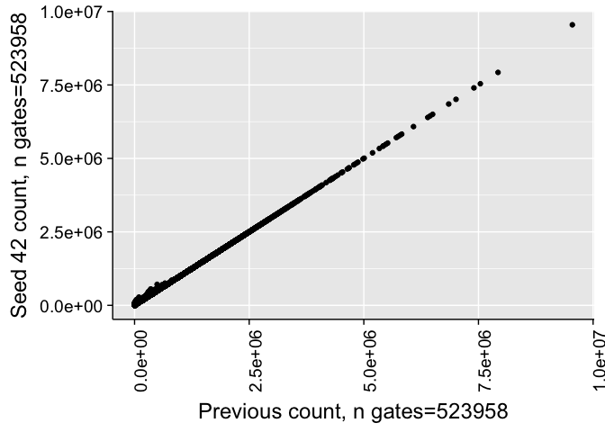
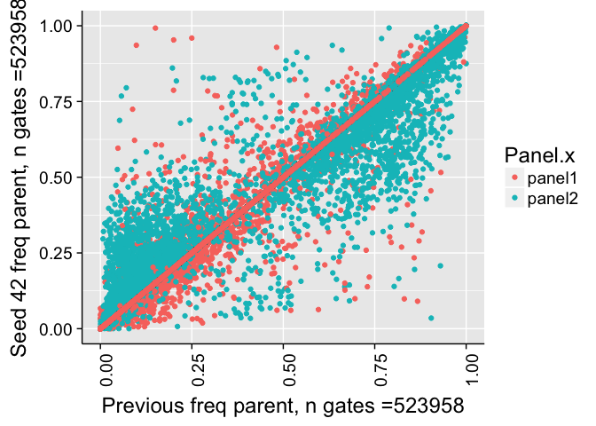
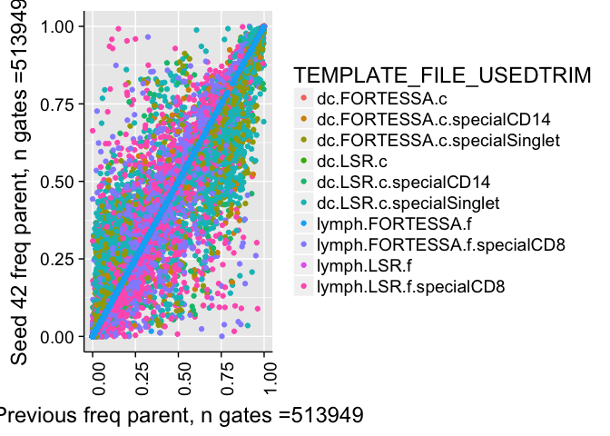
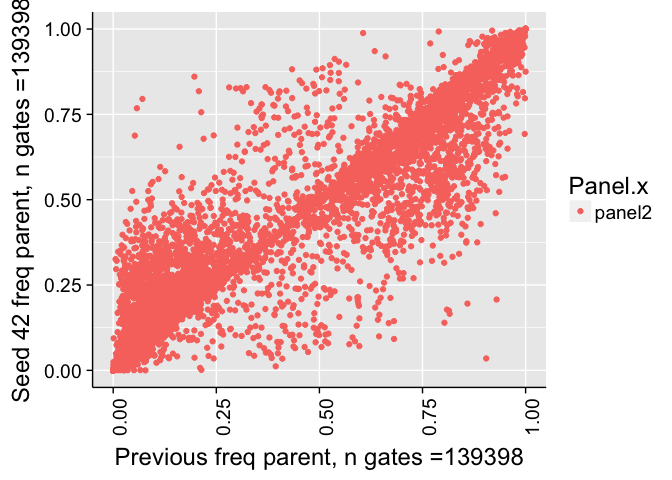
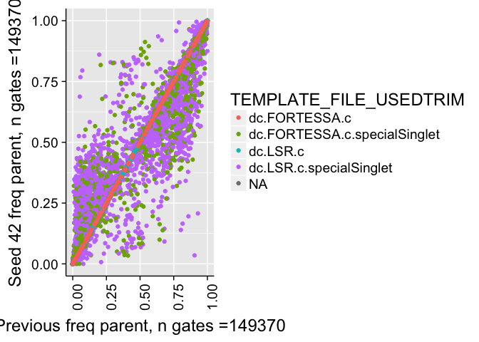
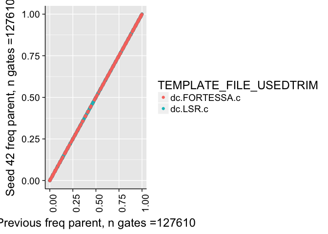
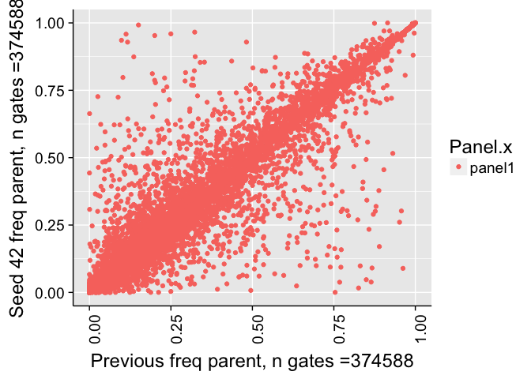
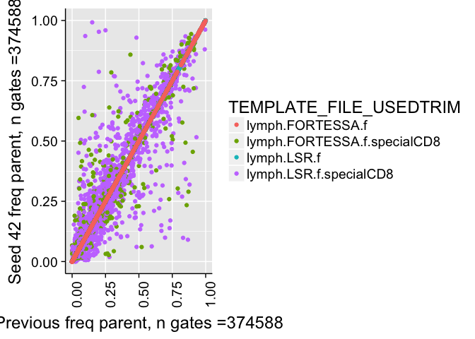
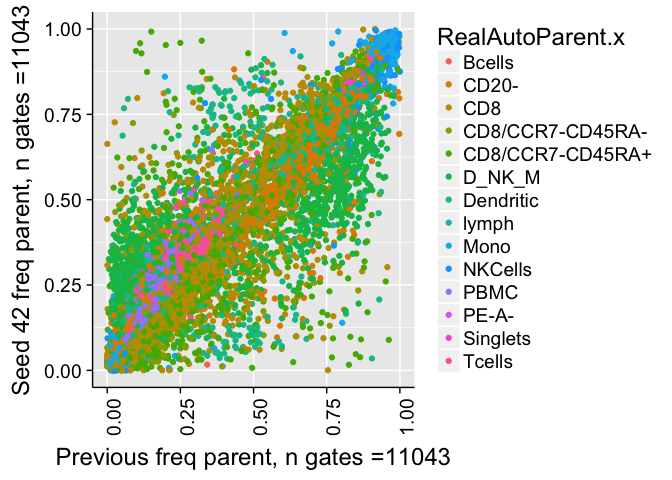

# Validate Seed
JL  
12/18/2017  


# Correlation of all counts

```
## 
## 	Pearson's product-moment correlation
## 
## data:  combo$Count.x and combo$Count.y
## t = 58030, df = 513960, p-value < 2.2e-16
## alternative hypothesis: true correlation is not equal to 0
## 95 percent confidence interval:
##  0.9999233 0.9999241
## sample estimates:
##       cor 
## 0.9999237
```

```
## Warning in cor.test.default(combo$Count.x, combo$Count.y, method =
## "spearman"): Cannot compute exact p-value with ties
```

```
## 
## 	Spearman's rank correlation rho
## 
## data:  combo$Count.x and combo$Count.y
## S = 4.2399e+13, p-value < 2.2e-16
## alternative hypothesis: true rho is not equal to 0
## sample estimates:
##       rho 
## 0.9981262
```

```
## Warning: Removed 9997 rows containing missing values (geom_point).
```

<!-- -->


# Correlation of frequency of parent counts


```
## 
## 	Pearson's product-moment correlation
## 
## data:  combo$freqParent.x and combo$freqParent.y
## t = 10776, df = 493730, p-value < 2.2e-16
## alternative hypothesis: true correlation is not equal to 0
## 95 percent confidence interval:
##  0.9978690 0.9978926
## sample estimates:
##       cor 
## 0.9978808
```

```
## Warning in cor.test.default(combo$freqParent.x, combo$freqParent.y, method
## = "spearman"): Cannot compute exact p-value with ties
```

```
## 
## 	Spearman's rank correlation rho
## 
## data:  combo$freqParent.x and combo$freqParent.y
## S = 4.3358e+13, p-value < 2.2e-16
## alternative hypothesis: true rho is not equal to 0
## sample estimates:
##       rho 
## 0.9978385
```

```
## Warning: Removed 30654 rows containing missing values (geom_point).
```

<!-- -->

```
## Warning: Removed 30654 rows containing missing values (geom_point).
```

<!-- -->


# Correlation of frequency of parent counts (panel2)


```
## 
## 	Pearson's product-moment correlation
## 
## data:  comboP2$freqParent.x and comboP2$freqParent.y
## t = 4562.5, df = 129330, p-value < 2.2e-16
## alternative hypothesis: true correlation is not equal to 0
## 95 percent confidence interval:
##  0.9968740 0.9969413
## sample estimates:
##       cor 
## 0.9969078
```

```
## Warning in cor.test.default(comboP2$freqParent.x, comboP2$freqParent.y, :
## Cannot compute exact p-value with ties
```

```
## 
## 	Spearman's rank correlation rho
## 
## data:  comboP2$freqParent.x and comboP2$freqParent.y
## S = 1.1542e+12, p-value < 2.2e-16
## alternative hypothesis: true rho is not equal to 0
## sample estimates:
##      rho 
## 0.996799
```

```
## Warning: Removed 20034 rows containing missing values (geom_point).
```

<!-- -->

```
## Warning: Removed 20034 rows containing missing values (geom_point).
```

<!-- --><!-- -->


# Correlation of frequency of parent counts (panel1)


```
## 
## 	Pearson's product-moment correlation
## 
## data:  comboP2$freqParent.x and comboP2$freqParent.y
## t = 10006, df = 364390, p-value < 2.2e-16
## alternative hypothesis: true correlation is not equal to 0
## 95 percent confidence interval:
##  0.9981732 0.9981968
## sample estimates:
##      cor 
## 0.998185
```

```
## Warning in cor.test.default(comboP2$freqParent.x, comboP2$freqParent.y, :
## Cannot compute exact p-value with ties
```

```
## 
## 	Spearman's rank correlation rho
## 
## data:  comboP2$freqParent.x and comboP2$freqParent.y
## S = 1.2168e+13, p-value < 2.2e-16
## alternative hypothesis: true rho is not equal to 0
## sample estimates:
##       rho 
## 0.9984911
```

```
## Warning: Removed 10620 rows containing missing values (geom_point).
```

<!-- -->

```
## Warning: Removed 10620 rows containing missing values (geom_point).
```

<!-- --><!-- -->


# Correlation of frequency of parent counts (> 1% difference)


```
## Warning: Removed 34 rows containing missing values (geom_point).
```

<!-- -->


