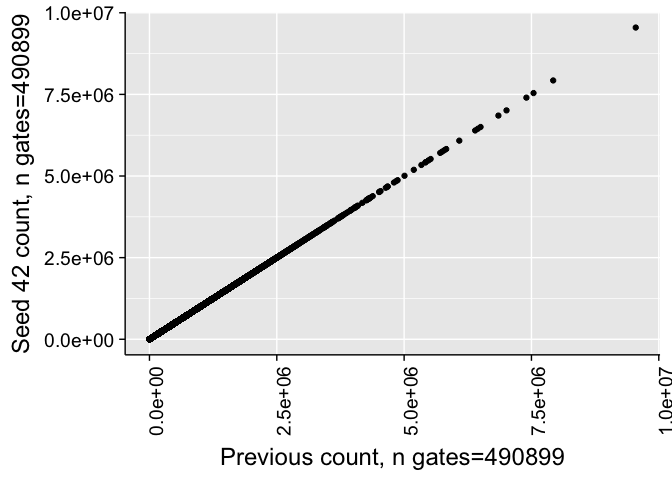
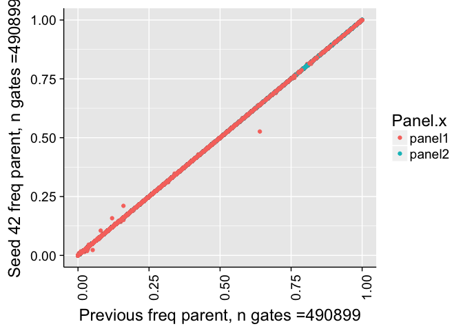
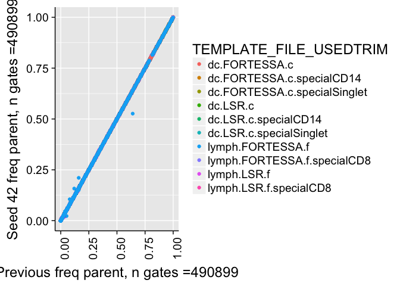
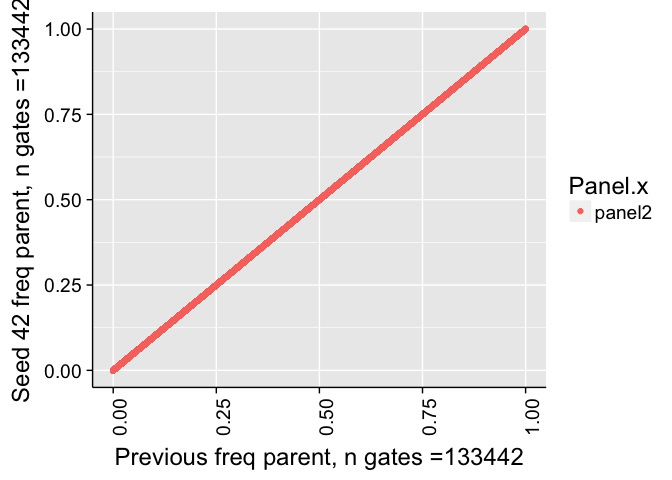
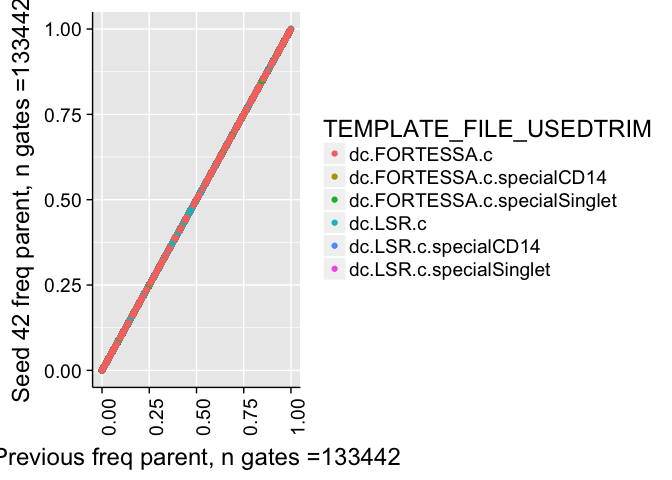
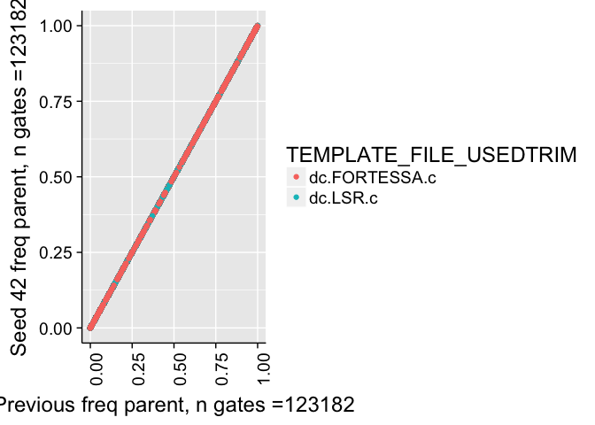
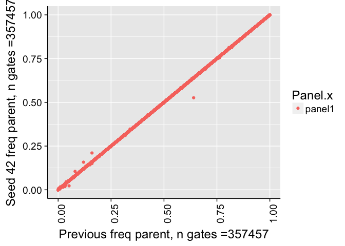
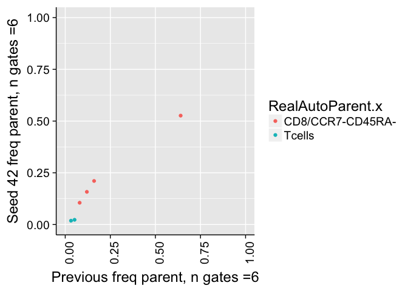

# Validate Seed
JL  
12/18/2017  


# Correlation of all counts

```
## 
## 	Pearson's product-moment correlation
## 
## data:  combo$Count.x and combo$Count.y
## t = 25773000, df = 490900, p-value < 2.2e-16
## alternative hypothesis: true correlation is not equal to 0
## 95 percent confidence interval:
##  1 1
## sample estimates:
## cor 
##   1
```

```
## Warning in cor.test.default(combo$Count.x, combo$Count.y, method =
## "spearman"): Cannot compute exact p-value with ties
```

```
## 
## 	Spearman's rank correlation rho
## 
## data:  combo$Count.x and combo$Count.y
## S = 4930300000, p-value < 2.2e-16
## alternative hypothesis: true rho is not equal to 0
## sample estimates:
##       rho 
## 0.9999997
```

<!-- -->


# Correlation of frequency of parent counts


```
## 
## 	Pearson's product-moment correlation
## 
## data:  combo$freqParent.x and combo$freqParent.y
## t = 1117500, df = 472200, p-value < 2.2e-16
## alternative hypothesis: true correlation is not equal to 0
## 95 percent confidence interval:
##  0.9999998 0.9999998
## sample estimates:
##       cor 
## 0.9999998
```

```
## Warning in cor.test.default(combo$freqParent.x, combo$freqParent.y, method
## = "spearman"): Cannot compute exact p-value with ties
```

```
## 
## 	Spearman's rank correlation rho
## 
## data:  combo$freqParent.x and combo$freqParent.y
## S = 7033600000, p-value < 2.2e-16
## alternative hypothesis: true rho is not equal to 0
## sample estimates:
##       rho 
## 0.9999996
```

```
## Warning: Removed 19093 rows containing missing values (geom_point).
```

<!-- -->

```
## Warning: Removed 19093 rows containing missing values (geom_point).
```

<!-- -->


# Correlation of frequency of parent counts (panel2)


```
## 
## 	Pearson's product-moment correlation
## 
## data:  comboP2$freqParent.x and comboP2$freqParent.y
## t = Inf, df = 124430, p-value < 2.2e-16
## alternative hypothesis: true correlation is not equal to 0
## 95 percent confidence interval:
##  1 1
## sample estimates:
## cor 
##   1
```

```
## Warning in cor.test.default(comboP2$freqParent.x, comboP2$freqParent.y, :
## Cannot compute exact p-value with ties
```

```
## 
## 	Spearman's rank correlation rho
## 
## data:  comboP2$freqParent.x and comboP2$freqParent.y
## S = 0, p-value < 2.2e-16
## alternative hypothesis: true rho is not equal to 0
## sample estimates:
## rho 
##   1
```

```
## Warning: Removed 9012 rows containing missing values (geom_point).
```

<!-- -->

```
## Warning: Removed 9012 rows containing missing values (geom_point).
```

<!-- -->

```
## Warning: Removed 8328 rows containing missing values (geom_point).
```

<!-- -->


# Correlation of frequency of parent counts (panel1)


```
## 
## 	Pearson's product-moment correlation
## 
## data:  comboP2$freqParent.x and comboP2$freqParent.y
## t = 769760, df = 347770, p-value < 2.2e-16
## alternative hypothesis: true correlation is not equal to 0
## 95 percent confidence interval:
##  0.9999997 0.9999997
## sample estimates:
##       cor 
## 0.9999997
```

```
## Warning in cor.test.default(comboP2$freqParent.x, comboP2$freqParent.y, :
## Cannot compute exact p-value with ties
```

```
## 
## 	Spearman's rank correlation rho
## 
## data:  comboP2$freqParent.x and comboP2$freqParent.y
## S = 4837300000, p-value < 2.2e-16
## alternative hypothesis: true rho is not equal to 0
## sample estimates:
##       rho 
## 0.9999993
```

```
## Warning: Removed 10081 rows containing missing values (geom_point).
```

<!-- -->

```
## Warning: Removed 10081 rows containing missing values (geom_point).
```

<!-- -->

```
## Warning: Removed 372 rows containing missing values (geom_point).
```

<!-- -->


# Correlation of frequency of parent counts (> 1% difference)

<!-- -->


