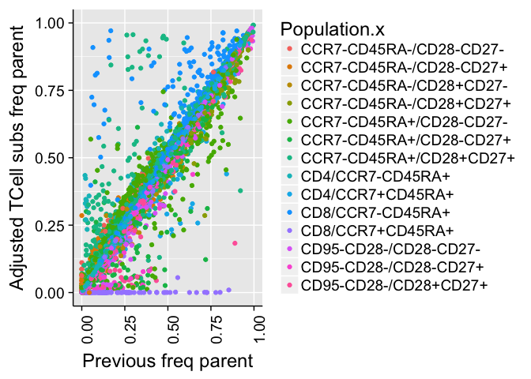
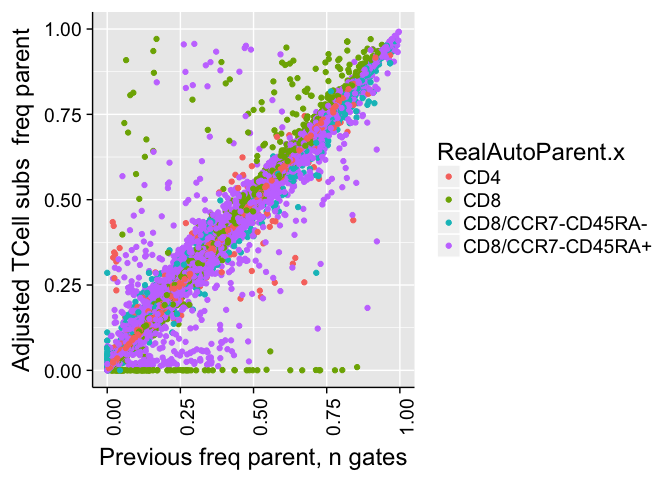

# Validate TCell subset adjustments
JL  
01/15/2017  


<!-- # Correlation of all counts -->
<!-- ```{r  echo=FALSE} -->
<!-- cor.test(combo$Count.x,combo$Count.y) -->
<!-- cor.test(combo$Count.x,combo$Count.y,method = "spearman") -->


<!-- pbc = ggplot(combo, aes( -->
<!--   x = Count.x, -->
<!--   y = Count.y -->
<!--   )) + -->
<!--   geom_point() + -->
<!--   xlab(paste0("Previous count, n gates=",length(combo$Count.y))) + -->
<!--   ylab(paste0("Seed 42 count, n gates=",length(combo$Count.x))) + t2 -->
<!-- pbc -->
<!-- ``` -->


<!-- # Correlation of frequency of parent counts -->

<!-- ```{r  echo=FALSE} -->

<!-- cor.test(combo$freqParent.x,combo$freqParent.y) -->
<!-- cor.test(combo$freqParent.x,combo$freqParent.y,method = "spearman") -->
<!-- pbf = ggplot(combo, aes( -->
<!--   x = freqParent.x, -->
<!--   y = freqParent.y,colour=Panel.x  )) + -->
<!--   geom_point() + -->
<!--   xlab(paste0("Previous freq parent, n gates =",length(combo$freqParent.y))) + -->
<!--   ylab(paste0("Seed 42 freq parent, n gates =",length(combo$freqParent.x))) + t2+xlim(0,1)+ylim(0,1)  -->
<!-- pbf -->

<!-- pbf = ggplot(combo, aes( -->
<!--   x = freqParent.x, -->
<!--   y = freqParent.y,colour=TEMPLATE_FILE_USEDTRIM  )) + -->
<!--   geom_point() + -->
<!--   xlab(paste0("Previous freq parent, n gates =",length(combo$freqParent.y))) + -->
<!--   ylab(paste0("Seed 42 freq parent, n gates =",length(combo$freqParent.x))) + t2+xlim(0,1)+ylim(0,1)  -->
<!-- pbf -->


<!-- ``` -->


<!-- # Correlation of frequency of parent counts (panel2) -->

<!-- ```{r  echo=FALSE} -->
<!-- comboP2=combo[which(combo$Panel.x=="panel2"),] -->
<!-- cor.test(comboP2$freqParent.x,comboP2$freqParent.y) -->
<!-- cor.test(comboP2$freqParent.x,comboP2$freqParent.y,method = "spearman") -->
<!-- pbf = ggplot(comboP2, aes( -->
<!--   x = freqParent.x, -->
<!--   y = freqParent.y,colour=Panel.x  )) + -->
<!--   geom_point() + -->
<!--   xlab(paste0("Previous freq parent, n gates =",length(comboP2$freqParent.y))) + -->
<!--   ylab(paste0("Seed 42 freq parent, n gates =",length(comboP2$freqParent.x))) + t2+xlim(0,1)+ylim(0,1)  -->
<!-- pbf -->

<!-- pbf = ggplot(comboP2, aes( -->
<!--   x = freqParent.x, -->
<!--   y = freqParent.y,colour=TEMPLATE_FILE_USEDTRIM  )) + -->
<!--   geom_point() + -->
<!--   xlab(paste0("Previous freq parent, n gates =",length(comboP2$freqParent.y))) + -->
<!--   ylab(paste0("Seed 42 freq parent, n gates =",length(comboP2$freqParent.x))) + t2+xlim(0,1)+ylim(0,1)  -->
<!-- pbf -->

<!-- comboP2=combo[which(combo$TEMPLATE_FILE_USEDTRIM=="dc.LSR.c"|combo$TEMPLATE_FILE_USEDTRIM=="dc.FORTESSA.c"),] -->

<!-- pbf = ggplot(comboP2, aes( -->
<!--   x = freqParent.x, -->
<!--   y = freqParent.y,colour=TEMPLATE_FILE_USEDTRIM  )) + -->
<!--   geom_point() + -->
<!--   xlab(paste0("Previous freq parent, n gates =",length(comboP2$freqParent.y))) + -->
<!--   ylab(paste0("Seed 42 freq parent, n gates =",length(comboP2$freqParent.x))) + t2+xlim(0,1)+ylim(0,1)  -->
<!-- pbf -->

<!-- ``` -->


<!-- # Correlation of frequency of parent counts (panel1) -->

<!-- ```{r  echo=FALSE} -->
<!-- comboP2=combo[which(combo$Panel.x=="panel1"),] -->
<!-- cor.test(comboP2$freqParent.x,comboP2$freqParent.y) -->
<!-- cor.test(comboP2$freqParent.x,comboP2$freqParent.y,method = "spearman") -->
<!-- pbf = ggplot(comboP2, aes( -->
<!--   x = freqParent.x, -->
<!--   y = freqParent.y,colour=Panel.x  )) + -->
<!--   geom_point() + -->
<!--   xlab(paste0("Previous freq parent, n gates =",length(comboP2$freqParent.y))) + -->
<!--   ylab(paste0("Seed 42 freq parent, n gates =",length(comboP2$freqParent.x))) + t2+xlim(0,1)+ylim(0,1)  -->
<!-- pbf -->

<!-- pbf = ggplot(comboP2, aes( -->
<!--   x = freqParent.x, -->
<!--   y = freqParent.y,colour=TEMPLATE_FILE_USEDTRIM  )) + -->
<!--   geom_point() + -->
<!--   xlab(paste0("Previous freq parent, n gates =",length(comboP2$freqParent.y))) + -->
<!--   ylab(paste0("Seed 42 freq parent, n gates =",length(comboP2$freqParent.x))) + t2+xlim(0,1)+ylim(0,1)  -->
<!-- pbf -->


<!-- comboP2=combo[which(combo$TEMPLATE_FILE_USEDTRIM=="lymph.LSR.f"|combo$TEMPLATE_FILE_USEDTRIM=="lymph.FORTESSA.f"),] -->
<!-- comboP2=comboP2[which(!is.na(comboP2$freqParent.x)&!is.na(comboP2$freqParent.y)),] -->
<!-- probs=comboP2$freqParent.x!=comboP2$freqParent.y -->
<!-- comboP2$DIFF=abs(comboP2$freqParent.x-comboP2$freqParent.y) -->

<!-- comboP2Probs=comboP2[probs,] -->
<!-- write.table( -->
<!--   comboP2Probs, -->
<!--   file = -->
<!--   "/Users/Kitty/git/auto-fcs/explore/openCyto/Completions/toDoubleCheck2.txt", -->
<!--   row.names = FALSE, -->
<!--   quote = FALSE, -->
<!--   sep = "\t" -->
<!--   ) -->

<!-- pbf = ggplot(comboP2, aes( -->
<!--   x = freqParent.x, -->
<!--   y = freqParent.y,colour=TEMPLATE_FILE_USEDTRIM  )) + -->
<!--   geom_point() + -->
<!--   xlab(paste0("Previous freq parent, n gates =",length(comboP2$freqParent.y))) + -->
<!--   ylab(paste0("Seed 42 freq parent, n gates =",length(comboP2$freqParent.x))) + t2+xlim(0,1)+ylim(0,1)  -->
<!-- pbf -->

<!-- ``` -->


# Frequency of parent counts (> 0% difference)

<!-- --><!-- -->


