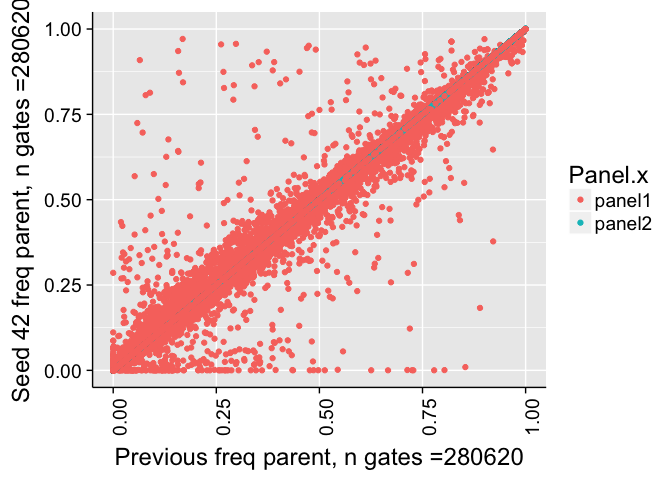
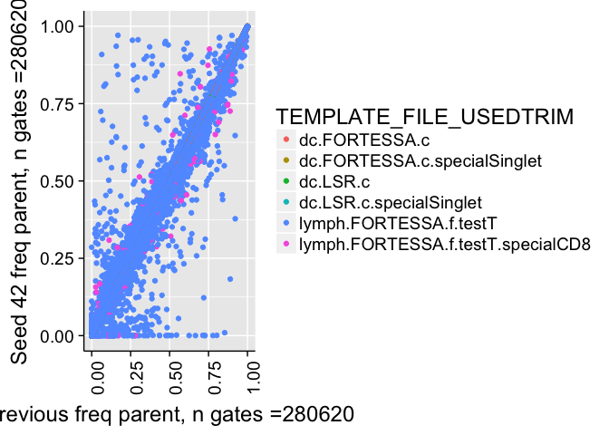
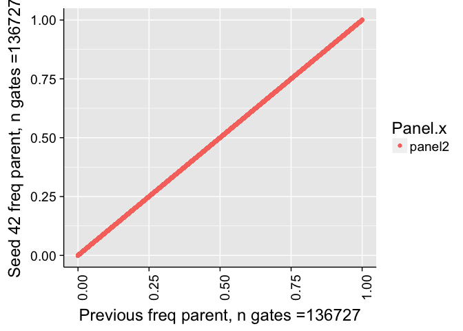
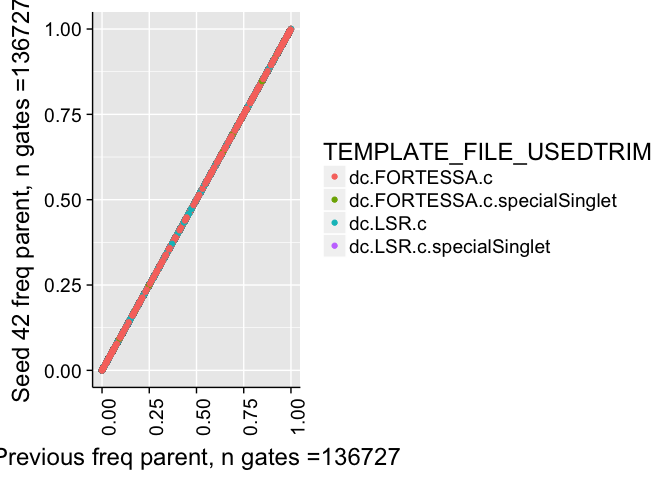
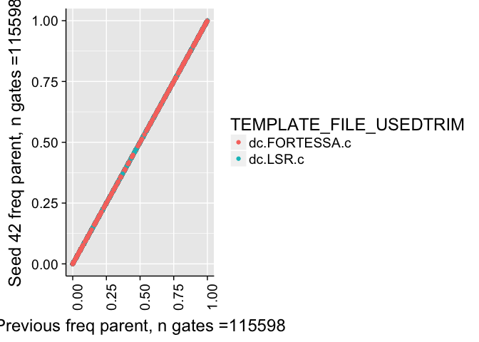
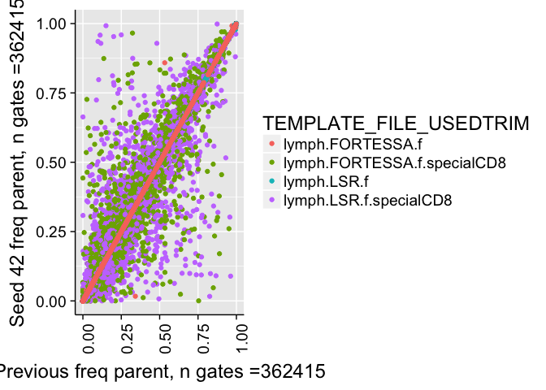
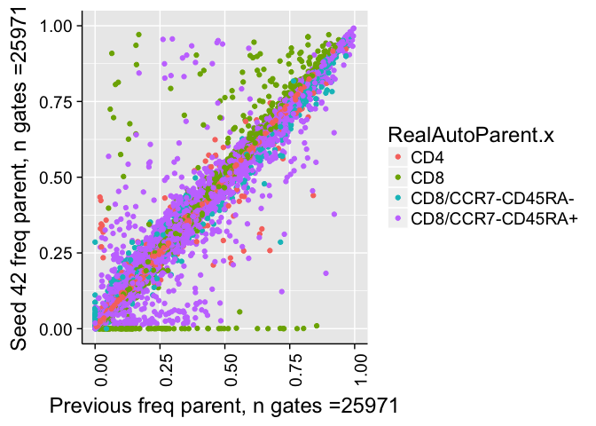

# Validate Seed
JL  
12/18/2017  


# Correlation of all counts

```
## 
## 	Pearson's product-moment correlation
## 
## data:  combo$Count.x and combo$Count.y
## t = 59903, df = 488040, p-value < 2.2e-16
## alternative hypothesis: true correlation is not equal to 0
## 95 percent confidence interval:
##  0.9999316 0.9999324
## sample estimates:
##      cor 
## 0.999932
```

```
## Warning in cor.test.default(combo$Count.x, combo$Count.y, method =
## "spearman"): Cannot compute exact p-value with ties
```

```
## 
## 	Spearman's rank correlation rho
## 
## data:  combo$Count.x and combo$Count.y
## S = 3.6794e+13, p-value < 2.2e-16
## alternative hypothesis: true rho is not equal to 0
## sample estimates:
##       rho 
## 0.9981008
```

<!-- -->


# Correlation of frequency of parent counts


```
## 
## 	Pearson's product-moment correlation
## 
## data:  combo$freqParent.x and combo$freqParent.y
## t = 10262, df = 469130, p-value < 2.2e-16
## alternative hypothesis: true correlation is not equal to 0
## 95 percent confidence interval:
##  0.9977672 0.9977926
## sample estimates:
##       cor 
## 0.9977799
```

```
## Warning in cor.test.default(combo$freqParent.x, combo$freqParent.y, method
## = "spearman"): Cannot compute exact p-value with ties
```

```
## 
## 	Spearman's rank correlation rho
## 
## data:  combo$freqParent.x and combo$freqParent.y
## S = 3.8116e+13, p-value < 2.2e-16
## alternative hypothesis: true rho is not equal to 0
## sample estimates:
##      rho 
## 0.997785
```

```
## Warning: Removed 19315 rows containing missing values (geom_point).
```

<!-- -->

```
## Warning: Removed 19315 rows containing missing values (geom_point).
```

<!-- -->


# Correlation of frequency of parent counts (panel2)


```
## 
## 	Pearson's product-moment correlation
## 
## data:  comboP2$freqParent.x and comboP2$freqParent.y
## t = 4041.4, df = 116530, p-value < 2.2e-16
## alternative hypothesis: true correlation is not equal to 0
## 95 percent confidence interval:
##  0.9964107 0.9964921
## sample estimates:
##       cor 
## 0.9964516
```

```
## Warning in cor.test.default(comboP2$freqParent.x, comboP2$freqParent.y, :
## Cannot compute exact p-value with ties
```

```
## 
## 	Spearman's rank correlation rho
## 
## data:  comboP2$freqParent.x and comboP2$freqParent.y
## S = 9.4833e+11, p-value < 2.2e-16
## alternative hypothesis: true rho is not equal to 0
## sample estimates:
##       rho 
## 0.9964045
```

```
## Warning: Removed 9089 rows containing missing values (geom_point).
```

<!-- -->

```
## Warning: Removed 9089 rows containing missing values (geom_point).
```

<!-- -->

```
## Warning: Removed 8373 rows containing missing values (geom_point).
```

<!-- -->


# Correlation of frequency of parent counts (panel1)


```
## 
## 	Pearson's product-moment correlation
## 
## data:  comboP2$freqParent.x and comboP2$freqParent.y
## t = 9885, df = 352600, p-value < 2.2e-16
## alternative hypothesis: true correlation is not equal to 0
## 95 percent confidence interval:
##  0.9981887 0.9982125
## sample estimates:
##       cor 
## 0.9982006
```

```
## Warning in cor.test.default(comboP2$freqParent.x, comboP2$freqParent.y, :
## Cannot compute exact p-value with ties
```

```
## 
## 	Spearman's rank correlation rho
## 
## data:  comboP2$freqParent.x and comboP2$freqParent.y
## S = 1.0559e+13, p-value < 2.2e-16
## alternative hypothesis: true rho is not equal to 0
## sample estimates:
##       rho 
## 0.9985548
```

```
## Warning: Removed 10226 rows containing missing values (geom_point).
```

<!-- -->

```
## Warning: Removed 10226 rows containing missing values (geom_point).
```

<!-- -->

```
## Warning: Removed 376 rows containing missing values (geom_point).
```

<!-- -->


# Frequency of parent counts (> 0% difference)


```
## Warning: Removed 36 rows containing missing values (geom_point).
```

<!-- -->


